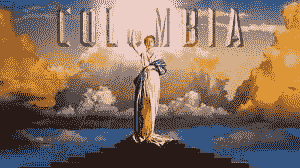

# ++THE APOCALYPSE++(每當中二病發時就會更新XD

作者：199584323

TID：21894

<title>1</title> <link href="../Styles/Style.css" type="text/css" rel="stylesheet">

# 1

*本帖最後由 199584323 於 2016-11-2 00:35 編輯*

前言

咳咳~

首先呢~

這個故事存粹是因為本人原本沉寂已久的中二病突然復發(對中二過敏者請速速離去

加上期中考念寄生蟲學有點崩潰QQ(我才不會說文中的英文單字99.99%都是寄生蟲的學名呢

所以呢....

I have a Parasitology~~~
I have a mediem 2~~~~

boom~~~

~~!!++THE APOCALYPSE++!!~~

你懂得(笑

好了廢話不多說~~
好戲即將上場XD

===============我是分隔線================

<ignore_js_op>

**images.jpg** *(7.52 KB, 下載次數: 0)*

[下載附件](forum.php?mod=attachment&aid=NjUzNTl8ZjE3YjU3Mjh8MTYwMDg4ODU2MnwxODIzMHwyMTg5NA%3D%3D&nothumb=yes)

2016-11-2 00:28 上傳

(旋律請自行腦補)

序

飽滿有力的振翅聲響起。

五彩斑爛的羽毛自半空中翩翩落下。

偌大的鸚鵡盤旋在殘缺的遺跡上。

用牠那悽涼的，和鮮豔羽毛成反比的沙啞聲音，歌唱著，詠誦著。

悲嘆的歌聲響徹斷垣殘壁，在濃黃的夕陽中被吸收殆盡。

鸚鵡的瞳眸好像會發光一般閃爍著光澤。

鮮豔火紅的光澤隨著歌聲的節奏躍動。

寶石般的瞳孔映出由愛而悲喜交錯,因恐懼癲狂而扭曲面容的人們.
輕快明朗的旋律遊走於熱氣瀰漫的趾縫間,拂過欣喜彎曲的嘴角旁,離開如花似玉的少女們身邊.

每當鮮血與淚水落在漆黑的大地,歌聲的紅色光輝便更增一分

輕躍的音符彷彿正在施虐與受虐的輪迴中不斷笑著

在夜冪漸濃的破碎遺跡裡,隨著嘆息和怒吼沒入黑暗之中，娓娓訴說著一個美麗又殘酷的故事。

“從前從前………………”

第一章  破牆而出

從廢棄水泥大樓的間隙看過去的天空，是流著水墨般的夜空。

傾瀉而下的螢光色酸雨滑過殘舊不堪的粗糙厚風衣，落在布滿雜草的龜裂柏油路上，
我將身體隱藏在佈滿塗鴉的磚牆後，豆大的汗珠自額頭滑至下巴,隨著雨滴一起落下,儘管肺臟因為方才劇烈的衝刺而感到上氣不接下氣，我仍勉強地秉住氣息，因為，
在牆的另一邊，巨大且致命的不詳黑影正飢渴地四處尋覓。

    “咭嗝嘰嘰嘰喳喳”

濕潤模糊的迷樣低吼自半腐的喉嚨傳出，
已失去光澤的混濁眼珠空洞地望向遠方，
曾經烏黑的秀髮與白皙的臉上滿是血漬。

她生前一定是位可愛的少女吧…………

看見窗戶玻璃映出的偌大水手服身影，我不禁這樣想到。

     “咕嘰嘰嘰嘰嘰嘰…………”

匍匐在地的少女抬起頭，一面嗅著空氣中殘留的氣味，一面循著生物體發出的
熱量,緩慢地追蹤著獵物，繼續下去的話，被找到只是時間早晚的問題。

     "咚......咚........咚........"

隨著少女巨大的軀體步步逼近,地面的震動幅度也愈發增加

我握緊背包的肩帶，只要能活著回去，背包裡裝的戰利品應該夠讓我好一陣子不愁吃穿；然而
一旦被抓到，腐臭彌漫的濕潤胃袋將會是我生命裡最後的歸宿.

    “啪”

牆壁頂端出現半腐見骨的纖細手指，螢光色的雨滴混合暗紅色的黏稠液體順著牆面流下。

加重手上的力道，我再次驅動下半身那乳酸早已堆積至極限,除了酸與熱外沒有其他感覺的
雙膝,慢慢的蹲下身，咬著牙,蓄勢等待。

     “轟隆轟隆”

刺眼的白光伴隨震耳欲聾的雷鳴劃破淅瀝的雨聲，同時...

     “嗙！！”

我也毫不猶豫地蹬牆加速。

毫無間隔地,身後的磚牆承受不住猛烈撞擊而四分五裂.

瓦礫四散的空間之中,黑洞般的血盆大口以毫釐之差掠過我的身旁,藉著
衝擊的反作用力在空中改變方向,平安落地後,我倆同時轉頭,無聲地望著彼此.

少女伸出滿是血漬的舌頭舔了舔嘴角,將嘴角的碎布塊捲入嘴中.
我伸手摸了摸右側腹,被硬生撕裂的風衣底下,Ascaris lumbricoides型寄生蟲戰甲
粗糙的觸感自手掌傳來.

深深吐出一口氣,在我的意識引導之下,動作電位由脊隨傳至由戰甲深埋體內的突觸,
經過各部模組的訊號放大與演算後,與鑲嵌於戰甲上的奧錫水晶共鳴,產生光和能量.

擺好應戰姿勢,隨著共鳴率的上升,水晶發出的光滲入關節接合處與輔助肌纖維間隙,
發亮的點與線在戰甲外殼之下隱約可見,就像遠古的戰士出征前會在身上塗抹紋身一般.
纏繞於自身之上的圖騰象徵著意志與覺悟,散發著靈魂的光輝.

刺眼的白光再度降臨        

電光石火間,我倆如久未見面的戀人般以最大加速向彼此拉近距離,
仰身閃過迎面攫來的巨爪,我保持在地上滑行的姿勢,一路從手腕下滑至手肘,再將左手
往上掠,利用劃入少女肌膚的五指改變行進方向,成功貼近少女腋窩處.
在少女縮回手臂,將入侵自己領域的螻蟻夾碎前,我彈身而起,抓著她殘破的衣
物,隨她轉身收手之勢,借力使力,讓自己被甩至背後.

        "轟隆轟隆"

比起閃光,雷鳴遲到了將近1秒

        "呼..呼....呼...."

此時此刻,心臟彷彿以振動取代跳動,視野因劇烈的呼吸開始模糊.

一連串不容任何閃失的高速動作早已超越人體極限,是靠著戰甲的突觸以放電方式
直接刺激神經樹突,配合輔助肌纖維的收縮與舒張,強行讓身體發揮超人一般的機動力...

還差一點....
擠出僅存的毅力,用另一手拔出霍克霍獵刃

        "嗚咳..."

鮮血伴隨輕咳自嘴角流出
隨後,微弱的蛋白質燒焦味道飄進鼻腔

        "偏偏在這個時候..."

神經傳導器快要燒壞了,可惡,無論是戰甲或是肉身都已經瀕臨極限了嗎...

        "咕咯吼喔嘰噶嗝喔!!!"

少女大吼著彈起身子,雙手不停地四處揮舞著,想將我從背上抓下來
不停晃動的後背差點將我甩下,在被那雙腐壞的手掌抓到前,我鑽入少女那
因為血和雨而如凝膠般糾結在一起的長髮裡,將右手的霍克霍獵刃對準脊髓
的位置

        "滋滋...滋滋...滋滋滋"

充能的刀身逐漸附上一層淡淡橙光,然後隨著我上半身的擺動,向前沒入毫無
血色的灰白肌膚內
銳利的刀刃劃開筋與肉,插進骨頭的間隙,直至脊神經灰質,混濁黏稠的血液沾
滿我的脖子與胸膛,我的整隻右手已隨著刀刃一同進入,被少女黏膩的肉塊包覆著

        "咯咕嘰嘰啊啊阿阿阿啊!!"

突然,強烈的衝擊與巨大的壓力毫無預警地自背後襲來,然後,視野轉為一片黑暗
在充斥著水泥與玻璃潰散噪音的黑暗空間裡,我清楚地聽見了戰甲與骨骼的開裂聲,
以及自己內臟被用力擠壓的噗哧聲

那傢伙...用背撞上大樓了嗎.....

肺中的空氣被硬生生擠出,強烈的擠壓下,意識開始模糊

不妙啊...再繼續下去的話...會變成肉餅....

        "咯!"

我要...活下去!

咬緊牙根,抱著瀕死求生的意志,我再次將能量注入刀身,蓄積.壓縮.再壓縮.
直到黑暗中飄出淡淡光芒,然後...瞬間釋放

        "嗡嗡嗡嗡嗡嗡..."

爆裂的衝擊令耳朵暫時因耳鳴而聽不見聲音
待煙硝散去後,我重回了光明的懷抱

        "咳咳!"

鮮血像剛開瓶的汽水般從嘴巴與鼻孔裡湧出
睜著半邊眼,艱難地呼吸,我試著轉動脖子和眼珠觀察四周

現在的我就像是癱在由水泥碎塊做成的沙發裡,任憑螢光色的細小雨滴打在身上

而半毀的大樓旁,纖細的巨大身軀匍匐在地,被轟飛的粗糙
斷面裡,歪斜的脊椎與內臟裸露在外......才怪,我拚死放出
的攻擊只在少女背後開出一個水溝蓋大小的洞,多虧爆炸時
的衝擊才讓她癱瘓在地

這也是我一開始瞄準中樞神經攻擊的原因,假如估計得沒錯,她應該至少4~5
個小時都會維持那個樣子動彈不得,儘管傷勢不輕,這段時間應該足夠我逃跑

慢慢地抓住掉落在旁的刀,用它撐起上半身,水泥與戰甲的碎片隨著動作掉落
失去光芒的戰甲上雖然多了好幾道粗大的裂痕,仍舊沒有解體

        "不管怎樣...至少是活下來了..."

仰望雨停後的月色,我像是給自己打氣般喃喃自語

....................................................................

一次又一次

一次又一次

一次又一次

每當她們的身影映在視網膜上
同樣的想法都會浮上心頭
並且占據整個腦海,揮之不去--

我怎麼可能打得過如此巨大的傢伙...
光是要讓自己活下來就很難了...

但是

為了生存,我必須不斷重複這些事...

皇歷257年 7月12日   在"交接處"的第五十七天</ignore_js_op>