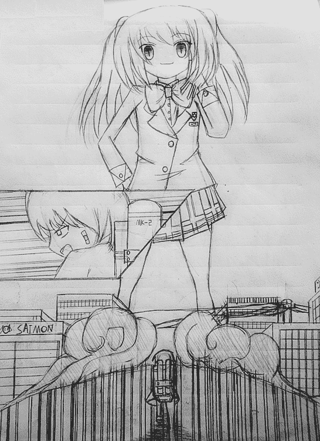

# 「「Turn Star☆！」01 警报！国中生恶魔暴走中！

作者：zsd

TID：17017

 

# 1

*本帖最後由 zsd 於 2014-6-10 20:03 編輯*

本卷名稱：Thrn Star☆！01 警報！國中生惡魔暴走中！

作者：認真的在考慮要不要強制改變文體習慣的zsd

插畫：認真的在考慮要不要干脆放棄漫畫的zsd

如果這個系列可以完成的話，那么我就不需要絕望！

----鹿目·zsd·鳳凰院當麻

吶吶，這個系列不會被完成嗎？那么我們會怎么樣？要永遠的停滯在這個未完成的世界里，沒有開始也無法迎來終末的不算活著也不算死去的就這樣一直一直停止在斷更的那個時間之中嗎？吶？吶！

----本鄉 星里

不要說這么可怕的事情！

----左 空太郎

★

０．

　若是要為「奔跑」這個名詞做下一個簡直是無謀的公然向高等數學與現代國語兩大對于知識型社會不可或缺的權威體系宣戰的引導歸納型定義（？）的話，首先所需要說明的是：這個名詞所代表的是一種魔性且不可思議的機械性非機動性（？）運動。

　譬如說，若使兩種不同科屬的有機生命體，在同時刻不同地點一同進行名為「奔跑」的動作的話，雖然讓人覺得難以置信，但是的確有一定幾率的可能性引發出偏離甚至于完全違反基礎物理與常識性思維的，無法以現代科學的角度進行解釋的超自然物理現象。如果對本條例證存在疑問，請參閱作者身份尚存在爭議的，古代紀實性學術著作《龜兔賽跑》。

　再譬如說，即使是同樣科屬的生命體，根據個體、目的、使用方式的不同，可以做到對觀察樣本以外的物質、非物質、秀吉（？）在非接觸性的情況下產生物理性、非物理性、秀吉性（？）的直接干涉性作用。舉例來說，當一個生命體在某個未知的條件與環境之中長時間的、無間斷的、持續性的機械進行「奔跑」這一動作的話，其動作可在完全沒有任何產生接觸的可行性方式的場合之下，直接作用于距于觀察樣本數百公里以外的，與觀察樣本同屬于同種科屬的目標有機生命體之上，其效力之強甚至可以直接解除目標有機生命體生命活動及身體機能即將停止的危機狀況。不過由于該例證所提到的使用方式重現性過弱，且對于實踐者的生命安全存在著不可忽視的巨大威脅，因此目前為止對于該使用方式在現代醫學方面的實用化尚未被任何一所醫學研究機構提上開發研究日程。如果對本條例證存在疑問，請參閱逝世文豪太宰治所著醫學巨典《奔跑吧！梅洛斯》。

不僅如此，根據為樣本所搭配使用的，樣本之樣本（？）以及實驗場所的差異性，該運動會表現出驚人的可塑性、可引導性及不確定性。且該運動所能被塑造及人為引導出的該運動的亞種，對于觀察樣本本身的心理狀態、生活態度甚至人生走向等不確定因素產生極不穩定的非物理性且無法以醫療手段觀測及治療的巨大影響。例如說，將「奔跑」動作與「吐司面包片×1」、「鬧鐘壞掉了！」、「今天我是值日生！」、「公車也已經開走了！」、「腳本先生你能再沒創意一點兒嗎！？」等樣本之樣本相結合，于定義為「上學必經之路的拐角」的場所進行動作的使用，通過正體不明的化學反應，其動作可自主發生異變而成為寫作L、O、V、E，讀作某種可食用淡水魚學名的，目前已知對于觀察樣本影響性最強烈、穩定性最不可控、且與少數實驗記錄之中記載觀察樣本被名為「柴刀」的殺傷性對人武器貫穿內臟導致生命活動及身體機能停止的高危險程度亞種。如果對本條例證存在疑問，請自費搭乘電車前往東京秋葉原電器街參閱購買科學研究系專業PC軟件「H-GAME」（統稱代號）。特別注明：乘坐返程電車的時候請注意勿將所購科學研究系專業PC軟件包裝盒放置在可能會被其他乘客觀測到的地方。

（*「戀」在日語的發音為「KOI」，與「鯉」同音。）

不得不提的是，由于該項運動所具有的高危險性、不可觀測性以及不確定性，世界范圍之內部分場所以及將此項運動列入嚴打禁止范圍之內，其中最為堅決的場所莫過于學校走廊。以PTA為首的上層組織禁止對本條例證存在任何疑問。但是盡管如此，仍有少數規格之外的存在并不適用于本條例證，最為代表性的莫過于代號為「AKB48」的國民女子偶像團體。此非科學非理性非常識的不可思議的規格之外，恐怕將會晉級排入本世紀科學未解之謎前二十位之列。或許，這僅能依靠下個世紀，科研水平得以進一步突破的新生代科學研究人員們來著手解決這個可怕而又未知的，美麗的QED了。

誠如以上。

宛如天空化作繪板，曾有人持紅色蠟筆細致涂抹于上。

暗紅色的火燒云，自天的前方燒到天的后方。殘喘延咳的落日尚且鑲嵌于天幕，沾染上占據天空者所侵蝕抹染的無盡鮮紅，化與之同色的垂死余暉將同胞的大地也一同染上了魔性的顏色。

吱嘎嘎嘎嘎嘎嘎嘎！

承受不住于外表處包裹的混凝土的重量，銹跡斑駁的扭曲鋼筋自彎轉之處迸發出了刺痛耳膜的悲鳴。

有如將壁紙刀的刀刃立起上下滑動刮弄玻璃似的恐怖而刺耳的無添加劑純天然嘈雜噪音，即使是一直忍功一流且以此為豪的空太郎也忍受不住的皺著眉頭用力的塞緊了自己的耳洞。

時值一九二三年，在兩年前才度過了「對于自己未來的人生歷程來說大概會是一個重要的里程碑，雖然不太清楚真的是這樣嗎但是還是姑且這樣認同，總之就是大概吧……」的二十歲成人禮，現任澤良警視廳菜鳥下層刑警的年齡請根據上文自行計算的青年刑警左 空太郎，現在正在震后的東京竭盡全力的奔跑。

當然這個段落只是開玩笑的。

相比于在一篇文章還處于序章的，用料理來比喻的話就是把剛剛攪拌完畢化作粘稠金色液體的雞蛋倒入尚未將撒入了些許面粉的食用油完全燒熱的中華炒鍋之中，一切步驟都還沒有正式展開的階段就開誠布公的告訴讀者「以上段落乃是騙·你·的·喔☆」。待到雞蛋被煎至八成熟，內部鼓脹膨起變作金燦燦漂亮荷包狀的可以在前面加上「超」作為冠詞的Nicely階段再全壘擊出「令人震驚的事實」似乎更加可以盡到「使讀者HP盡失的超會心一擊」的最大效用。

此乃令人尊敬的甲子園選手，例如西〇維新、入間〇間、時〇澤惠一等優秀的揮棒手們擅用的打法，在此姑且將其命名為「戲言星空斬」好咯。

但是盡管如此。

仿若這是個連當事者本人都無法以720P的流暢度暢快笑出的玩笑的話，「戲言星空斬」恐怕，會將什么重要的東西斬作碎屑吧。盡管的盡管，在空太郎的眼瞳之中，目前他正以現在進行時奔馳于上的澤良市因幡山商店街，相比之只有國中日本史課本上看過的東京大地震災后照片，的確難以找到什么分別。

更正，時值二零一四年，在兩年前才度過了以下省略，現任以下省略的以下省略左 空太郎，背負著沉重的肩帶式陸兵用反坦克火箭炮，現在正在被殘陽染上不祥紅色的，已然已經化作一片廢墟的澤良市因幡山商店街之上竭盡全力的奔跑。

新生代的潮流路標，澤良市因幡山商店街。

《周刊角川》二零一一年六月號，讀者票選活動「人氣！最受歡迎新生代步行天堂It's there！」最終計票第二位；《Newtype Ace》二零一二年八月號卷首特集「購物者的香格里拉」特別推薦NO.4；《Popteen》二零一三年十月號社長推薦「歐尼醬去哪兒？--二十歲的你絕對不能沒去過的地方！」推薦指數五顆星。

自幼稚園到高中一直在家鄉禮幌度過，二十一歲東大社會科畢業之后前往東京警視廳就職卻在短短不足半年的時間內被調職至距東京千里之外的澤良警視廳并被直接劃入剛好空缺一人的交通課的，除了國中與高中的修學旅行去過的京都與京都2nd以外與「旅行」二字幾乎不具備絲毫因緣的空太郎，自車站下車出站伊始就被距離車站數里之遙的因幡山商店街毫不遜色于東京澀谷的龐大人流量如虹氣勢鎮在原地數十分鐘以至于自己拖著行李箱愣在車站出口一動不動的相片以「澤良車站旅者塑像」的名字迅速的流傳在了2CH的討論串之中。

空太郎費了好大力氣才找到的廉價公寓，以此為契機，房東阿姨為他原本就已經足夠低了的房租特意降價了5%。不過這已經是后日談了。

總而言之。

那樣一個原本應當滿溢著生機與活力、笑顏與希望的新世紀的香格里拉，無論如何也無法與空太郎腳下這片如  一般遍布著絕望與死亡的氣息的殘骸廢土在可以理解的層面之上找出什么共同之處來。

咚隆隆隆隆隆隆！

沉重的鈍響在凝滯的空氣之中長久回蕩著，無言而沉穩的承載著一切的大地之母也在這巨大的壓迫面前恐懼地顫抖了起來，強烈的搖晃迫使空太郎停下了腳步，向腳底注入全身力量壓低重心穩住了險些重心不穩的身體。托背上沉重的火箭炮的福，自己才沒有難看的跌倒在地。

這一次的震動相比于59秒之前的上次以及59×2秒之前的上上次，明顯地變得更加難以應付了。

繼續拉近與她之間的相對距離的話，情況恐怕會變得更加不妙。

不斷地自肺內向外擠壓出沉重喘息的空太郎維持著雙手脫力地垂放在胯骨的前方的，讓人禁不住聯想到《伏爾加河上的纖夫》的奇特姿勢，過于沉重的擔負壓迫者他那以177公分的男子標準的體格來說顯得過于纖細，但是相比于一般的女高中生來說又寬闊了些許的，完美謀殺細節描寫苦手的介于纖細與標準之間的背脊，簡直可以聽到生銹鋼件咬合一般嘎吱嘎吱的不祥聲音了。

只是抬起脖頸這般簡單的動作，就感到腦漿幾乎整個沸騰起來了一樣。

方才的地動山搖所掀起的漫天沙塵尚未散開，有如幼年的瓦特先生好奇的揭起壺蓋的水爐一般的，遮天蔽日的沙塵仿若濃霧一樣，將所能夠映現入空太郎瞳孔之中的，這條街道的每一個邊角盡數掩蓋。

除了她之外。

她只是普通的站在那里而已，動作如同動畫人設圖一般的普通自然，衣飾也是每天都會在四個固定而規律的時間段之內徹底掩藏在同色的人群之中的，普通到簡直是在東京塔的塔頂以大聲公高聲標榜「普通」二字的簡單西裝式樣普通學生制服。及肩的長發扎作了短短的雙馬尾，發帶沒有像少女漫畫一樣扎成大大的蝴蝶結而是意外普通的隱藏在了柔軟的發絲之中。有著與國中生年齡相符合的，略帶幼齒不乏可愛的稚嫩面孔，大大的眼眸閃爍著瑪瑙一般漂亮的紅色，仿若里面隱藏著鮮紅的星星一般。

少女無聲的佇立于原處，帶著從容的微笑低頭俯視著地面。六頭身似的身體比例并稱不上高挑，但是自短短地百褶裙下裸露而出的白皙雙腿呈現出一種介于「可愛」與「美麗」之間，取得了一種絕佳的平衡，概括來說就是「依然很普通」的纖細與修長。漆黑的長筒襪輕薄的布料如同蒙布朗表層涂抹于上的淺淺的一層奶油似的，柔和的包裹在她那有著優雅的曲線的小腿之上，優秀的烘托出了這個年紀的女孩子肌膚特有的晶瑩與細致。

盡管有著可以輕易奪走純情的男子高中生的眼球并會成為他們的妄想之中將他們踩在腳下用力扭動纖細的腳踝的女主角程度的可愛，但是加注于其身的，大概會出現在文庫本彩圖第二頁的人物屬性標簽依然是「普通的可愛國中女生」。

走在澀谷的街道上就會馬上消失不見程度的普通。

在同班同學午休時間的閑談中偶爾被提起時所被提起的方式是：「喔，她喔？那個總是和身材超嬌小胸部超大面孔超可愛的〇〇香大人走在一起的那個

好像是扎著雙馬尾還是莫西干的女孩子吧。」程度的普通。

倘若輕小說動畫化了，也只會在動畫第一話OP前的二分四十五秒處抱著厚厚的教科書，以沒辦法完整看到臉的分鏡用往后三年恐怕都難成氣候的CV的聲音對坐在倒數第二排靠窗動畫男主角固定位置的除了亞薩西以外一無所長的男主傳話說「左同學，本鄉同學約你到樓頂見面。」在此之后于男主角與女主角雙手相握反抗世界的剩余二十三話之中終于連半個鏡頭都沒有再出現過，公式書也會為她定義「同班同學A子」這樣簡潔有力的名字程度的普通。

即使只是在國中畢業的半年之后翻看畢業留言冊，翻到注明有她的名字的那頁留言都要花費二十分鐘來思考「欸……那個時候曾經有這個女孩子喔？」的，普通到了無可附加，簡直已經將其升華到了藝術的境界了的嬌小可愛的國中女生，現在正大刺刺地佇立在空太郎的面前，以自身作為發射源，電視信號一般向著周遭源源不斷地散布著強力的存在感與威壓感。

這個文段所試圖指出的問題并不是類似于「由于杰克·奧特曼的形象設計過于欠缺個性，因此當他與他那群個性十足的兄弟并列一排的時候反而不自然的叫人覺得被刻意凸顯了出來。」這種感覺的富有哲理與教育意義（？）的人間小品，而是更加單純的，單純的無可救藥簡直叫人覺得愚蠢的，更加顯而易見的原因。

在那個普通的可愛女孩擁有著輕輕松松就突破了兩百米的可怕身高的，非常識非理性非道德的情況之下。無論阻擋在少女面前的名為「普通」的巨石是多么令人絕望的巨大，都只會被少女簡單易懂的以比它還要巨大上百倍的可愛足趾，簡單地像玩弄沙粒一般地碾壓滾動，蹂碎化作無法分辨原狀的點點細砂了吧。

轟隆隆隆隆隆隆！

空太郎腳下的地面再一次開始猛烈的搖動了起來，這一次的恐怖振幅讓空太郎徹底停止了無謂的抵抗宣告投降，任由自己背負著沉重包袱的身體像水族館里看過的海龜一般難看的向后仰翻了過去。

映現在他的瞳孔之中的，少女如神明一般巨大而神圣不可侵犯的美麗身軀，變得又膨脹了一倍以上似的。

可愛的女孩子無論做什么都是可愛的，包括用自己嬌小的鞋子在堅硬的柏油路面上踩踏出有著三十米可怕長度的巨大足印也一樣。

這一次與上一次的間隔是58秒，出現了1秒的誤差。看來這幼稚園小朋友一樣無聊的自我滿足游戲差不多也要玩厭了呢。

南先生的指示是到達差不多會被她的腳步震倒在地的超接近距離進行待命，這樣一來任務就已經完成了1/3了。依然像是等待著被浦島太郎拯救的海龜一般仰倒在海邊……不，地上的空太郎，像是春假的最后一天終于把高高摞起的作業全部掃空的笨蛋高中生一樣，之前簡直已經僵直了的表情肌終于得以稍稍松展了些許。

然后。

純粹無雜質的偶然，空太郎的眼角稍稍的瞥到了廢街的某個不起眼的方位。

他的表情在那霎時間再一次的僵直了。

<ignore_js_op>

**P1020921_副本.jpg** *(193.75 KB, 下載次數: 0)*

[下載附件](forum.php?mod=attachment&aid=NDM1Mjl8ZjRiYWUyZmN8MTYwMDg5MDA0NnwxODIzMHwxNzAxNw%3D%3D&nothumb=yes)

2014-6-10 16:54 上傳

「Giant Girl」出現的時間，是傍晚的十八時十五分，當她那簡直是在逼迫筆者犯下最基礎的修辭手法錯誤的，纖細美麗的龐然巨軀毫無前兆的出現在了因幡山商店街的街尾，并且仿佛是為了舒展一下身體，將一旁僅僅比少女的腳踝高出一點，距離她的漂亮膝蓋都還有一段遙遠的距離的，高達四十五米的原澤良購物大廈，像踩碎一塊豆腐似的簡單地碾碎在福特鞋之下的那一個瞬間，自二戰結束以來已經數十年未曾在迎來了和平的日本本土真正意義上響起過的防空警報，更正，現「GR警報」，在今年已經叫人記不清第幾十次的響徹位于北海道島中部的新興都市澤良全境。

圓圓的大眼睛之中所能映現而出的視野范圍之內，若是看到高高的建筑物的話就輕松地把它一腳踩碎，若是看到小小的人類或者車子的話就小心翼翼地讓他們變得平平的黏在自己的鞋尖上。用指尖捏起行道樹，讓害怕的想要逃離巨大的的自己的可憐的渺小人類像沙丁魚的罐頭一樣狼狽地擁堵在一起，只要輕輕地一腳踩下，就會有好多好多灰塵一樣的細小人類伴隨著噗嗤噗嗤地悅耳聲音變成點綴鞋底的可愛紅色。輕輕巧巧地坐到地面上，讓自己挺拔美麗的臀部轟隆隆隆的將好幾座火柴盒一樣大小的低矮公寓連同躲在里面不敢出來的可憐人類一起碾碎，盤起裸露在短裙下的光滑又修長的雙腿，將大概能把兩座歌劇院塞得滿滿的數量的人類禁錮在令人絕望的高聳著的雪白城墻之下。指尖稍稍沾些唾液就能粘起好多好多，不過在舔舐雪白手指品嘗味道之前大概就已經被甜美的唾液淹死了吧。細細的手掌在人類的眼中大概會有著學校的操場那種程度的寬闊吧，簡簡單單的就能承載著沒辦法計數的小小人類毫不費力的抬起到百米以上的高空之中，看著他們在自己小小的手心之中恐懼的四散奔逃，氣喘吁吁地逃到了手掌的邊緣才發現他們自身現在正處于對于他們來說多么可怕的高度，理解了自己在女孩子的手中是多么的微小而不值一提之后露出的絕望而愚蠢的表情，簡直可笑的的讓人直不起腰來呢。將手上捧著的細小人類盡數抹碎在自己漂亮的隆起的胸部之上，有什么地方感覺酥酥麻麻的，自豪的偉岸胸部似乎也挺起來了不少。命令站在自己腳下仰視著自己潔白雙腿的渺小人類們用舌頭舔干凈自己可愛的鞋子，雖然說自己也清楚的知道在自己的眼中僅僅只有0.1CM高度的他們無論如何也絕對沒有能力可以舔舐得到鞋底以上的任何部分。差不多厭倦了這個玩法了，「嘿咻。」站起來拍掉粘在自己短裙上的碾扁的公共汽車之類的小小碎屑，然后慢慢的掀起短裙，噗嗤噗嗤，將可喜可賀的幸存下來的所有人都一齊變作內褲上的小小紅點。那么接下來玩點什么好呢？像拈起一張輕薄的作業紙一樣用一只小手將一座四十米的寫字樓整個握住并且毫不費力的拿到眼前，里面的人們害怕得不得了，真是讓人心情愉快，把這座雄偉的大樓放到比它要雄偉好多的大腿內側摩擦摩擦，并攏纖細的雙腿讓大樓與里面的人們一起被女孩子柔軟光滑的大腿碾成細細的粉末。不知道他們看到點綴著星星點點紅色的女孩子的內褲會不會感到興奮，相比之下自己似乎就算被那些小蟲子一樣的人類全部看光也不會感到哪怕一丁點兒的害羞呢，會有著的只是對于縱使集結這些渺小的人類全部的力量也沒有辦法使自己最小的足趾產生一絲一毫的偏移，而與之相反，自己只需要輕巧的抬起足趾，放下，就可以把他們全部變成黏在自己雪白肌膚上的零碎肉片的，絲毫不存在哪怕一丁點兒的平衡的過度懸殊的實力差所帶給自己的無上的暢快以及將那些灰塵一般渺小而無力的卑賤人類輕而易舉的噗嗤噗嗤壓碎碾平在自己高貴柔軟的美麗肌膚之上的凌弱的快感……

……諸如此類的，被稱為旅行用充電器水準的萬能適配程度，在這個世界所拋棄了的，其名為「澤良」的狹小舞臺所登場的「Giant Girl」們所共有的殘忍習性，似乎被這個扎著短短地雙馬尾的巨大少女將優先度排到了偏后方的樣子。

要形容的話，就好像是「每一步都要走在綠色的地磚上，踩到紅色地磚上的是笨蛋」這種，幼稚園的小孩子放學途中熱衷于的游戲一樣。說起來現在的魂淡小鬼們似乎都已經開始玩上掌機了，但是這個并不是要放在現在討論的重點。

以僅僅相差1秒鐘到達一分鐘的，微妙的59秒鐘作為間隔，精準的踏著時間向前邁出機械的步伐來。

持續進行著這種毫無社會效益與個人收益可言的無意義無價值機械運動，并且全無停歇極有耐心的將這個光是在一旁看著就叫人感到一種莫名地焦躁的枯燥游戲一個人玩了將近半個多小時。

把這份耐性用到學習上去啊！

不過相比于令人心情煩躁這種無關緊要的事情，拜這巨大少女電波的行為所賜，經過了不可計數的實戰洗禮的「Giant Girl緊急遭遇應對方案」以簡直不可思議的高速度順風順水的進行著。「GR警報」才剛剛響徹天空，最容易變成受害對象的一般市民就已經在各區域負責者的帶領之下安全的躲入了各個地下避難所之中。而包括空太郎在內的，在巨大少女的足底之下守護澤良的銀白利刃「GR事件特別搜查小組」也在最快的速度之內挑選了在某個少女的協力之下已經演習了無數次了的完備的作戰計劃，一切事項都是那般嚴陣以待而又有條不紊的順利向前推動著。

應該是那般嚴陣以待而又有條不紊的順利向前推動著的才對。

但是……

為什么市區里還有一般市民存在啊！？

【序幕零1st目前完成3/4待補全】

 

# 2

> [暗影使者 發表於 2014-6-10 16:41](https://giantessnight.com/gnforum2012/forum.php?mod=redirect&goto=findpost&pid=224262&ptid=17017)

> 沙发···

> 

> 到底发生了什么？很久上不聊论坛的某中二少年怎么能上论坛了？

咱似乎必须声明一下呢的说。

这可不是排版有问题，只是因为收不住笔导致每一段都写得很长而已的说。

序章结束之后因为会出现对话，相比之下应该会使眼睛舒服一点的说。

以上是被西尾维新入间人间等诸多轻小说界业界奇葩完全附体的凤凰院当麻为了「让死者回归死亡」（By.《Another》）对某死者特别做出的番外解说，但是因为句尾出现了【解说】所以强行加上【的说】口癖的话句子会变得很奇怪于是只有另加一句的说，还有凤凰院当麻才不是中二病呢，咱乃是狂气的Imagine breaker以及邪王真眼的适格者，狂气的凤凰院当麻的说，不要把咱与中二病这种奇怪的属性相提并论的说。

以上的说☆。</ignore_js_op>