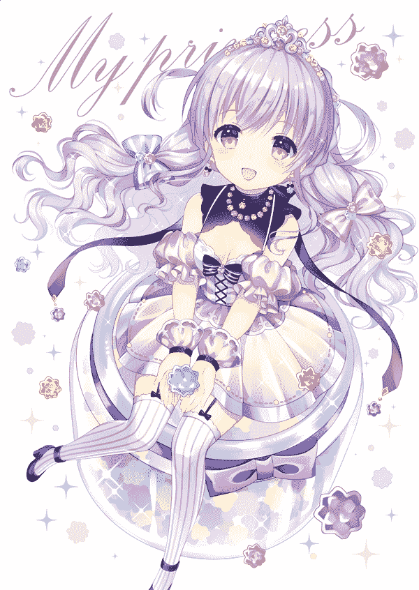
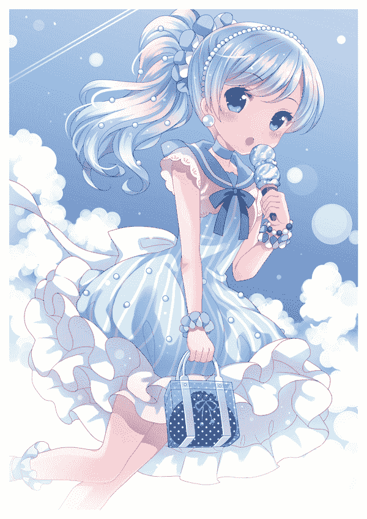
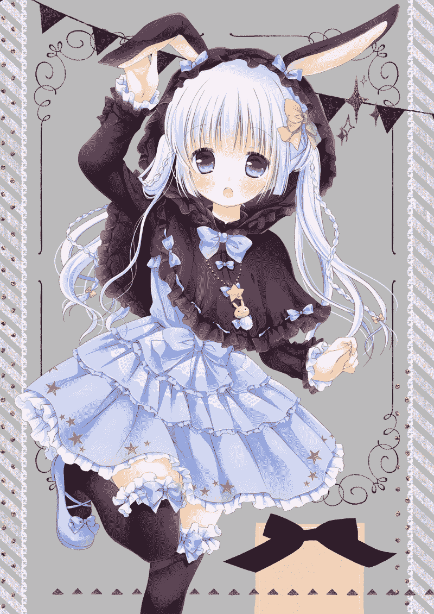
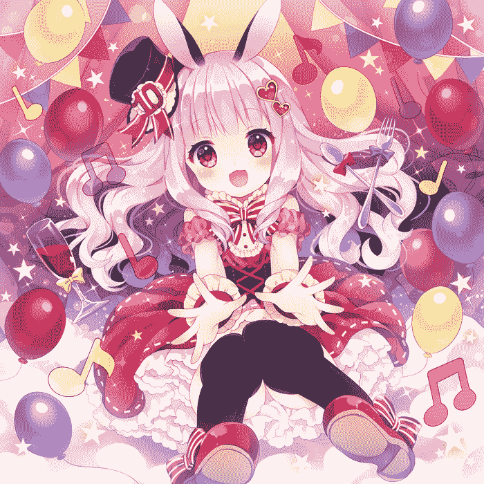
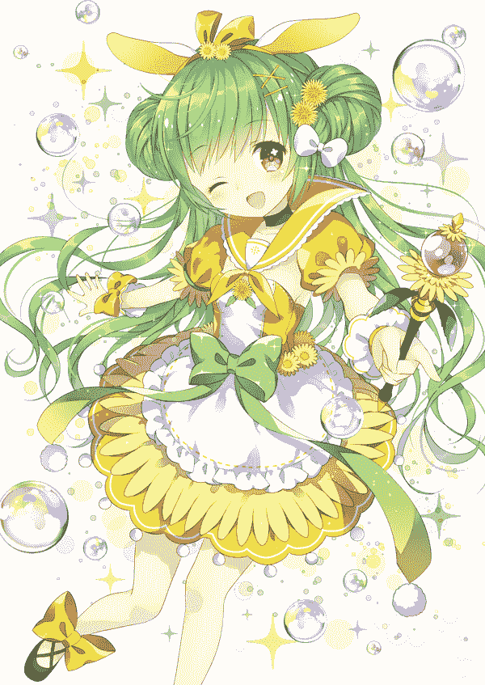
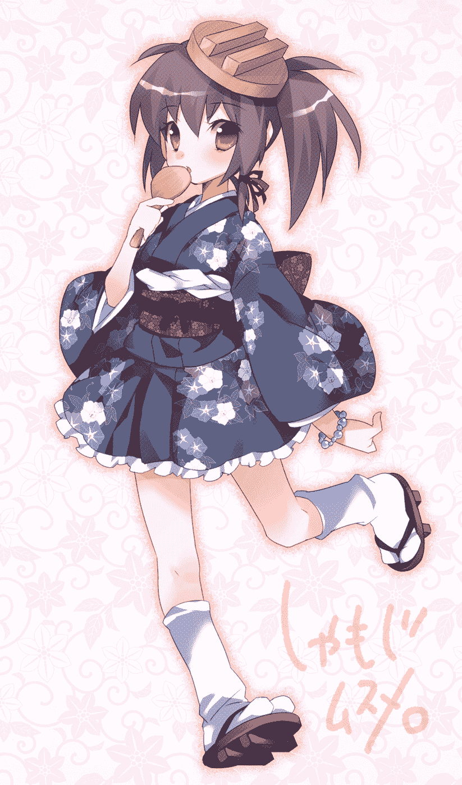
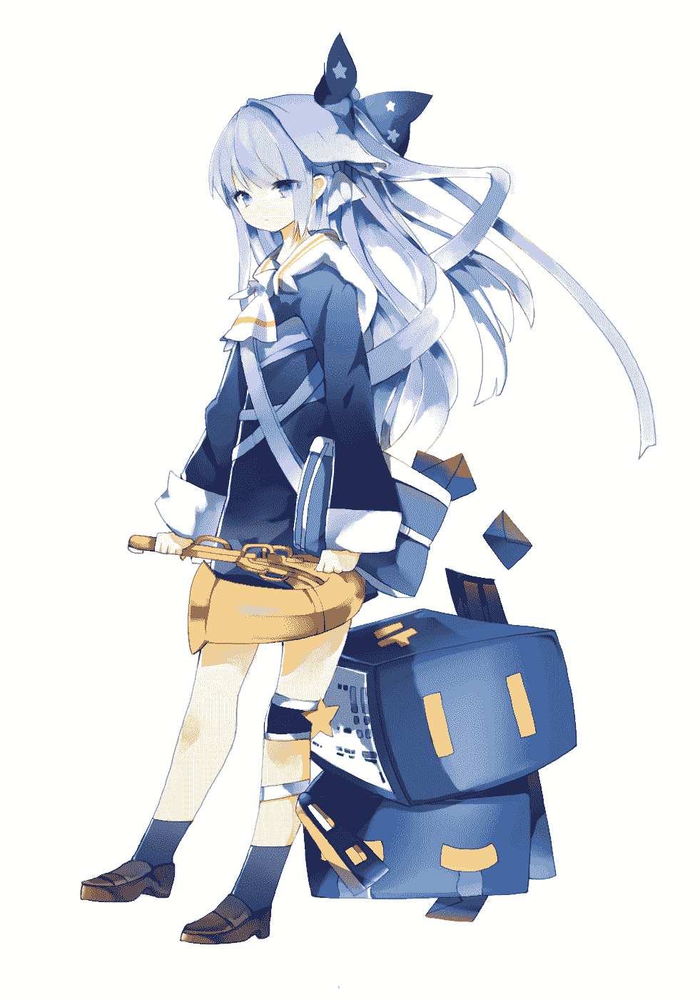

# 【2017.1.13 更新】太平盛世 第二章【2.1 多人设图】

作者：琉璃

TID：19418

 

# 1

*本帖最後由 yuxiaoqiu 於 2017-1-13 04:03 編輯*

重新捡回来了，在第一章会有微量的小修改，第二章这次结尾部分有8章人设印象图注：人设印象图仅限于参考。（网络收集而来）

**太平盛世****序---话剧**“为什么突然想看话剧了？莉莉丝大人”“心血来潮啊”一只娇小的幼女横卧在大大的沙发上，身上洁白的衣裙却略显凌乱，而且幼女稍稍偏过头，用胳臂支撑着脑袋的场景怎么看都显得异常的怪。“然而这个年仅6岁的幼女确实现代史上唯一一位打败创世神并将其封印在体内的新世纪的神明!”“你在这里乱嘀咕什么。琉璃，现在还不是解说的时候吧。”莉莉丝略显无趣道。“琉璃只是夸赞一下莉莉丝大人嘛，莉莉丝大人今天晚上“驳回。”“琉璃，没说完呢。”“我不喜欢无聊，所以赶紧布置好，哎~当初就不应该封印住爱丽丝酱，导致现在那么无趣，”叹了口气莉莉丝又大声吼道，”璐夕，胡桃，艾莉西亚你们弄好了没，在不弄好把你们七姊妹统统丢进火坑了。”半威胁着，莉莉丝开始摆弄起手中的爱丽丝玩偶，”爱丽丝酱，活得还好么？倒不如说，那里味道怎么样。”“安琪拉多，你别太过分，呀！”“嘛，堂堂创世神，要取悦我才能活下去，也是一种荣耀不是么，再说爱丽丝大人，我又是那么的爱你。”“你……”没等爱丽丝在说什么，莉莉丝便擅自切断了通信。如猫一样，自由狡猾，不受约束，胆大妄为，莉莉丝·安琪拉多身上体现出的七罪足以使任何正义对其进行讨伐，然而没有任何人敢去那么做，也是呢，连这个世界的创始者都陨落了，成为了她身体内微乎其微的寄生虫，成为她的用来消遣的玩具。又有谁敢对其发起讨伐呢，现在这个世界，陷入了有史以来最黑暗的时期，七罪莉莉丝时期……“虽然反派被黑，在莉莉丝王国系列，我并不算反派吧，旁白，不在好好介绍的话，你就陪爱丽丝到我的下体去变成清理虫好了。”在莉莉丝城堡当值可不好做啊。失礼了，同样这个时期，异世的某处……莉莉丝大人的野心降临于此。“算了，舞台搭好了么，介绍，解说就有你”“等等......等等…….”“哦！太平，还以为你不来了呢。”“嘛，看演自己的话剧，需要些心理准备”被称为太平的少女，无视周围一般坐到了莉莉丝的身边，成功的把莉莉丝挤到了一边，“没有别的地方做了嘛！！”小小的莉莉丝不满了，踹开了太平”有没有点下仆的意识啦。”“阿拉，这样被培养我的不就是莉莉丝酱么。”又挤了上去“你．．．．．”莉莉丝大人也有吃瘪的时候呢“介绍，果真想去么，”莉莉丝大人再次踹开了太平并施以天罚后，换了个姿势，露出可爱的小熊胖次，”还是说，胖次的缝隙里更适合你。我推荐这里哟”摸了摸小熊的鼻子呀！不必了，莉莉丝大人。我还要解说。任务很重的。“比起话剧，我更期待你在这里的动作，来呗，正对嘘嘘的头等座，气味很新鲜的啊。”一副小恶魔却十分性感的样子。”几年好呢，十年，二十年？”我倒觉得一条胖次穿不了那么长时间。“修改下时间不就好了。”微笑中的莉莉丝好可怕不是这个问题啦，演出开始啦，开始啦“嘛～先饶了你好了”多谢莉莉丝大人，多谢莉莉丝大人。

 

# 2

*本帖最後由 yuxiaoqiu 於 2017-1-13 02:45 編輯*

**------------------开幕-------------------**爱丽丝雅，可能是这个世界上唯一一位从上古世纪活到现在的神明，也是我们一切的创世神。作为在第四个太阳纪灭亡后，从新划分世界的神明，爱丽丝以及其跟随者-莉莉丝安琪在各个新生的平面内所处的地位不言而喻，爱丽丝也在第四太阳纪灭绝中吸取了前车之鉴，划分各个平行世界，使得天神，冥灵，人间永远相隔。当然即使神明也做不到绝对，穿越的事情也有存在，但其微乎其微，所有人并不在意。不过就是这个微乎其微的事情差些导致第五太阳纪的提前结束。“嘛，搞得那么大，最后当然爱丽丝酱察觉了，我的爱丽丝可是相当聪明的，就算是我，杀她也要费些功夫呢”莉莉丝满不在意的说到“倒不如说太平能做到这个地步已经是蛮不错的了。而且托你的福，王国我也不是到手了，爱丽丝酱也成为我身体一部分。这个结果我还是能接受的”“其实莉莉丝大人心里已经乐开花了吧！”“啰嗦！”莉莉丝像被读心一般害羞的撇过头去。”解说呢？？接着讲”是是，就在这之后100年后，人界的某个小公国里，一位公主诞生了，然而命运多变，原本就岌岌可危的公国在各个大国的欺压下，起义、抗争、战乱四起，为了祈求天神平定战乱，这位公主就被取名为太平。“按现在来想，当时父母真是过于愚昧了。”“这是历史发展的趋势啊，曾经历过大战的我，清楚的记得，这些人类是多么的愚昧无知，真不知道爱丽丝为什么要庇护这些人类。”莉莉丝久违的阴沉着脸，喃喃自语到，”所以我才……”“莉莉丝大人，都过去了，现在可是莉莉丝大人掌权呢，话说话剧还在进行呢”“嗯。继续吧。”听到胡桃的安慰后，莉莉丝又换上了那一副如同高岭之花，冷傲的表情人类……并不是那么不堪。然而莉莉丝并没有听到这句发自内心的喃喃自语。**----------------第二幕----------**然而祈求并没有得到相应，在太平5岁时，国家彻底崩溃了，小小的太平，在目睹父母被杀后，沦为了俘虏。这小小的公国成为了送给新的公主，幽野社的游玩圣地，其中的一切都成为了她的私有财产，当然也包括无依无靠的太平。好在仅仅比她大3岁的的小社并没有为难她。并命令佣人用对待自己的态度来对待太平，然而小社在不久便被迫登基，今后的日子里便不常常在这里，每当小社离开后，那些佣人便肆意使唤她，打骂她，四处欺侮。即便小社回来，处决了那些人，但往往人心就是那么可怕，落难公主的标签永远的打在太平的身上不能消磨。日子慢慢过去，到了太平上学的年龄了，小社把她送到了靠近城都最近的寄宿制学院，并叮嘱校长好好待她，但是，欺侮依旧源源不绝，被泼脏水，鞋子内被放图钉，课桌椅子上乱涂乱画，依然是太平的日常，倒不如说就差没有人公开的给太平一棍子了。学院领导一开始到是不耐烦的象征阻止，在看到太平和社公主的交流并不频繁后，也开始睁一只眼闭一只眼，只是提醒不要太明显让公主察觉就好。“太平好可怜，社酱怎么搞的嘛！”就连身为懒惰代名词的艾莉西亚也不禁对太平的身世不满，眼泪汪汪的望着太平。“那个时候社姐姐确实要安抚国内嘛，这也不怪她啦，再说作为落难公主我的待遇已经足够好了”太平笑着打哈哈到“不过马上就是莉莉丝大人出场了。这时候的莉莉丝大人好酷呢，如同snake一般违背创世神制定的天规通过时空之门到达人间，琉璃好佩服莉莉丝大人的。”“那只不过是偶然，偶然辣。”被夸的不好意思的莉莉丝大人摸着脑袋笑呵呵着“其实是不满太平的遭遇顺便培养她成为自己的手下啦。莉莉丝大人还是很温柔的神明的。”幽野社突然冒出声来“呀！@@”莉莉丝被吓晕了过去“莉莉丝酱莉莉丝酱，现在不能睡觉哟！”“唔……呀”醒了”不是你吓的啊！混蛋！缩小你哟！”咬牙切齿了“嘛嘛~~乖乖~~”“别摸我头啦！你们为什么都这样！我可是你们主人啊！让你们脱离厄运的主人啊！”炸毛了。…………那个话剧。啰嗦！再嘟嘟囔囔的就变成我脚上的细菌抱歉…………“咳咳，话说小社不看话剧？”“自己家崩溃的话剧有什么可看的”“呃……抱歉？”“没关系啦，当初我帮太平隐瞒的时候就做好心理准备了你们慢慢欣赏。”“嗯，旁白！旁白！接着讲”…………“旁白！！”……在！“很好，看样子你真的非常想做为我的细菌活下去对么，对吧，我说的对吧！”再次重复发怒的莉莉丝大人好可怕。呀！非常抱歉！请务必再给我一次机会！“莉莉丝大人消消气先看话剧啦，旁白你倒是好好干啊！”琉璃酱~！谢谢你~！T^T**--------------第三幕--------**说到哪了，没错，我们的英明神武的莉莉丝大人，在如同间谍一般绕开神界的监视，成功的穿越到了人间，在太平的必经之路上化身成一位老婆婆。时间正值放学太平一身湿漉漉惨兮兮的往宿舍走去的时候，可爱无比……(盯……)不对化身为老婆婆的莉莉丝向太平搭话了“汝怎么上个学还惨兮兮的。”没等我说完，太平倒是先抢着说了，”这句话至今我还记得呢。”说着太平和可爱的莉莉丝大人笑着对望了一下。在太平解释自己的身世后，莉莉丝大人又开口了“汝想如此一直下去？”“我…….”太平不知道答案，不知道如何回答“哎……汝好好想想，吾给你一些时间考虑，明天，你还在这里等我。”“嗯……”太平点了点头“其实说实话后来想想我学的老婆婆根本不像啊！”莉莉丝自嘲了一下。“是啊，最后都变成奇奇怪怪的了。”太平也不忌讳，嘲笑起来。”不过或许就是这个让我感到安心吧。眼前这个老婆婆虽然怪，但是确是一定好人。”“为什么这么确定呢？”琉璃歪着头问？是啊为什么呢？“撒谎都暴露的人，难道不是好人么？”“好有道理呢！nya哈哈”琉璃忍不住笑了。噗！“撒谎暴露了真是抱歉啊！”莉莉丝大人脸微微红了第二天太平也是一身湿漉漉惨兮兮的样子，但眼中已没有那只无助的神情，莉莉丝倒是没在用老婆婆的样子，直接向太平搭讪了。“其实那个时候真的吓了一跳呢，那么小的孩子，还以为迷路了呢。”“哈？迷路？我在那里呆了好久，好多搭讪的好吧，好吧！嘛不过都被我变成虫子放到鞋子里了。”“那个你在这里见过一个老婆婆么？”太平笑着如同给小女孩棒棒糖似的向莉莉丝问道“不用找了，我就是。”莉莉丝倒是一脸大气成熟的样子，回答道“吾就是汝找的老婆子。”还学了一下，真怪“我叫莉莉丝，是来帮你的，太平！”“我的名字……”“跟我来好了。”未等惊讶地太平回过神。莉莉丝便拉着太平走向一间教室“那个撒，就是那个伪公主啊，今天我悄悄把她的书丢进垃圾桶了，也算是为国家做贡献了呢。”“就这个？？我还泼过她一脸水呢。”空旷的教室，三个女孩子，在里面喧嚣着夸赞自己所做的事情。太平稍稍捏紧了拳头。“谁？？”一个长发女孩警觉了起来。“哟！不是原公主殿下么。怎么来讨饭吃啊，嗯，跪下舔我们的鞋子的话我们倒是可以给你把垃圾桶的食物给你哟。”“唔……”太平捂着门，在门口不说话。“我觉得那些东西给你们这些臭虫吃不错哟。”莉莉丝倒是没客气，踱步冲了出来。“哟！找到下仆了？了不起啊原公主殿下，不过这样就来刷风头也为免…….”话没说完，女孩便意识到情况不对，自己的视角渐渐下移，猛地四处望去，自己的伙伴却已经不在了。“怎么回事？”“你是在找你朋友么？他们就在你脚下呀。”莉莉丝歪着头笑着。“呀！怪…..怪物！”女孩后退着，跌倒在地上，然而缩小的趋势并没有减弱，女孩依旧快速的缩小着。而莉莉丝则是先捡起了另外一个女孩。随后把太平叫了进来。“这是……怎么回事。”显然不只是这三人，太平也被这个景象惊呆了。“没什么啦就是把欺负你的家伙缩小了，诺前面还有两个，你去把它捡起来吧。”“诶诶！捡捡起来？？”“对！捡起来，注意力度啊。你也不想连玩还没玩就把他们弄死了吧。”“你你，别过来，我可是公爵的女儿，你们不能这样对我”反派常有的一副嘴脸啦。不过太平也没有在过于在意，稍稍颤抖着就把他捡了起来。“那个莉莉丝酱，这个要……”捡是捡起来了，但太平并不太知道如何是好。“唔……精神不错，不过看样子还要培养一下，姆姆”莉莉丝鼓起了脸思考着，”为什么我要做这些事情啊，无论是浮年还是太平都要我亲自培育么，哎。”桃李满天下不好么，不过你教的并不是什么好事情吧。“这样好啦。今天就弄到三个小人嘛，来我这里坐下。”莉莉丝随便做到了一个位置上，然后拍了拍身旁，示意让太平也坐下。“把鞋子脱掉好啦，话说你那湿漉漉的鞋子要穿到什么时候去啊。“”那个……已经没有其他的鞋子了。“太平小声地反驳道。”诺，把你捡到的那个和这只放到鞋子里好啦，让他们帮你清理。“”诶诶，可是他们是人诶！“太平惊讶的直摇头。”如果换一下地位的话，我觉得他们会很轻易的把你放进鞋子哟。“莉莉丝也没反驳，只是淡淡的这么说了一句。”如果对敌人太仁慈就是对自己的惩罚哟，再者说，他们被缩小以后就不再是人类了，明明你很清楚这一点不是么？“”可是……. “太平显然还想反驳什么，但是却语塞了，没错，自己被欺辱，绝大部分还是自己太懦弱了，自己也过于弱小了，虽然有小社的支撑，他们并不能对自己做的太过分，但是自己也不能一直被社姐姐所保护啊。”我还以为你不会转过这个弯呢。“莉莉丝笑着说，”一开始看见你惨兮兮的样子时候，其实我并没有什么触动哟，只不过你那内心中不甘的神情与我很像，所以才来看看。“”幸好没让我失望。“莉莉丝看着下定决心的太平，点了点头。”如果我让你失望了你会怎么办呢？“心情不再纠结的太平打哈哈似的对莉莉丝问道。”并不做什么，只是把你和这些人一起作为我的食量一切吞入腹中罢了。“说着还拿起手中的挣扎的小人比划起来，”从我的嘴巴，滑倒胃里，然后消化掉。啊掉了！算了”一不小心小人从莉莉丝手中滑落下去，转眼消失在莉莉丝的口中。“那看样子我下定决心还真是对的呢。”太平惊叹了一口气，把两只小虫随意丢进鞋中。“别……求你。”没等她们求饶，太平和没事儿人似的把鞋子穿上了，湿漉漉的帆布鞋瞬间把小人们的声音掩盖住了。“那么要和我一起来么？”“嗯，当然。”“好！再次自我介绍一下，我叫莉莉丝，将是世界上唯一的神明。我会让创世神莉莉丝·缪卡·爱丽丝拜倒在我的脚下。”莉莉丝狂妄着说。“虽然不太明白祝你成功呢，莉莉丝，我太平，会毕生追随你的。”**-----------中断------番外**停！到这就一段落好啦。“可是莉莉丝大人这还没有到话剧的1/5呢。”琉璃不解的说“以这种话剧形式，不知道讲完要什么时候，再说我腻了，现在不想听了”莉莉丝大人气冲冲的掐着腰。太平和小社则是一副果然如此的无奈着摇头。真是任性的莉莉丝大人呢。盯-----”安琪，茶“正当莉莉丝大人要发威时候，从厨房缓缓走出来一只小小的萝莉，草绿色瞳色又是草绿色的长发使得她异常的可爱，而俏皮的样子的样子加上定制的女仆装让她更加绚丽。”姆，这个蝴蝶结好碍事“女孩说的是自己女仆装的蝴蝶结，大概是莉莉丝特别定制的吧，正值夏天，短袖的透气白裙，加上与头发一色的裙兜，用一个大大的绿色蝴蝶结相连，只让我想给莉莉丝大人32个赞啊！”浮年…..那个，我现在不用茶啊！”不知道为何莉莉丝的声音有些颤抖。“请用茶嘛。不能生气哟，对身体不好。”被叫浮年的萝莉笑着感觉异常的优雅而又压力山大。“啊……好的。”莉莉丝颤颤巍巍却高傲的将茶杯接了过来，然后默默地望着浮年将其他人的茶杯依次送了过来。“真亏你敢做她主人啊！能力相差那么大“无言的尴尬气氛被太平打哈哈似的打破。“那当然了，我是什么人啊！”“不过身体的本能还在啊。”小社也笑嘻嘻地打趣莉莉丝。“啰嗦！““内……内…….怎么了么？？不就是浮年酱么?一个女仆有什么问题么?”琉璃一脸的好奇。“有古怪！”艾莉西亚也满是好奇的样子。“没什么，只是感慨莉莉丝真大胆呢。七罪之首都能随意使唤。“太平摇了摇头。“哦！浮年就是贪婪女神啊，额……贪婪女神？？七罪之首”琉璃当场石化了“莉莉丝大人不怕浮年大人下克上么？毕竟像我们七罪虽然有彼此克制，但是贪婪是七罪之源，就算是爱丽丝也那她没办法啊”“浮年下克上，神展开!”嘛也有像艾莉西亚这种懒得做表情的存在啦。“而且浮年似乎意识到我这里权利有多重了”莉莉丝苦笑道。“不过正因为太危险了，所以必须绑在身边，否则不知道她会搞出什么事情来”“那浮年，哦不浮年大人，你知道这些么。“琉璃怯兮兮的问。“知道啊，叫我浮年就好，不过莉莉丝大人现在对我很好，我倒没有什么心情下克上啦”浮年一脸轻松的说到“所以莉莉丝，我，和太平，以及那个被莉莉丝当作虫子养在下体里的创世神，都一直同意现在的办法，不过做女仆还是莉莉丝的恶趣味罢了”小社对莉莉丝的任性也是见怪不怪了。“当然咯！那么好的机会，如果我能凌驾于七罪之上，那么还有什么能阻挡我呢！啊哈哈！话说，琉璃，爱丽西娅你们不是怠惰和色欲么？怎么连你们老大是谁都不知道““呀~~因为爱丽丝封印我们之前，我们是几乎不见面的，而爱丽丝似乎没有充足能力封印贪婪，爱丽丝是这样说的。““唔。那就没办法了。“今日的莉莉丝大人依旧狂妄啊!也不怕玩儿脱了!到时候倒霉可不要哭鼻子啊。怒！“不过这些小事情先放到一边。我们来谈谈正事。旁白，来吧，是时候让你体验下之前说的特等席位了！“呀莉莉丝大人，这个真的不用了。“你刚刚似乎也写了一些我不太明白的地方呢”怒笑错觉错觉，莉莉丝大人饶了小人吧！“多说无益！”就这样，我便被莉莉丝大人预定了特等席位。姆姆，每次都觉得这个法杖有些沉，莉莉丝大人举起大大的法杖开始施法，当然为了防止我逃跑。琉璃，小社和太平将我团团围住。别啊!莉莉丝大人，求你！可惜求饶并没什么什么卵用，我的视野也随着莉莉丝大人的施法，从可以俯视这只腹黑幼女，缓缓到平视。且还在下降。”姆姆！施法什么的，为什么要举着那么大的法杖了。“莉莉丝大人跺了跺脚。下意识的我望了望莉莉丝大人的软底帆布鞋，淡淡透露出的粉红色鞋子配合灰色的袜子把莉莉丝大人那小巧的脚丫体现的分外可爱，然而我知道，我终究会仰望这双小小的脚丫吧，而且这个时刻马上就会来临。心里莫名一种焦躁，又有一种期待，我大概是不折不扣的足控吧。我暗自想到。果不其然，身高依旧在迅速减缓，仅仅一分钟，我便感觉貌似回归婴儿时代了，此时的我和莉莉丝的裙子其高，大概是莉莉丝大人的1/3大小也就是33cm吧。抬头看看莉莉丝大人，她已经施法完毕，笑嘻嘻的望着正在向她脚踝看齐的我。“阿拉拉！是不是觉得变得太小了呢。”莉莉丝大人笑着，晃动了一自己的脚丫。“唔比对一下吧!“随即便用脚把我推到，轻轻的压在了我的身上。“全身都被莉莉丝大人的脚丫所覆盖住了呢，nya哈哈”琉璃也一脸兴奋的笑容嘲笑着我，而最清楚莉莉丝性格的太平和小社没说什么，她们也知道，莉莉丝玩弄起来人可算是身体与精神上的双重折磨，要是这太平（小社）腹黑少女再加入的话，估计作为旁白的我就会崩溃掉吧，嘛。请无视那个双方都认为对方是腹黑的情况，这不是一次两次了。“还在变小呢，已经没有什么比对的需要了呢。旁白欧尼酱w你现在可是比莉莉丝我的脚丫下呢，而且体型连1/4还没到呢，明明莉莉丝只是只6岁幼女哟！难道欧尼酱连幼女的脚丫都比不过，欧尼酱好弱呢w”卖萌可耻啊!你只是面貌6岁罢了，你比在场任何人都要老上几百倍啊！卖萌说那么黑的话更可耻啊！”唔！差不多先这些，“莉莉丝把脚抬了起来。”站起来吧，大概到0.1cm了吧w“莉莉丝依旧笑着“再小从地上就很难拿起来了！”此时，莉莉丝大人的脸已经望不到了，抬头仰望的只有那个之前可爱的鞋子了。“原来周围还有一层白色的装饰啊。”原本并不在意的鞋子装饰，现在显得格外的显眼，当然，莉莉丝大人的鞋子前段也是微微翘起的，所以现在的我估计已经爬不上去了，而袜子什么的早已看不到了。“姆，记一下莉莉丝给你的福利哟!四双可爱的鞋子，怎么样呢w玩个小游戏吧，趁我还可以勉强听到你的声音，讲一下另外三个比你还要伟大10倍的鞋子的主人是谁好啦！都讲对了，你就不用去莉莉丝的胖次中咯“常用倍数来击溃对方，也是莉莉丝大人常用的手段就是了，唔可是眼前的场景。实在让我毛骨悚然。在莉莉丝大人宣布游戏开始后，莉莉丝大人那巨大的脚丫就猛然抬起，那高度对我来说估计是飞机飞行的高度吧，随即又迅速的下降，发出地震般的响声后交换，另一只脚丫抬起。没当我缓过神，又一双巨大的凉鞋落在地上震起了大概半米（在我看来）的灰尘。凉鞋倒没什么，但是大概一米的鞋底阻碍了我观察上面的脚趾，唔。是小社么？？如果我没记错的话今天只有小社穿了凉鞋。“哇！怎么猜的呀，还是说你一直在观察我的脚“鞋子的主人惊讶着，然而如同歌姬般甜美的嗓音和话的内容证明我猜对了。“下面是这位啦！”随后而来的是个高帮的鞋子，如同运动鞋的结构呢。浅灰色的鞋身配合着淡粉的鞋带，彰显了这个鞋子的主人是个活泼可爱的家伙，显然除了太平没有别的人了。“正解呢，倒不如这次很简单嘛，嗯下一个。就没那么容易了。“随后而来的是个绿色学生皮鞋，然而答案只剩下一个是琉璃了，但是琉璃穿的是皮鞋么，地狱七姊妹平时是飘忽不定，谁知道在哪里，”不会是浮年酱吧！我记得她是穿皮鞋的但“，以莉莉丝的性格一定，估计会让琉璃穿浮年的鞋子吧，不不，琉璃穿不下啦。那就是莉莉丝大人咯。反正最后一个不可能那么简单是浮年酱啦。莉莉丝大人吧，呃！我的鞋子你不是看了么？莉莉丝笑着“多想了吧w我就知道！这位是浮年啦。浮年用脚丫和他打声招呼好啦，省着他忘记！”“要把小虫虫放进鞋子里么？安琪大人？“是浮年经典的可爱语气。和把任何小家伙当成虫子的迷糊性格（人家故意的）”浮年有可能会踩死它哟！““呃，不用那样，只是简单用脚摸摸他好啦！”莉莉丝大汗”请千万别踩死他，他还要到我的胖次里为我清理污垢呢。“莉莉丝有些着急，连目的都说了出来。“遵命！安琪主人，小虫虫这是浮年鞋子的气味哟，要好好的记住。”浮年确实是摸了摸我，用脚丫狠狠的摸了摸我，我感觉我的脖子差点就扭曲了。“欸嘿嘿，你猜错了所以你还是要到莉莉丝的胖次里哟！“在把浮年打发走后，莉莉丝大人把我小心翼翼的捏了起来。”我为你使了新的法术呢。”说着莉莉丝掀开自己的百褶裙，拽开胖次的一侧，念叨了些不知所以的话。“别……我不想”……就没有让我说完过，莉莉丝松开手，把我丢进了胖次里，然后松开了拽着胖次的手，随即我感觉黑暗与女孩子的气味向我袭来，幸亏莉莉丝大人的胖次还算透气，据说是用冰蝉丝做的，透光性很好，所以在昏暗的环境中，我又绝望的发现，自己又开始变小，周围再次渐渐变大，而且显然某处有些异味的地方稍稍有些不一样的吸引力那是……我真的惊呆的，在我到达那处时候，我发现了那是莉莉丝大人下体的正前方，而不断地缩小使得那里引力越来越大。这就是所谓特等席么。“大概他已经到啦吧！我为他安排的特等席，小熊胖次的熊鼻子那里。”就如莉莉丝大人所说，那确实是特等席，缩小到8微米的我发现了，在那个位置胖次的线不仅格外密集，竟然还编织成了一个大概2微米的小小的座椅。”坐上吧w““不会吧，莉莉丝大人你是多想……”“那个位置原来是给爱丽丝的，不过既然有更好的位置给她，这里就给你好了，放心啦，你会被变成0.1微米大小，至于有什么，一会你就知道了！“当然不容我拒绝，吸力牢牢地把握摁在了座位上。不过之后，视野瞬间亮了起来。而莉莉丝大人的下体离我也是越来越远。“吼吼！看瀑布的特等席哟w“莉莉丝笑着说，震耳欲聋的让我并没有听清。然而我随即就明白了。没错，莉莉丝她在上厕所，巨大的金黄色水柱从下体喷出，在我脑袋上方划过一道美丽的抛物线，我甚至都看到在水柱旁诞生了美丽的彩虹。当然，即便是在高压力下，在水柱下方我还是遭了殃几滴巨大的尿滴砸在我的脸上.身上“唔….”浑身立马被尿滴所淋透，空气中弥漫着莉莉丝的尿味。“呜!极乐极乐!“莉莉丝在喷射了几乎一个水库大小（我的视角）的尿液后。水柱缓缓消失，当然我又被砸了好几十下。在看完莉莉丝大人的巨手将下体擦”干净“后胖次再次被提起，昏暗重新降临，啪啪啪三声强有力的拍击后，莉莉丝站立起来，我也绝望发现了莉莉丝让我在这里的意义“没错。在上完厕所，我并不可能把自己下面完全擦干净啊，所以要你来帮忙了，除去遗留在我下体外壁和胖次内残留的尿液就是你的用途了，放心好了，你会紧贴我的下体外壁，那些液体如果不想从鼻子里流进去，就大口大口地喝吧，我想我下面残留的那些足够你一天的温饱了，还有胖次里的剩余，记得那个把你拉过来的那个吸引力么，那个同样对液体有效啊。”莉莉丝开心着笑着。貌似我还是第一次听见莉莉丝那种发自内心的笑，虽然让人无比的绝望。“放心在下一任来临之前我不会放你出来的，还有旁白的事情不用啦， 话剧什么的果然好麻烦，下面的事情，就让他们自己演好啦w那么祝你用餐愉快哟w”说着莉莉丝大人就再也没有理过我。--------------旁白的自诉 

# 3

> [Ezio 發表於 2015-7-20 15:56](https://giantessnight.com/gnforum2012/forum.php?mod=redirect&goto=findpost&pid=262441&ptid=19418)

> 第一？超喜欢这要的写法，只是有一点作者大人话说这种自己吐槽自己的写法真的不会纠结吗 ...

各个角色吐槽倒是经常有，不过与作者互动大体还是为了好写福利吧，如果没有与作者的互动，大概前几章只是干巴巴的剧情了。如果按照本身写法，本身话剧内外发生时间是不在一个时间线，也不在一个平行世界，太平盛世在前，莉莉丝王国在后。按照普通的时间线来写的话会产生大量不必要的世界观影响读者思维的，有些在太平盛世的线索在莉莉丝王国时候才会回收。所以就想着以莉莉丝想要看话剧，太平盛世作为话剧即剧中剧的形式来写。不过貌似对于剧内剧外的衔接做的并不太好

 

# 4

> [tifa7788 發表於 2015-7-20 17:21](https://giantessnight.com/gnforum2012/forum.php?mod=redirect&goto=findpost&pid=262456&ptid=19418)

> 口味略重啊。。。还有这字体颜色也比较醉

字体是我在给别人阅览时候，被告知人物比较乱，通常找不到谁是谁，所以以这个形式来表现一下……个人语言表达能力有些弱，仅凭语言区分不出人物，又不想大段大段加上某某人说道影响气氛

 

# 5

> [whoami1 發表於 2015-7-21 00:20](https://giantessnight.com/gnforum2012/forum.php?mod=redirect&goto=findpost&pid=262530&ptid=19418)

> 指一个小错误，1nm太小了，是原子水平的……改成0.1mm会比较靠谱……

谢谢指正，是微米，数量级我搞错了

 

# 6

> [月食 發表於 2015-7-21 00:53](https://giantessnight.com/gnforum2012/forum.php?mod=redirect&goto=findpost&pid=262532&ptid=19418)

> 建议楼主还是不要弄这么花哨的字体了 标注上人物名就好了 弄的这么花哨真心不能好好阅读 ...

其实弄这个字体颜色也是很累的，我也不想弄啊，而且人物一多麻烦的要死，但我语文水平有限，单纯用对话来塑造出一个形象还是蛮难的，必须要有标示谁说的，你所说的加上人物名的方法我也有使用，但是如果遇到想要表现出急促的对话或者是争论时，用xx怎么样说到，或者是xx说太毁气氛了。而类似剧本式的xx：也一样麻烦影响观看……确实蛮苦恼的，不过后期我打算会设定好角色的口癖，这样或许会好些

 

# 7

*本帖最後由 yuxiaoqiu 於 2015-11-30 00:08 編輯*

|   **第一章------莉莉丝的到来**  What are little girls made of ? Sugar andspice And  all that's nice!. 莉莉丝哼着小曲。踱步去往时世轴。  “女孩子的组成嘛！不过现实倒是很残酷呢!”一个声音从莉莉丝的身后传出。那个是一位麻色头发的小小的巫女，大大的黑红色的眼睛加上传统的巫女服让这个可爱的孩子更加的可爱。  ”啊哈哈！那倒是呢！”莉莉丝笑着，“嘛！在怎么说也不可能用糖果啦！”  ------------同一时间内-----------------  “莉莉丝大人呢？琉璃怎么不见莉莉丝大人的身影呢？”  “不在卧室么？琉璃！”  “没有啊！社大人。”  “主人的话应该去时世轴了！”浮年端着茶。从厨房走出来。  “时世轴！浮年你可别说莉莉丝酱要回到过去玩！”一旁的太平急着吼道“那个小祖宗啊！改变时世轴会有时间错乱的啊。”  “没关系！流年跟着一起去了，大概”浮年死鱼眼般的嘟囔道。  “又是附身到衣服上么？欸！那浮年你怎么没去？附身之后，莉莉丝大人不是一直把你和浮年当鞋垫么。”  “浮年拒绝了！所以主人和流年酱一起走了！”  “……一上来就改变形象！！“太平急得直打转。“那样莉莉丝大人到哪里不都是会产生驳论嘛！天啊！真当修复时间错乱很简单嘛！”  ----------------回归莉莉丝-----------------  ”啊！那个星球好漂亮。“在下潜时世轴的时候，莉莉丝突然发现了什么。  ”莉莉丝大人！“没等流年说完，莉莉丝便抬手把那个星球吸了过来  ”呀！！这样会出大乱子的！“流年惊慌的看着在手里把玩着星球的莉莉丝大人。  ”别慌！天塌了还有我莉莉丝呢。“莉莉丝挺着一马平川的胸部。”近看也不是很漂亮啊!“莉莉丝嘟囔了几句，猛然松了手。  ”哇啊啊！“  ”乱叫什么呀！吓人“莉莉丝生气的朝着一直惊慌失措的流年，”浪费心情了。”说着一脚踩在了掉在地上了星球，当然，整个星球被强烈的挤压下，就如同夹心糖果一般，四周冒出来橙色的液体，随后干瘪了下去。当然这只是小小的莉莉丝轻轻的一脚。莉莉丝大人似乎认准了那这个星球撒气，用自己小小的凉鞋不断地摩擦碾压那干瘪瘪的星球，星球慢慢从完整一块碎成几块，在被碾成了渣滓。直到什么也没有剩下后，莉莉丝才满意的笑了笑。然而笑容并没有持续很久  可怜的小人，原本在自己的星球活着好好的。却突然发现阳光离他们越来越远，一番惊慌还没消除，随后又惊慌的发现，自己被一双巨大的手掌承托着。而手掌的主人似乎一脸兴趣的看着。然而没等他们松口气，那个娇小面孔却皱了皱眉，随后如同阳光一样离他们越来越远，就当他们知晓自己被抛弃后。一双小巧的鞋底铺天盖地的压来，即使是被鞋底的皱纹所掩盖的人们，也无法活下去，天崩地裂，谁有可以逃走呢。  生前被这样对待，死后也依旧逃不出莉莉丝的手掌。  “一共才几十万个灵魂啊。”莉莉丝不满的撅了撅嘴，然后张开小小的嘴巴，用力一吸，小人们便不由自主的向莉莉丝大人的口中飘去。眼睁睁的望着自己飘过那一排洁白又巨大的牙齿发出一阵阵尖叫，待全部灵魂吸进嘴里后，莉莉丝随即闭上了眼，慢慢的品尝。舌头轻轻的旋转，牙齿轻轻的咀嚼，听着里面的小人的灵魂在嘴中惨叫，感受的小人们在嘴里挣扎。  “咕噜。“就这样过了一会后。莉莉丝轻轻昂首。将那些悲催的小人们咽了下去。”在我肚子里好好度过最后的一点时光吧。“莉莉丝笑着转过头。”流年你还在愣什么，赶紧走了！“向着流年喊道  “哦！哦！“流年如梦惊醒。”等一下啊，莉莉丝大人。”  “唔…….貌似那个不错。“不久莉莉丝再次停了下来”嗯确实不错嘛。”同样的把星球吸了过来，玩弄着直点头。就当我衣服的一部分吧。莉莉丝小心的施着法。手掌中的星球慢慢缩小。直至最后仅仅有拇指大小后。莉莉丝撩开了连衣裙。露出了洁白的微微隆起的小胸部，粉嫩的乳头，不知有多少被莉莉丝当作清理的小人存活在上面吧，嘛那是他们的世界嘛。  不过让人感叹的并不是这里，只见淡粉色的衣裙内，漂浮着一个巨大的宇宙，一个个小巧的星系在莉莉丝的身体的不同位置分布着，缓缓转动着。最夺目的是莉莉丝的腹部，一个无比巨大的星系环绕在期间，十几个被放大的璀璨如珠的星球围绕在莉莉丝身上，在莉莉丝的身体，衣服的重力中保持着微妙的平衡，而正对莉莉丝肚脐的位置，一颗耀眼的恒星散发着蓝色的光芒。  “在里面好好的生活吧。”莉莉丝向里面随手一丢，星球在缓缓落入衣服中快速的缩小着，最后融入了这美丽的星空中。  “莉莉丝大人，真的没关系么。”    “怎么？“莉莉丝疑惑道。  “星球，就这样被丢进去，不会打破平衡？”  “别小看自然的力量哟，即使我像这样”莉莉丝用力抖了抖裙子，“或者这样！”美丽的转了一圈，“甚至跳起来”说着，卖萌似的兔子跳了几下，“看吧!”莉莉丝掀开裙领，只见那衣服中的宇宙依旧平稳的平衡着。”就这样都没关系哟，更何况丢进去一个小小的星球。“莉莉丝笑着”自然是很强大的东西啦！不过也必须要依附在我的身上，在我的允许下哟。“莉莉丝微微的摁住胸部的一处，”嘛！如果我真的想毁灭掉这些的星系的话“  笑了笑，手掌微微下压“看吧！自然是敌不过我的！”说着从莉莉丝的裙摆下，掉落出一些零零碎碎的东西。“就像这样~嘛！这个星系很早丢进去的，已经不太喜欢了呢。”  莉莉丝开心的笑着，“又得到一个可爱的星球，感觉好开心呢。要不要和这个星球的小家伙们炫耀一下呢？？比如像孕育你们的星球母亲已经成为我的东西啦，这样之类的。他们有没有惊慌呢。“   |

莉莉丝倒是没有了那个闲心了，因为已经到了目的地。“喵呼呼，当神还真是轻松可以来场说走就走的旅行呢”莉莉丝笑着迈进了传送门。---------------------异世：公元****年---------------“唔喵”“这么看小太平也是蛮可爱的嘛。8岁吧这个时候”莉莉丝笑着看着太平的睡脸。“是的，主人，确切说是7岁半。”“真的这孩子之前就受了那么多苦呢，又跟着我东奔西跑，在我黑化之后更是对她残酷至极，真是对不住呢这孩子啊。”“主人不要自责了，主人不也是做了很多补偿了。”“嗯，看着现在这个无忧无虑的孩子真是异常可爱呢“莉莉丝温柔的说“唔…..”“啊吵醒你了么？”莉莉丝笑着对揉了揉眼睛的太平打着招呼“莉莉丝?”“嗯，是我啊““莉莉丝！！”太平一惊“阿拉，清醒啦““为什么莉莉丝会在我的房间啦，明明….““上了锁么，莉莉丝我可是卡密sama哟！区区门锁什么的。”“那个主人，太平殿下。现在已经是7:55，如果流年记得没错，今天应该是星期一。””上学！！哇哇！！“太平有一跳而起。迅速的穿上衣服，拉着莉莉丝就往门外跑去。速度之快让莉莉丝惊讶不已莉莉丝简直就飘了起来。“对了!！“太平似乎想到了什么”我上学期间，莉莉丝打算怎么办呢?““上学！”“欸！“X2不仅刚接触莉莉丝不几天的太平惊讶了，就连莉莉丝贴身的女仆也惊讶不已，话说你还在啊“转校生什么的不是常有的设定嘛！”“莉莉丝想转学到我们学校嘛，太好了，这样可以一起玩耍了。”太平兴奋的保住了莉莉丝。只不过两只萝莉拥抱……没什么看点就是啦“那个莉莉丝大人，您的任务呢？“流年小声地和莉莉丝交谈到“打败创世神么？？”莉莉丝笑着，不知道从哪里取出一把扇子打开捂着嘴。“那样太无趣了，趁机去体验下校园生活吧“”可是那样，就会产生莉莉丝大人没有打败创世神的世界“”随他去吧，反正我有小太平，实在不行可以向爱丽丝求饶啦““莉莉丝大人变了呢”“是嘛，那次黑化的缘故吧“ 

# 8

*本帖最後由 yuxiaoqiu 於 2017-1-13 03:22 編輯*

课上，莉莉丝被班主任介绍给了众位同学，当然，虽然大家对她和小太平的关系颇感戒忌，以莉莉丝的姿色，博得了绝大部分男生的好评，和莉莉丝搭讪的男生却仍是络绎不绝。

至于当初那三个欺负太平的倒霉蛋，老师也以旷课来论处，并告诫了众同学，然而只有莉莉丝和太平知道，她们三个已经永远来不了。其中两个依旧在太平的脚下不知死活，为首的那位已然成为了莉莉丝的营养了。据莉莉丝说，就连骨头吸收干净了，什么也没有排出来。

时间很快就来到了下午放学。莉莉丝身旁依然是络绎不绝的男生

“莉莉丝酱，那个如果不介意的话，我带你去学校逛逛”说话的意外的是个软妹子。诺诺弱弱的询问着莉莉丝。

“那个，不好意思，我和太平有些约定……”

“啊，这样啊！”软妹子失落的抖了抖肩，退了回去。失望的走到一群女孩子的周围。

“真是不知好歹呢，太平太平的，一个落魄的公主有什么好巴结的。”为首的女孩看似小声地嘀咕着。不过依然被耳朵灵敏的莉莉丝发觉。

“那个伊雅，不能这样说吧，说不定莉莉丝真的和太平有些约定啦。而且而且……”

那个被叫伊雅的并没有让软妹子说完。取而代之反倒是高声地呵斥了她。

“我就不想说你什么了，就连邀请一个人都做不到。你倒是干什么吃的啊！还敢反驳我的话，还是说你和那个太平是一伙的？别忘了你父母的公司。”

“又是拿钱财来威胁的人么，这种标准的坏人实在是过于标准反倒让我无法吐槽呢。”莉莉丝心里嘀咕着。“估计当年太平被欺负走以后，就轮到这只妹子了吧”

“啊呜呜”被威胁的软妹子丧气累累的在莉莉丝目送下走开了。

“太平，要走了！”莉莉丝在软妹子飘出门以后转头向太平示意了一下。随后便夺门而出。“等下”太平紧随其后快步跟上。

“莉莉丝。走那么快是为什么？”

“当然是有新玩具了”莉莉丝半笑着。露出一脸的灿烂

“是刚刚的那个妹子么？可是她并没有做什么坏事情啊。”

“不过她和那些女孩是一路的啊！”莉莉丝笑着。

“可是可是……”太平依旧想解释什么。

“那个，刚刚那位同学？”

“欸……莉莉丝酱？太平酱？”软妹子转身，刚刚看到莉莉丝是本一脸疑惑，然而在看到莉莉丝后面紧跟的太平以后，确是一脸的惊恐。

“有意思！“莉莉丝打定了主意。

”那个？请问有什么事情么？？“软妹子惊恐着连敬语都说了出来。

”我只是想问一下体育馆仓库在哪里啊？“莉莉丝半笑着“可不可以带我和太平去一下呢“

”那个……那个…….我还有些急事，所以所以“软妹子推脱着

”可是刚刚你还说带我去学校逛一下呢？今天我和女生交谈过的只有你啦，太平也不太清楚位置，所以可不可以拜托你呢“莉莉丝依旧笑着，装作一副彬彬有礼的样子

”莉莉丝…“太平显然看不下去啦，然而莉莉丝却一把拦阻了他

”难道说对太平有所顾忌么？“

”那个……那个……如果被伊雅看见，父母的公司就“软妹子终于承受不住了，眼泪在眼眶里打转

”但是，如果社公主生气了，你和你父母会怎么办呢？？“莉莉丝还在欺负者软妹子

”社……社……公主？？“软妹子很显然没有想到这点“会被杀掉的吧。太平可是社公主视为宝贝的妹妹啊。虽然来自前朝。但”莉莉丝没有再说下去，因为此时软妹子已几乎晕了过去。

“莉莉丝，那个至于么？？”

“当然……”说着莉莉丝走了下去，盯着已经跪坐在地上的软妹子

“那个……”

“琪丝……颖琪丝”太平顺势说出了名字

“小琪丝，其实救自己父母的公司很容易的”莉莉丝阴险的笑着

“真的？”软妹子颖琪丝泪眼汪汪的望着莉莉丝和太平，实在是萌坏了两人。

“只要你成为太平的宠物就好了！”莉莉丝摸了摸颖琪丝的脑袋。“如果出了什么事情的话，只要太平去求社公主就好了。“

”莉莉丝，这……不是逼她为奴么“毕竟这个世界依旧存在奴隶制。太平的疑虑也是正常的

“那个…..成为宠物…..不要….不要，我会死的”颖琪丝多半是想到了什么，也是，这种事情也就莉莉丝做的出来了

“小琪丝你有没有想过在太平被欺负完以后，伊雅会欺负谁呢？？”

“我？？”事实上颖琪丝已经想到了，也意识到了这点，可是却懦弱的不敢去承认。

“没错哟，就是你，而且不只是你，连同你的父母也一并会受到欺负呢。”这倒不是莉莉丝瞎掰。就在之前，莉莉丝回看了下以前的事情。发现这可怜的孩子在太平转校后悲催的成为了欺负对象，无法反抗的她，连同她的家人都受到啦牵连，最后不但父母公司没有保住，更甚者欠了伊雅家一屁股的债。最后父母被逼死，可怜的小琪丝成为了伊雅肆意折磨的玩具。最后精神崩溃活活被折磨死。

“莉莉丝这？”

“我可以看到未来哟！”为了回应太平的话，莉莉丝特意的摆了个pose

“未来？”

“虽然现在的走向有些问题啦，不过如果小琪丝不珍惜的话，大概这个未来是无法避免的。父母被逼死，自己也成为了伊雅的玩具”

“所以小琪丝。是打算成为我莉莉丝的玩具还是成为伊雅的玩具呢？”

“那个莉莉丝，不是我的宠物么？”太平无语的问道。心想还想好好的善待小琪丝呢。

“谁让她不珍惜机会啦！放着好好宠物不做，这下没机会咯。”莉莉丝腹黑的笑着。

“呀！我大概会和伊雅做同样的事情。甚至比伊雅还狠的折磨你，不过相对应我会让太平保住你们家的公司不被伊雅家吞并。不过呢如果你的主人是伊雅的话，就算是伊雅没有心思吞并你们家资产，单单是你加入欺负社公主妹妹的团体，估计就吃不了兜着走了吧”

“呜……”被莉莉丝逼着走投无路的软妹子默默地低下了头，“伊雅肯定会欺负我的，我了解她的性格……可是投奔莉莉丝么？莉莉丝说她也会欺负我，但会保住父母的资产，然而投奔莉莉丝的话，伊雅肯定会报复。”

“怎么办……虽然对自己肯定被欺负，但现在已经不是像这个的时候，怎么样保护好自己家才是最重要的事情。

“我，我做你们的宠物。”最后小琪丝选择了莉莉丝，毕竟太平身后还站着社公主。

“不是宠物是玩具哟！”莉莉丝补刀说

“嗯……”

“来叫我和太平主人。”

“莉莉丝….主人。太平…..主人”小琪丝哽咽着，叫了出来

“莉莉丝别在欺负她了吧。而且我也不太想被叫主人啦”

“嘛我喜欢啦！谁让她看起来那么好欺负啦，玩具什么的就要好好的玩啦”莉莉丝嘟囔道

“不过小琪丝你做了正确的选择哟，”莉莉丝笑着。

“真的，保住我的父母的公司么？”

“当然咯！倒不是说你会少受苦，相对应你可能还要多受苦哟，不过嘛！至少你的父母是安全的啦，事实上我来学校一大原因就是要铲除欺负太平的集团的哟！”莉莉丝信心满满地说

“真的么？莉莉丝“太平对此很是惊讶

“当然，否则你以为为什么我要去转来啊”

“额……体验校园生活？”

“那倒也是一点啦。”

“呵呵。看到莉莉丝和太平的样子，小琪丝笑了笑。”

“啊对了。小琪丝今后就不用回家啦！”莉莉丝诡异的笑着。

“莉莉丝想把小琪丝接到我家么？？倒是没问题啦！“太平想了想，随口回答道

“当然不是啦。接到你家做什么，当客人？？小琪丝可是我的玩具耶。”莉莉丝天真无邪的笑着。

“玩具的家，自然是身为主人的我决定的。“

“莉莉丝，可是家里没有什么玩具屋？？”太平狐疑着问？

“才不需要？”莉莉丝笑着摆了摆脚

“莉莉丝，你该不会“

“就是那样。”

“可是搞不好会死的“

“那是我的事情啦！”莉莉丝象征意义的吼着。

“那个……“小琪丝迷迷糊糊的不知所措。

“干什么？”

“莉莉丝是……“在莉莉丝瞪了一眼后，小琪丝又惊慌地改口道“那个我已经做好被莉莉丝….主人拴在脚边的准备了。“

“太甜了，小琪丝，你真的太甜了”莉莉丝在听到小琪丝的话后无奈的摇了摇头

“嗯？可是莉莉丝主人刚刚晃了晃脚不是想让我趴在莉莉丝主人脚边么？“

“她啊是想让你去她的鞋里啦！”太平无奈的说

“欸！鞋里，这怎么去啊！“

“莉莉丝主人鞋子那么小……“

“当然是缩小丢进去咯”莉莉丝笑着“在最后看一下莉莉丝的全身吧，今后大概你只能看到我的脚趾了！”

“欸…….!莉莉丝你想让琪丝一直那么大么？？“

“是啊!而且大概一辈子也不会再看到阳光了吧。至于食物什么的，莉莉丝脚底的汗渍虽不多但足够维持小琪丝的生命哟”

“莉莉丝这也有点过分啦吧，你”

“这可以是为了你啊，太平。不好好惩罚这些人”

“可是颖琪丝并没有实际做什么啊”

“但她也没有来帮助你吧”

“可是可是……“

“那个，我明白了！莉莉丝主人，太平主人也不要为我说什么了。莉莉丝说得对，因为我一直怕被欺负，所以才没有帮助你，因为……如果不欺负你的话，她们说不定就来欺负我了”

“但小琪丝，你知道这意味着什么，你将永远的生活在莉莉丝的这个鞋子里啊！“太平急着指了指莉莉丝的花纹小皮鞋。“你想一辈子做莉莉丝脚下的寄生虫么。”

“只要让我父母的公司保住的话，我愿意做莉莉丝脚下的寄生虫。“

唔…….说到这个份上，太平也不好说什么了，而莉莉丝则是微微的笑了笑。

“那么是时候去迎接你的新生活啦“莉莉丝爽朗的说着，从指尖射出一道紫光，打在小琪丝的身上。随即小琪丝在肉眼可见的缩小着。不一会便缩小到比莉莉丝脚趾还要小的大小。

这可能是小琪丝一生最难忘怀的时刻吧，眼睁睁的看着自己在莉莉丝面前缩小，再缩小，从一开始的和莉莉丝齐高，到慢慢的仰视站立着莉莉丝，直到最后仰望却只能看到莉莉丝腰部的大小。

“嘿咻”。莉莉丝似乎小心翼翼的蹲了下来。但即便如此，小琪丝也被震得瘫坐在地上，傻呆呆的望着眼前比自己不知大上多少倍的小皮鞋，就在刚刚，小琪丝还觉得这个皮鞋是多么的小巧可爱，可是现在，大概即便是几百个自己也塞不满这样一只小皮鞋吧。就像莉莉丝所说，大概今后的人生，小琪丝将会在眼前的小皮鞋里孤独的度过吧。

“小琪丝还好么？？”莉莉丝巨大的声音从天空上传来，小琪丝不由自主的望了望。巨大的脸庞雾蒙蒙的。

“嗯，看样子没有受伤呢。“莉莉丝笑着，巨大的笑声环绕在小琪丝的身旁。

“如果刚刚是小琪丝最后看莉莉丝我的身子的话，现在小琪丝就是最后一次看莉莉丝我的面庞了，感觉怎么样呢？喜欢的话就多看一眼吧，对了还有太平的，太平蹲下给我们的小琪丝看看。”

“抱歉．．．．．．“太平蹲下并没有说什么，只是到了个歉

“这是最后一次望着这两个“朋友”吧”小琪丝想着，一会儿，自己就会进入莉莉丝的皮鞋里，与黑暗为伴，永远不会被放出来了。不仅深呼了口气，感觉空气也分外新鲜，这样的空气大概今后是不会闻到了，今后大概空气也是莉莉丝的脚上的味道吧。还有食物，小琪丝自嘲了起来，之前中午还认为学校的菜不够好吃，没想到今后会在也吃不到了，唯一的食物竟然是莉莉丝的脚汗，如果莉莉丝心情好会不会丢个瓜子什么的进来呢．．．．．．想也是不可能的吧。

“小琪丝似乎想了好多呢！”莉莉丝仿佛读心一般。

“安心了，小琪丝放心的进去吧“

“说着莉莉丝慢慢地脱下了鞋子”，露出了洁白色的短袜，率先扑面而来的竟然是一股兰花香味，汗臭味虽然有，但也只是小琪丝仔细闻能够感受到的味道。这倒是出乎小琪丝的意料。洁白的短袜上倒是沾满了细细的绒毛。想来未来这些，是用来充饥的东西。

“那么，小琪丝再见了，下次见也不知道是什么时候了。“莉莉丝仔细的将小琪丝捉住，放在手心，然后缓缓地放进了鞋里。

“望着越来越大的鞋子，小琪丝也是越来越伤感。”想来自己今后无法再见到阳光了。”没等想完”莉莉丝手稍稍倾斜，小琪丝滚落到鞋跟处，在爬起来后小琪丝立即望了望周围，四周被高大的“围墙”围绕着，即便是走到鞋带处。也要有一阵时间，

“好巨大，反而不像鞋子“这里小琪丝的第一印象

而相对浓郁的味道，则无时无刻不提醒着她，这就是莉莉丝的鞋子里。

“那么小琪丝，真的是时候对太平说再见了，至于莉莉丝我就算啦，因为你将永远和我在一起啦。和我的脚丫在一起。尽可能去鞋子里面哟莉莉丝的脚趾之间或许是个好位置呢“

“嗯……“即便明知道这两个人已经无法听到自己的声音了，小琪丝依旧选择了道别。

随后，大概是怕小琪丝走的不够快，莉莉丝稍稍将鞋子倾斜后才选择穿上，当然伴随着是巨大的震动和轰鸣声，小琪丝在震动结束爬起后，望到的便是如同覆盖天地的脚丫伸了进来，周围的光线急速的消失，即便做好准备的小琪丝依旧呆呆地坐在那里。扑哧，一阵剧痛感觉自己的下半身已经不复存在了。

没想到几百个的自己都装不满的鞋子，莉莉丝一只小脚就能轻而易举的装满，几百个自己都比不上莉莉丝，被莉莉丝踩死也是情理之中吧。小琪丝昏死前，想着一些有的没有的

”唔唔……这里是“

“四处一片漆黑，炎热，“滴答滴答”似乎还在滴答着粘稠的液体。

小琪丝下意识动了动，却发现被粘住一般丝毫没有办法动。头顶温热的天花板似乎在挤压着自己”

“莉莉丝！你来回答”。外面似乎发生了什么动静”莉莉丝?“

突然”天花板”急速的下降，随后又急速上升，然而小琪丝被粘稠的液体粘着任由“天花板”上下移动。

“好渴“小琪丝伸出舌头，舔了舔温热的天花板，天花板微微的抖动了几下。

“甜甜的，兰花香，还有一种熟悉的味道。“

“啊…对了”小琪丝已然没有了表情，这里是莉莉丝的鞋里，似乎是昨天，我成为了莉莉丝鞋里的住民。一辈子我都只能这样的度过了。

第一章莉莉丝的到来(完)

 

# 9

*本帖最後由 yuxiaoqiu 於 2017-1-13 04:07 編輯*

第二章---伊雅的恐惧

“唔……碾碎了呢…..”穿上鞋子的莉莉丝呐呐自语。

“欸……琪丝，死掉了么？”太平一脸不相信。“莉莉丝你……”

“看样子琪丝被吓坏了没有跑呢，所以就被碾碎了呢。”

“呜呜……我就应该阻止她的。”太平无奈的望了望一脸无所谓的莉莉丝。

“难过？“

“嗯……毕竟是同学”

“……真是的，作为莉莉丝的玩具太失败啦吧，稍稍一碾就死了。“

“莉莉丝，太过分啦”！太平怒吼着，但莉莉丝似乎没有听见一样

“看来我修好她以后要狠狠虐她一下。作为玩具随随便便死掉可是不行的呢“

“莉莉丝酱~~！“太平突然间扑向莉莉丝

“干嘛啊!那么腻，呀！别抱过来，好热的！”

“我就知道莉莉丝酱不会那么残忍啦！”太平高兴的蹭着莉莉丝的脸蛋。

“唔…..啰嗦的说！快离开啦!很热的啦！”莉莉丝则是脸红的闹别扭。

“啊哈哈！那我们快回去吧！琪丝也等着呢。“

“嗯。”莉莉丝点了点头。

“内，莉莉丝，琪丝踩起来怎么样呀！“在确保了琪丝的生命保障在加上莉莉丝的保证后，太平也渐渐的放开了，开始打趣起来。

”很舒服呀，虽然现在粘粘的，但一开始确实很舒服啦，太平你也会喜欢的啦”莉莉丝笑着向太平推荐到。

“我就算啦。琪丝也算是我的朋友，我还不想这样对待朋友啦.“太平害羞的摸了摸头发

“其实心里却很想这样吧！”莉莉丝狡洁的看了看太平

“嘛确实也想过啦！不过呢！我还是下不了手啦！”

“果然！”莉莉丝诶嘿嘿的笑着。

“姆！莉莉丝别打趣我啦！赶紧回家，还要复活琪丝酱呢！”

“恩！恩！”莉莉丝敷衍道

----------------放学后

嗯……待到莉莉丝回到太平家中，脱下鞋后却陷入的沉思。小小的鞋中，有的只是一滩稀烂的肉泥，依然根本没有办法看出曾经是个人类的面目。

“真是失算呢。“莉莉丝苦恼的说到。”这个样子根本没法恢复呀，人类真是弱小的呢。只不过正常走路嘛。“

“才不是呢！“太平气呼呼的反驳道”明明莉莉丝故意踩得那么响啦。这下怎么办啊“

“没关系没关系，还算有法子有法子的。“说着莉莉丝摸了摸胸前的小小项链。变出了一个小巧的玻璃瓶，轻轻旋转打开了盖子，随后又用能力，将已经粘在袜子和鞋里的东西倾倒入瓶子中，随后慢慢合上盖子后，肉泥渐渐消失，随之出现的则是一个淡蓝色的糖果大小的光晕。

“这个是什么？“太平好奇的望着这一切

“这是小琪丝的灵魂啊，这是可以提取炼制灵魂的瓶子。一般是用来做灵魂糖果的。这种方法还第一次用呢。“

“你要把小琪丝的灵魂做成糖果么？？“太平大惊失色，明明都死掉了，用这样残忍的对待她么？

”不是啦！“莉莉丝连忙摆头。”做成糖果只是功能之一，他最大的功能是无论什么样的物体，都会提取她们的精华。转变为自己想要的东西。并不是全是无生命的糖果啦。嘛，即便是有生命也是甜食就是了。“

“为什么那么晕呢？……”太平对莉莉丝的解释表示根本听不懂

“嘛，听不懂就算了，反正还你一个完完整整的小琪丝就好啦。”

“嗯”

随后，小小的光晕发生了变化，似乎在蠕动，形成了一个人类的样子。

“那个，太平，问你个事情？”

“嗯？怎么了？”

“小琪丝，长什么样来着？？”

“(⊙﹏⊙)……”

“……”

尴尬弥漫在空气中。

“怎么办……”太平和莉莉丝面面相嘘。

“随意弄？？小琪丝应该不会建议吧。“莉莉丝尴尬的试探道

“嗯……也只能这样了。“太平也对此毫无办法。

“嗯。那就跟我差不多吧。“莉莉丝想了想

“首先是年龄和太平一样“

“嗯嗯“太平点着头

“胸部……“撇了撇太平”A cup“

“欸欸欸“太平抱胸

“然后发色“撇了撇自己的长发

“淡紫色。“

“然后眼瞳。唔，看不见和长发一样吧。“

莉莉丝随意弄着，瓶中的灵魂也变化着。

“嗯决定。材质嘛，当然不溶解啦，活物。“

“？似乎有什么不对。“太平似乎注意到什么问题。

“然后是衣服。“

“lolita“太平高叫道

“嗯好蓝色lolita。“

“过膝袜！“

“GJ太平，黑丝。蓝色小皮鞋。“

“兔耳！“

“好，黑色兔耳朵斗篷。“

“蝴蝶结！“

“好好！鞋子上，胸前，袜子上，头上都放上蝴蝶结。“

“做成啦！“X2

莉莉丝和太平欢呼雀跃。

眼前一个可爱的少女呈现在自己面前，然后小小的，仅有手掌大小。

“嗯！这样就好了“莉莉丝打开盖子双手把新生的颖琪丝捧了出来。

“好香，糖果的味道。莉莉丝这不是糖果么？小琪丝真的活着么？“

“活着活着。你看。“

“细微观察，小琪丝的胸口一上一下喘息着。贴近倾听。咚咚的心跳声很明显。“

“小琪丝能喜欢么？“

“肯定喜欢的！“莉莉丝自信的笑着。然后用舌头舔了下小琪丝的头发。”嗯……果然是葡萄味的。好好吃“

“诶~诶~“太平大惊，难道说，太平象征意义的舔了舔手指有摸了摸颖琪丝。然后又舔了舔。

“没有味道啊？”太平不解

“你这样舔舔。”莉莉丝把小琪丝的头发递给了太平。

“真的！葡萄的味道。怎么回事？莉莉丝？”

“是这样啦，小琪丝已经是糖果了啊！”

“啊？不是说不是么？”

“和平常的糖果不一样啦，小琪丝是由不同溶度甜食构成的。然后加以魔力永久保护的。所以说只有舔小琪丝才会有味道哟。而且不仅是小琪丝身体，她的体液，血液等都会是糖果汁液啦。不过功能是和普通人的一样啦。”

“嗯？我是不是能认为小琪丝胃里会是柠檬味道的果汁？”

“可以这样理解，不过这个果汁却能消化掉你哟。不能喝的啦。”

“嗯……大概是理解了。”

“嗯，既然讲解完毕了。”莉莉丝阴笑着。“那么~啊呜~”

莉莉丝说着把颖琪丝整个放进嘴里含着

“好好吃！各种果味的糖果，啊还有牛奶味呢”

“哪个……莉莉丝？”

“姆？”

“你在作什么呀”

“当然品尝小琪丝啦。不趁着小琪丝昏迷的时候品尝还能什么时候品尝呀。反正就算是吞掉小琪丝也不会被消化。小琪丝现在身子已经不怕任何东西了。”

“唔……莉莉丝，和你商量个问题。”

“嗯？是什么。”

“等你品尝完，洗干净我也要吃。”

“好！”

就这样，在小琪丝不知情的情况下，莉莉丝和太平品尝到了小琪丝的味道，据说品尝了好久。

-----------傍晚

“莉莉丝，这样好么？”太平在一旁问正在躺在床上的莉莉丝

“嗯？你说什么？”

“让小琪丝依旧生活在你足下。好不容易小琪丝变得甜甜的。”

“嫌脏了？安心啦。现在对小琪丝做什么事情也不会改变她的体香或者体内的。除非小琪丝吃下去的东西。可能你没注意小琪丝表面有一层保护的魔力层啊。所以说就算丢到马桶里，洗出来都是干干净净的啦。”

“唔…你的比喻好恶心啊”

“没办法啦！最极限的是这样啦。”

“话说你作业还没写完？我可困了”莉莉丝望着坐在课桌前的太平

“不是所有人都和你一样啦！”太平炸毛了

“(ˉ▽￣～) 切~~那我睡了，明天踩着小琪丝上课，想想还很激动呢。”

“睡吧睡吧！太平没好气的说到”

---------------------------------------------

人物人设图补充（注：仅供参考）

| 莉莉丝 | <ignore_js_op> 

**莉莉丝.png** *(591.27 KB, 下載次數: 0)*

[下載附件](forum.php?mod=attachment&aid=NjYzNjd8Zjk4MDcxOWF8MTYwMDg4ODMyOHwxODIzMHwxOTQxOA%3D%3D&nothumb=yes)

2017-1-13 03:51 上傳</ignore_js_op>  | 太平 | <ignore_js_op> 

**太平.jpg** *(368.13 KB, 下載次數: 0)*

[下載附件](forum.php?mod=attachment&aid=NjYzNjl8ZGRkNzljMzJ8MTYwMDg4ODMyOHwxODIzMHwxOTQxOA%3D%3D&nothumb=yes)

2017-1-13 03:51 上傳</ignore_js_op>  |

| 颖琪丝 | <ignore_js_op> 

**颖琪丝.jpg** *(664.55 KB, 下載次數: 0)*

[下載附件](forum.php?mod=attachment&aid=NjYzNzJ8M2QwNDY0Zjh8MTYwMDg4ODMyOHwxODIzMHwxOTQxOA%3D%3D&nothumb=yes)

2017-1-13 03:51 上傳</ignore_js_op>  | 琉璃 | <ignore_js_op> 

**琉璃.png** *(681.14 KB, 下載次數: 0)*

[下載附件](forum.php?mod=attachment&aid=NjYzNjh8NDliNWMxZGJ8MTYwMDg4ODMyOHwxODIzMHwxOTQxOA%3D%3D&nothumb=yes)

2017-1-13 03:51 上傳</ignore_js_op>  |

| 浮年 | <ignore_js_op> 

**浮年.png** *(559.45 KB, 下載次數: 0)*

[下載附件](forum.php?mod=attachment&aid=NjYzNjV8OTRiMTc5ZTJ8MTYwMDg4ODMyOHwxODIzMHwxOTQxOA%3D%3D&nothumb=yes)

2017-1-13 03:51 上傳</ignore_js_op>  | 胡桃 | <ignore_js_op> 

**胡桃.jpg** *(539.92 KB, 下載次數: 0)*

[下載附件](forum.php?mod=attachment&aid=NjYzNjZ8ODFkMzE4NTh8MTYwMDg4ODMyOHwxODIzMHwxOTQxOA%3D%3D&nothumb=yes)

2017-1-13 03:51 上傳</ignore_js_op>  |

| 小社 | <ignore_js_op> 

**小社神化.jpg** *(533.07 KB, 下載次數: 0)*

[下載附件](forum.php?mod=attachment&aid=NjYzNzB8YmQzNzI4MjR8MTYwMDg4ODMyOHwxODIzMHwxOTQxOA%3D%3D&nothumb=yes)

2017-1-13 03:51 上傳</ignore_js_op>  | 艾丽西亚 | <ignore_js_op> 

**艾丽西亚.png** *(572.84 KB, 下載次數: 0)*

[下載附件](forum.php?mod=attachment&aid=NjYzNzN8YTk0MDZiODN8MTYwMDg4ODMyOHwxODIzMHwxOTQxOA%3D%3D&nothumb=yes)

2017-1-13 03:54 上傳</ignore_js_op>  |