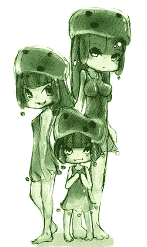
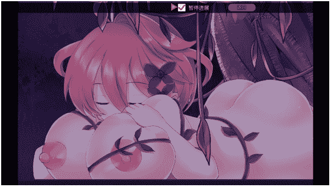

# 【9.1 正式章 第二章预告】［MC+mod］你好，世界。

作者：feiyangfy

TID：23712

 

# 1

*本帖最後由 feiyangfy 於 2017-9-3 18:27 編輯*

咳咳，修改一下一楼的说明关键词:mincraft,vore,各种部位的play

这篇文想借用minecraft自由发展的世界观来讲述一次世界的危机。各种原版的、mod里的怪物都会娘化后来破坏这个世界的秩序。但是我们的主角挺身而出，拉帮结伙干掉boss，（收服各种怪物娘），世界秩序最终恢复稳定（真的吗？）的故事。

可能会有些个人英雄主义，但也会侧重配角的描写。福利的部分不会太多，但是一定会写得很仔细。

**长篇**，**节奏缓慢**，但不太可能坑（吧？），所以大家放心！

稍微做个导航哈

[怪物娘人设图](http://giantessnight.com/gnforum2012/forum.php?mod=redirect&goto=findpost&ptid=23712&pid=346814)

2#~4#

6#~9#

27#总共42685字左右 以上是属于前言之类的东西，没有太多福利，喜欢剧情的可以看看（说实话我真的喜欢写剧情）

正式分章：

[第一章 东谷，暗谷 第一节](http://giantessnight.com/gnforum2012/forum.php?mod=redirect&goto=findpost&ptid=23712&pid=346300)

[第一章 东谷，暗谷 第二节](http://giantessnight.com/gnforum2012/forum.php?mod=redirect&goto=findpost&ptid=23712&pid=346811)（第一章总共18924字，9.1完工，巨乳巨尻猫娘福利） 

希望大家觉得好的能够多多顶文，让作者有更大的动力继续写！ 

 

# 2

“武器...完好!”

“装甲...完备!”

“地图...完整!”

“食物...充足!”

在完成出门前的例行检查之后，积木离开了自己那像火柴盒的小屋，一路往西的探索着。

三天了，积木在这个奇怪的世界已经待了三天了。生存的危机时时刻刻都在敲响着警钟，积木却没有感到压力。从解决食物的问题到拿起武器与怪物搏斗，他处理的都相当完美，像是已经经历过无数次类似的体验了。

积木有时也觉得奇怪，自己的脑子似乎天生就装着这个世界的生存法则，不用思考太多就能安心的存活下去。不过他依旧感到不安，因为自己对这个全是方块的世界亲身体验尽是一股莫名的陌生感与排斥感，自己的脑子里肯定装过另外一个世界的生存法则。

不过没有任何东西能够证实这一点，积木只好暂时摆脱这些胡思乱想，继续为自己安稳的生活添砖加瓦着，即使自己不知道这有什么意义。

“恩...西边原来是一片沼泽，我得快点经过这里。”

沼泽里的气味向来都不好闻，永远都夹杂着一股腐烂动植物的味道。沼泽的地面也不是很友善，如果谁踩在了它们头上，它们肯定会毫不犹豫的慢慢吞噬掉那些鲁莽的家伙，然后为这个沼泽创造更多它该有的味道。

“啪叽...啪叽...”

就在积木小心着自己的每一步时，他听到了一阵奇怪的声音，像是一团胶质不停的被甩在地上的声音。积木立刻意识到自己遇到了沼泽的特产，史莱姆。

小心翼翼的来到了一棵树的后面，积木顺着声音很快就找到了发出声音的主人。那是一只巨大的史莱姆，每次的跳跃都让它方形胶质的身体颤抖一下。神奇的是，就算溅起再大的泥浆，它的身上也不会粘上一丝杂物。

在心里小小对比了一下实力之后，积木决定让它离开之后再前进。毕竟那是个庞然大物。

可是情况并没有预想中那么顺利。过了许久，积木也不见那只讨厌的史莱姆离开自己的视线半点。它一直在原地打转，像是在等待什么东西出现。

“它在干什么？”

无论是谁，在未知面前总会恐惧。那只史莱姆的反常举动让积木的心里产生了一丝丝的不安。因为一般的史莱姆只会往前跳，遇到敌人时才会转一下头。可是这一只...

“如果它再不离开的话，那就只有一个办法了。”

积木拔出了磨的闪亮又锋利的石剑，紧紧握在手中，等待着攻击的最佳时刻。

突然，那只史莱姆停止了跳跃，胶质的身体疯狂的颤抖着。随后它居然开始一点一点的消融了！积木瞪大了双眼，对这奇怪的景象感到十分的好奇。看着那只史莱姆原本庞大的身体逐渐变成一滩绿色的粘液，积木不禁松了口气。

可是，那只史莱姆的异变并没有结束。

就在积木以为史莱姆已经死亡并且自己可以白白收获战利品的时候，那只融化的史莱姆又活了!粘液开始慢慢向中心汇聚起来，一眨眼之间，就已经凝聚出了一只人手的样子。

“不好!”积木大骇，“快跑!”天知道那东西会变成什么，他未知的本能立刻驱使着他快速逃离这里。但是实在是太晚了，他才迈出第二步，头顶就已经有什么东西压过来了。

积木只感觉一大团粘液从自己的头顶浇了下来，并整个把自己包了起来。他的耳朵里和鼻腔里一下子被塞满了，窒息的感觉瞬间夺走了他反抗的余力，握在手里的石剑根本没有挥动过就松开了。积木顽强抵抗，闭紧嘴巴不让这些讨厌的粘液完全占据自己，只可惜这都是徒劳。

缺氧让他渐渐失去了意识，那些许无力的抵抗也渐渐停止，只有耳边不停的“咕噜”声最为清晰。

“再见了，这个危险的世界，是我太弱小了...”

-我是分割段-

麦吉正站在高山上，向四处眺望着。他以前来过这里，但明白了一些规律的他已经把这里当成了发现新东西的绝佳位置。仔细的观察了一阵之后，麦吉有些惊喜的发现了自己想要看到的东西。一个简易的火柴盒式的房子，他敢保证6天前那里还什么都没有。

“看来又要有新的伙伴了！”麦吉兴奋的自言自语着。

一番周折过后，麦吉来到了那个他锁定的火柴屋面前，迫不及待的敲了敲那木质的小门。

“有人吗?”

并没有任何的回应，看来这个屋子的主人要么出去了，要么...

“还是再等等吧...”

麦吉就这么只身站在屋外，等待着可能出现的人。时间就在这无聊的等待中过了很久。直到天色已黑，麦吉也没有等到这个屋子的主人。实在没有办法的他只好留下了一张字条和一张被标记的地图，方便屋主回来后能与他取得联系。

“那么，今天就到这里吧。”

麦吉收拾了一下之后，打算回家静候佳音。可刚想离开，麦吉就想起了什么，拍了拍自己的脑袋说:“这一兴奋还真容易忘事，从这里向西应该是片沼泽，我得去收集一些粘液球，家里罐子没有标签实在太容易乱了。”

于是乎，他抽出了一柄通体银色，杖端却是暗紫色的法杖，从腰间的袋子里拿出了一个红色的球状物，咔嚓一声安装在了法杖上。防身措施准备完全之后，麦吉快速的前往了西边的沼泽，争取能够早去早回。

“不对，这个沼泽好像有点不太正常。”

才来到这里不一会儿，麦吉就察觉到了什么不对劲，于是从兜里掏出了一副金灿灿的护目镜戴在了头上。麦吉这一戴可吓了一跳，因为他从来都没有见过眼前的场景。整个沼泽几乎遍布了灵气节点，在护目镜提供的神秘视野之下像一群萤火虫一样的闪烁。

“那么多的灵气节点...”麦吉一个个的凑近观察后，发现了一个问题。“为什么这里有那么浓厚的大地元素与水元素，却看不到一只史莱姆?”

这里的灵气节点清一色的由大地元素与水元素凝聚而成，没有出现哪怕是含有一点其他的元素的节点。照理来说这样一个沼泽应该是史莱姆随处可见的，但事实却不是这样的，难道...

“偷袭!?”

仿佛在暗中观察了很久，有什么巨大的东西突然从一个泥潭里跳了出来，如泰山一般压向麦吉。由于在专心观察这些节点的问题，所以麦吉并没有及时反应过来，意识到有袭击的时候他已经躲不开了。但是，麦吉却在嘴角露出了一抹淡淡的微笑...

“嘭”的一声，来袭的生物像是撞在了一道无形的壁垒上，没有接触到麦吉的一根汗毛。可是，看清了来袭者的面目之后，麦吉脸上的微笑立刻僵硬了起来。

和他预料的差不多，攻击他的生物是一只巨型的史莱姆，但是....

“为什么会是人形的!?”

人形的史莱姆...不，更准确的来是少女形态的史莱姆，再简单来说就是一只史莱姆娘，此时正趴在阻隔她与麦吉的透明屏障上，一脸期待的看着离自己如此之近，却又触碰不到的麦吉。

麦吉立刻镇定住自己微妙的情绪，手十分稳定的按向了腰带上的一个按钮。史莱姆娘随即像是受到了一阵猛烈的冲击，被巨大的力量弹到了一边。但是她充满弹性的胶质身体根本不怕这种攻击，没事一样的又打算跳过来压在麦吉的头上。

“唉，即使是人形，你的智商也没什么变化...”

麦吉无奈的看着那只像青蛙一样蹲着的史莱姆娘，把手中的法杖对准了她，装在法杖杖端上的红色核心开始微微发出红光。在史莱姆娘跳起来的一瞬间，麦吉的法杖喷吐出了猛烈的火焰扑向了她，她硕大的体型根本没法在空中躲避这种攻击，只能看着自己被火焰吞没。

被火炙烤的史莱姆总是能发出一阵独特的味道，像是着了火的皮革...

“恩...这熟悉的味道...”

就在麦吉吹着口哨满意的看着这只史莱姆娘被自己的火烤的极速缩水的时候，他好像察觉到了什么不对劲的地方。

“等等，这好像真的是皮革烧焦的味道!”

停火好一会儿之后，火焰燃烧带来的烟尘才完全散去。麦吉发现被火焰烧焦的地面上趴着一个人形的东西，漆黑的颜色完全让其与环境融为了一体...麦吉立刻跑上前检查那个差点被自己烤熟的家伙。

“还好，这家伙命真大...”

他的气息还在，而且很强烈。那么惨的样子估计也只是看上去那样吧...可是，麦吉怎么都叫不醒这个家伙，像是中了什么睡眠魔法一样。

就在麦吉把注意力放在那个人身上的时候，在没被火焰殃及的不远处，一坨碎散的凝胶轻微晃动了两下，然后从里面悄悄的探出了一个绿油油的小脑袋...

刚才麦吉的喷火攻击着实把她吓的不轻，万不得已下只好把身体的一部分给抛射了出去，结果还是被火焰炙烤了大部分，只有一小部分的凝胶还有活性能重组...所以，原本硕大无比的她一下子缩水成了一个不到五厘米的小不点，而且她的年龄看起来也变得小了许多，从原本丰满的少女变成了一个瘦小的萝莉。（虽然不知道用年龄来形容这种东西妥不妥当）

她很害怕，害怕那个家伙再拿他手上的法杖指着她，把她仅剩的这么一丁点也给烧成一团气。所以，她打算溜走，远离这里，远离那个家伙，越远越好...!

“恩？”

麦吉原本打算就此离开这里，却听到了一些微小却熟悉的声音。顺着声音望去，麦吉看到了一个小小的绿色身影在月光下跳动着...

“唉?那不是之前那个奇怪的史莱姆吗？怎么变得那么小了?”麦吉说着就往她走去...

原以为自己可以悄悄离开的史莱姆娘看到麦吉的身影居然在向自己靠近，急得直蹦哒。只可惜以她现在这迷你的体型，再怎么蹦哒也于事无补了，只是白白的增大自己的动静罢了。

“真是个奇怪的东西，我还是把她带回去慢慢研究吧。”

麦吉拿出了一个广口罐子，罩在了小史莱姆娘的头上，然后很快的颠倒过来，封上了盖子。

“你没有名字可真够麻烦的，就叫你小软好了！”

无视着罐子里小软那眼泪汪汪的表情，麦吉把他收到了次元袋里...

-我是分割线-

“真舒服啊...”

积木感觉自己正处在一个绝妙的环境里，四周的一切，甚至是空气都是软绵绵的，温柔的包裹着他的身体。积木被这惬意的感觉占据了脑袋，似乎其他的一切都不重要，时间这个概念也像不存在一样，他就这么享受着，享受着...

突然，周围开始变得热了起来，原本温软的摇篮一下子变成了一个闷热的蒸笼，积木想要挣扎，却发现自己的手脚完全不受自己的意识支配，于是他又只能默默忍受着地狱般的感觉。

幸好，灼热的感觉持续的不长，难受的感觉很快就退去了。只是之前那种无比舒适的感觉不复存在了...

“这是...哪里?”

一觉醒来，积木感觉自己浑身难受，身上还一股皮革烧焦的臭味。马上望了望四周，积木发现自己已经不知何时回到了自己那间破旧的火柴盒里。仔细回想了一下之前发生的事，积木顿时觉得有些诡异...

“奇怪，我应该是被一只奇怪的史莱姆给偷袭了，怎么这会儿却躺在了家里?”

积木敲了敲自己酸痛的肩膀，慢慢起身...

“这是?”

积木发现自己的工作台上多了一张写满了字的纸条，于是立刻拿起来看了看...

“居然有人邀请我?”

积木的心里一下子充满了惊喜，因为这证明了他不是一个人。

“东边的峡谷吗...好，我马上去!”

没有丝毫的犹豫，积木把箱子里所有的铁锭与珍贵的两颗钻石拿了出来，在工作台上忙活一阵之后，一套合身又坚固的铁甲和一把晶蓝的钻石剑就完成了。

新装备带来的不只是重量，更是安全性。即使自己对剑术没有半点的了解，也能从这把崭新的钻石剑上获得足够的安全感。穿戴完毕之后，积木迈出了沉重却沉稳的第一步，踏上了自己在这个世界的第一次征程。

 

# 3

“饿...”

一个深不见底的洞穴里，幽幽的传来一声叫唤。

“饿，我饿!好饿啊！饿...!”

像是从一个长梦中醒来了，原本如梦呓一般的声音一下子变的狂躁不安起来，愤怒的嘶吼响彻了洞穴，久久没有散去...

“我说，你有没有听到什么奇怪的声音？”一个两人的挖矿小组中，有个人不安的对着另一个人说。

“怕什么？不就是一些杂鱼僵尸吗？刚买的铁剑，我正好想拿它们练练手呢。”

说罢，他就抽出了那把腰上的铁剑，在火把摇曳的火光中闪闪发亮。识货的人肯定能一眼看出那是东谷最好的铁匠铺出品的铁剑，说它削铁如泥也不为过。

看到伙伴的大宝剑之后，那个担心着的人稍稍觉得安全了一点。可是不知怎么的，心就是吊着放不下来。

于是他举起手中的铁镐，用力的砸向了面前的石壁，借此发泄自己紧张的情绪。没想到的是，居然被轻易的砸穿了。空洞的声音告诉着他，一个新的天然矿洞被他发现了。

“你这小子，胆子那么小，运气却这么好!”

正当他还在愣神的时候，他的伙伴举着火把嘀咕着就进入了他发现的矿洞。不一会儿就消失在了他的视野中。

“快点来啊，小老鼠!想让我一个人把这里的财宝挖走吗？”

回过神来的他立刻举着自己的火把跟了上去...

在平时，黑暗是他最好的伙伴，躲藏在黑暗中的他会感到无比的安全。可是，敏感的他发现，自己长期信赖的黑暗伙伴在今天变得似乎有些陌生了，黑暗给他带来的不再是以外的那种安全感，而是未知的恐惧。似乎在黑暗中有张血盆大口随时会把他吞噬的一干二净。

“石头？你在哪儿？”

小老鼠在黑暗中差点迷失了自我，回过神来发现，自己的同伴已经不知道到哪里去了。他只好硬着头皮继续深入这个沉默的让他窒息的洞穴，寻找同伴留下的痕迹。

走了许久之后，他发现了一个扔在地上的火把。小老鼠开始担心了起来，因为他的同伴，也就是被他称为“石头”的那个人，是不可能像这样随手乱丢火把的。而现在这种情况只能说明一个问题，他碰到麻烦了。

“啊呦...”小老鼠一时惊慌，被脚底的一阵溜滑给绊倒了。慢慢起身才发现自己已经处在一个苔石遍布的小地牢之中。

“不好!”小老鼠立刻摸着墙壁估算起了这个地牢的中心位置，因为那里有个十分危险的东西需要及时处理掉，不然的话...

小老鼠虽然很胆小，但是在关键时候还是能鼓起一些勇气来的。他很快在火把微弱的光亮中成功的找到了那个危险的东西，并且在它的每一个面都插上了一支火把。

那个危险的东西一般都被他们称为刷怪笼，只要它感应到周围有活人存在，就会在黑暗中召唤出一个或者是几个怪物来攻击活人。这东西听起来就是个很危险的东西，可是运用得当的话可以带来巨大的收益。可以说小老鼠的确是找到宝贝了。

可是在他看清楚这个刷怪笼的面目之后，他就完全高兴不起来了。原本装在里面不停旋转的怪物消失了，现在这个刷怪笼只是一个普通的笼子罢了。他从来都没有碰到过这种情况，如果里面的怪物消失了，那这股刷怪笼的压迫感的哪里来的？难道说...

“啊！...”

突然，小老鼠感觉自己的脚踝被一只干枯无比的手死死抓住了，力气大的快把他的骨头捏断了。刚想拿起矿镐进行反抗，他的意识就已经迷离了，剧痛的感觉也随之而去...

“恩...我怎么了？”

小老鼠不知道自己睡了多久，迷迷糊糊的睁开眼却发现周围依旧很昏暗。腿上吃痛的感觉随着意识的苏醒也慢慢袭来。小老鼠起身就想揉一揉脚踝，但发现地板不知为什么变软了，虽然依旧是那么冷冰冰的。

“食物...醒了...好吃...!”

突然，小老鼠的头顶传来了震耳欲聋的声音，抬头望过去后，他有点不相信自己的眼睛...一张巨大的脸充斥了自己的视野，虽然很昏暗，但依旧看得出那是一幅娇好的面庞。现在，那双眼睛死死的盯着自己，像是盯着好吃的晚餐。

“那个...不...!”

没等小老鼠多废话一句，这个饥饿的“巨人”就把他送进了嘴里，咕噜一口吞了下去。

“好吃...还要更多...!”

“请问，你知道“东谷”吗？”

一路顺着字条的指示找寻过来，积木真的发现了人烟的踪迹。眼前这片霍然开朗的平原上金黄的麦田一片接着一片，壮硕的牛羊也是一圈又一圈，远处那些方形的小房子也是一座座的挨在一起。尽管午时已到，但还是有许多的农民正在泼洒汗水进行作业，好一派田园风光！但激动归激动，积木发现自己印象中的“谷”并没有半点影子出现。于是他询问了一下一边正在收割麦子的老大爷。

“啊？什么谷（物）？大爷这儿可只有麦子啊！”

积木听到这回答顿时就愣住了，不知道该如何继续询问，场面直接陷入了尴尬之中。这时，一位抱着一筐水果，眼睛快眯成一条缝的大叔正好路过，看到积木这身武装到牙齿的打扮，一下子就明白了他的目的。

“我说小兄弟，你是不是想去暗谷？”

积木见有人主动搭话，自然而然的就把注意力放在了那个人的身上，一听到“暗谷”这俩字，立刻就提起了精神。

“是的，太感谢了！不过…名字有些不对，应该是叫“东谷”才对。”

大叔起初看起来依旧是笑眯眯的，但和积木一样，听到了“东谷”两个字以后就严肃了起来。因为，知道这名字的人没几个。

“你是怎么知道东谷这个名字的？”

见和蔼的大叔一下子变得这般严肃，积木也只好把那张引导他过来的纸条递给了大叔。大叔一看这字迹，严肃中似乎闪过了一丝差异，随后又变回了原来那和蔼的样子。

“原来是这样…不好意思，我对我刚才的失态感到抱歉。这个你拿着，就当是赔礼。”

大叔对积木鞠了一躬，并从自己的水果框中挑出了一个又大又圆的苹果递给了他。积木也是正好觉得饿了，顺势接过了大叔的苹果。

“我们边走边说吧，暗谷我很熟悉的！”

看起来像个老司机的大叔主动申请带路，积木心里虽然不好意思，但是盛情难却之下，只好答应了他。

“老麦，你今天的收成也不错啊，加油干！”

大叔向那个积木一开始询问的大爷道别之后，立刻拉着积木沿着田间小道向村庄内部走去。

“老麦的头以前被苦力怕伤到过，希望你别对他有什么奇怪的看法啊，他可是个老实人。”

积木听到大叔这么说的时候立刻摇了摇头，表示自己对那位和蔼的大爷完全没什么意见。在几口吃完大叔给的新鲜苹果之后，积木也发话了。

“请问，您叫什么名字？”

大叔听到顿时爽快的笑了笑，同时不好意思的摸了摸自己的头。

“唉，瞧我这糊涂的，名字都不知道要告诉你了。你叫我汉尼大叔就行了，你的名字呢？小兄弟？”

“我叫积木，这几天刚来到这个世界，请多多指教！”

简短的自我介绍过后，汉尼大叔的脚步突然停了下来。积木疑惑的看向了他，却发现他正惊讶的看着自己。

“积木小兄弟，你真的刚来这个世界没几天吗？”

见大叔这般疑问，此时积木一脸的茫然似乎就是最好的回答。

“那很好，小兄弟你前途无量啊！”

没有沉默多久，汉尼一下子转惊为喜，粗大的手掌拍了拍积木的肩膀，拍得积木身上的铁甲嚓嚓作响。积木不明白汉尼的这一系列转变是因为什么，于是开口就问。

“汉尼大叔，为什么那么惊讶？我有什么特别的吗？”

汉尼没回他，而是抱着水果框又走了起来，积木立马跟在汉尼的一边等待着答复。

“真那么想知道？”

汉尼一脸调戏的看着茫然的积木，似乎并没有想要回答的样子。积木见状只好收起了自己的好奇心，因为他不太喜欢这种感觉。

汉尼看他这么不经玩，只好放弃了玩笑的心态，认真的对他说。

“我们到暗谷再说吧，到时候我们会好好谈谈的。”

一路上，汉尼大叔总是很热情的向他介绍着他们经过的建筑的来历和作用，让积木听得津津有味，完全忘了之前的事情。不知不觉之间，他们就来到了一片热闹无比的集市。不过在这个集市的中间，有个奇特的建筑一下子吸引了积木的注意。

“你也注意到那个像枯树一样的东西了是吗？那个的确是暗谷中最重要的东西之一。来，我们就是要去那边。”

于是积木被汉尼拉着手，在集市的人群中摩肩接踵的穿梭着。一边走汉尼还不忘介绍这个集市。

“这个集市是我们这一个地区非常著名的“暗谷集市”，你几乎能在这儿找到你想要的一切…”

就在积木继续认真听讲的时候。经过了一个摊头，那薄薄的紫色毛毯上只放了一本又破又厚的书。这个奇怪的摊位显然不会有什么顾客停留，因为路过的人都对这本破旧无比的书没有什么兴趣。摊位的主人也很奇怪，身形瘦小，全身除了眼部都被黑布包裹着，只露出一双晶蓝色的眼眸不停的观察者过路者。

突然，惊讶从这双眸子中流露了出来，并且直直的盯着路过的积木。可是，积木和汉尼很快就消失在了涌动的人群中。匆忙的收起了自己那唯一的商品，这个奇怪的商人朝着积木走的方向跟了过去……

走了好一会儿，积木终于被汉尼拉到了这个集市中心，那个长的像枯木一样的建筑。比起拥挤的集市，这儿的人可就少的多了。

“请出示您的证件，先生。”

就在汉尼自顾自走进去，积木紧跟其后的时候，门口的卫兵拦住了他。

“放他进去，亨特，他是我的人。”

汉尼头也不回的丢给了卫兵这句话，结果卫兵想也没想的就给积木让了路。

“看起来您在这儿的声望很高啊。”

进入大门的积木终于忍不住问了汉尼一句，换来了汉尼的两声轻笑。

“这里大多数的毛头小子都是我拉过来的，不然他们现在可能还是个野人呢。但是，这并不重要。重要的是…”

汉尼突然转过身，放下了手里的水果框，向他张开了双手。

“欢迎来到暗谷，我的新朋友！”

 

# 4

这个巨大枯树的内部并不昏暗，因为从树顶中央处挂下来了好几串闪亮的莹石灯，坠向底部空洞的深处。那个硕大的空洞应该就是通往暗谷的大门了吧。积木突然有种冲动，想到那个洞的旁边看看下面深邃迷人的样子。

“好啦，你激动什么，好戏在后面呢！”

汉尼再次拉着积木这个铁皮桶，走向了那个大洞。大洞边修着一个旋梯，一圈圈的绕着四壁往下延伸，奇怪的是，明明有莹石灯的照亮，却看不到洞底有什么，只能看到一片似乎正在翻滚着的黑暗。

“这就是我们为什么叫它暗谷的原因。”汉尼看着积木惊讶的表情解释着，“这下面的暗元素多的惊人，所以制造出了这种隔绝视野的效果。”

“暗元素…”

突然，积木捂着头想着什么，一副似乎是记得什么却又不能完全想起来的样子。

“这个东西是神秘领域的东西，如果你想了解的更深入的话可以去找神秘使，他们就在暗谷的最下面，大叔我可只了解些皮毛哈…对了，那个把纸条留给你的人也是一个神秘使，是神秘使协会里面资历最小的一个，不过十分有天赋。说起来，你也应该是个十分有天赋的小伙子，毕竟刚来到这个世界不久就能有这身武装的人并不多。好了，我们现在要去一个地方，一个可以被称为这个暗谷的核心的地方。”

两人一直顺着旋梯往下走着，也不知是什么时候，四面的墙壁消失了，这个看起来十分古老的木质旋梯就这么悬挂在了空气中。四周和底部一样，能见度很低，还有比较重的回音。看来他们现在已经完全身在暗谷之中了。

旋梯并不是一尘不变的往下延伸着，中间有很多不知从哪里架过来桥梁，和这个看似摇摇欲坠的旋梯连接着。

“唉，汉尼前辈，你好！”

旋梯上的空间并不多，有什么人通过都不用打个招呼来引起注意。这会儿，迎面就过来了一个满脸雀斑的小女孩，而且认识汉尼。

“哦，是小犹啊，你现在有空吗，能的话请帮我把这框水果搬回我的吧，我要带这个小兄弟去开拓者协会一趟。”

这个叫小犹的女孩一开始没注意汉尼身边的这个铁皮罐子，经过汉尼提醒之后，不由得打量了积木一下，却发现积木一副头疼的样子。接过汉尼手里的水果框后，这个女孩对着积木做了几个鬼脸，然后欢笑着转身走向了一边就近的“浮桥”离开了。

“小犹这丫头就是这么调皮，你别介意。不过她可是我的得力助手，干起事一点都不含糊。”

积木摇摇头，表示自己不介意。奇怪的是，刚才那个女孩的笑声让他突然有种霍然开朗的感觉，为什么呢…

开拓者协会，会长办公室内。

“嗯，我知道情况了，你先下去吧。”

随着助手的离开，会长室内又恢复了寂静。喝了两口提神的饮品之后，会长又拿起了这两天的人员报告，其中有好几个人的报告都空缺着。

“难道，是出什么事了吗？”

这几个缺失报告的人员是好几个月前派出去的探险队，本应在一个月前就已经回来的，可是已经到现在了也没见他们的踪影。这几个小队的成员都是这方面的老手，本应没什么问题…

放下了手里的报告，会长转过身来，隔着结实的玻璃墙欣赏外面火红的岩浆瀑布，心里却和这些沸腾的岩浆一样不能平静下来。

“看来，又要有一场风雨洗礼这里了…”

我是分割线

终于，最后一个罐子也添上了标签，这下就不怕自己用错源质了……

麦吉自打回来以后就一直钻在自己的实验室里没有出来过，身为一个又有天赋又有干劲的神秘使，这种生活习惯早就成为了他的一部分，所以说…乐在其中的他完全没有累的感觉，相反越来越想弄点新东西出来了。

“不如…今天就把那个给做出来吧…叫什么名字来着…”

麦吉翻起了自己杂乱无比的物品栏，结果发现自己把一个小家伙给忘了…就是之前在沼泽抓到的那个奇怪的屎莱姆-小软。闷在麦吉物品栏里许久的她已经完全焉成了一团她本该有的样子，看起来无精打采的沉在罐子底部。

“嘿，你还活着吗？”

麦吉摇了摇罐子，把里面那团绿色的粘液摇的震荡了起来。不过，再剧烈的震荡也没能让她做出反应，看来她的确是消耗过度了。

“唉，不好意思啊，把你闷那么久，现在我给你赔偿…”

麦吉在一边堆成墙的罐子里找寻着，从中拿出了一罐蓝色的液体，从标签上看，应该是一罐水源质。

“享受沐浴吧！”

打开了两个罐子，麦吉往放着小软的罐子里倒了点水之源质。只见原本如一摊死水的小软在接触到水之源质之后立刻沸腾了起来，与同样粘稠的水之源质迅速的混合在了一起。可是这么点水之源质显然无法满足她。于是她变回了人形，可怜巴巴的看着麦吉和他手里的那罐“美食”。

看到她“活过来”了之后，麦吉也就自然的收起了那罐水之源质，把它放回了原来的地方。小软见状，失望的化成了液体。麦吉用余光看了小软的表现之后，偷偷的笑了笑，然后转过身来故作严肃的对她说。

“你可是我见过的最好玩的怪物了，所以肯定会对你慢～慢～研～究～”

也不知小软是否能够听懂麦吉说的什么，总之见到麦吉这个邪恶的形象，她化作的那团绿色液体在微微颤抖…

-我是分割线-

“您好，积木先生，这是您的技能鉴定结果，请过目。”

接过了侍女递给他的报告，积木有些木讷的看着上面最大的那几个字。

普通的继承者。

“哈哈，跟我想得一样，你果然是一个继承者！”一直站在积木身边的汉尼看到他的结果后高兴的说道，“只不过，是个普通的继承者…不要紧，你肯定能成为一名东谷优秀的冒险家的！”

时间倒流一段时间，刚才一踏入开拓者协会的积木还没有停留多久就被带去做了一系列的测试，让他看了一大堆稀奇古怪东西的图鉴。一开始的一些他都知道的清清楚楚，但之后附加的大部分东西他都不认识，然后他就离开了测试的房间等在这儿直到现在拿到这份报告。

至于什么是继承者，那就要从这个世界的生成说起了。这个世界的人都是凭空出现在这个世界上的，绝大部分的人对这个世界的一切一无所知，而有那么一小部分的人曾经在这个世界生存过，因为一些极端的原因，（像是死亡之类的）暂时从这个世界消失了，但又因为与这个世界牵连较大，又“复活”在了这个世界上。不过他们记忆中清晰的部分只剩下那些他们制造过与触碰过的东西了。所以继承者在以前可能是一个不可一世的人物，一直很受看重。这就是为什么汉尼那么看重积木的原因。

还有一点就是，有些由特殊人群形成的继承者，比如神秘使，他们的能力比普通的继承者更强，拥有着普通人无法接触与理解到的知识，之前积木看到的那些附加部分就属于这些特殊人群的独有资产，谁都没法偷学或者是抢走。因此，这些人的身份就显得格外的尊贵，即使他们有些人的行为古怪的让人无法理解…

“那大叔你也是一个继承者吗？”积木了解到这些之后，突然有些兴奋起来，便随口就问起了汉尼大叔的身份。

“我呀，也不能算个严格意义上的继承者吧，毕竟会烧饭做菜也不是什么很厉害的本事…对了，积木，你肯定饿了吧，跟我到我的厨房去吧，我给你开个小灶！”

没等积木多问什么，汉尼就拉着积木离开了开拓者协会前往了他所说的厨房。

“烦死了，它们真是无处不在！”

在前往厨房的路上碰到了一个穿着深紫色黑袍的奇怪家伙，突然抱起了自己的脑袋大喊大叫，随后抽出了一把银色的长杖对着周围的空气疯狂的挥打着，时不时的还用杖端上的银白色小球放出链状闪电，把周围弄得噼啪作响。

“我们还是先在这里等一会儿吧，免得被他误伤了。”

汉尼轻描淡写的说着，把积木拉到了安全的位置上。看来他对这种情况已经是习以为常的了。

“他这是怎么了？突然发起疯来了？”积木疑惑不解的问着。

“可能是他的扭曲反应发作了吧，看他这情况应该是被他的心魔蜘蛛攻击了。总之，神秘使里有很多的怪人，他就是典型的代表之一。”

没过多久，那个人的暴躁行为就停止了。虽然周围的墙壁被他的法杖电的焦黑，但他却像个没事儿人似的收起了法杖继续自己的路程。默默的看着他消失在了黑暗中，积木和汉尼也算是松了口气。起码那个家伙没把他们当做心魔来攻击。

一段短暂的路程之后，积木总算来到了汉尼的厨房。不得不说，这地方比起厨房更像一个奇怪的工厂，各种各样像机器一样的方块堆在一起，完全没有印象中厨房的那种感觉。

“好吧，我已经很努力去装饰它了，但是，你也看到了～”

汉尼向积木无奈的摊开了手，向他表示自己在建筑美观方面的能力几乎为零。不过积木也无所谓，总比自己从什么东西都烧过的熔炉里拿出的好吧…

“积木别客气，那边找个位置坐下，我给你准备吃的…奇怪了，小犹这姑娘哪里去了？今天应该没有其它的送餐项目了呀？”

汉尼一边从一边的铁箱子里拿出食材，一边轻轻的嘀咕着…

积木这边呢，坐下来的他也总算是有了个安静的机会，看着汉尼大叔把食材放到一个又一个机器中处理，他突然觉得有些困倦了，于是慢慢的闭上了眼睛…

 

# 5

“主人，快醒醒…！”

积木在迷迷糊糊中听到一阵呼喊，醒来后却发现自己的面前站着一个浑身被黑布裹得严严实实的怪人，好像就是他叫醒自己的。

“你是谁？想干什么？”

积木立刻起身与他拉开距离，手上已经握紧了那把还没有用过的钻石剑。匆匆环顾了一下四周，发现汉尼大叔不见了，只有面前的桌子上摆放着诱人的食物。

“你是谁？你把汉尼大叔弄到哪里去了？”积木喝问道。

仔细观察了一下眼前这个怪人之后，发现他和之前碰到的那个发疯的神秘使有些像，所以提高了警惕，但是他身上最大的不一样就在于，他的一身打扮明显没那个神秘使那么好，让人感觉破破烂烂的不成样子。

“主人，我…没有…”

意外的，这个怪人的声音十分好听，应该是个女孩。看到积木这副凶神恶煞的样子，她不由得颤抖起来。

“什么？快说！”

不明白她为什么叫自己主人，积木只好暂时把她当成疯子来看待，自己刚来到这个世界，可没什么仆人。眼前的黑衣人没有任何回应，只有轻轻的哽咽声不断的传来。

“嗯？”

不知为什么，积木的脑袋里突然闪过了“传承者”这三个字，莫名的觉得自己好像真的可能认识她，最起码是以前认识。于是积木收起了自己的钻石剑，慢慢向她靠近…

话说回来，这个黑衣人虽然行为怪异，但她应该没有恶意，不然在积木睡觉的时候她早就好动手了。

“不好意思，是我太激动了…”

积木话音未落，那个有些矮小的黑衣人突然“哇”的一声扑到了积木身上，大哭了起来。就算隔着一层铁甲，积木也感受到了她身上那深深的委屈，只好任由她这么做着。

过了许久，房间里的哭声消失了，原本那个裹得严严实实的黑衣人脱去了繁重的遮掩之后，变身成为了一个小女孩，长得十分可爱，就像她的声音一样惹人喜欢。特别是她那双湛蓝的大眼睛，和两颗蓝宝石一样迷人。

只是她似乎是受尽了苦难，原本圆润的脸庞变得瘦削，皮肤也是没有什么血色，难以闪烁它应有的光泽。不过这些问题在她找到积木之后似乎都已经被抛到了脑后…

“你肯定饿了吧，不如先吃一点？”

积木看她手指纠结，一副欲言又止的样子，只好先挑起了话题。听到积木发话的小女孩像只受惊的小兔一样抬起了头，想要拒绝积木的好意，可是一看到积木那关切的眼神，只好很不好意思的接受了，嘴里还不忘嘀咕着，“谢谢主人…”

一开始可能还有些拘谨的女孩，一接触到好吃的就立刻开朗了起来，主食甜品一个不落下，很快就被清空了。也许她是真的饿坏了。

看着她幸福的样子，积木有些不敢相信这些食物是那些古怪的机器里做出来的，虽然闻起来和看起来也很好吃…不过，这些不是重点，重要的是，积木觉得自己也得到了满足，而且感觉像日常一样普通。或许，自己的前世之谜就该由她解开了吧？

递给她一张纸巾，积木边看着她擦着小嘴边残留的冰激凌，边正经的问道：“那个，我有很多问题想问你，你能回答我吗？”

小女孩听到这句话后，乖乖点了点头，但看着积木现在的样子，又想到了什么，一时不知如何开口。

看她纠结的样子，积木无奈的摇了摇头：“就先告诉我你的名字吧！”

小女孩恍然大悟一般，认真的看着积木说：“主人，我是艾娜，您永远最忠诚的仆人！”

积木隔着铁头盔挠了挠头，总觉得很别扭的话却没有什么不适，只好同样回应她：“我是积木，很高兴和你做朋友！”

话匣子一打开，沉闷的束缚感就渐渐消失了。艾娜听到积木这么毕恭毕敬的对自己，头立刻摇的像拨浪鼓一样，似乎不能接受这个设定。

“不行！主人怎么能是朋友能够比的，主人可是艾娜最尊敬的人！”

眼中闪烁着坚定的光辉，艾娜看向积木的眼光让积木都有些站不住脚了。

“好吧，艾娜，你愿意就好。能先告诉我你找到我的原因是什么吗？”

不想再纠缠这莫名的主仆关系是从何而来的了，积木直接开门见山的提出了自己最想知道的一个问题。艾娜突然像被泼了一盆冷水一样，原本兴奋的她一听到这个问题慢慢的低下了头，显然是想起了不好的东西。

“主人，比尔格林他是个叛徒！他…他把您的一切都抢走了，甚至连您也…”

说着说着，艾娜就又抽泣了起来，看来那段回忆带给她的打击实在是太大了…

积木虽然一头雾水，但也不忍心看到她再这么哭泣下去，于是蹲下了身为她擦着泪水。

“主人…您还活着真是太好了…！虽然您可能忘掉了很多东西，但是艾娜永远都不会离开您！”

泣极而喜，艾娜双手握着积木为她擦泪的那只手，坚定又有力。

“不过，主人您现在十分的危险…不不不，应该说这个世界都变得危险了！艾娜虽然很弱小，没能挽救什么，但是知道了比尔格林那可怕的计划…！”

说到这里的艾娜不由得因为害怕咬了咬嘴唇，但又由于心急，立刻就把后面的话说了出来。

“比尔格林他想要霸占这个世界所有人的知识，不管用上什么样的方式…其中最主要的一种方式就是…制造奇怪的人形怪物去吞噬他们看到的一切可能怀揣着知识的人，然后带回来，归为己有…”

之前有提到过，这个世界除了一些固定的，大家都能了解到的东西之外，还有一些只有特殊人群才能够掌握的知识，这些知识是无法被其他人不能了解的人所触碰的。不过，现在这个叫比尔格林的家伙似乎是想要打破这种限制，并且方法好像十分恶劣…

积木闭上眼睛默默的分析着这些骇人听闻的消息，虽然有些不相信艾娜这个奇怪小女孩的话，但是脑海中已经慢慢的浮现出了自己在好几天前的那个夜晚遭遇的事情，自己似乎就是被这么一个类似的人形怪物所攻击了…

原本欣赏着主人沉思状的艾娜被突然睁开眼的他吓了一跳，但又很关切的问：“主人，您想到了什么？”

“你说的可能是对的，我在不久前应该碰到过你说的…人形怪物。”

艾娜听到积木这么说之后，先是愣了几秒钟，随后又突然大事不妙一般检查起了积木的身体，嘴里还不停的问着：“主人，您没事吧？您哪里不舒服？您的头痛不痛？您有没有感觉到被掏空…”

“好了好了，我现在站着你面前就说明我很好！不用那么紧张的！”

积木有些不厌其烦的回答立即阻止了艾娜的行为，惹得后者连连道歉：“主人，对不起！艾娜只是了解到被人形怪物所吞噬的人后果会十分严重…没有保护到主人，是艾娜的错…”

积木看她这副样子，反而觉得她十分可爱，于是摸了摸她的头让她冷静下来。

“放心吧，我应该是碰到高人了，没他的帮助，我可能的确是那个下场了吧。话说回来，我还没有见过他一面呢，而且他好像就在这个暗谷的底部。”

说着，积木便起了身，似乎是想要去看看那个帮助过他的人到底是个什么样子。

“还有就是，你来之前有见到过一个眼睛眯成缝，留着一撮小胡子的大叔吗？”

艾娜对积木的这个问题点了点头，又摇了摇头，眼神也变得游离了起来，手背在后面扭扭捏捏的不停。好一会儿才像是鼓起了勇气一样说出了话。

“主人，其实艾娜…之前一直在偷偷的…跟踪你…”

艾娜一边说话一边偷偷观察着积木的表情，似乎害怕他突然生气怪罪自己…

“哦，继续说…”

积木面色平静的看着艾娜，让她背后一阵冷汗。

“主人，艾娜其实知道的不多…只知道他做好了食物之后被什么人又叫去那个开…开坑协会了…”

打了一个激灵之后，艾娜一下子把知道的都说了出来，也不管什么跟踪主人的后果了。

“这样啊…那我先去找我那位朋友，回来以后他应该也回来了，你要不要一起去？或者偷偷跟在后面？”

艾娜听出了积木话中那很明显的调侃，羞红着脸说：“艾娜一定会追随主人，但是艾娜害怕…因为，住在这个地方底部的人是不是都是…神秘使？”

积木点了点头，但并不知道她的难处在哪儿，于是又蹲下身与她目光平视着。

“怎么了？你很害怕他们吗？”

积木不久前就看到过一个精神不太正常的神秘使，一个小女孩会害怕应该也是正常的，如果她真的一直是跟着自己的话，她肯定也看到那可怕的场景了。

艾娜微微点了点头，但又有些犹豫的说：“主人，其实艾娜害怕的并不是那些扭曲的神秘使，而是因为…我们古代魔法师和神秘使一直是敌对的关系…”

不知不觉之间，艾娜又吐出了一个新鲜的词，积木顿时起了兴趣：“你是一个魔法师？古代魔法师又是什么？”

艾娜没有立刻回应积木，而是小手伸进了自己的黑袍里摸索着什么，不一会儿就拿出了一个奇怪的东西。

递到积木的面前，艾娜张开了手。一个光团出现在了她的小手中，不停的闪烁着时暗时亮的光芒。神奇的是，这个看似不能触碰的光团，现在却被艾娜稳稳的拿在了手中，宛如实质。

“这个就是古代魔法师的象征-魔法容器。我们古代魔法师可以往里面注入魔力来释放魔法。”

积木伸出手摸了摸这个魔法容器，发现它的触感就像一只毛茸茸的小兔子一样温和。

收回了这个魔法容器之后，艾娜双手捧着把它放在胸口，一副很爱惜的样子。

“话说回来，这个魔法容器还是主人您亲自为我做的呢！”

积木微笑着说：“是吗？原来我以前能够制作这么美好的事物啊。”话说到一半，积木似乎想到了艾娜之前说的话中的另一个重点，于是问道：“既然古代魔法师能创造这么美好的事物，那为什么神秘使要与之敌对呢？”

积木的这个疑问让艾娜的眼中生出了几分厌恶，但她依旧语气平稳的回答道：“那是因为他们的自大。神秘使们认为只有他们的研究方法是通往神秘世界大门的唯一途径，其它研究魔法的方式只有小婴儿牙牙学语的程度。所以，不只是我们古代魔法师，只要是与神秘使研究方法不同的魔法师都被神秘使蔑视着，我们自然就与之为敌了。”

轻轻的摸了摸手里的魔法容器，她继续说了下去。

“虽然神秘使们很自大，但是他们的自大是有资本的。他们的势力比别的魔法师大的多，就连为数众多的植魔师都不及他们的四分之一…而且，他们研究出来的东西的确比其它魔法师的产物更受欢迎。他们的工具，他们的装备，每一件都十分强大，普通人能有一件神秘使的装备可是很自豪的事…植魔师们曾经想用他们的装备与神秘使们同台竞技，但又被神秘使变化多端的法杖打败了。所以他们的地位一直很高，在这个世界分布的也很广。”

积木又表现出了对新东西的兴趣，所以听得津津有味。艾娜语毕之后，又对其中的细节发问道：“那古代魔法师比起神秘使，地位又如何呢？”

艾娜摇了摇头，立刻回答：“完全不能比。古代魔法师的研究产物对于其他人来讲完全没有用处，所以一直把魔法容器称为花哨的玩具…”

艾娜说到一半，生气的撅起了嘴，“魔法容器才不是玩具呢，它们可是很强大的！”

积木见艾娜炸毛，立刻摸了摸她的头，并一边转移话题。

“好啦，不说这个了，我也觉得这个魔法容器不是玩具，它们更像一个可爱的精灵…”

艾娜享受着积木的抚摸，一下子就把刚才的那些不愉快抛到了脑后。并且兴奋的一跳一跳的。

“嗯，主人的观点果然是这样呢，您肯定是以前那个主人！”

艾娜又把魔法容器放到了积木的面前，故作神秘的说：“主人，你想不想看看这个魔法容器里面装的是什么吗？”

积木也故作好奇的请求她：“好啊，我真的很想知道这个里面有什么！”

艾娜大大的“嗯”了一声之后，开始把注意力放在了手上的魔法容器上，不一会，这个魔法容器闪烁出的一阵耀眼的光芒化作了一颗小光球飞向了积木。

积木被光球击中了之后，身体的轮廓开始微微发光，积木静静等候着这个魔法带给他的效果。

奇怪的是，积木觉得自己的视野变得越来越矮了，眼前原本娇小的艾娜慢慢的变得巨大了起来。

艾娜呆愣的看着眼前越来越小的积木，直到他不再缩小了，她才看了看手里的魔法容器，突然手忙脚乱起来。

“啊！主人，对不起，是艾娜弄错魔法了，这个本应该是照明术的…”

艾娜一时的糊涂让积木从一个七尺男儿变成了一个只有五厘米的小人。看着自己小小的主人，她急得眼角都溢出了泪水。

而积木呢，面对眼前如一座黑色巨塔的艾娜，想要让她冷静下来，却心有余而力不足。

“驱散术…驱散术…唔…走的太急了没有带出来！”

翻找着口袋，却没有找到能够解决问题的东西，艾娜只好直面自己犯下的过错了。

艾娜轻轻蹲了下来，十分抱歉的看着迷你版的积木，伸出手把他从地上捡起来放到了手心里。总不能让那么小的积木一直呆在地上吧，万一踩到就不太好了。

积木坐在艾娜温软的手心里，面对眼前这双包含着歉意的大眼睛，不知该怀揣一种怎么样的心情。

“自己现在这么小，估计喊什么她都听不到的吧。”

积木只好用肢体语言与艾娜交流，表示自己没什么，让艾娜不必这么自责。

艾娜看着主人如此体谅的行为，乖乖的点了点头，擦了擦眼角的泪花。

“主人，这个魔法的持续时间可能会很久，也可能一会儿就失效了，所以…这段时间里，就由艾娜保护你吧！”

手里的主人，小小的，又由于穿着铁甲的缘故，有些凉凉的。在这个有些闷热的室内，主人摸起来还是挺舒服的呢…

“不对，艾娜在想什么…”

不知道自己陷入了什么奇怪的状态，艾娜突然不知不觉的喜欢起了这种抚摸小主人的感觉。反应过来的她面色微红，有些不敢直视手里的小主人。

“小小的主人，真的好可爱…！”

艾娜心里想着这不敢说出来的话，不过积木已经从她那闪烁的眼睛中看出了一些端倪。

“看来这个女孩真的对以前的我有很深的情感啊…”

就在这对奇妙的主仆互相培养感情的时候，暗谷内正在发生一场危机。

麦吉的实验室内。

巨大的符文矩阵被魔杖轻轻点亮，随着一身清脆又魔幻的声音，这次的注魔算是顺利启动了。

“嗯，计算肯定没有问题，源质的数量一定是一分不差的。希望这次的注魔不要再失败了！”

戴上了奥术护目镜的麦吉看着被符文矩阵牵引着的源质流缓缓流入被放置在矩阵中心的皮革靴子上，自信却夹杂着些许的担忧。毕竟他已经因为计算失误炸了两次实验室了，他可不想再去处理那些让人讨厌的咒波粘浆液。

源质的吸收顺利完成，接下来就是吸收材料了。那些被摆放在周围基座上的材料慢慢化作了粉末，像源质流一样流向了皮革靴子，一双精美的鞋子正在逐渐成型。

“快了，快了…”

麦吉搓着手焦急的等待着，但是天公不作美。就在吸收最后一个材料的时候，矩阵突然变得不稳定起来，正在吸收中的材料从基座上掉了下去，同时许多被吸附的源质都趁这个机会化作能量闪电逃脱了符文矩阵的束缚，电了麦吉一个激灵。

“不好！”

赶紧把掉落的材料放了回去，用奥术护目镜观察符文矩阵的核心，看看哪种逃逸的源质需要弥补。

手忙脚乱之下，积木打翻了一些空的和几乎是空的罐子。没想到的是，其中一个罐子正好装着小软。

睡着觉的小软就这么迷迷糊糊的醒了。像闻到了好吃的一样，小软慢慢的蠕动着，目标似乎是一边装着少许水之源质的罐头，被同样打翻着，瓶口正向她敞开。

小小的吃了一顿之后，小软回复了一点力气，变回了人形蹦哒起来。那个捉住她的人类似乎在忙些什么，完全没把注意力放在小软这里，于是她安心的吃着随地都是的大餐，各种各样的源质把她原本绿油油的身体变得五颜六色的。

很快，她就从一个拳头大小变成了一个方块的大小，地上那些打翻的源质吃的也差不多了。

此时的小软已经有能力打开其它的罐子了，但因为对麦吉心存戒律，那些装满的罐子又离他比较近，所以她不敢这么做。

不过呢，她似乎是闻到了更好的东西。

转身蹦哒进了一个别致的黑色小隔间里，里面有许多奇怪的仪器正锁着什么球体滋滋发响。“食物”的香味就是从球里面传出来的。

迫不及待的小软立刻蹦哒到了仪器面前想把它一下子包进自己的身体里面，却发现自己还不够大…于是她只能先包住了那个球体。

随着她对球体的渗透，她越来越感受到了里面蓬勃的能量…终于，她身体的一部分渗透了进去，在接触到内部的一瞬间，她一下子触碰到了她想要吃的“食物”，于是贪婪的吸收了起来…

就这样，原本小小的一团小软像个充气的气球一样迅速膨胀起来，并且没有半点减慢的趋势。

一个又一个仪器被小软包进了身体，膨胀的速度也是到达了极致，不一会儿就把这个小隔间塞的满满的，迫不及待的向外扩散着…

“终于完成了！”

费劲了千辛万苦，麦吉总算把心仪已久的旅行者之靴做了出来。穿上鞋子后的他感觉自己轻盈了不少，走了两步之后更是满意的点了点头。

“原来这靴子这么好用，早知道一开始就把它做出来了，比起徒步，这个赶路可方便不知道多少呢。”

验收完毕，刚准备脱掉鞋子的他却发现自己的节点控制室内涌出了奇怪的东西。

“我的天，这是什么东西？难道说…”

目光撇向了一边满地的源质罐子，麦吉知道自己惹上大麻烦了。

没有太多的迟疑的他立刻选择遗弃自己心爱的实验室。因为以小软现在的膨胀速度，他是无法强行冲进节点控制室关闭节点控制的，只好先封锁住实验室，另想办法。

刚穿上旅行者之靴的他健步如飞的冲向了出口，熟练的打开了自己的奥术门扉，步出实验室的一瞬间一把关上了它。不放心的麦吉又掏出了法杖给相对脆弱的门施加了一个守护结界。

好在实验室在设计之初就考虑到了危险性，所以墙面电板天花板都是清一色的黑曜石瓦块搭建的，十分的坚固。

小软很快就把麦吉的实验室填满了，各种珍贵仪器都被小软包进了身体里面，看得麦吉一阵心疼。

“唉，真是一失足成千古恨，这下不仅是我的实验室，这个麻烦的怪物也不知道怎么处理…”

已经没有空间的小软依旧在不停的膨胀，把施加了守护结界的奥术门扉挤压得咯吱响。

认为她没法突破这道防线的麦吉开始静静思考起小软的问题来。其中一个很关键的地方就是，她是如何突破节点控制器强大的封锁接触到里面的充能节点的，这在麦吉看来完全就是不能的事。曾经他也试过强行破坏节点控制器想要研究里面的充能节点，结果只能换来一次爆炸和成吨的咒波粘浆。

“难道说，她有能力突破能量屏障？”

得出结论的他突然觉得背后一凉，目光慢慢挪到了奥术门扉上，发现上面施加的守护结界已经开始出现裂缝，少量属于小软的身体部分已经渗透了过来。

“啊…！”

惊慌的麦吉拿出了火焰核心想用老方法把她烫回去，却发现她一碰到火就变得通红，同时一点都不畏惧原本致命的火焰。

收回了无用的火焰核心，麦吉突然觉得，把这个怪物带回这里，是他犯下的最愚蠢的错误。

“完了，这下整个东谷都要出问题了…”

随着一阵清脆的破碎声过后，麦吉被涌来的小软瞬间包裹，而符文护盾提供的保护只坚持了短短的一秒钟就同样破碎了。麦吉一边轻轻笑着自己的年轻，一边慢慢的失去了意识…

 

# 6

小软…不，“小”这个字并不适合她，因为此时的她已经是个能够吞噬一切的巨兽了，而且体积的膨胀速度丝毫没有减慢过。

把那个曾经欺负过自己的人类吞进身体里之后，依旧不满足的小软继续往外面扩散着。因为她觉得，人类的味道真是好极了，那种分解他们之后获得的能量比自己吸收的源质要好吃的多！

“饥饿”的她迫不及待的涌向了这个人类的房间外，寻找着自己心仪的美食。

“那是什么！？”

许多正在走廊里讨论的神秘使发现了突然从麦吉房间里涌出来的绿色液体，来势就像洪水一样的凶猛。

“准备战斗！”

经历过类似场景的老神秘使立刻拿出了自己威力最大的那根法杖，并且为它装上了威力最大的一颗核心。其它的神秘使反应也不慢，纷纷拿出了自己心爱的法杖面对着恐怖的绿色洪流。

一时间，火焰与闪电充斥了整个走廊，任何一种攻击的威力都比麦吉的核心大许多倍。而且人数足够的他们发挥了应有的团队合作，凶猛的火力互相交织而且从未间断，绿色的液体就这么一点点的被击退了。

诡异的是，这个液体似乎是有生命力的，见正面敌不过如此多的神秘使，它扭头涌向了走廊的另一端，沿途席卷了很多神秘使的房间。

“不，它想干什么！”

许多神秘使见自己的家被这么一个怪物入侵了，高傲的他们自然是不会默默忍受的。于是他们化被动为主动，疯狂的攻击着这坨可恶的液体。

原本他们还能缓缓前进，但是随着时间的推移，他们发现他们的攻击居然越来越不奏效了！

“不好，它膨胀的速度在加快！”

手握炙热核心法杖的神秘使惊讶的看着液体被灼烧掉的部分因为快速膨胀而反弹，一步一步的被逼退了回来。

绿色的液体可以无限膨胀，但法杖可不是无限能量的。很快，许多的神秘使因为自己的法杖耗干了能量而哑火了，这更加剧了绿色液体的膨胀速度。

“啊…！”

终于，第一声惨叫从火力最薄弱的地方传来了，一个年轻的神秘使被绿色的液体当场吞没了，他的身体也在以肉眼可见的速度分解着。

“快逃吧，我们根本打不过这个怪物！”

不知谁这么喊了一句，神秘使们的士气立刻就崩溃了。收起法杖，拿出了能让自己跑的最快的工具，转身一溜烟的逃走了。

“愚蠢…”

一位年老的神秘使摇了摇头，默默的掏出了一颗幽蓝色的核心装在了法杖上，对着身边坚硬的黑曜石墙壁轻轻一挥。

一个闪烁着诡异光芒的隧道形成了，没有丝毫迟疑，老神秘使快步走了进去。隧道入口在他步入的一瞬间消失了，其它没有类似技能的神秘使只好绝望的看着眼前绿色的巨兽涌向了自己…

汉尼的厨房内

幸运的积木很快就恢复了原来的大小，而旁边的艾娜却脸红红的，刚才的经历让她不知道该怎么面对自己变回来的主人。

积木自然是无所谓的，看着眼神不停躲避自己的艾娜，他无奈的摇了摇头，站起身想要出门透透气。

“嗯？外面怎么突然这么吵？”

原本安静的暗谷突然从底部传来嘈杂的叫嚷声。探出头往下看看，却“咻”的一声从自己的脑袋边飞过一个什么东西，定睛一看，似乎是一个神秘使。

那个神秘使显然被积木吓了一跳，骂骂咧咧的对着积木说道：“小心点，铁皮罐头！再不逃就准备等死吧！”

说完，他就消失在了暗谷昏暗的空气中。

“他为什么这么说？下面难道是发生了什么大事吗？”

没等积木思考完毕，同样会飞的神秘使接二连三的从暗谷底部飞了上来，头也不回的飞向了暗谷的出口。

这么一大波神秘使飞过之后，一股剧烈的振动随之传来，被弄得站立不稳的积木只看到一只巨大的手从昏暗的空间里突然伸出抓向自己，之后就什么也看不到了。

“这熟悉的感觉…”

如此的无奈，无助，甚至是无法呼吸，积木发觉自己又被裹进了一团粘稠的液体之中，就像那时候在沼泽碰到的那样。有生命力的液体疯狂的占据着自己的呼吸道，窒息的感觉让积木没有半点反抗的能力。

“不好…艾娜…快逃…”

在失去意识之前，积木只想到了这么几个字。只可惜，此时的他已经完全没有发出声音的能力了…

凶猛的液体不再像以前那样柔和，积木的身体也开始慢慢的分解，分解…

“我在哪儿？我在做什么？我又是谁？”

只有一片灰白的世界中，一个全身穿着银白色盔甲的人毫无目的的走着。突然，他没有半点思绪的脑子里突然窜出了这三个问题。

看了看四周，却发现遥远的地方似乎多出了一个东西。

他渐渐的加快了自己的脚步，向着这个世界唯一存在的东西前进着。

随着他的靠近，那个原本远在天边微如细沙的东西慢慢的变大了。等到完全来到它的面前时，这个人惊讶的盯着它看了很久。

这是一个看起来十分古老的沙漏，有两个他这么高。沙漏的木框上刻着许许多多神秘的花纹，上下两颗玻璃球中都装着晶莹的细沙。但却不知为什么，上面的沙子就像是被一股神秘的力量给控制住了一样纹丝不动，就连连接两颗玻璃球的狭窄管道中的沙子也停滞住了，积木甚至能看到连接口附近那些浮在空中的沙子。

这个好奇的铁皮罐头人摸了摸下面那颗玻璃球，殊不知自己的动作已经悄悄的打破了这个诡异的平衡。沙漏开始自我翻转了过来，完全颠倒之后，里面原本凝固着的沙子突然如洪水一般汹涌的流动起来。

“啊…我的头！”

不知怎的，他的头随着沙子的流动开始疼痛了起来，就像那些流动的沙子全都流到了他的脑海中。越来越剧烈的痛感让他不堪重负，但这并无法使他昏厥过去，他只能默默承受着像是在脑袋里发生了爆炸一般的痛苦。

也不知是过了多久，脑袋终于不痛的他慢慢松开了捂着头部的两只手，身子直立了起来。他再次抬头看向了自己眼前的这个巨大沙漏，里面的沙子已经消失不见了。

“没想到，我居然还活着…而且，有些不一样了…？”

看了看自己满身的铁甲，又检查了一下自己随身携带的物品之后，他似乎清楚了很多东西。随后，他一言不发的打碎了眼前这个沙漏。

神奇的事发生了，沙漏并没有发出任何碎裂的声音，碎裂的缝隙中透出了耀眼的光芒，浓重的光晕吞没了这个奇怪的铁甲人。

一瞬间，这个灰白的世界又回到了原来的样子，虚无一物。

-分割线在此-

“我的天，那是什么？！”

热闹的暗谷集市突然变得躁动不安起来，因为他们都看到了非常可怕的东西。

一个人形的巨大史莱姆突然撑破了集市中央的枯树，疯狂的用自己流动的身体粘着周围的活人吞吃，被她吞吃的人很快就被分解掉了，甚至连一点骨头渣子都不剩。

而在离这个巨大史莱姆不远处的空中，聚集着一群能够飞行的人，显然他们就是那些刚刚从暗谷逃出来的神秘使。一个身着紫色标准神秘使法袍的人向另外一个身着深紫色法袍的询问着，“我们接下去该怎么办？”

那个身穿深紫色法袍的神秘使并没有立刻回应他，从他又大又黑的兜帽里也看不出他的表情，众人只能默默等待着。

“我们损失了很多人，却拿这个怪物一点办法都没有，如果狄更斯在的话，他也许会有些办法，但是…”

不一会儿，他黑洞洞的兜帽里传来了阴沉的声音，说到一半的时候他又看了看周围存活的神秘使，摇了摇头。

“他似乎也遇难了。”

众人沉默了，显然那个黑袍人口中的狄更斯有着不错的威望，他的缺席的确让人有些灰心。

夕阳将至，印的周围一片鲜红。看着不远处肆虐着的怪物，他第一次感觉自己作为一个神秘使是那么的弱小，在那种完全暴力的力量面前…

现在的暗谷之中，充满了属于小软的绿色液体，霸道的占据着这里的一切。

突然，透明的液体中慢慢的出现了一个影子，一眨眼的功夫，就变成了身穿铁甲的人。

“你好，世界。”

不知为何，积木出生在了一团绿色的液体之中，可是原本应该无孔不入的液体却被什么东西阻隔了一样始终与积木保持着极其微小的距离，无法伤害到他。并没有多余的思考，他突然伸出双手抓向了身边。

奇异的事发生了，看似什么东西都没有的液体中拖出了一个人形的物体，随着积木用力一扯，一个娇小的身体完完全全的出现在了积木身边。很明显，那是艾娜。不过，她似乎并没有意识，如果不是她的身体还有体温，她就可能被当作是一具尸体了。

似乎知道是什么缘由的他抱紧了艾娜，在积木的意识操控之下，他的魔力像一只无形的手一样往艾娜的七窍伸了进去，不一会儿，就从艾娜的身体里拽出了很多透明的绿色小人，狠狠的捏碎了。经过了一番清理的艾娜开始慢慢地呼吸了起来，脸色也红润了很多。

松了一口气的积木开始抱着艾娜往一边的一个房间游去，途中的那些液体都好像很惧怕他一样纷纷为他让出一条道路。那个房间是汉尼大叔的厨房，虽然也是一样充满液体，但肯定比漂浮在空旷的空间里强。积木打算把她暂时放在这里，因为眼下要把这个大麻烦给处理掉

“嗯…”

就在他把艾娜放下的时候，艾娜轻轻哼了一声，似乎是不太喜欢离开刚才的怀抱。积木摸了摸艾娜的头，艾娜立刻像只小猫一样蜷缩在了一起，好像很舒服的样子。积木无奈的摇了摇头，却惊讶的发现，艾娜的身上似乎有个东西和自己的灵魂连接着。轻轻摸索了一番过后，他找到了那个东西。

“没想到啊，你居然也幸免于难了。”

一本又破又旧又厚的书，看起来没什么用，但是一到积木的手里却像活过来了一样张开书页扑扇了起来，然而因为环境的特殊，它根本没法飞起来。

“不过你似乎也差不多了，连灵魂绑定都快被破坏了。”

这本魔法书显然在之前收到过很严重的伤害，以至于变成了现在这个样子。不过它似乎还是很有活力，调皮的扇了扇自己的封面。

“唉，既然如此，那就这样吧，虽然会方便许多，但这可能是我们最后一次合作了。”

留下了艾娜和一个闪光的印记，积木带着他的魔法书往暗谷的底部游去。很快他就找到了这起事件的根源-节点控制器。虽然只是众多节点控制器之一，但是并不能烦恼到现在的积木。轻轻的拉下了节点控制器的开关，被转换成充能节点的灵气节点开始不安的躁动了起来。没过一会儿，灵气节点居然爆炸了，产生了一大堆的咒波粘浆液。

小软原本在开心的吃着她新找到的美味，却不知怎么滴，自己的身体底部传来了一丝剧痛，像是什么东西被硬生生的从身体里切断了，而且还有种腐蚀的感觉。身为软体生物的她在之前从来都没有过这种感觉，今天头一次感受到的她疑惑了。

周围还活着的人见这个怪物居然停顿了下来，于是纷纷从自己躲藏的角落里挖了出来，作鸟兽散了。

小软看到如此多的食物自己跑了出来，不由得忘记了刚才诡异的疼痛感，伸出了手想要继续抓食物吃。但是还没有等她把手伸到那些食物的头上，她的身体底部又在开始疼了，而且如同连珠炮一般不停歇。难受的她却不知为何捂起了肚子，即便这样做显得毫无意义。

更让小软难过的是，她的身体不知为何开始慢慢缩水了，可惜智商低下的她完全没有去想应对的方法，而是继续不明意义的捂着肚子…

在破坏了所有节点控制器之后，积木明显感觉到周围的液体发生的异变。由于失去了能量的供应，小软的身体开始分崩离析了起来，各种颜色的团块互相聚集着，似乎是要变成一个个独立的个体了。

积木见状，立刻翻动起了手里的魔法书，一瞬间消失的无影无踪。而在积木消失的同时，汉尼的厨房里，积木出现在了先前留下的符文上面。一回到这儿的积木就发现一只红色的史莱姆想要攻击正在墙角里瑟瑟发抖的艾娜，积木迅速的翻动着书页，很快就停留在了想要的页数上，一道深蓝色的光束从书上的符文中窜了出来，笔直的射向了那只屎莱姆。一瞬之间，红彤彤的屎莱姆变成了一个冰块，又碎成了渣子。

本来已经闭上眼准备好接受死亡的艾娜突然觉得，自己的面前袭来一阵冰凉的风，点点碎冰打在脸上只带来了些许寒意。小心意义的睁开眼，却发现一个全身穿着铁甲的人正站在自己的面前，手里还拿着一本她十分熟悉的书…她一下子就想到了他，脑海中印象中的他与面前的这个铁甲人渐渐的重叠在了一起。

“主人，您终于回来了！”

眼里止不住的涌出了泪花，艾娜一下子就扑到了那个人的怀里，就像以前一样。

“是啊，艾娜，我回来了。”

轻抚着自己最衷心可爱的仆人，积木此时也十分的满足，毕竟这也算得上一次生与死的别离了。

“有有有有人吗…”

就在他们享受团聚的时候，一旁的冰渣子里突然传出了人的声音，听着像是冻坏了一样…

过了一会儿，在汉尼的厨房里，三个人围坐在一个餐桌边，其中一个虽然裹着厚厚的羊毛毯子却依旧在瑟瑟发抖着。

“我我我叫叫麦麦麦吉吉…”

裹着毯子的人脸上戴着一副特别庞大的眼镜，让人看不出面容。他用着颤抖的声音发话了，听声音好像还是个十分年轻的人。

“你好，麦吉，我叫积木。”积木字正腔圆的回应着麦吉，同时行了一个礼。

“我叫艾娜，很高兴认识你！”艾娜也迫不及待的跟在主人后面介绍起了自己，行了一个与积木一模一样的礼。

“你你你好…积积积木，艾艾艾娜…”

能认识新朋友，麦吉当然也很高兴，不过他实在是难以说清楚自己想说的话，于是默默的裹紧了毯子取着暖，希望能够赶紧回复自己的体温。艾娜也从不知道哪里摸出了一杯热气腾腾的饮品，端到了他的面前。

“谢谢…”

过不久，麦吉的体温就恢复正常了，于是主动询问起了现在的情况：“能问一下现在东谷怎么样了吗？”

积木简要的说明了东谷，或者说暗谷的情况，表示情况非常的不乐观。

听完了积木简短的讲述之后，麦吉有些沮丧的低下了头，嘴里还轻声地嘀咕着：“唉，我就不该把这么危险的东西带回来，现在完了，东谷要被我毁灭了…”

虽然声音不算大，但在一个密闭的空间中，却显得无比清晰。积木听到麦吉这么自言自语一番过后，似乎明白点什么了，于是同样轻声问他：“你的意思是，出现在这里的巨大怪物是你带回来的?”

麦吉没有想到自己的话会被听得那么清楚，强忍着羞愧的感觉，他老实的交代了自己与小软的经历。当他说到小软身体里的人时，积木打断了他的话。

“你说，你帮助过一个被史莱姆袭击的人？”

麦吉愣了一下之后，点点头表示肯定。

积木看他这般肯定，于是从口袋里拿出了那个东西。“那你一定认识这个吧。”

一张写满了字的纸条，背面还有一张简易的地图，上面轻轻楚楚的标着东谷这个地方。

“是啊，这个是我留给那个人…难道说，你就是那个人！？”

麦吉惊讶的看着积木，没想到自己曾经救过的人今天又救了自己，世界还真是小啊。积木肯定的点点头，一边的艾娜也很兴奋的看着麦吉，眼神里充满了感激。

麦吉笑了笑，但又立刻消沉了下去。

“不过，现在的问题是，我们又都危险了，现在这个房间外面估计全是小软庞大的身体吧…”

见他这个样子，积木站起身，来到麦吉身边，拍了拍他的肩膀说：“别那么早下定论哦，毕竟我们都还站在这儿，不是吗？”

麦吉慢慢抬起头，却发现积木的手里不知何时多出了一本古老的魔法书，上面刻印的符文让他顿时觉得眼花缭乱起来。摇了摇头，麦吉突然想到，那不是奥术守卫者的魔法书吗？难道积木是一个古代魔法师！？

想起谷里那些前辈对古代魔法师显露出的不屑，麦吉眼神有些复杂的看着积木。积木虽然没法透过他那双巨大的护目镜看到他的眼神，但也很清楚他心里想的是什么，他微笑着摇了摇头。

“现在应该是晚上了吧。”

没有来的，积木突然问了麦吉一个听起来无关紧要的问题。麦吉疑惑的拿出了自己的钟表看了看，点点头表示确定。

“那，接下来就会变得很轻松了。”积木突然翻动起了手中的魔法书，口中似乎念诵着什么：“月神之恩赐…”

一个极其复杂的魔法阵瞬间覆盖住了在场的三人，仅在一瞬间，魔法阵带来的神奇效果涌遍了全身。

麦吉突然惊讶的发现自己的视野在这个昏暗的地方变得无比的清晰，身体也变得轻飘飘的，似乎一抬脚就能够飞起来。还有就是，自己的身体似乎是被一层看不见的护盾笼罩了，感觉十分的安全。

还没有回过神的麦吉只听到积木留下一句“我很快就回来”，之后积木就消失不见了。

 

# 7

“那个，积木到哪里去了？”

麦吉环顾四周没发现任何积木的影子之后，询问起了同样留下来了的艾娜。艾娜却转过了头，像是不想回答他的问题一样没有搭理他。

麦吉只好尴尬的顿在原地，不知道自己该做什么。

艾娜却在此时噗嗤一声笑了出来：“你好呆啊！主人当然是去解决那个怪物了啊！你就别瞎操心了！”

与此同时，暗谷上方的高空，一个全身铁甲的人正俯瞰着已经狼藉一片的暗谷集市，圆月的月光照射在他手里的魔法书上，散发着十分诡异的光芒。

“再坚持一会儿，你最后的使命很快就要完成了！”

没有再把注意力放在混乱的地上，积木又开始慢慢的翻动起了魔法书，这一次，他把目光停留在了最后一页上。

“暴雪…”

默默念动着魔法的名字，积木的眼神突然开始严肃了起来，不一会儿，他四周的温度开始急剧下降。没有乌云的天，却渐渐的落起了雪。积木的铁甲上已经结上了一层寒霜，但他似乎感受不到冷一般，只是目光凌厉的看着下面，看着下面的那些史莱姆。

“万象天引…”

终于，他念诵起了最后一个法术的名字，一个奇异的魔法阵出现在了他的脚下，跟随魔法阵一起出现的魔力符文像精灵一样飞舞在积木身边，不断的跳动着...

与此同时，地面上的人发觉到了周围的异样，皓月当空的夜晚，却突然下起了大雪！

“不要！”

一只从小软身上分离出来的史莱姆正好降落在了一位冒险家的头上，让他措手不及。丝毫不能动弹的他只能在心里绝望的大喊着…

似乎是自己的祈求得到了回应，原本牢牢包裹住自己的史莱姆突然像一根被拔走的葱一样脱离了自己身体，他惊讶的发现刚才还对自己威胁很大的史莱姆现在又像个气球一样飘向了空中，消失在了茫茫的雪花里。

同样的场景正在不断的重演着，越来越多的零碎的史莱姆被吸向了空中，卷曲的涌向高空的同一个地方，甚至到了最后，连小软这个庞然大物也开始慢慢的脱离地面了…

小软发现了不对劲之后，也顾不得自己体内那隐隐作痛的感觉了，原本捂着肚子的手放到了地面上，牢牢的粘着。只可惜她的努力只是徒劳，凭借那一点点的粘性，根本没法改变她正在脱离大地的事实，于是她只能惊慌的看着离自己越来越远的地面和那些同样惊呆了的人类。

高空中，暴雪的范围越来越大了，同时周围温度也越来越低，积木的铁甲上已经结上了一层厚厚的冰壳。然而呼着白气的积木像感受不到寒冷一般一动不动的引导着手里的法术，那些来自地面的客人也慢慢到来了。

史莱姆没有对温度的感知，所以直到它们被渐渐冻结起来的时候，它们才会发现自己变冷了。而那些到达了暴雪中心的史莱姆已经完全的变成了一块脆弱无比的冰雕，很轻易的就被暴雪带来的狂风给撕碎了，形成的细小碎片与这暴雪融为了一体，又缓缓的落回了地面。此时的积木就像一个无形的指挥家，指挥着这美丽又致命的暴雪，绽放一朵又一朵的冰花。

那些小的史莱姆的确是脆弱不堪，但作为庞然巨物的小软可没那么容易的就被暴雪吞噬。愤怒的她感受到了积木的存在，毫不犹豫的抬起了冰柱一样的手臂向他砸去。引导施法的积木完全抽不开心思去躲避这沉重的一击，只好利用自己的魔法盾来硬抗。

“嘭”的一声巨响，小软砸中了积木，手臂也应声断裂，碎掉的部分很快就消逝在了暴雪之中。被击中的积木明显有些不适，但他依旧沉稳的引导着法术，没有丝毫松懈的样子。小软生气的看着这个又小又硬的东西，直接张开了嘴往积木头上扑了上去，一口含住了他。

“都处于这种境况之下了，还想着要吃人？”

积木隔着魔法盾看着周围不断蠕动又冻结的液体，轻轻的笑了笑。突然，他又皱起了眉头。因为他明显感觉到自己的魔力正在缓缓的被吸走。这种感觉，很像自己以前做出过的一个法术…

“魔力汲取？为什么怪物会…难道比尔格林真的成功了？”

想到了之前从冰渣子里出现的麦吉，积木又觉得这好像是哪个空间法术失效后的样子。这更加确定了自己的猜想-怪物也会释放魔法。

积木开始变得紧张起来，他必须坚持到暴雪把小软完全的消磨掉，否则自己引导的法术一旦失控，小软这个庞然巨物会像一颗流星一样给地面上的话带来毁灭性的伤害。

而含着积木的小软此时正在不断的“咀嚼”他，想要破掉他那讨厌的护盾，吃到里面那个无比诱人的果实，虽然她现在也正被什么吞噬着。

暴雪依旧在不停的下着，狂风也在不停的刮着，小软的身体被磨损的越来越小，而在她嘴里的积木，他的魔力同样也是越来越少。这样的博弈之下，谁输谁赢暂时还无法看出一二…

假的分割线-

“哎，我想问一个问题…”

气氛沉闷的洞穴里，一直和艾娜对视着的麦吉转了转眼珠，突然打开了话匣。而一脸木讷的艾娜也正想说些什么，于是自然而然的接上了麦吉的话。

“哦，有什么话就快说吧，艾娜会一直听着的。”

麦吉挠了挠头，有些不好意思的说:“有句话我不知当讲不当讲…”看了看艾娜的眼睛，回应他的自然是艾娜灵动的眼神。

“我的前辈一直说古代魔法师都是一帮跳梁小丑，这是真的吗？”

令麦吉没想到的是，艾娜并没有炸毛一样的生起气来，而是有些委屈的低下了头，声音小小的说:“虽然话说的有些过，但…事实确实是这样的…”

麦吉看到艾娜这副样子，突然感觉自己罪孽深重，刚伸出手想摸摸她的头，却又因为她是女孩子而有些不好意思…

“这么说来，像积木…也就是你的主人一样的古代魔法师是很少的吗？”

一听到自己主人的名字，艾娜突然又高兴了起来，眼睛里充满了闪光的看着麦吉，似乎积木就是她全部希望的来源。

“嗯嗯，是这样的…主人可是很厉害的！很少当然很正常的！大部分的古代魔法师都因为古代魔法的晦涩而退缩了，所以在魔法上的研究只停留在了很浅的层次，制作出的魔法容器都非常的低级，释放的魔法也很微弱，造成了世人对我们的不好印象…”

艾娜停顿了一下，面色变得有些微红，眼神也游离了起来，同时像是心不在焉的说:“艾娜也是他们的一员…”

麦吉微微一笑，似乎并不在意她的弱小，而是鼓励着她:“不要紧，只要努力，什么都不是问题的！就像我的实验室…”麦吉声音越来越小，因为他想起了自己亲眼目睹的悲惨事实。

“总之，我们其实是一类人，都需要努力变强啊！”

艾娜看到麦吉如此的激励自己，心中那些对神秘使的坏印象突然就烟消云散了。于是她和麦吉愉快的聊起了天，就像老朋友一样自然。

过了好一会儿之后，麦吉和艾娜互相交换了自己新奇的经历，达成了一系列的共识，都希望能建立长期友好的交流…这时，麦吉的眼神突然开始变得迷离起来。

“艾娜…我好困，想睡…”

话没说完，麦吉就一头趴倒在了桌子上。艾娜不知道发生了什么，伸出了她的小手戳了戳麦吉的脸，发现他好像真的睡着了。

“奇怪，麦吉怎么突然就睡着了…”

于是她收回了手，小声的嘀咕着:“那只好晚安啦…”

“有一个新朋友的感觉不错吧，艾娜…”

突然，从艾娜的背后传了一个女生的声音，背后未凉的她突然又被一双纤细的手臂搂住了，一阵温暖的感觉靠了上来。

“你你你…你是…”

艾娜被突然出现的声音和搂抱吓了一跳，头也不敢回的支吾着。

“呐，我是谁不重要，但是一定需要的话，你可以叫我小黑，可爱的小艾娜…”

艾娜从来都没有碰到过这样的情况，自己敬爱的主人也只是给过自己温暖的拥抱。现在自己被一个陌生的声音好听的小姐姐这么暧昧的搂着，顿时不知所措了起来。虽然这好像不是重点…

“很惊讶是吧，那我就自己说喽。”自称小黑的小姐姐似乎并没有放开艾娜意思，而是更加暧昧的抱紧了艾娜娇小的身体，嘴凑到她耳边轻轻的说着。

“你，其实很喜欢小小的人，是吧？特别是，你的主人…”

“翁”的一声，听到这句话后的艾娜脑袋里突然像敲响了一座钟，整个人都颤抖了起来。

“你，你怎么知道艾娜喜欢…不对，不能对尊敬的主人那么想…”艾娜此时感觉自己像被扒光了然后扔到最热闹集市上了一样，什么秘密都没有了，小黑的话对她来说明显很有分量。

“呐，小艾娜，不要否定你心中的想法，或许，你的主人也正好喜欢你的做法呢？”

小黑把嘴凑到了艾娜的耳朵边上，呼出来那微微的风调皮的挠着耳朵里最稚嫩的部分，弄得艾娜浑身麻酥酥的。有些受不了身体作出的奇怪反应，艾娜想要扭过头来阻止这个奇怪的小姐姐，却被死死地定住了头。

“别这样哦，如果看到了我的脸的话，我可是会变得很生气的呢…”松开了定住艾娜的手，见她乖乖听从意见了之后，继续说道“如果你没法一下子接受的话，也可以先试探一下…”

百感交集的艾娜已经不敢再作反抗，刚才她已经知道了小黑的力气，她那双看似纤细的双臂却像个钢钳一样，似乎一用力就可以轻易的搬掉艾娜的脑袋…

“主人，你在哪里啊…艾娜应该怎么办…”

没有留给艾娜太多的考虑时间，小黑继续刚才的话题，语气平稳的说:“我亲爱的小艾娜，你其实是个不错的女孩，但就是缺乏主动，所以才会那么孱弱…”

一只白净的手游走在艾娜的下巴上，像是在把玩什么艺术品一样。感受着艾娜微微颤抖的身体，小黑的嘴角微微一翘，另一只手又紧握着故意放到了她的眼前，似乎是想向她展示什么。艾娜看到她这个动作，顿时想起之前自己对还没有完全回复的主人做过的同样的事，顿时背后直冒冷汗。

“禾禾，看来你已经猜到什么了呢。”

小黑也不卖什么官子了，直接摊开了手掌，一个微微发着光的透明物正躺在小黑的手上，这么人畜无害的样子却让艾娜的心里波澜起伏。

“她也是个古代魔法师？”

心里想着这句话的同时轻轻的咽了口口水，细微的动作却被小黑的另一只手完全的捕捉到了，后者咯咯的笑了起来。

“古代魔法师…其实是很可怕的呦…”

小黑手里的魔法容器发出来的光开始变得越来越强烈起来，艾娜知道那是注入魔力后的正常反应，不过她的目标好像并不是艾娜，而是…

“像这种只会依靠工具的人…”

魔法容器发出的光强烈到了极致，凝聚出的光团突然窜出了容器，目标直指一边昏睡着的麦吉!

“不，不要!麦吉不是那种人！”

不顾自己的安危，艾娜开始呼喊，开始挣扎，但自己的身体却像麻痹了一样不能动弹，原本大声的呼喊也变得像小羊羔的咩咩声一样绵柔无力。

“哦？你想说什么呢？我可爱的小艾娜？”

被光球击中的麦吉并没有什么大的反应，只是身体发着微光…很像之前发生在积木身上的反应，几乎是一模一样…

“难道说，这个魔法容器是…我的？”

不能动弹的艾娜无法伸手去检查自己的口袋少了什么，但是看这情况，多半是这样了…

看着越来越小的麦吉，艾娜有些不明白小黑她为什么要对他释放这个没有任何伤害性的魔法…

“呐，小艾娜，记得姐姐之前说过什么了吗？”

言语之间，小黑拿出了自己的魔法容器，不同于艾娜的明亮，这个容器透出的是紫黑色，像末地之下的虚空一般诡异。不需要注入太多的魔力，容器就已经流出了一道浅黑色的暗流，包裹住了麦吉迷你的身体。

“你呀，就是缺乏主动性，让姐姐来亲手教你，怎么对待这样的人吧…”

麦吉的身体在小黑的牵引下慢悠悠的飘到了艾娜的面前，此时的他已经小得像一颗糖果，比之前的积木还要小很多。一头雾水的艾娜更不明白小黑想要干什么了，只好盯着小小的麦吉看着，却不知接下来要发生的事情对她的冲击有多大。

“现在，张开嘴吧。”

艾娜瞬间明白了小黑的意图，于是她紧闭嘴巴，丝毫不想听从小黑的命令。虽然艾娜之前有过些奇怪的想法，但她不可能真的做出来。毕竟，吃人什么的对她来说是无法接受的，特别是在她知道比尔格林的计划之后。

“不对，说起比尔格林…他创造的怪物好像…”

突然，艾娜的嘴被小黑的手拨弄开了，漂浮在她面前的小麦吉以迅雷不及掩耳的速度在小嘴张开的一瞬间飞了进去，直接扑在了艾娜敏感的喉咙里，随着一阵自然的吞咽，小麦吉开始被她的食道一点点的推向她的胃里。

“真是个调皮的小女孩，咯咯…不过呐，结果都是一样的，好好享受你的第一只小可爱吧!”

小黑纤细的手捏了捏艾娜肉乎乎的脸蛋，然后就一下子消失不见了，只留下了星星点点的紫色尘埃…

艾娜呆呆的坐在原位，在小黑离开后的好几秒，她才意识到发生了什么。然而食道蠕动麦吉传来的细微触感已经消失了，也就是说，还在沉睡的麦吉现在已经安稳的趴在她的胃里，静静的等待被消化掉的命运了。

“不，不要…”

艾娜想要把麦吉吐出来，但是张着嘴过了好一段时间也吐不出来，甚至连一点点干呕的感觉也没有，自己胃就像一个小气的小鬼，一点都不想把麦吉交出来，而且…

“为…为什么…肚子居然会很…舒服…?”

不知道小黑释放了什么其它的魔法，自从麦吉被艾娜吞咽下去之后，她的胃里就始终有股暖流在里面流动，就像春天的阳光一样，让人觉得惬意又慵懒。艾娜的意识开始变得松散起来，原先想把麦吉吐出来的想法渐渐的消散了，取而代之的，就只有一个坚定的声音。

“把他留在里面吧…!让他与我永远的在一起!”

艾娜此时已经完全失去了原来的理智，她开始享受这独特的感觉，甚至开始把腹中的麦吉想象成了自己最喜欢的主人，手也慢慢的伸向了自己最私密的部位…

密闭的房间里顿时充满了少女甜蜜的气息…

在暗谷附近最高的山上，雪花因为“暴风雪”的影响而变得浓密了许多，雪的厚度也增加了不少，于是这片原本还算生机盎然的山地变成了一片冰封千里的景色，大概见到的人都会感叹大自然狂妄不羁的力量。

然而，白皑皑的雪景中，突然出现了星星点点的紫色颗粒，聚拢缠绕在了一起。刹那间，一个身着黑衣的紫发紫瞳的女孩子出现在了那团突兀的紫色粉尘之中。

站在最高的顶峰，她仰着头望着大雪纷飞的天空许久。似乎是看到了高空的某样东西，她原本涣散的紫瞳变得闪亮了起来。

轻挑了一下嘴角，这位神秘的紫色少女轻轻的自言自语着：“等着吧…你迟早是我的，我最美味的猎物…”

恍惚之间，她像是根本没有存在过一样的消失了…

雪依旧下着，高空中博弈已经接近尾声，却又完全看不出谁更胜一筹。

积木已经透支了自己平常使用的两倍魔力，头疼欲裂的他还在艰难的维持着法术的引导，朦胧的感觉正在把他的意识拉向虚空。

另一边，小软也不太乐观。被如此强劲的暴风雪不断的磨损着，即使再庞大的身体也无法承受。小软很生气的咬着积木的魔力盾，似乎是不太喜欢顽固不化的猎物。但她也因为感觉到了积木迅速薄弱的魔力而变得无比兴奋起来。

终于，积木的魔力盾因为不能维持魔力供给而破碎了，剩下一个坚果果实一般的积木暴露在小软的身体内部。

一瞬间，粘液从四面八方包围了过来，把积木裹得严严实实。积木在魔力盾破碎的一瞬间也稍微缓解了一下这可怕的魔力汲取，但是情况依旧不容乐观。因为他与小软之间只剩下一层铁甲的防护了，如果在他被小软溶解之前没有把小软的体型降到安全范围内，那暗谷集市将不复存在。

然而，积木并没有慌乱。他的眼神波澜不惊，他的手没有一丝颤抖，他的头脑仍然清晰。此刻，比这严酷的暴风雪还要冷，比这寂寥的高空还要静的，是他的心。

“魔法书已经不忍重负，它已经无法再次为我开启魔力盾了，剩下的只有…坚持了。”

积木的铁甲在以肉眼可见的速度溶解着，积木的铁靴第一个损坏消失了，接着，头盔、护腿接连损坏，只有一件厚重的铁胸甲还在支撑着积木的最后一道防线。

“好了。”

就在胸甲马上要损坏之际，积木已经为这次博弈做出了结果。原本包裹着他的粘液瞬间被冻结了起来，并且迅速在如刀片般的冰片之中破碎了。积木的魔法书在那一瞬间碎裂了，原本就已经损坏严重的它能够坚持到现在也是非常的不容易。而积木本人也像冰雕一般破碎在了这可怕的暴风雪中。

………别看我………

“恩？我这是怎么了?”

艾娜迷糊的从睡梦中醒来，却发现自己的下体不知为何变得一片湿糊。就在艾娜脸羞得通红的时候，一股胃中残留的暖意让她想起了什么。她惊慌的看向桌子的另一面，发现麦吉依旧死死地沉睡中。

“难道，那些全部都是梦吗？”

艾娜想起自己在梦中不堪的表现和对主人荒诞的臆想，顿时觉得自己变成了一个坏女孩。手握成拳头，她毫不犹豫的敲了自己脑袋两下，尖锐的疼痛感让她的眼角溢出了一点泪花。

“艾娜，以后不能这样子，会被讨厌的!”

不过，艾娜现在要做的，就是把自己的衣服换一下，万一麦吉醒了就很尴尬了。掏了掏次元袋，艾娜点了点头，走到了这个房间最黑暗的角落里。

不一会儿，艾娜就换上了自己以前的古典的女仆装，虽然长得可以拖到地上的裙子有点不方便行动，但她还是满意的点点头。

“果然还是这一套衣服穿着舒服，这条黑袍子给人的感觉实在是太压抑了…”

走回了桌边，艾娜发现麦吉不知什么时候已经醒了过来，脸色苍白的样子像是经历了什么不好的事。

“艾…艾娜，你好…嘶…我的头!”

麦吉扶着额头艰难的把自己从桌面上撑了起来，看见艾娜走了过来，自然而然地打了个招呼，结果一开口就头大如斗。

“麦吉，你先别乱动，我先给你弄杯水…”

艾娜从汉尼大叔的那堆机器里找到了一些金黄色的液体，虽然不知道是什么，但她确定这是能喝的东西。

麦吉颤颤巍巍的端过这杯金灿灿的饮料，一点点喝了起来。神奇的是，麦吉的脸色顿时就好了起来，像一支一下子充满了魔力的魔杖一样渴望释放自己的能量。

“啊…真是太舒爽了！汉尼大叔的金苹果汁依旧是那么的完美!谢谢您的款待…”

不过…麦吉看了看四周，并没有其他人的影子，只有一只不知何时换了一身漂亮衣服的艾娜呆呆的看着自己。

“好吧，看来情况并没有完全好转过来啊。”

艾娜迅速点了点头，之后又关心的询问了他刚才那种垂死一样的状态是怎么回事。

“不清楚，我只感觉好像做了一个没有任何内容的噩梦，只有身体感觉得到自己像是在被什么力量强大的东西吮吸着，到后来就跑到了一个全是灰色的地方…之后的东西就不太清楚了…”

麦吉在这边抠着下巴回忆之前恐怖的事情，艾娜却在那边默默的流着冷汗。

“什么…！麦吉居然也做梦了！而且跟我梦里的东西居然完美衔接在了一起…”

想到那个神秘的小姐姐对自己说的话，艾娜开始有些害怕了。

“难道自己真的是那种“人”吗…”

突然，艾娜旁边传来“扑通”一声，把喜欢胡思乱想她吓了一跳。麦吉也寻声望去，结果看到一个像是人体的物体躺在一个比较昏暗的角落里，散发着彻骨的寒气。麦吉起身向那儿走去，安娜也紧紧得跟在他后面。

随手从口袋里掏出了一只火把，照亮了不知从何而来的物体。趴在地上的果然是个人体，不过浑身全是冰渣子，像是从冷藏了几十年的冷库里搬出来的一样。身上只有一件破烂不堪的铁胸甲，似乎是被什么东西腐蚀了一样，布满了大小不一的洞。如果是一般人的话，这个人肯定已经是具尸体了。不过…

“咳…”

这具“尸体”自己居然就这么慢慢的爬了起来，吓得艾娜紧紧的抓着麦吉的手臂缩在他背后。

“艾娜，麦吉？你们没事就好…”奇怪的是，他似乎认识他们两个而且听声音很像…

“主人？”

艾娜听到这无比熟悉的声音之后就立刻没有了恐惧感，反而走上前想要扶他一把。

“艾娜，你先不要靠近我，你可能会冻伤。”

积木稍微清理了一下冰霜，露出了他的脸。虽然被冰冻得有些发紫，但积木依旧感受不到一般面无表情，沉稳的让人觉得可怕。艾娜听到积木的话后立刻就停留在原地没有继续靠近他，但一边不了解情况的麦吉开口就想问问题，结果被艾娜一下子捂住了嘴。

“嘘…主人现在的状态虽然从表情上看好像挺正常的，但他现在实际上很虚弱，就不要跟他说话了。有什么问题就问我吧。”

麦吉点了点头，眼睛盯着积木看了一会儿之后，和艾娜咬起了耳朵。

“积木是怎么做到这样的？”

艾娜也学着麦吉的样子咬着耳朵。

“这是我们古代魔法师的一种特性，我们称之为“亲和”。在我们使用魔法的时候会被魔法的属性渐渐侵染，到达一定程度亲和就会赋予相应的能力，如果一种亲和过高的话，就再也无法被其它魔法属性侵染，但也会拥有相应属性最强的能力。那种情况被我们称为“亲和锁死”，主人就是与冰亲和锁死了所以他才能在如此低的温度存活下来，但是过低的温度也会让他进入一种类似冬眠一样的状态，直到体温自然回复到正常范围之内才会正常。不过主人能够说话，甚至自己爬起来，那完全是他的意志力在驱使他了…”

“那他是怎么做到与寒冰亲和“锁死”的呢？”

艾娜听到麦吉的这个问题之后，停顿了很久，眼睛无神的回想着自己深处的记忆。

“我只记得我第一天见到主人之后的事情，之前的事怎么都想不起来了…不过，就是主人带我回家的第一天，他的表情特别严肃，给我安排好食宿之后他就把自己锁在了地窖里好几天。等到他出来的那天，整个地窖变成了冰窖…”

麦吉听到了艾娜的回想之后，看向她的眼光变得复杂了起来。

“看来你身上的秘密不小啊。”

“是啊。”艾娜叹了一口气，稍微看了一眼一边正在恢复的主人，“我曾经问过主人关于他收留我之前的事情，但他总是微笑着对我说“艾娜，你现在不是生活得很好吗？之前的事就不必再去知道了。””

艾娜突然觉得自己脑袋里灵光一闪，想到了之前那个真实得不像话的梦里，那个奇怪的小姐姐对自己做的事，她似乎知道自己以前的事，而且似乎是在引诱出自己身上原本的东西。

想着想着，艾娜渐渐的不敢再想下去，在与主人接触之后，她从来都没有这么害怕过未知，害怕自己…

麦吉原本看着艾娜呆呆想问题的样子也发着呆，不过不知道为什么艾娜的眼角里溢出了泪水，顿时变得不知所措。脑袋一热之下，就把她拉过来抱了个满怀。艾娜也在那一瞬间，在这个狭小的洞窟里，第二次痛哭流涕起来…

 

# 8

“积木啊…”

一条树林中的羊肠小道上，两个身着宽松巫师袍的人慢慢的走着，其中的一个身形佝偻，显然是一个老人，而另外一个是体格健壮的年轻人。老人向年轻人轻轻的说着什么，年轻人也侧着身仔细听着他的教导。

“我们古代魔法师现在已经走向末路，强大的古代魔法师几乎都是问题人物，而那些没有发现自己天赋的，也被其它人打压着。现在，我们急需一个能够把我们的力量团结起来的人物，而为师已经寿命将至…希望你能完成为师的夙愿。”

那个被老人称为“积木”的年轻人认真的点了点头，坚定有力的回答了他一个字:“是！”

老人点了点头，但又摇了摇头。

“积木，你对于创造魔法的能力为师觉得不会有所怀疑，但是你有一个问题。那就是，你太善良了，我怕你以后会因此遭罪啊…！”

老人突然变得严肃起来，稍微直了直自己弯曲的背，提高了自己音量:“对敌人的仁慈就是对自己的残忍，你虽然每次都能幸免于难，但是常在河边走啊…”

不知不觉之间，他们来到了一片被砍伐过的空地，空地中央有间小屋，冒着袅袅的炊烟。

“先不说了，都到艾森的房子了，去瞧瞧他说的大发现是啥吧。”

艾森是个性格豪放的人，同样会古代魔法，却对一种剑身十分狭长的长剑情有独钟，听他说他是在大陆东边的某个地区发现的这种精美与杀伤力并存的武器，当地人称之为“太刀”。他在那儿拜师学艺一段时间后回来了，希望能够通过自己的双手锻造并且发扬这种神奇的武器。积木的老师同样是他的老师，很高兴他能有这样的想法，平日里一直有所往来。这次师徒两人过来就是在昨晚受到了他的邀请。

俩人来到小屋前，小屋的窗户不知道为什么关着。如果有人的话，在这种阳光明媚的天气，一般都是开着窗的吧？

没有太在意这个细节，积木敲了敲门。

“来了！”

屋子里传来了女孩子的声音，而且听起来年纪好像挺小的。不一会儿门就开了，开门的是个小女孩，年龄看起来的确很小，而且长得很可爱，是典型的金发碧眼小圆脸的乖巧组合。

“哦，你们就是艾森叔叔说的客人吧？我叫艾娜，你们好！”

积木师徒两人面面相觑，显然没有想到会有这种发展。

“好吧，小艾娜，能告诉我艾森去哪里了吗？”

老人声音慈祥的询问这个叫艾娜的小女孩，顺便弯腰捋了捋她头发上凌乱的发丝。艾娜声音调皮的回答道:“艾森叔叔说家里没有吃的招待你们了，所以一大早就到树林深处打猎去了！”

艾娜扑闪的双眼看向老人，老人缓缓的点了点头，她又抬头看了看一边身材高大的积木。积木一被艾娜那纯真的眼神注视，就觉得自己放下了所有不安的思绪。

“先进来坐坐吧！让客人待在外面可不是什么礼貌的行为哦！”

不容师徒两人拒绝，艾娜牵起积木的手就往屋子里拉。积木自然是不会为难这个好客的小主人的，顺从的跟着她走了。而老人却步履蹒跚的走进了小屋，左手似乎是在袍子里摸索着什么。

小屋里只有几个用照明术制造的光辉和一边烧的火热的炉子提供一定的亮度，只能说勉强可以看清屋子里的东西。

被拉到桌子前坐下后，艾娜热情的问积木:“请问，您需要喝什么呢？”

积木想了两秒后，最终只想要一杯清水。

“好的，马上就到！”

说着艾娜就跑到了火炉旁忙去了，这时，老人坐到了他身边，悄悄的说道:“小心一点，这个小女孩有点问题。”

积木一愣，刚想询问有什么问题时，艾娜突然从炉子一边的黑暗角落里抽出一把太刀向师徒两人横扫过来，由于老人离的比较近 所以他将会是第一个受害者。

“防护魔法武器。”

老人一瞬间拿出了左手一直摸索的东西，那是他随身携带的魔法书，并且释放了早就准备好的魔法。看起来锋利无比的太刀却在触碰到老人骨瘦如柴的身体时应声折断了，刀刃的碎片旋转着飞向了他们身后墙壁，深深的嵌在了里面。

“埃里克重拳!”

老人手里的魔法书翻动着，突然停留在了某页上，同时他使用了攻击性的魔法。艾娜被一股强大的冲击波击中，身体像一只断线的风筝一样被推到了另一边，重重的撞到了墙面，又弹回了地上。

“积木，现在由你去把她消灭吧，记住，不要有任何善良之心。”

积木无法违抗老师的命令，只好拿出了自己的魔法书，并且翻到了有着攻击魔法的那一页。积木并不喜欢制作攻击性的法术，平时老师布置给他的关于制作攻击魔法的作业他都是随便应付过去的。就像他现在使用的这个魔法，被他做成了需要触碰才能伤害的法术。

就在魔法书的页面上闪着猩红的光芒，积木的手将要碰到艾娜布满鲜血的额头之时，他又看到了艾娜那让他无法抗拒的眼神。于是他还是犹豫了。

“老师，或许我们还可以再和她谈谈，她已经重伤成这样了，而且她似乎有什么困难…”

积木合上了魔法书，说话的同时转过了身。

“唉…”

老人长叹一声，慢慢向积木走来，手上的魔法书已经准备好释放下一个攻击性魔法了。

“为师在魔法方面可以教授你为师所知的一切，但是这一点我就是没法让你领悟，为师真是失败啊…”

走到积木面前，老人语重心长的说道:“现在，让为师结束她的生命吧。”

“除你武器…”

突然，一道浅红色的光线从积木的身后窜了出来，伴随着那个小女孩虚弱的声音，光线反复又迅速的积木和老人之间跳跃着…

“什么？！这不是艾森创造的魔法吗？”

老人显然是吃了一惊，在没有任何防护的措施之下，他和积木手中的魔法书全被那道光线硬生生的扯掉了，飞舞的魔法书划出了一道优美的弧线，不偏不倚的飞向了一边燃烧的熔炉之中，很快就变成了一堆灰烬。

被打了个措手不及的积木想要回头看看那个小女孩的情况，却发现身上已经被紧紧的缠上了猩红色的根须，无法动弹，而老人却只是死死地盯着他的背后，像一头被困的野兽。

“呵呵，这个大哥哥真的是个笨蛋呢，简直跟艾森叔叔一样的傻…”

艾娜一只手里拿着魔法容器，另一只手里提着折断的太刀，缓缓的从积木身后走了出来。此时太刀的刀身上正闪烁着紫色的光芒，像是有生命一样，那些碎片纷纷飘回到了断裂的刀上，渐渐的恢复成了它原来完美无缺的样貌。

“至于您，老爷爷…”

艾娜来到老人的面前，慢慢举起了手中妖异的太刀。

“收了这么一个傻的可爱的徒弟，可真是您的不幸啊！现在，有什么遗言吗？”

老人目光凌厉的盯着艾娜的双眼，嘴角却微微一笑。

“小女孩，我的确是收了一个傻的可爱的徒弟，但是这一点都不是什么不幸的事。相反，能有他这样一个好徒弟，真是为师上辈子的恩德啊！”

积木原本以为老是会批评自己过剩的善心，但听到他这么说之后，他的眼角有些忍不住的湿润了。

艾娜皱了皱眉头，不知道这个老头是什么样的脑回路。于是她干脆利落的落下了手中的太刀，老人像一块碰到热刀的黄油一样被切开了…

“唉，虽然我更喜欢活蹦乱跳的猎物，但是这个老头实在太让我讨厌了…”

轻轻的将刀身上的血甩去之后，艾娜收起了刀，从口袋里拿出了另一个魔法容器，并且对着老人的尸体释放了魔法。

老人的尸体在魔法发出的淡淡的光芒下渐渐缩小了，大概缩小到只有一根手指头一样大小的时候，艾娜捡起了被缩小的尸体，来到了积木的面前。

“呐，傻乎乎的大哥哥，作为我未来的养分，我来告诉你我为什么会艾森叔叔的能力吧。”

艾娜张开了她小小的嘴巴，将手里的尸体放到了她粉嫩的舌尖上，像是怕积木看不清一样，她做的特别缓慢。放置完毕后，艾娜把舌头缩回了口中，同时闭上了嘴巴。

“恩…”

似乎是很满意“食物”的味道，艾娜发出了满意的声音。之后，她没有的咀嚼，直接就把尸体吞咽了下去，被食道运送的尸体在艾娜纤细的脖子上小小的凸起着，慢慢的消失在了她还没有任何发育的胸脯之间。

舔了舔嘴唇，艾娜摸着自己的肚子，细细感受着从里面传出的美妙感觉。

积木此时并不想多说什么，虽然艾娜已经在他面前展示了如此血腥的行为，但他还是觉得她并不是现在这个样子的。从她之前与他对视的眼神中，积木读到是一个纯真善良的小女孩，而不是现在站在他面前的吃人小魔女。

“嗯…这个老头虽然挺讨人厌的，但他的味道真是出乎意料的美味，比艾森叔叔还要好吃很多呢！”

艾娜伸出双手捧着积木棱角分明的脸，对着他俏皮的舔了舔嘴唇。

“现在，我更期待大哥哥的味道呢，看那个老头这么给予你厚望，你肯定也是一个不得了的存在吧…”

就在艾娜拿出魔法容器准备缩小积木的时候，一直没有开口的积木生气的说了一句话:“请离开这个小女孩的身体，恶魔！”

似乎是被一下子看穿了身份，艾娜惊讶的看着积木瞪大的双眼，愣住了一会儿。但没过几秒，艾娜就发出了与她之前完全不一样的笑声，听着没有一点可爱的感觉，反而让人觉得毛骨悚然。

“很好，你肯定是一个不错的食物…不，你应该是我见过的最好的食物！所以我现在只想迫不及待的把你吞进肚子里，好好享受你提供给我的养分！”

没有半点犹豫，艾娜表情狰狞的看着积木，急不可耐的缩小了他。可是不知道为什么，眼前原本生气的他却变得冷静了下来，甚至还面带微笑。

“哼！一个已经要进入我腹中的食物，不知道还在自信什么！”

积木摇了摇头，轻声说道:“我不想多说什么了，我只想告诉你，小看一个古代魔法师，可是要后悔的。”

艾娜听到他这一番话，就更生气了，对他又释放了几次缩小术，加快了他缩小的进度。

“那你就赶快和你那愚蠢的师傅在我的腹中相聚吧！看看你们古代魔法师没有了施法容器到底还有什么能力。”

积木很快就变成了拇指大小。虽然身上的藤蔓已经在缩小的时候松开了，但以他现在的尺寸，显然无法再做任何的抵抗。高高俯瞰自己脚下小小的积木，艾娜又发出了恶魔般尖锐的笑声。

“看看你现在的自己，弱小！无助！”

粗暴的将地上的积木捡起，艾娜愤恨的将积木丢进了自己的嘴里，用舌头搅动几下之后用力的咽了下去。

感觉到积木结结实实的落到自己的胃里之后，艾娜看着自己的肚子高傲的说:“食物终究是食物，掀不起什么波澜的！”之后，她就坐在了一边的椅子上，等待着吸收积木带来的快感。

此时在艾娜的肚子里，一片漆黑的环境无法让积木看到任何胃中的东西，这导致他对其它的感知变得更为敏感了。又闷又湿还带有浓厚酸臭味的空气让他难以呼吸；粘稠的消化液把他的全身弄得湿滑无比；不断蠕动的胃袋和柔软的胃壁让他无法站稳；最可怕的是，艾娜的胃液无比强大的消化能力已经开始让积木溶解起来了。

“啊…这种感觉，真是太棒了，继续，继续…！”

果然如同想象的那样，积木是她吃过的最美味的食物，虽然还不清楚他的能力，但是就凭现在这种吸收他时带来的升天般的快感，就足以证明他不是个普通人。

沉迷在吸收食物的愉悦中，艾娜甚至忘了之前积木给她的警告，手不自觉的伸入了胖次之中，借此机会给自己带来更多的快感。

积木很快就消失在了艾娜的胃中，就像没有来过一样。他之前所说的警告也似乎只是空话，并没有任何不利于艾娜的事情发生。

“死亡触发”

突然，在艾娜的胃中，原本积木消失的地方产生了一个鲜红的魔法阵，影影约约的照亮了胃中晶莹的景色。

“下届生物驱逐”

没有运作多久，魔法阵就爆发了，隐藏在里面的能量一下子传遍了艾娜全身，甚至穿透了她的身体，扩散到了这个树林的各个角落，吓得飞鸟四散而飞。

“啊…！！！”

原本享受着快感的艾娜被肚子里突然爆发出来的东西弄得惨叫连连，但很快她就像没有了力气一样软软的扑倒了在了地上。

魔法的余波散去了，这片小树林也恢复了往日的平静。发生了一系列事件的小木屋也像往常一样，变得静谧。

转眼之间，天就要暗了。橙色的夕阳映衬着天边烧红的云朵，鸟儿们也飞回了各自的巢穴依偎在一起休息了，准备明天早起捉到更多的虫子好哺育自己的孩子。

“嗯？”

小木屋中，小女孩慢慢的睁开了双眼，映入眼帘的是一个橙色的火炉。坐起身揉了揉眼睛，仔细观察了一番自己身处的环境，发现这里像打过架一样凌乱。

“我…我为什么在这里啊？”

站起身拍了拍自己的衣服，小女孩有些奇怪自己的处境，以及…

“我是谁啊…？”

她甚至不知道自己的名字。

“咚咚咚…”

这时，传来了敲门声，小女孩紧张的顺着声音看了过去，战战兢兢的来到门口，听了听外面的动静。“会不会是坏人？”

“咚咚咚…”

依旧是不慌不忙的敲门声，小女孩壮了壮胆，握住门把慢慢的开开了门，偷偷的往外窥视着。门外站着一个身材高大的大哥哥，面容严肃的样子让小女孩有些害怕。

“请问，有人在家吗？”

门外的哥哥像是没有看见门开开了一样往里面问着话，声音洪亮有力。

“有…有人的…！”

小女孩听到了他的声音之后像是触电一样快速把门打开了，低着头扭捏的走了出来，时不时的悄悄观察着这个高大的哥哥。

“你就是艾娜吧？我叫积木，现在跟我走吧。”

小女孩一听到自己的名字，顿时就想起了一点东西。不过，并不是很清楚…

“原来我叫艾娜吗？这个大哥哥又是谁？”

没有顾及艾娜的确小心思，积木牵起她的小手就走了。艾娜也没有太多的抗拒，就这么跟着积木离开了这个未知的地方。

一路上，这个叫积木的大哥哥依旧是面无表情的带着他，艾娜盯着他的脸庞看了很久，也没有半点变动。压抑的感觉甚至想让艾娜逃走。

终于，在天完全黑下来之前，他们来到一个浮空的城堡之下。积木拿出了一本厚重的书，熟练的翻动着，停留在了一个刻满奇怪印记的页面上。

“舞空术”

空灵的言语之间，魔法阵凭空生成在了他们俩的脚下，随后积木拉着艾娜飞了起来。

“哇…啊…！”

艾娜没有经历过这种刺激的事情，抱紧了积木的大腿轻轻的叫着。而积木此时才露出了一点微笑，摸了摸艾娜的头。

艾娜在积木的抚摸之下逐渐安静下来，发现自己没有危险之后，她尝试放开了积木，自己飞了起来。

“哇哈哈…”

没有了虚无的紧张，这种自由翱翔的感觉很快就让艾娜开心的笑了起来。

眨眼之间，他们就来到了浮空城堡之外。安稳落地之后，积木带着艾娜来到了城堡的门口。没有多说什么，积木将魔法书翻动到了另一页，一个光团从书中的符文中生成了出来，慢悠悠的飞向了大门。

“咣”的一声，厚重的大门打开了，露出了这个雄伟城堡的内部殿堂。

“啊…！”

艾娜惊讶的捂住了嘴，因为她看到所有的东西都像活过来了一样。一个半透明的人影正在往一个被符文包围的祭坛中运送奇奇怪怪的材料，一旁的扫帚漂浮在箱子的周围，时不时的把人影丢错的材料扫回放置材料的箱子中。一旁摆满了书籍的木桌上，一只灵活的羽毛笔自由的穿梭在纸张与墨水瓶之间，快速的书写着着什么，书写完毕的纸张又被一双手套放置在了空置的书本之中。它们的配合可谓是合作无间，乱中有序。

“艾娜，先跟我来。”

积木没有在大厅里停留太久，就牵着艾娜的小手，往一边的塔楼走去。

一边顺着旋梯往上，积木一边告诉她:“艾娜，你愿意成为我的仆人，跟我学习古代魔法吗？”

艾娜刚从那些小物件带给她的震惊之下回过神，又被积木问了这样的问题，所以在一时之间变得有些呆滞。

虽然被积木突然从那个奇怪的小屋中带到这里，但艾娜却没有更多危险害怕的感觉了，相反，一靠近积木她就觉得很舒服，而且这种舒服的感觉发自内心…

“我…艾娜，愿…愿意成为哥哥的仆人！”

艾娜突然从呆滞的表情的回过神，兴奋的抱住了积木的大腿。

“恩，欢迎你艾娜。不过，以后得要叫我主人，不能叫哥哥哦！”

“嗯！”

安置好艾娜的住处之后，积木来到了隔壁的一个城堡之中。这个城堡比积木的城堡看起来古老多了，各种藤本植物缠绕着城堡的墙壁，让它看起来像是荒废掉了一样。

不过，它可完全不是看起来那个样子的。

“呦，积木来了啊，欢迎欢迎！”

一个留着一头褐色长发，长相英俊的男子好像早就已经知道积木的到来，提前等候在了城堡门口处。

“是啊，今天可真是个不寻常的日子啊。”

积木在他的面前居然露出了疲态，显然他们两个的关系不一般。

这个英俊的男子就是积木的师弟，老人收的最后一个徒弟-比尔格林，十分热衷于研究制作召唤类的法术。

“先到我的城堡里来坐坐吧，顺便给你展示一下我的新作品。”

两个人迅速的步入了这个郁郁葱葱的城堡中。

不同于积木那加工厂一般的城堡，比尔格林的城堡看起来更像一个城堡，各种古典的家具一应俱全，仆人的数量也是很可观的，虽然…他们都是怪物。

“比尔格林，我想跟你说几件重要的事。”

坐在大厅的沙发上，积木没有在意周围那些不停的在周围走动的怪物，直接开门见山的跟比尔格林说出了此行的目的。

“首先，我想跟你说的是，我们的老师，以及艾森，已经离开了这个世界了。”

 

# 9

以上是我目前在铁吧写的部分，之后就是龟速更新了，大家有什么意见要提出来啊 

# 10

哇，能够吃三碗的H....我试试吧，我一直是轻口味

 

# 11

> [四白 發表於 2017-8-17 20:53](https://giantessnight.com/gnforum2012/forum.php?mod=redirect&goto=findpost&pid=344961&ptid=23712)

> 开坑协会有个叫汉尼的人，我作为会长怎么不记得？

> PS：看这么多人都在写我好想也燃起斗志了呢，不能让你们 ...

哈哈，这个开坑协会只会挖越来越深的坑，而不是越来越多的坑

 

# 12

> [Growtopia 發表於 2017-8-17 22:02](https://giantessnight.com/gnforum2012/forum.php?mod=redirect&goto=findpost&pid=344968&ptid=23712)

> 这个熟悉的设定....某沙盒游戏的模组？叫什么神秘时代？带入进去莫名的带感2333 ...

没错就是那个，以后还可能会有更带感的哦！

 

# 13

> [yuxiaoqiu 發表於 2017-8-18 00:37](https://giantessnight.com/gnforum2012/forum.php?mod=redirect&goto=findpost&pid=345002&ptid=23712)

> 可爱的史莱姆就这样没有了？好可惜

里面任何一个怪物都不会轻易死亡的，放心吧！（是不是有点剧透）

 

# 14

> [ccccccccccc 發表於 2017-8-18 00:48](https://giantessnight.com/gnforum2012/forum.php?mod=redirect&goto=findpost&pid=345003&ptid=23712)

> 竟然是MC的ThaumCraft同人RRRRR

> 我想起當年我MC玩MOD玩多瘋了wwwwwww

> 什麼ThaumCraft AE2 TC IC2 TE通通都 ...

不只是神秘时代的，还有个很好玩但是冷门的魔法艺术…这篇文的主角就是拥有魔法艺术知识的天才，后期会吊炸天…

 

# 15

> [8236070 發表於 2017-8-18 19:42](https://giantessnight.com/gnforum2012/forum.php?mod=redirect&goto=findpost&pid=345112&ptid=23712)

> 看这个标题，楼主是程序员吗？

不是，不过你好像已经猜到了点什么了

 

# 16

> [das 發表於 2017-8-19 21:31](https://giantessnight.com/gnforum2012/forum.php?mod=redirect&goto=findpost&pid=345276&ptid=23712)

> 楼主作文应该不错吧，这个题目一看就让我想起了写作文的时候，楼主更新效率很高啊，真的福利满满 ...

其实这是磨磨唧唧写了近两年的文，以前发在铁吧里的，现在才发到这儿的

 

# 17

明天应该会有一次更新，目标8000字左右，为我加油吧 

# 18

*本帖最後由 feiyangfy 於 2017-8-30 02:05 編輯*

轻轻接过一个围着围裙的小黑递过来的咖啡，比尔格林只是稍微皱了一下眉头，抿了一口咖啡，随后轻描淡写的吐出了几个字:“接着说吧。”“老师他希望我能够振兴古代魔法。”积木字正腔圆的说出了这句话，正经的样子足以证明他对老师的嘱咐有多重视。可是比尔格林却在听到这句话之后轻轻笑了一声，慢慢的放下了手里的咖啡杯。“积木，我了解你对创造魔法的能力，你在这方面的才华我无法否认。但是，如果让你来振兴古代魔法的话，我觉得还是有点太难了。”说完这句话，比尔格林顺了一下自己有些杂乱的发丝，脸上显得一副胸有成竹的样子。“这个任务，我觉得还是交给我比较好，因为我觉得那个快要成功了。”积木也无奈的摊开了手，表示自己的想法与比尔格林大相近同。“最后一件事就是…我这几天可能没空，能帮我照顾一下我刚收的女仆吗？”

原本还想要让自己的末影人仆人再端一杯咖啡过来的比尔格林在听到积木这句请求之后，递着杯子的手僵在了半空中，同时看向了积木，眼神带着诧异。

“没想到喜欢独自工作的你居然也会有收仆人的一天，而且…”

比尔格林的手直接松开了，手里的杯子被重力自然的拉向了地面。正当这个脆弱的杯子要亲吻大地母亲的时候，末影人仆人不知道从哪里闪现了过来，细长的手臂轻轻的接住了它，下一秒又瞬间消失在了一片紫色的粒子之中。

“还是个女…仆啊。”

比尔格林似乎来了兴趣，一下子撕掉了原本温文尔雅的面具，一个迈步来到了积木的身边。

“年龄有多大？长得可不可爱？来到这个世界多久了？叫什么名字…”

一大串的问题不断的拍打着积木的头，像是站在暴风雪之中一样难以回避。于是积木只好抬起手做出停止的手势让比尔格林作罢。

“好了好了，我知道你对这个很感兴趣，这些信息我都会告诉你的。她叫艾娜，是个不到十岁的小女孩，长得很可爱，而且…她刚来到这个世界。所以请好好照顾好她!”

积木庄重的行了一个古代魔法师的礼，表示他真的很重视他带回来的小女仆。

“啊…居然还是个刚来到这个世界的小女孩，积木你怎么就这么幸运呢？”

比尔格林脸上写满了嫉妒，但他很快就变得兴奋起来，因为接下来照顾艾娜的是他自己。而且作为师兄的积木总是不介意比尔格林的各种需求，他的女仆其实也算自己的女仆！他曾经也想着去外面找女仆回来，但是天性偏宅的他又不想碰到外面那些神秘使，还有那些喜欢摆弄电力机器的书呆子，所以他和积木一样一直呆在这天空城堡之中研究魔法，企图通过召唤魔法召唤出自己心仪的女仆。而且他好像也快要成功了，就是今天他正想展示给积木成果。

“我当然会照顾好艾娜的，我以我比尔格林的人格担保！”

比尔格林瞬间回到了他原本那温文尔雅的样子，同样的向积木行了一个礼。

“现在的话，能不能先跟我来一下呢？别忘了我的最新成果。”

积木对新魔法自然是不会抗拒的，因为他喜欢创新的魔法。

比尔格林的城堡后院内

这儿的面积看起来很大，许许多多戴着金色头盔的骷髅耕耘在靠东面的农田之中，靠西侧的那边则是同样戴着金头盔的僵尸搬运着各种谷物放入一边的石磨，磨成粉后一袋袋的送向了城堡的厨房中。

然而除去看到的这两块工作区域，还有很大的空间可以利用。比尔格林和积木就来到了比较宽阔的一片空地，准备展示奇妙的魔法。

比尔格林拿出了一只粉笔，在地上画起了魔法阵，不一会儿，一个看起来并不是太复杂的魔法阵完成了。收起了没有缩短丝毫的粉笔，比尔格林拍了拍手上的粉末，拿出了装满了各种符文的符文袋。

积木仔细的看着魔法阵的结构，很快就看懂了大部分的含义。

“你是想从地狱随机召唤生物？你居然真的把地狱传送法阵和生物随机召唤法阵结合到了一起…这样的结构我以前怎么就没想到呢？”

比尔格林微微笑了笑，佩服积木的魔法天赋的同时摇了摇手指。

“虽然你猜对了大部分，但是最关键的一个问题你没想到。”

积木闻言又看了几遍法阵的结构，的确有部分不知作用的法阵结构积木没有注意到。

“那就是，召唤出来的怪物会直接服从我的指令，不必再用麻烦的水晶容器收集那些讨厌的生物源质了。”

积木只觉得脑袋一沉，困扰古代魔法师如此之久的召唤术难题居然被比尔格林轻松的破解了？只是在法阵上多添了那奇怪的几笔？

“那可真是太好了，比尔格林！你肯定能在古代魔法师之中留下自己的名字，让后人…传颂。”

积木说着说着就想到了自己的师傅。他从来都没有提起过自己的名字是什么，直到死去的那天，连与他最亲近的积木也不知道他叫什么名字。虽然积木他在遇到师傅之前也没有名字…

“是的，积木。你将是第一个见证者!”

没有察觉到积木的波动的情绪，比尔格林从符文袋里拿出了12个符文。

“虽然暂时不清楚其它地狱生物的召唤符文组合是什么，但是僵尸猪人还是有些许记载的…”

碎碎念的将12个符文放置在了法阵的12个角上，比尔格林又拿出了一个怪物核心与没有任何水晶容器共鸣过的召唤术魔法容器。将怪物核心放在了法阵的中央，比尔格林向魔法容器之中注入了些许魔力，一个白色的光团从魔法容器之中窜了出来，击中了位于法阵中心的怪物核心。

就像丢入水中的一块石头，召唤术制造出的光团催动了整个魔法阵的运行，原本粉笔画出的普普通通的白线开始闪起了橘红色的光。光芒之中，放在12个角上的符文渐渐消失了，剩下不断剧烈抖动的怪物核心吸收着法阵带来的能量。

“唔…”

突然，怪物核心爆裂开来，里面一下子窜出了一只僵尸猪人呜呜叫着。

“坐下。”

比尔格林看到召唤的怪物成型了之后，立刻给它下达了命令。

“噗通”一声，四肢腐烂僵硬的僵尸猪人居然真的听从他的指令已奇怪的姿势坐下了，无神的双眼正呆呆的看着他，等待着下一个命令。

“的确如你所说，它居然服从你的指令了。”

积木没有太过于惊讶，但还是控制不住声调喊出了这句话。

“是啊，我比尔格林的话，是不可能假的。”

骄傲的看着自己召唤出来的丑陋怪物，虽然他更喜欢长相可爱的东西，但他并不介意自己的产物是什么，即使再丑，他也有自信让它们变成谁都拍手叫好的仆人。

“好了，接下来我想解决的是困扰所有人已久的问题了。”

收起了满载的符文袋，比尔格林对着依旧出神的积木说道。

“那就是各个人之间的知识隔阂。”

积木原本还在分析法阵的构形，对于比尔格林的话只是点头敷衍着。但当他听到后面那句话的时候，他突然惊醒似的看向一边的比尔格林，眼神里装满了惊讶。

“那怎么可能？你有什么依据能够做到这种效果？”

比尔格林依旧微微一笑，积木的反应他似乎早就预料到了。

“还记得魔力汲取与魔力链接吗？既然魔力能够在人与人之间自由传输，那“知识”这种东西也应该能够做到。”

听到比尔格林的解释，积木的表情一下子微妙了起来，让原本惊讶的脸变得有些滑稽。

“好吧，虽然我不想打击你，但我还是想说的是，“知识”没有你想象的那么简单，在你之前已经有许许多多的人跟你一样思考过这样的问题了，不过他们都失败了。”

听到积木的这番劝说，比尔格林面带微笑的表情没有丝毫变化，摇了摇头说。

“不是，我既然能够提出这个问题，肯定有我自己的方法。你放心吧，积木。我会给你一个完美的答复的！”

积木见他如此自信，也不再想多说什么了。只好一边祝福他的想法能够实现，一边离开了他这个郁郁葱葱的城堡。

积木的城堡中

“欢…欢迎回来，主…主人！”

已经换上了一身古典女仆装的艾娜见积木回来了，立刻摆出了她现在的身份应有的姿态。提着裙角向他有些别扭的行着礼。

积木满意的点了点头，单膝下跪的蹲了下来，与艾娜的眼睛保持在了同一个水平线上。

“艾娜，做得不错。你已经有点女仆的样子了，不过你还需要一点专门的训练。”

积木从口袋里拿出了一个微微发着蓝光的魔法容器，放在了艾娜的小手之中。

“这个是我后院的舞空术魔法阵的启动魔法，你可以拿着这个去给自己施加一个舞空术，也就是今天我带你飞上来的那个法术。它可以持续半小时左右，在这段时间里，你需要飞到旁边的绿色城堡之中，找到一个叫比尔格林的大哥哥，他会教你关于女仆的一切。”

积木的表情渐渐变得严肃了起来。

“而我，需要闭关一段时间。”

积木立刻站起身，走向了城堡的地窖之中。

“主人，艾娜知道了！艾娜一定会成为一个优秀的女仆来服侍主人的！”

虽然有些突然，但艾娜还是得要服从主人的命令。艾娜看着积木宽阔的背影，双手捧着积木给她的魔法容器，将它放在了胸口…

紧锁的地窖之中

积木已经把地窖里的杂物清理干净，就着火把昏暗跳动的光芒，积木从口袋中取出了刚刚做好的魔法容器。

那是一个只能对着自我释放的冻结术，如果在平时使用这个魔法，肯定会被所有人当成傻子，不过在现在…

师傅的死其实对于积木来说是一种很沉痛的打击，虽然最小的比尔格林感受不到，但已经与师傅度过那么多难关的积木，根本无法接收师傅死于自己的粗心大意。

“我必须要变得冷酷一些了，即使用上这个方法…”

缓慢注入魔力，魔法容器立刻释放出一股刺骨的寒意传遍积木全身。任何恒温动物都天生惧怕着低温，跟别说这种透彻全身的感觉。

积木的牙齿开始不自主的打颤，拿着魔法容器的手不停的哆嗦着。冻结术带来的影响对他来说还是很大的，毕竟在此之前他从来都没有如此亲近的接触过冰亲和魔法。

但是痛苦的感觉并没有影响到他想变得冷酷的意志，于是他一次又一次的向魔法容器中注入着魔力…在意识模糊的时候，他又用治疗术为自己延续着垂危的生命。

地窖的温度变得越来越低，他脚下用石砖铺垫的地面已经结起了一朵朵的冰花，可他丝毫没有减慢速度，一遍又一遍的让寒冰侵彻自己全身。

“我这么做真的能够摆脱我多余的善心吗？”

积木不止一次的询问着逐渐变得“冷酷”的自己，然而从心底换回来的答复却一次比一次的坚定的回答着他。

“不能…”

“不能。”

“不能！”

不知是过了多长的时间，积木开始对冻结术带来的寒冷感到麻木，忘却了痛苦的他开始加快冻结术的施法频率，甚至连治疗术都不需要了。

“为什么？”

积木的头脑在寒冰亲和的影响下变得格外的清晰，他不断的询问着自己，换来的答复却永远是那两个字。

“不  能”

虽然生命已经不会受到威胁，但疲惫的积木已经没法再保持清醒了，模糊的意识在陷入完全的黑暗之前，他还是询问了自己同样的那句话。

“我真的能拜托多余的善心吗…？” 

# 19

从这里开始想要正式分章节，原本想不分章写，结果写起来有些混乱，果然自己还是太天真啊 

# 20

*本帖最後由 feiyangfy 於 2017-9-1 21:29 編輯*

第一章 东谷，暗谷第一节

“好兄弟们，我们开拓者协会肯定能够成为一个了不起的组织！”

年轻的会长高举手中的酒杯，围坐在圆桌旁的其他人也举起了手中各式各样的饮料，高喊着协会的口号。

“开拓者！无所畏惧…！”

这是一次庆功宴，庆祝的是开拓者协会发现了一处古代的遗迹，数量难以估计的财宝正在里面等待着他们挖掘。开拓者协会也许可以借这次冒险的成果拓展到这个世界的其它地方。

很快，庆功宴在一片喧嚣中度过了。

“汉尼，今天的酒可真够特别的啊，辛辣又不失醇香，你是不是又有新的产品要推出了？”

一团乱的桌边，会长和一个面相疲倦却很整洁的大叔交流着，显然今天的食物也很让他满意。

“是啊，作为东谷第一的厨子，不搞出点新的好东西还能继续在这个蓬勃发展的地方继续呆下去？”

大叔喝着剩下的酒，火辣的感觉从口中直窜胃底，却没有任何不适的感觉。

“是啊，大家都这么努力，作为会长的我都感觉自己不前进一点是不行的。”

庆功宴上没有喝够的他又拿过了一瓶汉尼以前酿造的酒，虽然喝过了很多次，但依然无法抗拒这酒无比的香甜。

“不知道这次我们又能发现什么呢，这么大的一个地下遗迹，里面藏着的是强大附魔书？成吨的钻石？还是数也数不清的金粒…？”

汉尼把自己能想到的好东西都说了出来，惹得会长一阵阵笑。

“好啦，不管是钻石也好，金锭也罢，那些都是浮云。重要的东西还是古代人的技术。那些东西虽然不一定看得懂，但迟早是能找到看懂它的人的。到时候，我们开拓者协会又会多出一份强大的实力！”

“吼吼哈哈哈哈，会长说的是啊，瞧我这脑子，装的全是这些没啥用的东西。”

汉尼酒劲正高，笑得比会长还要豪放…

过了几天之后，遗迹的发掘工作也如期进行了，和往常一样，他们发现了诸如附魔书之类的寻常宝藏，以及珍贵的物品图鉴和合成图纸。最最重要的是，他们竟然在一个发射器中发现了一颗怎么吃都吃不光的高级金苹果！

普通金苹果的合成十分简单，但是高级金苹果的合成是比较困难的，用一般的合成台根本没法把这么多的金子全都附在苹果上，一般是要配合神秘使的注魔台才能完成高级金苹果的合成。然而注魔所产生的风险是谁都不想接受的，更何况这只是个消耗品。

“恩…”

手里把玩着这颗果皮表面微微流动着紫色光芒的金苹果，会长并不清楚这个苹果与其它的高级金苹果有什么不同。

“嘎嘣”咬了一口之后，这个金苹果像是没有被咬过一样表面依旧是光滑无比，完全没有一丝牙印。

“这真是神奇…”

明明嘴里还嚼着香甜的金苹果肉，手里却还拿着一个完整的金苹果，这种感觉简直比吃饭不付钱还要爽。

“我觉得，它的作用肯定不局限于吃。”

汉尼接过会长手中的苹果，来到了他位于协会后台的厨房之中。打开了榨汁机方块的盖子，一把把这个金苹果丢了进去。

不一会儿，金灿灿的金苹果汁就完成了，汉尼拿来一个足足有一升容量的啤酒杯，放在了榨汁机的龙头底下，金苹果汁立刻填满了这个硕大的杯子。

“嗯…这样估计也没用。”

一杯两杯三杯…就算厨房的所有容器都装满了金苹果汁，这个机器也没有停止吐出果汁的意思。打开了榨汁机的盖子，汉尼一脸淡漠的看着里面依旧完整无缺的苹果，将它取了出来。

“我觉得我们发现了一个很可怕的东西。”

踱着步子从厨房回来，汉尼在会长的面前放下了一个发射器，并且在上面安置了一个按钮。会长只是默默的看着汉尼正在做的事情，没有多插任何手脚。

“咔哒”一声，按钮按下了，一个金苹果从发射器的发射孔里面窜了出来，没有停止手头的动作，汉尼一遍又一遍的按下了按钮。

“我的天啊…”

看着一个又一个的金灿灿高级金苹果从发射器里喷出，会长终于按耐不住，发出了自己的感慨。

这意味着什么？

这意味着他们发现了一个无尽的宝藏，是可以让任何人陷入疯狂的“无尽”。

很快，嫌按钮太慢的汉尼拿出了一些红石和一个红石比较器，简单的铺设过后，一个高频红石回路就完成了。

在汉尼拉下拉杆的一瞬间，金苹果像一架机枪一样喷吐着金苹果，汉尼和会长的身上一下子填满了昂贵的高级金苹果。其余生成出来的金苹果不再往他们已经填满的物品栏之中涌去，而是逐渐的堆满了开拓者协会的前厅。

“快，快叫协会的兄弟们过来，我们今天来把仓库填满！”

身处金苹果海洋的会长已经被这满眼的金色折服了，声音颤抖的喊着这句话。

不一会儿，协会里又热闹了起来。来到这里的每一个人都被这堆成山一样的金苹果吓到了，但在会长的命令下，大家转惊为喜，一个个都扑到了金苹果山之中。

在平时，这些珍贵的金苹果可以成为他们反败为胜的法宝，但是现在…

“哇，你居然踩烂了一个金苹果！”

“还好意思说我呢，你刚才被绊倒的时候一屁股坐坏了几个？”

“唉，你们两个还在意这些东西干嘛，没听会长说金苹果已经是可以无限拿的了吗？你们搞坏的那几个啥都算不上！”

就这样，许许多多的金苹果被糟蹋了，看得一边的汉尼一阵阵心揪，他对这个奇怪的金苹果只感到莫名的恐惧。

“希望不要出什么事啊…”

从这以后，开拓者协会的冒险家们获得了作弊一般的提升。在无尽金苹果的帮助之下，他们攻克了一个又一个怪物云集的地牢，收集了数量集齐庞大的图纸，借此发掘出了各种各样的人才。

然而，就在东谷的一切欣欣向荣之际，灾难却从天而降了…

东谷神秘使议会

“麦吉，这是你的魔导手册。”

一个身着蓝色布袍的中年人手里捧着一本装饰精美的书，缓缓的向一个坐在等候室里的少年走去。

“谢谢你…”

麦吉接过了中年男子手里的书之后，那个人就走开了。

作为一个刚来到世界并被发掘出有神秘使天赋的年轻人，麦吉对一切都很好奇，作为一切神秘使的起点，这本“魔导手册”更是他万分期待的东西。他迫不及待的就打开了它。

“欢迎来到神秘使的世界，我的朋友。”

“在这本手册中，所有神秘使所发现过的成果都会展现出来，不过需要你一一解锁。毕竟我们不希望有人过于好高骛远。”

“现在，开始你的第一步吧！”

麦吉专注的看着手中的魔导手册，丝毫没有注意到外面已经开始变得喧闹了起来…

时间回到今天凌晨，东边的太阳才刚刚露出一点点光亮，所有人还沉睡在梦乡之中。

这时候，东谷最大的橡树树下，一扇黑曜石搭建的门凭空出现，引得趴在一边长椅上的一只猫咪唔唔低吼。

“咔呲”一声，这扇黑曜石大门突然被点燃了，火焰一下子充满了整个门洞，伴随着诡异的声响，门内的火焰形成了一道红色的传送门。如果有知道地狱门的人看到这扇独特的门，肯定会好奇它为什么不是紫色的。

“呵呵，这肯定会很有意思！”

不知是哪里传来的声音，小声的嘀咕着。

一边的猫咪早就炸了毛，警惕的提防着滚动着的传送门。但是没多久，这只小猫就乖乖趴下了，同时舒服的打着呼噜，像是有人在抚摸着它。

“嗯，她快要来了，我得先走了。”

这个听起来稚嫩甚至奶声奶气的声音出现在了猫咪的旁边，同时变得越来越模糊，最后完全消失了。只留下了猫咪独自在长椅上玩耍着。

时间一分一秒的过去了，大约五分钟之后，猩红的地狱门里钻出了一个半透明的东西。它飘忽不定的游荡在地狱门周围，最终锁定了那只长椅上的小猫。

正舔着自己菊花的小猫并没有发现正在靠近的奇怪物体，又或许是那个声音的主人对它做了点什么，总之它现在完全没有警惕心了。半透明的物体最终触碰到了这只小猫，并且快速的进入了它的身体。

“唔…”

被那个物体附身后的小猫停止了自己的行为，同时像个人一样伸着懒腰。

“喵呜？”

看了看自己的猫爪，猫咪好像有些奇怪自己现在的样子。不过它很快就结束了自视，轻巧的跳下了长椅，踱着猫步前往了东谷的仓库。

仓库的大门有两个全副武装的卫兵把守着，他们经过一夜的职守，已经疲惫不堪，就等着接替他们的人赶快出现。猫咪躲在墙角，趁着两个士兵精神恍惚之际，无声的溜进了仓库。

仓库为了方便储存大量物资，堆放了成百上千的箱子，显得十分杂乱与拥挤。不过猫咪感兴趣的东西并不在这堆箱子之中。

敏捷的跳到了仓库的二楼，猫咪来到了一个昏暗的小房间里，里面只摆放了一个发射器和一堆红石电路。

猫咪来到了这个发射器之前，伸了伸爪子想要触摸发射孔里面的东西，不过由于身形太小，它没法取出里面的东西。

“喵呜…”

猫咪只好收回了自己的爪子，同时怨念的叫嚷了一下，四肢张开趴在了地板上。

突然，猫咪的身上开始发出微微的光，身形也在光中变化了起来。光芒过后，那只小猫已经不在了，只剩下一位少女趴坐在猫咪原来的位置上。

“果然还是人形的身体最适合我啊，喵～”

伸展了一下四肢之后，她的那对竖瞳又看向了一边的发射器。这次她轻而易举的拿出了发射器里的东西，那是一个高级金苹果。

“唔…老远就闻到这个苹果的香味了呢，喵～”

鼻子贴着金苹果嗅了嗅，这只猫娘舔了舔嘴唇，竟然一下子把整个金苹果吞了下去！猫娘的身体也似乎有着难以言喻的弹性，硕大的一个包经过了她修长的脖子，穿过了她丰满的胸部，最终停留在了她的胃中。

虽然猫是肉食性动物，但她现在饿极了，只要是她认为好吃的东西她都会吃下去，况且她是个猫娘不是吗。

“喵呜，果然食物还是完整的消化最棒～”

摸了摸有些隆起的胃部，猫娘满意的摇着尾巴感受着消化食物带来的美妙感觉。不过，这个金苹果，似乎怎么都消化不了，而且她的身体又开始发生变化了…

“喵呜，怎么身体变得热热的了…”

猫娘突然觉得自己的身体开始发热，同时骨头痒痒的，很想伸展开来。就这样，猫娘不断的拉伸着自己的身体，却不知自己的身体已经开始变得越来越大了。

“喵呜，我的头怎么碰到天花板了。”

“哇哦，这里的东西都变得好小了喵～”

“喵呜，这里怎么越来越挤了，我要出去啊喵…”

猫娘转眼之间就变得跟这个小房间一样大了，她持续膨胀着的身体不断的挤压着这个小房间的墙壁，力量大到组成墙壁的方块都开始松动了！

8.30更新线

“不要再变大了喵，我不想被挤扁在这里啊喵…！”

虽然蜷缩在小房间里的猫娘的想法十分悲观，但是她的现在的身体可不这么认为，变大的趋势丝毫没有减慢。

最终，这个木质的小房间不堪重负，“轰”的一声，房间里脆弱的六个面同时被挤爆了，连一点可拾取的部分都没有留下。

“嗯？里面怎么那么大动静？”

睡意朦胧的守卫士兵被突然的响声吵醒了，回过头望去，却发现仓库里有什么东西在蠢蠢欲动。

“喂，谁在里面？”

没有丝毫的犹豫，两个骁勇的士兵同时冲了进去。仓库可是东谷十分重要的地方，里面堆放的可是他们探索归来的战利品。

“什…什么？”

冲进来以后的士兵并没有发现什么人，仓库内昏暗的光线只能让他们大致看到面前有一堵墙一样的东西挡住了，而且还在不断向他们靠近着。

“这到底是什么东西？”

其中的一个士兵拿手中锋利的矛戳了戳他们面前的“墙”，却发现这个“墙”居然软的不可思议！整个矛尖都被包裹了进去，然而士兵想要再深入，却发现自己怎么用力都无法再前进哪怕一丝了。

“把火把拿出来！”

有些恼怒的士兵对着另一个士兵语气不好的说道。另一个士兵没有多说什么，从口袋中抽出了一根火把。

“我的天！”

火把点亮的那一刻，两个士兵都被震惊到了，因为堵在他们面前的“墙”并不是垂直的，而是有着一定弧度的，“墙”的材质他们更是完全没有见过，又软又有韧性，无比的光滑细腻，而且似乎还散发着一股美妙的味道。

“我已经迷糊了，这东西我从来没有见过…”

士兵A说着把手按了上去，“墙”立刻随着他的用力凹了进去，柔和的包裹住了他的五指。这嫩滑的手感和舒适的温度，只让他想到了自己家中那个贤惠的妻子那柔嫩的皮肤…

“不…不可能！”

想到这的士兵A立刻后退了几步，抬起头想要看清这堵奇怪的墙的全貌。可是火把的照明范围有限，只能让他猜出这个有弧度的墙可能是球型的。

“我们得要去协会申请更多的增员了…”

士兵A抬头望着高处喃喃自语道。

“身体总算感觉不到挤了呢喵～但是还是好热啊喵～唔…这里东西真是越来越迷你了啊喵～”

突然，一声震耳却很好听的声音从墙的后方传来，如果忽略这巨大的分贝，你肯定会认为这是一个可爱少女的声音，但是…

眼前的“墙”突然大幅度的转动了起来，伴随着巨大的振动，原本只是球状的“墙”变成了两个挤压在一起的球。

“喂，到底是谁在那里！快给我出来！”

士兵A惊讶的看着眼前由两个球状的“墙”挤压出来的缝，而一边的士兵B却依旧是一副无动于衷的样子。然而不知是他威吓的对象是害怕了还是怎么了，总之并没有什么回复。

“是你逼我的！别让我抓到你！”

士兵A骂骂咧咧的靠近了那道缝隙，想也不想的就钻了进去。之前体验过这个墙的质感之后，士兵A立马就觉得这道缝是可以钻进去的，也许能通过它来穿过这道阻隔。可是他并没有察觉到，自己已经没法回来了。

“喵呜～屁股那儿好像有什么东西钻进来了喵～”

想要伸手去把入侵者取出来，猫娘却发现自己的身体已经大到快要填满这个高大的仓库了，双腿压坏了不少堆积箱子，乳沟里面也夹着一些堆放较高的箱子，手随便一动就摸到了这个仓库的墙壁，根本没办法触碰到自己的臀部下面。

“不要再深入了喵～弄得人家好痒啊喵～”

实在是无法忍受异物在自己臀肉之间蠕动的感觉，猫娘下意识的夹紧了自己臀部的肌肉。

“啊…！”

士兵A在一片柔软中缓慢前进着，四周原本温柔包裹着的墙壁突然变得异常坚韧起来，并且狠狠的夹了一下他，巨大的力量让他觉得自己的内脏都要被挤压出来了。

“撑住，我来了！”

士兵B听到士兵A后立刻摆脱了木鸡的状态，同时手中拿着能够救命的金苹果，一边用长矛撑开柔软的墙壁，一边快速前进着。

“喵呜，怎么又来了一个…啊…！好难受啊喵～”

原本以为自己成功的阻止了这次不友好的入侵，却出现了第二个入侵者，而且第二个入侵者比第一个暴力多了，好像用了什么棍状的东西强行撑开自己的臀肉往里面快速深入着。

“再这样我要生气了喵～”

来自臀肉的触感告诉她，第二个入侵者已经到达了之前那个入侵者的位置上，并且让第一个入侵者又动了起来！气鼓鼓的她使劲的夹紧着臀部的肌肉，想把里面的小坏蛋碾碎。

“快出去！这里实在是太危险了！”

士兵B用长矛撑开一段空间让士兵A能够活动，同时喂他吃了一个金苹果。士兵A立刻就从垂死的状态中恢复了过来，明白了情况的他也二话不说，学着士兵B掏出长矛撑开墙壁为自己扩充活动空间。

“不，我一定要抓到那个把仓库变成这样的人，让他知道东谷的冒险家不是吃素的！”

士兵A已经来了火气，他发誓不抓到把这一切搞得一团糟的人他誓不罢休。士兵B看到他这番执着的样子，只好摇了摇头，三下五除二的啃掉了一个金苹果。

“好兄弟，等这事结束了以后，我们回去好好喝一顿！”

士兵A拍了拍士兵B的肩膀，后者也点了点头。

“嘎吱…”

忽然间，四周的墙壁又变得坚韧了起来，挤压的力度之大，让两根全钢的长矛都开始弯曲了起来。

“来，我们一把接一把的进去，我就不信这墙壁能把我们怎么样！”

变化后的墙壁比变化前的墙壁难戳多了，费了九牛二虎之力，他们才能前进一点。最终，他们又碰到了什么东西。

墙，又是墙，士兵A今天已经受够了墙壁了，回去以后他一定要把家里的墙全拆了。

可是这堵“墙”不同于夹着他们的两堵墙，表面材质毛茸茸的，但里面似乎依旧是软的，而且感受到了一股很大的湿气和奇怪的气味。这堵“墙”也是倾斜的，只是它的倾斜角越深入就越低。

这时候他们觉得自己已经没有退路了，手里的矛已经变形的不像样了，肯定是没法支撑他们出去的了。俩人只好爬了进去…

“唔姆…可恶的小家伙，居然那么顽固啊喵～”

两个入侵者已经到达她的内裤了，臀部的肌肉也已经夹的有些酸软。这时候，两个入侵者居然选择爬到内裤下面！

“你们既然这样做了，那就请不要怪我了喵～”

他们那个位置正好能把自己全身的力气压倒上面，他们肯定会因此死的很惨…

“啊…！”

两阵惨叫声同时从下面传了过来，感觉不够的猫娘又扭动了几下臀部。可怜的士兵AB，就算倚仗着金苹果带来的抗性提升，也没能抗过猫娘巨大的体重哪怕是一秒。这就是绝对力量的无情碾压…

感觉到臀部下面的小家伙们已经变得支离破碎的猫娘满意的叫了一声。

“喵～”

解决完了屁股下面的两个小家伙之后，猫娘开始察觉到自己身体又开始变得拥挤了。不想再被动的猫娘开始用双手抵着天花板，想要把它直接撑开，而事实告诉她，这完全可行!

又是“轰”的一声，东谷仓库的天花板被一双少女美丽的双手给撑开了，构成天花板的方块很快就崩塌了，一个个的回到了它可拾取的状态。

“那…那是什么！”

太阳已经升起，许多的人也已经醒来，行走在前往各自岗位的道路上，然而仓库巨大的动静一下子吸引了所有人的注意，人们的目光齐刷刷的看向了东谷仓库崩飞的天花板，以及逐渐站起身的巨大猫娘！

那是个外表十分可爱的少女，头上一对猫耳俏皮的抖动着，浅绿的眼眸和猫咪的竖瞳闪流动着异样的精神气，圆乎乎的脸蛋让人很想捏一把，白里透红的皮肤更是在初升的太阳之下闪烁着柔和的光芒。最重要的是，明明看起来很幼小的脸庞，身材却十分的火辣，硕大的双峰只被一条窄窄的条纹色裹胸布堪堪遮住了两颗樱桃，蜂腰之上没有一丝多余的赘肉，宽大的盆骨造就了同样硕大圆润的臀部，穿着的内裤根本没法遮住。臀部以下的位置被仓库的墙壁挡住了，但也一定是十分完美的。

“我的天，她到底有多大！”

仓库的高度大约是30格，依据猫少女的身材判断，她应该有45格高左右。按一个方块一米的样子算，她起码有45米高！这对这个世界平均身高不到两格方块的人来说，她的确是很大了。

而且，她似乎还在变得更大！

 

# 21

> [987412365 發表於 2017-8-28 10:22](https://giantessnight.com/gnforum2012/forum.php?mod=redirect&goto=findpost&pid=346340&ptid=23712)

> 这么好的文支持一下

谢谢你的支持，感觉明天又有更新的动力了！

 

# 22

*本帖最後由 feiyangfy 於 2017-8-30 02:08 編輯*

第一章，已更新，字数3000左右

写福利什么的果然好累啊，转眼又

熬夜了

不过以前那种写文的兴奋感有写回来了，不错

希望大家能够提出自己的看法和见解，以便作者能有更好的提升哦！

 

# 23

今天会有一次更新，大约10000字左右…话说这对一章来说是不是有点太长了？ 

# 24

*本帖最後由 feiyangfy 於 2017-9-1 21:30 編輯*

第一章 东谷，暗谷

第二节

“喵…唔…”

被困在如此“狭窄”的地方那么久，猫少女的四肢早就想要好好舒展一下了，闭上眼睛伸了一个大大的懒腰，那种骨头发痒的感觉立刻缓解了不少。

舒服的睁开眼，却发现自己的四周已经聚集了很多人，但是对于猫少女而言，他们都有些太…

“人家的身体已经变得那么大了喵～唔，大家看起来都好小啊喵～”

猫少女巨大的声音瞬间传进了所有人的耳朵，虽然音色很好，但依旧免不了让有些人捂住了耳朵。

“人家的声音太响了吗喵…那我轻点声吧喵…”

察觉到大家有些受不了自己现在的嗓门，于是好心的猫少女主动降低了自己的音量。

“大家能不能给人家让个位置呢喵，一直被这个房子套着很不舒服呢喵～”

于是人们给她让出了一片足够大的空地。

“好的，那就这样…喵呜…！”

双手撑着仓库的墙顶，不想强行破坏掉仓库后出来的猫少女选择翻出去，但是仓库薄薄的石质墙壁根本无法承受她现在的重量，不堪重负之下，墙壁瞬间伴随着猫少女的惊呼垮塌了。

又是“轰隆”一声，猫少女因为重心失衡而倒下了，幸运的是，她只是一屁股坐在了之前人们让出的空地上，手也在想要支撑地面的时候一不小心按倒了几个人，还好她收力很快，没有对他们造成什么伤害…只是可怜了她的美臀，担负了缓冲所有冲击力的任务。

猫少女硕大的胸部和臀部在倒地的一瞬间剧烈的抖动着，可见她的欧派和屁屁是有多么的柔软…就在大部分人这么想的时候，一个箱子“啪”的一下砸在了位于猫少女欧派下方的一个人的头上，让他直接晕了过去，箱子里的东西瞬间散落一地。

众人定睛一看，箱子里装的全是珍贵的图纸！

原来因为剧烈的抖动，原本那些位于猫少女乳沟中被欧派夹住的箱子松动掉落了下来，引发了一起起高空坠物事件。

那些被箱子砸中的辛运儿在众人的帮助下服用了汉尼制作的金苹果汁，很快就从眩晕中摆脱了。

“对不起啦喵…人家也不是故意的喵…”

看着自己身下一幕幕的意外，猫少女一边不好意思的道着歉，一边俏皮的吐着舌头。为了避免更多的意外发生，猫少女纤细的手伸进了自己的乳沟中细长的手指摸索着其余逗留在里面的箱子。

“不对…！”

正当猫少女把一个个箱子从自己的欧派间掏出来放在地上的时候，人们突然意识到了什么。这里可是东谷的仓库啊！一个积聚着所有人辛苦探索后的成果的地方，居然被眼前这个可爱的巨大猫少女给弄成了这样！而作为堆积劳动成果的他们，此时却被她的外表给迷住了！

“唉？怎么了喵…人家不是正在把箱子还给你们吗喵…”

仔细清理着欧派上，欧派间，甚至是肚皮上箱子的猫少女突然发现周围的人开始躁动了起来，一个个拿出武器靠近自己。

“大家别这样啊，好痒啊喵…”

这里在一瞬间变成了十八般兵器的练习场，各式各样古怪造型的武器不停的往猫少女身上砸着，但因为体型的原因，他们能攻击的部位只有她的臀部和丰满的大腿（小腿以下部分还在仓库里）。然而即使他们竭尽全力，也没能让猫少女看似吹弹可破的皮肤留下哪怕是一道印子。

猫少女一时间慌了神，不清楚该怎么劝阻这些生气的小人。只好任由他们攻击自己的肉体。

“喵呜…身体终于发热了喵…但是肚子怎么变得好饿了喵…”

猫少女的身体突然停止了生长，如果她此时站着的话，她此时的身高应该有60格左右的高度，差不多是正常人的30倍的大小。

“好想，好想吃点什么啊喵…”

猫少女的眼神开始变得有些迷离，这些在她身体下面不断骚动的小人正在她的眼中逐渐变成其它的东西。

“这些脑子里全是肌肉的家伙…”

一个身着淡紫色短袍的神秘使看到这些人做出的无用攻击，不禁嗤之以鼻，同时右手在口袋中不断的搜索着。

“有了！”

一把森白的骨弓出现在了他的手中，虽然制作弓的材料十分的骇人，但是在精湛的魔法工艺下，弓的形状被塑造的相当完美，不仔细看可能根本看不出这是用骨头制作的弓。弓表面流动着的淡紫色光芒证明着它是一把附魔过的弓，威力惊人。

“虽然我不知道你是从哪里来的，又是怎么变成现在这样的，但你已经对我们宝贵的财产造成了破坏，别怪我…”

明知自己无法与这么巨大的猫少女交谈，这个神秘使只好自言自语。但当他看到猫少女精致可爱的脸庞时，脸上染上了些许的红晕。如果她只是个正常的女孩，他肯定会申请与她交往的权力。

摇了摇头，他一边甩出脑中奇怪的思绪，一边拿出了特制的箭袋。箭袋里装的全是风元素箭矢，这种箭有着极强的穿透力，连钻石甲的防护力在它面前都不值一提。

这个神秘使抽出了一只箭矢搭在了弓弦上，骨弓就像活过来一样自动弯曲起来，连同缠绕在箭头上的风元素一起噼啪作响，“嘣”的一声，箭被发射了出去。

“嘶…咻…”

射出的箭矢犹如一只响箭，伴着刺耳的声音飞向了一边还不知情的巨大猫少女。

“噗呲”，猫少女的脸被可怕的箭矢划开了一道伤口，顿时脸上变得鲜血淋漓。

“喵…！！！”

本来就肚子饿的难受的猫少女又被什么东西给弄伤了，疼痛的感觉立刻让她炸起了毛（虽然并没有什么毛）。凶狠的看向箭射过来的方向，却发现又有一支箭呼啸着朝自己飞来。

“你们再这个样子，我就要生气了喵!”

不再小声的跟他们谈话，猫少女的音量似乎开到了最大，威慑的话语顿时传遍了整个东谷。那些靠近猫少女的人受不了这样的音波攻击，都放下了手中的武器痛苦的捂着自己的耳朵，还有些人的鼓膜因此震裂了，鲜血从耳中涓涓流出。

攻击她的神秘使见自己的武器虽然没有想象中的那么奏效，但还是能够伤到她的。于是不畏她的威胁，他加快了射击的速度，箭矢接连不断的飞向了体积庞大的猫少女，逼人的气势足以让勇敢的冒险家退缩！

然而，猫少女毕竟是一只猫，就算人形化的很彻底，也没法改变她敏锐的感官。又由于箭全是往她的头射去的，所以她很轻松的躲过了一只又一只的箭。

“好了，不听从警告的人，只能成为我的猎物了喵～”

猫少女突然展现出了与自己身材极度不符合的灵敏，几乎在一瞬间，她就翻了个身，气势磅礴的趴在地上。

那些在她身下的人还没有从失聪的状态中回复过来，就又被猫少女大幅度的动作掀翻了一地，倒地的人们只能在迷迷糊糊中看着位于自己头顶的巨乳晃荡。

“喵…！”

猫少女修长的腿积蓄的力量一下子释放了出来，巨大的身体腾跃而起，飞向了那个冒冒失失的家伙，眨眼间就伴随着轻微的震动落到了他的面前，没有弄坏任何一块地面，可见认真的猫少女对力度的掌握是有多么的完美。

箭已经射完了，这个神秘使根本没有料到猫少女居然有这样的灵敏度，转身就想逃走。可是已经惹毛了猫少女的他已经没有机会了。

神秘使头顶的天空越来越暗，随后两座球形的大山压了下来，准确的落在了他身上。两团软肉包裹住了他，让他丧失了行动能力。不管是逃跑还是反抗，现在都已经不大可能成功了。

“唔…人家的胸部怎么样，舒不舒服啊喵～”

将这个小小的猎物倒塞进了自己欧派之后，猫少女开始用力揉搓起来，充满弹性的欧派顿时变化出了千种形态。

也不知现在算是可怜还是幸运的神秘使无奈的接收着来自猫少女的欧派按摩，时不时的完全陷进这对胸器之中，除了窒息之外没有任何其它痛苦的感觉，甚至他变得有些享受这样的待遇了。

是啊，这样的温暖，这样的柔软，这样的香气，他有什么理由抗拒呢？原先向猫少女射击的理由已经被他抛到脑后去了，无法继续反抗的他，现在只想安静的呆在这深深的乳沟里，哪怕是变成一只宠物，又或者是寄生虫也愿意。

“喵呜～看来我的小猎物客人很喜欢人家的欧派嘛～那现在能不能让人家来享受一下呢喵～”

猫少女感觉到欧派中的小家伙很快就一动不动之后，没有经过他的同意就把他从乳沟深处拔了出来。

“嗯？”

重见天日的神秘使从昏昏沉沉的状态之中慢慢恢复了过来，眼睛一聚焦就看到一双巨大的竖瞳盯着自己，那饥饿的眼神像是看待着一份美味的食物一样。腰间被两根晶莹的手指轻轻夹着，以便他们能够“平等的”对话。

“人家现在肚子好饿啊喵～能不能满足我这个小小的要求呢喵…？”

神秘使想了想之后，点了点头，眼睛又看向了她深邃的乳沟。

“真是太感谢了喵～那我就开动了～啊…”

原本想着把身上的那组烤牛排送给猫少女后能够再回到那个天堂一样的地方，却没想到她想吃的食物是他自己！

“不，不是的…”

没等他解释什么，猫少女就已经迫不及待的把他丢进了充满唾液的口中，并且闭上了双唇。

“恩…虽然有点小，但味道还是好好啊喵～”

心里默默的想着这句话，猫少女翻动着舌头使劲的榨取着他身上的每一丝味道，唾液因此而过量分泌，从嘴角流了出来。

“咕噜～呼…”

终于，小小的神秘使被猫少女咽了下去，落到了她早已饥渴耐难的胃袋之中。

“真是太好吃了喵～原来小人的味道这么棒啊喵～”

没有太多的挣扎，神秘使一落入胃袋中就被大量积蓄的胃液溶解，变成了猫少女的养分。

“就是真的太小了喵…好想再来一些…”

那些围观的群众原以为猫少女并不会做出太过分的举动，没想到她居然当着那么多人面十分惬意的吃掉了一个人，而且自言自语的想要吃更多。人们的气氛凝重的像无边无际的乌云，没有一个人敢吭一声。直到猫少女回过头看向了他们…

“快跑啊！”

不知是谁第一个喊出了这句话，人群顿时骚乱了起来，士气已经完全崩坏的他们纷纷躲进了四周的建筑里，自欺欺人的觉得自己已经安全了。

“唔…小老鼠们躲起来了喵～人家最喜欢捉迷藏了喵～”

在消化了第一个猎物之后，猫少女的眼睛开始变得有些朦胧起来，那些在她眼里只有小拇指大小的人已经完全变成了一只只的小老鼠，被饥饿的本能支配着的她开始了狩猎。

趴在地上的她又回复到了那个警觉的姿态，臀部高举，尾巴不断的摇曳着。毛茸茸的耳朵仔细的收集着周围细微的声音，俊俏的小鼻子也在嗅着“小老鼠们”的味道。

“这里好像藏着很多呢喵…!”

像是不想惊动猎物一样，猫少女又开始小声的说着话，“蹑手蹑脚”的爬行在宽阔的街道上。很快她就来到了东谷的教堂旁边，透过小小的窗户寻找着躲藏在里面的小家伙们。

“嘘，别出声…”

躲在里面的人都紧贴在窗户的下面，那里是窗户是死角。很快，窗外那双巨大的竖瞳停止了对里面的观察，阳光又重新照射了进来。就在他们觉得自己安全了的时候，一双白嫩却巨大的手强行捅破了教堂的大门伸了进来，沿着教堂的内壁从左到右的横扫着。里面的人尖叫着想要逃跑，却发现唯一的出口已经被猫少女的手臂完全堵住了，只能眼睁睁的看着巨手抓向自己。

“哇哦，真的有好多啊喵～”

紧紧的抓着手中不断挣扎的小人们，猫少女将手从教堂里抽了出来，同时用另一只手接着从指缝中挣脱的小人们。

“我就不客气了喵～啊…”

没有耐心再和小老鼠们玩奇怪的游戏，猫少女仰起头直接把抓着十几个小人的手盖在了自己的嘴上。一松开手，小人们就像一粒粒的豆子一样落进猫少女的嘴里，在粉嫩的舌头上弹跳着堕入了深渊般的喉咙。

“咕噜，咕噜，咕噜…”

猫少女的喉咙不断的吞咽着，直到最后一个小人被食道接纳，她才满意的放下了手。

“呼～一口气吃了那么多，好舒爽啊喵～”

满意的摸了摸自己的肚子，这十几个小人可比之前那个身体孱弱的神秘使好动多了，不断在她的胃里面敲打着。可是这样的敲打对猫少女来说，充其量只能算是按摩。

“小老鼠们在人家肚子里活蹦乱跳的感觉真是太棒了喵～”

猫少女享受着胃中酥酥麻麻的感觉，目光又看向了另一只手中接住的小人。令她意外的是，挣脱出来的幸运儿只有一个，而且也是个长得很可爱的女孩子，只是身材没有猫少女这么夸张。

这个可怜的女孩趴坐在猫少女宽阔柔嫩的手掌上，瑟瑟发抖着。显然她根本没法接受眼前的事实。

“你好啊喵～你想不想到我的肚子里看看呢喵？”

没有征得小小女孩的任何同意，猫少女把她直接贴在了软软的肚皮上，后者连尖叫的时间都没有，半个身子就已经陷入了白皙的肚皮中。

“唔哇，我的手！快给我吃一个金苹果！”

“傻瓜，连个金苹果都拿不住…啊，我的眼睛！”

“不要，胃酸不要甩过来啊…！啊！！”

各种各样的惨叫充斥在里面那个柔软的地狱里，待在里面的人就算有数量庞大的金苹果也没法改变自己被消化掉的命运。

“唔…呜呜呜…”

女孩已经哭了，哭得满脸泪水，又沾湿了猫少女肚皮上的一小片。

“唔…真是个可怜的小家伙哦喵…那就不吃你了喵～”

吃了一把小人的猫少女暂时从饥饿带来的幻觉中摆脱了出来，看着自己手里哭得梨花带雨的小女孩，她心软了。

“好好呆在这里哦喵～以后让人家来照顾你吧喵～”

把女孩慢慢放入了自己的乳沟之中，女孩对突然的变故有些不知所措，停止哭泣的她呆呆的仰头望着猫少女的下巴。

安置好了这个唯一不被自己当做食物的小人，猫少女的狩猎又开始了…

“仓库那边发生了什么！？”

会长询问着前去了解情况的汉尼，神情十分的焦虑。

“非常不妙，那里不知道为什么出现了一个长着猫耳朵猫尾巴，身材火辣穿着暴露的女孩，造成了极大的破坏。而且许多人围着她攻击都没法造成有效的伤害…”

汉尼不知道为什么，跑的飞快的同时，力量大的惊人，沿途撞飞了许多挡路的东西，自身还没有一点受伤的痕迹。

“一个性感的女孩？造成了极大的破坏？开什么玩笑…你不会是被那个女孩给弄迷糊了吧？”

会长和周围同样呆在开拓者协会的人都用着十分鄙夷的目光看着一头冷汗的汉尼，像是在看一个精虫上脑的家伙。

“不是的，我把重点给漏掉了…那个女孩，十分的巨大！大约有60个方块那么高！”

汉尼张大双手形容着那个少女的巨大，会长的眼神又从鄙夷变成了惊讶。

“真有这样的事？”

会长原地转着圈，思考着事情的缘由。是有人派她过来的？不…开拓者协会那么久的探索经验都没有碰到过这种情况…神秘使又捣鼓出了奇怪的东西？恩…也不可能，东谷的神秘使协会并没有建立多久，设备都还不齐全。虽然东谷的繁荣还吸引了许多老资历的神秘使，但也没听说他们有研究过这方面的东西。

“难道是那个东西？那真的就糟糕了！”

他突然意识到可能是自己的粗心大意酿成了今天的惨剧。

“无尽的金苹果…”

自从他们获取了足够多的金苹果之后，无尽金苹果就被放置在了仓库的二楼隔间里，有需要的时候才会再生产一些正常的金苹果。也就是说，除了无限获取金苹果之外他们没有发现过任何其它的功能。

不过现在看来，他们已经发现了它的另一个功能，但是这个功能给他们带来的却是毁灭。

“我们有胜算吗？”

会长的额头冒着细密的汗珠，声音艰难的维持着大人物应有的沉稳。

“胜算很小…我亲眼目睹了一个神秘使用威力巨大的弓与箭伤到了猫少女一下，但被发现之后就全部都没有射中了…而且，那个神秘使丝毫不能抵抗的被她吃掉了。”

吃…吃掉了？还丝毫没法抵抗？

会长瞪大了眼睛，感觉自己心里像个热锅上的蚂蚁一样，无法自拔。左想右思之后，他只能得出一个结论，那就是…逃！

可是，他们该往哪里逃？往东谷外逃肯定会被轻松追上，往地狱里逃？这种行为比不逃还要愚蠢。

“对了，东谷，快躲到东谷里面去！”

会长一下子想到了什么，向大家高声的呼喊着，一开始大家还没有回过神，不懂怎么从东谷逃到东谷。仔细想想之后，众人恍然大悟。

东谷这个地方的名字并不是随便取的，而是因为第一批来到这片风水宝地发展的人发现这里靠东面的地方有一道长约200格，宽约15格的峡谷，独特的地形让他们印象深刻，所以就以它的名字来命名这儿了。时间久了之后，人们都记住了它的名字，却忘却了它本身。风水轮流转，又到了人们该接触它的时候了，却是以这种逃亡的形式。

“是的，会长！”

众人立刻前往了那里，剩下会长和汉尼两个人讨论着之后的事宜。

“汉尼，你那特制的饮料还剩多少？”

会长的思绪已经恢复了平静，语气缓和的问着汉尼。

“不多了，金葡萄早已经用完了，现在这种情况也不可能找到神秘使注魔了。”

听完汉尼这番答复，会长放下了托着下巴的手，拿出了防身用的钻石剑。

“这样的话，你用剩下的饮料前往比较危险的地方去通知存活的人，我去通知剩下的人。”

俩人立刻行动了起来，汉尼拿出身上那装着特制饮料的饮料瓶，小小的喝了一口。饮料带给他的效果差点让他咆哮出来。

无法抑制的力量简直要从身体里强行窜出了…

“嗯…岩精…原来还有这种奇怪的生物存在！”

麦吉认真的翻阅着手里的魔导手册，他已经看到了记录生物的那一页上，各种长相诡异的生物让他大开眼界。

“话说，我们协会有没有饲养一些这样的生物呢？好想亲眼看看它们。”

像是回应了他小小的请求，他身后的墙壁突然被什么东西撕开了，背后顿时变得凉飕飕的麦吉回过头，却发现一双巨大的眸子盯着自己，从竖着的瞳孔可以才出她大致是一种猫科动物。

“真的有唉！那么巨大的吗？协会的实力果然好强大啊！”

麦吉收起书并坐起了身，伸出手摸了摸那张代替了墙壁的脸。

“恩…软绵绵肉乎乎的，手感真棒！”

没有发现什么的麦吉夸赞着这个生物优良的肤质，惹得后者发出了舒服的呼噜声。

“恩…你还真是个不同的小老鼠呢喵…别人都已经害怕的逃走了，你却能够悠闲的称赞人家喵～”

麦吉见她说话了之后，好奇心更加重了，拍了拍身上的衣服，他想郑重的和她交流一番。

“小老鼠？那是你们族称呼我们的方式吗？还真是独特啊。不过别人为什么逃跑了？外面出了什么事吗？你的主人呢？难道你被逃跑的主人遗弃了？”

一问问题就停不下来的麦吉一下子问了她一大堆的问题。

“唔…人家才没有什么主人呢，人家可是自由的喵～至于他们为什么要逃跑喵…”

猫少女吸了吸嘴角流出的晶莹唾液，有些迫不及待的说道。

“那是因为我在捕食你们这些小老鼠啊喵～啊呜…”

没等麦吉的脑回路转过来，猫少女的血盆大口已经张开，快速的把麦吉含到了嘴里。

“唔…这个特别的小老鼠味道也很特别呢，真是太好次了喵～”

就在麦吉快要被吞进肚子里的时候，一个速度极快的中年大叔破墙而入，对着猫少女的脸蛋就是飞起一脚。

“喵喵喵？!”

突如其来的强力一击让猫少女吃痛，把正好含在嘴边的积木给吐了出来。

“咳…咳…”

浑身沾满了猫少女的唾液，麦吉被她搅的七荤八素，不住的咳嗽着。还没看清自己是怎么被吐出来的，就被一个人抱起来，飞快的逃跑了。

“喵呜，是哪个小老鼠偷袭人家，人家很生气，喵！!”

将埋在房子里的脑袋收了回来，一侧的脸红彤彤的猫少女愤怒的大喊着，她胸口的那个女孩被突如其来的声波攻击给震晕了过去。

环顾四周，却发现那个捉弄了自己的小老鼠早就已经溜的没影了，速度之快连气味也没留下一点。

“哼，算你能跑喵…居然打得人家这么痛…喵呜…”

但是猫少女很快就恢复了过来，同时察觉到离自己不远的那棵大橡树好像藏着不少的东西…

一片离东边峡谷十分近的空地上，一行人小跑着前往峡谷，人数不多的他们显得有些稀稀拉拉的。队伍的尾端是开拓者协会的会长，本想着能够把其它没有出过门的人叫来，却没想到东谷的人都这么勤奋，一个都不在家。

“唉，真不知这算好还是坏啊。”

突然，一道因为速度快而显得模糊的人影从东谷最繁华也是最危险的地方跑了过来。

“快，给这个孩子喂一个金苹果。”

汉尼出了门才发现自己身上已经很久没有备用过金苹果了，只好赶上了逃亡的队伍寻求救命的金苹果。

“好的，汉尼。其他人你通知到了吗？”

汉尼的饮料持续时间似乎是到头了，失去这股力量支撑的他差点一个站不稳摔倒了。

“我…我在神秘使协会…只发现了…这个小男孩…还是…还是从巨大猫少女的嘴里揪出来的…其它的地方…都…都已经没人了…”

汉尼突然开始急剧的喘气，像是要把之前跑步时没喘的气都喘回来，说话也十分的不利索。

“那也就是说，现在这儿只剩下我们这些幸存者了！？其它的神秘使都跑到哪里去了？”

一个同样身穿紫短袍，手握深褐色法杖的神秘使有些控制不住语气的问着汉尼，如今憋屈无比的处境已经让这个平日里自由自在的他上了火。

“不…不清楚…但我…我有种感觉…那就是他们…一定正在什么地方躲着…”

半小时之前…

东谷的大橡树上，许许多多的人藏在了浓密的树叶中，其中包括了神秘使协会大部分的神秘使。

“嗯…那个怪物好像还没有发现这里。”

神秘使协会的会长观察着树外面的情况，那只巨大的吃人怪物正在神秘使协会的附近晃悠着，突然她撕开了协会的一面墙壁，把头伸到了里面。

“那个位置的话，好像是新来的那个孩子吧，没听到撤退警报可真是可惜啊…”

老会长摇了摇头，在平日里他是很喜欢这种专注无比的学生的。缩回了树叶中，看着协会的其他人面面相觑。

“人家很生气…喵！”

没过多久，猫少女突然的一声大喊，吓坏了树上所有人。探出脑袋望去，他们居然发现有人击伤了这个巨大的怪物还全身而退了。

东谷还藏着这样的高手？

“喂，她怎么朝这边过来了！”

“什么？”

“怎么办，怎么办？”

没给他们太多时间思考那个高手的身份，猫少女的目标突然放到了这里，树上开始渐渐骚动起来。

“安静，如果你们还想活的话！”

老会长威严的声音盖过了所有人的声音，树上立刻归于平静。老会长动作极慢的拨开隐蔽自己的树叶，生怕那个怪物发现自己这里的动静。

她的确在往这个方向过来，但是奇怪的是，她从猫咪一般的爬行姿势变成正常人的站立姿势，踱着优雅的猫步左顾右盼的不知道在找些什么。

还有一点就是，猫少女原本趴着的时候不太明显，但她站起来之后，就可以很清楚看到她又变大了不少，从60格的身高变成了约100格的身高。可能是那些被吃掉的人不断贡献的养分让她再次巨大化了。

这棵产自暮色森林的巨大橡树原本能和她平起平坐，但现在在她的眼里只能算得上一棵小树苗了。

“她应该还没有发现这里有人，大家不要轻举妄动…”

小声的警告着树上的人，老会长立刻把身体藏回了树叶中，免得被猫少女敏锐的视力发现了。

“啪…啪…”

就算再怎么控制足部着力的力道，以猫少女现在的体型，也不可控的在石砖铺着的地面上发出沉闷的声响。

“呜喵…他们都躲到哪里去了呢喵？”

故意装出没发现树上小人的样子，猫少女自说自话的在橡树周围观望着，那些高度不到自己小腿的小房子里已经没有人了，因为他们统统被装进了猫少女的胃里，无一幸免。

哦，除了那个还夹在她乳沟里的辛运女孩。

“呵呵呵…这些小老鼠在肚子里还不消停呢，喵…明明都已经挤成那样了喵…”

成百上千的人被塞到了同一个胃袋中，就算他们只有猫少女小拇指的大小，也足够把这里填的鼓鼓囊囊。又因为他们有金大量苹果续命的缘故，即使经历了猫少女再次的巨大化，也没让这个软肉制成的监牢多出更多的空间。

“唔…身体又发热了喵…人家是不是又长高了一点呢喵？”

比了比自己身边越来越矮的橡树，原本她仰望也看不到顶的存在现在已经只到她的大腿了。

“连大树先生都变得那么小了喵，不过我们现在可以来个拥抱了呢喵～”

猫少女突然一个鸭子坐，把大树的树干给夹在了大腿间，双手则是抱向了郁郁葱葱的树顶。

“哇啊！”

就在猫少女硕大的欧派与橡树渐渐的发生亲密接触的时候，一个小人被从树上挤了下来，随后又有更多的小人像过熟的树果一般淅淅沥沥的落下。

“嗯…树先生的树叶真是繁茂呢喵，抱起来真舒服啊喵～”

像是没有注意到树上嘈杂的叫声，猫少女自顾自的用柔软有弹性的胸部蹭着大橡树，一副丝毫不想停下的样子。

“够了！”

这时候，躲在树叶中心的神秘使们一个个的背上了奥法缰绳。老会长手里拿着银白长杖，给杖端装上了一个闪着火红色光芒的小球。随着他轻轻一挥，球中光芒化作了熊熊火焰，扑向了四周易燃的树叶上。神秘使们见会长焚烧了树叶之后，默契的启动了奥法缰绳。

随着奥法缰绳对能量源质的燃烧，神秘使们接连不断的浮出了树顶，往头顶上比较高的地方飞去。

“唔…这是什么味道啊喵…哇…大树先生烧起来了喵…！”

因为拥抱而放松警惕的猫少女在树顶的火势扩散了很大之后才意识到了问题，立刻松开了大橡树。

“不要啊，你们这些神秘使！！”

橡树上面的人并没有完全被猫少女的拥抱挤下来，身处火灾之中的他们开始吃起了能够抗火的金苹果。

“啊…！”

猫少女焦急的站起身，那些掉落在她圆润大腿上而没有摔死的人此时又被变得垂直的大腿无情的丢到了地上。与坚硬的石砖地面全身心接触后还幸存着的“幸存者”，又被猫少女因慌乱而不停乱踩的玉足碾了个稀巴烂，在足底在地上同时留下了各种长度的血迹。

“大树先生不要怕…人家会救你的喵…”

想起了还是小猫时候的自己整天躲在树荫底下睡觉的舒服日子，猫少女实在是不希望大橡树就这么烧掉了。于是她一下子把大橡树拔了起来。

“火快灭掉啊喵…不要再伤害大树先生了喵…”

把大橡树像火把一样挥舞着，没有太多常识的她反而让火一下子烧遍了整个树顶。里面躲着的人完全抓不住这么高速移动的物体，全都被甩出了橡树，重重的砸在了地面上，死相无比扭曲。

“唉，可怜的大树先生，居然那么快就秃了喵…”

橡树的树叶很快就烧完了，只剩下一个光秃秃的树干。

“哼，肯定又是小老鼠干的好事喵！”

猫少女又开始仔细观察起了周围，良好的视力让她一下子发现了不远处的空中有好多小黑点。

“小老鼠，就算你们变成小飞鼠也别想逃出人家的爪子喵…！”

然后她抓着大橡树大步的追了上去，沿途踩坏了不少的建筑…

“咚！咚！咚！咚!”

已经生气了的猫少女不再优雅，脚上的力道能重就重，像是抓到他们之后要把他们如地面一般对待。

“喂，她追上来了，大家速度加快啊！”

飞行队伍的末尾，老会长一边观察怪物的动向一边飞着，当他看到她生气的追过来的样子时，立刻声音洪亮的告知着队伍里的所有人。

奥法缰绳的功率瞬间被调到了最大，溢出的能量翅瞬间变长了不少，极快的速度让很多人睁不开眼睛。

“躲到那边的峡谷去，只有那里她才没办法抓到我们！”

老会长的声音被迎面吹来的狂风弄得有些模糊，但大家还是听得到一点细枝末节的，齐刷刷的冲向了不远处的裂谷。

“呼”的一声，巨大的柱状物体向他们横扫了过来，伴随着紊乱的气流，结结实实的打在了最靠后的会长身上。没有半点惨叫声，老会长直接化作一颗飞星，飞向远方。

这副木棒打苍蝇的场景吓坏了所有的人。他们可不想和老会长一样被这么粗大的棍子打中。于是他们的飞行轨迹开始变得混乱起来，想让猫少女没那么容易击中他们。

“这是人家和大叔先生的双重怒火，都去变成天边的星星吧喵!”

刚获得个全垒打的猫少女自信满满的想要把他们全都干掉，可下一秒他们笔直的飞行轨迹就变得无序起来。

“可恶啊喵…!不要乱飞啊喵…”

很快，打闹着的队伍来到了真正的东谷边，活下来的神秘使想也不想的就俯冲了下去。

“duang”的一声，一个神秘使重重的撞在了崎岖的崖壁上，像个破烂的风筝一样掉入了峡谷。

“小心一点！不要撞到什么了！”

在他身边的一个神秘使立刻提醒剩下的人，却发现四周没多少远的地方黑洞洞的，连头顶都看不到任何东西。

“喂，你们是神秘使协会的人吗？”

突然，熟悉的声音从谷底的某个地方传来，吸引了所有进入峡谷的神秘使。

“是的！”

“快到我这里来，我是开拓者协会的会长…！”

至此，东谷活下来的人都齐了，虽然人数很可悲。

“喵～小老鼠们就是改不掉你们的习性啊…又开始躲在阴暗的角落了喵～”

猫少女巨大的声音从峡谷上方传来，不断的回荡着。虽然看不到头顶的东西，但众人不敢再发出任何声音，蜷缩在安全的角落里。

猫少女试着把手掌伸进峡谷抓取小人，却被自己的手腕卡住了，而且昏暗无比的峡谷让她看不到任何小人儿的踪影。

“哼，我看你们能坚持多久喵～大树先生，你来站岗吧！”

“轰隆”一声巨响，烧焦的大树被插在了裂谷上方，充当着猫少女的哨兵。

在紧张的对峙中，时间艰难的流动着，谷底的人根本不知道现在没发出一点声音的猫少女在干什么，也不知道他们的命运是怎么样。

其中，麦吉先后被猫少女品尝又被汉尼大叔暴力救出，一直处在昏迷不醒的状态中，而且身上粘稠的唾液过了那么久还是没有干。

“看来，我们要被这个怪物逼死在这里了。”

会长脑子闪过绝望的想法，此时的他已经不是那个意气风发的开拓者协会会长了。来到这里的普通人都是协会的服务员，身上不会像那些刀剑跳舞的冒险家一样塞满金苹果。而神秘使们更是觉得自己不需要金苹果的力量，没有带哪怕是一只金苹果。可想而知，众人很快就会被饿死在这里…

“唉，或许只有奇迹能把她带走了。”

汉尼虚弱的声音在众人的耳中穿过，换来了大部分人同样的想法…

时间到了晚上，满月明亮的月光洒在了东谷的一片废墟之上，显得无比的凄凉。而待在谷底的人们，此时也已经饿得不行了。原本能在金苹果中游泳的他们现在却一个金苹果都没有，这真是莫大的讽刺。

“喵～睡了一觉可真舒服啊…肚子里的小老鼠也消化干净了呢喵～是时候该抓新的小老鼠了喵～”

打了个盹的猫少女醒来了，伸手摸了摸自己又变得平坦的肚皮，喃喃自语着。消化完一肚子小人的她身高已经

长到了极限的255格，是之前整整两倍的长度，连云层也只能盖住她的膝盖。

“唔…人家怎么又变大了喵…变大什么的真的是好麻烦的喵…要吃多少小老鼠才能填报肚子啊喵…”

看着自己膝盖附近那层薄薄的云雾，猫少女有些不太高兴自己现在过于庞大的身体，捕食可是很累的！

“那些躲在小缝里的小老鼠还没有出来吗喵…”

趴在了对她来说细窄无比的峡谷旁边，她没有看到任何小人儿活动过的踪迹。

“里面的小老鼠听好了喵…人家现在又饿了喵…快点乖乖出来喵，我同意你们先吃饱了以后再被我吃掉哦喵～”

在她看来很良好的交易完全勾引不了谷底人们一丝的兴趣。虽然他们真的很饿了。

“哼，不听话的小老鼠是要接受惩罚的喵…可不要逼我啊喵…”

软硬兼施后的猫少女依旧等不到小人儿的任何一点回复，气鼓鼓的她开始了她独创的捕猎法。

“啊…呼…”

体型无比巨大的她选择把谷底的小老鼠都吹出来，顿时谷底像是遭受了暴风一般混乱。

“不要啊…！”

突如其来的大风把一个没有防备的人给吹飞了起来，无法控制自己身体的他绝望的在峡谷的墙壁上乱撞着，很快就被弄晕了过去。

“大伙儿都互相抓紧了，不要脱离墙壁！”

会长在狂风中呼喊着，惹得之前见过这个场景的神秘使们一阵心悸。但不知道为什么，狂风很快就停止了，同时上方传来了猫少女的惊呼。

“不要啊喵…不要抓人家走…人家只是肚子饿想要吃点东西啊喵…”

声音越来越远，最后居然完全消失了。

“怎么回事？”

众人对突如其来的变化一脸蒙逼，有什么东西能把这么巨大的怪物给抓走？还是说这只是猫少女演的戏？

过了一会儿之后…

“谁出去看看？”

会长的发言像是一颗投入水中的石头，引起了众人许许多多的想法。最终，一个神秘使站了出来，同时背上了奥法缰绳。

“我去吧，我对速度很有自信的。”

其它的神秘使见他如此勇敢，纷纷贡献出了剩下的能量源质，灌满了他的奥法缰绳。

“好的，兄弟们会为你加油的！”

会长的声音变得不可抑制的颤抖起来，似乎是想把自己的力量也给他一份。在众人期待的目光中，他飞向了谷口，没过多久就带着让人兴奋的消息回来了。

“那个怪物真的消失了！真的，消失了！”

会长听到这句话后，扑通一声跪下了。

“奇迹居然真的发生了…”

自从这件事之后，昔日的东谷就不复存在了，那个毁灭了东谷的巨大猫少女也像蒸发了一样消失的无影无踪。吸取了教训的幸存者们把这个峡谷当做了新的根据地，并根据它内部神奇的黑暗特性重新给它了一个新的名字。

“暗谷” 

# 25

一写起来就停不下来了，好几次都是手痒着想把文发出去

第一章写了那么多，终于把暗谷以前为啥叫东谷这个坑填了，接下来的章节就是主角登场的时候了！

不多说啥了，请各位看官过目 

# 26

来补一下怪物娘的图片吧

首先是史莱姆娘 <ignore_js_op>

**史莱姆娘.jpg** *(34.68 KB, 下載次數: 0)*

[下載附件](forum.php?mod=attachment&aid=NjkzNzd8MDc1NzE0YWJ8MTYwMDg4NzM0NnwxODIzMHwyMzcxMg%3D%3D&nothumb=yes)

史莱姆娘

2017-9-1 21:41 上傳

（其实她是御姐分裂成少女，少女分裂成萝莉的设定，可是我并不知道怎么写）

然后是猫娘 <ignore_js_op>

**大树.png** *(254.91 KB, 下載次數: 0)*

[下載附件](forum.php?mod=attachment&aid=NjkzNzh8YjkwNzYwNmR8MTYwMDg4NzM0NnwxODIzMHwyMzcxMg%3D%3D&nothumb=yes)

来自某天使3的大树boss

2017-9-1 21:42 上傳

（肯定有人认识她的吧？我才不会说我是被她变成巨乳巨尻控的呢。觉得她的cg真的好精致，所以就把她拿过来充当猫娘啦，大家脑补的时候给她加上猫耳就行啦~）

以后有什么图都丢在这楼了，别忘了活用导航哦

 

# 27

*本帖最後由 feiyangfy 於 2017-9-3 18:24 編輯*

第二章预告

积木从寒霜中醒来，他意识到自己必须加快脚步增强自己，他觉得自己必须要和比尔格林谈谈

作为普通继承者的他接受了第一个探险任务，前往了协会人员消失的方向。

突然出现的圣所，危险的僵尸，还有…

圣所中一把看似平淡无奇的剑又有什么神奇的作用？

没有任何魔法容器的积木又如何打败站在规则线之外的可怕敌人？

敬请期待</ignore_js_op></ignore_js_op>