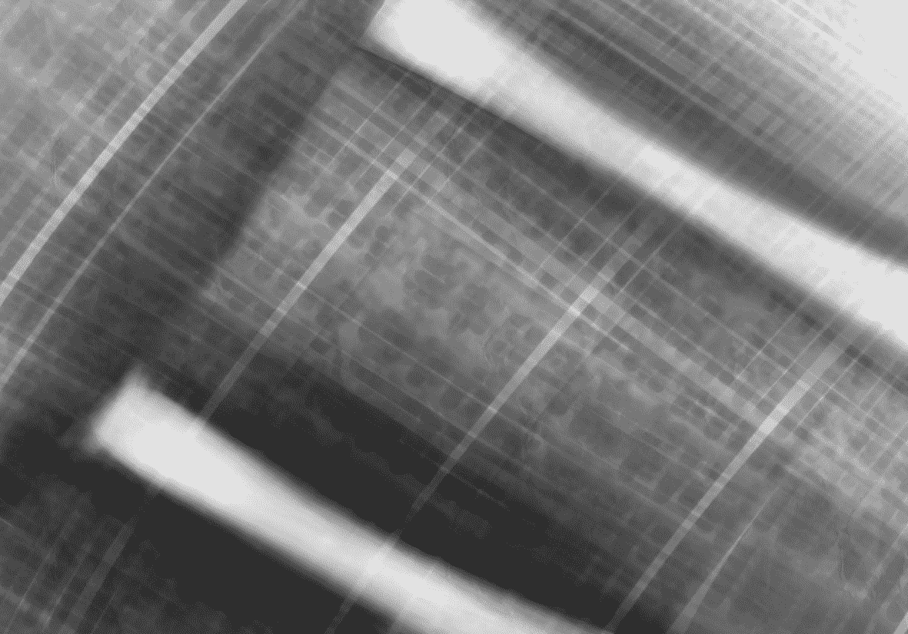
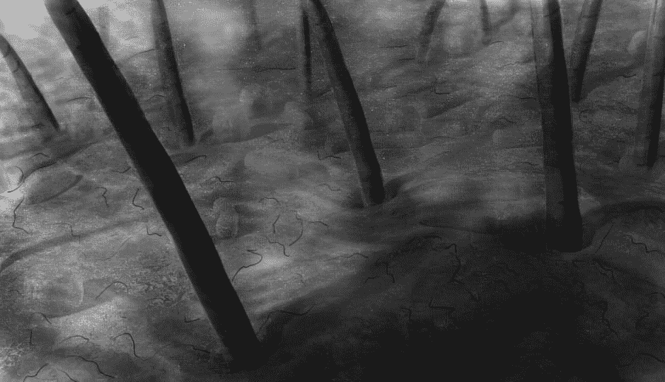

# 【G酱】我的世界 森林篇~

作者：gw1990zzz

TID：18885

 

# 1

*本帖最後由 gw1990zzz 於 2015-4-26 22:19 編輯*

**原本打算昨天发的，实在太晚就改今天了~

废话不多说，下面正文：

**“这是哪里？我又在哪？”四周昏暗，朦朦胧胧。

“好闷热，而且湿气好重，呼吸都感觉困难。”好像还有一股奇怪的味道，搞的心脏加速狂跳。浑身很不自在。       “啊，额头有血！”用手摸过额头，通过细微的亮光才发现丝丝血迹。这时才发现自己有些头痛，想不起之前发生了什么。

“这里是沙漠？”因为四周空旷，给人的感觉就像是夜晚的沙漠。然后蹲下身来仔细抚摸了下地面立刻否定了自己的想法。

“地面很硬，而且成块状分布。加上地面很多凹陷，这不像是普通沙漠的构造。”望向远方，貌似粗大弯曲的树干互相缠绕直冲天际，甚是壮观。

“我从没看过如此景象，一定要拍下来留念。要让苏晓助手也看看。”说着拿出了平时随身携带的相机向远方猛拍了几张。

“嗯？苏晓是谁来着？”看着手中的相机时才想到嘴中念叨的人到底是谁？记忆顿时出现了混乱。情急之下赶忙在身上寻找可以利用的东西。待从前到后翻看自己白大褂里外后才发现，除了身上挂着的相机外什么都没有。

“这可真是人间惨剧，既不知道自己何来，也不知道之后目的，更在这‘荒郊野外’鸟无人烟的地方，这不是要被饿死渴死么？”想到这里决定还是向某个方向前进。

“看树木大都指向一个方向，那就朝那里前进吧。虽然说是树木，不过相邻的都很遥远，特别是粗壮的。”一边说着一边朝着最近的一棵前进。由于没有表之类的东西，只靠脑内约计算时间。可能走了5分钟吧，终于走到了跟前。              <ignore_js_op></ignore_js_op> **3.jpg** *(388.4 KB, 下載次數: 1)*

[下載附件](forum.php?mod=attachment&aid=NTE2NTh8ZDNkNmZhZDF8MTYwMDg4OTY3OXwxODIzMHwxODg4NQ%3D%3D&nothumb=yes)

1

2015-4-26 21:07 上傳

“这简直是擎天巨物啊！不是树木。这应该是某个远古时期遗留下来的遗迹吧？真是太壮观了。”围着这跟柱子转了一圈发现直径足足有自己的一二十倍。

“这个也要合影留念，如果之后回去的话，好向那些妹子们炫耀。哈哈。那些妹子都谁来着？除了苏晓还有谁？为什么对这个名字印象这么深？其他却想不起来。。”仔细抚摸这根柱子，质地很硬，而且上面纹路很清晰。远处看以为是圆形，其实实际是四边形。思考片刻也不管那么多，先对着拍了几张图，然后靠在上面又给自己来了个自拍。还觉得不满意，拿起地上一块不知什么的硬物在上面刻上自己的名字“XXX到此一游”然后又站在旁边拍了张照才算彻底满意。

“话说这个真的是好高啊！抬起头向上看去。直耸入天空，然后又拐向与其他柱子相同指向的地方。继续向上看去终于见到了真正的云层。屡屡微光就从那些缝隙当中射下，神圣而又庄严。走到光芒下面，沐浴在圣光之中，倍感荣幸。

<ignore_js_op></ignore_js_op> **2.jpg** *(282.14 KB, 下載次數: 1)*

[下載附件](forum.php?mod=attachment&aid=NTE2NTl8ZDMxMGQ1NTV8MTYwMDg4OTY3OXwxODIzMHwxODg4NQ%3D%3D&nothumb=yes)

2

2015-4-26 21:33 上傳

“既然目标已经找到了，那就该出发了。”转身离开柱子，朝着柱子的指向前进。

“虽说要前进，可没有食物与水该怎么办？”环顾四周发现在众多大坑当中，有些坑中会缓慢的向外冒出水，犹如涌泉。

“看来这还是活水，应该可以饮用。”抿了一下嘴唇发现自己早就饥渴难耐，三步化作两步，飞快走到坑边。跪在地上就把头伸进水中，想要饮个痛快。

“咳咳，这水是咸的！而且是温的。”缓了一下思绪，接着说道：“应该是由于下层产出的盐分，还有地表的热度跟水一起涌出导致的。毕竟走了一路发现地面都是温热的，极易使身体水分流失。喝这个还能补充流失的盐分，杀菌消毒。简直是上天安排的一样。在此谢谢上天的眷顾！”对着头顶远方缝隙流露出的光芒，一边奋力的喝着水。一边感激着。

“这次该走了，不过貌似食物还没有解决。”回望周边，看到比起粗大的柱子，还有较低切细的小柱子，在柱子边有着一块块将要脱落的半透明物体。伸手想拿掉一块，但发现没那么好拔。

“嘿~  呦~ 哈~~~哈~~~”总算像拔萝卜一般扯下来一大块。用手摸着这东西韧性很大，不过貌似很好咬。硬度像是牛板筋，口感微咸。咽了一块，顿时“唔。。。呜。。咳咳！咳咳！ 啊。。差点没被噎死。看来是能吃的，就是要慢慢嚼啊~”

“好了，食物也解决了。可以上路了。希望可以找到出口回到我的家中。”一边说着一边将口粮放入衣袋当中，朝着定好的方向前进。“这可真是个阴森的森林啊！”看不到尽头的路，自己也不知会走多久，只是觉得不往那边行进，就觉得找不到真相与回家的路。

<ignore_js_op></ignore_js_op> **1.jpg** *(59.22 KB, 下載次數: 0)*

[下載附件](forum.php?mod=attachment&aid=NTE2NjB8MmJjMTE4NjR8MTYwMDg4OTY3OXwxODIzMHwxODg4NQ%3D%3D&nothumb=yes)

3

2015-4-26 22:18 上傳

“该死，教授也不知道将文件藏在哪里了。碍事的人消失了，没想到教授这个试验品只用了一次就报废了。一定要找到设计图纸，要不之前所做的事情都要付诸东流了。。”一边心想一边焦急的苏助手说道。“没想到那老家伙走的那么快，让我都来不及套出来，真是。。。”  

# 2

插图均为板绘  本来只想画插画的   然后觉得不过瘾  就画成场景  配文字

转念一想 这你妹不成了轻小说了？

两个同时做果然很费时间啊=。= 

# 3

近期试着做伊莉雅同人   距上次更新快一年了   原本承诺了许多都付诸东流了。。

实感抱歉~

附去年作品链接

[http://www.giantessnight.com/gnf ... 3%E6%9D%8F%E5%AD%90](http://www.giantessnight.com/gnforum2012/forum.php?mod=viewthread&tid=16898&highlight=%E4%BD%90%E4%BB%93%E6%9D%8F%E5%AD%90)

 

# 4

行进还在继续，总是感觉四周的怪味好像越来越浓了。这种味道说不上是难闻，也不能说是好闻。每每一次呼吸都觉得一种奇怪的感觉堵在心口，加上地面比之前继续升温，湿气扑面。这种感觉犹如小说中写到的被魅魔魅惑的勇者，当然我不是什么勇者，也没见到有什么魅魔。

好像又走了一段路吧，因为这地方完全没有路标，森林又如原始森林般树木交错毫无规律性，不像之前那样还有指向，很容易走错路迷失方向。迷离的夜色倘若能够再加上些乌鸦。那保准是西方奇幻小说那样的“魔女之森”。“真像是魔女构造的森林啊！”我不禁的苦笑道。

“啊！！啊！！受不了了！！找了这么久竟然连根毛都没有找到。早知道刚才就不一时兴起的使用那瓶药了。还用了两次连药渣都没剩下，这让我怎么跟组织交代啊！像我14岁就大学毕业，17岁就博士的天才竟然会犯这种低级的错误，真是情理不通。”苏晓生气的躺在沙发上，一反常态的将脚翘在了桌子上，淑女气质全无。

“话说那两个家伙应该还活着吧，外边那个已经感觉不到了。里面那个貌似还挺活跃，应该在辛勤的劳作着。吃着我做的食物，帮我调理身体，而且完全不用去管他的死活，身心都自愿并强迫屈服于我，这简直是最极端的剥削。不！这叫做等价交换！噗~呵~呵~呵。哈哈~哈哈哈~”苏晓已经笑得合不拢嘴。清纯的外貌，纤细净白的身体，搭配着如娼妇般的笑声。完全的与周围的环境不搭调。不过这种反差萌，估计还是会有些变态喜欢上吧！

“噗！噗！！！噗~”羞红的脸颊，让苏晓知道自己犯了个错事，但依旧笑着扭过脸去。然后片刻又转回头来“还好，又感觉到他的存在。应该没有大碍，小家伙干的不错，既舒服又顺畅。鉴于你这么卖力，一会儿一定好好犒劳犒劳你。吃顿健康好的的，滋养滋养。我好你也好，不是么？”一只手抚摸着某处，给予慰藉一般的爱抚，虽然不知道对方能否感受到。但这个支配感，不仅让自己的心情愉悦，生理好像也受到了大脑通过神经的刺激，映现在某处。

“真糟糕，湿气更严重了。就连树干上也挂着大颗的水珠。脚下也开始积攒水坑，都可以漫过脚踝了。不行，不能再待在这边了，必须找到高处并避免滑落到低处。”而后加紧步伐向着前方凡是有坡的地方前进。来避过这次不知道算是什么的危机。

按脚程跑了大概一公里的距离，已经上气不接下气了。每次喘息都伴随着一种胃的痉挛，想将从胃肺所有的东西都倒泄出来。但周围的环境却迫使你要去习惯它，屈服于它创造的世界，抛弃一切自己的习惯与以往的生活理念。融入到这个新的世界中去。嘲笑着，讽刺着，奴役着你的身心。“真是恶趣味啊，记不起之前发生的事情，完全无法理解现今的状态。”一边喘气一边感慨道。

就像是上天刚刚降临了天使一般，心中顿时萌生起犹如重生般的希望，在仰望天空后发现了有这光芒的山顶，矗立在那里的是希望的道标。崇高而又神圣，俯瞰着渺小的自己。双腿也不知是由于奔跑乏力，还是由于看到这绝景，竟然酥软跪在了地上。任由树干上的水珠低落在自己身上，洗礼着自己残破卑微的身心。

“终于达到山顶了！”这个声音可能是从嘴中说出的，也可能是从心中说出~