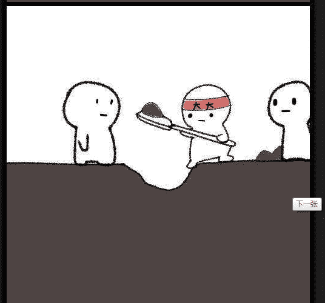
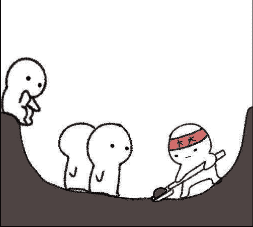
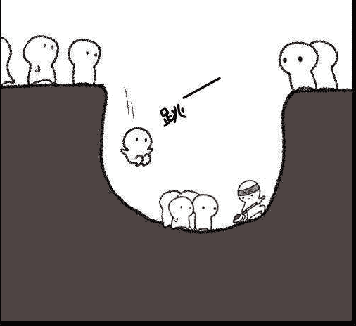
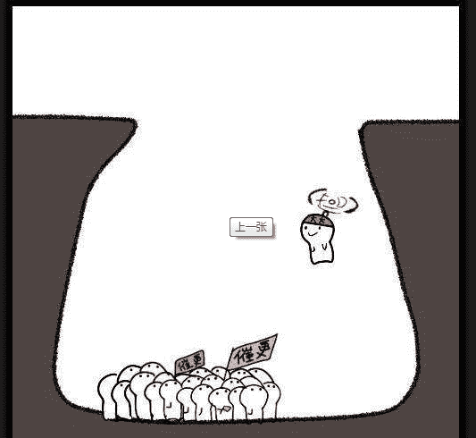
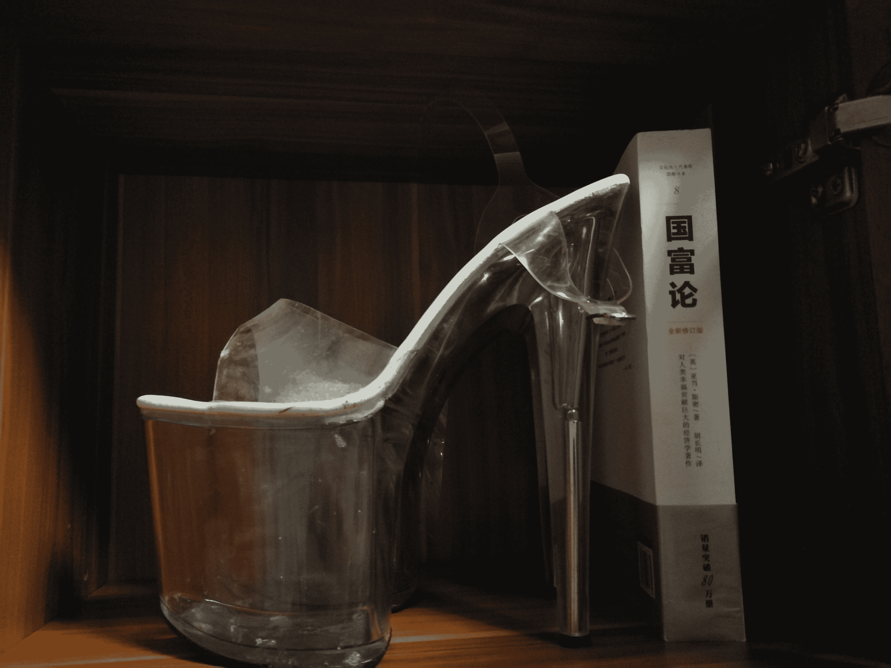
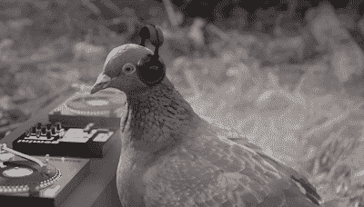
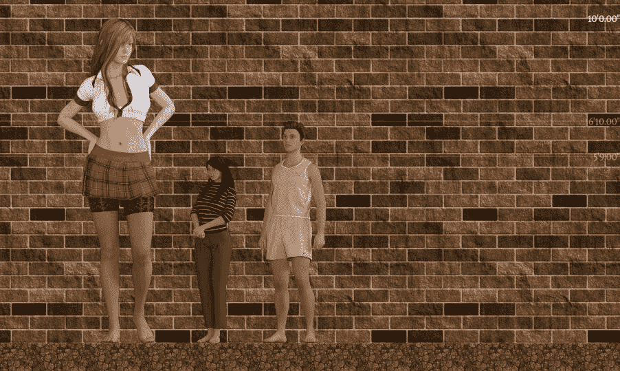

# 【miniGTS，growth】林萱瑜的錯誤日常

作者：EIec

TID：22625

 

# 1

*本帖最後由 EIec 於 2017-3-12 13:06 編輯*

習慣性一樓留做說明用，二樓開始正文1，本文屬於日常向的互動（偶爾歡樂），微黃不重口，不是很實用（嗯）2，樓主寫東西屬於抽風性的，更新不定時不定量3，文章劇情推進比較慢，不對，是壓根兒沒劇情，可以當做一系列短文的合集來看4，文中一切人物的觀點僅代表我認為該角色應該有的表現，請勿過度帶入5，長期徵收龍套，格式發到三樓————————————重新排下版，希望大家看着舒服点（好吧其实是我自己看着都头晕了） 

# 2

*本帖最後由 EIec 於 2017-3-11 14:55 編輯*

小小的煩惱

M市是中國非常普通的一個二線城市，普通到在市區隨手拍一張照片都可能會與至少兩位數的城市類似。真要說有什麽與眾不同的，那就是當地興盛的教育行業了。M市的政府相當重視教育事業的發展，不但有國立的，還有眾多相當有實力的私立學校參與競爭，東方集團開辦的東方高級中學便是其中的佼佼者，儘管私立學校在生源上受到諸多限制，但東方高中的高考升學率與重點率仍位居全省前列。當然，背後有財大氣粗的東方集團，東方高中的校園也是相當大氣，直接在市郊圈去了一大片地，校園裏甚至還有一條商業街，校園建設直逼大學。

不過東方高中到底還是一所看升學率的高中，自然不可能像大學一樣放任學生自己安排。學校平常封閉式管理，根本不允許家長過來探望，學生的活動也大多集中在宿舍樓與緊挨著的教學樓之間，只有週日才允許學生自由活動，逛逛校園其它地方。

林萱瑜便是東方高中的一名高二學生，成績說不上多好，但也不差，屬於學校最大眾的那種學生。真正意義上的朋友也不多，與同學之間也沒什麽隔閡。一言以蔽之，她就是學生中最平凡的那種路人乙的存在。

平凡不代表沒有煩心事，林萱瑜就有一個屬於自己的，小小的煩惱，那就是身高有點矮。今年已經17歲的她身高依然只有一米五，常年霸佔著班級各種活動的第一排。雖然周圍的同學並沒有因此而捉弄她，但萱瑜自己卻一直渴望能再高一些。為此她沒少喝牛奶，聽說經常鍛鍊有助於長高后她每個假期都要去健身房鍛鍊，效果倒是很明顯，看起來有一種健康的美，唯一的問題是身高依舊是精確到小數點後一位的一米五。

“你還沒到長身體的時候呢。”媽媽一直用這句話安慰萱瑜。但萱瑜知道自己已經在這個高度停留了兩年，多半是沒機會再長高了。只是知道是一回事，接受是另一回事，萱瑜不停地在尋找長高的辦法，也不知道試了多少種辦法。

一天晚上下了晚自習，萱瑜與往常一樣躺在宿舍裏玩手機，突然彈出來一個廣告：“物理療法快速增高，無痛不吃藥，有效再付款

雖然本能的覺得這種廣告不能信，但對長高的怨念讓萱瑜沒有第一時間關掉頁面。“不吃藥，有效再付款……試試唄，反正不見效果不給錢。”說著，萱瑜打開微信聯系上了對方，簡單幾句話便把學校的地址發了過去。

時間過得很快，轉眼就到了週日，買的“治療器材”也快遞到了學校，萱瑜帶著一絲緊張的心情將包裹拎回了宿舍。本來宿舍是八個人睡上下鋪的，但因為班上只有19名女生，所以萱瑜的宿舍倒是只有三個人，此刻另外兩個都不在，依慣例應該是出去逛街了，一下午都不回宿舍。

萱瑜手忙腳亂地把包裹拆開，只見裏面是一個方方正正的大盒子。萱瑜深呼吸幾口，打開盒子一看，差點被一口氣嗆到：裏面放著的哪是什麼治療器材，就是一雙透明的恨天高，粗粗估計一下大概鞋跟能有20CM，果然物理增高無痛不吃藥。

萱瑜自認碰上了騙子，氣呼呼地拿出手機質問賣家。賣家也真不要臉：“這就是我們的增高產品，您穿上就能增高。”

萱瑜倒是還嘴快：“我脫下來就減矮了對吧。”

出乎意料的，賣家還在耐心解釋：“不，是這樣的，我們的產品只是看起來像高跟鞋，但實際上它真的有增高效果。不信您可以先試試，一個月後還是沒有效果我們不收一分錢，這雙鞋算白送您了。”

誒嘿，真有意思了，騙子不談錢了，萱瑜不禁開始相信對方的話了：“那你們這鞋怎麼用啊？”

“您就正常穿就行了，只要你穿上它走路就可以產生療效。”

聽對方說得這麽玄乎，萱瑜決定再信一次，反正穿雙高跟鞋又不虧本。

看看時間尚早，萱瑜果斷穿上了這雙“增高產品”。但有的事情是看起來很美，比方說穿高跟，萱瑜一站起來立馬感覺到重心不穩，趕緊抓住了床腳的柱子纔算站穩。萱瑜小心翼翼地扶著床往前走著，卻是怎麽走怎麼彆扭。好在萱瑜小時候學過舞蹈，平衡性還可以，自行摸索了半天終於能不扶著床走路了。

“穿高跟真累人，早知道就應該提前問下老媽怎麼走路了。”萱瑜坐在床上感嘆道，“不過長高的視野就是不一樣。”一念至此，萱瑜竟是又站了起來開始練習。

一下午的時間說長不長，說短也不短，就在萱瑜來回的練習中過去了。不得不說有的東西真的講究一個天分，一下午的時間萱瑜自學成才，已經可以穩穩當當地穿著高跟鞋走路了。

 

# 3

龍套報名

姓名：

性別：

種族：

身高：

樣貌特徵：

性格特點：

其它補充：

————————————————

注1：種族請儘量選人族，鑽出來一大群精靈惡魔啥的我很難調整啊

注2：身高請控制在2㎝~3m

注3：請長得正常一點，大背景是現代天朝，長得太轟動了容易上騰訊新聞

 

# 4

> [大撸若愚 發表於 2017-2-15 18:52](https://giantessnight.com/gnforum2012/forum.php?mod=redirect&goto=findpost&pid=323732&ptid=22625)

> 最高会生长到多高啊？有没有残忍系的啊

应该会在3~5m这个样子，残忍系个人目前不太想写，不过不排除什么时候突然有灵感了也可能会来一段

 

# 5

*本帖最後由 EIec 於 2017-3-11 10:03 編輯*

姬友 “呀，該上晚自習了，晚飯還沒吃呢。”玩累了的萱瑜突然想起今天晚上還有晚自習，“沒辦法，去買個麪包到教室吃吧。”說著萱瑜趕忙脫高跟鞋準備換回運動鞋。

說起來也是巧，好好的鞋子就在這種關頭壞了，另外一雙剛送去洗還沒拿回來。這下就很蛋疼了，不對，應該是咪咪疼。萱瑜看看這雙壞鞋，一咬牙，決定穿著高跟鞋去教室。

“簡直就是羞恥PLAY，我絕對會成全校話題的。”萱瑜一邊穿一邊唸叨，“鬼知道老謝抽什麼風不允許穿拖鞋進教室，要不然打死我都不會穿這種鞋出去。”

只可惜假如嘀咕有用就不是嘀咕了，萱瑜再怎麼不願意也只能穿著高跟鞋出門。好在現在臨近晚自習，宿舍樓沒多少學生，萱瑜一直下到三樓都沒碰到學生。

“呼，累死了，穿著高跟下樓真難。”萱瑜扶著樓梯扶手感嘆道，“不過好在沒碰上同學。”

人總有一種心理，就是明知道遲早都要發生的事情，卻總希望能晚點發生。不過現實是殘酷的，墨菲定律是真的存在的，萱瑜還沒感嘆完，便聽見身後傳來了一聲非常清晰的“萱瑜！”

萱瑜不用回頭就能認出了這個聲音的主人：姬友加損友的吳希。敏捷特長者，力量4，敏捷5，體質4……咳咳，這裏不搞這一套，重來。吳希與萱瑜的父母就是好友，所以兩人從小就玩在一起。與見到陌生人就說不出話的林萱瑜不同，吳希是全社交加點，即使是第一次見面的陌生人也能迅速與對方聊到一起。

“那個，吳希啊。”萱瑜勉強笑著扭過頭來，“還沒去教室啊，晚自習要遲到了。”

“我們CC管得又不嚴，反正沒被領導抓到遲到就行了，又不像你們那個老謝那麽變態。”吳希笑嘻嘻地往下半走半蹦，“來來來，讓我看看小萱瑜是不是又長大了。”

“啊，那個……”萱瑜也知道姬友就這毛病，不但口無遮攔，手也沒遮攔。更可氣的是自從知道自己為長不高煩惱之後經常會故意把自己往她胸口摟，擺明欺負自己沒她高。

還沒等萱瑜說完，吳希已經跑到了萱瑜身後，兩隻手直奔主題，開始揉起萱瑜的胸，一邊揉一邊評論：“嗯，好像幾天沒捏你又變大了呢。”

“那個……”萱瑜一臉困擾地看著姬友。（萱瑜內心：終於不用成天抬著頭看人了）

過了幾秒吳希才反應過來：“呀，幾天不見小萱瑜長這麽高了。”還沒等萱瑜迴應，吳希又低頭看下去：“萱瑜你哪找來這麽高的高跟鞋啊？不對，萱瑜你對身高有多怨念啊？”

萱瑜一瞬間在心裏掀翻了不知道多少張桌子：所以說你的注意力一直都在我的胸上嘛你個女淫魔。“本來只是買來穿著玩的，結果剛好今天鞋子壞了，只能穿著這雙出來了。”

吳希若有所思地看著萱瑜：“對一米五的怨念已經深到要用高跟鞋來彌補的地步了啊，果然完全沒辦法理解的痛苦呢。”這種時候她還是不忘揶揄萱瑜的身高。

“你胸太小不要跟我說話。”深知姬友是什麼德行，萱瑜也果斷往對方傷口上再捅一刀，“別別別，請不要用你的胸板砸死我。”

要是在以往這麽說都會招來吳希的洗面奶（板？），不過這次萱瑜穿著高跟，吳希倒是沒辦法再把萱瑜摟到胸口了。

“行行行，你胸大你有理。”說著吳希身子一挺，“穿上高跟還比我矮一截的小、萱、瑜。”

萱瑜給了吳希一個白眼：“姐姐，咱們整個高二級的女生都沒幾個比你高的好不。就我所知你們班包括男生在內也就四個比你高的。”  

# 6

> [netamoon 發表於 2017-2-16 22:24](https://giantessnight.com/gnforum2012/forum.php?mod=redirect&goto=findpost&pid=323848&ptid=22625)

> 话说填的表都会出现吗喵？

不一定，取决于你捏的人物是不是太出格，普通人是最容易出场的，越特殊的越难出场，我只能说尽量安排出场，但可能会很晚，也可能会大改

 

# 7

*本帖最後由 EIec 於 2017-3-11 10:06 編輯*

羞耻PLAY？

穿著這麽引人注目的高跟鞋，萱瑜一路上自然收獲了不少注目禮。不過有吳希在一旁打岔，萱瑜也沒功夫去在意。話又說回來，就算在意又有什麽用呢？萱瑜也不可能矇住別人的眼睛。

“那我回班了。”吳希揮手告別，“你……噗，別扭到腳。”

“去你的！”

萱瑜小心翼翼地走進教室前門，心虛地掃一眼教室，發現沒有人注意到自己，趕緊坐到座位上用書包擋住課桌的側面。

好在自己的座位就在門口，要不然真要被圍觀了。萱瑜暗自慶幸著。

“餵，萱瑜。”坐在萱瑜身後的黃玲雅突然壓低聲音喊道。

“哈？”萱瑜被黃玲雅嚇了一跳，一嗓子把全班的注意力都吸引過來了。

大家對於這種“突發”情況早已司空見慣，最多抬頭看一下而已，只有幾個調皮的男生起鬨著喊了幾句，店裏充滿了快活的氣息，我也只有在這時才能跟著笑幾聲……咳咳，不對，串課文了，是教室裏一下子吵鬧了不少。

“萱瑜你幹嘛了。”

“啊，沒事，剛纔在走神。”萱瑜不自覺地拿起筆開始玩。

“你是不是穿高跟鞋了？”黃玲雅再次把萱瑜嚇了一跳。

“啊？那個……你咋知道的？”萱瑜心虛地問道。

“你忘了高跟鞋走路的動靜有多大了？我剛才還以為是老師呢，害我低頭裝了半天。”

之前萱瑜只顧為走路和隱藏而頭疼，現在被黃玲雅一提醒才想起來，平常自己就是聽著高跟鞋聲來躲老師的，怎麼此刻竟然忘了這件事了。

萱瑜乾笑兩聲表示默認，黃玲雅倒是來了興致：“誒，你也不怕被老謝約談啊？”

“我沒鞋穿了才穿的這個出來，要這都不給那我就只能光著腳來教室了。”

黃玲雅正準備繼續說下去，老謝就很合時宜的走了進來。雖然大家都喊“老謝”，但其實老謝並不老，恰恰相反，老謝是剛從東北師大研究生畢業，只是長得有點著急，二十多歲長得飽經風霜，又有點發福，跟個四十多歲的“老”幹部似的。

老謝叉著手環顧一圈，滿意地走上講臺開始演講：“今天晚自習大家都很準時，我就簡單講幾件事……”

十分鐘後……

“……好了，大家自習吧。”老謝終於停止了口水攻勢，轉身離開教室。

在門口站了三分鐘的物理老師哭笑不得地走了進來：“你們班主任也是為了你們好，你們不要不耐煩。好了，各列第一排下去收一下物理作業。”

“咳咳！”正在喝水的萱瑜頓時嗆到了。

“聽見沒有啊，收一下作業，其他同學把《同步》拿出來，翻到37頁，我們講一下題。”

萱瑜磨嘰半天，還是只能苦著臉站起來下去收作業。這次清脆的高跟鞋碰地面的聲音再掩飾不住。

“我靠，萱瑜你穿這麽高的高跟鞋啊！”謝俊突然叫了起來。

這一嗓子可是一石激起千層浪，班上一下子變成了菜市口，聽清楚的在看萱瑜，沒聽清的在問旁邊人，漠不關心的也在趁機聊天。

“安靜！你們是在晚自習啊還是逛街啊！”物理老師一下子鎮住了場子，“就收個作業你們都這麽吵，你們用嘴收作業啊？”

萱瑜僵硬地走下去挨個收作業，即使低著頭萱瑜也能感覺到周圍同學的注視，不時還能傳來幾句低語，雖然聽不清內容，不過萱瑜還是本能的認為那是在議論自己。一想到這裡，萱瑜更加尷尬，動作越發的不自然，終於······成功摔倒了。

“嗯？”教學經驗豐富的老爺太清楚這時候那群調皮搗蛋的學生會有什麼行為了，搶先一步把大家都鎮住，“都看什麼啊，沒見過摔跤的是不是？”

萱瑜滿臉通紅地重新站起來，快步走上講台把作業交了。老爺看看萱瑜，低聲說了一句“下自習出來一趟。”

整節晚自習萱瑜都心不在焉，只盼著趕快下課，也不知道下了課又會怎麼樣。

好容易捱到下課，班上同學呼啦一下圍上來一圈，七嘴八舌地問萱瑜，內容不外乎還是圍繞著那雙高跟鞋的。好在老爺再次及時為萱瑜解了圍：“萱瑜，你過來。”

萱瑜站起來往門口走去，強行讓自己無視掉身後那一群圍觀群眾。

“萱瑜啊，你為什麼要穿高跟鞋來教室啊？”站在走廊上，老爺開門見山地問道。

萱瑜低著頭看向老爺的衣領，仿佛那上面有什麼東西似的，也不吱聲。

“校規雖然沒有規定，但你應該也知道老師是不鼓勵你們穿這種鞋的。”

“那個······”萱瑜囁嚅道，“我沒有鞋穿了。”

“什麼？”老爺沒有聽清楚，大聲問了一句。

“我，我的鞋子壞了，只能穿這一雙。”萱瑜快哭出來了。

“哭什麼嘛。”老爺趕緊安慰。“我又不是來訓你的，我只是了解一下。”

其實萱瑜也知道老爺並沒有訓斥的意思，只是天生的內向讓萱瑜還是不習慣跟老師說太多話。

“那你要趕緊再找一雙鞋，要不然體育課你總不能穿這雙鞋跑步吧。行了，回去吧。”

 

# 8

*本帖最後由 EIec 於 2017-2-25 18:44 編輯*

断网一周的楼主回来了

明天开学，更新频率会放慢不少吧

另外再说一遍设定越接近现实的越容易出场，需要新角色时会优先从报名的角色里挑选

 

# 9

> [shendanxiaogui 發表於 2017-2-21 01:05](https://giantessnight.com/gnforum2012/forum.php?mod=redirect&goto=findpost&pid=324255&ptid=22625)

> 果然变成我预想中的样子了……作者半天不更新，读者设定一个比一个发的快。最后就是作者每集更新只要写80% ...

好主意，我怎么没想到呢 括弧笑

 

# 10

> [shendanxiaogui 發表於 2017-2-25 18:58](https://giantessnight.com/gnforum2012/forum.php?mod=redirect&goto=findpost&pid=324875&ptid=22625)

> (๑•ี_เ•ี๑)只是大大你这种长期征收人设的行为我不喜欢啦……因为发设定的肯定都想上文，然而不可 ...

只是实在懒得想配角了而已······（好懒啊动不了了.jpg）另外我准备做成一个中短篇合集那样的脑洞集合贴，有合适的脑洞又没办法当长篇的就扔这里，所以需要的配角数量大概是没有上限的···吧？

 

# 11

*本帖最後由 EIec 於 2017-3-11 10:11 編輯*

偷偷诈尸更新攒人品，许愿······好像圣建没啥特别想要的，那就许愿约克公爵和U艇吧

—大—家—好—我—是—分—割—线—

算是有效果······吧？

好容易熬到下自習，萱瑜一反常態的第一個沖出教室，急吼吼地回到宿舍脫下那雙高跟鞋。

“呼，第一次發現原來拖鞋是這麼舒服。”萱瑜毫無形象地將自己攤在床上愜意地說道，“高跟鞋絕對是反人類的發明。”

萱瑜放鬆地在床上滾了一會兒，終於想起來自己為什麼要穿那雙高跟鞋，趕快站起來量身高。

“什麽嘛，根本就是騙人的。”雖然宿舍沒有卷尺，但那熟悉的踮起腳尖都夠不到櫃子頂的感覺分明在告訴萱瑜自己並沒有長高。

話又說回來，沒有明顯變化才應該是正常情況吧。假如一晚上就能長高到有體感差異，那在周圍人看來已經是肉眼可見了，從植物學的角度來看都是不靠譜的吧。只是萱瑜剛體驗過一米七的感覺，此刻一下回到一米五，落差太大導致了失望。

萱瑜自己也明白這個道理，所以也只是抱怨兩句。“唉，今晚都搞這麽羞恥了，希望這東西真能有點用吧。”

就在萱瑜躺在床上胡思亂想之際，另外兩個舍友回來了。

“萱瑜你也真成，穿著高跟去教室。”李樂詩見到萱瑜第一句話就是這個。

萱瑜苦笑著回答：“你當我想啊，你看我那鞋都張嘴了，還怎麽穿。”

“嘖，那你明天怎麽辦啊？還穿高跟鞋？”

“誒對，你先借我一雙唄。”萱瑜一翻身從床上坐起來一臉認真地看著李樂詩。

“啊？”李樂詩一下子沒跟上萱瑜那跳躍的思路，“啥？”

“我說你先借我一雙唄，就明天一天。明天下午我就能拿回另一雙了。你放心，到時候我負責洗。”

“問題是我是37的鞋，你穿太大。”

“湊活一天唄，總比穿著高跟鞋去好。”

“隨便你，記得洗幹凈就行。”說著李樂詩拿出一雙備用的鞋扔到萱瑜床邊，“喏，你要能穿就穿吧。”

“明天還有體育課，擦。”萱瑜一遍試鞋一遍嘀咕，“誒等下，樂詩你這鞋多大的啊？”

“我不剛說了37的嘛。”

萱瑜站起來走了兩步，明明自己的腳是34的，卻並沒有感覺樂詩的鞋有多大，穿起來和自己的鞋差不多大小。難道那東西真的有效果？萱瑜心中一陣激動，臉上卻強裝平靜。

不過很明顯小說里那些說沒表情就沒表情的傢伙都是作者閉著眼睛編的，萱瑜現在不用看鏡子都知道自己的表情有多扭曲，趕緊轉身背對樂詩。

看樣子有必要再穿一下這雙鞋啊。萱瑜暗自想著。對了，還有必要找個地方記錄一下身高，嗯，就在床架上劃線就好了。

脫掉鞋躺回床上，萱瑜有的沒的想了一大堆，越想越興奮，熄燈之後依然一點睏意都沒有。

“喂，樂詩？阿羽？”萱瑜小聲喊了一句，確認兩個都睡著了，自己躡手躡腳地爬起來，穿上那雙高跟鞋偷偷溜出了宿舍爬上樓頂瞎轉悠。

“再多走一會兒，應該能長高一點。”在這種想法的鼓勵下，萱瑜一直在上面轉悠到雙腿發軟才回到宿舍，即使躺到了床上也依然不肯脫掉高跟鞋。

 

# 12

*本帖最後由 EIec 於 2017-3-11 14:54 編輯*

3个黎姐没有约克公爵

————————————

小摩擦

毫無疑問，頭天晚上使勁嗨的代價就是第二天起不來。萱瑜只覺得自己剛閉上眼睛就被人喊醒了。

“喂，萱瑜，遲到了。”

萱瑜迷迷糊糊地爬起來，閉著眼睛套上校服。“啊~為什麼週一還要升國旗啊，好想再睡會兒。樂詩，幫我跟老謝請個假，就說我病入膏肓進醫院了。”

李樂詩選擇性無視掉萱瑜的滿嘴跑火車，留下一句“四十了”就匆匆跑出宿舍。

萱瑜呆呆地在床上坐了一分鐘才反應過來：“WHAT？四十了？慘了慘了又沒空吃早餐了。”說著站起來抓著校服外套就想往外跑。

這時候萱瑜終於完全清醒過來，腳掌的神經清晰地提醒著自己昨晚是穿著鞋睡覺的。在遲到面前萱瑜也顧不上三七二十一，粗暴地把兩隻高跟鞋蹬掉踢到一旁，換上運動鞋就往大廣場跑。畢竟宿舍扣分事小，升旗遲到事大。

“呼，呼，呼。”雖然跑得氣喘吁吁的，不過萱瑜總算沒有遲到，“為毛非得把廣場放這麼遠啊，誠心折騰人嘛。”

萱瑜迅速站到隊伍的最前面，確認了老謝還沒到，才放鬆下來扭頭開始聊天······等下？萱瑜突然發現一件並不應該感覺意外的事情：自己長高了。原本站在萱瑜後面的李玥儀比萱瑜剛好高那麼一點，現在萱瑜明顯感覺到了自己比對方要高一些。有的東西只有有比較才有感覺，尤其是當參照物還是一個煩人的傢伙的時候，萱瑜一想到這裡不禁咧嘴笑了起來。

萱瑜能感覺到這微妙的變化，參照物自然也能感覺到。“喂，你幹嘛呢。”李玥儀大聲罵道，“有毛病啊。”

“我想啥要你管。”對於這個傢伙萱瑜從來沒好脾氣。

準確來說班上大部分同學都不待見李玥儀，原因很簡單：這貨是個公主病，除了少數幾個以外看不起任何人，覺得世界就應該圍著她轉，偏偏還有個在教育局當副局長的老爸，加上自己成績也不差，所以學校也不怎麼管她，還在當擺設的社聯掛了個職（雖然學校名義上有五十多個社團，然而其中絕大部分都只活在新生入學，一年不見得有一次活動）。在學校還有一批差不多家庭的同學，組成了一個自以為是“高端人士俱樂部”其實就是一幫缺乏家教的官二代富二代湊一起互相嘚瑟的小群體，一天到晚臭屁得跟個起點女頻主角似的。

“竟然自卑到要用高跟鞋和內增高來掩飾自己的平庸。”李玥儀認為對方絕對是穿了內增高才會比自己高。

雖然早就習慣了這貨的發言，不過還是擋不住煩不是。萱瑜反唇相譏道：“是是是，你偉大，你光輝萬丈，也不知道昨天是誰被老謝點名批評請個假都要到處炫耀。”打人不打臉，李玥儀一上來就揭萱瑜傷疤，萱瑜自然也不留什麼情面。

“你！”也許是太久沒人頂她（大家早就學會了把她當空氣了），李玥儀一下被嗆得沒接上話。

“你什麼你，你以為你算哪根蔥啊，大家懶得理你還真把自己當回事了。”萱瑜越罵越來勁，卻是一點面子都不給李玥儀留，“還有啊，上週······”

“喂，老謝來了！”站在一旁的吳楠突然提醒道。

李玥儀看見老謝就像看見了救星一般，鼻子一抽就淚汪汪地跑了過去向老師匯報：“老師，林萱瑜她欺負我······”添油加醋地控訴一番，仿佛受了天大的委屈。

老謝也知道李玥儀平常是怎麼一個情況，只能無奈地應付幾句把李玥儀打發走，又把萱瑜喊到一邊。

“萱瑜啊，同學之間呢應當友好相處······”

【萱瑜：我只跟會講道理的人友好】

“大家不要鬧那麼僵······”

【萱瑜：還不是那貨先戳人痛處】

“雖然我也知道她平常與大家相處得不太友好······”

【萱瑜：所以說你在這裡逮著我說有什麼用啊】

“你看大家還是要做同學的，你呢去跟她道個歉，也不是什麼大事。”

【萱瑜：老謝你腦子瓦特了吧，讓我去跟她道歉？我又沒犯錯，是她主動挑釁的來著。】

心裡罵歸罵，表面功夫還是要跟老謝做的，按照以往的尿性老謝也不是真指望萱瑜能去主動低頭道歉，更像是例行公事的敷衍。

 

# 13

> [starcraftorz 發表於 2017-3-10 08:29](https://giantessnight.com/gnforum2012/forum.php?mod=redirect&goto=findpost&pid=325801&ptid=22625)

> 哇咿 更新了更新了 看起來女主這是要身高暴漲的時候了嗎？ 我好興奮啊

嗯，按照我的想法应该是一直保持低速成长，一天几厘米，每天都有变化又不会在短时间内被看出来那个样子？

 

# 14

> [sevenstrasword 發表於 2017-3-10 23:49](https://giantessnight.com/gnforum2012/forum.php?mod=redirect&goto=findpost&pid=325895&ptid=22625)

> 一天1厘米十天也10厘米了，短时间也很明显了。。。

嗯，我的短时间是一两个小时，想写出那种每天在熟人眼中逐渐长高的感觉，而不是走在路上都会被路人看出来的疯长

 

# 15

刚想更新突然发现写出bug了正在努力修补，今晚争取改出来

 

# 16

> [aouyou 發表於 2017-3-11 18:45](https://giantessnight.com/gnforum2012/forum.php?mod=redirect&goto=findpost&pid=325975&ptid=22625)

> ...~那是不是我们要憋久一点再看额~ 233

这是一个大君主之怒砸出来的泰矿坑，指不定什么时候能憋完呢.jpg)

 

# 17

*本帖最後由 EIec 於 2017-3-12 10:15 編輯*

搞姬日常

高中的日常總是這麼單調，下課吹吹水，上課走走神，偶爾跟人吵吵架，一個白天就這麼過去了。

下午下課后萱瑜去了趟洗衣房，把那雙送去洗的鞋取回來，回到宿舍就準備換鞋。

稍有常識的人都會知道，假如我們的坦克继续，啊呸，是假如穿著37的鞋都不覺得大，那34的肯定小。萱瑜把腳往鞋里一探立刻發現了這個問題。但自己總不好一直霸著李樂詩的鞋，只能硬著頭皮往腳上穿。

可惜有的東西是不因主觀意識的變化而變化的，鞋子小就是小，萱瑜不管怎麼擠都只能穿上半隻腳。

“這就非常不人道了。”萱瑜終於放棄嘗試把腳塞進去，坐到床上心情複雜地感歎道，“還得多蹭幾天鞋。不過······”萱瑜又看向了那雙高跟鞋。

“這東西真的有效果啊。”想起今天升國旗時李玥儀的那個表情萱瑜又笑了起來，“再多穿一會兒效果應該會更好吧。”

一念至此，萱瑜又穿上了那雙高跟鞋：“反正都作過一次了，不在乎再來一次。”

有了前一天晚上的經驗，這次萱瑜總算沒有再引發圍觀。“總感覺自己的恥度很微妙的變大了呢。”這是萱瑜的原話。

下了晚自習萱瑜也沒再急著往宿舍跑，反而溜達到了樓上去找吳希。（果然同一個羞恥PLAY玩多了就有抗性了嘛······）

“小萱瑜來了啊。”吳希依舊要著重強調那個“小”字。

“想你了唄。”

吳希也不顧周圍還有其他同學，衝過來就開始揉胸：“一天沒摸，還是小萱瑜的手感比較好。”

萱瑜一臉黑線地看著自己的姬友，她最近好像越來越不在乎影響了，難道說終於要突破最後一點人性的束縛露出自己野獸的一面了嘛。

“走不？回宿舍。”為了自己的清白，萱瑜果斷打斷姬友的施暴（咳咳，好像用詞不太對？）。

“走。”吳希用行動作出了回答：直接繞到萱瑜背後就想抱起萱瑜。嗯，反正萱瑜早就習慣了姬友的不著調。

“呀，小萱瑜你還穿著這雙鞋呢。”你看我剛才說什麼來著？

“等下，這雙比昨天那雙還高啊？”吳希終於回到了人類狀態，發現明明昨天還比自己矮半個頭的萱瑜今天就和自己一樣高了。

“嘿嘿嘿，不能總讓你天天摸頭不是。”萱瑜不想暴露秘密，也樂得吳希自己誤解，“我覺得現在我比你高了。”

“那可未必。”吳希不服氣地說，“要不咱倆比比？”

“哈？”

“誰輸了誰就讓對方隨便摸。”吳希又開啟百合狀態了······

比身高嘛，本來就不是什麼麻煩事，兩人背對背一站就能比。

“喂，那個誰，梁敏，過來幫忙看一下我倆誰高。”吳希在班上隨便喊了一個看起來比較有空的同學。

梁敏白眼一翻：“姐姐你一米七五找我來看，我踮起腳都看不著你頭頂啊。”

“大概的就行。”

“我看著差不多。”

萱瑜松一口氣：“那咱倆算平局吧？”

“不行。”滿腦子百合花開的吳希不樂意了，“平局怎麼揉啊。”

“欸，正好，游云！過來幫個忙。”吳希看著走廊眼前一亮，大聲喊道。

只見遠處一根頂梁柱移了過來。咳咳，這麼形容女孩子真是罪過。夏游云，原來初中時候就和萱瑜吳希她們一個班，從小個子就高，說是鶴立雞群一點都不為過。上了高中非但沒有減緩發育，個子反而變本加厲地往上竄。188的她走在走廊上要比周圍同學都高出大半個頭，難怪吳希能一眼認出來。

“吳希，萱瑜都在呢。”夏游云樂呵呵地打個招呼。

“招呼等下再打，先過來幫忙看一下我倆誰高。”吳希急匆匆地打斷。

“萱瑜你長個子了？”夏游云本能地作出判斷，然後才反應過來，“這麼高的高跟鞋啊。”

“這話我說過了，趕快來幫忙看看我倆現在誰高。”

夏游云也習慣了吳希，一隻大手按到吳希頭上：“唔······好像萱瑜稍微高那麼一點呢。”

吳希一臉鬱悶：“啊？啊敗了敗了。嗚，沒辦法，我豁出去了，萱瑜你看著摸吧。”

吳希一邊說一邊抱住夏游云使勁蹭：“這冷漠的世道，只有這奶子還有點溫度。嗯，一隻手剛好握不住的感覺還真是奇妙呢。”喂，少女你真的有鬱悶這個模式嘛？

暫時躲掉了魔爪的萱瑜內心早已掀起了一陣波濤：吳希是175，自己原來150，這雙鞋就算20cm，那也就意味著自己這一天就長了5cm還多？

萱瑜被自己這個計算嚇了一跳：開什麼玩笑，這個速度絕對是在挑戰生物學吧，自己不會是被當成了小白鼠之類的東西了吧。嘛，不過沒感覺有什麼後遺症，應該不會出什麼大事，大不了以後小心點不就行了。（作者：燒酒我看你思路清奇，來跟我重修邏輯學吧） 

 

# 18

“小”麻煩

認真權衡利弊之下（真的有嗎？），萱瑜決定繼續穿著這雙高跟鞋，怎麼著都要再長高點不是？至於恥度······反正都有過兩次了，債多了不愁，也許大家就都習慣了呢？

對於學生來說一般只有兩樣東西限制，一個是學校紀律，一個是個人意願。現在校規沒有規定不能穿高跟鞋，萱瑜自己又豁出去不在乎了，自然沒有什麼阻礙。不過考慮到老謝的死板，萱瑜到底不敢明目張膽地上課穿，也只有晚自習穿一穿。當然晚上睡覺是斷然不會脫的。

萱瑜的想法的確很美好，不過實行起來就是另一碼事了。比方說現在鞋萱瑜沒有合腳的鞋子，這倒比較好解決，大不了繼續借李樂詩的穿；但也有不好解決的，比方說萱瑜一早起來發現的問題：衣服太小了······

嗯，就像你們某些人想的一樣，全套的、由內至外的小了。

事實上萱瑜早晨是被勒醒的。俗語有雲“衣不差寸，鞋不差分”，現在萱瑜算是徹底懂了：胸罩的帶子都快勒進肉里了。更加令萱瑜崩潰的是因為胸罩太小了現在連脫下來都是一件挺富有挑戰性的任務。

這還不算完，好歹胸罩還能解開，內褲就徹底沒辦法了。萱瑜小心翼翼地將已經被撐得失去彈性的內褲脫下來······“刺啦”，好吧，嘗試失敗了。萱瑜撇撇嘴，開始用暴力手段解決。

“啊啊啊啊這下麻煩了。”萱瑜渾身赤裸地坐在床上，“為什麼會變成這樣呢······”

“萱瑜你抽什麼風。”萱瑜的動靜成功將舍友吵醒了，“現在才幾點啊。”

“我擦？萱瑜你是要幹嘛？”睡在對床的陳嘉羽一眼就看見了這個非禮勿視的場景，“生理衝動被壓抑太久終於要釋放了嗎？”好吧，也許對她們來說只是宿舍.avi的一部分而已。

萱瑜一臉祥林嫂地看著陳嘉羽，把陳嘉羽看得心裡直發毛：“喂喂，沒事吧，你說話啊。”

“出大事了。”萱瑜一開口就把陳嘉羽嚇一跳。

“幹嘛了，先說好我不解決生理需求啊。”

萱瑜搖搖頭，自言自語道：“沒辦法了，這週先忍著吧。”

“喂，到底怎麼了，神神叨叨的。”

“沒事，一點‘小’麻煩而已。”

說著，萱瑜光著身子就開始翻衣櫃。

“那你也不能當眾擼管啊。好歹把底褲穿上啊。”確定萱瑜沒有被鬼上身（喂！）後陳嘉羽開始肆無忌憚起來，“臥槽你別把底褲拿過來啊。臥槽你別過來。”

“穿你個大頭鬼啊，我是說你看都成這樣了怎麼穿。”

“你們兩個，搞姬也看下時間好不好。”得，樂詩也被吵醒了，“哎我去，你倆真的要搞姬啊。”李樂詩一起身就看見萱瑜脫個精光站在陳嘉羽的床前，手裡還拿著一條底褲準備往陳嘉羽的臉上蓋。然後······她拿起了手機，是的，看見這一幕的李樂詩在第一时间做出了正确选择（并不）：拿起了放在枕頭旁的手機準備錄像。

“你們繼續，我不打擾你們。”

“李，樂，詩！”萱瑜徹底被這倆搞得沒脾氣了。

李樂詩迅速放下了手機：“好了好了，開玩笑的。不過你要繼續裸奔我就真的控制不住我的手機了。”

聽見這句話，萱瑜趕快翻出來校服襯衫和運動褲給自己套上。然而就算是最寬鬆的校服襯衫，對萱瑜來說也只是相對，大概就是緊貼和勒的區別。

當然了，裡面是真空狀態，沒辦法，誰會給自己準備大幾碼的內衣呢？

 

# 19

> [sevenstrasword 發表於 2017-3-12 21:42](https://giantessnight.com/gnforum2012/forum.php?mod=redirect&goto=findpost&pid=326098&ptid=22625)

> 遇到自己喜欢的贴总是希望楼主能化身码字机器Orz

你应该想“万一楼主今晚脑子一抽把存稿也扔出来了呢”

 

# 20

> [sevenstrasword 發表於 2017-3-12 22:59](https://giantessnight.com/gnforum2012/forum.php?mod=redirect&goto=findpost&pid=326120&ptid=22625)

> 增加点设定可不可以~

> 就是也会跟林萱瑜一起去健身~ 属于那种脱衣有（肌）肉的那种~

> 腹肌也有的那种Orz

你是不是想说“其实我是穿上衣服才显瘦的那种人”.jpg)

 

# 21

<ignore_js_op>[b64543a98226cffc969bffbaba014a90f603ea01.jpg](forum.php?mod=attachment&aid=NjcxODZ8NDkxYTc1ODJ8MTYwMDg3OTAzMXwxODIzMHwyMjYyNQ%3D%3D&nothumb=yes) *(207.29 KB, 下載次數: 21)*

[下載附件](forum.php?mod=attachment&aid=NjcxODZ8NDkxYTc1ODJ8MTYwMDg3OTAzMXwxODIzMHwyMjYyNQ%3D%3D&nothumb=yes)

2017-3-12 23:14 上傳  

</ignore_js_op>  

# 22

*本帖最後由 EIec 於 2017-3-13 00:01 編輯*

被看出来了？被看出来了！

其實身高是一個很複雜的東西，大多數人都極度依賴自己的眼睛來判斷。這麼一來就會出現一個相當有趣的現象：雖然從數值上來看1m75去掉20cm的高跟鞋之後依然比1m5高出5cm，但眼睛卻會欺騙自己這二者是一樣高的。

現在萱瑜就是這種情況的最好說明：儘管前一天晚上穿上高跟鞋有1m75，但周圍的同學卻完全沒有看出來萱瑜的增長，就連好姬友吳希都只是認為萱瑜又換了一雙鞋。而今天萱瑜穿著運動鞋到教室後立馬就被黃玲雅看出來了。

“我靠，萱瑜你是屬竹子的啊。”黃玲雅如是說道，“幾天就竄這麼高。”

“啊？啊，總是該長身體了呗。”萱瑜隨口胡謅著。

“誒嘿，長高了嘛？”坐在一旁正無聊的謝俊剛好聽見了對話，“來，我看看。”

也不等萱瑜答應，謝俊就把手伸過來摸摸萱瑜的頭：“一點沒長嘛。”

“狗俊你又在調戲妹子了。”陳震也加入了吹水的行列。

“切，你懂啥，這叫珍惜資源。你看萱瑜跟我多熟，對吧。”後半句是對萱瑜說的。

“也不知道昨晚是誰在宿舍BB說——”陳震故意拖長了音。

“我靠你閉嘴，這種東西是能拿出來說的嘛。”

被謝俊這麼一打岔，話題徹底跑沒影了，大家都開始天南地北的侃大山。

早讀還只是個預防針，之後的體育課上萱瑜更是吸引了全班大多數人的目光。

嗯，我們的李玥怡同學再次成為了參照物，儘管她本人並不樂意。而在注意到大家目光之後萱瑜也有意無意地往李玥怡身後躲了一下，雖然這只是一個習慣性的害羞動作，此刻在眾人眼中卻是萱瑜在故意反襯李玥怡的矮：現在的李玥怡只能勉強達到萱瑜的眉毛了。

至於李玥怡······好吧，沒人在乎她是怎麼想的，不過萱瑜稍微惡意揣測了一下，無非就是“哼，不就是穿個內增高嘛”。

至少在這一刻，萱瑜還是挺享受眾人的圍觀的。

大家圍觀歸圍觀，體育課到底還是用來出汗的。尤其是對萱瑜來說更是如此：她打了一節課的羽毛球。

然後的劇情大概可以概括為《震驚！清純少女濕身福利，我都看呆了！》。

（畫外音：講人話！）

咳咳，就是說萱瑜出的汗都沾衣服上了，然後校服襯衫濕了之後就半透明了，再然後李樂詩就過來低聲跟萱瑜說了一句話，然後就沒有然後了。

嗯，就是你們猜到的：“我都能看出來你沒穿。”

萱瑜的臉瞬間紅了起來，在宿舍可以隨意，但現在可是在操場啊。萱瑜緊張地環視一圈，果然有不少灼熱的目光。

不過好在大家都還比較克制，至少沒有盯著看的，再加上校服再怎麼樣都不是透明的，應該······多少······有點效果······吧？萱瑜只能自我安慰著。

回到班上后，黃玲雅低聲問了句“萱瑜你真的沒穿啊？”

果然自我安慰都是騙自己的。

 

# 23

这一周始终没进入状态，满脑子都是开新坑（笑）

突然找到一组很合适的图片（趴）

 

# 24

<ignore_js_op>[82E08C04E6FD8C1BECF1F28178C9EFFF.jpg](forum.php?mod=attachment&aid=NjcyODJ8OGJlM2M4MWN8MTYwMDg3OTAzOXwxODIzMHwyMjYyNQ%3D%3D&nothumb=yes) *(76.06 KB, 下載次數: 8)*

[下載附件](forum.php?mod=attachment&aid=NjcyODJ8OGJlM2M4MWN8MTYwMDg3OTAzOXwxODIzMHwyMjYyNQ%3D%3D&nothumb=yes)

2017-3-19 14:38 上傳  

</ignore_js_op> <ignore_js_op>[BBC2C6150DD7C3111C03C5FFF664E4D2.jpg](forum.php?mod=attachment&aid=NjcyODN8Y2QxMTcxMWF8MTYwMDg3OTAzOXwxODIzMHwyMjYyNQ%3D%3D&nothumb=yes) *(62.81 KB, 下載次數: 4)*

[下載附件](forum.php?mod=attachment&aid=NjcyODN8Y2QxMTcxMWF8MTYwMDg3OTAzOXwxODIzMHwyMjYyNQ%3D%3D&nothumb=yes)

2017-3-19 14:38 上傳  

</ignore_js_op> <ignore_js_op>[42956218517C090E76224C26FFBF7C5A.jpg](forum.php?mod=attachment&aid=NjcyODR8ZmQxMWFjZDl8MTYwMDg3OTAzOXwxODIzMHwyMjYyNQ%3D%3D&nothumb=yes) *(77.78 KB, 下載次數: 3)*

[下載附件](forum.php?mod=attachment&aid=NjcyODR8ZmQxMWFjZDl8MTYwMDg3OTAzOXwxODIzMHwyMjYyNQ%3D%3D&nothumb=yes)

2017-3-19 14:39 上傳  

</ignore_js_op> <ignore_js_op>[D3B0852923FFF07D3917962676C9FC49.jpg](forum.php?mod=attachment&aid=NjcyODV8YWQ5MTE2NzF8MTYwMDg3OTAzOXwxODIzMHwyMjYyNQ%3D%3D&nothumb=yes) *(69.07 KB, 下載次數: 4)*

[下載附件](forum.php?mod=attachment&aid=NjcyODV8YWQ5MTE2NzF8MTYwMDg3OTAzOXwxODIzMHwyMjYyNQ%3D%3D&nothumb=yes)

2017-3-19 14:39 上傳  

</ignore_js_op> <ignore_js_op>[11A215E561AE90220FF3D247A5FBEC1E.jpg](forum.php?mod=attachment&aid=NjcyODZ8MzdkYTU4OTV8MTYwMDg3OTAzOXwxODIzMHwyMjYyNQ%3D%3D&nothumb=yes) *(96.88 KB, 下載次數: 3)*

[下載附件](forum.php?mod=attachment&aid=NjcyODZ8MzdkYTU4OTV8MTYwMDg3OTAzOXwxODIzMHwyMjYyNQ%3D%3D&nothumb=yes)

2017-3-19 14:39 上傳  

</ignore_js_op> <ignore_js_op>[0E3A45394AEB21975711284A2976F00B.jpg](forum.php?mod=attachment&aid=NjcyODd8NTEwOTY5NjZ8MTYwMDg3OTAzOXwxODIzMHwyMjYyNQ%3D%3D&nothumb=yes) *(88.94 KB, 下載次數: 3)*

[下載附件](forum.php?mod=attachment&aid=NjcyODd8NTEwOTY5NjZ8MTYwMDg3OTAzOXwxODIzMHwyMjYyNQ%3D%3D&nothumb=yes)

2017-3-19 14:39 上傳  

</ignore_js_op> <ignore_js_op>[00AE4E13936ED9785025FE25B8DB51B7.jpg](forum.php?mod=attachment&aid=NjcyODh8MzZmODk5NmZ8MTYwMDg3OTAzOXwxODIzMHwyMjYyNQ%3D%3D&nothumb=yes) *(84.77 KB, 下載次數: 3)*

[下載附件](forum.php?mod=attachment&aid=NjcyODh8MzZmODk5NmZ8MTYwMDg3OTAzOXwxODIzMHwyMjYyNQ%3D%3D&nothumb=yes)

2017-3-19 14:39 上傳  

</ignore_js_op> <ignore_js_op>[2DD0ABE367BAE28DB258AA8875FBAC6A.jpg](forum.php?mod=attachment&aid=NjcyODl8NDkxMGQwMzV8MTYwMDg3OTAzOXwxODIzMHwyMjYyNQ%3D%3D&nothumb=yes) *(86.77 KB, 下載次數: 3)*

[下載附件](forum.php?mod=attachment&aid=NjcyODl8NDkxMGQwMzV8MTYwMDg3OTAzOXwxODIzMHwyMjYyNQ%3D%3D&nothumb=yes)

2017-3-19 14:39 上傳  

</ignore_js_op> <ignore_js_op>[34EE8BD45F83B8CC41069DA8C62B440D.jpg](forum.php?mod=attachment&aid=NjcyOTF8OTU1ZTlhNjZ8MTYwMDg3OTAzOXwxODIzMHwyMjYyNQ%3D%3D&nothumb=yes) *(97.35 KB, 下載次數: 3)*

[下載附件](forum.php?mod=attachment&aid=NjcyOTF8OTU1ZTlhNjZ8MTYwMDg3OTAzOXwxODIzMHwyMjYyNQ%3D%3D&nothumb=yes)

2017-3-19 14:40 上傳  

</ignore_js_op> <ignore_js_op>[03DF3F3A6B576282431C8F056FB2617D.jpg](forum.php?mod=attachment&aid=NjcyOTJ8YjVkYjM5OWF8MTYwMDg3OTAzOXwxODIzMHwyMjYyNQ%3D%3D&nothumb=yes) *(82.48 KB, 下載次數: 3)*

[下載附件](forum.php?mod=attachment&aid=NjcyOTJ8YjVkYjM5OWF8MTYwMDg3OTAzOXwxODIzMHwyMjYyNQ%3D%3D&nothumb=yes)

2017-3-19 14:40 上傳  

</ignore_js_op> <ignore_js_op>[8EF29B024AE28EF8016B044E4281B13A.jpg](forum.php?mod=attachment&aid=NjcyOTN8Y2NmZWM3OGN8MTYwMDg3OTAzOXwxODIzMHwyMjYyNQ%3D%3D&nothumb=yes) *(96.53 KB, 下載次數: 3)*

[下載附件](forum.php?mod=attachment&aid=NjcyOTN8Y2NmZWM3OGN8MTYwMDg3OTAzOXwxODIzMHwyMjYyNQ%3D%3D&nothumb=yes)

2017-3-19 14:40 上傳  

</ignore_js_op> <ignore_js_op>[A19A0C6BED369D40B23E70B8A7A33B44.jpg](forum.php?mod=attachment&aid=NjcyOTR8ZmI4ZjViY2Z8MTYwMDg3OTAzOXwxODIzMHwyMjYyNQ%3D%3D&nothumb=yes) *(124.35 KB, 下載次數: 3)*

[下載附件](forum.php?mod=attachment&aid=NjcyOTR8ZmI4ZjViY2Z8MTYwMDg3OTAzOXwxODIzMHwyMjYyNQ%3D%3D&nothumb=yes)

2017-3-19 14:40 上傳  

</ignore_js_op>  

# 25

> [a458895655 發表於 2017-3-19 16:25](https://giantessnight.com/gnforum2012/forum.php?mod=redirect&goto=findpost&pid=326597&ptid=22625)

> 不要啊啊！！我要看更新！！

放心，我不是那种随便弃坑的人，只是暂时没激情写不出好看的而已

 

# 26

*本帖最後由 EIec 於 2017-3-20 12:32 編輯*

什麼叫一條龍服務······ 咱們上回說到，那林萱瑜的身高只見如新露頭的竹筍一般，不消兩日便竄出一截，引得眾人不住地猜測她可是吃了什麼靈丹妙藥。然殊不知風光背後卻是啞巴吃黃連，有苦說不出啊。且不說那還沒發生的，但就現在便有一樁煩心事困擾著萱瑜，那便是······沒法好好買衣服啊。哎媽呀，總算把畫風拉回來了。  其實說起來衣服也不是有多難買，學校里就有賣校服的，從150到190全都能買到。但問題是萱瑜現在買回來一件穿不了兩天就要買更大碼的，這不是擺明浪費嘛。但不買······這幾天穿啥？

就在萱瑜鬱悶之際，某個奸商發來了微信。嗯，就是那個賣高跟鞋的。對方非常“及時”地來賣衣服了。

“我們的產品有效嗎？”

“有效果。”

“那么我猜您一定需要買衣服了。”

“······”

“不要誤會，我的意思是剛好我這裡也有衣服賣。”

所以說這還TM成一條龍服務了對吧。萱瑜徹底折服于對方的無孔不入。“你們衣服怎麼樣的？”

“我們賣的衣服和你街上買的都不一樣，你根本找不到像我們這樣的，我們的衣服採用了balbala（此處省略一頁廣告）”

萱瑜隨手劃拉了一下，看著那一大串密密麻麻沒排版的廣告词頭就大：“說重點。”

“哦，我們的衣服呢有這麼幾個特色balabala（此處再次省略一頁）”

“能簡單點嗎？”

“我們的衣服能跟著變大。”

“哈？”萱瑜登時楞了一下，“真的假的？”

“我們有實際視頻的。”說著發過來了一段小視頻。視頻內容很簡單，就是一個瘦子把衣服脫下來給一個胖子穿上。

不得不說對方的一條龍生意的確有一套，就這麼一段視頻剛好就對上了萱瑜的需求。“價格呢？”

“一件500。”

“這麼貴？”

“你想啊，假如你去買普通的衣服那你過兩天就要扔掉，但我這衣服可以一直穿到你不想穿為止。”

萱瑜一想好像也的確是這麼一回事，咬咬牙，就買了一件。  

# 27

*本帖最後由 EIec 於 2017-3-20 12:33 編輯*

实在没想起来写啥，写段过渡的证明一下自己真的不会弃坑 

# 28

果然是個坑“我賭五毛那個奸商絕對早就準備好後續了。”萱瑜懷著一種十分糾結的心情嘀咕著，腿上放著的就是剛買的那套balabala一堆廣告詞的衣服。嗯，昨天下的單今天就到了。“而且感覺到又有個坑在等著我。”事實證明女人的第六感是很準確的，萱瑜一臉奶疼地看著寄來的那件“衣服”。從形狀上來看它真的就是一件T恤，但是這個材質······“為什麼是透明的啊！你們做雙鞋子透明的就算了，為毛連衣服都是透明的啊！”萱瑜感覺一陣的糾結，默默聯繫上賣家：“給個說明？”反正她知道對方知道她不知道，不過她不知道對方知不知道她知道。亂了沒？沒亂我再來兩行。“你好，我們這個衣服balabala”對方還是這麼熱情。“同一個梗不要連續用兩章，會被罵湊字數的。”“盒子里有個平板，自己挑款式，你要樂意在上面畫畫都行。”萱瑜又翻了一下放在一旁的包裝盒，果然看見一個iPad mini似的PDA。“我靠高科技啊！”萱瑜感歎道。“你就偷著樂吧，我這成本價賣你了。”萱瑜沒再理會那個奸商，開始玩起那個PDA。當然也只是長得像而已，一打開就能看出明顯的不同。功能也很簡潔，甚至可以說是簡陋：款式設計面板基本上和Windows自帶的畫圖在一個水平上，能用，也僅僅是能用。萱瑜隨意挑了一個看起來比較舒服的藍色直接涂滿了整個區域，保存修改，然後眼睜睜地看著那衣服的透明度被人從100拉到了0，就仿佛這件衣服原本就是藍色的一樣。“麻吉呀巴库内，看樣子真的買了件不得了的衣服呢。”萱瑜目瞪口呆地看著這件衣服。再用手揉一揉，感覺好像的確是布料。萱瑜迫不及待地穿上了這件衣服，別說，還真挺合身的，簡直就像是量身訂做的一樣。“我去，二了。”萱瑜突然想起一件非常重要的事情，“我忘了買褲子了。”“在不？”萱瑜第N次打開微信。“褲子一條700”“······”所以說你丫都是算好了的對吧，上次是故意只說衣服的對吧！萱瑜計算一下自己存起來的壓歲錢，一咬牙：“成交。”這次萱瑜沒等多久，當天晚飯時間快遞就送來了。萱瑜再次確認對方絕對是一開始就在這裡挖個坑等著她往裡跳了。

 

# 29

再来一段过渡的，下次应该会进剧情了，应该吧 

# 30

> [颀砍 發表於 2017-3-25 22:26](https://giantessnight.com/gnforum2012/forum.php?mod=redirect&goto=findpost&pid=327226&ptid=22625)

> 楼主甚是高产呀，话说女生们真的会这样嘛

嗯，肯定有夸张成分，不过你可以参考一下男生宿舍的阿鲁巴活动。反正通常来说同性之间都相对要放肆一点.jpg)

啥？为啥我知道？有种身份叫蓝颜

 

# 31

说来惭愧desu

这两天STEAM日呆周，楼主沉迷于nepnep无法自拔，忘了更新desu

现在就滚去码字desu

 

# 32

啊啊啊啊啊完了完了，几天没动笔都不会写东西了怎么办desu 

# 33

*本帖最後由 EIec 於 2017-4-4 12:58 編輯*

大家好我是久违的更新

————————————————————

閒暇時間 時間一轉眼就又來到了週日。我知道上一章就是週六了，不是這麽說顯得有感覺嘛。

對於東方高中的學生來說週日是為數不多的自由活動時間，所以大多數女生都會選擇在這一天約上幾個好友一起在校園溜達。嗯，男生都在籃球場揮灑青春呢。

萱瑜也是這“大多數”中的一員，她約了游云一起出來。

“我說萱瑜啊，妳為什麼對高跟鞋這麽念念不忘的。”走在路上，游云一臉好奇地看著萱瑜。今天萱瑜依舊穿著那雙高跟鞋。穿了快一週的萱瑜在不知不覺中已經長了超過20CM了。尤其是前幾天沒有鞋子穿，只能天天穿著高跟鞋活動，個子也在跟著瘋漲。

“誒嘿嘿，那個，不是我現在沒鞋子穿了嘛。”萱瑜撓撓頭笑著解釋道。

“你這高跟鞋還越穿越高，我記得週二的時候你才到我這裏來著。”游云拿手在自己的嘴角旁邊比劃了一下，“現在你穿上高跟鞋比我都高了。”

也幸好萱瑜這幾天只穿高跟鞋了，肉眼對身高的判斷是很容易受到各種干擾的，尤其是高跟鞋這種，不瞭解的很容易把萱瑜這兩天長的身高歸功於高跟鞋。

聽見游云的話，萱瑜特意往游云身上蹭蹭：“每次見面都要我們抬頭看你，這次終於也輪到你抬頭了吧。”

“唉，真是不懂你呢。你要知道天天低著頭可是很累的，更別說還有一堆各種麻煩事要頭疼。”游云搖搖頭。

“你又不知道一米五成天見誰都仰頭是個什麼感覺。”萱瑜執著地回應道，“真是的，為什麼會有你這種天生就長這麼高的啊，要給我這個身高多好。”

“我還想要你那樣的呢。你是不知道，我現在一出門就被人圍觀，我爸媽的那群同事見到我第一句都是‘姑娘長這麼高啊’，你要是天天聽這個你也煩。”

萱瑜對此表示十分的期待：“不會呀，我應該會挺開心的才對，畢竟身高這種東西都是靠先天的不是嗎？”

游云對此表示不置可否：“也許吧，反正我覺得你要有那天你也會煩的。”

兩人就這麼說著走到了學校的商業街。這是個名副其實的商業街，整條街兩側都是店鋪：超市、書店、服裝店、快餐店，還有一個小茶樓和一個咖啡館。“果然學生的錢最好賺了”，一個家長在參觀完商業街后如是表示。

現在是早上九點，正是第一批學生來這裡採購的時間。萱瑜和游云一出現自然吸引了不少眼球：大家都知道高二有個女穆鐵柱，個子比籃球隊的都高。但這旁邊的又是誰啊，幾天不見又多一個？再仔細一看：我去，這妹子穿這麼高一雙高跟鞋是鬧哪樣啊，這鞋跟比人家腳踝都高了。

雖然不知道大家都在想什麼，但萱瑜也知道自己這個高跟鞋的形象在周圍人眼中大概會是怎麼一個評價，急急忙忙的躲到游云身後，推著游云進了一家咖啡館。

“你不是剛才還說挺開心的嘛。”游云樂呵呵地問道。

“那也不是現在啊。”萱瑜一翻白眼，“我現在穿著這雙鞋還跟你走一起，不知道的還以為我是自卑到扭曲了呢。”

“那你總不能在這裡躲一整天吧。再說你既然知道了為啥還要把我約出來。”游云無奈地看著這個突然害羞的好友。

“沒事，我就是突然緊張了，先在這裡坐會兒就好了。”

說著萱瑜就自顧自地走向前台，似乎真的準備要杯喝的在這裡坐上一整天。

“話說游云你要喝什麼，今天我請。”

“哦？啊，隨便什麼都行，來杯可可吧。”

這是一個不大的小咖啡館，畢竟主要的銷售對象就是學生和老師，都不是什麼高消費人群，自然也不像某些針對人傻錢多還想裝逼的暴發戶的咖啡館一樣恨不得在空氣中都寫滿逼格，反而裝修得比較親民。好吧，這裡在場的兩位妹子在這方面都不是專業的，不過有誰規定過一定要專業人員才能評價嗎？反正咱就是覺得這家店裝修得挺讓人舒服的。

萱瑜不一會兒就端著兩個馬克杯走向了一張靠窗的桌子：“咱們坐這裡吧。”

游云聳聳肩，跟著坐到桌子旁邊，拿著自己的可可一遍喝一遍與萱瑜閒聊。

“你好，這是您要的可頌。”一個小巧玲瓏的女生端著一份牛角包來到了桌子旁。

“早上沒吃飽。”萱瑜看游云的表情有點彆扭，趕緊解釋道。

“算了。”游云憋了半天還是決定不去和這個屬吃的好友計較。

看看現在咖啡館里也沒什麼人，游云乾脆把剛才那個服務生喊住開始聊起了天：“你今年多大了？”游云自己都沒注意自己在和這個服務生講話的時候帶上了一種逗小孩子的語氣，果然外表太迷惑人了。

“今年19。”眼前的服務生用一種軟軟的聲音回答道。

What？就這個看起來就是個未成年的蘿莉你說是19歲？作者你確定不是腦子一抽打多了一個1？我知道你是個死蘿莉控也不要這樣生造一個合法蘿莉吧喂！（作者：你再嘚嘚後面就沒戲份了。）

以上是游云的腦內劇場，不過眼前的服務生應該是被不止一次地說過類似的話題：“我真的19歲啦，只是外表看著像9歲。”就算著急的語氣都是那麼軟。

“好吧好吧。”游云很無語地接受了作者強行安插一個合法蘿莉的事實（作者：你還說），看了一下對方的工作牌，“那個，琉璃是吧，很獨特的名字呢。”（作者：你那名字還好意思說別人，不知道的還以為你倆是同一個RPG穿出來的女主和器靈呢）

“很多人這麼說呢。”

正在低頭吃早餐的萱瑜也加入了對話：“吶，話說你多高啊？”

游云：“萱瑜你少跟吳希玩，情商都被拉低了。”（遠處的吳希不禁打了個噴嚏。）

琉璃腼腆地答道：“一米三八，之後就一直沒再長了。”

萱瑜一聽見這個答案瞬間興奮起來，急急忙忙站起來按住琉璃：“嘩，真的哎，琉璃你才到我肚子這。欸，你掂下腳，好像能頂到胸。”

游云在一旁徹底看不下去了，把萱瑜拉回來：“注意點影響，咱們這還在人家店裡呢，你穿個高跟鞋就來炫耀了。”然後抱歉地跟琉璃笑笑，“不好意思啊，她就這毛病，突然就抽風了。”

“沒，沒事。”琉璃很明顯也被萱瑜的突然抽風嚇了一跳，頭髮都快豎起來了，“之前也有客人問過來著。”

“不過我猜沒有像她這樣上來動手的吧。”

“啊，沒有關係的。”琉璃算是默認了這個問題。

“那個，不好意思哈，我一下有點控制不住我自己。”平靜下來的萱瑜意識到自己剛才的失態，趕緊道歉。

被萱瑜這麼一搞，琉璃也不敢在這裡多呆，急急忙忙就離開了，留下萱瑜和游云繼續坐在店裡閒聊。 

 

# 34

#include <stdio.h>int main()

{

printf("duang的一下就诈尸了\n这两周忙成狗，沉迷于学习无法自拔\n");

}</stdio.h> 

# 35

假装有更新.jpg

高数又双叒挂了

乐观估计未来俩月都不一定有更新了

不过放心，我是不会弃坑的（大概） 

# 36

*本帖最後由 EIec 於 2017-5-12 00:33 編輯*

这次真的有更新马上要开活动了，更新一发攒人品，但求大船不贪吃、小船不假摔、斩杀一次过、S胜必出货——————————————————————————————————————————————這是個秘密

“我說，萱瑜你真打算就這麼在這裡坐一天啊？”“反正本來就沒什麼事情嘛，坐在這裡喝上一天的咖啡也不是不行啊。”游云哭笑不得地看著萱瑜：“的確沒什麼正事，不過總覺得還是太怠惰了呢。話說你整天穿著這麼高的高跟鞋到底是為了啥啊？”而且還一雙比一雙高，游云在心裡補充了一句。“嘛，大概就是假裝自己長高一點之類的唄……”，萱瑜一邊應付著一邊玩著手機，突然就把剩下的發言咽了下去，拿起馬克杯一仰脖子，將剩下的咖啡一口氣喝下，站起身來：“走，我們溜達去。”“啊？”游云一下子沒跟上萱瑜的節奏，愣愣地盯著萱瑜。“你不是說我怠惰嘛，我讓你看看什麼叫勤奮。”“咖啡裡沒下藥吧？”游云還是有點沒反應過來。“咖啡提神，行了吧，還是說你要在這裡坐一天？”萱瑜少見的在這種時候露出了一絲的不耐煩，轉身向門口走去，嘴裡還在小聲念叨著什麼。“哦，好。”游云雖然不太明白萱瑜到底吃錯了什麼藥，但還是跟著萱瑜走了出去。“話說萱瑜你準備去哪裡啊？”游云追上萱瑜，稍稍抬了一下頭，試圖從萱瑜的表情上看出什麼問題。“散步唄，圍著校園逛一圈。”萱瑜強裝著輕鬆說道。游云聳聳肩：“隨你咯。”於是乎二人就在這種莫名其妙的展開下開始在校園里閒逛起來。（游云：其實是作者準備搞事情又找不到過渡所以才會莫名其妙的吧。 作者：……你閉嘴。）以前說過，東方高中的校園是很大的，而且學生大多集中在商業街、籃球場之類的地方，所以其實校園又很多地方都是“人口密度無限接近於零”的。而現在萱瑜就是在領著游云向某個人跡罕至的實驗樓走去。嗯，高中的實驗樓，大家都懂的對吧，除了實驗課以外的絕大多數時間連老師都不在。萱瑜領著游云偷偷摸摸地摸到了實驗樓二樓的一個雜物間里。“果然這個門的鎖他們到現在都沒換。”游云一臉好奇地跟著萱瑜走了進來，仔細觀察著這個房間。這裡原本應該是一個存放教具的房間，不過從架子上那一層灰來看至少有很長一段時間都沒有人來過。墻邊擺著一張空蕩蕩的辦公桌，墻角放了幾張椅子。總體而言，就是一個已經被搬空了的廢房間。萱瑜直接走過去搬了一張椅子自己坐下：“隨便坐吧，這裡沒人。”“那個……你這是要搞什麼啊？”游云有點被眼前的神展開搞得不知所措。“你不是想知道這雙高跟鞋嘛，我就找個安靜點的地方跟你說明啊。”游云突然感覺自己好像問錯了問題：“呃呵呵，安靜，的確挺安靜的哈。”“因為，對我來說，這是個很重要的秘密。”“其實你是馬猴燒酒？”“……”“……”“你不用這麼調節氣氛的。”萱瑜一臉黑線地說道，“只是給你打個預防針而已。”一邊說，萱瑜一遍脫下了高跟鞋：“你不是想知道我為什麼一直在穿這雙高跟鞋嘛，來，你站過來。”游云一頭霧水地照辦，按照萱瑜的指示站到了她的面前，低頭看著萱瑜：“怎麼了嗎？”萱瑜沒有回話，只是光著腳站了起來，抬頭看著游云。“沒看出什麼問題啊……欸！？”游云一副被鬼見到的樣子，“萱瑜你……”“嗯吶，你沒看錯……”萱瑜搶在游云前面準備進行說明。“萱瑜你什麼時候留的長髮？”游云將後半句講了出來。“……”萱瑜瞬間覺得一口老槽卡在了喉嚨里，“你就沒發現我長高了嘛！”“欸，是哦，你這麼一說好像是比以前高了點兒。”“豈止是點兒啊，原來我只到你這裡好不好。”說著萱瑜雙手托住了游云的雙峰。“啊！”游云本能地叫了一聲，“是嗎？一直沒注意啊。反正在我看你們身高都差不多就是了。”“……赤裸裸的嘲諷啊，我還沒發反駁。”萱瑜悠怨地說道。“算了，反正你也看到了吧，這雙鞋子能讓我長高，只是要一直穿才會有效。”“這是何等的黑科技，果然這年頭作者連個有點邏輯的解釋都懶得想了嘛……”不理會那個說漏嘴的夏游云，萱瑜又穿上了那雙高跟鞋：“嘛，最簡短的解釋就是這樣了。果然這個視角舒服多了。”說著萱瑜雙手搭在游云的肩膀上，語重心長地說道，“所以說，以後很可能我會變成咱們學校最高的，你可別失落啊。”游云嘿嘿一笑：“我高興都來不及呢，那以後可就由你來負責吸引火力了。”——————————————————————————————————————

论坛的排版有毒吧，死活搞不了首行缩进……

 

# 37

> [198046 發表於 2017-5-14 19:11](https://giantessnight.com/gnforum2012/forum.php?mod=redirect&goto=findpost&pid=332257&ptid=22625)

> 不好意思楼主，我捞ex捞出u96了

为了庆祝，我决定再断更一个月

 

# 38

> [198046 發表於 2017-5-14 20:55](https://giantessnight.com/gnforum2012/forum.php?mod=redirect&goto=findpost&pid=332281&ptid=22625)

> ，楼主不要灰心，那天我捞了一个晚上没出，心态有点炸，结果第二天一大早起来第一把s胜出了，自己都 ...

别提了，老咸鱼没练吃撑没练鱼没有B25，现在还没油了，只能拿头捞

现在还在帮别人打活动呢，希望能攒攒人品。

 

# 39

成功在最后一把出货了（代价就是连补给的铝都不够了），为了庆祝决定明天更新 

# 40

> [2917680123w 發表於 2017-5-19 23:51](https://giantessnight.com/gnforum2012/forum.php?mod=redirect&goto=findpost&pid=333019&ptid=22625)

> 捞了三个96的不知道楼主在说什么

MMP，GN怎么也全都是海豹，来人，拿本企鹅祖传冰枪来.jpg)

 

# 41

> [四白 發表於 2017-5-20 20:55](https://giantessnight.com/gnforum2012/forum.php?mod=redirect&goto=findpost&pid=333093&ptid=22625)

> 所以说我永远都不会登场咯？

等着吧，谁知道什么时候就会突然登场呢

 

# 42

*本帖最後由 EIec 於 2017-5-21 00:03 編輯*

現在知道害怕了？

“游云你就這麼接受了這種設定？”離開了那個小房間，萱瑜還是有點不敢相信游云的接受速度，“你就沒懷疑一下其中的邏輯性？”

游云露出了一個燦爛的笑容：“當然懷疑啊。”

萱瑜：“……”

“但你自己也解釋不清楚啊，所以乾脆不問你了。”

萱瑜：”“……”臥槽她說得好有道理我竟然不知道應該怎麼反駁。

“對了，提醒你一下，個子高了可是會有各種你想都想不到的麻煩的。”

“為什麼總覺得你比我的接受能力還強……”萱瑜一臉尷尬地說道，“我說，你就不想知道為什麼我會突然告訴你這個消息？”

“我要是說作者以前就有人設跑得沒邊的習慣會不會被寫死。”游云小聲嘀咕了一句。

“哈？”

“啊，沒啥。”游云趕緊否認，“我只是一下子沒反應過來而已。”

“哎，反正遲早也要說，趁現在一起說了算了。”萱瑜故意裝得非常的誇張，“剛才啊，其實我收到了一個信息……”

“嗯。”游云做出了一個十分“恰到好處”的回應。

“我說，你能不能好歹配合一下啊。”

“哦？快說快說，信息講了什麼？”

“……算了，我說就好了。”萱瑜猶豫了一下，決定放棄拯救突然搞搞震的游云，“咳咳，其實吧，那個信息是賣這雙鞋的商家發過來的。然後呢，他自稱是個什麼研究院的，這雙鞋其實是他們的試驗產品。”

“What？”這個消息倒是的確把游云嚇了一跳（作者：連這種黑科技都接受了怎麼現在突然這麼激動）。

“嘛，大概就是這樣，所以我……”萱瑜的聲音越來越小。

游云大概猜到了萱瑜在想什麼：“那你還是小心點吧，別是碰上個騙子。”

“可，可是，我有點害怕。我會不會是當小白鼠了啊。”很明顯，萱瑜壓根就沒在同一個頻道上。

“的確是小白鼠，而且你這小白鼠的運氣還不錯，讓你實現了你一直以來的願望。”

“噗。”萱瑜一下子就被游云逗樂了，“也就你這種的一直不用擔心身高問題。”

“誰讓你一直就這麼矮了。”游云巧妙的岔開了話題。

萱瑜不服氣地挺了一下胸：“哼哼，現在我可是比你高哦。”

“是是是，敢不敢脫下鞋子來比一下？”

“切，你等著，再過兩天，我就比你高了。”說道這裡，萱瑜不禁又擔心起來，“你說我不會真的出什麼事情吧……”

“行了，鞋子就在你腳上，效果你自己都看見了，要不然現在就回去把鞋子鎖櫃子里，那不就結了。”

“那可不行，我還想再長高一點呢。讓那些成天笑話我小矮子的傢伙看看誰才是矮子。”

“所以你啊，就是自己作的。”游云給了一個一針見血的評價，“不過我還是要提醒你一下，小心別碰上個騙子。”（作者：我是不是第二次說要給這幫傢伙上邏輯課了？）

 

# 43

> [b9420 發表於 2017-6-15 03:21](https://giantessnight.com/gnforum2012/forum.php?mod=redirect&goto=findpost&pid=335778&ptid=22625)

> 今天预感要更新，然后上GN，看了一下最新回复，哇竟然真的有诶！

> 

> 然后 ->

假的，都是假的，下周有一堆考试，下下周开始恢复更新.jpg)

 

# 44

所罗门呦，我回来了POI

今天白天满课，看看晚上回来能不能摸一段 

# 45

*本帖最後由 EIec 於 2017-7-2 16:57 編輯*

一个月不动笔，忘了自己之前构思的剧情，大写的尴尬—————————————————————————————————————— 吳希的決定 高中的生活永遠的那麼單調，時間仿佛陷入了一個沒有結束條件的死循環，每一周都與上一周沒什麼區別。同樣的，再新鮮的事情也不會新鮮多久，比方說現在大家都已經習慣了教室裡有一個每天都要穿特別高的高跟鞋來上課的“小矮子”，雖然就在他們沒注意的時候這個叫林萱瑜的“小矮子”已經比大多數人都要高了。

“我說，幾天沒見萱瑜你又高了不少啊。”一天下了晚自習之後，吳希來找萱瑜，同時發出了以上感歎。

“啊哈哈哈……”萱瑜一如既往的無奈地看著摟著自己的腰使勁蹭的吳希。似乎也不是一如既往，至少以前都是吳希摸著萱瑜的頭來著。

“萱瑜你這鞋到底是多高的啊，都快趕上高蹺了吧。”

萱瑜猶豫了一下，把吳希拖到了教室的陽台，順手把門帶上，確定了窗簾都被拉起來了之後，隨便找了一張廢棄的課桌坐在上面：“我下面說的東西你一定不要和別人說，明白嗎？”

吳希感覺有點莫名其妙，但還是點點頭表示明白。

萱瑜緩緩脫下了鞋子，赤足站在吳希的面前。

吳希呆呆地看著萱瑜，過了好一會兒才開口：“所以你要說什麼？”

“……”萱瑜突然覺得自己的姬友一個比一個不靠譜，“你就沒發現我長高了嗎？”

“哦。然後……欸？你，怎麼突然就長這麼高了？”雖然在潛意識里吳希早就認為萱瑜已經長高了，但不管怎麼說這兩周時間就長這麼高也未免太誇張了吧。

“故事其實也不複雜，哎哎哎，你個死變態！”還沒等萱瑜講完，吳希就以一個餓虎撲食的姿勢撲了過去，把萱瑜全身上下摸了個遍，一遍摸一遍念叨“欸，真的嘿，小萱瑜竟然也有長高的一天。”

好容易把這個突然抽風的姬友按回去，萱瑜把當初跟游云講的東西對吳希講了一遍。

“嗯，所以說，你擔心會出事情？”正常狀態下的吳希還是比較可靠的（大概），“不過往好的方面想，至少你不是碰到個騙子。”

“你們倆，思路還真是一致。”萱瑜給出了這麼一個評價。

“既然那麼不放心就讓我好好確認一下你就好了，正好這裡也沒人。”其實吳希真的挺靠譜的，可惜是個變態。就在萱瑜準備反抗的時候，吳希像突然想起來了什麼一樣，整個人都憂鬱了起來（萱瑜：這個絕對是你們錯覺了，真的）：“那豈不是說以後小萱瑜比我還高了，以後沒有能欺負的人了，好不爽啊。”

還沒等萱瑜反應過來為什麼會不爽，吳希就又冒出來一句：“萱瑜你把那個傢伙的聯繫方式也給我一份唄。”

“哈？”萱瑜一下有點蒙圈。

“我也買一雙鞋不就解決了。”

“你，認真的？”

“嗯嗯。”吳希的頭點的飛快。

“那好吧，回宿舍給你。”萱瑜無奈地答應了。 

 

# 46

恶魔妹妹摸咪咪……

不知道咋着GN就被墙了，趴……

最近沉迷于学习无法自拔……大概在国庆的什么时候会诈尸吧…… 

# 47

*本帖最後由 EIec 於 2017-10-3 19:16 編輯*

不正常的研究院高中的生活永远的那么单调，时间仿佛陷入了一个……咳咳，这句话咱们上次说过了，掐掉掐掉。“小萱瑜，我又来了~”又是一个周日，萱瑜一如既往地趴在床上失去梦想，吴希一如既往地过来串宿舍，一切都是那么的一如既往……“姐姐，这才不到六点啊……”萱瑜一脸郁闷地睁开双眼。“周日也要早睡早起嘛。”“平常上课又不见你起这么早……”“诶嘿嘿，因为今天比较重要嘛。还是说小萱瑜想要我提供人工叫醒服务？”有点兴奋过度的吴希一屁股就坐到了萱瑜的床上准备搞姬。“别，你个死姬姥离我远点。”萱瑜一个激灵翻起身子坐了起来，顺便把吴希踹了出去，        “不就是去那个哪一趟嘛，至于兴奋成这样吗。”萱瑜一遍嘟囔，一遍以最快的速度起床准备洗脸刷牙换衣服。嗯，今天对萱瑜和吴希来说的确有点特殊，事情还要从两天前说起：话说那是一个风和日丽的周五，中午回到宿舍的萱瑜突然听到了一个让她不可抗拒的声音的呼唤，接着她收到了一条来自某个神秘存在的启示……喂喂喂，萱瑜你干嘛，那个是真刀吧！捅上去是会出人民的吧！你不要过来啊！萱瑜：最后作者停止了思考……才怪咧！这种一看就不知道用过多少遍的大杂烩一样的完结桥段不要在这种时候拿出来用啊！萱瑜：那你倒是讲人话啊。咳咳，刚才说到哪了，啊对，且说萱瑜突然听……收到了一个来自那个卖鞋的家伙的短信，让她在周日过去一趟，说是有什么比较重要的东西必须要当面说才行。于是萱瑜就随便找了个“看病”的理由在周日请了个假。“真是的，明明周日就是给咱们自由活动的，为啥出学校还要请假啊。”“大概……是因为学校想发展一下商业街？”吴希犹豫着找了一个听起来就很不靠谱的借口，“反正校规上就是这么要求的啦，谁知道为啥会有这么不讲道理的要求呢。”萱瑜嘴上在抱怨着，手上丝毫没有放慢速度，几分钟就改成了出门模式。“唔，迎宾路上……还有点远啊。”萱瑜皱着眉头想了一下目的地，“坐公交的话好像207路能直达吧。但207路的首发车时间是多少来着？”（作者：所以说你们出门前都不考虑交通方式的吗？）“呃……”吴希凑到站牌前仔细研究了一番，“这趟车八点才发车哟。”萱瑜低头看了一眼表：“哟你妹啊，所以说你这么早把我拽起来干啥啊！最后不是还得在这里老老实实地等公交！”“小失误，小失误哈。”不管怎么说，总之很顺利地抵达了目的地，那个传说中的“研究院”。“大概，这就是，那个，所谓的，研究院，吧？”萱瑜一脸奶疼地看着这个貌似是目的地的地方。“地址应该没错吧，应该。”吴希也对此表示相当的怀疑。那么谁来给我解释一下为啥这个研究院长得那么像厂房啊！这个是研究X大木生产工艺的吗？生物技术这种一听就牛逼的不要不要的东西不管怎么看都不像是适合在这种车间进行的研究吧，你们真的觉得这种厂房适合搞无菌环境吗？还是说因为这个作者实在没见过实验室所以只能随便找一个厂房冒充生物实验室？语言是有力量的，比方说中文里就有四个很神奇的字，它们可以让人挤进最拥挤的人群，登上最难登的山峰，忍受最垃圾的伙食，那就是——“来都来了”。本着这种想法，萱瑜鼓起勇气向门禁走去。不管怎么说这个门铃看起来还是挺像那么回事的，至少还有块显示屏对吧。（作者：就一门铃你都能脑补出这么多戏，这书你来写吧）萱瑜刚按下门铃没多久，显示屏上就出现了一名中年男子。萱瑜酝酿了半天的开场白还没开始说就被对方打断了：“啊，林萱瑜是吧，进来吧，我正在等你呢。”“啊，哦。对了，那个，我还带了一个……”“嗯嗯，吴希同学，我知道了，没问题。”说着旁边的小门就自动的打开了。“走吧。”“嗯。”吴希跟着萱瑜往前走了两步，突然停了下来，又去按了一遍门铃。“应该已经开门了才对……”门铃那头传来了一片听起来就手忙脚乱的动静，“啊，那个，吴希你还有什么事情吗？”“你是怎么认识我的？”吴希十分警惕地看着显示屏上对方的头像，连带着萱瑜也紧张了起来，“我们之前应该完全不认识彼此吧。”对方听了这个问题之后稍微楞了一下：“萱瑜在前天就说过她想再带一个同学过来来着……”吴希：“……”萱瑜和吴希顺着那条大路向前方的厂房门口走去，从旁边被树根顶得支离破碎的路面来看这个厂区应该有点年头了，至少是20年前建成的，而且仔细看看厂房的墙壁上也有不少爬山虎，这些都是岁月的沉淀。萱瑜甚至可以想象出这个厂子辉煌的过去……Cut！我们不是来的研究院嘛，怎么一下子又跳回废旧工厂了喂，你确定这些东西是一个研究院应该具备的吗？“总觉得这是一个很奇怪的地方啊。”吴希小声嘀咕道，“难道说这里的主业其实是搞机械加工副业才是生物工程？”“唔，虽然听起来很尴尬但某种意义上来说你说的也没错。”一个男声突然插了进来，刚才出现在显示屏上的男子现在就站在两个女生的面前，“自我介绍一下，我是曹逸，这里的负责人。”萱瑜稍微打量了一下对方，其实也没什么好打量的，看起来就是普普通通的一个40岁的大叔，没有任何的学者气质，反而更像是个响应剧情号召出现在某个背景中的路人甲，从头到尾连句台词都没有的那种。“你好，那个喊我来是为了……”“请跟我来，我们边走边说。”曹逸似乎看起来也有一点激动的样子，“对了，先给你们说一下，等会儿不要乱动，也不要对看到的东西太过大惊小怪。”“感觉这里越来越奇怪了。”吴希凑到萱瑜的耳边小声说道。“其实吧，这里的确挺奇怪的，毕竟这里的工作……”曹逸摸摸鼻子，突然停顿了一下，“一个比一个不正常。”于是在好奇心的驱使下，两人跟着曹逸向研究院内部走去。（作者：我说你们俩真的不怕被人拐卖了啊喂！）“这这这，这是啥？”萱瑜看着眼前过于震撼的景象，一下子觉得自己的词语库宕机了。“这里是个不太正常的研究院不是吗？”曹逸耸耸肩，把两个有点出神的女孩子喊了回来。这个厂房，不，是研究院的里面透露出的是和外面的沧桑感截然不同的科技感，各种光亮如新的不明觉厉的设备整齐有序地摆放在各自的位置上，在其间还有大量的无人设备不停地穿梭往来。但眼前这幅场景却让人感到了一丝的不和谐，总觉得……“这里果然还是一个工厂吧！”吴希一针见血地指出了问题所在。“唔，我当初是怎么编的来着？”曹逸稍微犹豫了一下，“啊，那个，研究院是吧。其实研发只是这里的功能之一，你们应该也多少猜到了一点，比方说这里的许多东西都是在外界看来根本无法想象的……”吴希若有所思地点点头：“比方说这个大到不正常的空间？”萱瑜还没反应过来：“欸？这里有什么不对吗？”“这里的面积都快赶上两个足球场了，咱们在外面看哪有这么大？”“没错，这里用了一点儿比较尖端的小玩意儿。”曹逸适时地解开了大家的疑惑，却带来了一个更大的疑惑，“虽然说以人类目前的科技水平是不可能达到就是了。”萱瑜：“那个……咱们这应该是一个很科学的文对吧……”吴希：“唔，可能是作者拖了几个月干脆自暴自弃搞神展开了？”作者：科你妹的学啊！跟GTS讲科学你咋不上天呢，你先来解释一下你那双扯淡一样的鞋是怎么回事呗！俺寻思着到现在还没把尤里安诺斯拉过来已经很科学了！萱瑜：“……没救了，埋了吧。”“咳咳，那个，刚才我们讲到哪里了？”曹逸好容易插上话，“对，正如你们所见，这里有很多不符合当前人类科技水平的东西……”稍微犹豫了一下，曹逸觉得还是不要给这俩随时在跑题的家伙太多表演的机会，继续讲了下去：“那么我再重新自我介绍一下，我是星环联邦在本星球的观察员。如你们所见，是个地球人。”“欸！”吴希一下子喊了出来，“外星人！”曹逸：“……”“啊不对，你竟然是人类！”曹逸：“……”“算了，我放弃了。”吴希气馁地躬下身子，“这都是什么乱七八糟的剧情啊。”至于萱瑜，好吧，这位已经再次放弃思考了。虽然眼前的两位相当的不配合，但曹逸还是硬着头皮把剧情进行下去：“那么我现在说明一下，我把你们喊过来的主要目的是给你们提供一点儿售后服务。”“等下，我好像只是凑巧被萱瑜拉过来的吧，为啥连我都有？”吴希立马发现了一个疑点。“好吧，我直说了，我想和你们做个交易。萱瑜，吴希，我希望你们能加入我们。”萱瑜果断地摇摇头：“你觉得我们长得很像初中生吗？随便来个什么不明生物就能忽悠着去拯救世界的那种。”说完拉着吴希就准备往门外走去。“等下，听我说完。”曹逸赶忙阻止，“这不是你们刚才都不配合嘛，我只能强行把主线拉回来。好吧，反正现在你们都不按剧本演了，你们说，我要怎么证明我是认真的。”“你说你是外星人对吧。”萱瑜用陈述的语气说道。“我是地球人啦，只是后台是外星人而已。”“那行，你怎么证明？”曹逸一摊手：“你看看周围这些东西，哪个像是目前人类能造出来的？”萱瑜环视一周：“好吧，反正我也不知道。”（不知道你还装那么内行干嘛啊！）“那你的目的是什么？”“目的……我的职责就是在这里记录文明发展以及确保这里不会出现一些不应该出现的东西，你就理解成保护地球就行了，具体的规章守则之类的麻烦得一【哔】”“那么你为啥要找我们？”“这个原因就更复杂了，简单来讲，和你本人以及那双鞋有关。复杂的你也听不懂，你只要知道这也是我的工作的一部分就行。”说着曹逸不知道从哪里摸出了一本厚砖头翻了起来，“那，总之相关的规定在这里、这里、这里、还有这里。”还没等萱瑜仔细看上面的内容，曹逸就把书又收了起来。“那我要是不同意呢？”吴希问出了这次谈话的关键。曹逸耸耸肩：“那我还有比较不和谐的方法，给你们处理完之后再修改一下记忆。虽然这个方法有点违规，但……”说着曹逸又开始翻起那本砖头，“这里有特殊处理方式以及适用对象，也就是我要更麻烦一点而已。再说你们也不想被别人修改自己的记忆吧。”萱瑜：“感觉真的碰上了什么不得了的事情了。”“好，我干。”吴希倒是爽快。“喂，喂！”萱瑜一下子被自己姬友的发言惊到了，“你想东西有没有经过大脑的啊？这么大的事情你就啥准备都没就答应了？”“再考虑也考虑不了任何有价值的东西不是。”吴希倒是很坦然，“咱们的选择只有加入或者失忆；如果加入那最大的风险也就是被卖了，如果不加入……你觉得咱们能就当无事发生过吗？”“咳咳，那个，我们是会提供保障合同的。”“哈？”这下子萱瑜和吴希是彻底没反应过来，“你们？还要签合同？”曹逸白了一下眼：“这不是废话嘛，我们可都是正规单位，不签合同怎么能行？”“呃，好吧，我突然明白为啥你这么不放心了……”____________________________________________________________________________________________________大家中秋快乐哈（国庆到底没赶上）挺尸了三个月的某人终于良心发现回来填坑了话说论坛的排版果然还是一如既往的不会用啊…… 

# 48

> [zxc60665 發表於 2017-10-4 00:08](https://giantessnight.com/gnforum2012/forum.php?mod=redirect&goto=findpost&pid=348629&ptid=22625)

> 终于更新了！不是说要涨到3米吗，啊勒，不对啊！啥外星人？我有错没？

作者表示还没忘记这茬

大概下几次就能过两米了吧……（大概）

 

# 49

纯激情写作的下场就是会在突然某个时间点失去灵感……明天努力一下更新一章日常，大概 

# 50

说起来放假都一周了……

圣建完全咸了……果然是因为没有更新攒人品的原因（并不！）

今天努力码段日常出来吧……

另外洒家诈尸啦~是不是说晚了点…… 

# 51

日常是啥来着？“所以说，你们俩就这么被人忽悠着签了这么一个莫名其妙的玩意儿？”夏游云一脸不可思议地看着林萱瑜和吴希俩人。 吴希点点头。 “然后还拿回来一本这么厚的书？” 林萱瑜尴尬地接回来那本《观察站员工手册-中文版》：“至少不是叫什么银河联邦觉醒大学的对吧……” “……”夏游云一阵无语，“我也真服你们俩了，被人卖了都能帮着数钱。” 吴希为了证明自己不是萱瑜那种笨蛋不服气地反驳道：“可你看萱瑜那鞋的确很不科学啊。” “算了，我看你们这都不靠谱，先去食堂了。”夏游云摇摇脑袋，决定先不管这俩逗比，“反正你们也没啥事不是？”说罢自己一个人离开了教室。 吴希看了看萱瑜：“好像那家伙的确啥都没说吧。” 萱瑜掏出手机看了一眼：“他说有事就会发短信通知的。还说让咱们做好心理准备多看看书什么的。” “呐，我说，咱们这样会不会让读者以为咱们也是那种一天到晚都不用上课的学生啊。”吴希挠挠脑袋担心地说道。 萱瑜一翻白眼：“你还想听作者给你念叨质量守恒啊还是细胞结构啊？” “走，咱们也吃饭去。”说着吴希拉着萱瑜就要去追夏游云。 吴希这一拽的力道可不小，萱瑜一个重心不稳差点压到吴希身上，好在吴希反应比较快，及时躲开了摔下来的萱瑜……话说这不就是趴地上了嘛喂！ “嘶~”萱瑜摸着鼻子爬了起来，“我说你也注意点啊，我这还穿着这个呢。” “欸嘿嘿，我这不是给忘了嘛。”吴希选择萌混过关，“说起来明明几个月前小萱瑜才到我这里来着。现在你穿着这双鞋比游云都高了。” 说着吴希还特意举起手来比划一下，发现自己即使踮起脚尖也只能勉强够到萱瑜的头顶：“唔，这下我成了最矮的那个了。” 萱瑜一把搂住吴希，就像之前吴希最喜欢对萱瑜做的那样，给她来了个真·洗面奶：“反正你在你们班上不还是最高的嘛。” “可是能欺负的人没了啊。”吴希一边蹭一边小声嘟囔着，“回头我要去找下那个曹逸，也要搞一双那种鞋子。” “欸？”萱瑜没听清出吴希在念叨什么东西。 “我说我饿了，该去吃午饭啦。”说着吴希独自跑出了教室。 “哦。”萱瑜反应慢了半拍，“诶你倒是等下我啊！”一弯腰也钻出了教室。 

# 52

你们说说上哪找我这种这么能豁出去的作者去

<ignore_js_op>

**IMG_20180130_003051.jpg** *(2.09 MB, 下載次數: 0)*

[下載附件](forum.php?mod=attachment&aid=NzA1NTF8YWY0MDJiYmJ8MTYwMDg3OTA3NXwxODIzMHwyMjYyNQ%3D%3D&nothumb=yes)

2018-1-30 10:02 上傳

另外预告一下，下午应该会有一篇日常，嗯，应该 感觉身体被掏空.jpg 

 

# 53

*本帖最後由 EIec 於 2018-1-30 17:36 編輯*

上周成功60石头出了梅天理，果然更新是有助于积攒人品的—————————————————————————————— 疯长的身高 自从签完那个奇奇怪怪的合同之后已经过去了一个多月了，曹逸也再没有联系过她们，只有萱瑜不停疯长的身高和那本同样奇奇怪怪的《员工手册》在提醒着她们当时不是做梦。

说起来这一个月萱瑜可是过得苦不堪言。虽然不知道为什么，似乎周围没有一个人好奇萱瑜的疯长（曹逸：MMP不还是我在背后折腾），但各种设施可不是给现在的萱瑜准备的。

“我现在能理解你说的不方便了。”萱瑜蜷在座位上，仰头看着坐在对面桌子上的夏游云，

“鬼知道我这一个月都是怎么过来的。”

“我觉得你的理解可能有点偏差。”夏游云尴尬地笑着。

萱瑜推开课桌，猛一下站了起来，作势就要往游云身上扑去。游云看着眼前砸过来的两坨脂肪，赶忙伸手支住萱瑜：“喂喂喂，自重点，你现在比我还大呢。”

“你是不知道我这段时间都是怎么过的呦。”萱瑜毫无顾忌地向游云倒苦水，“我跟你讲啊，我现在都快有颈椎病了。你知道去食堂打个饭还要小心别踢到小朋友有多麻烦吗？就前两天，我正找座位呢，我们班那个李玥仪一头就撞我肚子上了，还豁了我一裤子菜汤，完了还成了我走路不看路。你说她长得还没我端的盘子高呢我能怎么办？”

夏游云叹了口气：“全校大概也就你会有这种烦恼了。”说着站起来比划了一下，“你看我现在都才到你胸口。更别说其他人了。你觉得长这么高舒服吗？”

萱瑜认真地思考了一下：“很好玩啊。至少我总于不用成天仰望别人了不是？”

夏游云翻了个白眼：“你要觉得好玩那就继续玩吧。”

就在两人有一搭没一搭地聊着的时候，吴希也终于过来了：“哎呦我去，我以前咋不知道老谢那么能拖堂呢？我跟你们讲啊，就那么一个工业流程题，他在那里翻来覆去地念叨。”吴希一边说一边往两人中间挤，“欸小萱瑜你让开点，我来感受一下温暖。”

萱瑜又好气又好笑地往后站站：“小吴希你现在才是最矮的那个。”说着把吴希搂进自己的里，“你看你站在这里跟我女儿一样。”

吴希蛮不服气地抬头仰望着萱瑜丰满的南半球，但就像萱瑜说的那样，如今的萱瑜即使是光着脚都比教室门还高了，更别说她还穿着那双恨天高，往萱瑜身边一站自己甚至都够不到对方的胸，不管怎么看都像是妈妈在搂着自己的孩子。

“真是的，那个曹逸也没动静了，再见到他我一定要问他要一双你这鞋。”

在旁边吃瓜看戏的夏游云即使制止了这边的玩闹：“走吧，咱们吃饭去把。”

“话说，上一章是不是就是你先喊的吃饭啊？”萱瑜及时发现了槽点。

“……”

“难道说你还有个吃货的设定？”吴希立马跟进。

作者：你们俩负责搞姬夏游云负责推剧情有什么问题吗？

不管怎么说，饭总是要吃的。吴希一马当先冲出了教室，夏游云也慢悠悠地走了出来，然后转身等着看萱瑜的热闹。

萱瑜再怎么说也是这段时间练出来了，看着眼前只到自己脖子的门框，只见她眼观鼻、鼻观口、口观心，运气于丹田让真气游走于全身……总之就是深呼吸一下，然后一猫腰钻了过来。

“你说长这么高多费事啊。”夏游云问道。

“没事，好玩。”

“……”

 

# 54

很对不起大家，因为个人原因(前两周犯懒，这两周有事…)所以年前没有更新了

等年后三更吧(也许) 

# 55

*本帖最後由 EIec 於 2018-4-29 14:01 編輯*

说好的摸鱼三更——————————————————出个门都这么麻烦……高中的日子总是那么难过，每一天都长得像一个世纪。好不容易又熬到了周六，萱瑜一大清早就被吴希拉着急吼吼地冲向学校门口的公交站。“呜……小吴希你就不困的吗？”公交站前，尚未完全睡醒的萱瑜弯着腰，用下巴撑着吴希的脑袋说道。吴希摇摇头，试图把萱瑜造成的压力分散掉：“你倒是无所谓，我还要去找曹逸给我弄双鞋呢。”闻言，萱瑜站直了腰一把搂住了吴希：“小吴希这样不就挺好的嘛，小巧玲珑的多可爱啊。”吴希象征性的挣扎了两下，然后干脆向后猛躺，高举双手想要袭胸：“这冷漠无情的世道，只有这奶……奶……诶我去？”更加冷漠无情的是吴希就连袭胸都做不到的现实。吴希低头看看萱瑜的小腿，发现已经快赶上自己的大腿了，只能无奈地抱住萱瑜的大腿：“连奶子的温暖也没了……”“好了好了。”萱瑜一头黑线地抱起吴希，“等会儿帮你跟曹逸问问不就行了。话说我怎么感觉我跟个带孩子的老妈似的……”于是又是一阵鸡飞狗跳。就在二人折腾得不亦乐乎的时候，公交车终于到了。吴希看看正在驶来的公交车，又扭头看看萱瑜，仿佛在思考什么东西。“咋了？”“我说，你这段时间都没出过校门对吧……”“然后呢？”“你不觉得有什么不对的地方吗？”萱瑜一头雾水地看着吴希。“你没发现你现在都快和公交车一样高了吗？”“嗯，所以呢？”吴希一脸崩溃地看着这个反应迟钝的好友：“所以你准备怎么上车？”“哦~”萱瑜恍然大悟，“对啊，我该怎么上车啊？”也没等两个人讨论出个所以然，公交车已经进站了。萱瑜看着这个和自己差不多高的车门有点发懵。事实上一起发懵的还有公交车的司机：跑了十几年公交第一次见到这么高的乘客，还是个妹子。稍微犹豫了一下，萱瑜觉得比起形象还是上车更重要，一低头，左手扒着车顶，弓着腰开始慢慢地往车上探。萱瑜先是试着把右脚收进车里，但奈何公交车内部实在太矮，腿很难蜷回来，索性右手撑地，右脚蹬着车头，以爬行的姿态钻进车里。所幸现在时间还早，而且这个线路也相对人少，车上还没有乘客，否则天知道萱瑜能引发多大的轰动。废了九牛二虎之力，萱瑜总算把自己弄成了正面朝上的状态（吴希语），因为座位之间的间隔太小，根本容不下将近三米的萱瑜，只得勉强坐在过道上。好在萱瑜“比较矮”，至少这个姿势还不会碰头。司机目瞪口呆地看着萱瑜那对占据了大半个过道的大长腿，半天才反应过来：“那个，小姑娘，你这样别人没法上车了啊。”萱瑜把腿勉强蜷起来：“师傅，你看我都这样了，实在站不起来啊。”“算了，今天也算长见识了，这年头小姑娘都这么高了啊。”“诶嘿嘿……”萱瑜不知道应该怎么接话，只能尴尬地笑了笑。可能是因为这条路线太偏僻了，一路上竟然没有一个乘客上车，只有吴希这个自来熟和司机聊得有来有回得，萱瑜则思考着前两天曹逸发过来的信息：周六来一趟，有活了。 

# 56

*本帖最後由 EIec 於 2018-4-29 14:07 編輯*

出个短差？刚一下车，萱瑜就给曹逸打了个电话。等两人走到时曹逸已经在X大木生产基地，呸，是“星环联邦驻地球观察站”的大门前等着了。“那个，你说的‘有活了’……是什么意思啊？”刚一见面萱瑜就问出了困扰自己一路的疑惑。“去简报室说。”曹逸并没有回答，只是想稍微扫视了一下四周，转身带着二人进入厂房，呸，观察站。被曹逸这么一说萱瑜顿时更紧张了：“简报室是啥？”好在吴希反应比较快：“就是电影里主角去打仗之前领任务的地方。”“啊？那……会不会很危险啊？”“一点常规任务而已。”曹逸接过了话题，“只是让你们知道一下我们平常都要干啥而已。”“哦。”三人一路也不再说话，萱瑜和吴希趁着这个机会开始四处打量这个观察站，上次来只顾着担心，都没有认真研究周围的环境。很快两个人就发现其实没啥好观察的，大多数的东西都不认识，而曹逸只顾着在前面带路，也没有想要讲解的意思，两个女生又不好意思问，只能小声猜测着周围各种不明觉厉的东西是干什么用的。“进去吧。”曹逸推开一扇……看起来除了大没有任何特色的木门，示意女士优先，“不用看了，它真的只是一扇普通的门。”“……”萱瑜和吴希满怀期待地走了进去，以为会看见什么很不得了的东西，然后……她们发现这里不管怎么看都像是学校的会议室。曹逸似乎看出来了她们的失望，在后面轻轻咳了一下：“怎么每一个新人都觉得简报室要塞一堆不明觉厉的东西。”“呃，我说，你是外星人对吧。”这种时候还是吴希恢复得比较快。“我再说一遍，我是土生土长的标准得不能再标准的地球人，我只是效命于星环联邦。”曹逸无奈地说道，看起来他已经不是第一次回答类似的问题了。“随便坐。”曹逸说着打开了一个立体投影。这里就能看出来这间简报室的特殊了，毕竟正常的会议室应该不会有立体投影这种东西的，“对了，林萱瑜你坐那边吧。”“首先，那本《员工手册》你们应该看过了吧。”“呃，你是说那本两斤多的砖头吗？”萱瑜怯生生地反问道。“嗯，果然你们没看。”曹逸似乎毫不在乎，挥挥手打断了萱瑜的解释，“没关系，其实那本书只是走过场的，你们需要用到了现去查都来得及。另外就个人的经验而言，其中至少三分之二的内容你们永远都用不上。”曹逸双手撑着会议桌，一脸严肃地讲道：“总而言之你们只需要记住两件事：1，一切工作以星环联邦的利益为重；2，绝对禁止干扰文明的正常发展。其它的东西都可以随机应变。”“总觉得……我们跟外星侵略者似的啊。”“你要是这么想其实也没错，只是星环联邦没有侵略地球的需求。所以可以认为咱们是中立的外星观察者。”曹逸打了个响指：“行了，下一个议题，你们的第一次任务。”“哈依？”萱瑜听见了“任务”突然紧张了起来。“没事，不需要紧张，只是让你们熟悉一下而已，你们可以把这个当做新手教程。”说着立体投影上出现了一个白人男性的脸。“给你们介绍一下，比克乔什，狼人，乔什家族的首领，算是一个合作伙伴。”“等下，你刚才说啥？”吴希赶忙打断。“他是我们的合作伙伴。”“不是，你刚才说的是‘狼人’？”曹逸点点头：“其实许多传说中的生物都是真实存在的，只是传说得太玄乎了而已。比方说狼人，就我们所掌握的资料，其实是在上古年代被改造而来的生物兵器繁衍的后代。这方面的知识有空你们可以自己看，我们继续说任务。”“前天他向我们汇报说发现了一处遗迹，就在这里。所以我们的任务就是去那个遗迹打扫一圈，回收一下里面不应该暴露在大众视野中的东西。很简单的日常工作。出发时间就定在今天下午一点整，如果动作快的话可以赶在明天中午前回来。”听着这个任务描述，吴希顿时联想出了数十万字的背景故事。“当然了，作为你们的第一次任务，我会全程跟队。”曹逸的双手终于离开了会议桌，宣布了单方面的任务简报结束，“你们还有什么问题？”“遗迹，是我理解的那个遗迹吗？”曹逸突然僵了一下：“你们回去一个多月都没去补一补知识的嘛……”宣瑜和吴希两脸懵逼中。“我给你们配的机子呢？”“机子？”“都8102年了，你们倒是平常刷一刷咱们的论坛啊……”曹逸继续无语。“论坛？”“哎呦卧槽！”刚坐下来准备喝口水的曹逸突然抽风一样地从椅子上跳起来，“你们俩先在这里等我一下。”说完也不管两人，风风火火地跑出了简报室。留下完全没有跟上话题发展的两人在座位上面面相觑。“宣瑜，你看他真的靠谱吗？”虽然周围没有别人，但吴希还是习惯性地压低声音问道，“宣瑜，宣瑜？”“哈？哦，嗯。”宣瑜心不在焉地应付着。“林宣瑜！”吴希突然吼了一嗓子。“啊？咋了咋了？”宣瑜被吴希吓了一大跳。“你干嘛了，心不在焉的。”“真的有狼人诶！”宣瑜突然双眼冒光，“你说小精灵啊吸血鬼啊还有独角兽啊什么的会不会存在呢？”“……我觉得指不定还有巨魔和娜迦？”

 

# 57

*本帖最後由 EIec 於 2018-4-29 14:10 編輯*

入职福利不大一会儿，曹逸就推着个小推车回来了。“真是失误。”曹逸擦擦本来就不存在的汗水，“上次你们走得太急，我忘了给你们搞入职仪式了。”“入职仪式？”萱瑜下意识的把这个和学校的各种大会联系了起来：大概就是领导先发言半个小时，然后副领导发言半个小时，然后各种代表再发言半个小时，最后XX部门领导再补充一个小时之类的一听就让人想睡觉的场景。曹逸虽然不知道萱瑜在想什么，但看着萱瑜的脸色就能猜到对方应该是想歪了：“其实说是‘仪式’，不过就是给你们配发装备再讲解点注意事项而已。”说着曹逸把车上的东西一一放到会议桌上，“这都是基础装备，应付一下地球上的小任务是足够了。”吴希抱起一个黑不溜秋的长方体盒子：“这个……看着像是个电脑？”“不用‘像’了，那个就是电脑，ThinkPad的。”曹逸语出惊人。“哈？”吴希一下子有点没反应过来，“你说啥玩意儿？”“你抱着的那个就是笔记本电脑，ThinkPad的。”“那个，你们是外星人对吧……”曹逸一翻白眼：“上一章你已经问过一遍了。”“所以说你们还和IBM有业务往来？”曹逸嘿嘿一笑，把那个坑爹的ThinkPad拿回来，一掀开就露出了不同于地球科技的一面，至少吴希还是第一次见识到能悬浮的电脑。“其实外边这只是外挂的键盘和光驱而已，还能伪装成普通的电脑”说着曹逸把显示屏单独拆了出来，“给你们介绍一下，这个就是统一配发的机子。正式名称叫‘数据处理核心’，能和一切支持标准四的设备连接，型号有点老，不过胜在稳定性高，很适合常驻边境的部门使用。”曹逸把机子扔到一边，拿起来一根看着跟腰带似的东西继续介绍：“刚性护盾。当然，军用级的。目前在地球上出了这里你们应该找不到能打穿它的东西，也能短时间内维生，上到空间行走下到海底打捞都能提供保护。可以说只要你们别太作死，在地球上是死不了的。而且不需要你们去操作，它比你们聪明多了。”“这个是你们的背包。”曹逸拿起来两个红黑相间的登山包，角落上还印着一个由行星和利剑组成的徽章，根据之前曹逸给的资料来看应该是星环联邦文明观察员的标志，“观察员特供版。采用了不少黑科技，包括空间扩展和反重力技术，你就算往里面放个穿梭机都能背着满大街跑。”“我是不是应该对这个背包惊讶一下呢。”吴希觉得自己已经习惯了这个不按规矩出牌的外星观察站了，“明明看小说里都有随身空间之类的黑科技，到你这里咋就这么low呢。”曹逸应该是不止一次地被别人问过类似的问题，乐呵呵地解释道：“其实随身空间技术也是有的。只是那玩意儿还需要去培训几周才能保证睡觉的时候不会把自己装进去，还不如一人发一个扩展背包省事呢。反正从实际使用上来说都差不多。在联邦除了有特殊需求的人也就只有一群觉得那玩意儿很cooool的家伙才会去倒腾随身空间。”“随你啦。反正我是想明白了，在这破书里我就不应该指望能高大上起来。”“接下来是我最喜欢的一个部分。”此刻的曹逸就跟个军火贩子在推销自家产品一样，扔掉背包，从一堆看上去就不像是正常人应该了解的危险品里拿出一把折刀：“CZT的战术折刀，支持能量和实体双模式，理论上来说就算是被埋到废墟里都能一路砍出来的好东西。当然了，这个不是统一配的，是我自己买的，算是我的私人福利吧。”“标配的GH-24半自动手枪，因为大气层内不适合用能量武器，所以是实体弹药，采用8.3mm口径的穿甲弹，50m内能轻松击穿3m厚的均质钢板，弹匣容量13发。后坐力小到可以忽略不计，外加内置的辅助瞄准，即使是完全没摸过枪的新手也能轻松驾驭。虽然上战场不够用，但自卫是绝对足够了。唯一的问题就是重量有点重，不过等会儿给你们改造一下就没问题了。”“特殊定制的RE-03S能量步枪，专为稀薄大气层交火改造过，降低了输出功率，提高能量聚集率，有效射程600m，一个标准能量块能支持……”“那个，咱们这是观察站对吧。”萱瑜被曹逸突如其来的热情吓了一跳。曹逸一下子意识到了自己的失态，不好意思地把手上的步枪放下来：“嘛，要严格说起来的话咱们是军事单位来着。只是地球属于中立低等科技文明，你们好像也用不上这些东西就是了。”萱瑜不禁开始想象在自己这个“球奸”的引导下地球被外星人殖民的悲惨未来，到时还有可能会出来一个来自美国的黑人女同性恋大兵扛着美国国旗高呼着为了自由……打住 ！“嘿嘿嘿，回下神。”曹逸拍了拍萱瑜柱子一样的大腿，把萱瑜从幻想拉回到现实，“还有活儿没干完呢。”“你就这么对女孩子的腿动手动脚的啊？”吴希这会儿到想起来不能动手动脚了。曹逸踮起脚尖高举双手也不过堪堪和萱瑜的胸部齐平：“那你说我应该拍哪里？”“呃，那个，咱们还是先把剧情走完吧。”萱瑜知道自己的姬友又进入了不定时的抽风状态，赶快在彻底跑偏之前把话题拉回来。“没意思。”吴希刚要兴致勃勃地歪楼，就被萱瑜禁言了，只能无力地抗议一下。曹逸一招手，向门外走去：“东西先扔这里，我先带你们去进行一下身体改造。”“改，改造？”“提高点身体素质，顺便植入点辅助设备。”听曹逸的语气仿佛这都不是什么大不了的事。“啥？植入？”萱瑜和吴希异口同声地喊了起来。曹逸一拍脑门：“妈蛋，和那帮同事打交道久了都忘了给你们讲这些东西了。咱们边走边说。”其实改造技术在星环联邦已经非常成熟了，甚至可以说和地球上的整容是一样的概念。而现在曹逸要带萱瑜她们进行的是非常基础的改造，只是简单微调一下对恶劣环境的适应能力，顺便提高点身体素质以便适应联邦标准的碳基二型生命保障环境。重点在植入物上，曹逸给她们植入了基础的翻译模块、环境分析模块、通信模块、生理数据采集模块。简单来说就是带了一堆藏进身体里的电子设备。手术进行得非常顺利，就如曹逸所说，这只是个小手术。在萱瑜从那个大到离谱的手术台上醒来时发现吴希早就在一旁等着自己了。“感觉咋样？”看见萱瑜醒了，曹逸下意识地把手上正在看的文件夹在了一堆文件的中间。“唔，有点乱。”萱瑜看着视野中不停地跳出来的东西有点发懵。看见右下角弹出来的各项身体数据，萱瑜甚至有一瞬间以为自己是在游戏里。“挺新鲜的，就是感觉有点挡视野。”“正常，刚接受完手术的都这样。等你习惯了就离不开它们了。”曹逸回答得风轻云淡的，“另外这些东西的说明书都是配套的，你在大脑里想一下应该就能看到。”按照曹逸的指示，萱瑜突然发现自己的脑海里多出来了不少东西，不一会儿萱瑜就只顾着大呼小叫了：“这么神奇的吗？还能单独调整。”“哎哎，这些东西还有自己的设置界面啊。”“哇，这个功能太牛逼了。”吴希一脸蛋疼，不对，是咪咪疼地看着萱瑜，倒不是因为她比较淡定，主要是她在之前也是这么大呼小叫的，此刻在一旁看着萱瑜的表现才意识到自己刚才有多失态。

 

# 58

大家劳动节快乐啊，我看看能不能再劳动一下肝两段出来庆祝一下（咕咕咕，已经在写了）

<ignore_js_op>

**bd698b0fly1fgeu5qx25wg20b406ce81.gif** *(1.38 MB, 下載次數: 0)*

[下載附件](forum.php?mod=attachment&aid=NzIxNTh8ZmY0NGJkMDh8MTYwMDg3OTA5MHwxODIzMHwyMjYyNQ%3D%3D&nothumb=yes)

2018-4-29 14:12 上傳

 

# 59

论水字数的一百种方法（大雾）————————————————走，挖坟去好在这些乱七八糟的装备虽然听着很复杂，但用起来极为傻瓜，萱瑜很快就掌握了各种基础操作，当然也只是基础的。“技术发展的目标之一就是降低上手难度，不过想要搞研究就是另一码事了。”曹逸这么评价道，“打个比方，你们不会造手机还不会玩手机嘛。给你们配发的装备也是一样的道理，全都是按照‘即使是猴子都会用’的理念来设计的，联邦可没那么多功夫让你们读四年的学前班就为了学会怎么用装备。”吴希不满地撇撇嘴，不过也不好反驳，在这堆黑科技面前整个人类文明应该都属于比较先进点的猴子吧，大概也就是能统治猴山的地步。现在离出发还有点时间，吴希和萱瑜就待在靶场熟悉装备。“所以为啥我们还要配枪？”萱瑜一脸黑线地看着手上的忘了是什么型号的手枪。“我不是说了嘛，咱们算军事单位。”曹逸靠在一旁的墙上继续研究文件，头都不抬地回道，“虽然上战场应该轮不到咱们，但自卫能力还是要有的，谁知道哪天要面对点啥呢。更别说咱们这里还有点特殊……有点意思啊。”说着曹逸突然沉默了下来。“啥？”“没事。”说着曹逸合上手上的文件夹，一个挺身站了起来，转身往门外走去，“你先习惯一下射击，等会儿就没机会了。”这时萱瑜觉得有人在拉自己的裤子，低头一看原来是刚打完一弹匣子弹的吴希。“咋了？”吴希勾勾手示意萱瑜凑近一点。萱瑜干脆就蹲了下来，吴希俯身贴到萱瑜的耳边悄悄说：“这家伙绝对有什么事瞒着我们。”萱瑜一翻白眼：“废话，现在就差明着来一句‘此事有个大秘密’了。”“那咋整啊。”“那就瞒着呗，他又不能坑咱们。”吴希哼了一声，坐到一旁开始摆弄新到手的“ThinkPad”。（在靶场里玩电脑的你也是头一个了）“对了，我建议你打打靶熟悉一下，别到时候把自己吓一跳就丢人了。”尽管萱瑜对枪提不起兴趣，但是现在真枪在手，总归还是想打几枪尝尝鲜。虽然萱瑜从来没摸过枪，动作离“标准”更是差了十万八千里，但在各种辅助的帮助下也能顺利地做到打固定靶百发百中，这个事实让完全不懂枪的萱瑜小小地高兴了一下。“哎，萱瑜，我找到那个‘遗迹’的相关资料了，你要不要来听一下？”吴希兴致勃勃地朗读起相关的内容。闻言，萱瑜一下子就窜到了吴希身旁：“啥东西？”“你等一下啊。”吴希高速浏览着那个页面，“简单来说就是，呃，在数万年前的太阳系曾经有过一个高等文明活动的迹象，但在联邦扩展到这边之后就只剩下它们留下的这堆遗迹了，联邦也没能找到更多的证据证明它们已经灭绝了，所以现在对它们的分类是三类文明，呃，等下，三类文明……是‘曾经存在的未知文明’。”“曾经，存在的，未知，文明？”“没错。”这时曹逸适时地背着登山包回来了，“其实三类文明虽然听起来很奇异，但是并不少见。尤其是联邦也是最近一万年才扩展到这一片星域，所以碰上三类文明是很正常的。不过一般来说三类文明最后都会有接触或者确认已经灭绝了，像这样长时间挂在这个三类而且还对其知之甚少的文明还是挺罕见的。”“那个，我是不是应该先就‘最近一万年’这个说法吐槽一下呢。”吴希果断开始跑题。曹逸直接无视了吴希的跑题，继续进行说明工作：“我们现在的一个日常工作就是打扫这个文明留下的遗迹。一个不知死活的文明不能影响新一代文明的正常发展。如果我们能顺便发现这个文明的去向就更好了。”“哦~”萱瑜若有所思地拉长了尾音，“也就是说我们其实就是一群盗墓的？”萱瑜的神奇思路一下子就把曹逸的“出发”噎住了。“某种意义上来说你说得也没错。走吧，带你们盗墓去。” 

# 60

就在你们以为我弃坑的时候……我诈尸啦 

# 61

*本帖最後由 EIec 於 2019-3-25 21:35 編輯*

传送设施“走吧，那边开诱导了。”曹逸大手一挥，领着二人向……天知道是去哪里，反正跟着走总没错。

“我们是要坐飞船过去吗？”吴希两眼冒光地发问。

“那边连个停车位都没有，我开过去再开回来？”曹逸翻了个白眼，“你们要是想体验一把地狱伞兵的自由落体式登陆倒是可以，反正你们现在也不怕摔就是了。”

“这个理由很现实……”吴希一脸黑线，“所以我们坐飞机去？”

“这倒是个好主意，如果你们不介意花一周时间在路上的话。其实最开始的时候我就只能靠火车飞机来着。不过现在交通网基本建起来了，我们有更快的方式。”

说着曹逸带着两人进入了一个异常空旷的房间，房间里放着一个看上去就非常不明觉厉的大家伙，房间的地板也泾渭分明地分成了蓝色和黄色两个部分，一看就知道这个房间不一般。

“介绍一下，好东西，观察站配的传送设施，恒星系级别的。”曹逸指着这个大家伙说道，“北美那边的传送点还是前不久才搞定的，要不然咱们还要先跑到旧金山然后开车过去，跑一趟麻烦得要命。”

虽然总觉得上面这段发言和小说里不太一样，但吴希觉得自己现在还是别提起小说比较好，天知道曹逸能说出什么现实得让人泪流满面的理由。

“过来，站到这边。”曹逸站在蓝色的地板上招呼萱瑜和吴希。

“二级观察员：曹逸。设定传送目的地：MW04-SRA03-NA014。传送人员：三人……”

随着曹逸飞快地说出一大串指令，大家伙开始运转了起来。

“哇，声控的欸！”萱瑜一脸好奇宝宝地看着曹逸操作。

“那个……曹逸？”吴希犹豫地看着曹逸，“问个事儿呗？”

“说。”

“那个星环联邦……也是讲英语的吗？”

“啊？”

“不是，你刚才说的那些编号怎么听都像是英语的代号啊。”吴希赶紧补充道。

“嗯……主要是因为作者没搞过造语，所以就用英语凑数了。反正你看那些美国大片儿里面全宇宙都是讲英语的，不要在意这种细节。”

（作者：你再好好想想你要说啥？）

“啊不是，那个……呃……等下我想想，啊，对了，这个编号是直接翻译过来的……咳咳，不说这个了，准备传送了。”曹逸心虚地转移了话题，“第一次传送可能会有一点不习惯，不过应该不会出问题。”

吴希：……

“传送已就绪，倒计时：十……”好在传送设备的提示音帮曹逸解了围。

“九。”

“八。”

“话说……这是在水字数吧？”

“五。”

“就你话多。”

“三。”

“二。”

“一。”

一阵突如其来的失重感让吴希和萱瑜双双摔倒在地。

至少现在萱瑜猜到了为啥这个地板是软的了……

 

# 62

比克乔什“传送结束，欢迎来到MW04-SRA03-NA014站点，观察员。”

其实整个传送过程只用了很短的一瞬间，但毫无心理准备的两人还是摔了个四仰八叉。

“行了，到站了，第一次传送，感觉咋样？”曹逸老神在在地看着地上的两个“新人”，很明显她们不是第一个在传送时摔了的，估计也不会是最后一个。

“还行，至少地板还挺软的。”萱瑜明显还没反应过来，坐起来有点发愣地看着曹逸。

“我说，你就不嫌硌得慌吗？”吴希的声音从身下传出来。

“啊，抱歉抱歉。”萱瑜这时才发现自己刚才摔倒时一屁股坐在了吴希背上。

萱瑜赶紧爬起身，像抱起一个小孩子一样一把将吴希抱了起来。

“欸呵，果然吴希还是小一点比较可爱呢。”萱瑜看着挣扎着试图让双脚着地的吴希，突然脑子一抽冒出来了一句。

“切，长得高了不起啊。”意识到自己的挣扎是徒劳的吴希选择了向现实低头。

“我说，咱们还有正事呢。”旁边的曹逸及时打断了两人的感情交流，“你们现在好歹也是代表观察站的，在外人面前正经一点。”

两人这才停止了打闹，整理起自己的着装。

不一会儿，传送站的门被人推开了，一个身材壮硕的男性出现在门口，正是之前在简报室看见的比克乔什。

“我嘞个去，这家伙还真壮啊。”吴希吐了吐舌头。

“毕竟祖先作为生物兵器被改造过，现在已经正常许多了。”曹逸小声对吴希解释道。

说罢曹逸主动张开双手迎了上去：“乔什，最近咋样？”

乔什跟曹逸来了个熊抱：“你可憋提了，前两天又被老婆削了一顿。”

“你又去勾引谁家妹子了？”

“我真的不是有意的，我当时就去喝点酒，是那妹子主动贴上来的，我寻思着吧不能浪费人好意了不是？就处个朋友嘛。”

“该。”

吴希和萱瑜目瞪口呆地看着这俩人交流，总觉得这狼人老家离东北那嘎不远啊。

“本翻译插件自动提供口音转换功能，如果需要可以关闭。”

萱瑜&吴希：……

“哎妈呀，这大妹子长得真壮啊。”和曹逸寒暄完，乔什一眼看见了人高马大的萱瑜。

“哎？啊……那个……还好吧。”萱瑜一下有点乱了阵脚。

“大妹子今年多大了啊？”乔什撇下了曹逸，一下子窜到了萱瑜跟前，“来这边有啥想玩的想吃的，尽管跟哥说。”

“咳咳，我提醒你一下哈，这两位还算未成年呢。”

“你们联邦的法律连这个都管的吗？”乔什一下有点没反应过来。

“不，但是你们联邦的法律管。”曹逸耸耸肩，“而且在和我的任务不冲突的前提下我很乐意遵守一下当地的法律。”

“呼……”乔什长叹了一口气，“算了，还是先说正事吧。对了，刚才说这个大妹子还是未成年？”

曹逸忍不住翻了个白眼：“是，而且是各种意义上的未成年，除非你准备在这里跟我讲你们的规定。”

“不是，那她也是和我们一样的情况？”乔什纠结的问题很明显不在这上。

“呃，她就一普通人，啥都没有的那种。”

“不是，你管这个叫‘普通人’？”乔什站到了萱瑜身旁伸出手比划着，“老子是两米一，站这跟这大妹子腿一般长，你管这样的叫‘未成年的普通人’？你是按着天顶星标准算的吗？”

“啊哈哈，具体的经过就很复杂了……”萱瑜低头看着这个一头棕发的老铁，习惯性地把手放到了对方头上摸了两下，突然后知后觉地反映了过来，“哎，啊，那个，不好意思，顺手了。”

乔什的表情倒是相当的微妙：“说实话，这还是自我长大以来第一次有人这么摸我的头。”

“咳咳咳，谈正事谈正事。”眼见着现场的气氛越来越诡异，曹逸觉得还是赶快推剧情才是正解。

 

# 63

在经历了半个月的感冒外加祸害了半个月海拉鲁以及中间穿插着电脑送去大修一次外加活动死鱼两次之后，我又回来……放卫星了

话说我写到哪了来着

诶诶诶，别打别打，我们都是兄弟，我怎么会鸽你们呢？

明天下午还有一门考试，如果顺利的话晚上应该能更新一篇（咕咕咕）

顺便解释一下身高的问题：

萱瑜现在的身高是3米，只是乔什嘴上跑火车惯了，故意说得比较夸张而已

三个人的真实身高比例大概可以参考这个图：

<ignore_js_op>

**图片1.jpg** *(108.63 KB, 下載次數: 0)*

[下載附件](forum.php?mod=attachment&aid=Nzc5MTJ8Yjg1YTQwYmR8MTYwMDg3OTA5N3wxODIzMHwyMjYyNQ%3D%3D&nothumb=yes)

2019-4-25 20:24 上傳

 

# 64

*本帖最後由 EIec 於 2019-4-27 12:30 編輯*

说好的晚上一更（没过太阳没出来前都算今天晚上）周一还有一门考试，看看五一能不能再更一篇吧 ————————————————————

咕咕咕咕咕咕咕咕咕咕咕咕咕咕咕初探遗迹

“呼~哈。”乔什的吉普还没停稳，在车里蜷了一路的萱瑜就迫不及待地从后尾箱爬了出来，“我还是第一次发现原来出远门是这么遭罪的一件事。”“知足吧，也就乔什当初买车时特地挑内部大的，他要是整了辆跑车那就得把你绑车顶上了。”刚从车上下来的吴希默默地补了一刀。“反正被塞后尾箱的不是你。”萱瑜给了吴希一个白眼，可惜由于视角原因吴希是看不到了。“说实话，这车我买来开了这么多年，还是第一次碰上你这型号的乘客。”说着乔什偏头看向曹逸，“我说，上次你往我后尾箱塞了一车货就算了，这次整这么大一大活人塞进去，下次你再来可记得提醒我一下，我要去整辆大卡车来接你。”曹逸乐呵呵地看着乔什：“你舍得让这么一大姑娘躺卡车后面？”“总比躺后尾箱强。”萱瑜这一路上可是憋足了怨气，“话说，这地儿还真偏僻啊。”“你以为遗迹都是敦煌那样式儿的啊？显眼的早就被我们打扫干净了。话又说回来，就算我们没动手，你觉得就人类现在的折腾劲儿，地球上哪个地方没去过？”曹逸一边低头摆弄自己的数据核心一边还不忘和萱瑜拌嘴。“其实这地儿也不算偏，主要是没啥风景，又不挨着路，所以平常没啥人来，也就我们偶尔出来放风会路过这里……”“等会儿。”吴希突然打断了乔什的逼叨，“你说你们之前也来过这里？”“对啊。”乔什有点懵逼。“然后你们就从来没发现过这个遗迹？”“呃……”乔什愣了一下，“老曹，你没跟她们讲这个遗迹的事儿？”“哈？”这下轮到吴希懵逼了。曹逸很夸张的叹了口气：“我说你好歹出发前玩了半天电脑，合着你没看报告啊？”“啊哈哈……不就是说发现了个遗迹然后要我们来跟着打扫一下嘛。”曹逸直接反手从背包里掏出了一沓打印纸扔给吴希：“你再好好看看，‘于两个月前突然出现’。”“哦~原来是这样啊。”“确认一下装备都带好了吧。”曹逸觉得自己再跟吴希废话下去这一章又要被水过去了，“周围环境已经确认过了，除了一点残留的空间波动之外没有什么异常。”“所以说，空间波动是什么啊？”萱瑜有点紧张地看向曹逸。“简单来说就是有东西落入了我们熟知的三维空间。初步猜测是因为这个遗迹之前一直处于另一个维度上，两个月前才接触到了这里。”曹逸收起自己的数据核心，抬腿向前走去，“行了，科普话题咱们回去再讲，你们只要知道现在这个遗迹外围很安全就行了。”一行四人走了没几分钟就来到了一栋巨大的灰色塔型建筑前。“卧槽！”萱瑜被眼前的“遗迹”吓了一跳，“这尼玛是什么？”“介绍一下，这个东西现在官方的名称是‘MSR01未知文明遗留建筑’，简称‘遗迹’。”曹逸走在前面就像一个老练的导游一样向另外三人介绍背景知识，“顺便一提，根据联邦的分级，这个未知文明在这里展现出来的实力大约属于四级文明，也就是应该具备深空航行能力。”说着曹逸带着众人穿过了建筑的大门，建筑的内部出乎意料的整齐，看起来完全不像一个常规认知中的遗迹。曹逸稍微观察了一下环境：“根据之前的经验和猜测，这种建筑应该是某种类似于哨站的东西，可以供三至四人长期生活。”“但是基本上也别指望能找到啥有用的线索了，之前找到的这种哨站塔都被拆得干净的连个螺丝钉都没有。呶，就像那边那样的。”曹逸指着旁边墙上一个大坑说到，“根据别的遗迹的探索，那里本来应该装着什么设备的。”确认过视野内没有值得关注的东西，曹逸扭过头来继续当导游：“另外，根据之前的考察，初步推测这个未知文明的平均身高在两米四左右，所以你们第一次进来可能会觉得有一些微妙的别扭。呃……萱瑜你除外。” 

# 65

大家联邦历五一快乐啊（被打飞）

我从芙朵拉送快递回来了.jpg（老娘是来当老师的，不是来当失物招领的）

明天应该还有一章，剧情也差不多该爽一下了（并没有）

————————————————————————

空空如也的遗迹

虽然这座大灰塔在外面看着有几十米高，其实内部只分了三层。

“毕竟人家人均姚明，房子建那么矮给谁用啊。”萱瑜觉得曹逸说得很有道理，至少在这里自己终于不用担心磕头了。

“这种哨塔我们已经发现了好几个了，地上部分总共分三层，一层就像你们看见的，基本上就是一个大厅，旁边那个小房间根据位置猜测大概是厕所。”曹逸站在大厅中间给负责讲解。

“感觉好现实的猜测啊。”

“咳，至少我们猜测他们的身体构造与人类有一定的相似性，或者按联邦的分类方式叫做‘CVI类生命’，所以才会有一些与人类类似的行为习惯。另外一提，以上推测源自联邦的考察队。”

“然后那边的楼梯可以通向楼上，二楼三楼的结构都差不多，一条走廊加四个房间。”说着曹逸领着大家往二楼爬。

“草，这台阶干嘛修这么高啊。”吴希看着这快赶上自己小腿的台阶一脸黑线。

“我觉得这高度还挺合适的啊。”

吴希翻个白眼：“大人您这一抬腿都和我人一般高了，您要是都嫌高那我们也不用爬了。”

“那我抱你上去总行了吧。”说完也不等吴希反抗，萱瑜就给吴希来了个公主抱，“说起来你这么轻啊。”

“诶你放我下去，显得你高还怎么着。”

“我说你们两个上来再打情骂俏咋样。”曹逸很不合时宜（？）地打断了两人的互动。走在最后的乔什毫不遮掩地露出了一个“曹逸你带她俩来是不是为了解闷”的眼神，别问吴希怎么看出来的，反正就是看出来了。

萱瑜注意到了气氛有点尴尬，赶快把吴希放了下来：“咳咳，不好意思，刚才有点太兴奋了。”

二楼和一楼一样，干净得就跟狗舔过一样，除了留下的应该装有什么设备的坑之外连个螺丝帽都没有。

“这里应该是哨塔的一个核心区域，我们猜测这里应该是数据处理中心，同时兼有通讯的作用。”爬上三楼后曹逸指着这个空空荡荡的大厅说道，“你们看这里这个坑，里面有几个均匀的孔洞，它们通向与整个哨塔的各个部位……”

“我知道，这说明这里是用有线网的。”吴希率先抢答。

“你说对了一半。”曹逸点点头，“物理连接通常意味着更强的抗干扰能力。同时你们有没有发现一件事？”

“什么事？”

“这座哨塔，没有窗户。”

萱瑜环视一圈：“真的诶，之前一直没注意。”

“我知道了，建这座哨塔的是一群吸血鬼！”吴希对此给出了自己的解释。

“别的可能呢？”曹逸似笑非笑地看着吴希。

“会不会……是因为外面有什么不能直接看到的东西？”萱瑜犹豫着给出了自己的解释。

“乔什你觉得呢？”

“也有可能是为了避免敌人直接从窗户入侵吧。”乔什直接从哨塔的安全性上入手。

“所以到底是为啥啊？”吴希反问曹逸。

“说实话，我们也不知道。”曹逸这次终于不再往外抖资料了，“但综合之前发现过的遗迹，它们几乎都没有窗户，所以我们现在也正在从乔什的思路上下手。但始终缺少决定性的证据。”

“噫，走窗户的，难到是怕招贼不成。”

“走吧，这里也啥都没有，咱们下地下室再看一圈，要依然没东西就能收工了。”

“总觉得你刚才立了个不小的FLAG诶。”萱瑜谨慎地吐了个槽。 

# 66

*本帖最後由 EIec 於 2019-8-7 18:30 編輯*

我先来：想着写快点结果又水了一段的楼主是屑（）

明天还有一更，应该能有点进度（大概也许可能吧）

————————————————————

积灰“看样子我刚才的确立了个不得了的FLAG。”走在向下的楼梯上，曹逸冷不丁的冒出来了一句，“咱们这次至少不是一无所获了。”

后面三人的反映出奇的一致：“啥？”

曹逸不知道从哪里摸出来了一个小盒子，脱下那双进遗迹起就一直戴着的手套扔了进去。“你们没觉得这里比楼上多了点什么吗？”

吴希若有所思地看着曹逸的双手：“你的手套上有东西了？”

“我刚才在这边扶手上抹了一手的灰。”曹逸一脸认真地说到。

“然后呢？”

“但就我们所探查过的遗迹而言，从来没有发现过积灰。”

“哈？”

曹逸叹了口气：“不管你们怎么理解，这些遗迹之前要么处于某种无尘的环境，要么有什么特别的设计，总之这是第一次在遗迹里发现积灰。包括楼上在咱们探查的时候也没有。”

“那……然后会怎么样呢？”萱瑜小心翼翼地问道。

“我也不知道。”这次曹逸是真的不知道了，“总之回去先过个仪器分析。如果运气够好的话我们就能确定这些遗迹是从哪里来的了。”

尽管没听太明白，但至少没有白跑一趟这件事还是听懂了。虽然自己好像没有帮上忙，但萱瑜还是因此兴奋了起来。

“大家小心一点，前面不知道会有什么东西。”曹逸抽出了自己的手枪，想了想又换成了匕首，“根据之前的探查，地下室存放装备的仓库应该也在地下室。”

“你，你是说，我们有可能会碰上什么奇奇怪怪的激光通道机枪塔挤压墙钉刺陷阱吗？”萱瑜好不容易鼓起来的那点勇气立马被曹逸吓了回去。

曹逸对此倒是不以为然：“你小说看多了吧，正常人会在自己的仓库门口挖这些东西吗？”

“也，也是哈。”

“但话又说回来，陷阱倒是不会有，但一些失控的自律兵器还是有可能的。”

“噫！”萱瑜刚松了一口气就又被曹逸吓到了，

“胆子大一点，没问题的。”曹逸叹了口气，“你都这么大个人了，我跟你讲，你这样的扔古代的战场上那就是战神下凡，往那一杵别人都不敢往你跟前凑。实在不行还有我呢，死不了的。”

“可，可那不是全靠欺负古人见识少嘛。”

“那么瞧不起联邦的技术？”曹逸突然挥动匕首砍向萱瑜。

“啊！”

“咚。”

“靠，你这动起手还真是不留情啊。”曹逸倚在墙上喘了好一会儿才站起来，“差点一巴掌把我拍墙里，好在这墙够结实。”

“啊……诶，我没事啊？”萱瑜的大脑还有点宕机。

一旁的吴希实在看不下去了：“你的护盾把刀弹开了。”

“然后你反手就把我拍墙上了。”曹逸有点郁闷，“虽然之前就知道……”慢慢的曹逸的声音低了下去。

“？”

“没事。现在你没那么害怕了吧。”

萱瑜看了看自己的双手，又看了看墙上那个浅坑：“突然发现自己好像很厉害的样子。”

 

# 67

*本帖最後由 EIec 於 2019-8-8 16:36 編輯*

换了新电脑打字都舒服不少

这两天应该没有更新了如果有那就是楼主突然良心发现了（或者是游戏玩累了）

对了，我想起了高兴的事情：我有小火龙了（金票换的）

———————————— 这是个啥？经过了刚才的一点小插曲，众人无惊无险的来到了地下室。“结构上也没什么特殊的地方。”曹逸环视了一圈，“这边应该是武器库，那边是另一个数据中心。”“结果还是啥都没有。”乔什凑到“武器库”的门口往里打探，“跟上面一样，里面干净的只剩地板砖了。“嗯……那可不一定。”曹逸看着地面说道。“你不会又想说有积灰吧。”“你们开鹰眼视觉再看看？”“神他妈鹰眼视觉，你咋不叫专注视觉呢？”吴希一边跟曹逸斗嘴一边把之前加装的那些奇奇怪怪的辅助功能全都打开，“花里胡哨的，到底看到啥了啊？”虽然萱瑜还是不习惯这种五颜六色的信息满天飞的画面，好在这些辅助设备都足够傻瓜，在把大部分看不懂的东西关掉之后勉强算是没那么晕了。“你们把可视化打开，看这里，我给你们圈出来了。”“诶卧槽！”两人异口同声地发表了自己的感想。萱瑜的视野中地面上平铺了一层灰色的东西，上面还有许多乱七八糟的蓝色的脚印似的图案，从地下室一直延伸到楼梯上。“你们看见的灰色块就是积灰。然后正如你们想的那样，蓝色的是积灰上的留下的坑，应该是脚印，而且应该是同一个人的。”“哇！”吴希第一个反应过来，“这人脚好大啊！”“……”曹逸努力告诉自己不要被吴希把话题带跑。“话说，那个房间是干嘛的啊？”萱瑜指着门口脚印最多的房间问。“我们之前推测那里是存放什么重要设备的地方，但具体是什么东西就不知道了。”曹逸耸耸肩，“至少根据结构推测那个设备对散热有很高的要求，而且还很怕外界的干扰。我甚至怀疑过那里是这个哨塔的变电站。”“但是现在看来这个猜想有可能要推翻了。”曹逸指着地上的脚印开始分析，“你们看，这个人只去过一次武器库，有可能是为了拿装备，也有可能是单纯的检查后发现里面是空的。在这个大厅里也没做太多的停留，都是匆匆路过，没有太多使用的痕迹。所以这个人很有可能和我们一样都是在这个哨塔清空之后才过来的。而大部分的脚印都是在楼梯和那个房间之间来回走动的，所以那个房间里一定有什么东西，走，过去看看。”说着曹逸提着匕首谨慎地向房间走去。“这……他妈是个啥？”站在房间门口，曹逸第一次在众人面前问出了这个哲学问题。“卧槽？艾玛星门？”乔什率先做出了无端（？）联想“去去去，你家星门这么大点啊。”曹逸首先对乔什的判断做出了鄙视，然后继续自己的哲学发问，“但这他妈是去哪的？”“也就是说……”吴希开始做总结，“这个房间其实是放传送装置的，而那个人是通过这个传送装置过来的？然后我们也可以顺着这个找过去？”“应该是这样的。”曹逸肯定了吴希的说法。“等会儿，我有一个问题。”萱瑜观察了半天那个“星门”，觉得还是有什么地方不对，“你们怎么知道这是个传送门的？”“诶，你看它都长成这样了，明显就是个传送门嘛。”吴希使用了 萌混过关，效果一般。“吴希说的只是一方面，而且你看脚印。”曹逸并不接受吴希的解释，“这些脚印都是在这附近突然消失或者突然出现的。所以我能想到的最合理的解释就是这是个传送门。”“另外我还有一个验证方案。”说着曹逸翻出了自己的“IBM”和一个不知道干什么用的设备开始操作，“你看这里的布里数和罗拉系数。”“那个……什么布拉数是啥啊？”“简单来说，这房间肯定是传送用的地方。”曹逸颇为自信的给出了结论，“所以这个东西要么是传送门，要么就是传送门的一部分。”“那……我们是不是要去异世界玩儿了？”吴希听到这个结论顿时双眼冒光。曹逸叹了口气：“想得美，还有一堆问题呢。这个该家伙怎么用你懂吗？这家伙烧柴的还是烧煤的你知道吗？咱们要传送去哪你知道吗？咱们这趟发现也挺大的了，我回去再研究一下，等有结论了我会再通知你们的。乔什你让你的人注意点这周围，别让普通人过来了。而且虽然那个脚印有点年头了，但保不齐会再跑过来一次，你们也留点心。”</ignore_js_op></ignore_js_op></ignore_js_op>