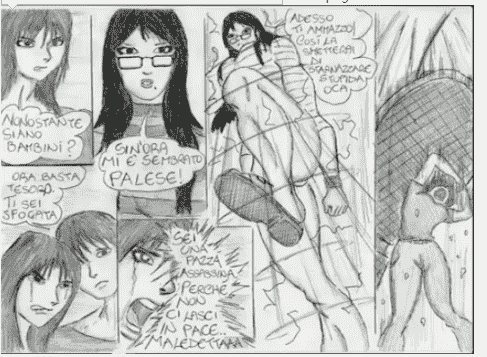

# 《侏儒花园4-角斗》下

作者：hanbang134

TID：18435

 

# 1

不多一会儿，又一个侏儒败下阵来，那侏儒腹部中了一拳，此时一只手撑着地，不停的呕着鲜血。范晓萌指着他说：“小若学姐，这好像是你的角

斗士哦。”小若微笑着走向场中，婷婷的背着双手，低头瞧着那名侏儒，说：“我的角斗士，你很痛苦是吗？姐姐来帮你解除痛苦吧。”那侏儒望着

停在自己身前的一双白色帆布鞋玉足，战战兢兢的说：“什么？姐姐真的要踩死我吗？” 小若眨眨眼睛，清脆的说道：“是呀，你既然已经输了，

我就没必要再叫你活着啦，拜拜喽.....” 小若右脚向前挪了一步，同时翘起了脚尖，然后慢慢的向侏儒的脑袋踩了下去。那侏儒吓得僵硬，不能挪

动半分，嘴里可怜的嘟囔着“姐姐饶命，姐姐饶命”但小若完全没有把他的求饶当回事，侏儒的头被小若的脚尖压了下去，直到紧紧贴着地面，小若

的帆布鞋底本来就很柔软，而且小若还是缓缓的用力，侏儒此刻感觉整个头颅像是要爆炸般的疼痛，声嘶力竭惨叫“啊，姐姐饶命啊，饶命啊..”同

时两条腿不停的抽蹬着，两条手臂死命的推搡着小若的脚尖。此刻正在打斗的两个侏儒也停了下来，半张着嘴痴痴的看着他们那个伙伴的惨状，啪的

一声脆响，二人只见小若脚下的脑袋突然碎裂开来，脑浆顿时飞溅，两只侏儒这辈子也没见到过如此惨烈的情景，那头颅已经碎裂的侏儒伙伴的身子

竟然还在不停的颤抖。范晓萌的角斗士阿虎登时呆立在场中，神情已经恍惚了。而他的对手，再呆了一瞬间之后，也不管什么决斗了，立马撒腿就跑

。但他刚跑了几步，却迎面撞到一个巨大的白色物体上，那侏儒抬头一看，正与一双晶莹如水的双目相对，原来刚才撞倒他的是张轻语的穿着性感白

靴的脚。

那侏儒惊恐的慢慢向后退却，轻语双手交叉抱着胸部，略带失望的问道：“怎么了小家伙，你想要逃吗？”那侏儒扑通一声跪了下来，双膝交替着

爬到轻语的靴尖前面，将上半身趴在她的靴子上面，哆哆嗦嗦的祈求道：“姐姐，求你了，放过我吧，我不想再打了，求求你了。” 轻语遗憾的摇

了摇头，素手摆弄了下自己柔美的长发，说道：“对不起，姐姐不能答应你，你要是不去战斗而要逃跑的话，我只能踩死你了。” 那侏儒的心里近

乎崩溃了，嚎啕大哭起来：“姐姐不要踩死我行吗，我才18岁啊，我还有很长的路要走，我宁愿不要你们的头发了，放我走吧，啊？求求姐姐了。”

此时的轻语心里突然泛起了一丝怜悯，想到他虽然是侏儒人，但毕竟是有血有肉，迫切希望存活的生命，自己这样毫无怜惜的杀戮是不是有些过分，

就在轻语犹豫的时候不绝的时候，那只侏儒忽然趁机拔腿就跑。一边的范晓萌连忙提醒道：“那小东西要跑，轻语姐姐快点踩死她。” 这猛然惊醒

了沉思的轻语，猛地一转身，眼睛刚看到正在逃跑的侏儒，可她的脚如同条件反射一般的向侏儒的头顶踩了下去，咯噔一声，那侏儒瞬间消失在轻语

的靴底，连一声惨叫都没有发出。才反应过来的自己出脚太快的轻语呼的吐出长长一口，说道：“唉，看来你是注定要被我踩死的，真对不起。”轻

语缓缓，抬起脚来，眼见着已经被自己踩成薄饼的侏儒尸体，竟有些许不舍。小若站起身来，走道轻语身边，看着地上那具尸体，摇了摇头说道：“

真可怜啊，不过他这样被轻语妹妹一下踩死，应该不会有什么痛苦不是吗？”

场中的阿虎此刻怔怔的望着这一幕，软绵绵的瘫倒在了地上，一旁的范晓萌却欣喜若狂，“哈哈，我的角斗士赢得了第一场比赛呢”然后亲昵的将

阿虎捧在手上，吐气如兰的说：“小家伙很厉害吗，姐姐很喜欢哦，你先休息一会儿，看看你的队友怎么样。”

四个女生各自回到自己的座位上，从被子里挑选下一轮决斗的侏儒。范晓萌眯眼笑着从那只多出的杯子中取出仅剩的那只侏儒，拎在手上说：“小

东西，你帮我们把场中的尸体清理一下，不许偷懒哦。”

这名侏儒叫做阿正，刚才在被子中早就看到了他的同伴一个接一个的被踩死的惨状，此刻哪敢违拗，赶紧连滚带爬的收拾着场地，可是他同伴的尸

体无不都是被踩的稀烂，黏黏的粘在地上，而且在正常人眼里那一滩滩不起眼的血肉再同是侏儒人的眼中却是那样的让人毛骨悚然，过目不忘。在强

忍着收拾完两具尸体之后，当他拉扯那个被小若踩碎了脑袋的同伴的时候，那具尸体却突然痉挛似的抖动了起来，本来就惊恐不已的阿正一下子吓得

瘫坐在地上，一只胳膊指着那具没有头的身子，尖声叫道：“啊啊啊，他还活着，他还活着.....”一旁的小若见状不屑的冷笑一声，说：“有什么

大不了的。”然后漫步走到跟前，抬起脚尖，紧紧踩住了那具仍旧兀自痉挛的身子，就在阿正的眼前，那具身子在小若白色帆布鞋的挤压下，发出了

嘁哩喀喳骨裂声音，阿正没有机会再看看他的那个同伴是否还能动弹，小若的右脚轻轻的向后一拖，刚才还痉挛不已的同伴瞬间变化成了一道由碎骨

烂肉涂抹成的一道长长的红色印记。 阿正呆呆的望着那条血印，嘭嗵一声跪在小若的脚前，说：“姐，姐姐，我也会被你踩死吗？” 小若眨眨眼睛

肯定的回答道：“当然喽，反正你也没被选为角斗士，不踩死你留着干嘛？。” 阿正听后惊恐的倒吸一口凉气，急迫的祈求道：“求姐姐，也给我

一个机会当角斗士好吗，我不想被踩死啊。”  小若呵呵一笑，“恐怕不行吧，现在角斗士的数量正好呢，不过我可以给你另外一个机会。” 阿正

如蒙大赦，叫道：“谢谢姐姐，谢谢姐姐，我要怎样做呢？” 小若坏坏的一笑，说：“你要是能被我踢一脚，而且不死的话我就放了你，并且会给

你一根我的头发，这可是姐姐给你的特殊恩惠哦。”

虽然阿正没有见过同伴被这些女孩一脚踢过之后是什么下场，但是想象中也是不死也会残废。可是现在阿正没有别的选择，只能试一试了。阿正忙

声答应道：“好好好，只要姐姐肯给我机会怎么样都行，那你踢我吧，踢我吧，稍微轻点哈。”小若娇笑如花，一双水莹莹的眼睛显得完全亲切无害

。

小若轻巧的从头上摘了一根头发展示给阿正看，这些小美女的头发无论何时对于侏儒们都是一种非常大的诱惑，在阿正渴望的眼神下，小若缓缓的

松开了夹住头发的两根手指，那个头发慢慢的飘落到地面，阿正赶紧奔了过去，就在这时，小若却笑咪咪的勾起了小腿，就当阿正欣喜的捡到头发的

时候，小若迅速的一脚踢出，啪的一声脆响，紧接着就是阿正凄惨的叫声，小若的脚尖迎面踢在阿正弱小的胸膛上，阿正的嘴里顿时洒出一道长长的

血箭，身子倒飞出去，直撞到远处的墙壁才停止了下来。阿正身子不受控制的从墙面上滑落下来，雪白的墙壁上留下了一条斑驳的血迹，阿正瘫坐在

地上，刚刚才拿到的头发从他无力的手中滑落出来，小若这看似漫不经心的一脚却已经把阿正的内脏和骨头踢得粉碎。此刻的阿正浑身是血，瞪大了

眼睛，不甘心的一口一口的吐着粘稠的体液，发出痛苦的呜呜声，眼看是不行了。小若笑盈盈的在远处看着，啧啧的轻声说道：“这么不经踢，才一

下就要死翘翘了。” 林璐漫步走到阿正的身边，看着他要死不活的模样，摇了摇头说：“这个侏儒真可怜啊，快要死了还被人说风凉话。”说话间

，林璐翘起她的黑色高跟鞋，将仍旧微微蠕动的阿正踩在脚下，说：“姐姐来帮你解除痛苦了，拜拜！” 随着林璐脚尖的扭动，阿正的身体转眼间

便支离破碎了。

下一轮的决斗开始了，这次轻语的角斗士叫阿强，是这次侏儒探险队的一个分队长，他跟那个怎么踩也踩不死的阿刚一样，也有一项属于自己的专

属能力。他的能力是可以将自己变大成平时的三倍，变成如矿泉水瓶的大小。此刻他已经释放出他的能力了，全身的衣服都已崩裂，赤身裸体的他在

场中傲慢的俯视着他的对手们。跟他相比只有一支香烟大小的侏儒们显得弱不禁风。轻语温柔的一笑，说：“看来这一局的赢家在我手里啊。”范晓

萌哼了一声，对着自己的角斗士命令道：“长的大一点了不起呀，给我打倒他。” 那只侏儒本来早就知道阿强有这个能力，但是今天第一次见到，

委实吓了一跳，以自己的身高哪里是他的对手，畏惧之心让他一点一点的向后退却。范晓萌见状生气的一跺脚，小跟鞋跟咯噔一声脆响“快上啊，不

然我踩死你哦！” 那侏儒更害怕被踩死，只能硬着头皮冲向阿强，但还没近的身，阿强便一拳将他打飞，滚落在范晓萌脚边。范晓萌气嘟嘟的粉面

带煞，脚尖轻轻一拨,说：“笨蛋，再过去打啊。”侏儒弱小的身躯在这看似轻轻一拨之下，又无奈的骨碌到阿强身前。阿强大笑着将那侏儒的身子

举了起来，叫道：“小不点，快滚远些去吧。” 一声惨叫，那侏儒的身子再次来到了范晓萌的脚前。被摔的七荤八素的他听到范晓萌忽的叹了一声

，说：“看来这次对手真的太强了，没办法，只能踩死你了。” 侏儒听罢脑袋翁的一声，害怕的颤抖啜泣起来，身上一丝逃跑的力气也没有，却把

身子蜷曲成了勾勾虾，嘴里小声乞念着“姐姐不要杀我，姐姐不要杀我，饶命啊？”范晓萌水灵灵的眼眸忽闪忽闪，歪着头俏皮的回答道：“不行哦

。规矩是我定下的，失败者也定要被踩死的哦。”话没说完，范晓萌的白色瓢鞋形成的巨大阴影已经笼罩在了失败者的上空，紧接着无情的落下。“

啊.....”侏儒凄厉的惨叫声在范晓萌脚尖轻轻地扭动下渐渐消失，他的小小身躯只剩下一滩粘稠不已的红色汁液。

场中央除阿强之外的两个人，一个叫阿鹏，另一个叫阿明。阿鹏也是探险小队的分队长，他的特殊技能是可以长出翅膀飞翔，但是也飞不了太高太

远，就像螳螂的翅膀一样，只能做一个短暂的滑翔。阿明本来就是和阿鹏同一个分队的，所以此刻准备先联手干掉阿强。阿明，阿鹏一前一后，企图

对阿鹏展开夹击之势。战斗开始了，虽然阿强身躯庞大，每一拳一脚都虎虎生威，有好几次都把阿明打的连滚带爬，或者一巴掌把阿鹏从空中击落。

但凭着顽强意志，两人一次又一次的站了起来。他们二人时而车轮骚扰，时而左右夹击，一会儿功夫便把阿强弄的晕头转向，最后体力不支的栽倒在

地。阿鹏阿明此刻亦是疲惫不堪，站在地上粗粗喘着厚重的气息。

张轻语，这个平日里温婉娴静的淑女，此刻慢慢站起身字，优雅的晃了晃她乌亮美丽的长发，踏着优雅的步子来到阿强身边，低头看着这个比一般

侏儒大上许多的侏儒，问道：“喂，你不行了是吗？”阿强挣扎的坐起身来，叫道：“不公平，两个人打一个，我才会输，有能耐一对一” 张轻语

俯下身来，长长的睫毛轻轻翼动，仿佛思考了一下，说：“好吧，我可以给你一个一对一的机会。我和你打。” 阿强瞠目结舌，叫道：“我怎么可

能是你的对手，你那么巨大。” 轻语柳眉轻挑，说：“对呀，你长的那么大，你的同伴如果一对一的话又怎么是你的对手呢。”阿强被轻语噎的无

言以对。轻语继续说道：“阿强，你能不能变小回去啊，因为你现在这么大我要踩你很多次你才会死，你会很痛苦的。” 虽然阿强已经知道比赛规

则，但真正听到眼前这个美女说真的要踩死自己的时候还是有点不敢相信自己的耳朵。阿强大声叫道：“你不能踩死我，我没输，我没输，是他们耍

赖。”一边喊着一边迅速的往后退。轻语无奈的摇了摇头，道：“废话我就不多说了，你快点变小，让姐姐一下踩扁你吧，免得死前遭太多罪。”

“啊，我不，我没输，你不能踩死我...”阿强忽的发足狂奔。轻语叹了一口气，说：“不听我的话，可怨不得我了。” 轻语只迈了两步便赶了上来

。脚尖一拨，就把水瓶般大小的阿强踢趴在地上。然后将她的半圆形靴跟踏在阿强的后腰处，轻语朱唇中轻轻吐出一句“对不起喽..”伴随着清脆的

骨碎声，轻语的脚跟用力的踩了下去。“啊....，疼死我啦，饶了我吧”阿强的身子一瞬间翘了起来，不停地舞动着四肢。鲜血一股股的从轻语的靴

跟旁边淌了出来。轻语饶有兴致的看着阿强痛苦的样子，轻哼一声，说：“不听姐姐的话，就是这个下场。”轻语踩着阿强的脚腕开始性感的左右扭

动，靴跟更是残忍的搅拌着阿强腹腔中的内脏，疼得阿强死去活来，身子无助的随着轻语的脚腕左右晃动，两条腿不断的乱蹬，同时发出歇斯底里的

惨叫。 轻语优雅的把靴跟从阿强的身体里抽了出来，阿强刚刚感觉疼痛少了一点，却被轻语一脚踢翻了过来。阿强仰面朝天惊恐地望着上方的女神

的脸，是那么温婉美丽，但是就是这个女神下一秒要对他做的事却是他做梦也想不到的可怕。轻语左脚脚掌啪的一声跺在阿强的双腿上，突然间沙哑

的惨叫声已经掩盖了阿强腿骨碎裂的声音，阿强条件反射一般想坐起身来，但刚才腰部早已被轻语踩断，此刻只能张大了嘴不停的呐喊，就在这时，

轻语薄唇突然得意的弯成一道美丽的弧线，她准确的把右脚的靴跟插进了阿强正张大了的嘴中。“呃呃呃呃...呃”阿强瞪大了双眼，死死的瞪着那

只即将要了自己性命的高跟靴子，双手拼了命的在轻语的靴跟上乱抓，痛苦却又喊不出，忍不住留了满脸的眼泪。轻语背负着双手，袅袅婷婷，美丽

绝伦，享受着脚下痛苦的侏儒带给她的满足感。起初轻语脚下的侏儒挣扎的很剧烈，扑腾扑腾的拍打着身下的地板，过了十几秒后，侏儒的挣扎渐渐

不是那么剧烈了，他的生命正被轻语的高跟玉足一点一点的消耗掉，最后只能嘴里发出嘶嘶的声音了。轻语见他不怎么动弹了，反而失去了兴趣，把

鞋跟从阿强的嘴里抽了出来，然后用脚掌踩住了阿强肚子，慢慢的踩了下去。这好像又刺激到了阿强的痛觉神经，本来半昏迷的他再一次的哀嚎起来

，已经无法闭合的嘴巴里突然狂涌鲜血。上半身用尽了最后的几分力量的痛苦扭动着。看着阿强的痛苦模样，轻语忽然感觉到相比那些一脚踩死的侏

儒，这样的巨型侏儒踩杀起来更有趣些。她的脚尖没有因为阿强的惨叫而有半分的怜悯，而是更狠的踩了下去，直到鞋底隔着阿强的肚皮与地面重合

，阿强肚子里的内脏咕叽一声一股脑的从嘴里和下体冒了出来。可怜的阿强这才双眼翻白，长大了嘴巴终于不动了。轻语总是对已经死了的侏儒提不

起半点兴趣，脚跟随意的一撂，将阿强的尸体拨向一边，懒都懒得再看一下。

场中只剩下本来属于同一小队的阿鹏和阿明了，刚才二人合力打败了强悍的阿强，而在此时，不得不为了这一轮的胜出相互厮杀了。阿明已经做好

了准备，虽然阿鹏是队长，能力比他强，但是为了生存，他还是要尽力一试，却没想阿鹏呆了半响也没有任何动作。阿鹏看着阿明呵呵笑了笑，说：

“阿明，别紧张，这一局你不会死的。” “什么？”阿明不解的问。

阿鹏缓缓吐出一口气，小声说道：“这次我们起一出来，我这个当小队长的没保护好你们，所以......” 话还没说完，阿鹏忽然呼扇起了翅膀飞

了起来，像一只扑火的飞蛾一般冲向离他最近的小若，这一幕来得突然，小若还没反应过来，只见一个蛾子般的东西迅速的向自己的脸庞撞来，也是

吓了一跳。忙的向一旁躲闪，阿鹏一击未中，立马在半空调整姿势，再一次的冲撞过去，其实被这么个小侏儒撞一次也没什么，可是一向爱干净的小

若总把这个飞翔的侏儒想成一只脏兮兮的蛾子，叫他不得不躲闪。又是一次冲锋，小若一个转身巧巧躲过，但这次小若身后是墙，阿鹏来不及停住，

直接撞到了墙上，啪的一声晕头转向的阿鹏从墙上滑落下来，小若气嘟嘟的撅着嘴，心里早已讨厌死这个恶心的蛾子了，还不等阿鹏的身体滑下，小

若便飞起一脚，向正在滑落的阿鹏蹬了上去，砰的一声，阿鹏的身体转眼便消失在蹬在墙上的帆布鞋下面。小若哼了一声，放下了腿，雪白的墙上则

印着一个灰色的鞋印，那些美妙的鞋底纹路中间，盛开着一朵奇异的红色花朵，离近看去才发现，那是已经被小若踹扁了的阿鹏，他的身体黏在墙上

，已经和墙壁融为了一体。

这一局阿明胜。林璐性感的朱唇轻轻一弯，露出一丝迷人的微笑，悠然的说：“看来这局我的角斗士更幸运一些呢。”一边说着，一边用脚尖怕打

着地面，对阿明道：“小家伙，你已经赢了，快到姐姐这里来。”

阿明神情有些恍惚，本来本局胜出应该高兴才对，但这胜利却是阿鹏队长用生命为他换取的，他望着阿鹏仍黏在墙上的那具惨不忍睹的扁平尸体，

一时间真的头脑一片空白。他清楚的知道，这四个看似温柔漂亮的女生就是主宰他们生死的女神，稍微一不留神，就会惨遭杀害，对于林璐的传唤，

阿明不敢有一丝的违拗，连忙一路小跑到林璐的身边。

下一场比赛是小组赛最后一次的角逐。另外四个侏儒分别叫阿成，阿邦，阿丰，阿古，分属于小若，轻语，晓萌，林璐旗下。

那个叫阿成的侏儒刚被放到场中，就看到那一具具死状惨烈的同伴尸体，性格本就懦弱的他一下子便吓晕过去。小若把阿成捡到手上，对着他失望

的摇摇头，说：“我的手上怎么竟是这样的废物。”说完将阿成狠狠的向下一摔，啪的一声脆响，阿成的身子痛苦的扭动一下便再也不动了，但小若

还没有放过这个可怜的侏儒，紧接着一脚跺在他身上，脚跟左右扭动着将他碾成残渣。

轻语的角斗士阿邦平日里是个非常幽默风趣人，跟谁都是好朋友，剩下的阿古和阿丰没有把他列为首要攻击目标，但是这两人平日里就不对付，

今天面对生死大局，两人对视片刻就开始大打出手。不多一会儿体格健壮的阿古就将阿丰打翻在地。范晓萌见自己的角斗士如此的不堪一击，唉了一

声，知道他就是站起来继续打下去也不是阿古的对手。于是轻轻的用脚尖敲了两下地面，无奈的说：“看来你是不行了，乖乖过来受死吧。”阿丰害

怕的浑身颤抖，不敢过去，却也没有力气再起来战斗。 阿古冷笑了一声，说：“阿丰，今天我们被逼到这个份上，不要怪我。”说着阿古走上前去

，一把拎起了仍旧瑟瑟发抖的阿丰，用力一抛，将阿丰的身子抛到范晓萌脚前。看过那么多的同伴惨死在这些女生脚下，此时的阿丰望着范晓萌美丽

却又巨大的鞋子就在自己眼前，一下子吓得尿了裤子，牙根不住的咯咯碰撞。范晓萌挪动了小腿，脚掌悬在阿丰上方，瞟了一眼卑微的阿丰，不屑的

说道：“真是废物一个，去死吧。” 在阿丰的哀嚎中，晓萌的脚无情的落了下去，“啊...”一声短促的惨叫，阿丰的身体融化在了晓萌的鞋底，一

滩粘稠的血迹慢慢从晓萌脚边流了出来。

阿古料理完阿丰，又将目标转为阿邦，阿邦是小队中最瘦弱的侏儒，根本不会打斗。但是阿古不管那么多，虽然平常关系不错，但这可是事关生死

，阿古说了声对不起，直接一拳将阿邦打飞了出去。

阿邦吃痛，在地上翻滚，这时，地面上已经传来可怕的高跟鞋踢踏的声音，不用猜也知道这是轻语要来结束他了。

轻语脸上仍旧挂着淡淡的温柔气息，俯视着阿邦，淡淡的说：“看来你也不是他的对手，现在接受现实吧，你是选择跪下来求我呢，还是要和姐姐

比比速度？。”

阿邦叹了一口气，道：“美女姐姐，这两种选择的结果有什么不一样吗？”

轻语本以为阿邦一听到她说这样的话就会吓得立马跪地求饶，往往这样的表现最合她心意，因为轻语就喜欢在侏儒的求饶声中将他踩死。要不就是

拔腿就跑那样轻语就会先踩断他的腿，然后在慢慢的折磨死他。但是眼前的阿邦却不按常理出牌。本来就是在玩游戏，轻语也觉得这样一个接一个的

踩死侏儒有些无趣了，倒不如逗逗这个叫阿邦的侏儒。

轻语轻轻一笑，回答道：“当然不同，你要是选择求我饶你呢，说不定姐姐一高兴就真的放了你。但是你要是选择逃跑呢，一旦被我追上，你就死

定了。”

阿邦的心理素质极好，平时就爱耍贫嘴，所以有个很好的人缘，就算是今天，遇上这些杀侏儒不眨眼的女神们，说话间阿邦也没有太多的惧怕之情

。阿邦此刻竟然笑着回道：“我的口才可没那么好能求动你饶了我，我也没那个速度敢跟您比赛跑，反正怎么样你都会赢。我还是不选了，你随便吧

！”

另外三个女生同时觉得奇怪，她们从未见过哪个侏儒在她们眼前胆敢如此淡定的说话。都不觉对这个侏儒有一丝好奇。

轻语哼了一声，气道：“你可真没趣，一脚踩死你算了。” 说着便迈开一步，直接向阿邦的头顶踩了下去。其实轻语也是对这个阿邦有一丝的好

奇，只想吓唬一下他，他要是立马求饶或者逃跑的话，那轻语是绝对会直接踩死他的，可是轻语的脚底已经与阿邦的身体不到一厘米的了，阿邦却还

是没有任何的反应。 轻语呵呵的轻笑了一声，忍不住抬起了脚。看着地面上的阿邦面不改色，神态自若的样子，奇道：“小东西，你当真不怕我把

你踩死？”  阿邦甩了甩头，说：“当然怕，怕得要死，可是害怕有什么用呢。既然抗拒不了，那就欣然接受，反正像姐姐这样的大美女见到我这么

老实的侏儒，就算是踩死我也不会让我太痛苦的吧。”

“嘿，怪了，竟然有这么想得开的侏儒”四女中踩杀侏儒最多的小若自言自语的说道。

 

# 2

写了这么多，求个影片！  这个连接失效了 ，能再发一下吗！ 

# 3

<ignore_js_op>[QQ截图20150125170517.png](forum.php?mod=attachment&aid=NDk5OTF8OTQ3MWMyNjV8MTYwMDg4NjM5OXwxODIzMHwxODQzNQ%3D%3D&nothumb=yes) *(266.4 KB, 下載次數: 8)*

[下載附件](forum.php?mod=attachment&aid=NDk5OTF8OTQ3MWMyNjV8MTYwMDg4NjM5OXwxODIzMHwxODQzNQ%3D%3D&nothumb=yes)

2015-1-25 17:13 上傳  

</ignore_js_op>