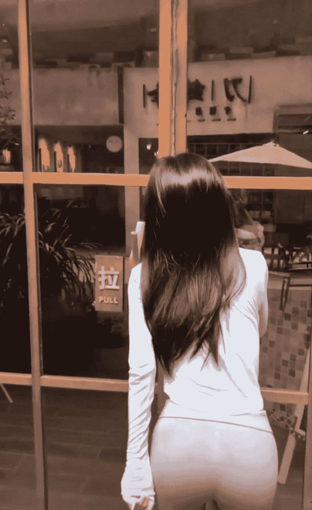
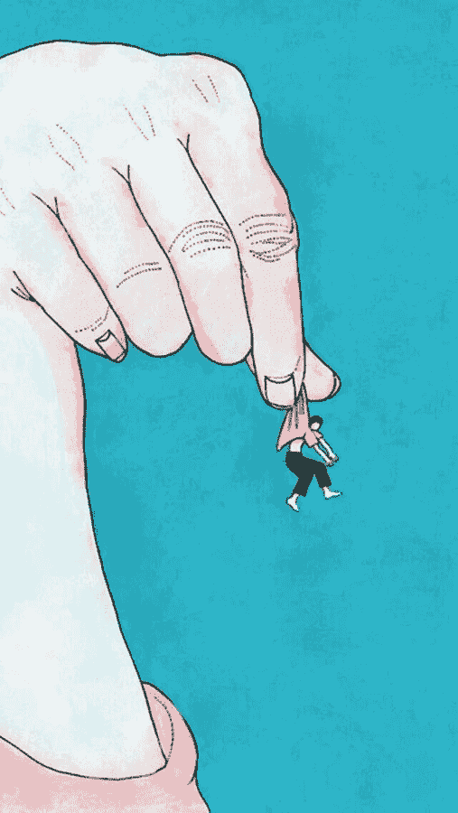

# 【关于10.1特大医疗责任事故的案情细节报告】（11.24更新）

作者：dickman

TID：27008

 

# 1

*本帖最後由 dickman 於 2019-11-24 06:24 編輯*

****关于市南区10.1特大医疗责任事故的案情细节报告**** **最高人民法院终审立案报告** 

**（一）涉案人员** 被告人周岐山，男，44岁，1975年4月11日出生，山东彭生生物制药股份有限公司董事长，青岛市市南区东海西路11号深蓝中心被告人周程兰，女，18岁，2000年12月21日出生，山东大学文学院中国语言文学系2017级学生，山东大学校区学生会宣传部成员，青岛市市南区东海西路11号深蓝中心被告人孙载育，男，37岁，1981年5月23日出生，美国马萨诸塞州剑桥市麻省理工学院生物工程系2006届毕业生，户籍上海市黄埔区，现居青岛市市南区奥帆中心燕儿岛路7号鲁商首府原告李宜奇，男，19岁，1999年9月27日出生，山东大学文学院中国语言文学系2017级学生，山东大学校区学生会宣传部成员，济南市历下区大明湖路27号明湖小区原告王立业，男，27岁，1991年8月15日出生，山东飞讯传媒股份有限公司员工，青岛市市南区彰化路1号银都花园原告赵许尧，男，18岁，1999年3月18日出生，山东大学理学院基础数学系2017级学生，山东大学校区学生会宣传部成员，临沂市金雀山路166号沂山花园原告李潇潇，女，20岁，1998年9月12日出生，山东大学艺术学院美术系2016级学生，山东大学校区学生会宣传部成员，潍坊市银枫路717号银枫小区**（二）裁判过程**市人民检察院以刑诉〔2018〕74号起诉书指控被告人周岐山犯故意杀人罪，被告人周程兰犯故意杀人罪、非法监禁罪、包庇罪，被告人孙载育犯包庇罪等，于2018年12月21日向本院提起公诉。本院依法组成合议庭，公开开庭审理了本案。青岛市人民检察院指派检察员出庭支持公诉，被告人等出庭参加诉讼

市人民检察院指控：2018年1月9月期间，被告人周岐山伙同被告人孙载育以诱骗、绑架等方式非法监禁41名青岛市市区流浪乞讨人员，对其进行秘密的医疗实验性基因改造工程，在此期间造成了39人死于生物病变，在完成试验之后有2人成功存活，之后周岐山使用医用手术刀对2人进行解肢碎尸；2018年9月17日，被告人孙载育再次向被告人周岐山索要10名年龄在20岁以下的青少年作为实验对象，被告人周岐山告知其女儿被告人周程兰邀请多名同学于十月国庆节期间前往青岛市市南区深蓝中心住宅组织聚会，被告人周岐山于在10月1日傍晚6点期间对被告人周程兰的同学进行诱发性基因改造之后，多名同学试图向被告人周程兰请求帮助，被告人周程兰于10月1日至6日期间非法监禁同学，并在之后以多种方式虐待杀害其中4人

经鉴定：死者吴某于人体消化道系统中受消化酶及胃酸化学腐蚀，胃部肌肉碾压，后窒息死亡；死者刘某受尖锐木质牙签刺穿肝脏肾脏心脏及脑组织出血死亡；死者张某受被告人周程兰手指及手腕处肌肉挤压造成出血死亡；死者彭某受被告人周程兰足部肌肉挤压造成出血死亡；死者满某因受剧烈离心运动造成脑部血管破裂出血而死。其中五人的损伤死亡成因均符合《中华人民共和国刑法》中过失杀人罪与故意杀人罪相关规定。被告人周程兰负此事故的全部责任

公诉机关认为：被告人周岐山非法监禁罪，蓄意谋杀多名流浪乞讨人员，应当以非法监禁罪、故意杀人罪追究其刑事责任；被告人周程兰包庇其父违法行为、非法监禁、过失伤害、故意伤害、蓄意谋杀多名同学，应当以包庇罪、过失杀人罪、故意伤害罪、故意杀人罪追究其刑事责任；被告人孙载育包庇其同事周岐山，应当以包庇罪追究其刑事责任

被告人周岐山、周程兰均对其犯罪事实供认不讳，原告王立业认为被告孙载育犯有主要责任，对审理结果不服，本案由省高级人民法院提交至最高人民法院审理

本案案情较为特殊，牵扯各级基层政府、制药公司、媒体、高等院校的各级人员人数较多，持续时间较长，其中彭生生物制药有限公司的有关责任人对数名被害人进行了诱发性基因改造致使被害人身体萎缩后被非法监禁迫害的案情在世界范围内尚属第一次，世界各国的高等院校、学术机构、制药公司、媒体、政府均表示对此案件的具体细节高度关注，有关部门应当尽快查清事故中所有相关责任人与被害者，尽早曝光案情细节 **下文为案件相关人员或单位调查笔录中口述的案件情节**

 

# 2

<ignore_js_op>[TIM图片20190623195049.jpg](forum.php?mod=attachment&aid=Nzg5MjB8NzBiYTEzNjh8MTYwMDg3NDQ3MnwxODIzMHwyNzAwOA%3D%3D&nothumb=yes) *(51.42 KB, 下載次數: 11)*

[下載附件](forum.php?mod=attachment&aid=Nzg5MjB8NzBiYTEzNjh8MTYwMDg3NDQ3MnwxODIzMHwyNzAwOA%3D%3D&nothumb=yes)

2019-6-23 19:51 上傳  

</ignore_js_op>  

# 3

*本帖最後由 dickman 於 2019-7-28 20:41 編輯*

**王立业****—1—**       我是王立业，疾讯传媒的一名普通的记者，很幸运也很不幸地卷进了这场残忍的商业阴谋和施暴事件中，成为那个不畏恐吓、不畏暴力、不畏强权、不为利益所诱惑的成为向世人揭露真相的勇者如果你们受过国内的九年义务教育，你们之前应该听说过细胞凋零对不对。你我，周岐山，孙载育，那些小女孩儿小男孩儿，你家的狗，你养的金鱼，这个世界这个宇宙里所有的有机生命体，全部都是精密的编程密码运行的产物。我们的基因决定着我们的性状，我们是男是女是可以怀孕的雄性海马，我们的长相声音就连决定我们思考能力的大脑，都是由这些无比精妙又满是漏洞的编码设计好的只要控制了基因，我可以在创造任何一个生物，包括一个不到两厘米的微型人类，伸出你的手，张开你的手指，这些手指是怎么来的？长出来的？最初你的手指和你的胳膊连在一起，是你的作为一个灵长类的基因告诉了手臂上一部分的细胞去完成他们的使命——死亡，然后你的细胞在基因的控制下凋零，形成了你手指间的缝隙生物的基因是亿万年的自然选择中无数偶然的突变中大浪淘沙的结果，物竞天择，适者生存，多么的精准简短又雅致的翻译。这种无情的低效的漫长的物种程度上的大规模死亡就是宇宙中无数自然而无关紧要的随机事件之一，既然亿万年混乱无序的演化中可以做到让细胞如此精密的系统性凋零，那么人类世界的天才有组织有目的的编辑基因也可以孙载育和周岐山的团队本来助攻抗癌靶向药的研究，他们试图解析癌细胞的基因，制造专项的抑癌因子，但在解析基因的过程中意外的发现了器官体积性状基因之间微妙的联系，先是用药物引导生物体的基因改造，再用靶向药通过激活血液中的凋零基因，高效且精准的诱导有机体身上的细胞凋零，之后将生物放置在多能干细胞培养皿中，让他们发育成一个样子但不一样大小的新生物，最终他们成功的将一只白鼠在一滩血中变的比指甲盖还小又变得比秋田犬还大周岐山精明的商人头脑立刻看到了这其中巨大的商业前景，小到把金毛变成握在手里茶杯犬，大到把人类缩小解决粮食以及能源的危机，这种足以被载入史册的技术已经不是带给一个资本家百亿千亿收入的问题了，而是解决全世界几十亿人口的食物医疗等问题的技术药物想要救人就必须先能适应人，人和白老鼠是不一样的，想要缩小一个人就要先在人身上实验。但很遗憾的是，没有哪个人会愿意成为细胞凋零实验的志愿者，更何况这是一项秘密进行的，违法的，伤天害理违背人伦的疯狂实验。在项目开展的初期，他们根本无从下手，只能在草稿纸和实验台上折磨各种被抓来的不会举报他们的动物人是一切社会关系的总和，在社会中没有关系的人等于不曾存在在这个社会中。周岐山和孙载育没过多久就想出了这个灭绝人性的解决办法，抓流浪汉来实验，因为不会有任何人在乎没有社会关系的他们，甚至是厌恶他们。你有没有在凌晨两点去过北京的麦当劳？你可以看看在里面横七竖八躺倒的人，她们是务工人员，失业人员，精神疾病，万念俱灰试图自杀的人员，足够善良的人如果只去一次会对他们感到可怜，去五六次只会感觉他们很烦。没有人真的可怜祥林嫂，他们落泪的原因就跟看八点档电视剧的心态一样，纯粹是个人的精神满足这群被家人，被城市，被国家抛弃的可怜人，被城市管理员视为严重影响市容需要扑杀的流浪狗，受尽了同伴朋友社会阶级的排挤和压迫，最终迎来了一个只适合他们的归宿——在实验室里被解肢的七零八落一切来自外界的病毒和癌变，和人体自我的细胞凋零相比都显得无比仁慈。起初靶向药对结缔组织进行了无差别的攻击，实验体内部出现大量组织淤血后身体裂解而死。他们无法控制破骨细胞溶解骨头的速度，身体萎缩的更快的流浪汉被里面的骨头从内部戳破。然后他们搞不定毛细血管收缩后红细胞的通过问题，流浪汉在培养皿中窒息而死在资本运作面前，每一次实验的失败，每一个个体的死亡，都让这个药物的售价有了更高的理由。你们的报告上写的人数是多少？四十个？五十个？真的连实际数量的三分之一都没有，你们能找的人都是有名有姓，有走失记录在案的人，但大部分流浪汉不是精神失常就是智力有问题，有些一生下来就被抛弃，共和国的档案里根本没有这个人存在的证据对于孙载育来说，无论是政府部门，党政机关，谁能给他提供更大更好的实验室谁就是他的上司，尽管周岐山也提供了他能力范围里最好的位置最好的研究所最好的研究生助手和最好的配套住宿衣食条件，但与国家开出的价码相比还是不值一提。专机，便利通道，特供食物，编制，省部级甚至国家级公务员的待遇都只是小小的起步。无论是谁现在孙载育的角度考虑，都不可能在鹏生生物科技和中华人民共和国国家科学院之间选择前者于是这次大案的矛盾起始点，想要“为国尽忠”的孙载育和邪恶自私的资本家周岐山之间的矛盾，开始了孙载育知道现如今，想在这个为了钱可以把上百个无辜的人丢进实验室让他们解体的“古典资本家”手下活着离开就必须借助比他还要暴力的铁拳——全副武装的防爆警察和维持秩序的法律孙载育知道自己掌握着绝对的技术资本，是任何一个国家政权都不可能会放弃的高级人才，就算整个药厂的行径败露了，就算荷枪实弹的警察逮捕了所有的涉案人员，就算所有罪魁祸首都被押送到法庭接受媒体公众以及法律的质问，他也是会最终脱身成为一个完全合法的罪犯，因为他能带来几千亿美元的商业利润和上万个就业岗位，站在国家利益的角度，是让他接受公正的审判重要还是让他继续创造自己的价值重要？于是乎，在九月的末尾，孙博士做出了一个借刀杀人的举措，一个蓄谋已久的阴谋开始破坏另一个蓄谋已久的阴谋

 

# 4

*本帖最後由 dickman 於 2019-9-27 00:27 編輯*

**李宜奇****—2—**      开始记录了么？开始了么？昂，自我介绍？好，自我介绍一下，我是李宜奇，我是山东大学汉文系的学生，我和周程兰是同学关系，我们都认识一年多了，其实关系还是挺不错的，我和她是通过大学社团认识的，我从小就学画画，只不过没参加艺考，以前忙于学业这玩意儿只能当做业余爱好，上了大学稍微轻松一点儿了，就参加了山大的宣传部，平时给学校的各种活动画画板报，墙面涂鸦之类的。我和周程兰也是在社团里认识的      关系么？她的性格太软了，别人求她的事儿她总是不好意思拒绝，因为同是一个社团社员的原因我们俩儿肯定经常在一起互相帮助，我比较擅长起型，额，就是画一幅板报之前肯定要先勾勒出基本的线条来，然后再上色对不对？对，那就是我在社团里的工作，而她比较擅长色彩，画出来的颜色总是大胆又漂亮，我们两个是最佳搭档，基本上负责了校级学生会一半的工作      人对自己帮助过的人总有一种认知感情上的补偿，一来二去我们俩儿虽然不是同班同学但彼此也十分熟悉，在此之前的关系，说是一般朋友肯定不止，但又不是那种，额，你们应该懂得吧，反正也没到那种程度，彼此都在装傻，可心里有很清楚的那种感情，不知道你们上大学的时候经历过没      那几天不是国庆节第一天么，正好学校里也没课，程兰她家是青岛的。我们就约定周六的时候一起去KTV唱歌喝酒，当时部里除了很幸运的有事儿要忙的人，其他九个都参加了这次令人“难忘”的旅程的起始点，她喝醉了之后很爽快地答应包办我们来青岛玩的所有费用，我们还以为这是醉酒状态下才骗来的难得的机会呢，于是我们周日晚上画完了部里所有的画之后就一起去青岛参加沙滩国庆节。当时去的人有我，满鑫，浩然，许尧，彭青哥五个男生，还有张圆圆，刘小妍，李潇潇四个女生      大概是10月1日中午11点左右在五四广场那儿见到她，还有她爸，还有孙载育博士，都在那儿，聚在一起紧张的谈论着什么，而她则有些不耐烦，也许应该说是有些不安地倚在树上东张西望      尽管已经在学校里见过了无数次，但她的甜白可爱又有些妩媚性感的外表和气质，搭配上为节日而特别准备的休闲衬衫，还是在填满了无数俊俏的青年男女的五四广场上显得鹤立鸡群。她的身体前倾，两只手撑在膝盖上，借着背后的树木提供的支持力把纤细的脖子和精致的脸庞探出去，看起来有点像绿茵赛场上那些因为跑的太累而撑着腿休息的足球运动员们，只不过姿势和神态都要优雅许多因为长时间站立而有些泛红的小脚暴露在一双黑白棕色相间的裸扣带平底高跟鞋上，十个小珍珠在皮带下尽力的翘起来伸展以缓解疲惫，两条丰满修长的小腿一样透漏着气血饱满的红润光泽，白色的红黑细条纹衬衫套在黑色的丝质短裙上，裸露的有些许汗渍的小臂上带着一块深棕色皮带的金边智能表她的长鬓越过小巧的耳朵，几束恰到好处的前刘海隐隐盖住了白净的额头，轻卷的黑色长发顺着背部流淌到被一根银边儿腰带紧束的叉柳下，一直触及臀部，在远处一看完全是一尊娇媚可爱的青岛海岸雕塑，尽管她身高超过一米七零但依旧让整个部所有的男生女生都像对待小妹妹一样的宠爱她，请一定要把打造这件完美艺术品的大师介绍给我      “宜奇，许尧，潇潇姐～”她高抬起靠近我们这一边的左臂，大幅度的挥着手，无袖的白衬衣里露出她白皙的胳膊      “哎呦天啊，可找到你了，这国庆节人也太多了吧，整个广场全是人。”潇潇姐冲上去，一把抓住程兰的双手，两个人看着对方傻笑了起来，但程兰只是笑，没有说什么      “哎我的天，纪梵希的衬衣哎，你的裙子也是范思哲的吧，那是秋季新茶色么？你可真有品味，哈哈。”潇潇姐把程兰从头到脚打量了一番，然后使用了女生之间见面最方便的聊天开场，称赞对方的衣着品味      “没，没有啦。”程兰将手臂略贴腰部，向后翘起了自己的左脚，轻低头看了一眼自己的鞋子，神情有些得意，真是个容易上当的小女生      还没等我们走过去，潇潇姐就又上前去跟她爸问好：“哎，叔叔，第一次见，我是周程兰大学里待的那个宣传部的部长李潇潇，叔叔好。”部长跟人介绍自己的谈吐和动作都是如此大方成熟，看来天天在山大学生会里打官腔也不是没有好处

周岐山赫拉克利斯一般的身体缓慢的转了过来：“噢。”周岐山将厚实的拳头抬到了胸前，揪了揪自己的衣领，抬了抬领带的节口：“同学是吧？”      周岐山弄他严肃的脸上锃亮的目光扫视了李潇潇和正在周程兰身边问候的我们，确认了一下我们学生的身份：“同学就好，正好我跟你这个叔叔谈一些事儿，你们正好把程兰领走吧。”      “啊？哦，好的叔叔，放心吧叔叔，我们会把周程兰照顾好的，您放心的忙你们的去吧。”      “晚上我给你们在奥帆中心的饭店订了一桌儿，你们可以先跟着周程兰回家玩，想吃点儿啥就吃点儿啥，冰箱里什么都有。”      “嗯，谢谢叔叔。”      “你有驾照么？”      “有的叔叔。”      “嗯，交给你们我就放心了。”周岐山的嘴角让人不易察觉的笑了笑：“孙载育，我们去一边儿，谈谈下一步怎么办。”他一边看着孙博士，一边从上衣口袋里掏出两把车钥匙，递给了潇潇姐      “谢谢叔叔。”      “还有要留神一点儿，”周岐山又襟了襟西服，意味深长的说了句：“这里坏人很多。”      “程兰……”      “嗯～”，她发出了一声可爱的带着疑问语气的“嗯～”：“怎么了？”      “没什么，就想给你打个招呼。”面对她，我说话似乎是完全不经大脑的      “宜奇……”      “怎么了？”      “想跟你打个招呼啊。”      “……”      “噗，宜奇你真可爱。”      “……”      “宜奇，你怎么了，怎么不高兴吗？。”程兰主动邀请我：“他们坐那两辆车，你跟我坐一起吧，我有驾照我来开。”      “嗯……”      那是一辆亮面宝石蓝色的敞篷保时捷跑车，镜子一样的涂装把海岸边的树和楼弯曲变形的刻在车上，低矮的地盘让我做进去的时候还以为自己躺下了      “你穿高跟鞋开车不会被查么？”我看着她的一双小脚问到      “没事儿。”她从挡风玻璃前拿起一个宽大的墨镜，扣到自己脸上      周程兰拱下身子，把手顺着自己修长的小腿肚摸了下去，把那双不知道是我几年伙食费的鞋子脱了下来。她抬起头但没有看我，两只手指提着鞋，动作轻盈而迅速地把那只鞋朝我拨了过来，我下意识地用双手接住      “你……你这？”      “给我拿好了。”她又把另一只鞋子也扔了过来：“我光脚开车。”      我看着她踏在离合上的双脚，十颗脚趾的趾甲修的整齐干净，不着半点儿妖艳的涂抹，都作淡红色，像十片蝴蝶兰的花瓣。修长的脚趾和充满质感的足背连接在如玉之温如缎之柔的小腿上，像是洛可可风格的艺术品一样      两弯似蹙非蹙的眉，好看的像是一缕轻烟，一双似泣非泣的眼，里面像是含着露水。娴静时如娇花照水，行动处似若柳扶风。心较比干多一窍，病如西子胜三分。唇不点而红，眉不画而翠，脸若银盆，眼如水杏。又品格端方，容貌丰美，妩媚风流，任是无情也动人。这个开跑车的林黛玉把古典主义用现代风格表现了出来，从典雅温婉的宋代穿越到共和国来的嫡公主让我的思绪完全短路，不知所措      “长干鲁儿女，眉目艳新月。屐上足如霜，不著鸦头袜……”我干瞪着她的双足很长时间，然后用很低很低的声音背着诗      “啊？什么？”      “没什么。”      “怎么了么？你嘀咕什么呢？”      “……”      “你被一双鞋砸傻了么？”      “我还以为……你要变回灰姑娘了……”      “噗，哈哈哈哈～”程兰一个没忍住喷了出来，把方向盘上的右手抬到太阳穴上遮掩，但笑声还是越来越大      “……”      “哎呦我的妈耶，之前不见你这么幽默，噗哈哈”      “……”      “那你是在夸我是仙度瑞拉么？”她歪着头，咧着嘴，瞪着大大的眼睛看着我      “没有没有……”我说到      “我不如仙度瑞拉漂亮么？”她眨了眨眼睛      “哪儿的话，仙度瑞拉哪儿能和您比啊？”      “哦？真的吗？”      我转过头去：“你有乐佩也比不上的头发，爱丽儿的歌喉也比不上你的声音，白雪公主的皮肤也不如你，艾莎的冷艳和你相比也不值一提，爱洛的舞姿不及你的十分之一，花木兰跟你打架也会被你打死……”      “哈哈哈哈，你……哎呦……不行了，你笑死我了……”她尽量保持着自己的的矜持，用双手遮挡自己那两排整齐的牙齿      “……”      “我都不知道我这么完美的啊，”她把手搭到我的肩膀上：“你是在奉承我么？”      “你知道就好，快开车吧云妮洛普。”      她嘟起嘴，抬起眉头，用搭在我肩膀上的那只手狠狠地锤了我一拳      青岛有一种年轻蓬勃的朝气，和济南那种安逸感的城市是不一样的，从浮山路的地铁一出来就可以看见两排如同梧桐树一样，站岗的警卫队一样的商业高楼在宽阔的街道两旁把守，为来往的车辆劈开一条道路，八月份炽热的太阳和从南边儿吹来的凉爽的海风就好比你们这两个审讯室里唱红脸唱黑脸的两个警察，艳阳高照下是万里无云的蓝宝石一样的天空，金黄色树叶交织组成的给两侧的行人提供免费的遮阳服务      往来的行人大多是来度假的人，也有本地的中年大叔，头发微白带着小黑墨镜，把上衣掀起来夹在胳膊底下，两只手背在身后盘着手里的两个玉核桃，要么就是提着一串文玩儿手链；也有年轻的男男女女，带着宽大的五颜六色的窄边框墨镜，女人超短的露脐装和高俏的松糕拖鞋。男人裸露除自己晒得黝黑均匀的公狗腰，向别人展示他练得发达结实的腹肌      什么叫美丽的海滨城市？海边的沙滩果汁游客比基尼，高大的商业区和一排一排的杨树，装修的崭新的商店和小巷子里买酸奶雪糕的小店儿，仿古的建筑门牌斗拱飞翘起来在行人道上的海鲜饭店，青岛这样的城市就是美丽的海滨城市      “你这样坐舒服么？要不要把椅子拉直一点儿？”在一处红灯前我们的车队停了下来      “没事儿没事儿，挺好的挺好的。”我其实并不算舒服，但下意识的就把没事儿两个字说出口了      “你想喝点儿什么吗？”她转头用下巴指了指主控和座椅之间，里面紧凑的塞着几瓶罐装可乐：“再往里面伸伸手有可乐。”

我没怎么关心自己的舒适度，当时我的注意力全在那撩人的小姑娘身上。她白净的臂膀全然裸露在无袖的衬衣外面，不成比例的太阳镜让她的脸显得十分小巧。她充满立体感的侧脸庞上挺翘的小鼻子尤为显眼，她丰满的小胸跃跃欲出的挺立在衬衣之下，她的长发如同亮黑色的大氅，最开始还是瀑布顶端笔直的水流，从背部开始微微蜷曲，垂落至臀部时便暗流涌动了起来。这种在黑长直的纯情和大波浪的性感之间微妙的平衡点真是完美

“你怎么了？有在听么？”她猛然的质问把我的目光从垂在座椅上的长发末端拉回到她的双眸上      “额，额，你的头发真多”我也不知道是怎么的，突然就说出了这么一句尴尬的话，但更令我想不到的是      “哦？是吗？”      “嗯，嗯。”      “哼哼，你要摸一摸么？”她从方向盘上抽回了手臂，半眯了一下眼睛，然后轻轻左右晃了一下脑袋，让自己的上端的头发抖动了起来      这个动作对任何还存有哪怕半点儿红尘凡心的男人来说都是至极的吸引，即便出发点可能不是出于挑逗，但由于女主人无限的美丽还是让我差点儿失态      我有些腼腆的伸出手，挽了一把她的头发，即便只是全部发量的几分之一但依旧完全填充满了我的指间，蓬松而柔韧的触感像我说明了它们的主人是多么的精致爱打理，我顺应着重力的威权将手沿着发丝屡了下去，被空调吹的有些冰凉又没有丝毫节叉的密发清泉一般的流淌过手指。我用手在这青湍素涛中完成这次美妙的航行后，两眼呆呆的看着看着她的脸      我直视的双眼让本来很轻松的她突然也感到了气氛的不对，本来有说有笑的怡然神情也开始有些不安，她的瞳孔缩小，直视着我。两只手抽回到胸前不自然的给自己提供下意识的抵挡。我那摸完了头发的手开始极力的向前伸张，尽管周围凝结地空气死死的扼住了这个进程，我的另一只手也朝她伸了过去，两只手妄图一上一下的搂住她      气氛紧张到了极点，她慢慢地把双臂放平到大腿上，似乎是想要迎接这个突如其来的拥抱，她的双颊泛红，硕大的瞳孔开始颤动。我的大脑一片空白，但身体却似乎替我做出了下一步的行动，一只手撩起头发抵住后脑勺，另一只手把住她的后腰，嘴巴说出神奇的几个字      “程兰……我，”

“嘟——！”潇潇姐开着周程兰爸爸的车在后面发出了沉重的鸣笛声：“注意一下信号灯行不行？！”      “额……”我赶紧收回了一对不怀好意的胳膊，程兰也红着脸转过头去继续开车      “……”      “你发质真好。”      “恩，额……嗯……”      “你……用的什么牌子的洗发水？”      “用菲利普皇家琥珀的洗发膏，卡诗黑钻鱼子酱系列的护理，挺好用的……”      “你能把淘宝店发一下我么，我也买去。”      “嗯，你可能……买不起……”      “哦……那可太遗憾了……”      “……” 

# 5

*本帖最後由 dickman 於 2019-8-18 03:05 編輯*

**李潇潇****—3—**       嗯，嗯，我是李潇潇，我是山东大学美术系2016级的学生，我是周程兰所在学生会宣传部的部长，主要工作是承接学校各类活动所需要的板报，平日里帮周程兰和李宜奇这两个业务人士       十月一日的那个晚上，我从充斥全身的灼烧感的疼痛中醒了过来，身体下面冰冷的玻璃丝毫不能缓解这撕心裂肺的感觉，头顶上刺眼的白色灯光让我几乎无法分辨自己在一个什么样的地方：“我这是在哪儿？”       我一边儿自言自语一边儿站起身来，艰难的试图挣开自己的双眼确认一下位置，但我的神经似乎不受自己的控制，或者说它们就像被换了一套新的一样让我完全不能适应，地球的力量让我一屁股又摔坐会一片儿巨大的玻璃上，冰凉的感觉通过和地面接触的大腿这才让我注意到自己其实是赤身裸体，没有穿一点儿衣服

我想了起来，自己还有其他的同学应该在奥帆中心的酒店里一起喝酒才是，之后我们就陆陆续续的开始有人咳簌，有人呕吐，还有人甚至开始吐血，唯一一个没有半点儿异常的周程兰被吓得双手捂嘴瞠目结舌，有些不知所措       “程兰……我……我好像快不行了……快救救我……”李宜奇将身体本能的朝向了周程兰，低着头用手遮盖自己狼狈的表情，尽管李宜奇一直试图在周程兰面前表现的很高傲和坚强，也被这可怕的从内部撕碎人体的疼痛害得不顾自己的面子       “快……叫，叫……叫救护车！”赵许尧的面色发紫，两只完全完全变黑，刚刚吐了一地黑血的嘴角上还残留着他是那滩血主人的证据

周程兰瘫坐在椅子上，只是两天手臂贴紧胸部两只手交叠的捂在嘴上，看着地上的八个同学像是正在被放在铁锅上活生生地油煎一般痛苦的抽搐翻滚，面目狰狞的发出竭力但沙哑低声的喘息

“叫救护车！快！快！”       围观的群众中有的人和周程兰的反应一样，被吓傻了。有的人吓得跑出了饭店，还有的掏出手机再通过摄像头观察，但在常人眼里很短暂我们眼中很漫长的二十秒之后，终于有人想到了替被吓傻的周程兰做一件正事       “啊啊啊啊！！！”不知道是哪个男生发出了和乌鸦一样刺耳的尖嚎，痛苦的声音完全穿透了餐厅里的背景音乐奏鸣曲，不一会儿孙载育博士和周岐山就推开逃窜的人群冲了进来       “怎么了？你的同学们怎么了？”周岐山明知故问       “他，他，他们……”周程兰还是瞪着自己漂亮的大眼睛，用手指着整个会场都看得见歪七扭八的躺倒在地上的八个人，没有帮上一点儿忙       “哦额额，呕啊啊啊！”抽搐的站起来的满鑫，刚想走两步，就从嘴里吐出了一大块儿稀碎粘稠的东西。先是吐血，之后是大块大块混在一起的肉渣，那东西不像是他的食物，更像是他自己身上的肉！       他双手抱住头，发了疯似的大叫，撕扯自己的头发，扣着自己的脸，他的手一下子扯下来一大块儿头皮，沾满血的一大把头发下面连着破碎的骨头，粘稠的血混着黄色的脑浆藕断丝连的连接着头颅剩余的部分，他把自己三分之一的脑袋给扯了下来！       他撕开自己衬衣，疯狂的挠破自己的皮肤，表皮的肉和绽开的指甲粘在粘稠的血上流了下来，内部的肌肉发出抽搐的嘶嘶声，接着一根一根的蹦开！他双手捶地，把自己手里的那一大块自己的头颅狠狠地扔到我面前！

“啊啊啊啊！”周程兰总算做出了看到这幅场景应该做出的事情，惊声尖叫然后紧紧的用双臂搂着自己，弓腰低身，把头奋力的按在双腿上。当时我一点儿也不怪她，和现场无数被当场吓晕过去的围观群众比起来，这可能已经是很勇敢的表现了       “不错，目前的状态挺稳定的，应该可以顺利完成初步的诱导变异和细胞凋零。”和周围所有人神情都显得完全不一样的孙载育博士，出奇的镇定，似乎见过这种可怕的场面几百次了一样       “之前那些人也是这样死的么？”周岐山问到       “怎么，君子远包厨，吃的时候喊真香？你还怜悯起来了？早干嘛去了？”       “……”       “不一样，”孙载育博士回答：“实验早期的人死法儿千奇百怪，但都比这个痛苦的多得多。”虽然我的耳朵当时可能已经解体了一部分，到这段对话我却听得无比清晰也无比害怕       “行了，赶紧把他们都带走，别弄得满地碎肉，叫你手下那几个人清理干净，一会儿被警察找上来我看你怎么办。”孙载育抱起离他最近的张圆圆，拖着他们往门外走去       “程兰，程兰，程兰！”周岐山用手搭在自己女儿的肩膀上，声音越来越大力道越来越猛地摇晃她       被吓傻的周程兰双眼哭的红通通的，满眼泪花儿的抬头看着自己的父亲       “你放心，孙博士知道怎么救他们，一切都在掌控之中，”父亲的话语沉厚有力，让女儿听了内心倍感安定：“你要做的就是这几天，两三天左右，不要管不要问发生了什么，两三天之后，你的同学们就会完美如初的现在你的面前，他们身体上的一些疾病也会被治好，如果他们有的话。”       “……”       “这只是医疗实验而已，切记，不要管，不要问，不要和你孙叔叔谈任何事情，不要试着去寻找你的同学。”       “……”       “不然受到伤害的不慌是他们，我们一家人也会遭到牵连。你明白了么？”       “……”周程兰虽然吓得一句话也不好说，但是意识十分清醒，非常轻的点着头，吓坏了的样子看起来也很可怜       “很好……”周岐山转身前又力道稍大的拍了拍他女儿的背来安慰她，然后径直的朝瘫倒在地上睁着眼呕吐的我走了过来       “你们几个！”周岐山提高声音，大声的吼进了几个强壮的男人，：“把他们都搬到车上去！”       ……       我想起来！       我猛地睁开眼睛，强烈的光立刻冲击了刚刚孕育完成的视网膜，新鲜的肉体没过多久就和过去的记忆结合在一起，大脑传达运动命令的信号通过细小的脊柱传给了还不太熟练的四肢。让我感到不适的皮肤冷感受器工作十分正常       我还活着！我是完整的……么

“卧槽！”我只有在受到惊吓时才不顾及自己的淑女形象爆出口头语，因为一个十层楼高的擦的锃亮的金属镊子真的很吓人       “这是什么……”我极力的抬起头看着眼前反射着白色灯光的器具，才发现自己占在一个直径十米左右的巨大玻璃容器中，周围是两米高的玻璃围墙，这种玻璃颜色又淡质地又很粗糙，能清楚的看见玻璃里面融化搅拌不均匀的痕迹       一个天文台里面才会有的黑白相间的巨型天文望远镜耸立在不远处，这似乎是一个目镜和物镜装反了的玩笑之作，是谁会花那么大的价钱建造一个四十多米高的没品恶作剧？       我有四周打量了一下自己所处的地方，在我头顶大概一百米高的地方有整齐的分布着六盏日光灯，在一个巨大的灰白色铁制金属工厂里，这个工厂屋顶没有任何衍架或者传送吊机，甚至四周的墙上还有大面积的皮革覆盖，还有很多的大小不一的吊瓶和针管儿挂在高处，但他们无一不是十米以上的大小。我在想青岛还有这种地方？一个两百多米高的工厂？       “李……李潇潇！”一声呼喊打破了我的胡思乱想，听起来像是李宜奇的声音       “哎～～！”尽管没有看到他在哪里，到我还是双手放在嘴上充当简易的扩音器，到这个动作让我突然意识到自己还是裸体的，现在见到李宜奇岂不是要颜面尽失

我竭力地用手臂遮挡自己身上见不得人的部位，但是头还是四处晃动寻找着李宜奇的身影       “李潇潇～～！”       “我在这儿～～！”       “李潇潇，潇潇姐，潇潇姐！”我突然听到有沉闷的捶打玻璃的声音从我背后传来，我一转身，发现一个模糊的肉色人影在离我两米远的玻璃墙外蠕动

我两个大步迈了上去，奇怪的是自己的弹跳能力和反应速度似乎都快了非常多，如果不是我即使刹住车这两个轻轻的脚步就把自己摔倒玻璃墙上去了       “潇潇姐，潇潇姐？是你吗？”       “对对，是我！”       “哦……太好了，人都没事儿，所有人都平安无恙。”李宜奇模糊的身影在玻璃墙背后说着       “到底怎么了？发生了什么事情？我们这是在哪儿？之前的血腥场面是怎么回事儿？”我在找到同伴之后内心踏实了很多，紧接着开始了一连串的质问       “这……你先跳出来，我慢慢跟你说。”       “跳出去？”我抬头看了一眼两米多高的玻璃墙，两层楼那么高三十米周长厚度至少半米的玻璃墙上十分光滑，没有一点儿可供攀爬的抓力点       “对，跳出来”       “你在开玩笑么？你跳一个给我看看啊！”       “好！”只见他简短的一个好字之后，模糊的人影突然飞身一跃，站在了墙顶上，整个动作非常迅速，我还没来得及反应就看见一个赤身裸体的男生站在墙顶蹲着身子看我       “啊？”       “就这样跳！快出来！”刚刚完成了一个世界纪录的李宜奇完全没有感到任何意外的意思，就是现在上面向后挥手示意我赶紧上去，我瞪大了自己不敢相信的眼睛，愣在原地       “还愣着干什么啊？快上来！”       “哦……哦。”       我退后几步，眼睛看着他的位置，身体前倾，做了一个加速跑的姿势，想着玻璃墙开始冲刺       “要上喽！”两步过后，只是一个轻轻的蹬腿，我就造成了一次撑杆跳级别的跳高，整个人在空中飞了起来，双腿向前伸出，两只手极力的保持着自己的平衡       “李宜奇接住我！”我害怕的闭上眼睛，对着他大喊，他向右跑了两步张开自己可靠的双臂抱住了下落的我

“接住了！”李宜奇的两只结实的胳膊搂住了我的后背我的腰，我的胸脯完全和他的身体贴合在了一起，完全没有衣物阻挡下直接的皮肤与肉体碰触让我短暂的高兴了几秒之后就涨红了脸       “额……”李宜奇察觉到了这显而易见的尴尬，轻轻地推开了我       “……”       “你没事儿就好……”       “嗯嗯”       “你还记得你昏迷前发生了什么吗？”       “我……我记得我们和程兰她在奥帆中心那儿喝酒的，然后，然后你就开始咳簌，然后满鑫他就把自己的脑子扯碎了……满鑫他怎么样了？”       “他就在下面。”李宜奇手往玻璃墙下面指了一指，我顺着看了过去，看见了同样赤身裸体的满鑫现在其他六个赤身裸体的同学中间，所有人豪不遮挡自己，似乎是互相看对方的裸体已经有一段时间了       “我们这是怎么了？”我回过头发闻到       “我们……”李宜奇咽下了一口唾沫：“听好了，我们应该是……缩小了……”

李宜奇斜歪着头，两只手伸到胸前，手心向下，一副经典的试图安慰面前的人的姿势，他压低下巴故作镇定的样子有些成熟男人的可靠感，甚至那么一瞬间我在意的并不是自己缩小了而是他稍显英俊的面庞，长得有些像王力宏       “你是说……”       “没错，你没有听错。”       “……”       “我们缩小了”       “……”       “你不要一句话都不说，你搞得我很紧张。”李宜奇抱怨起来的样子十分可爱       “额……”       “怎么了，你想说什么就说出来，今天让人无法接受的事儿已经够多了。”       “你……你稍微控制一下……”我用手指了一下他的两腿之间，喏喏的说到       “白搭，正常的生理反应，我们几个男女刚才见面的时候都这样，我知道很尴尬，但你还是习惯一下吧，现在不是在意这些的时候……”       “……”

 

# 6

*本帖最後由 dickman 於 2019-8-18 03:18 編輯*

**李宜奇****—4—**        当时的气氛有些尴尬，之后我老老实实地低头看着手机，她也是专心驾驶，我们两个人都不敢说一句话，或者抬头看对方一眼。一开始她还故意带着我们的车队走偏路兜风，从音乐广场一直开到八大关，再到栈桥，又拐到海洋大学，一路上和我不断的嬉闹，但真的在我做出有些出格的进攻型举动之后，她就立刻哑火了。拐了两把方向盘就找到了自己家的停车场        在非常拥堵的青岛海岸驾车兜风了一个小时之后，我们终于到了我们华丽的案发现场，一套460平米三面环海的市中心大平层。那是一栋外表和写字楼差不多的大厦，至少有四十层。全蓝色玻璃的外表很容易让人明白它为什么叫深蓝中心。这个只有两栋楼的小区把富人区三个字刻在每一处细节上，尽管门口小的仅允许一轿车通过，但入户大厅却有十几米高至少三千平米，建筑师们尽情的用大理石和橡木编制这个永远醒不来的奢华梦境        打开一扇巨大的纯铜对开门之后，她的家也完全是雕栏玉砌般地奢华，来到她家你就相当于把全世界都转了一圈儿，比我整个家都大的中式客厅最大的一面墙上用点翠在分块儿装裱的画，上面画了一个和真的孔雀差不多的青鸾，阿拉伯风格的群青色和紫色瓷砖镶嵌着金边银角映射在纯白巨大的大理石浴缸里形成瑰丽的倒影。客厅里有台特别大的电视，用支架立起来撑在地上，比我个头都高，两边的是两个落地音响还有两株纯白色的日本盆栽，七十多米长的落地大玻璃窗藏在三层丝质窗帘后面        我最喜欢的还是她后来带我们去的一个书房，这个书房并不像其他房间一样穷奢极欲，相反十分拥挤也十分温馨，美式风格的花边儿书柜，吉普赛垂帘地摊，和几个披着花巾的灰绿色小沙发在温黄的灯光下看起来像是宫崎骏童话里那些赭石色的房间。她的文学品味和我大相径庭，我比较喜欢中文里的《金瓶梅》，俄文《战争与和平》，法文《悲惨世界》，英文的《飘》这类反应当时社会现实的多人物大跨度长篇小说。而她的书橱上摆的尽是一些《三国演义》《东周列国志》《荷马史诗》《古文观止》《文选》之类的书，要么是些宏大奇幻的英雄史诗，要么是些舞文弄墨的诗词歌赋，文学缺乏现实价值那就失去了他最优秀的载体性，如果像曹植的洛神赋这类，文采横溢才冠古今是不假，但立意只是些描写女性美丽之后感叹悲欢离合的抒情文章，缺少士大夫修齐治平的精神内核，我谈不上欣赏。敞开的书橱里一部部颜色十分杂乱的书看得出主人经常翻阅它们一旁的整整一面墙上还挂满了各种大小各种年代的照片，里面有一个六七岁带着大太阳帽的小女孩，吃着冰激凌和她妈妈站在绵延的八达岭长城前。有一个八九岁的丫头，手牵着一个罗马士兵在巨大的斗兽场前摆姿势。有一个十岁出头的小姑娘，带着比脑袋大出一圈儿的墨镜在金字塔下招手。三峡桂林喀斯特地貌的绝景，九寨沟五彩斑斓的火山池，挪威冰岛爆燃的极光，巴厘岛夏威夷马尔代夫的沙滩，梵蒂冈百米高的圣彼得大教堂，美国嬉闹的时代广场还有巨大的红杉树和大峡谷，地中海游轮外美丽的希腊海滩，美洲热情的桑巴足球和热带雨林中的玛雅遗址，在新西兰星空与白昼相接的黄昏线下大啖战斧牛排。跳过伞，滑过雪，潜过水，坐过滑翔机，飞艇，住过七星迪拜风帆酒店，除了没有月球上的照片。里面个子越来越高头发越来越长的女孩儿，有如此美妙的人生和身体，当然天天生活在歌赋情话英雄史诗的梦境之中，冉阿让所生活的世界和鲍西娅生活的世界并不位于同一颗行星上的        你要知道即便是以正常的体型去看，她们家的尺寸也大的惊人了，更不要说把这栋房子里所有的家用物品奢侈品和它们的女主人长宽高都放大一百倍之后的样子，你能想象那天在地毯里我们爬出来之后看见一只四辆公交车大小的裸足在我头顶上晃是种什么样的体验么？       没有什么比任天堂switch更合适多人聚会时游玩了，如果有的话那就是一百寸4KHDR电视前陪着几个细腰白腿的美女玩任天堂switch。还没等瓦里奥制造开头游戏厂logo亮完，风情万种的周程兰赤裸着双腿走了出来，她换了一件黑色的运动短裤和灰色的运动背心，把微微泛红的大腿根和性感的小肚脐露出来给狼友们欣赏。她用一块儿白色绑带干练的把两侧的长鬓和全部的头发都绑成了一个过腰的一只手握不过来的大马尾。她的小腿肚里隐约可以看到锻炼的刚刚好的肌腱，一双字母拖鞋与她纤长的裸足一张一合的拍打出让人骚动难安的声音       她往我们这儿撇了一眼，一众朝她看去的男生齐刷刷的把头扭向价值五十万的电视，礼貌性地装出一副聚精会神打游戏的样子，尽管游戏连人物选取的界面都没加载出来        “你们喝点儿饮料吃点儿冰激凌么？”周程兰一屁股坐在最中间的沙发上，很随性的翘起了二郎腿        “李宜奇，你去厨房的冰箱里拿些吃的来。”        满鑫一脸不屑的瞅着我，彭青哥扭头对着我不怀好意的笑，换了别人也许是个脏活累活，但是她的话如果不点名指姓的喊人，估计躺在沙发上的五个男人全都第一时间蹦起来了。我迅速起身，朝着厨房飞步走过去，一个不小心碰倒了一个独立的高脚桌上的花瓶，还好我眼疾手快的扶住没让它摔碎，不然不知道又会是什么名贵的东西        “你可真是笨死了李宜奇。”       “有钱人家的冰箱啊，哈根达斯吃起来跟自助餐厅里一样。”       “哼哼哼”，她冷笑了几声：“你想吃点儿啥就自己拿吧。”        我们五男四女九个人，在那张后来的案发现场，那张大理石茶几上切了一整根西班牙火腿，煎了很多法国鹅肝，煮了很多青岛的大虾扇贝，盛了很多零食果汁冰激凌，还有青岛的原浆啤酒，就在她家玩switch一直到晚上国庆节开幕，她的舞姿……没我想象中那么婀娜，其实还有点儿难看，相反学过舞蹈的李潇潇跳的真的蛮不错的        “各位，注意一下时间，天已经快要黑了，听见外面那声音了么？国庆节狂欢开始了。”刘小妍提醒到        “是啊，玩的太嗨了，都忘了来这儿的正事儿了。”潇潇姐也说到        “从这儿走到奥帆中心那儿得半小时吧，我们抓紧吧。”        在众人的催促中，程兰站了起来：“你们几个，除了潇潇姐和彭青哥，还有谁会开车？”        “我会开。”数学系的许尧举手说道        “我也刚拿下驾照来。”张圆圆说到        “我会开，但我没驾照。”我说到，但其实我根本不会开，连科目一都没过，只不过两个女生都会了，自己不会太没面子了        “那好，算上我六个人会开车，足够了。”程兰站了起来，走到了门厅前，众多柜橱的抽屉里抽出一个不起眼的小的，拿出了五把车钥匙：“来来来，分赃了分赃了。”        “我看看，玛莎，宾利，保时捷，宝马……”潇潇姐第一个上前接过了车钥匙，一把一把地在手机摸了一遍，边摸边儿报名：“原来你喜欢运动车型啊。”        “今天让你们场面场面，享受一下高回头率的感觉，嘿嘿。”程兰她晃着自己手里的车钥匙坏笑了一声        “我的天。”        “唉，有钱真好。”        “这些车里有些是四座的，有些是双人跑车，会开车的就负责开，不会的在副驾驶享受一会儿旁人的目光就行了。”周程兰抬起脚尖踢了踢地面，把那双黑色的字母拖鞋踢得更贴近脚面了一些：“走吧，下楼吧”        “等等。”满鑫满鑫的脸有些红，看来是刚刚原浆喝的有些多        “嗯？”周程兰扶着门停了下来：“怎么了？”        “既然有的车是双座的，那你准备座哪一辆呢？”        “我开911吧，就上午开的那辆。”        “和谁坐一起呢？”        “这个……”程兰瞟了一眼我：“下去再说呗，和谁坐一起不行啊。”        “那咱们俩儿坐一块儿吧。”满鑫眯着眼抬了一下头，有些挑逗的问到        “好啊，下去吧。”程兰似乎也不是很在意和谁做在一起，回头准备下楼，其他人也准备动身        “一会儿咱也可以搂搂十九妹，亲一个了。”满鑫回头，冲着我宣告胜利似的说了一句        “……”        “！！！”        “？？？”        这句话说出来之后，尽管在场的所有人都没有发出声音，但每个人惊诧的表情上都写满了问号和惊叹号        “你……说什么？！”周程兰没有第一个说话，反而是潇潇姐带着非常疑惑和生气的表情第一个发问        “噢！卧槽……”满鑫突然也意识到了自己说错了话，本来被酒精侵蚀成暗红的面色一下子被吓白了        满鑫显然是把心里话借着酒劲儿不小心吐了出来，看来上午我和程兰在车上过密的举动被在场的不少人都看在眼里        “我……我，对不起啊程兰，我……”        “你滚一边儿去。”程兰低着头，声音很轻但语气很重的说出六个极具杀伤力的字        “……”        “潇潇姐，咱们坐一起。”        “好。”潇潇姐回头，恶狠狠地瞪了满鑫一眼，转过头去和拉住程兰的手，一起坐上了电梯        “唉……”许尧摇了摇头，拍了一下满鑫的肩膀，低头也走上了电梯        “你可真是个小天才。”浩然也挖苦了他一句，走到电梯上        “你可少喝点儿酒吧。”张圆圆和彭青哥也扔下了我们        那是自我和周程兰认识以来，第一次见到她生气，和印象中软软的小女生形象有很大很大的出入，以至于这种强烈的对比反差让我和满鑫都感觉到非常震惊——还有害怕，一个脾气很好的人突然发火真的有种强烈的冲击力，让已经从心里默认了他们性格设定的人短时间内无法接受        “唉……”刘小妍最后一个留了下来：“你个大直男，你没救了你，”        “对不起……我酒后失言了……”满鑫毕竟还是个高等学府的学子，能意识到并且承认自己的错误        “不是酒的问题。”        “……”        “是你自己的问题，我都不明白你哪儿来这么多‘非分之想’？”        “但是今天上午在车上李宜奇和她都快亲上了……”虽然我也很不是那么懂女人，但满鑫这句都快亲上了听的让我一个男人都不舒服        “所以你就觉得周程兰人尽可夫？所以李宜奇他调戏她你就也想试试？那是因为周程兰也喜欢他啊，白痴！”        “……”        “你可真没救了。”刘小妍说完，甩了甩头发，几步的走到了电梯里：“还愣着干嘛呢两个大直男？你们不想座宾利我想昂。”        三个人现在电梯里，两个人低着头不说话……满鑫和我都傻掉了……

 

# 7

*本帖最後由 dickman 於 2019-6-21 20:56 編輯*

> [key 發表於 2019-6-21 19:29](https://giantessnight.com/gnforum2012/forum.php?mod=redirect&goto=findpost&pid=407908&ptid=27008)

> 虽然仔细看发现确实是gts文

> 但还是不要出现现实地名和法院机关名称吧

> 先设了个权限

那些都只是为了让文章更有真实感而已，所有人物在所有地点里都是查无此人的，希望不要在意

 

# 8

*本帖最後由 dickman 於 2019-8-18 03:30 編輯*

**赵许尧****—5—**        赵许尧，山东大学17级数学系的学生，在校宣传部和周程兰共事        周程兰她曾经是一个性格很好，温文尔雅落落大方的女孩儿，她很美丽，很可爱，不好意思拒绝别人，不管是男生女生我们所有人都很喜欢她，直到现在我还是不敢相信她后来会做出那些事        那天我们被邀请去青岛，跟着周程兰玩，打游戏，开跑车，喝啤酒，之后大家就开始吐血，之后都昏倒了，醒来之后就发现自己在孙博士的那辆车里        我从一个很大的玻璃培养皿里醒了过来，一丝不挂的起来，起初我以为是什么新开的比较不会开玩笑的密室逃脱之类的地方，还在想为什么以周程兰的品味会开这种玩笑        但我发现了不远处有一个巨大的生物显微镜和一排三十多米高的全金属手术工具，我才明白过来这好像不是什么巨大房间主题的密室，上海迪士尼乐园也没可能做这么大场地和道具        我迅速的检查了一下自己的四肢，发现他们完好无缺。我的身体感觉非常轻盈，心率跳的很快很快，呼吸有些不畅，眼前的光线也有些暗        我仔细的观察了一下离我头顶大概有一百米距离的顶部，和周围金属与塑料混合搭建的建筑我确信我实在一辆巨大的车里面一张巨大的桌子上的一个巨大的培养皿里        或者说不是车太巨大，而是我太小了        我立刻联想到了一些邪恶科学家疯狂生物实验之类的剧情，事实证明我只猜对了前半部分没有想到后面的事情。我站起身来，用胳膊和手指比划了一下远处的汽车车窗，利用双眼的视差，眼间距和手臂的长度，我比较严谨的估算了自己的大小，大约身高1.8厘米左右，如此算起来我的体积比原来小了一百倍的三次方，也就是一百万倍左右，鉴于自己的身体依旧是由蛋白质，脂肪和无机盐，碳水化合物组成的，所以我的密度不会和原来有什么区别，那么我现在的体重大概只有0.1克左右，也就是0.1毫升——几滴水的重量        我极速的呼吸了几下，确认自己的红细胞和毛细血管还有呼吸系统还能够正常运载氧气分子。我瞪大了眼睛看周围一些光线较少的地方，虽然眼睛接受光的面积比原来缩小了一万倍，但并没有感觉到物体反射的光线进入眼睛后变暗了，有可能是改造我的人同时改造了我的视网膜神经让我可以更高效的捕捉光线。我张开四肢平躺在玻璃上，皮肤上的毛孔和冷感受器工作的也刚刚好不至于让微小的我快速丧失体温

改造我的人绝对是个顶级天才，我通过结合生物知识的数学计算后检查了自己全身上下可能会因为变小而出现的问题，却发现他们都完美无瑕的在这个尺度上正常工作，所有的细节都被考虑在内，完美到就算今后都是这个体积只要给予充足的生活必需品就能够正常生活，而且这个尺度下也消耗不了太多生活物资吧        我一边想，一边跑动了一圈儿，因为在横截面积上肌肉密度没变，但是体重是按立方减小而肌肉的横截面积按平方减小，那我的弹跳能力应该比原来要强不止几十倍。还没等我脑子里的念头想完，我的双腿就似乎条件反射似的弯曲下去摆出一种准备跳高的姿势，想象着撑杆跳的高度可以被一个人类用立定跳高的方式完成，内心还是充满了期待和紧张的，尽管是缩小人视角里的        神经元和器官之间传递信息的距离也缩小了一百倍，周围的时间仿佛在这一瞬间凝结，我全力的一跳大概跳了三米左右，尽管还是超出正常体型的人类的极限，但是还是远远达不到我计算的结果。我坐下摸了摸自己的腿，他比我想象的沉重一些，也许是因为被重新改造一次的原因导致我的肌肉没有以前强力？或者是因为我比自己想的要重？

尽管数学上的思考很引人入胜，但当务之急的事显然不是被苹果砸了之后思索万有引力而是赶紧确认自己和其他人在哪里，然后保障自己的安全

我轻轻松松跳过了面前这个的培养皿，他的高度就跟被设计好的正好可以让我跳出去一样。我看到自己还有其他七个培养皿被放置在一个足足有十个足球场大小的桌子上，上面摆着一套医用金属器具和一个生物显微镜，其他什么都没有，干净利落        我向左跑向离我最近的培养皿，跳了上去想看看里面有什么，结果看到了李宜奇跟我一样赤身裸体的躺在中间，身体被掰开成一个大字型

“宜奇！宜奇！李宜奇！”我跳到他身边，猛烈的摇晃着他的身体：“你赶紧给我醒过来！出大事儿了！”        “嗯哼？”        “快醒醒！睁眼！”我用手上去强撑开他的眼皮，看到里面充满着鲜红的血丝，瞳孔上翻，看来他也被刚刚“生出来”        “额……头好疼……”        “你可算醒了，我的天。”        “怎么了……”        “你可要仔细听好了，我们被缩小了。”        “什么？”        “别什么什么了？我知道你听的非常清楚，我是说我们被—缩—小—了！”        “什么？”        “对对，被缩小了！”我用两只手给他比划了一个圆，然后慢慢地收紧了两只手，让手臂圈成的圆慢慢小到用大拇指和食指就能比划的大小        “被缩小了？”        “对对对，被缩小了！”我知道他肯定很惊讶很不敢相信，所以再三重复一句话        “你是说，多啦A梦的缩小灯，小人帽，缩小隧道那样的缩小么？”        “对，就是那种缩小，只不过技术上没那么夸张，违反物理定律。”        “什么意思？”        “我们是被某个生物学家以非常精密非常科学的方式缩小的，不是什么黑科技黑魔法。”        “……”        “我不知道他这么做是什么原因，不过他真的非常厉害！”        “……”        “几乎是完美的考虑到了我们变小之后所有可能会致死的问题并且合理的解决了。”        “那你是说……”        “对，我们被缩小了，我们现在只有大概两厘米高，身高是原来的一百分之一，体重是原来的一百万分之一。”        “……”        “我们现在大概是世界上最小的脊椎动物，等等……”我摸了摸自己的背，确实自己还是脊椎动物而不是被改造成了什么鱿鱼蚯蚓：“对，脊椎动物。”        “……”        “我知道你一时很难接受，但这确实是事实。你冷静一下，一分钟够不够？”        “你……光着身子干嘛……”        “你也光着呢，现在就是中国标准最小号的衣服对我们来说也和火车盖一样，不是讨论光不光身子的时候了，如果你还想穿你那些阿迪耐克，你就赶紧和我去找其他人，然后一起想办法找到把我们变小的人，请他恢复我们。”        “程兰在哪儿？她怎么了？”        “你可真会问问题，我哪儿知道？”这对儿嘴上不敢说心里惦记着的情侣可真有意思        “我记得，我们和她在奥帆中心那里吃饭，然后……然后我就开始头疼……”他摸了摸自己的脑袋：“然后我就记不太清了……”        “我记得听清楚，当时所有人都在吐血，吐肉，除了周程兰。”        “啊？”        “我想他大概是通过某种当时让我们的身体裂解，用剩下的细胞再造一个小人吧。”        “你关注的点儿好像不太对吧……”        “那我该关注什么？”        “你说周程兰没有吐，难道是周程兰做的？”        “可能性太小了，”我摇了摇手：“就算她有这样做的目的，她也没这个本事啊。”        “可她为什么请我们来青岛？这是巧合么？”        “有可能啊。”        “我觉得反正和她脱不了关系，我得当面问问她。”他那句“当面问问”的语气说的有些重，让我感觉到有些搞笑        “当面问问？”我故意学他把这四个字加重了语气又说了一遍：“怎么？你还想质问一下她么？她现在是正常大小，她的奶……指甲盖儿都比你大，你还质问她？”        “其他人呢？”        “外面还有很多培养皿，我跳进你的这个来之前看了一圈儿，至少有五个以上，考虑上我没数全的其他人应该都在我们脚底下的这张桌子上。”        “那我们快去找他们吧。”

孙博士考虑到了人缩小之后的每一点儿细枝末节，唯独没给我们准备一套迷你版的衣服。一开始我们去叫醒彭青哥和满鑫时还不算很尴尬，但叫醒刘小妍张圆圆时场面就一度十分尴尬        “小妍，小妍！你快醒醒小妍！”        “额……嗯……哦？啊！！！”刘小妍醒来的第一件事儿就是抽了她身边儿和她一样赤身裸体叫醒她的宜奇一巴掌，然后双手蜷起扣在自己脑袋上闭眼尖叫        “你别误会了！你冷静点儿！”        “啊——你个臭流氓！！！你走开！！！”        “刘小妍！刘小妍！”李宜奇上去用双手压住她的肩膀，试图让她镇定一点儿，但是她反抗的很理解，拼命地用胳膊挡住自己的胸，加紧自己的双腿，闭着眼试图用双手推开李宜奇        “刘小妍！你听我说！我们缩小了！你睁开眼睛看看我们，看看天花板！”        “你让人家睁眼睛干什么？你看看你自己的‘反应’。”满鑫指着李宜奇的老二说到        “这属于条件反射，他自己是控制不了的，你可以打断他的脊椎试一试。”李宜奇这个处男显然没见过那么一个白里透红的女生一丝不挂的躺在自己面前：“你和彭青哥这不是也没好到哪里去么，都挺着呢。”        “啊——你们几个大变态！你们想干什么啊！”        “听好了，你冷静下来，听好了！”李宜奇吼了刘小妍一句，似乎有了一点儿作用，刘小妍停止了尖叫        “我们被什么人缩小了，我们现在只有两厘米大小，没有适合我们穿的衣服，所以才这样的你明白了么？你明白了么？！”        “……”        “你明白就好，我们得赶紧去找圆圆和潇潇姐。”        “……”        “别闹了，我们都是同学，没人会对你做什么。你跟着我们可能会很尴尬，但是绝对安全。”        “嗯……”        “知道了就站起来跟我们走吧。”李宜奇站起身来，几个健步跳了出去，兢兢业业的完成着找齐所有人的工作：“李潇潇～～潇潇姐！”

 

# 9

*本帖最後由 dickman 於 2019-7-28 20:58 編輯*

**孙载育****—6—**        “十个？”周岐山疑问到        “没错，就是十个。”我回答        “你为什么这个时候问我要人，还一次要十个？你知不知道过几天是国庆节七天假？”        “我知道。”        “青岛市政府为了那么点儿旅游收入，把全城所有的流浪汉都轰走了，你让我上哪里给你找十个人来实验？”你听听他说的话，就好像他抓流浪汉做实验比政府干的事儿高尚似的        “那是你作为老板需要思考的问题，”我回答他：“我只负责做实验。”        “就算从全国范围内给你找人，一个一个运过来起码也要一个星期的时间。”        “不行，胚胎干细胞活性坚持不到那个时候。”        “你就必须做这个实验，目的是什么？你之前不都临床实验不都已经成功了几例了么？”        “实验体的年龄普遍在五十岁以上，基因选择性表达专能性已经非常高了，我需要几个年轻人来做实验对象。”        “年轻人谁会去流浪啊？”孙载育说到：“就算去人才市场上找那些一百一天的打工仔，他们一下子走失十个也会被注意到啊。”        “这还是你的问题。”        “……”        “你不是有个女儿么？”        “你敢碰她一根毛，我都会扔了这破制药厂让你看看什么是手段。”        “冷静点儿你这黑社会头子，我话还没说完呢，你女儿在山大上大一？”        “刚大二。”        “让她国庆节带十个同学来青岛玩，请他们吃米其林三星，住高级酒店，开你女儿的那些豪车兜风，然后用他们做实验。”        “用学生们做实验？”        “是啊。”        “你胆儿真肥啊，学生是被关注度最高的人群，有老师有同学有家长，他们一出事儿全山东立马儿全知道了。”        “告诉他们只是来青岛玩几天而已。想来的学生都会来，不来的也不会关心。”        “他们的家长怎么办？”        “他们的家长会以为他们在青岛玩了三天，然后平安无事的回去了。”        “你能保证这药三天之内没什么副作用并且三天之后能把他们平安无事的变回去？”        “不能我就不找你要人了。”        “你的药已经这么成熟了么？”        “是啊。”        “你这么有信心为什么还要找别人实验？”        “那你对这药有信心么？”        “你有我就有啊。”        “那你尝一片儿？”        “……”        “你看，你这不还是没有，所以我还需要十个人。”        “……”        “就算我有信心，没看到结果你也不会满意吧。”        “就算真的成了，事后你准备怎么让这几个学生不透露任何风声？”        “你刚才怎么吓唬我的，就怎么吓唬他们啊。他们只是学生，不到二十的一群小孩儿，你随便送女生几件你女儿的爱马仕LV，男生几块儿名表限量鞋之类的，再吓吓他们就完事儿了。”        “说得倒轻巧，中间出了事儿你负责？”        “能有什么事儿？”我明知故问到        “学生可不是没人管的流浪汉，更何况山大那种名校，程兰她要是什么什么职业技术学院的学生挑几个出来短时间内人们只会觉得是太浪走丢了。十个山大的学生走丢了整个学校和整个济南都会察觉到。”        “嗯，然后呢？”        “警察一问就知道他们最后跟着周程兰来了青岛，肯定回去盘查她，然后就会牵连到我们，最后是整个医药厂和几百人的命案。”        “不错，你分析的挺清楚的。”        “少说废话。”        “三天，只要三天时间，三天之内观测完该有的性状记录完所有的数据就把他们变回去。根本不会有谁察觉到什么问题。”        “万一中途出了意外呢？你拿整个公司做赌注？”        “你要是不信任我，就向政府求助，向大众征集志愿者啊，合理合法。”        “就算我们没拿几百个人做过实验，也不能跟政府合作。”        “李嘉诚的身子郭文贵的命。”        “别废话，问你出现意外怎么办？你愿意负责任？”        “我不负责，你是董事，你是负责人，钱是你拿得多，责任自然也是你担的大。这个药只要是上市，就一定需要现在这个步骤，不然到时候在查出问题来的后果，你还记得三鹿么？”我又说到：“而且技术上的意外你不用担心，你只要别让几个迷你人在实验室里跑没影了就行。”        “好，人的事儿我来操心，技术上的事儿全权交给你。别搞砸了，如果真的查下来，人命的事儿也肯定少不了你的份儿。我希望你能明白咱们俩儿的命运是绑定在一起的。”        “哈，那你刚刚是在威胁跟你命运绑定在一起的人么？”

 

# 10

*本帖最後由 dickman 於 2019-8-18 03:40 編輯*

**李宜奇****—7—**

孙博士走了进来，打断了我们所有人的谈话。他身穿一身标准的医生白大褂，里面是棕色的纽扣衬衣，衬衣上的口袋里夹满了医用的金属工具和很多便条。他身高很高，即便以我正常的尺寸来看也是，他的脸颊有些枯瘦，剃短的平头显得十分干练，眉目时常上挑，显得对周围的一切都不屑一顾

“原来你们已经醒了啊？”孙博士一边儿推开车的两扇门一边儿把一支笔插在了自己胸前的口袋里，他的声音和我们上一次见到他时显得完全不同，十分厚重而且低沉，听起来有些像一头巨大野兽的嘶吼

“比我预想的还要早啊？你们醒了多长时间了，有十分钟了么？”孙博士给自己带上了一个助听器一样的东西，然后将两只巨大的手支撑在我们八个学生站立的桌子上，高耸的上半身让他看起来像是青岛中心的那栋中空大跨度建筑，一栋旋转餐厅大小的脑袋冲着我们低下头，遮挡住了我们头顶一百五十米处的一个白炽灯，仅仅是一个头颅在地面上形成的阴影就完全覆盖了我们所有人，所有的这一切让本来就很有气场的他表现出了巨大的有型的压迫感，完全震慑住了在场的几个未成年或者刚刚成年的学生

“大概半个小时了。”不，刚刚我说错了，数学系的许尧可能完全没有被孙博士吓到，神智非常清醒的回答了眼前这个身高将近两百米的巨人的提问：“我是通过自己的心率计算的，并不是感觉，我知道这种体型下会让自己觉得时间变慢。”

“不错，一个有头脑的学生，我很喜欢。”孙博士右侧嘴角极大的幅度的翘起来，紧抬眉头迷上眼睛，让人看不懂这句话到底是真的夸赞许尧还是那种身经百战的老科学家感觉许尧很爱现所以发出的嘲讽

“我是孙载育博士，是从事生物基因工程技术方面的专家，也是未来诱发性基因改造治疗业的先驱者，很高兴见到你们这些‘小’学生。我本来可以扔下你们不管，但本着人道主义援助精神和减少未来不必要的麻烦的原则，我回来观测一下你们的性状” 

孙博士猛地低下身子，硕大的头颅陨石一样的冲了下来，带动了一股强大的气流呲到我们脸上，满鑫和几个女生被这突如其来的攻势吓得坐倒在地

“看起来没有任何问题，生命体态都很健康，很好。”孙博士的眼皮下眼球上面可以清晰的看到比人的动脉还粗大的血丝，可能是熬夜工作导致的，深邃的瞳孔里用来控制缩放的肌肉大的非常吓人，这样一个巨物来回转动将它的焦点对准你时，你会感到浑身都散发出曾经作为非洲草原上生存进化的生物本能的被捕食恐惧，在这种恐惧感下，潇潇姐她们几个只想着害怕甚至都顾不上遮掩自己的身体

“为了让你们更好的配合我的工作，我可以回答你们的任何问题，包括但不限于将你们缩小的原因目的方式方法以及一会儿要送你们去哪里。你们有五分钟时间。”

孙博士将自己的身子和脑袋收回去了一些，但还是半弓着身子试图听清我们说的话，让我们的压力减小了很多很多

“问吧。”

我们所有人都面面相觑，不知道说什么好

“我再说一遍，只有五分钟时间。”孙博士抬起他的左手，竖起来给我们看上面的一块儿功能十分齐全但外形十分朴素的机械表，看起来跟电信大厦上面那块儿给全城人民报时的巨大时钟一样：“十五秒了，你们浪费了十五秒。”

“你是用什么方法缩小我们的？”许尧第一个发问，看起来相比较之后会发生的事儿他更乐意满足自己的好奇心

“严格来说，我并没有缩小你们，我只是诱发了你们的基因发生突变，然后让你们的基因自己表达，合成蛋白质，所以在生物学上来说是你们自己缩小了自己。”

“诱发？怎么做到的？”

“你还记得你们在你们那个同学，周程兰家里吃过什么没有？类似于什么高级法国鹅肝，高级鹿茸，上午刚到的三文鱼，河豚刺身之类的。”

“西班牙火腿！”潇潇姐捂住嘴，两只眼睛瞪大，高呼到

“反正就是那东西，你们这类小屁孩儿穷学生最喜欢谈论却从来没真的尝过一口的稀罕货，见到那些东西肯定忍不住要尝尝。姓周的对你们这些穷学生的想法算的可是真准。”

“满鑫！”刘小妍回头大声地责怪嘴馋又喜欢耍宝的满鑫，满鑫也很委屈的看着她

“那里面给你们放了类似于基因治疗药物，他可以在你们的身体里表达凋零性状，原理就跟你们被孕育的时候手臂上的一部分细胞会被指导去死亡，让你们的分裂出缝隙变成你们的手指一样，只不过被相当精密的按照比例凋零成一个小人而已。”

“你是说，我们之前之所以吐血掉肉，其实是细胞凋零？！”

“是。”

“你仅仅凭借控制凋零部位计算比例就让我们变小了？！”

“当然不可能，你们现在之所以还有意识，还能正常呼吸，是因为你们已经被基因改造过了。”

“基因改造？！”我听不太懂，不过许尧和几个理科工科的学生似乎都感到非常震惊：“不可能啊，我们的基因从生下来就已经表达的很完整了，细胞分化度也很高，早就没有了全能干细胞，就算改造了基因也没法儿表达啊？”

“所以才让你们细胞凋零成一滩烂泥啊。”孙博士很平静的说着这些内容很可怕的话：“当然也不是完全一滩烂泥，脑细胞和记忆神经元还是很完整的，不然你们会连怎么说话都忘了。”

“你的意思是先让我们解体，然后诱发基因改造，在把我们剩余的部分和新的基因放在多能干细胞里，让新的基因——控制体型的基因表达出来，培养成一个新的人？”

“这学生挺不错的，悟性高。”孙博士看了一圈儿其他人说到：“当然有点儿需要纠正一下，你们和人类存在基因上的差别，这种差别已经不是‘亚种’级别的了，你们现在和正常人类只能属于同属，之间的差别可能比人和猩猩的差别都大。” 孙博士的话很专业，也很无情

“从医学角度来看你们相当于接受了一次全身性高级别的多能干细胞治疗，顺带还赠送了呼吸系统视网膜强化以及韧带肌肉合理性削弱等服务，从生物学角度来看你们是被创造的新物种，我想想，既然是我创造并培育的，学名迷你人，俗名叫载育人好了。”这种恐怖的冷幽默让在场的除了孙博士之外的所有人都胆寒

“就算是以你的名义命名，那也应该是以性命名啊，叫孙人才对吧……”即便非常害怕，满鑫还是忘不了他爱耍宝的个性

“不跟你们开玩笑，还有什么要问的？”

“你为什么要这样对我们？”刘小妍几乎是带着哭腔的问出这个问题

“做实验呗，还能因为什么？”

“那为什么是我们？”

“你们想知道么？”孙博士的神情变的可怕起来

“你想怎么样？”潇潇姐作为我们当中最年长的部长，第一个站出来替我们问了最关键的问题

“别担心，尽管不是关键问题，但你们活着绝对比死了对我更有利，我可不希望一切结束之后有一群丧子丧女的家长满世界的找我的麻烦。”孙博士似乎考虑着一个很长远的计划

“我需要你们做的就是老老实实在实验室里待着，待够一段时间，等到大概，我想想……”

孙博士眼睛看向右上方，摆出一副考虑问题的表情

“以中国警察的办事效率，和如此明显的线索来看，顶多也就是两个月吧。快的话一个月就好了，慢的话……”孙博士一笑：“估计他们直接封锁媒体管控新闻，把你们当成失踪人口发个通告就完事儿了。如果那样的话当你们回去会暴露我自己的，所以不好意思……各位同学请提前做好心理准备。”

“你到底想干什么？”

“管那么多干嘛？吃好你自己的就行。”孙博士把一张网球场大小的卫生纸放在了桌子上：“下面是垃圾桶，卫生问题自己处理，这是精肉罐头，鳕鱼罐头，牛肉罐头，蟹肉罐头，果肉罐头，糖水盐水，都摆在这儿了，到时候可别告我虐待你们。”

孙博士把几个工业运输罐大小的罐头一个一个扣在我们身边，然后全部撕开一个小缝，发出巨大的响声，刚好可以让我们的体型进去进食而又不会在空气中变质，不过配比确实十分讲究平衡膳食营养均衡

“……”

“当然，为了我也为了你们自己，千万千万不要到处跑，也不要去跟任何除了我或者警察之外的人进行任何形式的交涉，切记。”

“……”

“你们太小了，我是说年龄和经历方面，不知道人可以有多坏，年龄大一些的可能还可以多过几天，要是随便一个道德观没那么强的三年级小学生，见到你们这个样会随意的把你们捏碎，仅仅是为了好玩。”孙博士这番话我们当时都没在意，因此付出了惨痛的代价

“……”

“这个东西呢，里面有高质量的海绵，女人用的手帕，如果感觉冷了就进来躲躲。”孙博士又从白大褂的口袋里掏出一个文具盒大小的塑料盒子

“……”

“至于娱乐活动那就得你们自行解决了，我这儿有张大富翁的纸你们需不需要？你们可以自己站上去当棋。”孙博士弹出一张大富翁问我们，但没有人回答他，他就把纸扔在了桌子上

“你们可是世界上最后一批孙人，只有八个，比朱鹮还少，为了生物多样性你们可要保护好自己。”

“……”

“没什么问题我走了。”

“等等孙博士！”许尧大声的喊住了孙博士

“什么？”

“你为什么要改变我们的大小而不是其他什么性状，比如弹跳力什么的？”

“最开始我只是碰巧发现了控制这种性状的一部分基因，出于科学家的本能我就继续研究下去了，还是利用商业研发之外的业余时间完成的。但后来也发现了这种基因的商业价值，因为可以非常好的结合多能干细胞治疗手术，所以就继续研究了。当然具体就你们几个而言是为了让你们失踪好让引警察来。”

“那你，你就凭借着推理，就解决了人在变小之后所有可能出现的问题么？比如正常大小的红细胞没法儿通过我们的毛细血管会让小人憋死，视网膜接收不到足够的光线会让我们变成瞎子，身体保温也成问题，这些都是你解决的么？”许尧的语气听起来不光不害怕孙博士，甚至还有几分崇拜的意思

“对，但有一点儿你搞错了，很关键的一点儿。”

孙博士抬起头来，灯光正好在他头顶上，光线在他面部形成有规则的阴影，看起来非常可怕

“看在你是个比较有前途的学生的份上，我告诉你你们同学的爸爸周岐山做了什么。”

“……”

“什么是自然选择？”

“生……生物基因改造，适应环境，物竞天择，适者生存……”

“什么是演化？”

“基因改造之后，适合生存的就活下来了，繁衍繁殖，成为新物种，其他的都被淘汰了……”

“是的，无情无义的大自然。”孙博士脸上再次露出可怕的狞笑：“这就是老子所谓的‘天地不仁，以万物为刍狗’吧。”

“……”

“你们身上每一个感觉不一样的部位，每一个理论上不行实际正常工作的部位，背后都平均有十条人命的代价。”

“啊？！”

“周岐山把半个青岛的流浪汉都抓过来做实验，起初他们都无一例外的惨死了，比你们解体的时候样子可怕多也痛苦多了，后来正常缩小之后也经常和你说的一样憋死或者冻死。”

“这……”

“所以你有点儿太高估我了，我可没法儿提前计算出所有会出现的问题和所有应对的方法，我才用的手段只不过是最原始也是最自然的方法，观察一个又一个个体的死亡，然后逐一编辑下一个个体的基因，直到他们能适应缩小之后的环境为止。说白了，你们现在完美无瑕的性状只是我拿人命试出来的。”

“……”

“看什么？我的方法绝对比自然高效太多了，自然演化只是亿万年间无数的基因改造基因重组偶然出现的结果，死亡起来都是以种群为单位几十万几百万的死亡，自然才不会在乎你演化完没有，而我则是在帮你们编辑基因来让你们活下去，有方向有目的的。”

“……”

“而且我还顺手修复了很多普通人身上的缺陷基因呢，你们如果下半辈子都是这个状态是不会得癌症的。”

“……”

“还有什么问题么我好学的小同学？”

“你……你就没有考虑过那些流浪汉……的感受么？”

“你考虑过么？”

“……”

“你看，我要是不说，没人会在乎对不对？”

“……”

“天地不仁，以万物为刍狗；圣人不仁，以百姓为刍狗，是很有道理的啊，你看你们相比起流浪汉的命还不是更在意杨超越的鼻子好像整形过之类的么？你们不是圣人啊。”

“你想说你是圣人么？”李潇潇反问到

“没有，”孙博士关上了灯，推开了汽车门：“我是天。” 

 

# 11

*本帖最後由 dickman 於 2019-8-18 03:41 編輯*

**王立业****—8—**不得不承认孙载育的如意算盘打的天衣无缝，就连老谋深算的周岐山也栽在他手里

他其实早就完成了所有的实验项目，也根本不需要什么十个年轻的学生来完成最后的实验数据

他想加入中国国家科学院，成为一个在政府编制内的科研人员，享受更高层次的待遇和更完善的实验设施，并且再也不用和周岐山这样黑社会性质的资本家在一起“狼狈为奸”了

被社会抛弃的流浪汉没人会在意，但名校里的八个学生走丢了绝对会引起轩然大波，正好是十一国庆节，某些人肯定不希望流浪汉出现在全世界各地的游客面前，会为了市容把流浪汉全都赶走，就跟北京驱赶“低端人口”一样

孙载育利用这一点儿问周岐山要十个人，流浪汉却全部都被赶跑了，一个不剩，接下来无论找谁都会引起警察和公众的注意，孙载育就是想让周岐山去冒这个险，就是想让他女儿周程兰把那八个学生带过来，就是想让这八个学生缩小之后失踪，就是想让警察去调查这起失踪案，就是想让警察顺藤摸瓜找到周岐山的药厂

如果警察一到找到药厂，里面所有灭绝人性的勾当全部都会被查的水落石出，周岐山也会被逮捕，大概率会被判处死刑，再也没法儿控制这位邪恶科学家

孙载育算的美，唯独对一个人失算了，那就是周岐山的女儿——周程兰

他去那辆摆着实验台的面包车里放必备的食物时，完全没有注意到身后的草丛里有个风月俏佳人一路尾随他，想看看他一个人在这儿偏僻的地方想要干什么，想要知道同学们的下落

她没有遵守她对父亲的承诺——老老实实待在家里对一切不管不问——这份勇气害了她，也害了她的同学 

 

# 12

*本帖最後由 dickman 於 2019-8-18 03:58 編輯*

**李潇潇****—9—** “我们……我们该怎么办啊……”张圆圆面色阴沉的低着头问 “还能怎么办，我们现在这个样子，连桌子也下不去，随便一只小麻雀就可以吃了我们所有人。”彭青哥看起来也很绝望

“不，事实上我们的体重非常轻，质量非常小，表面积也是，从桌子上摔下去应该也不会摔死，你们想一想老鼠大小的哺乳动物，掉在地上的时候不是一点儿事儿也没有么？”

“你光考虑数学了，没有考虑材料强度和结构强度，我们现在的质量和一片儿阿莫西林最接近但体积和表面积远远不如，从这个高度摔下去阿莫西林肯定会碎的。”满鑫说到

“我们是多能干细胞重新制作的人……人属动物，骨骼和肌肉密度不会改变多少，肯定和阿莫西林那种压在一起的药粉不一样，从这个高度摔下去，数学上讲不会跟从一米高的桌子上摔下去有很大差别。”

“一米足够摔断正常人腿了。”

“……”

“更何况我们并不是等比例缩小的人类，为了能呼吸能饱暖我们的结构远比之前想的要脆弱，自然界像我们这种体型的动物一般都是有外骨骼的昆虫吧。”

“嗯，好像是。”

“刚才我们从培养皿里跳出来，落地的时候也能明显感觉到疼痛，如果跳下桌子，恐怕不死也会伤筋断骨吧。”

“也许吧。”

“你就承认，我们现在这个样子非常脆弱无力的事实吧。”

“……”

“我们真的要以现在这个样子在这个黑灯瞎火的车子里待两个月么？”众人在完全的黑暗中，不知道该做什么好

“呼～”一声车门拉来的声音传了进来，车门外夜晚的路灯把一个纤细的身形形成的阴影投射到我们对面的桌子上，紧接着又躲藏回被关闭的车门后面

“那是……”

“又是谁来了？”

“等等……她好像是！”

一束强烈照明灯刺穿了车内的黑暗，美丽的侧颜上明暗交替的阴影中我们很轻易的就辨认出那个熟悉女生，她背着一个不大的挎包，一只手拿着手机当照明，另一只放在膝盖上支撑着自己探出去的上半身，过腰的长发因为前曲的身体而从头顶垂下来几缕一直到小腿的位置，即便不考虑这副身体的正常大小也足够让我们这些在场的女生羡慕不已了

“周程兰？！”刘小妍惊喜的大叫，几乎是要跳起来鼓掌

“周程兰！”彭青哥大声高呼她的名字

“周程兰！程兰！我们在这儿！”宜奇也跟着大呼，并且一边儿跳一边儿竭尽全力的挥手，试图让她注意到自己

她并没有注意到我们，只是用手机的灯光来回在车子里照来照去，看着车里蛛网一样散乱的吊针和输液管还有车上贴满了的字条。字条上被孙博士和她爸爸写满了的日志和实验数据让她的注意力完全无法注意到在一边儿的桌子上小小的我们。她竭力的试图在这些细枝末节中找到发现我们下落的蛛丝马迹，却错过了直接发现使用者位置的绝佳机会

“周程兰！周程兰！你往这边儿看！我们在桌子上！你左侧的桌子上！”

“周程兰！”

“十九妹！喂～～十九妹！”

我们其实不知道为什么要让周程兰发现我们，从理性上说她没有可能帮我们恢复原来的大小，就算有她的帮忙最终我们还是要找孙博士才能帮我们恢复，当时我们甚至不知道她是不是这件事儿的受益者和帮凶之一。也许可能是考虑到有她的帮助可以更有资本和孙载育谈判，也许是想知道更多事情的真相，或者只是我们单纯的在困难的处境当中看到自己的同学想要和她说上话，总之我们当时所有人的第一反应都是大声的呼救想要获得来自这个小美人的帮助她的注意力从中间桌子上的一堆发黄的纸转移到我们所在的这个桌子上头。她把手机转了过来，强烈光线立刻让我们无法睁开眼睛，宜奇和满鑫他们几个都在不同程度的抬起手挡在自己的头前

巴黎世家那昂贵的弹力鞋本该十分细润的声音变成了十分沉重的脚步声，皮革与金属的剧烈碰撞产生的震波通过桌子腿传到我们的腿上，随着至少三十层楼高的双腿的靠近越来越激烈，这种冲击感立刻让我们所有人都停止了呼喊，仿佛自己吸引来了电影里巨大的怪兽。那种压迫感让我们似乎有些后悔刚才的决定。她依旧前倾身体弓着腰，那漂亮的杏眼、高翘的鼻子、饱满的脸庞、小巧的下巴在仅有微微光线的黑暗中以如此的面积和体积展示出来的不是可爱，更多的是震撼感

“周……周程兰！”满鑫似乎是被吓着了，不敢再喊那个给她起的外号，就在几个小时之前周程兰还刚刚凶了他，现在他这个可怜的大小，甚至还不如周程兰一口喝掉十几个的奶茶里的珍珠

周程兰靠近了桌子，探出的穹顶一般的身体横在了上面，她白皙的颈部在我们头顶七十米大概二十层楼高的位置停留下来，尽管她没有孙博士高，但她的身体靠近我们的距离明显要比刚刚孙博士靠近我们的距离小很多，在这种完全没有距离的超大仰视视角下看一个会动的建筑物在摆弄来摆弄去真的很吓人

她伸出手，将那些拆开一个小口罐头拿起来一个仔细查看，在我们的视角下就是一个比青岛码头大型工业起重用吊车还大五倍的手臂，将三辆油罐车大小的铁皮轻松的抓里到了地面五十米的高度，整个过程甚至没有超过一秒钟

她仔细的看了一圈儿那个鳕鱼罐头的商标和保质期，脸上露出了很奇怪的表情，她有将目光扫过了整个桌子，找到了几个奇怪的培养皿、显微镜和一排医用金属器具，在黑暗中完全没有注意到下面的小人儿

“周程兰！周程兰！”彭青哥大喊：“你低下头往下看！我们在这儿！我们在你胸下面！”周程兰完全没有理会彭青哥，不知道为什么她根本听不见。她的注意力全部集中在了那些刀子镊子钳子和一堆生理盐水医用酒精上         为了能更好的看清，周程兰将她开着手电筒功能的苹果Max反过来，将屏幕朝下灯朝上的拿着，想要借此照亮整个车子，她将那个篮球场大小的超级Plus版苹果10转过来的一瞬间，我清楚的记得上面那印象派油画艺术的壁纸上大大的亮着白色的三行字“20：25       10月1日       当前电量84%” “不好！”周程兰的手和手机停留在了我们八个头顶的前上方，然后侧着向我们扣下来。

“快躲开！”李宜奇马上意识到了我们的身体会被这本来就死沉死沉的手机牌子和她主人的力量压成碎屑，马上冲着人群发出警告，但是为时已晚

“啊……！！！”刘小妍还没从巨人的脚步里缓过神来，就被这突如其来的危机给惊呆了，女孩子在遇到危险时很难保持冷静，多半会失措的尖叫

“卧槽，你快跑啊！”眼看形式不对就飞跑出危险区域的李宜奇，回头居然发现刘小妍软坐在地上抬头看着天空中越来越低的手机扣下来而只顾着抬着头尖叫

“啊！！！”张圆圆虽然也跑了出去，但看见这幅景象同样是吓破了胆

“卧槽。”彭青哥离着刘小妍最近，低声的喊了一个简短的男生最爱的口头语，然后二话没说就从了上去，尽管在这个尺度下来看缩小人有很短的反射弧和超强的运动能力，但那一根根白里透红的巨大手指已经把是我们体重几千倍的手机压到了离刘小妍垂直距离不到五米的位置，以周程兰的尺度来看就只剩下两根手指粗细的距离了

手机屏幕智能的省电功能作用了起来，本来还是闪亮着的下坠的天花板突然熄灭了，整个车子空间里的光源就只剩下了手机顶部的手电筒，在那屏幕亮光消失的瞬间将周程兰手掌巨大的阴影投射到我们每个人的身体上，本来就惊慌失措的我们，看到刘小妍和彭青哥的身影消失在手机屏幕下的阴影中，心想——完了……

我转过头去还用双手捂住自己的眼睛，脑海里不断涌现出可怕的画面。作为一个曾经很喜欢看恐怖片的女孩，我曾经在视频网站上搜索关键词时看到过一次码头工人的事故现场，那因为操作失误从高处掉下来的几十吨重的集装箱彻底剥夺了这个辛苦一生的可怜人曾经作为一个完整人类的所有证据，他的剩余部分完全贴合在地面上，青色、黑色、红色、粉色的血肉拧在一起，互相撕咬着彼此，爆出的血液像是菊花花瓣一样完全绽放开，之后又顺着绝味倾斜的路面垂流下了几百行，被肮脏的地面灰尘混合在一起变成了玫瑰红的颜色。那个三百吨的手机加上周程兰那势不可挡却仅仅是向下轻放物体的力量，完全可以将彭青哥和刘小妍的身体均匀的涂抹在屏幕上

我甚至已经在想象周程兰抬起手机之后发现满屏的血迹和在桌子上绝望的我们之后会是什么反应，她也会被自己完全无心的暴行惊呆么？她该怎么和彭青哥与刘小妍的家长交代呢？那会是过失杀人罪么？

“啊啊啊啊啊！”张圆圆发出大声的尖叫，让我更加不敢睁开眼睛亲临那可怕的场景

“彭青哥你的腿！”

“彭青哥！”

听见了你的腿之后，我悬着的一颗心放了下来，刚想要长舒一口气，紧接着又提了起来。我回过头，发现几个样子迷你的可笑的小人围在周程兰微微舒展开的拇指和食指下，这个夸张的比例让我觉得又好笑又害怕

“彭青哥……”刘小妍哭了出来，她紧紧地咬住自己的下嘴唇，抬着自己的眼睑，双手在背后撑在地面上，泪流满面，不过相比较彭青哥，她至少还是完整的

我凑上山去看，我发现彭青哥左腿小腿的一大半完全的消失在离他不到五米的手机下面，中间有一道残缺不全的血迹，他的皮肤和血肉骨头被完全盖在一起，因为力量太大和时间太快，几乎还没有来的及流血就被拦腰斩断，看起来连包扎的必要都没有了

他非常痛苦的倒在地上，用双手抱着自己的残肢撕心裂肺的嚎叫，紧眯的双眼和张大的嘴巴解释着什么是痛苦的表情，他全身的肌肉都在抽动，似乎想要挣脱肌肤和骨头的束缚一样，大滴大滴的汗从微缩的毛孔中挤了出了，因为过于微小的体型，落在地上的汗液在表面张力的作用下更像是巧克力酱的质感

“我操你妈周程兰，你看看你干了什么！”和彭青哥关系最好的浩然爬上一米厚的手机，冲到周程兰的手指下面想要捶打她

“傻逼！你干什么？你回来！”头脑十分冷静的许尧，平时性格非常温和的好男人，也爆了粗口：“她放个手机都有这个威力，你过去锤她，吓她一跳，手一猛抽，你想死成几块儿？”

浩然生气的咬着牙，抬头看了一眼周程兰。她仍旧把注意力全部集中在那些铁塔一样的刀钳上，完全不知道自己刚才这个轻轻的举动造成了什么样的事故

“还愣着干什么？还不赶紧离她远一点儿？”许尧吼到：“还有你们，来几个人帮我抬一下彭青哥！”

几个男生抢着上去把彭青哥抬走，抬了十五米的距离，抬到了桌子边缘，周程兰小腹的位置，才感觉心里比较踏实

“彭……彭青哥……对不起……很对不起……”刘小妍一边儿哭一边道歉，稚嫩的声音听起来很可怜人

“没……没事儿……你没事吧……”彭青哥强撑着巨大的疼痛，坚强的回应刘小妍

“我……没事儿……”刘小妍泣不成声

“那就好……那就……值了，一条腿换你的命……怎么算都不亏……”这男子气概爆表的话比任何情话都来的打动人，如果在周程兰的手机下被救出来的是我，彭青哥对我说这话我会立刻爱上他

“嗯……”

所有人都陷入了短暂的沉默，在微弱的灯光中我们不知道该怎么办，情况比周程兰来之前，甚至比孙博士来之前都糟糕，她在远处进门时给我们带来了巨大的希望和心里安慰，但近距离之后只是接触一下就完成了差点儿两条人命的事故

“我们怎么办？她怎么听不见？”满鑫打破沉默的尴尬

“不知道。”宜奇低头轻声说了一句

“她……要想要……装东西！”张圆圆抬手，指着周程兰高悬空中的手臂，她从一堆试管和纸条之中，抽搐了一个装订在一起的笔记本和一个黑色的小盒子，放到了那个刚好垂在桌子下面不到五米位置的挎包里

“她好像要走了！”周程兰真的做出了起身离开的趋势，我们这些反应迅速的小人立刻察觉到了

“怎么办？”

“跳到她包里！”李宜奇大喊

“什么？”

“没时间了，跳到她包里！你们想就在这个黑车里祈祷奇迹发生么？”

“可刚才……”

“刚才什么啊？她毕竟是我们的同学，毕竟是周程兰！她刚才那么做是有意的么？她平时是什么样子的人你们心里不清楚么？”

尽管肯定有小情人的偏袒，但李宜奇的话确实非常有说服力，在这个漆黑的车里赤身裸体的陪着手术刀和培养皿过不知道几个月，甚至是被杀掉，我们把希望寄托在周程兰身上绝对是最明智的选择

“我……我觉得有道理……”彭青哥忍着疼痛说到

“那还愣着干什么啊？来不及了！”李宜奇一个箭步跳进了周程兰的随身挎包里，几个男生扛着重伤的彭青哥，也跳了进去

“潇潇姐……”刘小妍和张圆圆看着我，我回头看着她们，周程兰的身体已经立起来一半，她的包比刚才远了很多，再不跳就来不及了！

“抓住我的手！”张圆圆和刘小妍把手递了过来

“跳！”

我们几个学生就像在演碟中谍一样进行着危险的特技动作，伴随着强大的失重感我们落进了这个名贵的爱马仕水妖蓝的包里， 包里比较整洁，除了那本日记，一根萝卜丁口红，一面朴素的以正常人体型来说的小镜子，和一副迪奥的太阳镜之外没有什么东西，很符合周程兰那种清秀简约的风格。我们八个巧克力豆一样的玩具兵人就在她的包里一颠一颠，之后听见了保时捷跑车浑厚的启动声音，没想到我第一次碰爱马仕是以这种方式，呵！ 

 

# 13

*本帖最後由 dickman 於 2019-8-18 17:25 編輯*

**李宜奇****—10—**

一路上我们能看见的只有她白净的臂膀和腋窝，还有彭青哥流了一地的血，突然来自上方的皮包外面光线由路边冷淡的白光变成了黄色的暖色调，来自皮包下面的急促的脚步声变成了皮革与大理石碰击的声音，听不到汽车的轰鸣声

“小心！”一只秀气的手伸了进来，在我们头顶上来回摸了一圈，期间我还试图去碰触那几根郁郁的青葱，但注意到它们可怕的质量和速度让我打消了这个念头，当它们停留在离我比较近的太阳镜上时，我观察到了附在那上面的可怕硬质物，一排淡粉色的指甲。说起来也很好笑，它们在我上午时候看起来还十分漂亮可人，但现在以这种角度看起来，我脑海里面全都是自己渺小的身体被它们轻易地切成碎片的场景

它们在我们头上七米的位置找到了自己要找的东西——那本日记，这个女生掏腰包的简短动作在正常人看起来可能没什么，但在那个黑暗的皮包里，那几个小人的眼里无疑是一个很致命的动作，我想起来我初中的时候去过父亲朋友的一个炼钢厂，那里面巨大的钢铁熔炉和吊臂让我完全不敢靠近，生害怕自己被卷进那高速旋转的钢铁手臂之中转眼之间就被碾成齑粉。周程兰的那只手给我的感觉就是那样，是一种面对超凡力量时被深刻在生物基因层面上的恐惧之中的本能反应

一进门我们被丢在了客厅的沙发上，之后就听到了拖鞋之后赤裸的足部在大理石地面上踏蹭的声音，还有沉重的卧室门关门声

“她为什么听不见啊？”坐在口红上休息的满鑫，向横七竖八的躺在包里的我们发问

“不知道……”

“她能听见啊，她耳朵肯定没问题，刚才外面几声狗叫她不是有反应么？”

“那为什么听不见我们喊的话？”

“不知道，反正我记得孙博士和我们对话很正常，难道孙博士改造过自己的耳朵？”

“孙博士能听见？”

“对啊，和他说话最勤的不是你么？”

“噢对！我知道了！”许尧突然一拍腿：“频率！是频率！”

许尧站了起来：“我们缩小了，声带震动的频率会快很多很多！所以我们讲话的时候发出的声音，对周程兰她来说是超声波！”

“啊？”

“对！我们自己的耳朵改造过，所以没必要改造声带了。孙博士带的那个助听器不只是加大音量，还可以降低音频！所以他能听清楚我们说话。而我们听他说话非常低沉，是因为他的声波在我们耳朵里听起来是被放慢了的！”

“那她是怎么注意到我们的那张桌子的？” 

“因为你跺地板的声音她可以听到！”

“说得对！”满鑫也用拳头沉重地砸了一下自己的手心

“所以她那声听见了，才走了过来把彭青哥腿弄断了！”许尧嘲讽到

“槽。”浩然踢了一下地面

“你要是早点儿想起来，彭青哥省条腿。”我说到

“你可真是站着说话不腰疼，这儿我哪儿想得到？”

“别吵了，既然知道了，那我们爬出去找她吧。”

“哎呦，我再歇会儿……”满鑫躺倒在地面上

要不是因为在微观角度下我们每个人的运动能力都得到了很大幅度的增强，不然我们可能连这个包都出不去，你可以想象一下一厘米小人的眼里一个小女生的挎包是什么样的，你如果去过或者见过威斯敏斯特大厅的照片儿，就是那种12世纪左右欧洲哥特式大教堂，差不多就是那种感觉了，头顶上是三十多米高的大跨度墙壁，除了几道装饰用的金边儿之外通体都是素黑色的布料，非常宽大又在视觉上显得非常憋屈难受，让人一刻都不想呆在里面，我总算明白了为什么很多惊悚吸血鬼题材的奇幻文学喜欢哥特风格了

我们依靠强而有力的四肢或者三肢，包里的几个零散的女性随身物品，最重要的是只有一百多毫克的体重，比较艰难地爬出了这座哥特式大教堂，我发誓我以后再也不会来这里旅游了

之后发现自己站在一个巨大的环形沙发上，这个四分之一圆的沙发在我们看来相当震撼，如同一个用真皮还有棉花打造的三峡大坝一样，从这一头望到那一头，它们之间有四百米以上的距离，本身就有一百多平米大的客厅现在看起来像站在煤山上看北京城一样夸张甚至更甚，之前本身就有一百寸的大电视现在看起来比乾豪广场上的广告屏幕还大数十倍

“我的天啊。”许尧说到

“如果上午我们来这个地方的时是刘姥姥进大观园，那现在是不是应该叫刘姥姥进颐和园了？”潇潇姐也感叹到

“虽然我没有像这间屋的小主人一样去过那么多国家那么多地方旅游，但是北京煤山我还是去过的，北京城哪儿有这个房间气派啊。”

“你看见了没？就我们现在站的这个五人沙发，这个大小就比我们学校的运动场还大四五倍，把整个山东大学的学生都叫过来坐在这个沙发上也绰绰有余了，甚至可以和中海大搞个学校联谊。”满鑫讽刺地说道

“那你得看是哪些山大的学生，如果是我们八个那确实可以，如果是离我们国际公制单位距离二十米地方的那个山大汉文系的女生，恐怕坐不太开。”许尧比满鑫还会讽刺

“说起来，我们几个在这里等着周程兰过来不就好了么？她晚上用完看看电视剧什么的吧。她卖个比我邹城老家房子都贵的王思聪同款电视应该不是为了摆设吧？”

“九点钟有什么档？”浩然看着墙上的大钟问到

“我记得延禧攻略演到魏璎珞杀……那个谁那儿了。”李潇潇很礼貌的不想剧透

“我觉得以周程兰的品味，应该不会看延禧攻略。”

“哎呦李宜奇啊，毕竟是看名著的瞧不上我们这些凡夫俗子啊，汉文系的人品味就是高贵啊。”

“行了，别说废话了，你们看看彭青哥的状态，他快失血过多了，你们去找周程兰帮忙，不然就找个创可贴来！”

“还没等你走到她卧室，她没准儿就出来干别的去了。”

“难道在这儿等她过来？”

“我觉得这是最好的办法，我们盲目的下去试图和她接触很可能会对我们造成不必要的伤害，刚才你也看到她放个手机的威力了。”

“许尧说的没错，而且彭青哥也这个样子了，肯定没办法儿长距离活动，与其费力不讨好的下去走动，不如原地等待。”

“同意。”

“你们就不想想彭青哥还有多少血可以流？等？万一她今晚就是不看电视呢？”

“彭青哥？你感觉如何？”

“还……还行……”彭青哥抬了一下头，又低了下去

“嗯，状态很不好，就算他这个体型可能不太容易失血，但也绝对撑不过凌晨，必须找周程兰帮忙！”

“与其在沙发上等着，还不如去她可能会去的地方等比较合适。”

“那她可能去哪儿？”

“书房。那个书房，她最喜欢看书。”

“噗，宜奇啊，你可真文艺，就算是汉文系的，她也不一定每天晚上都去那个书房看书吧？”

“我是说可能。”

“在她卧室床上等吧，她总得睡觉。”

“我和她晚上聊过天，她保持着假期时间夜里一点前不睡的优良习惯。”

“啊？你们俩儿还深夜聊过天？”

“怎么？没和你聊过你吃醋了么宜奇，哼哼。”李潇潇坏笑了一下

“如果是那样那彭青哥早就凉透了。”

“洗澡！”张圆圆拍手说到：“她肯定会洗澡，我想她这类阔小姐肯定特爱干净，我每天十点还坚持洗一次呢。”

“她说的对，爱干净额女生这个点儿一般都会洗一次。”潇潇姐也点头

“……”

“……”

“嗯……”

“怎么？我们三个都光着让你们看了一个多小时了？怎么到了周程兰你们还害羞起来了？”张圆圆撇了两眼刘小妍和李潇潇

“……”满鑫看了一眼我，浩然和许尧则是装傻

“嗯……嗯？看我干什么？！别看我啊？是个好办法儿啊！”

“行了行了别装孙子了。”浩然不耐烦的说：“那行，彭青哥肯定不能动，潇潇姐你留下照顾他，其他人谁跟着我去看裸体的女巨人？”他故意气我

“那啥也别说了，是爷们就走呗。”

“走！”

“走。”

“你们三个女生要不都留下陪彭青哥？”

“我……我要去……”一直沉默不语的刘小妍低着头说

“现在不是感情用事的时候，我知道你感觉对不住彭青哥，但是你去了……我没有歧视女性的意思，但是真的有可能拖后腿。”数学系的许尧确实是最为冷静的那个

“我想帮点儿忙……”

“你要做的，就是帮我们把自己照顾好。”

“我不想只是坐在这儿不动……”

“我的意思已经很清楚了。”

“……”

“你就让她去吧。”李潇潇说到

“我最能理解这种感觉，比起坐在这里和彭青哥对视，她肯定更愿意冒险去。”

“她想去你就让她去啊，她是你什么人你有权利让她呆在这儿？她的人身自由还不是她自己决定的？”

许尧看了一眼害羞的刘小妍，摇了摇头：“好吧，那你得小心点儿。”

“嗯嗯……”

“团队里有个女生，当时候真的和周程兰见面也可以减少很多尴尬之处。”

顺着沙发花边儿慢慢滑了下来，黄色的纯大理石铺成的地板踩上去是那么的冰冷，小人的表面本身就小的可怜，如果站立几分钟不动很快就会感觉到彻骨的寒冷。每一个大理石的地砖都比一个标准足球场大小相当，我们至少要走过几百个足球场才能到达浴室，而且只是三个独立的浴室中离我们最近的周程兰卧室的浴室，而整个空间里至少有上千块儿这样坚硬冰冷的足球场，如果按照每块儿至少千元的价格来看，光是这些不同颜色的大理石价格之和就已经超过了地上所有小人的全部身家

抬头看向天花板，四米的层高以正常大小来看都是很高的存在，以身高缩小一百倍之后的标准来看完全可以在数学层面上把三百五十多米高的青岛海天中心直立着放下。我读过梁思成先生的著作，衡量建筑的硬指标是跨度高度和体量，那和眼前直插云霄的天花板相比，即便是圣彼得大教堂与这个用料极尽奢华的巨人居所相比也完全不值一提——甚至还不如远处那个一百五十米高的桌子看起来震撼

“如果不用跑的，以我们现在的速度和大小，我们至少要用半个小时的时间才能走到浴室，这还是竞走标准。”许尧抬头看着入户门厅上离我们好几千米远的一个巨大的挂钟

“现在是九点二十二分，十点之前赶到应该还来得及，她应该不会现在就洗吧。”

“反正我洗澡都是临睡之前。”浩然说到

“你和周程兰能比？”

“你说这地方会不会有蟑螂蜘蛛蚰蜒什么的？”

“啊！你别吓我！”刘小妍光是听到那几个名词就吓得大叫了一声

“青岛是北方城市，北方没有南方那种蟑螂的，就算有也不会跟犀牛大象一样，顶多就是狮子老虎的水平。”

“赵许尧你个大坏蛋！都说了你别吓我！”刘小妍抬起手轮了他一拳

“确实是吓你而已，程兰家住三十几楼，高层蟑螂本来就少，基本都是爬下水管道或者被包裹携带进来的，就算有也不会在大厅。”

“那蚊子苍蝇之类的怎么办？”

“蚊子苍蝇在高层住宅也很少啊，大部分是通风口之类的进来的。”许尧抬头看了一眼天花板：“你们休息到了没？她们家没按空调，那个不是，那是空气净化器除甲醛用的，只不过是比较高级的看起来很大而已。没有空调就说明她们家是新风系统，有中央主控空调的，蚊子不可能在那种通风管道里待着。”

“哦～还真没有空调，就只有几个排气孔，跟酒店一样。”

“而且，不考虑这么高级的住宅自身的卫生程度，就算真有蚊子，放着周程兰不吸吸你干什么？你全身的血也就几十毫克，有她手动脉一秒钟流量的十分之一多没？”

“好……好有道理……”刘小妍点点头

“比起大虫子，你还是担心一下厨房那边儿那个扫地机器人吧，比较便宜的自设路径的还好，高级的那种可以自动扫描前方的细小碎屑，被扫进去还要被分解处理掉。”许尧把头侧了一下，用下巴给我们指了指很远的地方一个扁平的扫地机器人，看起来比一个旋转餐厅还大

“也有可能是设路线的啊。”

“你觉得你家趁几十个亿，你会买便宜的么？”

“别……别说话了，走路说话不累么……”满鑫喘着大气，巧克力酱一样的汗粘在他肚子上

“对，我都看到卧室门口的木地板了，再走十分钟估计就差不多到了。”

“我也不想，但……什么动静！？”

许尧自己打断了自己的话，一阵剧烈的声音顺着地面和空气一前一后的传了过来，沉重骇人的一声声闷响通过不同介质之中不同的传播速度对我们年限脆弱的耳膜进行着无情的二重震慑，像是山海经中与日逐走饮尽江河的巨人夸父一样，像是希腊神话中的提丰对着天空、海洋与大地宣泄自己的狂怒一样，像是庞大的固埃以雷霆之势击溃入侵阿莫罗托疆土的敌人一样，不可阻挡，不可违逆

周程兰拉开了半关着的卧室门，她左手扶着天空中高挂的门把，右手冲着天际直直伸出去：“啊～啊～～～”

如果是平时，这个可爱的懒腰像是刚刚睡醒的小狸奴，可能让我忍不住摸摸她的头，但此时此刻的尺度夸张到像是建设摩天大楼的重型起重吊臂，其高架天空的气势和开山辟土的威能让我回忆起了童年时代：每一个小男孩儿都曾喜欢过大卡车，崇拜过变形金刚，因为那些液压动力的钢筋铁骨代表着最纯粹最表象最肉眼可见的力量，没有哪个男孩儿不曾崇拜过力量。神的力量是用来崇拜的，此时的周程兰，完全是洪荒神话中巨大的女神

在正常的视角下看来，她将胳膊带到眼眶上，手臂不动脑袋动擦眼泪，斗篷一样的长发跟着姿势擎动的样子甚是可爱，放下胳膊后，她抿了一下嘴，露出两颗兔牙咬了一下下嘴唇。她看起来是渴了

她细嫩的胯部带动了巴别塔似的双腿，比两辆公交车还长的裸足践踏着大地。她眯着眼睛，随手举起了门角口放置器物装饰台子上的一盏磨砂玻璃杯，一边儿吧唧嘴一边向厨房走去

“周程兰？！”

“兰兰姐！我们在这儿！”

“刘小妍你别喊了！你忘了她根本听不见么？”

“满鑫！你嗓门最低最粗，你等她离我们近点儿的时候……”

“咚！咚！咚！”还没等许尧的话说完，程兰的脚步就逼近了足底微不足道的几只小虫子

“闪开！！！”

“啊！”

当时的我就在想，就算我这辈子环游世界的每一个角落，都不可能再看到眼前这幅场景——我以一个极其接近的距离俯视了周程兰的身体，她的两条腿完完全全的塞满了我的所有视线，微微湿润的皮肤在大厅全开的灯光之下有些反光；在如此夸张的视角下我完全无法看见她的腰部以上。两条分开的大腿红润而有光泽，体态十分健康。踩在地上的赤足像是素描教科书级别的艺术品，抬在天空的那只把粉红的足底暴露在我的面前。曾经的十颗小珍珠，现在每一个都比我大数倍，这是一双典型的罗马脚，二指平齐，适合跳芭蕾据说这种脚的主人内心细腻，漂亮温柔。紧致而又性感，纤细而又饱满，无暇的干净而又如同刚刚从牛乳和盐巴中出浴一样，女人的双脚是双腿的延伸也是性感的终点，是人体最敏感的部位，难怪它会有如此撩人的疯狂，即便下一秒它就会将我碾碎

“李宜奇你快跑啊！！！”

我回过神来，可她的右脚已经完全填满了我的视线，撩人的粉色已经转变成了恐怖的黑色阴影，每一寸都是死亡向我发出的召唤。许尧满鑫他们的呼声被头顶的巨物卷起的风浪吹走，最后一点儿光线也要消失了 “这是谁把花瓶给碰倒了？”如同灵谷寺钟声一样的声音从我头顶上传来过来，本该将我捻碎的脚掌向右偏转了一厘米左右，这是对我来说相当重要的一米，这细小到无法注意的距离拯救了一个弱小的生命。我向后看去，素缎一样的肌肤下还可以看见几缕青青的血丝

另一只脚也驻足下来，两条白色的擎天之柱矗立在我们几个的头上，来不及散开而且被吓傻了的几个小人，横七竖八的瘫倒在周程兰的双脚之间，惊悚的看着刚刚死里逃生的李宜奇

“李宜奇你是真的烦人！”周程兰突然说到我的名字

一对儿裸足动了起来，如同港口游轮启动引擎的轰鸣，我身边的裸足抬了起来，以前排的脚趾和前脚掌做支撑，原地转了一个军训向右转的姿势，泛红的脚后跟以及巨大的阴影在我头上划了过去，看起来还是极度危险

她走了过去，没几步就让我的视角从被一对儿粉蒲扇占据变成被她美丽的背影占据，也让我看清楚了到底是什么意外救了我

“烦人！”周程兰将杯子放在桌子上，摆正了上午时我碰倒的花瓶

她的背影可以画成一副油画，放在卢浮宫里向世界展示一下东方女性娇滴的柔美，她的保养的半根分叉凸起都没有的亮黑色长发完全遮盖住了全部的头、背和腰，只露出半只胳膊摆弄着桌子上的东西，在致密黑色下还有一小半粉色的内裤，接在几缕青丝末梢之下的就是阿芙罗狄忒一般的长腿，那疯狂的窈窕向几个男生发出抵挡不住的诱惑，还有刚刚差点儿夺走我性命的双脚，一只稳稳的踩在地上擎立起上百米的身躯，另一只足尖儿轻翘以大脚趾为圆心挑逗的转着圈儿

她提起了一串钥匙，钥匙下连着一个熟悉的棕色卡包，那是我的钥匙！我努力回忆着上午碰到花瓶时的情景，可能是当时手掏着口袋不小心把钥匙也给带了出来。不过我更应该关心的，是那个包里的一张小纸条，如果没记错的话，上面有我来青岛想完成的几件事儿，想买的几件东西，最关键的是上面画了一个周程兰的漫画头像，一只眼睁开一只眼闭着，还比了一个心，下面是一排模仿她的口吻说的肉麻的话

刚刚从周程兰脚下逃生的我本来放下的心一下子又提到嗓子眼，我甚至是有些惊恐的看着周程兰接下来的动作，我寄希望于她不会随便翻开别人的私有物品偷懒别人的笔记，那个人的基本素养，周程兰的人品自然不会做这种事

但正如我们都高估了她自我道德的约束力一样，在“四下无人”的环境里偷看一下颇有好感的男人的日记，对于小女生来讲还不是非常正常的举动。她基本上连犹豫的动作都没有就把我的卡包拆开，审查财务报表一样的阅读完了上面每一寸的笔记。我不知道一会儿真的和她以这种大小见面之后应该怎么和她解释……

想象一下一个鹌鹑蛋大小的小人现在她的手心中间，大眼瞪小眼

“程兰那是我写着玩的……”就算装傻这理由也太弱智了……

“程兰那画的不是你……”头发这么长的全山大还能有谁啊……

“周程兰我喜欢你，你做我的女朋友好不好？我们以后结婚吧。”把真实想法说出来，我可能会被当场拍死的……

“宜奇！李宜奇！”浩然走了上来

“李宜奇你命真大……”刘小妍也拍了拍我

“我还以为她会把你踩死的……”满鑫说到

“把自己小准男朋友踩死，哈！”许尧还不忘说风凉话

我没有理会他们中的任何一个人，只是呆呆的看着程兰的双手

周程兰看着看着，就把身子摇了过来，倚在墙上正面对着我们，脸颊有些泛红，嘴上透着笑容，我不太清楚那种笑是嘲笑，是坏笑，是傻笑，是开心的笑，还是以上都有一些，可能请一个专门的面部表情分析专家也不能准确的定义这种笑吧

不知道是我变小之后反应太快，还是我的心里作用，我感觉她看那个小纸条足足看了将近两分钟，之后她把纸条叠了起来，双手合十贴在胸口，眼神向上看，嘴上还是那种笑，然后飞快的转过身去，把及臀的长发甩了起来

“李宜奇？你还好么？”

“……”

“宜奇？”

“……”

“李宜奇你被吓傻了么？”

“李宜奇你怎么不说话啊？”

“李宜奇你在盯着什么看啊？那个纸条么？”

“……”

“你……那个纸条上，不会写着什么吧……”刘小妍问到关键问题

“没什么！没什么！”我回过神来，回答了她

“你不会写了什么情书之类的吧……”

“没……没有……”

“卧槽！？”

“哈哈啊哈哈哈！”浩然拍着腿跺着地板笑了起来：“哎呦李宜奇你可真是个弟弟，你笑死我了，哈哈哈哈哈。”

“我看她发现你之后你怎么解释。”许尧还是喜欢说风凉话

“要不……你直接跟她摊牌，说你喜欢她吧。”刘小妍害羞的小声说到：“女孩子其实心很软的，你和她也暧昧很久了，没什么问题的。”

“不，考虑到他现在的状态，就有问题了。”

“现在不是干什么都强调一个仪式感么？你希望你一厘米的男朋友光着身子和你说‘小妍，其实我喜欢你很久了’么？”

“我……我可能有些接受不了……”

“没事儿李宜奇，你就当一次勇敢的尝试吧，失败了以她的性格也不会对你怎么样，成功了你就把到了山大第一女神了！”

“他要是真成功了，那就创造山大乃至全中国全世界最强最多最奇葩的表白记录了，包括但不限于‘最萌身高差’，‘最文艺专业’，‘最悬殊家境’，‘最强势表白地点’等，还是你赤身裸体的缩小在她赤身裸体的洗澡时互相赤身裸体的见面，比牛郎还狠啊。感觉那种气氛我们回避一下你们俩儿就直接行私事儿吧。”

“你……你别说了！”

“我挺想知道，他这个大小怎么……你懂吧？”

“嘻嘻嘻嘻嘻”

刘小妍听懂了许尧满鑫和浩然的对话，脸“唰”的一下就红了

 

# 14

*本帖最後由 dickman 於 2019-8-18 18:15 編輯*

**赵许尧****—11—** 周程兰刚登场就弄碎了彭青哥的腿，之后又差点儿在自己的卧室门口踩死李宜奇，换了其他有脑子的人估计是不会继续试图跟她接触了，也不知道是不是缩小了之后脑容量不够用，还是神经元太细把智商给堵住了 她看着李宜奇写给他自己意淫用的情书傻笑了至少两分钟，左手本来是想去扶正那个花瓶，结果却不自觉的来回摆弄了起来，里面撑着的水撒了一地，之后把纸一折然后塞到了上衣口袋里，表情就跟打了个大胜仗似的，一蹦一跳的跳到厨房盛了一杯珍珠奶茶，之后又一蹦一跳地回到自己房间的浴室。当时她手里那杯要人命的珍珠奶茶当时并没有引起我过多的注意，我只是在想原来富二代也喜欢这些高糖的不健康饮品

“她果然进浴室了！”

“她果然会洗澡。” 

“圆圆姐猜的果然没有错，精致的猪猪女孩哈哈。”周程兰、张圆圆和李潇潇都是年龄最小的刘小妍的姐

“那我们赶紧进去吧！时间不等人，十分钟后她洗完了不就前功尽弃了么。”

“十分钟？”刘小妍以很惊讶的语气跟我说话

“怎么了？”

“十分钟怎么洗的完？起码也得半个小时吧？”

“你洗澡洗半个小时？”我又从上到下打量了一番刘小妍的裸体，她的身材有些瘦，看起来弱不禁风

“你看什么啊？你以为谁都跟你们男生一样刷牙洗脸洗头洗澡在一起啊？顺便还把厕所上在澡盆里。”

“噗哼哼哼哼。”浩然憋着不笑

“这么说的话，女生是洗头洗澡分开的？”

“是啊。”刘小妍说到：“当然也不一定，得分第二天见谁，比如你满鑫，见你连化妆都不用！”

我们一边聊着一边就进了周程兰的闺房，相比较冰冷的大理石，檀木地板明显暖和多了，虽然还是被空调吹的有点冷。那是一个装修的时候把大理石当墙漆，把实木当柴火一样的疯狂往墙上贴的卧室，一张十个满鑫那胖子都睡得下大白床铺着整齐的花边儿鹅绒被摆在一张毛皮地摊上，正对着巨大的落地窗，外面是青岛市南区八大关一带灯火通明的夜景，这个七十公顷的房间与其说是小女生的私人卧室更像是上海万达的观景总统套房

周程兰坐在床前的春凳上解着自己胸罩在背后的扣子，床上随手扔着刚才穿在她身上的白色外套，因为厚厚的长发披在背上所以运动看起来有些困难

“我的天，法玛莎的内衣耶，只在杂志上见过。”刘小妍用很羡慕的语气说到

“什么牌子？很厉害么？”

“你猜多少钱？”

“一个内衣再贵能多少？五百？”

“加个零。”

“什么？一件内衣就可以要普通人一个月的工资？它和普通几十块的胸罩有什么区别？”

“我怎么会知道呢？我现在连普通的内衣都没有穿。”

“话说，我们是不是应该回避一下，她脱衣服我们这样看，会不会不太合适啊？”李宜奇说到

“你一会儿还不是得和她‘坦诚相见’啊？现在多看一眼好像根本没什么影响吧？”

“我感觉我们这样看，像是在偷鸡摸狗一样，心里不舒服。”

周程兰解下了自己灰色的胸罩，很随意的扔到了床上，又褪下内裤，用两只手指头捏着提了起来，站起来扔到洗衣机前的篮子里。她步子迈的很大，暴露无遗的私处和胸前摇动的脂肪纤维组织让姿势看起来十分不雅观，四下无人的时候平时再矜持的女孩子都不会在意什么形象

“哇哦～”

“……”

“……”

李宜奇并没有闭眼回避，相反他可能是眼睛最直勾勾的那个。没有人说话，气氛比较尴尬

“那种内衣可以直接扔洗衣机的么……”刘小妍岔开话题

“不然呢？”

“我要是有一件可能会送去干洗店干洗。”

“可能这种东西她们家有太多了吧，也不当宝贝。”

周程兰扔下了内裤，温和的卧室灯下让她的身体显得有些光泽，她的身材说不上丰腴也不像刘小妍那样细瘦，不像江南女性那样小巧，也不像北方姑娘那样大架子骨。属于最合适的那种平衡态

“哇哦～”

“她……平时没少保养健身吧……”

“有钱人家都是这个样子，必须讲究个饮食健康生活规律，不像我们可以天天放开了吃喝玩。”

她转身走到一面橡木包裹的两百多米高的大镜子前面，摆出立正的姿势背对着我们，镜子里是她正面的容颜。镜子把她身体的前面和后面同时暴露给我们

“哇哦～”

“有个……这种落地镜在家很方便，早晨起来穿衣服可以无死角的打理……”

“是啊……”浩然可能根本没听清楚刘小妍说的什么，就是应激反应一样的用简单的汉字应答刘小妍

她把双手搭在自己的乳房上，食指和中指夹住自己粉色乳头，只剩下向内一侧的乳晕。她故意冲着镜子摆出一副眼神迷离风情万种的样子，估计脑子里又在脑补什么民国上海滩题材的五十二集大型连续剧。她岔开一条腿，上半身向右侧扭过去，让自己后面的小翘臀也可以出现在镜子里，向内挤压自己的双乳，眼睛瞪大，夹着乳头反复的揉捏了起来，嘴角还带一丝得意的微笑

“哇哦～”

“噗嗤—”

“满鑫你除了‘哇哦～’之外能不能说点儿别的什么！？”

“你想听我说什么？哇！周程兰好好看，身材真好。我好想和她……”

“你可以选择不发出声音。”

“宜奇？”

“……”

“李宜奇又无语了。”

“没想到她私下会做这种事……”

“啊？这种事有什么不对的么？”

“没，我只是觉得她这个样子和平时的风格不太一样……”

“你回家不行私事儿？”

“你可算了吧，你以为周程兰是什么？能跟动物说话的玛丽苏么？人家还不能有点儿私人空间了？”

“没有没有没有，我不是这个意思。你别老上纲上线。”

“我也不是说你，要是这儿只有你一个人你可能早来上一发了。你看看你那儿的样。”满鑫的大脑受到刺激，信号通过脊椎传导到下体，进行了一套完整的条件反射，证明他是一个健康的男性

“你还说我？你不是也很坚挺么？”

“大家都是，彼此彼此。”沉默的李宜奇和浩然也是正常的处在青春期的男生

“哎呀烦死了，你们几个臭男生！真不要脸！”刘小妍狠狠地闭着眼喊到：“恢复之后别再让我见到你们四个猥琐男！”

“我们要看到什么时候？”浩然发问

“她这样站着时肯定不行，贸然上去接触我们会被踩死的，最好能等她躺下来不动时。”

“你是说，敷面膜之类的时候么？”

“差不多吧。”

“那我们坐下来看着等她？”

“我觉得我们真的还是回避一下吧，去那个桌子腿儿后面。光着身子被人看的是她，反倒成了我们几个很尴尬了。”

“谁让她的人设是女神你不是呢。如果我们现在缩小在你烟台老家的房子里看你摆这些造型，我们肯定在角落里哈哈大笑，一点儿也不尴尬。”

周程兰在镜子前用各种各样的姿势欣赏自己的身体欣赏了五分钟，脸上的表情可谓五花八门层出不穷，最开始我们几个男生还有些生理反应，到后来直接笑出声来，那个周程兰居然会摆出那些姿势和表情，感觉比刘亦菲参加欢乐喜剧人和郭德纲说对口相声还不可思议

玩腻了自己的乳房后，周程兰对着镜子整理一下自己的头发，走到离我们不到一百米的位置，尽管之前已经在更近的距离见过一次，但看着一栋一百七十米高的肉色建筑物移动无论何时也是一种非常震撼的景观，她伸出右手向后抽拉，一扇四百米高的烤瓷工艺的拉门动了起来，力量如此之大以至于拉门的震动通过传导到我们这里时给人的感觉更像是地震，巨大的声响听起来阅兵式上几万辆坦克一齐轰鸣，当时站着的满鑫和浩然被震倒在地上，从来没有经历过地震的几个山东人第一次知道了那是什么体验

她拉开了门，一个三十公顷的浴室出现在我们面前，她的房间里浴室和卧室本来是被那道拉门隔开，一旦拉开之后浴室和主体空间立刻变成了一个，空间显得非常宽敞，真是巧妙而奢华的设计，深色的木头和浅色的大理石让格调显得十分简洁硬朗，一个两百多米长七十米高的巨型浴缸正对环绕的落地窗，让主人躺在里面的时候可以一边欣赏着五四广场的夜景一边往自己身上涂沐浴露

她先是走到了一个独立的好几排嵌入墙内的纯铜花洒组合前面，在一排一百米高的铜纽前面简单的摆弄了几下，墙上和天花板上水流就从十几个不同的角度以音乐喷泉一样的形式喷了出来，有高压喷水的、有雨淋式的、有瀑布式的，水流来回转动，上方还吸抽着温热的空气。看着水流涓涓的透过了织女的全身，哪个牛郎不会动心

“你们先看着她，我找个合适的地方上个厕所。”满鑫看了一会儿说到

“你回来！你别以为我不知道你想去干什么。”

“……”

“祖玛珑的沐浴露，卡诗的洗发水……”

“卡诗是什么牌子？很厉害么？”李宜奇问到

“你听说过卡诗么？你们男生不都是随便挑个洗发水就行了么？”

“确实是，除了天天打广告的海飞丝我都不知道其他洗发水牌子。”

“没，是周程兰和我说的她用卡诗洗发水。”

“她还和你聊洗发水品牌？哈哈，她把你当成男闺蜜了吧。”

“不不，只是随口提到而已……”

“你猜那些东西多贵？”

“一瓶好几千好几万，我懂，那是周程兰。”

“真羡慕她啊，不进人长得漂亮，生活起居也像个公主一样，你看见化妆台上那些东西了没？娇兰帝王水、前男友、法尔曼、迪奥，天啊，都够我们家一套房钱了。一百多一张的面膜可能完全不在意吧，每天都会贴，皮肤特别好。”刘小妍的语气里都能听出羡慕的调调儿

“所以她其实不是天生丽质，刘小妍你要是可以把一百多一张的面膜当创可贴一样用，你皮肤说不定比她还好。”浩然那小嘴儿真甜

“哈哈，但是脸盆子可是她生下来就有的，很难说不是天生丽质啊。”

周程兰在全身涂抹着不知道是什么高级货的沐浴露，冲干净之后又是润肤液，紧接着又是好几种洗发水护发素发油什么的，反正她洗一次澡至少往身上还有头发上涂了十几种不知道是什么的东西。之后她打开那个巨型的气泡浴缸，往里面到了十几大瓶牛奶，散了许多浴盐和玫瑰花瓣，背对着地上的我们迈开步子躺了进去，暴露着自己那不该看的地方。拿起身边一个金黄色的小圆盒，摸了一些发膏在头上，然后戴上了一个黑色的帽子和一副眼罩

“那个帽子是什么啊？”

“加热帽啊，你们没见过么？有些高级的洗发膏不容易化开，就带一个躺下来慢慢化。”

“哦？那她现在是不是开始泡澡了？”

“泡澡的时候敷面膜。”

“也就是说机会来了？”

“对，我想是的，机会来了！”我说到：“躺下来一动不动泡澡的时候危险性最低了，接下来我们只要和她发生身体接触就可以了。”

“你是说……”

“对，我们跳到那个浴缸里去！”

“在周程兰泡澡的时候……在她浴缸里‘接触’她么？”

“没错。”

“我要是周程兰，我发现你时就当场把你捏死。”

“就算她不介意……洗澡的时候突然有几只小虫子跑到胸上，也会下意识的拍飞把……而且她怎么可能不介意啊……”刘小妍试着把自己带入到洗澡时的状态

“这是最好的，可能也是唯一的机会，别说废话，要上的就跟紧我。”

“我……我有些害怕……”刘小妍说

“别怕，我走你后面，咱们俩儿互相照应着。”浩然拍了一下自己的胸

“嗯……”

相比较萎缩形态下不变的肌肉密度，零点几克的体重显得太微不足道。对于缩小的我们来说其实爬三十层楼那么高的浴衣难度不会比普通的攀岩项目高多少，虽然没有保险设备容错率可能低了点儿。下一个巨型体育场大小的浴缸就立在我们的侧上方，里面可以清楚的听见巨大的拨动水流的声音，可以想象出周程兰躺在里面舒舒服服的摆弄自己舒展的四肢，而我们几个却要在这里费大劲地爬一件儿青年女性用浴衣。我们爬到了桌子顶上，从浴衣上跳了下来，努力的在面前几“栋”焗油护理用的瓶子缝隙间寻找可以跳下去的位置

一个能让人完全平躺下来伸展四肢的浴缸本来就够大了，在我们的尺度看起来更是是夸张到极点，周程兰躺在一个长两百二十米宽一百一十米的大理石气泡浴缸里，这个数据比罗马斗兽场都要来的更大，你想象一下你站在观众台上一个人类女子双腿交叠躺在罗马斗兽场中间的样子，里面还灌满了牛奶，那就是我们当时看见的景象。她的双臂展开伏在两侧高耸的峭壁上，像是神话中以山川为枕用河流洗漱的女娲一样，而我们几个则像是泥点儿捏的小人

“真的要跳下去么？我们原地等她发现我们不好么？”

“刘小妍你泡澡敷面膜一般要多长时间？”

“大概半小时吧。”

“你回头看看现在几点。”

“十点半。”

“你们打算让彭青哥从八点半开始流血一直流到十一点？”

“感觉也不差那半个小时了……”刘小妍低声说到

“不差半个小时了，哈，你行，你真行啊老妹儿。你应该把这句话录下来给彭青哥听听的。”

“要来的是你，不想出力的也是你，你真难伺候。”

“十九妹～”满鑫试图喊她，不过她没什么反应

“你试试把音调放低一些，像男低音歌手那样，那样波长长一些频率慢一些，她没准儿能听见。”

“十九妹～”

“周程兰～”刘小妍也拉低了嗓子努力大喊，可是周程兰一点儿反应也没有

“看来只能跳了……”

“来，大数学家，你给我们分析分析从这儿能跳进这个浴缸不？”

“我们现在跑的最快速度大概是普通人的两到三倍，我是指等比例下，也就是说大概可以跑二十米每秒，这个桌子冲着周程兰的一侧长度大概零点六米，加速时间可能不太够。桌子比浴缸只高半米，自由落体半米的时间是根号零点一秒。”

“你个理科男说人话行不行？我是学英语的。”

“It means we can’t leave this table for miss.zhou just with one jump。”

“好，懂了，所以说我们还是得原地等她发现我们。”

“也不一定，你看到那个盛奶茶的磨砂杯子了么？”

“怎么？”

“我们爬到上面去，从那个顶上往浴缸里跳应该可以。”

那是刚刚周程兰差点儿踩死李宜奇的时候手里拿着的杯子，看起来有点儿像古代的爵器，顶部镶着铜边儿，透明的玻璃上有明显的雕琢，用来攀爬刚刚好，一头长的地方可以对着嘴喝，比较适合这种躺在浴缸里泡澡的时候用。里面盛着慢慢的珍珠奶茶，里面所有可以被喝下的珍珠都比我们每一个人还大

“你是说我们从周程兰喝奶茶的那个杯子里跳下去么？”

“作为数学系的学生，我算了算觉得这是没有问题的。”

“既然许尧都这么说了，那就信他一回。”浩然第一个出来表示愿意和我一起上去

“李宜奇？”

“我也上去。”李宜奇回答到

“刘小妍？”

“我……我也上去……”

“你要是害怕就别逞强，我们四个去足够了。”

“没事儿，让她上去吧，我可以罩着他。”

雕着水波纹的玻璃杯本身就是个水壶造型，并不是多磨难爬，没过多久我们就站在了杯子口。口的边缘有马路一侧的路边石那么宽，走起来还是必须非常小心，掉下左边会摔到桌子上断条腿，掉下右边就会变成下面要被喝掉的珍珠的一员了

“我说一下计划，一会儿我们用这个杯子突出去的这个口上加速跑，跳到周程兰的浴缸里去，如果没有猜错的话她身边的那些牛奶会有很大的表面张力，你们会感觉自己像是在沥青里游泳，不过也不要担心，只要浮上来之后就可以用手抓住表面的水膜。之后我们必须快速接近周程兰的露出来的那部分身体，就是她的那两个跟山大北院望山差不多大的乳房。你们的体重现在只有七八十毫克左右，差不多三片儿药的重量，站在她的皮肤上她是根本感觉不到的，所以要引起她的注意你们要对她施加加速度，跳起来跺她明白么？狠狠地跺，不要怜香惜玉，全当是在踹一头犀牛。”

“那她真的被吓一跳，下意识拍飞我们怎么办？”浩然说到

“看你的造化了，不想冒险的可以现在顺着瓶子滑下去。”

“许尧，以前在部里的时候还没发现，现在才知道你可真是个狠人。”

我没等浩然说完，向着周程兰开始加速，我的速度比苏炳添还快，在杯子尽头前的最后一瞬间我用力蹬起地面，力道之大让我几乎感觉自己可以飞了。周小姐牛奶中淡粉色的身体在我眼前越来越大，我离水面的垂直距离也越来越低，“噗通”一声，一颗牛皮糖大的小人落进了周程兰身边的牛奶里

液体都具有表面张力，就是一种让液体表面积减小的力，牛奶当然也不例外。尽管我之前有见过彭青哥因为表面张力而变得像巧克力酱一样的血，但是真的在这个尺度下和液体接触之后我才明白这种分子间作用力的强大

在小人眼里，本应该很流顺的牛奶变的如同蜂蜜一样比较粘稠，虽然没有真的到蜂蜜那种程度，但也绝对不是那种平常游泳池里的感觉。缩小真的时间很神奇的事情，攀爬上百米的浴衣很容易，但在牛奶里游泳却非常困难。我费尽九牛二虎之力才勉勉强强在牛奶里挣脱出来，随之而来的是更神奇的事儿，我的手指可以轻易的“抓住”我身边的液体，就如同蚊子苍蝇可以凭借细小的四肢站立在水面上一样。我的手指小到可以直接感受到表面张力的存在，水膜摸上去的感觉有些像充满气的橡胶气囊，尽管这种力还不至于大到让我直接将身体贴在水面上的程度。那种感觉很神奇，比可以躺在表面的死海还要不可思议，一厘米的小人在牛奶里游泳的感觉有些像在沼泽里爬

我的头挣脱出来，斗大的珍珠粉贴在我脸上，我周围是一片白色的海洋和红色的玫瑰花瓣。我抬头看见了巨大的周程兰酥胸半露，闭着眼用她下巴对着我，她的脸颊在我侧上方四十米远的位置，如果顺着两个乳房之间的胸部走上她的脖子爬上她的下巴，路程要比千佛山望岱亭的石阶还长。我回过头看见李宜奇他们几个站在远处的杯子上，冲着他们挥了挥手

“下来吧！”

“好……来了！”

李宜奇第二个跳了下来，紧接着是满鑫

“浩然！”

“浩然你来不来！？”

“就剩你了浩然！”

吴浩然做出了准备动作，但刘小妍站在瓶口犹犹豫豫，向前又向后的来回酿跄着，似乎想跳又不敢跳

“刘小妍你怎么了？”

“我……我有些害怕。”

“你别怕，你看我们几个都顺利的跳下来了，你不要担心，你……”

我突然感觉到身体下方的水流有些不对劲

“什么声音！？”

“你看！是周程兰的胳膊！”

尽管我去过青岛海底世界、海军潜艇基地、南京水族馆，看过很多巨型的蓝鲸抹香鲸标本，看过很多就米长的逆戟鲸跳出来掀起大片的水，看过潜艇在水下搅动海水前进产生的大量气泡。但是没有哪个大型鲸鱼的动作可以和周程兰抬手拿杯子的动作相比，没有哪个核潜艇的推进器可以和那个巨型气泡浴缸相比

在白的浴缸和纯白色的牛奶里，一只肉色的海怪猛地从中钻了出来，又轻轻的触碰了白色的浴缸上隐形的感应开关，周围的水瞬间像沸腾了一样开始翻转，周程兰后颈的陶瓷枕头流出瀑布一样的水流，位于这个高级大浴缸几十个角落的排水孔开始工作，抽走水流向上喷出产生大量的气泡，让躺在里面的主人零重力的漂浮起来提供更舒适的体验，李宜奇和满鑫瞬间被吸了下去

我使出全身的力气死命的抓住身边的水膜，但这种微观作用力在宏观物体的作用下显得太微不足道了，抽动的水流将我卷进了周程兰腋窝下形成的漩涡，我在急湍之中四处飞旋，最后撞在了周程兰的肋骨上

我将我的指甲全部竖了起来，疯狂的剐蹭周程兰的皮肤，但她本来很细嫩的皮肤现在如同鳄鱼的皮甲一样完全抵挡住了我的进攻，身体接触的还没到两秒，继续旋转的水流又将我扯离开她的肌肤，向上的力量将我身体倒转的抛了出去，天旋地转之下我完全失去了重力感，大脑强烈的眩晕让我身体各个部位的感受器开始不再接受指令，我完全的处于眩晕状态！

事实证明我之前的想法实在过于理想化，我实在是过分低估了正常大小的家用电器还有周程兰惊人的力量，过分高估了一厘米的小人在和她无意识接触时受到的伤害，完全错误的评估了这次碟中谍式跳水行动的危险性，和电影中翻山越岭的阿汤哥完全不同的是，仅仅是一个气泡浴缸正常功率的运转，形成的水流就让我们三个男生完全丧失了最初的行动能力

不过和生命的代价相比，这些眩晕感实在是不值一提

“我的天啊！她的手！？她要喝这杯奶茶！”

翻出水面的我使出全身的力量抓紧了一个漂浮在水面上的花瓣，听到了浩然惊恐之中的判断，周程兰可怕的臂膀无情的伸向了站着两个小人的奶茶杯

“快跳！刘小妍！你快跳！”

“啊啊啊啊啊啊！”

“我草你妈刘小妍！你他妈遇事就只会瞎喊么？快跳！这次没人能救你了！”爱打游戏的男生，一道紧要关头就喜欢骂人

“往……往那儿？”刘小妍哭了出来

“随便往哪儿！桌子或者浴缸里或者周程兰的手上都可以！”

“我……我……”刘小妍的腿有些艰难的迈开了

“对！快跳！快……啊啊啊啊！”

周程兰的手臂撼动了那个在我们看来有上万吨重玻璃杯，倾斜过来的杯身将里面的奶茶流向了瓶口的位置。吴浩然的双腿被后方瓶子里涌上来的潮水瞬间吞没。周程兰将那个杯子整个举了起来，奶茶向后的惯性将浩然一下子扯进了杯子的更深处，他的双手艰难的抓住磨砂处理的杯口，数十个巨型石球大小的奶茶珠碰撞在他的身上

“刘……刘小妍……救我！”

“浩然……”

“快救救我啊啊啊啊啊！”那种身体尚且健全但将要经历死亡的绝望哭喊比周程兰惊人的力量还要可怕，一种穿破五脏的恐惧感顺着那凄惨的求救传到了我的耳朵里，但周程兰却完全听不见

“啊啊啊啊！”刘小妍在惊吓之中惊慌失措，抱头疼哭

“求求你！刘小妍，求求你救救我啊啊啊啊啊！”在将近二十年的人生当中，我第一次经历了如此震撼又如此可怕的场景，我第一次真正的了解了这几个汉语词汇的含义，“绝望”、“哭喊”、“哀嚎”。我十分后悔自己当初为了抢救彭强哥节省半个小时的判断，这个决定害了我们所有人

“刘小妍！刘小妍！你别！！！你救救我！”

尽管当时的场景足以让人失去理智，但我还是可以看清周程兰刘小妍还有吴浩然的动作，周程兰的手劲儿非常平稳也非常缓慢，杯子里的奶茶仅仅是最开始被拿起来的时候产生了几下晃动，将浩然拉到的那一次是最强烈的一次，之后的仅仅是弄湿了他的身体让他不容易抓紧杯壁。我也可以非常清楚地断定，刘小妍当时只要肯回头拉吴浩然一把，吴浩然会百分之一百的得救

但接下来最让我心寒的一幕发生了

刘小妍的腿动了，她站了起来，抽搐的身子让浩然看到了他人生中最后的一丝希望——然后是最重的绝望

刘小妍她，甚至连头都没有回一下的，跳下了玻璃杯。周程兰高举起了玻璃杯，优雅的张开了自己绯红色的嘴唇，手臂带起的牛奶在她的脖子上缓缓地流了下来，嫩白的肌肤中透露着美丽的粉色，在浴室温和的灯光下这副美丽的胴体开始将玻璃杯中上百吨的奶茶几百个巨石往其中送去。刘小妍在坠落的过程中撞击了周程兰的手肘，强烈的冲击使她在空中转体了好几圈，四肢被强大的离心力完全的甩开，坠入了周程兰身边的牛奶中

尽管吴浩然试图发出最后的声音，可能是绝望的呼救，也可能是对背叛的谩骂，或者是试图发出低音让周程兰注意到自己，不过那都不重要了

贴近嘴唇的动作让玻璃杯放平，液体强大的回流将浩然视角里最后的光也夺走，吴浩然被卷进了奶茶的里面，瓶子的深处，紧接着随着瀑布一般的倾灌，流淌进了周程兰性感的嘴巴里，贴近瓶壁的奶茶珠一动不动，上方的随着流体被大口大口的饮用进一个人类的身体里。周程兰的喉咙开始上下跳动，脖子上沾着的牛奶被这种震动弹了起来，飞溅到她的两颗乳房上，咚咚的吞咽声顺着她的胸腔传导到周围的牛奶里，再二次传播到我全身的骨头上，骨传声和空气中的声音一起形成了强烈地恐惧感

尽管知道在流体力学上接近不可能，但起初我还是寄希望于周程兰不会喝下全部的奶茶和珍珠，这样浩然就有那么百分之一的可能在底部的珍珠粉中侥幸生还。但周程兰连这百分之一的希望也没给我留下，在长达十五秒的公开处刑之后，一个五百毫升的杯子里只剩下了瓶底儿中沾粘的一部分液体

吴浩然，这个计算机科学的高材生、英雄联盟和刀塔的好队友、画室里那个总是起不对形体的菜鸟、喜欢赌球、打篮球时总爱撞人的吴浩然，幸福的三口之家其中的一员，十二个小时前还在高铁站里和我打王者荣耀，刚刚和那几百个比他大好几倍的珍珠粉一起随着水流消失在周程兰的颈部

一个完整的男生，可以思考、可以说话、可以写程序的人类，就这样被送进了另一个女生的口中，周程兰健康而庞大的身体中工作正酣的消化系统开始了对他生命的终结

那是我能想象到的最恐怖的死法，曾经很多不可一世的罪犯在坐电椅枪决注射死亡之前都歇斯底里痛哭流涕，但法律赐给他们的只是瞬间的一枪。而吴浩然犯了什么错呢？打游戏喜欢骂人么？以人平均窒息的时间来看，三分钟他就会大脑缺氧，这剩下的三分钟里消化系统的酷刑集肉体精神的双重折磨于一体，以缓慢而痛苦的手段一寸一寸的杀死他每一块儿身体

那是一个黑暗的、炽热的、四处都是强健肌肉的酸潭地狱，在他进入周程兰身体之后，生命最后的三分钟里，他会在纯粹的黑暗之中被浓盐酸强度的强酸烧灼，在搅动的流体之中晕眩，之后再三分钟后窒息昏厥，最终在缺氧中丧失知觉后被强有力的胃部肌肉碾压成碎屑

脸上的眼罩遮盖住了周程兰的表情，她将玻璃杯放回了原处，继续刚才的姿势。不知道她的喉咙有没有感觉到自己吞咽了一个不同的物体，那是曾经和她一起画画一起玩耍的同学

“噗啊！呵呵呵呵……许尧！”李宜奇从远处的牛奶中探出头来，爬上了一个花瓣当做救生筏，大口大口的喘着粗气

“噗哇！呼呵……许尧！李宜奇！”满鑫也伸出脑袋来

“……”

“许尧，刚才好险啊。”

“……”

“许尧？怎么了？”

“浩然和刘小妍呢？”

“……”

“卧槽！他们怎么了？许尧？需要你说话啊！”

“……”

“许尧！？你别吓我！你快说他们怎么了！”

“刚才周程兰喝奶茶，刘小妍跳进浴缸时撞到她的手肘摔进了水里，应该没什么大碍。”

“那就好，浩然呢？”

“在奶茶里。”

“奶茶？他掉进奶茶里了么？奶茶呢？”李宜奇看了一眼空瓶子

“周程兰的胃里。”

“什么？！”

“你说什么？！”

“你是说……浩然被周程兰喝下去了？！”

“是。”

李宜奇双眼瞪的像灯泡一样，嘴巴半张着，以一种难以置信的表情看着我

“你是说……浩然他现在在周程兰肚子里？！”

“对。”

“那你看着干什么？！为什么不去救他？现在去碰一下周程兰的奶！让她察觉到你的存在，然后让她吐出浩然来！”

“先不说她听不见你说话的频率到时候你怎么跟她表达吐出浩然的问题，你准备怎么在面前这浴缸翻起的一大堆气泡里游过去？”

“游啊！为什么不游？！花在长时间也要游过去！”

“人窒息三分钟就会昏厥，六分钟就会死亡，算上胃里的氧气，十分钟好了。等你过去叫醒周程兰然后告诉她浩然在你肚子里快把他吐出来时，浩然早就憋死了。”

“那你就这样坐视不管？！”

“可以坐视不管已经是非常幸运的结果了，幸好我们在周程兰的身体周围，她下方上升的水流把你们俩儿冲了上来。要是贴近浴缸壁，很可能被抽水的孔吸进去从气泡浴缸里的系统走一遍，再出来的时候你们就是一摊红色的血和肉渣子了。”

“可是……你就真的连试一下也不试么？”

“几率为零，没有尝试的必要，感情用事反而可能会进一步造成伤害。我之前的判断已经害了我们，害死了浩然……”

“你……”

“相比较我，你们还是指责一下我们的刘小妍吧。”

“刘小妍？”

“江歌案发生的时候我还不能理解，为什么江歌的闺蜜就是不给她开门，任由江歌被砍死。这倒好，我今天除了见到浩然被活吞，还见到了现场版江歌案，刘小妍扔下朋友不管。”

“什么？”

“在周程兰还没对嘴喝的时候，浩然被奶茶卷了下去，但半个身子还露在外面，以缩小人的体重和肌肉力量来说，只要刘小妍肯拉他一把那浩然现在就是在我们面前说话而不是在周程兰的胃里等待着消化。”

“你是说刘小妍扔下浩然不管，自己跳出来了么？”

“是。”

“她为什么要这样？”

“不知道，肯能是被吓傻了吧。”

“有什么不知道的？这不就和那个刘鑫一样危难时刻只想着自己么？明明能帮忙的却自己跑了。真没想到啊，刘小妍是这种人。”满鑫开始了道德批判

“……”

“……”

“有看到刘小妍了么？”

“没有。”

“我们现在该怎么办？”

“等她泡完牛奶浴，把浴缸关了，然后试图和她接触。”

“泡完了澡一般会直接出浴把水冲了吧，那样我们可能会被冲进下水道啊。”

“只能到时候小心了，争取在她清理这些花瓣的时候让她发现我们。”

“那样太危险了。”

“你现在去和她接触，更危险。”

“……”

零重力的气泡浴缸将她庞大的身躯完美的托了起来，使她刚刚好只露了乳峰以上的小部分躯体在空气中，剩下的部分全部在白色的牛奶里。周程兰享受的躺在十几万的大浴缸中品味这刚刚从舌尖上还未流逝的奶茶香味，在规律的气泡声中安逸的小憩。在那若隐若现的胴体之内一个活活的生命正在被生生消化，而我们只能坐在不远处的花瓣上，不知道该思考什么的看着

 

# 15

> [747417 發表於 2019-6-21 20:47](https://giantessnight.com/gnforum2012/forum.php?mod=redirect&goto=findpost&pid=407917&ptid=27008)

> 看到第一页 :本来躺在市南区家里沙发上舒舒服服的刷着GN的我被吓尿了 ...

市南区的老乡~~~~~~~~~

 

# 16

*本帖最後由 dickman 於 2019-6-22 01:00 編輯*

> [xnr 發表於 2019-6-22 00:41](https://giantessnight.com/gnforum2012/forum.php?mod=redirect&goto=findpost&pid=407945&ptid=27008)

> 能理解作者想尽力表达真实感，但是充斥太多细节反而会影响文章的主旨（毕竟不是科普文） ...

多谢大佬的指点，细节如果是指其中一些数学生物学方面的描述的话，是“**赵许尧**”这个胆大心细的理科男角色的特点

相对的汉文系的“**李宜奇**”为主视角时就喜欢引经据典辞藻华丽，“**李潇潇**”为主视角时感性体贴言语情感丰富，“**王立业**”看似嫉恶如仇怒斥黑暗的言语，之后还会有其他角色的主视角，多种完全不同的叙事风格描述一件事儿是我预期的效果，如果效果适得其反我一定会改进的

你们的意见和教导我是更进步的源泉

 

# 17

*本帖最後由 dickman 於 2019-6-24 01:13 編輯*

> [摸鱼摸鱼 發表於 2019-6-22 01:17](https://giantessnight.com/gnforum2012/forum.php?mod=redirect&goto=findpost&pid=407949&ptid=27008)

> emmm 很难得有这种新题材 用法院那种通知书还是判决书（反正差不多就是法院通知的形式）来开头 挺有趣的 我 ...

本事件除了开头孙博士和小人的谈话和最后一段极短的关键剧情之外不会出现GT的

因为后续的剧情里只定了大体框架，所以期待的福利情节都可以慢慢添加，希望坛友们为我提供灵感

至于读者走马观花的阅读我也是考虑在内的，不在意剧情的话其实也没有关系，大体的剧情已经展开，文章接下来大部分都是和周程兰还有其他女性角色的互动了，我会尽量做到让看剧情能看到足够曲折的剧情，不看的读者也可以直接看慢慢福利的

 

# 18

> [spacewolves 發表於 2019-6-22 02:35](https://giantessnight.com/gnforum2012/forum.php?mod=redirect&goto=findpost&pid=407956&ptid=27008)

> 第一段里模仿法律文件里那“毫无感情”的对死亡原因的描写还真是别有一番风味。

> 缺点的话，就那差点被踩到 ...

李宜奇是汉文系的学生，感情活动比较丰富，再加上他和周程兰关系暧昧，所以他作为主视角时心理活动和各类引经据典会很多相反赵许尧言语直接，比较喜欢讲数据讲科学，会直接叙述关键

其实不管是心理描写还是意识流多视角都是让故事更加立体的手段，如果喧宾夺主的话我会改进，但福利也绝对不会少的，毕竟是案情细节报告嘛

 

# 19

> [kazuno_moe 發表於 2019-6-22 11:44](https://giantessnight.com/gnforum2012/forum.php?mod=redirect&goto=findpost&pid=407974&ptid=27008)

> 不得不说楼主文化人，头一次看这种还有楼主是世一大的嘛

楼主考不上世一大，楼主是山师大的

 

# 20

> [dhl7457 發表於 2019-6-22 13:13](https://giantessnight.com/gnforum2012/forum.php?mod=redirect&goto=findpost&pid=407987&ptid=27008)

> 你让我想起了某天津保健品企业..........

本文其实杂糅了非常多的小说电影情节和真实案件，看剧情的同学会明白我的意思的

 

# 21

> [靳开炀 發表於 2019-6-22 13:32](https://giantessnight.com/gnforum2012/forum.php?mod=redirect&goto=findpost&pid=407988&ptid=27008)

> 楼主你确定这是温柔系的文吗？

女主角周程兰是个性格很好的女生，最开始和缩小的同学们接触时是非常温柔的

 

# 22

> [xxx99 發表於 2019-6-22 16:16](https://giantessnight.com/gnforum2012/forum.php?mod=redirect&goto=findpost&pid=408008&ptid=27008)

> 視角非常獨特真的很少見這種多人詳細描述

> 劇情非常清晰的文章了

因为吴某是被周程兰在无意识的状态下喝下去的，在法律上属于意外事件，不构成犯罪，因此不是被虐杀5人中的一人，法律的用词和考究都是相当严谨的

之后的剧情有尽情期待，不便透露了

 

# 23

> [wugdh 發表於 2019-6-23 14:36](https://giantessnight.com/gnforum2012/forum.php?mod=redirect&goto=findpost&pid=408086&ptid=27008)

> 会不会以浩然的视角在描写一下他死前的景象呀，其实还比较期待这样的剧情 ...

只有活下来的人才能给法院录口供啊，浩然被消化了当然不会有第一视角了，不过之后会有第一视角vore的，具体是谁就请看更新了

 

# 24

> [靳开炀 發表於 2019-6-23 19:35](https://giantessnight.com/gnforum2012/forum.php?mod=redirect&goto=findpost&pid=408113&ptid=27008)

> 只有周程兰一个gts吗，能不能加一个少妇

其实在原来的设定中，孙博士是女的，很高傲的成熟眼睛女博士类型，但最后改成男性了，因为考虑到可能更多的人喜欢年轻化角色我看有不少人也希望看到周程兰的长辈女性，如果请求的人很多的话会加入的。毕竟多视角描述很容易加额外剧情

 

# 25

*本帖最後由 dickman 於 2019-7-28 21:01 編輯*

**李宜奇****—12—**

“你到底是在哪儿学的素描啊？”我问吴浩然：“就算明暗五调子这种基本的东西你都掌握不好，三庭五眼起码的比例总得懂得吧？”宣传部画的每一幅大的板报过程都十分复杂，尤其是一张人脸，如果起型的阶段就出现大的失误，就别提之后上色的事儿了

“这……这不三庭……五眼……这比例不是正好么？”浩然用他的手指在画报上一扎一扎地测量，试图证明自己的画没有错误，但越量反而越证明自己错了

“你说，你见过哪个怪人长成你画上这个样子，卡西莫多么？”我把铅笔转过去，用末端狠狠地敲着木质的画板

“……”浩然尴尬的点着头，找不出什么理由反驳我的话

“这幅画是和威海校区联谊的时候要用的，校学生会的领导特地过来拜托的潇潇姐，你们态度放端正点儿好好对待行不行？”彭青哥总是喜欢对我们这些学生用“领导”这个词儿，这样显得他非常正式，像个官儿

“就是啊，你弄成这个样子，我不是有得跑到外联部那边儿申请新的画纸了？以他们的办事效率这样一算又是两三天，今天星期一，星期四联谊日，你准备怎么交代？”张圆圆用世一大独特的学生会官僚式风格训斥浩然

“你今天晚上留在这儿改改画吧。”宣传部部长说到

“部长……宿舍十一点关门，现在都十点了，一个小时也改不出什么结果来啊。”

“自己想办法儿，还有明天交一千字检讨，听懂了没？”

“……”浩然并没有说话，只是沉默地点点头

“好啦，你们就别难为他了，他不也是好心帮你们吗？”周程兰的手指之间夹着三支长短不一的水粉笔，手上、胳膊上、衣服上、甚至是脸上都多多少少的沾了几道斑斓的颜料。她用胳膊抹着自己头上漉漉的汗渍，不小心把蓝色的那一道给抹开，让她看起来很像是个可爱的小球迷

部长听见有人擅自原谅浩然，表情很生气，回头看了一眼，但发现是周程兰，气就没生出来，果然长得好看的人吃麦当劳时甜筒都是满的

“剩下的人没事儿的都走吧。”部长说完便转身离开了

“……”

“我的天爷，还真把自己当回事了。”我往窗外看了看，确认部长走远了之后，抱怨了一句

“哈哈哈，感觉他比山大校长还神气。”周程兰也抬着眉毛扭头看了一眼，甩动着自己的头发。回过头来笑了笑

“对，而且还不是一般的山大校长，得是民国时期那个爱写诗的校长。”

“哈哈，你是说那个‘荷花上面有蛤蟆，一戳一蹦哒’的作者吗？”周程兰很爱笑

“对对，就是他。”

“纯粹就是官瘾太大了。”浩然说到

“去！画成这样让你写检讨都是轻的，我是部长我早就通报你了。”

“所以你要是当了部长，你比他还坏。”潇潇姐呛我

“哼哼～”周程兰坏笑了一声

“你们才大一，不要被这些所谓的部长给唬了，”当时大二的潇潇姐向我们传授人生经验：“我刚进大学的时候也是被这些耀武扬威的师哥师姐吓得一个楞一个楞的，当时还没收我手机，我当时就气得质问他们你们哪儿来的这个权力？当时我呛他们他们还说以后在这个学校里小心点儿，我这都小心了一年了也没见他们把我怎么样啊。”

“哈哈，好像潇潇姐在我们刚进宣传部的时候也没少摆老资格的架子吧，嘿嘿。”周程兰捂嘴笑

“噗哼～”低头站在画板前的浩然听到程兰的这句话也笑了

“所以说权利导致腐败！不是我的品格有问题，都是制度的问题，都是人性问题。如果哪一天周程兰你有了绝对的力量绝对的权力，你也会变的。”

“你会吗？程兰？”我转过头问她

“不知道，嘿嘿。”她咧嘴露齿的笑了笑 “啊——你们还有心情闲聊，你们赶紧会宿舍吧，让我一个人把这幅画搞完。”

“那我回去了？”潇潇姐转头走了

“走了昂浩然。”我也想走

“浩然，我帮你改一下吧。”周程兰凑了上去

“啊？”

“你放心，其实就是右眼画偏了而已，显得整体不协调，只要把眼睑的这部分盖住——”她伸出自己沾着颜料的白白的手臂，手掌砰地一声拍在了画上，正好盖住了画错的部分，整体的感觉马上变的很有型：“就好了～～”

相比较周程兰如此准确精湛的绘画技艺，我更惊讶于她居然会主动选择留下来帮浩然改画，这曾让我一度怀疑周程兰是喜欢浩然的，但事实是她只是单纯的想要帮一下可怜的回不去宿舍睡觉的浩然

“哎～你别说，真神了～嘿～果真顺眼多了。”浩然绝处逢生的表情我到现在印象还跟深刻

“对吧～”

“真有你的啊，周程兰。”

“哼哼，厉害吧～”

“好，我这就改……”

“慢着。”

“……”浩然回头有些吃惊的看着回来的我

“既然找到毛病在哪儿了，就让我们两个更专业的人一起帮你改吧。”

“哇～真的么？”

“这还有假？”

“宜奇哥牛逼！程兰姐牛逼！”

本来有可能画到一两点的吴浩然非常高兴有人帮他，用他打游戏经常用的口吻感谢我们

“没想到你还挺乐于助人的么。”周程兰抬着头看着比较高的我

“这话我也想对你说的。”

“哼哼～”周程兰用最细的笔沾了沾群青，在画板上简单的勾了几笔，画里的卡西莫多立刻变成了弗比斯队长，洋溢着自己偏偏的风度

“不错啊，看得出你素描功底也非常扎实啊。”

“李宜奇你把眉毛改一改，他画的颜色有点儿发乌。”

“我干点儿什么？”浩然插嘴

“吴浩然你把赭石拿过来。”

“用赭石干什么？这里面有什么补色是赭石？”

“你看不出来吗？你对色彩理解不到位啊。”她在画中人头发上点了几笔，色彩更鲜艳也更符合参考照片了

“哇奥～厉害！”我情不自禁

“知道厉害了吧？多学着点儿。”她伸出手，用沾着赭石的笔轻轻点了一下我的额头：“给你点儿颜色看看……” …… “我们……我们怎么跟浩然的父母交代啊？”满鑫自己一个人坐在一片儿离我们最近的，在偶尔从下方周程兰两股之间漏出来的气泡里一颠一颠

“实话实说呗，还能怎么办？”

“让周程兰自己去解释吧。”

“浩然他爸妈会和周程兰拼命的……”

“就算我不是法律专业的，我也知道周程兰根本不知道吴浩然在那杯奶茶里面，喝下去的行为是无意的，这样属于意外事件。孙博士缩小他导致他最终死亡的行为也只构成间接杀人罪。”

“家长们才不在乎这些呢。他们肯定直接找上周程兰家来闹。”

“他们怕是连这个高级住宅的保安室都进不来。”

“走法律她什么过错都没有，耍无赖浩然家也肯定耍不过有钱有势的周家。”

“也就是说周程兰什么责任都不需要承担吗？”

“你好像还很替她高兴啊，李宜奇。”

“小人之心度君子之腹。”

“你可真是个君子。”

“……”

“……”

我们三个人的目光始终没有离开过周程兰的身体，直直的盯着她的一对雪乳，只不过内心的想法不再是一开始妄图享用这甜蜜身体的肉欲，更多的是祈祷自己能在她简单轻微而平常的肢体动作中活下来

“……”

“唉……”

“浩然啊……”

“……”

“他现在还活着么？”

“活着，应该正在挣扎。”

“怎么挣扎？”

“现在已经过去两分钟了，浩然大概已经开始感觉氧气不足，呼吸困难，在没有水的地方猛捶周程兰的肉，然后被引起反应的肌肉挤压搅动，在胃里被甩开甩去，弄得满身都是稀盐酸。如果在平时的化学实验室里稀盐酸滴到你手上立刻涂点儿小苏打用水冲就好了，顶多有那么一会儿很疼很烫。但周程兰今天好像没喝苏打，肚子里找不到什么用的上的东西，最后皮肤和皮下组织会被烧烂，浩然在疼痛中大叫，回音全打在胃壁上最后吵到自己，最后慢慢窒息死掉……”

“你能不能不要说的这么详细？”

“还有多长时间活头？”

“大概三分钟。”

“还要三分钟么……”我看着周程兰山峦一样的胸腔：“还要三分钟……”

“你说那会是什么感觉？”

“不知道，没进去过。”满鑫很不想回答

“你就想想自己在一个位于十二级地震中心的无灯全封闭式桑拿浴室里一边儿憋气一边儿躲避到处都是的开水，一直憋到晕就行了。”许尧的一段修饰语超长的句子之中不难听出难过、害怕、愤怒等很多感情

“我是说……被周程兰吞下去的感觉。”

“你把这个名字故意念得很重，所以你不是想问‘被吞下’的感觉，而是想问‘被周程兰吞下’的感觉么？”

“……”我并没有做任何回应

“我不觉得被周程兰吞有什么特别的，鉴于周程兰爱吃海鲜，她的消化系统可能比爱吃牛羊肉的人闻起来不那么刺鼻。但无论被谁吞下去，都是一件非常痛苦的事儿。”

“假设被吞下去已经是你不可避免的命运了，你会选择被不认识的路人，还是被你喜欢的女生呢？”

“你这问题问的挺奇怪的……”许尧愣了一下：“虽说没区别，但我还是选后者吧。”

“既然没区别为什么你要选呢？”

“嗯……可能是想肥水不流外人田吧。”

“自比肥水的我还是第一次听说。”满鑫插嘴

“也就是说你喜欢的人的个人因素，你和你喜欢的人之间的感情因素会影响这种‘体验’对不对？”

“嗯。对的。”

“也就是说被谁吃掉这件事儿上不同的人感受也不一样对不对？”

“你说的有些道理，是这样的。”

“所以被周程兰吞掉是一种什么样的感觉？”

“……不，不知道。”

“如果是那个周程兰的话……”

“为什么你的眼神有点儿迷离？”

“……”

“我估计李宜奇那意思大概是‘如果是周程兰的话我愿意被她吃掉呢’的意思吧。”满鑫故意把中间的定语从句读的声音很嗲

“有……有点儿吧。”

“你他么心理变态啊？”

“我一直以为你和周程兰关系只是两个人都装傻的暧昧，没想到你内心还有这一出？”

“我……你不感觉这种形式的死亡，是一种很纯粹的、百分之百的肉体交融么？比云雨之事还要直接还要深入，那种被肉体包裹的感觉，那种完全被对方的体温侵占的感觉……那种互相感受对方的存在……”

“打住，”许尧打断我的话：“别造句了，她要是能感受到你的存在她一开始就把浩然从嘴里取出来了，你吃颗软糖进去能感受到软糖在胃里的存在么？被吃下去只有你感受她的存在的份儿。”

“……”

“我听说很多艺术家和文人都有怪癖，看来李宜奇挺符合文人标准的。”

“你别说了，躺着的这位也是汉文系的，万一她有个虐待小动物之类的怪癖怎么办？”

“李宜奇你是不是受到刺激发疯了？”

“……”

“战争与和平和红楼梦哪本是世界第一小说？”

“红楼梦！托翁的战争与和平很宏大，但说教意味太浓了，人物性格太浮于表面，细节词藻也都比不上红楼梦！”

“还行啊，这不是和平时差不多么？没发疯啊。”

“我刚刚只是有感而发罢了……”

“我今天真是长见识了，顶级豪宅、高级跑车、人体缩小、疯子博士、人被活吞、背叛朋友、变态文人……厉害，这辈子值了。” “当～当当～当～当当～”

“谁的手机铃声？”

“你觉得现在这个屋里，还能是谁的？”

“李斯特匈牙利进行曲二号。”

“哦？你还对音乐有研究？”

“一点点小爱好。”

“听起来像猫和老鼠。”

“……”

尽管是很有品味的音乐，但此刻周程兰显然不愿意听到任何额外的声音打断她舒适的小憩。她先是很不耐烦的叹了一口气，两只胳膊开天辟地般的从我们面前的水中抬了起来，十几片儿破碎的玫瑰花残片，零零散散的黏在她裸露出牛奶的肌肤上，或是落回水面，溅起几簇涟漪，如此的完美，像是安格尔的作品一般。不过这副模样看起来远没有十分钟之前看起来诱惑，更多的是让我通过对比粘在她皮肤上的花瓣和我们脚下的“救生筏”，联想着自己的体型如果站在她身上在我现在这个位置看来会是什么样的一幅画，这种无数男女赤裸共浴题材的古典主义画作中都不曾出现的反差看起来一定有些荒诞可笑吧

“喂～喂……爸？！”周程兰的身体在水里扑棱了一下，来自水下的强大力量腾起的水流，仿佛是以海底深处为震源的地震引起的海啸一样强烈，将我们的“救生筏”掀翻，还没有在安安稳稳的做够五分钟，我们就又落尽周程兰的洗澡水里

“爸，怎么样了，我同学他们怎么样了？”周程兰的头从下方喷水的瓷枕上仰了起来，性感的锁骨上紧绷的颈部肌肉看起来十分有力量感。她的语气听得出来是真的很关心我们，尽管造成我们一死一伤不是孙博士也不是周岐山而是他自己

“哦……这样啊……”周程兰把眼罩摘了下来，语气显得非常失落，手指轻轻触碰了浴缸上隐蔽的感应按钮，差点溺死我们的气泡一瞬间全都停了下来

“那……我就不能多知道点儿么？我又不是小孩子了。”

“……”

“可是……”周程兰想要和她的父亲争论，但是立刻被手机里听不见的但可以想象的训斥给打断了

“……”

“你确定他们三天后就会康复么？”

“……”

“好，好吧……”

“……”

“好吧，就这样，你忙吧，先挂了昂……”

“……”

“喔……身体状况稳定……”周程兰不怎么满意电话另一头的答复，有些生气地把手机扣在高脚桌上，把头顶的大帽子脱了下来 “电话里说了什么？”

“我猜她爸对她说我们一切正常，三天之后就可以回来。”

“正常？被消化了也是正常的一部分么？”

“断一条腿也不算。”

“被缩小更不算。”

“那也就是说她爸骗她？”

“只能这么解释。”

“那也这说明她对于这件事确实不知情。”

“废话，知情的话我们一开就得救了。”

“也有可能是一开始就被消灭了？”

“……”

“我们理一理，理一理……”许尧身子沉在水里，两只手扒在花瓣上，费力地说到：“周程兰不知道我们的情况，也就是说她伤害我们完全是处于无意的，对不对？”

“嗯。”我和满鑫一同出声

“她爸骗她说一切正常，三天之后我们就能回来，也就是说她爸希望我们以缩小的形态待三天是不是？”

“嗯。”

“而孙博士说以中国警察的办事效率来看我们需要待一个月，上不封顶。”

“嗯，我也记得那个孙博士说过这句话。”

“也就是说，周程兰的爸爸，和那个孙博士目的很可能是不一样的。”

“对，有道理。”

“而周程兰是孙博士走了之后偷偷进的那辆车，而且并不知道我们在里面。”

“……”

“再加上孙博士和他爸，用流浪汉做实验……”

“嗯……”

“想不太明白……”

“……”

“总之，从她不知情这方面来看，我们寻求周程兰的帮忙是没有错的。”

“哈！真没有错。”满鑫看了一眼周程兰胃部的位置 周程兰失望的用手捂着自己的双眼，嘴角向下，一副非常不开心的样子。她静静地平躺在牛奶与浴盐之中，刚刚安逸的小憩蒙上了一层不安的气氛

入夜了，八大关海天相接之处连片的灯火处在阑珊之中，被空调吹的冰冷的空气之中威压着令人窒息的压抑，浴缸滴漏里渗透着的几股水流与金属碰撞形成的声音在余物寂静之中显得声音格外的大，一切都散发着紧张感，尽管什么都没有发生。

“她把气泡给关了，正好是机会，我们去碰她吧。”

“嗯。”

“等等，趁着她把气泡关了就应该先去找刘小妍啊。你们不管刘小妍了？她还不知所踪呢！”

“她管吴浩然了么？”

“……”

“你什么意思？！”我质问赵许尧

“就是字面意思呗。”

“……”满鑫没有说话

“你的意思是你不想管刘小妍了么？！”

“我们必须把宝贵的时间留在和周程兰接触上面，且不说刘小妍是不是还活着，如果你去找刘小妍，我们都有可能失去这个机会，永远也的救不了。”

“那你就又扔下刘小妍不管了？！”

“没错。”

“你以为小妍浩然他们是什么？他们是人啊！他们是有亲人，有朋友，被人爱着，也爱这别人的，和你我一样能说话能思考的人啊！”

“是，我知道，我们还同为脊索动物门里的一员呢。”

“你真的太无情。”

“我只是在舍取中选择中最小损失的一种而已。”

“你以为你是什么？像个军师一样指挥别人？你有什么资格把刘小妍当成你丢车保帅的棋子？！”

“是的，”赵许尧艰难的爬上花瓣，右手拽着水表面的水膜，向着周程兰的方向前进：“就是因为我没资格，所以我只是在替自己做决定，我决定去找周程兰，你们愿意找刘小妍的话，请便吧。”

“你……”

“……”

“刘小妍在关键时候没有帮浩然一把，我可是从头到尾看在眼里。如果我成功和周程兰接触，我会请求她找到刘小妍或者刘小妍的尸体的，那可比我们自己找方便多了，我想我这么做绝对是仁至义尽了。”

“……”

“或者我们兵分两路，李宜奇你去找刘小妍，我和满鑫去碰周程兰，到时候在跟她表达你们俩儿在牛奶里。”

“……”

“我觉得许尧很冷静，他说的很对。”满鑫说到

“没什么疑问的话，就此分头吧。”

“等等……”

“怎么了宜奇？”

“我……我也去碰周程兰……成功的几率更大一些。”

“呵呵，你可真是个正人君子啊李宜奇，你可真是个正人君子。” 在这个尺度下，小人周围的水非常怪异，水上有一层不算薄的膜，将液体裹在里面。那层膜可以被我们的手指直接抓住，因此没有游泳的必要，我们可以直接趴在玫瑰花瓣上，抓着水膜前进

红色的救生筏贴近了周程兰的胸腔，三个小糖人一样的男生一瘸一拐蹒跚着踏上了周程兰的肌肤。在奶和盐中浸泡过的体表踩上去的触感如同用脚去踩果冻，只不过是质地比较硬的那种

“我数三二一，我们一起跳起来跺一下她！”

满鑫点了点头

“三……二……一！”

“……”

“三……二……一！”

“……”

“他妈的，完全没有反应啊！”

“周程兰怎么睡得这么死啊……”

“睡眠质量高说明身体健康心情愉快，这是好事儿。”

“在床上睡的话是这样，在浴缸里睡就不是了，尤其是身上站着三个想请求她帮助的同学的时候。”

“那我们怎么办？”

“我们去她身体上比较敏感的部位试试。”

“哦？你说哪里？”满鑫看了一眼周程兰的乳头

“我是说生物感受器层面的敏感，比如脖子、耳朵、眼眶之类的，你想什么呢？”

“哦……”

我低头看着脚下柔滑的地面，在牛奶的对比下这幅躯体的颜色看起来更接近健康的小麦色，那种暖浅色调是皮肤的白皙之中泛着微微的奶黄，又如同将草莓混合在米汁中搅拌出来的杏粉色，肤质均匀透明质感，和无数拼命把自己涂白的女生不同，这种在美丽的海滨城市生活中晒的恰到好处这种色调其实是东方人中最漂亮的暖肤色了，眼前这上千平方米的麦浪中每一束枝条都散发着周程兰年轻的生命力，像早晨的一抹阳光一样温暖又漂亮

我从来没有如此接触过他人的身体，那种感觉妙不可言。我不足指关节大小的身体整个爬在周程兰的胸腔之上，随着她均匀的呼吸上下摆动，尽管那在她看来是很小的幅度，但在我们的感觉里则像是做跷跷板一样的大起大落，而且随着我们攀登向上的过程起落感也越发明显，越是接近她的那一堆玉蒲团越是激烈，甚至有些难以站立

我可以感受到在脚下她的肺内交换氧气时带来的震动，她须臾之间吞吐的气体足以将我轻而易举的吹飞，那种体积庞大的物体轻幅高频的细小抖动让人感到有些不安。那种感觉如同毫无保护措施的徒手攀爬一个硕大无朋的在高空中运行的空艇，面对内部空气强烈的轰鸣和外部气流高速的涌动，你所能做的一切就只有抓紧两侧的栏杆祈祷不要有任何意外

“呵……呵……哈……啊……这，这可比爬山累多了……没见过需要一边儿碰床一边儿爬坡的山路……”满鑫喘着大气，如果周程兰像他这样喘气的话我们是根本没机会爬上来的

“在……在坚持一下就到了。”

我们被两颗饱满的小乳房中间两指宽的小径给夹住，本来还算开阔的视野只剩下前方紧致的锁骨和两侧醉人的肉色

“哦……这个皮包骨头一把柴的瘦猴……可膈死我了。”尽管周程兰确实有些偏瘦，但肯定在身材匀称的范围之内，说着气话的满鑫狠狠地跺了一脚周程兰的肋骨，尽管没有起到任何作用

“你们……你们两个废物，爬个小姑娘的身子就累成这样……变回去之后去泰安多爬几次泰山。”许尧一边儿喘着粗气一边儿骂我们

“额……呵……先……先能回得去再说吧……”

“不行了……许尧你先上去吧，我，我歇会儿……”满鑫用双手撑在自己的膝盖上

“我也坐会儿……”我在那条小径之中坐了下来，背靠在周程兰的乳房内侧

“你们两个……真的是想要休息么。”

“我真的他妈的想要他妈的坐在这儿他妈的休息他妈的一会儿！”满鑫连用四个语气助词表示自己的一片真心

“受不了你们两个……” 三个男生围成一个圈坐在一个女生的胸腔上，而且是两个女性特有的身体部位之间，气喘吁吁地尽力呼吸身前的空气，空气中弥漫着周程兰身上独有的味道。那是一种最开始有些辣味，有些呛鼻的熏香味，随之而来的又是一种十分考究的清新，与任何甜美的孩子气或者成熟的贵妇气都不一样，是一种带着树脂、木屑、雨后青草的清新，又有些软绵绵的、奶奶的感觉，像是在雨后幽静的山林里吃了一口甜甜的草莓冰激凌一样

“你们……你们有没有感觉到周程兰身上的香水味……”

“周围方圆二十米都是周程兰的身子，鼻子有毛病的才闻不见呢。”

“好……好独特的味道……”

“是啊，这个味道……好讲究……最开始有些强势，如同一个高贵冷艳的公主，但是随着你接近她的生活，你会发现她其实十分温柔体贴知书达理，如果你继续贴近她的身体，你会发现她冰山冷艳之下是热情似火般的激烈，继续进入她的灵魂，你会发现……”

“行了行了，你可别拽词儿了我的李太白啊。”许尧打断了我的话；“你现在是不是欲火中烧，特别想和她做爱？”

“……”

“想就对了，我也想，满鑫你肯定也在想，人的第一条颅神经是嗅神经，嗅神经和脑子里古老的海马回相连，你闻见的味道叫‘费洛蒙’，也就是信息素，与性欲关系密切。”

“……”

“雌性动物在青春期发情期散发这种信息素的意思就是告诉周围的其他动物‘老娘发育成熟了，老娘要做爱了’的意思。现在指甲大的你们爬在一个处在青春期的雌性哺乳动物的哺乳器官上近距离闻着她身上的信息素，你们不欲火中烧就怪了。”

“……”

“……”

“其实人类身体一进入十五六岁就是性欲正旺疯狂繁殖的时候，只不过人这种玩意儿繁殖之前还得被道德和法律约束，不然世界各地的高中早变成滥交的大妓院了。”

“你能不能……不要什么都用科学解释……”

“科学使我理智，不会动不动就对着自然现象来上一段儿时诗词歌赋，明明就是想上人家却不敢承认，非要由浅入深的什么接近她的生活接近她的灵魂，你他么压根儿只是想接近她的肉体而已，整那么多别的句子以为我看不出来啊？”

“……”

“你有没有发现……你说话的风格，很像那个孙博士……”

“……”

“哦？有么？怪不得他和我挺聊得来的，我有科学家潜质啊。”

“我没在夸你……” 

 

# 26

*本帖最後由 dickman 於 2019-7-2 01:07 編輯*

> [CEW 發表於 2019-6-25 16:13](https://giantessnight.com/gnforum2012/forum.php?mod=redirect&goto=findpost&pid=408262&ptid=27008)

> 第一

> 你根本沒有想好劇情後續要怎麼鋪陳

> 我看到的是邏輯上的瑕疵因為你的寫文已經前後矛盾

请大佬放心，剧情大纲我都是写好了的，现在的工作只是往大纲里掺加具体的描写还有福利

尽管温柔系不是重点，但在其中占有了很大的一部分比重，看不到温柔是因为现在处于还未正面接触的无意识阶段，下一章就会有小人和GTS的直接对话了

周程兰目前造成的对小人的伤害真的就只是无意识而已，她不是知情人，本案里在结束之前甚至没有完全知情的人，孙博士不知道小人去哪儿了，周岐山不知道孙博士去哪儿了，剧情的进展是各方博弈的结果

 

# 27

> [xxx99 發表於 2019-6-25 21:01](https://giantessnight.com/gnforum2012/forum.php?mod=redirect&goto=findpost&pid=408283&ptid=27008)

> 作為讀者有新文章就已經很感激作者了，有什麽想說的就先等作者寫完再說也不遲啊。

> 

> 之前被評論罵走棄坑的 ...

放心吧我是不会弃坑的，意见多了也好，可以完善文章

 

# 28

*本帖最後由 dickman 於 2019-7-28 21:01 編輯*

**王立业****—13—**

“喂，您好，这里是飞讯传媒有限公司，我是记者王立业，请问有什么可以帮您的？”

“你想升职出名么？”

“喂？您好？”

“你想在公司出人头地么？”

“您好，我不明白您的意思。”

“你想知道昨天晚上彭生制药厂起火的真相么？”

“什么？！”

“我是知情人之一，彭生制药厂的研究人员，手上有大量的线索，不知道你有没有兴趣？”

“您好……请您稍等一下，我找支笔……”那是十月二号的深夜里，我一个人留在市北区昆山路的办公室，在那天傍晚发生了让全青岛震惊的事儿，华东最大的制药厂之一，彭生制造的办公楼起火，火焰从一楼一直烧到二十楼顶，尽管是下班之后没有任何人员伤亡，但据说里面保存的所有珍贵研究资料和实验设备都付之一炬

“您好，请不要着急，我……”

“我没有着急，正在着急的是你。”

“……”

“你用笔记下来也没用，在确认你愿意加入之前我不会告诉你太多信息，况且那是你自己写的根本不能当做证据。”

“……”

“你冷静下来了么？”

“是的先生，您请说……”

“我接下来要说的话都是一手资料绝密商业信息，能给你带来巨大名声和财富，或者是来自多方势力的仇视和暗杀，不知道你有没有心理准备？”

“仇视和暗杀？”

“是的，这场大火不是意外事件，而是人为事故，是为了掩饰背后更大的事件所做的掩饰。”

“您是说这场火灾是人为因素造成的，是为了毁灭某种证据而故意放火的么？”

“是。”

“那么是何人所为呢？他想毁掉什么证据掩盖什么事儿呢？”

“再告诉你之前，我得确认你是否做好了可能会丢掉性命的准备？”

“丢掉性命？”

“是的。”

“怎么个丢掉性命法儿？”

“我不知道，有可能是你走在街上突然被拐到巷子里打死，有可能是喝茶的时候觉得不对劲然后心率衰竭死了，也有可能大晚上进家门的时候被几个人抬着扔进海里，或者是开车的时候突然出车祸去世了，总之应该是那种警察想追查都追查不到的死法儿。”

“……”

“在没有技术含量的投资里，高回报总是伴随着高风险，我必须确认你们之中有人有足够的决心可以承接这个活儿。”

“你是说……你还找过其他人？”

“没错，而且就是像现在这样一一警告了每个人，他们大多数进一步了解情况之后都选择了放弃，无视了我的电话，当然也有不少自以为很聪明可以套我的话的记者，我都没有继续谈下去。”

“那么你是怎么打进这通电话的呢？既然你担心我因为知情被杀，你自己不怕通讯记录暴露你的位置么？”

“我在流亭国际机场这里打公共电话，每问三个人我就换一个电话，我的事儿你用不着操心，你只要听清楚重点之后做出你自己的决定就好了。”

“……”

“你有三十秒的考虑时间，这么长的时间足够你做出决定了。”

“……”

“是爆个猛料，搞个独家大新闻，甚至是在最高法院上出庭作证一举端掉一个犯罪帝国；还是继续着你碌碌无为到四十岁被单位辞退后失业流离的焦虑人生？”

“……”

“还有五秒钟，做出选择了么？”

“……”

“五，四，三，二……”

“……”

“时间到了，为了你自己的安全，你从来没有接起过这通电话，明白么？”

“……”

“再见。”

“……”

“嘟，嘟，嘟，嘟……”

“……”

“滋……滋……滋……”

“……”

“我是知情人之一……彭生制药厂的研究人员……有大量的线索……你有没有兴趣？”

“……”

“这场大火不是意外事件……是人为事故……为了掩饰背后更大的事件所做的掩饰……您是说这场火灾是人为因素造成的，是为了毁灭某种证据而故意放火的么……是……”

“声音不算清楚，但足够当做证据了……”

“滋……是人为事故……”

“我可没说过我拿的笔是写字用的……” 

 

# 29

*本帖最後由 dickman 於 2019-6-26 18:39 編輯*

> [CPDD2018 發表於 2019-6-24 00:35](https://giantessnight.com/gnforum2012/forum.php?mod=redirect&goto=findpost&pid=408149&ptid=27008)

> 感觉楼主可能是法科生，如果不是还望海涵，这样随便调侃最高法真的好吗？ ...

不是，楼主是数学系的 

# 30

> [ReiAyanami 發表於 2019-6-27 13:51](https://giantessnight.com/gnforum2012/forum.php?mod=redirect&goto=findpost&pid=408403&ptid=27008)

> lz是山大数学的吗？

楼主是山师大数学系的

 

# 31

*本帖最後由 dickman 於 2019-8-10 02:25 編輯*

**李宜奇

—14—**        “现在几点了？”“十二点四十五。”“又不是不知道宿舍十一点关门，非得让我们大晚上改画。”“这幅画本来就应该今天画好，他让你深夜改也不是完全出于行使权力的快感。”“你别抱怨了……”“唉，要是再找不到合适的酒店，我们睡大明湖公园去算了……”“好啊，不失为一种体验呢，我从来没有睡过公园呢。”周程兰好像不怎么在意睡哪儿“我看这家酒店挺不错，要不我们晚上就在这儿吧？”“这酒店……可真不错……”浩然看着路边儿的招待所说到“老济南人告诉你，济南老市区就是这样，不怕你们笑话，宽厚里和泉城广场这边儿已经翻修改造过很多次了。”“中国所有城市的老城区都很破旧……”“这说明我们大济南历史悠久文化昌盛，只有胶澳这类没啥历史底蕴的城市才到处是崭新的酒店和购物广场。”我低头看了一眼青岛人周程兰

“老济南你怎么不直接回家睡啊？”“我这不是不想把你们扔下嘛。”“你是怕回家惊动你爸妈，怕他们说你吧。”周程兰用她那甜甜的声音道出了我的真实想法“……”“那我们今晚就在这儿了？”“算了算了，就这儿吧，只要周程兰不介意就行。”“我不介意啊。”“我还以为你会很嫌弃这些小招待所的。”“没有啊，是你怕我嫌弃你所以你才不停的问我的意见，其实我能理解，大家都是学生经济拮据是情有可原的，住便宜的酒店也无可非议。”“……”“周程兰你改修心理学去吧，李宜奇那点儿小想法你全知道。”“哼哼～李宜奇你还是太嫩了。”“阿姨……”我走进酒店里，本来就很窄的大门其中一扇还坏掉了，“藕断丝连”的倾斜着接在门框上苦苦支撑，地上的瓷砖被裂缝分割成了更细小的十几片儿，凹凸不平的想要绊倒我们几个“还有空房么？”前台的老板娘穿着肮脏的粉色吊带背心，毫不掩饰的耷拉着两根胸罩带，用嘴角艰难的叼着一根烟，目不转睛的看着手机，样子看上去十分邋遢不雅“204还有一个空着的。”“好的阿姨。”“身份证，这里刷一下，来扫一下脸登记一下……”“阿姨，这个房间是几张床的啊？”周程兰凑上去问了一个我没有意识到的问题，我怎么会把这个关键问题给漏了“一张大圆床。”“一张？”提出问题的周程兰没有出声，我和浩然却异口同声的问“我们三个人，怎么睡一张床啊？”“哦，”老板娘的视线从手机上离开了一下，抬眼看了看我们：“不是来找刺激的啊？那我再看看。”“……”“……”我又低头看了一眼周程兰，她脸上的表情看起来有些不悦“三个人……三个人……”“……”“没有了，只剩这一个。”“多一张沙发的也行啊。”“没有。”“阿姨，那算了吧，我们再去找其他家吧，麻烦了。”周程兰还是和老板娘保持着基本的礼貌“两男一女半夜十二点在街上瞎混，装什么清高？”“……”“阿姨，你什么意思？”刚踏出门没半步的浩然慢慢转回了身“我是说你们啊，装—什—么—清高？”“……”“人模鬼样的来这里，讲究还挺多。”“……”“不是，阿姨，你误会了，我们是山大的学生，不是社会闲散人员。”我试图解释“山大的学生？”她又抬眼看了一眼：“山大的学生这么晚不在宿舍睡觉，光临我这个小店？”“我们因为学生部加班晚点了，宿舍关门了。”“关门了不会找门卫？莫不是想借着这个机会和她出来？”老板娘用下巴指了一下周程兰“阿姨你不知道，我们……”“学生穿巴宝莉？”她仔细打量了一番我们当中最显眼的周程兰，不知道说的是她身上的哪一件衣服，周程兰背朝我们一动不动，没有说话“……”“我看她是你们俩儿请的三陪吧？”大娘冷笑一声：“哼，眼光倒是不错，挺嫩的。”“你说什么？！”浩然一个大踏步往前走，几乎想要冲上去打人“回来！”我一把抓住了浩然的胳膊“哟～真是学生啊，胆小怕事。”老板娘双手抱在胸前，翘起来二郎腿：“来人啊！小刘，这儿有人想闹事儿啊！”“……”“你要是这个样子，我们报警了！”我试图威胁她“报警？警察来了顶多看你们是学生护护犊子，我一个合法经营的老济南，警察会把我怎么样？”老板娘抬着眉毛，嘴角上扬的笑了笑“……”“怎么？还不服气？想跟我们练练不成？”“……”“程兰，浩然，咱们走吧，不要理她。”我拍抚着周程兰的背，希望她不要生气“呵，你这两个小男朋友这么没用，晚上去哪儿办也爽不成呦。”“你他么再说一遍！”浩然抄起了一旁的铁板凳，就朝柜台砸过去。玻璃破碎的声音把窗帘后的四个男人给引了出来。浩然被其中一人打中肚子，猛地一蹲，之后被另外一人的手肘击中了头部两个人朝我和周程兰走过来，我一只右手伸到前面摆出一副抗拒的姿势，另一只左手下意识的将她往怀里搂“周程兰，你打电话报警！”“嗯……”周程兰细声的答应了一下，开始掏手机一人凑上来，一把抓住了周程兰细腻的胳膊，力道之大几乎是瞬间将她的手腕捏红了，她的手疼的张开，手机摔倒了地上发出屏幕碎裂的清脆响声“你干什么？！”我右手恶狠狠地捶了这只来犯野兽的胸膛，将他推开了一下。他向后站定，之后狠狠地向前挥拳，打在我脸上。我捂着脸靠近在门框上，听到了手机被踢飞的声音，面前这四个人似乎没想给我们留退路，我和浩然每个人都结结实实地挨了几拳“停手！”老板娘一声刺耳的喊停，四个男人立刻全部收手：“把那女孩儿的手机捡回来。”老板娘的命令是如此的有效，离门口最近的男人快速的跑出去，捡回来周程兰的手机，在自己腿上擦了好几遍，跑回来双手递给周程兰“你们两个男生过来！”“……”“让你们过来没听到么？”浩然站了起来，和我一同低着头走到老板娘身前“我看看伤着了没有？”老板娘伸手捏了捏浩然的脸，他脸上有些发青“行啊，小子，挺有种啊，还知道护着那女孩儿。”她看了看我，又看了看周程兰“……”“你们三个真是学生？”“……”“学生大半夜跑出来干嘛？想学黑社会啊？”“……”“给他们几个贴点儿膏药！去！”“……”老板娘拿了几贴创可贴，有些敷衍的给我们简单贴了几下“看在你们真是学生的份儿上，赶紧走吧。”我和浩然没有任何回应，只是低着头立刻转身，想要赶紧离开，拉住周程兰就往大街上有“那女孩儿！”周程兰愣住了“你手机摔坏了么？”“还……还好。”周程兰低头看了一眼“用不用给你赔啊？”“不……不必了。”“那两个男的都是好小子，你多感谢感谢他们吧。”“……”“你们仨去个正规点儿的酒店。”“……”浩然在马路上截了一辆车，我们三个都争先恐后的钻了进去“哦……好险啊……”“你们怎么了？”司机问道“酒店里让流氓打了……”“啊？！报警啊！”“打了几下看我们是学生就把我们给放了……”“哦，那还说得过去，这些小流氓也怕碰上事儿啊。”“我们不打电话给警察么？”周程兰问到“算……算了吧，我看那老板也没想怎么样我们……”“李宜奇……”“嗯？”“你……你还挺勇敢的么……”“哦。”“看不出来你还是个男子汉。”“你平时看不出来么？”“没……我不是那个意思，我就是……”周程兰较忙解释“好好，我明白了。”“李宜奇，你们大济南历史悠久文化真丰富啊昂？”浩然呛我“嘿呦，这都算好滴了。这些小招待所都是那些地痞流氓开的，搁到二十年前那个时候，恁仨儿学生能让这些混社会滴打死喽你信吧。”有些白头的司机师傅似乎很有怨念“咱们去哪儿？”“不知道……去汉庭吧，贵是贵点儿，但起码正规没有流氓。”“师傅，去香格里拉吧。”周程兰接话说到“啊？香格里拉？”“你是说那个五星酒店香格里拉？”我问周程兰“济南有很多香格里拉么？”“就那一个。”“对，就是那一个。”“我们三个人，加一张床住一晚上怎么着也得两千块啊，就像你说的，我真的有点儿经济拮据。”“没事儿，算我头上，咱们住行政间，就当是报答你们俩儿刚才站在我前面了。”“哇！”坐在前排的浩然回头：“周程兰要请我们住香格里拉！”“怎么样？是不是很开心？”“岂止是开心，这顿揍都值了。”“哈哈，浩然我对你好吧？”周程兰的下巴高高的凸起在外面，即便在全身沐浴之后也有一丝星点的腮红。她领如蝤蛴，架构在白皙的脖颈上，上面还粘着温色调的灯光下反射着闪闪光亮的牛奶，站在她的锁骨往上看去分明就是用来点缀的珍珠项链。她的皮肤如同凝脂一般的昆山之玉，以致脖子上的血脉清清楚楚地显现出来，像一根根的青绳子。锁骨就是所谓的美人骨，比较瘦的地方正在试图尽量的露出来。她立体的起伏得当的锁骨被外表致密的包裹起来，配合附近大片的肌肤，又显性感又显瘦。锁骨窝深浅适度，锁骨线条清晰、平直，肩头饱满圆润但不臃肿，略有一些肌肉，保持着视觉上的弹性瘦美人才有的漂亮锁骨，这样胸前略有起伏已经足够引人遐思

“所以你说的人体最敏感的部位，到底是哪里啊？”“就她身体露出水面的这部分来看，嘴唇，眼睛，两只手臂的肱二头肌下侧。”“你能说几个距离在二十米之内的么？”满鑫用手按了一遍自己的上半身：“我感觉我这里也挺敏感的。”“是啊，你没有一对儿乳房盖着，那里当然敏感。”“……”“当然近的也不是没有，你抬头。”许尧用眼神的方向指挥满鑫，满鑫便身后看过去“女人的乳晕和乳头也很敏感。”“我反而觉得那是最可行最安全的地方。”“是啊，如果她醒过来看见你卷曲着抱在她的乳头上还不会生气的直接拍死你的话。”“我们已经赤身裸体的现在她赤裸的身体上了，如果她能接受这个那在她胸上也不是什么问题。”“你现在赤身裸体是因为身不由己，你爬她的胸可是能自己做决定的。”“我想如果是周程兰的话，应该可以理解我们吧。”“就算能理解你，恐怕以后相处起来也会很尴尬的。”“她吃了一个人，以后相处起来还有比这更尴尬的么？”“那你就别‘锦上添花’了。”“我也算是为她挨过刀的人，她不会对我怎么样的。”“挨过刀？”“浩然知道这事儿，就是去年学校联谊的时候，浩然被留下来改画的那天。”“噢～有印象，我记得你和她留下来帮浩然改来着。”满鑫说“她”的时候，坐在地上用手拍了一下地面“酒店里有小流氓骚扰她，我和浩然替她出头，她很感谢我们。”“我听说你们俩儿被按在地上暴打了一顿。”“不是，你听谁说的？那个老板娘一看我们是学生就把我们放了，不信你问浩然去。”“怎么问？钻进她肚子里问一具骷髅骨？”“算了算了，我们分头行动吧，满鑫你趴下去碰她的耳朵，李宜奇你爬她脸上去，去碰她的眼睛。”“那你呢？你想爬她的胸吗？”        “我留下来看着她的动作，好让你们两个别被她——拍死！”我试图爬上她棱角分明的胸骨端，但那女生脖子下本应很硌手的细小部位，现在比我的整个身子还要大好几倍。骨头之上的肌体越来越薄也越来越紧致，配合上很润滑的触感以至于让我攀爬的时候几乎无从下手。她两侧的胸骨体加起来有近四十米，看起来不像是生物体的结构而像是一个架在山峰之巅的栈桥，下面也正好就是一对姣好柔颜的小山我努力地想撕扯她的肌肤，想要用那种疼痛唤醒处在浅度睡眠中的女孩儿。可任何犀象坚硬外表都不及的厚实与我脆弱的结缔组织相比完全就是铜墙铁壁一样的防御越是向上爬，越可以感受到她强而有力的心脏向头部泵送血液的力量，我紧贴着她的肉体，可以明显的感觉到她颈部血脉正在将比我浑身的血还多十几倍数量的血液输送上去我能感受到，我能感受到她身体的温暖，她温热的体温通过零距离的肢体相接传导至我细小的身形上，让我感觉到自己正在和她建立共生，分享她美妙的青春，成为她生命的一部分；我能感受到，她动感的咽喉，静中取动地伏在她的脖子下，那吞咽了一个鲜活人类生命的有机体，任何细小的动作都比一切蛇蟒巨蚺的卷动来的可怕，将人类深处那曾经作为非洲大陆上脆弱一员的被肆意捕食的回忆，完全的激发了出来我心中矛盾的思绪从四面八方奔骑过来，一方面想要得到、想要接近这副甜蜜的身体，一方面又害怕被这副身体吞噬，被仅仅是攀爬她的脖子，就让我感受到了融入的欲望感、夸张的力量感、彻骨的恐惧感，而她依旧沉睡在优雅的小憩之中。对脖子上的小人和他内心万千的变化都无法感知她的下巴立起来，有三四层楼那么高，骨感的下颚跨度如同安济桥一般，在建筑史艺术史上拥有者丰碑一般的地位。我试图徒手登上这血肉筑成的凯旋门，却被那固有的陡峭和湿滑一次又一次的击败。面对这副阿哥桑德罗斯亲手创作的世界奇迹一般的雅典娜巨像，我根本没有踏上的机会但我意识到许尧之前说的水膜的问题，也许她脖子上这些这沥青般黏着的点滴牛奶，可以作为我攀爬峭壁的工具我右手伸出去，去碰触离我最近的一滴液体，尽管那滴牛奶的量有两个饮水机水桶那么多，左手和身体尽力的抱着她的时候脖子，试图不让自己滑下去，尽管那即便是二十个人也无法合围的尺寸“哈……呵……”我费力地喘着粗气，拼尽全力地用自己的手指尖试图接近那最后的一寸距离“就……差……一点儿了！”我在脑海中不断地低语，试图给自己加油打气“噢啊！”我的右脚踩空，两个人紧贴在一起的肌肤再也无法儿支持足够的摩擦力，还没等我口中应激反应出的尖叫声音穿出去，我就顺着周程兰颈部优雅的曲线滑了下去。但我绝不能能在这里前功尽弃我回头朝下看去，她的头向左侧微微倾斜，右侧的肌肉被从脖子里拉扯了出来，奶滴在重力的作用下聚集在颈部内侧。我看准时机，顺着旁侧的肌肉对着那些悬着的液体滑了过去。许尧果然没有低估这个尺度下液体的粘度，仅仅是碰触了三滴水之后，它们的粘性就把我给牢牢的粘在了周程兰的体表上“哎我槽？”趴在周程兰肩膀上的满鑫把我刚才的滑落看在眼里“你还挺厉害的啊李宜奇，我怎么没想到可以用水把自己粘住？”站在周程兰胳膊上的许尧回头望着“哈……哈……”我在粘稠的水滴中抬起了自己的脑袋，混杂着体香的空气再一次冲进了我的鼻腔“你把四肢都伸开！把那些牛奶都涂到自己身上，看看能不能黏住你！”我如是照做，展开双手双脚，尽力的将身体周围的液体涂抹在我和周程兰的皮肤之间，巧克力酱一样的质地将我既牢稳又不会被禁锢住的粘在脖子上“对！对！就那样！然后你就这样一点儿一点儿蹭上去！”“我的天，只见过虫子被水粘住，从来没见过人被水给粘住，还是粘在另一个人身上。”满鑫说到“哎呦，我的天，让你蹭上去不是让你日上去，不要用那种姿势好不好？”终于，在用了各种方法和姿势之后，我终于站到了她漂亮的脸蛋上。她，她真的好漂亮，即便是以我现在这样扭曲变形的视角来看，也依然可以勾勒出地面上那起伏的美人胚子。我走过她的嘴唇，看着那吹弹可破的蜜饯以环绕的广角环视在我的眼前，但除了觉得很美丽，我也时刻不会忘记这两片儿唇曾经将几百吨的水和吴浩然翻腾着送进深处。细腻的唇纹在高光下的反射甚至有些刺眼，我的身体平摊下来，仅仅只能刚好盖住她的嘴角，这略微张开的嘴唇将她可以将我切成碎片的巨齿、和只有酸液与黑暗的深渊展现给我看，尽管在正常视角下她的唇内世界看起来无疑是很诱惑的我走过她小巧的鼻子，因为缩小而变得异常敏感的身体可以很轻易的感受到里面炙热与冰冷交叠气息，我可以整个人轻松地钻进她的鼻子因此她的注意，不过这么做的后果很可能是被高速的气流轰的粉身碎骨，或者是被下意识伸过来的手指揉成碎屑在她亲切的脸颊上，我看到了目的地——周程兰的眼睛，那睫毛或是一根或是几根合围，但都像青葱一般分明而立，一人多高。有些微红的眼影下是她巨大的眼皮，正轻轻地闭着保护主人不被外界的灯光或者脸上来访的小人打扰。而想要接触她，想要让她睁开眼，看看眼前需要求助的同学，关键一步就在于将这层眼皮扒开！“干得漂亮李宜奇！现在，小心的，小心的，轻轻地去碰她的眼睛。”许尧的声音先是很兴奋的大声，只有一路压低声音，最后的一个字至少要比第一个低了八度，意在告诉我一定要小心为了大家生存的机会也是为了自己的性命不被当场夺走，我比他所警告的还要小心，小心翼翼的走到了她不算突出的颧骨上，俯下了身子，半跪半蹲的伸出手，摆出像是起跑一样的姿势，以保证脚下的身体如果有什么过激的行为，自己可以最快速的躲开“小心！一定要小心！”许尧目不转睛的死盯着我，用尽自己最大的力气说着最小声的话“李宜奇，加油啊！”满鑫也停下了自己的动作，把希望寄托在我身上我没有在恐怖分子的包围下拆除过即将爆炸的炸弹，但我想那种感觉应该和一厘米的自己碰触周程兰眼睛时的感觉差不多。我屏住了全身上下的每一丝气息，头上流出大滴大滴的汗，把手放在了眼睑的位置“啪！”“……”“啪！”“……”“啪！啪！啪！”没有反应，看来我的力量要比自己想象的小很多“李宜奇，稍微！稍微再使一点儿劲！”满鑫两只手向前伸，向下摆出压低的姿势，示意我不要有太大的动作“啪！”“……”“啪！”连拍了几下，她有了一点儿点儿反应，她上方的细眉有了那么一颦紧皱“好！有效果了，在小心的加一点儿……”“李宜奇快跑！！！”许尧的声音突然从后方传了过来，将紧张到极点的空气点燃，发生了惊动全场的爆炸我快速的回头，发现一只粉色的大手已经完全遮挡住了屋顶的大吊灯，上面因宽大而明细可见的纹路如同交织在一起的麻绳一样试图伸过来将我缠绕住。五根手指连带上面的指甲，完全就是断头台的闸刀嵌在数十米长的纪功柱上朝我刺过来“卧槽他妈的！李宜奇快跑！”我右腿赶紧蹬地，但左腿却被保湿的当的肌肤滑了一下，整个人摔趴在周程兰的颧骨上“李宜奇！！！”“完了！！！”从酣睡中开始醒过来的周程兰，整个身体和脑袋都开始向右转，右眼处的我开始被重力的手往下拽过去我回过头，转过身，试图像刚才一样，让自己顺着着光滑的皮肤滑下去。但她的手指并不是为了解决眼部的瘙痒，而是冲着这瘙痒的根源，被缩小的我来的！她的食指首先碰触到了面部的肌肤，紧接着是大拇指和中指，三根槐树一般粗细庞大的指头形成了一个最初的铁笼，试图将我关在里面我收紧双腿，把双臂合实在胸前，让自己尽量的想一个锥子一样，试图在手指的缝隙之中穿过去，但她的三根手指贴紧面部之后，开始向内合拢。她的头越来越倾斜，我完全的脱离了和她皮肤的接触，开始在空中自由下落她的大拇指和食指捏紧在一起，剩下的几根也并拢了起来，讲来自上方的光完全的遮住，我可以在下落的过程中看见手指缝隙之下波光粼粼的牛奶浴场。她没有想要给我留活路，收紧之后的手顺时针转动了起来，想要框住里面下落的小东西，之后狠狠地捏碎他，为了惩罚他打扰了女神的小憩“救命啊啊啊啊啊啊啊！！！”“卧槽！？”“刘小妍！？”福无双至，祸不单行，本来就已经失去控制的场面随着失踪了二十分钟的刘小妍的一声惊呼而变得更加混乱“刘小妍!!!”“许尧！满鑫！宜奇！你们救我！！！”周程兰整个身体向右侧的翻身，将被卡在她肩胛骨附近的刘小妍露了出来，对于她来说，最为不幸中万幸的是她身旁的喷水用的金属按摩喷头替她支撑住了周程兰整个背部的重量，让她在夹缝之中生存了下来她被从夹缝之中释放之后，紧接着又被翻身带动的水流搅进了水下“噢我的妈呀！”“完了！全完了！”我当时几乎已经做好了死亡的准备，但听到了同学的呼救声，还是抱着最后的希望试一试我朝着横在下面的大拇指上踏过去，这至关重要的一脚并没有踩空，而是结结实实的踏在上面。我的双腿蜷曲，做出弹跳的姿势，对着大拇指与食指指尖最后的缝隙，用尽了自己的全力跳了过去随着在空中接近五次的转体，我从三十米的高空狠狠地摔了下来，但并没有丧失意识。落水之后，我尽我所能的最快的想要抑制住自己的眩晕感，朝着刘小妍她消失的位置游过去，周围液体刚刚用它们的粘稠帮助我爬上周程兰脖子，现在又要用它们的粘稠将我死死地淹没在深深地水下，让我怀疑这是不是一个提前计划好的阴谋牛奶之中完全看不到刘小妍的身影，摔落的疼痛感和眩晕感瞬间涌上了我的脑子，我拼尽全力，想要往下游去，四处的瞎摆自己的右手，试图碰到刘小妍的身体，但除了水带给我的阻力之外，其他什么也感觉不到有点儿，有点儿累了……我有些想睡觉……我摸了摸自己的头，在模糊的知觉之中也可以感触到一丝头颅破碎的意思，和与周围液体的温度密度都不一样水再往外流……那应该是我的血吧……我……我可能真的要死了…………突然，我感觉到了巨大的超重感，一块儿温热的地面将我以极快的速度抬了上去，抬出了水面，我努力地想睁开双目，但眼睛却承受不了这忽明忽暗的变化我感觉……这熟悉的体温，这曾经接触过的触感，这扑面的香味……我好像得救了“李……李宜奇？！”周程兰的声音从上方传了过来

 

# 32

*本帖最後由 dickman 於 2019-6-29 23:17 編輯*

费时费力的准备工作完成了，接下来就**正式进入本案关键的剧情了**

 

# 33

> [2295331120 發表於 2019-6-29 16:40](https://giantessnight.com/gnforum2012/forum.php?mod=redirect&goto=findpost&pid=408573&ptid=27008)

> 那我脑糊了，把山师想成了山财，还以为大佬就在我们家旁边来着，这么算的话还得沿着经十路向西走几十公里 ...

其实楼主在长清校区，以前没有地铁，现在有地铁了，我也不在那儿了

 

# 34

> [NZ2012 發表於 2019-6-29 22:25](https://giantessnight.com/gnforum2012/forum.php?mod=redirect&goto=findpost&pid=408618&ptid=27008)

> 楼主塑造得很立体，程兰会从光明堕落到黑暗吗?会像日剧拇指公主那样的转变吗?

> ...

如果事件只是单纯地由她作为主导的从光明堕入黑暗，那可太没意思了 

# 35

> [NZ2012 發表於 2019-6-30 13:26](https://giantessnight.com/gnforum2012/forum.php?mod=redirect&goto=findpost&pid=408702&ptid=27008)

> 楼主加油! 希望宜奇和程兰有情人终成眷属。大神把我们圈内的层次提高到另外的境界。 不知大神是否愿意为 ...

那个我也很喜欢，不过和我风格不一样，让我写可能会写跑偏，我个人到是最喜欢《表白》

 

# 36

*本帖最後由 dickman 於 2019-7-28 21:05 編輯*

**赵许尧****—15—**

“啊！”周程兰在浴缸里激烈的扑腾了一下，将自己的左手以惊人的速度和力量抽回胸前，捂住了自己的胸部。这个动作将我震起来两米的高度之后摔回了她的肉垫儿上，我有些担心右肩膀上的满鑫会被挤碎，但抬头确认了一下之后并没有“许……许尧？”周程兰先是眯紧了眼，反反复复开闭了好几次，之后盯着艰难的站在她倾斜的胸腔上的我看了接近五秒钟。她的声音很好听，但因为音波很长听起来有点儿像机场里广播喇叭“哎呦我的小祖宗，你可算是醒了。”我知道她听不见，但是我试图用说话和四肢摆动的方式开证明自己是个活物，而不是什么玩具士兵之类的东西“你……你是……赵许尧？！”她的意识都还没有从睡梦中醒过来“停！不要动！千万不要动！周程兰，你先给我老老实实躺着！一动也不要动！”我故意把嘴巴的口型张闭的很明显，试图让她通过口型明白我在说什么。我将双手抬到身前，手掌向下压下去，尽自己最大可能的让动作的幅度看起来更大更显眼她紧皱眉头，身子没有动，把刚才差点儿捏死李宜奇的右手抬起来，在双眼上来回蹭了五六下，试图让眼前的幻觉消失。但当她睁开眼之后还是发现了一个手指关节大小的小人在她耷拉着的右侧乳房上艰难的寻找平衡点“许尧？真的是你吗？为什么我听不见你的声音？”她将脖子往前伸，眼睛越张越大，以至于我可以清楚的看见直径两米的黑色瞳孔上每一条放射状的平滑肌，它们看起来非常晶莹剔透也非常吓人“对！就是我！赵—许—尧！”我拼命地点头，依旧将手猛地下压摆出一种安抚的姿势，将自己的名字用十分夸张的口型对着她说了一遍“是你……”周程兰紧皱的眉头渐渐舒展开，刚刚昏沉的表情看起来像是重新被理智主宰了“对对对！是我，我被……”“你，你怎么不穿衣……你怎么跑到我的浴缸里来啊？！”她先是想指责我赤身裸体，但话没说完就意识到我这个状态可能买不到合适的型号，于是就问我为什么在她浴缸里。这个小姑娘脑子转的倒是挺快的“你冷静下来！冷静下来！千万不要动！”我从肉垫儿上站起来之后，继续地重复之前的动作，好让她别压到水里的李宜奇和她零距离接触的我最容易感受到她的动作，不管是我细小的安慰动作起到了作用还是她自己意识到动作太大会伤害到我，反正她那一扑楞并没有对我造成太大的影响。在意识到自己被人看了那什么之后还能保持理智，真的非常不容易“许尧……你……”她用胳膊和手压住自己的两点，表情里同时带着好奇、惊恐等很多种感情她很小心的伸出右手的食指，以一种像是触碰蛇或者蜥蜴蜘蛛之类的动物的方式，非常谨慎的凑上来想要碰触我。我考虑到她下手可能会不知轻重，就伸出了左手冲着她的手指尖迎上去我们两个差距悬殊的上肢实现了这一历史性的接触。她简单的伸手力量比我想象的还要大很多很多倍，与其说是和一个十七岁的小女孩儿碰手，还不如说是去碰一辆正在减速进站的高铁列车，不由得给人很大的恐惧感，忍不住去思考如果她稍微一用力会怎么样“你—看—你—肩膀！”我一只手扶着她的食指指尖，另一只手对着自己的右肩做了一个轻轻抓取的动作，试图让她注意到处在危险之中满鑫“肩—膀！”无法分辨的赫兹下，依旧是口型起着至关重要的作用“肩……膀？”她又皱起眉头眯着眼，用自己的嘴巴模仿我的口型发出声音远处的满鑫瞪大了眼表情很开心的对我点了点头，双手向内对着伸着大拇指周程兰向右转头，对着自己的肩膀来了一个简短的回眸。这对于之前处在随时可能被压死状态的满鑫来说肯定比她对着自己抛媚眼还要开心“满鑫！”她把右手抽了回去蜷缩着想要碰一下满鑫，带动的气流将我整个人拉倒贴在她的胸上，她这种张大嘴巴时下意识的伸手捂住嘴的行为，在平时总是很能表现自己的素质和修养，但刚才这下确实给我整得不行满鑫冲着她尴尬的微笑，他应该还记得在不到六个小时之前自己一句想亲亲十九妹的话，被从来没发过火的周程兰给凶了回去“你们都在么？你们不是被我爸……送去治疗了么……”“……”我们的回话她肯定听不见“原来那本日记……”她提到了那本日记，应该说的是被她从那辆车里拿出来的，还有那个不知道装着什么的黑盒子“原来……诱发性基因突变……是这个意思啊……”她瞥了一眼满鑫，无情的回过头，看着我小小的身体，却在自言自语。满鑫一看周程兰没有第一时间理他，表情显得有些失落，或者说有些害怕“李宜奇和刘小妍还在水里！李—宜—奇！”我看她把目光投到我身上，便借此机会想让她把李宜奇和刘小妍救起来。我口手并用，两只胳膊不停的朝着李宜奇刚刚落水的位置一抬一放地指着“嗯？”周程兰在自己一系列闪过的念头中回过神来，看着自己身体上的小人手舞足蹈的样子：“李……宜奇？！”语言里是可以听得出感情的，中文这样一字一字的念出语素来的分析语更是如此。周程兰念出李宜奇的这三个汉字时，那种先是惊喜后是关切的语调只要不是耳朵聋大概都听得出来“对！就是李—宜—奇！你的小——男朋友。”既然她听不见，我就故意把最后三个字念得更快，让她看口型也看不出来“你是说……李宜奇也在这个浴缸里……还掉进水里了？！”她的脸有些红了，应该是害羞的缘故我猛点头“在这个位置么？”她将手蜷成了一个铲子的形状，垂直立在水面上，歪着头看我我猛点头“李宜奇？李宜奇？”她将手伸了下去，那种速度，那种大小，那种流畅感和灵活感，真的比那些大型起重吊臂还有震慑力她的手在水里翻腾了几圈儿突然停住了，看样子是摸到了李宜奇小小的身体。她脸上的表情从焦虑变成了惊喜，腕部的肌肉突然绷紧，四层楼高的肱二头肌将前臂抬了起来，连带着手上的小人“李……李宜奇？”她瞪着眼，手中的李宜奇四周混杂着水、牛奶和让二者微微泛红的血，从头皮上冒出来，当时我希望千万不要是下落的过程中摔碎了脑壳之类的“李宜奇你说句话啊？！李宜奇你动一下啊！”“……”“他看来是摔晕了，许尧，我是不是应该赶紧给他包一下？”周程兰看着手里的李宜奇，又看了一眼胸口的我“刘小妍还没找着儿呢！刘—小—妍！”“刘……小……刘小妍！？”“对对对！你能‘看懂’我说的话可真不容易……”“刘小妍也在这儿？”“嗯嗯嗯！”我点头“到底还有多少人啊？你们八个都来偷看我洗澡了？”她没有第一时间下手去救人，而且语气听起来有些生气，这不免让我感到有些害怕“就剩刘小妍了！”“就……剩……就剩刘小妍了？”她头脑很好，没等我的嘴型摆完就知道了后面的汉字我心想浩然的事儿就能拖多久拖多久吧，现在让她知道肯定会耽误事儿，于是眯上眼笑着点头，伸出大拇指“噢，明白了，你过来一下……”周程兰将身子正了过来，但没有摆动自己的下半身，因为怕不小心伤到刘小妍。她悬停在高空的右手干练精准的将满鑫捏了起来，从我这里可以很明显的看见满鑫的表情。满鑫本以为周程兰会温柔的伸开手露出手心，让自己可以像走红地毯似的大摇大摆的走上去，可周程兰似乎不这么想，她用最简短的动作将满鑫捏在了食指和大拇指之间，中指在下面托着防止满鑫掉下去她刚把手伸过去的时候可以看见满鑫被吓了一跳，伸出自己的肢体想要拒绝周程兰这热情的拥抱，现在无从得知周程兰当时是没有考虑到小人面对她时那差别于体型所带来的恐惧感，或者说她根本不在乎，总之她没有感情的像是在捏蚂蚁而不是捏同学一样，在不让他受伤的情况下效率第一满鑫用力张开想要抵抗一下她手指的胳膊被轻松的捏弯曲了，四处乱窜的双腿被下方抬上来的中指扣了起来。之前这股强大的力量仅仅是无意识的到处释放就已经给我们造成了很大的心理压力，当它们的女主人有意识的使用时，我们似乎变得比之前还要无助了。一想到自己的生死完全取决于周程兰的一个念头了，我开始在脑海中搜索自己之前和她的共事中有没有什么得罪她的地方满鑫像个受到惊吓的西瓜虫一样把自己尽可能的蜷缩在一起，周程兰将她捏到自己的双眼之下，确认了一下满鑫的状态。她看到满鑫将自己的身体团成一个蛋，轻声笑了一下，缓缓地摊开右手，用左手的手指拨了一下满鑫，满鑫就像一个保龄球一样翻滚着滚到了周程兰的手心里“满鑫，你看一下李宜奇，看看他没事儿吧。”周程兰将手抬的靠近自己的嘴，应该是说重要的事儿时下意识的想把嘴贴近对方的耳朵满鑫因为从五指山上过了下来，四肢全都被自己甩开了，可能会有些头晕，正坐在周程兰的手心里难受，就没有理她，只是坐在中间摸自己的头，这个举动可能有些让周程兰生气周围的地面突然向内凹陷，四周的墙壁涌了过来：“让你看一下李宜奇的情况，我的话你听不到么？”满鑫意识到了，如果此时此刻周程兰想要握死他，他别说是连可以跑的地方都没有，甚至是连叫最后一声“不要”的机会都没有满鑫赶忙回过头，跪在地上，双手撑着地面，用很害怕也很渴求的眼神直视周程兰的双眼，期望周程兰不要对自己做什么“哦……对……对不起……我没有考虑到你的……我有些过分了……”周程兰的语气一下子软了下去，她的两片儿眉不自觉的抬起来，刚才有些生气的眼神多了几分歉意满鑫和她说了什么我听不清，不过我看到他很乖很听话的去摸了摸李宜奇，平时那个各种不服各种不爽的满鑫居然被轻轻的一个握手的动作给驯服了“许尧……”我抬头看了她一眼，她和我对视了一下“我刚才可能把满鑫给弄疼了……我就不用手拿你了……你自己有上来吧。”她慢慢地、温柔的伸出右手，像电梯一样停在我面前，让我自己走上去“满鑫……对……对不起，我不是有意要吓你的。”等我们三个都散在周程兰手里的时候，她看了一眼还在跪着的满鑫“我的小祖宗，刘小妍！刘—小—妍！”“刘……小……奥对！刘小妍！”她把另一只手伸下去摸了几圈，把快要呛死的刘小妍托了起来，很缓慢地将刘小妍放在我们所在的这只手里。虽然只是被呛到应该没有什么大碍，但她的状态看上去很不好，几乎没有活物的样子“她看起来伤的不轻……”周程兰低头看了一眼手心“彭—青—哥！彭—青—哥！在—沙—发—上！”“彭……彭青哥？！沙……发……你是说彭青哥在沙发上？！”“他受伤了！需要包—扎—一下！”“包扎？你是说彭青哥在流血么？”“对！”“他受伤了么？”“嗯！”“因为他受伤了不能动，所以你们来这儿寻求我的帮助么？”“你可真是个小天才周程兰，没—错—”“他是不是被……手机给压倒腿了……”“嗯？”我刚想问她你怎么知道的，但反过头来一想一条腿被压碎了，血肯定溅的手机屏幕上到处都是，她回到家用手机的话没道理看不见“他的腿……断了么……”“……”“是……是因为我的不小心么……”“……”“奥……我的天啊……真不该带你们来青岛的……”周程兰从浴缸中站了起来，在她手中的我们被下方的手掌施加了巨大的加速度，我被这突如其来的加速度弄的我非常头晕，半跪着的满鑫直接趴在了地上“别太快，周程兰！别—太—快！”“嗯？”“你突然这样把手抬起来我们受不了的，你坐过跳楼机么？”“受……不了……你是说我刚才这样站起来你们承受不住么？”“突然超重的感觉很不舒服好么。”“你们……也太脆弱了吧……我只是抬个手而已。”“你最好不要拿着我们做什么动作。”“那你们注意一点儿，我要穿衣服了……”“什么？”周程兰没有等我说声不就五指闭合，眼前的光景突然变成一条漆黑的凹凸不平的隧道，将我们四个握在里面，只有不宽的指缝中一点儿零星的光线漫反射。老实说她没等我们反应过来就将我们攥起来真的有些吓人，有点儿像现在压路机前面看着它突然开动的感觉可以感受到她只是轻轻地攥住我们，手的位置保持不动，另一只手给自己缓缓地套上了衣服。当她再次松开手时，之前全裸的浴女披上了那件供我们爬上桌子的白色浴衣，湿哒哒的头发还有来得及护理，散乱的披在腰上“你是说彭青哥他们在客厅的沙发上？”我点头，排着自己的腿向她示意彭青哥受伤的位置“你们四个人来，意思是浩然圆圆潇潇姐他们在彭青哥身边儿照看他么？”“……”“为什么男生只来了你们三个？浩然呢？”“……”“刘小妍一个女生都来了，浩然却留下来陪彭青哥？”“……”“我知道他和彭青哥关系很好，但……”“……”“你……你为什么不说话……”“……”“许尧？满鑫？发生什么了么？”她把手掌摊平，死死的盯着上面两个意识还清醒的小人“……”“浩然出什么事儿了？”“……”“你们不要不说话，不要吓我好不好？！”周程兰声音虽大，但说话有些中气不足，几乎带着哭腔，听起来像是打碎了玻璃的小女孩儿，有些可怜“……”“算了，我自己过去看吧。”周程兰那句算了听起来有些小情绪，她把我们抬到胸前，步子迈得很大很响，径直朝客厅走过去

 

# 37

> [xxx99 發表於 2019-7-2 13:10](https://giantessnight.com/gnforum2012/forum.php?mod=redirect&goto=findpost&pid=408952&ptid=27008)

> 既然原告有男主角

> 那麽有大致兩种可能

> 1 男主角不喜歡她了 看到她從溫柔變殘酷還主動虐殺同學 所以要告他 ...

二者都不是，但又各自都有一点儿

 

# 38

*本帖最後由 dickman 於 2019-7-7 13:35 編輯*

> [NZ2012 發表於 2019-7-6 21:02](https://giantessnight.com/gnforum2012/forum.php?mod=redirect&goto=findpost&pid=409345&ptid=27008)

> 期待楼主对程兰心理变化有更加细腻的描写。没有一个反派是天生的，是各种机缘塑造了他们。大神加油哟! ...

会有第一人称视角专门写得，都是关键部分

 

# 39

> [水果橘子 發表於 2019-7-7 19:21](https://giantessnight.com/gnforum2012/forum.php?mod=redirect&goto=findpost&pid=409405&ptid=27008)

> 从上文能看出，周成兰不是什么傻白甜，所以主动承认这种事，根本不存在的。其他人可以说是足智多谋，所以剧 ...

bingo

 

# 40

*本帖最後由 dickman 於 2019-7-28 21:06 編輯*

**李潇潇****—16—**

“彭青哥……彭青哥……”张圆圆低头看着“我没事儿……”“你没事儿，你只是快要流血流死了而已。”长时间的紧张让我感到了泄气，甚至是绝望“啊……我感觉好冷啊……”“流这么多血，当然会冷。”“我……我先睡一会儿……”彭青哥的声音瘪了下去，瘫软的身子好似撒了气的气球一样“他的手确实很冰凉……”张圆圆两只手摸着彭青哥，脸色阴沉：“感觉……他坚持不住了……”“你给我坚持住！你从小在一个小县城里起早贪黑的读书考进山大，可不是为了在这里手脚冰凉的死去啊！”我摸着他的胳膊，他浑身的阴冷通过皮肤的接触传导到我身上“圆圆！你从那边儿抱住他！给他保暖一下！”“这……”张圆圆扫视了一下我们三个赤裸的身体“别犹豫了！”“哦……”张圆圆俯下身子，用双臂和双腿缠住彭青哥右半边儿的身子，我也如是照做，只不过我这边儿的身子没有小腿“感觉暖和点了么？”我问他我感受着彭青哥结实的肌肉正在逐步瓦解，他身体内血脉的韵动正在一点儿一点儿的减弱，可以察觉到生命正在随着墙上的时钟滴答滴答的流逝“彭青哥啊，你还记不记得，我们上大一的时候，有一次宣传部画板儿，外面下雨了。”“……”“我记得，当时你我两个人把那张画，就是樱花树的那一张，你还有印象吗？我们把那张画板翻过来，不让雨淋湿，两个人一前一后抬到宿舍楼下面……”“……”“你说怕我冷，别让我冻着，把外套给了我……我觉得你，你衣服上的洗衣粉味道好独特……”“……”“哈哈，我当时还以为你身上喷了什么香水，我心想你这直男怎么还喷起香水来了。”“……”“我记得你后来感冒了，你宿舍的都说你在被窝里躺了一个星期，王者荣耀还升段了，哈哈。”“……”“彭青哥，其实我……”侧躺着的张圆圆抬起头，以一种不可思议的看着我，想要听我接下来要说的话“我……”“看见了！”“？？？”“！！！”“我看到他们三个了！”光着的脚丫踏在大理石地板上的声音间隔很短，听起来很仓促“……”“圆圆！潇潇姐！彭……”周程兰几个大步从卧室跑到了客厅的沙发前，像擎天的巴别塔一样立在我们面前，从高处俯视着我们“……”“彭青哥……”周程兰的声音从开心兴奋到结尾的细声用了不到五秒钟，她穿着一件儿白色的大浴衣，一只手抬着手里捧着什么东西，我猜应该是李宜奇他们。额头上和小腿上的奶滴还没有擦去，看来是泡牛奶浴泡到一半被李宜奇他们给叫出来了“彭青哥……你的……”周程兰看着被我和张圆圆抱着的彭青哥，注意到了现在他只剩一条小腿了“放我们下去！周程兰！让我们下去看看！下—去—”许尧在周程兰的手心里不停地大跳，想要引起周程兰的注意，毕竟他直接说话周程兰是听不见的“许尧……彭青哥他，这么严重的吗……”周程兰的声音带着要哭的意思，感觉很可怜，尽管听起来像是机场候客厅的扩音喇叭。她把手缓慢小心地放下来，贴在沙发上，满鑫和赵许尧从上面跳了下来周程兰伸出另一只手的两只手指，将昏倒的李宜奇和刘小妍非常谨慎的捏了起来，放在沙发地面上“许尧你们回来了！满鑫！刘小妍！李宜奇！浩……”张圆圆松开手，站了起来“浩然？”她朝着周程兰平铺在沙发上的手心里望了望，想要发现浩然的身影“许尧？浩然呢？”我问到“不要管浩然了！先救活人！”许尧刚下手心就几个大步跑到了彭青哥身边，俯下身查看出血的情况“啊？！”张圆圆嘴巴张大，倒吸一大口凉气，脑袋和两只眼睛紧盯着向着彭青哥走过来的许尧“不错，潇潇姐，本来体型小的动物散热就快，再加上流血，一会儿就可能会被自己冻死，你肯用身体给他暖和暖和，很聪明。”许尧蹲下来，完全没有在意两个女生和彭青哥之间的身体接触，而是在彭青哥和我旁边儿抬起头，用手摸着彭青哥的小腿，示意周程兰这里需要包扎“好，我明白了。”周程兰蹲下，把脸贴近我们，想要看清彭青哥的伤势。她的头低下时，鼻子尖差点儿碰到我们，可以看见她杏仁样的大眼睛中试图聚焦的瞳孔，像天花板穹顶上的黑色镜子一样把我们几个完完整整的映射在里面，看起来有种异样的艺术美感“他的伤势不轻啊……我应该用创可贴给他包起来么？”“他整个人都没创可贴大，你怎么给他包腿？碘—伏—先用碘—伏！”“碘伏吗？”“对对对，先用碘伏消毒，然后用给我们医用脱—脂—棉！”“脱脂棉？你是说医用棉花吗？”“对对对！医用棉花，你家里有么？”“你等等，我家里有专门的医疗备用箱，我去找找。”周程兰站起身来，朝着另一个卧室跑过去“你有给他按腿止血么？”“嗯嗯。”“很好，你救了彭青哥一命。”“浩然呢？”“……”“你刚才说先救活着的人，到底是什么意思？”张圆圆抚着彭青哥的身子，大声的问着许尧“……”“浩然他在哪儿？浩然他怎么了？”“浩然，在周程兰肚子里。”“什么？！”“啊？！”张圆圆睁大眼睛，用手捂住自己张开的嘴“发生什么了？！”“我们去周程兰的浴室，她一开始对着镜子摆姿势，我们没法儿接近，于是就想等她躺下来不动的时候再靠近她。她后来躺在浴缸里睡觉，我们想跳进去碰她，不够高，就借助一个程奶茶的玻璃瓶往里跳，结果……”“……”“……”“刘小妍和浩然最后要跳的时候，周程兰突然拿起瓶子来喝奶茶，刘小妍傻了在原地不动，浩然想……唉！”许尧回头看了一眼晕倒的刘小妍，眼神里带着很多埋怨的意思“那浩然他现在怎么样了！？”“估计已经憋死了吧，”许尧回过头：“到了明天早上，就什么都不剩下了。”“你是说周程兰不小心把浩然喝下去了？！”“活生生的？！”“是。”“……”“我的天那……”“怎……怎么会这样……”“不要管死人了，还是那句话，先救活人！你来给他狠狠地掐住腿！”“哦……好……”张圆圆走到了许尧的那边儿“周程兰……她知道了么……”我开口问道“不知道。”“你准备，怎么跟她说？”“不知道……”许尧全程没有抬头，半蹲着看着彭青哥流了一地的血“怎么会发生这种事……”“……”“彭青哥和浩然关系最好了……不知道他醒来以后……”“那前提也是他能醒的过来。”“……”“唉，为什么会这样……我们几个学生招谁惹谁了……”“我回来了！”很奇怪的过了一段儿不短的时间，周程兰像个小兔子一样一路蹦跳着回来：“你们看，是不是这个？”周程兰一只手拿着碘伏，另一只手将手里的一包浅蓝色的医用棉花放在了我们身后的沙发靠背上，我近距离的回头看着那拿一包棉花的手腕，白皙的可以看见三四条分开的静脉，一根一根的汇聚成一条翡翠色的青藤，伸到她的衣服袖子里去“彭生制药？”许尧看着包装上的品牌名，用手指了指，回头看了眼周程兰“嗯，怎么了？瞧不上我家的牌子么？”周程兰嘴一撇眉一皱：“别挑剔了，快给彭青哥上碘伏！”周程兰帮我们拧开瓶盖，那个瓶子比山大艺术学院的老教堂还高，与其说是装碘伏的药瓶还不如说是化工厂的不锈钢罐子。周程兰轻易地将一根电线杆长度的棉签插进了那深不见底的黑色沼泽之中，再里面细心而均匀地搅拌了两圈，抽了出来，伸到了我们身前“你放心，我家药厂是靠实实在在的科研实力，和云南白药那种自称有什么国家保密配方其实是高价卖布洛芬的公司可不一样。”周程兰略带自豪的口气听起来蛮可爱的“哈！确实不一样。”许尧看了一眼我们缩小的身体“与孙博士和她爸那类相比，卖阿胶的骗子明显善良多了……”虽然知道周程兰听不见，但张圆圆还是有意的压低了声音，在周程兰的眼皮底下说悄悄话。真是在眼皮底下“来……你们让一下，我要给他涂了。”周程兰颤颤巍巍的手掐着面前，以一种在我们看来很不小的幅度晃动着伸了过来“你……你太紧张了，放松！放松！周程兰。”许尧和她说的每一句话都要把重点词语拉长重复好几遍，用很大的嘴型让她看懂，外加配合各种幅度夸张的肢体动作“我……我怕伤到他。”周程兰额头低下，感觉很不好意思，湿漉漉的两条长鬓顺着耳朵耷拉下来，如同歌剧院中垂地的大窗帘一般，把我们包围在她的脸蛋下面，上面满是还没有被完全吸收的发膜残余，散发着很有高级感的香气“别紧张！别紧张，这不是真的让你做微创手术。你就轻轻地拿着棉签，给他沾一下就好了。”“哈哈，她跟一台笨重的挖掘机似得。”张圆圆回过头去，让周程兰看不见她的口型和表情，这样就可以用周程兰听不见的频率肆意的说坏话了“哦……”周程兰好似很委屈地哦了一身，然后又抬起棉签“慢一点……慢一点……对——就是这个样。”尽管有必然的体型差距带来的不便，但周程兰绝对算得上是心灵手巧的女孩儿。她的动作远比自己预期的要轻巧稳定许多。足足有一颗灌木植物大小的棉签头上沾着黑色的碘伏，灵活地在我们抬起的彭青哥的腿上沾了三四下，就将碗大的截面均匀的涂抹上她的神情高度专注，美丽的虹膜上丝带一样的肌腱，将本来就是如同车盖大小的瞳孔拉伸的更大，那种高强度的清晰美感有些让我陷入疯狂，从来没有什么艺术品有过这样的冲击力。它看起来在混乱中保持的整体的高度统一，纯粹的黑色如同令人绝望的深渊看不见自己的倒影，深棕色的虹膜如同起皱的皮革一样遍布清晰地坑洼。在近距离的看着周程兰的眼睛之后我才发现，原来人类的瞳孔是一件这么美的艺术品，不知道我自己的是不是也像周程兰一样令人着迷“现在，掐一点儿脱脂棉！不要太多！刚好能给彭青哥包住下肢就可以！”许尧用手指在彭青哥的腿上划了一圈，沾了沾碘伏确认了一下“嗯……”周程兰的额头上满是斗大的奶滴和汗珠，神情看起来相当紧张“依你的大小的话，用手指甲揪一撮就够了！”“嗯……”周程兰的食指和中指并在一起，用大拇指夹着棉签，用一种很优雅的姿势将其扣在了地面上。然后用撕开了印着自己家公司商标的袋子，在里面取了一团积云大小的棉花，小心地用她钢刀一般的指甲撕下了一点儿，朝着我们伸过来“不！停下！放下！放下！”许尧对着伸过来的手大声吼周程兰“嗯？”周程兰睁大眼睛歪着头，看着许尧紧张的样子感觉有些奇怪“缠绷带的工作我们来做就可以了！你在创可贴上撕一点儿胶带下来！一会儿给他贴上！”“创……创可贴么？”“你先把棉花放下！放下！”“你要我把这个放下么？”“是的，你要是掌握不好力度，保不齐就是对彭青哥的二次伤害。”“你……你不要一副看白痴一样的表情好不好，搞得我像是在被你训一样……”周程兰一副很受委屈的表情她用她并不长的指甲在创可贴的胶带上艰难的撕了一角下来，尽管只是很小的一角，但也比彭青哥半个身子还要大，多余的部分非常多“我知道你们可能在低声指责我撕的太大，但这已经是我的极限了，我撕不出更小的来了……”“没事儿，可以凑合着用了。”许尧低声说的这句话显然没想让周程兰听见，换句话说就是许尧压根儿没搭理她“你们这样很不尊重我唉，我是在帮你们。”周程兰皱着眉头抱怨“没有你的过失我们也用不着你帮。”张圆圆低着头说“我知道你们可能觉得是我把彭青哥给弄成这样的……但我真的不知道，我是无意的，我甚至到现在都没来得及问你们我是在哪儿把他给……”“……”“孙博士的车！”她瞪大眼，快速的抬起右手的食指指向天花板，一副侦探找到关键线索的样子“你们，你们是被孙博士缩小的么？”“……”“你们在那个车里的桌子上……我放手机的时候压到彭青哥的对吗？”她没有听我们阐述半句，就推理了个八九不离十“也就是说，你们是跳到我包里跟着我回家来的对不对？”她瞪大眼睛看着我们问到，张圆圆一副很吃惊的样子，许尧则是低着头给彭青哥包扎“所以你们在我躺下贴面膜的时候来找我，是怕我醒着的时候一些小动作伤着你们对吗？”“好像也没少伤害到你们吧，尤其是浩然。”张圆圆转过头，对许尧嘲讽“浩然！浩然他受伤了……伤的更严重，现在还在我包里！”她快速的朝着那个水妖蓝的爱马仕伸出手，但伸到一半突然慢下来，估计是怕伤到她假想中的正躺在她包包里的浩然“这家伙也太聪明了吧。”“这可能不是什么好事儿……”许尧面无表情的说到“没有啊……”周程兰先是小心翼翼地在她的包包里轻轻的翻来翻去，发现找不到之后又动作幅度比较大的翻，如果浩然真在那里面一定会被她这个动作弄伤“我果然想错了……”“对了，这个，到底是什么？”她掏出之前和那本日记一起带来小盒子，上面除了用素色白笔写的彭生制药外没有任何东西她打开那个盒子，从里面掏出一副耳机，除了有一个向下的奇怪麦克风之外，看起来和普通的蓝牙耳机没什么区别“包好了！”许尧拍了一下自己的大腿，大声喊了一句，打了个大胜仗一样“你们完成了么？”周程兰把她漂亮的脸蛋凑了过来，想要看看彭青哥的状态。她下意识的将左手伸过来包住我们几个，像是护犊子的天鹅一样“彭青哥……你没事了吧？”“暂时没事儿了，剩下的就是静养和休息，不要打扰他。”许尧擦了一把头上的汗“唉……总算解决了一件事儿，事情也算是有点儿转机。”“也算是没原地踏步。”“呵呵，去的时候五个回来了两个醒着的两个晕着的，你好这叫没原地踏步？我怎么感觉还开倒车了。”许尧回头瞥了一眼静静坐着不说话的满鑫，满鑫似乎是被吓着了似的“你打算什么时候告诉周程兰？”“告诉了有什么用？人死又不能复生。”“让周程兰把他吐出来啊，好歹能留个全尸……”“不一定是全尸，人的胃是不会停止工作的，剩下的部分你想看看么？”“死了连口棺材都没有……”“你死了不也一样是火葬，哪有什么棺材。”“许尧，我知道你心情很不好，但你这么刻薄，对我们宣泄情绪只会让事情变得更糟，你是个理智的人，别被情绪控制。”我安慰他“……”“你们三个小东西背着我偷偷说什么呢？”周程兰反过手来用指关节扣击了一下离我们五米远的位置，沙发被这个简单的动作给带动着震了两下，半跪着的许尧被震得坐在了地上，彭青哥的断腿也狠狠摔在地上“噢！”周程兰抽回手捂住自己的嘴，她知道自己又犯错了“周程兰！你手欠是吧！”倒在地上的张圆圆骂她，反正听不见，想骂多狠都可以“对……对不起。”“你……你不要对我们做你平时喜欢的那些小动作，我们现在消受不起……”平日的周程兰总是动作丰富“彭青哥……”“都说了彭青哥要静养，你非得给他整个跳跳床玩。”“……”“可……可你们还没告诉我，浩然到底去了哪儿？”“哪壶不开提哪壶。”“唉，真不省心。”“别抱怨了，李—宜—奇！周程兰，你小男朋友李宜奇，快去看看他的情况！”“哦！对了，李宜奇和刘小妍伤的也不轻。”周程兰牛过头去，看着横躺着的李宜奇“他们两个应该没什么问题，李宜奇就是头皮破了而已。”“对了，你刚刚是不是说过，刘小妍在关键时候……”“嗯。”“刘小妍是那种人么？”“知人知面不知心。”许尧说到“刘小妍知道浩然被喝下去了么？”“她后来掉到水里，没有看见，应该不知道。”“那我们该跟她说么？”“为了自身的安全考虑，我们现在最好不要节外生枝。”“那我们下一步该怎么办？”“我们需要先休息一天，然后可以通过周程兰，找到孙博士的工具器械实验手稿之类的，把我们变回去。”“怎么找？”“那就得和周程兰商讨一下了，她了解孙博士肯定比我们多。”“你，一开始就把赌注压在周程兰身上了？”“没错。”“你算的还挺精的么。”“我是高考前十的成绩进的山大数学系，我不会算就没人会算了。”“你有没有想过，也许周程兰不会帮你。”“为什么？”“孙博士是她家的科研人员啊。”“这你放心，孙博士和她爸大概率不是一伙的，之前我飘在她浴缸里的时候，她爸给她打了通电话，她爸希望我们三天就恢复原样，而孙博士说过有可能一两个月。”“那能说明什么？”“我在想，孙博士肯能是想利用我们的失踪，让她爸被警察盯上。”“啊？”“对，此乃借刀杀人之计。”“那就是说，周程兰一家和孙博士，现在是处在对立面的喽。”“很正确！”“那为了不让她的爸爸被警察发现，周程兰岂不是有足够的理由帮我们恢复大小了？”张圆圆很惊喜的问“所以这一条就是我们活命的希望！”“太好了，许尧你真是神了！”张圆圆站起来拍了许尧肩膀一下“跟你和周程兰这种人精做朋友，实在是太累了……”我说到“但有一点儿你们要注意……”“什么？”“周程兰的爸爸，周岐山，谋杀了几百个流浪汉。这件事我要你们守口如瓶！”“……”“我们知道这件事儿，孙博士知道我们知道，周岐山和周程兰都不知道我们知道，我们就要假装自己不知道！”“停停……你有点儿绕晕我了，我捋一捋……”“如果我们知情人的身份败露了，周程兰她，就有了——杀我们的理由！”“什么？！”“这……你是说？”“没错，我就是再说，那个周程兰，那个温柔的、纯情的、可爱的周程兰，她有可能会为了她自己的利益考虑，杀我们所有人灭口！”       “可……可这样警察不还是会盯上她爸么？”       “如果我们让周程兰得知了这件事儿，他们可能就有足够的时间销毁证据了。”“销毁证据？”“对，比如实验室记录，比如什么日志之类的，还有我们，我们也是证据。”“日志？我记得周程兰拿了一本日记……”       “懂了吧，细思恐极了吧！”       “可……可周程兰是我们的同学啊……”“不会吧……周程兰是那样的人么？”“刘小妍是那样的人么？”“……”“知人知面不知心。”“那，那那些流浪汉，他们就这么白死了么……”我问许尧“这个世界上这历史上冤死的人岂止几百个几千个，你有时间心疼他们，先考虑一下自己的性命吧。”“你们三个又在说什么呢？快来看看宜奇和小妍啊！”周程兰神情很是紧张，看得出她真的很关心自己那两个躺倒在地的迷你同学“没什么！与你无关！”许尧朝她挥着手，表情很自然的喊到

 

# 41

大家可以多提点意见，觉得哪里有不足的地方，楼主可以多多改进 

# 42

*本帖最後由 dickman 於 2019-7-11 00:14 編輯*

> [Mr丶DerbI 發表於 2019-7-10 17:33](https://giantessnight.com/gnforum2012/forum.php?mod=redirect&goto=findpost&pid=409624&ptid=27008)

> 感觉彭青哥的腿和浩然的死应该是属于意外事件，周程兰不需要负刑事责任。然而她还是被定了过失伤害，和过失 ...

你真的推理对了一些，不愧是我大山师的，落在这个故事里有可能被女主杀人灭口.jpg) 

# 43

*本帖最後由 dickman 於 2019-7-14 00:51 編輯*

> [膜蛤仙人 發表於 2019-7-11 14:55](https://giantessnight.com/gnforum2012/forum.php?mod=redirect&goto=findpost&pid=409668&ptid=27008)

> 作者君你写的这么认真，在下不认真评论一下感觉都有点对不起楼主了哈哈

> 首先是理智的评论（笑）。

> ...

写作之初就不想单纯的写一篇爽文，而是在福利发满的前提下尽可能的让细节足够真实故事符合逻辑，比如孙博士缩小人的方法我特地和一个生物系的讨论过并且都认为（理论上）可行，我想这应该是整个GTS圈儿为数不多的能在科学上行得通的文章吧（虽然可能不会有人在意那一段儿）

至于人物么，千人千面不好评判，很多作者自己也说不清自己笔下的人物，不过需要提的一点儿是，这些主视角叙事都是活下来的人回忆叙述的，他们说的话甚至阐述的事件并不一定都是真的，就如同法庭上的证人也会说谎一样，算是个小小的剧透吧

 

# 44

*本帖最後由 dickman 於 2019-7-28 21:07 編輯*

**李宜奇****—17—**

“晚上住个酒店都能碰上黑社会，真是绝了。”许尧躺在香格里拉酒店行政套房铺的整整齐齐的床单上，用双手抱着头，听着隔壁哗哗的流水声，等待着周程兰洗澡完毕“嗯。”

“济南这城市，怪不得留不住新来的大学生，隔着玻璃我都能闻见外面的市井酸气和官僚腐臭。”

“嗯。”

“李宜奇？你在窗户那边儿看什么啊？”

“大明湖的夜景，挺美的。”

“哦，”浩然转过头：“唉，早知道当年去青岛海洋大学了。”

“平时里那些花花绿绿的灯看起来很没有品味，但如果在这个高度上来看确实有种整体美感。虽然不及古代那种四面荷花三面柳，一城山色半城湖的美，但融合点儿现代元素也算别有一番风味。” “你这些张口就来的句子都是怎么想出来的？”浩然躺在床上，锁上手机屏，扭过头来问我 “有感而发。” “你是不是没事儿的时候经常背文摘上的句子啊？” “你对文学的认知还停留在文摘的层次上么？” “嘿呦，汉文系了不起啊？你知道八皇后问题有多少种算法么？” “……” “闻道有先后，术业有专攻，不要觉得自己会念两句诗就很厉害，聊计算机你这不就比不过我了？” “……” “而且我们计算机科学系是最有用的学科，我们刚刚进酒店登记用的数据库，你刚刚叫外卖用的傅里叶变换，都是计算机专业要学的。你说你们汉文系学的那些之乎者也的有什么用？” “你刚才说的还不是《荀子•劝学》里的文言文，”周程兰从浴室里裹着浴衣走了出来，她湿湿的脚踩在棕色的花纹地毯上，踩出一个一个细瘦的印子：“你看，一个简单的典籍引用就能让你的观点清晰明确多了。” “计算机科学可是对社会有贡献的，世界没了编程人类文明会倒退很多年，没了文言文充其量只是少了很多艺术性的东西。” “伟大的语言本身就是文明成果，汉语是世界上最美的语言！” “法国人也会说法语是最美的语言，英国人没准儿也会，语言只是工具而已有什么美不美的，要我说PHP才是世界上最美的语言。” “汉字和圣书体楔形文字一样是最古老的三大语素文字，汉语和希腊语梵语一样是仍在使用的最悠久语言，汉语文学是四大文学宝库内容汗牛充栋浩如烟海，法语只不过是罗曼语族里小小的分支，多半高级词汇来自拉丁语和希腊语，长了几朵小花的枝条几时能与参天的大树相提并论？”

“李宜奇，没想到你还是个小辜鸿铭啊？”周程兰坐在床上，用毛巾擦着她的脚，裸露着她的双肩与后颈

“其实我也用不着多有用，我是人又不是工具，我只要用哲学与诗歌丰富自己的生命就够了。只有没有思想的机器才喜欢夸赞自己‘有用’。”

“厉害厉害，说不过你这语言大师，”浩然从床上飞渡下来：“我洗澡去了。”

我看着浩然远去的身影把浴室的们甩上，扭头看了看擦拭着自己身子的周程兰，她用直勾勾的眼神地回应了我的

“他没点儿文化品味。”我耸了耸肩

“李宜奇啊？你想不想知道一个关于我的故事？”她擦干脚，用下身在床上作为支点转了一个圈，正面冲着坐在落地窗前的我

“嗯？什么？”

“我记得我有一次，同学们再聊螃蟹怎么吃，我就跟她们讲我在北京用蟹八件的事儿，一边儿讲还一边儿普及历史和文学，说《红楼梦》里进大观园时王熙凤也是这么吃的，你猜她们什么反应？”

“什么？”

“她们把我甩在一边儿，晚上聚餐吃螃蟹去了，整个宿舍唯独没叫我，哈哈。”

“为什么？”

“因为我讲的，她们根本不爱听啊。我本以为说这些可以显得自己很有见识文化和品味，可到头来只是自顾自地说。”

“你什么意思？”

“没什么啊？”她装傻：“就是回忆一下有些尴尬的往事罢了。”

“你这小丫头，是在讽刺我故意对着浩然卖弄学识么？”

“哦？我有吗？”她的眼睛往右上方看去，把左手的食指点在自己的嘴唇上

“你别真把自己当成薛宝钗了，我可用不着你来同情和指点。”

“薛宝钗？我还以为我是史湘云呢，没想到在你眼里我是个知心妹妹啊。”

“他们没文化是他们的错，不是我不食人间烟火。”

“是啊，食烟火干什么？好呛好呛的。”她两只手撑在双腿之间，双脚在空中前后摆动

“别恨昭昭千里足，天涯何处觅知音？”

“那两个字念迢，小笨蛋。”她缩回头闭上眼，捂嘴笑了笑

“……”

“其实我挺……欣赏你的，李宜奇。”

“嗯？”

“别看你外在好像傻乎乎的，但内在有一种诗人一样的傲骨。”

“……”

“你感觉和，那我们院里那些汉文系的同学，挺不一样的。”

“……”

“他们，有些酸腐，你没有，你很率真。”

“……”

“我，我挺喜欢你这一点儿的……”

“……”

“时，时间不早了，这都一点半了，我们明天下午四点还有课你忘了，晚上还得把画给浩然交上去呢。”

“……”

“你……怎么一句话也不说啊？”周程兰的表情变的不那么自然，她害羞的把双腿缩回去，将下肢蜷起来

“……”

“我，我要穿衣服了，你把头扭过去！”

“哦，好……”

周程兰在明显不过的旁敲侧击让我心中小鹿乱撞，我十分老实的走到了卧室与走廊的夹道里，背对着她头一动也不动，但心里却满是安耐不住的冲动。她在床上活动发出的吱嘎声音和皮肤摩擦裙子发出的沙沙声音无时无刻不在发出感性的信号，

“啊！”我背后视觉的禁区传来了一声惹人怜爱的娇喘，让人想回头却又不敢

“李宜奇，我，我的脚抽筋了，”她的语调中夹杂着哭哭啼啼的声音：“你……”

我懂得她的意思，快速的回过头，看见她的右手揪起了身边儿白色的夏季鹅绒薄被害羞的捂在自己的那一抹酥胸前，那条灰棕色条纹相间的短裙罗衣下面是她一伸一抽的两条裸露的美腿，一对儿粉色的小脚瘫倒在床上，窗外吹来的风带动了一下那素雅的青裾，可以睥睨但一丝深入的私密

“你怎么了？”

“我刚才……蹬裙子的时候扭了一下……”

“蹬裙子？”

“嗯……”她眼巴巴地望着我

“穿裙子还能扭到，你刚才姿势是有多……开放啊？”我没敢直接指责她不雅

“……”

“……”

“你，你就那样站着？”周程兰皱起了眉头，不可思议的看着没有任何行动的我

“哦。”

我上前三个大步，站到了她的床前，我们两个身体的位置看起来相当尴尬，她的两条腿一高一低的冲着我岔开，这一幕如果被洗完澡的浩然出来看见，那就是跳进趵突泉也洗不清了

“你哪儿疼？”

“这，这儿……”她用左脚的大拇脚趾点了一下右脚的脚脖子，顺着小腿肚滑了上去，示意我应该行进的路程

“我……我下手了昂？”

周程兰红着脸，将两颗眼球转向左下角

我左手从正下方捏住了她的脚脖子，右手的手指均匀的穿过她前脚掌的五颗小珍珠，之后紧抓在脚背上，用她的脚脖子做圆心开始揉捏转动

“这样？”

“不，不是那儿……感觉在上面……”

“嗯，上面……”

我的左手沿着她隆起的小腿肚漫步上去，感受着她软软的肉和滑滑的肌肤，手感像是在温润的青灯之下抚摸品鉴苏州的丝绸

“这儿？”我的手撑在她弯曲的膝盖下面，拿捏着她皮肤下面的两根劲条

“啊。”又是一声不怀好意的喘息

“你别这样……”我的两条胳膊现在正把她伸出来的小腿整个托了起来

“对，对不起……”

“那就是更往上？”

“……”

“更往上让我来不合适吧……”

“……”

她没有回话，而是轻轻甩开了我的两只手，一副缓慢艰难地把身子转过去的样子

“你是扭到大腿根儿了？”

“可，可能是……”

我将手小心翼翼地放在她褶皱的短裙上，隔着薄薄的那一层试探她内部的肉体，我将手捏在她大腿的上侧

她长至裙摆的黑色长发完全盖住了自己大部分赤裸的上身，只露下了一对儿可爱的小肩头和几抹柳腰。她将被子置在一边，双手交叉的遮挡在自己的胸前，支撑着自己的身体。她的头发如同古代女子的密蓠黑纱一样在几缕阳光之下折射出柔和的光润，她的肌肤如同河床中探出头来的米黄玉那样犹抱琵琶般的撩人

“舒服了么？”我敷衍的揉了揉

“好些了。”

“你好个鬼，你分明是装的！”

“哈哈，我就想让你给我揉揉。”她又把身子转回来，扯着床单遮掩自己：“这儿的按摩服务太贵了，只能请你代劳喽。”

“你几时成了缺钱的人了？”我往她身边儿的床上一坐，震得她头上柔顺的头发上下晃了晃：“你要是想怕不是可以把这儿的按摩师雇回去当私人劳工。”

“哼哼，李宜奇，你毕了业跟我回青岛吧，我雇你。”她用右手撑起自己的下巴，五指环扣着

“哦？你们家制药厂还缺文职？”

“不，是我缺一个小私人书童。”

“哈！那我得见了你是不是还得低下头喊一声女郎了？”

“好啊，我喜欢听。”她笑了笑

“想的美，你刀架我脖子上我也不会喊出哪怕一个音节。”

“哦？骨头这么硬的么？”

“我辈岂是蓬蒿人？”

“李宜奇啊。”

“嗯。”

“李宜奇！”

“嗯？”

“李宜奇？！”

“怎么了？”

“李宜奇你醒醒啊！”

“呵啊！”我大吸一口气，睁开了双眼，从昏厥中惊醒了过来，周程兰的声音依旧在我身边儿回荡，只不过声源来自我头顶上方三十米高的位置传来

“李宜奇你醒了？！”她的声音听起来很像商场里的广播，清晰但又很有穿透力

“我，我这是在哪儿……”我眼睛还没有完全睁开，在眯成的一条缝里环视了一下四周，除了一侧是肉白色的墙体，剩下的是深蓝色的皮革，我想起来了，这是周程兰家的沙发

“你们俩儿可吓死我了，我还以为我不小心把你们给……”

我抬起头，艰难的睁开了自己的眼睛，周程兰漂亮的侧颜立刻占据了我的整个视野，她……她怎么变得这么大啊……

“许尧！你过来看看李宜奇和刘小妍有没有受伤啊。”她的语气听起来倒是十分客气，像是在恳求人

“我想起来了，我，我被孙博士缩小了！我现在只有一厘米那么大！”我内心对着自己说，头艰难地抬着，半躺着在周程兰的颈部之下，像是在仰望一尊大佛

“我的天！你悠着点儿！”程兰并没有多说什么，两只手指头直接将许尧捏了起来，算不上轻拿轻放的把他扔在了我身边。虽然口气上很诚恳，但行动上却像是在凭借着力量的淫威胁迫他

“李宜奇，不得不说你刚才挺勇敢的，看见刘小妍之后二话没说就跳下去救人了。”许尧不算稳的着陆之后，站起来装样子的拍了拍身子，向周程兰示意自己的不满

“刘小妍怎么样了？”

“没事儿，除了扔下朋友不顾的行为之外其他一切生理活动都正常。”

“李宜奇？你没事吧？”周程兰问到

“没事儿。”她听不见，我摇摇头

我抬头看着周程兰的脸颊，刚刚还明明是个记忆中偎依在我身边儿调戏我的小女孩儿，睁开眼之后的她无意识的动动手指就能对我造成致命伤害，这种转变来得太突然了，以至于我怀疑自己现在和刚才的场景到底哪个是梦境

“刘小妍也没事儿吧。”周程兰看着许尧，许尧对着她伸了个大拇指表示一切正常

“许尧……”

“嗯？”

“今天是2018年的国庆节对吧？”

“是。”

“我们，我们被那个孙载育博士缩小了是么？”

“怎么，你刚才晕着的时候做白日梦了？”

“我，我到现在还是有些不敢相信，我们真的变小了么？”我抬起两只手，用双眼一遍一遍的检查它们，又抬头看了一眼周程兰，她的表情里同时充斥着多种情绪的表象，最强烈的几个比如茫然、惊慌、不知所措

“真的。”

“我们……我们是为了救彭青哥，彭青哥的腿？”

“多亏了周程兰的手不算笨。”许尧把脑袋往旁边儿一闪，大拇指向后指了一下，张圆圆和潇潇姐坐在躺倒在地的彭青哥身旁，和我挥了挥手。彭青哥的腿上被贴上了一个和他身型不成比例的膏药，看起来像是程兰用手指甲从创可贴上撕下来的一小块儿

“那浩然的事儿？”

许尧把手放在我肩膀上，用手指做了一个嘘声的动作：“别跟周程兰说，她还不知道。”

“那我们……”

“你别着急，今天晚上的一切都到此为止，我们需要好好休息一下，之后还需要周程兰的帮助。”

“你有什么打算？”我问许尧

“你看到那边儿那个耳机了没？”

我回过头，一辆小货车大小的环耳式耳机摆在周程兰的胳膊旁边，和她的身型相比显得完全不起眼

“如果我没有猜错的话，那个孙博士能和我们正常交流也是因为带了那种耳机。”

“那你在等什么？为什么不敢进让程兰她带上？”

“且慢，有些事儿我必须趁着她听不到和你说清楚。”

“什么？”

“你现在要清楚一件事儿，周家人和孙博士可能打起来了，有利益冲突，明白么？”许尧用他的两个拳头做了一个对冲的动作

“为什么？”

“我不清楚，不过孙博士应该是想利用我们的失踪让警察盯上他们一家。”

“可我们现在在周程兰手里啊？”我眼睛向右瞥了一下，确认了程兰的手确实可以轻易地放下我们所有人

“对，我猜周岐山应该是极力的想把女儿挡在这件事儿之外，孙载育博士也因此没有过多对周程兰设防，结果周程兰出乎孙博士意料的把我们都带走了。”许尧双手撑在自己的胸前：“当然我们跳进周程兰的包里也出乎她自己的意料。”

“……”

“所以她会为了不让自己家被警察盯上帮助我们的。”

“她是我们的同学，难道帮助我们还需要有利害关系作为驱动么？”我看了一眼在程兰的帮助下状态还算稳定的彭青哥

“你想的太天真了，帮同学带份饭拿个外卖是一回事儿，为同学赴汤蹈火卷入邪恶博士的阴谋那就是另一回事儿了。”

“赴汤蹈火？”

“是的，”许尧低下身子，凑过来说：“我想利用周程兰，去孙博士那里找到可以恢复我们的办法。”

“什么办法？”

“我也不知道，比如什么被称作大型医疗设备其实是多能干细胞培养基之类的东西。”

“你说利用她？”

“是啊。”

“为什么你要说‘利用’这个词儿？”

“因为孙博士很危险，周程兰要帮我们肯定会考虑一下自身安全啊，考虑一下为你们八个还不够她塞牙缝的小人值不值得赌上她高贵的人身安全。”

“你不会是想说周程兰会为了自身安全明哲保身舍弃我们吧？”

“更糟，我想说周程兰可能会为了伤害我们。”

“怎么可能？”我很大声地质问许尧，几乎就是在呵斥他

“我们掌握着她爸爸的秘密，她爸爸为了研制药物杀了几百号人，她不会希望有人知道这些秘密，一群指甲大小的知道秘密的人类对她来说意味着什么？宜奇，你不是个笨人。”

“不可能，杀人也是她爸爸的事儿！和她无关！她根本不会知情！”

许尧倾斜着脑袋，斜视着看着我

“周程兰的父亲一定是瞒着她做的这一切，面对这种丧尽天良的勾当她绝不会是知情却不作为的那种人！”

“这倒是有可能，毕竟她确实不清楚诱导性基因突变是什么意思，至于是不是真的不清楚那些实验丧尽天良，我可不敢确定。”

“你和周程兰在一起待了一年多了，她的为人你不清楚么？”

“我不是通过‘为人’在分析事件的。”

“你这机械无情的算数机器！你脑袋里装的难道不是人类的感情而是电脑程序么？”

“错，实际上我想说的是，我认为是你在对周程兰的判断中掺杂了太多的个人情绪，以至于摆在眼前的巨大威胁你都可以视而不见。”

“巨大威胁是什么？你的潜台词是，她会杀了我们？”我不敢相信的瞪大眼睛看着说出这些话的许尧，想抬头对视一下周程兰的眼睛，但害怕她从我的表情里解读出什么于是就没有这么做

“也不一定，也有可能是把你当成小宠物养起来不让外界发现，不过养烦了之后会怎么样我就不太清楚了。”

“你这分明是对她道德品质的无端指责！”

“我完全站在理智角度。”

“她不会做这种事，绝不可能，我最清楚她的作风！”

“怎么个清楚法儿？”

“她晚上十二点留下来帮浩然改画，还自掏腰包的请我们住高级酒店去。”

“改画确实是个好同学的行为，掏个几千几万的腰包对她来说算事儿么？”

“她还指责我对浩然态度傲慢，卖弄知识。”

“嗯，你确实有这毛病，我要是有她的口才和长相我也会指责你。”

“她还……”

“嗯，她还怎么了？继续说啊？”

“后面的事儿你用不着知道！”

“哦？还以身相许了？怪不得你这么护食儿啊。”

“你找打？！”我站起身来，冲上去捶打许尧，一记左勾拳不偏不倚的击中了他的下巴

“李宜奇你干什么？”高处的周程兰第一个看清了我的行为

许尧也不是吃素的料，坐在地上甩了甩脑袋，用胳膊抹了一下嘴上的口水，站起来就是一记下勾拳，把我打退了好几步

“李宜奇你怎么了？”张圆圆和李潇潇也站了起来，想过来制止我们

我们两个扭打在一起，他虽然没有过什么训练，但也明显比我更懂得搏击，不到几回合我便支撑不住

“李宜奇你冷静一下吧！你和她不是一个立场上的！我们这些缩小人才有着共同的利益！”

我没有理他，继续对着他挥拳

“你们住手！不要打了！”不再细声说话的周程兰，声音如同惊雷一样响

“别被不知道哪里来的感情冲昏头脑！你对她这么忠心，她到时候可不一定会对你留情！”

他干练的格挡住了我的攻势，利用着期间的间隔说着话

“我说停！”

和周程兰相比，许尧的力气根本不算大。我还没有从许尧的拳头中回过神来，就被一股从后面袭来的力量瞬间按倒在地，冲击的力量之大让我甚至产生了耳鸣，肚子里的恶心感涌了上来，有些想吐

“你冷静点儿！”周程兰简单的用手指，把我按倒在地上，只露出一只手臂和一个脑袋可以活动，剩下的关节被结结实实的制伏在地上。我艰难地抬头看着站在我面前的许尧，他正以一种居高临下的眼光俯视我

“你，想通了？”许尧蹲下来，用手叩击周程兰的指甲

“……”

“想通了的话，就仔细地听我的计划，然后按照我说的做。”

“……”

“怎么了？”

“程兰！”我对着周程兰大喊：“你快把那个耳机带上！他们要设计害你！”

“！！！”

“？？？”

“嗯？李宜奇，你在对我说话么？”

“耳机！快！趁着他们还没成功！快带上！”我用手拼命的冲着她身边儿的耳机指着

“你再着急什么？你……你在说这个么？”

周程兰把目光移到了她身边儿的耳机上，用手指头领了起来，疑惑的看了几眼，回头看了一眼我，指了指自己的耳朵

“对！就是它！带上它你就能把许尧的阴谋听得清清楚楚了！”周程兰的理解力如此之好，我欣喜如狂

“你这混蛋！”张圆圆和李潇潇傻了眼，她们俩儿没想到我会这样做，但许尧立刻做出了反应，他快速地俯身按住我的手，捂住我的嘴

“你是说，要我带上这个吗？”周程兰松开按住我的手指，双手去给自己带那个复杂的耳机

“你疯了吗李宜奇？”许尧掐住我的脖子，把我继续按在地上，不让我起来

“你抬头，好好看看！”他掐住我的头发，将我的脸硬扯起来

“你不是喜欢谈感情么？好！我让你看看感情！”

周程兰拨开自己又长又湿的头发，看起来很吃力

“你还记得浩然的妈妈么？那个灰头发的矮个子！”

“……”

“浩然家条件不好，他们一家的月收入还抵不上这个丫头洗一个星期的头！”

周程兰试图捏干自己耳朵旁边的鬓发，带上耳机

“浩然妈能给浩然的生活费也很低，所以那天她亲自过来，给了那些玉米棒子和干粮，你忘了！”

“……”

周程兰戴上了一只耳朵的耳机，用手指尖敲了敲，在做基本的调试

“就是因为艰苦，浩然才学的计算机！为的就是将来的高收入！”

“……”

“这个耳机滋嘎滋噶的，好奇怪啊？”

“那样一个母亲，那样一个儿子，现在再也见不到了，浩然的死亡带来的是一个家庭的破碎！”

“唉，我好想听见你们再说什么？”周程兰的表情有些惊讶

“彭青哥！满鑫！刘小妍！李潇潇！张圆圆！他们几个的命现在悬在一根线上！他们可以平安回去关系到背后五个家庭的幸福！”

“这个东西……好像是……”

“……”

“你这条舔狗给我看清楚了！仔细掂量掂量这件事儿的重要性！有可能的是浩然的悲剧还要发生在他们身上！为了你那小女朋友你愿意担这个责任吗？”

“我用它可以听见你们说话了！”周程兰微微的张开嘴，面漏喜色的说

“你给我好好考虑清楚了！”许尧按着我的头，狠狠地晃了一下，把我松开了

“李宜奇！”周程兰回过头来对着我说

“对着我说句话……”

“……”我喘了一口气

“我听见了！你喘气了是不是！”

“……”

“这个东西真不错！这下方便多了！”她抓起另一个耳机，也要给自己带上

“所以，你们刚才到底怎么了？怎么还打起来了？”她背对着我问到

“……”

“还有浩然到底在哪里？”

“……”

“你们几个到底是怎么了？为什么可以对话之后还是吞吞吐吐的？”

“……”

“许尧？”周程兰转过身，两个黑色的耳机紧紧地扣在她脑袋的两侧，表情很严肃的看着许尧，样子比孙博士戴耳机时还要来的可怕

“我真的有些不耐烦了，你们最好快把所有事儿都告诉我……”她将右手伸到我们几个人中间，用闸刀一般指甲有规律的敲击着皮实的地面，发出可怕的警告声

“浩然他……”许尧

“嗯哼？”周程兰将山一般的身子伴随着巨大的压迫感前倾过来，将我们身前的地面压沉了将近十米

“他被孙博士带走了……”

“嗯？”

“他被孙博士拿走了，在那辆车里的时候……”我说到

“哦？”

“许尧和我，在讨论浩然的事儿，想请你帮忙，说着说着就说起来那天……那天你我浩然去酒店的事儿……”

许尧一副很吃惊却极力控制的表情看着我

“结果许尧他，他嘴太碎了，给我们俩儿生事儿……”我低下了头

“……”

“……”周程兰瞥了一眼许尧，许尧惊恐地点了点头

“我和程兰那天真的没什么，等她把浩然带回来的时候你问问就知道，我就给她……捏了捏脚……”

“……”

“你……你说我们俩儿闲话？”周程兰阴着脸，看着许尧，许尧也很害怕的看着程兰

“什，什么嘛，你们就为了这点儿事儿打架？”周程兰把手蜷起来贴在嘴角上，笑了笑：“李宜奇你也太认真了吧。”

“……”

“还有许尧你看你那表情，哈哈，你以为我会把你怎么样？吃了你吗？啊呜。”程兰张开嘴，对着许尧做了一个吃东西的小动作

“……”

“好啦好啦，你们不要担心。我去和孙博士商量一下，把浩然要回来，请他把你们变回去，还可以顺便修复彭青哥的腿，完事儿之后再请你们去吃个米其林三星补偿一下怎么样？”周程兰笑着把手臂抬了起来，做着阐述的手势

“还有李宜奇，你不说我都忘了，你那天……”她一脸坏笑的看着我

“你……你想把我扣下来当你的书童么？”

“哈哈哈，书童，你能拿得动我的哪本书？”她伸出右手，用大拇指和中指在眼前对着我比了一个小小的尺寸

“……”

“我要是想扣下你，就不要当书童了，直接当娈童吧。”她低下头，用拳头抵着自己的嘴，一副不怀好意的样子笑着 

 

# 45

<ignore_js_op>[TIM图片20190704174927.jpg](forum.php?mod=attachment&aid=NzkxNTB8YWFiM2JhMTB8MTYwMDg3NDQ4NnwxODIzMHwyNzAwOA%3D%3D&nothumb=yes) *(582.16 KB, 下載次數: 9)*

[下載附件](forum.php?mod=attachment&aid=NzkxNTB8YWFiM2JhMTB8MTYwMDg3NDQ4NnwxODIzMHwyNzAwOA%3D%3D&nothumb=yes)

2019-7-15 00:23 上傳  

她长至裙摆的黑发完全盖住了自己大部分赤裸的上身，只露下了一对儿可爱的小肩头和几抹柳腰 ... ... ... ... ...

</ignore_js_op>  <ignore_js_op>[35a85edf8db1cb13301c1494d454564e92584b3b.jpg](forum.php?mod=attachment&aid=NzkxNTF8OWFiMDM1MGR8MTYwMDg3NDQ4NnwxODIzMHwyNzAwOA%3D%3D&nothumb=yes) *(33.88 KB, 下載次數: 3)*

[下載附件](forum.php?mod=attachment&aid=NzkxNTF8OWFiMDM1MGR8MTYwMDg3NDQ4NnwxODIzMHwyNzAwOA%3D%3D&nothumb=yes)

2019-7-15 00:28 上傳  

一对儿粉色的小脚瘫倒在床上

</ignore_js_op>  

# 46

> [xxx99 發表於 2019-7-16 12:51](https://giantessnight.com/gnforum2012/forum.php?mod=redirect&goto=findpost&pid=410143&ptid=27008)

> 我覺得女主角最後會黑化

> 完全是因為被同學的不信任導致的，

> 只有她一個人被蒙在鼓裏

你这样会和李宜奇犯了同一种错误的

 

# 47

*本帖最後由 dickman 於 2019-10-1 23:27 編輯*

**周程兰****—18—**

“浩然，浩然他……”李宜奇颤颤巍巍的说到，语气听起来像是犯了错误被班主任训斥的小学生。有那么一瞬间我有些喜欢上了拥有这种差距再直观不过的力量，看着他们两个不及我手掌厚度的身高直愣愣的站在那里瑟瑟发抖，平日里站在他身边能让我感觉得他到有些英武的李宜奇，一下子变成这样一个钥匙挂件，这种强烈的反差好可爱啊“嗯？”我凑过身去，双眼直视着他们，胳膊撑在沙发上。我记得格列佛居住在小人国时曾经评价小人们皮肤比英国最美丽的贵妇还要精致，在大人国时曾被称为最美丽的生物。现在站在体型较大的这一方，我终于切身的体会到了斯威夫特这样描写的准确性了“被孙博士带走了……”李宜奇神情紧张，许尧也一脸冷汗我看起来有那么可怕么，我心想。我记得格列佛举起自己的小人朋友时曾因自己皮肤上粗糙的褶皱和杂乱不堪的胡子把对方吓了一跳，在大人国时曾被农场里喂奶的夫人坑坑洼洼黄白相间的乳房恶心的吃不下饭。不知道在他眼里我是大人国那个美丽的少女葛兰达格里切，还是一个皮肤粗糙的巨人“我和许尧说起那天，你我浩然在酒店的事儿……许尧他嘴太碎了。”“……”许尧瞪着眼咬着嘴，仿佛害怕我会因为他哪句话不合适就掐死他“你说我们俩儿闲话？”我垂下下巴，故意斜着眼睛看他。他这个样子是害怕我会伤害他吗？那副担惊受怕的小样子还蛮可爱的，如果他是我家养的小猫，我一定会多吓他几次玩，如果是李宜奇的话也会，许尧的话……感觉他蛮严肃的，还是算了吧“……”“哈哈哈，你们就为了这点儿事儿打架？李宜奇你也太认真了吧。”我想了想那天自己的行为，躺在床上装病让他帮我揉揉腿，调戏傻乎乎的李宜奇还蛮有意思的“还有你许尧，你看看你的表情。你以为我会把你怎么样，吃了你吗？”看着他巧克力豆一样大的身体，忍不住地想了一想把他含在嘴里然后咽下去是什么感觉，竟然有一丝丝想试一下的欲望……“好啦好啦，你们不要担心了，我去找孙博士商量商量，请他把你们复原。”我看了一眼彭青哥：“也顺便看看彭青哥的伤势有什么补救措施。”“怎么补救？他的腿被你……”潇潇姐很激动的冲着我喊，但喊到一半儿声音就瘪了下去，我想她是有些喜欢彭青哥，听我提起这事儿情绪有些激动，想要凶我。但这些小不点儿们又有些怕我，凶到一半身型的不同就让她意识到了跟我说话最好客气一些，于是态度就蔫了我不漏色的在心里笑了笑，几种不同的感觉涌上心头。先是对这种高高在上的力量有了那么一丝丝得意和沉醉。除了羡慕我优裕生活的势利眼，和喜欢我这副皮囊的追求者之外，其他同学们更多的还是把我当成普通朋友，我们之间一直都是平等的关系。但这种力量感带来的感觉却和美貌与财富带来的完全不一样，我低下头，给了潇潇姐一个简单的眼神，她立刻的想要躲避我的直视。这种感觉太……美妙了，我不知道我应不应该使用这个词汇形容，不过我确实找不到更贴切的汉字来描绘我当时的第一感觉。我像是个被赋予了过大权利的小孩子，陶醉其中得意忘形“弄坏了……”李潇潇喏喏的在嘴里挤出后几个字，我想她不敢用太激进的词汇，以免激怒我。在六个小时之前我们还是平等对话的同学，现在她如同一只蜷曲的小虫惴惴不安的蹲坐在我身前，诚惶诚恐的思考着自己每一个要说出口的字，生怕其中有哪怕一个引起了我的不悦随之而来的是第二种感觉涌上了心头，宣传部的几个女生之中，只有刘小妍比我年纪还小，潇潇姐虽然总是喜欢以一副长辈的态度待人，但她真的对我们都非常照顾。至圣路的学生社团招新里，是她说喜欢我的画把我推荐给宣传部的；去山艺联谊的时候，是她指导我们跟艺术系的专业生比试切磋的；刚来济南还感到很陌生的时候她带着我把宽厚里的的小吃街钻了个透底；那个星期天上午画画时我恶心呕吐，是她带我去医务室喝盐水。潇潇姐，她对我很好的，我不应该这么对她的……这样对谁都不应该我回避了一下她的眼神，曾经的那个有点儿爱护犊子的潇潇姐脆弱的像个待哺的鹌鹑，无缘无故的被孙博士用来做实验，变成了这幅可怜的模样，我居然还想要利用自己正常的躯体对着她耀武扬威……感觉自己真恶心“别……别担心潇潇姐，”我用尽可能温柔的声音，压着嗓子对她说：“我大概知道孙博士究竟是在研究什么，干细胞治疗对不对？好像断肢也不是完全没有挽回的余地哦。”“哦？你还懂生物？”许尧在一旁疑问到“你为什么会觉得我不懂呀？我身边儿光是生物科技方面的博士就有十好几个呢。”我扭过头看着小小的许尧，伸出手指头朝着他的方向戳了一下：“而且我可是彭生生物制药未来的女董事长，自己家的业务总得懂点儿吧。”“如果我没猜错的话，我爸爸之所以想让我叫你们来青岛玩儿，大概是因为他的实验找不到志愿者吧。”“原来你一开始就……”“对不起对不起。”我双手合十，向着他们鞠躬“唉……李宜奇，你看看人家多会算，同样是文科生怎么你就长了颗转不动的榆木脑袋？”许尧指桑骂槐的指责我的心机“李宜奇，我记得你那天……”我看着他，心想这回可要好好调教一下你“嗯？”“你还记得我跟你说，我想让你陪我回青岛当书童吗？”“你，你想把我留下来当你的书童？”“你能搬得动我的哪本书啊？”我很确定他身高比不上我床头最薄的那本《牡丹亭》的厚度“……”“我要是真的想扣下你，直接当娈童不好么？”我很确信在场的所有人只有李宜奇能听懂娈童的意思，刻意用这个词儿调戏他“对，对了？你们是怎么到我卧室里去的？感觉对你们开始从这儿到我卧室起码有五公里的距离。”我打量了一下他们牙签儿一样细的双腿：“我感觉你们连下这个沙发都困难吧？”“确实废了很大功夫，中途还差点儿被……算了你还是别知道了。”“你们大约什么时候进去的？”“大，大概十点三十左右吧。”“……”“怎么了？”“那我在……你们都看见了？”我回忆着我在卧室“四下无人”时的不雅举动“举动？”“啊……天啊……”我拍了自己的脸一巴掌，捂着眼睛，叹着粗气“程兰……”李宜奇意识到问题的关键所在，有些惊恐的看着我“我要不要杀你们灭口啊……”那些肆无忌惮的动作我连至亲的父母都不会想要让他们看到，这本应是属于我的隐私，怎么可以让闯入我房间偷窥的人看到呢？感觉……好没脸见人“别，别！”李宜奇情绪很激动：“求求你千万别！”“没有没有没有，别怕，我只是随口一说……”伴随着我这随口一说而来的，是我的同学们用那接近哀怨的眼神乞求我不要对他们做什么事：“我肯定不会伤害你们的……”我并不理解他们为什么这么怕我，我们几乎每天都会在社团里见面，在一起画板报，互相帮助，用潇潇姐的话说就是除了舍友就是我们学生部的干事最亲密无间“我们是好朋友对吗？”我诚恳的看着他们，自顾自地点着头替他们回答：“好朋友会互相帮助的。”我将小手指头伸到李宜奇的身前，想要触摸一下他，李宜奇没接近于本能的快速躲开，虽然他试图挣扎的小小身体还是被我轻易地捕获到了“好啦好啦，你不要这样，战战兢兢的，像是个一米八八的汉子么？我都说了我真的不会做那种事啦。”我想我的力度应该没问题，至少能让他感受到我没有恶意，用意是温柔的就好“一米八八……”许尧挖苦的重复了一遍这个李宜奇曾经的身高“一点八厘米也很可爱啊，你比平时更可爱了呢李宜奇，哈哈。”虽然也有一定的安抚他的意思，但这句话更多的是我有感而发。“……”“你们说句话啊？”我环顾了一下所有在沙发上的小人，手指轻轻动了动，在李宜奇赤裸的后背上摩擦，交换着彼此的体温。不知道是不是因为缩小的原因，他的皮肤好温润啊。“唉，我不想把气氛搞僵的……”我看着这几个浑身赤裸的小家伙，心里很不是滋味儿。相比较互相暴露无遗的身体和隐私，对他们集体的歉意让我更难受一些，看着他们或是害怕或是迷茫或是昏迷或是身体不全，觉得一定要尽我所能的补救才行“行了程兰，你别说了。”许尧打断了我的话“……”“你不要想要活跃气氛了，我们害怕你是生物层面上的本能，不是因为你的态度或者你这个人。”“……”“我看你也是去过很多地方旅游的人，你有没有见过什么很大的东西，类似于大型体育场、纪念碑、大瀑布之类的东西时感觉眼睛不适，心里发慌，头皮发麻？”“嗯……”“人类的安全感建立在自己熟悉的，身处不符合以往经验的情景之下就会引发不安、恐慌和警觉，这是一种长期的进化之中形成的自我保护机制。恐惧正是人类面这种自我保护机制，你能想象乐山大佛突然动起来伸过手要来抓你吗？”我想了一下，那个场面确实有些吓人，更别说我不小心伤害过他们了“你现在可比乐山大佛大多了好吗？所以你不要想平时那样……毛手毛脚的，李宜奇可受不起你的爱抚。”我瞟了一眼李宜奇，把手缩了回来“你用来说话的那张小嘴儿在我们看来比山大食堂的门还大，里面喷吐着四五十度的强气流。你手心那部分的纹路和犀牛皮肤比也不遑多让，你……”“行了！你不要再说了。”我也打住了许尧的话：“你把我形容的像一头怪兽一样……”“夸张了，其实你还是很漂亮的，和以前一样。”“哦……谢谢。”我看着许尧，分不清他毫无哽咽的话语到底是在奉承还是说真话“我们和你相处几天之后可能就渐渐适应了。”“……”“……”“咳咳！”“快看！刘小妍有动静了。”我探过脑袋去，几个小家伙被我遮在身子底下“刘小妍！”圆圆姐和潇潇姐也跑了过来，或者说以她们的身型来讲更贴合蠕动这个词儿吧“让开点儿，别围的太近！”许尧支开了几个人“我，我怎么了……”“咱们去找程兰，在浴缸里的时候你摔昏了头了。”许尧小小的身子篓下去，贴近半躺着的刘小妍，想要细声地说些什么“彭青哥他怎么样了？”刘小妍是个好女孩儿，醒过来的第二句话就是问彭青哥的情况，她跟着这几个男生一起去找我也蛮勇敢的。我有些欣慰的笑了笑，仿佛把自己的角色带入到这几个小人的母亲身上“他没事儿，腿给他包好了，明天吃好喝好让他自己补点血就行了。”“兰，兰兰姐！”刘小妍抬头望着我，笑着对我打招呼，她是今天晚上第一个看见我之后对我笑的人，多少让我感觉到我的帮助和担心还算没有白费我抿着嘴对着她微笑，把手缩在肩膀头上对着她挥手打招呼。如果手伸得太靠前可能会像许尧形容的那样吓到她“后来你被程兰压在胳膊底下，幸好那浴缸有个槽，不然你就……”许尧回了下头：“你还得感谢一下李宜奇，他在周程兰脸上看见你落水，二话不说就跳下去救你。还差点儿被周程兰捏死。”我摸了下自己的脸颊，看了看李宜奇，他也回头和我对视了几秒钟……“还有这回事儿？”“嗯……”“对不起……”“没事儿没事儿……”虽然是为了不让我担心，但他口不应心的样子有些讨厌“小妍，希望你能理解我的那些举动……都是无意的，我不知道你们在我的浴缸里……”刘小妍没有说话，只是盯着我看，点了点头，她可能也在适应这种体型差“还有许尧，明明是我把你们都救起来的……你为什么不提一下我呢？”“对对对，还有周程兰，她冒着生命危险把手伸到水里把你们俩儿捞了起来。走了好几十步拿了碘伏棉花和创可贴给彭青哥止血。费了这么大力气，你还不赶紧谢谢她！”“……”“噗嗤。”潇潇姐捂着嘴偷笑了一下，但还是被我看到了“哼哼，谢谢兰兰姐！”“不客气。”许尧挖苦的我有些尴尬“对了，浩然呢？”“嗯？”“浩然被孙博士带走了！你忘了吗？”许尧用很重的口气把后四个字吐了出来刘小妍一脸茫然的看着他，又看了看我，看了看周围所有人“我们在那辆车里的时候，孙博士就过来带走了浩然，你不记得了？”许尧顿了顿，又补充到：“所以我们跳到程兰的包里，不只是想救彭青哥，也是为了让程兰帮我们找找浩然，对不对？”“……”“对不对？！”许尧站起来，对着所有在他视线之下的人发问“对对……”刘小妍喏喏的点了点头，不敢出声。其他人也如是到“……”“想起来就好了，彭青哥包扎好了，小妍也醒了，满鑫让他继续发呆吧。大家都平安无事就好。”“……”“……”“……”“那你们，要不要去休息？”“哦？你家里有什么地方可以供我们休息吗？”“我有些，针织、围巾、羊毛衫什么的，手感很细腻，感觉你们睡上去应该会很舒服……”我打量了他们一番，吸了口气，在脸上挤出一点儿微笑：“如果你们不嫌弃我的体味的话。”“不不不……”“没有没有没有……”“不会不会，有些人巴不得呢。”“来，”我伸出手，放平的贴到沙发的一侧，一个一个捏起他们来完全是费力不讨好：“把彭青哥架到我手心里来，我带你们去。”

赤脚踩在冰冷的大理石上，跺着小步，白雪公主的手里捧着七个小矮人。她将左手盖在右手上闭合着，生怕会不小心摔下几个其中的小东西。两只手努力的保持着平衡和稳定，不想给里面的人带去太多的摇晃“感觉手心有点儿痒，你们不要在里面做小动作好吗？”我对着自己的手说话，但里面没有谁回应我“你们等一下哈。”我用额头碰开了墙上的开关“再坚持一下，就快到喽——”我将下巴压在左手的手背上，靠近闭合着的一对儿手心，歪着头说：“准备好——”“噔噔蹬蹬～”我把左手猛地抽开，他们一下子就暴露在米黄色的大灯之下，用手遮挡自己的眼睛，缓缓适应突变的亮度“睁开你们的双眼，选张床吧！”“纪梵希，香奈儿，迪奥，巴黎世家，爱马仕，巴宝莉，范思哲，古驰，普拉达，路易威……”“你报菜名呢？”“这里的鞋至少得有三四百双吧，衣服都数不过来了，大小姐您是一天一换啊？”“哼哼～”我噗笑了一声，但内心还是有些虚荣的小得意“……”许尧波澜不惊的坐在我的食指前，若有所思的低着头，这种理性的沉默也是他特有的魅力吧“好像都是些学生款运动款吧。”“李宜奇你懂毛啊？这些奢侈品品牌哪来的什么学生款？”“人长的年轻可爱，穿什么都是学生款，嘿嘿。”我抱着开玩笑的心态自夸“咦～臭美。”他们对我的口气不再那么畏畏缩缩，看来是逐渐习惯了这种体型差，也开始逐渐认识到我没有恶意了“不管怎么说，都很谢谢你，程兰。”“看得出兰兰姐是很关心我们的。”“哼哼～”“对了，那个叫什么莉……你那次穿的那个。”李宜奇摸着自己的脑袋“哪次？”“就是那天晚上，那个酒店老板娘说的那个……”“巴宝莉？”“对！就那个！你穿的那个裙子对吧，那个手感好！有类似的吗？”“不是，你是怎么知道的？”“我……我帮她洗衣服的时候摸得。”李宜奇这个小傻瓜，蠢萌蠢萌的“奢侈品还能洗的吗……”“酒店有干洗器……”“这个家伙在我趴床上时摸我大腿根儿的时候知道的！”我拿捏着力度，轻轻弹了他一下，把他的姿势从坐着弹成趴着“明明是你……”“你住口！你个大色狼。”委屈的李宜奇想要辩解，被我用言语打断了“……”“我，我们是不是该装作没听见？”潇潇姐问着我，不过语气不像刚才那么害怕了“怕什么？这几个小男生跑到我浴缸里去我说什么了么？”我没有明说大家都能想象得到的事情，尽力在露骨和矜持之间找到一个平衡点，在用语言破冰的同时也尽可能的维持自己的形象“……”“许尧，我身子踩着还舒服么？”我带着一丝戏弄的心态问着不苟言笑的许尧，有些期望地想着这个小家伙会对我做出怎样的回击“用满鑫的话说，皮包骨头一把柴，膈死了。”满鑫回头，有些茫然的看着我。我故意把嘴角拉的很大，挤出一副死鱼眼，对着他做了个鬼脸，他从这副开玩笑的表情里知道了我并不介意，于是也放松了戒备“确实瘦！周程兰，你确实太瘦了！瘦字一个病字旁，你有病知道吗？”满鑫又开始像以往一样，耍起宝来。把话题挑开了之后，气氛明显活跃多了。李宜奇和满鑫哄闹了起来，只有许尧板着一副若有所思的脸“还有你，十九妹。”满鑫转过身来，正对着我“为什么我们都要光着，就你穿浴衣？你要是真的在乎我们的感受，是不是也得平等一下？”“……”“你……过分了昂……”我声音很低的说出了这五个字，但效果却似乎很有力度，他们可能是注意到了我面部表情的细微变化，刚才还很活跃的气氛瞬间降到冰点，满鑫愣住了“哦……我……”如同在空旷的平原上，初生的小鹿看到狮子时；如同漆黑的监狱中，无力的囚徒看到烙铁时。手中的小人们从我眼中解读出了愤怒，而我则从他们眼中看到了惊恐即便现在的我对他来说还是那个普通大小的周程兰，他也应该给我起码的尊重才是。我不知道是我平日里脾气太好了还是我太喜欢嬉闹了，总有那么一些人喜欢无节制地开我的玩笑，像是“十九妹”这种以为我听不懂的无聊外号也就算了，这个满鑫在不到六个小时之前居然还明目张胆地当着其余的人的面，说自己也要学一学李宜奇对我的……那些动作。我想那时我已经严重警告过他了“你……上午‘酒后失态’的也是你……”眼前这个小人就在我手里，被束缚在我的掌心的纹路之间，我该怎么做？我该借着这个，千载难逢的机会惩罚他一下吗？“我……对不起，我玩笑开过了，再也不……再也不会了。”用指甲，在他身上划一下，让他结结实实地感受一下疼痛。或者，把他扔起来再接住，让他狠狠地摔一跤，让他知道我也不是永远那么好脾气。再或者，干脆把他扔到垃圾桶里，扔到门外面去，让他呆一晚上好好反省一下自己心中基本的理性和道德控制着我跃跃欲试的左手，对他们现在的体型而言，我任何肢体层面上的动作都可能不小心要了他们的命。一个指甲大的小人在屋外过夜面临的危险也绝不是惩罚男朋友睡公园那么简单。而且，我好不容易才让这几个朝夕相处的同学不把我当成危险的存在，随意的按照自己的情绪处理他们，伤害他们，俨然是一个十恶不赦的暴君才会做的事“程兰……”李宜奇用他那安抚的口吻说着我的名字，恐惧、痛苦、乞求、哀怨，他们这副可怜的样子我今天已经见过太多次了“你……”“……”满鑫，我再给你最后一次机会，我再原谅你最后一次，最后一次宽恕，最后一次逃脱惩罚，最后一次了“噗哈哈哈，吓到你了？哈哈。”“啊……我的天，哈哈，我还以为……”满鑫捂了一下胸，甩了一下手，如释重负的样子“我不当场弄你一下，完全是看在大家的面子上，不想因为教训你一个让大家都怕我。如果现在我手里就抓着你一个人，你看我不活吃了你！”我心里默念“好了，不跟你们开玩笑了。”我打开柜子，挑了一条我小时候穿的羊毛衬衣，上面还带着花边蕾丝，那应该是我第一时间所想到的最软的东西“你们就睡这个吧。”我摸了一摸那件儿衣服，它好像没有我记忆中的那么柔软了。不知道是儿时的回忆总是美好的，或者是只是放了几年压瘪了。看着几个小人横七竖八地躺倒在自己的衣服上，在上面一弹一弹的蠕动，心理还蛮想麻烦一下孙博士，让我加入他们感受一下这种不寻常的舒适“在我床头上，晚上老老实实的，别搞什么小动作。我睡觉的时候就不带着这个该死的耳机了，出了什么事我没有办法帮到你们。”我将他们摆在自己的床头柜上，虽然这样其实和把他们仍在客厅睡没什么区别，但在我身边儿的话心理上还是安稳一些“晚上有什么需要解决的，来这个地方。”我将一个陶瓷的烟灰缸放在羊毛衫旁边儿，里面铺上了几层卫生纸；“这个高度你们应该爬的上来，有三急来这里解决。”“嗯。”“那就没什么事儿了？”“嗯……”几个人回头看了看许尧，许尧对着他们耸了耸肩：“没事儿。”“那就好，我得把我这湿头发弄好去。”我一边儿掐着自己的头发，一边儿转过身“谢谢兰兰姐！”“还有，李宜奇。”“嗯？”“你过来，我有话要问你。”我没等许尧有半点儿动作，回首一把套住了李宜奇，将他攥在手里。我注视着许尧的表情，他看起来有些吃惊的表情维持了半秒钟就收了回去“你……你干什么？这么突然？”“没什么，就是想跟你聊聊。”我把强挤了半天的笑容收了起来，一下子放松了很多：“啊……跟他们这样子好累啊……”“他们？”“你们，你们。”我下意识的把宜奇当成了自己这一边的“也就是说，你那么多温柔的、热情的举动，都是装的么？”“我只被别人伺候过，没伺候过别人。”“你这话说的……听起来像个任性的公主。”“任性的公主？”我回了一下头，确认自己已经走到卧室里的人听不见的书房，放下心来：“你见过跟人说话都要小心翼翼的生怕吓坏你们的公主吗？我要是公主我早就一巴掌……”“……”“我一巴掌打死我自己算了……”“程兰……”“唉，这个孙博士。”“程兰，你看起来，不太高兴啊……”“没有啊，我有好几个失能小人可以照顾呢，还不能闹半点儿情绪吓到他们，你看我多开心啊。”小小的李宜奇成了我抱怨与诉苦的对象，他现在是我唯一可以向其表达真实情绪的人“程兰，我能……问你个问题吗？”“说。”“你刚才，对满鑫的那个态度……好可怕啊……”他声音的颤颤巍巍的“……”“你是装出来吓他的么？我们都从你的那句话里，感觉到了一丝杀意。”“那你们感觉的还挺准的。”我冷冷地说着“……”“那我也能问你一个问题吗？”“嗯……”“浩然是怎么死的？” 

# 48

> [CEW 發表於 2019-7-21 11:33](https://giantessnight.com/gnforum2012/forum.php?mod=redirect&goto=findpost&pid=410591&ptid=27008)

> 智商設定感覺非常高的女主，同學會死的原因不外乎是自己應該知道，但看到一票眾同學要瞎編連自己都騙不過的 ...

情况可能要复杂很多很多，对小人们来说，这个事件里女主并不是唯一的外力，而且内部也存在分歧 

# 49

*本帖最後由 dickman 於 2019-7-21 21:34 編輯*

> [膜蛤仙人 發表於 2019-7-21 18:10](https://giantessnight.com/gnforum2012/forum.php?mod=redirect&goto=findpost&pid=410614&ptid=27008)

> 其实，不是程兰太聪明，最主要是男主hold不住啊...而且属于直接把主动权拱手送人的那种，看得人干着急

> 不过 ...

我想如果真的被缩小了，别说是关系比较暗昧的，大部分人对于同学的道德期望都更接近李宜奇一点，不相信一个朝夕相处的为人不错的同学会害自己

像许尧这种能站在利害关系角度分析问题的才真的不正常吧

 

# 50

> [小滑块 發表於 2019-7-21 23:14](https://giantessnight.com/gnforum2012/forum.php?mod=redirect&goto=findpost&pid=410640&ptid=27008)

> 楼主文笔相当细腻，情节也设计的很好。但是我看的过程中总感觉不是特别性奋。

> 思前想后，感觉还是过于贴近 ...

是我弄巧成拙了么 

# 51

> [hbgengl 發表於 2019-7-22 10:37](https://giantessnight.com/gnforum2012/forum.php?mod=redirect&goto=findpost&pid=410679&ptid=27008)

> 千万别这么想啊，这不是故事还没进入高潮么？

感谢支持，暴风雨前的宁静（温柔系）可能还要持续几章，一切都是为了渐入佳境啊 

# 52

*本帖最後由 dickman 於 2019-7-22 14:59 編輯*

> [Lastato 發表於 2019-7-22 01:37](https://giantessnight.com/gnforum2012/forum.php?mod=redirect&goto=findpost&pid=410653&ptid=27008)

> 這一節發展偏慢，過場客套話多了點，少了驚奇

感谢意见，本章意在表现周程兰最开始的心态，相对应的之后的关键章节女主都会有主视角叙事，以达到前后反差对比效果

不过可能未能达到体现女孩子细腻感情的效果，显得有些啰嗦赘余，周程兰明面温柔体贴实则心有一计的城府处理的可能太仓促了，我会注意并修改的

（话说，实际上一开始还想请周程兰的现实原型来写一写她自己，她是正儿八经的班科汉文系）

 

# 53

*本帖最後由 dickman 於 2019-8-8 02:28 編輯*

> [hbgengl 發表於 2019-7-22 15:20](https://giantessnight.com/gnforum2012/forum.php?mod=redirect&goto=findpost&pid=410705&ptid=27008)

> 哈哈，女友么？真幸福啊。

> 我媳妇儿也是川大汉文系，怎么她就一直呆萌呆萌的，怎么引导都黑不起来 ...

可是不是，虽然关系不错，但家庭条件是我完全高攀不起的那类 (눈_눈) 

# 54

*本帖最後由 dickman 於 2019-7-25 17:54 編輯*

> [buck 發表於 2019-7-22 15:18](https://giantessnight.com/gnforum2012/forum.php?mod=redirect&goto=findpost&pid=410703&ptid=27008)

> 我感觉楼主的写作风格非常好，从语言上，清新文雅，从内容上，真实性逻辑性强，以描写体型差距造成的心里活 ...

感谢支持，福利是肯定会有的，包括但不限于各类踩踏 gc vore ub，越到后来越疯狂越露骨

 

# 55

> [Lastato 發表於 2019-7-23 01:04](https://giantessnight.com/gnforum2012/forum.php?mod=redirect&goto=findpost&pid=410746&ptid=27008)

> 這可能是。我是覺得，女孩子的心理活動，更陶醉在自身優勢的那些誘惑跟悖德感，這些可以更琢磨。樓主之前 ...

非常感谢，很需要这样有建设性的回复！！！实不相瞒的两点，其实我觉得前半段内心戏还是足够多的，但后半段只有对白的原因其实不是模仿冷静风格而是时间不够用了，想做到周天之前更新牺牲了一部分质量，我一定回头补上

[@lanbo](https://giantessnight.com/gnforum2012/home.php?mod=space&uid=10844) 大大的《表白》其实一直是我这篇文章最重要的参考对象，李颖一角色甚至曾经让我又恨又怕，就算在严肃文学里也很少找到塑造的这么出色的角色，甚至可以说整个《案情报告》都是《表白》的再创作，虽然不敢斗胆自称本篇是对前辈的加以完善，不过愚见《表白》中的男主未能达到自己所期望的那样是女主的舔狗，在无人密室中小人之间还可以有更复杂的关系带来更多的剧情，而且lanbo大大后来又转城市题材了，所以就动笔写本篇

lanbo大大一直是我模仿并试图超越的存在啊

 

# 56

*本帖最後由 dickman 於 2019-7-30 18:14 編輯*

> xxx99 發表於 2019-7-27 12:44

> 所以726修改？都修改了什麽啊？能說一下嗎

第18章的结尾，加了一些女主的内心戏，有觉得心理描写不够的同学可以再看一看 

# 57

*本帖最後由 dickman 於 2019-7-28 21:08 編輯*

**孙载育****—19—**

“下面我们再来关注一下今天傍晚发生的纵火案……” 

“北京时间10月2日旁晚18：25分，位于青岛市崂山区，华东知名生物科技公司，山东彭生生物科技股份有限公司2号实验楼发生火灾，截止19：40分，火情已经基本得到控制。” 

“据悉，当日正直十一国庆节假期期间，实验楼内没有人在值班，所幸没有造成人员伤亡……” 

“警方初步判断为一起纵火案，据工作人员表示，事发当天，3号实验楼内闭路电视监控系统被人为关闭，现场没有留下可提供纵火人身份信息的相关证据……” 

“彭生生物科技的董事长周岐山表示，这次突发事件为公司带来了巨大损失，公司最新研究的‘诱导性生物基因突变治疗’相关项目损失最为重大，相关仪器与实验设计资料多数损毁，项目研发负责人孙载育博士失踪……” 

“周岐山表示，这是一起有预谋的商业袭击活动，孙载育博士与公司外部势力相互勾结，试图打击彭生制药相关产业进度……” 

“本台记者，王立业，现场，为您报道……” 

“……” 

“你听听，你听听，说的多漂亮啊！孙博士与公司外部势力，哈！没事儿就喜欢把责任推给外部势力的组织都是这种德行！” 

“孙博士，您说您掌握着关键证据，关于这次火灾的幕后真相的证据，在哪儿呢？” 

“本来还有两个活着的，现在只剩下……这个了。” 

“孙博士，这是……” 

“拿过去，放在手里看仔细了。” 

“这个小瓶子里……装的是……” 

“装的是证据，虽然是死了的，但也能说明一点儿情况，有了这个上了法庭姓周的就没法儿把他那些活体实验说成是什么医疗责任事故了。” 

“这……这是人的……这是人的头吗？！” 

“再看。” 

“这……这是个人？！是两个小人？！” 

“嗯，你眼睛不瞎，这点儿很重要，起码到时候应该能看见那几个学生在哪儿。” 

“我的天！这……这是两个……被，被肢解的小人吗？” 

“嗯，是啊。” 

“这是……怎么做到的？你们的公司在做什么？！” 

“你分贝调小一点儿，声音再大也不可能把这两个小伙子喊活过来给你当人证。” 

“别说没有用的话了！快告诉我你们在干什么！” 

“我再跟你确认最后一次，这是个可能要命的活儿，你现在站起来推开门离开，我还可以当做什么事儿都没发生。” 

“你快说！” 

“周岐山和我用活人做实验，让人体的细胞凋零后再用干细胞重组，培育出了像你手里这瓶儿里装的这样的——小人。” 

“活人做实验？！你征求过他们的意见了么？强制性或者欺骗性的让他们变成这样，可是侵犯人权，违反人身安全法的！” 

“我想人都死了，应该也不会太在意什么人权不人权的了。” 

“什么？！” 

“实验自然不可能是一下子就成功的，人耳鼠实验都死了那么多白老鼠，基因改造以后重组一个人得死多少人你自己想一下吧。” 

“你是说，你和彭生科技董事长周岐山的实验……杀害很多人！？” 

“你这话我可就不爱听了，从技术角度来说我可是在尽力的让这些小人活下来，和直接杀他们性质可不一样。” 

“你少狡辩！你说，你到底有什么目的？” 

“争取你在电视里报道的那样，姓周的把所有的责任都推给了我，说是都是孙博士的责任，但其实都是为了掩盖真相。” 

“即便是这样，你也是个杀人犯！最后的清算也少不了……” 

“不过有一点儿倒是没说错，这项技术刚刚成熟的时候，我就不打算跟着这个土匪干了，可是想要脱离这样的人，你明白么，可不是递交辞职申请那么容易的事儿。” 

“……” 

“往轻了说，我的父母兄弟之类的哪一天走在路上就突然神秘失踪，周岐山出来装傻充愣的慰问你说‘别担心，没准儿你继续在我这儿干几年你家里人就回来了’之类的。往重了说，可能我就得尝尝自己的药是什么味儿的了。” 

“……” 

“所以，想要弄掉这个黑社会头子，还需要点儿手段才行。这不，十月一长假，青岛市肯定有全国各地来旅游的，虽然我不知道青岛这地方有什么好看的，但挡不齐是一笔不小的旅游收入啊。青岛市市政府为了青岛的市容把流浪汉们都赶了出去。而周岐山的实验对象恰恰是这些有娘生没娘养的流浪汉，毕竟没人在意他们的死活是不是？” 

“……” 

“所以我借此机会，和他说我的实验需要最后十个人，他肯定没地方抓人去，因此他就让自己的女儿邀请了几个同学来青岛玩儿，想着把他们缩小三天之后就恢复回去，然后……” 

“然后你把他们藏了起来？让警察来找失踪的他们，让周岐山落网？” 

“问题就在这儿，那几个小人不见了！” 

“这么说，这下真的有几个学生失踪了？！” 

“然后你懂了吧，彭生制药厂为什么失火，那是他周岐山自己放的火想要毁灭证据，烧完了还说是我做的，坏的狠呐。” 

“……” 

“本来我留了一手，我身边儿还有两个备用的小人作为我的人证，也是物证，就算那几个山大的学生都被处理掉了也能借此搬倒周岐山，结果……” 

“结果什么？” 

“结果你手里拿着呢，被剁碎了呗。” 

“怎么回事儿？” 

“我把这两个小人暂时寄放在了生命工程的陈博士那里，她对彭生制药的这个项目一无所知，所以值得信赖。” 

“这么重要的……人证，你为什么不不随身带着？” 

“我要是被周岐山逮到了，我这最后的一手不就也被销毁了？” 

“结果你现在没被逮到，最后一手都没了。” 

“唉，谁说不是呢？” 

“你就不怕这两个小人，对那个陈博士透露什么吗？” 

“小人的嗓子很小，震动频率很快，正常人是听不见他们说什么的，而且他们的胳膊已经被我拔掉了，想做什么肢体动作也是不可能的。” 

“你……” 

“看什么？我这也是迫不得已是不是？” 

“那……后来怎么了？” 

“被周岐山发现了，陈博士失踪了，换句话说就是被杀了，她的实验室被烧了，两个小人也被剁成了饺子馅。” 

“所以，现在不就进了死胡同了，知道真相也没用了，你所谓的重要信息也没什么证据。” 

“那可不一定。” 

“……” 

“你还记得我跟你提过周岐山的女儿么？” 

“怎么？” 

“他女儿叫周程兰，就是这个周程兰带走了剩下的那几个学生。” 

“你怎么知道的？” 

我从口袋里掏出车子里的监控录像的硬盘给他晃了晃：“我直接看见的，她等我走了之后还光明正大的还偷了我的实验日志和可以听见小人声音的耳机。” 

“你怎么还能被十七八的小姑娘给偷了东西？” 

“就是因为她是十七八的小姑娘，我才没想到她有这么大本事，居然还能跟踪我。” 

“那现在？” 

“现在这个小姑娘肯定是把她的同学都囚禁起来了，而且周岐山已经烧了自己的药厂销毁了物证，那么接下来周家只要再销毁剩下的证据——这几个学生就可以了。” 

“你是说，那个小女孩儿会把她的同学们给……” 

“就是这个意思。” 

“那我们得救他们啊！” 

“我怎么救？我只要稍微在周岐山面前稍微露个脸，十分钟之后就被蒙上头沉到第二海水浴场里去了。” 

“所以，你找到我，是想……” 

“没错，你需要做的就是，去深蓝中心的那个豪宅里，把剩下的小人们救出来，带到我这里，我们一起揭穿整个阴谋。” 

“可是……你怎么知道，那些学生们还活着，而不是已经被……” 

“我不知道啊，我只能寄希望于那个小女孩儿对她的同学们不忍下手，一拖再拖了。但估计也拖不了几天，你无法想象人类这玩意儿能变的有多坏。” 

“你没资格说这句话。” 

“哦？” 

“你才是那个做实验的人对不对？是你亲手一个一个的杀害了无数无辜的流浪汉对不对？你和周岐山只不过是一丘之貉，黑吃黑，你不要想抵赖！” 

“呦！还是个挺有正义感的记者啊，这年头不多见了啊。” 

“你不要以为把这个情报透露给我，就能换取我对警方的隐瞒！我……” 

“怎么？你想顺便也把我给揭发出去？” 

“……” 

“小手别乱摸想要找东西砸我，也别自作多情的以为我要和你做一笔交易，你爱揭发就揭发吧，我无所谓的。” 

“……” 

“年轻人，我来问你个问题，假如一辆火车往前开，一个轨道躺着一个人，另一个轨道躺着五个，你会让火车往哪个轨道开？” 

“哼，老掉牙的问题，我无权决定他人性命。” 

“嗯，不错，你是这么想的，很好。但有人不是这么想的。” 

“谁？” 

“政府！国家！社会！” 

“他们就有权利决定他人性命了？” 

“事实上，他们不光有权力，他们还有能力，而且他们还一直在这么做呢。” 

“……” 

“你下盘象棋丢车保帅的时候有问过‘车’的感受么？没有吧。在你眼里‘车’不过是棋子，在更大的价值面前需要做出牺牲对不对？你是不是这么想的？是不是？” 

“……” 

“对了，国家也是这么想的。在国家眼里，你不过是GDP，是CPI指数，是养老金账户的分母，是财政纳税的来源，国家在乎你的感受么？在国家眼里你只是每年的Excel表上一排排的数据而已。” 

“所以，你……” 

“所以五个人的GDP，五个人纳的税，五个人交的养老金比一个人多啊。当然是让火车去碾死一个人啊。现在我问你，一个能把手指头大的小人治疗成正常人的博士，能创造多少GDP？多少工作岗位？带来多少税收？几百个流浪汉，户口都没有，他们的价值有多少？” 

“……” 

“就算你把案情一五一十的告诉公诉机关，你就觉得我会被关起来判处死刑？哈，这件事儿里我最不需要担心的就是国家了，国家是站在我这边儿的！” 

“哼，好，你等着，你记住你说的话！” 

“我不相信爱因斯坦会因为杀了某个拧螺丝的工人坐上电椅，国家会给他找最好的律师，陪审团也会在心里偏向于他。更何况中国就没有司法独立，怎么判我还不是上面儿决定的？” 

“我就是告到天荒地老，告到最高法院，弄成社会新闻，也要把你和周岐山一起搬倒！”

 

# 58

*本帖最後由 dickman 於 2019-7-28 21:19 編輯*

**赵许尧****—20—**

“这些丝绢是我能找到的最薄的丝织品了，如果你们不想用拿卫生纸的话，我就把它稍微叠一下给你们当枕头了。”周程兰穿着一身白色的绸子睡衣，坐在床头，捏着一张比一个篮球场面积还大的粉色丝物 “那是……” 

“那是擦镜片儿的眼镜布么？” 

“这个眼睛我买了之后一共没带过几次，这个布也不会多脏的。我没有给你们洗，因为凉不干的话你们会着凉的。” 

“……”周程兰倒是很细心地再替我们考虑 

“我明天给你们出去买点儿丝绸回来，做几件被褥小衣服什么的，你们就先不要嫌弃了。” 

“……” 

“我明天九点左右起床带你们去洗漱，然后……”她眼睛朝上看去，皱了一下眉头：“唉，有你们在，我什么都做不成了……” 

“怎么会？你请我们来原本是怎么计划的？” 

“我本来想带你们去鼎福会吃一顿，去万象城做个SPA啊极限运动啊什么的，去栈桥坐坐海兔子之类的，可你们现在这个样子，我连拿捏一下都要格外小心，更别说在万象城玩那些蹭啊跳啊的项目了。” 

“那……看电影？或者密室逃脱也好啊？” 

“怎么看，我把你们放在身上带进去看？” 

“对啊，还能省七个人的票呢。” 

“李宜奇你让一个女孩子一个人看电影就算了，一个人去玩密室？亏你能想的出来。”刘小妍说到 

“不是一个人啊，咱们都陪着她啊。” 

“不是，你没明白吗？一个人看电影很尴尬的啊，坐在她旁边的人怎么会知道她随身携带着几个同学？” 

“你想象一下，周程兰去买票，‘几张票啊？’‘一张。’‘一张？你一个人玩密室？！’‘嗯……’得弄的她多难堪啊。”张圆圆和小妍两个女生轮番指责着李宜奇 

“我，我就是提议一下，没想那么多……” 

“你们女生事儿怎么这么多？这么在意别人的看法干什么？更何况又不是真的让她一个人去。”满鑫替李宜奇说了一句话 

“相比较玩，还是先想想该怎么恢复原样吧。”我说到 

“你们想有什么用？你们还不是得靠我才能从这个柜子上下来？”尽管她尽力的掩饰，但周程兰说话的情绪明显比她带走李宜奇之前要冲动一些，众人无言以对 

“呼——到头来还是麻烦我啊……”她将自己耳朵上的耳机摘下来，断绝了我们和她对话的唯一途径：“睡吧，晚安。” 

她敷衍的说了一句晚安，伸过的手肘像是机场里加在旅客头顶上的登机桥，拉死了我们身后高耸的台灯，在这个大小下想要习惯她的种种动作可能还需要一段时间的适应 

“我把窗帘拉开了，晚上想上厕所的话借着月光，小心一点。” 

“……”她将身体翻过去，两只胳膊插进比她半个身子还大的鹅绒枕里，双腿夹着被子，很没有安全感的睡去 

“……” 

“她睡了，听不见了。我们也歇息吧。”李宜奇蹲下，抽拉了自己那一边的眼镜布让这个所谓的枕头尽可能的柔软蓬松一点儿，虽然和周程兰脑袋下面那个一看就很高级镶金边儿的没法儿比 

“……” 

“睡在周程兰的衣服上，肯定不习惯，早点儿躺下适应适应吧？” 

“……” 

“那一角月亮，也可以这么亮，照的人心发慌……” 

“……” 

“我记得徐志摩的诗里经常写……” 

“……” 

“你们，你们都看着我干什么？” 

“……” 

“睡你们的啊！我有什么好看的？” 

“……” 

“你们……你们认为我告密了？” 

皎洁的月光下，两男三女眼睛冷冷地看着李宜奇，一语不发 

“……” 

“你们觉得我跟周程兰告密了！？你们怎么能这样想？！” 

“……” 

“你们的眼神是什么意思？你们沉默不言的看着我是想要怎样？你们把我当成什么人了？” 

“……” 

“许尧！你最清楚事儿，你最明智了！你来评评理儿，我是那种告密的人吗？” 

“不好说，不过就在不到一个小时之前，你确实想要向周程兰告密，还是当着我们的面儿在最紧要的关头。” 

“如果不是许尧上去打了你一顿，你不知道能对她抖擞出什么事儿来。”满鑫双手抱胸，说着风凉话 

“你们！你们连这点儿基本的信任都不愿意给我了么？你们……” 

“宜奇，程兰把你抓走之后，都对你干了什么？”潇潇姐语气平和的向李宜奇问到 

“没什么！真的没有什么！”李宜奇坐了起来，伴随着肢体动作，神情和语气都很激动：“我这不是毫发无伤的回来了？她能对我做什么？” 

“她有没有，问你一些问题？” 

“没有！”李宜奇立刻斩钉截铁的回答到 

“李宜奇，我还是那句话，我希望你能明白，我们这些小人才是有共同利益，属于同一阵营，站在同一边的。” 

“如果你说了什么不该说的东西，现在告诉我们，我们还能尽快的分析一下时间的严重性。”张圆圆附和到 

“你说了什么我们也不会怪你，被那么一个动动手指头就能取你性命的女巨人拿在手里当面对峙，心理压力一定很大，我刚才深有体会。”满鑫回忆着刚才被周程兰吓唬的事儿 

“重点是你要一五一十的把所有的信息都说出来，这点儿至关重要。”我补充到 

“说了没有就是没有！她根本连问都没问，只是在和我抱怨想要不吓到你们真的很累！” 

“你们？” 

“我们！我们！”李宜奇用右手的中指指着自己的胸膛，强调着这个主语 

“你是说，她把你带走之后，只是对着你抱怨了一下？” 

“对！她觉得我们特别胆小，特别不能开玩笑，相处起来很困难。” 

“那他为什么找你抱怨呢？”满鑫问到 

“我……我怎么知道？” 

“考虑到他们两个的关系，程兰她会把李宜奇带走抱怨几句，也是完全说得通的。”刘小妍细声细语的替李宜奇“辩护” 

“嗯……”我直视着李宜奇的眼睛，托着腮捂着嘴思考，他也完全不避讳我的眼神 

“真—的—吗？” 

“不然呢？不然还能是怎样？我和她联手算计你们吗？我们为什么要这么做？图什么？她要是真想害你们，她为什么不直接把你们都杀了？！” 

“……” 

“……” 

“都杀了”三个字在李宜奇的抑扬顿挫的台词里出现，效果很显著，这三个字直接挑起了我们心底最深处的恐惧和担心，对自己人身安全的担忧 

“她完全有这个能力！抹杀我们甚至不需要动用多少肌肉，你也看到她把浩然给……” 

“……” 

“我真不明白你们到底在怕什么，仿佛她不是我们的同学是我们的仇家一样，真不可理喻！” 

“……” 

“她为什么不把我们都杀了，因为她知道杀了我们就彻底没有办法跟警方交待了……” 

“你什么意思？” 

“只有我们所有人都平安的回去，这次事件，隐藏在我们缩小这件事儿之下的惊世骇俗的大案，才能继续瞒下去。” 

“……” 

“你还记得，孙博士走了之后，没过两分钟，周程兰就出现在那辆车里了么？” 

“怎么了？” 

“那就说明周程兰那天晚上跟踪孙博士找到那辆车的。” 

“所以这又能说明什么？” 

“有没有可能是她爸告诉了她药厂里杀人的勾当，利用孙博士对她没有提防，让她去跟踪孙博士，偷一些至关重要的东西，比如……”我凑过身子，低声对着李宜奇说：“她在车里使劲翻腾才找到的，那本日记。” 

“……”李宜奇以一种非常震惊的眼神看着我 

“她去车里找日记的时候明显不知道我们的存在，这和她后来在浴缸里接电话时候的对话也一致，但她后来发现了我们，就立刻明白了孙博士和她爸究竟在干什么。” 

“……” 

“所以作为她来讲，现在有两个选择，一个是帮我们恢复原样，一切都当没发生过，这样就没有人失踪过，也没有警察会找上门来把她爸逮捕，另一种……” 

“是什么？你快说啊。”刘小妍焦急看着我 

“是销毁所有证据，把我们的失踪彻底变成悬案！” 

“所有证据？” 

“没错！” 

“不可能啊，缩小我们的肯定是一整套设备仪器，大量的数据资料，他总不能……把药厂给……” 

“……”我看着他，他好像终于有点儿开窍了 

“就算他把药厂给毁了，孙博士那里肯定会有……” 

“所以，你懂她找日记的原因了？” 

“……” 

“所以如果我是她，看到我们在浴缸里出现，第一时间我就会和自己的老爸汇报，让他尽可能快的销毁掉证据，解决后顾之忧，然后只要亲自动手销毁自身身边儿的……”我缓缓地转头，看了周围围成一圈儿的同学们：“证据们，就可以了。” 

“……” 

“所以，你明白我说的，我们缩小人才是站在相同利益上的人了吧，我们共同的利益很简单，就是活下去啊。” 

“……” 

“想明白了？” 

“你……怎么不早说？” 

“我说到一半儿，你就上来打我，还生怕周程兰听不见的让她去拿那个耳机，之后她就能听见了，你让我怎么说完？” 

“……” 

“那她为什么不……刚才就杀了我们……”刘小妍胆怯的问到，声音里可以听出她后怕的恐惧感 

“可能，真的是她不忍心杀掉我们吧……”我抬着头，看着睡在半公里之外的周程兰，她妩媚的背脊在月光下蜿蜒曲折，像是银色的山峦一样 

“……” 

“就像李宜奇说的，她是我们的同学，朝夕相处的同学，要下手……还是太不容易，可能她内心也在纠结。” 

“……” 

“所以我不让你们对知情人的身份守口如瓶，还有不告诉她浩然的死，都是为了减少她杀我们的必要，增加她的心理负担，你告诉她浩然被她吞下去了，她就更有理由为了保密杀你了，这是博弈，这是心理战，你懂了吗？！”我朝着李宜奇大吼，声音越来越激动 

“啊？浩然他？”刘小妍震惊的问 

“你每告诉她任何一样实情，都是再减少一个我们活下去的筹码！你还不明白吗？我们被周程兰逮住了！我们被她给监禁了！要活下去，就要彼此信任，彼此替集体保密！明白吗？！” 

“……” 

“现在，你告诉我，她抓走你之后，到底问了些什么？！你又是怎么回答的！？” 

“……”李宜奇的嘴颤颤巍巍的发抖 

“说！” 

“……”他冷汗直流，不敢直视我的眼睛 

“说！” 

“……”他表情痛苦，嘴里支支吾吾的想要吐出什么 

“快说！！！” 

“她问我！”李宜奇的声音很轻松的盖过了我 

“……” 

“她问我……” 

“……” 

“她问我，刚才她表现的够不够温柔……” 

“……” 

“她说她刚才想仗着自己的身型吓唬你……吓唬我们，她觉得自己有些过分了，后来就尽力的想要弥补……就……就把自己的衬衣给我们……她说平时她是绝对不可能让我们碰这衣服的……” 

“就这样？” 

“然后她带着我去了书房，讨论了一些文学哲学……还有古建筑学的知识，你们就没必要知道了……” 

“她有没有问你，浩然的事儿，许尧的计划，还有对药厂发生的命案知不知情的问题么？” 

“没有，都没有……” 

“许尧，你别难为他了。”潇潇姐出来打原场 

“是啊许尧，你从头到尾似乎都在对周程兰进行有罪推定啊。” 

“我的猜测刚好解释得通所有迹象，用福尔摩斯的话说就是排除所有不可能，剩下的结果无论多离奇都是真相。” 

“那周程兰一开始就不知情，从头到尾都是纯粹的想要帮我们，也可以解释得通所有迹象啊？”潇潇姐说到 

“对，而且最关键的是，你说周程兰会第一时间通知她爸爸，可是周程兰从出了浴缸就一直在我们身边儿，如果她想联系外界，发短信什么的，我们一定能看见啊，她哪有什么机会啊？”

“这倒是……”满鑫理智的分析让我信服 

“……” 

“好，该讲的我都讲清楚了。”我对着李宜奇一挥手：“你以后注意着点儿吧，和她关系最近的就是你，傻子都看得出来，别装了。” 

“嗯，你明天向她表白，要是成功了你们俩儿就是恋人了，没人会杀自己的男朋友的，起码刚表白成功的肯定不会……那样说不定能增加我们活下去的机会呢。”张圆圆说 

“那我们今晚，就到此吧，大家睡吧。” 

“嗯……” 

“明天还有未知的命运等着我们呢。” 

“……” 

渐渐布满天空的死寂，无数的星挣破夜幕探出来，夜的潮气在空气中漫漫地浸润，扩散出一种恐怖的氛围。仰望天空，求摸的星空格外澄净，悠远的星在静悄悄的闪耀，天空满天星斗，似四散在月亮周围。秋后最后的蝉鸣，疯狂的想要刺破夜晚的宁静，星星在不停地眨着眼睛，窥探着地表上不为人知的秘密 

我翻来覆去睡不着，总感觉遗忘了什么，总感觉哪里不对，人类最深处的恐惧感，是对未知的恐惧，我思索着每一处细节，理智的本能告诉我一定有什么遗漏 

“许尧……”潇潇姐的声音从我背后传过来 

“怎么了，你还没睡啊？” 

“我……我睡不着……” 

“怎么了？” 

“我，有些害怕。” 

“……” 

“感觉，感觉这夜晚，好吓人啊……” 

“你有什么想说的？” 

“你……你还记得满鑫说，程兰她一直在我门身边儿，没机会往外面发消息么……” 

“嗯，怎么了？” 

“我好像记得，周程兰她……帮我们……拿过碘伏……”

 

# 59

*本帖最後由 dickman 於 2019-7-28 23:44 編輯*

> [NZ2012 發表於 2019-7-28 07:23](https://giantessnight.com/gnforum2012/forum.php?mod=redirect&goto=findpost&pid=411142&ptid=27008)

> 很想看如此痴情的李宜奇如何也成为原告，毕竟到现在还护着程兰。不知程兰的原型人物是否有如此城府?如果 ...

原型也很聪明，但不至于像文中一样那么能算计，如果真有这种事发生她会怎么做还真不好说，大概会慌张失措的听她爸爸的话把小人杀掉后大哭一场吧

 

# 60

*本帖最後由 dickman 於 2019-7-31 01:13 編輯*

> [74Hisa 發表於 2019-7-31 00:58](https://giantessnight.com/gnforum2012/forum.php?mod=redirect&goto=findpost&pid=411363&ptid=27008)

> 期待福利章节~不知道还会不会有周浩然视角的_(:3」∠)_

文里的主视角笔录都是事件的幸存者，浩然是死人，不会做笔录的，但之后会有某位幸存者的vore主视角的

 

# 61

*本帖最後由 dickman 於 2019-8-6 02:05 編輯*

楼主其实已经写完了最新的一章，但在检查的时候发现本来安排在这一章后面倒叙的玩耍章节，放在前面效果更好。思前想后还是本着品质为上的原则写前一章去了，楼主一定加班加点的完成工作

来一张高中时代的女主人设图

 

# 62

<ignore_js_op>[TIM图片20190804022452_爱奇艺.jpg](forum.php?mod=attachment&aid=NzkyOTR8NTYyMzAwNTZ8MTYwMDg3NDUwMHwxODIzMHwyNzAwOA%3D%3D&nothumb=yes) *(703.44 KB, 下載次數: 10)*

[下載附件](forum.php?mod=attachment&aid=NzkyOTR8NTYyMzAwNTZ8MTYwMDg3NDUwMHwxODIzMHwyNzAwOA%3D%3D&nothumb=yes)

2019-8-6 01:32 上傳  

长发还盖不住腰时的周程兰

</ignore_js_op>  

# 63

*本帖最後由 dickman 於 2019-8-10 04:14 編輯*

**李宜奇****—21—**

我们站在一块儿灰色的大理石上，石板上长长的条纹几乎可以用绵延这个词语来形容。冷色调的蓝天里渡来暖色调的阳光，素色的马赛克瓷砖和黄铜制的盥洗器皿在惺忪的空气里，阳台上的绿萝吊兰和栀子花散逸着新鲜的香味，一面干霄蔽日的镜子拔地而起数以公里之计，里外都是周程兰那庞大而妙曼的身型，这个本该属于她的悠闲清晨，因为洗手池旁的几个小黑点儿而显得格外忙碌“彭青哥，你现在感觉怎么样了？好些了么？”“和你说过很多次我很好了，如果你想多听几遍的话可以录下来循环播放。”彭青哥向周程兰传达着自己不悦的意思“彭青哥，她其实就是心里很对不住你所以一直不停的问，希望通过你的一句‘我没事儿’，找点儿心里安慰罢了。”潇潇姐说到“你们不要这个样子好不好，我，我也是无意的……而且我也正在努力的弥补我的过失啊。”周程兰挥手解释着，婀娜的小腹随着她的动作，从丝缎的睡衣中若隐若现“据我了解，其实彭青哥你的情况，好像也不是没有挽救的余地，之前我们这儿就有断了手指头用多能干细胞治疗好的例子。”周程兰冲着彭青哥比了一个小手指：“你好像不比这个大吧，哈哈。”彭青哥撇了她一眼，回过脸儿去点了点头“陈秋凝博士，也是一位生物工程方面的专家，我约她今天去吃午餐，让她看看你们的情况，看看有没有什么解决办法。”“……”“你们觉得这身衣服，还合适吗？”“还是有点儿厚……不过已经很好了，真的很谢谢你，兰兰姐。”刘小妍揪了揪自己身上粉色的小衣服，那是一件儿对正常人来说的薄纱简单剪裁成的，看起来像是古罗马时期的长袍。背后和袖子上缝着几针麻绳一样粗的线头，从努力的想要对齐却歪七扭八的痕迹中，看得出制作它的人过程中的细心和困难“你……为什么一定要选粉色的？”我皱着眉头拍打整理了一番衣容“因为商店里没有货了啊，只有粉色。”周程兰双手托着自己的脸，一脸坏笑地说着：“粉色不好吗？你们看起来囡囡的。”“你……压根儿就是想整我们吧……”“哦？我有吗？”周程兰用食指顶着自己的嘴唇，卖弄傻相“都什么时候了还开这种玩笑，多大的人了，你能稳重点儿么？”“好好，不拿你们找乐子了，来，”她提过一带东西，在包装撕开一个很小的口子，倒了对于她来说的一点儿出来：“你们的大小，我想是肯定没法儿用牙膏了。”带子里装的是精细的食盐，尽管她已经十分小心，但落地的那部分还是飞溅在我们身上，像是风中的沙石击中一样有些疼“不论再怎么小，必要的个人卫生还是不能少的呦。古希腊人把骨头磨成粉刷牙，古代中国人用盐粉做成药膏刷牙，我想这些精盐应该能帮到你们吧。”我凑上前去，她倒出的那一小坨盐像是沙堆一样，我抓了一把，说是精盐，里面最小的颗粒也有芝麻那么大，最大的接近绿豆，闪闪发光，晶莹剔透，在这个尺度下看起来更像是不规则的水晶和钻石“至于牙刷，我就真的爱莫能助了，你们只能自己动手了。”说完，她又拾起一块儿琥珀样的肥皂，切下一角摆在我们面前，用两只勺子盛了两勺水：“需要换水的话告诉我，男生女生分开用哦。”“哇！是不是我们也可以洗澡了！”刘小妍抱着胸开心的说到“不知道在勺子里洗澡会是一种怎样的体验？这两个‘浴缸’比程兰你那个气泡浴缸还大。”“你想的真细心，真的麻烦你了……”许尧搓了搓肥皂，抹了抹脸，有些低声的感谢，听起来像是由衷的，看来他也并非不通情理，会因自己对他人的无端揣测而羞愧“那又能怎么办呢？谁让咱们是同学呢，”她伸手拿起了远处的一支电动牙刷：“我全当是在玩芭比娃娃了。”她的种种动作在我们看来都极具压迫感，需要时间来适应。儿时的时候经常抬头仰望院子里的水塔，那高大的建筑在我年幼的记忆中第一次写下了遮天蔽日一词的释义。我曾不止一次的想要通过铁栏攀爬它，但每一次都在十尺之内作罢，它在我的童年记忆中等同于高不可攀的山峰那个通体金属的电动牙刷，高至少上百尺，十个人也无法环抱合围，我从在盥洗台上看见这件物体时，它耸立的样子就让我不自觉的想起了我记忆中的铁塔，大小粗细都那么恰巧的如同，而周程兰接下来做的就是将我记忆中不动如山的物体轻而易举的拾了起来，旱地拔葱一般。她轻触了表面的铜钮，塔尖上千只软剑开始旋动，我可以肯定那种高速可以让我在一瞬间碎身糜躯，而如此强大力量仅仅是她用来清理牙釉间杂质的泛泛之力而已“呜呜呜，噗啊，你们用盐刷牙好受吗？能习惯吗？”她嘟着嘴乌鲁乌鲁地漱口，将几十吨浑浊的水吐在了水坝一样的池子里芝麻大小的“细盐”，你可以用沙子刷牙来模拟体验一下我们当时的感受，比那个还要疼。但又不像辜负程兰她的一片好心，于是只能硬着头皮回答“还行，还行……”她带上了一个兔耳朵的布发卡，把额头前的鬓发全部理到后面去，开始摆弄这面前的二十几瓶闪闪发亮的小瓶子“兰兰姐，那是莱铂妮吗？”刘小妍看着抹着洁面乳的周程兰，有些惊喜的问到“莱珀妮～”她对着镜子瞪着眼，用一大张棉巾沾着水，一点儿一点儿的把脸上的泡沫粘去，像一只乖巧的小猫一样擦着脸，之后用四只手指慢慢的从颧骨开始搓护肤品“哇，见到真的了，真的好羡慕你啊兰兰姐。”刘小妍并不是文盲或者不懂化妆品的女生，大概那些品牌高级到连她也不熟悉“哼哼～”她拿起一个盛满了水的眼罩，大到可以供人洗鸳鸯浴，迅速的扣在眼脸上抬起头，将自己的眼角湿润，之后开始涂眼霜“效……效果真的那么好吗？”刘小妍神往的样子像个渴望糖果的孩子周程兰低头看了一眼眼神里充满了期待的刘小妍，会心的笑了一笑，抹了抹自己脸上的精油，将食指伸到她身前，虽然只是手指尖的一点点边角料，但对于指甲大小的刘小妍来说还是绰绰有余的了“这些瓶瓶罐罐的都是干什么用的啊，洗个脸需要涂这么多东西吗？”许尧擦着自己的脸，费力地清洗着自己的身体，好奇的问“这是洗面乳，这是美颜液，这是护理液，这是护乳霜，这是精华液、眼霜、晚霜。”她一只手搓着自己俊俏的苹果肌，一只手先后搭在那些小瓶子上，很认真的再跟许尧介绍“哎呀，这……好粘啊。”因为身型的细小而变得异常困难，刘小妍与其说是在用护肤品，到不如说是在给自己的脸打蜡“我就知道会这样，喝水都黏嘴的小不点还要涂护理液，哈哈。”着撕了一角湿巾，调皮的盖在刘小妍身上，对于后者来说，那一角湿巾更像是浸湿的被子：“喏～擦擦～”“……”“女孩子每天清晨做个精致的护理难道不是正常的事吗？”她用清水搓了搓额头，嬉笑着对许尧说：“你们男生喜欢的球鞋显卡机械键盘什么的不也一样么？”满鑫走上前去，帮刘小妍掀开湿巾，辅助她擦了擦脸“不一样，就比如你用两种什么液分别涂脸颊和眼睛，眼睛的皮肤和脸颊的皮肤都是皮肤，都是角质层，保养角质层为什么要分两种护理液分别涂抹？机械键盘至少确实存在弹簧构造上的差别，可化妆品成分和炼金炼丹有什么区别？”“……”周程兰没有说话，只是按部就班的继续按顺序涂着“这不是明显拐着弯坑女人的钱吗？这玩意儿多少钱一瓶？你的话肯定又是好几千好几万的吧。真的，从科学角度来说你抹那么多这那儿的对角质的好处，还不如多吃几顿来的靠谱，吃的白白胖胖角质比谁都好。”“说起来，我去南京的时候吃过他们那儿的烤鸭，也是很讲究，得来回涂上八九层酱料，那些鸭的皮肤确实好，烤出来的鸭皮又香又甜。”满鑫走过去倚靠在勺子边缘，挥着手，打趣地说到“满鑫，你信不信我拍死你！”程兰拍拍自己的脸颊，目光自始至终没有离开过镜子里的自己，用凶凶的语气吓唬满鑫，这句带有死亡威胁的语句却远没有昨晚的有威慑力，真的只是玩笑话而已，满鑫都显得不以为然了起来——大家似乎都开始觉得周程兰不会伤害自己了“对了，现在才九点，离午饭还早，一会儿带你们去兜风怎么样？”她半眯着眼，对着镜子开回扮鬼脸，检查自己的皮肤，样子甚是可爱“兜风？”许尧甩了甩黏在手上的水珠“对啊，开着车，带着墨镜，带着你们，从山东路环湾路上胶州湾大桥，黄岛区栈桥八大关绕回来，兜风啊。”“你昨晚把线路都规划好了？”“不啊，天不错的日子我经常开车在青岛兜风，就跟散步一样。”“你……也是真不怕油贵。”同样是老司机的潇潇姐似乎深有感触“今天选哪一辆好呢～”“装那什么遭雷劈的昂。”“哈哈～”周程兰的笑声总是让人心情很舒畅“不不不，你要明白，我们这个样子兜不了风，我们连你吹口气都兜不住的，别乱来。”许尧双手做着推搡的动作，他看来不喜欢这个提议“你不想去兜风吗？”“不想！”“是不喜欢吗？”“不喜欢！”“那你们呢？”程兰先是看了我一眼，又看了看潇潇姐他们“我觉得不错啊，呼吸呼吸早晨的空气，吹一吹凉爽的海风。”“到处都是海腥味儿，有什么好吹的？”“宜奇，你呢？”“我觉得还不错。”“所以除了许尧，大家都想去兜兜风对吧？”“你们去就行了，你把我放到遥控器前，我看会儿电视好了。”“呵，你还敢对我提要求～”周程兰抿着嘴坏笑“你……你想干什么？”“你不会以为，你有权搞特殊吧？”周程兰低下身子，黑黑的影子压在许尧身上，许尧下意识的后退，一个不留神坐在地上“你干什么……你别过来！”“哼哼～”她拨弄着手腕上套着的一根头绳，用张开的五指撑的大大的，向许尧小小的身子伸过去“别动手！我警告你，你别，别！”“……”

“哇欧！许尧！你感觉怎么样？！”高速的超跑在公路上冲刺，炙热的骄阳使得海面腾起了烟波，黛色的保时捷线条中充满了肌肉感与科技感，身形细小的我们感受着面前的车主人也不曾感受的速度与激情，偎依在挡风玻璃之下，目光越过四敞的顶棚俯视着向我们身后疾驰的雾气，青天白日之下的海与桥笼罩在迷离之中，迎面而来的蒸汽提供着凉爽的触觉，驾云跨风的好似在云端飞翔一般“我感觉很不爽！”许尧被紧紧地捆绑在周程兰的手腕上，样子可笑的像是个钥匙串上的公仔“吼喉~”她故意的向右打了半个车位，狠狠地晃了车上的我们一下，三个女生却兴奋地贴在挡风玻璃的边缘，吹着清凉的海风，贪婪的吮吸着比海岸边还要浓郁的腥味“哈～那你就忍着吧！耶唉！”周程兰像是个在迪厅狂欢的朋克青年，与平日里一身诗香气的她完全不一样，尽情的对着云雾、海洋、天空宣泄自己的青春“你，你快放我下来！我……我受不了了！”“你少装蒜了，许尧！”“你，你干什么！别！”周程兰几乎是疯了一样的一只手扶住方向盘，另一只绑着许尧的手高举起来，将许尧抬到了百米的高空，如果不是假日的清晨车辆稀少，这种违规到要承担民事诉讼的动作一定会发生事故。她手心迎着风，替手背上的许尧挡着直冲的气流。即便是冷静如许尧也从来没见过这个阵势，两侧的风在他身边形成气旋，让他死死地抱住程兰的头绳“哈哈，怎么样？是不是比云霄飞车还刺激啊！？”周程兰的右手在空中比划着各种手势，抓取着可触碰的空气“不不，我从来都不喜欢过山车，快……快放我下来。我去看看彭青哥好点儿了没。”几个女生意外的喜欢这种刺激的活动，而胆大心细的许尧和彪形的满鑫却胆小的像个鹌鹑。周程兰像是抓小鸡一样的把我们从洗手台上抓上了车，只有受伤的彭青哥被温柔的放在副驾驶上，免受狂风拂面“许尧！你是个胆小鬼～”周程兰猛地踩了一脚油门，保时捷强大的制动引擎发出了野兽一样的轰鸣，突来的惯性力将我扯倒在地，抬头时看见周程兰微卷的三尺青发在风中被拉更直更长，像是被风挽起的素黑青纱帐“说！你是胆小鬼～”“好好，我是，我是，你快放我下来！”“哈哈～”周程兰把胳膊伸了回来，狼狈的许尧喘着粗气，其余人像是看着游乐场里从过山车上下来害怕极了的同学，对着那个有些严肃的许尧不停地嬉笑——他可是着实的被周程兰狠狠整了一回我从来没有在近乎死气沉沉的汉文学院里感受到这蓬勃到疯狂的朝气，那是一种自由而不羁的狂放，是一种年轻却个性的源泉，巍峨如高山般的中华文典中其实饱含着对人欲的灭尽，她兴奋地呼喊仿佛是一种对压迫在她头上庞大枷锁的挣脱

“你……你平时在青岛就喜欢玩这个？”许尧捂着自己的头，坐在方向盘上气喘吁吁地问到，车辆停在胶州湾的公路旁，在穿不透雾气的阳光下幽懒地晒着“嗯～有事吃完了饭没事干，就开车围着胶州湾转一圈儿，就跟散步一样平常。”“你也是蛮有生活情趣的……”“你这个时速，真的没问题吗？”“如果不是我爸爸反对，我可能早去参加赛车比赛了。”周程兰坐在海岸的路边石上，从包包里掏出一个吹泡泡的塑料小棒“我，我在这点儿上很同意令尊的做法……你，你也太野了吧，真没想到……”许尧摸了摸额头，大叹了一口气“你们今天玩的还高兴吗？”“高兴！兰兰姐！”刘小妍，潇潇姐和张圆圆似乎都很开心，让我想起之前在上海中心大厦时，那些在五百米高空伸腿做云中漫步的都是些年轻女生“我不高兴……”“李宜奇呢？”“我……我还好。”周程兰突然地单独询问让我有些意外“没事儿，李宜奇，我有特殊项目给你准备呦～”她沾了沾小瓶子里的气泡，看着我不怀好意的笑着“你……你又想干什么？”她闭上一只眼，瞄准了我的身体，一下子把小棒前面的环套在了我身上。上面满是黏的如同胶水的液体。她卡住我的两条胳膊，将我提了起来“你们有没有看过一部电影，叫《亲爱的，我把我们变小了》？”她环顾了站在她大腿上的小人们，抬起头，用她的鼻子尖，撩人的顶了我一下“你……”“你们还记得，里面有一段是，两个小人钻进泡泡里，被空调冷气吹的在家里到处飞吗？”周程兰眯起眼，对视着我的双眼，冲着我的身体，在空中隔着雾气，来了一个轻轻地钩吻了，这个简单到几乎不能察觉的小动作让我彻底失魂了。她双眸剪秋水，秋波绿吻中迷离的笑了一笑。那一抹红吻，挑动着人的万千思绪还未来得及说出任何话，就先让我感觉到了口脂的香味。不着而艳的点绛如同吸及着灵气，月白的皓齿呼出花一样的芬芳，如同美丽的华琼雕琢而成的荆桃薄，像是枫丹与白露一样的映射着一丝光线，因为体型差而感到些许沉重的喧吸声宛转悠扬，让人不禁怀疑是不是烟和雨的缥缈清扬“你还记得昨天这个时候吗，李宜奇？”“昨天？”“你这个小坏蛋，你昨天这个时候坐在车上，想对我做什么？”“你是说……”我费力地扒着这个对她来说比牙签大不了多少的塑料小棒，上下打量着她的身体。那清泉般留下来的三尺长发，绘塑般的动人眼神，散发着无限的魅力，令我难以抵抗“你以为你人高马大的就可以动手动脚的了吗？现在是谁比较小啊？”曾被我挽在手中慢慢的捋过，如今那没有一丝分叉的头发每一根都有三十丈长，如果凯兰迪尔赐予金雳三根这样的头发那真不知后者该如何行往魔多。她可爱的小肩头和蛮腰曾经可以被我搂下，那时的我高大、英武，那时的她楚楚美丽、小鸟依人，我是多麽希望她可以简单的伏在我的前胸，温柔的用手指划着，与我漫谈着古老的诗歌与哲学“程兰，我……”“哈——呼——”有型的肥皂沫把我和她口齿间的香气包裹在一起，变成了海滩上日光下折射着七彩颜色的气泡，那平常弹吹即破的儿童玩物居然将我过轻的身体抬起来，漂浮在了空中。气泡上的颜色像是野蛮原始的厚涂一样四洒，她美丽的脸庞在里面看去变的模糊，只能隐约看见她的手掌在泡泡下面托着，以防突然地破裂让我摔下去“哈哈～真的成功了，居然真的飘起来了～我还以为在泡泡里飞只是电影里的情节呢～”她惊喜的说着微茫的云雾下，翻滚的海波前，消逝千年的云梦泽边儿描画着对比度强烈的水彩。那一刻的山大学生会宣传部的八个人是那么的和谐，那么的有爱，大伙轮流上千，排着队被周程兰吹进泡泡里，感受这世间仅此一次的奇妙体验；在周程兰盘腿而坐的胯下，大伙计划着接下来想看的电影和想玩的项目，几乎忘记了自己已经被缩小的事实；时间仿同在此静止，周程兰的美丽、细心、淘气、温柔在一步一步瓦解着我们内心的防线，许尧在昨晚骇人听闻的分析似乎已经被诸人抛之脑后，彼此之间只剩下从来如此、理所应当的互无猜忌与欢声笑语，尽管这一切，是那场灾难前的最后宁静了“所以你知道了吧，我和那个女的在鬼屋里走了半天，出来的时候才发现她抱得不是她哥！”张圆圆绘声绘色的对我们讲着笑话“哈哈哈……”“啊？什么意思？”“噗……满鑫，你可真是煞风景，哈哈。”“那个，嗯……”“嗯？怎么了程兰？”“我……我们能你们一个问题吗？”“什么问题啊，搞得这么严肃？哈哈。”“万一……我是说万一，你们没有办法复原了，今后只能这个样子……你们会是什么感受？”周程兰愣了一愣，之后立刻补充到：“如果我好好照顾你们的话！”“……”“……”“你……什么意思？”许尧警觉地抬起头

 

# 64

> [膜蛤仙人 發表於 2019-8-10 12:39](https://giantessnight.com/gnforum2012/forum.php?mod=redirect&goto=findpost&pid=412161&ptid=27008)

> 久违的更新！上次就想吐槽，轻浮的男人总是喜欢作死，还总是意识不到（没错说的就是你满鑫），大伙们不想单 ...

九个学生都有现实原型，其中李宜奇和赵许尧的现实原型是一个人，是感性与理性的两面，就像洛城机密中的两个警察一样亦敌亦友，相辅相成 

# 65

*本帖最後由 dickman 於 2019-8-18 19:34 編輯*

**李潇潇****—22—**

在一张铺着桌布的餐桌前，我们七个小人聚成一堆，和那些籽蟹生蚝鱼子酱一并，摆在周程兰的胸前。她双手交叉环抱，以一种不那么放松的姿势撑靠在离我们不远的桌面上 

“你们……也别只是这样闲坐着了，一晚上没吃饭，都饿了吧？”她改变动作，手肘立在桌子上，扭动手腕，用手指着我们头顶上的餐盘与杯缸，示意我们与她一同分享：“来来，爬上来尝尝吧，这家店不错的，放心这些吃了不会再吐血缩小了。别客气，上来尽量吃点儿吧。” 

这样的高级餐厅共同特点就是很大的盘子盛很少的菜，那些旋转餐厅大小的碗碟里每个都分别堆积着几座小山，篮球大小的棕色鱼子酱，车垫大小的生鱼片刺身，鲜红的海胆身上满是杨树大小的针刺，一个木质的提箱里面装着一艘货轮大小的焗龙虾 

她伸手，从桌子上的十几个盘子里分别夹了几样，盛在她面前的小碟里，压得碎碎的，又用一支银质小勺子崴了一勺松茸汤，小心翼翼地放在碟子上，用一旁的杯子撑住，给我们做了一个简单的能喝汤的“水槽” 

“这个碟子的高度，就不需要我把你们一个一个捏上来了吧？”周程兰笑了笑，背着手夹起了彭青哥，轻轻地将他放在了碟子里 

从到了青岛之后，我们就没正经儿的吃点儿东西，尝了尝程兰家里的八珍玉食，里面还被人掺了药。在强烈的饥饿感面前，我们也不顾什么矜持，恐为人后的往碟子上爬。即便是体重与肌肉的比值占尽了数学上的优势，想要爬上这个两米多高的碟子对于一米六几的我来说还是有些困难 

“哼哼，你们知道吗，你们在餐盘上的样子，看上去有些像用来点缀的小点心。”周程兰高高在上的视角里，脚下这个直升机停机场规模的巨大瓷地板还不及她手掌一半大小，在这随手搭配组成的拼盘里，我们确实更像是一口一个的巧克力豆 

“在你们眼里，这张桌子是不是比山大的大成广场还大啊？”她哑着嗓子，故意不用喉咙发声，用有些戏谑的语气问我们 

“一个标准足球场有多大来着？”许尧坐在一个扇贝前面，用手困难的撕扯着里面的生蚝，看起来像是在扯橡胶轮胎 

“我记得大概8000平米吧。”满鑫抱着一颗鱼子酱，费力的撕开了外层的膜，里面的粘稠的汁液流了他一胳膊 

“嗯，这张桌子长宽一两百米，算下来有几万平方米，也就是说在我们看来你吃饭的这张桌子比两个标准足球场都大。” 

“哈哈，那你们吃完了翻还可以在围着餐桌散散步喽？” 

“确实可以。”满鑫甩了甩手上的汤汁，又不顾形象的舔了舔 

“满鑫你不去吃那些鱼，按着那玩意儿吃个什么劲儿啊？” 

“这么大一个的鱼子酱，你不尝尝？” 

“鱼子酱就是一堆受精卵，一颗鱼子和一颗鸡蛋没有什么区别。”许尧说到 

“确实，还挺腥气的，不太懂这玩意儿为什么这么贵。” 

“忽悠周程兰这种傻大款呗，人傻钱多不坑她坑谁？”程兰前倾着身子，许尧在她额头的正下方，狼吞虎咽地吃着：“还是海鲜好，单纯质朴的蛋白质，这个尺度下更有嚼劲了。” 

“突然发现，你们这个样子，还有是有不少乐子的嘛。” 

“还挺羡慕你们的这样，吃什么都是超大份儿的。”周程兰拿起一只铁勺，挖了一口龙虾肉，往木篮子的酱料里一沾，提起来送进自己嘴里，抿了抿勺子。虽然只是很优雅的一小口，但那样一小口，足以把此时餐桌上的所有人都鲸吞蛇食的装进去 

“羡慕？那些给我们准备的吃的就在你家冰箱里放着呢，要不你也变成这样试试？” 

“不要！”吧唧了一下嘴，娇嗔地说了一句，又夹了一块儿生鱼，或者说是一辆小轿车，细细的品尝了起来 

伴随着她面部轻微的咀嚼和喉咙之下的攒动，比我的体重大上百倍的肉食被碾的稀碎，流入了她深渊般的五脏庙中，在暗无天日的环境中被碾碎分解。浩然……浩然就是这么死的，太可怕了 

“如果我也变小了，谁来照顾你们呀？” 

“……”李宜奇扒在小勺子的沿上，手里攥着一香菜叶，利用这个尺度下液体黏着的特性，将里面的松茸汤粘起了一大滴，有些吃力的提到嘴边吮着 

“那还真是谢谢你啊。”许尧说到 

“要吃点儿冰激凌吗？直接用牛奶拌上各种水果，冻成冰打成粉做的，想要的话我点个？”周程兰完全似乎不在意赵许尧的这种挖苦，可能在拥有绝对力量的她的眼中，我们的这些小情绪都只是微不足道的，不必放在心上 

“好啊！”刘小妍拍拍手 

“那你们稍等，我……”周程兰刚一转头，就楞在哪里，嘴巴和两只眼睛全睁开了，很惊讶地说到：“爸……爸爸？” 

独立的单间，一对儿厚重的木门吱嘎的开开发出响声，从最开始的紧闭谢客变成了毫无保留的四敞大开。伴随着轻微的金属叮当声和沉重的皮鞋敲击声，一个身形高大枯瘦的男人，冷冷地站在门前 

他的身材不下于一米九五，胸部壮硕有力，宽大的四肢几乎要撑破外面的西服。他的细羊毛西服上那华贵的装束，在青岛这地方显得有点近乎庸俗。他的袖子和双排纽扣的上衣前襟的开叉处都镶着宽阔的羔皮，领口用腥红色的丝绸作衬里，胸前别着一只用焰形金饰针，这就使得人们对于他奢华恶狠的印象，更加深刻 

“程兰啊，你找我们来，有什么事吗？”他手里攥着一叠纸，表情虽然平淡但看上去却又十分凶恶。嘴唇干瘪稀薄，肌肉撑在颧骨上，下巴又长又直，如同一个死去很久的骷髅 

“我……我没有找你啊……” 

“……”他的眼睛静静地盯着周程兰，那强横专制的气场几乎不用身体靠近就将这个小女孩儿压得说不出话来 

“陈……陈博士，你怎么会……和我爸爸在一起……”周程兰伸出胳膊，将左手盖在盛着我们的小碟上，往自己那边儿推了一点儿，远离门口的那个人一些，像是护犊子的天鹅 

“我跟你陈阿姨在路上碰到的而已，你不用问太多。”周岐山的声音低而缓慢，但语调却很重，那吐字之间不自然的颤音，让人不敢不静下心来聆听：“你私下里找你陈阿姨，是想干什么？” 

“陈博士，你知不知道孙博士去了哪里？我这两天一直找不到她……” 

“你找孙博士，想干什么？” 

“周程兰你干什……”许尧发出的惊呼声还没完，就被掩盖在一堆鱼子酱里 

“我，我……”周程兰偷偷地用右手食指，将碟子里那些食物抹开，把我们埋了起来。我们根本没有意识到，也没有能力抵抗她这突如其来的行为。之前那些不动如山的堆积被她这细微的动作轻易推到，为我们遮挡来自她父亲的视线 

“你带着耳机干什么？” 

“听歌啊……” 

“你不是只喜欢用家里的音响，听古典乐和民乐么？” 

“新爱好……” 

我被盖在一片儿虾肉下面，薄薄的一片儿压的我几乎喘不过气。我艰难的抬头，能看到的只有程兰她那微露的胸部。她将耳机摘了下来，悄悄地塞进了自己的包里 

从椅子的拉动声来判断，周岐山和陈博士应该是在她对面坐下了 

“你捂着那个盘子干什么？” 

“没什么……”周程兰收回了手，倚着靠背，以待客的姿态坐着 

“你那几个同学，都在哪儿呢？” 

“我，我把他们锁在家里的一个盒子里了……” 

“果然没错！周程兰她果然心存二心！”许尧艰难的探出一个小头：“她昨天晚上真的跟她爸联系过了！” 

“快把头伸回去！你不要命了？！被她爸看见你现在就得死！”李宜奇被压在一堆籽蟹下，警告赵许尧 

“带我，和你陈阿姨，去看看。” 

“你想干什么？！”周程兰质问她的父亲 

“看看有没有什么让他们恢复的办法儿。” 

“你答应我的！你不会伤害他们的！” 

“是啊。” 

“那你截断我和陈博士的会话，分明是想……”周程兰语气很激动的说但一半，有些惊恐的收住了自己的话，她父亲一定是一个强势到几乎暴君式的人，作为华东最大的制药集团董事长和一个杀害了几百人的凶手来说，这好像并不奇怪 

“我已经说过了，我们是恰巧碰上的，对不对，陈博士？” 

“对，对……”一个成熟的女性声音，努力的让自己战战兢兢的语调更自然一些 

“能把他们，带到我面前来吗？” 

“爸，我们的仪器都在，技术方面也可以请陈博士他们研究一下，真的不必这么做！一旦败露了对我们所有人都没有好处！实在不行，还可以……” 

“……”许尧聚精会神的听着，面色惨白，双目瞪得铜铃一样，颗粒状的汗滴在他额头上留下来 

“程兰，你能替他们考虑，这很难得，说明你是一个善良的好女孩儿，但这件事儿，不是你一个人能说了算的，牵扯到周家整个家族的利益，还有彭生制药上千个员工的饭碗，甚至是小半个青岛的产业。从政府的财务税收，到靠药厂吃饭的当地民众，他们所有人，都不希望有什么差错。” 

“不会有差错的……我保证！” 

“陈秋凝，你对于孙载育的研究，有多少了解？” 

“……” 

“不，不太清楚……好像是造血干细胞方面的？” 

“……” 

“看到了没有？她知道的，还没有你多。” 

“……” 

“保证，你拿什么保证？孙载育不在，整个药厂就没人能向我保证，更不要说一个没成年的小女孩儿了。” 

“你，你贿赂那些警察啊！？你这么手眼通天……你动用你的关系啊？！” 

“青岛的公安，我还尚且可以通过利益链条施压，但党国的力量，超出我力所能及的范围了，与其对抗党国，不如对抗你那几个同学。”周岐山的语调很慢，听起来似乎谦逊的话语，其实绵里藏针。周程兰天天就是和周岐山孙载育这样的人生活在一起，也难怪她有城府 

“你也大了，懂的轻重，能明是非了。你还记得你姜姨吗？她们一家都指望小吕吃饭，上学二十多年，混进公司科研，好不容易生活有了一点儿起色，经受不起裸退的风险，这样的家庭彭生制药养活着几百个，药厂倒了，他们都该怎么办？” 

“……”周岐山先兵后礼的攻势，理性的分析和感情牌一并打出来，打的周程兰这个涉世未深的学生无言以对 

“可是……”周程兰本能的用语言反驳，但又找不出什么理由——怕是她自己都被说服了 

“作为彭生制药的一把手，周家的二把手，你的父亲，我有必要替所有人选择一个最保险、最安全的手段，他们所有人都在等待我答复：‘一切都解决了’。”

“……” 

“你想通了，就带着他们来找我吧。”椅子发出挪动的声音，周岐山站起身来：“陈博士，既然是她约你来吃饭的，我这不速之客，就不多打扰了。” 

“……” 

“你们，聊吧。”周岐山拉上了门，离开了这个房间 

“你不要想去家里找他们了，我把他们都藏起来了！” 

“……” 

“陈博士，陈阿姨……你没事吧？” 

“没事儿没事儿，没什么。”两个人坐在餐桌边儿的人，沉默了至少十秒钟，确认无人之后，才开口说话 

“陈阿姨对不起，我爸爸他有些……” 

“没事儿，药厂里谁不知道，都习惯了。” 

“对不起……”周程兰非常乖巧且认真地道了很久的歉 

“他自己都承认自己是不速之客了。” 

“哼哼。”周程兰苦笑了两声 

“所以，兰兰啊，你约我来，到底是想说什么？” 

“我想……哦，算了，你都说你不知情了……” 

“什么？” 

“孙博士的研究啊，能把人……你还是别知道的好……” 

“能把人用系统性凋零后用全能干细胞培育变小，也可以通过变回来的那种技术吗？” 

“！？”周程兰的面部表情一百八十度的大转变，从愁眉苦脸到喜笑颜开如同川剧的变脸一样快 

“刚刚我不能说，因为你爸爸已经下定决心要铲除那几个剩余的证人了，如果他知道我知情，我也有可能……”陈博士的话语哽咽住了，她不敢想象会发生的事情 

“陈博士你冷静，放心好了，我会替你保密的。” 

“孙载育他昨天下午给了我两个试管瓶，你猜怎么着？里面装着两个小人！”

“……”周程兰和许尧的表情惊人的一致，一大一小两个人都在瞪着大眼聚精会神的听着每一句话，生怕有什么遗漏 

“拧开之后放出来，是活的那种，和你那几个同学一样，只不过他们的两条胳膊都没了。” 

“发生了什么？” 

“不知道，问他们他们也不说，也根本听不见他们的声音，音频太高了，你肯定也很难和你的同学们交流对不对？”

周程兰下意识的捂了一下自己的耳机，没有说话，看来整个青岛正常大小的人力只有孙博士和她知道这东西的用处 

“孙载育告诉我实验失败导致他们的胳膊没长出来，但我仔细观察之后发现明明是外界创伤，可能怕他们两个通过手势穿搭什么信息，所以都被孙载育给……我，我也没敢问，只能装傻。” 

陈博士的陈述听得我咬牙切齿，周岐山和孙载育这两个狗咬狗的杀人魔 

“不过好消息是，正如你说的，所有的仪器和实验资料都在2号楼里放着，孙载育千算万算都没有算到你居然跟踪孙博士，把他的实验日志给偷了！这下真的可以复原那几个小人了！”

“你看。”餐桌上发出了一阵叮叮当当的碰撞声，周程兰缓缓地起身，接过来两个试管瓶 

“就是这两个，还挺年轻的，应该和你差不多年纪吧。” 

“陈博士你，你就这么把他们装在试管里带着吗？” 

“对啊，像这样穿着白大褂随身带一两个试管不容易被发现啊，你爸刚才不就没注意到吗？” 

“我是说，他们两个这样儿，你不给他们包扎一下吗？”周程兰提着两根试管，头一低一抬地看着里面的小人，有些心疼的问到 

“他们都被打了凝血剂，送到我这儿之前就这样了。你竟然这么关心他们？难道你在家还亲自照顾你那几个同学吃穿住用么？” 

“这不是理所当然的吗？他们再小也都是人啊！” 

“怎么照顾？他们睡觉起床刷牙洗脸吃饭都成问题，你怎么解决的？” 

“睡觉可以睡我的针织衫，我去买的精盐给他们刷牙，吃的给他们打成浆不就好了吗？” 

“睡你的针织衫？你可真……细心啊。”陈博士冷笑了一声：“好，那交给你确实没错了，你照顾好这两个小人就行了，这个体型养八个和养十个也没多大差别吧。” 

“……” 

“你听着，如果你真的想帮你的同学，今天晚上6点钟，把他们都带到药厂2号楼，我会在那里尝试着恢复他们的。” 

“嗯……好。” 

“你现在可能是唯一一个坚持要救他们的人了，工商官吏，黑道白道，想把事情压下去的人多得数不清，这意味着你要和半个青岛为敌。” 

周程兰轻轻地把试管斜过来，小心的查看里面两个小人的伤势 

“我就不跟你继续在这儿坐着了，我得赶紧去2号楼准备一下，你也快回去看好你的同学们吧。” 

“你们明白了吗？”许尧趁着周程兰还没有带上耳机，和我们快速的进行对话 

“我明白了，我全明白了！是周岐山想要杀我们所有人灭口！程兰她一直在为我们提供保护伞！她没有背叛我们！” 

“呵呵，你明白的可真及时，之前你还耸人听闻的揣测她。”李宜奇有些生气的说 

“暂时的，只是暂时的懂吗？！你没听见她爸爸说的话吗？” 

“你没听见陈博士说的话吗？她们两个已经计划好……” 

“周程兰只是在和自己的良心搏斗而已，如果这次尝试没法儿复原我们，我们就再也没有变回去的希望了，你懂吗？！” 

“所以，你承认你之前对她完全是恶意揣测了！？” 

“我承认周程兰确实不想杀我们，但她现在同样也不想我们回去！你知道她为什么问我们如果变不回去会是什么感受了吧？！她已经做好把我们全都监禁起来的准备了！” 

“监禁？！她为我们做了这么多，你就总结出‘监禁’这么个词吗？” 

“让你一辈子都这样呢？让你剩下的一辈子都只能寄她篱下，受到她所谓的‘照顾’，没有自由活动的权力呢？那不是监禁还能是什么？” 

“她照顾你吃照顾你穿，陪你玩陪你乐，处处考虑你的感受，处处为你提供庇护，到头来你就是这么想她的吗？” 

“现在不是谈感情的时候了！我们现在必须好好地利用她那点儿良知，让她……” 

“够了！赵许尧我受够你你冷冰冰的逻辑和没玩没了的分析了！你总结了半天，还不是得出一个她因为自己的良知不想杀我们的结论？这和我一开始就强调的有什么区别？！你这无情的混蛋，自私自利的小人，你完全不曾站在别人的角度思考过问题！整个青岛都希望我们死的时候她却抗住压力，违背她父亲的命令私下想要复原我们，为的是什么？为的是钱，是权，是利益吗？为的还不是自己的良知和我们的命！她完全可以选择最简单的办法，听她爸的话把我们都杀了！利用她的良知？！你就好好地配合她，把一切都说明白，把一切都讲清楚，和她齐心协力不行吗？！你就好好地当回人不行吗！？” 

“李宜奇！你到底是想不想恢复原状？在你看来这样被她照顾被她玩可能是件儿幸福的事儿，但你问问其他人，他们也是这么想的吗？！李潇潇是怎么想的？满鑫是怎么想的？刘小妍是怎么想的？张圆圆彭青哥是怎么想的？整个团队中最不理智的就是你，最不配合的就是你，你这么多主见最后影响的不只是你自己，是我们每个小人，我们的命运是绑在一起的，你的每一个举动都会影响我们所有人！你说站在别人角度想问题，你自己站在所有人角度想过问题吗？！” 

“我……” 

“我觉得许尧说的有些道理。”周程兰插嘴说到 

“！！！” 

“？？？” 

“程兰？你怎么……” 

“程……”许尧倒吸一口凉气，脸被吓得惨白，仿佛可以被直接抬进棺材，他眼角近乎撕裂，不敢相信的看着渐渐贴近的周程兰 

“宜奇，你确实有些感情用事了，你能这样想，我蛮感动的，不过你似乎太在意我的感受了，确实没考虑到全局。” 

周程兰把手伸进包里，摸索出另一个耳机，侧着头，缓缓地带在自己耳朵上 

“你……你从什么时候开始听到的……”许尧战战兢兢，结结巴巴的问到 

“我从一开始就能听得到，我只是象征性的给我爸爸拿下了一只耳朵的耳机而已，”周程兰冷笑一声：“不过音质差了点儿。” 

“程兰，你冷静下……”害怕的语气从那个许尧的嘴里蹦出来让人格外慌张，作为一直以来的智囊和策划者，他失去了主动权，就代表剩下的人危险了！ 

“别怕，你分析的挺有道理的，我确实不想对你们做什么……” 

“……” 

“我会去和陈博士做做努力的，成不成功只能看命了。” 

“如果不成功呢？” 

“哼，你不是都分析的挺清楚了么？”周程兰的那一声笑是我听过的最恐怖的声音 

“你……你会照顾我们吗？” 

“看情况吧，别指望像今天这样这么上心了。” 

“……” 

“别很害怕，我能理解你们，突然变成这副样子，又那个样子失去了浩然这么一个同学，谁都难免担惊受怕。”周程兰摸了摸自己的肚子，冷冷地说到 

“李宜奇你！”许尧回头大喊：“你这个混蛋！你果然……” 

“但有一说一，许尧……”周程兰弹飞了许尧身上的食物，揪住她给他亲手做的粉色外套，提到了高空中 

“我们得好好交流交流感情了……”周程兰又崴了一小勺鱼汤，贴到嘴边吹了吹

 

# 66

<ignore_js_op>[2015081214332558155.jpg](forum.php?mod=attachment&aid=NzkzNzN8OWRhY2M2NDZ8MTYwMDg3NDUwOXwxODIzMHwyNzAwOA%3D%3D&nothumb=yes) *(48.65 KB, 下載次數: 5)*

[下載附件](forum.php?mod=attachment&aid=NzkzNzN8OWRhY2M2NDZ8MTYwMDg3NDUwOXwxODIzMHwyNzAwOA%3D%3D&nothumb=yes)

2019-8-11 18:55 上傳  

周程兰弹飞了许尧身上的食物，揪住她给他亲手做的粉色外套，提到了高空中 ... ... ... ... ... ... ... ... ...

</ignore_js_op>  

# 67

*本帖最後由 dickman 於 2019-8-12 02:04 編輯*

第二阶段完成，今天青岛下雨，窝在家里写了半天，晚上台风要来了 

# 68

> [膜蛤仙人 發表於 2019-8-12 16:07](https://giantessnight.com/gnforum2012/forum.php?mod=redirect&goto=findpost&pid=412406&ptid=27008)

> 或许是我的错觉，感觉陈博士这是要闷声发大财的节奏啊...如果最后真的是她把主角们变回去的话...好了，给活 ...

我的天，你也猜对了一些，我原以为我埋得故事线已经足够错综复杂让人难以分析了，没想到本论坛的“赵许尧”这么多.jpg)

 

# 69

*本帖最後由 dickman 於 2020-5-19 00:23 編輯*

**周程兰**

**—23—**

和之前不同了，这次我没有对他轻拿轻放，而是一把揪了起来，看着他在颠晃了几下他看着我，紧张的默不作声，表情中挤满了复杂的神色 “我很奇怪，你到底是怎么评判你我之间的关系的？我在你心里到底处于什么样的地位？我对你来说到底是个什么样的人？” “……” “我是以前做过，什么很对不起你的事吗？你为什么会想这样对我？”我崴了一勺鱼汤，凑过来贴在嘴边，用嘴唇碰了一下，确认了温度，在他面前吹了吹 “……” “我挺不能理解的，许尧。你到底是个人，还是个被编码的程序，你眼中的其他人是不是无法用情感沟通，只有利用价值？”我皱着眉头，冲着他，故意把每个字眼都念得很清晰，表达着自己的不满 他沉默不语，一副担惊受恐的样子看起来很可怜，但说老实话，我并没有觉得自己很过分。我手里的这个小东西，背地里一直策划着什么阴谋，这让我感觉自己遭到了朝夕相处、精心照顾的人的背叛 “我和你，真的是好朋友吗？”我质问他 “不，你听我说……”许尧努力的用胳膊撑住衣服，艰难的维持着自己的身体不掉下去，我的小臂对他来说就如同一座高塔，而他正危险的悬挂在空中，从我的手心里掉下去一定不会有什么好结果 “你戏谑我，挖苦我，开开玩笑而已，我其实都无所谓，我的脾气还没有那么差。可你把我当成了你布局之中的一枚棋子，而不是值得信赖的同学，说实在的我挺难受的……” “我……” “我知道你是个聪明人，许尧。你大概已经把发生了什么猜了个八九不离十对不对？我猜大概是因为你在我浴缸里听见我打电话，然后根据内容猜到的对不对？” 他愣愣的看着我，有些惊恐失算的样子说明了我的推理没错 “你是个聪明人，但我也不傻。你知道有人不想让你们恢复原样，甚至想让你们死，所以你就计划利用我来当你们的保护伞，利用我来帮你们复原对不对？” “程兰……” “嗯～” “程兰，我希望你明白，我们也没经历过这种事儿，我们也不知道该信任谁，我们甚至不知道你跟踪孙博士到底是不是你爸爸的命令，直到刚才我们才知道你和你爸的立场并不完全相同……非常时期非常手段……” “我懂，但如果说不信任我只是你在非常时期的神经过敏，风声鹤唳，草木皆兵。那你有意瞒着浩然的死是怎么回事？你为什么要做这么狠心，这么下作的事？” “啊，你说什么？” “你现在也看到了？我爸爸把话说到那个份上，我想也不必隐瞒什么了，我从头到尾都是真的，一心一意地想要帮你们啊。我对天发誓，我去跟踪孙博士真的只是想了解一下你们的动向而已啊。” “……” “浩然的悲剧，如果你第一时间给我说，我还能尝试把他吐出来，就算救不了他，也能……” 我瞟了一眼自己的小腹，这是吴浩然葬身之地的这一事实，我到现在还难以接受。自己的身体将另一个鲜活的生命碾碎并分解，进入我肚子里的那一刻他该有多绝望啊……他那么小，那么无力，我的喉咙甚至都没有察觉到什么异物。即便没有责任，对于浩然的死我也感到相当难受，一方面是替他和他的家人，另一方面也是不能接受那种一个活人在我肚子里融化的画面 “你，你却选择明哲保身……你没有救他许尧，没有上来碰触我的身体叫醒我……你，一条人命在你眼前，在我肚子里消失，你却连落水的风险都不愿意承担！” “……” “你说话啊？你想说什么你就说啊，我的大数学家，大分析师，你刚刚还滔滔不绝的指责李宜奇呢。你也指责下我好不好？你说说我到底哪里做得不对？” “对，对不起，是我太过紧张，小题大做了……” “这不是重点！”我揪着他的衣服，在空中狠狠地晃了几下，他小小的身体承受不住这么巨大的冲击，无法通过细小声线传达的痛苦由表情表现出来——正如我所期望的那样 “不要跟我避重就轻。你错在哪里，你心里不清楚吗？”盛着鱼汤的勺子贴到了他的身子下面 “你，你要干什么？！” “我尝了一口的，这可是还滚烫滚烫的，放在热缸里保温的鱼汤。” 看着他一点一点儿陷入失措的神情，处于极度恐慌之中的，我竟开始享受着这种可以随意支配他人命运的强大力量感 “程兰，你冷静点儿，你那样会把许尧……” “你给我，闭嘴。”我用平淡却饱含着怒气的语调打断了李潇潇的乞求，轻蔑的瞥了她一眼，她在这冷暴力的淫威之下害怕的不敢说话，哀怨的眼神几近崩溃，但我并不在乎 “许尧，你之前跟我抱怨过你们这个体型很容易散失热量，时常会感觉到冷对不对？我来帮你泡个热水澡，给你暖暖身子怎么样？” “别，别！程兰我错了，我真的错了！” “错—哪儿—了？” “我……我不该自以为是，想要掌控全局，想要……” “你还在这里跟我避重就轻！还不肯说实话！我昨晚抓走李宜奇的时候，会不把一切问清楚吗？”我掂了掂勺子，让里面的汤水在他眼前飞溅起来 “许尧，在我还没有真的生气之前，你最好现在就把话一五一十的给我说清楚。不然，我就代阎王让你提前下油锅！” “你到底想逼我说出什么？我真的不知道别的事了！”在压倒性的不寻常力量面前，即便是许尧也不能再保持冷静，从他绝望的眼神和口吻中发出强烈的信号，哀求着我 “兰，兰兰姐，你怎么……求求你别这样”刘小妍被夹在几片儿鱿鱼之间，害怕的几乎要哭了出来 “程兰，你真的过分了！滥用暴力不像是你能做的出来的！” “滥用暴力？你管这叫滥用暴力吗？呵——”我冲着他冷笑一声：“暴力？我告诉你什么叫暴力！这才叫滥用暴力！” 我直接动手拎起了埋着他们的小盘子，掀翻在桌子上，他们连同其中的食物一起掉下来，在桌子上滚了好几圈 “你们每个人都在瞒着我！你们每个人都在骗我！都在合起伙来背叛我！我到底做了什么让你们如此不信任我？”看着他们摔的很疼的想要站起来的样子，那卑微又弱小的姿态，就像些没有骨头的蠕虫一样，我心中的怒火丝毫没有减退，而且越说越气，我就是在照顾这么一群忘恩负义的白眼狼 “事到如今了，你们还想串通一气来骗我，我看你们是不想活了！”我抬起手，狠狠地把那盘子摔在地上，瓷制的工艺品发出清脆的碎裂声，现场紧张到窒息的气氛瞬间引燃了 “是你抛弃了浩然，你亲眼看着他被我给……在他需要你的时候你选择了明哲保身。你，是你选择了丢车保帅的！”我怒火攻心，大声的对着许尧吼，我知道即便是我正常的音量，对于这些小东西来说也是震耳的，大声说话很可能会伤害到他们。但我没有管那么多，肆意的发泄着情绪，这些人几乎没有一个人是无辜的，除了李宜奇，所有人都是共犯 “那是没有办法的事儿，我们当时能在你的身段下活下来就已经……” “可你……你还准备利用这一点儿要挟我！你还和这些人，你还和这些人串供，作为胁迫我的底牌？！”我翻过左手，用力的捶了下着桌子，上面的小人被震得飞起了一段距离，各个狼狈不堪的摔在地上 “什么？！” “你还装傻？许尧，我太了解你了，这种事一听就知道是你能做得出的！” “我没有！这个真的没有，我本来想把孙博士的计划告诉你的，但我怕知道真相的你直接把我们……我根本没想把浩然的事儿告诉你，那是李宜奇……李宜奇！？” 许尧眼睛瞪大，似乎明白了什么 “李宜奇你！你都和她说了些什么？！你放我下去，放我下去！咱们好好说，我要……”许尧在我的手指尖拼命地挣扎，扭着头对着下面大喊 “哦？你要怎么样？你还想把李宜奇再打一顿吗？这回你看看我会帮谁？” “程兰，你误会了，你被骗了！李宜奇他在说谎，他再利用你！” “就像你利用我那样吗？” “我……” “‘利用她的那点儿良知’啊？许尧，‘利用她的那点儿良知’？你听听，这就是你说的话！”我大幅度的晃了晃手腕，许尧在我的五指山里面疼的哀嚎，摆出一副痛苦的表情 “真的，许尧，你算的挺准的，你这个小军师当的真的挺称职的。我真的觉得你抓住了我最大的弱点了……” “程……程兰，你冷静下，你听我……” “你知道吗？我现在恨死我的这颗该死的良心了，它就像块儿肿瘤一样妨碍我，让我没法儿对你们做什么！”我情绪非常激动，对着所有人，用手使劲儿排着自己的胸膛 “我们整个周家，整个药厂，整个青岛，从那些低三下四的工人到我爸爸这样的资本家，从靠山吃山的黑社会到维持稳定的警察，他们哪个希望事情闹大？哪个希望药厂被查封？哪个希望你们恢复原样活着走出市南区？没有啊，没有人啊！只有我，只有我这颗该死的良心希望啊！”眼泪从我的眼角流了出来，灌进了我的鼻腔，我努力的抑制着这股情绪，但还是止不住的哭了出来。尽管是作为一个单方面的施暴者，我也感到了很委屈 “真的，我真的想把这颗良心掏出来。我把它狠狠往地上一摔，再跺上几脚！还有你！对你我也是这么想的！” “你是傻了吗？！你怎么就突然相信了李宜奇的鬼话？！冷静下来听我解释完一切，我……” “我不听！你觉得我还会相信你的鬼话吗？！” “程兰，你怎么还耍起性子来了？！你……” 我手猛地往下一方，打断了他的话。许尧的身子离“滚烫”的鱼汤只剩不到一厘米的距离，他被吓得不轻，惊恐万分的看着脚下 “程兰，我们知道错了，我们之后一定好好配合你，拜托你不要在生气了。”潇潇姐痛苦的爬起来，对我哀求到 “之后？你们还有之后吗？” “你……” 本来就接近绝望的小人们，被这句话彻底击垮了他们最后一线希望。和之前所有的情况都不同，他们都看得出来了。这次的我是认真的，是真的在用自己强大的武力进行威胁 “我希望你们能明白，把你们一个不剩的都抹除掉，对我来说是最安全、最方便的最优解。” “……”他们害怕的连发声的力气都没有，无神的倒在地上 “我可以做得到，我只要轻轻这么一捏，你们这些小虫子就不会剩下什么了。就像浩然一样是不是？” “兰，兰兰姐……你怎么……” “我脑子里还有很多很多种别的办法儿，我都想一一地试一试。你们知道吗？我小的时候，即墨古称那里还没开发时有很多很多虫子，我那时没有什么别的娱乐，最爱把它们都碾碎掉，手段残忍到我现在想想都害怕曾经的自己。虽然过去了很多年，但方法我可是还都记得的。” 听着胳膊前面细细的哀求声，我不耐烦的拍了一下桌子，用肢体的动作对他们的身体进行打击；嘴里讲着恐怖的字眼，用言语对他们的精神进行摧残。我能感受得到那恐惧感在他们身边形成了有形的阴影，鲸吞蚕食着他们仅剩的一点儿心理防线 “先是你！赵许尧！你肯不肯认错？你肯不肯承认自己的阴谋？！如果你承认，我还可以让你们减少一些不必要的痛苦。” “我，我……”许尧看了一眼横七竖八地躺倒在地的同学们，我的手肘就在他们身旁，一个轻微的动作就能把他们碾成一道血沫 “我承认……我承认我想算计你……我承认我在使诈……” 第一次，第一次听见许尧的气势瘪了下去，那个强势的、机敏的、胆大心细的许尧，就这么被我所折服了。那一刻我内心似乎涌上了一股莫名的成就感，就像驯服了一匹野马一样，那么一刻，我似乎是爱上了这种邪恶又变态的心理，这种不受限制的权力，让人畏惧的力量，让我感觉——感觉自己像是我爸爸那样的人 “现在承认了？你终于肯承认了？！” “嗯……” “晚了！” 我揪着他的小衣服，缓缓地，一点儿一点儿的往勺子里面放下去，他对即将到来的痛苦和死亡发出本能的恐惧，他细小的身体不自觉的发怵和抽搐，绝望的想要呼救却得不到任何援助，恐惧感剥夺了他的声线，他想对我说些什么，却无力的失声，只能哀怨的用眼神直视我 “赵许尧！你现在说什么都没用了！我已经决定了，我不会留下你这个危险的家伙继续使诈了！” “我……” “你这狡猾的狐狸！发短心长的混蛋！明明只是只烦人的小虫子，你竟然还敢算计我？” 即便是许尧，也不能摆脱人类的感情，我的言语和动作对他进行着双重打击，他理所应当的摆出一副胆战心惊的可怜相。这副样子我已经看腻了，我对他们尽可能的温柔，尽可能的上心，换来的是什么？猜忌，还有利用！我实在是有些厌恶这些千篇一律的情态了 “你不要再摆出这么一副表情来了，你觉得现在这招儿对我还有用么？你这谲诈多端的家伙，你以为我会放过你吗？！” 我把手一点儿一点儿的向下放，看着快要崩溃的他，我几乎要笑了出来 “我想看看你在这汤镬之刑里到底能坚持多久，我想听听你的小嗓子到底能疼的喊出多大的声音。等这勺汤凉了，等你皮都掉下来，嗓子都喊哑了时，我就送你去浩然死的地方！” “程兰！不要啊！”李宜奇勉强的站起来，冲着我大喊 “再见了，许尧～” “扑通！”许尧掉进了勺子里，我用嘴巴给他的落汤配音 “许尧！？”躺倒的小人们难以置信的看着我的举动，脑海里想象着许尧的皮肤被灼伤的通红而剥离，等待着勺子里将要传来的撕心裂肺的嚎叫 我笑而不语，看着惊魂未定的许尧伏倒在汤汁里，睁着眼，张着嘴 “汤，汤是……温的……” 我斜过汤匙，将勺子里的液体和小人都贴到了自己的嘴唇上，接着重力的帮助，我不露声色地顺势亲了他一口 “你……” “当然是温的，难道你真的想掉层皮吗？”我用右手接过勺子，把他放在桌子上，冷漠地说到 “我……” “还愣着干什么？还不赶紧爬出来？我还要用这勺子喝汤呢。真想让我把你也喝下去么？”我抖了抖勺子，里面的许尧一个没站稳甩在边沿上 “你，你不把我给……”他手扒着勺子，心有余悸的问着我 “我怕吃了你这么个坏东西，隔天会拉肚子！”我没等他抬腿，就翻过勺子，把他和烫都倒在了桌子上，可怜的许尧彻底变成了落汤鸡 “衣服我是不会帮你洗的。” “程兰……” “你们也不准帮他。”我转过头，对着散乱在一堆食物里的其他人命令到 “兰兰姐，你真的……太好了，太谢谢你了……” “都说了不会把你们怎么样了。”我把勺子伸到嘴里了一抿，把这勺泡过许尧的小鱼烫抿到了嘴里……似乎更加美味了 “哈——你，你真的吓死我了……”李潇潇一口粗气喘了出来 “我还以为你真的要把我们都给……” “可你们死罪以免，活罪难逃！”

 

# 70

*本帖最後由 dickman 於 2019-8-21 03:34 編輯*

楼主一般一个星期更一次，可能会早点儿也可能晚点儿（因为不务正业经常到处去玩……）请各位稍安勿躁，本论坛大神写手人才济济，大家都可以关注，楼主近期也会加大力度的

 

# 71

*本帖最後由 dickman 於 2019-9-7 22:33 編輯*

赵许尧—24—

如果问我最讨厌什么样的人，我会回答我最讨厌意气用事的人，李宜奇对我似乎有种莫名其妙的芥蒂，在这非常时期都不愿意与我合作，这种芥蒂根本没法儿用语言去形容，也没法儿用逻辑去思考，就是那种所谓的感情纠葛 

我大概知道李宜奇到底跟她说了什么，李宜奇说我试图用浩然的事儿威胁她，周程兰听了肯定心存不满，再加上原本以为是私下里的谈话被听到，更加确信了是我们想要背叛她——这下真的是跳进黄河也洗不清了 

他确实成功的让周程兰反客为主，从很有歉意的想要帮我们变成了很生气的想要惩罚我们。老实说从周程兰手心里活了下来我真的心有余悸，被她拎在空中当面质问的感觉很可怕。事情开始不受我的控制，之前的我还可以利用她的道德感，以及来自外部的压力擎制她的行为，但结果就在这还没到一个小时的饭局上，情况就发生了三百六十度的大转变 

“你们都给我座好了别动，我来好好数落数落，咱们新账旧账一起算。” 

周程兰贴着桌子，左手伸到后面摸着自己的后颈，右胳膊伸到前面将我们半包在里面。五只手指在桌子上有节奏的来回敲击着，在平常看来这样的动作只是闲时的等待，在正常不过了 

“你们几个，都好好想想自己做错了什么吧。” 

众人也是面面相觑，确实不知道该怎么办，也不知道该怎么回答 

“我是指你们还有没有做过什么对不起我，让我觉得自己的关心很蠢很不值得的事儿。” 

“……” 

“坦白从宽，抗拒从严哦～”但在我们看来，她那些修建的整整齐齐的指甲可以随意的把我们像切豆腐一样切碎，那样的敲击在我看来完全是她故意的示威，妄图在心理上让我们恐惧 

“都不肯说是吧，都不肯认错是吧。”她说话的语调带有明显的顿挫，我们每个人对于想要说出口的话都谨小慎微，生怕哪句话不合适就招来她的虐待 

“你……你想让我们怎么说嘛……”刘小妍的眼角积攒已久的盐水已经承受不住重力的牵引，大滴大滴的落下来 

她将手抽回来，托着自己的下巴，从上面以一个很夸张的视角，饶有兴致的俯视着我们 

“兰兰姐，求求你别这样，我们真的知道错了，我们不会再听许尧的了！” 

“哦？你们不会了吗？” 

“不，不……”刘小妍看了我一眼，眼神里满是无奈和恐惧 

“许尧是个坏蛋对不对，我的小妍妹妹？他是那个处心积虑想要破坏我们关系的大恶人，对不对？”周程兰两只手扒在桌子上，把头大幅度的放下来，她的嘴巴离刘小妍只有三指宽的距离 

“嗯……” 

“坏蛋就应该被惩罚对不对？” 

“嗯嗯……” 

“我有一个主意，我们来玩个角色扮演游戏吧！”周程兰歪着脖子，斜视着我们：“主题呢，我觉得就叫‘坏小人们的审判’好了，哼哼～” 

“你，你又想干什么？” 

“我，周程兰，我来扮演法官、检察官，必要时还有——行刑人。” 

“行刑人？” 

“没错，如果我判定你们有罪，我会亲自对你们当场用刑。”她的表情很可怕，周程兰脸上第一次看见那种表情。不是那个想要和你玩和你闹的周程兰常有的坏笑，而是那种想要玩弄你、羞辱你的冷笑，那种看着你弱不禁风的无力反抗样子的嘲笑 

“本法官任命……”周程兰拍拍自己的胸：“赵许尧，你来当律师。” 

她没有多说第二句话，伸过手来就将我攥住。她的体重是我的一百多万倍，拉动肌肉的韧带比我的整个身子都要粗壮，我已经对她强大到完全不可抗拒的力量有了足够的认识，知道自己小胳膊小腿多余的动作根本不会起到任何作用，于是乎连抵抗都懒得抵抗了。她的轻轻握紧的手指让那白皙的皮肤上形成褶皱，我有气无力地趴伏在她清晰可见的指纹上，为自己节省一点儿寥寥的能量 

“然后……”她右手在人群面前的那块儿桌子上叩击了一下：“你们来当原告和被告！” 

“原告和被告……” 

“对啊，你们每个人，都即是原告，也是被告。”周程兰眯着眼笑了起来，嘴角里漏出她那颗锋利的虎牙 

“……” 

“我想到了，还有最至关重要的一条，你们每个人只要检举出其他人的黑料，觉得他们有什么对不住我的地方就可以说出来，变小前的变小后的都可以，这样我就算你相当于将功补过一次，就可以获得我的一次原谅。被检举的人就要相应的获得惩罚……” 

“你……你想……” 

“不过被检举的人也不要担心，你只要继续检举其他人，就可以把你这次应有的惩罚给抵消掉哦，哼哼～”周程兰一脸天真的笑着 

“你，你这……你分明是想……”我扒在她的指纹上，她温润的肌肤在如此近距离的观察之下，道道细纹宛如蟒蛇和鳄鱼的外皮。尽管我向来不是以最大的恶意推测人类的行为，但她目前正在的行径还是大大超过了我的预判——那一瞬间，我似乎看到一条披着人皮的银环蛇露出了凶相 

“集体沉默，是没有用的哦～如果你们每个人都没有检举他人，那么一样视为有罪！” 

大家互相看着对方，不知道还能说什么，还能做什么 

“本法官宣布——关于青岛市市南区特大医疗责任事故的案情审理，正式开庭！” 

视线突然一黑，突如其来的失重感让我几乎晕眩过去，浑身的血都挤上了脑壳，眼球似乎要爆裂开。她攥着我，狠狠地捶了一下，把桌子敲的震天响，煞有其事的宣布开庭 

就像是真的犯人面对强大的暴力机关一样，台面上的几个小人们坐立难安地望着这位自封的大法官，像几块儿案板上的肉一样等待着她即将到来的宰割，周程兰把手托在自己的下巴上，害怕到失声的刘小妍跪坐在地上捂着脸哭

我艰难的撑开眼皮，头皮上有几处刺痛的地方，眼睛的视力似乎也没有之前清晰了，脸部的肌肉有些抽搐，感觉闭上嘴都困难——周程兰自己都意识不到她这一甩手的威力有多大，巨大的离心力可能伤害到了我的大脑皮层 

周程兰，我完全没能想到她能坏到这种程度，她和我以往认知中的所有“反派”都不一样。比她美丽的外表和不可抗拒的力量都更明显的是，她懂的如何利用人性！她并不是一个童话里痴肥呆脑只有蛮力的巨人，而是一个奸诈而精明的阴谋大师——如何挑拨我们之间的关系，这个她随便想出来的，餐桌上的法庭，用最简单的规则和暴力就让小人们本来就不可靠的联盟顷刻间瓦解。在如此规则之下，所有人都开始想方设法加害别人，以保存自己了 

“当然，最终裁定权完全在我，只要本小姐开心，之前说的规则都可以不算数～” 

“……” 

“那么，开始吧～” 

“……” 

“开始啊。” 

“……” 

“不说话是吧～”周程兰伸手，揪起了张圆圆。她拼命地挣扎，试图捶打周程兰的指甲，但自己就像挂在房檐上被风吹动的扫晴娘一样荡来荡去，很好的让我们看见了这种周程兰都懒得搭理的反抗是多么的无力 

“圆圆姐，你的皮肤好好啊～” 

张圆圆侧着头，咬着牙，不敢直视周程兰 

“我用了那么多保湿霜感觉还是不如你水灵呢，真的好嫉妒你呀～” 

“……” 

“对于比自己更美的白雪公主，会魔法的皇后可是会选择杀害她的哦～”周程兰站起身来，把她拎到那只龙虾的上面，那只轮船大小的龙虾被蒸的通红，巨大的脑袋上张牙舞爪的口器和鳌如同长矛一样 

“你还想要你这吹弹可破的皮肤吗？信不信我给你刮花了～” 

“别，别！我求求你别！周程兰我求求你！” 

“说！”周程兰脸上虚伪的笑容也消失了，表情一下就严肃了起来 

“李宜奇，李宜奇！李宜奇他给那个传媒系的傅文佩写过诗，他不是真心对你的！” 

“……” 

众人缄口无言，呆呆的望着李宜奇。周程兰也瞟了他一眼 

“哼！他本来就不是我的男朋友，给别人写首诗怎么了？李宜奇不算，他揭露赵许尧已经拿到免死金牌了！” 

“彭青哥！彭青哥他曾经说你像个嗲声嗲气骚货！” 

“……” 

不知道是不是情急之下的不得已，张圆圆似乎完全没有考虑这句话可能给彭青哥带来的伤害，她只想到自己了。即便彭青哥还有一米八那么高的时候这种话被周程兰听到，他都一定会紧张的不行，更不要说现在这种情况了 

“彭青哥……”周程兰阴着脸，头不动眼动地瞅了他一眼 

“不，不！你误会了！那说的……”彭青哥脸吓得煞白，赶忙想要解释 

“算了……”周程兰叹了口气，摇了摇头：“彭青哥也不算，他都这个样了，还能怎么惩罚他……” 

“程兰我求求你饶了我吧！至少先把我放下来，只要你不针对我我可以慢慢想！” 

周程兰坐下身子，很随意的把张圆圆扔在了人堆里，张圆圆做起来，抱着腿想要哭，可是她抬头时却发现，周围没有谁想要上来安抚她，甚至都在以一种很怨恨的眼神看着她 

“张圆圆你这个贱货！你都胡说些什么？我什么时候说过那样的话？！” 

“你怎么没说过？外联部的那个部长问你们部的那个很漂亮的女生是谁的时候，你是怎么说的？！” 

“我说的话是嗲声嗲气的骚货吗？！你这不是在放屁吗！你存心想害我是不是？！” 

“这个时候你别在这儿跟我装孙子，你自己说的什么话你自己心里最清楚了！” 

“你……”彭青哥用手撑着地面，但行动不便的摔了一跤，如果不是失去了左腿我敢肯定是他很站起来对这个女生动粗 

“别吵了，都别吵了！”潇潇姐上去按住了彭青哥，用手抚摸着他的胸：“我可以作证，我可以作证！我和彭青哥在外联部待过不止一次，彭青哥绝对不会说那样的话，张圆圆你绝对是记错了……” 

“张圆圆，张圆圆她说过你笨的像台挖掘机一样！”彭青哥跪在地上，用手拍了一下地板，指着张圆圆说到 

“彭青哥你，你干什么？”潇潇姐以一副不可思议的眼神看着她面前的那个男人 

“哦？彭青哥，我可以给你发了免罪金牌的哦～其实你没必要出来指控谁……” 

“就是她，就是她！她还说你的父亲相比较卖假药的骗子要坏几万倍！”彭青哥对着张圆圆怒目而视，恶狠狠地说着嘴里蹦出来的每一个汉字 

“你胡说！我什么时候……” 

“就是周程兰给我涂碘伏的时候！”彭青哥捶了一下地，愤怒的情绪一发不可收拾：“我躺在地上，她给我涂碘伏，你和李潇潇就在我身边儿说话，你以为我晕过去了？你们说的我都听的一清二楚！你别想抵赖，李潇潇那时就在你我身边儿，她可以作证！” 

“是真的吗，潇潇姐？”周程兰问到 

“这，这……” 

“说谎是法庭上，最大的罪过欧～”周程兰伸出右手，五指撑地，像从天而降的镇妖宝塔一样扣在了潇潇姐头上，潇潇姐被吓得惊声尖叫 

“是真的吗？”五指开始以并不缓慢的速度并拢，完全是奔着想要挤死中间的小人去的 

“是，是……” 

“李潇潇你……”张圆圆对这个曾经的好朋友的背叛感到非常愤怒，立刻转过头来开始翻李潇潇的旧账 

我有气无力的陷在周程兰皮肤的褶皱里，无奈的注视着这个不攻自破的联盟一点一点的土崩瓦解。我错了，我失败了，这个把我握在手心里的女生实在太可怕了，我费尽心机建立的利益共同体，她只用了不到两分钟就给拆的粉碎！期间甚至没用真的动用武力，只是一些基本的威逼利诱就让两个人互相攻击了起来 

我真傻，我真的天真，就连在浴室里小憩的周程兰我都没办法预测，她开动脑筋想要算计我们时，我怎么会认为自己有能力反抗呢？我再一次的失败了…… 

刚刚巨大的离心力冲击了我的神经，让我的脑袋晕晕的，肌肉都感觉酸痛无力，舌头也说不出什么话来。下面的小人们开始互相揭露着彼此对周程兰做过的所谓“过错”，他们互相谩骂，互相攻击，滔滔不绝地彼此指责对方，对于真正的元凶周程兰却不敢喝斥哪怕一个音节，这种欺凌彼此却畏惧强权的丑态让我很受折磨 

在恐惧与疲倦中我开始尝试放弃挣扎，把自己的命运缴纳给这个正在报复我们的女孩儿，甚至开始思考死亡是种什么样的体验。我心里很清楚，如果不能复原，那么等待自己的只有死亡，或是在她照顾我们感到厌烦之后干脆痛快的结束，或是被丧失心智的她玩弄至死，无论哪一种我都只能选择接受 

事实上，有那么一瞬间，我开始觉得或许李宜奇的想法才是正确的，我们一开始就乖乖地请求周程兰的帮助不就好了吗，我们放低姿态乞求一下周程兰的怜悯不就好了吗？我为什么会试图挑战这个力量远远超过自己智力也毫不逊色的巨人少女呢？我为什么会怀疑那个曾经温柔的、美丽的、大方的、善良的周程兰呢？ 

…… 

“满鑫！满鑫他，满鑫他在你洗澡时说了些那种话，还曾经想对着你的身子打飞……”刘小妍惊恐万分的伸着手指着 

“哦？满鑫……”周程兰将自己可怕的视线转移到了满鑫身上 

她摆弄开食物和杯子，用拇指和食指，捏起满鑫的身子，掐紧了他的小腹，用力一甩，抬到了自己眼前 

“你，满鑫！你的罪状比这些家伙加起来还要多！”周程兰用下巴指了一下其他人的位置 

“我，我怎么了……” 

“你怎么了？你平常在学校里，动不动上来搂我抱我，没事儿就用那些话戏谑我，啊？满鑫，你把我当成什么了？你的洋娃娃吗？” 

和刚刚只是有些戏谑的口吻不一样，这次的质问似乎才是真真正正的生气了 

“我……我看你也没反抗啊……” 

“你还好意思说？！”周程兰掐紧了他，抬起手，又狠狠地甩了一下，满鑫的脸上出现了很难受的表情 

“我看我真的是脾气太好了，对你真的是太给面子，太纵容了。导致你轻重不分，蹬鼻子上脸了！” 

“别……别甩我……”满鑫磕磕巴巴的说着，抽搐的打着哆嗦，有气无力的晃着脑袋 

“十九妹？！啊？亏你想的出这种绰号来！”她又甩了甩他，他的脑袋几乎快要被晃下来了 

“十九妹……到底是什么意思啊？”刘小妍喏喏的问到 

“英语里谐音奶挺！”她用捏着满鑫的手捶了一下桌子：“这种恶俗的名词你怎么好意思天天挂在嘴边的？” 

又抬手，狠狠地甩了一把。满鑫的神情有些恍惚，大口喘着粗气 

“别，别甩他了……你刚才只甩了我一下，我就……”那强大无比的离心运动我刚刚经历过，其致命性我最清楚，我试图组织周程兰的暴行，但没有得到理会，不知道是声音太小，还是她选择了无视 

“你很喜欢我的胸吗？你觉得拿我的胸开玩笑很有意思吗？没品的调侃不离口，你当我是傻子听不出吗？！” 

她粗鲁地将满鑫一下子贴在自己的胸前，隔着一件棉上衣，让那个开玩笑不分轻重缓急的男生和她肋骨上的两团肉只保留着一小段距离 

“你真的很不尊重我，你真的很没教养！这种事你已经好几次了，一两次我可以容忍，三番五次的这样我就要好好替你父母教育你了！” 

她最后也是最用力的一次，捏着满鑫使劲的在眼前晃，连我这里都可以感受的到的气流，在他眼里可能就如同狂风一样。满鑫双眼向上，直起头，仰了过去…… 

“给我道歉！”周程兰紧捏着满鑫，怒不可遏的说着 

“……” 

“快给我道歉！” 

“……” 

“你装死啊满鑫！快道歉！你要是道了歉，我还可以考虑让你少受点儿皮肉苦。” 

“……” 

“快道……满，满鑫？” 

“……” 

周程兰满脸的怒目顷刻间消失，刚刚还盛怒的语气一下子就瘪了下去。她缓缓地松开手，让满鑫顺着手指滑了下去，滚落在她的手掌心里 

“满鑫……”她左手轻轻地将我放下，然后伸过去小心翼翼的触碰 

“满鑫？！” 

“……” 

“啊！”周程兰大惊失色，像是不小心握住一只可怕的蜘蛛一样把手一甩，然后捂住了自己的嘴巴，瞪着眼 

满鑫飞了出去，撞在了盛酒的高脚杯上，然后狠狠的摔在了地上。强烈的撞击在透明的玻璃和洁白的桌布上都留下了斑斑血迹，剩余的部分散乱的勉强在皮肤下面连在一起，像是一条没有脊椎的蚯蚓，又或者是太阳底下被烤化的沥青，总之不管是用什么样的修辞或者比喻，那都是——一具尸体 

“天呐……”周程兰一只手半捂着嘴，一只手捂着额头，连着倒吸了好几大口凉气，尽管身子蜷缩在里事发现场最远的椅子上，眼睛却一寸不离 

 

# 72

*本帖最後由 dickman 於 2019-8-28 21:39 編輯*

> [CEW 發表於 2019-8-28 01:29](https://giantessnight.com/gnforum2012/forum.php?mod=redirect&goto=findpost&pid=413606&ptid=27008)

> 她真如果這麼在意，第一眼看到變小的滿鑫早就興起殺意，這裡表現的像是盛怒下的行為，著實有些矛盾，19妹這 ...

是的，就是盛怒之下的行为，她平日里并不是很在意，在整个故事里满鑫也惹毛了她很多次，但她也属于“我就不跟你计较了”那种心态，第18章末尾有写

 

# 73

*本帖最後由 dickman 於 2019-8-28 19:24 編輯*

> [摸鱼摸鱼 發表於 2019-8-28 19:01](https://giantessnight.com/gnforum2012/forum.php?mod=redirect&goto=findpost&pid=413644&ptid=27008)

> 一开始的判决书那就带着这个疑问来看文 终于等到了满鑫的死法 原来是被惩罚不小心用手甩死。。我终究还是属 ...

不一定只有立案报告里的死人才有福利，幸存者主视角（也就是许尧李宜奇）也会被拿来vore ub gc之类的偶

 

# 74

> [沉渊 發表於 2019-8-28 20:46](https://giantessnight.com/gnforum2012/forum.php?mod=redirect&goto=findpost&pid=413649&ptid=27008)

> 楼主真的会有gc的描写吗？超级期待

真的会有的呀。。

 

# 75

*本帖最後由 dickman 於 2019-9-3 18:06 編輯*

本来是上传了一份剧情大纲的，但下载的人数有些出乎意料，为了不过多剧透还是先删除吧……

 

# 76

> [NZ2012 發表於 2019-9-2 17:31](https://giantessnight.com/gnforum2012/forum.php?mod=redirect&goto=findpost&pid=413934&ptid=27008)

> 绝对支持大神的创作，将我们GTS圈提升到另外一个层次，不止是有福利而且具备真实的人性，把各个角色树立得 ...

GC还在后面，具体的情节也不太好讲出来

女主是不会巨大化的，从科学上讲平增质量完全不可能，你看关于变小的具体技术都有一章专门论述，文章里说话超声波/人小跳的高/能抓住水膜等等也是先考虑真实系在写的情节，如果一开始就不考虑这些写起来会方便很多，作为和赵许尧一样的理科男对于“科学性”很执着

更重要的是从剧情上讲背离想表达的初衷，没法儿收尾

 

# 77

> [孙PC 發表於 2019-9-4 21:56](https://giantessnight.com/gnforum2012/forum.php?mod=redirect&goto=findpost&pid=414066&ptid=27008)

> 一个星期还没更，楼主应该是开学了吧

是的啊，开学了~

 

# 78

*本帖最後由 dickman 於 2019-9-6 00:53 編輯*

**李宜奇****—25—**

来自高楼的霓虹一刻也不停地在闪，搅乱着屋内屋外的宁静。客厅的天花板白白一片，看的人眼睛惶惶的。我躺在沙发上，翻来覆去睡不着，手心里还残留着揉捏周程兰那棉花糖一样肉体时的触感，我将其贴在脸上，用鼻子尽可能的从中寻找一点儿她的香味。内心小鹿乱蹿，眼皮难以闭合，新旧的记忆在大脑中交汇，时间的隔阂开始变得模糊，我越来越不清楚自己身处于哪段时空嘶——空气穿过鼻腔，发出吸气声音“……”“闻不到她的味道了……”“……”“浩然，浩然？”我翻过身去，期望着看到同样睡不着的浩然，可他十分安静地背对着我躺着，显然已经是进去了梦乡我叹了一声气，悄悄地站了起来，走到客厅的落地窗前，年轻的心很复杂、很激动，一刻也停歇不住，弥漫在整个屋子里的荷尔蒙，难以压制的情欲，不给人留一丝一毫的空间去喘息，必……必须去酒店大堂冷静一下蹑手蹑脚的走到客厅，没有门做隔离的卧室正冲着外面。授受不亲的男女睡一张床肯定是说不通的，为了不显得尴尬和出格，我与浩然躺在客厅里将就，周程兰一人躺在卧室里睡双人床。虽然知道偷看别人，尤其是女孩儿的睡姿很不齿的行为，但还是不受大脑摆布地驻足，停下来，探着头，静悄悄，小小心，偷摸摸地，瞟了一眼这张有幸盛托那副身体的床——上面没人“喂！”“啊！”一只手轻拍了我的后背一下，我吓得一激灵“嘘～你小点声，浩然睡觉呢～”“吼，我的天啊，你吓死我了，你干什么！”“我干什么？我还想问你干什么呢，你偷看谁呢？”“我……”我比她的身高要高半个头，她在头发下若隐若现的额头正正好可以碰到我的鼻尖，水汪汪的眼睛凝视着我，而我好像找不到什么理由反驳她，只好岔开话题：“你怎么这么晚了还不睡？”“你呢？”“我，我刚醒，想上个厕所而已。”我口是心非的说到“是不是沙发膈的你难受？”“不，这儿的沙发比我家的床还软？”“那就是刚才茶喝太多？”“不是。”“要不就是……”她腿往前轻轻一跨，伸到了我的两股之间，食指伸直，一下子戳在我的胸正中间“你心里在想人！”“没，我没有……”“你还装。”来自前方的力量轻轻一顶，虽然还只是一个小女生微不足道的力量，但我仍旧不自觉的退了退几步“你明明就是心里有人了～”“可，可能吧。”“哼哼，既然睡不着，来陪我聊会儿天怎么样？”她面向我前倾着身子，低着胸抬着头，以一种期待的眼神从下方仰视着我。她的身材比我娇小很多很多，在我看来，一米七一的她蜷下身子就像只乖巧的渴求抚摸的猫一样可爱“你说找我聊天，你想聊点儿什么？”“我也不知道啊，要不，聊点感情方面的？”周程兰咧着嘴，反过手用大拇指指了一下她的卧室，言辞难以描述这只小布偶猫澄澈的眼神，和那冲着一侧翻白眼时卓殊的可爱和撩人“小点儿声～别把浩然吵醒了。”我们俩儿蹑手蹑脚的踱步，看了看浩然。她甩下拖鞋，手扒住自己的小膝盖，小腿并拢的盘坐在床头“你说谈谈感情方面的，这方面我可没什么经验。”我假意低着头，不露声色地偷窥她身体每一尺的线条，每一寸的微动“李宜奇啊，你喜欢什么类型的女孩子啊？”她用手拍了拍身边儿的位置，小鸟依人的示意我可以坐下的位置“我……”我回避了一下她的眼神，又抬起头来：“我喜欢，比较文静的，比较温柔大方的那类吧。”“文静的，温柔的？”她抬起腿，一个大翻身躺上了床，极具线条感的小腿带动杏粉色的足尖在我眼前一晃，白驹过隙之间也足以激发一个男人的冲动“对，文雅娴静一点儿的。”“怎么，活泼的你不喜欢吗？”她双手反插在一起，越过脑袋，向着天花板伸直了两条均称有致的胳膊，两只手在高处松开，往两边伸展，完成了一个大大的懒腰“不不……不是不喜欢，活泼一点儿也好，太文静了也会让人感觉难以接近……”她将手搭在自己胸腔上，有意无意地上下拨弄，月光和霓虹在她胸前致密的隆起上形成一道优雅的弧线，如同德拉克诺瓦用彩虹作为笔触画在床头的一般优雅。她的头陷在枕头里，被压的蓬起来的枕边遮住了她半边的脸庞“那，你觉得我属于哪类啊？”“你……你人挺不错的，该文雅的时候文雅，该活泼的时候活泼，落落大方、不拘小节，可以一身的诗香气，也可以不受拘泥展露个性，挺符合你千金小姐的设定。”“你又敷衍我，李宜奇。”“我就是这么感觉的啊，那你想让我说什么？”“实话。”她皱眉头看着我“你想听实话吗？”“你快说。”“其实，我挺喜欢你……你普通人的那一面的。”“普通？”“你知道的，很多像你这样家庭的孩子经历很丰富，做事认真，为人宽厚理性有教养。但他们，他们在任何场合都可以举止得体的样子，给人一种疏远感，让人感觉很好相处，却不好接近……”“我没有吗？”“你真的，我感觉你和谁都能聊得来，你和谁都可以大大方方的开玩笑，我感觉你从来没有居高临下的看过谁，我感觉，我感觉你更像是我的邻家小妹一样……”“嚎嚎，我就当你这是在夸奖我了。”她嘴角上扬，眼睛斜视右上角，尬笑了一声“真的，其实吧这个东西，更多的还是看感觉的，两个人一对上眼了，其实别的也没那么重要。”“嗯。”“程兰，”我转过身去，双目直视着她，也许是因为目光突然变得认真了起来，她的样子好像被吓了一跳，陷在鹅绒里的脑袋警觉地抬了一下“嗯？怎么？”“你，你有没有喜欢的人？”我的手屡着床单，不怀好意的朝她的方向伸了过去，握住了她均匀而好看的脚腕“这……你为什么这么问？”“是你说聊些感情方面的问题啊，这不是感情方面的吗？”“我，我是说，你为什么要这样问……”她甩了甩自己的脚脖子，但力道还不足以将我的手甩下去。我半跪到床上，又伸手够住了她的一只手腕，膝盖往前滑蹭了几步，借助自己上半身的重量，牢牢地将她的那只手按住“说一个名字吧，这个问题的回答就是一个名字而已，如果有的话你就说一个名字吧。”“名字吗？这个……”她尝试性地晃了晃手臂，发现了一个男生的力量要远远强于她这样柔弱的女生的事实，就没有做过多的挣扎。但这一丝丝的动作却被我的大脑识别为发起攻势的信号“你说吧，我会认真听着的！”我盘坐下来，把另一只手也紧紧地攥在了她的手臂上。她的胳膊很细，五指可以轻易地将其环握；她的皮肤很润，摸起来像是抚过一湍涓涓细流的泉水；她的肉很软嫩，轻轻的使劲就可以让手指之间的缝隙填满酥酥的触感。如同发现了一件不可方物的宝物，像是想要和她争夺这条手臂的所属权一样，贪婪的抱着，想要拉到自己这边，想要贴在自己的胸前“其，其实还真的有，只不过……”她表现的有些诧异，看了一眼自己被困住的手臂，有些想挣脱，但无奈我俩儿力量之间的差距过于悬殊，此时此刻她就像是我的囚犯一样，被捆绑在受刑的座椅上，企图却又无能为力的想要解开拷在手上的铁索：“你能先松开我吗？”“哦！对，对不起。”如果不是她的提醒，我可能将永远意识不到自己的行为是出格，赶紧松开了那对儿有力的手，释放了周程兰。她的胳膊上多了两个微微泛红的手印，和皮肤上其他白净的部分相比显得十分显眼，即便是在半黑暗的环境之下我太过于急切的想要得到她了，她也给我释放了太多的信号了，从物理上，到生理上，再到心理上，那种让人近乎发狂的气息携带者多维度多层次的刺激穿透着我，几乎要击垮我的理性。我不能理解她时而欢迎的暧昧时而拒绝的冷淡到底是想传达给我一种怎样的信息，是前后的矛盾与差别把我折磨成一个冲动的罪犯“我确实是有个喜欢的人。”她收回手臂，在眼前甩了甩，语气很平缓地说到“嗯。”“我觉得他很冷静，很理智，为人行事很有自己的风格。”她看了我一眼，两颗明澈的眼睛凭借着近距离的优势一下子戳中了我的心动点，连闪躲都来不及“他，他是谁……”“他呀，他可能不算英俊，但是那种不做作的性格让人感觉特别帅。”我如同在写简历一样的努力把以往的事迹与她的形容一一对号“他，挺有个性的，和我见过的所有男生都不同。”我尽可能的回忆着自己上大学以来每一次可能让自己显得与众不同的行为“不过最喜欢的还是他的那种，那种明断，那种毫不拖泥带水的执行力，那种办事雷厉风行的魄力，”她说话时，眼睛一直斜视着下方，红唇微动，翠媚稍翘，表情是那么的温柔，几乎可以看见她的眼神中闪过画面，仿佛每说出那个人的一个特点都是一次值得庆祝的胜利。前世修得今生缘，到底是需要多少辈子修来的福分才能有幸成为周程兰口中的那个“他”呢“感觉这点挺酷的。”她眨了眨眼，微笑着看着我“所以，到底是谁啊？”“我说出来，你可不要吓一跳哈。”“你说。”“这是我们两个人之间的秘密，你绝对要保密啊。”程兰把手指顶在鼻尖下，嘴巴鼓成一个小圈圈，对着我比了一个“嘘”“嗯，嗯。”“你过来……”她攥住我的胳膊，往自己那边轻轻地拽了两下，尽管那小小的力道不可能对一个盘坐着的男生产生任何有效的作用功，但我还是心甘情愿的被这妩媚的动作所牵引“过来，咬耳朵～”浑身的骨头早已酥麻，高伏的电流以神经为导体肆意窜动，这时的人们的内心早已没有了理性的成分，完全是纯粹自然的内心冲动所牵引，魂不守舍，魂不附体，整个人的心都在另一个人的身上，盼望着，期待着，即将在她口中吐露的芬芳，是幸福的，兴奋的，满足的，充实的，开心的，全身都有焕然一新的感觉“他是……”“……”“赵许尧。”

……

“赵许尧？”“嗯。”“你是说那是赵许尧的决定么？”周程兰两只手一上一下，交叠着将我捧在手心，坐在她高级感十足的书房里，神情十分焦急地俯视着我。因为害怕近距离的亮光伤害到我的眼睛所以没有开台灯，我被覆盖在她一时看不到边际的影子之下“是的，浩然在瓶沿上失足进瓶子里，就是他决定对浩然见死不救的。”我左摇右晃的踩在松软的地面上，费力的仰着头与她交谈。我的视线中有三分之一的地方都是她裸粉色的大拇指，上面层层堆叠着有秩的指纹，在指头肚上圈成一个比我的身体还大的斗，俗话说“一斗穷二斗富”，我还很当真的转转头，观察观察她那十根将我包围的指头上是不是只有两个斗“然后被同学们抛弃的浩然在奶茶里绝望地挣扎了好一会儿，嘴里不停地骂着脏话，咒骂赵许尧，咒骂我们所有人，直到你……享用了那杯奶茶。”她眉头颦皱，浮现出听到一个骇人听闻的故事时应该有的表情。右手继续托着我，左手伸回去摸了摸自己的漂亮的长颈，捏了捏自己潜匿的喉咙，咽了一口口水，又意义不明的轻轻干咳了几声。显而易见她一时半会儿难以接受自己的肚子里埋葬了一个人的事实“你们，没有尝试救救他吗？”“我们做了一些尝试，比如手牵着手搭人桥，试图把浩然捞出来。但提议都被许尧拒绝了。”“拒绝？”“液面的位置和瓶口之间的垂直距离差的太大了，这样强行把浩然从水里吊出来的行为非常有可能让我们全都掉进去。”我刻意模仿着许尧那轻世傲物，夜郎自大，看谁都是蠢货的语气。那种冷冰冰的逻辑和时不时夹杂着的科学词汇让人非常讨厌。我希望能以此切实的表述赵许尧冷酷和自大，激起周程兰的反感“你，没有必要模仿他的口气说话。”“我们必须把伤亡的可能性降到最低，现在我们立刻去找周程兰求助也许还能把浩然一起救了，如果自己动手再一个不小心都掉进杯子，我们会被周程兰一股脑儿全喝下去的。”我望着她蝶红的嘴唇，和其中时隐时现的牙，继续学着许尧说话。不久前我曾经在那嘴唇上面跨过，和这样的两片唇对吻是世界上莫大的幸福，抱有天仙的临幸而赵许尧却丝毫不懂得珍惜，是对她爱慕最大的不敬。让周程兰远离那个人是我应尽的责任，就算我得不到周程兰，我也不会让她偎依在赵许尧身边“这些都是他站在瓶口上当着浩然的面说的，你可以想象浩然听到他拿自己不当人而是当可以取舍的‘东西’时，只能在那个杯子里无助的等待着被你喝掉，会是什么感受。”我继续描述着许尧的罪状，其实那种描述都算不上添油加醋，许尧真的就是我说的那样“不知道，没法儿想象，不敢像……”她有些哽咽，不敢直视我，尽管这次意外周程兰完全不知情，但她还是表现得像是自己做了错事“不只是骂，还有哀嚎你知道吗，那种被包围的士兵们知道自己被放弃了，那种被绑在四下无人的铁轨上知道自己要死了的痛苦哀嚎，朝夕相处的同学把自己像扔垃圾一样的抛弃了，只留下无能为力的你一个人等死的那种……”“好了！”她突然打断了我的话：“你不要再说了……”她将我整个人握在手里，用力的紧攥了一下拳头。脚下的地面飞快地凹陷然后朝上抬升，如同在乘坐一台大型的跳楼机下降到最底部时的突然抬升，势不可挡的力量从下方冲上来。在地动山摇之中还来不及做什么反应，四根手指就突然并拢，与身后的掌心肉一起握成一个空心的拳头。我被陡增的重力拽倒在她皮肤的褶皱当中，吓得不轻，差点还以为她要捏死我，但所有的力量都被她使到了自己的肉上，只是让我感受到了肌肉微微的颤动“好好好，不说了不说了。”我拍了拍她的皮肤，告诉她我明白可，虽然不确定她是否能感触到我细微的发力“对不起，我好像又过火了……”刚才的这一切都不是她故意要吓我，只是她听不下去时想让我闭嘴的条件反射，我俩儿之间力量的差距太过悬殊，在一米七一的她看来，不足两公分的我也许就像一只小蚂蚁小蝌蚪一样脆弱渺小吧。她再次把手平摊来，将我从那个狭小的空间中释放出来，又用左手摸了摸我的头，想要安抚一下我，不过那起不到什么效果，反倒是扯得我的头发很痛“我们都被浩然的惨叫吓得不轻，赵许尧就跟没听见似得。”“然后你们就跳进我的浴缸里，丢下浩然在那杯奶茶里等死了么？”“刘小妍死活不愿意放弃浩然，留在瓶口一直望着里面的浩然想救他，却也想不出什么办法儿。后来你喝那杯奶时，她在瓶口呼救，可你带着眼罩，又听不见我们的声音，所以……事实真相就是这么一个情况。”“这个许尧，真的，有点儿冷血啊……”“你不是说你最喜欢他的‘明断’么？”“这，这样的明断可能确实有些过分了。”“对不起，程兰，我知道发现喜欢的人是这样一个人，心理上肯定一时半会儿难以接受，但总的来说终归是好事儿，至少你看清了一个人，你以后就不会被他伤害了。”我勉强的支起身子，扶着她大拇指说到。只要发出了这样的感慨，就说明赵许尧的在她心目中的形象已经开始动摇“可是你不得不承认许尧的做法确实是最明智的选择，尽管实际行动起来，可能是有些残忍……”“也许吧，反正换了我肯定是二话不说的先去救人，能救上来就救上来，救不上来大不了一起死。”“这就是你们两个的性格不同吧，我觉得其实站在理性角度我们也不能指责他什么，你的那种做法确实会对团队造成更大的伤亡。”她低着头，虚与委蛇的替赵许尧开脱我感到有些生气，对她的花心感到生气，也对她对我不置可否的态度感到生气。她分明是在装傻，分明是在欲擒故纵，有那么一刻我想如果不是浩然也在那个屋子里，我那天晚上就应该把她扑倒在床肆无忌惮地亲吻她，甚至把她……“唉……”我郁闷地拍了拍她的拇指，看着四周围粉色的地面，现在三个我也没法儿合围她梧桐树一样的指头，更别说是上去攥住她的手脖子按到她了。不过，或许我有更好的主意“那你知道他对你做了什么吗？”“你们现在这个样子，能对我做什么？”她抬起头来，瞟了我一样，苦笑了一声“他想利用浩然的事儿威胁你。他和李潇潇张圆圆他们串供，准备把这次意外事件改成你的过失杀人，等你把他复原之后，他会用这件事儿作为勒索你的底牌的！”“噗，勒索我？他准备勒索我什么？”周程兰忍不住噗的一声笑了出来“他没说，不过用猜的也知道，你家里最不缺的是什么？你的家庭条件有人说不羡慕那肯定是假的啊，其实我们都羡慕的要死啊，我们也想在海景豪宅中平躺在悬浮大浴缸里打瞌睡啊。”“所以你们是准备勒索我的浴缸吗？”“我没跟你开玩笑！你小心他变回去真的拿这个吃你一辈子。”“你别闹了，许尧不是做这种下作事儿的人。”她用大拇指摆了我一下，我摔倒在她的手上“我没亲眼看见他放弃吴浩然时我也不相信他会做那种事，我刚刚就是因为不同意这个和他打起来的！”我煞有其事的抱怨到：“你不去弄他，反倒是把我按倒了！”“许尧潇潇姐他们都是些学生而已，我是不太相信他们会做这种事，就算有想法，也没那个胆子啊。”“那你解释一下，他们为什么都要瞒着你许尧的事儿！？”“额……这个……”被这么一问，她明显哽咽了，开始试图在我这个精心的谎言之中找些漏洞，但没想出什么其他合理的解释“你还不明白吗，你人真是太好了，他们就是笃定你不会对他们做什么，就是想利用你的单纯恢复原状！”我的谎话越编越顺口，几乎连我自己都快要信了“好好好，就算你说的都是真的，那你想让我怎么样吗？把许尧抓过来教训一顿吗？你们这个样子，我可不敢随便碰。”“你就不要复原他好了。”“你疯了吗？”周程兰不可思议的看着我，觉得我的提议非常可笑，她显然不认同这种想法，用拳头捂着嘴说：“那之后他该怎么办嘛？留下来当我的小宠物吗？”“随便你，反正我觉得把他放回去挺危险的，起码你也得有能拿得住他的把柄才行。”“那简单啊，”周程兰食指伸直，在空中比了一个“一”字：“你回去之后就假装参加他们的计划，咱们俩儿里应外合，他们真要是想敲诈我你来证明我的清白不就好了吗？”“好办法！”周程兰几乎眼睛都没转就想出了这个注意“没什么大不了的，就算他们真的想敲诈我，你觉得凭我们家的背景会害怕吗？况且你们现在还没我指甲大呢。”她顿了顿，又说道：“而且我觉得你就是误会许尧了，你知道我很讨厌……使诈的人，许尧虽然很精明，但他是那种——牌路很直的人，应该不会想出这一出的。”“……”“只有那种很虚伪的，很自私的人，才会想出你说的这种诡计的。”“程兰，我希望你明白，无论我做什么，我对你都……”“嗯？”“我对你都是之死靡它的！你可以完全信任我！”“之死靡它是形容忠贞爱情的，咱们两个的关系，你这个词可能用错了吧。”“……”“不管怎么说，我们之间这次对话都是秘密哦，你回去千万别乱说。”“好，我一定保密！”“咬耳朵？”“别！你别过来！”

 

# 79

*本帖最後由 dickman 於 2019-9-6 21:02 編輯*

> [膜蛤仙人 發表於 2019-9-6 18:24](https://giantessnight.com/gnforum2012/forum.php?mod=redirect&goto=findpost&pid=414172&ptid=27008)

> 程兰明显是故意的，不利用男主可悲的嫉妒心又怎么套他的话？

> 再次证明舔狗不得house

> 突然希望作者另开一个 ...

玩死了这些笔录是谁写得呢.jpg)

 

# 80

> [孙PC 發表於 2019-9-7 13:17](https://giantessnight.com/gnforum2012/forum.php?mod=redirect&goto=findpost&pid=414269&ptid=27008)

> 想看浩然视角，还有能不能程蓝排泄的片段

浩然死掉了不可能有他的视角的，之后有其他人的被程兰吃掉，那个人有vore的主视角

至于人体排遗可能不会出现了，那应该属于极限区的内容吧

 

# 81

> [孙PC 發表於 2019-9-10 16:26](https://giantessnight.com/gnforum2012/forum.php?mod=redirect&goto=findpost&pid=414537&ptid=27008)

> 楼主求更，要当兵了就看不了了

额……据我所知的话现在离入伍时间已经剩的不多了吧……这不是一条简单的路啊，我会尽力更新的，你也要努力啊

 

# 82

*本帖最後由 dickman 於 2019-9-14 01:30 編輯*

赵许尧

—26—

“啊！！！”张圆圆惊声的叫了出来，死命的闭着眼，攥着双拳贴在耳朵边儿，先是刺耳的尖叫，之后是破音的失声，我有些担心她那样会喊破自己的嗓子

李宜奇呆坐在地上，潇潇姐和彭青哥也愣住了，刘小妍则是直接吓晕了过去，桌子上的每个人反应都很有意思，尤其是这场突发事件的肇事者

周程兰的眼睛瞪的跟铜铃一样，不知所措的看着自己刚刚做的孽，两只手交叠的盖在自己张着的嘴上，头微微的晃，动作幅度很小很小，我不清楚那是因为自己过激的行为而懊悔不已的摇头，还是因为害怕而发出的抽动，总之，我看得出她因为自己无心的举动而陷入了惊慌

“程兰，你，你刚刚……”李潇潇瘫坐在地上，抚着自己的额头，说话完全就是一个结巴

“不，不……”

“你刚刚是把满鑫给捏死了吗……”

“不，不！我不是！我根本没使劲捏他的！”周程兰把双手拍在桌子上，离着她右掌最近的张圆圆被传来的震荡掀翻在地。她神情慌张，急切地给自己做解释

被随手抛出去的满鑫撞在杯子上，冲击力将他的背从中间拦腰折断，像是个被丢弃在地上的提线木偶，四肢都不合常理的随意翻折。可以清楚的看见断裂的脊椎在一层薄薄的皮下面撑起来的一个个小肿包，他的头发湿红，还没有等我们说几句话血就流了一地，在我们的视角下这张用棉织成的高级桌布可以清楚的看见每一格之间的缝隙，从静脉中冒出的深红糊状物因为过于少量而无法滋阴进这些织物中，被缝隙间的绒毛承托着形成一个个小血珠，就像一袋红玛瑙撒了一地

没有一处向内的骨头破裂，也没有一处挤压造成的淤血，可见周程兰说的是实话。这个女孩想当然的认为只要拿捏好力度就不会对我们造成伤害，只要不去挤压和蹂躏我们就是安全的。她抓住满鑫使劲的晃手，大概只是想吓吓他，她还特意的将拇指盖在满鑫身上防止满鑫被一不小心甩出去。但任何物体都是有惯性的，人体里占体重七成质量的血液当然也一样，她根本不知道这样忽上忽下的剧烈甩动会把满鑫全身的血都挤到头皮上去；她根本不知道这么严重的瞬间充血会把最重要的大脑直接撑爆掉；她根本不知道她的动作会对我们有多么大的伤害，在她看来也许只跟握手一样没什么危险

“我不是故意的！我都不知道是怎么回事满鑫他就……我不是故意的！”

周程兰的眼角里渗出害怕与委屈的眼泪，苦苦支撑在睫毛上不肯掉下来。五指使劲儿撕扯着桌子，我们脚下原本平整的桌布被扯出一道一道朝向她的褶皱，有的比我人还高，就像一条白色的胡同一样

“你冷静……”

“我真的不是故意的！我发誓！！！”

“我知道，我只是……”

还没等我说完十个字，猛烈的金属与瓷器产生的撕耳刮擦声就将我试图安慰她的话打断，一把二十多公尺长，银光闪闪的叉子直接杵在了我的脸上

“你说！我是不是无意的！这是不是一个意外！？”

她反手握着银叉的刀柄，颤颤巍巍地指着我，威胁我，尽管她想的话，只要轻轻用手指一按就会把我碾成比满鑫还惨况的一具尸体，完全没有手持刀叉来威胁的必要。她神情紧张，又有些恍惚，额头上满是冷汗，嘴唇也在抽动，所作所为看起来几乎是在凭本能行事了，天花板上白色的大吊灯反射在她手中的叉子上，闪的我眼晕……

“你们，你们都看见了对不对！？我，我只是想吓吓他！我没想伤害他的！”她带着那种像是期待，像是命令，像是紧张，像是绝望，一种很不好用单个词语或者比喻来形容的语气质问我们：“是不是？！是不是！？”

“……”

“你们，你们都看到了……你们都看到了！”银闪闪的叉子戳了下来，掠过我的头顶刺在了我身后不到五米的桌布上。刺得很深，已经深入到下面的木头，她很用劲儿，我能感觉到她的力道使我附近的地面都在颤动

“我……我不能让你们回去了……”

她的瞳孔缩得很小，几乎可以想象她比我们全身的肌肉还强壮的睫状肌在眼球里面紧绷的样子，晶状体的焦点恍惚不定，明显不在我们的身上。那是一种失去理性，失去思考能力的表象，冲击性的现实摆在她的面前，让这个从小锦衣玉食、高枕无忧的人第一次真正的害怕了。现在摆在她面前的不只是一具不足两厘米的尸体，而是五个亲眼目睹她的过失杀人，并且完全没有反抗能力的，朝夕相处的同学

“你，你要……”李潇潇躺坐在地上，伸出手臂横档在自己身前，本能的做出什么姿势保护自己，尽管这在那把铁塔一样的银叉前面能起到的只有心理层面上的保护，在物理层面上很符合“螳臂当车”这个成语的每一个字

“你们……你们都是证人，让你们回去我就完了……”

如果没有亲身经历是很难想象那种，很难感同身受的去理解那种恐惧的。就在今天早上，就在不到三个小时之前，那个带着我们兜风，把我们放在双腿上做游戏，把我们捏起来吹进泡泡里玩耍的女孩儿，已经拿着武器，神志恍惚的戳向一个曾经和她形影不离的学姐了。李潇潇是我们宣传部中年纪最大、资格最老的干事，在山大这个不管是学生还是老师思想都很官本位的地方，她一直以一个带徒弟的老师傅，护犊子的好学姐形象示人与善意。对于我，对于李宜奇，对于周程兰，她都是情同姐妹、姐弟一样的的照顾，那一刻我不敢想象她身体被戳穿，胸膛破裂，悬挂在银叉尖端，鲜血顺着金属边缘悬浊的留下来的惨况

“程兰……你想杀了我吗？”

“……”

“你还觉得死在你手里的人不够多吗？”

“……”

“你怎么变成这个样子？！你平时不是这个样的啊！我认识的那个周程兰甚至连闹情绪都没有过啊！你，你是周程兰吗？你不是她对不对？你只是长着她的样子是不是！？你对周程兰做了什么！？”

纯银的餐具，在微小的视角下能清晰地看见上面被轧制、拉伸、抛光的痕迹，说是银子有利于人体健康，但其实更多的是为了彰显持有者优越的身份。锐利的刀口被磨得锃亮，明晃晃的几乎可以隔着空气割到人的肉，无时无刻不在宣示着自己异常的致命性。正如持有者内心正在经历的万分纠结与挣扎一样，尖口也在时进时退地摇摆不前，惴惴不安地悬停在李潇潇面前不到五米的高度上，辗转反侧地想象着如果刺下去可能带来的后果和惨像

“对，对不起……”

周程兰的眼睛始终紧盯着她选定的第一个要受害的人，李潇潇不情愿却也无法抗拒的成为被她迷离的目光锁定的人。常说刑场中老练的刽子手内心早已麻木，即便目睹将死之人那绝望与哀求的眼神也不会转睛躲避。或者说，也许在周程兰看来，满鑫那不足一指的尸体并没有带来多大的感官震撼，那想要皮开肉绽，却又“含苞待放”的血腥场面，在她看来也许就像手指头被划破的伤口、被门挤到带来的一斑淤血一样细小而平常，没有什么可不忍直视的——尽管那可怕的死像带给了我们空前的惊骇

她闭上眼睛，用鼻子和嘴巴深吸了一口气，她的整个胸腔、整个上半身都随着这股气息而挺起，随着血浆在一对儿精巧的乳房下与肺泡交换气体，这股低于体温的空气让她的表情变的冷静下来——颤抖的银叉被拿的更稳了

最让人恐惧的莫过于看到她恢复理智的脸上仍旧带有杀意，而且眼神也比刚才更加坚决，仿佛真的下定决心铲除证据了一样

“真的很对不起，潇潇姐。”

“你……”

那个熟悉的名字被念得简短而冷漠，紧接着的就是一声脆响，那是金属与木头快速撞击产生的当当声响，意味着在尖头与地面之间下落的路径中，一个鲜活的生命被迎面贯穿了。不管是刺穿胸腔还是刺穿腹部，都意味着在死亡之前的一两分钟内，李潇潇的痛觉神经要承受难以想象的巨大痛苦，那种传递在每一枝神经末梢，每一段脊椎中枢的疼痛足以消灭最坚强的意志。那种死法和浩然的临终体验相比也不晃动让，相比较而言，直接用手掌把小人拍成肉沫是多么仁慈的死法，一瞬间就抹除了小人全身的触觉器官，没有痛苦的瞬间死亡

张圆圆惊恐万分的捂住了自己的双眼……

彭青面部的肌肉全都崩溃……

刘小妍被最开始的意外吓晕，幸运的逃过了这次行刑……

李宜奇捏住嘴唇，沉默的看着面前……

我不敢相信她真的下手了，她真的摆动手腕，将那昂贵的凶器扎了下去。虽然我早有预言，意识到那个曾经温柔的、美丽活泼的周程兰会因为利益杀害我们，但等到那一刻真的来临时，我还是难以接受。每个人都会给别人留下印象，那种印象会成为别人预判你行为的逻辑标准，周程兰给我留下的印象，是一个健康、开朗的女孩儿，绝对绝对不是一个狠心的杀人犯。现场的惨况和脑中的印象产生了强烈的反差，周围的超出比例的巨大餐具，肉色的墙壁与白色的织物，一切都让人感觉到不真实。灭绝人性的实验，缩小人体的药物，疯狂的博士们，吃人的资本家，和杀害同学的巨大少女……一切一切都离曾经的现实太过遥远，让我怀疑这是不是一个很长很长的，不曾发生的噩梦

“嘶嘶……”

“……”

“哼……嗯……呜呜……”

“……”

“我，我下不去手，我下不了手……”

我抬起头，看见一个很爱笑的女孩儿哭了出来

“对不起……真的很对不起，我刚刚只是想吓吓你们的，没想到就……”

周程兰贴在桌子上，蜷着手臂，将头捂在里面啜泣。她一只手攥着银叉，狠狠地扎在李潇潇的身旁，握紧的手还在细细颤抖，好像还没从刚才不停被大脑施加的信号中缓冲过来

“我很抱歉……我这次真的失手杀了人了，我……我刚刚失去理智了，我甚至想要把你们也给……”

李潇潇鸭子坐在地上，仰着头，张着嘴，翻着白眼，冒着冷汗，好像魂儿都飞出去了似得，显然是在那一瞬间受到了莫大的惊吓。不过，那也比被刺穿身体强太多了

“我……我不知道该做些什么了，请你们，请你们离我远一点……”

她拔下了耳机，闷头倒在桌子上哭，一头黑黑的长发有气无力的耷拉着，致密浓稠的发根中勉勉强强的漏出一圈儿白色的发旋。她微微的自然卷很是漂亮，那惊人的发量随着她的爬倒顺势流淌下来，就像丝绸一样顺，两撮鬓发盘旋在她胳膊肘前方的桌子上，仅仅是全部头发的一小部分，在我看来也像索道的钢缆一样夸张

“刘小妍，刘小妍！”

“嗯……嗯，怎么了？”我赶紧走上前去，晃醒了晕倒的她：“满，满鑫他……”

“满鑫他死了，现在不是关心死人的时候了，我接下来说的话，你要仔细挺好，每一个字都不要拉下！”

“……”她瞪着眼睛，紧张的点了点头

“你还记不记得，昨天傍晚我们吃的那些饭？”

“饭？”

“对，就是周程兰家冰箱里那些，什么人参鹿茸之类的高级食材，我想你应该记得住吧。”

“西，西班牙火腿？”

“对！就是那东西！”

“你提那个干什么？兰，兰兰姐她怎么哭了？潇潇姐又是怎么了？兰兰姐干什么拿着一把叉子？”

“我们是不是吃那个才变小的？”我两只手猛地抓住她的脸，粗鲁地将她的视线转回来

“好……好像是的。”

“如果现在让周程兰和你去冰箱里找食物，你能分清哪个是那什么火腿吗？”

“嗯，嗯……”

“很好，你听我说，我们这下真的有大麻烦了！”我抓住她的脸颊，毫不怜香惜玉地使劲晃了晃

“……”

“周程兰刚才想惩罚我们，想吓吓我们，结果她一个蠢货文科生根本不知道什么叫离心力，自以为自己能拿捏适度，结果一不小心就把满鑫给甩死了！”

“满，满鑫……”刘小妍皱着眉头，她应该知道正是自己的“检举”才让满鑫被捏起来受罚地，尽管那是被逼无奈

“这下彻底没戏唱了！她会因为担心我们复原后检举她而把我们都监禁起来的！”

“……”

“甚至是更糟，她可能会，她很可能会杀人灭口的！你看到那把叉子了？她刚刚想插死李潇潇！”

“那，那你要我做什么啊……”刘小妍哭哭啼啼地问我，这幅胆小的模样让我很担心她能否盛此重任

“我会上去拖住她一会儿，等今晚回到家的时候，你就和她一起去冰箱挑食物，记住，哪个被下了药你就挑哪一个，让她也吃下去！”

“你……你想把周程兰也缩小！”

“对！然后我们合力把她绑架起来，藏起来，向她爸爸要挟！你懂了吗！？”

“可，可她会不知道哪个是下药的食物吗？如果被她发现我让她吃……我会被……”

“你不这么做，现在也会被她给弄死的！这只是早晚的问题，与其等死为什么不赌一把？！”

“我……”

“听清楚了吗？我让你做什么？重复一遍！”

“和她一起去冰箱里，挑有缩小药的食物给她吃……”

“很好！”我晃了她一把，松开手：“接下来的交给我。”

“你，你打算怎么让她冷静下来……”

“你看好了。”

我深吸一口气，鼓起勇气，朝着周程兰胳膊下的空隙走过去。明明是这个房间里最强大、最具力量的存在，刚刚还满腹心机的挑拨了同学之间的关系，依仗着自己那副正常大小的身体有恃无恐的欺凌我们，单方面的施暴——虽然没有真的下手——但现在反而成了那个委屈的不行，倒头哭鼻子的人，不知道的还以为是我们在合起伙来欺负她呢

人体皮肤上最白的位置就是手臂内侧，尤其是她终年照射不到青岛日光的腋窝。我抬头看，五米高的皮肤白的像是烤瓷儿的胎釉，干净的甚至连一根毛都数不到，看来这个女孩儿做过那种昂贵的激光除毛护理，我不清楚这种违反生物常理的病态审美是怎么兴起的，从她那夸张的发量来看，她的汗毛应该也不会少吧，适度的汗毛可以防止蚊虫叮咬，虽然她的生活水平应该不怎么常接触蚊虫

皮肤上青绿色的静脉跟画在白纸上的一样，每时每刻不停一瞬地将全身的血液抽回心脏中，透过她宽大的短袖袖口，可以隐约的看见胸口那片粉红的空气和胸罩的花边，与倒在地上的满鑫和化成血水的浩然不同，她那可健康的心脏仍旧在正常的工作，常言道冷血的人心是铁打的，我看未必，毕竟面前就是一个活生生的、巨大的反例

“程兰，程兰，周程兰！”

她双眼贴在胳膊肘上，只露出用来呼吸的三窍发出阵阵可怜的抽泣声，止不住的生理盐水顺着她小巧的鼻梁流下来，那张比文体馆的正门还大的小嘴巴咧着哭，锋利的虎牙这下也老实多了，不像刚才那样“锋芒毕露”

“周程兰，周程兰！你终究是个没胆量的小女生啊，我这么小的个子都没怕，你那么大的身子却在这儿哭起来了？”

这次我很确定她没有偷偷带上耳机，我的声音她绝对听不见

“你以为你闷着头哭我就不知道你在想什么了吗？不要以为我会觉得你可怜，不要暗地里打如何处理我们的算盘了，我知道你精得很，你这娃娃脸的笑面虎啊，坏得很啊。”

我大胆的站在她的鼻子下面，自言自语地说着

“李宜奇是你安排的间谍对不对？昨天晚上是他给你添油加醋的说坏话的对不对？”

“……”

“他在你面前总是莫名其妙的敌视我，就跟和我有什么仇似得，我不太懂你们这些汉文系的人无聊的感情，但是你看好了……”

“……”

“我今天让你知道，小虾米是怎么吃掉大鲸鱼的！”我伸手，使劲拍了拍她的鼻子。她感受到了我的存在，哭哭啼啼地抬起了头，眼泪在她脸颊上沾的到处都是，修长的睫毛湿哒哒的黏在一起，幸好她是一个天然的素颜美女，不然哭成这样绝对相当于一次卸妆

我点了点自己的耳朵，示意她戴上耳机。指了指她的手，示意她拿起我来

“周程兰，我现在有个很重要的计划要和你说。”

“……”她捧着我，没有说话，鼻子还是在小声的抽噎

“我们所有人，都看见了，都看见满鑫是怎么死的了。”

“……”她眼神中闪过一丝害怕的神情，尽管力量差距悬殊，但我却用这句话压倒了她

“他是……”

“……”

“他是在服务员端盘子的时候——被压死的！”

“？”

“你们说是不是？”我回过头去，大声对着她身前的小人们喊道：“是不是？”

“……”

“满鑫可真是太倒霉了，他去隔壁的盘子上找冰激凌吃，结果被不知情的服务生放盘子给压到了，程兰她当时也在玩手机，那么小，谁注意得到啊？”

“……”

“就像浩然的事儿一样，发生这种意外，谁也不想的啊，程兰她可没义务时时刻刻的看管我们这些小人吧，满鑫也是个成年人了，他得为自己的行为负责才行，对不对？”

周程兰的抽泣声顷刻间停止了，眼神一动不动的盯着我看。台下的小人们也有些蒙圈，不知道该如何回应这突如其来的，言之凿凿的伪证

“我是这么看到的，你们说对不对？是不是？”

“……”

“或者，你们想听听周程兰她，对于没这么看到的人的意见？”我回过头，得意地给周程兰试了一个眼色

周程兰那异样的眼光小心翼翼地扫视了桌子上的每一个人，目光所及之处全都是害怕的避之不及的惊恐，想要骗过敌人，首先要骗过自己人，显然我狐假虎威的借助周程兰的威压已经完成了第一步

“许尧，你……”

“还愣着干什么？满鑫还等着被盘子给压死呢！”

她明白了我的意思，扭扭捏捏地伸出手，举起了一个盘子，在满鑫的尸体上停留了五六秒，犹豫不决地等着什么，转眼看了一下手中的我

“做吧～”

她一咬牙，心一狠，对着唯一的证据使劲的压了下去。她的手掌盖在盘子上，有意识的旋转揉捻了几下，不用我过多指点，就知道应该如何让现场看起来更像一些。原本还算完整的尸体，彻底变成了一滩模糊的血，站在她的手心里，以她的视角来看，那完全是一道涂在桌布上的红色颜料，完全是一根折断的口红被压碎之后的残留，一个活生生的人最后就在这世界上留下了那么一点儿可怜到不值一提的痕迹，我的心里不免飘过一丝对现实的嘲笑

“所以，大家都明白了么？都记住词儿了么？我记住了，刘小妍你呢？”

“嗯……”刘小妍愣愣地点了点头

“许尧……你这样，真的好吗？”周程兰看着自己的手，神情复杂的问我

“这是为了你我，为了大家的最好选择，这样你也犯不着消灭人证了吧～”

“那，那我现在该做些什么？”

“你没听见我说的话吗，快点个冰激凌啊！我忙的有点儿热了。”

“许尧。”

“嗯？”

“你可真是个危险的家伙。”她抬起头，不知所以的看了看天花板上的大吊灯

“彼此彼此～”

 

# 83

> [YJW 發表於 2019-9-14 11:39](https://giantessnight.com/gnforum2012/forum.php?mod=redirect&goto=findpost&pid=414788&ptid=27008)

> 厉害了，一直保持着高产，感谢楼主

不是都说我更新慢么

 

# 84

> [gaoyong011 發表於 2019-9-14 14:32](https://giantessnight.com/gnforum2012/forum.php?mod=redirect&goto=findpost&pid=414819&ptid=27008)

> 终于等到更新了，楼主加油。细节描写不少，逻辑也到位。期待后续为了生存斗智斗勇，计谋与绝对力量的对决。 ...

拿我和马丁相比实在太不敢当了，其实本论坛里就有一大票比我写得好的人，比如《表白》的作者灰大

 

# 85

> [CEW 發表於 2019-9-15 01:35](https://giantessnight.com/gnforum2012/forum.php?mod=redirect&goto=findpost&pid=414874&ptid=27008)

> 故事線即將屆滿一週年_2018-2019_10.1

> LZ有準備什麼驚喜或是額外故事嗎?

原本打算10.1之前完成的，谁知道自己太懒了

 

# 86

*本帖最後由 dickman 於 2019-11-10 03:27 編輯*

**李潇潇**

**—27—**

入夜，沿海的高楼先先后后亮起灯火，细细的雨打落在帷幔后面的全景落地窗上，一道道水痕拉长线条，通过折射让外界似暗非安的海景模糊成一体，颇有一分禅意。以米黄色的瓷砖和木质为主，少量融合金属线条与一些点睛之笔的装饰，大面积的保有水泥肌理的墙面，还有木百叶蜂巢帘更加简单理性，一整排木格栅中透遮着黄光，庞大的沙发下压着一整张厚实的纯白羔羊毛地毯，下沉式客厅设计让所有功能区域都井然有序，这对于这样大却设计的这样完美的开阔空间，作为一个美术系的学生我不得不感叹居住者那低调而雅致的品味她的客厅里，我们东倒西歪地躺在沙发上，意兴阑珊的看着电视。那客厅很大，上百平的空间内简单的摆着几件带有厚重高级感的大型装饰；那张地毯很大，掌宽厚度的羊毛被天衣无缝的缝在一张皮上，足以覆盖四张大床垫；那台电视很大，上百英寸的块头儿让我想不明白这东西到底是怎么搬到四十几楼来的；那支遥控器很大，被她随意握在手里的玩意儿，我和刘小妍两个人站上去使劲踩，也没能按动一个键来换台，只能无精打采的看着她给我们特意放的央视记录频道。播音师讲解地球脉动的声音很平缓，我的内心却忧心忡忡，两台高耸的落地音响毫无疑问被专业人士调校过，恰到好处的把整个屋子每一处角落都灌满了充充的声音 “你……你们干什么！？”李宜奇跪在地上，满脸是汗，痛苦不堪的捂着自己的下体 除了行动不便的彭青哥，许尧，张圆圆，刘小妍和我，都站在他面前，看着站不起身子的他 “李宜奇，你干什么，心理没点数吗？”张圆圆摸了摸自己的小腿，那条小腿十秒之前不偏不倚地踢在了李宜奇的裆部。和他说话时，趁其不备，瞄准了男生身体上最脆弱的部位，完全不计后果的下狠手地踢过去，让那个身材高大的男生瞬间丧失了行动能力 赵许尧低着头襟了襟周程兰给他洗好的衣服，一语也不发。也许是失手杀人后感到很愧疚，程兰说了谁也不准洗干净那块儿小衣服，但自己却默默地帮许尧洗了，虽然只是捏在手指里揉两下的事儿 “这是你第几次给那个婊子当狗了？这是你第几次背叛你的朋友了？你这贱货，我都不惜的说你，吐。”张圆圆一口吐沫啐在李宜奇头发上 “我，我……” “你还敢说话？”张圆圆的脚蹬在李宜奇脸上，将他粗鲁地踢翻在地，态度十分嚣张。看着她的动作，我敢断言，如果没有变小的那个人是张圆圆而不是周程兰，那我们可能早就死的骨头渣都不剩下了 李宜奇倒在地上，痛苦的蜷着身子，根本没有余暇去顾忌头上的唾液，只是捂着私密的部位颤声地呻吟 “圆圆，算了算了，你做的太过了……”我两只手攥在胸前，畏畏缩缩的贴近张圆圆的身体，希望可以安抚一下情绪激动的同学们 “过分？！”张圆圆猛地回头，一把揪住我的衣领，怒不可遏的看着我：“感情你不是被那婊子提起来威胁的人啊？！你知道她说要刮花我的脸时我有多害怕吗？这两个杀千刀的东西死一千遍也不为过！”张圆圆又回头，用脚后跟瞄准了李宜奇的眼眶，狠狠地踹下去一脚 “啊——！！！” 李宜奇的左眼瞬间炸开，捂在两腿之间的一只手应接不暇地抽了出来，仓皇的又捂在了眼睛上。尽管动作十分迅速，十分及时，但鲜红鲜红的血还是立刻从手指头的缝隙中呲了出来，那种热腾腾的鲜红比任何颜料都来的艳丽，强烈的色温给人的视觉冲击力很强，整只眼眶的红了，一个一个的血滴子像是一堆红豆，吧啦吧啦的散落在地上 “你给我，去死！”李宜奇疼的在地上打滚，但张圆圆还是不依不饶地宣泄自己的愤怒，对着他全身上下每一处脆弱的部位猛踩，喉咙，脊椎，肋骨，给他带去了很多处淤青。许尧若无其事地抬头看着时针与分针，似乎也是默许了张圆圆的暴行。而我和刘小妍被吓得呆呆站着，谁也不敢拦，谁也拦不住 “圆圆姐，你，你刚刚是把他的眼睛踩瞎了吗……”刘小妍颤颤巍巍的问 “怎么了？！这个王八蛋办的事儿，弄瞎他一只眼一点也—不—为—过！”张圆圆边说边踢打李宜奇，李宜奇躺在地上无力的承受着 “圆圆姐，你，你停下来吧……我感觉他已经受到惩罚了……” “是啊，你弄瞎他一只眼，他恢复大小后该怎么办啊……” “反正恢复大小时可以顺便治好现在身上所有的伤，彭青哥一条腿没了都可以治，一只眼怎么了？”张圆圆又照着李宜奇的胳膊垂直的踩下去，胳膊折在地上，差点儿断掉 “可，可你就不怕他之后找你的麻烦吗？” “好啊！那干脆现在就弄死了他好了！反正都死了两个男生了，再死一个也无所谓，留下赵许尧这个最聪明的就行了！” 张圆圆目露凶光，踢红了眼，她用脚踩在李宜奇胸口，撵来撵去，咬着牙，表情十分可怕 “让我活活踩死这个混蛋！李宜奇，我告诉你，被一双肉脚踩死算是便宜你了，我现在要是有双合脚的高跟鞋，你看我不给你全身的器官都开个透气的洞出来！” 我情不自禁的抓住刘小妍的手，她也紧紧地握住我的指头，彼此都捏的对方生疼。似乎这样有个发力的地方，就可以减轻精神上的折磨，原理可能和咬紧牙关差不多。张圆圆下手，比周程兰凶恶狠多了，我们能落在周程兰手里，真是不幸中的万幸 “李宜奇，你下地狱去等着你那个婊子和你团聚吧！”张圆圆抬起脚来，对准了李宜奇的气管儿 “停！”沉默的赵许尧突然发话，张圆圆一脚踩偏 “你现在杀了他，一具尸体躺在地上，周程兰一会儿回来的时候会察觉到的。” “你的计划不是说了只要他背对着周程兰昏倒躺着就行吗，我们告诉周程兰这家伙在睡觉不就好了吗？”张圆圆扭着头问 “对，但是你踩死他，没气儿了就跟昏倒在地不是一个状态了。” “可就这么饶他一命，实在太便宜他了！” “你得了吧，你无非就是把对彭青哥的气都撒在这家伙头上了而已，自己人惹不起就欺负那个计划之外的人。”许尧仰着头，依然目不转睛的看着墙上镶刻的时钟，距离周程兰放下我们，带着那两个试管儿里的小人去见陈博士已经过去了两个小时 被许尧一语拆穿的张圆圆，终于停了下来，她愤恨地咬着牙，偷偷地瞥了一眼彭青哥，使劲的挥了挥拳头。一旁的李宜奇昏倒在地，不省人事 “你要是嫌不够解气，弄哑他的嗓子，防止他一会儿大声喊周程兰。” “弄哑？怎么弄哑？” “简单啊，你掰开他的嘴，伸手进去，抠破他的声带不就好了吗？” “许，许……”李宜奇攥着拳头，艰难地想从地上站起来 张圆圆笑着，跪下去，对着李宜奇伸出了双手。他不停的在地上挣扎，想要把伸进他嘴里的那只手给吐出来，但人的手又不是汤糊，喉咙怎么可能反抗呢？他呜呜地乱叫，溢出的口水流的满脖子都是，双臂慌乱无力的拍打着，但不断加重的力道还是让他在绝望中失声。被紧紧勒住的脖子透支着他的一直，不是下死手，却比下死手更恶毒，剥夺了他的视力，还想要剥夺他的声音。手臂伸直，双腿躺倒，终于，他不再挣扎，随着张圆圆的使劲儿昏沉过去 “呵，活该！”张圆圆抽出了满是鲜血的手，食指和中指之间夹着一片儿红中透白的软骨 “时间差不多了，快！把他摆成像是在睡觉的姿势！” 开门声，挂衣声，拖雨鞋的声音，冰箱打开的声音，回到家的周程兰光着脚，嗒嗒地走在地板上。她有气无力的走着，身型缓慢地占据了我们全部的视野，不抬头只能看见腰的位置。为了不会震到同在沙发上的我们，她小心的坐下来，手里攥着一瓶刚从冰箱里拿出来的VOSS，大口大口咚咚地喝着 “我……我有一个好消息，和一个坏消息，你们想先听哪一个？” 周程兰冷静下来，前倾身子，把空瓶子扣在身前的茶几上，顺势低着头，一只手插在双腿间，喏喏的问 “坏的。”许尧干净利落的回答到 “你们可不可以先听好的……” “既然你自己都决定顺序了，还发问干什么？” “对，对不起……” “行了行了，快说吧。” “我，我去过陈博士那儿了，看了看孙博士的实验手稿和相关的器材，她告诉我复原你们……” 许尧屏气凝神地注视着她的嘴唇，听着她将要说出的话 “她告诉我复原你们是没有问题的，在她的能力范围之内。包括彭青哥的腿也是。” 刘小妍长舒了一口气，整张脸瞬间乐的不自知起来，好像忘了还有一件大事等待着她，她一蹦一跳地跑到程兰的大腿边，在安全范围内尽力的靠近着周程兰的身体，跳上跳下像是想和周程兰击个掌一样。她拍着手庆祝，直到脸上红扑扑地挂满了汗珠，她才心满意足地跳下来，样子看起来十分的天真和烂漫 “那坏消息呢？”许尧并不在意刘小妍的动作，继续进行着他的对话 “坏消息，坏消息是……” “……” “她说复原你们，可能需要相当大的风险。” “有多大？” “你，你们有什么要说的……提前说好吧，我会帮你们传达给你们父母的……”周程兰把双手从两条大腿间抽出来，交叉合实的撑在膝盖上，没精打采地耷拉着 “这，这么严重的吗？” “嗯……” 周程兰垂下头，眼神始终回避着我们当中的任何一人，她不停地抿着嘴，用舌头舔舐自己的双唇，尽管她家中复杂完整的新风系统其实将空气中的湿度控制的非常适当 “李宜奇怎么了？”低头的周程兰余光瞥见了呈睡觉姿势的李宜奇，好奇的问到 “嘘！你走了之后他说他很累了，想要歇一会儿，结果翻来覆去睡不着，不停地跟我和张圆圆说话，刚才才好不容易睡着，你别把他吵醒了。”许尧顺口说出了一大段煞有其事的情节 “我刚刚坐下身子都没把他吵醒吗？”周程兰疑惑的问 许尧耸了耸肩 “总之，你们得做好心理准备……” “我们？明明是孙载育和你爸爸做的孽，凭什么是我们做心理准备！？”张圆圆配合着赵许尧演戏，让一切都显得更自然一些 “对不起……” “你除了说对不起还会说点儿别的吗？” “你们抱怨也没有用了啊，我知道你们很痛苦，但事实就是这样，我又能怎么办嘛？”周程兰双手交错，顶在自己的额头上 “哼。” “你们有什么要求，尽管提吧，只要我能满足的了……”她身子猛地往靠背上一趟，旁边儿垫子上的我们也感觉到猛烈一震，她似乎也不在乎会不会吵醒正在“睡觉”李宜奇，只是很疲态的闭着眼扶额，让自己在这张本应很舒服的沙发上放松一下 “唉，我只是想带你们来青岛打打高尔夫，开个游艇Party什么的啊，为什么会变成这个样子啊……” 她双眼似睁非睁，随手拾起那个我们怎么踩也换不了台的遥控器，静音了电视，房间里只剩下她因为体型差异而显得有些沉重的呼吸声。说起来，这件事儿好像也不晚全怪她。不！这件事真的不是她的错！确实不是，她根本就不知道周岐山和孙载育的阴谋，她根本就不知道缩小人的实验和药物，她自打知道了一些之后，就一直顶着所有人的压力，顶着半个青岛的压力在保护我们，想方设法的想复原我们。就算是惩罚，也是觉得我们背叛在先，就算是杀人，也是本无太大恶意地吓唬。想了半天，她自始至终都没做什么亏心事，没做什么出于恶意的事。为什么最后落得个将要被暗算，被一同缩小，成为被绑架的谈判筹码这一结局呢？ 我替她感觉心里空荡荡的，明明已经这么努力了，仍然是不被信任，怎么会这样？！她像是一朵鲜百合被蹂躏去了娇嫩的花汁，失了神似的跌坐在那里，好黑暗，好空虚 “……” “兰兰姐……兰兰姐！？”许尧试了一个眼色，刘小妍畏首畏尾地点点头，走了上去，呼叫周程兰的名字 周程兰半睁着眼，仰视着匍匐在她手掌边儿的刘小妍 “六点半了，晚，晚餐时间到了，我……我有点儿饿了。”刘小妍两只手指头对着点了点，害羞的对周程兰提了要求 “嗯，我也有点儿，我给你们准备点儿去。”她没有多说什么，立刻起身去办 “等等！” “嗯？”周程兰的屁股刚刚抬起来，就被刘小妍叫住了 “带……带上我吧……” “带上你干什么？你还想挑食吗？”周程兰虽然哼笑了一声，但还是驻足在沙发前，说好了的要满足每一个要求。仅仅是半个矗在沙发上的身子，少说就有上百米高，完全超过青岛繁华的市南区八成的高层建筑 “我，我……” “让她跟着你去吧，她能分清自己是吃了你冰箱里的哪些东西才变小的。”许尧抱着手，站在一旁发话了：“如果你不想变的像我们一样小，还弄得你这个这么高级的房子里满地是血的话，最好带上她一起去，她会帮你选择那些——安全的食物的。” 我听着许尧说的话，生怕他那句话透露了一点儿可以被周程兰察觉到的端倪。最危险的地方就是最安全的地方，最安全的计划大概就是直接告诉敌人我的计划是什么，如此铤而走险的台词他眼都不眨一下的脱口而出，真是个胆大心细到可怕的人 “……”周程兰沉默不语，用手捂住了脸 “？” “嘶嘶……嗯……” “怎么了？你怎么又哭了？这次又是谁招着你了？” “嗯……没，没有，我只是，我只是挺感动的……”周程兰眨了眨眼，努力地想把一丝泪水挤回去，她用手指刮了刮自己的眼眶，把盈出的一两滴抹掉，呜咽了几声：“经过了我对你们做的那么多，那么多可怕的事，你们还愿意替我着想，我真……我真的很感动。” “没事儿，没关系的。”许尧的语调变的很温柔，很体贴，不知道是装的，还是真的看着因感动而落泪的周程兰触景生情 “谢谢你们。” “别那么说，谁让我们是同学呢。” “说实话，如果我是你，我可能会故意骗我吃那些被下药的食物，让我也变小，然后把我藏起来威胁我爸爸，胁迫他让自己复原后在告诉他我的下落。” “……” “……” “……” “但你没有这样做，说明你们真的理解我的苦心了，真的愿意相信我了，虽然这个过程可能有些曲折，也有些……哦，天呐……” 周程兰扑了扑自己的脸，抹着眼角的东西 “对不起，我希望你们能明白，无论我会做什么，我都是因为迫不得已，身不由己才做的。” “没关系，我也这样希望你能明白。” “如果，如果发生什么事，我也希望你们能原谅我……” “那如果发生什么事，你也能保证原谅我们吗？” “嗯，一定！”周程兰笑着点了点头 “那，我们也能。”许尧也对着她笑着点点头作为回礼 “啊……都说出来舒服多了。”她长舒了一口气，伸出了手，悬停在刘小妍身前：“走，我们去挑几盘安全的食物吧。”

发现许尧的计划其实周程兰早就能想到，刘小妍脸都快被吓失魂儿了，她扭扭捏捏，站在原地不动，惶恐不安地看着许尧。许尧面无表情的示意她走上去，走到程兰手里去，此情此景完全是在送羊入虎口 如果事情现在败露了，那就全完了，张圆圆瞠目结舌，赵许尧也只能“赶鸭子上架”，刘小妍不得不走上了那只，漂亮的细手 “你可一定要看仔细咯～我可不想变成你们这样。”周程兰抬起手来，戳了戳手心里的小东西，刘小妍没有说话。不过，我似乎可以想象到她的表情…… “开饭了～”周程兰端着两个盘子，猫着令人羡慕的身材走过来，刘小妍坐在她性感的锁骨上，错落有致的凹陷已经足以让一个小人躺在里面了 “盐花，鱼白，香草，还有～”周程兰放下另一只盘子，里面摆着两根硬木的牙签：“西班牙火腿～” 许尧侧视了我一眼，又很快的收了回去 “其实我很不喜欢吃这个的，我还是觉得海里的东西比较鲜一些。”周程兰一只手捏着刘小妍，另一只手插起一片火腿肉：“但小妍妹妹指明了说这个是最安全的，所以咯～” 看来周岐山是故意挑了一个周程兰不喜欢吃的食物下药，这样就可以缩小出她之外的所有人了，真是个老谋深算的混蛋

周程兰把张圆圆捏了过去，捏到了茶几上，许尧留在最后架起了彭青哥 “来啊，快把李宜奇叫醒，一起过来吃点儿吧。” “我刚刚问过李宜奇了，他……”许尧正想说话，回头看见李宜奇时，顿时傻了眼 只见李宜奇艰难地站起了身子，伸了伸腰，撑了撑胳膊，他浑身都是淤青，左眼眶已经完全是一个黑红的血窟窿，嘴里呕吐的冒着大块儿大块儿的血，向我们明示着刚刚张圆圆下的手有多狠。他背对着我们，慢慢回过头 “李宜奇？！你，你没昏过去啊？！”张圆圆站在对面，不可思议的，胆战心惊地看着那个起身的男人 “不好！他是装昏的！” “赵许尧！快！” “嗯？圆圆姐，你在说什么啊？”坐在茶几前的周程兰，很奇怪的看着大声吼叫的张圆圆，全然不知自己俊俏的背脊下正在发生的事儿 许尧的判断是正确的，弄哑李宜奇的决策也是正确的。李宜奇已经哑了，已经不能发出声音了，他无论怎么朝着周程兰喊，后者都不会听得见了。周程兰捏起牙签，看着一片火腿肉，正想往嘴里送。只要那片儿肉进入她的腹内去和浩然做伴儿的一瞬间，只要附着在上面的药品发挥功效的一瞬间，只要她眼神模糊吐出第一口血的一瞬间，我们就，宣告胜利了！ “额，呃呃，呵……”李宜奇用他破碎的声带发出着最基本的音节，抬起自己满是淤青的，颤颤巍巍的手，对我们比了一个食指，脸上露出了可怕的笑容 “不好！他要……” 等到许尧意识到的时候，已经来不及了，李宜奇纵身一跃，朝着踩在毛毯上的，周程兰赤裸的双脚跳过去。从七十多米高的沙发上落在地上，落在了沙发与茶几下的羊毛地毯中。厚厚的、洁白的羊毛如同一团大棉花一样，提供了绝对足量的缓冲，他落入一片白色的麦浪里，只在尖端留下来几簇献血，便消失了踪影翻 “周程兰！”许尧着急的大喊 “嗯？怎么了吗？” “你快抬脚来！” “抬脚？为什么啊？” “你快抬起来！有蟑螂啊！” 一个小黑影在一堆白色中摸了出来，踉踉跄跄地起身，一下子扑到了周程兰淡粉的脚丫上 “你说蟑螂，我们家怎么会有……李宜奇？”周程兰正要吃一口那可以救我们的火腿片时，感觉到了脚上有什么小东西在碰她 “李宜奇你在干什么啊？你那样好恶心啊……”她低着头，一副看见小虫子在自己身上的表情，李宜奇用自己的胳膊和脸，反复蹭着周程兰的小脚趾，将自己的血涂在她干净的皮肤上面，拼命地用手指着牙签上插着的那片儿蓄谋已久的阴谋 “你，你在指什么？这个？” “天呐，事情败露了！”我大声喊道 “啊！”刘小妍惊声尖叫 “快跑！快跑！都散开跑！”赵许尧朝着天大喊，几乎喊破了嗓子，他架起彭青哥，就开始拼了命的往沙发边儿跑去，两个人也纵身一跃，从沙发上跳了下去，落地后不一会儿就消失在茶几与沙发之下的，毛绒绒的白色地毯里 还没等周程兰反应过来，站在茶几上的张圆圆也跟着一跳，我也从沙发上跳了下去。那对我们来说至少十米厚的一整块儿羊毛地毯，本来是为周程兰提供软绵绵的脚感的，现在反倒成了我们最佳的着陆缓冲以及藏身之处。跳下去的几个小人，一会儿就消失不见了 “你指着这个东西干什么，他们又在跑什么？什么败露了？难道……”周程兰疑惑地看了看那即将入口的佳肴，看了一眼脚边儿的李宜奇，又看了一眼还被捏在手里，根本没几乎逃脱的刘小妍 “刘小妍？” “兰，兰……兰兰姐……你，你听我解释……”

 

# 87

> [xuchen 發表於 2019-9-23 09:45](https://giantessnight.com/gnforum2012/forum.php?mod=redirect&goto=findpost&pid=415358&ptid=27008)

> 啊……李宜奇的遭遇有点太惨了，为什么他们会这么狠啊？看的稍微有点不适 ...

因为许尧认为得知计划的李宜奇一定不会配合的，一定会从中捣乱的，所以就想到剥夺他说话的能力，某种程度上也是无奈之举

 

# 88

> [Ezio 發表於 2019-9-23 23:05](https://giantessnight.com/gnforum2012/forum.php?mod=redirect&goto=findpost&pid=415393&ptid=27008)

> 以上就是我到目前为止结合整篇文章的描写，所阐述的个人看法，和对尚未交代的部分做出的个人解释，这样看逻 ...

看的真仔细，感动确实有一些是就是我想写的，比如“一个好消息和一个坏消息”这里，其实确实有周程兰暗示小人们的意思，只不过她的本意更接近“我已经做好了不把你们放回去的准备了，希望你们也能有所准备”的意思

但其实周程兰不专门保护李宜奇，更多的只是完全没想到赵许尧会下如此狠手，李潇潇能打倒李宜奇也只是趁其不备猛击了男生的要害（此处为节省篇幅直接从虐待处开始写），那个被猛踢有多疼也该都懂吧……

你分析的这些剧情很吸引人，这么写出了也不失为一篇好文，但本文其实更多的是想表现密室环境下不同人物之间博弈与抉择，不知道你有没有听说过“斯坦福监狱实验”，原本安守长故的公民拥有了绝对的权力和力量之后变的慢慢失控，渐渐地成为施暴者，而被虐待的人有的丧失反抗意志，有的则是不屈不挠

也不是说你想的不好或者不适合，只是我个人感觉这样会给她的之后的暴行铺设了太多可以被人原谅的理由，会让读者更多的把情感投射到周程兰身上，对她的对小人的所作所为产生一种“这是那些小人自找的”的感觉。这有些背离初衷

 

# 89

> [Mr丶DerbI 發表於 2019-9-25 01:46](https://giantessnight.com/gnforum2012/forum.php?mod=redirect&goto=findpost&pid=415469&ptid=27008)

> 小人方的赵许尧的这次谋划感觉相比较之前的表现差了一些。 首先是把关键任务拜托给了既胆小，执行力又差的 ...

许尧不是因为担心李宜奇的安危才让周程兰抬脚的，李宜奇跳下去的那一刻许尧就明白他想碰到周程兰的脚然后告密，所以才让周程兰抬脚的，那一刻他巴不得周程兰一动脚踩死他

之所以叫刘小妍是因为刘小妍是一个很喜欢那些名牌奢品的人（虽然自己买不起，所以经常会说好羡慕周程兰），许尧认为她最能分清哪个才是西班牙火腿，之所以不拉李宜奇入伙是因为他认定李宜奇是绝对和周程兰站在一条战线的了，而他又害怕李宜奇可以辨认出哪个是西班牙火腿的可能，为了杀灭这哪怕一点点的可能赵许尧就选择了残害李宜奇

只能说随着事件的发展，渐渐改变的不仅仅只有周程兰一个人，李宜奇的痴情 赵许尧的“理智” ，原本的性格都在慢慢变得更极端更疯狂

 

# 90

> [名字最多七个字a 發表於 2019-9-26 23:32](https://giantessnight.com/gnforum2012/forum.php?mod=redirect&goto=findpost&pid=415522&ptid=27008)

> 所以周程兰一定要死吗，我还挺喜欢她的，是那种难得的正常人设，有闪光点，也会有私心，不是无缘无故的爱与 ...

看过那份儿剧情大纲的朋友请不要把内容说出来……其实那个大纲也是初版，最后一些情节会有所修改，顶多是大体调子差不多，所以也不要完全当真……

许尧的想法是很正确的啊，许尧基于已有信息认为周程兰因为自身的利益有理由会对他们下手，也因为自身的性格有理由帮助她们，所以一直隐藏所有可能会让她产生下杀手的念头的事实，并且试图利用不完全知情的周程兰去冒险恢复他们的大小

有人指责李宜奇又虚伪嫉妒心又强，有人指责赵许尧冰冷无情不择手段，所以我看回复里和加我好友的人里，有人不喜欢赵许尧，有人不喜欢李宜奇都有，这正是我想达到的效果

 

# 91

> [名字最多七个字a 發表於 2019-9-26 23:55](https://giantessnight.com/gnforum2012/forum.php?mod=redirect&goto=findpost&pid=415524&ptid=27008)

> 讲真，如果我是李，重点是如何获得她的好感以获救。我并不倾向曝光一些小问题然后将自身置于险境，如果是 ...

额……你说的，难道不就是李宜奇正在做的吗……

 

# 92

*本帖最後由 dickman 於 2019-10-5 21:12 編輯*

李宜奇

—28—

她，好香…… 

靠近她，就像是进入了一片花园，决眦之内，一对儿雪白的、硕大的美人足，从脚趾之间散发出一股甜蜜的气味，是那种充满高级感的沐浴乳与刚刚因运动而产生的脚汗味儿掺杂而成的味道，那股只属于她的费洛蒙，仿佛是被精心调酿而成的

她，好美…… 

冰肌玉骨，肤若凝脂，樱花般的指甲镶嵌在羊脂玉雕的肉体上，轻抚于羊毛的温软之中，自清凉无汗。晶莹透亮的小脚，如玉之润，如缎之柔，一颗心瞬时间跳动。我卑微的偎依在她的脚下，双眼渴求地仰视着她的一对脚，见到她脚掌的肉果色，冻胶粉藕般的脚背下隐隐映出几道青筋 

目光顺着妙曼的线条看上去，是那的女孩子修长白皙的腿。她的腿有着完美的长度，完美的比例，完美的形状，完美的颜色，大腿上没有一道多余的赘余，也不少一份应有的软肉。膝盖上也看不到童年摔跤留下的疤痕，颀长水润匀称的裸露着，在无声地妖娆着，发出诱人的邀请，有着青春的光洁，有着朝气蓬勃的轻盈。在客厅米黄色的灯照下，腾光照人，骨肉相莹 

抬头，她整在用她那澈人的双目俯视着我，吃惊、疑惑、不解甚至是厌恶的瞳孔中，是我可笑的体型勉强形成的，微不足道的身影 

这几天，我不时地在想，也许以这样的身型与她相处，真的是一件幸事。当我蜷缩在她的手心里，因寒冷而瑟瑟时，因害怕而发抖时，抬头便可以看见她爽朗的笑脸填充着我的视野，低头便可以碰触她温热的体温温软着我的肌骨，我可以以这种最大的、最直观的形式感受到她的温柔；当我匍匐在她的胸口，因为长途的跋涉而累倒时，因为猛烈的心率而喘息时，我可以感受到她的身体中蓬勃的生命力，和那年轻的心跳，她的身体，她的味道，将渺小的我抓住，紧紧的包裹起来，让我找不到逃逸的机会，也想不到逃逸的理由 

我的可人啊，你的存在让我忍不住抱怨上苍的不公，为什么你一出生就享有着如此姣好的容颜，如此迷人的眼睛，如此灵动鼻梁，如此鲜活的唇齿；你涓流及臀的长发，你香温玉软的手掌，你靡颜腻理的脖颈，你杨柳依依的蛮腰；深厚的家室，丰富的经历，聪慧的头脑，可亲的性情。正如社会将资源分配给每一个土豪乡绅时都从其他人的手中剥夺了大量财富一样，你的诞生不知剥夺了多少原本属于其他女孩子的一分美丽。杜丹婷中的美人，试问汉宫之中熟人得以与你相媲美？华清池中的杨妃也不免多一次对自己的洗漱，长乐宫中的赵飞燕也要拾起铜镜涂一层新妆 

别人超过你一分你便会嫉妒，超过你十分你便会羡慕，当超过你千万分时，你会发自真心的仰慕。程兰啊，当我那晚险些丧命于你的漫步之下，如临深渊、如履薄冰地在你脚下颤抖时，我就已经无可救药地爱上了自己的这个样子，以及这个样子的你。比起那个曾经可人的小女孩，此时此刻的你更像是一位女神了，你的一颦一笑，你的一息一叹，举手投足之间的行为，都可以决定我们的命运。轻动手指，全因你的一念，我们就可以从危险的边缘解脱，或是迎接不可抗拒的毁灭 

在柔嫩的枝条上，从层叠的羊毛中露出娇羞的部分，缠绵在她的脚趾上，感觉自己如同一只扑在花瓣上的蜜蜂。和彼时被我握在手中揉捏的那对儿可爱的小脚一样，眼前的这只巨足还是那么的熟悉，即便因为我微小的体型已经感受不到那时的那种柔软。当我精疲力竭的扑倒在上面时，你的味道是我唯一能在在那些坏人的折磨中给予自己安慰的东西 

最细小的小脚趾也比我的整个身子都大，光滑剔透地粉色指甲被修剪的整整齐齐，没有因先天性的基因而分叉成两瓣，也没有因穿着高跟鞋而被挤压地扭曲，是天然的，完整的。我将脸贴上面，左眼流出的血和你的肌肤相融，控制不住的想要跳到你的脚背上，但微小的身体却力不从心。顺着你的脚背看上去，是香娇玉嫩的白腻色，再往下看你的脚掌，那被踩红的侧肉是曼理凝脂的桃红 

亲吻脚背的礼仪表示一个男人至死不渝的忠贞，此刻你以拥有了我。我愿意为你抛弃一切，那些自私的人，那个自私的许尧，仅仅是因为害怕那么一点点的可能性，就选择了无情的摧残我的身体，甚至是想把你也变成我们这幅可悲的模样，那是对你身体最大的不敬。心存歹念就必须被消灭，你出于好心想要帮助我们复原，你出于私心又想扣留我们保密。我理解你的一切努力与苦心，作为回报我愿意为了你抛弃我曾经的身体，能在你的照顾下度过缩小的余生也是种莫大的幸福 

不过，我们现在还有更重要的事，还要叛徒要处理不是吗？ 

“刘小妍，你们，又骗了我吗？” 

“不是！兰兰姐！不是！！！” 

发现周程兰一脸冷漠地盯着自己时，几乎要哭出来的刘小妍害怕地竭力想要否认自己的罪行，紧张地到处张望，寻找潇潇姐和赵许尧的身影，像平常一样希望获得来自同学的帮助。但他们这种时候能有什么办法，面对眼前这个盛怒的巨人少女，许尧和其余所有人不出意料地选择了逃跑，跳进了那层厚实的羊毛之中，消失得无影无踪，抛下了刘小妍一人被捏在程兰的手里 

“这个上面，是有药的食物对不对？”程兰晃了晃牙签，面无表情的看着被她捏着的叛徒，但眼神中还是冷峻的凶光 

刘小妍害怕的想要说些什么，却又想不出什么语句，于是只能怯怯地点点头 

“你们想把我也缩小是不是！？” 

周程兰的脚突然抬了起来，完全没有在意爬在她脚趾上的我。猛然抬升的让我来不及紧抱住她的脚，我的整个身子都被这股势头带飞，又重重地摔在了她周围地毯的羊毛上，我，我想她是真的生气了…… 

她将两条腿岔开，前倾身子，挺直了背，用在撑膝盖上的手捧着自己的脸，歪着头对刘小妍露出一脸天真的笑意 

“这是又是许尧想出来的计划吗，刘小妍？” 

“嗯，嗯……” 

“你在里面的工作，是负责给我专门挑出让我缩小的食物吗？” 

“我，我……” 

“是不是？” 

刘小妍哀怨地看着周程兰，带着哭腔地支支吾吾，但始终不敢亲口承认自己的所作所为 

“是不是！？” 

周程兰猛地松开手，把刘小妍的身子向上轻轻一抛，随后一把抓住，将刘小妍的整个身子攥在手中的。因为体型实在太小，尽管可以看到她因为用力而露出的筋条，但实际上将刘小妍困住的只有中指和食指而已。刘小妍在周程兰手中难以呼吸，仅仅只有露在她皮肤褶皱之外的双臂没有收到压迫，拼命地毫无作用的抽打周程兰的皮肤，毫无意义地挣扎 

我只能看见刘小妍的胳膊在渐渐紧握着的拳头外上下摇摆着，但那不驻足细看根本观察不到地在周程兰巨大的拳头面前根本不值一提，可能就像许尧说过的一样，我们的体重在她身上的任何动作根本就没有感觉 

“你们又合起火来算计我了是不是？”周程兰轻抬起眉毛，半眯着眼，声音很平和，很温柔地问到。但是一跟不怀好意的大拇指已经横在了刘小妍的头上，那漂亮的指甲像是对准了敌人的刺刀一样指着刘小妍：“因为怀疑我失手杀了满鑫之后会囚禁你们，所以打算缩小我之后做人质吗？” 

刘小妍本能地摇着头，双手交叉地横挡自己的头颅前面，死命的闭着眼睛，咧着嘴哀鸣 

“亏我刚刚还很动情的，掏心窝子地跟你们说话，看来你们是真的拿我当个可以耍着玩的贱货了啊？” 

周程兰的中指和食指向内紧紧一收，疼痛的刘小妍在里面痛苦万分的尖叫 

“许尧！是你再一次的背叛了我吗？！”周程兰猛地站起来，低着头，对着自己脚下的地毯大喊 

“你！你们！我一次又一次的原谅你们！你们为什么要一次又一次的陷害我！？我原本可以选择最简单的方法的，我原本可以轻易地就杀了你们的！” 

她气氛的摇着头，到处张望，脚下白花花的一大片羊毛中，一片的寂静，没有一点儿声音，没有一丝波动

“许尧！枉我那么喜欢你！枉我那么欣赏你！你就是这么对我的吗！？” 

她抬起左脚来，重重地踩在离我不远的一片羊毛上，那是许尧和彭青刚刚消失的地方，发出了咚的一声沉重的闷响。冲击随着地面而来，将我的下肢震得酥麻，一抬头，看见她细长的筋条在没多少肉的脚脖子下绷得紧紧的，隐隐约约能看见腿肚子上几丝锻炼的刚刚好的肌肉 

“我给过你多少次暗示？！为了你我拒绝了李宜奇多少次？！你那颗榆木脑袋就从来都注意不到吗？”她又抬起右脚，狠狠地朝着另一块儿地毯上跺过去 

“你对我有什么意见的？我到底哪点儿配不上你？你给我说话啊！你给我出来啊！” 

她在地毯上漫无目的的用脚到处踩，不知道是真的想碰巧踩死许尧，还是只是宣泄抑制不住的情绪。但不管目的是什么，结果都是一样的，她粉嫩的足底始终没有粘上那么一块儿斑驳的血迹 

“出来，你给我出来！”程兰跪倒在地，俯下身子，用手在厚厚的羊毛中来回拔翻，希望能在股掌间找到那些微小的身影。先是用手，再是把胳膊在地毯上来回扫荡，最后直接坐下身子，伸直大腿，对着地毯大动作的蹬踹。即使是那些看似无意义的动作，配上她正常大小的身体，都会变得极具毁灭性。有好几次，她的动作都险些把我卷入其中，稍微一个不小心，我就会被瞬间碎尸万段，骨头渣都不会剩下 

“我发现我错了，我真的错了，我从一开始就错了！我居然可怜你们！我居然想帮助你们，我居然想保护你们，复原你们！我真是个傻子，我真是贱得慌。你们都是一群白眼狼！都是一群有己无人的叛徒！我是谁？我是你们的救命恩人啊！就是因为怀疑我会动摇，就打算陷害我吗？！一群忘恩负义的王八蛋！”        压在实木的沙发与大理石茶几下的纯羊毛地毯并不多见，尤其是这种将客厅的下沉部分全部铺满的大小，自然也是专门请人定制的，想必也是相当的昂贵。但这些只有她能负担得起的昂贵，反倒成了阻碍她抓住叛徒的障碍。以她的身体来看这张地毯至少有四米宽六米长，普通人家的卧室都难以塞下；以我的身体来看，在三丈高方圆几十万平方米的羊毛中寻找四个逃跑的小人根本就是痴人说梦 

“我怎么就喜欢上你这么个混蛋了！？你以为接受的是谁的爱？你接受的是青岛的大千金周程兰的爱！”

激动的周程兰对着脚下的地毯发了疯似的践踏和捶打，被紧握在手中的刘小妍撕心裂肺的发出嚎叫声。她似乎失去了基本的判断能力，用脚死命地蹬住沙发的底部，用手揪住一大把羊毛，妄图移开比她的体重还要重几十倍的沙发，将地毯中的小人抖擞出来

“面对我，你甚至连装傻都不屑于去装，你以为你是谁？！不知好歹！不识抬举！”

在我的视角下，她那样的体型歇斯底里的画面非常可怕，我就缩在她的脚后跟边上，躲在茶几的底座后面，害怕的看着她因为被施加了太多的力量而变的绯红的足底。可那些家具至少需要十个正常男人的力量才能搬动一分，一个女生怎么可能一个人就把地毯从那些不动如山的东西下面抽出来呢？ 

“你为什么要这样对我！？”

发现自己并不能把地毯抽出来的她，昂着头，高挺起胸部，用高音和分贝对着整个客厅的空间示意自己的震怒。一只手紧攥着刘小妍，一只手发力而颤抖地做出要用力攥紧的姿势，暴跳的筋骨和青色血管在细瘦的手上显得格外显眼，仿佛不是人类的手而是老鹰的爪子 

“你为什么不信任我？！你为什么要背叛我！？”

她猛然地转过身，开始向桌子上无辜的陶瓷与玻璃宣泄愤怒，菱形剖面的水晶杯被扔到远处的木地板上摔得粉碎，纯银的冰桶被掀翻在地，巨型的冰球滚落了出来。她抬起胳膊将桌子上非金属的器皿全部砸碎，把那些不知是盛有什么名酒的瓶子都推翻在地，地毯上瞬间沾满了紫的、红的、青黄色的酒污 

“你竟然还想要设计陷害我？你居然还想用我做人质？！”

蹦起的碎玻璃在她的手背、胳膊、小腿上都留下来冲动的代价。一片儿磨盘大小的陶瓷从她的小腿外侧凶狠的划过，在那细皮嫩肉的尤物上留下了是今生都不可能抹去的痕迹，一道七米长的，绽开的，喷冒着鲜血的伤口。那道即便是对于她也十分严重的伤口，如同溃开一道的堤坝一样，殷红的血从上面淌下来，斗大的血珠顺着她小腿性感的曲线滑落到脚背上，与洁白的羊毛形成了非常鲜明的视觉对比。而之所以小腿上的伤口让我印象如此之深，全部都是因为那时躲在桌子下的我，视线完全看不到她的膝盖以上而已，想必手臂上定会有更多可怕的伤口 

“赵！许！尧！” 

经过了几轮毫无作用的发泄，她倒头坐在了身后的沙发上，被划出了几道伤口的左右无力地摊在皮革与海绵中，掐着刘小妍的右手放在了自己的肚子上。她的身体自然地舒展开，粉红的脚掌前段半抬着的矗立在我面前，我可以清晰地看见她像颗大桃子一样的脚趾上一环一环的纹路

两侧的鬓发因为甩动而显得凌乱，虽然几簇散乱的搭在锁骨上，几簇在被口水和眼泪粘黏在了嘴角边和脸颊边。黑黑的长发意外的保持着原先的柔顺，如果不是经常地梳洗与打理，在那种发了疯似的动作下普通人的头发一定会乱成一团窝棚 

“跑的了和尚跑不了庙，我倒要看看你们这个样子能逃到哪里去？！” 

周程兰仰着头，大口大口的喘着粗气，一边喘一边笑 

“这里是我的家，这里是我的房子！如果你们觉得躲起来就能逃出生天了，那你们就大错特错了！” 

茫茫一片的羊毛中，并没有什么声音回应她 

“好好珍惜你们最后的时光吧！被我抓到的那一刻，我会让你们求着我给你们一个痛快的！” 

周程兰左手的食指顶在桌子上，把那片儿火腿肉从牙签上拨了下去，还没从疼痛和尖叫中缓过来的刘小妍发现，她的身体已经被周程兰捏着的一根牙签指着 

“而我，会拒绝你们的！” 

“兰兰姐！你，你想干什么！？” 

“小妍妹妹？你读过《檀香刑》吗？” 

周程兰将握拳的手左右摇了摇，满脸的笑意配上手中疯狂挣扎的小人显得格外吓人，我费力地从厚厚的羊毛中扒了出来，抬头看见周程兰她翘着二郎腿，粉色的足底在我头顶上下摆动，身子前倾的压在自己的大腿上，一手拿着刘小妍，一手拿着牙签，像是要缝衣服一样地盯着手中的两样东西，表情有些狰狞的嬉笑 

“莫，莫言写的吗？” 

“读过吗？” 

“没，没有……听说很残忍……” 

“没有读过也没关系的，”周程兰表现出非常开心的样子：“看书哪有亲身体验有感觉啊。” 

周程兰的几根手指缓缓地松开，只剩下拇指和食指捏成一个圈儿，将刘小妍横过来，面对面的看着，那一刻我一下子就明白了程兰的想法，檀香刑…… 

“为了惩罚犯人，把一根檀香木削成如宝剑大小的形状，比宝剑更长更宽。制成后，放入滚烫的香油里面煮，煮制的时候还要加入面团，生牛肉，让檀香木沾上谷物和肉食的气息，煮制五日后，檀香木会变得表面非常的坚硬和柔韧的材质，但是表面会非常的顺滑，因为香油都沁入木棍内，那么这个残酷的刑具就制作好了～” 

周程兰张开嘴，嘴巴张开比四层楼还要高，在刘小妍喷吐着炽热的气温和骇人的沉重呼吸，她低斜着头，将牙签贴到自己的舌头上，捏住末端，含在嘴里抽拉着。她的舌头故意在牙齿间打转，让口水在嘴巴里发出恐怖的吧唧声 

“我们家没有面团和牛肉，只好用这个代替咯～” 

周程兰将牙签从嘴里抿出来，上面被她的口水润的湿湿的 

“不要啊，别！兰兰姐，我错了，我不该不信任你的，我不该听许尧的话的，我……” 

“今天上午你也是这么说的，结果呢？” 

“我……” 

“对受刑人施法时，首先让受刑人趴在案台上，然后施刑者一手持檀香木，一手持大木锤，将檀香木由犯人的下身打进去，贯穿全身，由口而出。” 

“别这么做！求你了兰兰姐，求你了！” 

“我呢，剔牙一般都是用牙线的，这些竹牙签一般就是吃水果用的，檀香的我可用不起，只能将就下咯～” 

“周程兰！” 

“嗯～”程兰把眼睛贴了过去，右侧的嘴角上翘，瞠目的看着早已在自己手里放弃挣扎的刘小妍。在周程兰那深黑色的，如同镜面一样澄澈的瞳孔中，刘小妍凌乱的头发散搭在额头上，双臂下垂，搭在周程兰食指的指头肚上，希望泯灭地看着镜子里的小人 

“周程兰！你给我等着！我做鬼也不会放过你的！” 

“我可不觉得，指甲大小的鬼有什么好怕的。” 

“周程兰！！！” 

那个美丽的名字，是刘小妍生前最后喊出的几个汉字。周程兰留着血的右手抬着三根手指，食指作为铁链将刘小妍死死地卷住，拇指作为闸栓，将食指紧紧地按住。她怖人的狞笑露出了一圈上册的牙齿，抬起的苹果肌将眼睛挤成一道。我不知道应该用美丽还是恐怖连形容那副脸庞，因为这两者都非常的强势和显然，在我想使用其中一个词汇定性时另一个又会蹦出来宣示自己的存在 

白米色的竹签从她的三根手指下穿过，从手的另一侧穿出。进去的那部分是白色，出来的那部分是红色，刘小妍微小的身体使本应有声有色的表演变成了缺乏感染力的哑剧。和在程兰手中挣扎时的哭天抢地相比，那不过一秒种的行刑并没有发出太多的声音。不只是周程兰想给她一个痛快，还是第一次下手没有掌握好火候。当她松开手，将血红的牙签举起的时候，那个有些怯懦，有些胆小，有些可爱，有些伶俐的女孩儿，已经再也不能发出一丁点儿声音了 

周程兰面无表情的放下手，将牙签随手丢进了一侧的垃圾桶中。她坐在沙发上，双手搭在双腿上，任由自己的血侵染名贵的沙发与地毯，冷漠的侧歪着头，盯着自己的双腿之间发呆 

她下手了，之前的浩然死于意外，满鑫死于失手，不管是毫不知情还是出于惩罚，那都不是抱有杀意的。而这次她是真的带有着杀心，用自己强大的力量抹杀了一个鲜活的生命。我不知所措的看着周程兰，即便已经能想象到刘小妍的结局，但那可怕的场景真的发生在她的那副面庞下时，我还是感觉到了彻骨的恐怖感。这张熟悉的动人面孔正是自己喜欢很久的心上人的脸，但她的表情看上去怎么……这么陌生。尽管许尧的背叛罪大恶极，但我一时间也难以将面前这随意就夺去别人性命的人，和印象中的那个活泼可爱的女生联系在一起 

“额，额……啊……” 

我从她脚边儿的羊毛中缓缓地爬了出来，吃力的向她挥着手 

“哦，你在这儿啊。刚刚躲在桌子低下吗？”她注意到了我，满不在乎地哼笑了一声 

“啊，啊……” 

“正好，我还在想应该怎么处置你呢。” 

“啊……” 

“你不能说话了吗？”她弯下腰，一只手把我提了起来，提到了自己的面前 

我摸了摸自己的喉咙，手掌感觉到很湿润的黏稠，脖子上满是血，眼睛也分不清远近。这些都是许尧恶行的证据 

“许尧做的吗？” 

“……” 

“也好，我也懒得听你的废话了。”她冷冷地说 

“额，啊……” 

“我刚才对许尧说的话，你都听见了吗？” 

“……” 

“现在，你摆清楚你自己的地位了吗？” 

“但你也不要怕，我也是喜欢你的啊～”她微微一笑：“我喜欢你卑微向我乞求一点儿爱意的样子，我喜欢你自我陶醉地认为别人对你意思的样子，我喜欢你可悲的永远站在我的角度想问题的样子～” 

“……” 

“我喜欢调戏傻乎乎的你，你就像条狗一样被我逗来逗去，从来不自知，只要给你一点点小暧昧小暗示，你就兴奋地像个傻子一样，哈哈。”她提着我，摇了摇：“我觉得你可有意思了～” 

“……” 

“不过，你也是有优点的，瘦瘦的脸，高高的个子，你真的挺帅的，虽然没什么内在，但至少肉体还挺美好的，要是你和许尧能结合一下就好了～” 

“……” 

“在我把那些小东西们一个一个揪出来的这几天里，就拿你来消遣一下好了～” 

她咧开嘴笑着，撑起了那平日里经常见到的可爱小酒窝

 

# 93

*本帖最後由 dickman 於 2019-10-2 02:14 編輯*

> [shrink 發表於 2019-9-29 01:47](https://giantessnight.com/gnforum2012/forum.php?mod=redirect&goto=findpost&pid=415661&ptid=27008)

> 这篇帖子的长评可真是多得吓人…不得不说在整个论坛恐怕再找不出一部像这样，让读者更愿意从剧情而非从福 ...

谢谢支持，不过，想弱弱的问一下sw是什么

 

# 94

> [shrink 發表於 2019-10-3 00:46](https://giantessnight.com/gnforum2012/forum.php?mod=redirect&goto=findpost&pid=415918&ptid=27008)

> 太阳井高地233 刚看到楼上有个老哥回复了…其实就是想问会有关于李潇潇的福利情节嘛

> ...

互动是有的，福利的话比起本论坛专业的女女文可能要“保守”很多

 

# 95

> [名字最多七个字a 發表於 2019-10-3 16:01](https://giantessnight.com/gnforum2012/forum.php?mod=redirect&goto=findpost&pid=415954&ptid=27008)

> 不太一样的亲爱的，小李同学是基于真爱（读作  舔狗）的角度，完全站在小周同学立场，自认为能做多少就做 ...

周同学对赵同学的喜欢是剧情开始之前就有的，就像人物设定一样一开始就设计好的，可能是写作水平不够表现的太突兀了吧

至于她对李宜奇的态度转变，也有人私信给我说接受不了，觉得人设崩塌之类的，但这其实是伏笔，是后期一个反转的铺垫，是那份儿大纲里没有的剧情，为了不剧透我还是不继续说了

 

# 96

*本帖最後由 dickman 於 2019-10-8 17:09 編輯*

周程兰

—29—

“陈阿姨，我，我来了。你研究的怎么样了？” 

“程兰啊，你来了，来，你过来。” 

“嗯，嗯。” 

“你看，这是孙博士的手稿，不得不说他真是个天才。根本不需要依赖于经过基因工程改造的核酸酶，直接吃药就可以在基因组中特定位置产生位点特异性双链断裂，诱导生物体的非同源末端连接或同源重组来修复DSB。同样的，他也写到了具体需要更改的基因组，并指出只要剪切掉相关序列再重新填补就可以恢复大小了，只不过……” 

“只，只不过什么……” 

“按他这种说法，相当于是重新长回原来的大小，即便是在多能干细胞治疗的培养下，可能也需要三四个月的时间。” 

“那，有什么风险吗？” 

“如果真的按上面写的这些来看，其实也没有什么风险，按着步骤做就好了。你把他们带来了吗？” 

“嗯……” 

“快，快让我看看他们。” 

“……” 

“怎么了，你在犹豫什么呢？” 

“……” 

“这，这两个不就是我上午给你的那两个小人吗？你的同学呢？” 

“陈阿姨，你先回复他们吧，他们是无辜的……” 

“什么话？你的意思是你的同学不是无辜的？” 

“没，没有……” 

“你也动摇了，对不对？” 

“……” 

“你不想恢复他们了，是不是？” 

“我……” 

“无所谓，我不会说你什么的，你父亲分析的非常有道理，谁也不想让这事儿捅出去，这种事儿换谁都能理解的。” 

“不，陈阿姨，我不是那种……” 

“其实这两个小人知道的也不会少的，孙博士说不定也向他们透露过什么，不能指望把他们变回去之后他们会守口如瓶的。要不我们现在就……” 

“陈阿姨你在说什么呢？那样也太残忍了……” 

“你要是实在不忍心，我就在他们身上动点儿手脚好了，比如摘除他们的海马体让他们失忆啥的。” 

“那也一样很残忍啊……” 

“慈不掌兵，情不立事，义不理财，为了成大事，总有一些人要付出牺牲的是不是？那你是选择让自己牺牲还是在他们身上动刀呢？” 

“……” 

“相信我，这种药的市场价值实在是太大了，只要有我在，我会进一步开发这个项目的，我保证你们家以后会变得比现在还要富有的。” 

“陈阿姨，你，你已经打好顶替掉孙博士的算盘了么……” 

“孙博士不是威胁，只要实验器材和小人们还在我们手上，量他孙载育有通天的本事也奈何你不得。”陈博士抬起眉毛，轻昂起头，在我眼前得意的一笑 

“更何况全青岛都是我们的人。” 

“陈阿姨，你上午还说要保护这些人的，怎么现在就……” 

“你上午还说要复原你同学的，怎么现在就，啊？” 

“……” 

“我看了看孙的手稿，实在太吸引人了，这是一种足以名垂青史的技术，完全可以和青霉素、支原体、衣原体并列，甚至是超越。” 

“……” 

“程兰，你父亲肯定是不会放过孙载育的，到时候这项实验需要继续进行时，就由我来负责吧。” 

“你想占有孙博士的成果吗……” 

“孩子，现实点儿吧，趋利避害是人的天性，你这不也改变想法了吗？” 

“我是有理由的，我是有苦衷的……” 

“什么苦衷，你爸也是怕你同学恢复之后揭发你们一家的勾当才想灭口的，你和你爸有什么区别？” 

“我……” 

“至少他还是为了家族事业才那么做的，你还达不到为大局考虑的高度，完全是出于你个人的那点儿小情绪。” 

“……” 

“无所谓，我尊重你的决定。反正呢，我也拿到了相关的材料和数据，你们家要是倒了，我去强生或者辉瑞，没准儿待遇还更高呢。我只是对你提一点儿很现实的建议而已，等你50岁的时候躺在床上，可不要为你17岁的决定而后悔。” 

“……” 

“好了，是时候决定怎么处置这两个家伙了，决定权在你。” 

两个好似精疲力竭地小人瘫倒在我的手心里，听着我和陈博士之间无情的对话。陈博士没有管他们的状况，我刚刚将并拢的手掌摊开，她就直接将小人掐了过去，从口袋里掏出一把银亮的手术刀 

“你下不了手的话，我可以替你代劳。” 

“……” 

“赶紧下决定吧，你一直不说话的话，我会很为难的。”陈博士随意地将他们丢在了绿色的实验桌上 

“……” 

“你一直不说话，我就当你默认了那个比较明智的选择了。” 

陈博士捏着手术刀，朝着他们的身体伸了过去 

“……” 

“三、二、一……” 

“别！！！” 

我伸出手，一把攥住了陈博士的手腕，将她手里的刀夺了过来 

“好，我尊重你的选择，我这就带他们去复原。” 

“……” 

“不过过几天之后我会辞职的。” 

“……” 

“别怪我没有警告过你们，如果是小打小闹你们的国资委背景还可以替你们压下去，闹大了你还有进监狱的风险。” 

“……” 

“不过你既然都决定了，也轮不到我来说什么了，把那根滴定给我，我要沾一些……” 

“别，别复原他们了……” 

“下手也不是复原也不是，你到底想怎样啊？” 

“我养他们……” 

“养他们？” 

“我把他们带回自己家里，我会负责他们的衣食住行的。” 

“你的意思是你要把他们终身监禁起来吗？” 

“我是说我要照顾他们，我不是要监禁他们！” 

“有区别吗？” 

“……” 

“对你来说，这可能不失为一种两全的办法，只要你不嫌麻烦。” 

“不会嫌烦的。” 

“那我帮你修复一下他们的胳膊，也替你省点儿麻烦？” 

“麻烦了，陈姨。” 

“嗯。” 

“还有……” 

“嗯？” 

“那他们的家人怎么办？儿子女儿突然失踪了，谁都会到处找吧，而且下半辈子再也见不到，没有人能承受那样的痛苦吧……” 

“你是在暗示我找到他们的家人，把他们全家都缩小吗？” 

“可，可以吗……” 

“这样算的话，这两个小人加上你的八个同学……” 

“只剩六个了……” 

“你怎么这么不小心啊？” 

“别，别说了……” 

“一人一对儿父母，算下来二十四个人，万一在再加上个亲兄弟姐妹啥的，你准备照顾三十几个人一辈子吗？” 

“那也总比比杀了他们好吧……” 

“将来你要结婚了，准备怎么保管秘密？怎么跟丈夫解释？威胁他把他也缩小吗？” 

“……” 

“那你老了之后呢？你自己都照顾不了的时候准备怎么照顾那些人？” 

“到时候再说吧……” 

“算了，说了你也不听，我们还是……那两个小人呢？！”陈博士回头，突然大喊 

“嗯？” 

“周程兰，你快找找你脚下！那两个小人不见了！” 

“啊？刚刚不是还在……” 

“他们是装的！你看，这儿没东西了！快找！” 

“你怎么……” 

“别说话了！他们要是跑了，被别人找到，你怎么解释？！” 

“我……” 

“还说话！？快找！” 

“噢……” 

“快把那儿的门关上！在桌子下面那些缝里找找！快！他们那个样子不会跑多远的！” 

我飞快的跑了几步，掏出手机，打开手电，在狭长的走廊里照了几下，然后把门紧紧地关上 

“多留意一下地上那些通风口，一旦小人钻到那个里面去，我们就真没辙了！” 

我举起手机，照着地上几排通风管，不锈钢制的栅栏反射着来自手机的灯光，灼的我眼晕。因为国庆的假期，整个药厂都放假休息，只有错综相连的电路和通风管维持着基本的工作。这些为了疏导实验室中产生的下沉气体而设计的管道，每一段都被覆盖在坚实的地板下面保护的严严实实，通向实验楼的外侧。干净的没有异物阻挡，笔直的经过精心测量，位置也是那么的刚好，只要轻轻一跃就能从地板上跳下去，仿佛就是被设计用来给小人逃脱的一样恰好 

“你找到了吗？” 

“没有……” 

“天杀的，你刚才拉住我干什么！？这下好了，都跑了，你准备怎么交代？” 

“我……” 

“这要是被人捡到，移交到警署去，在想压下去恐怕也晚了！” 

“他们那么小，就算跑出去应该也很难生存下去吧……” 

“好嘛，现在你又盼着他们死了？早干嘛去了？” 

“……” 

“真是的，你心怎么这么软？周岐山那样的狠人是怎么养出你来的？真是难以理解。” 

“……” 

“我看你这个样将来恐怕也没法……我看到了！在你后面！！！” 

“哪里？” 

“第三个通风口那里！别让他们钻进去！” 

我回头，看到灰色的地砖上两个白色的小点，趔趔趄趄地贴在墙壁的脚踢线下。因为失去了双臂而很难保持平衡，正拼尽全力地向通风口跑去 

“快！快过去抓住他们！” 

“……” 

“你又在犹豫什么？快去啊！” 

“……” 

“你……” 

那个两小家伙站在栅栏的远处，对于他们来说那个可以获得自由的通风口至少还有二十米的距离。而我走过去不过五步之遥，我想只要我全力跑过去，肯定还是能抓住他的，但我当时并没有那么做 

我一只手在前，一只手倚在腰带上，摆出一副尽力想要安抚他的动作。他们倾着身子，面向着我，应该是在和我相互对视。我不知道那一刻他们的情绪是什么样的，因为即便是视力再好我也没法儿从五米远的位置看清一个小人的眼神 

“你们别怕，我不会伤害你们的。”我用我最温柔地语调和他说到 

他们直愣愣的立在那里，什么动作也没有 

“你们很害怕对不对？就算你现在逃掉，生还可能性也太小了，不是吗？” 

“……” 

“我知道你们刚才可能听到我说的，想要囚禁你们的话了，但那只是想要保住你们生命的一时选择，不是最终的解决办法。我不会监禁你们一辈子的！” 

“……” 

“你们和我差不多大对不对，你们也是学生是不是？是学什么专业的？毕了业之后来我的公司吧，这样你就有理由让自己保守秘密了是不是？” 

“嗯！小东西你听，你听见了吗？这个办法确实挺好！我读了二十多年书才进的她家的彭生制药，我就不信你们学历有康奈尔生物系的博士高。听她的，千万别跳下去。”陈博士也加入了劝阻他的阵容里 

“还有其他的方法，我们都可以慢慢想对不对？就算你不喜欢我和彭生制药，我也可以把你们安排到药监局部门里的。”我看他没有动静，就试探性的向前走了一步 

“对对对！药监局就跟他们家开的似得，到时候她爸给那边儿打招呼，公务员招考的时候直接按你们的条件量身定做一个名额的要求，一个萝卜一个坑儿的那种，绝对包你进去！” 

他看见我向着他挪了一步，立刻做出了一个想要跑的姿势，我怕他逃走，立刻止步了 

“你们从哪里跳下去，会死的，我不骗你们，真的。” 

“……” 

“你们跳到通风管道里，我们只要去打开新风系统的抽风机，你们就会被抽进刀扇里面给……你们不要逼我那样做。”为了让自己的谎话听起来更有真实性，我用手往身后一指，指向了一个并不存在的新风系统，示意他就在后面 

“……” 

“到我这里来吧，我会好好照顾你的，我保证！”我又往前挪了两步 

“……” 

我和他只剩下了五米的距离，我已经能看清他们的脸庞，能看清他们的表情，能看清他们的眼神了。事实上，只要在靠近一点，我就可以直接冲上去抓住他们了 

“我保证……” 

就在我离他还剩最后几步的时候，其中一个小人突然如梦初醒一般的反应过来，冲着通风口头也不回的冲了过去 

“不，别！” 

另一个小人看见，也跟着冲了过去。我看见他们动身了，于是也奋不顾身地跳起来 

“抓住他！”陈博士大喊 

许尧闲聊时和我解释过，因为缩小时身体的按立方倍减小，但肌肉的横截面积只按平方倍减小，所以他们的运动能力同比例来看是顶级的运动员也无法企及的存在，再加上短小的反射弧带来的超快反应速度，如果他们跑起来我一定没法儿轻松地抓到他们。那时我并没有在意他的话，我从没有想要伤害他们，自然也看不见他们几个在我眼前跑的样子。但等我真的扑过身去想抓一个小人时，我才知道其中的难度 

他们的运动速度像是一只受惊壁虎，我只在小时候见过几次，印象特别深。你在它们身边儿故意弄点儿动静，它们就突然地溜了出去，动作快的吓你一跳。虽然他们就算尽全力跑也比不上我一步的距离，但那速度足够在我扑过去时冲到通风管口了。根本来不及弯腰，还没等我伸出手，一个小人便跳进了风口 

“别让他们跑了！！！” 

因为反应慢而落后几步的小人刚刚想要起跳，就在我的眼皮底下，就在我的鞋子前面，他细小的动作就像要冲进沙坑的运动员，迷你的脸上尽是即将重获自由的兴奋和喜悦。与之相对的，是陈博士满脸杀意的狰狞表情，只要这两个小人有一丝一毫地存活下去的可能，就意味着彭生制药这个架构在鲜血上的罪恶帝国会有土崩瓦解的危险。就算是那么一丝丝一点点的危险，在这个试图瞒天过海的阴谋中也是绝不容忍地存在 

我不知道那一刻我的表情是什么样的，是惊讶？是害怕？还是紧张？我不知道那一刻，在那个小人眼里，他头顶上的那个巨大的少女究竟是一副怎样的面庞。人的表情是想法的具象化，那一刻我的大脑似乎一片空白，又似乎又千万种思绪飘过。面对着脚下这个即将逃走的生命，我已经来不及将他活着抓住了，只能…… 

我想闭眼，但那会影响精准度，只能看着那惨不忍睹的画面再一次地在我眼前呈现，向下看去，是我从修身牛仔裤卷起的裤腿下露出的一小部分的小腿，短筒的船袜藏匿在那双我最喜欢的小鞋子里面。它们与我的小腿一起组成了上万吨的质量，组成了一件最恐怖的刑具，无情的对着那个无辜的人施展自己的本领 

我喜欢小蜜蜂那充满少女感的配色，喜欢那充满对比度线格上镶着的可爱瓢虫与菠萝的图案，每每看到那双鞋，感觉心情都会变得很好。因为这一路的急敢与奔波，原本洁白的板鞋鞋面也沾了些许尘土，尤其是鞋边上的一圈。他多大了？他有女朋友吗？她也许不敢想象此刻他头顶上这庞然大物，只是自己一只手就能承托起来给女友展示的，一双普通的39码的鞋吧 

他还来不及跳起，巨大的阴影就已经将他的身体包围，那双白色的小鞋对于他来说如同突然下坠的天花板，来不及闪躲，也无处可逃避，只能眼睁睁的看着它向自己冲过来。即使常年的兴趣班与训练赋予了我不俗的反应能力，来不及做更多动作的我在他想要跳下去的那一瞬间抬起了左脚，朝着他的位置，用力的踩了过去 

我不敢想象那是一种什么样的体验，刚刚看到了希望，马上又经历着绝望。明明就快要自由了，却只差那最后一跃。他最后的视野中出现的，是一个女生的鞋底吗？面对着那一刻的死亡，他会感到绝望吗？

啪嗒…… 

很平常的鞋子落地的声音，将屋子里的杂音和脑袋里的喧闹全部终结。鞋底与地面在那一刻紧紧地贴合在一起，塑胶与塑胶之间有力的摩擦让我的动作停止住 

血，从鞋底的缝隙间滋阴了出来，混合着灰尘与泥土呈现出深色的玫瑰红。血肉和骨头被碾碎的声音，只是轻轻的一响，声若蚊蝇，小到让我怀疑那只是我的幻听，但那一响却一直飘荡了很久很久 

我用尽我最大的力气狠狠地踩了下去，只是为了保证他会在一瞬间死去，来不及让身体感受到疼痛，也不必做什么没意义的挣扎。确保他来不及多想，来不及害怕，来不及在死前感受到心灵上的折磨，快速的，没有痛苦的死去 

与想象中滑滑的，像是踩一个葡萄的感觉不一样，踩碎他没有带给我的脚带去任何触感，没有任何的异样。就跟使劲踩在地板上的感觉差别无二，只有在脚掌与地面贴合后才能感受到来自下方的反馈力。想必也是他过于渺小的身体让我忽视了他的存在感，就像我喝掉浩然时没有察觉到什么不对一样，就算是死了，也不能给凶手带去什么感官上的报复，真实可怜 

我不敢相信我真的下手了——我真的在千钧一发的时刻将他踩死了……从无意到失手再到故意，到底还要有多少人死在我身上？那一刻的我没有理智，完全凭着基本的潜意识在行动，我……我在根本上就是个坏人吗…… 

我不敢抬起脚来看下面的惨状，那可怕的冲压直接将他的全部尸骨都转化为液体，与鞋底的泥沙相混合，成为了一滩肮脏的淤泥。那不足一指，不过一厘米的身体被我这一踩完全消灭了曾经存在的证明，即便是世界上最为罪恶的刑犯，也不应当承此极刑

于是，我只是那样，保持着自己踩过去的姿势，站在原地，久久不动 

在栏杆下面，管道里面，那个逃脱小人在自己的影子里站了艰难地起来。他抬起头，继续着我们刚才的对视，他看着我，我看着他，我俩儿相视了五秒钟。我没有带那个耳机，他也根本没有说话，我想对他说点儿什么，却又什么也说不出来 

他亲眼目睹了我将他的朋友踩死，动作是那么的果断那么的不留情，我不知道那一刻他在想什么。我希望他能平安，却又期望他死，没有什么比那跟让我矛盾了。我没有伸手进去够他，也没有想要起身找什么东西撬开这栅栏，只是安静地看着他离开，消失在了管道里 

“你把他踩死了么？” 

“……” 

“抬脚我看看。” 

“……” 

“嗯，这个是死了，另一个跑了吗？” 

“嗯……” 

“我去调点儿氯气，把他毒死？不行，哪儿去找那么多锰酸盐去？” 

“……” 

“或者找只猫进去把他吃了？我看工业园的院子里有几只野猫……” 

“陈博士，彭生制药，一直在干这样的事吗？” 

“嗯？什么？” 

“我爸爸，孙博士，还有你，你们一直在干这样的事吗？” 

“什么‘这样的事’？你是指什么？我们可是一直在兢兢业业的工作研究，你可不要觉得我有什么不尽职的地……” 

“我是说，你们一直在这样草菅人命吗？” 

“不知道！” 

“我四五年前开始，爸爸就一直在工作时刻意的疏远我，那时候也差不多就是彭生制药刚刚起色的时候。他一直不愿意和我谈关于工作的任何事情，一直对药厂避而不谈。” 

“五年前我还没有来彭生，你得问问孙博士。” 

“后来妈妈和他大吵一架，就抛下我们走了。”我跪在地上，低着头说 

“哦？” 

“我十二岁的时候就没有妈妈了。在这个药厂开办之前，我们家是很幸福的一家，关系非常融洽，爸爸是个很有能力的人，妈妈是个很善良的人，我的家庭原本很幸福的……” 

“……” 

“我记忆里所有美好的部分，都是十二岁之前，阳光明媚的暑假前夕，偷偷拿家里的钱去麦当劳给同学们买冰激凌，星期五大家一起去崂山玩，累了之后回家就是舒服的热水澡和妈妈做的饭。虽然那时候不像现在这么富裕，但过得真的很开心……” 

“那时候就住八大关的沿海别墅，说什么不富裕。” 

“陈阿姨，你们为了钱都做了什么啊？钱对你们有那么重要吗？为了那点儿钱，你们就可以出卖人性的做这种事吗？” 

“你从小就锦衣玉食，一天都没穷过，一分钟苦日子都没有过，这种话你当然说得出来。” 

“爸爸他和我说，这个药物的研制涉及了很多走私方面的违法，所以千万不能透露出去，但我想……” 

“嗯？” 

“我想你们压根是在用人做实验吧！！！” 

“额……” 

“我一直想不通，就算是走私，也不可能为了掩盖走私就把知情者给除掉吧。这只会把事情闹的更大吧！” 

“好了别说了，快跟我想想办法怎么……” 

“缩小人需要实验先例，你们抓人做实验，把那些人都害死了，为了掩盖这些你们才要消灭每一个知情人，这才是真相对不对？！” 

“……” 

“陈博士你原本不知道实情，只有我爸爸和孙博士这样的高级科研人员才知道内情的对不对？但你一看到了孙博士的行径和其中的利益，你就立刻变成了第二个孙博士，你就立刻也恶向胆边生了是不是！？” 

“程兰，你冷静一下。” 

“这些东西，这些钱，这该死的药，它把你们都变成了怪物！它把你们都变成了恶魔！”我走上前去，将实验台上的瓶瓶罐罐全部打翻 

“你停下，不要碰那些东西！” 

“冷静下！” 

一段低沉的话语从门后穿了过来，黑暗中一个高大的身影伴随着熟悉地皮鞋震地声走进了等下明亮的地方 

“爸爸？！” 

“陈博士，有个小人跑掉了吗？” 

“跑到通风管道里，刚进去的，还跑不了多远。” 

“爸爸，你，从什么时候……你，陈博士，你们两个一开始就在算计我对不对？” 

“别那样看我，我跟你爸一直都是统一战线的” 

“爸！你今天必须和我解释清楚这一切！你到底在干什么？我是杀人犯的女儿吗？” 

“你现在不光是杀人犯的女儿，你现在就是杀人犯了。” 

“你……” 

“你刚才踩死那个小人时，我都看到了，你做的很好，说明你在关键时刻还是非常果断的。” 

“我会因为那种果断，下半辈子都背负着罪恶感的！” 

“还有不可估量的财富。” 

“钱！又是钱！谁稀罕你那些臭钱！我就是去流浪，去饿死街头，也不会做你做的那种事。” 

“程兰，我的女儿啊，我养大了你，我了解你，你不是个心软的女人，你不像你妈妈，你更像我，所以你会成就一番大事业。你没有你想象的善良，你比你想象的要心狠。相信我吧孩子，也许过不了多久，你也会把阻挡自己，违逆自己，背叛自己的人全除掉……” 

周岐山咧嘴狞笑，塌陷的肌肉被挤上了眉梢：“也许手段会比我还要高超。” 

“你还有脸谈我妈？！” 

“你把孙博士的手稿都备份了么？” 

“全都弄好了。” 

“实验仪器呢？” 

“该拿的都拿了。” 

“很好，烧了这栋楼！不要留下任何证据。” 

“爸？！” 

“程兰，你虽然聪明，但想法很天真，你之所以会有内疚感，会有罪恶感，是因为你看不清本质，记住，魔鬼比你们老①，经历的比你多，这世界上有无数的人为了利益会把千百万人的性命抛入绞肉机中，唯一的区别就是不是每个人都有这样的机会。”

（注释：①出自《浮士德》）

“你所谓的不天真，就是对别人痛下杀手吗？”

“你刚才说你会照顾那些小人一辈子，你以为那是在做好事，你以为那是在帮他们，你以为他们会感动吗？就算你费心费力的照顾他们，你觉得他们会对你有半点儿感激吗？”

“难道他们会恨我？！”

“他们会恨，他们会恨你你缩小了他们，剥夺了他们正常的生活，他们会恨你所拥有的优越的生活，他们会恨你正常的身体，会因为你的脾气恨你，会因为你的性情恨你。他们会恨你恨得入骨的，到头来你还是感动了自己，拖累了自己，谁也不会对你的辛劳做出什么称赞。他们也许无法反抗你，但他们会怀恨在心，只要一有机会，就会算计你，就会报复你。”

“我不是你说的那样的人，他们也不是，他们不是！”

“所以，这就是你天真的地方。”爸爸低头，咬住了一根点着的烟

“他们不是！”我推开门，冲了出去

“我们可以拭目以待。”

 

# 97

> [xxx99 發表於 2019-10-8 21:14](https://giantessnight.com/gnforum2012/forum.php?mod=redirect&goto=findpost&pid=416382&ptid=27008)

> 讓我來猜測一下結局好了，有沒有可能序章這個結局就是假的？

> 也就是作者故意引導讀者去這樣理解，實際結局 ...

序章100%是真的，但也确实不是最终结局，序章发生在故事线95%的位置

只不过相比较反转，我更喜欢符合逻辑符合现实并且有意义的结局，什么做梦啊缸中之脑啊这类的结局感觉跟耍读者玩儿一样

 

# 98

*本帖最後由 dickman 於 2019-10-20 04:08 編輯*

**赵许尧**

**—30—**

也许是发现被自己努力照顾、拼命保护的人背叛所做出的正常反应，也可能是性格乖巧温顺的人一旦生气就会非常可怕，亦或者是诸多个人情感问题或者现实枷锁长此以往压在她身上，心中郁闷、怨恨积累的太多，只需要一个引燃的火线便会爆发。总之那天晚上，她真的震怒了 

那几天我一直在想，将我们弱小无力的我们捧在手里时，周程兰到底是怎么看待我们的。她到底是将我们视为昔日的同学，还是更多的当成可以被轻松捏碎的虫豸，我们生命的价值在她看来有没有随着体型的缩小而一并缩小？如果我们是正常的大小，她还会对我们下杀手吗，是不是在正常大小的她看来，那么小的生命根本算不上是人 

她抄起冰桶中的铜勺，将台面上所有的玻璃制品都打的粉碎，崩飞的碎片将她的手、腿、胳膊划出了几道口子，每一道都不算轻。可相比较用牙签刺穿了刘小妍，这种发泄的方式根本谈不上暴力。尽管可以想象到这样的背叛必然会招致她的报复，但当报复真的来临时，一时半会儿还是难以把她那张脸和一具被贯穿的尸体联系在一起。那副姣好的身影显得既熟悉，又很陌生 

“她，她把刘小妍给……戳穿了么？”彭青撑在我的肩上，战战兢兢的问到。尽管视线被头顶上方的羊毛所遮挡，但这仍是一个显而易见的问题 

“听声音来说，是的。” 

“她，她说要抓住我们，还要……”彭青忧心忡忡地继续着这些没有意义地对话，毫不掩饰地表现出自己内心的紧张 

“没错。” 

“那，我们该怎么办……” 

“既然她都那么说了，我们就努力地不要让她抓住。” 

口头上尽力表现的很镇静，但那只不过是为了不让彭青慌张的所强装出来的。事实上我那时候心里也一时没了主意，如果说她抓到我们就会像对待刘小妍那样的对我们施以极刑，那我们肯定得在不被她发现的情况下在那套四百多公顷的房子里生存下去，应该从哪里逃生，晚上在哪里歇息，都需要考虑。而且我们的身体非常小，散失热量的速度会非常的快，需要大量的食物才能维持基本的生理机能，寻找食物也是一大问题 

对于李宜奇这次完全出乎意料的行为我丝毫没有准备，尽管在情感问题上总是盲目与执拗，但他也不是什么蠢货。他被抠破声带之后就一直装昏，就为伺机等待周程兰在沙发上坐下的那一刻。因为不能说话，所以需要直接的身体接触才能发出警告；因为怕我们当场就在沙发上把他抓住，所以直接从沙发上跳下去，碰触周程兰裸露在外的脚。虽然相比较后来的那场戏，这次行动并没有什么高明之处，但还是打乱了我所有的部署 

因为在一片无从施力的羊毛中的行动非常不便，再加上拖着只有一条可以走路的腿的彭青，我们在落地之后并没有跑离开多少距离。周程兰愤怒地践踏着地面，有好几次我甚至可以看到下方的阴影和上方的肉色快速略过，甚至可以闻到她脚上那股润肤霜的奶香和淡淡的汗味。一片片高耸的羊毛森林将我水平方向的视线遮挡，震荡的冲击即便是在地毯的减震下也轻而易举的通过地面传过来，将我双腿的骨头与肉震得酥麻，有些难以站立，从这样的冲击来看，那双抬起的巨足其中有几次都差点儿落在我们头上 

为了不被周程兰抓到，不会被一网打尽，在跳下桌子的时候我们选择了分开，分开散在了地上那一篇白花花的羊毛里。致密、厚实、繁多的羊毛为我们提供了最好的落地缓冲，最好的隐秘空间。它保护了我们不会在落地的时候受伤而减少行动力，也保证了我们不会被周程兰的双眼发现，但同时也让我们走散了 

“我，我们该怎么找到其他人？”彭青哥瘫倒在一层半人高的羊绒上，残缺的一条腿上还包扎着昨晚周程兰为他撕的棉花和创可贴。他用手摸着自己的腿，神情无主地渴望从我这里听到什么切实有效的计划 

“找不到。” 

“她们跳下来的时候，你有没有注意过她们的位置？” 

“我光是把你架起来抬走就已经很费力了，哪来的时间注意其他人。”因为并不清楚自己相对的方位，我向天空指了一指，代指那个巨大的少女：“更何况李潇潇她们也不是傻子，跳下去之后肯定会跑开的？不然留在原地等着被她抓住吗？我连自己的位置现在都搞不清了。” 

“我们是不是应该做点儿什么，让其他人发现我们。” 

“无论你做什么，居高临下的周程兰都会第一时间看到，如果我没记错的话，她双眼都是裸眼2.0的。到时候你没招来李潇潇她们俩儿，反倒给自己招来杀身之祸了。” 

“你在跳下来的时候没有想好对策吗？” 

“我完全没有想到李宜奇还有那一手，自然也不会有应对现在这种情况的对策。”我查看了一下周围的羊毛，它们至少有十米高，目前看来完全没有担心会被发现的必要 

“那我们该怎么办？” 

我扒着松软的羊毛，艰难地在自己的头上撩开了一个勉强可以看见天花板的小口，凭借着纤维的韧性向上爬了几米，压在末端看着地毯上方的情况：“静观其变。” 

周程兰坐在沙发海绵垫的边缘，两条腿微微地岔开伸直，脚后跟支撑在地毯中，弓着腰，垂着头，失神的看着地面。片晌，她在脚下的羊毛中看到了什么，弯下腰伸手，将一个小东西捏了起来 

“哦，你在这儿啊。” 

周程兰捏着衣服将李宜奇拎起，一下把他举到眼前，用带着些嘲弄的眼神看着他，李宜奇恐惧的低头看着脚下，双腿在空中没有力气地随着周程兰的手相向摆动 

“你不能说话了么？是许尧做的吗？”周程兰将眼睛凑到他跟前，长长的睫毛在空中眨动，几乎可以碰触到李宜奇。她的瞳孔微微放大，镜子一样黑棕色的晶体中正映着李宜奇的身型：“正好，我也不想听你废话了。” 

“……” 

“你知道吗，李宜奇？我喜欢你的……” 

那在远处看起来很细的手指，最短的一节都比李宜奇的整个身子还大很多。故意的一晃一晃的，将李宜奇狼狈的在空中到处甩 

“我喜欢你卑微向我乞求一点儿爱意的样子，我喜欢你自我陶醉地认为别人对你意思的样子，我喜欢你可悲的永远站在我的角度想问题的样子，我喜欢调戏傻乎乎的你，你就像条狗一样被我逗来逗去，从来不自知，只要给你一点点小暧昧小暗示，你就兴奋地像个傻子一样。在我把他们一个一个揪出来的日子里，就拿你来消遣一下好了。” 

周程兰轻轻地揉捻着另一只手的食指，坏笑的看着李宜奇，接着转动身体，抬高那只揪着李宜奇的手，让他脚下松软的地毯变成了坚硬的大理石桌面 

“从这里掉到桌面上的话，你会摔死吗？”周程兰伸出另一只手的食指，轻轻地点了一下李宜奇的胸口，戳的他像个铃铛一样在空中摇晃 

“啊……啊，额……”李宜奇挥舞着双手，想用自己破损的声带发出一点儿可以让周程兰注意到的声音。他抬起头，尽力使自己不去看地面，晃动使那宽松的小衣服快支撑不住他的身体，他缓慢的向下滑动着，衣领已经没过他的耳朵 

“听许尧说体型小的动物都比较搁摔呢~”李宜奇的两只胳膊被袖口撑着，不情愿地竖起来，来回扑棱，像是想要抓住什么不让自己掉下去的样子。他的身体快要和上衣分开，整个腰露在外面，甚至连胸和脖子都快从上衣里掉出来。刚才垂垂低落的两条腿现在也在胡乱地瞪踹，在寻找可以踩踏的落脚点 

周程兰的摆弄着食指移到他的脚下，试探着挑逗着那个正试图求生的小人。周程兰将手指偏离开他身子的正下方，故意让李宜奇艰难地探出腿去够触。李宜奇的头完全陷进了衣服里面，在盲目中拼命寻找支点的双腿四处乱摆，碰在了周程兰的指甲上。他就像找到了救命稻草一样，拼命地前后甩荡身体，想要将腿荡过去，钩在指甲尖儿上 

“加油！就快碰到了~”周程兰故意把她那被精心修剪的结缔组织伸过去，顶住李宜奇的双脚，相比较站在她手心的软肉里，踩在指甲尖儿的感觉一定不那么好受 

“你在看什么呢？快点儿跑啊！”彭青哥艰难地从下面爬上来，从后面伸出手一把抓住我的后衣领 

“别急，我也想看看那个高度掉下去会不会摔死，如果他摔死了我也可以知道一个大致的高度阈值，对我们之后的逃生很有用。”我随口敷衍到 

李宜奇来回这样摆动了几次才将脚踩在了周程兰的指尖上，将将稳住身子的他，向前倾斜的身体和水平地面至多只有45°的夹角，我敢肯定这个夹角只要在稍稍减小一点儿，李宜奇就会摔下去 

“还撑得住吗？”周程兰勾起食指，用指甲背面将李宜奇顶了起来。脚下感觉到稳定支撑物的李宜奇，赶紧将身子站稳，像把陷下去的头和手从衣袖里往外伸。可刚把手臂往外伸了点儿，周程兰又突然把手指抽走，失去支撑力的身体仿佛西部片里被绞刑的罪犯一下子坠了下去，在空中画着圆圈。随后周程兰又将手放回去，又抽回来，如此反复，消耗着李宜奇本就不余多少的体力 

周程兰盯着在她手里反复挣扎的小人得意地嬉笑着，少女丰盈的脸颊托起了鼓鼓的苹果肌，和表情肌贴着的紧紧地皮肤在嘴角的位置形成了小而精致的梨涡，结合之下显得尤为可爱。那副表情，那副脸庞，较平日里的旧印象并没有多大差别，至少在外表层面上确实如此 

“别怕，掉下去吧，我会接住你的~”周程兰细条慢理，微笑着将脸贴了过去，将李宜奇贴在了自己的嘴角上 

她的手在下面窝成一个弧，虽然看起来像是准备接住李宜奇，但那只手离着李宜奇至少有50米的垂直距离，直接掉在上面的话一定会非常痛。李宜奇完全从上衣里落了出来，赤着膀子，握红的双手抓在衣服上，渐渐没了抓力。他慌乱的想用呢喃的声音发出一丝求饶的信号，连我这里的位置都可以看清，但周程兰却视若罔闻 

“怎么，连你也不相信我了吗？”周程兰突然松开了中指，只剩下食指与大拇指继续捏着，领口的一多半儿被放开，李宜奇整个又往下猛地一坠 

“你不是喜欢我吗？那就快向我证明一下，你有多喜欢啊~” 

李宜奇呆呆的望着周程兰，周程兰将鼻子尖顶到他跟前，二者相视了接近五秒，谁都没有说话——其实有一方也不能说话 

“看在你那~么‘忠心’的份儿上，我再给你这最后的一次机会哦~”周程兰用她绵软却有中气的声音刻意把“那么”的“那”字读的非常长 

“……” 

“做决定吧~” 

“……” 

气氛相当的紧张，周程兰令人不安的笑意让人猜不透她在打什么主意。她丝毫没有在意腿上和手上的伤，右小腿上的那一道血已经流到了地毯上，看起来里结疤还有相当长的时间。我从不相信什么第六感，但此时全身的细胞都在向我发出警告，直觉告诉我事情并不是那么简单 

“别看了？快走吧！”彭青压着嗓子使劲拽我 

“再等一下！” 

李宜奇看着周程兰，周程兰也看着他，他犹豫了一下，垂了一下头，之后松开了手。周程兰立刻将下巴抬了起来，没有用手，而是用自己的鼻子尖接住了李宜奇 

“塔哒~接住了吧~” 

李宜奇落在她的鼻子尖上，失衡地向后翻了一下，又在将要掉落的边缘死死地抓住了皮肤，两条腿垂在外沿儿，难堪地保持着一副窘态 

“加油哦~往上爬，不要掉下去哦~” 

周程兰的两颗眼珠向内看着自己鼻子尖上的小人，样子看起来像是在朝着别人做鬼脸，但一点儿也不可爱。我没有摸过她的脸，不知道她的皮肤偏油还是偏干，直到现在也不知道，如果偏干的话可能会更好抓稳，这可能是李宜奇没有掉下去的原因 

小巧的鼻头与高俏的鼻梁恰恰好成为了李宜奇的保障，他向着越发纤细的鼻梁骨上爬去，越爬就抓的越稳，眼眶和嘴里的血在她的脸上印下了一条细微的血痕，直至最后两条腿岔开，骑在了鼻梁的中央 

“不错嘛~李宜奇，我这个攀岩项目不错吧~”周程兰昂着头，眯着眼睛笑起来：“学校里怎么没见你运动天赋这么好呢~”周程兰捏着那件儿粉红色的小上衣，随手丢在一边儿 

还没等李宜奇伸开手停歇一下，她就低下头，将李宜奇摔在了自己手中。左手做出了一个抓取的动作，向内合拢的五指就像一间监狱，往下就是百米高的垂距，连个可以逃脱的地方都没有 

“哈哈~你看看你，你看看你的那副发现自己命运被别人掌控的表情，弱小、无助、可怜兮兮。”周程兰伸过食指，轻轻地揉了揉他的头 

“可惜，那几个小家伙跑了，如果早发现玩你们这么有趣，我连和我爸爸吵架的必要都没有了~”她将食指收了回去，和中指一起贴在嘴唇中间，半遮半掩的抵住自己的嬉笑。那种动作是完全下意识的，可能那种千金特有的矜持已经成为了习惯，即便是面对毫无抵抗能力与恢复可能的小人也会自然的做出来 

“喏~你看~”她从沙发上的一堆大垫子中摸出来一面镜子，也许是经常躺在沙发上打理自己时用的：“你看你，多难堪啊~” 

李宜奇赤裸着上身，半躺半坐地倒在她的手心里，呆呆的看着镜子中的自己 

“而我，还是那么的漂亮呢~”周程兰翻过镜子，抿着嘴笑着，得意洋洋的看着镜子中的她。那是我第一次听到周程兰夸耀自己的容貌 

“嗯？我鼻子上怎么有道……”她对着镜子，伸出手指抹了一下自己的鼻梁，然后看着指尖的一丁点儿微不足道的血色说到：“血痕？” 

“快走吧！许尧，趁着现在，能跑多远跑多远！”彭青担心的催促到 

“李宜奇？这是你干的好事吗？”周程兰转回脑袋，故意摆出一副很可怕的表情，瞪着手心里的李宜奇 

“别急！”我甩了甩身子，把揪在我衣服上的手甩开 

“你这泼猴，‘到此一游’还不满足，还敢在如来佛的脸上涂鸦！”周程兰将沾着那一点儿几乎看不出来的血的食指，狠狠地和其他手指揉捻在一起，向李宜奇展示它们强大的力量，李宜奇将双手本能地挡在胸前，惊恐地冲动着身体，胆战心惊的看着周程兰的双眼 

“不给你点儿颜色看看……”周程兰将手掌摊平，另一只手做出一副像是在举手的动作，横在李宜奇头上 

“啊啊啊，啊啊……” 

“我看你是记不得我的五指山了~”头顶的环绕灯打在她的手背上，背光的掌心显得漆黑，两只手交叉着，看上去正要相互拍实，把中间的东西击碎 

“喔！”她的手猛地拍了下去，但在中途又急停住，缓慢地抬起来。李宜奇抱着头，在掌心上无泪的抽啜，他缓缓地睁开眼，看了看四周皮肤的纹理，发现自己并没有被拍的粉身碎骨，于是诚惶诚恐的抬起头，看着周程兰 

“喔！”刚刚停稳的手又一次拍了下去，之后又在中途停靠，停靠的位置比上一次更加接近李宜奇，几乎就快要碰到。那不过一两厘米的距离需要极好的平衡感和控制力，稍稍晚收力那么零点几秒，李宜奇就会变成一滩血水粘在她手上。他吓得抱着头侧倒了过去，像只西瓜虫一样在她的手心里缩成一团。片晌，发现自己依然不那么完好的存在在这世上，他再一次睁开眼睛 

“喔！”举起的手第三次拍了一下，这一次是真的拍在了手掌上 

“我……”我吓地往前探了一下身子，差点儿从羊毛上滑下去 

周程兰的第三下拍在了手上，只不过是不是掌心，而是四根顺直的手指头上。啪——那么一声清响，掌心中的小人随着声音被震飞了接近三米，之后又摔回了她的手中 

“哈哈哈~看把你吓得，哈哈哈~”清秀的笑声下她依旧是习惯性的将空闲的手遮在咧开着笑的嘴巴上，维持着那份大小姐的风度，尽管她的所作所为和浑身的血已经把在场所有人对她美好的印象都颠覆了 

“别怕别怕~不会杀你的，我怎么舍得杀你呢？” 

“啊……” 

“你不是最想和我在一起吗？” 

周程兰伸出手指，揪住了李宜奇身上仅剩的一条黑裤子，我身上也有，彭青哥也是，那是她亲手给我们缝的，曾经 

“现在你的梦想实现了啊~” 

她粗鲁地用指甲掐住那仅有的遮挡物，暴力地提了一下。李宜奇还没来得及做出什么动作，就从那条裤子中被甩了出来，转了一个圈，翻身座倒在手上 

“我们以后，就这样一直在一起好不好，你留下来吧~” 

“……” 

“哈哈~小东西你好像很……兴奋嘛~”周程兰一脸坏笑的看着手里赤身裸体的小人 

“啊，额，啊……” 

“我还什么都没脱呢，你就已经有了想法了吗？”她瞟视了一眼自己右侧的乳房，眯起眼，自我陶醉的抬起胸部，用右手轻托起那似挺非挺的腺体，调皮地用食指和中指把隐藏在衣物下细小的突起来回拨弄 

“可惜你这辈子都没那个机会了呢~” 

她窝着手，将下巴抵在了掌心里，李宜奇急忙地朝着手指的方向跑去。可她并不打算让他跑掉，整只手掌越抬越高，李宜奇还没来得及逃到手指的第二节，就被无情的重力给拽了回来 

周程兰的左手，整个贴在了她那精巧的下巴上，将嘴巴捂住。她的下颚略微张开，饱满的颧骨下可以隐约的发现一丝肌肉的线条，紧致的脸颊凹了进去，与皮肤形成那小梨涡的笑肌也选择了收敛——李宜奇，整个人消失在了周程兰的手背与颈腮之间 

她闭着眼，面部的肌肉没有多余的拉扯，表情异常的宁静，就好像是一个品茶师在为茶叶的回甘定级。她的舌头在齿间鼓动，对着手心里的东西发力，像是舔舐，像是吮吸 

“她，她是在亲……李宜奇吗？”彭青哥问到 

“我想是的。” 

在手指间玩弄了好一会儿后，那个周程兰，给了受到惊吓的李宜奇一个难以捉摸的香吻作为回馈，不像是喜欢，也不看不出调戏，更遑论表白，人类的感情超脱在逻辑之外，而那个吻，是我见过的最难以理解的感情 

可能是周程兰爱上了那种形式，也可能只是印象太深导致我感觉时间比较长，那个不知道该不该称之为“深情”的吻，持续了大概三十秒左右。周程兰一只手放在喉咙上，那只盖住李宜奇的手开始缓缓地揉搓。许久之后，她将左手慢慢沿着下颚顺下，指甲盯着小巧的下巴。而嘴唇上已经什么都没有了 

“她，她把李宜奇给吃下去了吗？” 

“不是……” 

周程兰的几根手指来回的抚摸着自己的嘴唇，上下的摩挲，那闭眼享受的样子，仿佛像是在吸着一根隐形的女士烟。嘴里含着一颗糖豆，无力且被动地随着想要感受他的舌头翻滚起落。她那种行为，像是个喜欢用味蕾和口腔去探索世界的三岁孩童，好奇地把什么东西都往嘴里送去，也是正是通过这种方式，她可以细致的——品尝一下李宜奇 

“再那样下去，李宜奇会窒息的吧。” 

“你在担心他吗？” 

“不是！”我冲着彭青大吼，又赶紧捂住嘴，周程兰似乎并没有听到 

两只手交叠着，垂下头，舌头卷成圈，将空腔里的异物送了出来。伴随着一股热气与拉成丝的口津，光着身子在她嘴里受了不少苦的李宜奇，彻底瘫倒在掌心里的一滩口水之中。表情痛苦，大喘粗气，整个人都虚了下去 

“滋~滋~咔~喜欢我的‘周式长吻’吗？”周程兰吧唧了几下嘴，把口腔里剩余的东西都咽了下去，看着手里的连动一下的力气都丧失了的李宜奇，顽劣的笑了笑 

“听说口水是止血的呢，这么多够你用的了吗？” 

“……” 

“哈哈哈~你已经没力气了吗？这么几下你就被……榨干了？”她伸出食指停在李宜奇头上，但没有去点触他 

“告诉你个好消息，告诉你个坏消息，你想先听哪个呢？” 

“……” 

“算了，一起告诉你吧。这样的日子，我会一直陪你到老的啊，哈哈哈哈哈哈哈~” 

哈哈哈哈哈哈哈哈哈哈哈哈哈哈…… 

“我们，下一步该怎么办？”彭青哥和我在一层层荆棘一样碍手的羊毛中踉踉跄跄摸爬，他忽然转过头，向我问道 

“她总归是要睡觉的，等那时候，我们再从这片……树林里出去！” 

“你想逃出这栋楼吗？” 

“没错！” 

“有想法了？” 

“初步想的是通过下水道的地漏出去，如果她家有的话。” 

“我们为什么不直接躲进垃圾袋里，偷偷溜出去呢？” 

“你觉得她会不检查一下吗？” 

“也对……” 

“……” 

“你，你有没有听到她刚才再说什么？” 

“她说她要好好玩玩李宜奇。” 

“不，不是这一句。” 

“她说她要抓到我们就会让我们求着她杀了我们的。” 

“也不是这一句。” 

“那你说的到底是哪一句？有话直接说，我没闲心和你绕了。” 

“她，她说她喜欢你啊……” 

“嗯，这句我也听到了。”我淡淡的回复到 

“你一点儿也……不意外吗？” 

“现在没功夫感到意外了。” 

“你，你早就知道的吗？在学校的时候？” 

“嗯。”我下意识地回避了一下他的眼神，看了看左下角 

“周程兰喜欢你，你居然一点儿反应都没有？！”彭青将那个名字的三个字声音读的非常重，刻意强调着是周程兰而不是什么其他“路边野花” 

“有规定周程兰喜欢的人就一定要有什么反应吗？法规还是校规？” 

“不是不是，就算不是周程兰而是什么其他人你也不能完全没有表示啊。”彭青似乎忘了自己正在被他所说的那个巨大的女生追杀，一本正经地开始和我谈这些无聊的问题 

“她也只是旁敲侧击地暗示了我几次，我都没有在意过。” 

“你的意思是你对她的追求都爱答不理吗？你怎么能对一个女孩子这么残忍？” 

“明明是你们自作多情，为什么要说我残忍？被麻烦的可是我啊。” 

“你……我……唉，我真没话说你了。” 

彭青的身子有些滑了下去，我拽住他的胳膊，把他往上抬了一下 

“那她跟李宜奇到底是怎么回事儿？” 

“不知道。” 

“你们是三角恋吗？” 

“别把我扯进去，我对这些破事儿一点儿兴趣都没有。” 

“她不是你喜欢的类型吗？”彭青贴着我的脸，声音放缓地问到 

“是的。” 

“你喜欢什么类型的？” 

“没想好。” 

“你是不是不想谈恋爱？” 

“应该是。” 

“原来长成周程兰那个样子也会被男生拒绝啊，”彭青哥转过头去：“还是说你压根儿就算不上个正常男人，或者说正常人。” 

“你要是替她感到可惜，我不介意把你留下来陪她多交流一下感情。” 

“我能，问你个问题吗？” 

“说。” 

“你刚刚……为什么要回头看周程兰？” 

“观察一下形势总没问题吧。” 

“那你也没必要看的那么的……仔细吧？” 

“别说话了，省省力气吧。” 

“我可以说下看法吗？” 

“嗯。” 

“你是在，吃醋吧……” 

“滚！”

 

# 99

> [CEW 發表於 2019-10-20 14:56](https://giantessnight.com/gnforum2012/forum.php?mod=redirect&goto=findpost&pid=417120&ptid=27008)

> 是我就會拿羊毛地毯去浴缸泡水，用水沖也能把人逼出來，明知人在裡面還留個機會給他逃真的有點腦洞，以周的 ...

她拿不起来的，6x8m的大型地毯，压在实木沙发下面，死局，她仅凭个人和家里的工具是一点儿办法都没有

我记得我很详细的写了地毯的细节啊，难道藏得太隐秘了吗

 

# 100

*本帖最後由 dickman 於 2019-11-5 00:01 編輯*

**李宜奇**

**—31—**

那一次，她主动吻了我。巨大的双唇贴在我脸上，湿湿的，粘粘的，暖暖的，还有口中的淡淡的味道，那种纯情美好的薄荷薰衣草茶，那种可爱甜腻的冰激凌香甜。不知道多少个日日夜夜里，我曾多少次的幻想过那双唇间的味道，当我在她郁郁青葱的手指之间品尝到那股滋味时，仿佛所经历的一切折磨都是值得的。和想象中的沁人心脾不同，那味道并非完美，并非冰清玉洁，她终究还是个人类，难免带有口腔的味道和食物的残余 

但是我很喜欢，有些时候不完美的瑕疵恰好是美玉的点睛之处，我喜欢她作为人类的真实，而不是天仙般的高高在上。雍容的牡丹太过高贵，清涟不妖的莲花又不可亵玩，而她却是那白色的兰花，可以在远处欣赏她卓绝群伦的雅致，也可以贴近去享用花蕊中的香味，不高而难攀，不失为格调，开花无异色，含露或低垂，令甘与菊愧为仙方，丛中的百合也要羞愧的凋落。程兰啊，那是你名字的涵义吗？ 

整所大学，整座城市，整个世界，不知道有多少的人妄图在她的口齿间得到那醉人的香津，多少人想在这样的一吻中与她一醉方休。与她沉醉在这窒息的温柔之中，交换着彼此的感情与体温，多么希望时间在此凝于一瞬，多么希望须臾的一生在此得到永恒。不知过了多久，她将她的下唇放开，湿热的舌尖勾住我，将我粘在上面，送进了嘴巴里 

记得我们曾一起在学校里体检，那时的我还很高，需要她抬起头来仰视，她在女生里也很高，与我排队在一起。她探着身子，张开嘴，用食指敲了敲自己可爱的犬齿，向我炫耀着自己那一口被医生当众夸赞的好牙。两排洁白的块状物体整整齐齐地绕了她的口腔大半圈，那就是她的牙齿，干净，漂亮，让人联想到《诗经》中的瓠犀，瓠瓜的子因排列整齐、色泽洁白，常为文人骚客们来形容美人樱唇下的牙齿。而这样一口整齐洁白的牙齿，需要经常的护理甚至是拥有私人的医生，对人微笑以及和人交谈的时候，也是对他人的一种尊敬，表现出个人的休养和素质、身份与阶层 

我点触了她的脸蛋，毫不客气的回应了她的挑衅，她的眼睛突然睁大，脸突然变红，目光也四处游移，措手而不及的样子，头顶好似冒出了蒸汽。那时她乖巧，却又时不时爱搞怪，她还记得吗？那副可人的样子，反正我一辈子也不会忘 

我伏在她的舌头上，背部紧贴的是她硬硬的上颚，胸腔接触的是她软软的舌体。整片空间都很潮湿，还充满着她的味道。同时，唾液涌向我的鼻腔，我急忙地想要闭气，想要呼出气体来抵抗这蜂蜜般的液体，但它们还是毫无悬念地呛到了我 

然后，她像是突然起了玩心，紧合上了嘴唇，最后一丝指缝间的光源也被隔断，我的眼前瞬间变得一片黑暗。身下粉红的大地开始动了起来，那感觉，就像是被掷于海浪中的一帆小舟，起伏的动作宛若海洋中的波涛，左右的甩动，上下的起落，嘲弄着捕到大鱼的老人破旧而无力的身体。猝不及防，我有点慌乱，失声的喉咙依旧本能地想要叫出一声，刚一张口，温热粘稠的液体就如期而至的灌进了我的口腔。那是她的唾液，我尝了尝，一开始似乎没有味道，后来似乎又有股淡淡的甜味。四面八方的压力冲我冲来，挤压着我的嘴，我像是被动，却又不那么介意地把它咽了下去，我的身体里，流淌着她的一部分 

我在里面看不清她的表情，也无法揣摩她的心态。那时的她应该觉得很好玩吧，一个活生生的人，一个她朝夕共处的同学，一个曾比她高一头的男生，一个曾经那么爱慕她、追求她的男生，就这样变成了那么一个可怜的小东西，被那些试图谋害她的人摧残，这样的被她含在口中，就像糖果一样。似乎她那时也把我当作了糖果，用她的舌头玩弄我，把我与积攒的口水一并搅动着，像是个将一颗酸甜的果糖放进嘴里来回舔抵的孩子，因为那颗糖又滑又顺口而久久不愿意咽下去 

我在她的口中，一会儿向左，一会儿向右，一会儿被裹藏在舌下，一会儿又被挑起来抵在舌尖，或撞击在软肉上，或被抵在上颚。我感觉天旋地转，头晕眼花，无法判断来自地心的重力此刻在我的何方。想要抓住她的舌苔，减少一丝颠簸，可几秒之后我就发现试图反抗她的力量是一件多么愚蠢而无意义的举动，如果此刻她想碾压我，咬碎我，或者是将我活生生的咽入腹内，我唯一能做的也只是接受那种命运——毕竟，如果是她的话，我也愿意 

身体并不服从于大脑的痴情，剧烈地挣扎着，可每当我的敲击或者捶打给她带去了一丁点儿的触感，她灵巧的舌头就向我展示了什么是人体中最强壮肌肉。她只是将自己的舌头与舌头上的我随意地贴在上颚上，就完全终止了我所有的动作。那一次，巨大的压力似乎要将我肺里仅存的一点儿氧气都挤出来，就像是被人坠入了深海，我不得不死死地咬住牙将那一口气给憋回去，保持住内外压力的平衡，不让自己的肺炸开 

原先那两排漂亮的小牙，在缩小的视角下看来，完全是一刃刃锋利的剑。她用舌头来回挑逗，能让我上下翻腾，也能应付自如地保护着我的身体，不会在滑动的过程中被自己的一方皓齿所伤。只是轻轻地一摆动，我就被她舔到了一侧的磨牙上。她的牙齿缓缓闭合，虽然什么都看不见，但我的皮肤与骨肉还是能感受到那种可怕的压力正在向我袭来，誓要将我粉身碎骨 

夹心的糖果舔了太久而厌烦了吗？是时候将它咬碎开，让里面的酒心淌出来了吗？当下颌擎动着牙齿缓缓靠拢，上面的小东西还在进行着无力的挣扎。不可阻挡的力量渐渐向他碾去，他本能的伸出手试图将这股趋势撑住，然而与坚硬的牙釉接触的过程除了给自己带去疼痛之外没有起到丁点儿的作用。骨头咯咯的响声从全身各处传到耳朵里，先是裂心的剧痛，再是血肉被挤出去的爆裂，最终在一声无法察觉的咯吱声中破碎，鲜红的花朵绽放，整齐的牙齿完美地重合。不足一指的身体没能留下多少血肉，几次抿嘴与舔舐之后就被唾液冲淡，随着细声的吞咽进入了她的身体 

但这一切并没有发生，哪怕是被叛变和仇恨蒙蔽了双眼，我也相信她并非是无情的。我没有拼命挣扎，没有试图在巨齿下脱身，而是全然的选择了相信她，也许她很花心，但她并不薄情 

我不知道被甩到了口腔的那一处，但舌尖找到我并挑了起来，稳稳地抵住，虽然有些压力，但还远不至于使我受伤。然后向内蜷曲，卷成一环，我被包裹在了这绯红的管道中间。她低下了头，让我重新获得了重力的帮助，她伸出舌头，我的身体被粘附在上面。重新接触到空气第一件要做的事当然是要享用它，因为憋气，我的脸可能已经涨成紫色，我大口喘息着，感受着自己仍在跳动的心脏，我知道她只需要一个念头就可以让我再也无法这么做 

我从舌圈中掉了下来，落在了她的手心里。浑身都沾满了她的口水，湿哒哒、黏糊糊，如同有人在身上倾倒了一盆胶水，当我抚摸自己的伤口时，那种致稠密与滑腻的特殊感觉找不到什么更好的东西来比喻。我费了好大的功夫才将鼻腔上的那些扯开，差点儿就溺死在她的涎水之中 

我瘫倒在她的手中，她玩味地看着我狼狈的样子，戏谑的冁然而笑，她说她要永远和我这样在一起，她说她会陪我到老。寄人篱下是一件令人不齿的事，但她不同，你知道吗，我似乎是爱上了这种命运被她掌控的感觉。感觉自己面对一个女生处于完全的被动，无论是她的温柔还是她的残忍都只能被动的接受，屈服于她绝对的强势 

“还能动吗？” 

她笑着问我，而我无法回答，被剥夺了权力的喉咙再也无法回应她的声音。浑身的肌肉都在痛，受折磨的伤口也无法愈合，我艰难的撑了撑腿，示意自己还活着 

“你的味道很……特别，我蛮喜欢的。”她抿了抿嘴，邪恶的笑了一声，伸出舌头在人中的左右舔了舔：“我在想，许尧的味道会是什么个样子的。” 

窗外的雨越下越大，豆大的雨滴捶打在巨大的落地窗上，震撼着那上百米的幕墙，千斤的重锤击打着鼓面，数万匹铁骑踏过大地，暴虐的狂风与闪电在高空剑拔弩张的角斗，低沉闷响的雷声在云层中埋伏着，伺机待发的寻找着不备的人们，向他们昭示着可怕的风暴即将来临 

她咬住下唇，嘴角上翘，半眯着眼，对着我狞恶的笑着，在隆隆地雨声之中，在彼伏的雷声之中，笑声很大，很夸张，完全不顾及形象。她似乎已经开始失去理智，或者说她本性就是如此，面对完全没有反抗能力的人，可以肆无忌惮地将自己暴虐的一面释放出来 

“许尧！”含着笑意，她抬起头来大声的喊到：“我已经想到了，等我抓到你时该怎么处置你了。” 

白茫茫的一片羊毛中，没有任何回应，什么动静也没有 

“如果让我让逮到你，我就吃了你，你听到没有？许尧？！就像浩然一样！”她捧着我，向后躺倒，椅在了沙发上，翘起二郎腿，小腿上恰到好处的肉软趴趴地掂在膝盖上，被挤的鼓鼓的。胳膊搭在沙发的靠背上，手指做出一个像是要打响指的样子 

“从这里，到这里，再到我的肚子里，一路滑下去～”她摸了摸嘴巴，中指与食指又沿着食物下咽的轨迹，缓缓向下摸去，掠过微茫的喉结，掠过酥柔的胸口，停留在小腹的位置，轻轻的揉了揉 

“我不会咬你的，我会把你活生生地咽下去的，我想感受你在我的胃里挣扎，慌乱无力的在里面捶打，却不能给我带去一点儿痛楚。你会绝望，你会窒息，你会在里面慢慢地融化掉，你全身的血肉都会变成我的养份，融入我的身体。”她吧唧了一下嘴唇：“那样我就永远的拥有你了，我们就能永远在一起了是不是～” 

她突然拎起我，躺倒在沙发上，四肢不雅的乱横着，右脚以脚脖子为圆心在空中画圈，五根脚趾像是被揉捏了脚心的婴儿一样，放松的撑开，来回搓碾 

“你最好好好地活到我抓到你的那一刻！我也相信你有那个本事，你可千万不要让我失望！”她眼神来回张望着，仰起头，将嘴里剩余的东西统统咽了下去：“我不想只是咽下一具尸体啊～” 

“至于你嘛，我的小宝贝儿～”她停留在小腹上的手继续向下，顺着没有赘余的腰迹描画着。可以隐隐约约的在她的腰间瞥见那显露却不明显的马甲线，示意着这个女孩正处在稚嫩的饱满与成熟的性感之间的过渡态 

“你有更好的去处～” 

还是早晨的那块儿灰色的大理石，石板上长长的条纹依旧绵延了几千米。黑黑的一片雨夜里照进来自海面的星点灯光，素色的马赛克瓷砖和黄铜制的盥洗器皿里掺进了一丝血红，阳台上的绿萝吊兰和茉莉花似乎也受到了惊吓而抽缩，一面干霄蔽日的镜子拔地而起数以公里之计，里外都是她那庞大而妙曼的身型。她早上给我们切下的那一角肥皂，依旧原样的摆在哪里 

我躺倒着，看着奢华却又简约的天花板上，米黄色的纹理在快速向后移动。她低着头，捧着我小小的身体，兴味十足地看着我，下方赤裸而巨大的双脚踩在地面上发出咚咚的响声，轻盈的身段与妙曼的平衡感使她没有在走路的过程中给我带去多少颠簸。上方的视线里突然冲进来一个黑黑的大圆洞，如同一口倒置的深井，里面传来水流的响声与铜管生锈的味道——我被托到了水龙头的下面 

右手随意地抬开水龙头，温热的水流湍急地冲着我倾泻了下来，我吓得闭上了眼，本能地伸出手臂遮挡在脸前。仅仅是平日里洗漱所用的器皿的一道不足一指宽的水流，对于我来说也是足够致命的存在，高级住宅里常见的加压让那股水流快的变成白色，仿佛镇压暴动的喷水枪丝，我丝毫不怀疑那会直接将我的身体冲碎成她手里的一堆血沫 

当然，她也意识得到，没有用加压过的水直接冲洗我，而是用前段并拢的手指接住了那股水流。我回过头，在她的手里，看着离着自己有十步远的指关节。飞流直下的瀑布被拦腰截断，在她手中又恢复了普通的洗漱功能，斗大的水花时不时地飞溅到我身上

她弓起手，水流在手心里迅速的积攒成一个不浅的小池子，我快速地站了起来，但一下子就漫过胸口的水还是把我呛到了 

“水温还可以吗？” 

我抬起头，发现她正玩味的看着我裸露的身体，面露着难以形容的神色，或是兴奋或是激动，像是个在蔷薇中发现草莓的孩子，像是只抓到老鼠的小猫 

“打点儿沐浴乳～香喷喷的。” 

她在那堆大大小小的水晶与玻璃之中提起一个绿色的小瓶子，上面撰写着不认识的意大利文。槐花的花蜜，柑橘与柠檬，隐约的水生气，随着她讲瓶盖随手的一扔而扑鼻袭来 

我并不想麻烦她，可是水温真的很烫，女生的皮肤似乎对于热的感受不太敏感，如果不是失去了声音，当水流碰触到我时我一定会叫出来。我抬起手，想对着她做出什么手势，示意她把水龙头向右掰一些，可她并没有理会我的动作，而是伸出手指，将我按倒在掌心 

“乖乖地不要乱动哦，我来帮你洗干净～” 

她在我头顶上滴了一大滴无色的乳液，致密的粘稠像沥青一样将我覆盖住，滚动了几圈，像是个正在把里面的虫子包裹起来的琥珀。她轻柔地这颗琥珀在手心的池子里按开，扭动指头肚慢慢搓捻着，我的整个身子被她手指的运动压带着来回摇摆，压倒性的力量让我连对抗的想法都没有 

“上我的床，脏成这个样子可不行～” 

巨大的食指推着我，有意的施加着些许轻轻地力道，把我按在手掌中前后揉擦，反复的搓捻让沐浴乳起了泡沫，把明晃晃的卧室灯折射的五颜六色。脑袋被浸在水中，后背被坚硬的指甲顶着，她湿润的皮肤没有给我带来太多摩擦，再加手指的力道把握得很好，搓捻没有给我的身体什么伤害。但虽然如此，那巨大的压力依然让我祈祷着她不会一步小心发力过度 

“搓一搓，搓掉身上的脏东西～” 

她抬起食指，又换成中指按住我，把我的身子左右侧翻着搓动，好似很认真的在替我搓澡一样，尽管我细小的身体上可能根本沾染不上多少灰尘，她也并非真的替我清洗而只是在玩弄我 

“好了～”将泡沫都冲掉之后，她用大拇指抵住我，将手里的水都倒了出去，对着我哈了口气，笑了笑：“今晚要会很冷的，我们要睡得暖暖和和的～” 

我被丢在了卧室的床上，看着她打开对面的柜子。她并不算矮，但站在那硕大的衣橱前还是显得力不从心，她搬过床前的凳子，踩上去够触上方的被子与枕套。臀胯线条流畅，大腿饱满，骨肉均亭，在膝盖处收细；小腿修长，小腿肚的最低点恰好停留在三分点之上，丰腴而不肥腻、纤细而不羸弱，远远地就能让人看出那种几分训练痕迹的健康感觉；脚踝的长颈与后跟分明，两侧的踝骨略有倾斜的对称着，在她费力地翘起脚尖儿时绷紧，弹起的跟腱是那么的细，那么的具有骨感美 

多么想过去帮她一把，曾经我走在路上不知被有多少人询问过有多高，似乎这成了我最大的特点，曾经我可以轻松地点拨她的额头，而今我甚至不能在平地攀上她的手掌 

“今晚要加些被褥了。”她抱着一团软软的大被子，像是一大团棉花糖，上面盖着一件蓝色的丝绸。她将它们一股脑儿的扔到了床上，几十斤的重量一下子将我周围的床垫压沉了三四米，我没有站稳，一失足，跌了下去 

“小东西，你最好赶快从床垫上跳到这个上面来，”她朝着床尾凳的方向看了一下：“我铺被子的时候可不会管你的。” 

她旁若无人的掀开宽大的T恤，褪去自己针织的胸罩，两只玉兔从花环中跳了出来。我刚刚落在床凳上，她便把那淡灰的蕾丝掷在了我的头上。还没来得及反应，硕大的胸罩就将我盖在下面，从里面看去宛如一个半开的穹顶，上面精美的织工像是走进了一座大教堂，周围满是醉人的体香 

“知道这是什么吗？”她全展开双臂，将湖蓝色的丝绸被套拉开，缎贡真丝上面用棉针刺了几支简单的花枝，整体仿佛一张巨大的刺绣，垂在我这边儿的那几支工艺是如此的精湛，即便在我的角度下看去也找不到 

胸腔一周不多不少的肉在腰间的曲线上收束，深深地背沟沿着中线向下最后在臀部的上方点成一个窝，两个肩胛骨突出来，刚好形成蝴蝶翅膀一样的形状 

“床垫是瑞典国王用的海丝腾，被子是有纤维钻石之称的冰岛雁鸭绒，四件套是上海寐牌儿的新款丝绸，这些呢，能保证我们今晚睡个舒服觉。”她数落家珍的介绍着这些我一辈子也不会拥有的珍品，而我只是静静地看着她的身体 

年方十七，身材高桃，体态轻盈，一肌一容都尽态极妍。乌发如漆，肌肤如玉，美目流盼，美而不妖，艳而不俗，千娇百媚，香肌玉肤，清丽绝俗，完全就是卢浮宫中的雕像活了过来 

“你一定想问，我这个季节的翻出这些东西来干嘛对不对？”她从牛仔裤中掏出了手机，举过头顶，对着卧室外的什么东西按了一下 

“滴——”屋子里有什么东西突然的启动，天花板与墙壁上不锈钢的通风口缓缓地打开，发出了嗡嗡的鸣声 

“我看了天气预报，今天深蓝中心二栋的四十四楼会变天呢～” 

她转过身子，冲着凳子上的我，猛然的俯下身子。我的视野完全被她的身型所占据，正上方便是她精致的脸蛋，三百尺的黑发垂柳般地低下来将我困在中间，胸前的一对儿鲜嫩小巧的丁香乳随着动作摆了几下下 

“喏，你看。” 

手机上的HomeKit与家庭中的中央空调相连，可以被她随时拿出来操控整个屋子的温度，她将手机举到了我的面前晃了晃，白底黑字的屏幕上显示着“设定温度 **16°**风力**5**级” 

“我有鹅绒被盖着，躺在丝绸里，睡在马尾毛上，变天我也不怕的对不对～”她使劲的抖开被子，五六斤重的被子居然像云彩一样在空中飘了好一会儿才缓缓地落在床上，足见其有多么的蓬松和柔软 

“而某些小家伙嘛，在冰冷的大理石上面这样冻一个晚上，可能就撑不太住喽～”她故意低着头，戳着自己的脸蛋，摆出一副贱兮兮的坏样子 

“至于你，该拿你怎么办好呢？”她将手指点在我的头上，来回的揉动着，我的头发几下就被搓成一团，被扯倒在地：“哈哈，你看你这幅的样子，真可怜，真难以想象你曾经比我高一头唉～” 

“现在离上床时间还很早呢，宜奇啊～你想……和我一起睡吗？”她将左手撑在我身边，拇指和食指围住了我，右手收回胸前，拖住了自己一侧的雪乳，揉了揉：“外面可是很冷的哦～” 

“……” 

“我的小豌豆，本公主的皮肤可是娇嫩的很，你可不要搁到我呦～”

 

# 101

楼主有事去了一趟杭州（顺便去苏州玩了玩），所以拖更了好几天，太监什么的，不存在的

苏杭好漂亮啊，不知道论坛里有没有苏杭的同好 

# 102

*本帖最後由 dickman 於 2019-11-16 23:52 編輯*

**李潇潇（一）**

**—32—**

“啊～你说真的吗？潇潇姐？”周程兰坐在桌子的对面，两只手托在脸颊上，瞪着她那双澄澈的眼睛，满脸期待的问着

“嗯嗯！”我坐在这边，双手扣在桌子上，郑重的点了点头

“我早看出来，我其实早就看出来了！”她高举起手，在自己右肩膀的位置鼓了一下掌，似乎看起来比我还要兴奋：“我早就看出你喜欢彭青哥了！”

“嘘嘘嘘！别，别这么大声，小点儿声，小点儿声。”我慌张地四下里看了看，确认了并没有别人，伸出手，冲着她做了一个轻拍的动作，示意她在宣传部的办公室里要适度的放低声音

“哦，对不起。”周程兰捂住嘴，不好意思的笑了笑：“嘿嘿，潇潇姐终于有人可以在一起了吗？”

“别瞎说，谁说要跟他在一起了？我还，我还没决定呢！”

“哦？你还没有跟他说吗？”

“当然，当然没有说啦，我只是还，还比较犹豫而已……”

“哈哈，潇潇姐你脸红了，真可爱～”周程兰将食指的关节抵在鼻子尖上，眯着眼睛，哼出活泼的笑声

“你这小丫头片子，怎么又跟我没大没小的昂？”

“呦呦～连跟喜欢的男生表白都不敢，还在这儿跟我耍学姐的威风呢～哈哈。”周程兰一眼便看穿了我的借口，并且毫不掩饰的挑破了这层窗户纸

“谁说不敢？！我都说了我是还比较犹豫，我才不是不敢呢！”

“越说谎越脸红呢～”

“你……”

“好啦好啦～不跟你闹了，你来找我，是想要什么样的帮助呢？”周程兰闭上眼睛，笑着朝着我摆了摆手：“想向我咨询什么经验吗？”

“你的经验有什么用……你那么漂亮，会有男生拒绝你吗？”我有些失兴的捏着下巴，注视着周程兰精致的面庞

“其实，还真有的。”周程兰眼神走开了那么一瞬，朝着左下方看了一下，又机警地转了回来：“不过那都不重要。”

“谁？！”

“不跟你说！”周程兰朝着我撅了噘嘴，对着我扮了一个鬼脸

“切～不说就不说，跟谁稀的知道似的。”

“所以，你找我，到底是想干什么呢？”周程兰将头撑在手上，用那种颇有兴趣的眼神盯着我的双目

“你……你能不能去帮帮我，帮我们在一起……”

“这我怎么帮啊？”

“比方说你约我们去某个咖啡厅，然后你装病来不了了之类的……”我低着头看着桌子，上面一道道油漆干涩形成的裂纹说明山大似乎不怎么重视学生们的活动环境

“这种事儿，你自己约不好吗？”

“我，我……你要知道并不是所有人都像你这样，这么漂亮，家境这么好，这么自信的……可以很自信的约男生出来的，我怕他不喜欢我的话，会直接不赴约的……”

“哼哼，好啊，不过我想知道，你喜欢他的哪里呢？”她用手指妩媚的撇了一下自己的下巴，打趣的问到

“我，我觉得他蛮帅的……”我腼腼腆腆的吐出这几个字

“哦？你吃他的颜吗？”

“不，我说的不是那种帅，不是你想的，李宜奇那种高高的外表很好看的那种，我说的是那种……”

程兰抬起身，倚在椅子的靠背上，双手在胸前交叉着，调皮的扮出一副像是跟我在谈判的样子

“那种气质，那种很温柔，很稳健，很关心别人，让人很有安全感的那种帅……”

“好吧，也有可能是我太花痴了吧。”周程兰不在意的耸了耸肩膀

“你不觉得吗？彭青是个很热心，很平和的人，他蛮实在，蛮老实的，我感觉他是个很好的人，和他在一起我蛮有安全感的。”

“他……做过什么让你很暖的事吧？”周程兰眨着她那双琥珀一般的眼睛，笑着对我说，那对儿瞳孔是如此的美丽和剔透，轻卷的刘海，让她脸部轮廓看上去更加的协调，那种空气感突显了她的俏皮

“他那时候，那时候你还没来宣传部，你还没上大学呢，他曾经把外套脱下来给我穿，自己还感冒了……”我顿了一顿，脑海里闪过了彭青哥当时身影。他身高没有李宜奇那么高，也没有李宜奇那么英秀，但却给人以一种很结实很可靠的感觉，平日里喜爱运动，爱打篮球，爱健身跑步，甚至还练过搏击，当他的衬衫被雨打湿的时候，隆起的二头肌在下面清晰而明显，让人浮想联翩……

“听他室友说，他又来在宿舍请了一星期的假，王者荣耀都升段了，哈哈。只可惜我不会玩那些游戏。”

“我会玩儿啊，技术还不错呢～需要我教你吗？”

“不不不，不必了。”

“咦～这点儿功夫都不愿意下，看来还是不够喜欢人家啊。”周程兰揉搓着自己脸庞两侧的长鬓，将一缕缕头发缠绕在手指上，来回拨弄着玩儿：“况且彭青哥对谁都是这个样子吧？他可不一定是只对你好哦～”

“就是，就是因为他不只针对我，才是他最温柔的地方啊。如果他只对我一个好，那不就，那不就是……”

“照你这么说的话，看来你是真的喜欢他这个人。”

我羞怯的低下头，轻轻的点了点，又抬起来，诚挚的看着她：“程兰，我现在完全不知道该怎么办才好，这种事我也不知道该跟谁说，我能想到的第一个人就是你，你别看我大你一级，这方面我真的完全没有……没有经验啊，你的潇潇姐需要你的帮助。”

“你觉得我很有这方面的经验吗？”

“我觉得你是我最好的姐妹！”

“哼哼，放心放心～我的潇潇姐，我的好潇潇姐啊，我会帮你的。”周程兰凑过身子来，攥住我紧握的双手，微笑着说：“不就是当回月老把你们俩儿撮合在一起吗？看我的好了～”

……

所有的乐福鞋里，我最喜欢的莫过于今年新上的秋冬款古驰，Classic版的真皮，抛光的黑色亮面，硬革的质地，浅色的金饰，深棕色的羊毛，那种年轻却又不失格调的风格，奢华又不显得俗气的时尚。那样的限量版，让人望而却步的价格，平日里除了电视和杂志之外就只能在那些奢侈品店的柜台上看到，在几束黄色的聚光灯照耀下显得近在咫尺又遥不可及，提醒着自己只是匆匆的过客而不是上流社会的名媛

而在我第一次见到那双鞋的实物时，不得不说它并没有我想象中的那么精致，那么细节。和那些开箱视频里的评测不同，实物的古驰鞋鞋面上满是清晰可见的裂纹与缝隙，就好像那些因为干涸而龟裂的河床一样，原本软软的羊毛也显得非常杂乱分叉，毫无美感。不过，也许这些感觉都是因为我那时——太小了吧

“完了！完了！全都他妈完了！”张圆圆跪在鞋子里的羊毛中，用力地揪着自己的头发，扯着自己的耳朵，表情痛苦地低着头，挤着眼睛。因为怕自己的声音招来周程兰，所以只能压着嗓子，低声且尖锐地叫着

“圆圆，你冷静下，我们慢慢想办法。”

“冷静！你告诉我现在该怎么冷静？！你没看到吗？周程兰把刘小妍用牙签给戳穿了！那婊子把刘小妍给杀了！”

和满鑫死时的慌张与自责完全不一样，周程兰捏住她，用牙签残忍的将她整个身体贯穿，过程中似乎连一点的犹豫也没有，没有残肢碎体的血腥，没有暴戾恣睢的狰狞，周程兰侧身的纤细背影还和印象中宣传部里那个拿着笔刷在画板上涂抹时的可爱样子一模一样，但正是这种熟悉感更让我觉得更加的恐怖。昔日乖巧可人的性格和此时视人命为草芥的轻蔑产生了强烈的错位感，让我有些怀疑自己以往对她的印象是否真实的

张圆圆的眼睛瞪得硕大，瞳孔却出奇的小，在眼皮下惶恐不安的晃动。她揪住我的衣领，一只手张牙舞爪的来回乱晃：“你看看！你感受到了吗，这温度，这冷风，她不想放过我们！她现在又把空调全都打开了！她想冻死我们！”

“我，我知道……”我赶紧伸手，上前捂住她的嘴：“别再大声了，再大声她会听见的……”我抬头，从鞋子里望出去，扫视了一圈外面那硕大无朋的房间

拥有一间属于自己的豪华衣帽间是每个女孩子的梦想，我们所处的那间房间似乎就是梦想照进现实的地方。长廊状的房间占地至少有三十公顷，东西长南北窄，两侧嵌入式的衣柜里用玻璃封存着数量上千的不同鞋子与衣服，纷繁迷眼，缭紫乱朱，争奇斗艳，完全就是将一整座机场的免税店搬进了自己家里。中间摆放着衣凳，方便这些奢侈品的主人随时试穿

“完了，全完了，我们都要死在这儿了……”我松开手后，张圆圆低声啜泣到

“唉……”我想说些什么话来安慰她，但鲜血淋淋的现实让我一时间语塞，想不出在现在这样情况下自己还有什么活下去的希望

一双拖鞋，一双被其他女生穿过的乐福鞋，虽然款式并不如我想象的那样完美，虽然尺码相比较我穿的超过了一百多倍，但作为一个寒冷的环境中过夜的场所，它看起来就是那么的温暖且舒适。它被仍在那幽暗深邃的衣帽间，一个不显眼的小角落里，鞋子的主人可能已经忘了自己曾买过这么一个款式；鞋子的后跟和前托形成一个半敞的屋棚，里面塞满了动物的绒毛，刚好可以替我们抵御上方空调的冷风；周程兰三九码的脚所需的空间，在里面看起来不亚于一个篮球场，容纳下我跟张圆圆完全足够

我们坐在鞋子的最里面，周围细度均匀的羊绒在纺纱织造中紧密排列着，柔韧有弹性纤维被周程兰踩出了一个巨大的脚印，她脚掌与脚趾位置被踩的暗沉塌陷，足弓与脚趾缝的位置还勉强保持着原来的丰满与柔软。我倚在她小脚趾头压出的凹陷里，无神的看着这个二十多米长的脚印，尽管相比较其他脚趾压出大小这个已经是最小的一个，但依旧大的像是一个可以躺三个人的懒人沙发

昏暗的光线里满是浓郁的皮革味，混杂着那种比较淡淡的洗护用品和轻微脚汗，形成了一股独特的味道。尽管周程兰是个非常爱干净的女孩儿，也不会穿一双鞋子太久，但那味道依然迷得人脑胀。虽然谈不上酸臭，但睡一晚上肯定也不怎么舒服，可眼下的处境，外面都是天寒地冻的温度，相比较活活冻死，在这拖鞋里面忍受不那么刺鼻的气味似乎更加理智

精选的羊绒光泽自然、柔和、纯正，第一次将脚伸进来一定特别的柔软舒服，那种只属于富家千金的感觉我也算是以一种特别的方式体验了一次，也算是在她把我踩死前享受了一回吧——我自嘲般的想着

“潇潇姐，你和她关系那么好，你去和她求求情吧，她可能会原谅我们的……”

“可能吧……”我漫无目的的揪抓着手边的羊绒，自己也不知道自己在想些什么

“你觉得她会原谅我们吗？”

“我觉得她已经疯了……”

“唉……”

“……”

我们两个对着话，眼神却都没有看着彼此，只是低着头，在她脚掌留下的印记里匍匐着，我们一路小心，密切的关注着周程兰的动态，看着她失神一般的笑容，看着她用李宜奇……取悦自己的身体，看着她从一个性格很好的女生，转变成现在这个样子。一整个白天一整个夜晚，仿佛一场预先设计的，可怕的人性实验，一个人如何从痴情到失去理智，一个人如何从理智到不择手段，一个人如何对着无力反抗的人宣泄自己的疯狂

“为什么会变成这个样子啊……”

“我不知道……”

“到底是谁最开始做错了啊？”

“我说不清……”

“都怪那个李宜奇，如果不是他，我们就能把周程兰也给缩……”

“李宜奇只是在维护他的心上人而已，在我们确实想加害周程兰的情况下，我不觉得他做的……有什么过分的地方……我想如果换做是彭青哥，我觉得我可能也会那么做……”

“那我们有错吗？想缩小周程兰也只是被逼无奈，难道真的要我们一辈子都这样吗？”

“所以我也不觉得我们有什么错……”

“那周程兰呢？”

“周程兰的话，本来就有足够的理由把我们灭口，又被自己努力保护的人试图陷害，平心而论，如果是你，在没有其他人知道的情况下面对一群连拇指大小都不到的人，你会怎么做……更别说那群小人还试图害你，背叛过你，两次。”

“照你这么说岂不是谁都没错了？那我们该怨谁呢？”

“怨就怨我们太小了吧……弱小是原罪……”

“唉……”

皎洁的月亮越来越吝啬自己仅存的那一点光，眼前的视界越发的黑暗，鞋跟上长长的毛悄悄地抖了几下，之后又恢复了平静。一阵穿过走廊的风，将绒毛之外的恶寒带了进来：“什么歪理，弱小也能算是罪名？”

“谁？！谁在那儿？”

“你要是想认罪的话，你就直接找她去吧！”一个穿着粗制的粉色衣服，提着黑色裤子的男生，一头中长发显得整齐干练，他俯下身，将肩上的彭青哥放倒，然后挺起身转了转胳膊：“这罪我可不想认！”

“许尧？！”我惊喜的坐了起来，喜出望外的看着他

“就知道在这儿能找到你们。不错，你们还能给自己找到这么一个……”他抬头，用鼻子嗅了嗅周围的空气，回过脸来说到：“香喷喷的暖炉。”

“哈哈，即使是周程兰，也有脚臭啊。”彭青哥眯着眼，摸了摸累出来的满头汗，甩了甩头发，咧着嘴笑着

“肯定的，周程兰也是人，也是恒温动物，需要排汗保温的。难道刘亦菲高圆圆都不会上厕所的吗？”许尧扭着脖子，活动着自己的骨头

“彭青哥！许尧，能看见你真的是太好了，我都，我们都快绝望了……”

用一条腿艰难地蹦着走的彭青，累倒在那堆绒毛里，冲着我露出一个爽朗地笑容。他满头净是些汗，而在干冷的环境中这十分的危险

“别怕，不要担心，许尧和我想到了一个绝佳的主意。”

“彭青哥！你，你快把汗给擦了，这样你很容易会感冒的……”

“没事儿，别担心我了……”彭青哥抬起手来，随意地抹了额头一把，拍了拍许尧的大腿：“我们已经找到可以逃跑的地方了。”

“哦？真的？！”消沉的张圆圆突然精神起来，站起身来走到许尧身边，期待着的问他

“嗯，确实找到了。”

“在哪儿，在什么地方！？”

“周程兰卧室床头低处的通风口。”

“通风口？可行吗？”

“绝对可行，低处通风口是换气用的，里面没有冷风。管道会直接联通到电梯口或者楼梯口，到时候就可以逃出生天了。”

“那逃出去呢？逃出去该怎么办？这里可是四十几楼啊。”

“放心，楼梯口里有专门为保姆管家送外卖的准备的电梯，她家这栋楼其他人和主人不能走一遭儿的。我们等待机会，或者找路过的人求救，或者直接从楼梯上跳着去下一楼，我们这个体重，和坠地接触面积的比值太小了，一般楼梯的高度不会受太大的伤。”许尧抬起右手的食指，指着我：“关键是，现在在哪儿都比在这个女魔头的房子里好太多了。”

“你们怎么知道……周程兰卧室里有通风口的？你们去看过了？不怕被她发现吗？”

“我之前想让她发现的时候，去过一次，我记得很清楚，这你可以问……”他转头看了一圈我们所有人，顿了一顿，不痛不痒的说到：“哦，好吧，和我去的人里除了李宜奇都已经死了。”

“……”

“那我们趁着现在夜里她睡觉，赶紧去吧。”张圆圆说到

“不行，夜里的温度本来就低，她空调开这么大，等你到那里早就冻死了，必须在白天，在正午时间，凭借着不那么低的温度才能逃脱成功。更何况我们根本就不知道她现在是不是真的睡着了。”

“也对……”

“那么大的中央空调就这么开一整晚，为了弄死我们也是真不怕花钱。”张圆圆冷笑

“那你又有什么想法吗？许尧？”

“你们要知道，要记住，面对她时体型是我们在力量上最大的劣势，但却是在隐蔽性上最大的优势，我和浩然满鑫他们去找周程兰的时候，她就在我们头顶上跨过去，差点儿踩死我们，但都没有发现我们。想象一颗花生米落在你在客厅里，尤其是这种深颜色的大理石地面，你能很轻松地找到他们吗？是不是也要花一番功夫？”

“我们家买不起大理石地面……”

“总之，我们要贴近墙角，藏在桌子腿后面，慢慢地，悄悄地，一点儿一点儿的潜行过去，不要发出任何声音。”

“到时候，你们两个女生先跑出去，跑到卧室门口，我们两个人垫后！”彭青哥露出一脸自信的笑容，样子非常迷人

“即便是中午气温最高的时候，走在空调房的石地板上也是非常冷的，更何况我们的身体只有这么大点儿，散热非常非常快，”许尧用手指做出一个捏东西的动作，示意我们的大小：“就好比你旁边儿放一堆冰块儿，和把你放在冰窖里，一会儿你就失去热量而死了。”

“好好，你不用解释了，我们都懂了。”

“既然都懂了，那我也不想浪费不必要的能量动嘴皮子了，没什么事儿大家都赶紧睡吧，不嫌弃的话大家晚上贴得紧一点儿，彼此给对方取暖，”许尧二话不说的扭过头，走到二脚趾的位置，倚在隆起的绒毛上躺下：“晚安。”

“李潇潇，你，你过来扶我一把好吗。”彭青哥低头看了一眼自己空荡荡的右腿，有神的双眼盯着我看，虽然他个子不算高长得也不算好看，但是他眼睫毛很长而且很阳光

“嗯……”

“唉，感觉我这样成了你们的累赘了，真的，感觉自己对你们真是个拖累……”

“别，别这么说嘛，彭青哥，你不也是为了救刘小妍吗？”

“可最后我们还是没能救下她……”

我把手轻轻地贴在他的脸上，将肩膀顶在他的胸膛里，温柔的说到：“别自责了，那不是因为你……”

我对他是第一眼就有感觉，大一时全年都将那中感觉藏匿在深处，然后就是我默默地喜欢他。完全没有考虑别的，接下来大脑一片空白，万籁俱寂，周围剩下的只有他的呼吸与心跳

“彭青哥……”我的手扶过了他的脖子，沿着他的后颅向上摸去，他剃短的头发很硬，在几下撩拨之后也会迅速地挺直。我们四目相对，并没有像青春偶像剧里一样目光炙热，音乐响起。我只是突然地将头向他靠近，但微弱的光线下我依旧看不清他的脸

“你能帮我个忙吗……”

“嗯，嗯……”

“我好冷，你能……你能抱着我睡吗……”

“……”

他脸部的轮廓清晰且深刻的印在了我的脑海里，久久不能忘却。彭青哥也二十岁，正是荷尔蒙十分旺盛的年纪，所以他吻的很投入很热情，也不知亲了多久，他也没有要停的意思，反而手开始不老实起来，一只手抱着我另一只手掀开我的衣服，撩弄着我的后背，周程兰并没有为我们准备小号的胸罩……

呵，说起来也真的挺好笑的，和想象中的完全不一样，不是在南京紫金山的梧桐下，也不是在上海黄浦江的小船里，不是在巴黎香榭丽舍的铁塔前，当时我脑袋里居然想的是，为什么我的初吻这么不浪漫，甚至带着一点点难堪，我们在周程兰的鞋子里相拥，周围还满是她残存的汗液味道，这样的地方献出自己的第一次，等我老了的时候回忆起来会不会很尴尬？还是年纪小，傻白甜的电视剧看太多，以为那会很唯美很浪漫

那个漫长又短暂，不想回忆却又难以忘却的夜晚。某种程度上来说，周程兰确实履行了她的诺言，帮助我让我和彭青哥有机会坐下来，有机会零距离的接触。我与彭青哥在一起了，却不剩下多少的时间可以相处了。多么希望一切只是一个恶作剧，多么希望程兰她会突然站出来，像往常一样对着我们微笑，手里捧着完好如初的浩然满鑫和刘小妍，高兴地说：“Surprise～潇潇姐，彭青哥，恭喜你们在一起了，我的计划怎么样啊？我只是跟你们开玩笑的，哈哈～”

“彭青哥，我喜欢你……”

 

# 103

> [hbgengl 發表於 2019-11-15 21:06](https://giantessnight.com/gnforum2012/forum.php?mod=redirect&goto=findpost&pid=418851&ptid=27008)

> 程兰不考虑给李宜奇做一下治疗么？

有的，但是并没有写出来

 

# 104

*本帖最後由 dickman 於 2019-11-24 22:13 編輯*

**李潇潇（二）**

**—32—** 

清晨的阳光按照计划那样照射进来，市区里街道上行车的滴滴声开始出现在我们的耳朵里，四个小人可怜兮兮地蜷缩在墙角边，小心地匍匐着向着想象中的目的地前进，如履薄冰地躲避着来自头顶上的目光 

周程兰的生活比我想的有规律的多，她早晨大概八点左右就起床出了门，带回来了一只满是网孔的奇怪箱子。简单的洗漱与以后就开始在那超大的电视机前做有氧运动。她光着脚，穿着一件简单的运动抹胸装，将后脑上的头发束成一个又粗又大的高马尾，锻炼的隐隐约约的肌肉线条看起来恰到好处，整个人一下子从之前可爱文静的风格变成了充满活力的运动系小美女。她模仿着屏幕里瑜伽教练的动作，舒缓而优雅，从她轻松地就将双手揉捏在自己的脚掌上能看得出她柔韧性相当的好 

与她在高级床垫上美美一觉后的精力充沛不一样，我们其实谁都没睡好，天刚蒙蒙亮就都醒了过来，精神恍惚，脑袋里有些嗡嗡的响声，我甚至怀疑自己有没有真的入睡。尤其是许尧，双眼失神，忧心忡忡，像是一个精疲力尽却又死撑着不认输的棋手，拼尽力量的想要抵住大局 

“彭青哥，之前在那个餐桌上……真的很对不住，我那真的是被周程兰逼得！”张圆圆磕磕碰碰地说出这几句话 

“没什么，我能理解，别放在心上了，现在我们得互相帮助才行……”彭青哥完全不出意料的，很坦然的不跟张圆圆计较 

“但有一说一，彭青哥……你真的，真的该减肥了……”张圆圆和我，两个女生一左一右，抬着彭青哥的身体，步履蹒跚的走着，她气喘吁吁地说到：“奥，不行了……我先，我先歇儿会儿。” 

“他都减去一条腿的重量了，你还嫌不够轻？”许尧走在前面扭着肩膀，头也不回的说：“更何况你扶的是他有腿的那一边儿，重量都压在李潇潇身上呢，你看人家抱怨了吗？” 

“潇潇，你真的坚持的住吗，不能的话就别勉强了……”彭青哥腼腼腆腆地，先是道谢，再是伸过手来，一个大男生却像只出生不久的小狗一样害羞 

“噗，彭青哥，你怎么还这么……”我拉住他的手，将他拽了起来，尽管那个体型下我们的体重相对于我们的力量来说已经是非常的轻盈了，但想要抬起这个只能靠一条腿发力的，十分典型的山东身高的男生还是十分吃力：“我会照顾好你的，我保证！” 

我刚想更使劲一些，脚却很不争气的一不小心崴了一下，两个人差点儿摔倒。彭青哥完全不能平衡自己，只能随着我的动作而来回晃，他温柔地，十分关心的问我没事吧，我自然也回答到没事儿 

“哎呦呦，轻点儿轻点儿，你能行吗？费劲吗？不行的话就让许尧来吧。”张圆圆也被拽了一下，不耐烦地问 

“没事儿的彭青哥，许尧刚才已经扶过你很长时间了，让我……多扶你一会儿吧。” 

“别强撑了，我来吧。”许尧没有多说半句话，上来就从我手里夺过彭青哥的胳膊，把我从他的怀里挤了出去：“别耽误时间了，我们只能能沿着右侧的墙角边缘走才不容易被发现，本来这么大的房子直线距离都已经够远了，如果沿着右侧走怎么算也得有近七八公里的距离。” 

彭青哥悄悄地回头，依依不舍的看了我一眼，然后转过头去，把自己身体的重量撑在许尧肩上 

“更别说彭青哥这个腿脚，走不了几步就需要休息一下。” 

“早知道这样，你当初就不应该救刘小妍，反正最后她都是死了。”张圆圆在一旁没好气的说 

“一旦过了下午三点，温度就会开始降低了，我们必须保证在那之前可以到达通风口的位置，以现在的速度来看应该可以完成。”许尧直了直腰，架住彭青，开始向前走 

“我们走了这么长时间了，现在大概走了多长的一段距离了？” 

“我们贴着试衣间右侧走，绕到里面去，在从那边儿进客厅，这个更衣室大概有三十平米这么大，也就是说大概两公里的路程，我们一共走了两公里，还有大概五六公里的距离。” 

“所以五六公里是多远啊，你只说数字谁能明白？” 

“你就想像一下你从山大走到大观园，那差不多就是五六公里。” 

“我的天……你是说她家比济南历下区还大吗？” 

“对，对……啊……对于我们来说，是的。”许尧说着说着，抑制不住的打了一个哈欠 

“许尧，你，你看起来有些，精神恍惚……” 

“我昨晚没睡好，我需要留意大体的时间，如果睡过了我会不知道现在几点的，”他顿了顿，深吸了一口气，又断断续续地呼了出来：“坐北朝南的窗户，从阳光的入射角度来看，现在应该是上午十点左右了。” 

“许尧，你没问题吧……” 

“别担心我了，你们还是先留意留……小心！！！” 

“啊？什么？！” 

许尧一边说着话，一边走在墙角的转弯处，刚一探过头，就立刻转身冲着身后的我们大喊。那声音很大，很是惊慌，我都担心那会不会直接被周程兰听到 

“快！快跑！”许尧瞪大了眼，慌张地大幅挥动着手臂，示意我们跑开，完全没有顾及自己的音量 

还没等我们从蒙圈中做出什么反应，让许尧大喊着快跑的那个东西，就赫然地闯进了我们的视野内——它的身体巨大，全身都是漆黑漆黑的毛，那双黄黄的眼睛看起来非常的吓人，它咧开嘴发出尖锐的嘶鸣，两侧像钢琴线一样的胡须垂落着 

“那是什么？！”张圆圆大吃一惊，吓得甩开彭青哥的手，把腿就往后跑 

“呜……呜喵……” 

那头怪兽至少有五层楼那么高，露着惨白的牙，搜寻什么猎物，中间的瞳孔缩的只有一个点那么大，正贪婪而凶恶地，直勾勾地盯着我们。它蹑着标准的猫步，后脚踩在前脚踩过的位置上，即便是那么巨大的身形也完全听不到半点儿声音，唾液顺着尖牙垂下来的样子看起来又饥又渴，舌苔上密密麻麻的白色倒钩像是一把把刀子一样——一只巨大的，凶残的黑猫 

“跑！” 

失去了张圆圆在左边支撑的彭青，身体一下子摔了下去，全部的重量都压在了许尧的身上，他腿一软，差一点儿就摔倒。从昨天中午之后就再没吃过饭的虚脱，和一整晚辗转反侧的疲惫，一下子就在他的动作中显现出来 

猫对人类的敬畏和服从也许只是因为人类比较大，可以直接用力量制约住它们，一旦人类缩小到这种体型的时候，猫咪的捕猎和虐杀天性就出来了，就像它们对待家里的老鼠蟑螂时一样。或者说，身体变小之后，很多平常的事物都会变得成非常的危险，平日里看起来甚是可爱的小猫，一下子变成了吃人的野兽 

两只前爪在地下略略一按，全身往上一扑，从半空里蹿将下来，瞬间就从离许尧二三十米远的位置扑倒了他们头顶上 

“彭青哥！许尧！”我往后跑了几步，回头就看见彭青哥和许尧站在那只猫的两条前腿下，艰难地向前移动，他们两个一瘸一拐地样子和那只猫流畅且迅捷的动作形成的对比是如此的鲜明 

“跑！李潇潇！跑！”许尧彻底放开了他的嗓门，用尽他最大的声音向我喊到 

还没等他的话喊完，一只巨大的爪子就横着向他们两个拍了过去。虽然在远处看起来就像是在扑抓逗猫棒的动作，但却一下子把许尧和彭青哥拍飞。他们两个的身体抛物线一样在再空中抛了起来，然后重重的摔了下去，落在了地上 

“呜喵！” 

我吓傻了，捂着自己的脸，失控地叫了出来。彭青哥倒在地上，紧闭着眼，狠狠的咬着牙齿，许尧则是神情痛苦地捂着自己的肩膀。那简单的一击，似乎造成了他们全身多处的骨折 

那只猫张开血盆大口，伸出长长的舌头，发出恐怖的嘶吼声，看起来就像寺庙里的鬼佛。它不紧不慢地向着地上两个可怜的小东西走过去，尾巴翘在空中，一摇一摆 

许尧回过头，看着那只缓缓走来的黑色死神，艰难地站起身来。那时我在想完了，他绝对没有可能带着彭青哥逃离那只黑色的魔爪，他们两个都要死在那里了 

可是许尧他，几乎没有在彭青哥身上多看一眼，就那么站起来，然后就……向着我跑过来 

“许尧！？许尧！你……”失去了一条腿的彭青哥自然也失去了独自行动的能力，他爬在地上，一侧的脸费力地抬起来，绝望地伸出手，对着许尧大喊 

“你回来！你回来！别丢下我，别丢下我啊！！！” 

还没等我做出什么反应，许尧就冲到我的面前，一把扯住我的手：“快跑！” 

“你，你……”我站在原地，没有想动的意思，呆呆地看着他 

“我说快跑你听不见吗？！” 

“你，你就那么丢下彭青哥了！？” 

“他本来就是个累赘，你让我怎么带着他？！想让我们两个都被猫吃掉吗？！”许尧的手像铁钳一样狠狠地钳住了我的手腕，他用力地一攥，将我的骨头攥的生疼，我还没来得及叫一声，就被他使劲地一拽，险些摔在地上 

“走！！！” 

“许尧！！！”彭青哥拼劲最后的那一丝力气，声嘶力竭地喊着许尧的名字，他眼睛里满是惊恐、绝望，和那显而易见的怨恨

随之，一只硕大的黑鼻子出现在了我的视野内，满是倒刺的舌头舔在了彭青哥的背上，插进了他的血肉里，将他整个提了起来。彭青哥整个人粘在了猫的嘴巴上，三条剩余的肢体都毫无生气的耷拉着。那猫心满意足的仰起头，彭青哥又从上面摔了下来，落回地面时，可以看见他的整个背都不剩下几块儿完整的皮，被那轻轻地一舔舔的血肉模糊 

“走！猫科动物都喜欢玩弄食物，那只猫吃掉他需要一段时间，我们走！快走！趁现在！” 

许尧抓住我，非常用力地向后拉我，尽管已经很长时间没有休息和进食，但他的力气仍然比我想象的大得多。我来不及站稳反抗，就被他拖到在地，我的下巴重重地磕在地板上，伴随而来的耳鸣立刻让我的整个脑袋都嗡嗡响。男生的力量真的比女生大很多，我摔倒在地上，一下子没了力气 

“呜喵～” 

那猫眯着眼舔了舔爪子，之后又低下头，从彭青哥的腿开始，顺着脊梁舔了上去。它舌头上的几百把刀像是耕地的犁一样，陷进去，翻出来，将彭青哥的皮肤和血肉一下子掀开，将他原本黝黑的体表撕成了一条一条的肉 

“彭青哥！不！！！”我被许尧拉倒，被他在冰冷的地板上拖行，他始终没有回头看哪怕一眼，只是坚定地、偏执的、近乎疯狂的朝着什么方向前进着。真不敢想象，上一秒之前他还跟彭青哥勾肩搭背地相扶着，带着无法行动的他逃出这华丽的地狱；下一秒之后他就眼睛都不眨一下的抛弃了彭青哥，无情地将他丢在那里等待着被猫吃掉 

“彭青哥！许尧！你放开我，你放开我！”我扭过身，伸出另一只手去捶打许尧的腿，试图挣脱他 

“咚～咚～咚！” 

仿佛是不远处的军队在奔来一般的清晰，巨大的脚步声沿着地面传来，声调越来越沉重，声响越来越大。她不紧不慢地走着，就像是在午后的栈桥上悠闲地散步一样，一副波澜不惊、悠然自得的样子 

“放开我！放开我！！！！！！”我几乎失去了判断的能力，手像是再被另一个自己驱动一样，抓住许尧的腿，使劲地用指甲去掐他，挖他，想让他放开我 

“安静！比那只猫更可怕的东西来了！” 

“你放开我！！！” 

“闭嘴！现在最多是彭青哥的位置暴露了，你再这样喊下去，周程兰就会知道我们的位置了！”许尧猛然的回头，但看的不是彭青哥，而是神情凶恶，咬牙切齿，双目怒视地看着我 

“你松手！你放开我！让我去救彭青哥！”我的两只手死死地掐在他的腿上，拼命地用力，仿佛此刻许尧才是我最大的敌人。我没有考虑后果，没有思考如果许尧真的放手会怎么样，我只知道自己好不容易得到了彭青哥的一晚，却在第二天清晨就要失去 

我回头看着可怕的野兽与可怜的人，那只猫像是在玩线团一样的用两只爪子来回的摆弄彭青哥的身体，反反复复，越来越快，在它的爪子下四散着留下了几处斑驳的血迹。那猫停下手后，彭青哥无力的躺在地上，仰头朝天，仅剩的三肢完全折断了一样，像揉乱的线头一样散乱着，摆出一副正常人根本做不出来的姿势 

“彭青哥！！！” 

在经过几次的舔舐之后它似乎厌倦了折磨嘴角下的小东西。它张大嘴，深不见底的喉咙里伸出的舌头与两侧一人多高的尖牙看起来非常的骇人，它一只手遮住彭青哥的去路，然后付下身，开始享用自己的猎物 

“别再叫了！”许尧恶狠狠地揪着我的头发，力气大的几乎快要将我的头皮扯下来，把我的头又强扭回去。他反过手，狠狠地一巴掌打在我的脸上，我现在都可以感到自己的牙周因为那一巴掌而酸痛。他掐住我的脖子，两根大拇指死死地顶在我的咽喉上，做好了要刺进去的动作 

“听着，你想死，我绝对不拦着你，但你再这样大叫，我现在就杀了你！我没在和你说笑！” 

常听人说，遇到老虎时不需要跑的比老虎快，只需要跑的比最慢的人快就好了，而在那个时候，彭青哥不出意外的成为了许尧眼里最慢的那个人。我不敢想象，究竟是什么样的人丢下同伴连哪怕一点儿的思想斗争也没有，完全的趋于功利，趋于最优解。那一刻，赵许尧变得比周程兰还要可怕 

他的脸看起来像魔鬼一样恐怖，暴跳的青筋和扭曲变形的面部肌肉就这样永久的刻在了我的记忆中。我不敢说话，只是被他突然地转变吓傻了，条件反射一样的点了点头。那一刻，我感觉到彻骨的恐惧，这间房子里的所有人都疯了！ 

“呀～看看我们的小於菟发现了什么？”

（於菟，春秋时期老虎的称呼，宋代文人用来形容可爱的猫） 

还没来得及下口，一双细瘦的手从两侧抓住猫的肚子，将那只巨大而凶猛的野兽轻松随意地抱了起来，有了一个正常大小的女生作为对比之后，我才发现那在我们眼里可怕的怪兽只不过是一只三四个月大的小奶猫，在她那双大手的抚摸下显得又弱小又可怜

彭青哥眼前的四只黑色的大爪子顷刻间消失，取而代之的是两双更为巨大的人类的脚。瘦而均匀的双足，踩在一双翻毛皮蝴蝶结装饰的拖鞋里，那肌肤白皙中透露着几笔樱丹红，在浅琥珀色的绒毛里看起来更加的细嫩和干净。由于刚刚的有氧运动，彭青哥身后的巨足上粘着些许从皮肤下渗出的汗滴，那种汗湿的感觉处处体现着青春期少女的鲜活的生命力 

“我看看……哈！彭青哥，你是彭青哥吗？” 

她将猫咪抱紧自己的怀里，弓下身，眯缝着眼努力辨识着地上的小人是谁，杨柳一样的长发随着她的弯腰而垂下，一部分搭在了她的小腿上，一部分盖在她的背上，惊人的发量不染不烫的呈现着轻微而自然的波浪，在白色灯光下的色泽看起来就像黑色的绸子一样。尽管她的视力非常好，但想要辨认一个远比瓶盖要小的小东西似乎也要费些力气 

“彭青哥，喜欢我的好朋友年年吗？它是不是很漂亮～” 

她咧着嘴，手里揉捏着那只小猫，那副像是把家里的蟑螂害虫给成功揪出来的表情，看起来十分的兴奋且得意 

尽管因为身高较高，她三九码的脚在女生中属于偏大的一号，但足弓饱满，向上隆起形成一个恰好的曲线，这让她穿鞋时裸露的部分显得非常的柔美，纯天然的脚趾甲修得很是好看，紧挨着的脚趾轻柔放松地搓捻在一起，时不时地翘起来，将连接着脚趾的几根筋条从少许的肉里抬了出来。脚的主人似乎很是放松，心理完全没有什么负担 

“哦？你问它为什么叫年年吗？因为‘年年有鱼’啊，哈哈～” 

彭青哥并没有问周程兰任何问题，只是没有选择的承受着血肉分离的痛苦就已经让他除了含糊不清的呓语与哀嚎之外再发不出任何声音。周程兰捧着那只小猫咪，一边用手摸它，一边和彭青哥用那种开玩笑的口吻说话，在那个场景里，那种很轻松的语调反而比其他那些怒喝和惨叫更吓人 

“很可爱的名字是不是啊？是我给它取的呢～楼上那一家是个爱猫的人，它六月份那会儿才生出来的，那家的主人说要送给我当我的幸运小猫哦～”周程兰自问自答的介绍着手里的小猫。她直起身子，双手捧住小猫的两条前腿，将它提在空中 

“我告诉楼上家里有老鼠，需要借年年来用用，果然呢～年年～” 

周程兰将那小黑猫举到脸前，眯着眼，抿着嘴，用自己的鼻子去碰触那只小猫的鼻子。边碰边摇头，一人一猫的样子都十分可爱…… 

“年年，你做的太好了，你做的太棒了，啊～你是天才～” 

彭青哥没有理会周程兰的话，平躺在地上痛苦的哀嚎着，明明是很冰冷的地面，他的样子却看起来像是被贴在烤架上油煎一样，无用的挣扎着，用胳膊撑着上身想要往前移动。他满身是血的身体在他移动的轨迹上留下一道可怕的血痕，万箭穿心般的痛楚从他的声音里毫无保留的表现出来 

“不，不，不……”许尧掐着我的脖子，和我一起抬头仰视着不远处的周程兰。周程兰逗小猫玩儿了一会后，将拖鞋里的右脚伸了出来，大脚趾向下，其他的几根抬着，像是在试一试水温合不合适一样，点触了一下爬在地上的彭青哥 

“不！不……” 

我还没喊出声，许尧就狠狠地掐住了我的喉结，那迫近大脑的疼痛让我一下子就没了声音。周程兰的脚离我们不到四十米远，对她来说只是一步的距离，如果那时我们喊出来，后果完全不堪设想 

“彭青哥，你不是和许尧一起跳下去的吗？许尧人呢～” 

周程兰用大脚趾粗鲁地拨弄着彭青哥的身体，向他盘问着。彭青哥被她玩弄式地来回翻来覆去，在自己流的一地的血里来回的摩擦，浑身都被染成了红色 

仅仅是一个女孩子的大脚趾，就已经庞大到我们全部的人抱在一起都围不上，看起来有一辆大型的豪华轿车的大小。她的小腿修长，脚踝很细，脚趾很好看，那五颗小珍珠之间的比例适当。没有过于肥大或者瘦小，长度适中，并且自然状态下，没有太明显的分散缝隙，整体和谐。如果不是正在对着一个近乎绝命的小人做那样危险的动作，完全可以当成足膜的广告 

“他在那地毯里把你抛弃了，你自己一个人在求生，还是说……” 

她咬了咬下嘴唇，眼神四处扫视了一圈，邪恶的一笑：“他就在周围呢？” 

周程兰突然地提问让我一愣，看着她玩味的眼神不由得心里一惊。这突然的惊吓带给我冷静，我这才意识到刚才的自己有多失去理智。此刻我们躲在一双老爹鞋后面，从角落里看着眼前的一切 

“彭青哥，要是你告诉我的话，也许我会考虑让你……走的痛快儿点儿～” 

那只巨足扭动起来，在略微抬起一些高度后，精准地用拇指按压在了彭青哥的身体上，只露出了两只手和一颗脑袋，彭青哥没有应声的喊出什么，可能那一下将他的肺挤压的连换气发声的能力也没有了 

“许尧，在哪儿？”她披散着斗篷一样的长发，弯下腰，就为了能听清脚底的人说话 

仰视着周程兰的彭青哥视野被压在身上的肉色遮去大半，目光沿着小腿向上滑去，终于和程兰交汇。他大口的往外呼气，却吸不进一口，他的表情慌张而又带着那种渴求的样子，想以此告诉周程兰自己已经被压的没法儿说话 

“嗯～你说吧～”周程兰移开脚趾，竖着脚掌，轻轻地点在彭青哥的身前。周程兰那双白玉一样的足看起来就像是一座雕琢好的假山，那巨大的体积差对比让我感到几乎绝望的无力感 

“他，他丢下我跑了……” 

“嗯～觉得你是个累赘就不要你了么～” 

“我，我看到他去了哪儿……” 

“嗯～说吧～” 

“……” 

“嗯？在哪儿？说啊？” 

“李潇潇……李潇潇她是无辜的！放过她，放过她！” 

“哦～”周程兰故意的做出一副很搞怪的神情，她边说话边摇着头，十分撩拨的问着彭青哥：“你为什么想要保护潇潇姐？难道说……她跟你说过了？” 

“放过她！我求求你……放过她……”彭青哥痫症一样的喘着气，哀怨的看着周程兰 

“好啊，只要你告诉我许尧在哪儿，我保证～” 

“……” 

“怎么～” 

“你，你该拿什么让我相信你？！” 

周程兰弯下身，将自己的视线更贴近了彭青哥一点，她的脚以大脚趾为圆心，在高空中画了几个圈儿，然后粗鲁地用脚尖来回拨弄彭青哥的身体：“你觉得你有资格和我谈条件吗？” 

“潇潇姐向你表白了吗？你们两个在一起了吗？恭喜啊～” 

周程兰抬起了脚，将整个前脚掌对着彭青哥踩了下去，失去了一条腿的彭青哥完全没有任何逃脱的能力，只能眼睁睁看着头顶的视野一点点地被粉嫩的足底占据 

“听着，只要你说出来，我可以保证潇潇姐不会受到伤害。如果你不说，我保证她会比你死的还要惨！” 

周程兰一下子用前脚掌压住彭青哥的身体，足跟抬起，轻柔地扭动前脚掌，把他踩在地上慢慢搓捻着。彭青哥整个身子被周程兰的脚掌带动着四处摇动，被盖在前脚的那一团软肉里，那压倒性的力量让彭青哥完全无法抵抗 

“你考虑清楚了吗？”周程兰的笑声充满邪恶快感与玩味的戏谑，她微微松开脚，就那样低着头，看着自己的脚背，和脚背下面的彭青哥 

“说吧～”周程兰有条不紊的把控着自己的力道，将彭青哥踩在光滑的大理石和粘稠的血上来回摩擦，即便在她脚下的人并不是我，但那巨大的压力带给彭青哥的痛苦依然可以在我这里感受到 

“周程兰，你出言答应要帮助朋友，完了不光威胁我们，还伤害我们，更折磨我们！良心？你还有脸谈良心？”彭青哥没有说出我们的位置，只是在周程兰的脚掌挤压下，勉强的说到 

“你以你的不容易为理由，以恐惧为工具，强行灌输给我们‘你们对不起我’这个观念！对比你弱小的人你就用这种方式去欺凌去霸占！你还不允许别人怀疑你？你那根本不是善良，你只不过是不想脏你的手，你只不过是认为以自己的身份不应该去成为那个坏人！你有关心过我们心里到底怎么想的嘛？没有！” 

“我为你们做了那么多事，我尽心尽力的照顾你们的吃你们的穿，费尽心思的不想吓到你们，辛辛苦苦的想让你们开心一点儿，顶着我那个爸爸的压力，半个青岛的压力，拼尽全力的想要为你们争取更多，你就得出这么一个结论？！” 

周程兰非常生气的拍着自己的胸口，足尖的搓捻也越来越使劲，开始向下沉下去：“那你们呢？你们想陷害我，你们想利用我，你们想拿我做人质！就因为你们不信任我！你真的觉得我会原谅你们吗？！” 

“我是绝对不会告诉你这样的人的！你和你爸爸是一丘之貉！” 

“你们这群忘恩失义的白眼狼！” 

先是脚后跟跺在地上的一那声巨大的闷响，然后是细小的骨头和肉体碎裂时的滋滋声。眼前那支巨大的右脚，整个脚掌严丝合缝地贴在了大理石的地板上，没有留下一点点的缝隙。彭青哥的身体如同一颗水灵的葡萄，在那巨大的挤压之下炸开，蹦出的献血像是盛开的兰花一样，在她的脚掌周围呲出了几道血痕 

赵许尧拧着我的脖子，死死地按住我的嘴，但我并没有想发出任何声音，说任何话，面对那一幕，我仿佛觉得眼前的景象是幻觉，好像再眨几下眼就会消失一样。那个阳光的、温柔的、热心体贴的彭青哥，前一秒还是一个可以呼吸，可以心跳的活物，后一秒就在那万钧的压力下化为了一滩血 

周程兰移开脚，碎裂了一地的白骨完全变成了渣子，看起来像是碾压过的陶瓷，没有办法找到一块儿完整的或者是看起来可以拼在一起的小块儿。稍大一些的还保持的白色，稍小一些的很快就混进了猩红的血液里。心肝、脾肺、动脉、静脉、血浆、脑浆，或是深色，或是浅色，全部在强大的力量下挤在一起，像是一瓶大红色的颜料，被人用沾了各种其他颜料的画笔搅和后的样子，一些勉为人形的皮还黏在血液之下，有些还保持着原本的肤色，有些更像是被水打湿的塑料袋，呈现着可怕的半透明红色 

“呜……呜……” 

“别吐！吐出来你会更虚脱的！”许尧按住我的嘴，一把把我的下巴抬了起来 

周程兰一语不发的低着头，注视着地上那滩难以分辨的血污，神情十分凝重的保持着拈脚尖的姿势，一动不动。她给了彭青哥一个相对来说还算痛快的死法。相比较让他在原地痛苦的失血，一瞬间的死亡已经是非常仁慈的了 

她抬起脚，用力地踩在旁边的地板上，使劲的来回蹭了蹭，彭青哥留在她脚掌上的那一部分，被随意地抹在了地板上，留下了几大道骇人的痕迹。那只黑猫走了过去，匍匐在周程兰的脚前，伸出舌头舔舐着地上剩余的浆状尸体，很快，它的舌头上就沾满了深色的血 

“哦，年年～别去舔那个，”周程兰将那只小猫抱了起来，摸着它的肚子说：“对不起，故意饿了你这么长时间。” 

“……” 

“走，我们去吃点儿什么吧～”周程兰沉重的表情一下子转变成一脸天真的笑容，她抓住那小猫，淘气的摇了摇：“我们去看看楼下哪里有卖猫粮的吧～” 

说罢，周程兰将小猫贴近自己的怀里，穿上鞋，迈开腿，转身离开了…… 

“我们，我们接下来该怎么办……” 

“天已经有些晚了，今天，恐怕没办法儿到达那个通风口了。”许尧十分平静的说到 

“那我们，休息一晚？” 

“恐怕没有足够的水和食物作为支持了。” 

“那，那你有什么办法吗？” 

“……” 

“天啊……”我低下头，跪倒在地，双手无力地搭在腿中间。现场的空气异常的安静，几乎让人窒息，我凝视着那几道脚印状的痕迹，许久许久没有说话

 

# 105

> [普通人 發表於 2020-1-9 10:27](https://giantessnight.com/gnforum2012/forum.php?mod=redirect&goto=findpost&pid=422238&ptid=27008)

> 市南这么大的事怎么我市北的不知道呢？？？

> 作者这长篇小说是真的搞，我一口气看到半夜三点半，然后在床上 ...

实属不敢当，而且就算小说再精彩，我觉得还是上班比较重要吧，老乡注意身体不要因小失大

当然会努力完成的啊！！！给楼主一点儿时间，待我完成手头必要的工作 

# 106

> [leonx7 發表於 2020-3-13 09:22](https://giantessnight.com/gnforum2012/forum.php?mod=redirect&goto=findpost&pid=429807&ptid=27008)

> 此文是已经成坑了吗？

没没没，我会尽快回来填坑的