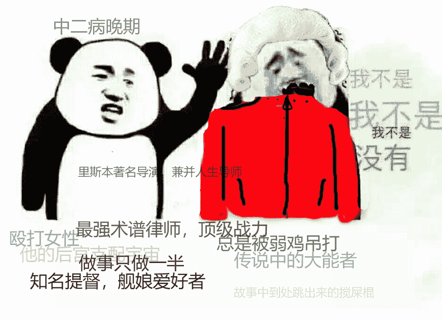

# [剧情 巨大 growth]黑暗灵魂（半成品，无gts，希望给点意见）

作者：524

TID：26766

 

# 1

黑暗的魂天空变得昏暗，大地裂开了无数裂缝，空气中弥漫着腐臭和腥味。死亡与恐慌这个世界上蔓延，让我想起了那个传说。在远古时代，世界还未分化，笼罩在大雾之中。四处都是灰色的岩石，高耸的大树及不朽古龙。但是有一天燃起了第一团火，所有的差异因此而生……冷与热，生命与死亡。然后，有几只从黑暗中诞生的物种，受到火焰引诱，并在火的周围找到了王的灵魂。最初的死者，尼特、伊札里斯的魔女和混沌的女儿、阳光之王葛温及他靡下骑士以及没人看到过的矮人。他们获得了王的力量，并挑战古龙。葛温的雷贯穿了有如岩石般的鳞片，魔女的火焰形成了风暴，尼特解放了死亡瘴气。而没有鳞片的白龙希斯背叛了古龙，导致古龙败退，火的时代就此开启。是的，世界在火诞生之中崛起了，很多时候讲这个故事只讲前面的部分，后面的一部分，隐没在动荡的心中……但是火终有熄灭的时候，到时将只剩下黑暗。但火即终将熄灭，光明无法照耀人世，夜晚无止境的持续。而受诅咒的黑暗之环，开始出现于人群中......---------------------------------------------------------------------------------------------------------------------------------------------------------------------------------------很多年以前，在我还没有被诅咒侵袭的时候，我是一个非常弱小的凡人，在这里灵魂的强大的强大可以决定一个人的前途，比如力量，魔法，神术。在我很小的时候，我的灵魂鉴定结果出来了，我的灵魂很微弱，就像风中残烛一样。仿佛会随时，熄灭。虽然小时候想成为一名骑士，想前往传说中的圣地罗德兰，想成为一名魔法师，想...... 不过我能够想起的只有这些，其他的记忆像灰尘一样，被时间的风吹的无影无踪。

请为角色创建名字______

选择性别：男/女 男

请选择出生地点

.......

又一段记忆开始袭来了，虽然不是什么过去的事，但是我却多了更多基础知识。

我只一条内裤，我一定是个男人。在被弄到这个的时候，他们将我所有的武器都丢到了，我手上只有一个可以握着的剑柄。我失去了一天，每天蹲在墙角以回忆度日，外面没有任何新鲜的东西，只有一些丑陋的活尸走来走去，虽然我跟他们是同样的东西，但我还是不喜欢啊！

砰砰，屋顶传来清脆的响声，紧接着传出沉闷的摩擦的声，阳光射了进来，屋子也变得亮了起来，我抬起了头，看见了那名骑士，阳光照到他的盔甲上，显得刺眼，盔甲很精致很漂亮。

骑士用手撑住屋顶，俯下身来，他的头盔晃动，观察着这个房间，在一瞬间眼睛和我对上了，他点了一下脑袋。然后身体缩了回去，一个黑色的东西从屋顶落到地上，发出叮的一声。之后我没有看见那名骑士，他走了。

虽然平时，从屋顶掉的东西不少，但大多数都是泥土，和一些瓦片。但这次不一样，这次掉落的东西是一把钥匙，好了游戏开始了，我们快进一下。

>>>>>>>>面前有一个楼梯，第一次走的时候我被绊倒了，滚了下去。试了两三次后我发现了一个很严重的问题，我的大腿和膝盖除了毛病，大腿不能张的太大，膝盖也只能略微弯曲，希望以后这些毛病好起来。①

>>>>>>>>不知道为什么我会对这堆火很感兴趣，虽然嗅觉，和热感丧失，但还是非常想靠近这堆火。当我在旁边休息时，发现在火中间有一根螺旋状的棍子，火里烧着的也不是什么什么木头，而是一堆烂肉，残肢。这些东西我当然不怕，但总令人不快。②

我觉得之前的康复训练受到的肌肉损伤已经恢复一点，我也该考虑一下未来的事了。我仔细观察了一下四周，火堆前面有一扇非常大的门，火堆的侧面还有一个小铁门。

我的第一选择当然是侧边的小铁门，我可不想面对那扇大门后面的活尸兄弟，虽然我并不怕那些血肉，但是那些没有思想的血肉，也是一个麻烦。

当我走到小铁门前，我发现铁门虽然没有上锁，但却从里面扣上了。使劲摇晃了半天之后，锁扣却没有一丝松开的迹象，这门的设计真是奇怪。看来没得选，我只能打开大门，从那个大门那里出去。③

当我推开大门的时候，里面的一切和我想象不一样，堆满了大罐子，突然间天变黑了。“啊”

我在这里发呆什么，眼前只有不断跳动火焰，感觉刚才好像发生了什么事.......

>>>>>>>在经历了6次死亡了，我终于发现侧墙有一个门，并躲了进去。我确定了几件事，火焰会缓解人的精神疲劳，让人容易忘记一些事。火焰也许可以让死去的我活过来，也有可能是坐在这个火堆旁的时候产生了梦境，当我梦中死亡又会产生一个新的梦境。我认为这是梦境的可能性大，因为我之前做的痕迹消失了。但没办法，我也不能从梦中出来，只能继续前进。

>>>>>>>我捡起了，一个木棒和一个锅盖，这个地方怎么这么寒酸？像样的武器没有看见一把，连锅盖也是破的，之前的活尸也是厉害，能够用那么差的弓射中我，我连活尸都不如吗？

>>>>>>>为什么楼道里会有大铁球？为什么那个骑士像光一样消失了？④为什么我挥舞3下木棒就累的气喘吁吁？为什么我木棒和锅盖没有被大铁球撞碎？我的那个剑柄放到哪里去了？

>>>>>>>>我打败了院子里的巨大生物，我也认识到了一些事，我的体力好像有点问题，武器挥舞几下就没力气了，但身体一旦放松下来恢复的很快。我的力气好像连那些活尸都不如。

我也向前方走去，我越来越觉得这是梦境了。空间非常奇怪，打开大门之前，我认为后面会是很多的建筑。但事实并没有，是一条铺满青砖的一条坡，一条向上的坡，像四周看去。也没有太多泥土支撑，就像事浮空的一样。我从那里离开了，在周围寻找其他的出路，很遗憾没有发现其他的出路。这是我想起了以前听人讲过”结晶洞穴隐形桥“，如果有传说的隐形路呢？但....没办法，我没有其他退路。我又走到了那个坡上了，突然出现了一直大鸟.............

——————————————————1.黑魂游戏中没有跳，不死人没有膝盖。可以远跳，但无法跳高，面对一个坎都得绕很远的一条路。

2.黑魂火堆中烧的不是木头，是不死人的尸体，所以可以补充元素瓶。

3.黑魂为了游戏性，但是有个很尴尬的地方，门不需要钥匙也只能从一侧开。往往玩家会绕很远的路。

4.有的游戏为了游戏性会消除尸体，之前碰到骑士npc死亡之后变成了一道光。

————————————————————————作者想说的话：写过很多次小说，和gts有关的，但很多刚开头就直接毙了。黑魂的写过三次，其他的也有好几次。但都写不下去，有的时候设定写了很多，结果发现写不出开头，因为实在不想千篇一律的，xx大陆，实力为尊。

好吧那些都是借口，是我的写作能力太差，编剧也不行。

以前曾经想把世界关写的非常大，核心框架是一个和黑魂非常类似的世界观，但添加了很多元素，比如。世界是没有魔法的，魔法位面入侵，产生魔法。漂流在天上虫族落下，产生灾难。魔界入侵，天使降临，元素共振。但因为世界核心的原因的，和薪王化身战斗的时候总是出现魔法无效等一些强力的克制。

关于gts元素也是想过几点，巨大的魅魔领主。死亡之后被圣光改造成位面之门的女性，一个可以无限叠加魔法的法师（比如一个魔法，速度之门，传穿过去会加速度，普通人会加一次，但这个法师的魔法性质很奇怪，加速之门可以不限次数穿过叠加，速度越来越快）。还有一个可以给魔法建筑提供能量的圣女。目前只想出了这四个女性角色，后面可能会添加其他的女性角色，不过多半是吉祥物和路人。

主要角色个个都是大神，主角会显得很平凡，就算个个是大神也会设计出有各种能力，避免太单一显得无趣。

目前两个问题，1.开头不好写。2.后续剧情也很难写。

之前还想过写有dgu元素，不过主角不是但大小说中的任何一个。主要剧情是，一个星球，看上去非常平凡，主角是一个拥有法雷尔基因的改造人，是一个诱饵，当法雷尔灵魂降临的时候，消灭所有拥有里斯本基因的人，并毁灭整个星球。法雷尔灵魂降临比预言中快了100年，主角最后逃出，然后因为法雷尔灵魂的离开的死掉..... 不过，开头写的不好毙掉了。

最后，里斯本水手天下第一。<ignore_js_op>

**里斯本水手.png** *(312.07 KB, 下載次數: 0)*

[下載附件](forum.php?mod=attachment&aid=Nzc4NDV8NzEyZTI5NDd8MTYwMDg4MzY5OXwxODIzMHwyNjc2Ng%3D%3D&nothumb=yes)

里斯本水手天下第一

2019-4-23 02:02 上傳</ignore_js_op>  

# 2

> [sqwzeyy 發表於 2019-4-23 19:26](https://giantessnight.com/gnforum2012/forum.php?mod=redirect&goto=findpost&pid=403556&ptid=26766)

> 黑魂其实可以有啊，死了就是虚弱复活呗（某勇士）。然后就是按lz思路这么写的话，要长篇才会有感觉。 ...

其实还没有想好如何把女性角色插入进去，这篇只是一直想写但一直再枪毙自己的文章，实在受不了就发上来了。如果有女性角色，那么她一定是一位高大的骑士。