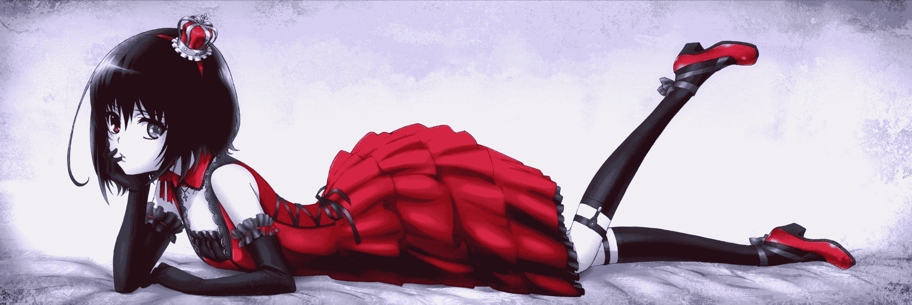
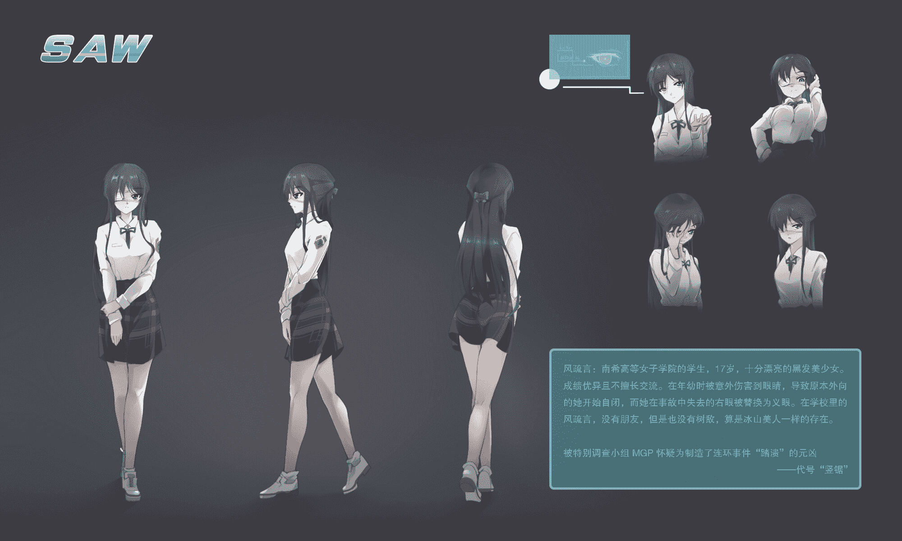

# 【剧情向】SAW Episode3 希维娅 6.30更新

作者：见崎鸣

TID：28018

 

# 1

*本帖最後由 见崎鸣 於 2020-6-30 17:45 編輯*

在这里要说一下哦，鸣其实也不知道这篇文章下次会什么时候更新哦~

Episode1 风疏言

“米拉，要不要出去喝一杯？”懒散的依靠在电脑椅上，海伦娜揉了揉自己惺忪的睡眼，为了这桩案子她已经熬了两个通宵，此刻她终于整理好了手中的资料。

“现在还没下班哦？随便忽悠自己的上司去喝酒什么的…”被称为米拉的年轻女性无奈地看了看腕表上的时间，此刻指针已经指到了早上七点，偌大的调查组办公室里其他的组员都还没有来，“不过你说得对，海伦娜，我们已经连轴转两天了，也该让冷霜来接手了。”

海伦娜兴奋的趴在椅背上，一只手拍了拍米拉的背：“对！对！你说的太对了，全靠我们小组才能抓到真凶，这么多的资料也都是咱们处理的…你说呢？”

瞧见海伦娜眼中的那股狂热，米拉也笑着轻叹：“去BIGRED吧，我请客。”

“哟呵！~”海伦娜比出一个胜利的手势，她最喜欢BIGRED的鸡尾酒。

两人确认工作全部完成后关闭电脑站起来，稍微舒展筋骨后，并肩走向大门。

这时，一位抱着厚厚一叠文件夹的瘦弱少女和她们撞了一个满怀，她步履匆忙，完全没有注意到米拉，然后摔倒在地上。少女有着一头漂亮的银发以及一双充满活力的银色眼眸，身上穿着标有特别调查组徽章“MGP”的白大褂。少女看起来不过是个学生，漂亮的外表与这个杂乱的办公室格格不入。

“对、对不起！”少女连忙道歉，“米拉小姐！”

“啊不，没事的，”米拉连忙摇头，然后蹲下来帮少女拾起落在地上的散乱文件，“我们也没有注意到你，别放在心上。”

“我们正要去BIGRED喝酒，要不要一起去？艾可？”海伦娜挑了挑眉毛，像极了一个唆使青少年犯错的不良大姐头。

米拉帮艾可拍掉白大褂上的尘土，然后瞪了海伦娜一眼。

海伦娜心虚的别过头去，然后事不关己一般吹起口哨，她还是很怕米拉发飙的，万一真的惹急了搞不好自己的鸡尾酒就泡汤了。

“艾可，今天不是你值班吧？司空医生不是已经来了吗？”米拉好奇的问。

艾可挠了挠脸颊，语气不太自信：“是这样啦，我们不是已经抓住【竖锯】了吗？陈督查说让我早点过来，帮助她们一起审问，这样的……”

“陈督查么…”米拉咬住指甲思忖了片刻，“好吧，不过你要小心，再怎么说【那个家伙】也是竖锯啊，千万不可以放松警惕。”

“嗯！”艾可点点头后又快步跑起来消失在办公室的另外一头。

“审问么，哼，还有什么好问的，换成我直接就宰了她。”米拉冷笑一声，和海伦娜一起离开了警局。

另一边的艾可在审讯室外喘着粗气扶住墙根，一只手抚摸着自己的胸口想要平静下来。

“不错，这次没有迟到。”一个从背影看上去就透露出坚毅和冰冷的女性正站在单面镜后观察着里面的情况，她的紫绀色长发扎起一个干练的高马尾，目光中似乎能看到刀子。特别调查组“MGP”的最高领导人陈念颖，被称为最年轻的高级督察，年仅22岁的她已经是一位受人尊敬、能够独当一面的人才。原本无论投放多少人力资源都没有线索的史上最恶劣连环凶杀案“踏溃”在她接手后不到半个月就告破。

艾可依旧上气不接下气，完全没有回答陈念颖的话。

踏溃案，被媒体称为有史以来最为严重的连环杀人案。踏溃案受害者之多，以至于该案件的卷宗足足存满了两个MGP办公室，连续有三位办理此案的高级督察被撤职，走投无路的MGP不得已才请来了陈念颖。踏溃案中的尸体大多数都为有过犯罪记录并且出狱后依旧不知悔改的女性，这些案件共同的特点就是，受害人的尸体都被发现在城市中突兀出现的立方体房间中，且尸体的凄惨程度无与伦比，基本没有找到过能直接进行外貌辨认的受害者，这也让破案难度提升了好几个档次。光是鉴定这些破破烂烂的尸体，就让法医组接近崩溃。而之所以被称作踏溃，则是因为受害者的尸体无一例外都像是被巨型生物践踏后的样子。

“陈督查，她还是什么都没说，而且我们的人快撑不住了。”望着【竖锯】的背影还有看上去已经十分焦虑的审讯员，站在陈念颖身边的年轻女孩唯唯诺诺的说到。

“所以我才把艾可叫来，让里面的人出来，”陈念颖冷冷的说，然后转向艾可“艾可，你准备一下。虽然她是【竖锯】，但是别太紧张，我相信你可以的。”

艾可的喉咙鼓了鼓，小鸡啄米似的点点头。

电子门被打开，满头大汗的审讯员从里面走出来，她走路的步伐踉踉跄跄，两只眼睛也找不准焦点，似乎是被什么可怕的事物吓到了一般。

“又吓傻一个…”陈念颖的助手摇摇头，“你们把她带下去休息吧。”

“她、她不是人…她是魔鬼……”从艾可身边擦肩而过的时候，审讯员的脸色宛如尸体。

“……”紧张的气氛下艾可憋住一口气，她感觉自己的心跳都快停止了。

要说自己不紧张当然是骗人了，文档里面的受害者一个比一个凄惨。就说第一位受害者【艾拉】吧，她的尸体被发现在立方体房间中的时候，一只被手铐拷在墙角的手被折断，她的身体则是被外力向内挤压，身体都拉扯成了长条形。

陈念颖朝她点头示意：“去吧，艾可。这是我们最后的机会，拘留风疏言的时间最多还有一个小时，再没有让她招供，我们只能放了她。”

“【竖锯】到底是一个怎么样的怪物呢…？”

艾可深呼吸一口，伸出手抚摸指纹验证面板，打开了关着那个被称为“竖锯”的穷凶极恶的犯人的审讯室。

艾可缓缓走到审讯桌对面，轻轻把手中的文件放在桌面上，然后扶住桌脚不至于让双腿颤抖的自己一屁股坐到地上。之后，她把屁股一点点挪到椅子上，这才鼓起勇气抬起头来看看那个神秘的【竖锯】到底是何方神圣。

“女、女孩…？”与艾可想象中不同，眼前的【竖锯】并不是一个看起来就残暴的杀人狂魔，正相反，她的外貌柔弱而精致，犹如精心打造的人偶。她穿着日式的学生校服，被黑丝及膝袜包裹的脚下踩着一双干净的制服皮鞋。

风疏言，17岁，现在是就读于南希高等女子学院的学生，漂亮的黑色美少女，据说在学校里的风疏言虽然不擅长人际交流但是成绩优异，是所有教师眼中的优秀代表。风疏言冰冷白皙的脸颊上没有一丝情绪波动，她的两只眼睛死死盯着面前这个新来的年纪相仿的女孩，似乎在盘算着什么。

风疏言的左眼是美丽的祖母绿，右眼则呈现出诡异的血红，那是因为在她年轻时经历的一场事故中夺走了她的右眼，之后她的家人在风疏言本人的要求下为她打造了那只红色义眼。

“你，不是警察吧。”令艾可没有想到的是，风疏言在她之前开口了，她淡漠的问着语气却没有一丝疑惑，不容置疑的言语里仿佛一切都在自己掌握中。

艾可点点头，没有转移话题：“是的，我不是警察，我是一名法医。”

“你叫什么名字。”风疏言抚摸了一下自己的耳根。

“艾可。”艾可认真的回答到。

“你和我差不多大吧。”风疏言依旧直视着艾可，她尖锐的视线仿佛能挖开艾可的心脏，这个冷淡少女的内心藏着残暴的怪兽。

艾可努力让自己平静下来，输人不输阵：“我18岁，应该比你大一岁。”

“很厉害呢，”风疏言淡淡道，“18岁就和尸体打交道。”

“没什么，慢慢就习惯了。”艾可说。

“那你应该也见过不少尸体吧。”风疏言几乎立刻就接上了艾可。

“你是说那些被你杀掉的人吗？”找准时机的艾可眉头紧锁，立刻反问。

风疏言没有直接回答，而是说到：“是不是我杀掉的也没有区别。”

“这么说倒也没错，我也这么觉得。”艾可笑自嘲似的了笑，不知不觉她已经不再紧张，腿部的颤抖也停止了，“不过我还是很希望她们真的是你杀掉的。”

“是么？”第一次，风疏言有了一丝困惑。

“不如说，我好很好奇你是怎么做到，完成那么漂亮的尸体的！”艾可一拍桌子兴奋的站起来，与刚才的她判若两人，“那种被重物完全摧毁的躯体，太棒了！”

面对这么多审讯员都无动于衷的风疏言，第一次似乎处在了被动。她打量着面前这个身穿白大褂的少女，在几分钟前她在自己面前还像只被人遗弃的猫咪，而现在看起来像极了科幻电影里面那些为实验痴狂的疯狂科学家。

“呐？！你是怎么做到的？”艾可绕着桌子踱步，又重复了一次刚才的问题。

“那，你猜猜我是怎么做到的。”风疏言很快又恢复了冷静，艾可的反应还不足以动摇她，她一下子就反问回去，重新把握了主动。

“我猜——”艾可突然趴到地上，然后匍匐着靠近风疏言，从下往上仰望着她，“我猜呀，你是用你的脚把她们都踩死了吧？一点一点的，碾成肉泥。”

风疏言还是冷冷的模样，眼角却有了一丝笑意，她随意的抬起脚理所当然的踩到艾可脸上：“很有趣的想法，我想听听你的推理。”

“陈督查！”门外的人一度想要冲进去，她们生怕风疏言一脚踩下去让艾可丢了性命。那可是杀了不知道多少人的怪物【竖锯】！才不是什么阿猫阿狗。

陈念颖抬手拦住了众人，示意让审讯继续。

艾可纤细的双手小心翼翼的捧住风疏言的脚，伴随着后者玉足轻轻一提，她那只漂亮的袜足就暴露出来。艾可将风疏言的鞋子放在地上，跪坐起来，风疏言也不客气。她直接将热扑扑的潮湿袜底踏在了艾可可爱的脸颊上。刚一接触到风疏言的足底，艾可的脸上就泛起一丝红晕，她急促的呼吸着风疏言足底的气味，用光滑的面部磨蹭着她的袜足。

“好闻吗？我的脚。”风疏言饶有兴趣的看着艾可在自己的脚下卑躬屈膝，艾可灼热的呼吸扑在自己的脚掌上，然后用她的舌头润湿自己的足尖，风疏言面无表情的、重重的踏住艾可的嘴唇，“如果你不开始推理，我就不让你舔了。”

“那我就用第一个踏溃的受害者【艾拉】举例吧。”艾可闭上眼睛，一边亲吻着风疏言的足尖一边开始了自己的推理。

艾拉，25岁，父母双亡的她是曾经是一位记者，在几年前她被怀疑利用自己的职务之便进行诈骗，于是被一纸诉状告上了法庭。虽然最后因为证据不足只能作罢，但是艾拉还是因为这个原因被原告想方设法送进了监狱。半年前艾拉出狱，暂时住在自己的妹妹家中，失业的她染上了毒瘾，并且开始重操旧业开始诈骗。

在出事的那一天，艾拉与人交易结束后在回家的路上突然就被人袭击失去了意识，当艾拉再次恢复意识的时候她发现自己已经来到了一个陌生的房间。

“这是…哪里？”艾拉发现自己的手已经被手铐拷在了墙角的金属水管上，她使出吃奶的劲儿也没能挣脱，反而自己的手腕火辣辣的疼。

艾拉很快意识到自己是被绑架了，她强迫自己冷静下来：“我身上有什么工具么…”

可惜，她自己身上也没有能破坏手铐的工具…？

正想到这里，艾拉突然愣住了，她突然发现自己头顶居然没有天花板。取而代之的，是一位少女的绝美容颜，此刻她正用注视虫子的冷漠眼神看着脚边房间里的艾拉。少女不是别人，正是风疏言。

“这、这是怎么回事？！”艾拉目瞪口呆，眼前的绝美少女身高估计有15米，“难道说我现在是在做梦？！”

“你好，艾拉，我想玩一个游戏。”从艾拉的头顶传来风疏言冷漠的声音，她的一只脚踏住房檐，少女裸足上蒸腾的汗水气味顿时充满了房间，“你可能想知道你现在在哪里，那我现在就告诉你吧，你可能在你将要死去死的房间里，艾拉。直到现在为止，你只是坐在阴影里看着别人过自己的生活。偷窥者在他们照镜子的时候会看到什么？现在，我把你看成一个奇怪的混合体，一个愤怒而冷漠的人。但大多只是可怜而已，所以今天你想要看着自己死去吗，艾拉？或者做点什么？”

艾拉倒吸一口凉气，对方简直就是对自己了如指掌。这个少女到底是谁，会是哪个曾经被自己威胁坑害的人么？她是那么巨大，在她的面前，自己宛如蝼蚁。那只漂亮的脚，堪称是鬼斧神工的艺术品，只要看着它，你就不由自主想去膜拜。

“现在，你坐着的地板下面有一把锯子，”风疏言说，“我给你一分钟时间，你可以选择用它切断自己的手臂逃出生天，或者，被我用脚趾夹碎你的全身骨头。”

一边说着，风疏言扭了扭自己踩住小屋的脚趾，她漂亮的圆润趾肚在微弱的光芒下宛如夜明珠，让人恨不得冲上去舔一口，然而现在的艾拉可不敢这么想。

“生或死，你来选择吧。”风疏言说完，她按下手机开始计时。

“你开玩笑吧！你凭什么这样对我啊！”艾拉叫喊着，可惜风疏言只是淡淡的看着。

艾拉趴下来，掀开并不严实的地板，里面果然放着一把锈迹斑斑的锯子，一想到要用这把锯子切割自己的手臂，艾拉就一阵阵的反胃。可是，如果艾拉拒绝割下自己的手臂，那位少女说不定就会踩死自己。艾拉颤抖着把锯子送到自己的臂弯，冰凉粗糙锯齿的边缘触碰到艾拉的肌肤，只是一下她就寒毛直竖。艾拉试着在娇嫩的肌肤上划开一道伤痕，剧烈的疼痛瞬间就打消了她切除手臂的念头。

风疏言只是看着，看着艾拉的歇斯底里和无能为力。

“还有30秒。”风疏言说。

“我不敢我不敢我不敢我不敢我不敢我不敢我不敢我不敢我不敢……！”艾拉绝望的将手中的锯子扔掉，抱住脑袋痛哭起来，她终究无法狠下心割下自己的手臂。

“时间到，”风疏言手中的手机响起了悦耳的铃声，“很遗憾，艾拉，你没有通过我的测试。既然你无法赎罪，那就让我帮你吧。”

风疏言踩在屋檐上的脚动了，径直的朝向艾拉的方向伸了过来。那是一只无可挑剔的玉足，匀称的脚型，高傲的足弓，瘦长的玉趾，风疏言的脚就是美的代名词。可是在艾拉的眼中，这只离自己越来越近的巨足，就是死神的拥吻。

艾拉穷极全身的力气拉扯坚固的手铐，可惜注定她是无法逃脱的。

“Game Over.”风疏言的脚趾夹住了艾拉纤细的腰肢。

“啊啊啊啊啊啊啊啊啊啊啊啊啊啊啊啊啊啊啊啊啊啊啊啊啊啊啊啊啊啊啊啊啊啊啊啊啊啊啊啊啊啊啊啊啊啊啊啊啊啊啊啊啊阿啊啊啊啊啊阿啊啊啊啊！”艾拉发出惨叫。

艾拉立刻本能的捶打风疏言的足趾，但是那种程度的打击对风疏言来说不过是按摩罢了，风疏言默默的并拢脚趾夹紧艾拉的身子，稍微用力，只见艾拉的腹侧一下子就凹陷进去。哪怕风疏言的足趾柔软无比，在绝对的体型优势下，艾拉的身体依然是不堪一击。内脏受损的艾拉一下子吐出一大口血在风疏言漂亮的指甲上，渲染上残忍的红色。

“我说过吧，我会夹碎你。”风疏言再一次收紧脚趾的力度，刹那间她感受到自己的趾腹一阵温热，仔细一看原来是她直接钳断了艾拉的腰，断裂的尖锐骨头穿透艾拉的皮肤伸到体外，粘稠的血液从伤口喷涌而出，不要钱似的挥洒在风疏言脚上。

紧接着，风疏言的脚用力的快速一抬，骇人的拉力袭来，艾拉的整条手臂就像是被拉到极致的弓弦应声断裂，风疏言用最残暴的方式卸下了艾拉的手臂，肩膀很快就被血液染红，从断裂的手臂根部能看到森森白骨。

“我的…腰…我的…手…”每一次呼吸，艾拉都感觉自己身体的疼痛在加剧，她看着风疏言那张冷冰冰的脸，以及她诡异的红色义眼，不禁回忆起自己的过去。

艾拉在成为记者后的有一段时间陷入了经济拮据的困境，因为自己一时的贪念，她动了歪脑筋。艾拉看准了一个似乎家境殷实的女孩，用偷拍一个她的私房照为要挟，希望可以勒索到一笔财富。可是，有了一次就有第二次，艾拉把这个可怜的女孩子当成了自己的提款机。结果自然是，艾拉得到了钱，而压力巨大的女孩选择了自杀。直到最后在法庭上艾拉才知道，其实，女孩并不富裕……

“啊…”想通了这一切，艾拉突然觉得释然了，“什么嘛…我就是个人渣嘛…”

“明白了吗？你为什么在这里？”风疏言终于开口了，比起之前的冷漠，现在她说话的口吻竟然还有些温柔。

艾拉艰难的点点头，她的脸上已经有了死亡的青色，地上，还有风疏言的脚上都是艾拉的鲜血：“谢谢你…能在最后让我明白…可以告诉我…你的名字…吗？”

“风疏言。”少女微微一笑，倾国倾城。

“真是，好听呀…”艾拉闭上眼睛，“请允许我，死在您的脚下吧。”

“嗯。”风疏言仁慈的同意了艾拉最后的请求。

风疏言的脚趾灵活的挤压着艾拉的身体，搓碾已经破烂不堪的身体，从她腹腔中榨取更多的血液，就像挤牙膏一样，风疏言将自己能榨取出的艾拉的全部挤出她的躯壳。艾拉的身体现在看起来就像是被拉长了的面条，如同破布娃娃一样在风疏言的脚趾间摇晃。

感觉到艾拉完全断气后，风疏言才舒展玉趾将她的尸体抛在地上。

“晚安，艾拉小姐。”风疏言踮起足尖，柔软的大脚趾摁住艾拉的脑袋，体型优势是绝对的，艾拉的脑袋就一点点的在“咔嚓咔嚓”的碎裂声中逐渐干瘪，直到消失在风疏言的玉趾下，将脑浆献给玉趾的主人，让她觉得舒服一点。

“就是这样~我的推理~”艾可轻轻咬住风疏言的脚趾，让自己的舌头在她的脚趾间游走。

风疏言点点头，任由那位女孩舔着自己的脚：“很有趣的故事，不过你真的认为我有这样的能力吗？艾可小姐。”

“我希望你有。”艾可说，她直视着风疏言充满威慑力的动人双眸，毫不退缩。

风疏言站起身子，里面的人们差点又忍不住冲进去救下艾可，不过陈督查再一次控制住了局面，说服大家继续观望。

“把舌头伸出来，让我踩住。”风疏言命令到，袜足悬在艾可头顶。

艾可也听话的照做了。

风疏言也说到做到用玉趾踏住艾可的舌头：“你为什么会这么希望呢。”

艾可狡黠的笑了笑，清秀的面容瞬间邪魅无比：“我希望我那个不成器的姐姐能有这个结局，能被风小姐这样完美的人踩死。”

“姐姐么，”风疏言笑了笑，玉足稍微有些用力的插进艾可口腔深处，“那我还真想让你也死在我的脚下呢，艾可小姐。”

“审讯截止。”上级发来了命令，拘留风疏言已经超过了指定期限。

陈念颖略有些痛苦的咬牙，一切逻辑都将踏溃的元凶锁定在风疏言身上，可是时间已经到了，她们必须放了这个真凶，这个杀害了无数人的【竖锯】。

穿戴整齐，风疏言走出警局，漂亮的她一下子就吸引了一众记者的目光，人人都不相信这位柔弱的女孩会是制造惨剧的元凶。面对记者们的追问，风疏言选择了回避。最可气的是，警察们还不得不为这个凶手保驾护航，而走在风疏言身边的正是艾可。

警车一路将风疏言送回了学校。

“我是不会放弃追查你的，风小姐，我一定会抓住你的狐狸尾巴。”艾可坐在风疏言的身边，目光灼热的看着即将下车的她。

风疏言优雅的笑了笑：“嗯，随时欢迎你，我也一定会找机会踩死你的，艾可小姐。”

“那我还真是期待呀，被这么可爱的女孩子踩死什么的。”艾可也微笑着，

“顺便，你姐姐的身子踩起来舒服极了，不知道身为妹妹的艾可小姐怎么样呢？”风疏言弯下腰，纤细的指尖轻轻一钩便脱下了自己左脚的袜子。

艾可身子前倾，嘴巴微张：“放心，我的脚感不会比姐姐差的。”

风疏言的裸足穿进制服皮鞋，将袜子一团，塞进了艾可口中，然后轻轻吻了吻她鼓鼓囊囊的脸颊：“好好品味袜子（失败）的滋味吧，艾可。”

艾可咬了咬口中的袜子，湿湿的，咸津津的，都是风疏言的味道。

在艾可的注视中，【竖锯】重获自由。

To be continue

<ignore_js_op>

**见崎鸣.jpg** *(276.99 KB, 下載次數: 1)*

[下載附件](forum.php?mod=attachment&aid=ODEzMTJ8OWY2NTM2Yzd8MTYwMDg3NTk2MnwxODIzMHwyODAxOA%3D%3D&nothumb=yes)

2020-2-10 15:09 上傳

 

# 2

> [aaabcd3 發表於 2020-2-10 17:26](https://giantessnight.com/gnforum2012/forum.php?mod=redirect&goto=findpost&pid=425555&ptid=28018)

> 这是在致敬电锯惊魂吗

文章名字不就是电锯惊魂娘化重置嘛2333

 

# 3

*本帖最後由 见崎鸣 於 2020-5-28 09:24 編輯*

说起电锯惊魂，算是鸣的残忍系启蒙之一，所以与之同源的SAW必定会是残忍系的盛宴，请大家尽情享用。这里是可爱的鸣酱，喜欢鸣文章的朋友欢迎加群1090360702～谢谢大家支持（顺便求回复！）

Episode2 弥砂怜

嘴角若有若无的上扬，风疏言正走在通往自己宿舍的路上，鞋子里她没有穿袜子的玉足十分不安分，脚趾时不时兴奋的弯曲一下，一想到刚才艾可咬着自己袜子的表情风疏言就觉得心跳加速，她还是第一次如此满足。风疏言的脸颊上露出一丝害羞的红晕，对艾可萌生的莫名情愫让她乐在其中却又惴惴不安。

“艾可…么…”风疏言的右手捂住自己的胸口，感受剧烈的心跳，同时眼睛看着自己的鞋尖，“真想，让你看看接下来我会做什么样的事情呢…用我的这双脚…”

在宿舍里，还有一个“玩具”等着她。

当弥砂怜从昏迷中醒来的时候，她的意识依然是游离的，麻醉剂的余效依旧让她的大脑感觉昏昏沉沉，那种半睡半醒的不适感令她有点反胃。她平时绚丽的亮橙色头发此刻也显得黯淡无光，漂亮的双眼同样失去了活力。

“我这是…”弥砂怜想要站起来，却发现自己的脚像是被黏住了一样无法动弹。

她低下头才发现，原来自己的双脚被铁链连同凳子牢牢捆在了一起。与此同时，在弥砂怜挣扎的时候她感觉到自己的肚子传来一阵撕裂般的疼痛。

“嘶！”弥砂怜疼得呲牙咧嘴，她伸出双手拉开自己沾了些许血渍的衣服，只见自己原本光滑的肚皮上此刻突兀的多出一道鲜红色的新鲜伤口，细嫩的皮肤上被人用白线略有些粗暴的缝合起来，弥砂怜不禁倒吸一口凉气。

“你醒了？”从弥砂怜的身后传来可爱的女声。

弥砂怜身子颤了一下，然后回过头，看到了一位身材娇小的少女正对着她露出坏坏的笑容。弥砂怜认出了她的校服，南希女校的初中部制服，曾经她也想去那里读书，可惜最后因为家庭原因还是放弃了。那位女孩有着顺滑的暗红色头发，头顶戴着可爱的猫咪发圈，同样是暗红色的眼眸骨狡黠的转着，不知道在策划些什么。明明是大夏天，少女的脚上却还穿着厚重的皮靴，可以想象到里面已经积蓄了恐怖的气味。

“抱歉抱歉～”少女迈着轻盈的步子走到弥砂怜面前，弯下腰仔细端详弥砂怜的面孔，“大姐姐还蛮好看的嘛～自我介绍一下，我叫克里斯汀，接下来应该会陪着姐姐度过一段【快乐】的时光哦～嘻嘻w”

说到快乐的时候，克里斯汀加重了语气中的玩味，弥砂怜有点不寒而栗。

“你…把我抓到这里是要做什么？”弥砂怜勉强振作起来，询问到。

克里斯汀竖起食指，摇摇头：“不是哦，我可没有能力抓到大姐姐啦，是我的同伴做的，你的伤口也是她帮忙缝合的哟。至于为什么抓你到这里嘛，就不是我来告诉你啦～”

克里斯汀说完，便将绑住弥砂怜的凳子旋转到了后面，笑着用手指指了指头顶，在她的示意下弥砂怜抬起了头，她终于才注意到在自己的上方有一位少女一直在默默注视自己。她那冰冷的视线让弥砂怜感觉自己全身上下都被小虫子叮咬着，那仿佛不该是人类应该拥有的绝美面容没有一丝情感。

“这？！”不仅仅是惊讶于少女的美貌，同样惊讶的还有她那犹如神明般的巨大身姿。

“你好，正式见面还请多指教，弥砂怜小姐。”少女淡淡的说到，“我叫风疏言，是今天对你的行为进行处罚的行刑人。”

“行刑人…？”弥砂怜屏住呼吸露出困惑的表情。

风疏言点点头，安静的说着：“从以前开始，弥砂怜小姐你就在贩卖毒品了吧？这段时间里不知道摧毁了多少家庭，一心只想让自己盆满钵满。不只是年轻人，就连无辜的老年人和青少年，你也会利用自己的美貌去吸引他们落入你的圈套。你无数次的躲避了法律的制裁，但是你今天可没有那么走运了，你会因此付出一定的代价——在生与死之间。”

弥砂怜心脏“咯噔”一声收紧，她自以为自己足够隐蔽了，不知道多少次骗过了警方，然而面前这个高中生少女对自己根本就是知根知底！

“我…我想你可能是搞错了什么吧？我是无辜的…”弥砂怜还想狡辩，可是在风疏言用锐利的眼神瞪了她一眼之后，弥砂怜便乖乖的低下头，在那位巨大的少女面前自己什么都不是，如果自己真的惹她不高兴恐怕一下子就会死去吧，“不…不…你说得对…”

弥砂怜承认自己的罪行后风疏言的表情也柔和下来，她的左脚足尖轻轻踩住右脚的鞋跟，匀称的小腿轻轻一提，漂亮的裸足便从中抽出。光滑的足背上有制服皮鞋留下的一道浅浅印记，粉嫩的脚掌上是汗水晶莹的光泽，五根细长的脚趾在弥砂怜头顶肆意舒展着。

“呼…呼啊…前、前辈的脚！”虽然弥砂怜十分恐慌，克里斯汀却露出了兴奋的表情，“前辈的脚…真漂亮…呼呼，整个人都开始兴奋了！！”

克里斯汀绕过弥砂怜，跪在地上用膝盖一步一步的蹭到风疏言的玉足前，不顾一切的激动的亲吻着风疏言的脚掌：“前辈的裸足，还真是很少见到～克里斯汀太幸福了！”

弥砂怜虽然对克里斯汀的行为感到困惑，不过她得承认她这辈子还是第一次见到如此漂亮的脚，就连那位叫风疏言的少女裸足上散发出的气味都相当迷人。

“你们，弥砂怜小姐，”风疏言的纤手托住香腮，思忖着，“你哪怕是对你这样的人，我也打算给你一个赎罪的机会，接下来我们会进行一场游戏。游戏的内容很简单，看到你肚子上的伤口了么？”

弥砂怜当然感受到了，麻药的效果早已过去，现在她的肚子上的伤口还有腹部右下侧都有传来一阵阵的疼痛。一想到自己漂亮的肚皮上会留下一道难看的伤口，弥砂怜就觉得难受，不过比起这个，她现在更想活下去。

风疏言接着说：“我在你的身体藏了你通往自由的钥匙，接下来我会让克里斯汀坐在你的面前，她的脚会是拯救你的关键。你可以命令克里斯汀让她把脚伸进你的身体里面探索，她会帮助你取出钥匙。时间有两分三十秒，时间归零后如果你没有完成任务，那么，我的脚趾就是你最后看见的风景。生或死，由你自己决定。”

说完，风疏言就按下了计时器，弥砂怜的头顶的一块电子屏幕上红灯亮起，大大的2：30出现。死亡的倒数计时即将开始走动，而在弥砂怜面前坐下的克里斯汀则是露出了狡黠的笑容。克里斯汀脱下双脚上厚重的皮靴，她同样没有穿袜子，赤裸着的双脚伸到了弥砂怜脸上。一瞬间，克里斯汀那两只小巧的脚丫上，充分发酵后令人作呕的粘稠汗臭和皮革味就侵入了弥砂怜的鼻腔，她立刻就开始咳嗽和干呕。

“噗哈哈～大姐姐太好笑啦，”克里斯汀嘲笑着，“为了今天我可是为了准备了三天哦～人家的脚都快捂坏了呢～全都是脏脏的脚垢哦～马上就要钻进大姐姐的身体里面了呢w”

闻着克里斯汀的脚，那股浓烈的汗臭味让弥砂怜屈辱无比，可是，自己目前唯一的希望就是面前女孩的脚丫了，她能确定风疏言的话是认真的，不去做就会死。看着面前那位可爱的女孩还有她挑逗自己弯曲的可爱脚趾，弥砂怜这样安慰着自己，至少除去味道，克里斯汀的脚还是很漂亮的，她的心情也逐渐平静。两分三十秒，绰绰有余了，她几乎可以确定自己腹部右下侧那里的阵痛就是钥匙的所在，只需要让克里斯汀把脚插进去…就没问题了。

“来吧…”弥砂怜紧紧咬牙，万事开头难，她打算一口气完成。

“大姐姐真勇敢呢～克里斯汀不讨厌你哟～”克里斯汀满意的点点头，她用左脚大脚趾轻轻点了点弥砂怜的嘴唇，弥砂怜不由自主的舔了舔——咸咸的。

“噗嗤，大姐姐舔了人家的脚趾呢～”克里斯汀笑了笑，“不过的确讨到我的欢心了哟？接下来我会好好帮助大姐姐的～嘿！”

克里斯汀没有迟疑，在计时器开始倒数的那一刻，她的左脚足尖绷直猛地刺向了弥砂怜肚子上的伤口，随着“噗噜”一声响起，脆弱的缝合线立刻崩开，克里斯汀的脚趾已经插进了伤口中。弥砂怜立刻发出了凄厉的嚎叫，额头上瞬间布满了细密的汗珠，好看的亮橙色卷发在她脑袋的剧烈摇晃中变得散乱无比。

“哈…哈…”弥砂怜喘着粗气，伤口撕裂的剧痛差点让她昏迷过去，不过她还是挺住了，她不敢去看自己的伤口，那里估计已经惨不忍睹了吧，被一只脚塞进去的样子她不敢想象，“两分十秒么…足够了…克、克里斯汀，往里面伸…你的脚…”

弥砂怜断断续续的说着，她打算速战速决。

“嗯呢，好的呐～”克里斯汀听话的吐吐舌头，“要来了哟～”

克里斯汀的脚趾灵活的钻入皮肤下，裸足一点点没入弥砂怜肚子里面，很快就通过了纤薄脂肪层来到了内脏分布密集的内部区域。弥砂怜感觉有点反胃，身体里被克里斯汀的脚侵犯产生了异物感。不过弥砂怜顾不得这么多了，现在时间不等人。

“往、往右边…”弥砂怜艰难的开口说到。

“好嘞！～”克里斯汀举起一只手回答到，她旋转自己的脚踝，让自己的脚往右边拐过去，她能感觉到自己的脚趾已经插进了一堆热乎乎的东西，一节一节软软的踩着非常舒服，“啊嘞？克里斯汀踩到的是大姐姐的肠子么？”

弥砂怜突然意识到了问题，尖叫起来，尖锐的指甲自己了自己的手掌心，不断失血的身体疯狂扭动，就连克里斯汀都快坐不稳了：“反了！反了！不是你的右边！是我的右边！你的左边！！”

“是大姐姐没有说清楚嘛！”克里斯汀不高兴的撅嘴，“干嘛凶人家哇！～”

弥砂怜看了一眼电子版，上面的数字流动到了1：42，现在她需要加快速度同时安抚克里斯汀：“对不起…对不起，是我的错…请重新来吧！”

“这还差不多啦～原谅你了～”克里斯汀又露出笑容，她重新调整方向让自己的转向弥砂怜的腹部右下侧。可是似乎是因为她弥砂怜挣扎太过的缘故，弥砂怜的肠子居然缠住了她的脚，这让她的脚无法动弹了，“这…我的脚卡住了…大姐姐刚才反抗太用力了…”

弥砂怜的嘴角吐出一口鲜血，身体情况每况愈下，再拖延下去就死定了，不过如果自己完成了游戏风疏言肯定不会让自己死的，自己的积蓄要买修复自己的器官简直太简单了：“赌一把吧…克里斯汀…别管了，强行伸过去！”

“既然姐姐这么说啦，克里斯汀就照办咯w”克里斯汀卖了个萌，左足脚趾残忍的张开，剥开了阻碍在自己前方的脆弱脏器，鲜血瞬间喷涌在克里斯汀的足趾上。不过克里斯汀可不打算停下来，她的脚趾挑开已经被踩碎的内脏，然后运动自己的脚掌将它们尽数踩在下面，紧接着狠狠的扭动脚掌“咕吱咕吱”的将它们踩到扁平。她不断的重复并且享受这个过程，渐渐强行打通了一条通往腹侧的道路。

这个过程中弥砂怜差点就昏死过去，自己的肠子被那位女孩用她脏脏的脚丫搅动着，自己的内脏被她毫不留情的践踏着。弥砂怜知道，自己恐怕有一半肠子都被克里斯汀的脚踩扁了，她选择了最糟糕的方式，而克里斯汀本人只是保持着戏谑的笑容听从自己的“差遣”。弥砂怜不禁觉得这就是报应吧。不过，自己已经做了的事情是不会后悔的，她会完成这个游戏活着离开这里，自己的银行账户里面还有昨天刚刚到账的大笔赃款等着她挥霍呢。

“再，一点点就好…”弥砂怜咬紧牙关，她感觉自己的肚子里不断“咕噜咕噜”的流着鲜血，那是克里斯汀的杰作，她的玉足把自己的内脏糟蹋了个七七八八，直到现在她的脚掌都还蹍踩着已经干瘪的肠道。

“喔喔！克里斯汀的足尖好像碰到了一个硬硬的东西！”克里斯汀对弥砂怜说到。

“呼…呼…啊…现在，一分钟整么？”弥砂怜自嘲的笑了笑，她最终还是掌握了希望的钥匙，“克里斯汀！夹住它！用你的脚趾夹住它！”

“嗯嗯～没问题哟～”克里斯汀的右脚从外面踏住弥砂怜的肚皮，确保身子稳定，然后她的脚趾就轻松的夹住了那个硬硬的物体，只不过表情有点困惑，“我夹住了哦，就是感觉怪怪的呢。”

“别管了！拔出来吧！”弥砂怜仰起头，深吸一口气，这是最后的一步了！

电子屏上显示的时间已经到了30秒不到，弥砂怜已经不想再拖。

“嗯呢，好哦～”克里斯汀舔舔嘴唇，她的脚趾紧紧夹住那硬硬的物体，全身的力气都集中在了她的趾间，“要一口气拔出来了哟！”

“等等！那是？！”在克里斯汀脚趾用力钳紧的那一刻，一股不详的、不同于克里斯汀践踏自己内脏的疼痛，弥砂怜意识到了一个一直被自己遗忘了愚蠢问题。

可惜，太迟了，克里斯汀已经发力，坚硬的物体连带着其他的什么东西一并被克里斯汀的脚趾夹住一股脑儿扯出了体外，与此同时弥砂怜呕出了一大口浓血，她下身也因为失禁逐渐潮湿，尿液打湿了裤袜一路流到地上。

“啊嘞？这是什么呀？”克里斯汀疑惑的看着自己血淋淋的裸足，原本白皙的脚丫现在完全被渲染成了红色，脚踝上和脚背上都缠着一圈肠子，足下就更多了，都是被她无情踩扁的弥砂怜的肠道。在她脚趾间夹着的并不是什么钥匙，而是一节看起来奇怪的小东西。

弥砂怜瞪着克里斯汀脚趾间那短小的人体组织，她悲哀的知道，那是原本属于她的阑尾。阑尾炎一直困扰着弥砂怜，平时她都有好好照顾自己的身体，可是今天这个突发局面导致她一时间居然忘了这件事，结果就是她命令克里斯汀用她的足趾扯出了自己的阑尾连带着身体里大部分的肠子，她的腹腔已经变得空荡荡的了。

弥砂怜这才低下头，观察自己已经干瘪下去的肚子，她终于看到了一个绝望的事实——那把象征着她自由的钥匙根本就不在自己体内，它只是被埋在了自己浅浅的脂肪层下面而已，如果自己刚刚低头完全能一眼看见它。

“克、克里斯汀…”弥砂怜用祈求的目光看着那位还略带嫌弃的用可爱的脚掌挤压自己内脏的女孩，“快…快…”

“好啦～”克里斯汀用另外一只脚伸进了弥砂怜的肚子，“即使是我，也看到咯～”

弥砂怜目眦尽裂，她的眼睛放着光芒，看着克里斯汀的玉趾夹住了那把钥匙。哦，哦，那位女孩犹如一位天使，她的脚趾，简直就是完美的艺术品。弥砂怜仿佛都看到了自己下一秒手握香槟享受自己的人生。

“时间到，”风疏言说，“弥砂怜小姐，游戏结束。”

电子屏上的数字归零，发出了刺耳的滴滴声，犹如一瓢冷水浇灭了弥砂怜的全部热情。

“等、再等等！我，我已经找到钥匙了！”弥砂怜哭叫着，“克里斯汀，快呀！”

“抱歉哦，大姐姐，虽然我也很喜欢你啦，”克里斯汀遗憾的耸耸肩，“可是前辈的话是绝对的命令哦？明明姐姐一开始低下头就能看到钥匙了呢，偏偏要克里斯汀把你的肚子弄得乱七八糟。嘛，虽然克里斯汀觉得很舒服就是啦，把姐姐肠子踩扁的过程，克里斯汀很享受哟？”

弥砂怜终于才想起，自己能够“支配”这位少女的时间只有短短的两分三十秒而已，她居然把她当成了自己的救世主。

“风疏言是吧？我有很多钱，我都可以给你，让我活！钱都是你的！毒品，你想要多少有多少！”弥砂怜的表情已经癫狂，她现在只想活下来，“我给你做牛做马，我还能当你的便器！真的，我不是故意的，都是我那个堂妹，那个弥笑浅指使我的！我只是一个打工的！”

那位平时看起来犹如大家闺秀的弥砂怜，那位自觉高人一等的弥砂怜，此刻却是风疏言脚下最劣等的狗，她不惜出卖自己的堂妹也想活下来。

“弥笑浅么，好吧，”风疏言点点头，“我记住了，谢谢。”

“真的？”弥砂怜兴奋的询问。

然而，迎接她的却是风疏言缓缓伸过来的巨大右脚：“抱歉，这是规定，你输了，弥砂怜小姐。现在，我也会兑现我的承诺，好好记住我的脚趾缝是什么样的吧，下辈子做个好人。”

弥砂怜屏住呼吸，她的亮橙色眼眸中的光芒被风疏言的足底遮蔽。她的脑袋现在就位于风疏言的两根修长玉趾间，视野里全部是风疏言好看的脚趾缝还有光洁的脚趾内壁，弥砂怜能完美的感觉到少女脚上的温度，还有她玉足上的芬芳。

“求求你不要啊，我还没有享受够啊…”风疏言的脚趾缓慢的合拢，脚趾间的软肉离自己的脸越来越近，弥砂怜一边哭着一边摇晃着脑袋想要挣脱她根本不可能挣脱的束缚。那巨大的脚，巨大的少女，正在一点点的夺走自己的生命！

风疏言默默看着弥砂怜最后的歇斯底里，静静的合上了自己的足趾，让那颗小脑袋淹没在自己的脚趾间：“唔，真硬。”

风疏言稍稍握紧拳头，脚趾开始施加力量，她脚趾间的小家伙身体就猛烈抽搐起来。风疏言轻轻咬住下嘴唇，漂亮的足尖微微向下弯曲，夹住弥砂怜的足趾仔细但是重重的搓捻起来，无情的对弥砂怜头部施以恐怖的压力和摩擦力。

“前辈的脚，好厉害，大姐姐的头骨发出了奇怪声音耶！”克里斯汀欣喜的拍着手，欣赏风疏言对弥砂怜最后的处刑。

“嗯。”所谓奇怪的声音，风疏言清楚，那是弥砂怜的脑袋被自己揉碎的声音，没有什么生物能在自己脚趾这样运动后还有机会活着。风疏言的脚趾继续研磨着，房间里十分安静，只能听到弥砂怜脑袋被磨碎时“咯嚓咯嚓”的脆响。弥砂怜还没死透，她的拳头还跟随风疏言残酷的挤压不断握紧再松开，胸部也艰难的上下起伏着，双腿则是不断打着摆子。没一会儿，风疏言只觉得脚趾间那硬硬的触感已经消失了大半，取而代之的是颗粒状的、温暖的粘稠碎块。看样子，弥砂怜的脑袋已经被自己完全磨碎了。

“呼…结束了。”风疏言优雅的站起来，她的脚趾缝里是弥砂怜的脑浆和被染红的亮橙色发丝，弥砂怜没有了脑袋的身体还坐在凳子上，“克里斯汀，把她放进【场地】，我要去洗个澡。”

“是！前辈！”克里斯汀心满意足的看着风疏言处死了弥砂怜，她自己也到达了高潮。

没有再去看弥砂怜凄惨的尸体和发情的克里斯汀，风疏言头也不回的离开的房间。

“这样的坏人，世界上还有多少呢？”

……

当艾可刚回到警局的时候，就看见米拉队长和她的助手海伦娜生着闷气坐在办公桌上。艾可便走过去询问：“怎么了？米拉小姐和海伦娜小姐？你们的表情看样子不太好。”

“是那个弥笑浅啦！”海伦娜不爽的拍了下自己的大腿，“就和那个风疏言一样！明明大家都知道她们犯了事情，但是就是没有证据，只能放人！”

米拉没有说话，一言不发的啜饮茶杯里的咖啡。这是她的习惯，用茶杯喝咖啡，用咖啡杯喝茶。虽然普通人会觉得奇怪，但是警局的大家已经司空见惯了。

“弥笑浅呀…”艾可知道这个名字，她们MGP也帮忙处理过这个诈骗犯，“她的确很狡猾，要是有谁能制裁她就好了。”

“暂时咱们还做不到就是了…”海伦娜无奈的叹气，“不过艾可，你下午不是没有工作吗？为什么又到警局来了？当个工作狂可不好哦。”

艾可尴尬的笑了笑：“也不是啦，关于风疏言的事情，我还有些疑惑，所以我准备去找司空医生要一份上次案件死者的尸检报告，看完我就离开。”

“好呀，要是一会儿有空，咱们去BIG RED喝一杯吧！”海伦娜笑了笑。

“嗯，那，一会儿见。”艾可礼貌的打过招呼后就去往电梯的方向了。

“海伦娜，你要是有艾可一半上进，”米拉无奈的摇摇头，按揉着自己的太阳穴，“以你的本事还有工作资历现在至少也该和我平级了…”

艾可乘坐电梯来到了地下一层，这里是存放警局缴获的违禁品的地方还有就是实验室、验尸间和停尸房所在的地方。这里的主人一天中的大部分时间都留在实验室里，她叫司空小遥，是个奇怪的前辈，大家一般都称呼她司空医生。不过虽然她人很奇怪，但是确实是一个很有实力和魅力的人。

“学姐，你在吗？”私下里，艾可更喜欢称呼司空小遥学姐。一方面司空小遥是艾可在警局的前辈，另一方面，司空小遥也是早于艾可毕业的在夜见山白蔷薇大学的学姐。

“嗯喵，在哦～请进～”女孩甜甜的声音从实验室中传出。

艾可推开门走了进去，一眼就看到了正对着自己的司空小遥。

“啊喵？是小可呐，今天怎么有兴趣来咱这里啦～？是想你的遥前辈么～？”司空小遥露出可爱的笑容欢迎艾可的造访。

那是一位可爱的女孩，是的，女孩。司空小遥的年纪只有16岁，是医学界的天才，她13岁就已经从大学里毕业了，现在她都还维持着几乎类似小学生的乖巧体型，以至于不少人见到她的第一面都不会相信眼前的女孩是一名优秀的前外科医生和现任法医。司空小遥蓄着柔顺的淡粉色头发，胭脂色的眼眸中似乎隐约可以看见一对可爱的桃心。她的身上穿着白大褂，而白大褂里面其实是真空，雪白的双腿悠哉的晃着，裸足上则是穿着一双可爱的、有着兔子外形的粉色棉拖鞋，右脚上兔子的玻璃眼睛已经掉了。

虽然早已习惯了这个色气萝莉前辈的服装，不过艾可看到司空小遥后着实还是吃了一惊，那位学姐的屁股下面正坐着一个在挣扎的女孩子，那个女孩子四肢被五花大绑着，司空小遥正骑在她的脸上：“学姐…？你这是…？”

看着艾可颤巍巍的手指指着自己的屁股下面，司空小遥这才魅笑着摸摸后脑勺：“不要在意啦，咱不是经常负责处理犯人嘛，这不就是一个嘛～原本要进行注射死亡的连环杀人犯喵，被我暂时使用一下啦～嘿嘿w”

艾可点点头，的确，她早就听说了司空小遥有私自接手并且处死死刑犯的习惯，大家对她的这个行为也是睁一只眼闭一只眼，一方面她足够优秀，另一方面确实也省下了不少注射药物的经费。不过，这还是艾可第一次看见。

“安心，别去管她啦～三个小时了喵，血液循环已经缓慢了呐，体温低于35度了喵～应该再过一会儿就能被咱坐死了喵～”司空小遥身子前倾，不合身的白大褂从她肩膀上滑落，露出雪白的肩膀，胸部也是隐隐可见，眼眸中似乎充满了不和年龄的诱惑。

艾可咽下一口唾沫，她知道，司空小遥也是一个残忍的前辈。她走上前去帮司空小遥把耷拉下来的白大褂重新穿好：“学姐，这样会着凉的…！”

“啊嘞～小可是在关心咱嘛～？很开心喵w”司空小遥又晃了晃腿，对胯下的女孩子说，“咱的学妹来了哟，咱就不陪你玩啦，唔姆，努力活着吧～死了就算了喵。”

说完，司空小遥弯曲手指弹了弹女孩子的额头，后者的脸已经涨红，小遥让她呼吸了最后一口，在女孩绝望的惊恐眼神中一屁股坐了上去，可爱的粉嫩玉户封住女孩的鼻子，屁股堵住了她的嘴巴。女孩的喉咙里发出了“嗯哼，”一声，就只能不断的呜咽了。

“小可来找我做什么喵？”司空小遥优雅的坐在少女脸上对艾可说。

“我、我是来找学姐要132号尸检报告的，想要复印一份回去研究。”艾可说，她有点开始可怜那位女孩子了，以这种残忍又屈辱的方式死去，不过艾可也知道被小遥处死的只会是穷凶恶极的坏人，所以她也很快释然了。

“唔，报告我放在储物柜里面了喵～钥匙在…想想喵？”司空小遥歪歪头想了想，然后打了个响指，“bingo！”

她顺势踢掉右脚上的拖鞋，一把小小的银色钥匙的钥匙环正套在她的食指上。

“找到了喵，钥匙～原来在咱的脚趾上喵，”司空小遥坏坏的笑了笑，玉足一扬就伸到了艾可前方，“小可来取吧～你知道方法的喵w”

艾可再熟悉不过了，司空小遥肯定会帮她，但是对于熟人她总是喜欢这样戏弄一下子，不过大家都挺喜欢她的，倒是也乐在其中。

“学姐真是的呢…”艾可无奈的说着，在司空小遥面前跪下，捧住了司空小遥小巧的脚丫，那位死囚女孩的身体已经因为被小遥切断呼吸开始了生理性的抽搐，“我要取走了哦？”

说着，艾可张开嘴巴，舌头温柔的舔在司空小遥的足底，然后小小的嘴巴含住了她的足趾。司空小遥舒服的嗯嗯着，在艾可专心舔着她脚趾的时候，司空小遥的注意力又回到了死囚女孩的身上。看着女孩已经快要失去焦点的瞳孔，小遥吐出舌头露出嘲笑。

“小可～继续～你的舌头太舒服了～咱，要尿尿了喵～”这话当然不是说给艾可听的，是对那还保留着最后意识的可怜女生说的，“咱不会放过你的啦，去死喵～”

司空小遥调整好位置，温热的暖流从小遥柔软的下身精准的灌入女孩的鼻腔，然后一路沿着气管进入她的肺部。司空小遥知道，这下她必死无疑了。司空小遥带着笑意与那位注定死在自己胯下的女孩对视，在女孩的视野中小遥的身影逐渐模糊。艾可含住小遥的脚趾，为她一根一根脚趾的清理，然后轻轻咬住她的食指，用舌头一点点的卷下钥匙环。这段时间里，随着小遥源源不断向她的肺中送入自己的液体，女孩的挣扎逐渐开始减弱。当艾可叼着钥匙离开司空小遥的一刹那，女孩抽动的身体也彻底瘫软下去。

“谢谢学姐。”艾可亲吻了一下司空小遥的足尖。

“不谢喵，一会儿告诉后勤部的人让她们来处理一下这家伙喵。”司空小满意的摸摸艾可脑袋，这才从已经死去的女孩脸上起身，她死不瞑目的脸上全是淫靡的粘稠液体，这是因为小遥的下身因为快感早已湿润了，“死掉的玩具留在咱的实验室太晦气了喵。”

道别小遥，艾可来到档案室开始调查：“风小姐，让我们开始第二回合吧。”

to be continue

这里附上大佬帮忙画的女主角风疏言人设w

<ignore_js_op>

**saw.jpg** *(592.54 KB, 下載次數: 1)*

[下載附件](forum.php?mod=attachment&aid=ODMxNjF8MDM0NWI3YjR8MTYwMDg3NTk2MnwxODIzMHwyODAxOA%3D%3D&nothumb=yes)

2020-5-28 09:17 上傳

 

# 4

*本帖最後由 见崎鸣 於 2020-6-30 21:51 編輯*

鸣酱极度残忍的SAW上线了！大家记得回复哦w，欢迎加群～1090360702～谢谢支持喵w

Episode3 希维娅

“呀嘞呀嘞～小可，找到想要的档案了喵？”司空小遥推开档案室的门，朝着艾可吐出自己淡粉色的小舌头，在她的舌尖挂着一缕唾液的银丝，正在微弱的光线下展现出色气的光泽。在那丝唾液在小遥舌尖若即若离的时候，她便微微卷起舌头扫过自己的唇瓣让它们更加湿润，“如果需要，可以把它们打印一份喵～”

艾可脸红着点点头，将视线从那位色气萝莉般的前辈身上挪开：“谢、谢谢学姐！”

“没事哟？”司空小遥说，“现在先去找一下安雅小姐呢，她似乎有事拜托你喵。”

“好的，我这就去，”艾可将手中的档案交到小遥手中，“这个，还有19、21号文件拜托学姐帮我打印一下，之、之后我会…唔…报答学姐的……”

说完，艾可的脸就更红了。

看见艾可羞涩的表情，小遥却露出了狡黠的笑容，她将手伸到了真空的白大褂下不知道做着什么不可描述的事情：“很期待喵～小可和其他人不一样呢～咱的屁股也最喜欢小可了喵～”

受到小遥的持续调戏，艾可也是害羞到了极点，她连忙和前辈道别离开了地下一层。刚刚出了电梯来到一层艾可就被一位身高与自己相仿的女孩逮了个正着。米色的头发被留成了有些孩子气的造型，一双淡金色眼眸里尽是古灵精怪，安雅.维兰德，MGP中颜值数一数二的美少女副督察，警局中职位仅次于陈念颖的二把手。

“哎呀～正好遇到了呢，小可！”安雅一把捧住艾可的脸颊，“好不容易才把你借来呢，什么时候可以到我的直属小队来呀，我可是很期待哦！”

“疼疼疼！安雅小姐轻点！”艾可的眼泪都快被她搓出来了，“说正事呀，正事！”

“啊啊，抱歉抱歉～”安雅不好意思的挠挠头，轻咳一声收回自己刚才撒娇般的表情，“是这样的，关于【踏溃】案件有了新的进展，我们要和维罗妮卡大学的希维娅小姐见面。”

……

“就这样，你们收拾好实验室的器材，我回来之后会检查的。”顺滑漂亮的绿色头发及至香肩，发梢末端因为熨染略有弯曲，澄澈的祖母绿眼眸里闪烁着傲慢，她就是家境殷实的维罗妮卡大学研究生希维娅，艾可与安雅的会面对象。

“好的！希维娅学姐！”学妹们纷纷答到，她们都是这位傲气前辈的忠实追捧者。

希维娅满意的点点头，离开了实验室一路走向大学校门。目前为止她的人生一帆风顺，在维罗妮卡大学的研究生学位是手到擒来，接下来的博士文凭自然也会是轻而易举，她很庆幸自己有机会参加“那个实验”才让自己的人生道路简单了不少。不过唯一的问题就是“竖锯”的出现，她让希维娅很是不安，于是她决定和MGP的家伙们合作，尽管自己对她们并没有什么好感。正当希维娅这样思考着离开学校的时候，她就感觉自己的后背被什么东西顶住了。

“好梦，希维娅小姐。”女孩的低语萦绕在希维娅耳畔。

“哈…？”伴随着电流通过身体，希维娅感觉到一阵酥麻，之后她的大脑就当机失去了意识。

不知道过去多久，希维娅才感觉到自己的指尖有了一丝知觉。她发觉自己正趴在一片潮湿的地面上，昏暗的空间内温度在三十摄氏度以上，她呼吸着的空气中弥漫着一股相当浓郁的臭味，臭味连带着高温令希维娅产生了一种痛苦的窒息感。最要命的是，尽管自己呼吸着刺鼻的臭味，肺部似乎都要燃烧起来，可是她越是吸入这种气味她就越是沉醉其中。

“该死的，我居然在兴奋…？”希维娅骂骂咧咧的坐起身，双手撑住湿漉漉的地面，她已经恢复了基本的行动力，“这里，到底是哪儿？我为什么会在这里？”

希维娅目前所处的空间并不明亮，因为唯一的光源是通过她前方不远处的圆形坑洞照射进来的，自然无法照到太里面。空间也比较狭小，可能也就是一个普通教室的面积。

“额，我的头好晕…”从希维娅身边，又有一位少女悠悠转醒，她似乎在这之前同样陷入了昏迷，她一醒来就开始剧烈的咳嗽，“咳咳！咳咳！这是什么味道呀？！”

紧接着少女熟练的从自己的口袋里摸出一罐喷雾器然后将喷嘴塞入口中，数秒钟之后她的状态便稳定下来。借着不怎么明亮的光线，希维娅可以看出少女的外貌十分迷人，她露出浅浅笑容的脸上透露着病态美，淡金色的长发披散在脑后，她那双亮橙色的眼眸在这种环境下显得格外有神，希维娅认出了少女，这是她曾经“生意上”的合作伙伴。

“弥笑浅？”希维娅有些不确定的问，她没想到自己和少女的再次相遇会是在这里。

“嗯？你是希维娅小姐？”弥笑浅也认出了希维娅，她也稍稍有些惊讶。

两人还没有多说什么，躺在她们身旁的其他人也都一一醒来，她们无一例外都显得举足无措。与此同时，她们所处的这个空间的地面上也产生了轻微的震颤，而且越来越强。

“大家不要慌张！都先冷静下来！”希维娅立刻说到，现在最重要的就是搞清楚目前的状况。

弥笑浅也显得从容不迫，她一边扶住自己身边的一位女孩，一边让所有人安静下来。在希维娅和弥笑浅的努力下，局势很快就稳定下来，地面的震颤也停止了。

“嗯，你们都醒了？那就好，我可不想在游戏开始之前你们就都被我踩死了。”她们听到了女孩子冷漠的声音从唯一的光源出传来，在那个原本透进光线的巨大“天坑”的位置，竟然出现了一只巨大的眼眸，漂亮的宝石蓝眼睛注视着希维娅一行人，“参加游戏的各位，我劝你们最好快点进入游戏区域，马上马拉松就要开始了，我可不想迟到。”

“什么…？”所有人都感觉到困惑不解，她们面面相觑，只见她们中有一半人是可以自由移动的，例如希维娅和弥笑浅；另外还有一半人则是被锁链牢牢固定在地面上了。

“总之，我要穿鞋子了，什么好自为之。”少女挪开了目光远离了“坑洞”，位于光源下方的众人终于看清楚了她绝美的脸，少女不是别人正是风疏言，“游戏开始。”

“啊？”众人还迟疑的站在原地不动。

风疏言柳眉微蹙轻轻说道：“嗯，味道也许不太好，毕竟运动会这两天我太累、也太忙了，不想换洗袜子。再说了，现在的你们也只是我脚底的虫子，我没必要考虑你们的感受不是吗？总之好好在我脚下反省和享受吧，千万别死的太快。”

希维娅一开始还有点懵，她不明白风疏言说的是什么意思，直到风疏言在说完她要穿鞋子后，一只巨大的脚踏在了她们头顶光源的位置，希维娅才意识到大事不妙。她们所在的空间根本就是风疏言的鞋子里而已，包括她们现在呼吸着的气味都是那位冷漠少女脚上的汗水臭味。风疏言穿着一双加厚的白色棉袜，运动会上连续两天半的高强度运动让棉袜上深深烙上了女子高中生脚底的痕迹。袜子的主人明显很爱出汗，被风疏言的五根足趾还有前脚掌践踏过的布料早已变成了脏脏的黑色，在那黑色污垢的边缘似乎还有一圈淡淡的黄色汗渍，正常来讲应该是被人嫌弃的污痕，在风疏言足下的女孩们看起来意外的色气。

风疏言稍微张开了一下脚趾，让少女脚上最新鲜炽热的气味渗透到自己的鞋内，希维娅不禁觉得害怕。一方面她不想被风疏言踩死，另一方面她居然开始幻想自己被风疏言碾碎。

“不行！我…我没有这种爱好…至少现在……”希维娅摇摇头，暂时驱散自己脑中风疏言的美丽袜足，“大家！赶快找一下有没有出口！”

“你脑子有病呀！她说了我们是在她鞋子里，怎么可能有出路！”一个女孩哭泣着说，“完了，都完了，我们肯定马上就会被她踩死了…呜呜……”

“不…希维娅是对的。刚才那个女人说了，要我们快点进入游戏场地，说明这里一定还有其他出路，她不想我们死在这里。”弥笑浅也相当沉着，她咬着自己修剪整齐的指甲思忖着，她的目光幽幽的看了看几位被铁链固定住的少女补充到，“嗯，至少是我们中的一部分。”

风疏言的足尖已经穿进了鞋内，玉趾轻轻点在了鞋跟处，她刻意留给了她们思考的时间：“加油，马上我就要入场了，希望你们能在这之前活下去。”

“头顶和侧面肯定没有出路，她至少没想着要我们离开她的鞋子。”希维娅不愧是脑力劳动者，她临危不乱的分析着现状，“所以……”

弥笑浅点点头表示同意，接过了希维娅的话：“所以，离开这里的通道只有可能是在我们脚下了！大家赶紧找找地上有没有什么通道或者机关！”

众人立刻趴在地上找了起来，风疏言的脚已经越来越近，情况刻不容缓。

“找到了！”一位金发少女猛地掀开一块“地板”，露出了藏在下面的空间，然而下方的空间却远比他们想象中要狭窄，完全无法容纳她们的身体。

“这怎么可能下得去呀…”刚才哭泣的女孩不禁又流下眼泪。

“我明白了，”希维娅说道，“我们现在的大小大概是她的百分之一，这家伙肯定是有缩小光线的，我认为只要我们进入下面的空间，那么肯定就会被二次缩小。”

说完，希维娅就深吸一口气跳了下去，在她进入风疏言鞋垫内部的一瞬间她就在强光中被再次缩小到了原来的十分之一，然后跌落在了柔软的鞋底上，现在的她身高也就一毫米多一点了。其他没有被铁链束缚的女孩也一个接着一个跳了进去，最后只剩下了弥笑浅还有其他几个被铁链困住的少女。

“求求你！救救我，我不想死！”一个女孩伸手抓住了弥笑浅细嫩的小腿，另一只手死死握住弥笑浅的帆布鞋，她痛哭流涕祈求眼前的可爱女生拯救自己。

风疏言的半只脚都穿了进来，好看的袜足仿佛死神一点点接近身陷囹圄的可怜虫们。

在风疏言玉足不断逼近时，弥笑浅露出了从容不迫的笑容，她任由女孩抓住自己的帆布鞋，弯下纤细的腰肢松开了鞋带，优雅的提起，抽出自己可爱的粉色短袜：“嗯嗯～谢谢你帮我脱掉鞋子，我当然会救你啦——让你死得更轻松什么的～”

“欸…？”女孩歪歪脑袋，她还天真的以为自己得救了。

“把你的脏手拿开哦？”只靠抓住弥笑浅脚踝的手女孩根本无法阻止她的玉足抬起，弥笑浅依然笑着，目光却变得冰冷无比，“就凭你也配碰我的脚？”

说完，弥笑浅热乎乎的脚底竭尽全力“咚”一声跺在了少女的脸上，几颗带血的牙齿崩出了嘴巴，挺拔的鼻子也让弥笑浅的脚掌踩了个稀烂，粉色的袜底瞬间染上斑驳的血红。少女吃痛松开了手，弥笑浅头也不回的跃入了鞋垫内。在她跳进鞋垫的一瞬间，风疏言的脚趾也将被弥笑浅踹昏迷过去的少女覆盖在了她的脚下，活板门也彻底闭合。

希维娅站起身子，她们所在的空间内的LED灯一盏盏点亮了，谁能想到在少女的鞋垫里居然存在着微缩建筑群？而她们头顶的天花板居然是像玻璃一样透明的，风疏言的脚就踩在她们脑袋上方，几位让铁链锁住的女孩此刻正在她的足底艰难扭动着身躯。风疏言并没有直接踩死她们，就只是将她们踩住了而已。

“好、好可怕…”那位哭泣的女孩不敢再看，她在角落里坐下，把脸埋进大腿里。

“学姐，”外面的房间被敲响了，有些模糊的清冷声音说道，“比赛要开始了。”

“嗯，我这就去，”风疏言说着，准备穿上另一只鞋子，“辛苦你了，凝夜，之后的游戏也都拜托你了，其他人已经在我鞋子里待命了。”

被称作凝夜的女孩摇摇头，她小心的关上房间门然后在风疏言面前趴下，将自己的脑袋伸到风疏言脚下让她踩住，方便她穿鞋：“不…能帮到学姐的忙，我很开心，能进到学姐的鞋子里什么的，我、我只是想想就很激动。”

风疏言也不客气，她的脚在女孩脑袋上用力踏了踏，便把细嫩的足跟踩进了鞋子里穿实：“没事，只是这种事情我还是可以满足你的，接下来还需要你保证游戏顺利进行。”

这段时间里，风疏言踩住小人们的脚没有什么动作，但是在与学妹结束对话后风疏言的玉足便开始运动，她要站起来了。被她碾压在足底的女孩们惊恐的呼救，而安全的处在鞋垫中的希维娅等人则只能隔着透明鞋垫观看她们注定的凄惨结局。

“啊啊啊啊啊啊啊！”在风疏言站起身子的一瞬间，就连房间的承重结构都被她的脚底踩变形了，可以想到那些少女到底承受了多少痛苦，“救救我！！”

唯一算是幸运的大概就是被弥笑浅踢晕过去的少女了，她现在都没有恢复意识，弥笑浅嘴角微微翘起：“呵呵，我就说我会让你死得更轻松吧？你应该感谢我才是呢。”

黑色的污渍在纯白的袜底勾勒出风疏言玉足的轮廓，那是人类的脚所能达到极致的美丽，此刻那只比神灵还要高贵的足正在逐渐剥夺被风疏言踩住的孱弱生命，而这只玉足的主人不过是简单到不能再简单的站起身子。风疏言柔软的脚掌挤压在少女们小小的躯体上，将她们的存在不断压缩再压缩，女孩们一个个都开始形变，她们的骨头碎裂、崩坏了 导致自己的身体像软泥似的被玉足踏扁，血液从身体各处的破损处渗透出来。

“这就已经快不行了？算了，毕竟是虫子。”风疏言不去管她们的死活了，自顾自的走出准备室，在她前面不远处的栏杆处一位银发少女正将身子蹲在铁栏杆前，嘴里咬着奶茶的吸管，她的眼神有些迷茫的看着热闹的运动会赛场，年轻的女孩们都在欢迎风疏言的登场。

风疏言先是愣了一下，接着又恢复了平时的淡然走到银发女孩身边，其实她感觉自己有点心跳加速：“艾可小姐，怎么了？居然有闲情逸致来看我比赛？”

“别误会，我只是在工作。”艾可没有搭理风疏言的调戏，她只是失神的看着赛道，“虽然不知道你是怎么做到的，但是我知道两天前是你绑走了希维娅，我会找到证据的。”

“努力的艾可小姐我很喜欢，这让我更想踩死你了，”风疏言说着跨过艾可的双肩骑在了她纤瘦的肩膀上，穿着超短裤的下身紧紧贴住艾可的后脑勺，细腻洁白的结实大腿夹住艾可的脖子，双脚踩在艾可的腿上，“帮我把鞋子脱下来怎么样？就当是为我打气。”

艾可怎么会知道此刻风疏言足底还有几个生命在垂死挣扎，人们的呐喊声掩盖住了女孩们骨骼被粉碎的声音，还有她们因此发出的惨叫，艾可摇摇头：“谢谢你的好意风小姐，今天还是不了，我还要去现场找证据，我说过会抓到你的狐狸尾巴的。”

风疏言露出笑容，踩在艾可腿上的脚又用力了一点点：“确定吗？说不定你会后悔。”

“我…”艾可将脑袋压低从少女胯下钻出来，缓缓起身，让风疏言不至于摔倒，“我不会后悔的。”

“那还真是遗憾呢。”风疏言也没有再多说，她的那双脚重新踩在地面上，“我的鞋子好看吗？艾可小姐？”

“嗯，很好看，尤其是被你穿着。”艾可目光复杂的看着风疏言的玉足，她知道自己内心深处是迷恋风疏言的，只是她的责任让她必须藏住这份感情，“这点…我必须承认……”

被艾可夸赞的风疏言难得露出了开心的笑容，有些兴奋的跺了跺脚——“噗叽”一下，她只感觉脚底上传来一股温热：“哎呀！”

风疏言知道，自己鞋子里的小家伙们遭殃了，刚刚自己这一跺脚应该是直接踩碎了她们。她不禁觉得有点不好意思，原本还能再多踩她们一会儿的。她的袜底早就变成了血腥的屠宰场，她足下的小人无一例外被她那一跺地踩成了血肉模糊的饼状物，无法飞溅到四处的血液被风疏言的脚死死踩在了袜足下，无处可去粘稠的血液在风疏言的棉袜上扩散开来，像是绣上了几朵玫瑰，风疏言有点遗憾自己没法让艾可欣赏。风疏言试着走了两步，这下女孩们彻底被她踩成了薄薄的一片成为了她鞋垫的一部分，一部分血肉在棉袜与鞋垫之间拉出粘稠的血丝，发出恶心的“噗嗤噗嗤”的声音，剩下的肉块用不了多久它们就会被风疏言全部踏成浆糊。

伴随着艾可离去，风疏言也来到了赛场准备马拉松的热身，她对自己鞋子里还活着的人们说到：“游戏马上要正式开始了，你们大概有六个半小时时间完成游戏活着离开，在具体的游戏规则被讲解之前我希望你们可以反省一下自己的过错。”

风疏言不再说话，鞋子里的人们也终于习惯了头顶变得血肉模糊的“天花板”。

“真是遇到了不得了的麻烦，哼。”希维娅不满的踢了一脚墙壁。

八个人都在这个房间中修整，房间得布置与普通的起居室没有差别，只不过金属大门被牢牢锁住，并且在房间中央的地板上放着一具无头尸体，尸体的头部明显是被人强行挤碎的，隐约可以看到她乱麻般的亮橙色头发，她的肚子被破开了一个大洞。

“你是…”弥笑浅刚刚靠近尸体的一瞬间就认出了这具尸体的身份，她的穿着还有她那头亮橙色头发弥笑浅再熟悉不过，“弥砂怜…堂姐，我说为什么我联系不到你，你居然也死了……”

“所以这到底是怎么回事？”一开始发现入口的，外貌高冷的金发少女说，“这可是绑架。”

“因为，各位都做了错事，并且没有反省。”厚重的金属门不知道何时已经被打开了，一位穿着帽衫、身材匀称的年轻女孩正站在大门口，“出于礼貌我自我介绍一下，我叫白凝夜，是风疏言学姐手下的【门徒】，也是这次各位进行游戏的总负责人。换句话说也就是各位的生死完全掌握在我手里——除非学姐有其他指示。”

毫无疑问，白凝夜就是之前在准备室和风疏言对话的女孩，她的外貌相当姣好、肤色健康，长长的头发一半是黑色一半是白色，蓝青色的眼眸警惕的看着众人。她的黑色帽衫里穿着南希高等女子学院的校服，下身穿着被她裁短的校服短裙，双腿被一双漂亮的黑白条纹袜包裹着，脚下则是穿着一双有些脏了的黑色运动鞋。在大热天上半身还穿得这么厚，白凝夜白净的脸上渗出了细密的香汗。

看着面前这个没有武器、并不算是十分强壮的女孩，希维娅动了歪脑筋，她曾经接受过专业的格斗训练，面对现在身高与自己相仿的白凝夜她有信心击倒她。这样想着希维娅就和另一头的旧友弥笑浅交换了一个眼色，后者轻笑了一下明显明白了希维娅的想法。

“哦～你说的风疏言就是现在我们头顶的家伙吧？”弥笑浅故意做出夸张的姿势指了指头顶的巨大袜足，吸引白凝夜的目光，“你们杀了这么多人，就不怕被抓住处死？”

“如果你们不犯错，也不会死了。”白凝夜转过头去盯着弥笑浅说。

希维娅等的就是这个机会，她早已绷紧的身体犹如离弦之箭扑向了背对自己的白凝夜。少女没有发觉，眼看她就要得手，希维娅的眼睛也露出了一丝残忍，她已经开始幻想自己如何折磨白凝夜了——直到她以更快的速度倒飞出去撞在墙壁上瘫软下来。一阵眼冒金星后，她前方数米远的地方白凝夜正保持着一个踢出腿的姿势，希维娅呼吸一下都感觉自己的身子火辣辣的疼，她低下头惊恐的发现自己的小腹已经凹陷下去，印出了白凝夜鞋底的痕迹。

“我现在本来就很热了，你还想让我更累么？”白凝夜轻蔑的迈步走向靠在墙上喘息的希维娅。

“嘶…”希维娅想要起身，可是每当她试着站起来她的小腹就钻心般的疼，她估摸着自己的内脏已经被白凝夜踢碎了，她连忙求饶，“我错了…请、请你原谅我！”

白凝夜无视了希维娅的求饶，她擦了擦头上的汗水，开始脱掉自己汗蒸蒸的鞋子和过膝袜：“我说过吧？你们的生死掌握在我手里，现在是你主动放弃了求生的权利。”

眼看着白凝夜在灯光下布满新鲜汗水的裸足反射着明亮的光芒，还有几乎从她足尖滴落的晶莹水珠，希维娅终于慌了。少女以胜利者的姿态将自己的玉足伸到希维娅脸上，五根秀气的脚趾相互揉搓着，浓郁的臭气让希维娅呛到流出眼泪。那份作为大小姐的矜持全无，她摇着脑袋祈求白凝夜的原谅，后者却无情的揪住她头发将她脑袋提了起来。

“咕噗…求求你…请放过我…！”希维娅再次说，与上一次不同，她的嘴角吐出了一丝鲜血。

白凝夜冷哼了一声，用一只光脚戳了戳希维娅的小腹，那位傲气的高材生嘴里立刻又吐出一口浓血：“居然一脚就把你内脏踢碎了，你还真是弱小啊。就你这样的人也敢偷袭我？你们所有人的背景我都清楚，所以我才会一个人来见你们。”

小腹的内伤被白凝夜的足尖持续挤压着，更难受的是那位少女还特意让足尖像钻头一样钻着希维娅的腹腔，一口又一口鲜血被希维娅吐出来，其中还携带着被白凝夜踢碎的内脏碎片。希维娅已经完全失去了支撑自己身体的力量，甚至连求饶的力气都没有了，现在她完全依靠白凝夜的手抓着自己的头发才没有瘫倒在地。

“嗯…嗯……”希维娅的喉咙里发出沉吟，她觉得自己的身体已经开始不受控制了。

白凝夜并不在乎希维娅的生死，在希维娅偷袭自己的一瞬间她就已经是一个死人了，她粗暴的拽住那位比自己年长的女孩向前拖了一米，然后摆弄她的身体使她稳定的跪在地上。白凝夜残留在自己脸上的脚汗还发挥着余效，现在希维娅满脑子都是少女汗水的臭味。另一边的白凝夜看见希维娅半死不活的样子也发出嗤笑，她后退两步，后脚蹬地微微踮起，前脚迅速提起膝盖至腰部，小腿蜷起，目标正是面前的希维娅。

“我、我不想死…”希维娅抬起头，她的脑袋犹如灌铅一样沉重，可是她想再祈求一次。

事与愿违，当希维娅抬起头的时候迎接她的却是白凝夜全力的前踢。少女看似柔弱脚掌由远及近，遮蔽了希维娅惊恐的视野，白凝夜前踢的速度很快，她甚至来不及闭上眼睛。被汗水润湿的柔软脚掌准确无误的踢中了希维娅的面门，足底与脸部碰撞发出了骇人的“咔嚓”声，白凝夜一脚踢碎了希维娅的脸，她的大脚趾粉碎了希维娅的眼眶挤进了她的眼窝里，那只迷人的祖母绿眼球被少女的玉趾摁成了一小块干瘪的皮包血水。

“呼，感觉有点退步了，以前应该可以直接踢爆你的脑袋的。”白凝夜看着身子不断抽搐的希维娅笑了笑，她看到希维娅空洞的眼眶里溢出的鲜血和脑浆流进了自己的脚趾缝，她也恶趣味的将脚趾塞入了希维娅眼窝深处，“我的脚趾还舒服吧。”

弥笑浅吓得紧紧贴住墙壁，她庆幸自己没有配合希维娅冲上去，白凝夜的踢技是超出人类范畴的存在。那只洁白无瑕的光脚有一半都踩进了希维娅的脑壳，整个鼻子和上颚都被踩没了，仿佛那根本不是莫氏硬度3～4的人体头骨，只是一块柔软的豆腐脑。白凝夜拔出玉足，只见希维娅的脸整个凹陷下去，形成了一个足型坑洞，从里面缓缓流出被挤压成泥状的大脑。

“真恶心。”白凝夜看了一眼自己的脚掌，上面还粘着希维娅的几片肌肤。

希维娅的身体一边抽搐，一边跪着向前挪了两步，她想要抓住白凝夜的脚，即使到了这种时候她还是不希望自己会死，她现在还活着完全就凭借自己的不甘心。她仅剩的一只眼睛还保留了模糊的视力，她低垂着脑袋看见自己的脑浆一片片掉在白凝夜染血的足背上，犹如一件血腥的精致艺术品。察觉到温暖的大脑落在自己足背上，白凝夜也满足的张开脚趾让那些本该被好好保存着人类颅骨内的物质流入自己的每一个趾缝中，她再一点点磨碎它们。

“居然还没死，”白凝夜笑了笑，从衣兜里掏出一根棒棒糖含在嘴里，“看在你的脑子主动帮我保养脚趾的份上，我给你一个痛快好了。”

在被白凝夜踢过之后，希维娅产生了严重的耳鸣，她什么也听不清楚，只是喉咙里不断发出人类不可能听懂的、模糊的求饶声。

“哈！”白凝夜那只染血的玉足猛地扬起，只不过这一次是一记回旋踢，美丽的足尖没有悬念的从侧面穿入了希维娅的脑袋里，发出“咯嚓”的脆响声。

希维娅的胸口剧烈的挺了两下后就彻底不动了，她死了。

“嗯。”直到脚踝为止都插入了希维娅的侧脑，白凝夜的足趾甚至顶破了希维娅另一半脑袋的太阳穴穿了出来，她那染上血液和脑浆的玉趾令人感到惊艳。

“卡住了呢，我踢的太用力了。”白凝夜试着抽回自己的脚，却发现它卡在希维娅脑袋里动不了，“真是个给人添麻烦的坏孩子，明明我都给你被我踩住脑子的权利了，真是贪心。”

几次尝试之后，随着“噗嗤噗嗤”几声，白凝夜的玉足才离开希维娅已经空荡荡的脑子里，死去少女较为完整的大脑碎片几乎全都包裹在了她的足尖上，她也颇有些无奈的踩住地面，旋转脚踝，用脚掌把它们全都碾碎：“这下你满意的吧？我已经把你的大脑全部踩碎了，我的整个脚底都黏糊糊的。”

说着，白凝夜还威胁似的向剩下的七个人展示自己的脚底，红润的脚掌上满满的都是希维娅粘稠的泥状脑浆，像是在为新主人服务一般。

没有人再敢质疑眼前这位“柔弱”的女孩子。

“现在，让我给你们介绍游戏规则吧。”笑容从脸上消失，白凝夜踩住希维娅的尸体说。

to be continue</ignore_js_op></ignore_js_op>