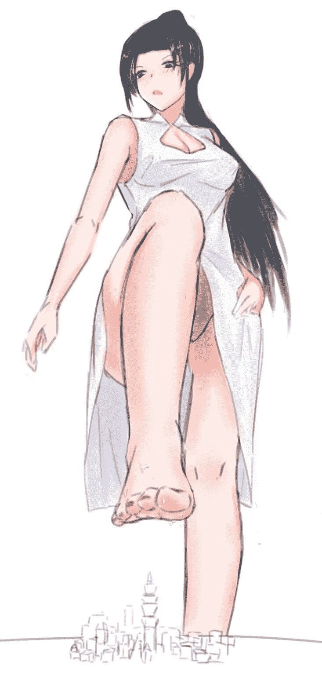
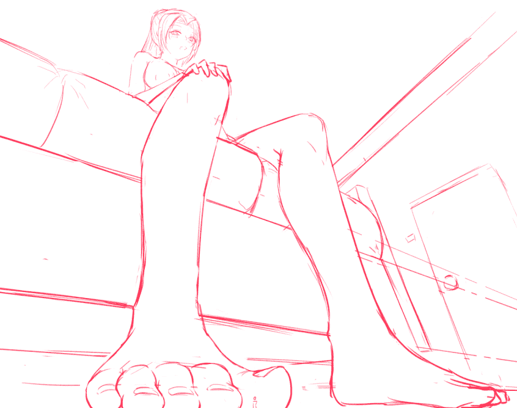
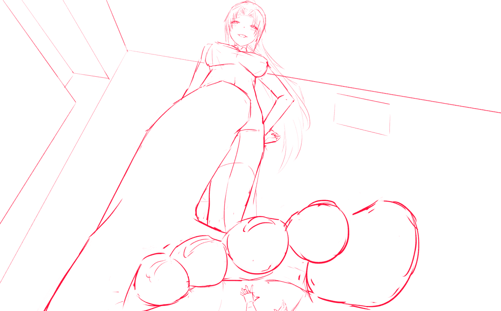

# 【图文故事】指挥官雪风の日常(9／14更新）

作者：吳港雪風

TID：25001

 

# 1

*本帖最後由 吳港雪風 於 2018-9-14 00:37 編輯*

嗯，这里是雪风，抱歉虽然是和少前有关但是并不是之前故事的更新。而是……不是挖新坑啦！（被打）

怎么说呢，大概属于在创作系列过程中的衍生作吧，在之前的创作过程中，曾经有人提议说如果让雪风自己娘化进入这个世界的话，好像感觉会很有趣的样子，甚至还有了专门的人设图：

而且我个人觉得这个人设还不错？经过和鬼蝶dalao（就是之前合作创作了PPK漫画的那位）一番谈天说地之后，鬼蝶dalao就在群里不时地P出了关于这个人设的草图。你懂得嘛，有图，就会有创作欲望，于是我就想把他已经摸鱼的几张图给分别写一个小故事，做个小系列。之后也应该会继续更新的，具体更新的频率嘛，要根据鬼蝶的摸鱼进度而定，并不是我说了算的_(:з」∠)_

于是废话就不多说了，当成正常的GTS文看就行，并不用太代入之前少前楼的设定，毕竟主角是雪风，基本上是一人戏而已

那么以下正文：

炎热的八月中旬，正是一年当中最热的时节。热浪侵袭着这块大陆的每一个角落，就连平日里凉爽无比，保持着24小时不断电的格里芬基地内，此时也久违地被这灼热的气体包围，就连实验田里种植的那些蔬菜瓜果都打了焉，无精打采地低垂着叶片。

指挥室内，奋笔疾书着的雪风抹了一把额头上的汗水，尽管旁边的窗户大开，千米的高空也有着不少凉风吹进这座巨大的办公室，但依旧不能抵挡住滚滚而来的热气，甚至连吹来的风都被加热成了一阵阵的热浪。高居不下的气温，正在侵蚀着这座办公室主人的每一分体力，以及……耐心。而在雪风的办公桌旁边，有着一座从开战之时就因为避难而被整体搬迁进此处的城市。尽管在战后，其他的大多城市已经归位，或是合并成更为庞大的巨型都市。然而这座城市却一致通过意见被保留在了雪风的办公室内，作为人类与人型携手开创未来的象征。只不过与因为要缩减基地内电力供应短缺而忍受着热浪侵袭的雪风相比起来，城市里的人们则享受着现代科技给人带来的享受，譬如，家家户户都有的空调。“啊啊啊啊啊……”雪风烦躁地将桌上的文件用力推到一边，整个人想趴在办公桌上稍微睡一会儿，哪怕是稍许片刻的休息也好。然而当她将上半身贴到桌面上之时，却发现桌面也已经被炽烈的太阳光烤的发烫，根本无法休息。“可恶……”更加烦躁的雪风，一边打开了电脑，悬浮于桌面上的虚拟屏幕不断地在跳出加载信息。一边烦恼地搓动着自己的双腿。为了参加上午的会议而特意正装的她还穿上了平时的丝袜，而造成的结果就是，经过一上午的会议之后，双脚处被丝袜包裹得严实的地方已经湿透，踩在指挥室的木地板上留出了一道道的汗渍。整个人已经如同蒸笼里捞出来的一般，从上至下都散发出一股“熟透了”的气息。这时，电脑屏幕上的一道信息吸引了雪风的注意力“这鬼天气真是快热死人了……”“是啊，我们宿舍这边还好没有限制电力供应，所以有空调，我已经不想出门了” - by某不知名人形“我也是，刚刚参加完会议回来，感觉整个人都快烤化了，到底是哪个混蛋说会议室都要限制电力的？” - by某高层人员“我在指挥官的指挥室里面，说起来雪风小姐也不知道怎么想的，居然不开空调。幸好我们城市里面没有限制电力供应，空调救我一命啊~” -by 匿名用户

“！”“！！”“！！！”本来还处于纠结之中要不要去人形宿舍里蹭空调的雪风，在看到最新回复的那条信息之后，瞬间整个人炸开了。“好啊！你们这帮家伙，我在外面忍着高温办公，你们躲在城市里面享受着空调，还要发帖气我是吧，好好好……”雪风倏然站起了身，办公椅向后面划去，撞到旁边的金属墙壁之上，发出了巨大的声响，倒是把全城人的注意力都吸引了过来。处于办公室地面上的城市里面，无数人莫名仰望着那位早已熟悉的指挥官，她正用着充满怒意的眼神看着脚下的人们，而他们却根本不知道，她在为什么而生气。“看来，有必要让你们也享受一下热浪的侵袭呢！”雪风慢慢地抬起一条腿，将双腿的丝袜一层一层卷起后脱下，随后随意地扔到了远处的地板上，一双脚重新踩在了城市前面的地板上。而当挣脱束缚之后，那双脚立刻向着周围开始散发出剧烈的热浪，被闷了一个上午的双足，终于开始散发出本来应该散发出的味道。脚汗的味道，虽然不是很浓重，但已经清晰可辨，同时随着大气压强的作用之下向着城市中散发过来。“喂，这什么味道！”“咳……指挥官小姐……到底要干什么……”人们惊慌地看着雪风抬起了自己的右脚，巨大的白皙足底悬空在城市的头上，阴影覆盖了半个城市。惊慌失措的人们躲在房间里不敢出来，生怕平时和善的她会突然变脸将大脚砸向城市。而另外一些更聪明的人试图使用各种方式在联系雪风，想问问她究竟要干什么，然而无数打给她的电话，信息都已经被她脑内的芯片所拦截，而此时的雪风，嘴角已经勾勒出一抹坏笑。随即将那只上面依然残存着些微脚汗，冒着浓浓热气的右足，向着城市的方向降了下去。“你们这些家伙，享受着本来该属于我的电力……居然还要在聊天室里嘲讽我……我可生气了……”带着这样的想法，雪风将右足降到了城市上的低空处，整座城市顿时被浓浓的足底热气所包裹住。本来人们抱着躲在屋子里的想法没有出来，可城市内的空调系统早已被雪风切断了电力，热浪，再加上雪风脚底的浓郁热气，以及淡淡的脚汗味，混合在一起，形成了一股足以让人发疯的热流蔓延在整座城市里，已经有不少人被逼的呛咳出来，无法在屋内待着的他们已经冲到了大街上。带着便携式的小风扇成了此时人们争相购买的热销货。然而光是手上这可怜的风力根本无法驱散城市上头那个巨大的放热源。“真是的……到底是哪个人把指挥官小姐给惹怒了啊！”“啊啊啊救命啊实在是热死了……”“咳……咳……”这是某位刚想开口就灌了一胸腔热浪而咳嗽到说不出话的倒霉蛋而此时的雪风，看着城市内人们忍受着自己足下的热浪，心中的怒气也稍许有所缓解。此时的她，已经不那么生气了，不过，就这样放过那些人，还不足以平息自己心中被嘲讽的闷气呢。说起来，这一城的人也在自己房间里住了这么久了，是时候，来收取一点“利息”了~想到这，雪风嘴角的坏笑更甚，将自己的右足轻轻放下，踩在了整座城市的旁边，引起的震动甚至让整城人都不由得晃晃悠悠，接着，声音又从城市的上空响起：“那么，作为对今天这件事的惩罚，你们就来舔我的脚吧，什么时候我觉得舒服了，什么时候恢复供电”没办法，毕竟自己的命脉被别人捏着呢。无数城市里的人开始疯狂驱车前往雪风右脚的所在地，甚至一度造成了市内交通的大堵塞。而住在城市郊区的那些人，已经捷足先登，跑到了那如同高层建筑一般，同样有着几百米令人仰视高度的巨蛋般的脚趾旁边，疯狂地伸出舌头舔舐了起来。而在通往城郊的公路上，还有着无数的汽车和人流密密麻麻地向着此处行进着。等在公路上的人们有些抬起了头，惊讶地发现由于过热的天气，雪风的旗袍内，原本应该好好穿在身上的胸罩和胖次已经被嫌热的她丢到不知道哪里去了。从下而上的人们可以清晰的看见那一对暴露而摇晃着的玉兔，以及胯下的那一抹美好。只不过现在的人们心思已经不放在上面了，被热浪熏得七荤八素的他们，现在心里只想着如何平息雪风的怒火，随后重新享受空调吹出的凉风来。“不够……根本没有感觉呢……就你们这样的服务态度，还好意思用着我节约出来的电吗？”在城市的人类的眼中，此时他们面前的雪风的右足，大的可怕。光是脚踝的高度，就能高于城市之中的绝大部分建筑。而那座被城市人称为坐标的电视塔，要是平移到雪风的脚边，那也就是刚刚平视的高度。那可是有着四百多米高的大楼啊，竟然只能达到她的脚踝位置。此时在那犹如天际的雪白巨墙之下，无数人到达了脚下，一部分人在脚底下舔舐着，而密密麻麻的更多人则向着上面攀登着，如同游行的队伍一般，在雪风的脚上多出了密密麻麻的小黑点。“嗯？要试着爬上来吗？不过光是爬上来，还不是能让我满意的程度呢”雪风处于城市另外一侧的左脚前脚掌轻轻抬起，又落下，有节奏的打着节拍。对于城市里的人们来说，就是有着强烈震动感的拍子。仿佛正在催促着他们好好服侍着雪风，不能分心。在这样的“监视”之下，更多的人开始爬上雪风雪白的，如同广场一般大小的脚面。宽广的肌肤大地之上由于长时间的憋闷已经是湿滑的感觉，使得几乎所有爬上来的人身上都沾上了雪风的脚汗，而由毛孔中所散发出的热量让爬上去的人几乎有着蒸桑拿一般的感觉。可是就算这样，没有人停下过他们的脚步，为了让雪风早点平息怒气，城里的人们尽了自己最大的努力，无数的人类趴在雪风的脚面，或者是站在脚趾的下面，还有一部分人钻进了脚趾之间的缝隙中，十数万人就这么为了仅仅一个女生的一只右脚那么服务着，构成了一副无比荒诞却又真实的画面。“哈哈哈哈哈……让你们躲在屋子里吹冷风~”少女的怨念随着话语传播开来，让处于她右脚各个位置的人们不由得抹了一把冷汗，同时在心底疯狂吐槽着那个匿名在聊天室里发帖的人。一个人的错却要让整个城市在热浪之中工作几个小时，即使是平时偷偷迷恋着雪风足底的人此时也会受不了吧。如同虫子一般，甚至比虫子还要渺小，艰难在巨人的白皙巨足周围或上头爬行，试图用自己的行为取悦着对方以获得对方的庇护。或许这也会是未来的日常，而自己在这个世界之中，所处的到底是什么样的位置呢？一连串的问题或许会被智者想到，然而绝大部分的人并不会想得这么深，只是单纯的想尽快结束这一段过程而已。终于，在长达两三个小时的工作之后，甚至已经有几个体弱的出现了中暑的症状，雪风终于开口同意了全体人员撤回城市内的要求，人们互相搀扶着开始向着地面攀爬下去，而一些崇拜雪风的人们则试图在走回城市之前碰触女神的肌肤更多一秒，人流在这一刻显得无比的井然有序。然而就在所有人已经回到了地面上，黑色的人流在雪风看起来如同一排即将延伸到公路的铅笔印时，少女心性的她却又发作起来，将被人们服侍完的右脚轻轻抬起，在无数人惊讶的目光之中对着所有人覆盖了下去。轻轻地踩住了他们，柔软的足底嫩肉将全城的人完全包裹了起来。“真是的……明明我又没有禁止你们开冷气什么的……居然还在我心情不好的时候吐槽我……太可恶了……太可恶了……”少女碎碎念着，脚底如同发泄一般的轻微左右扭动了两下，处于足底下的人类全身都被软肉包裹，几乎无法移动。被完全遮挡住视线的人们只能在一片的黑暗中嗅闻着雪风足底的气息，那是略微有些古怪的，混合着轻微脚汗，少女体香，甚至有着人们刚舔舐完的唾液味道。人们覆盖在这个气息之下，一句话也不敢说，只能有些无奈地等着少女发泄完自己最后一些的怒气之后，再有些狼狈地整理自己的衣物，重新登上车，踏上返回城市的旅途。希望下一次，人们会更好地懂得如何和人形交流吧，尤其是当那位人形还是和他们朝夕相处的时候。

 

# 2

<ignore_js_op>[B253001BF7CC84DF7DAFBA3B266CE26A.png](forum.php?mod=attachment&aid=NzIxMDh8ODZlNWIxNGJ8MTYwMDg4MjA3M3wxODIzMHwyNTAwMQ%3D%3D&nothumb=yes) *(64.52 KB, 下載次數: 38)*

[下載附件](forum.php?mod=attachment&aid=NzIxMDh8ODZlNWIxNGJ8MTYwMDg4MjA3M3wxODIzMHwyNTAwMQ%3D%3D&nothumb=yes)

2018-4-26 03:24 上傳  

</ignore_js_op> <ignore_js_op>[QQ图片20180425205214.jpg](forum.php?mod=attachment&aid=NzIxMDl8ODIyNDdmOWZ8MTYwMDg4MjA3M3wxODIzMHwyNTAwMQ%3D%3D&nothumb=yes) *(64.91 KB, 下載次數: 44)*

[下載附件](forum.php?mod=attachment&aid=NzIxMDl8ODIyNDdmOWZ8MTYwMDg4MjA3M3wxODIzMHwyNTAwMQ%3D%3D&nothumb=yes)

2018-4-26 03:24 上傳  

</ignore_js_op>  

# 3

> [qw6672264 發表於 2018-5-18 22:57](https://giantessnight.com/gnforum2012/forum.php?mod=redirect&goto=findpost&pid=374091&ptid=25001)

> 楼主大大用的什么软件啊

> 一直想做图不会用

不是我的图啊，是鬼蝶帮我画的图我拿过来当灵感写片段用的了。

我记得没错的话他用的是SAI2？

 

# 4

于是好久没有更新这个日常楼的我又回来更新了，这次写的则是单人的一对一调教play哦~

（果然鬼蝶的爱好是足>>>>>>>>>>>其他呢）

所以看图写文的我也开发了很多关于足的奇怪想法w，另外这次是双结局，可以根据自己的需要来看哦

那么丢图上文：

<ignore_js_op>

**55E5B6D71BEF16511D79DC6CFDC24795.png** *(44.73 KB, 下載次數: 33)*

[下載附件](forum.php?mod=attachment&aid=NzI3MzN8OGU4NjVlMjN8MTYwMDg4MjA3M3wxODIzMHwyNTAwMQ%3D%3D&nothumb=yes)

2018-6-6 02:20 上傳

晚上九点，随着房间内的电子钟播报起了当前时间，伴随着有些低沉的“唰—”的声音，格里芬指挥官所属的专用房间门被打开。拖着步子走进来的正是这屋子的主人雪风，然而与平时充满活力而且洋溢着元气的她有些不同的是，此时她的脸上尽是倦容，就像把“累坏了”这三个字刻在了自己脸上一般。也难怪她这般模样，毕竟她已经好久没有正儿八经地回过自己房间了，最近这几天几乎都是在办公室里处理公务之中度过，就算休息也只是在办公室所属的简易休息室的硬床上合上眼眯上一会儿。所以在最终踏进自己房间之时，竟有种踉踉跄跄要直接倒下的感觉。

见到雪风从电子门中进来后，正在修整的个人助理连忙从椅子上爬了起来，一路小跑到了雪风的脚下，略喘着气，但是很快立正然后说道：“雪、雪风小姐，我是刚刚受聘来这里的私人助理”这位私人助理的脸上流露出一股明显的稚气和表现出很紧张的神色，看样子确实是刚刚才刚刚受聘来这里做私人助理的。

看着脚下这个稚气未脱的年轻人露出无比紧张的表情，雪风有些被逗笑了。本来想蹲下来用话语去勉励这个新人几句的，但自己的身体却一阵阵的给大脑发出需要休息的警报。她只得无奈地缓缓蹲了下去，用手解开自己双脚所穿高跟鞋的系带，之后又随手把那双鞋子甩到一旁，看样子已经累到甚至都懒得将它们踢到鞋架的位置了。随后雪风向着沙发那边走了过去，在重重地一屁股坐下来之后，接着低头对着地板上的助理说道：

“就算是新来的，也知道作为助理应该要干什么。我累坏了，过来帮我清理一下脚吧，这几天闷在办公室里都没怎么好好打理过了。”一边说着，雪风一边有气无力的把脚上的丝袜褪了下来，露出了关在里面一天的白嫩双足，同时，那双丝袜也被抛在了沙发的另一边。

新来的助理逐渐靠近这对比他要大数十倍的庞然巨脚，顿时一股浓浓的汗味开始飘散出来，或许是因为房间里比较冷的原因吧，助理甚至还能看到丝丝热气飘在这对玉足上；雪风还在不断活动着那几根早已酸疲不堪的脚趾，若不是助理只有一厘米左右的大小，那这个画面就可以说是相当的诱惑了，只可惜助理甚至还没有雪风小脚拇趾大。

“那个，请问我应该怎么为您清理……”助理捂了捂了鼻子，尽管雪风的脚上没有什么臭味，但是那股在鞋子和丝袜里闷了数天的汗味还是浓烈的让人难受。不过雪风本人并没有这个自觉，反而还在不断活动着脚和脚趾，于是更多的汗味便飘了出来，继续刺激着年轻助理的鼻腔。

“嗯？难道说，内务那些人在招聘的时候，都没有好好培训吗？还是你在故意给我装傻？”雪风此时已经用遥控器打开了电视，只穿着贴身衬衣的她的注意力都集中在电视里的画面上。虽然没有看向脚边的小小助理，但是从沙发上飘下来的话语依然有着一丝怀疑和不满。

“是，明白了……雪风小姐……”助理甚至无法忍受这浓烈的快把他的呼吸系统彻底摧毁的汗酸味，他用衣服捂住了口鼻，即使如此还是有不少的味道传入他的鼻腔，于是年轻的助理只能硬着头皮走了上去，开始用自己的衣服擦拭着雪风脚上一粒一粒斗大的汗珠以及汗渍。雪风的脚对于只有一厘米大小的可怜助理来说实在是太大了，过去了将近二十分钟，助理才把雪风右脚食趾清理干净。过了近三十分钟，仅仅只清理了两根脚趾，私人助理就已经疲惫不堪起来。

“唔嗯...还不错，看来那帮人找来的人都还算可以的嘛...”雪风无意识地咕哝了几句，毕竟在放松下来以后，疲倦占据了她大部分的意识。此刻的她并没有太多的感受，只是隐约感觉自己脚上出汗的感觉减轻了不少，大脚趾略微的朝着旁边带了带，倒是把正在脚趾缝里的助理吓了个半死，毕竟这脚趾对于助理来说真的太恐怖了，如果雪风再稍微用力一下的话，那么内务就要重新招聘助理了。

“…………”助理憋着气，现在的他已经不能用衣服遮住口鼻了，因为他特制的衣服已经全都是雪风脚上的汗液和汗渍了，可怜的助理尽管很小心的在呼吸了，但由于他就在那味道的来源里，所以并没有起到太多作用，尽管助理面对的是世间少有美丽的一双玉足，只是可惜了这双玉足数日未经清洗。而已经疲惫不堪的助理，清理起来自然力度就小了很多，这对本来就基本感受不到助理存在感的雪风来说更是如此。

“嗯？”雪风似乎是在沙发上小小地睡了一会儿，而少许回过神来的、一觉醒来的她发现自己的脚上，或是脚趾缝间已经几乎完全感受不到那个助理的存在了。她先是用脑内装有的管理芯片查看了一下他的位置，毕竟对于小小的助理来说，这可是个“高危”的工作。在看到表示他位置的红点依然在自己脚下时，雪风松了口气，可紧接着又对他开始不满起来，毕竟，现在的他可是在为自己服务的时间，可他居然在偷懒！

“刚夸你两句，你就趁我睡着的时候开始偷懒了么？为什么我的脚上已经完全感觉不到你的存在了？”雪风的脸上稍微有了一些愠色。

“很抱歉雪风小姐……我实在太累了，您的脚……实在太大了……”此时的助理在听到雪风的怒声之后，连忙开始清理雪风右脚剩下的无名趾和小趾，只不过确实是由于助理太过疲惫了，这个过程当中那种清理的力道比起刚开始时更是小了很多，而这样则引起了雪风更大的不满，不过很快雪风又放松了下来。

“如果是这样的话...那你在累的时候，就靠着我的脚趾休息一下吧...”雪风的面容放松了下来，她想起了自己连续工作时的那种疲累的状态，也不愿意将自己因为连续工作而产生的怨气强加在别人身上。

“不过，休息归休息，不要忘了自己的工作就好。”雪风又嘱咐了一下，随后，继续将视线转向在电视上所播放的电影里的情节之中。

“是，谢谢您……呼……”助理在得到准许后，便靠在了雪风的脚趾边上喘了两口气，因为在汗味的环境里待了许久的缘故，助理已经有些适应了了；助理正好靠在了雪风的无名趾上，雪风柔柔软软的脚趾趾尖让助理仿佛睡在柔软的床上一般舒适，不过助理也没忘了清理雪风脚的使命，在休息了大约十几分钟后，助理再次在雪风的脚背上活跃起来，只是——因为之前修整的太过舒服了，助理完全无法在清理雪风白皙的脚背上提起太大兴趣来，现在的他完全只想要再次靠在雪风柔软的趾尖上休息而已……

当助理慢吞吞地清理了半天还没清理完1/3时，他仿佛注意到了来自上空的有些恼怒的视线了——雪风正在弯腰低头看着动作迟缓而且心不在焉的他。

“看起来，我应该让人过来在我的脚背上给你搭个床，再送点果汁饮料什么的过来”雪风的一只手托着下巴，看着在自己脚趾背上忙里偷闲的助理，似乎是在思考，但语气中满满的嘲讽意味地说着。

“对对对不起！雪风小姐，我有些得意忘形了…………”在被雪风进行了无声无名的‘恐吓’后，助理连忙加快了速度，但是没好过几分钟，助理的速度再次慢了下来，从清理脚背开始到现在足足一个半小时过去，雪风的右脚脚背才被清理干净。<ignore_js_op>

**6D7ED5CE1DFF272BF536817805678741.png** *(50.69 KB, 下載次數: 8)*

[下載附件](forum.php?mod=attachment&aid=NzI3MzJ8YzJiZmU3YTl8MTYwMDg4MjA3M3wxODIzMHwyNTAwMQ%3D%3D&nothumb=yes)

2018-6-6 02:20 上傳

“那么...接下来是左脚了...希望你不会还有着刚刚那样的速度...”雪风那高耸的胸脯上下剧烈起伏了几下，显然是强忍着怒气在对着那个年轻的助理说话。而要是换做其他和雪风相处久的其他人来，首先第一反应是认错，因为很明显可以看出来雪风已经处于爆发的边缘。可惜对于这个才第一天任职的年轻人来说，自己上司的脾性还需要很长一段时间去摸清，他又怎么知道雪风现在的情绪变化呢？

“呃……雪风小姐，能允许我再休息一下吗？”现在这位新人助理早已满脑子都是雪风那柔软的玉趾了，哪里还会想要去清理雪风的左脚？于是他厚着脸皮再次提出了这样的要求。尽管他是真的很累了，只不过……对雪风玉趾的渴望已久超越他对休息的欲望了，也让他完全注意不到了雪风语气里的变化。

“嘭！”当助理还在抱着幻想时，突如其来把他震了飞起来的巨足把他从幻想吓回了现实里——雪风抬起左脚重重地踏在了他的面前仅几厘米的位置，要是再近一点的话，自己恐怕就得以自身的血肉去清理雪风的左脚了，而当助理惊恐地慢慢抬头向上看时——那是雪风已经完全爆发，极其生气的脸，而那双带有愠色的红色眼眸正在用足以把他杀死一百次的眼神盯着他。

“很好，很好，已经很久没有人敢这么肆无忌惮地和我说话了...”雪风深吸了两口气，硕大的胸部随着呼吸一上一下地起伏着。只不过助理根本无暇去欣赏这一美景，现在的雪风是真的被他轻佻的行为给惹怒了。现在的助理正害怕着雪风会不会一个生气不小心把他杀死。

“过来，给我好好清理我的左脚，这本来就是你的工作。不过，作为对你刚刚行为的惩罚，剩下的工作全部都要用你的舌头来完成。要是再被我发现你偷懒的话...我想我很乐意在PPK的审讯室，或是西伯利亚那边给你安排一个位置。还是你觉得这几年的和平生活，已经让我退化到完全不会杀人的程度了？”一边说着，雪风还把她的右脚向着助理所在的位置挪动了三四厘米，眼看着就要把对她来说和蚂蚁没什么区别的他碾平。

“非常抱歉！……雪风小姐！我会完成工作的！”被这样惊吓到的助理直接向着雪风的左脚跪了下来祈求着原谅，很快他又站了起来，没有任何犹豫地把舌头放到了雪风的左脚侧上——被安排到西伯利亚的话，意味着随时有可能被折磨死也不一定，而被送到审讯室里则比死了要更加痛苦，然而可怜的助理并不想要选择死或是不死，也不想选择被雪风玉足碾平，尽管他并不想要舔舐雪风脚，但是此时此刻他只能硬着头皮舔了上去——而舌头刚刚接触到雪风左脚的助理就这样中了大奖，一块对他来说斗大的汗渍被他连带着汗液一同舔进了嘴里。

“呕！”

助理感到一阵恶心，汗液和汗渍的酸臭味在自己的口中荡漾着，无比强烈的味道冲击着他的神经，让他一副随时要吐出来的样子。但是他不敢吐出来，如果吐出来的话，上面看着的雪风指不定会用什么更夸张更可怕的惩罚来折磨他，于是助理狰狞着脸把汗渍带着汗液溶解在嘴里，就像用了下辈子的力气一般地吞了下去。而在助理清理干净雪风左脚一边侧面的半个小时里，这样的大奖，可怜的助理中了至少三次。

“用嘴来弄倒是很快……啧啧，比起之前用身体擦的话要快得多。所以难不成，你其实想做小狗多过当人类吗？”雪风在一段时间之后，再次将头低了下来注视着助理的工作状况，毫不留情地用着语言打击着对方来发泄心中的不满。“啊哈哈哈...不过，我还没见过这么小的狗狗呢，或许你其实是一只虫子也说不定。啊，我差点忘了，对于我来说你确实和虫子没啥区别呢！”

助理已经不敢回应雪风的冷嘲热讽了，一方面很浪费时间，另一方面……如果自己的应答不能尽雪风的心意的话，自己恐怕还会继续被折磨，然而助理忽视了他与雪风之间的体型差距——在他舔舐了整个侧面和大脚拇趾后，他的胃里已经堆积满了让他恶心和难受无比的汗渍，甚至洗入的汗液过多，说他血液里流淌的也是汗液也不为过，随时就要吐出来的助理就这样站在原地，舔也不是，不舔也不是。

“怎么了，难道你真的还要我用脚趾把你压在下面踩扁么？快点继续...”雪风用右脚大脚趾有些不耐烦地在助理的身后轻轻地触碰着，但是很快，看到面色已经苍白的助理，雪风少许一思考，便明白了其中缘由，“算了，看样子你是不能继续下去了，停下吧。”

“谢…………谢谢您…………”助理整个人瘫倒在地上，脸上毫无一丝血色，整个人紧绷着神经，让雪风觉得既可怜，又活该。

“去换件衣服吧，然后到厕所里清理一下，要是敢吐在我身上的话，你就死定了。”雪风虽然神情依然严肃，但还是随意地挥了挥手让自己的助理先去解决一下胃中的问题。

助理在接到命令后如逢大赦，很快站起来冲向了旁边人类专用的厕所里，不一会儿便传来了剧烈的呕吐声，不绝于耳，仿佛是一个人把内脏都几乎要呕出来一样的感觉。在折腾了将近二十分钟以后，把浑身上下都清理干净的助理拖着疲软的身躯走了过来，面无血色的助理仿佛轻轻吹口气就会倒下去一样，当助理出来后，电子钟也刚好播放起了当前时间——半夜十二点整。

“雪风…………小姐，我清理完了…………请……继续吧…………”

在助理还没反应过来的时候，他的身躯已经被阴影彻底的覆盖住，那是雪风早已等待多时的脚遮住了光线，随着助理向上抬头看去，那道由白皙、嫩滑的脚底组成的巨大房顶，逐渐的开始向他落下，似乎就要彻底将他化为一滩肉泥一般。

然而雪风的玉足并没有踩到他，在助理吓得闭上了眼睛的同时，雪风的脚碰触到地面，精准的将他夹在了自己大拇趾和食趾的趾缝中，而且还是用脚尖夹住了他的身体，让他能够留出自己的脸暴露在外用于呼吸。原本就已经吐到全身疲软的助理根本不可能抵挡的了。不过即使是他有心想反抗，雪风如霜一般洁白柔软的脚趾只是微微放松了防止两趾合拢的力道，就已经疼得他哭爹喊娘起来。

“啊呀呀，要是你在这么动下去的话，把我弄痒了一收紧。你可就会“噗”的一声整个人爆裂开来哦？今夜还长着呢，你也不想这么早就从舞台上退场，不是么？”雪风坐到了沙发上，那只脚轻轻地上下晃动着，调戏着正处于趾缝中的小小助理。

“！”这一番话直接吓得助理就算身体再疼也不敢喊叫和乱动了，同时助理也能感觉到脚趾间夹紧他的力道小了一些，自己的体型就算扩大数倍，照样也只能被雪风轻易地用那柔软的脚趾夹死，而自己这么渺小的存在，雪风甚至是不会在意自己的。现在的助理彻底明白了，自己只不过是雪风脚下的一只虫子罢了，如果雪风被自己惹得不开心的话，自己随时会面临生命危险。

在被雪风用脚趾夹住上下晃动了很久之后，雪风终于把助理重新放在了地上，体验了比云霄飞车刺激千百倍痛苦的助理想要呕吐，但是胃里面却早已什么都没有了。而雪风似乎并不打算就这样放过他的样子：

“才这么点活动就快要不行了么，真是扫兴。果然只是和虫子没什么两样的生物了吧？我本来还以为你会坚持的更久一些的...不过也没办法，虽然算个残次品，不过我也勉强用用好了。希望你不会在接下来的活动里死掉才是呢？”

雪风露出了一抹显得甚至有一丝残酷的坏笑，随后抬起了自己的右足，慢慢地从旁边向着助理移动着，嘴里又说道：

“来吧，试试看你能不能跑过我的脚掌呢？要是能跑掉的话...算了，那种事对你这虫子来说没可能的啦。”

若是换做平常满状态的话，跑开个十几厘米还是有可能的，但是现在的助理浑身乏力，连两厘米的距离也没跑出去，就轰然倒地，而等待着他的，是雪风雪白娇嫩的足底。

“看来连虫子都算不上呢，充其量只能是一只可怜到极点的懒虫而已。呐，你要不要猜一下，我这次踩下来的右脚，到底有没有用力呢？”

就算要猜，当然要猜能够活下来的一边，所以助理理所当然的选择了继续向前奔跑，他不敢把自己的命赌在雪风会不会把他碾死这种小问题上，浑身脱力的助理尽管跑得很慢，但是还是跑出了雪风足底20厘米左右的长度，成功躲开了重重的踏下的玉足，那足底是如此白皙和娇嫩，但是被踩到的话，除了死亡没有别的路可以走。

“恭喜答对了，刚刚那一脚要是踩实的话，可是真的会瞬间死亡的哦？”虽然雪风这么说着，但是助理却根本无法从她的语气之中感到有一丝“恭喜”的意思，而有的只是满满的恶意嘲讽而已。

“那么，下一脚呢...”雪风一边说着，向前移动着庞大的身躯，而相似的左足又再一次地被抬了起来，朝着底下的小人恶狠狠地压了过去，比起上一次的速度似乎还要稍快一些。

“…………啊…………”一个没注意，助理踩空了，跌倒在地，而且助理也失去了最后一点能用来逃跑的力气，就这样趴在地上起不来了，而雪风的左脚可不会等待着助理回复体力再踩下去，结果……

覆盖上助理的并不是雪风圆润的足趾，也不是前脚掌关节的掌心。他的身体，恰好不多不少的被雪风柔软的足弓踩在了底下。虽然依稀能够感受到那施加在自己身体之上那几乎要把自己整个人都压成肉饼一般的重量，但除了重压之外，自己的身体依然还是完好无损。

“哦呀，居然让你躲到那里了，噗。”实际上，并不是助理自己找好了位置躺下去的，而是雪风故意找准了自己足弓的位置踩下去的。这样的话可怜的助理并不会受伤，只是会被压住无法动弹而已。

而此刻助理仿佛置身于黑暗的地狱当中一般，被雪风的足弓限制住无法移动也无法动弹。虽然雪风的足弓不是那么小的地方，助理在里面却什么也看不到，只有一片黑暗，然而奇怪的是，自己明明没有清理过雪风的右脚脚底，但是汗臭味却消失了，取而代之的是一股淡淡的女孩子身上的沁香。

随着雪风的脚掌将底下的小人不断摩擦着，可怜的助理用身体被迫将雪风的足底不断摩擦着接触，甚至压的他被动地将自己的舌头吐了出来，就这么如同之前的工作一般，舔舐着雪风的脚底，尽管这并不是出于他的本心。

经过了有着完美弧线的足弓，到达前脚掌，一路擦过柔软的嫩肉，被雪风从脚趾缝底下擦着露出一个头出来的助理，无助地看着自己的“上司”，或是那个一个轻微的小动作都能决定他生死的人，欲哭无泪。

“求求您，饶了我吧，雪风小姐，不雪风大人。”不看折磨的助理终于开始向雪风求饶起来，不过雪风并没有听到他细小的求饶声，或者说假装没有听到吧。就这样，雪风再次用拇趾和食趾夹起了自己的助理，随后把另一只脚也放到了一旁，看上去破像两阵夹击之势——只是这夹击自己的，既不是军队也不是人形，而只是雪风那白皙、美丽、娇嫩的玉足。

“要我饶恕你吗...？很可惜，之前你并没有给我带来什么快感呢。”雪风用着无不遗憾地眼神看着他，就像是看着一只即将死在自己脚下的小虫子，“要用脚趾夹死你么..还是该用足底板呢...不不不这样清洗起来好麻烦的样子...”

听到雪风如此考虑和威胁的助理，在雪风轻轻搓动了一下食趾和拇趾后，误以为这就是自己的死期，于是在感受到一小阵疼痛感之后，便晕了过去，而实际上雪风并不打算杀死他。仅仅打算吓唬而已，可没想到却把助理吓晕过去了。（接下来就是两条路线的结局啦）

（温柔结局）

“我…………我没死？”

助理醒过来后感觉到自己的背似乎靠着什么软软的东西，当助理回头看时——那是雪风白皙娇嫩的大脚趾，这一整个大脚趾足够好几个助理当大床来睡了。接着助理又感觉到了一阵有些阴冷的视线，随后抬头看向了视线的来源——那是雪风弯腰低着头正在死死地盯着他仿佛要把他撕裂成几半的眼神。

“舒服么？”

雪风对着助理问着，而听到这句话的他却是感到后背一阵阵的发冷：“她...究竟要对我干什么？之前我没死，可我却又为什么在这里醒了过来呢？”一肚子的疑问在助理的大脑中盘旋，久久不能散去。

“……很舒服…………”

不知道为什么，助理犹豫了半天之后，却脱口而出这样的一句话。而助理似乎也意识到了自己这句话很有可能会点燃雪风的怒火，于是他很快再次道歉道：“很抱歉！雪风小姐……”

“你不继续睡么...既然感到舒服的话？”雪风少许又轻微挪动了一下自己的大脚趾，贴到了他的脸旁，带着体温柔软的脚趾肌肤接触，覆盖着助理。确实很舒服，他的心里偷偷想到。

“不不，很抱歉，雪风小姐，相当的对不起……我为我之前的行为感到抱歉……所以请不要……不要把我送到西伯利亚或者审讯室…………”助理差不多有些语无伦次了起来，说话结结巴巴的，因为早在之前他就明白了自己的身份只不过是小小的助理罢了。

“笨蛋，哈哈哈哈哈哈....”雪风突然笑了起来，那笑声是那样的欢畅，甚至能看到她的眼角甚至有一些的眼泪被挤了出来。好不容易才止住笑容的雪风对着下面说道，“你以为是谁把你放到我脚趾旁边的，真是笨到家了...”

“是？雪风小姐？”助理还没从被惊吓的恐惧中回过神来，只是这样看着快要笑岔气的雪风。

“真是的，之前你在休息的时候我就看出来了，你肯定喜欢靠在我的脚趾边上睡觉吧？作为第一天的新人，我还没小心眼到会这么去追究一个新手犯的错误啦。总之，之前的那些就当作是对你心不在焉的教训，不过同时作为补偿，在明天换班以前你都可以靠着我的脚趾睡觉，以后，可不要再这样了哦？”雪风整个人已经放松了下来，笑容所传递的情绪比起之前那个冷酷严肃的统治者来说，完全判若两人。

“……是，谢谢您能原谅我……呜呜呜呜”看着雪风在地上稍微抬起又放下去的玉趾，助理已经跪下来感激涕零了，只不过在感动之余，助理的内心却又矛盾了起来——自己如果不努力工作很有可能再次会被惩罚，只不过能享受再次躺在自己梦寐以求的雪风的脚趾上睡觉，那真是再好不过的事情……

（黑化结局）

“……好疼……我在哪……我居然还活着？”

助理醒过来后，感觉到自己好像正在被什么东西压住一样，而脖子上不知道什么时候多了一个连着铁链的项圈。而稍微歪头看了一下之后，助理确认了自己是在雪风的大脚趾下被压住了……而脖子上的铁链头端竟然在雪风的小脚趾上！

“雪……风……小姐！”助理强忍着被压住的疼痛大声喊着，然而助理声嘶力竭的喊声对于雪风来说就像蚊子叫一样小，迫不得已的助理挣扎着抽出一只手用力击打在雪风的大脚趾上，而这一拳仿佛打在了软垫上一般，因为雪风的脚趾实在是太过柔软了，然而这点微小到比蚊子咬还不如的刺激，依然把正在睡觉的雪风弄醒了。

“嗯？”雪风揉了揉自己的眼睛，在起身的过程中无意识地动了动脚趾，正好使得被压住的助理能从压迫中解放出来。或许是这样，或许又不是，毕竟他的脖子上，还套着项圈呢！

“怎么了？大半夜的吵什么...”雪风揉着惺忪的睡眼迷迷糊糊地说道。

“……雪风小姐……这是……”助理指着自己脖子上栓的紧紧的，险些让他呼吸不过来的项圈问道，其实助理内心隐隐约约已经有了一个恐怖的想法，只不过他不敢确定而已……

“是什么？这项圈还能用来干什么，难道你看不出来么？”坐起身来的雪风轻轻晃动了一下带着项圈铁链的小脚趾，顿时连着的小小助理被拖拽着在沙发上以极快的速度来回晃着，让他瞬间趴了下去。

“……啊啊……咳…………”被项圈拉扯到了脖子的助理感到喉咙一阵难受，而尽管是摔倒在沙发上，但是这一切对于小小的助理来说，雪风仅仅是轻轻地、随意地挪动了一下拴住他脖子的小脚趾而已。那缠绕着锁链的小脚趾透露出一股魔性而残酷的美感，带给了助理更多不好的感觉。而如果自己没猜错的话……这个小到就像是为自己量身定制的项圈，是用来拴住自己不让自己离开的——而被做了这样的事情，结果当然只有一个——就是自己的身份已经从助理降级为了奴隶。

“雪……雪风小姐……这到底是…………”助理试着拉扯了一下脖子上的项圈和铁链，但那只能让自身更加难受，因为这项圈是军队里特制的橡胶制作的，而铁链更是凭自己无法扯断。

“错了，那个称呼不应该由现在的你来叫呢，作为奴隶的你应该称呼我为“雪风主人”才对哦？或者，你要体会一下被活活吊死的感觉吗？”一边说着，雪风就要作势将那只脚向着上方抬起，连带着铁链将他如同吊上绞刑架一般的举到高空。

“…雪……咳…风主人……………请…放过我………求求您……我愿意当……您的奴隶……咳……”助理如果能活着下来的话，那么他就有了一项可以吹嘘的事情了，自己被女孩子的脚用铁链拴住吊起来经历了一次绞刑犯人才有的待遇。

“哦？我没听到呢，再说一遍？？”此刻的雪风再次地笑了起来，只不过在助理，不，现在应该叫他奴隶了。那个笑容是如此的冰冷无情，而自己又是如何用痛苦才构建出了那样的笑容。而在他整个脸都皱成一团时，雪风本来抬起来一半的脚又放了下来，大脚趾送到了他的面前，一股巨大的压迫感向他袭来。他知道，现在就是他要做出终极选择的时候了。

臣服，还是死亡？无论经过多少次思考，这依旧是一个极其两难的问题。

“……我愿意臣服……所以求您放过我吧…………雪风主人……”在重新接触到地面时，助理重新对着眼前的比他要大好几倍的脚趾跪了下来。于是他试探着靠近着自己之前魂牵梦绕的玉趾，轻轻的舔了一下，在看到雪风并没有抵触之后，又继续跪着托住继续舔舐起来。此时此刻雪风完美的玉趾上已经没有了之前那样令人恶心的汗味，取而代之的是一股淡淡的香气混合着自己脖颈上橡胶和锁链的味道。

“如何？我脚趾的味道？”雪风极其轻柔地用脚趾在他的脸上摩擦着，因为如果雪风不好好的控制好力度的话，助理……现在应该叫奴隶了，大概会被她推倒或是直接压死吧，而雪风似乎对奴隶的“献媚”还算满意，至少算是在死亡的红线上打了一个弯。少许过了一会儿之后，雪风的手臂伸出，抓过了被扔在地上的之前穿过的丝袜，在举到自己面前之后，雪风用手指将脚趾接触的内衬面从里到外翻了过来，然后随意地扔在了他的旁边说道：

“今晚，这就是你的床铺了。不要想着换地方哦？明天，我可是要去健身房的，到时候要是你没适应这个味道的话，被闷死在我的跑鞋里我可不管呢。”

“…………谢谢……雪风主人…的仁慈……”即使距离有大约十几厘米远，但是助理还是闻到了来自丝袜内衬里那股自己醒过来前再熟悉不过的汗臭味，由于新鲜空气呼吸久了，助理甚至觉得那本来就不吸水的丝袜上散发出来的汗味更加浓郁和难以忍受。

“不愿意？”再次躺下的雪风，虽然视线没有看他，但是话语中流露出来直接的那股蔑视感还是让他不由得打了个寒颤。眼看着雪风的脚已经准备向上方抬起...

“愿意！愿意！多谢雪风主人的恩赐…………”多亏了雪风看不到助理脸上狰狞的表情，否则现在的他已经是雪风脚底板上的一个血点了，而在那之后，迫于被巨大的脚踩死的压力，助理就像之前舔舐雪风的脚一般，强忍着恶心爬到了丝袜上睡下，他多一分也不想靠近最接近脚趾和脚掌的地方，因为那里的味道是最浓烈不过的。

“怎么能睡在床边缘呢？如果掉下床受伤怎么办，睡到中间去！”

助理很想吐槽这里最容易能让他受伤的因素就在眼前——那对随时有可能伸直或是踩下来的玉足。而在接到了死命令之后，尽管内心一万个不情愿，助理还是慢慢地挪动到了丝袜内衬最中心的位置睡下了。刹那间，因为身体睡下去按压到了丝袜的缘故，更多浓郁的汗臭味席卷了小小的助理，让整张脸都因为不适感和而五官扭曲在一起，露出了更加狰狞的表情……

然而就算再怎么狰狞，助理就像小小的蚂蚁一样，连雪风的一根脚趾都反抗不了呢。

夜深人静，感受着他差不多已经习惯了的味道，听着身后熟睡着雪风的呼吸声，感受着脖子上项圈的紧缚感，担心着雪风会不会突然动起来勒死他或是踩死他的助理完全无法入眠。而他也思考起了明天自己究竟会遭遇怎么样的对待，或许自己恐怕一辈子也没办法从雪风的脚底下脱离了吧…………</ignore_js_op>

 

# 5

另外，要是图看不清楚的话可以点开大图观看哦 

# 6

在浩瀚无际的宇宙当中，有一个叫做银河系的星云团，而当中有个叫做太阳系的小小星系，在太阳系中，九颗行星围绕着太阳这颗恒星公转，这是相当美丽的场景。

而一颗叫做地球的行星上，这颗星球上的智慧生命——人类，早已将这颗他们生存的星球完全的改造完毕了，只不过临近资源快要耗尽时，地球由于需要找到一颗殖民星球，于是他们放出了大批大批的船队前往浩瀚无际的太空寻找可供人类居住的星球。

然而大部分船队都因为食物之类的问题回来了，只有一艘大型的“探索者”号飞船由于可以自给自足，所以仍然在探寻着能够让人类居住的星球。

很快三四个月过去了，“探索者”号飞船已经飞离了地球足足500万公里的距离，而由于人类已经发明了超距通信技术，所以“探索者”号飞船仍然可以与地球进行延迟很短的通讯。然而“探索者”号飞船仍然在漫无目的地游荡着，原因是那样的星球实在是少之又少。

终于，过了足足一年，“探索者”号飞船终于在距离地球1800万公里外的M47号星系里发现了一个适合人类居住的星球——只是这颗星球就像刻意被人揉捏成正四面体一般，尽管上面有海洋也有泥土也有森林，但是它的形状就是如此诡异，如同商店街里售卖的地球巧克力一般，只不过现在是正四面体的形状。

于是当“探索者”号飞船着陆之后，他们恰好停在了这个大正四面体的上方，也就是一座巨大的高山上。这个正四面体星球的体积恰好就和地球差不多，所以实际上这座大山并没有完全的呈尖锐的形状——反而由于各种作用力的关系，这座占了星球面积1/3的大山在“探索者”号飞船着陆之后，已经裂开了一个口子——就像被劈开一般。

“通报地球指挥中心，发现一个古怪的星球，我们已经先行着陆了。”

“了解，请探索这颗星球。”

这个正四面体裂开的一角正巧成了队员们的目标——他们准备好了高能探照灯和望远设备探索着巨大的山峰。

“！！！！！啊啊啊！！！那是些什么啊！！”

几个队员因为被看到的东西吓到了，所以他们很快逃回了飞船里，而剩余的人看着眼前恐怖的一幕，不禁冷汗直流——这个星球内部，无数建筑物的残骸、人的尸体、动物的尸体，就在里面一层一层的叠放着，犹如一个巨大的三明治的横切面一般让人恐怖，只不过当做馅料填充的东西，是那些建筑物的残骸、树木、以及各种各样的尸体。

“报告地球指挥中心！我们发现了很恐怖的东西，请指示！”

“已经收到你们的图片了，立刻返航！探索者号飞船，收到请注意，立刻返航！”

队员们很快全都回到了飞船上准备好了返航的工作。

“呼...真的是..上次那个星球也被弄坏的太快了...真的是太脆弱了呢。唔....果然没有幸存者了么？”

“回报地球控制中心………我们发现了人类的声音……但是……”

此刻，从星球的背后，正传来让众人为之一颤的轰鸣声——而轰鸣的声音的真相，在探索者号用全息观测镜观测后——那是犹如永远都看不到尽头的巨大布料，上面还能看到凹凸有致的身材曲线，而在顶端，依稀可见有曲线延伸到天际，那个样子要是拿人类的样子来比喻的话，可以说是无比巨大的....胸部下端？而这胸部的下端，就已经要比整个星球都大了。

“……都给我带着别动，说不定她看不到你们，你们相对于这颗星球来说太小了！”

此刻，连地面控制中心的指挥官都放弃了那些琐碎的书面报告用语，直接对“探索者”号的人们下了指挥——然而，那样巨大的女性，却真的发现了他们的存在。

“呼嗯～看样子确实这里没什么了呢..”巨大的身体轻轻移动着，看样子像是要转动身躯离开一般。然而就在飞船上的所有人都有劫后余生的庆幸感时，接下来的一句话却让他们跌到了谷底：

“嗯？这个是.....难不成真的还有幸运的生还者么？”

“探索者”号飞船赶快关闭了一切正在运作的东西，伪装成了就像是根本没有人存活一样，而巨大的女性虽然有可能当真了——但是她并没有离去，而是继续看着这颗硕大的正四面体。似乎在思考怎么处置这颗巧克力一样，而飞船上的人们则更加慌乱了——因为如果对这颗星球下手，他们同样也无法离开。于是他们抓紧这千载难逢的机会，赶快发动引擎飞速试图逃离这颗星球。

“看来小虫子们就算是活下来了，头脑却还是一样不好用呢。还是说，你们觉得我真的看不到你们么？或者，要比比速度吗？”

然而飞船上的人们已经没办法搭理女子莫名其妙的嘲讽了——他们现在只想离开这座即将毁灭的星球——然而，左右似乎逐渐出现了两道黑色的墙壁的样子，当众人观察后——这是巨大的女性的那高跟鞋的鞋底！而且按照速度来说，就算是这双鞋合拢需要很久，众人也完全逃不出去，可是这双鞋底最快只需要几秒钟就会完全合拢，把小如皮球的星球的一半所碾碎，以及把他们变成她鞋底的沙砾。

“啊呀呀，我都看不见你们在我双脚之间动呢？还是说，你们已经做好要被我的鞋底碾碎的准备了？”

众人看着逐渐越来越窄的通道，心早已凉得仿佛坠入冰窟一般，一些人通过望远镜看着后面那颗正四面体形状的星球——此刻，那两边的棱角已经与女子的鞋底发生了接触，并逐渐发生着剧烈的形变，若是真空可以传递声音的话，那么众人一定会听见星球的悲鸣声——那不断作响的轰隆声，只不过众人只能看到不断有东西从鞋底挤压星球的部分喷薄而出——那是来自早已形变的星球中喷发的岩浆，然而那近万度的高温无法在女子的精致鞋底下留下任何痕迹。

随着挤压的进一步继续，星球的两个棱角都已经被挤压成了扁平的，整个星球现在呈现出竖直的正三角形形状，距离崩溃仅有一步之遥，而众人即使飞行了足足5分钟，依然只飞出了400公里的距离，离着脱离女子五千公里长的高跟鞋鞋底，还有着极其远的距离。

“稍许爬了一点呢？或许你们这个种族是属蜗牛的么？还是……你们的飞船连这点速度都达不到呢？真是可悲啊。或者要我用高跟鞋踹你们的飞船一脚帮你们加加速吗？”

随着女子轻蔑的话语传来，众人可以清楚地看到那黑色的鞋底靠拢的速度更加迅速——再有最多两分钟就会完全合拢，随即……飞船以及飞船上的人连宇宙垃圾都无法成为，只能成为她鞋底的一粒灰尘罢了。而回头再看时，那星球现在下半部分的棱角已经消失，完完全全被比它要坚固太多的高跟鞋底压扁了，而上半部分却仍然保持着尖锐的形状——看上去就像一个蘑菇一样让人可笑。

“加油哦？我已经尽可能地放慢速度了，你们还是跑不掉么？”

尽管女子这么说着，但是速度却丝毫没有任何减慢，反而更加比之前要快上不少，飞船上早已动用了所有的动力设备，然而……在几乎等于光速靠近的两道黑色障壁面前，他们的速度实在太过缓慢，就好像一粒灰尘随风被吹动一般——不，就算是灰尘被吹动也要比他们现在的速度快上不少。然而，当两道黑色障壁刚好快要夹扁整艘飞船时，却突然停了下来——是的，飞船的180米宽度对于女子来说可能就是零点零几毫米的距离，但是尽管如此，女子依然极其精准的让她的两只高跟鞋底停在了这样一个范围内，刚好不会挤压到飞船的程度。

而那颗星球，下半部分和上半部分比差距实在太大——下半部分现在只有了差不多200米的宽度，而上半部分却有着五千八百公里的平均宽度，从这种程度上来说，这颗星球恐怕是宇宙间自我对比最大的星球——那红色的星核已经裸露了出来，岩浆不断一滴一滴滴在女子的鞋底上，但是没有任何作用，那些足以破坏人类文明的东西在女子娇美的鞋底上除了能发光发亮以外，再无别的作用。

“她…………她这是放过我们了吗？”

在拼死老命从女子近乎一万千米长的高跟鞋底里逃脱出来后，早已经度过了一个多小时，飞船上的众人依然还没从惊吓当中缓和过来。

“噗……噗哈哈哈哈哈……哈哈哈哈哈哈哈哈哈哈哈！”

此刻，原本无法传声的真空中，却传来了女子大笑的声音，那仿佛把眼泪都笑出来的声音，不禁让众人通过望远镜回头看了过去——几乎要把整个望远镜内的画面都占满的是有着和人类几乎一模一样的女性，只不过这名女性的双足上套着的露着脚趾的高跟鞋的鞋底，那就是刚才让飞船全速飞行了一个多小时才勉强脱离的巨大黑色障壁。不过……在看到了她的全貌之后，许多飞船里的船员不禁感叹起来：

这名女子如果现在在地球上的话，作为偶像，她绝对可以榨干所有国民一丝一毫的钱财——因为无论是那绝美无双的容颜，还是丰盈而性感的身材，在地球上都是无人能及的。

在望远镜的镜头之中，出现了一具穿着性感而暴露的高叉旗袍的身躯。高挑的身材加上那两条长长的美腿，让飞船上的很多年轻船员都浮想联翩。从大腿根部开始，环绕在那比例完美玉腿的黑丝，一直延伸到绝美的双足，而在套着高跟鞋的双足的地方，则可以很清晰地看到那些圆润，但是却如同卫星一般巨大的脚趾，每一根都是如此完美无瑕，让人一点毛病都挑不出来。而在旗袍上部则包裹着那双巨大得让人几乎怀疑会不会把衣服撑开来的巨大胸部，甚至可以很明显的看到有两个凸出的点，让飞船上几乎所有人的内心都噗通噗通跳着。而精致的鹅蛋脸，搭配上一头柔顺秀发所精细打理出的单马尾，在配上精致的五官和俏皮之中带着性感而又成熟的属性，让所有的人都不知道说什么好，他们或许并不是太懂各种黄金比例或者是人体美学的搭配，但在这一刻，几乎所有的人都泛出了相同的一句话——

“面前的女性，几乎是完美二字最好的诠释。”

只是…………如此美丽的女子，却没有带来任何所谓的让人心动的画面，比如说，一个诱惑的眼神，或是一个飞吻——众人更加害怕的原因是，当女子将她的双脚收回之后，却悬在了那颗“蘑菇”的两侧，众人甚至能透过小小的蘑菇看到女子的黑色蕾丝边的内裤——然而那平时素来无比香艳的画面却无论如何没法给人带来美感，只能带来绝望和希望破灭的感受。

蘑菇的上端的菱角也开始逐渐接触到了女子逐渐收拢的黑色鞋底，然而这次女子似乎并不想要玩太久的样子，那棱角被挤压的速度明显要比刚才更加夸张，才不过仅仅数秒钟——蘑菇消失了，留在原地的，是一个不用望远镜就完全看不出来，对于巨大的女子来说薄如纸张的一片泥土，对，只能用一片来形容，再也找不到其他的量词来形容眼前的“星球”。

“呼……这样子的话，“垃圾”就清理完成了呢。”

然而众人一直没有停下，直到女子将星球彻底挤扁，他们的飞船仍然以全速逃离着——然而女子怎么可能轻易放过他们？在她看起来，飞船移动的速度几乎慢的和一直可怜地在虚空之中爬行的虫子没什么分别。她轻轻地哼了一声，紧接着那对于飞船来说几乎宽阔地像一个世界的一条腿便动了起来，在划过了一个大圈之后便很轻易地移动到了飞船的必经路线之上，而可怜的船队则只能委委屈屈地变成了女子双腿之间苟存的一颗小得不能再小的灰尘。

“船、船长……最高功率………………”

“懂了…………放弃与地球控制中心的联系吧。”

此刻，看着他们全速逃了足足有着半小时的距离，却被女子两三秒钟便追赶上了，那种希望破灭的感觉涌上心头，每个人此刻所想的，都不是什么与家人告别之类的——而是祈祷这个光鞋底都能碾平地球的巨大少女千万不要发现他们遗留的星标。

“你们不会还想着逃跑吧，说起来，要是我真想把你们碾碎的话，你们现在估计已经粘在我的鞋底上了…………虽然是灰尘，但是作为玩具就要有玩具的自觉呢。”

在确认飞船不再逃跑后，那双就算是宽度都足足比他们的母星地球的直径还要长的黑丝长腿，就这样逐渐靠近着，随后又远离起来，而女子也稍稍向后“坐”了一点，就这在他们摩擦起了自己的大腿，那摩挲感不断带给女子以轻轻的酥麻感，让她不由得露出了一些愉悦的表情。

飞船上的人们此刻心神未定，就好像世界末日到来，但是他们恰好躲过了一般——而这仅仅只是因为巨大的少女把他们当做了玩乐的工具，暂时延长了他们的寿命罢了。

“她是不是准备放过咱们了…………”

“不不不，……她还会继续的。”

不少人由于自知之明无法逃出她的手掌心，于是心甘情愿地坐在原地等待灭亡了——毕竟她是如此之美，能死在如此之美的女性手上，也是一种幸福的死法吧，而更多的人虽然也沉溺于女子的美貌，但他们并不甘愿就此消亡，正在思索着对策。

“想知道我为什么没有把你们当作“垃圾”清理掉么？因为那颗星球上的科技可不是你们这样子的呢。我想，你们大概是从其他星球来的探索者吧？”

出乎所有人意料，在女子找了个舒服的姿势悬浮在虚空之中后，反而倒开口向着船队问起了问题来。

此刻，飞船上的人们那破灭的希望再次燃了起来——既然那无比巨大的女子肯和他们交流的话，那么一定还有回旋的余地才对……但是问题来了，飞船上的人们根本无法在真空里传出任何声音，焦急的人们寻找着那样的办法——但是除了在眼前巨大少女的身上发生了以外，他们找不到任何办法可以做到。

然而着并难不倒飞船上的顶级科学家们，他们带着最后的希望，使用激光散幕投影了自己星球上的通用文字，希望巨大的女子能看懂，那幕上所写的文字是：是的，请问您是？

“啊哈哈......果然，之前那个星球的生物可是蠢得不行，一来就拿他们星球的武器攻击我呢。所以，我也只好勉为其难地用自己的脚趾来做出微不足道的反击了呢。”女子在飞船面前抬起了自己穿着高跟鞋的脚，而可以很明显看到轮廓的五根脚趾就这么跨越了极远的空间，杵在了整个舰队的面前，甚至还能看到脚趾在那黑色的丝袜之中轻轻扭动着。

那颗星球的内切圆半径是7200千米，而如果要把如此大的一颗星球光用脚趾就捏成正四面体，这个女子如今硕大的身体反而还是缩小了足足十倍有余的。而在精确得出这样的测算数据后，飞船上的众人脸上早已面如土色。

随即，那光幕显示的信息闪烁了一下，再次变成了：“您是谁？”

“我么？叫我雪风就好。”面前的女子笑了起来，性感的躯体在这一刻配合上完美的躯体将美貌显示得淋漓尽致，她不紧不慢地继续说道，“把我当成宇宙中的一个旅行者吧？只不过，或许我对于星球来说，大了一些也说不准呢，呵呵...”

船员们都松了一口气，既然自己的语言可以和这个巨大无比的女子交流，那么至少他们的生命可以得到延续了，在过了一会儿后，那光幕上的话语变成了：那么请问那颗星球是怎么回事？

“那颗星球啊...”雪风用一根纤细的手指点着自己的下巴，想了想之后才继续说道：“那颗星球在自大地用武器攻击过我之后，自然被我用脚趾给搓成了碎片呢。不过，我想你们不会愚蠢到这么干吧？”

“其实本来，我是想用牙齿直接把他们全部都咬碎的呢。不过我觉得那样的话，对我来说我还得把他们吐出来，和吃土没什么区别了。所以我只是很仁慈地用脚趾把他们搓成了一块哦？”

“不过，你们知道我这次为什么还会回来吗？”雪风将自己的脚趾从飞船前抽回，轻轻地再次摩擦着。

且不说如此巨大的体型，再说这样的问题大概谁也猜不透吧……很多人在猜测是否是因为遗落东西之类的，也有人猜测存粹就是把这颗星球当做了玩具，就像之前所说的那样——只不过众人再怎么猜也猜不透。于是那光幕上的信息变为了：很抱歉，我们不知道。

“本来我只是想找找看还有没有在我的脚趾玩弄之中存活下来的小虫子呢。不过，我觉得，既然我找到了你们的话...”雪风的话语突然顿了一顿，随后，露出了一抹奸笑：

“能派出这样的探索船队的星球，玩起来肯定比这一个要有趣多了呢...”

此时此刻，飞船当中再次充斥了绝望和慌乱的气息——他们彻底明白了，雪风不准备放过他们，甚至不准备放过他们的母星，而且由于一路走来都留下了星标的缘故，就算要装傻也不可能了——以雪风的视力和能力，不可能发现不了那些尽管对她来说仍然是比灰尘还要小的星标。

“船长！！燃料填充完毕……可以进行曲率移动……”

“……开船！”

随着船长的一声令下，整艘飞船瞬间嗖的一下就出去了，速度比刚才快了百倍不止，而且当雪风反应过来时，飞船以及飞出足足七十万公里了，只是他们没有朝着地球的方向飞去，而是希望把雪风带向其他地方。

“啊呀啊呀，看来我的小虫子还想要逃跑呢。我倒是不介意哦...只要，你们能给出星球的坐标的话...不然...”

雪风在太空中漂浮的巨体并没有移动去追逐那支超负荷行驶准备逃离的船队，反而只是淡淡地问出了这句话。

然而众人早已不在乎这样的事情了，只要在曲率移动的时间内移动的越远越好就可以，不然的话如果被发现，那么地球绝对难逃一死…………很快，曲率移动的一小时结束了，然而——雪风依然坐在那里看着他们，大小似乎从未变动过……不，不是雪风的大小从未变动过，而是雪风一直在以他们逃离的速度为基准不断变大着。

“啊呀呀，不说话的话，那我可要移动咯？就让我送你们一个小礼物吧...”

雪风的身躯，此时终于开始动了起来，而在比之前还要巨大无数倍的身体面前，飞船已经从灰尘的级别，变得更加渺小，已经几乎是分子甚至原子级别了，而雪风在轻微地移动之后，便已经迅速靠近了飞船。而在她手指上的，则是另一颗被她捏起的星球！那颗星球的直径，只有她的一节食指的长度。

星球几乎是以光速在靠近着龟速移动的飞船，而这颗光直径就达十五万千米的密度超高的星球，它产生的万有引力直接把要继续移动的飞船给拽了回来——这颗星球的第一宇宙速度远大于地球。而众人所来不及奇怪的，就是为什么雪风身上却没有万有引力的规则。

“那么，要靠近了哦...”

雪风在自己的香肩略点了一下，那光是纤维都有着140公里粗的旗袍，就这样从雪风的身上脱落下去——而众人也得以见到了雪风衣服下，那未穿着胸罩瞬间弹了出来的一对丰满到让人浮想联翩的酥胸。而众人实在无法欣赏起这样的美景来，因为雪风正拖着小小的星球和上面更加渺小的飞船靠近着她比星球差不多大的乳首。

当小小的星球撞击在雪风的乳首上之后，雪风放开了那颗小小的星球，但是飞船却因为极大的惯性以及脱离万有引力的关系，一头扎进了雪风那光是半径就有着60千米宽的乳腺之中。当飞船从极大的震荡中回复时，却发现黏在了雪风乳首的肉壁上动弹不得了，而动力装置也因为剧烈的冲击而报废了，要修好需要材料和时间——恰好在雪风宽广的乳腺当中，这两样东西都没有。

“那么，各位微生物们，对于我送你们的礼物还满意吗？还是说，在这种情况之中，你们还是不肯吐露你们星球的坐标呢？”

雪风戏谑的声音再次从宽大到极致的洞口外面传了过来。很显然，采用这种方式“逼停”飞船的她，就是要让他们说出地球的坐标。然而，被黏在乳首的肉壁上，而且几乎所有装置都损毁的飞船，完全无法应答她的要求，就算想要应答，也不可能把信息传递给乳腺外的雪风看到或听到。

“所以说，还是太落后了啊...”

在所有人的脑海之中，很突兀地出现了雪风的声音。

“其实我本来刚就想这么做了，不过，那个光幕看上去挺有趣就是了。不用担心交流的问题，你们在脑海里组织想说的话就行了。”

然而雪风稍微低估了一点飞船上的人们的意志，他们并没有吐露出任何母星的信息……而是呆呆的就这样站在飞船里等待着。

“还挺顽强的呢...那么，就让你们看看吧...”

在所有人的脑海之内都现出了这样的的画面：在雪风裸露的上半身上，另外一只乳房这边，那原本用于拘束他们的星球，此刻却已经被雪风用三根手指捏住，如同小孩子玩玻璃球一样把玩着，不时还用自己的乳首去撞一下。而紧接着，那个本来完整的星球，就被雪风捏成了几乎一团奇形怪状的橡皮泥一般。随后又是那个略带慵懒和高贵气质的声音在脑中响起：

“对了，我之前似乎忘了告诉你们了呢。原来的那颗星球啊，可是发射了一堆飞船想要逃离。不过他们在知道逃跑无望之后，可是朝着我另外一只乳头上撞了过去，想要钻进我的乳腺内呢。”

“哈哈哈哈哈哈！那些可怜的小虫以为只要钻进去我就拿他们没办法了么？那可是女性的乳腺呢！”随着话语中的大笑，画面中的雪风也彻底将那原本圆形的星球捏成了如同粉笔状的长条，就这么捏着靠近自己的乳首开始摩擦起来，不断地轻哼回荡在船员们的脑海之中，不断有着星球的碎片从长条之中飞出，直到那颗乳头被刺激到彻底勃起。

那颗星球被拿开了，而此时画面则被拉进出了个特写，可以看到原本星球的残骸之上，还附带有一丝丝的乳汁。雪风的声音又适时地响了起来：“毫无感觉！无论是乳腺内的乳汁分泌还是那些小虫子的溺亡，都让我一丝感觉都提不起来呢，真是群可悲的生物...诶？难道说，你们也想进入吗...”

当那乳头由于受到刺激硬了起来之后，连乳腺内壁也收缩了起来，很快打开舱门逃出的人们瞬间舍弃了他们的飞船，跑向了乳腺的更深处——外面就是真空，走外面必死无疑走投无路的队员们只好继续选择向着乳房的更深处探索着……在前行了不知道多久之后队员们都打开了探照灯——映入眼帘的，是多到溢满出来的乳汁构成的海洋，一望不到边际——因为现在的雪风，光是乳房的半径就有着足足10万千米，甚至比地球的半径还要夸张二十倍。

“那么，如果你们也想在我的乳腺里生活的话，继续嘴硬下去也是个不错的选择呢...还是说，你们打算喝我的乳汁度过余生吗？哈哈哈哈...”

其实很多队友都犹豫了起来——他们会游泳，而且这乳汁的海洋之中有不少可以让他们落脚的平台——那些一根一根足有数千米粗的神经纤维，而且乳汁的营养足以养他们一辈子，只是这样的生存方式太过耻辱和让人不齿；此刻，在飞船所在的位置，仍然有不少人坚守着船只，那是他们唯一的逃生希望，虽然那太过于渺茫了。

“还是不肯说吗？真坚强呢...”雪风的声音又响了起来，“甚至让我有一点儿对你们另眼相看呢。这样如何？你们要是把坐标交给我的话，我就宽宏大量，帮你们把飞船推回到太空之中如何？”

早已濒临崩溃边缘的人们开始议论着到底要不要把地球的坐标交给雪风，但是很快又被他们自己给否定了，而且就算说送这艘船出去，那也是必死无疑，动力系统以及空气系统的损毁导致了他们可能一辈子只能在雪风的乳腺里度过余生。

“看来你们的小小飞船动不了了呢。不过，这里可有一艘大得多的“飞船”呢。不过，那是要在你们合作的基础上。既然你们这样都不肯说的话...”

在外头的雪风此时已经坏笑着用自己右手的食指和大拇指捏住了飞船所在的乳首，此刻的她开始用极轻的力道开始捏着乳头的软肉，但拿捏的很好地一寸寸向内压着，没有第一时间将伸出乳腺内部的人们压扁，而是给了他们一丝反悔的机会。

而此刻，乳腺内部的肉壁正在以千米为单位收紧和向内蠕动着，只要他们不开口的话，那么飞船就会在两分钟之后被压扁……或是坠入乳汁之中被淹没，此刻，由于肉壁的蠕动和收紧而带来的剧烈震动已经使得大部分人放弃了坚守地球坐标的想法，已经有了不少人在这样的肉体和精神的摧残下选择了放弃…………而很快的，在收到了坐标之后，那剧烈的震动和肉壁的收缩终于停止了下来。

“早点说出来不就好了么？真是的，还要吃这么多苦...”

在经历了无数折磨后的飞船，已经破烂不堪了，好在它仍然能隔绝内外的空气，只不过现在，船上的一些船员早已精神恍惚不堪了，他们挣扎着走下飞船，然后开始舔舐肉壁上残留着的乳汁；而8万公里以外，乳汁的海洋中，一些船员早已在其中享受着浓郁无比的乳汁带给他们的香气和自由了。不少人甚至跪在地上，口中说着言语不清的话语——看样子是早已被折磨到发疯了，而能听清楚的人，却听到了“女神大人”，甚至是“妈妈”这样的字眼。

而有的男性甚至把这肉壁的缝隙当做了肉便器一般，就这样脱下裤子解放了他们早已绷得难受的下体，就这样送进了那些肉壁上的褶皱当中活动着自己的腰杆。

“那么，既然你们已经说出来坐标的话，那我也该信守承诺，把你们连飞船一起送回太空才是呢...呵呵...虽然可能会比较激烈哦？”

刚才如此激烈也无法让粘死在原地的飞船挪动一分，而如果再次用手刺激乳头的话，那么很容易将整个飞船包括当中的人全部杀死………………所以唯一的办法就只有呆在乳腺之中……当反应过来时，人们纷纷跪在那宽阔的肉壁上祈求着雪风不要送他们出去，若不是因为肉壁太过于柔软的话，恐怕他们连头都磕破了吧，而且那些哀求的话混成一团，让飞船所在位置附近的环境嘈杂的如同菜市场一般——然而太迟了，随着一阵震动和呼吸剧烈的声音传来，“发射准备工作”已经正在做了。

“呼...好久没有这么做过了呢...那么各位，你们的旅程马上要出发了哦？呵呵...”

随着雪风的话语将人们内心的绝望化成了现实，在外面的宇宙虚空之中，雪风开始将自己的双手覆盖在了那只乳房之上，这次变化成了全方位地抚摸逗弄。很显然，这次要造成的刺激要比起之前来说大上许多，所以仅仅是一会儿，那本来就已经有些勃起的乳头彻底挺立了起来，而雪风却依旧没有停下对自己乳房的爱抚。这样的话...要是再这样爱抚下去的话...！

此刻，比刚才要夸张数百倍的震动从脚下传来；而乳腺之中，乳汁的海洋里，那乳汁似乎在翻腾的样子。在飞船周遭，一些人顶着如此夸张的压力走进了飞船之中——因为如果雪风的乳汁喷发出来的话，那么当喷发到真空之后，处于真空中的人会立即死亡。

“哈恩...小家伙们，雪风可是要让你们一口气全喷出来呢...准备好了么？”

在乳汁的海洋翻腾到不能再翻腾时，那些仍处在乳汁海洋中的人们就这样被乳汁冲出了乳腺，以每秒数万公里以上的速度前往着乳腺当中飞船的所在——在接触到动能如此强大的乳汁之后，无论是人还是飞船，统统就在一瞬间变成了碎片，甚至是粉末，他们连存留过的痕迹都被这些数亿亿亿亿吨的乳汁所冲刷干净了。当一团小如灰尘，乱糟糟的东西被溶解在巨量的乳汁中从雪风的乳首上喷出时，已经无人看出这到底是什么东西了。

而如此巨量的乳汁在喷涌而出之后，尽管对于雪风来说只是九牛一毛，甚至九牛一毛都不算，但是却在这个M47号星云形成了足有258万公里长，247万公里宽，33万公里高的乳汁银河。太阳的半径，是12万千米，也就是说需要50多个太阳才足以填充满这个银河的大小。

“这样子的喷发...还真是有些不怎么过瘾呢...”雪风在爱抚完自己的乳房之后，看这喷出来的那一小团在虚空之中成型的乳汁团，笑着摇了摇头：

“乳汁都喷成这样的话，我想那些小虫子一点都不会剩下来了。不过这样也好呢，他们的任务已经完成了哦？毕竟，那个坐标...”

雪风开心地笑着在虚空之中用玉手一挥，原本的那件旗袍便又神奇地出现在了她的身上，而逐渐消失在虚空的她显然是再次向着新的目标出发了，而凭借着从那些可怜的探险队员们口中套取来的坐标，这一次被她看上要玩弄的星球，赫然就是太阳系内的第三行星，地球。

“那么，在找到了合适的玩具之后，可要用一个适当的体型才是呢，不要又一下子玩坏了...”

这片星系中最后回荡着的声音，便是雪风消失前的喃喃自语。

****************************************************************************

数小时前，由于探索者号飞船自行切断了联系的缘故，地球上的人们还不知道他们遇上了什么，而随着连定位装置也丝毫没了反应，整个地球指挥中心陷入一片混乱。而指挥中心甚至不敢把探索者号飞船被什么巨大的宇宙生物给毁灭掉的消息传播出去……如果那样做，会引起更大的恐慌和社会混乱。

而另一边，在距离地球不知道有着多少万公里距离的舰队覆灭处，宇宙的黑暗之间，无比巨大的黑影正在向着一个方向前进着。那正是在刚才的一段时间内，以残忍而又戏谑的方式将整个地球探索舰队人员“做掉”之后的雪风。在她的身旁，无数如同光点的星球似乎正在瑟瑟发抖着，那些不长眼处于她行进范围，甚至只是被丝袜或者身上的旗袍边缘给刮擦到了一下的星球，便尽数崩裂或是散逸了开来，变成了一团又一团的宇宙垃圾。只不过现在雪风的心思完全没有放在这些各式各样不同大小的星球上。对她来说，现在只有那个舰队所属的富饶星球，才能让她提起兴趣来。

“啊...没过多久就要到了呢...真是让人迫不及待....”

仅仅是这样思考着再次能玩弄一个带有智慧生命的星球，从雪风的下体便再次流出了不少晶莹的液滴，很多小行星和它们的卫星还没来得及“躲开”，就被这些一团一团的液体给砸中了，完全被液体形成的粘液团给包裹吞噬，随后带向了远方。

“嗯，地球的诸位……大家可以放心，只是因为探索者号在一个信号很不好的地方才会这样……”

此刻在地球上，为了安抚突然中断直播探索过程而恼怒和恐慌起来的百姓们，地球指挥中心的所长发表了这一番演讲……而这种话连三岁孩子也骗不到，但是此刻他们除了相信别无他法。

“所长…………哈姆雷特观测镜…………观测到一个异常巨大的物体！！正在朝着太阳系靠近！！”

“知道那是什么吗？”

所长头上的冷汗都快流成河了，因为那东西说不定就是毁掉了探索者们的东西。

“…………是……是一个巨大的女性！！！她的身高大小超过了3000天文单位！！”

而此刻，不光是地球指挥中心，一些自发建立的天文组织和一些个人的望远镜……他们都已经观测到了这个庞然巨物在朝着地球前进着，而更加夸张的时，只需要再过几分钟，这个庞然巨物就会到达小小的太阳系，并且……很随意的就把太阳系抹去。因为太阳对她来说，甚至还不如身上的一只跳蚤那样的大小。

而由于这些人把他们观测到的结果放了出去……于是导致了地球更加混乱和恐慌，这是连控都控制不住的恐慌……而打破恐慌的，并不是指挥中心所长的发言……而是：

“这个星系还真是...前所未有的小呢...好吧，为了不一下子把你们就玩坏了，我只好委屈一下自己咯。”

巨大的雪风此刻已经来到了太阳系八大行星范围内，而可怜的是，从已经被踢出行星范围的冥王星到太阳的公转半径，也不过才39.5天文单位，在足足3000天文单位身高的雪风面前，太阳系八大行星的公转圈子小的就像豆粒一样。

而随着一阵空间的震动——那是质量和体积都极大的物体坍缩时带来的震动，人们只看到雪风不断微缩着自己的超巨大体型……直到最后只有……区区七百四十多万千米高为止，这个身高只有她刚才那3000天文单位身高大小的1/70000罢了，实在可以称得上是微缩。

“这个尺寸...我都感到有些窒息了。真是的，要不是确认这里有智慧生命的话，我早就用手把你们的整个星系都给捏爆了...”

这样碎碎念着的雪风，就这么操控着自己的身体，开始不断飘浮着在太阳系之中前进着。

“………………那到底是什么啊……所长。”

“人类的末日……”

一时间，地球上的人类在那可怕的震动结束后，终于能够观测完全眼前女子的容貌并把她的照片给还原出来了——那是一幅足以让地球上所有女性都羞愧不已美丽的脸庞，以及丰满到可怕的身材，更别提那仿佛在仙女虚空踏步一般精致的双腿……只可惜谁也摸不到和接触不到她的双腿，因为光是构成腿上那双黑色丝袜的那些纤维就有着四百千米的宽度，而且这还是在微缩到了之前那副足足3000天文单位身高的1/70000后的程度。

而一些人痴迷于雪风美丽的容貌和外表，甚至以最短的时间便成立了“女神降临会”，希望着能被女神降以“神罚”，而可惜的是，雪风并不是女神……或者说类似女神，但并不是，而等待着他们的只有死亡，没有“神罚”。

“那么，已经到达坐标所说的位置了，让我看看...那个星球，到底在哪里呢...”从冥王星开始，即使微缩到了如今身高的雪风对于各个行星来说依然是庞然大物。在雪风将自己的脸凑上去观察冥王星，并且发现这颗“编外行星”并不是她要找的对象之后...

“无趣。这么小的星球，不该有存在的价值...”

足足有着七百四十多万千米身高的雪风，光是她的指甲盖就要比地球大得多，更何况是体积连地球卫星月球的体积1/3的冥王星呢？这一指弹下去雪风甚至没有感觉到自己弹到了什么东西，就把小小的冥王星弹碎了，所幸“冥王星”飞行的直线上并没有地球，否则地球就得迎接这个来自远方的兄弟了，反而迎接了那些碎片的……是木星。

木星被那些小小的残骸撞到后……本来不会怎么样的，奈何那巨大的手指弹射产生的动能太大，甚至把木星从它的轨道上击飞了出去，不过仍然有一些碎块从木星的气态范围中飞了出去，那些速度和动能极大的碎块并没有被木星的引力和那些密度极大的气体给留住。

“所长……她把冥王星给…………”

“别紧张！！镇静一点…………”

对于地球来说，刚刚在短短的几分钟时间所发生的那一幕无疑是极其骇人的景象：在镜头之下的冥王星的后面，从极远处不断靠过来的犹如水晶高墙一般，完全将整个冥王星当作灰尘一般都毫无问题的巨大手指上的...指甲盖，就这么如同扫帚一般，横扫了那片区域，在那水晶般的物质与冥王星的本体接触的一霎那，冥王星崩溃了，如同自我毁灭一般的崩解，无数的碎片激射而出，朝着远方以极快的速度飞去。而有些碎片则不断地和周围的大大小小的陨石块相撞，产生了一连串的爆炸，声势骇人。

“……”

在看到这一幕之后，地球上所有人都或许有些更加恐惧和悲伤起来，因为自己的星球……实在不够那么大的怪物来把玩——恐怕唯一一个能被她把玩的东西，就是对她来说比铅球都要略小一点的太阳了吧。

而地球现在乱成一团，企业全部停止了运作，发电厂也是一样的，各种工业、农业、商业全都停止了运作，仿佛一颗死星一般。而此刻人们也分为了两派，一派主张从地球逃走，而另一派主张乖乖接受雪风的“神罚”，他们死到临头，还在为无所谓的事情争辩着，若是雪风此刻看到这一幕，恐怕会笑的眼泪都流出来吧。

那些天文台以及地球指挥中心此刻也观测到了现在的情况。他们不断散布出去的消息只能让这个社会更加恐慌，而随着雪风逐渐靠近着太阳，也就意味着离地球越来越近……

在不断延展的阴影之中，那无比巨大的身体不断地掠过一个个星球的身边，让人甚至都有种“星球对比起她的身体来只是一颗颗沙砾”的感觉。在一路上，不断有着行星与她的身体擦肩而过，然而她却并没有看上哪怕一眼，而地球上的观测镜逐渐也没法观测到雪风完整的体态了——除非他们扫视一圈……然而留给他们扫视的时间早已不够了，因为雪风的……腿已经朝着小小的地球以极快的速度袭来，很快地球就会像人们在海边踢走的沙子一样，在那无穷无尽的黑色之中分崩离析。

然而不知道是有心还是无心，在离地球很近的距离，雪风少许调整了一些自己身体的姿势。正是这样一些甚至连她自己都没有感觉到的改变，让整个地球免于第一次接触就直接被毁灭的命运——虽然，整个地球，都屈辱地将将从雪风的两条大腿之间堪堪擦过，但好歹也算是保存下来了。

几乎所有人的内心都在那一刻是要跳到快爆炸的，而随着……湿润而且黑色巨大的物体通过地球的上方之后，所有人的内心都沉了下来。或许是错觉，地球上的人们甚至闻到了一股似有似无的，女性下体的味道——但他们宁愿相信这是错觉，这样，那刚刚好擦过地球上空的雪风就是不存在的了。他们更愿意相信……那同样也是刚好擦身而过的巨大黑丝玉腿是不存在的，因为那些丝袜的纤维，随便一根都在四百千米以上……也许远距离观看的时候并不觉得有什么，但是当擦身而过，距离死亡如此之近时，人们才倏然察觉到原来自己对于她来说，根本连灰尘都算不上，甚至都不配被她所注意到。

不过，雪风的飞行并不是漫无目的的，就算压缩到现在这样的身躯，她在双腿擦过地球以后，还是敏锐地察觉到了这个星球与其他的星球的不同之处。在自己腿部后方的那个蔚蓝色星球上，有着……生命的气息。

这样思考着的时候，雪风的动作停止了。紧接着，她将头回转了过来，居高临下地俯视着这个极小的蓝色星球。

迫于云层等干扰，人们并没有看到完整雪风的面庞，只看到了她比地球大数千倍的、清明澄澈的眼瞳，不过即使如此，很多人依然恐惧着美丽而致命的雪风——但是雪风在盯着小小的地球笑了一声之后，把目光转向了他们的恒星——太阳。

太阳的大小是地球的一百多万倍，但是在雪风面前却可怜巴巴地如同运动员手中的铅球一样，不，甚至比铅球还要小上一些，看上去就是一个发光发热的小圆球罢了。

雪风愉悦地向着那颗不断在燃烧着的恒星伸出了自己的手，那些对于人类来说完全无法生存的近万摄氏度高温在她面前似乎只如同温暖的热水袋一般，火焰甚至完全无法对她的皮肤造成一丝一毫的伤害。

“……我希望她不要对地球做什么，也不要对太阳做什么……”

“为什么？”

“因为无论对哪个下手，人类都是没法存活下去的…………”

地球上的人们大多数并不能看到这一切，但是那些拥有观测设备的人们还是把实情告诉了地球上的人们。太阳的火焰灼烧着雪风的手掌，但是一丝痕迹也留不下来，那供养了地球数十亿年的恒星太阳，如今……可能就要消失了吧。

”这就是你们的恒星吗？看样子就是它在给你们供应光和热呢……真是可悲，你们的恒星，在我的手上连一握都不能承受呢，这样弱的恒星，还不如不要为好吧？“

雪风面对着地球上的人类，如同展会上的礼仪小姐一般，将自己的左手虚托在太阳的下方，五根手指如同通天柱一般曲了起来。而如果她继续下去的话，那么整个太阳，就会在所有人的惊叫之中，在雪风的手掌心中化为一团灰烬，再加一点临死之前的爆炸。

而对于那些雪风的崇拜者来说，他们更希望看到太阳毁在雪风的手里，更何况是地球和他们自身呢？他们此刻巴不得那些手指快点捏紧然后把可怜的太阳给毁掉。

“快动手啊女神大人！！！”

以人类来说，他们甚至无法理解现在这一幕的产生，更无法用物理规则去判断为什么雪风的皮肤不会被太阳灼伤，他们现在注意力都集中在了太阳上——只要那五根手指聚拢，太阳就会四分五裂，这是毋庸置疑的事实……然而过了许久，雪风并没有捏紧她的手指，而是放开了对太阳的束缚。就在大部分人们松了口气的时候，雪风的整个身体，却突然在离太阳很近的地方突然上浮了起来，一直到了太阳处于雪风的大腿根部处才停止。

“她要做什么！！”

“做一件毁掉太阳的事情……而已。”

尽管地球上仍然在猜测雪风要对太阳做什么，但是……他们依然不敢相信，依然只愿意相信那是所谓的梦境。

”这样的小火球，就让我用水来把它给浇灭吧……呼呼……”

雪风的坏笑让她的嘴唇上扬了起来，不过对于地球上的人来说，他们最多只能观察到的也只是一部分而已。这已经是完全突破所有人想象大小的存在了。而在坏笑过后，雪风再次将自己的旗袍给解了下来，任由整件衣服在附近的宇宙空间之中沉浮着。而露出了一身黑色蕾丝内衣裤的雪风，让地球上的人们看到了太阳所在的位置——那是正对着雪风极具蕾丝诱惑的内裤正前方，甚至在镂空之中可以看到不断吞吐着的女性下体。

地球上的人们已经猜到了她要做什么了……而几乎所有有点物理学常识的人都在分析到底可行与否……但是不管他们有没有在分析，那始终只是分析，因为——光是如此巨大的体型，就已经超出了他们所谓的‘科学’。

在濒临毁灭的时间，事实上地球上的政府早已没用了，但是仍然有不少人围在了那里，需要讨一个公道……但是他们的政府能给他们什么公道？祈求雪风不要摧毁地球还是太阳？不明所以的人们围在政府的大楼前，举着“我们要真相”的牌子，但那样的事实又有多少人能够接受？生与死完全在那个超巨大女性的一念之间，在这样的压倒性劣势面前，政府又能做到什么呢？

“可恶！那个女人，不如把地球所有的武器都对着她打上去！”在楼内，各国首脑们压抑着自己的情感，放下以往的成见开起了决定地球命运的会议。或者说，决定地球以什么方式灭亡的会议，尽管他们自己并没有这个自觉。

然而那种会议是混乱至极的，有人提议逃跑，有人提议离开，还有人提议原地等死……然而，居然是原地等死的提案通过了，原因是大半的国家首脑现在已经全都是雪风忠实的信徒了——他们彻底拜倒在雪风的美丽和强大面前不可自拔了。

而就在他们争执不休，甚至有些语无伦次的吵闹面前。宇宙中的雪风，可不会等他们慢吞吞地得出一个统一意见再进行自己的下一步动作。只见她轻轻地将双手拉起来内裤的上端，紧接着，就在整个地球的注视下，将那条黑色蕾丝内裤向下缓缓地褪了下来。里面，则是每一个男人都梦想见到的女性的私密幽闭之所。干净、整洁、诱惑、性感、崇拜等等等等各种各样的词语不断浮现在每一个人的脑海之中，甚至一时半会儿连在那肉体所构成的巨墙面前依然还在燃烧着的太阳都想不上了。

“或许对于你们来说，这也是你们所见过的最大水柱吧？真可惜，你们的小恒星就要被我的尿液给浇灭了呢……”

雪风咯咯笑着，随后少许紧了紧自己的双腿，地球上的人们很清晰地见到了在那犹如万丈峭壁的高耸洞口之内的肌肉抽动了少许。紧接着，有什么湿润的液体润滑了肌肉，在遮挡之下不断在其中汇聚，蓄势待发。随后——

那透明的水柱从中喷薄而出，足有太阳直径1/13宽的水柱就这样轰击在太阳的表面。刚开始，太阳的超高温还能把这些尿液当做聚变燃料直接蒸发烧掉，但是水柱却不断加大并加速着，逐渐的，太阳那几乎永不熄灭的火焰就这样被尿液一点点吞噬，速度再快的燃烧，再高的温度也无法抵挡这几乎如同永无止境的洪水的吞噬，并且随着表面的火焰燃烧殆尽，聚变反应也逐渐停止了下来，那些没有被烧掉的水蒸气翻滚着笼罩在太阳表面，如同地球的大气层一样。在众人的窒息般的寂静之中，这场持续时间如此之长的放尿终于结束了。而代价是，太阳变成了一颗尿液笼罩的星球。并且对于雪风来说，它的大小也从小于铅球变成了比篮球还要略大一点，原因是距离太阳较近的水星、金星和火星都已经被太阳陡然剧增的引力给吸了进去，融入到那半透明的尿液中，成为了这颗“新太阳”的一部分。

地球似乎躲过了一劫……然而，众人都不清楚为什么地球没有被吸引进去——当她们看到一脸享受的雪风重新穿上内裤后，他们释怀了——绝对是雪风对地球上的物理规则做了手脚才会这样。

太阳的光线到达地球需要五分钟，那么也就是说，再过五分钟左右，地球就会永远陷入一片黑暗之中，而事实上，地球上的人们感觉更加炎热——因为雪风滚烫尿液的关系，那些热量还不断传递到了地球上，使得南北两极的冰川很快融化，海平面升高，数万种植物、动物瞬间死亡，而人类也没好到哪里去，他们依靠着各种各样的设施才活了过来。

“你看，你们的恒星，现在可是被我的尿液给直接浇灭了呢。为什么，你们没有反抗呢？还是，你们已经吓到连一点反抗的勇气都没有了呢？”

在舒缓了一下身子之后，雪风的上半身探了下来，对着依然还在原处的地球，就这么轻声说着。

“可恶，那个女人！”那些还没有放弃抵抗的各国首脑气的直接下令倾泻出了自己国家所有的核武器，带着他们最后的希冀，期望着这些完全能把地球毁灭上百次的武器能让那个女人受伤，最起码，知难而退。

那些带着人类最后希望的武器，就这么从地球射出……对于雪风来说，那些威力无比，几乎是无数的核武器，就算连地球一起算起来，不过也就是一粒沙子的大小罢了。

那些轰击在雪风眼球上的爆炸甚至没能让雪风痒到眨眼——因为那连灰尘都不如，而见到此情形的各国元首以及正在观测测人们都已经绝望了。他们实在想不出还有什么办法能对付这个巨人，恐怕恒星对撞也只是给她瘙痒罢了。

“这就是你们的最强武器吗？还是只是第一波的攻击呢？快点，继续吧，看看你们能不能给我的胸部带来一些不一样的感觉，呼呼...”

那对沉重感满溢的乳房，在外面的黑色蕾丝包裹下，慢慢地对着地球的方向压了过来。在那对凶器不断下降的过程之中，阴影的怪面积不断增加着，最后直到整个地球的任意一个地方抬头向着天空看，都只能看到黑色胸罩的纤维，或者是乳房上端的一丝肌肤。那对凶器就这么悬挂在整个地球上空，大小的绝对差距仿佛在嘲笑着整个星球上的人们一般。

然而地球上的人们就算再想要使用武器…………那也是不可能打得到或者是伤的到雪风的了，就在刚才，所有的可以用来攻击雪风的武器都已经用来发动了第一次也是最后一次根本无所谓的，也没有产生任何效果的攻击。

在光线尚未完全消失之前，众人仍然看到了那比地球要宽上整整十三倍的、隐约透过了黑色蕾丝的内衣露出来的乳首。霎时间，绝望、生气以及各种负面情绪统统涌上心头，而最凄惨的是，他们的文明起源，装下了85亿人口的星球，甚至还没有一个女性的乳首要大。看着那隆起顶住了内衣的，几乎永远都无边无际的乳首，有的人甚至产生了整个地球会因为引力被吸引进她乳腺里的错觉，然而即使是这样，小小的地球也不可能经受得住被充血的乳腺用力夹紧的力道。

“啊哈哈哈哈哈....这样看起来，就算是缩小到了这样的程度，对于你们的文明来说，我还是你们见到过的最大的怪兽了吗？这样...可不行呢，让我再努力一下吧！”

雪风晃了晃自己的脑袋，她脑后的马尾也随着一起摇摆着，左右甩来甩去。而在发丝晃动的过程之中，也不知道有多少小型的陨石因为这样猛烈的撞击而爆炸了，但对她来说这根本不足以让她有任何注意的可能性。而就在这么说完之后，整个地球都感觉到了强烈的震动。面前的压迫感极强的乳房，似乎在向外收缩着，人们惊讶的发现，从天文望远镜之中能看到的雪风的身体部分越来越大了，这说明了...她还在持续地变小着。

所有人都不知道雪风为何要把自己变得这么“小”，然而即使是和刚才的身形相比小如蚂蚁，对地球来说，她仍然是高达9400千米的，比地球直径要大的怪物。

“现在看起来你们的星球可真的是...大了不少呢，那么，我到底应该从哪块大陆开始玩起呢？是这块，这块，还是这块呢？”随着说话的声音，雪风的右手食指不断地移动着，随着每一次食指覆盖下的阴影快速移动到了哪个区域，那个地方就会发出一阵在雪风不动用什么特殊手段就根本都听不到的尖叫声。虽然明知道是人们因为恐惧而发出的惨叫，但对于雪风来说，却不亚于如同迎接明星的狂热粉丝的激动叫声一般悦耳动听。

雪风的手指停留在了南太平洋上——她看到了那里的一艘巨型游轮，这艘巨型游轮足有着三百多米长，一百六十多米宽，算上船底的话，这艘船更是有着一百米以上的高度，总共五层楼，这艘游轮装下了足足两千多名来自各个国家的政要、富商、以及黑道老大，他们当中任何一个人手下的势力都何止万计。

此刻，正在享乐的他们，突然注意到了天空变成了一片黑色——或者说，是因为那足有80千米宽的手指遮挡住了光线而将天空染成了黑色的，正在负责保安工作的人在彻底看清楚了那仍在反光的透着粉红色肌肤的指甲后，已经吓得说不出话来了，而当他们把这个消息传达到锅炉房时，即使燃烧了所有的燃料，发动了最高功率，这艘“小小的”巨型游轮也必须在一个小时后才能逃脱这手指的阴影范围——更何况那手指的阴影范围还在不断增大着。

“啊呀呀...还是一艘“巨型”游轮呢...，不过，这样的轮船，真的能抵御大风大浪的袭击吗？不如，我今天就来给你们做一次义务的测试吧。”雪风坏笑着，随后将手指以极慢的速度朝着她所选定的那个位置按下，毕竟那艘游轮对于她来说实在是太小太小，哪怕就算放进手指指纹的某一道皱褶中，都完全绰绰有余，不会有丝毫的哪怕一丁点感觉。

雪风并不是不想要立刻玩弄那些“嗷嗷待玩”的大陆，她已经期待到下体流出了更多晶莹的液体——但是她来到这里是为了找乐子，而不是像上次那样立刻就用手玩坏了一颗星球。所以这艘可怜的游轮，自然成了她找乐子首当其冲的第一个目标。

“约瑟夫！快逃命吧！！！”

“这种时候你能逃到哪去！”

“…………………………”

船上传来嘈杂、慌乱的喊声，每个人都想要逃离这个游轮，甚至有的人已经穿上潜水服跳进了海里——他们希望远离那个再过几分钟就会落下，然后把轮船所在的海域搅得天翻地覆的手指。

看着自己的手指就快要接触到海水，并且被沾湿时——同时也是那艘轮船即将湮灭的时刻，雪风开始了她的死亡倒计时：

“你们还有两分钟来准备哦～我可不希望我和地球的第一次接触显得很失礼呢，我会尽量放慢下降的速度的，呼呼～”

在生命关头的最后两分钟，这艘轮船已经因为跳海、踩踏事件等，死伤了比之前足足要多三倍的人数，那些快艇，即使根本没有一丁点可能性逃出这巨大的手指，但是仍然成为了那些更加有钱的人的抢手货和商品。

………………………………在雪风看来，自己只不过是把手指的尖处沾湿了，而且不断深入把手指深入海洋的雪风还用指甲尖接触到了的海底。

但是，那艘轮船仅仅是在接触到雪风手指的一瞬间，便被那巨大的质量压扁了，它甚至没有给雪风美丽的指尖带来一丝一毫的形变，而且这艘运气很差的游轮并没有落到雪风的指纹里，而是被海洋连同雪风的手指压成了碎片，那些跳海妄图到海底躲藏的人，自然也被手指掀出的动能极大的巨浪绞死。

对于整个世界来说都是极其重要的几千人，就这样被一根手指毁灭在了南太平洋。他们留给世界的痕迹，只有一艘被压扁在海底，已经和海底贴合在一起的游轮残骸了，而那些因为雪风抽出手指而带来的巨型海啸依然回荡在那片海域里。

“诶，原来这里还有一座岛屿的吗？”雪风将手指刚刚抽回的时候，本来即将把目光从那片海域移开的时候，却发现了在自己刚才视线扫视的盲区里，有着一个比自己手掌大上好几倍的多边形陆地区域。当然，对她来说那块土地只是一块几个手掌大小的小岛屿，而实际上对于人类来说，那片大陆上唯一的国家还有个名字....澳大利亚。

而在这个大陆上连同它的周围，依然生存着对雪风来说肉眼已经不可见了，足足一亿的人口，而此刻听到雪风“豪言壮语”的澳大利亚人民已经发蒙了——她们不知道这个刚刚才毁灭过太阳、还有一艘游轮的女魔头究竟要对他们的国家和生存的土地做什么。

那根刚刚从海水之中抽出，造成了极为严重周边区域的海啸的元凶，在抽回到一半的半空之中，犹如受到了什么牵引一般，再次随着超远距离的说话声音再次降下。这一次，阴影覆盖上了这片古老的土地，虽然只是一部分，但随着手指的越来越临近，在阴影笼罩下的城市当中，恐慌的气氛也不断上升着。更何况，那片手指的指尖区域，可还是带着不少从太平洋中抽出时残留的海水，由于重力的关系，很明显的一颗极其巨大的水珠就在指尖的表面慢慢成形，随后，轰然降下。

那是足足有着16立方千米体积的巨大水珠，尽管对于雪风来说，那只不过是沾湿了自己手指，一抹就干了的水柱，但是对于底下那座只有160平方公里面积的城市来说是致命的！

随着水珠碰撞到地面发生了形变，随后炸裂向四方，整个城市包括地下室、下水道在内，统统被这滴“小水珠”给淹没了，这足足十六亿吨的海水带来的是整座城市的毁灭，以及——在雪风看来一片绿色和银白色的澳大利亚土地上出现了一小点蓝色。

然而这只不过是毁灭前的前奏而已，因为那点海水对于雪风来说，甚至连手指尖的破坏力都完完全全比不上，在这座大陆的一点被化为了蓝色的小点后，雪风的手指尖便跟随着之前水珠落下的轨迹慢慢向下压了下来，如同蜻蜓点水一般，向着某一片区域的泥土轻轻按了下去。

那些在“洪水”的浩劫当中勉强幸存下来的人还未反应过来，巨大的手指就已经把更大范围的土地给压成了碎片，在极远处的人所能看到的，就是雪风原本圆润的指尖逐渐在按压的力道增大的途中变成了扁平的——那代表着没人能在那根手指下活下来。那滴水底所造成的毁灭仅仅是160平方公里面积的城市，然而那根手指所造成的破坏，则是6400平方公里范围的除了泥土以外的一切。由于雪风的手指尚有些湿润的缘故，在被雪风按压过后的褐色泥土圈里，赫然是混杂着尸体、建筑物残骸的沼泽群。

“好松软的感觉...”雪风轻轻地又动了动手指，然而对于小人来说则是更大范围的剧烈地震和毁灭。只不过光是用手指按压已经不能让此时的雪风满足，更加新奇的想法在她的脑海之中形成。随着一抹有些邪魅的坏笑，雪风的手指如同通天巨柱一般开始了极为快速的移动，似乎像是吧下面的泥土看成了沙盘在上面乱画一般。而对于小人来说，那景象可就不那么美好了。

很多人并没有反应过来，就被巨大的“画笔”给碾碎，甚至……即使出动军队好了，但是，那些连百米都不到，连雪风手指的1/10000都不到的坦克、战车、飞机，又能做什么？同样，在这跟差不多以每秒300千米的速度移动的手指的活动下，除了科修斯科山附近的陆地以外，其他地方已经差不多都被雪风所画过了——而澳大利亚的海岸线更是往内缩了一大圈，因为不少的陆地已经被雪风的手指给按碎然后沉入海底了。

“还真是脆弱呢，就和切牛排一样简单...”此时的手指，仿佛化身成为了高级餐厅里的银色餐刀，正在兴致勃勃地切割着刀下的那块可怜的牛排。很快，在雪风手指的切割以及指甲的撞击之下，刚好有一个手掌大小的大陆被切离开了主体，完全被雪风抬起即将落下的手掌阴影所覆盖。在虚握了几下之后，雪风的情绪也不断高涨起来，她对着那块被切离的陆地发出了自己的“游戏邀请”：

“那么，请各位尽量朝着最高处前进哦……3、2、1，游戏开始！”

此刻，在切离出来的科修斯科山附近的土地上，仍然有着将近十万人，他们犹如发了疯一般奔涌向山顶，而山顶的人则默默祈祷着自己不会死在这种地方………………他们推挤着，相互怒骂着，然而那一圈一圈旋进着像山顶前进的手指可不会管他们，不断有人被碾死、压死，甚至是被手指掀起来的石块砸死，有的人以为自作聪明可以在手指尚未旋过之后跳下去…………然而他们错了，除非他们能够在五分钟内跑完60公里，否则那完全是不可能的事情。

“啊呀呀，不断有人掉队了呢，我可是...只想留一个胜者下来的哦？”雪风一手托着腮，另一只手指就在那块大陆上不断地打着旋，看着下面的人不断哀嚎着被自己玩弄致死，感受着自己对弱小的人类文明的全面碾压，这样的快感让雪风的神经似乎都有些酥麻了起来，而本来已经擦干的下体此时甚至又有些开始湿润的迹象...

似乎是刻意要玩弄他们一般，此刻在山顶已经聚集了上千人，那手指旋进的速度也缓慢了许多……而此刻，人们终于开始为了生存而相互搏斗起来，在生死关头，人类得价值观、道德观就是这么不堪一击……而在看到只剩下那么几个人仍然在搏斗后，雪风手指旋进的速度再加上了几分。

“还真是慢呢你们...还没好吗？”

雪风此时已经等了有好一会儿了，因此当她有些无聊地将手指旋进着擦过山顶时，几乎掀起了一阵的暴风，大半个山顶上的东西全部被仅仅是指尖擦过所形成的风压给吹掉落了下去，包括绝大部分的幸存者，只留下了一个极度幸运的人，因为正好处于另外一小块区域而幸存了下来。而那个幸存者，正是从头到尾都躲在了自家的地下室里才活下来的，这不禁让原本不抱任何希望的雪风稍有一丝惊喜。

在那个唯一的幸存者从自家的地下室里出来后，他惊讶的看着狼藉一片的山顶，不禁叹了口气，同时又为自己感到幸运——自己是这场游戏中唯一的幸存者。

而在他惊讶的时候，头顶的阴影笼罩之下，又传来了那道悦耳的女声：

“看来这一次的幸运儿就是你了呢...”

那个幸存者什么话也说不出来，或许想说，但是他就这样膈着……而他在看到这一切后，自然内心也是失去了自己也许能活下去的希望的——而如果他不这么想，和不表现出这么失落的神态的话，雪风倒是有可能把他送到自己耳朵或其他地方里做清洁工的。

“哎...看来只能让你选一个最幸福的死法了呢...”那根手指在万米的高空盘旋了几圈，最后又无奈地停住了，似乎就是在等待着他的回复一般。

“要不，就让你死在我的手掌下吧？和这一整片土地一起...”

幸存者失魂地看着周围的一切，而在雪风看来……这个小小的动作，似乎是在点头！

随着轻轻的笑声，刚刚的手指收回，代替之前的一小片阴影覆盖的区域，这次变成了整只手掌的阴影。随着手掌开始降下，甚至可以听到空气之中传来隐约的爆裂声，而那片土地上的墨色气息也越来越浓厚，越来越难以视物，就仿佛即将面临死亡的老人一般，无助地等待咽下最后一口气。

不断下降的手掌，还未接触到地面时，下面的大地就已经几乎崩碎了开来，在上面的景物已经如同遭受了最猛烈的摧残一般七零八落。不过这只是破灭的前奏，紧接着，手掌心按到了大陆之上...

在仅仅一瞬间，雪风手掌用力结束后，那片陆地就彻底与地壳断裂，沉入了海底，而自然的，那位幸存者也没能活下来——只不过他确实是被雪风的手掌压死的，而且是死在了雪风手掌纹路的挤压之中。

“能以这种方式死去，你还真是一个“幸运儿”呢...”

在其他的人类从电视画面或是幸存的卫星传回的画面之中看到了这块大陆上这样的惨象，几乎所有还尚存一丝理智的人都沉默了，因为他们都感觉到了如果这样的行为让那个女人继续下去的话，那么人类的历史就将在今天画上句号。而那些雪风的崇拜者们巴不得下一块遭殃的土地就是他们的故土，甚至是整个地球，他们跪在地上祈祷着，祈求着，甚至口中喃喃着别人听不懂的话语。

不过雪风的意志又怎么会随着任何人类的想法所动摇呢？现在的她只想继续陪着这颗星有着高级文明的星球好好地继续玩上一玩。而这一次，悬浮在空中的雪风的身体似乎向后仰了起来，上半身逐渐朝着远离地球的方向移动着，那么在大路上人们所看到的则会是...

没错，那就是雪风的足底。

然而即使是能看到雪风的足底，那也不是完全的足底，而是尽管身上一丝不挂，但是仍然穿着黑色丝袜的雪风的足底——即使是这样，那些崇拜者们，还有那些男性们，在看到此美景时，都已经狂热了起来。因为那是他们人生当中第一次见过，当然也是最后一次见到的最美丽的玉足了。

“可怜的小东西们，这次让我来试试你们能不能当我合格的足垫吧？希望你们的攻击能给我的脚底带来一丝触感呢。”

雪风的脚掌面积，大约是50万平方公里，这是各大航天局经过测算的结果，而她的足底所正对着的地方——是欧洲，欧洲的总面积，是1016万平方公里，也就是说，雪风口中的足垫，仅仅需要这样的二十只玉足就能填满。

此时的欧洲人民，大部分已经在这巨大阴影的笼罩下慌了起来，因为他们看到了雪风的脚掌正好对准了他们，那是用多少语言也形容不出的精致，每一个弧线都是那么的完美，不容一分一毫的差错。由于距离地面很远的关系，所以他们自然能看清楚这只玉足的原貌——五根脚趾在丝袜的包裹之下依然可以很明显地看到轮廓，雪风轻轻地扭动了一下自己的右脚脚趾，而对于地面上的欧洲大陆来说，则如同覆盖着的阴影以极快的速度抖动着，甚至连天都有一种要被她的足底踩碎的感觉。

“比之前的那些小人们来说，你们，能给我带来什么不一样的新奇体验呢...”

雪风轻轻地将自己的右腿向前伸着，如同在平静的水面起舞，足尖轻点水面的仙女一般，而对于下面的人来说这样简单的小动作却是灾难性的——雪风的足尖或许很美，但是……他们忽略了一个重要的问题，那就是那足尖就有着一万七千平方公里以上的面积！快速下降的玉足，光是那带起的风声，就要比对于雪风来说连细菌都算不上的人们的尖叫声来的更加夸张。而欧洲的人民什么也做不了，他们的武器、导弹、飞机，无数次轰击在那黑色的表面上，但是仍然一点痕迹也留不下来。

他们只能就这么看着那黑色的可怕巨物以极为快速的速度降下，甚至在大气层都发出了类似于陨石的摩擦声。最终，在所有欧洲的目光注视下，大西洋成了第一个遭殃的对象：足有1.7万平方公里的面积被雪风的足尖彻底占满，同时那天文数字般的冲击力掀起了有史以来人类所能想象得到的最高的浪涛，就这么一阵阵拨散开来，对准了临海的欧洲大陆边缘开始了第一轮的冲击。

在雪风的大脚趾从海洋中抽出后，足有两千八百多米高的波涛终于席卷向了小小的欧洲，那些建筑，文明在这样波浪的洗礼下，没有任何可以存留的机会，整个欧洲大陆的西海岸线近8000平方公里的范围瞬间便被这股波涛所侵占。

人们尖叫着，昔日的文明秩序在这高得根本望不到高度的海啸面前彻底崩溃。那是在各种预言之中，洪水淹没世界，末日到来的景象。

大部分人还在试图用着各式各样的交通工具奔逃着，也有一些已经彻底放弃的人们在神经质般的大哭大笑，如同疯子一般地宣泄着即将毁灭前的疯狂。人类引以为傲的钢筋混凝土所构成的大楼在这天灾面前根本不堪一击，在每一次海啸和建筑物的碰撞之中，胜出的都是那面海水构成的死亡之墙，就连大部分的山峰都在这样的力量面前彻底崩碎散落，丝毫没有反抗的余地。而当海水席卷过陆地之后，本来混乱的人们的尖叫声，引擎的发动声，爆炸声，等等各式各样的声音在这一刻都静止了，留存下来的只有废墟，尸体，还有依然还在冒着青烟的残骸。

而这仅仅只是一个女性将她的大脚趾放入了海水之中而已。

一个动作，等于一次天灾般的毁灭。

“海水么...少许，脚趾底下有点湿了呢...”

这便是刚才那一次地狱般的海啸带给雪风的唯一触感。

“也是时候直接踩上来了呢，要好好当我的足垫哦...”

提起，悬在半空之中的巨足移动起来，阴影覆盖了东欧的一部分区域，那里的人们发出了撕心裂肺的尖叫，甚至有不少人就直接抓着所能看见的任何武器对天空之中的黑色疯狂开火。然而任何的攻击都是徒劳无用的。那正可谓是女神的裁决，慢慢下落的脚掌所构成的压抑感越来越重地压在了整个欧洲大陆的心头，甚至有人已经产生了幻觉，自己的整个呼吸系统已经彻底被那足底的气味所占据。

也许真的是产生了幻觉，被逼疯了吧，真的有人以为自己就是希腊英雄赫拉克勒斯，能够把那巨大的脚掌如同托举起天空一般托举起来，他们仿佛神经病一样在街头做着这种托举的动作——然而在末日当临时，这种动作反而成为了大家都在效仿的“时尚”。

可悲的无用功，却在这一时刻被无数的人类所模仿。然而，蚂蚁怎么可能战胜大象呢？无数的事例早就将这条最原始的丛林法则阐释得一清二楚。更何况现在人类面对的可不是什么大象，而是一只脚掌，一直有着二十分之一欧洲大陆面积的脚掌，一只足有着五十万平方公里面积的脚掌，说是蚂蚁和大山都说小了，说轻了！甚至连下落时的接触都根本没有产生，在不断下降的脚掌所带起了超剧烈的风压面前，那样的接触也只不过是疯子的一厢情愿，无数的人类，车辆，建筑，甚至是大地本身，都被这剧烈的风压给带到半空之中，简直如同将整块被覆盖的地区犁过一般，而那样的风压又恶狠狠地将他们从半空中再次剧烈扯下，最后，在雪风的黑丝足底面前，化为了一块规整的凹陷，一只脚掌的凹陷，印在欧洲大陆中央。

“希望你们不会介意我给你们的地理书上重新构建一次世界地图。啊，那是在你们的文明今天能生存下来的情况下，不过或许几率的小数点后0的个数已经看不清了呢...”

在这只脚更加大力的用力碾压之中，整个东欧的部分甚至开始出现了大规模的龟裂！那些龟裂的部分杀死了更多在那些分裂出的部分上站着的人类，而那只玉足并没有停下。它顺着龟裂的部分再次不断挪换位置，更加用力的踩在连通了亚欧大陆板块的陆地上……那样的毁灭再次带来了数次…………

最终，欧洲与亚洲的连通部分竟然全都被雪风踩碎沉入了海洋中，并且欧洲也脱离了亚欧大陆，一个新的海洋……一个看上去就像是三四只脚印首尾相连构成的海洋出现在了现今欧洲与亚洲的中间——人们只知道那里原本属于东欧和俄罗斯。

而这样的用力碾压自然也带来了更大的灾害，整个欧洲犹如经历了九级地震一般，无数人和建筑物在这场地震当中死去——而这仅仅只是一个女子，用她的脚，用她美丽无比的足掌，用力在地上跺了三脚而已。

“这样看起来的陆地可比之前顺眼多了呢...或许我应该向你们要一个“征服者”的称号？毕竟我可是第一个在这片“新大陆”上所踏足的人呢...哈哈哈哈！”雪风满意地看着自己的“作品”，自己的脚印已经彻底覆盖了整个东欧，那是属于自己玉足的专属印记。

“让我想想……该在什么地方留下第一个脚印好呢？嗯……”

几乎所有人在同一时刻都在祈祷着雪风不要把她的脚掌落到他们的城市、或者国家里——因为对于雪风来说，即使是最大的国家法国，在她的脚掌下也绝对活不过两脚，更何况那些连雪风脚趾的大小都不足的小国家呢？

然而或许真的是命运在这一刻和所有的欧洲人开了个玩笑，雪风的脚掌，慢慢地移动到了分离出来的欧洲大陆的边缘处，那里正是西欧所在的位置，而且根据阴影覆盖的面积来看，恰巧大半个大国都在那黑丝包裹着的足底笼罩之下。

“果然还是先洗干净比较好吧。”

在西欧六个国家窒息般的注视中，那只刚刚把东欧毁灭并将其沉入大海，缔造了一个新海洋的黑丝玉足，此刻伸向了北大西洋当中，开始用北大西洋的海水来清洁自己的脚——在雪风看来是这样的。

然而在西欧的那些国家的人们看来，那由于雪风整只玉足都伸入海洋中而掀起的巨浪才是真实能看到的东西，在人们的惊愕中，西欧再次经历了一次巨浪的打击，而不同的是，这次的巨浪，携带着的可不只是数千万亿吨的海水，而是比那更多，更高，足有两万六千米高的海浪，半个法国、几乎全部的英格兰，以及荷兰这些传统的西海岸国家，全都被这大浪给再次洗礼了一遍，甚至可以说在这样毁灭性的打击之下，整个西欧已经很难找出甚至一百万的人口总和了。

“这样就不显得失礼了呢，我亲爱的新足垫...”雪风轻轻将自己的右脚抬起，在人类看来那上面还依然有着巨量的水汇集成超级大的水珠噗通噗通滴落下来，砸在海面上，然而这只能让那些幸存的人们少许转移一下注意力，因为所有还活着的人们，都已经如同着了魔一般，呆呆地看着天空中那完美的黑色，甚至有人已经彻底迷醉在了那几乎强硬到蛮不讲理的女性美之前，趴在地上不敢再向上仰视。

在略甩干净了脚上的水后，全然不顾那些微的移动所刮起的大风在北大西洋又掀起了大浪，以及恐怖的海上龙卷风，但是这和之前的灾难相比，已经可以说是微乎其微了。而那只脚所伸向的地方，不是别的地方，正是欧洲大陆的中西部——那里仍然有着最多的人口，以及最繁茂的城市。

如同真的要去试穿新鞋子的女性一般，雪风下降的离地面最近的还是足尖，那里对准的是比利时，以及半个法国的位置。在足尖与陆地接触的瞬间，便彻底崩溃，成为了足尖之上那微不足道的，甚至一丝完整印迹都留存不下来的小班点，而那只是个连锁反应的开始，随着脚掌与泥土接触面积的不断加深，前脚掌也放了下来，瑞士和德国的一部分也在这第一次也是最后一次的零距离接触之中被碾为了地上的尘土，两国人民已经派出了他们的所有军队去攻击轰炸雪风的足底，但很显然，就连核弹都无法带给雪风多少影响，他们那点可怜的攻击，如同唾面自干一般，换来的只能是依旧分毫不差的完全毁灭。

而当雪风将足跟也放下来时，由于整个身体的惯性和思维作用，速度不知道比之前快了多少倍，身处那片区域的意大利和奥地利，或许哪那里的人们是幸福的，因为相比于之前在痛苦中死去的无数人来说，他们在一瞬间就从生到死，完全成为了雪风足下的泥土，并没有任何的痛苦。

只是简单将自己的脚掌放下，便毁灭了几乎一大半的西欧，这根本就不是一个阶级的存在，人类在面对远超自己战力，完全是碾压的雪风时，甚至连被玩弄的孩童都算不上，不过是落

路边的一根野草罢了。

“真是不堪一击。嘛，作为消遣也足够了，但是作为玩具还不够格呢”雪风轻笑了一声，然而这声笑声之中的意义很明显，人类所谓的高等文明在真正作为上位者的她看来，连玩具都算不上，甚至没有一点能供她稍微眼前一亮的价值。在这样的想法滋生以后，雪风便不再刻意放慢自己的节奏，而是很干脆地双足并用，不断地在欧洲大路上反复踩踏着，甚至直接把周围的海底海床都给严重破坏了。整个欧洲大陆的光辉，就这么屈辱地在一个女子的脚下迎来了终结，甚至连一丝残骸都不再拥有，因为雪风踩下去的力度足以让整个欧洲完全彻底被压扁在了海床上，再也无法从地面上看到了。

“嘛，也算是很有意思…………哦，时间到了呢。”

没有人知道雪风突然消失在了他们的视野中是因为什么，但是……在过了两三秒钟之后，随着最后一丝太阳的光线到达了地球，整个地球陷入了一片黑暗，他们就算再想要看到雪风，也是不可能的了。

“再继续踩踏下去，不过就是在重复之前的过程而已。这样的小文明，看来能让我舒服的办法只有一个了呢...”

雪风的话语回荡在无边的黑暗之中，此时地球上的人们正在疯了似的想要用各种光源来看清到底宇宙中发生了什么事，然而人类所能制造出的光源相比于太阳来说还是实在太弱，不过此时的雪风已经将身体远离了地球，要是地球上的人们能看到的话。紧接着，便是一连串的和之前收缩身高时造成的震动相似的空间塌缩传来。

“什么味道？”

“就好像…………我也说不清楚，好像挺美好的……”

地球上的人们并不知道他们所闻到的……是来自雪风下体处散发出来的味道……而熟悉这种类似的，带有些许香味和荷尔蒙味道的人，已经猜出来了雪风现在正在做什么！

在宇宙无尽的虚空当中，如果人类还能再通过光学方式观察的到雪风身体的话，便会发现此时的雪风已经解放了她的一部分身高，现在的雪风，足有着三十七万千米多的身长，整个地球对她来说不过是一个六厘米直径的小球而已。此时的地球则身处赤裸着身躯的雪风双腿黑丝之中，而正面对着雪风的私处，地球上人们闻到的味道便正是来源于此。

“这样的大小才对呢……说起来，我还是第一次把星球放到那里去似乎……所以你们应该感觉到荣幸才对啊？这样的机遇，我之前碰上的所有星球都没有过呢。”

听到这句台词后，尽管仍然处在黑暗中，但是人们依旧想象出了那样的画面——雪风正在把自己的那里对着小小的地球，仿佛一张大嘴要把地球吞下去一般…………然而想象终究还是想象，他们无法想象出雪风的下体是什么样子来。

在砰砰几声过后，人们用仅剩的能源射出了高强光线照射在了笼罩在地球周围的超巨型热源上——而那画面足以把他们任何一个看到此景象的人吓死——雪风已经悄然褪下了她的内裤，用她美到令人窒息的私处对准了小小的地球——是的，此刻的地球对于雪风来说就是个六厘米直径的小球而已，而雪风那长度足有1.8万千米的阴唇对于小小的地球来简直可以称得上是庞然巨物。而且以他们的望远设备必须用至少十六张图才能把这美丽的阴唇用相片留存下来。

“呼嗯，大家都看得到吗……我还是第一次把自己最私密的部位展现在高等文明的面前呢。如何？比起你们文明上的任何女性都要完美不是么？”

雪风就这么用性感的姿势漂浮在宇宙之中，无比妩媚地看向了自己腿间的小小地球，她的脑海中，也在思考着这颗小星球上的文明看到自己下体的景象？他们到底现在……在想什么呢？是震惊，从来没有看到过这么大的女性吗？又或者是愤怒呢，因为自己和所属的文明即将被如此屈辱的毁灭？更抑或是崇拜，那种原始的冲动，面对着极致的力量与美感兼具的躯体的臣服？这么想着的雪风，不由自主地将双腿又收紧了一些，在地球下方的小腿已经开始相互摩擦了起来，而面前的阴唇张合似乎比刚刚要更剧烈了一些……

在航天局公布了那由十六张8192*8192的图片所组成的超大图之后，几乎所有男性都疯狂了起来，很少再有男性能够保持自己的理性去面对那张图片——他们对着雪风阴部的照片发泄着，甚至是膜拜、舔舐着，然而他们根本没有任何机会能够接触到，或者说接触到的瞬间，他们就失去了那种权利。而女性们都在羞愧着，甚至把雪风当做了美神来崇拜着——因为她们无论怎么样精心打扮，怎么样美丽也好，在雪风的阴唇面前，她们甚至不如雪风花瓣上的皱褶美丽。

“那么……大家，能用你们的全部，来让我满足一次吗？哪怕这要以你们的星球作为代价哦？”

然而作为绝对的支配者，雪风所说的话并没有任何征求地球上人类的意见的意思。在她恢复到这个身高之后，即使这个身高比起她真正的姿态来说连原子都算不上，面对此刻已经被她认定为“跳蛋”这类物品的地球，已经丧失了任何的选择权利。雪风的左手轻柔地搭上了自己阴唇的上端，那是最能引起女性快感的部位。而右手则满溢着情色气息地绕到了地球的后方，一根手指点出，如同推动一颗玻璃球一般，将整个地球一瞬间就推到偏离原本的运行轨道的位置，并且保持着这样的匀速慢慢向着那肉唇靠拢着。

雪风的手指长度比之前扩大了200倍，换句话说，之前那根手指……现在光是一个指节就有着6000千米的长度，在接触到雪风的手指后，美洲大陆瞬间沦为一片齑粉，岩浆从海面升起，原本的美洲大陆现在成为了海洋，而海洋里喷发出来的岩浆在凝固后又成为了两片新的大陆——而这，不过只是一个女孩子一根纤弱柔美的手指轻轻按压带来的后果。当雪风再进一步用力推动着地球来到自己胯下时，地球甚至产生了凹陷下去的形变，眼看着大气层就要因为平衡原因消失，导致人类瞬间全部灭亡——那可不是雪风想要的，光是玩弄星球的话，宇宙里有无数的星系，等待着而其中也有无数的星球等待着雪风玩弄，她想要的只是这种高高在上，碾压一切的快感。

然而此时的雪风，在手指接触到地球推动着的时候，便敏锐地意识到了这一点。自嘲地笑了笑之后，雪风还是决定给地球施加一个最基本的保护，不然在地球还没有到位的时候，就会直接崩碎在自己的指尖上。她少许吸了一口气之后，将头少许低了下来，对着那颗蔚蓝星球轻轻吐出，那原本对于地球来说完全是几十倍于太阳风暴级别的吐息在即将接触到地球的时候却神奇地围绕着地球包裹了起来，取代了原本的大气层位置，而且这股气息似乎还不断地向内挤压着地球，让地球本来完全经受不住手指压力的结构不断稳固着，免于直接被雪风的手指点得碎裂开的命运。

也许真的是由于这个气团的缘故，在雪风再次用手指推动着小小的地球靠近自己时，尽管大陆仍然在被毁灭着，但是地球的形变却被这些气流给终止了，自然而然的，也就不会因为大气破散而导致人类瞬间全部灭亡。在仅有的光源下，很多人开始面对着这些手指的残影跪拜、祈祷着——他们都是精神早已被折磨到崩溃，已经只剩下了奴性和非生物性的存在了。

不过这样的景象对于雪风来说早已是习以为常了，再说，现在雪风的注意力根本就没有在这些人身上，也不可能花心思去关注这些连灰尘都不如的存在。在确认了自己的防护措施有效之后，雪风再次开始了推动地球的过程，比起刚刚的速度还少许加快了一点。随着距离越来越近，原本就有些迫不及待的雪风，甚至下体都感觉开始有些湿润了起来。当然，那只依然在摩挲着自己“小草莓”的左手，才是最大的因素。

在人们失去了一种感觉之后，他们的其他感觉会更加敏锐，只有在这种黑暗的环境下，他们才感觉到了自己的听觉和嗅觉得到了前所未有的强化——那些来自雪风下体的味道越来越浓郁起来，他们不知道为什么真空里能够传来这些味道，他们也更不愿意听见越来越响的黏着的……仿佛是两片粘在一起的肉块被拉扯开的声音……因为他们知道，这个声音和味道越大，越重，他们的灭亡之时就来的越快。

只不过上位者的愉悦，作为灰尘一般的人类又怎么有权利去拒否呢？终于在人类看来如同一个世纪一般漫长的运行过程，但实际上却只有几分钟的推动过程结束之时，地球终于来到了雪风的肉唇面前，如同一张捕食猎物的嘴唇一般，一张一合的肉唇，在地球刚刚被推入的时候便开始紧紧地包裹着整个球体。尽管此时的地球对于雪风来说只有6厘米，但是也不过是刚刚好可以吞下的程度。随着肉唇开始一点一滴地接管和清扫着地球表面，一股奇异的感觉在雪风的脑内神经之中蔓延开来，那是一种酥麻的，如同电流般说不清道不明的快感。

即使经过了加固程序，脆弱的地球仍然会被雪风受到刺激，充盈着酸胀和疼痛感，极力想要收缩的肉壁给夹扁，但是雪风却又极力操纵着自己下体的肌肉不会那么快把小小的地球立刻毁掉，而这种与自己对抗，仿佛在拯救着遭受热量、气味侵袭已经快死光的人类的快感，则让雪风更加感觉舒适，不断有液体从更加深处和周围的内壁流出，更加侵蚀着小小的地球，那些可以用无数二字形容的液体，不断因为地球的引力关系而成为了地球的一部分。

当整个地球都被自己的下体所吞没，更强烈的快感游走于雪风的整个身体，那是真正她所从没有体会到的快感，充斥着下体的鼓胀和酸麻感让她的肌肉抽搐得更剧烈了，而下体的肉壁之间，受到这样两股作用力的不断挤压，越来越多的爱液被分泌出来，随后又涂抹到了地球的表面，被万有引力所吸引，沉入原本的海洋之中。而原本的海洋则被慢慢取代了开来，被肉壁所吸收，爱液开始逐渐侵占着海洋所有的位置。这个过程并不算太漫长，在一段时间之后，所有的海水都已经被周围的粉红色肉壁所吸收，整个地球上的80%成为了爱液所形成的新海洋，海平面升高了数百米，直接淹没了大量的土地，那些粘稠、滚烫的液体比单纯的海水更加致命，人类的文明和建筑被爱液摧枯拉朽般摧毁殆尽。大量的人类落入爱液的海潮之中，连挣扎的机会都完全没有，便彻底被比海水要粘稠得多的爱液包裹住，如同千万年前陷入树液包围的蚊虫一般，慢慢沉入了爱液海的海底。而在这样多重的打击之下，已经所剩不多的人类数量再次受到了毁灭性的打击，只有居住在高原地带的一些人还有可能侥幸存活下来，而剩下的则已经彻底被爱液淹没，或者就是干脆在肉壁和地球的挤压之下变成了无数的亡魂。

“啊啊~~！！啊啊~~”

即使是雪风这样的生命体，控制神经自然也是有限度的：在终于控制不住自己的肌肉收紧后，仅仅一瞬间，那收缩的肉壁就把地球压成了一个圆筒形的泥巴团，而在肉壁再次被这泥巴团刺激到之后，雪风迎来了她的高潮，无数的爱液倾巢而出，直接把那个已经看不出来是地球的团喷射了出去，犹如子弹一般——不，那几乎接近光速的速度要比子弹快得多，带着爱液的“尾巴”，地球仿佛一颗彗星一般，被雪风喷涌而出的爱液发射了出去，没人知道这颗泥巴团最终会到达哪里。

不过不知道是幸运……还是不幸呢？在这样连番的打击之下，人类，并没有彻底的灭亡。

那是所剩无几的幸运者，在最终的挤压之下，被挂在了肉壁的皱褶的细胞之间，也躲过了那一波爱液的彻底喷发，虽然可能数量已经对于原本整座星球来说连零头都算不上。但不管怎么说，这些人存活了下来，并且以后千万年间（如果他们还能继续繁衍下去重铸地球文明的话），便都要居住在雪风的胯股之间，接受着雪风浓郁女性气息的洗礼。

在完成把小小的地球给玩弄到被毁灭的乐趣后，雪风再次回到了对她来说最舒适的身高大小，当然，对于她原本的身高来说仍然是九牛一毛的——372万光年。

而生活在她肉壁内，仅剩的几十个人类，即使是雪风身上的细胞，对他们来说也是大到不能再大的东西。他们所能食用的，只有从雪风肉壁的空隙间定期会流出的液体而已，而说不定，他们真的能在雪风的肉壁的一个，比他们的地球都要大的细胞上，繁衍诞生出新的文明呢。往另一个方面看，现在的人类，被完全包裹在雪风下体之内，不用担心宇宙中的各种各样威胁，在这座如同永远都探索不到尽头的世界之中，变相地被雪风“保护”了起来，这或许也是对他们的唯一“补偿”吧。

当整个银河系最有价值的星球对雪风来说彻底失去了玩弄价值之时，那么它最终的命运也随之被敲定了下来。现在的银河系还没有雪风的脚掌来的大，在雪风的两只黑丝脚掌不断收缩着彼此之间的距离时，整个银河系之中所有还存在的物体，也都彻底地在这双玉足的合拢下土崩瓦解，沦为了雪风足底的灰尘——当然雪风并不会允许她的脚掌这么脏；尽管那些脏兮兮的灰尘，都曾是一个一个的星球。她对着自己的双脚用力吹了一口气，那些附着在她足底的星球、星云团们，便全都…………消失了。

“那么……下一段乐趣的开始，又会是哪个星球呢？”这是在飞离这一片死寂的星域之前，雪风所留下的最后的声音。而她的眼中，又开始散发出了寻找猎物的光芒……

 

# 7

这次更新了！将近三万字的长文，很感谢之前帅比的那篇以雪风娘作为形象的《giga雪风宇宙游行》，所以在咨询过他之后，这篇文章，便被扩充成了一篇完整的长文。

（原帖地址：[https://giantessnight.com/gnforu ... hread&tid=25220](https://giantessnight.com/gnforum2012/forum.php?mod=viewthread&tid=25220)）

抱歉这次并没有相关的图片可以插入，不过我相信很快会有的_(:з」∠)_

总之，感谢各位的阅读！

（另外也请给帅逼更多的鼓励，个人私心认为他是目前最有潜力成为下一个dalao的作者了） 

# 8

恩……过两天就要考试了……想想不更新也不好，于是就只好拿语c改造来充数了……

在黑暗之中，天上的金蛇狂舞着，伴随着轰隆隆的雷声，划过漆黑如墨的夜空。在闪电的闪烁照耀之下，一座占地有着超过200平方公里的超巨型基地在白光照耀下显得是如此的巨大，以至于这样巨大的基地，让几只“小老鼠”悄悄的溜进来，甚至完全都感觉不到。

“唔……就这么潜入这种地方真的好吗？”夜色下，几个鬼鬼祟祟的人，借着被乌云遮蔽月光的恶劣天气，悄悄的在戒备森严的基地之中穿行。

“既然收了钱那也没办法呢。”领头的家伙摊摊手，“而且我们这么小，估计也不可能被发现吧？”

刚才说话的家伙还是战战兢兢，他环顾四周，只能看到自己的同伴：“话虽然这么说……可是这里不是【那位大人】的管辖范围吗？”

“那位大人真的有没有那么厉害谁知道是不是吹出来的啊。”领头人自我安慰道，“还是那句话，拿钱办事，不要瞎问那么多问题！”

说到这里，他暗暗加重了语气，音量却压的更低了，怕是被什么人发现似的。

这伙人是被临时雇佣进入这个基地进行破坏活动的，他们大多都是被社会唾弃的不法之徒，为了金钱，不惜来到这个可能是世界上最危险的地方。

领头人深吸一口气，看了看自己的平板，距离他们目标的红点已经相当近了。

“准备，就要到了，”他挥挥手，指示自己的手下，“记住，无论能不能窃听到有用的情报，你们只有十分钟！十分钟后，无论你们有没有归队 我们都会按照计划撤退。”

其余人的脸上都写着复杂的表情，不知道都在想些什么。

“我们都签了合同，生死各安天命，”领头人眯起眼睛，“各自隐蔽好，我们要进去了。”

事先贿赂内部人员在基地的目标房间内准备好了潜入的路线，这让这些小家伙们的行动轻松了不少。

“就是这里了。”其中一个眼尖的人立刻就看见了内应留下来的门缝。

“我们进去。”一群老鼠一样的小人就这样一个个有序的钻进了房间。然而，在他们看见这个巨大的房间的时候才意识到，自己的大小，真的是连老鼠都不如。

最开始那个胆小的家伙，简直要合不拢嘴，他双目大睁，惊讶于眼前这个房间的大小：“开玩笑的吧……难道传闻都是真的？？”

虽然房间内光线昏暗，不过这帮亡命之徒还是能瞧见对他们来说已经像是天空的穹顶——也许对房间的主人来说这并不算什么。

“好了，大家分散，一句话也不要听漏了！”领头人说完，自己就遁入了黑暗之中。

“可是……我们应该听什么呢？这里看上去根本不像是有人的样子……”其余的队员还愣在原地不知所措，因为这个巨大昏暗的房间内，就连风声都没有。

过了好一会儿，他们才慢吞吞的行动起来。

各就各位之后，那种寂静并没有改善，反而多出了一种诡异，一种中了圈套的诡异。

而就在这个时候，从外面的走廊上传来了沉重的声音，虽然踩在高级的绒毯上依然显得沉闷无比，因为大部分的足音都被软垫给吸收了进去。但是残留的踏地声在那几个人的耳中依然是如同催命的鼓声一般，令人惊慌。

看样子，已经有人向着这里走过来了。

“来了？！”众人的心中像是一块大石头落地了，可算是没有白跑一趟，该来的情报果然还是送上门来了。

虽然相隔甚远，但是他们都默契的打开了录音装置，等待来人说话。

随着低沉的电动马达声，以及电子验证的声音成功，那道在几个人看上去犹如天堑的巨大铁门，就这么划开了。随着足音，看样子来人是慢慢地一步一步踏进了这个房间之内，而就在所有的设备都已经打开，等待的时候，他们得到的第一句话却是：

“没想到还会有人来“采访”我呢……呐，要不要给你们一次机会，自己跑出来跪在我的脚前面呢？这样的话，我或许，会让你们死的不那么痛苦就是了～”

对于这些要钱不要命的人来说，听到这句话的第一时间，他们并没有认为自己是被发现了。更像是对方想要诈他们自投罗网一般。

“傻子才会信你的鬼话呢……”其中一人低声嘟嚷，“老子可是要拿头功呢。”

他不仅没有听从那宛如天籁的声音的劝诫，甚至胆大包天的开启了摄影机。

一群家伙纷纷效仿，只有那胆小鬼默默关掉了录音，隐藏在暗处观察。

“哦？你们还真的以为，我看不到你们吗？还是说，你们根本不知道任何……关于我的事情呢？”

沉重的足音再次响了起来，只不过这次的方向似乎有点不大对头。而随着足音不断走动到了房间的门边，在某个开关被按下的声音之后，整个房间，便彻底被灯光所照亮了起来，甚至对于那几个小人来说，那巨大的吊顶灯甚至让他们的眼睛感受到了一丝刺痛。

“对了，和你们接头的那位，也不用费心去找他啦。他……在这儿呢～”

像是故意对着摄像机镜头一般，依然看不到脸庞，而只能看到那一双巨大的玉足，就在他们的镜头面前，侧了过来。在那无暇的足底之上，赫然有着一块红色的印迹。虽然和整只几十米长的玉足比起来简直微不足道。但那几个人都心知肚明，那是一个人类被彻底地碾在了下面才会产生的血迹。

“开玩笑的吧……”一些人还是不愿意相信，组织筹备了好几个月的潜入计划怎么会这么轻而易举的被眼前的人破解呢？

“大家冷静，是不是我们的人还有待商榷，很可能只是陷阱！”领头人自己都不相信自己的鬼话，毫无疑问的，他们已经暴露了，但是他还是通过私人系统告知自己的同伴“没问题”。

并不是为了所谓的稳定军心，而是因为这个狡猾老练的家伙决定牺牲其他人来活命。这不是他第一次这么做了——在自己队友的窃听器里面装上麦克风来放出歌曲吸引注意。

“哼，可不要怪我无情。”他果断按下了扬声器的按钮，那些开着录音装置的人的位置无一例外的暴露了，借着这个机会，一开始就离门最近的领头人飞快的沿着原路逃离。

“你似乎忘了你我之间的差距呢……”

刚刚还很好听的那个女声冷了下来，而在那个领头的人身前，则多出了一堵将近十米高的，肌肤所包裹着的高墙——那是这座房间主人的右脚。

“还是说，你在试图卖了你的队友呢？不过这对我来说并没有什么区别，毕竟，你们实在是太小了呢～或者，你也可以跪下来求我啊，或许我能给你一个不那么痛苦的死法。”

冷汗顺着领头人的额角滑落，他没想到自己一贯能够成功的策略居然如此轻易的就被破解，不过，自诩经验丰富的他还没想着要束手就擒：“可恶的家伙，别以为你这么轻松就能赢！”

他从自己后腰上快速拔下两个烟雾弹扔在自己的脚下，就想着能够混淆对方的视线。

“嘭！”烟雾弹冒出一丝火光，然后迅速绽开，浓密的烟雾将他的身影包裹起来。

“呼...为什么，这世界上有那么多不自量力的人呢？”

那女性看着脚下那略显滑稽的场景，忍俊不禁笑了起来，那笑声无比的爽朗，但却又无比的沁人心脾。而在她的脚下，那两颗烟雾弹所能造成的烟雾笼罩范围，连半只脚掌的面积都达不到。在这样的碾压式差距下，又何来“混淆视线”的这种说法呢？

“啊～虫子先生，真是无聊，虽然你的动作我现在能看得一清二楚，但是啊...”她顿了顿，又像是决定了什么似的，继续说道：

“既然你想把自己的生命寄托在这些烟雾上的话，那么，就让我把你连带着这些烟雾一起踩碎如何？”

听着自己头顶好听但是犹如催命死神一样的女声，领头人的心里不由得一颤。

“你这家伙，到底是谁啊！！”

他不想死在这里，他还等着去领赏呢！自己如果现在跑出去也许还能有一线生机，只要自己出了大门，那么在夜色中，穿着夜行衣的自己就能够逃之夭夭了。

“老子拼了！！”说着，他大致判断了一下方向，冲了出去。

“为什么，要做无谓的抵抗呢？你的所谓冲刺什么的，在我看来，和一只蚂蚁的爬行速度没什么两样呢，对吧，虫子先生？”

随后，那只白嫩，细腻，无暇，简直如同一件完美的艺术品一般的玉足便落了下来，仅仅是移动了大约半个脚掌的幅度，便轻松地跨越了那个家伙所能冲刺的最大距离。阴影，笼罩在了他的上方，犹如催命符一般，向着他的整个身体猛然落下。

“噗叽！”

感受着一个小小的生命，他的身体在自己的足下犹如葡萄颗粒一般爆开。一股细微的温润感觉充斥着自己的足底所接触的那块细小区域。随后，一切归于沉寂，那个家伙已经彻底地变成了平面图案。

“喂喂……开玩笑的吧……”

身为副队长的人，明白领头人的能力，是这群人中当之无愧的最强者。然而就是这一瞬，他就如同不起眼的虫子，被那位女性碾成了薄片。

“根本不可能有机会的吧……”他咬咬牙，下达了命令，领头人死了，现在他是最高指挥官，“所有人，现在马上离开！把烟雾弹全部扔了！能逃走一个是一个！”

“你这家伙疯了吧？！”

“我看他已经是思维混乱了！”

频道里，所有人阵脚大乱，已经无法做出正确的判断了。

“这是我们唯一的机会了，落在她的手里你们就能活命了吗？？”副队长继续规劝那些开始退缩的家伙。

渐渐的，这帮人也决心要破釜沉舟了，他们齐刷刷的扔出了自己身上全部的烟雾弹，然后拔出配枪开始了一次有来无回的冲锋。

“啊呀呀..剩下来的虫子居然还真的，还想逃跑啊？我真的该赞扬你们一下，难道你们完全在对对象一点调查都没有的情况下就贸贸然潜入了这里...那么...”

“稍微来愉悦我一下吧，或许，我们能玩个游戏？”

随着那个女性的脚转向了他们所在的藏身位置，所有的潜入者都听到了一个清脆的响指。随后，任何一丝一毫的空隙都冒出了气垫或者是奇怪的物质，将整个房间给彻底封死成了一间密室，一丝一毫的逃跑可能都不再有。同时，随着通风和照明系统的打开，他们所扔出的烟雾弹也成了笑话，通透的灯光也将他们每一个人的位置清清楚楚地标注了出来。

“那么，让我们来猫捉老鼠...不，应该是杀虫才对呢。你们，到底能坚持到什么时候呢，啊哈哈哈哈哈哈～”

随着沉重的足音响起，这场死亡的盛宴拉开了序幕。

“好可怕……”唯一一位幸运儿，在这场潜入的最开始就藏身通风管道的胆小鬼，正从高处“欣赏”这场游戏。

自己能够机智的躲在这里真是太好了，才有能够同情下面那些将死之人的机会。

“大家都到角落里去！不要被抓住！”副队长勉强保持着冷静，也许，也许还能有一点点的生机也说不定呢？

但是不是人人都抱着类似他这样的幻想，一些已经崩溃的人发疯似的用配枪射击那位女性。

“需要我配合你们，说一下“啊，疼”吗？还是你们已经失心疯到认为这点可怜的火力真的能伤害的了我吗？”

似乎美丽的巨大女性兴致依然没有消退，那双玉足作为所有枪械开火的目标吸引了几十发子弹，但很显然本来已经对它来说犹如蚂蚁的人类的配枪所发射出来的弹丸，连肌肤的最外层都无法擦破一分一毫，在撞击上了柔软的肌肤之后便向四周弹了开来。而她本人只是在静静地等待着，不时地搓动着脚趾，等待着她的猎物陷入绝望的刹那。

“怎么会没有用啊啊啊啊啊！！”在打空了自己的全部子弹之后，可悲的亡命之徒们还在扣动扳机，自己这边玩命的战斗对那位女性来说，甚至起不到挠痒的作用。

“你这个疯子！快放我走！我要回家！”痛哭流涕的人们的绝望简直能溢出来似的，他们中的大部分只是想着捞一笔就走的小毛贼，怎么会想到能遇上这种事情呢？

如同飞蛾扑火一样的，他们干脆奔向了那位女性的玉足，进行可笑的“白刃战”。

所谓的的“白刃战”也就是语言的美化，说难听一点，那就是狂犬病发作。聪明一点的人还知道用枪托去击打女性柔软的足；丧失理性的，甚至用拳头猛锤，或是牙齿啃咬。不知道的，还以为是女性的脚上有什么好吃的东西在吸引他们呢。

简直如同一群蚂蚁一般，围在什么甜食的旁边爬动一样。这些已经因为之前的画面几乎陷入绝望和疯狂的人们，简直完全不要命了一般，围在那轻轻一动就会让他们彻底被碾成碎片的玉足旁边，发动着可笑的攻击。啊或许，说是“按摩”才更加恰当一点。

“难道你们已经彻底放弃了求饶的打算吗...呼呼，还真的是，有趣呢。不过这样也好，省的我去在一个个找了。”

说完，她便抬起了自己的右足，顺便无意识地就将旁边的几个小人彻底地打翻在地。看他们痛苦的样子，似乎已经是骨折或者身体的某些部位受到了重击。总之，他们只能绝望地看着那只如同审判一样，或许真的是天使的足底的脚底抬起，被阴影彻底覆盖...

是天空坠落了么？……

这时，身体传来的疼痛感刺激了神经，让这些疯狂的人们恢复了一些意识。可惜刚刚看清眼前的事物，他们悲惨的生命就已经要宣告完结了。

“这是怎样美丽的足啊……”

他们这样想着，既没有抵抗，也没有求饶，只是这样等待着天使做出决定。

“下辈子，稍微聪明一点吧...”

玉足轻轻地向下覆盖了起来，简直不带一丝人间的烟火气。死亡在此刻突然变得无比神圣起来，虽然，这些人的内心已经彻底被污泥所染黑。但是在这样纯粹的女性压倒性的美丽面前，他们甘愿为了她所付出了自己的生命，来换取和她的足底，即使把自己摆在极其卑微的虫子位置上的资格。

“噗叽～”

几乎同时的几下爆裂声，宣告着这些人的命运也在巨大女性的足底下终结。一丝殷红洒落了出来，给这样的一幕增添了几分惨烈，以及对于剩下的人来说那股挥之不去的血腥味。

“那么，大部分人都已经game over了呢，剩下的几只虫子，你们还能坚持到什么时候呢？”

再次，足音响了起来，震动的幅度亦开始剧烈起来。

“哈？！已经全灭了吗？！”副队长难以置信的看向自己手腕上的定位仪，那里显示着所有在线队员的生命状态，然而现在大部分的红色存活图标都变成了象征阵亡的灰色。虽然自己感觉似乎过了很长时间，其实刚才猛烈的枪响和尖叫也就持续了短短几分钟而已。

“就剩下我们了吗？”副队长看向自己的身后，只有两个气喘吁吁、腿脚发软的人跟着他了，那是他一点点栽培起来的心腹。

其中一人狼狈的点点头：“是啊，其他人……都死了啊……”

副队长沉默了，原本还指望靠着那些冲锋的人拖延一点时间，可是这群废物居然一瞬间团灭了，自己连那道气垫墙都还没走到呀！

“我们快走，”副队长还是想要坚持下去，自己已经触犯了那位神明般的女性，又怎么好意思投向她缴械呢？他看向女性的方向，“她应该还没发现我们。”

那两个心腹犹豫了，他们对视一眼，随后朝着副队长鞠了一躬，异口同声的说到：“抱歉……，副队长，感谢你对我们的照顾，我们决定要投降了……我们实在是想要放弃了。”

两个人面如死灰，还未死去却已经没了生机。

“那随你们去吧……”副队长叹了口气，抛下二人，自顾自的狂奔离去，抱着最后都侥幸想要找到突破口。

因为这位天使，自己最得力的手下，瞬间背叛了自己的命令，而现在，他也没有闲工夫去伤心了。

“哦？”

看着从一个略微隐蔽一些的角落走出来的两个“人”，那只玉足已经带着足底上的那一抹鲜红慢慢地踏向了这里，不断回荡而来的震动感以及沉闷地赤足踩在地毯之上的响声让那个副队长以及两人都有种晕眩的感觉。她实在是太高了，即使把自己的脖子都抬到要发酸的地步，都只能看得到她高耸的双峰，甚至连她面庞的全貌都有一些看不大清。

“是放弃抵抗了吗？”

两个垂头丧气的年轻人苦笑着点点头，与其这样进行无意义的逃亡游戏，还不如给予这位女神便利让她轻松的干掉自己算了。

“是的……我们放弃了……”二人说着，弯曲自己的膝盖，“噗通”的跪下来了。

副队长则是更加拼命的跑向已经近在咫尺的墙角，他已经铁了心要和这位女性死磕到底。

“呼……该怎么处置你们呢？本来放你们一马也不是不可以……只不过你们之前也在对着我开枪对吧？”

玉足的后跟已经抬起，足尖在两人的面前轻轻前后摩擦着，似乎在等待着他们的回应。或者，是在无意识之中便展示了自己的强大与美丽。

二人的后背早已被冷汗浸湿，他们原本还指望这位女神能够大发慈悲放过他们，没想到自己虽然是虫子般渺小，一举一动却被看了个一清二楚。

“果然……果然还是不想死啊！！”

再一次被死亡触发自己的恐惧神经，二人默契的转身就逃。

“之前本来打算把你们扔进特制的监禁盒里送到格琳娜那边去的……不过看来也没这个必要了呢？在下辈子，要记得听完别人说的话哦？”

两个人与巨大玉足之间的“赛跑”显得十分可笑，简直就像是蚂蚁要去故意拦在人类行走的路线上一般。两个人才刚跑出去十几米，就发现身下的地毯已经彻底变黑，上方的光线也被彻底遮蔽。只是女神随意地将脚少许扬起，就断绝了他们所能跑出的最大距离。而紧接着脚尖向下伸出，两个人便被彻底地覆盖在了两根如同白玉柱一般的圆润脚趾之下，两团小小的身体被彻底碾压，挤碎在了地毯之上，成为了新的两团小红点。

“那么……最后就只有一只虫子……不，或许还要加上一只呢？”

有意无意地，那名女性将自己的头转向了上方，那是整个房间的通风管道的位置，目光似是无意地扫过了一眼。

“哈？！被发现了？！”胆小鬼缩起身子隐蔽起来，匆忙检查自己的仪器是不是全部关闭了，除此之外他还屏住了呼吸。

“千万不要看见我呀！”他默默祈祷着，牙齿都快把嘴唇咬破了。

除了还在苟延残喘的副队长，这个雇佣兵小队仅剩下他一人了。

与此同时，精疲力尽的副队长也总算跑到了角落里，当然，他心中所想的出口当然是不存在的。也是啊……那位女性早就说了不是吗？自己是逃不掉了，没有人可以逃掉。

“因为神是全能的。”副队长叹息了一声，像是预料到了什么一样，靠紧角落，缓缓转过了僵硬的身子。

阴影，随行而至。那双玉足所占的位置，已经彻底将他所处的角落给堵了个严实，那十数米高的由肌肤组成的高墙，根本连攀爬的机会都没有。任何一丝的空隙都已经被玉足上的肌肉给封锁的严严实实。

“那么，就剩下你一个人了呢……最后，不想说些什么吗？我已经很久没有见到过侵入我房间的虫子了呢……”

她竟是看上去并不是玩笑的口气，而是真的想要听一些话语。

“也没什么好说的了……拿钱办事，自己没有用，那么死了也是活该。”比起其他那些人，副队长倒是显得“大义凛然”了许多。

“即使我死了，肯定也会有下一批人来的，你就等着完蛋吧！”直到这个时候，他还不忘恶狠狠的发话威胁。像是被逼到绝境的小白鼠亮出根本称不上是武器的肉爪子一样。

“完蛋……你在说什么……噗哈哈哈哈哈，难道你真的不知道，你到底进入到的是一个什么地方吗？”

面前俯视着自己脚边那个兀自在发出临死前的叫嚣的小人，女子似乎受到了什么冲击一般，笑到简直不能自已。

“真是可悲，你到现在都不知道自己纯粹是被玩弄了呢……”

“不可能……”副队长傻愣愣的抬起头，“协议上明明写的，这里只是格里芬普通的情报部门而已……你的话不该只是一个后勤人员吗……”

就连副队长自己都开始底气不足了……难道自己真的被骗了？他期待那位女性可以给出将死的自己一个回复。

“你……到底是谁……？”

“啊呀呀……难道就因为我已经很久没在公众面前出现过，你们就忘了我的存在了吗？”

女子的脚趾又动了动，那十根巨大的圆润脚趾仿佛无声地在嘲笑着无知的小人一般。

“欢迎来到格里芬总基地，以及，在你面前的正是格里芬实际的控制者。”

“总基地……实际控制者……”副队长的大脑一时间没有转过弯，他咀嚼了好久才终于理解了女性的意思。

“怎么可能？！……”他喃喃自语，“难道你是？……雪风？！”

像是被一道惊雷劈中头顶，可怜的小人无力的滑落，然后瘫坐在地上。

“bingo，看来你至少还收获了一些真相。另外，你真的以为凭你们自己能够潜入进来吗？还是说，你觉得基地之中超过150位以上的人形，真的一个都看不到你们吗？”

她顿了顿，一字一句的笑道：

”不……因为你们并不是什么“潜入者”，而是……“货物”呢。”

“货……货物？！”副队长的神色慌乱，完全呆滞了，“可是……这些装备……都是最先进的……”

副队长摩挲着自己的配枪。

“明明只有精英才能有这些家伙什的……”副队长似乎还想狡辩一下，他真的不愿意想象，自己只是所谓的“货物”而已。

“恩……这些先进的装备，数据已经收集好了呢，你们的这次行动。啊现在告诉你也无妨，这些东西，我几个月前刚在帕斯卡的实验室里见过，当时她还在抱怨没有实际的案例给她测试数据来着……”

副队长微微张了张嘴，还想说些什么，继而他却把嘴闭上了。是的，已经没有必要再反驳了，因为即使是傻子也该知道自己被耍了。自己这伙人，完全被玩弄了。

就连最后都希望也被剥夺了。

“从一开始就是骗局？协议也好？情报也好？还有那个所谓的线人？”副队长决定，要明明白白的去死，他深呼吸一下，问道。

“啊呀呀……不要用“骗局”这么伤人心的词呢，不如说，队伍里的所有人，都为新研发的装备做了一次免费的测试，如何呢？”

“另外顺便再附加上一次让我解压的机会……虽然，要以你们的生命作为我的玩乐工具呢～”

那名被称为“雪风”的女性已经对着墙边坐了下来，一只脚掌抵在了墙面的上方，构成了一个完美的直角三角形。在几十年前，网络上流行着男女交往时用一只手抵住墙面的“壁咚”的说法，而现在，或许可以被称之为“足咚”呢。只不过虽然对象对于雪风来说连一只蚂蚁也算不上就是了。

“很不甘心是吗？还是说……你已经吓到不敢出声了呢？”

拳头被自己捏的咔吧响，副队长只觉得自己最后一点作为男人——不，作为人类的尊严已经被彻底碾碎了。面对雪风，他又能做什么呢？

不甘心？那又如何？自己已经是案板上待宰的猎物了。除了听候雪风的发落，他什么都做不了。

“该死的混蛋……”

他抽出配枪瞄准自己头顶那只玉足，可笑的是，就连现在他自卫的武器，也是雪风赐予他的。

“啊呀，这话我可不爱听呢……”

直角三角形的斜边不断地向下压缩着空间，颤抖着的手最终连扣下扳机的勇气都最终失去。大脚趾覆盖在了他的身上，并没有直接将他碾压成薄片，而只是在挤压着他的身体，给他的肌肉，骨骼带来剧烈的痛苦。那是极度痛苦到连出声呼喊的权利都被剥夺的痛苦，已经疼痛到连意识都几乎消散，而这样强力的碾压仅仅是一根脚趾所带来的。

“那么……就上路吧，不要怨恨我呢……”

“噗叽”

他就这样连带着自己手上所握着的配枪被彻底地踩成了一团混合物。

“呼……呼……”躲在通风管道的胆小鬼见证了副队长最后的结局，现在，确确实实的只剩下他一个人了呢。

雪风漂亮的把自己的同伴全部干掉了，这也在他的预料之中，从一开始他们就一点胜算也没有。

“现在我应该怎么办呢？……”

自己的身后就是通风管道的出口，胆小鬼甚至可以看到管道外面基地微弱的灯光。明明自己早就可以离开可是却为什么鬼使神差的留下来了呢？他继续观察雪风的动作，希望能找到自己想要的答案。

“我一开始到来的目的不就是这个吗？”

胆小鬼想着，十分的纠结，面前的雪风会不会早就知道自己在了呢？还是她马上就会离去呢？

而此时的雪风似乎像是真的完全没有注意到这个躲在通风管道之中瑟瑟发抖的小人一般，在走到桌边对着通讯器里要求清洁人员在之后过来打扫以后，便重新开启了封闭的房间，准备离去……

“等等……她如果走了，我不就白来了？！”小家伙看样子真的有点慌了。

“可是我要怎么吸引她的注意力呢……这里太高了，我可不愿意跳下去。”他自言自语的说着。

然后，他的手碰到了自己悬挂在腰间的烟雾弹。

“对了！就是这个！”欣喜若狂的他，拉开了烟雾弹。

随后，不知道或许真的是幸运还是某种神秘的力量，在跨出门的一瞬间，雪风的眼神注意到了那个通风管道。

凭借着强化过的身体机能，她很清晰地可以看见在管道的缝隙处，有着丝丝的烟雾冒了出来。

“唔……没想到居然还有一只……或许，不那么无聊了呢，今夜……”

随后，她重新踏回了房间，取消了让后勤人员来她房间跑一次的命令。

“她真的注意到了？！”或许是兴奋，亦或是害怕，奇怪的感觉刺激这小小的他。

“既然这样，不如把动静闹大一点好了！”就像是自暴自弃一样的，他把自己的设备全部打开，身上的烟雾弹、闪光灯还有信号弹也一股脑儿的用掉了。

只希望，雪风是真的注意到了自己。

“真是个笨蛋，你既然都知道装备是我提供的，又怎么会想不到我不知道你在哪儿呢……”雪风心中有些坏坏地想着。

“不过……我倒是很想看看，没有我的帮助，你打算，怎么从那根管道里面下来呢？”

一边这么想着的雪风，臀部就这么搭在了办公桌边，双手撑着桌子，双足交错着，等待那个小虫子给她带来新一轮的“惊喜”。

“看来她的确看到我了，不过居然没来抓我真是有些意外呀。”不知何时，那个胆小鬼就像是变了一个人一样。

或许是眼前的雪风给了他勇气？明明她应该是来杀自己的，自己应该害怕不是吗？

拍了自己两巴掌，不再胡思乱想，小人现在一心想着的就是自己应该怎么下去。自己之前上来用的绳枪已经报废了，那就不可能通过相同的办法下去了。

“嘿，这可难不倒我。”

他纵身一跃，跳下了通风管道，一朵白色的伞花在他后背绽开。

“我来了……”他拉拉自己的伞绳，让降落伞转向，笔直的朝着雪风飞去。

看着那朵小小的白色晃晃悠悠朝着自己飘过来，雪风嘴角露出了一抹弧度。她没有用手去拍打，或者是用手掌托接，而是任凭那降落伞带着上面的小人朝着自己的身体撞过来。

“唔唔！”

那么问题来了，自己是下来了，可是应该在什么地方降落呢？

“她的头顶？……”疯了吧，小家伙赶紧摇摇头。

左思右想，他都觉得自己没有资格接触雪风的身体，干脆拉着降落伞向下俯冲。自己的归宿，无疑是那位大人的足边最合适了吧？

“哦？你……到底要干什么呢？”

看着俯冲下去的伞花，雪风克制住了自己想要伸出手去捏住的冲动。在处决了之前的那些愚蠢的家伙之后，看起来还是有必要给头脑不那么笨的人一些表现自己的机会呢。

虽然不太熟练，小家伙还是勉勉强强的落地了，花了好一番周折他才扔掉自己的伞包。不过现在，他的确按照自己预计的线路，到达了雪风的足边。

“呼——”深深呼吸了一口满是血腥味道的空气，身子微微颤了颤，看来之前那些同伴把自己的血肉留在了雪风的玉足之上呢。他一边抬头注意雪风的表情，一边小心翼翼的走进那只白皙的足。

看着那只小小的虫子一边颤抖着，一边依然在向着自己的左足靠近。雪风的脸上露出了一幅似笑非笑的笑容。如果她在这种状况下依然对自己保有着一样的态度，那么或许，把她留下来当成自己的玩具也并非不可……

“就让我看看你还能做什么吧……”

雪风在心里想着。

“没……没有反应呢……”在小人看来，雪风依然是没有任何动作。他拍了拍自己大腿的肌肉想要止住颤抖，却是怎么也没法停下来。

也是，在这种情况下，又怎么可能冷静下来呢？

“呼……好热……”小人一点点卸掉自己身上类似防弹衣之类的累赘，甚至为了不显得自己恐惧，选择了跪着前进。

“千万……不要踩死我呀……”小人在心里默默祈祷着。

而雪风在看到了那个小人的动作之后，饶有兴致地将叠放在左足上的右腿放了下来。在小人前进的路上，把左足朝着他的位置又靠了靠……

”从上面看，和从地下看的景象应该完全不一样吧……这样会不会吓着他呢？”

“呜哇！！”在雪风动的瞬间小人差点吓得跳起来，干脆抱着脑袋跪在地上一动不动——至少这样不会看到自己是怎么被碾碎的。可怜的小家伙完全不指望自己的头盔能防住那只能让自己粉身碎骨的玉足。

“唔？？我没死？”偷偷的瞟了一眼，看见雪风只是换了一个姿势，小人也悄悄松了口气。

而且那只目标的足离自己已经近在咫尺了呢。

“唔～”血腥味中，隐隐能闻到雪风足上本来的味道，小人稍微有点脸红，他摘下了自己的战术头盔——现在，也许称为“她”更加合适了吧？

……

看着脚边的他所做出的动作，正在一步一步地走进的样子也小小地触动到了雪风的一角。或许把他留下来是个不错的选择，至少他可以在自己每天的生活之中拥有一个属于他的小空间而不至于被自己像他的那些“队友”一样给直接踩成肉泥。

“小家伙……呼呼……不知道你有没有这份心思呢……”

雪风这么想着，在看到他正在有些期待地望着自己之后，慢慢地在不造成惊吓的状态之下把自己的左脚大脚趾给凑到了他的面前。

“呼——”对小家伙来说，这是再明显不过的暗示了，同样的，这也正是自己冒死来这里追求的结果不是吗？

虽然经历了不少波折，不过自己最终还是得到了这个机会。而这个机会，就摆在她的眼前。

“好美啊——”轻轻感叹了一声，这让她明白了自己所付出的一切都是值得的。

她全身心投入的趴在了比自己大上不是多少的大脚趾上，用自己的嘴唇，轻轻吻了下去。这是她的心意，她希望雪风可以收到。

脚趾慢慢弯曲了起来，并把她的身体逐渐给推到了地上，在她亲吻的过程之中，将她的身体完全覆盖了起来。轻柔的肌肤触感接触着她，像是对待自己的小玩具一般慢慢抚摸着，虽然是在足底，但是并没有任何痛苦的感觉。相反，整个身体被足底肌肤包裹着的感觉，很柔软，很暖和，很舒适。

“还算不错呢……”

一边用脚趾在轻抚着自己新的“小宠物”的时候，雪风喃喃自语道。

哪怕自己被雪风的足覆盖起来，小人也不再恐惧了，她知道，无论雪风会怎样对待自己，她都能接受下来。哪怕让她现在去死，也不会有一丝怨言了。

这便是雪风的魅力了吧？

不仅仅满足于亲吻了，她伸出自己的小舌头，接触到了雪风温暖柔软的脚上，卖力的舔舐起来。对她来说，这是千金难求的美味呀。

一边流出激动的泪水，小人一边哽咽着说：“能活着舔到您的脚……真是太好了……”

虽然不知道雪风能不能听见，但是她还是道出了自己的心声。

 

# 9

另外在考完试之后应该会更新2-3篇左右吧……到时候还请各位多多支持</ignore_js_op>