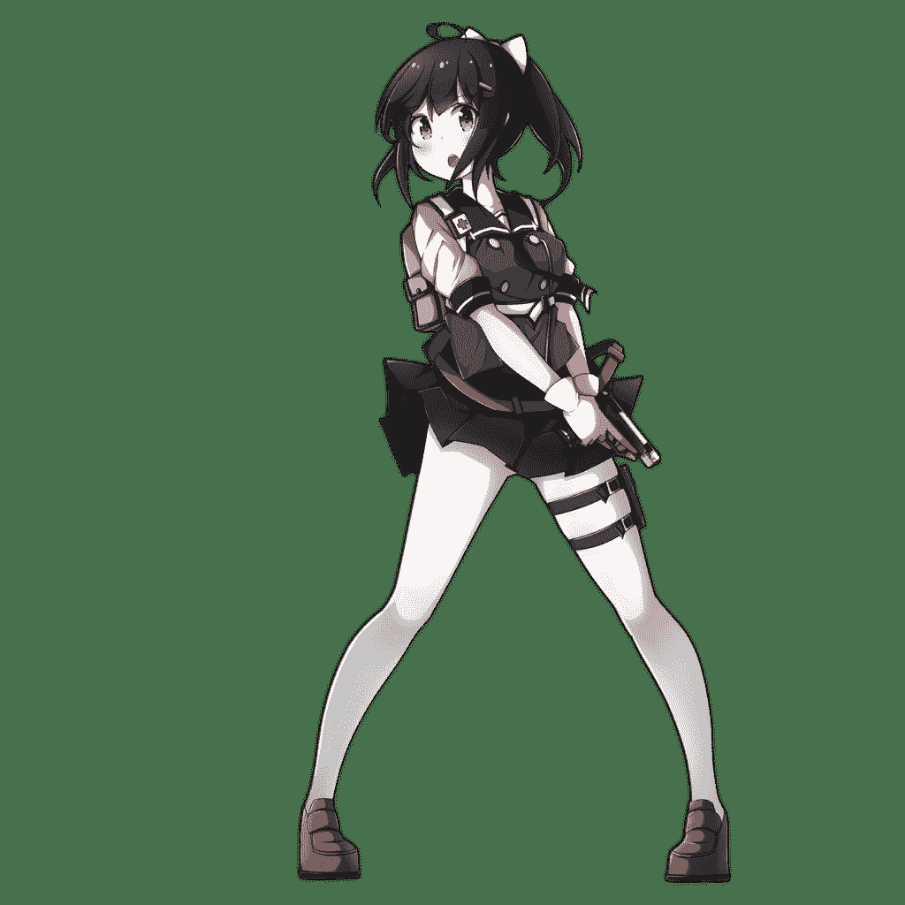

# [少前同人]GSh-18的赶稿日（残酷属性）

作者：overflow-FE

TID：28680

 

# 1

最近是真的没有什么灵感……所以这篇的剧情约等于没有，纯粹是拿来练描写的。

主角是GSh-18 ，18毫米航空机炮（不是，其实是18发手枪

GSh-18在原游戏里属于比较开朗的人设，另外还有着兼职漫画连载的设定，立绘就是下图这样了。

正文位于二楼，番茄酱注意。

（我怕不是要吃AC130全火力扫射了

 

# 2

<ignore_js_op>[Pic_GSH18.png](forum.php?mod=attachment&aid=ODI5NzZ8YjJiOTRjOTd8MTYwMDg3ODUzMXwxODIzMHwyODY4MA%3D%3D&nothumb=yes) *(221.46 KB, 下載次數: 7)*

[下載附件](forum.php?mod=attachment&aid=ODI5NzZ8YjJiOTRjOTd8MTYwMDg3ODUzMXwxODIzMHwyODY4MA%3D%3D&nothumb=yes)

2020-5-9 22:00 上傳  

</ignore_js_op>  

# 3

*本帖最後由 overflow-FE 於 2020-7-21 12:52 編輯*

以下正文：

“指挥官，麻烦帮我个忙吧！”

正在走廊巡视的指挥官亲切地扭过了头，但就在他迟一步的思考辨别出了声音的主人时，寻常的转身便不受控制的改为了罕见的平地摔倒。

“指挥官，不用这么着急，”GSh-18跨步移动到指挥官的身侧，伸手制止住缓慢的坠落过程，“我还没有说想要您帮忙提供什么样的素材呢。”

“不，我还有点事……”指挥官慌乱地挥动起手臂，刚赶在死线前递交每月报告的指挥官不可能不知道今天的日期，不管是格里芬基地还是远在城市中的漫画编辑部，每月的月初都意味着同一件事情。

交稿！

“我问过格林娜小姐了，她说您今天的安排是空白。”GSh-18一手扶住指挥官的肩膀，另一只手伸向他的膝盖，以公主抱的形式，不由分说地将指挥官抱了起来，“而且您这么悠闲，想必一定是交过报告了吧！”

指挥官的脸涨得通红，不仅是因为姿势突变造成的惊吓，还有自己刚才显然碰到了一团充满弹性的物体。但就算如此，所有形式的抵抗在人形的力量面前都没能起到一丝效果，GSh-18弯曲的手肘仍像两只虎钳一般夹住他的身体。

“就占用您几个小时的时间啦，我还要给稿子上色呢！”

指挥官的视线扫过走廊上的时钟，时针在他的脑中自顾自旋转了起来，在两次掠过正上方的12后转回原来的位置。

“我今天确实没安排……”指挥官绝望地垂下手臂，两眼发直望向天空。

————————

“说吧，是喝芥末咖啡还是单挑歌利亚，事先说明，我是不能进维修仓的。”眼前出现了陌生的天花板，指挥官刚打算环顾这名人形的房间，就被轻抛到半空，安稳的落在了GSh-18的床铺上。

“那些都是用过至少两遍的老梗了，如果再画出来的话，编辑会从显示器里钻出来把我打死的。”GSh-18居高临下地看向指挥官，逐渐提高的语速中透露出一阵紧张，“而且我最近没有出勤机会，就只能麻烦指挥官提供素材了。”

“只要不是会把我送进医院的素材就可以。”床铺上弥漫着少女的气息，还有兼职医疗兵的GSh-18所特有的淡淡消毒水味道，指挥官长出一口气，不自觉地在床上摆出了更为舒服的姿势。

不知过了多久，他重新睁开眼睛，习惯性看向GSh-18的肩头，血压升高的感觉就在这时猛地撞向了大脑。他没有看到对方医疗包背带上的红色十字标志，相反，手肘处隐约的凉意迫使他大幅转动起脖子，GSh-18刚刚丢掉手中的酒精棉球，从背包中取出了一支充盈绿色液体的针筒。

“请您放松，不是坍塌液。”GSh-18下意识抬脚踩住了指挥官的手腕，空出的手则死死按住他的肩膀，甚至让指挥官的半边身体直接嵌入了床铺。“我真的很需要这些素材！”

指挥官的挣扎在人形的力量面前完全无济于事，就连他自己也能想到，现在自己的状态与砧板上待宰的鱼没有任何区别。首先是针头穿透皮肤的刺痛，一丝冰凉的液体随后顺着血管蔓延开来，指挥官识趣地停下了动作，紧盯着对方将针头从自己的皮肤中拔出。

“应该会有点困，等醒了之后再和您解释吧。”

“那我……”话音未落，指挥官的动静便只剩下了均匀的呼吸声。

————————

“指挥官，您醒了吗？”

指挥官感觉胸口就像是挨上了一记重锤，他猛地睁开眼睛，依照本能侧身轻声咳嗽起来。“麻烦下次不要这么用力……”

眼前是一根白色的圆柱，表面还包裹着布料，看材质颇像刚才把自己敲醒的钝器，指挥官疑惑地侧向一边，打算顺着锤柄寻找GSh-18的位置。可是眼前并没有可能是木柄的部件，宽阔的平台也不像基地的建筑风格，反倒是白色的锤头一路延伸向了半空。

“指挥官等一下，我先把这个记录下来！”

圆柱移开，GSh-18雷鸣般的声音在半空炸响。指挥官急忙捂住耳朵，还是迟了一步，噪音虽没有带来永久性的损害，但光是脑内持续的蜂鸣声就足以让他失去平衡，重新躺回地上。

“啊对不起指挥官，是我没注意到音量！”

GSh-18的喊叫声仍然高亢，但已经没有了刚才的冲击感，隐藏在背景中的点点敲击声这时才暴露在指挥官的耳中。他扭过头，难以置信地看向左方，超过两人高的画笔正在一旁的巨大平台上滑动，顺着持笔人的手向上看去，一张熟悉的面容高悬在空中，正带着一丝尴尬看向自己的方向。

“指挥官，麻烦再等一下，”GSh-18将视线移向指挥官身后，数位笔移动的速度也逐渐加快，“还有最后一格就好了。”

终于，她将笔轻放回桌面，视线也紧跟着转了回来。

“指挥官，我新想出的主题是因为意外变小的指挥官和人形的玩耍互动，所以我就给您打了一针，把您变到了五厘米，刚才是在记录您刚醒来发现自己变小之后的第一反应，光看草稿的话可以凑出好几页呢。”

指挥官缓慢从桌面上站起，对方连珠炮一般的解释让他一时无法适应，还好平时文书工作的经验让他及时提取出了其中的重点，但还没等他整理出对这一系列事情的评价，无关紧要的吐槽率先到了嘴边。

“那为什么我的衣服也一并变小了？”

“其实我也不太清楚，”GSh-18吐着舌头，一边挠了挠头，“不过正好不用给指挥官找合适的衣服了嘛，要是画不穿衣服的话肯定要被编辑拉黑的。”

“算了，先不追究你的药从哪里来的了。”指挥官轻叹一口气，回身看向应该是显示器的位置。不愧是人形的效率，他在心里暗暗夸赞起对方的画技，所谓的草稿已经到了上色擦线后就能给出成品的进度，而且几乎捕捉到了自己的每一次大幅动作……指挥官突然略带疑惑的眯起了眼睛，背景的勾线显然是更早完工的部分，但无论如何都不可能与现在身处的场景联系起来。

“呃，GSh？”

“什么事，指挥官？”

GSh-18的声音似乎从更远的位置传了回来，还伴着翻找物体的杂乱声响，指挥官侧过头，视线沿桌边寻找起对方的位置。不过几秒，他正在寻找的目标还是抢先找了上来，甚至没等他对从天而降的残影做出反应，巨大的撞击声便吓得他原地跳了起来。

“抱歉，刚才是我故意的，这样就又能凑一格了。” 对方咯咯笑了几声，又一次拿起笔，在数位板上忙碌起来。

指挥官捂住胸口感受了一会心跳，直到心脏不再试图逃离胸腔，他才勉强认出了周围物体的全貌，环形的玩具赛道此时将他围在正中，与草稿中的背景一模一样。他好奇地跨过隔断，站到赛道中，供单车行驶的赛道仅是略宽于肩膀。正当他弯下腰，试图检查标志终点线位置的贴纸时，某种触感冰凉的物体伴着细微的摩擦声撞上了他的小腿，令指挥官直接向后摔倒在小车的车顶。

“指挥官，咱要发车了哦。”GSh-18手指抵住车尾，带着笑容欣赏起指挥官惊慌的动作。对方则在镇定下来后终于确认了自己的处境，以一种滑稽的姿势坐进了敞篷车模的座位。

“比例不对啊，太小了根本坐不下。”指挥官略带亢奋地做出回应，他的肩宽几乎等同于车辆的宽度，只有双脚能够勉强放入驾驶座的空位。指挥官别扭地调整双腿，在后盖上找到一个相对舒服的位置，迎着GSh-18的目光比出了一切就绪的手势。

载着指挥官的小车在手指推动下开始在赛道上驰骋，得益于车轮良好的做工，小车甚至在手指移开后仍然以高速进入了弯道。

“呀呼——”指挥官不禁喊叫起来，身体倾斜向弯道内侧，握在手中的挡风玻璃边缘进一步加强了驾驶摩托的错觉，直到他意识到自己倾斜过度，还把脚卡在了车模座位上的问题为止。

“哈哈哈哈指挥官您真是，”GSh-18眼看指挥官连人带车翻出了赛道，忍不住笑着抹掉眼泪，从桌上拿起画笔，闪电般在数位板上画了起来，“请您先不要动，这一幕我必须画下来！”

指挥官略带懊恼地推开压在身上的小车，想要将小车重新搬回赛道，却在难以应付的重量前作罢。“再来一次，我保证不会出问题了。”

“我画完草稿会让您玩个够的，”GSh-18再次放下笔，伸手在一旁翻找起来，“我还需要让您尝试一些点子。”

一枚硬币被轻放在指挥官面前。面对犹如井盖一般大小的硬币，指挥官瞬间有些恍惚，但很快，对方善解人意的敲击便帮他恢复了意识。指挥官趴在原位，轻揉摔倒时撞疼的手肘，带着一脸幽怨看向始作俑者的方向。

“咱也不是故意的啦。”GSh-18双手合十，回以无辜的眼神，“而且指挥官看起来很缺乏运动嘛，现在先做几个俯卧撑好了。”

指挥官嘟囔着摆好姿势，硬币在桌面滑动的声音却在这时清晰传了过来。

“那个太重了！”指挥官抬头惊叫起来，却在下一秒因为难以承受的压力重新低下了头。但压在脑后的不是预想中冰凉的金属，反而是更为熟悉的，一根包裹在手套中的手指。

“硬币是最终挑战哦，现在指挥官只要做俯卧撑就可以了。”

压力从脑后转移到了背部，原先担心脖子折断的恐惧也在这时逐渐消于无形，指挥官轻叹一口气，弯曲手肘俯下身体。得益于人形对肢体的控制能力，GSh-18的手指灵巧地跟了过来。指挥官略微用力绷紧背部，柱子一般粗大的手指竟然可以将力量控制在如此准确的范围，这多少有些超出他的预料。肌肉略微用力，压在背后的手指也配合着动作逐渐抬起，指挥官正要吐出最后一丝气体，压力却在手臂伸直前的一刻骤然增大到难以承受的程度。

“咳咳咳……”突如其来的压力打乱了他呼吸的节奏，指挥官的脸停在了距离地面只有一掌宽的位置，手指也在这时适时撤回了力道。呼吸逐渐恢复到原来的节奏，指挥官再次绷紧肌肉，背部的手指却像是被钉死在半空，无论他如何施加力量，都没有再向上移动过分毫。

“指挥官，连女孩子的手指都比不过是要一辈子单身的哦。”面对指挥官试图用目光杀死自己的企图，她慢悠悠的答道。

“嘿！”就在新一格即将画完的工夫，GSh-18趁机压下了手指，刚刚有所动摇的指挥官瞬间便被压在桌面动弹不得。只需轻轻转动手腕，指挥官的杀人视线便再次被挡在了手套的另外一侧，她缓慢收回手指，将硬币抛进了抽屉。“指挥官，素材已经够用了，硬币我自己画一格就可以了。”

“可以让我玩会小车了吗？”指挥官翻身躺在地上，再次幽怨地说。

“我可是还有好多点子呢。”她的手重新伸向了一边。

————————

“指挥官觉得如何？”GSh-18微调了一下屏幕的角度，让最新的一格呈现在指挥官面前。

“反正你画的是日常搞笑漫画，”指挥官揉了揉略显酸痛的手臂，苦笑着看向屏幕上自己夸张的表情，“达到效果了就行。”

“那就剩下最后一张收尾页了，果然咱的效率还是很高的。”她满意的伸了个懒腰，哼着小曲创建出下一张空白画纸。

“GSh，”指挥官像是突然发现了什么，走到显示器的一角，指着上方的屏幕，“为什么你的默认保存路径还有一条/Comic/G呢？”

惊叫过后，一堵白色的高墙完全遮蔽了指挥官的视野，并迅速向着他的方向撞去。指挥官条件反射地抬手挡在身前，却没有起到丝毫的阻挡效果，只得抽回险些被卷入墙下的右脚，主动趴倒并快速收起双臂，在巨墙推动下滚向桌子边缘。

GSh-18终于收起了力道，指挥官顶着失衡感坐起，幸好刚才的变故没有直接将他推下桌面。他抬头看去，对方的脸色已然变得通红，刚才拨开指挥官的手现在正用力挠起脸颊，如果不是有着手套阻挡，恐怕要在脸上留下几道血痕。

“既、既然被指挥官发现了……”她咬了咬嘴唇，伸手捏住指挥官的两肋，将他轻轻提到与显示器平视的高度，另一只手移动鼠标，在指挥官的注视下点开了命名为G的隐藏文件夹。

“我、我也是个R18G画师……不过那些都是业余凭喜好画的！”像是突然想到什么，GSh-18猛地捂住了嘴，“不不不，不是喜好，是有人约稿！”

她的辩解没能进入指挥官的耳朵，屏幕上大面积的鲜红色此时完全堵塞了他的大脑，指挥官疯狂转动着眼球，视线扫过屏幕上的每一张图片，幸好GSh-18没有一并捏住他的手臂，不然他怀疑自己一定会在半空中吐在她的桌上。

体型娇小的少女人形正以难以置信的力量压碎一名人类的手臂；一名人形抚摸着怀中的头颅，身体则被丢弃在画面的一角；半边面孔隐藏在阴影中的人形饶有兴致的舔着嘴唇，大腿内侧沾满了红白色的黏液，身体被挤压成漏斗形的人类则扭曲地倒在一旁，头部更是化为了完全看不出原状的薄片……

所有人类受害者的衣服几乎都被浸染成了红色，但他还是能够认出，近一半的人本来便穿着一身大红色的制服——和自己身上的格里芬制服一模一样。指挥官用上两只手从才勉强抑制住呕吐的冲动，他转过头，强迫视线从屏幕上移开，却正好撞上了GSh-18充斥不安的双眼，他甚至一度认为对方的瞳孔中倒映出了自己铁青的表情。

“完了，要被指挥官当成变态了，”GSh-18带着哭腔，颤抖地自言自语起来，“干脆处理、处理掉好了……”

一股寒意瞬间沿着指挥官的脊椎爬进了大脑，硬生生逼迫他将呕吐的欲望咽回了肚子。指挥官近乎疯狂地推动起捏住身体的手指，还好手指因为对方的失神也略显出无力。很快，指挥官果断放开了支撑身体的手臂，顺着挣扎出的些许缝隙滑出GSh-18的指间。

落地的一刻，传入大脑的疼痛才多少驱走了意识中过量的恐惧，指挥官条件反射地翻滚分散落地时的冲击，但再次站起来时，脚踝还是传来了需要咬牙忍受的疼痛。他定了定神，幸好脚踝的功能还算正常，疼痛也在肾上腺素的压制下快速降到了可以忍受的程度。环顾四周，指挥官向房门的方向快速跑了过去。

扫描仪、画稿、更多的画稿，指挥官沿着阶梯状堆放的杂物一路跑向门口，回头看去，GSh-18依旧失神地靠在桌边，直到指挥官距离门口仅有几步的距离，才恍然大悟一般踢开椅子，小跑追了过来。

来不及做出匍匐动作了，指挥官飞快在心中估计着时间，门下缝隙的宽度也因为跑动中的晃动而充满着不确定性。只能这样办了，被求生欲驱动的指挥官暗自咬了咬牙，在缝隙前只有几步的距离向后放低重心，以滑铲动作冲向了门缝。

指挥官感觉鼻梁遭到了致命的打击，他现在能回想起的最后一件事，就只有在大半个身体没入缝隙后，才突然发现宽度不足以让脑袋通过的惊悚事实。指挥官放弃了重新睁开眼睛的想法，反正在撞击之后视野里就只剩下了闪烁的金星，他勉强抬手扒住了门板的边缘，但还没等用力把身体从缝隙中抽出，潮湿而又略带温度的布料便包裹住了他的头部。

“指挥官，你没事吧？”GSh-18慌忙蹬掉鞋子，白袜中的脚趾灵活地夹住了指挥官露在外面的脑袋，“我、我刚才说的处理绝不是那个意思！”

GSh-18咬住下唇，以另一只脚为支点，试图将指挥官从门缝中拖出。可是她的介入却起到了完全相反的效果，原先指挥官扒住边缘的双手早就缩了回去，从脚上的轻微反馈看来，指挥官反倒是将狭窄的缝隙视为了最后的救命稻草，正拼尽一切抵抗着她的脚趾。

“我承认那些都是我画的，”她略微提高了声调，“可是我分得清想象和现实，我保证不会伤到指挥官的。”

她微微张开脚趾，好让指挥官听见她的解释。一股触电般的感觉突然从她的脚趾间涌了上来，她不得不扶住周围的墙壁，才终于没有让自己下意识做出过激的动作。她定了定神，这才发现指挥官的手臂慌忙缩回了缝隙，或许是自己的行为让指挥官误以为抓住了机会，伸手想要把脑袋一并解救出来。

她有些后怕地拍了拍胸口，在现在的尺寸下，指挥官的脖子居然比自己想象中还要脆弱上几分，更不用说骨骼只有牙签一样粗细的手臂，如果刚才没有忍住夹紧脚趾的冲动，或许已经没有资格再待在这里了。

“那、那我就继续了。”GSh-18紧盯住自己的脚趾，脚趾间撑开的布料覆盖了对方的表情，只有点点红斑沾染在布料上，或许是指挥官刚才撞破的鼻子。指挥官没有做出任何动作，她再次收紧脚趾，缓慢地将对方从门缝下拖了出来。

指挥官没有像她想象那样，在摆脱束缚后立刻做出不理智的行为。她再次松开脚趾，这一次，脚掌带着缓慢而不可阻挡的力量向前推进了少许，完全压制住指挥官的上身，但又留出了可供呼吸的空间，而脚趾微微向下弯曲，重新钳住指挥官的腰部。

她轻轻抬起脚，带着指挥官的身体离开了地面，最终移动到了皮鞋的上方。GSh-18的嘴角不自觉扬了起来，摆弄抓娃娃机的感觉远没有这般有趣。脚趾略微加大力道，她甚至可以感到对方的骨盆在尽力抵抗着她的脚趾，而不是像之前夹住脑袋那样，需要时刻提防扯断他的脖子。

“指挥官，咱真的不会伤害您的，所以……诶！”她张开脚趾，指挥官便在重力牵引下坠入鞋中，可还没等她像预想中那样用脚堵住鞋口，脚下传来的触感便不由得让她惊叫出声。

指挥官在半空活动一圈脖子，除去脊椎发出的咔哒声外并没有异常。他咬了咬牙，对方的脚趾在刚才突然加大了力道，但还远没有到折断骨头的程度。背景逐渐昏暗，下方还弥漫来了略显潮湿的奇怪味道，指挥官深吸一口气，现状都指向同一结论，GSh-18的下一步动作便是将他扔进鞋子。

果然，脚趾在离地一人多的高度松开了他的身体，指挥官在半空调整好姿势，平稳落在了鞋垫上，他试探性嗅了嗅鞋中的空气，味道跟想象中少女的皮鞋竟没有太大差异。他摇了摇头，现在不是考虑这些的时候，少女的脚掌近乎遮蔽天空，但仍然留下了不少缝隙，更是反过来阻碍了她的视线。

鞋帮只有一人多的高度，不到一秒的时间，指挥官便已经跨过了皮革制的墙壁，远处也传来了GSh-18的惊叫，他暗自叹了口气，如果在刚才没有不慎撞到她的脚底，可能要等到跑出脚掌的覆盖范围，她才会注意到自己的动作。

阴影只是比预想中早几秒追了过来，指挥官扭头看向上空，对方洁白的袜底已经覆盖到了头顶，但也如他所想，脚掌一并阻碍了GSh-18捕捉到他的位置。指挥官向身侧跨出一步，快速改变奔跑的方向，但她也像是同时做出了自己的决定，脚掌向一侧砸下，不到半步时间就笼罩了指挥官近乎全部的视野。

完了。

“我、我不是故意的……”GSh-18的声音带上了不加抑制的哭腔，人体逐渐粉碎的触感清晰地反馈入她的意识，大片的暖流开始顺着白袜蔓延开来，还有残留在脚掌外面，已经不再动弹的双腿。脚掌扎实地踩在了地上，被前脚掌直接命中的指挥官已经没有了生还的可能。

她侧过视线，缓慢地抬起脚掌，白袜上的红斑甚至扩大到了脚背，潮湿粘腻的撕裂声后，原先粘连在脚底的残骸啪嗒一声摔回地面，只剩下不到指尖大小的肉片仍然扒在脚上。

“我真的只是想挡住指挥官的去路而已！”GSh-18靠到墙边，引以为傲的运动能力现在甚至不足以维持住身体的平衡。她低下头，注视着指挥官只有双腿还剩下人形的残骸，仿佛要用自己的视线让对方复活一样。

原来指挥官被压碎后是这样的。另一种念头突然蹦了出来，她用力对额头打出一拳，疼痛甚至让自己都倒吸一口冷气，可她的腿却已经向桌边迈出一步，伴着指挥官的肉片再次被挤压的噗呲声。

终于，她拿起画板，凑到指挥官的残骸旁坐下。

GSh-18小心拨开血液浸透的制服，包裹在布料中的地狱才真正暴露在空气中，曾经是指挥官的人体组织甚至部分被压入了布料，在掀开衣服时发出诡异的撕裂声。她尝试着从袖管中挑出指挥官的手臂，却让仅剩少许半液化肌肉连接的肩部整个断了开来。“果然不能用红色乱涂一气，还是有很多细节的。”她叹了口气，自言自语间将经过艺术加工的细节描绘在纸面上，

像是突然想起什么，她在原地调整了一下姿势，扳过脚，将暗红色的脚底摆到视野内。袜上的血迹有些干涸，边缘附近已经变成了棕色，她略带懊恼地用笔尖戳了戳血迹中央的深色斑块，或许这曾是指挥官暴露在制服外面的脑袋，但在她刚才走动所造成的挤压下，已经深深嵌入了纤维间的孔洞，再也无法恢复原状。

视线沿指挥官的残骸逐渐下移，当她重新将目光锁定到完好的双腿上时，GSh-18的眼神剧烈抖动起来。回过神，她才发现自己的手中正握着揉烂了一半的稿纸，声音也因为眼泪和突然涌起的自责而重新变得低沉。

“我也不希望变成这样啊，”她将稿纸重新在画板上摊平，顺手抹掉了些许眼泪，“如果能重来一次的话……”

话音刚落，她突然感觉一道愤怒的目光锁定了自己。或许这就是所谓的在天之灵吧，她默默放下画板，可眼前已经不再只有指挥官的遗体，还有视线反复在残骸和自己身上游走，神色复杂的指挥官本人。

GSh-18发出一声惊叫，从地上蹦起并快速后退几步，她险些以为自己的心智都要因为惊吓而过载烧毁。“您、您是来索命的吗？我是人形也可以吗！”

一瞬间，她感觉自己捕捉到了多种复杂的表情在指挥官脸上闪过，对方显然也意识到了自己的失态，摇了摇头后伸手摆出了安静的手势。

“所以，您也不知道发生了什么？”与对方交流过一遍情况，GSh-18垂下头，趴伏在指挥官面前。

“我只知道你是可以让我复活的，而且我还记得刚才发生了什么”指挥官咬了咬牙，看着GSh-18在自己面前摆出委屈的表情，“很疼的！”

“对不起，我让指挥官失望了……”

“没事，因为没有造成实际损害，”指挥官下意识伸出手，又突然楞在原地，象征性对空气做出了抚摸动作，“我原谅你了。”

“既然如此，指挥官，”GSh-18从地上一跃而起，继而有些害羞的对着手指，一抹不正常的潮红逐渐在她的脸上蔓延，“我还想要一些素材……”

“我拒绝！”话音刚落，指挥官便再一次被巨脚撞倒在地。完全没有留出反应的空隙，脚趾灵巧地在落地的瞬间一并压碎了指挥官的头颅，继而向前拖动，在地上划出一道红白相间的血痕。

“咱不会让您有太多痛苦的啦。”她搓动脚趾，直到残留的人体组织被研磨成更为细腻的肉泥，彻底融入到白袜的纤维之间。

“嘿咻——”像是又想起了什么，GSh-18单脚跳到床边，坐在床上脱下了另一只脚上洁白如新的袜子，依次活动了一遍脚趾，“这样就方便多了。”

指挥官无头的躯体被从地上捡起，片刻后，脱去外衣的身体重新落到了地上。“五厘米真的好小哦。”她在自言自语中将指挥官的制服揉成一团，抬起了那只洁白无瑕的脚，轻轻压在了目标上。

“没想到指挥官踩起来是这个感觉。”GSh-18忍不住收紧了双臂，一股电流从脚底直冲向她的意识，一同传来的还有骨骼逐渐粉碎时的轻微脆响。脚掌完全贴在了地上，指挥官的身体甚至没有带来任何像样的抵抗，就在她的脚下化为了一张薄纸。她抬起脚，这一次却是整张纸紧紧粘在脚底。她略显失望地放下画板，脚掌向前搓动，肉片在摩擦力下逐渐从她的脚底滑开，又和紧随而来的部分卷在一起。等到脚掌再次抬起，地面上只剩涂满一地的鲜红，以及一颗糖果大小，由曾经是指挥官的肉片卷成的球体。

“我居然能做到这种程度……”她有些恍惚的分辨着球体表面的细节，除去肉片堆叠出的层次，以及隐约夹杂其间，本就富有韧性的内脏，其余的部分均匀到了她难以想象的程度，几乎要呈现出黏液质感的血肉中掺入了星星点点的白色碎块。至于骨骼，早在搓动脚掌的同时，她就再也没有感到过那种刺激神经的细微颗粒感。

GSh-18在稿纸上快速画上几笔，她甚至有些怀疑，当自己将素材转化成完整的作品，以残骸在画面中的比例，这些细节究竟能够留下多少。

“谢谢，指挥官。”GSh-18享受地闭上双眼，控制大脚趾缓慢地滚动起残留的肉球，然后用力按了下去。

“唔……重来一次？”她拉过椅子在一旁坐下，依次默念起了自己认为有效的语句，直到一抹独立的红色重新出现在视野中。

指挥官下意识摸向头部应在的位置，无比真实的触感以及健全的视野随即让他感到了一丝愚蠢——当然，是对自己。下一秒，诡异的挤压声便吸引他转过头去，指挥官在原地愣了一瞬，才认出踩在地上的巨大物体是GSh-18的光脚。同样干净，洁白，却不同于纯白色的袜子，皮肤下淡淡的粉色完全契合对方元气少女的形象。

如果不是她突然抬起脚掌，露出脚下的恐怖图景的话。

指挥官甚至一度认为那是光影的玩笑，但直到光线照亮GSh-18逐渐抬高的脚底，他才不得不接受眼前的现实，鲜红的液体涂满了她的前半部分脚掌，不停搓动的脚趾之间，还有粘稠的液体逐渐滴落下来。不，并不是液体，指挥官不知道是第几次捂住了嘴，半截酷似人类内脏的物体卡在她的趾缝间，成股的肉泥正从上滑下，在地面上摔成锥形的一摊。

脚趾张开，内脏也随之滑脱到地面上。指挥官在惊恐中瞪大了眼睛，可是早有另一只脚从侧面靠近了他，用同样灵活的脚趾将他禁锢在原地。沾满血液的趾缝就像是找到了新的猎物，逐渐将他的脑袋纳入其中，顺便将一股血腥味的微风送入他的鼻腔。

“诶？”GSh-18好奇地偏过头，脚趾间传来了夹住指挥官头部的酥痒，可又像是有一阵电流流进了她的意识，至少，指挥官身上不应该有骨骼以外的部位可以给她带来这样的刺激。她小心地加大脚上的力道，却仍然可以隔着一层柔软的血肉，感到对方完整头骨的触感。

她下意识舔了舔嘴唇，在椅子上换做更合适的坐姿。双脚已经找到了最合适的发力方向，伴随着一声轻叹，以极大的爆发力向两侧移动。

“啊！”GSh-18惊叫着停止了动作，脚趾迅速夹紧，一朵红白相间的血花霎时在她的脚上绽放开来，指挥官的脑袋如同灌满水的气球一般破裂，飞溅的血液与脑浆甚至洒落到了她的腿上。她简单扫视了一遍大腿上的点点红斑，重新将视线移向那只光脚，脚上不仅有曾是指挥官头颅的部分，还有半截血淋淋的脊椎，因为失去了骨骼的支撑，无力地垂在她的脚上。

她重新看向另一只脚，指挥官无头的身体从外表上和刚才几乎没有不同，可也仅限于外表，脚趾向外拔出的一瞬，身体就像同时失去了支撑，如果不是被她的脚趾禁锢在原位，或许只能瘫软地倒在地上。

“指挥官，对不起……”GSh-18失落地自言自语起来，明明只是想模仿自己曾经的作品，将指挥官的身体从脖子硬生生拔断，可事实却远超出了她的预料，甚至可能还违背了让指挥官不会有多少痛苦的承诺。

她低垂着眉，拿起画板简单记录了脊椎的状态，便再一次灵活地搓动脚趾，咀嚼起指挥官的残骸。她甚至能够感到半截脊椎在自己的脚趾间弯曲成了不自然的形状，但还没等她好奇地施加压力，便在一声脆响后折断。

“居然也是我做的吗？”她这才从另一只脚上看出了异样，身体失去的并不仅是脊椎，还有一条手臂，连同制服的袖管一起消失不见。一道闪电划过GSh-18的脑海，她急忙弯下腰，从脚趾间挑出了不成形状的肉酱，均匀地摊开在手上。没过多久，她便从中挑出了被自己误认为是完全粉碎的脊椎的异物，浸透了血液的袖管从她的指甲间垂下，连同里面包裹的手臂一起变得扁平。

意识中逐渐构筑出了最后几秒的场景，指挥官在强烈的刺激下捂住了嘴，可还没等他做出反应，巨大的脚趾就将他的手臂与脑袋一同夹住，甚至在那一瞬间便直接折断了手臂中的骨头。GSh-18随手在袜子上擦干手指，脸色却因为刚才的想象重新开始泛红，令人惊喜的细节完全抵消掉了最初的失落，甚至让她想要立刻坐回到电脑前描出下一张图的草稿。

“重来一次！”GSh-18跑过去捏住指挥官的身体，重新坐到椅子上，一边再次扒掉他的制服，一边流畅地滑回到电脑前。

“麻烦您先在这等一会。”GSh-18并拢双腿，将指挥官放在大腿间的凹陷处。下一秒，她像是突然想起什么，急忙压住裙子，轻轻点了一下指挥官的额头。“不要向上看，不然您会死的很惨的！”

线稿逐渐成型，不过却是她常画的正常比例。在人形的力量面前，人类的身体结构绝对算不上坚固，画面中的人形正对镜头，饶有兴致的玩弄着手中的人类残肢。可真正的笔墨却集中在画面的下方，人形脚下不经意的动作反而逐渐塑造出了真正的人间地狱。

至于画面中的受害者，仍然一如她的风格，身体上残破的布料无疑曾属于一件格里芬的员工制服。

她满意的放下笔，双腿间的一丝温热这才引起了她的注意，那里已经没有了指挥官的痕迹，有的只是被涂抹在大腿内侧的一片鲜红。

“嘿嘿，不好意思”GSh-18调皮地吐了吐舌，“其实咱是故意的啦，毕竟指挥官还会复活嘛。”

“求求您了，真的只是最后一次了。”双手合十的GSh-18将椅子拖到了指挥官面前，面对满脸惊恐，不断后退的指挥官，祈求着。

指挥官无奈点了点头，下意识用手揉起眉心，可当他再次睁开眼睛，视野便再次被一片肉色所覆盖。

“那就多谢款待了。”GSh-18的脸上重新露出了笑容，敏捷地抬起脚，用小脚趾的趾缝卡住了指挥官的脖子。

指挥官脸色惨白地看向肩头的两堵肉墙。等到脚趾轻轻滑过他的肩膀，他才真正意识到了问题所在，即使是对方最小巧的两根脚趾，厚度也超过了他的脖子。他张开嘴，可是还没等发出声音，骤然夹紧的脚趾就粉碎了他的下颌，继而捏住他的脖子，将他提了起来。

感受着指挥官努力想要撑开脚趾的徒劳挣扎，GSh-18转身面向屏幕，重新打开了寄宿着自己见不得人的爱好的文件。她依次翻过每一张画作，不时扭头看向画满素材的稿纸。

“让咱想想还有哪些细节需要确认一下呢……”

————————

“GSh，醒醒。”

GSh-18猛地睁开眼睛，指挥官正带着一脸不安，将双手扶在她的肩上轻轻摇晃着。指挥官的身高与正常状态显然没有区别，她小幅度侧过头，用余光看向记忆中的位置，地面上覆盖着一层薄灰，没有血迹，更没有打扫的痕迹。

“你刚才突然站着睡着了。”似乎是看到她清醒过来，指挥官的表情很快便恢复了坦然，“是不是赶稿压力太大了。”

“我……”GSh难以置信的看向时钟，指针正指在她将指挥官抱进房间五分钟后的数字上。她下意识将指挥官的手从肩上移开，视线却在这时定格在半空。对方手腕上的印记还未完全消退，横向排列的条纹则和自己的鞋底一模一样，她默默捏住指挥官的手腕，另一只手搭上对方的肩膀，迫使他打开手肘，一处新鲜的针孔就这样呈现在眼前。

她不禁收回肩上的手，从两端抵住指挥官的小臂，感受起对方完整的骨骼。当她再次抬起头时，指挥官的脸上已经少了一半的血色，还有细密的冷汗正在从额头上渗出。

GSh-18触电般放开指挥官的手臂。等到对方跌坐回床铺，她重新看向了指挥官的眼睛，在尴尬的苦笑声中不自觉地对起手指。 

“您，该不会和我做了同一个梦吧？”

 

# 4

> [艾欧 發表於 2020-5-10 21:29](https://giantessnight.com/gnforum2012/forum.php?mod=redirect&goto=findpost&pid=436180&ptid=28680)

> 实在是！太棒啦！R18G漫画家竟恐怖如斯！有着医疗兵感觉的Gsh干着这么恐怖的事情，应该不会有人觉 ...

抱歉抱歉，比例这方面是我疏忽了，没能在描写中表现出比较清晰的尺寸，我构思时应该是在5-10cm这个范围，因为GSh在我心里还是小巧可爱的形象，所以适当更靠近5cm这边吧。(不过立绘比例和枪长折算，她也有大概一米七了)

要不是不太想剧透，我都想把这篇叫做《熟识的医疗兵竟然一直在以我为对象画R18G作品？》这种日轻一样的标题了，秘密被发现的时候不是社死而是变成这样的发展真的是让我自己写着写着抖m都发作了。(叫双枪老太婆的话估计我们俩得一起挨AC130扫射或者直接变成她原稿的一部分了）