# 【展望杯奖励文】赤与蓝：蔷薇的华尔兹（8月2日第九节）

作者：karlchen0920

TID：17197

 

# 1

*本帖最後由 karlchen0920 於 2014-8-2 09:05 編輯*

**赤与蓝：蔷薇的华尔兹**

**前言及致谢**

　　大家好，这里是不认真填坑而且起标题很没创意的某K。

　　本文是给年初”展望杯”文组所有参与者的奖品。不过因为某K好高骛远眼高手低的恶习，活动结束时仍在施工状态。（现在也是）

　　本文内容大概讲述的是一位名叫威尔的年轻海军军官邂逅战斗天使“苔丝”的故事。依旧是40K式的世界观，战争，审判庭等。

　　初步计划有11个part（10-12不等），前段福利量稀少，但在part9之后会大量出现。

　　之前和机器猫商议的结论是“建议写完之后再发”，所以我承认这时发出来有些自作主张的样子。先向“展望杯”的所有组织者和的文组参与者致歉了。

　　不过半年疏远论坛和读者之后，感觉自己的写作热情正在渐渐褪去，甚至文字能力都有些下降。这篇文章也因此在活动结束之后鲜有进展。

　　所以在论坛公开的发表出来，单纯是为了有鞭策自己的理由。当然如果能得到更多任何建设性的意见和建议，那是最好不过的了。

　　……很惭愧，我还是没有但大那样完结整篇再发表的定力。

　　最后，还是要再感谢一次展望杯的组织者但大（Dante），猫大（Freelycat）和机器猫（1170484163j）给了我写此文的契机。感谢Eventually，小剑，R&L，兔球小A，咯咯等朋友们的一路鼓励和指点。

　　我会争取给这篇文章画个圆满的句号的。

　　以上。

　　2014/7/4

**目录**

[**二楼：**](http://giantessnight.com/gnforum2012/forum.php?mod=redirect&goto=findpost&ptid=17197&pid=226217)

序 - 第一节 - 第二节

[**三楼：**](http://giantessnight.com/gnforum2012/forum.php?mod=redirect&goto=findpost&ptid=17197&pid=226218)

第三节 - 第四节

[**四楼：**](http://giantessnight.com/gnforum2012/forum.php?mod=redirect&goto=findpost&ptid=17197&pid=226219)

第五节 - 第六节

[**五楼：**](http://giantessnight.com/gnforum2012/forum.php?mod=redirect&goto=findpost&ptid=17197&pid=226220)

第七节（奖品完结于此节） - 第八节

**[六楼：](http://giantessnight.com/gnforum2012/forum.php?mod=redirect&goto=findpost&ptid=17197&pid=226221)**第九节（8月2日）

 

# 2

*本帖最後由 karlchen0920 於 2014-7-4 23:11 編輯*

**序**

　　淡蓝色的雾气，豁然涌入了阴暗的舱室。绚蓝的气焰，自银色的涡扇中徐徐吐出。

　　深蓝的裙摆，在湍急的气流中飘摇。

　　“环境检测……确认。”

　　“系统初始化……确认。”

　　“集成单元检测……确认。”

　　枯槁的少年怔怔地立于舰桥。全然不顾身旁忙碌来去的军官们，他只是的如一株要枯死的幼松立在原地，顽强地盯着一侧的屏幕。

　　影像中，广阔的长廊状舱室的一端，深蓝的少女身影耸立。

　　刺眼的警示灯转动闪烁。灯光穿透了淡蓝的雾气，给阴暗的舱室染上了惊悚的暗红。

　　“舱门压力确认。”

　　“载荷检测……确认。”

　　低沉的男声继续汇报道。

　　她面前的巨大舱门，如同一张吃人的大嘴，伴随着金属摩擦的尖叫，不情愿地缓缓张开。

　　少年仔细地盯着，却难以识别她的面容。狂暴的灵息湍流之下，屏幕的图像布满了白色的雪花。

　　只能隐约看清那深蓝的短裙华服，以及明显是少女的瘦弱身形。

　　和记忆中的景色，完全一样呢。

　　事实上，“蓝色”们本来就该完全一样吧？

　　“伺服单元确认。”

　　“附件装载。”

　　液压驱动的机械哀鸣着，将庞然的甲胄缓缓吊下。晃动片刻后，骤然落在了少女的肩头。巨大的重量，迫使她微微地前倾。

　　不过很快她便适应了这份沉重，恢复了笔挺的站姿。

　　暗红的灯光下，光滑的前后板甲遮去了女性高耸的特征。

　　她的背后，八道鸟羽一般的锋利翼刃折叠着，闪耀着出刺眼的暴戾。她的肩侧，一对涡扇引擎不停喷射着绚蓝的气焰。

　　“装载完成。”

　　“作战单位就位……”

　　少女向前踏出了一步。大厅回荡起礼鞋践踏金属甲板的闷响。

　　甚至在舰桥的少年都隐约感受到了震撼。

　　随即。黑色的礼鞋，灵巧地嵌入了甲板上的一块坡跟凸起。少女的身体，如起跑前的运动员一样摆出了箭步。

　　“装具闭锁强度……确认。

　　“功率测试……确认。“

　　“轨道清空……”

　　“蒸汽压力确认。”

　　“引擎加力。”

　　涡扇喷出的蓝色越来越耀眼。少女的身体渐渐绷紧，抑制着那逼迫她前进的力量。

　　“转速确认……功率确认……”

　　晃眼的红色突然熄灭。长廊的两侧，成排的绿色光点，汇聚出两道指向舱门的轨迹。

　　少年顿时深吸了一口气。

　　他知道接下来要发什么。

　　他也知道在任何情况下下，“蓝色”们是完全一样的。

　　但是，他却掩饰不住自己的失望与期待。

　　“轨道清空确认。”

　　“准备弹射。”

　　“三，二，一……”

　　蓝色的尾焰突然化为耀眼的白炽。黑色礼鞋下的弹射装置，喷涌出金属的火花。

　　巨大的少女，如离弦的弓箭一般猛然向前，瞬间冲进了淡蓝色的广阔宇宙！

　　舰桥猛烈着震动着，让少年不得不在一旁寻找扶手抓牢。

　　也就在那一瞬间，他呆住了。

　　在天地不分的蓝白间，烂漫的火红长发，生机勃勃地随风飞舞着，显得分外的耀眼。

**第一节** 

　　“……”

　　“……”

　　恢复平静的舰桥上，中年男子与少年对视许久。

　　一席蓝黑燕尾制服的“奥布里船长先生”，恐怕是“弗洛拉”号上唯一算得上整洁的男性了。

　　而他的表情似乎也和自己的衣着一样，从来一尘不染。

　　“所以……”

　　他缓缓开口，带着布列坦尼人特有的优雅口音。

　　“你没有跟她一起去？”

　　少年被他严肃的目光看的发慌，只得低下头去。

　　他知道自己犯了错，很严重的错。

　　但是他没有办法逼迫自己。

　　“也好，反正苔丝也习惯一个人了。”奥布里先生显得不以为然。

　　苔丝？那个少女叫苔丝？

　　低阶的“蓝色”不是应该没有名字的么？

　　“威尔先生，很抱歉有些问题没有和你说清楚。”

　　奥布里先生似乎很习惯用敬称称呼每个人，即使是是年轻的下属。

　　“这是一艘五级巡航舰，所以可能和你此前呆在舰队里的感觉不大相同。”

　　“我不会让自己的下属被陈规戒律束缚手脚。所以如果你觉得什么事情必须坚持的话，直接和向我申请就好。”

　　似乎是被赦免了呢。

　　“不过，威尔先生。”

　　船长的语气依然平淡，但很明显变得更严肃了。

　　“正是因为是单打独斗的巡航舰，所以这所船的命运，在于每个成员的努力。”

　　“而且你也能看到，我们的现状并不是很令人满意。此前的舰队作战中我们损失了四分之一的人手，一半的大炮，五位‘女士’中的三位。而我们现在却被命令追击一艘完好的四级主力舰。”

　　——“女士”应该是指的“蓝色”吧，就和那个少女一样？

　　“所以，在需要强迫下属的关键时刻，我绝对不会手软。我这样说，你是否清楚？”

　　一脸茫然的少年猛力点点头。

　　“很好。”

　　奥布里先生又变成了奥布里先生的样子，给了少年一个温和的表情。

　　“威尔先生初来乍到，就先回去好好休息一下吧。”

　　恍惚地行走在船舱之间，少年威尔显得非常疲惫。

　　按理说他已经厌倦了一切，无论如何也不会再变得更脆弱了。

　　但是当看到红发少女冲进位隙的一瞬间，他突然感到了一阵窒息。

　　——“蓝色”们，究竟是什么东西？他本以为自己了解，却又感觉捉摸不透。

　　他找到了自己的房间，迫不及待地推门而入，钻进了柔软的吊床。

　　淡蓝的湍流之中，混合着焦黑的金属和鲜红的液体。

　　引擎在轰鸣，刀剑被挥舞着发出呼啸，炮弹尖叫着从身旁飞过。空间中的灵息氛围让这些声音变得越发扭曲，叫人发狂。

　　然而一直缭绕在他耳旁的，却是一阵少女的哭泣。

　　明明只是很轻的抽噎，却挥之不去，占据了他大脑的全部。

　　少尉是他的军衔。“导航者”是他的职业。

　　直到他开始厌恶这一切，开始认识到自己只是个叫威尔的少年而已。

　　那么，“蓝色”又是什么？

　　“奎瓦希尔（Cuirassier）”，译称“胸甲骑兵”，是这些巨大少女的称号。当然，最广为流传的称呼，莫过于“蓝色”——因为她们从来都是身着深蓝色的及膝短裙战装。

　　按照官方的解释，她们和“红色—枪骑兵”以及“灰色—赦令骑兵”一道，是受神皇陛下赐福的“天使”。

　　她们拥有天神一般强韧的身体。厚重的护胸板甲让她们能够直面凶猛的战舰火力，动量长直剑让她们几乎主宰跳帮作战，引擎和翼刃让她们能够在混沌的位隙中自由游弋。

　　不过，由于“天使”本身对灵息力量敏感的缘故，反而对基于物理的工程学产物相当迟钝。所以，为了让她们在混乱的战斗中能顺利与人类的支援协调，在她们的身边，总是会配备一位技师。

　　这位技师就是“导航者”。除了协助“蓝色”导航和联络，他们还往往充当着炮兵观测员的角色，为受到威胁的“天使”呼叫和校准舰炮支援。

　　并不是所有人都能成为“导航者”。技术素养是为必须，“天赋”也是很重要的一环——他们必须能适应位隙中紊乱的能流，能够在最糟糕的环境下保持清醒。

　　简而言之，就是和“天使”相反，他们必须对灵息迟钝。

　　而威尔少尉就是这样的一位被寄予厚望的“天才”。

　　出身“导航者”世家的他，体质合格，对导航和工程学更是一点就通。14岁就正式被选为驻守帝国北方星区的主力舰队的一员，可谓前途无量。

也就是在舰队中，他人生中第一次见到了“蓝色”。

　　与普通的“天使”不同，“蓝色”是没有生气的，几乎和机器一般的存在。

　　她们沉默，语言对于她们来说只是传达战斗信息的工具。她们冷淡，常年将毫无表情的面容隐藏在护目面罩之下。

　　她们甚至连“名字”都无法理解，只有属于自己的作战编号。只要没有勤务，就会缩回战舰中的抑制舱中，陷入休眠。

　　有人告诉少年，这些少女没有灵魂。他得到的一切反应都是程式设定好了的。

　　但是这种解释毫无意义。他感到失望，也很无奈。他是少尉，是导航者，但更是个少年。

　　寂寞是他最大的敌人。

　　他有些固执而恼火的缠上了自己的“蓝色”，在她的耳边絮絮叨叨家常事不停，甚至连她休眠的时候都不放过。

　　而纵使他的“蓝色”有着百米的身高，轻轻一捏就能让他粉身碎骨，却从来没有显出烦恼的表情，更没有抗拒。

　　——除非，除非是真的困得不行，才不再理会他的话唠，就地闭上眼睛打瞌睡。

　　或者说，本来“蓝色”就是木头脑袋，根本不会有感情的吧？

　　不过，他是个少年啊。剩下的人生还长的很，又怎么会轻易放弃。

　　于是，他变本加厉地缠着她，将舰队的图书馆翻了个底朝天，绞尽脑汁地找出“有趣”的东西，充满恶意地从早到晚在她的耳边朗读。

　　童话，小说，哲学史，食谱，旅游指南……甚至连家书都用上了。经常连续几个昼夜“失踪”在“蓝色”的柔软长发中自言自语，急的负责监护他的同僚照跳脚。也算是给他自己惹了不少麻烦。

　　不过，当他听说，每一个“蓝色”都至少有几百岁的年龄的时候，一切立刻又烟消云散。

　　如果真的能让她打开话匣子，一定能听到超多有趣的事情吧？一想到这种可能，他便要更卖力地缠着她了。

　　青春嘛，哪怕是浪费一些也值得。

　　就这样一晃两年。

　　“蓝色”还是一副爱理不理的样子，少年还是自顾自地发表演说。两人几乎成了舰队里固定的风景线。

　　只是不知从何时开始，虽然依旧是一副全无反应的样子，每当他开始说话，“蓝色”已经会自觉停下一切动作，安静地坐等他说完。

　　不知道这是喜欢还是无奈的表现？无论如何，都是相当有成就感的改变呢。

　　和平时期的服役生活真的平淡无奇。尤其是在被帝国大一统的北方，连可以作为威慑对象的小国都没有。

　　自此之前，甚至有人还质疑过为何要在北方保留一支如此强大却无所事事的舰队。

　　——直到半年之前的真相大白。

　　“赤色之潮”，几乎是童话一般的存在。属于万年之前的传说。

　　然而，当一望无际的灰色舰队，以及暗红的步兵纵队越过帝国北方的边境时，童话化为了真实的绝望。

　　就如真正的潮水一般，陌生而沉默的军队席卷了边境的每个一角落，留下只剩焦土和死寂的世界，并开始向帝国的内部推进。

　　没有人知道他们从何而来，也没有人知道他们为何而来。

　　战斗同时在近百个个相邻的位面世界打响了。

　　存亡之战即将开始开始。规模之大，连很多活了千年的“天使”都未曾领见识过。

　　千百万战舰集结。闪耀着尾焰堪比夜空的繁星。帝国的鲜红与噩梦的暗红在广袤的平原上推进，织出一望无际的地毯。

　　为了支援地面的作战，北方舰队发动了第一次，也是最后一次正面进攻。

　　孤注一掷的皇家海军，在在大审判官多洛莉丝·布列坦尼的旗舰带领下，排成了反常的双列纵队，径直迎向对方的横队。

　　她的意图很简单：利用风暴的掩护，避免和数量优势的敌人进行炮战，而直接拉近距离进行接舷混战。

　　凭借着舰队的惊人勇气与战技，她成功了，而随后的战斗也格外残酷。

　　关于这场战斗，或许面对好奇的后辈，他威尔可以编出无数英勇的事迹来。

　　但是真正让他刻苦铭心的，其实只有一个数字。

　　19次，这是他带着他的“蓝色”，在这场战斗中反复冲杀的次数。

　　事实上，他可能永远都摆脱不了这次梦魇。

　　第19次，疲惫的“蓝色”，再次穿上胸甲，背起翼刃和引擎，抽出长剑。

　　第19次，她再次娴熟地将威尔绑入上自己的发带，牢的几乎要将他窒息。

　　第19次，一如平时听他唠叨时的那样，她平静如水地迈出箭步。

　　“准备弹射。”

　　“三，二，一……”

　　三十秒后，一发附魔的炮弹，穿透了她的护盾，击碎了她的甲胄，融化了她胸口的血肉。第就在这19次。

　　她停了下来，发出了痛苦的呜咽，无力地悬在了淡蓝色的宇宙中。

　　而他则愣住了。

　　炮弹呼啸，引擎轰鸣，喊杀与哀嚎交织……这些原本震耳欲聋的声音，现在却全都听不见了。只有脑中轰然的一片空白。

　　受伤了么，会死么？这个蠢女孩怎么可能会出事？！她这么巨大，我能做什么？伤的有多重？她能撑多久？……

　　为什么？为什么他甚至从未考虑过这些问题？

　　但是，现在他却面对着血淋淋的一切，陷入了不知所措。

　　直到低声的抽泣将他唤醒。

　　一只颤抖的大手慌忙伸向发髻，胡乱摸索，将他拎至她的面前。

　　面罩不知何时早已破碎四散，露出苍白的绝美面容。晶莹的液体化为球状，悬浮在眼角的空中。

　　——刚刚的她，是在哭泣么？

　　忽然，她破涕而笑。

　　她在担心他。因为向来唠叨的少年，突然沉默了。

　　而现在她明白，他安然无恙。

　　一声心满意足的轻笑，她不甘地闭上了眼睛。

　　再也没有醒来。

　　船舱微微地震动着，即使是吊床上的威尔也被摇醒。

　　风暴愈演愈烈了，甚至比之前那场战斗时还要凶猛。开始让人担心起这艘小小的五级舰来。

　　忽然想起那个没有“导航者”陪伴的“蓝色”，此时还没有回来么……

　　想到这里，他嘲笑了一番自己。

　　是啊，什么“天才”，自以为技艺高超，可以挥斥方遒，力挽狂澜？

　　实际上也完全是靠运气而活的普通人类吧？没有“蓝色”的力量的保护，恐怕光是踏进风暴就会被碾成粉末。

　　——如果“蓝色”都无法应付的话，他又能做什么呢？

　　“威尔先生。”

　　船长奥布里先生点头示意，并不在意少年的闯入。

　　簇拥在橡木长桌旁的军官们，也只是偶尔好奇地瞥一瞥他。

　　“所以，根据苔丝传回来的资讯，我们似乎失去了L-4-7701的踪迹。”

　　身材微胖的白发少校，在平铺的星图上比划着。他手掌上的绷带还残留着斑斑血迹。

　　“而以我们这几周追击的经验看，对方的航向似乎没有规则可循。”

　　密布文字和数据的星图上，醒目的红线和蓝线重叠，勾勒出难以名状的环状轨迹。

　　“因此，我的建议是，或许我们应该和舰队汇合并修整。毕竟以‘弗洛拉’现在的状态，即使是追上了那艘该死的船也没有胜算。”

　　船长低头不语，只是盯着星图沉思。

　　片刻，他才抬起头来，露出奥布里先生的轻松表情。

　　“威尔先生，你有什么想法么？”

　　枯槁的少年露出了不安的表情。

　　他有些紧张地低下头去，装作研究星图上的标示。

　　红色和蓝色的线条有些刺眼。

　　“这艘船……”

　　他竭力克服着害羞，却还只是发出颤悠悠的嗫嚅。

　　“难道不是在追击我们么？”

　　除了白发少校和船长，所有人的脸上都浮现出了惊讶的表情。

　　“在这一点，这一点和这一点的逆风机动……很显然不是在逃避。”

　　少年的伸出手，标出红色的轨迹上的数个拐角。

　　“没有其他的目的的话，那么必然是为了寻找上风位置伺机进攻。如果不是风暴强烈，以及我们追的太紧，它说不定就成功了。”

　　“那么，它为什么不直接杀个回马枪呢？”

　　白发的少校挺了挺胸，一脸赞许地问道。

　　“因为它害怕接舷战。”

　　少年的声音已经变得坚定。

　　“巡航舰比四级战列舰灵活的多，而且我们还有近战专用的短重炮，以及‘蓝色’……”

　　说到这里，他不禁怔了一下。

　　“它想避免在恶劣的风暴中的混战，寻找上风优势，用炮火摧毁我们。”

　　“但是，‘弗洛拉’用的是灵息引擎，是一艘‘干净’的船。”

　　一旁，一位额上包裹着绷带的中年军官质疑道。

　　“我们也采取了最严格的静默。他们是如何追踪我们的？”

　　少年的心突然揪紧。

　　“因为‘蓝色’。”

　　但是，期待和怀疑的目光，让他无法保持沉默。

　　“‘蓝色’是强大的灵息体。虽然这很困难……但确实是有办法追踪她们的气息的。”

　　“而能找到‘蓝色’，就能找到母船‘弗洛拉’。所以……”

　　他的双手攥紧，有些迟疑。

　　“所以这次将苔丝派出去，只是想证实一下这种想法。”

　　船长没有为难少年，平静地坦陈道。

　　“如果属实的话，这个‘弱点’也可以成为我们的优势。”

　　“恕我冒昧，船长。”

　　白发少校突然发话。

　　“无论如何，那是一艘完好的四级舰。即使是占尽优势，我们也没有把握能将它拿下。”

　　军官们之中，也传出了阵阵了窃窃私语。

　　“先生们，”

　　船长耐心地等待一论平息，才缓缓开口。平静而坚定。

　　“我明白各位的考量绝非是出于贪生。如果是‘正常’情况下，我也会认为撤退是最明智的选择。”

　　“但是现在整个北部星区已经没有退路。放任不管的话，这艘四级舰便可威胁到至少三个位面世界的运输线。”

　　“而且，如果对方真的是在追击我们，必然会料到我们撤退。贸然退走的话风险会更大。”

　　他顿了顿，似乎在观察众人的反应。

　　“所以……”

　　奥布里先生露出了自信的笑容。

　　“我既不打算鲁莽送死，也不会束手就擒。我的决定，是基于各位的‘勇气和战技’。”

　　“更重要的是，‘幸运的苔丝’还在。女皇陛下尚未抛弃我们。”

**第二节**

　　悠扬的提琴音随着钢琴的伴奏，徐徐从船长室中传出。

　　叫苔丝的“蓝色”离开了已经有两天了。不过，似乎根本就无人有意提及她。大家都只是按部就班地尽着自己的职责。

　　少年倚靠在船舱甲板上的围栏上，感受着金属的冰冷。

　　……维瓦尔第“冬季”的第二乐章，真的很有情趣呢。

　　……想起来，此前那个战列舰的舰长也是小号的爱好者。不知道奥布里先生的合奏者会是谁？

　　忽然困惑自己为什么会来这里。只是看着空旷的发射舱，便会有一种莫名的失落。

　　“幸运的…苔丝…”

　　那时养成的自言自语的习惯，看到现在都改不掉。

　　水手们不畏惧死亡，但是却会怕霉运。

　　这样的说法，他很早就听说过。船长用此来鼓励部下，也是情有可原。

　　但是，为什么是一个“蓝色”？

　　船舱再次震动起来，打断了他的失神。但这次却不是因为风暴。

　　齿轮铿锵地撞击，轴承尖锐的摩擦。巨大的气流涌入，将少年瘦弱的身子吹得东倒西歪。

　　但是，有着莫敏预感的他，没有躲进内部。只是一手紧紧抓着护栏，一手扶住头顶的双角帽，怔怔地盯着前方。

　　仿佛用尽全力般，厚重的舱门挣扎着，许久才勉强打开。

　　蓝色风暴的浑浊中，有着双翼的巨大黑色身影渐渐浮出。

　　绚蓝的气焰，自银色的涡扇中渗出。深蓝的裙摆，在湍急的气流中飘摇。

　　烂漫的火红长发，在淡蓝的宇宙间中分外灼眼。

　　是她，回来了。

　　空气尖啸着抗议，舱门砰然合上。引擎的尾焰渐渐熄灭，黑色的礼鞋轻轻地踏上甲板。

　　一阵清脆的解锁声，哀鸣的起重机吊起了甲胄。

　　深蓝的华裙衬出少女纤细柔和的身形。猫一般的优雅的步伐，竟只是在地上发出清脆的磕碰。护目面罩下，是精美的鼻唇，以及过分苍白的脸颊。

　　百米高的天使，就这样径直从他面前飘过，消失在抑制间的舱门之后。

　　被无视了么……

　　方才的震撼一朝消失，少年顿时感到越发失落。

　　熟悉的场景让他想起了自己的“蓝色”。紧握着扶手的指节开始发白。

　　19次。

　　他本可以拒绝的。事实上，连续5次出击就已经很过分了。

　　但年少的轻狂他，只是沉迷在“天才”的成就感中。对她一无所知。

　　直到明白她一直在意着自己，直到她的最后一刻。

　　“那个…”

　　腼腆的女声从一侧响起，清澈到一点都不真实。

　　——既然如此，为什么她总是对自己一副爱理不理的样子呢？

　　他恍若隔世。

　　“呐…你好？”

　　终于反应过来的他，迷惑地转过头去。

　　看到了深蓝的裙装，火红的长发，他瞪大了眼。

　　而缩小成正常人大小的少女，挂着淡淡的微笑，也好奇地注视着她。

　　见他看着自己，她退后一步，撩起裙褶，微微地鞠了一躬。

　　“初次见面，吾的序列是NF，FLR，03，请多关照。”

　　声音有些生硬不自然，却出奇的可爱。

　　少年感到口干舌燥，脑中一片空白。

　　“苔丝？”

　　最后，只能小声地应了声。

　　“嗯，大家，都这样称吾。”

　　少女的微笑带着些许欣慰。

　　此时他才意识到，她在微微地喘息，脸色苍白的过分。

　　强作的微笑，分明尽显疲态。一定是累坏了吧？

　　一股焦躁突然涌上心头。

　　“那个…我…”

　　少年犹豫着。原本滔滔不绝的他，现在却不知该如何开口。

　　“是吾的导航者？”

　　微笑从未间断，甚至更加绚丽。

　　“这里，为了等吾？”

　　也不知是该点头还是摇头。

　　最后，他还是心虚地点了点头。羞红开始大方地爬上脸颊。

　　“谢谢你。”

　　她的眸子，是碧玉般的无暇青色。

　　“要见奥布里先生。能陪吾么？”

　　他无法拒绝。

　　他握住了她伸出的纤瘦小手，感受到她的冰凉。不由得握的更紧。

　　“你是，什么名字？”

　　“威尔。叫我威尔就好。”

　　苔丝认识舰上的每一个人。

　　从老人到小孩，从水手到军官，从炮兵到厨子。

　　“早安，卡尔文上尉。”

　　“你好，布莱恩先生。”

　　“贵安，阿瑟牧师。”

　　看的出，她是害羞的。

　　而即使是害羞，依旧不厌其烦地问候着每一个遇到的船员，仿佛是某种必须的任务一般。

　　即使是害羞，即使是被船员们好奇地挤眉弄眼，牵着少年的手也未曾放开。

　　——甚至在船长面前也是如此，让威尔坐如针毡。

　　不过，奥布里先生依旧是一副平淡无奇的模样，好像两人的关系本该如此的样子。

　　简短地询问了一下出勤时的见闻，便嘱咐她离开休息。

　　少年一直沉默着。

　　“威尔，不高兴？”

　　回舱的路上，少女突然问道。

　　“没……没有，只是不大习惯。”

　　措手不及。

　　“所以，威尔不高兴。”

　　少女有些笨拙的说着，却听不出一丝低落。

　　依旧是微笑着。转角处，微微侧身，便拉着他走向另一头。

　　或许一直牵着的缘故，冰凉的小手也恢复了一丝热量。

　　苔丝是个吃货。

　　拉着他的手钻进厨房的储物间，七拐八拐到一处角落。

　　如一只兴奋的小猫般，她踩着下层的储物架，颤颤巍巍地绷直了身体，竭力将手伸向顶端。

　　片刻，她轻巧的跃下，手中多出了一大把纸包。

　　随后，她不知从哪里搜出一张毛毯，铺在地上，让两人席地而坐。飞快地拆开包装，抖出饼干，干果，巧克力，以及五颜六色的糖果，自豪地推到少年的身前。

　　“谢谢……”

　　少年有些怯生生地盯着。即使是在条件优越的战列舰里，这些零食也不多见。

　　但是……

　　“但是，为什么要这样做？”

　　“因为好吃啊。”

　　少女低着头，小心翼翼地将动物饼干摆成同一个方向。

　　“我是指，为什么要对我…”

　　明明两人见面还不到一天。

　　明明是个“蓝色”……

　　“嗯？”

　　少女费力地嚼着橡皮糖，发出轻微的吧唧声。

　　“其实你，根本就不了解我吧。”

　　少年不知道她是真的迟钝，还是故意装聋作哑。

　　“那为什么……”

　　“因为啊。”

　　少女抬起头。不知何时，笑容已经从她的脸上消失。

　　“因为，威尔很悲伤。”

　　取而代之的，是过分的认真和严肃。

　　“而威尔是吾的导航者。”

　　“……”　　

　　少年侧过头去，不愿直面她的目光。

　　“对不起，我不会再为任何人‘导航’了。”

　　“吾不在乎有没有‘导航’。”

　　平静的模样，确实满不在乎。

　　“但是，威尔是吾的导航者。”

　　无暇的碧瞳，诉说的是温柔的坚定。

　　“没有人安慰，只会更加孤独，更加悲伤。”

　　“苔丝不愿再看到更多悲伤。”

　　少年沉默了。

　　少女也随之沉默。

　　随着滑腻的巧克力被含入嘴中，她受用地眯起双眼。浅浅的笑容又回到了那过分苍白的脸上。

　　苔丝或许真的是累坏了。

　　自从上次一起在仓库“揩油”之后，她坚持牵起他的手，带着他熟悉舰上的每一个舱室，然后才回到自己的抑制舱陷入休眠。

　　而这一睡就是三天。

　　仿佛再次被人遗忘了一般。船员们依旧按部就班地训练，执行着勤务。船长依旧成天在舰桥研究星图，偶尔钻进船长室演奏一番。

　　——似乎连提及“幸运的苔丝”的兴趣都没有。

　　只有威尔显得魂不守舍。

　　记忆的噩梦将他折磨的疲惫不堪。不时浮现的苔丝的身影，又让他莫名的失落。

　　他一次又一次地在少女的哭泣声中惊醒，又一次又一次在温柔的呢喃中昏睡过去。

　　“威尔是吾的导航者。”

　　他突然有了冲动，想要钻进她的发带，和她一起出航。

　　但那阵痛苦的呻吟与哭泣，又总是将他拉回现实。

　　他做不到，再也做不到了。

　　再也无法成为骄傲的导航者。因为正是他的骄傲毁了她。

　　而没有自信的导航者，在瞬息万变的位隙中会犹豫的导航者，是废物。

　　他一遍又一遍地告诉自己，要远离那个“蓝色”。

　　成为废物也好，被当作懦夫也好。

　　只要能稍微缓解一下无尽的罪恶感，如何逃避都不为过。

　　然而，现在的他，却不得不站在抑制舱的大门前。

　　任何时候，任何地方，抑制舱的内部都是一模一样的。

　　微弱的红光下，舱室显得昏暗无比。四具百公尺的长的休眠容器紧紧地并列横放。蛛网般密集的缆线和管路放射状地延伸至头顶，消失在头顶的漆黑中。

　　第一次见到的时候，威尔便将抑制舱与墓穴画上了等号。现在眼前的休眠容器，也依旧和棺木无异。

　　而其中三具棺木的主人，都已经不在了。

　　少年向前走了几步，站在操作台前。

　　熟练验证了身份，输入请求，等待着回应。

　　气压吭哧地驱使，滑轮隆隆地滚动。舱室一侧的容器豁然展开，喷出浓郁的蓝色雾气。

　　纤长的手臂伸出，撑起完美的白色的躯体。

　　琼脂一般的光滑肌肤，似乎透着白色的光芒。长发的火红压过了暗淡的背景。

　　巨大的少女背对着他，显得惺忪而虚弱。紧缩的背脊微微抽动，试图克服苏醒的晕眩感。

　　静止了许久，她抬起修长的腿，以臀部为支点，灵巧地转身，双脚踩在了冰冷的金属地面上。

　　猛然的起身，就连加固的地板也不住低吟起来。舒展的少女裸体，就如绽放的白色蔷薇般，为死气沉沉的舱室灌注着生机。

　　似乎是刻意不想控制力量，柔软的足隆隆地落下。几个随意的步子，便将少年震得人仰马翻。

　　“早安，威尔。”

　　一丝恼怒和恶作剧的狡黠闪过，少女换回了平静的微笑。她山峦一般的身体，高傲的立在少年面前。饱满的五趾，不怀好意地凑上前。

　　“抱歉，早…那个…衣服？”

　　少女全然不在乎地将裸体暴露在少年面前，让他一时面红耳赤。一时，竟不知道该如何称呼她好。

　　“不是要紧事的话……麻烦。”

　　少女皱了皱眉头，看起来还准备继续睡呢。

　　不过，她还是顺从地抬起手来。

　　淡蓝的雾气开始在她的身体上萦绕，渐渐幻化成一件白色的连衣短裙，算是遮住了羞人的部位。

　　“恩，这个给你。”

　　少年从身后拿出纸包。

　　那是之前家乡寄来的特色点心，应该算是相当稀有的吧。

　　看着百公尺高的的少女，竟为了连牙缝都塞不满的几包食物俯下身，还像小猫一样好奇地用鼻子蹭了蹭，感觉真是相当奇妙。

　　试探了半天，少女方才用指甲挑起纸包，存入高出的某个容器中。

　　——没有张嘴将点心和威尔本人一口“试吃”掉，真是很庆幸呢。

　　但是……喂！

　　等他反应过来的时候，已经晚了。

　　巨大的双唇猛然袭来，渺小的身体根本就无力逃避。

　　“……呜……”

　　轻薄的双唇，温润柔软。没有过分地亲昵，只是轻柔地蹭着。

　　“谢谢，谢谢威尔。”　

　　她的呢喃，几乎带着魔力，将少年力量抽干，化解了他的抵抗。

　　他张开双臂，准备接受狂乱的欲望。

　　——然而，她却让人扫兴地缩了回去。

　　“那么，奥布里先生有新的命令了么？”

　　碧色的眸子注视着，似乎能看他穿一切。

　　少年如死鱼一般躺了片刻，然后才有些娇气地坐起。

　　这难受的空虚，真是叫人断腕。

　　但是，他感谢她。

　　“L-4-7701出现了。”

　　投影在墙面的星图上，纠缠重合的红蓝两线，终于分开。

　　取而代之的，是一条新生的白色轨迹，被红色追逐着。

　　“这12个上风时刻的节点，都是明显的尾随机动，除了追逐你的轨迹以外，没有任何解释。”

　　“也就是说，基本可以肯定，这艘战舰一直在追逐‘蓝色’的气息。

　　巨大的白裙的少女端庄地跪坐，静静倾听少年的解说。

　　“那个…呃…”

　　她的模样，和他的“蓝色”如出一辙，差点让他失神。

　　“奥布里先生的想法是，在母船平行七万码的距离，制造受伤逃离的假航迹。”

　　“所以，趁它追逐我，‘弗洛拉’就能顺利脱身？“　　

　　少女问道。

　　“啊，其实……‘弗洛拉’将会尾随伏击它。”

　　他纠正道。

　　“恩。”

　　少女乖巧道。

　　“折返的计划？”

　　“不，不用折返。诱饵，也就是你，需要同时配合攻击。”

　　他一本正经，甚至有些沉溺在自己计算之中。

　　只是当话说出口，才意识到了问题。

　　“同时……么……”

　　少女的脸上出现的一丝犹豫。

　　不过，正如任何负面情绪一样，总是在一瞬间烟消云散，被淡淡的表情抹去。

　　“什么时候开始？”

　　“你的身体条件的允许的话，大概四小时后。时刻1700。”

　　“了解了。谢谢威尔。”

　　少女轻轻起身，没有再多说什么。

　　看的出来，她并不轻松。

　　——既然如此，为什么她总是对自己一副爱理不理的样子呢？

　　他又想到了这个问题。

　　“苔丝。”

　　终于，他再也抑制不了自己的冲动。

　　这一次脱口而出，仿佛已经呼唤过千百次般数量。

　　踮起的足掌紧紧地绷着，勒出嶙峋的足踝和跟腱。离去的步伐就此定格了。

　　她在听。

　　“你的名字……”

　　纠缠他的记忆烟消云散。他的头脑渐渐清晰。

　　“是《德伯家的苔丝》中的那个苔丝么？”

　　那是一篇著名的悲剧故事。

　　少女苔丝，出生于贫苦小贩的家庭，善良，纯洁，坚强。

　　然而，当他的父亲得知自己是古代贵族德伯的后代后，便决定将她送一个富家去攀亲。就在那里，苔丝遭到被富家的儿子亚雷诱奸。势力的父母却只想利用她的身孕攀附德伯家。

　　结果，生下的孩子早早夭折。被抛弃的她几乎是逃着离开，挣扎求生。

　　数年之后，在一处偏远的农场，她重获新生。

　　她遇到了善良的雇主以及和气的同事。更重要的是，她与一位叫安吉尔的男子陷入爱河。

　　她尝试向安吉尔坦白自己不光彩的过去，却为了渴望的幸福，选择了隐瞒。

　　两人终于相恋，成婚。

　　但是就在她以为获取了安吉尔的信任之时，终于坦白自己身世之时，安吉尔没有选择原谅。

　　他抛弃了她，远走他乡。

　　她的父亲病逝，她为了给家人谋生，流尽汗水，受尽凌辱。

　　数年之后，悔恨的安吉尔返回故国，寻找苔丝，寻找救赎。

　　衣冠禽兽的亚雷却早已再次占有了她。为了家人的生计，她不得不屈服。

　　苔丝痛苦赶走了安吉尔，却赶不走自己的愤怒和渴望。

　　终于，她杀死了亚雷。并与与安吉尔度过了最后的缠绵，

　　就在幸福、满足的最后五天之后，她被逮捕，从容地接受了制裁，结束了凄婉的一生。

　　“所以，为什么要用‘苔丝’这个名字呢？”

　　少年倚靠在金属的围栏上，好奇地问道。

　　他的面前，长廊型的船舱的一头，巨大的深蓝少女侧身跪坐着。刚好能平视他的位置。

　　悠扬的提琴和钢琴声隐约可闻。少女微闭着双眼，似乎陷入沉睡。

　　——就好像“蓝色”对他爱理不理的样子一般。

　　她沉默着，他等待着。

　　提琴与钢琴交替，奏出轻快却哀婉的曲调。

　　“苔丝的命运…威尔是如何看的呢？”

　　暮然，她问道。

　　“她很坚强。”

　　少年有着自己的答案。

　　“所以，最终被‘希望’杀死了。”

　　“希望？”

　　精致的面孔没有再挂上笑容，平静如水。

　　“真正杀死苔丝的的人，是安吉尔。”

　　少年沉吟了片刻，避开了她的视线，望向远方。

　　“亚雷是个恶棍，却是能让苔丝靠绝望活下去的人。”

　　“安吉尔给了苔丝希望，却没有勇气和能力为她实现。”

　　“他沉浸在自己‘善’的成就感中，却将希望的毒药赠给苔丝。”

　　音乐声停止，似乎是在为少年总结。

　　“无能的善，比纯恶更丑陋。”

　　他道。

　　少女的表情有些僵硬，显得很严肃。

　　“但是，是苔丝自己选择了死亡。”

　　“没有安吉尔给的渴望，苔丝不会选择死亡。”

　　他淡淡地驳道。

　　“没有我幼稚的固执，她也……”

　　“所以，威尔讨厌自己。不想再为任何人导航。”

　　少女很认真。笨拙得可爱。

　　他苦涩地笑着。权当回应。

　　她的身体被烧焦，融化，她却对着他破涕而笑。

　　“但是啊，安吉尔是没有罪的。”

　　腼腆的天籁之声，却没有因他的沉寂而停下。

　　“最可恶的人，其实是德伯家的苔丝自己啊。”

　　少年迷离地扭过头来，有些惊讶地望着她。

　　少女则挂着平淡的笑，但没有再解释下去。

　　因为沉闷的备战鼓已经响起。

 

# 3

*本帖最後由 karlchen0920 於 2014-7-4 23:11 編輯*

**第三节**

　　一柄长剑，一支燧发手枪，以及一盒纸包子弹。威尔看着桌上的装备，有些发蒙。　　白发的少校走上前来，替他检查了一番，随即鼓舞地拍了拍他的背部。

　　好疼……他揉了揉肩膀。

　　“咬开药包，倒一些在药池，剩下的全部塞进枪膛。”　　少校向他示范道。　　“通条不要太用力。这样……拉起撞针，就可以射击了。”

　　他曾为自己“动动脑子”就能取人性命的能力感到骄傲，现在才发现那不过是借“蓝色”的力量和信任，狐假虎威罢了。　　真正需要像男人一样直面生死的时候，他才发现自己其实什么都不会。

　　在少校的帮助下，他有些手忙脚乱地尝试了几次，算是勉强地掌握了。　　——忽然很庆幸，这个世界竟然能有“火器”这种给懦夫使用的武器。

　　“船长！立正！”　　满舱的军人齐刷刷地并腿挺胸，注视着来客一行。　　奥布里先生披挂整齐，似乎比以往还要庄严整洁。　　他显得一如既往地轻松，但是话并不多，对船员保持着距离和威严。

　　随后的列队、简讯、视察武器，仿佛只是例行的公事，全然没有艺术作品里的那番紧张和激昂。　　也是，对于这帮身经百战的男人们来说，生存之外的事情都是多余。　　更重要的是，他们为船长信任自己而感到自豪和安心。

　　“威尔先生。”　　不知不觉，四处闲逛的奥布里先生已经走到了少年的跟前。

　　少年摘下双角帽，行了一个额礼。

　　“还有不到十五分钟就要出发了。”　　男人温和地望着他。

　　“我……要参加跳帮战。”　　如果在某些影视剧里，听到此话船长大人肯定会好好修理自己一番，用羞辱打消幼稚的念头吧？

　　然而男人依旧是温文尔雅的样子。　　“你是苔丝的导航者。”

　　“……”　　“……苔丝答应了，我不用陪她。”　　男孩语塞了片刻，还是勉强吐出了准备的理由。

　　“啊，对。还有苔丝……”　　船长若有所思的点点头，似乎是要应允的样子。　　“说句题外话，她似乎对这次任务的航程有意见？”

　　“航程？”少年不解。

　　“据说害怕航程不够，要放弃佩戴任何防具。”　　奥布里先生的眼神变得越来越凝重。　　“你是否知情？”

　　“……航程？……防具？”　　少年一头雾水。　　“完全没有必要啊……”

　　但是他已经能感到，不安正在淹没自己的理智。

　　“所以，苔丝的导航者。”　　船长忽然威严道，低沉的声音仿佛是从地狱中发出。　　“我需要你的帮助。”

　　深蓝的裙装在风中飘舞。巨大少女的背影清晰可见，对他来说却太过遥远。　　蓝色的风暴开始渗入舱室。鲜红的警示灯转动闪烁，刺得人头晕目眩。　　越是熟悉，越是能意识到紧迫，于是越是疯狂。枯槁少年拼了命地奔跑，几乎是要将剩余生命榨干似的。　　头上一直戴着的两脚帽也早已不翼而飞。

　　“舱门压力确认。”　　“载荷检测……确认。”

　　传动的链条吱吱地尖叫。隔绝着蓝色宇宙的巨大舱门开始缓缓张开。　　身体如同狂风中的落叶，几乎无法再控制自己步伐。　　他随着气流腾空飞起，磕上一处围栏，疼得他几乎要昏过去。　　但很快他便回过神来，猛力抓住了铁梯的踏脚，双手的筋腱绝望地暴起，抵抗着拉扯的力量。

　　凛风如刀割一般削在他裸露的肌肤上，疼的钻心。　　他高声呼喊，却淹没在空气的怒吼之中，连自己都无法听见。

　　而机械的嘶鸣依然有条不紊。时间已到，而他也无法再前进。　　自己真的就这么没用么？　　酸痛的双臂失去了知觉，他渐渐松开了手。

　　“……？！”　　耳边的呼啸声不知何时已经散去，闪耀的警示灯也不再刺眼。　　他躺在一片巨大的荫庇之中，手上还死死的抓着一根铁梯的踏脚。

　　“威尔？”　　腼腆的生硬，熟悉的让人放心。

　　“苔丝。”　　他尴尬地笑了一声，从地上爬起。

　　碧色的双眸依旧清澈，但从容的表情却多了些杂质。　　“这里，为了送吾？”

　　“穿上胸甲吧…续航…足够的…”　　定下神来的少年，勉强压制着自己的喘息。

　　“……”　　少女的表情变得越发复杂，迅速转过身去。似乎是为了躲开少年的注视。　　“谢谢威尔。”　　略微操作，甲胄的配置被重新设定。如少年所愿。

　　然而，待她回过头去，少年却已经不在原地。　　尚未回过神，肩上竟传来了微弱的触感。　　“……？！”　　她绷紧了身体，却又不敢做太多的动作，生怕将爬上自己的少年甩下。只感到弱小的脚步迅速地抵达了耳根下。

　　“我要和你一起去。”　　少年扶着她温热的脖颈站稳，坚定地说道。

　　“但是……“　　她再也无法掩饰不安，有些慌张地试图拒绝。　　“威尔说过，不会……”

　　“不会再为任何人‘导航’。”　　少年有些自嘲地重复了一遍，随即冷静地握起一把红发。　　“但是，我是苔丝的导航者。”

　　他缓缓攀上了冰凉的耳蜗。温柔而熟练的动作，一点都没有弄疼她。随后他又一个翻身，钻进了发带上那处特别留下的的空隙间。　　“蓝色”啊，果然都是一模一样的呢。　　坐上织物形成的柔软的座椅，将自己用束带五花大绑的固定。戴上目镜和耳麦的瞬间，淡蓝的蜂巢形光晕迅速将他包围。　　熟悉的全息的屏幕在他身边有序地出现。几个飞快的调试，便完成了配置。

　　“苔丝，可以听见么？”　　他带着胜利的喜悦，亲切地问道。

　　外部传来咔哒咔哒的声音，似乎是在手动收集和装配附件。

　　“……”　　少女明显是有些生气了，竟然不再理会他。

　　而蜷缩在温暖的发带间的少年，却早已沉浸在她发间的气息中。　　百感交集。

　　苔丝的心情很不好。

　　在强烈的风暴中飞行，本身就不是什么轻松的事情。而这次为了尽可能争取时间，她还必须全速前进。　　更讨厌的是，有个刚刚欺骗了自己小家伙，现在还恬不知耻地呆在自己的发带中。

　　她明明有自己的“计划”的。

　　“苔丝，偏了4个分度。”　　少年的话通过数据链直接传进脑中，捂住耳朵都没有用。

　　“……”　　少女烦躁的伸出手来，用力摁了摁发带上的凸起，直到少年的惊呼变为闷哼才罢手。

　　“喂，有像你这样不配合的‘蓝色’吗？！”少年抗议道。

　　少女默默调整了4个分度的航向，没有理会他。

　　“苔丝？”　　半晌，少年烦人的声音再次响起。

　　“……”

　　“苔丝……”　　他耐心地呼唤着，并不迫切。

　　“……”　　耳机里只是传来哗哗的风啸声。

　　犹豫了许久，少年决定换一种方式。　　“对不起，苔丝。”

　　“……”　　“……”　　“威尔，固执。”　　压抑了许久后，少女试图表达出自己的埋怨。　　不过那笨笨的声音，更像是小猫撒娇时发出的。

　　“对不起，苔丝。”　　他诚恳地重复着。　　“但是，苔丝坚持要一个人出来，是想隐瞒什么吗？”

　　“……”　　“威尔，固执。”

　　到底谁更固执啊！

　　“为什么要这样做？”　　少年试探地问道。

　　“做什么？”她反问。

　　被识破了！

　　又是一阵尴尬的沉默。少年只好再次检查了航迹。　　“苔丝，负2分度。”

　　本来不打算指手画脚，但是少女粗糙的飞行水平实在让他看不下去。　　真的难以想象，此前那次她是怎样只凭自己飞了整整两天的——而且！而且还找到了回家的路。一定吃了不少苦头吧？

　　航向修正了，少女依然沉默。　　奇怪，几个月前异常习惯沉默的他，现在却淡定不下来。

　　“呐，苔丝，”他忽然想起了未完的谈话。“为什么德伯家的苔丝是最可恶的人呢？”

　　“……”　　“可怜之人，必有可恨之处。”　　片刻，她回了一句莫名其妙的解释。

　　“这不是你说的吧？”

　　“奥布里先生说的。”她笨笨地回答。

　　“那你自己是怎样认为的呢？”少年追问。

　　“……”　　“一念错，便觉百行皆非。完善全，始得一生无愧。”

　　“这也不是你说的吧喂！”少年有些气馁，“苔丝自己是怎么想的啊？”

　　“……”　　她沉寂下来。少年则等待着她思考。　　“她向命运低头，所以是可恨的人。”　　她说的很慢，似乎要将每个词汇都用心斟酌一遍。　　“所有向命运低头的人，都是可恨的人。”

　　“仅仅是因为不抗争么？”他问。

　　“抗争与不抗争，本质上苔丝都是不抗争的。”　　她有的声音有些迷离。　　“逃走也好，忍耐也好，反抗也好……没有自己的意志，没有不屈的信念，头就未曾抬起……”　　“就是可恨的人。”

　　即使是藏在发带里，看不到她的脸，少年仍能感受到她的悲伤和决绝。　　忽然，涡轮的尖啸转为低沉，少女降下了速度。　　“威尔该回去了。”　　她淡淡的说。

　　少年感到震撼，但并不惊讶。　　“为什么要这样做？”

　　“因为，大家都很疼爱苔丝。”　　迷离的声音变得疲惫，仿佛冥冥之中的心语。　　“所以苔丝不能放任大家不幸。”

　　是啊，即使睡懒觉也很少会被吵醒，即使偷吃点心也会被视而不见。　　她是如妹妹或女儿般的存在。船上的大家，给了她渴望的、普通女孩的身份。　　——甚至可能，那些点心本来就是船员们故意放上去的吧？　　这些，都怎么可能瞒得过冰雪聪明的她？

　　但是，这不能成为理由。

　　“只是一场战斗而已。”　　少年安慰道。　　“苔丝没必要……”

　　一阵摇晃，少女用摇头打断了他的话。　　“‘弗洛拉’不是对手。接舷也不行。”　　她的肯定，带着不甘。　　“上次，靠近那艘船了。”

　　顿时，威尔的脑海中，闪出苍白得过分的脸，她微微地喘息的模样，以及那只冰凉透心的小手。　　——在那两天，她独自冒险接近了那艘四级舰，观察，引诱对方射击，几乎送命。但是竟奇迹般地生还。　　“幸运”的苔丝啊。

　　“为什么……”威尔感到自己越发语塞，“为什么不和船长说？”

　　“他知道。”少女依旧平静，“但是奥布里先生……想要救更多的人。”　　仿佛只是提及不相关的家常一般。而少年已然能猜到她不忍道出的下半句：　　“阻止那艘船。哪怕只是将其击伤……哪怕只是拖延一下时间也好。”　　船长要守护的，是三个世界，数十亿人类的生命线，　　所以，在需要牺牲自己和部下的时候，他绝对不会手软。

　　“威尔该回去了。”　　少女机械地重复着。

　　一阵天旋地转，少年周围的布料和绸缎变消失不见，取而代之的，是有些发凉的柔软白皙。

　　威尔落在了少女的手心。　　狂风在他的耳边嚣张地嘶吼，要将他撕成碎片，却尽数被少女散发的力量屏障压制。　　而少女另一只手，则从储物袋中取出了一个“小匣”。　　那是她为他准备的救生舱，就在出发前的那一刻。

　　“不对，我……不能接受。一定有办法的啊！一定要寻死才能解决问题吗！？”　　他明白了，明白了船长的担忧，明白了少女的意图。　　她要抗命，要独自引开那艘船，离弗洛拉号越远越好。　　所以，她坚持要一个人走，坚持要先让威尔离开。

　　“威尔，该回去了。”少女重复着，在恳求。托着他和逃生舱的双手也渐渐靠拢。

　　“一起回去。”少年自柔软的手心站起，怜爱地扶着害羞的拇指，“我会说服船长。”

　　却见少女轻轻咬着嘴唇，脸色越发凝重。　　似乎在肯定的说：“你说服不了的”。

　　“否则的话，我会留下。”　　他直视着纯净的碧眸，带着善意的嘲笑。　　“你的技术太蹩脚，就不害怕引错路么？”

　　少女怔怔地盯着他看了片刻，随后轻轻闭上了眼。　　但是，被勇气激励着，自以为胜利的少年，似乎忘了什么。　　——少女有一百公尺高。

　　暮然收起的手掌，轻而易举地便将他擒住。　　“苔丝！？”

　　精致的面容，挂着淡淡的笑，和他们第一次见面时一样。　　手掌轻轻捻动，将少年送至食指和拇指之间，牢牢地捏住。

　　“…苔丝，住手！…呜…”　　他徒劳地试图掰开那两片葱白的肌肤。巨大的力量压的他喘不过气。

　　随即，就像将昆虫送入笼中一样。夹着男孩的指尖向盒状的逃生舱靠去。

　　“笨蛋，住手！”　　他的拳打脚踢，尽数被柔韧的肌肤弹开。　　情急之中，竟一口咬下。

　　“……诶……”　　这一口，和附魔武器的伤害比起来简直忽略不计，甚至连痕迹都未能留下。　　不过，少女竟为这微微的抵抗迟疑了，甚至小声惊叫了一声，连她自己都觉得奇怪。

　　乘着这短暂的迟疑，少年抓住了逃生舱外侧的一处护手，死死不放。　　真的和昆虫一样呢。

　　终于，少女不得不停下。　　以她的力量，将“昆虫”强行塞进逃生舱可谓不费吹灰之力，“最多”折断几只腿吧？　　但是，男孩毕竟不是昆虫。她不愿伤到他。

　　“……威尔！不要固执……”　　没有料到，强大的自己也会有这般无奈和恼怒的时候。

　　“笨蛋……”　　当然，少年看起来明显更愤怒。　　“笨蛋！笨蛋！笨蛋傻瓜蠢货呆子白痴啊你！！你到底犯了什么毛病啊！！”　　他踢打，甚至啃咬，狂怒地挣扎。　　“你以为自己了不起吗？！可以当小说里的英雄么？！轻轻松松死掉就可以拯救全人类么？！”　　“每天都要死掉上亿的人类，成百上千的‘天使’，都是炮灰，炮灰而已知道么！！你是一死就解脱了，下一场战斗谁来守护他们？笨蛋！笨蛋啊啊啊啊！”

　　一切都停止，安静下来了。只剩下激动的少年，狂躁地喘息。似乎连狂风都不得不变成臣服的低吟。　　渐渐清醒的少年，忽然发现少女的双眸已经冷去，狰狞得吓人。　　“呐……苔丝？”　　他有些怯生生地问道。　　猛然，少女一个侧身俯冲。　　“呕！……”　　突如其来的加速重力，几乎要将威尔的五脏六腑翻出来。

　　温热的液体溅上了少年脸，惊地他一颤。　　少女纤细的右臂上，深蓝衣袖被整齐地撕开。一道长长的伤口，正泊泊地渗出鲜血。　　“苔丝！那是……”

　　少女再次机动，优雅地旋转着身体，敏捷地像一只猫。　　音障爆破的声音震耳欲聋，身后的数支翼刃已经向原路刺出。

　　“叽叽！！”　　听到金属被斩断切碎，怪异的哀嚎似乎是某种电气原件发出的。接着，一切便又陷入风暴的在呼啸中。

　　“战舰斥候…”　　回过神来的少年，终于看清了雾气中漂浮的那具死物。　　造型如乌贼一般的机械巨兽，拥有可以媲美的百公尺高‘蓝色’的体格。密集而颀长的环节触手显得莫名骇人。一支三爪型的末端上，隐约可见撕裂的蓝色和斑驳的鲜红。即使死去，那布满扁平躯干的复眼也依旧散发着暗红的微光。

　　那是“赤色之潮”舰队使用的机械斥候。　　无法产生能量障壁的它们，并不适合火线的正面冲突。但凭借不亚于天使的敏捷，以及绝对的数量优势，装配附魔的利刃的斥候们是‘蓝色’最可怕的对手之一。　　而一个斥候的出现，就意味着……

　　未等少年喊出声来，少女已经开始反应。　　手中逃生舱不知什么时候时候已经收起，取而代之的是一柄有着漂亮黄铜护手的长剑。　　银色的剑刃，散发着让人安心的寒光。　　果然所有的‘蓝色’都是一样呢。

　　裙摆像舞蹈一样飘起旋转。少女反身一记劈砍，精确地将来袭的机械触须径向切成两半。　　未等对方发出哀鸣，剑刃已然抽回，马不停蹄地一记突刺，彻底贯穿了斥候的躯干，利落地将第二个偷袭者杀死。

　　“四点钟！小心！”　　威尔被苔丝紧紧的握在手中，隐约感到了她渗出的紧张汗水。

　　来不及转身的少女，身后的翼刃豁然依次挥出，将来袭的利爪尽数逼退。　　随即，引擎的尖啸再次响起，黄铜的护手准确格住再次试图来袭的爪刃，狠狠地反手一击，将躯干上复眼击的四散粉碎。

　　三个击杀。简单而无瑕疵的战术动作，冷酷，敏捷，优雅。所有的‘蓝色’都是这样的。　　唯一不同的，是那仿若有生命般的，火红的秀发。

　　只是，遇见了“斥候”，就说明战舰离此不远了。　　更说明她的位置已经暴露。

　　“威尔……”　　少女再次摊开了手掌。

　　少年无言，只是端详那因紧张而喘息和发红的美丽面容，以及深邃纯净的碧色双瞳。

　　“对不起，威尔。”

　　指尖猛地按下，少年听到了自己骨骼的哀鸣。疼痛几乎要夺去他的意识。　　他挣扎了两下，因窒息瘫软了下去。

**第四节**

　　威尔再次回到了那个“蓝色”的掌心。　　挂着泪痕的美丽面容，正朝他挤出会心的微笑。

　　为什么不理我？他严厉地喊道，掩盖不住悲伤。　　为什么要沉默？他恳求着。追逐着她淡去的身影。　　为什么要容忍我的任性……为什么为什么要独自承受？记忆中身影因为泪水而模糊。　　“抗争与不抗争，本质上苔丝都是不抗争的。”另一侧，腼腆而生硬的天籁传来。　　不对，不是的……一定要用死才能证明“自我”么？别开玩笑了！

　　他猛然惊醒。

　　船舱剧烈地震动着，让吊床发出节奏的吱呀声。身边一个人也没有，他多么希望自己只是经历了一场梦。　　然而，嘴角残留的鲜血味道，让他意识到真实。忍着肋骨的疼痛，他一跃而起。

　　船舱空空如也，回响着钢琴和小提琴的合奏的悲伤曲调。他奔跑着，胡乱扣紧着深蓝的军装。比奔向发射台那一次时还要焦急。　　舰桥上，几个孤零零的军官正全神贯注的在星图上比标绘，对他的经过见怪不怪。　　舰长室的大门紧闭，却没有锁。他一把推开。

　　音乐戛然而止，威尔也呆在原地。　　窗边的奥布里先生手握提琴和琴弓，正转头望着他。　　房间的另一侧，黑色的钢琴前，是一位蓝发灰瞳的成熟女子。

　　她的面容堪比“天使”般精致，身形修长成熟。朴素的白色长裙，掩盖不住她高贵的美。　　同时，也掩饰不住她的虚弱和疲惫。　　难道，是“剩下的两位女士”之一么？但她不是“蓝色”，那又是会“什么”呢？

　　“船长……奥布里先生。”少年立正，行了一个额礼。

　　“威尔先生。“船长依旧是波澜不惊的样子，“你注意到了么？”

　　“……？！”　　顺着船长面前的窗户望去，混沌的远方，一块矩形的黑色阴影若隐若现。　　是那艘战舰。而弗洛拉号正在追逐它。

　　“我们正处在上风位置，预计5个小时之内就可以进入主炮射程。”　　船长道。

　　身旁的女子没有发话，只是静静地注视着面前的乐谱。

　　“苔丝她……”　　意料之外的场景，让少年顿时语塞。

　　“你失败了，导航者威尔中尉。”　　船长凝视着他，叹了一口气。　　“但这不怪你。连你都无法说服她的话，说明是她自己的选择。”

　　“那么，你的选择呢，奥布里先生。”　　少年突然迸发出怒意。　　“明知她的心意，却执意带着大家一起死么？”

　　“威尔先生，这是战争。”　　船长严肃地望着少年。　　“战争中的利弊选择是无从逃避的。而军人的天职就是牺牲与服从。”

　　“非要靠欺骗和隐瞒才能保护别人么？非要牺牲自己和弗洛拉号才能救那些世界么？”　　威尔正面承受着他的威压，全无惧意。　　“牺牲掉大家，牺牲掉苔丝……真的就达成你想要的‘利弊’么？”

　　“130年，威尔先生。我在弗洛拉号上呆了130年。这个决定，来自于130年的经验和训练。”　　船长的声音变得更加低沉。　　“那么你呢？你的判断又是从何而来？”

　　“我自己的意志。我自己的信念。”　　少年感到思路越发清晰，斩钉截铁道。　　“真的相信‘必然’的话，你也不会派我去陪苔丝了，不是么？”　　“经验和训练只能得出‘可能’……所谓的‘必然’，只不过是用来逃避责任，自欺欺人的借口而已。”

　　“你还是没有回答我的问题，威尔先生。”　　一丝可怕的杀气在船长的脸上闪过，不过很快便被淹没在淡然的严肃之中。　　“你知道一个陆军军团每日要消耗多少吨的给养么？亦或是前沿海军据点在战略上的重要性？哪怕对后勤学或制海权有哪怕是一星半点的认识，都不会做出这样鲁莽的发言。”　　他顿了顿，观察着少年的反应。　　“如果你只是想用道义的大棒来说服我改变决定的话，我劝你还是趁早放弃。”

　　威尔沉默了。　　他不一定是懦夫，但肯定不是笨蛋。他正视着男人的双眼，看到他的悲哀，不甘和坚定——同样的表情，他也在苔丝的脸上看到过。　　片刻之后，他选择了妥协。　　“抱歉，奥布里先生……请原谅我的冲动。”　　他知道该做什么，怎么做。　　他不会再犯错了。　　“但是，既然我完全无力作战，弗洛拉号也是抱着必死的决心…请给我一艘救生艇。”

　　男人的嘴角扬起，似乎是在嘲笑。　　“你想要逃走？”

　　“我要去找苔丝。”他没有犹豫。

　　“找得到么？”

　　“我是导航者。苔丝的导航者。”他不再害羞。

　　“找到了，又能做什么？”

　　“没有人安慰，只会更加孤独，更加悲伤。”　　他以为自己会冲动地喊出，但意外于自己的平静。　　“我会陪在她的身边，鼓励她活下去。或许会被路过的战舰救起，或许会漂流到某个就近的位面。”　　“我不会轻易相信‘必然’。”

　　男人严厉地盯着少年。　　少年仰起头，露出轻松的微笑。

　　终于，随和奥布里先生又回来了。　　“你可以走了。”　　只是显得疲惫不堪。　　“让卡尔文上尉给你准备船。”

　　少年谢过离去，留下船长室中的二人。　　许久，男人沉沉地叹了一口气。

　　“你生起气来就像个孩子，奥布里。”　　女人抬起头。她的声音，如钢琴的曲调般纯净成熟。

　　“有么？”男人扬起眉毛。一脸不满的样子。

　　女人却露出了慈祥的笑，仿佛面前的人不是尊敬的船长，只是某个娇气的男孩。　　“真的很像那个时候的你呢。那个少年。”她道。

　　“苔丝那丫头，也和那时的你没差。”奥布里也没好气地接道。　　似乎意识到了什么，男人的目光暗淡下去。

　　“怎么会，我可是一生都被厄运缠着的呢。尤其是遇见了‘陛下最忠贞的大船长奥布里先生’后。”　　女人的笑声如金丝雀的歌声般。纵使是略带恶意的嘲讽，也无法让人怒起来。　　“但是除了你以外，奥布里……我还能将自己交给谁呢？”

　　船长有些失落地走到窗前，注视着远方的黑色阴影。　　“是啊，‘幸运的苔丝’。”他喃喃道。

　　良久，他回到了女人身边，如骑士一般优雅地单膝跪下。　　“谢谢……”　　托起了她嶙峋而苍白的纤手，怜爱地吻上。　　“谢谢你，弗洛拉。”

　　离开弗洛拉号数小时，少年已经感觉有些不堪重负。　　救生艇不过是用来应急的生存工具。有了基本的推进和维生系统，自然也根本不会考虑适航性能。此时，即使是自认为习惯的颠簸的男孩，也忍不住犯晕恶心。　　只有感觉到肩上沉甸甸的背包时，他才能勉强安下心。　　导航，是他最擅长，也是唯一擅长的事情——曾经的一份不得已的“工作”，现在正承载着沉甸甸的祝福和希望。

　　观察，计算，操舵，修正航迹。他一遍又一遍地独自重复着这些机械的工作，心无旁骛。　　他见过苔丝的飞行，所以大致知道她的弱点和习惯。作为名副其实的“天才”，要去靠模仿“笨拙”推测她的方向实在是易如反掌。　　而他也是世界上唯一能做到这一点的人。因为他曾是她的导航者。

　　他仔细观察着周边的景色，有些焦虑地检查剩余的燃料，计算着自己还能走多远。　　他根本不在乎有没有燃料返程。此时的弗洛拉号或许已经被打成碎片了都不一定呢。但是随着“剩余航程”的指示即将吿竭，他开始有些恐慌。　　他早已将生死置之度外，但是他还是会害怕：害怕自己的死没有任何价值。　　就这样死掉的话，苔丝一定会伤心吧？船员们一定会失望吧？　　背上鼓鼓攘攘的背包，变得更沉重了。

　　“……！？”　　暮然，他紧张地瞪大了双眼。　　导航者的本能告诉他，前方的浓郁的蓝色雾气中，有异样的东西存在。

　　很快，蜷曲的黑影渐渐现身了。　　一只“死掉”，或者更确切的说“坏掉”的战舰斥候，毫无生气地在风暴中飘荡。它的数支触须已被横向切断，面部因为劈砍支离破碎。零件的残片密密麻麻地浮在周围。　　而令少年惊讶的是，更多尸体也渐渐浮出雾气！　　一瞬间，他已经置身某种机械坟场，以各种方式被蹂躏的巨型残骸，排成一道明显的轨迹，延伸至远方。　　想必全部是苔丝的杰作了。少年索性放弃了计算，沿着残骸的方向缓缓前行。　　置身于成群战舰斥候的肢体之间，暗淡的红色复眼让少年浑身发毛，仿佛它们依旧在注视着一切般。

　　一只被鲜血染红的爪刃出现在了眼前。少年的心顿时被揪住。随着越来也多的残骸出现，这种血腥也越来越频繁。让他不由得催促着燃料将尽的救生艇加速前进。

　　很快，引擎发出了不快的闷响，预示着旅行的结束。　　而少年也因为震撼愣在原地。

　　红发红衣的少女，倒挂在蓝色宇宙中。　　她那身漂亮的裙装本是深蓝色的，却几乎完全被自己流出的鲜血染成暗红。一支不知如何折断的爪刃嵌在她的腹部，露出险恶的锋利断痕。　　她苍白而恬静地微闭双眼，像是安然沉睡过去般。手中依然牢牢地握着银色的长剑。

　　“……苔丝？”　　少年喃喃呼叫道，半晌才意识到没有打开通信器。　　“苔丝！听得到么？是我……”　　他颤抖地抓起耳麦戴上，声音恍惚。

　　然而，少女依旧安详地沉睡者。

　　“苔丝，回答我啊，不要再睡了…”

　　引擎一声郁闷的重咳停了下来，救生艇失去了动力。纵使少年疯狂地踢打油门，却只能靠惯性缓缓靠近少女。　　耳机那头，依旧只是传来沙沙的风声。

　　“笨蛋…不要再装睡了啊…”　　少年的声音哽咽了。　　“再不起来，我就要把你的点心吃光了啊…笨蛋苔丝…”

　　缓慢的靠近仿佛过了一个世纪般。未等撞上少女肩部的救生艇停稳，少年已经跃出了舱门。　　稀薄的氧气和有毒的浓郁灵息直接被吸进肺中，他却未感到窒息。不再有障壁的保护，狂风在他的脸颊上刮除深红的印记，他却未感受疼痛。　　他只是木然地沿着锁骨攀岩，无力地停在了她骨感的领口。绝望地感受着脚下的冰凉。

　　温暖的泪水吧嗒吧嗒地落在玉脂般的肌肤上。他再也无法装作坚强了。　　只是沉溺在悲伤中，连风暴似乎也消失了呢。

　　就和那时在她手心中感觉一样。空气不再袭击他的身体，温暖的荫蔽让人恍惚。　　“……？”　　“……！”　　觉察到了异样的少年，抬起头。

　　碧色的双瞳，如同一对巨大的美玉，正茫然注视着他。　　“威尔？”

　　“是我。”　　他楞楞道，眼泪还在沿着脸颊滑落。

　　“是幻觉么？”她有些笨拙地问。

　　“怎么会啊，你在想什么……”　　其实他自己也以为是幻觉。　　于是，他突然俯下身，虔诚地将身体贴在她裸露的肌肤上。

　　他听到了她微弱的心跳，感受着她虚弱的气息。　　而她则感受到了他胸口的炙热。

　　“这里，为了和吾……告别？”　　少女试图做出轻松微笑的表情，却因为剧痛和悲伤而走形。

　　“笨蛋啊，不要说不吉利的话……”　　少年破涕而笑。　　应该…应该和当时的她一样吧？

　　“威尔。吾好累……”　　少女很疲惫，闭上了眼睛。

　　“不，不要睡！你不会死的……你怎么会死。看着我啊苔丝。”　　少年焦急地喊道。他害怕她一睡不醒。　　“死亡不是你想要的命运吧？！你说过要抗争的！”

　　缓缓地，她再次睁开眼，露出有些愧疚地苦笑。　　“但是……什么都……做不了……”　　没用的。不能在抑制舱中得到休眠和滋补，”蓝色”使就会死。

　　“变小，可以么？像上次那样。”　　他的喊叫有些嘶哑。

　　少女困惑地看了他一眼。

　　“不试试怎么知道！”　　他鼓励着。声音在风中忽强忽弱。

　　她照做了。　　以往，体型的变化都是借助抑制舱完成的。为的是能回收自己释放出的力量。而现在，似乎也没有那么多顾虑了。　　她抬起手，摸索到腹部断裂的爪刃。撕裂的痛处几乎让她脱力，但她依旧顽强地将其握紧。　　“……！”　　眉梢紧紧绞在一起，失色的薄唇抽搐着。她奋力地拔出了爪刃，始终不愿发出一丝呻吟。　　随即，白皙的肌肤发出与气雾相似的淡蓝的光芒，一时变得剔透飘渺，若有若无。身体周围的障壁显出蜂窝型的荧光，预示着变化之力在积蓄。　　意识猛然爆发，她一阵眩晕，随即听到了风在耳旁呼啸。　　成功了么？她不知道，只感觉到凛冽的空气吹得自己睁不开眼，肌肤被切的生疼。　　下一刻，一双温暖的手臂将她紧紧搂起，厚重的布料和滚烫的胸膛成了她新的障壁。

　　“没事了……没事了……”　　她听到少年喜极而泣。

　　“蓝色”究竟是什么，威尔也不明白。　　她们的灵魂，对人类来说是过于强大而难于理解的存在。几乎颠覆了现有的科学认知。　　然而她们的肉体在受伤之时表现，却几乎和脆弱人类无异。

　　苔丝的血，几乎染遍了救生艇的每个角落。身上的伤口，多的难以计数，重的触目惊心。　　少年没有再多说什么，解开身上的背包，取出的准备好绷带和药品，像对一个普通人一样为她处理伤口。

　　附魔武器造成的创伤，会残留有腐蚀灵体的毒渣。对敏感的天使来说，既痛苦又致命。　　他取出棉球，蘸上溶剂，小心地清洁着创面。只是每一次擦拭，都能感觉到少女的身体在难受的绷起。　　但是，她至始至终都拒绝发出任何声音。连闷哼都不行。

　　她的伤重的出乎意料，准备的绷带很快就用完了。少年怔怔的发了一会呆，脱下自己的衬衣撕成条状，这才勉强补上缺口。

　　而她坚持睁着碧色的眸子，注视着他完成一切。

　　再次检查了一遍成果。从脚踝到额间，平躺的少女就好像被染了红色的布条五花大绑了一番，有些还特别蹩脚，乍一看真是有些滑稽。　　谁让他是初出茅庐，而她又伤得这么重呢？

　　他小心地托起她，找到一处干净的地面，垫上准备的厚毯，让她安稳地躺下。　　终于，他累的瘫在她的一旁，擦拭着自己额上的涔涔汗水。

　　冰凉的柔嫩触上了他的指尖，撑开了他的掌心。少女似乎虚弱到无法说话，只能轻轻地握住他的手。

　　“那个……很痛吧？”　　半晌，他终于缓过神来，心有余悸。　　手心传来的温度，比初次见面时还要冰冷。少年有些慌乱地脱下外套，覆在她的身上。

　　少女只是略微抬起手，好奇地盯着看着臂上的绷带。　　是啊，以往伤的再重，只要能进抑制舱休息，身体都会自动修复吧？这种待遇，还是第一次尝到。

　　“好累…”　　忽然，她露出有些勉强地微笑。坚强地撑起眼皮在虚弱的疲倦下摇摇欲坠。

　　“……”　　本想已好了无数条安慰的话，现在却是面对着这意外的两个字。少年不知所措地无语，只是用力握住手中的冰凉。　　“啊，对了！”　　想起了什么的他，扭身埋进了背包中翻找。

　　“……？”　　一块滑腻的，散发着浓郁清香的巧克力顶开了少女的薄唇，递入了她的嘴中。她惊讶得瞪大了眼。　　“……好吃……”　　下一刻，她受用地眯起眼，甚至愉快地发出了隐隐的呼呼声。

　　真的很像一只猫咪呢。　　想起之前那个“蓝色”安静又叫人捉摸不透的性格，如果说她们真的和猫一点关系都没有，威尔倒是会意外了。

　　“还有很多。都是走之前大家硬塞给我的。”　　看着她天真而满足表情，复杂的情绪油然而生。　　“只是这个时候，大家应该已经……”

　　手指被无力地捏了捏。他回过神，看见少女有些责备的表情。　　是在说，自己可以坚强地承受，他不应该为此而莫名悲伤么？

　　“威尔，吾好累……”　　暮然，少女再次喃喃道。像是恳求，又像是撒娇。

　　这才想起，之前那个几乎是命令般的“不要睡”还没有解除。

　　“…没事的，苔丝…”　　他犹豫道。　　如果苔丝的身体结构和人类相似的话，应该就“没事了”。不过，那也只是临走之前恶补急救知识时，弗洛拉号的医官推测的。　　他害怕，害怕面前的少女闭上眼睛便不再醒来。正如记忆中的那般。

　　“想要谁，就睡吧…”　　最后，他还是无法接受她强忍的模样。　　“只是…要记得醒来啊。” 

# 4

*本帖最後由 karlchen0920 於 2014-7-4 23:08 編輯*

**第5节**

　　……好冷……　　……到哪里了？……　　……过去了多久？……

　　救生艇失去了动力，自然也就没有了暖气。衬衣被撕成绷带，外套也给了苔丝，上身只剩下背心的少年威尔不由得缩起了身子。　　苔丝……？　　他猛然坐起，感到手心传来的温热。浑身绷带的红发的少女正安详地躺在他身边，两人的双手依然紧握。　　检查一番，呼吸和脉搏都很微弱，但足够让他悬着的心放下。随后，他悄悄起身，四处翻找出一块脏兮兮的帆布披上，勉强压制了刺骨的寒冷。　　明明是要照顾别人，自己却睡着了，真是不像话啊。他在脑中给自己打了几记戒尺。

　　“威尔……？”　　少女微弱的声音响起，迷糊中带着困惑。

　　“我在这里。”　　他回坐到少女的身边，握住她的手。　　“把你吵醒了么。”

　　她勉力摇了摇头。挤出淡淡的微笑。　　“没有睡。”

　　“……”

　　“现在，不能做梦。”　　看出了少年的怀疑，她认真给出了解释。

　　“……”　　那略微恢复了些精神的模样，让威尔着实欣慰。不过，面前的少女，越来越让他琢磨不透了。　　突然觉得有很多问题想问她，却又不知从何开始。　　“呐，苔丝。你之前说过，要有自己的意志，自己信念。”　　“那么，苔丝的意志和信念是什么呢？”

　　他已经相信，面前的她坚强而执着，极致纯净，又有卓绝的智慧和成熟。　　但是她的动机，总是给他模糊的感觉。

　　“威尔，多少岁？”　　没有直接回答他的少女，提出了心不在焉的问题。

　　“快十七了。”　　男孩子总喜欢让自己显得成熟一点。

　　“所以是十六岁。”　　少女这种一根筋的单纯，真的和偶尔的复杂很不搭调。

　　“……”

　　“那，威尔记得家乡是什么样的么？”　　她接着问。仿佛只是想闲聊。

　　家乡……么？　　想起来，14岁上舰的自己，12岁就已经离开故土，在军校见习了。故乡的记忆，早已只剩下一些模糊的片段。甚至连兄妹和父母的精确相貌都不大能想起。　　他以为自己不会被困扰，现在被少女一提，却顿时又感到落寞。

　　“嘛，就是很普通的地方。夏天热冬天冷那种……”　　他怏怏道。

　　少女不以为意，只是平静地沉吟。

　　“而吾，什么都不知道，什么都不记得。”　　她缓缓地说。　　“幸福也好，痛苦也好。身为人类的记忆，必须被封印。”　　“所以，没有过去，看不到未来。没有经历，就没有愿望。”

　　这就是她的理由。苔丝的名字，已经隐喻着自己的命运和结局。　　也是“蓝色”的理由么？

　　“只是，每次睡去，都会做相似的梦。”　　少女有些失神，故自继续说着。　　“梦见‘在地上’的事情……梦见和吾的导航者在一起……”　　她绽放出微笑。不似平时的淡然，而是满溢着幸福。　　“很漂亮……”

　　那是唯属于她的梦，属于她的记忆。遥不可及。　　所以才渴望睡去，渴望不再醒来。

　　“但是苔丝…永远只是苔丝而已。”　　她再次闭上了眼，似乎在为梦境而惋惜。　　“除了抗争与不抗争，一无所知的的苔丝。”

　　蓝色是纯净的，纯到不解善恶，也不明甜苦。她们根本就不是人类的存在，也无所谓意志和愿望。　　——只有这样，才是完美的战斗机器。无论苔丝如何聪慧，无论她如何改变自己命运，在成为“蓝色”的瞬间，她已经丧失了选择的权力。　　想到这里，少年突然冲动地捏起她的手，紧紧握住。

　　“不，不是这样的。”　　少年很认真。　　“命中注定的‘必然’根本不存在。”

　　“威尔，是在安慰吾吗？”　　少女面无表情。

　　“不需要安慰。”　　他很坚定。　　“苔丝可以从头开始。我来帮你。”

　　“为什么？”　　她露出浅浅地微笑。　　“威尔根本不了解苔丝。”

　　“那就现在开始了解。”他道。

　　不知不觉，碧色的眼眸中浮出了慈祥。　　那孩子气的急躁和固执，让少女有些好奇而着迷。　　“这样想的人，威尔不是第一个。”

　　“我不在乎。”　　威尔意识到了苔丝的言外之意，但威胁只会让他更加冲动。　　“无论之前有谁做了什么，都和我无关。现在是我想要帮助苔丝。”

　　说出“帮助”的时候，少年暗自犹豫了一下。　　但他逼迫着自己决断。他不愿再做一次束手旁观的人，即使自己真的很无能。

　　少女似乎又开始疲倦了。她没有回答少年，而是兀自闭上了眼，表情也渐渐收起。　　火红的头发柔软地在身下蜷着，精致的五官如同瓷娃娃一般，在淡蓝的微光下显得不太真实。

　　“苔丝？”　　少年突然紧张起来。　　他不认为是自己说错了什么话惹恼的对方，只是少女意料之外的表现，让他莫名地感到危险。

　　突然，她睁开眼睛，和少年的握着的纤手也紧张的用起力。　　“有东西……”

　　“东西……？”　　威尔看到少女的双眸冷去，就像洋娃娃一般死物。虽然不知道她是如何感知的，但他也瞬间意识到那是什么“东西”。　　他小心翼翼地松开少女的手，在船舱一侧拿出一柄军官用的动力长剑，又从背包中翻出一把雕有精致黄铜花纹的转轮式手枪——那是白发的少校自用的武器。得知威尔要去救苔丝，硬是在临走前塞给他的。　　此前他还嫌带武器又重又麻烦，现在真是感激少校的高瞻远瞩。要知道削铁如泥的动力剑非常精密而且贵重，而能连续射击6次的和转轮式手枪的火力上也绝非普通的单发燧发枪能比。　　不过，想到可能面对的敌人，他的庆幸很快又被焦虑冲淡。　　威尔试着挥舞长剑，差点砍到自己的大腿。手忙脚乱地装填了6个弹仓，还浪费了两包子弹，撒了一地火药。

　　虚弱的少女一声不吭地平躺着，观察着他的一举一动。　　安静下来的船舱，只听见外部风暴的呼啸声。　　一时，她抓住了他的袖口，轻轻地扯了扯。　　风暴的呼啸声依旧，不过隐约多出了某种马达转动的嗡嗡声，以及液压装置特有的吭哧声。

　　他将脸贴在窗边，只看到飘渺淡蓝的雾气。　　刷的一下，黑色的阴影将窗门整个盖住，惊得他急忙蹲下。

　　电气元件的叽叽咕咕断断续续。暗红的光芒照进了船舱。　　战舰斥候！想必是追寻着苔丝的气息而来的吧？但是……但是现在的自己，又怎么能对付的了这种庞然的怪物！

　　散漫的红光突然集中起来，聚成一道笔直的光壁，开始从船舱的一侧向另一侧缓缓移动。威尔不知道它在做什么，但平躺在地上的苔丝，无论如何也逃不过光壁的扫描。　　仿佛经历了人生走马灯一般，漫长的挣扎和犹豫后，他猛然跳起，挡住了扫向苔丝的光壁。　　面前，银色的躯干中，密密麻麻的红色眼球，已经聚焦到了他的身上。两者距离之近，几乎伸手可及。

　　砰！　　他抬手射击。威力巨大的重弹尽管无法对灵息生物造成伤害，却是对付实体目标的利器。子弹将窗口的玻璃击的粉碎，穿透暗红的机械眼球，打出四溅的仿生循环液。　　拨撞针，扣扳机…砰！　　拨撞针，扣扳机…砰！　　拨撞针，扣扳机…砰！　　他双手持枪，沉重的后坐力依然震的他双肩发麻。机器发出叽叽喳喳的警告和哀鸣，让他震耳欲聋。

　　突然，他感到胸口一凉。低头才发现，自己的身体已经被一条小臂粗的机械触须给刺穿。　　他闷哼一声，撕裂的疼痛几乎让他当场昏过去。这就是受伤的感觉么……几乎被拉扯悬空的他，奋力抽出佩剑。　　冰冷的剑刃散发出青色的微光，一层薄弱而锋利的力场瞬间形成。　　下一秒，是金属蒸发，橡胶烧焦的气味。的只是一挥，便将刺入胸口的机械触须斩断。

　　双脚落地，却无法再站稳，他跌落到了地上。长剑也随之脱手。　　砰！砰！　　但依然顽强地最后两发子弹射出。　　环视一圈才发现，从自己身体里溅出的鲜血，已经溅满了身后的墙壁。而地上的少女…　　不见踪影了。

　　重弹弹丸穿透了甲壳，在机器的内部翻滚碎裂，让满是复眼的金属面部一片狼藉，机器发出了威胁的尖叫，伸出另一只更壮实的触须，要将顽抗的男孩撕成碎片。　　“苔丝……”

　　他以为自己会看到人生走马灯，不过看起来走马灯的时间都没有了。被锋利的三爪拦腰捏住的他，连疼痛也感觉不到，只是觉得很困。

　　青色的弧光闪过，第二支触须也被拦腰斩断。　　仰面卧着的少年，看到染着干涸血迹的深蓝裙装，以及仿佛有生命般的火红。

　　“…对象危险级…判定为红色S…”　　 她浑身僵硬，双目圆瞪，手中握着依然发出寒光的长剑，赤足亭立在巨大的机器面前。肃杀的可怕。

　　机器竟然没有再攻击，只是频繁地发出了一声低吟。

　　“…否定…否定…危险级…重判为红色S…”　　“…否定…否定…危险级…重判为红色S…”　　“…否定…否定…危险级…重判为红色S…”　　少女无神地重复着着这句话，回应着机器的一再鸣叫。

　　机器低沉地吼着，另一只机械臂深入窗口，伸向少女。它的动作 ，似乎并不想要伤到她。但一刀凌厉挥舞青色阻止了它的靠近。

　　“…否定，自保机制终止失败，进程锁死…申请启用1级作战模式…个体代码Principalities77156…”　　“…验证完成…‘源’连接丢失…确认转为外部源…”　　少女的声音冷的吓人，雪白的赤足前进了一步，踩在威尔的血泊中。机器竟微微地退开了窗口，发出着不安的尖叫。

　　顿时，威尔突然一阵心悸。少女脚下的血泊，像是有了生命一般涌向那双白皙的裸足。甚至连他身体里的血液也开始悸动，泊泊地从伤口加速流出。

　　脚下的血泊沸腾着。随着少女手中的剑尖抬高，数股血流腾空而起，缠上了笔直的剑刃。

　　“作战模式——1级，启动。”

　　一声音障爆破的轰鸣。　　浮于剑刃的鲜血，随着少女的纵臂挥舞，猛然化作纤薄的深红剑气，击穿了救生艇的金属壁，一击便将机器的正面护壳削成碎片！　　紧接着，她紧握长剑，稳步地向机器逼近，仿佛与灌入船舱的风暴，以及纷飞碰撞的杂物绝缘。她的背影上，一对透明的血红双翼隐约可见。

　　机器还活着。它发出了惊恐而痛苦的尖啸，脱身退去。

　　“击退了么……”　　少年恍惚地注视着纤瘦的背影。红色的生命依旧源源不断地向少女涌去。　　“苔丝……？”

　　就在感觉生命即将被抽尽之时，少女的背影颤动了一下。就在怔住的片刻，鲜红的羽翼开始凝固，渐渐碎裂成无数暗淡的粉末。　　对生命的汲取戛然而止。

　　“不行…吾不能…”　　失去力量的少女，软绵绵地跪倒在血泊中。

　　船舱剧烈地震动，壳体发出了被利器钳紧的刺响。受伤的机器没有再试图靠近，而是缠住了残破的救生艇，向位隙的深处游去。

　　“那就……带走吧……把吾带走…”　　她气若游丝，失神地抽噎。

　　颤抖的手，搭上了少女的瘦削肩膀。少年狠狠的用力捏住，痛的她惊醒。

　　“威尔？……”　　她转过头来，看到失去血色的少年，一脸的惊慌与愧疚。　　“对不……”

　　“笨蛋…不许说丧气的话…”　　船舱又一阵晃动，他倒在了她的怀中。温暖的红色体液溅上了她的裙摆。一侧的锁骨处，露出断裂的阴森白皙。

　　少女有些慌张地扶住了少年，却又为眼前的伤口不知所措。

　　“我没事…”　　他强作微笑。

　　“威尔，吾能做什么？”　　她信了他的话，认真地问。

　　“不用，没有事…”　　他强作微笑，眼皮不由自主地垂下。　　身体已经渐渐冷到麻木，如潮的疲倦根本无法阻挡。苔丝之前受伤的时候，也是这种感觉吧？　　但是他知道，自己作为人类的生命力，和“天使”全然无法媲美。而急救用的药品的和器材，早已经被用光。　　——他很快就会死去。

　　窗外的残骸加速向后逃离。机器正在将沉默的两人拖向未知的远方。

　　“威尔要走了么？”。　　少女突然问。

　　“怎么会…”

　　“和其他人一样。留下好多承诺，许下好多愿望。”　　她黯然道。　　“但是最后都离开了吾。无论吾做什么，还是什么都不做。”

　　“是啊，所以……”　　他尴尬地笑了笑，凝重地握紧住她的手。

　　一连串金色闪光照亮了船舱。

　　船舱翻滚起来。金属碰撞，穿透，爆裂，发出了难以名状的声音。紧接着才听到姗姗来迟的炮弹呼啸。少女紧紧的搂住威尔，不让他在翻来覆去中撞到伤口。　　刺鼻的硫磺和焦糊气味，随着气流窜入了船舱。　　两人望向窗外，看到了四散成零件、只剩下触须四散漂浮的机器，以及浓雾中快速冲出的优雅船影。

　　他们目瞪口呆，同时发出了惊讶呼喊。　　“那是……弗洛拉号！”

**第六节**

　　或许真的是太累了。这一次的长眠，竟然没有背梦境惊醒。

　　睁开灌铅般沉重的眼皮，威尔看到了自己熟悉的船舱。　　受伤的肩膀被石膏和绷带稳稳的固定住，吊床已经换成了柔软的板床，铺上了厚实柔软的垫絮。几乎感觉不到伤痛。

　　“啊啦，醒过来了么？”

　　少年顺着悦耳的声音扭头，发现蓝发灰瞳的女子正端坐在床边。　　女子的很清秀，不曾浓妆艳抹，优雅的姿态却尽显成熟与高贵。她一席黑色的长裙礼服，手中捧着一本厚实的精装书，与船舱的粗犷和脏乱形成了鲜明的对比。

　　“苔丝她？！怎么样了…”　　少年脱口而出。

　　“真是冲动的孩子…这个时候最关键问题的难道不是‘你是谁’或者‘发生了什么’之类的问题吗？”　　女子不紧不慢地说着，带着和外表不符的一丝调皮。

　　“……”　　威尔一脸“这不是显而易见的么”的反诘表情。

　　“嘛，真的人老珠黄，没有魅力了呢。”　　女子也相应做出了失望的自嘲。灰色的眼睛却意味深长。　　“准备一下吧，弗洛拉号正在返航。应该马上就要跃迁了。”

　　“这样啊……”　　威尔试着活动，却发现身体似乎被固定住了。　　因为石膏和绷带么？

　　“你看起来并不惊讶。”

　　“苔丝她还好么？”　　他放弃了起身的尝试，坚定地问。

　　女子挑了挑眉毛。　　”果然，还是最在意那个‘人偶’么。”

　　“人偶…？！”

　　“我还以为，身为‘天才’的导航者会比一般人要清醒。”　　她轻叹了一口气。　　“不要误会了，威尔先生。无论外表如何，一个‘正常’的蓝色是不会有‘自我’的。”

　　“我知道。”　　这些话，和之前教导他的前辈说的一样。　　“但是苔丝不一样。”

　　“没错，苔丝会是会主动牵起你的手，会乐于分享自己的甜食，会体贴地为逼你逃离危险……”　　女子仰头细数着，做出恍然大悟的模样。　　“你该不会以为，她对你有好感吧？”

　　“……”　　羞红顿时爬上的少年的脸颊。不过，傲娇的反驳却被戏谑的笑声堵住。

　　“不，那只是履行‘服从和保护导航者’职责的不同方式罢了。”　　女子露出谜一样的笑容。　　“她并非外表看来的‘少女’，她甚至根本就无法用人类的方式理解自己的举动，所以才会让你觉得特别。就好像……一匹通人性的战马一样。”

　　“但是，苔丝很明显是有情感的……”　　少年不依不挠。　　“很明显能感觉到。”

　　“是的，‘蓝色’可以拥有情绪……但是绝对不会有‘意识’。”　　女子的笑容沉寂下来，化为严肃。　　“她是一个‘正常’的、按照更完美规则运行的、带具有情绪的高级人偶。无论导航者是不是你，她都会有相同亲昵的举动。”

　　“说了这么多，有什么意义？”　　少年的心中突然燃起无名之火。

　　精致的面容闪过一丝欣赏的笑容。不过很快被严肃淹没。　　“最后一次检查显示，她的体内的灵息力出现了杂质。”

　　“那又如何。”

　　“而杂质的各项特征……和你的血液相符。”　　女子直视少年，欣赏着意料之中的惊讶表情。　　“换句话说，她使用过‘不允许’的方式接触过你。虽然不知道她遭遇了什么。但是很显然这具她开始‘崩坏’了。”

　　“崩坏……是什么意思？”

　　她温和地笑着，双手轻柔地摩挲着手中的书本。　　“给你一个忠告吧，威尔先生。”　　“不要再试图接近那个人偶了。无论是对于你还是她，都没有好处。”

　　“你明知道我不会听从。就像上一次，你和奥布里先生明知道我不会放弃她……但却只会站在一边说风凉话。”

　　“谁知道呢。”　　女子站起身来。背过身去，准备离开。

　　顿时，威尔竟发现自己能动弹了。

　　“你不是‘蓝色’。”　　少年坐起身，警惕着注视着对方。　　“你到底是谁。”

　　女子侧过头，露出了猫一样的迷人笑容。　　“我是‘引擎’的主人，曾经的名字是芙兰罗拉·汉诺法尔。”　　“现在的话，叫我弗洛拉就好。”

　　“舰桥通告。弗洛拉号的全员注意。进入战斗位置。”　　“引擎正在预热。360秒后准备跃迁。”

　　战备鼓低沉而响亮，对于习惯了战舰生活的人来说，身体的回应无异于条件反射。只是响起片刻，少年已经地穿戴整齐，握着佩剑，正在前往舰桥的路上。

　　“威尔中尉。”　　快步走在船舱中，无论船员还是军官，无不微笑颔首对他行礼。让他颇感到意外。　　想起这些此前陌生的人们如何在自己要去救援苔丝时自发聚集，为他准备救生艇，打包药品和武器，不由得暗暗感慨。

　　舰桥上人头攒动，一如备战时的既往。　　不过，似乎某个重要人物缺席了……

　　跃迁的意思，是准备离开位隙，进入实体世界。也就是说，弗洛拉号即将抵港。　　但是……

　　船长！？奥布里船长在哪里？

　　跃迁的过程可以说是有些危险的。船体结构的可能造成混沌的渗入，杀死船员。混乱的能流可能会造成的随机的偏移，将船只送往和目的地相隔百里的地方，甚至直接出现在敌对的舰队中间的事情也有发生过…数不尽的原因，使得海员们将跃迁视为仅次于战斗的重要事件。　　所以，船长必须亲临只会也是常例。

　　威尔环视四周，确认了不是自己眼花或者疏忽。奥布里先生确实不在舰桥。　　会去了哪里？看到军官们一副司空见惯毫不在意的表情，更是让威尔感到奇怪和好奇。　　——还是说，这帮人跟随船长太久，已经染上了他那份天塌下来都悠然自得的绅士脾性呢？

　　船舱剧烈的震动着。引擎加力的轰鸣盖过了舰桥的喧嚣。　　“结构状态确认，损管就位。”　　“方位计算，预计持续43秒。”　　“跃迁启动，3，2,1……”

　　舱外，蓝色突然爆发出耀眼的光芒，胜过了白昼。　　激烈震动演化成大幅的摇摆，金属的船壳嘎吱作响。如果不是早有准备，船员们恐怕早已经如皮球一般在舱壁间翻滚。　　空气变得致密粘稠，耳膜被挤压地发痛，大脑用痛觉告示着窒息带来的缺氧。

　　43秒，仿佛是被定格一般无限漫长。他身体紧绷，握死扶手的肢体甚至不需要意识去强化。　　纵然数年的海员生活已经让少年习惯如此，却总会感到不适。

　　忽然又想到了红发少女苔丝。　　此刻的她会痛苦么？会在做什么？

　　一念之间，刺眼的白炽化为漫天荧光的黑夜，震撼和喧嚣也消散于安详的静谧中。　　“跃迁完成。坐标确认……偏移率0.04%。”　　“损管，汇报损伤……”

　　夹杂着释然喘息的窃窃私语开始在船舱扩散开来。

　　顺着舰桥的落地窗向下望去，远处地平线的边缘灯火通明，与天上的繁星隐约连成了一片。　　陆地！最危险的时刻已经过去，战斗也似乎遥不可及。对在位隙中挣扎数月的船员们来说，弗洛拉号直到最后也没有让他们失望。0.04%的偏移率，就是幸运的铁证。

　　甚至连联络员那机械的低沉的声音，此时也变得动听起来。　　“据点NS-Base-262，本舰为HMS弗洛拉，坐标77-02-55，航向SSE，航速12节，识别信号NF-LF-328。请求入港。”

　　“…这里是NS-Base-272，HMS弗洛拉身份确认。准许进入17号埠。”

　　“HMS弗洛拉收到，航速12节，航向修正7分度。准备接受引导……“

　　“……”　　“……”

　　不过，似乎军官们的注意力已经集中在舱室的另一侧了。大副少校和后勤官似乎正肆无忌惮地拿北部口音开着玩笑。让旁听的人群止不住地笑的前仰后合。　　威尔也尝试着凑上去听了听，只是不少下流的内容让他不禁脸红皱眉。　　尤其是当自己忍不住也想笑的时候，负罪感更是深重了！　　哈……　　他压低了自己的帽檐，准备离开。

　　环顾四周，突然发现舰桥的舱门处多了一个人。　　奥布里船长…　　船舱中的喧嚣和热闹与这位整洁的绅士无缘，他也无意去打扰。只是背着手，有些失神地走到窗边，怔怔地望着远方。佝偻着背脊的颓然，让他仿佛一下就苍老了许多。

　　第一次见到，这样疲惫的、憔悴的、阴郁的奥布里先生。

　　他怎么了？ 是因为跃迁造成的痛苦么？还是因为此次征程结束却徒劳无功而颓然？　　亦或是在……在担忧什么？

　　无论如何，都和自己无关。现在有更急迫的事情要做。少年这样对自己说。

　　“啊，威尔先生。肩膀还好么？”　　男人突然转向他，眼里仿佛写着“要到哪里去？”。

　　身后正传来刺耳的哄堂大笑。似乎是缘于某位火控官的滑稽表演。

　　“没有大碍了，谢谢关心。”　　惊觉的少年只得停下脚步，恭敬地脱帽行礼。

　　“唔，那就好。上岸之后让后勤官给你安排一个安稳的住处，好好养伤。”　　男人颔首，看不出任何敷衍的模样。

　　“谢谢，奥布里先生。”

　　男人示意地再次点了点头。目光再次落在了窗外。似乎无意再谈下去。

　　身下，“据点”已经渐渐清晰。不夜之城的光彩，胜过了夜空的繁星。

　　不过是位隙之中一片荒芜的暗礁，因为人类文明的浸染，竟凭空矗立起一座繁华的港口城市。　　石灰岩被从遥远的位面运来，装潢着哥特风格雕塑的的雄伟建筑构成了城市的主体，严谨划分的街区和道路出奇地笔直规则。重力场的外围，粗犷金属锻成的港口设施高耸入云，成群小型的工程艇如不知疲倦的工蜂一般，环绕于在宏伟到连战舰和天使都相形见绌的巨型船只。

　　沉默了许久，就在威尔以为船长都快忘了自己的时候，男人再次叫住了他。

　　“很美，不是么？威尔先生。”　　他有些出神地望着地面的堂皇。　　“即使是在下一刻就可能濒临毁灭的地方，文明也会贯彻它的秩序到最后一刻。”　　他的目光抬起，忧郁的落在少年的身上。　　“但是，人类有私心的天性，却是与秩序相违的。”

　　“船长是要阻止我。”　　终于，沉不住气的少年问道。

　　”不，只是忠告。如果威尔先生你执意要做什么，只有‘结果’和你自己才能阻止。“　　男人苦笑。　　“我想弗洛拉向你已经说的很明白了，威尔先生。”　　他顿了顿，提醒少年注意接下来的话。　　“如果你只是对苔丝抱有某种情感上的幻想，那么你很可能会失望。”

　　“失望？”

　　“军人违反军纪会面临处决。同样，一个‘正常’的‘蓝色’是不能表现出任何自我意识的。这就是‘规则’。”　　他严肃地说。　　“一旦有任何超出‘规则’的端倪，她们就会立刻被‘处理掉’。”

　　“处理……掉？”　　少年有些惊讶。　　究竟是什么人，才可以把随随便便就“处理”掉苔丝？

　　“所以，你之所以能够遇见她，是因她一直很‘正常’。”

　　“但是……”　　少年有些不依不挠。　　“不是深入了解的话，又怎么能知道她是否‘正常’？”

　　男人的脸色，忽然变得严峻。　　“这，不是我一介卑微的武夫能知道的了。”　　他的声音，带着一丝无奈和畏惧。　　“陛下最尊贵的审判庭自有办法。”

　　少年瞪大了双眼。

　　审判庭……　　陛下的意志的直接继承者，帝国秩序和纯洁的最后防线，也是帝国的组织中最神秘，最高效，最残酷的组织。　　有关它的最出名的传言，莫过于为了根除可能扩散的混沌感染，甚至不惜将某个位面世界完全灭绝的故事。　　是的，它的出现，意味着秩序和净化，也意味着不再存在无辜者。无论是对帝国的敌人还是子民来说，审判庭的名字，以及代表审判庭的蔷薇-荆棘-十字架式样的纹章，都是必须随时保持敬畏的。

　　船长没有说话，只是礼貌地等着少年回过神来，才以奥布里先生招牌式地淡然继续着。　　“我无意阻止你的行为。威尔先生。甚至可以说，弗洛拉和我对你目前为止的努力相当欣赏。”　　他的目光柔和，亦不乏严肃。　　“但是，威尔先生。你必须明白自己面对的是什么。”　　“需要被拯救的，不是你，而是苔丝。”

　　压低帽檐的少年，拉了拉宽敞的风，将肩上的石膏和绷带严严实实地罩住。　　怪异的眼光让他如芒在背。东张西望一番，只有等周围无人的情况下，才飞快地窜向巨大的闸门。

　　再次进入了抑制仓，感觉比印象中还要阴暗和死寂。　　微弱的红光似乎是被遮挡过了。少年瞪大了瞳孔也只能隐约看见轮廓，只得有些跌跌撞撞地摸向控制台。

　　“……！？”　　温暖的柔软突然撞上了他的背脊，把他扑倒。　　“呜啊，痛痛！！”

　　伤口被震到，痛的他惨叫着挣扎。　　“苔丝，是我啊……”

　　似乎起作用了。遮天蔽日的黑影散去。　　灯光下，巨大的少女身着赤着足，正跪在他的面前。火红的长发瀑布一般垂在胸口，弯腰伸出的手指还在蠢蠢欲动。　　无暇而泛白的肌肤，以及精致的五官，让昏暗之下的她看起来更像是不真实的洋娃娃。　　而在威尔看来，她的动作更像是一只正在学习捕猎的小猫。

　　他迅速脱下严严实实的大衣，露出一大包现炸的点心。　　“这个给你。厨师长给我做的。”

　　少女沉默了片刻，明显是在试图忍住冲动。

　　“弗洛拉姐姐的命令，不许威尔进来。”　　她硬邦邦地说。原本端正的坐姿不安的扭了扭。

　　少年有些讶异，但也并不是没有准备。

　　“她改变主意了，叫我来告诉你。”　　他脸红心不跳。

　　“骗人。”

　　腰杆般粗壮的手指按下，

　　“呜嘎！！！”　　少年再次挣扎起来。只能绝望地尝试求饶。　　“伤口……痛痛痛……要死了……”

　　“……”　　少女犹豫地松开了手，让他连滚带爬地坐起。　　但柔软的指腹始终压在少年的头顶，成为一把随时会落下的达克摩斯之剑。

　　“而且你到底是哪里想不开了啊！”　　他气喘吁吁，有些恼火。　　“我只是想来确认你没事。”

　　“弗洛拉‘大人’的命令，不许威尔进来。”　　少女连一句感激的话都没有。而且刻意加重了“大人”二字。

　　“为什么？”

　　“因为是弗洛拉姐姐的命令。”

　　“我是指，为什么不让？”

　　“因为……”　　瀑布一般的红发左摇右摆。少女颤动了一下。　　“因为…”　　漂亮的碧色的眸子不甘地眨着，似乎是忘记了很重要的事情。　　“因为…弗洛拉姐姐说…吾坏掉了。”

　　“但是苔丝很正常，不是么？就和以前的苔丝一样！？”　　他伸出手来，抚摸着悬在头顶的白皙手指。如果不是比例巨大的话，就连手指也纤细小巧地让人着迷。

　　指尖轻微的触感让她感到迷惑，碧色的眼眸惑而不安地眯起。　　“但是…但是吾明明…坏掉了…”

　　忽然，她抬起了手指，避开了他。　　少年抬起的双手僵住。

　　“威尔不该来这里。”　　青涩的声音很坚定。

　　不对的，一定是哪里出了问题。之前的她明明……

　　“你…不想见我？”　　他收回手，犹豫地问。

　　“不想……是什么意思？”　　她的声音平淡安详，碧色眸子清澈如水，仿佛只是提出很平常的疑问。

　　但对少年来说，这一次却只是给猜忌火上浇油。

　　“不想就是…不喜欢，不愿意，不期望，不在乎……”　　他终于意识到船长和弗洛拉之前对他所说的是什么含义了。他的身体开始微微发抖。　　“不在乎的话，之前为什么要安慰我，为什么要救我？这难道不是你自己的想法？”

　　少女侧着脑袋。瀑布一样红发随之盘曲在肩上。　　“因为威尔是吾的导航者。”　　她认真地答道，就和第一次一样。　　“保护导航者，是责任。”

　　“只要是导航者就可以了么？”他问。

　　“是。”她认真道。

　　“换成任何人的话，都必须尽到‘责任’吗？”

　　“是。”

　　“所以如果我不是你的导航者，好坏死活就无所谓了，是么？”

　　“……”　　少女愣住。原本微微张开要回答“是”的薄唇间，无论如何也发不出声音。

　　“所以，回答是‘是’。”他失望地说。

　　随即，少年起身，拾起地上的风衣。依旧温热的点心洒在了地上。

　　“抱歉，我还以为，我会和其他人不同……”　　他的声音忽上忽下，显得很疲惫。　　“我还以为，你会和之前‘蓝色’不同…

　　“……”　　少女嗫嚅着，努力想理清自己的想法。

　　“既然，一切都只是‘工作’需要话……”　　少年摇了摇头，准备离去。　　“我也应该安守本分地做个胆小鬼吧。”

　　“威尔…”　　少女突然伸出手，想要安慰那瘦削的背影。

　　对方停下了脚步，侧过头望着她。　　明明只是一个念头就能将对方按倒。但他燃烧的眼神，却让她感到莫名的犹豫。

　　金属的门锁的闭合已经响起。少年离去了。　　巨大少女孤零零地跪坐。懵懂的脸庞，有着异样的纯净。

 

# 5

*本帖最後由 karlchen0920 於 2014-8-2 09:01 編輯*

**第七节**

　　少年沉重的喘息着，沾满汗水的双颊因为激动而通红。手中的刺剑般稳稳平端。

　　“喝啊！”　　一个箭步上前，利刃便已经准确地刺穿了假人的胸口数次。动作和力道凶猛到像是要将假人刺坏般，死寂的双眼冷的发寒，

　　啪！啪！啪！　　“很不错，威尔先生。虽然我是不建议一位绅士大喊大叫——即使是和在恶魔战斗。”　　一旁的船长奥布里先生拍手，赞赏之余不忘习惯性地打趣。　　“不过对一个初学者来说，相当出色的了。尤其是气势上。”

　　依旧一尘不染的整洁着装，依旧是即使世界毁灭也和自己无关一般的悠闲的神情。真是相当标准又让人捉摸不透的的布列坦尼人。

　　“呼……还要多亏奥布里先生的指导。”　　还在喘息的少年客套着。

　　他擦去额上的涔涔汗水，退后两步，再次举起了剑。　　奥布里先生扬了扬眉毛，但依然安静地站在一旁，没有多说什么。

　　3天前，也就是最后一次见到苔丝后，威尔便径直找到了奥布里先生，声明想学习剑术。而船长大人也不故作谦虚，自己接下了老师的职务。　　少年的进步很快。看的出来，少年有一定的天赋。更重要的是，他从一开始就昏天黑地在船上拼命训练：给他安排的舒适房间只去过一次；受伤的手臂无法持剑，就用另一只手。普通人数周才能练成的基本功，他竟三天就掌握了。　　但是他从未表现出满足，只是如走火入魔地般不断重复练习。

　　他只想摆脱之前的一切，那难堪而失望的经历。　　他太蠢，以为“蓝色”不过是脾性有些怪异的同类，以为自己可以改变什么。而且还犯蠢了两次。为没有意识的人偶自我背负，为只会复读的留声机器拼劲全力。　　而现在，他认清了一切，割断了过去。所以不该再为此烦恼。

　　但是……为什么一旦沉静下来，自己总是会不由自主地去想……　　想到面具下那两年的无动于衷，想到少女临死前的哭泣和笑容。　　想到那火红的仿若有生命般的长发，想到那略冰凉却始终坚定和他握着的小手。

　　视线因疲惫而模糊，肌肉不耐烦地用酸痛刺激着头脑。而稍有松懈，如潮的记忆便开始渗入意识。　　可恶！！　　他咬紧了牙关，连喊叫的力气都省了，只是狠狠地，拼命地，无情地，疯狂地朝目标刺去。　　直到虚脱地跌坐在地上。

　　“还好么，威尔先生。”　　男人悠悠地问，完全不像是在意的样子。

　　少年垂下头，示意地点了点。不愿正视他的目光。

　　“这次进步也很大。今天到此为止好了。好好休息一下吧。”

　　他沉默地再次点头，收起落在地上的剑。

　　“啊，对了，刚才得到的消息，今天晚上在市议会有一场舞会。有邀请所有军官参加。”

　　威尔愣了一愣。　　这种临近前线的地方，居然还有舞会？　　但他还是男人手中接过的请柬，气若游丝地道谢，准备离开。

　　“威尔先生。”　　男人叫住了他。　　“有些事情，最好不要想太多。”

　　他有些迷惑地抬头望着奥布里，对方此时的表情似乎和平常有些异样。　　不过一念之间，男人便换回了平时的那副柔和。

　　“人类不是那种可以思考太多的生物。”

　　鲜血的腥气，和有机物烧焦恶臭，刺激着少年的鼻子。　　引擎的轰鸣声震耳欲聋，随着离去渐渐高亢。动力剑上的电离层在挥舞时劈啪作响，炮弹尖叫着从身旁飞过。所有的声音，在灵息的氛围中都变得扭曲而不真实。

　　他发现少了些什么。

　　身边的刀光剑影似乎与他无缘。他只身悬浮在空中，无助的漂浮。　　燃烧的弹幕贯穿了一艘小型的巡航舰，将其拦腰打成两截。船员的尸体和零件的碎片如同雨点般向涌向虚空。　　随波逐流。注视着这重放了无数遍，却又有些不同的记忆。　　他看见两个蓝色的身影在战舰斥候的潮水中舞动，最终却被淹没在金属的灰黑和暗红的血迹中。　　他有些胆怯地闭上双眼。明明是见到过无数遍的悲惨，此时却突然让人感到心悸。

　　一堵温暖的柔软，从后背托住了他。　　他睁开眼，看到着那熟悉又陌生的呆滞面孔。

　　他的第一个“蓝色”，他挥之不去的甜蜜和痛苦。　　她小心托着他，另一只手也伸出，就像抚慰翅膀受伤的鸟儿一般，轻轻地摩挲着他的头顶。

　　液体滑落到了白皙的掌心，在掌纹间滚动，渗开。　　“我……做错了什么吗？我……应该做什么……”　　少年抽噎着。

　　身下的掌心僵住了，头顶的葱指也不再落下。　　“威尔伤了她…那个孩子。也伤了自己。”

　　他猛然抬起头，露出难以置信的表情，注视着对方。　　这是他苦苦追求了两年的一刻。　　然而，他却哑然失语，不知该从何说起。

　　“而我伤了威尔。”　　她轻声说着，飘渺的声音轻灵圆润，对他来说，如滋润废土的甘泉。　　“对不起，威尔。”

　　少年擦着泪，只是拼命地摇头。　　“我只是……找不到理由……”

　　她慈祥地笑了。他从未见过她这般，却又感到说不出的平常。

　　“呐，威尔想要‘唤醒’我，仅仅因为我是威尔的‘蓝色’么？”　　温柔，隐约渗出着不安和悲伤。　　“如果我是别人……别的‘东西’，威尔就不会试图拯救了么。”

　　“怎么会…为什么要这么问？…”

　　他怔住了。　　她的问题，自己的回答，何其熟悉。

　　“是啊……”　　她闭上眼，露出了不甘而凄苦的笑。正是她最后一刻的灿烂。

　　少年踉跄着一脚踩空，发觉巨大的身躯正在淡去，随蓝色的雾气融化。

　　“等一等，要去哪里……”

　　“对不起，威尔。”　　她的微笑，只剩下朦胧的轮廓。　　“对不起……”

　　“我……不接受。”　　少年沿着她凋零的肌肤，向远去的面庞奔跑。　　“为什么，为什么你们……只有用痛苦和死亡才能换取自由…”　　“活着，就不能解脱么？……”

　　“对不起……”　　“我太懦弱，所以才会……”　　所以才会藏在规则的面具后。拒绝伤害，拒绝善意，拒绝无私。　　所以才会最终伤到想保护的人。　　所以在道歉之前，一直无法离去。　　“只是现在……威尔不能再留在这里了。”　　“威尔，要坚强起来。”

　　少年再次从吊床中惊醒。　　没有异样的震动和噪音，也没有叫人紧张的战备鼓或警报。四周安详的让他甚至有些不习惯了。　　看了看时间，下午才刚过一半。一场噩梦过后睡意也消散殆尽。

　　“不能再留在这里……”　　眼前闪过红发的幻觉。　　啪啪！他失落地拍打了两下的额头，逼迫自己清醒过来。

　　既然如此，那就继续练剑好了。他熟练地翻身下床，穿戴整齐。

　　行走在船舱中，和过往的军官们一一打着招呼。　　佩剑挂在腰间的感觉很棒。至少能说明，他已经不再是弱不禁风的“天才”了吧？　　经过一个转角，迎面撞上了厚实的身体。

　　“少校……”　　认出面前白发的军人，他礼帽地退后行礼。　　“抱歉。”

　　少校没有说话，只是意味深长地对他点了点头。

　　少年回过神来，才发现少校的身后，跟着一位陌生的男子。

　　男子身着黑色的翻领风衣，瘦削高挑的身材被严严实实地包裹在修身的大衣之中，就连手上也戴着白色的、背部印有奇特纹路的手套。唯一裸露的面孔也被一顶压低帽檐的礼帽遮住，只露出下巴苍白的肌肤。

　　“少校……”　　那男子究竟是谁？少年有些迷惑地转向白发的军人。

　　“威尔先生。”少校看起来有些紧张，提醒似的示意着。随后用嘴型做出了“苔丝”的样子。

　　随即，少校没有再理会少年，而是对身后的男子做了一个请的姿势，带着他向船长室的方向走去。

　　怎么回事？苔丝……？！那么这个人会是……？！

　　经过的一瞬间，他看清了男子胸口处的一只纹章。　　——那是一朵包含华丽十字架的盛开的蔷薇。

　　忽然想起弗洛拉，船长以及梦中“蓝色”给自己的暗示，他不禁背脊发凉。关于帝国审判庭为了达到目的，如何不择手段地拷问，清洗，残害无辜的传闻，如溃堤的洪水一般塞满了他的大脑。

　　“我……我在想什么啊……”　　他再次拍了拍自己的额头。

　　不过是个有欺人外表人偶而已。就像船上的机器一样，出了问题换掉就是了。为什么自己还要在意呢？　　而且，就算不想让她被“处理”掉，自己又能做什么？冒着和审判庭为敌的危险，搭上身边所有人的性命么？　　别开玩笑了！现在最重要的事情，难道不是自我修行么？

　　但是……　　但是……　　但是……

　　迈向训练室的脚步跨出一半，又犹犹豫豫地收回。少年怔怔地发了一阵呆，猛的折向了另一侧，渐渐飞奔起来。

　　“苔丝！！”　　威尔踉跄地撞进了抑制仓，气喘吁吁。　　“苔丝！！”　　他大声呼喊着，在昏暗的舱室中奔向控制台。　　“苔……”

　　眼前，黑暗的阴影之中，巨大的碧色的双瞳不知何时已经出现。　　他敏捷地做好了躲闪的准备，但是对方并没有袭来。

　　“苔丝……”　　他扶着控制台，喘息了一阵，终于勉强能够说话。　　“快…变小。”

　　趴在面前的少女向前凑了凑，把他惊得一退。

　　“要做什么？”她一脸懵懂。

　　“快！！！”　　他急躁的大喝，甚至让少女都有些吓蒙。

　　不过，少女还是很利索地照办了。干脆的让少年都觉得有些奇怪。　　她稍事设定一番，让自己躺进一座容器。数分钟后，便已如正常人的姿态从容器一侧的小门走出。

　　依旧是一头无拘无束的柔顺红发，依旧是纯净的白色连衣短裙，只是脚上多了一双普通式样的灰色凉鞋。　　升降梯嗡嗡作响，带着少女回落到地面。还未停稳，少年便一把抓住她的手。

　　“快走。”他急切地说。

　　少女眨了眨眼，依旧是一脸懵懂。　　不过身体倒是相当顺从。任凭少年拉扯，只是慢悠悠地用碎步步跟着。

　　“呐……”　　他停下来，露出又气又好笑的表情。　　“快跑……”

　　下午的阳光洒在城市的街道间，将一切染出火红的底色。纵使照的人暖融融，依旧难以抵挡空气中的严寒。　　少女浑身裹在深色的大衣中，一方面是御寒，一方面是为了避免被路人认出。她跟着少年奔跑，不时好奇地瞪大着的碧色双眼环视。

　　少年的心理，目前却如一团乱麻。　　自己凭一时冲动将她带出，只是想拖延一下时间，好有机会和陌生男子交涉。回想起来，却越发觉得自己愚蠢。　　如果审判庭的人真的要捉走苔丝，只是不在船上又如何能瞒得住他们？另一方面，苔丝不在船上这种“不正常”的情况，如果对方问起来，船长该如何解释？

　　——但是无论如何，他却做不到将少女带回船上。

　　需要被拯救的，不是你，而是苔丝。他的耳边回想起男人的声音。

　　“威尔？”　　注意到少年的脚步正在放慢，少女好奇地呼唤着。

　　……既然如此……　　那索性试试，就这样蒙混到底吧。

　　他稍微握紧了一下那只冰凉的小手，加快了脚步。

　　分配给威尔中尉的宿舍，坐落在一条宁静的小巷之中。　　进了门厅，确认无人看见，少年才拉着少女，飞快地摸上了二楼，闪进自己的房间。

　　”呼……呼……呼……”　　不知是因为紧张还是疲惫，少年摇摇晃晃几步便瘫倒在柔软的床铺上，大口地喘着粗气。

　　“威尔……怎么了？”　　少女一脸迷惑。

　　“呼……呼……只是……要休息……一下……”　　少年的身体呈一个“大”字，相当不雅地躺着，依旧疲惫地喘息着。　　“……你就……不累么？……”

　　站在门口的少女摇摇头。她只是脸色稍微红润了些，看起来只是散步归来的模样。　　真是个蠢问题呢，她可是一拳能将战舰斥候给打烂的天使。

　　“真是……无忧无虑的家伙……”　　他有些嫉妒地叹着。

　　休息了片刻，感觉身体终于再次听从自己的使唤，少年才缓缓从床上爬起。

　　少女依旧站立在门口。

　　“……”　　他皱了皱眉。　　“进来坐下啊。”

　　少女找到了最近了一张椅子，双手平摊在膝上，拘谨的坐下。就这样愣愣地和少年对视。

　　沉默的尴尬持续了片刻，威尔发现自己受够了。他起身打开冰箱，翻找可以用来做晚餐的食材。　　速煮拉面，蔬菜，西红柿，鸡蛋……就这样吧。稍事准备，便将食材一股脑扔进锅里，灌水煮起。　　这样的手艺让熟人看见，一定会被嘲笑到羞愧致死吧？但时间不早，自己确实得吃点东西了。而且，带着苔丝出门吃饭似乎不太方便。　　准备停当，洗净双手，少年再次躺到了床上，开始考虑起晚上的计划。

　　今晚的舞会，自己肯定是要参加的。一方面是船长的要求，另一方面也可以见到船上的人，私下探探风声。　　但是苔丝怎么办呢？　　他想过让她留在宿舍。不过害怕审判庭的人追查到这里。毕竟船员的宿舍实在是太明显的目标了。　　一起去舞会，混入人群么？但是未经人世的苔丝简直如一张白纸，恐怕一包甜食就能将她勾走吧？万一有什么意料之外的事情发生怎么办？

　　“那个……今晚我要去参加一个舞会。”　　他琢磨着要怎样表达。　　“但是我不放心你一个人在这里。”

　　“嗯。”　　少女轻巧地应道。

　　“但是我也不放心带你到人多的地方去。”

　　“嗯。”

　　“……”　　少年有些泄气地揉了揉太阳穴。　　“喂！你就没有一点想法么？”

　　少女微微歪过头，露出了认真的表情。　　“威尔带吾出来，肯定有理由。接下来做出的决定，也肯定有理由。”　　“而吾什么都不知道，什么都不会，所以……吾只能相信威尔。”

　　又是这种话么……　　少年感到自己快失去耐性了。

　　“相信……相信我？为什么？凭什么？我是什么东西？”　　他有些激动地从床上坐起，抑制不住的声音变得高昂。　　“拜托……不要再用服从导航者那一套来当借口了！你根本就不准备问，也根本就不考虑己的处境是不是？你明知道我是一时冲动才把你带出来，明知道遇到危险我根本就束手无策，最后还是只能指望你自己的力量是不是？？”　　“你根本就不在乎自己的生死，根本，就没有‘自己’概念是不是？！你以为把决定权扔给我，一切都让我做主我就会高兴了是不是？！！我……”

　　他突然颓然地倒回床上，双手捂住了脸。　　“但是我……从一开始就什么都做不了……谁都救不了……”　　颤抖的声音，开始带着轻声的抽泣。　　“为什么……我只是不想……不想再看到别人因为我的没用而死掉了……为什么……为什么还要这样对我……为什么啊……”

　　床铺的一侧微微地沉下，少女的声音靠近了一些。

　　“不是这样的。”　　她对他说，认真而清澈。　　“以前的吾，确实从未想过这些问题。在见到威尔的时候，也只是把威尔当做一个需要帮助的孩子。”　　“但是，上次在受伤的时候，看到威尔来救吾的时候……突然有了奇怪的感觉。”　　她顿了顿，似乎在很吃力地组织语言。　　“吾开始……想要和威尔在一起。把自己弱小的一部分交给威尔。想要看到威尔高兴起来的样子。”　　“无论威尔是不是吾的导航者。”

　　“苔丝……”　　少年的移开了双双，红肿的双眼难以置信地看着床边的少女。

　　她带着淡淡的微笑，就和第一次见面时那样。

　　“别开玩笑了，我这么没用……”　　好不容易止住的泪水，再次不争气的溢出。

　　“但是……威尔来救吾了，不是么？……来救那个吾自己都已经放弃了的苔丝。”　　“无论结果如何，威尔做了别人做不到的事情。很善良，而且很勇敢。”　　她轻轻闭上了双眼，幸福的笑容美到不再真实。　　“吾……喜欢这样的威尔。”

　　“苔丝……”

　　“所以，吾会为了威尔活下去，会愿意和威尔一起。威尔不应该是一个人……”　　“即使，吾对‘舞会’一无所知。”　　她睁开了双眼，温柔地看着少年。　　“这样的答案，威尔满意吗？”

　　“让我……好好想一想。”　　温柔灼地威尔有些痛。他侧过头去，

　　“嗯。”　　她轻柔地应了一声。

　　夕阳西下。沉默再次降临到两者之间。不过这次，少年的感觉又有不同。　　他抬起头，少女已经坐回了椅子上。正出神地望向窗外。火红的夕阳越过建筑的哥特式的尖顶照在她的身上，将她白皙的肌肤染成淡金色。一动不动的矜持姿态，就如雕塑一般。

　　“威尔的家乡也是这样么？”　　忽然，她主动问道。

　　少年想了想，摇了摇头。

　　“家乡么…没有这么繁华，只是普通的小镇而已。”

　　“会是怎样的呢？”　　碧色的双眸，闪着期待。

　　“都说了很普通。”　　他有些心不在焉的烦躁。

　　“……”　　少女低下头去，一副做错事的模样。

　　“嘛……”　　她……主动提起话题，是为安慰我么？　　看着少女落魄的样子，一股负罪感悄然爬上了威尔的心头。

　　“也就是夏天的时候会很漂亮。”　　“没有这么冷，然后山上会开石楠花，漫山遍野都是紫色。”　　他开始努力回忆，想要弥补之前的粗鲁。

　　家乡的景色映入脑海。随着回忆的涌现，想要说的也就越多。

　　“学校后面的山上有一座水库，热天的时候水还是清凉的。”　　“所以放学之后会和姐姐弟弟玩到天黑才回家，然后借口说给学校除草。”

　　他提到了起宁静的小镇，碧绿的丘陵，清澈的湖泊，古色的老宅。他诉说着父亲的严厉，母亲的沉默，姐弟的默契，同窗的嬉戏。

　　少女安静地认真地听着，带着出神的可爱表情。

　　一阵奇怪的嗤嗤声从身后冒出，打断了少年的叙述。　　面前，溶了面粉的的开水化作大量的白泡泡，已经泊泊地从锅盖下渗出，流到锅底和炉灶上。

　　“糟了！！！忘了关火……”

　　手忙脚乱地灭火，擦掉横流的乳白汤水，才勉强保住了灶台。少年庆幸地舒了一口气。　　晚餐看起来也没有大碍，更是万幸了吧，至少不会再舞会上饿死。

　　“那个……煮了一点面。要一起吃么？”　　虽然确定“蓝色”是否真的需要进食，他还是问了。

　　“吃……”　　听到了“吃”字，少女的眼中立刻放出异样的光芒。

　　看起来，对吃货来说，是否需要进食甚至都算不重要的……

　　煮的时间过长，面条完全失去了韧性，成了浆糊。番茄的情况好不到哪里去。唯一稍微让人安心一点的就是鸡蛋。　　尝了一口，盐似乎加的有些太多……这一锅又浪费了么？（为什么说又？)

　　少年只是如此唉声叹气一番，抬头却发现少女的碗已经几乎见底了。

　　“喂……你……”　　他目瞪口呆地看着少女风卷残云一般地刮干净了碗底。

　　“好吃……”　　幸福的表情，明明是一副欲求不满。

　　“呐……”　　少年怔了怔。　　“还要么？”

　　“恩。”　　她认真地点了点头。

　　于是，少女就如饿了数天的饥民一样，开始以惊人的速度消灭着剩下的食物。　　威尔甚至怀疑，她只是身体变小了，胃口根本就和100公尺升高时一样。

　　“还真的是吃货……”　　他一边索然无味地嚼着煮烂的番茄，一边注视着少女优雅却不失效率的饕餮。

　　——一般来说，吃货和优雅很难联系到一起。不过少女却能神奇地做到……　　她吃起来很安静，几乎听不到咀嚼。手中的餐具从来不会发生碰撞的声音。随时都是挺直腰板正襟危坐的模样，比课堂上的学生还要专心。　　这样的女孩，恐怕只有贵族家庭才会训练的出来吧。

　　想到这里，他突然为她感到莫名的辛酸。

　　“好吃。”　　少女再次清空了碗中的一切。露出惯常的微笑。

　　少年却发现锅里已经没有剩余。　　“那个……没有了。还要么？”

　　少女乖巧地摇摇头。　　“吃好了。”

　　抱着谢天谢地苔丝没有在今晚就把本中尉吃破产的心情，他端走少女面前的碗筷，洗刷起来。

　　随后，洗澡，更衣，准备停当。是时候去赴约了。　　镜子里的少年，以白衬衣和白裤为底，身着深蓝色的开襟的燕尾制服。虽然依旧是弱不禁风的瘦弱模样，但笔挺的姿势和坚毅的面孔，平添了一份男子汉的帅气。配上胸口的勋章，腰间的长剑以及锃亮的皮靴，更显得英姿飒爽。

　　“那个……你也去么？”　　自我检查一番，他转向少女。

　　“嗯。”　　少女认真地点头。

　　“嘛，但是……”

　　她的一身白裙和凉鞋，虽然作为少女装看上去相当的漂亮，但是用在舞会上似乎太朴素了一点。　　而太朴素意味着无法混入人群。

　　“苔丝可以换成礼服么？”　　少年挠了挠头。

　　“礼服？”　　少女歪着头，困惑道。

　　“啊，就是……在人多地方必须穿的那种。”

　　“嗯……？”　　少女想了想。　　“就是，弗洛拉姐姐经常穿的那样？”

　　“啊，差不多。”　　虽然自己也不知道是“哪样”，但总归比没有好。

　　“好的。”　　少女干脆地应了一声，微微抬手。

　　淡蓝的光辉萦绕在她的身体上，隐隐透出少女青涩的身形。　　片刻，光芒散去，少年瞪大了眼。

　　此刻的少女，身上已经换成了火红的露肩长裙礼服。脚上的凉鞋变成了鲜红的高跟礼鞋，让站姿下那凸凹的身形显得越发成熟高挑。　　她对着镜子侧身，专心地注视了片刻。随即拿起一把梳子，整理起自己那一头不羁的红发。

　　“呐……”　　少年的目光游移着。　　小巧圆润酥肩和骨感嶙峋领口，在一串银质项链的衬托出奇的诱人。裸露的玉臂如莲藕一般纤长无暇。

　　“这样，可以么？”　　梳理完毕，笔直的红发整齐地由脑后泻下。火红激情下的这异样的端庄之美，此时却一点都不会让人觉得违和。

　　“啊，啊……好漂亮……”　　应该说，太惊艳了吧？惊醒过来的少年，恨不得为刚才的失态当场抽打自己一番。　　自己明明是个纯情的少年绅士啊，怎么会跟那帮成年人一样……

　　而少女只是淡淡地点头，似乎并没有领悟到少年反应的深意。

　　“那，那，既然如此，一切都准备好了。”　　他感觉呼吸急促，胸口正发出砰砰的声音。只得侧过头去，压抑着身体中咆哮的本能。　　“……出发吧。”

**第八节**

　　“这位年轻的绅士。”　　珠光宝气，体态妖娆贵妇，眯着双眼，细细打量着蓝色正装的少年。　　“舞会结束后，是否有意到府上和我共度良宵呢？我保证不会亏待您……”

　　“啊哈哈，真是谢谢您的好意了。但是在下今晚有勤务在身，恐怕无力奉陪。”　　威尔顾左右而言他。　　贵妇的目光和软绵绵的声音让他感到浑身发麻，简直像是要舔遍他的身体一边。　　“那个，抱歉，如果您不介意的话……”

　　他飞也似地逃走。四周充满敌意的嫉妒目光，更是让他感到脊背发凉。

　　庆幸的是，在参加舞会的一大群社交名媛之中，苔丝的样子并不算太出众。尽管生得五官精致，优雅纯净的气质也加分不少，总归是缺了成熟女性的妩媚风韵。上前搭讪者寥寥。也少了被关注太多而可能带来的麻烦。　　不过出乎意料的是，威尔这只“羊羔”意外地受欢迎……贵族夫人，商会名流，官员妻女，几乎是结队地试图亲近他。舞会还未开始，便已经将他团团围住，左右不得脱身。让他大呼糟糕。　　这究竟是怎么回事？！女人怎么都变成这样了……

　　“或许是因为战争持续，年轻男子越来越少的缘故吧。”　　面前，一位身着鲜红陆军制服的青年军官似乎看出了他的迷惑。　　“尤其是像中尉这样英俊又有为的年轻绅士，会让女性觉得亲切又不乏安全感。”

　　威尔有些尴尬笑了笑，算是回应。

　　青年也报以微笑。虽然说应该和威尔差不多岁数，但对方的身材相当的高大壮实，带着伤痕的面孔早已饱经沧桑。　　“约翰·摩尔少尉，第四十二海兰德尔步兵团。”　　他大方地伸出手。

　　这个时候，威尔才注意对方制服的不同，以及下身那条黑色格子裙。　　男人穿裙子，在异乡人看来完全是无法想象的病态。也难怪青年一接近，自己便不再被追逐自己的女性包围。取而代之，她们只是谨慎地站在远处讪笑。　　不过，见多识广的威尔知道，对海兰德尔人来说，格子裙是他们最引以为自豪的传统之一。鉴于海兰德尔人超常的勇武和善战，帝国也尊重他们对自身文化的坚持。当然这是题外话了。　　至少在威尔看来，眼前这位穿着格子裙的青年，一点都不显得阴柔。反而更显得自信和阳刚。

　　“弗雷德里克·威尔中尉，弗洛拉号领航员。”　　少年感激地与对方握手。　　不过，他依然在避免暴露自己导航者的身份。

　　“那么威尔中尉。危机解除，不打扰了。我想，在别处，一定有让您牵挂的心上人在等您吧？”　　青年大方地一笑，退后一步为他让出路来。

　　“啊，真是幸会了，摩尔少尉。”　　他认真的给对方行了礼，不舍地离去。　　真是个大方朴实的海兰德尔人呢。

　　沿着奢华的宴会厅疾步向前，少年轻车熟路的变找到了供应点心的地方。　　苔丝是个吃货。那么，肯定还是会在吃货应该待的地方。

　　“苔丝。”

　　火红的精灵正坐在餐桌前，好奇而痴迷地挑动着蛋糕上的草莓。

　　“苔丝……”

　　轻轻地蘸取，给殷虹的果实裹上一层厚厚的奶油，才有些不甘地送入微张的红唇之间。　　幸福的表情爬上白皙的脸颊，纤细的脖颈间发出了满足的呼呼声。

　　“苔丝。”

　　“咦？！”　　回过神来的少女怔了一下，才发觉一脸恨铁不成钢表情的少年已经站在了自己的面前。　　一刹那，她的脸变得羞红。

　　“你之前答应过的吧？”少年严厉地问。

　　“嗯……呜……”　　少女低下头去，发出了委屈的声音。

　　“答应的什么？”

　　“要跟紧威尔，不要接受陌生人搭讪，不要乱跑……”　　她就像个做错事情的孩子，一字一顿认真地背诵着规矩。

　　“呐……嘛……”　　看到这幅可怜可爱的模样，就算是再严肃再暴躁的人，也根本无力发作出来吧？　　少年只好自我反省，避免被她的卖萌模式完全击败。　　“算了，也是因为我被那帮疯女人缠住的缘故……”　　”下次注意……喂！”

　　方才痛心疾首低头认错的少女，未等他的总结反省陈词完毕，便已经再次愣愣地盯上了盛满点心的餐盘，搭在桌上的十指微微扣着，蠢蠢欲动。

　　“唉……真是拿你没办法。”　　再次被对方诚惶诚恐的反应击败，他只能苦笑。　　“左边那个软糖会比较甜。”

　　他坦然地放弃了挣扎。坐在了少女身边，欣赏着她矜持的狼吞虎咽。

　　“刚才有看到船上的人么？”

　　“……”　　嘴里甜食东西发不出声音的缘故，少女只得使劲摇头。　　“咕……没有。”　　费力咽下之后，才发出清晰的否定。

　　“这样啊。”　　威尔点点头。　　“虽然现在舞会还没有开始，但是这样也让人有些担心……”

　　那个男人如果是审判官，那么会不会因为自己带着苔丝失踪，对船上的大家不利呢？

　　“有弗洛拉姐姐在。大家就不会有事。”　　少女看出了少年的心思，安慰道。

　　“是嘛。”

　　苔丝真的知道自己面对的是什么么？　　忽然，少年想起了一个被遗忘了很久的问题。

　　“苔丝，会为什么被大家称为‘幸运的苔丝’呢？”

　　伸向水果盘的小手愣住，有些慌张的收回。　　“因为……因为……”　　她的声音忽然变得紧张。

　　这时，嘹亮的军号声响起，打断了她的支吾。

　　“舞会开始了呢。”　　少女强笑着道。

　　少年有些讶异，但也没有追问下去。如果难以启齿的话，一定有其理由。　　或许正如她表现的担心那样，自己真的无法接受呢？所以，干脆不要多想就好。

　　“诸位。”　　大厅的中央，人群簇拥的中心，舞会的主办人、德高望重的当地领主携着妻女，开始了讲话。　　他的身形看起来有些老态，但红光满面，显得十分高兴。　　“很高兴诸位能光临寒舍，参加今天的晚会。尤其是，今天我们有一群特殊的客人。”

　　他的身后，跟进了一群身着光鲜制服的军人。　　红衣属于陆军，而蓝衣则是海军。不出意料，威尔果然在其中看到了奥布里先生，叫弗洛拉的女人，以及船上的同僚。

　　领主的讲演继续着。不外乎是介绍客人，然后赞美和感谢帝国军人如何浴血奋战，守护后方的和平安宁之类的。这种话对十六七岁的少年来说，未免太空洞无聊了一些。

　　忽然，他注意到一个黑色的身影出现在门口。　　瘦削高挑的身材，黑色的翻领风衣，白色的、背部印有奇特纹路的手套。以及胸口处一只闪着银光的纹章……　　少年的心提到了嗓子眼。

　　“最后，还允许我介绍来自帝国军事情报局的汉弗莱爵士……”

　　情报局……情报局？！　　等等，不是审判庭么……他惊讶地缩起了瞳孔。　　这么说，苔丝也就……？

　　只见黑衣人上前，摘下了黑色的礼帽，露出墨绿色的头发和笑眯眯的和蔼面孔。

　　“诸位。首先要感谢领主的邀请。这里我谨代表军事情报局向各位宣布一个消息。”　　“经过6个月的漫长航行，来自布列坦尼本土的‘大舰队’，已经于三天前抵达前线，并且开始清剿残余的敌对舰队。”　　“与之同行的，亦有帝国各地调派集结的帝国陆军，包括女皇陛下最尊贵的红色枪骑士团、灰色赦令骑士团，三个皇家近卫团中的两个以及4个精锐的海兰德尔步兵团等，并已经陆续登陆前线。到今天下午为止，已经有三个位面世界和17个据点宣布解除了围攻。”　　“因此，北方星区针对‘赤色之潮’的防御，很快就会结束。”

　　话音刚落，大厅里便响起了稀稀拉拉掌声。很快，零散的掌声汇聚起来，成为欢呼和喝彩的海洋。　　“为女皇陛下以及她忠实的仆人，欢呼三声！”不知谁突然喊道。　　“Hip, hip —— hurrah！”　　“Hip, hip —— hurrah！”　　“Hip, hip —— hurrah！”　　惊喜的表情洋溢在每个人的面孔上。不少人甚至喜极而泣。　　是啊，半年的战争，夺走了太多人的性命，摧毁了太多平静美满的生活。现在，终于可以看到尽头了。

　　“谢谢，谢谢，谢谢各位……”　　情报局的专员，依旧是眯眼笑着，双手摊开，不断地试图平息喧嚣的欢呼。　　等到大厅渐渐安静下来，他继续道：　　“另外，根据我们的情报，目前依旧有极少量敌对的私掠战舰渗透并活跃在后方，所以也希望各位能够保持警惕，坚守岗位，应对随时可能的袭击。谢谢。”

　　言毕，他示意地点点头，退了下去。

　　“诸位……”　　领主再次站上了大厅的中央，神色严峻。　　“我想诸位都知道，这场残酷的战争没有降临到据点的原因……”　　“皆是由于女皇陛下荣光的庇佑，以及帝国军人浴血奋战。而这些人中，很多不幸者没有机会看到战争的结束。”　　“所以，在舞会开始前，让我们为这些光荣的牺牲者默哀。”

　　说罢，他以右掌压在胸前啊，沉下头去。大厅随后也陷入了寂静。

　　依旧有些难以置信的少年，只是机械地脱下了帽子，带着不可思议的呆滞表情。

　　“终于，终于结束了……”　　半晌，他小声喃喃道。　　这场战争，他失去了共处两年的大多数同僚，失去了自己珍惜的“蓝色”。　　而且，还险些要失去善良的苔丝。　　如今，仿佛是几秒之前才突然发生……这一切，终于都要过去么？

　　有些发凉的小手轻轻爬上了威尔的掌心，将他握住。　　他侧头，看到了少女凄美的笑容。　　是啊，减员过半的弗洛拉号，四位蓝色中的唯一幸存者……苔丝也失去了很多，不是么？　　但是，她一直坚强地忍耐着，甚至不愿让人看到她的悲伤。

　　是啊，活下去，就是回答任何“为什么”的最佳答案吧？

　　默哀结束，大厅响起轻快的舞曲，重新热闹起来。　　少年高高托起少女的纤手，轻轻地吻上那柔滑的白皙手背。

　　“那么，苔丝……不，这位美丽的女士。”　　他深情地注视着火红的少女。　　“今晚，可以成为我的舞伴么？”

　　轻灵的华尔兹的节奏之中，舞池中攒动的一对对舞伴争相斗艳，悠然而从容。斑斓的长裙和笔挺的礼服绽出盛开的花海。　　舞池的四周，高脚杯优雅地轻磕。那些更留恋美酒和闲谈的绅士和淑女们则汇聚成无数小圈，用窃语和轻笑为舞者们伴奏。　　一抹显眼的猩红和金色吸引了威尔的注意。

　　穿着猩红制服和格子裙的海兰德尔人，几乎是子带着的逆向气场，将方圆数公尺内的旁人尽数逼退。　　果然还是造型有些太刺眼的缘故么？也难怪参加舞会的海兰德尔人军官只有他一个，恐怕是因为只有他能泰然自若地习惯四面八方传来异样的眼神和风言风语吧。

　　只是，唯独一片娇小金色——一位不知何时出现的，有着漂亮金色长发的少女，时刻紧紧陪伴在他身旁。让人感到莫名的好奇与欣慰。

　　那是一个有着漂亮金色长发的女孩子。她一身严实的白底黑色洋装，胸口处系着一个大的夸张的红色蝴蝶结，流苏一样的金色双马尾一直拖到膝盖的高度。从“平坦”（虽然并不是一个绅士应该使用的形容词，但用在这里实在是再贴切不过了）的程度看来，完全是十二三岁的尚未未发育样子。

　　究竟是哪家显贵会让这么小的女孩子参加舞会呢？这么小，甚至还根本就不到跳交际舞的年龄吧？　　然而，接下来发生的一幕，让所有这么想的人着实意外了一把。

　　只见女孩挽着男子的手臂，停在了人群的边缘。随后，男子低头说了什么，女孩也温顺地点头回应。　　两人就这样跨入了舞池。　　无论是身材还是扮相，幼嫩的女孩和和成熟的的海兰德尔人配起来，都显得格外的滑稽。　　然而，即使怀中搂着娇小到夸张的女孩，高大青年依旧从容地地滑着步子，脸上保持着温和的微笑。即使是伸长了手臂才能够到对方的肩头，矮小的舞伴也能意外娴熟地跟上节拍。

　　真是奇怪又温馨的结局呢。　　话说来，自己和苔丝又何尝不是奇怪的家伙呢？

　　“曲子快结束了，准备好了么？”　　威尔将视线从舞池中抽离，望向立在身边的苔丝。

　　火红的少女，也似乎正盯着那舞动的金色身影，有些出神。片刻，才有些迟钝的反应过来。

　　“请……再等一下。”　　与威尔对视片刻后，尴尬地别过头去，怯生生地避开少年的目光，目光再次投向舞池中的人群，嘴中念念有词。　　她的左手轻轻攥紧，右手则握住左腕，似乎在小心呵护着手心里的什么东西。

　　“你该不会……写在手上了吧？”

　　“呜……”　　少女发出了含混的埋怨声，算是回应。

　　苔丝说她未曾学过舞蹈。　　但试图拒绝时的1那种犹豫和渴望，骗不过少年的眼睛。他索性便将回旋的基本口诀教给她，让她跟着现学。　　——只是没想到，她竟会这么认真和执着，简直到了可爱的程度。

　　“跳舞这种事，本来就是用来娱乐的。很简单啦，放轻松。”

　　“但是，出错的话……”

　　“所有事情都当成任务完成，会很累的。舞蹈恰恰是可以随心所欲的活动。”

　　“不是…任务？”

　　“怎么会呢。是邀舞哦，邀请苔丝和我一起享受。恩恩，事实上，如果不是自觉的舞蹈，即使再标准也会很难看的哦。”

　　“呜……”

　　“所以，想通了嘛？”

　　“不是很……”

　　“曲子结束了，马上就要下一轮了。快！”

　　他忽然握起她的手腕，示意地向舞池拉扯。　　而她则像狂风中的风筝，懵懂地追随着他的脚步。

　　新的曲目开始在耳边柔和地荡漾。　　掌心触到了少女温热而紧绷的后腰，感受到了着她的羞怯。眼神迷离的少女，将苍白的五指紧紧地搭上了他的肩。

　　“很好，放轻松。”他温柔道。

　　曲调仿若舞步一般开始旋转。他暗记着节拍，引导起她步履。

　　苔丝说她未曾学过舞蹈。　　但是，威尔他却看过她的战舞。在那只属于她的、死亡和破坏的舞蹈中，她的步伐比任何人类都要轻灵和优雅。　　所以，当她亦步亦趋地踏出第一脚时，威尔毫不意外地感受到了那呼之欲出的执着和热情。　　几步简单的回旋，如教科书一般完美。

　　“苔丝真的没有学过跳舞么？”　　他故作惊讶的问道。

　　“没有。”　　少女认真地摇头。轻声地答道。抬起的视线，碧色眸子如往常一般清澈，精致的面容也只是挂着熟悉的淡然表情。

　　但这次，只是稍稍对视，威尔就会失神其中。　　异样，但又难以觉察根源。对少女肉体的那种本能渴望，自己是清楚的。而在苔丝面前的那种感觉截然不同。

　　一个旋回接着一个旋回，少女的步伐变得流畅而有力。她摆荡身形有着猫儿一般的柔韧。她协调的双臂如流水一样任他无拘无束地牵引。

　　肢体的默契，似曾相识。和生死与共的战斗中的熟悉与信任如出一辙。　　苔丝又是怎样想的呢？

　　终于，再次完成了一个旋回之后，少年迅速高高提起少女的手。而少女也顺势并足亭立。　　随着掌心在腰间轻推，白皙的身体轻灵地旋转起来，一圈又一圈。火红裙摆如盛开的蔷薇一般扬起绽放。

　　曲毕，少女稳稳地停住。藕臂折向身后，与少年相挽。不知不觉中，两人已面对面紧紧相依。甚至能感受到对方直面而来的鼻息。

　　“唔……？！”　　从陶醉中清醒的威尔吃了一惊。慌忙试图退开。　　“苔丝？”

　　异样？　　而少女苔丝本如无骨一般的纤纤玉手，此时却如同铁钳一般固执地锁住了他。　　那双过分清澈的碧色眸子，空洞的可怕。

　　夜深的城市，仅仅为星点的淡黄路灯点缀。　　夜空也摆脱了文明的耀眼，露出了静谧的本色。　　蓝黑的天际，一侧是绝对虚空的漆暗，另一侧，微弱星光汇聚成流瀑的银河。一大一小两轮苍白的月牙，将纯净的光辉播撒在这块偏僻的净土之上。

　　远离了灯火通明的古老的宅邸，依旧不断听到悠扬的舞曲和热闹的喧嚣。　　而少年则忍耐着肌肉的酸痛，奋力向前奔跑，无意再去享受自己片刻之前还沉浸其中歌舞升平。

　　力竭的双腿开始发软，他一个踉跄，赶忙扶住路灯的灯柱，才勉强没有跌倒。

　　“苔丝……？！你在哪里？”

　　只能奋力屏住喘息，在空旷的街道上高呼。

　　收到的应答只有夹杂着回音的犬吠。

　　这样做真的很傻，他告诉自己。但是除此之外无能为力之时，自己竟也这样做了。　　这就是绝望的感觉么？

　　他的脑中又闪过了那心碎的一幕。　　战场的喧嚣因为遗忘而流逝成模糊的嘈杂，“蓝色”的面容也已经淡去。　　但少女的恸哭永远是梦魇般的清晰。

　　那时的他什么也做不了。　　现在的他也一样么？

　　肩上还残留着她手心的余温，掌心还带着她身体的清香。　　空洞的碧色的眼眸渐渐苏醒，开始充斥自责，悔恨和执着的一幕，依旧历历在目。

　　就在方才，曲毕舞终的困惑之余，少女脱开了他，夺路而逃。

　　“对不起。”　　他听到她不断的重复着。

　　很明显，苔丝有着不正常的一面，有着不为他所知的一面。就像之前的战斗中，以及舞会的表现一样。

　　但是。　　为什么所有人都对苔丝的其他导航者讳莫如深？　　为什么奥布里先生和弗洛拉明明出现在舞会，却没有试图和自己搭话？　　为什么苔丝要瞒着自己？

　　威尔的心中浮出了一个相当可怕的答案。

　　苔丝或许不是无辜的。

　　明明有那么多细节与破绽，明明所有人都暗示着警告过自己。就连苔丝自己也试图和他保持距离。　　但他也不敢去想，也不肯去想。

　　被嘲笑成幼稚也无所谓……他只承认这一点——自己无能为力。　　所以……

　　“唔，这不是威尔中尉么。”　　昏黄的路灯灯光下，红衫格子裙的男子显得格外诡异。

　　“约翰·摩尔少尉。”　　威尔压了压自己的喘息，立直了疲惫的身体。黑暗中的右手摸向佩剑的剑柄。　　他不是谨小慎微的人，但是也足够聪明。　　在这个时间，这个地点，如此从容地与自己打招呼，显然是非善者。

　　“真是不幸，看来我们两个都失去了舞伴。”

　　“抱歉，我不知道你在说什么。”

　　“那么，威尔先生在深夜的街头的狂奔又是为何？”

　　“摩尔先生不是一样么？”

　　壮实的青年依旧是一脸无害的微笑，做出了摊手动作。　　“我承认啦，我不是表面上那样单纯的陆军军官，而且正在试图利用威尔中尉。但是我保证没有恶意。唔，至少不会在和人说话的时候还按着剑柄。”

　　“你，到底想说什么。”

　　“我不是说了嘛，我和威尔先生一样也在找舞伴啊。”

　　“舞伴……？！”

　　他想起了那个迷样的金发女孩子。

　　“啊哈哈，半路逃离舞会，就像灰姑娘一样不是吗？但‘灰姑娘’着实是个相当蠢的故事。威尔先生知道问题出在哪里么？”

　　“苔丝。她叫苔丝。”　　威尔迟疑着，终于放下了手。　　“可以的话，请告诉我哪里可以找到她。”

　　男子听到了中意的回答，赞许地点头。　　“可以的话，我当然愿意告诉你确切的位置。我只知道，少女的病症在于人群。所以能让她平静地方，应该是绝对‘安静’的吧。”　　青年为难地咧嘴笑了笑。

　　“安静的地方么。”　　少年沉吟了片刻，正视着男人微笑面孔。　　“了解了。摩尔少尉。那么我先告辞了。”

　　“唔，再等等。”　　男人从脖间解下一件发亮的饰物，递给少年。　　“会用的上的。”

　　那是一块陆军军官佩戴的黄铜铭牌。在昏黄的灯光下闪着柔和的金色光芒。　　少年会意地点了点头。

　　“她的名字叫安娜，是个很善良的女孩子。只是脾气有些古怪。请小心一些。”　　年轻的海兰德尔人温和道。　　“拜托了。”

*　　（2014/7/4 ）*

 

# 6

*本帖最後由 karlchen0920 於 2014-8-2 09:08 編輯*

**第九节**　　

　　“吧嗒。”一滴鲜红的液体，打在血红的蔷薇花瓣上。　　很快，血滴变成了串，最后化作了如注的血流，粗暴地浇灌着生机勃勃的花丛。

　　“啪！”干涸的人形残骸重重砸上了古旧的墓碑，成为血肉地毯的一部分。

　　那遍堆积人类的体液和躯壳，称之为“地毯”一点都不过分。与躯干分离的四肢就像打碎的瓷器一样琐碎而崩坏；内脏如恶趣味的装饰物一般挂满树木的繁枝。而更多完整却干瘪的尸体，则是以头脑扭曲至脊背、手肘反折，有如东方鬼故事中妖怪般的怪异的扭曲形式散落着。

　　偶然之间，一具“尸体”发出了轻声呜咽，扭动着仅存的上身，本能地要逃离这现世的地狱。

　　“轰！”　　下一刻，染血的巨大裸足沉沉地踩在墓园的石板路上，将这名幸存者和他的绝望呼救一并吞噬。

　　身高20公尺的红发少女像猫一样眯起双眼，露出诡异的笑容。

　　手中不知何时又多出的一具女性身体，早已被她惊人的力量握得不成人形。　　少女却贪婪地将其抬至嘴边，拧紧五指。　　奄奄一息的女人终于挣扎了一下，算是对其存活的最后肯定。游丝一般的哀求被血肉挤压和骨骼崩断的死亡乐章淹没。

　　“噗嗤。”　　肉体就像是泄了气的气球一样干瘪下来，喷涌出夹杂着橙色内脏的红色浪潮，尽数被轻启的朱唇所吞咽。　　巨大的红发少女痉挛了一下，猛然挺起的胸口。紧致的肉体似乎又成长了一些。

　　不够，还是不够……　　纤细的脖颈中传出愉悦的呜咽。

　　忽然，红发的少女扭过头。　　碧色的眸子在昏暗的夜幕发出警觉的微光，炙热的欲火凝成了无神的冰冷。

　　从远方延伸而来的古色小径覆满着惨白与鲜红的肉糜，与两旁的盛开异常的蔷薇构成了怪异的图景。　　而一双纯白的礼鞋正轻巧地踩在血泊之中。

　　“还真是个没教养的宠物呢。”　　娇小的身躯裹着厚重古朴的灰色短裙装。金色的双马尾随着微风轻轻地摆动、胸前的银白纹章熠熠生辉。

　　“啪。”　　金发的女孩撑开手中一顶黑色的雨伞搭在肩上。伞的穹顶上两朵毛茸茸的猫耳异常显眼。

　　“虽然都是我做过手脚的玩具，但没想到会被这么粗鲁地玩坏。”　　女孩双唇禁闭，阴冷低沉女声却不知从从何发出。　　“就让我好好调教一下你吧。”

　　本来就比常人还要娇小的身体，看起来会被少女的一口气吹走。但那血一样殷虹的双眸却散发出着不可辩驳的轻蔑与冷酷。红发的少女如一头被激怒的野兽般微微蜷蹲，摆出了防御的架势。

　　白色的礼鞋诡异地在血泊中排斥出一片净土，女孩前进了一步。

　　“……！”　　几乎是同时，红发的少女向后一跃而起，庞大的身体掀起旋风，扬起漫天血红的蔷薇花瓣。　　瞬间，她方才的位置已经爬满了带刺的荆棘。

　　路旁的花丛躁动起来。密集的盛开蔷薇交织成无边的地毯。更多粗壮如腰杆的荆棘破土而出，游蛇一般扑向涌向少女。

　　巨大的掌心上，还在泊泊滴下的血液同时沸腾、凝聚，隐隐化成一柄薄薄的短匕模样。少女庞大的身躯出人意料的轻巧，纤细的足掌落在青色的石板上只是压出蛛网的状的龟裂。下一刻，她已经再次跃起，让锋利的荆棘失之毫厘地在自己胸前扑空，。　　随即，她弯肘反手一记横扫。来袭的荆棘就这样被尽数斩断，在飞舞的蔷薇花瓣的簇拥下无力地跌落。

　　再次落地，少女已经觉察了异象，马不停蹄地转身一击。

　　没有……刺中？！

　　花瓣化为人形，人形又化为花瓣，狂风陡然刮起，短匕刺入的位置，眼花缭乱红色蔷薇愉快地飞散，嘲弄一般在数步之外再次凝聚。

　　化为20公尺身高的金发的女孩，正毫发无损地近在咫尺。

　　但是，只有死人才有犹豫和惊愕的奢侈。

　　赤裸的双足在血染的泥土上踩出齐胸于凡人的深坑。纷飞的耀眼红色之中，少女已经箭步冲破了花瓣的屏障，正握的鲜红短匕直直地刺向对方。

　　忽然，少女怔住了。下一秒，收起状态的黑色雨伞有如一柄短枪，已经抵住了她的胸口。

　　“嘭。”　　雨伞展开。少女被击飞，身体如断了线的风筝一样腾空而起。巨大的身躯扫过半个墓地，落在了石板小径的尽头。

　　鲜血，残肢，翻起的长坑，碎裂的墓碑，凋零的花瓣，一地狼藉。

　　“……”　　少女紧捂着的胸口，艰难撑起身体，望向自己和金发女孩之间的目的入口，想要说着什么。

　　在那里，深蓝的少年，裤脚被鲜血染浸得透湿，精致的晚礼服被汗水和血污染得脏兮兮的。面色发白，呆如木鸡。

　　“威尔……”　　她剧烈地咳出鲜血，终于喊出了他的名字。

　　少年脸色却越发惨白，向后退了一步。终于踉跄地坐倒在红色的地毯之上。

　　“……威尔……呜！”

　　漫天蔽日的血红花瓣汇聚又散开。女孩没有再留给少女发声的机会。她的身姿再度巨大化到了超过一百公尺高。和红发少女的身体几乎等长的白色浅口礼鞋，重重横踩中了少女的胸口。

　　“啊啊啊啊啊！”　　她发出了凄厉的哀鸣。仿佛要碾断身体的痛楚逼迫着她推开白色的巨足。但纤细的双臂却如杂草一般弱不禁风，只是让施虐者发出愉悦的轻笑。　　修长的鞋尖微微翘起。饱满的足跟粗暴的一下研磨便终止了她的挣扎。

　　“吾之名安娜贝尔·特兰鲁尔，权天使，审判庭的观察者。”　　女孩面无表情，甚至连嘴唇都没有翕动，却继续发出着高傲阴沉的女声。　　“奎瓦希尔NF，FLR，03，怀疑故意杀害超过7位导航者，23位海军军官，441位水兵，2739位平民，5位审判庭成员，并涉嫌B级混沌化灵息运作。但长期因证据不足无法定罪。“

　　金发的巨大女孩顿了顿，撑起了手中的黑色雨伞，优雅地搭在肩上。　　脚下的力量无节制地释放者，压迫少女发出痛苦的闷哼。　　“想必你已经亲眼见证到了，弗雷德里克·威尔中尉。简而言之，所谓的‘苔丝’是潜藏已久、不折不扣的混沌之物。”

　　听到了“混沌”二字，少年的身体开始微微颤抖。

　　这是人尽皆知的道理。　　在这个凶险而混乱的宇宙之中，女皇陛下建立的帝国是传统与秩序的唯一庇护，是人类文明抵暴戾与退化最后希望。　　而她的敌人，来源于三处。　　外部的敌人，称之为“异端”。战争和革命一直在伺机打碎人类赖以生存的守序状态。　　内部的敌人，称之为“叛徒”。懦弱，胆怯和愚昧始终是人类自身的一颗毒瘤。　　来自“上位”，无处不在的敌人，则是“混沌”。

　　无形却胜于有形，无道却胜于有道。“混沌”即是初始，是自然的力量，是来自于位隙的原始欲望。无法扑杀，挥之不去。从简单的活死人瘟疫到异种与新社会，混沌的感染和扩散，有成千上万的症状。　　而她的本质始终如一：杀戮，征服，吞噬，成长，进化。

　　只有混沌，能够从心智和肉体同时摧毁掉人类。这也是审判庭存在的关键缘由。定义为混沌的不洁之物，定当会被用尽手段，扑杀，净化。

　　而自己寄托着的红发少女，竟然是……

　　“混沌。”　　修长的食指坚决地指向脚底的红色，金发的观察者重复了这个判决。　　“靠吞食无辜者的鲜血好灵魂，增强其不洁的力量的异端。如你所见，威尔中尉。其杀害NS-Base-272平民的‘动机’，以及故意袭击审判庭成员的行为已经非常明显……”

　　“等等！等等……”　　少年几乎是歇斯底里地喊出来。

　　他见过最血腥的战斗，也直面过生死交接的一瞬。他以为自己不再迷茫，却在此刻感到天旋地转。

　　淡泊如水的碧色眸子，冰凉而温柔牵着的小手，是她。　　要固执的战斗到底，又坚强地忍耐着伤痛的，是她。　　乖巧地成为他的舞伴，却挣扎着逃脱的，是她。

　　而方才那个愉悦地将残忍当食粮的野兽，眼前那个嘴角还沾满血迹的巨大灵体，也是她。

　　而这，都不过是冰山一角而已。弗洛拉号之前发生的任何事情，他几乎一无所知。

　　与其说是恐惧，不如说是不知所措。

　　“那不可能是她……那不可能是苔丝！你根本就不了解她，你怎么能确定……”

　　“你似乎没有还认清到形势，威尔中尉。”　　金发的女孩露出了不满的表情。　　“她的罪，早在我到来的之前就已经决定，也不是我可以决定的。我能做的只有尽可能抢救无辜者。”

　　少年低下了头。漫天的花瓣失去了风的加持，扑朔地沉淀下来，盖住了斑斓的血肉。

　　“你……到底想要什么。”

　　一台颅骨形的记录仪飘然而下。目镜对着少年发出苍白微光。

　　“证言……出自‘目击者’，足以证明其独立犯罪的‘记忆记录’。”

　　“但是，苔丝她……”

　　“如果她被以‘正常’的方式定罪，任何与她有密切接触的人都逃脱不了共犯的嫌疑。包括自认为无辜的你，威尔中尉。”

　　金发的女孩终于露出了不耐烦的神情。阴沉的声音开始变得刺耳。　　“但只要有了足够的证据，我就可以说服审判庭放弃对弗洛拉号上其他成员的怀疑。你应该知道并不是所有审判官都爱护无辜者的这份闲心，所以这笔账应该不难理清。”

　　少年沉默了。

　　所谓的“嫌疑”在暗示怎样的命运。实在是再明显不过了。　　按照金发观察者的说法，苔丝必死无疑。但弗洛拉号船员们还有一线生机正掌握在自己手上。这笔账，这比人命的帐，实在是太简单。他别无选择。

　　他只是，不愿承认命中注定，无可救药。　　他只是，不能再心安理得地用大义和理智的借口来洗刷自己的罪。　　他只是，不可能相信少女会有纯粹的罪孽。

　　许久，他期待着，期待着苔丝反驳那个女孩，反驳自己的理性。　　但最终，他却只看到她痛苦地闭上了双眼，逃避着他的不甘。

　　“为什么……”

　　为什么？　　为什么！

　　就像第19次出击之前那个沉默的她？　　就像放弃了胸甲要独自离开的她？

　　她再次选择了放弃么？放弃了自己，让他来承受一切决定。

　　“我的时间不多，威尔中尉。”　　女孩毫不掩饰无聊的感觉，睥睨着他。　　“你最好尽快下定决心。”

　　少年的双拳渐渐握紧。　　“只要……作证就可以了么。”

　　“没错。”

　　“……我……拒绝。”

　　“……”　　“……”

　　时间几乎静止了。无论是少女还是金发的女孩，都露出了不可思议的表情。

　　少年则摇摇晃晃地从黏糊的血肉里抬起头，正视着那血红的双瞳。

　　“抱歉，我暂时……做不到。”　　他重申着。比起坚决，更像是祈祷。

　　“似乎已经做出了觉悟呢。”

　　“请原谅，我只是……”

　　“威尔！”　　少女忽然大喊道，但是太迟了。

　　还在试图组织语言的少年，忽然感到头脑一片空白。　　一眨眼的时间，如货车一般巨大的白色礼鞋挑上了他的胸口。

　　“呜……”　　喉部传来腥咸，一口鲜血随之从嘴中涌出。当意识到自己发生了什么时，他已经落在了数十公尺远之外。

　　“真是可惜……但是目击了‘秘密’的人是不能活着离开的。”

　　黑暗则立刻笼罩了伏地抽咳的少年。　　——十多公尺的距离，对金发的女孩来说，只是半个脚掌长度。

　　身为导航者的威尔，并非不熟悉巨大女性的力量。甚至可以说正是习惯了温顺的他，反倒更为这恶意的压迫而感到恐惧。

　　礼鞋的软底并没有减弱濒死的痛苦。

　　他的身体如狂风中的宣纸一样无力地被摁倒。随着脸部被按入了泥土，肺部发出了窒息的警告。脊椎几乎要被山峦般的重压拧成笔直，发出钻心的疼痛。

　　“等……咕……”

　　这样下去会死。这是此时脑中唯一的念头。

　　他面对过死亡，鼓足勇气的话，甚至无惧慷慨的牺牲。但是如此粗暴而直接。如此草草的结束生命，竟让他不甘到恐惧。　　被苔丝蹂躏收割的人类，恐怕也是如出一辙的经历吧。

　　谁来，救救我……

　　噼啪噼啪！　　随着一串清脆的爆响声，少年的身体像触电一样刺痛。　　下一刻，身上的压力骤然消散。

　　“呜，咳，咳……”　　他就像干涸河床上濒死的鱼一样扭动着从出翻起的泥土中爬出，贪婪的呼吸，直到肺部充满了礼鞋的皮革味，以及女孩足部带有的花香。

　　“啊啦，真是意外呢。一个普通的人类居然还有这种能力……”　　白色的礼鞋看来只是稍稍抬起，依然悬在少年的头顶。　　“这个……是？”

　　威尔愣了愣，这才注意到不知何时露出口袋的饰物。　　海兰德尔人给他的铭牌上，黄铜的光泽正泛出纯净的蓝色。

　　是这个东西……救了自己么？

　　“为什么……这个东西会出现在你身上？”　　女孩的声音忽然迷惑起来。表情也很快变得凝重。　　进而是死灰一般的阴沉。

　　“……等……等等请听我解释！”

　　再次近距离观摩这白色的梦魇，足弓处的皮革有些褶皱，白丝下透出足背筋腱绷起着。这愤怒的全力一踩，恐怕连尸骨都不会剩！

　　不过，女孩终究似乎有些犹豫。悬停的礼鞋始终没有踩下。　　取而代之，她优雅地弓起玉足，几下摆动便褪下了礼鞋。

　　轰！　　白色的丝足，健美而柔韧。即使是在放大的比例之下，依旧有着令人吃惊的灵巧和迅捷。只是随意的落脚，掀起的气流便将少年吹倒。　　似乎是很享受被解放的感觉，踏在凹陷地表的白丝足放松地翘趾左右扭动一下，掘出了少年根本无法逾越的深坑。

　　不可理喻的这力量。　　对于少年和少女来说，现在的金发女孩就是神的存在。只是脚趾的一个动作，就可以主宰他们的性命。

　　而他甚至无处可逃。

　　“骗……骗人的吧……”　　黑暗再次笼罩下来。少年已经无路可逃。　　“呜呃……！”

　　如芭蕾演员一样蜷曲的足掌，精确地摁住了少年的身体，让他无法挣脱。随即，拇趾和食趾忽然张开，如巨钳一般箍住了少年的腰。

　　嘭！圆润白皙的足跟陡然落下，饱满前掌炫耀似地高高扬起。

　　“无论，无论你们做了什么……不可原谅，绝对不会原谅你们的。”　　依旧是一副面无表情的模样，女孩的声音却有些颤抖。

　　足趾缓慢地弓起，发出肌肉绷紧和拉扯的声音。灰白的华丽裙摆之下，白色的足掌如同一只要吞噬少年生命的巨兽。只是缓缓收紧两趾，便可以咀嚼掉他的肉体。

　　“还有你……恶心的孽种，一起痛苦的慢慢死掉吧。”

　　另一只脚也开始不安分的旋碾。苔丝的面色开始变得发青。连呻吟的气息都被挤压殆尽。伏在两侧光滑趾甲上的双手紧紧握拳，沉默地忍耐着巨大压力带来的痛楚，祈祷玉足的主人能回心转意。

　　“咯……咳……”　　理性的忍耐已经失效，威尔开始发出了无意识地呻吟。伴随着骨骼濒临崩坏的清脆碰响。展开双手是胡乱抓者趾甲上的白色丝袜，却只是在坚韧的绸缎拉扯出网状状的褶皱。　　这也是渺小的人类唯一能做到的抵抗了。

　　终于，他的眼前一黑，昏了过去。

　　少年几度以为自己已经死了。　　直到看见满眼的红色花瓣，以及嗅到那特别的花香和皮革味，少年才有些惊恐地清醒过来。

　　“虽然是一群小孩子，但是紧要关头也该克制一点吧？”

　　“失礼了，芙兰罗拉·汉诺法尔大人。”

　　——一双20公尺长的黑色高跟鞋，赫然横在自己面前！那穿双着高跟鞋的大脚似乎并不那么安分，不时恶作剧地向少年逼来，吓得他连滚带爬地躲避。　　毕竟刚刚才经历了两次生死蹂躏，任何正常人会变成惊弓之鸟吧？

　　抬头望去，脚的主人竟是化身为百公尺级别，身着黑色长裙礼服，自称“弗洛拉”的神秘女人。

　　“所以，你是奥菲利亚派来的吧？”　　手持茶杯的她此时正端坐在悬空的柔软坐垫之上，一副娴熟而高贵的模样。

　　而在她的对面同样端坐着的，竟是方才那位审判庭的金发女孩。搭在肩上的黑色的雨伞不翼而飞，取而代之的是膝上多的一只肥胖的短毛猫。　　虽然是平起平坐的姿态，但金发少女似乎显得有些紧张。即使听到对方的话后有些不快地皱起眉头，也只是很克制地点了点头。

　　“在下正是是亲王殿下于此案的代理人。”

　　亲……王？！

　　威尔一时惊得合不拢嘴，就连袭来的黑色高跟鞋都没能注意就硬生生地吃了“一脚”，滚出老远。

　　各种意义上来讲，“帝国”都是个相对松散的政治集合。除去核心的工业化世界以外，外围的位面大多拥有独立的政治生态。“某某亲王”这个头衔可谓浩如烟海。　　但是，能被直接称呼为“亲王殿下”的永远只有一人。那便是由女皇陛下钦点，拥有紧急决断和摄政权力的海兰德尔亲王。更不提其身为炽天使的顶阶实力，仅凭孤身一人便可抗衡一支普通舰队。称其为“一人之下，亿万人之上”，毫不夸张。　　事实上在很多地方，亲王殿下早就被当做仅次于女皇陛下的“半神”在膜拜了。

　　然而，弗洛拉全然一副满不在乎的慵懒模样。

　　“是吗？可是……我不记得有见过你。”

　　“咦？”　　金发的女孩子发出了尴尬的叫声，几乎显得是要退缩。

　　啜饮着手中的茶，又饶有兴趣地打量了一番坐立不安的女孩，蓝发灰瞳的女人露出了恍然大悟的表情。　　“原来如此，是新人啊。”　　她发出了一串不羁的干笑。虽然依旧是那银铃般的音色，却听的人毛骨悚然。　　“原来，这个介于圣母和疯子之间的老姑娘还在打我的玩具的主意嘛……还特意选的脑袋一根筋的新人来，真是越发老奸巨猾了。”

　　女孩的脸色顿时变得苍白。　　“芙兰罗拉大人，请不要中伤亲王殿下。”

　　“中伤？不，不要误会了，我对‘那个女人’可没有什么成见。甚至还有些感激她当年的救命之恩。”　　蓝发的女人意味深长地眨了眨眼。　　“我只是可怜她而已。”

　　金发的女孩放下了手中的茶杯，满满的茶水也似乎早就凉透。她的嘴唇翕动了一下，但最终还是沉默地低下头去。

　　“总之也就没什么特别的疑问了吧。这两个人我就带回了。”

　　“等……等等，芙兰罗拉大人！”　　金发的女孩露出了惊慌的神色，跟着弗洛拉站起来。

　　“怎么了，我记得你刚才还说过‘以大局为重’的吧。”

　　“是，但是……”

　　“而且……”　　女人忽然收起了表情。　　“你的这些‘玩具’也快到时间了吧。”

　　“……”

　　“虽然说仅凭一己之力撑到现在确实很不简单，但是逞强的事情还是适可而止。”

　　“是，是……”

　　“要人的话……战斗结束之后直接来抓就好。”

　　“……”

　　沉吟了片刻，自称弗洛拉的蓝发女子发出了一声叹息。　　“我早已经不是审判庭的人了，如果真的硬来，我也无能为力。”

　　“请不要这么说，芙兰罗拉大人。”

　　“我只是……不甘心看到有人白白送命。”

　　“芙兰罗拉大人……”

　　女子神情渐渐落寞地摆了摆手，结束了谈话。　　“把这一切结束了再说吧。晚些再见。”

　　高跟鞋轻快地戳了戳，威尔再次被踢得人仰马翻，几乎要恼火到发作。直到他猛然发现自己已经被踢到了红发少女的身边。　　她的身体已经恢复成常人的大小，正抱臂蜷缩地躺在地上，伤横累累。脸上依旧挂着痛苦和忍耐的表情。　　又是那个记忆中的少女。完全无法让人将其和吞噬人命的“混沌”联系起来呢。

　　他犹豫了一下，轻轻地将少女抱起，跟上了离去的黑色身影。

　　深夜的墓园并非想象中的阴森。　　繁枝茂叶在月光下投下了柔和的影子。鲜红的蔷薇盘缠着点缀在陈年的墓碑，倒显得有些生机盎然。

　　送走了“客人”，再次回归沉寂的石板小径上，金发的少女端坐于悬空的软垫，有些疲惫地歪着头，木讷地望向远方。

　　“逞强……么……”

　　她张开手心，精致的黄铜铭牌透出淡蓝色的柔光。

　　膝上短毛猫到了主人的悲伤，温顺爬起来蹭住她的胸口。

　　陆军军人的铭牌，不仅仅是兵籍的证件，更是生死攸关的防具和护身符。　　与更侧重装备和战技的海战不同，陆地的战斗异常血腥而野蛮。士兵们必须组成密集的线列或方阵以追求火力和肉搏的效率。这种密集的阵形，在面对巨大化的敌人时无疑会非常脆弱。没有防护的情况下，百米级的巨人在方阵中踩上一脚，就可以杀死整连的士兵。而对于那些有吸食灵魂能力的高危混沌灵体，普通的军队根本就是食粮一般的存在。

　　因此，作为附魔以及灵体工程学技术的结晶，这种自带“灵息斥力”的铭牌成为了对抗巨大灵体践踏的关键装备之一。

　　本质来讲，巨大化的身体其实是“灵息”力量的实体化结果。铭牌的原理，不外乎是当接触到密集灵能前产生斥力，进而避免佩戴者直接遭到碾压。虽然最终的效果取决于其生产质量，部署密度以及袭来灵体的实力，但是作为简单而有效的“最后防线”，铭牌对陆军军人来说无疑是等同于生命、必须时刻随身佩戴的物品。

　　而他的铭牌，却出现在别人的身上。就意味着……

　　脚下的蔷薇渐渐地凋零。女孩紧紧的闭上了双眼，不敢再往下想去。

　　“奇怪…如此浪漫的夜晚，美丽的安娜贝尔大人为何要悲伤呢？”

　　“……？！”　　惊觉的少女抬起目光。看到了脚下的猩红的身影。　　“你……？！”

　　“是，安娜贝尔大人？”

　　“你……还活着！”　　血红的双瞳飞快地眨着，闪出晶莹。　　“我还以为……”

　　“喔喔，如果这么容易就死掉的话，亲王殿下一定不会放过我的。”　　海兰德尔人从阴影中走出。招牌一样的猩红制服和粗犷的格子裙衬出他的高大飒爽。

　　“但是，为什么你的铭牌会在那个少年身上……”　　女孩的面孔忽然变得僵硬。　　“难道你……”

　　男子歉意地微笑，优雅地鞠了一躬。　　“抱歉……”

　　“连你也……背叛我么？”

　　男子上前数步，单膝跪在了巨大的白色礼鞋前。　　“明知主人可能犯下错误却还坐视不管才是最严重的不忠。而且，如果安娜贝尔大人觉得有任何冒犯，可以随意处置我。”　　“只是，请安娜不要再勉强自己。”

　　“我从来没有勉强自己。”

　　“安娜其实不想伤害那个蓝色吧。但还是设下了舞会和‘诱饵’，逼迫她暴走。有什么难以启齿的理由吗？”

　　“……”

　　“不坦率的主人可是会让大家为难的哦。”

　　白色的礼鞋向后退缩了一些。　　“这是……第三次了吧……”　　阴沉的声音显得越发低落。　　“老师……亲王殿下也指教过，会有严峻的考验，不许失败之类的……”

　　“是么。”

　　幼稚的双手攥紧了裙摆。　　“所以我果然还是……”

　　“没有那回事。”　　男子忽然坚决地大声说。　　“安娜贝尔大人很努力，而且一直做得很好。一直都是。”

　　“可是，大家一直被困在这里，也是因为……”

　　“因为大家相信安娜在做‘必须做’的事情。所以请不要辜负这份信任。”　　男人伸出手来，温柔地摩挲着的光滑的白色皮革，就好像是女孩本人一样。　　“所谓‘考验’，并不一定是力量的对抗。还有对决心，毅力和良知的挑战。”

　　“……”　　女孩手中的裙摆攥得更紧了。

　　“无论如何，大家都在期待你的表现。”

　　“……”

　　“不自信的主人是会让大家很困扰的。”

　　“……是呢……”

　　“所以先从用自己的声音说话开始。”

　　“不要。”　　女孩忽然抱紧了怀中的短毛猫，一脸倔强。

　　“可惜呢，明明很好听。”

　　“否决。”

　　“……”

　　“不过，谢谢你，摩尔先生。”　　女孩死水一样的表情下，浮出淡淡微笑。

　　“这是我的荣幸。”

　　“那么，接下来……”

　　叮当！　　金属的铭牌被扔到了男子面前，在石板小径上磕出脆响。

　　“啊，差点忘了这个呢，谢谢您，安……”

　　“戴上。”　　女孩笑容也渐渐变得狰狞。她站起身，熟练地踢掉了礼鞋。可爱的玉足高高抬起，向男子展示着着滑腻的白丝和健美的曲线。　　“有了那个的话，即使狠狠折磨也不会死掉吧？”

　　“啊咧？”

　　“所以，充满感激地接受求死不能的痛苦惩罚吧，作弄主人的家伙！”

　　“啊哈哈……”　　黑色的阴云压上了青年的头顶。他依旧是满脸的笑容。只是在黑暗之下，这笑容显得太过僵硬。　　“乐意至极，只是鄙人忽然想起来还有战团的日常公文没有完成。明天与海军的联席会议的组织上似乎还有需要定夺的地方，武器的例行保养也有些疏忽。恐怕……”

　　“……要……失陪……一下……”

　　轰！

　　强烈的震动，让抱着少女的威尔几乎跌倒。

　　“……？！”

　　“看来今晚第三位受害者诞生了。”　　走在前面的弗洛拉显得乐不可支，原本迟钝的步子也渐渐轻快起来。　　——幸亏她已经恢复成常人的身材。否则威尔自己早就被甩得没影了吧。

　　“那个，芙兰罗拉……大人……”

　　“噗……”　　听到少年的称呼，蓝发的女子吃吃地笑出声来。　　“‘好违和的称呼’，你自己也这么觉得吧？”

　　是啊，即使是隐约知道了对方的分量，也无论如何严肃不起来。真是奇怪的女人呢。　　——或者说，天使？

　　“是，弗洛拉女士…”　　少年淡淡地附和了一声。

　　“有问题就试着问问吧。事到如今也没什么可隐瞒的了。”

　　自己的心思被看穿，这次竟然没有觉得意外。他低头犹豫着，目光再次落回了怀中。

　　“弗洛拉女士……”　　“我想知道，苔丝究竟是‘什么’？”

　　话音落下，蓝发的女子停下了脚步。

　　少年亦步亦趋地停下，静静地等待着她的回答。

　　“果然是这孩子么……其实也没那么难以启齿。”

　　略带寒气的微风吹拂，空气中不知何时已渗着莫名的萧索。　　她回头注视少年，笑容温柔而凄凉。

　　“苔丝，是芙兰罗拉·汉诺法尔的原罪。”

　（８月２日，待续中） 

# 7

> [小劍 發表於 2014-7-5 08:50](https://giantessnight.com/gnforum2012/forum.php?mod=redirect&goto=findpost&pid=226246&ptid=17197)

> 　　我很少在论坛里给别的写手回复，不是因为高冷到看不上别人的水平，而是单纯的兴趣不同罢了。

> 

> 　　我觉 ...

虽然剑爷的这篇点评很早就用私信的方式发给我了，但是我想就算是全文完结的话放在这里也是相当中肯的。

只能说剑爷是个洞察力相当可怕的人。

先送一对膝盖

（跪

> 我觉得论坛里写文和绘画的创作者共有三个类别：

老实说我一直试图在做剑爷说的第一类写手，直到看到剑爷的点评才恍然大悟。

某K并不是那种随心所欲就能动情或者脑补的人，或者说本质上我是那种极端自持的作者。我也自认为自己对文章的要求是非常高的，高到根本达不到。而对于有些认为“不够大众”的批评我甚至会视作是赞扬。

所以也就导致某K在写文的时候经常在福利需求，剧情合理性以及自己的要求之间的三角地带徘徊，犹豫不决。小鬼指出半年的时间只更新了这么点，其实也无可置辩。第八节短短的跳舞剧情，草稿前后至少打了两万字，从暴力跳舞到萝莉卖萌再到白丝踩踏，最后都到了不敢拿给A酱审的地步。

某K只是想写出“大家喜欢”的情节，但毫无疑问的这些草稿最终都被扔进了回收站。

某K果然还是不适合写福利文。也不适合写剧情文。某K写不出任何不能使自己动情的东西。

我只能写自己中二病犯和欲火上身时脑袋里溢出的奇怪东西，只能只会只应该写这些。

所以，最后大家看到的就是这3000多字的更新。看上去很短，其实对我来说是跨越了一道几乎不可逾越的鸿沟。

接下来的故事，我或许会写出一下大家都不在意的东西。我也会为剑爷可能对后文失望而郁闷。

不过至少我知道自己该怎么写下去了。

如果说本文此刻已起死回生的话，那么剑爷无疑是重要的推手之一。

所以这里我必须要再感谢一次剑爷（当然还有一直支持我的A酱等人）。

> > 这一次的《大不列颠皇家舰娘勇武传》（好吧，不觉得这个标题更具有冲击力吗？）非常合乎我古怪的胃口。

> > 这作最令我满意的是人物了

剑爷提到了两个关键的元素： 设定和人物。最近和A酱合作做了一些设定和练笔，对此也颇有感触。（A君老师……正色）无论本文是否配得上剑爷的一番褒奖，至少说明某K和剑爷看重的是同一样东西，即文章的有机整体。正如大家在调戏R爷时说的“没死人的BE”，也正如某K一直说的“只要氛围到位，我就能脑补出福利”，文章的整体效果并不是依赖于某个离奇的情节，劲爆的场景或出色的手法的。而设定和人物关系才是支撑起整篇文章的骨骼。虽然其中的玄机我自己也无法道明，而且不得不说其实我自己对本文的人物和设定效果并不满意，但是剑爷能指出这一点，着实是给我打了一针强心剂。

> 好了例行的催更之后是正经的内容：敌人的刻画太弱。

实说这个真的是设定和计划的问题……

由于之前没有考虑到战斗的问题（经验不足），所以对敌人没有太多的描述和铺垫。

剑爷指出之后我也觉得问题有些严重（虽然确实还有别的战斗，不过总的来说都缺乏铺垫）。

只能接下来尽力弥补了。有机会的话，写到战斗情节时也希望剑爷能在懈怠去死团里拨冗审稿。

（跪谢

> > 不过男主角努力练习剑术我是很满意的，不练剑的少年不是好少年。

剑爷别闹，压力好大（捂脸

以上。

 

# 8

*本帖最後由 karlchen0920 於 2014-7-7 17:31 編輯*

> [ssn21 發表於 2014-7-5 23:33](https://giantessnight.com/gnforum2012/forum.php?mod=redirect&goto=findpost&pid=226335&ptid=17197)

> 半个月的体力劳动与脑力劳动，累的快化了。

> 虽然已看完，一直想写点什么，先是怕自己的烂评论丢人现眼，二 ...

感谢飞弹君的厚爱。你的热情真的让某K相当意外，更不用说还有配图这一惊喜！

当然最让某K感到欣慰的，莫过于飞弹君同时以军宅和优秀作者的身份对本文的肯定了。

优秀作者的评论自不多言。很遗憾由于低迷的原因近几个月都刻意回避在GN露脸，因此也没有给飞弹君的文章捧过场。不过某K其实一开始就很关注《浴室》一文了，飞弹君的想象力和功底也在此佳作中表现明显。能得到飞弹君的认可某K自然觉得脸上相当有光~

（但是这华丽丽的抒情写的比原文还有水准是怎么回事啊！！）

而我以为军宅者，不光着迷于一两件装备，更应是“懂”战争的原理。方阵也好，排枪也好，机枪堑壕也好，装甲突击也好，军人唯一相异于普通人的，乃是其独有的品质。沉着，豁达，纪律，荣誉感……等等等等。相比之下，我并不喜欢日漫高中生得了神技就能拯救世界，或者美漫里量产超级英雄的设定。我着迷的是作为最强战争机器是人类本身，如文明5“Elizabeth war”中稳步循环的鼓点和短笛的意境——朴实无华，但可靠而致命。

也正是如此，某K所写的文章也自然会显得缺乏浪漫情怀。不常有扭转乾坤的奋起一击，也不会有一拍脑袋的神机妙算，甚至连通常意义无敌的GTS们都不过是各尽其责的战士。真写起战斗的场景，其实某K是非常心虚的。

不过飞弹君的出现真的让某K再次鼓起了“战斗”的勇气。不仅仅是“懂”文中的某些伏笔小梗，更是一种理解的默契。可以说是某K写此文的几个最大收获之一。

> 乘着热情还未消退，做了点图...和设定出入不小...毕竟渣技术...求楼主大大轻拍.

飞弹君谦虚了！对某K而言，图的意境到位，很棒的说。

（设定不符？既然剑爷喜欢大剑的话为什么非要逼他脑补成rapier呢？）

所以真的不需要在意设定的问题，因为这个东西某K也是一团浆糊，各种东拼西凑……本来还准备专门建一个讨论层来解释文中一些特别元素的出处和原型的。不过鉴于见多识广的飞弹君已经点出不少，干脆在此回复附加上以供赏析。

1，【海军】

（其实我很好奇为什么大家第一眼就认出来原型是皇家海军……）

咳咳，没错，文中海军的设定基本就是抄袭的皇家海军，大家来吐槽我吧。

从风帆战舰的分级（1-4级战列舰，5-6级巡航舰）到纳尔逊的纵队战术（特拉法尔加海战）再到英格兰蛮子的猛攻+近战传统……如果说有什么遗憾的话那就是某K的知识无论是广度和深度都无法重现皇家海军当时的辉（疯）煌（狗）状态。

当然更直接一点的出处是电影《怒海争锋·极地远征》（Master and Commander: The far side of the world )。

这部电影（包括原著小说）可谓是“男人的浪漫之风帆战舰”的集大成者，无论是历史还原度，情节火爆度还是演（基）员（佬）演（之）技（情）都属极品。身为大叔控的某K第一眼就被Russell Crowe给俘虏了（喂）……

而任何一个看过该电影的读者都会发现这片文章有大量的情节和设定抄袭电影，以至于某K一直很纠结要不要传教此片

<ignore_js_op>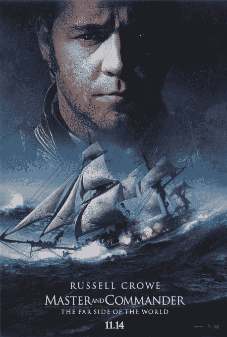

**MV5BMjA5NjYyMDM5NV5BMl5BanBnXkFtZTYwOTU5MDY2._V1_SY667_SX450_AL_.jpg** *(57.89 KB, 下載次數: 0)*

[下載附件](forum.php?mod=attachment&aid=NDQyMDl8ODQxNjViNDV8MTYwMDg5MDQ2MXwxODIzMHwxNzE5Nw%3D%3D&nothumb=yes)

2014-7-7 16:48 上傳

总之诸位有兴趣的话——某K强烈推荐。

2，【人设：男人，正太和迷之金发少女】

之前有说过，本文大量neta了《怒海争锋》一片，其中最典型的就是人物。可以说某K就是脑中就是带着电影中的形象写奥布里船长和威尔的。

“奥布里先生”，Russell Crowe的船长造型真是Man的掉渣……

<ignore_js_op>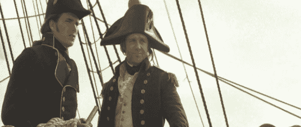

**masterandcommanderd23zt4.png** *(199.76 KB, 下載次數: 0)*

[下載附件](forum.php?mod=attachment&aid=NDQyMDh8ZDY4ZTEzNDd8MTYwMDg5MDQ2MXwxODIzMHwxNzE5Nw%3D%3D&nothumb=yes)

2014-7-7 16:48 上傳

至于“有些正太气的威尔”，自然也是片中比较显眼的正太。

<ignore_js_op>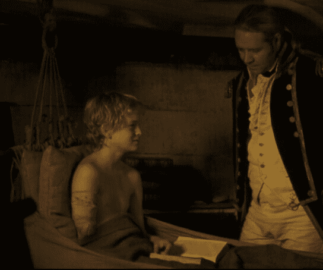

**QQ图片20140707084017.jpg** *(36 KB, 下載次數: 0)*

[下載附件](forum.php?mod=attachment&aid=NDQyMTF8MmRkMTQ0NzF8MTYwMDg5MDQ2MXwxODIzMHwxNzE5Nw%3D%3D&nothumb=yes)

2014-7-7 16:48 上傳

啊，不，这张是用来勾引剑爷的，应该是……

（捂脸

<ignore_js_op>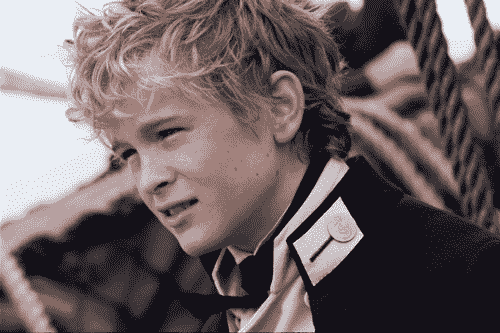

**perkis2.jpg** *(67.44 KB, 下載次數: 0)*

[下載附件](forum.php?mod=attachment&aid=NDQyMTB8MTg5MWY5ZTR8MTYwMDg5MDQ2MXwxODIzMHwxNzE5Nw%3D%3D&nothumb=yes)

2014-7-7 16:48 上傳

另外如果要neta英国历史，代表“苏格兰人打下来，威尔士人和爱尔兰人管理，英格兰人享受”的英帝国的最高战力——苏格兰人自然是必不可少的。

某K本人正身在苏格兰，通过见闻对这个神奇的国度也算是颇有好感。

“年轻的海兰德尔军官”即出于此。

<ignore_js_op>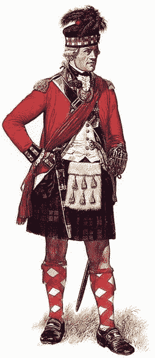

**v2_c2_s14_ss03_01.jpg** *(26.78 KB, 下載次數: 0)*

[下載附件](forum.php?mod=attachment&aid=NDQyMTV8NmMxN2I1MDh8MTYwMDg5MDQ2MXwxODIzMHwxNzE5Nw%3D%3D&nothumb=yes)

2014-7-7 16:54 上傳

3，【造型：奎瓦希尔】

“蓝色”的原型是Cuirassier，也就是胸甲骑兵，这个在文中已经提及。

原理嘛……人类=屌丝=步兵，天使=高富帅=骑兵，恩，就这么简单的逻辑。还有另外两支天使在文中也提到过，想必熟悉骑兵的读者自然已经猜到了出处。

<ignore_js_op>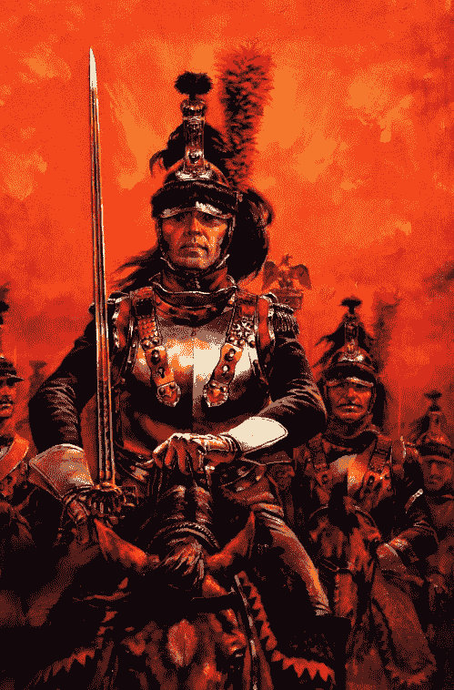

**cuirassier ROUGE copy.jpg** *(118.1 KB, 下載次數: 0)*

[下載附件](forum.php?mod=attachment&aid=NDQyMDV8YjQzOTQ5YTV8MTYwMDg5MDQ2MXwxODIzMHwxNzE5Nw%3D%3D&nothumb=yes)

2014-7-7 16:48 上傳

而为了制造科幻感，给予在“太空”中作战的能力，于是又套用了苍翼的素体设定。喷射器+翼刃

<ignore_js_op>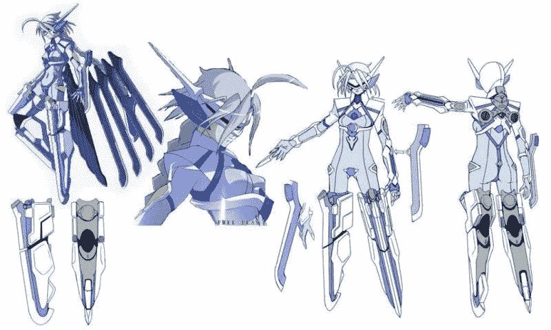

**blazblue-V131.jpg** *(69.98 KB, 下載次數: 0)*

[下載附件](forum.php?mod=attachment&aid=NDQyMTl8ZDBkZGJiMjl8MTYwMDg5MDQ2MXwxODIzMHwxNzE5Nw%3D%3D&nothumb=yes)

2014-7-7 17:19 上傳

不过单单只是发亮的装备似乎还不太适合脑补……然后“持剑华服少女”的原型则是水银灯。

<ignore_js_op>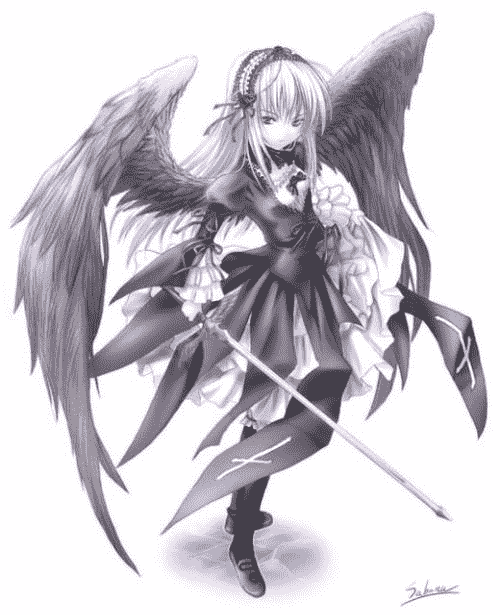

**20090714100953-1928313284.jpg** *(37.41 KB, 下載次數: 0)*

[下載附件](forum.php?mod=attachment&aid=NDQyMDN8NTRlMzA5NDV8MTYwMDg5MDQ2MXwxODIzMHwxNzE5Nw%3D%3D&nothumb=yes)

2014-7-7 16:48 上傳

或者chevalier中的斯芬克斯（感谢OB爷传教）

<ignore_js_op>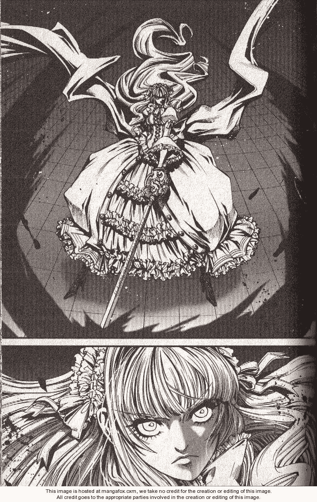

**cle_chevalier_d_eon_vol04_ch20.chevalier_vol04_p092.jpg** *(192.65 KB, 下載次數: 0)*

[下載附件](forum.php?mod=attachment&aid=NDQyMDR8Yjc4YzhmMTh8MTYwMDg5MDQ2MXwxODIzMHwxNzE5Nw%3D%3D&nothumb=yes)

2014-7-7 16:48 上傳

或者某完全不知道的图（顺便求出处）

<ignore_js_op>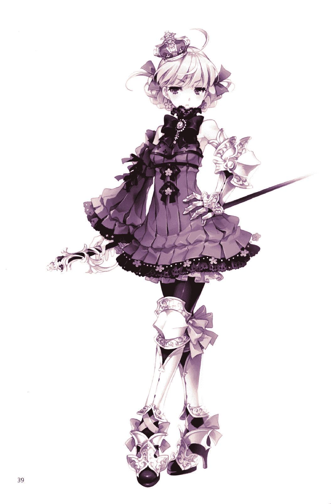

**f2c13a17cfafdf574a90a7a5.jpg** *(166.45 KB, 下載次數: 0)*

[下載附件](forum.php?mod=attachment&aid=NDQyMTd8ZmVhZDcxNmR8MTYwMDg5MDQ2MXwxODIzMHwxNzE5Nw%3D%3D&nothumb=yes)

2014-7-7 16:56 上傳

总之任选一者，在与胸甲骑兵和素体结合一下，乃就能脑补出“蓝色”的样子了，恩。

（居然是这么粗糙的设定！）（╯‵□′）╯ノ┻━┻☆

4，【乱入：审判庭和海军情报部】

抄完了历史抄电影，抄完了电影抄漫画，抄完了漫画又来抄桌游。

其实整个背景就是照着战锤40K翻版的，比如双持枪剑之类的……不过审判庭绝对是原封不动无节操的copy。

话说Iquisition本来就是neta西班牙伊莎贝拉女王的审判庭，所以某K照抄也没什么大问题。

（这能称之为理由么？！）

当然，用审判庭最重要的理由就是它的“模糊”特性。在大发现时代走向巅峰的审判庭，是真理与信仰，正义与残忍，公正与滥杀的矛盾结合体，既是愚昧又是睿智，既是光明又是阴暗，既是理想优势现实。这种阴阳倒错的昏暗状态，无论对于黑暗氛围的打造还是剧情的扩张都是大有裨益。

于是这是原版欧巴桑型审判官，请自行替换成萌少女类型。

（逃

<ignore_js_op>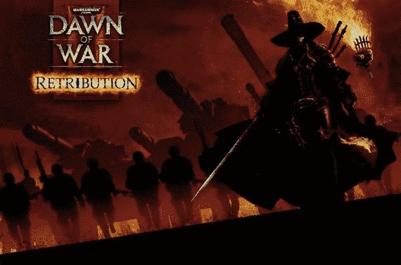

**post-152648-1294349300.jpg** *(126.94 KB, 下載次數: 0)*

[下載附件](forum.php?mod=attachment&aid=NDQyMTh8N2RhMzI1YTV8MTYwMDg5MDQ2MXwxODIzMHwxNzE5Nw%3D%3D&nothumb=yes)

2014-7-7 17:10 上傳

而海军情报部则是某K另追加的一个部门。原型是纳粹海军上将威廉·卡纳里斯率领的帝国情报局。

与审判庭相比，情报局显得更加单纯和“现代化”。但是熟悉纳粹历史的人都知道，“现代化”的帝国情报局的兴起和衰落的故事并不比古老的审判庭动听到哪里去。

<ignore_js_op>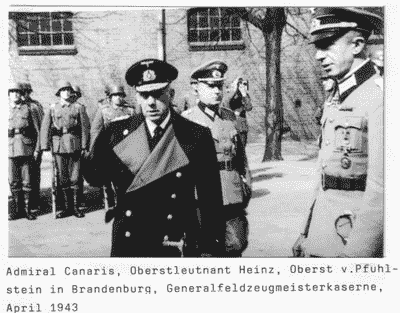

**Wilhelm-Canaris-picture.jpg** *(55.97 KB, 下載次數: 0)*

[下載附件](forum.php?mod=attachment&aid=NDQyMTJ8NGM1YjUwNmZ8MTYwMDg5MDQ2MXwxODIzMHwxNzE5Nw%3D%3D&nothumb=yes)

2014-7-7 16:48 上傳

喔，对了，还有飞弹君识别出的汉弗莱爵士。不识此人大名的请速去补习《是，大臣》。此乃人生的政治必修课。

<ignore_js_op>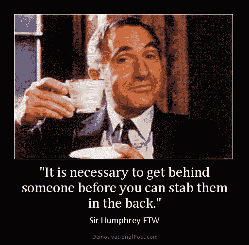

**it-is-necessary-to-get-behin.jpg** *(50.8 KB, 下載次數: 0)*

[下載附件](forum.php?mod=attachment&aid=NDQyMTN8MDg5MThmZTZ8MTYwMDg5MDQ2MXwxODIzMHwxNzE5Nw%3D%3D&nothumb=yes)

2014-7-7 16:52 上傳

所以，当汉弗莱爵士代表的——繁文缛节官僚横行圆滑变通阴险狡诈冷酷无情的现代文明和古老的愚昧同时运转的时候，又会出现怎样的矛盾和反差呢？这也是某K最感兴趣的场景之一了。

以上是某K觉得比较有代表性的原（捏）型（他）。如果任何人还有什么疑问的话也请随意提出。

（捂脸逃

最后，再次感谢飞弹君鼎力的评论和做图支持！某K会铭记于心奋力填坑的。

以上

 

# 9

*本帖最後由 karlchen0920 於 2014-7-26 19:16 編輯*

> [兔球小A 發表於 2014-7-25 19:08](https://giantessnight.com/gnforum2012/forum.php?mod=redirect&goto=findpost&pid=229107&ptid=17197)

> 首先，为什么这次没有在提前占好的楼层补完这个评论呢？呐呐，当然是因为时间隔得太久文章有点沉了。不过这 ...

那个时候A酱还是A君，卡车还是某K……看来半年的时间发生了好多事情，唯一不变的是某K的（渣）写作水准。

这篇文章确实是A酱一路审过来的，不过这篇回复却满满是新意，比如从头到尾不停的卖萌……咳咳。

最近跟着A酱学做设定，倒是有了不少心得。如果能早一些学起的话，这篇文章也不会如此纠结难产了。

文如其人，A酱的评论也正是围绕A酱所在意的核心进行的：人设。A酱对三组人物的注解可谓鞭辟入里，很多细节的把握着实让没有在意过的作者我也感到汗颜。

主角组的威尔和苔丝，是某K考虑的最多，讨论的最多的，也是纠结的最多的。事实上我自己也曾相信威尔救苔丝的情节应该算是故事的句号了，但依然鬼使神差地写了下来。

可以说，文章第六节之后的内容已经不属于开坑时计划的范畴了，也因此显得凌乱不堪。因为我只是“感觉”这个故事在本质上并没有讲完，但是究竟是哪里欠缺了依旧是一头雾水。直到A酱那句“威尔想拯救的真的是苔丝吗？”算是让我茅塞顿开。

故事是由矛盾点来推进的，要让故事继续推进，那么必然是威尔和苔丝之间还有残存的矛盾。

少女的秘密，少年的心结，都还没有道明。那么接下来的矛盾点也必然是围绕于此。

至于舰娘组，其实本来是准备当做福利用具的囧……不过写着写着忽然舰娘大人母性大发了（还是说某K自己的恋母倾向……）。总之A酱对这一对的判断都相当敏锐，某K自己写起来也是饶有兴趣的。接下来应该是作为剧情推进的关键人物吧。其实舰娘才是最有分量的角色哦！

之前已经说过，文章在第六章开始就属于追加了，所以裙子组自然是即兴添加……

最初的考虑是文章需要新的矛盾点，“年轻的安娜酱”这个脾性怪异的女孩和少年必然会有“很有趣”的互动吧？而给接下来的战斗加些火爆元素也是必不可少的。为此还专门和A酱讨论过如何的设定用来卖萌最合适（咦？）。

总之接下来就是各组人马汇聚，黑历史乱爆的节奏……介于A酱的提醒，某K也有了压缩节奏的新手感。尽请期待吧！

 

# 10

8月2日更新第九节于6楼：

[http://giantessnight.com/gnforum ... 7197&pid=226221](http://giantessnight.com/gnforum2012/forum.php?mod=redirect&goto=findpost&ptid=17197&pid=226221)</ignore_js_op></ignore_js_op></ignore_js_op></ignore_js_op></ignore_js_op></ignore_js_op></ignore_js_op></ignore_js_op></ignore_js_op></ignore_js_op></ignore_js_op></ignore_js_op></ignore_js_op>