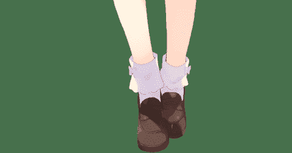
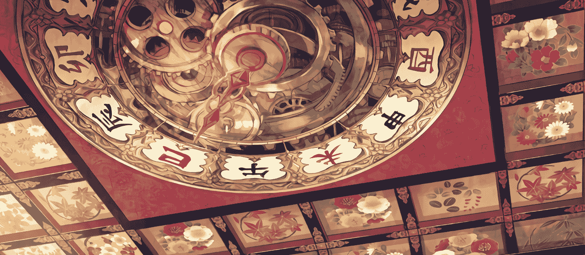
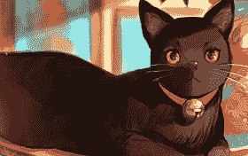

# 【挑战杯】 异世界幻想曲

作者：琉璃

TID：26545

 

# 1

*本帖最後由 琉璃 於 2019-3-10 10:15 編輯*

**注意：本故事纯属虚构，与现实无关，如有雷同，纯属巧合，本故事有点血腥成分，请酌情观看。****作者感言：啊哈哈，好不容易摸了出来主线，结果和平时写文一样，写着写着都跑题了，所以主线只能绝大部分推后了。如果喜欢看GTS的可以跳到第四章开始哟。原设定的主线还没展开，但看了下时间全部写完会赶不上比赛，只能先发出来啦！不过相信我，不是主线也很不错哟！****--------系列设定---------****登场人物**        凌乾（人类）：本剧男主角，从地球穿越到了樱花大陆        安洁茜莉娅（人类）：同样从地球穿越而来的异世界人，只不过安洁从男孩变成了女孩子，现在是樱花帝国的帝女大人（类似皇帝）        樱野琴（狐耳娘）：樱花帝国的皇女大人（类似皇后）        铃月姬（猫耳娘）：帝国的巫女        菲蕾雅（泰坦）：泰坦一族的贵族        依芙娜.菲丝帕尔（泰坦）：泰坦一族的小公主        玲子（猫耳娘）：樱野琴的贴身女仆，女官。        桃音萌（人类）：安洁收养的少女**--------------那么我们开始正片吧-------------****1.****小小的相遇**“真累啊！现在这年头打个工可真不容易”凌乾抱着巨大的箱子，从地下室慢慢走了上了阶梯，“现在的还有人在用这种劳动力么？”凌乾吐着槽。“啊！”脑袋里突然一片眩晕，身子下意识的往后仰去。凌乾失去了意识。“霹雳乓啷！”一个鲜活的生命凋零了

全剧终…..……..…………………………**“****喂！喂！你没问题吧！****”**一阵甜美的声音传来。凌乾甩了甩头，抬头仰望，看到一双洁白的白袜，上面还点缀的紫色的蝴蝶结，甚是可爱。而它们被一双褐色的学生皮鞋包裹着，显得十分漂亮又倍感亲切。凌乾在高中时期，学校的标准配置就是这种鞋子<ignore_js_op>

**依芙娜.菲丝帕尔的足.png** *(25.16 KB, 下載次數: 0)*

[下載附件](forum.php?mod=attachment&aid=NzcwMjd8NzMxMjdiOTl8MTYwMDg4NDE1NnwxODIzMHwyNjU0NQ%3D%3D&nothumb=yes)

2019-3-9 23:36 上傳

**“****他还有意识呢，依芙娜酱！****”**紧接着从脑后又传来的另一种甘甜的声音。**”****跑马灯么？我这是死了么？这难道就是天国了么？****“**凌乾自顾自的想着，哪怕望下四周也不能难发现这不是天国而是普通一个湖畔的草地上吧，然而对于刚刚穿越过来的凌乾，脑子一团浆糊根本没办法好好思考，本能地做出了反应。**“****既然是天国那就好好享受一番吧！****”**说着凌乾朝着女孩子秘密的花园望去。私图寻找一些自己梦寐以求的东西，不一会儿“哈斯哈斯”声都不由自主的喘了出来，所以说男孩子本性都很色么？**“****哈斯哈斯？？桃音姐姐，这个人没问题么？****“**听到奇怪词汇的依芙娜抬着头询问身后的桃音，却只见桃音不明所以的提示着什么。**“****哪个，哪个！依芙娜酱，你这样，他****…..****他****…..”****“****嗯？！诶？啊！****∑(****っ** **°Д °;)****っ啊啊啊啊！变态啊！！****”**想了许久，依芙娜终于意识到了眼前的男子在偷窥自己的群里，心中的怒气一下子燃了起来，高高的抬起左脚猛的朝眼前趴着的男孩子的脑袋上踩去。碰！一下不够再来一下，碰。在女孩子强烈的践踏下，凌乾的记忆就从这里中断了。

—————(≧v≦)转换视角(≧v≦)———————待到男子姆咕一下晕厥后，依芙娜依旧没有停止践踏的左脚。看见暴走的依芙娜像踩蟑螂一样猛踩脚下的人，桃音慌慌张张的上前阻止。**“****依芙娜酱，依芙娜酱！够了够了，再踩他可就死了啊！****”****“****哼～这种变态，死了反而好！亏依芙娜还担心他是不是溺水了！专门停下马车来救他。结果就是个变态，变态！！****”****“****先冷静，冷静！他已经晕过去了，不会再偷看你胖次了****”****“****咪咕！这样还不行，还不行****”**最终几分钟后在桃音的全力阻止下，依芙娜悻悻的一脸鄙视着盯着眼前趴着的家伙，赌气的瘪了瘪嘴。然而此时的男子后背上已经大大小小有近百只鞋印了。

**“****不过这是什么种族呢，也没有尾巴，穿着奇怪的服装。啊！没有什么特征和依芙娜很像，难道是人类么？****”****“****诶！****”**松开依芙娜的身子，桃音开始细细打量起趴着的人试图作出身份判断，可爱的边歪着头边用手指敲击的脸颊的举动，似乎思考的时候的潜意识动作。而对于桃音的猜想，依芙娜小声的惊呼着，连忙小跑到男子周围去确认，蹲下之前貌似想起了什么拍了拍裙子，在确保裙底不会在此被窥探后，才蹲了下来。**“****确实，除了性别，波长和我很像，难道真的是人类？****”****“****我觉得应该是人类！****”**桃音得意的捶了捶手，两人变擅自对眼前的男子种族做了定义。不过        ·····**“****哼～哼～哼～既然是人类，那么依芙娜就不客气了！妈妈说人类都是虫子一般的存在，就是给我们用来踩的！而且可以用本体踩的说真是太好了呢。****”**依芙娜阴沉着笑了起来，麻溜的站了起来，一副了不起的样子盯着脚下，一脸兴奋的就便自顾自的想要巨大化，看样子依旧没有消气呢，这也是当然的，偷窥茂陵少女的群底，就应该被扑杀掉。这是依芙娜的一贯作风**“****等下！不行！绝对不行，依芙娜回复本体的话，这家伙会变成肉饼的！****”**然而深知依芙娜本体是巨大的泰坦的桃音则不认为这是个好主意。“**要真的让依芙娜在这回复本体的话，周围一片都会变成荒芜了。****”****“****没关系的！妈妈说人类什么的都是害虫，不踩死是要污染环境的！****”****“****不是这样的！不是这样的！还有安洁大人哇，安洁大人也是人类族哇！而且！而且！还有我呢！！哇唔****”**然而依芙娜却一点不理会抱着她的桃音，瞪着脚边的人，默默的积攒起魔力。桃音虽然身体感受不到魔力流动，但隐隐觉得不能够防止不管，强硬的将将依芙娜推倒，两人倒在了湖旁的草坪上

**“****安洁大人是，安洁大人是特****……****特殊的！****”**几分钟后依芙娜慢慢的冷静的下了。低沉着脸，喃喃自语，有点失落的样子，似乎是感觉到自己没有在乎桃音的感受愧疚的道起了谦。**“****抱歉呢。桃音姐姐，你和安洁大人都是不一样的啦。****”****“****这种小事儿，没关系啦！反正我都习惯了。依芙娜的暴走也不算一次两次了。****”**桃音笑着摆了摆手，抱住了依芙娜，习惯性的摸了摸依芙娜的脑袋。**“****摸摸～摸摸～呀！果然依芙娜的触感就是好哇！****”****“****哇！不要这样！****”**抵不过桃音虎摸的依芙娜私图挣扎出来，不了一下子栽倒在地上。桃音则是见缝插针，直接扑了过去，就这样两个女孩子在倒在草坪上打闹。等到安静下来已经是十几分钟之后的事情了。

**“****那么，这个色狼要怎么办呢，依芙娜感觉杀掉就可以哇！****”****“****不不不，我感觉他和安洁大人差不多****……”****“****他根本不能和安洁大人相比啦！****”****“****不是那个意思，听我说完啦！****”**听见桃音将眼前的变态和自己喜爱的安洁大人相比。依芙娜很是不高兴嘟着嘴！挥着小拳头抗议着桃音，桃音轻轻的砰的一声敲了依芙娜一个脑瓜崩，表示她错意了。**“****哦****oωo****！****”**被弹了脑门的依芙娜再度变得温顺了起来。**“****我的意思是，这个家伙可能和安洁大人一样是异世界的的居民！****”****“****诶，这样么？****”**桃音踱着步，阐述着自己的观点，然而对于这么突然的话题，依芙娜则是脑袋上冒出了小小的问号，似乎不太理解桃音的猜测。**“****嗯，很有可能呢，他的衣服服饰很像安洁大人设计的呢。像本土的贫穷人类，怎么可能能穿得起安洁大人设计的衣服呢。****”****“****嗯，说的也是呢！****”**顺着桃音指示的衣服样式，依芙娜仔细看了看，确实和安洁大人曾经设计的颇有相似之处，只不过肯定比不上安洁大人设计的啦，嗯？不对应该是相差甚远，但却是有可能是同一个世界来的呢，毕竟安洁大人也说她设计的那些服饰也说自己原本世界存在过的。最终相思考了良久，依芙娜赞同了桃音的观点。**“****所以说呢，她可能是安洁大人相关的人，还是把他交给安洁大人好了。****”****“****嗯！****”**看样子两人达成了共识

**“****不过话这么说，要怎么带过去呢？****”****“****和普通人类一样，缩小就好了！****”****“****好，好主意！这样就算醒了他也不敢骚扰我了！****”**之后的关于如何搬运的问题，由于两位腹黑的少女都对这个男子行为表示不满的原因，男子就被擅自剥夺了人权，缩小化处理了，真是个这个邪恶的点子。依芙娜笑嘻嘻的说着咒语，将眼前的男子缩小化。而桃音则是**传话机**要求和安洁大人见面，本来好友之间见面不必那么麻烦的，但是现在安洁已经成为贵为皇家帝女，即便安洁大人自己不太在意，但是皇家的基本礼仪也不能放置不管，所以最后想来想去还是要预约一下。**“****啊！可不要装进鞋子里哟！会死的！****”****“****诶～****(** **﹁****﹁** **)”**拨打着**传话机**桃音似乎想到了什么，转过头对着依芙娜补充道。听到这话，依芙娜皂咂舌，脱鞋子的举动停下来。**“****你还真想这么干啊！****”**桃音无力的吐槽到，之后再次转过身与安洁取得联系。依芙娜则是看着眼前小小的男子，啧了口嘴，心里想着这个家伙真幸运啊。要是和安洁大人无关的话，就好好让他尝尝被困在女孩足下的感觉，让他再敢骚扰女孩子，看样子这个仇是真的结下了呢**“****唔，联系好了。安洁大人，似乎在文书殿。正好顺路！路过的时候过去一趟吧****”**几分钟后，通话完毕的桃音挂掉了电话，走到依芙娜身边，而在玩着手中的缩小的人类的依芙娜看到结束通话后，随意的把人塞进粗鲁的丢进口袋里，仿佛手中拿着的不是一个人，就是一个属于自己的道具一般。两人坐上路旁停留的马车，迅速的往文书殿驶去。不过似乎，事情真的有那么容易么？？

**2.****巨大国度**“唔！这是？”睁开眼睛，凌乾震惊了， 抬头望去，一排排巨大的书籍整齐的摆列在眼前，而顺着书籍往上看，又有一排，不几十排的书籍整齐的摆在面前，而头顶上，则是巨大的中式**和玺彩画**，各式各样的花朵用精美的浮雕样式雕翎在上面，凌乾熟知的荷花，菊花，芍药，到一些讲不出来的花朵，周围四处以金漆框起，形成了四四方方的瓦。密布在天花板上。<ignore_js_op>

**天花板.png** *(1.5 MB, 下載次數: 0)*

[下載附件](forum.php?mod=attachment&aid=NzcwMjh8ODg1MTk5Y2F8MTYwMDg4NDE1NnwxODIzMHwyNjU0NQ%3D%3D&nothumb=yes)

2019-3-9 23:36 上傳

**“****我这是穿越了么？****”**凌乾蹲坐在地方，迟迟不敢相信，“但这巨大天花彩绘，在现代已基本不可能用于现代建筑了。更别说如此巨大的木建，即便是古代也很少有这种规模的。”**“****莫非！这是异世界吧！****”**凌乾自己心里下了个定义“咚～！咚～！”巨大的钟声响起，咔嚓咔嚓的声音转动了起来。凌乾拍了拍身子，站了起来。顺着那声音望着。巨大的指针指向着**巳时**。**“****要是说穿越到异世界，反倒更好了。****”**正直中二时期的凌乾在闲暇功夫也读过一系列轻小说，看过那些龙傲天的穿越文，一想到自己将会有什么奇妙的体验和漂亮的美女后宫，心里就一阵甜爽。步伐也加快了。**“****不过，这也太大了吧！仿佛是巨人国度一样！****”**在走了不知道多长时间后，凌乾瘫倒在地上。“咚～”一阵声响。卡嘎卡嘎，指针指向了**午时**。<ignore_js_op>

**3CB0C16B-5EF6-455A-970A-AB41EBE81338.png** *(94.6 KB, 下載次數: 0)*

[下載附件](forum.php?mod=attachment&aid=NzcwMjl8OGFmODc1Y2J8MTYwMDg4NDE1NnwxODIzMHwyNjU0NQ%3D%3D&nothumb=yes)

2019-3-9 23:36 上傳

不知道何时，“喵～～！”的一声巨大的猫咪叫声从身后传来。惊醒了睡梦中的凌乾。**“****诶！****∑( °Д °;)”**眼前，巨大的黑色猫咪盯着自己**“****啊啊啊啊啊！！****”**凌乾一个猛子扎了起来，连忙转身就跑**“****怎么会有那么大的猫咪啊啊啊啊！！这里真是巨人国度么？？？？****”**然而猫咪聪明的就和读懂了局势一样，慢悠悠的踱步跟着。不一会儿，凌乾就脱力的倒下了。**“****再见妈妈！再见异世界！没想到到了异世界，我竟然会被猫吃掉！****”**在凌乾倒下后，猫咪扑了过去，把凌乾叼在口里慢悠悠的朝着书籍内侧走，想必猫咪有着自己的专门通道吧。**3.****丢失了**—————(≧v≦)转换视角～让我们返回到2小时前(≧v≦)———————**“****安洁大人！安洁大人！****”**在安洁兴致勃勃的坐在专用的书桌旁读书是，远处便听到，桃音兴冲冲的声音，引得不少人驻足观看，究竟是怎么回事呢？大家都在心里犯嘀咕哦。**“****安洁大人！安洁大人！****”**不过桃音并不在乎这些琐事。拉着依芙娜直接穿过了围观的人群，一副非常着急的样子**“****这些孩子还是那么的着急火燎的啊！****”**一旁读书的樱野琴视线从书籍上转移开来，无奈的笑了笑，安洁无奈的放下手中的魔导书，起身迎接。“安洁大人，唔噶！”看着眼前兴冲冲的跑来的桃音，安洁话都没说，首先就是一手刀劈了过去。**“****文书殿****里禁止喧哗！然后****…..”****“****这孩子还真像你呢？****”**没等安洁训完，一旁的樱野琴放下手中的**文书**，起身踱步来到安洁身边。**“****说什么呢，我才没那么兴奋。****”**看到樱野前来，桃音微微欠身。依芙娜则是狂点着脚尖望着安洁。**“****姆咕！算了，那么，出了什么事情，火急火燎的跑过来。****”**而一旁被一旁恶狠狠的反驳的樱野琴也不好意思继续打趣，询问起桃音。顺便摆了摆手，玲子见状退了下去。

**“****啊！是这样的，是这样的！安洁大人！安洁大人是从异世界来的吧！姆咕。****”**想起来了自己要做的事情，桃音再次慌忙起来，一不小心咬到了舌头。**“****慢点说别着急！****”**安洁安抚着慌张的桃音和依芙娜。而玲子小姐则是识相的接了两杯水过来。**“****咕～咕～咕～哈！～刚刚，刚刚呢，我们遇到了一个遇难者，很有可能是和安洁大人一样来自异世界的呢。不过，不过****”**依芙娜喝完水，匆匆的讲明了自己来的目的，越讲反而声音越小，最后啪的一下子抱住了安洁**“****嗯？？怎么回事？桃音你说说怎么了，依芙娜是被欺负了么？**”见状，安洁和樱野瞬间严肃了起来，空气里弥漫的压抑的气息。

**“****那个，实际上****……****，刚刚那个男的偷看到了依芙娜的胖次！****”**话没说完，两位皇女散发出了极度危险的气息**“****咿！不过，不过没关系，他被揍晕，本应该缩小带过来了。****”****“****嗯！嗯？？****”**听完桃音的话，两位皇女有点懵了，被揍晕？？被缩小？？异世界人？？**“****那个，是这样么？？****”**简单的确认一下。依芙娜则直点头，樱野叹了口气，威压散去。安洁则是哭笑不得的看着两位。**“****然后呢？****“****”****刚刚在找安洁大人的时候，弄****……****弄丢了！****”**扶着额头询问着后续，依芙娜这才支支吾吾的吐出来真相，眼泪在眼眶中打转，安洁这才明白两人为什么是如此慌张了。

**“****这还真是****……”**琴在一旁听着。喃喃自语道。安洁更是直接说不出话来。**“****啊哇！安洁大人，非常抱歉！本想着，本想着让安洁大人处理来着。****”**再也忍不住的依芙娜哇的直接哭了出来。**“****啊～～～！没关系，没关系，不哭不哭啊！****”**安洁嘴角抽搐的摸着依芙娜的脑袋安抚道。心里想着这下事情可变的麻烦了。就这样，光平抚依芙娜就用了半个多小时。

**“****唔，原来是这样啊。没关系哟，依芙娜酱，就算他死掉了也没关系啦。****”**在清楚询问好事情经过后，安洁想了想。随手拿起硬毛笔，迅速的写了什么。之后传来了卫士，将信件交给了卫士**“****把这个交给****铃月****。****”**“是！”简单的命令后，收到信件的卫士敬了个礼，离去了。而此时，“咕噜噜！”一声传来惊的两个女孩子脸通红通红的，也是。两个女孩子跑了那么久也累坏了。又哭了那么久，安洁抬头望望天花板的钟表都已经指向**午时**了，差不多到了用餐时间，难怪两个人的肚子都叫了起来。**“****琴！差不多该吃饭了吧！****”**安洁向着几案前托着脑袋低头思索问题的樱野发问了。**“****诶，这个时间了嘛？****”**樱野慢慢抬起脑袋，看了看几案上的钟表，上面用萝獸文写着11:15。**“****午前三刻了么，确实该吃饭了。****”**说着站了起来，命令两侧的女官把**文书**整理好，交给玲子。**“****走吧！****”**看见樱野起身，安洁便牵起依芙娜和桃音朝门口走去。

**樱花大陆**的夏天是很炎热的。刚一出门，一股热腾腾的热气就扑面而来。好在洛水作为文化之都并非像首都那么高楼林立，悠长的溪水和轻拂的杨柳稍稍缓解了心里的炎热感。**“****那么去哪儿吃饭呢？****”**樱野看了看太阳，伸了下懒腰。**“****许久坐着还真是****…..”****“****去狐滨楼还是徽香楼呢？****”**安洁询问着两人，倒是让樱野大吃一惊。**“****诶，徽香楼是北方高山菜系吧。****”**桃音歪着脑袋思量着，两个餐馆都挺好的，之后偷瞄了依芙娜一眼，决定还是选择依芙娜喜欢的吧。**“****嗯嗯，狐滨楼则是更倾向于南方森林菜系哟！****”**        听到熟悉的名字依芙娜则是眼冒金光兴奋的解说着，不过突然想到了什么兴奋劲儿一下子就没有了**“****不过是人类餐厅呢。****”**依芙娜喃喃自语道**“****嗯，果然****狐宾楼****吧！****”**望了望依芙娜，桃音心里也没多想，想来是把这次午宴的用途当作了安抚依芙娜而设立吧**“****诶！真的可以么？但是，但是****….”**桃音倒是满不在乎的说着，但依芙娜却着急向身边身为人类的同伴询问着。这倒也是，所谓的人类餐厅就是会拿人类作为食材进行烹饪的餐厅，虽然因为安洁的原因，作为普通人类稍稍有那么一点点的权利了，但是长达几十年的饮食文化可不是那么轻易更改的，似乎安洁登基之时也意识到这点，并没有取消人类餐厅的存在，也因此得到了很多人的拥护，当然这就是另外的一个故事了。**“****真的行么？不会被说什么么？****”**在依芙娜和桃音叽叽喳喳的讨论的时候。樱野则是担心的和安洁咬起了耳朵。**“****嘛，我装獸娘的时候已经吃过好多次了。再者也没取缔这些餐馆，在其他人类眼里我早已经是同类相食的种族叛徒了吧。****”**安洁一脸微笑，满不在乎。**“****关于这件事情，你可要负责哟！****”****“****嘛～这种小事包在我身上吧。****”**这两个人真是随时随地都可以不顾周围亲亲我我的

**“****欢迎光****…….****临****?”**正是饭点，狐宾楼里人满为患，熙熙攘攘，但此时如果跑出来一个人类呢？“砸场子？”这恐怕就是看到桃音拉着依芙娜窜进来的时候看板娘的真实心理吧。人声鼎沸的餐馆瞬间安静了下来。作为看板娘的狐狸小萝莉匆匆的跑进内堂不一会老板娘出来了。**“****那个？桃音殿？****“**老板娘倒是认识桃音，本身作为自由身的人类就不多，秉着“来着就是客”的想法引荐两位坐下来了，不过心里也琢磨着，这孩子怎么跑到这里来了。**“****啊！没事情，吃饭！****”**似乎猜出了老板娘的疑虑，桃音笑着解释着。而此时身后却引起了更大的骚动。**“****所以说，我猜这就是这样****”**樱野捂着脑袋，走进了店里，随后安洁也紧跟着快步走了进去。**“****琴殿下？安洁殿下？这是什么风把您俩请来了啊？****”**见两人前来，老板娘又匆匆的跑了过去，而周围的食客也匆匆的站起来示意以示尊敬。**“****嘛～打扰大家吃饭了，同为食客，大家都随意啊，都随意！****”**樱野熟练着掌控着局势。之后两人就随着大家的目光坐到了桃音那桌。**“****琳欣！拿****2****个菜谱过来！****”**看到安洁坐下，老板娘也大体明白怎么回事了。安洁大人本身就不是以常理出牌的人，本身是英雄王她正式以人类身为登上皇位的时候，这些做人类餐馆的兽娘们都一度认为自己经营不下去了，虽说安洁对萝獸一族贡献颇大，但毕竟人类，强烈的危机感也不免有很多人反对她，尤其是很多开人类餐馆的，奴隶商人，食材培育者，一时间各种“人类要重新奴役兽娘之类，必须推翻安洁的统治之类的”话语层出不穷。然而安洁什么也没做，对于餐馆只是说了写类如食品鲜度，卫生环境等细小的问题，这些事情做完合格的经营者自然心里十分明白，而询问那些培养食材的商人，他们也表示没收到任何限制。而后续的一系列措施，虽然的确人类的地位稍稍提升，譬如不能随意杀害虐待奴隶之类的，必须合理给奴隶提供三餐之类的，但是由于市场更规范了，对于兽娘们的收益反倒是越来越多了。大家这才真正意识到，眼前的这个女孩子，虽然身为人类种族，不过是和兽娘们一心的，并不会伤害到兽娘们利益。随之而来的拥护者越来越多，甚至最近都有些封神的味道了，大家在叹息这么好的君主却是个人族的同时，对于人类都本应该是牲口的认知也在慢慢的改变着。譬如像萝拉大人那种的，人类宠物化论调也慢慢出现了周围也渐渐出现了吵杂之声，不过大家也都好奇，这四位跑到这儿来就是会点些什么。不时地偷瞄着她们。**“****吃什么呢，吃什么呢？****”**桃音发着颤抖的声音的翻着菜单，残酷的菜单的确吓坏了她。人类寿司卷，人身刺身。各种以人类为食材的图片摆在上面。**“****那个****……****那个****……****后面，后面，会好些哟！****”**看着有点慌张的桃音，依芙娜小声的提示着。**“****诶？****”**桃音快速的翻到后面，素面，拌米。虽然也有小人，但很多都是装饰或者配菜。**“****这样的话，让老板娘把配菜去掉就好了。****”**依芙娜笑着建议着。**“****不行！这样就没意义啦！****”**不过桃音似乎并不满意，哗啦啦的又一次翻了回去翻了一圈，桃音也没想好吃什么，不过想到这是依芙娜家乡传来的菜系，随即歪过头问身旁的依芙娜“依芙娜喜欢会吃什么呢？”**“****那拌饭****…..”****“****拌饭不行！****”**没等依芙娜说完桃音就迅速的反驳了。**“****要点依芙娜喜欢的哟！拌饭什么的，才不是吧！**”**“****唔****····****才****….m”**依芙娜被反驳的哑口无言，怯生生的看着桃音。在注意到桃音认真的眼光后，无奈的低下了头叹了口气，哗啦啦的翻到某一页，别过脸指了指。**“****姆咕～****”**这下倒是轮到桃音哑口无言上，只见上面画着是一盘沙拉，翠绿的青菜配上红色的番茄很是有食欲，当然如果不看那些在碗里被淋了一身酱汁的小人的话。上面赫然写着，人类沙拉。体验食物绝望时的拼命挣扎，前所未有的痛快享受！**“****那****……****那****…….****给我两盘，人****…….****人****……****人****…….****人****……”**惊慌打颤的桃音决定当机立断，然而，人类沙拉几个字怎么也说不出口。**“****呜咕****…….****请给我们两盘这样的沙拉。****”**最终桃音还是认输了，别过脸指了指画面。**“****好的！两盘沙拉！****”**似乎是考虑到桃音的情况，老板娘也没说出人类二字。**“****外加两份酱油拌饭。****”**樱野则是点了安洁一直习惯吃的菜。**“****你不点下特色的**人食**么？****”**安洁打趣的望着樱野**“****不点，我单纯想吃拌饭！****”**樱野则是选择别过头去。**“****好的！那么清点一下，两份沙拉，两份酱油拌饭。请稍后****”**说完，便退下跑到其他桌点餐了。**“****似乎之后，酱油拌饭和沙拉要多准备些了！****”**老板娘离去的时候喃喃自语道。

等餐的时候是漫长而又愉快的，在店里面不愁没有意外发生。就在点完餐没多久。作为泰坦一族的千金，菲蕾雅走了进来。见她环顾了一下四周，眼神似乎对上了。**“****阿勒？安洁和琴大人，你们怎么在这里哇！****”**见到熟人后，菲蕾雅啪嗒啪嗒的跑了过来。蓝色的裙子一摆一摆的。**“****菲蕾雅酱，中午好啊****”****“****嗯！中午好，小萌姐，还有依芙娜大人****”**菲蕾雅乖巧的鞠了个躬，之后突然想到事情有点不太对。**“****诶？诶诶诶诶诶！小萌姐，你怎么会在这里哇！这里，这里可是人食店哟！****”****“****啊，这个我姑且知道呀！****”****桃音迷糊的应答着，不太明白菲蕾雅的意思。****“****那为什么在这里哇，小萌姐可是人类呀，这里都是会吃掉人类的家伙哟！啊呜一口就吞下去哟，吞进肚子里就再也出不来了哟！****”**菲蕾雅慌慌张张的解释着，还摆出一副怪兽一般啊呜一口吞人的样子。**“****那个啥，这些我都知道呀！吃掉会变成养分和魔力什么的，怎么了么？****”**桃音依旧迷糊的不明白菲蕾雅的意思，看样子两人是误会了什么。**“****啊哇哇！难道说，难道说就那么想被吃掉么？啊哇哇！那样的话只能让菲蕾雅来吃掉啦！嘎呜！****”**菲蕾雅慌张的说着奇怪的话，被一旁的依芙娜敲了胸口。**“****哦对了，依芙娜大人也在，难道想被依芙娜大人吃掉么？咕～～虽然不甘心，但是只好这样了。嘎呜！****”**看着菲蕾娜还没清醒过来。依芙娜再次敲了胸口。**“****那个，菲蕾娜酱是不是误会了什么啊！****”****“****住口安洁，作为人类的你就应该被菲蕾雅一口吃掉，在菲蕾雅伟大的肚子里度过余生，嘎呜！为什么打我嘛！哇唔！****”****“****坐下！好好听着！****”**触及到安洁的事情依芙娜似乎生气了**。****“****是！****”**菲蕾娜也变得温顺了起来。**“****姆咕，有依芙娜大人护着，菲蕾雅也暂时原谅你吧，不过！总有一天安菲蕾雅会把安洁啊呜一口吞进肚子里的！****”****“****噗～****”**似乎想到了什么，桃音笑了起来。不过似乎依芙娜也想到相同的事情了，姆～的嘟起了腮帮子

**“****什么嘛～原来是就餐哇！我还以为小萌姐想要变成食物呢！****”**菲蕾娜坐在椅子上，双脚一悠一悠的晃荡着。**“****所以说为什么会有这么奇怪的想法啦！****”**依芙娜双手嘎吱嘎吱的钻着菲蕾娜的太阳穴**。****“****嘎呜呜！好痛，好痛，放弃，放弃哇！****”**菲蕾娜则是痛的求饶。“**明明安洁大人也是人类啊，为什么会误会啊！****”**桃音呢，则是苦笑着询问悠哉悠哉的菲蕾娜**“****安洁是特殊的哇！是预定被菲蕾雅吃掉的人，而且安洁脑袋很怪****”**菲蕾娜一副我没瞎说信誓旦旦的模样。双脚依旧晃来晃去的。**“****叩啦！什么叫脑袋很怪哇！****”**安洁假装一副很生气的样子，想要教训菲蕾娜，然而菲蕾娜根本不在意的依旧我行我素。**“****哼～区区安洁人类也就说说，人类什么的就应该进菲蕾娜的胃袋里！****”**说着，菲蕾娜的肚子也应景的叽咕了一声。**“****所以说你来吃什么的啊！****”**没好气的安洁反倒是询问道，菲蕾娜这孩子本身就是傲娇，一直说着要吃安洁，要吃安洁的，但即便是安洁最弱的时期，菲蕾娜也是一脸的，“菲蕾娜今天心情好，就赐你多活一天”的表情，大家最后也都习以为常了。**“****对了对了！师傅！我要一份人类素面！多放些人类！要和安洁一样的女孩子！****”**经过安洁的提醒，菲蕾娜才想到自己还没有点餐，连忙点了朝着厨房的方向点了餐。**“****哼哼～要满碗人类！当着安洁的面好好的吃下去，好让安洁理解到自己未来的命运！****”**得意洋洋的似乎想要把素面里的人类都想象成安洁吃掉。“好！好！”似乎因为是受到元气的菲蕾娜的影响，厨房里的厨师也高喊着回应。看样子菲蕾娜算是这里的常客了。

**“****人类素面？****”****桃音一脸好奇，刚刚似乎在菜单上并没翻到的样子。****“****啊那个是****·····”**依芙娜也吃过人类素面，似乎考量着桃音可能受不了，刚想蒙混过去的样子，然而却被菲蕾娜抢了先**。****“****人类素面可是很好吃哟！尤其是夏天呢！面条滑滑的，咸咸的，里面的人类虽然冰冰凉凉的！但是咬开以后流出的血液是温温热热的，很舒服的感觉。****”**菲蕾娜一脸软趴趴流口水的样子。极力想表达出有多好吃，不过可能桃音听起来算是极其恐怖的话吧。不过菲蕾娜则是依旧幻想着吃素面的样子，没有看到桃音脸都黑了，直直的盯着菲蕾娜的嘴巴，小小的虎牙若隐若现，似乎就是这么可爱的虎牙，在吃饭的时候对着人类进行着惨无人道的屠杀吧。**“****小萌姐点的什么呀！****”**不一会清醒过来的菲蕾娜又再次开启了话匣子。**“****嗯，是沙拉！****”**发现菲蕾娜清醒过来的桃音害羞的移开了视野，小声的说道。不料又把菲蕾娜的馋虫给勾引了出来。**“****啊！沙拉哇！沙拉我也喜欢呢！和素面不同，沙拉的人类正好是一口一个呢。带着酱汁含在嘴里超级舒服的，能感受到人类在我嘴巴里挣扎，但是完全抵不过菲蕾娜的舌头，慢慢的化为绝望，最终再也无力挣扎，真是太美妙啦哇，之后无论是咕咚一声咽下去还咬碎都有一种作为支配者的优越感呢，果然人类的命运就是应该这样的说！安洁什么的，不要当什么女帝了，乖乖进菲蕾娜的胃袋吧****”****“****啊哇哇哇！****”**听着菲蕾娜的描述，桃音更是惊慌失措。不过菲蕾娜似乎错以为是期待了。**“****唔哇？小萌姐也很期待啊！****”**菲蕾娜高兴着晃着身体。椅子吱嘎吱嘎的作响。**“****嘛～似乎事情有趣了起来****”**樱野则是没心没肺的笑了起来。———————终于，就算桃音怎么祈祷时间变的慢些。该来的还是回来。毕竟作为顶级的饭馆，狐宾楼的质量和速度都是顶尖的。樱野和安洁这边，一副樱花托盘下，摆放着是一碗香喷喷的米饭，上面浇着金灿灿的鸡蛋，一碗翡翠蔬菜汤，一小碟酱油以及一个透明的圆形的小盒子，这小盒子里这道菜的亮点，也就是人类了，只见盒子里密密麻麻的放着大概几十个缩小后的人类。有的惊慌失措的抱着彼此，抬头通过扭曲的器壁望着安洁和樱野，有的则是击打着器壁做着无用功。看到这个场景，樱野跃跃欲试的盯着这些小家伙，不过安洁则是一脸的扑克脸。看样子本来也没想吃人类的样子。而依芙娜和桃音这边是摆放着翡翠玉碗，里面装着生鲜菜，岭果以及各式各样的水果切块，以及五六个正在拼命往上爬的小小的人类，桃音碗里倒是还有几个恶狠狠着看着两人的人类，仔细看看似乎还有的小人被水果压住无法动弹，想必在青叶之下，还有大量的人类吧。除此之外，配套的还有一小尖嘴酱料碗，装着金黄晶莹蜂虫蜜，以及一排金黄色不到10片怎么看也不像是能够吃饱的面包切片，想必全靠正餐还是在碗里的人类吧。依芙娜则是兴趣勃勃的样子盯着碗中的人类。咕咚咕咚的咽口水，果然是依芙娜最喜欢的食物呢。而顺着气势点了和依芙娜相同的桃音则是一脸惊慌的看着碗里的人。尤其看见几个恶狠狠的看着自己的。这倒也是，如果说类似兽娘，泰坦这种其他种族或者安洁的话，碗里的人类们会被其气势吓到。而桃音则是正儿八经的本土人类，在遇到安洁前甚至都是奴隶，也没吃过同类，自然也没有什么气势。而碗中人类似乎也认知道了这点。恶狠狠的盯着眼前巨大的女孩，完全没吧自己处境看在眼里。活脱脱的凸显个欺软怕硬。至于菲蕾娜那里，一碗螺纹碗内装着白色的面条以及晶莹的面汤，面条上许多紧抱着几厘米的人类。层层叠叠如同小山一样。不断有人类因为站不稳而跌落到汤里，部分水性好的倒可以在汤里游泳存活，而绝大部分跌进汤里人类都只能挣扎的沉入汤底。**“****啊！不要死的那么快啊！真是的当食物都不合格！****”****菲蕾娜一脸嫌弃的低头看着碗里的小人。仿佛天生就是支配者，人类本应该为她所食一般。****“****我还想好好的感受你们的挣扎呢！好好加油哇！人类桑！嘛反正最后也会被菲蕾娜吃掉就是了！咔～咔～咔～话说安洁，快点礼拜。不然这群弱小的人类都死光了！那样的话，菲蕾娜只好大发慈悲的把安洁当配菜了哟！****”**菲蕾娜看着越来越少的存活量，催促道**“****好好，那么嗯咳，那么并非正餐又是熟者就不虚繁礼了，那么诸位开动吧！****”**待到安洁致完词后，五人边开始就餐了。安洁本身本身也不喜好吃同类，所以在米饭上浇完酱油也就没有动那瓶装满人类的调味品，这或许也就是樱野为什么给安洁点这个的原因吧。不过不愧是老夫老妻了，樱野这边首先倒是直接倒上了人类，哗啦啦将瓶子旋转90度，加上光滑的器壁，根本不可能残留在瓶子里，就这样，大量的人类就如撒芝麻一样，跌倒了蛋黄以及米饭上，满满的堆积成了小山，不知道是幸运还是不幸，柔软细腻的食物，使得她们并未受伤，然而相比很多人都想直接这样死掉吧然而，接受了自由落体的而大喊大叫的人类还在掉落惊魂未定的时候，樱野则是迅速的直接淋上酱油，如同凭空出现的一桶水浇在人类全身上下，只不过，这在樱野尝起来淡口酱油，在缩小的人类面前则是呕咸呕咸的，许多人都直接咳嗽了起来。樱野则是根本不管这些，直接提起筷子，快速的连同人类一起搅拌了起来，虽然米饭足够柔软，但在快速搅拌下也足矣割裂这些缩小的人类的脆弱身体，更何况坚硬的银筷不停敲打的她们。还没等樱野开吃，人类就几乎全灭了，把人类的碎肉碎肢就充当肉沫，血液当作咸味调味品这似乎就是樱野的一贯做法。当然这些都只是缩小的人类临死前才能体验的，在他人看来，樱野也只不过是在普通搅拌着食物。**“****嗯****····****果然你还是不用么？那么还是和平常一样给我吧****”****，**看着安洁丝毫没有动自己那瓶人类，樱野叹了口气说道**“****嗯，拿去****”**就和习以为常一样，安洁将手旁的罐子教给了樱野。看样子安洁瓶子里的人类还是逃避不了死亡的命运呢，就如之前一样，樱野理所当然的把瓶子倾斜，将小人倒了进去。然而这份理所当然让被倒进去的小人全部都吓呆了，虽然从被食物培养开始，兽娘们吃人类就如吃普通食物一样，一直被这样的教育着，但实际体验就是另外一回事了。在这些人类看来，褐色的大地，四周到处四横遍野，恐怕是永远想不到的画面，而更可怕的是自己即将死去这件事吧。没有一丝丝想要逃离的想法，甚至脑子都停止了，樱野就这样理所当然的把米饭连同无论活着的人类，还是死去的死体一起，夹了起来，放进嘴里，咬了下去，就和吃普通食物一样，没有丝毫犹豫，丝毫没有给人类们反应的机会。

菲蕾娜也是和樱野一样，天生的就认为着人类就应该是食物，不过与樱野的理所当然不同，菲蕾娜更在意人类曾经的身份，更喜欢体会这种从曾曾经的世界主宰沦落到自己口粮的优越感。所以菲蕾娜更像喜欢像家里的家猫一样，对人类进行惨无人道的戏虐，在对方绝望后才慢慢弄死。所以在安洁礼拜结束后，菲蕾娜就迅速的拿起筷子，冲着上面配菜人类加了过去，一个个人类单纯就是保持在面条上都已经很难了，更别提移动了，只能惊叫的，看着巨大的筷尖加了过来。**“****哼哼，一个安洁，啊呜，两个安洁，啊呜～哧溜～哧溜****”**似乎是真的吧食物里的配菜当安洁看待了。小巧的舌头玩弄着两个可怜的“替死鬼”。偶尔巨大的虎牙对着嘴里的小家伙们，指指点点，让她们感受身体将要刺穿的恐怖，偶尔把她们放在臼齿上慢慢挤压，让她们感受下被牙齿咬死的巨大恐怖，然而当然，最后一步肯定是这个。**“****安洁，安洁，快看这个！快看这个！****”**菲蕾娜含着两个被吓坏了的小人，口吃不清的对着安洁呼喊着。**“****阿～啊～，又来了么？****”**安洁似乎也习惯了这个定番了**。****“****啊～～！姆咕～姆咕****”**菲蕾娜张着嘴巴，只见小小的舌头上，牙齿旁蜷缩着一个人类，而另一个正在菲蕾娜的舌中心。**“****按揭～最后～会似则样滴！****”**张着嘴依旧口齿不清的菲蕾娜说着什么，慢慢的把舌尖隆起。而里面的女孩子，满脸的口水，一脸绝望的看着前方，身后就是漆黑的食道，而慢慢上台的舌尖，使得整个身体慢慢的往下滑，即便是拼命的想要抓住稻草，也无济于事，因为周围根本没有可以抓取的地方，而女孩子就在刚刚看到了什么，似乎想要求救，也是在那巨大的嘴唇之外，一双漆黑的同族的瞳孔盯着自己，想必谁也会吃惊的希望可以求救吧。“救～！”然而还没等说完，咕噜一声，菲蕾娜的舌头一抬 ，小嘴一闭，等再次张开之后，中间的女孩子已经不见了。随后，菲蕾娜的舌头轻轻一拔，把牙齿附近的女孩移到中央。再次让安洁观察起来，一模一样的吃法，带给了嘴里的女孩子一模一样的绝望感。**“****哼哼！像安洁一样的人类就这样无力哟！连菲蕾娜的舌头都抵不过，当然只有被菲蕾娜吃掉的命运啦！****”**菲蕾娜啪嗒一声跳下椅子，骄傲的挺着没有料的胸部。**“****就让无力的安洁体会下胃袋里的场景吧。****”**就这样说着，把自己的肚子贴上了安洁的耳朵上。当然，除了咚咚咚的心脏声，肚子里间接性发生咕噜咕噜的消化声以外，菲蕾娜让安洁听的，自然还是刚刚那两个女孩子在肚子里的悲鸣以及挣扎声。**“****咔～咔～咔～！感受到无力了吧，菲蕾娜肚子很厉害的，用不了多久，人类就会变成属于菲蕾娜的血肉啦！****”****“****诶！这样么，好厉害，好厉害。****”**安洁习惯的敷衍着菲蕾娜，菲蕾娜则是自满的笑着，啪嗒啪嗒的再次回到椅子上。**“****哼哼，安洁也就只能在这个时候逞能了，等菲蕾娜打败了安洁，就会向这些人类一样把安洁吃下去，姆咕～姆咕～。到哪额时候，安洁只能在菲蕾娜的胃里绝望着求饶了！****”**菲蕾娜说着习以为常的话，接着加着活着的人类，一边玩弄的，一边把她们活生生的吞食下去。似乎是习惯把喜欢的食物先吃完的类型。**“****姆咕！都怪安洁讲话太慢，人类都死了一半！嘛，咀嚼人类也是很有趣的，可惜安洁不看****”**不一会，在活的人类吃完以后，菲蕾娜则是悻悻的开始吃已经奄奄一息的人类，而等待她们的，就是巨大的牙齿无情的分割了。而关于这个，之前菲蕾娜也是向安洁展示过的，巨大的嘴巴里血彤彤的，只有一堆肉泥，和几个能觉得是人类的部位，只不过在安洁“别给我看这个！吃不下去饭啦！”的抗议下只能乖乖听话了。

至于依芙娜和桃音那边，依芙娜是熟练的打开酱汁碗，将蜂蜜，哗啦啦的洒在了碗里的人类身上，黏糊糊的酱汁，让很多人类都动弹不得。也有部分依旧在挣扎。依芙娜轻轻将酱汁搅均，就着面包片，嘎吱嘎吱的吃了起来。水果，人类，蔬菜，面包，似乎是这样顺序。平日里胆小可爱的依芙娜在此时也逐渐显现出支配者的身份。双筷轻轻一夹，准确的把人类夹起，之后是毫无犹豫的塞进嘴里，筷尖上的小人只能一瞬间看到巨大而又恐怖嘴齿，其实在平常人看来，依芙娜的嘴巴也是属于小巧的那种，小小的牙齿更是精雕玉琢般的精致可爱。然而当沦为食物的人类来看，这便是恐怖的断头台吧。依芙娜依旧如同嘎吱嘎吱的咀嚼着人类和面包片，在合理的分配下，牙齿上没有占有半点血迹，恐怕都被后来的面包吸收清洗干净了吧。即便是剩下的一丝半点儿，又怎么能敌得过依芙娜的唾液呢。沦为食物的人类，看样子连污染可爱的依芙娜的齿间的权利都没有呢。桃音盯着依芙娜的嘴角，这样想着，而之前菲蕾娜那边的行动看样子已经给桃音不小的打击，对上菲蕾娜的眼神的时候还在躲躲闪闪的。无论是安洁大人还是菲蕾娜酱，依芙娜酱，大家真的是厉害的支配者呢，这样的想法冒出来也不足为奇，毕竟眼前的一桌，安洁作为异世界人姑且不论，只有自己本应是奴隶身份。甚至可能本应该是菲蕾娜酱或者依芙娜酱的盘中餐。然而现在自己却摇身一变，变成了自己同胞的享用者。这真的可以么？低着头，望着谩骂的自己同类相食的人类，听着“自己也本是人类，应该有人类自觉的”的言论，尤其几个人“纵容这帮恶魔，早晚会被他们吃掉”的言论，桃音陷入的沉思。或许向菲蕾娜酱所说那样，被依芙娜酱或者菲蕾娜酱吃掉才是自己正确的命运吧。“**唔？小萌姐？吃不下去么？不要勉强，吃不下去就换一盘吧。****”**似乎是察觉桃音不太对劲，依芙娜向桃音询问道。**“****唔，嗯，我没问题的！不用换啦！****”**桃音有些无精打采。低着头应答着。迷茫的慢慢地提起筷子，朝碗里的人类伸去。**“****嗯！嗯！没错哟！小萌姐，像人类这样的种族，就应该像嘎呜，嘎呜的被我们一口吞掉，啪呲啪呲的被我们大口嚼烂，最后化为我们的血肉啦！****”**菲蕾娜则是没心没肺的说着残酷的话**“****菲蕾娜酱，别这么说啦，桃音姐姐不也是人类吗？****”**依芙娜没好气的反问着。**“****才不是！！小萌姐是我们的伙伴，和那些低微的人类不同，芙蕾娜才不会吃小萌姐呢。****”**菲蕾娜说的如此理所当然，倒让依芙娜哑口不言了。**“****噗哈～****”**不过正是因为这份理所当然反倒是让桃音笑了出来。**“****没错呢，和菲蕾娜酱，依芙娜酱，还有大家是伙伴呢～被伙伴吃掉什么的，这种事情不会发生的。****”****“****嗯！当然啦！小萌姐还是笑着可爱！****”**菲蕾娜酱依旧开朗着笑着。离间自己与好友的感情，后果可是很严重的！将自己的恐惧与自卑抛出脑后，桃音自视着眼前的食物。而碗里更多的人类丝毫没有认识到这点，反倒是觉得桃音害怕了，更加明目张胆的谩骂了起来。各种对自己以及自己好友的粗鲁的言论都冒了出来。丝毫没考虑到桃音已经是怒火中烧了。借着生气劲儿。桃音没有迷茫的夹起了筷子。夹向了谩骂最严重的那位作死的食物，是的，桃音眼中，他已经被看作真正的食物。而眼前的食物依旧谩骂的，似乎丝毫没有害怕的样子，不过似乎打颤得双腿已经出卖了他。慢慢的夹起，缓缓的朝青唇靠去。食物才真正认识到了自己的处境，开始求饶，然而此时已经晚了。“咪咕”一下，吞进嘴里，感受着食物的轻微挣扎，即便是自己的舌头轻轻摆动，食物也无法反抗。或许这就是餐点封面上说的前所未有的痛快享受吧。就如芙蕾娜所说，作为支配者的强烈优越感，在口中以及心里慢慢升起，而作为本应同族，这种优越感被无限的放大，更何况还有对朋友诋毁的报仇成功的兴奋。各种感受夹杂在一起，真的可以说是美妙绝伦。不过，试着咔吱咔吱的咬下，似乎还是有点抵触，牙尖在食物面前滑来滑去，就是没办法狠心咬下，只好“姆咕”一下把口中的食物，活生生的吞下。“嚼碎什么的还是下次再说吧！”桃音这样想着，许下了下次再来吃的诺言。“似乎已经喜欢上呢。”而碗里的人类看到这个场景已经吓得说不出话了，敏锐的人已经感受到了气息的改变。慢慢低下的瞳孔中，不再是对于同族的迷茫，而是转换为了对于食物强烈的渴望，在他们见证下，眼前的少女真正意义上的从一个人类同族到人类支配者的蜕变。**“****诶嘿嘿！好吃吧，浇上蜂蜜汁会更加好吃哟！****”**看着桃音意犹未尽的样子，依芙娜则是体会到了喜欢上同一食物的兴奋感。**“****桃音姐姐～啊！****”**兴致勃勃的依芙娜加了自己碗中的人类举了过去。而看着满身黏糊糊的人类女孩。桃音则是啊呜一口含住，丝毫没有看到人类少女那绝望的泪水。或许看到了，但是那又怎么样呢，对于桃音来说，眼前只是食物罢了。**“****嗯！超满足的！****”**咕咚一声吞咽下去后，桃音满是兴奋的托着腮帮子，打开酱汁碗，从容的将酱汁洒下，仿佛之前的犹豫都是不存在一般，两人开心的交谈喂食着。碗中的人类渐渐的越来越少了。就这样愉快的正餐时间结束了，不过话说回来，铃月，可真是慢呢。--------------------**专用名词：**        **樱花帝国：**兽耳娘们统治的国家，由于人类曾经对其发动侵略战争而仇恨着人类，但是因为种种原因，接纳了安洁茜莉娅，并且奉她为皇帝，与她相关的人类也不再会被敌视。同时樱野琴作为原皇太女，辅政，形成二圣临朝的模式。        **萝莉泰坦：**即便是变大也是萝莉形态的泰坦。是泰坦一族的稀少种。        **传话机：**类似电话的东西，可以实现远距离通话，以及会面。        **巳时：**10点整**午时：**12点整        **午前三刻：**11:15        **文书殿：**类似现在的国家级图书馆。        **文书：**奏折        **樱花帝国：**樱花帝国所在的大陆        **洛水：**作为樱花帝国的陪都，坐落在首都长阳的东面，与首都长阳的错落繁华不同，洛水更加强调自然和谐，所以可以看到婉转的溪水以及天人合一的建筑群落。拥有文化古都的称号，文书殿，文史殿（历史博物馆），文画殿（绘画博物馆），三大殿堂位居中心，而著名的大陆学术高校也因此坐落于此。        **萝拉大人：**特指萝拉·艾拉。魔法能力爆表人类，作为精灵艾拉的宠物被宠爱着。据说两人生活十分甜蜜。        **狐宾楼：**主打从西南方平原传过来的菜系，是著名的小人餐厅,        **人食：**特指拿人类做的菜</ignore_js_op>  

# 2

> [狐乐 發表於 2019-3-11 06:44](https://giantessnight.com/gnforum2012/forum.php?mod=redirect&goto=findpost&pid=399928&ptid=26545)

> 感觉写的很厉害呢！

> 

> 我是说，我很喜欢这个背景设定，感觉写的很认真，字里行间都可以看到一些以前的故事。 ...

原先是有，不够为了给读者留想象空间就删掉了 

# 3

> [狐乐 發表於 2019-3-11 08:54](https://giantessnight.com/gnforum2012/forum.php?mod=redirect&goto=findpost&pid=399932&ptid=26545)

> 啊啊。

> 

> 也好，的确让读者自己想象也不错。。。

哦哦哦！！确实这块是个bug呢，谢谢反馈的说，这块我会改下的

 

# 4

> [eventually 發表於 2019-3-17 13:47](https://giantessnight.com/gnforum2012/forum.php?mod=redirect&goto=findpost&pid=400523&ptid=26545)

> PS：重点其实不是无关的插图多而是有关的插图少啊！没必要删图的大佬！排版辛苦了！

> PS2：虽然不知道剧情 ...

写着写着剧情就脱离主线了，所以基本上和主线无关了，基本上这是个卖人设和卖设定的文章，如果能想象出一个这样的兽娘帝国就真是太棒了呢。吃人只是用于体现人类被剥离智慧种族后的悲惨境遇，当然一切都是咎由自取的。就像桃音食物里的人类一样欺软怕硬，挑拨离间，也难怪可爱的女孩子们对待人类那么黑化了。说起来我还真有点愤青呢。</ignore_js_op></ignore_js_op>