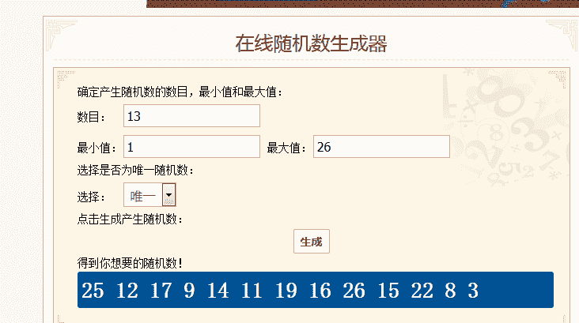

# 【挑战杯】元旦及新春文章大赛（决赛开始啦！）

作者：key

TID：26229

 

# 1

*本帖最後由 key 於 2019-3-22 17:42 編輯*

决赛投票

[https://giantessnight.com/gnforu ... hread&tid=26605](https://giantessnight.com/gnforum2012/forum.php?mod=viewthread&tid=26605)

GiantessNight管理组向您致以新年祝福            

在2018年，GN经历了许多危机，换了服务器，改过域名，维护过数次，但最终也没有逃离被墙的结果。但我们依旧聚集在这里，不离不弃，在这里首先感谢各位的支持与厚爱，相信我们一样能渡过这次危机，完成这次挑战。我们也在努力，希望给大家更好的体验，不管如何，愿GiantessNight的小小夜空长明不暗，大家一起齐聚GN这片小小的星空之下。

现在，持续数年的新年活动又來了。本次活动命名为挑战杯，遗憾的是，因为我个人能力不足，虽然还是大家熟悉的活动，但暂时只举办文章组部分。

本次活动不做主题上的规定，请各位能够更好地发挥自己的想象力，但如果涉及对论坛内同好的文章进行二次创作请先获得本人同意，如遇到投诉侵权问题产生纠纷可能会取消参赛资格，请注意。

挑战杯文章大赛 2018.12.26----2019.3.10

以上是本次活动时间长度，是的，你没有看错，本次活动时间回溯了。以前的活动存在一个很大的问题就是宣传力度。文章区发文的人不知道有活动就发了，过后才发现没有活动。文章区的读者不知道有活动，导致活动区人气惨淡，回复凄惨。

所以本次活动不设活动区，直接发布于文章区。如果各位作者愿意参加本次活动，请在标题写明“挑战杯”。如不愿参与，也请在标题注明不参与信息。

当然这样还是会有很多作者看不到，在活动期间我会对标题没有表明的新发布文章的作者进行私信询问其是否参与文章，如果您始终拒绝对我进行回复，最终将默认您选择不参与活动。

即本次报名方式有主动报名，但是满足要求的版主也会发去邀请。

并且本次活动会回溯五天，询问这几天发布文章的作者是否参与活动。

同时第二项改动，文章区版主将会全程关注此次活动。

。。

作为活动发起人我个人会尽力对所有参赛文章进行感想回复，希望能达成这个目标。

eventually版主表示他会尽力评论，他在gn被称为回复之神，有兴趣的可以翻看之前的回复。

咯咯版主表示写的好他都会评价，但是不知道他的标准究竟为何。

迷途小喵版主表示她会对“巨大屬性 growth 慢成長 無法控制大小 兩人競爭”这几个她感兴趣的类型回复，也可能会对“沒興趣的題材評出太嚴苛的結果”，各位抖M们，兴奋了吗？

如一开始所说，本次活动命名为挑战杯，不止是指论坛面临的挑战。我们每个人在生活中也常常面临挑战。我对于所有文章回复的目标也是对自己的挑战，也希望各位挑战自己 即使未想过写文章的人也能迈出尝试的一步。

注：

1\. 本次的挑战杯文章大赛投票權依旧交給全體論壇版友，采用指定主题内参与投票的方式，在活动时间结束后将会设置公开性投票贴供各位选出自己最爱的作品

2.活動期間內，如果各位版友在活动文章的心得被视为有价值心得的话将会另有积分奉上

3.挑战杯文章大赛参赛的作品字数需超过5000字（包含5000字）方可被认定为合格参赛作品，可得到参与者奖励

4.挑战杯文章大赛将截止至3月10日23：59，之前发布的作品仍可继续更新。

5.希望各位同好踊跃报名参加，挑战自己。

参赛作品一览

26【挑战杯】天之女，地之神，人之心                         作者：比那名居天子

25【挑战杯】 异世界幻想曲                                  作者：琉璃

24【挑战杯】人型                                           作者：广翼云

23【挑战杯】放学路上                                       作者：为爱泪

22【挑战杯】少女前線 HK416 暴雨將至                        作者：A27452682

21【挑战杯】从大世界到小世界                               作者：赤壁英魂

20【挑战杯】【短篇】落幕之时                               作者：暗夜风暴

19【挑战杯】《兼职》                                       作者：2333的男人

18【挑战杯】關於布蘭迪許來到了異世界那檔事                 作者：phone2345

17【挑战杯】【短篇】零用钱（giga、足）                     作者：zzymjyA16

16【挑战杯】神选之人                                       作者：黑鸦

15【挑战杯】我心爱的女仆大人                               作者：见崎鸣

14【挑战杯】表白                                           作者：lanbo

13【挑战杯】猫                                              作者：暗夜风暴

12【挑战杯】国立英大学生会                                 作者：桐桐的脚趾环              

11【挑战杯】迟到（短篇）                               作者：o_0MorToy

10【挑战杯】短篇综合向—1.18—《微缩症》                   作者：夏沫

09【挑战杯】胡桃                                           作者：水泥彼岸

08【挑战杯】高达的服务 mega micro                          作者：死神a艾斯

07【挑战杯】最后的守护者（gts，growth，虐杀，神经病剧情）  作者：karlchen0920

06【挑战杯】短篇.纯白巫女                               作者：见崎鸣

05【挑战杯】原创中篇】魔女的失乐园                         作者：红茶

04【挑战杯】大体上很普通的朝雾小姐                         作者：o_0MorToy

03【挑战杯】科学魔法的里奈酱（禁锢月之门）                 作者：gw1990zzz

02【挑战杯】女性体型优势世界的学院生活是否有什么问题       作者：wajrda

01【挑战杯】[缩小][入腹]龙腾凤鸣                           作者：arrowyang312

因为26篇参赛作品超过论坛25投票最大选项，所以决定分成两组投票，按发帖顺序从早到晚从小到大编号后随机结果如下

<ignore_js_op>

**火狐截图_2019-03-11T03-16-12.384Z.png** *(34.05 KB, 下載次數: 0)*

[下載附件](forum.php?mod=attachment&aid=NzcwNTZ8ZDM3OGMyMDl8MTYwMDg4NDE4M3wxODIzMHwyNjIyOQ%3D%3D&nothumb=yes)

2019-3-11 11:37 上傳

A组

A26【挑战杯】天之女，地之神，人之心             作者：比那名居天子

A25【挑战杯】 异世界幻想曲                      作者：琉璃

A22【挑战杯】少女前線 HK416 暴雨將至            作者：A27452682

A19【挑战杯】《兼职》                           作者： 2333的男人

A17【挑战杯】【短篇】零用钱（giga、足）         作者：zzymjy

A16【挑战杯】神选之人                           作者：黑鸦

A15【挑战杯】我心爱的女仆大人                   作者：见崎鸣

A14【挑战杯】表白                               作者：lanbo

A12【挑战杯】国立英大学生会                     作者：桐桐的脚趾环     

A11【挑战杯】迟到（短篇）                      作者：o_0MorToy

A09【挑战杯】胡桃                               作者：水泥彼岸

A08【挑战杯】高达的服务 mega micro               作者：死神a艾斯

A03【挑战杯】科学魔法的里奈酱（禁锢月之门）     作者：gw1990zzz

B组

24【挑战杯】人型                                            作者：广翼云

23【挑战杯】放学路上                                        作者：为爱泪

21【挑战杯】从大世界到小世界                                  作者：     赤壁英魂

20【挑战杯】【短篇】落幕之时                                 作者： 暗夜风暴

18【挑战杯】關於布蘭迪許來到了異世界那檔事                    作者：phone2345

13【挑战杯】猫 2.25                                               作者：暗夜风暴

10【挑战杯】短篇综合向—1.18—《微缩症》                         作者：夏沫

07【挑战杯】最后的守护者（gts，growth，虐杀，神经病剧情）     作者：karlchen0920

06【挑战杯】短篇.纯白巫女                                 作者：见崎鸣

05【挑战杯】原创中篇】魔女的失乐园                                 作者：红茶

04【挑战杯】大体上很普通的朝雾小姐                           作者：o_0MorToy

02【挑战杯】女性体型优势世界的学院生活是否有什么问题          作者：wajrda

01【挑战杯】[缩小][入腹]龙腾凤鸣                           作者：arrowyang312        

 

# 2

> [很无聊干无聊事 發表於 2019-3-3 09:57](https://giantessnight.com/gnforum2012/forum.php?mod=redirect&goto=findpost&pid=398908&ptid=26229)

> Extreme极限公国里的文可以参赛么？

如果是扶她那篇要参赛不太可以，不过新出的怪力娘那篇可以转到文章区参赛，因为感觉也不重口，不用发在极限区</ignore_js_op>