# 【挑战杯】少女前線 HK416 暴雨將至 (新增插圖)

作者：A27452682

TID：26487

 

# 1

*本帖最後由 A27452682 於 2019-3-1 10:36 編輯*

檔案紀錄號(太陽日計算)-6105-8-11.Type V(Viper)                                                       Hotel Kilo  8/2,8*2        

閱讀權限-經由甲級許可授權即可參閱                                                                         授權者-Gladiator 6-5                  

.... / -.- / ....- / .---- / -....                                               機密文件                              授權碼-Daybreak 155/1010

大家好~ 我是建州,我又來啦~ 這一次我帶來的是我的老婆,同時也是目前西方世界最優秀的突擊步槍HK416~ 她的性格和她的能力已經在我第一次見到她時就深深的被吸引住,雖然不是我第一把五星槍,但我依然愛她,而當我把技能練到十級那榴彈如核彈般的威力,這更讓我著迷,不過HK416理論上是用M320榴彈發射器,這40榴彈威力也應該這麼大才對ww。

另外這篇屬於比較複雜且長度較長的,主線雖然是HK416,但還有其他故事線圍繞著事件以及更多的故事內容,這是第一次嘗試這樣的寫法,希望不會有太大的問題,也希望你們能夠回覆,什麼都好,希望能給我意見,告訴我你們想看什麼,喜歡什麼,我會很樂意討論並且寫下的。

如果希望能夠一起合作寫文,我也很樂意,有什麼想法,需要一個打字機器或幫你寫下故事的人,如果我有時間而且能和你在討論中得到共識,我也會很樂意去寫下更多故事,這是我的興趣,我並不是什麼寫文大佬,我也希望以此來增加我的寫作能力....

回歸正題這篇文裏頭的主角未來也會出現在發情雪風(誤)那棟樓之中,會有和416的互動彩蛋,但會是哪一篇哪一段出現我就不多提了,不過既然是自己最喜歡的人形,同時也是第一個誓約的人形,我當然會好好寫的,不過基於我自己是抖M(誤),內容一定有不少調教XDD

不過每次我創作的文裡面,出現的音樂與歌名都不是假的,都是真實存在的,為了貼合理頭的畫面與場景,建議閱讀後可以翻到那些段子,看到了那些曲子然後上網尋找那首音樂播放,邊聽邊在閱讀一次那一個段落,或許會有些感覺的,文章裡頭玩了一些影視作品,電玩,小說,音樂等等的梗,裡頭有提到的基本都是真實存在,不管是音樂還是台詞有些甚至都有藏些內容,當然都和劇情有所相關,希望如果可以能上網找出出處。

另外這篇並不是那種如同色情電影或小說整篇都是無腦日樓,無腦啪啪啪的,是劇情向有故事的,如果你是為了撸管,為了看妹子發情看爽,那麼請左轉離開,如果願意來聽我講數這段故事,那麼歡迎,不過主角和416會很"恩愛",我保證會有值得一看的內容,那麼以上我就不在賣關子了,另外最後感謝雪風提供了一段福利的協助,那一段數量可觀而且品質優秀,為了這篇文得到了極大的幫助,感謝他。

這篇可能比起其他作品略為長些,希望能你們能夠接受,另外劇情和福利的比重,大概是75%和25%吧,另外提醒下,其實這邊就有些秘密給你們找了,這篇文是我花費最多時間和心血的一次,而大家要記得我啊! 雖然我沒啥存在感,另外希望你們會喜歡以下的內容,雖然劇情向,而這篇文讓我耗費了許多心血與假期,更讓我使用了這之前至少七個構型後才定案....希望你們能仔細閱讀,甚至能看第二第三遍。

那麼這份故事檔案交給你了,請在閱讀後24小時內銷毀任何紀錄與資訊,並將紀錄磁片交由專業單位處理,若偵測到情資流出將在48小時內處決所有與該流出情資有關之人士,並待補主嫌以洩漏機密以及反格理芬罪與反動等重大罪名送往西伯利亞集中營或編入懲戒營。

「Whoever saves one life saves the world entire」

「拯救一個人的性命，就是拯救整個世界」  ---出處不詳  (以下空白)

----------------------------------------------------------------------------------------------------------------------------------------

2019/02/28

我終於發布了這篇文章的完整版,希望大家會喜歡,另外雖然很耽誤大家的時間,但我希望還是能有人能仔細看完,表面總與我想告訴你們的相差甚遠,而能仔細發覺我想說明之物的朋友們,或許能夠理解到甚麼。

----------------------------------------------------------------------------------------------------------------------------------------

在澳大利亞的戰俘營中,這並非格理芬的集中營或勞改營,而是這塊土地上所屬政權的軍方所建設的,而在裡頭的某個牢房中一張木椅上有個手腳被固定住,上衣被脫去,身上有無數傷痕和瘀青的男人,在境外被擊落,空軍救護隊也無法觸及的險惡環境,連特殊救援組都放棄救助了吧.....畢竟在這惡劣的環境...以及他所屬的單位...

在這氣候極端與沙漠化所形成的荒漠之中又有誰能猜到這廢棄的城市中有個戰俘營呢?  這裡的環境可不亞於越戰時期那臭名的戰俘營,而這傢伙他幸運的在低空中由ACES II彈射座椅彈射出去,他與其他人一樣同樣有著寧死不屈絕不投降的精神意志。

飛行員與其他兵種不同,更需要的是絕對的服從與忠誠精神,就好比說現在你在大街上,收到命令臥倒,你就馬上臥倒不容質疑,收到命令脫光衣服,你也要以最快最好的方式脫光衣服,絕對的服從,忠誠上要幾乎是對國家極端的狂熱,但並非那種宗教狂熱分子的狂熱,而是會經過大腦思考的。

如何決策是對自己祖國的利益最好,如何決策才能達到最大的貢獻,如何決策才能達到任務的完成,任務完成永遠是第一優先,而所謂忠誠就是在這任務出現意外時,你絕不吐出任何情報,更願意隨時自殺保守秘密,但他很不幸的擊斃數名敵人後,當想要自盡時,就被敲暈了.現在咬舌也不成,全身被綁緊,嘴巴也被弄上了布條。

經過無數拷問與嚴刑,都絕不吐出情報,畢竟既使說出來了敵人也絕不會兌現放人的交換條件吧,或許迎來的只是槍決,每張逼迫他認罪的自白他也拒絕簽名,既使因此會換來無數懲罰,而注射了硫噴妥鈉

換來的也是無數毫無用處的資訊和假情報,想當然爾也會再次換來無數懲罰。

閉上雙眼處於昏厥之中,潮濕惡臭的環境,悶熱空氣不流通的噁心,水管漏水的滴水聲,還有流着血伤口的搔癢以及滴答聲,發疼的皮肉以及久坐造成的筋骨痠痛,此時外頭傳來了震動,地震? 混凝土碎塊以及天花板上的油漆碎屑掉了下來,外頭傳來了一陣陣慘叫聲,砲擊!? 轟炸!?

"What took you so long.....?"

(為什麼你們現在才來...)

他睜開眼睛四處張望著,心裡想著的是或許是救護隊那群人吧,直到天花板仿佛蛋殼被輕鬆擊碎,看到了一隻白皙的巨大手掌伸了進來,正抓向自己,帶來顯著的壓迫感外,他知道這是人形的手,只是稍微施加力道就把那木椅給弄散,輕輕地稍微鬆開握著的力道,就把那些木條與鐵釘與那個人類分離,快速的收入外套的口袋之中,最後把這最後一棟房舍給踩垮,她根本不在乎裡頭其他受到囚禁的人,那些人不是她要的。

一個戴著標著有KSK標誌紅色底邊黑色貝雷帽的巨大銀髮少女,面無表情冷酷的踩踏著那些逃跑的人們,絕不能讓任何人知道這件事情,她還為此在幾天前就攻下了一個軍方導彈基地,發射了反衛星的導彈破壞了不管是格理芬還是軍方會在這上空的所有衛星,畢竟這件事情不能讓任何人知道。

她無視著那些跪下求饒的人們,踩扁MBT-3000坦克就像是踩扁鐵鋁罐一樣,踩碎那些士兵與BTR-80裝甲車就像是踩扁昆蟲一樣簡單,她或許根本沒有用力踩下,就只是單純的踏出一步而已,而他們就這樣正好被踩到,被巨大的重量給壓成肉泥,變成地上那毫不起眼的紅點,並在那鞋子之下留了些許遺骸。

她不發一語,畢竟她沒有這樣的興趣,更沒必要說話,她也不是有對蟲子說話這種興趣的女孩,她就只是單純的在解決目擊證人而已,躲到碉堡之中的她只是抬腳踢出,就把碉堡給踢個粉碎,這力道也把裏頭的人們給混著混凝土塊變成殘肢斷臂的飛出,這些能扛住坦克砲彈的混凝土塊對於她而言就像是豆腐渣一樣脆弱,根本稱不上有防禦能力。

而她踩到一群時還會露出些許厭惡的表情在地上抹了抹,讓那團人們與她的鞋印變成地上鮮明的紅色印記,散發著鮮血讓人感覺作嘔的腥味,她踩踏著,那些裝甲車快速後退著,邊後退還無力的用那鏈砲開火,自以為能傷害到這巨大少女的攻擊著,最終只能被踩扁,組員也在這鐵棺材中變成包在鐵餅中的人肉餡料。

在把最後一批裝甲車和坦克都變成扁平如薄紙後,她想到了更有效率的辦法,她雖然這一次沒有戴著自己的主要武器HK416來,但她還戴著一把手槍HK USP,這巨大的手槍口不是人類大小時簡單的九毫米那麼簡單,在百倍巨大化後,變成了列車砲等級的口徑,同時打出的巨大子彈就是有著那可怕威力的大型砲彈.....

她快速的解開手槍套的固定扣然後拔出佩槍,持槍姿勢標準,符合戰術與人體工學,比起某些手槍人形看起來就像是街頭混混一樣的姿勢或是雙持手槍,達成美觀卻犧牲了效率與精確度而言,這可有著極大的差距,畢竟她可是為了特種作戰而生的,她可是完美的人形,這可是精確且有效的,她快速的對著幾個街區以及區域射擊,巨大手槍的槍聲既使有消音器但還是震碎了周遭的玻璃,槍口的震波也震碎了不少東西,巨大的子彈,不! 砲彈飛行並著彈時頓時將那一塊塊的區域夷為平地,形成焦土。

巨大的彈殼從天上砸下,壓毀了一旁的建築還有連戴著壓死了在裏頭發抖著的住民和守軍,滾動時還有很滑稽的畫面,一群士兵們被彈殼追著跑,巨大的彈殼掉落在地上談了幾下在滾動時他們就這樣被追趕著,在彈殼彈跳時也砸死了好幾個人和車子,而在滾動時就像是壓路機一樣壓扁了那些可笑的小小士兵們,而她持續的射擊,這巨大的手槍可不是人類大小時那樣可笑的威力,現在可是巨型火砲的等級。

在離這城市許遠的距離,或許都能找到剛才被炸上天的那些人所殘留下來的屍塊,若還有電線杆還在,或許上頭還掛著些許人的屍骸,但有更多仿佛灰飛煙滅一樣屍骨無存,她巨大化後就鮮少使用這些槍械,畢竟她更享受這些人類在她足下化為肉泥的感覺,這是她冰冷程序化的內心中除了口袋中那個愛人之外,少能有的帶來溫暖的來源,不過比起愛人而言,這些踩踏所帶來的感受可是微不足道。

很快的這座城市已經不復存在,這裡頭曾經的無數守軍也在她進攻時被消滅大半,而在她營救出小小的"他"之後,那些倖存下來的人們並沒有得到饒恕,反而全數被更狠的踩潰還在之後用著那巨大的手槍炸上天際,她收起了她的佩槍,插回了腿掛的手槍套中,而這一切或許是戴著憤怒與怨恨吧,畢竟他們出手傷害她在意的人,更差點使他死去,這在416的眼中可是絕不能原諒的情況。

在這荒漠之中,身為人形的她開啟了那優秀的電戰系統,封鎖並破壞了這整個國家的通訊與雷達系統,同時強大到連更遠方的衛星與無人偵察機都燒壞了,她正撤離回那南極大陸的基地,她很快的巨大化到了千倍,她正在巨大化時,雙腳也將這城市的遺骸給踏平,化作塵土一般仿佛從沒存在過。

------------------------------------------------------------------------------

「這是個比起二十世紀兩場大戰與無數內戰和那三戰還要更可怕的戰爭和悲劇,殺戮,飢荒,屠殺,滅絕,革命,思罪,獨裁,扭曲事實,民主不復存在,專制已成定局,以絕對的武力去壓制人民的思想與自由,讓那巨大人形的槍口與足底對著無數百姓,只為了鞏固政權,殺盡知識分子與民主的擁護者,然後指責他們是恐怖份子,以反動的名義把多少無辜的人送去西伯利亞,這就是新秩序嗎...就是那自稱能比原先政府和軍方更好的替代者嗎...果然反烏托邦的沉重未來是真的...民主共和已經要步入歷史..這將是末日還是悲劇,我或許將成為恐怖份子,但我想...自由的意志與思想將不會被消滅,反抗組織永遠存在!」

---某以確認死亡的的恐怖份子

該罪犯最終於家中上吊自殺,周遭並無打鬥痕跡,罪犯的脖子以粗棉繩綑綁,雙腳也已經綁起,而在罪犯的家中找到了寫有以上中文字句的字條與正在以唱片機播放由加古隆創作並由不知名人士彈奏的"Is Paris Burning"(パリは燃えているか)鋼琴獨奏。

這真的是一起為了贖自己是反抗分子的罪而自殺的人又還是祕密警察們所為的一起謀殺呢?

"惡人得勝的唯一條件就是好人的袖手旁觀"

-柏克

------------------------------------------------------------------------------

再次恢復意識時自己正躺著,至少感覺是如此,眼睛好像被矇住了,而手腳也被固定著,正常病房除了應對重傷患者外,不可能會有這種措施吧,但這裡是哪裡!? 並沒有戰地醫院的繁忙與儀器聲響,恐懼使他不自覺的開始維維掙扎著,期盼著自己能夠掙脫。

"你終於醒了....親愛的"

雖然如此冰冷但聲音中卻帶著一絲關心,而這聲響與那吐息吹拂在臉頰上的感覺,直覺告訴自己她是人形,但在想著到底是誰,用著這樣親暱的稱呼,可印象中有接觸過的人形並沒有這樣的特徵,但在困惑與苦惱的當下,她輕笑著。

"我可費了好一番功夫才把你救出來呢....不過你剛才那樣亂動,一定很好奇為什麼我把你綁起來吧? 畢竟我可不能讓你亂動呢,你只能乖乖地待在這裡"

她的語氣中讓人感到害怕,而且雖然冰冷但帶著一絲瘋狂,雖然看不到,但直覺告訴自己她的臉一定壟罩在自己的上空,正在注視著自己,而忽然眼罩被揭下,她拿著巨大的鑷子去除了眼罩,強光使自己無法適應的瞇起了眼,當緩緩適應後,迷糊的視線中看著那背著光,俯視著自己且龐大的如同女神一樣的她,綠色如同翡翠又好似綠寶石般的雙眼正緊緊地盯著自己,但眼神上卻好像盯著獵物一般。

而她銀白色的長髮讓自己回憶起了曾經飛越崑崙山時那白靄的雪地,但更像是月光所照射的銀白瀑布一樣,在她的左眼下還有一顆紅色的淚痣仿佛在襯托著這美麗的臉龐,她見著這個小人正如此的盯著自己也感到興奮與欣喜。

"親愛的....我都忘記跟你自我介紹了呢....不過我可是知道你所有的一切喔? 你喜歡吃什麼....討厭什麼....來自哪裡....喜歡哪種類型的女生....還有什麼興趣,我可是深愛著你的呢...我的名子是HK416,請記住這個與眾不同的名子吧....."

"我從以前就一直很喜歡你了,從見到你的第一眼開始.....,我有你的照片...你穿過的裝備.....現在...我終於得到你了....我不可能會放手的....我愛你....."

她的臉上開始映著如同紅蘋果成熟後般的紅暈,而這個小人露出了些許恐懼的表情,416無視著他的驚恐拿出滴管吸取了杯中的些許水分,把滴管伸到了他的嘴邊,他錯愕的看著,而他也想起了總有個錯覺.好像有人正盯著自己,制服和裝備也時常遺失,原來....都是她..。

"你一定渴了吧? 從今以後就讓我餵食著你吧.....這樣你什麼都不用擔心了,只要乖乖的在這裡...聽話的跟我在一起,我們就一定會幸福的....對吧? 不過....你害怕的樣子....真的...好可愛阿...."

她的雙眼仿佛被陰影壟罩著,露出著這病態的笑容,甚至直接將滴管插入他的嘴巴,捏動著後面的空間使水直接灌入他的嘴中,看著他發出悲鳴和掙扎,她更加的興奮甚至輕笑著,這時在他還沒能反應時,拿出了裝有營養液的針筒,輕輕推動了按鈕讓營養液沾在針頭,伸到他的嘴邊。

"乖乖的舔吧...不然就直接插進去了喔? 嘻嘻.....我晚點就會在你身上留下屬於我的痕跡的..那會讓你永生難忘,或許會很痛呢...你只要有我就夠了..."

求生的本能以及飢餓,他真的伸出了那小小的舌頭開始舔著那營養液,416也很有耐心地拿著針筒,但一隻手拖著臉頰讓手軸放在桌上,仿佛正在觀賞著自己所深愛的小人,她的臉正紅著,心跳正加速的跳動著,體溫也正在上升著,見著他所需要的生存條件都將由自己條供,416也正歡愉著。

想過他可能有過激的反抗,但沒想到他卻如此的聽話和順從,原本對任何小人都起不了興趣,這個世界也仿佛無色的,沒有任何事物能夠使她感到美麗與喜愛,而自己既使有感情模塊也仿佛無用,直到遇上了他便一見鍾情,陷入這深深的愛當中。

看著他舔完便挪開針頭,把針筒放到一旁,雙手撐在臉頰上,頭髮也自然的下垂向著兩旁,而她低頭緊盯著被自己綁在小小病床上的小人,而這張病床正在一張桌子上,416看著他,他感受著那溫熱帶著少女氣息的吐息,而自己也只能望向那具有壓迫感的面容,那性感豐滿的雙唇,那高挺的鼻子,以及那美麗的雙瞳都也正吸引著他。

"親愛的....我好想要吃掉你阿...把你整個吞下去.....你就可以永不分離了呢....不過那樣做就太無趣了呢....我還想要緊緊地抓著你,讓你永遠都靠在我身上.....我愛你.......吶....你也對我說吧,說一次....我....愛...妳...."

416的語氣越發的瘋狂,她那已經超乎正常的情感,已經不能用愛來說的瘋狂情感,如同已經煞不住的列車般繼續前進繼續更深,她甚至略帶威脅地對著這被她拯救並綁架回來監禁的小人說話,不過她也知道自己的分寸更知道著這自己的愛人到底喜歡些什麼。

她拿出了一把巨大的塑膠刀,那是平時拿來切蛋糕一類所使用的,她輕輕的讓刀尖抵在了他身上,巨大的刀不用想也因為倍數的差距比他巨大許多,她另一隻手正扶在臉頰上,居高臨下死死地盯著他。

"快說....我...愛....妳,不然我可不會知道,我接下來會做些什麼事情喔? 親愛的...嘻嘻嘻嘻,我其實...也挺想看看你的裡面是怎麼樣的呢...."

她笑著,看著那眼神帶著絕望和恐懼的小人,此時那對於人類而言相當厚重的房門後又有可能聽的到那整夜都正發出慎人悲鳴與慘叫的小人嗎? 恐怕除了416之外就沒有任何人能聽到吧,他或許在名單上也被當成KIA(Killed in Action 指陣亡)了吧。

這確實是很麻煩的,讓他變成名義上的陣亡,這樣就不用擔心有任何人打攪她的戀情,而她也能完全的獨佔和享用這個可憐的小人了吧,畢竟她可是深愛著他的。

--------------------------------------------------------------------------------------

在前線你認為有什麼? 沉悶? 槍火爆炸聲? 戰鬥機和直升機呼嘯而過? 火炮開火的烘巄聲響? 還是坦克輾過敵人的防線和壓進敵人的城市? 又還是蜷縮在壕溝中的新兵正在發抖,老兵正在睡覺,長官正在策畫? 或許是平民正縮在防空洞中,正穿越在戰火中絕望的咒罵著發起戰爭的傢伙,這根本是不需要發起的戰爭,原本有著繁榮的和平,卻因為某個傢伙的私慾,他妄想統治世界的欲望,而發起了一場自稱解放的戰爭。

不過以上皆是,但還多了一個,一個巨大的少女正站在一邊,她有著與自己活潑相符的穿著,同時有著一頭綠色的頭髮以及鮮紅色的眼睛,她是G28,HK416的妹妹,性格相當活潑且有活力,比起她冰冷的姊姊而言相當不同,身材上兩人也有些差距,而她也對自己的姊姊有相當大的興趣。

不過她這一次可不是為了找她姊姊而跑上前線,而是為了執行任務,她好像在暖身一樣活動著筋骨,一邊聽著來自上頭冷靜沉著的簡報,雖然對她而言並沒有那麼重要,甚麼樣的武器都傷害不了她,她可以輕易的輾壓一切,她要在乎的或許只是哪邊人多密集,哪邊能殺死的小人最多吧。

此時最後一批格裡芬的部隊從城市中撤出,經過了半年他們還沒能打下,上頭決定執行毀滅性打擊,並派出了她,而那群殘兵有些人扛著夥伴,有些跟著殘枝斷臂和屍體被卡車載出,有些經過友軍的攙扶一跳一跳的出來,整整一個集團軍被敵人一個旅給打殘到連一半都不剩。

很大原因出自格里芬毫無紀律,更有一部份出在訓練和素質上,很大部分出在他們的領導階級根本沒受過軍事訓練更不了解如何打仗和管理軍隊,不理解人性化和實際面,過於理想的執行數據和用管理公司的方法去管理軍隊,導致了無數傷亡,更多的是敵人不可能照教科書的方法打,更多的是戰爭的藝術,而格理芬通常照教科書的方法打仗,更多時候靠人海戰術,往往造成這種情況。

一但沒了人形,多少的士兵都會敗在敵人手上,最著名的一次莫過於這些巨大少女撤離後,四萬人被一個旅全滅,他們試圖對敵人在高地的陣地發起攻擊,但毫無協同的衝鋒,被砲彈和優秀的機槍陣地和空襲給全滅。

而最後那座山連同陣地被SOP給攻陷,並被404小隊永久的從世界上消失了,仿佛那座山和陣地不存在一樣,而這一次或許是事態還沒那麼緊急吧,僅派出了G28一個人,她微笑著,然後大步的走向城市,對著城市微笑著。

"大家? 你們能聽到我說話嗎? 那麼,就讓我們開始吧~"

她沒遭遇任何反抗,那些士兵們沒有輕舉妄動或失去理智的開火,她踏入城市時,四處張望著,並沒有看到任何人在大街上搭起陣地對自己攻擊,顯得有些失望,但她索性對面前的大樓用力的使出踢擊,讓整棟大樓的上半部分甚至飛向了城市的一邊,而大樓倒塌時,她才看到有零星幾個士兵從底部的樓層逃出,她並沒有踩死他們,快速的抓起他們放在掌中,帶上了高空端詳著。

"抓到你們了~ 來吧~ 告訴我你們的朋友在哪裡,要像個好孩子呢"

她看著驚慌的他們,或許是久經沙場,沒有對著她做無謂的抵抗,但也很可能是單純的嚇傻了吧。

"絕不! 我不可能出賣他們的!"

一個看起來相當狼狽但能明顯知道他比其他人還要年長,而且受到更多歷練的樣子,他大聲的嘶吼著,自己被入侵,眼見就要淪為亡國奴時,他怎麼可能會輕易出賣友軍,更願意去死而非被利用吧。

"是嘛......."

G28捏住他的手臂把他帶到了空中,甩了甩,他發出了恐懼的聲音,掙扎著,但同時又害怕自己掉下去,G28加緊了力度把他的手臂中的骨頭給捏碎了,聽著他發出的哀嚎,甚至有些興奮,她玩味的看著他痛苦的表情和慘叫。

"你真的不說嗎? 記得大聲點喔,不然你們這些蟲子說話我可是很難聽見的呢~"

"自由....不會亡!"

他已經痛得無法說出什麼,他只發出哀號,G28仿佛失去興致一樣,鬆開手指讓他掉下地面摔死,然後在一腳踩下,輾了輾,踩碎了他的屍體,就像是踩死蟲子一樣,而地面上流下了一長條血與肉構成的殘渣,她轉而盯著那些在掌上那些已經嚇的不敢妄動的少年們,都是在格理芬完全忽略戰爭法和基礎道德針對住宅區長期的轟炸下,失去父母和親人被迫上戰場的孤兒們,他們所做的就是為父母復仇。

"你們也不說嗎?"

他們沒有回應,或許沒人敢開口,深怕也被她捏起來又或是害怕著自己無法組織完整的句子,但他們也不想出賣自己的朋友,他們只是一臉驚恐地看著那變成地上那一長條血跡的年長少年,他們灰頭土臉的,頭上還戴著有著標誌的小帽或是戴著船形帽或頭盔,他們裝備混雜就像是臨時整編出來的一樣,而G28可是完美的武器,而她的任務是殲滅掉這邊所有的敵人,既使是小孩她也不會放過。

她握緊了拳頭,讓那些在掌上的小人們被她混成了一團肉塊,或許有些沒死透的就這樣絕望的混著自己同伴的血肉慢慢的被擠壓然後和他們一樣從她手指的間隙溢出變成一團團肉泥,他們就這樣被她緊握的手給捏死了,帶著滿滿的絕望與痛苦,她甩了甩手,那些肉泥像是砲彈一樣砸在四周的建築物和馬路上,她還隨手對著一旁大樓的玻璃擦了擦,讓手上的血肉沾在上面,染紅了整棟樓。

她想了想,看來他們都躲了起來,那麼就不用管那麼多了吧? 就算把整座城市夷為平地都是任務必要,也沒人可以責罵自己吧? 那麼,這就表示能好好的玩一場了呢。她這樣想著,開始膨脹起身體,變成了一千倍的大小,開始對著地面開始一場破壞,那些大樓都變成能被她一腳輕鬆踩碎的劣勢,而他也注意到那些"黑點"開始逃竄,她開始單方面的屠殺他們。

既使她知道底下有很大部分是平民,但格裡芬的戰鬥規則內本身就沒納入戰爭法和人道法規,對付這種實力差距嚴重的軍方,那麼這些又算什麼? 直接踩死他們吧~ 也省的後方人口膨脹的吃緊,土地已經不夠了呢,而且這些小人之後反抗,還要處理,不如都通通踩死吧~ 她這樣想著。

她看到一些小人們跑了段距離停了下來開時攻擊著,壞笑著抬起腳對著他們,讓陰影壟罩住他們,晃了晃,慢慢的下降著,讓他們體驗著壓迫感與無助感,怎麼樣都跑不出這死亡的範圍,最後已經讓一些大樓被壓潰後在用力的一腳踩下。

輾了輾,左右輾動著,在抬起,讓那些建築的碎屑像是砲擊一樣砸向地面,這時後她開始哼起奇怪的小調,開始破壞著這座曾經繁榮和平的城市,她才不在意什麼是正義什麼是無辜者,她只想完成這任務,只想要好好的玩一場完全的破壞掉這裡,證明自己是優秀的次世代武器。

這時候兩架A129從低空掠過,G28也停下了腳邊的動作,讓那些格理芬的武裝直升機對著一整條堆滿難民的街區進行多管火箭的轟炸,他們拉著行李,抱著孩子,拖著所有家當,甚至還有嬰兒被留在地面上哭號著,而那架直升機無情地進行轟炸並且傾瀉著那機砲的砲彈將他們全部打成肉渣。

那條街區與附近的房屋仿佛不曾存在過,在直升機衝場後,G28抬起腳踩下那塊區域,讓那整個城區只剩下她的腳印,湮滅掉了那場屠殺的證據,在大半個城區都被殲滅掉後格里芬的地面部隊開始向前進,G28也踏出了城市,縮小回到了百倍的大小,她的工作結束了,她好像什麼事都沒發生過一樣的離開了這裡,撤回指揮部,她仿佛已經習以為常般的結束掉這場滅絕任務。

--------------------------------------------------------------------------------------

一個滿臉皺紋的大叔,穿著綠色的連身飛行裝,戴上了頭盔與那些年輕的飛行員別無兩樣,但手臂上的臂章,胸口前的老式兵籍編號,以及那肩膀上的階級,階級甚至也是不同顏色標記的,處處都標明了他是個三戰時期的老兵,而且是個曾經待在那傳奇中隊的王牌之一。

他爬上了教練機,上頭裝載滿了彈藥掛上了老式的飛彈,而機砲的彈藥中甚至有不少還是訓練彈,他只留下一簡單的字句在字條上,字條上頭放著一把迷迭香和一小段鼠尾草,好似代表著這各自的花語又或只是巧合,這個問題也只有他本人能夠回答吧。

"我的學生都戰死了，現在該我這個老師上去了"

確實離開這個機堡你就能注意到,周遭其他的機堡都是空的,沒有其他教練機與戰鬥機,而這雙座的教練機除了這個老教官外也沒有他值得信任的學生,他很憂鬱,自己訓練了一批又一批熱愛飛行與天空的年輕人們,甚至有不少有極大的天賦,卻要在那獨裁者發動的入侵中去犧牲自己的性命。

他們本可以成為未來科研和航空界的新星,但卻要在那不符合道理以量取勝的敵方優勢下給壓制又或是被人形們當成蒼蠅一樣的拍扁,她們也沒曾想過這些機上載著些什麼人吧,他們溫柔單純善良老實,真誠的心讓他們上天,感覺好像離上帝比較近,但他們的命運只有死亡。

沒人能聽到他們的悲鳴,資料更會被全數銷毀,仿佛沒在這個世界上誕生過,而所有知道他們存在的人也被抹去,沒人能夠知道他們的悲痛,更不知道那憤恨,只是想要保護所愛之物,想做正確的事,保家衛國,卻得成為恐怖份子,被稱為反動派給消滅,就像是個飛蟲般,毫無價值。

他們面對敵人時的沉著,他們憤怒的對抗著那些侵略家園強姦婦女燒殺擄掠與強盜別無兩樣的格里芬入侵者,但他們倖存下來的只能被稱為反動分子或是恐怖分子送去西伯利亞活生生凍死。

最後這老教官啟動了教練機,離開了滑行道,從跑道上逆風飛起,爬升的快,快速的上天,他或許早就熟練緊急起飛了吧,他想起了自己曾是毛頭小子的時候,參加三戰的往日風光,她開始攔截了那些轟炸機,格裡芬的TU-16轟炸機並不配載飛彈而是配載著傳統炸彈。

他們總喜歡進行地毯式轟炸,而今天長機上甚至載滿了記者和設備對格理芬的控制區開始進行實況轉播,每戶人家的電視被強制切換到該頻道,反正格理芬的控制區就沒有言論自由,電視也是官方的,甚至有收看時間,而新聞媒體無一不是吹捧格里芬的。

一架教練機竄過那長機的前方,如同汪洋中的大白鯊一樣開始繞著,記者們發出驚呼,飛行員卻只是高傲自大的回應著。

"那群軍方死硬分子就像是那塊土地的寄生蟲一樣,他們根本不成戰力!"

當他說完,那架教練機上的教官也在觀察出注意到,他盯上的確實是他們的長機,他與轟炸機對頭,面對面,他的機砲既使是訓練彈還是代表著他的怒火朝著駕駛艙發射,當快撞上時,他迅速的爬上翻轉,俯衝,對著機身和機翼再來一波攻擊。

這時那架長機燒了起來,而駕駛艙中的飛行員們也都已經在剛才的攻擊下陣亡,留下在爆炸與火焰中驚慌發出悲鳴的記者們,隨後直撥被中斷,教練機也開始對著其他不知所措等著被狩獵的轟炸機們纏鬥,最後彈藥耗盡時,他呢喃著那口號。

"我們的身體飛機和炸彈,當與敵人兵艦陣地同歸於盡......"

他的眼神十分堅定,仿佛他就快能與那些小夥子們團聚一樣,在他的心目中,他們全都如同他的兒子一般,一群活潑的大男孩,他或許在面罩下也流下了男兒淚,他的學生們仿佛都在與他招手,他將節流閥推到底,撞向了那架被他選上的敵機,倆架撞成一團,變成一團火球從天上墜下....

而那長機最後所拍下的畫面,那飛行員不像是格里芬宣傳中的懦弱,不像是格里芬宣傳中的邪惡,更不像是格里芬宣傳中的無能,明明是如此落後的教練機,甚至是載著訓練彈,卻能輕鬆的擊落一個機隊,他是多麼的厲害啊?

而格里芬總是宣傳著軍方只懂逃跑與撤退,更不會守護平民與戰鬥,但這畫面告訴了百姓們事實正好相反,而這些情緒也正在群眾之間逐漸發酵.....我們受著苦難,他們喊著為百姓而戰,卻是製造及大的貧富差距,人們大多數住在惡劣的貧民窟,可想軍方在時人們可是過著多麼好的生活?

誰才是惡魔?

--------------------------------------------------------------------------------------

被五花大綁丟在床上的小人,已經顯得憔悴,全身都是傷痕,身上甚至沾滿了她的體液,她只是坐在床邊扣起了襯衫的扣子,很顯然她整晚都正在"享用"著這小人,她輕輕的捏著他,身上繩結的線頭,對於她而言如同衣服脫線的棉繩一般,但對於小人而言卻是粗繩。

他掙扎著,但這綑綁方式就像是把他用很情色的方式吊掛起來一樣,416露出了玩味的表情,戳了戳被她綑綁著的小人,看著他旋轉著,這樣時常在某些圈子出現的綑綁方法,這樣綑綁著自己所喜歡的小人,也讓HK416感到興奮,畢竟她非常喜歡限制住他的自由,束縛住他的活動,讓他受著自己的控制。

"親愛的...你真的好可愛阿.....今天就先當我的掛飾怎麼樣? 這樣你就會在我身邊了呢.....不過在出門之前我還想要好好的享受一下我們的兩人世界,畢竟....我真的太愛你了.....而且你只要有HK416我一個就足夠了不是嗎? 我愛你..."

她的手捏著繩結,靠近了自己的臉,HK416巨大且美麗的面容具有強烈壓迫感,他甚至無法看清全貌,只能感受著眼前這巨大雙唇中那口腔傳出的溫熱吐息,她的聲音並不是像是那些女孩一樣充滿嬌氣,反而更具俐落和強勢,她確實在這方面是極度主動的,而且她也只要他一個便足夠。

"以後我會讓你的眼睛只盯著我一個,以後只會讓你跟我說話,只會讓你和我在一起.....如果你逃跑的話...我會再把你抓回來,不過會發生什麼事情,我可不知道喔? 我會讓你徹底的愛上我的..."

HK416說著便輕輕的親吻了他,並不像是昨晚那樣親熱,只是輕吻罷了,但依然飽含她的愛意,她或許在早先已經幻想過自己怎麼樣親吻著這個小人,現在他到手了,如果她想這也能持續下去,她的一吻就是女神的親吻,全身都被豐厚柔軟的唇肉給包裹,感受著她的氣味與溫度,然後離開。

她不在意這被她吊著的小人雙眼已經無神,更不在意他已經因為疲憊與痛苦而無法思考和活動,畢竟她會讓他活下去的,畢竟要永遠的在一起,怎麼可能讓這剛到手的私有物就這樣的死去呢? 他就只是她的東西,屬於她的愛人.....

HK416輕輕的拉開了她白色上面還有蝴蝶結裝飾的胖次,將他丟了進去,鬆手他便緊緊的貼在她的性器上,那巨大的性器如同峽谷般,仿佛正展示著倆人的體型差,尺寸根本不合,在裡頭也能像是某種監獄一樣囚禁著他並能折磨著。

在這女性的內褲當中充滿著她的氣味以及女性荷爾蒙,但這體型差在416眼中又是另一種倆人是真愛的表現,是天生一對的表現,身高和體型並不是問題,甚至差距也不是問題,女性做為強勢也並非問題,而他的悲鳴有可能讓她的鼓膜震動嗎? 讓她感受到那微弱的叫喊是不可能的吧。

她的一隻手正輕輕的愛撫著自己的下體,隔著內褲按壓著那在裏頭被綑綁住的小人,讓他在那巨大的陰部上蹭著,他就如同在大地上的胡椒籽般又怎麼可能灌溉滿整片陰谷呢? 當她停下時,這也表明了她現在並沒有想要繼續的意思。

HK416穿上了她的短裙,套上了外套戴上了帽子,如同往常般離開了房間,她走出的每一步對於他而言都是有一定程度的動靜的,緊緊的貼在比自己巨大數倍的陰部上,裡頭可是有著深度可以輕鬆吃下自己的陰道,貼在這仿佛被強迫吸著她的氣味,仿佛就是因為她而活著般。

被她餵養著還不夠,連自己生存所需的一切都要來自於她,無意間自己也感覺就照她的意思就這樣或許也是種好選擇吧,反正都要受不了了,不想在前線繼續戰鬥了,不想要再去執行那種黑色任務了,不想再去受苦受難了,這些都是多麼沉重? 除了心理變態的人外,又有誰能承受住被迫為獨裁者殺死手無寸鐵的平民百姓還要嫁禍給軍方這回事?

軍方總是空投著救援物資,而格里芬總是轟炸著平民密度極高的貧民窟和住宅區,軍方總是把自己的軍糧分給百姓自己挨餓,而格里芬總是搶奪糧食,強拆房屋拿去建造防線,格里芬自稱為為了窮人而戰,卻是正在屠殺著他們.....而罪責全部丟給救苦濟貧的正規軍頭上,並把他們送去西伯利亞。

就這樣依靠著她吧....自己總要去給別人掩護,卻從沒有人關心和愛過自己,而她卻會深愛著自己,而且絕不放手,更不會在意自己的身分和職業,真正的深愛著自己,這不是正好嗎......不可能被兵變的戀愛不正是我們所渴求的嗎?

(註-兵變的含意為男性從軍時,女性移情別戀給男方戴綠帽子與其他男人跑了)

他因為疲倦而感到眼皮沉重,此時他感受到了這些年來都沒有的安全感,依靠在深愛自己的女人的性器官上就這樣睡著,被她綑綁著關在貼身衣物中,這或許是第一人吧? 他緩緩入睡,內心逐漸動搖著,而他這種人416也不必擔心吧,並不是那種到處找炮友或是會拈花惹草的男人,更非口口聲聲說愛,卻只是為了肉慾的那種渣男,畢竟女性根本不可能對他起興趣吧,或許正如她所說這是真愛,至死不渝的。

但他心中開始有種自卑感,在這巨大的體格差下,自己真的能配的上她嗎? 特別是如此優秀高貴的她;416此時露出了意味深長的笑容,淺淺的不容易注意到的,她感受到自己的愛人的防線,正在自己的攻勢下逐漸崩潰,如果讓他繼續待在裏頭或許在之後能夠更強力的發酵吧。

--------------------------------------------------------------------------------------

一個戴著方框眼鏡的男人坐在一輛M1025的殘骸旁,坐在他的折疊椅上,彈著吉他,彈奏著那遙遠年代的曲目,"Hurt",他並沒有歌唱,單純的彈奏著,眼前的篝火燃燒著,映照著他滄桑充滿鬍渣的臉,眼鏡也正反射著,一旁的背包也並非軍用的背包,單純只是登山用品店也能買到的背包。

手頭上也沒有任何的武器,穿著也像是拾荒者一樣,他在廢棄的城市中彈著,這裡曾經遭受人形和格里芬軍隊的襲擊,已經沒有任何生還者,一切也被洗劫而空,只留下軍方士兵的屍體和無數被處決的平民百姓,甚至有女性還孩子被扒光衣服倒在路邊,而婦女的丈夫就在不遠處的電線杆上被五花大綁。

看的出來他曾見證自己的妻女被強姦,最後才被槍決,死也不能死在一塊,而這些罪惡也將會被丟到軍方頭上,他們鋼鐵的紀律,他們從不傷害平民,但格理芬的罪為何要落到他們頭上? 他也不在乎這些,他只彈奏著這曲子。

叼著一根菸等待著,他是格里芬的偵察員,用電影和戲劇常用的說法,就是線人,而他為何在這廢棄的城市? 因為他正等待著與他交換情報的人形,而這一次過後,自己就再也不用出賣同胞了,他們許諾會給自己官位和土地,更給自己一輩子衣食無缺,周遭年輕少女都歸他的美好生活。

這正是每個格里芬指揮官們的特權,而他將能得到,雖然比不上那最高領導,但至少也能在一塊省分得到權力,不必要在那官場與他們搞內鬥和鬥爭,自己就可以得到一切,這可不是很棒嗎? 而且人也不是他親手殺的,自己如同那無數指揮官們一樣,毫無軍事經驗更無專業,更不懂的指揮和戰爭,連槍或許都拿不穩,更不會使用武器打仗,只要讓人們去送死,如同火槍兵一樣面對面射擊,就是指揮官了。

自己可沒殺人,所以這座城市將近百萬的人口會死也不是自己的錯,那可是人形們殺的,可是那些下層的士兵們殺的,自己只是提供情報和決策而已。

他想著自己未來的美好日子,甚至都忍不住笑了出來,把菸取下,讓菸頭燙在了那軍方士兵屍體的額頭上,什麼國家大義? 什麼民族精神? 什麼愛國情操? 都是屁! 只有女性的肉體和性愛,只有金錢與權力,只有這些才是真理! 你們那些軍方的理念不還是輸了嗎? 歷史和人民選擇了我們! 聽格里芬指揮,聽指揮官命令,才能打勝仗,才是真理,屠殺平民都是必要之惡! 只有強者和優等的我們才能生存。

地面正在震動著,他收起了行囊,繞過了那輛悍馬車的殘骸,走進了這街道旁的一棟樓,順著樓梯向上爬,當到頂樓時他喘息著,撐在頂樓的欄杆上,他望見了遠方那翠綠頭髮的少女,她便是今天來交換情資的人形,人形就該好好聽人類的命令服從於我們,繼使巨大也依然要如此,他冷笑著,利用這種力量去摧毀這些城市和國家佔領並統治,實行極權,最高指揮還真是聰明....

他也搞不懂那些國家曾經在這場大戰前推行的人形也是生命,人形也該與人類平等的想法,她們女人還是人形什麼都不管,不就該乖乖聽我們的嗎?

當G28注意到他靠近了大樓,下意識的蹲下身子靠近低頭,陰影壟罩著他,男子拿出了藏在口袋中的手機將情報整合的簡報傳送給了她,她檢查了簡報無誤後便對系統回報並確認了他的職位提拔,她微笑著,並沒有太多的話語便起身離去,準備去摧毀下一座城市,而他露出了欣喜的微笑,未來又會是怎樣的?

當G28遠去,對著下一個城市再次重複那對她而言就像是遊戲一樣的屠殺時,他獲得了升遷成為了高官,他底下的區域會怎麼樣我們不能知道,但我們只知道他在未來幾年後搭上的專機於蒙古溫都爾汗墜毀,墜毀原因不明,據說是由格里芬當局的對空導彈擊落,無人生還,眾說紛紜,這或許又是一件格里芬過河拆橋的內鬥吧,他曾也是格里芬能如此強大的功臣,他的資料大半被毀,唯一知道的是他姓林。

----------------------------------------------------------------------------------------

一張海報,一群士兵站在山丘上,一名士兵將國旗插在頂上,高舉起右手,而其他士兵們戒備著,這是戰時軍方的海報,一旁寫著,"為國家生存而戰!",由上而下書寫,許多國家與區域被格里芬控制後,宗教,文化,傳統,人文,文字,藝術,全部都被禁止與消滅,文字和語言被破壞,傳統和宗教被摧毀,而只剩下倖存的軍方士兵和少部分人還堅持著,這個世界正要淪陷.......

當世界分崩離析,當戰爭把人們最邪惡的一面展露,當烽火燃盡大地,當砲火飛往城市,這個世界的光或許只剩下那可以照亮數百公里的大火,但依然得堅信著希望扔在,國破山河在,若敵奪我山河,我家國於何處? 一寸山河一寸血,十萬青年十萬軍,受著號召踏上戰場守護愛人和家園的軍方士兵,明知道將會被抹黑,這一切都會被稱為反動和恐怖份子的行為,但依然義無反顧,將要被當成害蟲的踩死,但依然奮鬥,只要堅信著希望,那麼這希望的光火依然能照亮人心。

只要堅信善良與正義必勝,只要深信自由與光明將會再次照亮大地,只要相信希望,那麼既使這些都是不可能的任務,他們依然會前仆後繼地去執行。

一個聯合國維和部隊的士兵跪在了山路上,白色的裝備已經沾滿了泥濘和鮮血,載滿救援物資的卡車也已經翻覆,而遠方那座城市正在被兩個巨大少女給蹂躪著,名為UMP45和UMP9的兩個少女正在殘殺著裡頭無數的難民,這就是所謂的正義嗎?

聯合國部隊也與無數軍方合作達成共識,擊退格里芬,達成和平與世界和諧,五常中的國家也幾乎分崩離析,雖然三戰時已經被說毫無用處的聯合國在戰後致力於重建和在重組政權後的五常中達成新的共識,開始維護起區域性的和平和針對感染區的研究和軍事行動。

但格理芬超乎常理的崛起和"那場行動"癱瘓了各國開啟了比三戰更加慘烈的戰爭,甚至比起一戰和二戰更加殘酷,集中營,屠殺,毒氣,非人道研究,強姦婦女,屠城,無數悲劇都在他們的主導下發生著,正常軍隊中會被槍決的犯罪行為,都在他們之中得到許可。

正常的軍隊被稱為恐怖份子又或是反動派被剷除,倖存者都送往集中營和西伯利亞迎接死亡,藝術家,哲學家,科學家,音樂家,知識份子,鼓吹自由民主者也都被送去了那些地方,這就是所謂的正義嗎?

那名聯合國的士兵脫下了頭盔,拉扯快脫繩將厚重的裝備扯下,無助地看著自己應當守護的一切在這不可抗力下逐漸被摧毀,兩架AH-64E從上空掠過進行著那無力的打擊,對於有一千六百餘公尺高的巨大少女而言那又是多麼的可笑?

海蛇火箭(Hydra 70)和AGM-169的打擊是多麼的無力? 每一發的威力都無法傷及她們分毫,衝場發射著機砲與飛彈,對於她們而言就像是搔癢又很快的被一掌給拍落,這車隊在這雷暴中本就難以前進,因為剛才那兩位少女中其中一個越過這座山要去蹂躪城市時,鞋子無意間摩擦到了山頂,造成了嚴重的土石流,她這無意識的舉動讓車隊大半重創。

剩餘的裝甲車輛正在用三零機砲和拖式飛彈進行打擊,同樣的毫無效果,裝甲兵們也陷入了絕望,這些對付格里芬人類單位綽綽有餘的武器,在對付巨大的人形時卻如此的無力,他們祈禱著,用著各自的宗教信仰祈禱著,這一發能夠有效,他們每次開火時都這樣祈禱著。

穿著軍綠色雨衣拿著望遠鏡正咬牙切齒的軍官憤怒的槌了下M113裝甲車的裝甲,他們是軍方的司令官,軍方的軍官沒有像是格里芬那種在後頭享受女人服務和性愛的更無那樣毫無軍事磨練的外行,他們真正從軍校的煉鋼廠中走出,他們是鋼鐵硬漢,他們比任何士兵還要善於戰鬥因此才能指揮,他們總站在前線督戰和指揮旗下的士兵,甚至親自參與戰鬥與那些躲在基地中只會用人形這樣如此不符合騎士精神的戰鬥手段去作戰,這還膽敢稱呼自己是指揮官?

"去你他奶奶的.....空勤組的,你們曉不曉得這場行動的重要性? 把能用的飛行器都弄上!"

他對著無線電吼著,對著那前進管制人員喊著。

"報告長官,我們已經沒有任何空勤單位了"

無線電那頭一樣是帶著絕望的語氣,天上的閃電劃破天際,怒視著那讓大地焚燒著兩位巨大少女,握緊了拳頭,自己的家人也在那邊,他著急他憤怒,如果可以他恨不得用坍塌液進行全面的打擊,但他不能這麼做。

"這裡是88中隊抱歉我們來晚了,這是我們當地軍最後的所有戰力,請聯合國部隊進行撤離,我們將進行掩護!"

司令官聽到抬頭向天上望去,無數枚導彈從高空中突破厚重的雲層,如同世界末日的隕石一樣落下,但卻靈巧的轉向沒有砸向人群,飛往那兩位巨大少女進行一連串打擊,過不久幾架戰鬥機便開始繞著她們兩個進行攻擊,投放著燃燒彈,投放著炸彈,發射著機砲,發射著導彈。

那幾架F-15SG的戰鬥力不凡,畢竟他們是由某個專產王牌飛行員的亞洲盟友協助訓練的,聯合國維和部隊的司令官楞著,看著他們不斷穿越她們的肢體之間,迴避起那些攻擊,並且不斷輕瀉著復仇的火舌,而高空中也不斷的有其他導彈在落下,那些是來自他們盟友發彈發射基地的導彈,這時才讓兩位巨大少女的衣服顯得有些破損甚至開始有些傷痕。

人類第一次對人形造成傷害,那些導彈到底是怎麼樣的武器阿......不! 那也包含了戰鬥機上的高磅數炸彈打擊,他笑著,扛起了他附近的一個傷兵,對著身後士氣受到鼓舞的袍澤們喊著。

"快點啊! 他們都做到這種地步了! 我們快點轉移!"

當還沉浸在喜悅中時,那單馬尾少女UMP45眼神已經讓人感到充滿殺意的憤怒,她開口了,而且很顯然她正呈現盛怒的狀態,她很不喜歡有人打擾自己破壞城市和屠殺那群人類時的愉悅,特別是由那些蚊子們去破壞自己的喜悅,而且她這件外套才剛洗過,就被弄成這副破爛的樣子,更是讓她生氣。

"你們這群蟲子.....看來還真是死腦筋呢....."

她的電子戰系統成功的入侵了高度數位化的系統中甚至開始利用EMP使戰鬥機的航電系統全數失效,高空中的已經有失控墜毀的,對於現代戰鬥機而言電子戰可是相當可怕,許多拋棄了類比和傳統設備的也被造成了極大的傷害,而在她身旁的更不用說已經迎面撞上她巨大的軀體,而裝甲車中的火控系統也已經停擺,這本看起來是勝利的局面瞬間遭到扭轉.....

而UMP9也已經靠近了這個山頭露出了不懷好意的笑容,抬起她的腳踏下,這座山便不復存在,連帶著原本在上頭就像是寄生蟲般的維和部隊,而她也開始繼續破壞著這座城市,過了不久這裡仿佛消失了一樣,連殘骸都沒有,衛星也找不到這座城市的去處,已經夷為平地.....對於兩姊妹而言,這些屠殺仿佛就是遊戲一樣,人命一點都不算什麼,既使是小孩老人與婦女這些無辜者。

----------------------------------------------------------------------------------------

一面沾染鮮血個格理芬旗幟正在飄揚和在地面上破損且幾乎成為灰燼的國旗,形成強烈對比,以及那無數慘死在格里芬暴政下的平民們的哀號,無數斷肢的孩童和老百姓伸出手指著自己,不.....不是我做的......那都是那傢伙下的命令! 那都是那傢伙發起的戰爭! 我也是受害者啊! 我也想和其他人一樣去西伯利亞死痛快點! 我也不想在這裡痛苦的活著,我也不想替他們執行任務啊!  這不是我的錯!

而這時一群面罩已經破損,制服上沾滿油漬和鮮血的友軍正冰冷的盯著自己,他們就像是電影中常見的活死人般,他們帶著殘破不堪屍骸以及那有著無數彈孔和破片噴入的軀體,正冷眼看著他。

"為甚麼你活下去了? 我的女兒呢? 我不是說活下來的要照顧對方的孩子嗎?"

"我有去找....我有.....但他們把她帶走了啊!"

確實格里芬有強抓幼童和女性去做慰安婦,更有無數強姦事件,而她....自己也要阻止她被帶走,但卻被當地的指揮官給攔下,他抱起女孩,先是餵食著巧克力,之後就撲倒.....猥褻和強姦過後一槍了結了她,格裡芬根本配不上稱作是軍人!! 只是一群該死為了贓錢而戰的傭兵! 為什麼勝利女神會站在他們那邊!?

為什麼!? 那種人渣得不到任何懲罰....甚至還能夠繼續胡作非為!? 格理芬甚至還勾結黑道去抓年輕的女性去販賣毒品去製造混亂去控制群眾,民眾受到侵害報警,警察和軍人甚至會打擊民眾,絲毫沒有執法者的樣子,犯罪者的猖狂是非的顛倒,民眾暴動爭取自由,民眾舉牌抗議爭取人權法治,最後迎來的卻是人形踩下的大腳與坦克的履帶又或是在屋頂上機槍與步槍的掃射。

那群惡魔......他們根本不配稱上是軍人......自以為是解放者,自視清高,傲慢自大,那群傢伙......格理芬混帳....

"我的女兒呢? 我的女兒呢?! 她到底怎麼了!!!"

他持續問著,無法回應,其他人也正盯著自己,被包圍著,而上空不斷飛過那些有格里芬標誌的運輸機和轟炸機,蹂躪著城市,軍靴的聲音正破壞著他的神智,燃燒的國旗使他崩潰,平民的哭嚎也讓他心痛,絕望的嘶吼著,我為什麼要在這裡!? 為什麼! 為什麼那傢伙要把我從送往西伯利亞的列車中抓回去! 還要我為她的上司工作....為什麼...我要活下去!? 我是死了嘛!? 這裡他媽是地獄嘛!?

腦袋中浮現了那戴著單眼鏡片兇悍且不盡人意的女性高層,為什麼......我必須承受這些? 他們難道不會有罪惡感嗎? 用自己的主義和思想去壓制別人,去破壞這已經殘破不堪的世界,有那麼有趣嘛!? 把這一切當作兒戲,他們到底知不知道自己這個舉動毀了多少家庭!? 多少人........

那巨大的女性高層的身影出現了,她同樣冰冷的俯視著自己,為什麼要用那種眼神看我!? 那是妳做的! 妳決策的! 為什麼要組織我們!? 為什麼要讓我們去做這種事情!? 繼使不是我們的同胞,那些人也是人啊! 為什麼!? 不要用那種眼神看我......不是我做的....不是我......

現在只剩下痛苦....只剩下疼痛...能證明我還是活著的了.....我到底是不是活的? 這裡到底是不是地獄? 為什麼....這樣的懲罰要給我....為什麼戰爭的傷痛要留給我.....為什麼我要活下來接受這一切,那群混帳根本不知道戰爭的殘酷吧.....只是自私自利只顧利益而且自我中心的混帳....一群傲慢幼稚的格理芬混蛋....有種也上戰場啊.....

心跳加速著,難以呼吸,再次睜開眼時又是那黑暗充滿女性荷爾蒙和她氣味和溫度的空間,自己正被她貼身衣物的布料給緊緊貼在她的陰部上,而全身都綁著繩子,那是惡夢嗎? 但眼前的這顯然更加危險....回想起昨晚的情況,那些超乎想像和人類極限的痛苦.......

而這時HK416也在方才感受到了那繼使被束縛著依然還有著不小騷動的感覺從內褲中傳來,她還想著是他徹底愛上自己了嗎? 沉迷於自己了嗎? 臣服了嗎? 所以正在討好自己,她這樣想著,便輕輕按壓著在裏頭還正粗喘著,尚未冷靜下來的小人。

在還沒準備好前就被那巨大的手指頭再次緊緊的按入那軟肉中,貼在那巨大的陰蒂上再被向下,順著那巨大的女性性器動著,她就好像在用這個小人自慰一樣,但對於416而言他是什麼是由自己定義的,他可是自己所心愛著的私人物品。

但沒多久416就停下了,她可不是那種在外頭會發情的類型,更不是那種那麼容易失態的類型,她開始構思起今天又該怎麼好好的"調教"他,或許該給他一點"獎勵"了,畢竟剛才他可是相當"乖巧"的,416的心跳也正撲通撲通的跳著,自己的愛人正貼在陰部上,明明如此的渺小卻依然努力地想讓自己感受到,她感覺著這小小又可愛的小人,她更想要好好的蹂躪他了。

而這時剛剛和赫莉安彙報完走在長廊上的416,正往著自己房間的方向走去,她是不可能注意到那不到兩公分的小人所發出的那細小悲嘆,但他感到難過與痛苦時,在她身上又好像找到了依靠,她深愛著自己,這是能確定的,而且已經到了病態的程度,這樣不可能被拋下吧,她會能幫助自己吧?

在那痛苦之中確認著自己依然活著,在那痛苦之中告訴自己還是活著的,從那腦內啡中繞開了人類的生存本能,得到快感,在那絕望之中仿佛回到最熟悉的地方感到安心,在那被追獵的過程中仿佛能感受到快樂,自己就是為了侍奉她而生,為了取悅她而活。

這將能帶給自己前所未有的愉悅,而這開關已經被開啟了且無法關上,畢竟HK416可是完全知道他的一切,他喜歡什麼,他想要什麼,他渴望什麼,他需要什麼,她確實精確地抓住了,不管是他還是自己優異的戰果全都到手了,這開關完全的開啟,這或許也在416的預料中吧。

現在她再也不用抓著那小小的制服裝備在面前嗅著他的氣味去自慰了,現在她正感受著小小的他在自己的女陰前那微微的掙扎,而且昨晚也確實好好的享受一番了或許未來的折磨和玩弄能有更多花樣和內容呢,為了他也必須好好地成為抖S才行。

HK416舔了舔自己的嘴唇,打開了房門,她已經等不及了.......但在調教之前得先好好的"餵食"他呢,讓他一整天憋在裡面,一定又餓又渴吧,416將他從內褲中取了出來,讓他面朝下在手掌心上,拿出剪刀輕鬆的讓這些繩結鬆開,像是個飢餓的母狼般看著這小小的獵物。

久違的恢復自由,他翻過身來,靠在她的左手無名指上,416右手的食指戳了上來,但是點在手掌上,正好在小人的前方,她的手指緩緩滑向小人並且抵住他。

"親愛的,你抱上去親吧,竟然你都在我左手的無名指上了....."

那代表與心臟相連的指頭,那要套上婚戒的指頭,左手無名指代表著那永不分離與深度的愛意,無數浪漫的含意,而那個小人靠在上頭或許只是無意的舉動,但在416看來卻是浪漫和討她喜歡的,他並沒有多語,但他自己也心知肚明,未來很可能唯一的對話對象就是這巨大的少女,唯一能見面互動和接觸上的也只有她一個,如果沒˙有意外的話將會是如此。

他轉身抱住了那比自己還要巨大的指頭,親吻著,416讓手靠近了自己的面前,右手扶在臉頰上,她正看著自己心愛的男人做著這樣可愛的舉動,而且就好像在對她表示臣服與忠誠一樣,雖然不是親吻手背那種正式的親吻儀式,但對於她而言意義已經相同。

"可以停下了,雖然繼續讓你這樣下去也很棒呢"

她一直以來都是單方面的說話,她或許也不期望這個小人能給自己什麼回應,畢竟她只想要的就是擁有他,她把小人先放在桌上後用自己常用的玻璃杯給罩住,防止他有任何逃跑的念頭,不過這杯子就能這樣輕鬆的困住他,繼使把他丟進去對他而言也是那麼的深。

她去親自料理晚餐了,且準備親手餵食他,總不能讓他一直攝取營養液下去,而且充滿愛意的料理一定更能抓住他的胃吧? 不過在416心理她也可曾想過把他混著其他食物一起一口吃下,讓他成為自己的養料,這樣就永遠不能分離,但她還沒到那種瘋狂的地步,她並沒有實行這個念頭。

她輕哼著不知是何處的小調,正在準備著飯菜,頗有賢妻的感覺,既使是妻管嚴那種類型,雖然有著極度的占有慾和愛戀,但能確信的是她愛著自己,她也願意為自己打理好一切,更會不擇手段去那麼做,而自己也只要服服貼貼的當個她的所有物就好,不須顧慮了吧......

----------------------------------------------------------------------------------------

G28正坐在萊茵河的河畔,這附近原本充滿著生氣以及繁榮的區域,現在只剩下無數殘骸和難民,他們很快會被篩選,會被秘密警察抓出那些叛亂份子然後送往西伯利亞,既使喊著自己是冤枉的那又怎麼能相信呢?  他們就是應該要被剷除的存在啊!

她想著自己的任務和道德,她也在那極高的命令下服從了任務,但她現在坐在這邊並不是執行任何任務或是監視,單純是他的休息時間,這邊沒有其他人形陪伴她很是孤獨,,人類也不敢接近她,她感到了前所未有的空虛。

這時從軍方的佔領區傳出了一首歌曲"Lili Marleen",這曾在以前打破兩方陣營讓雙方士兵深愛著的歌曲,既使語言不通但依然愛著,能夠聽的懂更會愛上,好像有個自己的愛人正在街燈下等著自己,等著從軍報國的自己,沒有愛國情操和政治歌詞,所以更能打入士兵們的心中,因為他們都有著愛人,自己的妻子,自己的戀人又或是自己暗戀著的女孩又還是那在家鄉等待著自己的少女呢?

不久的年後在亞洲區域也有著一個女性歌手幾乎席捲整個亞洲,唱著的歌曲不只能唱入群眾的心坎,更有不少是唱給自己家國遠赴前線的軍人們,對於軍人們她正是女神,有趣的是效果更勝連敵方的士兵都愛著她,甚至還不惜放下武器前往那邊界的另一邊投誠另一方。

這女歌手曾經也說著在戰爭結束勝利以前,她不會到專制的區域舉辦演唱會,因此在亞洲大部分軍方控制區都對著格理芬的佔領區放著她的曲子,雖然她已經過世許久,她在那數位修復後的MV中,以著現代的科技清晰的仿佛還在電視機轉播下歌唱著。

穿著代表她民族的旗袍,背後是一片山河的景象,你隱約可以看到遠方的長城以及豎立在城樓上的旗幟,她歌唱著,雖然除了華人外其他人都聽不懂,雖然帶著民族主義的意味,但她的歌曲總是能打破格里芬和當地軍方士兵的心,只要廣播器撥放起她的歌曲,大家都會安靜下來聽起她的歌聲。

與他們的祖先一樣,聽著她的歌聲,既使有命令也不開火交戰非要發射武器也往沒有人的地方打,這讓格里芬的入侵攻勢也在這首歌下達成了趨緩,她唱著"梅花",這就成功的讓格里芬佔領區的士兵們逐漸動搖,甚至他們都期盼著那全息投影的她能到自己的土地上歌唱,畢竟她早已不在,但她的歌聲至今還是輕易地打入了士兵們的心,軍中女神,這外號果然不是假的。

既使政治下格里芬嚴格禁止這首歌曲,並且試圖轟炸掉廣播站,但沒有任何一個士兵服從這個命令,他們願意去衝鋒,願意去執行自殺般的傳統戰術,但他們絕不會想破壞掉這自己的精神支柱,到了東南亞東北亞又或是充滿華人的區域,只要撥放起她的"君在前哨"一樣能阻止那一場場的戰鬥發生。

比任何武器都還要有效,就好像是某部動畫中那女主角"林明美",唱起歌時就能阻止戰鬥一樣,打破多方的心,雖然帶有著陣營立場,但那確實讓士兵們都被深深的吸引住,雖然是來自那遙遠年代的情歌,卻依然能打開仿佛基因或是內心中的人性。

這雖然是勸降的歌曲,希望為格里芬戰鬥的士兵能放下武器為了自由戰鬥,但往往效果不佳,畢竟他們能到軍方的陣地前,就會被人形給處決,漸漸的全世界各地雖然用不同語言不同文化,用著對於他們而言有極大影響力的歌曲去影響著士兵們,但以無人敢為了自己的愛人和自由而戰了,只能向有著人形這種力量的獨裁者屈服。

G28若有所思地看著那條萊茵河聆聽著那迴盪在這廢墟間的"Lili Marleen",不知道是重複撥放了幾次,但卻感覺不會不舒服,比起佔領區中那種宣傳歌曲還要好聽許多,或許利用歌曲去打贏一場戰爭也不是不可能的? G28心裡正鬥爭著,雖然有晶片強行讓她服從和忠誠於格里芬,讓她去執行那些背德的任務,但她心裡還是很掙扎的,他們都是善良的人,都是一群為了抵抗自己拿起武器的農民,為什麼自己要去傷害他們? 而且甚至平民百姓都不能放過....

她開始懷疑起自己,但她也想到了自己那冰冷無情的姊姊,從以前就對人類相當冷酷,現在她也是在格里芬中著名殘忍的,她是真正的藐視和鄙視著他們,而且是連碰都不會想去碰,對於人類只有那毀滅的想法,她是真正的殺戮機器,她有時候也想像她一樣沒那麼陽光,狠毒一點,冷酷一點。

這樣子自責和悲傷或許就能少一點了吧.....

----------------------------------------------------------------------------------------

歐洲即將陷落,亞洲扔然在燃燒著戰火,膠著的遠東戰場,深入荒土的東南亞戰線,澳洲已經與其他亞洲的島國形成最後的反抗基地,日本列島也只剩下本州島繼續著抵抗,而這場行動是格里芬的行動重心已經移往亞洲,整塊俄羅斯土地都已經化為格里芬最大的軍火工廠,阿拉伯地區也淪為他們的燃油產地。

數架UH-1Y從G28的面前掠過,沒有武裝,從軍方遺留物資中被再利用,塗上人道救援組織的塗裝後便匆匆趕往各區協助難民,G28面色低沉的看著他們,她知道那些救援組織會在降落後被以協助敵人作戰的叛徒這樣的理由給全數槍決,會有個軍官去宣告這些並搶奪所有醫療物資和飲水糧食。

而這時在萊茵河道上格理芬的快艇正在駛入,G28在收到返回指揮部的命令後她沉默的起身離去,自己不再堂堂正正的戰鬥,更不能正常的戰鬥,今天武器是指向平民與無辜者,而非"恐怖份子",既使被稱為恐怖份子也不過是正義化自己的侵略行為罷了,成為侵略者從來不是一件好事。

她到無人區後便巨大化為千倍朝著那遠處的指揮部前行,多希望能聽不到那些槍火聲,每一發子彈又是在怎麼樣的獵殺逃跑的孩童和婦女? 每一發砲彈又是怎麼樣摧毀人道救援組織的車隊? 每一顆飛彈又是怎麼樣擊毀逃難的群眾和空投救援物資的軍方.....

直到黃昏她無意間走上了平時不會走的方向或許是不想那麼快回去吧,看著自己憧憬著的姊姊又有一種莫名的自卑感,她走到了一座軍工廠附近,裡頭的辦公室中,一個叫做斯泰恩的以色列人正在用鍵盤敲打著一個個姓名,一個叫做辛德勒的德國人正在口述著或許在古時也有兩個很相似的人在同樣的地方做這樣的事情吧,畢竟在一片黑暗之中,必定也有光明,既使那光明是如此的渺小

他正在念著知識份子的名子,念著所知周遭集中營戰俘的名子,念著平民們的名子,他花下了自己的所有家產,正在與貪腐的格里芬軍官們購買著那些俘虜到自己的工廠中工作,讓他們活下去,G28俯視著那座工廠,她才意識到自己到了那時常行賄軍官的廠主所經營的那座工廠。

而這裡所生產的物資和武器裝備,沒有任何是可以使用的,但卻遲遲沒有被拆除,她本想抬起腳一腳將這整座廠區給踏在腳下,但她沒有這麼做,她知道底下那一點一點的人們,都是想活下去的,她蹲坐了下來,雙膝並著,削沉的看著逐漸落下的夕陽。

工廠內的人們是如此的專注,都沒注意到一個如同山一樣的一千餘公尺高的巨大少女就在一旁,而守衛們也沒特別去關注,但有個年輕人,點起了香菸,緩緩朝她沾有泥濘的橙色鞋底走去,當人們把他當成又是一個被戰爭逼瘋的人而冷眼看著,他們認為他或許是在等待她不經意的移動而以此自殺吧。

但可不是,他一樣在盯著那日落餘輝,他熄滅了菸,讓AK74M掛在胸口前垂直朝地。

"人形小姐? 妳能聽到嗎?"

他說著,G28一樣凝視著前方但那細小的聲音她確實是有聽到,但他沒有這個心情如同往常一樣熱情的回應,她痛恨自己為什麼有那些強制服從的機制,為什麼設計者要這麼做,讓她不符合自己意願的去執行那一場場道德淪喪的任務。

"沒聽到嗎? 也是呢....不過妳知道嗎? 說到奧斯維辛這裡,大家只想到集中營和勞改,其實這邊的市區也是很棒的呢,有不少美食,也有不少和善的當地住民,因為當初沒什麼反抗就直接被接收了,所以沒有被怎麼破壞,如果感覺累了或是心情不好的話,妳也可以去市區那邊看看......"

這時G28將手掌攤開,放在一邊,那紅寶石般的眼眸在夕陽的照射下正注視著這唯一前來關心她的守衛,她的眼神是如此的溫和,但仔細看著那靈魂之窗又能發掘,她是如此的悲傷,他脫去了軍靴,用鞋帶將其綁在一起,讓軍靴掛在脖子上,深怕弄髒她的手掌,爬了上去。

她抬高了手掌,高度迅速的升高,到她的面前,她把這掌上的小人放在了膝蓋上,注視著他。

"你叫做什麼名子?"

她的吐息吹佛著,他感受到了人形那巨大的力量是多麼的強大。

"羅曼諾夫....,我來自聖彼得堡"

G28聽到了這斯拉夫裔的名子以及他所來自的地方,這仿佛就是當代人的縮影,無數人拋棄了自己的祖國加入了格里芬對抗和攻擊著自己的國民,但他們也是為了擺脫貧民窟和飢荒才這麼做的,加入部隊有吃有喝,而且還能脫離底層,更不用去集體農場,這不是一個很好的選擇嗎? 就像是其他身體素質不夠選擇考取文職的人們一樣。

"羅曼諾夫....我是G28,請多多指教......"

G28的樣子緩和了些,但看起來還是不怎麼好,畢竟她還正在情緒的低谷,人形的模擬情感幾乎和人類沒有區別,她確實在消沉著,她大可以重啟自己的系統甚至讓自己忘掉自己殺過那些人,但她不想,這樣子自己不就是在逃避了嗎?

"妳沒事吧?"

"我沒事.....不過你怎麼會敢靠近我呢? 你沒注意到鞋子上還有血嗎.....我可是能直接踩死你或捏死你喔? 我是專門去破壞城市還有踩踏小人的人形"

她這樣說著,確實不少格理芬的高層很喜歡看她們破壞城市和殺害人類,甚至以此做為性癖,相當的變態,還甚至要求她們穿上性感的服裝去這麼做,要求她們擺出充滿性暗示的姿勢去撩自己,那群高層濫用權限甚至絲毫不在乎這些女孩的感受。

"我都看過坦克的履帶上都是平民的血肉了,那又如何? 我還得親自沖水清洗那條履帶,那些是戰俘還是平民我不在乎,畢竟下令動手的是高層領導,錯的又不是我們,不過我道感覺是他們自己反動,怪我囉? 不過說輾死的話,我們到更常輾死平民,誰叫他們擋路和暴動"

雖然有些不負責任,但確實如果這麼想的話情緒上能夠緩和不少,這也是一種逃避方式,欺騙自己不是這場戰爭的幫兇,讓自己減輕罪惡感,既使是心理素質怎麼強的正規軍士兵,也會為了自己殺人而自責,為了戰爭而愧疚,最終鬱鬱寡歡借酒澆愁....

"我覺得我是在這裡做什麼呢.....為什麼我要是個人形....我明明也有情感和思考能力,為什麼他們不把我們也當成生命...還要我們去消滅其他生命.."

"妳這樣說起來有語病呢...不過這就是上頭的想法,我也沒辦法,但是我有些怪,我感覺人形和人類沒有區別吧? 以前是這樣,現在區別就是在體型上,妳們也是確實活著的阿"

她笑了笑,真是奇怪的小人,她想著如果自己的姊姊也在這裡,她一定會毫不猶豫地踩爛這整個廠區吧,也不會去接觸那些小人,用著冰冷的眼神像是真正的機器一樣獵殺著逃跑的人群,讓這裡不復存在,相較起她更加感性的坐在這裡還能遇上這樣的小人,或許並不是件壞事。

"有語病嗎...不過我感覺他們根本沒把我們當成女孩子看吧.....只想靠著我們去征服和戰鬥,根本不問我們的意願,而且甚至把我們當成情色雜誌的宣傳,總不顧慮我們,單純的在物化我們...."

她有些低沉的說著,有些人形會被命令穿上泳裝去沙灘上拍攝色情照片,被上級命令去拍情色片,更可能被納入成妾,雖然是極少部分,但是這種情況確實是很糟糕的,而她面色消沉,她確實是被命令過穿上性感的服裝去替某些和格里芬關係很好的廠商打廣告,她繼使不想但在晶片的強制執行下她卻得去做,做著這些極度不願意的事情。

"這就是大男子主義吧? 東方世界的說法,或是說是沙文主義,不過我也不在乎,反正這些東西我們也沒時間管,說不准能不能活過隔天,而且今天打贏了又如何? 人形走了,苦戰就來了,我們能不打贏又是一回事,軍方的素質真的超乎我們太多....太多了......"

"我現在可在這裡喔,他們不會敢靠近的,大部分軍方的人也被俘虜送去西伯利亞了,現在歐洲....都在格理芬的旗幟下了....在指揮官的理念下...."

"是鐵幕下吧....哈...妳該不會處決掉我吧?"

他調侃著這巨大的少女,畢竟他剛才說的是反動的話語,他如果被長官聽到是很可能就地處決,因為自由言論是不能存在的。

"怎麼會呢? 我不想再做這種事情了...."

----------------------------------------------------------------------------------------

當HK416準備好飯菜後,他便被綁在了椅子上,她用著特製的湯匙,就好像飲料的攪拌匙一樣,她舀起奶油濃湯餵食著那個小人,盡管他表示能夠自己進食,她還是堅持要這麼做,看著他在椅子上掙扎和那還冒著煙依然熱著的湯直接倒入口中,這樣餵食著他,416注意到他這副慘狀,才用手指頭沾著些許的湯伸到他的嘴邊讓他舔食著。

後撕了小塊的麵包餵食著他,416相當享受這個過程,感受著那小小的舌頭正在舔著食指的指腹,感受著那小小的嘴巴正在撕咬著自己所捏著的麵包屑,這麵包和這些菜餚都是她親手做的,甚至有些還特別加入了她獨家的"秘密配方"和"愛"。

"親愛的...看你吃的樣子,那麼喜歡嗎? 以後你一生都只能吃到我做的飯菜喔.....所以不用這樣一副以後就吃不到的樣子嘛...我會害羞的"

看著他吃完了麵包屑,對於416而言的那一小點,對於人類而言就有整塊吐司般的大小,而那整塊麵包對餘他而言就能吃上好一陣了吧,但對416來說那只是個小麵包而已,她看著指間的麵包被啃食完後,她拿起了那裝有巨大德式布丁的盤子,再次拿起了那個攪拌匙挖了適當的大小後開始餵食著他。

"我為你特別準備的呢....我記得你喜歡的對吧? 關於你的一切,一切我都知道喔.......另外這些裡面用的....奶...也是我為了你.....沒想到...你會那麼喜歡呢...."

HK416的眼神再次讓人不寒而慄,露出那瘋狂愛戀的眼神,興奮與充滿那溢出的愛,她會不准許他再接觸除了她以外的任何人,只能看著她,聽著她,以及被她玩弄和欺負,畢竟是自己的愛人又怎麼能讓給外頭那些會傷害他的人呢? HK416認為這樣的行為是在保護他。

他並沒有露出噁心或訝異的表情,他好似已經快速適應了般,他雖然沒有任何經驗,但他卻知道面對這樣的女性該怎麼做,而他正好也不討厭又或是說是喜歡呢? 不過確實如果這樣的日子能永遠持續下去,對於倆人都是很幸福的吧。

"忘記你的朋友和其他任何人吧,你只要有我就足夠了...."

HK416這樣說著,而這句話讓他陷入了呆滯,雙眼無神空洞,他陷入了深深的閃回之中,在戰機上,敵人的機砲打穿了駕駛艙和大半機身,正中了後座的好友,當承受不住彈射出去時,隨著降落傘飄落的只是一具屍體,他最後連遺言都還沒能說就這樣血肉模糊的離去。

忘記.....

燃燒的家鄉,巨大的人形正在自己土地上最高的建築旁形成對比,正在肆虐著,屠殺著人民百姓,任何武器都是無用的,甚至是實驗中和研發中直接趕鴨子上架試圖擊退人形的任何武器也沒有效果,不管怎麼樣都不能傷及她分毫....

忘記..........

當他回過神來,自己已經被鬆綁,HK416正將自己置於手掌心,雙手一同壓在她巨大柔軟且溫熱的胸口,她的心跳蓋過了自己的存在,使的自己感覺就好像她的附屬品般,她也並非完全無情,更非完全瘋狂,她還是有溫情的,她正安慰著這已經無家可回的小人。

"已經都沒事了.....你有我就夠了.........不管怎麼樣,你都會在我身邊"

她壓得更緊,使這個小人埋入她的胸中,幾乎窒息,既使是巨大的乳房這可是能夾死人,更能夠壓潰建築的,體格差下造成的痛苦,這是她明知故弄又還是無意識的呢? 她持續加壓著,眼神更加的暗沉,雙頰通紅,她感受著自己的小小愛人正在胸口掙扎著,正試圖喘息著,正在手掌心上掙扎。

就算把他放在手掌心上,他也是無處可逃,逃不出她的手掌心,不管怎麼樣都想這樣緊緊的抓住他,不想放開他,讓他幾乎沒有距離的接觸著,當HK416知道他就快要昏過去時才鬆手,看著那在手心上喘息著,剛剛從死亡邊界走一遭的他。

"親愛的....我會陪著你的....你就乖乖地聽我的命令和服從就好...懂了嗎?"

"不過你那段時間過得不好的話,不開心的話,我可是會不擇手段的讓你笑出來喔?"

HK416伸出手指戳了戳他的頭,隨後捏住,仿佛正在威脅著一樣,這突如其來的舉動使他受到驚嚇正踢著腳掙扎著,這就是屬於她性格的溫柔吧,雖然時而這份愛戀對於這渺小的存在而言是粗暴的,但她並沒有真正想弄死他的意思,對於她而言這只是玩罷了....畢竟這體格差下,怎麼樣的動作都是具有侵略性的吧? 但她並不討厭這點,她反而相當的喜歡並且將這份力量作用在這小小的愛人身上。

"我可是能輕易把你給弄死的呢....你的生命可是由我來掌管的,不准有任何不乖的念頭喔....你必須永遠和我在一起,我也會很「溫柔」的和相處的,不然我可不知道....我會做出什麼樣「糟糕」的事情呢,親愛的....."

"我可是完美的呢,所以你只要有我就夠了....."

HK416不斷重複著這類型的話語,畢竟要灌輸他就得用這樣的方法,不過他現在都還沒有什麼反抗的行為,這可是對於她而言出乎意料的成功,畢竟她都料想好如果他逃跑,那就得玩起捉迷藏了,不過他沒這麼做,這一點讓HK416很大程度的降低了戒心。

她鬆開手指,看著那倒在掌心上發抖的小人,露出了不懷好意的笑容,她拿起了自己剛才脫下的襪子,這深色的過膝襪,將他丟了進去,這可是特別為他準備的,故意不去清洗,穿了幾天,充滿著她的味道,看著小人在腳趾尖的位置站不穩的動著。

她拎著襪子故意晃動看著他在裏頭人仰馬翻的窘境嘲笑著,她捲起襪子,讓腳對準口,故意放慢速度讓他的絕望充分的發酵,聽著他那細小的叫喊,讓腳深入襪子中,當已經延伸到大腿時還故意拉緊,讓他更緊的在腳底下掙扎著。

"先在這裡乖乖的待著吧,在我的腳下乖乖的臣服吧......你是我的....."

她扭動著腳趾,感受著那在腳趾縫被夾著的小人的哀號和掙扎,他如果主動去舔的話或許更能夠討好HK416吧,而且她彷彿就在期待著,果不其然,他開始舔起那腳趾間的區塊,更開始舔起她巨大的腳指頭,她的味道和她的力量確實使他臣服了。

她也正體會著那小小的舌頭和那迷你的存在正在侍奉著自己的優越感和支配感,她的這份力量讓這有著異常體質和喜好的小人也順從了內心,去滿足自己,她笑著,享受著這小人的服務,雖然不是說舒服,更沒有什麼感覺,但這份服務可是精神上的,給予她有種強大的感覺。

"我愛你......."

她這樣說著,將腳伸入了鞋子中套上,他會很喜歡的吧? 那種黑暗封閉絕望的環境,被這無比的重量給壓制著被巨大的腳趾頭給箝著,每一次呼吸都是如此的艱難,她只要扭動腳趾頭,就能將自己化為血肉。

----------------------------------------------------------------------------------------

/插入資料 ES4@3691FA/插入位置錯誤                                                                                                本資料機密等級 公開新聞稿

"世界上有很多好軍人,但他們通常都選錯了邊,真正懂得賺取利益的人該放棄愛國情操,選擇有贏面的那邊不是更好嗎? 名利雙收,能成為好軍人和大英雄,而不用留下悲壯的血淚,不過正就是因為他們如此,才會被稱為好軍人吧"

有人這麼說過,這句話是誰說的也沒人知道,就如同越南戰場上曾經流傳過"恐懼只不過是種心態"這句話一樣,很可能說這句話的人早已死去,但這句話依然有影響力,唯一能得知的就是,這是某格里芬高層所言。

世界上真的有正義和邪惡? 很可能沒有。如果有勢必只有絕對的惡,而正義與善者通常都活不久,能夠成功也會很快的失敗,能夠戰勝敵人也很快的會被內鬼給殺害,因為他們太善良單純了,因此戰場上能存活的只剩下惡人....而戰爭的本質就是把人類最邪惡的一面勾引出來,那麼這就是聚集了一切的惡。

你不能說格里芬是壞人,他們至少推動了科技和許多區域的發展,甚至致力於利用科技複製出那些滅絕的動物,他們還利用著獨裁專制解決了種族紛爭和所有具有爭議的問題,只要解決提出問題的人就好,如此簡單粗暴,只要用暴力讓人們團結就好,同樣簡單粗暴,適用於人類符合人性,他們達成了讓人們共同為格里芬忠誠和戰鬥,雖然這不符合道德。

至少他們讓分崩離析的人類團結了。

你同樣不能說軍方是壞人,致力於解放勞改營,致力於讓人民存活以及保家衛國,甚至是發起無數顛覆行動試圖將人們從極大的貧富差距中拯救出來,還有奪回自己的家園這些也不是邪惡的,不過他們在格里芬占領後的平靜再次點起復仇的烈火,燃燒著,燒在平民身上。

所有戰爭最苦的還是平民,他們沒有放棄抵抗,導致無數平民一同被送往西伯利亞又或是慘死於人形腳下,但他們也不邪惡......但他們為了回家,他們願意扮演那格里芬宣傳中的恐怖份子,極端主義者,反動派,就為了回到家與愛人團聚,並且是在自由的情況下。

但在這種矛盾下,很多時候有些軍方的男人們並不痛恨人形更不恨格里芬,他們只恨這場戰爭以及發起它的人,但並不恨雙方的人們,因為放下武器很多時候是語言相通的或許還能成為朋友,只是因為領導的決定而必須作戰,不過舉起例子而言。

曾經有軍方忠誠的軍士官階層在西伯利亞勞改時,愛上了管理該區域的人形,那可是以殘暴著名的,但他卻愛上那比起自己巨大許多的人形,兩人很快的在書面上成婚,這成了格里芬最好的宣傳工具,沒有這場戰爭兩人就不會相遇又或是格理芬的思想讓兩人走在一起。

同時也有著格里芬的人形愛上了懲戒部隊的飛行員並且追求他的案例,那些由戰俘組成,被迫為格里芬戰鬥的懲戒部隊,他們將以自己的生命為代價去換取格里芬暫緩入侵自己家園,如果他們能夠成功替格里芬做些贓活,將自己偽裝成某些國家的軍方去進行轟炸和破壞,去製造輿論,如果成功,格里芬便不會入侵他們的國家,但通常只是暫緩...因此他們得不斷的執行。

在這期間就有個格里芬內部的機密小組,其中的菁英人形愛上了裏頭的某位成員,短短不到一個月愛的火花便已經燎原,這同樣的也成為了格里芬的宣傳工具,當然的他們為何這麼做? 為了讓軍方放下武器,以非暴力的方法結束這場戰爭,這樣又怎麼能說是邪惡呢?

這類型的故事還層出不窮,這表示了有某種力量比仇恨更加強大.....但依然改變不了一點,戰爭的本質就是惡,就是殺與被殺。

War,War Never Changes

在1935年我的曾曾曾曾曾曾祖父,加入軍隊,他做為做菁英的士兵為目標正接受著最先進的訓練和裝備,在軍校他想著在家鄉的兒子和老婆,他希望能夠出人頭地,在教導總隊中服務,保家衛國,養家活口。

在1945年戰爭結束了,而新型態的戰爭又開始了,當美國在長崎與廣島投下原子彈,人們和政客看到了新的武器供他們鬥爭,全世界都在等待著他們的末日。

但是後來到了現代,奇蹟發生了,遺跡科技和當時軍備競賽的軍事科技轉為民用後,人們有了不曾幻想過的美好生活,AI人工智慧,人形機器人,這些人們以為在科幻故事中才會出現的一切,都正在我們眼前,然而到了2060年,長年的矛盾和局勢變化,全球自此陷入恐慌與衝突,分崩離析,和平變成了遙遠的回憶,一切都回不去了。        

現在是2065年全面戰爭再次燃起,比起我父輩參加的三戰還要更加血腥暴力,我很害怕,為我自己,為了我的妻子,為我那在強褓中的兒子害怕,這真的是如同最高指揮所說的是結束所有戰爭的戰爭嗎? 而我在這傭兵生涯中我只學到一件事情。

War,War Never Changes

----------------------------------------------------------------------------------------

當日落黑夜將至,工廠民口那哨站的街燈亮起,G28將他放回了地面,讓他站在街燈下繼續著他的工作,他是這一陣子以來少數敢和自己交流接觸的人,很多人都害怕著人形,更畏懼著那巨大的體型,看著那腳下的血肉,她多希望這不是自己所做。

"我們還會見面吧?"

G28低頭問著那小小的衛兵,他仰著身子抬起頭,露出了微笑,能露出那樣笑容的人就證明,他或許是看多了格里芬的宣傳和教育隨後參軍的吧,並無看到任何戰場上的險惡以及腥風血雨,但就是沒有經過那些地獄的體驗,他才會如此的單純。

"會吧,我會一直在這看守那些反動份子"

G28也回應了微笑,雖然沒確切聊過什麼,但她總感覺和他相處起來還是很輕鬆的,而且看著那夕陽心裡也平靜了不少,她招了招手,跨過了場區離開了這裡,此時這間工廠的老闆正在從保險箱中拿出一顆又一顆的寶石,一疊又一疊的鈔票準備再一次的行賄,他要的不是成為哪裡的省長,更不是為了在某大會中有一席之地,他只為了人命....

他很苦惱自己明明是信奉格里芬思想和道路的人,為什麼他在這條軌道上已經幾乎叛敵了呢? 實行著敵人的敗北主義思想,工廠裡有著不同的人們,甚至有不少孩子,他們沒有一件產品是合格的,為了讓檢察的軍官不上報,這更是花費大筆資金....

而那一長條的名單,不單單是紙張與姓名,更是至善與生命,從那嗜血殘暴,視人命如草芥,以殺人與戰爭曲樂的格里芬中拯救出來的人民,曾幾何時辛德勒也祈禱著自己的陣營會戰敗呢? 他更情願讓軍方去接手安置這群民眾與知識份子,畢竟沒有任何政權會希望人民無知,除了獨裁政權。

空中掠過了數架S-70和Z-20與CH53的編隊,載運著又一批的士兵去前線送死,在那之前他們可不像是軍方的士兵一樣明白戰場是殘酷的,更不知道自己是去赴死的,真的相信官方媒體中敵人不堪一擊,武器落後,思想陳舊,懦弱膽怯,當他們真的能與正規軍眼對眼時,不是被俘虜了就是早已死亡...

而嘴巴上會被塞上一張黑桃王牌,這將會是最可怕的病毒,名為恐懼的病毒,每一個被精確打穿心臟與腦袋的格里芬士兵,每一個被打成蜂窩的,嘴巴都會被放上這張牌,而這表示著什麼? 製造起死亡的恐懼,最後只需要從飛機上拋灑下這些卡牌他們的士兵就會潰逃。

說來可笑,但這確實已經奏效。

----------------------------------------------------------------------------------------

一陣電流穿過全身的刺痛感,從後腦杓傳出的劇烈疼痛使自己幾乎失去力量,在她的腳趾頭間發出這樣劇烈的掙扎,會不會就被當成小石子或蟲子給輾死呢? 又還是招來又一次的懲罰? 眼前只剩下一片黑暗無力與冰冷,這就是死亡嗎? 我死了嗎? 那麼或許很可能就是被她的腳指頭給殺死的吧.....

一陣刺眼的光芒,當重新從暈眩和刺眼的光線中適應,這裡是哪? 張望了四周,而當自己注意到一切如此熟悉,那繁體中文字的招牌,那手寫貼上的特價價目表,當自己望向街道的邊緣抬起頭,看著那高聳的建築,高度有509米的大樓,臺北101.......這裡雖然並非自己生長出生的城市,但確實是代表自己來自何處的一個好選擇。

不過這一切並那百萬人口城市的繁華,反而是滄桑與淒涼,廢棄的大樓中衝出了樹木,公寓與店家中也被植物給占領,這裡成了名副其實的"都市叢林",道路上也有無數被拋棄的汽車,這裡就是個被拋下的城市或許在給大自然些歲月這些瘡痍將會消失殆盡吧。

看著那既熟悉又懷念著的豆漿店招牌,鮮明的色彩,紅底白字,寫著永和豆漿又或是美而美早餐店,可惜裡面不在傳來陣陣香氣,更沒有熱騰騰的豆漿米漿和饅頭燒餅油條又或是那早餐蛋餅與奶茶的熟悉味道,順著道路持續前行,路途上可以看到不少有著戰鬥痕跡的軍車和裝甲車殘骸,直到一條路上,綠色的綠牌已經斑駁早已看不清上頭的字樣。

這條路上除了街燈野草外,就是空無一物,仿佛是被刻意淨空的一樣,這裡是死後的世界? 回到自己的家園,然後孤獨的一個人? 而且是在這種充滿末日廢土感的情況下,也不壞吧,如果能找上些動物就能打獵,如果還有物資就能在這裡過上日子。

這樣想著,同時正計畫著自己的下一步,當坐在道路間的安全島邊緣的水泥塊上時,地面正在傳出震動,有規律的,人形!? 這裡.....難道有人形嗎? 看著道路的末端,那讓自己光是注視著就雙腿發軟的身影,銀白色的頭髮,碧綠的雙眼,她正一步步靠近自己。

害怕什麼? 害怕著自己惹怒她,恐懼著什麼? 恐懼著自己讓她不愉快,為什麼不逃? 因為那只可能讓她生氣罷了,她是HK416....她並沒有往常那樣巨大,大概十六米多左右的身高與中正紀念堂大門有著一般的大小,但她的眼神和體格差造成的壓迫感依然使人害怕。

HK416早在將他帶回的時候就悄悄的安上了連接入模擬系統的橋接裝置,而這裡就是她所設計的場景,正是資料上他來自的地方,這裡也是HK416幻想多次的場景,在這世界末日,只有她和這個心愛的小人,就像是末世後的夏娃和亞當,他哪裡都跑不掉,不靠自己就生存不下去,而且是在他的家園,他一定會很喜歡吧? 而且這裡同時也能是他的地獄。

會被一次次的殺死,不斷折磨著,而他都不會真正意義的死亡,只會體驗著被故意調整數據而加大的痛苦與絕望,在這裡的十年也不過是現實的一小時罷了,如果HK416想也能讓這一小時變成一百年,那麼從這晚餐後到明早這都將會是他的夢魘。

HK416踢倒了他,看著他翻倒在路上,手撫著胸口,看來肋骨斷了,416故意將腳壓在他腹部上,只是輕輕的壓著,對於他而言就是窒息與無法反抗的痛苦,雖然沒有百倍時那樣的重量,但對於人類而言依然是驚人的是可以致命的。

"怎麼樣? 被我踩在腳下的感覺? 不求饒嗎? 哭著求我的話,我可是會好好考慮下饒過你的喔?"

她開始扭了扭腳尖,而腳下那個小人都能聽到自己的骨頭的斷裂與哀號,而他只能發出悲鳴與慘叫,痛苦不斷刺激著他,HK416鬆開了力度,輕輕的用腳踢將他翻面,面朝下,抬起腳用力的踏下,踩碎了他大腿以下的全部部分,噗嘰的聲響同時,傳出的是他的哀號。

"哇啊!!!!!!!!!!"

她抬起了腳,但遲遲沒有落下,讓陰影壟罩在他的上空,而她的眼神是如此的冷漠和冰冷,這樣的慘叫聲又怎麼夠呢? 不要再忍了,乖乖的叫出好聽的聲音吧,她心裡這樣想著,看著他被本能驅使的爬行著,拖著已經不存在的小腿,用著雙臂正前進著。

這樣的毅力,想必是希望有更多的痛苦對吧?

"快點爬,蟲子就要有蟲子應該要有的樣子吧? 還是你希望我把你整個下半身都踩爛呢?"

看著那在地面上拖出的一條血跡以及那不時停下喘氣和顫抖的小人,她的眼神和她的想法是多麼讓人捉摸不定,她的腳踏在了他剛剛爬過的區域上,相當用力,馬路都有了腳印和裂紋,巨大的衝擊使他向前翻滾了幾圈,已經重傷的動彈不得。

她抬起了腳仿佛宣告著遊戲結束,沒有任何拖泥帶水的一腳踩下,噗嘰,只留下一灘血跡和肉泥在腳下,被她抹了抹,在這兩人世界中,這樣的殺戮並不可能停止,應該說沒有人能夠阻止她,她露出了狩獵者的微笑,淺淺的但又是如此的讓人害怕,她的食指壓在唇上,開始了她的狩獵。

再次睜開眼睛,又是這片廢墟,剛才那一切是怎麼回事? 那不成這裡是地獄嗎? 她走了過來,那震動正是自己物理層面的預警雷達,往這大道的盡頭跑著,在這陌生又熟悉的都市中跑著,但巨大的衝擊再次使自己摔倒在路上,連滾帶爬的繼續前行著。

卡在民宅頂上的直升機,撞在城區中的運輸機,有著敵人的與我方的殘骸混著的末日都市,汙染? 戰爭? 還是單純被拋棄的城市,這裡並非自己熟悉的家園,畢竟那邊現在可是亞洲少數倖存的繁華都市,這裡不是臺北,連模糊不清的道路名稱上辨認出都並非自己習以為常的那種形式。

這是按照數據和模擬出來的城市,而出錯也是正常的吧,這裡可是由HK416她利用衛星影像和照片以及不完善的資料去建構而成,街邊裝甲車的型號也是ZBL-08和Type 96 APC,混合了兩種不同區域所研製生產的車輛,完全沒有對上應當屬於這裡的裝甲單位。

但不看這些細節,這裡確實與他的家鄉十分類似,至少是八成的相像,而在道路一邊的416就只是看著他滑稽又狼狽的逃跑著,沒過幾步變追上他,用力踏一腳讓他摔倒在地,伸出手將他緊緊抓著,體格差下他看起來就像是個人偶一樣,被她抓在手中把玩著。

她捏著他的手臂既使經過訓練,對於她而言還是一樣不堪一擊,既使是最強壯的人,在這樣體格差下也只會淪為玩具吧,更何況是這個體格標準的小人,她左手抓著小人,右手伸向他的手臂,像是要掰斷螃蟹的螯一樣,抓著扭動到了極限後再更用力的弄斷骨頭。

"嗚哇啊!!!!!!!!!!!"

她將那隻手臂丟落在了地上,一腳踩碎,看著他面目扭曲表情痛苦的樣子,她故意更用力的抓緊了他,肺臟中的空氣被出,胸腔被擠壓,彷彿內臟都要被如同擠牙膏一樣擠出,更加的用力使的他的肋骨斷裂甚至刺入內臟,看著他痛苦的樣子,416張開了嘴,將他僅剩的正在隨著悲鳴而晃動著的左手臂。

看著那巨大的口腔他更加用力的掙扎,416輕笑著,像是斷頭臺一樣的門牙與巨大的犬齒和臼齒,這些都能輕易的將他給咬碎,但她輕輕讓那手臂伸了進去後,巨大的門牙喀擦咬下,輕輕地吸吮著,仿佛正在品嘗著味道,當他扭動著發出痛苦的叫喊,這正是最好的調味料。

雖然這是模擬出來的,但HK416似乎很滿足於「品嘗」他,而且照理來說他早該休克和昏迷更可能已經死亡,但故意讓他保持清醒讓他體會這些痛苦與折磨,也是416的樂趣所在,她輕輕咬碎了那條手臂混著那充滿鮮血的唾沫吞食入腹。

不過她可不是有吞食小人那種興趣的人形,更非對小人有這種的偏好,她單純的就是想要擁有他,而這也是她第一次食用小人,雖然並不是直接吃下,但她似乎並不討厭這種味道又或是那是因為是「他」的緣故? 但結合她的情況後者是最為可信的。

"味道不錯呢.....但還不夠...."

她再次抓緊了這個已經無法做出什麼劇烈掙扎的小人,再次接近了那讓他恐懼著的嘴前,她伸出了舌頭舔著他的上半身和臉,隨後是他那原本連接著手臂血肉模糊的肩膀,她的這番舉動讓他感受到了劇痛.雖然是柔軟的舌頭,但直接作用在這樣的傷口上,而且不時身體還會被她帶入部分口腔中與牙齒摩擦甚至與她的雙唇摩擦這一切都是多麼的可怕。

"很痛嗎? 如果乖乖聽話的話,我會讓你好受一點的,不過我也很難保證,我會不會忍不住想要繼續玩你呢...畢竟你實在是太可愛了呢....."

她將小人帶離嘴前,伸出食指戳動和玩弄他的臉和身體,她微笑著,隨後她開始施加力道,伴隨著慘叫,那個手中的小人很快成為了一團血肉,被她抹在大樓上,但她調整下模擬系統,很快的手變如同什麼都沒發生過一樣回復潔白無瑕,就好像她剛才沒有握潰那個小人一樣。

而他也準備好下一場"遊戲"了,她轉身看著一旁公寓樓頂上還未清醒的他,伸手戳了下他,讓他跌坐在地上,同時他也再次恢復意識,看著那虐殺了自己兩次的巨大少女,而絕對不會只有這幾次,或許將會是無盡的,看著還未能來得及反應的他。

HK416轉過了身子背對著他,雙手撐住公寓,當他意識到事情的不妙後,這一次也已經來遲,她撐起了身子,一屁股坐了下去,衝擊使的公寓掉落了些許混凝土碎屑,她的體重不只作用在這棟樓上,更讓這個小人體驗著夾心餅乾般的痛苦。

想叫但叫不出聲,唯一能清楚感受到的只有痛苦,而現在想要動動指頭或是全身上下任何一個部位都是不可能的,完全被她壓制在身子之下,她扭了扭身子,摩擦的力道和重量使他苦不堪言,或許肋骨又斷了幾根,而這時HK416翹起了腿,正體驗著自己將他壓制在身下的那種支配感,品味著他的恐懼與絕望。

過了幾分鐘她抬起了屁股,對著在底下幾乎要失去意識的他,威脅道。

"聽得到嗎? 如果不想在被壓在底下的話,就給我爬出來,還是說你還想要繼續?"

HK416這樣說著,看著他無力得爬著,向前爬了一些距離後,她再次坐下,而那個小人正處於雙腿之間的區域,正好被裙子的下襬給蓋住,當他爬出下襬,望著那巨大如同布幕的貼身衣物,他意識到了自己又處於另一個絕望的處境。

她很可能將自己隔著內褲按在性器上,更可能將自己用手指頭彈飛往另一個方向從高樓上摔下,而她並沒有這麼做,她的腿動了動,仿佛提示著雙腿只要夾緊他也會經歷另一番的折磨,但HK416似乎有更好的玩法,她抓起了小人放在左大腿上,隨後右腿壓了上去,翹起了腿,讓他被壓在底下,磨蹭和擠壓,被一個少女的大腿給壓著是什麼樣的感覺呢? 是很絕望呢? 很屈辱呢? 很痛苦呢? 還是已經從這之中發掘到幸福了呢? 原本只是幻想得一切,真正的發生在身上又是什麼樣的感覺? 害怕? 還是興奮....

被柔軟且巨大的大腿給壓著,搞不好他也正興奮著吧? HK416可是相當了解他的,不管是怎麼樣的事情,她都知道,他讓別人知道的和他不想讓別人知道的,全部她都知道,畢竟愛上一個人,當然是要先全方面的了解他不是嗎? HK416這樣想著。

這實際時間的幾小時,這裡的近百年,他將生不如死,如入煉獄,不過這一切還只是開始罷了,畢竟那些就只是前戲.....

----------------------------------------------------------------------------------------

"正義只屬於更邪惡的一方",出處已不可考,或許這能代表目前戰場上有優勢的「她們」吧,此時軍方的士兵們正在出征前的勞軍活動中坐在電影院裡,看著那經典老片,"現代啟示錄",看著空騎部隊已打破傳統的方式進行強襲,士兵們沒有看到電影中的黑暗與反諷,他們已經被仇恨給沖昏了頭,家園被侵略,農田被燃燒,城市被夷為平地,妻女被強姦,大多數親人都被處決或送往西伯利亞,這份仇恨使他們拿起了武器。

他們歡呼著,看著士兵們正在空中準備進行這場突襲,看著那舊時因為製造技術不佳而容易故障的彈匣,還不能裝滿更需要敲幾下才能確保穩定,雖然現代已無這種問題,但使用前輕敲彈匣也已經成為了一種習慣,有人正在底下的觀眾襲拿著巧克力棒模仿著動作還有隸屬陸軍航空隊的正在對其他部隊的袍澤解釋著情節。

"女武神的騎行"(德-Walkürenritt 英-Ride of the Valkyries),那沒看過這部電影也能認得這首曲子,畢竟知名度頗高,你或許能想到一群UH-1H和一架穿梭於其中的OH-6正要準備突襲的場面,也可能想到某個戴著貝雷帽的獨眼美國飛行員,帶領著大批直升機出場的畫面,更可能想到三戰時那一場場空騎部隊突襲行動。

底下恐懼的敵人,甚至訓練粗糙的連反制都不知道,成為了比訓練場的靶子更加容易被消滅的目標, 而士兵們看著那些直升機和經典的配樂,不少還跟著協奏哼唱出那經典的曲目,看著火箭彈砸向敵人時正歡呼著,他們眼中仿佛映出他們將用更加富有仇恨和憤怒的鋼鐵箭雨打向格里芬軍事陣地時的場面。

"打爛那些混帳東西!"

"嗚哇!!! 打爆那群查理!"

(註-Charlie 查理為越戰時美軍對越共的稱呼,原自於北約呼號中的C,Charlie)

當那些建築物被海蛇火箭打爆時他們有些還起身歡呼著,叫喊著,在機上的機槍正在對地掃射時,當在側面的步兵也拿起武器對著地面逃竄的敵人射擊時,他們的歡呼聲甚至到了最高潮還有人拿起了空氣步槍模仿的姿勢,發出聲響,他們士氣高昂。

而這時放映院的燈被打開,放映機被關閉,士兵們發出了罵聲,甚至覺得掃興,高級軍官廣播著。

"到此為止,現在你們就要真的去殺點格里芬廢物了! 你各位請立即到所屬的連隊集合報到,給我站起來! 我們來讓那些格里芬垃圾看看什麼戰鬥!"

士兵們再次發出了歡呼聲,走出了影院,不久無數架載滿士兵們的UH-60M,載滿了復仇鋼矢的AH-1Z和AH-64E,以及那些從封存中拿出的如同電影中型號的UH-1H,也載滿了海蛇火箭和士兵們正飛往格里芬的工業與軍事大區,在他們防空部隊和設施並不發達和完善的時候執行這場浩大的空襲行動比起派出定翼機來的簡單,畢竟有更高的機動性和快速反應能力。

而且空騎部隊能更輕鬆的解決掉那群窩藏在平民之中的格里芬部隊。

當直升機掠過了奧斯維辛,在上空盤旋,格裡芬的部隊們拋棄了集中營的平民不管四處逃散,而防空火力也遲遲未到,火箭彈就這樣砸在了那些逃跑的士兵身上,機槍也迅速的掃過了試圖跑向住宅區和貧民窟的部隊,攻擊直升機也不斷送出海蛇火箭和機砲,而這時被壓抑許久的平民們也走出屋中,爬上房頂,高舉起雙手歡呼著,他們的軍人並沒有拋棄他們。

撤離的直升機降落在集中營,CH-47F和CH-53K的超大容量一架次一架次的將被恐怖實驗和奴役勞改的平民給載出,雖然這裡的規模不比西伯利亞大,甚至連三成的大小都不到,但也有可觀數目的囚犯,也幸好沒有任何人形看守,直升機成功的撤離出了大部分囚犯和平民。

而格裡芬的裝甲部隊試圖前來打擊時,卻被一發發的地獄火飛彈給從頂部打入,瞬間引燃彈藥,砲台也跟著被炸飛的老遠,直升機放下的部隊也開始迅速發酵,掃蕩著那些至少要兩個伍才能與己方一名士兵抗衡的格里芬步兵們,他們甚至感覺這比對抗演習還要更加簡單,畢竟專業的正規軍又怎麼能和那些烏合之眾領錢殺人辦事的格理芬比呢? 而且他們甚至還勾結黑道,讓他們肆意殺人強姦,不管治安,民眾報案甚至跟著黑幫一起欺壓民眾,這樣子又怎麼能得民心呢?

而這時一名格理芬的醫護兵正壓著一名傷兵的傷口,他們沒有配發個人急救設備,裝備更不能稱上先進,軍方讓動員兵用著50年前的科技去打擊這至少80到100年前科技裝備的格里芬部隊,配合上精實的訓練和新時代的戰術,並不用以數量取勝只要以攻其不備和精兵就能痛擊。

格理芬的士兵正哀號著倒在地上,有的被火箭彈炸的只剩下半身喊著媽媽,有些人已經被殘酷的戰場給嚇傻,宣傳中的軍方可不是這樣子的阿,在這樣的槍林彈雨中,那打得火熱激烈的戰場上那名醫護兵拿著碎布正壓著那名痛苦的士兵,當他好不容易止住那流成血泊的傷口時,他興奮的說著。

"我止住血了! 我止住血了!"

咻-----吭! 一發不知從何處打來的子彈打穿了那名士兵的頭盔,那好不容易止住血的傷患也馬上在此死去,醫護兵氣得把止血用的碎布摔在地上咒罵著,拿起武器對著軍方的部隊還擊,而現在他已經發起了攻擊並持有武器,那麼就不受戰爭法保護著,下一枚子彈又精確的打在他的額頭上,畢竟醫官不配戴武器才能夠符合戰爭法保護,若今天他自己違反了戰爭法,不受到保護時,他被殺害又有誰能說什麼呢?

畢竟軍方可是完全遵照著法規行事,正規軍都該如此,任何犯罪行為都會被槍斃,而作戰時無時無刻都得死記並遵從此規範,但這正好是格里芬從不遵守和實行的,即使有大批部隊和疆土,也難得民心吧....

當工業區被夷為平地,當軍營也被多管火箭和機砲給摧殘,他們又迅速地搭上直升機離開了這片廢墟,他們並不打算在這裡等著人形來將他們全部踩死,他們達到目的了,擊潰當地守軍,成功消耗了大半格理芬的戰力更打擊了士氣。

當G28接到通知來到那已經人去樓空,已無囚犯的集中營,看那已經化為廢墟,那自己與羅曼諾夫相遇的工廠,她心中仿佛也有股仇恨,看著那原本說要去散散心的城市也已經空無一人形同死城,她走入城市中,憤怒的踩踏破壞著教堂與建築,她推倒了鐘樓,她踩碎了房屋,她踩扁了汽車,她壓毀了商店。

她正如同大怪獸一樣的破壞著城市中的一切,只要能看到的她都將破壞殆盡,她甚自連帶踩碎了不少橫倒在路邊的屍體,那些都是剛剛正逃竄著的格里芬士兵們又或是在宵禁下積怨已久的平民們所做的好事,也有可能是被撤離直升機上的士兵們所殺害,但這已無所謂,他的屍體正粘在G28的鞋底下。

當她破壞掉整座城時坐在殘骸堆上,一切都已經被她破壞,她感到了無盡的空虛感,她坐在那裏啜泣著,為什麼上天要給自己希望又這樣惡狠狠的奪去呢? 她盛怒著,她這樣想著,但又可曾想過她奪去了多少名士兵們的希望,破壞了多少個家庭,使多少孩童永遠失去了父親?

這一切是這樣的絕望,雖然有人堅信著希望又是害怕失去希望而囚禁著給予自己希望的對方,她陷入了盛怒之中,而現在如果有個小人出現在她面前,她都會毫不猶豫的一拳垂死吧,如果是軍方的士兵或許將會被她虐殺致死吧。

而這仇恨的種子也深深的埋入土中,若是發芽成蔭,花朵將如同戰場上流下的鮮血般鮮紅,如同陣亡者般繁密,那麼這仇恨的果實將會能毀滅一切,這就是仇恨,永遠無法停止的循環。

----------------------------------------------------------------------------------------

Error 紀錄系統損壞/警告! 自我診斷系統被關斷                                       模擬器內時間 ???年

躲藏在廢棄的辦公大樓中,靠在梁柱上深怕著透過窗戶窺視著的她發現自己,當一陣劇烈的騷動過後,或許她已經去其他位置了,當探頭離開那辦公室的柱子時,那雙巨大的綠眼正直盯著自己,即使吸引人但在這段期間來卻是多麼讓人感到恐懼。

她的手伸向了大樓,外牆被擊碎,窗戶玻璃的破片噴入辦公室內,她伸手攪動著緊緊抓住了那個不到兩公分的他,HK416在不知道多少年前就已經化為這她最能適應的大小,她張開手時,看著那在掌心中能夠任她魚肉的小人,無法脫逃出她的手掌心,她伸出了另一隻手的食指,用舌頭沾了點唾沫。

她將食指壓在了那在掌心上的小人身上,緊緊地壓著,唾液覆蓋著他,同時是這巨大的壓力和磨蹭,他痛苦著,他興奮著,他悲鳴著,她在這個小人將要於口水中淹死時給沾起,帶到眼前注視著,那巨大的如同湖泊清澈,那使內星悸動著的巨大瞳孔,正注視著。

她閉起了一邊的眼睛,為了更清楚的盯著他,甚至將沾有他的食指更加貼近,頗有壓迫感,仿佛她每一次眨眼都能掀起一陣微風,她正仔細的觀察著這個小人,隨後將他向下帶往雙唇前,伸出了舌頭將他沾了上去,緩緩的收入口腔,他發出了絕望的叫喊,看著那黑暗來臨,在這漆黑潮濕的暗紅洞穴中,這裡便是他的口腔。

她攪動著舌頭品嘗著這個小小的糖粒,含著這個小人的同時,她不忘不時張開嘴給他喘息的機會又或是將他的半身給帶出口腔外,用雙唇夾緊他,讓他呼吸和求饒,隨後在輕輕地一吸將他帶回口腔中,雖然對他而言這個舉動一點都不輕柔。

但她舌頭忽然翻動使小人掉到了她的臼齒上,這時他才意識到接下來會發生什麼,她牙齒咬了下來,但沒有完全的將他磨碎,她反覆了數次,讓他顯得並不完全,這是字面意義是的不完全,隨後她重複的咀嚼著在吞下,當他重新被構成時又是這充滿血腥味的口腔。

她正重複著,讓他口腔中發出絕望的叫喊和痛苦的掙扎,品嘗著這份恐懼,重複了數十次,甚至已經都沒能記清的次數後,她將這個小人從口中吐出,看著沾滿唾液,在手中掙扎著,脫離不了唾沫,正在無助的掙扎著,甚至如果將他按在掌上的唾沫中或許他就會淹死了吧。

她不知從何處變出了紙巾將他擦拭乾淨,捏著他前往了那曾喧囂城市中的綠洲,現在這裡也是植被最茂密之處,大安森林公園中央不知為何有一座Steinway & Sons的平台式鋼琴,而這鋼琴是符合HK416這巨大身材的,從遠處看在這廢棄的城市中,一個巨大的少女與一座鋼琴在這森林公園中央又是怎麼樣美麗的畫面呢? 她輕輕地坐了下來,相當熟練,她端正的坐著,將小人放到了琴鍵上,她俯視著那迷茫狀態的他。

"待會可不要被我壓到了喔? 如果超過三次的話,你就別想離開這個系統了吧"

她這樣威脅著,雖然實際時間大約才一個晚上,但對於他而言卻是已經過了????年(警告 紀錄系統嚴重損毀),他站在琴鍵上,在不經意間,那巨大的指頭壓在他的身上,一開始重複的音調,相當快速的重複著,他便失去了一次機會,當他跑向左側,卻再次與指頭們角逐著。

"Walkürenritt"女武神的騎行由她以鋼琴彈奏而出與HK416這把步槍所產出的國籍相同,來自德意志的歌曲,原是於歌劇中後在流行文化下與電影的渲染下與"婚禮進行曲"一樣盛名,而這兩曲都出自同一人之手,HK416正彈奏著,這首曲子就像是他們民族與祖先當時驍勇善戰的精神般,具有特色。

巨大的人形比起陸軍航空隊的直升機更像是女武神,形象上和具體表現上都是,她彈奏著,她似乎沒注意到那在琴鍵上深怕著被壓死而逃竄著的小人,到了中後段終於緩和下來時,他也正氣喘吁吁地靠在黑鍵上喘息著,但她的手指又很快的壓在了身旁,那熟悉經典的旋律再次被彈奏著。

不知過了多久,腦袋也是一片空白,仿佛回到了當時正在跑著震撼教育訓練時的自己般,槍彈打過周遭,甚至腳邊,爆破的炸藥身旁爆炸,如同砲擊,扛著槍和裝備在那樣的模擬情境下跑著,雖然教官說那是最安逸的,真正的戰場可更加險惡,這時沒想到屬於自己在地面上的戰場卻是在鋼琴的琴鍵上。

他站在這高級的琴鍵上頭靠著喘息著,HK416正俯視著他,而高級的潔白琴鍵也滿是血肉與那鮮豔的紅色顏料,那並非水彩更非染料,百分之百純天然,她略為靠近鋼琴讓上半身蓋在他的上空,她露出了邪媚的笑容,這一切可不會那麼簡單結束。

她捏起了小人將他四肢扭曲但沒有扯下,看著他承受著巨大的痛苦,聽著他正發出的哀嚎,四肢無力的下垂著,將他至於掌心看著他在上頭爬行著,真的就好像蟲子一樣,她抓緊了在掌心中的他,脫去了左腳的鞋子,將他丟進去了鞋子中,看著他在理頭翻滾和爬行的樣子,看著他痛苦不堪的樣子。

HK416扭了扭腳趾將那巨大套著襪子的足伸入了鞋子當中,這一次他被踩在腳底下,被巨大的腳給踩著,力度也並沒有刻意控制,重量和痛苦是直接襲來,巨大的腳底是柔軟的,但些許少女的氣味以及重量,被踩踏而擠壓著的肺部,也無法正常呼吸,每次吸氣灌入鼻腔當中與充滿肺泡的都是她的味道。

當她穿好了鞋子,甚至踩了幾腳確認,而這個舉動使他感受到要被踩死,但卻還好好活著,充足的體驗著被踩踏的疼痛那樣的感受,這種痛苦與壓迫是難以用文字形容的,更無法表達,畢竟這是多麼的難以想像? 正常如果是這樣的力道他本應該會變成一攤紅斑,但他卻好好的活下來了。

她開始走動著,晃動的離心力和高G力是如此的痛苦,對於這樣渺小的他而言,而他既使絕望又痛苦,但在自己這樣的處境下,卻有那麼一絲絲的開心與期盼,這些痛苦都充分的讓他興奮著,被她藐視與玩弄都大大的增加了這樣的興奮感,他甚至幾次起了反應和在她的玩弄下被擊潰。

自尊完全被輾壓,被當成玩物一樣的對待,被當成寵物一樣飼養,被當成奴隸一樣的欺負,而那裡都逃不了,自己則完全屬於她,要逃跑每一次自己都是為了什麼呢? 或許自己很沉迷於身為獵物的感覺? 又還是希望能藉此被她懲罰呢? 不知道....但依然會繼續執行著這種事情。

這就是在極端環境下,本能的異常吧,完全違反本能的行為,反而從痛苦中發掘到了樂趣,而擁抱起痛苦與絕望,甚至願意投身入此,在這????年(警告 紀錄系統嚴重損毀)來體驗了多少情境與場景,各種虐殺與折磨,她的花樣與想像力仿佛不會枯竭,雖然偶爾是重複和單調的,但許多時候則是搭配著不同方法來製造起最大的痛苦。

而這些痛苦既然是無盡的,那麼何時才會結束? 今夜仿佛永恆,漫漫長夜,何時能迎來破曉?

----------------------------------------------------------------------------------------

在那次事件後G28被召回了指揮部,停止了所有戰鬥部屬,她的位置將由其他人形替代,她走在人形專用的道路上,她懷念起以前的時光,那時候只是做些後勤和打打鐵血,根本不需要執行這樣的任務,而那時候人類單位也少之又少,現在經過宿舍區和機場周圍,到處都是準備丟上前線的人類士兵們。

經過短短的訓練就被丟上前線和職業的正規軍和軍方經過長時間兵役和訓練的後備單位作戰,無疑是去送死,畢竟他們本質和老百姓根本沒有區別,而格理芬收編的也都是少年兵和老人,根本沒有戰力又或是地痞和素質較差的單位組成,甚至格裡芬暗地裡還和黑幫合作讓他們繼續肆虐某些區域並協助一起起能抹黑軍方的自殺炸彈和爆炸又或是滿滿的毒品交易與軍火交易。

黑幫成員拿起武器替格里芬戰鬥,那些連警察都能制服的單位又怎麼能和裝備精良的軍方部隊作戰呢? 這種毫無意義的戰爭,為什麼要發生? 她這樣的想法確實危險,但她就是這樣想著,她在走廊上走著,直到帕斯卡的實驗室前,或許她會有辦法吧。

推開了大門,那掛著白袍一頭混亂粉色頭髮的女性正在檢視著最近從軍方那邊劫掠到的實驗資料,看起來缺乏睡眠而導致的黑眼圈相當的深,而在她的桌上有著冒著白煙的咖啡杯,G28明明平常能很熱情的與任何人打上招呼,但不知為何她卻如此陰沉。

G28想著如果能刪除那段戰鬥的記憶,如果能關閉自己的感情,那麼該有多好? 這樣就不會繼續蕭沉下去了,而且也不會那麼痛苦了,更不會被道德束縛了。

"G28? 發生什麼事情了嗎? 妳看起來無精打采的"

帕斯卡或許看出了問題,她也知道模擬的情緒有時候雖然與人類有所差距,但有時候卻比人類更加敏感,她也與許多精神承受能力沒那麼好的人形們一樣,從活力滿滿變成無精打采的樣子,就好像是得到戰後創傷一樣。

帕斯卡拿出了另一個馬克杯,倒滿了咖啡遞給了G28,她喝了一口,一樣是那仿佛是直接喝糖精般的甜度,甚至讓人感受到喉嚨在灼燒,她放下了馬克杯,而帕斯卡靠近了她。

"如果是想要關掉妳的情感或是刪除記憶的話,我可不會這麼做,後者會對雲圖和烙印系統造成傷害,前者會讓妳在戰鬥上更危險,我不想看到妳成為一個機器,我不會讓那種悲劇再發生了"

這句話直擊了G28心理的最後一絲期盼,她低著頭仿佛就要落淚,殺人從不是一件簡單的事情,既使你動手了那陰雲只會永遠隨著,而今天殺人的方法更簡單了,而要承受的只會更多,她低落著斗大的淚水,帕斯卡起身抱住了她,讓她依在自己的胸口。

帕斯卡在Wz.29的事件後就很顧忌這樣肆意竄改和窺看人形記憶的行為,這明確的並不把人形當成生命和有靈魂的看待,更不尊重,這讓她感到非常的心痛,但她又無力挽回,她現在能做的就是盡可能阻止再次發生那樣的悲劇,但又無法抵抗強權,她不想再看到那一對對的愛人被拆散並且是得到悲傷的結局,那些女孩們甚至現在都正在慘遭高層人員的毒手,她又怎麼能接受呢? 軍方統治時的法治已經蕩然無存,道德與人權也如同塵埃般消散,人們甚至視自由意志為糞土。

"拜託了....我...我不想再......."

她哭泣著,帕斯卡也沒有任何應對方法,如果要用對人類士兵那樣簡單粗暴的方法,那麼就太殘忍了,人類的士兵們若有了PTSD或是創傷,只要讓他們再次拿起武器,他們便會更加的英勇,仿佛有著求死的想法一樣在前線越戰越勇,但他們也離不開軍旅更離不開戰場了,更可能精神崩潰。

現在唯一能做的,就是讓她好好休息吧....

"這段時間妳先待在我這吧,幫忙我處理一些資料怎麼樣? 我會去和赫莉安說的"

帕斯卡撫摸著G28的後腦,像是在安撫一個孩子一樣,確實人形在她眼中都如同自己孩子般,這不限於AR小隊而已,對任何人形都是,而自己的女兒們有這樣的問題,她又怎麼可能坐視不管? 她撫摸著G28,同時用通訊系統向赫莉安彙報。

此時赫莉安收到了訊息,而她並沒有在乎太多,而是盯著銀幕上那生命徵象訊息,一切生命徵象正常,但在資料上卻是死亡,她直屬管理獨立於格理芬指揮體系之外的懲戒部隊,人數不明,但大多來自戰俘營的軍方士兵,他們願意去對抗其他曾與他們祖國為仇敵的敵人,保持著軍方士兵的身分替格里芬戰鬥,往最危險的地方執行任務,用鮮血洗清他們對抗格里芬的代價。

同時回報正是格里芬將與他們的國家保持微妙的關係,進行武力威迫但不入侵,不過這批人是格理芬重要的正規作戰力量,沒有他們格里芬或許根本無法支撐住這場戰爭,只有利用這群來自各國的正規軍,他們才能有籌碼與其他正規軍一戰,不然或許只能堆上十倍以上的人數才有可能獲勝。

每一位成員都極其的珍貴,她定位到了那位失蹤人員的位置,在一個人形的房間當中,或許有必要再次進行記憶刪除或是更極端的手段了,赫莉安正在思考著的同時,正準備著這一場行動...這個直屬於她管理的武裝力量,如果她想或許也能以此來威脅上層來得到無數權力,更能夠動用無數毀滅性武器來執行一場策反,但她沒有,她忠於格理芬,她也為此不讓這群武裝人員給上層管理更只有她才知曉他們的存在,畢竟如果就這樣給那群人指揮,想必又是丟去送死吧,根本不理解軍隊統領的重要性。

而也為此赫莉安也僅是形式上和大戰略下的管理,基本上這批人員也是進行自我管理並在體內安裝晶片確認生命徵象,同時若有叛逃的意圖也將引爆晶片用這種方式處決該人員。

她並不信任任大多數人形與特勤單位,她決定直接招見「她」,這將是她職業生涯中最危險的談判,畢竟是那樣菁英且極具戰鬥力的人形,如果又是發生與上次一樣有產生感情上的脫序問題或涉及機密,那麼最極端的手段也必須準備好。

----------------------------------------------------------------------------------------

/插入資料 TP-MFJ4-1970-IMF/插入位置錯誤                                本資料機密等級 極密

在漆黑的會議室中,數名格裡芬的高官們齊聚一堂,而格理芬在得到了亞洲區域較為先進的軍備工廠後也不流於力的試圖重啟製造當時軍方的戰鬥機與大量設備,甚至進行改良,而這時投影幕上撥放著軍方新型戰鬥機的影片,原本是絕密的影片在間諜技術下被竊取出來,無法得到技術但至少能知道他們的實力,投影機撥放著那架戰鬥機整備到起飛。

三分鐘內戰鬥機已經起飛升空,格裡芬的高官們嘲笑著。

"快有什麼用? 早洩嗎? 而且通常是我們進攻,我們的數量更多,他們怎麼可能比的上? 而且我們有人形怕什麼"

其他人也發出了譏笑的聲音,他們認為數量就能取勝,而且自認為他們生產的更加強大,而在後方一位因為政治不正確,多次提出戰鬥機致命問題導致在公眾下顏面盡失,而被剃除計畫的研究員正發抖著,軍方的人員素質和戰鬥機能在最慢五分鐘內起飛升空待命,已經大幅超越格里芬十五分鐘的水準了,要是他們主動出擊,先用電戰系統破壞掉S-300和S-400構成的防空網的話,後果不堪設想。

"另外這是他們的戰鬥性能,你們可以看到軍方的設計守舊留有機砲並且設計的構形也是適用於纏鬥,這在現代空戰是不可取的"

那名研究員握緊了拳頭,要是軍方配置好這架戰機,格里芬的飛行隊反應時間可能不到十分鐘,這怎麼可能對付的了他們,而且碰上了也剩下纏鬥,超視距打擊在美洲戰區遇上的AIM-120和歐洲的流星飛彈就已經對我們造成嚴重打擊了,雷達和飛彈都贏不了他們.....為什麼他們還能那麼驕傲阿....

影片上可以看到戰鬥機靈活的繞著靶機並且做出了數個機動輕鬆的迴避反殺,更直觀的畫面從地面拍攝飛機迴轉的半徑,這比起任何已知的戰鬥機還要更小,迴轉半徑根本不應該是現代戰鬥機該有的水準,這甚至不可能是有人機了,他們到底在開發什麼怪物....

"轉什麼? 怕我們打他們要逃跑嘛!? 哈哈哈哈...."

他們的軍官依然嘲笑著,完全不知道末日即將到來....而接下來的畫面更讓人害怕,這架戰鬥機能夠掛載核子武器,坍塌液武器以及一定數量的高磅數炸彈,都藏在匿蹤夾艙中,完全不需要擔心破壞匿蹤性能,而實用升限九萬八四百二十五英呎(98,425)大約三萬公尺,能在同溫層中執行任務。

對於格理芬的大部分防空力量以及攔截機而言這是難以觸擊的高度,而這架並非偵察機更非轟炸機,而是多用途戰鬥機,這威脅已經是能夠讓格理芬的飛行部隊和空降軍絕望的,為什麼他們還有心情調侃這樣的戰鬥機? 如果軍方想,上面載滿坍塌液直擊集結地,那麼末日真的就要降臨了.....

看著戰鬥機在極高的高空中飛行平穩,影片也戛然而止,同時揭開了格理芬新型戰鬥機的量產,不配機砲,匿蹤也不做全套,搭載大量超視距飛彈以及高容量的油箱和新的燃油配方,能使戰鬥機飛得更遠打得更遠並且未來將會發展艦載機型號,價格也相當便宜與之前接收政府軍的戰鬥機維護費和製造費用而言只需要一半,數量將能全面取得優勢,這也迎來了軍官們的掌聲。

"未來我們再也不用靠人形就能攔截他們了! 看他們有多厲害! 我們格里芬一定強! 聽最高指揮,能打勝仗!"

只有那名研究員正在發抖著,悲憤的發抖著,拿飛行員的命去開玩笑....數量多起來超出空域的飽和度,那麼就只會變成打火雞而已.....成本和數據與實際情形可差遠了....此時他正推行著RX-78計畫,而據說在隔年工廠被炸毀,研究成果全數燒毀,而他也草草的被定案自殺,而自殺方式是剝去自己全身的皮膚,格理芬也將此事件歸納為最高機密禁止一切調查。

同年格理芬的量產型戰鬥機與重啟的運輸機生產線開始大量生產並招募飛行俱樂部和民航飛行員擔任駕駛,兩架皆由三戰前亞洲某國設計,由格理芬改進降低成本與更換更為廉價與易取得之料件後投入生產,低廉的價格,他們不在乎武器可不可靠,耐不耐用,符不符合現代戰場需求,他們要求便宜易量產,卻忘了各工廠的標準不一形成後勤問題,更忘記了他們專注於武器要有"特色"下去研發導致幾乎落後於軍方一個世紀的水平,這就是.....格理芬的愚昧嗎?

----------------------------------------------------------------------------------------

在赫莉安和HK416的商議下,赫莉安提出了選擇,要HK416永遠忘記他並且調離區域兩人永遠不可能再次相見又或是歸還他,讓他回到部隊中執行任務,而任務結束和結束當日的行動後就可以回家,而戰爭結束他也將能解除戰俘身分能與HK416正式成婚。

畢竟他本身就是直屬於赫莉安管轄的人員,格理芬也必須依靠這股武裝力量才能作戰,不然不依靠他們進行抹黑軍方的黑色行動或是過於專業且高難度的任務,這些都是必須依靠他們的,HK416最後迫於無奈下同意了這項決策,畢竟她不想失去自己的愛人,而她也無能為力,在帕斯卡開發的新型裝置下,她根本無法去傷害到赫莉安,只能冷靜的與她面對面交談。

赫莉安最大的退讓也就如此......但若影響到格理芬逐步佔領世界的利益下,破壞到金錢與權力的利益之時,赫莉安也將會採取最極端的手段....

幾天後...

在今日的任務結束後,在總部的機場往內部走去,路上經過了那由步槍人形"春田"所經營的咖啡廳,雖然是專屬於人形的但某些時候也是能接待人類的,抱著試一試的心態走了進去,巨大的人形們坐在屬於她們大小的餐桌與吧檯前。

完全沒有登上的手段,而這時一股陰影遮住了自己,在「那段時間」的訓練下,翻滾閃避一氣呵成,巨大的腳踏在了那塊區域,或許反應時間不過三秒,但生存的本能讓自己學會了這個,那巨大的人形差點就踩死自己了,畢竟這邊平時是不可能有人類來訪的吧。

但普通的食堂與餐廳是不提供酒精飲料的,唯獨這裡....而她差點踩過自己後,也低下頭來好像是注意到了底下有個人一樣,綁著長馬尾辮,其中帶著些許橘黃色挑染,右眼戴著眼罩,看起來相當穩重,她蹲下了身子。

"嘿! 這裡不是你應該來的地方吧?"

聽起來和看起來一樣成熟,而她這番話確實也表示著這裡並沒有任何接待人類的設施,更沒有任何提供給人類的服務,看著在餐桌邊的全都是人形,設計上也未以人類的安全為目的,完全就是符合她們尺寸的咖啡廳。

"抱歉,不過我聽說這裡是格裡芬裡面唯一有提供酒的地方,我並不能離開指揮部,所以我才來這裡,如果沒辦法的話,我先走了......"

當要轉身時,她的手掌擋在了前方,形成一睹牆,她露出了豪邁的微笑,手掌微微傾斜著攤著,示意自己爬上去,先前服務的單位也是與人形時常接觸,或許也因此習慣了些,爬了上去,高度飛快的變化,將他帶往了吧檯,放在桌上。

"你要點什麼? 竟然要喝酒的話,那麼就是自己人了呢"

感覺相當親切,但更多的好像是在期待什麼,她正笑著。

"啤酒就好"

她露出了得意的笑容。

"不過這邊沒有給人類的尺寸,所以我們一起喝怎麼樣? 弄一些分給你,其他的歸我,怎麼樣?"

"我無所謂,不過謝謝"

"不會,竟然是一樣喜歡在任務結束後喝酒的人,那麼就一定是好人啊!"

她看起來相當興奮而且有趣和她這短短不到五分鐘的相處,就感覺像是與弟兄相處一樣輕鬆,比起和其她人形們相處輕鬆多了,她相當豪爽直接。

"春田,這樣子妳就沒辦法了吧? 就算M4說不能給我,不過妳也不能浪費吧? 而且妳也不可能有客人也不給他們要的東西吧?"

春田額頭上好像有些苦惱,但她還是開了一瓶啤酒,放到了桌上,還不知道從哪裡變出了人類大小的啤酒杯,小心翼翼的遞給了吧檯上的那個小人,他接過並且禮貌的點頭示意感謝。

"就一瓶而已喔,對他來說已經喝不完了"

她讓人感覺相當溫柔,不過並不是自己的那種類型,換做他人或許會覺得她是個很棒的賢妻良母吧。

"對了,我是M16A1,以後要喝酒的話,就來找我吧! 看你的制服....我大概知道之後去哪裡找你了,你們的支援一直以來都很不錯呢,每一次那群軍方的混蛋想包圍我們的時候,都是你們負責支援的"

她誇獎著,她知道那麼多實情看來她也是菁英人形吧,畢竟其他人形們總把我們和其他部隊搞混,更時常把我們當成單純的運輸單位,並不知道我們的來歷與工作。

"謝謝...不過真正厲害的是妳們才對"

她精確地將那對於人類而言有些大小的啤酒杯給裝滿,相當小心,並沒有漏出,而那瓶啤酒相當的巨大,光玻璃瓶就能壓死人了吧,把人丟進去也能夠游泳潛水,甚至溺死,而她一口就將啤酒往嘴邊送,她大口暢飲,她一口的量或許就能淹死人了吧。

她豪邁地喝著,然後發出哈聲,啤酒瓶重重的落在身邊,炫風吹拂在臉頰上,她這時才想起來吧檯上還有個小人,而她就差點將啤酒瓶壓在他身上,但她見他也沒發生什麼事,也露出了一副無所謂的態度微笑著,舉起酒杯示意也一口飲下。

冰涼的啤酒,並沒有什麼酒精濃度,更不容易醉,在工作後飲下,為了慶功為了悲傷為了工作而飲下,這些都是原因,不酗酒但會喝,畢竟對於這種職業的人而言,啤酒既是獎勵,更是賭注,有時候有是朋友間娛樂的首選,不像是其他酒類飲料要顧慮酒醉的問題,這就像是飲料一樣。

"你也滿不錯的嘛....要比酒量嗎?"

她靠近了身子,詢問著,如果同意就勢必要拖延許久,而且啤酒可就不止這一瓶了吧,如果晚回去的話她可能不會放過我的....

"不了吧...而且怎麼想我們兩個都是互相不公平的吧? 而且晚回去的話....我老婆她會....生氣的"

"管她什麼呢...她怎麼樣生氣又能拿我怎麼辦? 沒關係啦,我會送你回去的,來嘛"

她好像一副,要不要放你走可是由她決定的樣子,她笑著看著春田,但春田並不同意這麼做,她才失落的低下頭,繼續安靜地喝起啤酒,當暢飲完這一杯後,她既使只有單眼也清楚的注意到了。

"還要嗎? 反正才一小滴而已,我無所謂"

她用手指頭將杯子接過,弄在一旁,再次使出那精確的拿手絕活,她或許不是第一次和人類這樣喝酒了吧,她再次將杯子遞過來又是那量恰到好處剛剛好的,而且也沒起太多的泡沫,相當專業,但她剛剛可是對口喝過這啤酒....也就是說.....但明知如此她還是一副不在意的樣子。

"謝謝...."

"不用那麼客氣嘛...之後我可能還要靠著你才能喝到酒了呢....不過M4她竟然要春田不要再給我喝酒了還把我之前買的都藏起來了,好久沒那麼爽快了阿......嗚哈....但是有下酒菜就好了呢"

聽起來她就是個酒鬼阿....不然正常的喝不可能會被禁止吧,不過她的言行舉止讓人很難感覺到她是個和其他人形一樣的少女,更像是著一個披著少女皮的大叔,不應該說她就是那種男人婆吧,說出來會很失禮,但這確實是內心中的想法,不過這也見怪不怪,以前的單位中也不乏這樣的女性,但這樣的女性通常很能幹非常堅強,是非常值得依靠的,也有部分男人很喜歡這種類型,但她怎麼在看著我啊....

"妳不會想吃了我吧?"

"怎麼可能,不過你願意的話,我就不客氣啦"

她還故意舔了舔雙唇作勢要捏起他。

"別...這只是開個玩笑而已,也是呢這裡是咖啡廳不可能有下酒菜的...."

"是啊....但是還是有些其他菜色但沒那麼適合配上啤酒..."

"了解.."

喝下那冰涼的啤酒,回去的時候只要跟她說一聲應該不會有問題吧,當自己喝完這杯時,她也差不多喝完了她手中玻璃瓶的啤酒,對著感應器刷了卡,自己每月能夠領取的福利品就花費在這上頭,畢竟不需要擔心日用品和食物配給,就用這個花費在娛樂上頭或許也不錯吧。

"我原本要付帳的,才剛認識你就幫我付錢這樣不好吧?"

"我並沒有任何損失喔...我之前都沒花裡面的點數去領東西,所以領點勞軍福利品也行"

"那好...走吧,我送你回去,你在第幾宿舍區? 還有下次再一起出來吧"

她攤開了手掌,爬了上去後,她問著第幾宿舍區,也不知道該怎麼回答,畢竟那是人類單位的宿舍編號,而自己是跟HK416住在一起,那邊可是E區,菁英人形進駐在格理芬指揮部的宿舍區域。

"E區"

"E區? 你剛剛可沒跟我說你老婆是也人形阿....E區的話...嗯....我知道了"

M16A1帶著他放在了肩膀上,往E區前進,她原本以為是住在正常人類的宿舍區,那麼說他被帶出去喝酒有老婆的話也很好處理,畢竟他老婆也不能拿自己怎麼樣,但同樣是人形,而且是菁英人形,那麼這就不好說了,這或許會相當的棘手,而且一股不妙的預感竄過她的心頭。

走過漫長的走廊,原本至少要兩小時以上的通勤距離,在M16的步伐下沒過多久就已經抵達,到了那房門前,到底是誰呢....M16A1忐忑的按了電鈴,當前來應門的正是那她最不想遇到的人時,M16A1就已經準備好接下來的激烈鬥爭。

"M16....妳這傢伙.....怎麼會來這裡!?"

她巨大的綠色眼珠盯上了那在她肩膀上的小人,她的怒火被點燃,她心裡想過了無數可能,他是不可能敢出軌的畢竟上一次的調教可讓他深深地記住了,那麼這樣說就是M16她去勾引囉!?

"妳這傢伙....竟然敢......."

"別誤會阿...我們只是去喝酒而已....."

"喝酒?"

她的眼神更加的可怕了,但同時也作用在那肩膀上的小人身上。

"是阿,喝酒,那妳又想怎樣? 他下班要去喝酒是他的自由吧? 而且他現在可是在我的肩膀上喔,妳可別想動手,不然有個萬一...."

"把他交出來....."

"嘎?"


"把...他....交....出.....來!!!"

HK416一把搶下了那站在肩膀上的小人,力道相當的強勁,那一瞬間M16還以為那小人會被她直接捏碎,但仿佛HK416相當熟練的動作仿佛說著類似粗暴的動作已經不是第一次了,她完美的掌握好了力道,並沒有出錯,她抓緊了小人,一把甩上了門,留下了在門外楞著的M16A1,但不用多久她也轉身離去,這可是難得沒有大打出手的一次,不過她也似乎已經習慣。

"你竟敢和其他女人出去喝酒? 而且還是她? 我不是說了嗎....你有我一個就足夠了......看來...還需要好好的調教一下呢......"

她冰冷的說著,死死的盯著那在手中掙扎的小人,今夜或許會比以往的更加漫長吧,要不是隔音設備極其完善,不然或許大家都能聽到一個男人正在發出淒厲的慘叫,而一個少女仿佛正在享受著般發出嘲笑,他露出了恐懼的表情,顫抖著,但他在HK416的手中也只能乖乖就範.....

"那麼...讓我來好好教育一下你吧....看來上次的力度還不夠呢......"

她這番話語,配合著更加緊的力度,如同巨蟒一樣死死的嘞緊,呼吸困難,而且感受到疼痛,這一次是實體上感受到的,骨頭真的斷了,雖然沒有模擬系統中那樣的痛感,但這是確實會要人命的,她露出了輕笑聲,讓人感到更加的恐懼。

"嘻嘻嘻...."

她捏起了一邊的大腿讓這個小人被倒吊著,她甩動和晃著,讓這個小人陷入暈眩外,腦充血更使他視線不清與頭昏腦脹,她走到了桌子前,她將這個小人拎在桌面上,她捏爆了他的大腿,鮮血與肉沾在她的指間,伴隨著噗嘰聲以及他的慘叫,她將沾滿血肉的手指伸向嘴邊細細的品味著。

這場血腥盛宴正要開始...

.--- .- -.-. -.- / -.. .- -. .. . .-.. .----. ...

----------------------------------------------------------------------------------------

G28也不知道為什麼自己留再了帕斯卡的實驗室中,看著桌上那些經過掃描重新列印成合適大小後的文件,人們日新月異的科技並非造福群眾,而是盡可能的想殺死更多的人,想更殘酷的傷害彼此,鋼鐵可以製造成許多東西,可以製造裝甲車,可以製造軍艦,但也可以製造載著大家出遊的巴士更能製造成載滿觀光客的郵輪。

火藥可以調整配方變成子彈中的裝藥,更可以調整配方原料製造成美麗的煙花,人工纖維布料可以製造成強韌的軍服,但更可以製造成耐穿舒適的流行服飾,精密加工的技術可以運用在更多的科技上,而先進的生產技術更可以生產更多商品提供的群眾,普及化那些人們不曾想過的奢侈品。

但那一切都運用在這場血腥殘酷不應該發生的戰爭中,她看著桌上那些像是模型玩具卻是曾經在戰場上奔馳的裝甲車和軍車,被繳獲過後有些送往帕斯卡這裡,不知道是為了研究又還是為了收藏,砲管上頭一條一條的白色線條,裝甲車側面那畫著一個個小小的格理芬標誌。

那些車上曾載著一群戰積不凡的人,但有強壯的體魄又怎麼能贏的了人形呢? 再怎麼強壯,連一根手指頭也不可能贏的了,這就是本身存在上的差距了吧,但看著這些對於自己一點威脅都沒有,甚至跟踩扁鐵鋁罐一樣簡單的車輛時,心理傳來愧疚,自己又曾踩扁多少輛車呢?

她靜靜的看著一份份文件協助整理歸納,有些還寫著對付人形的新型武器的開發計畫,而這也是帕斯卡致力於研究的目標,每種陸海空的新型武器研製計畫和資料都有提到,但怎麼樣都無法看到那"復仇之箭"的身影,這或許只是欺敵,但這更可能是個威脅。

畢竟軍方為了打贏戰爭,趕鴨子上架直接在前線修正武器數據的做法也不是沒有,但通常原型車就有很強大的革命性和戰場威脅,不管是什麼年代,科技都已殺害彼此為開發目標,乍看之下只是發展科技讓人們過的更好,但往黑暗面看,更先進的一切都是為了殺人而誕生。

帕斯卡注意到了她悶悶不樂的樣子,心理也是難受,但現在怎麼開導她都是無用功,只能讓她自己走出那陰雲當中,有人曾說過,對於存活下來的士兵們而言,戰爭才剛剛開始,直到他們死亡前一刻都不會結束的戰爭,將會比他們所待過的所有戰場更加讓人窒息....

"G28,妳只是在做自己的工作罷了,那些人也是,過分自責的話,那些陣亡的敵人和友軍就沒價值了喔"

她淡淡地說著,手裡抓著咖啡杯,一樣專注在閱讀著軍方對於人工智能與人形的研究資料,這會大大提升格裡芬人形的通訊整合能力和運算能力,要不是那像是奇幻小說般才可能發生的隕石,格理芬是無法戰勝他們的,技術已經超前許多,苦於預算而無法量產,但也已經相當驚人。

"我知道....但....我...."

"妳出去走走吧,這幾天辛苦妳了,我會用實驗的名義和上頭說的,妳出去呼吸點新鮮空氣"

帕斯卡這樣說著,放下咖啡杯和資料將G28帶出了實驗室,將她送到門外後關起大門,G28無奈的走向室外,走到室外的廣場,圍繞在周圍的宿舍以及在附近的機場,一切依然繁忙,從各地抱有上戰場殺人,抱有年輕血氣方剛的年輕人們跳下了軍用卡車打鬧著,他們剛剛通過格裡芬的訓練,正準備踏上前線。

而這時一架架載滿傷患的醫療直升機降落,定期從前線的戰地醫院運送回的傷兵們,他們是傷勢較為緩和即將康復的傷員,回到指揮部修整並會被整編與新的部隊一同踏上戰場,這樣就是說,通常能活下來到戰地醫院的,他們的部隊也幾乎全滅。

畢竟格理芬並沒有那麼多軍事人才,更無這方面的專家,最早本身只是間不以戰場經驗和軍人背景為招募對象的PMC罷了,這樣一個師一個師的當成草戒般丟去前線又被軍方一兩個連隊打得落花流水,畢竟拿起武器的烏合之眾又怎麼和為了戰鬥而訓練的職業軍人相比? 他們是正規軍,有豐富經驗。

而擔架抬出一個個傷員,G28看著那從後艙門被抬下的傷員們,這一批正是從她曾負責區域中運送回來的,在軍方那場空騎部隊的突襲中,那快防線破了大缺口,現在是熱戰區,傷亡慘重的同時,若不快速撤回即將形成戰力的傷員的話,那麼損失將會巨大,至少那群高層還知道這點常識。

而一個身影拄著拐杖,蹣跚的下機,有些眼熟,好似在何處見過,G28想了想,羅曼諾夫? 對! 是羅曼諾夫! 他沒有死! 那可是在戰區中自己唯一的朋友,對於G28這種類型的人形而言,可是相當重要的,畢竟她喜歡交朋友,更是自來熟,熱情活潑充滿活力,這才是原本應該要有的樣子。

雖然心裡還是無法完全平靜,但見到自己的朋友依然健在,自己的人類朋友還好好的活著,她的心情便開始有了好轉,畢竟人類沒有雲圖,死了就是死了,而且人類是有家庭的,人類是有成長背景的,或許因為這樣人形如果不靠這樣體型優勢,是怎麼樣都贏不了他們的吧。

畢竟每一場戰鬥都是賭上性命,每一場戰鬥都是要謹慎思考,每一場行動都是為了自己所愛之物,G28靠近了那架直升機,她對著剛走下機的羅曼諾夫招了招手,他有些尷尬的點頭示意,他最不想被看到的就是自己這樣狼狽的模樣吧,不但沒殺死任何一個正規軍士兵,自己反而還是丟下武器跑向遠處,自己在階梯摔跤滾了好幾層,才逃過一劫。

當看到軍方的直升機和從上頭繩降下來的精壯特戰兵們才知道,實力是如此的懸殊,假使他們沒有武器,依然能輕鬆應付這整座工廠的駐軍吧。

"你沒事吧?"

G28詢問著,羅曼諾夫一瘸一瘸的朝她走近抬起頭來苦笑著,怎麼看都是有事的樣子,畢竟骨折和大部分的皮膚都有擦傷,這至少要好一陣才會康復了。

"骨頭斷了幾根,破皮和擦傷,經歷過被軍方追殺,整體下來我很好"

"噗...你在說什麼啊? 不過看到你沒事就真的是太好了呢....."

"嗯...不過我康復後就要回去了,這一次我一定要殺到一些正規軍反動份子! 我不管他們是正義還是邪惡,他們會殺我們,所以我得殺了他們!"

"你還是乖乖的去醫院休息吧,這些事情先別想太多"

"不過妳過的怎麼樣?"

"嘛...."

倆人正在聊著的時候,最後的擔架也送上了醫療卡車上,在上頭的軍醫正招手著示意羅曼諾夫上車。

"快上來! 泡妞等你消滅那群帝國主義者之後再泡!"

軍醫正這樣吼著,不少地方的格裡芬單位稱軍方為帝國主義者,原因不明,單純就是這樣喊著,就像是軍方流行叫格理分"查裡"一樣的道理,或許一開始是誰先說的,最後一傳十,十傳百,便成為了現在這樣的流行,他微笑著,招手與G28道別,走向卡車。

當他被拉上車安置,車輛開往醫院時,G28心中的大石也已經放下,這樣的大後方他不可能會出事了吧,雖然沒有高官或特殊申請才能使用的實驗性醫療修復液體,但至少也有不差的設施,而此時在指揮室中,那群高官們再次規劃著那些愚蠢至極的行動。

他們沒有讀過軍校,更無拿過槍在前線衝鋒陷陣與那些指揮外更會參與戰鬥的軍官不同,他們就在這裡要求死守,衝鋒,死守,衝鋒,從沒有戰術性的撤退和迂迴,更沒有突襲和包圍,更不知道什麼叫做聯合做戰打擊,怪不得永遠只能靠人形強行取得勝利,同時讓自己的人類單位造成極大的傷亡....

古代線列步兵的戰鬥方式,拿到現代只是愚蠢至極....但能在這種送死的環境下存活,那也是上蒼保佑,G28祈禱著他的部隊僅僅是被加強指揮部防守又或是後勤運補,也不希望他再次被派往那種前線,被那群連戰鬥都不會又喜歡調侃人形和士兵的指揮們拿去送死。

----------------------------------------------------------------------------------------

HK416看著那被自己摧殘無數次又無數次丟入那修復液中的小人,看著他早就像是顆糖一樣被扒開了屬於他的包裝,而他經歷著那無數次的摧殘,身體也起了修復液的副作用,他起了反應,但在使用前他被HK416從M16A1肩上奪下的那一刻,他早就如此。

他被以大字形黏貼在桌上,而HK416手上拿著早已點燃的細蠟燭,傾斜著,對著他開始進行折磨,這是最經典的滴蠟,但一百倍大小的蠟燭還有與自己頭顱一樣大顆的蠟滴,那又是多麼可怕呢? 往著四肢滴著,當蠟乾了就如同封蠟般將會讓他被死死的固定著。

而她開始往身體滴著,一點一點,灼熱的蠟油,滾燙的蠟油,滴落在血肉之軀之上,發出的哀嚎和自己正更加興奮的小分身正形成鮮明對比,她伸出拇指和食指捏住,相當的緊且用力的拉扯著,聽著他的哀嚎與哭喊,稍微放鬆了點沒多久,他的防線就這樣崩潰了,他發射出了自己的白濁液體。

"在叫大聲點阿.....再更好聽一點的叫啊....那麼小一隻....竟然還那麼不聽話....我不是說了很多次了嗎? 你只要有我一個就足夠了阿....."

她的語氣是多麼的冰冷讓人害怕,帶著的是那強烈的佔有慾和忌妒,她鬆開了手,隨即將他從膠帶和已經凝固的蠟塊中解放出來,粗暴的緊緊捏著他,將他丟在了地上,她抬起了腳,踩在了他的身上毫不留情,踩在地上磨擦著,扭著,緊緊的踩在腳下。

"那麼喜歡被我踩在腳下嗎? 之前把你綁起來的時候你好像也很興奮呢...你不是只愛我一個的嗎? 那麼怎麼還出去找其他女人呢? 不乖的蟲子就是要好好教育一下呢...."

那在腳底下的小人和這冰冷且冷淡的聲音形成對比,他粗喘著,而她卻帶著無情的眼神俯視著,仿佛是正在審判著犯下了重罪之人的女神一樣。

他甚至有種自己被踩死的錯覺,但他卻沒有死去,她的腳跟翹起再次壓下腳掌來回輾壓著他,最後抬起腳用腳尖用著那巨大的腳趾壓著他扭動著,輾壓著,在他喘不過氣時抬起腳,精準的將他用腳趾頭夾住,夾到半空中,扭了扭腳趾,夾緊了腳趾讓他感受到了痛苦。

HK416坐在桌上,看著那在自己腳趾縫間掙扎的小人,搔癢感和酥麻感刺激著她腳趾縫間的敏感帶,她稍微放鬆了腳趾頭的力度,她讓另一隻腳湊過來一起夾緊著他,讓他被困在兩隻腳的腳趾間掙扎,巨大的壓力和扭動的力度讓他發出哀號,但自己的身體卻誠實的不斷表現出內心渴望的絕望,一次次的射出了他的精液,但在她身上又是多麼微不足道。

真是一個抖M變態呢。

HK416稍微放鬆了力度,挪動著讓他到了腳掌的位置,用兩隻腳的腳掌去搓揉著他,雖然看起來是搓揉,但對於不到兩公分大小的他而言卻是如此的痛苦,骨頭已接要散架,當他掙扎的力度減弱,甚至越發虛弱時,HK416停止了搓揉和輾壓,張開了雙腳,腳掌間也有些許屬於這個小人的體液,對於HK416而言幾乎是可以無視的量。

"就只有這點程度而已嗎? 不過你有好好在反省了嗎?"

她死死的盯著那癱倒在腳掌上的小人,他正喘息著,看起來相當虛弱,但他依然費盡全力點著頭,想要說話卻無力發聲,含糊不清。

"有....."

"你在說什麼? 我聽不見呢...看你這副樣子,看來懲罰還不夠呢...."

HK416捏起了小人,折斷了他的雙腳,拿著對於他而言跟利劍一樣的針刺入了他的大腿,她聽著這個小人的哀號,她拔出了針再次刺入,看著他搖著頭扭動著掙扎,這並非什麼重傷,只要丟進修復液很快就能治好,拿著滴管吸取了些許修復液滴在了他充滿傷痕的身上。

傷口被修復但肌肉骨骼的受損並沒有得到完全的修復,只能說是止血了,HK416一隻手的食指拇指捏住了她的雙腿,另一隻手則捏住了雙手,將他扯成直線,兩邊使力拉扯著,他感受到了身體正在被撕裂,仿佛自己就要被分裂般,發出了淒厲的慘叫。

"嗚啊啊啊啊啊啊啊啊啊啊啊啊!!!!!"

"再大聲點啊! 你這隻蟲子.....就不能聽話點嗎? 我說了就只要有我一個就足夠了啊!"

她依然處於憤怒當中,看起來並沒有想放過他的意思,她開始像是擰毛巾一樣的扭著,但並沒有使出太大的力,不然他可能就會被擰斷,讓他體會著全身上下的折磨和酷刑,甚至讓他像是弓一樣的將他的雙手雙腳向下搬,讓他的身體向前。

在他已經無力行動,被HK416丟在桌面上的他看起來是如此的無力,面對一個巨大的人形他只能乖乖就範,他連她的一根手指頭都無法抵抗,HK416在他沒能反應時將他用手指頭彈飛,對於他而言飛了數公尺,對於巨大的她而言只是幾公分的距離。

她再次將他彈飛,控制好的力道和人形強大的運算能力下,讓他並沒有受到任何致命傷,但每一次著陸和被巨大的指頭彈到的瞬間所造成的傷害也是相當可觀的傷害,他痛苦的倒在地上滾動著,HK416巨大的手掌就像是要拍死在桌面上的蟲子一樣重重的拍下。

將他在桌上輾壓著,當他的四肢都被壓碎,他已經失去意識時,她才將小人丟進了充滿修復液的罐子中,蓋緊蓋子還故意上下搖著,虐待和折磨著他,仿佛已經成為了HK416的興趣或一種互動形式般,這就好像每對情侶都有不同的互動模式和性癖好一樣吧。

而HK416她的強慾和主動就是如此,她並不會殺死他,讓他充分的受苦後還是會將他丟進修復液中進行修復,這或許是她某些形式上的溫柔,她正符合著那不擇手段的讓他笑出來的方式,他渴望被踩在腳下支配,他渴望像是個蟲子一樣屈服於強大於自己數倍的女性之下,而HK416正能做到這點,而她也是完美的,而她將不會在准許這個小人注視除了她以外的人與她以外的人說話,更不會讓他離開自己。

當他再次醒來時,他正被囚禁在HK416的長襪中,帶有她的餘溫和氣味,這正是她時常穿著踩踏的襪子,這是她時常緊緊的踩著自己和折磨自己那腳所穿著的襪子,靠在那腳趾間的位子嗅著她的味道,扭動著身子讓身上沾滿她的味道。

不自覺的起了反應,自己直挺的小分身已經證明HK416是怎麼讓他的腦袋完全沉迷餘她,他的翻滾他的沉溺,這騷動讓這掛著的襪子從床頭邊掉了下來,重重的摔在地上,但奇蹟般的他並沒有受傷,爬出了襪子,第一次那麼清楚那麼直接的從地面上看著這巨大的房間。

現在自己並非被她囚禁在貼身衣物或是體內,更非被她緊緊的抓在手邊或藏在口袋中,這樣看著這房間的一切都是如此的壯觀,讓人嘆為觀止,不自覺的前進著,距離的失真感使自己失去了判斷遠近的能力,畢竟一切都是那麼巨大仿佛觸手可及。

但卻如此遙遠,前進走向那巨大的桌子,那在地上的拖鞋,這些都是那麼的巨大,而她好像並不在這,出門了吧,那麼這就是場探險了,走在她巨大的房間中,巨大的自己好像逃不出去,對於她而言卻是幾步便能走遍,從遠處仰望著那看不清的梳妝台,依稀可以看到些許化妝水和女性用品,以及那面巨大的鏡子。

而轉身看著套房中的餐廳與廚房,也是那麼的巨大,她從來都不使用訂餐服務,畢竟比起訂製的餐點她更信任自己料理的餐點,畢竟她可是完美的,這點小事都能一手包辦吧。

地面正在震動著,當那熟悉的身影打開大門放下單肩包,她看著那掉落在地上的襪子,以及看見了在地上的我,她俯視著,眼神一樣是冰冷的更讓人不禁顫抖,她握緊了拳頭,不知道正在想什麼,但自己的預感告訴自己必須快逃。

正往著她的相反方向跑著,往桌子的底下逃跑。

"為甚麼你會想逃跑呢? 是不是.....我對你太溫柔了呢? 看來還是要把你帶在身邊嗎?"

並沒有要逃跑的意思,剛剛襪子是意外掉下去的! 而且我是想看看房間而已啊! 等等....我這樣逃跑會不就增加了誤會的可能性了!? 逃到了桌子底下,她趴了下來伸手要抓。

那巨大的手抓向了那躲在桌子底下的小人,將他粗暴的帶出了桌外,隨後用食指將他彈飛讓他倒在地上,她具有侵略性的俯視著他,趴著但整個身體都壟罩在他的上空,毫無退路。

"就那麼想離開我嗎?"

害怕的搖頭,但身體已經靠在了她阻擋在身後的手臂上,她的眼神再次充滿了不悅,她仿佛就隨時要將這個小人撕裂,她內心相當混亂,她不容許他逃離自己,畢竟這個小人可是她的私人物品,她的愛人,屬於她的東西,而她也苦惱著為什麼他就不會瘋狂的愛上自己,她也憤怒著這個小人為什麼會妄想逃離自己,而HK416卻沒想聽他解釋,更不知道這只是場意外....

她起身,巨大的腳再次踩在身上,這一次沒有抬起,死死的悶著直到失去意識,昏厥過去,這一次她將會有比以往更加可怕的懲罰與教育,這一次的調教和她所準備的「東西」也將會讓他再也無法離開HK416的身邊。

----------------------------------------------------------------------------------------

/插入資料 IF7@5641DD/插入位置錯誤                                本資料機密等級 事件報告C級

在這一場場的戰爭與屠殺的陰雲下,格理芬的佔領區內充斥著軍方統戰宣傳下的反戰文學和影視作品,既使他們全力禁止藝術作品和不符合思想的創作物,增強了境內的審核和秘密警察,但這都阻止不了強大的反戰力量,既使強徵和從貧民窟中忽悠新兵參軍,相信軍方都是懦夫,但很快的真相由除役的傷兵傳開後,這種募兵手段也正在失去作用,而格理芬現在只能從教育下手....

洗腦教育之外他們最不希望民眾有太多知識,畢竟這樣才好控制...,一首來自大約一百前的歌曲,"Stop Children What's That Sound"和無數來自軍方的和平演講和自由演講與歌曲都正在侵襲著格裡芬內部,組織反抗和聯合起來抵制格裡芬的強拆。

格理芬強拆貧民窟讓年輕人被迫參軍,讓他們的家園變成當地官員的休閒場所和豪宅,這就是他們常做的,徵收土地,槍斃地主,搶奪土地與強盜無異的行為,原本安詳一片的住宅區,也在戰火與格裡芬的摧殘下變成了貧民窟,最後甚至動用人形以不民主的方式甚至不在乎裡面是否還有人直接拆遷建築區。

最後還準備了食物假意幫助貧民,最後那群貧民的下場就是被送往西伯利亞與波蘭的勞改營....

"很抱歉,我並不想成為一個皇帝,那並非我的志業,我不想要統治或征服任何人,如果有可能,我想要去幫助每一個人,猶太人,非猶太人,黑人,白人,黃種人,阿拉伯人與其他少數民族甚至是人形,我們都想要幫助彼此,人類本來就是如此,我們想要因他人之幸福而生活,而非他人之苦難"

在影片中被錯當成獨裁者的理髮師正在演講著,這是翻拍自那更早年前的一部電影,那原版是如同化石般存在的黑白電影,卻大大的諷刺著當時的獨裁者與現在的格理芬...而這部是軍方佔領區翻拍而成,幾乎沒有改動,除了換成彩色技術與現代背景外...而這部電影叫做"大獨裁者"

"我們並不想要去仇恨或鄙視其他人,這個世界容的下,而這美麗的地球是如此的富饒,可以供給所有人,而我們的生命可以是自由且美好的,但我們卻迷失了方向,貪婪已經毒害了人們的靈魂,它用恨意屏蔽了這個世界,讓我們踢著正步,走入血淚之中,我們發展了更快的速度,卻將自己困住"

演講者接下來一連串的激動演說同時演說也從鋪成進入了高潮。

"人類之間的仇恨會過去,獨裁者會死亡,而他們從人民身上奪走的力量,將會返還給人民,既使個人的生命會消逝,自由將永不殞落"

"軍人們!  不要為那些殘暴的野獸賣命! 那些鄙視你! 奴役你! 控管你的生活,告訴你該做什麼,該想什麼,該感覺什麼的人,那些操練你,餓昏你,把你當成家畜,把你當作砲灰在使用的人! 不要為了那些違背自然的人賣命! 這些機器人! 擁有是機器的頭腦和心智,你不是機器! 你不是畜牲,你是人! 在你的心中有著人性的愛,你不仇恨,只有那些沒有愛的人才恨,那些沒有愛和不自然的人"

"軍人們! 不要為了奴役而戰! 要為了自由而戰! "

他對著台下的軍人們喊著,他依然激動地講述著人們的平等自由博愛,大聲批評著格理芬的不公,而這部電影並非由"大獨裁者"原作的美國拍攝,來自格理芬歐洲佔領區,那邊是反抗最劇烈的,他們並不接受於格里芬的血腥暴政。

而他演講又進入了下一個高潮。

"一個正直的世界! 每個人都有機會去工作! 給年輕人未來! 給老年人安全! 然而藉著這些承諾,野獸卻得到了權力,但是他們說謊! 他們並沒有實現這些諾言,他們永遠不會,獨裁者自己享受著自由,卻奴役著人民,現在讓我們為了實現這些承諾而戰! 為了使世界自由而戰! "

"軍人們! 以民主之名,讓我們團結大同!"

伴隨著台下的歡呼聲以及掌聲那酷似格理芬標誌但略有不同的臂章也被獨裁者撕碎,這影片在歐洲傳開後歐洲便進入了嚴重的動盪期,歐洲各地的平民們武裝暴動和學生抗議,以及無數的反抗組織接二連三的發起起義對著格理芬的內部造成了嚴重影響。

而格理芬切斷網路通訊和新聞媒體的方式妄圖去矇騙亞洲和美洲的平民時已經太遲,亞洲同樣也有類似的影片正在撥出,而軍方也獲得了更大量的兵力以及無數從邊界逃亡或劫機的平民百姓,他們劫機讓飛機降落往軍方佔領區,他們從邊界逃離,試圖到達軍方佔領區,甚至無數格里芬的士兵駕駛各式飛行器或載具逃往軍方的區域投誠.....此事件將一發不可收拾。

"世界應當是自由的! 自由的是民眾! 天賦的權力,可2065年來我們看到的是什麼? 是只有當權者的自由! 權力大的有權力大的自由,權力小的有權力小的自由,民眾? 沒有權力,沒有自由,只能被奴役,世界應該是博愛的,人人為我,我為人人,可2065年來我們又看到的是什麼? 是只有民眾對當權者恐懼的愛,而當權者對民眾,卻只有口頭上虛偽的愛,那種真誠,真致的博愛,我們看不到啊!"

一個穿著傳統服飾的亞洲老人這樣批判著,同樣是翻拍的產物,也同樣是軍方以歷史人物形象用政治目的刻意修改的形象,或許會與歷史有所出入,甚至專門針對格理芬,但這都是為了掀起暴動和反抗,甚至他們會樂見極端份子對格理芬發起恐怖攻擊....

亞洲,歐洲,美洲,非洲,甚至澳大利亞,全球幾乎都有著類似的熱潮,反抗著格理芬,那些貪腐的官員和嚴重的通貨膨脹以及貧富差距,他們的領導階層過著舒服的日子,吃著高級的美食,享有美女時,全球的人民正在陷入苦難,而聯合國結合殘餘的軍隊們正準備發起一場人類史上最浩大的軍事行動....

被聯合國聯軍以此心戰宣傳「自由柴薪」為燃料與準備,下一場即將發起的「大君主作戰」和「大火炬行動」也即將展開....這並非所謂結束所有戰爭的戰爭,這是一場歸還人民溫飽和自由權力的起義。

一個騎著紅馬手持利劍的騎士掠過了空中,格理芬發動了那充滿野心和侵略性的戰爭,在各國毫無防備之時以著人形突襲著各國的重要城市,對著全世界宣戰,比起三戰與人類所知所有戰爭更加血腥範圍更大的戰爭爆發了。

----------------------------------------------------------------------------------------

兩架F4E從土耳其起飛將要經以色列飛往埃及投奔聯合國軍,此時內格夫抓著她的愛槍,正在以色列境內等待著他們,那兩架F-4E可是格理芬重要機隊的戰機,沒想到格理芬的投奔事件越發的嚴重,當內格夫看到了那高空中朦朧的光點。

在空中會發光的白點又還有什麼呢? 特別是在白天,她高興地舉起槍,她作好了射擊的準備,巨大化後的槍械發射出的子彈可不是原先那樣子單純發射出去的彈頭,而是如同砲彈一樣,甚至能有透地引信和近炸引信,威力可是相當驚人。

"別開槍! 別開槍!"

在地下的士兵喊著,內格夫用著膽敢打擾她殺戮那樣厭煩的眼神看著他們,她最喜愛的事情便是殺戮,而有人敢打擾她,她可是會迫不及待地也讓他們成為自己的消耗品,不分敵我,畢竟人類對於她而言就像是蟲子一樣一文不值。

"那不是飛機! 那是金星!"

內格夫用疑惑的眼神看著他,她仔細看向了那個白點,在這樣烈日當中的日間,能在天空上看到這樣的光點,確實不太可能是飛機,畢竟航行燈也沒有那麼誇張的亮度,她身為人形有著比人類強大數倍的視力,她仔細看著,才發覺那並非飛機,而是一顆位於軌道內側的星球。

這時她才放下武器。

"你怎麼知道那是金星的?"

"以前我在這附近的防空單位受過訓,我從那邊學到的,以前也有人以為是飛機而發起警報避難,不過戰鬥機都升空攔截了,才發現那可是距離我們相當遙遠的星球"

"真是的...,我還以為我能有機會殺點什麼了,都來到以色列了,為什麼我不能直接殺去埃及啊! 我還要在這裡防衛什麼的....身為專家還要被丟在這裡..."

而這時防空連裡面的部隊產生了一陣騷亂,格理分駐守於此的HQ-9(紅旗九)防空飛彈連,正響起了警報,剛剛到她腳邊警告她的士兵也倉皇衝向指揮車,此時雷達車發生爆炸,爆炸的衝擊也嚴重破壞了在一旁的指揮車,內格夫的視線中她看到了飛彈擊中了雷達車兩架F-4E從低空快速掠過,當衝過時的尾流也吹亂了內格夫的頭髮,當掠過去時衝場的震撼與戰鬥機發動機的咆嘯也跟著對地面造成了恐慌。

靠著超低空飛行來躲避雷達,同時使用數據鏈和反輻射飛彈直接穿過防空連衝往埃及,這正是這兩架要投誠於軍方為了自己國家脫離魁儡的瘋狂,而此時內格夫憤怒的端起機槍對著那兩架已經遠去的戰績開火,巨大的砲彈爆炸產生破片,但也已經無力影響那摧毀了區域防空設施後能夠自由爬上高空安全飛行的戰鬥機....她用力的踏著地板,彷彿正在宣洩著自己的怒火。

看著那已經充滿屍塊和幾乎全毀的防空連,看來又要有檢討會議要開了,她在乎的不是那些小人,而是自己伸為專家的名譽,而這時她卻不知為何有些沮喪和失落,她防衛任務的失敗,而這場失敗或許會造成日後整塊區域的防空威脅,在格理芬接管以色列後,軍方破壞了全數的防空設施。

以色列再也沒有防空密度和強度極強的美譽,反而只有一個連隊的防空連駐守,當地前防空單位的人加入也不足以填補人才的空缺.....

此時重新上陣的G28正站在沙漠中,她沒有攜帶她的武器,畢竟她本身就是武器,她現在不想去製造為了殺戮而去殺的罪孽,她只想要結束戰爭,洗清罪孽,讓這個世界再次充滿熱情與和平。

她看著地面上那千瘡百孔對於她而言就只是模型大小的梅卡瓦四型以及在那輛戰車旁無數的同樣型號的坦克,這些並非由軍方駕駛,那些都是格理芬繳獲後所操縱,訓練不如正規軍的水準,這樣優秀的坦克上了前線也是送死,不考慮聯合作戰打擊更不撤退,留在沙漠中提供軍方當成標靶攻擊。

AH-64E從低空躲在山後方發射了地獄火飛彈,就能越過山頭攻擊這些坦克,讓這些坦克如同爆開的罐頭一樣悽慘又或是被疣豬(A-10C)俯衝發射的30mm貧鈾穿甲彈給擊毀,這裡完全成了聯合作戰打擊下的練習靶場,軍方常常說著格理芬海陸空三軍的所有單位,都比靶場的好打,士兵也比訓練場中的新兵脆弱,戰場環境更是比聯訓基地還要安定。

這樣戲稱著格理芬那古代火槍兵面對面排列整齊瞄準射擊和衝鋒的作戰方式。

不過G28會出現在這裡以及這遍地的殘骸,就表示了她這場行動是為了什麼,指揮官和其他高層意識到人類作戰單位無力與軍方對抗又無法改變戰略方針和沒有任何戰術措施下,就只好使用如同核彈般的人形了,她就是再次的替那些無法戰勝軍方的士兵們討回勝利的。

她在沙漠中前行著,偶爾能看到零星的聯合國軍部隊的殘骸,但都不比格理芬的多,那些T-72B3和BTR-80又或是T-15 IFV,零星的M2A3也一同被遺棄在這片沙漠中,她前行著,偶爾她會踩到那如同鐵罐般的裝甲車,怎麼強大的主動防衛系統或是干擾系統又或是裝甲對於這樣巨大的重量又怎麼可能提供防護呢? 就只能變成鐵餅般的存在。

她踏在這死亡高速公路上,她發覺這些裝甲車後,正是無數撤離的平民車輛和公車,這些裝甲部隊正是為了阻止格理芬的部隊傷害平民而悉數犧牲,而這些車輛也被格理芬投下的凝固汽油彈和集束炸彈給全滅,既使在高空中也能知道是難民,想必又是一場蓄意的屠殺吧,最後再指責此事由他們所為,責怪軍方以此製造輿論....

她踏過了這些層載滿一戶戶人家和學生們的撤離車輛,裡面只有焦黑的屍體與蒼蠅與蛆除此之外別無其他生物,她踏過了這些看到了遠方軍方的基地,兩架塗有格理芬塗裝F-4E在幻象兩千(Mirage 2000)戰機的伴飛下一同降落,想必那就是投誠的飛行員吧。

她並沒往機場的方向走去,那邊一定有不少難民吧,但每次行動都不能留下活口的,這樣說又是再次執行著那種上級變態的屠殺命令了不是嗎? 或許現在指揮車或指揮室中有些特殊癖好的上級正等著自己去破壞以此來滿足自己怪異的性癖又或是希望自己穿著暴露脫去鞋子去進行屠殺和擺出性感的姿勢又或是躺在跑道上自慰,而那些動作多半是他們用晶片遠端控制的,根本不是自己的思想。

這樣控制擺布他人很好玩嗎? 身為女人不可能有喜歡這麼做的吧? 帕斯卡替G28移除晶片後她能清晰知道那些命令但她已經有極高的權限可以不去執行,自己也有思想也是生命,為什麼必須要作那種事情? 不聽話就刪除記憶,就拆解,就永久停機,這樣子很有趣嗎? 她不斷收到那重複的命令。

上級想必是以為系統出錯或訊號傳輸出問題了,她握緊了拳頭,她甚至想跟那群飛行員一樣投奔支持自由的陣線,畢竟他們不會因為戰爭而痛恨人形,他們痛恨的是獨裁,他們也希望招募到人形,他們也希望能解放被奴役的人類與人形們,為什麼那群善良的人必須被抹黑成恐怖份子和反動派....

她並沒有執行命令與她的姊姊一樣切斷了與格理芬指揮網路的聯繫,這原本只屬於少數人形的權限,也是由帕斯卡替她加上,她不會被停機,更不能被拆解,記憶也不能被完全抹去,既使強制刪除也只是藏到雲圖底層,現在她不會再被上級任意擺布,雖然很可能會當成叛變,但她也覺得值得,她不是任何人的所有物,她更不想要被那種系統下強制更改的喜好和愛戀給折磨。

正常的人形所有的感情和思想,都是能被更改的,對於那些上級的服服貼貼也真的是出自內心嗎? 被迫在城市中執行著性愛表演就為了上級與黑道的勾結所要拍攝的色情電影,那也是人形想要的嗎? 很顯然不是,她轉身開始向著遠方跋涉,會是哪裡? 或許只有一個地方能去了吧......完全獨立且完全切斷指揮網路的單位,也只有她們了。

G28一路長途跋涉,繞開了軍方的部屬和格理芬的戰略位置,甚至巨大化到了戰略等級穿過了那前陣子被她姊姊HK416所淨空衛星的區域,她最終抵達了南極基地,404小隊全滅南極的駐軍和人類們後所建立的區域並對外宣稱有嚴重的坍塌液汙染,持續的宣傳下也無人敢靠近。

在這巨大的基地中,所有設施都已經無人化而且周全,她們兩個正在餐廳中對談著,畢竟她剛才可是在大門口站了好一陣子才被發現,

"啊~ 有個稀客呢~"

UMP45她露出的虛偽微笑,不過並不是有什麼陰謀,她總是如此,但或許為了掩蓋她那陰沉的性格吧,G28與她一樣是千倍的大小,而兩人卻有著某方面的明顯極端差距。

"45姊...好久不見..."

G28看起來有些疲憊的樣子,畢竟這樣消耗下對於她而言可是相當危險的,畢竟大量的能量消耗下,她可是非常脆弱的。

"我都知道了喔~ 可別小看我們呢,不過416她現在不在這裡呢,可能一陣子就回來了,先安定下來吧,妳就先待在416她的房間吧,妳應該無所謂吧? 不過我們都是一家人啊~ 我們一定會幫妳的"

"謝謝...不過我.."

"我會幫妳偽造資料的,說妳已經失蹤在哪個海溝或是被拆解了什麼的,之後在找顆核心修改資料丟給上頭就好"

她好像非常熟練的樣子,但這或許是之前她們擔任「不存在的小隊」所有的吧,既使巨大化後她們也並非直接受指揮官管哩,甚至權限也高於他,這就是以防指揮官對格理芬不利的保險措施,若他試圖做出什麼舉動也有這批力量能夠與之抗衡。

"謝謝,那麼45姊..我先去休息了"

G28打著哈欠,露出了不好意思的輕笑,用拳頭很可愛的敲了下自己的腦袋,走向了走廊的盡頭,而這時UMP45她外套帽袋中爬出了一個非常不起眼的小人,手臂上還留著那紅十字的標章,標明著他是醫官的身分。

"小傢伙,你怎麼藏在那種危險的地方?"

"因為我有些好奇所以跟過來了..."

"哼....好啦,我們回去吧,偷聽大人說話的小人可是不乖的喔? 9也還在房間裡等著我們吧? 好啦好啦,我要走囉,要好好的抓緊喔"

UMP45對著那個不到兩毫米高的小人說著,隨後起身踏出步伐動身離去。

----------------------------------------------------------------------------------------

Error 機密檔案紀錄系統損壞/自我診斷系統 錯誤/文檔記錄人稱錯誤/檔案遭到修改!                              

你醒了過來。

身周圍繞著你的是一個光滑的金屬平面，你不由得向著遠處看去，那是有著廣闊的平面所構成的桌面，而你在這上面躺著，就如同一隻艱難爬行的小蟲子一般。

在你四處搜索，想找到任何可以讓自己辨明這個地方屬於哪裡之時，直到陰影將你籠罩，你才愕然抬頭——

兩只有著碧綠色眼眸，水波蕩漾的眼睛正在死死地盯著你。

“還真是不聽話……”

眼眸所屬的臉龐如同太陽一般遮天蔽日，覆蓋了你上空的所有視線。朱唇輕吐出這麼一句話，或許是由於距離不遠，從胸腔共鳴之中所帶來的略帶溫熱和濕潤的氣息撲面而來，吹拂到了你的身上。

你害怕，用雙臂支撐著慢慢向後退去，你和她的體型差距實在是太過於明顯，在你的身旁，便是她帶著黑色手套的纖纖玉手。然而你卻可以明顯地通過肉眼觀察，發現自己的身軀，竟還比不上她的一根手指的寬度。

“別……”

你無助地伸出雙臂，對著她擺動著，像是在懇求，但卻又像是無用功一般。在你的印象中，她是個會用各種方式殘忍折磨你的“怪物”，但卻又對她姣好的面容有著一絲絲幻想：或許有一天這個美人會改變心意？這也是你支撐到現在的唯一理由。

“明明都已經說了，只需要我一個人，就不用其他任何東西了不是麼？”

那是笑容麼？她嘴角向上揚起，像是勾勒出一個笑容一般。然而配合上她整張臉的表情，卻又像是無聲的殘忍宣告，對自己宣示著新一輪折磨的開始，而你也注意到了，她的右手食指，正朝著你的身體平移過來。

被黑色纖維所包裹的手指向著你整個身體壓了下來，光是一節指節的長度就已經超出了你的身高。你無助地向著從天空中覆蓋下來的纖維布片伸出了雙手，看上去就像螳臂當車一般可笑。空中的手指並未受到任何阻礙，指肚的位置向下加速，將你死死地按在了冰冷的金屬面上。

瞬間，如同萬噸重物緊緊壓迫在你的身上，甚至連思緒都為這種重壓而感到麻木。如同泡在冰冷的水中一般，此時的你已經根本顧不得思考，也無法思考，重壓幾乎要讓你窒息。那是難以想像重量的手指肌肉壓迫在你的胸腔之上，兩個肺泡中的空氣已經幾乎被全數壓出，你徒勞地如同在岸邊掙扎蹦跳的魚兒一般，拼命貼在對你來說略帶粗糙的手套布料上，試圖隔著布料呼吸著極為稀少而又帶著一絲纖維氣息的空氣，但這卻是維持你目前生命的唯一手段。

“咳...”

你想嗆咳出聲，但又憋了回去，整張臉因為通氣的不順而瞬間猙獰扭曲了起來。你知道一旦將氣體嗆咳而出，那手指便會如同蟒蛇一般徹底下壓，完全堵住你肺泡再次灌入空氣鼓脹起來哪怕一絲一毫的可能。那就是完全的坐以待斃，給自己勒上繩套之後讀秒而已。

在這種態勢下，根本連呼吸都極為困難，更不要說張開嘴去發出任何的聲音。無論是求饒也好，祈求也好，甚至是咒駡也好，統統都被堵在了喉管處。不過你也知道，對於她來說，你所發出的任何聲音不過是“蟲子在被碾碎前發出的哀鳴”而已。

巨大的手指開始前後搓動了起來，你恐慌地想要轉頭，但在指腹軟肉完全的覆蓋之下連一丁點移動身軀的權利都被徹底剝奪。雙腿無意識地顫抖著，不知是因為恐懼，抑或是那恐怖的重量所帶來的如同神經反射一般的無意識動作。總之，你的身軀被徹底帶動了起來，跟著她的手指動作在桌子上可笑地扭動著。

當然，如果只是這些，那還算得上“懲罰”麼？        

劇痛襲來，徹底佔領了你的神經，那不是簡簡單單刀砍槍打出來的傷口疼痛，而是由身體的四處開始向上挺進著。如同攻城拔寨的軍隊一般，每過一根神經，便發出劇烈的顫抖，狂妄地將那份強烈的痛楚對著大腦明明白白地昭示著。此刻的你已經如同被扔進了冷庫之中冰凍一般，連最後一絲的思考都為之停滯，只能無意識地緊貼著她的手指，嘴唇微張，甚至有一絲涎水順著唇邊留下，聲帶輕微顫抖著，發出連自己都聽不懂的音節。

許久之後，她才冷笑著把自己的指頭向上抬起，算是稍微放鬆了一些對你的壓力。而此時的你，則已經疼到幾乎不能出聲，嘴唇微微張開，似乎是在顫抖，又或者想喊疼，但根本發不出半點聲音。你想逃跑，可你顫抖的雙腿卻將你徹底出賣。被這樣碧綠而又如同翠玉一般的冰冷目光注視著，巨大的手指在自己上方懸而未下，若是自己在這樣的狀態下再有什麼異動的話，相信結局只能是成為那手指之下的一抹亡魂。

“還想逃跑嗎，蟲子...既然是我的，那你的一絲一毫的權利都完完全全，徹徹底底的屬於我，包括...死的權利。”

被如此冰冷而具有殺伐氣息的話語所震撼，你翻過身子,用著手臂正在向前爬行著,拖著那彷彿癱瘓失去知覺的半身,雖然對於她的話語與每一個動作都感到絕望,但求生的決心卻使著自己這雙手臂在這桌面上艱難的爬行著。雖然這樣的動作在她看起來是如此的可笑而又滑稽，她眼中的你這樣的動作和蟲子又有一絲一毫的區別嗎？

“我不想死...我不想就這樣死在這裡⋯⋯”

這是你腦中在劇痛之中本能產生的想法，然而在這樣的體型差距之下，就算是身體最為本能的反應也變得無比可笑。自己就算是站著走，甚至是在桌面上跑，對她來說不過就是少許讓手多移動幾分的距離。而顯然你此時的行為已經進一步點燃了她的怒火。在你還沒反應過來之時，已經有什麼極為黏糊的東西給強硬地按到了你的雙腿上，將其徹底固定，任你的上半身如何掙扎卻也無法再移動半分。你又驚又怒地回頭，那是一塊大到足以覆蓋住你半個身子的雙面膠，就這麼撐開壓在了你的雙腿之上。如同實驗室中的昆蟲標本一般，正無助地在實驗臺上等待著她的解剖。

“之前已經警告過你了，可現在你居然還想著逃跑的念頭呢。那麼，是時候讓你認清逃跑會受到什麼懲罰了吧？要稍微忍著點哦，因為，接下來會很疼很疼呢。”

她平淡地說著，然而正是由於這樣的語氣讓你更加顫抖了起來。因為那是完全的漠然，仿佛自己的生命和一切在她看來一文不值。而在將你粘在桌子表面上後，她便在一旁忙著，你懷著極大的恐懼重壓下僅存的一絲好奇心竭力仰著頭看著：那是符合她身材尺寸的一支無比巨大的針筒，旁邊還放著一管淡藍色的液體。她將針頭放入那管液體之中汲入了半管，隨後將身體轉回，輕輕按壓著針筒底部的按鈕，有兩三股有著你人那麼大的水流似乎飆射了出來，在空中化成了一道彩虹而溶解。

“！”

而在你還在恐懼閉上眼不敢看著她的動作時，已經有什麼閃著寒光的金屬物體重重壓上了你的腹部。你害怕地睜開了眼睛，叫出了聲。那是剛剛還在空中的針管，而此時已經抵到了你的腹部。巨大的針頭如同長長的鋼管一般，針尖所指的地方是你小小的身軀。你想動，但卻又絲毫不敢移動一分一毫，甚至連呼吸都有些困難了起來，冷汗撲簌簌地從額頭上滴下。

“讓我看看，這根針管裡面的水，要是打進你的體內的話，可是會把整個身體活生生撐爆開來呢？你懂麼，就像氣球一樣，“砰”地一聲就炸開來哦？”

她臉上有股似笑非笑的神情，一邊做了個爆炸的手勢，讓你不由得一股涼意從頭頂直接瞬間達到尾椎。想起之前她對待你的態度，你絲毫不懷疑要是再這麼被她看到自己逃跑的念頭，她是真的會將那半管超巨大針筒裡面的所有液體全部毫不留情地刺入到你的軀幹之中。一念至此，你的心緒已經徹底絕望了起來，整個人也徹底放鬆起來，如同卑微的人類正準備迎接女神的審判一般。

“不過相反，要是你乖乖的，表現好一點的話，我也不介意把你餵養起來。剛剛針管裡面吸入的是特製的營養液，乖乖喝下去，不然針頭可就要按壓進去了。”她將那根細長管子少許移動了一點位置，挪到了你的頭部上方，緊接著按動了尾部的按鈕，一滴液珠悄然順流而下……

然而，這滴在她看起來幾乎無法注意到的液體，卻有著你整張臉的大小！

在那巨大的水珠化為一片水流砸下來的時候，你恐懼地咽了一口口水，準備迎接著那猶如瀑布一般的衝擊力，而事實也正是如此：幾乎和瀑布沒什麼兩樣的水流由幾十米的高空直接墜落下來，打在他的臉上，皮膚上，如同一把大鐵錘砸在了上面一般，讓整個人都幾乎浸泡在水中，呼吸都無比困難。

“怎麼？難道你不接受我給你的餵食嗎？還是說，你想變成我身體的一部分呢？或許這樣，就能讓你永遠的和我在一起了……”

她臉上冰冷的表情看不出有任何一絲開玩笑的意思，而那巨大的手指也開始動了起來，仿佛如果你不像一條狗一般趴在桌子上對著那攤巨大的水窪猛舔就會真的把你捏起來放入嘴中吞下一般。

“我……嗚！”

沒有任何選擇的，你連忙爬了下去，就這樣像動物一般吸吮著因為表面張力而凝成一團的營養液，可是由於你太過慌張的緣故，你的速度稍微快了一些。“轟”的一下，還是那根手指，就這樣按在了你的身旁——若她有那個意願的話，剛才你已經獲得了死的權利了。

“要是你自己噎死了，那麼我就讓你活過來再讓你死一次。”

這句聽上去極其奇怪的話，以及身旁抬上去的手指，讓你不禁放慢了吸吮的速度，只不過再次因為慌張的緣故，你吸吮的速度比起她的預想要慢了太多太多，而那根手指的指尖部分則落到了你的腿上，重重地碾了下去。

“嗚哇啊啊啊啊啊啊啊啊啊！！！”

通過神經傳入大腦的疼痛感讓你的整張臉瞬間扭曲起來，那是完全無法忍受的劇痛。整張臉一下子徹底被汗珠覆蓋了起來，雙眼凸出，雙拳緊握，扭曲的肌肉讓你的整張臉此刻看起來就如同從地獄之中爬出來的厲鬼一般。但你的這股疼痛和怒火又能發洩給誰呢？那個給你帶來如此折磨的人嗎？別忘了，你，只不過是她掌心之中的“寵物”，抑或是“物品”而已。

“太慢了！蟲子就應該有蟲子的樣子！”

聽著如此無禮的話，再加上又有了這樣痛楚的懲罰，你不得不稍微加快了一點速度，而這次，她再也沒找你的麻煩，而是靜靜等待著你吸光了所有的營養液。當你要繼續移動時，你卻因為腿部劇烈的痛楚而停了下來——剛才的那根食指施加在你身上的力量，對於她來說或許僅僅是輕輕的放下產生的重力，卻壓斷了你的雙腿腿骨，讓你痛苦不堪。

“嘛，乾脆切掉好了，反正還可以修復。”

所謂的修復，就是將你扔進修復液當中，再重的傷勢只要不是當場死亡那便可以治癒，而斷骨就夠更不在話下。如今她卻因為太過礙事的緣故，想要切掉你的腿——畢竟你只要不死，那修復液就能把你從死神的鐮刀下拽回來。而聽著如此恐怖話語的你除了顫抖著看著落下的手指靠近以外，你什麼也幹不了。

當然，你身體的保護措施在手指和你接觸的一瞬間便啟動了。大量的腎上腺素在劇烈失血的那一瞬間便被釋放出來，儘管那肢體支離破碎的痛覺你沒有感受到多少，但是你依然疼得失去了意識。在失去意識之前，你所能見到的只有一片黑暗，以及手指和自己身體接觸部位的抽搐感。

“嘶啊啊啊——”

然而把你從黑暗中叫醒的卻並不是早上的定時鬧鐘，或者是食物的香氣，而同樣是讓你陷入到昏迷之中的疼痛感。而且那股痛感並沒有相較之前消退，反而依然故我，將佔據你痛覺神經的每一分都明明白白，清清楚楚地向著大腦昭告著。

“怎麼樣？當殘疾人的感覺。這樣就再也不會想著抵抗和逃跑了吧。”

看著曾經屬於自己的兩條腿，如今卻在她的手指上，然後被她輕輕一用力便壓碎在了手指之間，她的手套上也沾上了一些血漬，隨著她輕輕搓了一下手指，那些原本屬於你腿部的肌肉、骨骼，就這樣落在離你與不遠的地方，如同下了一場小型的血肉雨一般——儘管那是你的肢體殘骸，但是當你看著那一堆碎肉和碎骨的模樣，你還是忍不住有些噁心起來。

“真噁心……”

她將那副黑色的絲質手套從手上褪了下來，露出嫩白似玉的皮膚，那是如同大師雕刻的作品一般美麗的一雙手，是足可以被人供奉起來頂禮膜拜的一雙完美無瑕的手。但是此時那雙手上的每一個動作，都在訴說著對你的不屑，對你的蔑視，甚至是……厭惡。

“這副手套就不要了吧……”

那本是屬於高檔貨色的絲質手套就這麼被隨意地丟進了垃圾桶內，帶著上面的斑斑血跡，一如你已經被壓到最底層的自尊心一般。完完全全就這麼被抛灑進了垃圾桶內，化成了廢墟一般，徹底飄散。

然而下一秒鐘，在她將手套換好之後，你的下一個噩夢也到來了——她用手指抓住了無法站立和移動的你，而那嫌惡的姿勢仿佛在抓著擦完鼻涕的紙一般噁心。你不清楚她要對你做什麼，但是那一定不是讓你會開心和舒服的事情就對了。

“！啊啊！！啊啊啊啊啊！……”

在她抓住你的兩隻肩膀後，略微用力，你的手便脫離了肩膀的關節，而下一步，她似乎還不放心的樣子，又重重地捏了一下你的手臂，讓你的上臂骨骼粉碎性骨折了，感受著來自雙腿和雙臂的痛苦，你多希望自己就這樣暈過去——但是你就算暈過去，也會被這樣的疼痛從暈厥中扯回現實。

“很疼，對麼？那麼就繼續疼下去吧，因為之後可能要比現在更疼呢……”

你正在疑惑和痛苦著的時候，她突然將你抽高，隨後伸出了她粉嫩的舌頭，舌尖逐漸接近著你的大腿正在流血的傷口——你恐懼的看著她，瘋狂的搖著頭，而她看到你求饒的模樣，似乎並沒有一絲憐憫，而那舌頭接觸到你的瞬間，你的大腿仿佛被炙烤一般疼痛，而且那火焰的威力還在不斷提升著，再加上她還略用舌頭摩挲了一下你敏感的傷口，又痛又癢的你恨不得立刻咬舌自盡。

“也是時候了……如果再拖下去的話，或許就會真的死掉了呢……不過，你一定不會知道自己要去的是什麼地方吧……”

你被她纖細，但卻寬度足有巨木那一般粗細的手指給捏了起來。緊接著，在你面前出現了一個小球，那是如同在公園之中水上的娛樂項目所使用的健身球一般的圓形，但裡面已經被注入了一些翠綠色，不斷蕩漾著的液體。在你還想說點什麼的時候，雙眼看到的景色就被急劇拉長了起來，隨後又不斷變化，直到最後啪地撞上了什麼柔軟的東西——

你被她扔進了那顆小球之中。

“唔！！！咕嚕咕嚕…………”

由於沒保持好平衡的關係，你在被關起來之後，口中灌入了不少的液體——而你也嘗出來了這是修復液，而你也能感受到身上受損的地方開始劇烈的癢了起來，仿佛無數的蟲子在啃噬你的傷口一般。

在你稍微掌握了一點平衡之後，你能透過這個透明的球體，看到外面的她正踮起右腳，用力往高跟鞋外一抽。而你此時也不禁看呆了——因為透過她黑色的絲襪，你能看到她具有著完美足型比例的玉足，一根根圓渾而靈動的腳趾就這樣性感的伸展、活動著，而你也不禁產生了想要撫摸甚至是去嗅的想法，但是礙於這個透明球體的關係，你只是能看到，而其他什麼也做不了。

“說起來，就少許做點腳底按摩吧……可別淹死了哦？”

看著巨大的黑色足底靠近你，你不禁稍微有些興奮了起來，但是……在你以為自己能被蹂躪時，她蹂躪的物件，卻是這個透明的球體，而你此時也知道了——這就是一個健身球罷了，只是用來讓她按摩足底的東西，而你只不過是球體裡的填充物，你的價值甚至不足以讓她以踩在腳底的方式懲罰和羞辱你。

隨著她的足底接觸到健身球後，她開始操縱著腳上下左右前後地搖動著這個球，讓你在修復液當中翻滾，苦不堪言，而且隨著她開始用力起來，這個健身球也開始出現了變形，但是你仍然隔著足足五毫米厚的健身球壁而無法接觸到她的足底。她似乎看到了你的窘迫一般，繼續加大著力道，讓健身球變形得更加厲害。

由於她晃動球體的頻率越來越頻繁，而且健身球也幾乎變成了雞蛋的形狀，你在健身球當中就如同大海上的一葉小舟一樣無助，稍有不慎，你就會被淹死——而在她換了一隻腳之後再次進行按摩之後，你似乎能感受到來自健身球球壁上的熱量——是的，這股熱量來自於她足底的熱量，由於憋在鞋子裡，再加上按摩了許久，她足底的熱量通過球體傳入到了球體內部，而你撫摸著內壁時，仿佛感受到了她的足底就在接觸你一般幸福。

然而在你還抱有著那虛無的幻想時，透過腳底的縫隙，在那幾乎遠在天邊的另一端，你卻看到了她那雙翠綠美麗的眼眸。只不過這眼眸之中所含的並不是碧波蕩漾，而是如同凍結了的翠玉一般冷漠，仿佛在她腳下的根本不是一個與她有著相似形體的生命，而只是在她足下苟且偷生的一個玩物罷了。這冰冷感猶如一道利箭一般，直接擊穿了你的心臟，讓你的心感到一陣劇烈的抽搐，以及……無窮無盡的絕望感。

或許……唯一的好結局就是不死去了吧？但那也只是不死去而已罷了。

透過這個健身球，你在她的腳底下，已經度過了足足一個半小時的時間，儘管你的兩隻手已經可以活動了，但是你的雙腿仍然沒有長出來——而她在交替用兩隻腳都把玩了之後，接著又找來了一張椅子，隨後坐在上面，伸出了兩隻腳同時把玩著這顆健身球。而你此刻也從幻想升級到了妒忌和渴望——你多渴望在她的雙足間被夾住和擠壓的是你，而不是這顆球，但是你沒有自信和健身球比柔韌度和硬度，因為在如此誇張的力道擠壓面前，你除了變成一灘肉泥以外，沒有別的結局。

”還真是弱小而又無趣，為什麼當初會把你帶在身邊呢……還是說，你有取悅我的能力嗎？蟲子終究只不過是蟲子而已……”

她在輕蔑的笑了一聲之後，重新穿上了右腳的鞋子，隨後就像用腳趾彈玻璃球一般，僅僅只是用腳趾，就把球彈到了桌子下的牆壁上，隨著產生的反作用力又彈了回來，你已經沒時間和沒那麼多思考去感歎為什麼她光是腳趾都有如此強勁的力量，因為在這個過程之中，你再次被液體產生的巨浪打在臉上，大口大口的灌下了修復液。

而她似乎樂此不疲的樣子，在用左腳玩了這樣的彈射遊戲將近半小時後，又換了右腳來了半個小時，而你卻早已奄奄一息，若不是有這個球保護你，你恐怕已經死在她的腳趾彈射遊戲裡了，而她不會憐惜你的生命。對她來說，她只不過是需要換一雙絲襪罷了。

“有些累了呢……居然在蟲子的身上花了那麼多時間，這樣的話……你跟我來吧。”

你精疲力竭地整個人泡在營養液之中喘息著，整個人已經徹底被那綠色的液體浸透。又酥又麻又癢的感覺傳遍你全身，讓你忍不住想去抓撓傷口的地方，那是正在不斷生長著的肉芽。然而你根本已經徹底沒有了力氣，不過此時的你的傷口也已經被修復完畢了。只不過，由於這種修復液的副作用，你的小分身，也已經開始敬禮起來。只希望這不要被她看到就好了吧，不然，有著如此變態行為的你，真的會被當成蟲子，甚至是更加低賤的東西殺掉呢。

她輕柔的脫下鞋子，甚至連絲襪也脫掉了，然後她又把絲襪整齊的放在了桌子上，而你和你所在的健身球早已被她嫌棄的扔到了一旁的床上。隨即，她輕輕的躺下來，然後用兩隻腳把健身球夾到了空中，用自己的腳趾靈巧地左右把玩著——健身球在她一雙精妙無雙的玉足面前，甚至不配讓她親自用肌膚去觸碰，而你不知道為什麼內心流過一絲失落和自卑的感覺，因為在這樣巨大、高貴，美麗的玉足面前，你知道自己太過卑微，連蟲子也不如。

在把玩了許久之後，你被硬扯掉的雙腿已經長了出來，而此時，由於她厭煩了或在其他的原因吧——那健身球竟然被她擠壓炸裂了，而你則從對你來說有著50米的上空由於破裂的緣故掉了下去，並且由於治療的關係，此時的你渾身一絲不掛。所幸你掉落的位置很柔軟並且——當你發現了巨大的肉色鴻溝之後，你知道了自己掉在了什麼地方，那些修復液打濕了她的內褲，而你正好鑲進了她的鴻溝之間。

“！！！！！！！！！！”

她的眼睛瞬間眯縫了起來，整個附近的空氣也幾乎為之凍結，讓人喘不過氣來。那是上過戰場的老兵所放出的殺氣，而你已經被她當做了目標鎖定了，你身上全是液體，但卻說不上來到底是之前的修復液的殘餘，還是因為恐懼而不斷從身體上分泌出的汗。你囁喏著嘴唇想為自己辯解，但卻一句話也說不上來，只能呆呆地用雙手少許支撐起點身子等待著她的行動。

但很顯然，這樣按在她白色的可愛內褲之上，更加地讓她的怒氣值上升了不少。

“看樣子你是真的想要體驗一下和死神握手的感覺了呢。”

她很快用手探到你，然後將你捏了起來，那眼神裡憤怒的烈火足可以將你燒的連灰都不剩，而她準備開始用手指繼續懲罰你，甚至是再次扯掉你的四肢時，她卻看到了你的小兄弟在感受過她那裡的溫軟和氣味後，早已站立了起來，看著她的手指逐漸靠近的小兄弟，你的臉上早已慘白一片。

“看來，你已經準備和他告別了呢，那麼，還有什麼想說的嗎？要用手指甲切掉呢，還是……”

她如同鑽石般在燈光下閃耀著的指甲現出溫潤的顏色，然而那完全可以比擬鋒利刀具或者是工業上使用的機器一般的手指甲已經開始在你的小兄弟旁邊遊移著，似乎在等待著你的回答。或許這已經是你最後保有作為男人象徵的機會了，暴怒中的她一定不會給你再次扔進修復液之中回復的仁慈。

“不……我……放過我吧……求您……”

你甚至連自己都不知道你自己無意識地在咕噥什麼，聲帶早已在極大的恐懼之中無法完整地說完一句話，只有這些殘破的字句在訴說著自己的乞求，或許正如自己那早已碎裂成沙礫的自尊心，所剩下的只不過是苟活著的一絲殘念而已。

“是～這樣～麼？要切掉對不對？”

她的臉上流露出一絲冷酷到極點的笑意，但她實際上聽懂了你在說什麼，只是她就是要裝傻而已，而隨著她的食指和拇指的指甲遊走到了你的小兄弟旁邊，並輕輕接觸到了它，你絕望的閉上了眼睛，咬住了牙齒，你不能確信自己不會不會在這樣的痛楚下死去——然而過了一會兒，除了她指甲冰冷冷的觸感外，你發現自己的小兄弟仍然健在。

“不過呢……我想到了更適合你的方式了……來試試看你是不是一個真正的變態吧……“

她少許抬起了一些身子，下半身撐了起來，緊接著將捏著你的那只手給向下探了下去。你被丟到了柔軟的床鋪之上，在你還在意外她到底要對你幹什麼的時候。仰頭，你看到的是……她那被純白色的內褲上包裹著的渾圓緊致的臀部正對著你慢慢降下。

”要是舉得太高的話，可是會被壓扁的呢……“

你儘管祈禱著自己的小兄弟趕緊下去，但是見到如此性感誘惑而美麗的一面時，它卻挺的更加堅硬，而留給你的時間，卻只有十幾秒中。你以為自己能夠締造格裡芬最速傳說，但是你沒有，短短的十幾秒後，你被壓在了她曲線完美的臀部下，所幸由於床墊比較柔軟的關係，你沒有被她當場給壓死，但是由於你的肺部受到擠壓的關係，你甚至無法呼吸，可能再過幾分鐘，你就會憋死而不是被壓死在她的屁股底下——儘管你能被她的臀部壓住，感到很幸福，但是你卻連一隻臭蟲也不如。

在你快要窒息而死的瞬間，那些走馬燈在你的眼前閃過，但是下一瞬間，她便翻身到了一旁，而你而不用死了，當你呼吸到新鮮空氣的瞬間，你的一切機能也都恢復了，而她在你還在大口喘氣時，用手指把你捏了起來。

“要是還能喘氣的話，證明你還活著對吧？這不是你所期望的麼，因為這樣才能讓你認識到我的重要性呢……”

沒有任何預兆的，她很快像剛才那樣躺了過來，然後抬起了右手，你感覺到一陣不妙——因為她的左手食指和拇指正在把你往她的腋下送去，你想要掙扎和抵抗，但是你早已被折磨得精疲力竭，沒了力氣——隨著她把你按好之後，她的右手也放了下來——很快的，她腋下柔軟的肉就把你團團擠壓了起來，這是比你睡過的任何床墊和棉被都要柔軟的感覺，你甚至有些沉迷在這種感覺裡無法自拔了，但是她不斷加重的力道卻讓你極其難受起來，因為這是懲罰而不是給你的享受。

”才這點力度麼……如果變成我身上的一部分，你也不會有意見，是這樣沒錯吧？”

你已經冷汗直流而且不斷在掙扎了，但是在她的腋下的肌膚面前，並沒有半點作用，那力道還在不斷增大著，似乎就要把你壓扁的樣子，但是當到達某個閾值之後，你發現再怎麼樣都是那種被壓迫的及其難受的感覺，而不是要被壓扁的感覺了——似乎連她也沒想到自己的腋下沒辦法壓死你吧。然而那股熱氣和微微的香味卻充斥了你的全身上下，讓你又難受又說不出話來。

“嘖嘖，我還沒嘗過蟲子的味道呢，你到底好不好吃呢？如果好吃的話，就成為我的一部分吧。這樣，你就永遠離不開我了呢……“

她將你從腋下的那股悶熱和緊緊包裹在肌膚嫩肉的感覺之中取出，少許用勁捏了捏你的身體，你疼得叫了出來，然而此刻她的眼神卻是充滿玩味的。就如同，看到了一樣從來沒見到過的食物一般。

”我要開動了～“

在朱唇輕啟，說出這句話之後，她便將手指深入了那巨大的紅唇之中，而在裡面迎接著你的是氤氳的熱氣，不斷從上向下延伸的細長銀絲，每一顆牙齒都比你整個人還要寬大，而那根粉紅色的怪物則已經開始輕輕扭動了起來，像是在歡迎獵物的到來一般。

隨著她的舌頭觸碰到你的胸口，那股帶著濕熱的柔軟感覺出現在了你的身上，她的舌頭仿佛一條巨蟒纏住獵物一般纏繞住了你，而你則在她的舌頭面前毫無抵抗之力，隨著她的唾液和口中的氣息逐漸將你淹沒，你開始感覺呼吸困難起來——因為這裡絲毫沒有光線和空氣的流通，你只能希望她在吞咽口水時能順帶從肺部擠壓出一絲她呼吸過的空氣進來。

在你胡亂撲騰以及她的香舌不斷對你進行摩挲時，你不知不覺以及來到了她的門牙位置，而且，你的頭正向著外面，身體已經被她的舌頭強有力的固定住了，而你此刻已經開始慌張了起來，因為她的口中含糊不清的說出了這樣的話：

“乾脆就這麼吞進去吧？這樣，就永永遠遠的成為我的一部分，不會離開我了呢……”

隨著她的上門牙逐漸靠近，你掙扎的更加厲害，此刻的情形猶如一個上了斷頭臺的罪犯一般，而你的罪名，是惹惱了她，就像那些斷頭臺上的犯人一樣，你緩緩閉上了眼睛，感受著她口中的唾液和舌頭對你的雙重洗禮…………她的牙齒確實碰到了你的脖子，讓你全身都涼了下去，但是卻並沒有咬下來，而是用舌頭用力一頂，你便從她的口中被推了出來，隨後便落在了她的手上——而你仍然一絲不掛，而且因為恐懼的關係而面色發白的看著她。

“看來，你還是沒有學到些什麼呢……”

她所說的是你因為藥效關係依然有些勃起的下體，雖然那並非你本意，但被這麼樣子說著的你，已經被折磨得有些麻木。你並沒有順著她的話去回答，而是有些認命地癱在了她的掌心裡。

“要發洩的話……果然還是射出來比較好吧，畢竟蟲子的話，這點權利還是有的。”

她就這樣用兩根指頭開始揉搓著你的腰杆間的小兄弟，剛開始還有些讓你疼得快要縮下去，但是當她看到你臉上的痛苦表情之後，她輕蔑的笑了一聲，於是便放鬆了一點力道，而你在這樣飄飄然的環境裡，以及被她柔軟的手指不斷揉搓的過程中，你還是發射了出去。

“就這麼點嗎……哼……”

她的冷笑回蕩在你的身旁，看著手指上的那點幾乎看不到的白色痕跡，雖然這個量對於你來說已經是高水準發揮了。但是對她來說，簡直是連針尖都不如的大小，根本不要提去滿足她什麼的了，不被徹底恥笑到死就謝天謝地了。

不過她並沒有顧忌這些，反而還有些興致地將那根手指放在自己的嘴唇上輕輕舔了一下，那白色的斑點就已經不見了。

“切，蟲子的味道果然很低賤……從今往後，如果你再敢離開我的視線的話……我不介意讓你成為身體的一部分。還是說，你想被做成我身上的掛飾呢？或者人體標本也很不錯……這樣子我就能把你永遠收藏在身邊了呢....”

“啊…………”

你有些欲言又止的樣子，但是她並沒有理會你或是讓你說完，她從床底下拿出了一個透明的，帶有換氣孔和排泄管的盒子，簡直就像昆蟲箱一樣，只不過，你知道這個盒子是用來飼養你的。不由分說的，她打開盒子把你扔了進去，裡面除了完全符合你尺寸和國籍樣式的制服以外，從床到小型的電視、電腦、辦公桌子、椅子之類的應有盡有。

“我已經考慮過了，之前你會跑出去是因為沒有和你尺寸相關的東西，所以我特意向後勤部定制了一整套配置好的房子裝在盒子裡，以後……你就住在裡面吧，一步也不許離開我的視線……”

在確信了這個盒子真的可以讓你生活，甚至連健身器材也有之後，你突然不知道為什麼心裡流過一絲感動，但是很快又被她死死盯著你的眼神給驅散了，已經精疲力竭的你甚至連喝營養液的功夫也沒有了，於是你在她的注視之下，慢慢地一步，又一步，就這麼走近了那個玻璃箱中的床邊……

將如同少女所飼養著的小動物一樣,被她注視著,被她飼養著,被她玩弄著,被她監禁著,毫無隱私的被她視姦著,她真的想要動手也只需要一根手指就能讓你乖乖就範。

----------------------------------------------------------------------------------------

在格裡芬的辦公室中,戴著單眼眼鏡,有著灰色頭髮和稀有的金色雙瞳,她正嚴肅的看著文件,而她就好像是很多人小學時期都遇過的那種年紀是機密已經不小卻毫無經驗和未婚的兇悍女老師般,她是赫莉安圖絲(Helianthus),名有向日葵之意,至今依然單身未婚,致力於聯誼之中找到伴侶,目前無果。

嚴謹俐落,死腦筋的個性常常被人們調侃,但她卻毫無意見,但在這之下她其實是很照顧下屬的上級,在她看到格理芬沒有了人形的戰線都是一面倒的節節敗退下,她持續攔截前往戰俘營的列車又或是親自去戰俘營挑選菁英的軍方成員,特定的選擇某些國家的成員,從士兵,士官,軍官,都是由她挑選,海陸空三軍包含特戰隊都有精英被挑選出來,他們組成了赫莉安私人的武裝力量,在暗地裡協助格理芬的部隊戰勝,而功勞中雖然不記載他們,但格理芬人類部隊的全部勝利都能歸功於他們也不為過。

雖然說是私人武裝力量,但他們穿著特殊的戰鬥服之外,常服並非格理芬的制服而是屬於他們各自國籍的服裝,他們被稱為懲戒部隊,為了與格理芬對抗這件事情而贖罪,名面上是這樣,但其實格理芬必須依靠他們完成高強度的任務又或是黑色行動才能取得勝利。

這可是連指揮官都不知道的存在,他們也通常只和菁英人形們有所互動,他們並不在任何資料中,他們就只是一批影子罷了,說起來很像是電影情節,但確實是如此,他們替格理芬作戰的報酬就是保證家人安全,能過去穩定的生活之外,更承諾與他們的祖國進行和平會談。

戰爭結束後一切戰爭罪刑也會一筆勾銷。

她看到了G28陣亡的消息,她脫下了眼鏡,扶著額頭,為什麼有犧牲了呢? 明明自己努力的依靠數據去組織出一批部隊來穩定戰局,明明自己那麼努力的去協助格理芬獲得利益,為什麼還是有傷亡存在? 這可是第一次有人形陣亡,雲圖也嚴重損毀無法修復,她是真正意義的死亡了。

"果然這樣還是不夠的嗎?"

她開啟了通訊的介面,對著她秘密組織的航空單位「Gladiator」發起了通訊,這並非一個人,而是一個戰鬥機聯隊。

"诶! 那個老處女發通訊了啊! 白癡! 快接! 讓她等太久的話又要被罵了啦！"

"等等這個通訊介面是強制啟動的啊! 老女人都聽到了啊! "

"什麼!? 你說這個是強致啟動的!? 幹!! 你們兩個混帳! 聯誼敗犬都聽到了啊!"

"你們三個!!! 低能兒啊!!!"

另一頭幾個穿著綠色和橘色連身飛行裝的男人們正慌張地躲到桌下,只有那個訓斥他們的中尉一個人與她面對面隔著銀幕對話,而她的額頭上好像冒出了青筋,她露出了陰沉的微笑。

"你們是想被送回西伯利亞嗎?"

"報告,不想"

幾個人瞬間爬起來立正站好,而軍靴也發出了響亮的聲音,同時發話相當整齊。

"很好....我這裡有個任務要給你們,6-5前陣子被回收了,目前無法戰鬥,我希望你們能有人去填補他的空缺,另外加強巡邏,未來有任何叛逃的戰機都直接擊毀....有任何成功叛逃的,後果你們來擔,最後下禮拜你們要移防到前線去,軍方可能會有軍事行動將由你們負責防守"

她很顯然並不擅長指揮,連通訊中的命令都是如此彆腳,但是她還是完整的說完了。

"抄收,赫莉安小姊,請問指示就...?"

"沒了,另外中尉....以後注意你們的言詞,通訊完畢"

她關閉了通訊介面,為什麼那群傢伙那麼難搞......明明陸海的都沒這種問題,難道就跟傳言一樣嗎? 飛行員的性格都很怪異,他們也相當的喜歡作死,原來這是真的嗎? 希望不是,格理芬隨便組建的航空力量拿來載人技術都不怎麼好了,今天還得依靠這群戰俘幫忙做事,這也讓她感到無奈。

不過這整支懲戒部隊說有海軍和陸軍的軍力,也只不過是飛彈快艇和橡皮艇以及一些軍方的裝甲車和戰車罷了,最龐大的還是空中力量,但全部成員都被安裝有監控生命徵象的晶片,甚至能引爆處決他們,這也就是他們會聽話的根本原因之一吧,另外就是渴望結束戰爭,自己的祖國能有和平會談,阻止全面戰爭爆發的心情。

男人們從軍報國,上陣作戰,一切將會無果,離婚? 成為遊民無家可歸? 傷殘? 這都是結局,離開戰場將會消沉,離開部隊仿佛被剝奪了什麼,既使擁抱著美好的自由,吃著美味的飯菜,但治好創傷和蕭沉的良藥就是再次將他們推上戰場,既使殘酷,但這也是他們唯一的歸宿了。

而HK416目前奪走的「他」晶片已經被移除,而最後的位置在澳大利亞,看來是準備要送往南極了吧,為什麼連那種人形都能找到喜歡自己的男人,在乎什麼呢,可還沒到那種年紀不是嗎? 如果真想要的話,之後去抓一個回來也可以吧,反正他們也沒辦法反抗.......

但赫莉安開始翻查起命令與紀錄,這是HK416擅自歸隊更是未經授權銷毀他的身分,這已經是嚴重的逃兵和背叛格理芬解放道路的行為,她捶了下桌面,戰況已經不樂觀了,現在還要面對這種事情,為了私人情感而逃離戰爭過著兩人世界,而撤離戰區也並未尋求同意....赫莉安正氣勢熊熊的走向最高指揮官的辦公室,她正要上報這件荒謬的事件。

此時在懲戒營的宿舍中幾名士兵們看著銀幕中格理芬的宣傳音樂劇,格理芬的佔領區中就只有這幾個頻道,而能收看電視的時間也是固定頻道,除了高官外是不可能看到軍方佔領區的連續劇和電影的,而且這也是嚴格禁止的。

看著電視中那名格理芬高層軍官喊著,既使不是最高指揮,但他也一定是有地位的人。

"軍方走狗張牙舞爪,仗著幾百萬軍隊,仗著帝國主義的飛機大砲,妄想把解放區一口吞掉! 不! 歷史的車輪不能倒轉! 這是光明與黑暗的決戰! 這是兩種命運! 兩種前途的決戰! 英明的格理芬最高指揮官,發出戰鬥的號召! 打倒政府軍! 解放全世界!"

他們甚至在電視機前模仿著他的表情對著嘴,還有人模仿著他的話語,朝笑著這愚蠢至極老套的宣傳方式,而且怎麼看都是有問題的節目,但這卻在格理芬佔領區中被不少年輕人侍奉為信仰,但當他們真的到前線遇上軍方的士兵時,哪個不是下跪投降的呢? 洗腦教育...說著指揮官和格理芬多麼偉大,這還真是個好統治者啊.....

背景開始如同歌舞劇般,他們唱著這格理芬宣傳的歌曲,人們舞動著,無數拿著槍的格理芬士兵跑著,甚至背景還有拿著旗幟向前衝的,但拿著步槍是一隻手抓著槍身然後高舉著比頭還高,整個人咄咄逼人的向前挺,然後很蠢的左右左右跑著,這就是他們的宣傳音樂劇嗎? 還開始繞起圈,還有人吹著軍號。

"原來他們學的不是打仗是跳舞啊? 而且完全敗露自己都是逼著工農去當兵的事實吧? 那群有錢人享受著女人和金錢真他媽正義"

"哈...至少他們跳的不錯"

"但連槍都不會拿,我還看過連怎麼開保險都不知道的哩,還自稱是指揮官"

"低能,格理芬的指揮官根本不看經驗的好不,靠什麼鬼測驗的"


"可是他們的基層士兵也是挺蠢的"

"你難道會希望他們聰明嗎?"

"他們聰明了也不去好好的指揮,整天擺架子,那群格理芬指揮官們只會造成上下矛盾而已吧? 有種來軍校一起讀啊! 他們訓練就是跟小學生升旗一樣站著一下下就能刷掉大部分人,是多草莓啊? 我們的小學生都贏他們了"

"別,別欺負它們,人家貴公子怎麼能耐的住操練和學習呢? 我們不要為難那些溫室裡的花朵了,他們根本沒吃過苦,他媽的....一群含著金湯匙的"

在電視機前的士兵們嘲笑著,同時正打著撲克牌,而這場牌局正賭著什麼呢? 一張黑桃A被丟在桌面上,隨後是那名士兵他手上最後的卡牌,黑桃六和方塊六的對子,這些卡牌的背面印有迷彩樣式,而正面有著格理芬高層人員們的照片,告訴著士兵們自己的敵人是誰。

此時在不遠處的牆壁上那最高指揮官的卡牌被刺刀釘死在牆上,那是來自全世界各國,聯合國軍之中所有人們的家鄉被摧毀,家人被殺害,妻子被強姦的罪魁禍首,也是所有士兵們所贈恨的對象,甚至因此有不少國家的人拒絕拿與格理芬標準武器相同的步槍,畢竟那些槍已經代表著罪惡。

----------------------------------------------------------------------------------------

HK416回到南極歸隊後更常以這對於404小隊正常不過的千倍體型生活著,對於那被她以千倍的體型給折磨著的小人而言,雖然不能更精細的折磨自己,但卻會更加殘酷的對待自己,巨大的她那一切的溫柔和愛意,很多時候過分的成為了苦難。

那個方形的盒子也被她繫起平時就戴著像是項鍊一樣攜帶著他,而在房間的時候就把他放出來丟到床上或是掌心上玩弄著,不過HK416剛回到房間打開門看到撲向自己的G28時她也難得露出了一些情感,HK416推開了G28有些厭煩的樣子,畢竟那過分黏人而且又讓人感到煩躁的妹妹可是讓她感到頭痛的存在,比起完美冰冷的HK416,G28雖然有些單純但更多的是熱情,讓人感覺就像是個孩子一樣。

G28在被推開後,她看到了HK416胸口上那怪異的項鍊,以及裡面囚禁著的小人,她也猜到是怎麼回事了,她也很開心自己的姊姊終於有心上的男人了。

"沒想到416妳那麼快就有了呢....什麼時候結婚呢? 嘻嘻..."

HK416注意到了凌亂的房間,以及散亂的棉被,她也猜出了G28或許在這理暫住了一陣子,她盯著G28仿佛在問著這到底是怎麼一回事。

"啊....那個啊,因為我的房間要準備有一段時間嘛...所以就先在姊姊大人妳的房間啦,我的房間是好了,那麼...我不打擾你們囉~"

G28從HK416旁邊擦過,蹦跳的跑離了,HK416嘆了口氣,開始整理起了房間,看到桌上放著G28和她的合照,HK416還是很在乎她的吧,她整理著床鋪和一旁在地上的雜誌,看到封面上格理芬的標誌和數個拿著武器高抬起頭的封面人物,四個封面人物分別拿著AK74M和AN94與95式以及CZ805,手臂上都套著格理芬的標誌,用著不同的語言寫著解放者。

畢竟有給人形大小的雜誌也只有格理芬官方的吧,充滿著戰爭時期必要的宣傳內容,但通常要看也是在後面那幾頁關於娛樂時尚和美食的,其他都寫著滿滿的英勇事蹟,通常都是偽造和虛構的,例如兩個步槍兵用著手榴彈殲滅了軍方的一個裝甲連,靠著丟入駕駛艙來殲滅敵人這樣的編造內容。

又或是空降軍的士兵用步槍把敵人懸掛的旗幟射下來的畫面,以及他們拿起格理芬的旗幟高掛著的畫面,都刻意避開了城市的斷垣殘壁和人形們的身影,還有不少頁是人形的色情照片和情趣內容,都相當的惡趣味,不在乎女性的想法,但這也是為了「上級的個人喜好」以及那「士氣」。

沒有任何一個女人希望自己必須裸體在城市中性愛表演又或是用身體去勞軍吧。

HK416整理房間完後,身上也佈滿了汗水,她正走向浴室,她取下了項鍊,把裡面的小人弄了出來,然後開始自顧自的脫去她的帽子她的外套和襯衫之後是裙子然後是內衣褲,當她脫去身上所有的服裝後,白皙的皮膚以及那佈滿全身的汗珠使她看起來相當誘人。

而她捻起了那在一旁的小人,露出壞笑將他送往那充滿汗水的腋下中,緊緊夾著他,讓他體會著這巨大少女體溫與汗液形成的桑拿,他掙扎著,既使不到兩毫米的大小,但對於人形而言卻是那麼的清楚,她感到搔癢後更加用力的夾著,讓他動彈不得,甚至喝下了不少鹹苦的汗液。

"你不是很喜歡的嗎?"

HK416還故意的磨蹭著,當她鬆開手臂時,他已經被汗水沾黏在腋下,無力動彈,416也沒有理會他,走向了淋浴間,準備清洗,她擰開水龍頭,舒適溫度的熱水沖洗在她全身上下,順著她的身體流動到腳邊隨後衝入排水口,她拿起了沐浴擦正擦洗著身體的每一吋,而這時擦過了腋下也帶著他跟著在全身上下擦洗著,或許是錯覺但她刻意的往下體擦了數回。

"要好好的幫我洗乾淨喔,你只要乖乖地聽話就好了"

一個男人被她混著沐浴乳擦在全身上下起著泡沫,在那巨大的體格差和力度下他也無法動彈,整個人埋在她柔軟的肌膚當中,沉近在她美麗的線條與體態中,被她壓在那真正像是一座山丘一樣的雙峰上,又或是挪移到她的雙臀,有時滑過她健康的小腹和雙臂。

向下滑過大腿與小腿,全身上下都在擦洗著,柔軟白皙的大腿,如同最高級又或是人類無法製造出來的床鋪一樣舒服讓人安心,而她不時都會帶著磨蹭著下體,那裡的深處正是能誕生生命之處,女性荷爾蒙與她的氣味讓人感受到幸福,當不在起新的泡泡,當她已經擦拭完全後,她將沐浴擦放到了另一邊,只捻著那個小人,一同沖洗著。

全身的泡沫被沖洗乾淨,她也結束了淋浴,捧著這個已經被高溫和高濕度幾乎悶的失神的小人,跨入了浴缸當中,這不如同百倍時那樣僅僅是大霸的程度,而是已經如同超巨大的湖泊甚至是海洋,如果被壓到底部,水壓也將能夠致命。

漂浮在熱水當中,就好像是掉入浴缸中的小小昆蟲又或是塵埃,她的手掌舀起了浴缸中的熱水往身上澆淋,卻無意間將他一同帶上高空淋在她的身上,滑落到她的雙峰之間,但這又好像是早已計畫好的一樣的,她將雙峰夾緊讓中央充滿著熱水就像是為他提供的浴池一樣。

"好好休息吧,你最近表現都滿不錯的,這是你的獎勵,不過...如果還想著要逃跑或是做些什麼不乖的事情的話,我就吃了你喔"

她用著平緩的語氣說著,但卻是說著這樣可怕的事情,她是非常認真的會做這種事情,但除了屈服之外又能做些什麼? 乖乖的依靠在她的胸口上,泡在熱水當中,輕輕地游往她的胸部上趴著,柔軟且讓人感到心安,她的心跳聲也正支配著自己。

HK416在結束了泡澡過後,她再次捻起了小人離開浴缸並比底下的塞子給取出,讓熱水排出,她走向了水龍頭,讓水龍頭的排水口關閉,她打開了溫水,沾了些沐浴乳將他帶往水龍頭的水流下方沖刷著,對於他而言就好像是瀑布的水沖洗著自己一樣痛苦。

她沾起的沐浴乳也正在侵犯著他身上的每一寸地方,直到他變成一個小泡沫球後,她才開始沖洗著這個小人,HK416並沒有讓他被沖走,讓他被沖洗乾淨,同時伸出她巨大的指尖挑逗著那小小人的下體,玩弄著他,直到那迷你的他抽動了下,她才停下而那微量的液體又怎麼能比得起這個水龍頭呢?

洗完澡後,HK416穿著浴袍坐在電視機前的沙發椅上,把他放在胸口上讓他隨呼吸一同起伏,播放了一部電影,正準備與他一同欣賞,這就像是情侶間的約會一樣,巨大的電視銀幕與音響,提供了前所未有的體驗,超巨大的銀幕清楚的放映著高品質的畫面,雖然巨大到要能看清全部畫面是辛苦的,但這並不成問題,故事講述著某王國的貴族千金與一名飛行員的愛情故事,她是未來的皇妃,而他卻是雙手沾滿鮮血的軍人。

她注定是政治籌碼,而他註定戰死沙場,兩人自幼便相遇相識,直到某場意外後分離,而那幼時的記憶也成為了追憶,最後兩人戲劇性的相遇,他必須載著她去往遙遠的國度遠嫁皇族,一萬兩千公里,一架水上偵察機,兩人的愛情故事就這樣展開,穿越危險地帶(Danger Zone)的飛行旅途。

一路上的冒險與驚心動魄,一路上兩人的互動也讓記憶被喚醒,兩人認出了彼此,但卻無法相戀更無法私奔,這是一場無法實現的愛情,最後她被皇族接走,沒有任何報酬,護送公主的功勞也歸給那連作戰都不懂卻有滿滿功勳的王子。

看著這愛情片時,劇情中身為混血兒而被歧視著的男主角和高貴人們都仰慕著女主角形成對比,出自貧民和混血與來自上流階級更形成了對比,畢竟男主角可是本國和正在交戰中的敵國所生下的混血兒,被稱為不值得被信任之人,這樣的歧視現象比比皆是。

當電影結束,放起片尾曲「Toki No Tsubasa」,剛剛的過程中是驚險的,她的呼吸和她的心跳都影響著自己,挪動身子也是驚天動地,HK416的食指沾了些許唾沫沾起了他,臉紅著親吻著他,千倍巨大的親吻和雙唇,將他緊緊封印著,熱吻也將他全身上下沾滿了更多唾沫,HK416親吻了許久才鬆開,看著幾乎要窒息昏迷的他,輕笑著。

"我是不會讓妳離開我的喔.....我們會永遠在一起的...."

她臉過分的紅著和別於以往的溫柔口吻以及剛剛她口中那微微的酒味,她難不成是醉了嗎? 如果是遇上酒醉的人會很危險,但是遇上這樣巨大的正醉著的少女,她會做出什麼樣的事情都將無法預測,而且也將是最危險的,看到了桌上那數瓶被她手握出凹痕的超巨大空啤酒罐,她剛才看著電影的時候正喝著這些啤酒,而這個小人卻渾然不知,但這也無法阻止什麼,既使發現了她喝醉的原因又能做些什麼。

"我愛你...."

她再次親吻著,幾乎不想鬆手,她巨大的舌頭正如野獸般侵襲著那小小的身體,她熱情的雙唇也正緊緊的貼在了他正面身體的每一寸部位,如果她有上口紅的話,這個小人或許已經被染成紅色了吧,她再次鬆開時看著那在手掌中無力喘著的小人,再次輕笑著。

"好可愛啊......好像要把你吃掉...."

她舔了舔舌頭。

"吶,我吃掉你怎麼樣? 你的愛只屬於我喔....你只要有我就足夠了....."

他正掙扎著,看著那正不時打著嗝,臉正紅著的HK416,正虎視眈眈的看著他,而這時發生了他最不想看到的一幕,她伸出舌頭,那粉紅色沾滿沾滿的巨獸正朝自己席捲而來,而這巨大的手掌心卻是令人無法逃脫的,她傾斜手掌便使讓小人降落在她的舌尖上,被唾液包裹住無法脫身。

最終被她收入口中,充滿酒味的口腔爭,迎來的是那絕望黑暗,這裡不是模擬系統,被吞下去將會遇上真正的胃酸,真正的被消化掉,真正的變成她的一部份,恐懼與絕望,但不知為何還有一絲絲興奮,能被她親手了結或許也是一種幸福吧,畢竟她可是自己所愛的女人。

她的舌頭翹起翻動著,將小人頂在上顎又或是讓他在牙齒間滾動又或是壓在舌頭底下欺負著,在口腔中翻來覆去,他卻顯得相當冷靜,既使被她的口水嗆到又或是被她的舌頭壓的生疼也不曾發出任何叫喊,冷靜的面對著將到來的死亡。

當做好被HK416跟著唾液吞入胃袋中的心理準備時,卻被她吐了出去,輕輕的滑出她的雙唇之間,落在她的手掌心上。

"你又不哭又不掙扎,真是無趣呢,那麼讓我想想..我們今晚能玩些什麼吧...."

直覺告訴我,這將比往常的夜晚來的安穩,她似乎醉酒之後讓人感覺更加的溫柔且有了更多的情感,但心裡卻是失落的,為什麼她不會更粗暴的對待自己,為什麼她會變成這副樣子而非更有破壞力? 這讓自己感到消沉,但又慶幸著,自己不用被她肢解了。

她正壞笑著,將小人放到了沙發的一旁,她起身脫去了浴袍,這是多麼壯觀的景象? 巨大的浴袍從女神巨大的女體上被脫下,她全身上下一絲不掛,而她捏起了小人,躺在沙發上,頭正靠著扶手,而她將小人放在她那粉紅色的巨大乳頭上,讓他跨在上頭甚至要抱緊以防掉落,她或許只要起身走幾步又或是稍微晃動下他就會被甩下胸部又或是她只要伸手在胸部的一邊抖動,對於他而言也是致命的。

"小心一點,不要掉下去囉? 看你抱那麼緊,就那麼喜歡嗎? 舔吧...要讓我有感覺喔,不舔的話我就吃了你"

聽著她的威脅,感受著那快速的心跳與散發著高熱的體溫,抱在那巨大充滿著乳香的乳頭開始舔著,粉紅色且巨大的乳首與自己這微不足道的身體和舌頭,她能感受到自己的存在嗎? 害怕和屈辱,但為什麼興奮感和能夠服務她而感受到的滿足感正使自己愉悅呢?

伸出舌頭繼續舔著,再怎麼樣自己也不可能像是能成功吸吮出乳汁的嬰孩一樣得到那巨大母體的養份,自己存在的目的就是為了滿足她的慾望或許能讓她感是到搔癢也是困難的吧? 現在自己只能繼續賣力的舔著,試圖討好自己巨大的愛人。

"果然因為是蟲子的關係嗎....根本沒有感覺呢....要懲罰你喔"

她巨大的手指捏住了乳頭,同時那乳首上的小人也一同被捏在乳頭上跟著搓揉著,被巨大少女的乳頭和手指給蹂躪著是什麼樣的感覺呢? 而她的手同時也晃動著讓那雙峰搖動著,對於他而言如同翻雲覆雨般的暈眩,同時又被搓揉著,直到乳頭充血,變的更加巨大後她才停下,但她的手卻帶著小人跟著揉著胸部,讓他陷在乳肉中卻要被緊緊的按在上頭幾乎不能呼吸,還要跟著被揉著。

這樣好似在天堂又好似在地獄的玩弄,或許使他已經無力,而她將小人帶往了雙峰之間,他趴在胸口上感受到自己仿佛就在女神胸口的峽谷中,她只要用力夾緊自己變會變成那雙峰間不起眼的小紅點,被這巨乳給夾死。

在與她相處的這段時間來,她確實有讓自己睡在這種地方過,但從不是以這樣的大小,而那些經驗,往往都是痛苦的,只要一翻身就是極大的重量,雖然安心但同時又是被受威脅,這時她露出了讓人感到恐懼的笑容,仿佛就是正在玩弄著這個小人般。

她夾起了胸部開始揉著,夾在巨大的山脈之間,柔軟但又是痛苦的,窒息但又是愉悅的,光從被她的乳頭玩弄,直到現在自己或許已經獻出了不少了吧,她揉完之後鬆開了手,捏起了倒在胸口的小人,將他放在那乳頭的頂端,拿出手機對著他拍了張照片。

"好小一點呢....吹口氣的話.....你會飛走吧?"

搖著頭,這真的會鬧出人命的,緊緊抓住了她的乳頭,她已經做勢要用力吹氣,但看著這個小人的樣子,她笑著,晃動也使他看起來很滑稽的晃動著,緊緊抓著乳頭一次又一次的被甩起又撞擊在上頭,HK416伸出了手指拯救了他,但卻把他往下送。

帶到了她的陰蒂上頭,她挪動著姿勢,背靠著沙發坐著,看著那轉而整個人趴在陰蒂上頭緊緊抱著的小人,一樣微不足道,而這一次不需要她的命令,這個小人便開始緊緊的抱在上頭舔著,甚至磨蹭著,輕咬著,打擊著,就只是希望自己的愛人能夠注意到這樣渺小存在的自己。

"你只要有我就足夠了喔......."

她伸手撫摸著那巨大的陰部,現在已經如同裂谷般巨大,而在旁人看來她就像是一邊自言自語,一邊自慰一樣,畢竟他在這巨大的女體上實在是太過渺小了,甚至極容易被忽略般的渺小,她捏住了陰蒂開始搓著,帶著他輕輕的刺激著,當愛液開始濕潤陰部。

她將這個小人跟著指頭送往深處,千倍大小巨大的陰部並不像是百倍時那樣緊迫,更沒有感受到自己要被擠死的痛苦,更不會因為她用力又或是自然的緊縮放鬆而受到折磨,畢竟這樣巨大的陰部空間可是相當寬敞,而在深處除了一片黑暗,除了她再抽插著的手指,除了她的心跳與大量的愛液之外,便無別物,在這完全充斥著女性荷爾蒙的區域讓人感受到了前所未有的溫暖。

在她陰部的肉壁上蹭著,貼在她的肉壁上摩擦著,然後被那巨大的手指沾起跟著進進出出,混在她的指尖和陰部之間,在她的自慰中除了給她精神上的滿足感外肉體上因為這樣巨大的體型差下416她也只能把這個小人當成助興的玩具看待。

當她因為興奮而加快速度,這個正在自慰的巨大少女也洩出了她大量的愛液,迎來了高潮,她看著指尖那被性器分泌液體給沾黏在指尖的小人,不自覺得讓食指和母指交合,捏緊鬆開,看著他沾在食指上被跟著帶離,而食指和母指之間又牽著一條銀白透亮的絲,她看著這個小人,拿出紙巾擦拭著,隨後換上了睡袍,她帶著這個已經疲倦不堪,甚至是完全昏死過去的小人一同入睡,他正躺在HK416的手掌心上蜷縮著,如同在子宮中的胎兒,倆人是如此的幸福。

這是她第一次用這樣的大小來玩弄這個手中的小人,雖然有些空虛,甚至沒能給他造成更多的痛苦和絕望感也讓她感到氣憤,但她卻感覺到一種異樣無法形容的感受,當她盯著這個小人時,心中不再只是那樣如同烈火燃燒中的愛戀,好像多了更多什麼情感,她微笑著,今夜的月亮是如此的美,而花兒開在這月光下,如果帕斯卡願意繼續生育模組的開發,那麼HK416或許會很樂意馬上安裝與這個小人嘗試著製造出「愛的結晶」吧,哪怕對於他怎麼樣粗暴的方式。

----------------------------------------------------------------------------------------

/警告大量資料位置錯誤 P-1937-T-1945-S-813813-D-814814                         本資料機密等級 B

無數聲音混雜在虛空當中,無線電? 人群之間的對話? 演講?

"我們的先烈他們誓死捍衛的旗幟! 他們並沒有放棄! 今天! 我們要升起這面旗幟! 抗敵救國的旗幟! 我們也不能放棄! 反擊! 反擊! 反擊格理芬! 別忘了是誰殺死了我們父母兄弟! 還有我們的妻子兒女! 把我們的房屋在炮火下變成灰,是誰! 奪取我們廣大土地! 還有我們的礦產糧米,把我們的子孫永遠作為他們奴隸! 今天! 不管是人形! 是人類! 是男是女! 今天我們都必須起身! 對抗專制獨裁者! 讓我們的家園再次恢復自由民主!"

某個人演講著,他正激動的講著,甚至引用了"最後的勝利是我們的"這首歌的歌詞,。

"War...huh...yeah? What is it good for?"

某人正這樣唱著。

"由格理芬解放全世界是眾之所望! 全球的人民都這樣想! 自由民主都是邪惡的思想! 只要民主了! 世界就會亂了! 這並不符合人類! 人類不適合民主! 而且全球人那麼多! 我們必須要符合指揮官思想的控制世界! 人民需要有人指揮! 聽指揮官指揮才能勝利! 聽黨指揮才能打勝仗!"

"這場戰爭只讓地球和百姓傷痕累累! 現在我們要的是自由和平與民主! 這個世界不應該是屬於一個人的! 這根本不是應該發生的事情! 而且人生而就是平等自由的! 這場戰爭就是為了侵略而已! 根本不是為了解放! 你們到底懂不懂! 戰爭根本是不應該發生的!"

"人民和歷史選擇了我們! 你應該要認清現實! 官員和高層是重要人物本來就不可能平等! 平等和人民當家是反動思想! 人們竟然都選擇了我們! 就必須為此付出代價!"

"那麼你們還說你們是為了人民和窮人打仗! 這分明是分裂整個世界! 這根本是為了戰爭而戰爭! 你們看過外頭貧民窟被士兵們射殺取樂的孩童嗎? 看過飢荒嗎? 看過貧富差距嗎? 看過針對自由知識分子的集中營嗎? 這都是格理芬接管後才有的!"

"他們不應該生存下去! 這個世界是屬於集體的! 他們是反動派! 他們本來就該死! 還有那你為什麼叛敵? 任何人在戰場上後退一步都要被槍斃! 不准撤退! 這是指揮官崇高的旨意! 而你連撤退的懦夫不如! 你竟然敢為了那些該死的民主政權而戰!"

"自由不會亡! 吾國無被俘空軍!"

某個叛逃軍方卻又被格理芬抓回的投誠飛行員正在和戰爭法庭的法官爭論著,最後他從口袋中拿出了毒藥一口吞下,畢竟世界已經失去了公正與法治,更失去了博愛與人性。

"這裡是聯合國軍,我們正使用公開頻道廣播,親愛的匪軍,格理芬戰鬥部隊的弟兄們,你們已經被包圍了,趕快放下武器起義來歸吧! 我們的政府是寬大無量自由民主的! 我們將會有公正的法治制度保障你們人身財產的安全,不要再做無謂的抵抗了!"

"軍方的弟兄們,你們一定餓了吧? 軍方反動派的將領是邪惡的! 你們必須認清誰才是正義與光明,我們將會解放世界,讓全世界由格理芬的光輝照耀,你們知道民眾主動貢獻食物給我們的部隊,民眾主動拆了房屋給我們建設防線,請你們做出正確的選擇!"

雙方正在使用心戰喊話對著彼此勸降著,而誰才是正義?

"Fuck! Man down!" (幹! 人員倒下!)

"Medic!!!!!" (醫護兵!!!!!)

"Where the fuck are you!?"(你他媽的在哪裡!?)

"Medic!!!!!" (醫護兵!!!!!)

戰場上的士兵們吼著,四處張望正在替著他的好友尋求幫助。

"War is hell...." (戰爭就是地獄)

一個士兵呢喃著,眼神中充滿迷茫。

"Bombs away!"  (炸彈投放!)

一名飛行員冷靜的說著,但內心卻充滿著怒火,投下了那無數枚復仇打擊般的高磅數炸彈。

"武器和戰爭必須被終結!  在它們終結我們之前,不管是人形男人女人小孩老人,大家都應當享有平等且自由思想之權力,我們也應當實現全球自由與民主之普世價值,不應該是由獨裁者順之者倉,逆之者亡,我們必須終結掉這一切的威脅,我們才能得以為世界帶來真正的和平!"


某一位總統正在台上這樣演說著。

"不管是人形! 是人類! 都應當要有自由思想以及人權! 人形們! 不要再受控制為了獨裁者而戰! 妳們真的是打從心裡想要這麼做的嗎? 記憶和一切都要被受擺布! 還要執行苦工,這些真的是妳們希望的嗎? 為了自己的自由! 人民與士兵們! 裝起裝備拿起步槍! 抵抗獨裁者! 為了自由! 你們也不想永遠在集體農場為了獨裁者的盛宴而勞動,而自己卻一粒米都沒有吧?"

某位將軍正在前線喊話著。

"他們都是壞,只有我這好"

某格裡芬的高層這樣回應著他們為何實行專制獨裁而非民主自由。

..--- ----- -.... ..... / -.... / -....

-.-. --- ..- -. - . .-. .- - - .- -.-. -.-

--. . -. - .-.. . -- . -. / .-- . .----. .-. . / --. --- .. -. --. / - --- / .-- .- .-.

-.. -....- -.. .- -.--

----------------------------------------------------------------------------------------

此時原本甚至有矛盾的各國軍方早已達成共識以聯軍的方式準備起一場浩大的軍事行動,將會是人類史上最大的一場計畫,無數將領們已經在會議室中討論著策略,大量的先進坦克,裝甲車,正規軍士兵,直升機,戰鬥機,艦隊都開始集結,亞洲的反擊計畫預定奪回中國蒙古與部分俄羅斯地區。

歐洲的部分將計畫從西班牙奪回法國與部分德國和瑞士,全世界都將執行著這一場反擊計畫,大家將要奪回自己的山河與家園,為了死去的孩子與家人復仇,這群士兵們已經充分的做好心理準備,新型能夠反制人形的武器也已經準備就緒,而現在只等著「那一天」了。

格裡芬的控制區內是禁止宗教的,而信仰著不同信仰的軍方也接受著各自宗教領導人的祝福,親自到訪前線又或是電視直播,他們正聽著各國領導的演講與激勵,激動與那低沉的嗓音說著格里芬的罪刑,但他們將絕不妥協,絕不投降,他們將會抵抗侵略,他們將會在曾經的家園上作戰,他們將會在海洋上與格里芬的艦隊對抗,也會在空中與他們龐大的機隊纏鬥,但為了奪回家園,他們將越戰越強。

"我們將在登陸點的沙灘強襲敵人,將在田野間對抗敵人,將在街道間殲滅敵人,也會在山區與敵人接戰,而他們將永遠不投降,既使孤軍奮戰,既使深陷苦戰,既使敵人的鮮血能夠淹死自己,既使敵人的數量比子彈多上數倍,既使敵人將佈滿山丘揮舞旗幟,但還有刺刀能夠抵抗,刺刀斷了還有拳頭,而無論如和自由將是正義,「自由不會亡」"

"We shall never surrender!" (我們永遠不會投降!)

領導人正在國會對著議員們演講並接受全體議員不分黨派的喝采與直持的同時,也正同時廣播給在前線準備應戰的士兵們,這極大的鼓舞了士氣,格理芬並不知道他們先前遇上的許多都是未能動員和準備的政府,而他們只留有最低限度的部隊,現在他們正在號召,他們正已經完成動員並且配上了更先進的武器,將要反攻格理芬....無數男人們正準備為了自己逝去的一切而戰,將為了守護自己的一切而戰。

此時格理芬亞洲佔領區,格里芬的指揮官正絕望地望向天際,他們已經被軍方的裝甲部隊包圍,已經被精英的機械化步兵包圍,已經被盤旋的直升機釘死,他們將要被殲滅,軍方的全面反擊是讓他們出乎意料的,甚至他們只想著威脅和進攻,沒想過防禦,他們接受著軍方憤怒的痛擊時,正在損失。

「禁止任何投降與撤離行動,以上行為將會被視為背叛格理芬解放道路的反動份子,禁止撤離,奮身抵抗軍方,為了格理芬而犧牲將是崇高的理想,為了偉大的解放道路並讓全世界映照在格理芬的光輝下,這將是眾之所望,禁止撤退與投降,這將是懦夫的行為,全線部隊玉碎抗敵」

軍官看著這個命令,他深知自己被只懂的書面數據和利益,只會鬥爭的上級拋棄了,他們認為己方人數和裝備更多,甚至有數倍,這就是勝利的代表,而他們不知道一個軍方士兵能夠擊敗多少格理芬的士兵,這是數據上沒有的,他們更不知道烏合之眾與正規軍的差別....

軍官看著天空那無數的戰鬥機掠過,閉上雙眼無數凝固汽油彈和集束炸彈落下,他們在前線用強拆與徵用民宅組成的防線也隨之被消滅,全線潰敗,格理芬正在節節敗退,亞洲正在重回政府與聯合國的掌控之中,西班牙也完全光復,南非也幾乎重回聯合國的控制,巴西與阿根廷和智利也相繼光復。

他們不撤退,格理芬根本沒有有經驗的老兵,有,也會在一個禮拜內陣亡,上前線的士兵平均也活不過多久,比起軍方善用戰術性撤退,迂迴,甚至撤退到更好的位置拿到更多彈藥裝被後還會組織反擊,反過來追著格理芬的部隊跑,這都應證了....這場戰爭到底是靠誰去推動.....而更多也因此而被推出,更多的傷亡也因此而造成。

這是製造更多的戰爭? 還是正在奪回和平.......我不知道,恐懼只是種心態,膽敢直面死亡並試圖存活下去,不因自己懦弱,而是為了深後的愛人和家人著想,願意去面對極端的戰況規劃出最低損失的戰術,最後真的毫無退路時,再用最瘋狂的方式給他們看看什麼叫做不顧性命的反擊。

一個騎著白馬手持弓箭的騎士掠過了空中,ELID(Euroky Loe-Emission Infectious Disease 低廣域性輻射感染症)來到世間,至今在越演越烈的戰爭中更加快速的擴散,如同行屍走肉般的感染者們肆虐於那些城市中,變異的動物也正攀附在建築之間。

----------------------------------------------------------------------------------------

G28,躺在床上,那巨大的房間是如此的冰冷安靜,她感受到前所未有的孤獨感,她甚至有衝動想跑去她姊姊HK416的房間與他同睡,但她已經有自己的男人了,這樣子也只會打擾到她吧,G28想到了那還在大後方醫院的羅曼諾夫,雖然說不准是什麼感覺,但這如果是喜歡的話或許也要好好的「保護」著他,把他從外界的危險中拯救出來,讓他明白只要有G28一個就夠的事實,或許也能像她一樣幸福吧。

可是....再也沒機會回到後方了...以後還有辦法見面嗎? G28不禁感到失落和難過,416她當初也是抱著這種心情看著他一次次離開自己,一次次前往危險的戰場執行任務,卻只能躲在角落默默守望著,甚至只能帶回他的制服放在房間中收藏,只能拿著相機偷拍著他的樣子。

但她也是掌握住了機會把他帶回去的,而且還那麼幸福的樣子,所以如果對羅曼諾夫這麼做,一定也行的對吧....? 如果把像姊姊大人一樣的手段和方法,一定可行的對吧? 畢竟這可是愛啊.....而且他會更方便呢,只要說成是ELID(Euroky Loe-Emission Infectious Disease 低廣域性輻射感染症)就好了啊....只要說他被坍塌液感染而且被處決掉了就好.....

她正躺在床上傻笑著,眼神也逐漸的失去活潑熱情的光彩,看起來多了更多的瘋狂,G28和HK416倆人確實是姊妹,這份過分偏執的的情感是這樣令人窒息的愛,是這樣讓人離不開的愛。

此時來自指揮部的通訊嚇到了G28,UMP45明明說好了要替她偽造資料,而帕斯卡也已經將自己的權限拉出了整個指揮鏈,為什麼還會有來自指揮部高層的通訊!? 她查看了通訊的請求來源是赫莉安....忐忑的同意了通訊許可。

赫莉安並沒有訝異並沒有訝異這個在一切資料上都標明著KIA且永不能修復的人形依然能與自己溝通而且依然存活這件事情,雖然決策上已經要找個新的步槍人形去替代她的位置,但她依然對著G28發出了通訊請求。

"赫莉安...."

"妳看起來很健康呢,我可以不追究妳逃兵的事實,但我希望妳幫我做件事,這對誰都好"

她相當的冷靜,而她傳過來了要G28執行的任務,她讀取著任務訊息,她顫抖著,她不相信如今要她做這種殘酷的事情,比起之前要她處決投降的俘虜又或是踩死難民還要更加的痛苦,今天她沒想過她會必須做出這種抉擇。

"如果妳成功的話,我可以幫妳把他送過去,羅曼諾夫是吧? 他可還在指揮部中,我不能保證他的安全,現在給我,妳的決定"

赫莉安盯著G28,眼神中充滿著讓人捉摸不定的冰冷,她竟然連他都知道,而且還正這樣威脅著,她幾乎被逼出淚來,她的道德感和自己的愛人,她正在接受著衝突,她想叫著她惡魔,但卻已經無力回應過多的話語,G28正哭泣著,點了點頭。

"很好,那麼這是執行代碼,我要求帕斯卡給我的,既使妳們繞過了指揮鏈,但還是逃不了妳們是戰術人形的事實,妳不確實執行的話,我可不能保證我會不會對妳做一樣的事情,我有派人去執行回收任務,把東西交給她就行了"

G28點了點頭。

"需要我用另一串代碼讓妳強制執行任務嗎?"

G28沒有回應,但當赫莉安還是讀出了那段代碼,使G28的身體不受控制,完全違反她本身意識的意願,她和全部格裡芬的高官都是如此,何必在乎她們? 她們本來就是替人類代勞的,既使今天改造成了人形,但依然會高她們一等,畢竟她們只是工具。

G28的雙眼無神,仿佛就像具空殼般,而她的意識正在嘶吼著掙扎著哭泣著,看著自己正走出房間,破解了她姊姊大人HK416的房門,看著那沙發上穿著睡袍,甚至都要走光的姊姊,她在416的耳邊冰冷且機械的捧讀著那如同咒語般的代碼,HK416的雲圖中仿佛有什麼被送往深處,而有許多的美好與光點也被抹去,她將回復成那原本冰冷無情,不再是如此溫暖的樣子,而她將忘卻什麼。

那星辰花已經凋零,迷迭香也已經化為塵埃,隨風而逝,在迷迭香曾經離離生長的土地上,無數的白罌粟綻放著,而這片她曾愛著的花海也重新回到了死寂,不再因為他而溫暖光彩,不再是陽光明媚清風吹佛,刮過的是刺骨的寒風,而天上只有著陰雲與黑暗。

當她抓起那掌中的小人時,他正掙扎著,叫喊著,但那都是無用功,看著自己正被帶離她,他正驚恐的掙扎著,他怎麼求助都無法喚醒她,被粗暴的丟入了專門收納俘虜的盒子中,伴隨著她步伐的顛簸而撞擊在盒子上,恐懼與無力湧上,最後當再次感受到那南極大陸的寒冷時,被帶出了基地來到了門口,G28與負責回收的人形會合,將裝有他的盒子,交給了一個比起她還要高大許多有著一頭粉色長髮舉止相當穩重的步槍人形。

"任務完成,會不會太簡單了?  沒想過冰封大陸是這樣子的啊"

她接過了那個盒子後也不需要與G28打什麼照面,她便離開了這個基地,準備將他直接送回單位執行任務,能夠讓一個主力人形重回前線,讓一個幾乎失去戰意的人形去執行單純的黑色行動以及讓一個絕望的懲戒部隊成員重返戰場,這不是一石二鳥嗎?

當抵達南非,她的故鄉時,她變回了百倍的大小,坐在地上打開了那個盒子,看著那小小的正在休息著的小人,抓出了那個原本在縮在角落,一動也不動的小人,當他看到NTW-20時先是露出欣喜的表情,但發覺她就是負責回收自己的人形時又露出了失落的表情。

"好久不見了,我不知道實情,但能看到你沒事真的是太好了,之前去機場找你的時候,他們還說你失蹤了,雖然不知道是怎麼回事,但我們先回去就能弄清楚了吧"

"我...不是應該...."

"對了,你一定餓了吧? 要吃點什麼嗎? 還有現在我們到南非了呢,附近也有不少人正在和軍方交火,待會只要繼續往北就要到指揮部了,對於你們人類而言一定很遠吧? 有我在很快就到了喔"

"NTW.....我...不應該在這..."

"而且之後你要進駐的基地是我負責的呢,你就盡管放心吧,上次我也和你提過吧? 我有個後輩,SASS,她也在那附近的戰區呢,或許之後能讓你和她認識一下,不過還要趕時間,我身上只有口糧,一起吃吧"

她自顧自地說著,從以前認識她便是這樣,她是這個小人被赫莉安從西伯利亞挑出來進入單位服役時,第一個接觸的人形,而她時常執行的任務也很常動用到自己所屬的單位,雖然明令是禁止這個單位的人和人形互動交流的,但她總這樣自顧自地說話,久了倆人也已經熟識彼此。

無數次到達離自己家鄉遙遠的異鄉作戰,無數次被帶往不同的地方,有了愛人那又如何? 自己很快因為動蕩與戰亂而被迫離開家園,而自己的家園再也無法回去,這種感覺,雖然情況不同,但這樣的感覺原本是發生在祖先身上的,原本是發生在課本中的,今天卻能切身體會到這樣的痛苦。

她將這個小人放在裙襬上頭,而她拿出了口袋中的壓縮餅乾,捏了一小塊碎屑,地給了在裙子上頭的他,而她自己正若無其事的咬著壓縮餅乾,對她而言就只是去接走這個小人而已,她也並不知道整起行動的幕後主要原因和詳情。

而這時赫莉安對著NTW發來了通訊許可,當她同意後,NTW從那看起來像是水手服的制服口袋中掏出了一個鐵盒,裡面放滿了給人類用的物品,她放在大腿上,就在那小人的旁邊,他將剩下的口糧從這距離地面有一定高度的大腿上頭丟下,他爬進了那看起來就像是金屬製的薄型菸盒般的盒子中換上了他的制服並戴上了耳機。

而當耳機確認接通後,通訊加密系統也被開啟,NTW也無從得知赫莉安到底要對這個小人說些什麼。

"你現在已經到南非了吧? 我建議你不要做出任何無謂的抵抗,你不是只被帶走那麼簡單,她已經不可能認出你了,你必須重回部隊,而她也必須重新執行404小隊的特殊任務,你們兩個也不可能在未來的一切行動中相遇,這是為了格理芬,為了整體的利益,我們必須聽指揮官指揮才能打勝仗,聽格里芬的話,跟格理芬走,你也必須如此"

"我今天會這麼做,就是希望你們兩個停止這樣無意義的行為,你們已經違反太多規定了,上一次的退讓已經是我的底線,沒想到你們會那麼過火,跟逃兵沒兩樣的離開戰區,而且不要以為是執行特殊任務的人形就沒有辦法被刪除記憶或是暫時停機,她是人形,我可以去找出她系統的後門然後控制她"

"不然你怎麼認為說怎麼會有那麼多人形忽然愛上媒體人或是某些人的? 不然你怎麼認為會有人形會願意去替格理芬做那麼多事情? 她們只是工具,雖然她會這麼做是出自她個人的意願,但這也是明令禁止的,你不是最高指揮官,你只是一個死了就不會被承認存在過的戰俘罷了!"

"你不要做蠢事,還是你希望我也對NTW也做一樣的事情? 然後把你丟回西伯利亞,然後之前與你的交易全部都會取消,你的家人,你的家鄉也都會不復存在,然後我會讓她們都去找個官員讓她們愛上他,過上好日子,你自己做出聰明的決定吧! 還有這些行動都是指揮官親自批准許可的,他也有參與規劃,你可別做出蠢事,不然我讓你的家鄉消失在世界地圖上,那麼就先到這裡了,未來好好表現,如果沒符合標準,你也知道吧? 交易一樣會取消"

她字句都在威脅著,這種恨意該如何形容? 仿佛理解了那些史書中說著的老兵們對敵人領導的恨意一樣,但無能為力更讓自己絕望,這裡是地獄? 不....這裡比地獄還可怕,這裡是人間,而格理芬是吞食人性,鼓吹讓孩子辱罵父母和殘殺父母的地方,鼓吹殺死三戰老兵和知識份子的人間。

赫莉安結束了通訊,NTW看到了這個小人難過的樣子,她猜著或許是發生了什麼讓他難過的事情吧,但確實是讓他難過的事情,但這不是什麼退休金被刪去,更非薪資被調低也非自己的努力白費,而是他被活生生剝奪了什麼....

NTW伸出了手指頭輕輕的撫摸著他的頭和背脊,像是安撫著小動物一樣,看著他難過的樣子,NTW也感到心疼,那與自已相識時活潑甚至有些瘋癲,那甚至會穿著有迷彩圖案的軍用連身核生化防護服和戴著T3-102防毒面具放著電音舞動著的他,有時卻神經大條但卻同時細膩,不懂女人心卻溫柔的他,現在卻如此失落與那個受傷了還能自嘲和笑著的他不同與那個既使失敗了卻還能把精力放在規劃反擊上的他不同,現在的他看起來是如此的淒涼。

而這時他轉過身子抱住了那原本正撫摸著他的食指,那對於他而言根巨木般粗的手指,NTW在他突如其來的舉動下還打了個哆嗦,但她的臉也脹紅了起來,但當她感受到他正在顫抖著時,她才注意到這個男人正在哭泣著。

NTW就這樣讓他抱著,讓他哭泣著,一隻手在底下接著,輕輕地甩動食指讓他掉落在手掌心中,將他放入了胸口的口袋,NTW必須繼續前進,她不能在這裡花費太多時間,畢竟據可靠情報軍方很快就要發起行動了....她必須趕快將他帶過去並且準備防衛。

在NTW口袋中的小人正放空回憶起自己的過往,從那自己還天真地描繪未來,從那自己迷茫和接受磨練時,一路到現在,從發自內心的笑著最後到現在我會笑但這些笑來自絕望,為什麼人們總要傷害彼此,總不設身處地,只想著數據和冰冷的數字,只想著金錢利益美色與權力,卻絲毫沒想過他人,更沒想過實際面,更無去切身體會過那種痛苦.....

讓這2065年的耳機撥放起電台的音樂《Adagio for Strings Op. 11》,不知道為何由軍方經營的電台卻會撥放著這樣的音樂,這是冥冥之中有天意嗎?

----------------------------------------------------------------------------------------

在軍方的指揮車中數名軍官正穿著全裝戴著耳機靠著銀幕前的聯合作戰系統正傳達著司令官的命令,而在軍方的指揮中心也有無數個軍官在裡頭做著一樣的工作,不知是否為巧合,大多數為女性,而眼前有個巨大的銀幕顯示著世界地圖,無數標誌在上頭標註著各集團軍的位置,放大就能看到海空軍的單位在上頭移動,在全息的指揮桌上也有更加細緻的地圖,無數軍官們正在指揮著自己的部隊。

最小的損失,寧可不要一次攻下敵人的據點,也要減小犧牲並且給敵人最大的傷害,畢竟撤退了,但傷害到敵人的防線,他們就必須修復,必須修復就要派人去修復減少應對人員,而也會更難反應任何一場突襲,那麼持續的騷擾,最後發起鉗型攻擊。

而此時格理芬甚至妄想派出登陸部隊襲擊某些在前線的海島國家,當登陸列島時,他們見識到了強大的防衛火力以及聯合作戰能力,坦克與無數機槍正在上頭殲滅著登陸船艦,要兩棲登陸的戰車與裝甲車不可能有厚重的裝甲,增加了重量為了火力,那麼裝甲只會更薄,被7.62與12.7硬生生擊穿直到沉入海底的兩棲戰車甚至比被砲彈擊毀的還多。

當他們的部隊衝下車時,看到在灘頭上戴著防毒面具施放著刺激氣體的菁英部隊正在最前方等待著他們,他們的軍官並不是躲在大後方正在床上與周遭村莊抓來的處女享樂,而是正在前線作戰著,畢竟他們不是靠著權勢或是面試成為的軍官,而是經過正規訓練的專家。

當聽著那防毒面具下沉重的呼吸,看著那漆黑甚至能反射出自己恐懼面孔的鏡面,面具底下是多麼殘忍的面容? 他們憎恨的看著那群入侵自己家園和奪走自己愛人性命的敵人,看著那已經無意識的跪在地上丟下武器投降的格理芬登陸部隊,沒有了人形,他們只能以恐懼去面對他們,軍方的那些軍官也非吃的白胖胖或是經過保養甚至擦著化粧品的樣子,而是粗糙的皮膚以及粗壯的身材。

格理芬正在面對著自己重大損失的事實又卻得對著媒體偽造出自己勝利的假象又或是偽造出的擊落數據,但當人民看到軍方的轟炸機直接飛過城市投下勸降傳單,看到運輸機正空投著對於平民來說稀缺的糧食和物資,那麼真相遲早會傳開。

人形們正在世界各地交戰著,而軍方也正在賭博般與格理芬作戰,這一場行動失敗了,那麼整場戰爭也就將面臨崩潰,但這場行動勝利了,人形,人類以及這個世界也將能再次得到自由並沒有足夠的人力與物資和格理芬對抗,講求速度但又不能補給跟不上進攻的部隊。

聯合國也並非正在完全的優勢上頭,現在這場賭局又有誰能猜到結果呢? 格理芬重要的軍區將領也被聯合國的特殊部隊給滲透完成斬首任務,全線面臨士氣低迷與潰敗,而同時軍方的彈藥與補給也日漸短缺,這場戰爭何時才能結束?

戰火不斷燃燒向和平的地方,軍方的佔領區,格理芬的佔領區,他們進攻,我們進攻,重複的循環下,兩邊好不容易和平的地方也被戰火燃燒,一切化為焦土,森林不復存在,城市化為廢墟,河流乾涸見底,鮮血灌溉大地,暴雨製造泥濘,凝固汽油燃燒土地,這裡就是地獄。

這裡有一個悲傷故事,來自遙遠的年代,在從前從前,曾經有一位勇士,從小就表現出了聰明的才智與堅忍不拔的態度,既使他出生在窮人家,他也不願意被外族人和富人打壓,他精進自己的戰技並受訓成為部落的勇士,而他表現優異之外,更會忍不得那些外國教官對部落的嘲笑,喝斥他們。

後來他在無數場戰爭中履歷優異的戰功,身為勇士的他,拿著武器與敵人作戰時也格外英勇,漸漸的他成為了一位將軍,他也並沒有因此放棄精進自己的知識與戰技,更無成為被利益熏心的惡徒,他也致力於替部落掃蕩周遭的匪徒強盜,讓那群強盜對他產生畏懼。

後來一個比這個部落強大數百倍的敵人出現並要將部落併吞時,他帶領壯丁與勇士在外與他們激戰數年,那群強盜燃燒農田趁虛而入,換上與那群壯丁們一樣的裝扮,強姦著婦女孩童,燃燒著部落的房屋,然後匆匆離去,隔日換回那一身破衣裝回到部落中假意關心並宣稱那都是勇士親自帶頭的。

當傷痕累累傷亡慘重,好不容易抵抗成功,甚至反過來打敗了整個大部落的勇士回到故鄉,他被吐了口水,他被鄙視,他被稱為強盜,而人們已經骨瘦如柴,強盜們肥胖的也已經走不了路,但他們還是愚蠢的相信著那一切真的是由勇士所為。

他的妻子和孩子甚至不認他了,他被強盜們驅逐離開故鄉,最後下落不明.....到底誰才是惡人? 掌握正確時機得到利益,這是聰明的,他也勝利了,全部人都說他是解放者和正義的以及一個雙手沾滿鮮血,失去青春年華的勇士,誰才是正義? 誰才是邪惡? 誰才是好人.....

勇士已經無法解釋,既使他訓練自己,他帶領一批人,他還是會被稱為恐怖份子,反動者,惡人,永遠被強盜與其子民唾棄。

----------------------------------------------------------------------------------------

他被NTW帶回基地也已經入夜,NTW她被指派了其他任務後,她將小人放在了俱樂部的門口,她本想與他多聊幾句或是喝一杯的計畫也就此泡湯,她匆忙的基地,基地的俱樂部中,他走近了吧檯,點了杯酒,坐在吧檯邊,落寞的嘆氣著,就連她都要這樣離開自己嗎? 那些該死的上層階級,說著什麼大義,洗腦著民眾他們比軍方正義,侵略者還真是正義啊,而且還是不民主不自由不人權不法治的格理芬,他們破壞著一切,過錯都丟給只為了保護家園而戰的軍方,明明是他們發起戰爭的....

那些打著正義旗號,傲慢自大的那群混蛋....連情感自由都不能嗎? 人形只是被你們當成財產用的嘛!? 當成拿去做情色電影和滿足你們變態慾望用的嗎? 除此之外還把她們派上前線摧殘她們,逼迫她們,然後呢? 他媽的.....如果有了感情就是要這樣對我們嗎? 就因為我他媽不是那群嬌生慣養的指揮官?

我們如同免洗用具一樣,被作為敢死隊,被當成消耗品,必須時刻戰鬥保持成績,否則自己的家人將被殘酷的處決,甚至被格理芬抓去執行人體實驗,格理芬可不是自由政權,他們是利益至上的企業,人權法治都不重要,他們只在乎自己的利益,自私自利,甚至不在乎生態環境。

被當成敢死隊的我們,或許已經磨練出強大的心理素質,但所謂心理素質,就只是將感情包在裡面而已吧,我們不會直接崩潰大哭,更不會直接癲狂,永遠都是這樣沉默。

正喝著約翰丹尼爾坐在吧檯邊注視著駐唱,誰都能看的出,他就如同無數收到約翰信的士兵一樣,而原本正演奏著令人放鬆的爵士樂,那樂隊走下了台,一群穿著綠色與橘色連身飛行裝的飛行員走上了台,手臂上貼著不同機隊的標誌和旗幟,他們來自不同的地方,這裡就像是大雜燴一樣,各國有利用價值的俘虜,投資報酬率高的都會被丟在這裡。

他們像是個樂團,就像是許多飛行聯隊都有的一樣,主唱敲了敲麥克風確認著,台下與他相識的人們正歡呼著,歡迎著自己的袍澤上台,他微笑示意的招手,然後他輕了輕喉,這是與爵士樂完全不同的曲子,而這時認出了那主唱正是與自己同期的好友,沒想到他還活著呢....

舊時代的貝斯與電吉他與2065年的氣氛完全不同的搖滾曲目,"Five Finger Death Punch"的"Wrong Side Of Heaven",正唱著能讓在場許多人得到共鳴的歌曲,大家對於戰爭與軍隊的認知還在課本,連續劇,電影和遊戲,那些浮誇和過度戲劇化的內容,那些過度英雄主義影響著年輕人的心智,課本中那些被政府捏造歷史製造出來的英雄,將原本的英雄為了政治正確而刪去,完全換成屬於他們的忠誠黨羽。

"I spoke to God today and she said that she's ashamed"

(今日我與上帝對話，她說她很慚愧)

"What have I become."

(對於我如此落魄)

"What have I done"

(以及我一切的付出)

"I spoke to the devil today and he swears he's not to blame"

(今日我與惡魔對話，他發誓不怪我墮入地獄)

"And I understood 'cause I feel the same"

(我懂，因為我也有同樣的感觸)

軍隊從來不是一個如同電視劇那樣美好的地方,充滿了沉悶晦氣和些許黑色幽默,人們每次歡笑仿佛苦中作樂,沒有電影中那樣子閒暇的時間去泡妞,更沒有面容細膩皮膚白皙透亮,用著高級化粧品和保養的士兵,也不存在那種用著手榴彈丟上天擊毀戰鬥機的戰術。

更多的士兵們是怎麼樣的? 有血有肉,一槍也會倒下,他們也是人,他們不會因為成為了軍人,成為了非人類,一樣會受重傷斷手斷腳,而他們卻要沉受著無數痛苦,被妻子拋棄,被愛人拋棄,被家人拋棄,被社會藐視和不理解,把他們視為怪物,讓他們成為街邊無家可歸的流浪漢,付出了一切卻什麼回報都沒有,唯一有的就是能看著這個社會因為自己而繁榮,但卻沒人尊重和感謝自己的諷刺。

因為自己長時間不在家,妻子跟別的男人跑了這種情況比比皆是,這首歌正唱著這樣的內容,他不是傳奇小說中的英雄也有血有肉,同樣有血也淚,有人想過孤獨的他們嗎? 有人想過給大家當靠山的他們又要靠誰嗎? 那麼有人想過受傷的他們該由誰去關心呢....存活正是受罪,還不如戰死有價值。

他們就這樣被拋棄,沒有價值了就被丟棄,如同壞掉的玩具兵,就該被丟入垃圾筒中,連他的愛人也會將他拋離,他們並不明白,自己為何付出了一切,卻毫無成果更不理解為何被拋棄,無助的流淚但卻無人安慰,許多人正舉起槍,準備自殺,為什麼自己得不到愛呢? 因為現實不是童話故事,只有惡人能得到最終的勝利,只有惡人能夠站到高位得到美好,而犧牲自己的人,卻無法進入天堂.....

"Arms wide open"

(張開雙臂)

他用有些悲憤的情感,嘶吼著,仿佛正在控訴著,低沉又讓人感到難過的曲子,付出了一切,而你付出的對象卻要奪走你僅有的一切。

"I stand alone"

(我孤身一人)

"I'm no hero and I'm not made of stone"

(我並非英雄，我有血有淚)

"Right or wrong"

(對或錯)

"I can hardly tell"

(我無法分辨)

"I'm on the wrong side of heaven and the righteous side of hell"

(我在天堂錯誤的一邊，卻在地獄正確的那面)

"I'm on the wrong side of heaven and the righteous side of hell"

(我在天堂錯誤的一邊，卻在地獄正確的那面)

"The wrong side of heaven and the righteous side,Righteous side of hell"

(我在天堂錯誤的一邊，卻在地獄正確的那面、地獄正確的那面)

他離開了麥克風,喘息著,他換了口氣,拿起了吉他,喝了口威士忌後開始繼續唱著,認出他就是與自己曾經同寢室的好戰友後,也決定著等他唱完和他喝上幾杯,不知道為什麼發生那種事情,沒有落淚,更無憤怒,聽說過據說人在最悲傷與悲憤的時候是不會有任何情感流露出來的。

HK416她的身影,她的聲音,她的語氣,她的性格,一切都如此的難忘,唯一能使自己轉移注意力的只有酒精與持續的工作下去吧,沒有工作就持續的訓練下去,不讓自己鬆懈下來,就不會感到難過,更能夠勞動筋骨,這不是符合利益嗎?

在這樣的亂世浮生下,一切都是未定的,有愛了那又如何? 只要統治者想,你什麼都不會有,你只能被剝奪一切,民主? 他們不信這一套,甚至鄙視這一套,人權? 他們根本不在乎,他們只在乎自己與上層人,底層人怎麼水深火熱他們都不在乎,如果在乎還會有滿漢全席和灑滿金箔的麵包嗎?

他唱起了下一首曲子與上一首同個樂團的"Remember Everything".

"Dear mother, I love you"

(親愛的媽媽，我愛您)

"I'm sorry, I wasn't good enough"

(對不起，我總是令您蒙羞)

"Dear father, forgive me"

(親愛的爸爸，請原諒我)

"Cause in your eyes, I just never added up"

(在您的眼裡，我永遠沒有長進)

"In my heart I know I failed you, but you left me here alone"

(我知道我總是讓您失望，但您卻把我獨自丟在萬丈深淵)

讓人感到悲傷和低沉,道歉著,自責著,甚至是自卑,從那讓人心疼的歌聲中唱出,使出這樣的全力唱著,

伴隨著搖滾樂的伴奏,讓人感受到這來自上個年代的歌曲依然是這麼的吸引人,2065年聽著2012年的歌曲,而這來自那個年代的老歌,卻這樣的讓人有感觸,既使還沒退役更無老去,但卻能理解。

對著至親道歉後,他正悲憤地唱著什麼,而台下其他進駐在這裡的各國士兵們也正跟著唱著,他們都是被選上丟入這個懲戒營的戰俘們,這仿佛與魔鬼執行交易般讓人難受。

"If I could hold back the rain, would you numb the pain?"

(如果我能挽回些什麼，您是否會撫慰我麻痺的疼痛?)

"Cause I remember everything."

(所有的事我都仍歷歷在目)

"If I could help you forget, would you take my regrets?"

(如果我將不再出現，您是否會接受我的致歉?)

"Cause I remember everything."

(所有的事我都仍歷歷在目)

"I feel like running away"

(我想逃離這一切)

"I'm still so far from home"

(家離我愈來愈遠)

"You say that I'll never change"

(您說我永遠不會改變)

"But what the fuck do you know?"

(但你他媽的知道什麼?)

"I'll burn it all to the ground before I let you run"

(過往的回憶，我一直試著付之一炬)

"Please forgive me, I can't forgive you now."

(請忘了我，即使我仍忘不了您們)

"I remember everything."

(所有的事我都仍歷歷在目)

當他最後唱著,"We remember everything, everything....."(所有的事我們都仍歷歷在目，每一件事)

的時候台下也傳出歡呼,他走下了台,換上了下一個樂隊開始唱著,"Fortunate Son"這首經典的曲子,既使聽不懂又或是不知道在唱什麼,但也多少知道這節奏更知道這首曲子代表著越戰,一首諷刺又充滿反戰氛圍的曲子。

而這時主唱也注意到了在吧檯邊的熟人,緩緩靠近,從後方拍了拍他的肩膀,坐到了一旁,很自然地點起了香菸吞雲吐霧起來,他抽著的是軍用的公發香菸是這倆人所服務的軍方所發配的,八一四牌軍用香菸,而在這俱樂部中不少抽著香菸的也都是這些來自各國的香菸,這些帶著更多的是對故鄉的思念。

"你還是沒改掉抽菸的習慣啊?"

他對著好友說著,自從兩人認識以來這傢伙就有著這樣的習慣了。

"怎麼能改,我都抽那麼久了,好一陣沒見著你了,你這時間都跑哪邊去了?"

他無奈的說著,但很快的轉移話題打起了招呼。

"我...被調去奇怪的地方了"

"那你能回來就好,你知道嗎? 最近可忙了,上頭頻繁調動人形和部隊,最近沒意外的話我們這會沒有人形防守,你猜怎麼著?"

"怎麼了?"

他灌下了一口酒,露出豪邁的笑容看著那個剛回來這不久的男人,這個老戰友深長的看著他。

"那婊子想要拋棄我們所有人,她組織我們的事情快被發現了,紙包不住火了,你懂了吧? 軍方作戰前的先遣部隊,她想要用從戰區上凸出,而且幾乎沒有人形防守的我們來當誘餌! 讓我們去消耗軍方的戰力,最後派格裡芬的部隊用人海洗過去,在把功勞算他們頭上...."

他情緒不受控制激動的說著,情緒起佛之大,可見這段時間的日子有多麼不好過,壓力過大下,他也已經忍受不住爆發了,被當成數字被當成賺取利益的籌碼的感覺就是如此的令人憤怒與窒息。

"你怎麼知道? 他們最快什麼時候打過來?"

"大家都知道了,自從她把我們移防來這智障都能猜到了吧?....他們打過來的時間,大概還要一個禮拜,我們離不開這裡,晶片會引爆的,最後能見到你真是太好了,現在至少有個同鄉了,不然你可知道那些老外我跟他們溝通起來很累的啊...."

"誰叫你當初英文不學好"

"現在不就學成了? 我還去唱起歌哩"

好友正與自己開玩笑著,這一次並非由我說出段子更非我去逗樂大家,我只是這樣機械的說著話,他好似也看出了我這樣低沉的心情,他安靜的在一旁發楞,每天格理芬的指揮部,那些高層想吃什麼就有什麼,那怕是早已被認為是滅絕的黑鮪魚還是最高級的牛排,他們的食物上被放上金箔,酒瓶和杯子上鑲嵌有鑽石,這都是沾滿鮮血的財富.....高官得到財富,欺騙著百姓他們也能有好日子,然後持續的徵糧,來使自己能繼續衣食充足。

提供給黑幫武器和補給,讓他們去用最暴力的方式控制區域甚至和格理芬合作買賣毒品,任何反對的人都會被人形給消滅,這就是所謂的天堂嗎? 比起那些政府控制下更美好的天堂? 這就是那所謂美好的未來和烏托邦構想? 這就是那群高官所說的格理芬思想嗎.....

"對了,我有東西給你看..."

他遞給了那個男人一封信,剛打開那有無數摺痕明顯被揉過的信紙,第一句就能看出這是封「約翰信」,他如同無數軍人的下場一樣,被愛人拋棄,因為沒有時間陪伴,因為就像是被包養一樣,根本沒有轟轟烈烈的愛情,更無約會,他的愛人愛上其他男人了,但還持續要求著資金。

"你被甩了?"

"那又怎樣? 反正我們都終究要死,我們不可能活下去的,分手就分手吧,這又不是童話故事哪來的好結局? 我如果執念太深,我早就自殺了好不,我不是不在乎她.....我只是不想要...那麼難過....你知道嗎? 她拋下了我,她說她認為我倆根本不適合"

他落淚了,他哭泣著,沉積已久無人可以傾訴的悲憤,在此噴發開來了。

"我原本想要花時間在戰鬥上,,每次我爬進座艙,我都會看到她的照片,撕掉了但還是會想起她,不管怎樣我都忘不掉她.....我到底是哪裡錯了.....我也不想要那麼偏執,我也好想忘記....但我....我所僅有的就是她啊.....我一無所有....我已經一無所有了......"

拍了拍他的肩膀,他買醉哭訴著,信上寫著那個男人是格理芬當地的指揮官,雖然不是那偉大領導,那偉大的最高指揮官,但至少也是個高官,她並非被當成妾,而是妻子,被一個自己不可能抗衡的人給奪愛,那是多麼痛苦? 自己並配不上她了,自己只是個低等劣族,只是個在懲戒營的罪犯,自己什麼都不是,她將成為社會最高層,而自己連階層都不被納入,連賤民都高出自己。

看著這封信,仿佛也是切身體會到類似的感受,畢竟不久前自己也剛剛算是某種程度的被拋下了,被永遠的忘卻了,同樣也失去了一切,眼淚不自覺得落下,倆人的情緒被瞬間釋放開來,一同發出哭嚎,靠在一塊,飲下那些高酒精濃度的飲品,仿佛不會醉般,不斷飲下,就這樣死去或許就能解脫了吧,這並非逃避,這樣的痛你們又有誰能理解? 你他媽的有誰能理解......

沒人能懂這種痛苦,喝下酒與這整個俱樂部的人抱著同樣的悲傷情感,糜爛著身心,我並非聖人,我並非君子,更非不同流合汙的那種高貴人士,我只是人類,我只是個願意犧牲自己青春人生以及一切權力的人類,我只是個不願升官發財,不貪生怕死,更不妄想鬥爭得到權力的人,我並非格理芬那種「偉大領導」,我只是個人。

世界的另一邊他們正在控制著我們的人生,自認為是天神。

世界的這一邊的我們我們卻只能被控制著人生和一切。

世界的另一邊那群貪生怕死,妄想升官發財,只想著內鬥與權力鬥爭,為了權力而殘殺彼此自稱是指揮官的他們與那最高指揮,卻正在享樂著,享受著美色,享受著高級的料理與生活,沒有壓力與戰場上的危險,只要跟個皇帝一樣做著笨蛋都能處理好的簡單工作,然後又可以收割一切功勳。

世界的這一邊,我們必須出生入死,拋棄利益,只想著國家與愛人的安全而戰,沒人會救他們,他們只想回家,只想和愛人一起,但沒人會救他們,戰友的血肉撒在他們身上,但沒人會拯救他們,當袍澤的血肉噴在自己身上時,沒人會來拯救他們,當戰場的絕望浸染他們時,沒人會拯救他們,堅強與兇悍的外表下是如此的脆弱,沒人可以依靠,沒人可以安慰他們,只能用持續的鍛鍊與戰鬥去轉移注意力。

他們不敢想像未來,偶爾談論著女人,但他們卻極少與女人相處,沒人敢想未來,這是電影才有的,他們只想著當下,畢竟沒人知道下一分鐘是否還能存活.....與那些整天享樂不用工作坐享金山銀山的上層人士是另一個世界,連空氣都不能呼吸同樣的,必須到戰場上,讓他們與上層人進行隔絕,這就是現實。

----------------------------------------------------------------------------------------

當HK416再次醒來時,她不解著自己為何穿著浴袍暴露的倒在沙發椅上,當她起身看到了那桌上的相框,更充滿了疑問,那是誰? 那男人的照片在記憶中根本沒有他的樣子,但卻有些面熟,讓人感到熟悉,但卻是如此的陌生。

當她想著這裡是否為她自己的房間時,她翻開抽屜看到了那排列整齊收藏好的制服,一套套某國男性軍官制服以及戰鬥服,同樣的既熟悉又陌生的感覺,她感到了不解,但她卻能保證這裡就是自己的房間,或許是G28把這些放到這裡的吧,那可能是她前陣子借住時所放的。

HK416打開了電視,裡頭電影的紀錄卻是一部愛情電影,這是她從來都不看的類型,她疑惑的調查著房間,看到了那串上鍊子的透明盒子,裡頭裝著適合人類大小的生活器具,她疑惑的觀察著裡面,好像曾經真的有哪個人類住在裡面般。

她看到了那空蕩的迷你房間內心充滿著疑惑,但雙神卻不自覺得露出落寞以及一種哀傷,甚至她著急著想尋找什麼,但卻想不起來自己到底要找什麼,或許只是錯覺吧,HK416這樣想著套上了制服戴上了帽子,她現在的任務是回到指揮部,然後到前線去對付那些軍方的反擊。

當她套上手套時卻感受著好像少了什麼,她脫去了手套並沒有破損更沒有任何問題,但為何總感覺裡面少了什麼,她套上襪子時也有一樣的感受,當她穿上鞋子時同樣的也有這樣的感覺,如此的空洞,她正透過檢測雲圖確認著自己。

並沒有任何問題,但有個想不起來的人影,完全想不起來,但隱約知道是個男性,但她細想下去換來的卻是一陣無法忍受的劇痛,她蹲了下來停下了搜尋,雙手抱著頭,正喘息著,如此的痛苦,但或許只是些無關緊要的事情又或是哪次夢中出現過的人吧,比起其他男人和小人的那種強烈厭惡感,為什麼那個人影卻是如此的溫暖,她只是想了片刻便停下,再怎麼美好也是夢境,必須實際點,去執行任務。

身為人形就該確實完成任務,遵守命令,消滅那些敵人,這就是人形誕生下來的目的。

HK416打開了房門,恰好撞見了G28,她低著頭擦肩而過,快速的離去,看起來相當的著急,但又或是再刻意的迴避,HK416本想叫住她與她詢問清楚,但見此況也沒有辦法,HK416再次專注於任務中,不玩花樣,更不拖泥帶水,那些噁心的小人她甚至連碰都不想碰,連踩死都不太想,但她卻得這麼做。

表情冰冷如同機器,沉默寡言同時又冷靜堅強,相當的自負同時運動能力和反射能力確實相當優秀,偶爾會相當毒舌的批評著404小隊的其他成員外,她也是保持著沉默,不發一語,就像是個人偶一樣,她確實完美過頭了,甚至美麗的令人不敢相信。

但既使如此,她沉默寡言冰冷的形象也讓人不敢接近吧。HK416將煩惱拋之腦後,繼續執行著任務,但那個人影卻在雲圖中飄盪,到底是誰...這個想法不斷騷擾著她,甚至讓她感到焦急的程度,感覺重要性比任何一次行動的HVT(High Value Target 高價值目標)還重要的人,到底是誰....

而且是個人類,那到底能是誰? 只是夢中的人嗎? 如果是,那麼這個夢就是最糟糕的夢,畢竟這將會影響到完美的戰果,當她整備完成,離開404小隊的基地,在冰封的南極大陸中前行時,她看著潔白的大地,她想著或許能有天與某人在這裡一起野餐或許不錯。

但她又想著是跟誰? 她有這想法時,感覺上並不是與G11更不可能和UMP姊妹們,也不可能是M16A1那個混蛋,到底能是誰? 她疑惑著,但她卻想不起任何事情,那場夢徹底的惹惱了她,人形為什麼也要會做夢,而且還像是人類一樣會影響到心情。

HK416踏出了下一步,她將要去執行任務,她將要去冰冷機械的殺戮著,如同所有傳言和指揮部中讓人聞風喪膽一樣,她並非以殘忍的方式虐殺,更不是會把小人做成標本收藏,她能不抱有任何情感的,冰冷的去完成這一切,甚至連嘲諷都不會想,對於她而言人類是多麼的不值一提,甚至低劣。

她這樣的舉止,確實讓他在許多人形間是讓她們不敢接觸HK416的,畢竟她是多麼的可怕,她又要去執行怎麼樣的任務? 又要怎麼樣高效率的完成那一切....

..-. . . .-.. / .-.. --- -. . .-.. -.--

.-- .... . .-. . / .- .-. . / -.-- --- ..-

-- -.-- / .-.. --- ...- . .-.

----------------------------------------------------------------------------------------(字數過長 剩餘部分於下)

 

# 2

*本帖最後由 A27452682 於 2019-3-1 10:54 編輯*

(剩餘部分在此)(請向下閱讀)

----------------------------------------------------------------------------------------

機工長正在戰鬥機旁執行著指差確認和360度檢查,不久後會有一名飛行員冷靜的走過來,接過表單進行再確認,起飛前又有一次的檢查,而滑行到跑道頭進入跑道前再次的會有一次離地前檢查,最後一道確認拔除了飛彈和武器上頭的保險插銷並確認了飛彈上頭電門的位置並再次確認減振支柱保證一切妥善後,通知飛行員,而他推足節流閥,輕輕踏著右舵以防偏離跑道向前加足油門準備逆風飛向高處,而那個地勤會向他敬禮告別,想要起飛就必須逆風,這樣才能飛的高,飛的遠。

這上面的電門必須達到一定空速後才會被搬倒,這樣才能夠發射,而這空速正好就是起飛上去正常飛行的速度,故此在地面上與正常情況下飛彈是不可能被發射出去的,這些保險機制都是武器設計的絕妙之處,那些黃黑黃黑黃黑的顏色交錯,就是那電門的顏色,而那紅色寫著飛行前拆除的掛籤更代表著謹慎,這一切都不准出錯,畢竟空中不能開倒車更不能路邊停車。

各國各型的許多近代戰鬥機與大部分固定翼飛行器,都按照著航空心靈學的研究成果去配置儀表,儀表並不複雜,只是細緻與許多備用,當你仔細看會發現姿態儀最容易出現在中間,馬赫空速錶與高度錶以及水平位置指示器也會出現在中央的位置。

而起落架許多設在左前方,稍微後退點就是節流閥,而右側能看到你的控制桿,看向右前方你很常能看到另一個姿態儀,那是備用姿態儀,啟動後就能夠持續運轉直到下次降落,以防主要的損毀時能夠使用,而右側就能找到燃油流量和引擎相關的電氣儀錶了,當然如果你發現你的飛機有三個銀幕,一左一中間一右,但飛行上儀表不僅告訴你資訊更能夠保命,在飛入雲中時保持冷靜利用儀表就能脫離空間迷向。

如果在中央的按鈕與旋鈕右側能看到一個橫倒長方形小的顯示面板,上頭通常會顯示無線電的頻率,此外最後重要的,中央的黃色拉環,那就是你彈射所需要的,記住雙腿收回夾緊,貼緊椅背,做好衝擊預備用力拉,但在這之前請確認左前方大腿處的保險是否已經撥開。

而你可以在前方看到一個直立的長方型顯示面板與紅綠燈一樣的三色,但配置是上到下,綠黃紅,這就是攻角指示器了,這一樣是重要的保命工具,綠色可不代表好事,相對的綠黃和紅黃一起出現也不是好事,當然了,紅燈更不可能是好事,而只顯示中間的黃色就代表剛剛好。

飛行員離地升空,收起起落架調整好襟翼,爬升到巡航高度後,調整好配平就能保持平飛了,每次在人形眼中看起來相當煩躁的戰鬥機們,可是相當不簡單,維修要求嚴格之外更是需要二十四小時輪班和保持戰力妥善的需求,隨時都會有妥善的飛機與一批人上場替補並保證無時刻都有一組人員待命接受任何緊急任務。

而這些戰鬥機雖然性能根本不比那些蒼蠅蚊子這些飛蟲,但卻是對於地面部隊和牽制人形上有很大的作用,通常一組機隊都能夠拖住人形至少十分鐘,更能拖慢格理芬的地面作戰部隊達到一個禮拜之久,轟炸的破壞之外還有更多的恐懼,他們不知道軍方的觀測員到底在哪裡,更不知道他們的聯合作戰指揮官躲在哪裡,他們通常都得抱著恐懼的心理爬出掩體踏出下一步。

而他們最後所見的是什麼呢? 把他們當成蒼蠅拍死的手掌? 擋在他們只能前進不能後退,更不能極短距離改變方向的飛機,前方那巨大的軀體阻擋著自己,迎來的只有死亡,撞毀在上頭,彈射出去也只會被她們發現然後被虐殺致死,毫無倖存的可能。

有時更加絕望降落傘下就是她們張開來準備接住自己的血盆大口,只能絕望的看著自己下降被她們吞食入腹,最後被消化剩下白骨,女孩們對於戰車與船艦更加感興趣,方便當成模型收藏,更方便當成玩具,脆弱的戰鬥機與直升機以及裏頭的駕駛員,她們可不會有那麼大的興趣。

畢竟一點都不有趣,不如同戰車與地面上密密麻麻的士兵們又或是船艦裏頭幾百名船員有趣,怎麼樣都不會比起他們有趣,雖然說形狀拆除機翼和部分表面後就能當成某些用品使用,但堅固程度卻差強人意,畢竟飛機可不是拿來做這種事情而設計的...

人形或許能聽到步兵們被踩死時的哀號或許能看到投降的士兵,更能抓起他們玩弄,同樣也能作用在船艦與戰車以及裝甲車上,但直升機和戰鬥機以及運輸機轟炸機等,都沒有這樣的優待,只能等著被擊毀又或是一次險象環生的返回基地,有人會知道上頭載著的是怎樣的人嗎? 或許幽默風趣或許善良單純或許聰明伶俐或許才華豐富或許溫柔體貼,沒人會認識他們,戰爭是如此的殘酷。

戰爭殘酷,人們或許能成為朋友,但沒有戰爭這兩邊的人也不可能相遇,沒有戰爭那些人形也不會遇上那麼多人們,沒有戰爭無數情侶不可能被拆散,但卻同樣無數戀人卻無法相遇,戰爭殘酷的會撕裂和縫合,但卻總是會將這一切推向悲劇。

此時G28正看著那被迷昏被綁在椅子上頭的小人,那張椅子被她放在桌上,她正連續盯著他數個小時了,她仿佛已經將赫莉安命令她執行的那殘酷任務給拋之腦後,她正享受著自己的幸福與美好,她看到這小人過後她便不在乎自己所做的事情又或是這也並非她的意志呢? 這也很可能是那段強制執行命令的代碼替她刪除了那段執行時的殘酷痛苦記憶不是? 而這場行動是赫莉安指使的,那麼這將成為可能。

格理芬利用人形的力量妄圖統治世界,但錢權卻都是在最高指揮身上,人形就如同利用的道具般,同時也是性愛的道具般被看待,有真正的人權嗎? 並沒有記憶能被擺弄,而且必須一次又一次的死,一次又一次的復活,有真正的自由意志嗎? 有自由意志的多半又會被消滅那段記憶。

真的有自由意志的話.....還會想要去在男尊女卑的社會下去討好男性嗎? 既使自己有了力量,自由意志與人權法治以及道德這些都在這鐵幕之下成為被敵視的對象,而專制獨裁與非人道非法治非和平,都成為了正義,「戰爭即和平,自由即奴役,無知即力量」原本小說中出現的諷刺,如今成了現實。

一個騎著黑馬手持天平的騎士掠過了空中,極大的貧富差距與戰爭摧毀糧食產區以及格理芬政策下虛報產量,甚至高層人員奢侈浪費食物,將近九成的人民居住在廢墟與貧民窟當中,每天都有無數人感受到飢餓到處都是飢荒,而他們卻拆遷著貧民們的家園,建設起官員的豪宅與奢侈設施。

----------------------------------------------------------------------------------------

光是沉浸在悲傷中是無法解決問題的,不斷的哭泣與嘶吼並不能解決問題,執念與過分的暴力也是不應該,不如就乖乖的如同副油箱一樣,被拋下遠離機體,不如就乖乖的丟棄吧,如同往時的自己,擠出笑容與大笑著,總比直接表現出悲傷來的有效,能夠逗樂別人,更能夠讓自己看起來沒那麼糟糕。

散亂在地上幾本常在戰爭片與軍方中展露頭角的Playboy雜誌,丟棄在地上的合照與衣物以及倒在地上和靠坐在床邊的兩人,頹廢的倒在房內,只要是近期有感情問題與重大情緒起伏都是被禁止執行任務,原本習慣在那透明的盒子中醒來,如今卻是無比堅固的營舍與狹窄的房間。

老戰友正拿著一把格理芬軍官佩槍的92式手槍,不斷的對著自己的腦袋用不同的方式對著自己的腦袋扣著板機,彈夾裡面並沒有子彈想當然爾也不可能有擊發,格理芬使用的92式手槍雖然不比世界上主流軍方所使用的性能與耐用,但低廉的造價以及5.8口徑備受青睞。

他雙眼迷茫,頭昏腦脹的倒在地上看著那與自己相同一樣雙眼無神的老戰友,兩人現在都想著或許死亡這樣的解脫更棒,能夠逃離一切,畢竟已經無法力挽狂瀾了,痛恨那個女人又有什麼用? 一個祝福著自己的愛人未來在高層社會能有美好的日子,一個則祝福著自己的愛人能再次找到另一個能帶給她光彩與溫暖的男人,畢竟兩人不管如何都配不上任何女人。

拿著武器穿著軍裝的男人,怎麼可能配得上女人呢? 那些機會只能屬於含著金湯匙出生的高層,那些機會只能屬於平凡人,那些機會只能屬於格理芬只會收割連打仗連拿槍連戰鬥都不懂的指揮官們,自己的一切都被當成戰場上的冰冷數字,根本沒人在乎他們的感受,更無人理解。

在俱樂部那夜兩人重聚後,數天都是如此,兩人酒灌醉自己,清醒時就不斷的訓練,用著高度的體能消耗讓自己遺忘著痛苦,入夜繼續藉酒消愁,兩人就是這樣的摧殘自己,對於死求之不得,而這是不知道第幾天後的午間。

"靠北...現在幾點了...?"

"11點吧......反正我們怎樣都不可能被派飛的,酒測也不可能過...."

陽光透過窗戶照向房間內部,他從地上爬起走向窗戶正要打開呼吸早晨的新鮮空氣時,當他才剛靠近窗邊巨大且透彻的粉瞳正聚焦在他身上,或許是已經習慣與人形相處,習慣這些巨大的少女了,他並沒有展露出驚嚇,畢竟許多的事情曾經發生在他身上。

"早上好....?"

說著不屬於自己習慣的詞彙有些彆腳,但是語言的目的不就是為了溝通嗎?

"早啊,你怎麼現在才醒來? 早上集合的時候沒看到你所以我就來了"

此時靠在床邊的戰友橫倒在地上,更加頹廢的倒在那裏,然後說了句。

"完了,沒假了,要留守了,你開個窗戶都能開個督導出來,你幫我去負荷室報備下,我先躺了"

老戰友誤認為NTW是來督察宿舍和責罵兩人的,而他並不知道NTW與他是認識的關係,他穿上了制服稍微整理下了儀態便快速的順著樓梯下樓,到了NTW的腳邊她穿起來就像是個巨大的女學生般黑色的水手服和黑色褲襪,還有著擦亮的學生皮鞋,服裝上伴著粉紅色的配色以及藍色的領巾,還有她頭上的粉紅色船型帽與她的頭髮幾乎要成為一色。

從下往上望去是那遙不可及的女體,那巨大的身軀讓人忘成莫及,她俯視著自己時還帶著些許微笑,但卻讓人感覺到多麼的弱小,她想做什麼都可以,只要腳踩又或是伸手去抓就能讓人乖乖就範,任何掙扎只會換來她的嘲笑,身為獵人的她是不可能放過任何被她盯上的獵物的.她也曾說過既使是草原上奔馳的獵豹,她也會輕鬆的一擊命中。

而這時NTW蹲了下來正看著這個小人,她將小人拎了起來,手指頭捏著他的一隻手臂將他帶到了高空,而她也順勢起身,看著他痛苦的模樣想必能知道NTW施了多大的力氣,她將小人放在了領巾上,她沒有說什麼便走出了基地。

他被植入的監控晶片在被HK416移除過後也沒有被再次安裝,所以他可以自由地離開這個基地,更不會受到監控,但赫莉安是確實知道他存活的。

"我們要去哪裡?"

他問著,他並沒有特意抓緊NTW的領巾,顯得相當危險。

"跟以前一樣,我們去兜風吧"

"我還沒去報告情況...."

"我很喜歡兜風呢,雖然變大之後不能騎車或開車,但至少還能走走路,這附近都沒有人了,開戰後人類死了很多,所以也不用特別擔心城市裡面有人,這也不錯呢,不然走在城市裡很麻煩的,我們也好久沒這樣一起出去走走了吧?"

她快速的走著,幾乎無法確認附近,自己也放空著,並沒有注意到底走過了哪些山河,哪些殘骸,哪些地方只知道自己正被她攜帶著前行,既使說什麼或反抗什麼也都不能有所效用,直到自己再次清醒時,那新鮮的空氣以及鳥鳴,聽到了瀑布沖瀉的水聲以及森林的昆蟲響聲。

這才發現自己被她從一片荒蕪的機場帶到了這樣完全不同的世外桃源,

她繼續前進著,直到一座森林的山崖前,她靠在山壁上,靠座著,一邊的腿彎曲著,一邊伸直,她將小人放在膝蓋上與她幾乎平視,但不可避免的她還是居高臨下的。

"小兔子,你現在跑不掉了喔,大灰狼是很喜歡欺負小兔子的呢"

她雙頰紅著對著那膝蓋上無處可逃的小人這樣說著,NTW從以前就常常拿自己比做獵人或狩獵者去相對於這個被她當成獵物的小人,現在既使逃進了森林中也會被她抓到吧,而且這裡顯然是沒有任何其他人類存在的,根本沒有逃生的可能。

她將小人放到了地上,他向前跑著,但跑入了樹叢中時卻轉向往其他地方逃跑,不時的拐彎逃著,為了不被她那麼快的發現,但巨大的皮鞋卻不斷踩踏在附近,將那些樹木踩碎,可想自己如果剛才往那邊跑會發生什麼事情。

"小兔子,我要來抓你了喔~"

她正踱步著在森林中繞行著,找尋著那個逃跑的小人,這已經不是第一次了,她也很享受這種感覺,身為補食者去追獵那弱小狡猾獵物的感覺,而他也相對的很喜歡被追捕的感受。

但當他以為逃過NTW的銳眼而靠在樹幹後面喘息著時,粗壯的樹木被連根拔起丟向遠處,比拔草還要更加輕鬆的拔起了樹木,可見她巨大體型下的力量差距,她看著那個跌坐在地上正要起身逃跑的小人,伸出手擋在他面前讓他迎面撞上,然後包裹住他抓住他。

"你這一次比上次還差呢,那麼快就被我抓到了,搜尋目標可是戰鬥上非常重要的呢,而且我是個狙擊手也是個獵人,要抓到你可是很簡單的喔,那麼大黑狼我就要開始欺負你了"

她脫下了皮鞋,因為長途跋涉而有些氣味,她將小人丟了進去,看著在學生皮鞋中無助的他,套上了鞋子穿上,巨大的重量就這樣踩在他身上,這巨大的腳踩的他無處可逃,她可是格理芬中身高頗高的人形,而她既使只有百倍的大小,也顯得格外的令人矚目。

她扭了扭腳,讓他發出痛苦的聲音。

"乖乖地舔吧,我還想走走呢,不讓我感覺到的話,就把你關在鞋子裡面怎麼樣? 明明是我的小寵物,那段時間還敢偷跑出去執行任務又被抓到然後失蹤,這就得好好的懲罰了"

小小的他伸出了舌頭舔著這巨大人形的腳底,雖然隔著黑色的襪子,但他還是舔著,深怕著NTW感受不到與她相識的過程也是正常人都想不到的吧,但那又是另一段故事了。

NTW抬起腳踏出了下一步,被這樣丟進鞋子裡面踩踏和行走,也不是第一次了,痛苦,但又是這樣的興奮,他感謝起命運女神並沒有完全奪走自己的一切,至少她還記得自己,至少還有她,雖然自己原本就與她在一起,只是被救援和監禁,只是與她已非現實的方式相處了一段無法記錄的時間,才有那難以抹滅的情感,但NTW她才是自己的歸宿吧。

HK416....NTW20.......我仿佛能理解那些老芋頭們的心情與歷往了。

(注-老芋頭 指老兵,有時指軍中有實戰卓越經驗的老兵,基本是指某個年代與某人一起前往異鄉的老兵們,多半在家鄉有妻有子,但因為戰亂而分離後因後續的戰火無法返鄉便會在異鄉再娶妻子,此處指主角原本與NTW的情感因為他被俘而暫停後遇上HK416所產生的事件)

伸出舌頭舔著,NTW能感受到搔癢和濕熱的感覺正再刺激著自己的腳底,雖然小小的,但這種支配感和優越感卻讓她也感到興奮,身為獵人也不一定抓到的獵物就是要吃掉或是殺死吧,更能夠將他作為寵物和自己所喜愛的小東西,「疼愛」著。

她相當喜歡支配著這個渺小的存在,同時也很喜歡這個小人的反應,在與他多次合作執行任務,更在某些任務中有所相處與相聊時便有了些許情感,後來在一場意外之後才與他正式走在一塊,當初他失蹤的那天,NTW-20也將自己關在了房間中接近兩個月,她甚至大哭了幾場與她往常的形象完全不同,但她也很興奮著,這個小人還活著,現在也只想緊緊的摟著他,再也不放開。

----------------------------------------------------------------------------------------

/插入資料 MH8@1835FP/S-35214插入位置錯誤                                本資料類別 近期新聞稿

燃燒著的太平洋,軍方的艦隊,由太平洋與美洲大陸各國強大軍艦組成的大型艦隊正往南海與東海地區進發,準備消滅格里芬的太平洋勢力,300公里射程的反艦飛彈皆連發射,無數艦載機載滿了反艦飛彈也飛往格裡芬的艦隊進行攻擊。

指揮艦上軍方的司令官們看著衛星探照下的戰果露出了瘋狂的笑容,電戰機的破壞下整個格里芬常常在新聞媒體中吹捧說著太陽系第一的海軍艦隊,就這樣被癱瘓活生生地成為反艦飛彈和戰鬥機的活標靶,無數反艦飛彈好似演習打靶似的擊中格理芬的驅逐艦和巡洋艦後引爆,無數戰鬥機發射出去的反艦飛彈打入彈藥庫和艦島,甚至格理芬為傲的航空母艦也被引爆彈藥攔腰折斷。

完全不需要激戰和近距離接觸並非火槍兵似的戰術,而是充滿現代觀念的超視距打擊就這樣消滅掉了格理芬毫無實戰經驗靠著大批造艦和收編而來的船艦組成的艦隊。

此時F/A-18E和F組成的大型機群相繼接受完MQ-25的加油後,在電戰無人機的開路下沿路轟炸著格里芬的軍工廠和軍事要地,停放著的無數戰鬥機又或是才剛剛反應過來自己有一天被反攻而要緊急起飛的飛機也都相繼遭受破壞,電戰機的攻擊能力是如此的強大,隨後反碉堡的炸彈與反跑道的炸彈也傾洩而下,消滅他們的航空力量。

在戰鬥機的強襲下,LHD上的直升機群也載著陸戰隊突襲著格裡芬的駐紮區域,訓練有素的陸戰隊員執行著一批批的攻勢,軍方為了這些行動耗費了大量的資源與人力,他們仿佛押下了全部的籌碼在執行著這場末日賭博。

少部分沒有受到病毒侵襲的軍用人形也擔任先遣部隊掃蕩著下一批區域,執行著第一波攻擊,格理芬自稱自己是解放著,大批的進軍,但街道上除非要拿槍指著又或是有人形監察不然不可能有人歡呼.而軍方只要是一架戰機飛過又或是一批部隊進入,就會得到無數群眾的歡呼,甚至回爬出防空洞大聲歡呼著,誰才是解放者? 誰才是奴役者? 獨裁者自稱是英雄,而領導者親自與民同在。

不存在你沒有利益而拋棄你的人權,不存在不給他們利益就消滅你,軍方不是格理芬,他們是宣示為人們的福祉而戰,而非宣誓為領導人與格理芬而戰,傲慢與自大者將會被甦醒的猛虎給擊敗又還是這隻猛虎會被一槍斃命。

----------------------------------------------------------------------------------------

一座曾經繁榮的城市,在她那巨大的腳壟罩住大半街區一腳踏下時,便注定了毀滅的命運,她面無表情的處理著地面那一片片如同薯片般脆弱,她碾碎了那駛離車站的列車,黏在了她的鞋底被踩扁的列車噴散出來的血肉也一同成為她腳下的紅斑。

逃竄的人群與尖叫聲以及她不削的眼神,最後是那壟罩天空的鞋底,那就是人們最後所見的,軍隊和警察也無能為力,面對這樣巨大的人形,怎麼樣都是無用功,任何武器都無法打穿,但為何皮膚卻依然白皙柔軟? 在早期的人形武器是能夠傷害的,但後期開發了一種關鍵性的突破技術。

將原本立場盾的技術隱形並且加強化,覆蓋人形的全身上下,當有強大的攻擊時是會啟動並擋下的,而觸摸和平常人類能所及的互動是不會有啟動的,所以才能保持著細緻的肌膚和強大的防禦能力,軍方新式的反人形導彈為此誕生,利用電戰破壞掉立場盾的啟動機制,隨後導彈直接如同對於她們而言大小等同步槍彈般的進行殺傷。

因造價昂貴而鮮少使用,目前為極密的武器,但HK416會這樣出現在這座城市中,也就表示了這裡並沒有部屬這類型的武器,她抬起腳撞上了大樓,大樓的碎塊和倒塌的上半部直接壓在街區上,直接飛向人群如同砲擊般襲擊著道路。

在她這樣毀滅性的力量下,城市就如同蟻窩,她很巨大,而人類過於渺小,毫無抵抗的本錢,人類是如此的脆弱,一輛89式步兵戰車不斷對著她的小腿攻擊著,既使是35MM口徑的穿甲彈也無濟於事,而79式飛彈發射出去同樣的也無法傷及她分毫。

她似乎注意到了這輛裝甲車,就像看到了煩人昆蟲般一腳用力的踏下,伴著裝甲車附近的建築物一起踩碎,她並不會有和小人們或城市有太多的互動,她只是想有效率的完成任務,她並不玩樂,她只需要走走路就能毀掉整座城市,她確實這樣來回走著,不用多久空虛感伴隨著寂靜飄盪在城市的殘骸上。

她仿佛想起了什麼,但卻是閃回般不清晰甚至伴隨著疼痛的感覺,她甚至被這劇烈的疼痛影響著直到不能站穩,她腦袋中跑過了一陣陣的畫面,那500餘公尺高的大樓,那無數的高樓大廈和從其之中冒出的無數樹木構成的都市叢林,這充滿末日感的景象。

好像在追著誰,然後他被踩死了。

好像在折磨誰,然後他又再次死了。

好像吃掉了誰,他被咬碎了。

好像把誰的下半身踩爛了,而他正在地上痛苦的爬行。

這都是她不可能做出的事情,她根本不可能對小人做出這樣的事情,不是溫柔,而是她根本不削餘任何人類,她開始懷疑起自己的雲圖是否被惡意修改或是被混入了什麼片段時,她感受到了左手的無名指傳來了溫暖的感覺,但那裏卻什麼也沒有。

她有種慌張的感覺,坐立不安,好像缺少了什麼很重要的東西,她開始四處尋找著生怕著遺失了什麼,不久後她才回過神來,她並不知道自己是怎麼了,發生了什麼樣可怕的故障....

"到底是哪裡出問題了....明明我應該很完美了啊!"

她這樣說著,而這時她卻回想起了一張熟悉卻叫不出名子的面孔,原本只是人影的他現在已經清晰可見,但卻怎麼樣都叫不出名子,相當熟悉,看到的時後心情是如此的激動,她不自覺得說著。

"你只要有我就夠了......"

她仿佛失去了什麼重要卻想不起來的東西,她跪座在城市上,流下了這麼多年來的第一滴眼淚,不知為何正哭泣著,好像自己被奪走了什麼,到底是什麼,到底怎麼了,她哭泣著,展露出了堅強與冰冷外的脆弱,她雖然不知道到底是誰,但她已經確認自己永遠失去的就是那熟悉溫暖身影的那個小人。

此時帕斯卡正在辦公室中沮喪的靠在椅子上,為什麼自己一次次屈服於權威之下? 科學家怎麼會因為獨裁者而破壞了自己的信念,而且這也更非帶著愛國或人類福祉的研究,而是為了戰爭和殺害平民.....,而自己又怎麼樣一次又一次協助了「她」拆散戀人們.....

為了大局,為了戰爭,就要去分離情感,為了勝利,為了利益,就要讓這些在數據上沒有幫助反而會脫累戰爭的愛情給摧毀,這真的值得嗎.....?

一個騎著灰馬手持著鐮刀的騎士掠過了空中,他如同死神般收割著這些可憐的靈魂,受到感染的感染者們在武器的攻擊下得到解脫,戰爭的烈火燒盡了無數年輕人的血肉讓他們成為灰燼,無數飢民在極度的飢餓下紛紛餓死,這個世界留下了死亡以及降臨末日。

----------------------------------------------------------------------------------------

"這場戰爭結束過後,我想回老家一趟,然後與心愛的人結婚"

以前的我曾經有這樣的想法,而絕望將我拉回殘酷的現實,重新回過神來,我已經不在那安定的鞋子之中隨著她的步伐體會著那巨大的重量與壓力,我正在掩體後,剛剛一枚反碉堡彈頭的火箭彈打在掩體旁,將我震暈了過去,但其他人就沒那麼幸運了,沒時間哭泣,沒時間哀悼,更沒時間嘶吼,抓起武器,對抗著軍方的先遣部隊,那並不是人類,而是造價便宜還使用著不少舊時代系統的軍用人形。

這些老舊的型號逃過了格理芬的電子戰威脅,被軍方廣泛使用在第一波攻擊上,僅僅是第一波就對整座基地造成了那麼大的影響,我也忘記了剛才我是在哪裡拿裝備和佈防的我甚至快要忘記自己是誰,我現在比他們還要更像是機器,快速的轉身快速的將槍口指向目標,扣下板機與目標成一直線,目標模糊,準星清晰,扣下板機又是精確的一發。

M855A1這彈種能輕鬆的打穿中央處理器的位置,使的作戰上相當得心應手,比起對付人類士兵更加的簡單,機器並不是完美的,很多時候比人類還不知道變通和實行,航空燃油正在燃燒著,四處都正在傳出槍火與爆炸聲,而自己蜷縮在這曾經是一座庫房的廢墟中奮鬥著,靠著那厚實的水泥牆,從那火箭彈炸出的大洞對付著那些該死的軍用人形。

這是場苦戰,只要鬆懈或喘息就會死亡,一旁也掛著那些慘死的屍體與沾滿血肉,但也不能顧上太多只能繼續作戰,祈禱著自己沒有被放棄,NTW將自己送回基地並因為緊急事態離開營區回到指揮部後不久便是這場突擊,赫莉安早就決定好拋下我們了吧...

我們在她眼中就是傷亡數字,就只是可以量化戰鬥能力的數據,而非一個個活人,而非一個個死後能引發蝴蝶效應的人,她不在乎,她只在乎利益。

"Gladiator 6-5 是否抄收? Gladiator 6-5 回報情況!"

無線電傳來了這樣的聲音,來自那同鄉的老戰友。

"這裡是Gladiator 6-5姑且還活著,現在我這裡被包圍了,這也是時候了,Broken arrow!"

嘶吼著這自殺性質的詞彙,如果徹底執行我與這群軍用人形也將化為焦土戰術下的屍骸,被炸得血肉模糊,徹底粉碎,仿佛不復存在,反正人形可以刪去記憶,NTW也能很快的忘記我吧,我彷佛不曾存在於這顆地球上,沒有任何人能證明我存在過。

這樣想想自己也好像是那群妄想建立后宮的渣男,也好像是那群格理芬的高官混蛋,既使忘記但我還是傷害到了這兩個女人,我沒有把她們當成怪物更沒有當成讓自己命令和欣賞的強大力量,我單純將她們當成女人,只是比較高點的女人,我並沒有想要權力,更不想支配任何女性,我只想要有個依靠有個支持我的人,有個能與我相愛的人,這是奢求吧....畢竟這些機會並不屬於我。

"Broken arrow!? 你瘋了嘛!? 你知道大部分人都撤離了嗎? 還有! 我絕對不會讓無人機對著你打擊的,你這低能兒,PJ呢? 他媽的PJ在哪裡!?"

"Broken arrow....快! 在他們攻陷這裡以前! 現在正好聚集的正多!"

"守住沒有意義! 你又不是要保護什麼! 而且不可能守住的! 你快撤!"

"不...不行....命令就是命令....那個老女人要我死守在這裡,那麼我就待在這裡,要我死? 好...那我就去死...."

我真自私啊....NTW她可是沒有忘記我的,她會很難過吧,我也真懦弱啊,沒嘗試去找HK416試著喚起她的記憶,冒著被她踩死的風險去找尋那份奇蹟,真下流和垃圾啊,我竟然勾搭上了兩個女人,我或許已經完全符合下地獄的資格了吧,我是個多麼糟糕的男人....

只會服從只會遵循命令,我根本不會主動發起攻勢,我更不知道怎麼說話,所以我在她們面前也不常說話,我到底是怎麼了,我根本配不上任何人吧,我為什麼有這種膽子去傷害女人的心,我為什麼要這樣,我可以去死了吧? 但我這樣去死又太自私了,或許連地獄都無法懲罰我這個爛人。

人總會在死前反省著,而我喊著"無被俘空軍"的口號,持續對著那群冰冷的機械打擊著,內心卻是這樣混亂癲狂,我已經失去理智,我是不是個花心的男人? 我是不個不專一的男人,我真爛啊,我根本不能讓她們感到幸福吧,我就是個這樣的垃圾啊....我一直以來都比不上任何人,我也贏不了其他人...

"你說什麼蠢話!? 我馬上派支援過去!"

"不了...為了我一個犧牲一整個小隊的人嗎? 他們也有家庭,別鬧了....這又不是什麼電影! 老哥....你跟我同期的,就從了我這次吧"

我好害怕被拋下,但我又不能夠為此犧牲掉他們,他們有家人有愛人她們也是鮮活的生命,而我爛命一條,一輩子彷彿厄運都跟著自己般都沒有好結果,不如就去死吧,被拋下又怎樣,等等就解脫了,我要死也不能那麼自私的死,我已經夠糟糕了。

"我....我不能什麼都不做啊!"

老戰友激動的說著。

"你要做的事情可多,幫我個忙,活下去"

關掉了無線電,迎來了沉默,只剩下槍聲與子彈擦過身旁的聲音,無處可逃,我今天就要死在這裡了嗎?  我也有情感,我也會害怕,我怕的不是死亡,而是她們哭著的臉,既使HK416忘記我了,更不可能對著我這隻一文不值的人類哭泣,但NTW呢? 她知道我就這樣陣亡了,會很難過吧,會很自責吧,我不就是傷到她們了嗎? 如果她也會忘了我又或那怕是恨我,那麼這樣就好了呢......哈...

又打光了一個彈匣,裝上了最後一個,他們就好像格裡芬的步兵一樣殺都殺不完,啊....以前還中二的想說過要死想要個轟轟烈烈的死法,沒想到還真他媽成真了,感覺真遭,如果有裝甲車也在對付著自己的話,那麼我基本成為傳奇了吧? 一個人牽制住一個連以上的兵力。

不是那些地面戰鬥科班出身的人,比不起他們的戰技和體能,只能死守住這裡,打不了游擊,體力消耗的也相當快速,雙手已經發疼,全身上下都在哀號,這群混蛋....就這麼想搞死我嗎? 靠坐在水泥牆後,軍用人形換上了穿甲彈水泥牆被打得支離破碎,剛剛被破片噴到的傷口也正在流著止不住的血傷口相當的深,苦笑著,拿著止血粉撕開忍著痛苦倒在傷口上。

"啊啊....."

此時幾個不要命的軍用人形走入了庫房,單手抓著那特殊設計的步槍,朝著他們射擊,中央處理器被打壞後他們也失去動力般橫倒在地,這是世界上少數大量配置於部隊卻完全能夠單手控制射擊的武器,更是少數採取AR18氣動的突擊步槍,可靠性相當優秀,雖然連帶著重量與造價都讓人卻步。

不可能有人來救我的.....支援不存在的,我還不能死.....至少現在不能......但我卻....難道這.....這就是我的結局嗎.......意識逐漸遠去,這就是死亡嗎......?

----------------------------------------------------------------------------------------

HK416在指揮部的整備室中靜默的坐著,不知道過了多少時間,她正整理著自己的雲圖,她也開始越發不解,直到她解開了最底層封存的記憶,她露出了驚愕的表情,她甚至越發慌張,她終於想起自己的愛人,想起他的一切,包含他的名子,不是Gladiator 6-5是......(警告! 資料遭到移除!)

他在哪裡!? 她起身走出了指揮部,運用強大的電子戰能力正搜尋著,配合著戰略地圖的情報,她才知道他所屬的基地已經淪陷,衛星被她接管,放大,放大,這軍用的衛星可是連紙上小小的字都能看的清楚,連米粒都能清晰的拍攝,她看到了那正戰鬥著的愛人,看著他伴隨著友軍撤退到了庫房,看著他奮身抵抗著,他沒有退縮,他戰鬥著。

她深怕著下一秒他就將要逝去,她忽略了規定在這基地中起跑向著那遙遠的機場,她快速的前進著,她踏過森林,她踏碎山丘,她踩碎那格理芬建起以防平民逃往軍方佔領區的圍牆,那比柏林圍牆更加殘酷的圍牆,她前進著,她深怕著自己的愛人死去,自己怎麼能夠就這樣忘記他,放任他被再次派往那種地方呢? 自己怎麼能這樣大意的被入侵呢。

絕不能讓他離開自己分毫,她站在遠處看著那燃燒著的機場以及那庫房傳出的爆炸,她前進著,她進入那除了他之外已經沒有倖存者和其他人的機場,踩碎了那群縮小著包圍圈的軍用人形,她整個人撲倒在地上,急忙湊上前看著那已經昏過去的愛人。

已經失去意識,生命徵象已經薄弱,她感到心疼,甚至自責,如果晚個幾秒或許他已經死去,416熟練的將他快速的裝入裝滿修復液的瓶中,小心翼翼的收入口袋裏頭,開始掃蕩著機場,她憤怒地踩碎和追擊著那群正在撤退的軍用人形,其中還少數的步兵,她憤怒的踩踏著,除了她之外沒有人可以傷害這個小人,她破壞著,她踩踏著,直到這批先遣部隊被她消滅....

她從口袋中拿出了裝有他的瓶子,生命徵象正在穩定,至少是確保了能夠活下去,她鬆了口氣,親吻了那瓶子,緊緊抓著,她相當的激動但又四處張望觀察著,她絕不會輕易放過任何一個傷害到他的人,既使她不算愛護這個小人,但對於所有物的保護和主權宣示也是相當重要的。

"親愛的...你會沒事的,你有我就足夠了......"

她帶著這個小人走回了指揮部,NTW看著這404小隊的成員手中有著修復液的瓶子,裏頭還裝有著同樣ˋ她喜歡的人,她並沒有說什麼,畢竟人還在她的手上或許只是順始救出的,但關於這個銀髮人形的傳言,卻是她感到擔憂。

這個小人被送往了醫院得到完善的救助,當他醒來時已經是幾天後,他強忍著發軟的雙腳順著扶手走出了醫院,他幾次甚至跌倒在地上再次爬起,久躺導致的結果就是如此吧,他被陰影給壟罩著,而且是不尋常的陰影,抬頭看到了兩位仿佛已經算準時間正等待著自己的人形,一粉一銀,不同的人但眼神卻是同樣陰沉和佈滿陰霾的盯著自己。

"那個女人....是誰? 我不是說你有我就足夠了嗎? 你是又想要被我懲罰了嗎?"

"小東西......你竟然都是我的寵物了,怎麼還敢到外面找其他女人呢? 是不是調教還不夠呢?"

兩人彷佛沒有怨著彼此一致對著這個小人,他苦笑著,幸好醫院就在身後,看來下一個更加艱難的戰場正在等著他,這出乎意料與無法想像的結局,本來都做好下地獄的準備了,仿佛有著施虐癖好的命運女神又再次捉弄了自己。

有兩個人形玩弄著自己....這是否也是種幸福呢? 他不知道,他選擇順著道路逃跑著,而這兩個人形也追了上去,而且是互相合作的追捕著他,直到NTW跨過他的頭頂阻擋在他的前方,而後方由HK416負責擋著,兩個巨大少女一同俯視著這個已經無處可逃的小人。

而她露出了恐懼的表情,發出了一陣哀號,今天又是和平的一天呢.....

正文完

----------------------------------------------------------------------------------------

後紀

請罵我吧! 我知道這是個爛尾而且原本沉重緩慢的步調忽然加快又是個爛收尾爛結局而且完全混亂著,我第一次寫那麼長的文,耗費的時間也有數個月了,可見我的低效率,畢竟我沒什麼靈感更沒什麼動力的完成這篇,有著我最喜歡的兩個人形的文,雖然主角是HK416就是。

本來還想寫完善G28的支線甚至補上NTW的,但因為許多因素而廢棄,未來會做為獨立短篇推出也說不一定,相當感謝你們閱讀到這裡,甚至能夠讀上沒有劇情只有一個抖M在這裡廢話的後紀,謝謝你們,後面還有些無關劇情純粹完些梗的娛樂內容(?),不過正文中劇情很老套狗血,相當糟糕呢....

畢竟之前有人說我寫的太硬核太沉重而且會有便當啥的,那麼我就決定這麼寫了,來個快樂結局,我最不擅擅長的(遭毆),另外這篇文玩梗性質貌似太過火了,而且我耍廢的內容也很多,我再次一跪謝罪,希望你們能原諒我,而且這裡面能撸的部分真的是極少劇情也是很糟糕。

請支持回復並評分,這會給予我鼓勵,謝謝你們願意讀完,我不知道你們是跳著看,敢到攏長而跳著還是不想看劇情只想撸而跳著,但還是感謝你們能閱讀喜歡的話記得說,想看啥也說,不要害羞不回復,另外能全部讀完的人,真的真的非常感謝你們,謝謝.....

建州

"歸鄉之旅是如此的使我興奮,我的心如同飄空的羽毛般飛向故鄉,降落在那充滿回憶的地面,而我走向門口將羽毛拾起,回到家鄉我的心是如此的自在還有更多的戰鬥與痛苦,但那些終將結束,光明與自由的溫暖陽光將會打破暗黑,破曉降臨,一切將會如同噩夢般消散,但光明何時到來? 或許我此生無法親眼見證,或許我將在這無盡的戰爭中在這血肉磨坊中被輾碎"

現在四個騎士已經掠過天際,末日已經到來,大君主正如醒獅般起身,帶領著大批失去妻子兒女和家園的男人們準備復仇,他們將要奪回自己失去的家園,光復自己的土地,重建故鄉,而那君主點燃了大火炬,象徵自由的火炬被點燃,黑暗的世界將再次恢復光明,但這是否又是意味著點燃更旺的戰火呢。

機敏文件,請在閱讀後24小時內銷毀

----------------------------------------------------------------------------------------

附錄-01 日後談

就算被攻擊被陷害,但一切結束之後,該是抱持著怨恨還是想著沒有意義的仇恨循環? 以德報怨吧,這很難,但這也是終結一切仇恨和鬥爭的方法,大可置國與國之間戰爭結束後,你是該奴役他們的平民,佔領他們的國土還是要懲罰入侵者然後替他們重建,而人與人之間,你可曾被推向地獄,但你活下來了,是要對著那個人做出一樣的事情或是無意義的怨恨他又還是同樣的以德報怨呢。

成為朋友總比成為敵人好。

在那次事件後,這奇蹟的事件讓帕斯卡都無法相信,如果當初這樣的事情也能發生在別的人形身上,那麼很多悲劇都能被終結,而赫莉安組建武裝力量的事情並無敗露,一切傷亡被謊報為格理芬的徵招兵,一切紀錄也被銷毀,而她並沒有想對HK416和NTW-20做出後續的任何處置。

畢竟已經毫無利益可言。

沒人會相信,我也不去回想,那一場戰鬥的所有經歷,就好比最痛苦的入伍時一樣,那是最美好的時光,同時是最痛苦的時光,我不去回想,給我多少的錢我也不去回想,更不想重新體驗,同時更不會出賣那段回憶,這相當的怪異,但這就是事實。

一切經歷比電影或是肥皂劇還要戲劇性。

"小知識(fun facts),你知道嗎? 平時機上駕駛座的位置,就能夠看到一本跟著飛機的紀錄表之外還有360度檢查用的確認表單以及一張工單,當你看到工單上框框裡面畫著X的時候,旁邊也沒有機工長的簽名,那麼你就可以準備休息了,這架飛機已經確認是影響飛安的損壞"

他用著一本正經臉說著這毫無用處且沒啥人想知道的小知識。

"誰想知道這種小知識啊! 你不如說95表要申請地面設備備料的單子可以連續用一年以上哩..."

好友正吐嘈著。

"那麼.....小知識! 這篇文其實寫了半年以上了!"

"啥? 什麼文? 還有寫啥半年了!?"

"啊....對...你不知道...,你現在看到這裡一定很好奇吧? 沒錯! 這就是我的特殊技能!"

"啥? 看到哪裡? 你在跟誰說話!? 什麼鬼技能!? 你中邪啦?"

"沒事,你別理我,那麼,要開始囉! 因為不會畫畫所以就用寫文的方式搞出類似四格的效果了,雖然搞笑的成份更多些....或是日後談完梗"

"啥?! 啥鬼要開始了!? WTF? 寫文? 畫畫? 你吃錯藥了嘛!? 你在跟誰說話啊!?"

(歡樂OP過後)

此時他正躺在HK416的手中睡著,被她緊緊的抓著靠在面前,小人已經沉沉的睡去,但她卻醒著,注視著那微小的存在,露出了令人害怕的笑容。

"你只要有我就夠了....你只要有我就夠了....你只要有我就夠了....你只要有我就夠了....你只要有我就夠了....你只要有我就夠了....你只要有我就夠了....你只要有我就夠了....你只要有我就夠了....你只要有我就夠了....你只要有我就夠了....你只要有我就夠了....你只要有我就夠了....你只要有我就夠了....你只要有我就夠了....你只要有我就夠了....你只要有我就夠了....你只要有我就夠了....你只要有我就夠了....你只要有我就夠了....你只要有我就夠了....你只要有我就夠了....你只要有我就夠了....你只要有我就夠了....你只要有我就夠了....你只要有我就夠了....你只要有我就夠了....你只要有我就夠了....你只要有我就夠了....你只要有我就夠了....你只要有我就夠了....你只要有我就夠了....你只要有我就夠了........"

HK416重複唸著,用著那冰冷的口氣對著他說著,重複但聲音卻不會太大,她口中吐出的吐息也被控制的剛好,吹拂在他的身上,二氧化碳和她的氣味也正在覆蓋著他,而他的理智和夢境會不會就因為這樣而被她所影響和洗腦呢?

"我愛你..."

她興奮的這樣說著,這不知道是第幾個晚上她持續著這樣的催眠,而她除此之外也用了許多據說能讓男人瘋狂愛上她的配方,例如混合她的....的巧克力又或是充滿著愛的點心又還是有著.....成分的餅乾,效果都沒有很好,雖然他表示相當的美味沒有異常,看來得加大劑量了。

而今天也是非常和平的一天呢....

正走在指揮部那人形專用的道路上,一如往常的走向了春田所經營的咖啡廳,日常的點了瓶啤酒,春田打開了那冰涼的啤酒放到了桌上,但卻與他有衝擊性的大小差距,而這時一個人形坐在了他的身後,他好像習慣了這種事情,更習慣被陰影壟罩住了。

"M16? 你知道嗎....那個老處女,她啊之前把我派去奇怪的地方送死就算了,現在還要我寫報告上去,我現在偷溜出來...妳待會能帶我去她的辦公室嗎?"

此時一隻手捶在他身邊,這力度相當的大,而他望著春田露出了不妙的表情。

"她在我後面對吧?"

春田裝做沒看到的離開了,裝做沒看到的離開了!!!

"你說誰是老處女? 你沒完成工作就偷跑出來喝酒你是想找死嗎?"

沒錯,在他身後的就是赫莉安,而她也時常來到這裡與格琳娜享用大人的夜晚,但格琳娜也有男人之後她就不常來了,因此赫莉安常常獨自過來喝酒,她時常抱怨著那些男人沒有眼光或是他們過度注重女子力方面的事情,而他會來到這裡也是受不了酒精飲料的誘惑,他成為了極少數會出現在人形生活區的人類,而且是敢獨自走在道路上甚至來到這裡的人類。

"喔.....幹!"

據說這是他在成功渡過加班前所說的最後一句話,而當他被赫莉安抓起直接帶回去辦公室內由她親自監督的完成工作,而在他被抓走後的十分鐘M16A1才姍姍來遲,畢竟她不能讓M4知道她偷跑出來喝酒的事情,看著那留在桌上的啤酒和那吧檯上微小卻沒有見到他人影的桌椅,她感到了疑惑,但卻也沒在乎太多的享用了那瓶冰涼的啤酒,事後被M4A1發現好好的訓斥了一頓,而M4A1也決定找個日子和這個讓16姊重拾酒瓶的小人好好「談談」。

而據說那晚在辦公室的他受到的待遇與監督是讓人感到害怕與激烈的。

NTW-20,有著在人形之中相當高的身高之外還有著相當大的力氣,時常協助幫忙一些粗重的工作,而她平時是怎麼保持體態的呢? 答案很簡單就是鍛鍊,她正在人形專用的健身房中穿著那運動內衣和短褲正在鍛鍊著,仰臥起坐,扶地挺身,跑步,舉重,等等各式訓練她都正在執行著。

當她結束運動過後全身沾滿了汗水散發著熱氣,這使的她看起來更加的誘人,當她喘息著的時候,面紅著看著那雙峰之間,她伸手將那被夾在乳溝中已經失去的小人給拿出,看著已經在剛才劇烈的晃動和高熱與高濕度下已經昏過去的他,有些難為情的樣子。

"不是要你把汗水都舔掉的嗎? 身為獵物的你為什麼就不能強一點呢? 我這樣的獵人可是不容許我的寵物那麼弱的喔,我的話就算是鋼鐵也打穿給你看,你也要更加把勁才行"

"......."

他是不可能回話的。

"不過這樣說,其實把你放在這邊會更有效吧? 恩,就這麼決定了"

她把小人帶往了腋下充滿了汗水與蒸氣的腋下,那每一珠汗滴都能夠沾染他的全身,甚至能淹死他,如果汗珠包裹住他的頭的話,他就很可能會被汗水給淹死,當他被帶往腋下時,被她用手指頭壓在上面磨蹭著,她也感到搔癢的抖了幾下,讓他全身沾滿汗水後,她夾緊了腋下磨蹭著,感受著那小人無力的掙扎,而在裡頭是壓力和高溫的地獄,被她的汗水所侵襲,被她高熱的體溫給折磨,被她的力量給壓制。

過了許久她鬆手並伸出手接住了那從腋下掉落下來的小人,看著他昏迷不醒的樣子,她拿起瓶裝水對著他沖著,用著手指輕壓著他的胸口,擠壓著,當他吐出了嗆入體內的汗水時,他也恢復了意識,剛才他喝下了不知到多少她的汗水,而現在全身都是她的味道。

"竟然醒了,那麼我們繼續吧"

"不要...我不行了......"

"對了,待會還要去桑拿呢,我們一起吧"

"我...."

"要好好的當個優秀的止汗劑喔....有個能這樣鼓勵你的主人,身為寵物你要感到開心吧? 另外我剛學會了怎麼泡紅茶呢,回去之後我也弄一杯給你喝看看吧,但這之前你還要陪著我到訓練結束才行"

NTW抓起了他,將他帶向了那其他的健身設施,看來...地獄才正要開始,已經沾滿汗水被她高熱的體溫給折磨的他也已經無力發出哀號與任何回應。

巨大的白色女用內褲,上頭還有紅色的小蝴蝶結,看起來相當的可愛但這內褲的主人卻是讓人意想不到的殘酷人形,而這內褲仿佛包裹著什麼,你沒有看錯,這也不是錯覺,包裹著的東西好似正在掙扎,他被HK416監禁在內褲中,充分的體會著她的味道,她沒有將內褲穿上讓他近距離的接觸著陰部甚至還會被她大腿磨蹭時給擠壓著,就已經算是很仁慈了。

他被包裹著無法掙脫,而且他還被綑綁著,動彈不得,嘴巴也被塞住無法發出聲音,只能流出口水發出含糊不清的聲音,畢竟他剛剛才被HK416「享用」過,他掙扎著,聞著裡頭屬於她的氣味,感受著她的餘溫,當HK416終於回來拿起內褲張開看著裡頭的小人時,他正扭動著試圖掙脫。

"那麼想逃跑嗎?"

當聽著那冰冷的話語,他便一動也不動,他無法靠著自己翻身,更無法直視她的面龐,她抓起了小人,有些鄙視的看著他,而現在HK416並沒有穿著內褲,她稍微掀開裙子,將那個小人往下帶,還刻意讓他直接看著那將要吞噬他的巨大女性性器官。

"嗚!! 嗚!!!!!!"

"那麼著急嗎? 還是你還是想逃跑? 關進去的話就逃不掉了吧? 你只要有我就足夠了,記得,在裡面要讓我有感覺才行喔"

她將小人塞入了巨大的蜜穴之中,裡頭已經準備好迎接他,已經濕潤充滿著她的體液,她將小人塞了進去,緊縮著的陰部,仿佛巨大的絞肉機般輾壓和折磨著他,肉壁緊緊的夾住他,仿佛不想要囚禁著他,她穿上了內褲,這比能預想到的還要更加悽慘。

充滿著淫迷的氣味以及她的體液,掙扎著,就像是一顆跳蛋一樣的作為她所愛用的性玩具滿足著這個巨大的愛人,這就是身為人類的存在價值嗎,被她當成玩物對待,但這樣的生活單純的生活,只需要取悅她和聽從命令,這不也是很美好的生活嗎?

肉壁仿佛會隨著她的呼吸縮動著,讓他感到痛苦,但卻沒有讓他因此放棄滿足HK416,這裡是天堂呢?

"你只要有我就足夠了...."

雖然不抽菸但還是會定期領到兌換菸的票卷,得到了那些不會在市場上流通販售僅在軍隊間出現的各式菸品,那這些菸到底會去那裡呢? 在春田的咖啡廳中,這一次他不是到吧檯喝酒,他正在餐桌上,將那些菸如同什麼毒品一樣的堆滿放在特殊的箱子中等待著要與他交易的對象。

此時頭上有著大蝴蝶結黑色長髮,看起來就像是人偶般的人形走到了他的面前,坐在巨大的椅子上與他面對面看著,她桃紅色的雙眼正盯著那箱子,她領口前有著青金石裝飾的紅色的蝴蝶結,她的目光轉移到了這個小人身上,他打開了皮箱,裡面裝滿了各式的軍用香菸,大量不同時期和軍種甚至還有不同單位區域的菸品,各式各樣的包裝和菸標。

甚至連1950年代的香菸也都裝在其中,而她雙眼正發亮著看著這夢幻逸品般的存在,這可是相當稀有甚至在市場上都難以尋獲的香菸,這已經超過百年甚至應該進入博物館了,而他卻有著獨特的手段能夠弄到,她也從皮帶上頭掛著的小包中掏出了交易的物品。

一輛塗裝為杜卡迪1299,碳纖維的材質以及220匹的馬力以及14.9KGM的扭力,這輛美麗的摩托可是許多男人心中的浪漫,雖然沒有H2R那樣的暴力但這輛依然是許多人的嚮往,對於身為人形的她弄到這種東西是不難的,那一箱至少裝滿了一百年前各式香菸的箱子,價值可更高,而在她心目中那菸標也更加的吸引人,她是Cx4-Storm。

"這是你要的,沒錯吧?"

"沒錯,謝謝,不過待會幫我放在地上就好,我會想辦法運回去,不過這菸對妳而言不會太小嗎?"

"不會的....只要透過技術掃描複製放大就能取下菸標了,雖然不是原始的但這樣就很棒了....,格理芬里面要收集真的很難呢....謝謝你"

"不會,我這裡都堆到快滿出來的券子,而且我又不抽菸的,那麼很高興與妳合作,謝謝"

闔上了箱子,她小心翼翼的捏著收進了袋子中,她也把那輛摩托與那個小人放到了地上,他是少數除高層外敢直接這樣與人形互動的人,他並不害怕她們巨大的軀體,更不視她們為製造利益和戰爭的機器,更不用有色的眼光看著,單純當作朋友與正常的女性看待或許世界上就是有這樣特別的人吧還是說就是有這樣的變態才能讓她們對這個世界的評價更好呢。

他並不會因為自己是人形而害怕,更不會刻意討好也從不以自己是人類為由高傲自大他不如同格理芬裡頭那些軍官一樣,他是何方神聖? 他穿著軍方的制服,但卻能穿梭自如,他到底是誰?

他雖然樂於和大部分人形互動,但卻只有少部分菁英人形才認識他,畢竟需要執行著平時難以應付的高強度任務,而他所在的單位比起格里芬任何能找到的單位還要更加可靠且有效,他因此成為了少數能與人形正常交流的存在,除了指揮官和某些高層之外,既使階層極低但卻不影響著他的特殊性。

他時常從HK416和NTW20兩個巨大少女的掌控之中逃跑,而又時常被兩者其中之一捕獲帶回懲罰,不斷重複著這樣的循環,而在這之間,他時常跑到一些地方協助朋友們,甚至時常去接下工作,他不想成為一個好吃懶做不肯工作只要享樂的廢人,他可不想與格裡芬的高層一起同流合汙當個貴族。

但這是極少數的時間,畢竟他大半時間都是被兩位女孩給監禁著的,他能夠逃跑也就只是為了工作。

而這一次工作後的休閒,他正好遇上了與他同鄉的人形,為何這麼說呢,她是T91與他來自同樣的地方,而且一樣是來自那區域南部的老鄉,他很自然地與這個人形聊上了,畢竟能在這裡遇上老鄉可是相當難得的,怎麼能不把握住機會好好聊傾訴思鄉的情感呢。

"T91...妳為什麼不去反應,格理芬他們把妳的武器弄成早期形的,而且還不給妳裝配配件更不給妳T91K1,妳不反應一下嗎?"

他在T91的肩膀上這樣說著。

"有什麼辦法...為了政治正確,啊..不..其實M16她也是啊,對了,前陣子我有回高雄,205廠那邊早就不應該稱為205廠了,根本變成整個軍工產業的工業區一樣,果然這才是應該的嘛....不過高雄的物價在現在已經跟以前不能比了呢....."

"有什麼辦法,這叫做時代演進,幸好我這全島最南的地方,物價百年不變,而且你到鄉間還有種穿越時空的錯覺"

"你這太極端了啦!"

"不過奶茶全島各地都一樣....都是超級瀉藥呢...T91妳喝的話也會吧?"

"你怎麼會問女孩子這種問題呢? 你想被我丟下去嗎?"

她作勢要將他從肩膀上彈飛出去。

"啊....當我沒說,我錯了,抱歉"

"我不接受,你都說出來了,而且你不是都在躲416和NTW嗎? 要我把你交給她們怎麼樣? 看到是我把你交給她們,你一定會很慘吧?"

她壞笑著,看側臉看著那個小人。

"別....對了,你知道營站標榜著什麼臺灣奶茶和滷肉飯啊,雞排啊,鹹酥雞啊,我吃了都感覺好難過...跟我們能吃到的真的完全不一樣,難吃死了,還貴死了,我都開始懷疑人生.....難怪很多人形對我們那邊的食物印象都不怎麼好,但真的去過島上的又說很好吃,格理芬這是破壞我們的形象嘛!"

"沒辦法啊.....這裡怎麼可能請的到人呢....你這樣說我也好久沒喝到大杯的奶茶了啊.....還有滷味....鹽酥雞....雞排....珍珠奶茶......還有聯訓基地的蔥抓餅.....蛋餅.....步校附近的鳳姊肉粽....空軍官校附近的羊肉爐.....南部的法國吐司....花生粽.....眷村的牛肉麵.....山東饅頭......肉圓....蚵仔煎....蚵仔麵線!! 還有虱目魚粥.....還有紅豆餅....我肚子好餓啊...."

"妳是吃貨嗎....還有餓的話,我話說在前頭,別吃我啊....雖然我和那些食物產地一樣,但我吃起來不一樣.....我的味道吃起來沒有家鄉味阿,對了T91,妳忘了最重要的丹丹漢堡了啊!"

"你才是吃貨哩,而且我沒有吃小人的癖好好不好...你再這樣說我就把你丟下去喔,你難道不想家嗎? 在這裡每天吃西餐我感覺好痛苦啊......以前感覺都是高級料理的東西,現在都不想在看到了....我好想吃一些真正的食物阿....."

"我也是啊!! 羊肉爐.....阿鳳姊.....豬抓....飲料販賣機......饅頭...豆漿...我感覺以前營區的東西都好懷念啊啊啊啊!!!!"

兩人正聊著美食,順著這長廊,互相傾訴著各自的思鄉之情....畢竟能在這樣的亂世與局勢下能遇上一個願意與自己暢談而且不忌諱自己是人形的人,對於T91,T77,T65K2而言這個有著共同回憶和地域記憶的人可是相當值得作為好友的。

暫時縮小到接近人類體型的Saiga-12,雖然說縮小但至少也有超乎正常人類水平接近一層樓的身高,她走入到了機堡後門附近的角落,上頭掛著安全第一的布條,她走向了一個雙手抱著一個大箱子的人類,她蹲了下來對於她而言這個小人的體型就像是小貓小狗一樣,她更也不在乎自己的裙子走光。

"謝啦,這是要還給妳的寫真集,我們單位裡的人都說很棒呢"

他抬頭看著那具有壓迫感的Saiga-12。

"那很不錯啊,不過你感覺這些如何呢?"

"我現在.....不太能看這些東西,因為有些特殊原因"

"好吧,不過沒弄髒吧? 如果讓我發現有任何髒掉的部分,你就死定了"

"不會的,不會的,另外下一次的任務,妳沒意外會和47她們還有一些「美少女們一起」"

"真的嘛!?"

"真的,雖然我不是指揮官也更非任何高層,但我們還是有能力用某些方法讓妳和她們走在一塊,例如我編個理由說只有某塊區域安全,我們只對哪裡執行運輸和支援,這樣子妳們要隱蔽行動自然會被佈署的更近"

他們確實很有影響力,既使格里芬沒有軍方的協調性和聯合作戰能力,補給線甚至時常出錯,佈署更是漏洞百出,而思想也過於陳舊,但在赫莉安的秘密組織下這批有著軍方戰鬥力和正規軍編制與戰技的部隊正不斷暗地裡幫助了格里芬的人類部隊們不少忙,甚至每場勝仗都有他們的參與,沒有他們那些戰鬥也不可能獲勝,而他們在戰鬥中總有著極高的影響力且高層和指揮官也無力干涉,更準確說也並不知道他們的存在,如同當年的404小隊般,而這個異類就是裡頭最常違紀與人形交流的怪人。

一點也不忌諱巨大的體型,更不會有著女人就該在男人腳下的想法而討厭有力量優勢的她們更沒想過要讓她們強制執行自己的命令,畢竟他並不是格理芬的人,而且他本身就是個異類。

"只要能和美少女在同一隊,我就很開心了!"

明明是個人形少女,更是個有著健康黑色皮膚和紫色頭髮的她,聲音也相當的甜美,但說出來的話語卻讓人感覺和她面前這個男人沒什麼兩樣。

"不過,希望你能幫我一個忙,她的伏特加是你們從特供的工廠運輸過來的對吧? 這個月的能遲些嗎? 我希望她別再喝多了,明明房間她都還有那麼多酒了.....每次都弄髒房間,讓我很頭疼呢"

"好的,保證完成任務!"

他故意假裝成格里芬的士兵模仿著多半泛用於格里芬士兵們的口號與各國軍方並不相同,更模仿起那敬禮時頭還要抬高到幾乎用鼻孔看著對方的程度,他誇張的模仿著,讓Saiga-12被逗笑了,但她卻沒注意到這個小人的視線正對在某塊區域,雖然是不經意間的。

"那麼,辛苦了,我先回去了"

她接下了那對於她而言只是小紙盒子般的箱子,離開了這個機堡,而這時當她遠離後,這個小人走出機堡時,據目擊證人指出,他發出了淒厲的慘叫聲,被一個有著銀色頭髮的人形給粗暴的帶走了,而那個人形似乎還很生氣的說著一連串訓斥的話語,以及那一句「你只要有我就夠了」。

在深夜春田的咖啡廳中點唱機正撥放著"Samantha Jade - Soldier",這個深夜除了夜貓子外也不可能有太多的人形待在這裡,而這時正好她也只有這兩位客人,這時HK416正看著被他關在只夠讓他站著和勉強敦作的籠子中,這個籠子是之前NTW囚禁著他用的,而在HK416的旁邊正是這個籠子的擁有者,NTW-20,被兩個巨大少女給包圍著和圍攻著,無處可逃,更是絕望。

"我說過你有我一個就足夠了不是嗎? 怎麼那麼喜歡跑出去呢? 要我把你的雙手雙腳都折斷你才會留在我身邊嗎? 還是要我把你做成標本呢? 你是永遠屬於我的呢...."

HK416用著令人不寒而慄的眼神正由上至下俯視著他。

"竟敢逃離我,真是不知深淺的傢伙呢,你可是我的獵物,而我是不會放過獵物的"

NTW-20也同樣強勢的這樣說著。

HK416將小人從籠子中倒出,折斷的他的雙腿,他完全失去了對雙腿的知覺,幸好她沒有扯下來不然這一定會更糟吧,他被丟在了桌子,但依然用雙臂向前爬行著,NTW抓起了他並將那對於她而言跟牙籤一樣脆弱的手臂給折斷,兩人正滿足於折磨他這件事情上。

他發出了痛苦的哀嚎,但在她們的耳中都是能刺激著性慾和興奮的聲音,HK416伸手想將那個小人奪去,但NTW並沒有輕易交出這個小人,她與HK416爭奪了起來,他時而被兩隻手給同時擠壓著,更有時候被拉扯著,感受著自己將要被撕裂的感覺。

當NTW更緊的抓住他,甚至讓他感受到骨頭都要碎裂,要被捏死甚至要窒息的時候她將小人塞入了胸口之中,讓自己的胸部夾住了他,HK416甚至靠上去,直接將手伸入了她的胸部間抓出了那已經在兩人的爭奪之間快要受不了的他。

HK416將他塞進了襪子中,讓他緊緊的貼在大腿上,他被緊緊的壓在腿上動彈不得,而NTW推倒了HK416伸手朝向她的大腿試圖奪走那個小人,當她抓到了他之後,她又將小人緊緊的靠在胸口,兩人又正在持續著日常的爭奪,但今天有些許不同,在過了將近一個小時過後。

"416.....我承認你有兩下子嘛...."

"妳也是....可惡...我明明已經很完美了啊...."

"那麼...我們兩個協議怎麼樣? 關於他的...."

"我同意....."

兩人氣喘吁的決定了他的命運,他完全被當成物品一樣的對待,配合著兩人的作息規劃出了這協議,甚至兩人搬到了雙人宿舍....今後的日子又是那充滿著痛苦虐待與折磨的日常吧,在不久後還是被按在結婚登記的紙上看著這兩個巨大少女填上姓名和擅自替自己簽名並把他整個人沾滿了墨水在上面留下痕跡,這取代了原本要押上指印的位置,看來這是真的一輩子都跑不掉了。

(歡樂的ED)

"謝謝大家的收看,沒想到你有毅力看到這裡,那麼掰掰~ 下一次也要繼續支持我喔! 诶!? 怎麼地板開始震起來了!!?!!?! 啊!!! 天花板!! 不見啦!!!?!"

"找到你囉,小東西....身為優秀獵人的我,怎麼可能找不到你呢? 躲在這種地方做什麼? 小寵物等等你以後一輩子都離不開我們了喔"

"你原來在這裡啊.....為什麼還是那麼喜歡逃跑呢? 我不是說了你有我就足夠了嗎? 還有典禮要開始了呢還跑到這種地方,你是我的東西...."

"別! 不要過來! 嗚哇啊!!!!!!!!!!!"

----------------------------------------------------------------------------------------

文章就到這裡結束了,各位這篇文早就已經完成,因為某些原因而被刪減,而我決定在這一次機會發出,各位希望你們能夠記得這篇文,原本計畫是要寫成三部曲,不過因為許多原因而被中止計畫,各位因為工作與忙於業務我無法一直進行寫作。

現在我感覺自己就要被擠壓變形,腦袋已經無法去想像這些文章,再也無法用文字描繪出我腦中的世界,我已經無法創作了或許我需要一點休息,但我卻得專注於工作,各位,謝謝你們的支持,我不知道你們到底有多少人會來看到結尾,我也不知道多少人會看這裡的廢話。

這裡是建州,謝謝各位,非常感謝各位,不管是罵聲或是要有任何批評也好,未來我再有能力的時候,我會再去寫文,這篇文也是我構型了數個版本,重寫寫過了無數版本後出現,但內容與我希望的有差異與和根本上的不同,不過或許還是能讓各位喜歡吧,那麼各位我們下次再見!

在最後的最後,我推薦給各位一首歌,Elliott Smith的Between The Bars這首歌仿佛是我的心情吧。 星辰花和金盞花與梅花三者永不相見。

這裡是建州,通訊結束,out.

----------------------------------------------------------------------------------------

 

# 3

*本帖最後由 A27452682 於 2019-3-1 10:33 編輯*

新增人物插圖方便各位的想像....抱歉晚發上了(鞠躬)

 

# 4

<ignore_js_op>[HK416.png](forum.php?mod=attachment&aid=NzY4NjR8NzY3NzBiNmZ8MTYwMDg4Mzk4M3wxODIzMHwyNjQ4Nw%3D%3D&nothumb=yes) *(472.98 KB, 下載次數: 6)*

[下載附件](forum.php?mod=attachment&aid=NzY4NjR8NzY3NzBiNmZ8MTYwMDg4Mzk4M3wxODIzMHwyNjQ4Nw%3D%3D&nothumb=yes)

2019-3-1 10:24 上傳  

HK416

[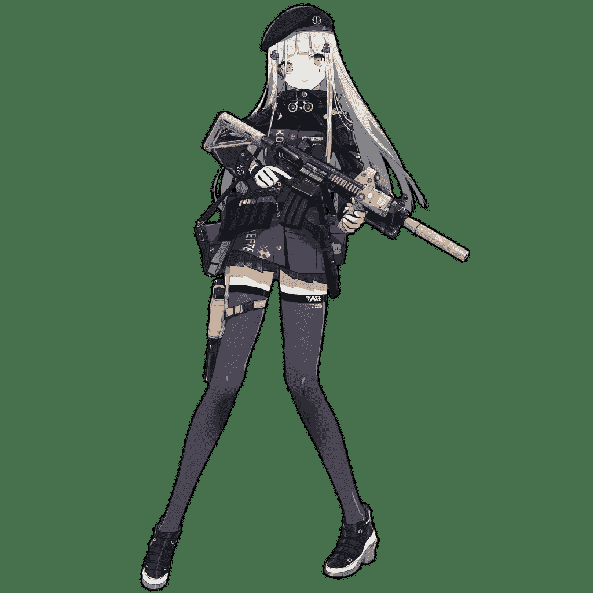](javascript:;)</ignore_js_op>  <ignore_js_op>[Super_SASS.png](forum.php?mod=attachment&aid=NzY4ODB8ZDEwNDFlMjB8MTYwMDg4Mzk4M3wxODIzMHwyNjQ4Nw%3D%3D&nothumb=yes) *(300.46 KB, 下載次數: 1)*

[下載附件](forum.php?mod=attachment&aid=NzY4ODB8ZDEwNDFlMjB8MTYwMDg4Mzk4M3wxODIzMHwyNjQ4Nw%3D%3D&nothumb=yes)

2019-3-1 10:32 上傳  

Super SASS

[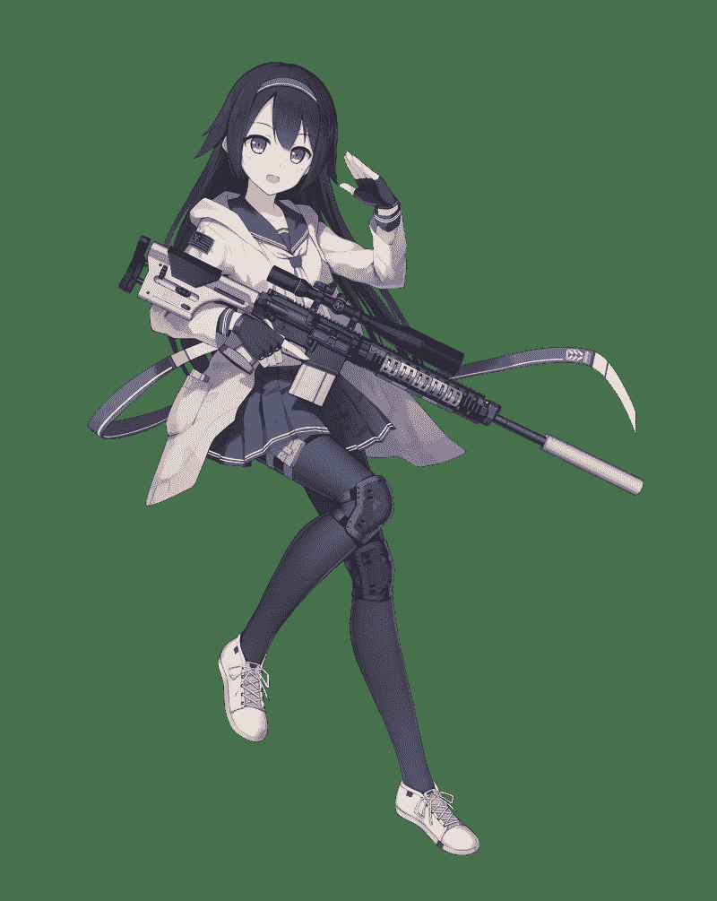](javascript:;)</ignore_js_op>  <ignore_js_op>[Saiga12.png](forum.php?mod=attachment&aid=NzY4Nzl8ZGU5ODFkMDN8MTYwMDg4Mzk4M3wxODIzMHwyNjQ4Nw%3D%3D&nothumb=yes) *(359.57 KB, 下載次數: 0)*

[下載附件](forum.php?mod=attachment&aid=NzY4Nzl8ZGU5ODFkMDN8MTYwMDg4Mzk4M3wxODIzMHwyNjQ4Nw%3D%3D&nothumb=yes)

2019-3-1 10:32 上傳  

Saiga-12

[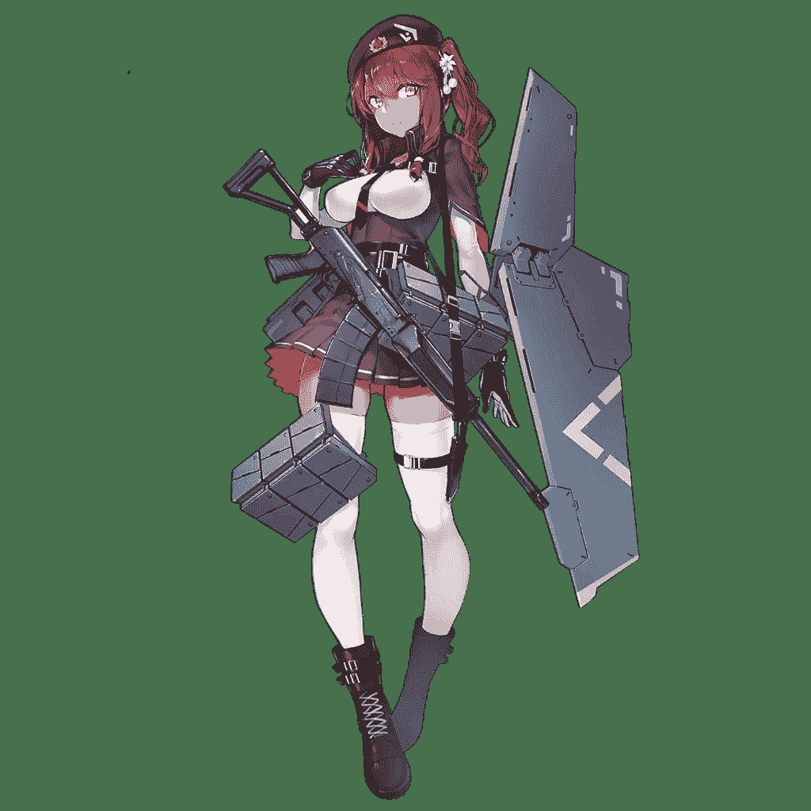](javascript:;)</ignore_js_op>  <ignore_js_op>[T91.png](forum.php?mod=attachment&aid=NzY4Nzh8MGY0NTk4MTV8MTYwMDg4Mzk4M3wxODIzMHwyNjQ4Nw%3D%3D&nothumb=yes) *(294.51 KB, 下載次數: 0)*

[下載附件](forum.php?mod=attachment&aid=NzY4Nzh8MGY0NTk4MTV8MTYwMDg4Mzk4M3wxODIzMHwyNjQ4Nw%3D%3D&nothumb=yes)

2019-3-1 10:32 上傳  

T-91

</ignore_js_op>  <ignore_js_op>[T65.png](forum.php?mod=attachment&aid=NzY4Nzd8YzU2ZTk2MDd8MTYwMDg4Mzk4M3wxODIzMHwyNjQ4Nw%3D%3D&nothumb=yes) *(339.3 KB, 下載次數: 0)*

[下載附件](forum.php?mod=attachment&aid=NzY4Nzd8YzU2ZTk2MDd8MTYwMDg4Mzk4M3wxODIzMHwyNjQ4Nw%3D%3D&nothumb=yes)

2019-3-1 10:31 上傳  

T-65

</ignore_js_op>  <ignore_js_op>[M4A1.png](forum.php?mod=attachment&aid=NzY4NzZ8Y2RmMGFhNzZ8MTYwMDg4Mzk4M3wxODIzMHwyNjQ4Nw%3D%3D&nothumb=yes) *(475.75 KB, 下載次數: 1)*

[下載附件](forum.php?mod=attachment&aid=NzY4NzZ8Y2RmMGFhNzZ8MTYwMDg4Mzk4M3wxODIzMHwyNjQ4Nw%3D%3D&nothumb=yes)

2019-3-1 10:31 上傳  

M4A1

[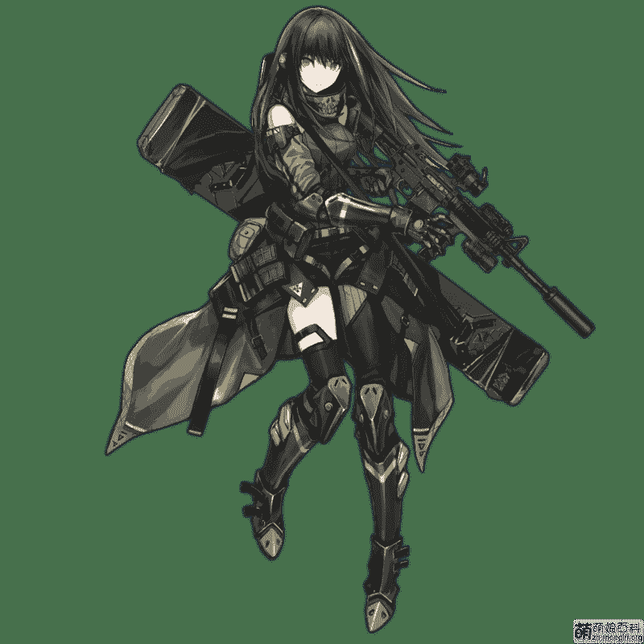](javascript:;)</ignore_js_op>  <ignore_js_op>[內格夫NEGEV.png](forum.php?mod=attachment&aid=NzY4NzV8YzM0NTI4N2R8MTYwMDg4Mzk4M3wxODIzMHwyNjQ4Nw%3D%3D&nothumb=yes) *(527.68 KB, 下載次數: 0)*

[下載附件](forum.php?mod=attachment&aid=NzY4NzV8YzM0NTI4N2R8MTYwMDg4Mzk4M3wxODIzMHwyNjQ4Nw%3D%3D&nothumb=yes)

2019-3-1 10:31 上傳  

內格夫

[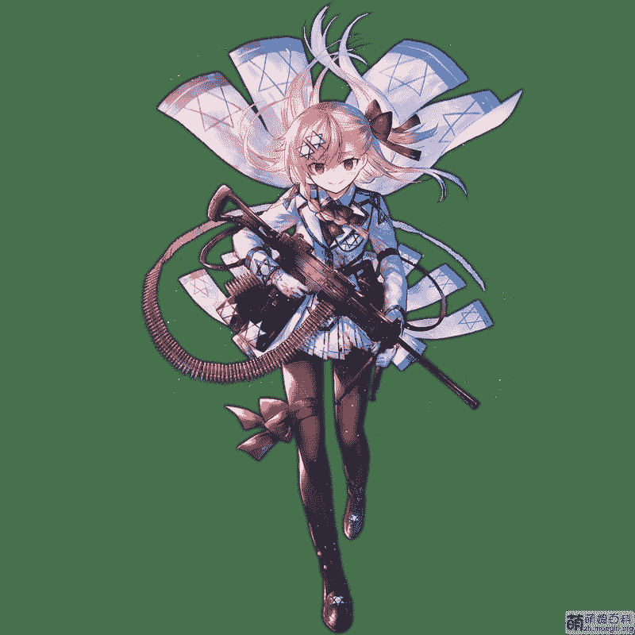](javascript:;)</ignore_js_op>  <ignore_js_op>[Cx4Storm.png](forum.php?mod=attachment&aid=NzY4NzR8ZjAyMjM0NGZ8MTYwMDg4Mzk4M3wxODIzMHwyNjQ4Nw%3D%3D&nothumb=yes) *(320.29 KB, 下載次數: 0)*

[下載附件](forum.php?mod=attachment&aid=NzY4NzR8ZjAyMjM0NGZ8MTYwMDg4Mzk4M3wxODIzMHwyNjQ4Nw%3D%3D&nothumb=yes)

2019-3-1 10:31 上傳  

Cx4 Storm

[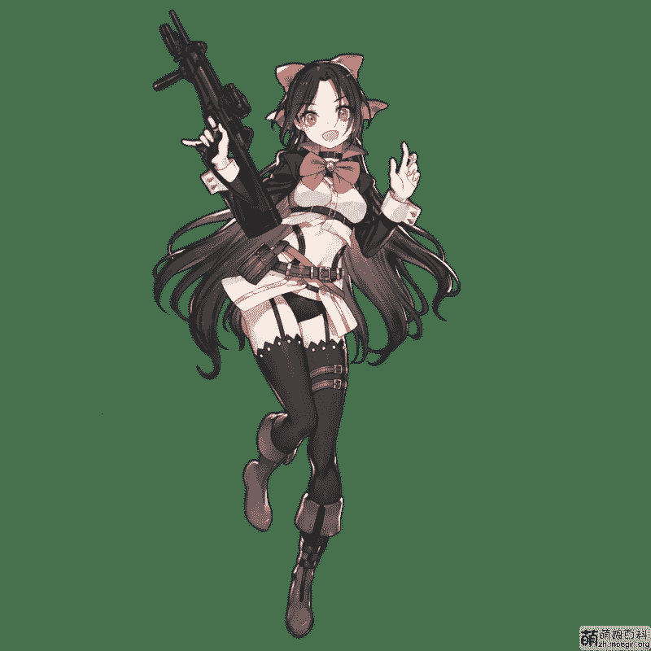](javascript:;)</ignore_js_op>  <ignore_js_op>[帕斯卡Persica.png](forum.php?mod=attachment&aid=NzY4NzN8MzE3Yzc3MjR8MTYwMDg4Mzk4M3wxODIzMHwyNjQ4Nw%3D%3D&nothumb=yes) *(280.37 KB, 下載次數: 0)*

[下載附件](forum.php?mod=attachment&aid=NzY4NzN8MzE3Yzc3MjR8MTYwMDg4Mzk4M3wxODIzMHwyNjQ4Nw%3D%3D&nothumb=yes)

2019-3-1 10:30 上傳  

帕斯卡

[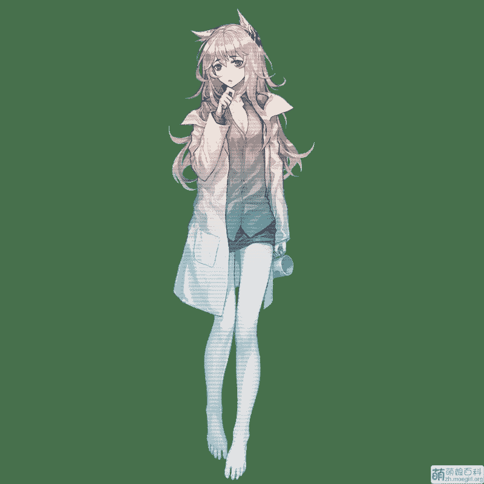](javascript:;)</ignore_js_op>  <ignore_js_op>[T77.png](forum.php?mod=attachment&aid=NzY4NzJ8MmZmZmY4Nzd8MTYwMDg4Mzk4M3wxODIzMHwyNjQ4Nw%3D%3D&nothumb=yes) *(235.84 KB, 下載次數: 0)*

[下載附件](forum.php?mod=attachment&aid=NzY4NzJ8MmZmZmY4Nzd8MTYwMDg4Mzk4M3wxODIzMHwyNjQ4Nw%3D%3D&nothumb=yes)

2019-3-1 10:30 上傳  

T77

[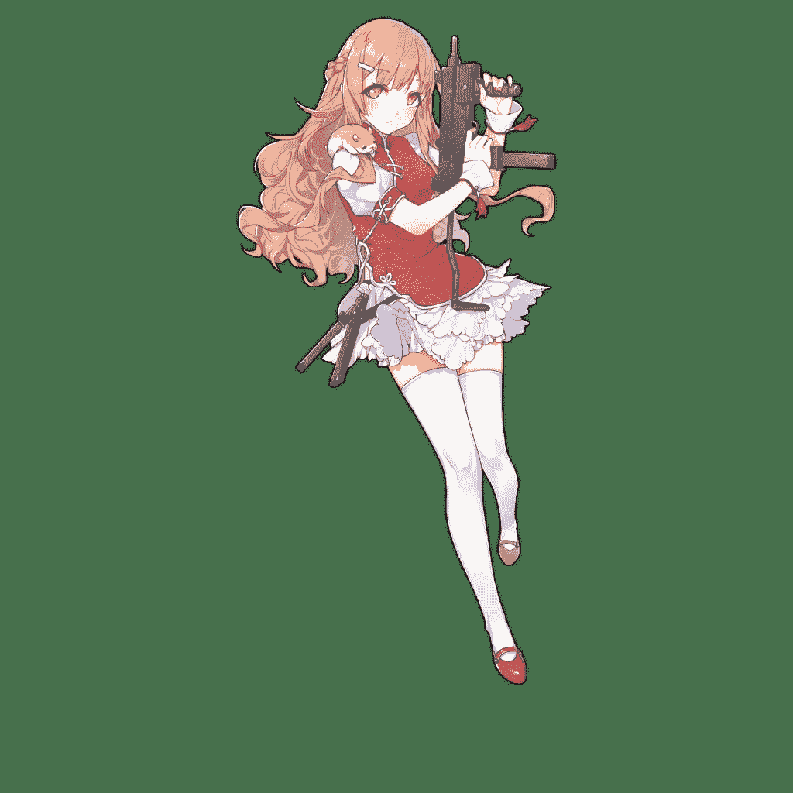](javascript:;)</ignore_js_op>  <ignore_js_op>[M16A1.png](forum.php?mod=attachment&aid=NzY4NzF8YzczNTQ0YTV8MTYwMDg4Mzk4M3wxODIzMHwyNjQ4Nw%3D%3D&nothumb=yes) *(634.22 KB, 下載次數: 0)*

[下載附件](forum.php?mod=attachment&aid=NzY4NzF8YzczNTQ0YTV8MTYwMDg4Mzk4M3wxODIzMHwyNjQ4Nw%3D%3D&nothumb=yes)

2019-3-1 10:28 上傳  

M16A1

[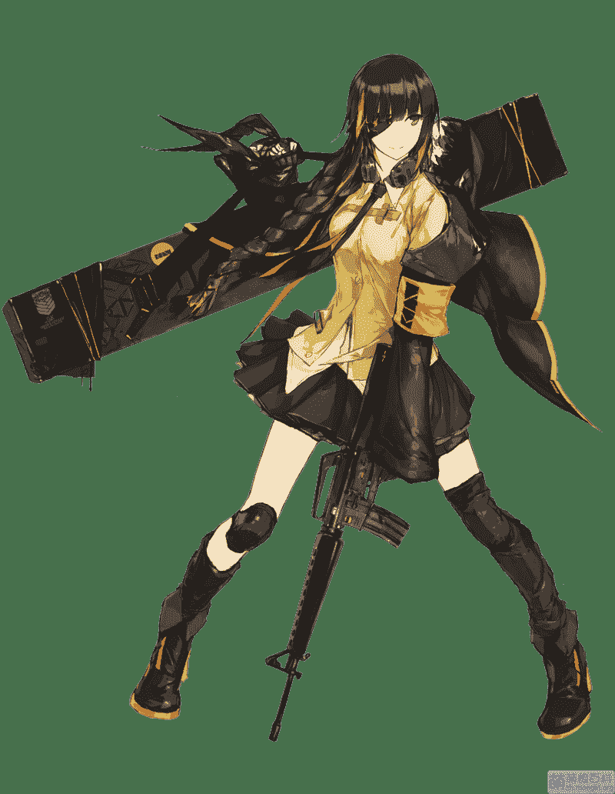](javascript:;)</ignore_js_op>  <ignore_js_op>[M1903春田.png](forum.php?mod=attachment&aid=NzY4NzB8MjNkNjdmMzl8MTYwMDg4Mzk4M3wxODIzMHwyNjQ4Nw%3D%3D&nothumb=yes) *(169.99 KB, 下載次數: 0)*

[下載附件](forum.php?mod=attachment&aid=NzY4NzB8MjNkNjdmMzl8MTYwMDg4Mzk4M3wxODIzMHwyNjQ4Nw%3D%3D&nothumb=yes)

2019-3-1 10:27 上傳  

M1903春田

</ignore_js_op>  <ignore_js_op>[赫麗安.png](forum.php?mod=attachment&aid=NzY4Njl8ODM0NTIzYjl8MTYwMDg4Mzk4M3wxODIzMHwyNjQ4Nw%3D%3D&nothumb=yes) *(269.52 KB, 下載次數: 0)*

[下載附件](forum.php?mod=attachment&aid=NzY4Njl8ODM0NTIzYjl8MTYwMDg4Mzk4M3wxODIzMHwyNjQ4Nw%3D%3D&nothumb=yes)

2019-3-1 10:27 上傳  

赫麗安

[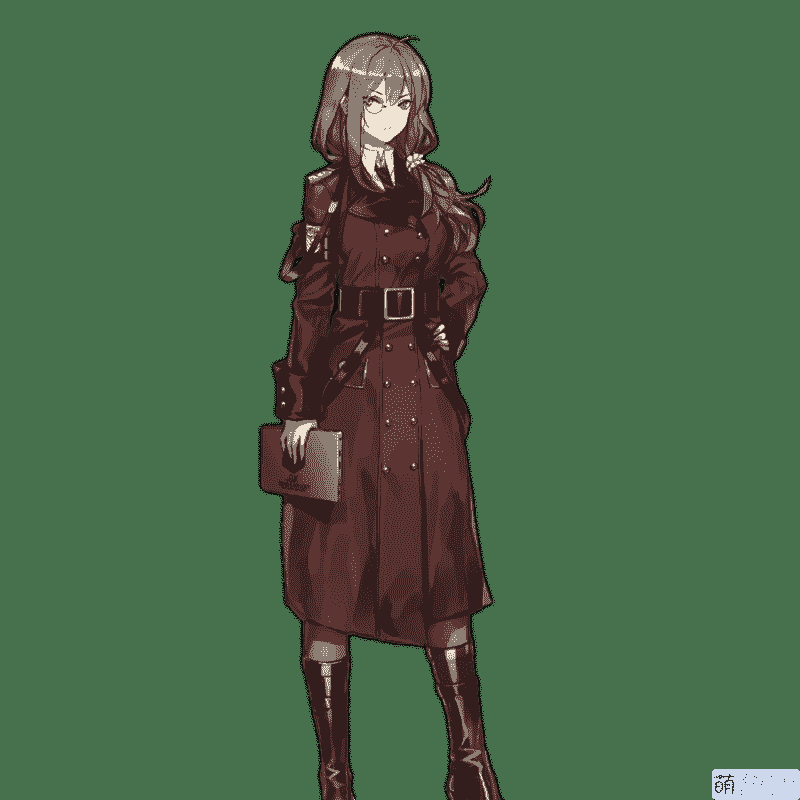](javascript:;)</ignore_js_op>  <ignore_js_op>[UMP9.png](forum.php?mod=attachment&aid=NzY4Njh8N2Y4OGZlNTB8MTYwMDg4Mzk4M3wxODIzMHwyNjQ4Nw%3D%3D&nothumb=yes) *(347.39 KB, 下載次數: 0)*

[下載附件](forum.php?mod=attachment&aid=NzY4Njh8N2Y4OGZlNTB8MTYwMDg4Mzk4M3wxODIzMHwyNjQ4Nw%3D%3D&nothumb=yes)

2019-3-1 10:26 上傳  

UMP9

[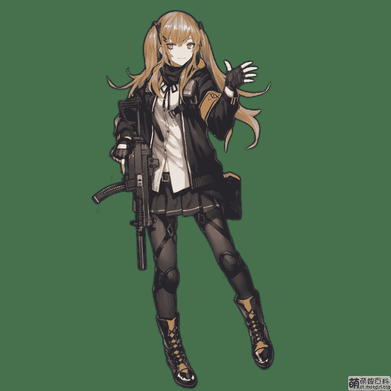](javascript:;)</ignore_js_op>  <ignore_js_op>[UMP45.png](forum.php?mod=attachment&aid=NzY4Njd8ZjAxNzcyMGZ8MTYwMDg4Mzk4M3wxODIzMHwyNjQ4Nw%3D%3D&nothumb=yes) *(199.29 KB, 下載次數: 0)*

[下載附件](forum.php?mod=attachment&aid=NzY4Njd8ZjAxNzcyMGZ8MTYwMDg4Mzk4M3wxODIzMHwyNjQ4Nw%3D%3D&nothumb=yes)

2019-3-1 10:26 上傳  

UMP45

[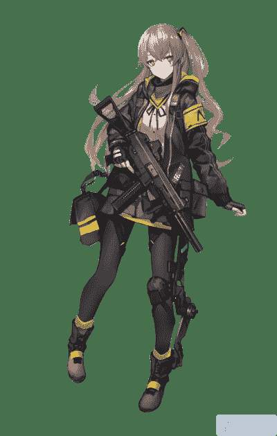](javascript:;)</ignore_js_op>  <ignore_js_op>[G28.png](forum.php?mod=attachment&aid=NzY4NjZ8NWZlY2JkMzl8MTYwMDg4Mzk4M3wxODIzMHwyNjQ4Nw%3D%3D&nothumb=yes) *(365.54 KB, 下載次數: 0)*

[下載附件](forum.php?mod=attachment&aid=NzY4NjZ8NWZlY2JkMzl8MTYwMDg4Mzk4M3wxODIzMHwyNjQ4Nw%3D%3D&nothumb=yes)

2019-3-1 10:26 上傳  

G28

[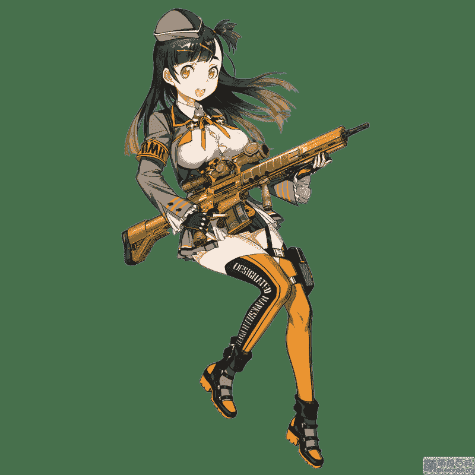](javascript:;)</ignore_js_op>  <ignore_js_op>[NTW20.png](forum.php?mod=attachment&aid=NzY4NjV8NmYxNWQ1MzV8MTYwMDg4Mzk4M3wxODIzMHwyNjQ4Nw%3D%3D&nothumb=yes) *(376.17 KB, 下載次數: 2)*

[下載附件](forum.php?mod=attachment&aid=NzY4NjV8NmYxNWQ1MzV8MTYwMDg4Mzk4M3wxODIzMHwyNjQ4Nw%3D%3D&nothumb=yes)

2019-3-1 10:25 上傳  

NTW-20

[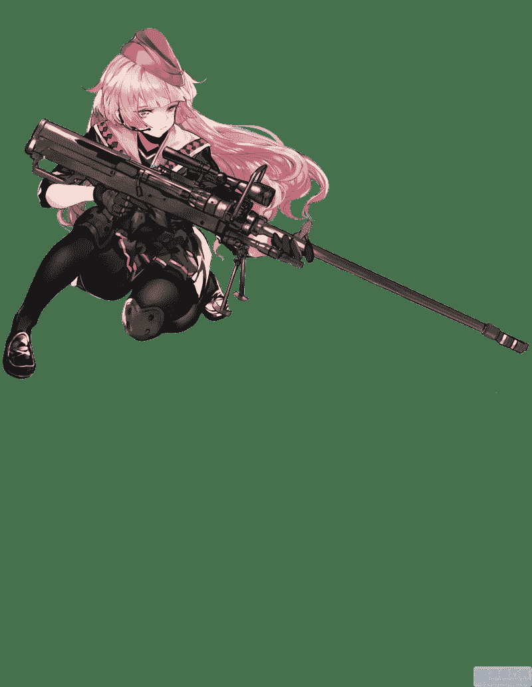](javascript:;)</ignore_js_op>