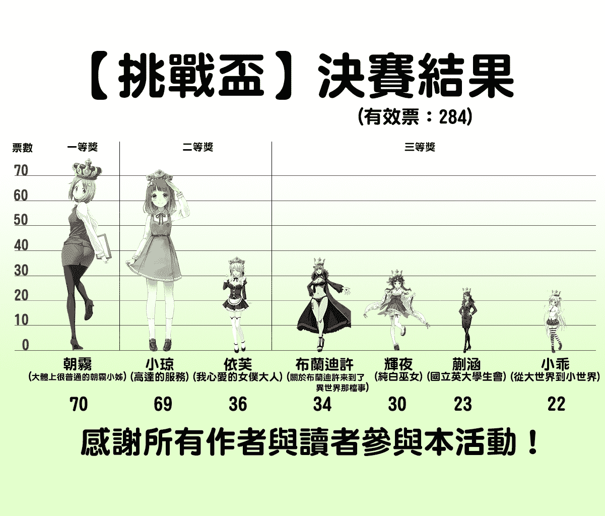

# 【挑战杯】終於結束了，讓我們來回顧一下吧

作者：phone2345

TID：26645

 

# 1

*本帖最後由 phone2345 於 2019-4-3 14:23 編輯*

在去年(2018)的最後一天晚上，key版主公告了「【挑战杯】元旦及新春文章大赛」的活動，揭開GN論壇中的巨大娘聖杯戰爭序幕。

經過約70天後，大聖杯終於從文章區吸取了足夠的魔力，論壇中的魔法師們開始為心目中理想的巨大娘準備召喚儀式，26位來自各地的女性成為Servant的候選人，隨著召喚儀式開始巨大化。

由於人數過多超出GN神壇的負荷，key版主決定分成AB兩組，每組選出3名巨大娘加入聖杯戰爭──

**A組：**

*   [科学魔法的里奈酱（禁锢月之门）](https://giantessnight.com/gnforum2012/forum.php?mod=viewthread&tid=26235) by: @gw1990zzz

*   [高达的服务 mega micro](https://giantessnight.com/gnforum2012/forum.php?mod=viewthread&tid=26278) by: @死神a艾斯

*   [胡桃](https://giantessnight.com/gnforum2012/forum.php?mod=viewthread&tid=26286) by: @水泥彼岸

*   [迟到（短篇）](https://giantessnight.com/gnforum2012/forum.php?mod=viewthread&tid=26324) by: @o_0MorToy

*   [国立英大学生会](https://giantessnight.com/gnforum2012/forum.php?mod=viewthread&tid=26373) by: @桐桐的脚趾环

*   [表白（百倍以上，轻口味残忍）](https://giantessnight.com/gnforum2012/forum.php?mod=viewthread&tid=26390) by: @lanbo

*   [我心爱的女仆大人](https://giantessnight.com/gnforum2012/forum.php?mod=viewthread&tid=26411) by: @见崎鸣

*   [神选之人，菜鸟作品](https://giantessnight.com/gnforum2012/forum.php?mod=viewthread&tid=26440) by: @黑鸦

*   [【短篇】零用钱（giga、足）](https://giantessnight.com/gnforum2012/forum.php?mod=viewthread&tid=26446) by: @zzymjy

*   [《兼职》（vore，入阴）略重口](https://giantessnight.com/gnforum2012/forum.php?mod=viewthread&tid=26463) by: @2333的男人

*   [少女前線 HK416 暴雨將至](https://giantessnight.com/gnforum2012/forum.php?mod=viewthread&tid=26487) by: @A27452682

*   [异世界幻想曲](https://giantessnight.com/gnforum2012/forum.php?mod=viewthread&tid=26545) by: @琉璃

*   [天之女，地之神，人之心](https://giantessnight.com/gnforum2012/forum.php?mod=viewthread&tid=26551) by: @比那名居天子

**B組：**

*   [[缩小][入腹]龙腾凤鸣](https://giantessnight.com/gnforum2012/forum.php?mod=viewthread&tid=26204) by: @arrowyang312

*   [女性体型优势世界的学院生活是否有什么问题](https://giantessnight.com/gnforum2012/forum.php?mod=viewthread&tid=26232) by: @wajrda

*   [大体上很普通的朝雾小姐](https://giantessnight.com/gnforum2012/forum.php?mod=viewthread&tid=26236) by: @o_0MorToy

*   [魔女的失乐园](https://giantessnight.com/gnforum2012/forum.php?mod=viewthread&tid=26250) by: @红茶

*   [短篇.纯白巫女](https://giantessnight.com/gnforum2012/forum.php?mod=viewthread&tid=26267) by: @见崎鸣

*   [最后的守护者（gts，growth，虐杀，神经病剧情）](https://giantessnight.com/gnforum2012/forum.php?mod=viewthread&tid=26277)  by: @karlchen0920

*   [短篇综合向—《微缩症》](https://giantessnight.com/gnforum2012/forum.php?mod=viewthread&tid=26303) by: @夏沫

*   [猫](https://giantessnight.com/gnforum2012/forum.php?mod=viewthread&tid=26380) by: @暗夜风暴

*   [關於布蘭迪許來到了異世界那檔事](https://giantessnight.com/gnforum2012/forum.php?mod=viewthread&tid=26448) by: @phone2345

*   [【短篇】落幕之时](https://giantessnight.com/gnforum2012/forum.php?mod=viewthread&tid=26472) by: @暗夜风暴

*   [从大世界到小世界](https://giantessnight.com/gnforum2012/forum.php?mod=viewthread&tid=26474) by: @赤壁英魂

*   [放学路上](https://giantessnight.com/gnforum2012/forum.php?mod=viewthread&tid=26538) by: @为爱泪

*   [人型](https://giantessnight.com/gnforum2012/forum.php?mod=viewthread&tid=26539) by: @广翼云

經過10天的召喚，A組中《高达服务》小琼與《女仆大人》伊芙輕鬆達標，《國立英大》蒯涵超越了《少女前線》HK416成功搶下最後一張門票，把後者踢出聖杯戰爭參賽名單；

B組中朝霧小姐以高達90米的巨大身材輾壓其他候選人，《純白巫女》輝夜雖然不及前者胸口但仍扛下了前者攻擊，《大小世界》小乖差一點被布蘭迪許追上，難分難捨的兩人最後被key版主破格同時入選

最後這7位通過初選的巨大娘正式開始了為期10天的聖杯大戰

同時初賽落選的HK416也在一旁鞭策觀戰的魔法師們趕快選出最後使用聖杯的巨大娘。

在戰爭初期（3/22）《布蘭迪許》拔得頭籌，但維持不到幾小時就被《朝霧小姊》與《高达服务》小琼趕超，連《純白巫女》輝夜與《女仆大人》伊芙也將其比了下去，僅留《大小世界》小乖與《國立英大》蒯涵在下方掙扎。

到了首個周末假期，領先的《朝霧小姊》與《高达服务》小琼身高(票數)持續大幅上升，此時《純白巫女》輝夜與《女仆大人》伊芙互相競爭的情況下讓兩者巨大化落後，墊底入選的《布蘭迪許》則開始努力發揮自己的實力超越前者，《大小世界》小乖與《國立英大》蒯涵也開始漸入佳境。

來到單身魔術師們需要上班的星期一，由於魔力供給減弱使所有參賽者巨大化進程趨緩，《朝霧小姊》以超過50公里身高暫居第一，高度似乎停滯不前的《高达服务》小琼與《布蘭迪許》緊追在後；同由見崎鳴召喚的《純白巫女》輝夜與《女仆大人》伊芙依然在互相打架，有趣的是這兩人身高相加竟與第一名相同；《國立英大》蒯涵以緩慢的速度成長中，但被不知吃了什麼仙丹的《大小世界》小乖以令人驚訝地長高速度反超。

聖杯戰爭進行經過一半(星期三)，暫定第一名的《朝霧小姊》身高終於突破60公里，《高达服务》小琼緊跟在後並持續上漲，《布蘭迪許》雖然也有在努力但看起來似乎快沒力了。一開始墊底的《大小世界》小乖開始超巨大化，超越了扭打成一團的《純白巫女》輝夜與《女仆大人》伊芙直追第三名，被拋在最後的《國立英大》蒯涵似乎餓肚子了，休息超過一天依然未有動靜。

戰事結束前一晚(星期六)《高达服务》小琼也突破60公里了，其距離暫居首位的《朝霧小姊》僅有1公里之差。《布蘭迪許》被急速成長的《大小世界》小乖超越，身高來到了50公里級。《國立英大》蒯涵似乎也被注射了特效藥，高度快速越過了《純白巫女》輝夜與《女仆大人》伊芙。

就在競爭激烈的最後階段，聖杯大戰主辦人key發現有魔術師使用禁術讓參賽的巨大娘們猛爆性的巨大化，他開始構築破解禁術的魔法陣，同一時間兩名身高接近70公里的《朝霧小姊》與《高达服务》小琼開始了最終的爭奪戰，前一小時略高的《朝霧小姊》被《高达服务》小琼爬上了頭，過了不久《朝霧小姊》又跳了起來把《高达服务》小琼踩了下去，就在兩人幾乎要踩破地殼讓其它相對矮小的巨大娘跌坐在地，根本看不見的魔術師被震飛到天上時，聖杯大戰在主辦人key的反禁術魔法陣完成了，同時戰爭也宣告結束。

在key的魔法陣作用下，《布蘭迪許》、《國立英大》蒯涵及《大小世界》小乖的身高分別縮小了15至29公里不等，讓排名起了些變化。

最後──

《朝霧小姊》以70公里身高奪得一等獎及價值200RMB的聖杯使用權，

《高达服务》小琼以69公里身高與《女仆大人》伊芙以36公里身高獲得二等獎與火山之楊魔法禁書各一捲

《布蘭迪許》以34公里身高、《純白巫女》輝夜以30公里身高、《國立英大》蒯涵以23公里身高及《大小世界》小乖以22公里身高獲得三等獎及神秘錄像各一片

經過這場聖杯戰爭，地面上得魔法們開始激烈討論該如何避免有人使用禁術，相信下一次聖杯戰爭來臨前，他們會想到一些好辦法的。最後讓戰地記者水獺娘為您獻上整場比賽的統計數據：

原始數據：

去除不合法票的數據：

如果讓《純白巫女》輝夜與《女仆大人》伊芙合併成《見崎鳴》的話：

比賽結果連結：[https://giantessnight.com/gnforum2012/forum.php?mod=viewthread&tid=26651](https://giantessnight.com/gnforum2012/forum.php?mod=viewthread&tid=26651)

水獺娘感謝您的收看，我們下次再見

 

# 2

<ignore_js_op>[Final.png](forum.php?mod=attachment&aid=Nzc1ODl8ZmVkZmViM2Z8MTYwMDg4MjgxM3wxODIzMHwyNjY0NQ%3D%3D&nothumb=yes) *(482.02 KB, 下載次數: 0)*

[下載附件](forum.php?mod=attachment&aid=Nzc1ODl8ZmVkZmViM2Z8MTYwMDg4MjgxM3wxODIzMHwyNjY0NQ%3D%3D&nothumb=yes)

2019-4-1 20:21 上傳  

</ignore_js_op>