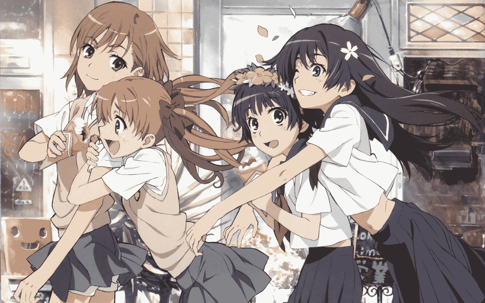
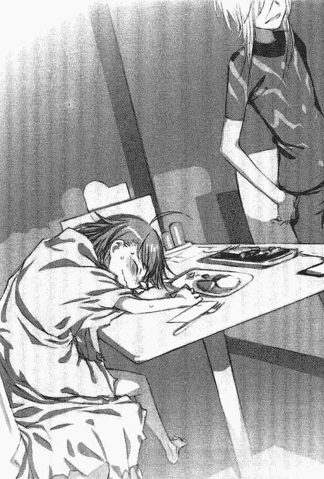
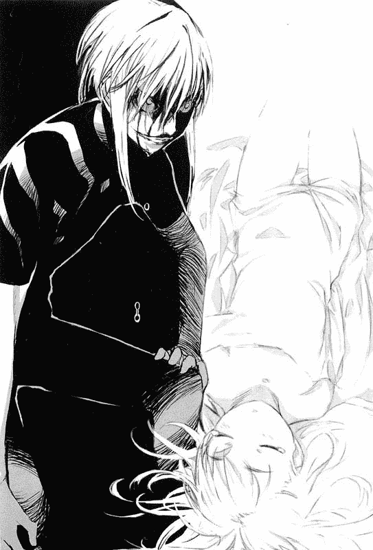
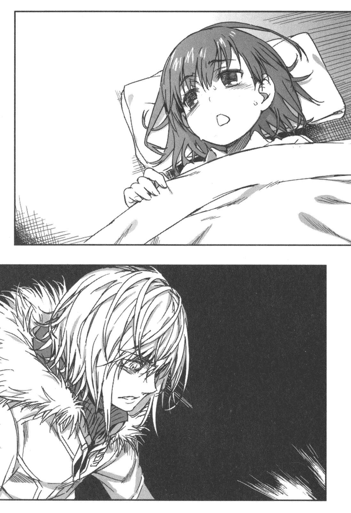
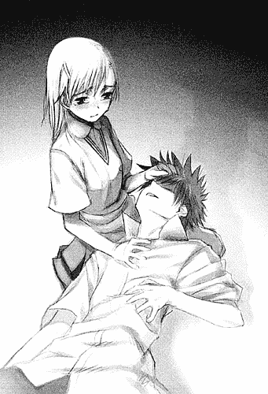
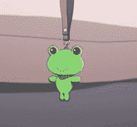
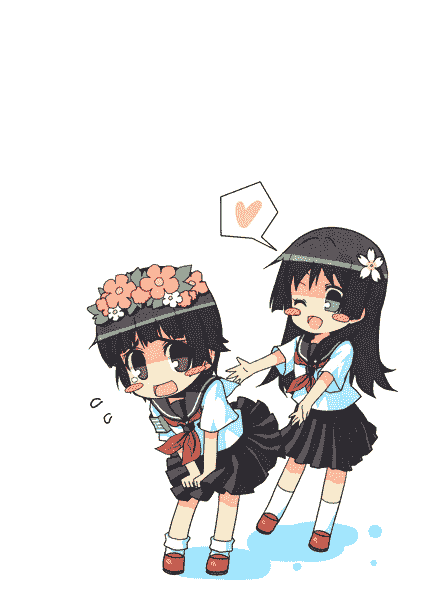
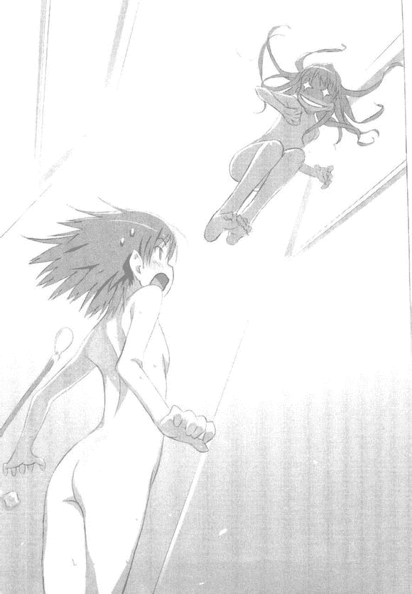
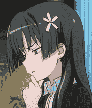

# 【春秋杯】科学超电磁炮同人：进击的御坂御坂

作者：ADSL

TID：15263

 

# 1

*本文章最後由 ADSL 於 2013-11-24 14:25 編輯*

什么？

你居然吐槽我标题我漏打了两个字？

百万？

那是什么？

我可不知道！

说起来，我貌似好像很可能就是第一个参加活动的呢。

没改成叫【皮卡杯】、【皮卡丘杯】或者是【秋秋杯】已经很不错了哒~

其实这只是一篇**崩坏的(特别是某白毛)、自娱自乐的、清淡口味的**短篇小同人。

标上个活动的标题也不过是为了满足好奇心吸引注意力拉仇恨引嘲讽顺便骗经验骗徽章什么的啦......

我刚才应该没有走露什么风声吧？

**~本文已于9.20凌晨完工~

~欢迎前来拍超大块砖头~**

 

# 2

*本文章最後由 ADSL 於 2013-9-29 10:34 編輯*

这里是世界尖端科学技术的凝聚地。

夜里，一座座高大楼栋上的风车仍旧有条不紊地转动着，将风儿徐徐送至远方。尽职尽责的警备机器人们个个亮着绿灯，驱动着轮子，在各个区域来来回回地巡逻着。而在遥远的太空中，则有两颗冰冷慎密的直属卫星将城市及周边地区的一切收入眼底。黑夜不能吞噬人类科技造物所带来的光明，所以即便已是深夜，都市却依然繁华。人流在灯光下涌动着，丝毫没有息止的迹象，而从过往人群的打扮和交谈的内容上来判断，他们大多是年轻而富有朝气的学生。

没错，这里是学生们的领域，学园都市（Academy City）。

但这并不仅仅是普通学生们活跃的地方，更多的是作为一个供能力者展示自我的巨大舞台。

不过超能力间也分有强弱，从占据学生人数六成的最无能力者（Level 0）到学院仅有七人的超能力者（Level 5）,差别可谓是天差地远。就更不用说最强大的绝对能力者（Level 6）了，目前仍然只存在于理论中。

不过说到七位超能力者，那个刚从便利超市里出来，抱着一袋咖啡的那个拄着拐杖，顶着白发穿着灰条纹装的家伙不就是一个吗？

而且……他貌似还是……

“啊？你们拦住本大爷的路是想干什么啊？”白发少年摇晃着身子，轻轻地将购物袋放在了地上。

周围，一群不良青年凶狠狠地围聚了上来。也难怪，白发的少年走到了阴暗的小巷里，那里本来就是这些不良的地盘。

“喂，滚开。”白发少年悠闲地拄着拐杖退了两步，看向逼到身前的一个不良青年的眼神里满是轻蔑。

那个不良青年顿时怒气升顶，看样子被眼前这个雪白皮肤的柔嫩家伙瞧不起让他在群体当中很失面子。于是他大吼一声，迈步而上，对着白发青年一拳砸下。

在他的想法里，这一拳至少能把那个嚣张的小鬼精致的脸打残。

但事与愿违，等到不良青年回过神来时，他的手已经不见了。

取而代之的是一朵散开的血花，血液就像一瓶醇香美味的啤酒被开了瓶一样股股冒出，染红了不良黑色的衣袖。

“啊啊啊——啊啊啊！我的手！”

不良青年惊愕又恐惧，眼前忽然浮现出了白发少年狰狞的笑脸，以及那双在昏黑中闪烁着的红色瞳孔。

“真是吵啊，难道你们不知道吗？本大爷可是一方通行（Accelerator）啊！”白发的少年如此说着，挥起拳头同样地砸向不良青年的脸。

轰！

小巷一侧的墙壁上就这样新烙上了一块人形的凹痕。

“啊啊啊啊啊！”

“简直就是怪物啊！”

“大家快跑啊！”

“哈？这样就都跑了？真让人提不起兴致！”一方通行不满地望了望化作鸟兽散的不良青年的背影。

“算了，我先去医院，那个蠢货就交给你们处理了。”指了指墙壁上呈大字印着的倒霉家伙，又对着身后挥了挥手，一方通行提起装满咖啡的袋子缓缓离去了。

“……收到，御坂们对一方通行不负责任的行为表示抱怨。”没过多久，悦耳的女声便从远处传来，黑暗中蓦地亮起两道绿光。

“所以说，喝了这个东西后整个人就能变得很巨大很强力吗?就像电影中的巨大怪兽一样可以为所欲为吗？御坂御坂十分好奇地问道。”

“嗯，貌似确实是这样。举个例子吧：如果你用了这个药剂，甚至可以去把所有与呱太有关的专卖店都拔走。”

“哇啊，这么棒？但是……呱太医生你说的话真的可信吗？御坂御坂正在用怀疑的眼光看着你。”

“啊……理论上来说是这样的，药效可以维持一个小时，但这个东西要是落到了坏人手里就不好了，而且若是把学园都市弄坏了，某个家伙估计要找我麻烦。”

“这样啊……对了对了，呱太医生，用了这个药剂后能不能起欺负一下那个人呢？御坂御坂很期待地问道。”

“这个……恐怕是不行的。”

“诶……稍微有些失望呢，不过如果能将呱太们都抢到手也很棒呢。御坂御坂有些纠结地说道。”

“那个，呱太医生，能不能把这个药给我呢？御坂御坂试探性地问道。”

“不行。”

“那分一半好不好？御坂御坂衷心地恳求道。”

“咳咳，不行！绝对不行！总之还是不要多想了，这个药剂我是无论如何也不可能给你这种小鬼头的。”

冥土追魂（Heaven Canceler）说着，忽然摆出了一副严肃的姿态，手一提，便将亮着蓝色荧光的药剂瓶子从最后之作（Last Order）的眼前拿走了。

“啊！御坂御坂惊讶地呼喊了起来，并且拉了拉呱太医生的衣角。”

“哼，就算祈求我也不会给你的。”冥土追魂低下头板着脸说道。

“不不，呱太医生，是这样的，三号病房那边有位漂亮的护士小姐摇响电铃在找你！御坂御坂无比真诚地提醒道。”

“啊？真的吗？那我去看看，不要随便乱动啊！”呱太医生这时一改刚才的严肃，换下休息服，穿上白大褂就准备推开门走人了。

不过临走前，他还是细心地将药剂瓶放在了小女孩怎么也够不着的书架顶端。

但他万万没想到的是——小女孩耐心地等待着脚步声远去后，轻轻地趴下身子，一双茶色的大眼睛望向了床底下藏着的金属制成的小梯子。

“没想到吧，嘻嘻嘻嘻……御坂御坂露出了得意的坏笑。”

 

# 3

> CEW 發表於 2013-9-15 11:47 

> 真的該吐槽的應該不是你的錯字

> 而是...最後之作(Last Order）不是科學超電磁砲會出現的角色

> 只有出現在魔法 ...

不出所料，果然会有人吐槽这个~

嘛，于是乎在这里作出解释。

以下说法皆为个人理解向：

1、这篇同人并非十分严谨，咱本人也只是偶尔看看动画的家伙。

2、本身电炮和魔禁的世界观都趋向于一致，而且时间轴差不多平行，那为什么最后之作不能出现在电炮的世界？

3、电炮更注重科学侧，魔法侧的东西几乎没有出现多少，而又因为我并不想在这里描写关于魔法侧的内容，所以便以电炮同人命名了。

感谢你提出的问题XD......

 

# 4

*本文章最後由 ADSL 於 2013-9-29 10:33 編輯*

“……”

归来的冥土追魂看着空无一人的房间，以及从书架上消失的药剂瓶，只能摸了摸自己光秃秃的脑袋，微胖的青蛙脸上写满了无奈。

不过还没过去几分钟，他就想到了一个阻止小鬼头的好人选。随即他从宽大的口袋里取出手机，拨通了某个号码。

“喂喂，请问正在听电话的是一方通行吗？”

“……嗯，找我有什么事吗？不会是那个小鬼又鼓弄出什么事情了吧?”一阵低沉而富有磁性的声音从电话中传出。

“没错，她拿走了一个还处于试作品的药，如果喝下去估计事情会变得很棘手。”

“那你是想让本大爷去替那小鬼头收拾烂摊子吗?”

“除你之外还有别的人选吗？现在去的话说不定还来得及。”

别的人选……白发少年瞬间就联想到了一个欠扁的刺猬头青年，不过他马上就把对方的形象从自己脑中删去了。

“啧……”一方通行一脸不爽地结束了通讯，随手将袋子放到了路边，之后支起拐杖摇摇晃晃地向着街巷的另一端走去。 “啊啊！御坂御坂感到很惊奇，因为御坂御坂看到了两个认识的人。”最后之作说着，对着站在大桥上背对着她的一对年轻男女招了招手。

“不过御坂御坂决定现在还是避人耳目比较好，不然那个人估计就要追过来了，所以御坂御坂要先行逃走啦。”

于是娇小的身影一闪而过，刺猬头青年茫然地回过头，只来得及看见一抹茶色的头发和挂在对方脖子上的绿油油夜视镜。

“那个家伙……不是妹妹的妹妹吗？”

“我说当麻，你刚才在看哪里？”御坂美琴（Misaka Mikoto）略显生气地盯向了身旁的刺猬头青年。

“啊啊，哔哩哔哩，没什么。还是让我们先回到之前的话题吧，你的意思是想让陪你去游戏场？”上条当麻（Kamijou Touma）转头说着，露出了一丝苦涩的笑。

“嗯嗯，怎么了？”美琴看到当麻强撑的笑容，感到有些不对劲。

“这个……我这个月的预算已经被用（吃）光了。”上条当麻有些无奈地说道，毕竟家里养着一个大吃货修女就算预算再多也受不了啊喂！

“这样啊……不要紧，我请客，但你可要陪我好好玩，一定要赢到那个最新的巨大呱太玩偶！”说着，美琴眼中冒出期待的小星星。

“……囧。”

“怎么？”美琴双手叉腰，脸上挂着威胁的笑。

哔哩哔哩的眼神看起来好恐怖啊……还有这荡漾开来的电火花是怎么回事！？

“好吧……我尽力，我尽力。”当麻勉强说着，手擦了擦开始冒汗的额头。 与此同时，就在大桥不远处的一所公园中的路灯上

“怎么会这样！？怎么会这样！？姐姐大人居然邀请了那个该死的类人猿，这下子他一定会对姐姐大人下手了啊啊啊啊！”

放下望远镜后，留着茶色双马尾的女孩愤愤地跺起脚，抓狂地大叫起来。

“啊啊啊啊不行，我一定要守护姐姐大人的贞洁！”白井黑子（Shirai Kuroko）一边叫嚷着，一边拨通了手机。

“喂，初春在吗？”

“——啊？白井同学，有什么事情吗？”

“紧急行动！紧急行动！快点叫上泪子，我们要抢先一步去GAU游戏场埋伏！”

“行动名暂定为：守护姐姐大人贞洁大作战！”

“……囧。” “据报道，第六学区目前出现了一巨大不明物，外表疑似十岁的人类女孩，现已破坏了多个建筑物，索性还没有出现大量人员伤亡——警备员（Anti-Skill）已经全面介入此事，请位处该学区的群众配合警备员进行疏散逃生。请有意进入该学区的学生们迅速远离！报道再重复一遍……”

“好像已经有些迟了……”

冥土追魂看着身前的闪动着的电视机，上面播送着的画面显示了一个戴着呱太头饰巨大女孩正在吱吱呀呀地张牙舞爪，尽情破坏着城市里高大的建筑，不由仰天长叹一口气。

“看样子这个药的副作用会大大增强人的破坏欲，而且会使之失去大部分的理智是真的，接下来就希望三个小时的药效也是真的了……”

呱太医生想着想着，忽然发现自己忽略了一件很重要的事情。

那就是以最后之作这个状态，一方通行还能借用网络进行演算吗！？

大事不妙——得赶紧让他逃跑啊！  

# 5

*本文章最後由 ADSL 於 2013-9-29 10:38 編輯*

“呼……总算……”

突然从空中出现的黑子堪堪站稳，放下了手上抓的两人后，身子一软，靠在了墙壁上，伸臂擦了擦汗。

虽然这个接近废弃的地下临时避难所的空气浑浊不清，但好不容易逃出来的三人此时都没有在乎那么多，都大口大口地喘息着。

“呼呼……白井同学，刚才的东西究竟是是什么啊？”

“呵……不知道。刚才是紧急情况，我也没看清楚什么。”黑子支起身子，强撑着说道。看样子即便是大能力者也无法负荷过于频繁的能力使用。

“对了，初春酱，怎么没看见佐天同学？”

“哎？佐天同学……她好像还有事情，也不告诉我，搞得神神秘秘的。”初春饰利（Uiharu kazari）迷迷糊糊地说着，看上去对泪子的隐瞒行为有些不满。

“这样啊……幸好……嗯？姐姐大人，您怎么了？”双马尾的女孩说着，像是松了口一样转过头，结果一下子就看见了酷爱呱太的姐姐大人正一脸怨念地盯着上方的出口。

“……”

“姐姐大人？”没有回应，黑子怯怯地又问了一次

“可恶，可恶！游戏场……还有我的巨大呱太玩偶，啊啊啊啊啊啊！”

联想着刚才那只从天而降，将游戏场和呱太一起踩得扁扁的大脚，美琴便愤怒地踏响地板，看这架势就像是要再冲过去和对方拼命。

而她也确实这么做了，不到一秒就已经依借磁力攀上了高高的爬梯。

“姐姐大人，不要！”

底下关切的呼喊声让美琴止住了脚步。

“黑子？”

“没有用的，就连姐姐大人的超电磁炮（Railgun）都……”

“可是——警备员对此根本无能为力，难道就这么眼睁睁地看着她继续破坏下去吗？而且那个家伙……那个家伙他……”美琴哽咽着，失落地低下头去，她想起了刚才自己的绝招失效后，刺猬头冲过来将她撞开，而自己则被巨人的手抓走的画面。

“姐姐大人……”

黑子听着从上方传来的轻微抽泣声，伸出手，掌心接下了一滴晶莹的泪。

“……好吧，我同意姐姐大人的行动了。”

“谢谢你……黑子。”

“不过！我要姐姐大人一起去，这样如果遇到了危险还可以退回来。我白井黑子可是姐姐大人最坚实的后盾！”

啪嗒啪嗒啪嗒……

“唔……初春？你……”

“啊啊，御坂学姐？我正在试图联络外面寻求支援，但估计很困难，因为这里的信号实在是……”初春不知何时从背包中拿出了便携电脑，此时盯着发光的荧屏，手指不断敲击着键盘。

“尽力而为就好，那我们走了，有情况就立刻通过对讲器跟我联络！”

“嗯，祝你们成功。” 

“喂，我说女人，不要再跟过来了！”一方通行快速地奔行着，拐杖在地上砸出哒哒哒的声响。

“可是你这样子很危险你不知道吗？”一个穿着休闲装的棒球帽少女紧跟在他后面叫嚷着，似乎要阻止他的前进。

“啊？”

从刚才开始这个烦人的女人就跟上了自己，真是……算了，先听听她要说什么吧。

一方通行这样想着，停下了急匆匆的脚步。

“我说——你难道没有看新闻吗？第六学区据称出现了巨大的怪兽，像你这样身体有疾，而且瘦弱无比的家伙估计一下子就会被杀死的！所以为了安全起见还是听……”

“啰嗦！”一方通行额上青筋暴露，脚狠狠地踩向了地面。那狰狞的神态吓得戴着棒球帽的少女连连后退了几步。

然而什么都没有发生。

“啧……”白发的少年怔了怔，随即一脸不爽转过身子，继续抬着拐杖往第六学区的方向走去了。

棒球帽少女想了一想，露出坚定的表情，又一次跟了上去。

她佐天泪子（Saten Ruiko）可不是轻言放弃的女孩。

一方通行这回只是用眼角的余光瞟了瞟身后，却没再说什么了。 

“哈哈哈！”

“御坂御坂玩得很开心，大大的楼房居然不费吹灰之力就扳倒了呀！”

茶发的巨大女孩欢快地挥着双臂，在建筑丛中舞动着。

在过去的二十分钟里，她除了踢踢大楼，捶捶房顶之外就就只是时不时弯下身子去恐吓被她围聚了一圈的小人了，这也是为什么到现在都没出现人员伤亡的原因。

“小人们都要乖乖地服从御坂御坂的命令哦，不然就把你们杀光光哦！”

蹲下身丢下了这句奶声奶气的威胁后，最后之作便继续将目光投向了周围的高楼大厦。

而在她的身下，人们有的默不作声，有的恐慌异常，也有的干脆就晕了过去……即便是再乐观的人遇到这种情况恐怕都笑不出来吧？

虽然失去了相当多的理智，又有了相当大的破坏欲望，最后之作也还是个好孩子呢。

但在人们看来，即便目前她的力道控制得很好，也没有想要折磨人的意思。不过谁都知道小孩子是极其善变的，所以当人群被两只大凉鞋赶来赶去，最终聚集在一个被踏平的地域后，看着上方沉浸于破坏而欢笑的巨大女孩，谁都不会认为对方仅仅想让他们来看看表演而已。

特别是巨大的御坂御坂将在身前如同玩具般精致小巧的风车叶捏住，用手指又扯又拉，风叶发出支啦支啦地痛苦呻吟，逐渐扭成了弯弯曲曲的模样，然后被最后之作从天上直接丢了下来。

虽然风叶残骸的着落点离人群挺远，但还是有些试图逃命而且已经悄悄溜地挺远的倒霉家伙被砸成了人肉泥。

看到这一幕的人惊恐地大叫起来，但很快便被身后理智的同伴捂住了嘴巴。毕竟谁也不知道这样做会不会引得巨大女孩生气以至于为集体招致灭顶之灾，没人愿意用生命做这样愚蠢的赌博。

“姐姐大人，就是现在！”

突然出现在大厦天台上的黑子指着前方正热衷于掀房顶游戏的最后之作大叫起来。

“……”身后的美琴肃立着，秀发因风散落拂动，伸直的右臂周围爆发出阵阵霹雳声，灵动若蛇的电弧环绕在一起，逐渐汇聚在指前一枚小小的游戏币上。

“抱歉……”

然后，屈指轻弹。

即便是硬币，以三倍音速发射出去也能造成相当巨大的破坏，至少让那孩子暂时昏过去应该还是可以的。

因为心地善良的电击公主瞄准的根本不是什么要害。

不要说对方是尚且没发育完全的，自己的妹妹（Sisters）之一，哪怕对方只是一个陌生人，她大概也会这么做吧。

不管怎么说，正沉迷于掀起各种各样不同房顶的最后之作还是挂了彩。

“呜呜呜……御坂御坂好痛啊。”最后之作张起嘴，吃痛地捂上了自己的手臂，那里出现了一圈焦灼的印记，还冒着缕缕青烟。

“怎么会……”

“可恶可恶可恶！”

“御坂御坂生气了！”

“讨厌的小虫子，给我飞得远远的！”

御坂御坂恼怒地回身，看也没看就一巴掌扇了过去。

“怎么会这样……”美琴仍失神地看着那一小圈黑迹，丝毫没有发现危险的到来。

“姐姐大人！”黑子连忙抓住了美琴的手。

一阵飓风掠过，美琴和黑子便消失在了原地。

“哼哼……御坂御坂现在可是很厉害的。”

这可比学园都市的风车功率要大得多呢，看到敢于伤害自己的家伙就这样被扇没了踪影，巨大萝莉满意地晃着脑袋，头上戴着的呱太头饰也跟着抖来抖去。

很快，她便继续转过身去蹂躏各种被掀起来扔在街巷上的屋顶，这次换成了用指甲一片一片地切割分裂。有方形的、圆形的、锥形的，后来甚至还切出了五角星、六芒星这样难度更高的图案。

而最后之作身下的人则总算松了口气，之前因为莫名的信号干扰致使通讯设备无法使用，警备员不知道通过什么渠道成功接收到了信号，先遣队现在已经到达了人群所在地，救援工作就在巨大女孩的忽视下有条不紊地开展了起来。

“啧……真是胡闹的小鬼头。”

“嗯？御坂御坂似乎听到了熟悉的声音。”最后之作低下了头，看到了一个白发的少年。

“喂喂，等等我啊！”

以及一个戴着棒球帽的黑发少女。

“你是来阻止我的吗？御坂御坂好奇地问着。”

“啊啊？阻止！？这个……”泪子有些语无伦次地说着，手有意无意的摸着鼓鼓的口袋。

“……可是你现在可使用不了能力哦？”最后之作丝毫没有理睬泪子的意思，只是对着一方通行说着话。

“这样一来，我是不是可以好好地欺负你了呢？御坂御坂坏坏地想着。”

看着那双近在咫尺的浑圆大眼睛，一方通行忽然有种不好的预感，或许他之前赶过来时挂断那个青蛙脸医生的决定是错误的。

“等等！”

一只大手抓住了白发少年纤细的身体。

“呲……混蛋！给我放手啊喂！”

然后他被高高地举了起来，上下摇晃着，就像是要开礼酒瓶庆祝一样。

“啊啊啊！”

一方通行忽然没了影儿。

“唔……混蛋，你在舔哪里啊！？”

最后之作的口中传出了奇怪的吸允声。 

“没想到吧……”

扔下棒球帽的佐天泪子不知什么时候爬到了最后之作的头顶，将从一方通行那里偷来的手机拿了出来，上面最新发来的短信上写明了解决眼前事情的方法。

虽然那张呆呆的青蛙脸头像让人表示十分怀疑……

“不管那么多了，就是现在！”

泪子下定决心，转了转手臂，用力一抛。

手机高高地飞起，滑进了绿色的呱太头饰中。

随即一道强光闪过。

“呜呜呜？”

“御坂御坂怎么变回来了？”

“喂，我说……”

被最后之作吞来吐去，浑身已经变得湿漉漉的某学园都市No.1如幽灵般站在了小女孩的身后，周身散发着浓密不可驱散的黑气。

“啊啊啊！一方通行好可怕哇！御坂御坂请求手下留情！”

啪啪啪~啪啪啪~

“呜哇哇哇！痛痛痛痛痛痛！御坂御坂的屁股红了啦！” 

事件就这么结束了。

巨大萝莉肆虐的一个多小时内，奇迹般地总共只死掉了两个被砸死的倒霉蛋，还有一个小男孩被震翻在地伤了腿。

除此之外便是倒塌碎裂的大大小小三十多栋大厦，哦——还有一个游戏场。

等等，是不是有什么被遗忘了？ 

御坂美琴落寞地站着，透过破碎的窗户，看向塌落砖瓦掩埋的GAU游戏场，里面躺着一具两米高的绿色呱太，此时棉絮外泄，无力地躺倒在地。

可恶！

美琴扬起一脚，踢开了挡路的石子。

什么常盘台的王牌，什么Level 5！结果不还是软弱无力，没有起到丝毫的作用，不仅如此，她还把黑子她们拉入到危险中，就连那家伙，为了救她都……

已经……不在了吧。

“当麻……”

“我……还真是没用啊。”

啪嚓。

一块小石子动了动，不——是旁边的呱太玩偶的手臂动了！

“……啊！”

“喂，哔……哩……哔……哩，不要光……光看着啊，来帮我一把……”浑身是血的上条当麻撑开呱太的身子，从砖瓦中艰难地钻了出来。

“你居然！”美琴破开窗户，欣喜地冲了过去，没有看见身后飘洒的泪花。

“啊，我还活着。”

当麻微笑着看着喜极而泣的少女，忽然眼前一黑，向前倒了下去。

“啊，哔哩哔哩，拜托了，轻点！轻点！”

“啊啊，抱歉！”

“类人猿给我闭嘴！救你就不错了，别向姐姐大人提那么多要求！”

“呃，白井同学……”

“初春酱~”

“啊——我的裙子！佐天同学你是什么时候出现的！？”

“哼哼哼……笨蛋，才不告诉你呢。”

“不幸啊！”

The end

 

# 6

*本文章最後由 ADSL 於 2013-9-20 16:15 編輯*

追加图片：

1.电炮四人组：

<ignore_js_op>

**269k69f404gx.jpg** *(1.51 MB, 下載次數: 0)*

[下載附件](forum.php?mod=attachment&aid=MzY4NDR8NDg1ZmRlN2V8MTYwMDg4NzQ5MXwxODIzMHwxNTI2Mw%3D%3D&nothumb=yes)

2013-9-20 15:54 上傳

从左到右分别是：御坂美琴、白井黑子、初春饰利、佐天泪子。

2.一方通行X最后之作（魔禁小说插画）：

<ignore_js_op>

**dc1fc63f8794a4c2fa12fd780ef41bd5ac6e39c2.jpg** *(131 KB, 下載次數: 0)*

[下載附件](forum.php?mod=attachment&aid=MzY4NDh8ZDBlZGExMmV8MTYwMDg4NzQ5MXwxODIzMHwxNTI2Mw%3D%3D&nothumb=yes)

2013-9-20 16:08 上傳

<ignore_js_op>

**43c31b23dd54564ecb44fe6ab3de9c82d0584fd2.jpg** *(76.15 KB, 下載次數: 0)*

[下載附件](forum.php?mod=attachment&aid=MzY4NDN8MThjYTZjMTJ8MTYwMDg4NzQ5MXwxODIzMHwxNTI2Mw%3D%3D&nothumb=yes)

2013-9-20 15:51 上傳

<ignore_js_op>

**f844452c11dfa9ec5741524462d0f703908fc189.jpg** *(449.43 KB, 下載次數: 0)*

[下載附件](forum.php?mod=attachment&aid=MzY4NDJ8MDZmMzlhZGN8MTYwMDg4NzQ5MXwxODIzMHwxNTI2Mw%3D%3D&nothumb=yes)

2013-9-20 15:51 上傳

3.上条当麻X御坂美琴（魔禁小说插画）：

<ignore_js_op>

**3010fb50352ac65c07a57d20fbf2b21192138a53.jpg** *(88.29 KB, 下載次數: 0)*

[下載附件](forum.php?mod=attachment&aid=MzY4NDV8ODZmOTE1YzR8MTYwMDg4NzQ5MXwxODIzMHwxNTI2Mw%3D%3D&nothumb=yes)

2013-9-20 15:57 上傳

4.冥土追魂X呱太：

<ignore_js_op>

**18096e7bb80e144129388a2a.jpg** *(7.3 KB, 下載次數: 0)*

[下載附件](forum.php?mod=attachment&aid=MzY4NDZ8MTRjZTgyMWR8MTYwMDg4NzQ5MXwxODIzMHwxNTI2Mw%3D%3D&nothumb=yes)

2013-9-20 15:59 上傳

<ignore_js_op>

**966aca0775c46ba07b894788.jpg** *(3.88 KB, 下載次數: 0)*

[下載附件](forum.php?mod=attachment&aid=MzY4NTB8NTIzOTExYmJ8MTYwMDg4NzQ5MXwxODIzMHwxNTI2Mw%3D%3D&nothumb=yes)

2013-9-20 16:15 上傳

5.泪爷X初春：

<ignore_js_op>

**64598144ebf81a4c2f29b87bd72a6059242da6d7.jpg** *(75.06 KB, 下載次數: 0)*

[下載附件](forum.php?mod=attachment&aid=MzY4NDd8MjZiN2ExZjN8MTYwMDg4NzQ5MXwxODIzMHwxNTI2Mw%3D%3D&nothumb=yes)

2013-9-20 16:03 上傳

6.美琴X黑子（魔禁小说插画）：

<ignore_js_op>

**f888ac096b63f62496de23508744ebf81b4ca37d.jpg** *(50.34 KB, 下載次數: 0)*

[下載附件](forum.php?mod=attachment&aid=MzY4NDl8MDA2ZjM1NmV8MTYwMDg4NzQ5MXwxODIzMHwxNTI2Mw%3D%3D&nothumb=yes)

2013-9-20 16:12 上傳

 

# 7

> fj112233 發表於 2013-9-20 16:12 

> 私下没想到是雷子啊……

> 啊，抱歉，是泪子…………………………

> 完全没想到会是这孩子出手，因为印象里泪子 ...

居然轻视泪爷，哼！简直就是在作大死~ <ignore_js_op>

**b2de9c82d158ccbf8f64440b1bd8bc3eb1354123.jpg** *(12.31 KB, 下載次數: 0)*

[下載附件](forum.php?mod=attachment&aid=MzY4NTF8NmJjOTM4NzR8MTYwMDg4NzQ5MXwxODIzMHwxNTI2Mw%3D%3D&nothumb=yes)

2013-9-20 16:16 上傳</ignore_js_op></ignore_js_op></ignore_js_op></ignore_js_op></ignore_js_op></ignore_js_op></ignore_js_op></ignore_js_op></ignore_js_op></ignore_js_op>