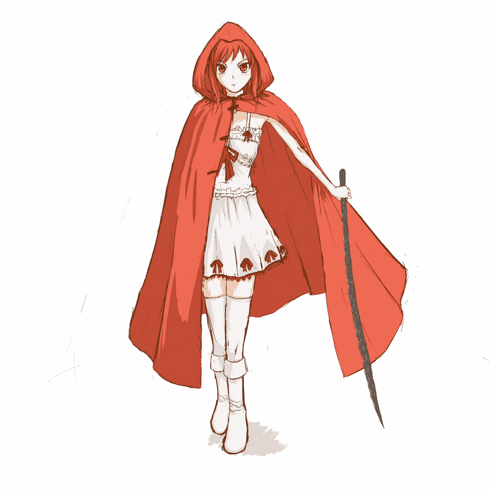
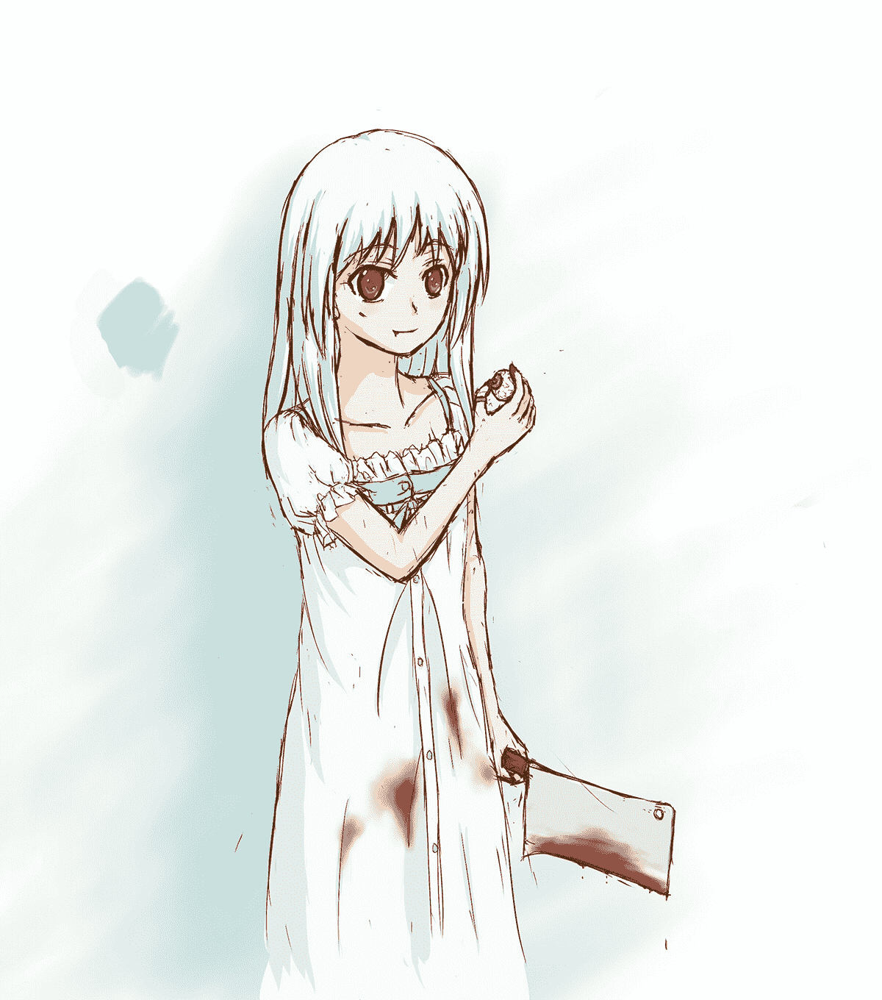

# 【暗夜奇迹杯】《青红》更新第三章·第二女主人设7.29

作者：無間道

TID：17221

 

# 1

*本帖最後由 無間道 於 2014-7-29 22:38 編輯*

郑重声明，本文一定会带有

SM 猎奇 死亡性爱等

7.27更新人设一枚.......

7.29更新第三章

————————————————————————————————————————————————————————————————————————

一      欢笑伴随着恐怖行进在城镇之中。       莎拉从来没有没有这么兴奋过，六年来她一直在忍受着继父的无休止的责骂，现在他几分钟前刚刚变成她鞋底的一滩烂肉。他那酒醉半醒的眼神由愤怒转为了恐惧，由恐惧变成了绝望。莎拉享受着那个过程，她用鞋尖踩烂了他的下半身，任由他在地上痛苦的挣扎，然后莎拉举起一只脚，将他整个人笼罩在鞋底的阴影之下。他举起手，竟然企图用手臂挡住比货船还大的鞋底。       “永别了，唐纳斯先生。”他一直以来命令莎拉叫他先生。       咚！       曾经被叫做唐纳斯的人伴随着皮靴的靴底嵌入在泥土之中，他几乎已经失去了意识，如果那样对他来说确是幸运的，因为接下来等着他的事情更加恐怖。       莎拉的足尖以他为轴心左右碾动着，莎拉感觉的到脚下的生物肋骨一根根的断裂，剩下的身体组织越来越软，无数的内脏从破裂的身体中被挤压出来。然后，等待着这堆烂肉的是一次彻底的死亡之刑。莎拉停止了碾动，然后用力踩住了脚下的躯体，使劲的往后一拧。       唐纳斯倒霉的脑袋从脊椎上被拧了下来，面部组织已经血肉模糊的“他”从自己的肠子和内脏中滚过，他甚至还能闻道刚刚喝过的麦酒味道，然后，他停在了自己一只已经如同面条一般被压扁的小腿的前。       ‘啊……….’他没有能发出声音，因为肺和气管已经彻底的断开了。       无情的鞋跟落下，他的脑壳终于如同一个鸡蛋一样被碾碎了。       莎拉还没有彻底得到满足。       她看着周围的人们四散而逃，随便一脚就踩向一个在奔逃的人，莎拉慢慢的单脚站立，将全身的重量移到那个可怜的逃生者的脚上。       咔吧 咔吧 咔吧…..       “哼哼哼……”随着脚下的人的骨骼慢慢段成碎末而发出了轻蔑的笑声。       她第一次发现，掌控他人的生命，竟是如此有趣。       “这种感觉…..”她看着脚下四散而逃的生命，咽了一口唾液。       “丫头，快把工具收拾一下，是[蚀心者]，跟我离开这里！”老铁匠对着刚刚收养了三个月的小姑娘说道，她手脚笨笨又四肢纤细，怎么看也不适合从 事与火花与钢铁为伴的铁匠这个工作，但是老铁匠怎么也无法忍心把她丢在路边。       ‘丫头’笨拙的把各式的铁锤、铁钳、铲子抱起，跌跌撞撞的走向等在外面的马车上。       地面一阵剧颤，蚀心者已经来到了附近，‘丫头’绊了一下，倒在地上，各种工具散作一团。       “对，对不起….”梨花带雨的她从地上跪坐着，不是因为疼痛，而是又把老铁匠交代的工作办砸了。       外面传来马的嘶鸣，马儿拉着半车家当无脑的冲入了逃难的人群。       “别管这些了，快走！”老铁匠拉着她的一只手就往外跑。       然后，她听到了雷鸣一般的巨响从头顶传来，房梁应声断裂，巨靴在自己的眼前将老铁匠吞噬。       等到她睁开眼的时候，发现自己已经被埋在了废墟之下，手中还握着老铁匠的半只手臂。       她大声呼救，但是外面的惨叫声更加惨烈。       炉火顺着废墟蔓延着，开始灼烧着自己无处可逃的身体。       烈火燃尽所有希望。       ……………………..       二年后       菲莉亚领地周边       红拿出地图，看着周围的地形确认自己走的路是否正确。       菲莉亚领地的版图模糊的画在地图上，红看看自己所在的位置，如果地图正确，那么自己应该已经快到了双河城了，前提是那个叫菲莉亚的人还活着，否则双河城已经在蚀心者的攻击下烟消云散了。       红将地图收回到自己的深红色斗篷之下，戴上兜帽，继续踏上了路程。       脚下的沙土渐渐的连成了路，一些猎人的木屋也渐渐从茂映而出，远处的农田已经依稀可见。       离开上一座城镇已经快一个星期了，身上的粮食也所剩无几，看到城镇的出现红的心中也变的轻快了许多。       附近的树丛中传来了躁动，红注意到了埋伏在其中男人的目光与他的箭头同样冰冷。       很少有城镇会欢迎难民，越多的人代表着自己能获得的资源越少。       箭头是铁的，代表着这个人拥有足够的资金支撑起像样的装备，又或许这个人是“奉命打劫”的官贼。       从树后走出一个男人，他没有说话，铁质的胸甲，铁质的护手，铁质的头盔，精制的双刃剑，还有一面蓬皮圆盾，足以暴露他的意图。       这个人就是首领吧，红心想着。       红看看身后，手持长矛，短剑等装备稍差一些的人也已经把武器对准了自己。       上好的面料，男人看的出这个身穿红色斗篷的人是个富人。如果不是因为这件斗篷，他也就放过这个旅人了，独行的旅人不常见，但是亦不乏有愿意冒险的人。       兜帽放下，呈现出一个火红的长发和双瞳的少女，她的双眼根本没有对视自己，而是呆呆的看向地面。胸前的几个纽扣被一一解开，他看到了包裹着少女微微发育胸脯的白色蕾丝连衣裙，可能主人特别喜欢红色，在连衣裙上也系了几个火红的蝴蝶结；裙边与丝袜之间的大腿虽然还不够丰满，但是少女肌肤却格外红润可爱；脚下踏着的一双白色高筒靴更提主人是勾勒出小腿的曲线。       太干净了，男人感觉到了些许异样，少女完全不像一个旅者，男人看了看最初吸引他的那件火红的斗篷，又看了看少女发呆的双眼。       少女从腰间拔出自己的长刀，如果说那是刀，未免会令人发笑，那根本还是一根应该在铁毡上反复锻打的半成品，漆黑的剑身凹凸不平，根本没有任何的刀刃。       刀在随着少女颤抖。       “住手….快住手….”少女小声低吟。       “你他妈再说啥？快把那破玩意丢了。”背后拿着长矛的男人对少女喊。       “我说……求求你……求求你们……..让我……..”少女抬起头，面目狰狞的笑道：“停下来！！”       火焰瞬间染红了剑身。 ————————————————————————————————————————————————

 2014年7月12日 更新红的人设图

<ignore_js_op></ignore_js_op> **hong.jpg** *(457.23 KB, 下載次數: 0)*

[下載附件](forum.php?mod=attachment&aid=NDQzMDd8MzEyZWIwZTR8MTYwMDg5MDM2M3wxODIzMHwxNzIyMQ%3D%3D&nothumb=yes)

2014-7-12 20:05 上傳

 听从剑爷教诲 这就放一楼

————————————————————————————————————————————————————————————

这个妹子呢就是：菲莉亚  就像妈妈说过的，一般在轻小说中有图的人物都得有点故事，所以毒蛋白同学请放心，这个便当是难以咽下的...

<ignore_js_op></ignore_js_op> **205530txarmfu7davg7xaa.jpg** *(494.64 KB, 下載次數: 0)*

[下載附件](forum.php?mod=attachment&aid=NDUwOTV8Yzg0ZTVkZmF8MTYwMDg5MDM2M3wxODIzMHwxNzIyMQ%3D%3D&nothumb=yes)

2014-7-28 20:55 上傳

这个妹子是个吃货

————————————————————————————————————————————————————————————————————      二

利德尔一生经历过无数次与他人利刃向向，不论是骑兵手中可以把脑壳杂碎的流星锤还是颤抖的农夫手中的钢叉；但是他从来没有见过正在融化的铁刃，炽热的铁水顺着女孩的手掌涌出，最终汇集成了刀刃。

利德尔总算明白为何女孩的武器是一根凝固状态的铁剑了，但，这似乎已经没有用处了。

“是…天选者….”利德尔已经失去了言语的能力。

人终究会死…    但是当人死去的时候，不论出身和地位，每一个亡者都有极小的概率在一天之内被转化为蚀心者，利德尔不知道那些家伙为何存在，但是他很清楚，蚀心者没有人类的理性，只剩下杀戮的快感。如果只是普通的杀人狂大可把他们关入疯人院，但如果那个疯子有接近100米高的时候，周围的一切可见之物便会被他毁坏殆尽。但万物皆有例外，有极少一部分人的转化比较特别，他们没有高大的身躯，取而代之的是他们却拥有了各种奇怪的特殊能力，他们自称自己为天选者。和蚀心者不同，他们可以正常的与人交流，看上去和一般人无疑。但是，在他们心中依然保留着杀戮的欲望，就好像毒瘾，虽然在吸毒后可以一段时间内可以对毒品不再依赖，不过毒瘾重新发作后，那强烈的欲望便卷土重来。

他们是瘾君子，而自己就是唾手可得的毒品。

铁花在空中嘶鸣，铁水在地面狞笑，烈火正沿着钢铁之路慢慢吞噬一切。

这时候，女孩已经准备动手了......

烈焰俯身避，红衣从中跃；

好快，利德尔感觉这个冲自己而来的女孩甚至比菲莉亚还快；

但是他们之间的些许距离足够利德尔举起自己的盾牌挡住这次攻击。

咚！

盾牌和半固体的剑身相撞的声音和触感都很奇怪。

制作盾牌的匠师骄傲的向利德尔炫耀：“我的盾牌挡得住任何利刃！”但是却挡不住制作利刃的原料：炽热铁水顺着刀刃砍下的惯性飞溅向自己。

“啊！！！”利德尔惨叫着，铁水融掉了他半张脸、颈部的肌肤、和左侧的大腿

他的呼吸声好像兀鹫的啼鸣———气管被完全烧开，左腿已经彻底失去了自己原本的功能，火沿着盔甲的内衬开始灼烧自己的肌肤。

女孩开心的笑着，享受着利德尔的痛苦，她没有对利德尔做出致命的一击，而在一旁观赏着利德尔因为痛苦和灼烧而变形的面孔。

埋伏在树丛中的卡林对着女孩扣动了弓弩的扳机；

三棱尖头穿甲箭，专门用来穿骑士的铠甲；

不知道是女孩无心闪避，还是避之不及；箭头结结实实的射中了女孩，卡林可以看到女孩的肌肤清楚的凹陷了下去，然后，箭头扭转了方向，从女孩身上弹开。

是血之兵器，这种由蚀心者或者天选者身体的血肉和骨骼打造出的武器削铁如泥，至少可以在一定程度上伤害到他们。虽然没有刺穿女孩的肌肤，至少女孩的表情已经感受到了痛苦。

卡林迅速躲到了另一侧的树后，事实证明他的决定是正确的，因为自己刚刚藏身的地点已经被火球吞噬。

还有五枚血箭，卡斯和戴蒙已经落荒而逃，卡林早就知道这两个家伙完全派不上用场，他们只有瓜分战利品和玩女人的时候才来精神。

卡林并不算什么神射手，但是卡林知道最基本的战斗的规则：面对强敌是逃还是战，刚刚尝试性的血武对天选者的攻击已经宣告失败，卡林不想再冒险再尝试第二次。

逃跑，卡林只剩下这一个念头。

他小心迈着步子，周围燃烧产生的烟雾对自己是有利的，她不会这么轻松发现自己，只要逃出战场，藏入深处的树林，自己就是安全的，饿虎会先去追击那些逃跑的目标而放弃自己。

什么东西掉在地上，是自己的箭袋吗？竟然这个时候出问题，卡林顺着声音转身查看。

地上的是一只手，自己的左手。

没有感觉，卡林呆呆的看着自己的左腕，刀口如同被切开的热蜡。

“不可能！”卡林突然倒在地上，因为双腿从膝盖处已经消失。

“不可能！”

“不可能！！“

“这不可能！！！”

卡林用仅剩的一只手扒着地面爬行，泥土被五指挖出几道浅壑，但是卡林却没能前进几分。

女孩的刀刃刺入自己的左腿根部，只有短短的一厘米，然后拔出来，下一个刺入的是左肩、后脊、右臂………………….

“疼~吗？痛~苦~吗♪”女孩一边嘻笑着一边不断穿刺者脚下的男人“你能承受几下呢♬”

“如果30下后你还活着的话，我就绕过你~~❤”

“啊！！啊！啊，啊……”卡林的痛苦的惨叫着，五根手指也深深地插入了泥土中。

长靴牢牢的踩住了卡林的后颈，纤细的手臂轻巧的将刀尖一次次的插入卡林的躯体。

“11❤，12❤，还活着吗？那么接下来，增加难度了哦。”女孩唏嘘着把剑插的更加深入了。

地上的尸体已经纹丝不动了。

“什么嘛，才26下就已经断气了。”女孩不满的把尸体一脚踢开。

“好像，还有两个落荒而逃的老鼠呢。”女孩舔着自己的食指。

‘好险，好险！’

戴蒙边跑边想。

现在的情况用丢盔卸甲形容也不为过。

他刚刚转了一个逃跑的方向，而就在那之前，他丢下了自己的兵器，然后和卡斯各自跑向了相反的方向。

竟然打劫遇到了单独行动的天选者，这真是不凑巧，但是自己能保下一条命，就足够幸运了。

从刚才的惨叫声判断，卡林和利德尔已经都死了吧。

虽然很对不起他们，但是自己就算留在那里也只有送死而已。

跑到这里，足够了吧？

戴蒙转身望去，茂密的树林已经把浓烟所掩盖。

接下来自己就慢慢的回到山腰的藏身处，既然卡林和利德尔已经不在了，那么钱对他们来说也就失去价值了。

不知道卡斯那家伙逃没逃掉，如果卡斯也落入虎口的话，剩下的资金已经足够自己开一个酒馆的了。杂货铺的老板萨福万有个漂亮的女儿，但是萨福万一直不肯把他的宝贝女孩嫁给自己，这下自己金盆洗手，开个小酒馆，看萨福万还敢瞧不起自己。等一下，自己那个时候又为何非要追逐于萨福万的女儿，鲁卡妮、甚至菲莉亚的近卫队长捷琳…

一滴水突然落在了戴蒙脸颊。

烈日高照的天是不会下雨的，这八成是什么鸟的大便吧。

戴蒙用手一擦，手上只留有猩红的印记。

戴蒙猛然向上望去，女孩站在枝头，正俯身看着。

虽然这个角度下，女孩裙下的白色丝质内裤依稀可见，可是戴蒙却没有半分想要观赏的念头，因为女孩的另一只手中提着卡斯的脑袋。

双眼、鼻子、耳朵、已经全部挖去了。

“啊！啊！啊！”戴蒙被这景象吓的腿发软，连忙向后倒退，但是后脚跟完全不听使唤，整个人摔了一个屁股墩。

女孩把卡斯的脑袋扔到了戴蒙的双腿之间，卡斯根本不敢细看，用哆嗦的双手迅速把卡斯的脑袋扔到一旁。

女孩从树上落下，微笑着站在戴蒙面前。

“只剩你一个了。”女孩舔着手指上的鲜血。

“对，对不起！我只是被逼迫的！我根本没有想要打劫的念头。”戴蒙跪下来，雨声俱下诉求着“求求你，大小姐，求你不要杀我。”

“哦？”似乎男人的话让女孩感到了兴趣，女孩踏出一只脚，踩在男人面前“先把它舔干净。”

一个十足的疯子，绝对的凌虐者，只想要追求完全凌驾于他人之上的感觉，戴蒙心想。

他看了看女孩的白靴子，感觉无从下口，只得伸出舌头轻轻地在鞋尖擦拭着，一股铁屑的味道传入了自己的味蕾。

“没有调教过的奴才果然什么都不会呢。”女孩一脚踢开戴蒙，戴蒙的几颗门牙被踢出牙槽。

还没等着戴蒙拭去嘴上的鲜血，女孩已经一脚踏在了戴蒙的胸口。

咔！

“会有几根肋骨折断呢？”女孩期待的揣摩着，然后举起了自己的脚，然后重重的落在男人本能阻挡在面前的手臂之上。

尺骨和桡骨很快断开，两只手臂如同风中的木条一样摇摆，随着女孩的跺踏，最终无力的垂下……

男人的头无望的倒向一边，自己的胸口的肋骨已经和肺部组织交织不清。

但似乎女孩已经玩腻了踩踏的游戏，她决定要用另一种方式处决男人。

“对不起……”女孩温柔的抚摸着男人的脸颊，露出一副快要哭泣的神色“我只是….无法停手…..”

“所以….请你….原谅我…..”悲伤转瞬之间变成了欢笑，男人听到了体内沸腾的声音。

“啊…….啊……..”男人已经发不清声音，只能痛苦的长开自己的嘴。

自己的体液正欢快的沸腾，男人甚至可以闻到自己的肉香味，他的全身都在剧烈颤抖者，但这无济于事，他只能眼睁睁的看着蒸汽从自己体内冒出。

体液很快蒸发殆尽，留在地上的只是一具蒸熟的尸体。

红跪在地上，渐渐的变的冷静。

狂欢过后，负罪感和恶心迅速涌上心头。

她立刻捂住了几欲呕吐的嘴。

‘我真是太差劲了……….’红这样对自己说。

但是无济于事，每次发泄过后都有这样的想法，但是用不了多久杀戮的欲望就会卷土重来，她喜欢看着人们在烈火中挣扎，人们一个接着一个的死去。

红站起身，自上而下旋转的火焰蒸发掉了黏在身上的污垢。

一百多年前，或许是神的惩罚，又或者是自然的反噬，蚀心者毫无征兆的降临了，他们漫无目的破坏让人类走到了崩溃的边缘，城市毁灭，人口剧减；不论是重新拾起的宗教还是钢铁铸成的兵器都对他们毫无作用。唯一可以和他们对抗的就是和他们拥有相同力量的天选者，可天选者们毕竟不是正义的化身，他们心中的黑暗欲望依旧吞噬着仅存的人类。人类只能同毫无希望的家畜一般被饲养在羊圈之中……

————————————————————————————————————————————————————————————————————————

双河城白鳞堡地下室

血腥又潮湿的空气弥漫在昏暗的地堡中；

这里的囚室并没有囚禁多少犯人，因为双河城没有监禁的惩罚。

被押送到这里的犯人，大多等待的只有死刑。

男人一丝不挂的被牢牢的绑在了大理石制的试验台上，他惊恐的望着四周墙壁上的恐怖刑具，无法想象等待着自己的是怎样的刑法。

铁皮和铆钉加固的门被打开了，一个只有十二岁大小的白发长发的女孩走了进来。

“准备好了吗？”白发女孩走到墙边，指尖从一件件冰冷的刑具上划过。

“对不起，我们的村落只是遭受了蚀心者的攻击，我再也不会偷东西了，求求你，我愿意赔偿，请让我在这里工作！”

男人无法再说话了，因为他的嘴被少女甘甜的嘴唇堵住了。

水蜜桃的香味融入了男人的味蕾，他从未和如此年幼的女孩接吻过。

女孩皎洁的笑笑，又轻抚过男人的额头，最终灵巧的手指握住了男人的肉棒，在女孩的抚摸下，男人的肉棒渐渐挺立了起来。

“舒服吗？”宛若无骨的双手已经完全将男人巨大的肉棒握住，女孩张开嘴把雨过带珠的龟头完全含在口中，灵巧的舌头均匀的涂抹开马眼溢出的先走液。

“啊…啊….”锁住男人四肢的铁锁叮咚作响，被女孩的戏弄让男人倍感屈辱。

“啊，对了。”女孩松开了轻咬着的肉棒，舌头和肉棒之间拉出几条银丝。

“忘了说，这是给犯人最后的晚餐。”女孩不停上下揉搓着男人的肉棒，“如果你射完的话，行刑就正式开始了哦~”

男人挣扎的更激烈了，他努力晃动着自己的下体，试图想要自己的肉棒在女孩的十指中挣脱。

“呼呼~❤”女孩笑着加快了掏弄肉棒的速度“想要逃跑是不可能的。”巨大的肉棒在女孩手中一跳一跳的颤抖，似乎已经到了忍耐的极点。

“不，快停下！”男人的精液喷洒在了女孩的脸上。

“真是可惜。”女孩用指尖将脸上的精液送入了自己的嘴中。“出局！”

男人几乎疯狂了，他拼命扭动着四肢，铁链碰撞的叮当作响。

“再怎么挣扎都是没用的啦♪”男人感觉自己腹部和下肢凉飕飕的，女孩拿着画笔在男人身上划出了几段红色的线条。

“这是什么？你要做什么？”男人嘶喊着。

“这是一会解剖的时候会用到的，这样就不会切错。”然后，女孩不慌不忙的在旁边架起一副画板，熟练的笔尖快速的描绘出几幅男性躯体的线稿。

“为了研究而献身，你那毫无价值的生命将会被画上壮丽的结局。”女孩对着男人笑着说。

“特别是——————”女孩说着揪起已经软趴趴的肉棒，“这个东西，将变成我私人的收藏品哦。”

女孩无视男人的哀嚎，锋利的剃刀已经剃掉了男人下体的阴毛，随后，冒着寒光的解剖刀映入了男人的眼帘。

“不！不要~~~~~~”

“那么，你想先失去的是这根肉棒？还是后面的金玉呢？”刀尖在肉棒和睾丸之前来回跳动着。

“如果不做决定的话，那么，就由我选择好了。”女孩微笑着把刀伸向了男人的睾丸。

突然而来的敲门声，打断了女孩的兴致。

“说吧。”能进到地下室中的人并不多，但真正要在这个时候打扰她的，也只有算得上是足以惊动双河城的大事了。

“菲莉亚大人，东边的哨所传来了情况，恐怕是，单独行动的天选者。”捷琳的声音。

“哦？”名叫菲莉亚的少女放下了即将要切下男子肉棒的解剖刀，“把详细的情况报告给我。”

双河城，曾经是亚盟帝国在扎马勒和法尔杜丝河上的雄伟要塞，但是三百多年过去了，双河城已经荣光不再。人口从一万人锐减到三千，破碎的城墙铭刻着无数次蚀心者的袭击所造成的千疮百孔；腐烂的船闸已经不能再开启，然而双河之上也不会再有任何船只从其他城镇驶来；人类早已失去发现新大陆时的那份傲气，转而失去了希望和信仰，将自己交给了自暴自弃和混沌无知。

红没有费多少力气就翻过城墙进入了双河城，自白鳞堡而下，一座座塔楼构建起一道道的箭塔，红将自己藏在了兜帽中，走入了冷清的街道。就算是天选者也需要食物和休息，红晃了晃刚才的从几个人身上拿来的钱包，里面几十彩色的玻璃硬币在其中喀拉作响。金属在这个时代是珍贵的材料，不会用来制作易于磨损的钱币，于是每个城市都有自己的替代品，聪明的商人甚至在私下制定了几个临近城市中钱币的汇率。

这里没有旅店，只有酒馆。没有旅人需要住宿，只有精神紧张的农夫们需要灌醉这被诅咒的人生。

红推开门，走进了散发着霉味与酒精的酒馆。几个人注意到了她，来酒馆的女人并不多，然而衣着靓丽的少女就更少了，他们相互嬉笑着，从对方口中询问着少女的来路。

没有人见过这个少女，双河城中一个人完全不被其他人所认识的情况是极少的，那么这个少女极有可能是外人。

弗朗西感觉少女在“邀请”他，没错，她看着他，然后嫣然一笑，举起酒杯，喝光了一杯麦芽酒。

弗朗西感觉自己的机会来了，他对服务生要了几杯酒，然后靠了过去，坐到少女身边，少女并没有反对，相反有些兴趣的看着他。

“你叫什么名字，我之前没有见过你。”弗朗西给女孩递过一杯满满的酒杯。

“琴。”少女接过酒杯，然后看着弗朗西手中的麦芽酒，轻轻示意。

“好名字。”是不是好名字并不是重点，弗朗西喝了一口酒，女孩也跟了一口。

“之前没有见过你，你是不是…..”弗朗西知道，逃难者是不受欢迎的。   

“我是从梅山来的商人。”少女举起酒杯。

“哦？做什么生意？”少女在有意和他比试酒量，但弗朗西感觉自己是不会输给一个小女孩的。

“铁。”少女给弗朗西展示了一下别在腰间的黑色长刃。“我想要见见你们的菲莉亚大人，听说她是个小女孩。”

“是，一个白色长发的小女孩，但似乎实际年龄要大一些。”弗朗西的手伸向了女孩的膝盖，然后顺着白嫩的大腿轻轻游动着。

少女抓住了犯规的手，把他重新放在桌子上。

“喝酒。”女孩似乎并没有生气，只是重新强调了一下游戏规则。

“听说菲莉亚是个学者。”少女已经开始举起另外一个满满的杯子。

“是，她喜欢研究一些乱七八糟的东西。”弗朗西不想示弱，也举起一杯。

“听说她有一个图书馆。”

“是，我曾经去过。”

“你为什么去过那里？”

“很多人都去过，菲莉亚喜欢邀请人去他的城堡，因为我近距离目睹过蚀心者，所以被邀请过。”

少女笑了笑，但已经满身酒气。“继续。”少女又要了一杯。

……………………

弗朗西不知道自己喝了多少杯，自己也不知道说了多少，人已经是半醉，但是叫琴的少女也已经醉倒在桌子上了。

弗朗西背起少女，跌跌撞撞的向门外走去。

毫无疑问，自己是最后的胜利者，现在是该品尝奖品的时候了。他要解开女孩的衣襟，细细的舔舐那对微微发育的乳房；脱去女孩的长靴，慢慢的玩捏柔嫩的脚掌；他的舌头要从女孩的腋下一直舔到足尖，最后，就是该让蜜穴知道谁才是胜者的时候了…….

“站住。”不是背上少女的声音。

弗朗西回头望去，看见菲莉亚的近卫队长捷琳站在自己身后。

由蚀心者的血肉淬炼的胸甲在阳光下闪闪发光，干练的金色马尾绑在脑后，久经风霜的双眸催生出的锐利眼神另弗朗西不敢直视。

“我做了什么？”弗朗西转过身，惊恐的发现自己被人包围了，十几把弩箭对准了自己，连附近塔楼的弩枪也正把笨重的攻城箭对准自己，每个士兵的表情都绷得紧紧的，丝毫不像是在面对一个手无寸铁的酒鬼。

“你想要带着我们菲莉亚大人的客人上哪去？”捷琳勉强挤出一丝微笑。

红从弗朗西身上跳下，看来没有必要伪装了，红褪去了烂醉的表情。

“什么时候发现我的？”红注意到在远处的白鳞堡上，一个白发的少女正站在阳台上望向自己，‘那就是菲莉亚吧’红心想着，就算拥有血之武器，这些士兵依旧不能与天选者正面对抗，但如果在这里出手，意味着和菲莉亚的彻底的敌对。

“从一开始您入城就知道了。”捷琳尽量让自己的表情显得自然，“菲莉亚大人邀请您去白鳞堡做客。”

红本来就要去白磷堡，但不是正大光明的进去，但现在似乎已经没有选择。

“那么，请带路吧。”红一缕长袍，走在了前面，几个士兵护送着红，并将周围的路人推到一边。

只留下了一个醉汉，双腿发抖的坐在地上。 

 

# 2

*本帖最後由 無間道 於 2014-7-12 18:00 編輯*

 发现黄头发最好的，忘了人设之前画画图搭配一下了，于是变成橙色头发了..... 反正大体上也是红色

<ignore_js_op>

**hong.jpg** *(457.23 KB, 下載次數: 0)*

[下載附件](forum.php?mod=attachment&aid=NDQzMDV8MDcxMzJiNmV8MTYwMDg5MDM2M3wxODIzMHwxNzIyMQ%3D%3D&nothumb=yes)

2014-7-12 17:27 上傳

 

# 3

  更♂新

 

# 4

更♂新 

# 5

  耕♂地</ignore_js_op>