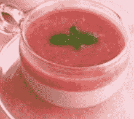

# 【暗夜奇迹杯】杀人者死 4／5（完）与5／5整合版 （8.4更新）

作者：小劍

TID：17230

 

# 1

*本帖最後由 小劍 於 2015-1-2 20:01 編輯*

本文已经全文完结，集中到了一起

请移驾 [http://giantessnight.com/gnforum ... hread&tid=18051](http://giantessnight.com/gnforum2012/forum.php?mod=viewthread&tid=18051) 

# 2

第十三节

 

# 3

*本帖最後由 小劍 於 2014-7-10 15:55 編輯*

> 通过一个人用心雕琢的作品不难揣测他的喜好与心理。

> 囿于无奈的现实，作者恐怕很难在现实生活中扛起长剑体验一把畅快淋漓的厮杀。

> 

> 但是这仍不妨碍我们感受到他对于这种对战的极度兴奋与渴望。

> 

> 所以战斗场面才会如此翔实而极具画面感与动感，且不难感受到作战双方的坚定如铁的作战意志。可以想象作者在描写对战时绝对是一边把自己带入，一边两眼放光地飞速敲击着键盘。这一段作者写起来想必也很是畅快淋漓大呼痛快吧。

这段话真是说到我心里去了

> 柳叶刀一样的亚伦与蛇果般的塞露贝拉

这一对比喻也是相当精彩

> 不知为何，这部小说里，给我印象最深的不是柳叶刀一样的亚伦与蛇果般的塞露贝拉，而是独眼巨人博尔波与老科斯特。

非常棒的一句话

我不是一个擅长多线操作的写手，我的脑子只能单线程；同样的，我也很难写出大量形形色色别具一格的人物，我只能把少数的几个人物写出灵魂

作为作者，凡是笔下有名有姓的角色，都是我所爱着的，无论立场，无论善恶，因为，他们都是【人】

生与死是这部小说的主题，而【人】，则是主角

先贤是人，乱军是人，死去的英雄是人，苟存的懦夫是人

人是最美丽之物，人是最崇高之物

形形色色的角色代表了【人】的不同侧面，优点，缺点，丑陋，闪耀，这一切的一切构成了名为【人】的存在

博尔波的邪恶却刚毅，科斯特的散漫却锋利，亚伦的冷静却激昂，雷纳尔的刻板却纯净，蜜希尔的天真却无私，塞露贝拉的强大却柔弱，这都是人所独有的魅力

先贤是有史以来最完美的人，而第三纪元的人类们，将是未来最完美的人——这就是人类与先贤同源却异种的根本原因

 

# 4

> [wtman 發表於 2014-7-12 18:29](https://giantessnight.com/gnforum2012/forum.php?mod=redirect&goto=findpost&pid=226977&ptid=17230)

> 啊，看到4/5，無腦猜測如下:

> 先賢其實是基因改造的人類。

> 現在的人類其實被第一紀元的某東西控制，帝國所信 ...

看起来尾田是忠实读者，点赞

另外之前有提到过

「只要安全度过第二纪元，塞露贝拉作为备用保险的存在意义就没有了」

所以钢铁圣母并不是你猜想的那样，她才是先贤的主力手段

塞露贝拉也并非惊慌，而是不甘

 

# 5

好的更新了两万多字，大概两三天后第四PART就搞定了 

# 6

　　有人哭着求我发一篇书评的书评，所以书评的书评来了

——不是开玩笑的

——但是第一次听说书评也有书评

——如果书评的书评也要书评怎么办，之后五十年的人生都用来干这事吗？如果是的话请至少一周双休并且每年有15天假期可以去外面走走，我认真的

　　说实话这书评我看了四次，差点因此死掉了。大半夜的员工都睡了，我得使劲憋着不笑出来，刚刚撕裂过的腹肌几乎都要崩断了——我没说过我下午练仰卧起坐吗？那这里补上——如果我有但大地址铁定要寄一张请款单用以弥补医药费，当然会附上医院的发票

　　然后，我是不会修改第三章的，放弃吧。不论你们对它吐槽多么激烈，但我就是喜欢两个男人用拔出长剑互相捅来捅去的剧情，怎样啦！

　　另外那一节是伏笔——全文到现在哪一段不是伏笔吗？如果有麻烦大家指出来我会把它改成伏笔谢谢。

　　关于第一纪元的设定，我得澄清一下真的没有出PC游戏的计划，只不过有策划过在本书出版后可以据此做一些卡牌游戏作为周边贩售，动画化后会绑定在特典DVD中当做赠品——制作公司我觉得BONES不错，虽然经常有出些状况但动作场面的制作非常精良，我和我的出版社会积极与他们进行洽谈，如果有出版社的话。

> 福利場面是不會讓故事有所進展的，完全只是一種停滯，為了服務讀者的眼睛與XX而存在的段落。

> 我覺得這是GTS故事的一個先天性負擔。

　　这一段说得很好，坚定了我无福利的信念，以后如果有人抱怨撸不起来请找但丁私聊谢谢

> 小劍所描寫的日常風景，真的是很有趣，讓人忍不住懷疑他是不是成天想著一位空氣女友來與她對話。

　　我姑且也是有过女友的经验人士，不过确实，大部分的对话都是凭空想的，男女主角的性格其实都是参考我自己的不同人格写的。你说这样写会不会精神分裂？没事的，分裂了不过是多出一两个人格而已，习惯就好

　　说实话，第四章的战斗场景我以后肯定是要大砍一刀，狠狠改掉的。因为现在的版本根本是为了后面的剧情服务，功利性超强的写法，很难感受到战斗的美感（虽然我知道你们有一大堆人是怎样都无法从战斗中感受到美的），修改版应该会更简洁干脆，毕竟本章重点是谈生意。

　　是的，谈生意——我没说过自己是生意人吗，应该有吧——当然啦，亚伦这小子也不是为赚钱而谈，他所有的话语都有着明确的目的性，大概两千字之后就会揭露，也算是伏笔了。

　　再说一次，如果发现哪段不是伏笔请务必告诉我，我马上改！

　　虽然但大表示这一章的故事超展开令人抓狂，但是要知道，我是习惯在结局玩超展开的——也就是说，这一次的结局如果没有如此众多的伏笔作为铺垫，任谁都会大喊扯淡，就是这么离奇。

　　最后

<ignore_js_op>

**QQ图片20140803202418.jpg** *(10.25 KB, 下載次數: 0)*

[下載附件](forum.php?mod=attachment&aid=NDU0NjR8YTdkNzE3YmN8MTYwMDg5MDA3OHwxODIzMHwxNzIzMA%3D%3D&nothumb=yes)

2014-8-3 20:32 上傳

这就是草莓布丁，大概是长得比较像脑浆所以商家不敢卖吧

 

# 7

第四章更新完毕，我去打饥荒了</ignore_js_op>