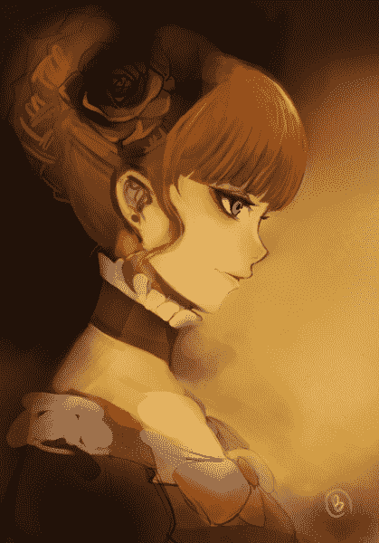
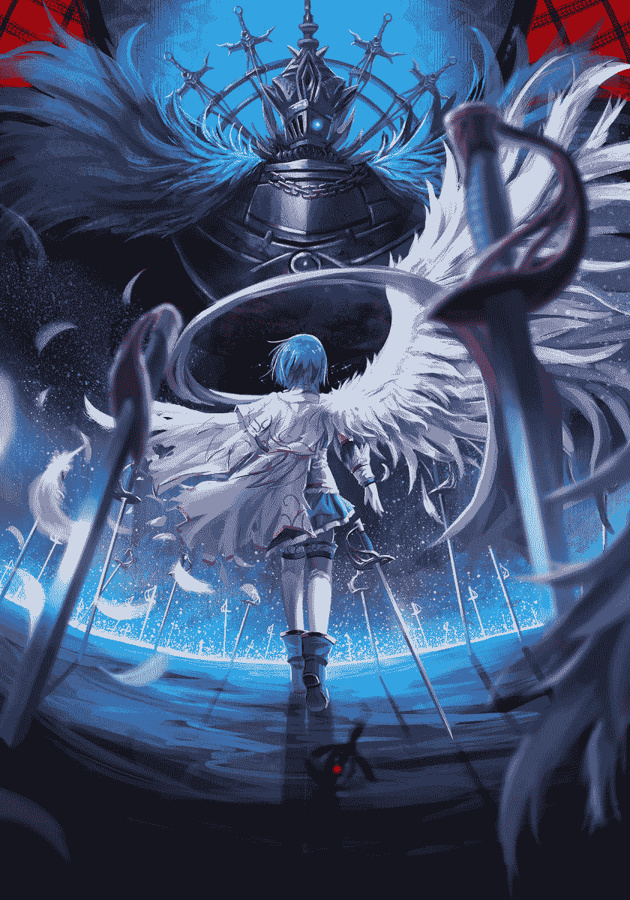
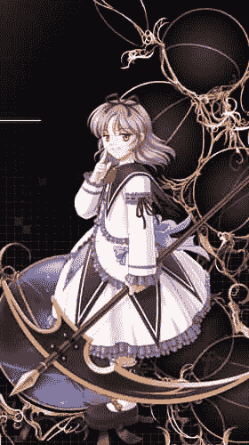

# 【月兔盃】魔法少女學院派　一（後記完整版）

作者：小劍

TID：10906

 

# 1

我的文章索引：[http://giantessnight.com/gnforum ... =page%3D1&frombbs=1](http://giantessnight.com/gnforum/viewthread.php?tid=6050&extra=page%3D1&frombbs=1)

我所有文章的簡體版均在博客中：[http://hi.baidu.com/sword0198/blog](http://hi.baidu.com/sword0198/blog)

我先把自己的抽籤結果寫出來吧

核戰后沙漠世界

猛烈燃燒的火場

抖Ｍ

被人當救世主

然後就是抽到要寫八個自選要素

我選擇如下：

一桶水板凳古代的银币政府核发的某种许可证铁锤齿轮轮子会讲话的尸體

文中會標注出要素位置

那麼．．．．．．因為是長篇所以活動中只能寫好第一集

　　　　　　　**魔法少女***學院派*　一

　　真紅的烈焰舔舐著一切，扭曲模糊的空氣中充斥著刺鼻的氣味，四周全是驚恐的尖叫聲，以及不時傳來的重物墜地聲。

　　在突如其來的衝擊之後，整個商場陷入了黑暗與火海之中。顧客與店員全都失去了自控能力，瘋狂地擠向一樓狹窄的出口處。不知有多少人被莫名其妙地撞倒，然後被失控的人群踩踏，生死不明。

　　而一個穿著附近高中的校服，長相沒多大特色的青年卻沒有加入到這危險的狂歡中去。他站在灼熱而冷清的商場二樓，調整了呼吸，略微思考了一下，品味著直覺告訴他的危機感。

　　正門是不能去的死地。平淡地注視著爭搶著沖向死亡的人群，他果斷邁開步子，提起一桶清潔工用來擦地板的水（要素一，一桶水），毫不猶豫地淋了自己一身。

　　微黑的水中傳來令人難以接受的氣味，不過這總比被燒死好多了。給自己施加了有限的防護之後，雲閑之憑藉著記憶，用濕而髒的衣袖遮擋口鼻，躲避著不停吞吐的火舌與要命的濃煙，迅速跑到了一個小房間裏。

　　這是他經常光顧的商場，所以對於內部設施還是有些印象的。果不其然，這個雜物間裏有他需要的東西。

　　他搬過一張板凳（要素二，板凳），站在上面，正好能夠到防盜窗。然後，用外套擋在前方，舉起剛剛取來的小鐵錘（要素三，鐵錘）用力砸向了眼前的玻璃。

　　不愧是防盜玻璃，並沒有出現裂痕，只有一個白點。不過既然一下不夠那就多來幾下，畢竟不是防彈的，被敲碎只是時間問題而已。

　　在火焰蔓延到這裏之前，雲閑之總算把這塊窗戶給敲出了裂縫，之後再砸幾次，就整個碎掉了。

　　感謝人道的鋼化玻璃設計者，碎掉的玻璃呈圓潤的顆粒狀而不是尖銳的匕首，一件薄薄的校服外套就足以保護臉部不會受傷。

　　粗粗清理了一下殘留的玻璃渣，雲閑之爬上窗臺，隨後跳了下去。

　　雖說只是二樓，但商場的一樓可是特別挑高的設計，垂直高度怎麼說也有五米，從這裏跳下對普通人而言是會造成骨折的行為。

　　雲閑之當然只是個普通人，不過他選擇的方向很正確，落在了車棚頂上，滾了兩下才真正跳向地面，總算是勉強沒有受傷。

　　這是商場後方的空地，除了他以外一個人都沒有，看來所有人都沖到了正門處。原本還有個後門可供緊急逃生的，但是顯然商場方面並沒有嚴格遵守消防法規，用大量貨物把它給堵住了——不過即使後門能用他也不會走就是了，和人群在一起太危險了。

　　現在最佳的選擇是直接從邊上的小巷逃跑，但是就這樣走了實在讓人不安，所以雲閑之決定悄悄觀察一下正門的情況。

　　他謹慎地挪動著身體，保持隨時能利用牆體躲避視線的姿勢，慢慢摸了過去。

　　一路上他聽到了無數淒慘的哀號與詭異的媚笑聲，但這都在預料之中，並沒有什麼值得在意的，他只是更加小心了一點而已。

　　一個轉角之後，他看見了商場正門處可以用【人間地獄】來形容的景象。

　　數百名顧客被十多個怪物堵在了門口，進退不得。

　　這些怪物像是漆黑的影子，她們的臉上除了咧開的嘴以外沒有任何五官，除了媚笑外不存在任何表情。她們有著人類女性的體態輪廓，卻足足有三米多高，普通人只能到她們的大腿。

　　她們什麼也不做，只是笑著將人群堵在原地。

　　前面是怪物，後面則是熊熊的火海，被逼到絕境的人總會產生拼命的勇氣。一些強壯的男人取過商場裏的椅子或梯子之類的物品作為武器，嘗試著殺向那些黑色的影子，卻驚愕地發現自己的攻擊全都穿透了對方的身體，仿佛用刀砍向霧氣一般，連中斷那讓人恐懼的笑聲都做不到。

　　隨後，那些有著裸女外表的怪物嬉笑著甩起手中的長鞭，輕而易舉地把一個個活人抽打成兩三截，製造出更大的恐慌。

　　這就是雲閑之聽到的哀號聲。

　　不過他並沒有動容。那些人會死是當然的，他們根本不明白自己面對的是什麼。事實上，這個城市裏恐怕只有雲閑之一個人明白。

　　那是使魔，由魔女的力量而產生的魔力生物。用任何純物質的手段都是無法傷害到她們的，而魔力構築的攻擊卻可以直接擊斃物質生物。這種戰鬥從一開始就沒有公平過，所以可以簡單地稱之為屠殺。

　　「是使用長鞭的使魔，看上去速度並不快，只要不進入她的攻擊範圍，並不是很難逃走……」他回來本來就不是為了救人或者彌補良心上的不安這種天真的理由，他的唯一目的，就是觀察敵情，判斷自己的生存幾率。

　　從頭到尾，雲閑之只是在為自己一個人的生命考慮。已經是高中生的他，早就拋棄了做英雄的可笑念頭，在現在的他看來，所謂的英雄不過是笨蛋而已，頂多是擁有力量的笨蛋。

　　既然目標達到了，那就該趁著自己還沒被發現快點閃人。

　　然而就在他準備回頭時，一股強烈的恐懼感凍結了他的心臟。

　　那是一種本能的戰慄，是下位生物對上位生物的懼怕，是獵物對狩獵者的畏懼，是人類對神明的敬畏。

　　或者說，是人類對【魔女】發自靈魂的顫抖。

　　不只是雲閑之，在附近的所有人都感到了這種恐懼，甚至連被使魔的長鞭抽成兩截的男人也突然停止了哭喊，只是粗粗地喘著最後幾口氣。

　　不過和別人不同，渾身濕透的青年在一瞬間就取回了身體的控制權，更加小心地注意著自己的呼吸與行動。

　　魔女降臨了。

　　女性般的影子們笑著唱起了古怪的歌，歌詞並不是這個世界的語言，不過雲閑之知道，那原本是一首聖歌，卻被惡意篡改得荒誕而又殘酷，聽不懂才是一種幸運。

　　就在這神聖而又血腥的大合唱中，【她】登場了。

以上更新于２０１１．８．３１

　　原本空無一物，只有發出暗色光芒的防輻射保護罩的城市上空，出現了一個巨大的女性。

　　女性大約有五十余米高，身著華美奢華的高貴禮服，緩緩向下飄落，仿佛連重力也無法阻止她的雍容與閒適。

　　金色的秀髮被精心盤起，既淑女又莊重；寶藍色的雙眸微微眯著，訴說著她的慵懶與高傲。

　　輕輕地，優雅而內斂的高跟鞋踏在了街道上，將一輛不知好歹停在下方的跑車碾得粉碎。

　　以棕色為底，金線為綴的長長裙擺飄落下來，蓋住了周圍小巧的房屋，從上空看去，如同一朵怒放的玫瑰，神秘而又豔麗。

　　明明是無法解釋地從虛空中降下，但全場沒有人認為她的出現是突兀的。早在騷亂伊始，她那絕對難以忽視的強烈存在感就已經籠罩了整片地區，給人以莫大的壓力，否則即使是火災爆炸也不至於讓整個商場亂成這樣。

　　「諸位，」盛裝的魔女用清晰的通用語開口說道，嘴角掛著禮貌卻極端蔑視的笑容，「妾身名為梅朵麗塔，即【無限之蛇之魔女】，歡迎來到妾身的宴會。」

　　然後，無限之蛇之魔女做了一個開始的手勢。

　　黑色的使魔們接到了命令，興奮地發出刺耳的笑聲，舉起長鞭，狠狠地抽向被圍困的人群。

　　霎時血肉飛舞，如同噴灑的香檳。

　　如同惡魔的開關被按下，被血腥一幕刺激到的人都瘋狂了，他們再也不顧那些影子女人的高大體型，求生的欲望促使他們潮水般向前湧去。

　　使魔們也配合地退後幾步，留出了足以逃生的空隙。於是在擁擠中踐踏著弱者肉體的人群如同一窩受驚的螞蟻，分散成幾支隊伍，毫無目標地亡命奔跑。

　　「就是這樣，諸位，請盡情起舞吧！」愉悅地觀賞這一幕的魔女微笑著，如同見到客人們都享受在宴會中而感到無比滿足的女主人，「讓我們的相聚更難忘一點！」

　　說完，梅朵麗塔提起裙擺，從容地向前邁步。

　　一個愚蠢的男人居然極端地錯誤向著她的方向跑來，結果被六米多長的玄色高跟鞋準確地踏住。然後踩在他身上的力道緩緩加大，在這男人的悲鳴聲中，他的脊骨、臂骨和腿骨逐一被無可抵禦的壓力弄斷，直到顱骨像葡萄一樣被踩爆的那一刻，他的痛苦才迎來了結束。

　　「真是……令人迷醉的危險美味。」感受著死者靈魂中蘊含著的美妙魔力，梅朵麗塔難以自製地伸出舌尖舔了舔自己的手指，「妾身……想要更多……」

　　這次她無法等待下一個不幸選錯方向的可憐蟲，而是取出長鞭，靈巧地將一個哭泣中的少女卷到空中，伸手接過。

　　「年輕的小姐喲，請問妾身的招待是否令你滿意呢？」魔女將手中的人類舉到眼前，用舒緩的上流社會文法輕柔問道。

　　可惜那明顯被嚇壞了的少女只是劇烈地顫抖著，除了牙齒打架的聲音什麼話也說不出來。被巨大而閃亮的雙眼盯著，還被說話時帶出的大風吹得搖擺不定，小小的貴客大概連智能都被凍結了。

　　「看來客人你不太滿意呢，也是，妾身那些粗魯的女僕實在是太令人失望了。」擅自替人作出回答的梅朵麗塔痛心地歎息著，而後又換上了優雅而危險的笑容，「相比之下，小姐你的年輕與美貌才真是動人呢。」

　　似乎真的感到手中的生命是那麼的青春可人，古雅的魔女小心地將手指伸出，撫摸著對方的白嫩肌膚。

　　精細雅致的光潔指甲不經意搭在了她的頸側，一種對於危險的生物本能打破了心靈深處的堅冰，人類面對利刃的天生恐懼令少女尖叫著想推開它，卻怎麼也做不到。

　　她想往後逃，卻被兩根指頭擋住了退路；她想向前推，但又怎麼推得動比她腰還粗的指尖。

　　梅朵麗塔看著她的努力與徒勞，綻放出了豔麗的笑容。就像人類看見廚房裏活蹦亂跳的白魚，明知那種掙扎是可笑並滑稽的，卻總是會為食材的新鮮而發自心底感到愉快。

　　如果這時候切一刀下去，這條魚肯定會跳動得更歡吧？

　　於是晶瑩圓潤的精緻指甲暫時兼職了屠刀，滑開滑嫩的肌膚，滑開充滿青春活力的肉體，讓小小的客人更加興奮地掙扎著。

　　魔女索求的，不過是魔力而已。

　　她們自身的殘缺導致充斥天地的自然魔力拒絕在其體內流淌，所以只能選擇奪取。就如同獵豹捕獵羚羊，羚羊啃食青草，青草從陽光中攝取能量一般，能夠自發地從世界吸取魔力的人類成為了魔女的獵物，她們撕碎肉體，吞咽靈魂，然後獲得魔力。

　　但人類體內的魔力雖然充沛，卻不可能被完全奪取，大部分都深藏在人體之內，於靈魂消亡後回歸到了空氣與土地之中，能提供給貪婪的母獸們的，不過是九牛一毛。

　　不過，當靈魂出現強烈震盪時，這個比例會顯著提高。

　　靈魂的震盪，可以等同於情感的迸發。

　　比如，絕望，與痛苦。

　　在將手上那原本活力四射的白魚切去四肢，挖空內臟之後，冷血的魔女才意猶未盡地緩緩將手掌合上，聽著指尖下傳來的密密麻麻的破裂聲，舔著從掌紋中溢出的鮮紅血液，滿足地閉上了眼，顫抖著，發出一聲情難自禁的呻吟。

　　眼淚，哭喊與詛咒，永遠是最完美的調味料。　 <ignore_js_op></ignore_js_op> **&#36125;阿朵莉切.jpg** *(172.52 KB, 下載次數: 0)*

[下載附件](forum.php?mod=attachment&aid=MjYwNTF8MjQ5MmI1NGZ8MTYwMDg5MTYyNXwxODIzMHwxMDkwNg%3D%3D&nothumb=yes)

2011-9-3 00:17 上傳

（我看心情會貼出角色原型，方便一些文字想像能力較差的同好）

以上更新于２０１１．９．３

目睹了這一切暴行的雲閑之並沒有任何表示，除了微微皺起的眉頭。他根本不在乎死了多少人以及那些人死得多慘，只要與自己無關，死者不過是一些數字，死狀也不過是幾句說明，生與死既然區別不大，那麼怎麼死更是毫無討論價值的細枝末節。

他在意的，只是自己似乎不那麼安全了。魔女的感知比使魔敏銳許多，即使混在這麼多人之中，也難保不會被發現，雖然概率不大，但太過危險。

所以他保持原本的姿勢一動不動，靜靜等待著機會。

機會來了。

無限之蛇之魔女在親手奪取了兩個靈魂之後，應該是玩夠了，這樣低效率的行為根本不能滿足她那無盡的欲望。所以梅朵麗塔停住了死亡的腳步，淑女般用雙手指尖輕輕拈起裙擺。

裙下的陰影化作一道道暗色的河流，凝聚成無數的影子生物，帶著輕浮的笑聲漂浮著四散開來。

這一刻對於雲閑之而言，是唯一的機會，也是最大的危機。魔女的精力全都放在了製造使魔上，不可能發現一個渺小的人類在有目的地逃離；同時，數量眾多的使魔大大增加了他被捕獲的可能性，而任何一隻使魔都有著足以碾壓他的力量。

逃亡開始。

雲閑之保持著並不迅速，卻足夠隱蔽的移動，進入了小巷之中。

勝利的條件其實不算太苛刻，只是一般人完全不清楚。一味地奔逃是無意義的，因為這一片地帶已經成為了魔女的【獵場】，裏面的人類不可能出去，外側的人則根本不知道內部發生了什麼，這是世界的法則，僥倖逃過一劫的人不可能真實地回憶起發生的一切，他們會忘記魔女的存在，只會按照常識將降臨於自身的不幸認作是事故或是戰爭，大部分情況下媒體的解釋會是沙漠中那些瘋狂的【流民】又發動了恐怖襲擊。

所以想生存下去，除了完全依靠幸運，就只有靜靜地躲避這一條路可走。

魔女與使魔可以輕鬆地感應到人類散發出來的魔力，所以普通人連這一條路都走不通，只能瑟瑟發抖地隱藏在角落裏祈禱，然後被高大的黑影女性捉小雞一樣揪出來，輕易送了性命。

而雲閑之在保持移動的同時，精細地控制著自己的每一次呼吸，計算著每一步消耗的體力，並永遠處於古井不波的情緒之中，在隱蔽與速度間那微妙的平衡點上起舞，如履薄冰。

他選擇的路徑都是視野受限，卻又四通八達的小道。在這種地形上，體型巨大的使魔很難輕易移動，而他總能首先發現對方，從而進行恰當地躲閃。

只要不被直接目擊，那些愚蠢的女人是不可能發現他的。

然而，無論一個凡人如何努力，在命運面前也只是徒勞的。

在一個老舊的居民區裏，雲閑之看見了一具屍體。

那具屍體斜靠在樓梯邊的垃圾焚化爐上，從體型上判斷，生前應該是個女性。

之所以要從體型來判斷，是由於屍體的整個臉都被莫名的巨力打碎了，還保留著原本形狀的，只剩下一張嘴而已。

雲閑之的臉色變得很難看，卻不敢移動。

他當然不會被區區一個死人嚇倒，即使那個死人站了起來。

只剩半個腦袋的女屍借著焚化爐的牆面，緩慢而又抽搐地掙扎了起來，把臉轉向了附近唯一的活人。

雖然已經不存在眼睛，但她顯然是在盯著臉色發白的青年。

接著她開口，吐出半凝固的血塊，不清不楚地說著：「救……我……」（要素四，會說話的屍體）

雲閑之沒有回答，這只是一個無聊而低俗的惡作劇。

果然，得不到回應的屍體放棄了繼續裝神弄鬼，用屬於年輕女性的嗓音說道：「什麼啊，你怎麼一點都不怕的樣子，真是無聊哦。」

只有半個腦袋的屍體做出矯揉造作的扭捏狀，實在是筆墨難以形容的詭異一幕。

「咦，還是說你其實怕得都不敢動了？那看來我還是很成功的呀！」雲閑之的沉默讓她產生了武斷的結論，開心地擺出了V字手勢，還裝可愛地偏了偏腦袋，甩出了不少大概是腦漿的東西。

實事求是地說，沉默的青年確實是在畏懼。一般而言，對於鬼、僵屍或者幽靈這種解釋不能的未知存在，任何人都會發自心底地感到恐懼。但有時候，清楚明白的東西更令人絕望。

面對始終不發一語的青年，女屍感到了極度的無趣：「真是的，【躲在這把人嚇到尖叫】的計畫被你搞砸了，該有的狼狽和嚎哭都沒了！」

於是屍體炸了開來，血肉灑遍了骯髒的焚化爐。

從四散的屍塊中升騰起了漆黑的濃煙，凝聚成了一個只有笑臉的高大影子。

千算萬算，青年也不可能想到居然有使魔會古怪到鑽進屍體來嚇人。

儘管沒有雙眼，但雲閑之真切地感覺到自己已經被兩道目光牢牢鎖定了。

獨自面對一個狀態萬全，而且興致勃勃的使魔，實在是……能預料到的最糟的局面了。

兩人高的使魔本身的物理力量就已經是手無寸鐵的青年無法對抗的，更何況作為魔力生物天生擁有的作弊般的能力，即使雲閑之手上扛著單兵火箭筒或者重機槍，也根本起不到任何有益的作用。簡而言之，人類沒有絲毫手段去傷害魔法生物，哪怕她只是其中最微不足道的使魔；而她隨意的一擊，就可以輕易將人體分為兩份。

這根本構不成戰鬥——無論是多麼懸殊的戰鬥，至少雙方都擁有著擊敗對手的可能性，即使這可能性不足萬分之一。

而雲閑之面對的情況，可以稱為虐殺，或者蹂躪，這沒什麼差別。

不過，青年並沒有絕望，他始終將自己情緒的波動抑制在一個極低的水準上，換句話說，他處於臨戰狀態。

這是一場懸殊卻依然留有懸念的戰鬥，失敗條件是本身死亡，勝利條件是逃得性命。

在僅以活下去為目標的情況下，他還擁有著三個優勢，如同三個細小的砝碼，毫不起眼，卻依然可以改變天平的角度。

脫離了屍體之後，影子女性也失去了語言的能力，她只是發出各種各樣難以形容的笑聲，甩出了手中的長鞭。

「咕！」突如其來的壓迫讓青年發出了呻吟。

能夠毫不費力將人體撕碎的鞭子並沒有帶起血肉，只是緊緊地纏住了雲閑之的脖子，將他拉倒在地，拖向了自己的主人。

第一個優勢，在於使魔不會立刻下手殺人。

震盪的靈魂中蘊含的魔力實在比平時多得太多，為狩獵而行動的魔女必然會下達相關的指令，讓使魔們盡情對獵物施加恐怖與折磨，並且花上足夠的時間去玩弄，甚至故意給予獵物逃跑的機會，隨後將他們的幻想粉碎。肉體的痛苦，精神的壓榨，希望與絕望的落差，這都是上佳的作料，優秀的魔力增幅劑。

所以雲閑之不敢行動，他擔心會刺激到這個使魔，導致在意外中被瞬間幹掉。雖然現在處於對方的掌心之中，但只要活著，總是能夠出現機會，或者製造機會。

他仰躺在地上，被頸部的皮鞭無情地拉扯著滑向對方腳下，過快的速度讓背後一陣火辣辣地痛，而更痛苦的是無法呼吸的感覺，脖子上的壓力差點讓他昏過去。

等到停下來時，他終究保持住了清醒。不過這似乎不是什麼好事，因為一隻墨黑的巨大裸足狠狠地踏在了他的身上，擠出了青年肺泡中的所有空氣。

「噗哈！」胸口的氣體一股腦沖出了氣管，發出了短促的怪聲。

這只腳幾乎蓋住了他的整個軀幹，而且還在不斷扭動著，上上下下地施加著力量，腳跟猶如一個鈍鑽頭般向著柔軟的小腹旋轉碾壓著，絲毫不顧及腳下那人的感受。

或者說，她原本的目的就是給對方最大的痛苦，在不致死的前提下。

幸運的是，雲閑之的身體算是多少有鍛煉過一點，在這樣暴力的踩踏下居然沒有傷到內臟。所以，他忍住痛楚，從口袋中伸出右手，牢牢握成拳，全力砸向踩在自己身上的那個腳踝！

這就是第二個優勢，他擁有【某種】能夠攻擊到對方的手段！

　　不過這種攻擊也只是一個普通人的力道而已，對於眼前這種體型的存在，幾乎和撓癢癢沒多大區別。

「咿咿啊？」

可就是這種撓癢一樣的攻擊，大大出乎使魔的意料之外，她絕對想不到自己居然會被人類用拳頭接觸到，大吃一驚下腳底一滑，結結實實仰面摔了一跤。

從雲閑之的角度看，這一摔的氣勢簡直像是一座山整個塌了下去，沒壓到他脆弱的身體真是運氣。

趁著對方失去控制的工夫，青年用最快的速度想解開束縛在脖子上的長鞭。可它纏得實在太緊了一點，雲閑之足足用了兩秒鐘才掙脫成功。

而這時候，已經太晚了。

倒地的使魔已經回過神來，她看見獵物想要逃跑，立刻伸出修長的雙腿，一左一右夾住了他的全身。

「唔...... 」比自己整個身體還要長的雙腿上傳來了難以想像的壓力，這一次可不像之前的踩踏一樣是玩弄，而是為了確保獵物的無力化而進行的攻擊。稍微認真起來的使魔，僅僅是雙腿一夾的力道就差點弄斷了他的骨頭，即使是雲閑之也不由發出了痛苦的悶哼。

肩膀上響起了不祥的聲音，如果再這樣下去，恐怕兩隻手臂都會斷掉。

「混蛋……去死！」身處絕境的青年把力量集中在唯一能動的右腿上，對著使魔的兩腿之間狠狠踹了過去。

　　「咿咿咿咿！！！」

不知道這種魔力生物的構造和人類有什麼相同之處，總之這種攻擊似乎起到了奇效。原本鉗子一般夾住雲閑之的雙腿放鬆了許多，而那使魔也發出了奇怪的聲音，甚至微微抖了起來。

這裏是弱點嗎？青年發現了生機，果斷地連連出腿，命中同樣的部位。

「咿呀！」

影子女性居然呻吟了起來，渾身顫抖不停，她有力的大腿此刻軟軟地靠在地上，絲毫構不成任何威脅。

抓住這個莫名其妙的機會，雲閑之踉蹌爬起，雖然渾身疼痛，狼狽不堪，但總算是能逃掉了。

這算什麼詭異的情況！雲閑之轉身離開前甚至看到她把手伸到了下面，做起了不堪的事情，雖然臉上沒有五官，但唯一有形的嘴巴大大張開，任誰都知道是怎麼回事了。

這女人居然被踢到下體後就發情了，難道是個被虐狂？

雲閑之只知道使魔擁有有限的智慧，行動都是基於本能或者命令，但眼前這個傢伙卻大出他的意料之外，無論是之前偽裝成屍體還是現在的超M表現，都遠超他的想像與經驗。

儘管被嚇到了，不過這顯然不是什麼壞事。青年默默地把手中的一枚古舊銀幣放回暗袋（要素五，古代的銀幣），「還好不需要使用這東西就能解決問題……」他在心中感歎了一下自己說不上好也說不上壞的運氣，無聲地離開了。

雲閑之逃離後，那個使魔依然躺在地上自己做著某種劇烈的運動，發出高高低低的呻吟聲。直到她那被挑起情欲的身體感到了疲倦與滿足，才戀戀不捨地舔舔自己的手指，慢慢吞吞地站起，開始尋找之前踢了她幾下的那個男人。

她之所以輕易就放走了雲閑之，除了情難自禁外，也是由於她記住了那個人類的魔力頻率，只要在這個【獵場】之中，就可以很容易再找到他，這也算是符合主人那個【給予希望，然後剝奪】的指令。

但這次，她驚訝地發現，她找不到了。

如果不算那個使魔的特殊體質的話，【懂得隱藏自己的魔力痕跡】，正是雲閑之的第三個優勢。

以上更新于2011.9.7

成功甩掉那個詭異的使魔後，雲閑之繼續著自己的保命計畫，只不過這次他的移動更加謹慎——既然有了一個不普通的使魔，誰能保證沒有第二個呢？

【獵場】出現至今已經過了兩個小時，他現在也處於離中心區域較遠的街道上，這附近出現使魔的概率應該是很低的。如果在魔女的附近就想躲起來，那是愚蠢的自殺行為，大量的使魔會用地毯式搜索找出任何放棄移動的人類；不過在這裏，找個房子藏好比在路上亂晃更加安全，而且體力上也不允許他再走更遠了，畢竟之前並不是散步，而是緊張的逃亡。

他走進了一家社區小超市，裏面沒有半個人影，看來是在災難發生時就跑光了，連門都沒有鎖。雲閑之就像回家一樣，關上大門，坐在櫃檯上，隨手拿起貨架上一瓶運動飲料就慢慢喝了起來。

他可沒有犯罪的自覺，反正主人大概是死掉了，也用不著這些商品了，還不如利用起來救別人——這裏的別人，特指他自己。

當然，如果店主還活著也無所謂，都經歷過生死的人了，想必也不會在乎一兩瓶水吧。

那麼，只要小心隔絕自己的魔力，在這裏一直躲藏到這次狩獵結束，就算是安全了。

正當心底浮現出一絲安心感時，他愣住了。

他感覺到了，不是視覺，不是聽覺，而是另一種無法描述的感官，偵測到了一個資訊。

一種蘊含著魔力的資訊。

【找到了】

隨後，有某種存在很隱蔽地破開了不可破開之物。

世界的法則被悄悄繞過，不該存在於這個世界的存在出現了。

很顯然，界之膜被人撕破，上界的生命來到了下界。

很不幸，似乎那傢伙正是沖著雲閑之來的。

青年正準備逃跑之時，面前的大門就被人打開了——該死，因為區區一扇門對使魔而言根本構不成阻礙，所以他完全沒考慮過上鎖，結果就連拖延時間的效果都沒達到。

走進來的，是一個普通的女生。

不，說普通確實是不太恰當，雖然比起使魔魔女之類的超現實存在，她至少長得像個正常人類，不過這個地區的人根本沒有那種藍色的頭髮與眼睛。

闖入者是一名青眼藍發的少女。她的著裝非常奇怪，明明都是在那個年齡段的女生間流行的時尚服飾，卻在搭配上有著微妙的錯位感，就像是早餐吃油條與漢堡一樣，合理，卻彆扭。

她的長相頗為稚嫩，大概頂多是初三或高一的樣子，不過氣質上卻非常獨立幹練，令人難以判斷她真實的年齡。

這女生的相貌，如果說漂不漂亮的話，肯定是屬於【非常漂亮】那一類的，但是看到她的人往往想不到這個詞。

——英武，她給人的大概就是這樣的感覺。

就像一頭雌豹，雖然美麗，但更多的還是獨立，與力量。

籠子裏的豹子是值得欣賞的，可如果這種生物就自由自在地站在你面前，恐怕任誰都只會警惕起來吧？

尤其是，雲閑之可以肯定，她就是之前突破界之膜，特意來找他的那個存在。

魔女，都是這樣降臨的。

同時，這種出場方式不僅限於魔女。

「你找我？」雲閑之不會問【你是誰，來幹什麼】這種無營養的問題來浪費時間，而且那種方式太容易在交涉中陷入被動，兵法講究虛則實之，在自身實力處於絕對劣勢的情況下必須利用虛張聲勢的手段來把握住主導權，哪怕只是暫時的。

「這位……先生，」對面的少女因為雲閑之的態度而產生了一點動搖，不過她還是丟開疑問，按照既定流程進行說明，「我之後所說的內容也許會超出一般人的常識範圍，不過我希望你在經歷了外面那些超自然現象之後能夠冷靜地接受。」

她頓了一下，見對方沒有意見，才繼續下去：「現在時間緊急，我只能粗略地解釋個大概。魔女——也就是外面正在危害人類的那個巨大女性，是從另一個世界過來的生命，她們的目的是吞噬人類的靈魂，而這個世界沒有任何手段可以對抗她們，即使是最先進的武器也無法傷害到魔女。」

「我同樣是來自那個世界的生命，我們的組織是為了阻止魔女而成立的，但為了獲得與她們戰鬥的力量，我必須和這個世界的人類簽訂契約，否則我在這個世界也只是個脆弱的凡人。」

說到這裏，她深吸了一口氣，用碧藍色的雙眼直視雲閑之：「而你是這塊區域最適合成為契約者的人類，請問你是否願意為了人類而獻出力量呢？」

「不願意。」青年冷冷地吐出三個字，然後從少女身側走過，走出了超市大門。

「等，等一下！！」被完全出乎意料的情況震到的少女連忙追了出去，拉著他的衣角質問道，「為什麼不同意？這是唯一拯救你們的方法了！」

「你很煩人。」青年並沒有回頭，只是把自己的衣角拽了回來，連腳步都不曾停下，「我現在很安全，如果你不在這裏，我會更安全，那麼我幹嗎要去和魔女戰鬥？」

「不，但是，魔女在殺害人類啊！」因為自身的優秀與努力，歷來備受關注的少女第一次遇上守則中完全沒有提及的情況，不得不絞盡腦汁開始思考如何說服一個拒絕簽約的人，「你的朋友、親人都可能就這樣被殺掉，而你自己也隨時都有被發現的可能，難道你就甘心眼看著這種事情發生嗎？」

「我的親人早死光了，也沒有任何朋友，而我很有自信不會被那些豬一樣的使魔抓到。只要在獵場裏面躲好，那個女人吃飽了自然就會離開。所以要簽約請去找別人，我為什麼要冒險去幫助你？」

「不對，你……」連番的打擊並沒有讓她失去冷靜，少女在雲閑之的發言中找到了極度不正常的部分，「你怎麼會知道【使魔】和【獵場】這些名詞？人類是不可能瞭解的，這是世界法則！」

「世界法則就是個白癡，和電腦作業系統一樣充滿了等人去鑽的漏洞。」青年卻不屑地掃了一眼天空，像是將那佈滿灰黑色輻射雲的穹頂當做了世界法則的象徵，「而且你們【學院】的課程還是一樣的愚蠢。如果想要引誘人類簽約，至少得說些諸如【你是被選中的人才，只有你可以拯救這個世界】這種具有煽動性，或者【我一定會保護好你，請無需擔心安全問題】之類能給人虛假安心感的話語吧？只懂得在危險的時刻用威脅的方式半逼迫別人簽約，這是最低效而且後患無窮的方法，好好去學習傳銷技術吧！」

「這……」眼前這形勢已經完全脫出少女的掌控了，她所學習的知識裏只有如何在最短時間內向【下界】的普通人類解釋魔女與魔法，而沒有教過該如何對付這樣的傢伙。

「你的校長什麼都沒說明就讓你過來了？」看著原本英姿颯爽的少女臉上佈滿猶豫，雲閑之也放緩了語氣，畢竟問題不在她身上，「你不可能是自己找上我的吧？」

「沒錯，是校長指定讓我來讓你成為契約者，我也非常驚訝，因為你身上完全感受不到魔力波動，並不是適合的人選。」

談到這個話題，少女鎮定了下來，顯然對方並不是普通市民那麼簡單，雖然不知道具體的情報，但至少不必憂心於如何對人類解釋世界的真實了。

「這是當然的，如果你能感覺到，那我早就死了。」在魔女肆虐之時，隱藏魔力的技術正是雲閑之最大的手牌。

不對，好像遺漏了什麼……

青年原本平淡的臉色突然變得嚇人起來。

他可以躲過使魔的偵測，可身邊這個少女可以嗎？

不論本身的實力技巧有多麼強大，沒有契約者的現在，那藍發青眼的女生根本就是一個普通人。

所以，她被發現了。

「不好！我感覺到有使魔在向這邊移動，速度非常快！」在他產生這個念頭的瞬間，就聽到了不祥的話語。

「廢話，怎麼可能不快……」失策了，失策了，太長久的平凡生活真的削弱了自己的警惕，居然會想不到這點……

雲閑之暗暗自責著。連他都能很清晰感覺到界之膜被突破，魔女又怎麼可能會無視，恐怕大量的使魔正在向這裏趕來吧，即使現在立刻拋下這少女自己逃跑，大概也是不能生還的了。

「快，和我簽訂契約，不然我們都危險了！」少女在這種時刻依然鎮靜地提出了唯一可行的議案。

「可惡……被擺了一道！」雲閑之狠狠一咬牙，「母狐狸！」

「請不要誤會，這種情況並不在我的意料之中，我絕不會以此來脅迫人類簽約，這真的是意外。」

「不是你的錯，我罵的狐狸是你們校長。」

哪有在魔女正在肆虐時送來【畢業生】的道理，那該死的女人，分明就是故意想把我拖下水！

腹誹是無意義的，所以雲閑之收拾起了煩躁的心情，做出了合理的決定。

「來簽訂契約吧，魔法少女。」

以上更新于2011.9.11

人類對於世界的認識，是錯誤的。

這個世界，實際上分為兩個部分，互不干擾，卻又互相影響。

自從混沌結束之後，輕而虛幻的浮於上，重而厚實的沉於下，這就是世界的一體兩面。

人類所知所感的，是【下界】，物質與魔力的領域。下界的特徵是【實】，生物體內充斥著龐大的魔力，卻無法被使用。

而與之相對的【上界】，則只存在著精神生命，擁有無與倫比的能力卻缺乏作為源泉的魔力，是為【虛】之境。

下界之民無法使用魔力，上界之民無從獲得魔力，這是世界的規則，也是平衡的前提。在這種限制之下，生命無法掌握過於強大的力量，於是一切井然有序。

而這種平衡，在兩百年前被打破了。

無法使用，甚至無法察知魔力存在的人類，居然在物質的道路上創造出了輝煌的文明，並最終自我毀滅。

簡單而冷酷的核武戰爭摧毀了整個生態系統，永久改變了地表的結構，連天空都成為了不變的灰黑色，輻射無處不在。

雖然在兩個世紀之後人類依然存在，並且很大程度上恢復了失落的科技體系，在無邊沙漠中建造了一座座抗衡著自然的都市，但有些東西，卻是永遠不能修復的。

比如說，平衡。

下界的劇變導致了世界的震盪，原本堅不可摧的界之膜，不明原因地出現了小小的縫隙，於是兩個世界產生了聯結點，下界的魔力少量洩漏進了上界。

這些許的魔力，引發了難以想像的轟動。上界之民第一次認識到，她們操控精神與靈魂的技巧，在擁有魔力作為能量時，能夠發揮多麼可怕的力量！

只要有足夠的魔力，魔法便無所不能。

為了那種接近神明的感受，上界之民開始爭奪那少得可憐的些許魔力。就在下界的滅世核戰之後不到十年，上界也爆發了大混戰，雖然在破壞力上不足以相提並論，但就殘酷程度而言卻尤勝一籌。核戰，是短期大量人類的死亡，而【源泉之亂】，卻是無數個體在互相廝殺，血腥，並原始。

又過了數十年，上界之民找到了穿越界之膜的方法。

對於一群會為了微弱魔力進行死戰的生命而言，一個有著無限魔力的世界是一種多麼大的誘惑？

在下界的上界之民，幾乎就是神本身，她們可以肆意掠奪，任意捏造，盡情品味猶如美酒般香醇的魔力，這對她們而言，如同在白蘭地的海洋中暢遊。

明知這樣做會導致世界失衡，甚至再一次歸於混沌，但依然有無法抑制自己渴望的上界之民敗給了欲望，從人類靈魂中榨取魔力。

這種存在，被稱為【魔女】。

魔女根本不在乎幾百萬年後世界可能因此而終結，然而總有人在乎。為了對抗魔女們毫無遠見的愚行，【學院】成立了。

每一個畢業生在掌握了足夠的戰鬥技巧之後，就會進入下界，殲滅魔女。為了避免影響世界平衡，她們採用與人類訂立契約的模式，從契約者身上獲得魔力支持。

這就是【魔法少女】。

―――――――――――――――――――――――――――――――――――――

「很好，時間不多了，我們馬上開始！」青發的畢業生取出一枚銀幣，「另外，我現在只是畢業生，還不算魔法少女。」

「．．．．．．都這種時候了還計較這些，你其實是個死腦筋吧？」雲閑之嘴上抱怨著，手上卻一把搶過了她的銀幣，塞回了少女的口袋裏。

「你在幹什麼！這是必須的道具．．．．．．」

「我當然知道。」青年完全沒在意自己的動作是多麼失禮，「用我的。」

然後他取出自己那枚，鄭重地放在地面上。

雖然那些漏過界的魔力經過時間的沉澱已經擁有了上界的屬性，但下界的魔力依然無法被上界之民吸取，所以魔女要通過吞噬靈魂的方式繞過法則的約束，魔法少女需要依靠人類作為媒介。

而尚未簽訂契約的畢業生是無法使用魔力的，甚至連簽約儀式都無法完成。因此，學院派的人員都配置了一枚這樣的銀幣。

銀，自古就被賦予了高貴與神秘的寓意，是魔力的優良載體。以下界之物質為本，上界之伎倆為輔，魔力附著其上，而銀幣本身擁有的貨幣屬性使得其可以在兩個世界流通。經過這些手段之後，小小的銀幣騙過了世界法則的探知，成為了微弱卻不可或缺的火花，點燃整片草原。

如果不是這枚銀幣提供的魔力，畢業生甚至連物質形體都無法保持。

這就是雲閑之最後的保命手段，差一點就浪費在之前那怪異的使魔身上了。

現在，則到了不得不用的時候了。

「為什麼你會有【初始之光】？」少女猶豫了一下，不過很快把注意力轉移到正事上來，「關鍵的咒文必須用我們的語言，你模仿我的發音來吟誦吧，時間太少了，一定不能出錯。」

她理解到眼前的男人對上界的認識非常深刻，但無論如何不可能懂得上界虛言，這是大腦構造決定的，人類不能長期記憶虛言的任何發音。

雲閑之當然是人類，所以他說的是標準通用語。

「山之靈，海之玄，不可言說者，請靜聽我的宣言！」他半跪於地，將手掌覆在銀幣之上，肅穆說道。

不可目視的力量被觸動，掌心的銀幣瞬間融化為閃亮的流體，逕自遊動著，分散著，在路面上形成了一個小巧的法陣。

做完前序準備，雲閑之抬起頭，對青發少女粗略說明了一下：「咒文的意義不過是讓世界法則承認契約的合法性，那麼只要效果相同，任何語言都不成問題，因為法則是全知而無知的。只要理解到它的全知，則可用任意語言；只要理解到它的無知，則可用任意方式。」

「確實是這樣，但．．．．．．」少女點頭同意他的觀點，卻依然無法相信他的行為，「至今為止，能夠改動契約咒文的只有校長而已。」

「那麼現在還有個我。」雲閑之卻不想多討論這個無益的問題，「大概還有一分鐘，我們得儘快。」

「明白。」雖然不認為青年可以做到這一點，但在已經沒有選擇的情況下，少女絕對不是那種繼續糾結的人，她乾脆俐落地單膝跪了下去，觸摸著銀色的法陣。

如果雲閑之的咒文是錯誤的，那麼兩人都將被趕來的使魔撕碎。明知如此，少女卻沒有質疑，沒有堅持使用可靠的學院派契約，這種果斷令青年非常滿意。

雲閑之當然不想死，所以他絕對不會犯錯：「穿越隔膜的是客人，應我邀請而來；她的言行即我的言行，我的意願即她的意願，不存在主與客，只有一人。上界之民為虛，下界之民為實，虛則無根，實則無華，一切如常，不曾變更。」

這段話無法欺騙任何人，卻可以騙過整個世界，因為全知亦無知。對於世界法則禁止的兩個要點，穿越界之膜以及魔法的使用，咒文中給出了虛假解釋：只要雲閑之對兩個人的一切行為擁有主導權，那麼就可以認為不存在第二個人；而他確實不能使用魔法，只是作為魔力傳輸者存在，同時少女也並沒有吸取下界的魔力，因為吸取者是青年。

將兩人作為一體躲過第一個禁忌，然後分開解釋又躲開了第二個禁忌，這種破綻百出的解釋卻正好能通過世界法則的邏輯，所以雲閑之一直對那東西絲毫不帶敬意。

「那麼，你現在還沒有名字吧？」他暫停儀式，詢問道。

「沒有。」少女點點頭。上界之民的名字在這裏是沒有意義的，因為發音無法被人類記憶，所以無論是魔女還是魔法少女，都需要一個下界的名字。根據學院傳統，為了增加契約雙方的默契，一般由契約者為畢業生命名。

「那就叫克萊薇雅。」雲閑之並沒有在取名上浪費寶貴的時間，隨便找了一個和對方氣質相近的，然後他取出隨身小刀，割開手掌，將鮮血灑入法陣中央，「那麼——宣言者：雲閑之。」

「宣言者：克萊薇雅。」少女接過小刀，同樣放出血液，在銀白法陣中和青年的鮮血融合。

「契約成立！」二人同時出口，等待著最後結果。

此時，最接近的一個使魔已經出現在了視線之內，她懸浮著高速前進，手上長鞭化作黑色的閃電，帶著破風之聲疾速抽來。

她早已得到魔女的指令，要全力毀滅疑似魔法少女的生命，在她簽訂契約之前。

然而已經遲了。

虛假的宣言，真實的契約，已經成功騙過了世界法則。

畢業生，成為了魔法少女。

藍色的風從地面旋起，迷亂了所有人的視線。世界因為不應存在之物的出現，發生了難以查知的震盪。

在蒼藍之風中，伸出了一隻青色的短靴，極其迅速地踏中了來勢洶洶的使魔。面對著比自己整個身體更加巨大的靴底，漆黑的影子生物來不及做出任何行動，毫無懸念地被強烈的衝擊碾成了四散的煙霧。

此時，風停了。

早在契約成立的瞬間，雲閑之就已經退到一旁，以防被魔法少女的變身波及到，現在正好能看清自己契約對象的相貌。

少女的相貌與之前毫無二致，只是體型增長到了三十余米的程度，服裝也發生了變化。

藍與白，是她的主色調。

青色的短裙與靴子，白色的長襪與手套，以及迎風飄揚的純白披風，充滿了美感而又簡潔幹練。明明是柔軟的布料而非厚實的堅鎧，卻讓人一眼就看出，這套服裝的作用只有一個。 <ignore_js_op></ignore_js_op> **15b218d1af0110b3562c84e4.jpg** *(246.07 KB, 下載次數: 0)*

[下載附件](forum.php?mod=attachment&aid=MjYxODR8Njc2ZjQ1ZjF8MTYwMDg5MTYyNXwxODIzMHwxMDkwNg%3D%3D&nothumb=yes)

2011-9-21 14:29 上傳 

那就是戰鬥。 

以上更新于2011.9.21

契約成立，已經能夠從雲閑之身上獲取魔力的克萊薇雅嘗試著調動力量，從虛空中取出一柄細長的軍刀，隨手一揮，就將附近的使魔斬殺了乾淨。

「奇怪，你能支援的魔力並不算多，為什麼……」她微微蹙眉，把這很失禮的疑問說了出來。

按照少女的想法，既然是校長親自指定的人選，又懂得如此豐富的知識，那麼青年應該擁有難得一見的魔力儲量才對。而現在她自己成為了契約對象，才發現傳輸過來的魔力流量並不算少，但也只是普普通通，沒有任何特殊。

雲閑之並沒有回答這個問題，他討厭被別人主導對話的走向。

「你的隊友呢？」所以他逕自提出了問題。

由於魔力來源的差異，顯而易見的，魔女在總力量上佔據優勢地位，畢竟她們狩獵的靈魂實在太多，即使大部分魔力都被損耗，剩餘的依然可觀。儘管魔法少女都是經過嚴格的戰鬥訓練後才能夠畢業，也很難單獨完成討伐的任務。

同時，魔法少女的數量對於肆虐整個下界的魔女而言太多稀少，如果一個隊伍中人數過多就根本沒有人手顧及到所有地區。

基本而言，一個地區會有三至五名魔法少女組成小隊，互相配合以對抗魔女。

「這個小隊只有我一人。」而克萊薇雅的回答卻讓人意外。

「一人！？」雲閑之也微微吃了一驚，「你是稱號學員？」

「是的，我是這一代的【騎士】。」少女點點頭，說明了自己的身份。

「居然是騎士……連最後的稱號也有背負者了……」雲閑之低聲說道，腦中產生了許多念頭。

學院方面對於畢業生有著自己的分級系統，會根據實力來決定她們是組成幾人小隊以及與誰配合，自然，越強的學員所在的小隊人數越少。

而擁有【稱號】的學員，則是唯一被允許獨自作戰的階層。每個稱號同時只能被一人背負，直到其死亡。

出於個人惡趣味，校長根據國際象棋的設定，設置了五個稱號——列兵，主教，城堡，騎士，以及女皇。每個稱號背負者都是在某個領域最出色的存在，出色到足以憑藉劣勢的魔力擊敗魔女，因此才得以獨自成隊。

至於【騎士】，意味著眼前的少女是現在擁有最全面戰鬥技巧的魔法少女。一般而言，綜合實力僅次於【女皇】——那個連魔法也必須精通的稱號。

從對方派遣【騎士】這一點上，雲閑之大致猜到了如今的局面，以及校長的想法。

「局勢那麼糟糕了嗎……」心中有了個模糊的輪廓，青年的表情更冰冷了，「但我說過，別再找我了！」

「什麼？」由於身高的原因，克萊薇雅聽不清地面上的青年在說些什麼。

「不，我只是自言自語而已。」雲閑之這次沒有說謊，這一切都是少女不需知曉的，「魔女發現我們了，你該戰鬥了。」

那麼巨大的少女突然出現在城市中，還殺掉了十幾個使魔，只要不是瞎子恐怕任誰都會發現這裏出問題了。

「沒錯，我該戰鬥了。」克萊薇雅半跪下來，伸出手指虛點在青年身上，將淡淡的青光融入他的體內，「這個【破邪】能夠保護你不被使魔傷害，找個安全的地方藏好吧，接下來的局面不是人類能夠參與的。」

雲閑之並沒有回答，只是靜靜看著克萊薇雅轉身走向魔女。

人類不能參與？

他冷笑了一下。

不過沒必要和那位騎士小姐解釋，畢竟他確實無法參與到戰鬥中去——在準備工作不足的情況下。

青年四下望瞭望，找到了一家文體用品商店，店主當然也跑得不知所蹤，只是大門卻記得上了鎖。

這難不倒他。

隨手撿起地上的大塊碎石，青年毫不猶豫地砸向了櫥窗。刺耳的警報鈴瘋狂地尖叫著，但在如今這連半個活人都不存在的街道上，也不過是刺耳而已，無法阻止任何人的任何行為。

從碎裂的視窗小心進去，雲閑之稍微找了找，就把一副普普通通的望遠鏡提在了手裏。顯然，他沒打算付錢。

為了打敗魔女拯救城區，想必店主是不會在意的，反正他自己是不在意。

等到他回到街上，克萊薇雅已經遠得看不清了，大概已經開始交戰了吧。所以他得稍微抓緊點了。

幸運地是，附近停了一輛無人的警車。

他走向車門，取出一張黑色的精緻卡片（要素六：政府核發的某種許可證），貼在光感元件上輕輕一觸。

車門很輕易就打開了，甚至連引擎也已經啟動，就等著駕駛員踩下油門。

雖然還未成年，但想必現在交警也沒空來查駕駛證。所以雲閑之俐落地坐了上來，腳底用力，警車竄向了危險的市中心。

這三年來，雖然一直平平凡凡地生活著，讀書，考試，取得優秀成績，但雲閑之的身邊一直都帶著兩樣東西，從來沒有遺忘過。

一個是銀幣，現在成為了法陣，算是用掉了。

另一個是這張卡片。一旦使用，那麼就必然會與政府發生關係，會非常麻煩，卻又可能在關鍵時刻救自己一命，所以他一直沒有丟棄。

而現在，雖然面對超自然的事件這張特許卡完全沒有多大作用，不過又回到這一領域的雲閑之也不準備再與官方保持距離了。那麼，不好好壓榨一下這張麻煩卡片的剩餘價值，豈不是虧大了？

所以他下車之後找了個早已無人的政府大樓，依然放肆地刷著卡進入電梯，直達寫著【閒人免進】的天臺。

一路上沒有什麼波折，除了電梯裏居然還藏著一個使魔。

她手中抓著一個性別不明的人類，正在投入地玩弄著。之所以說性別不明，是因為那人的臉已經只剩一片紅色，分不出五官；身體也是如此。

不過仔細看看，應該是女性的體格，或者是比較嬌小的男性？誰知道呢。

看到居然又有人進入電梯，那個正開心折騰手上玩具的使魔楞了一下，不過很快咧開了笑臉，為了不讓獵物逃跑而伸出了大手。

然而青年根本沒打算逃跑，他在電梯門合攏前走了進去，按下了最高層的按鈕，旁若無人地像個普通上班族一樣無聊地等待著這大鐵盒子升到必要的高度。

使魔對他的表現非常驚詫，然後抓住了他的肩膀，再然後，就沒有然後了。

【破邪】的效果非常出眾，魔法少女隨手佈置的防禦也絕非使魔等級的小嘍囉能夠想像的，青色的電光隨著黑色的手臂向上延伸，輕輕鬆松就把陰影生物賴以生存的魔力擊碎，散落在空氣中。甚至來不及發出一聲慘叫，原本還顯得恐怖而強大的使魔就消失了，宛如一場噩夢終於結束。

唯一能證明這不是夢的，就只有那還未死去的遇難者。

「救……」雖然聲音已經嘶啞，但大體還是能聽出是個女性。不過雲閑之從來沒有憐香惜玉的壞毛病，更是對眼前這離死不到半步的可憐人愛莫能助，所以他只是答了一句：「做不到。」

連「抱歉」這種客套話都懶得說！

「殺，殺了我……」也許是意識到自己已經沒有活下去的希望，或者說被折磨成這樣，大概死亡才是最好的解脫，那個女性轉而求死。

「懶得做。」青年卻淡淡地拒絕。

不是他下不了手，也不是他冷酷到連死亡也吝於施捨（雖然看起來很像），而是因為他已經與克萊薇雅簽訂契約，不能算單純的下界之民，如果親手殺人，會在極小的程度上破壞平衡，甚至有可能不慎吸取了死者的靈魂，導致魔法少女墮落為魔女。

當上界之民通過奪取靈魂來獲得魔力，就會無法抵抗那種強烈的誘惑，極快墮落，即使是訓練有素的學院派畢業生也不例外。所以無論這可能性有多麼微小，在不必要的情況下雲閑之也絕不會去冒險。

所以他只是等待。

「叮！」電梯到達頂層，而身後那人也已經成為了屍體，在青年冷漠的注視中，在劇烈而無處不在的痛苦中，默默死去。

至少在雲閑之的干擾下她的靈魂不至於成為別人口中的美餐，所以他也沒什麼負疚感。

死者已逝，青年踏上天臺。

接下來把生者殺掉就好。

鬧市之中，人群瘋狂地逃竄著。

不過梅朵麗塔只是默默地放任這一切，並沒有如同之前那般以得體的笑容去進行獵殺遊戲。

因為真正的敵人出現了，當然不適合繼續進餐。

青色的騎士一步步慢慢靠近著魔女，此時的距離還非常遙遠，但她卻停下了。

這是一個微妙的位置，再前進一步，就會對魔女造成威脅，那麼戰鬥會立刻開始。

「學院派的畢業生？」梅朵麗塔打開綢扇，掩嘴輕笑道，「你是在等妾身的賓客們離席嗎？」

明明是立場相反的敵人，卻擺出這種悠閒聊天的架勢，也許對於追求儀態與風度的貴族魔女而言是再正常不過的行為，但性格直接的騎士卻皺起了眉。

「沒錯，我不希望波及到無辜。」

這句話表明了她的性格弱點，但梅朵麗塔也不會愚蠢到真的去用人質這種方式來迎敵。

首先，她自身的修養決定了她不可能採用下作的手段；其次，人質是無意義的。

學院派的目的根本不是什麼人道主義。無論善良與否，不同世界不同種族之間是難以談論【人道】的，她們只是在維護世界的穩定，如果魔女的行為不會導致混沌再臨，根本不會有人關心下界的人類是否死光了——也許會在人類死光前留下一些種子，然後養殖起來，專門用於提供魔力。

所以說，雖然有性格善良的魔法少女會像眼前這青色劍手一樣注重保護平民，但也不可能天真到為了一兩個人質而放棄戰鬥，那才是本末倒置。

「正好，妾身也不希望難得的美味都被糟蹋掉，那就如你所願，我們先耐心地稍作等待吧。」魔女點點頭，輕柔地側坐在一座居民樓上，搖動著華貴的綢扇，「戰鬥結束之後，再重新舉辦晚宴也不算遲。」

克萊薇雅並沒有回應她那明顯的挑釁，只是還劍入鞘，靜靜地等待。

正是這個等待，給了雲閑之一點時間，使得他勉強趕在開戰時趕到了天臺。

以上更新于2011.9.26

當雲閑之在天臺邊緣架起望遠鏡時，戰鬥已經拉開了序幕。

　　梅朵麗塔的攻擊非常單純，只是微微掀起那玫瑰般怒放的裙擺，優雅地一行禮。

　　濃郁的黑色就從裙底流瀉而出。

　　那是蛇。

　　千萬條漆黑的巨蛇吞吐著信子，怒濤般湧向了唯一的目標。

　　簡單無比的手段，卻因恐怖的數量顯得無從抵擋，這就是【無限之蛇之魔女】這稱號的由來。

　　在墨色的海浪之中，青色的倩影上下翻飛，如同一艘孤獨的帆船，於狂風怒浪中苦苦掙扎。

　　（這種數量……）

　　克萊薇雅感到了莫大的壓力。她擁有毋庸置疑的出色劍技，在她的劍下，巨蛇就像雜草一般被成片成片切碎，化作煙霧。然而同樣和雜草一樣，無論被毀滅多少，還是會有更多巨蛇前赴後繼地沖向少女，仿佛無窮無盡。

　　在壓倒性的數量面前，以【質】而自傲的騎士也不得不暫避鋒芒，依靠靈活的移動來層層瓦解無窮的蛇海，等待著機會到來。

　　然而，她與敵人的距離越來越遠，而且梅朵麗塔依然悠閒地輕搖綢扇，看上去完全沒有疲勞的意思。

　　這樣下去，會輸。

　　少女思考著，卻只能得出這個結論。

　　她並非沒有扭轉局勢的方法，但體內不多的魔力儲量決定了那些方法都無法使用。照慣例，學院方面會為擁有稱號的畢業生尋找天賦出眾的契約者，否則被魔力所限制的【女皇】也並不比普通畢業生要強多少。

　　如果電池電壓不足，再優秀的電器也發揮不出應有的作用。

　　而偏偏這次的【電池】還真的有點電壓不足。

　　克萊薇雅並沒有怨恨。魔力不足並不是那個冷漠青年的責任，她也不是那種會為自己的戰敗找藉口的人。

　　能夠在任何時間，任何地點完美地揮劍，正是她接受訓練的目的。如果自己揮出的劍軟弱不堪，又豈能怪環境或搭檔呢？

　　「我的契約者，雲閑之，這是我的心靈訊息。」她險險躲開一條巨蛇的撕咬，在心中默默說道，「我大概會輸在這裏，你立刻逃離這個區域，保護好自己。【破邪】在我死後就會失效，請千萬不要被使魔捕獲。」

　　這是精神之間的對話，對於上界之民而言無比簡單的小技巧，可以在關係密切的兩人間進行無視空間距離的精神交流。

　　說出這種類似遺言的囑咐，克萊薇雅並沒有指望能聽到回答，因為人類是不能掌握精神層面的任何技巧的，她只是希望，那個青年在聽到這句話後能夠安然活下去，畢竟一切的責任在於將他強行帶入這個領域的學院，以及她自己。

　　「愚蠢。」結果她的腦中響起了這個單詞。

　　雲閑之調整了望遠鏡的放大倍率，直到能清晰地看見戰鬥中的二人，才淡淡在精神中做出了令人意外的回答。

　　「你不會輸的，因為我參戰了。」

　　然後，他輕輕握起了拳頭，吐出兩個字：「精煉。」

　　一切都改變了。

　　還來不及因為收到不該出現的訊息而感到驚詫，克萊薇雅就發覺一股難以置信的魔力流湧入體內，撫平了戰鬥後的疲乏與虛弱。

　　「這種魔力流量！？」她輕鬆地一個後撤，斬斷了追擊而來的數百條黑蛇，「不可能，它超出了理論極限！」

　　人類能夠吸收魔力，但總是有一個量上的極限存在，這個極限各不相同，因人而異，卻有一個理論上的最大值。接近那個最大值的人類，就被認為是天賦最出色的一類，稱號畢業生的契約者一般都會在這一類人種選擇。

　　可如今，如果克萊薇雅沒有因戰鬥而出現錯覺的話，雲閑之提供的魔力流量遠遠超出了所謂的理論極限，甚至是五倍，不，十倍於之！

　　若把契約者比作電池，魔法少女從中取用魔力的話，雲閑之此時根本是一台瘋狂運轉的引擎，空轉時無人知曉，一旦將他放入跑車之中，齒輪咬合，無視一切阻力的磅礴能量噴湧而出，克萊薇雅的雙手甚至都不禁微微顫抖，難以抑制那宣洩的衝動。（要素七：齒輪）

　　雲閑之稍稍閉上雙眼，靜心調整體內的魔力。

　　他當然只是普通的人類，雖然天賦確實不錯，卻也只是接近極限值而已。要超出極限，依靠的是獨特的技巧。

　　【魔力精煉】。

　　既然能容納的魔力量有限，供應的魔力流量也有限，那麼只要將每一份魔力能提供的能量提高，自然就可以突破極限。這種壓縮魔力的技巧就是雲閑之研究出的絕技，雖然在精煉的過程中有所損耗，但那只需要更多的時間與精力而已，比起在戰鬥中能發揮的作用，簡直是太合算了。

　　與魔法少女的契約是相互的，魔法少女通過人類獲得了下界之【實】，人類自然也能夠獲得上界之【虛】，掌握玩弄精神與魔力的技術。只是這種掌握畢竟也是限制多多，無論對於魔法的理解有多麼透徹，雲閑之也無法利用魔力釋放出哪怕最微小的攻擊。

　　不過，如果是自己體內的魔力，就可以達到完美的掌控。

　　理論上，所有契約者都能夠做到類似的事情，可受到經驗與能力的制約，能如此玩轉神秘的魔力的人類，至今只有一人。

　　數百節電池，也不如一台強悍的引擎。

　　他是天生的戰士。

　　雖然不清楚具體的原因，但克萊薇雅可以肯定一點，那就是這種驚人的魔力絕非幻覺。那麼，同樣作為一名合格的戰士，現在該做的就不是思考，而是去行動。

　　既然雲閑之已經超乎預期地完美保障了後勤，那麼作為利劍的克萊薇雅就沒有理由放任魔女如此悠閒地進行壓制了。

　　此刻，點點雨滴輕柔地落入大地，然後噠噠的水聲漸漸變得密集起來。

　　下雨了，也入夜了。

　　被保護罩過濾之後的雨點已經失去了危險的輻射性，只是平凡地傾灑於天地間，構築了朦朧的紗簾，在夕陽最後的餘暉也緩緩消散在東方之後，世界顯得冷清而落寞。

　　青色的騎士深深呼吸，然後軍刀橫架，擺出了一個守勢。

　　作為局外人，梅朵麗塔並不知道二人之間發生了什麼，只是本能告訴她，眼前的魔法少女已經變得非常棘手。

　　所以她也收斂了隨意的心境，凝聚起全部的力量，準備一擊破敵。

　　散步四周的使魔接到了不可抗拒的命令，哀嚎著失去了女性的外形，化成一團漆黑的濃霧，懸浮於空中。

　　「這是妾身最強的攻擊，你可要撐下去哦。」梅朵麗塔發出了自信的宣言，卻失望地看到對方像是沒聽到一樣，完全沒有任何反應，甚至閉上了雙眼。

　　她蹙起眉頭，卻不是因為被失禮的舉措所激怒，而是感到了莫名的恐慌。

　　那個毫無威脅性的架勢，不知為何，給她一種非常危險的感覺。

　　但她當然不會就此放棄，箭在弦上，不得不發。

　　於是魔女將綢扇併攏，稍稍舉起，再輕輕落下。

　　以此為信號，雨夜的寂靜被無情撕碎，成為狂暴的怒海！

　　半空懸浮的數百黑霧，無聲卻劇烈地炸裂，黑色的光線瞬間覆蓋一切。每一絲光線，都是猙獰的巨蛇，遊過天空，遊過街道，一往無前地撲向靜立不動的騎士！

　　如果之前把克萊薇雅壓制住的攻擊是浪，那麼現在就是潮！

　　浪翻，終碎於礁岩；潮起，卻勢不可擋。

　　梅朵麗塔釋放出的使魔並非是隨意而為，她們的位置都經過精心的計算，一旦成為蛇巢，則絕對不會留下任何死角。

　　四邊八方襲來的蛇群遮擋了天空，遮擋了雨水，遮擋了夜色，位於這黑色的球體中心的騎士，毫無躲避的可能。

　　「【黑之潮】，請細細品味這妾身最為得意的伎倆吧，魔法少女。」

　　梅朵麗塔再次回復了笑容，優雅地用扇子掩上。

　　「在無限之蛇之魔女面前，你能夠堅持多久呢？」

　　「我什麼都看不見了，你自己有辦法吧。」精神通道中，雲閑之淡淡地發問，用的卻是肯定的語氣。

　　「確實。」克萊薇雅面對光線都無法射入的黑色壁障，鎮定地回答，然後默默說出三個字。

　　【無風帶】。

　　在蛇群臨近的那一刹那，她動了。

　　面對漫天黑影，她只是舉劍，斬出，然後收劍。

　　這種簡單的動作，在一瞬間重複千萬次的情況下，宛如神跡。

　　每一個呼吸都是為了出劍，每一次心跳都是為了出劍，每一塊肌肉的最微小的震顫都是為了出劍！

　　閉上雙眼，感知著蛇群的動向，判斷著它們的軌跡，破壞著它們的攻擊。

　　劍長一臂，一臂之外蛇潮洶湧，一臂之內波瀾不驚。

　　劍的長度，構成了一道由蛇屍與黑霧形成的線，線外狂風大作，線內始終如一。

　　這片領域之中，風雨能進，夜色能進，而蛇群，卻不得踏入半寸。

　　是為【無風帶】。

　　克萊薇雅再次深深呼吸，將手中軍刀斜斜放下，雙眼打開。

　　此時，天地間只剩雨點，不見潮水。

　　「很出色的技巧，果然是【騎士】稱號的背負者。」遠處，看見這一切的青年第一次開口稱讚道。

　　「多謝誇獎。」克萊薇雅沒有虛偽地自謙，也沒有因此得意，只是禮貌地感謝了一句，「但是還不足以打敗那個魔女。」

　　確實，雖然失去了數以十萬計的蛇群的梅朵麗塔臉上流露出一絲蒼白，但她並沒有失去一貫的風度。

　　「你的名字，可怕的魔法少女。」她嚴肅地詢問，「妾身承認你是值得記住的強敵。」

　　「學院派畢業生，【騎士】克萊薇雅。」少女也報上名號，然後提劍遙指華服魔女，「請投降，否則我將進行不死不休的討伐。」

　　「投降？」對方卻不屑地嗤笑著，「我們的立場早已決定了，除了死亡，不存在另一種解決糾紛的方式。」

　　既然如此，已經勸誡過的克萊薇雅也不再廢話，腳下一滑，清風般掠向了魔女。

　　然而蛇群再次將她攔截。

　　不知從何處而來的巨蛇似乎永遠也無法殺盡，即使被【無風帶】這強橫劍技在瞬間斬殺百萬，卻絲毫無損它們的數量。

　　如果梅朵麗塔的蛇群真的是無限的，那麼即使有了十倍於之前的魔力，克萊薇雅還是會被慢慢消耗體力，最後敗亡。

　　「聽著，克萊薇雅。」此時，精神中傳來了青年冷淡卻嚴肅的聲音，「愚蠢的魔女透露了自己的稱號，雖然你也一樣愚蠢，不過我從中得出了一些猜測。」

　　「由於蛇的外形與毒液，它自古以來就是【神秘】與【詛咒】的象徵；同時，蛇的蛻皮與冬眠也為其賦予了【長生】與【不死】的含義，甚至在古希臘會被作為醫生的象徵而繪於杖頭。」

　　「因此，既然這個魔女選擇了蛇作為自己的稱號，那很可能擁有詛咒與重生的能力。也就是說，她並不是能無限召喚蛇群，而是能夠復活被你斬殺的巨蛇；同時，你要小心可能出現的詛咒。」

　　話已至此，雲閑之也不再多作解釋，如果少女還不能找到解決的手段，那麼不如就這麼死去算了，至少，不會變成【那個】最糟糕的結局。

　　克萊薇雅並沒有回話，不過她顯然得到了啟發。

　　青色的少女不再快速收割身邊的蛇群，而是一刀斬斷數條影蛇之後撤了兩步，在防守的同時觀察著。

　　「四秒，這是她復活蛇群需要的時間。」這就是她的成果。

　　不過梅朵麗塔也發現了她的行為，臉色一變，立刻抬手指向克萊薇雅，口中唱出神秘的字元。

　　【瘴】！

　　黑色的光線射中了少女的身軀，一股難以忽視的邪惡意念隨之侵襲而來。

　　「破邪！」克萊薇雅張開粉色的雙唇，面色凝重地吐出兩個字。

　　青色的風迅速卷起，將一切邪惡詛咒消弭於無形。

　　雖然騎士最大的軟肋就是魔法的運用，但在有所準備的情況下防禦詛咒或毒素並不是困難的工作。

　　攻擊失利，秘密又被識破的梅朵麗塔難以自製地產生一點畏懼，但理智告訴她，她還立於不敗之地。除了剛才那瞬間斬盡百萬巨蛇的一招，青色的騎士並沒有手段能夠短期內殺光蛇群——而那一招顯然只能用於防守。

　　所以她將大部分的影蛇佈置在自己身側，以防突襲，只派遣少數去騷擾。

　　只要將戰鬥拖成消耗戰，利用魔女先天在魔力上的優勢以及她自身魔法的特性，勝利是必然到來的。

　　（怎麼辦？）

　　克萊薇雅也在思考這個問題。

　　雖然現在雲閑之的魔力儲量還綽綽有餘，但畢竟會被慢慢消耗掉，她並不認為能比稱號為【無限】的魔女堅持更久。

　　也許是一個小時，也許是十個小時，思考戰術的時間還很充裕，但每一秒過去，勝率都會小上一分。

　　「克萊薇雅，我有一個戰術。」就在少女緊張尋找出路的時刻，雲閑之開口了，「很簡單，就是這樣。」

　　他的戰術，實在是簡單易懂，然而……

　　「你能做到嗎，騎士？」

　　「我可以做到，但是你……」這種方法，最大的破綻出在契約者一方，而非魔法少女一方。

　　「我只想知道你能否做到，而不是期待你的懷疑。」依然無禮打斷了她的質疑，雲閑之不容分說地作出了結論，「既然你能做到，那就去做。」

　　克萊薇雅不再說話。

　　雖然很不合常理，但她決定相信他的自信，因為之前的數個事實一直在證明這一點。

　　那麼，準備——

　　出擊！

以上更新于２０１１．９．２９

雖說是出擊，克萊薇雅的行動卻一下子變慢了。 　　她似乎失去了大部分的力量，無論是步伐與劍路都顯得艱澀許多，原本足以毀滅百萬蛇群的軍刀，現在只能勉強抵禦住少數前來騷擾的影蛇。

　　梅朵麗塔發現了這個疑點，但她並沒有做出任何改變。在她眼中，這不過是淺顯的誘敵之計而已，或者說無論是什麼原因導致敵人看上去變得軟弱，都不會影響她的戰略。

　　不管情況如何，始終在保障自身安全的前提下進行小幅度的攻擊，將戰鬥時間無限延長。無限之蛇之魔女打的就是立於不敗之地的消耗戰的主意，不會因任何意外而改變。

　　而她的這種心態，正在雲閑之的計算之中。

　　此時的克萊薇雅體內，確實空空如也，之前那龐大到難以想像的魔力幾乎一滴都沒有留下，確切地說，她的狀態比開戰之初還要糟糕，如果不是面對的蛇群同樣少得可憐，恐怕少女已經傷痕累累了。

　　「全面防守，堅持到我抵達目標地點。」

　　這是雲閑之的指示。

　　這個時候，青年收回了絕大部分的魔力，丟下望遠鏡，開始進行轉移。

　　通過躺著那具屍體的電梯，到達大樓一層，他再次啟動警車，向著最危險的區域前進。

　　這一次，他將警車停在一棟居民樓下，不高的商品房連電梯都沒有配備，所以他只能依靠自己的雙腳，一步步走上天臺。

　　淅瀝瀝的雨點冷冷落下，濕透了他的校服。

　　不過早在商場之中，為了避火，校服就已經被髒水弄濕，所以這其實是無所謂的。

　　重要的是，現在他所在的位置，正好位於克萊薇雅的腰身左近。

　　大樓前方不足二十米處，就是艱難防禦著的魔法少女，她對抗影蛇而做出的動作，光是帶起的風壓就使得青年不得不俯低身子。

　　這是戰場的最中心，兩個數十米高的巨人之間的爭鬥，哪怕只是微小的餘波，都能輕易將他撕成碎片。

　　站在樓頂，眼前卻是遠高於樓房的女性在劇烈搏殺，這種強烈的壓迫感就足以使得普通人驚恐到失去思維。

　　雲閑之卻主動進入了這個非人類的戰場，這個肉眼即可看清敵人的位置。

　　他不會感到恐懼，因為他的天職便是戰鬥。

　　「我到了，你準備好。」他這次並沒有使用精神通道，而是直接開口，通告自己的搭檔。

　　漫天風雨之中，他的聲音是那麼的微弱，卻被全神貫注的克萊薇雅清晰地捕獲了。

　　於是，他深呼吸，再次深呼吸。

　　一呼一吸之間，他的周圍比夜色更為暗淡。

　　如果跳出肉眼的局限，那麼就能看到，以雲閑之為中心的整個空間因為突然到來的魔力真空而顯得昏沉了一瞬。

　　一個黑洞，在貪婪地吞噬著它能觸及的一切魔力。

　　因為戰鬥的消耗而有些空曠的身體瞬間被更龐大的魔力所充斥著，但這遠遠不是終點。運用獨特的呼吸方式，青年此刻吸取的魔力量大幅度超出了自己的極限。如果說普通人的魔力儲量是1，天賦出眾者的理論極限是5，掌握精煉技術的雲閑之是50，那麼，此刻他妄圖吸收的量，是以【百】為單位。

　　難以承受，難以控制，他必須找到一個途徑去宣洩，去釋放，否則，結局只會是像充氣過多的車胎一樣，【砰】！

　　這就是他選擇這個地點的原因。

　　不是通過鏡片，而是親自用雙眼真實地注視著無限之蛇之魔女，他回憶著在商場出口處所看到的慘劇；回憶著使魔毫無敬畏地鑽入人類屍體，褻瀆死者的行為；回憶著電梯之中，全身表皮都被使魔在笑聲中一點點剝去的那個一心求死的女性。

　　他回憶起五年前死於魔女降臨的雙親；回憶起那場幾乎摧毀了他的一切的戰役；回憶起三年前的同伴搭檔的悲慘結局。

　　悲哀，悔恨，他強作冷漠的面具之下，流淌著不甘的淚水。

　　以及憤怒。

　　對於魔女的，烈焰一般的憤怒！

　　「梅朵麗塔，是吧？」他用右手蓋住一隻眼睛，似是因體內膨脹著的痛苦，又似在擦拭著不能見人的軟弱的淚。僅剩的一隻眼睛死死盯住了不遠處故作姿態的怪物，狹窄的視線中容不下其他任何事物。

　　「我，要，你，死！！」

　　他發出了低沉卻暴虐的咆哮，體內無法抑制的魔力仿佛真的被無形的怒火所點燃，驟然升溫。

　　明明是肉眼難見的魔力，卻在這極高的密度之下顯露出赤炎般的朱紅！

　　染紅天際的色彩隨著契約的力量從雲閑之體內爆射而出，順著那深切的羈絆一路奔騰，直至點燃了克萊薇雅。

　　青色的騎士如同披上了豔紅的外套，炎色的光輝模糊了她的身形，在梅朵麗塔眼中，此刻的克萊薇雅已經是一個瘋狂燃燒的人形火球！

　　「你要四秒鐘，我就給你四秒鐘！」咬牙切齒的雲閑之忍受著虛無之炎的炙烤，忍受著靈魂深處傳來的劇烈痛楚，強行鎮壓不住發出警訊的神經末梢，對自己的搭檔下達了最後一個指示，「你需要做的，只有一件事。」

　　「殺！！！」

　　他咆哮著，視線從未離開過面色慘白的魔女。

　　瞬間吸納並壓縮整個空間的所有魔力，如同烈焰般焚燒一切位於前方之敵。

　　這就是雲閑之成名的絕招，【靈魂爆燃】。

　　為了減少對自身的傷害，這次他選擇的時間是四秒鐘。

　　四秒之內，克萊薇雅將成為最為恐怖的毀滅者！

　　第一秒。

　　【無風帶】再次展開，將數量不多的影蛇絞碎成煙霧。

　　第二秒。

　　少女用盡全力，把手中軍刀擲向魔女。軍刀破開空氣，帶著尖厲的長嘯激射而去。

　　同時，她再從虛空中取出兩柄同樣的武器，左右分持，狠狠一踏地面，緊追而去。

　　飛馳的軍刀為喙，身側的為翼，破邪的光芒籠罩全身，眼前這疾速沖向敵陣的少女，仿佛一隻藍色的小鳥，在追求著自己的幸福。

　　突進劍技，【青鳥】。

　　而此刻的青鳥卻渾身燃燒著烈焰，一切在它身前之物盡成焦土，無一例外。

　　原本擋在兩者之間的樓房消失了。不是被切斷，也不是被撞毀，而是在風壓與烈焰中蒸發為粒子，消散於空中。

　　在這種速度面前，梅朵麗塔只來得及稍稍移動身軀，躲開了直取要害的刺擊，卻無法避免肩臂負傷的結局。

　　第三秒。

　　逼近至零距離的克萊薇雅，面對魔女，刺出了軍刀。

　　為了保護主人，百萬影蛇堆擠成一團，阻擋在二人之間。

　　然而劍風旋起，銳利的鋒芒伴隨著灼熱的熾焰，像烈火融冰一般，將擋路的一切消融成空。

　　第四秒。

　　失去一切下僕的梅朵麗塔直接暴露在刀鋒之下，她想後退，小腿已被洞穿；她想反擊，手掌濺出血光；她想詛咒，咽喉一片焦黑。

　　她需要四秒鐘才能復活死去的影蛇，所以只要撐過這最後一秒，首先被斬碎的蛇群就能夠再次為她爭取到一線生機。

　　而她自身的回復能力更是強悍，短短一瞬之間，被克萊薇雅刺穿的小腿已經復原，所以雖然此刻渾身上下無處不痛苦，劇烈的羞辱感幾乎令她想到放棄生命，梅朵麗塔也絕不像看上去那樣毫無反抗能力。

　　然而，她的倚仗，雲閑之已經猜到了。

　　所以克萊薇雅不會給她任何機會！

　　騎士不是在刺出利刃，而是在用手中的劍與心中的炎，傾瀉出一方風雨。

　　風為狂風，雨是暴雨。

　　哪里有壓迫，哪里就會有反抗。

　　哪里有反抗，哪里就會迎來血腥的屠戮。

　　暴走的軍刀尖嘯著痛飲血肉，無論魔女想要動彈哪里，都會立刻被無情的金屬剝奪知覺。哪怕只是想略微晃動手指，在神經下達命令，肌肉剛要做出反應的那一刻，這根手指已經不存在了。

　　無所不至的洞察力，無令不從的執行力。

　　在暴君的指示下，鐵血的騎士無血無淚地鎮壓著哪怕最微不足道的動亂。

　　終結劍技，【絕對鎮壓】。

　　漫長的四秒鐘終於結束，朱紅之炎褪去，雲閑之脫力地晃了晃，還是依靠著天臺的扶欄站穩了。

　　克萊薇雅也收起了劍勢，看著倒在不遠處的魔女。

　　最後的一刻，梅朵麗塔受到的傷害超出了她的回復極限。現在的她，華服盡碎，赤裸的身體佈滿鮮血與泥水，狼狽不堪地躺在地面，艱難地呼吸著最後的空氣。

　　所有人都很清楚，這個時候，只要輕輕一刀，無力反抗的無限之蛇之魔女就會飛散如塵埃。

　　所以她在最後的時刻貪婪地呼吸著，似乎要將這充滿了動人魔力的世界永遠烙印在靈魂深處，將這記憶帶入幽冥。

　　「儘快解決。」休息了幾秒鐘，稍微回復了一點狀態的雲閑之對少女的猶豫有些不滿。

　　即使經歷過再激烈的訓練，畢竟是初上戰場的新手，克萊薇雅對於真正的【討伐】，尤其是處決失去抵抗力的敵人，難免有些躊躇。

　　不過她絕不是軟弱的性格，既然到了這一步，也摒棄了天真的想法，邁步上前，舉起軍刀。

　　但這最後的一擊並沒能揮出。

　　遙遠的天際，一股強橫暴虐的魔力震懾了地面的一切生物，在克萊薇雅尚未反應過來之前，天空落下的巨大物體，伴隨著撕裂空氣的巨響，狠狠砸到了梅朵麗塔身上！

　　仿佛地震一般，劇烈的撞擊帶來的震動幾乎摧毀了這片建築群，雲閑之更是用上使手臂差點脫臼的力量才能保證自己不會跌下天臺。

　　塵埃落定，出現在眼前的，是一個車輪。（要素八：輪子，至此全部要素皆已出現）

　　金屬的輻射狀支架，木質的輪緣，上面還等間距地設置了銳利的尖刺，如同猙獰的獸牙，令人不寒而慄。

　　造型類似古羅馬戰車車輪的物體，甚至比克萊薇雅還要高大，被這種品質的兇器從高空直接砸中，原本就奄奄一息的梅朵麗塔完全失去了生命的氣息，只剩一灘血肉。

　　雨，也隨之停了。

　　從極高之處墜落的車輪擊散了城市上空的漆黑積雨雲，露出了灰暗的輻射雲層。

　　這種改寫自然的偉力，令克萊薇雅再次架起兵刃，如臨大敵。

　　隨著車輪一同落下的，是一名身高不足她胸口的小女孩。

　　紫羅蘭般的秀髮，琥珀色的美麗瞳仁，繁複而秀氣的哥特式連衣裙，圓頭的可愛黑皮鞋。這個女孩如同人偶，精緻而美麗。

　　然而，她身上湧動的魔力氣息始終在宣佈一件事。 <ignore_js_op></ignore_js_op> **2010316185234377801.jpg** *(23.14 KB, 下載次數: 0)*

[下載附件](forum.php?mod=attachment&aid=MjYzMDd8ZjM4MTBkYWZ8MTYwMDg5MTYyNXwxODIzMHwxMDkwNg%3D%3D&nothumb=yes)

2011-9-30 16:46 上傳

　　她是魔女。

　　克萊薇雅抿緊雙唇，上前一步，擋在了新的敵人與虛弱的青年之間。

　　「這位大姐姐，你就是傳聞中的【騎士】吧？」小女孩微笑著開了口，音色如鈴，悅耳動聽，「你擺出這麼嚴肅的神情，難道是想和我打架嗎？」

　　克萊薇雅沒有回答。

　　此刻，剛經歷過一場大戰，雲閑之顯然缺少再戰的力量，她自己也是疲累不堪，可以說處於最差的狀況。這種情況下，面對一個流露出恐怖魔力波動的魔女，根本沒有對話的閒暇。

　　「但是我不是來和大姐姐打的呢。」女孩卻沒有戰鬥的意思，「能不能請你讓開一下，你擋住我了。」

　　克萊薇雅沒有動。將己方脆弱的契約者暴露在敵人的視線之中，這種最愚蠢的錯誤她當然不會犯下。

　　不過，青年卻開口了，聲音有些沙啞，帶著難以抑制的疲憊：「讓開吧，她不會動手的。」

　　將信將疑地，少女還是慢慢挪動了步伐。

　　魔女與青年毫無阻礙地對上了視線。

　　一聲輕笑，小女孩提起裙擺，行了一個見面禮，首先開口：「好久不見了呢，雲哥哥，你最近過得還好嗎？」

　　「以你的立場，恐怕是巴不得我死掉吧，【城堡】。」雲閑之卻極其無禮地頂了一句，絲毫沒考慮過，如果惹惱了眼前的魔女，自己會在瞬間就被抹殺，連克萊薇雅都來不及援救。

　　【城堡】！

　　克萊薇雅表面不露聲色，心中卻起了波瀾。

　　一個稱號，同時只能由一人背負，直至死亡。

　　而成為魔女當然不算死亡。

　　被賦予城堡的稱號，代表著眼前的小女孩在純粹【破壞力】上達到了無人能及的高度，依照慣例，如果只考察威力的話，就算其他所有稱號學員加在一起也不如【城堡】一人！

　　而成為了魔女，擁有了遠超當初的魔力，她的實力又會達到多麼可怕的程度呢？

　　面對這樣一名墮落了的前輩，少女的手心不禁被汗水浸濕了。

　　不過，【城堡】並沒有理會少女的想法，只是撅起嘴巴，不滿地抱怨道：「雲哥哥太過分了！我真的一直都很關心你的，居然把我想成那麼壞的女人，雲哥哥是大壞蛋！而且人家也不叫什麼城堡，我有自己名字的！」

　　無論是恐怖的實力還是小孩般的撒嬌，都無法使青年的表情發生任何改變，他輕輕咳了一下，依然冷漠地說道：「那好，蓮，你這次是為什麼而來的？」

　　「我是來救雲哥哥你的呀。」看見對話終於順著自己心意進行下去，名為蓮的女孩再次展露了笑顏，「明明【女皇】姐姐下過死命令，嚴禁一切魔女將這個城市作為【獵場】，居然還有這種不要命的【蛇】膽敢亂來，真是可惡！」

　　「原來那個禁令現在還有效啊，我以為圖蕾帕她已經忘了我呢。」這次輪到雲閑之有些錯愕了，「那麼你是來幫我的了，多謝了，蓮。」

　　「嘿嘿，被誇獎了。」蓮撓撓頭，一副既開心又害羞的表情，「那麼，雲哥哥這次是怎麼想的呢？」

　　「嗯？」對於問題，青年習慣性地用反問來回答。

　　「可能雲哥哥還不清楚現在的局勢。」蓮收起笑容與小女孩的姿態，嚴肅地講解道，「這三年來，女皇姐姐已經帶領我們擊殺了大部分的魔法少女，以及不肯服從的魔女。」

　　聽到這裏，克萊薇雅僵硬了一下。

　　「可以說，鬱金香的戰旗已經遍及了整個下界，反抗者寥寥無幾，魔法少女的補充也遠遠比不上消耗，只能在東歐被動地收縮防禦。只要再過幾個月，整個世界都將成為我們的【獵場】，沒人可以阻止。」

　　「學院派難道沒有什麼行動嗎？」雲閑之緊緊蹙起眉頭。

　　「沒有。缺少稱號畢業生的力量，普通的魔法少女根本不是我們的對手，不必女皇姐姐出手，我一個人就能夠掃平她們。」蓮舉起嬌嫩的小手，自信地笑道，「而我們都清楚校長無法離開封印之間，所以在高端力量不足的情況之下，任何戰術都是無意義的。」

　　「所以學院什麼都沒做，直到今天！」

　　今天，最後的稱號有了背負者，騎士來到了下界。

　　「雲哥哥，如果要阻止我們，只有你，和這位騎士大姐姐能夠做到哦。」女孩轉了一圈，裙擺如鮮花盛開，「所以，女皇姐姐派我來問你一句，你想怎麼做？」

雲閑之沉默。

　　「如果你不願意戰鬥，那真是太好了，我們絕對不會傷害這個城市，你可以繼續過著安定的生活，如果騎士大姐姐非要出手……」蓮冷冷瞥了一眼一直不動聲色的克萊薇雅，「我們可以除掉她，而不牽涉到雲哥哥。」

　　「如果雲哥哥你選擇了與我們為敵……」女孩頓了一下，最後還是說出了口，「這次，女皇姐姐是絕對不會留手的，你明白嗎？」

　　「原來局面已經這麼糟糕了，圖蕾帕她真是太有魄力了，短短三年不見，居然就差不多稱霸世界了。」雲閑之淡然笑了笑，將腦袋轉向少女，「聽到了嗎，克萊薇雅，你是怎麼想的？」

　　理解世界局勢，卻不理解自己的契約者身份的騎士默然不語，半晌之後提起了軍刀：「我有自己的職責。」

　　淡淡的殺意，從蓮體內流出。

　　「很好。那麼，我也有我的職責。」雲閑之點點頭，同樣下定了決心，「蓮，你該知道，我答應過圖蕾帕，我會殺了她。」

　　明確的開戰宣言。

　　「呵呵。」蓮卻笑了，「果然，雲哥哥不會讓我們失望的，女皇姐姐早就預料到你會這麼說的呢，畢竟雲哥哥是個天生的戰士呀。」

　　「那麼，我來傳達女皇口諭。」然後，她再次露出公事公辦的面容，用迥異於之前的語調說道：「吾為【赤之女皇】，期待與貴方騎士賭上下界霸權盡興一戰，【炎之王】閣下。」

　　最後，還有一句補充。

　　「不死不休。」

　　「我同意了。」雲閑之接下了口頭上的戰書，「不死不休。」

　　「話已傳到，那麼，蓮在此告退啦。」

　　小女孩再次行禮，然後連同那只比她自身龐大太多的車輪，漸漸消失。

　　剩下的二人不知該說什麼好，相顧無言。

　　最後還是雲閑之打破了沉默。

　　「我發現，自己挺有起名字的天賦的。」他似是自言自語，「【克萊薇雅】，很符合你的特質。」

　　Clivia

　　君子蘭

　　花語：君子謙謙，溫和有禮，有才而不驕，得志而不傲，居於穀而不自卑

　　「但是，你還要變得更強啊，年輕的騎士」

章一　青之騎士與炎之王　完

後 記

　　本來這次不想寫後記的，但是沒有後記的話就沒有結束的感覺，心裡總覺得少了某些很重要的東西但絕對不是節操！

　　被萬惡的Ｅ吐槽了，沒錯，這個世界設定我自我感覺是挺給力的，雖然有紅世的影子，不過畢竟只是影子，本體是我的。至於沙漠背景，確實非常淡薄，因為第一章的故事主要是在城市中，爲了表達魔女對人類的威脅我必須讓場景位於人口密集區域，而且這個世界是核戰后兩百年，雖然依然沙漠化嚴重，但已經有不少設施完善的城市作為綠洲出現了。

（覺不覺得這個設定很邪惡，即使是【核爆后沙漠世界＋考試】這種抽到的坑爹題目也完全大丈夫啦，而且我的主角也是【雙親在一次襲擊中身亡】，其實這是一個萬用設定模板，當時我就覺得無論抽到怎樣的題目也可以用這個故事，結果果然如此。天哪，我都被自己的邪惡給震驚到了）

最後回覆一下Ｅ君的怨念：爲什麽主角沒被城堡直接幹掉來著。設定背景啥的不考慮，大家都這麼熟了怎麼好意思下手對吧？這個故事裡的正派救世主和反派大魔王可是老熟人了，關係挺鐵的，就這樣直接動手也太不講義氣了（義氣？怎麼會出來這種東西？？）

我的計劃里反派可是救世主呢，至少目的上也算是拯救世界，結果最後要被這個彆扭的青年和死腦筋的騎士給破壞，真是，誰才是反派啊魂淡！

而且我的女主角不是隨便挑的，你看，國際象棋里其它棋子的走法不外乎橫豎斜，而【后】霸佔了所有的走法，所以只有跳著走的馬才可能幹掉她，絕對不是我對騎士少女或者藍毛或者吾王有什麽特殊愛好啊！這是理性的角色設定，理性的！

總而言之，這東西大概也是分成三章吧，誰知道呢？

[ *本帖最後由 小劍 於 2011-10-5 00:33 編輯* ] 

# 2

抖Ｍ是唯一麻煩的地方

丟給女主角我是不接受的

給男主角似乎也很難寫，冷酷自私又Ｍ的男人是怎麼回事？

只能丟給反派了

嘿嘿，可以丟給小反派來著 

# 3

開學前更新一次

我對需要暴力破解字數限制的世界絕望了 

# 4

嘛，我倒是很喜歡冷靜的男人

中二的年齡總會過去，然後在冰一般的思考中蘊藏著火一般的激情，這才是成長啊 

# 5

凌晨更新

這次一口氣處理掉了銀幣，屍體還有抖Ｍ

這種慢慢寫出要素的過程還挺有趣的 

# 6

中秋前最後的更新

然後就得等到節日后了 

# 7

９２１更新

最近處理掉了一些麻煩事，回頭一看，十月都快到了

得加緊趕稿了 

# 8

２６更新

居然只剩三天了，太可怕了，時間在溜走！一天三十小時現在好像只剩２４小時一樣！人類的錯覺恐怖得無以復加

而且更恐怖的事我想不到區區的【一】就可以有這麼好幾萬字，如果說我是自己小說的父親，那麼它就是在坑爹！

ＨＡＰＰＹ　ＥＮＤ，大概是吧，因為勉強算是三周目了——當然不是真正的三周目那麼誇張，我很喜歡穿越時間流的設定但不喜歡寫這種設定 

# 9

２９更新

計劃通

明天最後一更完美壓線 

# 10

９．３０安全上壘

獲得成就【截稿日！】

從此擺脫坑王稱號

貌似最後一天壓線的人有不少

[ *本帖最後由 小劍 於 2011-9-30 16:59 編輯* ] 

# 11

看完别忘了评分啊，这是活动板块来着 

# 12

10月5號更新後記

算壓線吧這個