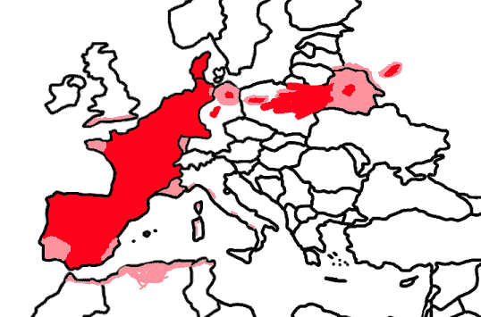

# 「有生之年第二次更新」Giga毀滅向——特殊程序｜ Gr...

作者：Courage

TID：25421

 

# 1

*本帖最後由 Courage 於 2018-7-31 16:05 編輯*

渣文懶得寫故事梗概起源 沒意思 直接帶入正題

別噴

「這麼把3年研究成果這麼毀掉真的可以嗎？」

sou說到。

「沒關係啦，也不是讓你毀掉，只是讓你去收集一些資料而已！」

另一位少女答道。

兩個年齡只有15左右的少女坐在一個黑色的玻璃儀器外旁著如何處理已經被廢棄掉的複製品太陽系。微縮太陽系里的地球上面的人永遠也不知道他們只是一個複製品。

「吶！sou你先進去吧，我在外面幫你調控和觀察哦！」

兩個看起來才剛上中學，甚至連校服都沒有脫的中學生就這麼處理開來，Nana作為一個在項目里幾乎什麼不能幹的志願學生只能叫她的朋友一起來做這個沒人願意做的項目。

「我進來了哦！這是什麼地方？」

sou看著旁邊挨著公路的平原，問起了對講機那邊的nana。

「emmmm，你現在的位置好像是西歐的一處平原呢，去找找你附近的村莊」

nana對著一個大屏幕說道。

Sou拍來拍身上的泥土，沿著最近的一處公路走著，走了許久也就幾輛車經過於此。

「nana，真的是按1:1仿照太陽系的嗎，可以開始行動了嗎？再走下去我要累死在這兒了啊！」

「好好好，初始倍數調整為20倍咯...」

正在行走的sou滿滿的增大了起來，1.6米、3.56米、16米、最終到了32米才停下了生長，sou看了看腳下的樹，僅僅到自己小腿的高度。

「誒！真的變成巨人了誒！附近的景色都能看到了！」

sou說著就坐了下來，用雙腿擋住了公路，躲閃不及的小轎車直接撞到了sou的大腿上。

「吶！可以問問附近的城市在哪裡嗎？先生？」

車上的人立馬開了車門，跑下了車。不敢相信眼前出現了一個幾十米高的巨人。

「餵餵！不回答人家的問題也太不禮貌了吧！，還是只能自己找啦...」

sou站了起身，踏上了一個了一個稍微高山丘的地方望瞭望、附近幾乎只有農田，根本沒有任何城市甚至是小鎮的跡象。

「Nana！你幫我在地圖看一看最近城市在哪裡啊！」

sou說道。

「好吧！最近的城市在你的正西邊，大概20km左右吧，非常貼近首都哦。」

「餵餵！即便我20米也要走好久啊！」

「吶...初始高度1000倍吧。」

sou的身高又開始膨脹起來，[20/40/100](https://giantessnight.com/gnforum2012/tel:20/40/100)/200/400/815/1630

1630米的身高，附近的所有小鎮城市都看的一清二楚，只不過腳下卻不是那麼容易注意了。

「呃...我也未免太大了吧！」

sou往城市的每一次行走都會把腳下的一切碾個粉碎，但大部分都踩在了農田上，葬身在sou鞋下的也就幾十人，但sou還是站在了城市旁邊，觀察著城市裡逃竄的的每一個小人。

「吶！很精緻的小城市呢，就是房子矮了一點呢。」

sou邊說邊毫不留情的把腳放在城市的上空，腳下的小人嚇得四處逃竄，她用鞋尖對準了郊區的一座教堂，教堂直接被少女的鞋尖壓平了，旁邊的房屋也被連帶到被波及。

「真是脆弱呢！對....

「餵餵！有軍隊從你的東邊靠近了哦，注意點！」

「餵餵什麼啊！哪邊是東邊啊！」

「你已經可以看到了！就是你的右手邊！」

Sou往右手邊看去，一批軍隊朝著nana趕了過來，從各種裝甲車坦克車可以看出軍隊並沒有小巧本次的對手。

「好了好了！我看見了，沒什麼啦，就是一會兒的事情」

sou用手抓起了地上的建築物，捏成了一股碎片往軍隊扔了過去，地上留了一個大坑，但少女卻沒有扔中。

「開火！」

軍隊開始攻擊起了少女，各種曳光彈，機炮打在了少女的皮膚上，但僅僅只有絲毫刺痛感，連外皮都沒有打穿。

「吶！這麼想讓我陪你們玩嘛！那我就陪你們玩咯！」

sou兩步走到了軍隊跟前，只見她手指一落，一輛坦克車就成了鐵餅。

「還想跟我打嗎？」

剩餘的軍隊看到這種實力差距，基本上無心再戰，開始往後撤退。

「對一個手無寸鐵的少女開槍你們難道還想跑嗎！

sou直接膝坐了下去，剩下的軍隊基本都被少女膝蓋壓扁，血液和鐵皮屑殘存到了少女的絲襪上。

「人家才買的絲襪欸...就因為這了弄臟了啊」

「把任務完成我會請你吃飯的哦！suo醬最可愛啦！」

nana說道

「我叫sou！還有為什麼不能用儀器直接收集整個的數據？」

「嗯...這個我也不清楚，但是這台機器確實沒有一個這種功能，直接外面處理估計也細菌外洩吧。」

「那為什麼我放大這麼多倍沒被地心引力壓死呢？」 sou問到

「...我也不是很清楚了，既然能讓你進去肯定也不會讓你處在危險的境地對吧！乖乖幫我完成任務哦！」 Nana回答了幾個問題後繼續看著儀器屏幕並且輸入著什麼。

Sou的身高又開始增長了起來，停在了16330米。

「這麼高會缺氧的啊餵！但是上面空氣很新鮮呢...整個城市都能被我盡收眼底了哦。」

Sou嘗試性的繞著城市走了幾圈，然而由於體型太巨大並不能躲避腳下的每一個建築。

「好了！收集什麼數據都發給我吧。」

「都在你的腕表上哦！」

Sou看了一眼腕表，上面列出了一個名單。

叫我看看呢......建築物、電視塔、飛行器....

「餵！建築物怎麼讓我收集啊，一捏就會碎掉了，還有飛機的話我現在這個大小很難完好的帶回去啊」

「碎掉的也可以哦！」

Sou開始把手接觸城市，城市裡的建築物直接被Sou的手粉碎掉，她攏起了一大把各種廢墟混集起的碎片，裝進了背包里。

（吶！破壞中的Sou太可愛了吶！我得多錄幾個視頻呢）

Nana則是用了假任務當幌子騙了Sou進去大肆破壞。大半個城市基本上都被Sou帶著手套的手破壞的乾乾淨淨，畢竟沒什麼可以抵擋得了她。

「接下來要處理掉你腳下的所有小人哦！畢竟他們看到了你的內褲了呢！」Nana說道。

「你清醒一點啊，剛才我也差不多用手殺了幾十萬人呢，不過你你也說的挺有道理呢......」

Sou邊說邊站起來開始用腳來處理剩下的城市，

沒過半分鐘，整個城市就被少女夷為平地。

「這個任務可真是有挑戰性呢......一分鐘不到我就碾死了大概幾十萬小人吧？我的鞋子估計也要臟了誒」 Sou對nana吐槽到。

原先上百萬人的城市，僅幾腳就被一個中學少女給夷平了，也算是很恥辱的一件事情吧。

「下一個目標是什麼呢？」

「吶，你可以往東北方向走呢，那裡就是馬德里呢。」

「嗯...我已經看見了」

Sou一步就邁到了城市邊緣，開始欣賞這座歷史悠久的歐洲古城。

「第四次增大開始咯，初始身高一千倍哦！」

少女的身體持續變大到163000米，甚至能看到地中海。

然而腳下的城市已經基本癱瘓。

「這麼大個城市呢，一腳下去是不是也太不禮貌了，我們來畫畫哦！」

Sou用指頭戳向了城市西北方向的一片區域，手指頭開始向右移動了起來，少女手指下不管是建築物還是劇院足球場，一律都成為了廢墟和碎片。

「Sou的五角星送給你們哦！希望你們能喜歡呢！」

少女用城市做畫板，畫了一個五角星，然而僅僅一個五角星死在少女手指下的就有209多萬人，少女無意間殺死的則可以忽略不計了，幾乎大半個馬德里都被少女的手指破壞了。

「你們不喜歡嗎？這麼不禮貌都踩掉好了。」

Sou的女式皮鞋懸在剩餘的城市上方！在少女鞋子下方的小人已經被嚇呆了，畢竟此時坐什麼交通工具也跑不出少女的腳底了。

（轟）

一聲響後，少女的鞋子徹底摧毀了整座城市，這座幾百年的古城被她踩成了過去式，不管是高樓大廈還是歷史建築，都沒能在少女一視同仁的鞋底下幸免，存活在少女皮鞋底縫裡面的人得以幸存，不過少女接下來開始用鞋繼續揉蹭廢墟後徹底打破了殘存小人們的任何希望。

「Nana，還不讓我休息一會嘛？人家中午沒吃飯欸」

「沒事啦，你可以先出來吃飯呢，如果你想的話，但沒有明天的豐盛哦。」

「還是快點完成任務吧。」

「那麼，初始身高十萬倍咯」

Sou又開始膨脹了起來，她的雙腿已經橫跨整個伊比利亞半島，而她就坐在伊比利亞半島上。

「呃...我是不是坐到幾個城市上面啊，我感覺我好像壓碎了什麼。」

Sou的一舉一動就可以讓一個城市灰飛煙滅，少女右腿放在地中海，左腿放在比斯開灣，基本上大半個西班牙都被她無意間摧毀掉了。

她注意到了右腿下面的巴利阿里群島，由於整個島嶼已經被少女的大腿壓成平地了，她毫無顧忌的捏起了整個島嶼放到了口中。

「嗯...泥土味道...鐵味道，好難吃啊」

Sou把整個被咬碎的島嶼吐了出去，在法國的一座平原里生成了一座山，山還帶有年輕少女的唾液，以及一個被砸出來的大坑。

「吶...整個裙子都被坐臟了啊，還是站起來吧。」

Sou站起來的時候不小心腳滑到，不僅大半個地中海的水都被鏟了起來，葡萄牙還因為少女一個不小心而滅國了，還有北非還有歐洲某些沿岸地區這輩子也想不到會來的人造洪水。

少女站起來拍了拍身上的土，對於少女來說是土，然而對她腳下的人來說算是幾百米的隕石塊。

「我要走第一步了哦」

少女的第一步很不幸落在了法國中部，整個法國乃至整個歐洲都能用肉眼來觀察到少女的一舉一動，在少女腳下的幾座城市直接被替換成了一個帶泥土的皮鞋腳印。然而少女卻發現了一些新東西。

「嗯？這就是巴黎嗎，我最想去的地方誒。」

少女已經不顧自己的形象，直接半跪了下來觀察起了比自己手掌一般大小都不到的巴黎，然後用指甲圍繞著整個城市畫了個圈。

「巴黎是什麼味道的呢？好想嘗一嘗呢，可是拿起來就碎掉了誒。」

她雙手支撐著，用舌頭想去嘗試舔一下整座城市，為了支撐少女的手，比利時付出了滅國的代價。整座巴黎被粉紅色吞併，然後成為一攤混著少女唾液的碎片。

「比剛才還差勁呢...」

「啊！Sou我發現了有大約幾十發核彈頭向你發射過去了呢，從亞洲北美洲等各個方向都有呢。 Nana說道

「隨便啦，頂多把我的衣服打臟而已。我剛才感受到了不少地面部隊攻擊我的腿呢...可惜連絲襪都沒能打破呢。」

Sou直接躺在了法國的國土上開始隨意亂蹭來警告來攻擊他的小人，絲毫不考慮身子下面有數億的人，無數的城市被少女的一個小惡作劇碾成了碎片，法國以及少女都沒注意到的安道爾摩納哥正式滅亡。荷蘭被少女的頭髮波及到，也毀了不少城市。

「說實話地球比我想象的要平呢，我最多也只能摸到一點點山脈的感覺，估計有些山脈也被我的手指和腳壓平了吧。」

核導彈正式來臨，少女的大腿被放了好幾個煙花，人類終於能讓少女有點感覺了。

「餵餵！我的白絲襪都被打臟了欸！」

Sou氣氛的站了起來開始報復起了人類，瑞士的阿爾卑斯山也在少女的右腳下基本成了阿爾卑斯平原，城市裡也基本上無人生還。

「還有哦！」

少女的左腳先把德國的科隆粉碎掉，接下來右腳踩到了法蘭克福，幾座德國大城市最終也是在少女的腳下成為了歷史，Sou兩腳逐漸合併，大半個西德成為了少女鞋子的畫板，全是腳印。

「那麼岸邊這個國家想要怎麼被我處理掉呢？」

Sou看著荷蘭，但並沒有給他們答復的時間，她直接把整個國家不管城市還是鄉村，直接抓了起來，捏成了一個帶有百萬人生命的球，放在腳下的德國廢墟上踩成稀巴爛。

你們有生之年等到的第二次更新出來了

.如此龐然大物毫無徵兆的出現在了歐洲大陸上，即便是英國政府想瞞也瞞不住整個英格蘭乃至蘇格蘭都能注意到的一個上億公里的少女正在蹂躪英吉利海峽對岸的大陸。整個倫敦已然癱瘓，没有一个知道真相的人能够冷静下来。好在Sou在玩樂的時候並沒有注意到旁邊的英國，從而沒讓整個聯合王國遭受像法國一樣的命運。除了在通訊稍不發達的某些亞非拉國家之外，幾乎整個地球都陷入了深深的絕望。「妳有沒有考慮過去一些大的國家玩耍呢？Sou。」Nana問到「啊....我是地理白痴欸，不過我好像也注意到了我似乎不經意間就磨平了幾個小國家喔...」「吶...這樣也太沒意思了，考慮去東邊玩玩看嗎，那裡有地球上最大的國家喔！」Sou遲疑到，但還是聽了下去。「在你的正前方哦，走幾步就能到了。」少女不假思索的向俄羅斯走去，先用了一記重踩讓柏林乃至周邊所有衛星城都化為灰燼，絲毫跟少女可愛的長相不成正比，然後幾個大腳印直接落到了波茲南上方，還沒等波茲南的市民反應過來，整個城市就被一個少女的腳印給替代了。少女的下一腳剛好跟華沙打了個照面，鞋子並沒有踩到城市裡，剛剛好踩到了偏郊區以及旁邊的幾個衛星城，然而還是對城內造成了不小的損失，畢竟隨便一個對少女來說的小石子就是對人類的巨型隕石。波蘭的國土上留下了三個腳印，但還不至於亡國，但前往俄羅斯是必經白羅斯的，但白羅斯運氣就沒有那麼好了。「唔？這是莫斯科了嗎？」少女趴了下來，一手撐著地，另一隻手用手指在明斯克上空打轉，打量著整個城市，然而她趴下來殺死的人就已經遠遠大於眼前的城市了。「這是白羅斯的首都啦..莫斯科還在前面哦。」「吶...真沒勁呢」Sou站了起來，城裡的人以為自己被眼前的少女給赦免了，但少女接下來的一腳踩碎了所有城裡居民的夢，而且這次sou還用鞋尖摩擦了城市廢墟幾下，來宣揚自己的實力。<ignore_js_op>

**捕获.PNG** *(86.96 KB, 下載次數: 0)*

[下載附件](forum.php?mod=attachment&aid=NzM0NjR8MjExMjUxMjF8MTYwMDg4NTgwMXwxODIzMHwyNTQyMQ%3D%3D&nothumb=yes)

受灾情况示意图

2018-7-31 16:05 上傳

受灾状况示意图明天（真的明天（真的信我（可能後天吧（大後天？更新</ignore_js_op>  

# 2

> [ku96612310 發表於 2018-7-12 05:34](https://giantessnight.com/gnforum2012/forum.php?mod=redirect&goto=findpost&pid=381933&ptid=25421)

> 这个明天有点漫长啊

> 一直等着楼主更新呢

> 期待～～～

突然發現我這個坑居然沒填....大家放心我會儘早完成的 

# 3

> [迷途小喵 發表於 2018-7-24 14:50](https://giantessnight.com/gnforum2012/forum.php?mod=redirect&goto=findpost&pid=382816&ptid=25421)

> 哈哈 讓我想到了rick and morty 迷你宇宙以及微型宇宙的劇情

> 不過總地來說應該算是縮小系而不是巨大系嗎？

> ...

迷你宇宙類型有更多的不違和可控性，而且可以重置整個宇宙達成多種玩法。我這個大坑這麼久沒填還真是可惜了......