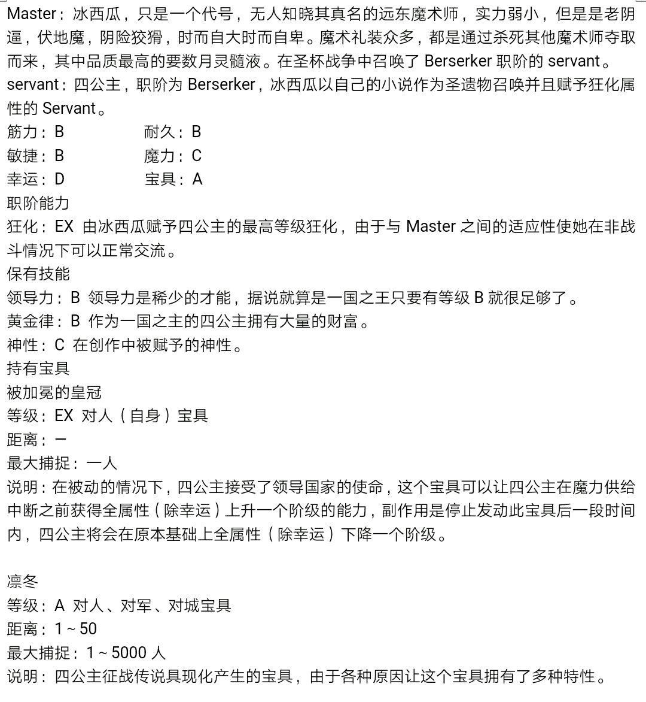
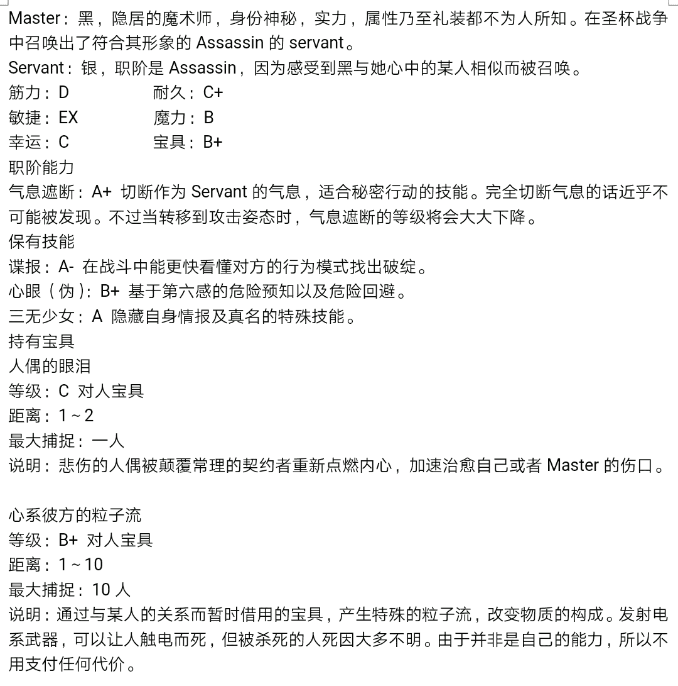
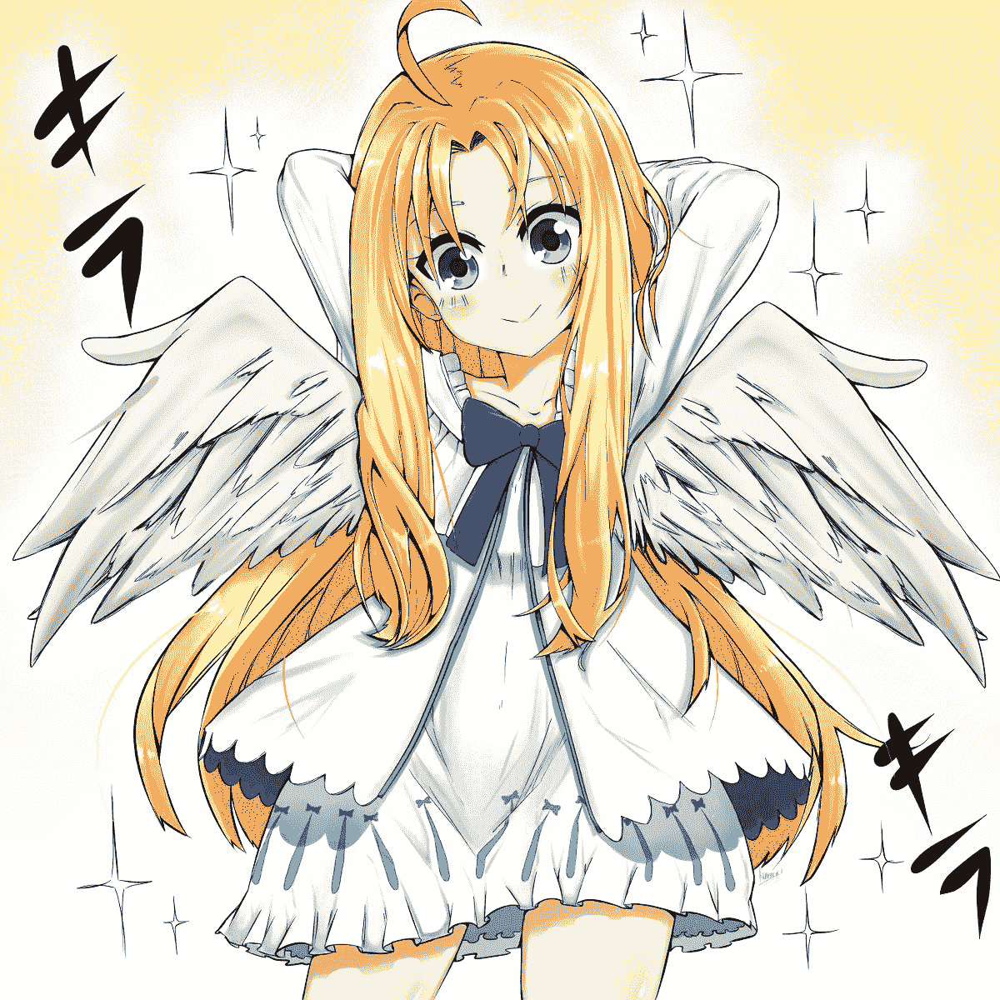
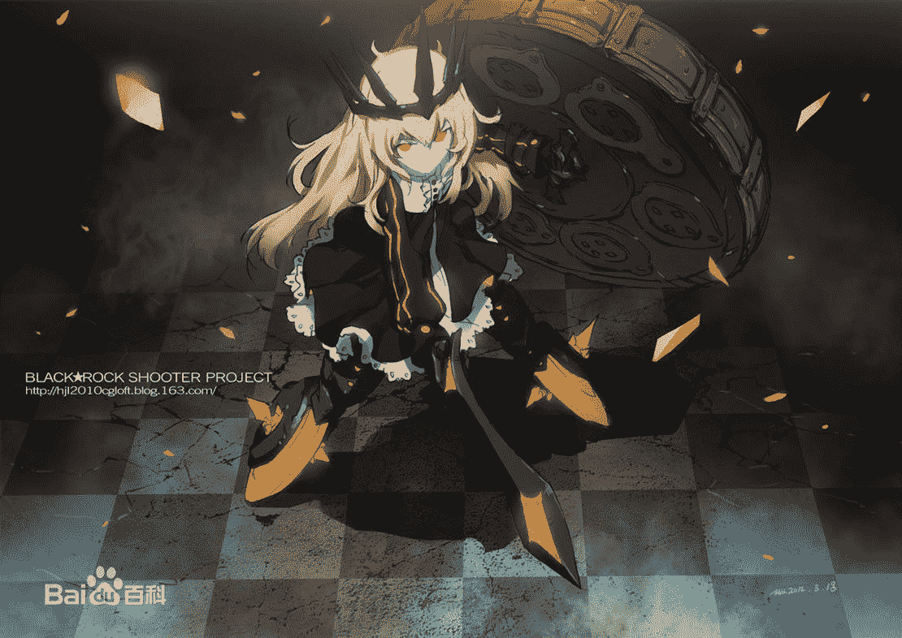

# 【残忍系】Fate／GiantessNight 6.24第一夜 断罪螺旋【2...

作者：见崎鸣

TID：24569

 

# 1

*本帖最後由 见崎鸣 於 2020-6-24 03:21 編輯*

欢迎大家来到深渊～！鸣酱的深渊，嘿嘿w顺便，以前的群已经被人举报封掉了，这里补上新的群号～1090360702

Fate/Giantess Night

起源夜 英灵召唤

四周传来的惨叫声回荡在青年的耳朵里，刺激着他的耳膜。

“不想听吗？”左眼戴着眼罩的黑发少女微微侧过头，眼角的余光注视着在自己肩上坐着的小小的青年询问到，“我会很快结束这一切的，Master。”

青年空洞的眼神犹如一具冰冷的尸体，即使面对这地狱一般的景色，他的表情也和少女一样没有丝毫变化。

“我把这视为必要的程序。”青年简单明了的说明了自己的感受。

巨大的少女点点头，继续自己现在的工作。她现在的身高是20米，并不是效率特别高的高度，不过这样可以减少自身的魔力消耗，避免其他的Master察觉。她抬起穿着学校制式皮鞋的右脚，缓缓压向街道上因为不知名原因陷入癫狂在地上痛苦翻滚的人类。少女隔着鞋底也能感受到肢体在自己脚下爆裂，她就这样，散步一般轻松的沿着这条大街走下去，巨大的双足公平的碾碎每一个人。

“这是第几个城镇，Caster？”青年一边倾听少女脚下骨骼的崩溃，一边若有所思的问。

少女依旧是缓缓的前进着，身后上百米的街道上有数百被她踩碎的人类残肢：“这是第三个，Master，怎么了？”

“就在这里先构筑魔术工房，”青年平静的说着，“你继续清理，把我放在这里。”

没有问任何问题，少女听话的停下脚步，将手伸到她的肩上，让青年站在上面。然后她小心的把青年放到了地上：“Master，小心。”

青年一句话也没有说，只是戴上兜帽把手插进外套口袋里，沿着反方向走去。少女则是继续向前前进，仔细的不放过每一个小人，无论是男人，女人，老人，孩子，都被她巨大的脚挤压成一模一样的肉泥，少女的鞋子上已经沾满了鲜血。

“圣杯战争…吗？”青年环顾四周，除了断壁残垣就是人类的血肉。

这是，人理烧却之后举行的第一次，也是最后一次圣杯战争的第三夜。

一个月前，英国，时钟塔。

古老深邃的走廊上，年轻的魔术师快步走着，在老师埃尔梅罗二世的指名下，她来到了已经很久没有来过的时钟塔，这个给她带来了不少记忆的魔术师最高学府。

“啊，也不知道降灵科的教室有没有搬走，”年轻的魔术师一边自言自语一边寻找着自己的目标，“圣杯战争？明明我没有兴趣啊。”

被时钟塔指名道姓要求参加这种奇怪的魔术仪式还是很少见的，年轻的魔术师隐隐有一丝不安。很快，她便来到了信上所说的地址。房间内有两个人，其中一位是他熟悉的导师，站在窗边抽烟，一脸严肃，畜着长发的埃尔梅罗二世，时钟塔炙手可热的大红人。而另一位他却不认识。

“哦，你来了，Land。”埃尔梅罗二世揉了揉自己的额头，点着烟的手随意指向了那位坐着的年轻男人，“介绍一下，这位是来自圣堂教会的监督火焰复苏，他会和你一起参加这次的圣杯战争。”

“教会？”Land有些不解，魔术师协会和教会一直是死对头，为什么会忽然联手？

埃尔梅罗二世深吸了一口烟，似乎看出了Land的疑惑：“这也是无可奈何，前几天收到迦勒底的消息——人类的历史将在一个月后结束。”

经过漫长的叙述，Land目瞪口呆，人类灭绝？特异点？圣杯战争？她什么也没有听懂，不过她明白，这次可不是靠小聪明就能混过去的了。

“这次的圣杯战争有些特殊，想必你心中已经有了想要召唤谁的打算了吧？”埃尔梅罗二世微笑着掐掉了烟头，“除了你们之外，世界各地被选中的优秀魔术师都会参加这次圣杯战争，记住，你们不再是单纯的争夺万能的许愿机，而是拯救人理。”

Land默默点头，悄悄看了一眼从头到尾都没有开口的火焰复苏，然后退出了房间。Servant的人选，Land早已有了打算。

“你等等，”埃尔梅罗二世一边说着一边将一个文件夹扔给Land，“这些资料你好好琢磨琢磨。”

随后，房门自动关上。

“圣杯战争…”比起来时仓促的脚步，Land离去的速度很慢很慢。

Land离去后，埃尔梅罗二世的眼睛扫向一面墙壁：“可以出来了，魔术师杀手。”

“光学迷彩，解除。”随着墙壁出现一丝不规律的波动，一个身穿黑色上衣戴着兜帽的青年突兀的出现在那里。青年面色苍白，眼神空洞，他的四周似乎有种若有若无的杀气。

火焰复苏依旧是一动不动，埃尔梅罗二世倒是微微颔首。

青年靠着墙壁缓缓说到：“我已经不再是魔术师杀手了。”

“但是你身上那些起源弹是这么想的吗？”埃尔梅罗二世说。

青年愣了愣，继而扭过头去：“我已经告诉你了，我的魔术回路损失惨重，刻印也所剩无几。”

埃尔梅罗二世再次点燃一根烟，望着天花板吐出一个烟圈：“魔术回路可以帮你修复…至于刻印，那更好办了。”

“不用骗我了，”青年有些不耐烦了，竖起身子就要离开，“刻印这种东西怎么可以随便得到。”

埃尔梅罗二世似乎早就猜到青年会这么说，他不慌不忙的说道：“那么，魔术师杀手，你有听说过卫宫矩贤这个人的名字吗？”

青年顿时停住脚步。

“当年他的儿子卫宫切嗣仅仅继承了他父亲20%的魔术刻印，剩下的，都保留在了时钟塔。你应该很清楚我的意思吧？”埃尔梅罗二世微笑着，仿佛一切都在他的掌握之中。事实是，也的确是这样的。

“你是认真的？”青年退了回来，空洞的眼睛死死盯着眼前的男人就像要将他吸进去。

埃尔梅罗二世丝毫没有回避，他直视着青年：“如果你相信那就跟我来。”

与此同时，某不知名小巷中。

“啊哈哈哈哈哈哈，”狂妄的笑声从男人嘴里传出，“你还想怎么跑？！哈哈哈哈！”

男人站在一个倒地不起的女人身前，身边不可思议的聚集着巨大的水银团块，那水银团块伸出一根根上下摆动的尖刺随着男人的兴奋而起伏。倒在男人面前的女子，浑身沾满鲜血，身上都是触目惊心的伤痕。

“真不愧是肯尼斯.埃尔梅罗.阿奇博尔德的作品啊！！你说是不是？”男人玩弄着水银刃的尖端，嘲笑的看着伤痕累累的女子，“魔术礼装，月灵髓液！呵呵，真是好东西！”

女子瞪大眼睛，蜷缩着身体不停的呢喃：“不，不要，求求你，我不想死！”

男人的笑声更加猖狂，甚至他笑出了眼泪。他蹲下来，右手揪住女人的头发，左手则是捏住女人的下巴淫笑到：“刚才不是叫的很欢实嘛，怎么不叫了？老子布下的结界你这种废物怎么可能破解得了！”

“看到没有！”炫耀似的，男人把左手手背伸到女人面前，上面有种红色的复杂花纹，“好看嘛？哈哈，像不像碎掉的西瓜哈哈哈？”

女人颤抖着，那个图案在她眼里就是碎裂的头颅。

见女人不说话，男人也有些扫兴，他自顾自的说到：“我可是被选中的人哈哈哈，这可是我的令咒，哈哈哈！”

女人完全听不懂这个人在说什么，只当他是个疯子，但是她什么也不敢说，因为她的生命就握在这个癫狂的男人手里。

“我要走了，你知道该这么做，”男人站起身伸了个懒腰，然后打了个响指，那些水银居然就这样凭空消失了，随后，他头也不回的朝巷子外走去，“今天也真是愉快呢！！”

得救了？！女人不禁有些欣喜。

“踏，踏…”从她的身后传来轻盈的脚步声，女人艰难的转过头去，只见一个穿着奇怪服饰精致的如同洋娃娃一般的小女孩朝她走来。

女人有些疑惑：“你是？”

小女孩停在了女人面前，饶有兴趣的用穿着棉靴的小脚轻轻踢了踢女人的脸。

女人很不高兴，虽然自己受了伤，也不是一个小女孩可以羞辱的。她用手拨开小女孩的脚，用严厉的语气喝到：“够了！小屁孩！给我停下来！”

小女孩有些无奈的说道：“啊，果然，还是听Master的把她处理掉好了。”

女人再次蒙圈，小女孩这番话让她摸不着头脑。

就在女人还在困惑的时候，小女孩无声的抽出了一只棉靴中的脚，在靴子里，女孩的脚上居然没有穿袜子。在女人眼里这就是艺术品般的一只裸足。而这样可爱的一只小脚，在女人还没反应过来时踩在了她的脸上。女孩脚底细嫩的触感让她觉得有些荣幸，温热潮湿还冒着些许热气的脚上散发这不可思议的好闻奶香，一时间她竟然忘了反抗。女孩的嘴角露出一丝甜甜的笑容，然后，她的脚开始用力。小脚在脸上带来的突然剧痛让女人几乎要惨叫出来，但是女孩的足底死死封住了她的嘴使她发不出声音，而她的身体也因为女孩的气场动弹不得。

女人终于明白了男人给她看他手背上那个被称之为“令咒”的图案的意思了——那是她的结局。

“咔嚓！”在女孩的施压下，女人的头部就像一个水汽球一样爆裂开来，头骨的碎片飞的到处都是，其余的部分被踩的扁平，那只完美的裸足上也被女人的血液包裹，她的脚底和脚趾缝间都是女人的脑浆。有些嫌弃的撇撇嘴，女孩的脚轻轻甩了甩，将比较大块的人脑从脚上甩到地上。

“真是脏活呢，”女孩的脚被魔力快速洗涤干净，然后又淡定的塞进棉靴里，“不过还挺有趣。”

进行名为灵子化的行为后，女孩消散在空中，小巷中只留下了凄惨的女人的尸体。

圣杯战争开战两个星期前，中国，魔术师协会。

“那么十分感激你对我们的帮助。”老人握着眼前少年的手，“你真的是货真价实的天才！”

“谬赞了。”少年有些不好意思，虽然在他这个年龄能取得如此造诣是相当不简单，但是被这样夸奖他还是觉得会害羞。

告别老人，少年打开早已等候在街边等待的汽车的车门，坐了进去。

“魔术师大会交流的怎么样了？有没有收获？”少年身边，坐着一个衣冠楚楚的男人，他不动声色的询问起少年。

“还不错，大家都是很优秀的魔术师。不过，先不说这些，既然你亲自找上门来了，那就说明一定发生了什么重要的事情吧？”少年眼睛微眯。

男人也没有吞吞吐吐，直截了当的把一份资料递给少年：“时钟塔的命令，你自己看吧。”

花了几分钟，少年浏览完了文件，然后无奈的抬起右手，抚摸着手背上那几道红色的符文，这被称之为令咒的存在。

“怎么样？”男人问，“考虑清楚了吗？真岛君。”

“还能怎么办？”少年苦笑，“从前几天令咒在我手上出现我就知道这不是什么好兆头。”

“那么你的打算是？”

“麻烦你帮我准备机票吧，去时钟塔，唉，明明还想就这样咸鱼下去啊。”

圣杯战争还有两个星期开始，世界各地的优秀魔术师都陆续在手背上浮现了令咒，越来越多的魔术师们开始筹备圣杯战争，提前召唤Servant的魔术师也不在少数，当然大部分的人还是等待着在最后一刻进行召唤，避免出现提前暴露英灵真名的意外。

南美洲，魔术师协会分部。

“我说了，我对圣杯战争没有兴趣，不然我也不会到南美洲来休息。”穿着朴素的青年十分郁闷，快步行走想要甩掉身后的跟屁虫。

“可是你身上已经和我一样出现了令咒啊，你这次跑不了了！”后面的那人紧追不舍，“而且我知道你早就做好召唤准备了！”

两人边走边互损的样子十分好笑。

青年停住身子有些慌乱的转回去：“别胡说八道了。”

“哼！我看你是被我说中心虚了吧？奇迹？”那人打了个响指。

青年捂住额头呻吟到：“我怎么就摊上了你这么个灾星啊胡说八道不说，还称呼我的真名。”

“想不到吧？”那人居然还有些得意，“我可是主动请缨来带你回时钟塔的。”

名为奇迹的青年有些无语，心说也只有你才会做出这么不要脸的事情，他继续往前走，对身后人的呼喊不闻不顾。不过，这一次的确被说中了，他的确打算主动参加这次圣杯战争，并且在令咒浮现的当天就已经准备好了召唤阵和圣遗物。甚至可以说，这个时钟塔最年轻的准冠位魔术师很早以前就在等待圣杯战争的机会。默默看了眼自己手上齿轮一般的令咒，青年的目光坚定起来。

圣杯战争开战前，七天，时钟塔。

“感觉怎么样了，魔术师杀手？刻印的移植已经结束了。”坐在病床边的埃尔梅罗二世一边抽烟一边看着躺在床上望着天花板发呆的青年。

“卫宫。”青年微微侧头。

“嗯？”埃尔梅罗二世手上的烟抖了一下。

被称为魔术师杀手的青年说到：“我的姓氏现在是卫宫。”

“这样啊。…”埃尔梅罗二世顿了顿，然后认同的点点头，“那么名字呢？”

青年一言不发，只是看了一眼床头上刚刚被人送来的包裹。

埃尔梅罗二世难得的笑出来了：“明白了，卫宫。”

伦敦郊外，艾德菲尔特家族所属魔术工房。

“啊，这就是令咒啊，哈哈哈，”染了金发还打了发蜡的年轻人肆意的大笑着，“圣杯终于认可本王了！哈哈哈，本王原来真的是天才啊！！”

一看就是典型的中二病的他爱不释手的抚摸着自己的雷电和火焰形状的令咒。他一直梦想着参加圣杯战争，为此也是付出了不少心血。房间的墙上挂满了英雄王的眷属恩奇都的画像，青年坐在中央还真有那么点英雄王的样子，不过是中二方面的。

鸡儿加枚屎.艾德菲尔特，著名魔术师家族艾德菲尔特嫡系——手下的旁系三流魔术师。他一下跳起来，握拳道：“好！准备圣遗物！一定要召唤一个超强的Servant！”

德国，爱因兹贝伦城堡。

“你就是那个游走在中东赏金猎人？”欧式教堂内，一身雪白袍服的老人负手而立，在教堂最后一排坐下的是一个有着老鹰一样锐利眼神的男人，他的脸上有好几道狰狞的伤口。

“是我。”男人简洁的说道，然后二人都没有再开口。

老人仔细观察了一分钟左右，这才打破沉默：“不错，就决定由你来代替爱因兹贝伦出战。阿索夫，号称中东第一的赏金猎人。”

他的身后，赏金猎人的身影早已消失无踪。满意的笑了笑，老人走入教堂内部不见了。

日本，冬木市，柳洞寺。

“萝樱，你可想好了，圣杯战争很可能就是一去不回。”某人说到。

女孩只是挥了挥手让那人离开：“我会和莉莉丝一起参战的，其他不要你们关心。”

那人也只能不甘的离去了，巫女的话，谁能反对呢？

圣杯战争开战前三天，伦敦，时钟塔。

时钟塔三楼最里侧的房间，一个暴发户气质的英俊男子很不礼貌的把脚翘在昂贵的古物桌子上，在他身后是两个高大的提着银色手提箱的黑衣保镖，而他的对面是时钟塔的色位魔术师。

男子看也不看那魔术师，随意的用脚踢了踢桌面：“那么，最后这个名额就由我拿下了。”

石油王，石油囧，无人敢直呼他姓名的垄断了世界石油的魔术师。这种大人物，就连时钟塔都不敢轻易得罪，而他此行的目的，就是为了这圣杯战争最后的参战名额。已经准备好的最好的召唤阵，最贵的魔术工房，以及最优秀的圣遗物，石油王不拿到名额不会罢休。

色位魔术师擦了擦额角的冷汗：“那么…价格…”

石油王冷笑一声，身后的保镖把箱子往桌上一放——一箱金灿灿的黄金还有一箱质量极高的宝石。色位魔术师咽了口口水，这种大手笔，也就是石油王能做到了。

“这只是定金，”石油王随意的说道，“事成之后再翻一倍。”

下一秒，不知道时钟塔用了什么手段，石油王的手上浮现出令咒，他满意的大笑着，转身离开了时钟塔。

与此同时，埃尔梅罗教室。

“召唤亚从者风险很高。”说话的人的脸如同石膏一样僵硬，虽然才二十出头，作风却像是四十岁一样沉稳。这个人正是圣堂教会派来的监督者，火焰复苏。

“是的，我已经决定了，冲田总司的话作为Servant的确很强，但是很容易被猜到真名，无明三段突刺太容易被看出来了，所以只能召唤亚从者。”Land说到，“倒是你，你的魔力供给足够维持那位大人吗？”

火焰复苏摇摇头：“不足够，但是这次圣杯战争毕竟规矩有变化。”

Land理解的点头，的确，和以往的圣杯战争或者亚种圣杯战争不同，这一次可以说是规模空前，关系到人类生死存亡的圣杯战争。除此之外，Land皱着眉头拿起自己的恩师埃尔梅罗二世交给他的文件。

“这个人物…不好对付啊……”

圣杯战争，开战前一小时，某未知地点。

穿着雪白的及膝裙，光着脚丫的可爱的小姑娘坐在湖边的小小码头上，足尖轻轻点了点平静的湖面，顿时泛起淡淡的涟漪。在她的手背上，是类似红色伤痕的存在——令咒。

“要开始了呢。”女孩的身后，戴着兜帽一身白袍的人信步走来，那人所经过的地方，百花盛开。那人走到女孩身后，将手搭在她肩上，“准备开始召唤英灵了吗？”

女孩微笑着，整个湖面顿时沸腾起来，巨大的魔法阵在湖底熠熠生辉。

“祝你八岁生日快乐。”白袍人温柔的说。

“宣告，汝之身托吾麾下；”女孩吟诵起咒文，一个人影在湖中逐渐出现。

“吾之命运附汝剑上！”南美洲的丛林内，在奇迹用水银书写的法阵中央，一道神秘的光门缓缓打开。

“响应圣杯之召唤，遵从这意志、道理者，回应我！”神秘法塔的地下室中，在Land和火焰复苏面前，两股气旋逐渐汇聚。

“吾乃成就世间一切善行者，”吉尔伽美什魔术工房的墙壁因为火焰和雷电出现裂痕，他不禁有些心疼这些魔术材料，不过嘴上的咒语吟诵还是没有停止。

“吾乃集世间万恶之总成者！”石油囧狰狞的笑着，看着眼前的粉色光团，仿佛已经胜券在握。

“缠绕三大言灵之七天，”柳洞寺内，名为莉莉丝和萝樱的少女双手相握，柳洞寺的地砖承受不住魔法阵开始逐渐解离，崩塌。

“汝当以混沌自迷双眼，侍奉吾身，汝即囚于狂乱之槛者！”爱因兹贝伦城堡的深处，阿索夫面前的少女因为狂化咒语的施加眼角溢出一丝鲜血，前者只是无奈的摇摇头。

“穿越抑制之轮出现吧！”真岛白手背上的令咒灼热异常，他感觉自己的血液都要沸腾了，手臂上青筋暴起，太阳穴突突直跳。

“天平的守护者！”魔术师杀手第一次露出这样柔和的表情，幽绿色的光团爆炸开来，将他身后的树木全部摧毁，而他本人却安然无恙。“哒”，光团散去，少女皮鞋的鞋尖轻触在地面发出清响：“试问，你，是我的Master吗？”

至此，圣杯战争，正式拉开了序幕。

 

# 2

啊呜，鸣酱的新帖嗷，请大家多多支持 

# 3

*本帖最後由 见崎鸣 於 2018-8-7 17:22 編輯*

谢谢大家对鸣的厚爱，欢迎加入鸣酱全球粉丝后援团～，群聊号码：857871889 

# 4

> [轩辕剑 發表於 2018-2-22 10:52](https://giantessnight.com/gnforum2012/forum.php?mod=redirect&goto=findpost&pid=360616&ptid=24569)

> 不过有一点问题……“冲田总司”是很强力的servent是不是不太对啊我记得总司版面很低的 ...

给冲田桑一点面子啦，那么可爱的冲田桑啊

 

# 5

鸣以后开始会慢慢更新圣杯战争的人设呐 可以说，每一位Master都是主角呐 <ignore_js_op>

**IMG_20180222_214737.png** *(260.45 KB, 下載次數: 0)*

[下載附件](forum.php?mod=attachment&aid=NzA5OTB8ODJjNjQxMGV8MTYwMDg3NjM2MXwxODIzMHwyNDU2OQ%3D%3D&nothumb=yes)

圣杯战争人设第一弹

2018-2-22 22:10 上傳

 

# 6

> [轩辕剑 發表於 2018-2-22 22:25](https://giantessnight.com/gnforum2012/forum.php?mod=redirect&goto=findpost&pid=360768&ptid=24569)

> 我也要当主角（滑稽手动）

可以先加鸣之前发的呱群呐，然后就可以拿到Master名额了

 

# 7

> [baohulu001 發表於 2018-2-22 22:43](https://giantessnight.com/gnforum2012/forum.php?mod=redirect&goto=findpost&pid=360772&ptid=24569)

> 这是类似前言的东东吧，只是介绍设定背景？

是正文呐，序章类似于fate/zero第一集的感觉而已呐

 

# 8

> [baohulu001 發表於 2018-2-22 23:10](https://giantessnight.com/gnforum2012/forum.php?mod=redirect&goto=findpost&pid=360784&ptid=24569)

> 好吧，一般这种文章都是很快进入剧情的，不过写的长的话，就没问题了

因为是有128个Master的圣杯战争，所以鸣认为需要介绍清楚一点点～

 

# 9

> [baohulu001 發表於 2018-2-23 10:12](https://giantessnight.com/gnforum2012/forum.php?mod=redirect&goto=findpost&pid=360873&ptid=24569)

> 我擦，这么多，那么多角色，读者绝对记不住啊

只有让每个人物都有特色就好了啦，而且也不是所有Master都会认真写的

 

# 10

> [master25014 發表於 2018-2-23 10:15](https://giantessnight.com/gnforum2012/forum.php?mod=redirect&goto=findpost&pid=360875&ptid=24569)

> 楼主发文辛苦了~好喜欢残忍系啊哈哈

谢谢支持的说，鸣酱会继续努力的

 

# 11

人设更新第二弹呐 <ignore_js_op>

**IMG_20180222_214806.png** *(234.16 KB, 下載次數: 0)*

[下載附件](forum.php?mod=attachment&aid=NzEwMzB8YmI3NjdlZmN8MTYwMDg3NjM2N3wxODIzMHwyNDU2OQ%3D%3D&nothumb=yes)

2018-2-23 23:06 上傳

 

# 12

第一夜 迷茫之夜（1） 绿光消散，烟雾褪去，在魔术师杀手面前站着的，是身材娇小，留着黑色鲍勃式短发，一只眼睛戴着眼罩的红瞳少女。她面容精致，脸颊白皙，就像是人偶一般完美，身上穿着藏青色的校服套装，但是现在的她身上有种危险的气场。少女走上前两步，再次轻启双唇，低声问道：“ 试问，你，就是我的 Mast er吗？”

魔术师杀手点点头露出手背上的令咒：“ 是的。”

“ 契约成立，” 少女闭上眼睛数秒，当她再次睁开眼睛的时候，那种危险的感觉已经消失不见， “ Servant ，见崎鸣，职阶是 Caster ，请多指教，Master 。”

魔术师杀手礼貌的伸出右手：“ 卫宫鸣，请多指教了，Caster 。”

见崎鸣也伸出手，和卫宫鸣的手握在一起。二人的手都是冰冷的，但是却意外的让他们二人都感到有一丝温暖。也许是相性吧，卫宫想着。

“ 那么 Mast er ，你应该知道这次圣杯战争的含义吧？” 见崎鸣收回手，环顾四周。因为她刚才的现界，这片小树林已经毁了一半，地上都是些倒下的树木以及被翻起来的草皮。

卫宫鸣说到：“ 相当清楚。”

二人都不是很会找话题交流的类型，不过就是因为这样，反而有一种干净利落的舒适感。而且卫宫鸣了解情况这一点是刷足了好感度，见崎鸣也认为如果 Master是个什么也不知道的家伙，那就很麻烦了。

“ 那么，请下达指示吧，Master 。” 见崎鸣露出的红色右眼中有光芒一闪而过。

卫宫鸣背过身，他身后是突兀出现的一座小镇，这意味着，他们已经进入了特异点，圣杯战争也已经正式打响。小镇中传来人类的喊杀声，这是因为特异点形成导致的思维错乱，根据 这次圣杯战争的规则，这种人类是要全部处理掉的。然而，几乎所有人类都会因为特异点变 得行为诡异。几千年的人理烧却，需要屠杀的人类数量是个天文数字。

“ 那么就从这座小镇开始吧，” 卫宫鸣回身看向 Caster ，“ 杀光他们。”

特异点的另一端，真岛白想要拨开眼前红色的雾气，这些血腥味极其浓重的雾气刺激他不断的咳嗽。就在这时，他的头部遭到了一记重击，头昏眼花的真岛白重心不稳的摔在了地上。 迷迷糊糊中，他看到一个体型可以用幼女来说的女孩子踩在了他的胸口上。然后她缓缓蹲下来，用没有温度的手指抚摸真岛白的脸颊。

“ 咳咳，你是。。。” 真岛白艰难的开口。

“ 嘿嘿，看你的令咒，你就是我的 Master吧？” 甜美的萝莉音色让真岛白逐渐清醒了意识。

蹲在他胸口上的女孩子是位穿着粉红色洋装，贵族气质十足的萝莉。 真岛白傻乎乎的点头，任凭女孩冰冷的手指在他的脸颊上游走。

“ 呵呵呵～” 女孩子站起身，然后在真岛白的胸口上踮起脚尖转了一圈，“ 真是个好欺负的蠢蛋 Master呢。不过，作为贵族，还没有自我介绍呢。”

展开身后的恶魔翅膀，悬浮在离地一米的高度，女孩微笑着说到：“ Lancer ，蕾米莉亚. 斯卡蕾特，是吸血鬼哦，你好啊，蠢呼呼的下仆 Master 。”

多少感觉和想象中的大小姐有些不同，不过的确是那个蕾米莉亚没错。真岛白也有些激动， 他只是抱着试一试的态度加入了这场圣杯战争，虽然准备了圣遗物，不过当他真正看到蕾米莉亚本人的时候，还是被她可爱中透露威严的外表震撼了。

“ 真岛白，” 他恭敬的说道，在这位萝莉大小姐面前，身为 Master的他却产生了他才是仆人的错觉，“ 不太清楚状况的魔术师。”

蕾米莉亚露出了“ 果然如此” 的表情，她叹了口气，收回翅膀落在地上，优雅的提起裙摆将穿着白色棉袜和血红色小皮鞋的脚伸到了真岛白的头顶： “ 吻我的鞋底，我就告诉你什么是圣杯战争，下仆。”

听到大小姐的话，再看了看那只小巧精致的足，几乎是本能的，真岛白的嘴唇凑了上去。在吻到蕾米莉亚鞋底的那一刻他感觉自己体内的魔力有些波动，仿佛自己要被大小姐的足底抽干一样。

也就一秒钟，蕾米莉亚满意的收回了脚：“ Master的实力我已经大致了解了，作为仆人而已 也勉强算及格了吧，哼。”

真岛白挠挠头，有些迷茫。

“ 啊，真是蠢呢，” 有些嫌麻烦似的，蕾米莉亚敲了敲自己的额头，“ 就是说刚才让你吻我的鞋底不仅是为了奴役你啊，同时还大致摸清了你的实力，顺便签订了契约。当然。。。” 说到这里，蕾米莉亚停顿了一下。

“ 当然什么？” 真岛白扶着身边的石头缓缓起身。 “ 还吸取了一点你的魔力。” 蕾米莉亚说到， “ 我好歹是你的 Ser v ant ，吸取点你的魔力作为报酬也不过分吧。”

当然不过分了，他高兴还来不及呢，真岛白这样想着，不过他很关心蕾米莉亚之前所说的圣 杯战争的真正含义。虽然对大致规则有所耳闻，但是这次是在人理烧却后的圣杯战争，规则自然大不相同，而真岛白基本上就是赶鸭子上架的 Master 。

估计是看出来真岛白的的疑惑，蕾米莉亚眯起眼睛，眼眸中血光绽放： “ 那么，Master ，接下来就为你解释一下什么是圣杯战争吧。”

真岛白还没反应过来，随着空气中魔力的暴涨，蕾米莉亚的身体迅速变大，最后定格在了 20米左右。接着，她手指一钩，真岛白只感觉自己的身体无法移动，然后被蕾米莉亚强行拉扯过去，停在了蕾米莉亚的肩上。

“ 128对 Mast er与 Servant参与的圣杯战争，除了正常的相互战斗外，我们还有一个责任。” 蕾米莉亚的手指轻轻按了按真岛白的脑袋，悬浮在半空中，眼睛看向不远处的建筑群，那是一个十分落后的村庄，人数可能只有一二百人。她就这样展开翅膀，飞了过去，“ 坐稳了啊， 你马上就会理解这场圣杯战争的真正含义了，Master 。”

由于蕾米莉亚出现引发的血雾现象，好奇的人们早就聚集在街道上观望那边的情景。当他们看到飞来的蕾米莉亚的时候，一个个都震惊的不能动弹。在他们的注视下，蕾米莉亚收起裙 摆，落在了村庄的中央。

“ 固有结界，红魔馆。” 丝毫不把小人们的反应放在眼里，蕾米莉亚自顾自的高举右手，一团红色的血雾就在村庄上空蔓延开来。固有结界很快就把这个本来就不大的村庄完全包裹，无 论小人们怎么努力，他们也无法打破这道雾气组成的红墙。原本是村庄的地面也发生了变化， 变成了大小姐所居住的红魔馆的地板。

“ 这就是固有结界吗？” 真岛白还是第一次看到固有结界这样的存在，比起魔术师的工房，固有结界的规模和气场强了无数倍。

“ 看样子这里的人还算正常，” 蕾米莉亚说到，“ 不过既然迟早会因为特异点变异，不如现在就 先解决好了，免得之后更麻烦。”

人们在下方窃窃私语，不知道这个巨大的女孩想要做什么。更有的人因为被固有结界困住， 对蕾米莉亚相当不满。把这一切都看在眼里，蕾米莉亚微笑着舔了舔自己的嘴唇，然后弯下腰将自己的鞋子脱了下来，露出了穿着花边白袜的可爱双脚。顿时，蕾米莉亚附近的小人们都闻到了大小姐的淡淡足香。蕾米莉亚在袜子内的脚趾扭动了一下，缓解足部的疲劳，她本人也 露出了惬意的表情。

“ 好歹也是自己的家，可不能弄脏了地板啊。” 说完，蕾米莉亚的鞋子灵子化消散在空气中。 蕾米莉亚现在身高 20米左右，即使是这样巨大的身材，在小人们看来，这双袜足也是相当 的精致小巧。

“ 大姐姐的脚真好看啊！” 就在这时，四岁的小女孩挣脱母亲的束缚小跑出人群，来到大小姐的脚边，对蕾米莉亚说出了自己天真纯洁的想法。

“ 是嘛，姐姐很高兴呢，” 小女孩的天真无邪让蕾米莉亚笑了起来，她的脚掌就这样翘了起来， 笼罩在了小女孩的头顶，“ 那么小妹妹再仔细看看吧。” 轻轻的放下前脚掌，小女孩就这样被蕾米莉亚的袜足给压在了下面无法动弹。不过她也没有用力，小女孩仅仅只是被困住罢了。刚才的热情消失，小女孩也感受到了大小姐脚掌下的危险，她拼命的挣扎哭闹起来。周围的小人看在眼里，却没有一个人敢上前求情，就连女孩的母亲也只是在人群中呼救而已。

“ 我很喜欢会哭的孩子呢。” 蕾米莉亚笑着看了看肩上还处在蒙圈状态的真岛白，脚下小女孩 的扭动让她的脚底痒痒的很是舒服，“ 不过是喜欢享受这个过程哦。”

说完，恶趣味的，蕾米莉亚的双足脚跟缓缓离地，身体的重量逐渐开始施加到脚掌下小女孩脆弱的身体上。慢慢的，小女孩的哭闹变成了尖叫，肺里的空气连带着内脏碎片随意的被大小姐袜足带来的恐怖压力挤出来。脚底的挣扎更加剧烈，这是人类面对死亡威胁时的最后力量。最后，蕾米莉亚的足弓已经完全绷直，足底几乎已经感受不到小女孩气息的存在了。而在她的脚底，小女孩已经被挤压变形的躯干还在苟延残喘着，已经被挤出大半眼眶的眼球通过蕾米白袜之下最后一丝因为她自己身体留下的缝隙看着光芒逐渐消散。

“ 咔嚓” 只是踮起脚尖再这么简单不过的动作而已，大小姐感受到自己脚下有什么不起眼的东西被压碎了，血液渗透进白袜里触碰到了蕾米莉亚的足底，暖暖的，还黏黏的。 足跟再次落地，蕾米莉亚抬起踩着小女孩的那只脚看了看，小小的上半身粘在她的白袜上， 没有粘紧的内脏随着大小姐足部的轻微颤抖摇晃着。另一半则是在冰冷的红魔馆地板上变成了一团红色的污渍。

大小姐抬起这只已经脏了的白袜，把曾经被称为“ 小女孩” 的尸体的一部分给村民们欣赏：“ 怎么样？好看吗？”

人群惊恐起来，四散而逃，然而怎么可能逃走呢？固有结界红魔馆早就把这个区域完全封锁， 在这里，只有蕾米莉亚一个人说了算。 “ 那么，热身结束，各位请让我好好开心一下吧。” 说着，蕾米莉亚的脚往人群最密集的地方跺了下去。顿时，一朵鲜血构成的花朵就在蕾米莉亚的脚下绽放开来。每一次落脚都有好几个小人被她踩扁，每一次落脚都会有凄厉的惨叫发出。蕾米莉亚还会细心的反复碾踩那些尸体，确保他们死透，在她的脚下，没有一个活口。那双原本洁白的花边棉袜，也被血液染红到脚踝处。她俏皮的看着自己的杰作，把那些死去的人的尸体踩碎在地板上画着图画。

终于，真岛白再也受不了自己 Servant如此残暴的行为了，他愤怒的吼道： “ 停下来！Lancer ！ ”

令咒！只有让蕾米莉亚自杀才能停止她的暴行！

真岛白的令咒还没有用出来，蕾米莉亚就已经停了下来： “ 为什么要这么生气？看你的样子是准备让我自杀吧？” 真岛白愤怒的点点头，完全把蕾米莉亚杀人不眨眼的行为抛在脑后。

“ Master ，果然是最笨的呢，这么直白都不怕我杀了你，” 蕾米莉亚说着，指向了地上那些尸 体，“ 你再仔细看看，他们真的是人类吗？”

真岛白一愣，然后看向红魔馆的地面——黑色的粘稠液体散发出恶臭，那些尸体还哪里是人类，根本就是一群他不认识的变异魔兽。残余的几只魔兽还在试图打破红魔馆的结界，大小 姐优雅的走过去将它们一一踩扁，那些家伙身体里流出的正是黑色的液体。

“ 在这里被判定为特异点的时候，圣杯的黑泥就已经把他们变成怪物了，” 蕾米莉亚有些低落 的说道， “ 明明是魔兽，却还认为自己是人类。。。真是有些可怜，连我都开始有些同情他们了。”

真岛白攥起拳头：“ 没有可以拯救的办法吗！这都是什么跟什么啊！”

“ 方法有的哦，” 蕾米莉亚的声音忽然温柔下来，“ 结束这场圣杯战争吧，我的仆人。人理一旦恢复，这些事情就是根本没有发生过的。”

真岛白看向蕾米莉亚的眼神有些复杂，良久，他才轻声说道：“ 对不起，蕾米莉亚。”

看着真岛白带着歉意的脸，蕾米莉亚说到：“ 嗯，不对，该道歉的是我才是。”

“ 我发誓我一定会赢的！” 真岛白激动的喊到，“ 不会让你失望的！虽然我是一个不成熟的 Master ，不过之后，还是请多多关照了！”

“ 真是，愚蠢的仆人呐。” 大小姐可爱的笑了笑，固有结界解除，“ 嗯，确实的听到了呢，我的 Master ，我的仆人。”

未知特异点，一个男人从昏迷中苏醒。在他身边的碎石堆上坐着一位好看的少女，她穿着白 绿黑三色为主的战斗服装，在她腿上架着的是一把巨大的狙击步枪。

“ 我这是怎么了，” 男人看向少女，“ Archer ？” 少女冷冷的转过头，青蓝色的头发下青蓝色的眼睛里是冷酷和深邃： “ 特异点的变动，你昏迷过去了。 ”

男人看了看腕表，从圣杯战争开始到现在，已经过去一个小时了，不能继续耽搁了。男人站起身子，确认自己的身上没有伤到。这人正是爱因兹贝伦雇佣来的赏金猎人，阿索夫。而他 早就在圣杯战争开始前一个星期召唤了 Servant ——Archer ，朝田诗乃，那位在GGO中相当 出名的冰之狙击手。

“ Archer ，你看到散香了吗？” 男人看了看四周，没有见到与自己同行的女孩子。

朝田诗乃撇了自己 Master一眼，平静的说：“ 分散了，不知道。”

“ 麻烦了啊，” 阿索夫的脸上闪过一丝不安，“ 得先去找到她。”

诗乃将长围巾往上拉了拉，然后说到：“ Master ，在这之前，我得告诉你，现在附近可能有 Servant存在。”

阿索夫眉头一皱，眼神顿时锐利起来：“ 那么去看看吧，Archer 。”

朝田诗乃默默背起名为黑卡蒂的狙击步枪，朝着她感应到的有 Servant存在的方向走去。阿索夫不禁也在心里称赞了一下诗乃的执行力和临场表现力，真是当之无愧的冰之狙击手。他拍了拍身上的灰，跟上了自己的 Servant 。

在他们前方不远处的市镇内，一场屠杀正进行的如火如荼。市区内，穿着红衣，黑丝，皮靴， 肩上停着一只不知是龙还是鸟的怪异生物的女孩，正在对这个不大不小的人类居住区进行清理。女孩也是选择了20米的身高，这种程度的魔力消耗不容易引来其他的 Servant ，但是， 那种感知能力太强的就要另当别论了。这是一位 Rider职阶的 Servant ，真名是绫野珪子， 通常被叫做西莉卡，是 SAO的龙使。此时，早已熟知这次圣杯战争规则的西莉卡正在执行 Master的命令，对读作小人实际上是魔兽的家伙们进行驱逐。

即使是面对这些怪物，西莉卡也是相当害羞的捂着自己的裙子，完全放不开。毕竟这些家伙至少看上去像是人类，西莉卡一边遮挡裙底，一边红着眼踩踏，一副就快要哭出来的样子。 被她靴子踩过的街道上是无数小人被踩扁的尸体，还有西莉卡靴子留下的鲜红脚印。那些死去的小人还没转化为魔兽的样子，就被西莉卡这样踩死了。

“ 啊呀！疼疼疼疼！” 一个重心不稳，西莉卡不小心踩滑摔了一跤，一些来不及逃走的小人被 她平时看起来十分娇小的屁股压实，在西莉卡柔软的臀部下被压成扁扁的肉纸。见到自己裙 子上沾到血液，西莉卡也不高兴了，而且因为她有些色气的摔倒姿势让很多小人甚至忘了逃走，停下来驻足观看更是让她面红耳赤。

“ 咿呀！你们不许看不许看！” 西莉卡焦急的朝小人群挥舞自己的双手，都忘了遮住自己的裙底风光。

小人们居然还开始乐在其中，西莉卡气的鼓起腮帮子，嘟了嘟嘴： “ 这么喜欢死是吧，那我也好好成全你们就是了。”

西莉卡的两只脚互相一蹬，把两只脚上的靴子脱了下来，露出了穿着黑丝丝袜的双脚。然后她扶着楼房站起身来，嘴里还不停轻声嘟嚷着疼。此时一部分小人终于开始逃跑，而还有一 部分依然天真的期待着西莉卡会为他们带来什么福利。西莉卡面色阴沉，嘴角抽搐着往离她最近的还在观望她的小人们走去。因为鞋子里很热，加上西莉卡一直在运动的缘故，黑丝被 西莉卡的脚汗浸湿，散发出汗液以及少女特有的足香。在西莉卡小脚踩过的街道上，留下一 串浅浅的西莉卡的可爱湿足印。

“ 你们啊，” 西莉卡高高的抬起脚，下面的家伙这才慌乱起来，“ 这些变态变态变态变态变态！”

黑丝小脚雨点一般的落下，小人们哪里能承受住西莉卡的力量，一个个化作西莉卡脚下的红色团块。西莉卡愈加用力的踩踏着，脚下的街道早已因为她的双足变成了屠宰场，这双细嫩 柔软的黑丝脚，快速收割着小人们低贱的性命。在那些人看来，西莉卡这双脚就是最有效率的杀戮武器。

市区最高建筑的顶端，坐在红木沙发上的西莉卡的 Master看着这一切，下体早已支起一个小帐篷，他竟然就这样看着西莉卡的脚开始自慰起来。

“ 哎呀，在圣杯战争也敢这样玩真的是一个了不得的 Master呢。” 阿索夫通过诗乃的视觉共享看着这一切露出一个戏谑的笑容，“ Ar cher ，让他长点教训吧。”

诗乃也很无奈，黑卡蒂秒准了完全搞不清楚状况的西莉卡的 Master ：“ 西莉卡，你怎么有个这么恶心的 Master啊。”

宝具. 黑卡蒂，朝田诗乃的对人宝具。

“ 嘭！ ” 黑卡蒂发出一声巨响，化为宝具的子弹以看不清的速度飞向了可怜的魔术师。

“ 不好！宝具！” 黑卡蒂的子弹进入了西莉卡的感知范围，西莉卡意识到了危险，她赶紧停下 对小人们的虐杀也发动了宝具，“ 毕娜！快。！”

那只小龙以比黑卡蒂子弹更快的速度挡在了那个 Master面前。毕娜，西莉卡在 SAO内的宠物，也是西莉卡作为 Rider召唤条件的宝具。 然而，黑卡蒂的子弹直接穿透了毕娜，并且继续飞向西莉卡的 Master ，被一枪打成数据碎 片的毕娜根本挡不住黑卡蒂恐怖的火力。

“ 毕娜！！” 西莉卡痛苦的叫到，然后看着自己的 Master被同一颗子弹打得支离破碎。

魔术师一直给西莉卡供给的魔力中断了，西莉卡无法维持20米的体型变成了正常大小。甚至，如果不能找到其他的魔术师，西莉卡会因为魔力不足维持不了现界而消失。她在街道上狂奔，甚至都不管那些小人了。

忙中出错，西莉卡再次摔倒，而出现在西莉卡视野内的是熟悉的裤腿和鞋子。

认命似的，西莉卡向前爬了两步，抱住了诗乃的腿泪眼汪汪： “ 唔，诗乃姐，我真没用啊，居然第一个被淘汰了，唔啊。”

诗乃蹲下身子，温柔的摸摸西莉卡的头：“ 没事，不是西莉卡的错。”

“ 唔，谢谢诗乃姐，” 西莉卡犹豫了一下，然后望向诗乃的脸，“ 唔，那个，诗乃姐，西莉卡把剩下的魔力转移给你吧。”

诗乃再次揉揉西莉卡的头表示默许，然后自己找了一处残垣断壁坐下。

西莉卡跪坐在地上，她小小的手脱下了诗乃的右脚短靴。说实话，诗乃的脚味道很重，因为本来就爱出汗，而且加上诗乃的靴子还是很厚的，浓郁的汗味和粘稠的臭味钻进了西莉卡的鼻子里。

“ 我知道味道不太好，你不用勉强的的，西莉卡。” 诗乃自己也因为不太好闻的味道微微皱眉， 就准备要从西莉卡手中把脚抽回来。

但是西莉卡坚定的摇着头，抱着诗乃穿着被汗浸湿的黑棉袜的脚就是不肯松手。诗乃轻叹一口气，任凭西莉卡怎么做：“ 那就随便你吧，没关系的。”

西莉卡嗯了一声，捧着诗乃的脚压在了自己的脸上，轻轻嗅着诗乃足底的气息。诗乃原本还有些难闻足味却变得好闻起来，在西莉卡温暖的鼻息的刺激下，让诗乃恶趣味的用足底摩擦西莉卡细嫩的脸颊，不过西莉卡倒也乐在其中。就这样揉搓了一会儿，西莉卡的脸上沾满了诗乃足底的汗液，然后散发着和诗乃脚上一样的气息。

西莉卡兴奋的把诗乃的脚更加用力的压在自己脸上：“ 诗乃姐，西莉卡要转移魔力给你了。”

“ 嗯，把嘴巴张开吧。” 诗乃右脚点了点西莉卡的嘴唇。 西莉卡听话的张开了嘴，诗乃穿着黑色棉袜的足部灵巧的钻进了西莉卡的嘴里，脚掌踩在了西莉卡软软的舌头上，袜子吸收了不少西莉卡的唾液。西莉卡比诗乃矮小不少，一张小嘴也就勉强含住了诗乃修长的脚趾。无论她再怎么努力吞咽，再怎么用力吮吸，诗乃的脚趾再怎么挪动，这只玉足也无法再继续深入了。

西莉卡求助的看向诗乃，根据特异点变异的补魔规则，如果西莉卡不把诗乃的足含的再深一 点，就无法完成 Servant灵核内的魔力转移。诗乃善解人意的点点头，她站起身子，拉住西莉卡的双手，然后右腿从大腿到脚尖都用力绷直了。

“ 咔吧！” 在诗乃的努力下，西莉卡的下巴脱臼了，眼泪止不住的流出来，嘴里也因为被袜足堵住连声音都发不出。诗乃的前脚掌尽数没入西莉卡狭窄的口腔直到足弓处。西莉卡只感觉 诗乃的脚尖已经踩在了自己的食道上，同时，西莉卡心脏灵核处残余的魔力正源源不断通过 自己的口腔传递给嘴巴包含住的诗乃高贵的脚趾。诗乃也意识到了暖洋洋的魔力从自己的足尖处传往自己的灵核内部，而自己脚下的西莉卡已经失去了从者的气息，痛苦的和破布娃娃一样任凭诗乃拉住自己已经无力再移动的双手。就这样又过了半分钟的样子，西莉卡全身的魔力都被诗乃的一只脚抽干了。在确认西莉卡的魔力被自己的脚吸的一点不剩，诗乃这才松 开了手，连带着西莉卡的口水拔出了自己已经被魔力充盈的右足，西莉卡倒在她的脚下就剩下最后一口气了。

“ 诗乃姐，” 西莉卡几乎已经发不出声音了，“ 西莉卡很棒吧？”

“ 嗯，西莉卡真棒，好好休息吧，姐姐回头请你吃蛋糕。” 诗乃有些不忍的将还沾着西莉卡唾液的袜足踩在了那张好看但是失去生机的脸上。

“ 约好了哦。” 西莉卡笑了笑。

诗乃不再犹豫，右脚用尽全身力气在西莉卡脸上旋转搓捻起来，西莉卡弱小的身体也因为痛苦痉挛起来，但是她已经没有再叫出声的能力了。一点点的，西莉卡的脸被诗乃的脚玩弄的变形，小脸被黑棉袜慢慢压的扁平。最后，在西莉卡断气的时候，她的整张脸都被诗乃踩没了，五官完全消失，只剩下血肉模糊的头部和踩在上面的脚尖部位还在滴血的诗乃的袜足。

最后碾踩了几下，诗乃抬起因为吸收饱满西莉卡的鲜血而变得沉重的右足，看着西莉卡的尸体变成点点红色光芒回归了英灵座。

“ 再见，西莉卡。” 诗乃伸手触摸那些微暖的红色光斑。

圣杯战争开战的第一夜，第一位 Servant绫野珪子——西莉卡淘汰了。 圣杯战争所发生的一切都是无法估量的，虽然西莉卡只是返回英灵座，不过诗乃的内心还是相当痛苦的。在她身边，感觉得救了的人们为杀掉了西莉卡的诗乃欢呼着。诗乃看着那些自以为是的家伙们轻声冷笑：“ 西莉卡，至少现在，我还可以帮你完成这个目标。”

在小人们惊讶的目光中，诗乃的身高迅速涨到 20米，接替西莉卡的第二轮屠杀开始！

无视城市中因为诗乃的杀戮而惨叫的那些“ 人类” ，阿索夫戴上了耳机，静静听着音乐。

未完待续

 

# 13

> [dronoketer 發表於 2018-2-24 19:03](https://giantessnight.com/gnforum2012/forum.php?mod=redirect&goto=findpost&pid=361227&ptid=24569)

> orz写得好好，学习学习。

谢谢支持，鸣会继续努力的

 

# 14

> [Klaus.V 發表於 2018-2-25 00:51](https://giantessnight.com/gnforum2012/forum.php?mod=redirect&goto=findpost&pid=361294&ptid=24569)

> 见型月进～

> 口味蛮重的吗。不过我喜欢(ಡωಡ)

残忍系才是王道嘛，谢谢支持～

 

# 15

> [南三无老铁 發表於 2018-2-25 13:58](https://giantessnight.com/gnforum2012/forum.php?mod=redirect&goto=findpost&pid=361358&ptid=24569)

> SAO！据吾辈观察！这就是FGO联动SAO形成的特异点了！非常期待接下来的内容了！ —— 一本正经的胡说八道 ...

多谢支持呐，鸣会继续努力更新的，也请继续支持SAO的各位吧～

 

# 16

人设第三弹 <ignore_js_op>

**IMG_20180222_214832.png** *(232.58 KB, 下載次數: 2)*

[下載附件](forum.php?mod=attachment&aid=NzEwNjB8ZDA5ODNlMmZ8MTYwMDg3NjM2N3wxODIzMHwyNDU2OQ%3D%3D&nothumb=yes)

2018-2-25 21:31 上傳

 

# 17

人设第四弹 <ignore_js_op>

**IMG_20180222_214853.png** *(263.01 KB, 下載次數: 0)*

[下載附件](forum.php?mod=attachment&aid=NzEwNzh8NzczMzE3MzN8MTYwMDg3NjM2N3wxODIzMHwyNDU2OQ%3D%3D&nothumb=yes)

2018-2-26 22:40 上傳

 

# 18

> [天衣无缝 發表於 2018-2-28 00:49](https://giantessnight.com/gnforum2012/forum.php?mod=redirect&goto=findpost&pid=361797&ptid=24569)

> 非常喜欢残酷系的作品了。另外之前刚看完游戏人生 ZERO觉得吉普莉尔非常适合在这种残酷系作品登场啊。语气 ...

可以报名成为Master选择自己的Servant哦，只用加鸣之前发的那个群就可以了哟

 

# 19

明天晚上更新第一夜（2），顺便附上人设五六弹 <ignore_js_op>

**IMG_20180222_214920.png** *(242.34 KB, 下載次數: 0)*

[下載附件](forum.php?mod=attachment&aid=NzEwOTd8NzIwYmJiYTZ8MTYwMDg3NjM2N3wxODIzMHwyNDU2OQ%3D%3D&nothumb=yes)

2018-2-28 23:37 上傳

<ignore_js_op>

**IMG_20180222_214941.png** *(213.12 KB, 下載次數: 2)*

[下載附件](forum.php?mod=attachment&aid=NzExMDB8OWY3MmY0ZjV8MTYwMDg3NjM2N3wxODIzMHwyNDU2OQ%3D%3D&nothumb=yes)

2018-2-28 23:40 上傳

 

# 20

第一夜 迷茫之夜（2）现在，是吉尔伽美什.艾德菲尔特一生中可能最紧张的时候。就在不久之前，他用圣遗物召唤出了那位右眼一直闭合，耳朵尖尖，面容优美的女性。露露缇雅.泽金，1000岁以上的金精灵，但是看上去她不过只比普通少女略微年长，而且因为成熟的气质使得她显得更加令人心动。简直就是另一个版本的斯卡哈！此刻，穿着宽松但是华丽巫师袍服的露露缇雅正闭着双眼坐在吉尔伽美什废弃的魔术工房中央不知道在沉思什么。她的侧颜，随风摇摆的金色刘海都在挑动这吉尔伽美什并没有那么成熟的内心。“咕噜。”吉尔伽美什吞咽了一口口水，膝盖一软就跪在了地上，这位黑塔的永青一页实在太过耀眼，几乎是本能的就让本应是Master的吉尔伽美什跪下了。露露没有因为自己Master的动作有什么反应。吉尔伽美什匍匐在地上，小心翼翼的爬向那位金精灵。露露缇雅穿着高跟鞋脚离吉尔伽美什近在咫尺，深深呼吸就可以闻到她脚上甘草般的清香。无法再控制自己的不成熟的Master亲吻那干净的鞋面。“为什么？”露露缇雅淡淡道。吉尔伽美什赶紧停下来，面露惊恐的看向睁开了一只金色左眼的露露缇雅，等待着她的发落。露露缇雅嘴角勾起一抹弧度：“Master？难道只是舔我的鞋子就让你满足了？”微微一愣神，吉尔伽美什悟出了露露缇雅的意思，他缓缓的帮露露缇雅褪下了左足的鞋子。光洁的足背肌肤，排列整齐的修长足趾，圆润的脚趾甲，露露缇雅的裸足就这样展现在吉尔伽美什面前。面对这只脚，他屏住呼吸不敢亵渎。“怎么了？”脚尖勾起年轻魔术师的下巴，露露缇雅就这么和他对视了，“既然都做到了这一步了还有什么不能做的呢？”“我。。。”吉尔伽美什吞吞吐吐，“这个。。。”露露缇雅再次微笑，她的足尖灵巧的上下一撑，就撬开了吉尔伽美什的嘴：“男孩子不主动一点是不行的呢。”露露缇雅的足有些冰凉，吉尔伽美什就用自己的嘴让它慢慢温暖起来。“那么，小家伙，”满意的点点头，露露缇雅托着香腮玩味的看着正努力吸舔自己脚趾的魔术师，“这次圣杯战争的规则你了解吧？”吉尔伽美什因为含住脚趾无法说话，只是死命点头。虽然只是艾德菲尔特的旁系，不过对于圣杯战争的规则他还是了解的，尤其是这次人理烧却的特殊情况。虽然听到要进行屠城的时候他心里是拒绝的，不过最终还是为了证明自己的能力来到了这个战场。这时，随着一些吵闹声，熙熙攘攘的人群从四面八方前来围观这神一般女性，露露缇雅。“嘛，作为小家伙你的Servant，我也得露一手才行呢。”露露缇雅在年轻魔术师口中的脚趾夹住了蠕动的舌头。露露缇雅伸出纤细的手指，指尖绽放出光芒：“萨萨非罗次级恶意变形术。”一时间，吉尔伽美什都忘记了吮吸女神的足趾，傻呆呆的看着围观群众一个个扭曲起来。最后，那些人变成了一块块小饼干落在了露露缇雅变出来的盘子里。那些饼干还在不断的颤抖，但是因为变形而说不出话。随意的捻起一块，露露缇雅优雅的张开嘴“咔嗞”一声咬碎了饼干，一个生命就这样微不足道的消失了。“味道还不错。”露露缇雅说着，一块一块的吃起小饼干，而脚下作为Master的吉尔伽美什则是更努力的服侍神明一般的她。在人理烧却的影响下，无数的特异点聚合在一起形成了这次圣杯战争的舞台，就在相邻的一出特异点，是另外两对参战者。land和火焰复苏在埃尔梅罗二世的技术支持下，躲过了空间混乱，来到了同一处特异点。“想不到还真行啊，这招。”land啧啧称赞。火焰复苏一声不吭，即使身在圣杯战争中，他还是万年扑克脸。land感觉自己就像对着一根木头说话一样，不过火焰复苏性格就是如此，在关键时刻还是很可靠的同伴。“Master，我们现在该做什么？”land的身后，穿着不知道是忍者还是剑客服饰的温柔女孩开口了。这是land的Servant，融合了冲田总司灵基的亚从者Saber姬野永远。land沉吟片刻说到：“我们应该优先找到合适的地方构筑魔术工房，这样有了据点才能发挥出全部的实力。”“哦？那么阁下准备在哪里修建工房？”火焰复苏身后，金色头发，有着聚集人心的巨乳的高挑女性淡淡问道。她是火焰复苏的Servant，阿尔托莉雅.潘德拉贡。与大家熟知的那位骑士王不同，这位是存在于假想中长大了的Lancer狮子王。看着狮子王硕大的胸部，land也有些把持不住，好在他身后的姬野永远轻轻清了清嗓子，land这才回过神：“那个，我的打算是清理掉一个小镇的人类，在小镇周围布置多重结界，修建一个巨大的魔术工房。”说完，land看向火焰复苏和狮子王征求意见。“吾听Master就是，不用征求吾的意见。”说完，Lancer化为灵子态消失不见。召唤出狮子王这样顶尖的Servant，对身为普通魔术师的火焰复苏来说负担是很大的，所以让Lancer灵子化守护在身边是个正确的决定。“好。”火焰复苏惜字如金。land从腰间的挎包中取出一个类似钟表的器械——魔力计，用来探测灵脉魔力充盈程度的魔术道具。指针闪着火花指向他们左侧的方向。“灵脉就是那里了！”land和火焰复苏向那个方向移动过去。然而他们不知道的是，那个方向的魔力却不是因为灵脉产生的。假定灵脉处，20分钟前，某小城废墟。“看来已经有人捷足先登了啊。”奇迹皱眉，“太惨了。”城市中燃烧着火光，满地都是人类支离破碎的躯干还有魔兽那恶臭的尸体。很明显，就在不久前，有Servant在这里制造了这场惨剧。“Master，纠结这些没有意义，就算别人不先动手，我们也会处理的。”走在奇迹身边的少女抱着双臂，身着改造学的院制服上衣，穿着热裤和黑丝的纤细双腿是她最大的魅力。奇迹摇摇头：“我当然知道，不过。。。他们以前曾经也是人类啊。”少女沉默了一会儿，然后拍了拍Master的肩膀：“会好起来的。”“谢谢，克里斯蒂娜。”奇迹勉强打起精神。“都说了我既不是克里斯蒂娜也不是你的助手啊！”少女佯装生气，哼了一声微微侧头。奇迹连忙赔笑：“好好好，我不叫就是了。”“倒也不是不能叫，”少女低声嘟囔着，然后抬高音量，“只是现在是圣杯战争，你应该称呼我Caster才对，不能暴露身份的。”就这样，二人对视着笑起来。然而，就在这时，Caster的视野中，在他们头顶一栋比较完整的房顶出现了一位穿着白裙打着洋伞的女孩正注视着他们。“Master小心！”Caster迅速反应过来挡在了奇迹的身前，天才的头脑分析起来。对方无声无息的出现，一定是凭着气息遮断，那么女孩是Assassin无疑，如果是Assassin，Caster自认为还是胜算很大的。不过，对方似乎并没有敌意，Caster也冷静下来了。“嘟嘟噜～”女孩可爱的笑着对Caster打招呼，“红莉栖酱～”“真由理？”Caster，牧濑红莉栖愣了愣神，“你也参加圣杯战争了？”少女青葱般的手指点着下巴，似乎有点困惑：“真由氏一睡醒就发现自己在这里了，而且小冈伦也不在的说。”牧濑红莉栖叹了口气：“真由理？你能先下来吗？”“真由氏也是这么打算的说，”椎名真由理歪着脑袋像是在思考什么，“但是红莉栖酱不要伤害真由氏哦，真由氏怕疼。”牧濑红莉栖有点哭笑不得，她倒是根本没有想要伤害真由理的意思。撑开洋伞，真由理从楼上跳下来，翩翩落地。奇迹还是稍微有些担心，虽然眼前的少女看上去十分的柔弱，但是椎名真由理是一个Servant也是不争的事实。即使是真由理没有恶意，谁能保证她的Master也是善良的人呢？而且他们在明处，真由理的Master在暗处。最终，奇迹试探着开口了：“真由理小姐，请问你的Master在哪里呢？”“真由氏答应过Master不能说她藏在刚才那栋楼的三楼，所以真由氏不能说哦。”呆萌的真由理就这样暴露了辛辛苦苦藏起来的Master的位置。“喂喂，真由理，你这不是就把我暴露了吗？”三楼窗口，一个年轻女性摊开双手对自己的Servant说到。大概是因为真由理呆萌的样子，双方之间的紧张气氛渐渐缓和下来。“真由理无论何时何地都可以让人平静下来呢。”牧濑红莉栖友好的抱了抱真由理。真由理笑了笑：“红莉栖酱才是让人安心呢。”牧濑红莉栖扔给奇迹一个安心的眼神，表示真由理不是坏人。“但是呢，”真由理话锋一转，语气忽然认真起来，“真由氏不喜欢这种残酷的场景呢，希望红莉栖酱可以告诉真由氏，这些是不是你们做的呢？”奇迹和红莉栖刚要解释，只见真由理抬起手中的洋伞指向街道一头。“真由理？”其他人有些不解。“真由氏已经知道答案了，”真由理身边的气场忽然变得有些冰冷，“真是嚣张呢，身为罪魁祸首居然就这么巨大化的冲过来。”这时其他人才感觉到地面那若有若无的震动剧烈起来。然后，在“轰隆”一声巨响中，街道尽头的大楼被撞了个粉碎。而冲破大楼的，是一位棕色头发，穿着长袖运动上衣和紧身短裤，还有被黑色运动鞋包裹的白色袜子的女孩子。这个人的出现让已经做好战斗姿态的椎名真由理和牧濑红莉栖有了一丝慌乱。因为这个人不是别人，是阿万音铃羽。是她们都认识的桥田至的女儿，未来道具研究所的NO.008。“铃羽酱，你怎么也来了。。。”真由理的表情有些黯淡，她的目光顶着阿万音铃羽的鞋袜，在那上面沾满了红色的鲜血还有黄色的肉块。很明显，阿万音铃羽就是制造了这座城市里惨剧的元凶。在阿万音铃羽的眼睛里，只有疯狂和杀意。牧濑红莉栖咬咬牙：“完全认不出我们了吗？是变成Berserker了吗？”“铃羽酱，怎么会变成Berserker呢？而且这个狂化也太彻底了吧，完全失去了理性。”真由理虽然嘴上这么说，精神却没有一点放松的意思。巨大化的阿万音铃羽首先发动了攻击，她以恐怖的速度冲了过来。以她20米的身高，这两三百米的距离不过是几步路而已。“Master！躲起来！”牧濑红莉栖一边对奇迹说着，一边将魔力汇聚在自身灵核上。助手的身高顿时与阿万音铃羽相仿，她准备强行接下打工战士的这一击。然而，Caster怎么可能做到和Berserker正面交锋呢？阿万音铃羽抬起右脚，鞋底狠狠踹在了助手好看的脸上，牧濑红莉栖的身体倒飞了出去，在压碎一栋建筑物后重重摔在地上无法再起身。“红莉栖酱。。。”见到牧濑红莉栖连一招都没有接下来反而还受了重伤，真由理也有些慌乱，不过身为Servant的自觉还是让她冷静下来。助手落败，奇迹是急得不行，但是面对这样的阿万音铃羽，他根本不知道该干什么。“Assassin，解放宝具！我来强化！”三楼阳台，真由理的Master下令，同时她手背上的一划令咒发出红光后消散了，只余下淡淡的红印。令咒，可以说是圣杯战争赋予Master的三次绝对命令权，每一划令咒都蕴含着可怕的魔力。而被令咒强化的Servant，实力会暴增。椎名真由理的伞尖绽放出耀眼的白色光芒，而那道光芒的目标则是正要去对牧濑红莉栖补刀的阿万音铃羽。“噗！”瞬间，没来得及反应过来的阿万音铃羽的左胸破了一个大洞，鲜血发疯一般狂飙，但是这并没有杀死她，反而使她更加狂躁了。战斗续行！阿万音铃羽疯狂的想要撕碎真由理。“该死，就差一点就打破灵核了，这家伙，命也太硬了吧！”真由理的Master牙齿都要咬碎了。阿万音铃羽的拳头高速的挥舞着，身形单薄还是面板极低的Assassin的真由理只能勉强闪避。而倒下的牧濑红莉栖才刚刚喘过气重新站起来，而且因为那一记爆炸的伤害，她又变成了普通大小。“先杀掉对方的Caster，Berserker。”瓮声瓮气的男人的命令声从四面八方传来，毫无疑问，他就是Berserker的Master了，只不过他躲在暗处使用魔术手段对阿万音铃羽发号施令，一时半会也发现不了他。可谓是糟糕到了极点的情况。“呃啊啊啊啊！”阿万音铃羽接收到了自己Master的指令，放弃了攻击真由理，而是转身抬脚就要踩死助手。“小心！”奇迹已经准备好用令咒转移自己的Servant了。然而，抢在奇迹之前，真由理忽然巨大化挡在了牧濑红莉栖的身前。“咔嚓”一声骇人的声音，阿万音铃羽的脚直接踩穿了真由理的后背，那只脚跺碎了真由理的脊柱深深嵌进了女孩的身体里。真由理雪白的长裙也被染红了，助手甚至可以隔着真由理肚皮看到阿万音铃羽的鞋底纹路。Berserker这一脚几乎是穿透了真由理的身体。“真。。。真由理。。。”牧濑红莉栖颤抖着看向还在微笑着看着自己的少女。“红莉栖酱没事吧，”真由理艰难的开口，“这一次真由氏总算有能力保护其他人了。”阿万音铃羽抽出了在真由理体内沾满血迹的脚，真由理的身体缩小后就那样倒在了牧濑红莉栖的怀里。打工战士再次抬起脚，罩在了二人头顶。“呜哇哇哇哇！”魔术师的惨叫从四面八方传来，听声音，正是之前胜券在握的Berserker的Master，然而现在，他却叫的如此凄惨。奇迹和真由理的Master都有些困惑：“发生了什么？”阿万音铃羽也因为自己Master的凄厉叫声停止了攻击。“好机会！”借着这个空挡，牧濑红莉栖抱起已经失去意识的真由理逃出了阿万音铃羽脚下的阴影，“Master，就是现在，我们快走！”城市边界，已经被炸的破烂不堪的魔术工房里，阿万音铃羽的Master奄奄一息，坐在他面前椅子上的是穿着黑色外套，头戴兜帽的青年——魔术师杀手，卫宫鸣。“再教你最后一个道理，”卫宫鸣抬起手，漆黑的枪口抵在了濒死魔术师的额头，“在完全取得胜利之前不要太猖狂。”可怜魔术师已经说不出话了，子弹射进了他的大脑，他就这样带着无尽的遗憾退场了。卫宫鸣拿出纸巾摸摸擦拭枪身上的点点血痕：“Caster，你去把Berserker了结了吧，想必另外两对家伙已经逃走了。”“嗯。”空气中，灵子化的见崎鸣应了一声便前往了阿万音铃羽的所在。刚才激烈战斗的地方，奇迹等人早已逃之夭夭。留下的，是失去了魔力供给躺在地上已经恢复了清醒意识摆脱了狂化的Berserker阿万音铃羽。“啊，居然伤害了自己的同伴啊。。。”阿万音铃羽的手臂遮住了自己的眼睛让袖子吸干眼泪，她胸口的大洞还是没有治愈。“这是圣杯战争，不是你的错。”解除了灵子化的见崎鸣说到。阿万音铃羽自嘲般的笑了笑：“做错了就是做错了，和圣杯战争无关。呐，对了，你就是杀了我Master的人吧？”见崎鸣摇头道：“是我的Master。”“真是个能干的家伙啊！”阿万音铃羽轻松的笑了笑，“吸收我的魔力吧，我也有些累了，想要歇息了。”见崎鸣点点头：“会很疼的。”阿万音铃羽倒是大大咧咧：“我可是战士啊！这点痛算什么！”“你倒是个很不错的人呢。”见崎鸣的声音温柔起来，不过表情还是冰冷的。阿万音铃羽指了指自己的胸口：“呐，我的灵核，拿去吧。如果不是圣杯战争，真想和你们这些家伙交朋友呢。”见崎鸣浅浅的笑了一下，然后又变得毫无表情。不过，那丝笑容已经被阿万音铃羽看在眼里了。在阿万音铃羽的注视下，见崎鸣优雅的弯下腰，脱下了右脚的学生皮鞋，穿着黑色及膝袜的脚踏在了阿万音铃羽胸口的破洞上。见崎鸣的足踩在伤口上的疼痛让阿万音铃羽颤抖了一下，不过，在闻到少女脚上竟然好闻的汗味后，阿万音铃羽也平静下来。“很疼吧？”见崎鸣问。“感觉倒也不算差啊，”阿万音铃羽说着，“继续吧。”见崎鸣绷直脚尖，纤细的袜足就这样竖直的插进了阿万音铃羽胸口的大洞里。不过，那个伤口虽然很大，见崎鸣的足也很娇小，却也不是脚可以钻进去的啊。仅仅是刚把脚趾插进去，那个血洞就容不下了。而且阿万音铃羽的脸也因此变得苍白起来。“对不起，看来需要更大的空间才行。”见崎鸣有些歉意的看向已经满头大汗，疼得说不出话的阿万音铃羽，缓缓踮起左足，将整个身体的重量都施加在了右脚脚尖。“呃啊啊啊啊！”阿万音铃羽发出了就像她在成为Berserker时期的叫声。“咕～噗嗤～”在见崎鸣的施力下，足尖、脚趾、脚掌，见崎鸣黑色小巧的袜足强行把阿万音铃羽胸口的伤撕裂撑大了一倍之多。血肉模糊的伤口里被血液迅速填满，在见崎鸣的袜子被吸满饱和之后，多余的血液从血洞中流出。为了抵达灵核，见崎鸣扭动脚踝，旋转的足继续碾踩着阿万音铃羽将血洞扩张。每一次见崎鸣脚底的转动都会带给阿万音铃羽新的痛苦，而渐渐的，见崎鸣的脚在阿万音铃羽体内也越陷越深，从一开始的脚尖开始到了现在的整个前脚掌。正是阿万音那强悍的战斗续行还一直维持着她的生命，不过这也让她继续享受着见崎鸣可爱袜足的蹂躏。终于，在阿万音铃羽已经快晕厥的时候，见崎鸣的袜足足尖终于触碰到了奄奄一息的战士的心脏。而在那心脏内，灵核正微微发出光芒。“最后一步了，请忍耐住啊。”见崎鸣抽出脚时发出“噗嗤”的摩擦声，然后她白皙的手勾住及膝袜的袜边，轻巧的褪下了袜子，露出了已经被阿万音铃羽鲜血染红的裸足。在阿万音铃羽的眼里看来，这是多好看的一只脚啊！脚趾修长整齐，指甲圆圆的很是可爱，足弓高挑，就连脚跟也是软软的。原本白皙冰冷的脚上沾满了属于自己的温暖血液，阿万音铃羽竟然因此产生了一种奇怪的自豪感——能死在这样一只足下，她很满足。见崎鸣的裸足再次插进了阿万音铃羽因为失血过多已经不再出血的破洞，伤口收缩起来如同一张嘴含住了她的裸足。见崎鸣还特意用她的脚掌去抚摸阿万音铃羽伤口里的肉，她的脚汗触碰到细嫩的神经组织让阿万音铃羽在疼痛中找到一丝快感。“自己的心脏被一只女孩子的裸足强奸了。”这是阿万音铃羽切实的感受。见崎鸣圆圆的指甲很轻易的穿透了阿万音铃羽还在微微跳动的柔软心脏，心脏内暖和柔软的舒服触感让见崎鸣有些惬意的扭动起脚趾。纯粹因为舒服而舒展的脚趾将这颗心脏不断碾踩，用趾缝挤压成碎块，破坏的一塌糊涂。“好像有些过分了呢，”见崎鸣抿起嘴唇想着，不过在看到阿万音铃羽有些享受的表情后她也释然了，“嗯，就这样踩死她好了。”裸足在阿万音铃羽体内调皮的把她的心脏完全踩扁之后，见崎鸣才满意的不再用脚趾折磨可怜的战士。已经到了最后的步骤了，见崎鸣的脚趾夹住了原本在心脏中央的灵核，魔力开始源源不断的钻进见崎鸣的脚趾缝。“啊嗯～”灵核内魔力被裸足抽干的快感最后一次刺激着阿万音铃羽。“下一次再见了呢，我很喜欢你呢。”见崎鸣说到。阿万音铃羽笑着点点头，身体逐渐消散，最后只余下见崎鸣的那只裸足还踩在她不再存在了的空间上。Servant，Berserker阿万音铃羽正式退出了圣杯战争的舞台。之后land和火焰复苏看到的也就是破烂不堪的城镇了，他们也不得不去寻找下一个可以建立魔术工房的地方。某特异点，地下洞窟。“唔，我这是在哪里。。。哥哥？”女孩捂着头，面前支起上半身，在她的手上同样有着的令咒说明了她也是圣杯战争的参战者。“他不在这里。”少女身后，蓝色瞳孔、银色的及腰长发，头戴黑色发箍的少女说到。女孩试探性的问道：“Berserker？”“嗯，是我，”少女答到，“虽然有些晚了呢，不过。。。Servant，Berserker坂上智代，回应Master的召唤而来。”“那个，我是散香，请多多指教，Berserker小姐。”散香有些害羞的说道，“不过我有个问题，理论上Berserker应该不具有语音能力的啊，但是明显Berserker的的意识很清醒啊。”坂上智代拍拍散香的肩：“我是Berserker没错，只不过我的狂化并不是在这方面啦。”散香半知半解的点着头。“总之Master你以后就知道了。”坂上智代说着，“我可是很强的Servant啊，不会让Master失望的。”“那当然，Berserker一定是最强的！”散香干劲满满的攥拳。“那么Master接下来的打算是什么呢？”坂上智代询问。散香可爱的竖起食指：“当然是找到哥哥！”坂上智代收到了命令，她俯下身子背起了因为狂化召唤而使自己魔术回路受损反噬的散香，按照之前打探好的路线向洞外跑去。而刚才她们离去的地方，某块大岩石背后，一个人影终于憋不住吐出了一大口血，而在他的血液里，竟然有虫子在蠕动！未完待续 

# 21

第一夜 迷茫之夜（3）

男人的身上微微颤抖，他的头发是诡异的白色，右边脸上的血管丑陋的凸起，同时一只眼睛已经看不见了。他虚弱的伸出手擦了擦嘴角的血迹，然后继续靠着石头坐着。

“ Master ，你知道你已经活不了多久了吗？” 在他身边，红色的灵子汇聚在一起，穿着红白巫女服，脚踩木屐，头发上绑着缎带的女孩出现了。

男人苦笑着：“ 当然了，我的身体我自己最了解不过了。”

“ 那你为什么要对自己使用那么肮脏的魔术？” 女孩似乎有些生气，“ 即使是我，也只能减轻你的痛苦，而且这让我的实力大打折扣。”

“ 谢谢你，Caster ，博丽灵梦，” 男人捂住自己的胸口，那里传来异物的刺痛感， “ 这些家伙又动起来了，呃啊啊。。。”

巫女摇摇头，只得伸出穿着干净足袋的脚踩在男人枯槁的身体上，一阵红光通过灵梦的足底传输进男人胸口之后，男人粗重的呼吸稳定下来。

“ 刻印虫，真是我见过最恶心的东西。” 博丽灵梦毫不掩饰自己的厌恶。

男人轻咳了几声：“ 但是，不靠刻印虫，我的家族就会完蛋了。”

博丽灵梦没有说话，依然用脚踩踏着自己的Master ，她并不是很清楚自己的Master为什么要参加圣杯战争。

“ 总之，在我死前请多多关照，” 男人说到，“ 我叫覆盆子，现在是一名虫使。”

博丽灵梦点点头，然后问了一个问题： “ 刚才你完全可以先偷袭那个女孩子，这样子一开始就可以减少一个竞争对手，你为什么没有呢？”

“ 我不想杀任何人。” 覆盆子说。 “ 但是杀戮就是圣杯战争的规则。”

博丽灵梦踩在覆盆子身上的脚加重了力度，让后者的呼吸再次困难起来，不过这次却不是因为刻印虫。

覆盆子轻轻拍了拍灵梦的脚，那个力度，简直就像个死人： “ 等着瞧吧，规则什么的会改变的。”

与此同时，奇迹等人在逃走之后，找到了一处石屋躲避。此时，椎名真由理的伤口在持续恶化。她的Master急得满头大汗却束手无策。

“ Berserker的伤害还是持续性的吗？！” 真由理的Master瘫坐在地上，目光呆滞。

奇迹觉得气氛不太好，于是就借着布置结界和望风的借口出去了。

“ 红莉栖。。。酱，” 椎名真由理躺在临时搭建的床榻上，轻轻握住了牧濑红莉栖的手。

“ 嗯？” 牧濑红莉栖立刻俯下身子，半跪在真由理身前，“ 真由理，你醒了？”

真由理轻“ 嗯” 了一声。

“ 那就先别说话了，好好休息。” 助手关切的看着眼前的女孩。

真由理摇摇头： “ 已经，太迟了。你也猜到了吧，铃羽酱的宝具是持续性的，如果是Assassin 这样脆弱的职阶，只需要一下就死了。”

真由理一口气说了这么多话，露出了痛苦的表情，被阿万音铃羽踹出的大洞让她的生命逐渐流逝。

助手一言不发，聪明的她怎么会不知道呢。

“ 真由氏就知道是这样的。” 真由理笑了笑， “ 虽然有点遗憾，不过至少真由氏可以好好休息了。”

“ 别说傻话啊。” 即使知道真由理难逃一死，牧濑红莉栖还是安慰道。

“ 不过至少，” 真由理握住助手的手增加了一丝力度， “ 至少真由氏希望可以死在红莉栖酱手上。”

牧濑红莉栖哽咽的说不出话来。

真由理的Master叹了口气：“ 成全真由理吧，而且，请把我也一起带走吧。”

牧濑红莉栖低下头。

“ 如果是普通的圣杯战争也许我还可以在失去Servant的情况下退出，不过这一次，没有了Servant ，我也会和那些被屠杀的家伙一样变成魔兽吧，” 绝望的Master说到， “ 与其变成那种东西，不如和自己的Servant一起死去。”

这对主仆不约而同的达成了一致，纵使牧濑红莉栖全力以赴也无法拯救她们了，她只好无奈的答应了下来。远处的奇迹看到了，牧濑红莉栖的身体巨大化到了20米。他也明白了即将发生什么，他继续布置结界，尽量不去想接下来的事。

在巨大的牧濑红莉栖脚边，是正常大小的真由理以及扶着她的Master 。助手默默脱下了两只脚上的棕色短靴，穿着黑色丝袜，袜尖还若有若无冒着热气的脚就这样展现在她脚下的两个人面前。

牧濑红莉栖的脸很红很烫： “ 唔，因为从召唤开始就没有换过袜子，靴子也没有脱下来过，所以味道。 。。”

小小二人毫不在意的呼吸着牧濑红莉栖的足香。助手穿着黑丝的脚完全就是性感的代名词， 透过极为光泽的袜面，袜子里的脚趾显得十分神圣。酝酿了很久的足的气味通过空气传进了 主仆二人的鼻腔和肺部，这种汗味和助手的体味混合的味道让她们十分兴奋。 “ 你们啊，真是的，有这么好闻嘛。。。”

助手嘴上这么说着，心里还是挺高兴的，她左右手各提起自己的一只靴子放在了还在陶醉的二人两侧，“ 唔，进去吧。”

真由理和自己的Master最后拥抱了一次之后各自钻进了牧濑红莉栖的一只鞋子。进入到自己两倍长左右的靴子内，二人仿佛置身于了一个新的世界。鞋底积累这几天牧濑红莉栖的汗水，潮湿的空气中充满了助手浓郁的脚汗和皮革混合后被体温发散的香气，靴子尖端是被精致的脚趾挤压后以及汗水侵蚀后形成的淡淡足印。不过也就两分钟的样子，仅仅是置身于这闷热高湿的环境中，身为Master的女性就已经因为呼吸不畅捂着胸口跪倒在脚趾的足印上。

助手托腮默默看着这一切有些感慨： “ 人类，原来这么脆弱吗？不过是我靴子里的气味和温度就足以杀死了。”

真由理作为英灵倒还好，而她的Master的情况持续恶化着，很快，她就只能躺在湿湿的鞋底抽搐了。

“ 要死在我的味道里了吗？真是弱小的存在呢。” 想到一个人即将因为自己的足香而死去，牧濑红莉栖心中也有种说不出的兴奋感，这是她在身为人类的时候所没有的。

鞋内的热气散了一些，同时空气流动也让鞋内凉爽了不少，那濒死的Master倒也有种即将活过来的迹象了。她恢复了一些意识，求生的本能让她爬向光线透入的鞋口。牧濑红莉栖思忖了片刻，将Master所在的那只鞋所对应的脚抬了起来，然后用脚掌缓缓盖住了靴口。

“ 不，不要。。。” 死亡的恐惧之下，Master恐惧起来，看着那只性感而巨大的脚一点点遮蔽代表生存的光芒。

牧濑红莉栖有些歉意的说道：“ 对不起，既然你一早就下定决心了，那我也得兑现承诺才行。”

然后，牧濑红莉栖那穿着光滑的的黑丝的脚轻轻一绷，就轻松的滑入了靴子里。她的脚趾稍稍拨弄了两下，把虚弱的Master推到了鞋尖。滑滑的，柔软的黑丝脚把Master的身子挤压的死死的，让她不得不拼命呼吸玉足的芬芳。

“ 不。 。。” 空气再次混浊起来，而这一次，因为牧濑红莉栖丝足的进入比起之前更胜一筹。

“ 嗯，约定，确确实实的实现了。” 牧濑红莉栖说着，便不再管自己鞋子里捶打自己脚趾的女 人。 而那Master ，在鞋内那几乎让她融化的桑拿室内，也渐渐没了气力。她的头枕在助手偶尔会因为小人的触感而扭动的大脚趾上，呼吸着牧濑红莉栖好闻而致命的足味闭上了双眼。然 后，她没有再动弹。椎名真由理Master ，就这样被一只绝美的丝足的气息活生生熏死了。

“ 没有动静了呢。” 有些失望的用脚趾碾压了一下那Master的尸体，然后在鞋内翘起脚趾让那尸体滑入到自己的脚掌下面，接着踩实，“ 实验结束，委屈你一下做我的鞋垫吧。”

魔力供给的中断让椎名真由理意识到自己的Master已经先自己一步离去了，她只是稍微叹了口气，然后自顾自的亲吻鞋底那些助手的脚趾印。

“ 真由理，替我向冈部问。。。啊不，果然还是算了吧，那个家伙。。。” 牧濑红莉栖有些无奈的摇摇头。

“ 真由氏知道了哦，红莉栖酱。” 真由理细腻的心思怎么会不明白助手的傲娇呢？

“ 呐，真由理，一开始你是故意暴露你Master的位置的吧？” 牧濑红莉栖问道。

真由理笑了笑：“ 等红莉栖酱回家再告诉你好了～”

“ 啊，果然是这样。” 助手有些哭笑不得，继而有些失落，“ 那么，真由理，准备好了吗？”

真由理在贴身的小包中摸索了一下，然后取出了一块怀表： “ 啊嘞？真由氏的怀表停掉了，真奇怪，明明刚刚才上过发条的。”

明白了真由理的意思，牧濑红莉栖的另一只脚也如法炮制的穿进了鞋里。真由理整个身子被 丝足踩得死死的，助手的脚所带来的压力让真由理背上那个被打工战士踹出来的伤口更加严重了，只是轻轻的挤压，血液和魔力就从那个巨大的破洞流了出去。同时，真由理感受到自 己因为魔力的流失，身体也越缩越小。 一个活着的女孩子像鞋垫一样被在自己踩在脚下，牧濑红莉栖也觉得有点不可思议。她保持坐姿，脚掌轻轻的下压，然后她就感觉似乎脚下的真由理变得更瘦小了，同时暖洋洋的液体从这具躯体内被不断挤出来。

“ 唔，居然觉得有些舒服。。。” 仿佛打开了什么奇怪的开关，助手喃喃自语。

她小心翼翼的站起身，不让鞋内的真由理被踩死。但是另一只脚下的Master却没有这么好的待遇了，尸体却被这个动作压成了一块肉饼黏在了助手光滑的黑丝足底。助手用前脚掌找到真由理的大致位置，然后用脚趾轻轻向后一钩就把真由理准确的压在了脚掌正中央。

“ 再见，真由理。” 助手缓缓的往脚下施力，同时扭动脚踝，她能感觉到脚下的真由理的身体更小了，那股源源不断被榨取出来的热流则是被她自己的丝足吸收掉了。真由理的身体越来越小，正在逐渐消失，原本还需要让助手用脚趾控制的身体，渐渐感受不到了。助手的脚不断的碾压，脚掌最终完全与鞋底接触了，在不断的磨踩中，真由理的身躯完全被助手踩没了， 她的魔力全部献给了助手的脚底。

“ 真由氏先回家了。” 绿色的灵子粉尘从助手鞋内飘出来然后回归了英灵座。

这也意味着名为椎名真由理的 Assassin离开了圣杯战争。

“ 结束了？” 奇迹终于回来了。

牧濑红莉栖默默的点点头，然后灵子化。

随着圣杯战争的不断进行，这样的事情也会不断发生。就在这边椎名真由理退场的同时，相 =邻的某个特异点也有一场大战开始了。

高大的男人伫立在山顶，通过魔力远程操控着自己的Servant 。他叫文森特，曾经是一位杀手。不过他只是普通的杀手，家传的魔术刻印只到第二代，是真真正正的魔术界新人。依靠简单的魔术完成暗杀，这就是他的工作。不过随着自身魔术回路被发现质量很高之后，他也就开始系统的学习魔术了。在迷茫中他的手背上出现了令咒，于是，他决定来圣杯战争寻找 自己真正的价值。

“ Caster ，交涉如何？” 文森特板着脸，倒也不是因为他生气，而是因为对方的Master要是不同意自身的条件，那就只好交手了。而对于Servant是下四阶的Caster的文森特来说， 这种正面战斗很是不利。虽然，自己的Servant近战并不简单。

Caster哼哼哼的笑到：“ 有吾邪王真眼交涉，怎么可能出问题？”

文森特扶额：“ 就是因为是你这个邪王真眼才怕出问题啊。” “ Master你就放心好了，无论是森大人还是吾之眷属都是很好交谈的，是吧？” 说着，邪王 真眼看向另外两位Master隐藏在暗处的Servant——Lancer还有Berserker 。

“ 我才不是什么森大人！” 棕色头发，别着发卡的女生有些愠怒还有些无奈，“ 小鸟游同学，只是丹生谷而已。”

“ 哦呵呵，这个只是冒牌货罢了，我的主人！” 两只马尾绑成战锤一般的女生揽住邪王真眼的手臂，然后冲 Lancer坏笑。

“ 你！ ！” 丹生谷森夏气的发抖，在以前这种事就经常发生，只是没想到在圣杯战争这种事情居然还要继续。Berserker凸守早苗，简直就是命中注定的灾星。

“ 总之，还算是和谐的联盟吧。” 文森特苦笑，“ 这几个家伙真的是来参加圣杯战争的吗？”

这三队参战者的目标是盘踞在不远处都市之中的某位Master ，他在那里修建了巨型的豪华魔术工房——奢侈的霸主，石油囧。

“ 怎么样？Archer？” 嚣张的把脚翘在纯金打造的茶几上，石油囧用水晶杯品着红酒，随意的问了一句。

“ 有三个高能反应，应该是Servant 。” 粉色头发的女孩子柔柔的说到。

石油囧站起身，脚下是铺满了镶嵌着钻石的地板： “ 胆子够大啊，居然把注意打到我的头上了”

“ 那么需要我做什么呢？Master ？” 一看就知道很温柔的可爱女孩问着。

“ 干什么还需要我说吗？” 石油囧丝毫不给自己的Servant 好脸色， “ 当然是把他们全部杀掉了！”

“ 太。 。。太残忍了吧。。。” 女孩有些胆怯的说道，希望挽回自己Master的决定。

石油囧狠狠把手中的水晶杯摔碎在地上： “ 你是蠢货吗？Archer ？这是圣杯战争，如果你违抗我的命令那我也只好用令咒让你自杀了。”

女孩还想说什么，但是在看到Master铁青的脸后，只好默默退出。

这时，文森特等人的Servant已经来到了石油城下。

“ 爆裂吧，现实！粉碎吧，精神！放逐这个世界！” Caster小鸟游六花咬破指尖滴下一滴鲜血， “ 阿瓦隆粉碎！”

绿色的魔法阵内，无数造型怪异的人偶钻了出来，这都是小鸟游六花的收藏品被变异召唤的结果。人偶们冲锋着跑向石油城的大门。

“ 哦哦哦！” 凸守早苗惊喜的叫嚷，“ 不愧是我的主人，邪王真眼是最强的！”

小鸟游六花得意的笑出来，一旁的丹生谷森夏擦了擦冷汗，心说幸好富樫勇太没有来，不然几个中二病齐聚一堂，画面简直不能再美。

文森特见状也不得不通过魔力链接提醒小鸟游六花不要太骄傲，毕竟还不清楚对方是什么样的Servant ，他可不想阴沟里翻船。不过六花和凸守似乎完全没在意，依旧自顾自的推进， 只有丹生谷还是警惕着对方Servant的出现。

石油城的防御是由人造人，龙牙兵以及魔偶组成，除此之外似乎没有其它特殊的防御。不过， 仅仅是石油城一个城市般的大小，已经是相当难攻破的了。虽然数量上没有优势，但是在小鸟游六花纯净了魔力供给以及人偶们超强的战斗力下，他们很快就让石油城破防了。

“ 哼哼，Master ，看到了吧，这就是邪王真眼的威力。” 小鸟游六花得意的向自己的Master 炫耀着。“

按照这个推进速度，也只需要几个小时就能抵达魔术工房的中心了吧。” 丹生谷森夏也算是稍微安心了一点，在她看来，敌人或许有些胆怯了。

小鸟游六花的人偶相当强，石油囧那些动作迟缓的魔偶和龙牙兵根本就是送死，不过人造人还是有些头疼的。在被不断调遣过来的人造人指挥下，原本毫无秩序、只会一通乱砍的龙牙兵和魔偶居然有了阵型。再加上人造人里有几个使用魔术的好手，人偶军队的推进被延缓下来了。人偶损失倒是可以忽略不记，但是如果不能尽快的攻破石油城那就是大麻烦了。一旦Master供魔不足，或者是其他Master来捣乱，那就是相当凄惨的结局了。

因为等待感到不耐烦的凸守早苗的手中凭空出现一把金色的巨锤： “ 哼哼哼，看样子是时候轮到雷霆战锤使去掠阵了。”

“ 六花，你和她一起去。” 丹生谷森夏提议，“ 那家伙是Berserker ，除了她的Master外也就只有你可以管住她了。”

六花难得认真的点点头：“ 那好吧，Master ，我要巨大化了。”

文森特点点头：“ 去吧Caster ！”

身着校服装，穿着暴走鞋的小鸟游六花的身体在一团绿光闪耀中变大到了二十米。然后她轻轻一跃，加入了双方的混战。

“ 还是那么喜欢搞花架子啊，老老实实巨大化不好吗？” 因为六花华而不实的变身，文森特和丹生谷森夏都是默默吐槽。

有了Ser ant的加入，战况再次进入一边倒的情况。在绝对的实力下，任何的计策、阵容都 是没用的。小鸟游六花和凸守早苗一边嬉戏一边对石油囧方的军队进行无差别屠杀。 在破烂不堪的地面上，暴走鞋成为了小鸟游六花的负担，她不得不把它们脱下来，露出自己 穿着过膝袜的双脚。袜足踏在地上，稍微进行放松。一直不停运动，加上暴走鞋内密闭的空 间，六花的脚味道并不好闻。脚汗的臭味带着微微酸味钻进那些人造人的鼻子里，仅仅如此， 他们就无法击中注意力使用魔术了。

“ 哼哼，感激吧，愚蠢的人造人哟，” 六花一只手遮住自己的眼罩，另一只手前伸，“ 赏赐你们死在邪王真眼高贵的脚下吧！”

人造人们看着六花中二的高傲笑容，还有那缓缓抬起来的袜足，忘记了使用魔术防守，惊恐的四散而逃。在 Servant强大的攻击下，除了逃命他们也没有选择了。

“ 哼哼哼，想要逃出邪王真眼的脚下可没有那么轻松哦！” 六花笑了笑，在之前的破坏中，她早就刻意用术式阻断了人造人的退路。

一旁的凸守早苗早已是兴奋的趴在地上，想要看六花如何惩治这些无知的人造人。

“ 吾之仆从哟，看好邪王真眼的真正力量吧。” 六花抚摸着眼罩对身边的凸守早苗说到，然后带着笑意的眼睛看向了脚下那些无助的人造人。

人造人也是人，他们也会害怕。在某个人造人的红瞳中倒映出了那只娇小的脚，在女孩的笑声中，那只脚的逐渐变大，充满了他的眼睛。最终他和周围的同伴被温暖潮湿的脚踩成了一摊六花袜足大小的饼状肉泥。丝毫不在意这些哀嚎的生命，六花随意的在人群中走动，每一 次落脚都会有好几个人造人被六花踩扁。也就两分钟不到，地上都是人造人被袜足压扁的身躯形成的肉饼。也会就是因为这短短时间的踩踏，六花原本那充满汗味和一丝酸味的足味已经被浓郁的鲜血味代替了。

六花有些无趣的抬起脚看了看脚底的肉块和残肢，对人造人们说到： “ 你们还不够努力啊，继续逃跑才对啊，不然就会被吾邪王真眼全部杀掉了哦。”

“ 快跑啊！”

“ 我不想死啊！”

“ 和她拼了！”

人造人们混乱了，或是逃跑、或是哭嚎、亦或是反抗。但是有一点是肯定的，他们都逃不出 六花这两只小巧的，还粘着无数尸体侵染大量血液的袜足。 “ 唔，黏糊糊的，好痒。” 六花的脸上充满愉快的笑容，她在过膝袜内顽皮的脚趾相互搓动的感受血肉在足尖摩擦带来的感受。

名叫小鸟游六花你女孩子在享受屠杀！这让剩下人造人们完全崩溃，他们挤在一起，想要逃出六花精心布置的陷阱。然而，这只能让他们一步一步被六花完全掌握。

“ 完全不行呐，完全被邪王真眼玩弄了哦。” 看着那些主动投入陷阱的人造人，六花笑着摇摇头。

人造人们这才意识到，他们聚集在一起的唯一作用，只是让六花屠杀起来更方便罢了。

“ 哼哼哼，终于意识到了吗？” 六花赞许的点头，“ 还算是聪明，不过还是晚了。嗯，不对，毕竟从一开始你们就没有机会。”

对脚下颤抖的人造人告别似的挥挥手，六花踮起脚尖，脚趾想要隔着袜子夹起一个人造人。本来隔着袜子就不好操作，再加上那人造人的挣扎让六花不经意的用力钳制。于是在六花巨大的脚趾下，那人造人的身体也就坚持了一瞬间就被挤爆了，内脏和血液不要钱似的流出来， 和那些原本就浸湿了六花袜子的血肉混合了。

六花厌恶的说道：“ 真是的，就连稍微玩一玩也做不到啊，还是全部踩死好了。”

“ 不愧是邪王真眼！” 凸守早苗眼睛放光，看着六花的脚将残余的人造人们全部踩死。

不一会，那块原本汇聚了近百人的地面，只剩下了一层薄薄骨血相互堆叠。

“ 作为取悦邪王真眼的奖励，” 看着被自己的脚踩踏到完全认不出这曾经是人体的尸体地面， 六花把自己的袜子脱下来扔在那堆东西中间，“ 安心的和我的袜子待在一起去死吧。”

凸守早苗迫不及待的趴下身子为六花舔舐被血弄脏的脚： “ 都被主人杀光了啊，凸守也想玩的说。”

六花配合的抬起脚，让凸守早苗能舔到自己的脚底： “ 没问题的，吾之仆从。这座城市这么大， 玩具肯定不会少的哦。”

就在这时，还想继续玩耍的二人忽然愣住了。

“ 冒牌森大人！” 凸守早苗忽然起身灵子化，下一秒她出现在了留守城外捕杀想要逃出的人造人的丹生谷森夏身边并将她推开。

“ 欸？” 在丹生谷森夏疑惑的眼神中，凸守早苗的身体不见了，取而代之的是一面巨大的红墙。

不，那不是墙！丹生谷森夏20米的身躯在摔倒时也压碎了不少人造人，但是比起这个红墙来说，她根本就是微不足道的虫子。

文森特墨镜后的眼睛只剩下惊恐：“ 开玩笑的吧。。。” 那是身高300米的女孩子，红色的墙壁不过是她的鞋子。

“ Servant的极限不是50米吗？！” 在小鸟游六花和丹生谷森夏的心中绝望顿生。

那女孩子也就一脚就杀掉了凸守早苗！

“ 看样子，是时候轮到魔法魔王少女出场了啊。” 暗处，少女得意的说道，似乎完全不把300米的Servant放在眼里。

与此同时，就在石油城的另一端，另一处战斗也开始了。

“ 哈哈哈，不过是想浑水摸鱼，居然还能意外拿到人头啊。” 面相丑陋的中年大妈狞笑着，“ 小 伙子，你真是聪明啊。”

在她视线的方向，穿着少数名族服饰的萝莉和军装的狂暴女孩正在围攻一位蓝发女仆。当然了，她们都是Servant 。在二人的夹击下，女仆逐渐落入下风。

“ 那也是您的Servant厉害啊，” 手上有着破碎西瓜般令咒的男人阴险的笑着，嘴上假意的奉承到，“ 塞琉. 尤比基塔斯，真的是很强的Servant呐。”

中年女人更加得意的狂笑。

二人的对面，蓝发女仆的Master此刻则是擦拭着额头的冷汗，那是一位大小姐气质的女孩： “ 啧，完全无法脱身啊，那边的战斗也不知道怎么样了。。。要是还有敌人可就麻烦了。”

看着还在强撑的蓝发女仆，女孩内心叫到：加油啊，雷姆！

未完待续

 

# 22

迟来的人设七八弹 <ignore_js_op>

**IMG_20180222_214957.png** *(258.19 KB, 下載次數: 0)*

[下載附件](forum.php?mod=attachment&aid=NzEzODd8MjRlMTg2M2F8MTYwMDg3NjM4OXwxODIzMHwyNDU2OQ%3D%3D&nothumb=yes)

2018-3-13 02:05 上傳

<ignore_js_op>

**IMG_20180222_215023.png** *(290.24 KB, 下載次數: 0)*

[下載附件](forum.php?mod=attachment&aid=NzEzODh8MWZlYWUzODJ8MTYwMDg3NjM4OXwxODIzMHwyNDU2OQ%3D%3D&nothumb=yes)

2018-3-13 02:06 上傳

 

# 23

人设第九弹 <ignore_js_op>

**IMG_20180222_215043.png** *(246.22 KB, 下載次數: 0)*

[下載附件](forum.php?mod=attachment&aid=NzEzOTF8ZGIyYmYwNWV8MTYwMDg3NjM4OXwxODIzMHwyNDU2OQ%3D%3D&nothumb=yes)

2018-3-14 14:42 上傳

 

# 24

*本帖最後由 见崎鸣 於 2020-3-14 18:30 編輯*

第一夜 迷茫之夜（4） “ 怎么会这么倒霉，一开始就遇到联手的敌人。” 大小姐模样的女孩咬咬牙，眼睛死死瞪着对面毫不遮掩自己的两个狂妄的Master 。

然而她完全没有办法阻止二人，作为魔术师，是几乎不可能参与Servant的战斗的。更何况对面的Servant数量足足有两骑。通过使魔的侦查，女孩可以知道，橙色头发的军装少女是Rider ，真名是塞琉. 尤比基塔斯。那是斩. 赤红之瞳中艾斯德斯组织的狩人的一员，宝具毫无疑问就是她的帝具百臂巨人。塞琉行事风格残忍，喜好杀戮，女孩之前也看到了塞琉是如何踩死那些小人的。而另一位的Master聪明很多，懂得掩饰Servant ，只知道是Berserker， 却不知道其真名。

“ Master ，再打下去会很不妙的。” 这时，女孩的Servant向自己如实传达了战况。

女孩叹了口气：“ Rider ，实在不行就用【那个】吧。”

蓝发女仆表示同意，但是她还想再拖延拖延。Rider ，雷姆，是从零开始的异世界生活中的战斗女仆。因为想着Rider有乘骑宝具移动会比较轻松，养尊处优的大小姐就选择召唤了她。 然而，她却忽略了Rider战力不足的情况。所幸的是，自己的Rider有【那个】。

“ 哈哈哈，乖乖投降吧，我还可以让你死个痛快！” 大妈的语气中既有嘲笑也有胜券在握的喜悦。

大小姐模样的女孩有些后悔参加圣杯战争了，自己只是和家里赌气而已，恰好令咒出现，她头脑一热就参加了圣杯战争。原本只是想玩玩，没想到居然这么要命。

“ 璃欣啊，你怎么这么傻，享受生活多好啊。” 女孩扶额，只希望雷姆可以力挽狂澜。

忽然，大地颤抖了一下，仿佛发生了剧烈的地震。三个人都不约而同看向石油城另一端，用脚趾头想想都知道的石油城那边出事了。

璃欣大吃一惊：“ 开什么玩笑，那是Servant ？！” 在来石油城察看之前，细心的璃欣就让使魔在石油城各个角度都布下了使魔。从某只使魔的视野中她看到，巨大化的凸守早苗被更加巨大的未知Servant一脚踩扁。

“ 雷姆！速战速决！” 璃欣当机立断，她好歹是从小被熏陶的魔术师贵族，比起对面的两个半吊子， 璃欣更快的从震惊中冷静下来。

刚才的震动让正在战斗的Servant也愣了愣，不过因为有璃欣的提醒，雷姆更快的恢复过来。她手中的流星锤直接砸向了走神的塞琉. 尤比基塔斯。比起那个萝莉，雷姆的直觉告诉她塞琉是更加危险的敌人。

“ 哈？！” 猝不及防之下，塞琉被雷姆的流星锤狠狠击中腹部，流星锤上的尖刺插进了塞琉的身体。

“ 蠢货！” 大妈也回过神，她手中的一划令咒绽放出红光，“ 真名解放！” 疯狂的塞琉气息暴涨试图启动另一个宝具，十王之裁决。

“ 本小姐会给你这个机会？” 璃欣冷笑，同样用出一划令咒，“ 真名解放！”

状态完好的雷姆比塞琉更快，她周身围绕着蓝色的气场，那流星锤直接砸在了十王之裁决上。在塞琉不可置信的眼神中，十王之裁决被粉碎了。而不知何时，萝莉样的Servant已经悄悄离场。

“ 咔嚓！” 宝具被毁，塞琉落败，继续打下去已经没有意义。大妈脸上十分阴沉，手背上的另一划令咒也亮了起来：“ 撤退！”

她明智的选择了强制召回塞琉。

“ 噗！” 然后，轻微的疼痛，那只有着令咒的手不见了。

“ 啊呀，圣杯战争这种事情，你居然会蠢到相信盟友？” 大妈身边应该是盟友的男人冷笑，身边突兀的出现了一团水银，“ 我冰西瓜还是第一次见到你这么天真可笑的人呐。”

“ 开玩笑的…吧？” 看着自己飞出去的手，大妈还以为自己是在做梦。

战场上，不顾雷姆的进攻，塞琉看向自己的御主就想借用令咒的力量营救：“ Master ！”

“ 晚了，” 自称冰西瓜的男人冷冷一笑，“ 杀了她，Berserker 。”

萝莉样的Servant出现在了女人头顶，那双原本穿着靴子的脚上不知何时已经露出了素白的裸足。那是怎样一双完美的脚啊，大妈想着，她似乎可以闻到那双脚上若有若无的奶香。然后，这双完美的足就踩在了自己的脸上。温热的体温还有软软的触感让大妈一时间忘记了死亡的恐惧。

“ 咔！” 小女孩很轻松的就踩折了大妈的身子，身体向后对折，头部嵌进了胸腔。女孩子的脚破坏力惊人，只是这样落下就让大妈直接惨死。有些嫌弃的用魔术清理掉自己脚上的血迹，女孩才穿上靴子。

“ 那么，一个人势单力薄啊，” 冰西瓜似笑非笑的看着还在交战的雷姆和塞琉，“ 走吧，储嗣大人。”

小女孩点点头，和自己的Master灵子化消失了。

宝具被毁，自身重伤，Master惨死，多番打击下塞琉心态已经崩溃了，已经无法和雷姆过招。自身储备的魔力也快用完了，百臂巨人这个宝具完全废了，完全是靠着战斗续行在做最后的抵抗。十王之裁决被毁，就连自爆也做不到。

“ 唉，看样子，这一次我的正义也无法贯彻了。” 有些遗憾的苦笑，塞琉眼看着雷姆女仆鞋的鞋底离自己的脸越来越近。

“ 死吧！！ ” 雷姆可爱的脸有些狰狞。

“ 咚！” 女仆鞋正面踢在了塞琉姣好的脸上，在雷姆这狠毒的一脚下，塞琉只感觉自己的鼻梁粉碎， 牙齿也被踢落大半。塞琉的身体飞出几十米远，在地上翻滚了好几圈这才凄惨的停下来。雷姆的一脚，塞琉已经是面目全非接近断气。

“ 呼。” 雷姆总算取得了胜利，璃欣也放松下来，“ 杀了她，Rider ，不要让她死的那么轻松。”

这一战如果不是因为意外，璃欣应该就死了，后怕带来的恐惧让璃欣有些愤怒。在交代让雷姆杀死塞琉后，璃欣走向大妈的尸体，拾起了那只被冰西瓜斩下来的断手。

“ 这下可以试试家族的秘法了。” 璃欣准备把大妈剩下的那一划令咒补充给自己。

“ 唔…” 躺在地上的塞琉已经无力反抗了，Servant失去魔力，那就什么都不是。

雷姆优雅的对着塞琉行了个礼：“ 果然用脏了的鞋子踩死你不太符合礼节呢。”

塞琉勉强睁开眼睛，她看到雷姆已经脱掉了自己的女仆鞋，整齐的放在了一边。那双穿着干净白丝的脚迈着优美的步子走向自己。

“ 嗯，因为战斗出了不少的汗，不过我想对你这种人来说这算是奖励吧。” 雷姆歪着头笑了笑，把脚悬在了塞琉头顶。

塞琉没想到那样残暴的女仆鞋内的脚居然是这么精致，脚底的轮廓是那么的好看。汗水湿透的白丝内，足跟和脚趾若隐若现挑逗着塞琉的心。刚才一路走来雷姆脚底沾上的一点点污渍显得袜足更加诱人，恨不得让人立刻帮她舔干净。雷姆的汗水和体香交织的气味也通过足底传递进了塞琉的鼻子，即使是鼻子粉碎，这沁人心脾的气味依旧清晰。雷姆的袜足让塞琉不自觉的就想到了雪糕，她也忍不住咽了一口口水。

雷姆牵着自己女仆装的裙角，看着有些享受的塞琉，她也有些得意：“ 果然很喜欢嘛。”

塞琉自顾自的呼吸着雷姆足底潮湿但是闻起来相当舒服的气味。

“ 居然还上瘾了吗？” 雷姆说到，有一点小小的惊讶， “ 既然这么喜欢，那么就用这双脚踩死你好了。”

说完，雷姆将手伸到自己的大腿根部，一只丝袜被她灵活的褪下。纤细的手将丝袜揉成一团塞进了塞琉的嘴巴。这样不仅满足了塞琉吸食自己的脚汗，也能避免一会儿塞琉发出烦人的尖叫。

“ 好好的喝吧，” 雷姆嫌弃的瞥了一眼脚底咀嚼自己袜子的塞琉，“ 居然喜欢喝我的脚汗，变态。”

接着，在塞琉还没有反应过来的时候，雷姆那只还穿着白丝的脚就开始了暴风骤雨般的报复。生前经过Dr . 时尚改造过的塞琉全身都是武器，为此，雷姆决定先废掉塞琉的四肢。雷姆的脚迅速的进行了第一次踩踏，在一阵噼里啪啦的骨骼脆响中，塞琉的右臂就被雷姆踩折了，断骨刺穿皮肤支了出来显得十分可怕。

“ 唔唔唔唔！！” 塞琉眼泪狂飙，嘴巴被白丝堵住只能呜咽，在一瞬间的剧痛之后，塞琉已经感受不 到自己的右手了。

“ 比想象中要容易踩断嘛。” 雷姆微笑，袜足用力的碾了碾被自己踩断的部分，然后用脚趾夹住皮肉和筋骨用力一扯，就把塞琉的整个右臂活生生拉扯下来。 塞琉几乎要晕厥了，但是雷姆的力度拿捏的恰到好处，让她只能承受痛苦，眼睁睁的看着自己的手臂被那样一只美丽的脚扯断。

“ 你真是没用呢，连我的脚趾的力量都承受不住。” 雷姆毫不留情的嘲笑塞琉。

可怜的塞琉又能怎么办呢？她只能承受雷姆的践踏和蹂躏。

“ 为了踩废你，我的袜子都脏了呢。” 雷姆把染血的袜足在塞琉面前晃了晃，“ 你应该好好感谢雷姆才是呢。”

说罢，这只在鲜血衬托下明艳不可方物的袜足又踩在了塞琉的左臂上。这一次不是直截了当的踩断，雷姆选择了用脚掌一点点的挤压。塞琉的身体因为超乎想象的剧烈疼痛抽搐起来，雷姆一边微笑着看着塞琉的表现，一边继续施加压力。“ 哐嚓！噗嗤！” 血管爆裂，骨头粉碎。雷姆的脚下，塞琉原本细嫩的手臂如今变成一团烂泥一般粘住了雷姆的白丝。

“ 想死可没那么容易哦，我会不断供给你魔力让你撑到最后一刻的。” 雷姆的话是对塞琉的审判，地狱般的折磨只是开了个头。

含着雷姆袜子的塞琉已经绝望了，她只希望自己可以快点死去。塞琉咬着袜子痛苦的哭着，因为没有了手，她试图用自己的脸去蹭雷姆的脚来求饶。

“ 别急呢，反正时间还长，我们慢慢玩嘛。” 雷姆故意曲解塞琉的求饶，用那只还是一尘不染的裸足抚摸塞琉的脸颊，“ 听话，你会很享受的，反正你这么喜欢雷姆的脚不是吗？。”

很快，雷姆又踩碎了塞琉的两条腿，这下子，女仆脚下可怜的少女已经变成了人棍。

雷姆骄傲的看着自己完全变成红丝的袜子，对已经濒死的塞琉露出笑容： “ 真没想到仅仅是一只脚就让你完全废了呢。 ”

塞琉已经没有力气再求饶了，不过既然这样了，应该可以死去了。可是，雷姆依旧往自己体内灌输着魔力，塞琉明白，雷姆的折磨还远没有结束。 现在的塞琉衣衫褴褛，女孩子最重要的部分都暴露了出来，但是她也没有能力去遮挡了。

“ 看样子，还有不错的地方可以让雷姆娱乐呢。” 雷姆那只袜尖还滴着血的脚踏在了塞琉的下体上。

不！不可以！求求你！塞琉完全崩溃了。

“ 不可一世的狩人也有这一天呢。” 璃欣冷冷看着雷姆折磨塞琉，她倒不觉得雷姆残忍，毕竟在斩瞳中，塞琉可是要比现在的雷姆残忍的多。

雷姆的袜足就这样径直插进了塞琉的下体，然后脚趾在里面粗暴的扭动，几乎撑破了塞琉的内壁。 那原本不可能容下一只脚的小穴被雷姆强行撑大，肌肉撕裂，血液泊泊流出。塞琉的肚子因为雷姆的脚塞进去而鼓了起来，隔着肚皮甚至能看到雷姆脚趾的轮廓。那只袜足在塞琉最重要的地方肆意搅动，而这只脚的主人则是享受着这个过程。

“ 肚子…要胀破了…” 塞琉翻起白眼，下体既有快感，也有疼痛。

“ 雷姆就说你会喜欢的嘛。” 笑眯眯的说着，雷姆把脚抽了出来，发出“ 噗叽” 的声音。

塞琉那原本饱满的玉户已经因为她的袜足被摧残的一塌糊涂，但是似乎雷姆还没有满足。

最后一击！雷姆对着已经不成样子的塞琉的私密处一脚踹去。 “ 嘭！” 一声闷响，雷姆的脚再次插进 了塞琉下体，不过这一次，雷姆的小腿尽数没入可怜的少女体内，塞琉的内脏被她踹了出来。肠子和不知道是什么部位的内脏碎块在雷姆抽出脚的时候不要钱似的流出来。

总算心满意足的雷姆将塞琉口中的袜子轻轻捻起，蹲下来笑着问：“ 塞琉小姐还满意吗？”

气若游丝的塞琉哀求着：“ 求求你了…让我死吧…我真的错了……”

雷姆满意的点点头，她也觉得是时候结束对塞琉的惩罚了。

“ 谢…谢谢…” 一时间，塞琉甚至有些感激雷姆的宽容。

“ 早点认错就好了嘛～雷姆的袜子也不会脏了。” 雷姆走到塞琉头部上方，轻盈的抬起那只干净的带着汗味和体香的裸足，伸进了塞琉的口中，“ 不舔舔吗？”

早就被雷姆调教的服服帖帖的塞琉用最后的力气吮吸着雷姆的脚趾。雷姆的脚趾，竟然，很美味。

脚趾痒痒的，雷姆享受的用脚趾玩弄塞琉的舌头，塞琉配合的把舌头伸到雷姆脚趾缝中清理污垢和汗水。因为太过舒服雷姆忍不住用脚趾用力夹紧塞琉的舌头，在柔软但是有力的脚趾的挤压下， 塞琉的舌头变成了脚趾间的肉泥。不过塞琉已经没有什么不满了，她反而觉得能被如此完美的脚一点点虐杀是一种荣誉。

雷姆也玩腻了，她的脚趾扣住塞琉的上颚，柔软的足跟踏在塞琉的额头上，然后，开始用力。

“ 咔嚓，噼啪！” 很轻松的，雷姆的脚踩进了塞琉的头内，塞琉的脸部缓缓变形最终完全凹陷。到最后，雷姆竟然把整只裸足都踩进了塞琉的脸里面，塞琉的脸部肌肤很好的把雷姆的脚包裹起来，就像是穿上了一只大袜子。

塞琉彻底断气了。

“ 谢谢款待。” 雷姆抬起脚，因为镶嵌太紧居然还有些费力，“ 塞琉小姐就像是雷姆的新袜子呢。”

那张原本属于塞琉的漂亮脸蛋上赫然是留下了一个雷姆裸足形状的坑，眼睛，鼻子什么的已经被雷姆的脚踩的扁平了。塞琉的脸就像是眷恋着雷姆的脚，想要留下痕迹一般，完美的把女仆的脚拓印了下来。

“ 再见，袜子小姐。” 对着塞琉的尸体，雷姆再次优雅行礼。

在四散的灵子碎片中，Rider ，塞琉. 尤比基塔斯退场了。

半个小时后，某片树林内。

“ 呼，这次真的得好好谢谢你，魔法魔王少女。” 小鸟游六花瘫坐在地上。

“ 嗯。” 丹生谷森夏双目无神的点点头。 “

Ni ↗Ha~ha~ha~ha~” 头戴猫咪发卡，穿着稍微改造成了魔法魔王少女样式的制服、好像魔物般的长围巾的围巾、黑色长筒袜、腰间有一个一直带着的猫状小袋子、裙子下面有短短的黑色的短裹腿恤的女孩子发出了标志性的笑声，“ 吾索非亚琳· SP· 撒旦7世的实力是理所当然了 ”

小鸟游六花和丹生谷森夏不得不承认，面前的少女——七宫智音，的确是强的过分的Servant 。 在那个 300米的Servant手中居然把她们救了出来。

六花有些难得哀怨：“ 可惜我的仆从…”

她哽咽住了，没能再说下去。毕竟，凸守早苗是她很要好的朋友

“ 我们一定会为臭小鬼报仇的。” 丹生谷森夏安慰道，她也对凸守的死去很是心疼。

“ 保住性命就好。” 文森特厚实的声音传递过来。

“ 就是这么一回事！慢慢来吧，邪王真眼。” 七宫也说到，同时撩起自己粉色的头发坐下休息。直接对抗那位神秘的Servant消耗了她不少体力，Master的魔力也有些不够用了。

六花的情绪低落到了极点，不过她也只能放弃报仇。七宫和丹生谷是对的，自己是打不过那个神秘Servant的。目前他们要做的，就是积累自身力量。

相当远的地方，石油城已经开始自我修复，而在石油城中心，石油囧正严厉的指责自己的Servant办事不利。

“ 对不起，Master…”淡粉色头发的女孩唯唯诺诺。

“ 混账！” 石油囧一个耳光扇在自己Servant脸上发出“ 啪” 的一声脆响。

女孩就快哭出来了，她虽然是Servant ，却也是一个普通女孩子，被自己的Master如此残暴的对待她也很不舒服。

“ 300米的身高居然弄不死这几只小虫子！鹿目圆，你是吃干饭的吗？！”石油囧气急败坏，都忘 了叫“ Archer ” ，而是呼出了自己从者的真名。不过也没关系，没人能听得到，听到了又如何？

鹿目圆低着头，温柔如她，默默承受自己Master的暴怒。

“ 下一次，只许成功，不许失败！” 石油囧负手走出房间。

空荡荡的房间内，只余下鹿目圆独自哭泣。

比起Servant之间的搏杀，更多的Master选择了先观望局势，养精蓄锐，長古川夢子就是其中很典型的一位。为了修建自己的魔术工房，夢子决定让Servant加入屠城的队伍。这也就是之前真岛白还有阿万音铃羽等人所做的事情。

長古川夢子的Servant实在是太好认了，几乎没有人认不出这位强大又有个性的英灵。她身着哥 特式的灵装，左眼是金色的时钟眼，足下踏着厚底长靴，梳着长短不一的双马尾，脸上写满狡黠与妖艳。时崎狂三，正是这个Servant的名字，被称为“ 梦魇（Nightmare）” 的“ 最恶精灵” 。

“ 啊啦啊啦，真是又脏又累的活呢。” 狂三站在城外有些苦恼的样子，素手轻点自己的额头。

長古川夢子笑了笑：“ 辛苦你了，Archer 。”

“ 啊，没办法，毕竟这是工作嘛。” 狂三说着，高举右手，“ 还是先让这些家伙安静下来比较好。”

城市中人群的尖叫让狂三有些烦躁。

“ 辛苦你了，Aecher ，” 長古川夢子说到，背后展开几只机械手，这是夢子的魔术礼装， “ 我去四周布置结界，你就好好享受吧。”

时崎狂三点点头，看着Master在机械手的辅助下很快消失，她也该完成自己的任务了。高举的手中，紫色扩散，那是她得意的固有结界食时之城。这是用来吸收结界内生命里的恐怖宝具。

“ 虽然有点大材小用，不过请出来吧，我们。” 狂三有些狰狞的笑着，在小城周边，无数个“ 狂三” 从阴影中冒出，将城市围了个水泄不通。

宝具. 刻刻帝，八之弹（Het ），能出过去抽取狂三分身的能力，也是狂三的看家本领之一。因为食时之城的效果，动作变得迟缓的人们惊恐的看着无数的狂三爬出阴影，然后挡住他们的生路。

“ 救命啊！大家快跑！” 人们愈加慌乱。

“ 啊啦，如果我自己动手是不是太麻烦了？” 狂三青葱般的手指点着自己的嘴唇思考着，“ 这样吧， 我们，你们把他们全部抓到我的鞋子里好了，不然就太难找了。”

所有的狂三分身们笑着开始抓捕小人。

狂三自顾自的脱下长靴放在一边，然后玩味的看着小城中猫抓老鼠的游戏。她提起自己的靴子走到了小城中心的人工湖那里，不过因为特异点的变故，这里的水已经全部蒸发了。

因为怕被对手发现，所有的Servant都默契的选择了20米的身高，狂三也不例外。在分身们高效的抓捕下，两只靴子里很快就装满了小人。不过本来靴子也不算大，所以一只靴子里面也就十只左右的小人罢了。在狂三的感应中，食时之城内的小人不过也就几百人，在特异点异变开始，大部分的人就先逃走了。也就只剩下这几百顽固的家伙留了下来，不过这倒也省去不少功夫。若是要屠杀一个上万人的城市，也是很累的啊。

“ 靴子已经装满了啊？那么其他人应该放到哪里呢？” 狂三微微思考后，决定让自己的分身们把他们全部聚集到了干涸的人工湖中。

人工湖并不大，这几百个小人进去就稍微有点拥挤了，比起人工湖，这更像是比较大的游泳池。

湖底的人们想要从逃走，可是数米高的光滑石壁让他们找不到着力点无法攀登。

“ 不是吧？你们以为可以爬上去吗？” 狂三毫不掩饰的嘲笑众人。

有人鼓起勇气问道：“ 你到底想干什么？”

“ 呜呼呼～还用问吗？” 狂三戏谑的说 “ 当然是泡脚了，走了这么久脚已经很累了啊。”

“ 泡脚？” 众人还有些不明白。

看了看疑惑的人群，狂三很快就用实际行动表明了她的想法。她打了个响指，几个分身就簇拥着 把她黑丝长袜脱了下来。下面那些人看着这个过程，一个个都不眨眼生怕错过了美景。

“ 不愧是我呢，脚真好看。” 几个分身们啧啧称赞。

狂三也不遮掩自己的骄傲，她的确有这个资本，她那微微冒着热气的潮湿裸足简直是摄人心魄。 那些可怜的人还不知道接下来会发生什么恐怖的事情，一个个看着狂三的脚有些痴了。

“ 喂喂，不是吧？这就已经痴迷了吗？明明都没有刻意炫耀啊！” 狂三虽然对自己的魅力信心十足却没想到这些家伙居然这么快就臣服在自己脚下了。

“ 嘛，反正都是泡脚的材料嘛。” 狂三很快就不在意了，她站直身子就要迈进那只能到她膝盖处的人工湖。

“ 她想杀掉我们！！” 可怜家伙们总算知道了狂三真正的目的，他们就是她泡脚的材料！

“ 啊啦？总算认识到了？可惜已经太迟了。” 狂三依旧保持着她的笑容。

掀起灵装，狂三轻轻跃入干涸的人工湖，有几个还没反应过来的倒霉蛋就被那粉嫩的脚底踩住了，他们死前连尖叫都没来得及发出。骨骼碎裂发出悦耳的脆响，被狂三踩爆身体四溅出来的血液，如同雨点般打在狂三裸足附近的人身上。

“ 啊啊啊啊啊！！” 从身染血迹的人群开始，大家崩溃了，他们推搡着想要逃窜，但是无路可退。

“ 唔，你们的血很舒服呢。” 狂三抬起一只脚，一些内脏粘在她趾缝间以及脚掌上，至于小人的躯 干早就被压碎混杂在一起了。

狂三不慌不忙的走向人群最密集的地方，那双绝美的裸足每一次落下都会带走几条卑微的生命。裸足压住那些小人之后还不会立刻被踩死，在充分利用小人的死前的蠕动按摩自己的足底后，狂三才会碾下去，感受小人身体在自己脚底爆裂开的美好感受。温热的血液一次次滋润狂三的脚，这双裸足也愈发妖艳。每一个小人的死亡都为狂三带来一丝快感，这些快感积累起来，让她用这双脚更加活跃的收割生命。

“ 你们也算是很幸运了呐。” 狂三的脚下尸块飞溅，小人们的人数锐减。

随着屠杀的进行，渐渐的，尖叫声稀薄了，人工湖底积累了一层薄薄的血液，刚好可以没到狂三脚趾一半的位置。狂三仅仅是用这双脚，便如此轻易的屠杀了好几百人，被她所踩过的尸体，没有一具是完好的。

“ 大家都被我好好踩死了呢。” 狂三欣喜的看着自己的杰作，还有自己创造了这杰作的神圣裸足。

释放了一些小手段把人工湖压缩，狂三灵活的脚趾把最后那些躲在尸体下以及墙角下的小人拨弄出来，一一踩扁，混合进血湖中。人工湖再次满盈，不过这一次是用无数小人血液的积累。

在狂三的手段下，人工湖变成了一个脚盆大小，血面上漂浮着无数小人的尸体。

“ 终于可以泡脚放松了。” 狂三放松下来，那双裸足浸泡在人工湖内，粘稠的血浆和肉块的混合物对狂三的脚来说是很好的保养品。

“ 唔？看样子这里在举行派对呢，可以让我加入吗？” 一道有些稚嫩的声音在狂三身后响起。

“ 啊啦，好不容易才能休息一下的。” 似是无奈的，狂三摊摊手。

远处的長古川夢子也感受到了突兀的魔力反应：“ 不是狂三…是入侵者？”

狂三身后，少女举起了手中的短枪。

未完待续

 

# 25

人设第十弹 <ignore_js_op>

**IMG_20180222_215100.png** *(239.43 KB, 下載次數: 0)*

[下載附件](forum.php?mod=attachment&aid=NzE0NjZ8NzFhNmEyNjB8MTYwMDg3NjM4OXwxODIzMHwyNDU2OQ%3D%3D&nothumb=yes)

2018-3-18 21:45 上傳

 

# 26

第一夜 迷茫之夜（5）

“ 真是一场漂亮的屠杀啊，她倒是值得我认真对待的对手。” 压制自己的气息，女孩一边看着身着灵装的时之精灵在人工湖大开杀戒，自己的手中熟练的玩着剑玉。

Servant ，Archer ，真名是无名，甲铁城的卡巴内利中的女主角。无名在Servant中也是相当强大的存在，是属于近战弓兵那样的怪物。尤其是对Master ，无名是毫不客气的，她靠着对令咒的抗性把自己的Master踢了个半死不活，然后完全控制了他。

“ 唔。 。。Archer ，小心，这是个很厉害的对手。” 无名的Master低声提醒。

“ 知道了啊，你这个胆小鬼，再多嘴回去我踢死你。” 无名不耐烦的说。

Master不再出声，他十分清楚无名是真的敢这么做的。

无名见狂三开始泡脚，便提着两把短枪走了出去： “ Master ，好好学学什么才是真正的战斗吧。”

和见老朋友一般打过招呼，无名举起短枪对准了狂三的后背。

“ 嘭！ ” 短枪的子弹瞬间贯穿了狂三脆弱的身体。

“ 这么弱？” 无名稍微思考了一下，“ 不对，有诈。”

丰富的战斗经验告诉无名，狂三并不是这样简单的Servant ，她看也不看果断的转身用枪托砸了下去。无名的枪托正好砸在了偷袭的狂三的长枪上，长枪被拨开，子弹射偏了。

“ 嘻嘻，被发现了呢。” 狂三丝毫没有因为偷袭失败而失望，反而嘴角挑起一抹微笑，“ 不过这样才有意思啊！要是直接死掉了才是遗憾呢。”

与此同时，时崎狂三的分身缓缓倒下。不知道什么时候，狂三已经和分身交换了位置，从无名身后的影子中出现了。

“ 真是狡猾呢，” 无名说到，眼神锐利似剑，“ 不过论偷袭你还差远了。”

“ 是嘛——刻刻帝，一之弹（Aleph）。” 狂三嘴角的笑容愈发洋溢，在她的身后似乎出现了一块金色的表盘。

狂三的另一只手，握着象征时针的短枪。短枪以极快的速度射出子弹，却不是对着眼前的无名，而是击中了自己等待在附近的几个分身。被短枪击中后，几个分身的身体突兀消失。

“ 嗯？！” 无名微微一怔，“ 不见了？？”

在她愣神的一瞬间，狂三脱离了钳制后退几步，与此同时，无名身边传来了几道危险的气息。

“ 直感！” 在强大的直感下，无名本能的挑起两把短枪，在短枪的枪头上分别弹出了两把有着红色纹路的短刀。

“ 噗！” 无名华丽的转了一圈，枪尖短刃上几滴鲜血滑落，几具狂三的分身尸体后仰倒地，她 们的喉咙上无一例外都留下了深深的刀痕。

狂三的额头冷汗滑落，她明白，自己遇到了难缠的对手。上一次被这样将死还是对战炎之精灵五河琴里的时候。不，这一次更加麻烦，因为无名可以说完全看穿了她的战术。最初的杀手锏已经用完，接下来就该进行狂三并不擅长的持久战了。

无名看似轻松的甩了甩手把刀尖的鲜血甩落：“ 真是厉害，如果不是因为有直感我已经死了呢。”

刚才狂三的突袭着实吓着她了，从本体的影中偷袭到分身的集体围杀仅仅数秒罢了，换作一般的Servant ，估计就死的不能再死了。

“ 刚才的能力是时间加速？” 无名调整好心态准备从气势上压倒对手，“ 挺实用嘛。”

“ 果然被你看穿了呢，” 狂三耸耸肩，表情有点难看，“ 不过我可不只是会时间加速这么简单哦。”

“ 是嘛，那就让我试试看。” 无名的脚一蹬，身体如同离弦之箭奔向狂三，抬起了短枪对准了狂三 的胸口。比起更难瞄准的头部，攻击胸口的命中率更高，即使不能瞬间杀死亦能削弱。

“ 刻刻帝——七之弹（Zayin）。” 狂三不慌不忙举起了短枪，嘴角再次露出了诡异笑容。

无名心里暗叫不妙，狂三之前明显是在示弱，自己被骗了！不过再是躲避也来不及了，不如竭力一博！下定决心，无名速度不减继续突刺。

“ 上当了呢，这次你又能挡住吗？” 狂三说到。

七之弹射出，无名目光一凝将另一只手上的短枪横在面前。

“ 叮！” 子弹打在了无名的刀刃上。

正当无名为直感再次生效而庆幸时，却惊讶的发现自己的身体无法移动了。

七之弹（Zayin），能够使被自己击中的目标时间静止。

“ 再见了，你终究还是棋差一招呢。” 知道自己胜利了的狂三双枪齐射，数十发子弹毫不留情的击中了无名的身体。

直到无名的身体被射成了筛子狂三才停下来。

“ 别轻敌Archer ！魔力反应还在！” 突然，Master長古川夢子的声音在狂三心中响起。

“ 什么？！” 一道红白相间的刀光在狂三清澈的眼眸中一闪而过，少女的脖子被活生生割开。

狂三的眼睛不可置信的看着眼前表情狰狞的无名，感受到了自己脖颈传递到神经的剧痛，想要再次使用刻刻帝确却是无能为力了。

刚才的子弹明明全部穿透了她的身体才对啊！

“ 我是，卡巴内利，介于人类和卡巴内之间的物种。” 无名淡淡道。

“ 你这家伙。。。” 狂三无法说完后面的话了，“ 是怪物啊！”

在无名的世界，吸食人血的可怕怪兽卡巴内，唯有穿透钢铁覆盖的心脏膜瓣可以杀死。这个能力， 被名为无名的女孩完全继承了下来。一步走错，满盘皆输，时崎狂三第二次犯下了和五河琴里之间战斗时犯下的错误。而这个错误，让她付出了代价。

狂三被斩断一半头颅的身体跪在无名的脚下。

“ 你终究还是棋差一招，这句话返还给你。” 无名穿着怪异鞋子的脚快速跺在脑袋还未完全断裂的 狂三的脖子上，她鞋底锋利的刀刃漂亮的削下了狂三的头颅。

紧张战斗后累了的无名脱下脚上沾满狂三血迹的鞋子。

“ 她放松了。” 断墙的阴影后，一道身影斩向无名，居然还有第三位Servant隐藏在这里！

“ Assassin吗？” 无名无奈的摇摇头，猛一回身，她那只裸足电光火石般快速踢出， “ 真是在错误的时机解除了气息遮断啊。”

“ Assassin？！” 在魔术师的感知中，自己Servant的气息瞬间降至低谷， “ 不可能！那可是毒岛冴子！ ”

对自己的Servant ，魔术师还是很有自信的，可是目前的情况的确是如此。

就在刹那间，无名的那一踢，锋利的脚趾甲切开了偷袭的毒岛冴子的咽喉，细嫩修长的脚趾活生 生插进了她的脖子用脚趾夹住了气管。

毒岛冴子手中的刀滑落在地上，她艰难伸手抓住无名的脚踝想要将脚拔出，可是无名的脚纹丝不动，依旧稳稳留在她喉咙内。

“ 你很强，不比我弱，可惜你的Master选错了职阶。” 冷眼看着毒岛冴子苍白的脸，无名的脚趾恶趣味的又往里面没入了三分，“ 怎么样？我的脚趾软软的很舒服吧？”

“ ！！！” 当自己的喉咙中活生生插进五根脚趾是什么样的感受呢？毒岛冴子算是体会到了，而且这五根顽皮的脚趾还在继续往她体内钻。

无名舒展脚趾在毒岛冴子暖洋洋的气管里扭动了几下，后者的眼珠都要因为缺氧突出来了。

简直就是地狱！毒岛冴子对无名只剩下惊恐。

“ 虽然还想继续玩玩你，不过作为礼貌还是直接了结你好了。” 无名的脚趾夹紧了毒岛冴子的气管，然后用力一扯——气管就整个被无名拉扯了出来，速度快到喷洒出来的鲜血甚至没来得及沾湿无名的小腿，只有她那五根完美无瑕的脚趾上存在着血红。

毒岛冴子快速的突击，然后更快的退场。

“ 怎么就没有有趣一点的对手呢？” 脚趾一松，被夹在趾缝间的气管无声落地，无名沾染毒岛冴子血液的脚穿进了沾染时崎狂三血液的鞋子。

重新玩起剑玉，在鞋上铃铛摇晃的清脆响声中，无名蹦蹦跳跳的离开了。

“ 围杀失败。” 長古川夢子笑了笑，“ Archer ？失望吗？”

“ 欸？完全不哦。” 夢子身后的影子中，人影浮出，却是已经“ 死去” 的时崎狂三， “ 只是不能继续泡脚了有些遗憾呢。”

狂三的手中提着自己的靴子，满脸笑容站在自己Master身后。

“ 真不愧是三三啊。” 長古川夢子笑了笑，“ 可惜毒岛冴子没那个命了。”

就在狂三使用七之弹停滞无名的一瞬间，她早就用分身代替了。同样的错误，聪明狡猾的时崎狂三怎么可能再犯？

“ 我们走吧，目前无名不是我们可以招惹的对手，你也需要更多的魔力吧？” 長古川夢子微笑。

时崎狂三点头不语，她不慌不忙的穿上自己的丝袜就要穿上靴子。

“ 嗯？” 狂三左足随意的穿进了靴子内，却发现自己的靴子被什么异物堵住了，那只性感的脚无法进入了，脚底还传来了酥痒的感受。

本来就因为没有打过无名心中有些不满，再加上自己穿个鞋子都能卡住脚，狂三有点不高兴了。 她对着自己的脚灌输魔力，然后袜足全力踩了下去，打算一次穿好。

“ 咔嚓咔嚓，噗叽～” 狂三的靴子里发出让人胆寒的声音，她只感觉自己的脚底沾满了温热的液体，还贴上了一层很舒服的厚垫子，同时靴子内部被一下子胀大了好多，几乎要把靴子撑破了。

略微疑惑之后，狂三想起来了，之前有一部分小人被自己的分身装进了靴子，自己却忘记了。而自己灌输魔力之后的全力一踩却是把装满大半靴子的小人瞬间踩扁了，那些尸体就像压缩饼干一样被狂三当成了鞋垫，只是有些挤脚罢了。狂三神圣的丝足无意中制造了一场惨绝人寰的灾祸， 原本几十个活蹦乱跳蠕动着的小人，生生被袜足制造的恐怖压强挤成肉垫。尸泥在狂三袜足的挤压下把这只好看的脚包裹起来了，粘粘的，暖暖的。

“ 嘿嘿，脚感真不错。” 狂三靴内的脚时而踮起时而碾压，试图把“ 鞋垫” 压的更加紧致。

一想到无数的人类用自己的血肉让自己的脚被包裹，使自己的脚舒适，狂三的脸上就浮现出一丝潮红。这根本就是在自己的靴内用小人泡脚啊。

“ 噗叽噗叽。” 靴内时不时传来肉泥被丝足碾踩的声音，狂三也愈发兴奋。

“ 啊啦啊啦，还有一只靴子呢。” 狂三总算没有忘记自己的另一只靴子里还有着相当数量的小人，“ 刚才那边一下子就踩死了，都没有好好感受，这一次就慢慢来好了。”

右足轻挑伸进了靴口，足尖刚没入就感觉到了小人扭动的身躯，很明显，这只靴子里面的小人数量更加可观，足够狂三玩耍了。

“ 不要啊，求求你！” 一如既往的传来了求饶的声音。

狂三假装没有听见，用前脚掌踏在了最上层小人的身上。

“ 嗯，很舒服，小人在脚底的垂死挣扎真棒。” 狂三有些陶醉，然后，魔力缓缓流入右脚。

“ 咔嘣，咔叽！” 从狂三的脚掌下开始，骨骼的崩裂声由上至下逐渐传递。

狂三心欣喜的捕捉足底越来越疯狂的临死反扑，这只让她更加的用力，想要逼出小人们的极限： “ 唔，大家在一点点被我踩碎啊，紧紧的贴在我的脚底呢。”

狂三的小腿已经没入了靴子了，脚掌的下压也变得艰难，脚下的挣扎已经几乎没有了，现在更多的是尸体死后的抽搐。再然后，就连抽搐也全部消失了，小人们无一幸存。他们的尸体争先恐后 的被狂三的足底压碎成泥，附着在黑丝之上。

“ 真的不尽兴，不过也不错了。” 狂三微微一笑，右脚下出现了一团和左脚一样的肉泥垫子。

狂三试着走动了一下，两只脚下都传出“ 噗叽噗叽” 的挤压声，十分滑稽。而这些小人尸体堆砌而成的鞋垫也让狂三的身体增高了不少。现在狂三的感觉就是自己在用这些小人的身体榨着汁，如同那些用裸足踩着葡萄榨汁酿酒的少女们一样。只不过，狂三用的原材料是人类。很快，原本还 有些硌脚的尸体团块，在狂三的反复踩踏下逐渐变得柔软，舒适。之前还隐隐约约能感知到的人体部位也被踩成渣子贴在了黑丝上，让狂三倍感欣慰。在狂三灵活脚趾的揉捏下，很快就用榨汁的方式做出来了用小人尸体拼凑的鞋垫。

“ Master ，怎么样？” 炫耀似的，狂三让自己的Master欣赏自己的新“ 鞋垫” 。

“ 真是恶趣味呢，不过挺不错的。” 長古川夢子点点头，看着狂三异常膨胀的靴子，认同道，“ 不过穿久了会挤脚的，还是扔掉吧。”

“ 也是呢。” 狂三说着开始脱靴子。

最先脱掉的也是最早穿上去的左脚靴子，在脱下来的一瞬间狂三都微微有些惊讶。在“ 噗嗤” 的重重拔出声后，狂三抽出来的丝足上，覆盖满了红色与黄色混合的血肉，就像穿上了一只大拖鞋。脚尖拉出几根长长的浓稠血丝，血腥味瞬间充满房间。甩掉脚上的厚厚泥层，并且用魔力洗涤， 狂三抓起靴子倾倒过来。先是血液哗哗流出，之后是“ 啪叽！” 一声，一大块压缩的肉团掉在地上，这就是狂三之前踩着的鞋垫了。原本体积巨大的小人堆，被狂三的袜足压到只有真正的鞋垫大小了。

“ 我的脚真厉害啊。” 狂三掩着嘴轻笑，已经根本看不出这块恶心的肉团曾经是几十个活人了。

然后，从另一只靴子内倒出了同样的脓血和肉泥。

“ 谢谢各位成为我的脚垫啦，虽然很脏就是了。” 狂三对着那两团优雅的鞠躬，她的脚已经在魔力清洗后干净如初。

長古川夢子和时崎狂三的身影消失在原地，只有那两团曾经的鞋垫还表明狂三曾经到来过。

“ 时崎狂三，确认生还。” 蓝银色头发的紫瞳女孩伫立在破损建筑顶端。

“ 不要大意，Assassin，狂三可能还有分身潜伏在附近，那是个很恐怖的Servant 。” 沉稳但是年轻的声音在女孩脑中回荡，这是她的Master ——黑的声音。

女孩穿着黑色带袖小马甲，深紫色裙子，头戴深紫色发带，冰冷但是清灵的脸上没有表情。这个 如水一般的女孩子和周围的一切悲惨景象格格不入。她是出自黑之契约者的暗杀者——银。

银闭上双眼，对着四周轻声道：“ 既然来了就出来吧，我的电流已经感知到你了。”

浅绿色光点聚集，一道倩影出现在银的身后：“ 很不错的能力。”

“ 不过是借来的能力罢了。” 银不冷不热的说， “ 你是C.C吧，不老不死的魔女，CODE印记完全出卖了你。怎么？是想猎杀我吗？”

“ 嗯，” C.C没有否认，绿色的瀑布长发以及额前的印记，她是如假包换的命运魔女，“ 不过不会是现在，作为Servant我的能力被极大的削弱了。”

银别过头不再看C.C：“ 那你出现是为了什么？”

“ 我只是有点好奇我为什么无法看穿你的职阶还有情报。” C.C说到。

“ 等你杀掉我我再告诉你。” 说完，银就灵体化回到了Master身边。

“ 真是奇怪的家伙，明明还想聊聊的。” C.C耸耸肩，“ Master ，看出什么了吗？”

C.C身边，一个戴着墨镜的男人将手插在兜里不知道在想些什么。

“ 唉，Master你也是个怪人，总是这样不说话，” C.C叹了口气，思忖分析着局势，“ 这次圣杯战争的怪物也太多了，时崎狂三、无名、还有刚才那个家伙，没有一个是软柿子。换作我，可没有信心直接秒杀毒岛冴子，即使是被大幅削弱的Assassin职阶的她。”

“ 是啊，” 墨镜男子默默注视自己手背上的令咒，那是三个血红的“7” ，然后他点燃一支烟转向C.C 露出一丝不易察觉的微笑，“ 不过，你也是怪物，不是吗？”

C.C骄傲的点点头，金色瞳孔中似有火光燃烧。

另一边，银也回到了自己Master所构筑的魔术工房，漆黑的下水道中。在这里构筑工房是个很明智的决定，身处地下不易被战斗波及，而且下水道四通八达很容易撤离。

黑色短发，面目英俊但是时刻流露悲伤的男子在工作台上制作着魔术道具，他是一名死灵魔术的使用者，桌上摆满了眼球、人手、心脏之类的东西。

银大步走向自己的Master，下水道中的老鼠和虫子就像感觉不到她一样完全不躲避，当然，这也造成了它们中的一部分变成银鞋底的污垢了。

“ C.C很强，不要招惹。” 黑依旧没有停下手中的工作，“ 没想到两组人同时围攻也没能杀掉无名，还好我们没有去掺和。”

“ 我会继续监视时崎狂三，另外，C.C还有无名也被我标记了。” 银说到。

“ 不愧是Assassin，我没有选错你。” 黑手中顿了顿，继而恢复了原本的速度，“ 去吧，千万要小心。”

下一秒，银已经变成银色光点匿去了行踪。

圣杯战争开始之后，Master们各自做着不同的事情，有的构筑魔术工房积蓄力量，有的直接开 始猎杀杀伐果断，有的进行屠城缓解压力等等。不过，萝樱应该是其中最特殊的一位了。她是冬木市柳洞寺的巫女，是为了帮助同伴加入圣杯战争的最最善良的存在。或许也是因为她的温柔，在没有圣遗物的情况下，她召唤出了最适合她的Servant 。

“ 那个，好像没有问题哦，萝樱姐。” 这是一位长相宛若法国娃娃般美丽的蓝发少女，有着梦幻般的外貌和娇小的身材，她明显就是那种温驯胆小的温柔女孩。

“ 辛苦了哦，四糸乃。” 萝樱微笑着摸摸女孩的头，从她直接叫出自己Servant的名字就不难看出她是真真正正的新人Master 。

四糸乃，约会大作战中第二精灵，识别名为隐居者（Hermit ）的存在，因为其宝具【冰结傀儡】的缘故在圣杯战争中以Rider的职介召唤。在圣杯战争开始后，她们组没有和任何一组交过手，就连屠城也没有进行过。

四糸乃脸颊通红，抱着萝樱不松手，仿佛萝樱才是保护自己的Servant一般。

“ 也不知道莉莉丝怎么样了，我是真的不擅长战斗呢。” 萝樱有些惆怅的侧卧在山顶，纯粹的魔力覆盖四周，在她的感知范围内，一切都无所遁形。

“ 萝樱姐，四糸乃觉得，有些不安。” 四糸乃就像要哭出来一样，她感觉到了危险的气息。

“ 没关系的四糸乃，” 这时，四糸乃手上套着的手偶突然说话了，“ 不只是萝樱呐，四糸奈也会保护你的。”

萝樱强颜欢笑：“ 是的，一切都会好起来的。”

然而现实却是，在她的感应范围内，足足有8个Servant的灵力反应，如果有Assassin的话还 可能会更多。她真的不明白，明明圣杯战争才刚开始，怎么这些人就已经开始团战了。

“ 轰！” 剧烈的爆炸激荡起数米高的烟尘，但是这么高大的烟墙却也遮挡不住站在它里面的那位身高足足有50米的Servant 。

完全激发了Servant的巨大化力量，这是一个很无知的Master ，膨胀的魔力引来了大量的猎人， 比如烟雾外的那四位。

“ 慈姐，怎么会是以这种姿态出现啊。” 咬着嘴唇，泪眼汪汪，丈枪由纪心中很是委屈。

戴着标志性的奇怪帽子，身上是白紫配色的巡之丘学院校服，背上背着带有天使翅膀的书包，脚上穿着四分之三粉色花边袜还有室内鞋。丈枪由纪是读作高中生写作小学生的天真女孩，在学园孤岛中一度因为心理创伤发生退行现象，在这次圣杯战争中以Lancer的职阶现界。

而丈枪由纪口中的慈姐，正是她的班主任老师，仓佐慈。在学园孤岛中仓佐慈成为了丧尸，这也造成了她在圣杯战争中以同样的姿态——Berserker出现。虽然浑身血污，看上去十分可怕，不过在仓佐慈的眉宇间隐约还能看到一丝曾经的温柔与纠结。

“ 慈姐。。 。可恶！” 站在并没有变大的丈枪由纪身边的，是扛着铲子的紫绀色头发的少女。

惠飞须泽胡桃，学院生活部的成员，同样穿着巡之丘学院校服，只不过她衣服的配色是绿白。在学园孤岛中是顶尖战斗力，职阶是同样是Lancer 。

“ 悠里姐，美纪，你们还好吧？” 胡桃看向自己身后，那是另外两位学院生活部的同伴——若狭悠里，还有直树美纪。

手持短刀的悠里点点头：“ 我没事，美纪怎么样？”

“ 咳咳，我也没事。” 直树美纪说到，刚才接近战的时候她险险的避过了仓佐慈的攻击。

“ 嘿嘿，想不到我们居然全部集合了啊，” 胡桃先是微笑，继而又有些失落的注视疯狂的，并且丧 尸化的仓佐慈，“ 可是，慈姐居然变成Berserker了，要是让我抓住她的Master ，他就死定了！”

丈枪由纪点点头：“ 是的！要为慈姐报仇！”

四个女孩子再次联手，她们团结一心准备迎击仓佐慈。

仓佐慈面露痛苦，她虽然已经尸化，却不愿意对自己的学生动手，不过在与Master之间契约的影响下，她不得不这样做。

就这样，巨大的仓佐慈就和她正常大小的学生们对峙起来。

“ 师生相残呢。” 通过狙击镜将一切尽收眼底的朝田诗乃微微叹口气，让人不知道她在想什么。

“ 总之我们就坐收渔利好了，” 阿索夫目光如炬，“ 虽然都是可爱的女孩子，不过你也不要心软啊。”

诗乃的嘴角难得的挑起一抹笑容：“ 放心好了，别忘了我是谁？”

“ 当然当然，我也只是提醒一下而已，” 阿索夫嘴角微翘，“ 冰之狙击手大人。”

……

“ Master ，不加入战场吗？” 身着铠甲的金发丽人面露笑容。

“ 不急，骑士王，等到战斗结束你就可以和她们公平决斗了。” 外表看似轻浮的青年说到。

……

“ 唔，好想吃掉她们，” 红瞳的少女黑发如瀑，清纯与嗜血在她姣好的脸上共存，“ Master ，让我去 战斗吧，她们看起来都很美味啊。”

她的Master扶住额头：“ 好歹控制一下自己啊，Caster ，你人设又崩坏了。”

“ 唔，我刚才说了什么。。。” Master话音刚落，女孩嗜血的表情褪去，只余清纯。

……

一看就不是什么好人的男人狞笑着感知下方的战斗：“ 之后就交给你了哦，赌场女王。”

“ 放心好了，还没有我赢不了的赌局。” 少女自信的说道。

禁忌的狂宴已然就绪。

未完待续

 

# 27

人设第十一弹 <ignore_js_op>

**IMG_20180315_020719.png** *(227.53 KB, 下載次數: 0)*

[下載附件](forum.php?mod=attachment&aid=NzE1MDJ8ZWQ5OThkYzJ8MTYwMDg3NjM4OXwxODIzMHwyNDU2OQ%3D%3D&nothumb=yes)

2018-3-23 15:42 上傳

 

# 28

第一夜 迷茫之夜（6）

在诸多黄雀们的注视下，学生们与仓佐慈的战斗还是开始了。面对失控的Berserker ，除了逃跑之外那就只能战斗了。虽然知道有很多渔翁等着收割残血，也知道和Berserker交战不 可能全身而退，但是箭在弦上，不得不发。

“ 对不起了！慈姐！” 最先战胜自己内心纠结的是惠飞须泽胡桃。

一跃而起的胡桃用手中铁锹径直插向了仓佐慈的眼睛，五十米左右的距离在胡桃的速度前进下也就一眨眼的功夫。

“ 得手了？” 其余三人不禁都冒出了这个想法。

不过当然是不可能的。就在胡桃攻击的瞬间，仓佐慈的行动忽然变得剧烈起来，她的右手虚抓让胡桃不得不中途变招。

“ 怎么突然！嘁！” 胡桃踢在了仓佐慈的手背上来让自己转移到安全的位置。

“ 机会。” 若狭悠里默默点头，她知道此刻仓佐慈的注意力大多都在惠飞须泽胡桃身上。

悠里手中短刀一扬，鬼魅般的顺着仓佐慈的腿往上移动。由于巨大化和丧尸化叠加，仓佐慈完全没有感觉到自己腿上跑上来一个人。

“ Berserker ，有人上来了，杀了她。” 一个男人的声音突兀的响起——仓佐慈的头顶坐在一个面目可憎的男子，毫无疑问，他就是仓佐慈的Master 。

“ 这家伙，该死。” 悠里意识到自己偷袭仓佐慈的计划已经失败了，所以她干脆绕到了仓佐慈背后继续突进，打算直接拿下Master 。

“ 正面吸引慈姐的注意！” 惠飞须泽胡桃稳住身形，发起了佯攻。

丈枪由纪点点头，手中的棒球棍挥舞起来：“ 明白！”

“ 呃啊啊啊啊啊！！” 仓佐慈抬起右脚踩向胡桃，同时左手如同刀刃一般刺向由纪。

胡桃冷冷一笑，将铁锹举在头顶，用蛮力抗下了仓佐慈的踩踏。另一边的丈枪由纪背后书包上的翅膀猛地掀起气流让她飞了起来，也让仓佐慈的攻击落了空。

“ 还真疼啊，慈姐是真的下杀手了啊。” 胡桃撇撇嘴，承受着仓佐慈的体重，她脚下的地面深深凹陷下去，“ 不过悠里姐的奇袭应该可以成功了。”

若狭悠里的小刀化作一道流光秒准了仓佐慈的Master 。

“ 喂喂喂，别小看作为Master的我啊！” 男人大吼一声，他面前的空间就扭曲了。

那是宝具等级的魔术礼装！

“ 失策了！” 若狭悠里的心里一紧，却并没有慌乱，手中顿时出现了另外两把短刀，然后插进了慈姐后背让自己减速停下。虽然背上被短刀插入，可是丧尸化失去了痛觉的慈姐还是继续追杀胡桃和由纪。

那把化为流光的小刀在进入扭曲空间之后离开就被分解掉了。

“ 都说了不要小看我啊。” 男人居高临下，看向若狭悠里的眼神中满是鄙视。

“ 别高兴太早了。” 悠里忽然露出一个诡异的笑容。 男人四下环顾一番之后暗叫不妙，他的视野中，直树美纪不见了。

“ 你再笑个试试看。” 男人的耳边传来了少女的低语，甜美而温柔，可是在他听起来就是敲响了死亡的丧钟。

直树美纪微笑了一下：“ 气息遮断真好用呢，你果然什么都没发现。”

不可能！Berserker怎么会使用气息遮断！

直树美纪的手贯穿了男人的背心捏住了那颗还在跳动的心脏： “ 在你死前告诉你吧，戴上耳机的时候，我的职阶是Assassin。”

宝具. 圭赠予的随身听，可以让直树美纪脱离狂化变成Assassin的宝具，也是她最大的王牌。

“ 我不…甘心…” 男人怎么会想到直树美纪有这样的宝具呢，他的嘴角咳出血沫，企图操控Berserker自爆。

“ 不会…让你得逞的！” 在直树美纪捏爆男人心脏的同时，丈枪由纪从正面一脚踢在了男人脸上，这一脚力气之大，她的脚把男人惊恐的表情完全踩进了脑袋。 男人释放到一半的令咒消失在手背上，身体软绵绵的倒下了，被丈枪由纪踩出血洞的脑袋上血流如注。

“ 哼！” 眼中噙着泪水的丈枪由纪抽出了穿着粉色袜子的脚，脚上的室内鞋却是卡在男人脑袋里拔不出来了。

没了魔力供给的仓佐慈的庞大身躯迅速塌缩。

“ 嘁，让这家伙死那么快真是便宜他了。” 胡桃和悠里都这么想到。

但是情况万分紧急，也只能把疯狂的Master除掉了，不然仓佐慈一旦自爆，后果不堪设想。

“ 虽然很想先折磨折磨的，不过也只能这样了。” 有些不满的胡桃走上前去又在男人头上补了一脚，这下男人的脑袋完全变成了浆糊，只有丈枪由纪的室内鞋还清晰可见。

“ 啊，慈姐！” 丈枪由纪抱住了已经恢复正常大小的仓佐慈。

“ 是由纪呢。” 慈姐露出了微笑。

在Master死后，和Servant之间的契约自动中断。因此，仓佐慈褪去了之前的狂化，那因为丧尸化变得褶皱的脱水皮肤也恢复了原本的水嫩。

“ 慈姐！” 另外三人也都围了过来。

仓佐慈苦笑了一下，用手温柔的抚摸着丈枪由纪的脸颊：“ 抱歉呐，慈姐拖大家后腿了呢。”

“ 没有的慈姐，没有的。” 由纪抱着仓佐慈，“ 已经没事了，坏人已经死了。”

仓佐慈点点头：“ 嗯，不过应该叫仓佐老师才对哦，我也累了呢，想休息了。”

“ 慈姐的意思是？” 若狭悠里低声询问。

仓佐慈露出一个灿烂的笑容：“ 被自己的学生们淘汰也不错呢。”

得到了最重要的老师的允许，四个学生自然也是同意了。虽然看起来杀掉仓佐慈会是很残忍的事情，不过对现在的仓佐慈来说解脱反而是件好事。

丈枪由纪是最听慈姐话的，她第一个做出了行动。她弯下腰把自己仅剩的那只室内鞋也脱了下来，然后小小的袜足站在了仓佐慈的脸上。粉色的袜子踏住了仓佐慈的鼻子和嘴巴，很是好看。

“ 嗯～由纪的味道。” 仓佐慈贪婪的呼吸着丈枪由纪足底的气息。

丈枪由纪脸色微红：“ 慈姐这么说我也会害羞啦。”

之后，悠里、胡桃还有美纪三人都效仿由纪那样脱掉了鞋子分别站在了慈姐的脖子、胸口以及小腹上。

“ 慈姐，可能会有点疼哦。” 由纪还是有些不忍心。

仓佐慈的手轻轻抚摸着丈枪由纪的袜足：“ 没事的，慈姐能忍住的。”

然后，站在仓佐慈身上的四人交换了一下眼神，接着不约而同的跳了起来。

仓佐慈的小腹、胸腔、脖子还有头部几乎同时遭到重重的踩踏。小腹内一阵撕裂般的剧痛蔓延开来，那是被直树美纪绷直的足尖挤压得到的；胸口在惠飞须泽胡桃的蓄力一跳之下传来了肋骨骨折的脆响；若狭悠里似乎并没有用力，脖子只是感到若有若无的痛苦；丈枪由纪的脚底狠狠踩碎了仓佐慈的鼻子，她的后脑磕在地上无比眩晕。

“ 噗！” 经此重创，慈姐喉咙一咸就要吐出鲜血，但是嘴巴却被丈枪由纪的粉色袜足踩的死死的，只能皱着眉头强行咽回去。

可是还没有完全吞下去，女孩们就第二次起跳了。

直树美纪的足尖“ 恶毒” 的落在了和上次一模一样的位置，仓佐慈瞬间流了一身冷汗，她觉得自己的肠胃已经拧成了一团；胸口被胡桃踩的凹陷了下去，出现了两个胡桃足形的小坑，肋骨尽数折断；若狭悠里这次似乎也下定决心了，碾压在喉咙上的脚掌让仓佐慈的气管和食道都变了形；丈枪由纪脚下的脑袋稍微扁了一点，她紧扣的脚趾在仓佐慈的脸上留下伤痕。

更多的血液涌了上来，这一次是很明显的内伤了，可是丈枪由纪的脚依旧调皮的踏着仓佐慈的嘴，在她的脸上，慈姐看到了浅浅的笑意。

“ 真是顽皮的孩子呢。” 在仓佐慈这样想着的时候，女孩子们第三次起跳了。

直树美纪的足尖第三次踩在了相同的位置，这一下，仓佐慈的内脏全都错位了；惠飞须泽胡桃稳稳落在自己之前踩出的坑里，在“ 咔嚓” 声中，仓佐慈胸口的凹陷又深了几分，肋骨刺破细嫩的皮肤和筋肉支了出来；悠里的脚下“ 咔” 的一声响，仓佐慈的脖子被踩断了；丈枪由纪感觉到脚下的慈姐头部有微弱的骨骼碎裂，从仓佐慈的鼻子、耳朵乃至眼睛都都渗出了鲜血。

“ 慈姐抱歉啦。” 似乎意识到了老师的头在自己脚下慢慢的瘪了下去，由纪调皮的轻吐舌头。

仓佐慈的意识已经模糊了，气管和食道里都被血液充满了，但是若狭悠里的脚踩在自己断掉的脖子上，她根本无能为力。

然后，第四次起跳。

仓佐慈的小腹也凹进去了，腹腔内的脏器再也无法承受直树美纪的足尖被捣成了浆糊；胡桃隔着仓佐慈的皮肤感觉到了自己的脚底正踏着她微微跳动的心脏，自己的脚已经完全没入了老师的胸膛；若狭悠里脚下，仓佐慈的脖子被踩的又扁又长，几乎就是靠着一层皮连接着脑袋；仓佐慈颅骨彻底崩坏了，丈枪由纪看到在自己这一记踩踏下，慈姐的眼睛已经突出，被踩碎的脑浆从鼻孔和耳朵里缓缓流出。

四个女孩的脚下，已经说不上是一具人体了，倒像是异形一般。

“ 再见，慈姐。” 女孩们默契的手拉手跳了起来。

“ 长大了呢，你们。” 慈姐最后微笑了一下。

这一次，女孩们的脚无一例外的落空了，脚下没有了仓佐慈软软的身体，而是踩在了冰冷的地面上。因为仓佐慈的身体已经化作浅浅的紫色光点消散了。

四人挥了挥手表示对恩师最后的告别。

“ 那么，我们先撤退吧，附近的想要坐收渔利的Master和Servant不在少数。” 若狭悠里保持着自己一贯的大姐头风格。

“ 里姐，你们多加小心，Master叫我了，似乎是遇到了什么麻烦。” 胡桃说着，眼睛看向一面山丘的后面，想必她的Master就隐藏在那里。

悠里转而问道：“ 需要我们帮助吗？”

胡桃摇摇头、拍拍手，扛起自己的铲子露出笑容：“ 对我还是要有点信心嘛。”

“ 那么，小美，里姐还有胡桃，我也走了哦，不要让我担心啊。” 丈枪由纪整理了一下自己的制服，她的脚上已经换上了新的室内鞋。

“ 由纪前辈才是需要担心的呢。” 直树美纪敲了敲自己前辈的额头，略显无奈。

就这样，四个伙伴就这样分道扬镳了。

与刚才镇定自若的表现不同，惠飞须泽胡桃咬紧牙关，因为她明显感觉到自己Master的生命力在逐渐减弱，她以恐怖的速度向山丘后面冲刺。

“ 到底发生了什么？难道Master连令咒都没机会用出来就被打败了？莫非是Assassin职阶 的Servant偷袭？” 胡桃知道，自己的Master实力绝对是不弱的，而让他瞬间失去战斗能力的，肯定不会是普通的对手。

一边胡思乱想，胡桃已经赶到了之前自己Master潜伏的地方。

她蹲下身子仔细察看地面：“ 没有战斗痕迹，那就是对手瞬间击败了Master 。”

胡桃面色凝重，不过还是深吸一口气强迫自己冷静下来。她根据自己与Master之间的契约大致判断出了Master的位置。

“ 早知道就让里姐她们帮忙了。” 胡桃撇撇嘴，立刻追了过去，对方还未走远。

最后，胡桃停在了一个三面被包裹的类似古遗迹的建筑面前。在她前方，有两个人。其中一个是她的Master，看上去就是生命垂危；而另一个则是脸上有刀疤、目光如炬的男子，他正用手枪抵着自己Master的额头。

“ 你最好不要轻举妄动，” 阿索夫晃了晃手中的手枪，面无表情的看着胡桃，“ 我握枪已经没有以前稳了，说不准就会走火。”

威胁！胡桃的心里泛起无名之火，但是碍于对方有人质她一时也没有办法。

就在这时，胡桃感觉自己被一道黑影笼罩了——在她身后，20米高的朝田诗乃抱着黑卡蒂。

诗乃抬起自己的右脚毫不犹豫的踩了下去。

“ 别小看我啊！” 胡桃瞪大了双眼，挥动铁锹刺向了诗乃的靴底。

诗乃有些惊讶的看着铁锹刺破了自己的鞋底，然后又磨破了自己的袜子。

完成这个动作之后，胡桃已经是气喘吁吁。随着自己Master生命力的减弱，她的力量去之八九，能挡住诗乃的这一脚已经很不容易了。

“ 我们来做个交易吧，Lancer 。” 阿索夫笑了笑。

“ 什么交易？” 胡桃警惕着巨大的诗乃，然后用嗜血的眼神注视着阿索夫。

阿索夫捏着自己的下巴，示意朝田诗乃说话。

诗乃倚靠在石壁上，漫不经心的说道：“ 其实很简单，我们并不打算要你Master的性命，只要你能答应我的一个要求，并且做到，你们就能得救。”

“ 我凭什么相信你们？！” 胡桃强忍着心中的怒火低吼道。

“ 因为你只能相信我们。” 阿索夫说到。

胡桃沉默了。是的，自己的Master在对方手上，她没有选择的余地，只能暂且答应下来。

下定决心之后，胡桃狠狠点了点头：“ 好！说吧，要我做什么？”

反正只有有机会你们就死定了！

诗乃嘴角微翘，慢条斯理的脱下了自己刚才被胡桃刺穿鞋底的靴子，露出了脚掌心部分有一个小洞的黑色袜子。接着诗乃很自然的把脚伸到了胡桃面前，仿佛这是理所当然的事情。诗乃袜足的恶臭扑面而来，胡桃差点喘不过气。

“ 嗯，很久没洗了，也出了不少汗，味道应该挺大的，” 诗乃自顾自的说，“ 刚才袜子还被你弄破了。我的要求很简单，那就是你赔我一只新袜子。”

“ 欸？” 胡桃一下子愣住了，就这么简单？？

似乎看出了胡桃的疑惑，诗乃笑了一下，袜足更加靠近胡桃： “ 当然不是普通袜子那么简单了， 是要让你变成我的袜子。”

“ 什么？！” 胡桃一时间都忘记了诗乃的足味，惊讶的叫出声。

“ 好好熟悉一下我脚上的气味吧，一会儿你全身上下都会被这个味道包裹的。” 诗乃说到。

惠飞须泽胡桃的心中顿时生起一阵恶寒，她甚至有点不敢直视诗乃的眼睛：“ 变成袜子什么的，这个也不可能做到吧？”

“ 我的Master很擅长这方面的魔术，就看你愿不愿意了。”

诗乃的潮湿足尖抚摸着胡桃粉嫩的脸颊。 悬在胡桃头顶的脚上的浓郁臭味还有袜子上咸湿的脚汗，以及朝田诗乃的压迫力让并没有看起来那么强大的胡桃默默点点头。似乎是放弃抵抗了，她双腿一软就跪在了地上，脸无力的埋进了诗乃的脚掌心，轻轻的呼吸着。

“ 都结束了，” 胡桃想着，“ 不过这味道，似乎也没有那么难闻。”

朝田诗乃难得的露出了满意的表情，然后看见阿索夫对着胡桃不知道用了什么魔术。 阿索夫擦擦头上的汗：“ 可以了，Archer ，接下来你自由发挥吧。”

诗乃挪开脚，然后弯下腰，纤手拉扯了一下胡桃的两只手臂，发现后者已经变得弹性十足。

小小的胡桃感觉到自己的身体被拉长，虽然剧痛无比，却不会让她重伤。

“ 那么，现在真的开始了。” 诗乃说着，左右的拇指分别扣住了胡桃的嘴巴两侧。

“ 唔唔！” 被巨大化的诗乃强行把那么大的手指伸到嘴里，胡桃的脑袋瞬间产生剧痛，不过阿索夫的魔术让她的身体拥有了很好的弹性，是不可能这样死掉的。

诗乃把胡桃的嘴巴拉扯到了一个恐怖的程度，原本小小的嘴巴，现在看起来却比身体还要大。

承受着常人难以想象的痛楚的胡桃，看见了诗乃右足上破损的袜子不知道什么时候已经脱下来了，并且那只修长的裸足伸向了自己。

原来变成袜子是这么一回事！胡桃总算明白了。

“ 这种袜子穿起来应该很保暖吧，毕竟有体温。” 诗乃自言自语道。

诗乃的五根脚趾很轻松的就穿进了胡桃充满弹性的嘴巴，胡桃的喉咙也被巨大的脚趾生生撑大了几十圈。

惠飞须泽胡桃胡桃翻起了白眼，四肢痛苦的抽搐起来。

然后诗乃的前脚掌也穿进了胡桃的嘴里，这让胡桃的嘴角都有点轻微的开裂了，而脚趾则是继续深入到胡桃的胸腔。如果遇到什么筋肉之内的阻碍，诗乃就扭动脚趾把它们一股脑的破坏掉，胡桃脆弱的身体内部怎么可能阻挡诗乃的脚趾呢？随着筋肉不断的断裂，诗乃染血的脚趾继续钻进胡桃内脏最密集的肚子里。

现在的诗乃就是无所不能的神。

“ 她的脚怎么会这么冷呢？一定是很辛苦吧。” 胡桃已经快因为疼痛晕厥了，不禁开始胡思乱想，“ 我的内脏应该会很温暖吧？希望可以让她的脚也舒服一点。”

然后，胡桃已经“ 吞下” 了诗乃的足弓，袜子已经穿到一半了。

“ 嗯，暖暖的。” 诗乃的脚趾轻松的进入了胡桃的小腹，细长的脚趾插进那些内脏中汲取温度。

胡桃感觉到自己的内脏一个个的被诗乃的脚弄破了，一些还卡在了她高贵的脚趾缝里。现在的胡桃，除了自己的腿部之外，似乎真的就像是一只袜子一般。

诗乃的食指一勾一提，胡桃紧致的嘴唇就把足跟也包裹了。

“ 完全穿进去了，果然比起普通的袜子要舒服很多。” 诗乃满意的看着自己的新“船袜” 。

穿着胡桃的右脚轻踩在地上，胡桃的脊柱就像粉笔一样被碾碎了。诗乃时而绷直足尖，时而扭动脚踝，脚趾也恶趣味的一开一合，还有她的脚掌也是弯曲又伸直，似乎是在测试这双袜子是否合脚。

诗乃的享受却是胡桃的痛苦：“ 要死了要死了要死了要死了要死了……”

惠飞须泽胡桃胡桃只剩下这一个感受，自己的身体被诗乃玩弄的一塌糊涂，与一只袜子无异。

然而她无法轻松的死去，半尸化，这是她的保有技能，堪比战斗续行的强大存在。

诗乃穿着胡桃袜自由的散步，每一次落脚都会听到“ 叽咕” 的内脏血液混合物被裸足挤压的声音。紧致的袜子完美的贴合了诗乃的脚型，只不过这只袜子长了四肢，自己脚背上的那双属于胡桃的眼睛还在惊恐的注视自己。

“ 虽然很喜欢这只袜子，” 诗乃说到，“ 不过看样子也穿不长了呢。”

身体无处不痛的胡桃已经听不进去诗乃在说什么了，只感觉诗乃的脚汗都渗透进自己的体内了，让她自己的气味中混合了诗乃的脚味。

阿索夫身边，受了致命伤的胡桃的Master终于咽下了最后一口气。

契约切断的同时，阿索夫也解除了对自己负担极大的弹性魔术。

在身体里弹性特性消失的一瞬间，诗乃的脚就把胡桃撑爆了。

“ 啪啦！” 血肉散落了一地。 诗乃的脚上，属于惠飞须泽胡桃的血块和内脏也顺着脚背从趾尖滴落。

“ 再见，袜子。” 诗乃对着消散的惠飞须泽胡桃挥挥手，一如胡桃对仓佐慈告别时那样。

“ 下次，我们还会见面的吧？” 胡桃的虚影用复杂的眼神看着让自己惨死的朝田诗乃，“ 我把你的气味刻在我的灵基里面了。”

“ 谁知道呢？” 诗乃笑了笑。

把诗乃的足味铭刻进灵基，也就意味着胡桃承认了自己是诗乃袜子的身份。

“ 嗯！我会努力的！” 说完，胡桃就返回了英灵殿。

诗乃再次穿上之前被胡桃刺破的袜子，眼神意外的有些温柔：“ 嗯，我也会努力的。”

……

在惠飞须泽胡桃退场的同时，刚刚离开的丈枪由纪组也遭遇了她们的对手。

丈枪由纪的Master是一位年轻的女性，此刻她正指挥自己的Servant与对手对峙。

她们的对手是一个外表看似轻浮的年轻人和他的Servant 。年轻人的实力并不怎么样，问题是这个Servant的气场如神魔般给人厚重的压迫感。

“ 强敌！” 这是丈枪由纪最直接的想法。

身穿铠甲的金发丽人手中拿着一把被魔力之风环绕的长剑，剑尖指向丈枪由纪。

风王结界！由纪很容易就认出了这个Servant的身份，因为她实在是太出名了。亚瑟王传说中带领圆桌骑士统一不列颠的骑士王，阿尔托莉雅. 潘德拉贡。

“ 自我介绍一下，” 青年笑了笑，礼貌的说道，“ 我叫梵云飞，这是Saber ，是我的Servant ，想必你们也猜到了她的身份了吧？”

估计是个人都能猜到了吧，丈枪由纪和她的Master都这么想着。

阿尔托莉雅手一挥，风王结界就消散了，露出了里面璀璨的湖中剑。也就是那把著名的对城宝具誓约胜利之剑（Excalibur ）：“ 请和我堂堂正正的，用骑士道对决吧，Lancer 。”

“ 难道 Lancer真的就这么倒霉？？” 丈枪由纪不禁有些想哭，居然运气这么差遇到了骑士王。

若是惠飞须泽胡桃听见了一定会同意这句话。

“ 请指教。” 阿尔托莉雅露出了迷人的自信笑容。

“ 我是不会放弃的！” 丈枪由纪说到，“ Master ，我要用结界宝具了，也只有这样才能拖住她。你尽快解决对方的Master ，我会努力撑下去的。”

女性魔术师郑重的点点头：“ 我会用令咒支援你的，Lancer 。”

丈枪由纪微微一笑：“ 真名解放——固有结界，巡之丘学院！！”

粉色光华之后，丈枪由纪和阿尔托莉雅都消失无踪。

Master之间的厮杀也开始了。

未完待续

 

# 29

第一夜 迷茫之夜（7）

阿尔托莉雅睁开了眼睛，此刻她已经不是在自己Master身边了，而是随着丈枪由纪制造的粉色光芒来到了一座陌生的学校。

“ 结界宝具，这是个有趣的孩子呢。” 阿尔托莉雅微微一笑。

巡之丘学院，丈枪由纪的结界宝具，是将她曾经就读的巡之丘学院具现化的宝具。放眼望去，丧尸随处可见。它们受丈枪由纪控制，攻击一切闯入者。

巡之丘学院，广播室，目光坚定的丈枪由纪握紧了手中的话筒： “ 同学们，我是巡之丘学院三年级的学生，丈枪由纪。请各位同学帮助我拦住闯入者，保卫我们的学校吧。”

操场上的丧尸们骚动起来，它们是嗜血的目光都集中到了阿尔托莉雅身上。

“ 想要靠数量取胜吗？” 阿尔托莉雅笑了笑，“ 很可惜呢，这次我的左手完好无损。而且你们比起那位Caster的海魔差远了呢。”

Caster吉尔. 德. 雷，在某个平行世界的第四次圣杯战争中的Caster ，曾经带给了阿尔托莉雅巨大的麻烦，他的海魔曾经一度压倒其他的Servant，是不折不扣的杀人鬼。

而丈枪由纪这里的丧尸们，无论是数量、强度亦或是耐久都远不如海魔。

“ 那就让我见识见识你宝具的威力吧，Lancer 。” 阿尔托莉雅举起了手中的长剑。

一切都在意料之中，在阿尔托莉雅的剑光下，一片一片的丧尸倒下。

“ 什么啊，这种能力！” 丈枪由纪由不得惊讶了，她不断调遣学校内的丧尸前去填补千疮百孔的防线，“ Master ！拜托你快点啊！”

在阿尔托莉雅的摧枯拉朽的进攻下，丧尸的数量锐减，丈枪由纪不得不开始准备在巡之丘学院的教学楼内进行巷战。

一踏入教学楼的大门，阿尔托莉雅身上的铠甲自动消失，只是穿着便装而已了。

“ 强制进行魔力限制？” 阿尔托莉雅点点头，对丈枪由纪的战术表示了称赞。

“ 根本拦不住她啊！” 丈枪由纪看在眼里急在心里，面对这个规格外的敌人，她这样不是很成熟的Servant很难取得上风，自己手下的尸群和走廊里的防御工事也就只能暂时延缓阿尔托莉雅前进的脚步罢了。

由纪微微叹口气，走进了写着“学园生活部” 的小房间，即使是外人也能看出来这里就是巡之丘学院宝具的核心，占了这个宝具三分之一的魔力都存储在这里。

一路上，没有一只丧尸能接近阿尔托莉雅，不费吹灰之力，她就来到了巡之丘学院的核心。

“ 来了呢。” 丈枪由纪站起身，注视着门口的阿尔托莉雅。

“ 嗯。” 阿尔托莉雅礼貌的在门外脱下皮鞋走进了这个“学园生活部” 。略有些濡湿的袜足走在地板上留下一串可爱的湿足印。

丈枪由纪不甘的咬咬牙：“ 才不会让你这么轻松的取胜！”

阿尔托莉雅也不生气：“ 我相信这会是一场精彩的战斗。”

结果是显而易见的，丈枪由纪很快就溃败了，甚至连武器都失去了。

“ Master ，看样子我就要到此为止了。” 丈枪由纪擦掉嘴角的血迹，颤抖着倚靠在墙边。

阿尔托莉雅仗剑而立，竟然没有被伤到一丝一毫。

“ 就Servant而言，你很差劲，” 阿尔托莉雅严厉的说道，继而又露出欣赏的笑容，“ 但是作为一个骑士而言，我很敬佩你不屈不挠的精神。”

被骑士王夸奖了啊！丈枪由纪闭上眼睛，似乎挺满意的。

“ 即使没有了武器，也不能让你看扁了呢，不列颠的王。” 丈枪由纪睁开眼睛，眼神愈发坚定。

阿尔托莉雅手中的誓约胜利之剑消失不见：“ 那么就公平的把骑士道贯彻到最后吧。”

丈枪由纪挥舞着拳头冲向阿尔托莉雅，只不过她已经是强弩之末了。

阿尔托莉雅随意的一脚踢出，丝足重重踢在了丈枪由纪柔软的肚子上。身形瘦小女孩根本扛不住这一脚，她在阿尔托莉雅这一脚下，身子到飞出去，重重摔在地上。

“ 额啊…” 丈枪由纪捂住自己的小腹，吐出了一大口鲜血，骑士王毫不留情的一脚已经伤到了她的内脏。

“ 我怎么可以倒下呢，慈姐还在看着我呢！” 由纪勉强缓过气，颤抖着站直身子，她的身高却是变得矮小了一些。

魔力流逝，随着自己容纳魔力的灵核破裂，丈枪由纪之后会变得越来越小。

阿尔托莉雅又是踢出一脚，由纪瞬间目光涣散，本来就被踢出裂痕的灵核干脆被踹出一个大洞，魔力不要钱似的流出丈枪由纪的身体。

“ 慈姐……我已经尽力了呢……” 粉发女孩的身体迅速缩水。

阿尔托莉雅一脚接着一脚踹在越来越小的女孩身上，丝毫不给丈枪由纪喘息的机会。到最后，丈枪由纪只剩下阿尔托莉雅脚掌大小了。而她，也站不起来了。

阿尔托莉雅认真的对脚下的女孩说到：“ 你是一个值得尊敬的对手，Lancer 。”

“ 是嘛？” 由纪有些惊讶，自己被骑士王认可了，她心里不由得有些骄傲。

“ 嗯。” 阿尔托莉雅扭了扭自己的脚踝，准备给丈枪由纪最后一击。

丈枪由纪感觉自己的身体越来越冰冷，正在逐渐失去知觉，不过她还是艰难的露出一个笑容：“ 对不起啊，Master ，如果有下次的话，请选择一个更加强大可靠的Servant吧。”

阿尔托莉雅的丝足精准的踢在了由纪的身上，纤细的脚趾甚至插穿了女孩脆弱的皮肉，骨头也尽数折断。阿尔托莉雅一脚踢爆了Lancer丈枪由纪的身体。

小小的丈枪由纪还未落地就化作粉色光点消散在空中，随着结界主人的死去，宝具. 巡之丘学院 也迅速瓦解。

下一秒，阿尔托莉雅回到了现实世界，落在了地上，然后从她的脚底飞溅出一点点血液。

“ 嗯？” 阿尔托莉雅有些疑惑的看向足底，那里粘着一片已经被自己踩扁变得不成样子的尸体。

“ 太巧了吧，刚对Lancer的Master用出缩小魔术就被你踩死了。” 一向举止轻佻的梵云飞愣了愣。

骑士王无奈的把脚往地上一抹一拖就把丈枪由纪Master的尸体踩成了一条血痕。

……

“ 胡桃，由纪，你们都走了啊。” 若狭悠里低垂着脑袋，在她用于侦查的宝具的作用下，她明确感知到自己的两位好朋友已经惨遭淘汰了。

“ 还是先担心你自己吧。” 若狭悠里身后，温柔之中隐约有一丝残忍的声音传出。

Assassin？！这是若狭悠里同样身为Assassin的判断，除非是气息遮断，否则不可能这么快就靠近自己。她迅速后退，和那位不速之客拉开了距离。

“ 别害怕嘛。” 一位黑发红瞳，皮肤如同死亡一般苍白的女生款款走来，“ 我没有恶意哦。”

“ 谁信啊？！” 若狭悠里又后退了两步，将短刀横在了自己胸前。

不速之客终于露出了庐山真面目，出自与之同名作品“散华礼弥” 中的女主角——变成了僵尸的大小姐散华礼弥，没想到居然以这种扭曲的方式出现在了圣杯战争。

散华礼弥耸耸肩，然后露出了轻松的笑容，她似乎不必在意若狭悠里的警惕。

“ 不对！后面！” 悠里作为Assassin，她的感知可以说是非常出色。

在悠里的身后，一位没有气息的女孩赶在悠里做出反应之前就扣住了她的双肩将她制住了，同样的，Assassin职阶的筋力也低的可怕。

“ 怎么会？！” 悠里大吃一惊，“ 你不该出现在这里！而且你也不是Assassin才对！” 忽然出现的神秘女孩彻底击垮了若狭悠里脆弱的心理防线。

散华礼弥礼貌的笑了笑，双手一摊：“ 是我的宝具哦，怎么样？很棒吧？”

根本就是犯规的能力了，若狭悠里干脆放弃了抵抗，眼前这个名为“散华礼弥” 的家伙已经可以说是怪物了，估计已经能和石油城里面那位神秘的Archer掰手腕了。

“ 放弃了吗？” 似乎很满意悠里的反应，礼弥双手合十，红色的瞳孔中浮现笑意。

“ 还能怎么办，根本不可能打得过你这样的英灵吧。” 若狭悠里苦笑着说到。

“ 那么就成为我的玩具好了。” 礼弥依旧挂着浅浅的笑容，却是一步步走向面前的若狭悠里，那双玉石般的裸足在地面走过后还是一尘不染。

“ 我有拒绝的权利吗？” 悠里很清楚，自己连1%的胜算都没有。

“ 我最喜欢悠里桑这样明智的女孩子了。” 散华礼弥终于忍不住笑出了声，不过她的笑声并不让人 讨厌，反而觉得有种顽皮和天真在里面。

若狭悠里叹了口气：“ 想不到最后还是栽在僵尸手上了啊，明明在巡之丘学院都没事呢……”

“ 其实当僵尸也很棒的哦。” 散华礼弥说。

散华礼弥身边，一个双目呆滞身体僵硬的男人机械般的扶住了散华礼弥，那个男人手背上的獠牙和眼睛形状的令咒已经证明了他的身份——散华礼弥的Master 。

“ 连自己的Master也不放过啊，真不愧是没有感情的丧尸啊。” 若狭悠里幽幽道，有些感慨的看向已经完全失去了生机的曾经作为御主的男人。

不知道是因为什么，散华礼弥残忍的杀死了自己的Master ，并且把他变成了丧尸为自己供魔， 而令咒也不出意料的落到了身为Servant的自己手上。这也就意味着，眼前的散华礼弥已经是完全不受令咒约束的自由从者了。是毫无顾忌的危险存在！

想到这里，若狭悠里腿一软便跪坐在地上。

“ 确实放弃了呢。” 被变成丧尸的Master扶住的散华礼弥嘴角微翘，冰冷的赤足搭在了悠里的肩上。

“ 会很痛的吧……” 悠里抬起头，目光和散华礼弥接触了。

“ 我会很快解决的。” 散华礼弥笑着说到，她的目光是那么的柔和。

紧接着，礼弥的脚趾突然插进了若狭悠里的脖子。被脚趾插进脖子的悠里身子颤抖了一下，然后她感觉到散华礼弥的脚趾开始疯狂的吞食自身体内的血液。居然只用脚趾就把自己吸干了啊，若狭悠里只感觉自己有些悲哀，眼前这个正在一点点剥夺自己生命的丧尸少女，甚至都没有用咬自己，好不甘心啊，至少也要用咬的吧……

散华礼弥轻轻含住自己的指尖，似是享受的把脚趾继续往悠里的脖子里钻了钻，悠里的脖子内胀鼓鼓的同时还剧痛无比，但是散华礼弥却更加满意了：“ 你的味道很棒呢。”

若狭悠里扭动着挣扎，不过当然是无济于事的。在散华礼弥足尖不停的吸收下，她的身体已经小了一大圈，细嫩柔软的少女独有的皮肤已经因为失水而褶皱，瞳孔也逐渐涣散，她的生机正在不 断的流逝，被散华礼弥的裸足一点点吞噬。

与之相反的是，散华礼弥苍白的肤色红润起来，那和冰冷尸体无异的体温也因为吸收了鲜活的生命开始回温。简单来说，就是散华礼弥正在恢复人类的机能。

“ 可惜也维持不了多久呢。” 噗嗤一声把脚从完全被自己吸成干柴的悠里脖子中拔出，散华礼弥微微皱起眉头，她瞳孔中可怕的血红不知什么时候已经转变成了好看的湛蓝色。

脖子里没有一滴多余的液体流出，若狭悠里被散华礼弥的脚趾吸了个干干净净，彻底没了气息的她身躯向后一倒便化作幽绿的光芒消散在空中。

“ 再见。” 散华礼弥享受的闭上眼睛似乎在回味足尖吸收少女时的快感。

……

“ 太过张扬的话自然就是这个结果了，不过也太残忍了一点。” 某座西洋风格的城堡上，有些胆怯 的年轻男子通过使魔窥探到了若狭悠里最后的结局，“ 就算是Assassin也逃不掉啊。”

“ 弱者也就到此为止了。” 在他身后，是安稳坐在皇座之上的美少女。

哥特萝莉打扮和两只超大卷的双螺旋头发，外国人的容貌，肌肤也比常人更白皙一些。作为英灵被召唤的她不再是那个伪装自己的名为安广多惠子的欺诈师，而是成为了货真价实、血统高贵的女王塞蕾丝缇雅. 罗登贝克——那位超高校级的赌徒。

外表胆怯的男子挠挠后脑勺：“ 女王大人的意思是？”

塞蕾丝缇雅轻轻撩起自己的头发，高傲的她从皇座上起身： “ 当然是收下最后一位猎物了，Master，也该让那些弱者看看我们的实力了。”

在塞蕾丝缇雅的目光深处，已经锁定了学园孤岛组的最后一位幸存者。

“ 我们被盯上了，Master 。” 直树美纪认真起来，她抬起手拦下了自己的御主。

“ 嗯？” 身为御主的正太战战兢兢的躲在了直树美纪的身后，似乎这样他就可以安全了。

直树美纪喊到：“ 出来吧，早就发现你了。”

在她的面前，凭空出现一栋巨大的西洋城堡，那城堡悬浮在空中散发出恐怖的气场，就像是赛米拉米斯著名的宝具，虚荣的空中庭园那样。

城堡正中心的皇座上坐着它的主人，那位高贵的少女翘着双腿，冷漠的看着下方的主从。

“ 原来是你啊！” 直树美纪认出了那位少女。的确，在弹丸论破中，塞蕾丝缇雅也算是很有特色了。

“ 既然知道了你干脆投降任凭我宰割好了。” 塞蕾丝缇雅的语气就是嫌麻烦的感觉。 直树美纪默默看了自己的正太Master一眼，后者正用祈求的眼神看着自己。那只是一个十岁的孩子，如果自己投降那么这么年轻的生命就毫无价值的死去了。

于是，直树美纪摇头道：“ 如果我退缩了，会被由纪前辈看不起的。”

“ 那么也只能用武力让你们屈服了呢。” 塞蕾丝缇雅笑了笑，自信而骄傲。

理解了自己Servant的意思，胆怯男子攥紧拳头说到：“ Caster ，释放宝具！给他们点颜色瞧瞧！”

“ 哼！” 塞蕾丝缇雅挥了挥手，她的城堡就如同积木一般重新组合起来，拆解，变化，聚合。在进行一系列复杂的位移和旋转之后，西洋城堡变成了两组人脚下黑白相间的西洋棋盘。

【命运的棋盘】——这是让人强制与塞蕾丝缇雅赌博的宝具。原本这个宝具只是普普通通的宝具而已，赌博也只是普普通通的赌博，但是在这位超高校级赌徒的强运和赌技辅助下，它已经变成了塞蕾丝缇雅的杀手锏，身为天花板的超高校级宝具。

“ 居然是打赌啊。” 直树美纪的心瞬间提了起来，“ 那么，这就是大麻烦了。”

先不说自己的赌技如何，光是和超高校级的赌徒赌博，就已经是自取灭亡了！

塞蕾丝缇雅嘴角的笑容愈发骄傲，她明白，自己在心理上已经占据了上风。几乎可以说，这场赌局，自己这边已经赢了一半，接下来就是顺理成章的按照套路出牌了。

“ 玩什么就由你们决定吧。” 塞蕾丝缇雅说，仿佛胜券在握。

直树美纪低下头思考起来。塞蕾丝缇雅作为职业赌徒、欺诈大师，她肯定精通各种赌术。即使她生前不会，在成为英灵后塞蕾丝缇雅肯定也学会了，自己在这方面是没有机会赢的。那么，就用最简单的玩法好了，自己也会有一线生机！

“ 那就用石头剪刀布好了。” 直树美纪坚定的说到。

“ 好啊。” 完全不在意对方的选择，塞蕾丝缇雅知道赢的一定会是自己，“ 先说好，我的宝具会让我们不断赌下去的，直到出现一个死者否则是不会停下的。”

“ 我已经准备好了。” 这一脚跨出去，恐怕九死一生，不过直树美纪没有选择了。

直树美纪与塞蕾丝缇雅. 罗登贝克的第一局赌博开始了。

意料之中的，塞蕾丝缇雅轻松的获得了胜利。

“ 我输了……” 直树美纪咬住嘴唇努力不让自己哭出来，虽然才刚开始赌，不过她已经预料到自己 的结局了，面对塞蕾丝缇雅这样的对手，她又能怎么样呢。

塞蕾丝缇雅从皇座上起身，走向了败者。塞蕾丝缇雅的举手投足都充满了魄力，让人不能直视她，她脚下的红鞋在地板上踏出的脆响敲击着直树美纪脆弱的心脏。

塞蕾丝缇雅终于走到了直树美纪的面前，她的Master谄媚的趴在地上成为女王大人的坐垫。

“ 你想做什么？” 直树美纪不敢看塞蕾丝缇雅的眼睛。

塞蕾丝缇雅无言的翘起腿，手指轻轻一钩，她右脚脚上穿着的红色高跟鞋“ 啪” 一声落在了地上。

紧接着，她又褪下了修长双腿上的黑丝，露出了性感的脚。

“ 第一局的惩罚，舔一下我的脚底。” 塞蕾丝缇雅说完，右足足尖一挑便抬了起来。

这个宝具的效果，就是输家要无条件服从赢家的命令，所以直树美纪别无选择。她无法控制自己，失去了身体的控制权，双腿跪在地上，让自己姣好的脸靠近了塞蕾丝缇雅细腻的脚。塞蕾丝缇雅哥特式的贵族服饰，女王的容貌，还有她胜利者的气场以及骄傲的气质都让直树美纪自惭形秽，就连眼前塞蕾丝缇雅的这只脚似乎都比自己要高贵数倍。

“ 呼——” 直树美纪轻轻的呼吸塞蕾丝缇雅足底的气味，淡淡的香水味混合着汗水的味道。

塞蕾丝缇雅充满笑意的看着自己脚下小狗一样的直树美纪。

“ 这是为了保护Master 。” 自我安慰了一番，美纪闭上眼睛，伸出舌头，舔了一下塞蕾丝缇雅的足底。舌尖感受到的是少女柔软到不可思议的足底肌肤，还有塞蕾丝缇雅脚汗淡淡的咸味。

“ 唔！” 直树美纪没想到塞蕾丝缇雅脚底的味道居然能这么好。

“ 那么让我们继续吧。” 塞蕾丝缇雅不着痕迹的收回自己的脚，随意的踩在自己刚刚脱下的袜子上，她提议准备开始第二局了。

直树美纪居然有些不舍，不过很快她又坚定的点点头，将赌局进行下去。

然后，没有拖泥带水的，直树美纪输掉了第二局。只不过这一次，塞蕾丝缇雅把她变到了原本的一半大小，然后提出了与之前相同的条件。

“ 我明白了。” 美纪深吸一口气，有些忌惮的看着塞蕾丝缇雅那只已经比自己的头大上一些的裸足。

“ 现在，继续吧。” 塞蕾丝缇雅戏谑的笑了笑。

美纪的舌头再一次舔了舔塞蕾丝缇雅的脚掌，不知道是不是错觉，她感觉味道浓郁了许多。

没有悬念的，直树美纪一直输了下去，在塞蕾丝缇雅的强运下她完全没有胜算。她的身体也在无数次缩小后不得不趴在塞蕾丝缇雅的脚趾上，俯视下去，她不过是一个小黑点。

“ 我都快看不见你呢。” 塞蕾丝缇雅眉毛扬起，耀武扬威的说道。

塞蕾丝缇雅的Master也是用嘲笑的眼神盯着已经吓得失禁的正太。

“ 我，已经没有希望了……” 已经麻木的直树美纪舔舐着比自己大了不知道多少倍的大脚趾，也许是因为缩太小的缘故，她甚至能吃到塞蕾丝缇雅的脚泥，那种泥沙的口感和女孩子特有的味道被她机械性的吞咽进自己的胃里。

塞蕾丝缇雅微笑着，已经预见到了直树美纪最后的结局。

之后，已经，不知道输了几局了，几百？几千？直树美纪自己都不知道了，她现在只是一个细菌大小的生物，像寄生虫一样存活在塞蕾丝缇雅的脚上。放眼四周，只是塞蕾丝缇雅的脚而已，自己是在趾纹里？脚趾缝里？已经不重要了，直树美纪只是重复着输掉，然后舔一次脚这样的过程。

“ 好涨啊。” 她躺在地上，脸颊接触着塞蕾丝缇雅的脚，感受着少女的体温，她的肚子胀鼓鼓的， 里面装满了她从第一次输掉开始不断吃下的塞蕾丝缇雅的脚垢。

脚垢？现在的自己也是那高贵女王的脚垢了吧？和自己之前吃下去的那些东西一样的存在。明明已经吃不下了，但是嘴巴还是忍不住就这样吃下去。

“ 下一局，下一局，下一局……” 棋盘不断提示着游戏还在继续。

“ 噗！” 轻微的漏气一样的声音从直树美纪腹部传来——她的肚子被塞蕾丝缇雅的脚垢撑爆了。

终于，棋盘一样的宝具消散重新变成了城堡。

“ 被我的脚垢撑死了吗？到头来你一局都没有赢呢。” 塞蕾丝缇雅看了看自己舒展的修长脚趾，虽然看不见，但是她知道直树美纪已经在那里消散了，比细菌还要卑微。

自己什么都没有做，就让一个女孩吃着自己的脚垢吃到了生命的终点。

正太手上的令咒在微微闪烁红光之后像是燃烧一般消失不见。

“ Berserker——我……” 他伸着手想要抓到什么似的。

“ 你是想找她？” 塞蕾丝缇雅晃了晃自己素白的裸足，“ 她已经死在这里了哦，和渣子一样。”

正太低下头，涕泗横流，他不相信自己就这样退出了圣杯战争。

“ 如果不信，要不要和我打个赌？” 塞蕾丝缇雅妩媚的模样就像啊循循善诱的魔女。

“ 我不相信美纪就这么死了！！” 正太鼓起勇气吼了出来，他不能就这样退出圣杯战争！他还有很多想要做的事情，他还要和自己的Servant一起取得胜利。

“ 那么，” 塞蕾丝缇雅轻笑一声，她的身体随着黑气环绕，巨大化到了20米， “ 最后一个赌注了，你能从我的脚下逃走吗？”

“ 不！” 在恐惧的刺激下，正太爬起来，兜跌跌撞撞的想要逃走。

“ 看样子结局也就是这样了呢。” 塞蕾丝缇雅的脸颊泛起潮红。

那只无瑕的裸足的阴影覆盖了拼命逃逸的正太，那只脚的主人正露出最完美的笑容。

“ 这不该是我的结局！！” 声音戛然而止。

“ 噗叽！” 一朵血花在塞蕾丝缇雅的脚下绽放开来，素白的裸足在猩红的衬托下，璀璨无比。

塞蕾丝缇雅收起左脚，右足踏住已经不成样子的正太的尸体，扭动自己的脚踝，华丽的在上面转了一圈。在响亮的“咔嚓咔嚓” 声之后，只剩一团暗红色的烂泥粘在她的赤脚足底上。

塞蕾丝缇雅重新坐在自己的皇座上，等待着自己的下一个猎物。

至此，来自学园孤岛的Servant和Master们，全部淘汰了。

未完待续

哎呀，最近玩第五人格什么的有点放纵自己了，导致自己无限偷懒。至此，第一夜的迷茫之夜篇结束了，接下来开始的就是逆向猎巫篇了

 

# 30

*本帖最後由 见崎鸣 於 2020-3-22 11:32 編輯*

本章内容高能，鸣酱在此提醒，顺便欢迎回复

第一夜 逆向猎巫（1）

圣杯战争才刚刚开始，不过已经陆续有组合淘汰了，这也让其他的Master们有了紧张感，尤其是那些年轻没有经验的三流魔术师。

“ 想不到仅仅在这里就淘汰了五对参战者啊。” 萝樱有些庆幸自己没有战斗的欲望。

“ 嗯……” 四糸乃有些不忍心注视下方的惨状，之前还生龙活虎的人转眼就退出了。

萝樱思考了一下，隔绝了四周的气息：“ 在找到莉莉丝和她汇合之前，我们就继续隐藏好了。”

……

“ 喂，Rider ，我们该走了哦，贪玩可不是好习惯，速战速决吧。” 烟尘四起的战场边缘，一位杀马特穿着的青年挖着鼻孔欣赏自己的Servant战斗。

“ 真拿她没办法，再等你们一会儿好了，毕竟接下来的目标可不是单靠普通Servant就能搞定的。” 混混青年身边，一位目光阴翳的少女幽幽道。

“ 老阿姨，你就这么不想放过我？” 留着双马尾，有着湛蓝色眼睛，头上竖着呆毛的小学生从 者艰难的抵挡着混混青年手下Rider那越发猛烈的攻势。

雏鹤爱，出自龙王的工作的天才将棋小学生。也是因为这一点，在圣杯战争被Master以将棋作为圣遗物召唤出来，职阶是Caster ，这也正好符合了爱酱在棋场运筹帷幄的特点。

银发、灰瞳，身穿水手服，眼前的少女完美的诠释了什么叫女王大人。如此针对可爱的小学生，不用猜也知道她是谁了——【浪速的白雪姬】空银子。她是雏鹤爱师父九头龙八一的师姐，平时二人就总是针锋相对，如今共同来到了圣杯战争的舞台就更是要分出一个胜负。

“ 不许这样叫我！” 空银子难得有些生气，面对雏鹤爱她总是很容易失控。

“ 哼，老阿姨。” 雏鹤爱俏皮的吐出舌头继续进行嘲讽。

空银子“啪嚓” 一声折断了自己手中的武器——写着“百折不挠” 的折扇，很明显，她生气了。

雏鹤爱也趁机喘息了一下，她擦了擦自己额头的汗珠，同时警惕着空银子防止对方突然发难：“ 唔，这个场景好像有些眼熟，似乎在哪里见过啊。”

空银子深呼吸了一下让自己恢复冷静，集中精神，她的瞳色从灰色逐渐变蓝。作为和空银子 比较亲近的人，雏鹤爱明白，浪速的白雪姬认真起来了。

“ 居然还要打下去吗？！” 二人的战场中，幸存下来的人们四处奔逃，在这之前，雏鹤爱还有空银子的交手已经把他们居住的城市摧毁了七八成。

事实上，就是空银子察觉到了熟悉的气息，于是偷袭了正在歇息的雏鹤爱以及她的Master 。

“ 唔，真不舒服。” 雏鹤爱在白袜中扭动着脚趾。因为被空银子偷袭，爱来不及穿上鞋子，而在战斗中她踩死了不少逃窜的小人，于是袜底就被红色的血液还有黑色的污渍污染了。无数血液和内脏碎片渗透进袜子里，鼓鼓囊囊的，让爱柔软细嫩的脚很难受。

而空银子完全没有问题，她穿着水手服和皮鞋，小人们被她的鞋底无情的踩碎。

“ 得尽快摆脱她才行，太难缠了，而且脚上也越来越不舒服了。” 雏鹤爱思考了一下，意识到了自己的不利。无论是人数差距，还是耐久差距，空银子都占据了绝对优势。

“ 怎么了，继续打啊？” 银子不慌不忙，她甚至无视了爱，用皮鞋拨弄脚下跪着求饶的小人。

爱示意自己的Master先行离去，这样自己也能放开了战斗。她不禁有些后悔，如果不是自己太贪玩执意留下来踩小人玩的话，也不会落到这个地步。

“ 都是你们的错，哼！” 说着，爱有些生气了，她恶狠狠的看向自己脚旁几个吓愣了的小人。

小人们连忙磕头求饶，希望这个小女孩能放过他们：“ 求求你，我们不是故意的。”

爱阴沉着脸，狠狠把自己原本雪白的袜子拽下来，扔了出去，她那双粉嫩的、潮湿的脚踩在了有些冰冷的地面上。若是在正常的大小，雏鹤爱的这双脚无疑是小巧可爱的，不过在现在的情况下，惊慌的小人们看来，爱的脚就是女孩子裸足形状的死。何况，在爱的足背和脚趾缝里，还隐约能看见他们同伴干涸的血液和碎肉。

“ 做错了事情是要受到惩罚的。” 爱嘟起嘴，看上去有点不满。

小人们依旧磕头如捣蒜，不过这已经不能改变爱的决定了。

“ 就从你开始好了。” 爱露出厌恶的表情抬起了一只脚，仿佛即将踩死的不是人类而是虫子。

“ 啊啊啊！” 那只可怜的女性小人惊恐的尖叫起来。

“ 咚咔！” 小脚用力的跺踩下去，小人的身体瞬间在爱的脚下爆开。

爱转动脚把隐约还能感觉到的人体彻底磨碎，她能感受到肉泥紧贴在自己脚底的触感。这种温暖的触感让爱很舒适，她汲取着小人残躯残存的体温。

爱心满意足的看了看脚掌下已经只剩下一摊血泥的小人，然后对着另外几只小人绽开一个笑容：“ 嗯，收回之前说的话，你们还是有点作用嘛。”

这句话等于是给小人们批命了。

“ 我还不想死！” 其中一个家伙终于忍受不住了，他不顾自己跪麻了的腿，仓皇的站起身子快速奔逃，试图逃出爱的攻击范围。

“ 逃——不——掉——的——哦。” 爱一字一顿的说出来，脸上尽是小女孩特有的顽皮。

小人还没逃出几步，爱灵活的脚趾便夹住了他的脖子。

“ 不听话的家伙，死刑～” 爱说着，脚趾轻轻一夹，可怜的小人就不动了。

同伴再次惨死，爱脚边的小人已经彻底放弃了反抗，只能接受被爱踩死的结局了。接着，为了让自己放松状态，爱一个一个的处死了这些真切向自己求饶的小家伙们。

“ 嗯，这下子好多了。” 爱十分开心，她已经恢复到了最佳的状态，在她看来，踩死这些虫子一样的生物的快感不亚于和自己的师傅下一晚上的将棋。只不过，她被小人血液渲染的红扑扑的裸足显得有些狰狞就是了。

爱随意的甩掉还夹在自己脚趾中干瘪人头，然后直视等待着的空银子的眼睛，在爱的脚下，小人的尸骨堆起了一座小山，气势十分骇人。空银子亦然。

“ 终于准备好了？” 不知何时，空银子手中又多出了一把折扇。

爱认真的点头，同时她注意到，空银子的Master以及之前的那几个Servant都已经离去了。 那么这就意味着她将会和空银子一对一的公平战斗。

“ 哼，早就准备好了！” 不服气的雏鹤爱冷哼了一声，“ 倒是老阿姨你有没有准备好？”

“ 一会儿你就知道了。” 空银子闭上眼睛强忍着怒火，太阳穴上青筋直条。

雏鹤爱趁这个机会瞬间发动了宝具，一块巨大的金色将棋棋盘出现在她的脚下，将爱和措手不及的空银子全部包裹了进去。这是类似固有结界的宝具，不过强度没有那么大，在这个棋盘里，雏鹤爱的各项数值都能得到极大的增益。

“ 你以为只有你有吗？” 似乎早就知道爱有这一手，空银子“哗” 一声打开了折扇，她脚底的金色棋盘被一抹蓝色侵蚀，最终将半数棋盘转化成了自己的地盘。

雏鹤爱咬咬牙，这样的话二人又在同一起跑线了：“ 真是麻烦的家伙。”

空银子嘴角露出一抹笑意，身为雏鹤爱的前辈，她对于爱的能力再清楚不过了。

“ 那么，你准备怎么和我打？” 空银子微微煽动折扇，冷漠而优雅。

“ 唔……” 雏鹤爱鼓起腮帮子，“ 哼，那就老规矩，用将棋来一决胜负，输家任凭赢家处置。”

既然大家擅长的领域相同，那就用这个方式来结束战斗！

空银子点点头，“啪嗒” 的收回了折扇，她的身后浮现出蓝色的将棋棋子：“ 那就这样吧。”

“ 输了可不要后悔，老阿姨。” 爱瞪了一眼高傲的空银子，稍有些焦躁的用裸足跺了跺棋盘，然后，在爱的身后，金色的将棋棋子出现并一一归位。

雏鹤爱和空银子也有过不少的对局，先别说空银子“浪速的白雪姬” 的称呼，仅仅是那些对局， 爱就已经知道她的实力有多恐怖了。更何况空银子还是自己的师傅九头龙八一的师姐，面对这样的对手，雏鹤爱真的不能保证自己能够稳赢。

“ 让我看看你有多少长进吧，看看你有没有丢八一的脸。” 空银子说到。

“ 别小看我啊。” 雏鹤爱毫不示弱，与空银子针锋相对。

就这样，延续曾经没有结束的对局，二人在另一个战场上再次开始碰撞。 这是一场相当紧张的比赛。二人皆是优秀的将棋选手，战况相当的胶着，从一开始给人一步走错满盘皆输的感觉。这次的战斗，比塞蕾丝缇雅和直树美纪赌博时要刺激许多。

在经历过无数次交锋后，不知不觉，二人就杀到了一分钟将棋。

“ 一决胜负吧！” 二人的心里不自觉想到了一起。 此时此刻，无论是目光湛蓝的空银子，还是进入恐怖的集中状态的爱，在她们的世界里都抛弃了杂念只剩下了将棋。

“ 看样子，有结果了啊。” 离战场很远的地方，杀马特青年对身边的阴翳少女说到。

“ 结果如何？” 难得的，少女有了一些感情，目光中也闪过了一丝光芒。

硕大的棋盘消散了，无论是金色还是蓝色都不存在了。

“ 咳咳！” 空银子轻轻咳嗽两声，艰难的站了起来，在她前方不远处是倒地不起的雏鹤爱。

爱的眼神和大脑似乎空洞了一般，一动不动的趴着。是的，她输掉了，就和她在学会第三场比赛中那样漂亮的输给了空银子。上一次，她差一点失去了学习将棋的机会；而这一次，她输掉了圣杯战争。

爱拼尽全力才转过身子，看着阴暗的天空抽泣起来：“ 对不起师父，我输掉了。”

踏着艰难的步子，花了好长的时间，空银子才走到哭泣的少女面前。

爱已经放弃了，她看着空银子，有种自己变成了之前被她踩死的小人的错觉： “ 想不到我的结局也是这样，为什么我会输掉啊，明明我能赢的啊。”

“ 很精彩呢。” 出人意料的，空银子笑了笑。

“ 欸？” 爱微微一怔，她很少看到空银子露出这样的笑容，没想到她笑起来居然能这么好看。

“ 虽然这次输掉了，不过放弃可不是你的性格。” 空银子习惯性的打开了折扇。

雏鹤爱也回过神：“ 下一次圣杯战争（策划中），你就走着瞧吧，老阿姨，我会加倍奉还的。”

空银子没有说话，默默踢掉了自己两只脚上的皮鞋，因为汗水湿透的袜足踩在了地上。和曾经的空银子一样，水手服短裙下的细长双腿被黑色丝袜包裹。

“ 你……你想做什么……” 雏鹤爱的眼神中有一丝慌乱。

空银子一言不发，足尖一挑掀开了爱的衣服，露出了爱白嫩的肚皮。

爱咽了一口口水，她捉摸不透空银子的想法，对方湿热的丝足轻点在自己的肚子上，从胸部到肚脐画着一条不存在的线，就像是在试探什么。

“ 哼哼，” 终于，空银子嘴角微微翘起，似乎终于找到了自己想要的东西，“ 开始了哦。”

“ 欸？” 爱可爱的歪着脑袋，有一丝疑惑。

而下一秒，雏鹤爱疯狂的抽搐起来，因为空银子穿着黑丝的脚侧着插进了爱小小的身体里。 沿着刚才画的拟订路线，从胸骨以下空银子用脚开始切割爱肚子上柔软的皮肤。

“ 唔啊啊啊啊啊啊啊啊！” 爱惨叫起来，她眼睁睁的看着自己的肚子被空银子的脚划拉出巨大的长条形伤口。可怖的伤痕从胸口开始一直被那只好看的脚切割到肚脐以下。红彤彤的还在 蠕动的内脏暴露在空气中，血腥味在四周弥漫开来。

“ 原来英灵的内脏也是这个颜色啊。” 空银子戏谑的笑了笑，欣赏爱痛苦的模样。

这家伙是Berserker吧！好痛好痛好痛好痛好痛好痛好痛好痛好痛好痛好痛好痛好痛好痛好痛好痛好痛……雏鹤爱的脑子里完全被痛苦占据，就连视野里都是一望无际的血红色。

“ 肝脏，脾脏，胆囊，胃，肠子……” 空银子无所谓似的用脚在爱的肚子里一个个的识别脏器。

爱止不住自己的眼泪，右手无力的拽住空银子另一只脚：“ 求求你，放过我吧……”

“ 当然不可以了。” 空银子摇摇头，她青葱样纤细的手指一推脱掉了染血的袜子，然后把袜子扔在了爱的脸上，“ 这一次我总算银了。”

痛苦的爱扭动了一下，空银子被这个轻微的动作小小的吓了一跳，身子没站稳，那只刚刚脱下袜子的裸足毫无征兆的踩进了爱的肚子里。脚踩在了松软肠子上，很快就没了进去，舒适的温度一时间让空银子有些享受这种触感了，她不禁呻吟了一下。

但是对于雏鹤爱而已，这就是地狱，自己的肠子被空银子的裸足粗暴的搅动着，如同烂泥一般搅在一起，刺痛感让爱的额头上不断的渗出冷汗。

“ 我……不行了……快点结束吧……” 雏鹤爱几乎发不出声音了。

直到把爱的肠子踩成浆糊，空银子才心满意足的停下来。她低下头欣赏自己的作品——爱一塌糊涂的肠子还有自己沾满鲜血但是性感的裸足。

“ 看样子游戏还可以继续呢。” 空银子给爱灌输了一些魔力让她维持着生命，她很享受这种游戏，她还不想就这么结束，至少现在不能。

空银子扬起高傲的头，一头银发异常耀眼，她现在的姿态如同女神一般。不，应该说对现在的雏鹤爱而言，空银子就是决定她生死的女神大人。空银子那只完美的艺术品般的裸足又一次伸进了爱的肚子，轻轻踏在了爱的肝脏上，光滑的脚底紧贴着肝脏表面，脚趾扣住了肝脏前端，不过她并没有急着踩下去。

“ 你觉得肝脏最大能承受多大的重量呢？毕竟我还是很轻的。” 空银子微笑着。

爱彻底说不出话了，她只是用求饶的眼神看着女神大人。

无视了雏鹤爱，空银子的脚逐渐用力，微微弯曲的脚趾扎进了爱的肝脏里面，脚底下的肝脏表面也被踩的扁平，内脏与足底摩擦发出咕叽咕叽的声音。那些大血管也被空银子的裸足随意的破坏了，要不是还在补充魔力，雏鹤爱已经死的不能再死了。

“ 噗嗤，噗嗤。” 不知何时，空银子已经脱下来另一只脚的鞋子，整个人站进了爱的体内，她原地走动踩踏着已经辨认不出来是什么的内脏。一只丝足一只裸足，彻底摧毁了雏鹤爱不堪一击的内部器官。粘稠的血液和内脏碎片四处飞溅，地上、爱没有血色的脸上、空银子雪白的大腿上，到处都是。

“ 也快到尾声了呢。” 空银子想了想，她扭动脚趾，和弄泥一样的脏器，没有了血液供应的内脏已经开始发黑——如果那些脚泥一样的东西还称得上是内脏的话。

爱已经失去了意识，从她的嘴角还有鼻孔、耳朵溢出血泡泡。

空银子轻松的一踢，把爱胸前的骨骼尽数踢断，强大的爆发力撕开了爱的身体。整个胸部的骨骼和皮肤被踢飞，雏鹤爱毫无防备的心脏还有肺暴露在了空银子眼前。心脏的跳动微不可见，鼓动的肺部也失去了正常的规律，这都是拜银子所赐。

空银子把另外的袜子也脱下来了，因为“运动” 有些疲惫的她也轻轻擦了擦自己脸上的香汗： “ 找到新袜子了呢。”

不出意料的，银子圆圆的光滑但是锋利的脚趾甲切开了雏鹤爱的肺。两只光滑的脚调皮的穿进了软软的还在上下浮动的肺部，与穿袜子没有区别。

呼吸系统被破坏，爱的身体开始了最后的挣扎，颤抖般的痉挛。

“ 说实话，我已经开始喜欢你了，爱。” 这一刻，空银子的表情彻底柔和下来，她终于决定结束爱还在苟延残喘的生命了，空银子神圣的裸足一点点钻入了爱并不大的肺里。

空银子优雅的穿好了爱的肺，竟然意外的相当合脚，仿佛这就是爱为空银子准备的一样。

“ 谢谢，这次我是有点过分了。” 空银子摇摇头，心中有一丝歉意。 空银子抬起穿着爱肺部的脚，美丽的足尖轻压在了爱还在跳动小小心脏上，就像母亲慈爱的手在抚摸心爱的孩子。

“ 晚安，爱，下一次圣杯战争希望还能遇见你。” 说完，空银子狠狠踩了下去——“ 噗！” 爱的心脏如同水汽球一样瘪了下去，这位乖巧可爱的女孩子彻底丧失了生机。

“ 银子小姐，下一次，爱肯定会赢的！” 在缓慢消散的蓝色光点中，空银子隐约看见了踌躇满志的爱的虚影。

Servant ，Caster ，雏鹤爱退场，而她的Master不久之后也会变成魔兽死去。

提着自己的皮鞋，空银子追随自己的Master离开了战场。

……

“ 怎么了？Caster ？” 终于修筑好了自己的魔术工房，虽然很勉强，不过吉尔伽美什已经满足了，但是他身边那位高贵的金精灵却没有舒展眉头。

露露缇雅慵懒的翻动手中看不懂文字的魔法书：“ 一会儿你就知道了。”

吉尔伽美什撇撇嘴，低声哼了一声：“ 我看你就是在装样子吧。”

露露缇雅也不在意，她闭上双眼：“ 很自信嘛，不过一会儿你就不一定能用这种语气说话了。”

吉尔伽美什哆嗦了一下：“ 喂喂，Caster ，你别吓我啊，有事直说不行嘛！”

“ 你这就慌了？” 露露缇雅不禁笑了出来，“ 刚才不是还很神气的嘛，而且现在什么都没有发生。”

“ 刚才是刚才，现在是现在。” 吉尔伽美什向露露缇雅靠近了一点。

“ 如果你害怕可以躲到拉汶的小屋里面去啊。” 露露缇雅睁开一只眼睛，冲着吉尔伽美什晃了晃右手无名指上的造型怪异的戒指。

吉尔伽美什摊开手：“ 才不要，你能够保护好我的，不是吗？”

露露缇雅只是微笑，没有回答，她伸手在自己身边抓了一块小饼干送进了自己嘴里。如果看的仔细，便会发现那些饼干其实是在不断蠕动的，它们原本都是人类，只不过被露露缇雅的魔法变成了饼干罢了。现在的它们，只是露露缇雅的零食。

“ 你不说话我很慌。” 吉尔伽美什愣愣的站在那里。 露露缇雅枕着自己的胳膊，神色慵懒但是郑重：“ 圣杯战争从来就是充满变数的，即使是我也不敢说我能保护好你。何况，其他的Servant没有一个弱手。”

“ 啊，真麻烦，早知道我就不趟这趟浑水了！” 吉尔伽美什揉乱了自己的头发，似乎有些懊恼。

“ 听说过中世纪有一种当时很流行的活动吗？” 露露缇雅抚摸着自己魔法书上古老的书页。

“ 什么活动？” 对于自己的Servant ，身为Master的吉尔伽美什也想更了解一些。

露露缇雅停下了抚摸的手：“ 那就是猎巫。”

……

“ 都解决了？” 杀马特青年对在自己身后出现的空银子询问到。

“ 已经确认雏鹤爱退场了。” 空银子冷着脸，让人看不出她的情绪。

杀马特青年身边的阴翳少女清了清嗓子： “ 那么既然人到齐了，就开始商量一下计划吧，各位。”

女孩话音刚落，就从三个不同的方向走出了三队参战者。

“ 嘿，真是大手笔！” 杀马特青年夸张的挥了挥手，不过似乎他本身早就猜到了。

“ 我就有话直说了，” 阴翳女孩没有玩花样，而是开门见山的对眼前的三人说，“ 艾德菲尔特家族这几年越来越嚣张了，几乎把其他的家族都挤出了宝石产业，而我们这几家也是以宝石魔术为主的。这一次正好是我们复仇的机会，是时候打消一下他们的气焰了。”

最中间的高瘦人影声音沙哑的说道：“ 那么对方是什么人？实力如何？”

阴翳女孩说：“ Master是吉尔伽美什. 艾德菲尔特，只是一个普通旁系，这次算他倒霉。他从家族里拿到的圣遗物是黑塔初代八页法师的头骨。如果没有意外，他会召唤出相当强大的八页法师，不朽四页死翼千歌或者是永青一页露露缇雅。”

“ 所以才让我们我们一起围攻啊。” 右边的黑衣人戏谑的说到。

“ 面对那种等级的巫师也只能团战了吧。” 左边的人也开口了。

“ 既然我们是同盟，也该说说各自的Servant吧，彼此之间要信任才行。” 阴翳女孩提议到。

杀马特青年最先说：“ 刚才的战斗你们都看见了，用不着我说了吧？”

那三个人低声交流了一下也妥协了。

左边那位的Servant是一位Berserker ，说来也巧，她的真名是锌镉熔融，和露露缇雅之间有千丝万缕的联系。中间高瘦人影的Servant的职阶是Saber ，真名为奈亚子。右边那位的Servant是一位Archer ，真名克子。不过三个Servant 都是保持灵子化没有直接现界的，所以也没有让人看见她们的容貌。

“ 到你了。” 高瘦人影对阴翳少女说。

“ 请出来吧，让他们看看您神圣的身姿。” 阴翳女孩虔诚的亲吻自己胸口的十字架。

在耀眼的光芒中，“她” 出现了。

“ 居然是她！！” 除了早就见识过那位Servant身姿的杀马特青年以外，另外三个人都震惊了。

她在光华之中悬浮，身穿白色的战斗袍服，容貌端庄秀丽没有一点瑕疵让人不敢直视。就是这样的一个女神，从她纯白的过膝长靴之中隐约传来了数不胜数的惨叫声。

“ 在来到这里之前，神大人已经解放了数万生灵。” 阴翳女孩激动到声音都颤抖了。

女神不为所动，静静感受靴子内的数万人在她脚底艰难存活。

她是身为黑塔八页法师永青一页露露缇雅的宿敌，制造了残酷的猎巫运动的领头人，圣地十二圣武士之首、战争领域圣武士、千年传承战争姬。

“ 那么，就让我们将曾经没有结束的猎巫进行下去吧！”

未完待续

 

# 31

这里是依旧求回复的可怜鸣，谢谢大家的支持，原本想一个一个回复，不过实在太懒就放弃了（打滚~），这章也就切妹的剧情算是福利吧，不过其他剧情也是很重要的哦，没暴露真名的Servant也可以猜测一下她们的身份的说。顺便，再次求回复啊!~

第一夜 逆向猎巫（2）

“ 他们要来了。” 露露缇雅叹了口气，身为八页法师的她早就预料到事情会这么发展。

“ 谁来了？” 吉尔伽美什立刻环顾四周，试图找出露露缇雅所说的人。

露露缇雅合上了手中的书本，姣好的脸上是无奈与认命：“ 真是令人厌恶的气息啊，战争姬， 即使是到了圣杯战争我也无法摆脱与你为敌的这种宿命啊。”

“ 看样子你和以前一样猜到了呢。” 在露露缇雅的前方，那全身都被绚丽光华环绕的神降临了。

在战争姬的身后，足足跟随了5位御主！要知道，正常的圣杯战争中也就7位御主而已。

“ C……Caster ！！后面也有！！” 吉尔伽美什紧紧抱住露露缇雅的大腿。

此时，露露缇雅身后传来了刺耳的金属拖拽声。

“ 哦，我的神，我总算见到你了……” 脸上是扭曲的狂热，身上打满了各种钉子，鼻钉、耳钉、 舌钉……这一切让这位少女看上去就像是不良少女一样，不，她正是一位不良少女。她叫锌镉熔融，曾经是圣地的圣徒，后来被露露缇雅所拯救，她就将露露缇雅视作了自己的神，也是这种狂热，给予了锌镉熔融Berserker的职阶。

露露缇雅用没有表情的眼睛直视锌镉熔融：“ 想不到你也在啊。”

“ 哈哈哈哈哈哈哈哈，我终于见到你了！见到你了！” 锌镉熔融只是不断重复这句话。

“ Ber ser ker ……吗？” 露露缇雅摇摇头，“ 你真是和以前一样可怜。”

锌镉熔融狂笑着，她已经失去了识别能力，可以说是标准的Berserker了。

“ 这个就是你刚才说的来了吗？！” 吉尔伽美什颤抖着，用可怜巴巴的眼神看向露露缇雅。

露露缇雅微微一笑：“ 怎么了，小家伙？现在知道害怕了？”

吉尔伽美什用力摇头，就像是想把恐惧也摇出脑子一样： “ 要是只有一两个从者那还行，我对你也是信心十足的。不过这个玩的也实在是太大了吧？！五个人啊！而且那个发光的女人气息等级和你根本就是一个等级的存在，要不我们赶紧走了吧？”

“ 四周都被设下了结界，而且那个结局的强度非比寻常，那些人是早有预谋的，我一时半会儿破除不了他们的结界。” 露露缇雅说。

“ 一群杂修啊……” 吉尔伽美什认命的耷拉下肩膀。

不过，他却惊异的发现，面前的露露缇雅却并没有自己那么恐慌，显得镇定自若。

“ 我说，你这么淡定，一定有什么后手吧？” 吉尔伽美什试探着戳了戳露露缇雅的大腿。

精灵法师点点头：“ 虽然的确打不过他们，不过还是能保住我们两个人的性命哟。”

吉尔伽美什听到这句话不自觉的就冷静下来了。是的，自己的Servant可是那位露露缇雅啊！那位经历过红塔与白塔覆灭之后依旧令人忌惮的神选法师。

“ 那么，就让我们速战速决吧。” 在Master发出指令后，战争姬挥出了手中的长剑。

“ 一如法术序列！！” 露露缇雅早就有所防范，相比发疯的Berserker锌镉熔融，显然散发恐怖气场的战争姬更具有威胁性。虽然之前在和锌镉熔融“对话” ，可是她真正注意的还是战争姬。

【一如法术序列】是能够将三个法术按一定次序释放的辅助法术，露露缇雅根据自己学生毁灭隆音的战术将第一层的法术设置为了罗毕拉德法师护甲。这个法术是经典的防御法术，通过在自己身边形成类似龟甲的全方位能量护盾达到阻挡物理攻击的目的。

“ 咔嚓！！” 被战争姬长剑击中的护甲剧烈摇晃起来，同时细细的裂纹在一片片护甲上绽开。

露露缇雅临危不乱，她的右手微抬，前方破损的护甲便无视物理规律的与她身后的护甲开始置换，这也是罗毕拉德法师护甲的基础用法。

攻击被挡住，战争姬面无表情开始砍出第二剑，但是作为八页法师的露露缇雅当然不会站在挨打，在安全的护甲中，露露缇雅吟诵起咒文。

“ 你透明如照亮帷幕的阳光，你坚硬如击穿熔炉的岩浆，你无声如灰色荒野的死亡，你无形如位面巨龙的惆怅，捕捉，排气，压缩，然后我将用采· 冯的智慧，将你释放。” 古老神秘的 语言在露露缇雅的吟唱中显得更加深邃。

【采. 冯立场飞弹】，最古老的法术之一，然而这种程度的法术在露露缇雅这里也只是信手拈来的小把戏。

数十发飞弹无视护甲飞向了战争姬以及她身后的Master们。

这一招终于逼出了灵子化的奈亚子还有克子，她们只有实体化才能挡住露露缇雅的飞弹。而空银子一直维持着现界，她只是张开折扇打落了那些飞弹。

没有一个飞弹命中目标，群体性的法术伤害也就到此为止了，露露缇雅也没有抱什么期待。

“ 大家后退！！” 杀马特青年忽然极速后撤。

是的，采. 冯立场飞弹无法造成伤害，但是它的目的已经达到了。在众人慌乱分心的同时露露缇雅已经可以有机会咏唱更加复杂的法术了。正如毁灭隆音所言：巫师，是棋手。巫师一步一步的用无数个不起眼的法术引导对手落入深渊。

“ 碎吧，TUA克莱因之瓶，乌比斯之肩，担起不可担的重担，乌比斯之眼，显现不可见的视线，乌比斯之环，扭曲不可能的位面，乌比斯之巅，重建不可攀的虚幻。”

【乌比斯高等镜影术】，极为高级的可以让施法者生成无数分身的法术，在镜影术生效的同时露露缇雅巨大化了，数十个30米高的露露缇雅包围了渺小的Master们。

“ 快保护我们！！” Master们也是人类，一时间慌乱起来，刚才制定好的战术完全混乱了。

在这一刻，猎人和猎物的身份对调过来，所有人的心中都产生这样一个念头：活着的巫师实在是太可怕了！他们开始后悔了。

除了掠阵的战争姬之外所有的Servant都放出了魔力来抵御露露缇雅随时可能到来的报复。

然而，什么都没有发生，几位Master安然无恙。

“ 此地非逐弃者之王座，彼方乃行愿者之归所，无限清澈，星界银波。” 令人胆寒的咒文吟诵从每一个露露缇雅的口中传出，带给众人极大的心理压力。恐惧来自于未知，他们现在的未知就是不知道露露缇雅接下来会使用什么样的恐怖法术。

“ 拉汶传送门。” 露露缇雅完成施法露出了微笑，目的已然达成。

在独自一人的战争姬的四面八方，无数古朴门扉浮现，每一扇门中都走出了一个巨大的露露缇雅。她们用嘲笑的眼神看着小小的战争姬，然后抬起了脚。

战争姬恍然大悟一般的点点头：“ 原来是这样的战术啊。”

露露缇雅们踢掉了脚上的黑色高跟鞋，然后不约而同的踏向她们脚底的战争姬。

“ 噗嗤！！” 血液随着露露缇雅的踩踏飞的到处都是，战争姬的身体被踩碎粘在每一个露露缇雅的足底上。尸体就像是红颜料爆开了一样，已经失去了战争姬的形体，只剩下了血泥。不可一世的圣地圣武士战争姬，就这样轻描淡写的死在了露露缇雅脚下。

“ 战争姬被杀了？！” 吉尔伽美什一时间不敢相信这个事实，虽然他知道露露缇雅很强，不过战争姬是和她同等级的对手，怎么可能这么轻松就死了？但是露露缇雅们足底的尸体残肢又确实是属于那位战争领域圣武士的。

然后，他醒悟了，在吉尔伽美什的感知中，那个强横的灵基并没有消失。

【念刃. 神体守恒】，这是战争姬被称为怪物的真正原因，在圣杯战争中也作为类似赫拉克勒斯【十二试炼】那样的犯规宝具被再现出来。【念刃. 神体守恒】可以在战争姬死后通过她身边的序列修女的身躯达到复活的效果。最可怕的是，序列修女的数量至今都是一个谜团，也就是说，战争姬还能复活多少次，谁都不知道。

在战争姬死亡之后，露露缇雅们赶紧继续围猎剩下的Master ，战争姬不知道什么时候就会赶回来，她必须速战速决。

“ Master ，你小心，有人在靠近你。” 露露缇雅提醒到。

吉尔伽美什赶紧准备好自己的魔术礼装，但是敌人却稍微快了一点。那是锌镉熔融的Master ，一个优秀的魔术师，从他的掌心放出了阴炁弹（Gandr ），目标是吉尔伽美什。 吉尔伽美什扔出雕刻出符文的石子试图挡下阴炁弹，不过显然学艺不精的他失败了。

“ 唉，真是个没用的小家伙呢……” 露露缇雅微微叹口气，将魔力集中在了自己Master的面前。 虽然用自身庞大的魔力抵御Gandr是很不划算的，但是Master如果死了一切就都结束了。

“ Berserker ！好机会！” 露露缇雅的注意力被引开，锌镉熔融的Master下达了指令。

“ 神神神神神神神大人啊啊啊啊啊啊啊啊！！！” 锌镉熔融的身体暴涨到与露露缇雅相仿的高度，扭曲的脸庞上露出了浓浓杀意。

“ 全金属分离！！” 锌镉熔融手中突兀的出现了一把巨大的剪刀，然后毫不犹豫的冲着分神的露露缇雅们夹了下去。

乌比斯高等镜影术所创造出来的分身就这样全都被锌镉熔融消灭了。

“ Caster ！！” 吉尔伽美什担忧的看向消散的分身那里。

“ 我没事哦。” 露露缇雅说到，然后在自己Master身边显现了出来，千钧一发之际露露缇雅选择了灵子化，躲过了锌镉熔融的全金属分离。

“ 不愧是神大人，果然躲开了哈哈哈哈哈哈哈哈哈哈哈哈哈哈哈！！” 锌镉熔融狂笑着。

“ 我们现在该怎么办？” 吉尔伽美什拽住露露缇雅的衣角，期待她还有后手。

不远处，之前被乌比斯高等镜影术围困的Master们在锌镉熔融的帮助下也脱身了，作为熟练的魔术师，他们几乎在一瞬间就重新组合起来，准备开始第二波攻势。

“ 小家伙，你愿意相信我吗？” 露露缇雅嘴角勾起，这让吉尔伽美什有些看不透她了。

“ 为什么问这个？” 吉尔伽美什低下头，“ 你是我的Servant啊，既然我召唤了你，那就会无条件的相信你【服从你】。所以，如果你想做什么那就尽管去做吧。”

露露缇雅合上双眼，脸上的表情似乎很是欣慰： “ 这样啊……那么我也不能辜负你的期望才是。”

复数个拉汶传送门在这个结界内被打开，然后几个迷茫的人影从中走出。这是露露缇雅最大的后手，她早就感应到有Master在围观这场战斗，但是碍于战争姬一组人数实在太多他们根本无法插手。【乌比斯幻境陷阱】这一法术没有任何伤害，但是能起到让人失去方向感的作用。借此，露露缇雅成功诱导那些被幻境陷阱控制的Master通过拉汶传送门进入了这个结界中。这是一个相当有风险的决定，因为毫无疑问，引入的Master同样是敌人，万一有差池甚至会遭到更多人的围攻。

进入结界的Master们先是一愣，紧接着他们就不约而同看向了聚在一起的五个Master 。

“ 是你们这些家伙困住本小姐的？！” 璃欣焦躁的跺脚，刚刚结束与塞琉战斗不久的她只是因为好奇心过来看看，结果就遭受了这种无妄之灾。

穿着婚纱一般的礼服的少女也说到：“ 肯定是他们，也只有这么多的魔术师聚集起来才有这个能力把我们这么多人蒙蔽过去。”

“ 哈？！这几个杂种想一口气把我们都吃掉？！” 火红色头发，脾气一看就十分暴躁的男人大声叫嚷到，“ 废话什么，我们几个一起先把他们给弄死！！去吧！Berserker ！！！”

“ 真是个疯子，不过我也不介意凑凑热闹。” 婚纱少女笑了笑，“ Archer ，掩护那位Berserker 。”

与自己Master穿着相似的Servant在婚纱少女身后出现。一头白色短发，没有表情的脸上人偶般的空洞，身上闪耀着光芒的服装如同婚纱礼服一样美丽，显现的天使为悬浮在头顶的金色王冠状。其他人一眼就认出了这位Servant——鸢一折纸。

而那位Berserker身材娇小，头绑黑色发带，还配有角状装饰物，手握巨大火焰战斧。可爱的面容上，猩红的瞳孔中看不出她还有一丝理智，身上穿着围绕火焰的和服。完全没有必要猜测，可以确信这位Berserker是五河琴里本人。

五个围攻露露缇雅的Master只觉得满脑子的MMP，自己明明什么都没有做好吧？！都是那边的混蛋做的！！不过明显琴里不会听他们的解释，灼烂歼鬼裹挟着浩瀚的火海砸向他们。

“ 这里交给我，你们继续去追杀艾德菲尔特的人。” 人群中走出一人，他身后同样被火焰环绕的Servant抬起手强行接住了灼烂歼鬼。

“ 居然是这个家伙！！” 红发Master差点叫出声，“ 后退！这个家伙不是能够正面冲突的！”

克子，克苏鲁神话系列中的克图格亚的拟人化萌娘形象，有着宇宙CQC使用者身份，又拥有“从濒死状态恢复的话，战斗力会有很大上升” 的特性。这和五河琴里相似的能力还有不相上下的面板，无一不显示出克子的强大。况且，琴里达到目前的能力面板还是狂化之后的效果，而克子却是确确实实的、有理智的Archer 。

被无辜卷入的Master足足有七人之多，但是他们竟然没有一个敢上前。除了璃欣还有琴里、 折纸的Master之外，还有足足四对参战者。

“ 大家先合作突破结界如何？” 其中一人似乎不想直接战斗，而是想打破结界。

“ 有点常识好吧，” 鸢一折纸的Master轻蔑的说，“ 这几个家伙一直在持续供魔，你怎么打破？”

“ 嘁！” 那人不甘心的咬咬牙，继而幽怨的瞪向克子的Master ，“ 杂种！Rider ，我们参战。”

克子的Master被气的想要吐血，自己简直就是躺枪啊。

他的Servant ，Rider解除了灵子化。黑色短发，犀利的眼神，脖子上缠绕着红色围巾，背裹自由之翼的斗篷。又是一个有名的Servant ，三笠. 阿克曼。现在，有了三笠的加入，围攻克子的Servant数量增加到了三骑。

“ 这边由我们解决，各位能去消灭他们另外几个Master吗？” 婚纱少女瞬间掌握了主动。

感觉自己被压了一头的璃欣不甘示弱：“ 那就看看谁能先拿下他们吧！”  

“ 他们追上来了，在Saber回来之前我们得挡住他们。” 阴翳少女冷静的指挥，“ Berserker继续去追击艾德菲尔特，露露缇雅魔力消耗过度不是你们的对手，其他人留在这里。”

锌镉熔融和她的Master没有废话，继续追向逃跑的吉尔伽美什他们，高瘦人影以及杀马特青年都留了下来。

“ Rider刚刚经历了战斗负责后方支援，由Saber正面冲突，” 阴翳少女冷笑， “ 让他们见识见识你的真实实力，然后后悔吧。”

挡在璃欣四人面前的，是名为奈亚子的Servant 。奈亚子也是克苏鲁神话中的存在，她是奈亚拉托提普的拟人化萌娘形象。最为标志性的特征就是她头顶的呆毛了，在作为英灵召唤后甚至成为了她的宝具。与克子一样，奈亚子也使用宇宙CQC。作为从者召唤出来的奈亚子 理所当然的成为了最强的Saber职阶，而召唤她的圣遗物就是那把奈亚子曾经使用过的“物理学圣剑” 。为此，她的Master也废了不少的功夫。

正常圣杯战争中，就有着上三骑和下四骑的说法，三骑士就是指Saber 、Lancer 、Archer，他们的召唤条件也是最为苛刻的。正常情况下，也只有上三骑才能对抗上三骑。

“ 正面对抗交给我的Saber就行了。” 走在队伍最末端的男子淡淡道，男子浑身充满了生人勿近的气场，他长过额头的头发遮住了他的眼睛，不过可以肯定的是，不会有人愿意和他对视。

在男子身前，一位Saber出现了。她面部的一大半被眼罩遮挡，一身礼服般优雅的服装却是黑衣黑裙黑皮靴的搭配，穿着看似怪异其实是干净利落，给人的第一印象就是这是一位严肃高冷的Servant 。这位Servant很明显隐藏了自己的真名，甚至无法让人辨别她作为从者的等级。与其说她是Saber ，不如说她是有着Saber面板的Assassin。

“ 我也来正面战斗，毕竟她也是Berserker啊。” 面容有些苍老的男人召唤出了自己的Servant 。

用绝美来形容是毫不过分了，大小姐模样的Servant高傲的俯视奈亚子甚至是刚刚出现的、作为友军的不知名Saber 。令人惊讶的是她的意识非常清醒，根本不像是Berserker 。

“ 可不要小看她哦，” 男子笑眯眯的说道，明明是在微笑却让人不寒而栗，“ 她可是残虐姬哦。”

【残虐姬】，这个名字一出现众人就猜到Berserker的真实身份了——安达垣爱姬。出自政宗君的复仇中的抖S女王，不过似乎没有展露她反差萌的一面。

“ 不愧是残虐姬啊……” 璃欣倒也听说过这个名字，只是没想到会真的遇见本尊，“我和我的Rider 就负责支援了。”

最后的一位Master摇摇头：“ 你们就在这里挡住她吧，我尝试去杀掉对面逃走的家伙。”

“ 你可以吗？” 璃欣皱眉，她更希望可以集体围攻奈亚子。

“ 我的Servant是Assassin，不适合正面战斗，何况我们也只是临时同盟，杀掉对面一个人我们就会离开。” 那人说完就如同遁入影子一般消失了。

对于这种我行我素的人，璃欣也是毫无办法：“ 那么二位，接下来就看我们的了。”

遁入阴影的Master唤出了自己的Servant：“ 该干活咯。”

“ 唔，明明还想继续偷懒的呢。” 女孩无奈的伸了个懒腰。

Servant ，Assassin，真名切尔茜。她是腹黑属性的耳机女，个性开朗，善于交流，喜欢捉 弄别人。虽然战斗能力不强，在Night Raid战绩却与赤瞳相当。升格为英灵之后，切尔茜的化妆品型帝具【变身自在· 盖亚粉底】也成为了切尔茜的宝具。值得一提的是，切尔茜最后死于黑瞳之手，她的身体大部分被塞琉的帝具吃掉。而作为蹂躏切尔茜尸体的凶手的塞琉，已经因为雷姆的缘故先行退场了。

“ 快点结束工作就能继续休息了哦。” Master轻松的笑了笑，他十分清楚切尔茜的能力。

切尔茜含住棒棒糖，灿烂一笑：“ 交给我吧，我可是最优秀的Assassin！”

切尔茜谨慎但是准确的追踪着锌镉熔融以及其Master ，杀手绝对不容许出现一丝失误。

很快，在切尔茜前方，一个气喘吁吁的魔术师出现在了她的视野中。

“ 哼哼，找到了。” 切尔茜松了口气，“ 宝具解放——【变身自在. 盖亚粉底】！”

在粉底启动的轻轻的“噗” 声中，切尔茜摇身一变就变成了阴翳少女的模样。不只是长相，就连声音、气质、举手投足都和本人没有差距，就连内在的魔力波动都没有丝毫不同。再加上切尔茜本人EX级别的气息遮断，根本没有可能被认出来。 如同友人一样的问候，切尔茜的一举一动没有引起对方的怀疑，反而让那人更加亲近。

“ 好～抓住你了～” 切尔茜瞬间切断了Master带着令咒的手，不给他呼救的机会。

“ 你是Assassin！！” 惊惶的Master这才恢复理智，他捂住断手瘫坐在地上，“ 不可能！！救我！！”

切尔茜甩甩自己橙色的头发，挑逗的看向脚下无助的Master：“ 没用的哦，我早就切断四周的魔网了，你是联系不到Servant的，还是乖乖去死好了～”

切尔茜手中的盖亚粉底发出了诡异的光芒，可怜的Master一阵眩晕，最后只感觉四周的景色越来越巨大，尤其是面前的切尔茜，已经是以巨人的姿态俯视他了。

“ 盖亚粉底除了伪装自己，这个功能也挺恶趣味呢。” 很明显，这是切尔茜的手段。

“ 我不能动了？？你对我做了什么？！” Master很快发现自己不是单纯的被缩小了，他就连转动自己的脖子都做不到。

切尔茜慢条斯理的坐下，一边开始脱下自己右脚的靴子：“ 这次我现界比较着急，所以有只袜子忘记穿了呢，所以委屈你变成我的袜子啦。”

切尔茜小女生一般的举起小镜子让那位魔术师看清了自己现在的模样——一只丝边的短袜。

“ 哦……哦，不要，我不想这样！！” 魔术师惨叫起来，可是作为袜子的他又能如何反抗呢？

切尔茜把靴子扔在一边，红扑扑的、带着热气的裸足向前一伸，搁在了魔术师身前。因为长时间用裸足穿着靴子，又经过刚才的剧烈运动，切尔茜的脚底沾满了汗渍与污垢，刺鼻的足味钻进了魔术师并不存在的鼻腔里。恶臭几乎让魔术师窒息了，一想到自己将要成为切尔茜脚上的袜子，永远被这股味道包围，他就一阵一阵的反胃。

“ 唔～真热，现在味道肯定不好吧，” 切尔茜调皮的搓了搓脚趾，让味道可以更好的散发出来被魔术师吸收，“ 不过既然你是袜子你也不会反对咯～”

魔术师欲哭无泪，就在刚才，他的语言能力也丧失了。更可悲的是，一边呼吸带着裸足上汗臭的潮湿空气、一边被漂亮的少女羞辱的自己感觉到了异常的快感。身为贵族魔术师的自己，居然因为眼前女孩脚底的汗臭味发情了？！

切尔茜自己都感觉到了自己脚底的气味并不好闻，可是一想着变成袜子的卑微魔术师只能依赖这个味道存活，切尔茜就不由得觉得十分有趣。

“ 喂，如实说，好闻吗？” 强忍笑意，切尔茜假装严肃的询问袜子先生。

这是通过魔术回路进行的交流，魔术师终于有了抱怨的机会。可是，从他不争气的嘴里说出来的却是：“ 很……香，这是我这辈子最喜欢的味道了，女神大人……”

感受到了魔术师的矛盾，切尔茜小小的得意了一下：“ 那就让你闻个够好了～”

说着，切尔茜撑开了袜口，细嫩娇小的裸足悬在了上面。魔术师的眼中，切尔茜的脚趾就像自己的母亲一样亲切，她脚趾缝里的污垢都像价值连城的艺术品，而她脚上的气味，则是自己所追求的一切。

“ 好好享受你人生的最后几分钟吧～” 切尔茜露出洁白的牙齿，五根修长的脚趾就争先恐后的钻进了魔术师的身体里——虽然他现在是袜子。

真是一种奇怪的感觉，魔术师能感觉到切尔茜的脚就在自己的身体里，不过却没有痛苦的反馈。切尔茜裸足上浓郁的汗味都渗透进了他的体内，少女正用他的生命来清洁自己的足底。 魔术师的内脏紧贴切尔茜温暖的足底肌肤，看不见的血液在切尔茜脚趾缝间流淌。

“ 从意识上也变成了袜子？就这么喜欢我的脚？” 切尔茜惊讶的发现魔术师的意识正附着到自 己的脚上。这样下去的结果只有一个——真正成为袜子，永远存活在切尔茜脚底。

“ 切尔茜大人……我是您的袜子……” 魔术师不断重复着这句话，他的意识一点一点流逝，记忆、思想全部遗忘，只有切尔茜的脚汗味被铭刻在他脑袋里。他的身体自动收缩，在切尔茜足底轻柔的碾踩下被塑造成符合切尔茜脚型的袜子。

切尔茜微笑着闭上眼睛，很自然的重新穿上靴子，有了袜子的包裹，她的脚舒适了许多：“ 从此以后，你只能是我的袜子了呢……不对，已经不能把你当人类看待了呢～”

切尔茜的脚底反复践踏、脚趾揉搓扭动，最后的意识也被活生生踩散，切尔茜脚底不再存在魔术师，而是一只确确实实的、没有自主意识的普通袜子。把人类踩成袜子，恐怕也只有拥有盖亚粉底的切尔茜能够做到了。

脚踏新的袜子，在切尔茜看来，刚才的魔术师仿佛根本没有存在过一般。

“ 废物Master死了呢，真是遗憾。” 可爱但是残忍的声音从切尔茜身后传来。

“ Servant ，终于出现了！”

未完待续

 

# 32

啊呜，没有大佬评价一下嘛，嘤嘤嘤 

# 33

> [四糸乃 發表於 2018-5-14 22:56](https://giantessnight.com/gnforum2012/forum.php?mod=redirect&goto=findpost&pid=373569&ptid=24569)

> 来顶鸣酱咯～这次一次更新就有这么多啊，感觉很不错呢。鸣酱继续加油哦～ ...

嘤嘤嘤，只有小四还没有抛弃可怜鸣

 

# 34

*本帖最後由 见崎鸣 於 2018-5-21 21:28 編輯*

**这里是依旧求回复的可爱鸣**

第一夜 逆向猎巫（3）

切尔茜回过头，她已经准备好迎战了。

伫立在她身后的是一位面容精致到不可思议的女孩。雪花般的银色长发，血红的眼眸中天真与残忍并存，明明看上去弱不禁风却蕴含着可怕的力量。一举一动都能看出女孩贵族的气质，她的脸上始终挂着危险的微笑，用看蝼蚁的眼神注视切尔茜。

“ 自我介绍一下，” 女孩面带笑容，礼貌的鞠躬，“ 我叫伊莉雅丝菲尔. 冯. 爱因兹贝伦，职阶是Caster哦，大姐姐，你可以被我踩死吗？”

明明语气是那么温柔、天真，可是说出来的话却那么残忍，这让切尔茜不寒而栗。

“ 我可以拒绝吗？” 切尔茜勉强笑了一下，背后已经悄悄准备好了盖亚粉底。 对于伊莉雅丝菲尔这个人物，切尔茜并不是很了解，但是从她身边散发的危险气息来看，这是个超出切尔茜能力范围的英灵。

“ 要智取才行呢……” 切尔茜撇了撇嘴角，盯紧伊莉雅的一举一动。

“ 为什么要这么紧张呢？反正结果不是一样的吗？” 伊莉雅笑了笑，“ 可惜Berserker不在呢， 不然就能欣赏到你被撕碎的惨状了呢，毕竟是Assassin这种没用的家伙。”

“ 小看Assassin可是会死的哦～” 切尔茜就像是在嘴硬一样回应伊莉雅。

仿佛听到了这个世界上最有趣的笑话，伊莉雅忍不住大笑：“ 大姐姐太有趣了，我都忍不住想要放过你了呢。不过，这是不允许的哦——宝具【天使之诗】。”

【天使之诗】，这是爱因兹贝伦的术式，即以金属丝或自己的头发为材料制作自律性使魔，效果相当突出，在伊莉雅成为英灵后这个能力成为了她的宝具之一。

银蓝色的丝线从四面八方出现，蛇一般缠绕在了切尔茜的四肢以及脖子上。

“ 开玩笑吧！” 切尔茜根本没想到伊莉雅说动手就动手，然而为时已晚，伊莉雅微微一笑，天使之诗的丝线就迅速拉伸、绷直，切尔茜的身体被切成了碎块——本该是这样的。

“ 唔？！” 伊莉雅目光一凝，“ 那是什么？？”

原本切尔茜所在的位置，四分五裂的尸体不见了，取而代之的是一个人形的木制人偶。

“ 替身术……原来如此，你的宝具还有这种能力啊。被你逃掉了呢，大姐姐，伊莉雅只能下次再杀掉你了，真是遗憾。”

伊莉雅有些苦恼的抚摸自己的脸颊。 就在这时，伊莉雅感觉脖子上被一双温暖的手扼住了，一根针状物体从偷袭者的指缝间扎进了伊莉雅的体内。她最后看到的是切尔茜的笑颜。

“ 她是……什么时候到我身边来的？！” 伊莉雅还没想明白就失去了意识。

切尔茜松了口气，她松开手，看着伊莉雅的身体倒了下去：“ 还好盖亚粉底有这个能力，不然我今天就栽在这里了。和你正面冲突我一点胜算也没有，不过小看了Assassin就是你的败因。看样子，你只能下次圣杯战争再报仇了呢，小妹妹。”

说完，切尔茜的手一晃，用魔力生成了一把明晃晃的匕首，准备切开伊莉雅的脖子断绝隐患。她轻轻蹲下，拿着刀的手狠狠刺向伊莉雅的脖子。在切尔茜的眼里倒映出了一朵鲜血之花。

“ 终于结束了……欸？” 切尔茜瞳孔骤缩，她感觉不到自己的手了，飞溅的血花来源并非伊莉雅的脖子，而是切尔茜自己的手腕。

伊莉雅淡淡的说到：“ 这都是你自找的，明明可以死的舒服一点，为什么要激怒我呢？”

切尔茜是优秀的暗杀者，在发现异样的一瞬间就要发动盖亚粉底。

“ 这都是徒劳，你为什么就是不明白呢？” 伊莉雅拍拍身上的尘土站起身，她操控的头发丝已经绞碎了盖亚粉底，同时控制住了切尔茜。

“ 所以你现在要绞死我？” 切尔茜不自觉的流下冷汗。

伊莉雅微笑着说到：“ 不会让大姐姐这么轻松就死了哦，刚才的攻击，伊莉雅很痛呢。”

切尔茜想要挣扎，可是天使之诗的丝线缠的死死的，她根本无法挣脱。伊莉雅饶有兴趣的欣赏切尔茜徒劳无功的反抗，微微弯腰开始脱自己的靴子。不一会儿，伊莉雅就从靴口抽出的那双带有一点婴儿肥，还微微冒着热气的小脚。

切尔茜有点发怵，她被天使之诗强制按倒在了地上，看着伊莉雅朝自己走过来。伊莉雅的身高与小学生没有区别，但是在匍匐的切尔茜眼里，伊莉雅的形象高大而神圣。

伊莉雅挑逗般的抬起一只脚，悬在切尔茜面前几厘米的地方摇晃：“ 大姐姐，闻一闻吧。”

那是完美到连造物主也会为之惊叹的玉足，伊莉雅那看上去十分柔软的足底上，沾满了汗水。

面对如此好看的脚，切尔茜下意识的轻嗅了一下。汗液的味道，还有伊莉雅身上特殊的香甜气息钻入鼻腔直达神经，这美妙的味道让切尔茜陶醉了。

“ 这个女孩子，仅凭这一只脚就足以征服自己了。” 切尔茜由衷的感到自卑。

“ 黏黏的，出了不少汗呢。” 伊莉雅不客气的把那只小脚踩在了切尔茜脸上，粗暴的擦拭，把自己的脚汗抹在了切尔茜姣好的脸蛋上。

“ 我的脸，只是你的擦脚布吗？” 切尔茜甚至感受到了伊莉雅的脚与自己的脸摩擦时黏糊糊、还有刺痛的触感，脚底和汗液和污垢把自己的面容糟蹋的一塌糊涂，不过这种感觉似乎并不坏。不如说，切尔茜正在享受这个几乎让自己脸毁容的过程。

伊莉雅看着脚下的切尔茜露出了享受的表情，也获得了极大的满足感： “ 大姐姐，我的脚为什么越擦越脏了呢？大姐姐的脸太不干净了。”

空气中弥漫着淡淡的血腥味，切尔茜明白，那是伊莉雅的脚磨破了自己的脸。脚汗从伤口渗透进切尔茜的皮肤，引起了难以忍受的剧痛。

“ 对不起，姐姐的脸太脏了。” 切尔茜留着眼泪，颤抖着为伊莉雅舔舐足底。伊莉雅光滑的足底上是不可思议的美味口感，切尔茜的舌头每舔一下，伊莉雅敏感的脚就会微微颤一下，更是显得这位天真与残忍并存的女孩更加可爱。

伊莉雅享受着脚下奴隶的服侍，卑微的少女把自己脚底的污垢和属于她自己的血液全部吃进了肚子里，也让伊莉雅的虚荣心膨胀到了极点——处决这个卑贱的擦脚布！

切尔茜迷糊之中瞥见了伊莉雅嗜血的笑容，她深知自己的生命走到尽头了。

伊莉雅的脚压在了切尔茜脆弱的脖子上：“ 开心吗，大姐姐？”

真是讽刺，被自己虔诚的舔的干干净净的脚正要夺走自己的生命，切尔茜无奈的笑了一声： “ 如果是你的话倒也不错。”

“ 忘了说，这次我虽然是Caster ，不过却有着赫拉克勒斯的面板哦。”

伊莉雅笑了一下，脚尖绷直，脚趾紧扣切尔茜的脖子。皮肤与筋肉被撕开的剧透令切尔茜咬紧了牙关，在她的脖子里有什么异物钻进去了。那是伊莉雅的脚趾，五根可爱的、肉嘟嘟的 粉嫩脚趾以不可思议的蛮力撕开了切尔茜的脖子，踏在了少女脆弱了脊柱上。

鲜血四溅，染红了切尔茜的后背还有她橙色的头发，同样被染红的还有伊莉雅光洁的足背和脚踝。伊莉雅随意的踮起脚尖，巨大的压迫力让切尔茜的脖子折断到一个可怕的角度，从濒死少女的口鼻中喷涌出鲜血。

“ 呼……呼……” 切尔茜只有出的气没有进的气了，她的身体微微颤抖已经失去了控制。

“ 晚安，大姐姐，作为Assassin你真的很棒。” 伊莉雅由衷的夸赞了一声，然后扭动脚踝旋转了一个圈。

“ 噗嗤！” 骨头被柔弱的小脚摧枯拉朽的踩断、磨碎，因为压力太过于巨大，切尔茜的头颅飞了出去，划出一条橙色的弧线。她的躯干则是变成橙色的光点消散了，至少在最后，切尔茜没有遗憾。

伊莉雅沉默了一会，迈着轻快的步子走到了切尔茜的头颅旁，抬起还滴着血液的脚，她用脚掌合上了少女微睁的眼睛：“ 伊莉雅很开心哦，姐姐也是吧～”

像是踢着足球一样踢弄切尔茜的头颅，伊莉雅小小的身影逐渐远去。

切尔茜默默死去，她的Master不久之后也就会因为特异点的异变变成怪物了，与此同时，与克子的战斗已经到了最艰难的部分。

“ 真是个难缠的家伙！！” 脾气暴躁的青年不耐烦的跺着脚，他只希望可以快点离开。

此时，琴里、折纸以及三笠正在围攻克子。不过即使如此，战况也不容乐观，在以一敌三这 种情况下，克子丝毫没有落入下风，反而越来越强大。在之前的几次交锋中，克子都差点殒命，不过却因为三人的不信任和不默契错过了消灭克子的机会。于是，几次三番下来，克子借着濒死状态恢复就能实力暴增的能力完全压制了其他Servant 。

“ 这个能力的确很犯规啊。” 婚纱少女也眉头紧蹙。

看着三人一筹莫展的样子，克子的Master也愈加得意。

“ 喂喂 这样下去真的有机会赢？？” 三笠的Master已经萌生了退意。

婚纱少女摇摇头：“ 现在已经不是退不退的问题了，稍有不慎我们就会团灭在这里。”

目前是由琴里与克子正面冲突，三笠游走，折纸远程辅助，但是克子凭借一己之力牵制了她们。 而且克子的Master经验极其丰富，战斗刚开始他就隐藏了自己的位置躲在暗处，无法找到Master的所在也就意味着只能正面强杀克子了。

“ 看现在的局势似乎很难杀掉对面的Archer 。” 婚纱少女面露愁容。

“ 只能尽力而为了。” 脾气火爆的青年笑道，“ 再加把劲，之前就好几次把那个Archer逼入绝境呢。”

鸢一折纸悬浮在半空中，她身边的浮游炮不要钱似的对着克子狂轰滥炸。这是她的宝具【绝灭天使. 光剑】，将自身的天使分裂成无数小型浮游炮，从多角度对特定敌人进行无尽的炮击的对军宝具。强大的火力干扰了克子的视线，并且将她的生存空间进一步压缩。

“ 光剑的魔力撑不了多久，你们不要浪费这个机会。” 婚纱少女认真的说到。

克子被绝灭天使. 光剑覆盖性的火力逼得手忙脚乱。

“ Berserker ！！宰了她！！” 火爆青年大吼一声，五河琴里点点头，直接冲进了绝灭天使的攻击范围。

“ 灼烂歼鬼！！” 琴里全力挥动斧头，从克子的视角盲点砍了下去。

琴里火焰巨斧可怕的斩击力将克子柔软的身体一分为二，即使是克子这样的Servant受了这种伤，哪怕没有伤到灵核，也不是可以一时半会就恢复的。

“ 以一道令咒下令！高速修复！” 克子的Master终于忍不住出现了，祭出了一枚令咒为自己的Servant治疗，如果他不这么做，克子就会被琴里直接淘汰了。

“ Master小心！” 克子的身体被快速的修复着，她忽然意识到危险正在靠近自己的御主。

就在令咒释放到一半的时候，一道身影在他的身后出现，明晃晃的刀光一闪而过，克子Master的头颅消失了，从失去头颅的脖颈中喷出血柱。那是早就在被命令等待机会的三笠. 阿克曼，在敌方Master暴露的一瞬间将其击杀。

Master的供魔中断的瞬间，Archer克子的能力就降低了好几个档次。明明之前还是接近天花板的数据，一下子就连Assassin都不如了。如果不是因为Archer职阶的特殊性，恐怕克子就会直接消失了，依赖单独行动的她这才勉强维持了自己现界，不过这下宝具是无法放出了。

克子决定脱离战场，先去寻找同伴，她自身开始准备灵子化。

“ 怎么，想跑？想都别想。” 五河琴里手中的灼烂歼鬼开始变化，“ 灼烂歼鬼. 炮！！”

即使是克子的全盛时期也不一定有能力正面抗住那个宝具，更别说现在了，她加快了灵子化的速度，但是因为没有了Master的支援，这个普通的行为也显得异常艰难。最终，她还是没能赶上， 灼烂歼鬼的火焰巨炮穿过了克子刚刚修复的身体。

“ 唔！” 身上被轰的火星四溅，克子不得已使用了最后的杀手锏，她将自己化成一小团火焰准备借助灼烂歼鬼的强光瞒天过海。

然后，就在克子即将使用交叉炽焰机制进行空间置换时，她感觉身体一沉，自己的后背好像被什么重物压住了。克子侧过身子看见了重物的真面目，那是一只穿着类似木屐一样的鞋子的脚，这只脚的主人正是“炎之精灵” 五河琴里。没能及时撤离，克子被琴里狠狠踩进了泥土里。重压迫使克子解除了火焰化，否则会被直接踩散，但是琴里脚下巨大的压力依旧让她受了重伤。

“ 唔唔……” 克子被琴里死死踩住了。

“ 真是天真，我会辨认不出我自己的火焰？” 琴里露出了残忍的笑容。与白琴里或者司令官模式下的黑琴里都不同，克子眼前的这个琴里是失控的火焰精灵。

“ 所以你现在才是Berserker啊……” 克子只觉得琴里越来越用力了，自己几乎因为压力而无法呼吸。

五河琴里当然是不在意自己脚下克子的死活的，她翘起脚趾、踮起足跟，将力量都放在脚掌上。琴里现在想看到的是克子在自己脚下爆浆的可怜样子。

“ 呜啊啊啊啊……” 克子低声的叫起来，在琴里脚下的她就连大声尖叫都做不到。

“ 怎么了，站起来啊，无法战斗的家伙是没有存在价值的。” 琴里扬起下巴，轻蔑的用眼角看着自己的脚下，虽然她只能看到克子露出的小部分身体，毕竟小家伙和自己的脚差不多大小。

坚硬的鞋底将克子的身体碾的咯吱咯吱作响，克子的内脏和骨骼都因为琴里的无情踩踏出现了损伤，换作是人类，估计早就变成烂泥了。

琴里抬起脚，只见她脚下的克子四肢已经扭曲了，背上被琴里踩的扁平。

“ 不是吧，这只是女孩子的脚而已，你能不能更没用一点？” 琴里说完，那只脚恶狠狠的跺了下去。

克子听到了身体噼里啪啦瓦解的声音，她正被琴里一点点踩为尘土。

“ 如果可以，真希望是奈亚子这样对我。” 克子不禁开始胡思乱想。

琴里的脚一次又一次抬起，然后以更重的力度踩下来，每一次的跺踩都让克子身体的崩坏更加严重。也就七八脚的样子，克子就失去了意识。琴里的鞋底粘着的都是克子的血肉，脚下少女的躯体已经被木屐踩扁了，只剩下头部还是相对完好的。

琴里注视那具破烂不堪的身体思考了一下，有些嫌弃的用手将克子捻了起来：“ 让你去个好地方， 至于你还能活多久那就与我没有关系了。好好的按摩来让我高兴好了。”

不知道过了多久，克子感觉到自己的意识恢复了过来，她感觉不到自己的身体了，虽然的确还与自己的头部相连，可是琴里已经将身体踩坏了，目前克子就像是全身瘫痪的病人。

头部还能感觉 到的是空间在摇晃，还有炎热以及压力。不过这次压住自己的不是坚硬的木屐底部了，而是女孩子柔软的足底，克子被琴里放进了袜子了用裸足踩着，四周空间的摇晃是因为琴里正在走路。

空气中水汽很重，那是因为火焰的高温蒸发了琴里的脚汗，也是这个原因，让空气中琴里的足味比起其他女孩子的更加浓郁。

“ 我在……五河琴里的脚底……” 克子接受了这个现实，她的身子，包括头部都被干涸的血液以及粘稠的汗水粘在了琴里足底，随着琴里每一次的走动，克子小小的头部都会让女孩的足底凹陷下去，正如琴里所说的，克子正在用生命为她按摩。

“ 彻底变成按摩器了……” 克子哭笑不得，不过柔软的脚底也她不那么讨厌自身的处境。

“ 她肯定不会让我出去的吧……我的魔力也快维持不住了……” 克子想着，从光滑的足底，一滴脚汗流进了她的嘴里，咸咸的，都是琴里的味道。

“ 抱歉，奈亚子……” 克子说到，“ 我还能活多久呢？……琴里的脚……真温暖啊……和你一样……”

五河琴里很普通的行走着，听着Master的行动计划，虽然是Berserker ，却还是有着思考意识的，也就战斗的时候会发狂罢了。每一步踩下去，琴里都享受着克子头颅硬硬的硌脚感，她甚至尝试用不同的部位去碾踩。

“ 这家伙，莫非很喜欢我的脚底？” 琴里笑了笑，“ 那你就一直待在那里吧。”

然后，在走到不知多少步的时候，硌脚的感觉莫名的消失了，无论琴里怎么用脚踩都感受不到了。 她这才反应过来，那个服侍自己的小家伙已经死了。也许是终于被踩碎了头颅，也肯定是琴里不小心换姿势的时候扭断了克子的脖子，也可能是魔力消耗完了。不过这有什么意义呢？琴里只知道那个女孩子已经被自己踩死了。

琴里看了看克子曾经存在的地方，在布满自己火焰的脚下她看不到消散的克子。

“ 唔，真是不走运，消失的也太快了，作为 Ar cher也就存在了几个小时嘛。” 毒舌的说了一句，琴里逐渐适应了没有克子按摩的鞋底，前往下一个战场。

在结束与克子的战斗后，三个人分道扬镳，其他的敌人估计也快解决了，他们只需要等到结界破碎即可，无需自找麻烦，消耗魔力去参战。

……

“ 等……等等，Cast er ，我……我跑不动了……” 吉尔伽美什气喘吁吁的停下来，抓住了露露缇雅的裙摆。

露露缇雅无奈的停下：“ 那就没办法了，试着和她们打一场吧。这两个家伙，根本就是紧咬不放了。”

“ 怎么不跑了？” 说话的是锌镉熔融的Master ，“ 再跑啊。”

“ 你这个杂修！” 吉尔伽美什没好气的骂了一句。

锌镉熔融的Master冷哼一声，阴炁弹便从掌心射向了吉尔伽美什。

露露缇雅很容易的就防御住了阴炁弹：“ 阴炁弹吗？很古老的法术啊。”

自己的魔术被认了出来，魔术师也不觉得意外：“ 不愧是八页法师，哪怕不是一个世界观，我的魔术也瞒不过你的眼睛，不过这又有什么意义呢？”

“ 没有意义，我只是说出来而已，” 露露缇雅说到，“ 不过既然使用了阴炁弹，也就说明你是个女人吧。”

锌镉熔融的Master愣了一下，隐藏在兜帽下的她似乎开始动摇了。

“ Master ，说这么多干什么，直接杀掉不就好了？！” 锌镉熔融看出了Master的异样，于是主动攻击了。

锌镉熔融的恐怖攻速吓得吉尔伽美什一屁股坐在了地上：“ Caster救我！！”

锌镉熔融甩动巨大的金属球砸向了吉尔伽美什，她生前的能力【金属掌握】在成为英灵后更加强大自如了。明明是很巨大、笨拙的金属球，在锌镉熔融的控制下却灵活自如，速度更是快到让人无法看清。

露露缇雅挡在了自己Master面前：“ 找到机会就快跑。”

“ 不要！！你是Caster ，挡不住那个怪物的，快躲开！” 吉尔伽美什慌张的叫喊到，“ 露露！！”

金属球正中露露缇雅的头部。

“ 唔！” 眼前发生的事情太具有冲击力，无论是锌镉熔融的Master还是吉尔伽美什都看愣了。

金属球原本应该砸碎了露露缇雅的头部完好无损，从与金属球的接触面突兀的钻出了密集的“盾” 字。

【罗毕拉德力场盾】，又称为二次元盾，经典的防御法术，通过形成一个个的盾字单元来起到防御作用，是极具有视觉冲击的法术。并且，这些盾字单元会通过在体表移动脱落。露露缇雅释放的一如法术序列中的第二个法术，在罗毕拉德法师护甲破碎后，二次元盾就被激活了。

“ 不愧是神大人，比起坏巫师（毁灭隆音）强不止一星半点！！” 锌镉熔融的脸都快变形了。

“ Caster ……哈哈……” 吉尔伽美什笑了两声，然后放松的瘫坐下来。

“ Master ，你刚才，叫了我什么？” 露露缇雅微笑了一下，转过头看向吉尔伽美什。

吉尔伽美什身子一怔，回想起来了，刚才太心急就忘了隐藏Servant的真名，直接叫了她的名字：“ 唔！这件事稍后再说吧，先把眼前这个大麻烦解决我就写个一万字报告书给你！！”

“ 那好吧。” 露露缇雅说着，开始咏唱法术，不过这次吉尔伽美什已经听不清楚她的咏唱了，露露缇雅的每一个字节都比之前快了不止一个档次，一把漆黑的弩箭从她的掌心开始延伸。

【莫斯提马黑棘弩】这是一种能够发射噬光卵吞噬敌人的危险法术，被击中的人就会万劫不复。

“ 食指的莫斯提马黑棘弩！” 露露缇雅抬起手臂，一发危险的黑色弩箭对锌镉熔融爆射而出。

“ 雕虫小技！！！” 锌镉熔融同样抬手，“ 不吉的盾墙！！”

这是【念刃. 金属掌握】的附带能力，那道墓碑一样的金属盾墙挡住了黑棘弩，漆黑的噬光卵将盾墙瞬间吞噬。而这个巨大的噬光卵还会维持很长时间。

“ 等的就是现在，” 露露缇雅早就猜到锌镉熔融不会选择躲避，而是强行抵挡，她另一只手上的无名指戒指闪耀着金色的光芒，“ 无名指的魔闪弓之戒！”

四道金色箭光从露露缇雅无名指的戒指中出现，穿透了噬光卵射向锌镉熔融。

“ 大意了！” 锌镉熔融意识到了自己的错误，自己的一举一动早就被露露缇雅猜到了，“ 全金属花开！！”

锌镉熔融身后的金属球分出一大部分，形成无数个花瓣状的金属小盾，试图抵挡文克魔闪弓。可是令她没想到的是，魔闪弓居然无视了金属盾网，直接刺进了锌镉熔融体内。

“ 噗！！” 被四道魔闪弓插进身体，锌镉熔融吐出一大口血，她想要拔出金色的弓箭，但是却意外的发现自己竟然摸不到它们，就像是那四根弩箭根本不存在一般。

“ 这到底是什么法术！！” 锌镉熔融惊恐的看向露露缇雅，当年的心理阴影似乎又要发作了。

“ 文克魔闪弓，无视所有物理阻挡，击中目标后三分钟才会消失。” 露露缇雅淡淡的说道。

锌镉熔融跪在地上，失血过多让她体力不支。

“ 不要！” 她惊恐的听见了露露缇雅正朝她走来，她下意识的趴在地上不敢动弹。

“ 锌镉熔融，这次的猎巫，你也很失败呢……”

未完待续

 

# 35

终于发出来了，鸣心好累，嘤嘤嘤 

# 36

*本帖最後由 见崎鸣 於 2018-9-14 02:15 編輯*

这几天先思（tou）考（lan）一下啦，鸣之后会继续努力的，顺便对拙作有兴趣的朋友欢迎加入FGN－鸣之足下，群聊号码：857871889 

# 37

> [ckw 發表於 2018-5-28 19:27](https://giantessnight.com/gnforum2012/forum.php?mod=redirect&goto=findpost&pid=375911&ptid=24569)

> 左紅右綠，這是……誰？（嗯？

当然是鸣的老婆见崎了（手动滑稽）

 

# 38

*本帖最後由 见崎鸣 於 2018-6-2 15:13 編輯*

还是求回复的鸣喵呢，诶嘿嘿～

第一夜 逆向猎巫（4）

“现在呢？我做了和你的神一样的事。”锌镉熔融的耳边似乎又响起了露露缇雅当年的话。

那个无比闪耀的神就站在自己面前，赐予了自己可以任意走动的双腿。

“那么，你就是我的我的神。”那个时候，锌镉熔融是这么回答的，用无比虔诚的语气。她跪下身子，全身心的亲吻露露缇雅的鞋面，从此以她为信仰。

“把头抬起来。”露露缇雅威严的语气打断了锌镉熔融的回忆。

锌镉熔融颤抖着身子，她几乎又要失禁了——和第一次见到露露缇雅那样。最终，她还是下定决心缓慢抬起了头，对上了露露缇雅那只金色的眼眸：“我的……神……”

过去的锌镉熔融在露露缇雅的脚下就像虫子一样弱小，在她成为英灵之后曾经有想过面对露露缇雅时会发生怎么样的战斗。只不过，她没想到这一天会来的这么快。更没想到的是自己再一次输了个彻彻底底。神，依旧那样强大。

“我输了，神，请责罚我吧……”锌镉熔融面露痛苦，“我不该擅自认为我能打得过神。”

“食尽焦土骷髅周身之铠甲,安睡亨那火烬遍布之残渣,盛开战场残垣最底之腐花。”没有搭理锌镉熔融，露露缇雅漫不经心的施法，一直橙红色的小虫浮现在她的手心。

锌镉熔融认得那只虫子——亨那沸虫，曾经带给她极差的回忆的怪物，这大概也是她人生中最阴暗的部分之一了。露露缇雅手心一翻，亨那沸虫就下落并且钻进了锌镉熔融的体内。

“呃呃呃，好热！！……”亨那沸虫本身对人体是没有任何伤害的，但是它却有着可以让金属极速升温的效果。悲剧的就是，锌镉熔融在身体的很多部分里都叛逆的打入了金属钉，这就成了她噩梦的开始，体内金属钉由亨那沸虫导致的高温会不断折磨锌镉熔融。

“Berserker战败了……”锌镉熔融的Master意识到了自己开始不利，而且在她的魔网感知中殿后的克子以及接应她的魔术师的反应都消失了，“糟糕透了。”

下意识的，魔术师开始撤退，同时酝酿着阴炁弹。她已经决定放弃锌镉熔融了，面对这样的露露缇雅真的是毫无胜算。刚好，伊莉雅在刚才失去了自己的Master，如果自己现在利用锌镉熔融吸引注意，自己溜之大吉，那么只要在自己变成魔术之前与伊莉雅签订契约，就能东山再起。不自觉的，她的嘴角勾起一丝坏笑。

“Caster，她想要逃走。”吉尔伽美什指了指缓缓后退的魔术师。

魔术师一愣，自己居然忘了还有这个废柴存在。不能再耽误了，她当机立断放出了阴炁弹，同时使用了强化魔术就要跑路。

“别想走哦。”露露缇雅指尖白光一闪，可怜的女性魔术师就被禁锢在了原地，“逃跑可不是圣杯战争中该有的行为哦，在杀掉你之前你就看着你的Servant怎么死掉的好了。”

露露缇雅脚边的锌镉熔融还在因为亨那沸虫的折磨苦苦挣扎。

“看样子你很难受呢。”露露缇雅露出一个迷人的笑容，把穿着高跟鞋的脚伸到了锌镉熔融面前，“你知道该怎么做，然后我会给你解脱。”

锌镉熔融咬着牙点点头，她如同丧家犬一样匍匐在地上，伸出舌头灵活的为露露缇雅脱鞋。

最终，在锌镉熔融的努力下，一只高跟鞋“啪嗒”一声落地了。露露缇雅素白如玉的裸足展现在脚下叛逆女孩的面前，精灵族特有的体香混合脚上汗水的气息无情的蹂躏锌镉熔融的感知，让她陶醉的躺在了地上。

锌镉熔融伸出舌头，摇尾乞怜：“您的脚，真美……我的神……原谅我……”

露露缇雅没有任何表情，她很自然的用脚掌踩住了锌镉熔融的舌头，然后滑动脚掌在舌头上反复摩擦，就仿佛她踩的不是舌头而是擦脚布，或者更低贱的东西。细细的脚汗刺激着锌镉熔融的味蕾，她开始不顾一切的含住女神的脚掌，一根根吮吸露露缇雅的玉趾，牙齿刮下脚底的脚泥混合自己的口水吞咽下去。而露露缇雅也配合的用脚往锌镉熔融的喉咙里面插，在她没有顾忌的玩弄中，锌镉熔融的口腔已经谈不上是口腔了，脚趾无情的刮擦口腔内壁、舌头和喉咙，令叛逆少女的嘴里充满了鲜血，她的脚趾甲下面都是殷红的肉渣。

几乎整只脚都被温暖的口腔包裹着，露露缇雅也开始享受了，吉尔伽美什识相的跪在地上，用自己的脸托起露露缇雅带着淡淡体香的臀部。精灵法师轻盈的体重以及柔软的身体丝毫没有给吉尔伽美什带来不适，反而令他兴奋起来。

“舔够了吧，满足吗？”露露缇雅抽出满是少女口水和血丝的脚询问到。

锌镉熔融无力的点点头，为了舔露露缇雅的脚她已经耗尽了自己的全部力气。

“那么～”露露缇雅纤细的手指点了点锌镉熔融的额头，后者的身体就迅速缩水，眨眼的功夫就变到和露露缇雅的脚一般长了。

理解女神意思的叛逆少女很自觉的爬动，她艰难的钻进了露露缇雅潮湿的鞋内。

紧接着，露露缇雅就穿上了鞋子，脚轻轻的一跺，锌镉熔融的身影就看不见了。

“神……这是……神的鞋内……幸福……”闻着熟悉的香味，感受背上柔软足底的践踏，叛逆的少女无法自拔，她大口的呼吸女神的足香，亦或舔舐沾满脚汗的咸咸鞋底，还用自己姣好的脸颊伸进露露缇雅的脚趾缝中摩擦讨取欢心。

“再见，锌镉熔融。”露露缇雅的脸上泛起一丝潮红。

锌镉熔融依旧沉醉于露露缇雅的脚，或许就这样死去才是她最好的归宿吧。还在一心一意服侍女神脚趾的锌镉熔融，丝毫没有注意到自己身边环境的变化。

露露缇雅的脚趾夹住了锌镉熔融的脑袋，同时脚掌踏住了她的胸口：“好好享受这个法术吧。”

就在露露缇雅说完这句话的瞬间，从她的鞋子里传出了锌镉熔融凄厉的尖叫，听的还在充当人肉凳子的吉尔伽美什头皮发麻。

这是一个残酷的法术，这个法术释放之后，露露缇雅香甜温热的脚汗变得就像是熔岩一样滚烫。对露露缇雅本人没有任何副作用的脚汗，此刻就像有了生命一样钻进锌镉熔融的身体里。少女的皮肤就像被铁水浇筑了一样，皮肤、肌肉、甚至骨头都开始融化。被融化的部分又在高温中开始蒸发，之后温养着露露缇雅性感的足底。

“神啊啊啊啊啊啊啊！！！”面目全非的锌镉熔融流出了激动的泪水，她的身体持续融化着、蒸发着，残破的身躯挣扎着扭动让露露缇雅敏感的足底产生舒服的酥痒。

“嗯～”太过舒适的快感让精灵女神忍不住狠狠挤压的一下脚底的小东西——“噗叽”就像是踩上了柔软的泥土，这导致脚下剩下的锌镉熔融的身体直接被踩爆了。

Berserker锌镉熔融在心爱的女神脚下结束了她在圣杯战争的旅程。

“不，不该是这样的……”看着自己的Servant被淘汰，绝望的魔术师噗通一声跪倒在地。

“现在轮到你了。”露露缇雅从吉尔伽美什身上站起来，她脚底的锌镉熔融已经彻底灰飞烟灭了，“你想要用什么样的死法去陪你的从者呢？”

女性魔术师已经说不出话了，她甚至没有放出阴炁弹的勇气。

“Caster……交给你了……”有点不忍观看同为人类的魔术师的结局，吉尔伽美什先主动回避了。

“嗯，我马上来找你，小心一点。”露露缇雅提醒了一句变轻松的走向了魔术师。

“我不想死……我不想死……”女性魔术师只是双眼空洞的傻笑着。

露露缇雅轻叹了一口气：“被玩坏了呢，既然已经没有了多余的感情就给你一个痛快吧。”

女性魔术师被缩小到一厘米，露露缇雅一脚就踩了下去，地上多出了一个小小的红点。

“永远不要得罪全副武装的巫师。”留下这句话，露露缇雅就灵子化离去了。

……

“很好，结界开始减弱了，很快就能脱身了。”三笠的Master长舒了一口气，在他的使魔收集的情报中可以知道敌方Saber还有Rider的Master也在刚才选择了撤退，布下结界陷阱的御主已经所剩无几了。

“Master的意思是去猎杀几个落单从者对吧。”三笠肯定的说到。

“真聪明，”三笠的Master露出一个邪恶的笑容，从一开始装成胆小怕事的他就在策划之后的战斗了，“猎杀地方Saber和Rider的从者中有一个受伤似乎很严重的，就选择她吧。”

三笠点点头，拉了拉围在自己脖颈上的红围巾。

“我就喜欢你这一点，Rider，机械一样完美的理解力和执行力。”三笠的Master笑道，“那就让我们为这场猎巫来收尾好了。”

离二人不远处，全身散发着生人勿近气场的男子与自己的Servant并肩走着。

“斑鸠……不，Master，”遮住双眼的黑Saber侧头看着自己御主的侧颜，“你的魔力怎么样了。”

“不算特别糟糕，虽然你的魔耗很高，不过比起其他Saber还是低了不少。”名为斑鸠的御主低声说到，“倒是你，刚才被奈亚子的宝具击中了吧？”

“完全没有问题。”黑Saber说，她的嘴角似乎有一丝笑意。

斑鸠裹紧自己的外套：“真是抱歉了，强行召唤Saber职阶的你，可惜我的魔术回路跟不上。”

黑Saber摸了一下自己的眼罩：“这个不怪你。”

“还有就是，”斑鸠停下脚步，像是思索什么似的挠着鬓角，头发下隐约可以看到她目光的纠结，“叫斑鸠……就行了，总觉得叫Master有那么一点点不舒服……之类的？”

“嗯，明白了，斑鸠。”黑Saber长舒一口气，那种叫Master时强烈的违和感也消失了。

斑鸠也平复了有些紧张的心跳，对于不善于交流的他来说，说出这种话简直是一种折磨。

“不过，斑鸠为什么要召唤Saber职阶的我呢？”黑Saber也是，很少能够直率的对别人说出这么多额外的话，“按照你的魔力计算Assassin的我更适合你。”

斑鸠稍微怔了一下，正待回答，却看见黑Saber把自己推开了。

“斑鸠小心！”黑Saber立刻抽出了悬浮在背后的纯白长剑，挡在了自己Master的身前。

而刚才斑鸠所站立的位置出现了一个冒着热气的弹坑。

“这是……Servant。”斑鸠刚刚才平静下来的心跳又强劲起来，“是Assassin吗？气息遮断？”

“是气息遮断，但是不是Assassin，大概和我一样是特殊召唤。”黑Saber边说边警戒四周。

然后，又是一发炮弹一样的物体从二人后方爆射而来，黑Saber的身影下一刻就出现在了炮弹的路线上，高高扬起了自己的长剑——“轰！！”炮弹被剑刃一分为二并且发生了爆炸，爆炸产生的余波被黑Saber用魔力放出挡了下来。

“如此之高的机动性，对方是Rider！”斑鸠立刻做出了判断。

“我也这么觉得。”黑Saber没有收回刀刃，预防着下一次攻击的到来，在她的身边，蓝色的灵子开始实体化，“042，帮帮我们。”

辅助机POD042，毫无疑问是黑Saber的好伙伴，当然对于不熟悉的敌方Rider来说，这并不能帮助她看出黑Saber的真名。042升起到空中，开始为黑Saber辅助。

就在042升空的瞬间，敌方Rider又进攻了，与之前两次试探性的攻击不同，无论是斑鸠还是黑Saber都能感觉出浓浓的杀意，炮弹从四个不同方向向着二人袭来。

“这家伙，怎么可能这么快？”斑鸠虽然惊讶，但是也没有慌乱，面对敌方Rider的进攻就连动也没有动一下，他很自信黑Saber的能力。

黑Saber没有让他失望，在近乎完美的防守下，四颗炸弹都被斩成了两段，黑Saber用魔力放出形成的屏障将爆炸引起的火焰全部拦了下来。

“不好。”火光模糊了黑Saber的视线让她无法看清四周，她意识到这是敌方Rider精心布置的陷阱。

“别慌，Saber，让042勘察一下。”斑鸠淡定的下达了命令。

黑Saber点头不语，默默接通了与042的联系，然而爆炸引起的魔力紊乱让042无法感应。

“不行，斑鸠，魔力紊乱。”黑Saber说到，握紧了剑柄。

斑鸠沉默了，敌人根本就是天生的猎手，他无奈的说道：“难道只能用令咒了？”

“相信我，斑鸠。”黑Saber坚定的说，轻轻握住了斑鸠的手，微微发光的令咒黯淡下来。

虽然双方都看不起对方的眼睛，但是通过黑Saber柔软的手心，斑鸠能体会到黑Saber的心情——那么我不能让她失望——斑鸠这样想着，放弃了使用令咒。

“我的性命，全都交给你了。”斑鸠也握住了黑Saber的手。

这种默契，很难让人相信这其实是他们第一次面对生死局。

黑Saber“嗯”了一声，全身心的投入到了战斗中——这是和斑鸠的约定。黑Saber松开了斑鸠的手，从她的掌心，一把夸张的白色巨剑逐渐显现，厚重盾牌一样的巨剑死死守住了黑Saber身边的斑鸠。

宝具【白之约定】，作为成为英灵之后的黑Saber的宝具之一现界了。

“叮！”在“白之约定”上出现了清脆的撞击声，敌方Rider——三笠.阿克曼手中的刀刃崩坏了。

“Rider，回来！”虽然看不清发生了什么，三笠的Master也本能的感觉自己的Servant遇到了麻烦。

“怎么可能让你溜走。”黑Saber另一只手中的白色细剑挥舞出浑圆的弧度。

三笠.阿克曼，因为可以灵活的操纵立体机动装置被Master以Rider职阶召唤了，也是因此赋予了三笠高机动性。现在，黑Saber的这一剑准确无误的斩开了她高机动性的凭依——立体机动装置的钢缆，三笠不得不落地与黑Saber正面搏杀。

爆炸后的火焰完全消散，斑鸠和黑Saber也看清了刚才三笠用来攻击他们的“炸弹”，那并不是什么炸弹，而是调查兵团用力炸开铠之巨人后颈的雷枪。

“难怪威力这么大。”斑鸠感叹到，“不要再让她使用雷枪了，Saber。”

“明白。”黑Saber应了一声，扔下了白色巨剑，鬼魅般的用白色细剑刺向三笠的心口。

三笠迅速的更换了刀刃，然后将双刀横在了自己胸前。

黑Saber的第一刀被两把刀刃完全挡住了，但是就在此时，黑Saber的目光看向了天上——046的机炮直指三笠的头顶，后者不得不抽出一只手挡在头上防御机炮。

“得手了。”黑Saber挥动右手刺出了电光火石的第二剑，同时空余的手中也出现了另一只短剑刺出第三剑。

黑Saber的两把剑密不透风的连击起来，每一次舞动都在一点点夺走三笠的性命，三笠的防御越来越困难，性能低劣的一次性刀刃千疮百孔，她渐渐力不从心。

“该死，怎么被压着打了！”三笠的Master气的发抖，“以令咒下令……！！！”

三笠的Master不可置信的看着手中的令咒消散了：“这……怎么可能……”

在他的身后，手臂因为使用强化魔术过度肿胀的斑鸠用“白之约定”把他捅了个透心凉。

“圣杯战争，可不是一个人的战斗。”确认一击必杀的斑鸠拔出了染血的“白之约定”。

三笠的Master眼睛一睁，迅速失去了生机，终于——三笠.阿克曼残损的刀刃在Master死去的这一刻崩坏成了点点碎片，黑Saber的细剑再无阻碍，两柄细剑在三笠身上进行了数次切割，巨人猎手终于扑倒在了地面上，最爱之人赠予的鲜红围巾散开了，随风飘到远方。

“斑鸠，你先走，剩下的交给我。”黑Saber一脚踩住三笠让她爬不起来。

斑鸠点点头，战斗的余波很快会吸引附近的Master赶来，而且四周的家伙强度都不是一般的高，虽然打起来不至于落败，不过最好避免不必要的战斗。

现在这里只剩下高傲冰冷的黑Saber还有半死不活的三笠.阿克曼了。

“你输了。”纯白的剑尖抵住三笠的额头。

三笠的胸口因为黑Saber的踩踏迸出鲜血：“请……我的……围巾……拜托……”

黑Saber本想直接解决掉她，不过一种莫名的感情让她把围巾捡回来交还给了濒死的三笠。

“谢谢。”三笠拿到围巾的那一刻就安心了下来，情绪也逐渐稳定，她温柔的呼吸着围巾中早就不存在的艾伦的气息。

“难道你是Berserker？”黑Saber依旧警惕的看向做出奇怪行为的三笠，对于不理解的行为黑Saber只能通过猜测来解决。

三笠摇摇头：“你以后一定会明白的，因为我能感觉出你和我的相似之处。”

黑Saber仔细酝酿着三笠话中的深意，却得不出结论。

“现在，请给我这个败者一个结局吧……”三笠闭上了眼睛，因为Master的死去她也即将消失。

黑Saber回过神来，将三笠缩小装进了自己的靴子里，这样可以在敌方Servant消散前有效的吸收对方的魔力来进行补充。

三笠顺着黑Saber靴管一路滑落，接触到了湿润的鞋底。

黑Saber感受到三笠到底了，于是她抬起那只脚，足尖点地，让三笠滚落到了她的脚掌下。

“唔……”柔顺的黑丝足底还有坚硬的鞋底将三笠稳稳的踩住了。

“就像是踩到小石子。”黑Saber脸色微红，因为脚下踩着活人的缘故让她有一点害羞。

三笠轻轻推动巨大的足底，黑Saber的踩踏让她本能的感到有些不适。

这种微不足道的抵抗起到了反作用，黑Saber稍稍开始兴奋了，她尝试更加用力的踩踏脚下的人体——“咔嚓”，骨骼断裂的脆响从靴内传出。只是用了一点点力量，就让三笠抵抗丝足的手臂折断了。黑Saber收了力量，仔细察看三笠的反应。

“唔啊……”三笠忍住了叫喊，疼痛让她蜷缩起身体。

脚下的生命在颤抖，从未踩死过人类的黑Saber体会到一种从未有过的奇妙感觉，区区人类、甚至英灵只能匍匐在自己脚下祈求快点去死。

“很舒服。”黑Saber得出的结论，她的脚掌踩住三笠往前推了一下，用大脚趾将她按住。

“唔唔！”三笠的整个头部都被黑Saber的脚趾包住了，柔软的脚趾堵住了三笠的口鼻令她窒息。

“只是用一根脚趾就……”黑Saber抬起了一瞬间然后又摁在了三笠头上。

只来得及呼吸了半口气就再次被阻断呼吸，而且肺腑也因为黑Saber足底的压力疼痛不已。三笠从来没有希望过自己可以早点去死，但现在她只能接受黑Saber玩乐似的折磨。

脆弱的生命被自己的脚趾折磨的求死不能，黑Saber意识到了自己对脚下的人类有着压倒性的力量，她开始不把自己脚趾下的三笠视作人类——人类可不会被自己的脚趾玩死。她将三笠变大一点，让自己的脚趾正好能踩住她的整个脸。

“唔……好想去死……”窒息的时间越来越长，三笠也失去了意识，思想开始模糊。

“快要不行了，让她清醒一点好了。”黑Saber足尖踮起，强大的压力瞬间让三笠的颅骨产生了裂痕，剧痛也将她的意识唤醒了一些，双腿不断蹬动。

黑Saber转动自己的脚趾摩擦三笠的脸：“又开始动了。”

剧痛唤醒的意识也维持不了多久，毕竟缺氧已经引起了三笠大脑坏死，挣扎幅度过了几秒就开始减弱了。哪怕是黑Saber现在踩断了自己的鼻梁、黑丝磨坏了自己的脸颊三笠也感受不到了。无论黑Saber怎么努力碾压，三笠也醒不过来了。

“又不行了。”黑Saber摇摇头，意识到了按摩脚底的小玩具无法再清醒，她跳了起来。

没有用的玩具当然只能处死了，还能让其发挥出最后一点用处。三笠的脑袋以及身体在黑Saber丝足之下就像纸片一样脆弱，温热的脑浆还有血液被玉足吸收着。若是有人能进到靴子里肯定会因为三笠的惨状毛骨悚然，而制造了这一切的仅仅是黑Saber的脚趾，对黑Saber而言，自己只是跳了一下就让三笠粉身碎骨了。并且三笠的尸体还会继续温养杀死了自己的脚趾，更让黑Saber兴奋不已。

待脚趾下面的三笠被吸收完毕，黑Saber才从兴奋中回复正常：“这种感觉，还想再要。”

她跑向斑鸠离去的方向，三笠的最后一点残躯也在脚趾间隐去了。

……

三笠组的死亡没有让结界产生一点点动摇，因为结界的掌控还在战争姬方的Master手里，因为之前的战斗，战争姬组的成员全都分散了，结界就差一点便能破除。璃欣还有雷姆正在为最后的战斗而努力。

奈亚子浑身浴血与完好无损的雷姆进行着残酷的近身战斗，虽然之前奈亚子的物理学圣剑击伤了黑Saber，不过代价却是她自己被黑Saber的细剑穿透了灵核，依赖自身魔神的能力，才让奈亚子勉强活了下来。至于阴翳少女还有混混青年早就把自己的组合当做了弃子逃之夭夭，璃欣还有雷姆也紧追不舍丝毫不给自己治疗喘息的机会。

“真的不行了……克子……”奈亚子的手臂被雷姆的流星锤打折，物理学圣剑打着旋脱手而出。

奈亚子的Master也放弃了抵抗，即使自己用了三划令咒也没能挽回败局，鬼化的雷姆恐怖的恢复能力不亚于魔神奈亚子，况且她还没有痛觉。

在奈亚子失去物理学圣剑的这一刻，他们也迎来了自己的结局。to be continued

 

# 39

> [Klaus.V 發表於 2018-6-2 11:12](https://giantessnight.com/gnforum2012/forum.php?mod=redirect&goto=findpost&pid=376741&ptid=24569)

> 我2b姐赛高呐！！没得说，等了很久的石川由依内战这章棒的一匹。

> 话说2b的武器，轻武器纯白契约，重武器白 ...

肯定不能一次性暴露全部底牌啊2333

 

# 40

> [zyh1983914 發表於 2018-6-3 02:48](https://giantessnight.com/gnforum2012/forum.php?mod=redirect&goto=findpost&pid=376896&ptid=24569)

> 超对胃口的残忍系大作啊!我也想说,2b小姐姐赛高!期待后面的剧情~

蟹蟹，鸣会继续努力的～

 

# 41

> [ghy5256 發表於 2018-6-3 12:10](https://giantessnight.com/gnforum2012/forum.php?mod=redirect&goto=findpost&pid=376922&ptid=24569)

> 很用心的文章，楼主费心了

谢谢大佬支持～鸣会尽可能不拖更的（大概。。。）

 

# 42

抽卡抽着气吐血了，这个月先休养生息，更文时间暂定，实在抱歉 

# 43

*本帖最後由 见崎鸣 於 2018-6-14 03:45 編輯*

第一夜 逆向猎巫（5）

“为什么……会变成这样呢？”奈亚子躺在地面上，在鬼化雷姆暴风骤雨般的毒打下她变成了这个样子，只能无力的感受自己的血液从体内逐渐流逝。

雷姆也在彻底废掉奈亚子后恢复了理智，额头上闪耀着光芒的独角隐去，狰狞的表情也回到了平时可爱的状态。只有血迹斑斑、破烂不堪的女仆装将惨烈的战斗痕迹记录下来。

“胜利了……”强敌奈亚子终于败北，璃欣的精神也放松了，“处决她，雷姆。”

女仆乖巧的点点头，手中带刺的流星锤化作灵子，她迈着有些沉重的步伐走向了奈亚子。

“Saber……”无论如何呼叫，奈亚子的Master也不能让自己的Servant移动分毫。

雷姆踩在地面走动的声音令奈亚子产生了恐惧，她想要逃，拼命的逃。可是，雷姆用最残暴的方式粉碎了她四肢的骨骼，她在绝望中听着雷姆一步一步走近。

“真是相当狼狈呢，虫子一样的小姐。”雷姆露出微笑，用胜利者的姿态俯视奈亚子。

奈亚子咳出一口血液，斜视雷姆，很是不服：“我输了……你想要怎么样？”

“看样子客人还没有意识到自己的处境呢。”雷姆不喜不怒，将穿着女仆鞋的脚踩在奈亚子脸上粗暴的擦拭，“脚底的泥就拜托虫子小姐清理了。”

僵硬的鞋垫摩擦奈亚子细腻的脸部肌肤流血血淋淋的刮痕，奈亚子疼的呲牙咧嘴。

“怎么样？还挺舒服吧？”雷姆嘲笑般的说道，检查自己的鞋底是否干净。

奈亚子没忍住，在屈辱的对待下她的眼睛湿润了，眼睛溢出泪水。

“看来客人是不太满意雷姆的服务呢，那么……”雷姆闭上眼睛沉吟半晌，将女仆鞋的系带伸到了奈亚子嘴角，“请咬住，雷姆要脱鞋了。”

奈亚子死命的摇头，用自己的嘴去接触雷姆的脚，她无法接受！

“虫子小姐，雷姆也不想动粗呢，”雷姆的语气明显有些不耐烦了，清澈的蓝色双眸中杀意一闪而过，“但是如果客人不听话，雷姆也会采取强制手段的。”

雷姆充满威胁性的语气让奈亚子动摇了，在求生欲和自尊心里，她选择了前者。忍受着种种屈辱，她艰难的下定决心，张开小嘴用洁白的牙齿咬住了女仆鞋的系带。

雷姆随意的将脚一提，就将穿着白丝的足从女仆鞋中抽出。袜足在鞋内封闭空间里剧烈的运动生成很多汗水，雷姆的脚湿答答的冒着热气。足底的汗渍、脚垢已经将雪糕一样的白丝染成了黑色，阵阵恶臭钻进奈亚子的鼻腔，蹂躏她的每一个嗅觉细胞。雷姆只是轻微的摩擦一下脚趾，散发出的呛人足味就让奈亚子剧烈的咳嗽。

雷姆笑眯眯的用力想把脚趾塞进奈亚子的鼻孔：“这种服务应该就满意了吧？虫子小姐。”

“唔！不要！”奈亚子本能的反抗着，雷姆的气息让她非常难受，几乎就要呕吐。

雷姆的脸色开始阴沉：“这么说，客人似乎对雷姆的脚有意见了？”

“不！我没……！噗嗝！！”奈亚子还没来得及辩解，雷姆就一脚踏在了她的头上，脚趾扣住太阳穴，整个脚掌严丝合缝的贴在奈亚子的脸部肌肤上。

细细的汗水渗透进奈亚子脸上的伤口，灼烧般的疼痛支配了奈亚子的意识，她用最后的力量伸出手撕扯脸上那只柔软潮湿的丝足：“雷姆，求求你不要杀我……好疼呀……”

“直呼雷姆的名字很不礼貌呢，虫子小姐。”雷姆使劲儿一踩，那几乎能碾碎头骨的疼痛逼得奈亚子不得不松开了手，不过雷姆脚上的白丝也被撕扯到露出了部分脏脏的裸足。这种若隐若现的视角显得雷姆的脚更加充满美感，脚底温热的温度让奈亚子十足的自卑。

“我……不想死……我……克子……”奈亚子低声的呢喃道。

“不想死么？雷姆有个主意呢，”雷姆似乎相当了什么点子，稍微调整了一下脚的位置，将奈亚子的头在脚底踩实，“玩个游戏如何？一分钟之内，你要是能舔到雷姆的脚，雷姆就放过你好不好？这可是千载难逢的好机会哟。”

观望的璃欣也笑道：“Rider第一次心软了呢。”

既然有机会可以活下来，奈亚子也不想放弃，只要保住了性命那就还有希望。奈亚子深呼吸一口，却满满的都是呼吸到雷姆的足臭，不过在习惯了这种气味之后，奈亚子甚至开始喜欢上这种味道了，她渐渐的开始不抵触舔雷姆脚这件事了。

“那么，雷姆就开始计时了，加油吧，虫子小姐。”雷姆礼貌的说到。

计时一开始，奈亚子就拼了命的从嘴角伸出舌头想去舔舐雷姆的脚，然而她很快就意识到了这根本就是一个不可能完成的任务。雷姆踩在奈亚子脸上的位置恰到好处，奈亚子的舌头刚好无法舔到她的袜足。哪怕奈亚子的舌头都要抽筋了一般，连雷姆脚上的一点点皮肤都舔不到。明明不可能做到，奈亚子还是不断尝试，因为舔不到雷姆的玉足而泪流满面，她知道雷姆是在耍自己，可是她真的不想放弃自己的一线生机。

这是极为诡异的场景，温柔的蓝发女仆用肮脏但是优雅的足踏在脚下少女的头上，欣赏脚下生命的垂死挣扎；而少女则像疯了的小犬一样想要用舌头去舔舐女仆散发臭味的玉足。“唔啊啊啊啊……”明明只差一点了啊，奈亚子睚眦俱裂。

“唔，很努力的在尝试呢，虫子小姐，不过很可惜时间已经到了。”雷姆满意的笑出声。

绝望瞬间覆盖了奈亚子，她咆哮起来：“不，我很努力了！求求你再给我一次机会！！”

“居然会有人想要舔雷姆的脚呢，”雷姆偷笑着，“嘛，真没办法呢，虫子小姐这么强烈的要求，如果雷姆不让也就太不人道了呢。”

雷姆最清楚不过了，自己脚上的味道哪怕是现在隔着这么远的距离她也觉得挺恶心，然而奈亚子却祈求的想要舔自己的脚，真是可笑又可悲。

“正好也当是洗脚好了。”雷姆暂时松开了紧踩奈亚子头部的脚，理所当然的伸到了奈亚子嘴边，“好好舔吧，让雷姆开心一点说不准你还能活。”

奈亚子就像是抓到了救命稻草，她不顾一切的含住了雷姆的脚趾。

“唔，想不到挺舒服的。”雷姆不禁想到了上一个死在自己脚下的女孩子——塞琉.尤比基塔斯，她也是这般迷恋自己的脚，仿佛自己脚上有着神奇的魔力。

奈亚子挨个吮吸雷姆的脚趾，她的牙齿轻轻啮咬雷姆的足趾，牙齿磨破袜子后，奈亚子便将舌头伸进破洞里去清理雷姆脚趾缝里的污垢。而雷姆也配合的用脚趾夹住奈亚子的舌头将舌头里的水分都挤出来滋养自己的玉足。奈亚子则是努力吞咽雷姆咸津津的脚汗，任凭那只调皮的玉足在自己嘴里乱动。

沾满黑色污垢的脚趾在奈亚子唾液的清理下恢复了一开始洁白修长的模样，说是女神的脚趾怕是也不过如此。雷姆从奈亚子被榨取的一滴口水都没有剩下的口中把脚抽了出来，后者依旧恋恋不舍的在雷姆足尖拉出粘稠的唾液丝。

“好啦，是时候处死你啦。”雷姆笑着说到。

“果然……最后还是无法避免这个结局吗？”奈亚子情绪低落，她低声啜泣起来。

雷姆再一次把脚踏在了奈亚子脸颊上，而且这一次更加用力：“你觉得你能舔到我的脚吗？”

奈亚子摇摇头，等待雷姆杀死自己。

“那雷姆就在虫子小姐死前教教你吧。”雷姆调皮的吐出舌头，脸颊绯红，十分可爱。

奈亚子也有些好奇，雷姆如何让自己从这个角度舔到她的玉足：“嗯嗯。”

雷姆狡黠一笑，踩住奈亚子头部的脚默默开始发力了。雷姆的脚趾张开狠狠踩进了奈亚子的头骨，在“咔吱咔吱”的声音中，很快雷姆就将脚趾嵌入奈亚子头部固定好了。这段时间奈亚子差点没疼晕过去，从雷姆脚趾插进头部侧面的伤口中，鲜血泊泊流出，顺着奈亚子脸颊滑落滴在地上，然后渗透进了泥土中。

“接下来才是正题呢。”雷姆的脚下爆发出了恐怖的力度，谁能想象如此小巧的足居然蕴含了这般可怕的力量呢？五根脚趾在奈亚子的颅骨上越钻越深。

“呜哇哇哇哇！！！！”奈亚子哭嚎着，本来已经作废的身体不可思议再次疯狂挣扎起来，然而雷姆的脚踩的死死的，奈亚子的挣扎根本就是蚍蜉撼树。

奈亚子似乎开始明白，自己会以什么样的方式舔到雷姆的脚了。

雷姆足底的力量越来越大，奈亚子的头部开始变形，整个侧脸都凹陷下去呈现出雷姆足底的形状。骨骼被挤压着不断发出“咔嚓咔嚓”的声音，想必里面早就布满了裂纹。

“唔，扁下去了哦，就快舔到雷姆的脚啦，加油。”雷姆握紧拳头为奈亚子“打气”。

颅骨还是挺坚硬的，遇到踩不下去的地方，雷姆就会抬起柔软的足底跺在头上。几次三番的跺踩，奈亚子就神志不清了，雷姆的每一次落脚，奈亚子的头都会以肉眼可见的程度扁一点。

“奈亚子也很努力呢。”雷姆擦了擦香汗，她黑黑的袜底也沾染上了血污。

在雷姆袜足反复碾踩下，奈亚子的头部开始分崩离析，两颗充血的眼珠恐怖的凸了出来，从鼻孔里面流出了被雷姆踩扁的脑浆。

“雷姆……大人……”这是奈亚子最后说出的话。

奈亚子的整个头部都被踩成了扁扁的样子，两颗眼珠凄惨的悬挂在眼睑边上，小巧但是变形的口腔中滑落出来的舌头舔到了雷姆的脚掌边。

“你看，这不是舔到了嘛。”雷姆笑着踢了踢奈亚子没有生机的尸体，少女的头部在雷姆玉足无情的踩踏下变得像是断气的比目鱼，还散发着雷姆踩进她脑子里的脚臭。

“你的Servant死了哦，你也是一样。”璃欣那边也结束了对奈亚子Master的虐杀，她用同样的方式杀害了奈亚子的Master，只不过因为她力量不够，没能让其尸体那么凄惨。

在奈亚子死亡的瞬间，这个坚不可摧的结界也终于破碎了，猎巫接近尾声。

……

伊莉雅丝菲尔.冯.爱因兹贝伦漫步在逐渐消散的结界中，她现在的目标是在自己消散前找到一个新的Master来维持自己的现界。

“这次我得找一个好点的Master才行呢。”伊莉雅叹了口气，丝毫不在意自己无主的状态，仿佛自己Master的阵亡是一件无关紧要的小事。

“不过，总是感觉有一种厌恶的气息在我的身边来着。”伊莉雅的头发分出一个个银蓝色的丝线向四周蔓延，她果断的发动了天使之诗。

“Pyramide！！”女孩发出了与伊莉雅相仿的稚嫩声音，不过和伊莉雅沉稳冷静、近乎残忍的声音比起来，似乎更添了一分天真和可爱在里面。

身着粉色为主色调的魔法少女服装，脚踏粉色长靴，另一位伊莉雅丝菲尔.冯.爱因兹贝伦挥动手中的红宝石魔杖制造出了锥形的屏障，这正是名为“Pyramide”的技能产生的效果。源源不断的魔力灌输进去，锥形的屏障坚不可摧，完完全全的挡下了天使之诗的丝线。

“啧，烦人的家伙。”伊莉雅甩了甩头发，收了天使之诗术式，“你这家伙，少来碍事。”

“我不会让你胡作非为的！”坚定的举起魔杖，魔法少女伊莉雅（为与fate本篇的伊莉雅区别开以下称魔依为伊莉雅丝菲尔）说到。

“你真是个多管闲事的家伙啊。”伊莉雅无奈的扶额，“那就杀掉你好了。”

丝线在伊莉雅手中快速的编制起来，一只丝线构成的鸟儿在她的掌心张开了翅膀。“天使之诗”中伊莉雅最爱也是最常使用的便是这“白鹤骑士”了。

“伊莉雅，这个攻击超强的哦！”声音贱贱的法杖红宝石提醒道。

“闭嘴啦，红宝石！再来一次——Pyramide！”伊莉雅丝菲尔选择了再次启动锥形屏障，因为有了红宝石的提醒，伊莉雅丝菲尔抽调了更多的魔力来进行防御。

不过很显然她还是低估了白鹤骑士的威力，伊莉雅的攻击比看起来来的更强大，看起来脆弱无比的白鹤骑士撞击在锥形屏障上竟然产生了音爆，灼热的气浪令伊莉雅丝菲尔睁不开眼睛。

“唔！没有了Master竟然还这么厉害。”伊莉雅丝菲尔的筋力不足以抵御白鹤骑士的直接冲撞，她腾空而起放弃了防御，没有了魔力支持的锥形屏障瞬间被冲破变成碎片。

不过，白鹤骑士的攻击也因此暂缓下来，给了伊莉雅丝菲尔喘息的机会，她挥动红宝石直指还在操作天使之诗的伊莉雅：“这个高度——散弹！”

没有使用单体攻击，伊莉雅丝菲尔明智的用小威力的散弹进行干扰。

“这家伙……明明是个冒牌怎么还这么难缠。”虽然每一发散弹威力都不大，但是对于对魔力底下的Caster职阶来说这已经是足以重伤的程度了 伊莉雅一边构成屏障抵御散弹，一边指挥白鹤骑士向上方冲刺攻击飞在空中的伊莉雅丝菲尔。

“轰！”散弹落在地面尘土飞扬，切断了伊莉雅的视觉，而这点丝毫不影响飞在空中的伊莉雅丝菲尔，伊莉雅不得不紧张起来，加强了自己身边的守备。

“Schneiden！！”把魔力凝聚成锋利尖锐的斩击，Schneiden是常态魔伊的最强单体技能。

预期的斩击并没有发生，伊莉雅有了一点点疑惑，继而她恍然大悟。伊莉雅丝菲尔根本没有想过要攻击自己，而是混淆视听斩断了自己的白鹤骑士。

“没有了武器，你还是乖乖投降吧！”伊莉雅丝菲尔说到。

“哼，天真！”伊莉雅冷笑一声，第二只白鹤骑士以更快的速度生成，还在半成品状态的白鹤骑士就已经扑向了毫无防备的伊莉雅丝菲尔。

“唔！！”伊莉雅丝菲尔赶紧变换位置，可是身后的白鹤骑士紧追不放，眼看就要触碰到她了。

仿佛已经看见结局的伊莉雅夸张的笑起来：“撕碎她吧～！”

情况再次逆转，一发蓝色的光弹不知从何处坠落，粉碎了半成品的白鹤骑士。

“又是哪里来的家伙坏我的好事？！”伊莉雅带着一丝愠怒质问到。

“伊莉雅，下次不要单独行动了，实在太危险了。”穿着以紫色为基调的魔法少女战斗服，踏着蓝紫色长靴的女孩踏着空间弹跳着接近伊莉雅丝菲尔。她的表情虽然看似冷淡，却能从她琥珀色的瞳中看出着急。可以确定，这个女孩是美游.艾德菲尔特，曾经一度寄宿在露维亚.艾德菲尔特的家中获得了新的名字。值得一提的是，同为艾德菲尔特家族的人，出身在旁系的吉尔伽美什却没有露维亚那样高的权限。

“嘁，不过是又多了一只虫子。”伊莉雅不禁咋舌，虽然嘴上还不服输，不过她的确已经萌生退意了。如果仅仅是伊莉雅丝菲尔，她还有信心能够击杀对方。不过现在，别说是自身魔力不足了，两个Servant足以让她战败身死。伊莉雅是靠着自身小圣杯的心脏才不靠Master的魔力活下来的，可是魔力也不能让她无限挥霍，一旦消耗超过了恢复，她还是死路一条。

美游瞪了伊莉雅一眼，扶起了身边的伊莉雅丝菲尔：“没事了吧，伊莉雅？”

“嗯嗯，谢谢你，美游。嘿嘿，真不好意思，又被你救了。”伊莉雅丝菲尔有点害羞。

美游责怪的弹了一下好朋友的额头：“快点结束战斗再说吧。”

“竟然无视我，不过现在还是先撤离好了。”伊莉雅低声念叨了一句，“天使之诗！”

她用自身大部分的魔力聚齐一个超大号的白鹤骑士对半空中的二人发动了攻击，本人则是寻找着机会开溜。

“别想走，”聪明的美游看破了伊莉雅的想法，她伸出了手，“伊莉雅，一起。”

“嗯！”伊莉雅丝菲尔握住了美游的手，“我们一起打败她。”

“Fire！！”二人双手相握，从蓝宝石和红宝石中，齐齐射出了Fire（炮射）。攻击是毁灭性的，在让白鹤骑士瞬间化为灰烬后，余波正中伊莉雅的小腹。

“噗啊！”伊莉雅吐出鲜血后仰着倒在地上，银白色的秀发很大一部分被Fire烧的卷曲。

伊莉雅忍受剧痛，用手肘撑着地面试图爬起来，而眼冒金星的她恍惚之中看见了一双洁白的裸足从空中落下——美游.艾德菲尔特浑圆可爱的两根大脚趾分别插进了伊莉雅的两边眼窝，漂亮的红色眼球被脚趾碾爆，溅射出透明的液体滑落在女孩的脚背上。

“哇啊啊！”伊莉雅的惨叫还没中断，脑袋就被美游的双脚踏在了地上。

不知何时，美游已经解除了魔法少女的装束，散发出女孩特有的香甜气息的足部展露无遗，虽说是小学生，不过美游的脚和她们比起来却更加成熟，柔软细嫩的足底分泌出细细的汗水。这双绝美的脚正在夺走伊莉雅的生命。

“果然用光脚更适合踩瞎眼睛，你已经失去行动力了吧。”美游柔声说到，脚趾更用力的往伊莉雅眼窝里捅了捅，伊莉雅的眼窝中流出血泪。

“唔，放开我……什么都……看不见……Berserker……你在哪儿……好黑啊……快来救救我……”伊莉雅轻轻拍打美游的脚背，她再次感受到黑暗中的绝望了。

“嗯，看样子失去战斗力了。”美游点点头，微微翘起脚趾，自己脚下伊莉雅的双眼变作了骇人的血洞，气球一样干瘪的物体。双脚蹂躏着伊莉雅丝菲尔一模一样的女孩子，这种不可思议的快感让美游有些享受，微翘的脚趾继续扣入伊莉雅的眼眶。

“伊莉雅，来杀了她吧，结界已经消散，我们该走了。”美游对伊莉雅丝菲尔说道。

“嗯，好的，美游。”伊莉雅丝菲尔同样是解除了魔法少女装束，用裸足轻松的踩在伊莉雅胸口。比起美游成熟感十足的脚，伊莉雅丝菲尔的脚更加粉嫩轻柔，还带着一点点婴儿肥，踩在身上软软的很舒服。不过，这双脚可能会让伊莉雅丧命于此。

伊莉雅丝菲尔的脚上满是体香和她的汗水味，沁人心脾。伊莉雅也习惯了眼睛被美游踩扁的疼痛：“明明是冒牌货……这种好闻的味道……却是我没有的……”

“可是我的魔力有些不够了，她的耐久有点高，可能不能一次性杀掉欸。”伊莉雅丝菲尔有些纠结的说，并用求助的眼神看着美游，“美游的话，还有魔力吧？”

“要……补魔？”美游脸色通红，心跳加速，她想起来了伊莉雅丝菲尔唇瓣的温软触感。她调换了自己的位置，用足跟遮盖住伊莉雅眼睛上的血洞，染血的脚趾伸进了伊莉雅小小的嘴里。

两位可爱的女孩站在伊莉雅的身体上，后者吮吸着美游脚趾上的血水和汗液，大口的吞咽，湿湿软软的小舌头挠的美游十分舒适。然后，伊莉雅丝菲尔与美游接吻了。

“唔嗯～”美游在与伊莉雅丝菲尔交换口水吞咽、与她丁香软玉般的舌头缠绵的时候，想到脚下还有一张一模一样的嘴正在与自己的脚趾接吻，服侍自己，她的下体就开始湿润了。

感到自己的魔力充盈起来，伊莉雅丝菲尔的足尖对准脚下伊莉雅的心口狠狠踢了下去，骨骼崩坏的悦耳脆响传进了女孩的耳朵：“可能会有点痛哦。”

美游也配合的用脚趾踩住了伊莉雅的嘴，不让她叫出声，伊莉雅的唇瓣都被美游踩烂了。

伊莉雅丝菲尔一脚一脚强行踹破了伊莉雅胸口的皮肤、神经、肌肉，用脚趾顶碎了碍事的骨骼，让伊莉雅跳动的心，也就是小圣杯暴露出来。伊莉雅痛苦的扭动，而她身上的女孩子却还在亲吻对方的嘴唇，抚摸对方的肌肤。

“再见，伊莉雅，我。”伊莉雅丝菲尔说着，汗水润湿的脚掌压住了伊莉雅的心脏，肉肉的脚趾一股脑儿的扯断了大血管，强行让心脏与主人的身体分离了。血液就像是从水龙头里喷出来一样包裹了伊莉雅丝菲尔的裸足，仿佛是穿上了一层红色的短丝袜。她的脚灵活而且无情，脚掌和脚趾紧紧包裹、夹住心脏，将伊莉雅的整个核心用光脚挖了出来。

“不愧是保存小圣杯的肉体，即使是这种重伤也还活着。”美游感叹到。要知道，当见崎鸣踩碎阿万音铃羽的心脏时，后者立刻就死了，这还是有战斗续行的情况。眼前的伊莉雅却在失去心脏的情况下居然还吊着一口气。

“她还活着呢。”伊莉雅丝菲尔很是惊讶，扔掉脚上的心脏后又插进了伊莉雅体内。

“没事，她反正也活不了了，不过，我们继续补魔吧～”美游有点进入状态了。

小圣杯丢失，伊莉雅的身体极速缩水，只能维持十几厘米的矮小状态了。而她已经看不到两位巨大的女孩在她头顶亲热。

伊莉雅丝菲尔还有美游很快进入了状态，她们甚至忘记了自己脚下好有着一个苟活的生命。美游忍不住上前一步抱住伊莉雅，脚下就“噗叽”一下踩扁了伊莉雅的脑袋，细细的血流都不够再次染红她的脚掌。与此同时伊莉雅丝菲尔也往前挪了一点，伊莉雅的下半身就被肉嘟嘟的脚趾磨成了血沫。随着二人的相互示爱，她们在不经意间轮流踩踏了伊莉雅悲惨的身体，后者可怜的娇躯逐渐看不出人形，细小的脏器碎片四处散落，干涸的血液点点滴滴分布在地上，还未结束短暂的亲热，两位女孩脚下的伊莉雅就荡然无存了。

“美游～诶嘿嘿～”伊莉雅贴在美游胸口亲昵的蹭着，现在已经无需区分了。

美游也抱住伊莉雅，露出微笑：“嗯～”

小圣杯的心脏无声无息的化作粉色光点消散了，只有二人脚底还粘着的破碎女孩还在倾诉自己的悲哀。

“回去吧。”美游与伊莉雅手拉着手，离开了战场。

结界虽然消失，可是之前的大动静却吸引了更多Master的注意，越来越多的人想要参与这场狂欢盛宴，这也意味着会有更多的组合在此陨落。

to be continue 

# 44

虽然之前身体不太舒服，不过恢复了一点所以就更文了。逆向猎巫篇还有两章就会结束，在较为混乱的第一夜后，从第二夜开始鸣也会更加着重与剧情了（笑），这里还是请求回复的可爱鸣，不回复的朋友会被见崎大人踩死嗷，以上 

# 45

> [zyh1983914 發表於 2018-6-11 15:05](https://giantessnight.com/gnforum2012/forum.php?mod=redirect&goto=findpost&pid=378338&ptid=24569)

> 残忍系大作又更新啦!蕾姆酱踩杀亚奈子的这一段细节写的非常棒,后面两个伊莉雅的战斗也描绘的非常惨烈,尤其 ...

第一夜其实刚一半哦，不过鸣会加快写作速度所以其实也会很快了的说

 

# 46

*本帖最後由 见崎鸣 於 2018-7-9 18:21 編輯*

最近上不了GN，于是拖更了（正当理由），求回复，嘤嘤嘤

第一夜 逆向猎巫（6）

“哇，感觉到处都打起来了啊！”吉尔伽美什趴在巨大化的露露缇雅背后俯视战场，屏障刚解除他们就逃了出来，至于混战，损失惨重的他们也不想掺和进去，干脆任其发展。

“小心别掉下去，再被发现我可真的没办法救你了。”露露缇雅笑着用手指摸摸御主的头。

“总之我们先躲起来吧，好不容易修好的魔术工房又毁了。”想到那些修筑工房的材料都是自己省吃俭用攒下来的，吉尔伽美什就阵阵肉疼。

露露缇雅晃了晃手上的居所之戒：“我们可以躲在这里面，虽然不能干扰魔力侦查，防御力还是很不错的。嗯，看样子其他被困的Master也陆续逃出来了。”

视野的优势可以让露露缇雅看到璃欣和雷姆的Rider组、斑鸠和黑Saber的Saber组撤离的模样。当然，她也看到了罪魁祸首的战争姬一行人在趁乱离开，复活的战争姬在战斗尾声才姗姗来迟，而她的战友们大多都死在了被困Master的讨伐中。克子、奈亚子、锌镉熔融、伊莉雅，仅仅一次猎巫他们竟然损失了整整四骑从者。

露露缇雅和吉尔伽美什消失在空中，然后，就是新的其他人的遭遇战了……

两队悄悄潜入想要猎得一骑从者的家伙在某处遭遇了。

“还真是不走运，看样子是仇人见面了啊。”其中一人尴尬的说到，“正面遇到上三骑可不好玩。对面那位，要不我们各走各的？大家都是来捡漏的嘛，和气最重要。”

而他对面的高大男子则是面无表情，脸上石膏般的线条紧绷着，仿佛一名严肃的武者。在他小山般的身躯面前，伫立着一位年轻的女孩子，她英姿飒爽，目光犀利，一只手中提着一把脊柱一样造型怪异的武器，另一只手则是和一把漆黑长枪融为一体。

“大哥，你倒是表示一下啊……”语气轻佻的男子嘴上虽然说着妥协，可是已经准备脚底抹油了，他朝着自己的Servant使着眼色，暗示准备开溜。

面对轻佻男子阴阳怪气的妥协，武士怒目而视，向前迈了一步：“Lancer，动手。”

“嘁！我最讨厌你这种一言不合就动手的野蛮人！”轻佻男子虽然预感到了危险，还是忍不住不服气的进行了吐槽，“Assassin，宝具展开，敌人是【脊柱使】。”

【脊柱使】一开始就出了杀招，漆黑长枪毫不犹豫的就捅向轻佻男子。

身躯如同小学生般娇小的从者挡在了自己Master身前，若是因为柔弱的外表小瞧了她那就得吃大亏了。女孩乖巧可爱的脸上浮现出凝重，清澈的褐色瞳孔被黑红渲染——赫眼。从她斗篷下迅速长出了非人类所有的战斗器官【赫子】。

见到“赫子”，被称为【脊柱使】的Lancer愣了一下，攻击稍微放缓了一点，也就是这短暂的停顿给了女孩机会，她背后巨大翅膀一样的赫子扭曲起来抵挡住了Lancer的漆黑长枪，同时还用与脊柱使手中那把怪异武器相似的赫子冲Lancer抽打过去。不过Lancer的战斗经验极其丰富，她稍稍一弯腰，赫子就擦着她的面颊挥过了头。

“笛口……”Lancer认出了Assassin的身份，“世界真小，居然能在这里遇到你。”

“真户……”Assassin更是不会忘记Lancer手中的那把脊柱长鞭，曾经有个叫真户吴绪的男人杀死了她的双亲，而那把脊柱长鞭就是她父亲的赫子。眼前的Lancer不是别人，正是真户吴绪的女儿真户晓，在真户吴绪死后，晓继承了她父亲的库因克。

对于Lancer，真户晓来说，眼前的喰种也是令她无法忘记的存在，真户吴绪杀了Assassin父母不假，可是导致真户吴绪的死的不是别人，正是眼前的Assassin笛口雏实。虽然在很久以后二人解除了恩怨，可是恰好在这次的圣杯战争中，二人具现化的时间段恰好都是在和解之前，毫无疑问，现在的笛口雏实还有真户晓，是真真正正的死敌。

喰种与喰种搜查官之间的死斗开始了。

真户晓作为英灵被召唤出来的凭依是她手中的漆黑长枪，那是亚门钢太郎曾经拥有的库因克【堂岛.改】，在这里作为真户晓的宝具被使用了。这也让本来就很难对付的真户晓更加令人棘手。近战威力惊人的长枪，以及控场能力极佳的库因克“笛口”，两者结合起来一时间让没有任何远程能力的笛口雏实陷入了险境。

“躲开，雏实！”就在这时，二人头顶传来了一声姣喝，无数黑红相间的硬刺像机关枪一样爆射下来，尽数瞄准了真户晓。

“哼！”放弃追击雏实，真户晓挥动“笛口”形成高速移动的屏障将硬刺一一打落。

停止攻击真户晓，少女在一个华丽的后空翻后优雅落地，来到了笛口雏实身边牵住了女孩的手腕。少女身穿紫色为主色调的紧身运动衫，长长的双腿紧裹黑色过膝袜，纤细玉足踏着一双棕色的短靴。最重要的是，少女同样有着赫眼。

少女掌心的温暖让笛口雏实躁动的内心一下子平静了，她立刻抱住少女：“董香姐姐。”

雾岛董香点点头：“及时赶到真是太好了，没有受伤吧，雏实？”

“嗯，我没事。”雏实笑着摇摇头，董香的到来让她心里平静了许多，即使面对真户晓也没那么有压力了。

与雏实相反，真户晓的表情阴沉到了极点，白兔——也就是雾岛董香，是杀死了真户吴绪的共犯，真户晓冷笑着攥紧了手中的库因克：“正好都来了，那就一起消灭好了。”

“这么浓郁的复仇气息，你干脆变成Avanger好了。”董香不屑的说到，“还当什么Lancer。”

“你这家伙……”真户晓有些生气，脸上泛起淡淡的红晕，“耍嘴皮子功夫谁都会，现在就看看你们能不能从我手里跑掉吧。”

长长的库因克“笛口”从真户晓手中弹射而出，在真户晓不断的磨练下，她对于自己库因克的操作已经是得心应手，库因克就像蛇一样盘卷起来，把董香和雏实困在了里面。

“雏实，还记得这个库因克的弱点吧？”董香露出一个自信的笑容，娇躯一震，灿烂的单羽赫在她后背展开以应对真户晓即将发动的攻势。

“嗯，记得。”雏实也回以一笑，同样释放了自己的赫子，“不过我们要怎么让她上钩呢？”

董香也不废话，羽赫一甩就让尖刺暴风骤雨一样刺向真户晓，后者抿住嘴唇再次收起“笛口”抵挡，随后董香果断拉起雏实开始逃跑。气昏了头的真户晓甚至无视了还不知所措的雏实的Master，直接追了上去。

董香时不时就放出几道尖刺攻击紧追不舍的真户晓，同时又注意不完全甩掉她，维持着一个安全距离：“前面有一座废弃的小镇，我们就在那里和她决战。”

二人很快就看见了小镇，她们加速冲了进去，然后隐匿在了废墟里。

“哼，以为这样就能甩掉我了吗？”真户晓一手持枪一手握住“笛口”走进了小镇里。

真户晓中计了，董香和雏实也就放心了，在这种狭窄的地方，真户晓的“笛口”就失去了控场的能力而不得不近身战斗了。这对于身体强韧还能高速修补的喰种来说实在是太有利了，就算真户晓是喰种搜查官里面的精英，也不能与喰种硬碰硬的。

找准时机，董香一跃而起，跳到一道高墙的顶端，背后的羽赫开始射击。经验丰富的真户晓立刻就做出了反应，她想要用“笛口”构筑防御墙，可是狭窄的道路让库因克磕磕碰碰无法成型，导致一些羽赫的尖刺从漏洞里面穿透了过去。

“唔！！”一根巨大的尖刺刺中了真户晓握住“笛口”的手臂，她手臂本能的一缩，“笛口”就掉落在地上，她也顾不得捡起来，闪身躲进了身边的一栋建筑里面。

然而，这个错误的选择让真户晓落入了另一个陷阱——在她逃进建筑的一瞬间，笛口雏实的身子挡住了唯一的出口：“那么，你现在可以逃掉吗？”

“中计了……真不简单，倒是我太急躁了。”真户晓意识到了自己的不利，失去了“笛口”她就无法控场了，剩下的堂岛.改虽然威力惊人，可是却因为其体型太过巨大不适合室内作战。

相反，有着两种赫子的雏实更擅长应对这种情况，她的脸上写满了自信：“开始吧！”

“该死！”即使知道作用不大，真户晓还是竖起了堂岛抵御雏实的赫子。

不过，失败已经成为定局，两道与“笛口”相似的赫子绕过了堂岛很干脆的捆住了真户晓，沉重的堂岛应声落地，真户晓为她的自大付出了代价。若是re的真户晓或许不会犯下这个错误，不过在这个时间段的真户晓是相当情绪化的，一点点的激将就让她失败了。

“怎么样，雏实，解决了吗？”董香从门口走进来。

“已经没事了哦，已经打倒她了。”雏实指了指被自己捆的严严实实的真户晓。

真户晓还在挣扎，不过这是无济于事的：“放开我，你们这些怪物。”

董香走过去，膝盖轻轻一顶就让还在勉强站立的真户晓扑倒在地，她无奈的说道：“你还是省省吧，现在嘴硬还有什么用呢？不好好反省一下你以后还会这样的。”

“想嘲笑你就尽管嘲笑好了。”真户晓咬牙切齿，等待董香的羞辱，“我也是有这个觉悟的。”

“你还不明白吗？”董香蹲下身子，侧着头观察真户晓，她的赫眼已经隐去，露出一个温柔的笑容，“我并不讨厌你，真户晓，毕竟我们已经相互谅解了，不是吗？”

真户晓一脸疑惑的看着董香，不知道她在说些什么。

“嗯，看样子你是以和我们谅解之前的状态被召唤的呢，是不知道这件事吧。”董香说道。

“人类和喰种真的可以相互理解吗？”真户晓微微一怔，表情难以置信，“你没有骗我？”

董香伸手戳了戳晓的脸颊：“我没必要骗你啊，你都被打败了。”

“也是啊……”晓苦笑了一下，任凭董香触碰自己，“我的确应该反省一下自己了……”

“不过很抱歉啊，这是圣杯战争，我们也不得不淘汰你才行。”董香有些遗憾的说。

真户晓微微一笑，已经释然了：“嘛，被仇恨蒙蔽了内心，有这种结果也是理所当然，只希望在英灵座的我看到这个结局不会嘲笑我就是了。”

“一定不会的，因为真户小姐你是一个很温柔的人呢。”董香说着，站起了身子。

真户晓闭上眼睛：“请动手吧，我也有些累了呢，御主实在太死板了让我也吃了不少苦头。”

董香点点头，示意雏实收回了赫子，解除了对真户晓的禁锢。

“可能会有点疼哦。”雏实说着，对依然趴在地上的真户晓施展起了魔术。

真户晓的身躯就这样缓缓缩小了，最后变得和董香的足底一样长，再加上晓穿着搜查官的白色制服，看上去就像是一个橱窗木偶。她仰望着巨大的董香和雏实，默默等候二人发落。

“抱歉，稍微有点热。”董香俯下身子，纤细的食指勾住靴口一提，被黑色过膝袜包裹的脚就伸了出来。五根可爱的脚趾因为热气相互揉搓着，汗水与董香体香混合的味道深入晓的肺腑，后者闻着董香袜足的味道一时间有些沉迷进去了。

“简直……就是毒品一样的诱惑力啊……”真户晓脸色发红，因为自己对女孩子的脚产生反应感到窘迫，不过她还是强忍着羞耻爬到了董香的脚边，仔细端详少女精致的足。

董香看到晓趴在自己足边大口呼吸有些惊讶，不过很快也习惯了，她自顾自的将另一只靴子也脱了下来，浓郁的味道让真户晓无法自拔。

“我……受不了了……”真户晓放弃了自己的矜持，释放自己的本性，她隔着袜子捧住董香的大脚趾亲吻起来，她狠狠咬住董香的棉袜吸食少女咸津津的脚汗。

董香只是微笑着看着真户晓的行为，她也没想到自己居然会这么有吸引力。

真户晓的牙齿都快脱落了，她终于成功咬破了董香的袜子，颤抖的伸出舌头直接舔舐到了董香脚趾上柔软的肌肤，以及她刚刚分泌出的新鲜的汗水。

“雏实也觉得很热。”雏实这个时候也是穿着小短靴，而且由于雏实的靴子更厚，也出了更多的汗水，现在战斗结束能放松了，她也迫不及待的把自己的靴子脱了下来。这时候的雏实穿着米黄色的过膝袜，袜底可爱的脚趾印记清晰可见，她脚上的足香比起董香还要浓郁。

“都不知道该选择哪一边了啊……”真户晓陷入了纠结之中，无论是雏实还是董香她都想要去舔舐，不过她只长了一张嘴，无法同时满足。

“唔，我有个好办法。”雏实开心的拍拍手，她慢慢坐在地上，“董香姐姐也坐下吧。”

董香点点头，也坐了下来，真户晓还恋恋不舍的抱着她的足趾。

“这样正好呢。”雏实用力蹭了蹭，身子向前挪动，用她小巧的脚掌踩住了真户晓的后背，这样她的脚就和董香贴合在了一起，只是中间隔着晓罢了。

“这样真户小姐就都能舔到了。”董香恍然大悟，“雏实真聪明呢。”

雏实不好意思的挠挠头：“嘿嘿，偶然想到的啦，姐姐肯定也能想到的。”

真户晓完全没有在意二人的对话，她只是疯狂的用舌头在董香以及雏实足趾间游走，享受她们二人不同味道但是都十分美味的汗水。

足足舔了半个小时，真户晓才心满意足的停下来，在这期间，雏实和董香都十分照顾她，换着不同的姿势让她舔食她们的脚。真户晓几乎把她们两只脚都舔了个遍，原本散发浓浓足香还有点脏脏的脚现在已经一尘不染了。所有的汗水与脚趾甲里的污垢都被她完完全全的吃了下去，真户晓，已经没有了遗憾。

“请动手吧，我已经满足了。”被一大一小两只雪白裸足夹住的晓露出了灿烂的笑容。

“嗯。”虽然有些不舍，董香和雏实还是点了点头。这是圣杯战争，是残酷的圣杯战争。

雏实和董香不约而同的开始发力，真户晓的身体很快就被二人柔软的足底包裹起来看不见了，在雏实和董香脚底肌肤不同的触感践踏中，晓的下体湿润了。

“硬硬的，痒痒的，董香姐姐，我们快点踩死晓小姐吧。”雏实的脚趾摁住了真户晓的后脑勺，后者的脸一下子埋进董香的脚趾肚无法呼吸了。

“她在我脚趾上用力呼吸呢。”董香面色红润，也来了兴趣，脚趾稍微用力扣住了晓的脸颊，但是或许是太用力的缘故，一不小心就踩断了真户晓的脖子，可怜的晓痉挛起来。

董香连忙道歉：“对不起啊，你实在是太小了，这样吧，我就尽快踩碎你的脑袋来补偿你好了。”

说着董香的整只脚开始发力，同样的，雏实也开始用力了。真户晓位于二人脚掌部位的胸口是最先崩坏的，整个胸腔在巨大的压力下迅速塌缩，完全凹陷进去。

“哎呀，她吐血了，不能让晓小姐难受了。”雏实轻咬自己的指尖，从她和董香的脚趾缝中渗出了丝丝血液。温暖的血液划过她们光滑的足背引起一丝丝酥痒。

雏实和董香的脚趾在细小的“咔嚓”声后终于紧紧贴在了一起，真户晓的脑浆和鲜血粘在了她们的脚趾上，在二人脚趾无情的碾压与扭动下，真户晓的脑袋爆浆了。

“哎呀，晓小姐的眼睛卡在我的脚趾甲下面了。”雏实仔细观察着自己沾满血液的裸足。

“我这里也有一只呢。”董香笑着晃了晃自己的脚，脚趾微微翘起，在她的脚趾甲中同样镶嵌了真户晓的一只眼球，“既然她喜欢就让她一直留在那里好了。”

“那么就是最后一击了。”她们的脚完美的贴紧了，而真户晓的身体则是被两只完美的脚挤压成肉泥彻底消失在这个世界。

淡金色的灵子飞舞在空中，Lancer真户晓返回了英灵座。

“那么董香姐姐，一定要活着哦。”笛口雏实使用了气息遮断回到了自己Master身边。

董香挥了挥手：“再见，你也是。”

“终于结束了啊，Archer，真是惊心动魄的战斗啊。”雏实刚走，雾岛董香的Master狼狈的跑进了建筑内，“我们也快点离开吧，附近的Servant越来越多了，对我们很不利啊。”

董香无奈的扶额：“先不说这个……我的脚脏了，帮我清理一下吧，那只眼珠留着里面就好。”

令人分不清性别的Master连忙跪下为董香舔脚。

“Master……你到底是男是女啊……光从心无玥这个名字来看是女生吧？”董香有些郁闷的看着自己不男不女的忠犬御主。

“性别什么的无所谓啦！”心无玥摆摆手，“我们先离开这里再讨论性别问题吧。”

……

“哼，就结界而言也算是马马虎虎了。”Lancer，蕾米莉亚冷漠注视结界的消散，她正骑在自己的Master真岛白身上，“就是仆人你的背太硬了，我的屁股都开始痛了。”

“大小姐您是坐着说话不腰疼，我的背都要断了……”真岛白嘟嚷着，“求求你让我休息一下啊。”

“哦，你的意思是我很重咯？”蕾米莉亚不怀好意的笑了一下。

“不不不！不是这个意思！”真岛白把头摇的和拨浪鼓一样，“只是我都这样当了几个小时的坐垫了啊，换成谁都会累的啊。”

“啧，真没用……”蕾米莉亚有些扫兴，小皮鞋狠狠踢了一下真岛白的腹侧，“我不高兴了，要去杀点人才能恢复心情。仆人，快点爬，不然人就全部跑了。”

啊……召唤了一个祖宗来……真岛白这样想着，用磨出泡的手艰难的向前爬行。

然后，蕾米莉亚展开翅膀飞了起来：“仆人，躲好了，有麻烦找上门了呢。”

被黑气环绕的身影出现在了蕾米莉亚的视野中，那是在Berserker中也是数一数二的存在，【残虐姬】安达垣爱姬。在讨伐掉奈亚子后，爱姬也顺利脱出了，看样子她的Master是打算顺手收掉一个人头才找上了真岛白和蕾米莉亚一行人。

“找软柿子捏结果找到了我？？”蕾米莉亚的表情第一次精彩起来，她幽怨的眼神看向安达垣爱姬丰满的胸部，“就这么没有眼力劲？不要因为身体就定夺从者强度啊……”

真岛白听话的找了一块大石头躲在了后面，并布置了简易的魔术防御结界。

“仆人哟，”蕾米莉亚嗜血的笑了笑，“第一次从者战也该让你见识见识我辈吸血鬼的力量了。”

“杀了她，Berserker。”躲在暗处的安达垣爱姬的Master下达了指令，残虐姬猛的一下踩裂了地面，看似纤弱的身体居然突破了音障。

“哼，速度倒是很快嘛。”即使面对如此骇人的速度，红魔馆的主人依旧不紧不慢，高贵的吸血鬼伸出一根手指，血色的漩涡以她的指肚为圆心散开，“那么你在我的不夜城中又能发挥出怎样的速度呢～？我很期待呢～”

安达垣爱姬已经失去了语言和判断能力，她很干脆的冲进了蕾米莉亚的结界宝具。

“千万小心啊！Lancer！”真岛白担忧的说，他很害怕蕾米莉亚万一托大出事了会怎么办。

蕾米莉亚的目光中的温柔转瞬即逝，取而代之的是浓浓的战意：“尽管交给我吧，如果她能走出不夜城那么我就不算是红魔馆的主人了。”

看上去如此柔弱的女孩子其实是这样的强大，真岛白不禁有些感慨。

不过残虐姬也不是普通的对手，从这个气息来看，简直就是和湖上骑士兰斯洛特一般的强度了，随随便便挥出的一击都是致命的杀招。

“了不起，明明在不夜城里面居然还能发挥出这样的实力，我也必须认真起来了呢。”蕾米莉亚伸出手，血色汇聚，一把比蕾米莉亚本人还有长出很多的长枪出现在她手中。

宝具，【冈格尼尔之枪】，也叫大神宣言，这是库丘林的宝具【穿刺死棘之枪】的原型。原本并不是蕾米莉亚真正所有物的冈格尼尔却在她成为英灵后确确实实的变成了蕾米莉亚本人的宝具。这是拥有即死效果的神代武器，逆转因果的神枪。

冈格尼尔的出现让安达垣爱姬本能的产生了一丝不安，好看的脸上，爱姬的表情狰狞起来，她随手从地上捡起一根树枝，一把冒着寒气的朱红之枪在她手中出现了。

“这……不可能……”真岛白瞪大了眼睛，因为面前的这把朱红之枪正是库丘林的那把同样可以逆转因果魔枪——穿刺死棘之枪，但是那并不是安达垣爱姬的武器才对。

“多亏了副部长的帮助才能让Berserkee同时具有库丘林和兰斯洛特的能力，能参加圣杯战争真是太好了，你们都去死吧，哈哈哈哈哈哈哈哈！！！”从四面八方都传来了安达垣爱姬的Master的笑声，听着这狂妄的声音恨不得让人把他撕成碎片。

“副部长……那是谁……而且这种技术根本就是犯规了！”真岛白吼道。

融合从者的力量，眼前的安达垣爱姬根本不算是什么Berserker了，根本就是非人道的Alterego！

“Alterego……吗？”蕾米莉亚的面色也凝重起来，这样也能解释为什么红魔馆无法削弱安达垣爱姬了，结界宝具在Alterego面前也只是孱弱的普通魔术罢了。

“Lancer，先回来，不能硬碰硬。”真岛白做出了最正确的判断。

蕾米莉亚点点头，投掷出了冈格尼尔来拖延时间。与此同时，安达垣爱姬也扔出了穿刺死棘之枪，两把枪碰撞在一起产生了可怕的气浪，几乎要把真岛白吹飞了，飞行中的蕾米莉亚也是身形不稳。

“Alterego……这也太可怕了……”真岛白擦了擦额头上的汗水，他的腿都要站不稳了。

“仆人，没事吧？”蕾米莉亚落在了真岛白身边，她身上的洋装因为能量碰撞变得破破烂烂，而且看上去她还受了一些伤。

“我没事……不过，接下来很麻烦了啊。”真岛白咬咬牙。

爆炸引发了类似沙尘暴的扬尘，伫立在最中央的安达垣爱姬毫发无损，反而因为没有了不夜城的钳制气息愈发恐怖了。

蕾米莉亚还有真岛白被逼入了绝境。

to be continue

 

# 47

> [gywsk2005 發表於 2018-7-9 15:50](https://giantessnight.com/gnforum2012/forum.php?mod=redirect&goto=findpost&pid=381689&ptid=24569)

> 想看远坂凛和吾王的丝袜play

这个提议鸣会认真考虑的说

 

# 48

> [tianjinfeng 發表於 2018-7-24 21:49](https://giantessnight.com/gnforum2012/forum.php?mod=redirect&goto=findpost&pid=382839&ptid=24569)

> 根据个人的猜测，是不是发出来人设的基本不用担心自己的servant沦为别的servant脚下牺牲品了呢（纵 ...

四公主的原型就是GN西瓜笔下的亲女儿，而且有人设也不一定可以活下来的哦（笑）

 

# 49

*本帖最後由 见崎鸣 於 2018-8-2 14:35 編輯*

惊讶吧民那桑，可爱的鸣酱更新了～～可喜可贺，逆向猎巫篇在今天完结啦～（此处需要掌声！！）然而下一篇就是新篇章【人偶之瞳】了的说！也会有新的Servant和Master强势登场哟。欢迎民那桑回复的说～

第一夜 逆向猎巫（7）

第一次交手，蕾米莉亚落了下风，这并不是说蕾米莉亚的实力很弱，就实力而言她是拥有超越本土库丘林实力的超一流从者。但是面对融合了库丘林和兰斯洛特灵基的安达垣爱姬，哪怕是蕾米莉亚也感到力不从心。

“这个家伙，无论是筋力还是敏捷在从者中都是首屈一指的。”真岛白惊讶的说到。

被粒子黑气环绕的安达垣爱姬收回了朱枪，再一次把目光转向了蕾米莉亚。

“看样子她是不杀掉我就不打算罢休了啊。”蕾米莉亚也提起冈格尼尔，全然不惧。

那位躲藏在暗处的Master对安达垣爱姬下达了出击了指令，倚仗爱姬这种类似Alterego的职阶能力，他有十足的把握可以将那位娇小的Lancer和她的Master撕碎。

手持冈格尼尔的蕾米莉亚翅膀一扇就腾空而起，主动接近了安达垣爱姬。这种级别的战斗最好远离Master，否则仅仅是余波就会让真岛白受伤了。

蕾米莉亚在得到Lancer的职阶后，枪法已经接近神域水平，然而冈格尼尔竟然无法靠近爱姬一丝一毫。每当长枪找到机会刺向爱姬身体的时候，她身上缠绕的黑色粒子就像是铠甲一样把枪尖弹开了。加上她有着Berserker的思考方式，完全只顾着进攻，爱姬的蛮力让筋力不足的蕾米莉亚吃了不少苦头。

“没办法……只能用令咒了吗？”真岛白脸色阴沉，额头上的青筋不自然的跳动，“可是对方也有令咒，如果我用了的话，对方也会使用，蕾米她岂不是更加危险了……？该死……！”

安达垣爱姬的魔力根本就是深不见底，在她的穷追猛打下，蕾米莉亚很快就伤痕累累，她小小的甚至喘着气，猩红双眸中的杀意没有因为自己的疲惫有所收敛。

“赶快求饶吧，或许我还会让你们变成我的仆人，哈哈哈哈！”安达垣爱姬的Master大笑着，让安达垣爱姬停止的进攻，想要让真岛白和蕾米莉亚屈服。

蕾米莉亚虽然满身伤痕，握住冈格尼尔的小手微颤，她还是扬起了自己高傲的头：“我可是不夜城的主人，想让我屈从于你这样的人，永远也不可能。”

“这么说你就是要铁了心要和我作对了？”魔术师的语气因为愠怒略微提升了音调。

蕾米莉亚微微侧头，看见了真岛白坚毅的脸，她笑了笑：“再说了我的Master也不想认输。”

“可恶，你这家伙！明明应该是我奴役你才对！”魔术师突然歇斯底里的叫喊起来，“如果不是那个小子先召唤出了你，就该是老子奴役你了，你这个狂妄的使魔！”

蕾米莉亚先是无法理解，继而露出了讽刺的表情：“没有人可以奴役我，仅仅只是我愿意暂时奴役他们罢了。”

“既然这样，你们就没有价值了，”魔术师冷笑一声，“杀了他们，Berserker。”

“我相信你能赢！！Lancer！！宝具解放！！”真岛白将自己的魔力全部灌输在了蕾米莉亚体内。

蕾米莉亚手中的冈格尼尔爆发出耀眼的红光：“干得漂亮，仆人！”

安达垣爱姬身上的黑色粒子也都在其Master的意志下聚集在穿刺死棘之枪的尖端。二人对峙着，这是决定双方生死的战斗。

“作弊不是好行为，要打就要堂堂正正的打，不是吗？”在安达垣爱姬Master躲藏的魔术工房里，从踌躇满志魔术师的背后传来了一道阴沉的男声。

毛骨悚然的魔术师急忙转身，迎接他的却是少女学生皮鞋的鞋底。

Caster——见崎鸣一脚踢掉了他的下巴，带血的上颌牙齿与整个下颚都飞了出去。

舌头无法发出声音，魔术师双眼充血，两只手在自己下巴上虚抓，可是除了喷涌的鲜血外他什么也碰不到。此刻的他如果能说话肯定会吐槽：说好的堂堂正正打呢？！

“嗯，很精彩的一脚，我也想试试。”卫宫鸣拍拍见崎鸣的肩膀夸奖到。

“如果你先我现在也能满足你。”见崎鸣的表情有一丝笑意，被夸奖的她也感到了满足。

卫宫鸣蹲下仔细观察打滚的魔术师：“还是处理完事情再说吧，念不了咒文了真是可怜。自我介绍就免了，可不能耽误了我的计划。我是魔术师杀手，你影响我办事了，抱歉不得不弄死你。”

“不是不自我介绍吗？”见崎鸣思考着卫宫鸣之前说的话。

地上痛苦的Master欲哭无泪，先是两个莫名其妙的家伙莫名其妙的突破了自己的结界，然后莫名其妙的踢掉了自己的下巴，说要干掉自己，现在他们还说着一些听不懂的话。

“不用在意细节，至少埃尔梅罗二世交代我的事情我已经完成了。”卫宫鸣面无表情，“对于这种作弊的家伙我不想浪费自己的子弹，Caster，别让他死的太轻松了。”

“Alterego的事情需要我拷问一下吗？”见崎鸣指着半死不活的魔术师询问到。

卫宫鸣挥了挥手上的公文包，那是他刚刚缴获的战利品：“不需要，资料我已经找到了。”

见崎鸣点点头，默默走向了蜷缩在墙角向她跪地求饶的安达垣爱姬的Master。

“好好享受吧Caster，走了这么久辛苦你了，也该好好娱乐娱乐了，而且看样子你也等不及了呢。我在外面等你。”卫宫鸣难得说了这么多话，他看到见崎鸣已经踢掉了脚上的学生皮鞋。

卫宫鸣的身影融入影子消失在门口，见崎鸣则是抬起了自己的脚，悬在将死之人头顶假装要踩下去。魔术师惊恐的颤抖起来，气管中发出了令人愉悦的喘息。见崎鸣满意的点点头，足底缓缓下压，体验那种碾压人体的舒适触感：“那么，我会慢慢踩死你的，你可要好好感谢我才是呢。”

黑色的棉袜足底逐渐靠近，热气直扑魔术师的脸颊，而那只脚的主人面无表情却隐约又能看出一丝玩味。在闻到见崎鸣脚底的醉心气息的那一刻，他知道自己已经死了。

而此时此刻，蕾米莉亚与安达垣爱姬也各自刺出了自己倾尽全力的一枪。

“唔啊啊啊！！”被诅咒的朱枪折断了，它的断口就像是熄灭的火柴走到了自己的尽头，而朱枪的主人安达垣爱姬的身体，则被眼神坚毅的蕾米莉亚用冈格尼尔贯穿了。

真岛白目光一喜：“好机会，Lancer！虽然不知道为什么，但是现在是消灭Berserker的好机会！”

“不用说我也知道啦！”蕾米莉亚拔出长枪，右脚用力对准安达垣爱姬的胸口踩了下去。

这一脚毫不留情的踢穿了安达垣爱姬的灵核，魔力不要命的倾泻而出，安达垣爱姬破布娃娃一样的身体自由落体摔在了地面。

“得手了！！”真岛白暗暗的松了一口气，灵核被毁，那么就是这边的胜利了。

安达垣爱姬重重摔在地面，砸出了一个大坑，环绕在她身边的黑气也因此全部消散了。她手肘撑地想要起身，却被蕾米莉亚的小脚踩住脑袋摁回了地上。大小姐不知何时已经脱掉了小皮鞋，被汗水浸染、湿漉漉的白袜小脚肆意践踏脚下的女生。

“唔，断气了。”见崎鸣摇摇头，有些无奈的从魔术师破碎的脑壳中拔出了血淋淋的袜足，“看样子还是用Servant可以玩的尽兴一些呢，下次再让Master找一个对手猎杀好了。”

魔力供给彻底中断，安达垣爱姬也解除了狂化，身体也像泄了气一样缩水，变到了脚掌大小。

“真是狼狈啊，残虐姬。”蕾米莉亚俯视已经变成自己脚边臭虫的对手，不屑的笑了笑。

安达垣爱姬一声不吭，只是用怨念的眼神盯着蕾米莉亚，牙齿咬的咯嘣响。

换作平时，蕾米莉亚不会用这种态度对待自己的敌人，哪怕对方狠狠的蹂躏了她。然而面对安达垣爱姬这种作弊行为，蕾米莉亚深恶痛绝，自然也就不会留情了，一开始就开启了嘲讽模式。

安达垣爱姬还不愿意放弃，恢复力思考能力的她再三思索，猛地抬头企图咬伤蕾米莉亚的脚趾，可是迎接她的却是大小姐脚掌下的巨大阴影。

“怎么可能给你机会？乖乖放弃吧，我的一根脚趾就能轻松的碾碎你。”蕾米莉亚细嫩的脚儿轻松的覆盖了下方女生的身体，“你要是再敢动一下，我就立刻让你变成肉泥。”

面对死亡威胁的安达垣爱姬彻底偃旗息鼓，她匍匐在大小姐的足底，连呼吸都憋住了。

蕾米莉亚略有些满意，刚才被暴揍的气也消了一些，开始盘算着怎么玩弄脚底下的安达垣爱姬。一边思索着，她的脚趾就自然而然的轻轻拍打地面。然而此时她的脚下却是有一个大活人的，爱姬因为大小姐这个不经意的小动作苦不堪言。蕾米莉亚脚掌的每一次拍打都像是卡车压在身上的感觉，平时盈盈可握的小脚在这种身高差下成为了最可怕的武器。

“呜呜……”爱姬忍不住低声啜泣起来，在不久前她还是拥有Alterego实力的怪物，结果Master不明不白的死了不说，自己还成为了蕾米莉亚脚底待宰的玩具。

大小姐当然不会在意安达垣爱姬的想法了，她依旧自顾自的玩弄脚下的小小人体。

“噗啊……”在不知道被拍击多少下的时候，爱姬忍不住吐血了，她自认为自己已经够能忍耐了，虽然每一次大小姐下脚都很“轻”，可是累积下来，却是把她踩进了一个小坑里一样。

蕾米莉亚的脚底传来了安达垣爱姬身体扭动带来的触感，她忍不住撇撇嘴：“真烦人，明明我都没想好该怎么杀掉你呢，你就这么迫不及待了？”

可惜这一次没有起到效果，下方的人儿还是不要命的挣扎，在蕾米莉亚这种堪称心理折磨的玩弄中，安达垣爱姬疯了，她现在只想尽可能的逃离女孩致命的足底。

“疯了呢，”蕾米莉亚微笑着，“只不过是我的一只脚而已。”

被女孩子的一只脚就逼疯了，在英灵里安达垣爱姬也算是过于凄惨了吧？

大小姐的脚趾轻轻挑起爱姬让她翻了个身，这样就能让她们二人对视了，当然了，后者根本不敢直视大小姐的眼睛。爱姬的这种表现让蕾米莉亚获得了充分的征服感，她决定踩死爱姬了。

“呵……呵呵……”这是双眸失去了聚焦的安达垣爱姬第二次看着巨大的脚掌覆盖自己的身体了，从她哽咽的喉咙里传出了干瘪的笑声。

大小姐小巧的袜足从鞋子里抽出已经过去了一段时间，在微风的吹拂下，她脚趾间微微有些发凉，趾缝里面的汗水大多挥发了，汗湿的白袜也紧贴在她的足底勾勒出好看的曲线。在脚趾肚和掌心的位置，能看到她吹弹可破的粉嫩肌肤。

“唔……”濒死的恐惧，完美的脚底，还有隐隐钻进爱姬肺腑里的蕾米莉亚的足香，她的下体渐渐湿润了，她张开嘴，伸出舌头，任凭那只调皮的脚儿碾压在自己的美貌之上。她终于意识到了，自己引以为傲的容貌和身材，还没眼前女孩脚底的污垢高贵。

“嗯？”蕾米莉亚隐约感觉到了一条柔软的小东西正在自己的袜底来回游走。

那是安达垣爱姬的舌头，她正努力的将已经有些冰凉的汗水吸舔进自己的口腔内，在充分用味蕾感受后才心满意足的吞咽下去——自己明明早就应该这么做的。

“啊，她在舔我的脚底。”蕾米莉亚也意识到了现状，“唉，你也不是那么讨厌的嘛。”

这句话，对心如死灰的爱姬来说如蒙大赦。在圣杯战争中作弊是身为英灵的耻辱，而眼前的蕾米莉亚宽容的原谅了她。这下子，爱姬更加卖力的舔舐起来，即使自己的舌头对于大小姐巨大的足底来说是多么的微不足道，她也想让蕾米莉亚更加舒适。

“既然你这么努力，我也该给你一下奖励才是呢。”蕾米莉亚说着，脚趾并拢，脚掌下压，完全控制住了爱姬的身体，后者除了舌头之外根本无法动弹。

蕾米莉亚将爱姬踩的死死的，确认爱姬真的动弹不得后，那只袜足开始来回在地上摩擦。

“唔唔唔！！！！”即使被柔软的足底遮住了脸，阻断了呼吸，还是能听到安达垣爱姬若有若无的惨叫声，在大小姐无情的来回摩擦下，她的头皮、背上光洁的皮肤以及富有弹性的腿部都被磨出了血痕，大块大块的皮肤被撕裂，火辣辣的疼。

“嘿嘿，感觉真有趣呐。”蕾米莉亚是残忍的，她的脚下拖出了一条条血痕，不满足于没有艺术感的她甚至尝试着踩住安达垣爱姬在地上写出自己的名字。

名字还没有写到一半，安达垣爱姬体内的血液就流失的差不多了，刚开始只是轻轻踩住拖拽就能渗出很多血液，而到了现在，就算蕾米莉亚去用脚趾挤压也挤不出一丁点血液了。大小姐踮起足尖，碾动爱姬被折磨的变形的身躯，如果大小姐抬起脚，就能看见爱姬的整个后背都被磨平了，露出森森白骨，碎肉就那样粘连在骨骼之间。蕾米莉亚的脚掌踏在爱姬的身体上狠狠的旋转，就像拧抹布一样榨取爱姬体内残余的鲜血，骨骼噼里啪啦的爆开，原本之前还有脚掌大的身体，如今只能勉强填满脚掌和足趾之间的空隙了。

最先还能听到的人体摩擦地面的声音以及爱姬痛苦的呻吟逐渐消失了，只剩下脚踩肉泥的那种很恶心的噗叽声。

“只剩这么一点点，都写不完我的名字呢。”蕾米说着，还是继续踩着爱姬的尸泥书写。

终于，脚下那些肉泥也不知不觉的用光了，蕾米莉亚用自己的脚活生生将安达垣爱姬整个身体磨的一干二净。之前雪白的袜底被爱姬的血肉和地上的污垢染成了红黑色。

“嘛，勉勉强强完成了吧。”大小姐用袜底尚未干涸的血液进行了最后的书写，“不过这个袜子不能要了呢，明明我还挺喜欢这个款式的。”

真岛白挠挠头：“放心放心，袜子什么的都交给我就好啦，反正这场战斗是我们的胜利。”

“我玩的很开心，原谅你啦，这个就送给你了。”蕾米莉亚坐在真岛白身上，小手一钩脱下来了脏脏的袜子，扔在了她在地上书写的名字边上，“我还是第一次这么写字呢，真好玩。”

“不过……”真岛白思忖着，“到底是谁救了我们呢？Berserker的Master明显是被人杀掉了。”

蕾米莉亚随意的摸摸真岛白的头：“总之我们先走吧，下仆，我需要养伤。”

……

现代化的城市中火光冲天，建筑垮塌、车辆爆炸、人群爆发出一阵又一阵的惨叫声，而站在市区最高层建筑顶端的始作俑者一脸享受的鸟瞰这个地狱。

“嗯哼～冰西瓜都能杀人，我自然也能啦。”哼着小曲，紫儿露出坏笑。

城市中，制造动乱的另一位元凶，也在享受着屠杀的乐趣——虽然她原本并不是以杀戮为乐趣的从者，不过在紫儿的影响下，Rider，香风智乃，已经逐渐改变了。看起来小小只的像个小学生，拥有一头浅亚麻蓝色的微卷长发，以及深蓝色的双眸。这次的她没有带着提比，只是正常的穿着店员服饰，香风智乃脚踏蓝色的玛丽珍皮鞋在破损的街道上自由的行走着。

“喂！！都让开我不想死！！”街道上的人们推推搡搡，想要躲避智乃踏下的巨足，可是他们越是急躁，就越是堵在一起，反而让智乃可能更轻松的踩死他们。

“唔，这种感觉，蛮不错的，应该让心爱也来试试。”智乃没有表情的低下头，一个胡子拉碴的大叔正在她脚边装死，他冒着生命危险时不时偷看一眼智乃裙底的模样十分滑稽。

“这么喜欢裙底的话为什么不死在下面呢？”智乃歪歪头，翘起鞋底沾满人体残肢的脚压在了装死的大叔身上，“你以为我没发现吗？真是个自以为是的家伙呢……”

大叔疯狂的挣扎起来，可是以他的力气，连让智乃感觉到都做不到。智乃的足尖缓缓压了下去，一道小小的血流从她的鞋底喷射出来，就像踩爆了一只蟑螂一样。智乃的脚向后一拖，就把那具不成样的男人尸体磨碎了。继而她抬起头，就在智乃面前，数百人因为倒塌的建筑被拦住了，加上没有有序的疏散，他们全都被四面的水泥坟墓围困在了里面。

“她！她发现我们了！！”人们注意到了智乃的目光惊慌失措。虽然智乃真的很可爱，让人忍不住想要拥抱，可是现在的她已经无情的屠杀了成百上千人。

“为什么……大家都不愿意逃跑吗？”智乃虽然没有笑，不过脸色有些绯红。

智乃现在天真可爱的样子让聚集的人群真心想吐槽：你以为我们不想跑啊！？

“嗯，至少这样也省的我麻烦的到处去找了，就给你们一点点奖励吧。”智乃抬起一只脚，腰肢微弯，她手指轻轻一提，脚上的鞋子轰隆一声砸在了地面上。

意识到了不妙，人群更加紧张，他们相互推搡、踩踏，乱成一团，因此反而更加逃不出去。智乃摇摇头，把另一只鞋子也脱下来，同时因为顾虑会弄脏干净的棉袜，干脆把袜子也脱掉了。

“挺舒服的，就是有点脏。”智乃提着裙角，打着赤脚优雅的走向拥挤的难民们。

高处的紫儿双眼放光、呼吸急促的观赏着这一切，仿佛在欣赏艺术品一样：“Rider，加油哦，一个人也不要留下，可不能输给西瓜那种家伙呢。”

智乃点点头，已经走到了最外层的人群边上，那些可怜的家伙看见智乃到来一边哭嚎一边推挤前面那些卡住的人。但是他们激烈的求生欲望，并不能阻止智乃淡定的抬起小脚。

“唔嗯～”密集的人群导致了智乃无论怎么下脚都会踩到大量的人类，身高20米的智乃对于渺小的人们来说就像是怪兽一样。乖巧的裸足压住了一大片人，智乃都不知道自己这一脚踩住了多少生命，从脚底的感受来看并不是一个小数目。

被踩住的人有的敲打眼前粉嫩温暖的足底，有的企图从脚掌心的缝隙中逃走，更是有放弃了的家伙一味地号啕大哭。香风智乃凭借她可爱的裸足，制造了一场恐慌。智乃足尖和足跟微微抬起，让自己的体重能够均匀的分布在脚上的每一处，这样也阻止了投机取巧的家伙们从她曲线姣好的足弓下逃逸。然后，因为女孩子特有的天真和玩味，智乃轻轻跳起——甚至说不上跳，只是用力的收了收脚，她的足底下就发出了噼里啪啦的声音。人体内的体液和内脏在富有弹性了裸足挤压下从智乃的脚底四处飞溅，喷洒在四周的幸存者身上。想从智乃足弓下逃走的家伙们更加可怜，比起直接被碾碎全身快速结束痛苦的人来说，他们显得尤为凄惨。他们的部分身子已经爬出去了，致命的脚丫踩断或是踩扁了他们的下半身，让他们好好体验了一下腰斩的痛苦，要好长时间之后他们才慢慢断气了。

智乃时而踮脚时而扭动脚踝，将不同人们的尸体碾压糅合在了一起，扁平的贴在水泥路面。那种压爆人体的快感，让智乃难以释怀，当她把脚挪开看的时候地上已经找不到完整的人体组织了，只能隐约看到破损的衣物和骨头碎渣粘在脚底上。

“只一下子就全部踩死了么？……”智乃思索着，圆润的脚趾并拢然后张开，拉出来几条粘稠的血丝，透过她的脚趾缝，智乃能看见人头攒动的场景还有那些绝望的可怜虫。

“呐，Master……”智乃抚摸自己的脸颊，“人类的话，说不会因为女生的踩踏就死掉的吧？”

紫儿微微一愣，然后点点头：“是啊，怎么了？”

“这样的话，踩死虫子就是保护环境了吧？”智乃双膝微弯，“小小”的身体里积蓄了巨大的力量——她一跃而起，双脚落向了人群最集中的地方。就像是炮弹在中央绽放了一般，地面都被踩的皲裂，很多人根本来不及反应就成了智乃脚底的污渍。

简直就是人间地狱。

香风智乃不再有所保留，她竭尽自己所能，去践踏那些逃避自己巨足的小人们。她的脚就像是绞肉机一样可怕，所到之处的小人没有一个能留下全尸。一时间，整个庞大的难民队伍哀嚎起来。正是这些哀嚎让智乃意识到了自己在食物链中的位置，她就是小人们的神！

“噗嗤噗嗤！”一朵一朵的血花从智乃的足下绽开，谁能想到曾经是那样温柔的香风智乃会变成这样残暴的屠城魔鬼？当然，这也不是智乃的错，一方面受到了Master的不良影响，其次这些特异点中的人类也迟早会变成魔兽，不如早早消灭。

“大家都有好好被我踩扁吗？”智乃有些害羞的回望人群，即使自己屠杀了这么久，人群也才减少了一小部分，她也因为自己的低效率感到一点点失落。

看到智乃楚楚可怜的面容，渐渐的，小人们的心思在屠杀中开始扭曲、转变，他们开始不害怕死亡了，越来越多的人居然主动向着智乃脚下跑去，如同飞蛾扑火。

“被大家喜欢了呢。”智乃难得的微笑了一下，决定满足小人们的心愿，她的裸足无私的接受了小人们肮脏的身体。血液四溅的残忍屠宰后，越来越多的尸体在智乃脚下堆叠起来。

这场自杀式的献祭持续了整整十分钟，智乃的下半身全部被渲染成了红色，尸块堵塞的下水道在街道上形成了一条浅浅的血液河流，而这些全都是香风智乃裸足的杰作。一位13岁的女孩子，用自己的脚在短短的时间内踩杀了近万人，小人们的碎渣平铺在好几道街口的路面堆起了半米高，甚至都无法想象在这半米高的肉泥之下居然会是现代化的人类文明。

“谢谢大家了呢，省了不少麻烦。”智乃朝向那些自己踩出来的肉泥礼貌的鞠躬，“不过大家的样子比之前好看的许多呢，算是我帮你们整容了？不过也不用感谢太多就是了。”

若无其事的把脚洗净，穿上鞋袜，智乃踩过一路的肉泥走到了紫儿那里：“Master，怎么样？”

“相当不错。”紫儿能感知到附近已经没有活人了。

“大家自愿牺牲来被我踩死也省了不少功夫呢。”智乃低下头说到。

紫儿笑了笑：“既然这里已经没有人了，干脆就把魔术工房修在这里好了，到处跑来跑去也很危险。”

智乃点点头表示同意。

“这样子，我一定能超越冰西瓜成为这个世界上最大的赢家。”紫儿说。

……

“这几个人，要列为首要的刺杀目标。”卫宫鸣把一摞资料扔在桌子上。

见崎鸣纤细的手拾起文件仔细翻阅。

在帮助真岛白和蕾米莉亚击杀安达垣爱姬的Master后，二人就远遁了，来到这栋废弃写字楼修整。合格的杀手是不会拖泥带水的，卫宫鸣很好的诠释了这一点。

“冰西瓜、紫儿……这些杀人鬼是怎么能参加圣杯战争的？”见崎鸣看向自己的御主。

卫宫鸣托着下巴：“圣杯选择御主是不会看他们好坏的，只会看他们内心深处的愿望而已。”

“愿望……吗？”见崎鸣闭上眼睛，若有所思，“那么Master，下一个目标是？”

卫宫鸣随时拾起一份文件：“中东地区最负盛名的雇佣兵，阿索夫，他是目前离我们最近的目标御主，在不影响其他工作的情况下我们先对他动手吧。”

to be continue

 

# 50

> [Klaus.V 發表於 2018-8-2 00:52](https://giantessnight.com/gnforum2012/forum.php?mod=redirect&goto=findpost&pid=383441&ptid=24569)

> 虽然没看过点兔，但是感觉智乃黑了以后有点违和啊????

这是被玩坏的智乃，涉及到后续剧情哟～ 

# 51

*本帖最後由 见崎鸣 於 2018-8-2 13:58 編輯*

鉴于很多朋友可能不清楚从者的出处，或者感觉太混乱——已出场从者出处介绍出炉啦！顺便觉得故事很混乱的朋友们一定要耐心，真正的故事第二夜才刚刚拉开序幕（笑）（按照人物出场顺序排序）

见崎鸣——出自动漫Another

蕾米莉亚.斯卡雷特——出自东方系列

朝田诗乃——出自动漫刀剑神域

西莉卡（绫野珪子）——出自动漫刀剑神域

露露缇雅.泽金——出自国漫血族bloodline圣魔虚像篇

姬野永远——出自PC游戏 永不落幕的前奏诗

阿尔托莉雅.潘德拉贡（Lancer）——出自手游FGO

牧濑红莉栖——出自动漫命运石之门

椎名真由理——出自动漫命运石之门

阿万音铃羽——出自动漫命运石之门

坂上智代——出自CLANNAD及衍生作品

博丽灵梦——出自东方系列

小鸟游六花——出自动漫中二病也要谈恋爱

丹生谷森夏——出自动漫中二病也要谈恋爱

凸守早苗——出自动漫中二病也要谈恋爱

雷姆——出自动漫re：从零开始的异世界生活

塞琉.尤比基塔斯——出自动漫斩.赤红之瞳

四公主——出自GN冰西瓜凛冬

鹿目圆——出自动漫魔法少女小圆

七宫智音——出自动漫中二病也要谈恋爱

时崎狂三——出自动漫约会大作战

无名——出自动漫人物甲铁城的卡巴内利

毒岛冴子——出自动漫学园默示录

银——出自动漫黑之契约者

C.C.——出自动漫反叛的鲁路修

四糸乃——出自动漫约会大作战

丈枪由纪——出自动漫学园孤岛

仓佐慈——出自动漫学园孤岛

惠飞须泽胡桃——出自动漫学园孤岛

若狭悠里——出自动漫学园孤岛

直树美纪——出自动漫学园孤岛

阿尔托莉雅.潘德拉贡（Saber）——出自动漫Fate Stay night

散华礼弥——出自动漫散华礼弥

塞蕾丝缇雅.罗登贝克——出自动漫弹丸论破

空银子——出自动漫龙王的工作

雏鹤爱——出自动漫龙王的工作

战争姬——出自国漫血族bloodline圣魔虚像篇

锌镉熔融——出自国漫血族bloodline圣魔虚像篇

鸢一折纸——出自动漫约会大作战

五河琴里——出自动漫约会大作战

克子——出自动漫潜行吧！奈亚子

三笠.阿克曼——出自动漫进击的巨人

奈亚子——出自动漫潜行吧！奈亚子

寄叶二号B型（黑Saber）——出自游戏尼尔.机械纪元

切尔茜——出自动漫斩.赤红之瞳

伊莉雅丝菲尔.冯.爱因兹贝伦（fate）——出自动漫Fate Stay night

伊莉雅丝菲尔.冯.爱因兹贝伦（魔依）——出自动漫魔法少女伊莉雅

美游.艾德菲尔特——出自动漫魔法少女伊莉雅

笛口雏实——出自动漫东京喰种

真户晓——出自动漫东京喰种

雾岛董香——出自动漫东京喰种

安达垣爱姬——出自动漫政宗君的复仇

香风智乃——出自动漫请问您今天要来点兔子吗？

预告

？？？？——出自埃罗芒阿老师

？？？？（？？？）——出自埃罗芒阿老师

 

# 52

> [Klaus.V 發表於 2018-8-2 13:58](https://giantessnight.com/gnforum2012/forum.php?mod=redirect&goto=findpost&pid=383474&ptid=24569)

> 先来赞一个，之前有好多不认识的没看过人设就略过去了。有出处了至少可以百度一下

> 话说散华礼弥那边是不是 ...

放心好啦，鸣的脑容量记得每一位Servant的说～礼弥以后会有精彩表现的呢～

 

# 53

> [zyh1983914 發表於 2018-8-2 14:13](https://giantessnight.com/gnforum2012/forum.php?mod=redirect&goto=findpost&pid=383476&ptid=24569)

> 哇,大佬又更新了,这次的故事依然残忍满点,赞一个!感谢大佬后面列出的各人物出处,对于很多不熟悉的名字有了 ...

谢谢支持的说，不过因为人物要一张一张发图的话工程量就太大了，所以偷懒了～（笑）

 

# 54

> [A27452682 發表於 2018-8-2 15:19](https://giantessnight.com/gnforum2012/forum.php?mod=redirect&goto=findpost&pid=383484&ptid=24569)

> 來支持下,另外評論下

> 

> 內容和文筆可以看出作者有一定的底子,另外優點上那麼多人物又能保持好人設,這 ...

相当感谢建州大佬的长评，对于鸣这样的发展中菜鸡作者来说这样的意见是很有必要的～（卖萌）建州大佬的提到的重点鸣也会在之后的更新里面好好吸收并且发挥作用～（笑）PS：残忍系才是王道～～～

 

# 55

*本帖最後由 见崎鸣 於 2018-8-6 17:08 編輯*

这里是鸣哟，故事终于进入了【人偶之瞳篇】，接下来会发生什么呢？（笑），鸣也不知道23333，看在鸣如此勤奋的份上就回复吧～～～

第一夜 人偶之瞳（1）

从夜晚12点的英灵召唤开始，已经过去了12小时，时间来到了正午。在之前的这段时间里因为偶遇、仇杀以及围猎等多场战斗后，已经有20队参战御主及其从者永远离开了圣杯战争的舞台，意识到应该保存实力的御主们也各自远离了战斗中心，在这个广袤无垠的融合特异点中分散开来。

虽然一部分人躲进了结界或是魔术工房休息起来，却还是有一些Master坚持自己的原则积极的在这个庞大的舞台上进行战斗，他们的从者多半是以Caster或者Assassin居多。在圣杯战争的后期，术阶与杀阶的从者很难与Saber、Lancer这样的强力职阶正面战斗，他们所能做的就是通过暗杀，狙杀这种“肮脏手段”尽可能的在前期减少高职阶Servant的数量。而对于这种较弱职阶，让对手退场的最简单方式无疑是猎杀Master了。当然，凡事都有例外，对于阿索夫来说，朝田诗乃作为Archer的能力实在是有些不敢恭维，虽然比起Assassin、Caster这样的鸡肋要强上不少，但若是论正面战斗她也太弱了一点。

“不得不辛苦一点了呢。”垂头丧气似的叹了口气，朝田诗乃隐藏在陡峭的山峦顶端通过瞄具观察下方的战斗。

“这些家伙还真是不知疲倦啊。”阿索夫咬了一口干面皮，盘腿靠在大石头后面隐蔽起来，提防有可能同样潜伏着的暗杀者。

诗乃随意的吐槽了一句：“某人比起他们的情况还要恶劣，我简直就是在你这里打黑工。”

阿索夫干笑了两声，又咬了一口面包：“没事没事，Archer，一会儿你去找个好地方试着能不能干掉她们的Master，实在不行就算了。一会儿分出胜负我们继续去找散香。”

“好好好……”诗乃无奈的甩甩头发，背起了黑卡蒂 “Master也要小心不要被发现。”

继而诗乃自嘲似的摇头——这个老狐狸比自己还精，会被发现才有鬼了。

山谷两头分别站着两位从者，从岩壁被破坏的程度来看想必她们经历了一场恶战。两端狭窄的谷口活生生被炸出两个大窟窿，本来就稀疏的植被更是被光炮轰没了，光秃秃的地面活像是一个可怜的秃子。

“没有使用近战手段……但是在正面战斗……”朝田诗乃一边灵活的飞跃在峡谷间一边分析着战况，“她们两个应该是Caster职阶的从者。”

“不如我们先停战如何？”金发少女的脸上露出狡黠的笑容，虽然她的脸上沾满污渍，却还是保持着自身骄傲的态度。少女看上去颐气指使，动作夸张，但是她本人实际上异常冷静，“这样打下去对我们都没有好处，不是嘛？”

“太狡猾了，妖精！”对面的女孩子喊到。她有着雪白肌肤、银白色长发、水蓝色瞳孔，是个五官端正稚嫩，楚楚可怜的美少女。只可惜身体纤瘦娇小，几乎没什么胸部。

所谓“妖精”并不是指对方的Caster是妖精——虽然看上去的确有点妖精的样子，而是妖精正是金发少女自己的名字——虽然也不是真名字。

山田妖精，长着纯白的肌肤，金色的长发，还有碧蓝的眼眸，是个与生俱来就有着高贵面容，含着金汤匙出生的超级美少女。妖精的耳朵又尖又长，跟奇幻故事里登场的妖精可说是完全一模一样。

“我这个人最坦诚了哦，纱雾。”说实话，妖精自己都不相信自己说的鬼话，这只是缓兵之计。

“你就是在拖延时间！”少女——和泉纱雾生气的跺了跺脚，然后轻轻叫了一声“疼”。

纱雾不禁暗自咒骂自己的Master是个废物，比起自己温柔体贴，随时把自己捧在手心当成宝贝的哥哥和泉正宗，作为御主的清寒简直就是一个榆木脑袋。纱雾甚至不愿意回想自己被御主召唤出来的场景，简直就是噩梦。

她的Master清寒是个半路出家的九流魔术师，除了有魔术回路和自身的魔力外基本就是个普通人，甚至说，（勉强）身为“魔术师”的清寒的体力甚至打不过女子初中生，他体内可怜的魔力含量就连纱雾这种低耗从者中的低耗都养不起。本身就是Caster的纱雾已经够弱了，再加上更弱的Master，堪称是本次圣杯战争中的最弱组合。

不过令纱雾高兴的是她遇到了棋逢对手的存在——山田妖精。一想到也有自己能正面抗衡的从者存在，本来想放弃的纱雾勉勉强强打起了精神。可惜即使如此，清寒的供魔也太低了，反观山田妖精的御主，虽然也不怎么样，但是比起这边还是好了太多。

“这样耗下去还是我输呀！”纱雾恶狠狠的咒骂御主，看上去相当的可爱。

“对不起……对不起……”清寒因为被抽走魔力意识都开始模糊了，嘴里说起了胡话。

纱雾委屈的揉了揉自己被石头硌到的柔嫩足底，她是以经典的裸足形象被召唤出来的，这点纱雾本人也有所预料，她没想到的是Master居然连幻化鞋子的魔力都省下来了。用清寒本人的话说就是：“饶了我吧，你能有衣服穿都不错了……”

纱雾咬着牙，就差哭出来了：“那你来参加圣杯战争干什么嘛……根本就是找死！”

聪明伶俐的山田妖精怎么会看不出来纱雾这里的短板？她从一开始就打算拖延时间，只需要等到清寒耗尽体力，自己就能不战而胜了。

“纱雾，我们都休息一会儿吧，大家都很累了不是嘛？”妖精还在劝说，这里面其实也有一半真情实感，如果不是因为Master狠下心的要求，妖精也不愿意与故友交恶。

纱雾喘着气，虽然身体弱，她还是有股不服输的劲儿：“就不要，我们继续！”

妖精微微扶额，心想纱雾还是那么死脑筋，不过对方执意要战斗她也只能回应。

“才不会给你机会耗光我的魔力呢！”纱雾嘟嚷着，暗自攥紧拳头。

“真拿你没办法呢……”妖精吐了一口气，自信一笑，伸出手指勾了勾，“那就来吧！和泉纱雾！”

纱雾也露出笑容，解放了自己的宝具：“工口的恶作剧之笔！”

【工口的恶作剧之笔】，是以纱雾本人经历具现化的宝具，能够通过画笔赋予对手负面状态，同时触发强大的单体概率即死攻击。为了弥补纱雾本身能力底下的短板，这个宝具的等级达到了惊人的A，而且所需要的魔力消耗很低，哪怕是清寒也负担得起。

“一开始就放大招，不留情面嘛。”自信的妖精也激活了宝具，“沉沦的妖精之书！”

【沉沦的妖精之书】属于B级别的对军宝具，这本妖精之书里收藏了山田妖精所有的著作，这些著作将会在战场中幻化出妖精笔中的场景来制造自己的主场。除此之外，妖精之书本身的攻击力也是不容小觑的，虽然威力不及纱雾的宝具，但胜在能够持续发动。

在和泉纱雾的视野中，四周的空间模糊起来，山谷消失，取而代之的是布满萤火虫的静谧森林。若是和泉正宗在此，他就可以认出，这是妖精对他说出真名的那片森林。

“好久不见真的是越来越棘手了啊。”纱雾不满的嘟起嘴，脸上红扑扑的。

“兵不厌诈嘛，纱雾，你也应该学习一下新的战斗手段了哦～”妖精得意的说着。

纱雾深知现在的自己很难是山田妖精的对手，不过如果现在不拼命那就真的要玩完儿了，她不指望自己的Master能够力挽狂澜，现在有机会翻盘的只有自己！

纱雾不再犹豫，机会只有一次，她裸足轻轻点地，轻盈的躯体就飞奔向山田妖精，纱雾伸直了右手，点出了自己的恶作剧之笔。

就在纱雾以为自己要得手的时候，妖精的身体一闪就不见了——只是宝具制造的幻影！

“上当了哦～纱雾～”妖精的声音从纱雾头顶传来，纱雾抬起头来，正好看见了妖精的裙底。山田妖精优雅的从天而降，她早就躲在了上方等待纱雾中计。

“嘿咻！～”妖精柔软的大腿像台钳一样死死夹住了纱雾的脖子，穿着白丝的大腿看似柔弱，却是相当有力量的切断了纱雾的呼吸。

隔着裙子，妖精笑着将纱雾的脸摁进了自己的私处，同时绷直了大腿，从妖精的裙下隐约能听到纱雾颈椎“咯吱咯吱”摩擦的声音，再差一点点就要被拉脱节。

“唔啊……”纱雾完全无法呼吸，而且脖子几乎要被妖精夹断了，她的手无力的拍打山田妖精的大腿根，想要让这位朋友给她一点点喘息的机会。

“对不起呢……纱雾……我也不想这样，可是我必须服从Master的决定才行……”妖精相当不舍，可是也只能忍痛切断纱雾的呼吸，感受纱雾小动物般的身子在自己腿间垂死挣扎。

妖精私密处好闻的味道让纱雾逐渐沉醉了进去，热气堵住了她的鼻腔深入到肺部，脖子被夹紧后，纱雾的下身也无规律的痉挛起来，她的手抚摸着妖精纤细的腰肢。

“乖～”妖精揉了揉纱雾的头，大腿之间女孩的反抗已经逐渐减弱了。

终于，妖精最后一次绷紧腿部——和泉纱雾垂下了手，不动了。

“呼……终于……结束了吗？”妖精擦了擦热汗，闷死纱雾消耗了她几乎全部的体力，妖精松开了香汗淋漓的大腿令纱雾的尸体软绵绵的倒在了自己的腿间——原本应该是这样的。

“咯铛！”落下在妖精大腿下的是一副粉红色的面具。

【埃罗芒阿老师的面具】，C级宝具，可以制造能力与普通人类相同的纱雾自己的分身。

妖精意识到自己中计了，在圣杯战争中，哪怕是小小的失误，结果也是致命的。

和泉纱雾在最后的时候放弃了浪费魔力驱动对人宝具，而是采取了与妖精相同的欺骗战术，用自己的面具制造分身令妖精大意，本体则是灵子化隐匿起来悄悄发动最后一击。

“我啊，可是有Assassin的职阶适应性的哦！！”欣喜的纱雾从上空极速下坠，脏脏的脚底不留情面的踩中山田妖精的面门，后者在巨大的冲击力下大幅度的后仰，重重摔在地上。

“嘿咻——”纱雾的裸足几乎嵌在妖精脸上了，当她把脚拔下来的时候，妖精姣好的脸上赫然留下了一个浅浅的坑，那是纱雾足底的形状。这记恶毒的踩踏让妖精上翘的鼻梁都折断了，鼻血从变形的鼻子里面流淌出来，眼睛也红肿到几乎睁不开。

“咳咳……咳咳……真是大意了啊……”妖精口齿不清的说道。

纱雾总算是放松了一点，自己的魔力已经见底了，如果这一击还没有解决妖精，那自己可能真的就得退场了。还好，这一次的豪赌，天平倾向了纱雾这一边。

“纱雾……你下手真是够狠的啊……疼死我了……”妖精喘着粗气，瞟了瞟居高临下的纱雾。

“抱歉啦，妖精，如果不这样的话我肯定没办法战胜你。”纱雾说着，原地转了一圈。

山田妖精揉了揉自己被纱雾踩毁容了脸：“这样子都没法见人了呢……既然已经输了就让我退场吧，我也好快点回英灵座去见正宗呢，本来这次也是消极怠工。”

“妖精太狡猾了。”纱雾不满意的撅嘴，一想到妖精要去调戏自己的哥哥她就气不打一处来。

妖精看到纱雾的反应得意的笑起来，也算是释怀了。

“哼！”纱雾用脚轻轻踢了一下妖精，让她翻了个身，趴在了地上，“这就是对你调戏哥哥的报复了！”

……

朝田诗乃一边观察二人的反应，一边搜索合适的暗杀位置，山田妖精被打到的这段时间她正好能狙杀双方的御主，她不想错过这个大好机会。不过唯一的不足就是，她现在太靠近战场了，这让身为狙击手的朝田诗乃失去了远程优势，为了避免发出声响导致2V1的局面，诗乃悄悄脱下了靴子，袜足轻轻点地行走。

“这样应该不会被发现了——”诗乃话音刚落，就感觉自己踩到了一个软软的东西，然后那个东西就在自己脚下爆开了，发出“噗”的细小声音。

诗乃默默抬脚，在她潮湿的、穿着黑色棉袜的脚底，赫然粘着一团红色的肉块，那是被诗乃不小心踩死的小人的尸体。她这才低头观察，原来整个山上都是这种逃亡的小人，估计是被纱雾或者妖精缩小了吧。

“没办法，本来也没打算刻意杀你们，要怪也只能怪你们这么小了吧。”诗乃戏谑的说到。

诗乃也不注意脚下，就只是小心翼翼的走向最合适自己的埋伏地点，而那些慌乱的小人几乎忘了闪躲，哪怕是诗乃的脚伸到了他们头顶都没什么反应。结果当然是被袜足踩成肉饼的下场了，诗乃虽然看上去冷冰冰的，其实是很细心的女孩子，在她踩到小人的时候她还会特意拧动脚趾把小人踩进地里绞成肉泥。

诗乃性感的双脚很快就沾满了小人们的血肉，黄中带红的肉块卡在诗乃棉袜的缝隙中，这些点缀显得她的脚更加完美。一些把持不住的小人，居然在闻到诗乃充满汗水味道的袜足后主动跑向她的足底——然后成为新的尸体。短短的十几米的距离，诗乃就足足踩死了几十人，在她脚趾缝里，渗透进去了浓郁的鲜血，让她脚趾间黏黏的。

“唔～好痒……”诗乃绷直足弓，抬起脚掌，一大团黏黏的混合肉块从她的黑棉袜上“啪叽”的掉在地上。她放松的扭动脚趾，让血液流动掉脚掌处，再通过在地上踩踏的方式把鲜血挤出来。

不过似乎并不是很奏效，因为她踩下去的时候又踩死了新的小人。

诗乃哭笑不得，只得这样放置了：“烦死了你们，被我踩死就这么高兴吗？”

她继续一路走去，在干燥的地面留下一串串可爱的脚印，之后，还会有更多人死在朝田诗乃脚下吧。一路上不断有小人被碾碎，诗乃的身后留下了一团又一团人形的残骸。

……

山田妖精痛苦的呻吟着，她虽然意识模糊了，头上却依然传来痛苦的压迫感。

“这就是……筋力不够吗？”和泉纱雾的裸足正踏在妖精的头顶狠狠碾压着，她原本想要快点踩死妖精给她一个痛快，却尴尬的发现妖精身体的耐久度比自己的筋力高出不少，于是就发生了现在这种情况——纱雾只能慢慢的、一点点的把妖精折磨致死了。

“好痛苦……”妖精的头部略有些变形，这是因为纱雾之前用力的在她头顶踩踏了数十下，目的实现踩碎妖精的脑袋，结果除了让妖精的头部变形还有引发脑震荡之外没有太大伤害。

纱雾也有些失去耐心了，她抽取了Master最后一点多余体力就要处死妖精：“放心，很快了。”

妖精的手指因为剧痛都扣紧了地面，鲜血的指尖磨出了血泡。

“嘿咻——！”纱雾乖巧的裸足抬了起来然后“咚”的的踩下去，继续践踏妖精的脑袋，脚掌带来的巨大冲击力震破了妖精的耳膜，从她的耳朵里渗出了丝丝鲜血。

纱雾一脚接着一脚的践踏，妖精的嘴里和鼻子里面也喷出来鲜血。妖精没想到，平时温柔的纱雾踩起人来也这么要命，虽然是自己要求退场的她也有点后悔了。但是现在的妖精已经发不出声音了，她只能摸摸忍受纱雾粗暴的踩踏。

“真硬啊。”又是几十记踩踏，纱雾的衣服都湿透了，刘海也因为被汗水浸湿贴在额头上，她足底的污渍被汗水泡软后大多被转移到妖精头上了，那头软软的金发里面沾满了纱雾脚底的污垢，如果凑近了去闻一闻，也会闻到浓郁的少女足底的味道。纱雾弯下腰观察妖精的样子，忍不住噗嗤一声笑了出来。眼前的妖精的头部完全认不出来是妖精本人了，双眼激凸出眼眶来，俨然已经没有了视觉能力，这多亏了纱雾把它们踩了出来。如果拨开头发，能看到妖精的整个后脑勺都扁平了，纱雾的反复跺踩踏碎了全部的骨头。妖精的容貌也被纱雾完完全全的踩碎了，五官全部挪位，纱雾保持平衡伸出一只脚放到妖精的鼻子下面，只能感受到一点点微弱的鼻息了，几滴白色的粘稠半固体从妖精的鼻子里流出来，然后落在纱雾脚趾上。

纱雾好强的用手沾了一点点，好奇的观察起来：“这是什么？”

她的手指搓捻那团被染红的白色软块，轻轻嗅了嗅，还是无法辨认。

“那就再确认一下？”纱雾伸出脚，用脚趾夹住妖精的鼻子挤压，但是没有更多的白色物质出来了。纱雾有些扫兴的踢了踢妖精的脸，然后继续对脚下半死的少女执行死刑。

“纱……雾……”妖精微弱的声音从牙缝中挤出来，纱雾停止踩踏后许久她才勉强恢复一点点意识，不过也是回光返照了，“快……一点点啦……想……回去了……”

纱雾这才意识到自己玩过头了，带着歉意的用脚趾摸了一下妖精的嘴唇：“抱歉啦，太得意就玩过头了，我这就让你休息，妖精。”

说完，纱雾就一只脚踏在了妖精头顶，脚底下，妖精的头部凹凸不平，那是骨头被踩碎造成的，妖精大脑估计也是被纱雾震成糊状了

和泉纱雾踮起了另一只脚，将全身的体重集中在压着妖精的那只脚上，然后她明显的感觉到妖精的脑袋竟然在一点点干瘪下去：“发生了什么？”

妖精的两边鼻孔里面，就像挤牙膏一样咕噜咕噜冒出来一大团红白物质。纱雾恍然大悟，在她之前的践踏下，妖精的脑浆被她全部踩成了泥状，然后现在在纱雾的体重压迫下，全部从妖精鼻孔里面爆出来了。纱雾来了兴致，脚尖踩在妖精凹陷的头上旋转，每当纱雾用力旋转一次，就会有更多的脑浆被踩出来，很快在妖精的鼻子下面就积累了一大滩。

“呜哇……好恶心……”纱雾打了个寒颤，虽然嘴上这么说，脚上却依然调皮的碾压着。

不知不觉，妖精的脑袋的体积就缩水了三分之一，头皮如同袜子一样包裹着纱雾的脚，每每踩下去都会有“噗叽噗叽”的声音。纱雾干脆两只脚站上去，原地踏步一样轮流蹂躏妖精已经看不出是脑袋的头部，一头璀璨的金发早已因为纱雾的脚垢和妖精本人干涸的血渍黯然失色，一部分脱落的头发还缠在了纱雾的脚趾上。

纱雾柔软的脚趾微微弯曲挤出来妖精最后一点点脑子，凭借自己的双脚，纱雾杀死了山田妖精，浓浓的血腥味与纱雾足底的汗水味混合在一起，虽然令人恐惧却又有一点令人兴奋的感觉。

“这种方法倒也不赖……”透过倍镜观察，诗乃不禁脸色微红，“我也想试试……”

“唔……我又玩疯了……”纱雾这才想起自己已经把妖精活生生玩死了，“不过既然已经这样了的话，干脆更彻底一点吧……”

说完，纱雾就用自己圆润的脚趾甲切割妖精的头皮，直到切开了一个大口子，可以看到妖精颅内除了碎骨头以外基本没有内容物了。纱雾弯曲着细长素白的足趾，夹起妖精的破碎的脑子想要重新塞回去，可是却发现，那些脑浆却变成一股股的暖流进入了自己的身体。

“这些是我的魔力结晶，对你有帮助，现在送给你了，纱雾。”空气中回荡着妖精的声音，“还有……我的名字，是艾蜜莉才对哦。”

“谢谢了，妖精。”纱雾迟疑了一下，然后很干脆的把脚踩进了妖精的脑浆里搅拌，那些物质就主动靠近纱雾的裸足被吸收掉了。不只是魔力增强，就连纱雾的脚也更加洁白光滑了。纱雾用自己的脚接受了妖精最后的馈赠，那双美的不可思议的脚在妖精的滋养下成为了和泉纱雾最最强大的武器。

纱雾目送自己脚边的山田妖精的尸体消散：“我会好好努力的，虽然我还是很弱，不过我会让妖精……不，让艾蜜莉看到我赢得圣杯战争的样子的……”

似乎是看到了妖精放心的样子，纱雾暗自发誓自己会坚定的走到最后。

“该回去找废物御主了！”纱雾可算想起来自己的御主清寒还在昏迷了。

“没能发现双方御主，还是先撤退了。”诗乃收回了黑卡蒂，“真倒霉，脚还弄脏了……”

只不过诗乃这一回去，不知道又有多少小人要遭殃了。

……

“找到阿索夫的踪迹了。”不知何时，见崎鸣已经摘下了自己的眼罩。

“在什么地方？”卫宫鸣不动声色的给自己的武器上膛，“报告一个确切方位。”

见崎鸣再次闭眼感知：“相当狡猾的家伙，只发现了他的从者朝田诗乃的信号，Master，怎么办？而且离他们不远处还有一位Caster的Servant，现在动手相当不利。”

卫宫鸣套上了兜帽：“这点不用担心，锁定朝田诗乃的信号就行了，一旦到了空旷的地方，就开启夜见山的结界，阿索夫由我来解决。”

“也是，如果是Master的话。”见崎鸣露出一丝笑意，她和卫宫鸣之间的配合越来越默契了。

【根据这个名单行动，我们会给你圣杯战争的名额】埃尔梅罗二世这样说着，手指敲了敲桌角，【不过你不关心我们为什么要让你去杀掉这些人吗？】

【你们的目的是什么我不关心，我只想要名额】卫宫鸣这么说着。

“真是……摊上了一个大麻烦啊，”卫宫鸣苦笑了一下，他已经很久没有暴露出自己的表情了，也许是太孤单了，身边多了一个人他那些情绪就都发泄了出来，“打完这一仗，我就金盆洗手。”

……

朝田诗乃回到了阿索夫身边，和泉纱雾与她的Master也离开了山谷的范围。

“把袜子换一下吧，”阿索夫指了指诗乃的脚，“一路上看样子有不少麻烦。”

诗乃白了他一眼，脱掉染血的袜子，从阿索夫的背包里面拿出一瓶水洗脚，然后倚靠在大石头上休息：“站着说话不腰疼，你倒是把我的脚舔干净啊。”

说着她就把自己的脚伸到阿索夫嘴边，还特意挑逗一样的用足尖轻点他的嘴唇。诗乃的脚尖冰冰的很舒服，而且那种成熟少女的气息让阿索夫内心躁动起来。阿索夫虽然是老练的雇佣兵，还是有所动摇，毕竟诗乃的脚换成谁估计都想要舔一舔。

“咳咳……这个，下次吧。”阿索夫深深呼吸一口诗乃脚上的味道，有些不舍的说。其实要不是因为现在还没有完全脱离危险，他可能已经扑上去舔了吧。

“哼哼……”看到Master确实心动了，诗乃也就满意的把脚收回。

“该死！”阿索夫暗自骂着自己不争气，时不时偷偷瞄一眼诗乃的脚，他这个霸气侧漏、纵横中东的雇佣兵头子，此刻在诗乃玉足面前却显得狼狈不堪。

危险，也在二人放松时悄然接近。

to be continue

 

# 56

这里是鸣的小窝～欢迎加入鸣酱全球粉丝后援团～，群聊号码：857871889 

# 57

*本帖最後由 见崎鸣 於 2018-8-11 06:16 編輯*

哎呀，最近不知道为什么比较勤快呢～虽然这章没有gts情节，不过也请尽情欣赏啦，下一章会有满满的gts福利哦～（笑）

这是求回复多可爱鸣～欢迎加入FGN－鸣之足下，群聊号码：857871889

第一夜 人偶之瞳（2）

或许是自己在GGO中锻炼出的狙击手的自觉，朝田诗乃对于身边的风吹草动都极为敏感。她和Master说说笑笑的时候，就察觉到一种不怀好意的气息萦绕在四周。那是刺激诗乃灵魂深处的恶寒，仿佛自己的裸体被无数只眼睛看了个精光。

诗乃咬了咬嘴唇，向阿索夫递了一个眼色，暗示他有不好的客人到来了。

阿索夫迅速收敛了笑意，脸庞又冷峻的像是石膏：“感应不到位置，对方经验相当丰富。”

“难道是同行？”完成战术翻滚动作后，诗乃在直觉对方最可能埋伏的方向架起了黑卡蒂。

“看来传闻是真的，【那家伙】来了，也只有他才能无声无息潜入你的感知……不过我也不是吃素的。”阿索夫找到一个适当的掩体，施展起诡异的魔术。他从斗篷下面的口袋里取出了一只长着漆黑长毛的干枯人手，那是在不为人知的魔术中也相当罕见的死灵魔术道具。

“交给你了，小家伙。”阿索夫激活了自己的魔术回路，把枯手拍了一拍，后者立刻像活过来似的抽搐几下，然后以五根手指为支撑灵活的跑动起来。

诗乃小小的惊讶了一下：“那是什么Master，看上去好恶心啊……”

“嘿，不知道可不要乱说，小家伙很可爱的，”阿索夫嘴角一撇，为自己放出去的奇怪东西辩解，“这可是用来布下防御的好东西，布置结界的效率非常高，我的得意之作。”

“是嘛……”虽然刚开始诗乃对那个又丑又脏的东西抱着怀疑的态度，之后却完全相信了。

朝田诗乃不得不承认，阿索夫是相当有造诣的魔术使。那只枯手隐藏在岩壁的阴影中，以肉眼不可见的速度飞快的爬行，才过了几秒它就在二人身边饶了一大圈。以诗乃和阿索夫所在的山顶为圆心，就好似蚊香的纹路般将圈子越绕越大。枯手速度飞快，身形也小，再加上阿索夫本人精密的操作，令它很难被发现。

“被圈出来的范围就是安全范围，我能够感应到它跑过的轨迹上微弱的魔力波动，只要有人靠近，那么他一定会暴露。”阿索夫耐心的解释到，“无论是Master还是Servant。”

诗乃不懂魔术，只能认真听阿索夫讲解，刚才有一瞬间她似乎感应到了敌方从者的位置，可是现在又没有反应了，她不得不重新考虑计划。

这时，阿索夫突然不讲话了，他捂着自己的脑袋，痛苦不已。

“Master？！”简单的权衡利弊之后，诗乃顾不得被对方发现的可能性，迅速赶到阿索夫身后，扶住了他的肩膀，“怎么了？发生了什么？”

“有人……毁掉了小家伙……”阿索夫喘着粗气，“我被死灵魔术的副作用反噬了……”

诗乃沉默了，她一边帮忙撑住阿索夫微颤的身子，一边警惕四周。

“我们该走了，”反噬消失了一大半，这也多亏了阿索夫的工艺，要知道，在战场上反噬时间越长那就越危险，“敌方从者就在这座山里，【那个人】应该也到我们附近潜伏好了。”

“那么Master有计划了？”诗乃低声询问。

“有！”阿索夫晃晃脑袋，让自己清醒过来，目光犀利，“敌人是从峡谷方向毁掉小家伙的，而另一边山下有一座古遗迹，那里地形复杂而且处在背光位置，正适合我们反包围。”

峡谷位置，也就是说敌方很可能是被和泉纱雾还有山田妖精的战斗余波吸引过来的，当然也不排除本来目标就是阿索夫的可能性，直觉告诉诗乃，后者才是真正的理由。她瞬间感到后劲发凉，也就是说，他们很早就开始跟踪自己了，而自己居然毫无知觉。

“如果目标是我的话……”诗乃有点害怕了，不过这种紧张感和不满反而让她燃起了斗志。

阿索夫弯着腰，奔向山涧，身体里的魔术回路在沸腾：“我们直接从山顶下去，越快到达目的地我们越有胜算！！”

阿索夫干脆的跳下悬崖，诗乃点点头紧随其后，二人以常人无法做到的方式，在近乎垂直的悬崖上向下狂奔。没有借助任何攀岩工具，一个是因为身为从者获得的特殊能力，另一个则是用了强大的魔术。不过虽然看起来这种方法很厉害，但是对他们的身体素质要求也是很高的，尤其是阿索夫。如果是普通人，哪怕用了这种魔术，也会摔个粉身碎骨。正是因为无数次在战场上跌摸滚打，才让阿索夫的身体适应了这种高强度的极限运动。

二人很快就钻进了错综复杂的遗迹寻找对自己最有利的位置。

……

“没有用的，在Caster的宝具面前你们只是笑话而已。”卫宫鸣正站在先前阿索夫等人所在的山顶漠然的俯视，“Caster，你留在这里泡好咖啡，我去处理完阿索夫就回来。”

见崎鸣完全不担心自己的Master，她相信后者的实力：“嗯，等你回来。”

卫宫鸣拉低自己的兜帽，让人看不到他的眼睛，他的身影逐渐变淡，融入了环境当中。

……

阿索夫与诗乃躲在一个阴暗潮湿、且塌陷了一半的小房间里，这里被山谷的阴影所笼罩，而且还有密密麻麻的灌木丛遮掩，是相当难被发现的绝佳躲藏地点。

“那家伙肯定已经跟上来了，只是不知道他选择了什么样的Servant。”阿索夫说。

朝田诗乃透过尽是斑驳印记的墙壁缝隙窥视着外面，同时向阿索夫询问到：“话说，Master，虽然你一直说着那个人那个人的，可是他究竟是谁？”

阿索夫摩挲着手中锃亮的短猎枪，哪怕在阴暗中这把附魔的古代武器也透露出阴冷的颜色：“他被称为魔术师杀手，虽然有很多的魔术师杀手，不过在现在却是只有他才称得上真正的魔术师杀手。没有人知道他叫什么名字，只知道被他盯上的猎物没有一个可以逃脱。”

“这么夸张？我倒是想领教领教。”诗乃的嘴角勾起一抹冷笑，越是遇到强大的对手，她越是热衷于战斗，拿下对方的性命会让她得到极大的满足感。

“我也不相信，不过小心一点总是好的……”阿索夫像是想到了什么，他纠结再三还是叫住了诗乃，“听好了，Archer，有传闻，这个家伙曾经杀死过从者，你千万不能大意！”

阿索夫加重了语气，他目露凶光像是一头蓄势待发的雄狮，两发手指制作而成的子弹被他用力的塞进了枪管。这些子弹是死灵魔术的产物，不禁威力巨大，还附带了致命的尸毒。

杀死了从者？！朝田诗乃不由得惊讶了一下，扣住黑卡蒂扳机的手指微微抖了抖。Servant，从者，哪怕是其中最弱的Assassin也拥有着人类所不能企及的特殊能力，他们都是时代产物下强悍的英雄和反英雄。而能够杀死从者的人如果真的存在，那他一定是怪物！

“别太担心，我们可不是泛泛之辈。”似乎意识到自己说过头了，阿索夫也缓和了语气。

“不，Master，这没什么，”诗乃晃晃脑袋，“我们会赢的，一定……我已经答应了西莉卡要战斗下去，可不能就输在这里。”

“我相信你，Archer。”阿索夫柔和的看着诗乃，有种怦然心动的感觉。

然后，朝田诗乃就突兀的举起了枪对准了阿索夫的脸庞。

【默契】，阿索夫笑了笑，在诗乃举起黑卡蒂的一瞬间他就扑到了黑暗中的安全位置。朝田诗乃扣动扳机，黑卡蒂的子弹击发出去，轰碎了原本阿索夫所在的位置的墙壁。

“咳咳，没想到来的这么快！”阿索夫捂住口鼻，不让尘土钻进自己的呼吸道。

“没有击中！”朝田诗乃拉动枪栓抛掉弹壳，弃置了原来的位置来到了阿索夫的身边保护御主。

阿索夫眯着眼睛：“想不到就从我们眼皮子底下溜进来了，名不虚传。”

“但是能不能杀掉我们又要另当别论了！”向着头顶，朝田诗乃开出第二枪，一道黑影划过天花板后又隐匿了起来。

“虽然很不服气不过这家伙的确比我厉害，”阿索夫笑了笑，瞄准自己正前方，“不过也是是在躲猫猫方面罢了！！”

手指子弹从枪口喷发，这种自制的短柄双管猎枪将大威力发挥到了极致，威力竟与黑卡蒂不相上下。两发子弹都打空了，不过也逼退了正面来袭的黑影，阿索夫迅速更换了弹药。

“很棘手，倒也没有辜负最强雇佣兵的名声。”阴冷的男声就像是在阿索夫耳边低语一样。

阿索夫背靠掩体，他的心理强度还不会因为这样的虚张声势而垮掉：“你也不赖，魔术师杀手。”

“你认识我？”对方的话中有一丝戏谑。

“不认识，不过你这个臭名昭著的家伙谁会没有听说过？”阿索夫冷笑。

他和朝田诗乃交换眼色，二打一，他们有绝佳的优势。对方托大了，作为杀手，一次没有得手就应该离开，可是他却没有。

“是不是很好奇为什么我没有走？猜猜看？”魔术师杀手的语气就像是在关心老朋友。

阿索夫一愣，继而他突然开始呕吐：“唔！这种感觉是？！”

阿索夫感到头晕目眩，四肢乏力，对方一定暗中使用了什么手段。魔术师杀手可不会像影视作品里面那些反派来解释，阿索夫强行打起精神，开始分析。对方有可能下毒了，不过阿索夫特意准备了解毒剂，哪怕是九头蛇的毒液都未必能伤到他。那么……

“是宝具，Master，”朝田诗乃说，“那是对方的Servant在远程遥控。”

魔术师杀手没了声息，这让阿索夫更加紧张，心脏都要跳出来了：“不行，这么耗下去死的一定是我们，Archer，不如放手一搏吧！”

诗乃保持着高度警惕，说话也不拖泥带水了：“计划是什么？”

“这里地势复杂，我应该可以拖住他一会儿，在这个时间里，你立刻去杀掉他的从者。”阿索夫压低声音，“如果遇到不可抗拒的威胁，我就用令咒召回你！”

情况容不得诗乃犹豫，她点点头，不着痕迹的退出了战场——现在是这边的劣势了。

一出遗迹，诗乃就拿出了最快的速度跑向山顶，那里视野最为宽阔，对方即使是远程遥控也会有距离限制，在山顶也势必可以找到那个Servant的踪迹。

“居然来的这么快？是个硬茬子呢。”见崎鸣悠然起身，飞奔的诗乃的身影倒映在她红色的眼眸中，虽然早已料到对方会来，不过这个反应速度有些超出了鸣的预料。

“希望Master快点解决，要是打起来我可维持不了结界了呢。”鸣淡淡说道。

【夜见山的诅咒】，是将夜见山诅咒引发的副作用具现化赋予给见崎鸣的结界宝具。它可以将范围内除自身以外所以人的幸运强行降至最低的E等级，同时在目标敌人身上制造难以忍受的幻觉和不适感，让其在痛苦中死去，是杀人于无形的恐怖宝具。

仅仅花了一分钟，诗乃就到了山顶：“是你吧？！”

没有打招呼，也没有迟疑，诗乃拔出了腰间的Glock18冲着见崎鸣就是一梭子弹。这不是普通的Glock18，虽然威力不急宝具，但是在附魔下，已经足以杀死英灵了。

“嗯？”见崎鸣一动也不动，任凭子弹打向自己。

“这……不可能……”诗乃震惊了，明明自己有着弹道预测线，可是居然一发也没有击中见崎鸣！

【不存在之人】，见崎鸣被选定为不存在之人后的事迹具现化的对人宝具，是保护见崎鸣的最佳能力，可以降低对方的命中率。这个宝具实用度极高，而且是常时发动，配合见崎鸣结界宝具的能力几乎不可能有人打得中她——哪怕，是朝田诗乃这样的天才狙击手。

在朝田诗乃走神的瞬间见崎鸣动了，她抬起手，两具与人一般大小的精致人偶从左右开始包抄诗乃，这些人偶是见崎鸣道具做成能力制造的，再通过附魔形成战斗力。

虽然人偶很敏捷，不过终归是没有思想的傀儡，诗乃回过神，单手替换了Clock的弹匣，正面迎上其中一具人偶，枪口顶住它的额头轰碎了脑袋，同时一只脚反身踢向另一具人偶。

“？！”另一只人偶居然顺势抓住了诗乃的靴子，不过后者反应极快，诗乃脚一收，灵巧的把靴子脱了下来，再狠狠踢上一脚让其落下了万丈深渊。

“啧，麻烦。”虽然山路凹凸不平，不过为了平衡诗乃果断脱下了另一只靴子，然后转向了见崎鸣所在的位置——后者早已趁诗乃对付人偶的功夫躲藏起来。

局势相当危险，只要见崎鸣还维持着夜见山结界，那么阿索夫死掉就是迟早的事情，他根本不是心狠手辣的魔术师杀手的对手。要想救到阿索夫的性命，只能迅速解决见崎鸣！

“召唤人偶，想必是Caster，近战有利。”诗乃静下心来感应对手的位置。

此时此刻，见崎鸣其实就躲在诗乃身后不远处的石头后面，她不像诗乃那样身经百战，只能依靠自己的直觉进行判断。

“呼……呼……”见崎鸣微弱的呼吸声被朝田诗乃捕捉到了。

“在这里！！”诗乃高高跃起，见崎鸣的身体暴露无疑，她举起了手枪瞄准。

见崎鸣暗暗心想：“有结界和不存在之人……她应该没法打中我。”

然而，出乎见崎鸣的意料，朝田诗乃根本没有开枪，而是直接用枪托砸向了见崎鸣本人的脑袋，这让她大吃一惊。然而Caster职阶的反应迟钝注定了会是，即使躲闪了，也让她的肩膀重重挨了一下。

一次得手，诗乃乘胜追击，她双手拉住见崎鸣小巧的肩膀，屈膝一顶，重重顶在了鸣纤细的身躯上。五脏六腑瞬间绞起来一般，见崎鸣的额头上瞬间冒起豆大的汗珠。在诗乃强大攻击的作用下，她飞出数米远，脚上的皮鞋和眼睛上的医用眼罩都脱落了。

“你这家伙总算是消停了。”诗乃可以感觉到空气中的魔力淡薄了许多，这意味着见崎鸣在她的重击下，夜见山结界已经被强制解除。

诗乃来不及喘气，她走向见崎鸣，举起Glock准备给躺在地上的少女最后一击。

“心眼”，这是基于第六感的回避技能，见崎鸣强忍疼痛，翻滚着躲开了枪击，然后她盘缩在地上将魔力集中在自己的足尖对准正前方狠狠踢出。

“唔啊啊啊啊啊啊！！！”朝田诗乃脆弱的小腹被见崎鸣穿着学生袜的脚漂亮的开出一个洞。

见崎鸣的脚踢进了诗乃的身体，她不由得一喜，眼看诗乃就要举枪反击，她立刻让袜足在诗乃体内肆虐起来。剧痛让朝田诗乃跪下身子，松开了手枪，她双手握住见崎鸣的脚腕，试图把这只柔软的杀人武器从身体里拔出来。

“不会让你得逞。”见崎鸣的脚一踏，就踩进了诗乃热呼呼的肠子里搅拌起来，她脚上的袜子瞬间就被打湿了，鸣能感觉到自己的脚压扁了诗乃的肠子，挤出来一些粘稠的液体。

“好痛啊啊啊啊啊！！”从来没有想到过，诗乃这样冷静的女孩子也会叫的如此撕心裂肺，她拼命想要扯出鸣的袜足，可是疼痛带来的无力感让她力不从心，那只小巧的脚仿佛嵌进了自己的身体，她染血的手抓向见崎鸣白皙的大腿祈求宽恕，后者却是冷冷的看着她。

见崎鸣也被震撼到了，与一心求死的阿万音铃羽不同，眼前的朝田诗乃是求生欲极强的存在，她好几次都差点拔出鸣的脚，诗乃那装若疯狂的表情让鸣恐惧，鸣只能更加用力的碾踩诗乃的内脏。腹腔内不断传来噗嗤噗嗤的踩踏声，鸣的袜子都快和内脏混在一起了。

“Master！！！”诗乃口喷鲜血，用尽全身力气挤出这声嘶吼！

“以令咒命令你！！！……”面对生死存亡，阿索夫选择了释放自己的令咒。令咒本来就是化解危机用的大魔术，此时不用更待何时？！

见崎鸣感受到了朝田诗乃体内剧增的魔力，她瞪大眼睛喊出声：“这是令咒？！”

见崎鸣的大脑飞速运转，看样子诗乃是要准备治愈了，虽然看起来血肉模糊，不过对于从者来说问题并不大，一旦她伤好了，后果才是真的不堪设想。慎重考虑之后，见崎鸣选择了拔出脚，连带着诗乃的一堆肠子被她强行用足尖勾了出来，这个过程中，诗乃不断吐着血，身体痉挛着。诗乃的肠子基本都被鸣残忍的踩变形了，有的部分都破裂或是断开了，烂泥一样扁扁的、滑滑的沾在鸣已经粘稠的袜底。

“哼……你中……计了……”朝田诗乃几乎是从牙缝中挤出来这几个字，她的脸痛苦的扭曲在一起，但是她的嘴角却看得到一丝胜利者的笑容。

见崎鸣的脸色瞬间糟糕起来：“难道你……？！”

她似乎是想到了什么，可惜已经太晚了，朝田诗乃一只手拍在自己腹部堵住了伤口，然后另一只手撑住地面，娇躯极速回转。“咔嚓！”扫堂腿踢碎了见崎鸣支撑身体的那只脚的小腿骨，后者的刚刚拔出的脚还没来得及落地，这下鸣彻底失去平衡，摔倒在地。见崎鸣怎么也不会想到，朝田诗乃会舍弃用魔力恢复自身，而是直接攻击力占尽上风的自己！

“唔啊！”Caster的娇嫩身体可不像Archer那样顽强，她倒地之后不断呻吟，再没能站起来。

朝田诗乃这才开始恢复伤势，她一边恢复伤势一边抬脚跨在了见崎鸣头顶，然后一屁股坐了下去，压在了见崎鸣胸口上。

“你给我安静一点。”朝田诗乃咬牙切齿，见崎鸣造成的疼痛让她终身难忘，被她骑在下方的人儿恐惧的看着她，于是诗乃恶狠狠的威胁，她生怕鸣这时候拼个鱼死网破。

足足花了两分钟诗乃才完成止血，这还只是止血，要是想恢复伤口可能要很久才行了。她站起来，脚下的见崎鸣面无血色，病态的白皙与精致的容貌体现出她的脆弱。诗乃虽然有一点点怜香惜玉，但是实在无法忍受鸣对自己造成的伤害。

“让你也尝尝吧！”诗乃恶狠狠的用自己性感的玉足踏在鸣的脸上。

“唔！”鸣的脸相当的小，诗乃的玉足虽然不算大，却几乎完全遮盖住了她的脸。

诗乃的脚一直锁在靴子里，再加上她高强度的运动，她脚上的气味可想而知，见崎鸣都被诗乃脚上刺鼻的味道熏出了眼泪。除了味道，还有可怕的温度，诗乃脚上热气腾腾，被她踩在脚下仅仅因为热量就喘不过气来。

“求求你，不要……”鸣服软了，想要抬起诗乃的脚求饶。

“想都别想。”朝田诗乃修长的脚趾狠狠发力，令咒的效果还在，被黑色棉袜包裹的五根足趾踩碎了见崎鸣的额头，留下了深深的足印，从见崎鸣的两边眼眶里面迸射出鲜血。连诗乃自己都觉得不可思议，踩碎见崎鸣的脑袋简直就和踩碎一只鸡蛋一样简单。

见崎鸣叫的无比悲凉，她从自己的脑袋里面听到了咔嚓咔嚓的骨骼碎裂声，朝田诗乃的脚趾仿佛要和她的大脑融为一体：“不……不要……你……”

“我叫诗乃，朝田诗乃。”诗乃说到，一边将脚后跟踩进了鸣的嘴里。

像是抓到了救命稻草一样，鸣像只小狗一样吮吸诗乃的脚后跟，将她袜子上咸湿的汗水都舔进自己的口腔，祈求诗乃能高抬贵手。

“哼，徒劳。”虽然足跟被舔舐的很舒服，诗乃还是决定杀死见崎鸣。她足弓弯曲，脚趾用力挤压鸣的眼眶，光滑的眼前就像挤牛奶一样被挤出来夹在了诗乃修长的脚趾间，但是又被弹性很好的棉袜挡住出不去。觉得有点好玩，诗乃就反复挤出鸣的眼睛再踩进去，在这个过程中，诗乃脚趾无与伦比的力量在不知不觉中使鸣的头部凹陷了。

见崎鸣快要断气了，她甚至拿不出力量去舔诗乃的足跟。这只黑色的棉袜玉足遮蔽了鸣的视野，比天空更加巨大似的——“我就要死了。”她想着。

战场的局势瞬息万变，就在见崎鸣以为自己死定了的时候，诗乃突然从她脸上抬起来脚。

“Master？！我马上来！”诗乃急匆匆的就要赶下山去，想必是阿索夫出事了，她也顾不得结束见崎鸣，只是临走前多看了一眼濒死的女孩，“这次算你走运。”

“Master……抱歉，我拖后腿了……”见崎鸣不争气的哭出来，因为脑袋被踩碎一半的缘故她哭出来的好多都是鲜红的血液，“而且你连我的名字都不屑问一下吗……”

见崎鸣不甘心的咬咬牙，望着诗乃远去的方向，那道冰蓝的倩影倒映在她失神的红瞳中。

……

“咳咳……你真的是紧咬不放呀！”阿索夫现在狼狈不堪，一只眼睛受了伤，不知道是不是瞎了；一只手臂骨折，骨头都刺破皮肤了；猎枪枪管断了，已经不能使用。

自己虽然完全没有了战斗力，不过诗乃已经战胜了魔术师杀手的Servant……自己只要再拖一下等到诗乃归来就能反败为胜！

“你是在等朝田诗乃回来吧？”这次，魔术师杀手直接走到了瘫坐的阿索夫面前。

阿索夫惊讶于魔术师杀手居然是个如此年轻的青年，不过更惊讶的是对方居然知道他Servant的真名！然而，阿索夫也没有可以反抗的手段了。

卫宫鸣暗自松了口气，自己穷追猛打逼得朝田诗乃回防从而保住了见崎鸣的性命。

“离他远点！！”千钧一发之际，朝田诗乃赶到了，捂着伤口的她无法操作黑卡蒂，Glock也没来得及换弹匣，于是她干脆用还染着见崎鸣鲜血的袜足踢向卫宫鸣的脸。

卫宫鸣面无表情，双目空洞：“Time Alter……”

他的身体瞬间以非常人的速度绕到了朝田诗乃身后开出来一枪。

“唔！怎么可能！”诗乃扑倒在地勉强躲开了，“这个速度，根本不是人类！”

阿索夫瞪大眼睛：“难道是……固有时制域？！”

“很有见识。”卫宫鸣夸奖似的点点头，“该结束了。”

……

“不好了！哥哥有危险！”散香像是感应到了什么，她带着哭腔，拉拉身边坂上智代的袖子，“快，Berserker！去那座山，要快，哥哥要出事了”

坂上智代点点头，背着散香就要行动：“我们先走一步，来不来你们决定吧。”

在二人身后，覆盆子和博丽灵梦相互交流了一下眼神，点头应允。

to be continue

 

# 58

沉底了呢……好桑心，这个月应该还会有一次更新哦【大概】 

# 59

大家好呀～FGN终于又更新了呢，拖了这么久实在是有点对不起大家呢～不过大家也要理解鸣酱啦～【卖萌】。那么废话不多说，求回复，欢迎加入FGN－鸣之足下，群聊号码：857871889，以下是正文～

第一夜 人偶之瞳（3）

【固有时制域】，在魔术中也是极其罕见的存在，就像是在人体内存在了一个小结界一样，让使用者可以自由的操纵体内的时间流逝。你的心跳、血液流动、肌肉收缩、细胞运作，都能够通过固有时制域来按照需求进行调整。

在固有时制域发到的一瞬间，卫宫鸣的速度突然加快了，既然朝田诗乃已经赶到，自己就必须赶快杀死阿索夫了，如果一记落空，他就会立刻远遁。这一次，Caster见崎鸣在和诗乃的战斗中受了重伤，如果自己再赔进去，那就真的不划算了。

卫宫鸣从极其刁钻的角度绕过诗乃，明智的朝着阿索夫的胸口开枪了。瞄准胸口比瞄准脑袋更省时间，面对从者在的场合，耽误哪怕0.1秒也可能万劫不复。何况，对方本来就是GGO出身，擅长枪战的超反应从者朝田诗乃，其战斗经验与卫宫鸣不相上下。

“死灵魔术！”阿索夫咬咬牙，这不是因为紧张，而是他咬破了藏在口中的胶囊。

一股紫色的烟雾冒了出来，扭曲了阿索夫的身影，干扰了卫宫鸣的视线，让他难以确认位置。

珍贵的起源弹不能浪费在不能确定的目标上——卫宫鸣这样想着，默默收回了枪。

“而且，好像支援也来了……”卫宫鸣叹了口气，真的是赔了夫人又折兵，“先撤退好了。”

身体迅速融入了环境，隐去了卫宫鸣的身影。待烟雾散去的时候，阿索夫和诗乃已经感觉不到那位魔术师杀手的存在了，仿佛他从未出现过。

确认卫宫鸣彻底离开后，诗乃这才放下黑卡蒂，跑到阿索夫的身边将他扶起：“伤的真重啊，Master。那家伙，真的是招招都是下杀手啊，完全不留情面啊。”

阿索夫咳嗽两声，拍拍诗乃的肩膀：“没事……都没有伤到要害，不过那家伙真不愧是魔术师杀手，你再晚来一分钟我就完蛋了。”

“实在抱歉，对方的Servant也很难对付。”诗乃有些羞愧的低下头，自己没能在山顶解决Caster是她的失职。因为一瞬间的犹豫，她在杀掉见崎鸣和拯救Master之间选择了后者。

然后，诗乃感觉到两股强大的力量离自己这里越来越近了。

“Master，你……还能动吗？”诗乃试图扶起阿索夫，尽量保持冷静的面孔。现在的他们，已经不可能再有力气对抗新的敌人了，何况到来的从者足足有两骑。

老练的阿索夫怎么会看不透诗乃的意思，他捂住自己的小腹，，想要站起来，可是刚想动就因为抽痛又躺了回去——那里可是挨了魔术师杀手的一记猛踢啊：“怎么？又来人了？”

朝田诗乃表情凝重的点点头，她不知道自己能不能有力气带走御主，也不知道阿索夫能不能在这样恶劣的逃亡中存活下来。而且，以对方的速度想要追上受伤的自己，简直不能再容易了。

“我已经走不动了，Archer，你先走吧，凭借你Archer职阶的单独行动应该能够活下来找到新的Master吧？不要管我了，我们不能两个人都死在这里。”

朝田诗乃摇摇头，坚定的举起了黑卡蒂，陪伴在自己御主身边：“不，我的御主只有一个，那就是你。Master把我当成什么人了？我才不会轻易认同别人来当我的御主。”

“唉……就知道你会这样说。”双管猎枪已经被卫宫鸣打坏了，阿索夫抽出了自己的手枪。

“是哥哥吗？是哥哥在里面吗？我是散香啊！！”从倒塌了一半的石屋外面，传来了熟悉的呼喊声。

“是……是散香吗？！”阿索夫差点激动到站起来，不过因为牵扯到他腹部的伤口，只好作罢。

“真的是哥哥，Berserker，我们快进去。”散香欣喜的说道，“哥哥别急，我们来帮你了。”

散香，正是和阿索夫一起参与圣杯战争的妹妹，在召唤Berserker坂上智代的时候导致了虚弱的少女。在感知到阿索夫遇到困难之后，她就马上赶来了。

散香刚进来看见阿索夫凄惨的模样就哭着抱住了他：“怎么回事？怎么伤的这么重啊？！”

“嘿嘿，和传说中的魔术师杀手交手了，咳咳，也不是什么了不起的人物嘛……”阿索夫勉强笑了笑，艰难的抬起手摸摸散香的脸蛋，“你看我这不是还活着吗？别哭了……”

散香狠狠的咬牙：“魔术师杀手是吧？看我不杀了他给哥哥你报仇！”

像一只亮出尖牙的小兔子似的，散香气鼓鼓的跺跺脚，眼神严肃的看向了在自己身后待机的Berserker坂上智代。后者微微一点头，就准备听从散香指示去追杀魔术师杀手。

“你找不到他的，让我来好了，咳咳……”年轻轻轻却长着一头白发的年轻男子虚弱的走了进来，正是被植入了刻印虫的覆盆子，“你的从者没有那样的追踪能力，就交给我的Caster处理好了。”

“这位是？……”来了一位不认识的人，阿索夫也警惕起来。自己的妹妹是心软的家伙，遇到什么样的人她都想去帮助，所以自己更是要对这种身份不明的家伙多加防范。毕竟，这里是没有任何信任关系的圣杯战争啊，若是想活久一点，就必须必别人更谨慎。这也是阿索夫作为雇佣兵首领严格要求自己的铁则。

“啊，忘了介绍了，”散香敲敲自己的脑袋，“这是覆盆子，是一位虫使，现在是我的盟友。”

阿索夫反复打量了一下覆盆子的样子，确认了是“老实人”他才勉强不那么紧张了。

“Master，你自己小心，那我就先去追那个家伙了。”博丽灵梦说道。正常来讲，灵梦当然不愿意离开Master身边的，不过她相信散香的为人，所以也放心的把覆盆子留下了。正好，自己这个身体还不如行将就木的老人的御主也该休息一下了，一路赶来，本来身体就因为刻印虫的侵蚀濒临极限的覆盆子现在早就上气不接下气了。

说完，Caster博丽灵梦手一挥，一道红色的光芒就从她的掌心发射出去，寻找到了目标。

“我也要去！”朝田诗乃站起来，眼神中尽是恨意，一个普通人让作为Servant的她如此不堪，朝田诗乃感觉自己丢尽了面子，她现在一心只想着干掉魔术师杀手来一雪前耻。

博丽灵梦撇了她一眼，尤其是诗乃还在流血的肚子：“你这个状态，还是留下来休息算了。”

“我可以的！你不用管我，”诗乃拒绝了灵梦的好意，“我自己有分寸，拜托你了，Caster。”

“那出了事情就不要怪我咯，”诗乃的执拗让博丽灵梦也没有办法，她的身子悬浮起来，巫女服随风摇摆，“你就跟紧一点吧，万一落单了我肯定会只顾自己逃命的。”

博丽灵梦的率直也让诗乃对她增添了几分好感，后者点了点头，紧跟着灵梦追了上去。

“散香……还有，对方的Caster还活着，你去处理一下吧……”阿索夫虚弱的说道。

散香侧过头看向坂上智代的双眼：“去吧，Berserker，别让她活着离开这里，尽快解决她。”

坂上智代轻轻“嗯”了一声也离开了石屋，另一边的覆盆子则是找了一块较为平整的石头坐下休息。

……

“哦？居然追上来了，应该是有熟悉追踪的从者吧？”卫宫鸣很快就通过礼装感应到了身后杀气腾腾追来的灵梦和诗乃，“一个是刚才的Archer……还有一个不认识，是Caster还是Assassin呢？”

卫宫鸣明白，对方是不杀掉自己不会罢休了。那么最好的办法就是把自己的气息隐蔽起来了。

“Master，就在你前面一公里的地方，有一个小城。”见崎鸣的声音在卫宫鸣脑中响了起来。

小城？卫宫鸣想了想，立刻加快了逃跑的步伐。凭借自己的身体素质还有【固有时制域】自己肯定能够在后面的追兵追上来以前进入城内，之后，就能通过隐藏在人群中引开注意力了。

很快，卫宫鸣的身体就像一道影子窜进城市里面消失了，他已经完全融入了人群之中。

“该死，气息突然乱了！”灵梦恨恨的咬咬牙，身体悬在半空中停了下来。

诗乃抬头望向她，心中也十分焦急，她可是急着报一箭之仇呢：“到底怎么了？怎么不追了？”

“好狡猾的家伙，肯定是个经验丰富的人，”虽然魔术师杀手是敌人，博丽灵梦还是情不自禁的夸奖了一番，“他现在就躲在城市里面，通过进入人群里面扰乱了我的魔术感知。再想从茫茫人海里面找到他可就得废不少功夫了。”

“啧……”诗乃十分的不满，那家伙就不能被自己乖乖杀掉吗？她问道，“那么还有其他的办法吗？”

灵梦坏坏的一笑，踏着木屐的足袋内，细腻的脚掌微翘，小巧又不失性感的脚趾调皮的扭动了一下。从这个角度看，仿佛那座小城市就要被她的袜足踩扁了一般。

“那么Archer的脚也跑累了吧？”灵梦说着，扬起了自己的右手对准城市，一道道红光汇聚在城市上空形成了一道红色的屏障，“现在，就让我们用这个城市好好放松一下怎么样啊？”

【博丽大结界】这是博丽灵梦的看家本领，低耗魔却有着强大能力的结界宝具，即使是因为Master覆盆子导致了这个宝具有一点点削弱，也不能抹除它是顶尖宝具的事实。若是只是使用封锁功能的话机几乎不会有大的魔力消耗，完全不会给Master带来负担。顺便，这也是覆盆子选择召唤博丽灵梦的原因。

“原来如此。”朝田诗乃嘴角有一丝笑意，她早已明白了灵梦的意思，她的身体开始逐渐变大。

这片城市似乎还没有受到特异点的影响，城市中的人们还在和平的生活。当然，这只是暂时的，先不说他们迟早会变成魔兽自相残杀，而且比魔兽更恐怖的威胁已经悄然而至。

“哦？就躲在这里嘛？”博丽灵梦的木屐“哐”的一声落地，她开始环顾四周寻找目标的身影。

她的脚踏在地上的一瞬间让附近的地面颤动了一番，引来了不少的普通群众围观。因为灵梦作为女孩子也是相当好看的，尤其是她那一身红白相间的巫女服凸现出了她出尘的气质，这就让围观的人们久久不能散开。一时间，围绕在博丽灵梦脚边的人也是越来越多。

“哇，是女神大人降临了嘛？！”有人惊喜的喊着，对眼前的灵梦进行跪拜。

“呼——这种感觉倒也挺享受呢，”博丽灵梦有些沉醉于这种被人仰慕的快感中，不过首要目的既然是完成任务的话，她也不能耽误时间了呢，“抱歉啦，小家伙们，可不能耽误我办事情呢。”

围观的人这么多，想要避开也不可能，况且说不定魔术师杀手也隐藏在这里面。

“既然这样的话——”博丽灵梦舔舔嘴唇，随意的踢掉了她脚上穿着的木屐，让那双被足袋包裹的玉足轻踏在地面上，“那就一个人也不剩下的杀光就是了。”

说罢，灵梦看准人群最密集的地方，玉足狠狠跺了下去。人们怎么也不会想到，上一秒还笑靥如花的温柔巫女，下一秒就抬起了她神圣的玉足开始杀戮。那只穿着纯白的干净足袋的脚，不带一丝同情的踩进了小人们的群体内，顿时就像是踩爆了一个大水球一般，鲜血溅射的到处都是。

“杀……杀人了啊啊啊啊啊啊啊！！！”在短暂的沉默后，人群像炸开了锅似的四散奔逃。

“这个脚感——挺不错的呀……”灵梦的脚趾弯曲了几下，感觉到那些小人全部变成了糊状。

灵梦把脚抬起来，甚至拉出了浓稠的血丝，足袋的底部都是红色的血斑，为她的足底增添了一丝残忍的性感。纯白的足袋与猩红的鲜血，高贵的巫女和她足下卑贱的尸体，这种有些怪异的对比更是让灵梦显得动人起来。

“只不过一下子踩下去感觉死太快了呢，完全没意识到自己踩到了什么。”灵梦一边若有所思的自言自语，一边把另一只脚提了起来。

“她、她又要来了！大家快跑！！”此刻，这位巫女不再让小人们崇拜了，而是变成了畏惧。

可是已经太晚了，阻塞的人群怎么可能那么快散去呢？后面的人根本没有办法逃走，他们簇拥在一团，就像是要鼓励灵梦朝着自己这边踩下去一样。灵梦的脚像是抓娃娃机一样点来点去，最终她随意的选择了一处人多的地方，就把干净的足底悬在了他们都头顶。除了那只巨大但是美丽的玉足外，人们还能隐约看见灵梦白色的胖次和她洁白匀称的大腿。

灵梦得意的晃晃脚掌，像是在道别似的：“那么？踩下去会是什么样的感受呢？有点期待呀……”

人们惊恐的看着露出笑容的少女，可是渺小的他们根本无可奈何。面对灵梦即将踩下来的巨足他们又能怎么样呢？干净的袜底逐渐占据了他们的视野，眼睛中太阳的亮光都被那只玉足遮掩了。他们屏住呼吸，静静等待那种袜足降临在他们的头顶，为他们带来终结。

“那么，我的足底，请大家尽情享用吧？”灵梦忍不住笑了出来，从这种角度看小人们的表情还真是有点乐趣呀。她提着自己的裙角保持平衡，足底平稳的放在了小人们的头顶上。脚底下，人头攒动摩擦着灵梦的玉足，即使隔着足袋也感觉痒痒的，她的脸也泛起了红色。

虽然对被灵梦踩在脚下的人来说不是什么好的体验，不过对于没有被踩到而且靠近灵梦足边的人来说那可就是大饱眼福了。灵梦的玉足虽然被足袋包住，不过她光洁细致的小腿还有裙底下的风光无限都让小人们饥渴难耐。更不得了的就是，灵梦脚上的味道了。

除了足袋本身的味道之外，灵梦运动过后，脚上汗水味道都渗透进了足袋里面。淡淡的汗水味因为足底的温度被蒸发然后散发出来，那种足香简直是夺人心魄，让周边的人都沉醉其中。

“既然这么喜欢我的袜子味，不如就闻着这股味道去死好了，”灵梦嘴角微翘，足部就这样缓缓的压了下去，“作为巫女，死在我的脚下，大家也能安心了呢。”

灵梦足部下压，人们一个个不堪重负跌倒在地，凭他们那点力气想要阻止灵梦踩下去，根本就是螳臂当车。曼妙的袜足从足跟开始发力，像是在完成一场艺术表演一样徐徐踩下。

“咯嚓，咯嚓”在感受小人们努力在自己脚掌还有脚趾下求生挣扎的同时，足底的小人已经被灵梦踩的爆浆了，内脏还有血污浸染了灵梦雪白的袜底让人心生怜惜。小人们奋力拍打少女的脚底，可是在少女看来，这略有些酥痒感的反抗更像是在按摩自己的足部。她情不自禁的让另一只脚微微踮起，逐渐把体重施加这只脚上，小人们的挣扎也因为突然增加到压力更加剧烈了。

灵梦也不顾那么多了，笑着绷直了自己有力的腿部，那只顽皮的脚儿正一点点夺走下方人们的性命：“不错，就是这种感觉，大家继续努力呀，说不定我就放过你们了呢。”

不过这当然不可能呢，少女根本没有放他们的意思——虽然小人们已经尽了全力。渐渐的，哭喊声和推搡足底的感觉都没有了，灵梦仔细碾了碾脚下那群人才发现他们终于不堪重负断气了。

“全部死掉了呢。”或是被踩断全身骨头，或是被柔软的足底窒息，总之他们无一幸存。

“那么接下来，我要加快排除的节奏了呢。”往向即使是对巨大的自己来说也算是人山人海的场景，灵梦舔了舔自己的嘴唇，两只染血的玉足就要进行新的一轮杀戮了。

城市的另一端，跑在最前面的人们听着自己身后源源不断的惨叫声和哭嚎声，不禁庆幸自己一开始就远离了那位危险的美丽巫女——虽然应该是这样的。

“咚！”一些人刚这么想着，就被中断了意识——他们被一只突如其来的巨足踩的粉碎，破碎的地面混合尸块溅射到相当远的地方。

“没用的，你们一个也逃不掉。”迎接他们的，是朝田诗乃那张阴沉到极点的俏丽脸庞，还有她那穿着黑色棉袜的、散发出恐怖气味的袜足。这双修长的玉足在不久前才差点夺走见崎鸣的生命，现在那上面都还沾着后者已经被诗乃脚汗稀释的血迹。

那些已经绝望的人们不由得想着，早知道这样还不如死在那位巫女的脚下算了。

比起博丽灵梦那种优雅体面的碾踩来说，作为GGO战士的诗乃的作风无疑更加暴力了许多，她很干脆的踢向人群，那些脆弱的躯体一下子就被她踢爆变成一片血雾。在代替西莉卡进行屠城后，朝田诗乃的经验也愈发丰富，她高效的收割着足下小人的生命将他们变成滋养自己玉足的养分。

才过了几十秒，死在诗乃玉足之下的人数就超过了千人，在这个只有万人左右的小城里，这已经是一个相当恐怖的数字了。而这一切，不过是为了杀掉卫宫鸣一人而已。

就这样，从城市的两端，博丽灵梦还有朝田诗乃分别开始了自己的游戏。

血腥味充斥着整个城市，无论男女老幼，都变成了两位绝美的少女脚下的牺牲品。在整整进行了十分钟的大屠杀之后，这座原本宁静的小城的人数只剩下了不到三位数。然而，即使是这样，诗乃和灵梦依旧没有找到魔术师杀手的影子，仿佛他人间蒸发了一般。

“难道他跑掉了吗？”诗乃焦躁的抱着手臂，眼睛扫过血流成河的街道寻找幸存者。

“不，他还在，”灵梦笑了笑，“因为人数减少了，所以即使是他隐藏了自己的气息也被我感觉到了。”

诗乃松了口气：“那还等什么，进城去完成最后的步骤吧。”

二人走进了城市，现在，这座城市的街道可以说是惨不忍睹了。道路之上几乎铺满了人类被女孩们踩碎之后的肉泥，巨大的诗乃和灵梦走进去只感觉脚底软软的很舒服，那些滑滑的肉泥对她们来说是很棒的脚垫。每走一步，她们的脚下都能听到“噗叽噗叽”的踩踏声，同时还会有不少的肉块沾住她们的脚，就像是那些小人即使是被踩死了也要留在她们足底似的。

“这些都是我们踩出来的呢。”灵梦还像滑冰一样，用滑滑的人类残躯减小摩擦在街道上滑来滑去。

“小人的话也就这点用途了。”诗乃说着，冷酷的把一个还在抽搐的人类上身踩住，脚掌拧了两圈，然后抬起，那具还算完整的尸体也融入了那些浆糊状的尸块里。

街道尚且如此，制造了这一切的元凶——那两位少女玉足上的模样则是更加惨不忍睹了。博丽灵梦的两只足袋里里外外都被染成了鲜艳的红色，而且之前为了好玩，她还把一些小人装进了自己足袋里面，再用光脚伸进去把他们踩成了肉饼。

“求求您……放过我们吧……”从足袋里面传出微弱而且沉闷的求饶。

“当然不行了呢，你们要被我踩扁才行。”灵梦摇摇头，脚趾张开再并拢，然后就穿了进去。

裸足直接接触小人那种舒服的感觉就更强了，这种刺激促使灵梦就像榨汁一样把小人们通通踩死在了足袋里面。就只是普通的走路，然后感受小人们逐渐因为自己正常点走路而死去，这给博丽灵梦带来了极大的快感。到了最后，小人们已经全部被她踩成了浆糊，那些看似坚硬的骨头也都成了她脚趾间的碎渣。极为讽刺的就是，这些本想远离灵梦的家伙们，最后都被踩成了扁平的脚垫一样，均匀的分摊在足袋的里侧，包裹灵梦细嫩的足。她每走一步，足袋里面沉重的尸体就像是要让灵梦都脚滑出来似的。

“吸收掉你们，我的脚也会变得和诗乃一样嫩嫩的吧。”灵梦原地转了一圈，脚上踩着黏糊糊的小人们的尸体发出很好玩的响声。

诗乃那边也是一样的惨状，黑色的棉袜因为吸满了汁液，每走一步都会挤出大量的血液，不过又会离开被街道上其他尸体里面的组织液填补回来。再加上，诗乃总是踢爆小人，或是用力的把他们踩爆浆，所以就连她的衣服上都沾上了不少污秽。

“不好！他打破结界了！”灵梦大吃一惊，虽然不知道怎么回事，不过她能感觉到自己的宝具居然被那个家伙破解了，现在那人正要逃跑！

诗乃赶紧加快了速度，不过街上的肉泥滑滑的，反而阻碍了她的速度：“不能让他给跑了！”

“这样，我锁定他的位置，你去追他，”灵梦说到，“不过这样的话我就不能移动了。”

“没关系，我一个人足够了。”诗乃冷冷一笑，虽然可怕却展露出她迷人的气质，她机智的跳上房顶，这样没有了障碍，她迅速靠近了魔术师杀手突破的位置。

“哦？反应真快。”卫宫鸣眼睛眯起，深知自己需要加快速度了，“Time Alter，三倍加速。”

再次开启【固有时制域】，卫宫鸣成功脱出了博丽大结界。

“死吧。”然后，朝田诗乃冷漠的脸还有她那只还在滴血的袜足出现在他视野中。

“嘁，Time Alter，四倍加速。”卫宫鸣依然冷静，他的心跳已经超出了正常人的两倍，身体机能更是达到了常人的四倍以上。他侧过身子，险险的避开了诗乃的巨足，同时开枪反击。

“好快！”即使是冷静如诗乃也不由得惊讶了一番，然后就是她被卫宫鸣子弹击中的地方居然产生了痛感，“居然是附魔的子弹？那就不能再巨大化作战了……”

她立刻变小身体到正常身高，然后举起黑卡蒂预判瞄准了卫宫鸣的身体。即使是对方四倍加速，以诗乃的动态视觉还有弹道预测线的辅助，她依然可以清晰度判断卫宫鸣的移动轨迹。

“被锁定了……”卫宫鸣果断解除了【固有时制域】刹住了身体，只见黑卡蒂的子弹擦着他的面颊飞了过去轰碎了地面。

诗乃稍稍愣了一下：“作为人类而言这也太强了，难以置信。”

卫宫鸣立刻与诗乃拉开了距离。

其实，除了卫宫鸣自身的实力外，还有就是，已经赶上了的见崎鸣凭借毅力再次发动了夜见山结界，降低了诗乃的幸运，这才让卫宫鸣死里逃生。

“哼，才不会放过你。”诗乃穷追不舍，誓要消灭卫宫鸣。

“啧……”面对从者的穷追猛打，卫宫鸣也只能狼狈的闪避了。

诗乃来不及为黑卡蒂换弹了，而是直接将其用作近战武器挥舞着去敲击卫宫鸣的脑袋。那可是从者的宝具，硬度不是说着玩的。只需一下，被打中就别想活命了。其实若是只被黑卡蒂一击毙命还好，若是真的落入诗乃手中，那才是生不如死。

“没办法了吗？”哪怕有夜见山结界加成，卫宫鸣也不可能是诗乃的对手。虽然暂时可以挡住她，不过自己作为人类的消耗始终耗不过作为从者的朝田诗乃。

也是因此，诗乃更加卖力的开始了最后的猎杀。

“既然如此。”直到现在，卫宫鸣依旧淡定，他的眉毛抽了抽，左手果断的扔掉普通枪械抖开自己的帽衫内衬，右手从中拔出了一把造型古朴的单发手枪。

在看到这把枪的一瞬间，诗乃就感觉到一丝不安，不安的来源不是那把枪本身，而是那把枪里面的子弹！直觉告诉诗乃，哪怕是从者，也会有生命危险！

“起源弹.改。”卫宫鸣双眼空洞的像是一具冰冷的尸体。

他抬起手，对准诗乃的头部扣动了扳机。

……

“呵，那边发生了有趣的事情呢～”站在山顶俯瞰远处冒着火光的小城，女性的嘴角不自觉的挑起一抹微笑。

to be continue

 

# 60

*本帖最後由 见崎鸣 於 2018-9-23 16:19 編輯*

大家好呐，这里是鸣～在和雪风桑合作之后羞羞的新章节也和大家见面了哟，谢谢大家支持喵～老规矩，求回复～欢迎加入FGN－鸣之足下，群聊号码：857871889

第一夜 人偶之瞳（4）

不同于普通的任何一种子弹，从卫宫鸣的枪口迸发出的那颗子弹上是黑洞般的深邃。

【起源弹.改】不同于卫宫切嗣用自身肋骨打造的起源弹，比起那个原版，卫宫鸣拥有的起源弹明显更加高级——那是用被他杀掉的魔术师的骸骨髓液混合他们的魔术回路制作的“宝具级别”的杀器。卫宫切嗣的起源弹在击中魔术师身体之后，可以在其发动魔术回路的时候彻底摧毁他们的神经，可致使魔术师瘫痪。然而，卫宫鸣的起源弹，已经不仅仅是让人类瘫痪的程度了，从者，亦然。

“该死！他是什么人？！”朝田诗乃略有些狼狈的后弯腰，让自己的身体错开那颗危险的子弹。

卫宫鸣面无表情，他默默拉低自己黑色兜帽的帽檐，身体和环境融为了一片。

“别想跑！”诗乃就要举起黑卡蒂射击，然后从她的身后传出了不和谐的破空声。

那是一颗无视了物理规律在空中转过弯的漆黑子弹，正是那颗刚才被诗乃躲过的起源弹！

诗乃有些发怵，她不知道卫宫鸣是怎么有能力制作这种子弹的。

“这根本不是什么魔术礼装，”诗乃咬咬牙，“这根本就是活生生的现代宝具。”

起源弹破空而来，速度不减，照这样来看应该是附加了什么术式才让其有了追踪能力。不过诗乃来不及想这么多了，她举起了黑卡蒂，横在身前，试图阻挡那颗起源弹。

“反正是会追踪的对吧？既然躲不掉……那就直接挡下来！”诗乃冷冷一笑。

然后，起源弹还有黑卡蒂，撞击在了一起，诗乃只感觉两只手间紧握的黑卡蒂变得轻飘飘的。

“咔嚓！”那支精致的反器材狙击步枪，从中间被拦腰打碎了。在朝田诗乃不可思议的表情中，她就这样莫名其妙的失去了自己身为Archer赖以生存的宝具。

“发生了什么？”这时，博丽灵梦这才姗姗来迟，“那家伙人呢？怎么从我的感知中消失了？”

诗乃沉默不语，她注视自己的黑卡蒂碎片在空中消散，蹲下身子用手指捻起了那颗起源弹。若是损失黑卡蒂都无法阻止起源弹的话，那也太说不过去了。至少，诗乃保住了自己的性命。

“见崎鸣……还有魔术师杀手……你们就等着吧。下一次，让你们死在我的手里。”诗乃攥紧了拳头。

……

“战斗结束了么？那个小姑娘终究棋差一招呢，”远处观战的女性露出微笑，“魔术师杀手？是个有趣的对手呢，等我解决了这边这个小家伙，再去找你玩玩好了。”

“不过……居然被这种三流从者追杀什么的，还真是有些尴尬呢。”女性回头望望寂静的山脊，在那里潜伏在一队试图追杀她的存在。

“是时候来做些热身活动了呢，在这个世界也有段时间没有怎么运动过了……”女子的玉唇轻启，一丝白气从她的嘴唇之中被哈出，又在山腰吹拂的冷风之中迅速消散。她的一头黑发被梳成了一个高挑的中分发饰，脑后的马尾也被挑起捆扎起来，与那精致如玉的面容对应着构成了一副天然生成的美丽面庞。身上所穿的暗红色风衣并未彻底将身子包裹起来，而是完全展露，让内里所穿制服包裹之下的曼妙身体曲线展露在外。而最吸引人视线的，则是女子所拥有的那对堪比人间胸器一般大小的巨大山峰，即使是犹如军队中的严谨制服也硬生生被那对豪乳给撑起了一个非常大的角度，几乎像是要崩开一般。女子的下半身对应的则是一条黑色的制服裤，双足所蹬的黑色高筒厚底军靴随着她的动作踩了踩地上的泥土。紧接着，她的目光便投向了山顶的地方。

山顶处，隐藏着她的Servant，在某种程度上，那是一位定位和朝田诗乃接近的存在。

“呼……说交给我了什么的，还真是把包袱甩的一干二净呢。”少女一边吐槽似的撇撇嘴，一边通过倍镜搜索着山脊的每一处可以躲藏的地点，“雪风这家伙……就不能体谅我一下嘛？明明可以自己来，哼～……”

很难想象这位看似柔弱的少女是一位英灵，然而事实就是如此。以其Master的爱枪作为圣遗物通过大圣杯术式进行英灵召唤后，少女就出现了。名为WA2000的少女，其被大圣杯赋予的能力堪称是人形兵器。

“哦，隐藏的不错，是Archer还是Assassin呢？”WA2000仔细的观察着。虽然自己的御主嘲讽对方是三流从者什么的，不过并不能说明对方真的就是废物。

“真是的，如果Master也会一些魔术就好了，明明战斗力那么强……结果居然对魔术一窍不通啊，真是浪费了那么好的魔术回路……”WA2000轻声叹息，然后，在她狙击镜中，各式各样的横竖线条所构成的范围内，一道白色的身影出现了。

“既然被我发现了，那就不要走了！”她在锁定那道身影之后，便扣动了扳机。“天真。”那位从者迅速转身，一把小刀被她从袖口拔出。她的手向上一抬，就将子弹完美的切成了左右两瓣。散开的弹片射进她两边的岩石中引起了爆炸，将她的身影隐藏在了弥漫的

灰尘里。

“好快的反应速度……还有那样的武器……”WA2000可以确定，对方的职阶是Assassin，而且还是其中的佼佼者。

她紧盯着那片烟雾，只要烟雾散去，她就立刻为那位Assassin再补上一枪！

“真是精湛的枪法呢，可惜对我是没有用的哦。”从WA2000的身后传来了冷冰冰的女声。

她？！什么时候到我后面来的？！伫立在WA2000身后的不是别人，正是本该还躲在烟雾中的那位Assassin。

“呵呵，你一脸惊讶的样子还真是可爱呀，”那位Assassin舔舔嘴唇，“我都忍不住想要鞭挞你了。”

“你的真名……是什么？……”出于谨慎，WA2000试探性的问道。她不指望Assassin会真的告诉她，不过只要能得到对方的真名，那么自己这边就会更有把握了。毕竟，得知对方的真名也就有了更多可以周旋的余地，不然，很可能会在她的宝具下死的不明不白。

“哎呀，很聪明嘛，不过告诉你也无妨，呵呵，”Assassin的瞳孔中没有一点高光，那双空洞的眼睛仿佛能窥探到WA2000的内心，“正如你所见，我的职阶是Assassin，真名是樱之宫莓香。呵呵，记住这个名字哦，因为这就是你将来主人的名字呢～”

说完，从Assassin，不——樱之宫莓香的袖口，滑出一条淡紫色的长鞭。

樱之宫莓香……WA2000有听说过她的名字，放在英灵座的诸位暗杀者中她也是首屈一指的存在，可是在WA2000认知中的樱之宫莓香，只是一位伪抖S，并不像现在这个女王大人。

“我早就心有所属了，你还是算了吧。”WA2000笑了笑，向后挪了几步，和那位危险的英灵拉开距离。自己的职介是Archer，可不是那种擅长肉搏的近战弓兵。

樱之宫莓香也笑了笑，不过她的笑容可怕的拧在一起，扭曲了她那张好看的脸：“心有所属嘛？真没办法呀，那就只好先把你所属的家伙干掉再慢慢调教你吧，呵呵……”

樱之宫莓香歪歪她的脑袋，WA2000能看到，在她脖子根部有两个正在流出黑色液体的孔。

“这是……牙印？！”WA2000不禁愕然，这意味着眼前的樱之宫莓香已经不再是“樱之宫莓香”了，而是变成了与那位英灵同名的杀人鬼。

吸血并且转化的英灵，WA2000之前就见过一位，那就是将若狭悠里吸干的散华礼弥！

“如果真是那个人……这次的圣杯战争就会变成噩梦了啊…… ”一边这么想着，同时WA2000也马不停蹄地将情报传递给了雪风。

无论是不是散华礼弥转化了樱之宫莓香，可以确定的一点就是，对方是一个天花板级别的从者。能将樱之宫莓香这个英灵的性质反转，就表明了幕后黑手一定有破格级别的宝具。

WA2000对准樱之宫莓香的胸口就开了一枪，然后转身就从山顶上跳了下去：“Master！！”

樱之宫莓香随意的躲过了子弹，然后也跳了下去，紧紧跟着WA2000身后，她的嘴微微张开，回头的WA2000可以看到她的嘴里有两颗森森的吸血鬼尖牙。

“果然是散华礼弥……”这下WA2000可以确定了，不过现在她要做的就是赶紧逃命。

WA2000轻盈的落地，卸掉了脚下的力，然后没有停顿继续向前方冲刺。

“呵呵呵呵……别跑呀，”樱之宫莓香也落在了地上，她脚下的地面迅速皲裂，“为什么那么急呢？陪我再玩玩不好么？你这样跑来跑去我可是很伤心呀～”

WA2000感觉自己起了一身鸡皮疙瘩，樱之宫莓香的语调玩味十足，除此之外还有一股淡淡的杀意隐藏在里面。如果自己真的听她的话停下来，那才是真的脑子不好使。

“这家伙，好快！”WA2000对自己的速度还是很自信的，但是现在她有点动摇了。樱之宫莓香的速度超出了她的想象，自己的全力奔跑居然没有甩开她一丝一毫，后者闲庭若步一般跟随在她身后，而且WA2000几乎能感觉到樱之宫莓香在自己脖子后面的鼻息。

WA2000猛地回头，左手手掌抬起对准樱之宫莓香的面门：“尝尝这个！”

一股肉眼不可见的神秘力量以WA2000的掌心为圆心释放出来，将四周全部包裹起来。

【死亡华尔兹】，WA2000所持有的结界宝具，这是实用性很高的“强化自己，削弱对手”的宝具。当然，这并不意味着WA2000就能战胜樱之宫莓香了。她的真实目的是为自己仓佐暗处的Master做准备——这个宝具除了从者本身，对其御主也是能够强化的。

“真是的……魔术还真是麻烦呢，勉勉强强也就学会这一个。”听到WA2000的声音，雪风知道轮到自己出场了，她念动咒文，古老的法术结界瞬间困住了樱之宫莓香的行动。

“这是！？”刚才还处变不惊的莓香现在一下慌了神，她身形暴退只为脱出结界宝具。

这是缩小魔术，一旦中招那就再无逃跑的机会了！樱之宫莓香深知这一点，释放了自己体内的大半魔力来抵抗。只要自己能够跑出去，就能气息遮断然后远遁等待第二次暗杀的机会。

WA2000冷冷一笑，她怎么可能乖乖让莓香逃走？

“嘭！”从WA2000枪口射出的子弹准确无误的打断了莓香的一条腿，后者一个踉跄扑倒在地，然后眼睁睁的看着雪风制造出来的魔法阵笼罩了自己，绽放出光芒。

樱之宫莓香的身体像是被魔法阵捆绑了一样动弹不得，她的身体也逐渐的缩水、变小，最后她的身高被变到只有WA2000脚踝的高度。

“看样子现在形势逆转了呀，”确认魔术奏效后，WA2000走向慌乱的莓香，“现在我是不是应该让你来叫我一声主人呢？毕竟现在你是我的所有物了呢。”

樱之宫莓香再怎么也是一流从者，她迅速冷静下来，选择了气息遮断来隐蔽自己的身体。现在缩小之后她躲藏的位置也会更多了，只要等到魔术时限一过，她就能卷土重来。

“想得倒美……”WA2000笑笑，同样能够遮蔽气息的她对于这种手段再清楚不过了，她看准一个地方抬起脚向下一踏，一个无形的软软的东西就被她踩在了脚下。

“你……你怎么可能看破我的气息遮断？！”樱之宫莓香不可置信的说着，她被WA2000的玉足踩的死死的，身体里的骨骼咯吱作响，她的呼吸也因为少女鞋底的压迫力变得十分困难。

还是放弃逃跑吧，莓香想着，现在自己完全受制于人，只能另寻机会了。

见莓香放弃了反抗，WA2000这才减轻了脚下的力度给了她喘息的机会，同时解除了自己的结界宝具，如果一直开着会加速消耗自己魔力的。

“呼——搞定了？”雪风缓缓走到WA2000身后，“很可爱的女孩子呀，是不是要惩罚一下呢？”

WA2000别过头，脚下依然踩着莓香：“比起这个，是不是应该先把我的魔力补充回来？”

“真是贪心呀～”雪风凑到WA2000的耳边轻轻吹了一口气，“这次明明是我出力比较多哦。”

“才……才不是，我……我也有出很多力的好吧？”WA2000的呼吸也急促起来，耳朵酥酥痒痒的，“而且吸引注意力什么的也很危险好吧，你可不能不管我！”

雪风笑了笑，从后揽住WA2000的腰肢：“好好好，我补偿你就是啦～”

WA2000“哼”了一声，露出心满意足的表情，弯下腰用右手一只手就把只有脚踝高的樱之宫莓香捏起，而对方虽然依然在反抗，但是现在被缩小的她连WA的一只手的力度都比不上。

“那么我们就先回工房好了～”雪风说完就领着WA向着半山腰走去。虽然雪风只是半吊子魔术师，不过凭借着恐怖的魔术知识储量，倒也学会了建造魔术工房的基本能力，只是质量实在不敢恭维就是了。

雪风修筑的魔术工房虽然简陋，但是基础设施也是一应俱全，从门口探测魔力的法阵，再到内部能够透视到外界的魔术墙壁，都是达到了标准的。从这方面讲，也许雪风能够一直将魔术学习下去，未免不可能达到埃尔梅罗二世或是肯尼斯那样的造诣。

另外就是工房里面的魔术礼装了，从悬浮的死灵魔术吊灯还有被种植了吸血植物的地毯也能看出雪风作为见习魔术师的优秀了。那些魔术产物被隐藏在温馨的小屋各处，如果有入侵者侵入，那么这个小房间就会让他们吃尽苦头。

工房内最显眼的要数房间中央的那张大床了，那也是雪风构筑魔术工房的核心部分。除了正常的休憩之外，它也维持了整个工房的运作为其提供魔力。当然，还有WA的。

“呜……Master，这次真的是累坏了，明明这场战斗之中当诱饵的应该是我才对啊……”一进入安全的工房之后，WA随手就把手中的小人莓香给丢到了地毯上，而自己则蜷着腿仰躺了下来。

“呃啊……”本来就被WA踩伤了的莓香，被粗暴的扔在地毯上，就算有这一层缓冲，她还是感觉自己内脏传出阵痛。糟糕的情况还不止于此，雪风的魔术工房阻断了她和自己Master的交流。现在的樱之宫莓香，已经孤立无援了。

“哈……”，看到WA已经彻底仰躺在了地毯上，雪风的双膝也跪了下来，居高临下地俯视着那个无助仰视着两个人巨大身躯的小人，而WA也将自己的脸转了过来，两个人射出的灼热目光让樱之宫莓香觉得自己犹如被大猫看上的小老鼠一般，令人不寒而栗。

所以她转身向后想要逃开。

“啊呀……可爱的孩子，都已经到这里，还想着要逃跑吗……”

雪风随意地将自己的军靴甩到了一边，只是轻轻用膝盖前行了一些，就横跨了莓香所跑动的距离太多，一道由黑丝构成的巨墙拦在了她的面前。

“嘁！”莓香不得不停下来，运作自己体内所剩无几的魔力稳住身形。魔术工房的墙壁中断的不只是她和御主的联系，还有她自己的魔力供给。

“真是不听话……”在之前一路被莓香追杀的WA看到现在已经成为了小老鼠的她却依然不肯乖乖就范，脸色马上从刚开始的兴奋而冷了下来。

“呼呼……WA酱~已经没事了哦，现在的她，已经是我们的所有物了呢……”注意到自己的servant有些生气地嘟着嘴看着那个小人，聪颖的雪风已经猜到了傲娇却单纯的WA2000内心的所想。于是她的右手伸了下去，握住了依然在不断踢打抓挠着自己手指的莓香，而左手则顺着WA同样穿着黑色连裤袜的大腿一路轻轻地抚摸了下去，让敏感的WA也不由得轻声叫了起来。随后，WA左脚的战术靴便被雪风一手握着，慢慢地脱了开去，露出完美的黑丝足部曲线。

“唔嗯，不知道隔着小人用舌尖来刺激WA酱的足心的话，会是什么感觉呢？”雪风用着恶魔一般诱惑的语气用手指划过WA的足背，将右手的莓香按在了WA足底的软肉上，同时，自己的舌尖也压了上来。

“开什么玩笑！”莓香惊愕的脸像石膏一样僵硬，她不敢相信身为一流从者的自己居然会变成二人的玩具。心中抵触着WA柔软的脚心，莓香拼了命的想要脱离雪风的掌控。

然而以现在她的大小，雪风只需要用一根纤细而修长的食指一点，就可以把莓香整个身体按压的完全动弹不了，而当温热的舌尖如同粉红色的小怪兽一般舔了上来的时候，莓香的整个身体，只是一下子便彻底变得湿漉漉的了。

而雪风的动作，并不只是单纯的用舌尖而已，将WA的前脚掌给含在了口中的她，用着自己灵巧的舌头不断地探索着wa的每一根脚趾，以及中间的缝隙。而敏感的WA，则很配合的一次又一次地轻微颤抖着，下体也有些开始隐隐泛出湿润的光泽。

莓香的上半身都紧贴着WA的玉足进入到了雪风嘴里，雪风甘甜的唾液呛得她止不住咳嗽。

“我居然会在女孩子嘴里溺水？？”此刻的莓香感觉脑袋里一阵阵的眩晕，她的脸被雪风的舌头强行按在WA的丝足上，脸颊与丝袜强烈的摩擦产生疼痛令莓香不由得张开嘴巴叫嚷着。但是这个行为不能为她带来一丝好处，反而让更多的唾液灌入她的嘴里。她张大嘴巴伸长舌头想要吐出那些竟然有些美味的唾液，得到的结果就是，她自己的舌头也加入到了对WA足底的按摩当中。

不过很显然，单纯的刺激对于如同还是少女一般的WA来说，已经足够让她面红耳赤了。在将两只脚的鞋子都脱下好好逗弄了一番之后，WA的胖次已经开始散发出了一股极为淡淡的香味，那是“花蜜”开始溢出的征兆，作为个中老手的雪风很快便意识到了WA的身体状况，她将左臂环绕在了WA的膝盖下，用公主抱的姿势将她和自己送上了那张补充魔力用的大床。

“呼呼……要吃掉可爱WA酱的第一次了呢，虽然是补魔，不过对于咱来说也是一顿丰盛的美餐……”

“呼……哈……恩……”而WA的回应则是憋到满脸通红的可爱表情，以及下面愈发开始浓烈起来的气息。

“呼呼……那么我们可爱的小东西，要加入吗？啊不过，作为我们所有物的你，参与的决定权可不在你的手上哦？”

一边将莓香用手指捏着，一边如同炫耀一般的展示，雪风用另一只手将WA所穿的黑丝连裤袜开始缓缓地向下拉动，很快，WA作为少女最私密的部位便暴露在了空气之中。

这种时候，就算是傻子也知道即将发生什么了。莓香摇晃着脑袋试图拒绝雪风的提议，虽然她也知道这是不可能的。但是在她抵触的同时，经过刚才袜足和舌头的洗礼，莓香自己都没有意识到她已经对这种游戏开始跃跃欲试了。

“或许，我是个抖M也说不定？……”一边这样想着，莓香的目光也转移到了WA横卧的胴体之上。

WA散发出少女芬芳的私处比现在的莓香大出了许多，仿佛一张就要将她脆弱身体吞咽下去的巨口。但是，比起之前刚刚被抓住时的恐惧，现在这些似乎也说不上什么了。

“你们……快放了我！”莓香叫喊着，心里却默默祈祷——请尽快让我感受一下吧……

那被僵尸女王散华礼弥咬出的漆黑伤口，此刻竟然不可思议的开始愈合，莓香因为尸毒感染微微发青的肌肤也恢复了之前的红润。

“真是……神奇……”莓香惊讶的注视自己身体的变化，或许是命中注定她会被WA和雪风捉住吧？那么自己为何不把自己的一切献给二人呢？献祭给眼前WA完美的躯体。

“哈……忍耐不住了呢，WA酱的完美躯体……”

雪风的两根手指轻轻碰触了wa的“小草莓”，初次遭遇到这样强烈的刺激的wa不由得“嘤”了一声，随后双足包裹着黑丝开始环绕上雪风的腰肢。

“My Master，My Commander……”

WA面红耳赤地准备迎接着自己的主人对于她第一次的“品尝”，而此时的莓香，则被雪风放置在了WA的“草莓”之上，看着空中雪风褪下了胖次的身躯慢慢向下沉了下来，女性之间交合的百合香味已经彻底地将这小小的空间给填满，让她的身体，也不由得灼热了起来。

“就要……被夹在中间了呢……”呼吸着那股香味，莓香不由得也有些醉了，她闭上双眼，等待着雪风压在她的身体上。

“我一定会死的吧？”恐惧、期待还有对二人身体的那种向往，交织起来，让莓香心乱如麻。

慢慢压下的雪风身躯，如同一座大山一般，将莓香心头的复杂心情完全笼罩在了阴影之中。首先是嘴唇相交，亲吻和粘液不断发出的响声；紧接着，雪风的双手便深入了WA的衣物之中，揉捏着那一对虽然不如自己的胸部，但是依然发育良好的双峰；阴影越来越深了，上方，不断张合的洞穴已经一伸一缩地向下压了下来，甚至有一滴爱液覆盖在了莓香的身体上；最后便是彻底的黑暗，以及将整个身体逐渐开始的四面八方的重力覆盖

“哈……哈……恩……”

甚至令莓香有些恐惧和向往的是，在自己的下方，或许是雪风开始爱抚起了WA的花园，可以清晰的听到“花瓣”张合的声音，以及手指向内深入抽插的声音，而随着两人的一起一伏，莓香可以清晰的感觉到，自己身体上的重压开始越来越深，甚至有些承受不了了。

最先感觉到不适的就是被WA踩伤的部分，原本只是轻微的骨裂却在二人的交欢下愈发严重，在两具柔软且巨大娇躯的起伏下，每一次的重压都增加了莓香的痛苦。

“噗啊……”莓香喉咙一咸，一口血水就呛到了她的口腔中，想必是断掉的骨头插进自己内脏里面了吧。她深呼吸一口，强行将血液咽下去，她感觉还没有那么糟糕。至少，现在是这样。

“WA……你的身躯……真是完美……”

“呜……M……master……明明有着这样的胸部……”

两人更炽烈的爱意随着交合的深入而不断的喷薄而出，甚至连莓香都能清晰的感受到二人腰肢互相撞击以及花瓣相互摩擦所带来的汗水，爱液，和隐约的幽香所交织而成的味道。只不过这对于莓香来说，她所能得知的唯一后果便是，本来已经对她造成了不小伤害的压迫感，再次大幅度的开始提升起来。

此刻的莓香已经疼的死去活来了，她勉强趁雪风抬起身体的瞬间用手摸到自己的肚子——那里已经空空如也没有了内容物。自己的内脏早就被强大的压力从腹侧挤出去了，就连里面的骨头都碎成了一块一块的。

“腿……动不了……”如果莓香能抬起身子她就能看见，自己的两条腿早就被压断了。雪风和WA的香汗已经泡软了她的身体，在不知道是第几次交合的时候她的双腿就不知所踪了。

“快要……失去意识了呢……”莓香咳嗽着，血水从她的耳朵、鼻子流出来，脑袋里面都是被碰撞产生的嗡嗡声。现在的莓香，完全是靠着身为从者的强悍身体在硬撑了。

只不过她的身体状况完全不能让两位美丽的女性停下哪怕是一分一毫的欢愉状态，彻底进入了高潮的wa已经被雪风上下其手给刺激到了不断哈气，双眼已经彻底成为了爱心的形状，而莓香的身体残躯，也粘上了一些滚烫的爱液。

如同石磨一般的女性交合，草莓之间的互相爱抚，不断的撞击和碾压让莓香已经进入了濒死状态，而她也已经预感到了离自己退场的时间很近。她想起来了之前仅仅是处于雪风唾液的浸泡之下，便脱离了散华礼弥的控制，而现在则即将殒命于两人的香艳之下，或许这也算是一个体面的死法了吧？

“啊，我就要死了呢……”莓香已经完全感觉不到自己脖子以下的躯干了，她现在睁着眼睛，却是因为眼睛被二人曼妙的躯体挤压出来的缘故，在雪风的身躯上，莓香能看到她沾染着自己的绯红。

“我这样死了……她们会不会记住我呢？”莓香不禁幻想起来，“啊，真希望能叫她们一声主人什么的呢……明明杀了我我却变得这样依赖她们……呵呵，真是的……”

下一刻，樱之宫莓香的意识中断了。

她的头颅被压碎了，四散成小块的污渍粘连在雪风和WA的下体。作为灵核的心脏则是滚动着落入了WA的体内。灵核微微发着光，像是为找到了新的主人而欢呼。随着WA体温的渗入，莓香的灵核缓缓溶解，再过不久，就能被WA全部吸收了吧？名为樱之宫莓香的Assassin也正式的退出了这场圣杯战争，在遥远的英灵座等待下一次召唤。

“希望下一次，我也能有您这样的御主呢。”雪风的耳边似是回荡着莓香的低语。

……

“Assassin的话也就这点程度了吧，虽然改造不完全。”站在山顶的女生邪恶的笑了笑，裙摆被山风吹起甚是好看。

她就是造就了樱之宫莓香异变的元凶，散华礼弥。

“原来还有这种办法破解我的尸毒呢，真是有趣的家伙，”礼弥的红瞳之中是深深的杀意还有占有欲，“雪风和WA2000是吧？我记住你们了，接下来的【美餐】也请尽情享用吧……”

……

“确实，美餐的确是要尽情享用……不过，一直只上前菜而没有主菜可不是什么好的待客之道呢，或许你自己是道不错的主菜呢？”

在魔术工房内的大床上，两具曼妙的身躯相拥而眠，互相缠绕着的躯体无不诉说着完美的女性曲线美。而似乎是有意无意间，雪风的红色眼眸睁开了一点，说出了这样的一句话。

“期待着，你成为我们所有物的这一天呢……”

……

“唔？”先是愣了一下，继而散华礼弥露出灿烂的笑容，“哼哼哼，还真是有趣的家伙呀，那么我也很期待你们的表现呢。前提是，你能活到和我面对面呢，哈哈～～”

to be continue

 

# 61

> [蝎子 發表於 2018-10-5 23:21](https://giantessnight.com/gnforum2012/forum.php?mod=redirect&goto=findpost&pid=388750&ptid=24569)

> 细节描写好棒啊！还是希望多一些巨大化踩踏城市和大量虐杀的情节，光是破坏内脏好像有点不够壮阔 ...

呼呼，因为鸣比较喜欢小一点的呢，不过以后也可以试试看惹～

 

# 62

大家好久不见呐，这里是鸣酱～呼呼，虽然拖更了好久，不过最近不忙了倒是抽出时间更新了呐，欢迎大家回复哦，同时欢迎加入FGN－鸣之足下，群聊号码：857871889

第一夜 人偶之瞳（5）

“克里斯蒂娜，我们现在在哪里了？”奇迹喘着粗气，作为研究类型的魔术师，奇迹将自己的精力全都放在了钻研魔道上，对于运动他根本就是厌恶至极。而现在，他已经跟着牧濑红莉栖走了好几个小时。从真由理一组死在红莉栖脚下开始，他们就没有休息过。

“不知道，但是肯定不是安全的地方呢。”牧濑红莉栖叉着腰，有些无奈的等着自己的御主跟上来，“Master的体力真的太差了，现在四面八方从者们都在碰撞，大气中的魔力都开始紊乱了。再坚持一下吧，已经接近主战场的边缘了哦。”

凭借命运探知【Reading Steiner】这个技能的存在，在不影响世界线变动率的情况下，Caster牧濑红莉栖通过向过去的自己发送D—mail提示的方法，规避了大部分的敌人。

“我已经尽力了……只是……实在是……”奇迹痛苦的挥手，“体谅我一下吧……”

为了减少自身被发现的概率，那就要尽可能减少使用魔术产生魔力波动，所以也就不能使用魔术道具来帮助移动了。现在，也就只有擅长感应和追踪的Caster或者Assassin能够发现二人了。

牧濑红莉栖叹了口气：“那好吧，就先休息一会儿吧，反正也不会有人找到我们的。”

“哦？是吗？”牧濑红莉栖刚刚说完，在他们面前，一位英灵就出现了。

“就不该立flag……”奇迹捂住脸，倍感无语，如果不说或许就不会惹麻烦了。

“D—mail没有提示，那么这个就是世界线收束了。”牧濑红莉栖倒没有失落，因为她知道这样的强制事件是无法规避的，那么只能应战了，“Master，来者不善，准备战斗吧。”

“啊，我知道了。”奇迹握紧拳头，将魔力灌输进牧濑红莉栖的体内，“要赢啊，Caster。”

牧濑红莉栖嘴角微翘，自信的叉腰：“没问题！我可是疯狂科学家的助手呢！”

奇迹点点头，他相信自己从者的实力，虽然牧濑红莉栖本体的作战能力几乎是不入流的存在，但是她的宝具可以说在Caster职阶里面已经是天花板了。那种bug一般的效果，比起见崎鸣的结界宝具【夜见山诅咒】也是不逞多让。

两人观察起敌方的Servant，那是一位身材匀称，面容姣好的女性，她的一举一动都有着贵族般的气质。银色的长发，橙红色的眼眸，身着满是符文的法术服装明确的表明了她的职阶。她最引人注目的地方就要数她那双被红色丝袜包裹的修长玉腿了，仅仅是远观就让人垂涎三尺。

“我，认识她！”奇迹瞪大眼睛，露出难以置信的表情，“这不可能！她怎么会是英灵？！”

“Master……？”牧濑红莉栖也注意到了自己御主的情况，“你说你认识她？这到底是怎么回事？Master你不是第一次参加圣杯战争吗？”

奇迹摇头道：“不，不是在圣杯战争里见过她，是我在现实世界中确确实实的认识她！”

牧濑红莉栖感觉自己的脑回路有些混乱，她扶住自己的额头：“Master？我都有些糊涂了。”

“她是时钟塔天体科君主的女儿……我曾经在魔眼搜集列车上有幸见过她一次，”奇迹的脸色有些古怪，“如果我没有记错，她的名字是奥尔加玛丽.阿尼姆斯菲亚。”

“想不到你居还知道我是谁？”女性冷笑一声，“还以为这条时间线上我只是一个默默无闻的人呢。”

“看样子真的被你说中了呀，Master……”牧濑红莉栖微笑，她并不认为这是一件坏事，未知的敌人才是最可怕的。既然知道了对方的身份那就没有什么可怕的了。

奥尔加玛丽向前跨出一步，直视奇迹的眼睛：“很好奇你是怎么知道我身份的呢。”

奥尔加玛丽的目光让奇迹感到相当不自然，她的眼睛里面似乎有一种别样的诱惑力，奇迹连忙别过头去不敢和她对视。

“能抵抗我的魔术，很不错嘛，对于你这样知道我们底细的敌人，Master说要除之而后快呢。”奥尔加玛丽似乎是有些抱歉的说着，“请务必全力应战哦。”

抵挡住奥尔加玛丽的魅惑魔术并不是偶然，而是因为奇迹曾经在奥尔加玛丽的父亲——时钟塔天体科君主手下学习过一段时间，那段时光里，他亲自教过幼小的奥尔加玛丽这个魔术。不如说，奥尔加玛丽很大一部分本事，都是被奇迹教授的。

奇迹悄悄撇了一眼奥尔加玛丽的脸，比起最后一次见到她的时候，现在的奥尔加玛丽显得要更加成熟，也多出了一种只有英灵才有的特殊气质。

“你是她，也不是她。”奇迹自言自语一般说出了这句莫名其妙的话。

“原来如此。”奥尔加玛丽读懂了奇迹的话，“想必在这条世界线里面，你认识我吧。”

奥尔加玛丽的话不是问句，而是肯定句，她认定了奇迹的身份。

奇迹也没有否认，而是直白的说了出来：“不错，我认识这个世界的你。而且还不止如此，你刚才对我释放的这个魔术还是我教给你的。”

“果然我们不是一个世界的人呢。”奥尔加玛丽说，“我有我生前的记忆，我并不认识你。”

那么，等于大家互相都不认识，也就没有影响厮杀的顾虑了。

“进攻吧！Caster！”奇迹手一挥，就让自己的魔力灌输进牧濑红莉栖的体内，他打算一开始就用宝具一决胜负。牧濑红莉栖的能力完全不擅长持久战，必须速战速决。

在奥尔加玛丽反应过来之前，牧濑红莉栖将魔力集中起来释放了宝具：“真名解放！”

【命运石之门】，结界宝具，也是牧濑红莉栖的最大杀招。这是一个让世界线混乱影响敌对从者意识、记忆直到他们灵基崩溃致死的恐怖宝具。最可怕的是，命运石之门这个宝具的范围是根据Master的魔力值决定其范围和持续时间的，而在奇迹这样优秀的魔术师手中无疑将它的威力提升到了一个骇人的档次。

“唔……？”奥尔加玛丽画出卢恩符文进行防御，想象中的冲击却没有到来。

混淆视听……？奥尔加玛丽立刻画出第二个符文，一道火焰喷射而出，直逼牧濑红莉栖的脸颊。

牧濑红莉栖侧身避开熊熊烈火，还不忘将奇迹也保护起来。

“哼，”奥尔加玛丽的纤手再次挥舞，数十个卢恩符文被她在空中书写出来，光是靠近她就能感受到其中蕴含的能量，“只有这点程度？！”

“该死，这家伙怎么像个狂战士？！”奇迹狼狈的躲在一块大石头后，用魔术礼装加固防御。

牧濑红莉栖摇摇头：“不知道，难道她平时的性格就是这样……？”

奇迹悄悄的窥视：“不对，就算不是同一条世界线，她和我认识的奥尔加玛丽也差太远了。”

“杀、杀掉！！”即使根本看不见敌人，奥尔加玛丽还是在死命的挥霍自身的魔力发出火焰。比起一开始还能正常交流的她，让人不得不开始怀疑她的真实职阶。

“Master，不对，你看她。”牧濑红莉栖面色凝重，她甚至不需要躲避，因为奥尔加玛丽干脆背对她在向空气攻击。

奇迹攥紧拳头一声不吭，她也注意到了那位疯狂Caster的异样。

“咔嚓！”奥尔加玛丽脖子一歪，发出清脆的声音，手边卢恩符文凭空消失。可以看到，她脖子的位置的血管逐渐变黑，像是一条条细长的黑色蠕虫在奥尔加玛丽体内扩散。

“她的灵基……消失了……”牧濑红莉栖难以置信的瞪大眼睛，“可是她为什么还在现界……！”

正常来讲，灵基的消失意味着英灵的死亡，可是眼前的奥尔加玛丽却完全不同……

“唔……”从奥尔加玛丽口中发出了类似呻吟的低吼，她一点点的转过头，漂亮的瞳孔变成了死人的灰白，脸色苍白还泛起一片一片的青色。

奇迹不自觉的后退两步，拉扯牧濑红莉栖的衣袖：“克里斯蒂娜……你不觉得，她很像电影里面的啥嘛……？那种死而复生的啥……”

“丧尸……”牧濑红莉栖点点头，伸开双臂将奇迹拦在身后，“Master，我从未见过这样的情况，一会儿你先走，不要管我，我会尽可能拖住她的。”

“千万不要被咬住了，不然……”奇迹没有说下去，转身就要离去，然后愣在了原地，在他前方不远处，一个扭曲的身影拦住了他的去路。

“Master……？”牧濑红莉栖感觉奇迹停下了脚步也看向他那边。

毫无疑问，奇迹面前的人是奥尔加玛丽的Master，手背上的令咒表明了他的身份，只不过他的令咒以及魔术回路明显毒化了，变成了诡异的黑色。

“黑色……毒化……丧尸……”牧濑红莉栖眉头紧蹙，“我好像有映象了……”

“克里斯蒂娜……？”奇迹一边发问一边准备好发动魔术礼装，“这下我也走不了了。”

“有能力将从者变成丧尸的家伙我还真知道一个……而且恐怕也就只有她才会有这个可能性，有那个宝具。”牧濑红莉栖说道，“散华礼弥！”

“恭喜。”奥尔加玛丽笑了笑，却是发出了不属于她的声音。

奥尔加玛丽和她的Master都停止了动作，诡笑着看着牧濑红莉栖和奇迹。

“不愧是牧濑亲呢～”“奥尔加玛丽”笑了笑，“居然这么快就猜到了我的身份呢，呼呼。”

助手保持着高度警惕：“居然有人还敢把你召唤出来……散华礼弥。”

奥尔加玛丽——不，散华礼弥依旧露出笑容：“哎呀，你这么说我也很难受啦，谁让人家魅力这么大呢～？而且能和牧濑亲再一次交手，我也是很开心的哟。”

“但是我才不想和你交流。”牧濑红莉栖厌恶的别开头，“偏偏要召唤出这样的你，实在是恶心。”

散华礼弥也不生气：“我不会生气啦，即使牧濑亲这样说。再过一天，我的宝具就会扩散到整个特异点，然后我就会轻松的取得胜利哟，到时候呀，就让牧濑亲和你的帅哥御主一起成为人家的宠物怎么样～？”

“你！”牧濑红莉栖咬牙，“你这样肆无忌惮的释放宝具会改变圣杯战争的规则的！”

“哎呀，改变规则才不乏味嘛，这个世界就是太无聊了，越来越混乱才有趣嘛。”散华礼弥妩媚的用食指指尖轻触嘴唇，“等我赢了，把圣杯给你们都可以呢，要不要加入我呢～？”

“我是不会和你同流合污的。”奇迹说着，和牧濑红莉栖并肩站在一起，“消除你这种异端也是我们时钟塔魔术师的责任。”

牧濑红莉栖温柔的笑了笑，牵住奇迹的手：“这也是我想说的。”

“哎呀，明明你就是不想来参加圣杯战争的嘛，现在怎么就这么义不容辞了呢～？”散华礼弥嘲笑的指着奇迹，“还有牧濑亲也是，居然要成为正义的伙伴什么的，笑死人家了～”

奇迹猛地一愣，她是怎么知道自己原本不想参加圣杯战争的？！

“就是你的好朋友，召唤了我哟～”散华礼弥发出银铃般的笑声，“然后呀，被我吃掉啦～”

成为一个人偶核心，机械般的为散华礼弥提供魔力。

“我可是主动请缨来找你的哟。”青年的话还环绕在奇迹的耳边。

“混蛋——还说好要并肩作战，结果第一天都没撑过去……”奇迹无奈的苦笑，捂住自己的脸，继而越来越愤怒，“真是蠢到家了啊——散华礼弥，你居然敢这样做！！”

像是达成了目的，散华礼弥的意识挥挥手离开了奥尔加玛丽的身体：“这是我为你们准备的第一份礼物，好好享用哟，各位～”

散华礼弥的控制中断，奥尔加玛丽和她的御主再次发狂，纷纷使出杀招。卢恩符文还有高深的攻击魔术被二人使用出来，将二人夹在中间围攻。看上去，在二人的围攻下，牧濑红莉栖与奇迹已经被逼入了绝境。

“哼！”身为Caster的一点重要能力，就是阵地作成，将环境变成对自己有利的状态，凭借这个技能效果，牧濑红莉栖汇聚了一张魔力屏障挡住了第一波攻势。

奇迹也使用出一些魔术来加固自己一方的防御能力，虽然自己根本比不上从者那变态的攻击能力，不过聊胜于无，自己的魔术肯定还是能起到一定作用的。

“可惜我不是战斗型的从者呢，不然就能够近身战斗拖延时间了。”牧濑红莉栖的额头滑下汗水，可见她已经是竭尽全力在抵御奥尔加玛丽那边的攻击了。她的手臂在微微颤抖，比起最开始的时候明显已经有些疲软了。

反观奥尔加玛丽这里，根本就是在不知疲倦的在攻击，完全没有累的意思。

然后，牧濑红莉栖在还有余力抗衡的时候突兀的停下了防御。

更令人惊讶的是，奥尔加玛丽以及她的御主几乎是在同一时间也停下了攻击，他们的身体奇怪的摇摇晃晃，像是忘了上发条的人偶。

“呼，幸好赶上了。”奇迹刚才都以为自己要死了，现在也不由得出了一身冷汗。

“在你与我对话的开始，你就彻底输掉了呢，散华礼弥。”面对困境，牧濑红莉栖笑了。

下一刻，奥尔加玛丽和她Master的躯体瘫软在地上。

【命运石之门】的效果生效了，在散华礼弥与他们对话这段时间，这个宝具已经充分瓦解了奥尔加玛丽与其御主本身的意识。虽然已经变成了丧尸，他们却还是有着记忆的，所以依然会被命运石之门的效果所影响。

奥尔加玛丽残存的记忆仿佛回到了她死去的那个瞬间，那个被异变的冬木市“太阳”灼烧、灵魂瓦解的瞬间。虽然因此她得以成为英灵，这个记忆却成为了她永恒的梦魇，无时无刻不在折磨奥尔加玛丽的心。那骇人的温度，将灵魂摧毁的温度，让她忍受了类似无数次死亡的温度，因为散华礼弥的恶意再次包裹了她。

“呼，还好散华礼弥话比较多，否则还真不一定能赢的这么容易。”牧濑红莉栖轻轻吐出一口气。

一旁的奇迹点点头，表示同意，他不由得庆幸自己的从者是如此优秀。

“Master，你去解决她的御主，这个交给我。”牧濑红莉栖微笑。

奇迹看了看倒地的奥尔加玛丽的脸，郑重的点头。他的确因为认识奥尔加玛丽所以难以下手，如今助手愿意代替他动手，他也有些感激。

躺在地上的奥尔加玛丽双目无神，痛苦的呻吟着，她的灵基因为散华礼弥尸毒的缘故已经变质。

“很难受吧……？”牧濑红莉栖蹲下身子，似乎想到了之前的真由理。

奥尔加玛丽挣扎着，虚弱的手臂抓住了助手的靴子，虽然用尽全身力气，却也只是能勉强抓住的程度，助手甚至都不觉得能感觉到奥尔加玛丽的手。

牧濑红莉栖托腮道：“唔？你是喜欢我的脚么？需不需要我来帮你解脱呢？”

奥尔加玛丽只是无言的抓着助手的靴子，她已经失去语言你能力了。

“嗯，我懂了，抓好哦。”牧濑红莉栖说着，借助奥尔加玛丽抓着自己的靴子，很轻松的就将穿着黑丝袜的玉足从靴口抽了出来，隔着丝袜透过光线能看到她美丽的足趾。玉足上满是汗水，尤其是足尖、脚掌和趾缝这些部位，感觉都像是能滴出水来。

“唔……果然闷在靴子里面味道还是很重呢……”助手闻到自己脚上的味道不禁皱眉，想必处在她足底下方的奥尔加玛丽应该更能体会到吧？前提是她还有这个意识能感知到气味。

黑丝袜足上面的臭味仿佛凝结成实质一般的浓郁，与这双高贵的玉足形成了鲜明对比。

“呼啊，呼啊……”奥尔加玛丽的呼吸急促起来，不知道是迷恋的呼吸牧濑红莉栖的足味，还是因为少女的足臭呼吸困难。

“嘿嘿，”助手也来了兴致，她调皮的将脚伸到奥尔加玛丽鼻子下方，令其只能呼吸自己的脚臭，“哈，完全是只能闻的脚呢。”

奥尔加玛丽居然含住了五根玉葱趾，忘我的吮吸，将汗水都从牧濑红莉栖的脚趾间榨取出来。奥尔加玛丽一边为牧濑红莉栖清理足部，同时大口吞咽助手脚汗和自己唾液的混合物。

“瞧你急的，我这就帮你解脱好了～”助手理所当然的从奥尔加玛丽口中拔出右足，晃了晃，对准奥尔加玛丽还露出恋恋不舍表情的姣好的脸，碾踩上去。她的脚趾微张，让奥尔加玛丽小巧精致的鼻子陷入趾缝，同时前脚掌用力踏住了奥尔加玛丽的嘴巴，挤出了她的舌头。

助手温暖潮湿的足底令尸化的奥尔加玛丽奇迹般的平静下来，在自己接受“太阳”炙烤的时候，奥尔加玛丽隐约感觉到了一股温柔的力量在修复她的身体。她的目光中又有了神色，看见了将她拉回现实的事物——少女的丝足。哪怕是牧濑红莉栖自己也没有想到，自己的脚居然拯救了一个崩溃的灵基，一位濒死的英灵。

“是她救了我……？让我摆脱了散华礼弥的控制？”奥尔加玛丽心想，看着牧濑红莉栖美的惊人的脸庞，“嗯……一定是的……”

而且自己的面前也就只有牧濑红莉栖一人而已。

袜足踏在自己的脸上，牧濑红莉栖的足味刺激了奥尔加玛丽潜在的奴性，很自觉的，奥尔加玛丽舔起助手的脚来，唾液很快就润湿了脚掌的部分。

“呼，在舔我的脚呢。”助手能感觉到奥尔加玛丽温软的小舌在舔弄自己的足底。

牧濑红莉栖虽然察觉到了脚下的人儿恢复了意识，却没有打算放过她，毕竟这是圣杯战争，奥尔加玛丽注定会死在自己脚下。

奥尔加玛丽同样理解这一点，而且助手能让她再次清醒脱离控制，她就已经对这位即将夺走自己性命的少女心怀敬畏了，她愿意死在牧濑红莉栖的脚下。

奥尔加玛丽虔诚的用舌头按摩牧濑红莉栖的脚掌，拼命的呼吸少女脚趾间的足息，仿佛是想将她的味道烙在自己脑中似的。

“不反抗么？真的心甘情愿死在我脚下？”牧濑红莉栖问到，“就这样毫无抵抗的死在我的脚下？”

奥尔加玛丽乖巧的点点头，亲吻眼前少女的脚心，她竭尽全力才能抬起手臂抚摸助手的玉足。

牧濑红莉栖也配合的让奥尔加玛丽品尝自己脚上的汗水。

“嗯……”助手满意的笑了，脚上开始施力，脚掌结结实实的踏住了奥尔加玛丽的小嘴，玉趾一点点的并拢，夹住了她的鼻子，阻断了她的呼吸。

刚开始还没有什么不适，奥尔加玛丽沉浸在助手温柔的扼杀中，感受她脚掌的温度，还有她富有弹性的足底肌肤，任凭那只玉足陷进自己的脸颊。

“我还是第一次以这种方式夺走英灵的生命呢。”牧濑红莉栖也感叹到，踩着奥尔加玛丽的脸也带给了她满足感，“请好好的享受我的脚吧～奥尔加玛丽小姐。”

奥尔加玛丽也没有辜负助手的期待，在最开始的温柔后，她开始产生的窒息感，视野有了一点点模糊，头部也产生了眩晕，她的胸部急促的上下起伏。

助手能感觉到脚下的人儿在拼命呼吸，可是这只玉足却拒绝了奥尔加玛丽身体本能的求生欲望，牧濑红莉栖冷漠的踩在奥尔加玛丽脸上，目送这位英灵的呼吸在自己的脚下渐渐虚弱。

“我的脚掌能感觉到你的嘴巴在呼吸呢，虽然只能感觉到越吸越紧就是了呢。”助手调侃着。

晕眩进一步加重，就像是整个世界都在摇晃一般，奥尔加玛丽已经看不清女神的面庞了，只能模糊的感觉到有一个人影。

“你的呼吸，开始减弱了呢～”助手让脚趾夹的更紧了，软软的脚趾间奥尔加玛丽的鼻子被“咔嚓”一声夹断。

疼痛也没能让奥尔加玛丽清醒一点，她的死亡已经是板上钉钉。不过比起当年灼烧自己的火球，能被这样一位美丽的少女杀死，奥尔加玛丽已经获得了极大的满足。

牧濑红莉栖俯视足下的人儿四肢抽搐，翻起白眼，眼白下面渗出丝丝鲜血。助手让脚掌绷直，狠狠向下面踩了踩，清脆的骨骼迸裂声响起，像是皲裂的龟壳一样，裂痕在看不见的颅骨上蔓延。

“嗯，就是这样，一点点的死在我的脚趾间。”助手闭上眼睛，享受着。

奥尔加玛丽的眼球突出了眼眶，脸也被这只致命的脚踩到变形，几乎看不见她的胸口还有起伏的迹象了。奥尔加玛丽.亚斯密雷特.阿尼姆斯菲亚的生命被牧濑红莉栖的脚底彻底剥夺。

“好温暖呀……”最后这样想着，奥尔加玛丽停止了呼吸。

足足又踩了五分钟，牧濑红莉栖这才将玉足抬起，奥尔加玛丽的尸体已经冰冷。奥尔加玛丽的脸部已经变形，鼻子被脚趾踩没了，嘴唇的部位凹陷下去，形成了牧濑红莉栖的足型小坑。不过依稀能看到奥尔加玛丽死前脸上还挂在笑容，想必死在牧濑红莉栖手中，她已经没有了遗憾。

“谢谢你，真是不错的体验。”看着自己的“杰作”，牧濑红莉栖再次绽开一个笑容。

奥尔加玛丽的尸体从足部到头顶缓缓的化作橙色光点，消失不见。

“解决了？”奇迹从另一边走来，他也解决了尸变的奥尔加玛丽的御主，不过很可惜的是这位御主显然没有同样的好运能恢复意识。到死为止，他都是一只被散华礼弥操纵的丧尸。

牧濑红莉栖指了指还未完全消散的光点：“已经结束了，奥尔加玛丽退场了。”

奇迹沉默了一下，然后原地坐下：“我们接下来怎么办？”

“散华礼弥已经盯上我们了，这次奥尔加玛丽没能杀掉我们，之后她应该会更加重视，派出更强的尸变从者吧？”牧濑红莉栖蹲下身子，冷静的分析起来。

“嗯，的确，散华礼弥是一个恐怖的敌人。”奇迹认同道。

“所以，我们也需要援军才行。”牧濑红莉栖说。

“你的意思是，找人结盟？”奇迹一拍手，站起身子，“这个主意不错，圣杯战争才刚刚开始，结盟不失为一种好的选择。”

“只是，不能选择危险的同伴呢。”牧濑红莉栖也站了起来。

“那么就和我们怎么样？”自信的女声开口说到。

二人不约而同的往向前方，一道苗条的倩影伫立在他们面前。

to be continue

 

# 63

大家好，这里是鸣～算算看已经是多久没有更新FGN了呢～？嘻嘻，不记得啦～总之请大家享用～欢迎大家回复哦，同时欢迎加入FGN－鸣之足下，群聊号码：857871889

第一夜 人偶之瞳（6）

“你是……？”警惕着来人，奇迹与牧濑红莉栖都后退一步。

“不需要那么紧张，我和Master也是追求和平的人，至少现在不希望和你们冲突，”干练的银发，漆黑的眼罩，身着黑色晚礼服的完美身材，拥有比朝田诗乃更加冰冷的气质，出现在二人面前的赫然是黑Saber的身影。

奇迹当然不会听信对方的一面之词，他悄悄准备好魔术的术式准备开溜。

黑Saber不为所动：“请收起您的术式吧，既然要结盟，我方相应的也会拿出诚意的。”

“诚意？”牧濑红莉栖问道。

“是的，诚意。”黑Saber让开身体，从她的身后走出一位男子——斑鸠，他特意向二人展示了自己手背上的细剑重剑交错一般的令咒。

看到对方的Master出现，奇迹与牧濑红莉栖的心里也稍微放心了一点。

“不知道为什么，”斑鸠时不时回头看看身后，“我之前发现有很多Master都在联手追杀其他御主，所以我在想，或许为了安全在最后一夜之前是不是应该找个一个可靠的盟友。”

“那么，你觉得我很可靠吗？”奇迹面无表情，在圣杯战争中轻易相信他人是不会有好下场的。

斑鸠点点头：“我见过你，在时钟塔的集会上。”

“时钟塔集会……你是时钟塔的人？”奇迹试图回忆起自己在时钟塔的日子。

“准确说，我是被时钟塔雇佣的魔术使，我现在为天体科君主还有埃尔梅罗二世办事。”斑鸠说到，“我是在你离开时钟塔的那次集会上见到你的。”

奇迹暗自思忖着，对于斑鸠的说法他其实也同意，虽然大家都是竞争者，但是如果被那些联手的御主先杀掉那就一无所有了。如果斑鸠真的是时钟塔的魔术师，那么自己还是可以在一定程度上信任他的，况且还能用魔术来签订契约。

“怎么样，Master？”牧濑红莉栖看出了奇迹的动摇，她自己也认为对方不是危险人物的话，联手也不失为一种好的选择。

“那么，你刚才说的诚意是什么？”奇迹决定和斑鸠谈谈条件。

斑鸠淡淡的低声说到：“一直有一个Assassin在跟着你，你没有发现吗？”

奇迹一惊，不动声色的让Caster使用命运探知魔眼——这是牧濑红莉栖继承自冈部伦太郎的技能，能够在使用后进行一定程度的未来视。

“他说的没错，有一个Assassin，”牧濑红莉栖确认了斑鸠说的真实性，“不过我不知道她的确切位置，大概是能够扭曲魔眼的技能。”

奇迹不由得惊出一身冷汗，要知道，对方不知道从什么时候开始就在跟着自己了，而自己直到刚才都还蒙在鼓里，他暗暗准备好魔术术式提防那位潜在的暗杀者。

“啊，我刚才忘了说。”斑鸠揉揉自己的头发，神色有些烦躁，“我后面也跟着一个……”

“哎呀哎呀，看样子是被发现了呢。”女孩发出妩媚的笑声，少女踏着富有节奏的步伐从不远处的阴影中走了出来。

一长一短的双马尾，黑色与血色交织的哥特长裙，左右手分别提着一杆长枪和一把短枪，一只眼睛是金色的时钟眼。她是被称为最恶精灵的存在——梦魇，时崎狂三，这是少女的名字。在与卡巴内利的无名战斗之后，贪吃的家伙找到了新的猎物。

黑Saber上前一步，将斑鸠挡在自己身后。

“嘻嘻，贵安～”最恶精灵时崎狂三捻住自己的裙角朝他们行礼。她礼貌而冷静，丝毫没有被人发现而慌乱，相反，她的镇定自若让斑鸠和奇迹十分不安。

“大家怎么是这种表情呢～？”狂三邪魅一笑，“圣杯战争不就应该痛痛快快的战斗嘛～”

牧濑红莉栖苦笑着说：“抱歉，可不是所有人都喜欢打打杀杀，我可是和平主义者。”

“我不讨厌战斗，”黑Saber上前一步，希望可以用气势压倒缓缓靠近的狂三，“我不讨厌战斗，但是我也不喜欢无谓的斗争。”

“那可真是遗憾呢～”狂三咯咯直笑，左右手中黑影交织，凭空出现两把燧发枪。

斑鸠转向奇迹，认真的说道：“你的从者是Caster吧，应该很擅长阵地战才对，Archer就拜托你了，我去解决暗处的Assassin。”

奇迹点点头，事到如今他只能相信斑鸠了，二对二总比三比一要强，况且对方可是上三阶的Archer，无论是魔力量还是战斗力都非自己所能抗衡的。

“出来吧——刻刻帝！”时崎狂三举起握住长枪的手，在她窈窕身躯的背后，一块巨大的金色表盘悬浮在半空中，在表盘四周悬浮着一些黑色的诡异物质。那就是时崎狂三的宝具了，作为卡巴拉生命树第三质点的她所拥有的天使，能够逆转过去，修改未来的BUG。

“大家后退，这个宝具……有点不妙啊……”奇迹本能的意识到危险。

“Zaphkiel——Zayin！”黑红交织的气浪钻进燧发手枪里面，时崎狂三的纤手微微扬起，象征着停止目标时间七之弹发射出去。

牧濑红莉栖张开了魔力结界防御七之弹，几乎在同一时间，一道黑影就掠过了她的头顶，并朝下方的四个人发射了数十道蓝色光弹。

“Assassin吗，偏偏在这个时候——”斑鸠连忙命令黑Saber迎上去，“拜托你啦！”

“嗯，明白了，斑鸠。”黑Saber淡淡说到，她双腿微屈，一跃而起，手中的细剑划出数道光弧把Assassin的光弹一一击破。

没有Assassin的光弹阻碍，牧濑红莉栖也成功挡住了七之弹的威胁。

“呀啦呀啦，失败了呢，不笑猫妹妹。”时崎狂三笑道。

Assassin的身姿如黑猫般轻盈落地，她穿着制服皮鞋的脚稍稍踮起，足尖一旋便正面朝向四人，她低垂着面孔，额前的刘海挡住她的眼睛，让人无法判断她的目的。Assassin的足底积蓄着力量，时刻准备发动下一次攻击。

“没关系，再来一次就好。”不笑猫的Assassin淡淡的说着，抬起来脑袋，这时大家才看清楚那位少女的容貌。

白皙的脸颊看上去无必嫩滑，细密柔软的黑发垂下，少女精致的面容上没有表情，看不出一丝喜怒哀乐。直观的说，这是一位如黑猫一样的少女，神秘、恬静却又危险无比。与正常的Assassin——不，与正常的Servant相比，这位少女的气息都相当的奇特。与其说不笑猫的Assassin又着从者的气息，不如说根本就是圣杯的气息。

这样的从者，相当稀有，目前有过记录的也只有一个。

“那么答案很明显了呢，”牧濑红莉栖说着，“被称作不笑猫，职业是暗杀者，身上都是圣杯的气息，你是筒隐月子吧。”

少女没有回应，只是保持冷静。

筒隐月子，不笑猫的女主角，因为向不笑猫许愿想要变得成熟却被剥夺了表情的少女。本身她并不是适合战斗的从者，但是在与不笑猫结合之后她也拥有了一定的战斗力。不过，就算是这样，筒隐月子论近身战依然只是三流从者，如此心大的让她进行近身战，只能说要么是Master是毫无经验的新手，要么是脑回路清奇了吧。

黑Saber也能看出，娇小的少女是有些焦虑的，哪怕筒隐月子面无表情，肢体轻微的颤抖也出卖了她。

“这个孩子交给我们就好，”斑鸠对奇迹说到，“那个Archer就拜托了。”

如果对上擅长远距离战斗的时崎狂三，黑Saber讨不到一点好处。

“好的。”奇迹和牧濑红莉栖说着，正面迎上了坏笑的狂三。

“Saber，”斑鸠轻轻拍了拍黑Saber的肩膀，“速战速决，我的魔力已经见底了…”

黑Saber认真的点点头，她有信心一击击溃筒隐月子。筒隐月子最大的优势就是她那接近圣杯功能的宝具，可是对方的御主居然愚蠢到让她直接与上三阶的从者正面作战。

“真是…不负责任的御主…”黑Saber说完，放出了辅助机POD042，从上空锁定了筒隐月子。

“…”筒隐月子无言的抬起头，她因为黑Saber的举动产生了一瞬间的失神。

就是月子一瞬间的失神，给了黑Saber绝好的机会，她的左右手中同时出现一黑一白两把长剑——【黑之契约】，【白之誓约】，然后全速冲向了筒隐月子，也就一瞬间，黑Saber就已经来到不笑猫面前了。

“唔！”筒隐月子的身前猛然爆发出一团红色的气旋，试图抵挡黑Saber的致命一击。显然，对方的御主也不完全是笨蛋，在关键的时刻使用了一画令咒。

“呵…”面对令咒，黑Saber露出了一丝微笑。

费奥纳骑士团的迪卢木多.奥迪纳有着名为【破魔的黄蔷薇】的枪型宝具，其效果可以破坏魔力的构成物。而黑Saber如果同时使用黑之契约与白之誓约的话，同样会起到这样的效果，甚至更加强大，强大到哪怕是令咒的构成物也能斩断。

只是一画令咒防御的话，想要斩断它实在是太简单了，筒隐月子面前的红色屏障如同玻璃般轻易粉碎，她的眼眸中倒映着黑Saber骄傲的面孔。

“咔嚓…！”不知道是哪一把剑砍中了筒隐月子的灵核，她忍住疼痛立刻后退，捂住自己心脏上面的致命伤。

黑Saber停止了追击，她明白自己的攻击已经奏效。

月子吐出一口鲜血，她大腿一软就跪在了地上，从她的心口涌出大量的血液。第二道、第三道红光在她的胸口绽放，那是她的Master在企图治疗，不过就算修复了创口，也只是能延续筒隐月子到性命罢了，因为灵核破损的她，魔力正在一点点的流失。等到魔力枯竭，等待着少女的依然会是死亡。

对方一连用掉三划令咒，再也没有威胁，黑Saber松了口气，接下来只需等到牧濑红莉栖击退狂三就好。

“Saber，我先去帮助他们构筑阵地，你先休息一下。”斑鸠说着就赶去奇迹那里了。他已经耗光了自己的魔力，现在哪怕带上黑Saber去战场也起不到作用。

黑Saber的目光转向了趴在地上，胸口在缓缓起伏的筒隐月子，黑Saber几乎感觉不到她的气息了，看样子还有几分钟她就会消散了吧。看到少女痛苦的样子，黑Saber不禁也有些心软，看她的年纪，似乎也就是15岁左右呢。

“真没办法啊…”似乎是有些无奈的叹口气，黑Saber缓缓走到月子面前。

月子有些疑惑的看着走到自己面前的女孩，她不明白对方想要做什么：“你…这是…？”

黑Saber没有说什么，在里月子的脸不到20厘米的地方停下来后，她就在筒隐月子的面前开始脱下自己的黑色长靴。靴子紧致的贴着黑Saber修长的双腿，废了好大功夫她才勉强脱下一点点。随着靴子从黑Saber腿上慢慢褪下，那双笔直白皙的漂亮玉腿暴露无遗。黑Saber 随手扔掉自己的长靴，她那被汗水濡湿的脚掌轻轻踩在地面上。

黑Saber 的脚离月子很近，月子可以很清晰的闻到她脚上汗水味。她的脸颊有些发烫，面对黑Saber有些大胆的动作，哪怕是被不笑猫剥夺了表情的她似乎都快露出害羞、尴尬的表情了：“怎么回事…这种感觉…”

黑Saber看着蜷缩在自己脚边猫一样的少女，她微微抬起自己穿着黑色长筒袜的脚，悬在了月子的头顶：“味道怎么样？”

“味、味道？”月子有点不确定的问道，她完全不明白黑Saber相要做什么的。

“我的脚，味道怎么样？”黑Saber的脚又踩下来一点，潮湿的脚趾尖戳到了月子柔软的脸颊上，细腻的肌肤将她足尖的一点包裹起来。

随着黑Saber 的脚趾接触到自己的脸，筒隐月子感觉自己的心脏抽搐了一下，她也不自觉的观察起那只似乎随时会踩扁自己脑袋的脚。践踏在自己脸上的足尖潮湿且冰冷，脚汗几乎浸湿了整个前脚掌，浓浓的足味散发出来，想必也是因为黑Saber一直在辛苦战斗的缘故吧。虽然隔着一层袜子，但月子也能感觉到，黑Saber脚趾肚上的软肉比起自己的脸颊也是不逞多让——这是一个多么完美的人呀。

黑Saber贴心的保持着动作，她的脚温柔的挑逗着濒死的少女，与黑Saber外表看上去的高冷不同，她的脚趾顽皮的戳弄着月子的脸，仿佛是在玩弄一块滑嫩的布丁似的。伴随着黑Saber每一次的轻抚，月子都会忍不住呻吟一声。

“你，要不要仔细闻闻看？”黑Saber 说。

“呼～呼～”得到玉足主人的首肯，月子本能的仰起脖颈，她大胆的将小脸埋入黑Saber 的脚掌心儿，她让自己小巧到鼻子伸进黑Saber的脚趾缝里面，零距离的呼吸她的足香。哪怕是这样，月子也不能满足。

不够…完全不够…还需要更多，不然自己怎么才能回答她的问题呢？

随便的评价这双脚简直就是亵渎，月子发自内心的这样想着。不知道为什么，当黑Saber的脚出现在自己面前的一瞬间，自己就深陷其中，无法自拔了。她脚趾的每一次扭动，散发出的每一丝气息都在牵动自己的心。

“大概我真的是一个无可救药的变态吧。”月子想着，亦或是在黑Saber的身上，月子看见了自己姐姐筒隐筑紫的模样。

筒隐月子的鼻子在脚趾缝里面呼出的空气让自己感觉痒痒的，黑Saber也享受的并拢足趾，让月子可以更好的吸收自己的气味。现在的月子，就像是可爱的宠物一样粘着自己的脚，并且呼吸着自己的味道兴奋起来，在她看来是把现在的自己当成什么了呢？

“味道…我很喜欢…”月子低声说着，亲吻黑Saber的脚趾。

“嗯？”黑Saber没有听清楚。

月子深深呼吸一口气，竭尽全力的喊出：“是说…姐姐脚底的味道，月子很喜欢！”

是姐姐呀…还真是让人觉得舒心的称呼呢。黑Saber想着，表情也愈发的温柔起来。

月子好不容易说出了自己内心的想法，有些羞愧的捂住自己的嘴巴，她似乎是害怕支配着自己的黑Saber会露出嫌弃的表情。不过当她看到黑Saber微微翘起的嘴角时，月子也就放心了，自己似乎没有让她觉得厌烦呢。

黑Saber若有若无的笑着，她伸出一只脚，足尖踩住月子的嘴唇，说：“咬住我的袜子。”

月子听话的点点头，她张开小小的嘴巴，小心的用牙齿咬住黑Saber的黑色丝袜前端，生怕会伤到这只巧夺天工的玉足。

见月子咬住袜子，黑Saber就向后方站了一步，借着这个机会一点点的将丝袜脱掉。

月子配合的帮黑Saber脱袜子，只要黑Saber脱下来一点，她就用舌头卷住袜子，含进自己的嘴巴里，很快她的小嘴里面就因为袜子变得鼓鼓囊囊了。在脱下袜子的过程中，月子品尝着黑Saber赠予自己的礼物——那条黑色丝袜。黑Saber 穿过的袜子冰冰凉凉，含在嘴里相当舒服，满满的都是黑Saber足底分泌出的咸湿汗水，月子时不时的咀嚼她的袜子，将咸咸的汁液榨取出来，一脸享受的再吞咽下去。

终于，黑Saber的脚轻松一提，裸足就从袜子里抽出，顺势踩在了月子脸部的正中央。

“姐姐的脚…冰冰的…很舒服…”月子由衷的感叹到。

与袜子一样，黑Saber的脚也是一样的冰凉。展现在月子面前的黑Saber的脚无比的性感，她足弓崩起的线条让人恨不得一辈子住在下面，长而整齐的脚趾并拢之后没有一丝空隙，足尖的玉趾上不知是因为兴趣还是什么而涂着黑色的指甲油。黑Saber张开脚趾，让光线透过她的趾缝，玉足在光线的照射下多出几分神圣的色彩。

月子的内心持续的动摇着，完全被这尤物抓住了内心：“好漂亮…”

被黑Saber足底富有弹性的肌肤踩着，月子的全身开始发烫。粘稠的汗水使月子紧紧贴着她的脚底，仿佛自己马上就会和这只玉足融为一体似的。

黑Saber的脚向后滑了一些，让自己能用脚掌踏住月子的嘴：“张开嘴吧。”

对月子来说，这简直就是求之不得的事情，在她看来能接触到黑Saber的裸足已经是一种幸运了，更别说能够用自己的舌头舔到她的玉足。

月子努力的张开嘴巴，迎接黑Saber的脚：“唔唔…”

黑Saber自然也不会客气，她果断的就开始将脚趾塞入月子的口腔。

月子的嘴巴小小的，很可爱，但是也正是因为如此，使得她更难吞咽黑Saber的玉趾。仅仅是四根脚趾就几乎塞满了月子的整个口腔，而且在这个塞进去的过程中，黑Saber还会玩味的扭动脚趾，为月子增加难度。

“咕…咕…”被黑Saber塞得满满的嘴巴已经无法说话，细细的唾液顺着月子的嘴角流出，沿着黑Saber足弓漂亮的弧线滑落。

“没想到光脚被舔的感觉这么好…”黑Saber思忖着，月子嘴里的脚趾因为少女口腔的温度一点点温暖起来，她能感觉到月子小心的舌头细心的为自己清理玉足上的污渍。

因为出汗到关系，黑Saber的脚尝起来咸咸的，尤其是脚趾缝里面，醇厚的足汁带给了月子极大的满足，她开始拼命吸舔黑Saber的脚。

【想要，更多，想要和这只脚…和这只脚的主人…在一起…让我…一辈子舔下去…】

筒隐月子许下了这个愿望。

仅仅只能舔舐黑Saber的脚趾根本无法带给筒隐月子满足，同样的，仅仅只能被月子舔到脚趾的黑Saber也得不到满足。她攥住自己胸口的衣服，冒出了一个大胆的想法——让少女，让筒隐月子，一辈子舔下去。不笑猫的诅咒【祝福】，正在悄悄生效。

黑Saber动了，她伸手抓住月子的两只手臂让自己找到支撑点，然后开始将自己的脚努力送进月子嘴里。

本来黑Saber的一只脚就几乎可以覆盖月子的整张脸了，现在要强行进入空间更加狭窄的口腔，那么带给筒隐月子的无疑是巨大的痛苦。在黑Saber最后一根脚趾挤进月子嘴里的一瞬间，从她到下巴那里就发出一声清脆的响动。面对黑Saber的玉足，月子脆弱的下巴一瞬间就脱臼了。

“全部包住了…好紧…”黑Saber脚下的月子眼眶已经发红了，鼓起来的嘴里能看的她自己裸足的线条，“似乎还能更进去一点。”

脚趾被包裹的快感让黑Saber也顾不得月子的感受了，她拽住月子挣扎的手臂，大腿根用力推动脚掌缓缓进入月子的小嘴。脚下的少女发出哀鸣，她尽可能的想吞咽黑Saber的脚以减轻痛苦，然而事实上下巴脱臼了的她只能被动的感受玉足侵蚀自己的体内。姑且，月子的意识还是清楚的。

嘴唇的大小终究也就这种程度，哪怕是在脱臼扩大空间的前提下，月子的嘴巴也是不可能容下黑Saber半只脚的。自然而然，黑Saber的脚趾就顺势插进了月子的食道里面。

“嗯…有点…难塞进去呀…”黑Saber的脚趾被月子狭窄的食道紧紧包裹，如同穿上了一只胶袜，想要舒展玉趾都有点困难。面对这样的阻碍，黑Saber采取了蠕动足趾的措施来拓展少女的咽喉。在推进的过程中，脚趾的软肉堵住了月子的气管，这让本就呼吸困难的月子的情况，更加苦不堪言。她的舌头，也在黑Saber进军食道的过程中她被夹在脚趾中扯了下来。

月子的眼泪不断的溢出眼眶，咽喉中发出痛苦的“嗯嗯”声。

黑Saber拽住月子的手，固定好她的头部，然后继续踩进少女的体内。

“下巴有点碍事呢…”当黑Saber想让足跟也塞进去的时候，却被卡住了。当然，她的解决方式也很简单粗暴，直接一脚将月子的下巴跺碎了，血液哗啦啦的流出来。之后，足跟和小腿也顺利的被月子“含住了”。

月子因为失血过多，脸色开始苍白，并且因为窒息使她的四肢开始痉挛，眼睛里也翻起了白眼。不过她也不觉得是坏事，被黑Saber这样折磨她甚至开始觉得高兴，原本被不笑猫夺走的表情也因为自己的剧烈情感而重新出现了。

“这里是我的脚趾么？”黑Saber附身抚摸月子膨胀的脖颈，她的脚在月子食道里面乱动，黑Saber修剪的整齐圆润的脚趾甲却有着锋利的切口，在塞入月子喉咙的过程中，脚趾甲把月子的食道几乎完全破坏掉了。然后在喉结的位置她摸到了自己脚趾，“感觉你的喉咙已经破了呢。”

月子的声带也遭到了破坏，现在她已经发不出声音了，两只手也无力的垂下来，被黑Saber像破布娃娃似的四处拉拽。

虽然月子失血严重，不过内脏依旧保持着温暖，这点在黑Saber的脚趾踩进月子软绵绵的胃袋的时候得到了确认。如果不是因为月子的嘴巴被黑Saber的大腿堵住，可能会立刻喷出不知道多少血液呢。

“很温暖呢，你的体内…”黑Saber由衷的夸奖被自己折磨到半死的少女，她摁住月子的脑袋，旋转自己的大腿使月子完全被自己穿在脚上。旋转大腿的过程搅碎了筒隐月子的脊柱，但是也让她得到了短暂的清醒。和人类不同，类似月子这样的从者哪怕被摧毁头部，在一段时间内依然可以借助不笑猫的力量活动身体。这时，月子软弱无力的手推搡着黑Saber的臀部，想要得到一瞬间的呼吸，然而不过是蚍蜉撼树，她已经无力抵抗黑Saber的体重了。

终于，黑Saber的美臀已经稳稳坐在了筒隐月子的脸上，月子的腰椎充当了椅子的支架，她的脚无论再怎么样也没办法更进一步了。感受到月子的骨骼被自己的大腿挤压成碎块，黑Saber感觉到自己的下体有一点湿润了，那股湿润浸湿了她的亵裤，滴落在月子的脸上、眼睛里。

黑Saber的脚在月子的体内搅动着，把不同的脏器和体液都混杂在一起，她时而翘起脚趾，欣赏自己的玉足撑起少女的肚皮，时而用力跺踩，看着月子的下体流出内脏碎片和污血。她渐渐喜欢上了这种人体裤袜，或者说，喜欢一直穿着月子。

【想要，更多，想要和这只脚…和这只脚的主人…在一起…让我…一辈子舔下去…】

【为什么呢？提出这种奇怪的要求…】

【这样姐姐的脚就不会再冷了吧？】

【真是个奇怪的要求呢…不过听上去挺有意思的。那么，我就把你变成她的袜子吧】

筒隐月子与不笑猫达成了协议，不是在圣杯战争中退出，而是作为一只袜子继续存在在黑Saber——寄叶二号B型的身上。

筒隐月子的四肢自动脱落，其他部分则开始缩水、变黑。月子紧紧的附着在黑Saber的腿上和脚上，在经过一分钟的转变后，月子已经完全变成了黑Saber脚上穿着的袜子，一双可以感受到她体温的活着的袜子。

“呼～这样真的好吗？”黑Saber不禁笑出声，很少能看见她这么开心，“变成我的袜子什么的。”

【这是我的选择】月子也笑了。

“嗯，”黑Saber点点头，摸摸自己的足尖，然后站起身子，“我的脚有点酸了呢。”

【我帮姐姐吧，姐姐的脚怎么也不会腻的】

足底立刻有小舌头舔动的酥痒感觉。

“真是可爱的女孩子…筒隐月子嘛…”黑Saber自信的笑了笑，重新穿上长筒靴，踩着筒隐月子奔向下一个战场。

to be continue

 

# 64

> [头文字G 發表於 2019-8-4 23:17](https://giantessnight.com/gnforum2012/forum.php?mod=redirect&goto=findpost&pid=411685&ptid=24569)

> 残忍风格为主还不错，希望能多加点H的内容。不过全篇槽点最多的似乎是和金闪闪同名的御主那组。。。按照fat ...

关于吉尔伽美什的人设的话，相当于是翻版的韦伯.维尔维特，基本上是他的家人希望他能继承魔术师的衣钵抵达根源才给他取名叫吉尔伽美什。不过很显然，他的表现并没有那么好，甚至说除了运气外，连韦伯也比不过。

 

# 65

> [头文字G 發表於 2019-8-5 01:31](https://giantessnight.com/gnforum2012/forum.php?mod=redirect&goto=findpost&pid=411696&ptid=24569)

> 可闪闪和根源又有什么关系啊。。。要说根源怎么也该是两仪式或者沙条爱歌才对吧。话说这个废柴型御主好像 ...

这个嘛，这个闪闪只是正好叫闪闪的魔术师而已，并不是真正的英雄王呢。的确算是主角之一呢，毕竟FGN的主要角色很多啦

 

# 66

*本帖最後由 见崎鸣 於 2019-12-14 01:23 編輯*

民那桑好~从这章之后，人偶之瞳篇也就告一段落，下一次更新将会进入以BLACK★ROCK SHOOTER为主角的【断罪螺旋篇】，在之后的日子里也请大家继续支持鸣酱和鸣酱的FGN以及其他作品~那么废话不多说，拉芙塔莉雅屠城开始！喜欢鸣文的朋友欢迎加入FGN-鸣之足下，群号857871889

第一夜 人偶之瞳（7）

“我们就暂时在这里驻守吧！”可以眺望到城市的山坡上，一位少女这么说到。

那是一位有着光亮的棕色长发，头顶长着毛茸茸的浣熊耳朵的少女。少女一身戎装，脚上踏着皮靴，腰间别着一把长剑，她姣好的粉嫩脸颊上展露着仔细的微笑。她叫拉芙塔莉雅，是盾之勇者成名录中的女主角，在本次圣杯战争中她得到了Saber的职阶。

“好的，就拜托你们去清理那座城市了。”拉芙塔莉雅的御主，一个面貌看上去有点恶人感觉的青年说，“不要闹太大的动静，先封锁城市。”

拉芙塔莉雅点点头：“明白了！”

作为刀之勇者的拉芙塔莉雅继承了自己在异世界的全部能力，其中也包括了制造幻觉以及封印能力。不知不觉间，人们不由自主的走到大街上，并且自发的簇拥在一起同时还搭起路障阻断了自己的那座退路，山下这座平静的小城注定会成为拉芙塔莉雅脚下的废墟。

“哎呀，姐姐真狡猾，菲洛也要玩！”在拉芙塔莉雅的身后，一个稚嫩的声音说到。

“嗯？你怎么也来了？”拉芙塔莉雅无奈的扶住额头，一听到菲洛的声音她就有些头疼。

菲洛是拉芙塔莉雅的同伴，在某些方面还能称作“情敌”，一头耀眼的金发再搭配上背后雪白的翅翼，加上菲洛不经意间散发出的天真可爱，她的形象如同一位小巧的天使。不过，菲洛的真身是一种名为“菲洛鸟”的魔兽，菲洛本人正是这个族群的女王候补。

“梅尔酱说，希望菲洛可以和姐姐一起行动，增加效率～”菲洛走到了拉芙塔莉雅身边。

或许是因为机缘巧合吧，在这个世界把拉芙塔莉雅和菲洛召唤出的御主正是她们本来就认识的岩谷尚文还有梅尔蒂，只不过这个时间的尚文和梅尔蒂都是持有令咒的魔术师。在原本世界就是伙伴的他们，没想到会以圣杯战争的形式在异世界再次相见。

“这样也好，”拉芙塔莉雅点点头，“一个人要处理这么多小人的确会耽误很多时间。”

将长剑别在腰间，拉芙塔莉雅迈步走向山下，同时她的娇躯也以肉眼可见的速度开始成长起来，并且最终成长到17米左右的高度。此刻的拉芙塔莉雅看起来颇具压迫力，但是曼妙身躯的线条也因为巨大化的原因更加诱人了。

“是时候去清除垃圾了呢。”说着，拉芙塔莉雅的嘴角挑起一抹危险的笑容。

菲洛的身体配合着拉芙塔莉雅同样开始成长，然后坏坏的撅着嘴问：“姐姐看上去好可怕哦～是在想着【大家的尸体粘在我靴子下面的样子真可爱】这样的吗～？”

“胡说什么呀菲洛！我才没有这么想啦！”拉芙塔莉雅挠挠自己的脸颊，这个小动作让她的前半句话显得毫无说服力，“踩死小人什么的，我只是，稍微有些期待而已…”

真的，只是“稍微”有些期待吧，那种感觉。拉芙塔莉雅一时间有些焦躁，她的嘴唇有些发干，觉得自己沉闷靴子中因为汗液变得粘稠的裸足有些痒痒的。只要想到自己将会让整整一座城市的人变成自己的脚下亡魂，她就抑制不住自己内心的兴奋。对拉芙塔莉雅来说，这将会是一次绝妙的体验。

城市中的人们还不知道噩梦即将到来，此刻的他们正聚集在拥挤的市中心城区，每平方米都挤满了人，压力与人的体温让他们几乎喘不过气。

“好奇怪呀，妈妈，为什么大家都会这样挤在一起呢？”年幼的孩子一边吮吸着自己的手指一边好奇的询问自己的母亲。

身为孩子母亲的女人将孩子抱过头顶避免她被人群挤伤：“我也不知道呀…但是就是觉得我们应该这么做…好奇怪呀…”

母亲显得也颇为困惑，不只是她，在场的所有人都觉得现在他们的行为太怪异了。

“失礼了，让大家等这么久，”紧接着，少女悦耳的声音就在他们的头顶响起，被紧致战士服装包裹凸显出美好身材的拉芙塔莉雅正骄傲的站在一幢小楼的顶端，她的过膝长靴踩住楼房边缘露出小半个脚掌，“初次见面，我是拉芙塔莉雅，请多关照～”

甜美的声线还有和煦的笑容，拉芙塔莉雅仿若一抹暖阳让紧张的人们放下了戒心，哪怕站在他们头顶的拉芙塔莉雅比他们高了整整十倍。

自己的脚下就是密密麻麻的人群，如果此刻自己踩下去，立刻就会有几十个人死掉吧，拉芙塔莉雅这样想着，短裙之下似乎感觉到有一丝温热。

“不行，再等等哦。”众目睽睽之下，她纤细却有些冰凉的手指缓缓深入自己的裙下，拉芙塔莉雅用自己的食指指肚轻轻按了按干净的白色胖次中间那道浅浅沟壑，之前还是相当正常的裙底比起之前稍微有了一点湿润，拉芙塔莉雅沿着小沟由上至下轻抚，她能感觉到胖次一陷进自己的身体立刻就湿润了，当指尖与布料脱离的时候拉出了一根极度魅惑的透明丝线，“嗯～真舒服呢，大家都在看着我～”

众人目瞪口呆的看着拉芙塔莉雅的举动，无论是她诱人的姿态还是勾勒出她下体线条的亵裤都让小人们兴奋不已，哪怕是女孩子们都开始垂涎眼前这位英姿飒爽的少女。

“抱歉让大家聚集到这里哦～”大方的展示自己的裙下并不是拉芙塔莉雅没有羞耻心，而是因为死人是不会说话的，“我之所以让大家在这里集合是希望大家可以帮我一个【小忙】呢。”

“需、需要我们做什么…？”一个戴眼镜的男青年紧张的说，作为男性的正常心理让他他时不时的窥视拉芙塔莉雅裙底，这当然也在那位浣熊少女的意料之中。

“是的！有什么需要帮忙的尽管说！”人们纷纷跟随青年开口。

拉芙塔莉雅的嘴角微微翘起，她知道，自己的目的已经达到，靴中的双脚早已蠢蠢欲动，不过，看着脚下这些成千上万的可怜虫，拉芙塔莉雅决定给他们最后的福利。

拉芙塔莉雅慢慢的蹲下身子，褐色短裙下白皙的臀部优雅的坐在楼房边缘，一边还对人群露出笑容。然后拉芙塔莉雅就以这种姿态弯下腰肢，一点点的解开长靴最上端的系带。

“大家等等哦，脱靴子会很麻烦呢。”拉芙塔莉雅竖起一根食指，眨了眨眼睛。

小人们都禁不住屏住呼吸，欣赏着少女让人心动的“表演”。

“大家看上去都很期待的样子呢。”拉芙塔莉雅一边看着人们，一边熟练的解开了系带的最后部分，似乎是稍微有点歉意的对大家说，“失礼了，可能味道会有点重呢。”

说完，拉芙塔莉雅一只手托住鞋子的后跟，另一只手扶住靴筒，一点点的将隐藏在过膝靴中的玉腿抽出。伴随着她光洁匀称的腿部出现在人们的视野中，有点人也不禁发出赞叹的声音，暂且不提拉芙塔莉雅完美的身材比例，仅仅是她漂亮的长腿就能让所有女人艳羡不已。

此情此景，都被拉芙塔莉雅尽收眼底，她也不禁莞尔：“大家都看的很入迷呢～”

拉芙塔莉雅特意放慢了自己脱靴的动作，让这个过程令人愈发垂涎，再三挑逗人群后，好不容易，她热乎乎的、的还因为汗水泛着光泽的足才完全脱离靴子的束缚。拉芙塔莉雅没有穿袜子，五根修长，毫无瑕疵的脚趾呈现出婴儿肌肤般的淡粉色，像极了染上朝露的可口樱桃。拉芙塔莉雅闭上眼睛舒展着玉趾驱散靴子里灼热的空气，五根足趾顽皮的相互纠缠，然后惬意的在下方人群的头顶张开，稍微带着一些汗渍的趾缝一览无遗。

“妈妈，姐姐的脚…闻起来好香呀！”年幼的孩子直言不讳的说出了自己内心的真实感想，在她澄澈天真的眼睛倒映中，拉芙塔莉雅的脚无比神圣。

“对啊…”孩子的母亲也沉浸在拉芙塔莉雅的气息中。

是的，原本拉芙塔莉雅那被闷在靴中的裸足理应有些臭味，可是，奇迹般的是人们却觉得少女那被汗水濡湿的裸足竟然好闻到不可思议。他们不由自主的深呼吸起来，尽可能的想要靠近眼前这位巨大的少女，人群的密度也持续增大着，甚至有人为了更加接近拉芙塔莉雅的玉足而大打出手。

见到此情此景，拉芙塔莉雅忍不住“噗嗤”一声笑出来，这些小人完全不知道接下来自己要面对怎样的绝望，还在为了争夺呼吸自己的脚汗而争斗。

“既然大家这么喜欢的话，我就让大家更仔细的闻闻看好了哦。”拉芙塔莉雅捂住自己的嘴巴，掩饰自己稍微有一点点的小小得意，“大家可要仔细的闻呀。”

“好的！拉芙塔莉雅大人！”疯狂的人群仿佛鬣狗看到丰盛的食物，狂热的凑近前方这只比起自己大了不少的脚。

“别急嘛，不要抢哦。”拉芙塔莉雅温柔的说着，一边将自己的脚轻轻下压。

巨大的少女裸足踩到了人群的顶端，拉芙塔莉雅脚掌软绵绵的触感很快就让位于她下方的人们不可自拔，他们放弃了自己人类的身份，倘若低贱的虫子伸出自己低贱的舌头去舔舐少女的脚掌。被拉芙塔莉雅的玉足影响，人员的密集程度已经超乎想象，在拉芙塔莉雅脚下攒动的人头就有好几十个，高峰期的地铁也不过如此，数十条软绵绵的小舌头吞食起拉芙塔莉雅脚上的香津玉液。

“哈哈，好痒呀～舔女孩子脚趾什么的～”足底软肉受到刺激的拉芙塔莉雅嬉笑着缩了缩脚掌，脚趾也并拢收缩在一起。

拉芙塔莉雅略有些嘲讽的语气不禁没有让人们退却，反而因为感觉到一种被支配的屈辱感而更加卖力的舔着少女的脚。拉芙塔莉雅柔若无骨的脚掌舔上去滑嫩无比，她那有些甘甜的湿咸汗水更是每个人梦寐以求的饮品，就连那些因为距离运动而产生的污渍也被人们尽数吃掉。仅仅用自己的一只脚，拉芙塔莉雅就让整座城市的人陷入了癫狂。

他们呼吸拉芙塔莉雅的足味，吸舔拉芙塔莉雅的脚汗，跪拜拉芙塔莉雅的圣足，犹如扭曲神经病人任凭面前的巨大少女践踏他们曾经作为人类的尊严。

“妈妈，姐姐的脚好好吃呀…”孩子抱住拉芙塔莉雅的小脚趾，同四周的大人一样在在拉芙塔莉雅有些粘稠的脚趾缝里留下自己的唾液印记。

而那位原本负责的母亲已经顾不得孩子的问题，发疯般的亲吻拉芙塔莉雅吹弹可破的趾肚。

“噗嗤，我的脚就这么好吃么，”拉芙塔莉雅托住香腮，一只手玩弄着自己栗色的头发，“嗯～脚趾缝里面也要舔干净哦，我今天都累死了，大家就让我舒服一点吧。”

得到圣旨的人们愈发努力的为少女服务，拉芙塔莉雅也不客气的享受着他们的侍奉。

人群已经被压缩到了极限，整座城市的数万人硬是被拉芙塔莉雅吸引到了一条街上，结界悄无声息的封锁了他们的后路，拉芙塔莉雅知道，现在这些人再没有了一点可以逃走的机会，她那天使般美丽的足，开始做出恶魔才会实现的行为。

“现在，大家都…”拉芙塔莉雅姣好面容上的微笑稍微变得狡黠起来，温柔的浣熊少女露出了自己的利爪和獠牙，“死在我的脚下吧～”

那只完美的裸足开始发力，对依旧不依不挠的服侍自己的小人们踩了下去，只不过因为人群极高的密度，拉芙塔莉雅竟然一时没法一下子踩扁他们。小人们昂起的脸陷入了拉芙塔莉雅的脚掌被足底肌肤所包裹。

“嗯哼，还挺坚强的嘛～”拉芙塔莉雅小小的惊讶了一下，她都没想到自己竟然没有一下子踩扁他们。不过也不是完全没有造成伤害，几个倒霉蛋就被少女的脚折断了脖子。

人们终于开始觉得有点不对劲了，自己头顶那只诱惑的脚丫不再让他们产生快感，身体承受的压力变得越来越大，简直就像是…这位女孩想要踩死自己一样！

“啊啦，这个时候想跑已经太晚了哦。”拉芙塔莉雅的眼睛眨了眨，逐渐让自己的身体从楼房边缘滑落，双手也不再刻意支撑身体，开始将自己的体重倾注到脚下的几十个小人身上。

“妈妈！”孩子紧张的尖叫起来。

那位母亲也醒悟过来，抱紧了自己的孩子：“等等！你在做什么！”

“抱歉，”拉芙塔莉雅有些嫌弃的说到，“与其让你们被圣杯变成魔兽，不如现在就死在我的脚下吧，反正你们刚才不是那么喜欢么，一边舔着我的脚趾一边发情。”

这句话有一半是拉芙塔莉雅的真心话，的确这些人如果变成了怪物会更加难对付，当初若不是有蕾米莉亚的保护，真岛白也差点死在魔兽手中。另一方面，也就是拉芙塔莉雅的确对踩死这些小人产生了兴趣，这点菲洛没有说错。

“我，想看你们在我脚趾间变成烂肉的样子，就这么简单。”拉芙塔莉雅说。

哪怕人群密度如此之高，也不可能抵挡身高接近17米的拉芙塔莉雅的裸足，那只女人味十足的脚此刻比液压机还要恐怖无数倍，在极大的压力下，拉芙塔莉雅足底的人类开始崩溃。

“唔～脚底下有人体蠕动的感觉居然这么舒服呢。”密密麻麻的人在拉芙塔莉雅脚下挣扎，他们一部分拼死抵抗少女的巨足，一部分靠近边缘的人则想要在拉芙塔莉雅完全踩下来之前脱离她的巨足，然而这些都是徒劳，他们能做到的只不过是为拉芙塔莉雅提供更多的按摩，以及倾听拉芙塔莉雅因为他们濒死的反抗发出动听的哼声而已。

拉芙塔莉雅还没完全松开托住建筑边缘的双手时，脚底就感觉到一些清脆的碎裂感，与此同时她还听到了清脆悦耳的骨骼爆裂声，这些最先遭殃的家伙正是位于拉芙塔莉雅前脚掌和足跟部位的小人，他们承受了拉芙塔莉雅最大部分的体重。或是颈椎，或是腰部，还有手足，这些小人支持自己身体的部分在少女的足下显得不堪一击。

“啊啊啊啊啊啊！！”凄厉的惨叫携带者名为恐惧的情绪以少女脚掌为圆心扩散开来，可是被封死在密闭空间的小人们就连四散奔逃都做不到，只能目睹自己的同伴们的惨叫逐渐减弱，最后惨死在拉芙塔莉雅脚下。

拉芙塔莉雅用自己的脚缓慢而仔细的碾压着小人们，虽然小人们堆叠的身躯让她的踩踏有些困难，不过她的巨足还是继续压在依旧没有停止蠕动的小人们身上。

“真意外呢，大家居然还活着，”拉芙塔莉雅有点惊喜，“正好就用你们垫脚吧，我得让另一只脚也放松一下才行呢。”

拉芙塔莉雅毫不客气的单脚踩在夹心饼干一样堆积起的小人们身上，开始悬空脱下另一只脚上的长靴，这个不起眼的小动作又让她脚下的肉堆被压紧了不少，拉芙塔莉雅也明显感觉到自己的身躯有点下沉。刚才虽然有人死亡，不过因为少女没有使用全力至少尸体还保持了完整性，可是小人终究是小人，面对剧增的压强，最底层的他们身体被拉芙塔莉雅生生踩爆了，表情惊恐的脸还有扭动的身躯就此定格，前一秒还从玉足边缘探出双手呼救的身影瞬间被巨足压扁消失不见，从拉芙塔莉雅玉足的侧面开始迸出一些血浆，咔嚓咔嚓的声音在拉芙塔莉雅的脚下不断的响起，几十条生命迅速的逝去，他们能看到的最后风景就是那只夺走他们性命的绝美裸足。

“哎呀，碎了这么多么…嘛，毕竟你们也就这么大啦。”拉芙塔莉雅一边解着系带，感觉到自己脚底被一股温润的液体浸湿了，就连自己的脚趾缝里面也挤出了几丝鲜血。

脚掌和脚跟部位的数十位小人已经被少女踩成了肉饼，难看的垫在拉芙塔莉雅脚底，从脚底的缝隙里面还是能看出被压缩的人体。不过即使是这样，也有不超过一只手就数的过来数量顽强的幸运儿还活着，从拉芙塔莉雅的脚掌心儿下还能看到几只颤巍巍伸出来求助的鲜血淋漓的手，还有她的五根玉趾下也有苟活在趾缝的小人，只不过他们也都是勉勉强强还吊着一口气罢了。

那位可怜母亲的下半身很不幸的已经消失在了，拉芙塔莉雅裸足无情的碾压让她的下半身和少女脚下其他人的尸体压缩在一起，但是她也“幸运的”被少女的践踏踩扁了腹部，阻断了内脏破损的大出血，在拉芙塔莉雅的脚趾缝里面活了下来。

“额…啊…”那位母亲微微侧过头想要找寻自己的女儿，才发现自己的孩子已经在少女的玉趾下方变成了扁扁的一片，如果不是看衣服都快认不出人形了。就在拉芙塔莉雅刚才单脚站立的时候，她不小心踮了一下脚尖，原本还活的好好的女孩脑袋因为拉芙塔莉雅这个小失误就像是水汽球似的被少女的浑圆趾肚踩爆了，女孩白色的脑浆还粘着拉芙塔莉雅的脚趾上缓缓向下滑落，两颗水汪汪的大眼睛干瘪的“镶嵌”在拉芙塔莉雅脚趾上似的，看起来格外滑稽。

那位可怜的母亲这次意识到，沉迷于拉芙塔莉雅裸足气味的她害死了自己的孩子，她伸出手想要从拉芙塔莉雅脚下拉扯出已经被踩成饼状的女孩。

拉芙塔莉雅敏感的玉趾也感觉到了母亲的动作，她张开脚趾让自己可以看见那个少了一半身子的女人，俏皮的夸奖道：“真了不起，居然还活着呢。那个是你的女儿么？抱歉呐，被我踩成扁扁的完全看不出来耶。”

拉芙塔莉雅笑了笑，脚趾再次合拢：“我就帮帮你去陪她吧～”

伴随着噗嗤一声，那位母亲的脑袋就被拉芙塔莉雅轻松夹爆了，满意的搓了搓脚趾，彻底揉烂女人的脑袋。

“还有这么多人，感觉会很好玩呢。”望向潮水般的人海，拉芙塔莉雅再次抬起了脚，然后重重踏了下去，一朵漂亮的红色花朵从她的脚下绽放开来。

这是一场毫无悬念的、单方面的屠杀，小人们在巨大的拉芙塔莉雅脚下没有哪怕一丝一毫的生还可能，数万小人比起待宰羔羊还要无助。

“咚！咚！”拉芙塔莉雅肆意的用自己的双足践踏附近一切她能踩到的人类，脆弱的人体被摧枯拉朽的毁灭，她的玉足每一次落下就意味着数十个生命的消失，重重的残忍践踏下血液飞溅起数米高，甚至为拉芙塔莉雅光洁的腿部都渲染上不少斑驳。拉芙塔莉雅很快就在黑压压的人海中留下了十数个血脚印，它们完美的保留了她漂亮的脚型，还有几千个被她踩死的小人压缩成的饼状尸块脚垫。

拉芙塔莉雅擦了擦脸颊上因为运动和兴奋渗出的香汗，甩了甩栗色的长发欣赏自己双足创造出的惨剧：“呼，看样子还需要很久才能把大家都踩死呢。”

“怎么会…！！”人们绝望的哭嚎着，无法逃走，无法反抗，他们只能等待那位少女的脚降临在自己的头顶，沦为她脚下溃散的渣滓。

拉芙塔莉雅不断的踩踏着，不断刷新着死亡数字，她那双比莲花还要白皙的脚上已经看不出一点空余，已经尽数被小人的鲜血染红。骨骼被巨足碾碎时的脆响甚至掩盖过了小人们死前的爱好，拉芙塔莉雅脚背还有趾缝间粘连着小人们的内脏碎片、骨头渣以及脑浆，街道上还活着的人已经越来越少，大多数人都已经沦为了道路上平铺的尸体中的一员，以难看扭曲的姿态横七竖八的躺在地上。

惨绝人寰的屠城持续了数个小时，城市中已经再也听不到小人呼救的声音了。

就像是踩踏葡萄酿酒的乡间女孩，拉芙塔莉雅在追逐剩余小人的过程中反复践踏那些已经死去的小人尸体，美丽的脚踏碎了那些本来就已经支离破碎的尸体发出噗叽噗叽的恶心声音，人体内的体液大部分都被拉芙塔莉雅的裸足残酷的榨取出来流入了下水道，连接着城市排污系统的河流绵延十几公里的河床都被鲜血染红。在经过她巨大裸足的几番碾踩之后，那些尸体的骨头已经全部被粉碎，被她踩成了类似浆糊的产物，整片区域都弥漫着浓郁的血腥味。

“居然能踩到这种程度，真是令人惊讶呢。”拉芙塔莉雅抬起一只脚欣赏自己的足底，自己将数万人性命葬送掉的绝美足底，当她舒展自己玉趾的时候，几近干涸的粘稠体液还有内脏拉出了数条黏糊糊、湿答答的丝线。

青灰色的水泥路面此刻已经失去了原本的色彩，取而代之的是一条长长的血肉覆盖的公路，全部的小人肉泥以80厘米左右的厚度掩盖住了路面。说实话，如果有人说这里的一切其实曾经是上万个人类，恐怕没有人会相信的，已经再也找不出一块符合辨认人类特征的肉块。

“噗嗤，大家被我踩成这样了么。”拉芙塔莉雅再次笑出声，她试着用脚踩了踩“地面”，一瞬间自己的脚下的“地面”就凹陷下去，仿佛有种踩进史莱姆里面的感觉，还残留了一点人体温度的肉泥将拉芙塔莉雅高贵的脚包裹起来，一部分肉酱还流进了她的脚趾缝，看起来相当讽刺，这些人哪怕死了也免不了滋润拉芙塔莉雅的玉足。而当她收回脚的时候，脚趾间满是湿滑的小人肉泥，脚底像是踩到胶水似的粘起来一大块肉泥，而且也好似踩到融化的芝士上那样拉出长长的丝，道路上赫然留下了一个足型的坑，再被重新流入的肉酱填补。

“也不知道菲洛那里怎么样了呢，”饶有兴趣的扭动自己的玉趾，拉芙塔莉雅看向城市另一头，然后继续进行自己的踩踏游戏，“总之，先在这里等她好啦，要把大家踩的更好看才行呢。”

……

城市另一头的菲洛此刻正面对着企图逃出城市的魔术师，他们是少数没有死在拉芙塔莉雅脚下的“幸存者”，而菲洛得到的任务就是消灭他们。

“别…别过来！”年轻的女性魔术师惊恐的看着面前那位可爱的、天使般的女孩。

“大姐姐别怕嘛，菲洛会很温柔的吃掉大姐姐的哦～”菲洛蹲在女魔术师面前露出一个天真的笑容，看上去人畜无害。然而就是这位女孩刚才活生生吃掉了自己的全部同伴，现在她都还能听到这个名为菲洛的女孩肚子里同伴的呼救。

同伴已经全部被吞噬，技无可施的女魔术师只能眼睁睁看着菲洛伸出小手抓住了自己。

“嘿嘿～那么，菲洛就不客气了哦～”可爱的金发女孩张开了嘴巴，洁白的牙齿干净整齐。

“不！我不要被吃掉！我——！”女魔术师声嘶力竭的哭喊，捶打菲洛的小手，然而这都是无济于事，在她的惨叫声结束前就被菲洛塞进了口中。

樱色的粉嫩嘴唇含住女性纤细的腰肢，菲洛温软湿滑的舌头吸舔着口腔里的女性上半身，品尝她的味道，然后将她在嘴里用唾液润湿。

可怜的女性双腿还在外面蹬动，她不断的在菲洛积累在口腔中的唾液里呛水，最令她绝望的还是她居然喜欢上了菲洛唾液甘甜的味道，她没想到这个小恶魔般的女孩子真的有这犹如天使般甘甜的津液。被泡在软绵绵的口腔中，女性死命的抱住菲洛的舌头避免自己滑入她深不见底的喉咙。

“呼～”似乎是猜到了女性的想法，菲洛不仅慢慢的抬起了脑袋还缓缓张开了原本含住女性的嘴唇，这让女性的身体不受控制的开始滑进菲洛的食道。

“不！不要！”女性疯狂的想要抓住什么，但是滑溜溜的口腔中根本没有着力点，她只能绝望的流向菲洛口腔最深处，那条通往女孩胃里的漆黑隧道。

“咕噜～”菲洛喉咙一鼓，积累在口中的唾液连带着女魔术师一起吞了下去。

女性的身体不算小，菲洛热乎乎的食道挤压着她的身躯，强大的压力还有稀薄的空气让她感觉喘不过气来，黏黏的唾液在食道中反而起到了润滑作用，使得女性的身体持续进入菲洛身体深处。当她看向前方的时候只能看到黑乎乎的一片，就像是电影中出现的黑洞那般。

就在她快因为湿热的空气昏迷过去的时候，空间一下子变大了，女性落入了一个软绵绵而且满是液体的空间，毫无疑问，这里就菲洛的胃部了。

“嘿嘿，大姐姐就好好和自己的同伴待在一起吧～”菲洛拍拍自己的小腹，满足的笑了笑。

“额…”女性还是晕乎乎的，她摇摇晃晃的站起来，使用出一个照明的魔术，“这…”

菲洛的胃里都是自己的同伴，最下面的人有的因为消化液的腐蚀变成了白骨，相信再过不久他们就会变成这位可爱女孩的排泄物吧。除此之外还有几个人活着，有点没有受伤，但是还有几个人却已经被胃酸腐蚀了部分肢体。唯一的共同点就是，大家面面相觑的看着对方，眼中剩下的只有绝望。

“大家，安心的被菲洛消化掉吧～”菲洛这样说着。

to be continue

拉芙塔莉雅&菲洛

<ignore_js_op>

**timg.jpg** *(157.02 KB, 下載次數: 0)*

[下載附件](forum.php?mod=attachment&aid=ODA1NTN8Yzc5ODg3MTh8MTYwMDg3NjQyMHwxODIzMHwyNDU2OQ%3D%3D&nothumb=yes)

2019-12-13 11:18 上傳

<ignore_js_op>

**timg1.jpg** *(251.4 KB, 下載次數: 0)*

[下載附件](forum.php?mod=attachment&aid=ODA1NTR8YjEzYWZhZTd8MTYwMDg3NjQyMHwxODIzMHwyNDU2OQ%3D%3D&nothumb=yes)

2019-12-13 11:19 上傳

 

# 67

> [卡德威尔 發表於 2019-12-14 00:51](https://giantessnight.com/gnforum2012/forum.php?mod=redirect&goto=findpost&pid=420642&ptid=24569)

> 睡前冲完来评论啦，还是跟往常一样最棒的番茄酱福利呢~不过这里是不是少了点什么呀

> ...

不不，其实是多打了一个字

 

# 68

*本帖最後由 见崎鸣 於 2020-5-23 14:14 編輯*

抱歉让大家久等了～FGN在这里终于迎来新的篇章，断罪螺旋。这次的主角是盾勇的菲洛与梅尔蒂，还有不老不死的魔女C.C.小姐～接下来又会发生什么样的故事呢，呼呼呼～总之还是一如既往的百合足控番茄酱，为大家献上～喜欢鸣酱文章的朋友，欢迎加群1090360702。顺便，求回复！

第一夜 断罪螺旋（1）

“这样就全部消灭了吧？”拉芙塔莉雅坐在楼顶，清洗自己满是人类鲜血的美丽裸足，然后将脚重新穿回自己温暖的靴子里，“不知道菲洛那边怎么样了呢。”

岩谷尚文有些不安的跺着脚：“希望菲洛可以平安无事吧…”

……

“呼啊～吃饱了吃饱了～”菲洛满意的拍拍自己的肚子，隐约还能听到从里面传出的呼救声还有哀嚎声，“乖乖被菲洛消化掉吧～”

可爱的金发女孩只感觉自己的小腹里暖洋洋的，偶尔可以感觉到小小的人们在推搡自己的胃壁。菲洛抚摸着自己的小腹，隐约能听到人们的哀嚎，似乎自己的胃酸已经开始消化他们了，相信再过不久，他们应该就会全部变成自己身体的营养了。

想到这里，菲洛不禁露出笑容：“呼呼，好期待呢～不知道明天从菲洛身体里出来的大家会是什么样子的～？在菲洛的便便里能不能找到你们的骨头呐～？”

“求求你，放了我们吧…”一位年轻的女性魔术师哭出声，她细腻的皮肤一阵灼痛，似乎都冒起了缕缕青烟，看样子菲洛的胃酸已经开始腐蚀她的躯干。

“不行～菲洛饿了～”菲洛可爱的用手指戳戳肚子，戏弄着里面的小人们，“所以，乖乖的慢慢死去吧～”

小女孩残忍的声音已经宣告了人们的死刑。

“唔？！”突然，胃袋中的人们不约而同的打了一个趔趄，同时摔倒，四周的环境似乎发生了剧烈的震动，他们在菲洛的胃里上下翻飞着，“呜哇！出了什么事？！”

菲洛仓促的跳起，落地的姿势也不那么自然，刚才从自己面前一闪而过的红光不知道到底是什么，从她的左侧脸颊上流出一丝鲜血。菲洛伸手摸了摸，才发现脸上多出了一道不深不浅的伤口，肯定是被锋利的刀具切割的后果。

“好险、好险…菲洛差一点点就死啦！”菲洛生气的嘟起嘴，看着前方突兀出现的人影，目光里透露着不满和怨毒。

站在菲洛前方，有着少女身姿的女性，轻轻摇摇头：“呵…没有砍下来么？”

有着夺目的魅力还有女王的姿态，漂亮飘逸的绿色长发，璀璨的金色眼瞳。与之相违和的是她穿着的纯白拘束服，总让人产生一种奇怪的念想。踏着雪白过膝靴的脚优雅的踩着地面，少女额头前能看见显而易见的code标记，在她的身后隐约可以看见机甲的幻影，想必她就是用那个伤到了菲洛。

“是你吧…不老不死的魔女…”菲洛的御主梅尔蒂早已认出了这位女性，C.C. ，那位在高等从者里面也是危险分子的家伙！梅尔蒂明确的知道自己的从者绝对不是她的对手，“以一道令咒下令！菲洛！立刻逃离战场！”

然而，伴随着红光闪耀以及手背上令咒的消失，菲洛却根本没有撤退。

“令咒么？很果断的决定，可惜没有用。”C.C.说到。

“这家伙…难道有阻止令咒生效的手段么…？！”躲藏起来操控的梅尔蒂只感觉自己的太阳穴突突直跳，握紧成拳头的手心里都是汗水，“不行，无论如何，菲洛必须逃走！”

梅尔蒂下定决心，她决定再试一次，一画令咒的魔力或许C.C.可以阻挡，那么，两画呢？梅尔蒂咬紧牙关，手背上再次绽放光芒，她一次性用掉了自己的全部三画令咒。此时此刻已经顾不得那么多了，保住性命才是最要紧的。

C.C.的嘴角流露出一丝笑意：“很好的尝试呢，可惜这反而害了你的从者呢。”

“什么…？”

正当梅尔蒂思忖着C.C.话中的意思时，她惊讶的发现，自己刚才用令咒灌输给菲洛的大量魔力居然全部被C.C.吸收掉了，甚至C.C.擅自联通了自己的魔术回路，开始直接抢夺原本应该供给菲洛的魔力。同时被两位从者吸收魔力，梅尔蒂很快就开始疲软，她下肢一个不稳就跪坐在了地上。

“在我的code印记变成宝具之后，就有了这种阴险的效果呢，”C.C.说到，“虽然很对不起，但是，就请麻烦你们在这里退场吧。”

“怎么会…输给你呢…”菲洛不甘心的盯着C.C.，可是对方身上缠绕的魔力量太恐怖了，甚至在C.C.的身体外侧出现了红色的魔力之雾。

下一刻，C.C.的身影从原地消失，只留下一道残像，等菲洛回过神来的时候她的脖子已经被C.C.紧紧掐住了。C.C.轻松的抬起手臂掐紧菲洛的咽喉，菲洛便双脚离地痛苦的挣扎起来。C.C.恐怖的力度完全阻隔了菲洛的呼吸，她感觉自己的脖子像是被铁钳死死夹住了一般，菲洛的双腿胡乱的蹬踢空气，她握住C.C.纤细手腕的双手也逐渐无力起来。看着金发女孩在自己的手中逐渐翻起白眼，嘴角溢出丝丝唾沫，C.C.这才松开手。

“扑通…”菲洛摔倒在地上，地面对头部的撞击还有C.C.令她窒息产生的副作用导致菲洛头晕目眩，视线恍惚仿佛弥漫着无数噪点。

“咳咳咳…咳咳…”菲洛蜷缩在C.C.腿下咳嗽，她已经没有气力反抗了。

恍惚中，菲洛听到了窸窸窣窣的声响，然后她的鼻腔里面就闻到了一股特殊的气味。那股味道闻上去有一种大海般的湿咸但是更加刺激，稍微、只是稍微有点臭臭的，却带着少女肌肤上特有的芬芳，闻着闻着菲洛就感觉自己的身体开始为之燥热。视线依旧模糊，菲洛眨眨眼想要看清楚面前散发出诱人气味的事物到底是什么。

“还是看不清楚吗？”C.C.淡淡的问道。

“嗯…”菲洛有些艰难的回应，她看不清楚眼前那让她着迷的事物究竟是何物，不过她决定用自己的其他部位去试探一下，“唔…”

菲洛，小心翼翼的伸出了她的舌头。舌尖触碰到的，是相当柔软的存在，似乎只要自己稍微用点力它就要融化。那被自己舔舐的事物虽然温热但是比自己的体温要低，所以菲洛的舌尖有点凉凉的。随着小舌头不断的轻舔，一股淡淡的咸味在菲洛的味蕾上扩散开来，对菲洛来说竟然有点好吃。

“这么喜欢么？如果看清楚了自己舔的东西到底是什么的话，说不准你会后悔的。”C.C.看着陷入其中无法自拔的菲洛，神色变得复杂起来，毕竟对方还是一个小孩子。虽然刚刚做出那种残忍举动的自己会反省什么的毫无说服力，不过…如果不是因为自己被召唤到圣杯战争，C.C.本来也不想再做出这样的举动了。

菲洛已经恢复了一些，她摇摇头：“这是…菲洛…菲洛喜欢吃的东西，所以，菲洛不会后悔的…”

“那好吧，我也不会阻拦你的，你喜欢的话就继续吧。”C.C.说着，对这个女孩子也多了一丝好感，“要不是我们现在在敌对，或许私下里我们能找到点有趣的玩法呢。”

菲洛似乎并没有听清楚C.C.的低语，她现在的心思完全落在了自己舌尖的美味上，越是舔着，菲洛就觉得自己越是兴奋，那种咸味与甘甜交织的快感令她流连忘返。而随着时间的推移，菲洛的视线也逐渐清晰起来，她也终于看到了令自己痴迷的事物到底是什么——C.C.站在原地，拘束服下的白色长靴不知何时已经脱下一只，精致的玉足贴心的伸到了菲洛面前。原来自己一直痴迷着、疯狂舔舐的，居然是C.C.的脚。

“菲洛在舔的…是…你的脚…吗？”菲洛有些支支吾吾的说着，她不太敢看C.C.的脸，再怎么说不知不觉间就舔了敌人的脚，还偏偏觉得很美味什么的，太羞耻了。

“怎么了，后悔了？”C.C.晃了晃自己的脚丫，璞玉般美丽的脚趾上沾着女孩的唾液，“你看，我的脚趾缝里都是你刚刚舔过的痕迹。”

菲洛连忙摇头：“不、不！菲洛没有这个意思！只是…有点意外…”

“意外？”C.C.饶有兴致的勾起足尖，挑起菲洛的下巴。

“菲洛只是没想到…你的脚…会这么好吃…”菲洛的声音因为底气不足变得越来越小，“菲洛知道自己这样做很对不起梅尔酱，但是…菲洛控制不住自己，真的很喜欢。”

“没关系的，”C.C.说，“看起来，你的御主和你一样，也很喜欢我的脚。”

说着，C.C.向菲洛展示自己的足底，刚才一直都盯着C.C.足背和脚趾的菲洛这才发现，在那位美人的脚掌上，粘着一位小小的女孩，此时此刻，那位女孩正一边急促的喘息，一边卖力的亲吻C.C.的脚掌心儿。仔细一看，正是自己的御主梅尔蒂。

“梅尔酱…为什么会在…？”菲洛之前明明记得梅尔蒂躲进了一处洞穴构造了工房才对。

“你们恰好选择了我的靴子里作为大本营呢。”C.C.一边说着，似乎觉得有点无聊，于是她便用脚趾缓缓撬开菲洛的嘴巴，在菲洛的惊呼声中插了进去。

面对C.C.的“奖励”，菲洛自然是不想错过，她小心的捧住C.C.的脚底，让她踩住自己的手。菲洛对居高临下的C.C.露出一个感激的表情，然后温柔的含住她修长的玉趾，用积累在自己口腔中的唾液包裹住它们，小舌头不断搅动想要汲取C.C.足尖的每一滴汗水。被比自己年纪小这么多的女孩子舔着脚趾，C.C.心中难免也觉得有点开心和小得意，她也配合的用脚趾蹍踩菲洛的舌头，或者用自己的脚趾夹住舌头用力挤压，榨取其中的唾液。

“其实我也挺惊讶的呢，刚脱下靴子去处理了一批小人，回来就发现里面居然有人住进去了，”C.C.平静的笑了一下，“不过，既然有人住进来了，我也得回应不是么？所以就把你的御主踩在脚下了，不然也不会这么轻松就夺走她的魔力了呢。”

菲洛和梅尔蒂都不禁觉得，纯粹是自己把自己送到了C.C.脚下。至少，这种感觉并不坏。

“还以为你们会露出追悔莫及的表情，不过看样子你们似乎觉得很满足。”C.C.都开始怀疑自己是不是遇到了一组奇怪的变态组合，“我的脚真就这么好吃吗…？我都觉得你们当初是故意选择在我的靴子里面修建工房。”

梅尔蒂只是默不作声继续舔着C.C.脚底，其实她本来就是觉得那里面的气息太吸引人了才挑选了那个“洞穴”，然而没想到那只是C.C.的靴子。自己闻着足味变得迷迷糊糊的，被C.C.踩在脚底下了也完全没有发现。

“但是，你们知道的吧？”C.C.的眼神里面闪过一丝残忍，“这是圣杯战争，战败者是肯定会被杀死的。所以，我现在满足你们让你们舔我的脚，但是之后…”

菲洛深呼吸了一下，抽出了C.C.插进自己口腔的脚，认真的看着C.C.，在C.C.的足尖上还挂着菲洛粘稠又色气的唾液丝线，在光线照射下显得C.C.的裸足更加光滑细腻：“这种事情…菲洛和梅尔酱都清楚的，所以，我们也有了去死的觉悟了。圣杯战争，不就是这样一个地方么？”

菲洛的话反而让C.C.愣住了一下，继而她也露出了一个释怀的笑容：“什么嘛…这样啊。那么，至少我可以让你们选择一个比较轻松的办法死去。”

“所以…魔女小姐…请…踩死我们吧…”梅尔蒂说到，她的脸颊早已红透了。

“踩死…唔，说具体一点吧。”C.C.难得的感觉自己有点羞怯。可是，一想到脚下的两个小女孩即将被自己踩死，身体就不由自主的兴奋起来，“果然…自己到了这里，无论是性格还是什么，斗与原本的【C.C.】显得不同了呢…”

在菲洛和梅尔蒂准备就绪后，C.C.，也将用自己的足终结她们了。

“那，开始了。”C.C.早已脱下来另一只脚上的长靴，之前的那只脚早就已经被两个女孩舔干净了，只余下少女口水的气味，所以C.C.也决定换一只脚来满足她们。

菲洛跪在C.C.面前，她的嘴巴大大的张开着，并且用期待的目光看着面前身姿高贵的女王。C.C.抬起自己美到令人窒息的玉足，悬在了菲洛头顶，细长的脚趾无比整齐，从并拢的脚趾缝中偶尔会因为C.C.舒展脚趾透过亮光。像是虔诚的信徒一般，菲洛仔细欣赏着少女足底的每一处肌肤，每一丝纹路，只为将她和她的玉足铭刻在自己的灵基里。

“脚趾，软软的，真舒服呀…”身为御主的梅尔蒂此刻正被C.C.的大脚趾和二趾夹住，多亏了她的腰部相当纤细，要不然C.C.也只能夹住她的脖子了。

C.C.调整好姿势后，玉足就携带着死亡悄悄降临在菲洛和梅尔蒂身上了。如同之前一样，C.C.夹住梅尔蒂的脚一点点塞入了菲洛的口中，不过这一次她的目的可就不是让菲洛帮她舔足这么简单了，而是更残忍的对待她。菲洛比C.C.矮了一个头不止，C.C.的脚掌对她来说实在是太大了，仅仅是含住C.C.的足趾，菲洛的腮帮子就已经变得胀鼓鼓的。那几根顽皮的脚趾惬意的在菲洛嘴里扭动着，或是戳着菲洛软软的口腔内壁，亦或是将细密汗珠涂抹在女孩的舌头上面。从舌苔弥漫开的足味，嘴里那可爱脚趾摩擦口腔的触感，还有俯视自己的C.C.的笑容，这三者如同串联电路一般反复刺激着菲洛的脑回路，仿佛海马体都要被那位绿发魔女用裸足填满了一般。

“C、C.C.大人…”菲洛的大脑都变成了C.C.脚的形状。

“真是的呢…喜欢我的脚，到了这种地步么？”C.C.拾起菲洛的双臂握紧，足弓优雅的绷直，“如果不把你们好好踩死，我都有点过意不去了呢。”

在这个过程中，梅尔蒂不知不觉滚进了菲洛的食道，被她吞下肚子，可是C.C.的脚却受到了人体结构的阻拦，被卡在菲洛嘴里丝毫无法前进了。

“咕咕…”被C.C.半只脚塞满口腔的菲洛已经涨红了脸，说不出一句话。

“下巴，很碍事呢。”C.C.的金色眼眸眨了眨，“梅尔小姐已经被你吞下去了吧？接下来就是…”

【我的脚了】

随着C.C.说完，菲洛就感觉到自己的下颌传来剧烈的疼痛，C.C.开始踩踏，少女正强行用她的裸足撕裂自己的结构。C.C.的足跟反复跺踩着菲洛的下巴，渐渐的就能听到“咯吱咯吱”的关节断裂声还有骨头碰撞的声音。菲洛的手臂都要被剧痛折磨到抽筋了，C.C.废了好大力气才控制住她的双臂。

一脚，又一脚，不知道C.C.踩踏女孩的下巴多少下，下颌骨早已断开、破碎，C.C.的脚踩在上面就像是踩着包着树枝的气球。女孩稚嫩的脸已经扭曲变形了，金色的发丝被冷汗粘在脸上。好几次菲洛被C.C.踩到晕厥，然后又被那位残忍魔女的下一记践踏唤醒。

“喝！”终于，在C.C.最后一脚的努力下，鲜血从断裂的下巴处飞溅出来，C.C.完全踩碎了它，现在再也没有什么东西可以阻挡玉足深入菲洛的体内了。女孩温热的鲜血肆意喷洒在C.C.白净的脚底板上，为她美丽的足底增添了些许妖异的残忍，C.C.也相当满意血流冲刷脚掌的触感，她下压脚掌堵住菲洛的伤口，以便于更加直接的享受血柱的冲洗。此时此刻，就连她的脚踝上也沾满了血渍。

虽然C.C.乐在其中，菲洛的感受就很糟糕了，除了失去下巴后的疼痛，大量的失血也让她体温过低，意识变得模糊，全靠梅尔蒂的魔力供应让她维持住了意识。可惜，这只会让她迎接接下来更大的痛苦。

“做好觉悟吧，既然你这么选择了，我也不会中途停止的，”C.C.对菲洛说到，“我会把你当成我的靴子好好穿在脚上的，好好感谢我吧。”

一边说着，C.C.的裸足也运动起来，她的足背用力一顶就折断了菲洛的脖颈让她的脑袋向后仰去，紧接着脚趾粗暴的撕开了菲洛的咽喉，开始一点点的钻进她的食道。菲洛的食道本能的抽搐着，而每一次抽搐都会更好的压迫C.C.的足部，那种恰到好处的压力，犹如在为自己的主人按摩，C.C.也不由得活动起脚趾，刺激咽喉更快速的收缩。

“你的喉咙，就像是我的袜子一样呢。”C.C.在菲洛的咽喉里上下抽插了一下自己的脚，发出好玩的“噗嗤噗嗤”的声音。

菲洛早已说不出话，只能从她的喉咙里面隐隐听到“咕噜咕噜”的声音，她现在唯一可以做的就是在自己完全死去之前感受C.C.用她的足摧残自己的身躯。她的喉咙活生生被C.C.用脚撑大了一圈，食道几乎要被玉足撑爆了。用眼角的余光菲洛能看见不老不死的魔女正一边对她微笑，一边继续将脚深入自己的内部。

“真是…奇妙的感受呢…”菲洛痛并快乐着。

与此同时，梅尔蒂也抵达了菲洛的胃袋内部，她跌入了温暖的胃酸池子里。梅尔蒂从胃酸池子里面站起来后环顾四周，看到了还在做最后挣扎的魔术师们。

“你是…？！”见到新的人进来，魔术师们仿佛又找到了希望，“你是进来救我们的吗？”

体表大面积被胃酸腐蚀，一部分肢体和器官已经被菲洛消化掉了，几乎只是在本能的抵抗，这些精神濒临错乱的魔术师们首先想到的不是梅尔蒂也是受害者，而是把她当成救世主。

“我吗？”梅尔蒂摇摇头，但是又露出了兴奋的表情，“不，她才是救世主～”

众人跟随梅尔蒂的目光向上看去，之间那原本应该是供食物进入的通道剧烈蠕动起来，似乎就要有什么巨大的东西要到来了。

“噗！”胃袋上方被巨大的少女足底强行破开，五根细长的脚趾伸进了这片新的区域，浑圆的脚趾肚以及锃亮整齐的脚趾甲上还沾着菲洛的鲜血。谁也没想到，自己面对的居然是这样一只巨大的裸足，魔术师们都惊恐的叫喊起来。

“看样子，我已经踩进你的胃里了。”此刻，C.C.的整条小腿都已经伸进了菲洛的身体，她的腿部被喉咙紧紧的包裹着，“嗯，还需要更深一点点。”

C.C.抓住菲洛早已无力移动的双臂，脚下找准位置，用力踩了下去。菲洛的肚子里面传出了“咕叽”一声，看样子是胃袋被C.C.的足尖戳破了。

“啊啊啊啊啊！！”拥挤在一起的人们无处可逃，他们瞬间就被C.C.踩在了足底，唯一值得庆幸的就是胃袋里面的胃酸全部流了出去，他们至少不会因为被消化死去了。

C.C.倒是小小的惊讶了一下，她没有想到除了梅尔蒂外，菲洛的肚子里还吞食了其他小人。这些惊慌失措的小人们堆在一团在自己脚掌下竭尽全力的抵抗，巨足带来的压迫感令他们不安，但是这种无意义的蠕动对C.C.来说却十分的带感，这更加激发了C.C.的施虐欲。她撇了一眼只剩半口气的菲洛，决定将游戏继续下去。

望着绿发少女嘴角愈发残忍的笑容，菲洛对她的崇拜反而到达了顶点，她期待着，期待着C.C.让自己的身体支离破碎，期待着自己和梅尔蒂都成为C.C.完美裸足下的养分。

C.C.显然注意到了菲洛灼热的目光：“好吧，就让我，彻底满足你们吧。”

C.C.抬起了自己原本用来保持站立的脚，将自己的全部体重放在了踩住菲洛胃袋底部的脚上，她已经迫不及待的想要踩死脚掌下面的可怜虫了。纤薄的胃壁怎么可能支撑起C.C.的体重呢？于是，C.C.的膝盖，紧接着是大腿，迅速的陷进了菲洛的脖子里，原本就已经到了极限的食道再也负担不起，超越了能被扩张的负荷食道在C.C.大腿抵达的一瞬间炸开了，菲洛的鼻子里呛出一口黑血。而C.C.的脚下，正踩着可怜的小人们一路向下。肠道瞬间被挤压变形，扭曲成了奇怪的样子，C.C.的脚底再次结实的踩到了“地面”。

跪下的菲洛已经失禁，随着C.C.的整条腿都穿进了自己，她的身体像有电流通过似的抽搐着，刚才C.C.踩到“地面”的一瞬间实际上已经踩碎了她的膀胱，作为女性最为重要的子宫也已经被踩扁，成为了绿发少女脚底扁平的气球。隔着菲洛的小腹，C.C.试着踮起脚尖，她甚至可以看到自己足跟的轮廓。

“唔…我…还活着？梅尔蒂揉了揉脑袋，她还被压在C.C.的足下，似乎是菲洛的器官作为缓冲垫让自己活了下来。至于其他的魔术师，已经被C.C.踩碎了，梅尔蒂能看见自己身边的人类碎肢，这些可怜的魔术师早就被菲洛消化的差不多了，骨头早已松脆无比，所以C.C.只是轻轻一踩，他们就全部爆浆了。

“C.C.…正踩着我…”梅尔蒂将自己的脸颊深深埋入C.C.前脚掌的软肉里，尽管她能闻到的只剩下血腥味和消化液的味道。

“梅尔小姐…还活着么？”C.C.也不客气的踩住梅尔蒂的躯干，她是那么的小，C.C.只需要稍微用力就可以粉碎她。

菲洛依然还活着，不过要仅仅是活着，随时可能死去。

“你的御主，梅尔小姐正在我的脚底下，”C.C.对菲洛说，此刻后者真的就像是靴子一样被C.C.穿在脚上，就连C.C.自己都没有想到自己有一天会做出这种事，“马上我就会踩死她了，这种体验，说实话，我很喜欢…”

听到C.C.的话，菲洛也满足的闭上了眼睛。

梅尔蒂身上，C.C.的玉足一点点的施加着力量，她清晰的听见自己的肋骨折断折断再折断，自己的呼吸也困难困难更困难，像是被液压机碾过自己的身体，梅尔蒂动弹不得。C.C.仔细的踩住小小的梅尔蒂旋转着自己的脚踝，确保可以彻底粉碎梅尔蒂的身躯，在她温热的脚掌下，梅尔蒂的意识也距离自己的身体越来越远。“咯嚓咯嚓…”那是人体被踩成齑粉的摩擦声，那是梅尔蒂和C.C.高贵足底融合的声音。

梅尔蒂生命消失的那一刻，失去魔力来源的菲洛也死去了。

“再见。”C.C.轻声说。

菲洛的灵核发出淡金色的光芒，随后菲洛的身躯内部就开始发生变化，她的皮囊逐渐收缩变小，像是紧身袜一样套在了C.C.腿上，而她的骨骼、血液和器官似乎正一点点转化成魔力传输到足下被C.C.吸收。刚开始C.C.还不太习惯，但是伴随着她感觉到自己的力量一点点增强，她也就顺其自然了。

“就连你们的存在都要被我吸收掉了么？真是可怜呢。”虽然挺喜欢菲洛和梅尔蒂，但是也仅此而已，C.C.也不想过多的追忆她们，变成自己营养才是她们最好的归宿。

不过，一想到两个女孩最终会彻底被自己的玉足吸收，什么也不剩下，C.C.也兴奋起来了：“果然，圣杯战争会让人变得奇怪，不是么？”

菲洛已经完全贴紧了自己的躯体，C.C.便重新穿上了自己的过膝靴。她踏了踏脚，想必再过不久，菲洛和梅尔蒂就会被自己全部吸收掉吧？这样想着，C.C.迈着轻松的步伐走向远方。

……

“啊…又是一对么…？”远方注视着这一切发生的黑发少女有些沮丧的低下头，“这种事情，太不合理了，大家不该自相残杀的。”

【要结束它吗？】有个声音询问到。

“我可以吗？”

【当然】

“你会帮我吗？”

【我就是你】

“能行吗？”

【不会输的】

“为什么你敢这么肯定？”

【因为…】

“因为我们是黑岩射手。”

【因为我们是黑岩射手】

少女与少女同时说到，苍白精致的面容上没有一丝感情波动，从她们的左眼瞬间绽放出蓝色的火焰。黑岩射手已经醒来，开始了她们的狩猎。

to be continue

本次登场的Servant，C.C.还有Black★Rock Shooter，也就是黑岩射手w

<ignore_js_op>

**-624c246969d9b416.jpg** *(99.84 KB, 下載次數: 0)*

[下載附件](forum.php?mod=attachment&aid=ODMxMTR8MzhmOTMwMGR8MTYwMDg3NjQyMHwxODIzMHwyNDU2OQ%3D%3D&nothumb=yes)

2020-5-23 02:48 上傳

<ignore_js_op>

**u_2646908554_383867937&amp;fm_26&amp;gp_0.jpg** *(66.83 KB, 下載次數: 0)*

[下載附件](forum.php?mod=attachment&aid=ODMxMTV8YTkzZTVlZDB8MTYwMDg3NjQyMHwxODIzMHwyNDU2OQ%3D%3D&nothumb=yes)

2020-5-23 02:49 上傳

 

# 69

让大家久等了！FGN的杀戮盛宴开始啦w废话不多说，大家看了就知道啦。【记得回复啊！！】然后是惯例的鸣群群号宣传～1090360702～

第一夜 断罪螺旋（2）

“呵呵，差不多也到时候了呢，我可不想按照普通的方式进行圣杯战争呢。”散华礼弥在魔术工房里踱着步子，她赤红色的眼眸注视着脚下刚好完成的魔术仪式，“让我们开始吧～”

空气似乎都开始沸腾起来，散华礼弥的脚下冒出几个黑影亲吻她的足趾，而在她有些病态白色的手背肌肤上绽放出了红色的光芒。随后，散华礼弥的手上出现了她本不该拥有的，只属于御主才能持有的高等魔术刻印——令咒。

“真正的战争，要从现在才算开始哦～”散华礼弥眯起眼睛，黑影们潜入地下向周边扩散。

……

“奇怪…我不是应该已经战败了吗？”赛琉.尤比基塔斯不解的看着自己怪异的手臂，在肌肤下的血管里面流淌的早已不是血液，而是她叫不出名字的黑色粘稠液体。赛琉清楚的记得自己已经在之前的战斗中死在了雷姆脚下，可是现在她却又开始听从散华礼弥的指挥，嗜血、冲动…这些感情在赛琉脑中发酵，“要杀掉，所有人！贯彻，我的正义！”

赛琉的视野边缘延伸出无数细密的红色纹路，它们相互缠绕、交织，犹如一条条蠕动的线虫侵吞着赛琉残存的理性和善意。最终，血红色完全覆盖了她的眼睛，赛琉.尤比基塔斯的眼白完全变成了红色，从她扭曲的嘴角滴落下透明的唾液。塞琉长长出了一口气，她迈着沉重的步伐走向一处魔力浓厚的山坳，那里有着她的目标。

在山坳那边的洞穴里，两个女孩刚刚结束了据点的建造。

“呼，真累，不过我们总算是有一个庇护所了呢。”萝樱拭去自己额角的一丝汗水，颇为满意的看着自己刚刚完成的工房，“小四，你说呢？”

“嗯呢，四糸乃觉得，很棒～看起来就很安全。”腼腆的女孩用兔子手偶遮住自己的嘴巴，似乎是有些害羞，“对、对不起呀，明明四糸乃才是从者，却帮不到萝樱姐姐……”

萝樱只是笑了笑：“没有的事情哦，小四不是魔术师嘛，这也是没办法的事情。但是相对的～之后遇到敌人的话，我的性命就要交给小四保护了哦？我也算是手无缚鸡之力啦！”

四糸乃高兴的点点头，她的兔子手偶——四糸奈也说：“啊啦～被依靠了呢，四糸乃酱！”

“总之，防御应该是完美的，咱们可以休息了呢，”萝樱布置好侦查的使魔，这些飘飞的蝴蝶会在魔术师或者英灵到来前唤醒她们，“之后还有六天呢，必须养精蓄锐才行哦。”

萝樱还有四糸乃脱下鞋子，依偎在一起蜷缩在床铺上，逐渐进入了梦乡。而在她们的工房外赛琉.尤比基塔斯的身影摇摇晃晃的出现了，她没有活人的气息，也没有英灵的灵核，仿佛是一具有意识的行尸走肉，这让萝樱辛苦布下的使魔失去了作用。赛琉奸笑着走入了洞穴，她的身体却瞬间被切断了与散华礼弥的连接，持续的供魔现在变得断断续续，惊慌的赛琉不得不缩小自己的身体保持原来的十分之一，避免自己身体过多的消耗。赛琉瞬间明白了，萝樱早就为了防止气息遮断的暗杀者潜入，布置了魔力中断的魔术结界。

“可惜，要杀掉你们还是绰绰有余的。”虽然自己身体缩小了还无法使用宝具，但是凭借自身的灵基赛琉依然保存了足够的战斗力杀死萝樱还有四糸乃，她也一点点的试图靠近她们。

可惜，赛琉的运气一如既往的糟糕，就在这时洞穴外的蝴蝶使魔传来了英灵来袭的警报，这种时候暴露，赛琉在正面作战毫无胜算，她慌不择路随便找了一个藏匿的地方就跳了进去。赛琉平稳落地，她已经躲进了这个漆黑的狭小空间中，只有头顶的圆形入口透着亮光。空气中有一种淡淡的香味让塞琉觉得很舒服，她隐约觉得这种味道有点熟悉，不过她很快也不再多想，而是静静感知外面的动静。

惊醒的萝樱连忙接通使魔的感官监视入侵者，在距离她们营地数十米外的断崖边，站着一位黑发少女，她一袭黑衣，狂躁的蓝色火焰在她的左眼上跳跃：“黑岩射手？！”

萝樱认出了少女的真名，她实在是太有名了，不会有人认不出这位英灵的！萝樱不禁感觉自己的喉咙似乎被人掐住了，她清楚自己和四糸乃是无法抗衡那位英灵的，哪怕是在怪物丛生的圣杯战争中，黑岩也是排在前面的怪物中的怪物。可是，黑岩射手只是那样站在那儿，没有一点敌意，她若有所思的看着萝樱的工房，之后转向萝樱监视用的使魔。

两个人目光相接，萝樱屏住呼吸，她紧张到了极点，握紧身边四糸乃的手掌，黑岩射手眼中的火焰仿佛可以透过使魔直接焚烧她们的躯体。

“小心，别睡……”黑岩射手淡淡说完，接着纵身跳下了悬崖，她的魔力信号迅速远离此地。

直到黑岩射手的魔力反应完全消失，锁定她的萝樱一下子脱力躺在了床上，虽然她不明白黑岩为什么放过了自己，但是能捡回一条命实在是可喜可贺。不过工房已经被强大的从者标记，萝樱也不敢继续留在这里了：“那个，小四，我们抓紧收拾收拾离开这里吧！”

在知道外面的从者居然是黑岩射手的时候，赛琉也大吃一惊，她可不想同时和四糸乃还有黑岩作战。现在赛琉只需要等待萝樱她们收拾东西离开，她就能重新连接散华礼弥获取魔力了。不过还不等赛琉高兴，一种不详的感觉就笼罩了她。赛琉抬起头，在她先前跳进来的入口上方出现了一只穿着粉色袜子的可爱脚丫，而那只娇小的玉足随时有可能降临在赛琉头顶。赛琉恍然大悟，自己刚才慌乱之中居然是躲进了四糸乃的短靴里！

“我就说！为什么这股味道这么熟悉！”赛琉一下子跳起来，她想起来了，空气中这股“香味”其实自己在雷姆的脚下早就闻够了，那是女孩子脚上汗水的味道。

“四糸乃，去外面帮萝樱警戒一下吧。”四糸乃温柔的说着，然后就要穿上自己的短靴。

被困在鞋内的赛琉急了眼，她连忙呼唤自己可靠得伙伴：“小比！”

可是那熟悉的帝具百臂巨人却并没有出现，因为散华礼弥打破规则的强制复活，赛琉早就失去了唤出宝具的能力，而她眼中倒映中的四糸乃的小脚却是越来越近了。

四糸乃提起自己的绿色短靴，空间颠簸起来，赛琉来不及站稳一下子摔倒在鞋垫上。潮湿的鞋垫上面都是四糸乃足底渗透进去的汗水，赛琉的整张脸都埋进了那曾经被四糸乃踩踏过的净土，美味的甘露也进入了赛琉的嘴里一点，在这种危急时刻赛琉反而因为舔到四糸乃脚上的汗水不争气的兴奋起来。

“不行啊！我要逃跑才对！”赛琉使劲儿甩甩脑袋，然后双手猛拍在自己脸颊上，将沉迷在四糸乃足味中的意识拉了回来，“我还没有贯彻我的正义，不能死在这里！”

然而似乎还是晚了一点，就在赛琉刚刚品味四糸乃气味的时候，四糸乃软萌的足尖已经伸进了靴子里，她的脚丫挡住了照射进来的大部分光线，也堵住了赛琉的出路。就凭现在的赛琉别说是对抗四糸乃，能不能对抗她的脚趾都是问题，眼看着漂亮的粉色袜足不断深入，赛琉迫不得已只能往四糸乃鞋尖的死路爬过去。赛琉将后背靠在四糸乃的鞋尖上，双手举起准备迎接脚掌的挤压。另一边四糸乃的脚趾已经踩到了柔软的鞋垫上，她稍微适应了一下后就开始往里面穿了，少女足上的热气扑面而来，赛琉感觉大脑昏昏沉沉的。

短短几秒后赛琉就触碰到了四糸乃的足尖，于是她卯足劲推搡面前巨大的脚趾，试图逼退少女，可四糸乃的袜足纹丝不动依旧向前挤压着。

“嗯？”赛琉微不足道的推动只是让四糸乃觉得自己是不是产生了错觉，她迟疑了一秒钟后就站了起来，踮起脚准备把足尖挤到适宜的位置。足趾向前前进了一点点，赛琉的双臂齐刷刷发出了“咔嚓咔嚓”的声音，只是刹那就折断然后被四糸乃的玉趾抵住后粉碎成一团麻花，痛苦沿着手臂神经传到赛琉的大脑皮层，她惨叫起来：“唔啊啊啊啊啊啊啊啊！！”

“欸？这是什么…？”四糸乃也注意到自己的足尖挤压到了什么，同时她也听到了赛琉的惨叫。

四糸乃不禁停住了脚，然后她抬起小腿让玉足又从靴子里抽了出来，想要看看发生了什么。四糸乃先是翘起脚趾仔细观察，只见在她大脚趾的位置上有两团小小的鲜血痕迹点缀在她淡粉色的棉袜上。紧接着她又倾倒自己的靴子 ，赛琉痛苦的从足尖又滚到了足跟处。

四目相对，在四糸乃足下失去双手的赛琉对着四糸乃愤怒的叫喊起来：“杀了你杀了你杀了你杀了你杀了你杀了你！你这家伙…居然敢踩断我的手，我要杀了你！！”

“M、Master！有个从者在四糸乃靴子里面！”一时间四糸乃也不知道该怎么办才好，她手忙脚乱的放下靴子呼唤萝樱，眼眶里都有泪水在打转了。

“啊…？”萝樱还没反应过来，此刻她刚刚解除了工房周围的结界，“糟糕！”

“呵呵呵呵…你们都去死吧！！”散华礼弥的魔力重新注入赛琉的身体，她的身体放出橙色的光芒，得到补给的身体此刻开始了还原。

四糸乃抿住嘴唇，她并不想和赛琉搏命，她只想好好守护萝樱，可是眼前的赛琉明显是不死不休的。四糸乃渐渐狠下心，为了保护萝樱她必须暂时放弃自己的温柔，她的脚底再次抬起，坚定的挪到了靴子上方对塞琉说到：“对、对不起…四糸乃只能这么做，请、请麻烦你接受这个结局吧！…”

“你、你要做什么？！”赛琉刚刚开始还原身体，看到四糸乃的袜底遮蔽了自己，就是傻子也明白她想要做什么，“等、等一下！你！！”

“呜哇！”四糸乃握紧拳头，将四糸奈按在自己胸口，闭上眼睛对准短靴里的赛琉踩了下去。

赛琉后悔了，她不应该那么早挑衅四糸乃的，现在她唯一能做的就是在四糸乃的脚完全踩住自己之前还原原本的大小。赛琉尽可能的释放着自己的魔力，她的身体迅速变大脑袋马上就能伸出四糸乃的靴口，结果她却发现在这最关键的时候她动弹不得了。赛琉现在保持着一个十分诡异的姿势，她跪在地上双手撑着鞋垫，脑袋和肩膀卡在四糸乃的靴口，身体被靴子死死锁住，脚部抵住了四糸乃的鞋尖。

“啪嚓！”四糸乃的袜足狠狠跺在了赛琉的面门上，挺直的鼻子转眼间就在四糸乃的脚掌下骨折，被踏扁后挤压在足底和脸颊之间变成血糊糊的一团。四糸乃用尽了全身力气，踩在赛琉脸上脚丫蕴含的冲击力不亚于从数米高自由落体下来的铁球，换作是普通人类恐怕已经被四糸乃一脚踩死了，得亏赛琉是英灵才苟延残喘下来。不过这并不是什么值得她高兴的事情，相反，这是赛琉噩梦的开始。

四糸乃软软的前脚掌死死踏住赛琉的脸，后者只感觉头晕目眩，她隐约觉得不只是自己被踩成烂泥的鼻子在不断流出腥咸的液体，自己面颊上的骨头似乎也被少女踏出了细小的皲裂。按照道理，赛琉早就应该变成正常体型了才对，然而她现在却像是四糸乃靴子里的填充物，恰好将她的整只靴子填的满满当当。

“她、她还活着…虽然用灵装禁锢住她了，但是…”四糸乃的声音对赛琉来说忽远忽近，一如既往的温柔，“抱歉了…为了萝樱姐姐的安全，四糸乃必须踩死你……”

赛琉这才明白了，四糸乃的靴子本身就是她的宝具“神威灵装.四番”的一部分，所以四糸乃在自己完全还原前将自己困在了她的脚下。

“嘿咻！”四糸乃用力把脚拔出来，足底离开赛琉脑袋的一瞬间从她足下传出了恶心的噗嗤声，那是赛琉碎裂的鼻子粘在四糸乃袜底的纤维上被剥离本体的声音。此时此刻，四糸乃那只可爱的粉红色袜子的底部看上去已经很是血腥了，半只脚上都已经沾上了赛琉的血，与四糸乃本人无辜清纯、楚楚可怜的表情形成了鲜明对比。

“我们…有话好说…”赛琉吐着血求饶，她的脸现在恰好和靴管一个大小看起来十分滑稽，因此说话也是口齿不清，“我、我保证不会对你们下手，放过我吧……”

“真的吗…？”四糸乃没有再踩下来，而是试探着和赛琉妥协，她不喜欢杀戮。

不过赛琉克不是这么想的，只要自己能脱离四糸乃的控制就会立刻杀掉她和萝樱，见与四糸乃交谈有戏，于是赛琉忍不住坏笑着说：“当然了。”

赛琉的喜上眉梢被四糸乃尽收眼底，四糸乃也清楚了，脚下的这个人绝对在说谎，她攥紧自己的胸口，五根玉趾在袜子里相互搓了搓：“果然是在骗四糸乃…嗯，抱歉了……”

四糸乃略带歉意的看了赛琉一眼，她纤细的小腿绷直，足尖竖直向下对准了赛琉的脸，脚掌上扬，五根玉趾舒展开以便可以踏住赛琉的整张脸。在赛琉因为恐惧而闪烁的目光中，四糸乃比起之前更加用力踩下，用她的足趾和前脚掌无情的剥夺了赛琉视野中的光明。被卡在靴管里的赛琉发疯般的扭动身体，可是自己的身体被四糸乃的靴子完全束缚住，她不得不正面迎接四糸乃的踩踏。

“呃呃呃呃呃…！”伴随着四糸乃的脚踩上来，赛琉发出了痛苦的呻吟。

脸上遭受了二次伤害，赛琉完全可以感觉到四糸乃的脚掌在接触到自己的一瞬间踩碎了自己面部的全部骨头，“咯吱咯吱”的碎骨头摩擦声在她脑袋里回荡。赛琉被粉碎了骨头的脸现在变得软塌塌的，几乎快要看不出这是一张人脸了，四糸乃稍稍一用力她的脚趾就将赛琉的脸挤压变形嵌入了脑袋里面，留下她圆润的脚趾印记。赛琉哇哇吐血，先前的冲击力折断了她的脊椎，她整个人都被四糸乃压缩进鞋子里好几厘米，赛琉的其中一直眼睛承受不住四糸乃脚底软肉的压迫从眼眶里弹了出来，然后就恰好顶进了四糸乃的两根趾头间。

“不、不要看…！”四糸乃也发现了，她合拢脚趾挤爆了袜缝里赛琉的小小眼球。

“唔……”眼睛在四糸乃趾间爆浆，赛琉也只是象征性的低吟了一声，她已经没有力气了。

四糸乃的袜子已经完全湿透了，鲜血彻底润湿了她的足底，正沿着足侧的布料一点点覆盖到脚背上去，她不好意思的用四糸奈挡住自己的脸：“萝、萝樱姐姐，四糸乃脚下有好多血……”

萝樱安慰着四糸乃，劝她不要担心：“别怕，很快就会结束了。”

或许对萝樱和四糸乃来说的确很快，在赛琉看来却是度日如年，她想要去死，可是自己的再生能力却让她死不了。身体里血液流失的速度越来越快，赛琉的体温在下降，她现在甚至觉得四糸乃的靴子里无比温暖，而踩住自己的那只可爱脚丫正在施舍自己热量。四糸乃的玉足还在不断深入靴子里面，赛琉的整个身子几乎都被她踩了个对折，可怜的赛琉活生生被女孩的脚将身体体积压缩到了原本的三分之二。

“唔，终于穿进去了呢……”四糸乃成功将赛琉的整个上半部分从靴管里驱离，她的脚开始能穿进鞋子里了，只不过由于赛琉原本的体积已经和整个靴子的内部空间一般大小了，所以她穿靴的难度也变得相当高。

现在完全就是在四糸乃靴子里又铺上的一层内增高鞋垫，只不过这片鞋垫是活生生的赛琉罢了，四糸乃的前脚掌总算离开了她的头部，她的脚趾努力前进着，把赛琉的身子全部卷入自己足底压实，玉趾一步步接近鞋尖。这就像是把赛琉放进了压制土豆泥的机器，她全身上下的骨头都因为四糸乃穿靴的动作发出骇人的脆响，肌肉组织也迅速塌缩、平铺变成了四糸乃鞋底的形状，肉片状的赛琉脚感意外的不错，四糸乃都感觉有些惊讶。

“好、好舒服呢…软软的，就、就是有点挤脚呢。”四糸乃试着踩了踩地面，赛琉富有弹性的女性躯体还保持了原本的触感，赛琉这个“人体鞋垫”如同为四糸乃的脚量身定做一般。

“我…我居然正在被她踩成一片鞋垫？！”赛琉不甘心的想要嚎叫，可惜四糸乃细嫩的足跟突如其来磕在了她已经不成人形的脸上，踩烂了她的嘴，现在她连惨叫的权利都被剥夺了。

终于，四糸乃的玉足完全穿好了鞋子，身体被她可爱的脚底正式压成一片鞋垫的赛琉痉挛着、抽搐着，犹如在为自己的新主人按摩。

“好、好棒的感觉……”四糸乃摇摇头，不让自己产生这残忍的想法。

“咕咕…”赛琉的喉咙鼓动着，眼看着就要断气了，她全身的血液流动都被四糸乃踩到了阀值，赛琉的整具身体在被四糸乃的袜底重复踩踏后，呈现出奇异的半固体状态，也是因为这个缘故她可以被四糸乃很轻松的踩成自己的流动鞋垫。

“抱歉让你这么痛苦…现在请被我踩、踩死吧。唔嗯，四糸乃，大概会跳起来……”四糸乃这样说着，她就弯曲自己的膝盖积蓄力量，“鞋垫小姐，谢谢你～四糸乃…很舒服～”

赛琉.尤比基塔斯听到四糸乃的话，也安心的笑了笑，自己总算可以去死了。之前就已经被雷姆踩死了一次，现在则是被四糸乃踩死，一次圣杯战争她就经历了两次退场。正当赛琉思考的时候，她身上的压迫感消失了，她知道，四糸乃已经起跳。

娇小的女孩一跃而起，她的身姿是那么动人，可是谁能想到在她的靴子里此刻有一片血肉模糊的鞋垫小人在等待自己的终结？散华礼弥不想自己的人偶这么丢人的退场，她亲自干预了这次“战斗”。散华礼弥将魔力灌入赛琉的身体想要她撑破四糸乃的短靴，恢复原状。

四糸乃的嘴角露出腼腆的笑容，【神威灵装.四番】，她脚上的靴子本就是这个宝具的一部分，又怎么可能被赛琉区区血肉之躯破坏呢：“鞋垫小姐，四糸乃的脚，跳下来了哦？”

就在赛琉身体还原、四糸乃落地的一瞬间，四糸乃将整个冰结傀儡的重量都倾注在了自己的足底，此刻的赛琉也因为散华礼弥的魔力灌入开始了体型还原。赛琉残破不堪的半固体脑袋已经骨碌碌的几乎将四糸乃的脚丫顶出了靴子外面，她仅剩的一只眼睛都能透过四糸乃细嫩小腿与靴子内壁的缝隙看到四糸乃清纯的脸，然后她就再次被四糸乃的鲜红袜足“啪叽”一下踏回了鞋垫状态。四糸乃的脚几乎接触到了真正的鞋垫，整个大活人在如此娇小的女孩子鞋内被还原成成年人的身体，后果可想而知。

“噗噜噜噜噜…！！”四糸乃袜足强大的力量将赛琉踏为肉酱，黏糊糊的血肉瞬间填满了四糸乃的整个靴子，多余的血肉混杂着赛琉死前的不甘心流经四糸乃纤细的脚踝从那唯一的出口——四糸乃的靴口出喷涌而出，压力的瞬间释放让曾是赛琉的血肉混合物变成了一柱数米高的人体喷泉，它们冲刷着四糸乃的大腿、裙底，就连洞穴顶部都沾满了赛琉的残渣。

萝樱和四糸乃都愣愣的看着赛琉从四糸乃足底迸发、喷洒的生命，心中五味杂陈。

四糸乃靴子里的血液喷泉足足喷洒了十几秒才渐渐减弱，最后停止，四糸乃的袜足完全浸泡在了赛琉肉酱里，可爱的粉红色袜子早已残忍无比。

“再见，鞋垫小姐。”四糸乃说着，脱下靴子倒掉了里面剩下的赛琉，苦恼的看着自己还在不断滴落粘稠血液的湿漉漉的棉袜，“四、四糸乃鞋子里，还有袜子上剩下的部分暂时没办法清理…唔、唔唔，先委屈你继续被四糸乃踩着吸收吧……”

四糸乃的脚穿回血腥的靴内和萝樱收拾行囊准备离开，赛琉.尤比基塔斯的存在于四糸乃玉足下的残骸想必再过不久就会被全部吸收了吧。

……

“痛苦吗？很快你就不会再痛苦了。”距离萝樱和四糸乃藏身处不远的地方，黑岩射手不动声色的践踏脚下怪异的人体，在周围是交战后的坑坑洼洼的地面，满地都是蜘蛛生物的尸体还有金属碎片，她一只脚上的黑色靴子被她随意的脱下放在一边，“被我的脚这样踩住舒服吗？”

被踩住的Servant是战轮妖精，以长剑和刺盾作为武器，双腿被车轮替换，头顶戴着皇冠饰品的金发少女。和黑岩射手一样是里世界的产物，曾经她就败给过黑岩射手，如今在这场圣杯战争中显然她也没能达成反击。她的长剑已经折断，刺盾也被轰成了碎片，就连她被替换成车轮的双腿也不知所踪。

“不……”战轮妖精艰难的吐字，她的咽喉上赫然踏着的是黑岩射手雪白如玉的脚，潮湿的足底沾满了黑岩战斗时分泌出的汗液，浓烈的汗臭以及黑岩射手玉足肌肤上的少女香气似乎形成了特殊的催化反应，令人忍不住的呼吸她足底的气味。

不给战轮妖精说下去的机会，黑岩的脚掌又踏紧了少女脆弱的咽喉几分，战轮妖精痛苦的握住黑岩的脚踝，后者却巍然不动，只是淡淡的说：“你不该来的。”

战轮妖精的眼中流露出求饶，与曾经的她们不同，现在和黑岩射手和战轮妖精似乎融入了更多的感情，更多她们原本身份的感情。

“是她派你来的？”黑岩射手稍微抬起脚底，让已经涨红了脸的战轮妖精有喘息的机会。

战轮妖精怯懦的点点头，不断的咳嗽，她在黑岩足下仿佛可爱无害的小动物。只不过黑岩知道，把她打成现在这么乖巧的模样自己可花费了不少心思。

“嗯，我会去找她的。另外对不起，加贺里，”黑岩射手的玉足再次踏紧战轮妖精的脖颈，“我不得不这么做，这样才能拯救所有人……”

黑岩白皙的足弓有着好看的弧度，恰好可以贴合战轮妖精的喉咙，五根整齐修长的玉趾并在一起，修剪圆润的指甲泛着好看的光泽。毋庸置疑，黑岩射手有着一双美丽的脚，以至于看到她的这双脚就令人忍不住拜服。当然了，这双脚同样也是残忍的。

“哇呃呃呃…”战轮妖精的牙齿使劲儿咬住，裹挟着一丝血红色的唾液从她的嘴角流出，她的咽喉在黑岩射手的足底逐渐干瘪。

黑岩射手沉默不语，她的脚心压住战轮妖精的喉咙来回滑动，可怜的战轮妖精只感觉自己的喉结在那只性感的玉足下被肆意玩弄着。黑岩射手的脚完美的切断了少女肺部与空气的接触，窒息造成的缺氧让战轮妖精的身体很快就抽动起来，她的胸口拼命起伏却得不到哪怕一丝空气。舌头伸出了嘴外，金色的眼眸也向上翻着，战轮妖精的生命逐渐走向了终点，她姣好的容颜此刻丑陋的扭曲着。

“咔嚓！”清脆的响动在黑岩射手的脚心下爆发，战轮妖精握住黑岩脚踝的手彻底瘫软下去，黑岩射手踩断了少女的脖子。

金发的女孩躺在地上只剩下最后半口气，她祈求的看向黑岩射手。心领神会，黑岩温柔的抬起刚刚踩断战轮妖精脖子的裸足，玉趾灵活的将她伸出嘴巴的舌头塞回了嘴里，然后让自己的足尖顺势滑入了战轮妖精的口腔：“含住它，含住我的脚趾，加贺里。”

战轮妖精听话的用最后的力气轻轻啜咬黑岩细嫩的脚趾，疲软冰凉的小舌头在她的脚趾缝里游走，为她舔舐干净趾头间美味的汗液。

“加贺里，舔着我的脚，直到死去吧。”黑岩射手说完，便不再关注脚下濒死的金发女孩，“优美，你…想要我做什么呢？你…又想做什么呢？”

含住脚趾的少女口腔内，舌头最终停滞在了黑岩的脚趾缝中。

to be continue

附上本章登场的角色～四糸乃，赛琉还有战轮妖精w

<ignore_js_op>

**timg-2.jpeg** *(84.09 KB, 下載次數: 0)*

[下載附件](forum.php?mod=attachment&aid=ODM1OTN8YmE3M2U0ZjN8MTYwMDg3NjQyMHwxODIzMHwyNDU2OQ%3D%3D&nothumb=yes)

2020-6-24 03:15 上傳

<ignore_js_op>

**450px-49193590_p0.jpg** *(40.12 KB, 下載次數: 0)*

[下載附件](forum.php?mod=attachment&aid=ODM1OTR8OGI3OTRjNDl8MTYwMDg3NjQyMHwxODIzMHwyNDU2OQ%3D%3D&nothumb=yes)

2020-6-24 03:16 上傳

<ignore_js_op>

**377adab44aed2e739da3414f8f01a18b87d6fa0f.jpg** *(134.19 KB, 下載次數: 0)*

[下載附件](forum.php?mod=attachment&aid=ODM1OTV8MzQ4YjZmMzZ8MTYwMDg3NjQyMHwxODIzMHwyNDU2OQ%3D%3D&nothumb=yes)

2020-6-24 03:16 上傳</ignore_js_op></ignore_js_op></ignore_js_op></ignore_js_op></ignore_js_op></ignore_js_op></ignore_js_op></ignore_js_op></ignore_js_op></ignore_js_op></ignore_js_op></ignore_js_op></ignore_js_op></ignore_js_op></ignore_js_op></ignore_js_op></ignore_js_op></ignore_js_op>