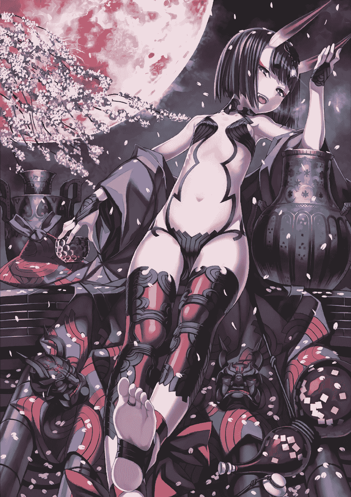
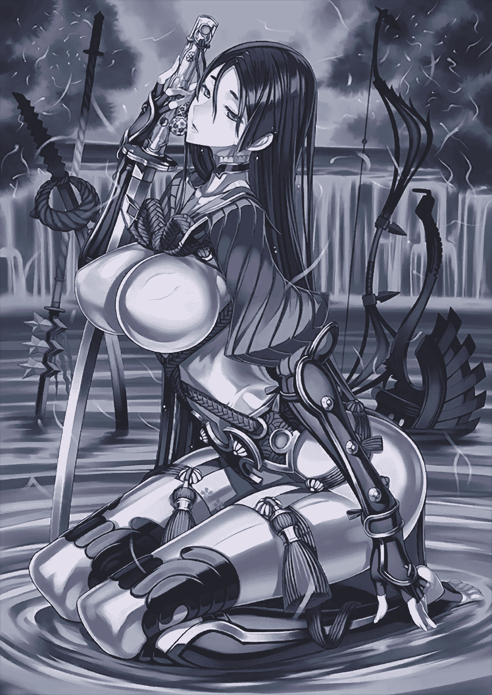
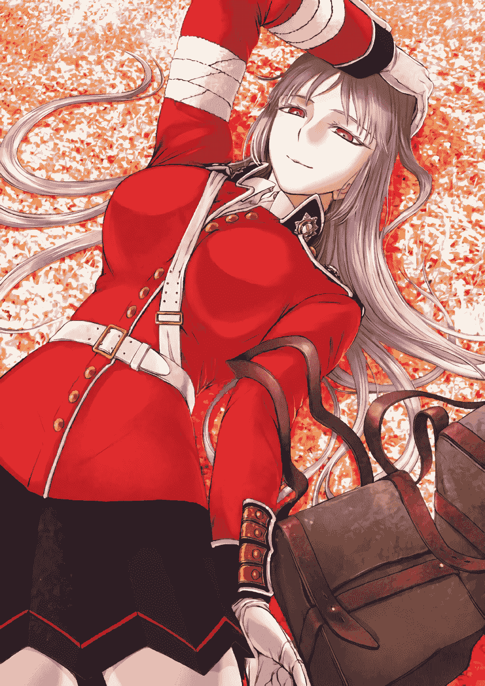

# 【短篇】终局特异点G

作者：o_0MorToy

TID：26421

 

# 1

*本帖最後由 o_0MorToy 於 2019-2-15 14:24 編輯*

修手中的长剑微微颤抖。

“喂，快把剑放下！听到没有！你不想要这个女人活命了吗！”面前站着三个士兵模样的人，其中的一个挟持着一名女子，剑刃抵在她雪白的喉咙上。

修的眼中痛苦流露，握着剑柄的手指微微松开。

“不！不要，不要听他们的！不用管我！你快走啊！”女子带着哭腔喊着。旁边的士兵狠狠地抽了她一巴掌。

修手中的剑掉落在地上。“不要伤害她。我放弃。”

最前面的士兵一剑刺穿了修的右肩，脚下踢开了修掉在地上的长剑。修忍着疼痛没有叫出声。

士兵拔出剑，冷笑道：“哼，你们这些反贼，居然不听从新国王的安排。”“胡说！你们才是反贼！我们的国家世世代代由国王一族统治，又哪里来了这样一个新国王！你们这些人居然为了利益反叛，你们这些畜生！禽兽！反贼！”女子虽然被挟持，嘴里仍然不断的怒骂着三个士兵。“闭嘴吧臭婊子！”挟持着她的士兵被骂的无言以对，恼羞成怒，一剑从她的喉咙刺了下去。鲜血喷出的一瞬间，修感觉整个世界漆黑一片，发出愤怒的吼声，朝着杀死女子的士兵冲了过去，但腿上的剧痛使他立刻扑倒在地。面前的士兵将剑深深的刺进修的大腿：“哼，手无寸铁还想干什么？之前我们三个打不过你，不过你现在没有剑，又受了伤，还能做什么呢？怪就怪你迷恋女人，哈哈哈~”

“别跟他废话了，杀了他赶紧回去复命。”

前面的士兵点了点头，一把拔出长剑，高高举起，对准了修的胸口。修只是呆呆的看着心爱女子的尸体，心如死灰。

“去死吧！”剑狠狠地刺向修的胸口。

“咚！”一只巨大的金属靴子踩在了修面前，士兵瞬间被踩在靴子下面，只剩下拿着剑的手还露在外面。

“喂，欺负人可不行哦！”巨大的少女声音从天空中传来。另外两名士兵吓得转身想逃，却被两只巨大的手一只一个轻松地捏了起来。

修震惊的抬头望去，靴子上面是黑色长袜包裹着的腿，如同擎天的柱子一样，向上的遮天蔽日的....裙底，看到这里，修赶紧低下头，面红耳赤。

声音的主人低下头看着修，粉色的麻花辫从耳畔垂下。“喂，你这家伙，人家救了你，你居然在这里偷看裙底。”巨大的少女身穿铠甲，气鼓鼓的瞪着修。

“...有人偷看你的裙底你明明很高兴吧。”另一个声音从高空传来，修才发现，和巨大少女一起的还有三位巨大的女性，说话的是一位橙色头发的少女，白衣白靴，很年轻吐槽却很犀利。

粉发少女生气的转头看向吐槽的少女，突然一把把她扑倒在地。地面发出巨大的震动，几乎把修震飞。粉毛少女坐在橙发少女的身上，一把抱住她的腿，“噗”的把白色长靴拔了下来。橙发少女努力的挣扎但是没有用，穿着黑色丝袜的脚在空中不断舞动。

粉毛少女把鼻子轻轻凑近靴子的靴口，轻轻嗅了一下，立刻把靴子远远拿开，紧皱眉头，显然靴子里散发出了的气味。橙发少女俏脸通红，嘟起嘴：“我又..我又没有钱买魔术礼装嘛，都用来氪你们了的.....哼。”

粉毛少女偷笑了一下，把手中捏住的士兵拿出一只，紧紧地按在橙发少女的脚趾上，士兵不断地挣扎，橙发少女似乎被搔的很痒，脚趾蜷曲，把士兵的上半身卷进了脚趾，士兵因为浓烈的气味和巨大的力量疯狂的挣扎，但很快就不动了。粉毛少女嘻嘻一笑，把不知道是晕过去还是已经死掉的士兵丢进了白色靴子，又笑着捏起另一只士兵。士兵看到同伴的遭遇，已经吓得目瞪口呆，一道湿痕从胯部流了下来。

“噗，小人国的士兵都是这样吗？你们这样也可以当士兵的吗？”粉毛少女一边嘲笑着士兵，一边捏住士兵，悬在橙发少女脱下来的靴子口，轻轻的摇晃，作出要把他丢下去的样子，黑暗的靴子深处什么都看不到，恐怖的气味从黑暗中散发出来，士兵吓得不断尖叫，紧紧抱住粉毛少女带着黑色手套的手指。

“喂喂，别叫啦，你这蠢货，再叫就把你扔下去。”粉毛少女威胁着，“我问你几个问题，你要好好的回答我。”士兵马上停止了尖叫，畏惧的看着粉毛少女巨大的脸，裤子上的水痕还在延伸。

“你说，这里是不是小人国？”“不，我不知道什么是小人国，我..我们是利立浦特帝国。”说出“帝国”两个字的时候，士兵的声音几乎小到听不见。

“哼，利立浦特蚂蚁窝。”粉毛轻蔑的说，“你们的王国在哪里？你们来这里干什么，还欺负这个小家伙。”

“我..我们的王国在往北方十公里左右的地方，我们来这里是为了抓捕这个反叛军.....我们之前的王国由王族统治.....但是最近来了一个名为格列佛的女人进攻王国，是..是像你们一样巨大的人，王族低挡不住，选择了投降，格列佛就成为了新的国王。这个人和他的女人不服从新国王的统治，我们就是来抓这样的反叛者。”

橙发少女对着空气问到：“达芬奇亲，他说的对吗？”空气中传来一个女性的声音：“没错，这里应该就是特异点了，原本只是过客的格列佛占领了王国，历史从这里开始扭曲了。”

粉毛少女微笑着看着手中的小人：“你还挺诚实的嘛~那就奖励你一下好了~”士兵一副如释重负的表情。粉毛少女把橙发少女的靴子丢在了一旁，伸手脱下了自己的靴子，把士兵放在靴口。“拜拜咯~”粉毛少女笑着松开了手指，空气中回荡着士兵逐渐远去的惨叫声。“那么，这次的魔神柱找到咯？”粉毛少女回头问着其他人。

修对巨人们的交谈置若罔闻，心爱的未婚妻死去的情景不断在他的眼前浮现。忽然，，修感觉自己的身体不由自主的离开地面，一只巨大的手把自己拎了起来，面前从穿着武士铠甲的双腿逐渐变成腹部，接着是如两座山一般的巨大胸部，最后，一副温柔的成熟女性面容浮现在面前，颈后梳着如瀑般的靛青色长发。青发女性看着手心里的修，神情里满是怜爱：“真是可怜的小家伙呢，现在一定很难过吧，不如..”

“赖光女士。”另一个女性的声音打断了青发女性，“这位伤员伤的很重了，请让我先来进行治疗。”说话的是一位穿着红色军装的女性。“啊，这..好的。”青发女性轻轻捏起修，放在红衣女子手心里。红衣女性一头米色的长发，如青发女性一样美丽的脸上却是坚强与严肃的神情，让人有些不敢靠近。修倒在她戴着白色手套的手心里，温暖的掌心和身体的疲惫使修沉沉的睡去...

再次醒来时，修发现自己躺在一张小小的病床上，身上的伤似乎已经大部分痊愈了。“喔。你醒了。”红衣女性巨大的声音从头顶传来，把修吓了一跳。对方把脸凑得很近，似乎在仔细的观察修，口中吹气如兰，让人觉得非常舒适。“我知道你要问什么，你们的新国王是造成时代特异点的元凶，在你昏迷的这段时间已经被我们打败了，你的伤已经快痊愈了，再休养一下我们就可以考虑送你回去。我还有伤员要处理，你就在这里休息一下吧，在‘迦勒底’四处逛逛应该也可以，不过你这么小，可能要小心一点。”红衣女性说完，就转身的离去了，白色皮靴留下了一路“啪嗒”的脚步声。

修观察了一下周围，自己似乎住在一个硬木搭建的小房间里，小房间外是一个巨大的房间，房间里充斥着自己没有见过的科技风格，白色的墙壁、柱子散发着光泽，看起来清爽又干净。修打开小房子的门走了出去，晶莹的地板映照出自己的样子。修形容憔悴，但身上除了少数地方仍缠绕着绷带，大部分的伤都已经痊愈。房间的大门开着，修不自觉地朝大门走去。我的伤好的差不多了，是否该请求她们让我回去？可是这是哪里？真的还回得去吗？她已经不在了，我回去还有什么意思呢？

脑子里想着这些问题，不知不觉修已经走到了房间的门口，眼前是一条巨大的长廊，长廊的两边有两排不同的房间，似乎都有人居住的样子。或许我应该拜访一下她们，感谢她们的救命之恩，顺便了解一下这里的情况？又或者..我应该找找餐厅之类的，肚子有点饿了..但是这里的人都这么巨大，跑来跑去是否很危险呢？修这么想着，要去哪里呢？

A.  飘来水果香气的房间B.  门前摆放着武士盔甲的房间C.  还是不要乱跑了，回到休息室

 

# 2

*本帖最後由 o_0MorToy 於 2019-2-15 10:24 編輯*

A.水果香气的房间

修轻轻走向飘洒着水果香气的房间，门虚掩着，愈发浓烈的水果香气带着酒香飘散出来，穿过门，面前是一个巨大的房间，“广阔”地毯的远方如蜿蜒的山脉一样侧卧着一个头上长着角的女孩，在她身旁堆满了各类甜美的水果。女孩的手中端着一只碗，似乎正在轻啜碗中的美酒。

长角女孩侧过身看着修。齐耳的紫色短发顺滑的从耳畔垂下，两颗小虎牙若隐若现，脸颊似乎因为酒气而微微泛红，身上除了重要的地方还遮掩着，其他部分却完全的裸露在外，肆意的展示着每一寸肌肤。

“嘻嘻，妾身还奇怪怎么酒香里混进了小老鼠的气味，原来是你这小家伙。既然都进来了，不过来喝一杯吗？”女性微微的笑着，向修发出邀请，虽然滴酒还未碰，但只是这带着酒香的笑容，已经先让修醉了三分，似乎是身体不由自主的朝女孩走了过去。

巨大的水果堆砌的如同小山一样，后面是更加巨大的女孩的身体，女孩侧卧着，用手臂撑着脑袋，饶有兴趣的看着小小的修，口鼻中呼出浓郁的果酒香气。修脸涨得通红，“唔…那个…我..”支支吾吾的说不清楚话，肚子却很耿直的发出了“咕咕”的叫声。小女孩“噗”的一下笑了出来：“肚子饿了就说嘛，我来帮你吧~”抓起一个苹果咬下一口，嚼了几下，把一大团苹果屑吐在了修面前。

修觉得有些难为情，犹豫是否该吃。女孩的口水裹在苹果肉上，浓郁的酒香混着苹果的香气不断地侵袭着修的理智，修的双腿不自觉的颤抖着，在心中不停地告诉自己“不能吃..不能吃”。

“怎么了，这是嫌弃妾身吗，嘻嘻~”女孩咯咯娇笑着，向着修吹了一口气，香甜的气味拂过修的脸颊，头发，耳朵，侵入修的肺部。一瞬间修只觉得世界上没有比这苹果更美好的食物，扑上去狼吞虎咽起来。女孩看着修的样子开心的笑着：“这才乖嘛~”伸出手指，用柔软的指肚轻轻抚摸着修的头。

修吃饱了苹果，睁着惺忪的醉眼，坐在地上。酒精溶解在血液里，不断地冲击着修的心脏，心爱之人在自己面前离去的景象一幕幕浮现，而自己却对此无能为力，想到这里，修终于再也无法控制自己的情感，激荡的酒水在腹中化作了眼泪，止不住的涌了出来。

女孩微笑着看着修，伸出巨大的手指，用指甲轻轻的刮去修脸上的泪水。修渐渐停止了哭泣，茫然的坐在地上。

“你有很伤心的事情吧？”女孩轻轻的问。修没有反应，只是静静地望着远处。

“没事的，妾身这里有治疗伤心的良药哟。”女孩把脸凑近了修，口中呼出的酒香温暖湿热，嘴唇几乎吻在了修身上。修却像触电一样连忙退后了几步。

“不….还是不要了。”修边说着边往后退，却一脚踩进了水里。转头一看，女孩的手不知不觉已经将碗倾斜，碗中的酒源源不断的流淌出来，把周围的地面完全淹没。

“嘻嘻，明明是个大男人，却像小姑娘一样害羞呢。放心吧，安心的把你交给妾身，妾身一定会带你去到那没有任何烦恼忧愁的理想世界。”女孩邪魅的笑着，用舌头舔着嘴唇上的酒。

不断流淌的酒逐渐淹没了修的膝盖、腰部，女孩碗中的酒却像是永远不会流尽一样源源不断的流淌下来。突然端着酒碗的手一抖，一道酒的巨浪完全的将修吞没。修只觉得自己被完全淹没在酒的海洋里，香甜的美酒不断地从鼻孔耳朵嘴巴涌入，痛苦却又快乐。

等重新呼吸到空气时，修发现自己漂在一片的汪洋大海中，海水中却散发着浓郁的酒香，酒海一样望不到边。

“嘻嘻，在看哪里呢？”巨大的声音如雷霆一样从天空中传来，修惊讶的抬起头，女孩的脸遮蔽了天空，话语之间吹吐的空气仿佛酒海上的风暴。修这才发现，自己已身处在女孩手中的酒碗里，而女孩比先前还要巨大的多。女孩笑着俯视修，涂着淡红色眼影的双眼眯成两道月牙。

“欢迎来到这极乐的海洋，来吧，在这里忘掉你所有的烦恼和忧愁，让这快乐的香气和液体浸透你的每一滴骨髓吧。”巨大的樱唇微微张开，唇边可爱的的虎牙如同山尖一样巨大挺拔。女孩的舌头从两片樱唇之间缓缓伸出，宛如下凡的粉色巨龙，缓缓朝修舔来。修连忙疯狂的往反方向游，巨大的舌尖在修的不远处缓缓探入酒中，又从更远处伸出来，卷起了一大团酒水，回到女孩深不见底的口中。舌头搅动和滴下的酒水溅起巨浪，冲的修头晕目眩，连喝了几大口酒。

“嘻嘻，为什么要抗拒呢，只要你放松，幸福就在嘴边，不是吗？”女孩笑着又一次伸出舌头，在碗中舔酒喝。巨大的舌头不断的落在修的附近，将酒水舔进嘴里，却从不碰到修。几次过后，粉舌不再回到口中，直接在修的周围一圈圈的搅动着，舌头上晶莹的液滴不断地落入碗中，不知是酒水还是女孩的芳涎。

巨舌的搅动形成了巨大的漩涡，修无法抗拒的逐渐被一圈一圈卷入漩涡的中心，淹没在果酒中。香甜的美酒再一次从四面八方用来，灌进嘴里，浸透修的每一寸身体。

修迷离中睁开眼，发现自己又重新浮出了海面。远方的海上，巨大的女孩婀娜的站在酒中，下半身浸在酒里，一步步朝着修走来。迷醉的修心中微弱的理智不断地呼喊：“我不能沉沦在这里，我要离开…”但四肢却根本不听使唤，无法往前游动。转眼之际巨大的女孩已走到面前，像一座小山笑着俯视着修。

“真是的，还要妾身亲自来服侍你才行嘛？”女孩笑着缓缓伏下身，雪白的肚皮，微凸的胸脯，柔软的脖颈逐渐沉入酒中，只留下一张可爱的脸调皮的看着眼前的修。酒面上波光粼粼，女孩可爱的紫色发梢轻轻的漂起来，形成一道美景。

“来吧，到妾身这里来，妾身会治愈你心里的创伤的..”女孩轻轻张开嘴，逐渐向修靠近，修的身体已经完全不听使唤，只能静静地看着自己被粉色的樱唇包围，带往那酒香四溢的口中宫殿。酒，女孩的舌头，柔软的口腔，可爱的虎牙不断地接触者修的身体。修觉得这酒香已经完全浸透了自己的皮肤，浸透了自己的身体，浸透了自己的骨髓，记忆与灵魂。

修站在女孩巨大的舌尖上。眼前这红红长长的大道，是舌头吗？修揉了揉眼睛，却分明看到一条宽阔鲜艳的红地毯。这鲜红的巨大宫殿张灯结彩，四处装点着喜庆与祝福的红色装饰，两侧还有长长两排象征着爱情的巨大白色石雕。远方红毯的尽头，未婚妻穿着红色长纱，手捧鲜花，笑着望着自己。修没有任何的迟疑，迈开大步，朝着红毯尽头的幸福飞奔而去。

“咕噜。”

酒吞童子满意的舔了舔嘴唇。

“果然还是浸满酒香的骨髓最棒了呢。”

“嘻嘻。”

 

# 3

<ignore_js_op>[112D.png](forum.php?mod=attachment&aid=NzY1MjZ8OWMzODg2MjB8MTYwMDg4NDI0N3wxODIzMHwyNjQyMQ%3D%3D&nothumb=yes) *(2.68 MB, 下載次數: 7)*

[下載附件](forum.php?mod=attachment&aid=NzY1MjZ8OWMzODg2MjB8MTYwMDg4NDI0N3wxODIzMHwyNjQyMQ%3D%3D&nothumb=yes)

2019-2-15 10:23 上傳  

</ignore_js_op>  

# 4

*本帖最後由 o_0MorToy 於 2019-2-15 10:28 編輯*

B.武士铠甲的房间

修走过房间门口巨大的武士铠甲，穿过虚掩的房门，一步步走进了房间。巨大的房间充满了日式的风格，简单而又朴素。

如修所想的，广阔榻榻米的远方坐着熟悉的巨大身影，之前被称作“赖光女士”的女性。不如说正是为了来找这位女性，才专门来的这个房间吧。

可是为什么要来找她呢？修自己也说不清楚，或许是因为，之前和她在一起的几秒钟，让修觉得温暖，抑或是温柔的话语安抚了受伤的内心？但无论如何，自己的双腿带领自己来到这里，是内心的选择吧。

“呵呵，你来啦，我就知道你会来的，过来吧。”源赖光的语气还是一如既往的温柔和蔼，让人从心底感到安心。

修一步步缓缓走到源赖光面前。之前所穿的盔甲早已卸下，靛青色的长发如瀑垂下，此时的赖光只穿着一件淡紫色的长毛衣，巨大的双峰和腰肢隔着毛衣只露出简单的轮廓，却散发出强大的女性魅力。修站在地板上仰望着面前这个山一样的女性，赖光轻轻低下头，长长的头发垂下来，落在修的两侧，发丝带着一阵幽香。

“来，上来吧。”源赖光伸出左手，轻轻的放在修的身侧。修没有犹豫，踏上了这温暖又柔软的手掌，轻轻的坐在掌心里。手掌缓缓移动，越过两座巨大的山峰，来到赖光面前，温柔的脸上带着和蔼的微笑，静静地看着修。唇齿呼出的空气带着幽兰的清香。

“呵呵，之前的战斗，受了很多苦吧，还好现在差不多痊愈了呢。”赖光用右手食指轻轻的抚摸着修的头。修又一次回想起之前发生的事，多么希望那一切都是梦境，希望心爱的未婚妻从未离自己而去，可是从迦勒底醒来时，终于意识到这一切已经是不能改变的现实。修心头一酸，轻轻的倚在赖光的指尖上，两行泪水留下来。

“怎么了怎么了，怎么哭起来了，对不起对不起，是我不好，提起了你的伤心事。”赖光没想到自己本来安抚修的两句话竟然惹得对方伤心落泪，吓的不知所措，想用手指帮修擦干，又怕弄疼了他。一边保持着手指不动，让修倚靠，一边将两只手缓缓移动到自己的胸前。

“既然想起来了，就放开的大哭一场吧，鼻涕眼泪都擦在我的衣服上也没关系的喔。”赖光的手掌放在了胸前，修再也控制不住，扑进双峰之间毛衣凹进去的地方，大声的哭着，上半身几乎陷进了柔软的毛衣里。

赖光心疼的用手指轻抚修的后背：“可怜的孩子，一定很难过吧，不过没关系的，我会好好照顾你的，就算..就算把我当成妈妈也没关系的哦~”

赖光的体温和柔软的安抚让修渐渐的停止了哭泣。修静静地坐在柔软的掌心里，赖光低下头，轻轻吻了一下修的身体，再抬起头时，柔软的青丝拂过修的身体，似乎也和赖光的手掌一样温暖。修用手臂抱住一拢长发，搂在怀里。在心灵受创，身在异乡的时刻，这样温暖柔软的赖光，成为了修的心灵寄托。

“呵呵，真是可爱的孩子，听说孩子小的时候，都很喜欢母亲的头发呢。没关系的，妈妈的头发，你想怎么玩都可以喔。”赖光温柔的笑着，侧过头，更多的青发滑落到修的身边。

修抬起头，用失神的双眼仰望着赖光。

“赖光女士，我有一个请求..”修目光楚楚，凝望着赖光。

“噗，傻孩子，怎么还叫女士，要叫妈妈才对喔。是什么请求，你说吧。”赖光回以慈爱的目光。

“我，我还是想回去，现在就回去，回到生我养我的王国…就算…就算那里有我的伤心事…”修轻轻低下了头，望向别处。

“这样啊，没有问题的，孩子的愿望，做母亲的又怎么会不满足呢，我也和御主去过很多次了，回到之前的特异点的话，不依靠达芬奇女士应该也没问题的喔。”源赖光笑着回应，眼中的慈爱又加深了。

“真…真的吗？”修几乎不相信自己的耳朵，居然这么快就能回去。

“当然了，我们现在就出发吧。”赖光站起身，手指轻轻弯曲，小心翼翼的把修护在手掌心里，担心他掉下去，就这样只是穿着起居的毛衣，缓步走向房门。

一阵蓝光闪过，源赖光又一次站在利物浦特王国郊外的大地上。赖光睁开双眼的第一件事就是轻轻摊开掌心，确认修的安全。修安然无恙的坐在掌心里，目不转睛的看着远处。想起不久之前自己在这里遭遇的一切，虽然不再流泪，心弦仍然微微颤动。

赖光迈开步子向前走着。小人国的一切都是微小的，有着和修同样的比例。远望四周，没有能够遮挡视线的物体。赖光巨大而柔软的脚掌踏在平原上，留下一个个浅浅的巨大脚印。农民和牧牛听到震动，都轻轻的避开，等赖光走过，再出来继续自己的事情。这些日子，这些居民已经完全习惯了巨人的出现。

没走多久，王城已在眼前。看到赖光的到来，王族派遣了专门的亲卫队迎接曾经拯救利物浦特的恩人。

“你的家在哪儿？”赖光如同没看到亲卫队一样，巨大的裸足从骑兵们的头上跨过，径直走向城内，脚底带落的青草和泥土洒了亲卫队一身。

“咚。”两条雪白的大腿跪在一户民宅门前，修从巨大的手掌上轻轻跳下。周围的居民虽然知道赖光没有恶意，但毕竟畏惧如此高大的巨人。都轻轻退回屋子关上了门。

修家的房门轻轻打开，走出一位十来岁的少年，扑进修的怀里，由于之前军队的残暴，弟弟是修唯一剩下的亲人。修和弟弟紧紧地拥抱在一起，悲伤和感动交织在一起，修拼命地忍住，眼泪终于没有留下来。

两人拥抱了良久，修轻轻的转过身。赖光趴在地上，用手支撑着脑袋，微笑看着兄弟俩。巨大的身体压垮了城里许多房屋，赤裸的双腿毫不在意的一前一后摇摆着，但赖光似乎完全没有在意。王族的军队们排列在两旁，面面相觑，不知道该怎么办。

修朝着赖光深深地鞠了一躬。

“赖光女士，这么久以来真的谢谢你的照顾了，也非常感谢你长途跋涉送我来这里，真的非常感谢，希望你以后的日子都能过得开心，有空的话也欢迎你常来做客。”修满怀感激的望着赖光。

赖光的笑容僵在了脸上。

“你..你说什么…”源赖光的声音微微颤抖。

“我，我是说很感谢你一直…以来的…照…”修细细回想自己刚才的话，想不出有什么说错的地方。

“你…你要我走…是吗？”赖光垂下了头，靛青色的长发从两侧滑下，挡住了她的眼睛。柔软的青丝看上去似乎没有之前充满了光泽。

“啊..是…可是你不是迟早…”修仍然不明白自己说错了哪里，但是赖光的样子让他心里有了一丝的罪恶感，他知道自己话里一定有什么东西刺伤了这位温柔女性的内心。

“啪。”一滴巨大的眼泪落在地上，形成了一滩水。

“为什么…为什么…是…是妈妈哪里做的不够好吗？为什么…为什么要赶我走呢？”赖光的双肩不断地颤抖着，大泪珠像断了线一样不断地落在地上，形成更大的积水。周围的人们虽然不明白情况，也都同情着这位女性，很多人从窗户探出头来。

“不，不是的…请听我解释…”修已经完全慌乱，不知道该怎么办。

赖光的手臂抬起，一道阴影从修的头上掠过。

“噗嗤。”身后似乎有什么东西发出一声轻轻的爆裂声。一片寂静后，许多女人发出尖叫声。

修转过身，一根巨大雪白的手指落在原来自己的弟弟所站的位置，巨大的指肚下，鲜红的血液不断地向外流。指尖仍然在不断地碾动着，鲜血越流越多。

修感觉眼前一黑，几乎晕倒在地，自己所剩下唯一的亲人，就这样一瞬之间被压在手指下，完完全全的失去了生命。而这竟然是刚才对自己还无比温柔的女性所为。

赖光缓缓地抬起头，努力对着修挤出一个灿烂的笑容，但是披散的头发和眼角不断流出的泪水反而让这笑容看起来非常诡异。

“我明白了呢。是这个虫子吧。是这个虫子留住了你的心。现在他已经不在了，你是不是可以..可以..跟妈妈回去了呢…”脸上虽然带着笑容，声音却更加哽咽。赖光伸出另一只手，想像之前一样去抚摸修的头。却被修一把推开。

修跑向碾在弟弟身上的手指，努力的踢打着，想把手指推开。他无法相信眼前的这一切是真实的，但是刺鼻的血腥味不断地敲打着他的内心，与数日之前的痛苦汇合在一起，反复的播放着。

巨大的手指停止了碾动，轻轻弯曲，一下将修弹出数米远。

“呵呵呵，看来是妈妈错了呢，妈妈宠坏了你，不过还好，对于叛逆期的孩子，教育还是来得及的呢。”赖光抬起头，眼中泛出红光，之前的笑容仍然保持在嘴角上，让人不寒而栗。

一名亲卫队员抱起修，放在自己的马上，拍马带着修向远处奔去。修只是呆呆的望着弟弟留下的血迹。其余骑兵迅速包围了赖光，长矛齐竖，指向巨大的身躯。

“别碍事。”赖光发出低沉的警告。巨大的手掌横扫过来，将一整排骑兵连人带马扫的飞了出去。许多骑兵直接在城墙上撞的血肉模糊，更有的远远飞出了城墙。

其余的骑兵不愿放弃，仍然不断地围绕着赖光试图阻挡。巨大的手掌将一大群骑兵狠狠地拍进了地面。剩余的骑兵眼看不对，转身想逃。赖光捏碎房子，将道路渐渐挡住，不一会儿，所有士兵就被封锁在了一小片区域里。巨大的双手从两侧缓缓逼近，将所有骑兵整个捧了起来，渐渐闭合，骑兵们完全被笼罩在巨大的双掌监狱中。手掌逐渐的合拢，里面的哭喊和惨叫已经完全传不到外面，只有指缝里不断地喷涌出鲜血。

赖光挥动右手，一团血肉笔直的飞出了城外。巨大的双手把血抹在紫色的毛衣上，一抹鲜红的手印成为了亲卫队活过的唯一证明。

骑兵带着修已经跑出了非常远的距离，隐约听到身后巨大的震动声越来越响。赖光甚至没有站起，手脚并用的朝着两人一马迅速爬过来。

巨大的手掌不断落在骑兵身后的街道上，无数房屋和居民被压成废墟。遮天蔽日阴影逐渐笼罩了逃跑的两人。

带着紫色毛衣的巨大胸部突然落在骑兵前方的道路上，小山一样的双乳将相邻的两座街道和房屋全部压垮。“呵呵呵，无路可逃了吧。”赖光的声音恢复了温柔，但其中的言语却透着无限的恐怖。

骑兵连忙扯动缰绳，拉着马向左转去，赖光巨大的左手从房屋中穿出，横拦在路中央，向骑兵抓来。骑兵赶忙又调转马头，朝另一侧跑去，而那里早早的有一只右手等在那里。反应灵敏的骑兵再次转头，原路返回，穿过两根巨大的玉柱，从赖光的胯下逃走。

“呵呵呵，孩子果然还是孩子呢，爱做游戏吗？”赖光拉住毛衣的胸口，一把脱了下来。完美的身体以全裸的姿态展现在整个王城的面前，可是却没有任何人有心思注目在这带来死亡的巨大身体上。“那么我要认真玩咯~呵呵呵。”赖光伏下身体向前爬动，两座傲人的巨峰结结实实的并在一起，如同巨大又柔软的推土机，向前快速推进。

居民，市集，货物，马匹，房屋，道路两侧所有的一切都被卷进这对无情的豪乳之下，许多人甚至被巨大的冲击震飞，落在赖光的肩膀，发丝甚至坚挺的乳梢上。顷刻之间，一座完整的街道已经被夷为平地。

骑兵为了躲避双乳的追赶，想尽办法利用自己的灵活，在狭窄的房屋巷子中穿来跳去。但赖光来着不惧，用双乳将一切挡在自己面前的房屋建筑甚至王宫无情的碾平。不断受到刺激的乳梢也坚挺的直立着，如同两座小红塔一般，轻而易举的将各类围墙一一撞毁。“呵呵…哈…你们还要逃到…哈…哪里去呢…”双乳不断地刺激也让赖光的脸颊逐渐泛红，口中不断地喘着气。

骑兵的马儿渐渐体力不支，而双乳的推进速度愈来愈快，眼看已经无路可逃，骑兵快马加鞭朝着城门奔去。

“哈…呵呵呵，是我赢了呢。…哈。”赖光喘着粗气，双手支撑着身体离开了地面，两下就赶上了骑兵。冲出城门的瞬间，赖光微微一笑，扭动脖子，狂风一般的长发将骑兵连人带马扫了出去，摔倒在地，修也摔了出去，被赖光稳稳地接在柔软手指间。

骑兵被马压住了双腿，疼痛不已，努力的想要把坐骑推开，突然被巨大的阴影笼罩。白玉般的臀部遮天蔽日的压了下来。“不，不不不要..”

随着山崩地裂的一声巨响，赖光坐在了地上，而最后一名骑兵的尖叫声也被完全的掩埋在了巨大的玉体之下。

“哈…抓到你了哟..”赖光用两只手指轻轻的捏住修，悬在眼前，宠溺地看着，眼神迷离。不知是因为刚才的运动带来的疲惫还是因为乳梢的刺激使身体兴奋，赖光脸颊通红，喘着粗气。

惊慌绝望和恐惧包围了修，修不知所措的望着赖光。

赖光的嘴嘟了起来：“哈…不过啊，对于不听话的孩子..要好好教育呢。啊！有了！”

“就…哈…就带你..”赖光捏着修的手指缓缓下移，经过巨大的双乳，不断地向下，声音也越发的亢奋起来，“就带你回到最初的地方，重新感受一下母爱吧。”

“不…不要..”修想大喊却发不出声音。赖光巨大的食指和中指将修夹在中间，缓缓的伸向股间。穿过茂密丛生的牡丹花瓣，笔直的进入湿润温暖的花心中。

修只感觉到鱼水气息灌满了自己的肺部，还没呼吸两口，全身就被完全的按进了柔软的肉壁上不断地摩擦了起来。

赖光巨大的手指在牡丹中不断地搅动，修只觉得自己的脸，手臂，双腿反复地被按入柔软的肉壁，撞击在和自己一样大的肉球上。湿滑的液体沾满了全身，甚至灌进了修的口鼻中。

赖光的手指活动愈发剧烈，逐渐从搅动变成不断地进出。修的身体与肉壁不停地产生摩擦，骨头几乎要散架了。光影与黑暗，湿气与粘液，手指与肉壁不断地冲击着修的身体和灵魂。

“我可爱的孩子，在我的身体里，呵呵呵，哈哈哈哈…”快乐让赖光的喘气声越来越粗。修所进入的领域也越来越深，无数次几乎看到了那巨口一般的花芯深处。

“啊！”随着一声震徹王城的叫喊声，一股温热的巨浪从洞穴深处喷涌而出，修被巨浪瞬间吞没，无法呼吸，雨露不断灌进嘴里，鼻子里，几乎连胃部都被填满了。

赖光坐在地上，缓缓的喘着气，轻轻的将手指从胯间缓缓的抽出，放在眼前。无力的修被包裹在粘稠的雨露中，努力的挣扎，却仍然逃不出玉液的牢笼。

“呵呵呵，好像出生的婴儿一样可爱呢。”赖光轻轻分开手指，玉液拉出一道道长长的丝线，而修周围的雨露也被拉开，挂在丝线之间。丝线被拉开又缓缓地汇聚在修身上，裹成一个液滴，顺着赖光的直接缓缓流下。

“来吧，跟妈妈回去吧。呵呵呵…”

裹着修的液滴落在赖光的胸前，缓缓地下滑，渐渐滑入那深不见底的峡谷之间。

赖光站起身来，朝着来时的方向走去。

 

# 5

<ignore_js_op>[114D.png](forum.php?mod=attachment&aid=NzY1Mjd8YjRkMGRmYTF8MTYwMDg4NDI0N3wxODIzMHwyNjQyMQ%3D%3D&nothumb=yes) *(2.62 MB, 下載次數: 3)*

[下載附件](forum.php?mod=attachment&aid=NzY1Mjd8YjRkMGRmYTF8MTYwMDg4NDI0N3wxODIzMHwyNjQyMQ%3D%3D&nothumb=yes)

2019-2-15 10:26 上傳  

</ignore_js_op>  

# 6

*本帖最後由 o_0MorToy 於 2019-2-15 10:33 編輯*

C.回到休息室 修慢慢踱步走回了休息室，现在的他只想呆在这里，静静地养伤。不仅是身体上的伤害，也有心灵上的伤害。身体上的伤害已经治好了，心灵上的伤害却越来越深了。修的目光四处游荡着，落在了一处资料柜的顶端。那么高的地方，或许能把自己的忧伤全都带走吧。修沿着抽屉向上爬着，开合错落的抽屉加上修还算不错的身手，对于爬到顶层来说并没有什么难度。只是一会儿的功夫，修就爬到了柜子的顶端。柜子上面虽然是容易落灰的地方，却是非常干净，可见伤员室的管理者是个对干净非常执着的人吧。修没有多想这一些，慢慢的走到柜顶的边缘。高高的资料柜对于小小的修来说有着数百米的高度，一样望下去，几乎看不清地面上的东西。从这跳下去的话，一切就都结束了吧。修这么想着。和未婚妻度过的一切快乐甜蜜时光在眼前如走马灯一样略过，可这一切都被那个新国王，那群反叛者无情的毁掉了。虽然他们现在也已经被消灭，但是逝去的爱人却无法再次回来，自己活下去又有什么意思呢？望眼欲穿的向下看去，数百米高的地板尽头，似乎未婚妻正张开双臂等着拥抱自己。修纵身一跃而下，风声呼呼的从耳畔略过，广阔的地面离自己越来越近。修闭上了双眼：“这样一切就结束了吧。”啪。自己似乎掉在了什么柔软的东西上。修睁开眼，慢慢的坐起身，虽然落在柔软的东西上，还是摔得生疼。身下是宽敞的柔软光滑的白色织物，像是一面柔软的大床。抬起头看去，红色的袖子，穿着红色军装的上半身，披落的美丽粉白色长发，一张严肃冷峻的脸。是先前救治自己的女性，修正坐在她的掌心里。女性用严肃冷峻的眼光瞪着修，修能感觉到对方心中非常的愤怒，托着自己的手掌也在微微颤抖。“我是真的不想继续痛苦的活着了，请不要再救治我了，谢谢。”这样的话，临到嘴边又咽了下去。修不敢直视女性愤怒冷峻的目光，转而望向别处，女性红色军装挺拔的胸前别着一个一人高的牌子，上面用标准的字体刻着：“南丁格尔。”“自杀是不尊重生命的行为。”南丁格尔的五指渐渐向手心合拢，修反应过来时已经完全来不及逃走，被五根裹着白色织物的柱子瞬间包围，紧紧的握在手心里。手指没有就此停下，反而是继续握紧，表面白色的柱子用巨大的压力开始不断地压迫修，修用力的推着，却没有丝毫的作用，巨大的手指越握越紧，疼痛由轻到重开始在修的身上体内不断传来，修几乎听到自己骨骼断裂发出的爆响。尖细而凄惨的喊叫声从手指缝里传出来，南丁格尔轻轻“哼”了一声。松开了手掌。瘫倒在掌心里的修满脸都是泪水，左臂和双腿的骨头都已折断，甚至变形。修用仅剩的右臂支撑着自己朝南丁格尔反方向的爬去，但是怎么爬都是在掌心里，只是因为恐惧的本能行为罢了。托着修的手掌中微微散发出淡黄色的光芒，修身上的淤伤迅速复原，骨骼也很快恢复原样，几秒钟的时间里，就好像刚才的痛苦完全没有发生过一样。修呆呆的望着南丁格尔，不知道该感谢还是畏惧。修先打破了沉默：“南丁格尔小姐，谢谢你的治疗，可是我…”“战争之中，无数人们为了国家，和平，受到伤害，甚至死亡。”南丁格尔伸出另一只手的食指，向修缓缓靠近。“他们不希望自己死去，因为他们或许还有家人，还有朋友，还有未完成的任务。”巨大的手指朝着修压来，修不知道该静静地听南丁格尔的话还是应该逃走，躲闪不及，被带着白色手套的手指压在掌心中。手套的指尖干干净净没有任何特殊的气味，却或许因为长期的使用和反复清洗磨损严重，或许忙于治疗的南丁格尔从未想过给自己更换一双新手套。“但是医疗条件的匮乏，医护意识的缺失，让他们不得不带着他们的愿望，带着他们的遗憾，带着对朋友和家人的思念离开这个世界。”白色的手指将修的右腿膝盖牢牢压住，修用双手拼命地想要扳开，巨指却纹丝未动。“咔。”巨大的手指瞬间用力的压下，把修的右腿轻易折断。彻骨的疼痛贯穿了修的神经，清脆的响声被剧烈的惨叫声淹没，而微小的惨叫声却被南丁格尔的话语淹没。“医疗条件发达的今天，却有痊愈的病人主动放弃活下去的机会。”白色的手指又一次压在左腿上，修忍着痛苦拼命地扳动手指，却仍然是以卵击石。这次相比疼痛，更痛苦的确实明知疼痛要来却无能为力的绝望。而随着左腿骨头的断裂，手指的巨大阴影又笼罩了修的左臂。清脆的骨骼断裂声在继续，凄厉的惨叫声在继续，南丁格尔平静的语气也还在继续。“而这样的放弃和堕落，是对努力活下去的人，对帮助人们活下去的人最大的侮辱。”巨大的手指无情的碾碎修的右手肘关节，发出清脆的响声。修的眼泪已经湿透了衣襟，这和懦弱胆小没有任何关系，只是人因为剧烈疼痛而产生的本能。带着白色手套的巨大手指缓缓移动，抵在了修的胸口。“不…不要…”修恐惧的闭上了双眼，疯狂的摇着头，他仍然想要推开这支死神一般的白色手指，但这次他的四肢一条都不能动了。“对一切妨碍治疗和看护的人，我都不会有丝毫的容忍，哪怕这个人是伤者本身。”精通医术的巨指微微的用力，修的肋骨一根根开始折断，每当前一根肋骨断折的猛烈剧痛逐渐缓解时，下一次钻心的痛楚就立刻席卷而来。24次贯穿灵魂的疼痛后，修大口的喘着粗气，意识几乎因为疼痛而消散，彩虹般的光斑在修的眼中不断地闪烁着。除了颅骨和颈脊椎之外，修的身上几乎没有一根骨骼是完好无损的。淡淡的黄光再次从雪白的手套中渗出，渐渐的笼罩了修的身体，修的骨骼开始迅速的恢复，痛楚也逐渐消散。修很明白接下来会发生的事情，连忙站起身来对着南丁格尔大声喊着：“南丁格尔小姐！我真的很抱歉，我之前很绝望，但是我已经明白了，我不会再自…”巨大的白色手掌瞬间倾斜，修站立不稳，来不及抓住手套，从高高的半空中坠落，狠狠地摔倒在地。熟悉的剧痛又一次回来，修来不及等待疼痛的消散，凭借本能朝着南丁格尔反方向的爬去。南丁格尔一如既往的用冷峻的眼神盯着脚边蠕动的修，像凝视一只恶心的爬虫。巨大的雪白长靴渐渐离开地面，阴影缓缓追上了修。“你这样的外伤我轻而易举就可以治好，但现在我要治疗的，是深藏在你心里，名为‘不尊重生命’的顽疾。”巨大的靴底和地面无缝贴合在一起。修感觉膝盖以下的部分瞬间没有了知觉，只剩下一阵触电般的疼痛占据了所有感官。“感受到痛苦了吗？明白接近死亡的感受了吗？”南丁格尔扭动着长靴，将修的脚部和小腿完全的碾碎。然后缓缓的转过身，语气一如既往的平淡。修感觉到更加坚硬和巨大的东西抵在了自己的腰部和大腿上，是南丁格尔的靴跟。“希望你能够明白死亡的罪恶，死亡的丑陋，让求生欲永远留存在心里。”“南丁格尔小姐，我明…”修的辩解还未开始，巨大的鞋跟已经无情的碾下。修的血液和骨骼碎片溅在雪白的地砖上，腰部以下的知觉也被剧烈的痛楚取代。修只是拼命地用双手向前爬去，努力的爬离那恐怖，噩梦一样的巨大白色长靴，断裂的身体在地上拖出一条长长的血痕。这是没有任何理性而单纯被“求生欲”驱使所作出的行为。淡黄光芒闪动，修从蠕动渐渐变成爬行，甚至从地上爬起来，健步如飞的跑了起来。南丁格尔让修明白了求生欲，但这并没有让修心存感激，修心中仍然保持着一样的，想法，那种可怕的疼痛，千万不要再来了。修拼命地向远离南丁格尔的方向跑着，甚至没有回一下头，是因为急切的想逃，还是因为恐惧不敢回头看，连修自己也不知道。“嘭。”一声巨响在修的面前爆开，巨大的物体砸在了修的面前，把修震的飞了出去。被震倒的修缓缓地睁开眼，落在面前的是南丁格尔脱下来的白色长靴，倒在地上的巨大靴子有数米高，近百米长，完全阻挡了修的去路，阴影再一次笼罩了修。“不，不要…不要再来了。”修的天空被穿着白色丝袜的巨大脚底笼罩。南丁格尔的脚底的丝袜因为长期的穿着和频繁的清洗而破旧不堪，许多处粘挂着拳头大小的毛球，脚跟的部分也因为磨损，许多丝线不再完整，甚至能隔着丝袜看到脚跟的皮肤。巨大的脚掌铺天盖地的压了下来，修没有任何逃跑的机会，被柔软的脚掌严严实实的踩在脚下，甚至连嘴都被白色的丝袜严密的捂住，细小的毛球灌进修的嘴里。不同于之前的惩罚，南丁格尔的脚掌柔软而又温暖，修的骨骼和皮肉没有受到任何损伤。但因为被完完全全的踩在脚底，修的脸完全埋进了南丁格尔的丝袜中，只能勉强透过丝袜呼吸。雪白的丝袜没有任何异味，令人感叹医护女神对洁净的追求，但汗水却是无法避免的，频繁的跑动和辛苦的工作让脚底的白丝变得潮湿，也增加了修呼吸的难度。南丁格尔巧妙的控制着脚下的力度，挤压修的身体，修肺中的空气被强大的压力挤出，不由自主的吐掉了所有的空气，脚掌的力量瞬间又减轻，修被迫大口的呼吸丝袜中残存的湿气。就这样一呼一吸，修就像一个可悲的气囊，将呼吸的权利完全交给了南丁格尔的脚底。丝袜中的湿气充满了肺部，修甚至感觉到自己的呼吸道粘着无数丝袜里的白色纤维。一次大口的呼吸过后，南丁格尔没有向踩气囊一样挤出修的空气，而是开始慢慢的施压，让修胸腔和肺部的活动空间越来越小。逐渐的，修胸腔和肺部的空气又被完全挤压出去，但这一次，南丁格尔没有再给修呼吸的机会。巨大的脚掌完全的压迫着修，宣告了修完全丧失呼吸权。修的身体痛苦的抽动着，双手胡乱的挣扎着，推搡着南丁格尔的脚，眼前柔软丝袜中的湿气似乎变得无比甜美，只要能够再吸一口就是天堂。“感觉到自己已经快要死去了吧。这就是你所期待的，钟爱的死亡。他真的让你那么着迷吗？你真的想要死去吗？”南丁格尔的脚掌仍然紧紧地压着修。修的意识逐渐模糊，眼前白丝纤维形成的网格开始不断旋转，最终眼前一黑晕了过去。清凉的空气吹拂着修的脸，修从昏迷中醒过来，面前不再是沉闷柔软的白丝足底，一切的景色都是那么开阔。前方南丁格尔巨大的脸庞依旧看着自己，但是眼神已经不像之前那么冷酷严肃，修正坐在熟悉的掌心里。“南丁格尔小姐，我已经明白了，我会好好活下去的。谢..”修微小的声音瞬间被南丁格尔打断，似乎她从来没在听修说话。“看来你的心病已经康复的差不多了呢。虽然治疗已经基本完成了，但是为了避免你仍有亵渎生命的想法，仍然要进行一段时间的观察和看护才可以。“观..观察和看护？”修没有明白南丁格尔话中的意思，或许是继续在看护室修养之类的吧。正这么想着，巨大的手掌又一次翻倒过来，这一次完全出乎修的意料，毫无防备的从手掌上掉落了下去。但这一次却没有摔在冰冷坚硬的地板上。修掉落在一个阴暗潮湿的空间里，上方是圆筒形的巨大天窗，这里似乎是一个深井或是密闭的高塔一样的空间。修转过身，身后是一个长房间形状的巨大空间，所有墙壁和地板都是黑色的，但是似乎因为磨损的使用的原因高低不平，有许多浅浅的坑，有的地方甚至因为磨损，黑色的绒布地毯损坏，露出下面淡黄色的皮革来。“磨损？皮革…”修似乎想起了什么。房间的尽头也有着五个因为按压而深陷的圆坑，由大到小形成一个弧形。最大的那个坑由于磨损严重，上面的绒布破损，露出淡黄色的皮质底部。这是在南丁格尔的长靴里，修找到了答案，令人绝望的答案。南丁格尔的脸出现在靴口的位置。远远看去，白里透红的皮肤，血红的双瞳，瀑布一般垂下的粉白色长发，非常的美丽。这张美丽脸庞的主人曾经拯救过无数人的伤痛，也曾经拯救过对生活失去希望的自己，但拯救自己所用的手段是那么残忍，无情，冷酷，她到底是天使，还是恶魔？“在这里对你进行看护的话，你就无法进行任何自杀行为了。请不用担心，我的靴子每天都会进行彻底的杀菌，是完全卫生干净的。”平淡的说完以后，南丁格尔的脸就远离了靴口。修看了看四周，虽然有些屈辱，但是在这样完全洁净的靴子里生活几天，似乎也能接受，比起之前被踩在脚底的折磨，已经是天堂一般了，这样想着，修的心中稍感宽慰。突然靴子整个摇动了起来，巨大的白丝脚尖出现在靴口。“请不要乱动，我的脚要进来了。”南丁格尔继续用平静的语气说着在修看来无比恐怖的话语。巨大的白丝脚掌迅速的穿入靴子，修无路可逃，只好往靴尖跑去，白色丝袜与长靴摩擦，摩擦声不断在长靴内回荡，不断震动的长靴和坑坑洼洼的地面让修的逃跑之路异常艰难。几次趔趄后，修终于摔倒在前脚掌的位置。巨大的白丝脚尖已经完全进入了长靴，如山洪一般朝着修冲过来。修闭上了双眼，等待着被碾碎的瞬间，但疼痛并没有如期而至。穿着白丝的脚尖扬起，跨过了修的身体，到达了靴子的尽头，白色的丝袜将修的全身牢牢的裹住，严严实实的压在脚趾弓下面。“在这里的话，就完全不会被踩到了。你也完全不能做出任何伤害自己的行为。”南丁格尔一边说着，扭动脚趾，用白丝把修裹得更紧了一些。“我之前给你治疗的药物可以为你提供足够的能量，至于盐分和水…”南丁格尔沉吟了一下，“我会多饮用一些水，多出一些汗液给你的。”“那么我要去赶快工作了，还有许多伤员在等待着我。”南丁格尔轻轻点了点脚尖，大踏步的朝着手术室走去。修又一次迷茫了，生和死..到底哪一个更好一些呢..

 

# 7

<ignore_js_op>[097D.png](forum.php?mod=attachment&aid=NzY1Mjh8NWU0MjcwMTN8MTYwMDg4NDI0N3wxODIzMHwyNjQyMQ%3D%3D&nothumb=yes) *(2.46 MB, 下載次數: 7)*

[下載附件](forum.php?mod=attachment&aid=NzY1Mjh8NWU0MjcwMTN8MTYwMDg4NDI0N3wxODIzMHwyNjQyMQ%3D%3D&nothumb=yes)

2019-2-15 10:29 上傳  

</ignore_js_op>  

# 8

*本帖最後由 o_0MorToy 於 2019-2-15 10:38 編輯*

作者的话：

首先感谢大家看完这篇文章（如果真的有人看完的话_(:з」∠)_）

是因为和朋友在群内进行作品比赛而写的这一篇，讲道理本来因为开头写的很烂一度想要放弃了_(:з」∠)_但是在朋友们的鼓励下还是硬生生的完成了，希望能给大家带来一丢丢的快乐~

角色的选取方面一方面是个人喜好，一方面是因为符合剧情的需要（嗜酒妖怪/执着于母爱&医道的狂阶）而选择的角色，可能不能满足所有人的喜好，希望读者们理解_(:з」∠)_

文后的插图来自Fate/Grand Order游戏原画

（说了一堆客套的废话） 

# 9

> [assassindark 發表於 2019-2-15 17:14](https://giantessnight.com/gnforum2012/forum.php?mod=redirect&goto=findpost&pid=397407&ptid=26421)

> 賴光媽媽沒有足控福利心中有點小可惜QQ

233毕竟每个角色要尽量选取最大的优点嘛_(:з」∠)_所以咱妈的优点当然不是足啦

 

# 10

> [cs小谢 發表於 2019-2-15 23:39](https://giantessnight.com/gnforum2012/forum.php?mod=redirect&goto=findpost&pid=397437&ptid=26421)

> 我也覺得是阿福。

的确是阿福_(:з」∠)_其实本来甚至想写一个阿福的（可爱男孩子结局）构思了一下感觉驾驭不了就放弃了....

 

# 11

> [overflow-FE 發表於 2019-2-16 09:42](https://giantessnight.com/gnforum2012/forum.php?mod=redirect&goto=findpost&pid=397488&ptid=26421)

> 是个人的南丁就比……哦这是文章不是画的，打扰了……

> 果然还是最喜欢南丁这种直来直去的性格了（虽然巴萨 ...

233333心疼一下，其实可爱的男孩子也挺好的不是嘛_(:з」∠)_总之没有太详细的阿福后续描写了，这样算安慰吗（致命一击）

 

# 12

> [zsd 發表於 2019-2-16 19:36](https://giantessnight.com/gnforum2012/forum.php?mod=redirect&goto=findpost&pid=397529&ptid=26421)

> 原来酒吞的宝具真的是传送技啊

> 废狗十大未解之谜之一终于解开了

这么一说我也有点心疼男主了_(:з」∠)_希望他以后的生活能过得开心点吧

其实原本在想要不要写一个四人组对战格列佛（性转）的段落，但是想到后面还要变魔神柱怪恶心的，而且和光妈破坏城镇的剧情有点重复就放弃了（其实就是懒），直接让男主晕过去了

非常感谢z大的长篇回复~也感谢z大在翻译&mmd（以及正常向电影推荐）方面的贡献~

 

# 13

> [hte222 發表於 2019-2-22 23:06](https://giantessnight.com/gnforum2012/forum.php?mod=redirect&goto=findpost&pid=398050&ptid=26421)

> 非常不錯，尤其南丁刻畫非常棒，已經腦補出治療的畫面了。期待後續能強化奶光部分，要是有小莫能表現就更好 ...

谢谢火总的图~_(:з」∠)_往后会考虑一下继续或者再写一下（可是为啥提出的都是男孩子...）