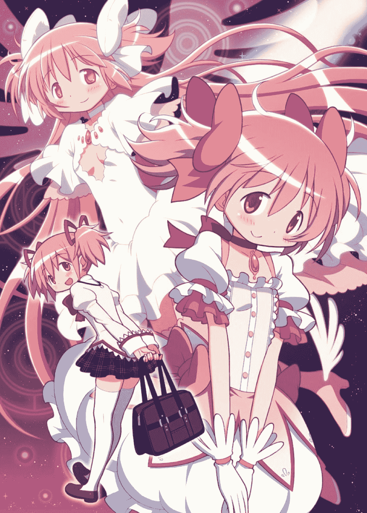

# 【短篇】群星の魔法少女（足控／vore／Giga）

作者：见崎鸣

TID：27551

 

# 1

*本帖最後由 见崎鸣 於 2019-10-31 02:14 編輯*

群星の魔法少女

这篇文章的话，是鸣文世界观的奠定，可以说是相当重要的文章了，在这里面，大家也能发现FGN和【消音】的影子～欢迎加入鸣群～857871889～以上～

正文，开始～

一望无际的黑色中，存在着一点小小的光芒，那是一位少女。她全身赤裸的蜷缩起来，双臂环抱着大腿，脑袋低垂倚靠着自己的膝盖。全身上下唯一的点缀就是位于她右脚，被两根漂亮的足趾之间夹着的那颗小球，点点光芒流转的小球里面承载着她的一切。

意识仿佛被封锁，什么都感觉不到，无论是视觉、听觉还是触觉都没有传递到大脑的回路之中，就如同处在一片虚空之中。少女就这样，在这片混沌之中飘荡，她甚至记不得自己在这个空间里漂流多少光阴了，时间久到她几乎忘却了自己的名字。

她只是默默的躺在这片虚无里面，神圣且不可侵扰，温暖却又孤独。她小心的用自己的脚趾呵护着那颗小球，神情落寞而满足。

【你醒了吗？】

随后，近在咫尺却又远在天边的声音在她的耳畔响起。

【感觉怎么样了？】

那声音，熟悉而又陌生。

“我…”许久没有与人交流过了，一时间少女还不能流畅的说话，“这里是哪里…？”

【这点，你得问你自己不是吗？还记得你是谁吗？】

声音无比温柔的说着。

鹿目圆环顾四周，最终在自己的下方寻找到了唯一的一丝光源——那是太阳系第三行星，被称作地球的蔚蓝色星球，同时也是鹿目圆的故乡。漂亮的蓝色行星突兀的出现在了这里，鹿目圆却没有因此而惊讶，反而觉得有一种亲切。

“这里是地球？我是…我是…”脑袋里稍微有点疼痛，少女轻轻揉了揉自己的太阳穴，“我是…鹿目圆……”

【鹿目圆，你…现在想要做什么？】

那道声音循循善诱，潜移默化的带动着少女的思绪。

鹿目圆无言的注视着自己的掌心，手指微微的弯曲想要抓住些什么。

【想起来了吗？魔法少女？】

好似一道电流通过了自己的身体，身体、感知还有思考，一切都变得清晰起来，鹿目圆黯淡的粉红色眼眸在那一瞬间被点亮：“我要——！”

鹿目圆，苏醒了，回到了一切的起点。

少女在街道中央缓缓坐起，身上穿着的是她熟悉的市立见泷原中学校服，脚上没有鞋袜完全裸露着，包围着她的是一个光怪陆离的世界。

“这里是…地球…？”有点不确定的，鹿目圆揉了揉自己还有些昏沉的脑袋，虽然周围给人一种熟悉的感觉，但是她总是觉得有些不对劲。那种强烈的违和感和恶心感让鹿目圆的心中惴惴不安，这种感觉就像是有人用枪指着她的脑袋，而她却看不见对方。

终于，鹿目圆发现了这种奇异感觉的来源，那就是与常识完全不同的世界组成。无论是她现在坐着的地面，还是街道边林立的建筑物，亦或是路上来来往往的行人，都是与环境完全融为一体的魔法少女构成的。少女们整整齐齐的躺在地上，层层叠叠，她们没有怨言的充当了坚实的地面。在这些由魔法少女们堆叠而成的地面上同样的是少女们环环相扣支撑起来的摩天大楼。

小圆惊讶的看着面前的一切：“这是…怎么回事。”

眼前发生的一起已经超出了小圆的认知，她一动不动的坐在原地——一位少女的脸上，而那些行走的人们没有一个人在关注这位无助的女孩，除了…

“记不得了吗？Archer…不，小圆——或者说，圆环之理？”与人行道上那些人偶般的女孩们不同，一个身影不知何时出现在鹿目圆的身后，微笑着拍拍她的肩膀。

“你是…”鹿目圆对面前这位年轻的女孩没有映像，她既不是晓美焰，也不是其他小圆熟悉的魔法少女，但是她却莫名的眼熟。

“啊，真的很抱歉，这个时间段的我们没有见过面才对，”少女略带歉意的在小圆身前蹲下，她的脚正好踏在构成道路的其中一位少女身上，“自我介绍一下吧，我叫小鸟游鸫，在未来我是你的御主，同时也是你的朋友。”

小圆这才反应过来，被自己臀部压住脸部的女孩几乎快要窒息了，她连忙错开一个位置，改为坐在她的胸口。

“呼呼…”重新能够呼吸的少女胸口的起伏又趋于平静，既没有放松，也没有怨言，她完美的在履行自己身为道路的职责，就和其他目光呆滞的魔法少女们一样。

自称为小鸟游鸫的女孩神色复杂的说：“很奇怪吧？这个世界？”

“是的…我不明白，为什么…”鹿目圆一时之间不知道该如何表达。

“这不是真实的，小圆，即使这些事情的确发生过，就连在你面前站着的我，其实也不是真实的。”小鸟游鸫说，“毕竟，地球怎么可能是魔法少女组成的嘛。”

“魔法少女组成的…？”小圆愈发觉得难以理解。

“257万兆，”小鸟游鸫若有所思的竖起右手食指，“257万兆魔法少女，她们构成了这个并不存在的地球。”

鹿目圆惊讶的站起来：“你是说，这个地球，全都是魔法少女组成的…？”

小鸟游鸫点点头，她用手指戳了戳被自己蹲在身上的魔法少女的脸颊，后者一点反应也没有，比起活人，更像是拥有了生命却没有意识的人偶。

“这到底是…我印象中的地球不是这样的…”小圆一时之间不敢相信这种类似胡言乱语的说法，她警惕的注视着小鸟游鸫，身子向后缩了缩，“是你把大家变成这样的吧？你的目的是什么…”

“虽然早就猜到有可能会发展成这样，但是被你用这种眼神看着，还真是有点难受呢…”小鸟游鸫无奈的摇摇头，她苦笑着安抚惊惶的鹿目圆，“相信我，小圆，我不是你的敌人，我只是…不忍心看到那么温柔的你被…唉，我想拯救你，小圆。”

小鸟游鸫怆然若失的叹了口气，悲伤的表情无比的真实。

鹿目圆这才略微安心：“可是，为什么我会在这里？这些魔法少女又是怎么回事…？”

“我会帮你想起来的，小圆，虽然会是一个痛苦的过程。”小鸟游鸫温柔的说，目光却变得狡黠起来，“那么，小圆？我问你，你想要回想起来吗？”

“我…”鹿目圆有些犹豫，她还没有完全相信“小鸟游鸫”这个人，但是…自己身下的魔法少女，以及组成这个世界的魔法少女们看上去都太可怜了，对鹿目圆来说，对这些少女们置之不理，她是绝对做不到的。所以，她还是艰难的做出决定，轻轻的，点了点头。

小鸟游鸫露出一个满意的笑容，保持着平衡站起身子，她的脑袋微微歪向一侧，向着小圆伸出了自己的手臂：“那么，小圆，请你站起来吧，然后——踩死我吧！”

“诶…请等一下，你在说什么呀？踩死什么的…”以为自己听错了的小圆挠了挠自己的脸颊。

“当然是，你想知道的真相了。”小鸟游鸫的声音不再同之前一样温柔，取而代之的是机械般的冷漠，与此同时她澄澈的眼眸也逐渐褪去高光，与那些没有了灵魂的魔法少女们如出一辙。如果说刚才与鹿目圆对话的人是小鸟游鸫，那么现在这个人就是以小鸟游鸫姿态出现的另一个人。

【小圆，你知道吗？曾经，这个世界上有过很多，宇宙】

“小鸟游小姐…？”鹿目圆一时之间没有反应过来，眼前的突变太过剧烈了一点。

【每一个宇宙中，又存在着无数有生命的行星，比如你脚下踩着的地球】

这个使用着“小鸟游鸫”姿态的家伙这么说，她一边这么淡淡说着，一边开始在鹿目圆的身前躺下，她的一只手缓慢的伸出，握住鹿目圆匀称的小腿，然后顺着她的小腿向下摩挲。脚踝、足跟、足背、脚趾、足趾以及足尖，“小鸟游鸫”近乎贪婪的享受着鹿目圆玉足的触感。

【不会错的，小圆，就是这只脚。这个触感我记得一清二楚，冷酷中带着温柔，残忍中带着不舍～我就是被你用这只脚踩死的哦～一点点的、从内到外的、极其彻底的踩死了～】

“小鸟游鸫”的嘴角抽了抽，露出一个难看到有些诡异的机械性笑容。

鹿目圆紧张的想要缩回自己被少女把玩的玉足，但是她握得很紧，几乎无法挣脱：“我！我是不会做这么残忍的事情的！我是绝对不会做的！”

“小鸟游鸫”摇摇头，依旧笑着：【不，你会的，因为你说了你想知道真相】

“小鸟游鸫”话音刚落，鹿目圆的身体就不受控制一般的站起来，虽然鹿目圆从发自内心的想要停下来，可是“小鸟游鸫”的话语仿若魔咒，令她无法停下。这是一种奇妙的感受，良心虽然抗拒，身体却在接受，甚至，鹿目圆开始觉得自己也许真的应该这么做。

【就是这样，】松开鹿目圆的脚，“小鸟游鸫”舒展开双臂，将自己的全部暴露在少女的足下，【就是这样，小圆，和往常一样，踩下来吧～】

小圆攥紧自己的拳头，修剪的漂亮的指甲深深嵌入掌心的嫩肉中，但是这股疼痛也没有办法阻止自己的脚正在缓缓抬起来并且自然而然的悬在了“小鸟游鸫”的头顶。

【就是这样呢，我见过的，最后的风景；闻到的，最后的气息～】

看着小圆干净的足底出现在自己的视野里，这个机械般的声音居然出现了颤音，鹿目圆丝毫不怀疑如果她是个真人一定早就泪流满面了吧。

“啪！”小圆重重的对着那张清秀的脸踩了下去，发出一声悦耳的脆响。

“我、我不是故意的！求求你停下来吧！”现在反而是小圆的泪水在眼眶里面打转了，她歇斯底里的说着，“我不想知道了，我什么都不需要知道了，让我伤害你什么的我做不到！…”

【好疼呀，小圆，但是，你已经说过你需要知道真相了。请你继续吧，直到我的声音消失为止，直到我的生命消逝为止，请继续踩下来吧】

少女的语气里面似乎有一丝同情，不过她依旧坚定的说着。当鹿目圆抬起脚，脚掌心的位置出现了一抹鲜艳的红色，刚刚接受了一记踩踏的“小鸟游鸫”的面孔露出来，她的鼻子里鲜血流淌出来。

鹿目圆咬住嘴唇，于心不忍的踩下了第二脚，这次她踏在了少女躯干最柔软的肚皮上，顿时那里就凹陷下去。“小鸟游鸫”的身体因为小圆的这一脚全身抽搐了一下，气息都变得紊乱起来。小圆的脚后跟重重的挤压变形的肚皮，校服短裙下的大腿不断施加着力量，她的膝盖弯曲然后踩下，蹂躏着“小鸟游鸫”腹腔里的一切。

【啊，内脏，就要被…但是，小圆，我想要…更加…猛烈的…】

“小鸟游鸫”一边说着，口中咳出了一口血，她已经被小圆踩出了内伤，可是她那种求死的情绪却受到疼痛刺激一般更加疯狂。

这次，鹿目圆不再说话，她踩在一位魔法少女的胸口上扭了扭双脚脚踝的关节稍微放松。鹿目圆依旧不明白“小鸟游鸫”的想法，为什么会一心想要被自己踩死，可是小圆能肯定这完全是她自愿的，并且在强烈的渴求着，但是…

“我答应你，直到你被我踩死为止，我不会停下来。”但是，面对“小鸟游鸫”的心愿，鹿目圆选择了妥协，她会履行自己的责任，踩死面前的少女。

【真是，太好了呢…】

“小鸟游鸫”的表情依旧机械，可是鹿目圆仿佛看到了她满足的神情。

“那么，我开始了。”在踮起足尖酝酿片刻之后，鹿目圆轻快的跳起，双足并拢，狠狠落在了“小鸟游鸫”的小腹上。没有了心理障碍，这一跳比前面的两脚要用力的多，残忍的着陆，哪怕隔着少女富有弹性的肌肤，小圆也能感觉到她的内脏被自己的体重和力量迅速踩扁、然后破裂。

接受了小圆馈赠的跳踩，“小鸟游鸫”的脖颈一仰，更多的粘稠血液被她吐出来，只是这一次吐出来的斑驳碎片中带着一些细碎的内脏碎片。

对鹿目圆来说，这是一种奇怪的经历，看着这位年纪比自己大不了多少的女孩被自己一下就跳成这个样子，而自己的脚正深深陷入她的腹腔被她的软肉包裹。只要自己的脚稍微一动，那位少女就会痛苦的扭动身体，自己脚底下的脏器们也会更加干瘪。她从“小鸟游鸫”的肚子里走出来，只见她的腹部已经彻底形成了鹿目圆自己足底形状的坑洞，这个不可逆转的凹陷中神经还在抽动，小圆敢肯定，这种伤势，少女已经活不了了

“这样，真的好吗…？被我的脚…”鹿目圆皱着眉头，将自己的脚伸到少女的面前问到。

【这是我…不，我们的归宿，之后，你会明白的，小圆…你现在可能还不知道你的脚下承载着什么，这是我无法用语言描述的存在…】

“小鸟游鸫”这么说着，亲吻在小圆光滑的脚趾甲上，是那么的虔诚。

“嗯，我相信你…虽然会有点痛，但是请忍耐…”鹿目圆说，玉足踩住了“小鸟游鸫”头部，温柔柔软的足底肌肤紧紧贴着少女的脸，少女的脸有些冰凉，或许是失血过多了吧。

鹿目圆的脚以一种极慢的速度抬起，她想让“小鸟游鸫”能仔细看清楚自己足底的纹路，让她可以没有遗憾的离去。

【真美啊…无论看几次都是…】

不忍心再让腹部的疼痛折磨自己足下的少女，小圆深深地呼吸，那只完美的脚坚定而仁慈的踩了下去，在脚掌与“小鸟游鸫”的脸接触的一瞬间想，小圆就听见了清脆的骨骼碎裂声，在自己的裸足下，少女的脸仿佛鸡蛋一般脆弱，从“小鸟游鸫”的双眼与耳洞里面都迸出血液。然后，第二脚，紧接着，第三脚…鹿目圆遵守了承诺，她一脚一脚的踩踏着少女流失殆尽的生命，那只致命的玉足将“小鸟游鸫”的生命一点点的挤出这个支离破碎的躯壳。

小圆的额头渗出香汗，她没有停下脚下的动作。“小鸟游鸫”的脸已经被自己踩的扁平，骨头几乎已经全部踩碎了，她的两只眼睛不知何时已经被踩出眼眶悬挂在眼睛两侧，自己的脚底则满满的都是属于她的血液，正顺着脚趾的弧度飞溅。

“咔嚓！”终于，“小鸟游鸫”的生命完全终结的同时，鹿目圆的脚踩破了她的脸，作为屏障的颅骨早已不存在，小圆美丽的足尖深深末入了她的大脑，五根脚趾插进了“小鸟游鸫”还留有余温的脑浆，软绵绵的大脑怎么可能经受住小圆的玉趾？只一下就被俏皮的指尖踩成了烂泥，争先恐后的被挤进鹿目圆的脚趾缝。

小圆停了下来，“小鸟游鸫”已经没有了呼吸，自己的脚就那样一动不动的踩入她的脑子里：“这样就好了吗…虽然不知道你的名字，但是…希望你不再痛苦了。”

【真是温柔呢，小圆】

小圆似乎还能听到“小鸟游鸫”的话，下一秒，她感觉到自己的脚下变的暖洋洋的，她低下头，惊讶的发现自己的脚正在一点点的吸收掉“小鸟游鸫”的身体。是的，正在吸收，少女残破不堪的身体一点点的变成发出闪耀白光的液体，主动流向小圆的足底。它们包裹着鹿目圆的玉足，像是为她穿上一层液体的袜子，再转变成小圆脚底的营养。

“唔嗯…～”足底被滋润着，小圆稍微有些舒服的叫出声，然后害羞的捂住嘴巴。

差不多过了一分钟，“小鸟游鸫”已经被自己用脚完全吸收掉了，干净的“地面”上一滴血液都没有了，只有小圆的玉足还能感受到残留的温度，还暗示着少女曾经的存在。

流入鹿目圆体内的不只是少女身体的营养，还有属于她的记忆。

【小圆，我们继续刚才的话题吧】

“小鸟游鸫”的声音在鹿目圆的大脑中响起，只不过已经不再是借用小鸟游鸫的声音了，而是属于她自己的，柔和且成熟的声音，并且拥有了感情。

小圆顾不得惊讶，点点头，仔细倾听“小鸟游鸫”的话。

【无数个宇宙中拥有无数个有生命的星球，这些星球被名为“魔法少女”的女孩们守护着，他们在大家不知道的情况下默默守护着自己的星球。小圆，和你一样，我也是其中一位魔法少女】

小圆仔细听着“小鸟游鸫”的记忆。

【虽然你可能不认识我，但是我和你一样同样都是守护地球的魔法少女，只不过我守护的是另一个宇宙的地球…嗯，你叫我“美游”好了】

“嗯…”

【每个星球都独立的运作着，魔法少女们之间也互不干扰，直到有一天发生了异变，我的世界开始不可逆转的衰弱。没有敌人，也没有异变，就是开始了衰亡，我和伊莉雅尝试了所有办法都没有办法阻止我们的地球走向灭亡】

美游的情绪相当低落，不过她还是耐心的讲解着。

“那…之后呢…”小圆迫不及待的询问着。

【之后呢，抱歉，我的时间也差不多了，】美游笑了笑，【就让下一个人告诉你吧】

说完，鹿目圆再也感受不到少女的气息。

当小圆睁开双眼的时候，刚才自己身上穿着的校服早已消失，取而代之的是自己再熟悉不过的魔法少女装束。粉白色的配色，脖子上的红色系带，当然还少不了那颗被誉为魔法少女的生命的“灵魂宝石”，此刻那颗宝石正在她手中散发出淡淡的粉色光芒。

“啊…我的身体…”除了服装的变化，自己的身体也发生了改变，现在站在街道中央的鹿目圆，身高已经变成了之前的十倍，被自己脚底遮住的魔法少女都看不见了。

虽然小圆清楚魔法少女的防御力，但是害怕坚硬的鞋底伤害到她们的小圆还是弯下腰把自己的鞋子脱了下来。热乎乎，软绵绵的袜足踏在这条魔法少女街道上，脚下的女孩们稍微扭了扭身子，让小圆觉得脚下痒痒的。

【啊呀，你好呀？】

小圆脚下踩着的女孩突然出声了，那是相当甜美的声音。

“啊，对不起！”小圆一个趔趄差点摔倒，她赶紧扶住身边柔软的建筑，然后向她道歉，“真的很对不起，我不是故意踩着你的！”

【没关系啦，能被小圆踩着我很高兴哦，】比起操控小鸟游鸫的美游，脚下这个女孩虽然依然没有表情，不过明显她的语气比起机械音更加活泼，【不过这样对话似乎有点困难呢～】

“诶…是呢！”小圆连忙弯下腰把女孩从街道里众多的魔法少女中剥离出来，放在自己的手心里。

女孩身上的配色是粉色为主，有着一头漂亮的银发，美中不足的是她红宝石般的眼睛里没有丝毫生气，这点和之前的美游是一样的。

【自我介绍一下，我叫伊莉雅，伊莉雅斯菲尔.冯.爱因兹贝伦，叫我伊莉雅就可以了】

伊莉雅…鹿目圆觉得这个名字有点耳熟，继而她才去反应过来，之前美游说的同伴就是名字叫伊莉雅，不知道是不是同一位。

【就是你想象中的哦，美游是我的同伴】

伊莉雅这么说着。

小圆若有所思的点点头：“嗯嗯…你，可以告诉我刚才美游没有说完的后续吗？为什么这个地球会是这样，和之前美游说的世界衰弱有什么关联…”

【可以哦，】伊莉雅僵硬的点点头，【不过现在不行】

“诶…这是为什么…？”小圆没想到伊莉雅会拒绝，听之前她说的，应该会同意才对的。

【小圆刚才实现了美游的心愿对吧？那么同样是朋友，我也要哦】

伊莉雅狡黠的说着，有种邪恶人偶苏醒的味道。

“啊…”小圆有点明白了，就像是之前对美游那样，面前的伊莉雅似乎也要提出类似的要求了吧，让自己踩死她或者是别的什么，“虽然我会同意的…但是…”

【小圆很上道嘛，就是这样。而且对自己已经做过的事情没有记忆什么的，小圆真是过分诶。不过放心好了，无论是我还是美游，还是大家，都是心甘情愿的哦】

比起美游，伊莉雅的言语似乎也更加丰富了。

虽然听到伊莉雅的话让小圆感觉好受了一点，但是内心深处她还是有点抵触，要夺走他人生命什么的，自己为什么会去做这种事情呢…听伊莉雅的话，自己以前还做过不少吧。按照正常情况自己肯定不会做出如此残忍的事情，但是现实就是自己刚才才踩死了美游，而且还把她用自己的脚彻彻底底的吸收掉了。

小圆不确定的问到：“伊莉雅…真的要被我…？”

【我当然是认真的哦，因为这是我的归宿嘛。既然小圆明白，也省去了很多功夫呢，细节我就不多说啦。小圆～请你吃掉我吧～】

“吃、吃掉？！”小圆手一抖差点没把掌心的伊莉雅摔下去，可爱的脸上立刻出现抗拒的表情，“不行！绝对不行，把你嚼碎什么的。”

【直接吞下去也可以啦】

伊莉雅这么说着，脑袋歪了歪。

“反正就算我拒绝了，还是会出现之前的情况吧…”鹿目圆无奈的摇摇头，一想到之前被强迫去踩死脚下的人的时候，她的心里就会隐隐作痛。

【嗯，因为小圆说了要知道真相呀，这是必要的】

伊莉雅一边说，身上的衣服瞬间消失掉了，毕竟是魔法少女嘛，身上的魔法少女服装也是通过魔法变出来的，相比起来也是相当的便利了。

浑身赤裸的伊莉雅跪坐在鹿目圆的手心儿里，小小的她相当精致，忍不住让人把玩一番。不过即使是这样她的身高也有十几厘米，如果小圆想把伊莉雅囫囵吞下去也不算容易。

“先试试看好了…”小圆自顾自的嘟嚷了一声，握着伊莉雅的腰肢靠近了自己樱色的唇瓣，淡粉色的舌头舔了舔嘴唇，鹿目圆对伊莉雅轻声说道，“要开始了哦。”

小圆慢慢张开嘴巴，露出雪白整齐的牙齿，粉嫩的舌头稍稍伸出，她轻轻的呼吸，一股潮湿但是温暖的气息被她吐在伊莉雅的脸上。小圆的口中有一股好闻的、甜甜的味道，这股味道让她手中的伊莉雅为之着迷。伊莉雅瞪大了眼睛，想要尽快的接受自己的命运。

“姆…”鹿目圆闭上眼睛，将伊莉雅的脑袋塞入口中，然后合上了嘴唇。

脑袋被小圆含住，世界变得黑暗，嘴唇闭合后口腔空间内那股甜味愈发浓郁，伊莉雅抑制不住自己心中的悸动，双手在外面撑住小圆的嘴唇想要身子更加深入嘴巴里面。

【还要，我还要更多】

感觉到女孩激烈的动作，鹿目圆的贝齿小心的咬住伊莉雅的脖子根，丁香小舌舔了舔她的脸颊，一股奇妙的味道在她得舌尖扩散。如果要形容的话，就是“女孩的味道”吧，小圆受到刺激的味蕾带动了唾液的分泌，一汪小小的唾液泉水悄悄在她舌根积累起来。

对伊莉雅来说，自己仿佛进入了天国一般，她疯狂的吸舔着小圆的舌头，将那份甘甜吞入腹中，小圆舌头上那顺滑的感觉令她欲罢不能。闭合后口腔内的温度闷热不已，湿热的空气包围着自己，让伊莉雅的大脑昏昏沉沉的，而且每次呼吸的时候都会将小圆的气味连带着这种温度传递进体内。很快，伊莉雅的动作就变得软绵绵的，像是要融化进鹿目圆口中似的。

“呼…”轻柔的拿出嘴里的伊莉雅，甜甜的、粘稠的津液拉出几根透明澄澈的丝线，小圆忍不住在伊莉雅的小脸上又用舌头用力的舔了舔，把她脸上的潮湿大部分都舔掉了。

从口中取出伊莉雅的脑袋后，小圆的脸上渲染上一层潮红，一方面是因为伊莉雅舔舐自己舌头的那种羞耻感，另外的就是一种被人喜爱的满足感。她真的没想到，这些女孩子真的会心甘情愿为自己去死，而且自己居然开始觉得这一切是理所当然。

【小圆，现在你明白了吧，我们都是真的喜欢你哦】

小小的伊莉雅的银发被小圆的香津润湿，散乱的沾在她的脸上，她的手指在小圆的唇间粘取一点唾液，然后忘我的伸进嘴里吮吸。

“这次，真的要吞下去了哦？”鹿目圆绽开一个笑容。

【嗯嗯！】

伊莉雅张开双臂，这将是她最后一次见到鹿目圆绝美的面容。

“啊…”优雅的张开嘴，鹿目圆开始一点点的将伊莉雅从头到脚的吞下。

女孩奶油般柔软的身体裹挟着均匀的体温回荡在在鹿目圆的唇中，那是一种说不出的滋味，想要咬下去，却又不忍心，于是她只好细细的用舌尖品味。

在伊莉雅看来，这无异于是最好的奖励，她借着还没被鹿目圆吞下的最后机会吞咽着她分泌出的香甜津液。好喝的口水被她大口大口的喝下，这是全世界最美味的饮料

“唔姆～”鹿目圆仰起头，粉色的头发抛洒在脑后，原本只在她脸上的那一抹粉红，现在一直蔓延到她的脖子根，将她白天鹅般无暇的脖颈变得有些色气，她的喉咙咕噜噜的发出响动酝酿着，这是吞食口中少女的前兆。

角度的变化让伊莉雅自然而然的滑进了小圆的口腔深处，借着微弱的光线，她可以看到小圆蠕动的食道。幽暗深长的空间充满了魅惑的魔力，伊莉雅的身子逐渐沦陷进去，只剩下两只脚还在小圆的嘴外蹬动。

【里面，一定很温暖吧…】

鹿目圆的手指捏住伊莉雅纤细的双脚，然后轻轻往嘴里一推，随着顺畅的“滋溜”一声，伊莉雅得双脚消失不见，鹿目圆樱色的死亡完美的合上。

全身上下都被小圆包裹着，粘滑的液体成为了鹿目圆咽下伊莉雅的最好媒介，伊莉雅感觉自己的全身都被肉壁挤压着，虽然不至于无法呼吸，但是已经是无法挣脱了。这位温柔的女孩，完美的实现了自己的心愿，仁慈的吞下了自己，此时的伊莉雅眼中第一次闪过光彩，可惜小圆现在已经看不见了，不然她也会觉得高兴吧。

“呼姆…～”舌头灵活的推动伊莉雅的柔弱身躯，小圆的手掌顺着下巴向胸口抚摸，她闭上眼睛享受着伊莉雅在自己喉咙扭动的感觉。

“咕噜～”之后，小圆的喉咙重重的鼓动了一下，食道里是满足的阻塞感在迅速向下移动，女孩顺利的滑入她的胃袋内部。小圆满意的咋舌，她娇嫩的舌头舔了舔有些干燥的嘴唇，当嘴巴再次张开的时候早已空无一物，名为伊莉雅的女孩现在是她腹中等待消化的新客人。

“真的，吃掉了呢。”有些难以置信的低下头看着自己的小腹，鹿目圆的手揉了揉自己的胃部，“伊莉雅？还在吗？”

【在哦～】

伊莉雅推搡着小圆的胃壁示意自己的存在。

“嗯，伊莉雅慢慢就会被我消化掉吧？现在后悔还来得及哦…”鹿目圆似乎已经听见自己的肚子在发出研磨般的响动，虽然她知道这只是错觉。

【不会后悔的哦…陪我到最后吧，小圆，直到我死去为止】

伊莉雅说。

“嗯，我会的…”如同母亲爱抚自己的孩子，小圆隔着肚子摸了摸伊莉雅所在。

之后鹿目圆屈膝跪坐在的地上，等待着伊莉雅最后时刻的到来。

很快肚子里就传来了伊莉雅挣扎的动静，虽然她心甘情愿被自己吞下，可是面对被活生生消化的剧烈疼痛伊莉雅的身体还在本能的反抗。她的挣扎幅度大到小圆的肚子都感觉到微弱的疼痛，小圆唯一能做的就是祈祷伊莉雅能快点被自己消化掉。

身体完全浸泡在胃酸中，伊莉雅柔嫩的肌肤由外到内，被鹿目圆的胃酸一点点的腐蚀融化，她的一切都在被小圆溶解。伊莉雅就这样，缓慢的，以最残忍的方式慢慢死在那个女孩的肚子里。疼痛让她在这个狭小黑暗的柔软空间翻来覆去，但是她不能叫疼，因为这还不及满足自己愿望的女孩内心疼痛的万亿分之一。

在经过漫长的十分钟后，被吞下的伊莉雅再也没有了动静，她的挣扎终于停止，取而代之的是之前吸收美游那样的温柔感受。

【谢谢你，小圆，然后，辛苦你了】

伊莉雅的记忆如潮水般流入鹿目圆的意识。

【很抱歉哦，我其实知道的也不是很多呢，毕竟在美游死后不久，我也被小圆吃掉了呢。现在我就把后面的事情告诉你吧，】伊莉雅略带歉意的说，【不只是我和美游的地球，如同可怕的传染病一样，全部的宇宙都开始衰弱，这样只会导致一种结果，那就是所有的生命都会消亡。】

“怎么会这样…”即使有了心理准备，小圆还是被惊到了。

【不知道，这种衰弱没有道理、原理，它就是那样发生了，即使是所有的魔法少女联合起来也毫无办法。但是…】伊莉雅话锋一转，【但是，只有一个星球没有，数不胜数的星球里面只有一个星球依旧生机蓬勃】

“难道说！…”答案几乎呼之欲出了。

【是的，小圆，只有你守护的地球依旧还能延续下去的】

“那么，后来发生了什么…！”鹿目圆猛地站起来。

【抱歉，我的时间也到为止了。接下来还会有像我这样的魔法少女来接力吧，小圆，请一定要坚持下去，你一定要坚持下去，你距离真相已经越来越近了】

伊莉雅的声音渐行渐远，最终完全被黑暗吞没。

当鹿目圆的意识被再次拉回现实，她已经看不清楚脚下的魔法少女们了，即使是曾经作为地标性建筑的碧蓝航线总部大楼也才只有区区830米，还没有小圆的脚踝高。城市里因为随着伊莉雅的消化，她带给鹿目圆的能量直接让她的身高暴涨到了14.8千米。拥有如此强大能量的魔法少女却依然没有阻止星球的衰弱，小圆意识到了伊莉雅和美游口中事态的严重性。

“我，居然变得这么大了…”小圆感叹着，自己的身高已经突破对流层了，并且她似乎还在逐渐成长着。

小圆继续成长的原因要归结于脚下踏着的魔法少女地面，软绵绵的地面上每一个少女都在因为承受鹿目圆的体重而在持续挣扎，她们被鹿目圆无意识的踏在她的白色袜足之下。虽然一开始还能在小圆巨大的躯体下抵抗，可是最终她们还是会因为能量耗尽被鹿目圆踩爆，这个由魔法少女组成的地面正不断牺牲自己补充成鹿目圆白袜上的红斑。

小圆抬起一只脚，侧过乖巧的脚面，只见穿着丝袜的足底有一半都被魔法少女们染红了：“居然只是站在这里，大家就被我踩死了吗…？”

在鹿目圆抬起脚的同时，另一只脚下的魔法少女们承受了更多的体重，人体地面以更快的速度爆裂、凹陷然后崩溃。

“暖暖的…”袜子上的血迹很快也变成闪光液体被鹿目圆吸收掉了，这样来看，即使是整个魔法少女地球消失在她的脚下也只是时间问题，“大家…怎么会…”

几乎是每秒钟，都会有数以万计的魔法少女耗尽魔力，然后死在小圆的脚下，小圆想要阻止正在发生的残酷现实，可是却无能为力。就这样，小圆的袜底不断有魔法少女前赴后继的被踩扁，然后吸收，鹿目圆也缓缓的在继续变大。吸收了伊莉雅的鹿目圆，无论是高度还是力量已经无人可以企及，她现在也已经差不多是这个魔法少女地球的神了。

“我不想大家因为我死去了啊…对不起…”小圆委屈的几乎要哭出来。

【小圆，你为什么要道歉呢？】

没有征兆的，又是一个声音出现，和之前美游她们现身是一样的。

“是谁？！”小圆四下张望，“还有人吗？”

【在你前面哦，小圆】

那个声音提示着鹿目圆，在鹿目圆的前方，最显眼的建筑物莫过于那座有八百多米高的，名为“碧蓝航线”总部的大楼了，那也是这座城市的地标性建筑。

“你在这里面…？”小圆蹲下身子，好奇的观察着魔法少女们组成的高楼。

【不是我，是我们哦。我只是代表着这座建筑的意志，小圆】

女孩说着，笑了笑，她的意思已经很明确了，这就像是蜂巢意识，整座大楼的魔法少女们虽然是独立的个体，但是她们都受控于身为主体的女孩。

【九亿三千万，这是这座建筑里面我们的数量哦～很惊讶吧？】

鹿目圆无言的点点头，组成这座建筑物的魔法少女们的数字的确超过了她的想象。九亿三千万，这个数字几乎已经要赶上她原本所在地球人口的七分之一了，看样子这颗魔法少女地球上真的存在着257兆亿位魔法少女呀。

【安心好了，这座城市，乃至这个星球的魔法少女们都是心甘情愿为你献出生命的，当然我们也不例外啦。自我介绍一下，我叫朝雾彩。】

整座大楼，九亿三千万名魔法少们整齐划一的说着。

“我不明白，为什么大家要…”小圆委屈的抱着自己的膝盖，她的足底痒痒的，那是无数的少女在垂死挣扎的动静，她们推搡着鹿目圆那不可撼动的巨足，然后卑微的死去，小圆甚至感觉不到具体有多少人被自己碾成肉末了，“死在我的脚下…难道不痛苦吗…？”

【这个问题，小圆要满足我们的愿望才行哦～】

同之前一模一样，朝雾彩理所当然般的提出了条件。

“反正就是想要被我弄死什么的吧？！你们玩弄我也就无所谓了，浪费自己的生命也要有个限度好不好？！你们也是，美游也是，伊莉雅也是！”这一次，小圆再也按耐不住心中的不满，冲着朝雾彩她们发怒了，任凭她再怎么温柔，这种无意义的屠杀就像是在用刀子穿刺她的良知，她的温柔再也不允许这些魔法少女们糟践自己得性命。

【小圆…？】

鹿目圆的眼角的泪水止不住的流出，她颤抖着站起身来，玉足对准也就比自己脚趾长度高一些的大楼做出要踩下去的姿态：“你们为什么这么不爱惜自己的性命呀！既然你们想死我现在就成全你们啊！我只要一踩下来你们全都会成为我脚掌的一部分！”

小圆虽然装作恶狠狠的样子，脚下根本不忍心踩下去，让上亿生命在自己脚底消失什么的，鹿目圆做不到。

【小圆真是太温柔了，】朝雾彩叹了口气，语气却是感激，【正是因为小圆是这么温柔的女孩子，大家才愿意把自己的生命献给你，才愿意死在你的脚下，而不是其他人的。而且你真的认为以守护世界为目标魔法少女们愿意无意义的去死吗？】

“我…”小圆的脚又重新踩到地面。

是的，朝雾彩是对的，鹿目圆完全能体会到，虽然自己脚底的魔法少女们在逐渐死亡，可是她们都是毫无怨言的，她们在小圆脚下死去的那一刻都是满足的，甚至是感激的。

【小圆，你可是拥有着这个世界上独一无二的、最伟大、最温柔的双脚哦，】朝雾彩亲昵的说，听她的语气恨不得现在就为了小圆去死一样，【相信我们吧，我们想要告诉你真相，我们想拯救你，小圆】

“可是…我真的，不愿意伤害大家…”小圆哽咽着说。

【相信我们，虽然这个过程很痛苦，但是，请你吸收掉我们吧，用你的身体】

鹿目圆的指尖像是被静电触碰一样微微颤动了一下，随后她坚定的点了点头，朝朝雾彩她们展露出一个微笑。两只手撑住地面，鹿目圆巨大的身躯侧卧下来，在这个过程中，强大的风压席卷着大地，无数结构脆弱的魔法少女建筑因为这股飓风而垮塌，被呼啸的狂风席卷到空中的魔法少女们像断了线的风筝肆意飞舞。在鹿目圆的身体接触到地面的一瞬间发出了巨大轰鸣，沉闷的接触声下，数千亿魔法少女的生命被她的体重榨取出来，极大的体积造就了广泛的受灾区域，飞溅的血花把这片活着的大地染成鲜红。

“噗嗤！”小圆只是翻个身，她柔软的娇躯下就会有数不清的魔法少女死去。

“对不起…大家…”小圆一边道歉一边小心翼翼的脱下自己短裙下的胖次。

【请吸收掉我们吧，小圆，用你最重要的地方】

这是朝雾彩她们最后的请求。

白色的可爱胖次滑落到鹿目圆的腿弯处，她那纯洁如雪的白色玉腿根在除去最后的防线后，清纯中增加了几分妩媚，裙摆下那道粉嫩的沟壑似乎有着令人向往的魔力，在吸引着魔法少女们进入那贞洁的空间，她们芬芬仰望着面前这位身姿几乎如神一般的伙伴。

虽然每一个魔法少女都小到鹿目圆看不清楚，可是被这么多人同时观望自己的私密部位，小圆还是羞红了脸，她只敢投过手指间得缝隙观望外面的世界。

“真…真的要…要我趴下来…？”小圆颤抖着声音询问。

【当然了，小圆，这是我们的心愿】

朝雾彩她们认真的回答，整座大楼都摇晃起来，似乎在欢迎头顶那位温柔的死神剥夺她们的生命。

“那、那我就不客气了…请享用…”鹿目圆紧紧咬住嘴唇，强行压住自己心中的羞耻，婀娜的胴体调整好了位置，对准了那幢承载着接近十亿少女的圆柱体建筑。

这就是一个光怪陆离的世界，巨大美丽而又神圣的少女匍匐在完全由人体构成的魔法少女大地上，即将用自己最宝贵的部位吞下十亿女孩，即使是造物主也不会想到这么猎奇的故事吧？然而这件事情确确实实的发生了，就在这颗魔法少女组成的蓝星上。

“唔…唔…”樱色的下唇被贝齿咬出淡淡的齿痕，小圆的手指轻轻撑开神秘的壶穴，将自己体内的世界展现在少女们面前，“别、别看…！”

她梨状的美臀缓缓沉下，一点点接近那座兴奋建筑，组成建筑的少女们翘首以待。鹿目圆的躯体遮蔽了天空，用自己的色彩照耀这片大地。小圆不知道朝雾彩在哪里，可是她能感受到她心中荡漾着的躁动，那么，自己就成全她们，让她们死在自己的裙摆下吧。用自己的身躯蹂躏这颗蓝星，用自己的一切去杀死魔法少女，用自己的善良去满足她们的愿望。

【是的，这才是我们的神，圆环之理】

巨大的女孩仔细的压下，魔法少女们精准无误的被鹿目圆禁锢，从蜜穴深处散发出的气味像是催化剂一样刺激着少女们的情绪，她们的激情在小圆的身体下持续发酵。鹿目圆忍不住轻哼着按抚玉户，几滴挥发着淫靡气息的透明汁液投过鹿目圆纤细的手指，滴落在建筑的顶端，一瞬间最上层的魔法少女们纷纷被小圆得爱液停滞了呼吸，她们吞咽着神的馈赠，将那份小圆的甜美吞咽，少女的味道在这片区域扩散。

“唔～”大楼被小圆充分的润滑，魔法少女们的身上尽是她的体液，她开始包容的将这接近十亿的生命吞入自己的身体。

魔法少女们的身躯相当的柔软，这也更加方便她们服侍小圆，她们一个接着一个拼接在一起形成了一个以朝雾彩的意识为中心的集体，被小圆吞噬。

【小圆…呼…这种力量…只有你才…】

紧致的蜜穴，燥热潮湿的空间，沿着粉色内壁向外流淌的神圣爱液，这就是小圆的体内，这就是魔法少女们所期待的终焉。魔法少女们纷纷舔舐起滑嫩的穴壁，用自己的双手按揉着鹿目圆的穴肉，她们在朝雾彩的统一下为这位即将杀死自己的纯洁少女献身。

“大家…呼…都在我里面…乱动…～”下体内少女们合作带来的刺激是鹿目圆没有想到的，她们用数量完成了这个壮举，无数小舌头和小手搔挠着鹿目圆脆弱敏感的蜜穴，酥酥麻麻的刺激在小圆的身体内扩散，细细的快感沿着神经直达鹿目圆的大脑，她仿佛被体内这些娇小的女孩操控了身体，“大家…明明…只要被我…就好了…呼～”

【小圆…小圆～】

随着玉户中爱液的增加，朝雾彩和魔法少女也愈发卖力。

“呼呀～…”鹿目圆的眼睛似乎都能冒出粉色的桃心，甘甜的唾液从嘴角有些下流的流出，似乎只有这样才能平息体内汹涌躁动的浪潮，“大家…请…不要…请继续～…”

快感与理智在鹿目圆的精神中纠缠，急促的呼吸呼出灼热得空气，几乎快要稳不住身体的她不得不用双手仅仅扣住地面，尖锐的指甲和玉柱般的指尖下，数亿的魔法少女们如玫瑰花般绽放，温暖的血液润湿了小圆的手指，为那纯洁的白涂抹上一抹艳红。

小圆把脸贴在地上，柔软的舌头只要一舔就会把魔法少女们吸入口中，然后细细的咀嚼，品味她们身体的甜美：“呼～…身体…为什么会…这么热…～”

鹿目圆修长笔直的玉腿本能的伸直，绷起的光滑足背上可以看见色泽美丽的青筋，十根浑圆粉嫩的玉趾因为燥热而不安的扭动和搓弄着，被长长的脚趾撑开到可以透过光线的丝袜几乎要被玉足的力量撕裂，肆意妄为的挥霍着少女的荷尔蒙。如婴儿般光滑没有一点死皮的脚掌和玉趾指尖，香汗不断渗出，将被濡湿的袜子紧紧贴在玉足的软肉上。

“对不起…我的脚…需要大家…滋润…～”小圆涨红了脸颊，她的玉足优雅的插入地面，层层叠叠的魔法少女在强悍到不可抗拒力量被挤压成肉饼，炙热的鲜血纷纷涌向鹿目圆高贵的巨足。

两只脚丫反复摧残这片土地，小圆的足尖和脚底早已被染红，仿佛为她穿上了一双鲜艳的芭蕾舞鞋。鹿目圆的玉足轻而易举得撕裂了魔法少女大地，少女们欣然的为鹿目圆献出了自己微不足道的身体，化作她残忍玉趾间的营养，让这位神变得更加强大，使得她可以更高效的摧毁这颗蓝星。小圆身后的地面上是好几个被她用玉足插出的脚状深坑，这些可爱的足印完美的保留了鹿目圆玉足的形状，每一处深坑里都是几十亿魔法少女们曾经存在过的痕迹，现在她们已经被小圆的躯体一点不剩的吸收掉了。

“呼…～”小圆全身都开始绷紧，细密的汗珠在她的脸上晶莹剔透的闪耀着，“大家…都被我～踩死了呀…真的…可以么～…？”

【小圆～不要停下来呀～】

不只是朝雾彩，这颗星球的意志都在回答鹿目圆的话语。

刺激逐渐增强，蜜穴猛地收缩起来，这是小圆高潮的前兆，恐怖的压迫力瞬间覆盖了大楼表面，圆柱状的形体在这一瞬间变形，大量的魔法少女被肉壁的闭合碾碎。

【小圆，请你碾碎我们吧～】

所有的魔法少女都在祈求者，她们比以往更加剧烈的扭动着身躯，迎接鹿目圆带给她们的死。强大的破和爱液的潮汐让她们碎裂和窒息。

“唔～大家…碎在我的里面了…～”小圆闭上眼睛，沉吟着并拢大腿，她用力研磨着被自己吞入下体的数亿魔法少女，“我会，把大家…都碾死的…～”

鹿目圆细心的、一点点将体内的魔法少女们挤碎，的那幢少女组成的肉柱摧枯拉朽的被破坏，少女们被挤爆迸发出的血液和鹿目圆粘稠的爱液混合在一起，残缺的尸体顺着爱液与鲜血混合的河流汩汩溢出玉户外面，滴落在地面上，残酷却又美丽。

【谢谢你，小圆…】

在经过小圆长达两分钟的研磨后，她的下体内再没有一个活着的魔法少女了，她们的躯体已经全部融入了小圆体内，成为了她的一部分，朝雾彩也随之消逝。

数不清的记忆随着少女们的死涌入鹿目圆的大脑。

【那么，就让我来告诉你后续吧】

朝雾彩的声音淡淡的说着。

“嗯…呼…”鹿目圆已经恢复了意识，认真倾听着朝雾彩的话。

【小圆，在你得知除了你的星球以外，其他世界都在走向灭亡的时候，你最终发现了原因。当你无意中踏上美游和伊莉雅的地球时，你发现她们星球的衰弱就停止了，可是你一旦离开，那颗星球又会继续的衰弱。同样的，失去了你的故乡地球也开始衰弱】

“也就是说…”鹿目圆已经猜到了。

【不错，小圆，你就是救世主…】朝雾彩认真的说，【拥有了你的星球就能得到延续，可是凭借你的力量却又无法覆盖所有宇宙得所有星球…】

“难道说…”小圆如鲠在喉，感觉胸口发闷，喘不过气来。

【是的，一个办法诞生了。根据规则，一位魔法少女如果杀死另一位魔法少女，那么她就能吸收掉她，同时拥有守护两颗星球的力量，这样两颗星球就都能存活了。所以，如果身为救世主鹿目圆如果能杀掉所有的魔法少女，那么是不是就可以拯救全部宇宙了呢？】

小圆几乎是从牙缝里面挤出几个字：“这种事…我…怎么能…”

【但是，小圆你最终选择了这条充满荆棘的道路】

朝雾彩的声音开始模糊，最后烟消云散。

“小彩…？”小圆呼唤着朝雾彩的名字，却再没有人回应她，泪水不争气的流出来，“怎么会，居然是我，是我害死了大家…因为这种事情…”

小圆明白了，自己之所以在这个满是魔法少女的“地球”上出现，就是那些因为自己的无礼而死去的少女在抱怨吧？她们选择了再一次死在鹿目圆的脚下，以这种方式谴责她的自私。自己借着守护宇宙的名义杀死了全部的魔法少女，这些少女们不甘的灵魂以这样的形式折磨小圆。

再次睁开眼眸，此刻的鹿目圆气质从头到脚都发生了改变，现在的她，粉色的长发近乎无限的在宇宙中延伸，圣洁的璀璨金瞳散发着柔和与慈爱，澄澈的粉白裙装包裹着她姣好的身躯，本来已经趋近完美的裸足现在更是没有一丝瑕疵，随意的踏在魔法少女地球上。毫无疑问，现在的鹿目圆就是神，是朝雾彩口中的“圆环之理”。

“这个姿态…又有什么意义呢…”鹿目圆说着，金色的眼眸黯淡下来。

14800千米，这是鹿目圆现在的身高，在朝雾彩和那些魔法少女被吸收后，她的高度已经超过了地球的直径，她脚底下踏着的少女地面都一边渗出血液一边凹陷下去。她已经懒得去计算到底有多少人死在自己脚下了，当她抬起一只脚时，地上赫然就是鹿目圆足底形状的小坑。

看着自己的双足逐渐没入行星，小圆苦笑着摇摇头：“这就是结局了吗…？”

【不是这样的，小圆】

这是鹿目圆无比熟悉的声音。

“你是…小焰…？！”鹿目圆终于遇到了自己熟悉的魔法少女，可以称得上是她半身的晓美焰。

【小圆，你认为现在的一切是对你的惩罚么？】

晓美焰的声音从鹿目圆脚下的星球中传出。

“难道不是吗？”少女们细小的动静让小圆稍稍动了一下脚趾，趾肚下又是“噗叽”一声，一朵微不足道的血花在小圆的脚趾下面绽开，“就在和你说话的时候，大家也在接连不断的死在我脚下，就是动一动脚趾，她们都会…”

【小圆你还记得之前的大家是怎么说的吗？她们没有责怪你吧？】

晓美焰善解人意的笑了笑。

鹿目圆微微一愣：“这倒是…没有…”

【并不是小圆想的那样，大家没有对小圆有怨言，】晓美焰说，【正好相反，大家是在责备自己才对，责备让小圆你一个人承担责任的自己呀…】

“诶…？”鹿目圆一时之间没有明白晓美焰的意思，“责备…自己…？”

【我们不能为小圆做什么…】晓美焰的声音充满了悲伤，【所以，小圆，用你的脚，来踩碎这个星球吧，当你踩碎这个星球的一瞬间，你就彻底明白了！】

“不，我不想…我再也不想这么做了…”鹿目圆用力甩了甩脑袋，“我不能让大家因为我而去死，这么残忍的我，不值得你们喜欢。”

【相信我，小圆，相信你脚下的大家，请你，踩死我们吧…】

“……”沉吟了半晌，鹿目圆说，“小焰，为了你，这是最后一次了…”

【嗯，最后一次】

“那么，神说，要你们死。”鹿目圆——圆环之理这么说到。

鹿目圆发自内心的讨厌现在的自己，嘴上说着要拯救，脚下却在掠夺天文数字的生命。这些和自己一样拥有保护世界的崇高目的的魔法少女，却因为自己的自私死去了。自己的脚玷污了她们高尚的生命，那么自己也再没有资格成为她们的朋友。

那就，成为她们的神吧！

成为，用自己的双足，剥夺所有魔法少女生命的圆环之理！

名为“圆环之理”的神，以最后的仁慈抬起了她高贵到耀眼的足。

“大家做好觉悟了吗？”圆环之理冷漠的问，她想要让自己的语气冰冷一些，这样可以稍微显得自己不那么软弱，“没有价值的家伙，就理所应当死在神的脚下不是吗？”

【是的，神，这是我们的宿命】

晓美焰，以及整个星球这么回答到。

为什么…自己的心，会这么痛呢？

“变成我脚趾缝里的烂泥，来取悦我吧。”圆环之理的脚，毫不留情的踩了下去。

“噗！”神的力量是伟大的，无限的，仅仅是这一脚，名为圆环之理的神就用她绝美的玉足铸造了了一个巨大的坑洞，恐怖得冲击力让星球上的大多数魔法少女都晕眩了，离得近的更是直接被震死，这一脚十几兆亿的魔法少女就化为了湮粉。

“你们理解了么？这就是神的力量。”圆环之理恶狠狠碾踩玉足下的生命，尽可能多的踩死微生物般大小的少女们，神象征丝袜的双脚稳稳的踩在行星表面，脚掌踩住地面用力的拧动，强大的摩擦死撕裂了少女组成的地壳和地幔，整片大地血肉模糊。

“哈哈，真是可怜啊，你们，”圆环之理艰难的嘲笑着魔法少女们，她的笑容更像是在哭，“就连我的脚趾你们都反抗不了！”

啊…自己的心和死了一样呢…可笑，这样的自己算是什么神呢？不过是虐杀同伴的怪物罢了…

对不起…我已经没有资格和你们一样…被称作魔法少女了…

玉足吸收掉这些魔法少女后，鹿目圆的身体不可思议的再次成长起来，1480000千米，她的高度已经超越了太阳，小小的魔法少女地球还不如她的脚趾大。

“卑微的虫子，”每一次变大，鹿目圆距离她最爱的人们就更加遥远，她的心也更加冰冷，“看到了吗？我真正的姿态。”

圆环之理的身姿漂浮在虚空中，她优雅的伸出自己修长的右腿，那只无与伦比的玉足轻松的覆盖了整颗星球。玉柱一样美丽的脚趾徐徐张开，让那团小小的魔法少女肉球落入自己的脚趾缝中。圆环之理高傲的托着自己的下巴，她只需要轻轻并拢自己的足趾，就能彻底毁灭这257兆亿少女们组成的星球。

【是的，我们看到了，神呀，用您的脚趾消灭我们吧，请允许我们成为您玉趾间的污点】

少女们这样说到，认真而又虔诚。

“那就永别了，好好记住这只脚的模样，这是你们最后的归宿。”圆环之理说完，脚趾开始合拢。

（对不起…）

“低贱的虫子们，还挺舒服的嘛。”挑起一抹妖艳的笑容，圆环之理柔若无骨的足趾冷酷的夹住小小的少女星球，“为能死在我脚底而骄傲吧～”

（我不想…）

“哈哈哈，太脆弱啦，一下子就全部爆开了！”享受着脚趾间蠕动的小球，圆环之理开始用力，那颗存在着257兆亿魔法少女的星球一点点干瘪、变形。

（再见，我最爱的大家…）

“…”鹿目圆再也说不出一句话，脚趾缝内的温暖也就持续了一秒钟，她们就全部被那只玉足吸收掉了，同时，鹿目圆心中的什么，也碎掉了。

【小圆，不要勉强自己了哦，你是，最温柔的呢。】

“小…焰…？”

晓美焰的记忆，像是一道暖流，注入了圆环之理千疮百孔的心。

“对不起，小圆，我知道这个决定很艰难，”晓美焰无奈的说，“可是，没有别的办法了，如果不这么做，全部的宇宙都会消失。”

“真的对不起，让你来承担这一切…”朝雾彩无力的说，眼角流着眼泪。

“太过分了，让小圆独自一人承受这一切什么的…”伊莉雅和美游哀叹着。

“没事的，大家，请让我来背负大家的梦想吧，无论是怎样的后果，请都让我来承担吧！”

原来…是这样啊…

【对不起的，是我们才对啊…小圆…】

在当年得知全部世界即将灭亡后，所有的魔法少女们商议之后得出了一个艰难的决定——那就是由鹿目圆杀死所有的魔法少女，将全部世界整合为唯一宇宙。而做出了这种事情的小圆，就会成为这个唯一宇宙的唯一神。

而鹿目圆，同意了这个决定。

为了不让大家背负迫害自己的负罪感，鹿目圆消除了全部魔法少女的记忆，之后她将她们一一杀死，最终拥有了全部魔法少女能量的她成为了圆环之理，将无数平行宇宙整合为唯一宇宙。宇宙被鹿目圆变成一个小球，保护在自己的右脚脚趾之间。

鹿目圆成为了唯一神，作为代替，她玉足上的味道变成了新世界的空气，汗水化作海洋，足底的污渍成为新的星球…这也正是鹿目圆可以守护她原本星球的原因，也正是其他魔法少女无法守护她们星球的原因。

没有了鹿目圆，这个世界会死。

可是随着时间的推移，背负了同伴死亡了鹿目圆开始自责，她一度认为是自己害死了同伴们，在寂寥的虚空中孤独的神进入了永眠，虽然偶尔会有自己的一丝意识被某些被称为“御主”的人召唤，加入名为圣杯战争的仪式，但是鹿目圆本尊却再也没有苏醒。

在过了不知道多少年后，那些原本已经死在鹿目圆足下的魔法少女们，又重新开始出现在新的世界里面，又在一系列的机缘巧合之中，在某一次圣杯战争里，鹿目圆与晓美焰被同时召唤-出来了。在那场被称为人理烧却的圣杯战争中，晓美焰回想起了关于鹿目圆的一切。

黑化的鹿目圆分身踩死了自己名为石油囧的御主，并且有意识的淘汰了几乎所有的魔法少女系从者，直到退场前，她还在本能的履行自己不知道多少年前的义务。

【小圆…大家都得救了…可是…你呢？】

被罪恶感洗涤的新生魔法少女们，决定潜入神的潜意识，唤醒沉睡的圆环之理。经过讨论，她们决定重现当年的一切，让鹿目圆回想起自己的过去。

“大家…”圆环之理——小圆泣不成声，她没想到自己居然还有机会得到救赎。

她更没有想到，自己不曾被遗忘。

“虽然我们不在一个位面，但是小圆，如果想我们的话，就来找我们吧！”晓美焰笑了笑。

“嗯！”鹿目圆用力的点点头，差点因为太激动不小心夹碎脚趾间的宇宙，“哎呀，好险好险呀…”

唯一神，也不过是普通的女孩子罢了。

“我再也，不会睡着了。”小圆露出发自内心的笑容，温柔的注视着自己脚丫上璀璨的宇宙，那里有着她的朋友，有着她的一切。

救济的魔女自己，终于也得到了救赎。

“以我的鲜血，在此宣誓！”

隐约之中，鹿目圆听见了少女的声音，并不是魔法少女们，而是另一个她相当熟悉并且感觉到温暖的声音。虚空中本不该存在这种声音，鹿目圆微笑着，细心倾听。

“汝之身托吾麾下；吾之命运附汝剑上，”

“响应圣杯之召唤，遵从这意志、道理者，回应我！”

“吾乃成就世间一切善行者，吾乃集世间万恶之总成者，”

“缠绕三大言灵之七天，”

“穿越抑制之轮出现吧，天平的守护者！”

鹿目圆的心，加速跳了起来，那是许久未曾有过的萌动：“你，在呼唤我吧。既然如此，好吧～那我就暂时放下圆环之理的责任，成为你的同伴吧～”

狂风呼啸，光芒闪耀，穿着魔法少女服饰的少女愉快的踏在大理石地面上。

“成功了吗？！”跪坐在地上的女孩兴奋的看相眼前耀眼的她。

“初次见面，我是Archer鹿目圆，试问，你是我的Master吗～？”小圆的嘴角挂着灿烂的笑容。

少女站起身子，坚定的点点头：“你好，Archer…不，小圆…？”

不知道为什么，少女觉得应该这么叫她。

“初次见面，我叫小鸟游鸫，请多关照～”

两个人的手紧紧握在了一起，新的故事，拉开了序幕。

END

（FSH coming soon） <ignore_js_op>

**1572350012355.jpg** *(642.38 KB, 下載次數: 0)*

[下載附件](forum.php?mod=attachment&aid=ODAxMDl8ZTY4OWRiYmV8MTYwMDg4MTI5MnwxODIzMHwyNzU1MQ%3D%3D&nothumb=yes)

2019-10-29 19:53 上傳</ignore_js_op>