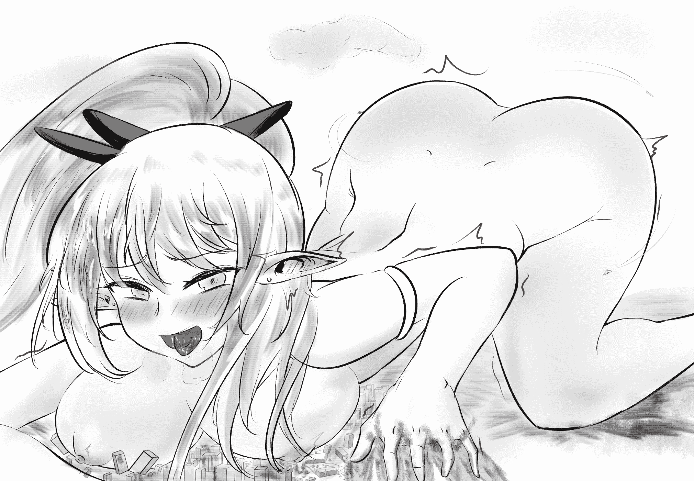
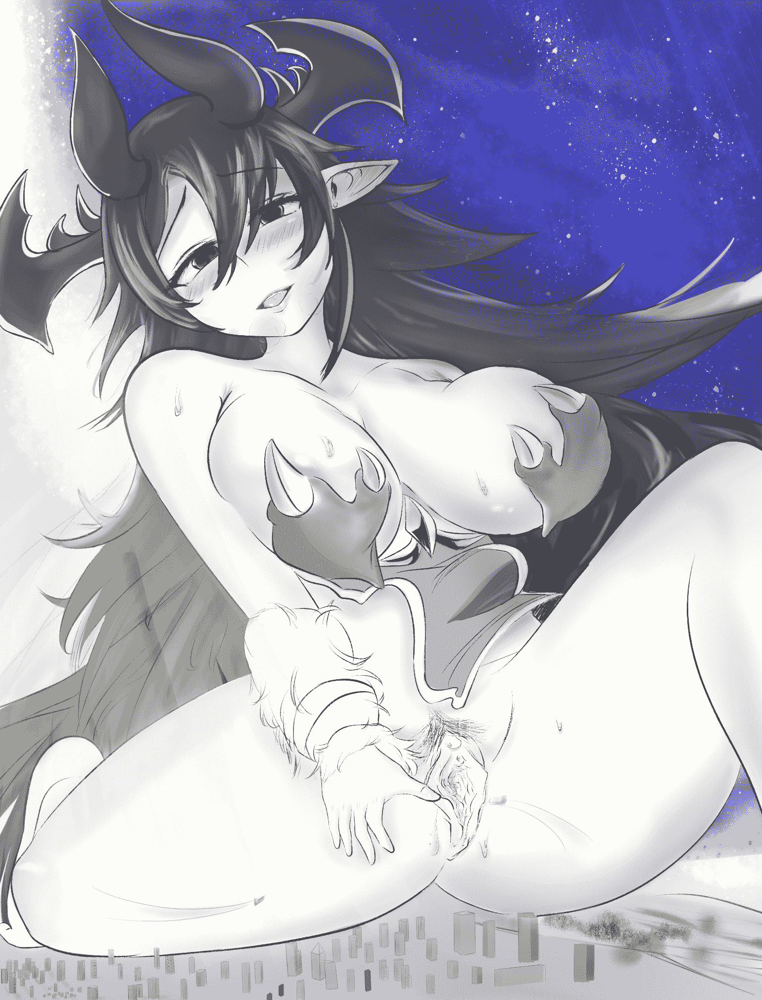

# 【神寂杯】（慢热剧情向）Between the dark and light -完结

作者：回收站站员

TID：28791

 

# 1

*本帖最後由 回收站站员 於 2020-6-7 15:15 編輯*

写在前面：    所幸最近突然得到了充裕的时间能够来画画，而且听取了大佬的建议开始进行一些临摹练习。但没想到画着画着突然就上头了，突然脑袋一热就想着：干脆改成gts图算了，权当练习。然后又借着这股不可收拾的劲头，居然直接捯饬出了一篇文章来。不过作为写作新人必然有许多欠缺经验之处，尽管这次的文章也参考了许多方面的东西，还得到了大佬的宝贵建议，可是作为本人对GTS文写作的第一次大胆尝试，必然会有纰漏。甚至如何去分段都感到苦手。给文章起一个英文名字，是因为觉得这种模糊的感觉，才能表达出我希望表达的意思。期望能够让各位观众能够以包容之心看得愉快，此外期待各位的宝贵意见。    注，魔改临摹图将于结尾放出，另有注释。

本来只是脑子一热的随笔产物，可是无形之中某些原因推动着我想要去完成这部作品。一开始还在担心：“作为新人写手直接参加比赛会不会有些狂妄”这样的事情，但后来却决定怎么也要试一试。这种想法，最终让我决定还是参赛试试看。在完成下半部分之后，会对上半部分有些错误的地方做出修改。届时还请各位读者看的开心。

然而，在文章写到几近末尾的时候我发现————俺词穷叻。

对于爽文情节的驾驭能力和语言的描写，还是不够哇......

 

# 2

*本帖最後由 回收站站员 於 2020-6-7 15:05 編輯*

人类西历128年，人类与精灵族长久的战争在某一天发生了巨大的转折。那一天到来之前，精灵女王自己绝对不会想到，她将在漫长的历史之书中写下了精灵族屈辱的开端。

Ⅰ

“爸爸，今天可以不用打仗么？”我回忆着女儿天真的脸孔上浮现的担忧，问着这种令人心酸的问题，不禁又猛吸了一口手头的烟。我看到我的副官将他那复杂的眼光投向远方————那些掌握着奇异法术、不断入侵人类国土的精灵族入侵的那个方向，或者说，那条防线。那个眼神，不得不把我从回忆中拉回到现实，去检测雷达上的种种数据。

是的，战况并不乐观，简直到了令人担忧的地步。而司令部直到现在，仅仅是下发了“本飞行舰队持续镇守于此”的指令。就在几天前，那条对于人类来说战略上至关重要的伊谢尔伦防线失守了（防线名称致敬一下《银英传》）。精灵族似乎采用了佯装撤退的战术。但仅仅至此并不会让人感到恐惧，真正令人感到无比恐慌的，是在精灵族大军仿佛打了个照面一般的出现再撤退离开之后，绵延千里的重装要塞于一瞬间失守，或者说，被彻底的摧毁了。甚至在第三次报信“敌军已撤退至....”这句通讯还没有讲完就彻底失去了联系。一开始司令部认为是通信干扰，可当侦察舰返回报信的时候，几乎在场所有将领和脸都变得和报信员一般煞白。人类自认难攻不破的要塞被一瞬间以某种手段碾成了一片废墟，连一片残渣都没有剩下！

一天后，精灵族全面宣战的文书可以说如期而至，更是令几乎每个将士心中打上了恐惧的“强心针”。

“精灵族秘密的新式法术么？”我喃喃自语道，副官明显是听到了我的自言自语，“长官，高层现在还是没有向民众公布伊谢尔伦防线溃，呃，被摧毁的事实么？”我假装在监视雷达，不想回答副官的问题，直到燃尽的烟头烫了我的手。我不想在我的手下面前展示我担忧的一面，可是这种感情还是无可奈何的流露了出来。跟随我征战多年、同我频频以奇策击退了无数次击退了精灵族攻势的副官见此便不再多说什么，因为此时的紧张和无形的压力，我们二人对此心照不宣。

接近正午十分，负责监测敌情的报信官连滚带爬的奔进指挥舱————这不是什么好兆头。“长官，敌情！敌情！”“冷静下来，敌方数量有多少？为何不通过通讯向我汇报？”实际上我在让自己冷静下来。“我们....反复测算....雷达观察绝无错误....呼，呼.....”他喘了一口气，“根据敌对法术反映监测判断，对方人数是，一人。”

一瞬间我怀疑烟头是不是又烫到了我的手。

Ⅱ

在早先一场战役中，我们的飞行舰队被精灵的新型幻术打的措手不及。“幻术么？”“不是...”持续数秒的讨论还没结束，远处的天空便出现了一片投影————司空见惯的精灵族投影法术，往往配合着传声法术，是精灵族宣战的手段。

“若是精灵族不是如此先宣战做派的话，人类军估计早就被干掉了吧”我心中默默想着。精灵族据信，是和魔族一样无比古老的种族，精灵族与魔族两族依靠法术在地底的深处过着隐者般的生活并靠着力量的制衡相安无事。直到地表的人类科技的腾飞。

人类征服大洋宇宙的这份自信，使人类于公元XXXX年宣布更改纪元历称，试图向着地心进发，直到发现了精灵族的存在。这份自信在古老而无法理解的力量面前瞬间土崩瓦解，尽管外星殖民的技术在理论阶段几乎成熟，可绝大部分人类还是居住在地表之上。于是人类的黑暗时刻到来了，原本势如破竹发展的探索的科技因战争陷入停滞，人才、钱财和资源毫不吝惜的被投入战争，全人类在历史上罕见地团结在了一起，由身在外太空的先驱移民的政治集团指挥，以已经牺牲了一代人的代价，进行了长达一个多世纪的战争。

在这场一直以来处于劣势的战争中，以卓越的战果和奇迹般地战略，巧妙地与精灵族周旋多次并以胜利告终的，便是这艘飞行舰队————第十三舰队，由我与副官率领的8万艘的飞行战舰，负责指挥的旗舰乃是人类联盟最高科技的结晶。

正当我脑海中拟定与敌方进行幻术近身缠斗战的时候，远处的幻象渐渐成型，直接把我手中的烟头吓掉在了地上，那是精灵族的女王！

“贵安，人类。”女王没有遵从以往宣战的格式化的宣言，用法术的力量直接将声音传入了通讯之中。语气之优雅平淡，甚至胜过人类贵族中最优雅的女性。

精灵族本就是女性氏族，不知什么原因没有一个男性，不禁令人奇怪精灵是如何繁衍的。而这场战争最为令人类头疼的是，精灵族战士无法真正“死去”。“死去”的精灵族会在她们的故土重生，而这种科学无法想象的事情之所以存在，其中一个原因就是她们的女王。精灵族女王在精神上于某种力量相互联系着————这是人类花了几乎一个世纪，直到西历98年人类才发现的事实。此种力量是精灵族法术的根源，据推测和迄今未曾出现的魔族之间也有一定的联系。

女王巨大的法术投影停留在天空中，那面貌可以说是令每个男性都难以把持的美丽，如果是这样一个美人站在一个男人面前，恐怕是再严苛的社会教条和法规都抵挡不住男人对她的追求吧。

“看来，十三舰队被‘御驾亲征’了啊”副官故作轻松的说到。放眼整个人类历史，虽有人类以少胜多的战役，也有被精灵族以少胜多的战役。可是想仅凭一人颠覆整个战局，即使是力量深不可测的精灵族的女王，也是不可能的一件事情啊。怀着这样的想法，我本以为这只是女王一次战略性的出面而已。

“今天，我是来同你们的伊谢尔伦防线一样，取各位的性命的。”这番没有对自己特别的尊称，也没有一丝波澜的话语，在未知的力量面前，使所有人都倒吸了一口凉气。精灵族的宣战做派虽然老旧，但在情报战术上却可谓之现代，她们究竟是什么人？以一人之力来对人类军的精锐部队，依然保持的这份从容让人寒毛倒立。投影消失了，接下来发生的事情令十三舰队每个将士直接看傻了眼。

刚刚在空中只有女王面部的巨大投影消失了，取而代之的是一丝不挂的，比投影更加巨大的精灵族女王。成熟丰满的胴体散发的体温，在城市中瞬间造成了热岛效应。巨大的身躯摧毁了下方数不尽的城市————早先已经将居民悉数撤离的城市。巨大的女王以鸭子坐的姿势出现在十三舰队眼前，是的，眼前。

Ⅲ

人类曾经见识过精灵族的巨大化法术，但那些精灵女战士最大不过是一座高楼大小，被人类以机甲部队不怎么轻松的打败。于西历50年后再也没有见精灵族使用过，直到今天。

一瞬间，十三舰队仿佛被按了暂停键的电影画面，居然一动不动。任由女王，像伸懒腰一般，伸伸手就将十三舰队中分散排布的不知多少军舰攥在了手中，捏碎了。

副官从震惊中回过神来，看向我咆哮道“长官！快下令！”可当时的我究竟是什么表情呢？说来也是不可思议，人类飞行舰队的最富有经验的舰长，第十三舰队的总指挥，居然有巨物恐惧症！本身为了克服对大型飞行舰的恐惧就花了数年的时间，这份我本以为再也不见的恐惧于今天海啸般的向我袭来————她实在是太大了！

人类的第十三舰队和伊谢尔伦防线，一直被精灵族视为眼中之钉。而就在这短短三天时间里，被精灵族女王相继摧毁了。女王使用这种从魔族那里偷窃过来的禁忌的超巨大化法术，将自身化作了攻城之械，带着摧毁了伊谢尔伦防线的绝对自信向十三舰队发起挑战。并将战况以法术投影展现给自己的国民，宣告着属于精灵族的力量。“看啊，是我们伟大的女王！”“多么巨大的身姿，让人类尝尝精灵族的厉害。”无数精灵族人仿佛在观看电视直播一般通过法术投影注视着一边倒的战况，高呼着对女王赞美的话语。此时占据了绝对优势的女王到底在计划些什么呢？心里在想什么呢？

Ⅳ

“哇啊啊啊，好害羞啊。国民都在注视着我啊啊啊啊，在人类面前一丝不挂了....”女王心里大声喊着。

其实真正的女王与刚刚那份优雅截然不同，那只是传统的故作威风的做派而已。其实女王除了魔力量巨大以外，对军事和政治几乎一窍不通，所有的“优雅”只是被迫展现出来而已。治理精灵族内政和军事的人物完全另有其人。之所以采取鸭子坐姿，也仅仅是因为女王在不久前发现自己的私密位置，前庭长出了细小的毛毛.....

一想到之前因过于害羞而跺下的一脚————正是这一脚一瞬间摧毁了伊谢尔伦防线，也是这份害羞使女王违背了传统，没有发出精灵族的战前宣言。而今天不同，在无数国民信赖的目光注视下，女王必须表现得像女王才行。一想到这些，女王就把头深深得低了下去，几乎埋进那傲人的双胸里，来掩盖自己羞红到发烫的脸。两边的脚指下意识地蜷起，带起来不少城市地碎屑。这也为舰队争取到了宝贵的调整时间，双方都陷入了名为暂停的焦灼状态。

我努力的让自己冷静下来，可我依然能感觉到心脏在狂跳，耳鸣与眩晕伴随着强烈的胃部抽搐感向我袭来，能让自己不吐出来已经是一件难能可贵的事情了。尽管是精灵族美貌首屈一指的女王，如果说刚刚在安逸中还有人能对着法术投影硬起来，而现在却是威胁生命的庞然巨物，面对死亡的威胁现在要是还有哪名士兵能产生性欲，恐怕是那种感觉不到死的恐惧的疯子吧？

女王，羞涩的不自觉地夹紧了双腿，卷起的气浪与烟尘将停留在地面尚未起飞的数千艘战舰吞没其中。尽管是人类应对法术的最强战争机器，在这般夹杂着无数建筑碎片的高速沙尘暴中也难以留个全尸。这股气浪也波及了空中地些许舰艇，其中包括了我所在的旗舰。剧烈的摇晃，我终于还是吐了出来。

带着烟味儿的呕吐感把我从目眩中解放了出来，听到副官向我大吼“长官！快下令！”，我尽平生最大的意志力，确认了亡舰数。撤退在这庞大的躯体面前有和意义？在吞下了一把随身携带的苯二氮卓类药物之后，我强迫自己拟定作战计划。

“敌方现在可能因为法术的副作用，处于一种无法迅速站起的姿势，能作为武器的只有双臂，根据损失和测算挥动的速度为XXX单位，我舰想要躲避攻击至少需要XXX+单位的移动速度，不排除敌方单位加速的可能性，我舰反应速度上限为XXX...”我冷静的分析着局面，得出一个十分绝望的结论————女王光是表皮就是坚不可摧的状态了，只能是攻击其弱点，眼睛，自杀式攻击鼻孔或者精灵的弱点器官。我几乎一瞬间草拟出了一份作战方案，一面苦笑着对信任的副官说“现在的女王，好像是真正意义上的‘深不可测’了啊。”

Ⅴ

还在羞涩的漩涡当中无法自拔的女王，用其法术强化的视力精准的洞察到了这些战舰的移动————这数万艘黑压压的战舰集群，尽管微小，但在现在的女王看来好似一群乖巧的飞虫。

女王眼神不禁变得迷离，童年时期的一次经历，让女王十对虫子抱有奇怪的感觉，而且特别是小虫子！在精灵的故土，有一种小虫会趁着精灵睡眠，钻入她们神经密布的耳朵中。因为耳朵太过于敏感，而且是精灵的魔力之源，这使得精灵引以为傲的法术不能有效将它们赶出，只能使用十分有限的手段驱赶进入耳中的小虫。女王就是这种小虫的“受害者”。有一天，尽管做足了防护，无奈这个虫子实在是太小，突破了重重“防线”，最终钻进了年纪尚幼的女王耳中作威作福，仿佛有意识一般不时用爪子刮刮这里，再用身子蹭蹭那里（吸取魔力），让年幼的女王留下了难以磨灭的回忆。身体不受控制地颤抖，说不出的酥麻感觉由魔力之源游走于全身各处。小小虫子享受般的轻轻一动，便能让巨体的主人舒服的直不起腰来。好几个日夜，女王不敢告诉大人，在白天的礼仪课和法术课上忍耐着小虫和自己身体的躁动，晚上入睡时，电流一般的阵阵快感让女王频频用手摩擦秘密花园的入口，幻想着种种怀春之事，放任小虫跑遍自己性感带的花蕊、吸食魔力的甜美花蜜。手指不禁出入抚摸那禁忌的洞口————此时的女王不过才是年纪刚刚过三位数的花季少女（精灵族嘛，寿命长得很）。当小虫不知哪天吃饱喝足了离去之后，女王甚至产生了一种怅然若失去的感觉。当她听闻自己的同学也有和这种小虫“娱乐”的经历，甚至主动去让小虫钻入花蕊的时候。女王的内心其实十分高兴，碍于传统的规矩没有表现出来，更不能像其他同学那样谈论。可是没过XX年，议院决定将这种虫捕杀殆尽，那时女王散发高贵气场地美丽脸庞微微地抽搐了一下，更为可惜的是，此间再也没有小虫钻进女王的耳朵里。

“明明只要撤退了，人家就不会追了...”女王看着小小的、黑压压一片的人类战舰，在心里念叨着，下身却不像样的微微泛洪了起来————仅仅是回忆起那难忘的舒服经历，都足够使一辈子不知男人为何物的精灵族那外表高洁，内在却渴望淫秽的的小穴像傲娇少女一般张开她的粉嫩小口。看着冲向自己胸部而来地“小飞虫”这使女王又不禁提了提下身，又卷走了不知多少战舰，呼吸不自觉地开始变得急促起来。

Ⅵ

“初步拟定地作战计划使这样的，本舰旗舰率领大功率输出的2万冲锋舰队，佯装对奶....哦不，精灵族女王的胸部发动进攻，在A路线的第二阶段留下7000艘高速攻击舰以反魔力激光武器攻击奶.....乳头。”

我尴尬地咳嗽了一下，恐怕是一下子服用过量镇静剂带来的副作用。

“剩下的重型火力舰队以迂回∑阵型与下身保持近距离，等待机会攻击，必要时进行自杀式攻击的牺牲准备。”

身为人类王牌舰队的指挥官，居然也有那么一天会向部下下达自杀的命令，想到这里，我不禁顿了一下。我也是宁可只有自己阵亡，也不想将部下的命作为战争无情数值的筹码啊，从参加指挥直到昨天，十三舰队的阵亡数一直是全军最少的......

我继续向战略单位陈述着“在与高速攻击舰分离后，剩下的舰队再分为三路，一路负责高机动光学队干扰视觉，另一路负责攻击鼻孔，最后一路由本舰率领攻击魔力之源————女王的耳朵。”

人类联盟最基础的这点还是知道的。而且，经过非人道的实验发现，精灵族的明明没有生育需要的下体还有乳头都十分敏感。受魔力的影响敏感度是人类女性的[数据删除]倍，据数学模型测算此关键部位敏感度与实验个体的魔力含量成正相关关系，具体测算的数学方程为......

基于此研究而拟定的这个如集体自杀般危险的战术，“希望能够凑效吧，即使能保存大部分兵力撤退也好啊。”我心中默念着，再次点起一根烟。然而此时副官有点结巴的对我说“长，长官，高速攻击舰的数量...因为此前的攻击，已经不足.....七千艘了。”我抽烟的手停了下来，“我们还剩多少人？”“不到五万，长官。”

如果说精灵族的长耳朵是她们魔力的“发动机”，那么现在那如同高山一般阻挡在我们面前的那对奶*子，还有深渊般等待着进食的、两腿之间的那张巨口，就是储油量大到难以想象的，魔力的“燃料库”！现在，这人形战争机器正在制造一场熊熊的大火，而熄灭大火的方式，恐怕唯有制造一场爆炸，耗尽氧气。

想到了这里，我手里刚点着了没多久的烟又一次掉到了地上。

Ⅶ

背后是无数国民信赖的注视，面前是自己最喜欢的小虫子们，巨大的女王的心被这种复杂交织的刺激感挑逗得砰砰直跳。

“啊，真是聪明的指挥官，向着我期望的地方来了。”看着急速冲向自己胸*部的“小飞虫”们，女王居然一瞬间忘记了国民们的视线。迎合宾客的旅馆，迫不及待地想要招待它的小小客人们，女王挺了挺胸。

“哦哦，威武的女王，直面人类的军队了！”精灵族群开始欢呼，几位精灵族的议政元老已经露出了必胜的笑容。

“嗯~”女王突然的哼了出来，这种因舒服而产生的女性在性爱前戏时常有的娇哼，看似毫无征兆的从高贵的女王口中发出，而且似乎带着一种对性的久别重逢一般的娇媚。

这是因为攻击舰的光束在攻击乳头，打在身上特殊的快感如轻柔的、微微湿润的小毛刷拂过一般，而且是数不清的毛刷在同时、从各个方向进行力度不同的抚弄，四面八方的光束会在攻击后留下余感，而且完全意料不到下一次会从那个方向过来，就好似是被蒙上眼睛被抚弄的少女不知下一次抚摸会来自何处一样。这种好似无数毛刷抚弄，能让任何一个男人摸胸的手法在此时变得如此幼稚粗糙，而这一切的感觉只有亲身体验者才能描述出来，更何况是从未的体验过这种刺激的女王，小人舰队抱着必死的决心发动的对乳头的刺激，如惊雷般向女王袭来————女王自己可从未下流的抚弄过自己的乳头！不可思议的强烈快感一下子让女王挺起了腰。

“可憎的人类！居然亵渎女王！”看起来，精灵族的大部分目前还是站在狂热的战争这一边，全然不知自己尊敬的高贵女王殿下的眼神此时是多么迷离。

即使是一瞬间忘记了民众的视线，习惯一般的教养还是阻止了女王进一步的失态，在外观上仅仅是轻哼了一下。然而实际上，早已决堤的下身将女王所坐的地面已经淹成了一片小湖————仅仅是攻击乳头就让女王失禁了！粉嫩的巨大肉穴贪婪而诚实的抽搐收缩着，仿佛要将一切囫囵吞入其中，借助光与圣水的反射，连地面的废墟都被隐约染成了淫靡的粉红色。

这片人类在过去最为繁华的商业住宅区之一，曾傲然站立于经济世界顶点的这片建筑规模数一数二的城市，现在却可怜的像是面对滔天洪水的小小蚁穴。若是城市中还有没有撤离的人，看见此情此景恐怕会跪地祈求诺亚方舟的到来吧?在此次事件的许多年后，又有谁能料想到，这里居然会变成了一片天然蓄水库的事情呢？

“怎么回事？明明还没有进行对视野干扰作战，可现在目标却明显表现的已经是一幅被干扰的样子。”我不解的挠了挠头，借助视觉科技我可以看到女王精致脸蛋上那微张的巨口在淌口水。“这他妈？”我直接叫了出来，现在的情况已经非常清楚了，结合在腿部游而不击的重火力舰队发来的简报，就算不是战地指挥官，任何一个男人都能做出判断。“这大婊子被弄得发情了！”

但是别说，甚至不用细看，女王那可以用丰满来形容的双唇，恨不得让每个目睹过的男人立马亲上去————如果它不是现在这么大、这样要命的话。

从一瞬的头脑发热中回过神来，我狠狠的甩了甩头，“居然一点都不奏效么？”愤怒和绝望涌上心头，“第三梯队，加速向目标左耳进发！”因减员而缩减了编队，放弃了入侵两只耳朵的想法，我下令全梯队开始突击。

终究是没有成功干扰视觉的缘故，很快，从第一波乳头攻击余韵中清醒过来的女王，迅速发现了冲向自己左耳的舰队群。

“不能让他们得逞呢”女王心想着，毕竟身后还有国民的注视，尽管其实很想再次体验一把曾经的快感，女王还是不情愿的伸出手，试图去抓住舰队。

“全队按计划回避！”不光是指挥官已经拟定好的躲避路线，每个将士都在愤怒的情绪中抱着视死如归的进发着，一来二去，女王扑了个空。毕竟。谁能徒手抓住高速飞行的灵活苍蝇呢？

“不好，一旦耳朵被....”想到这里，女王的阴蒂便没出息的探出了头，同时女王不知是有意还是无意的前倾了身子。

突然，女王撅起嘴————即使是这样在舰队群看来也是遮天蔽日的巨口，开始猛地向里吸气。这一举动颇有成效，几乎在数秒之内，数不清的舰队就被女王咽进了肚子。船员看到天空的颜色由蓝急剧的变红，下一秒便因这股吸力和船体一起撞得粉碎。少数幸运的舰船，被唾液包裹着咽进了胃里得以无事，等待他们的又是怎样的命运呢？

“呼~”嘴上长抒了一口气，女王庆幸没让“小虫”们得逞，但身体却弯下了腰，潜意识中诉说着这份失落。好像一个任性的孩子弄丢了中意的玩具。

Ⅷ

可是，突然，左耳还是产生了一丝微弱的感觉！即使身形是如此巨大，那敏感的、布满魔力的耳朵光速向大脑传递了信号：有异物入侵！

有些耳朵敏感的人在掏耳勺伸进耳洞之前就能觉察到异物的存在，精灵族可以说就是这种敏感的体质，更何况是魔力含量最高的精灵族女王呢。

“糟了，怎么办？怎么办？族人还都在看着我，可是耳朵里....”不知是因为对数不清的注视的恐惧，还是出于童年的那段回忆引发的期待的紧张，女王的迷人嘴唇不住地开始颤动起来，意识和身体居然一瞬间都犹如抛锚的汽车般动弹不得。

这份寂静，仅仅持续了一次呼吸的时间。

将女王的意识带回的，是突如其来的腹中的剧痛。集中于一点的刺痛感虽然短暂，但足够让女王捂住肚子，弯下腰去，精致的双眉也不由的紧皱。只能看到女王从背后的投影的精灵族们，见到这一幕，纷纷对人类军怒吼咒骂起来。

因为从背后看起来，鸭子坐又弯着腰捂着肚子的女王，现在就像是在挡着私密部位一样。

但是这份疼痛可苦了女王，久久不能消散的余痛和在意耳朵中的人类战舰，而使身体的主人咬紧了下唇。不一会儿，异变又突如其来的发生在乳头上，或者说，乳头里。一开始还只是隐隐约约，后来女王清楚的感觉到，刚刚那种从四面八方攻过来的小毛刷般的戏弄，现在开始从敏感乳头的内里传来，而且大有愈演愈烈、越来越深的趋势。随着这股感觉的不断扩散和深入，由轻微的瘙痒慢慢转变成痒中带痛，而又发胀，好似千万小虫在乳腺内部爬来爬去。借由魔力而放大的感官感觉尽职尽责地向女王地大脑诉苦，这让自己完全没有了解自己身体、对乳头毫无开发的女王来说，根本就是酷刑，一种快乐和痛苦交织而成的酷刑。

“嗯~~啊啊昂~”女王终于忍不住的叫了出来，刚刚捂住肚子缓解疼痛的双手，现在开始毫无节制的揉搓着那对巨乳，试图将在深处为所欲为的小虫们挤出来。可是随着时间的过去，只能看到女王揉搓双胸的手法越来越下流，呼吸越来越紊乱，而不见其他的丝毫缓解。正好相反，来自体外向上摇动的波浪将这些“小虫”带离这一边，向下摇动的潮流又将那部分送到那一边。潜入乳腺內的攻击者在这游戏般的游泳中愈发渗透到了更深处，愈发扩散到了更多处。

“哈啊....哈啊.....”女王大口喘着粗气，刚刚在乳头外侧的攻击已经让这敏感的身体失禁，那么现在这种直叫人发疯的、来自内侧的快感呢？女王只觉得刺痒从乳头的前端传来，而深处又有万千的小点在乳腺中游走。已经无法再思考其他事情的女王，顾不得背后那千万的视线，任由乳房变得越来越涨、越来越痒，开始大声地喘息起来。只可惜在外部看来，谁也不知道深入乳腺其中的小人们做了什么。来自内部千变万化的持续无规律的攻击，时而突然集中于一点造成粗暴的痛，又不时变换着角度，旋即转变成愉悦的温柔爱抚。

“再这样下去，会变得奇怪的。”抿着嘴的女王在心中默念，同时竟又冒出近乎受虐狂一般、不希望此刻的愉悦停下的变态想法。

终于，女王抵挡不住来自胸部深处源源不断地巨大快感，一直保持着鸭子坐的身子猛然沉了下去，变成了那种半跪在地上前趴的那种痴女般的跪地姿势。这一幕，无疑清晰的通过法术屏幕传递给了无数精灵族的观众。

那大大张开的流水阴唇和高高勃起的阴蒂一同，毫无保留的展现在每个精灵的眼前。若是视角角度再往后拉一些，恐怕能够看到女王那因强烈刺激而一张一弛的色*情脚趾吧？人群（精灵群）的怒吼声骤然停下，被这不可思议的一幕惊得目瞪口呆。

甚至能够看到，女王那阴户萌生的些许绒毛在风中挑逗般的扭动身姿————长了阴毛的精灵族被认为是经常自慰的下流的化身，因为事实上就是如此，阴毛只会在性欲极端旺盛，而又长期得不到发泄的精灵身上长出。看见了这一幕，原先坐在圆桌上，主战派精灵的首席议员立马起身，用不同于往日威严的声音向民众发出公告：将把投影战况由巨大女王的后方转移到身前————每个精灵族都明白阴毛的含义。再说了，让民众看着高洁的、神圣的女王汩汩流水的粉嫩阴户实在是太过于...有伤大雅。

可是切到了前方，那景像却更是让每个精灵大跌眼镜。只见趴下的女王拿身下的无数建筑作为了缓解乳头燥热的按摩器，全然不知做*爱为何物的女王却本能的高高撅起屁股，全心全意的摩擦着乳头。身下的城市碎屑似的散落的到处都是，依然没被摧毁的坚挺高楼奴隶般被迫服侍着那两颗不知满足的贪婪主人————由于刺激和发情而高高挺立的、因充血而变得粉中透红的大乳头。建筑坍塌、大地开裂，破碎的声音与上空女王不顾一切的粗重喘息声构成了这世上最大音量、最为疯狂的双重协奏曲。

那副下流至极的表情，在时隔XX年之后依然清晰的烙印在每个精灵的脑海当中。那些比女王更加年长的万年老处女参议员们，看见这一幕，都忍不住觉得下体一阵阵的燥热。女王的嘴大大张开着，顾不上丝毫礼仪风范的舌头向外伸出，似乎将身心都奉献在了摩擦乳头这一小小形为上。如果说城市刚刚遭受的是启示录一样的滔天洪水，那现在就是创世纪般的天崩地裂了吧？

而此时，攻击者狼群的獠牙才真正开始显现出来。

Ⅸ

“丝尔维亚”号，第十三舰队的旗舰，是一艘通体珍珠色的“无畏级”浮空战舰。因屡创战功，特别被授予了救世主(Savior)这一光荣的称谓。而现在，我却驾驶着这人类的救世主冲向一个巨大精灵的耳朵里，甚至还是整个攻击梯队仅存的那一个！

“这算什么狗屁救世主？”我在心中大声骂道。刚刚因为强大的功率而逃过巨嘴吸引的旗舰，现在只不过是一个，只能释放最基本魔力干扰和勉强维持航行的一块废铁而已。能给女王带来的恐怕只有一丝丝异物感吧？

“如果刚刚规避的航行选择再正确一点的话....”我狠狠锤了操作面板......

“如果能再缩减编制，仅选择高速攻击舰....”我沉浸在悔恨之中，直到断断续续的通讯传进我的耳朵。

“长官....这里是....第...编队...”我可以说是喜出望外，看来是刚刚被吞进肚子的攻击编队有些许存活，点燃了我失去的希望。

“旗舰收到！请回答，你们是哪一编队，现在状况如何？”一段短暂的杂音传来，接下来的通讯开始变得更加模糊

(为节省篇幅，之后的省略号由逗号代替，另外也是致敬一下爱国者大爹)

“我们....无法接到，消息，现在，空气，快要耗尽，”一股恶寒止不住从我的脚上开始往上窜，我几乎已经能对接下了的事情有所预料了。

“死伤，惨重，指挥官，大多阵亡，现在残舰，[杂音]艘，残舰，一致决定，殉爆”我呆呆地站在指挥台上，一句话也说不出来。

一直以来，我都在极力减少部下无意义的损伤，日日夜夜制定着一套又一套周密的计划，可是事情还是发生了，以这种方式发生了。

“我们，永远，相信，长官，一定能，带来，胜利”不，不要再说了。

“能追随，长官，是，我等，光荣，”我感觉到视野已经因泪水变得模糊。

“请，继续，为我军，带来，胜...”最后的话语还没有说完，便能感觉到整个空间开始剧烈摇晃下沉。

这意味着女王因胃里的攻击有所动作，也代表着攻击颇有成效。泪水低落在了舰船的地板上，我看向副官，在刚刚全力的加速逃跑中因冲击而昏迷的副官。我仰望天花板，揉着因冲击作痛地脖子自语道“在完全看不到战局的情况下，要如何指挥呢？”

牺牲和战况地变化将我从消沉中拽了回来，我调整了一下设备的功率，向阻隔比较少的方向发出了指令。艰难的得到了战况后，我下令在**的攻击舰停止躲避性游走，全军弃舰，依靠飞行近战装置进入**进行攻击，直到目标改变姿势。第一阶段作战成功后，一直保存着力量的重火力游击舰依照计划，利用反法术弹药直捣敌方的“燃料库”————直直暴露在战场上的大张的阴户。

此举必然会进一步造成我军的严重伤亡，但为了阻止国民进一步的牺牲————为了保护身后无数的人民，那数亿亿的无辜的生命，数亿亿的人生，数亿亿的可能性，数亿亿的悲欢...现在我所能做的事情，只剩下放手一搏了。

当然，最大的赌注，还是位于女王耳中的十三舰队旗舰。

抱着巨大的决心，一想到接下来我决定要做的事情，身体便开始紧张的发抖。关闭动力，全部将能源输入到超负荷运行的逆向运行的魔力干扰装置中————换言之，就是将原本用来削弱魔力的武器变为反向增强魔力。

以整艘战舰为代价，使人类最高科技结晶的救世主化身为小小器官中的强力媚药！

至于史册是如何记载此次战役，甚至是后者以此次战役为纲，总结出《对巨大化精灵族的游击与穿插战术理论》，还有原本对军事一窍不通地精灵族女王亲笔所写《以巨大化战术抗击人类运动战之对策》等军事著作的事，那都是不知多少年后的事了。

此时，我做好了觉悟，将双手伸向了控制面板。

Ⅹ

此刻，女王明显是把自己脆弱的耳朵中的那个小飞船给忘记了。直到不亚于性器官一般敏感的耳朵里传来沉重的爆炸感，使沉浸在胸*部内外双重快感的女王绷直了腰。

因突如其来的刺激而猛地瞪大了双眼，随之而来得身体得燥热，使得原本已经洪水泛滥得小穴更是变成真正意义上“飞流直下三千尺”的瀑布。

收到了指挥官最后的命令们的将士们，此刻趁机鱼贯而入。不浪费一份一秒摆好最具攻击性的阵势，在这巨大的、欲求不满的肉穴空间中，再没经验的炮手也无需担心炮弹会打空的问题。无数舰船用无数重炮，带着此生最后也是最强的愤怒，向这些毫无还手之力的蠢动的嫩肉上倾泻弹药。一时间，硝烟、爆炸，一切能想象到的攻击的手段，向着娇嫩的肉壁，在女王自己从来没有抚摸过的圣洁之地上，在小*穴深处那一处处敏感的褶皱里，狼群般的袭来，撕扯着每一寸软肉。

“~~~~~~”发出不可名状的呻吟的女王，高高的抬着屁股，那神圣的花园，此刻却化身为地狱中的坩埚，忍受着侵入其中的魔鬼勤勉的破坏。受到魔力增幅而变得敏感无比的肉壁神经末梢已经不堪其忧，死循环似的向主人传递着信号，殊不知自己的上司全然已经宕机了！“既然快乐到达了我的面前，那我为什么不快乐快乐呢？”掌管理性的大脑此刻放弃了思考。

或许是因为被攻击到了G点，女王两眼翻白，没有用来支撑身体的左手狠狠的向后抓着地面，活像是新婚床*戏的抓着床单的受气小媳妇。如果说能拿一个词汇X同时来形容痛、痒与爽，那么现在的女王应该以及是X不欲生了吧。重重的粗气携着无数建筑的碎屑，恨不得都快刮到每个精灵族观众的脸上了。那些有着经验的精灵族不禁赶紧转身跑掉，回味着女王的云雨之欢，回到房中一股脑的发泄自己的欲火。其余大部分纯洁如纸的精灵族，已然大张着嘴巴，木鸡似的目睹着这令人目瞪口呆的一幕。元老们扭过头去，不知出于什么原因浑身发抖。会场在很长一段时间內陷入了一种安静且尴尬的状态中，唯有那些披着黑袍的主战派精灵依然看的津津有味。女王此时最强有力的武器————那遮天蔽日的巨大身形，此时却成为了破绽百出、供人随意凌辱亵渎的最大弱点！好似被突破的马奇诺防线一般，巨大的女王已经被小穴中小小的虫群们折磨的起不了身了。而此时已经到达乳腺中最深处的自杀爆破攻击队们，完成了自己最后的使命。在女王庞大身体的短暂抽搐后，由魔力凝聚而成的乳汁不受控制的喷薄而出，下身更是十分配合的剧烈收缩喷水————如此庞大的“出水量”真是不免叫人担心女王会不会因此而脱水。不一会，僵直的巨大身体倒了下去，在首次体验到的、强烈的高潮中失去了意识。

直到晚钟送别了这原本漫长的一天，严静的夜色已然就这样在不知不觉间笼罩了纷纭的大地。

就这样，以人类主要军事力量第十三舰队的全灭，和女王的败北结束的平局，为世界带来了二十余年之久珍贵的和平。

人类和精灵永远也忘不了出席会议,签署合约时候的女王那羞红了的脸，还有无比失态举止。此战消耗了人类军绝大多数的力量，以及精灵族在漫长岁月中储存的巨大魔力，以巨大的牺牲到最后换来了什么呢？

持续了一个世纪的战争在这里画下了顿号，奇怪的是，几乎没有人去著书反思战争因何而起、和控诉这场战争的无意义。在那深深的幕后，主战派精灵摘下那神秘的黑袍，露出了被魔族深深蛊惑的姿态。而在那遥远的星空中的某颗星球上，人类联盟的最高统治层仅仅只是发出了简短的吊唁，随后又继续投身进那漆黑的持续了一个世纪的政治漩涡当中。

精灵与魔族力量的此消彼长，让虚空中的魔族统治者露出了她标志性地阴险笑容“爱丽莎.迪多娜女王，早晚都会是吾的囊中之物。”

不知过了几年，因为不自然的温差变化，而在某地罕见的下起了反季节的雪。一位少女在这纷芒的雪中严肃的伫立着，以战争英雄女儿、《游击与穿插战术理论》作者的身份庄严宣誓：“权责愈大，做事愈严。”晋升为人类新第十三舰队的总指挥官。她将在几年之后惊讶的发现自己的父亲还活着的事实。

而精灵族的女王在这短暂的二十年间，与耳朵中那奇迹般幸存的、因魔力而缩小的小小指挥官所度过的一个个日常，以及他回到故乡的泥土后带回的新的精神，还要去读《游击与穿插战术理论》的作者早已疲惫的不愿再去讲述了。

疲惫的负责修编史书的作者脑海中回荡起这样的一句话 “一件事情愈是热切地需要我们的精神————时而使我们兴奋得意，时而使我们疲乏抑郁————我们愈是容易忽略这股源泉，就像在某种求知地工作将我们吸开之时最易忘记照顾我们地身体一样(摘自赫尔曼黑塞所著《玻璃珠游戏》)”便合起了记录的书本进入了梦乡。

转眼间，和平一闪而过。战争和不尽的阴谋，今天也在不间断的上演着。

 

# 3

关于图的注解:需要再次重申强调，本图基本是出于对光影和线稿研究的临摹。原型是[しんどう] 人ならざるお嫁さま + 4Pリーフレット [中国翻訳]漫画中的一幕。（来自E站）

而且我发现，似乎写的场面太过宏大导致我 T M 画 不 出 来 了 ！

唉。

接下来要是不会突然上头的话，应该是继续老老实实的去研究画画吧。届时我也会把作品发布出来。（因为技术的尚不成熟，以及更为重要的原则性问题————是临摹作品，所以并不会发布于P站或推特，也希望各位观众不要去进行上传）爱丽莎.迪多娜，女王名字取自传说中的迦太基女王————狄多，各位若感兴趣的话可以去百度一下《狄多和埃涅阿斯》。

最后感谢各位的阅读，若是能够得到喜欢，或能够博君一用的话，我不胜荣幸（笑）。

可能没法及时的对各种意见做出回复，绝非出于怠慢，而时因为平时不太逛论坛，希望各位不要见怪。 

# 4

<ignore_js_op>[1 .png](forum.php?mod=attachment&aid=ODMxNzd8ODBmODU1N2J8MTYwMDg3NjMyMHwxODIzMHwyODc5MQ%3D%3D&nothumb=yes) *(1.36 MB, 下載次數: 7)*

[下載附件](forum.php?mod=attachment&aid=ODMxNzd8ODBmODU1N2J8MTYwMDg3NjMyMHwxODIzMHwyODc5MQ%3D%3D&nothumb=yes)

2020-5-29 23:14 上傳  

</ignore_js_op>  

# 5

> [Arik 發表於 2020-5-30 00:05](https://giantessnight.com/gnforum2012/forum.php?mod=redirect&goto=findpost&pid=437868&ptid=28791)

> 由于本人对军事不太了解，就不在另外方面大言不惭了。除了看到最后这理论有点跳戏，其他方面堪称H典范，描 ...

谢谢喜欢，其实要的就是跳戏的效果hhh

 

# 6

> [qishiweibutong 發表於 2020-5-30 15:34](https://giantessnight.com/gnforum2012/forum.php?mod=redirect&goto=findpost&pid=437918&ptid=28791)

> 写的很棒啊，莫名地戳中了我所有的性癖，像什么精灵啊，魔法和科技的对决，英姿飒爽的女性，太空战舰，伟大 ...

wow，没想到能得到这么高的评价，谢谢能够喜欢

 

# 7

> [無邊落木 發表於 2020-5-31 00:39](https://giantessnight.com/gnforum2012/forum.php?mod=redirect&goto=findpost&pid=437994&ptid=28791)

> 圖文雙修讚!害羞的giga也很合我胃口

> 

> 最後發現女王是耗盡魔力才放這麼大的，感覺有點可惜，希望可 ...

哇是無邊落木大佬！

能夠得到大佬的喜歡，非常高興。全文基本是憑著上頭般的沖勁兒寫出來的，而且我本人其實更喜歡壹些gts被淩辱的畫面，所以gts的S戲碼就沒想太多。目前我畫圖的水平感覺還不是很令自己滿意，如前言所說，在進行著壹些臨摹的練習，等到以後技術磨出來了大概會重置這個龐大的畫面吧。此外本人頂多只能算是壹個軍事愛好者，很多不嚴謹的地方還請大佬多多指正哇。

 

# 8

这是正在修补史书的作者对于下半部分从《十日谈》中抄录而来的序言

对遭受折磨的人表示怜悯，是人之常情；这是任何人都应该具有的品德，而那些需要安慰并且已得到别人安慰的人最应如此；如果世上的确有人渴望怜悯，或深知怜悯的可贵，或因得到怜悯而高兴，那个人就是我。

我的悲伤可能结束了，但我并未忘记不忍心看着我忍受痛苦的人所给予我的安慰，他们对我的亲切关怀，我将至死不忘。我认为，在诸多美德中，感激是最值得称赞的，忘恩负义则是极大的耻辱。既然我可以认为自己又是一个自由的人了，为了表明我并非忘恩负义之人，我决定，我要尽我有限的才能，想那些需要消遣的人提供愉快的消遣，来表达我的感激之情。            ————西历XXX年

Ⅰ

那时候的我还是一个天真的孩子。一旦父亲少见的回来，我便缠着父亲要听关于星星的睡前故事。而父亲总是微笑着，向我讲述那些星空的传说，以及人类对宇宙的探索。但每每说到夜空中那颗闪烁着红光的、最为明显的星星时，父亲的表情都会变得无比凝重。

“那是那些政客躲藏的地方，”父亲不加掩饰对我说，“他们把生存的利益独享，而把世界推向战火之中。”

尽管年幼，但父亲那沉重的表情和语气还是感染了我。那时候我还不知道，父亲是战功显赫的、人类反抗军第十三舰队的总指挥官。今天这场会议，我才算真正明白父亲当时所说的话的含义。

在“挪门翰战役”————原第十三舰队与精灵族女王的战斗结束后，位于地球的人类政治集团决定召开会议，探讨接下来诸如发展的众多事宜。我作为牺牲的伟大将领的女儿，伟大将领因战争失去的众多亲人中唯一存活的家属，参与到了大会的表彰环节中。然而那些争论，就已经让我想要匆匆离场了。

天空阴暗的云层开始集结。再不懂气候的人也知道，恐怕暴雨将至。

“此时难道不是反攻精灵族的大好时机么？”人类的主战派，人类联盟的代理元首，以表演一般的气势做着他夸张的演说。“可是军备支出早已经达到了联盟财政的百分之[数据删除]，民生和经济已经从各方面出现了严重的问题，如果再进一步扩战的话...”此时发言的，是性格内向的农业大臣，在元首的目光威逼之下，他说话的声音变得越来越小。最后，天边隆隆的雷声终于盖过了他的声音。

“大臣说的没有错！”发展改革部长起身支持道，“我们应该借此宝贵的胜利，与精灵族签署长期的和平条约。再把国家发展的重点投入经济建设与民生当中。”

“一派胡言！”元首也是拍案而起，“我们必须乘胜追击！民生和经济建设，在伟大的人类自由解放事业面前，是可以暂时牺牲的！这也是最高指挥部的命令。”

又来了，元首这种无耻的论调。我在心中这么想着————实际上在场的大部分主张和平的官员心中都是这么想。

“他们视生命价值如粪土。一个世纪以来，为了追随那呆滞的想法，多少追随者为之牺牲？这种为了拯救而毁灭的思想，根本就是在维护他们自己的特权！”会场上的气氛变得剑拔弩张起来。“注意你的措辞，部长。”元首故意的把部长二字拉的很长，语气瞬间变得充满进攻性“你还是否站在人类解放的这一边？”“我是一名爱国者，但不代表我时刻都怀抱着主战论。”部长面无惧色的回应。两个集团，两股气氛，在着小小的会场中弥漫。让守卫的安保人员不禁冷汗直下。

曾是百年前的祈愿，如今又造成了更糟的局面。冷静何在？希望何在？生命的重量何在？我开始对那些政客的论调感到厌恶，于是我的表情在会场中不加掩饰的表现出自己想逃离的想法，这使得我不得不双手扶额底下头去，以免太过失态。

最终，主和派的一方终于以微弱的人数优势取胜。和平条约的缔结工作，紧张的展开着。

在完成了并不怎么愉快的、繁琐的授勋安抚仪式过后，我甚至连晚饭也不想吃，只想出去走走。

我辞别了司机，只身毫无目的地漫步在大街上。尽管因为即将到来地暴雨，大街上奔波忙碌务工的人群有所减少，战争胜利的欢腾气氛，借助媒体的力量，精准无比的传递给了人群。在战争结束的几天后，各色的讨论，或是赞美，或是鼓吹军事力量的话语充斥着各色社交媒体。我索性关掉了终端，专心的任由大雨前的凉爽洗刷我烦躁的心理。

其实，和平本可以更早的出现。战争之所以持续了一个世纪之久，有部分原因，恐怕就是人类主战派一直以来的主张了吧？战争在不断抹去着军队和平民之间伤亡的界限，而最终的受益者是谁呢？只有那些端坐于遥远星空高堂之上，整日西装革履的巧舌如簧的家伙了。

这些精心处理的语言，在一个世纪之内，不断地推进着那些家伙的目标。

我不由得抬头看向天空，那颗红色的星球在一片滂沱大雨中若隐若现。闪电，巨龙般划破长空。雨越下越大，几近淋湿我的全身。不知道为什么，我不想回去————回到那令人不愉快的基地之中。刚刚繁华的街道上，此时已然是空无一人。

“我们可以征服自然，征服天空和大地，征服不可战胜的庞然巨物，却无法在人群中成功的推行一种正确的思想，你说是不是？”转角突然的一声问候，让我不免稍微吓了一跳。

外表看起来是一位十分有教养的女性，即使头发略有凌乱，身上朴素的衣服已经完全被淋湿，却一点也不显得狼狈。稳重的声音和独特的观点一下子吸引住了我。一时间面临这种问题，我竟无法做出回答。“请原谅我唐突的提问，”而对方只是微微一笑，“对于同样漫步于这场雨中烦恼的美丽女士，我可不能坐视不管。”她行了一个并不让人感到做作的见面礼，“容我自我介绍，我的名字是菲罗美娜(Philomena)。写在您脸上的表情告诉我，您的烦恼要比我更深。天色已晚，不妨来我的旅馆小憩....”

我欣然地答应下来。我们畅谈了彻夜，发现彼此的思想当中竟然有如此地相似之处。她是一名不算默默无闻的阵亡将领的遗孀，我们在听闻了我们的身世和遭遇之后，相信在当时，我们脸上应该都露出了同样的惊讶吧。这可能是我在这一天觉得最欣慰高兴地事情了。

精灵女王一言不发的蹲在床上，双手环抱着大腿，就这么把自己在房间中关了一天。自己在昏迷恢复原形之后，是怎么被带回来的？国民现在是如何看待自己的？消耗了族群数个世纪所积累的魔力却最终以这种结果而告终.....

想到这些事情，女王便将头更深的埋在双腿中。一直以来被要求以威严的仪表示人，时不时的被教导要去憎恨人类，就是这样万人（精灵）敬仰的女王，此刻在小小的房间里竟然露出如此脆弱的一面。

敲门声终究传来，进门的是女王的贴身服侍女仆，恐怕是唯一对真正的女王有所了解和关心的人。“殿下....”没有使用平日姐妹般的爱称，夹杂着无数复杂感情的敬称昭示着即将要发生的事情，“您还需要准备参加明天的条约和会。”一阵沉默。“请允许属下为您更衣。”女仆突然说道。没有更多的话语，主仆二人默契的进行着重复了无数日夜的动作。

“我曾以为一切与我无关，”女王带着哭腔说道，“我不明白，为什么要进行战争，我也不希望得到国民如此的期望。我被要求庄严，可我什么都不知道....是我....我辜负了国民，我...”

女仆用母亲般的口吻说，“我们命中注定都要扮演这样的角色，这不是您的错”，女仆将双手搭在自己的好友————一国的女王的手上，额头紧贴着额头,就这样持续了许久。“请振作起来，殿下。”

想不到一国之君，竟是如此的孤独。

持续一整夜滂沱的大雨结束后，阳光从晨间沾衣欲湿的雾气中投射下来。历经一个世纪，人类和精灵族迎来了历史上第二次政治上的会面————上一次这样的会议，宣告了持续百年的战争的开始。有些乐观的人相信，这次合约的签署，一定能够带来长久的和平。

Ⅱ

我在哪儿，全身都好痛，一片漆黑....

我按下了操控按钮，救世主号应该是撞上了耳朵壁，我死了么？这里就是地狱么？想不到战舰的残骸和我没抽完的烟也一同跟我下了地狱，命运之神真是个恶趣味的家伙。

忍住整个左手的抽痛，我摸出了打火机，给自己点了一支烟。此刻我庆幸我是个古董爱好者，若我拿的是现在流行的电子雪茄，我多半是没法点着它吧？借着微弱的火光，我仍然看不见地狱远处的光景，只能在一片无边无际的黑暗中抽着烟，习惯性的弹着烟灰。只是我感到奇怪，地狱会一直这么地震么？后来我才知道，冲击带来的昏迷让我聋了一阵子，不如不会听不到会场中的种种谈话。

“关于休战的....相关事宜....界定....”出席会议的人类代表死气沉沉的念着稿子，不时学者似的推一下眼镜。对于人类来说，这一幕未免有些滑稽————前几天还在抗争讨伐的对象，此时正襟危坐地在会议桌前接受条款。

“真的...好想上厕所...”女王在心里抱怨。一开始轻微的尿意，本是想凭借着意志忍受过去。可是这样的会议，对于政治寿命上过于年轻的女王来讲，实在是太过漫长了。女王不禁两腿夹紧，集中全部精神绷紧自己下身的大坝，对方的商谈内容一点也听不下去。悄然的不断摩擦着自己的双腿。此刻如果女王没有穿鞋的话，恐怕两只裸足也会不老实的互相摩搓吧？

就在这煎熬一般的会议几近尾声的时候，女王突然感到一丝灼热感，从敏感的左耳洞深处传来。这突如其来的刺激，使女王立马挺起了身子，但会快便巧妙地掩饰了过去————毕竟这可是万众瞩目的重要场合呀，怎么能出现一丝一毫的举止失态呢？

可是，频率琢磨不透的星星点点的灼烧感，挑逗着敏感的耳朵深处。仅仅是抑制住想要去抓挠的冲动，就已经很难能可贵了。撩人的烟灰之火，轻而易举地在深处点燃了这巨大的欲望之躯。

“哈啊...哈啊”面色潮红的女王顾不上仪表，在会场上轻轻喘息起来。眼前这一幕绝妙光景，让人类代表那个上了年纪的老顽固，都不由得下身一挺。“咳嗯，”代表掩饰般的咳嗽了一下，“让我们继续详谈关于....”“嗯~啊...好，好的。”女王有气无力的回答中夹杂着大量短促的喘气，不一会好似支撑不住上半身一样，居然趴在会议桌上。那对罕见的巨乳，显而易见的被向下挤压变形。看到这副景象，在场的男性几乎都抑制不住的咽了一口唾沫，女性则大多羞涩的扭过头去。由耳中传来的快感电火花在女王的全身上下游走，直到它找到了那最为易燃的归宿————女王拼尽全力去阻止决堤的水库大坝。在快感和尿意的双重刺激下，女王藏匿在那专门出席礼仪会议而设计的，那外表华丽的高跟鞋子里的脚指，不断地蜷起又舒张。但这一切无济于事，看不见的名为快感的敌人，一次又一次想着女王自尊心的要塞发起猛烈的进攻。“已经....要...”不知这句话究竟是否说出了口，女王拼命的用手捂住下身，因意识到失态而羞红的脸早已经红的不能再红了。

我深深吸了最后一口烟，把发烫的烟蒂向着远处极力一扔，自语了一句“唉，地狱可真没意思。”然后就引发了前所未有的大地震。

原来，这枚烟蒂不偏不倚的砸中了耳洞最深处的最为脆弱的膜状组织。这也成了压倒骆驼的最后一根稻草。一直想要大快朵颐的老鼠，终于钻进了看似牢不可破的理智粮仓之中。一手扶着桌子，正欲起身离席的女王，一下子跌倒在地。“不要...不要看....”屈辱的、亮晶晶的液体，从庄严得体的衣着中缓缓流淌而出...

合约到最后终于算是艰辛的签署完成了。女王的这段被禁止的录像，在几年之后依然在人类的互联网上长盛不衰的流传。

于是就这样，史书所说的“十年的和平”到来了。

Ⅲ

人类联邦最大的图书馆內，我坐在社会科学和自然科学区的交界处，修编着历史书。

“又和以前一样，你也真是不会觉得腻啊。”菲罗美娜的声音从背后传来。

“在图书馆中要保持安静。”

“可是周围除了你明明一个人也没有啊？”菲罗美娜半嘲讽的回答到。

时光一晃而过，十年前在那个畅谈的夜晚之后，我和她选择了完全不同的两条道路。菲罗美娜选择了在联邦军队扩张时正式加入了军队，凭借着聪慧的头脑，以军官学校的最高成绩被任职为一方将领。而我则选择了去进行历史的校编工作。尽管如此，我同菲罗美娜依然是十分要好的朋友。

“你还是那么不喜欢用投影（相当于未来的手机）啊，想要找你真的费劲。”菲罗美娜闲聊了起来，想要打开我的话匣子。

“在我看来，那不过是无聊而已，”环顾四下无人的图书馆，我妥协了。“尽都是经过修饰的二手新闻，看多了实在让人反胃。”

“秀才不出门，便知天下事？除了整天泡在历史里，你也该看看实事吧？”菲罗美娜推进着话题。

“我怎么会不了解？”我叹气道，“一开始，民众与资本集团矛盾如此的时候，那些人视而不见。逐渐的，当游行示威和暴动四起的时候，原本用来抗击精灵外族的武器，居然被用来镇压自己的同胞，”我悲伤的语调变得一发不可收拾起来，“战争还真是在某种层面上‘完善’了国家机器啊。”

“你知道他们现在是怎么评价你的父亲的么?”菲罗美娜的语气开始变得有些严肃了起来。

“我当然知道，他们在转移注意力。当民众要求权利与自由，以及安定的生活时，他们却借助媒体巧妙地鼓吹着战争，”我也开始变得激动起来，“他们修改了教科书，将父亲的功绩夸大，把一切胜利的要素归功于‘我军实力雄厚’。精灵族那种巨大化战术的威胁性，没天际的被夸大，这根本就是在人为的制造战争恐慌。”

菲罗美娜静静的听着，她一直是个很好的倾听者。

“他们高呼着自由和权利，实际上正在深深的伤害着人民的自由。战争已经从外交政策的一部分，演变成了一个国内政治的事情了。

恐惧驱使着人群支持着战争，因为这种战争抹去了军队伤亡和平民伤亡之间的界限。近年来频频进行的民众避难演习，本质上还是在推行战争。那些精心装饰的语言，不断推进着失政统治者的目标。”

“没错，”菲罗美娜开口说道，“在政界、军界和经济界领袖中，已经普遍开始认真地谈论准备下一次世界大战的问题。人们对于恢复和平的长期期待，已被视为走向进一步的冲突的垫脚石。”

话题向着消沉的方向发展，两人短暂的沉默了一会儿。

“在日益升级的暴力中....”我率先开口，“大批无辜者的生命，沦为了与假想敌博弈的筹码。联邦追求威势和光荣的欲望不仅会使它无休止地与假想敌作战，而更糟糕的是，将使人民的国家有可能被本国领袖的国内政治日程所左右。

由于并没有正在临近的战争，所以不得不去制造一场战争。支持军队与支持战争被混为一谈。反过来，那些认为对军队最好的支持是不要打仗的人则遭到嘲弄和鄙视，被视为可耻的无爱国心的人。这简直太荒谬了！”我感觉我很长一段时间没有说过这么多话了。

菲罗美娜点了点头，似乎认同着我的观点。

我继续漫无边际的说着，“媒体的所有权，集中在那些资本家、那些贪婪的政客手中。他们决定着公众所能读到、听到、看到的内容，看上去我们的民众有了更多的选择，实际上听到的正确的声音却更少了。

这十年里，鲜有听到反思战争、呼吁改革的声音，民众更多看到的，是卑鄙传媒为了迎合最小公分母、不择手段丑化精灵外族敌人的副刊一样的二手新闻。保守派也在借机诽谤自己的政敌————那些呼吁改变现状、而且有能力改变现状的人。”

我又深深叹了一口了气，“如果这些比以往任何时刻都更拥有民众吸引力的领导人，能够利用这份资源，在全球性的灾难面前，更多的传递团结与实干的呼声，而不是利用仇恨恐惧来掩饰失政就好了。

可是事情偏偏由一张张故作愤怒的面孔领导，走向了一条飞蛾扑火一样自灭的道路。这条道路，由无数本国的国民的牺牲作为基石，浇灌以仇恨的丑陋沥青，以极高的速度越铺越长。

于是，本可以抵抗的、来自外部的危险被忽视，人类世界反而是被内在的冲突所打败了。”

“说的不错，可是仅仅像个学者一样的去谈话，可没法真正的针砭时弊啊。”菲罗美娜静静的说。其实，我几乎已经能料到她想要说什么了。

“我向军部举荐了你。”

“我不是说过.....”

以前我们就讨论过这件事情，菲罗美娜在回忆录中记载了当时我拒绝的说辞：

“也许总有那么一天，我将因为健康、经营谋生或者其他什么问题，而不得不向生命本身低头。我深知那个时刻终将到来，而我又天真的希望那一天能来的晚一些，好让我能够在当下全心地投入我所热爱的研究事业当中。”

而现在，“我知道，老朋友。”菲罗美娜换上了一幅十分严肃的表情，“并不是说我们要去支持那些主战派混蛋，那些以生命的代价坐享其成的人，而是真正要去拯救更多的生命。”

“可是...”话还没说出口，菲罗美娜那严肃的神情便将我的话打了回去。

菲罗美娜继续说，“自由意志，还是宿命论？精神追求，还是自我欺骗？个人权利，还是社会需要？必然冲突，还是终会合作？整日思考这些问题，其实对生活、对民众并无多少实际的益处。

或许理论十分重要，但不去实践则毫无意义！意识到了这件事情之后，我便再次俯下身子，将自己投入到了我并不热爱的战争当中。

你有能力！认识了这么多年，你的军事思想和心理素质绝不在我之下，你是天生的军人！不要再固执的做一个历史的观察者了。”

“我不愿看到更多无谓的牺牲....”我有气无力的为自己辩解。

“战争已经不可避免，联邦已经开始重组第十三舰队了。”

“什么？！”我几乎从座位上跳了起来，重建第十三舰队的意义，恐怕全世界都清楚。

“在编队上，新第十三舰队采用了你的在学校的那些研究论文，”菲罗美娜有些激动，“你难道也要将这些年轻的战士的生命，还有民众的生命视若无物吗？你也要眼睁睁的看着这份盲目的自信，将人命倒进那悲惨的熔炉之中吗？”

“自由”、“胜利”、“解放”这样的字眼，同数个世纪前“邪恶轴心”和“恐怖主义”这样的词汇一样，在当今的宣传中被滥用。人们似乎只关注了它们的表面意义，而不大关注它们的定义或者在现实情况下使用它们造成的预期后果。反观事实，是人们将会流血，将会不断地破坏，来重复以上这些空洞无物的大写的词语，却不会得到任何真正与之相符的东西。在我们自己引发的战争的罪恶潮流中，沉默同样也是罪行的一种。

心想着这些事情，在菲罗美娜的劝说下，我喝了一口随身携带的小瓶酒，不禁严肃的正声说道：

“军队的相关事宜，详细的和我谈谈。”

“你还是没变啊，娜塔丽亚(Наталья)。”

在窗外呼啸的北风声中，历史悄然迈进着她的脚步。

Ⅳ

时光闪回到十年之前....

精灵女王在空无一人的房间里呆坐着。战败与失态，使注重传统的议院决定将女王关进“反省室”，实质上也就是软禁了起来。

女王眼神空洞的翻阅着书籍。精灵族的基本生理需要几乎全部依赖魔力运行，因此没有也没有一日三餐的需要。更何况，连自己唯一的信任的女仆也不允许见面交谈。空虚和罪恶感，一连数日的沉重的积压在女王的身上。

“在错误之海中浮沉之人，仍希望求生真是幸运.....”女王合上了来自人类世界的书籍，隔着窗子若有所思的看向了远方。

“是《浮士德》啊，想不到你们精灵族居然还看人类的书。”

突如其来的声音让女王吓了一跳。因为这个声音似乎离着自己非常近，不如说就是从耳边传来的一样。

“什....什么人？”女王警惕的环顾四周。

“能不能说话小声一点啊，尊敬的女王大人？毕竟我现在可是在您耳朵里面啊。”

女王先一愣，而后回忆起来几天前的战斗。而现在，敌方的小小指挥官居然还在自己耳朵里，想到这些，女王不禁双手捂住自己羞红的脸。

“你，你是怎么，怎么活下来的？”一时间感到有点错乱的女王压低了声音，以耳语一般的声音，不自觉得看向左耳方向，向自己耳朵里小小的人类问道。

“我也想知道啊，看起来全员除了我都已经战死了，拜你所赐啊女王大人。”我带着愤怒向面前的巨大墙壁锤了过去。

“呀~~~”从耳朵敏感深处传来的微小而突然的刺激，让女王惊叫了起来，双肩不由得耸起。

巨大身体主人的惊叫声震得我也耳膜生疼，看来精灵族耳朵是弱点的研究没有半点虚假。

“哈，，，哈啊”女王缓和着呼吸，即使在这种情况下，吃力的继续用耳语般的声音说道，“人类先生，我也感到十分的抱歉......”

这番真诚的话语，使我些许平复了心情，试着用精灵语和女王交谈了起来。

“抱歉女王陛下，刚刚是我没有注意自己的言行。”

“不不，我也有不可推脱的责任....”

这番在正式社交场合经常见到和话语，居然以这样的一种形式————巨人和在她耳朵中无比微小的小人之间进行着。想到这里，我不禁哈哈大笑起来。也许是意识到了同样的事情，女王也不禁掩面轻笑。

“阁下的精灵语，讲得十分不错呢。”

“场面话就免了吧，毕竟是这样奇怪的情况。”

我躺在肉壁上，身边摆着从舰船残骸上找来的还能勉强用的照明装置。这一刻我不由得感激人类照明科技的伟大。

“阁下失去的部队，我真的感到十分的抱歉....”

“没什么好道歉的，战争中的死亡在所难免。”

这番安慰的话，居然从落魄至此的人类舰队指挥官口中脱口而出，我不禁怀着无比复杂的感情掩面叹气。

“我们精灵，没有死亡的概念，”女王依然用着道歉的口气说道，“其实我根本不想去进行战争，我甚至不知道为什么要去攻打人类。”

“等等，你是说，你不是战争的发起人？”惊异让我忘记了敬称。

“是的，决定战争的，是精灵的议院。百年前的战争因何而起，已经没有了相关的记录。而下令战争继续的，一直以来都是议院的，嗯，那些叫什么“煮蘸派”决定的。”女王费劲的回忆着那个她不熟悉的名词。而我想说的“战争其实是人类主动挑起”的话，一时间没敢说出口。突然间我意识到，人类联邦对精灵族的政治构成，居然一无所知。

“请容许我正式自我介绍，”恢复了状态的女王好想已经习惯了这种低声的耳语，“精灵族第三任女王，爱丽莎-狄多娜向您致以歉意。”尽管女王压低了声音，尽管我什么也看不到外面，但是凭借空间的下坠，和某种气氛一样的东西，我对这真正贵族做派的话语肃然起敬。同时又不禁想到了人类世界那些无法让人尊敬起来的政客....

“女王殿下，我的名字恐怕没法用精灵语读出来....”

“那我可以称呼你‘小人先生’么？”

“只要殿下愿意，这是我的荣幸。”

此时的女王，比起一国之君，更像是一个天真的孩子。在如此真诚和不加掩饰的人格面前，我发自肺腑的产生了尊敬之意。

其实真正感到高兴的是女王，一连数日的沉默和内疚，即使是活过如此漫长岁月的精灵族也没法排遣的话，恐怕真的会出现心理问题也说不定。

“那个，小人先生...”女王突然开始变得扭扭捏捏起来，“其实我有一个不情之请....”随后，女王便将自己从未向她人诉说的、童年时和小飞虫的经历告诉了我。

在孩子的母亲因战争去世后，就很多年没有了床上生活的我，听完后老脸一红。

“阁下能不能在我耳朵里.....”女王低下头请求到。

其实要是把耳朵说成是精灵族的性器官，也完全没有问题。我仅仅是回忆了一下女王的妙曼身姿，下身的小兄弟就不争气的站了起来。而现在，更可以说是“负距离”的在和女王.....

受着欲望的驱使，我无意识的伸手抚摸了一下面前的巨大鼓膜，而这一举动换来的结果就是————巨大的、把我整个人都包裹其中的愉悦喘息声，以及天崩地裂般的震动。

“呼....呼，”女王捂着胸口，快感一方面来自于感觉，另一方面又来自这种阔别已久的经历。随之而来的，对快乐的期待，已经让女王的下身的花园一片湿润了。

“小人先生，这样太快的话，我们去....去床上吧。”

“啊？啊....好，好。”我现在表现得才更像是个不知所措的孩子。

女王熟练地轻轻的躺下，给了我足够的调整姿势和适应重力的时间。

“那么....我失敬了，陛下。”我开始变着法子的刺激着鼓膜，轻柔的抚摸交替进行着力度恰到好处的捶打，时不时的挠挠这边，又突然的转向那边————这是当年自己床上功夫的前戏绝活。

效果显然十分明显。因为就算是当年的小飞虫，也没有能够进到如此深、如此敏感的地方。此刻的女王，在自己期望许久的，无法掌握的快感面前娇喘连连。感受着耳朵深处那源源不断地刺激，大腿夸张的向两侧展开，双脚用脚趾不断交替揉搓着脚跟和脚掌。

面对这种360°环绕的喘息声，哪个男人能够忍住下身的冲动？我索性也腾出一只手开始自娱自乐起来。我陶醉的舔弄着面前的巨大肉壁，而肉壁的主人立马回报以波涛般的喘息声。这使我在看不见的内部的一切动作都充满了意义，而女王此时掰开了自己热情洋溢的秘密花园的入口，用手指抚摸起来————没有能够插入其中的东西的女王此刻显得有些可怜，在澎湃的欲望刺激中得不到充实满足的挣扎，火焰一般在女王体內燃烧着，换来的是小穴不断地抽搐————和挪门翰战役时候一样，如果此时有人类地军队目睹这能将无数舰艇吞入其中的可怕肉欲，多半怕是会直接失去作战的意志吧？

用“一脸享受”来形容女王此时的表情，已经不够贴切了。在快感的巨浪涌来时，女王双脚的脚趾紧紧的扣在一起，同时又用双手紧紧在头顶抵住自己的脑袋————生怕震动伤到耳朵里的“小人先生”可以看到，床单已经因为女王的动作而变得凌乱不堪。

我终究还是上了年纪，不争气的将自己的分身倾泄而出。黏乎乎的弹药不偏不倚的击中的敏感的鼓膜。这番温热的、浓稠的快感轰炸，直接将女王下身的大坝击溃————女王又一次“泄洪”了。

平复下来的、疲惫的二人约定，下次要试试趴着的姿势。

多年以后回忆起来，Сука....我真希望我是那张床。

Ⅴ

视角回到了人类这边，“十年的和平”结束后又过了五年，被举荐的娜塔丽亚以骄人的测试成绩，同菲罗美娜一起被提拔为新第十三舰队的作战参谋。

“唉，学历史的人做能做的，就是看着不学历史的人去重复历史。”我向菲罗美娜抱怨着。

菲罗美娜看向我耸了耸肩，和我探讨起了接下来的登陆作战计划。人类联邦上层单方面决定，向人类与精灵族领土接壤的一片小岛进行假借科考名义的登陆战。

“狼湾”登陆作战，是一次缺乏前期的深思熟虑与足够的情报战，也没有足够精良装备的撤退战役。也是联邦高层终于仅凭舆论驾驭不住公众，而徒劳进行的仪式性战争。从它的目标到执行，都散发着错误的气息。

“总而言之，这根本就是让新十三舰队去送命。”菲罗美娜无奈的摇摇头，“主战派还专门指派的作战部队盯着我们————他们的亲卫军，切，这些狡猾的政客在这种时候倒是挺聪明。”

要不是军规规定，我现在立马就想喝一口腰间的烈酒。“这种时候更要沉着，我们的目标，仅仅是将那里流亡的几万百姓，从那些大的不得了的精灵守卫军中救出来而已。”我故作轻松的说道。

“反正胜利的果实到最后也会让那些主战派得到，不如让这果实来的苦涩些。”菲罗美娜一把夺过我腰间的军用壶，往自己嘴里灌了一口，“【外语粗口】，乖乖，你的酒怎么比以前更烈了？”

“我有一个方案。”我冷冷的说道。

大雾弥漫的清晨，人类军悄然穿过精灵族的魔力侦察网。然而此时，一队漆黑的舰队分离了出去，向主方向的侧边航行。它们配备了更精良的反侦察设备，有着不被发现的绝对自信。而剩下的那两艘笨重的载人舰，继续向着预定的方向航行着。

但是那队本来想要脱离战场的漆黑编队发现，它们的反魔力侦察设备居然无法正常的启动运作！

很快，恐怖的震动传来，精灵族驻守于此的哨兵使用超巨大化法术向这漆黑的编队袭来。————在挪门翰战役之后，精灵族推行了这种战争模式，放弃了原先在人类飞行舰队面前稍显乏力的法术编队，采用单精灵巨大化的战术安排。此举固然消耗大量魔力，但是被证实和老战术相比更加有效率，而且不需要将单兵巨化到女王那般的大小也足够了。

结果可以说不言而喻，主战派的亲卫军，被浓雾中冒出的巨大之手抓住。这名喜欢恶作剧的精灵少女，并没有直接捏死这些舰艇，而时将抓住的部分含进口中，一面享受着舌尖与牙齿上的舒服的爆炸和冲击感，一面将另一部分塞进了自己的小穴。装备精良的亲卫军，此刻像是少女嘴里的跳跳糖。而另一些更倒霉的，则沦为了不断蠢动的肉壁的玩物。那些不可一世的亲卫军，在脆弱的战舰中绝望的等待死亡。他们中的大部分都是被冲击撞死的，有些抓住了栏杆，免于被撞击而死的人，要么被碎片炸成了刺猬，要么活活被爱液淹死。被舌头连人带舰活活拍死，或者被肉壁褶皱挤成一团的结局也大有人在。那些低空飞行的、妄图躲过一劫的聪明家伙们，被不知满足的少女一脚踩扁，连同大地上巨大脚印和山脉的巨石一同化为了遗迹般的尘埃。而精灵少女则是仅仅感觉脚底下有什么爆开了，就像踩碎了一粒瓜子。终于，所有在上下两张口中的挣扎和感觉都消失了，少女不禁有些意兴阑珊的打道回府。

而那艘负责接收流亡难民的载人舰，因为远离了战场，不仅相安无事，而且圆满完成了任务。回国后自然被奉为了不可思议的英雄。而那些本想让自己的对手消失的主战派，失去了自己的亲卫军的卑鄙政客们，露出了一幅搬起石头砸了自己脚的假笑表情————这种时候在媒体面前必须得微笑啊。

我也终于将生命当成了胜利的筹码，尽管是那些卑鄙政客的忠实走狗部队，归根结底也是人类同胞。就这样将他们推向死亡，我一直以来重视生命的思想使我的心情无比复杂。我从菲罗美娜那里把酒壶拿了回来，仰头试图将它一饮而尽。

“罪行不值得我去同情。”我自语道。

愈演愈烈无数的纷争所具有的相似性，使我们有理由相信，未来和昨日具有同样的组成部分。历史无言地创造并重复着它本身。到头来，我自己也不过是在重蹈覆辙罢了。想到这里，我便在菲罗美娜惊讶的目光中，将最后的一口烈性酒喝进肚里。

Ⅵ

时光又一次闪回到多年之前。

依靠着飞船的残骸上所存留的维生的压缩食物和水，我也不知道究竟渡过了多少时间。在某个晴朗的傍晚，岔开双腿高高撅起屁股的女王正趴在床上气喘吁吁。自从“小人先生”告诉女王可以用处理好的毛笔来“做游戏”之后，女王便沉迷于这种享乐之中。

而在闲暇时候，我们经常谈论书籍，这也是女王除去欢愉以外的另一项消遣手段。

“我听到福音，可是我缺乏信仰。可是，我自幼听惯的声音，现在又来召唤我转向人生......”

“殿下看来很喜欢《浮士德》这本书啊。”

“没错，但有很多看不懂的地方，”人类的宗教和种种追求，恐怕对于不知死亡为何物的精灵族来说十分难懂吧？我也常常无法正确的向女王解释人类的哲学。

“小人先生，为什么这个人说‘战争时流尽鲜血，和平时寸步难行’呢？”

“小人先生，为什么‘要么和风细雨润物无声，要么暴风骤雨速战速决，没有中间选择’呢？”

“什么是‘恰如有乐极生悲，也会有苦尽甘来’？”

“小人先生，这里写的‘一部份是因为瘟疫造成的，一部分是因为这个国家幸存者的暴乱造成的’又是什么意思呢？”

“......”

“小人先生，人究竟是什么呢？”

“我只知道知道自己是理性、一定会死去的动物。而且我承认这一点。”我无奈的回答，感受到了自己知识的匮乏。

“那么阁下口中那些‘证客’和其他的人类有什么区别呢？”

“尽管历史上也有了不起的人存在，但如今的他们是骑在其他人类头上耀武扬威的人，他们圆滑的处事，让多数善良的人受尽伤害......”

女王似懂非懂地点着头。

漫无边际地闲谈起了我所知的人类文明历史，连我自己也不由得奇怪。我们的历史究竟是进步的历史、还是倒退的历史呢？科学艺术美学与哲学，使我们能够打败彪形巨兽，能够拯救生命，能够探索和表达；而另一方面，战争与侵略，屠杀与阴谋，也贯穿了人类的历史。数个文明的兴亡更替，让人心情复杂万分.....

女王认真的听着耳朵里的小小人类讲述着这些离奇的故事，不知不觉间就到了晚上。

“阁下今天，似乎格外的忧愁呢。” 看起来善于察觉人心的女王陛下从我的话语中听出了无奈。

“殿下，我可以，嗯，抽根烟么？”我看着自己口袋里剩下的最后一条烟。也许，从飞船的残骸中、士兵的衣服中也可以搜出更多，但不知为什么，我不想去做这样的事情。

“请问阁下，‘腌’是什么东西？”精灵的语言中看来没有这个词。

“是人类用来呼吸享乐的无用发明，”我熟练的左手夹起烟，“使用的好的话能够排遣忧愁，使用的不好的话，就有害身体。而我就是后者。”

我无心的话，似乎让女王意识到了什么，双手不自觉地伸向下身，并用大腿紧紧夹住。微红的脸和表情，好像一个犯了什么错的孩子。

“没.....没问题，阁下，请，请吧。”每当女王害羞起来就会变得有点结巴。

我十分随意的、习惯性的扣动着打火机，并没有意识到这声音这对女王娇嫩的耳朵是一种怎样的刺激。

女王紧张的闭上眼睛，用手紧紧捂住嘴，生怕打扰了小人先生这名为“抽烟”的神圣仪式。尽管女王拼命抑制着自己不要出声音，可任何声响瞒不过耳朵里的小人。

“在拼命忍耐不给我带来困扰啊.....”我此刻恐怕也是红着老脸，心思从伤感的回忆中被带到了这种刺激的场合。

“现在不能打扰小人先生，可是....”女王心中也在挣扎，声音、焦躁和某种奇怪的气味刺激着女王的大脑，这种未知的情绪很容易的转化成了性欲。现在的女王已经有点站立不稳了。

这可能是我这辈子抽的最不心安理得的烟，我草草结束了原本漫长的过程。小心的将烟头掐灭，不让滚烫的烟灰落地，不给女王来的更多不必要的刺激。

“总感觉，脑袋晕乎乎的....”不知是受了烟草的刺激，还是别的什么原因，女王面色潮红的轻微喘息着。

我怀着有些抱歉的心态，熟练的轻轻抚弄着肉壁，借以表达我的歉意。

在这股波涛的推进下，我同女王又开始了这种奇妙的云雨之欢。

欲望的游戏很快的结束了，安息般的夜晚到来。小小的房间中，似乎只有我们二人与夜色平分世界。

“烟草的味道，真是奇妙呢，小人先生。”

“或许我只是有些想家罢了。”我发誓从此不再抽烟。

在女王满足的甜美呼吸声中，我们二人又一次的进入梦乡。在梦里，我梦见了和平。

当然，之后的岁月里，我还是会忍不住的会嗦一口那枚藏在口袋里的烟蒂。

Ⅶ

在“狼湾”撤离战之后的两年间，又发生了大大小小的数起摩擦战役。其中，由娜塔丽亚和菲罗美娜参与指挥的新十三舰队屡建战功，两人被革新派的有识之士不断提拔。一方面是出自对她们战略战术的高度评价，另一方面则是借机向保守主战派施压，不可不谓是一场豪赌。

“和平的十年”结束后又过了两年，某个冬日的深夜里，军部宿舍只有零星几盏灯在亮着。

“还在读书吗？娜塔丽亚。”

门外传来菲罗美娜疲惫的声音，刚刚结束的运动战，让每个人都疲惫不堪。

“并不，我在写东西。”我尽量不露出我的倦怠，但还是被老朋友一眼看穿。

“你该少喝点儿那些要命的酒了。”菲罗美娜走到我身旁，抢走了我的酒杯。

“别打扰我，我正思考到关键的地方。”

“切，那这样呢。”菲罗美娜一口含住我的耳朵，同时用灵巧的双手解开我的衣服。我也不甘视若，借着酒劲一把把她推翻在了床上。

这就是让后世赞叹不已的，《对精灵族新型巨大化战术的游击战术理论》如何写出的故事。现在想想，我当时真是喝多了。

我们可以从《理论》的部分思想中，窥见娜塔丽亚的战术智慧。

“再多枪弹，在这种敌人面前必然是不够的。建立由人组成的新型近战武器飞行编队（称之为游骑兵），大胆舍弃战舰防护，以灵活性取胜。‘没有枪，没有炮，精灵族庞大身躯的敏感弱点就是我们的武器......’

敌人的单体固然强大，但能兼顾到的点十分少。换言之，就是我们的攻击对象十分笨重。如果我们凭借灵活的这一优势，是能够‘蚁多咬死象’的，就好比虎牙虽利，要发挥其威力，仍须视猛虎本身的表现而定......

对于精灵族佩戴的乳贴和耳塞防护，直接攻击不是明智的选择。先使用挑逗战术，运用数个世纪前丛林战的思想，进行‘阴毛丛林战’。机动兵配备燃烧武器潜入阴毛。如果没法刺穿表皮，就换一个思路，以火攻作为挑逗的一部分，出其不意对体外敏感点的试探攻击，让她们自己取下坚固的防御，然后将其击破。以最大化减少牺牲。一言以蔽之，就是不能白费力气......

同时，配备一艘或多艘特殊飞行舰（名为特洛伊的木马），舍弃所有火力，外观尽量显眼，內含大量游骑兵。在前戏做足的情况下故意诱使精灵族将其塞入下体，让后游骑作战士兵直捣黄龙。再先前的数次作战中，此种手段人类军幸存率极高，而且攻击效果显著......

先派出少量游击先遣兵，在战局的配合下，诱使精灵族自己摘下乳贴和下身防御，然后大军蜂拥而入......”

不久之后，在一场纷扬的大雪之中，娜塔丽亚被晋升为新十三舰队的总指挥官。

在庄严的授勋仪式现场，我念出了使用了一个世纪的授勋宣誓词“如有上级指派职务，当知值位每高一级，不是自由高人一等。而是束缚高人一等。权责越大，做事越严。个性越强，执著越少。”

庄严的仪式结束后，我不禁感到滑稽。若是那些保守派能够好好遵守他们自己提出的这些原则，世界也不至于变得如此糟糕。我又拿起了酒壶。

在这种战争的格局下，人类军也只有第十三舰队，是指挥官率旗舰一起参与作战的。其它舰队都是把指挥官藏得严严实实的按钮作战。若不是新十三舰队有着如此卓越的功绩，恐怕是要落得那些贪生怕死得军官笑话。

每当这种时候，菲罗美娜总能看穿我的心思。她无言的站在我的身后，等待着回应我的回应......

“这里这样写可以吗，小人先生”女王用着一如既往的温柔耳语同耳朵里的小人说着话，这样相伴的日常已然成为了我和女王之间不可或缺的一部份。

“可以，但措辞要稍微再修改一下。”

在这名人类军官的指导下《对人类运动战之对策》应景的诞生了，实质上，《对策》中的思想很大程度的有利于人类的一放。在这几近二十年的岁月中，精灵女王逐渐的开始同情起了人类————因为说到底，女王本就是反对战争的。而在略微明白了人类的生死离别之后，对耳朵中这位小小将军的认同便越发强烈了。

《对策》中的战术思想，巧妙地欺骗了主战派的精灵议员。

精灵巨大化的作战能力和收益被刻意夸大，以“破坏力更强”为借口用兵上多选用性欲旺盛的精灵......

实际上派出大小不一的作战群、或是在巨大化精灵体内布防效果会更好，但依旧提倡同时出动的兵力最多不过两人以节省魔力消耗......

使用乳贴和耳塞，对弱点进行简单防御。出于对当代人类指挥的直觉般的信任，属于精灵族的防御工事被提出.....

在《对策》提交之后，女王居然被释放了。整个精灵族弥漫着一种不对劲的气氛，女王的名声由当时的"传统背离者"变成了“新型战争先驱者”而再次被作为武器推向战场。

很奇怪，精灵族原本是如此注重传统的种族，究竟是什么宣传让她们变成这样的呢？似乎有某种异样的阴谋的气息弥漫在精灵族的议院中。

在某个夜晚，女王偷偷找到了一处无人的空地，向许久没有交谈过的小人先生倾诉其了她的烦恼......

“难道两种力量之间是不可调和的么？为什么位于同一颗星球上的两种力量注定要互相毁灭呢？”女王用忧伤的口气发问。

“我们生于他人的苦难里，而死于自己的痛苦中。”菲罗美娜望着无边夜色静静的回答，“说到底，无意义的战争本可以完全可以停止的。”

“为什么我们不去反思历史，去阻止这些生命无谓的逝去呢？”娜塔丽亚以更深的自我疑问做出回应。

“......”我以沉默回应着女王，对于这个问题，恐怕我难以给出答案。

和大千世界比起来，我们的战争显得是如此的渺小，那些上古时代死去的生物，如今化为石油和煤炭这些能源供我们人类所用。那么再过数万年，我们人类在历史演变大河中的匆忙文明，又会变成什么呢？

于是，我单纯的举起酒壶......

于是，我单纯的掏出烟蒂......

用这种单纯的行为来掩盖我无比复杂的心情，肃然的等待着下一场必将来到的战争的到来。

此时，距离“和平的十年”已然过去了十年。人类的历史进程有如在漆黑大海航行的船只，向着无边雪夜漫无目的的航行而去。

人类与精灵族战争的气氛无形之中愈演愈烈，想必下次的大战很快就会到来。

Ⅷ

精灵族的宣战如期而至。这个冬日的风显得格外凛冽。

“我们将再次清空挪门翰城，将空城作为诱饵和主战场，与敌方展开运动战.....

以往经验告诉我们，敌方可能会有两名，其中必然有二十年前出现在战场的、最为巨大的女王,”我冷静的和菲罗美娜分析着战局，“切记保持随机应变。”

命运又一次操弄着受难者的命运，二十年后，这座伤痕累累的发达城市将又一次迎来它的毁灭。

晴朗而寒冷的中午，新十三军已然严阵以待，我仔细监测着每一项侦察数据。

情报侦察部门简短的汇报声从指挥终端中响起：“报告指挥部，侦测到敌方从东部[数据删除]距离出现，敌方人数为，一人。”

战争开始了，我深吸了一口气，开始下令：“按计划执行。”

大地开始震颤，远处的精灵族以肉眼可见的速度在变大。由于法术而不断巨化的身躯，灾难般的席卷着身下可怜的建筑物。人类的文明建筑此刻就像是巨浪面前的沙堡一样，轻易的被碾成了碎屑。空城中并没有人，仿佛一切都在计划之中。但是，只有一点不符合计划，这名精灵并不是女王！

我不禁倒吸一口冷气，“快速扩大魔力搜索范围网，不要放过任何细节！”一边下令游骑兵向面前的巨大精灵士兵发起运动战。

这场战斗简直可以说是教科书式的，游骑兵从各个方向降落到了精灵族用护甲遮盖的不算浓密的阴毛中，熟练的用喷火器进行攻击。与此同时，负责骚扰视线和潜入乳腺的先遣兵也完成了他们的任务，用他们专门制成的剑形武器在乳头内部刺向西面八方。就算是有过先前作战经验的精灵族，也哪里能承受住这种刺激？更何况在善于观察的人类军指挥官面前，这名可怜的精灵族的体内激点被一一摸清，只能投劳的用手抓挠、揉搓着自己永远也碰不到的部位，任由小人们随意玩弄自己的身体。

不一会儿，巨大的敌人便受到欲望的驱使，乖乖的摘下自己的防御，露出一幅淫荡的表情，用双手撑开自己汩汩的小穴，试图将人类的战舰群吞入其中。这也正是战术中最为关键的部分，“特洛伊木马”群们鱼贯而入，在精灵族少女还没来得及思考“为什么他们自己冲进来了”的时候，就已经被游骑兵如鱼得水的对那泛滥的洞穴展开全方位的攻击了。

一瞬间，无数微小的针刺感、电击感和各种难以想象的刺激，向越来越深的地方进发。全副武装的飞行游骑兵有秩序的、持续的、高效的进行着对毫无还手之力的肉壁的“扫荡战”。用药水刺激，炸药，穿刺...种种所有这些手段对着G点、对着巨大精灵少女的子宫口暴雨般倾泻而来。

即使是少女挣扎着想要收缩肌肉来试图挤死这些为所欲为的攻击者，也已经来不及了。巨大的精灵少女每次收提自己的私处时，得到的只有快感和痛苦更加强烈的交织。远远的只能看到，少女的一只手揉着自己不算大的胸部，另一只手则是在地上乱抓，以及那高高的勃起的通红的阴蒂————那上面同样也有游骑兵在负责攻击。由于两腿的踢蹬和因刺激带来的翻滚，将身下可怜的城市彻底碾碎。由灰烬和尘土组成的烟尘，在着狂乱的挣扎中卷起近百米之高。精灵战士口中淫语不止，可惜在场的人类战士鲜有能够听懂的。而那些少数能够听懂精灵语的、参与此次作战的战士，在接下来的几年中，可谓是对着这一“甜美”的回忆好了一好再好。

恐怕这也的刺激再进行下去，会活生生把这名可怜的精灵少女折磨成一个受虐狂吧？现在战场已经完完全全的一边倒，都已经分不清谁才是强势、谁才是弱势的那一方了。即使语言不通，但那响彻天地之间的巨大的喘息和浪叫声，在许多年后仍然被人们津津乐道。

如果不是精灵女王没有出现的话，我现在大概已经有些自得的喝起酒来了。

我的注意点现在完全不在正面战场，因为这样的作战已经经历过许多次了。一开始指挥的时候我还有些心惊肉跳，有时候甚至也会跟着菲罗美娜一起脸红。甚至还有一次，看着那些被“打到在地”的精灵族少女，我自己也来了某种感觉......

而现在，我却紧张的和情报部门一起挖掘任何可能的蛛丝马迹，然而，还是没有任何迹象。

“不可能，精灵女王怎么会不参战？”我提心吊胆的问自己，希望事情能够像计划之中一样顺利。

在女王启程之前，我就应该察觉到异常了才对。这一天，女王不仅没有问候耳朵中的我，更是没有对其他精灵说过一句话。一种可怕的沉默在空间中弥漫，一瞬间我都怀疑自己是不是又聋了。

我对着鼓膜大声呼唤女王的名字，用我最熟悉的手法去轻敲敏感点————以往只要我这么干，女王定然会回应以阵阵娇喘才对。而今天回应的只有可怕的死一般寂静，只有我的呼喊回音般在山洞中回响着。

不对劲，事情很不对劲。

时钟一晃而过，到了几近下午，正当我准备再嗦一口那个旧烟把来缓解不安的时候，空间中响起了巨大的、熟悉的女王的声音。

但是不对，那完全是一种陌生的语气，能够感受到这声音的主人带着一种十分邪恶的笑意。

“下午好啊，小~人~先~生”这四个字明显是被加重的、做作的读了出来，而且，是用人类的语言。“或者我该称呼你，布留赫尔(Блюхер)将军？”

久违的恐惧涌上我的心头，这次我彻底弄丢了这个烟蒂。

Ⅸ

不远处巨大的精灵战士已经颓然倒地，躺在破碎的大地上。舌头不像样的露在外部，山一般的大脚时不时抽搐一下。看来，高潮早已经把她的意识带到九霄云外了。

而我无暇顾及此刻暂时的胜利，全神贯注的盯着雷达。

没有任何异常。

我们胜利了么？某种直觉告诉我，现在绝不可以掉以轻心。

舰船內的通讯突然传来一阵异响，“下午好，可爱的人类的指挥官，娜塔丽亚小姐。”

这字正腔圆的人类语言，和这种邪恶的语气顿时让战舰上的每个将士不寒而栗。声纹识别系统好像坏掉了，居然分析说这是精灵女王的声音。

“请看你的西边的方向。”那邪恶的女声继续缓缓说道。

永生难忘的异常的景象映入每个人的眼中。

那分明是魔鬼降临人间的景象！因为遥远的距离而难以目测出究竟有多巨大的魔鬼。明明是精灵女王的容貌，可是原本束着的巨大金色马尾，如今却变成可怖的黑色，散开在女王背后。而头顶那不属于精灵族的，不祥的、巨大的角，更是把许多虔诚的信奉宗教的人吓破了胆。

“容许吾自我介绍，”这是数个世纪之前的一种古怪自称“吾没有名字，书籍中经常把吾称之为，魔族。”狂妄的邪恶语气在关键的地方一顿，“我是来见证你们的挣扎的，”邪恶的笑意夹杂在这番恐怖的话语中，“你们可以称呼我为，魔王。”

“快，侦察部门，报告距离和位置！”我极力镇定。

“别这么心急，美丽的小姐（Schöne Frau）”魔王用着古代德语说道，“让我来告诉你一个好消息吧。”

“报告，敌方现在位于距离我军[数据删除]公里的X城！”

[数据删除]公里？X城？我看着眼前有些虚幻的巨大身影。折算过来，那现在的魔王，岂不是比当时挪门翰战役时还有再大上一倍？！我一时竟感到一丝头晕目眩。

魔王谈笑之间，一座座庞大的建筑群被瞬间碾平，那人间地狱一般的废墟，不可能有人从中幸存。驻守在X城的陆军还不知道发生了什么事，就被从天而降的巨影砸了个稀巴烂。战后，X城那些所幸没有被一下踩死的市民回忆说“那真是一种天塌下来了一样的经历”。

“小姑娘，你的父亲，布留赫尔还好好的活着哦”矗立在天边的巨大魔王，一边很惬意的用脚踩碎着身下渺小的城市，一边摆着一副顽劣的孩子般的表情指了指自己的左耳。同时，魔王看了看自己沾满沙子般的碎屑的脚，享受般的张开了自己的脚趾。

事后多年，菲罗美娜回忆称，那是她见过的娜塔丽亚所做出的最可怕的表情。

“X城.....那里可是有着[数据删除]万的民众啊......”

“即使现在全舰队全速飞行，想要到达X城也要等到傍晚了。”

魔王好像看穿了所有人都心思一般，脸上挂着不知是因为陶醉还是因为别的什么原因的笑容。

下一刻，魔王居然一屁股坐了下去。如果说那些卑鄙的人类政客们是将人名视为棋子，那现在这恐怖的魔王便是将生命视为了玩物。被寒冬浸泡了一天的城市，想必对于现在的魔王来说，坐在上面肯定是如同冰垫一般的体验吧？

魔王索性扔掉了胯间的护甲，左腿在前，以一种及其嚣张的姿势坐在地上。一只手掰开了自己的小穴，挑衅般的任由“凉爽”的冬风灌进那深深的洞口。即使就是相隔如此远的距离，我仍然能清楚的眺望深不可测空间的深渊。由温差带来的雾和云在那当中奔驰着。在淡淡的阴暗中，可以模模糊糊看到山脉和海岸般的巨大褶皱。

魔王微微仰起头来，那血红的眸子明显的在直直注视着我，我也对那傲慢的视线回以愤怒的凝视。我相信借助魔力，对方绝对能够看见。

而对方又一次展露出了那邪恶的笑容，明明没有再多说一句话，但空气中仿佛已经游戏般的写着“来啊，击败我，来拯救你一直以来无比重视的生命啊。”

在气势上，人类军似乎就已经输掉了。

而此时，更加诡异的景象出现了。虽说是冬季的下午，但这个国家太阳落山的时间还早的很。可是，魔王的身后却出现了“一片黑夜”！准确的来说，是一片极光般的一个海市蜃楼似的光景。在那片如黑夜实体一样空间中，清晰的能够看到星光。而身旁，下午晴朗的阳光从这些不自然的云雾中透射过来。而横亘在这片光与暗之间的，是那摆着阴险的期待笑容的巨大魔族女王。

“大部队撤退，先驱游骑兵一两个小队上去‘探探虚实’。”

“探探虚实”是十三舰队用于探测敏感点的黑话。谁也不记得当时我是以什么样的一种语气下的命令，所有的将士只记得，这明明是撤退的话语中也充满着力量。

于是，在俨然是一幅世界末日一般的压迫景象之下，第十三舰队决定撤退。

魔王也似乎在配合着，抓起了一把城市，表演似的把它们轻轻放入口中，好像没经咀嚼就吞了下去。

Ⅹ

真正的夜幕开始降临。

瓦砾，废墟，散沙般铺在夜色笼罩的大地上，那里曾经是繁华无比的又一处经济中心。本该在夜色中散发不输白昼的霓虹建筑，此时不是变成魔王脚下的残渣，就是被咽进了肚子里。

我皱着眉头看着先驱部队返回的数据，一言以蔽之，就是仿佛先前对精灵的战术完全失效了一样。不论怎么试探，怎么攻击，魔王依然只是那样静静的坐在那里，好像在等待着什么。

战场又一次陷入了沉默的僵局，无形的压力笼罩在第十三舰队上。

顿时的灵光一现，我似乎发现了战局的突破口。于是，利用微小的数据差，和庞大的计算机模拟实验，我终于得以制定出一份可行的进攻计划。

“菲罗美娜，”我拧开了酒壶喝了一大口，“召集将士，准备动员演说。”

在短暂的安静中，我想如果可能，我更希望这些年轻将领、士兵们的宝贵青春，能够被投入对自己祖国的建设中、对人类历史的贡献中。可惜事与愿违，前人所犯下的过错是这么深远。世界深陷痛苦，和平渐行渐远......

我重整心态，平静的，向即将启程的部下们开始演讲：“战斗就快要开始了。虽不是愉快的战斗，但不打胜则毫无意义。这场战争只关系着那些政治家的前途，和个人的自由及权利、以及生命的重量相比的话，并不是什么大不了的事......”

即使是娜塔丽亚和她的父亲布留赫尔也没有清楚的意识到，十三舰队的无数将领们无不无比信任着自己的指挥官。而且死心塌地追随着她（他）的主要原因，就是娜塔丽亚（和布留赫尔）那“重视生命之重”的伟大愿景和对和平的深深追求。因此，将士们紧紧团结在这由两代父女将领传承下来的伟大的理想中。

没有狂热和非理智的欢呼声，只有必胜的信念，漂浮在第十三舰队每个将士心中。

如乐队的指挥家一般，我又一次站上了指挥台。

“先驱游骑兵诱饵编队，和‘鹰’组成小队，向预计目标进发。”

配备着探测设备的飞行编队开始借助夜色，在魔王的胯间游走。而“鹰”无人机，是首当其冲的第一个诱饵。

“有趣。”体型巨大的魔王身体依然灵活，随手一挥便击落了数架无人机。“让吾见识见识你们的本领吧。”魔王因兴奋而狂笑起来。或许是注意到了身后的无人机，便撩了一下托在身后的长发。这一举动又让人类军损失了不少无人机。

用于印证想法的数据已经拿到了，而且如同娜塔丽亚所期待的那样，魔王没有改变她那古怪的坐姿，借助大地在死死保护着后庭。

没错，恐怕魔族的弱点，与精灵族“恰恰相反”，就是她们的后庭了。

直到后来的研究才发现，魔族在成功占领精灵族意识之前，只能以精神体存在。在漫长岁月中，通过干涉精灵族少数议员的梦境，终于发展出了主战派，让战局向魔族期望的方向发展，只为了今天————占据魔力低落的精灵女王，爱丽莎-狄多娜的身体。

只不过，事情的发展并没有这么顺利。

娜塔丽亚自认为隐藏的巧妙地双重诱饵战术，立马被魔王识破。魔王因此更加兴奋地叫嚣起来“你总能给我惊喜，指挥官小姑娘。”说罢，便保持着弓腰地坐姿，将两腿大大张开，大张的小穴好似迎宾的大门。

“先遣兵，迅速向低空移动，你们火力不足，不要中了敌人的诱敌之计！”

“切。”现在轮到魔王开始感到不悦了，本想诱导这些飞虫进入自己的下身愉悦一番，结果却落得个空欢喜。得不到满足的愤怒的魔王，抓起一把城市的碎屑，向自己的小穴猛地塞了进去。那些来不及逃难的建筑中的人们，能够被冲击撞死已经是一种幸运了。那些眼睁睁的看着自己被活活挤死的人，才是真正的不幸。可怜的居民和地面的军队被卷入了一场活着的“海啸”中，在过于庞大的躯体还没有感到一丝快感之前，他们就已经被洪水吞没了。而那些有幸没被淹死的人，在天旋地转的肉壁蠢动中被无情的搅动着，求生不得求死不能的折磨，大概也不过如此吧。

这番大动作，让先驱游骑兵得到了机会。瞄准了空隙，灵活的潜入了后庭。

毕竟身体还是属于不食人间烟火的精灵族的，直肠中并没有不干净的东西。有的只是巨大、蠕动的封闭空间带来的压迫感。每个游骑兵就是隔着头盔，也能清晰的听到肉壁蠕动的巨大响声。

“先遣兵，开始传输数据。”成功潜入后庭的数据处理人员熟练的将设备插入肉壁。

决定性的数据终于传到了我所在的终端机器。我终于可以长舒一口气，向全员下发指令。

“我们已经胜算在握，请各位轻松地作战，别太勉强。”

深入后庭的先遣兵身上，携带着十三舰队制胜的秘密武器。那是为了迎接这场战局而早早被研发的，人类从未使用过的，被死死藏匿的技术兵器————空间转移矩阵，也就是数个世纪前，科幻作品中常常出现的超时空传送门。

本来，这个方案应该是被用于直接攻击精灵女王子宫深处的脆弱卵巢的。看来，现在只能临时去改变攻击的目标了。

当时留存的先遣兵的语音记录，现在听起来颇有些趣味。

“嘿，你知道这玩意儿是干啥的嘛？”

“我也知不道啊，命令说是要以[数据删除]角度把这些东西插进去...”

“说起来肠子里原来是这个样子啊，怨不得那些妞喜欢我搞后面。”

“你[脏话]的，你是什么时候搞到妞儿的？”

（作者此处绝没有侮辱女性的意思）

“......”

“我[脏话]，[粗口]啊这东西，整艘飞船就这么，就这么凭空变出来了？嗯？你[脏话]的怎么哭了？”

“小时候看的科幻电影居然[脏话]的成真了，我[脏话]的能不哭么？”

此刻，一艘“特洛伊木马”已经悄然地进入了魔王最脆弱的后庭，而此时依然飞扬跋扈、以往自己已经控制了整个战局而洋洋得意的巨大魔王冲着主舰队大喊“就这？人类的小姑娘，有没有点儿更刺激的啊？吾刚的到的身躯，可是饥渴的要命啊。”说罢便又向娜塔丽亚的旗舰晃了晃自己水淋淋的小穴。

娜塔丽亚又一次拧开了酒壶，注视着夕阳完全消失的地平线，用最平淡的语气不知对着谁说“我讨厌被叫做‘小姑娘’。”

“‘特洛伊’一号舰将士听令，”娜塔丽亚用将士们听起来严而不威的口气下令“Do what you want.同时准备接应特洛伊二号舰”熟悉的指挥黑话传来，一号舰內的将士们无不热血沸腾。他们彼此心里都清楚，回去又有一部劲爆的“作战录像”可以彻夜学习了，而一想到自己也是作为一名“参与者”，士气便瞬间高涨了起来。

刚刚才感觉到自己后庭有种微妙的不适的魔王，还没来得及奇怪，爆炸般的刺激就已经从后庭的深处袭来。要知道，魔族的后穴，脆弱的程度和精灵族性器官似的的耳朵相比，可谓有过之而无不及。

简直就像是被雷劈了一样，不尽的疼痛和不尽的快感瞬间传遍了魔王着副巨大的躯体。一秒前还在狂笑的嘴唇，因闪电般的刺激而无意识的撅起，看起来简直就想要和大气接吻一般滑稽。而那充满诡计的狡猾的深红双眸，也被快感挑逗着可笑的失去了焦点。远远看上去就像是数个世纪以前那些色情漫画经常描绘的那些夸张表情。刚刚还是弯腰姿势的巨大身躯被电击一样的直起，因此产生的气流甚至带起了一片高高的尘土。

“哈啊......哈啊”魔王重重地喘着气，这副模样和当年地精灵女王简直一模一样。这样记载或许也有失严谨，因为本来就是一个人，而内在却是两个人，记述者决定先跳过这里。

“你们，对吾的身体，做了什么？”

“还能连贯的说话，真了不起。”娜塔丽亚不禁鼓起掌来，要知道，二十年前的女王可是爽到连腰都直不起来了。

特洛伊舰将士的攻击，不可不谓之凌厉。在总指挥官亲自的指导下而形成了攻击方式，时而缓和如春风，时而狂暴如海啸。对肉壁的种种攻击追求由点到面再立体，纯粹的贯彻出其不意。好似一群小小的黄蜂，无规律的扎刺着肉壁，时而又化身狼群开始撕咬。而这些攻击，无不让巨体的主人————魔王哀嚎连连。很快，魔王便高高的抬起腰完全跪在地上，双手拼命的撑开后穴，试图让冷风进入其中，缓解这种几乎要让人发疯的快感。

“二号舰，开始转移。”此时娜塔丽亚反而像侵略方一般无情的下令。

魔王那饱受折磨的后庭立马察觉到了异样，血红的双眼中已经完全失去了狂妄，流下屈辱的泪水。可怜兮兮的哀求道“不....不要，不要再进来更多了，吾知道错了，吾投降，投降。”

“报告，X城的撤离工作已经全部完成。”

“做的好。”我微笑着说，“转移装置，最大功率运转。”

于是，响彻云霄的惨叫声不绝于耳。

意识仿佛都要飞到九霄云外去了，现在魔王巨大的身躯完全听从着人类军攻击的指挥，在一波又一波的进攻中一抽一颤。

魔王徒劳的用手扣着自己的后庭，一手捂住小腹，因针刺般的痛苦和电击般的快感不断拱起巨大的腰身。大张的小穴也及时的得到了应有的“关照”，数百人的游骑兵轻松的潜入了最深处，灵巧的穿过子宫口，准备对那巨大的卵巢进行实验性进攻。

在外部看来如此坚不可摧的巨大魔王，现在身体最脆弱的部分却直接暴露在游骑兵面前。

“在怎么说也是精灵女王的身体，太过分的话会不会闹出大问题啊？”娜塔丽亚抓了抓后脑勺，“实验部队，下手轻点儿。”

然而娜塔丽亚犯了一个经验性的错误，负责攻击卵巢的小队不知道什么程度叫“下手轻点”，于是小队领班决定，所有士兵降落其上。

“那里.....不要.....”在重重刺激下的魔王含糊不清的哀求着。巨大的身躯俨然沦为了小小人类的玩物。

“你说什么，我听不清啊。”娜塔丽亚用扩音器喊道。

抓到了交涉这一最后的救命稻草，魔王拼尽最后的力气喊道“娜塔丽亚，你的父亲，哈啊，嗯~~”快感让魔王连一句话都说不完。

“啊啊，早就派人救出来了。”娜塔丽亚怂了耸肩。

魔王像个小女孩一样哭了出来，现在轮到这幅庞然的身躯，来感受绝望与恐惧了。人类军队也全力的回报以敬意————愈发猛烈的进攻。

毫无反抗之力的卵巢上，人类军蚂蚁般的爬在上面，即使在上面什么都不做，这种异样的快感也足够让最深的受虐狂脱力。更何况上百人的攻击小队还同时在卵管和伞部对着软肉开枪。是终于，在直肠和卵巢的双重升天般的刺激下，魔王在不知第几次的高潮中彻底失去了意识，重重的倒在了地上。这场战争造成的破坏，使得在X城在数十年间都是一片寸草不生的不毛之地。

数个月之后。

在精心准备的华贵的社交会议上，人类的主和革新派，和以恢复正常的精灵女王为首的精灵族议员们进行了会面。

再知晓了一切很大程度上都是魔族从中作祟之后，智慧的人类联邦领导人可谓是表现的“相逢一笑泯恩仇”了，会议的一边，一位颇具才华的年轻钢琴家配合着管弦乐队进行着表演。娜塔丽亚和阔别了二十年的父亲身着正装，愉快的聆听着演奏。

精灵女王终于从不属于她的政治座位上脱席，悄悄地、不忍打扰到这对父女，在两人的身后静静的注视着二人。

此刻，如此的和平而安宁。

已是白发苍苍的老将军布留赫尔牵着女儿的手，两人讨论着这二十年来的各种感受。

“干的不错嘛，娜塔丽亚。”这令人不快的语气，让原本沉醉在音乐和讨论中的父女二人瞬间转过身来。

魔王又一次的现身了，不过是以正常的大小。“称呼你为‘小姑娘’，是我的无礼。”魔王完全没有了当时大战时的威风和狂妄，似乎诚心诚意的红着脸向娜塔丽亚道歉着。在场所有人都紧张的看到，魔王无意识的用手滑稽的捂着自己的后庭。只有那名钢琴师仍然陶醉在自己的演奏之中，完全没有停下来的意思。

“吾等魔族作为长期以来的历史的观察者，吾也玩够了。”好像满足了什么心愿的魔王的说。

“吾等也是时候该退场了，人类与精灵今后的发展，才是吾等新的憧憬。”魔王用手指了指天花板，“临别前，请容许吾送给你们一份礼物。说起来，吾很中意你们史书中‘海伦’这个名字。”说罢，便消失的无影无踪了。伴随着天空短暂的一黑，那颗白天也能看到的，为人类联邦那腐败的最高政治集团而建立的闪着红光的星球也跟着蒸发了。

几天后，卫星成像显示，一片比星球更要巨大的模糊人影，一口吞吃掉了那颗星球。而事后问起精灵女王，女王只能回想起有点轻微的肚子痛，其他则什么都回忆不起来。

至于那名钢琴家在会议之后大受欢迎，以及人类和精灵族携手迈入了崭新的繁荣纪元的故事，就不在本作者的记录范围之内了。

修编于西历XXX年，夏季

真正的作者后记

参考了一些资料最终写完的这样一篇自我陶醉的文章，如果能对上哪位读者姥爷的口味则再好不过了。对神寂杯参赛其实说实在我也没太有兴趣，而且毕竟我这文章找了一些参考，配图也是临摹魔改。

在一篇爽文文章中抒发了自己的一些思想和想法未免有些奇怪了。如果您有些许感到看不太懂和迷惑的话，也没什么，因为我也不太清楚自己在说什么（笑）。

观点上肯定还有不够正确、以及不够全面的地方，如果您能感到些许的认同我会很高兴。如果您认为有错误的地方，还请放松心情，权当我在胡言乱语。我不想做一名网络键盘侠，只是希望能够借助文章和创作，多多少少传递对和平和追求的希望。而且我也鼓励读者将自己绝大部分宝贵的时间投入到工作与生活以及兴趣爱好中，而不是让这些时间被二手新闻和无意义的争论浪费掉。

仓促的收尾感到十分抱歉，也无可奈何，我实在是词穷了（而且不太想写了）。

如果能在文笔和立意上，给出委婉或尖锐的建议的话本人不胜感激，虽说之后可能就不会再写文了，全心投入到画画中。

另外，最后的临摹魔改图依然是找的《[しんどう] 人ならざるお嫁さま + 4Pリーフレット》这部漫画，不太成功的背景学了学p站星空的小教学。（描写不够画画来凑[狗头]）

强调，本作品 并 不 提 倡 使 用 烟 草 和 酗 酒！

参考资料

《银河英雄传说》，行文和人物塑造，以及故事情节很多地方都有学习《银英传》的地方，而且女主人公最后的动员演讲的某一部分使用了《银》中的原文。

歌德所著《浮士德》

论文《战争、词语和永恒的武力————基于西蒙娜.韦伊观点的及时反思》，西蒙娜的历史反思论。其中部分人物对话也是直接使用了原文。（不知道这种观点成功的传达了没有。。。）

波爱修斯所著《哲学的慰藉》

赫尔曼黑塞所著《荒原狼》，授勋词使用《玻璃珠游戏》原文。

切格瓦拉所著《论游击战》

一些歌词，包括但不限于泽野弘之的《cage》，英文版的《StarRingChild》

有些描写或多或少借用了这些短文的比喻手法↓

莎士比亚的十四行诗其中一部

格雷《墓畔哀歌》

关于人名捏他

精灵女王 爱丽莎-狄多娜，传说中的迦太基女王。

父亲男主 布留赫尔(Блюхер)，捏他自苏联名将 布柳赫尔

女儿女主 娜塔丽亚(Наталья) 源自乌克兰女检察官 娜塔莉亚·波克隆斯卡娅

女二     菲罗美娜(Philomena)，来源于《十日谈》

魔王    海伦(Helen)，荷马史诗《伊利亚特》中特洛伊人和希腊武士10年的征战所争夺的传说中的美丽女子。（在长达10年的对一个迷惑人的人物海伦的无益争夺中，双方遭受了无可估量的损失，却均不肯休战。————摘自《战争、词语和永恒的武力：基于西蒙娜・韦伊观点的及时反思》）

关于战役捏他

挪门翰战役 捏他自诺门罕战役。日、苏双方的军队分别代表“伪满洲国”及“蒙古国”交战（即代理战争），但日、苏双方并没有向对方正式宣战。战事以日本关东军失败结束。死亡6万余人。（摘自百度百科）

“狼湾”登陆作战 有一点点捏他自古巴猪湾事件。

总之，完成写作的感觉，真好。写道最后真的也累的不行了，写作好辛苦哇（趴）

最后的最后，愿世界和平。

 

# 9

再次强调，图是临摹魔改的。之后要好好研究研究上色叻。

 

# 10

<ignore_js_op>[5.1.png](forum.php?mod=attachment&aid=ODMzMTR8Yzc2ZjIwZjR8MTYwMDg3NjMyMHwxODIzMHwyODc5MQ%3D%3D&nothumb=yes) *(2.09 MB, 下載次數: 2)*

[下載附件](forum.php?mod=attachment&aid=ODMzMTR8Yzc2ZjIwZjR8MTYwMDg3NjMyMHwxODIzMHwyODc5MQ%3D%3D&nothumb=yes)

2020-6-7 15:06 上傳  

Between the dark and light.

</ignore_js_op>  

# 11

> [焦冥小虫xxx 發表於 2020-6-8 11:27](https://giantessnight.com/gnforum2012/forum.php?mod=redirect&goto=findpost&pid=438772&ptid=28791)

> 真的又一次被楼主的阅读量吓到了。虽然说是即兴短文，但在一些大家喜闻乐见的福利剧情之外，能感受到作者的 ...

老哥能喜欢的话就好，其实我自觉下半部分写的挺烂的。。。

本来是想把最后的一场战斗作为全文的高潮来收尾的，结果没想到写到最后就疲了，不管是用词还是其他的各种方面。

整个下半部分说白了就是在借角色之口抒发自己的一些情绪，感觉没有在福利和想法表达上找到一个好的平衡点。

读书仅是兴趣罢了，积极的哲学与思想能够助我们更好的面对人生与工作嘛（笑）

我想我接下来还是要投入画画和学习中才是。