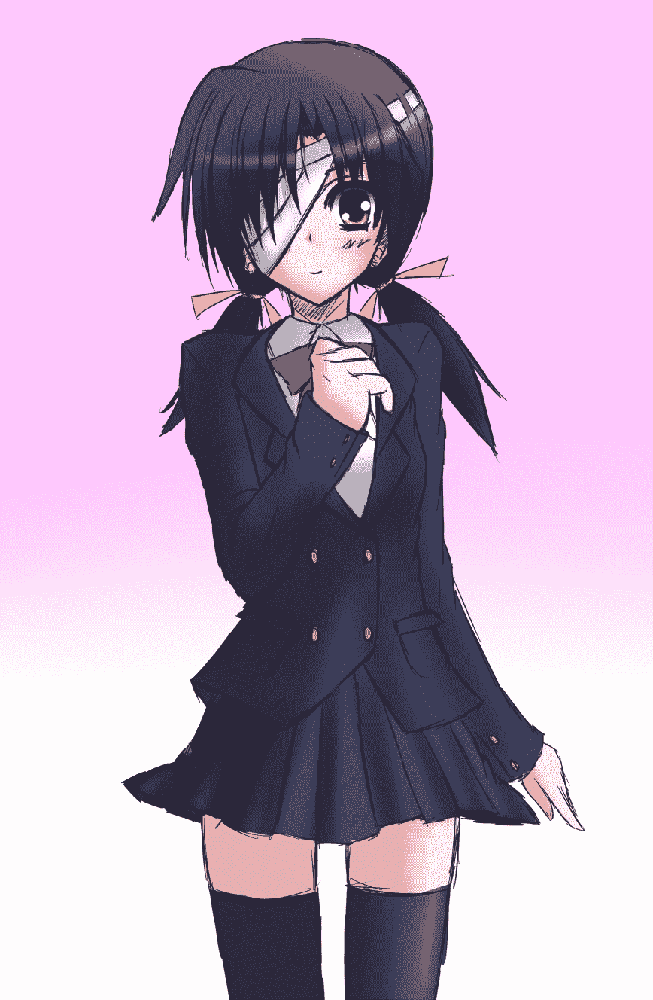
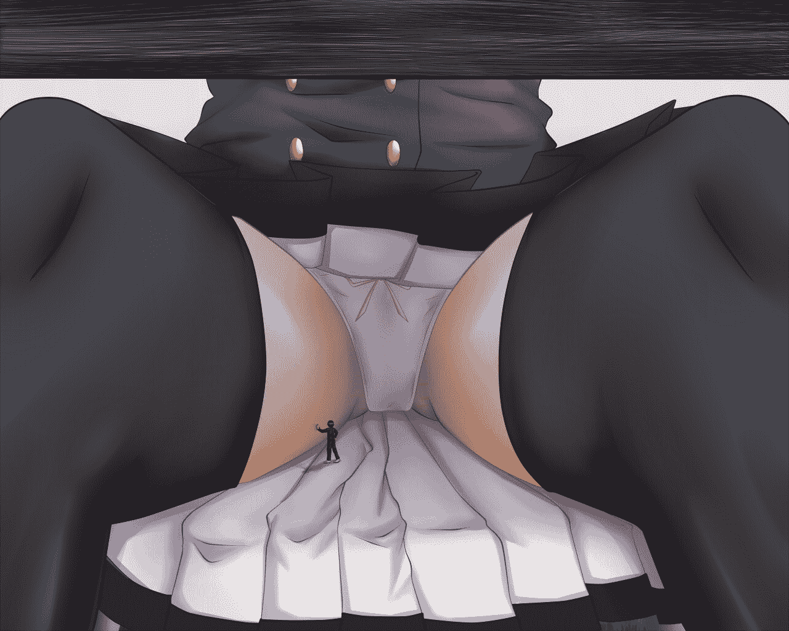
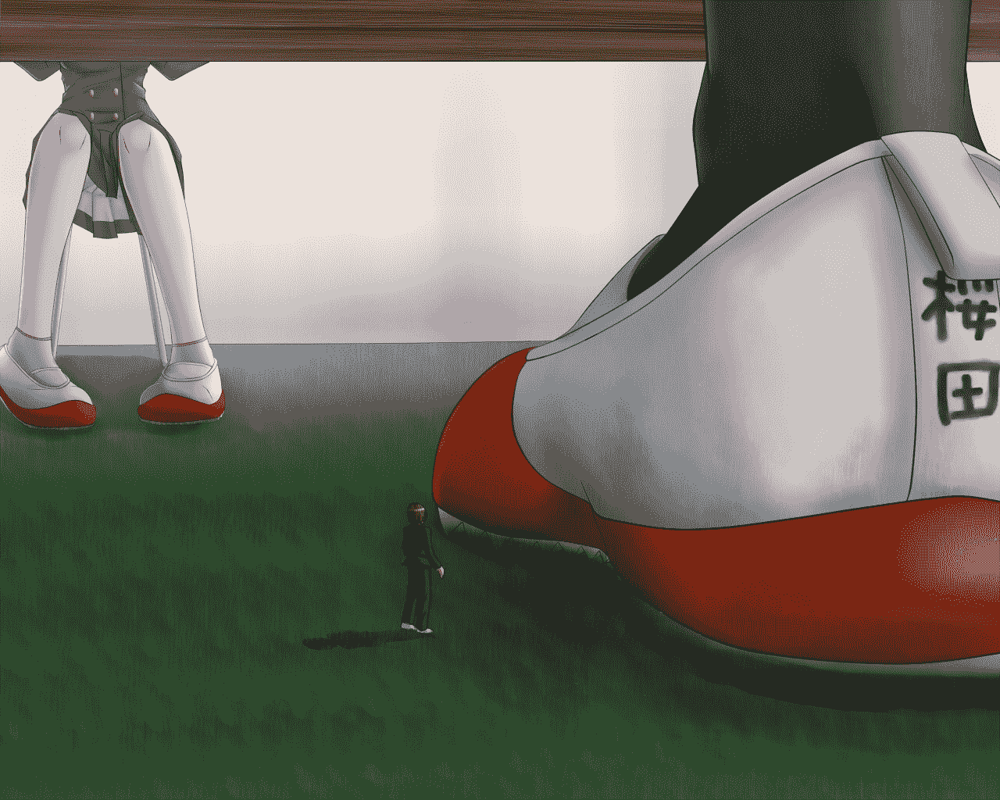

# [翻譯] 第二図書室の魔女

作者：that123

TID：18791

 

# 1

*本帖最後由 that123 於 2015-6-15 03:20 編輯*

剛剛看到一年前有人說想要看這篇文，順手花了很多的時間翻好...

原文的女主的人設有可能是以 <中二病でも恋がしたい！>的小鳥遊 六花作人設

作者: [http://gs-uploader.jpn.org/upld-index.php?uname=mkur](http://gs-uploader.jpn.org/upld-index.php?uname=mkur)

原文: [http://gs-uploader.jpn.org/upld- ... s/mkur/bookroom.htm](http://gs-uploader.jpn.org/upld-view-document.php?file=/documents/mkur/bookroom.htm)

--

『第二圖書室的魔女』

那天，教室還是一如既往的光景。但是木原鄰座的人不見了。

“……佐藤缺席嗎？嗯，他很少會缺席吧。”

班主任老師只是點名時頓了一下。佐藤家裏也沒有請假，馬上就開始上課了。就這樣，佐藤不在的日常就被埋沒了。

木原帶著疑惑的表情，看到課桌只是一直挂著個體育袋*，但是卻沒有坐人。 (註: 放體育服的袋子)

“啊，櫻田。你知道佐藤在去哪嗎？”

“……哎？”

課間休息時，木原向正在讀精裝書的櫻田葉子打招呼。最近她右眼好像不舒服的樣子，總是纏著白色繃帶。個子嬌小，其他人第一次看到她也不會認為她是高中生，連穿最小號的學校藏青色西裝外套時，袖子也有點太長。

“實際上，昨天佐藤去了圖書室，說是要順便還書。之後啊，手機也聯繫不到。是在外面過夜，還是什麼……被捲入事件，之類的。”

木原認真的基調令櫻田合起了正在讀的書，椅子鳴響起來。

“……沒有看到。我昨天確實是是第二圖書室。可是佐藤沒來啊。”

“是這樣啊……”

櫻田的個子比女子高中生的平均低，和比高二男生平均個子稍高的木原明顯矮了一截，對話時，櫻田自然只好抬頭看木原。

摸~摸~

“喂，喂呀。你不覺得不好意思的嗎？”

“不，每次都覺得櫻田的頭是很容易撫摸的地方啊。所以不知不覺就……”

“不要小看我呀！”

手舞動足地鬧騰的櫻田和撫摸她的頭的木原，有如高中生的哥哥和初中生的妹妹一樣。周圍的人都向他們投向樂融融的視線。

<ignore_js_op>

**sakurada.png** *(461.46 KB, 下載次數: 2)*

[下載附件](forum.php?mod=attachment&aid=NTE0NjJ8ZTYyZmY5MTV8MTYwMDg4NzU5MnwxODIzMHwxODc5MQ%3D%3D&nothumb=yes)

2015-4-8 00:19 上傳

*

對非日常事件稍微有憧憬的木原，對佐藤失蹤開始獨自調查，但都是無功而回，現在因為跑累了而靠在學校走廊上，一副邋遢的樣子。

“啊，妹妹。成果如何？”

“沒有呀。”

毫無幹勁回答的是他高一的妹妹，理沙。木原指使理沙去打聽消息。她現在口渴了，把瓶裝茶咕嘟咕嘟喝起來。喝完後伸一伸舌頭舔自己的嘴唇是她的習慣，這種無意識的小動作也不能說不引人入勝。

“那哥哥你呢？”

“恩，有是有，不過……”

探聽的結果，好像除了突然失踪的佐藤，在校內也有其他幾名學生不見了。但是，關於的佐藤失踪一事，卻只有被穿著黑色衣服的男人包圍了啦，被異次元裂縫吞噬了啦這樣的證言。

“穿著黑色衣服的男人甚麼的。是看漫畫看太多了吧。”

“嗯，都說現實比小說更離奇，不是嗎。或許我們的旁邊就有魔法師和異世界的人也說不定哦？”

“嗯，原來是看輕小說看太多。啊，已經這個時間。老師有叫我去幫忙一下。”

“……是嗎。真是一個薄情的少女。”

“我會在適當的時候回來找哥哥你的。”

對哥哥的戲言假裝聽不到，理沙向走廊另一面走了。木原在後面送別。

“……果然，要去一下事件現場。”

這時他周圍只有原木自己一個。

*

木原放棄打探的時候，已經到了太陽已經下山下了一半，校園內的人數稀少。木原拖著沈重的步伐前往第二圖書室。

把門打開之後，他看到燈是亮著的。第二圖書室和第一圖書室不一樣，這邊裡塞滿了專業的藏書，一般學生除了做課題之外，很少會過來這邊。

木原小心地踏入第二圖書室，這間小小的教室舖滿了書架和一排又一排沉悶的硬皮面書。

窗戶很少也助長了這個房間獨特的壓迫感。燈是亮的話，代表還有人在吧。靜謐的空氣中，連踩在地毯上發出的聲音都可以聽到，木原再往深一層前進。

被書架所擋著從門口看不到的一塊地方的桌邊，櫻田在讀著書。旁邊是粉紅色的暖水瓶，溫暖的烏龍茶正冒著熱氣。

“……嘛？怎麼了木原君。在尋找佐藤？”

“妳很清楚嘛。”

“木原君會來這種地方，除了這個原因以外，還會有其他嗎。”

“雖然事實是這樣。”

木原坐到櫻田對面的椅子。他一邊看捂在她臉上的繃帶一邊想只有一隻眼睛讀書不會累嗎？

“除了佐藤之外，也有幾個人突然消失的樣子。有點像恐怖故事啊”

“……也許吧”

“是因為是別人的事妳才會這樣莫不關心吧。”

“那實際上是別人的事啊。”

“說不定妳自己也會被人拐走，妳不會好好考慮一下嗎？”

“怎麼了木原君。有什麼想對我說的。”

櫻田的眼睛離開了書本，沒有被繃帶擋住的眼用不愉快的眼神瞪著木原。

“昨天，一直櫻田在這間第二圖書室？”

“嗯。放學後一直在看書。”

“……佐藤進入這個第二圖書室後，就再也沒有人看到他出來了。”

他們相互對視，持續沈黙。木原緊張得手心出汗。

“……所以你的結論是？”

“所以，佐藤，綁架，嗯，你……”

木原說話的聲音越來越小聲。學校是可能有連環綁架的神秘犯罪組織埋伏，但櫻田就是組織主腦這種過分的妄想，連木原自己也不好意思說出口。

“好了好了，我想你明白吧”

櫻田感到驚訝而發笑。

“但特意在『犯人』面前解說不太好啊。說不定後面會有黑衣男拿木棍出現啊？” (吐槽: 小學生死神都很喜歡幹這種事)

“那個……不好意思。把我說的事情忘了吧。”

“啊！不會不會。你很有意思。”

櫻田格格地笑時，顯得更像一個穿著學校西裝外套的小小女生。木原自嘲地想。這樣有犯罪組織之類的虛構世界還是算了吧。

“……櫻田也變得比之前晚回家。行踪不明的學生都是事實，所以……”

太尷尬了，木原只好轉過身，快步離開第二圖書室。

因為對同學懷疑而有點內疚，木原稍稍低頭走，突然在淡紫色的地毯上看到有垃圾。平常人是不會進入第二圖書館，所以灰塵和垃圾掉在地毯上顯得特別顯眼，這不協調的的感覺使木原不由得把垃圾撿起來看。

“……？”

那是什麼，木原一瞬間明白了。是線頭和碎布之類的東西。幾秒後，木原發現是平時學生用的黑書包。

但是這個書包只有1cm左右。是極為精緻的模型。

為什麼在這種地方會有這樣的東西呢？

“啊，櫻田——”

木原，回頭一看，櫻田正在不知不覺站在他身後。她用右手把臉的繃帶摘下。覆蓋她右眼的東西不見後，開始發出紫色的光。那瞬間，木原是胸中有一種不安的感覺。

“你還是找到了這個。”

“……妳右眼有什麼問題了吧。”

“為什麼？為什麼會這樣呢？”

面無表情的櫻田慢慢接近木原。她的右眼，與其說是反光，不如說是正在閃閃發光。木原也忘記說話了，他一動不動地注視櫻田，突發感到一陣頭暈，身體蹣跚。

“沒事吧？不過，最初的感覺是會變得奇怪啊。”

那聲音確實是櫻田的，但木原彷彿聽見了她的聲音從高處傳來。他頭暈平穩下來後，再次轉向櫻田。

“櫻田……妳個子有這麼高嗎？”

最初木原以自己頭暈所以膝蓋發軟而產生錯覺，但是他兩腳好好地站著。那是櫻田也是一樣。沒有蹺起腳，也不是站在台上。

儘管如此，木原和櫻田的視線的高度是相同的。不久之前，木原還是高很多的。有如惡夢一樣，木原的雙腳和心情都開始有動搖的感覺。

“不是啊。是木原君縮小了呢。”

“那，那種事情……”

“實際上是縮小了，所以也沒辦法啊。”

木原再次感到頭暈。雖然這次比最初那次輕，但異常的事發生了。櫻田的身體在眼前慢慢巨大化。本來個子一樣的櫻田，現在是俯視著木原。

木原的視線只到櫻田的胸口。天花板和書架也越來越高。也就是說，木原視野內的全部東西都在巨大化。他不得不承認是自己縮小了。

“哼哼哼，木原君你現在的大小很可愛哦。”

櫻田伸出手，輕而易舉地撫摸木原的頭。

“嘿嘿。要摸一摸。”

木原被女孩一邊俯視一邊撫摸她的頭。這種倒錯的的狀況令他感到莫名其妙的害羞，臉紅了。呼吸紊亂。木原想要逃走，但背上櫻田的左手傳給他就算抱住櫻田也沒關係的意味。櫻田的表情因為愉悅而扭曲起來。

“放開我！”

“想要逃跑呢♡。木原君，每次見面，總是摸我的頭啊，這次我摸回來你也不能夠抱怨吧？”

櫻田在說那樣的事的時候，她的臉和胸口又開始慢慢上升。其實是木原進一步縮小了。木原有一種被人撫摸就會變小的錯覺，想要拼命逃脫，但現在的他連小女孩的一隻手也無法抵抗。

櫻田的手臂從後背移動頭部，把木原的臉壓向自己的胸部。木原開始呼吸困難。

“木原君一直說小笨蛋小笨蛋的，真是非常非常討厭喲。購買入場券的時候不穿制服就被當成小學生。被朋友的妹妹當成後輩。這樣的歲數，有這樣不相稱的身體，連男朋友之類也沒機會有。”

櫻田開始說出充滿著認真之情的怨言，木原背部發冷了。脖子上櫻田左手的力量增強令他感到疼痛。

“吶。被總是俯視著的女孩子反過來俯視摸頭是什麼樣的心情。害羞？懊悔？比平時我感受的心情還要強烈嗎？”

木原什麼也沒能回嘴。虎鉗般的力量——那是櫻田的手臂的力量啊——，鼻子和嘴巴被櫻田的胸壓住想要說話是不可能的。連呼吸也變得困難起來。

“好難為情啊”

櫻田停止撫摸，把手放在木原的屁股和背上緊緊抓住。木原的雙腳開始離開地面浮起。

臉可以稍微離開胸部之後，終於能夠呼吸，木原用全力吸取氧氣。櫻田的胸發出女生特有的香味。櫻田龐大的臉孔，凝視拼命在自己胸部上吸氣的木原。

“停下來，木原，放開我！你也已經滿足了吧！”

櫻田慢慢地用對小孩子訴說的口吻說話。

“……木原君。你知道現在自己有多小嗎？”

這句話是木原令颤栗起來。意識到自己被櫻田抱在懷中。他慌忙揮動雙腳，但怎樣也碰到地面。全身的體重都由櫻田的雙臂承托。

“好像嬰​​兒一樣啊，呵呵。”

“放開我！”

“好啊。”

櫻田放開了雙臂。失去支持的木原的身體往下墜，整個人都跌倒在地毯上。

“你在做什麼啊！”

“是你說要放開你的。”

櫻田站起來俯視著仰面倒下了的木原。木原有一瞬間看到櫻田的身影有如大樓一樣地巨大，是錯覺嗎？木原已經搞不懂了。

他對櫻田感到害怕。以這個姿勢，在這種近距離下，櫻田只要稍微去抓都會……撲通一聲，有什麼在木原的前方掉下來了。

那是A4尺寸的巨大化的櫻田的手機。如果剛剛砸到頭的會怎樣呢？ 本來只有指尖大小的小兔子挂件，看起來比手掌還要大。有光澤的深藍色塗裝，照映木原凝固恐怖的表情。

“還不能逃哦。站起來。”

木原慢吞吞地站起來。縮小並沒結束。木原的視線已經只有到櫻田的腰左右。

“這樣比較下，木原君很渺小。而我是大姐姐，明白嗎？”

那麼小隻的櫻田，現在高達四米以上的巨大少女。櫻田是只是站著什麼都沒做已經有壓倒性的存在感。現在的她對木原來說是很大的。

“……為什麼要縮小我？”

“因為你看到了我玩的證據。”

“我不會張揚的啦！”

“不能夠相信。而且，看來我不是木原君的朋友，你不是沒有考慮過我的事嗎？”

櫻田瞇著眼睛。

“是不小心。最初我沒打算縮這麼小的。即使是佐藤他自己想要玩這個遊戲，我也沒有想過會縮這麼小。……你現在做不到男朋友，連朋友也不到的話。”

櫻田俯視著木原的眼睛一閃一閃發出怪異的閃光。

“……只能做玩具吧？”

木原又開始全身發冷，他感到這句話是縮小的前兆，立即跑開。他心跳加快。

“又……打算到哪裡啊！”

“木原君，想到跑哪裡再被縮小呢？我可以聽你的要求啊。只要是我眼睛看到的範圍……我這隻右眼看到的範圍。”

從木原的角度，櫻田的下巴遮住她的表情，完全看不到。但也使他的焦慮和恐懼大幅增加。

“別開玩笑了，不要了……已經不要再縮小了！”

櫻田的嘴唇碰到食指。一副想要惡作劇的可愛表情，木原也是看得出來。

“嗯。不知道啊，木原君。你現在有命令我的立場嗎？你今年是多少？”

“十，十七……”

“高二的學生吧。我也一樣啊。但是，有那麼細小的高二的嗎？現在木原君的身高只有1m以下。剛才我讀的書『學校保健統計調查』說，現時高二男生的平均身高是170cm。我的身高也有初中一的女生平均左右，你就算是個別差異也過於懸殊了吧？ ” (註: 推斷為二分之一大小)

“都是因為你……”

“不要解釋了。在幼兒園和小學的項目來看。五歲兒童的平均身高110cm。你比幼兒園的孩子還小呢？和他們相撲之類的話絕對贏不了啊。也就是現在木原君，是幼兒園以下。”

櫻田露出興奮的樣子，可以把同一所高中的木原當成幼童看待令她十分開心。

“嗯，今後要更比小寶寶更加小寶寶呢。”

“哇啊啊啊啊啊啊！”

木原發狂般的尖叫衝向櫻田。更正確的說，是向櫻田的裙子下穿著黑色過膝襪的雙腳衝去。櫻田也搞不懂是因為腦袋失控了還是木原自己想到櫻田說的“看不見對方就不可以縮小”而打算逃向那個死角。

或許是打算把櫻田推倒也說不定。無論如何這全力的突擊令櫻田的身體有點搖動。個頭只有櫻田的一半的木原，完全隱藏在她的裙子底下。

櫻田一條腿就有木原一樣的大小。木原的臉接觸到櫻田的內褲，是可愛的水色內褲。

“喂，走開啊，變態！”

櫻田的聲音聽起來有點動搖。但事實上，對木原拼命的行動，在她的眼內只不過有如小朋友嬉戲一樣。就裙子的內部被他看到也不在意。

“嗯，好吧！”

櫻田稍微屈了一下身體，看到裙子中的木原的身姿。於是，他的身體就縮小了。

“不要！”

木原的叫聲在裙子的內部傳出來。他體會到自己對縮小這件事無能為力，什麼也做不到。木原拼命緊緊抱住櫻田的腳。這樣的話，可以對抗櫻田也說不定。但是，在他自己的努力同時，頭上的內褲不斷遠離，視線不斷下降。木原感覺到縮小的時候，有連作為人類的資格也被剝奪。

發冷停止之後，縮小也停止了。木原發現自己一邊抱著腳一邊坐在什麽地方上。雖然全身在裙子的影子裏很陰暗，但並沒有用很長時間就發現那其實是櫻田的稍微有點發灰的的室內鞋。

木原己經無法講話。以前在教室打掃的時候，櫻田會站在桌子上用撣子為光管掃塵。現時想起來，當時看了她的腳嬌小得連用手都可以包起來，弄得自己內心七上八下。

但是如今，已經大到木原可以坐上去。不，她的腳還是一樣小。被木原抱著的櫻田那隻被襪子和鞋雙重包裏的腳稍微彎起來。現時木原的視線不正是她的膝蓋左右的高度嗎。

“要一直待在這邊嗎？”

木原的身體懸空。前傾的櫻田用雙手抱著木原的兩邊提高舉起。把木原的身體，也沒有特別用力，運送到胸口附近的高度。

“啊，像小貓一樣。”

櫻田開心地笑了。實際上，她對木原的處理也是對小貓，或者對嬰兒那般。

“放……開我。”

“嗯，這次放開掉在地上就會比剛才更痛吧。連記憶也變成小貓一樣少了嗎？”

這麼說完，木原往下看，發現自己距離地面相當遠。木原是感到有五米左右。

“好高……”

“不高啊？對於人類來說是不高的。”

櫻田一邊說，一邊慢慢把木原舉高過自己的頭頂。

“住，住手，太高，高！”

“誒？這本來的木原君的視點。木原君原本的大小也不想回去了嗎。一直像一隻小貓細小就可以吧？”

“不，不……”

確實現在是的高度是木原的以前的身高。和以前不同的是，雙腳從遠離地面，被小女孩輕鬆地抱著舉高。比起這個，木原更在意櫻田之前的發言。

“回到原來的大小嗎……？”

“啊呵呵~要復原呢。把你復原也不是不可以啊～”

“我要復原！求你了！”

“那就取決放木原君的態度如何？那麼現在先習慣一下這個高度吧。”

笑完，櫻田把木原從手上放開向上扔。

“哇啊啊啊啊啊啊啊啊啊啊！”

“嗨喲，高高呢！”

櫻田把木原當成球一樣多次接住再往上扔。好幾次都全身受到衝擊之後，放在褲子口袋的手帕和手機都掉到地上了。

“……不要了，不要了……”

“好吧！”

木原發出哀鳴聲。櫻田故意打開雙手，讓木原的身體在手心滑過。幸運的是，木原抓住櫻田的手腕成功，否則就會墜下去了。

自己的手和櫻田的手的大小相比。她的手指很粗。現在木原的手也不能把她的手指握住吧。從全身來看櫻田是白白的少女，而小小的雙手就像紅葉一樣。

“哎呀哎呀。木原君對人類的高度還是不行的啊！”

櫻田把木原抱到桌子上，自己重新坐在椅子上。木原是聽到了櫻田走過時令地板發出吱嗄吱嗄的聲音。實際上聲音是很小很小聽不到的，但是耳朵縮小了就像音量被放大了一樣。

櫻田把木原放到裙子上，自己的肚子前。從遠處來看，除了一個把娃娃抱著肚子前，平淡無奇少女以外，其他什麼都看不見吧。

“那麼，你要變得更加小。比小貓還要小……是啊，老鼠先生一樣的大小如何？”

櫻田溫柔地把手放在木原的頭上，開始撫摸。

木原連抵抗的力氣也沒有。在被撫摸的木原看來，櫻田的身體上溫暖，甘甜和濃濃的體臭都感覺得到。視野模糊滲透。被放在頭上的重量也一點點強起來。桌子似乎離自己遠去。

突然，把頭抬高，看到了巨大的手。到剛才為止比自己的頭腦稍微大點的東西，已經變成門一樣大。那隻手可以把自己一手抓起來。

“老鼠那樣小的感覺如何？”

櫻田拿開了手。木原站起來，向膝蓋的方向走幾步。體重也無法壓彎裙子，深度數十厘米的裙子的褶子成為了步行的阻礙。

“不，還比老鼠是大一點吧……有10cm左右？” (註: 17~18分之一)

櫻田的聲音好像演唱會的會場通過擴音器加大迴響。仰望櫻田，她實在是太大了。上半身已經有小型建築物的大小，影子完全籠罩木原的四周。那她的全身會有多大呢，木原想也不敢想。

“你要把我怎麽樣啊？”

“嗯，什麼？聽不見！”

櫻田大聲呼喊，木原耳朵都要破裂了。變小之後用正常的說話方式，聲音連櫻田的耳朵也傳達不到。木原感到不合理，只好把同樣的內容呼喊出來。

“並不會要殺掉你或是怎麽樣哦。如果變得更小的話，稍微一不注意就會脖子斷掉呢，必須要特別小心呢。”

櫻田用若無其事的表情講出危險的語言飛，木原內心完全震懾。沒有故意讓他害怕的樣子，一點也感覺不到邪氣的櫻田的笑容，反過來令木原感到可怕。

“殺……殺死？”

“嗯。這是第幾次呢？”

櫻田有點罪惡感地把眉頭降低。

“小人先生比想像的還要纖細，死亡，骨頭折斷折碎的事情經常有。但是，都是太小的他們不好……？我，我也只是一個弱弱的女孩呀。”

感覺不到櫻田的語調有謊言的氣息，木原確信她瘋了。

“木原君怎麼辦呢？是啊，我養你吧？那樣的大小沒有我的照顧是活不下去的。現在，我的水槽有空，在那裡就可以吧？去廁所也可以好好的照顧你！”

“也會幫我復原吧……”

“囉嗦啊。太吵了，要變得更加小哦。這樣就連吶喊的聲音都聽不到。”

“不，停止！”

在絕望的同時，書架對面門發出打開的聲音。

“！？”

櫻田的身體因為驚愕而搖晃。

“啊，有人嗎？”

沒有聽錯，從遠處迴響的聲音是木原的妹妹，理沙。

“喂，是怎麼回事？木原君”

櫻田顯得很狼狽。

“理沙ー！我就在這裡啊！救——”

“刷”

木原的全力的呼聲被櫻田的巨大的手指堵住。

“木原君真是笨蛋啊。”

櫻田顯出了驚訝和焦躁的攙混的表情。木原變小之後，第一次看到她內在的憤怒的感情。櫻田把大腿打開，木原掉了下去。

大腿做成的牆壁，使木原的身影更難從外面看到。內褲完全暴露，不過，他們彼此都沒有在意。櫻田捲起裙子，對椅子上的木原說話。

“幫助期待那樣的事是絕對不可能。一旦有任何情況我只要把木原君的妹妹縮小就行了。”

“！”

這次輪到木原不知所措。

“不要，拜託妳了！”

“嗯。怎麼辦呢？。絕對不能夠暴露的呀。”

木原快要哭出來的懇求的期間、理沙的腳步聲越來越靠近。櫻田和理沙見面是時間的問題。

“哦，我的話，縮小多少都可以，只要不要縮小我妹妹可以了！”

“嘿嘿……”

櫻田就是為了把這一句釣上來，木原說出了自己也意想不到的事，當注意到時，已經為時已晚。

“我很喜歡木原的，本來就打算縮到現在的大小就停下的呢。既然你求我說怎麽縮小你都無所謂，那也沒辦法了呢。而且更小的話，也不容易被發現。”

櫻田俯瞰木原的右眼，兇暴地閃耀起來。就算體驗多少次也不會習慣，浮游感伴隨頭暈。雙腿之間狹窄的空間變得富餘起來。連本來可以爬上去的圓圓的大腿所做成的牆壁，也漸漸往上升，如同拔地而起的城牆。

＜在那裡老實待一下吧＞

櫻田聲音很小，但對木原來說已經夠大聲，呼，如何打開帳篷布一樣的聲音，裙子回復原狀。週圍都被黑暗所籠罩。完全被裙子的內側隔離。

*

“那個，這個我哥哥有沒有來這間教室？”

發現櫻田的理沙問道。櫻田再次纏著繃帶，擺好坐在椅子上讀書中的姿勢。從旁觀者來看，沒有什麼可疑之處。

“誒？我在這裡一直在讀書，如果有男生進來的話，我馬上會主意到的。”

“好奇怪啊。哥哥說最終都要到案發現場！他是說來這裡的吧。電話也打不通，怎麼了？”

擺著一副走投無路的樣子的理沙在櫻田的對面拉開椅子，坐下來。是校內走累了吧，額頭上浮現出很多汗水。

“是走到了電波不通的地方吧。”

櫻田用涼爽的臉說。實際上是木原的手機被縮小了的原因，電波的頻率變得合不來罷了。

“真是的，也考慮下陪著他玩什麽偵探遊戲的我的感受啊。”

理沙消極地罵人。哥哥真的失踪被捲入事件，完全無法想像。只不過是普通市民，又怎會有這樣的事。

*

裙子內部的空間是思春期的男生夢想要到達的空間吧。但是，對被縮小困在那裡的本人來說，並不是可喜的地方。

逃避不了巨大少女的代謝時發出的熱氣。對身高只有3cm左右的小人來說是不愉快指數很高的地方。(註: 50~60分之一)

裙子覆蓋了幾分鐘，眼睛終於習慣。兩側大腿的牆壁大約有5m，而且還是彎曲的。所以想要登上去只是徙勞。

就算爬了​​上去，也不能夠穿過裙子。也只會是正面是內褲背面是斷崖的事。

興奮並不是沒有。被雙腿的肉夾在中間，內褲把巨大的陰部的線條突顯出來，而且從少女的胯間發出臭氣形成了費洛蒙充滿著木原下榻的空間。但是，此時櫻田本人完全沒有在意這個事實，因為男性被不人對待的屈辱感遠優於那份興奮了吧。 (吐槽: =___= 紳士們……有什麼想說的嗎?)

<ignore_js_op>

**bookroom_illust 2.jpg** *(165.85 KB, 下載次數: 8)*

[下載附件](forum.php?mod=attachment&aid=NTE0NjB8MWMzMWEyOWR8MTYwMDg4NzU5MnwxODIzMHwxODc5MQ%3D%3D&nothumb=yes)

2015-4-8 00:06 上傳

“可惡！”

為了洩憤，木原盡情踢了一下櫻田的大腿和內褲。但是一點也沒用，相反堅韌的大腿和內褲把木原彈回去。巨大的身體連動也沒有動的樣子。他也太過於無力了。

只有側耳傾聽她們的對話吧，看來櫻田和理沙在融洽地說一些微不足道的對話。悶聲悶氣不是很清楚，不過好像互相說著有關木原的牢騷。木原現在滿肚子火，但這樣的情況下，也做不了什麼。

木原當然沒想過就這樣端坐著在櫻田的內褲前。在不被櫻田發現的情況下引起理沙注意也就只有現在了，錯過就沒機會。木原向胯間的相反方向走，如果在膝蓋上走下去的話應該可以走到地面。

從椅子的邊下望去，可以看到數十米下的地面。是令人不栗而寒的景色，但現在不是害怕的時候。同班同學的少女是相當可怕的。

木原立下決心，從櫻田的左腳，準確來說是緊緊抱住左腳上覆蓋的過膝襪。雙手雙腳捂住纖維，從膝蓋的側面慢慢以地表為目標而落下。因為穿著過膝襪我得救了，木原想。如果普通的襪子的話，一抱住摩擦少又光滑的腳的話，對方一定知道情況了吧。

盡量不要下看，穩步沿腳前進。會不會由於接觸腳而令櫻田注意到逃出而感到不安,不過，這個情況是沒可能的。太小了，根本不會感覺得到吧。

之前在公園也玩過攀岩，不過，現在是緊緊抱住的是襪子隔著快要可以燒傷木原的體熱，雖然沒有像裙子內部那樣,不過這邊也有微微飄浮的獨特體臭，表現出這個不是無機的的體育用具而是女孩子身體的一部分。如果從遠處看的話，現在自己的身體就像是女孩子腳上附著的小蟲吧。

自嘲之後木原變得更加悲哀。腳裸變成突出的岩石而令攀爬變得很難，只有轉到腳背上再過去了。

不知道是過了數分鐘，感覺上是過數小時的感覺，在離地幾米到的地方從腳背跳了下來。有如房間那麼大的腳上，直接從側面滾落下來，木原成功了。雖然有些痛，身體還是沒有問題的。

<ignore_js_op>

**080537qpbgppz1r1oaf1az.jpg** *(293.34 KB, 下載次數: 1)*

[下載附件](forum.php?mod=attachment&aid=NTE0NjF8Njg0YmQ5ZjJ8MTYwMDg4NzU5MnwxODIzMHwxODc5MQ%3D%3D&nothumb=yes)

2015-4-8 00:13 上傳

“即便如此，還是很巨大。”

櫻田小小可愛的腳，對木原來說有車一樣大。連室內鞋在內，厚度足足有兩米。從那裡一直延伸的小腿有點像大樓一樣。數十米外的地方，是和櫻田同樣一樣巨大的腳，旁邊排列著巨大的物品。恐怕那就是理沙和她的東西吧。她也是十分巨大。就是說，除了是自己變小以外沒有其他可能。木原，簡直就像是誤入哪裡的神殿般的破裂錯覺。

桌子下面廣闊的空間，在那裡聳立的兩位巨大少女的腳，無法比喻的莊嚴。這個空間，木原知道平常是被隔離的。這裡只有兩個女學生在對話，而她們的腳正好放在這個空間，其他人不論如可都不可以進入這個私隱的空間。

發呆的時候。木原在昏暗的桌子下，以妹妹的腳為目標而前行。

木原是這麼想的。自己一個人逃脫第二圖書室來說，就要走太過遙遠的距離。即使可以逃脫了，蟲子般的大小根本不可能生存。

那麼，只能讓黏在妹妹上。在不引起注意下是最好的辦法，如果曝曬的話，櫻田眼前的妹妹會有危險。

注意到的是，要讓妹妹走到櫻田看不到的地方。妹妹身上黏著渺小的哥哥，這樣的想像已經足以造成淒慘的回憶，關於這份回憶不除掉是不行。

現在成為障礙的是長及木原腰際的草原般廣闊的地毯的毛。木原往中間擠向前進，地毯的毛意外地堅韌，怎麼走也走不順。連用盡全力也不能彎曲。但是，櫻田和理沙，兩人的腳只是放在地上就把這些堅固的​​地毯的毛壓垮，從遠處都可以看到毛是如何嵌入室內鞋底的。再次確認自己是如此渺小的脆弱的存在，更被淒慘的心情折磨。

那各種苦思焦慮和苦難的重疊在一起，木原總算是走到理沙的腳下。兩個巨大少女都沒有注意到的樣子。是機會。

反映理沙粗糙的性格，她的室內鞋與櫻田不同各處發黑稍稍骯髒。覆蓋到腳踝的短襪是淡粉色，這種露出的腳要登上去是相當難的吧。木原爬上理沙右腳的室內鞋，攀登，在腳背上喘息。以後，只要等待理沙離開座位，踏上歸途——

和木原的安心相反，突然木原的身體被拋到空中。在空中游泳幾米之後，結果掉到地面。還好有柔軟的地毯毛，所以沒有傷。

理沙的腳發生了什麼事的話，看來她是盤起了右腳。不是注意到了木原的存在。只是妹妹無意間組成​​交叉腳的行為，木原只是被播弄了。

不氣餒木原向左腳試圖進攻，交起的右腳在頭頂上鞋子半脫，在做奇妙地晃動。木原警戒著那令人毛骨悚然的動作，突然——悶聲悶氣轟隆一聲，木原就被吹跑了。

木原往發生爆炸氣浪的方向看，看到了一隻室內鞋。原來是理沙脫下了室內鞋。如果木原再前進一點點的話現在就在鞋底下了。

但是，理沙的無意識的行動木襲擊原不會就此結束。木原在發呆時，剛脫室內鞋的理沙的右腳，就突然這樣壓在木原身上。被襪子包裹著比床還更寬廣的妹妹的腳掌壓過來，木原也沒有立即跑開。人類被束縛了無法動彈的時侯是會感到很不安的。

現在的木原也是一樣。理沙的右腳空中溜達搖晃不定後，再突然定在小小的哥哥的頭上再往下壓。

說不定會像銀杏樹的果實*一樣，在妹妹的腳下磨潰。雖然她的體重沒有很重。但是，儘管如此，木原還是被對他來說是重得出奇的重量壓迫，骨頭吱吱嘎嘎響，發出誰都不能聽到的呻吟聲。木原發現要承受的不止腳的重量。幾小時之間在校內不停轉來轉去，理沙的腳出了很多汗，再加上在室內鞋內悶蒸。 (註: 即白果 )

普通人類接觸是不在意的程度的汗臭，不過，現時只有指尖大小的木原的嗅覺就好像被放大幾十倍，數百倍。以極近距離被迫聞這種刺激性的臭氣。而臭氣通過鼻子進入到身體，現時全身都像是被撕裂一樣的『痛』。肺中滿滿是因為妹妹的汗而變得潮濕的空氣。

木原意識朦朧，中午吃的東西都想要吐出來。眼淚和鼻涕涕泗滂沲。至少想要反個身來，但身體被理沙的腳壓住而動不了。

“理沙！我被縮小後被壓在這裡！腳，腳挪開！”

向妹妹一邊呼喊，一邊用唯一動到的手敲打像岩盤一樣的腳掌。想要不把妹妹捲進這種難能可貴的心情都消失了。如果再持續在壓在妹妹的腳下的話，真的會有生命危險。

但是不論拳頭如何毆打，在富有彈力的腳掌肉和襪子的雙重阻礙下，渺小的木原的存在是不會被理沙。

妹妹無意識的行為就把哥哥送到阿鼻地獄一樣的環境，妹妹也無從知曉。

*

理沙和櫻田一邊對話，一邊轉動塑料瓶，想要說到口渴的時再喝剩下的一點點的茶。因為剛剛在學校四處走動，現已經幾乎喝完。

她對櫻田的暖瓶內還有東西在感到有點羨慕。為什麼要為了哥哥這麼辛苦呢。腳也很悶熱了，太糟糕了。把右腳的室內鞋在桌子下脫掉，腳底在地毯上蹭。腳心癢癢的地方，有一塊垃圾一樣看不見什麼的東西，正好。右腳擦一下吧。

在對話的櫻田突然站了起來。似乎是覺得有什麼掉到桌子下面，彎著腰潛到桌子。

“理沙醬，那個腳挪開一下可以嗎？”

腳偷偷搔癢被看到了，有點害羞的說，只好有腳挪開吧。四肢扒在桌子下面的櫻田在理沙腳下撿起了什麼。

“謝謝你。橡皮掉了。”

“啊……對不起……”

用前輩的文具搔癢，似乎做了很失禮的事，但櫻田也不是特別在意的樣子，看起來反而有點高興的感覺。她東西放到西裝的口袋。

“我要去一下洗手間。”

*

櫻田進到女子廁所的單間，把門關閉上鎖，從口袋中取出木原放在腳下。那個小小身姿，比橡皮還要小，當然能藏起來。

“在妹妹的腳底感覺很好吧？木原君，你好像高興得眼淚也流出來了。”

“……”

3cm大小仰望直立的櫻田的身姿，簡直像摩天大樓一樣。似乎背後的門下的縫隙可以逃走的感覺，但木原連這樣的精力和勇氣也沒有了。

“是，櫻田，是我輸了。做你的寵物也好，做什麼都好，請你原諒我吧……”

“那個，是對主人的態度嗎？不是吧，木原君。”

“誒……？”

櫻田的表情在太高的地方了，木原看也看不到，但可以容易想像到她應該是臉上堆滿了施虐般的笑容。

“想要被我飼養，不是要表現得更喜悅的嗎？”

在木原的面前，櫻田的巨大的右腳腳尖開始蜿蜒開動。如果被卷入到鞋底的話，木原那渺小的生命會消逝。

“寵物，是寵物，謝謝，櫻田…………小姐……”  ( 註: 原文為 さん，中文為'桑'，男女通用的敬稱 )

咚！轟鳴。櫻田踏響了右腳。它的振動使木原站也站不起來，只好倒在粉紅色油氈的地板上爬來爬去。

“不一樣喲。你這是對上司的語氣吧，到現在還使用這種語氣好嗎？再一次給你機會，復述一下。『請養像蟲一樣渺小的我，謝謝您，偉大的主人。』”

木原因為恐怖和緊張而喉嚨徹底干了。真的被殺死。會這樣預感的他，什麼也不用考慮，立即就復述一篇。

“請養像蟲一樣渺小的我，謝謝您，偉大的…………主人。”

“哦，不錯不錯，很會說話喲。鼓掌鼓掌。可以撫摸你嗎？但現在木原君以手指還要小，撫摸的話不會壓壞吧。”

木原自己已經感覺不到作為人的尊嚴，內心似乎在黑暗之中一點一點消沈下去的感覺，要時最重要的是弛緩櫻田緊張的氣氛，再做出格的事的話，就不會這麼簡單混過去了。

“嗯，很高興木原君成為了我的寵物啊——”

說完，櫻田再次拆了覆蓋右眼的繃帶。

“要接受懲罰。”

已經體驗過好幾次這種發冷傳遍木原全身的感覺。

*

直到剛才的木原還可以看到櫻田的胸口。但更高的身體部位，就有點模糊看不清了。這是眼睛對大小認知能力的極限吧。但現在連櫻田的膝蓋看上去也是模糊不清，似乎比剛才櫻田的高度還要度。

＜這是試圖逃跑的懲罰。＞

櫻田的聲音不知道從哪裡響起。雖然可以肯定是從上面，但好像從左邊發出的感覺，又好像是聲音直接從自己內心發出一樣，可能是因為迴音做成混淆吧。

包著櫻田小小的腳的室內鞋厚度已經是木原的身高的好幾倍。現時櫻田一只腳就己經和油輪一樣大。膝蓋有如高山一樣。

有如地鳴一樣的聲音從上空回響。那是因為櫻田蜷身下來伴隨衣服的磨擦和大氣移動的聲音。有如大教室一樣廣闊的臉一下子拉到可以辨識到的距離接，只是這會做成木原的恐慌。

手心朝上，向木原伸出手。有一種叫他上去的感覺。最初木原是想從手掌側面上去的，那邊的厚度也就比自己的體長高一點點，大概可以爬上去吧，不過沒有考慮到手掌突出的弧度會做成如此大的阻礙，在多次挑戰後木原承認連爬上手掌也太困難了。

在高空聳立的櫻田微笑地默默注視著他的行動。木原走向指尖的方向。在小指頭想辦法涉足圓圓的指甲，終於攀登成功。

在有如道路般大小的粉紅色小指頭向手掌方面走，手指的肉在腳底傳來熱氣，一邊走，一邊覺得意識也快要被搶走了，終於走到中央附近的窪坑。只是那個木原汗流浹背。窪坑彌漫肥皂的氣味。這應該是櫻田的手心吧。

木原坐在手心慢慢上升。櫻田站了起來。櫻田的瞳孔比木原的身體還要大，在教室一樣寬敞的手掌心的木原的只有呆呆凝視著。

＜比指尖還小啊，木原君。＞ (註: 按照劇情所說，主角有1cm，我的手指也是1cm左右，但那個女生的手指不會比我粗吧。)

櫻田輕輕的說話聲，在手掌碗狀的凹陷的地方不停反射造成迴音。木原的頭也要破裂了。

＜木原君的表情看來是不明白自己是怎樣。3cm左右的時候，還勉強可以知道是人類。喂，你在怕我嗎？我只不過是一個嬌小的女高生啊。但是，木原君這麼渺小。我最像大怪獸一樣吧。……木原君，現在正好是10毫米大小。我的身高看起來大概有200m以上。好厲害啊，東京鐵塔也是這個高度。在女孩手掌中就可以看到東京鐵塔一樣的景致吧，有點羨慕呢。……喂，你有在聽嗎木原君？回答不了嗎？＞ (註: 170~180分之一)

櫻田單方面發出如暴風雨般的聲音，木原無法回話。不如說木原因為是太痛苦了，竭盡喉嚨的尖叫也被櫻田對聲音蓋過。木原過於細小的聲音，對櫻田來說是可聽區域之外。

＜啊，有點縮得太小了嗎。連反應也太難明白。……把木原君當寵物就算了吧。我會把你還給妹妹的。>

不用當寵物，這樣一來木原的臉一瞬間有展露出希望的明亮。不過，那真是一瞬間的事。。

＜所以，要變得更加小喲！>

木原的絕望的呼喊被吸入的無盡的虛空之中。

*

本來手掌的凹凸的地方也是坎坷難走的程度，但現在變得有如山丘一樣的姿態。智能線和生命線像穀道一樣地延伸著。在遙遠的彼方，有四座高度數十米的塔聳立，每一根都不過是有點彎曲的手指。

＜嗯，試了好幾次都沒有變得更小，這已經是極限啊。人類變成這麼小的話就無辦法再變小下去吧？連是不是人類也分不出來。現在木原君的大小，嘛，比芝麻還要小很多很多……比1mm還要小？大約是比剛才的10分之一更加小一點點。> (註: 只有 2000分之一)

可惡，可惡，有如暴風雨般的風在頭上吹著。那是，櫻田每次說話時的喘氣，向木原襲擊過來。木原會被櫻田輕輕嘆息吹跑，他只好把小小的身體更加蜷起。

＜自己不是說了蟲一樣渺小，但是現在還是向昆蟲先生道歉比較好。螞蟻先生和土鱉蟲先生看到木原君會以為是飼料喲。蝴蝶就好像客機一樣的大小吧？>

周圍響起切開空氣時的嗚嗚聲的同時，火箭一樣的大小的左手食指逼近，指腹壓到木原。木原想這次要被毀掉了，但看到眼前巨大手指靜止下來，只被手指上薄汗黏住，看來他太小了，連被壓死的權利也沒有。

＜在把你送到妹妹桑那邊之前，先到指甲上吧。>

連選擇權也沒有，所以木原只好直接走到指甲當中。那邊也有很濃重的污垢和汗臭混合起來的味道，但比起妹妹的腳掌，還是勉強可以承受。在腳邊，櫻田的指甲有如陽台一樣寬敞。

放眼望去，被指甲的左右邊緣積累著如膠狀污泥一樣的黑色黏糊物質嚇倒，原木馬上就知道了那就是櫻田的指甲裡積存了的污垢吧。對櫻田來說，也就是一點點的污垢，污垢和灰塵一樣大小的木原相對比照。

＜要傾斜了。抓緊吧。>

說完這句話的同時，整個世界開始擺動。木原拼命緊緊抱住指甲的角落。如果不這樣做的話，就會被左右積存的污垢黏住同化了吧。那絕對是必須避免的。指甲口突然朝天向上之後又緊急停止，因為這個衝擊，木原從指甲口的角落放開手，掉到手指肉的地板上。白色的指甲有如屏幕一樣，令櫻田的臉模糊不清。

＜啊，這就是木原君吧。和指甲的污垢一樣！>

<ignore_js_op>

**bookroom_illust3.png** *(843.82 KB, 下載次數: 1)*

[下載附件](forum.php?mod=attachment&aid=NTE0NjN8ODRhMDE2NjR8MTYwMDg4NzU5MnwxODIzMHwxODc5MQ%3D%3D&nothumb=yes)

2015-4-8 00:19 上傳

*

經歴了這麼多事，櫻田還能送他回到妹妹身邊。似乎有點可笑，還是不太考慮好吧。

木原多次被櫻田的說詞騙倒，她的話不太可信，但他也只能相信吧。這是木原的生存之道，也只能這樣了。

這樣的大小，回到妹妹身邊，那個以後該怎麼辦呢。被妹妹飼養……被妹妹照顧嗎？那不過是從櫻田換成妹妹，難度這一生都要仰望著高山一樣巨大的妹妹而度過此生嗎？坐在手上的哥哥，不，這種大小，應該說坐在手指上的哥哥。無聊。

木原在指甲中被這種無意義的思索圍繞，這時櫻田已經回到了第二圖書館。

“啊，你回來了。你介紹的這本書有趣啊。可以借嗎？”

理沙坐著在看一本以『大像的時間，老鼠的時間(註1)』為題的書。

“嗯，好啊。”

櫻田笑了笑，走到自己的座位，拿起熱水瓶，在蓋杯內沏茶。櫻田稍微納涼了茶，沒有熱氣。

“喝這個吧，剛才我看到你眼饞，一直凝視我的茶。”

“啊，注意到了嗎，不好意思。太好啊，那我不客氣了。”

“嗯”

櫻田是右手拿起杯，她把左手的伸過去裝成納涼，而食指若無其事地抖了抖。

*

木原花了些時間去掌握現在的情況。周圍的風景，一瞬間從指甲掉到去游泳池。但游泳池的岸邊有數十米的高度，池水是發出茶香的熱水——木原掉到杯中了。

在岸邊，可以看到櫻田巨大嘴唇的痕跡。似乎是暗示著木原即將要到來的命運似的。

＜可以了，理沙醬>

＜謝謝！>

水面開始波動起來，為了不要沉溺，原木拼命在游泳。頭上的視線，填滿了巨大的妹妹的面容。是那樣嗎？木原終於感悟出自己要面對的命運。

“理沙，我就在這裡！請注意到我吧！”

他的呼聲也消失在空虛之中，杯子不停上升，不久開始傾斜。杯的邊緣出現有如電車(註2)一樣巨大的淡紅色怪物。那是理沙的上唇吧。

“住手，不要喝，不要喝我進去——！！”

理沙怎樣也想像不到正在尋找的人就在自己手上拿著的杯子中游泳，在木原喊話後，杯子還是毫無寬恕而開始越來越傾斜，把茶喝下去。

和以前在主題公園體驗的急流差不多吧。木原盡量向相反的方向游，但在杯如何掙扎也毫無意義吧。傾斜的角度不斷加大，可以看到柔軟的嘴唇和硬質的杯子之間有一個洞，理沙的口腔隱約可見。那裡是進入的話就再也不能出來的漆黑洞窟。

但吃驚的是木原居然還沒有放棄。不停逆流以游，自己的妹妹每吸入一口茶，都可以看到上唇合起來再吞下去的瞬間。木原竭盡最後的力量，全身撲在有如建築物一樣巨大的嘴唇之上！

“……喝完了！”

理沙喝完茶後，好像作戰成功一樣。杯子內一滴茶也沒有剩下來，通通被理沙吞下去了。在感到滿足之後，理沙把杯子放在桌子上。太好了，得救了。木原剛剛費盡全身力氣——

有如鯨魚一樣巨大的，唾液濡濕，又滑又黏，再加上有點反光的紅色舌頭突然出現，貼在嘴唇上的木原反應不過來，就消失到口腔當中。

*

“但哥哥去哪裡了呢？”

剛剛咽下了哥哥的理沙嘟噥道。這時櫻田從肩膀冷酷地眺望。那個大小，連掛在食道上的可能也沒有，只會直接掉到胃吧。

然後木原會被理沙的胃酸熔化得連骨頭都沒有。成為親愛的妹妹的一部分而死去是最好的死去方式吧。他以氣用事而被櫻田縮得太小真是很失敗。如果是3cm左右的話，還可以享受相當長時間的照養吧。

不過，女孩處理無用的小人寵物的方法也是蠻有趣的。把小人放在女子更衣室脫內衣放置一下也許是不錯的想法。

（為此，我要找到目擊我游玩，或是嘲弄我身高的人吧）

櫻田不禁露出了竊笑。

（終了）

--

註1: ゾウの時間ネズミの時間

wikipedia: [http://ja.wikipedia.org/wiki/%E3 ... E%E6%99%82%E9%96%93](http://ja.wikipedia.org/wiki/%E3%82%BE%E3%82%A6%E3%81%AE%E6%99%82%E9%96%93%E3%83%8D%E3%82%BA%E3%83%9F%E3%81%AE%E6%99%82%E9%96%93)

是一本真實存在的書，平成初年間出版，內容大概是說物種進化時出現體形差異的法則和考察，應該是不會有趣的吧?

註2: 這邊指是日本的電車吧。

--

點評: 不要亂摸女生的頭! 我自己可能比較高，所以不太會出現這種情形，但是嬌小一點的同學都有跟我說她們很討厭男生摸他們的頭，因為有一種被小看的感覺。不要因為一時的爽快而隨便和欺負嬌小的女生。要知道: 會這樣做的人不止你一個，是一天有很多個，久而久之，會有很多壓力的。

 

# 2

*本帖最後由 that123 於 2015-12-18 23:32 編輯*

這個作者還有另外一篇.... 說實話... 我當時是如何翻這麼長的文的呢? 

# 3

[@斯巴達](https://giantessnight.com/gnforum2012/home.php?mod=space&uid=4561)

任務完成

雖然是渣翻

也請評一下我翻得怎樣... 

# 4

> [foronly 發表於 2015-4-8 01:17](https://giantessnight.com/gnforum2012/forum.php?mod=redirect&goto=findpost&pid=250936&ptid=18791)

> 深夜福利！感觉这算不上渣翻吧...毕竟能看懂跟能翻译出来有很大差别，楼主已经做得很好了，没有感觉到有什 ...

=___= 其實也不算私事吧.... 我反而覺得在這種匿名性強的地方發比和朋友說安全多了 (我之前也是和朋友說 反而更煩)首先... 他不是親哥.... 是表哥... 我不接受我長女的名份被強奪....

不..... 他不會是那種暖男.... 他今年的生日願望是消滅人類.... 他笑起來不是有點噁心就是有點假...

他告訴我是故意的 意思是:"我笑是給你面子 所以滾開 好嗎" ( AT力場全開 =___= )

現實上... 他很比企谷... 他那種 比企谷八幡 一樣的性格.... 老實說.... 在三次元還蠻噁心的....

所以有時聽到有人說自己會愛上比企谷 到了真的有一個的時侯.... 會受不了的...

會被吊打聽說是因為他出生時 很喜歡哭 家族又百事不順.... 所以就變成他的錯了 (攤手)

他學生時期的(黑)故(歷)事(史)會更有趣喲~~~

不.... 不是那種有愛的關懷.... 而是.... 嗯....

好吧.... 把故事的前半說出來....

他會被人打是因為我們幾個小的故意把漫畫書 掉到馬桶要他撿..... 他撿回來之後我們跑去找大人們 一邊哭一邊說:"是表哥做的"

又剛好大人們在爭論

--

然後是.... 病嬌大好呀.....

 

# 5

*本帖最後由 that123 於 2015-6-15 03:53 編輯*

> [huhuhu 發表於 2015-4-11 22:06](https://giantessnight.com/gnforum2012/forum.php?mod=redirect&goto=findpost&pid=251293&ptid=18791)

> 我当然注意到了..只是我习惯吧表兄也划为实兄...表的也有血缘关系的吧..和亲兄比起来  也只是在一起的时间 ...

我用回復回你好了.........

1\. 我在家是最大的 我不喜歡被人降級

2\. 我沒有很討厭，我也不會喜歡.... 對我來説，很多H文都本質都一様.... 沒有很討厭不代表我會對血缘關系的人發情

3\. ....... 你的問題有導向意味... 有如"如果這個世界只有我跟你，你會喜歡我嗎?"一様。我回會，我就變成連親人都可以的人，而我回不會，又有點違背人性，因為人始終有七情六慾。你有聽過韋斯特馬克效應嗎? 兩個早年共同長大的兒童在成年後不會對彼此產生性吸引力。所以幼馴染都很悲劇。我不想打破你對妹控這種想法，但也不代表我要被人認為是兄控又或者以我的經歷去證明兄控是可行。

沒錯，我喜歡他聰明理性。但很多男生也有這種特質吧? 在感情上我很難接受一個比企谷一様的人，那種人存在在小説中會很好看，在現實中會令人生厭的。

我比起喜歡其實更想要打敗他，請看這個吧

[http://giantessnight.com/gnforum ... &extra=page%3D1](http://giantessnight.com/gnforum2012/forum.php?mod=viewthread&tid=19196&extra=page%3D1)

你會明白的.....</ignore_js_op></ignore_js_op></ignore_js_op></ignore_js_op>