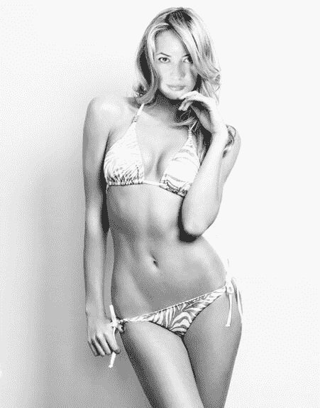

# 【翻译】I, GTS（Growth，Mega，第一人称）（1月23日，第四章）

作者：BellButton

TID：22171

 

# 1

*本帖最後由 BellButton 於 2017-1-23 10:36 編輯*

City上的一部佳作，作者是专门写长篇的Papayoya（他也写过超长篇side effect三部曲），原文在此

[https://giantesscity.com/forum/viewtopic.php?f=12&t=127519](https://giantesscity.com/forum/viewtopic.php?f=12&t=127519)

也可以在作者的DA主页（[http://papayoya.deviantart.com/](http://papayoya.deviantart.com/)）上读到这篇文章

P.S.这部作品实际上是2003年的一篇老文《艾琳，巨大的好奇心（Eileen, larger than life curiosity）》 [https://giantesscity.com/forum/v ... &hilit=eileen#p2767](https://giantesscity.com/forum/viewtopic.php?f=12&t=695&p=2767&hilit=eileen#p2767)     的续篇。

原作的故事如下：艾琳是一个品学兼优，玲珑可爱的大一女生。在第一学年的暑假时，艾琳一个人在湖边度假，在坐着充气床做日光浴时睡着了。当她醒来时，她发现自己漂到了下游的城市，并且变成了一个大约30米高的女巨人。故事最后以艾琳将自己缩小结束（烂尾？）。

这部续作将时间推进了13年，在另一座更大的城市，比艾琳小十一岁的妹妹小薇（Vicky）发现自己具有同样和姐姐一样的能力……

P.S.S.这是我在GN上第二次发表翻译文（第一篇是【翻译+改】突袭机场（百倍，裸，insertion），[http://giantessnight.com/gnforum ... iewthread&tid=19894](http://giantessnight.com/gnforum2012/forum.php?mod=viewthread&tid=19894)），也是第一次发表长篇翻译文。与上次一样，英文烂，语死早，有所改动（已得到作者的许可，他表示反正也看不懂我写的是什么 =_=|||），望各位多多批评斧正。

P.S.S.S. 一共10多章，后面还会有入阴，入菊，吞食，超能力，超巨大化等内容。视个人心情更新，不过应该会更完的。

周年纪念

每年的6月15日都是一个伤感的日子。我在又一家酒店的又一间大床房的又一张床上醒来，身边躺着又一个男性的身体。我挣扎地坐起身，一边竭力回想着身边这个男人的名字。我总是早起，不需要太多睡眠也能精力饱满。

我瞥向衣柜的落地镜，证实了我自己的想法。我很好奇为什么我和与我迥然不同的姐姐会那么亲热。我们不仅身材不一样，就连性格也截然不同。比如说，我就无法想象艾琳会和在夜店里碰到的第一个男人上床——虽然只要她想要，任何男人都无法抗拒她。至少这方面我们有着同样可以骄傲的资本。不过话说回来，她好像也没有多少时间和机会能去酒吧试试。

我在这种情况下（以及很多其他情况下）就开放太多了，但我仍然很思念她。她又和蔼、又快活、充满想象力与好奇心。我相信她一定会说服爹妈支持我不读大学直接去做模特的决定，毕竟品学兼优的她在家里说话总是很有分量。那样的话我也不会和家里闹翻，一个人到国家的另一头去讨生活了。如果，如果她还在身边的话……

我知道人们总会美化一个许久不见的亲人。我最后一次见艾琳是我八岁时，但我总觉得我和艾琳有着比血缘还要深的羁绊。

我打开电视，并没有把声音调低。床那边传来一阵含糊不清的话语，我最近的爱人似乎在抱怨电视吵醒他了。我一点也不在乎。

还是6月15日，还是那些老画面，还是那熟悉的寂寥与忧郁。

屏幕上的红底白字提醒着观众们这是女巨人艾琳·彼得森袭击河畔市（River City）13周年的纪念日。我每年都看着这些同样的画面，我姐姐最后的画面。

艾琳仍然活着的传言一直没有消失过，但政府不会认可也不会否认。我感觉这比知道她已经死了还糟糕。数字17出现了不少次，这是官方公布的在这次事件中的遇难人数（不包括艾琳），其中的大部分显然是试图阻止艾琳造成更多破坏的警察。艾琳直接将他们火化了。

然而官方刻意忽略了艾琳在已经表示愿意配合警方行动之后仍然吃了几百发子弹的事实。在那之后，艾琳发现自己的双眼可以放出高热的射线，并把攻击她的人统统烧成了灰。当然，你从新闻上也听不到这一点。

年复一年，政府和媒体都竭力把艾琳塑造成一个怪兽。我真他妈想吐。艾琳本该是整座城市的统治者，如果她没有同意主动缩小自己的话。

这几年我一直在调查她的下落，但每次都无功而返。看着我姐姐的影像时，我的心里只剩下了忧伤。

那个男人（理查德？克鲁斯？德普？无所谓）终于醒了。

“哦，今天是那个大婊子袭击城市的纪念日。”他看一眼电视便转头过来，期待地看着赤身裸体的我。

的确，我们前一天晚上非常愉快。但今时不同往日的是，我转向他，只冷冷地吐出一个字：

“滚。”

我不知道是我的语调、我的表情还是我的眼神的原因，在几秒的犹豫后，他默默地穿上衣服离开了。

我在房间里点了早餐，开始为今天的工作做准备。我今天与P城当地的时尚杂志有约，要为他们拍一组照片。在打拼了两年之后，我已经是一个职业模特。没有人能察觉到我在那些性感的姿势与撩人的眼神背后的心情和想法。今天拍的是泳装照。我的专业领域是比基尼与内衣，用杂志社那帮人的话说，我的身材对于T台过于丰满了。

我知道在很多人看来，当一个模特和中彩票一样美好。没错，薪水是相当丰厚，即使对于我这样并不顶尖（相信我，我很快就会把那些大牌周刊的封面女郎踩在脚下）的模特。但这份工作仍然比大多数人想象的要辛苦。下午3点，在最后休息一次后，我们再拍一组照片后才可以收工。

此时我看见了他。他的面孔第一眼看上去是那么熟悉，但我还是花了好几秒钟来回想起他的名字。将记忆的碎片连点成线，那个人的名字涌现在我的脑海里：“索尔顿大夫！”

我曾经的家庭私人医师在几年后在这样一个特殊的日子重新出现，让我在最后45分钟的工作中很难集中精力。好容易完成了工作，我赶忙向人群跑去，在他要离开沙滩前抓住了他的胳膊。

“索尔顿大夫”我轻言细语道“您还记得我是谁吗？”

一个比基尼辣妹从海边赶来，匆忙地抓住一个正在日光浴的50岁中年男子的胳膊。这景象吸引了周围不少诧异的眼光。

但最诧异的还数索尔顿大夫本人，他的脸上写满了惊讶，但瞬间又显露出不安的神色。

“我不应该来这儿的。”他小声地说。

“那……你知道我是谁了？”

他焦虑地看看四周。我知道他为何如此，但我怀疑除了我俩，这里还有第三个人明白其中的奥妙。

在艾琳事件平息之后，我和我的家人在当局的建议下迅速更换了名字并搬到了一千公里外的另一座城市。现在我的不再是维多利亚·彼得森，而是维多利亚·奥尼尔，表面上与那个在13年前的夏日午后支配了河畔市的女巨人撇清了关系。

索尔顿大夫终于开口了：

“我知道。”

“我们俩能谈谈吗？”我建议道，但听起来仿佛是命令一般。

“我不觉得这是个好主意。”

我眯着眼睛盯着他，回复道：

“那我就把你的身份告诉大家，怎么样？”

“请不要……”

“大堂酒吧，10分钟，我去换衣服”我说“别耍我。”

他点点头。我松开手，十分钟后他来到了约定的地方。看来他也想跟我谈谈，不然，他现在应该放了我的鸽子了。

我对他笑笑，指了指一张角落里僻静的小桌。五分钟的寒暄与小酌后，我们开始了严肃的对话。

觉醒

弗洛伊德曾指出梦境总是与人的经历有关，特别是印象最深的经历。

索尔顿大夫的话语直拨我的心弦：只靠意念，艾琳就放大或缩小了自己。从小开始，我总会梦到我亲爱的姐姐，然而，最近我的梦境发生了改变——我自己变成了艾琳，而整个城市都成了我的娃娃屋。老天啊，我很确信我不是唯一一个做过这种梦的女人。深夜辗转反侧之际，我拉开窗帘，赤身裸体地站在落地窗前，面对着灯红酒绿的大都会，看着我的倒影幽灵般出现在摩天大楼之间。早上我醒来时，我感觉梦境仿佛触手可及。

今天我的身边没有另一个男人温暖的身体。索尔顿大夫昨晚乘飞机离开前与我的谈话剥夺了我一切娱乐的兴致。每隔几分钟，同一个想法就会萦绕在我脑际：艾琳只凭意念就变成了一个巨人，又只凭意念缩小了自己。她缩小了自己，给了军队逮捕自己的机会，从此永远与她爱的人与爱她的人分别，了无音讯，生死不明。

她为什么会这么做？我猜艾琳很可能没有料到政府会下如此狠手。姐姐她虽然在学习上天资过人，但在其他方面却sometimes naïve，不然她也不会在上大学后第一次去酒吧时差点被骗了炮。但这当中还有一个更关键的问题：既然她已经是一个无法阻止的全能巨人，为什么她还会想变回一个普通女孩？这个问题几乎困扰了我整整一夜。

整整13年我都在想着艾琳和发生在她身上的一切，在思念之外，我还得出了一个重要的结论：如果我是艾琳，我绝对绝对绝对绝对绝对绝对不会让任何人缩小我自己。政府这些年来的一系列举措更加强了我的想法。

所以，当得知艾琳是自愿缩小自己，而不是什么有关部门的缩小光线与缩小毒气之后，索尔顿医生把我的眼前的谜题解决了一大部分。虽然他也不知道艾琳的去向，虽然姐姐离我还是那么遥远。

我囫囵地吃下早饭，赶忙下楼去酒店三楼的大舞厅里报到。今天的拍摄将在酒店内部进行。

这是我职业生涯中第一次完全无法集中注意力工作。摄影师三次中止了拍摄，上前来纠正我的动作（以前这种情况一整天都不会发生两次）。第四次，摄影师直接问我今天是不是身体有恙，需不需要另安排时间拍摄。

我在帘幕之后，一边道歉，一边穿上今天拍摄的下一件泳装——一件本身就很性感，穿在我身上更加无比性感的黑色比基尼。听起来有些自傲，但在这方面我从来不谦虚。

我回到台上重新开始工作，虽然我的思绪却仍然在徘徊在那个强大的想法上。神游之际，我瞥见发现摄影师放下了照相机。当我转过头来正准备第五次道歉时，却发现他们脸上挂着的并不是因为我一整天缺乏职业素质的表现而生气的神情，而是完全的震惊与恐惧。我低着头他们，他们抬头看着我，一个大约3米高的我。

“操！”我瞬间反应了过来。

一切都涌上了我的脑海，我的思绪突然专注了起来。当我的视线不断在我的长腿与呆若木鸡的摄影师间来回扫动时，索尔顿大夫的话不停地在我耳边回响。我下意识地念出了他们显然无法理解的问题：

“这真的可能吗？”

只有一种方法可以知道答案，而且我非常急切地想知道。我闭上眼睛，将我的全部意念集中到一个愿望上。全身扩张的感觉是那么明显，我不禁享受了起来，直到我的头撞到了天花板上。我睁开眼睛看看四周，在刚刚几秒钟，我已经“高挑”的身躯又增加了大概两米。

工作人员已经呆立了一阵子了，但现在他们开始尖叫了。我向他们微笑，但似乎更增加了他们的不安。在他们眼中，正在享受此情此景的我似乎已经失去了理智。然而事实上，我现在大概是整个世界上最快活的女人。

整整13年，索尔顿大夫都无法理解艾琳是如何变大的。据他所言，政府那边也没有一个人有头绪。唯一的解释是艾琳很特殊，是她的基因决定了她的能力。此时此刻，我无比激动地发现我也具有同样的天赋。

我在脑海中排练了无数次今天的情景，现在我完全知道我要做些什么。不过我不想为难眼前的几位摄像师——他们毕竟已经容忍了我整整一天，我决定给他们一些要紧的忠告作为报答。

“伙计们，我觉得你们最好离开这栋建筑，越快越好” 我眨了眨眼睛，微笑地说。

他们毫不犹豫地扛起摄影装备，仓皇地夺门而出。“越远越好哦~~”我笑着告别道，但转念间又想到，没有一个专业人员能记录下这一历史性的时刻，会不会有些遗憾呢？

我摇了摇头，这些都无关紧要了。我又开始集中注意力。

当然，我得变大，穿透整个建筑，毕竟我现在已经大得出不了门了。缩小我自己？呵呵，别逗了，想都别想。

与往常一样，拍摄总是在豪华酒店里进行的，而且与往常一样，酒店里都住满了傻瓜。所以我决定这栋建筑和其中的所有人都不能享受那几位摄影师的待遇。

我的头很快又顶上了塑料的天花板。瓶盖不到几秒钟就被顶开了。我的头顶穿了四楼的地板，出现在餐厅的正中。仅仅是看着餐厅里正在吃早饭的人的表情，你就知道我为什么如此喜悦。

惊慌失措的人群爆发出一阵阵的尖叫。我不禁撅起嘴，向人群献上飞吻——吹翻了放置早饭的桌子和旁边盛饭的食客。我在进入下一个楼层时最后看见的是我巨大的乳房，他们轻易地顶翻了两张餐桌。显然，不仅仅我的脑袋有破坏力，我的肩膀和乳房一样造成了客观的毁坏。

下一层楼里没有人，我下意识地加快了变大的速度，迅速顶入了下一层。一对小情侣在我的眼前惊叫失声。短短两层楼后，人们就从芭比娃娃的大小变成了动漫手办的大小。我短暂地消失了一下——因为我太重了，踩穿了两层楼板，掉入到了酒店大堂里。但十秒之后，我又微笑地出现在他们面前，他们的房间里也有了一个更大的洞，而这对小情侣现在只有玩具兵的大小了。

我已经快用完可以用来比喻的玩具了，但我还没有用完长大的意愿。远远，远远，远远没有。如果我的计算正确，我现在处于这栋20层楼高的酒店的第7层。好吧，准确地说，我迷人的眼睛在第七层。

我不能再清楚地看清酒店里其他住客的细节了，最多只能瞥见他们尖叫地从楼上掉落的瞬间——我的身体已经太巨大了，当我的头顶穿地板时，整个房间都瞬间塌陷了。

我发现我可以自如地加速我的成长。在建筑之内我并不能找到合适的参照物确定我的大小，我自然只有持续长大，直到我的头顶穿屋顶。我的头与脖子已经完全出来之后，我瞬间停止了我自己的成长。一切都毫不费力。我向两边举起胳膊，我的双手轻而易举地撕裂了酒店的边墙。从外面看上去，这个建筑物就像一件套在我身上的紧身衣，似乎一次深呼吸就能把它吹倒。我只需轻轻的晃动，整个建筑就彻底地垮塌了，像海滩上被随意踢倒的沙堡一般，只在我的脚下留下一地灰土与废墟。

说实话，我在几分钟之前开始变大时就基本没有考虑在这栋酒店里到底有多少人。我不在乎。现在我唯一恼火的是不少碎砖石掉到了我的比基尼里。

我正准备说些什么时，突然感到头有点晕。还没反应过来时，我已经失去平衡，结实的向后坐了下去。酒店后的一栋十层大厦在我圆润的臀部如同陨石一般的攻击下不堪一击。当我落地时，产生的冲击波又带垮了两座三层小公寓楼。

我闭上眼睛，试着清醒自己的头脑。当我重新睁开双眼时，世界仍然没有变化，这一切都是真的，这不是梦——只是我身边的一切看起来都小得滑稽而已。我两条白玉般的长腿完全挡住了酒店前宽敞的四车道马路，在对面的大楼上蹬了一个巨大的洞。

当然我知道我巨大化的过程随意地终结了四栋住满了人的大房子，其中有些人一醒来就被天花板砸了个正着。可我现在根本没有时间哀叹他们的不幸，因为我现在脑海中只有一件事情：

我现在他妈的是个巨人了！！！！！！！！

我从来没有像今天这么爽过。

13年前，我的姐姐震撼了世界。现在，我和艾琳一样了。好吧，不完全一样。艾琳只是一个穿着粉色比基尼的可爱玲珑的19岁大学生，而我，她的妹妹小薇，现年21岁，是一个拥有魔鬼身材的老道职业模特。我迅速打量了一下我身着的黑色比基尼以及为拍摄准备的首饰，连这套行头都是齐的。

我另一个与艾琳的显著区别在于大小。从新闻播报上得知，艾琳只有32米，约10层楼的高度。而我现在显然比十层楼要高……而且我是坐着的。我顶穿了一栋20层的大楼，并且在它倒塌之际我的头和脖子已经高出了屋顶。我现在肯定比艾琳高了一倍还不止。

此情此景出现在我的脑海中：我和艾琳面对面地站着，姐姐穿着她那件可爱的粉色比基尼，她的眼前正对着我两条傲人的长腿，她抬头，抬头，抬头，最后惶恐地仰望着我微笑的脸。在她的妹妹面前，她就像一个还没发育的初中生一样。我弯下腰，捧着她可爱的脸，笑着说：

“好久不见啊，姐姐！人家现在也是个大女孩了呢！”

我傻笑了几秒钟，又重新回到了现实。没有被我的巨大化所波及的人群迅速做出了反应。我向他们笑了笑，几乎是本能地拨开了身上的灰尘和碎石块。可这却要了他们的命。

我学会了成为巨人后的第一课。不管你们怎么称呼我，现在我可是兼具25层建筑的身高以及175cm人类本能的存在。有些时候，这二者并不能兼容。好吧，很多时候，尤其是与我的脚相关的时候。但怎么说呢，坏事儿天天有不是吗？只要不要发生在我的身上，这就不是个问题。

对我来说仅仅是恼人的碎屑，对街上的无助的人群却是一阵致命的陨石雨，唯一不同的是陨石雨并没有这么高的命中率。谁能想到我光是用手清理自己乳房和大腿上的灰就能一下子造成这么多伤亡？

新闻报道一遍又一遍地提及艾琳造成了17例直接死亡，仅是这样她就已经被视为一个怪物了。在成为巨人的头5分钟，我的战功可能得比她多20倍。耸耸肩，我只能再一次钦佩我的姐姐当时是多么的温柔与细心。

我不一样。而且整个城市马上也会明白。

我还没有正式向大众讲话呢，所以我四处望了望，看看在我造成的这一片混乱中还剩下了些什么。我轻而易举地目击到几个扛着摄影器材的身影，我很开心他们一行人平安无恙。但就在这时，他们旁边的一个男人放慢了脚步，转过身来朝我张望，我瞬间认出了他。

哦，理查德……哦，不，克鲁斯……还是德普？无所谓了。

他现在离我有半个街区远，对我来说触手可及。我向前探身，伸出我吊车一般长的手臂，只消一瞬间我涂着红色指甲油的白皙手指就笼罩了他。搞笑的是旁边的几个小杂种迅速地卧倒在地，搞得我的目标好像是他们似的。

我降下我的手，用三根手指准确地夹住了那个男人。小时候我可是游戏厅里抓娃娃的高手，现在我也不差，看准的玩具，我绝对不会再松手。

他一直惊叫着。我把他提到面前，对他微笑着，但这显然并不能安慰他。我将捏住他的手指头从三根换成两根，以便捏住他的两边，让他可以直面我。接着，我默默打量了一下他，大概放在玩具兵的世界里都算矮个儿的。我清楚地记得，现在我两根手指捏住的人就在两天前的夜晚还把我牢牢地按在床上，而我为了现在看来微不足道的快感在他的身下呻吟着，哀求他不要停下……

在一番打量后，我对他说出了我身为巨人的第一句话。对我来说，我的声音十分自然。但从街道上的人群顿时停下脚步回头张望这点看，可能我的声音还是蛮大的。还是视角问题，我心想。

“嗨，理查德。”我说。

那个男人停止了尖叫和挣扎，不解地看着我，说：“我叫布兰登。”

呃……这个……嗯……好吧……我又不是第一次搞错名字了。

“没关系”我说，“我喜欢叫理查德，你有意见吗？”

我强忍着笑容，看着他疯狂地摇头的样子。

“你怎么变这么大了？”他问我。

好问题！答案也很简单。

“因为我可以。”

“你要对我做什么……”他颤颤巍巍地问道。

老天啊，我才当一个巨人不到10分钟，这些小人就变得这么循规蹈矩了……好吧，那我就来逗逗你。

“这样吧，你回答我一个问题，答对了，我会奖励你，答错了的话……”

我磨了磨牙，舔了舔嘴唇。

他的脸被吓得惨白，但显然他没有选择的余地。

“我的名字叫什么？”

“小薇，维多利亚。”

好快！看来能记住别人的名字确实是个优点。

“不错。 我以为你要叫我大婊子呢”我冷笑了一声“就像你说我姐姐那样。”

我张开嘴，仰着头，作势要把他丢进嘴里，他的惊叫声简直要把我笑死了。

“好了，好了，我骗你的，我吃过早饭了”我笑着说。

公平的说，他的活儿还是不错的，虽然没有厉害到让我能记住他的名字的份儿上。

“这是给你的奖励。”我把他放到嘴唇前，轻轻地碰了一下他，瞬间他的脸和大半个身子就被口红染红了。

我没有多说话，便径直将他放到了旁边一座还立着的建筑物的楼顶。他的悲鸣声告诉我，我似乎在太高的地方松手了。从他的反应来看，大概是摔断了一条腿。老天啊，这一切都太脆弱了。

“来人啊！叫个医生来啊！”我向人群呼喊道。我向四周望了望，好像得多叫几十个医生过来才够。

我迅速忘记了我的前情人，开始思考下一步做什么。人群利用我和他互动的时间，拉开了一些距离。目前在我够得着的地方看不见任何的活人。这并不是什么不能解决的问题，其中一个方法就是站起来，而且我正想这么做。

是时候让整座城市见识我了。

我想象中的Vicky。模特名：郭婷瑜

 

# 2

*本帖最後由 BellButton 於 2016-11-16 02:36 編輯*

> [archer 發表於 2016-11-16 02:27](https://giantessnight.com/gnforum2012/forum.php?mod=redirect&goto=findpost&pid=314719&ptid=22171)

> 哦哦 这篇之前用翻译软件看过~~  女主一直变大 可惜结局很仓促

我感觉是前面剧情有点拖了，大家一直想看女主二次巨大化，但作者老是拖着，搞得回复数量不多，最后作者也有点不想写了。我觉得这个架构是很不错的，也希望大家能多提一些建议，可以多填充一些内容。

 

# 3

> [vicky 發表於 2016-11-16 08:05](https://giantessnight.com/gnforum2012/forum.php?mod=redirect&goto=findpost&pid=314726&ptid=22171)

> 一大早就醒了然后看到了这个...真的好巧阿。这里是对变大感兴趣的有做过模特的vicky...然后楼主说的郭婷瑜 ...

可能是她吧⋯⋯感觉和现实中的人联系起来的话有点尴尬啊。

要不我把小薇全部改成Vicky吧 让你更有代入感

 

# 4

> [juliazhu1978 發表於 2016-11-16 21:11](https://giantessnight.com/gnforum2012/forum.php?mod=redirect&goto=findpost&pid=314790&ptid=22171)

> 为什么把cap翻译成瓶盖......这里指天花板吧.....

cap这个词直译的话没有天花板的意思。这里的意思应该是天花板像瓶盖一样被女主的头顶开了。

谢谢指正！

 

# 5

> [12345688 發表於 2016-11-17 00:37](https://giantessnight.com/gnforum2012/forum.php?mod=redirect&goto=findpost&pid=314809&ptid=22171)

> 啊我记得这文里有周杰伦

666666666666666666666

哎哟这个屌

但我觉得作者好像不知道周杰伦是谁……毕竟papayoya是西班牙人，应该是歪打正着。

……还是说我应该找作者私信问问。

反正最搞的是作者好像写到一半忘了周杰伦了，尼玛写了好几章了才在网友的提醒下记起这回事儿，直接就圆不回来了，场面叫一个尴尬2333333333333333

 

# 6

> [starcraftorz 發表於 2016-11-17 13:18](https://giantessnight.com/gnforum2012/forum.php?mod=redirect&goto=findpost&pid=314833&ptid=22171)

> 太棒了 是第一人稱的作品

> 論壇裡面太多小人看得我都快吐血了

确实这种老派的文章现在越来越少了呢，搞得我已经成为文章区的一股清流了吗

不过最近还是出了不少有新意的作品呢！

Growth会有的，放心。

 

# 7

第一步

我的双手将人行道压出了道道裂纹，双脚陷进了沥青路面，周围的世界迅速下沉，刹那间我站了起来。

WOW~~~~~多赞的景色啊！我平静地张望着，慢慢体会着自己真正的高度。在我顶翻屋顶和坐在路上的时候我就已经知道我很大了，但只有当看着街道两边整齐排列的房屋仅仅只比我的膝盖高一点，将整个城市的全景尽收眼底之时，我才明白这其中的真意。

我好巨大。当然，人们比我坐着的时候更能体会到这一点。

将双手放在臀部上，屹立在城市的中心，看着脚下的世界……这应该是每个女巨人都最喜欢的姿势吧？如果我还能再见到艾琳姐，我肯定得问问她。

身高当属我和世界上另外任何一个人之间最明显的区别了。我以发号施令般的姿势耸立着，周围成百上千的小人们一边四散奔逃，一边不时回头打量我。我明白，他们害怕我，尊敬我，崇拜我……而我不用做任何事，仅仅是站着就已经足够了。

反过来，当我俯视着脚下蝼蚁一般的人群，他们只能听命于我。只有这一点在我没有任何问题。

三十分钟前我还只是一个小有名气的嫩模，现在的我仿佛主人一般将整个世界踩在脚下，而且几乎没有人敢质疑这个事实。

这么多年里，在思念艾琳的同时，我得出了一套理论，现在我发现正好可以用在我自己身上。想象一下如果我具有超人的力量，我可能也会自觉是世界上最强大的存在，但要是我不显山露水的话，并没有人会承认我的力量。可体型就是完全另一码事了！我无法遮掩我自己，整个世界也无法否认我的存在。我必须毫不犹豫地接受我的大小，从这一秒起像一个巨人一样思考或行动。这样事情就明晰多了！总之，大者为王，耶！

所以，当我第一次站起来，欣赏着我的身型，扫视着整个城市之时。我并没有任何的惶恐不安。相反，我比全世界上任何一个女人都要激动。我猜你们现在都已经得出了结论：我不会像艾琳一样退缩。为防止你们没有听懂，就让我最后再重复一次吧！

我——爱——死——当——巨——人——了！

既然有了这个前提，下一步就很明确了：我要接管这座城市。对我而言这都不能算是个任务，顶多是个福利。想想吧，如果我不主动缩小我自己（我绝对不会的），世上根本没有其他任何东西能阻止我。艾琳已经证明了这一点，所以我就不浪费时间解释了。这是我的城市。其他城市？视我的心情而定。

不是说我不想征服整个世界。我当然想。我总是有一点自大狂，这对于一个全能的巨人来说应该是个优点。但我并不“只”想征服世界。换言之……我要花多长时间征服这座城市，如果我“只”想这么做？1个小时？一刻钟？1分钟？

可能在更短的时间内，我就能把整个世界捏碎在我的手心。

然而我对此并不感冒。我现在可是一个刚刚巨大化的美得沉鱼落雁的年轻女人。我想要探索我的新能力，体会没有人能经历的一切，活出只属于一个女巨人的人生！

总之，我得好好地玩一场！

除了这是一座经济发达，风光秀丽的海滨大都会，我并不是很了解这座城市。相应的，我对这儿也没什么感情。刚好，我也需要一段时间来适应我的体型。我在这里造成的破坏可能要比之后我对其他城市的破坏多那么一点点~~

我一直是个了无牵挂的女人。但我还是更倾向于操翻一座我没有住过的满是陌生人的未知城市。

总之，先动起来！我并没有一个明确的方向，所以我只是向前走。人群总是能吸引年轻女孩的注意力，像我这样大小的也不例外。

你可能会认为在我的整整十几个自然段漫长的思想斗争后，人群已经远远地逃离了我。Naïve。当我迈步时，他们与我只有四个街区的距离，按我现在的标准，实在是近得可笑。

可以预见，人群在看见我移动时又惊慌了起来。但我却没有太注意他们，因为我在享受沥青在我的脚下起皱、开裂、下沉的感觉。意犹未尽的我又迈出一步，再体味了一次。

“嗯……”我呻吟着，实在是爱死这种感觉了。我急切地想要整个世界知道现在是只属于我一个人的玩乐时间，而且我喜欢只靠走路便能说明这一点。

我决定表现得既强大又性感。幸运的是，我有一副非常拿得出手的外表和全套的装备，所缺的只是态度与气势。我与第一批以为自己可以跑过像我这样体型的女人的天才们仅有三个街区的距离了。我打直了身子，左手微微叉腰，开始走起了台步。

我每一个性感的脚步都相当于他们的十几步。这些倒霉的小混蛋们没有任何机会。如果说我有什么始料未及之处的话，那就是我和他们都一样不习惯现在的局面，但我的优势在于不用担心一不小心被人踩死。

十几步之内，我的脚趾已经紧贴在他们身后了。甚至不需要碰到他们，仅仅是将我精致的美脚放在路面上就足以震动两边停着的汽车，让几个人滑稽地摔倒。

我现在得做一个决定，一个关乎我脚下的人群，甚至我眼前的整个城市的命运的决定。只是这个决定早已在我迈步的一瞬间就已经做好了。

我没忘记我离我住着的酒店还不到五个街区。他们之中大概有不少人是在我顶坏酒店房顶之前从那家酒店里逃离的。在过去的几天里我和他们打过不少的照面，比如餐厅里殷勤的服务生，电梯里顶着大肚子的猥琐秃顶大叔，健身房里那几个让我有那么点心动的帅哥，以及泳池边面无表情地盯着我其实内心嫉妒得跳脚的女孩……不过，大概所有人从25栋楼的高度看下去都一个样，很难让我产生什么特别的感情。他们一窝蜂地往前涌动着，我的下一步没法不踩着人了。

于是，我若无其事地抬起脚，自然地迈出下一步。我的脚压住了四个人，第五个在最后时刻奇迹般地从我的落脚点逃出。他被冲击波震得滚了两圈，停下来之后，他抬头，眼前正是我右脚的小拇指。

我的裸足依然那么完美。我很好奇它是怎么轻松地解决四个人的。我只是察觉到在脚趾踩裂路面沉入沥青前，的确有种踩在湿海绵上的感觉。

“噢~”我大声地说，我知道我这是在羞辱他们

“你们大家都好小啊，人家刚刚没有看见啦~”我笑着说。

我能察觉到人群中的愤怒，但我一点也不在乎。反正他们在这种局面下也做不了什么，不是吗？而且我并不是出于仇恨，鄙视或愉悦而踩他们的。杀人并不能给我快乐，毕竟我内心不是一个杀人狂。不管伤亡数字说明了什么，我仅仅是因为好奇才踩上去的。以上。

他们是头一批受害者，而且我肯定他们不是最后一批。

我再次低头，眼光锁定了那个我差点踩到的小男人。我实在抵挡不住这种诱惑，于是我弯下腰用两只手指夹起了他（我怎么这么熟练啊！）

我知道他已经认命了，但我只是想仔细看看他。

“你真够走运的”我把他举到面前，说。

我看到他往下瞥了一眼，还以为他是在目测下面有多高，但一瞬间后我明白了他的本意，不禁笑出声来。

“男人啊男人，什么时候都一样。”我摇着头，脸上挂着抑制不住的笑容。

他瞬间脸红了，发现自己犯了一个错误。

“很壮观是不是？”我自然地问。我的胸部对于我偏瘦的体格来说的确有点过分了，并且它们现在紧紧地帖在这件小一号的性感比基尼之内，仿佛两个腾空的黑色热气球一般。

“来，凑近点看。”我一边说着一边随意地松手，将他丢向我狭窄的乳沟。我有点担心他会弹到一边摔死，然而他并没有。我的准头堪称完美，他仅仅是在我乳房上滑动了一截，接着他的下半身就被牢牢卡死了。我一边笑一边看着这滑稽的场面。痒痒的呢。

“你开心吗？”我问道。那个男人看着我，几乎在哀求我把他拉出来。我照做了，但应该不是以他要求的方式。我一手抓起一边的乳房，轻轻地将它们分开，只留下够他滑落到比基尼胸罩底部的缝隙，接着我松开手，让我的双峰复位。

除了开始有一点额外的瘙痒感外，我几乎感觉不到他的存在。如同一开始注意到他一样，我很快就忘了他，开始思考下一步干什么。

我不介意杀一些人，但我说过了，我不是一个嗜杀狂。再往前走肯定会有更多的死伤，我也没什么兴趣。我转而决定凑到街道上看一看。我知道这听起来有点前后不一。上一节我还告诉你们屹立在城市之上俯瞰众生是我这辈子最过瘾的事，下一秒我又在说想凑近看看脚下发生了些什么。安啦，这是女巨人的常态，毕竟我总是有那么多的选择。

我不加警告地俯身，用手和膝盖撑着地面。人群还没来得及反应，我便伸直了腿，趴在地上，我的下巴放在交叉的双手臂上，微笑地张望着。我的眼前就是小人国的高清全息图像。不过这些人也太小了……好吧，也许是我比格列佛大太多了。

如果这时天上有飞机飞过，乘客们一定会目睹我钦定的世界上最棒的屁股。祖传的好基因加上规律的锻炼，你大概能想到是什么样子；或者，你可以上网看看目前的热点，由你自己来判断。

我看向前方，最近的一群人大概只有15米远，唾手可得的距离。

我伸出一只胳膊，我的两只手指像一个快活的孩子般蹦跳着向我的目标走去。搞笑的是，就连我纤细的指头都比这些小人高出不少。就这么一个小小的动作，人们的注意力便从我移到了我的手指上，好像我的手指也是一个巨人一般。人嘛，总是更害怕较近的危险的。

用手指走路的时候我本来没有什么别的想法，但我大概在10秒之后就觉得无聊了，于是我开始用我的手指随便“踢”人。但我还是被我手指超人般的力量所震惊了，因为我随便就能把那些小人弹出5米之远。

这倒是个不错的游戏。我开始测试我究竟我能把他们丢多远。接着我开始测试我的准头。当我第三发试射把一个男人弹进一个敞开的窗口时，我情不自禁地大笑起来。

我（曾）居住的酒店离海滩很近，这意味着这附近还有其他的豪华酒店。人群很自然地蜂拥而入，想要躲避我。这很自然，但并不意味着我会因此放弃。我向猫一样手膝并用向那栋酒店爬去，我的右手拍在了两个人头上，左膝将四个人压得血肉模糊。这次我敢保证真的是无意的。我知道这对于那些被压扁的人没什么区别，但对于我来说这意味着很多……才怪嘞！嘻嘻，好吧，我只是顺道一提。

我在猜想，到今天结束的时候，到底是我故意杀死的人多还是那种只是在我移动中不幸被压着的或是被砸着的或是其他什么的意外致死的人多。毕竟我实在太他妈大了。

可这次我高估了我的速度。在最后一个人窜进酒店的旋转门之后，我才姗姗来迟。我失望地用右手指尖推了下门壁，没想到这扇门像龙卷风般开始旋转，几秒钟后，我只看到一个男人扑倒在里面。我笑着拾起他瘫软的身体，将他仰放在比他的身高长一倍的食指上。他的胸脯上下起伏着，我知道他还活着，只是失去了意识。

我跪在酒店门口，开始思索怎么对待他。他离被抛飞到我身后的两条街外只有一念之差。最后，天使Vicky还是战胜了恶魔Vicky，我左手捏成拳头，轻松地在酒店的墙面上开了一个洞。

8,9,10,11楼的一部分被迅速而野蛮地暴露在外。十楼上的一对彼此拥抱着的夫妇蜷在卧室的墙角，瞬间尖叫起来。我只是抬起我的右手，把那个瘫软的男人放在他们面前。

“你们能照顾一下他吗？我觉得他好像被吓坏了。”我假装抱歉地说。

那对夫妇没有应答。他们只是转身向更里处逃去。

“这……”虽然我能料到他们的反应，但我还是有些小尴尬。我撅起嘴唇，向他们吹了一口气。我不禁噗嗤一声笑了出来：这对小夫妇以比他们想要的还要快的速度钻到了里处——以双脚离地的方式。最终他们短暂的飞行以撞墙结束。现在他俩躺在墙角，已经再起不能。他们不是唯一被我的呼吸吹飞的东西，几件家具都高速撞在墙上，摔得粉碎，还有那个瘫倒的男人……他现在已经可能再也站不起来了。

“哦，Vicky呀Vicky，你都做了些什么”我仰起头，心想。

“看来天使Vicky的任务却是由恶魔Vicky完成的啊。”想到这儿，我的嘴角不禁浮起一丝笑容。所有人都说我有天使的面容和恶魔的身材，看来我真的是二者的完美结合。其实我一点都不吃惊于我呼吸的力量，毕竟艾琳姐呼气吹飞警车的镜头我已经看过上百遍了，我还对着这段画面自慰过呢。

我在我心中的“意外死亡人数”上加上了三，俯下身体，侧脸贴地，就像在找掉在床底的钥匙一般看向酒店大厅。他们显然并不想要我的关注，尖叫声瞬间响成了一片。看来他们并不太喜欢我天使般的面容……嘛，不过这样也不坏，或者说，超赞。

“他们现在任我摆布。”我心想：“该拿他们做些什么呢？” 

# 8

*本帖最後由 BellButton 於 2016-11-18 04:53 編輯*

> ctcctct 發表於 2016-11-18 00:22

> 还有么求更阿翻译辛苦了

两天两更 我觉得还是挺给力了⋯

翻译也是要时间的啊，没有五六个小时拿不下来一章的。

不过还是谢谢回复，我肯定会继续更的，放心。请持续关注哦！说不定哪天一个F5更新就蹦出来了 

# 9

> [a123456789 發表於 2016-11-17 22:03](https://giantessnight.com/gnforum2012/forum.php?mod=redirect&goto=findpost&pid=314853&ptid=22171)

> 挺不错的，翻译辛苦了，另外问一下，你说的这篇之前的2003年的那个老文哪里能看到？ ...

[https://giantesscity.com/forum/v ... ;hilit=eileen#p2767](https://giantesscity.com/forum/viewtopic.php?f=12&t=695&p=2767&hilit=eileen#p2767)

感谢回复，求多提意见

 

# 10

> [445566 發表於 2016-11-18 06:52](https://giantessnight.com/gnforum2012/forum.php?mod=redirect&goto=findpost&pid=314894&ptid=22171)

> 这年头西班牙人都会膜蛤了？(●—●)

我突然觉得是不是膜得有点不自然……万一开始吟诗了的话那画风简直…… 

# 11

> [hua 發表於 2016-11-18 13:05](https://giantessnight.com/gnforum2012/forum.php?mod=redirect&goto=findpost&pid=314926&ptid=22171)

> 楼主有没有这篇文章的英文版

您是要帮我校对吗？非常感谢啊！

[https://giantesscity.com/forum/viewtopic.php?f=12&t=127519](https://giantesscity.com/forum/viewtopic.php?f=12&t=127519)

 

# 12

*本帖最後由 BellButton 於 2016-11-20 10:10 編輯*

决定

说来也奇怪，酒店大堂的人群暂时被我的巨大化所拯救了——如果不是我的感官随着我的成长变得更加敏锐，我肯定没法在一片嘈杂声中辨别出这个纤弱的声音。我坐起身，循声回头望去。果不其然，说远不远一架直升飞机就在几个街区之外。我站了起来，瞬间忘掉了酒店大厅里的人群，毕竟这座城市里还有上百万的居民，而我还是更喜欢直升飞机这样稀少的玩具。

我马上明白了它的去向：远处一座豪华酒店的顶楼停机坪。我的目光锁定了它，欣喜地发现自己也拥有我姐姐曾经具有的超能力——千里眼。停机坪大概在足足一公里开外，但我仍然能分辨那儿的每一处细节；当我放大后，我甚至连每个人衣服的款式都可以看得一清二楚。楼顶上站着6个人，他们显然在等着直升机把他们接走。这群有钱人真会玩。

我几步走到旁边一栋大楼旁。这大楼简直就是为了让我小憩而建的——我可以把我的巨乳放在房顶上，用双手撑着下巴，摆出一副小萝莉认真听故事般的可爱姿势。身下的建筑痛苦地呻吟着，但我觉得它应该能扛得住。我又将视力缩近到远处的停机坪上。直升机逐渐靠近了，人群也开始慢慢地移动。当我在那六个人中发现他的时候，我差点尖叫了出来。天哪！那是杰伊！（译者：你没看错，作者挑的名字就是Jay。我不知道作者知不知道结巴，但为了避免出戏，我还是译成杰伊吧……）

好啦，我明白杰伊应该是中学女孩们喜欢的超级新星，但我也才刚21岁是不是？其实我觉得他应该也和我一般年龄。我听音乐时没什么高逼格，反正我就是觉得他的旋律格外地抓耳，而且，他在最近一部MV里实在太性感太威猛了！！！！我在脑海里已经好多次幻想过和他在一起了！！！

我直到上一秒才知道他也在这座城市，不然我肯定会把房间订到他那座酒店里去碰碰运气，试试能不能引起他的注意。如果那群无处不在的痴狂迷妹军团和狗仔记者们能够消停下来，放我和他独处一阵子的话，我相信他和我一定都会很享受的，呵呵。

我傻笑着。然而Vicky现在已经不是昨天的那个Vicky了。我不仅要抓住他的注意力（显然我已经做到了），我还要抓着他本人。毕竟，如果不能在手中握着自己最喜欢的歌星的话，当一个全能的女巨人还有什么意思呢？

于是，就决定是你了，杰伊！但首先我得想个办法。

我的第一反应是离开现在这座大楼前往杰伊所在的酒店——大概我20秒就能走到。然而我在动身之前克制住了自己。当女巨人有很多优势，但潜行肯定不是其中之一。机智如我瞬间反应了过来，如果我太早行动了的话，直升机可能就不会降落了。而且我敢打包票杰伊和他的小跟班们看见我了以后肯定不会束手就擒。如果他们窜回建筑物里的话，要无伤地拿下杰伊恐怕就很难了。

于是我就有了个简单的想法：如果要让杰伊钻进那架直升机，我最好现在一动也不要动。只要他进去了，我只需要在半空中把直升飞机拿下就好了。我没有明确的想法，至少现在没有。但想到我姐姐在成为巨人后的几个小时内做到的一切，我自信我肯定能做到。

我继续用手肘支着楼顶，手捧着自己的脑袋，饶有兴味地关注着对面房顶上的一切。直升飞机顺利地降落了，停机坪上的六个人必须弯着腰才能保证不被螺旋桨吹倒。杰伊真的好小好可爱啊！

侧门滑开，杰伊在跟班的帮助下第一个爬进去了，接着他的三个跟班也坐了进去。另外两个退出几米，像驾驶室挥了挥手示意可以起飞，接着转身向电梯间走去。几秒之后，直升机开始上升。我依然稳如泰山。一个好的猎手需要耐心，我只要再等几秒钟……直升机已经侧向离开屋顶一段距离，没法再迅速降落了。趁现在！我站起来转向大街。我迈出的第一步就将一辆SUV踩扁在我的右脚下。

直升机还在爬升。我可以跑着去追杰伊，但我偏不。跑就不美了。与之相反，我调整好自己的姿势，开始踱起了台步。

我平视着远处的直升机，所以我不太清楚脚下的状况。我只能通过脚底的感觉判断我踩到了什么……有时是脆脆的感觉，那肯定是车；有时是黏黏的感觉，那应该是人；有时又脆又黏，那大概是人坐在车里。

我没时间低头仔细观察了，因为我发现直升机逐渐飞远了。我知道我可以吸气把它拉到面前，但它可能在被我捧在手心之前就已经坠机或撞楼了。我可不想让杰伊冒这种危险。我愁着眉头，眯眼盯着远处的飞机，就在此时，我感觉到了眼袋后面陡增的压力。

“天哪，现在不要啊！”我差点叫出声来，马上停下了脚步。我确实一直想要艾琳的激光眼（译者：在本文的前篇中，艾琳发现自己的双眼有可以发射高热激光的能力，并以之烧化了多名警察），但我现在可不想用啊！！我还不想把喜欢的歌星烧成灰啊！！

我的焦点还没能来得及从飞机上移开，眼袋后的压力就已经消失了。我已经做好了最坏的打算……然而什么都没有发生。我双眼释放的能量确实击中了那架直升飞机，但它并没有瞬间化为一个橙黄色的火球，而是被依稀可见的淡蓝光晕包裹了起来，似乎停止了位移。

连我自己都震惊了。好容易才反应过来我的双眼发出的不是一道致命死光。我推断，这应该是某种拖曳光线。因为直升机的螺旋桨仍然转着，但它却始终前进不了分毫。我仅用我的眼神，就让一架飞机停了下来。

我决定验证一下我的理论，试试能不能把它拖近一些。确实可以，虽然只有短短几米。

我情不自禁地大笑了起来，一边用右手拍了拍自己的翘臀。“我真他妈是个天生的女巨人！”我对着整个城市说，“连艾琳姐都没发现这个！”。我相信整个城市大部分人都听见了我的声音，但没有几个人知道我他妈在说什么。我毫不在意。

我从来没有感觉像现在这般强大和性感。几乎是出于作为一个模特的本能，我开始调整我的姿态。我右脚微微向前放在左脚外侧，右肩上抬，右手自然下垂勾住比基尼的裤带，挺胸收腹，凸显出从上到下的完美线条，抬起左手轻轻地挨着下巴，双唇微张仿佛欲言又止——我的杀手姿势曾让无数男人痴狂（其实我更喜欢他们老婆或女友妒忌的样子），也把他们中的不少勾进了手心。杰伊马上就是下一个，不管他愿不愿意。

直升机的螺旋桨拼命地旋转着，徒劳的想要挣脱我视线的束缚。随着飞机越来越近，他们在机舱中恐慌的样子也中越来越清晰了。

用眼睛抓东西比起用手确实精细了不少啊！不过我觉得这也只是一个熟能生巧的问题，考虑到这是我第一次使用我的新能力，其实我做得还不赖。我集中精神，沿着脚下这条大道，一点一点把直升飞机拽到身前。

我眨眨眼，像关灯一样停止了我的能力。眼前的直升机晃了一晃，勉强保持住了平衡。这会儿想逃可就没那么容易了。我伸出左手，用我修长的手指轻轻地抓住了直升机的底座。如果它连我的目光都摆脱不了，就更不要提我的手掌了。

直升机螺旋桨仍然在旋转，发出恼人的声音。我只用右手小拇指的指甲就让它安静了下来——飞速旋转的刀片看着挺吓人，其实连一点痕迹都没能在我鲜红的指甲盖上留下。接着我把机身抬到面前，想从舷窗里瞅瞅他们的样子。看着我比窗户还要大的眼睛，杰伊似乎并不开心。

我当然不会计较这些啦。我只想把我的本命从里面整出来。我用右手指甲在机舱侧面靠上处划了一个口子，接着像剥鸡蛋一般扯掉了机舱的顶壳，随手丢在一旁。机舱里有六张震惊的脸。

没有任何的警告，我把整个飞机翻转了过来，轻轻地晃动着左手手腕，想要把机舱里的人抖到右手上。四个人落在我的手掌里，他们弹跳了一下后安稳地停在我柔嫩的肌肤上。还有两个人呢？我又把破碎的机身翻回来，发现原来是安全带的缘故，飞行员仍然牢牢地坐在座位上。我并不关心他们，于是就把这块废铁连他们一起丢到了几十米以下的路面上。现在戴安全带反而不安全了，看起来我的出现确实能改变不少成见呢。

我又把注意力放在我的右手上。看见我的手心里就算坐了四个人仍然显得很宽敞，我又一次感觉到自己的变得有多巨大。不对，是我自己把我变得多么巨大。杰伊趴在我的手心，我用左手手指把他轻轻地翻了过来，让他看着我洋溢着微笑的脸，我轻轻地说：“你好啊~~~~帅哥~~~~~~~”

他立即开始尖叫了——我能料到这一点，虽然我还是有点不爽。让我更不爽的是，其他三个小跟班也开始尖叫起来。

“安静！”我命令道，听起来不那么友好。

可能是出于顺从或者只是被我雷鸣般的声音喝住，他们照做了。然而，三个跟班中的那个女人做了一些我没料到的事儿。她冲我大喊“放我们走，你这个婊子！”

我翻起眼睛歪头想了想，耸耸肩，感到没必要对一个小人动肝火。于是我只是用两只手指夹起了她，说：“如你所愿。”接着我便把她抛到身后了。我的耳朵能听见她的尖叫声，但我没有回头，并不关心她有没有一边旋转一边变成天边的一颗星星。

“还有人想走吗？”我试着用我最天真无邪的声音说。我欣慰地看见三个脑袋一起晃动着。

“太棒了！”我喜悦地说“终于见着真人了！你可是人家最喜欢的歌手哦~~~~~~~”

杰伊抬头看着我，犹豫了一下，问：“你想对我做什么？”

我用两根手指托起他，比夹起那个女人时温柔了许多。我将他抬到面前，用我最卧室气的声音说道：“人家超喜欢你的音乐，超喜欢你本人，超想跟你在一起！”

“那……我的……同事呢”震惊之余，他颤巍巍地问道。

我都忘了他们了，虽然他们现在就躺在我另一只手的手心里。既然杰伊问到了，那我最好想想他们能有什么用处。

“哦，他们？”我撅起嘴，挑起眉毛，转了转眼睛，又重新看着杰伊。“我好像用不着他们。”接着我便把他们丢到一边去了。

他们在半空中尖叫着，杰伊也在我的手中尖叫着。我试着让他安静下来“嘘……别怕别怕，人家不会对你这么做的，只要你乖乖的。”

“我以为你喜欢我！”他大喊着

“我没有说我不喜欢啊！”我装出无辜的表情，说。

“那你就放我走啊！”他更大声地抗议着。

我大笑起来，明白他完全误判了形势。

“帅哥，你可能搞错了”我说，“人家可不是你一般的粉丝，我可是你最大最大最大最大最迷人最全能的粉丝。那种想做什么就做什么，想要什么就拿什么的粉丝，包括你本人”

“那你到底要做什么？”他的声音明显阴沉了下来。

“安啦，人家说过了，只要你乖乖的。”我一边微笑着，一边眨了一下右眼，做了一个可爱的表情。

“但你才杀了我的经纪人！我的作词！”他的声音中明显带着恐惧。

“呃……好吧，老实说，我把他们丢到那边去了”我随性地说，毕竟这种问题也没法老实回答“如果他们不会飞的话，大概也许可能是死了。对，是这样。”我甚至在说完话后还咯咯地笑了一声。

他没有回话，很明显他不喜欢我的答案。

“我用不着他们”我耸耸肩说“你也没那么伤心不是吗？经纪人有什么好的？再说，你不是也自己写了不少歌吗？没事儿的啦~~~”

他还是没有回话，但仿佛没有之前那么消极了。

“其实吧，虽然人家有点大，但人家还是21岁哦~”我自顾自地说，听起来有点傻，他喜不喜欢也无所谓了“反正我喜欢你，并且我喜欢的我都要拿到手”

他看起来还是很不安。不过他能适应下来的，反正也没有什么其他选择，不是吗？

“总之，我要带着你探索这座城市。”

“你抓我就是为了带我走走？”

“部分原因是。但人家还有任务给你哦。你得逗人家开心才行。我会请你唱歌，而且今天白天你就得为我写一首歌。我知道我有点过分，不过我感觉我做什么都不过分”

“所以，你接受吗？”我低头问。

“我还有的选吗？”

“你肯定有的选啊，只是我不推荐你选而已。”

他点点头。我开心地把他举到我的嘴前亲吻了他。

“好极了，合作愉快！”

我抬头四处望望，发现人们已经利用我花在杰伊身上的时间逃出一定距离了。又是这种情况，我可以料到，然而我还是很不爽。我沿着道路和楼顶搜索着，发现要追上他们也不难。我不想让他们太得意，所以我最好赶紧动身。

我突然想到，我该把杰伊放到哪里呢？

我这套行头可没什么口袋，可选择的余地不多。还记着我乳沟里的那个男人吗？我把手指伸进乳沟将他拖了出来。他的身体又软又黏。天气这么热这么晒，我双峰之间的湿度可想而知。这个男人大概是活活被憋死的。不久前他还拼了死命想要上二垒，现在终于死得其所，善哉善哉。

如果我的胸部不行，那我的下面肯定也不行了。我不用手摸都知道那儿的情况。当一个女巨人可是一件让人从各种意义上都很兴奋的差事，虽然我还没认真照顾我的下面，但那里已经湿润得可以了。我也不能把他放在那里。

想到我花了这么多工夫拿下杰伊却没法方便地携带他，我一瞬间突然感到有些沮丧。我肯定不能一整天都用手抓着他：我还得干好多好多事儿呢，一只手哪里够用？

我甚至想过要放他走。但我摇摇头，给自己打气：“Vicky，你可是个巨人啊，你应该想做什么就能做什么的！”

我低头看着杰伊，能体会到他也被我的踌躇搞得有些迷茫。我只好向周围看看，眼光在这个城市的其他部分扫描着。我看见了车祸、警灯、逃逸的与不知所措的人群——都是些百无一用的东西。这时我才发现我又在自己限制自己了。转过身来，我端详着我背后的城市。这里还没有被我染指过，大概是因为我在巨大化后直接选择了往前走，而不是静下来仔细地四周看看。

那里很快地吸引了我的注意力。那里实在是太明显，太诱惑了。而我却差点就要走向别处，错过这个好地方了！

我还记得几天前我刚到帕姆斯塔城时的样子。站在飞机场的行李带前，百无聊赖中的我听到这么一句广告：

“无限精彩，尽在帕姆乐园。（PalmsWorld）”

——————————Vicky牵引飞机时的造型——————————

<ignore_js_op>

**50553729250025649.jpg** *(20.71 KB, 下載次數: 0)*

[下載附件](forum.php?mod=attachment&aid=NjU2NTB8MWU4ZDMyMWV8MTYwMDg4Nzg1N3wxODIzMHwyMjE3MQ%3D%3D&nothumb=yes)

Vicky牵引飞机时的造型

2016-11-20 10:09 上傳

 

# 13

> [zzymjy 發表於 2016-11-16 19:12](https://giantessnight.com/gnforum2012/forum.php?mod=redirect&goto=findpost&pid=314783&ptid=22171)

> 之前看过英文版，当时就没看懂什么意思，原来还是有故事背景的啊...果然看中文爽多了...感谢楼主 ...

呃 抱歉，不小心手滑点到反对了。没什么别的意思，不小心而已，抱歉抱歉。 

# 14

*本帖最後由 BellButton 於 2016-12-10 11:54 編輯*

停车场

我身后的片区貌似已经没什么搞头了——人群早已不见踪影，空留下布满裂纹的马路。一片垮塌或损坏的建筑物示意着我这不到半个小时的活动路径。正好，我可以毫无顾忌地迈步行走了……好吧，说的好像我以前顾忌过一样。

我一边把杰伊握在手心，手指轻轻地环绕在他的身边，一边沿着城市的主干道向我的新目标帕姆乐园进发。我像平常走路一般随意地摆动着双手。在我的手心里，就算是受过专业训练的宇航员大概也不免被晃得七荤八素吧。不过对我来说，能自然地运动可比任何一个小人的舒适重要多了。

真搞不懂我自己，怎么会在巨大化之后忘记了这座主题公园——大概是之前脑子里想法太多了吧。不过现在回想起来，当初我就决定了要在完成工作之后去那里放松一番。虽然现在的我已经和那时的我大不一样了，不过我仍然是一个爱玩的女孩，况且我也忙完了一天的工作不是吗？

更完美的是，依仗我超强的视力，我可以在两英里外轻松地观察公园的每一个细节，而我惊喜地发现，帕姆乐园仍然在正常开放！帕姆斯塔是一座旅游城市，今天又是夏天中最热的日子之一，帕姆乐园当然是游客们的最佳选择，所以那里一定挤满了人，而且最妙的是他们中肯定大多还不知道我的存在。

嗯……也是嘛，毕竟我拥有这副全新的体型也只有不到半个小时而已，关于我的新闻可能还没传的那么快。而且就算传开了，人们可能也得花点时间来消化，毕竟城里有个一百米高的女孩可不比地铁里发生爆炸或者飞机撞大楼什么的可信。也罢，我很愿意帮他们一把，不需要做些别的，只要露面就行了。

大概很快整个城市，整个国家，不，整个世界都会很快知晓我的一切了吧。随便了，世上所有人马上都会黏在屏幕前观察我的一举一动，或是在互联网上搜索我过去的一切。万幸的是他们将会发现的是一个正准备出境的顶级模特——知道有什么比当一个女巨人更棒的吗？当一个超性感的女巨人。

眼前的帕姆乐园算是全世界都排的上名次的主题乐园。它有整整两大片区域，一片靠海，一片在海边的峭壁之上，二者由缆车连接。只走了不到一分钟，我敏锐的听力就已经可以捕获那一阵阵的尖叫声了。人群已经开始暴走，这一切我都看在眼里。以我现在的条件，要观察人性实在是太简单了。有句话怎么说的，“观察者总会影响观察”，说的应该就是我现在的状况。看来我马上就要成为群体恐慌反应最大（真的是最大，不开玩笑）的专家了。

游乐园愉快的日常在短短几秒钟内便崩坏了。在接下来的一分钟，我可以看见他们惊慌奔逃，听见他们失声惊叫，再之后我便目击了停车场里的第一出连环车祸。小人最好的一点就是他们很小，所以移动得很慢。当我来到游乐园停车场的入口时，只有寥寥几个人能钻进车里，而且有两个傻瓜还撞在了一块儿，在这个节骨眼儿上堵住了路口。正合我意，我决定再多给他们一点时间来酝酿情绪。我打开我的手掌，看了看杰伊。他看起来仿佛刚吃了屎一般，淡黄色的呕吐物粘了他满身满脸，搞得我手也上到处都是，我竭力克制住了自己想要把他像苍蝇一样扇飞的冲动。

“呃，好恶心”我一边用两根手指夹起他，一边蹲下来用马路上的沥青揩净了手中的秽物。话说回来，好像这也不比任何被我踩过的人群恶心多少。我重新站了起来，将他重新放在掌心，开心地说：“我们到游乐场了！”

我其实可以直白地告诉他我们到屠宰场了，不过我实在不想再看他呕吐的样子。

“我要去找点乐子，所以我要把你放起来一段时间。”

幸运的是，帕姆乐园似乎正在进行扩建，离我不远就是一个大型吊塔。我几步走到它边上，将杰伊放到了最高处的平台上，没有我的帮助，他除了自由落体肯定没法下到地面，所以我很确信等我回来的时候他还会在这儿。然而我还是想小小地威胁他一下：“人家回来的时候最好还能看见你在这里哦，我可不想在我喜欢的明星身上施展我的创造力。”

他脸上的表情告诉我他不会动任何歪心眼儿的，实际上他光是抱紧钢架都已经顾不过来了。我向他抛去一个飞吻，不过并没有瞄准他——还记得酒店里的那对会飞的情侣吗？好了，不浪费时间了，我转头回到了公园。

人们终于稍微冷静了一些，然而停车场里还是一片混乱，看来司机分心看美女不看路确实是会造成不少交通事故的呢！不过还是有少数几辆车已经挤到了停车场的出口。

居高临下有不少优势，除了可以将一切动向尽收眼底外，我还可以完美地掌控时机。所以，上一秒，出口前的那辆红色面包车的司机的眼前还是一辆黑色的大皮卡车，下一秒，取而代之的就是一只巨大而精致的脚。我像踩一个火柴盒一样，把又一辆汽车连带里面的乘客送进了我的脚印里。那辆面包车躲闪不及撞上了我的脚弓，我轻轻地把它推向一旁，（呃，至少我认为我是轻轻的）。只见它侧翻了几周，又压住了不少慌不择路的游客。我转身朝向停车场，双手叉腰，挺胸抬头。之前我就听说一个好的模特要有顶天立地的自信，现在的我应该就是这个感觉吧。能成为万众瞩目的焦点，这实在是无与伦比的感觉。

“现在是巨大女生警报，现在是巨大女生警报”我嘲讽地说“所有出口都已暂时关闭，所有出口都已暂时关闭。”我强忍住笑声“如果您有急事想要离开，敬请与我联系。”我抬起脚，用脚跟在停车场出口的道路上犁出了一条沟壑，重申了我的意思。

似乎没有人想要跟我谈谈，所以我决定是主动出击。我像一个站在沙盒面前的小女孩一般期待地打量着整座主题乐园。但就我短暂的巨人生涯来说，我发现比起直入主题，先吹嘘一番的话效果更佳，反正他们又跑不掉，不是吗？

“我猜你们肯定想知道我是谁”我接着说，“其实我只是一个来游乐园里happy的21岁女生而已。我知道我不是那种普通的21岁女生，但我的身高只意味着更多的玩法。顺带一提，名字叫维多利亚，你们也可以叫我Vicky。”

我迈过了标志停车场出口的拱门，踩扁了一辆汽车。看见我是来真的，人们迅速地打开车门，在车辆间汇成了一道道不息的人流。我一边注视着脚下惊慌逃窜的人群，一边把另一只脚迈入停车场内。

“小小的很不爽吧？我也觉得是这样哦！不过，嘿，你们这么小又不是我的错。事实就是这样，我很大，你们很小。有句话怎么说的？‘生活就像被人强奸一样, 如果你无力反抗, 那就好好享受吧’”

不难预料，他们并不是很喜欢我这句箴言。

“哎呀，安啦，不要这么沮丧嘛。”我弯下腰，做出尽量人畜无害的可爱表情，一边眨着眼睛一边说：

“我保证不会把你们每一个人都踩死的。”

我实在绷不住了，抬起身子，大笑了起来。仅仅是闪亮登场，迈了两步，几句嘲讽，整个游乐园就变成了只属于我的乐园，以及所有其他人的噩梦。我放眼望去，不光是停车场，就连前方的游乐场里也是一团混乱。整个停车场已经人满为患，我已经找不到能不踩着任何人的落脚点了，索性我就不找了。我双脚旁的一切都已经陷入了疯狂，以致于有的人甚至都被推到了我的右脚脚趾上。看见他们的身躯和我纤细的玉足相比是那么的渺小，我情不自禁地笑了起来。我稍微扭动了一下脚趾，便把他们弹飞到了几米之外。

我的视线此时却落在了一些意想不到的东西上。在停车场的右手边有一个小小的变电站。我不是能源或者电力设备或者基建或者什么破玩意儿的行家，但我猜想这里应该是给整个游乐园供给电力的地方。我并没有要玩什么娱乐项目的意思，所以我觉得把电闸关掉应该是个不错的恶作剧，尤其是对那些还在娱乐设施上没有下来的人。

我转身走向变电站，并不太在乎脚下的一切，这也意味着伤亡数字的急剧上升，但仔细想想，就算我在乎了，这个数字就会小了吗？再说我根本就不在乎这个数字。我很快走到了这些乱七八糟的方铁块边。我不懂任何电力输送或电力设备的知识，所幸我是来断电而不是来修理的。我只需要瞄准……然后一脚下去！在我的脚接触到变电器前的一瞬间我回想起来，我好像还没有尝试过接触电力什么的。不过下一瞬间我也只感觉到有一些瘙痒，就好像赤脚在地毯上蹭一样，接着我便感觉到金属的熟悉触感，再接着我便踩扁了它。这下我反倒犯难了，因为我无法确认电力的确切大小。幸好，以我目前的条件，我并不缺做一点小实验的素材。

我又转身回到停车场，蹲了下来，从人群中随意挑选了几个“幸运儿”。诚然我的动作有点粗犷，不过考虑到我马上要做的实验，这些也没什么关系了。我打开手掌，可以看见里面有七个惊魂未定的小人，目光交汇的瞬间，我不禁露出了一丝坏笑。我捧着他们走回变电站，一边低头看着他们，一边把脚轻轻地搭在一个变压器上。依然是轻柔的瘙痒感，不过对于我手上的人可就不那么轻柔了。他们瞬间尖叫了起来，没持续多久便开始抽搐。在几秒钟之后，他们便烧了起来。

“擦。”我暗骂道，翻动手掌把他们丢到一旁。看来我的想法是正确的。这个变电站确实足以为整个游乐园提供电力，而且我也具有了对电击的超级抗性。几个跺脚之后，所有的机组都被我破坏了，整个游乐园的电力也随之被彻底切断。我不知道是跺脚这个动作还是电力本身的缘故，只感觉到有一股能量流进了我的身体。游乐场四周嘈杂的声响逐渐低了下去，与之相反的是，人们的尖叫声仿佛电影配乐般在我耳际回响。我踱步回到停车场的中央，为这段旋律又加上了几个音符。我开始思忖到底该做些什么：再玩弄一番脚下的人群，或者走进公园和那些被困的人们打声招呼。

一辆在我眼皮底下横冲直撞肆意碾压人群的大SUV帮我打定了主意。要让它老实下来，我只需要轻轻地把脚放在了他的必经之路上。当然我的这一举动也碾压到了不少人，但是我毕竟比那辆车子大得多，所以显然是我更有资格去压扁别人。那辆SUV勉勉强强地停在了我的脚边。虽然它的保险杠还是碰到了我的足弓，不过这并没有造成什么冲击。我指的是对车的冲击。

我弯下腰，抓起这辆黑色的SUV，察觉到它比我拿过的任何车子都要大上一圈，而且也更加硬实。我稍微打量了一下它装甲车样式的外形，果不其然，我手上握着的是一辆悍马H2。我并不是一个很懂车的女孩，认识这辆车完全是因为我几个月前接过一次车模的活，我清楚的记得我那时穿着蓝色的比基尼，躺在一辆悍马H2的引擎盖上照了好几张照片。这种车的底盘超高，我甚至必须拉着车里的扶手才能进去，里面的空间非常之大，高挑如我也可以完全伸开腿脚——至于出镜之后的发生了什么事情嘛，反正是蛮爽的。扯远了，扯远了，总之这么一辆足以笑傲群雄的车中巨无霸，在我的手心里也不过是一个小玩具一般。

我把它抬到眼前，向里面两个惊叫着的乘客投去一抹调皮的微笑。驾驶座上的是一个呆着墨镜的肌肉男，旁边搂着他布满纹身的胳膊的是一个长相甜美的女孩，虽然我看不到她的身材，不过按照这种男人的品味，想必应该也是非常的有料吧？说不定可能还是我的同行呢！这两人是刚刚在游乐场里相遇，准备去发生些什么吗？如果我没有变成现在的Vicky，那里坐的人会是我自己吗？ 我又细细地打量着那个女孩的眼神，我知道她很害怕很惊恐，但我再清楚不过了，她的眼中更多的是嫉妒：眼前的这个女人比她漂亮，比她丰满，比她性感，更糟糕的是，这个完美的女人可以像捡火柴盒一般轻松随意地抓起一辆悍马车，而她自己就在这辆悍马车里。我不会可怜她，因为我再清楚不过了，如果我们互换角色的话，她也不会有任何的怜悯。总之，我决定要陪他们好好玩玩。

“客官这么快就要走了吗？”我用最卧室气的声音说“你们在帕姆乐园玩的不开心吗？哦，我猜你们肯定没有尝试本园最新的游艺项目，叫做女神飞车。”

我蹲下，毫无警告地坐了下去，又在这个拥挤的地方造成了客观的伤亡。不仅如此，我身边所有的小人全都摔倒在地，不少车子甚至翻了个底朝天。虽然毫不惊讶，我还是非常喜欢这种只靠随意的动作在不经意间便造成了巨大混乱的感觉。既然已经到这一步了，我索性伸直了双腿，又推平撞翻了不少车和人。我把手头这辆悍马拿到眼前，望着里面的乘客。为了让我自己能舒服地坐下和他们互动，我刚刚又干掉了不少人，希望你们能心存感激地配合我哟~~~~嘛，如果不配合也无所谓了。

我瞥向停车场的入口，发现在我压平停车场的这段时间里那边的小人也没闲着。一小撮人群已经顽强地从我脚跟挖出的沟壑里爬了出来（据我的目测，那条沟貌似足有整整一层楼高）。运用我超强的视力，我能看见一个男人正趴在沟的边缘向沟底伸出手，想要把又一个人拉上来。我当然不能坐视不管。幸好，机智的我并不用走过去解决问题。我的脸上浮起一抹狡黠的笑容，这时那个男人似乎也感觉到了我的目光，当他抬头看见我的面庞时，他的血液仿佛都要凝固了。

我把那辆悍马侧放在我并拢的大腿上，双手伸向背后解开了我的比基尼带子。虽然我已经是轻车熟路了，但我还是尽量放慢了我的动作以显得更加的性感。几秒后，我壮观的34E宝贝们便沐浴在夏日的阳光下，可以自由地呼吸着海岸边新鲜的空气了。我从来不是个扭捏的女孩儿，也不介意在网上流出的那些裸照。反正我马上就要成为全世界的头条新闻了，估计以后连门户网站上都来不及打码了吧？

就算察觉到了我的注意，那个男人依然一动不动地注视着我的表演，嘴巴微张，连口水都要掉下来了。这些男人，太典型了。我笑着摇摇头，右手牵着胸罩的带子，在头顶挥舞了两圈后，优雅地将它投向了停车场的出口（我为什么这么熟练呢？）。黑色的暗影从几百人的头顶呼啸而过，准确地命中了停车场的入口，顺带压住了准备逃窜的人群。虽然对我来说只是薄薄的一层布片，不过对于他们来说，我的胸罩应该足足有几吨重吧？

“我还没说过可以走哦，”我假装威胁道 “不要让我过来提醒你们哦~~”

接着我就将他们抛到了脑后，毕竟就算是集中他们所有人的力量也不可能挪动我的比基尼胸罩。我又把我的注意力放到大腿上的那辆悍马H2上，我将它捡起，拉到面前，我的裸胸从他们面前一晃而过。我承认我是有一点点暴露狂，但这不是我赤裸上身的原因。至少，不是主要原因。接下来我就向车内的嘉宾们解释了我真正的原因：

“你们有一辆好雄伟的车子。好吧，至少对你们的体型是很雄伟。不过，既然选了这辆车子，那就说明你们很在乎这一点。所以，我们今天就要来解决人类有史以来最大的争议：车和女人，孰轻孰重。这儿有一位大男人，有一位小美女，一辆超级豪车以及世界上最性感的裁判。不要走开，精彩马上开始。”

接着，我用右手的两根手指捏着车的两边，向前附身，把车放在我的小腿背上。接着让车轮沿着我的腿向上身滚动起来，轻松地折断了这辆悍马车的手刹。“嘭~嘭~嘭~” 我一边模仿着车子前进的声音，一边将车拉过我的大腿，跃过我的比基尼内裤。我的身体向后倾斜着，左手支撑着上身的重量，右手将车子滑过我平坦的腹部以及肚脐眼，一边加速一边向我的胸部进发。我发誓我可以听见车里的小人在看见他们目的地时的尖叫，虽然他们无力改变自己的命运。

车直直地撞在我右边乳房的下侧。如果不是因为是我的右手在施力，我估计我的胸部连抖都不会抖。我又坐起身，将悍马车抬到我的面前。我可以看见车的前部已经撞得面目全非，连保险杠都严重地弯曲了。更逗的是，连安全气囊都弹出来了。

我笑着伸出左手，用我涂红的小拇指指甲撬开了挡风玻璃，轻轻地戳破了那两个气囊，又看见那两个惊魂未定，不过显然还活着的乘客。

“你知道吗，大家总是说我的乳房就像一对安全气囊。”我挑逗地说，“但你们知道他们还说过什么吗？他们说我的乳房像一对拆迁球一样，我在想他们说的对不对。”

不给他们反应的时间，我将车水平地放在我的右边乳房的下面。我轻轻地抬高我的右手，直到车的顶部刚好触碰到我乳房下侧敏感的肌肤。我不禁呻吟了一声。

我的胸部既有正值青春年华时的坚挺，同时也有来自家族基因的加成。艾琳姐的C罩杯在一些人眼里已经算相当可观了，但和家里比比皆是的D与E相比就是小巫见大巫了，而且彼得森家族的女人们得到的最多的评论就是“无视重力”。作为家里的乳量冠军，我在刚开始做模特时就被不少人喷过，质疑我的胸肯定隆过。我想这可能就是我当初拍裸照的原因吧，为了证明我的胸部是天生的真材实料，不管是外形还是动感（以及触感，少数人有幸知道）都不是那些注水肉能够比得了的。

我的这番解释之后，相信你应该能更好的想象我的左手盈握着右乳，将它尽量抬高的样子。接着我的右手稍微抬高，把车放到我右乳原来占据的空间。

“下面就是见证奇迹的时刻。” 我开心地说，放开我的左手。我的乳房狠狠地砸在了悍马车的顶盖上，而且我能听见什么东西坏掉的声音。很明显，那不是我的乳房。我又把车移到面前，仔细地打量了起来。车的顶部已经被我的乳肉完全压陷了。我从车窗看进去，两位嘉宾被挤在狭小的角落里，一边哀嚎一边捂着自己受伤的部位，那个男的明显已经血流满面了。

“好吧，我猜想当乳房对上车子的话，乳房赢了” 我对着二位笑着嘲讽道 “下面让我们来一个最终测试吧！”

我抓起那辆已经坏的差不多的车子，将它车头朝上，塞进了我的乳沟里。虽然我已经没有戴胸罩了，但正如前文所述，我的胸部无视重力。我两手叉腰，向全世界证明了我只靠自己那一对引以为傲的豪乳便可以稳稳地夹住一辆几吨重的SUV。我向四周望望，目前还看不到什么做现场直播的直升飞机。但我知道，身边的人们不是在逃，就是在目不转睛地看着我，或者一边逃一边看着我。

“我等你们十秒钟，赶紧把手机掏出来录像” 我命令道，“这可不是什么每天都看得到的景象。 ”

我把双手按在了我双峰的外侧上，做好了准备。我低头最后一次看向车里。天哪，我真是爱死他们绝望的眼神了。

“那么，撒由那拉。” 我调皮地说，将我的宝贝们挤在了一起。这感觉实在太爽了，我不禁又按压了几秒钟，兴奋地揉搓了起来。待我终于放开双手时，那辆车子（准确的说是那片车子）才从我的乳沟中颓然滑落。我用两根手指夹起了它。已经没必要确认乘客的情况了，我手指轻轻一捏，还有红色的液体从裂缝里不断渗出。我嬉笑着将这块铁皮丢到一边，慢慢站了起来。当我重新屹立在停车场的中央，俯视着四周的一切时，我说出了酝酿已久的玩笑话。

“人们都说我有一对“大凶器”，看来真的是这样。”

我禁不住被自己逗笑了，但好像并没有谁能与我分享我的幽默。毕竟不能事事都顺心如意，就算当一个巨人也得知足不是吗？

我迅速地扫视了一圈已成为一片狼藉的停车场。这里到处都散布着我的脚印，其中不少还有血迹和车辆的残骸。脚印之间还有不少被撞得稀烂或者翻到的车辆以及好多已经不能动弹的人们。哦，对了，我的比基尼胸罩还堵着停车场的入口。在我身后的地面上还有一对陨石坑般的凹洞，那是我的屁股刚刚落下的地方。

好吧，我的确应该去其他地方看看了。我有必要说明我可不是出于负罪感才这么做的（如果你现在还觉得我是一个富有同情心的女孩的话，我只能呵呵了），只是这地方实在已经没什么乐子了。

我耸耸肩，本来这里就只是前菜，现在我才真正要去游乐园里玩呢。而且它就在几步之外……

Vicky在悍马H2上的车模照

模特名：张芮熙

P.S. 年末了，事儿越来越多了，希望能在2017前再更一次。

 

# 15

> [wojiaomt 發表於 2016-12-10 13:04](https://giantessnight.com/gnforum2012/forum.php?mod=redirect&goto=findpost&pid=316901&ptid=22171)

> 楼主翻译这么多辛苦了，楼主一定在2017事事顺利

感谢捧场，感谢祝福。也祝您万事如意。 

# 16

> [zsd 發表於 2016-12-10 22:45](https://giantessnight.com/gnforum2012/forum.php?mod=redirect&goto=findpost&pid=316957&ptid=22171)

> 翻译质量真心赞哦，LZ的文笔棒棒哒！

> 更新速度也好评，总之这篇文章真是……我好兴奋啊，我好兴奋啊……

感谢支持感谢支持，不过更新速度真的是谬赞了啊，其实我本来是想一周一更新的但是人这个惰性啊还有这个分心啊，真的是非常可怕的 

# 17

> [miante 發表於 2016-12-11 00:24](https://giantessnight.com/gnforum2012/forum.php?mod=redirect&goto=findpost&pid=316977&ptid=22171)

> 期待女主未来变得更大！！

会变大的放

不过之前还有很多剧情的，要知道这个老外真的是很会玩的

 

# 18

Vicky的乐园

我把停车场里的人去抛在脑后，向游乐园的方向走去。当然并不是每个在停车场里的人都逃过一劫，因为在这短短的几步路程里又有几个倒霉蛋被压扁在我的脚下。算了，我觉得连你们也不会太在乎了，当我没提吧。

摆脱束缚后，伴着我地震一般的脚步，我那一对宝贝儿自由地摇摆晃动着，映衬出我此时的心情。几秒钟后我已经站到了游乐园齐脚踝高的铁丝网外，显然这并不是用来挡住我这样身材的逃票客的，不过现在应该已经没有人卖票了吧？我耸耸肩，只是把脚稍微比往常抬高了那么一点，下一秒，我已经在帕姆乐园里了！

Vicky的乐园

我实在是太兴奋了！当你成为一个女巨人后，全世界都变成了你的游乐场，而我眼前就是西海岸最大的主题乐园之一，到处都是琳琅满目的游艺设施。回忆一下你小时候第一次去游乐场的经历吧，是不是被幸福冲昏了头脑以至于不知道从哪里开始？我现在就是这种感觉，虽然我想玩的肯定和你们不一样。

今天艳阳高照，又是一个假日。游乐园里现在挤满了游客，而我在停车场内“微小的工作”已经确保了所有人都必须留下来陪我玩。我并不太在意他们看起来不太开心，但这同样不意味着我不能小小挑逗一下他们。

“我真不晓得为什么大家都这么愁眉苦脸的，”我像往常一样嘲讽道，“这地方实在是屌爆了哦。”

所有人想要避开我，但没人能做得到。最惊恐的人们当属那些被困在一动不动的游乐设施上的那些人。拜我所赐，整个游乐园都已经断电了。

我试着稍稍换位思考一下，但这已经不太可能了。我知道我成为现在这个样子只有不到半天，但我真的已经很难把自己设身处地地想象成那些小虫子了。不过，再怎么说，如果有人把我在游乐场里轻松的一天在十分钟内变成一场噩梦的话，我大概也会挺不爽的。

没有任何警告，我蹲下去向人群伸出手。当我站起来时，手上多了一个穿白短裤和红T恤的男子。

“你最喜欢的游乐项目是哪个？”我问道，每当我有选择困难时，我的第一想法总是找人帮我决策，虽然我现在是个巨人，不过无所谓啦。

他看着我，吓得不轻。我皱了皱眉头，说：“告诉我我就放你走，我保证。”一边举起自己的另一只手，交叉了手指给他看。（注：在美国，交叉中指食指有祝好运和保证的意思。）

“跳楼机”他说。

“这个不错哦”我真心的说。

他用乞求的眼神看着我。而我做了没有人预料到的事：我没有食言。我蹲下来，把那个小男人放到右脚边一片无人的区域。

“你最好快点跑，费了这么大劲，我可不想到最后一不小心踩死你了。”我笑着说。他马上遵从了我的劝告。

跳楼机听起来确实不错，我扫视四周，发现它刚好在游乐园的另一头，不过这不是个问题，好吧，至少对我来说不是，毕竟我又不用排队或者等交通车。最大的问题应该是地面上那些拼命躲避我脚步的小人们的，因为现在我的视线里只有那些游乐设施，根本无暇顾及脚下的一切……咦，话说回来，好像之前也没顾及啊……

我一边走着，一边调皮地用我的手指划过旁边的过山车的轨道。这座过山车可是号称西海岸最大最刺激的过山车，也是不少游客来这里娱乐的首选。我路过时，第一眼看见的就是停在坡顶的一辆列车，上面坐满了无法挣脱的游客。我向他们眨眨眼睛，抛去一个飞吻。“等着我哦~~我一会儿就回来~~~”说得好像他们有得选择一样。

我横穿了整个公园，一会儿便到达了跳楼机前。当我看到机器的顶部正好坐满了人时，我情不自禁地笑出声来。这不算是世界上最高的跳楼机，大概也就几十米高。顶端那几十名游客疯狂地尖叫着，在他们的正前方，我的乳头正粗鲁地指着他们，再往上是我脸上大大的笑容。

除了尖叫声以外，他们还有些奇怪的行动。很明显他们被锁在了机器上，但其中一小撮人似乎在互相帮忙试图把保护锁打开。一分钟之前肯定没有人敢在几十米的高空这么做，不过现在我来了，他们也顾不了那么多了。

我轻松地停止了他们的尝试：我向前一小步，稍稍挺起胸，我的乳头刚好压在那根保护杆上，然后我把乳头轻轻地压下来，完全抵消了他们几个人协力挣脱的可能。

“真是的，你们不知道擅自打开游乐设施是很危险的吗？”我讥讽地问道。

他们尖叫着，我不知道这是因为出于害怕还是出于被乳头打败的挫败感。

“所以你们应该被绑得更紧一点的” 我说。

他们的惊叫声更大了。他们应该想象到了马上要发生些什么。我稍稍地低头，我的乳头自然压在那根落在他们大腿上的安全横杆上。现在我确信他们的尖叫是出于剧痛了。

“其实吧，我确实欠你们一个抱歉。你们被困在这儿都赖我” 我一如既往地挑逗说，“想想啊，你们大热天的来这个公园，买了票排了这么久的队，刚刚轮到你，一个大婊子却把电断了。你说气不气人？人家也是不小心啦。这样吧，我来补偿你们吧。”

当然，他们并不买我的帐。他们又不傻。但是不过，谁在乎呢？我伸出手抓住平台的两边，接着往上抬，轻松地把它摘了下来。现在整个平台都悬在空中，被我的两只手握住。

我用乳头拨弄了一下这些惊慌的游客，呵呵地笑了起来，接着说：

“幸好，跳楼机什么的我还是可以补救一下的”

每个人都知道马上要发生些什么了，我放手之后，整个平台跳楼了。它最终壮观地在我的右脚前解体，碎成了无数块。就算没有经过医疗训练我也能诊断上面的游客的情况。

搞定了跳楼机之后，我得去找点新乐子了。以我的身高，我可以轻松地看到悬崖上的另一片园区正在发生些什么，毕竟那个悬崖还不及我的胸口高。

公园里的人们当然知悉我的存在。我身边的区域很快就空空如也。不过我并不担心。毕竟公园现在人满为患且并没有出口，这里人少了肯定就意味着别处人多了。而我现在有两大优势：1.我总能发现人多的地方；2\. 我跑的比谁都快。

我的脚趾现在就停在人群正后方。我从来没有见过这么拥挤的人群。他们看上去更小了，在这么一小片区域挤作一团。与之相比，我精巧的脚趾简直如同庞然大物，当然，目前我身上没有哪个部位是小的。

我已经踩着过不少人了，不过我还没有见过这种情况。之前我一步顶多踩中七八个人，而现在我肯定能刷新自己的纪录。我跟你解释这些不是说我现在有些犹豫，正相反，我只是好奇而已。我用最直接的方式满足了自己的好奇心：向前迈了一步。

我忽略了和往常一样的尖叫声，专注于脚下的感觉。我的脚底在接触到人群时稍稍停住，接着往下一直陷入了沥青之中，把周围的沥青地皮都踩的翘了起来。有不少小人甚至被弹到了我的脚背上，其实这种感觉我还蛮喜欢的。

两步以后我就走到了悬崖前了，跟我之前估计的差不多，它的顶部刚好到我肚脐眼的高度。我正要抓住悬崖的边缘把自己撑上去时，突然有了另外的想法。你看啊，我不仅仅是大，我还刀枪不入，双眼能抓住直升飞机。我还很确定我有我姐姐曾经展示过的超级呼吸和镭射眼。我更清楚我还有无限的潜能。我这样的女孩不应该把自己推上去，这太稀松平常了。于是我稍稍弯曲了膝盖，跳了起来。

结果是我远远误估了我的力量，严格地说，是低估了我的力量。我的身体一瞬间掠过了悬崖边缘，一直向上。我轻松地飞跃了悬崖，起码上升了将近自己身高那么多的高度才开始下降。

我优雅地着陆了——我的身体纹丝不动，甚至连膝盖都没有弯曲（只有我的乳房无可避免地跳了跳）。除了我落地的区域外，大概任何人都会举起十分的牌子吧？我抬起双手模仿着体操运动员致谢的动作，仿佛站在奥运会的领奖台上，旁边站着痛哭流涕的小平胸失败者们。

我第一次想到这个问题，我该如何称呼我自己呢？超级巨女？超级女巨人？女哥斯拉？这时我才发现已经有一个词可以完美地描述我全新的自己了：

女神。

我们来看看啊：女神应该无所不能？打勾。她应该具有无与伦比的美貌？百分之一万。别的呢……女神应该被人崇拜。嗯……我不知道这条怎么评。我的意思是，目前还没有谁崇拜过我，这我也不意外。但只要我想，我应该能让不少人膜拜我。可问题是，我不知道我想不想。那种正襟危坐的女神形象，听起来就好无聊啊。我是来Happy的好吗？建立宗教啊，崇拜什么的可以先等到我玩累了的时候吧。现在我只想好好开心开心！我的下一个目的地：海盗船！

整个园区都被断电弄得一团糟。在这个现代化的乐园里，几乎所有的安全锁都是靠电力驱动的，这也意味着大部分的设施里都困有不少无法挣脱的乘客——海盗船也不例外。

尖叫声伴随着我的到来响起。海盗船比我之前玩坏的设施要低得多，所以我需要蹲下来才能仔细地观察它，接着我坐下来。我的裆部正对着海盗船的船头，我的脚刚好放在船的两边。

“Hello~~~有没有人想我啊~”我用尽量天真的语气说。

他们看起来非常紧张，看来我超大号的魔鬼身材比我的声音更有冲击力

我想大家都知道我要做些什么，所以我就跳过废话直接上手了。我将一支手指放在船头轻轻地推动，整个设施仿佛都好像在向后退。接着我只需要耐心等在原地，等船回来后再推一次。

人们一直就没有停止过尖叫，但这回他们的尖叫更接近于游乐园里常见的那种尖叫。我于是开始渐渐加力。

想象一个小女孩独自坐在一个木马前，用手指不断地戳着它的鼻子，不断的摇啊摇——好吧，木马有时候还会发出吱吱呀呀的声响。你觉得她多久会觉得无聊？不会太久对吧？好吧，我就是那个小女孩。虽然活人被折磨时的尖叫声确实还是挺有趣的，不过我一会儿就察觉到好像海盗船也没什么其他别的玩法。于是我意识到剩下唯一可以做的事儿就是试试我的一根手指到底有多大的劲儿。我弯曲了我的手指，把手掌的力量集中在指关节上，然后……推！哇！还真是不小呢！至少对于被猛地向后推去的船来说。它瞬间挣脱了整个结构，向后面的区域翻滚过去，压倒了不少围观群众。我只能吐吐舌头，装作可爱地耸肩笑笑。

我俯下身子，像一只（大）猫咪一样爬了过去。我的乳房犹如巨大的钟摆一样悬垂在我的胸下面。我仔细地观察着翻倒在地的海盗船，那里还有尖叫声，看来还有人活了下来。在那一瞬间我还是满震惊的，因为我本来已经习惯了被我折腾过的小人都很短命这个事实。

“你们还真是些坚强的小家伙呢！” 我说。

他们看起来并不太喜欢我的表扬。痛苦的尖叫声明确地显示出他们当中的一些人受了重伤。而其他还多多少少没有断胳膊断腿的人看起来都在忙活着什么，不用猜我也知道，他们想挣脱安全锁。

再调戏他们似乎已经没什么意思了。事实上，自从我的头顶穿酒店楼顶的那一刻起，我第一次有点同情这些小人了，虽然我得钻到我内心的最深处才能找到这种感觉。我伸出我的右手轻轻抓住船尾，扶起这艘伤痕累累的海盗船。用另一只手的两根手指轻松地打开了几十个小人也拗不开的安全锁。小人们的尖叫一刻也没有停止，嘘嘘嘘，别叫了行吗，我是在做好事知道吗！

我重复了几次，大概有50多个人解脱了出来。

“不用谢！”我眨着眼睛，笑笑说。

我突然意识到我好像过于和蔼了，有一个小人居然挥手要我帮忙了！

“求你了，再帮帮我们吧！我们没法下船了！”

姐笑了。

“所以怪我咯？”我说，不相信有任何人敢插我的嘴，“人家都在你们身上浪费这么多时间了，有点感恩的心好吗？下不去，你们可以打电话报警啊！可以找把梯子啊！可以哭啊！或者，你懂的……”我咯咯地笑道“可以变成我这么大啊！”

游乐园的上半个园区有些空旷了。我这才发现悬崖那一侧的停车场还完好无损，不少人都跑掉了。我郁闷了那么一瞬间。不过我是一个现实的女孩：至少还有半个拥挤的游乐园等着我去享用不是吗？所以我就沿着原路返回了。我走到悬崖边轻轻跳了下来，我的脚像炸弹一样落在地面上，砸出两个不大不小的坑。

很明显这边的小人们一点也不想再次见到我。我猜刚刚被我碾平或震飞的那些小人是最不想的。

“天啦噜，你们不会以为人家已经不想你们了吧？” 我笑着问道。

身边的小人又多了起来，感觉真棒。我情不自禁地又走起性感的台步来，朝向那个我刚进场时就预约好的地方……

我很快就回到了过山车的旁边。在轨道的最高点旁，我惊讶地发现我居然还比它矮了几厘米（当然，以我现在的体型算的，实际应该差了十米左右。）这是我遇见的第一个比我高的东西。我不喜欢，非常的不喜欢。说来还是挺奇怪的，毕竟当了那么久的小人，我变大才半天，就已经忍不了自己不能俯瞰一切的感觉了。

我决定过山车要为它此时此地的无礼付出代价！不过现在还不是时候。现在弄坏太浪费了，我还得玩一玩。车厢里的小人依然没有挣脱，他们就是我的玩伴——更准确地说，我的玩具。毕竟，我眼前铺陈开一大片的过山车轨道也不过就跟玩具火车一般。

我沿着轨道走着，观察着列车行进的路线和细节。我必须承认这是一架相当犀利的过山车，充满了刺激的回旋和急转弯，还有喷泉啊山洞啊火焰啊什么乱七八糟的，如果是一天前的我来游园的话，肯定也会兴致盎然地坐在车里兴奋地尖叫吧。可惜的是，我现在是一个女神，女神的兴趣可不是那么好打发的。

我在一个上坡弯角处停下，露出了一抹坏笑。我的脑海中迅速设计出了一个游戏。接着我在轨道上动了一番手脚，完事儿了之后我迅速地回到了列车的旁边。它刚好在我脖子的高度。迎接我甜美笑容的只有更加大声的尖叫。嘛，我也习惯了。

“搞不懂你们咋就这么不喜欢人家呢？” 我开玩笑地说 “好了好了，我知道是我的不对，耽误了你们发车了。现在我只想帮你们补回票价，给人家一个机会好不好啊？”

话音刚落，我就用手指把列车连带车上的24个人推向坡顶。从坡顶开始，如果我的计算没有错误的话，列车应该有足够的动能继续前进到我预想的那个地方。

列车几秒后就到了坡顶。我的手指停顿了一会儿，我最后一次仔细观察了一下乘客们的面孔，他们仰着脖子喘着气，脸色铁青，已经没有尖叫的力气了。

“别紧张，别紧张，好戏才要开始呢。” 我呵呵地笑着说。我的手指轻轻一推，列车如火箭一般冲下坡去。

“糟糕，忘了说了！我刚刚改进了一下轨道哦~~~~”我假装懊悔地说，“千万别说我没提醒你们哦！”

遗憾的是（笑），列车已经无法回头了。它呼啸地通过了第一个急弯处，冲上第一组三联回旋。万事俱备，我不慌不忙地向我改造过的位置走去。那个急弯已经不再是急弯了，几分钟之前，我灵巧的手指就已经把入弯的轨道扯断了，合金钢根本没法和女神之力抗衡。接着我把轨道稍稍地向上弯曲，自制了一个小小的跳台，而跳台的正对面则是激流勇进项目的人工湖。我在一旁坐下，弯曲双腿，两手环抱膝盖，像一个等待节日烟火的小女孩一般等待着过山车驶来。

车厢里的小人像所有人坐过山车时一样尖叫着，但我猜他们也意识到了今时不同往日。马上就是见证奇迹的时刻了，还真是有点小兴奋呢！列车转过最后一个弯角，带着相当的速度冲了过来。接着它沿着轨道冲上了最后一个坡道——我改造的那个。

飞起来了！！！我捂住了嘴，有那么瞬间我感觉有种在看ET的感觉——虽然有点小。正当我以为列车可以降落到水池里时，它突然在空中开始弯曲，陡然下降，最终在离人工湖还有几公分（以我的大小来说啦，讨厌，人家才懒得用小人的度量）的时候颓然落地，在水泥地上发出巨大的声响后变成几段后，一半滚入了水池里。

我没法欺骗自己，这显然不是我想要的结果。嘛，不过我觉得前半段还是蛮壮观的啦。

我站起身，将车里可能的幸存者抛在身后，显然没有必要再在他们身上浪费时间了。过山车已经给不了我更多愉悦了，但我还有一点小事需要料理一下。我站在过山车最高的坡顶边，朝支架伸出了双手。

用手指撕裂几十吨重的钢铁感觉还是蛮爽的。才几下，比我高的那几根支架就被我攥在了手里。现在过山车已经没有比我高的部分了，不过我觉得还是有必要强调一下我的存在——我把手中的钢条并在一起，轻轻松松地就把它们弯到了一个不可思议的弧度。我现在不仅巨大，而且拥有神一般的力量。不对，我现在已经是神了，呵呵~~当我完事儿时，钢条在我手中已经成了一个紧紧的铁麻花。

我把它丢到一边，转头去寻找新的乐子。公园已经有点空旷了。我回望来时的停车场，那里又像我刚刚来时那样拥挤了，不过还好的，我强大的黑色胸罩仍然霸占着出口，挡住了人流。人工湖那边还有一小撮。还有一些往西想借道外海水域逃离的家伙们，也是想象力丰富，够折腾的啊。

我继续扫视着四周，马上其他的什么东西就引起了我的注意。我他妈真的对那些自作聪明到想要在围栏上开洞逃跑的小人有点无语。我的目光落在围栏外面一个巨大的集装箱上。我一边微笑着，双眼一边开始蓄力。一秒钟之后，整个集装箱就被散着蓝光的能量所包围，完全受我摆布。

我的想法果然没错。没经过训练的话，用眼移物确实比用手难太多。不过现在我的表现已经自如了不少，而且肯定还有巨大的发展空间。再说，移动箱子这种死物的容错率显然也比拉近直升飞机这样的精巧机械大得多。不到5秒，我就把箱子举过了护栏，移到了护栏开口的正上方。放手（或者说放眼？）后，集装箱直直地砸了下去，压中了不少来不及躲闪的小人，而且彻彻底底地封锁了他们的逃路。

“勿谓言之不预也” 我假正经地说道， “没有我的允许，任何人都不！准！离！开！” 一字一顿, 声音大到保证整个公园都能听见。

搞定了这边，我可以安心地向下一个目标进发了。十几步后我便站在了和我差不多高的摩天轮之前，差不多里面每一个轿厢里都有恐慌的小人。和大多数人的印象一样，我也觉得摩天轮应该是非常安静的，是那种疲劳的父母会带着过于兴奋的熊孩子歇脚的地方，或者不太会玩的略带羞涩的男孩子第一次向自己的女神表白的地方，也可能是非常会玩的男孩和女孩发生些什么激烈的事情的地方。不要问我当时的细节，我只能建议你去找一个大一点的摩天轮，要不然被迫戛然而止可是会很扫兴的哦~~总之摩天轮是一个很悠闲很浪漫，总之很慢的项目（视你在干什么而定）。而我马上就要改变这一切了。

没有任何警告，我抓住摩天轮的辐条像掌舵一样开始转动它。

摩天轮又一次证明了我强大的力量。几秒的加速后，它开始以几倍于普通速度的高速旋转起来。里面的小人根本没预料到这种程度的旋转，甚至连尖叫的机会都没有。我没有检查过，不过就我所知，摩天轮一般是不带安全带或者自动锁什么的，即使有他们也来不及戴上。总之小人们正随着轿厢疯狂地旋转着。

不一会儿无可避免的事情还是发生了，我听到吱吱呀呀的呻吟声，一些铰链和支架开始崩坏了。摩天轮还在转着，不过显然挺不了太久了。我伸手抓住摩天轮的圆周，瞬间停住了它，而其上的那些轿厢则没那么好运了。因为惯性的作用他们开始疯狂地转动，有些甚至脱落了主体甩飞了出去。我可以清楚地看见玻璃上的血迹。呃，好疼。

我放开手，发现摩天轮已经没法坚持，开始向后倾倒了。别别别别急嘛，我伸出双手把它拉了回来，轻轻一扯，摩天轮卸了下来。接着我一脸坏笑地把这个铁轮举了起来，老实说，我甚至一点都不觉得累。

我得赶紧做个决定，一个举着跟自己一样的大小的摩天轮的女孩子会做些什么呢？嗯……向旁边瞥去，我瞬间找到了答案。虽然我用集装箱堵住了逃跑的口子，但那里还拥挤着不大不小的人群没有散开。好了，就你们了。

我转过身，把摩天轮放在地上，作为一番微调让它能够直立着。接着我一边坏笑着一边推动着它向前滚去，速度并不快，不过无所谓。摩天轮朝我想要的那个方向缓慢而沉重地滚动着，反正除了我以外没有谁能阻止它，我只需要面向人群，叉着腰站在原地等着它滚过去就好。

想必他们也知道将要面对的是什么。他们又不傻不是吗？只是他们太小了，小到什么也做不到。当然，他们想跑，想躲开它，有些人确实做到了。摩天轮抵达人群后继续视若无物地向前滚动着，碾压着人群，直到它撞上我之前摆好的集装箱（瞄的准不准？呃，好像这不是重点。）摩天轮像一枚硬币般摇晃着，眼看马上就要倒下。我眨眨眼睛，放出一道蓝色光线。摩天轮横着向空中浮起，平移了一段距离，接着重重地向下砸在人群之上。

我仰起头，控制不住自己的大笑。让你们跑，哈哈，这就是忤逆女神的下场。接着我又开始四下搜索起来。已经没剩下什么了。我身边的一切要么很无聊要么就已经被我玩坏了。只消短短一会儿我便已经耗尽了整整一个游乐场的娱乐可能加上为数不少的小人。

意犹未尽的我这才意识到，巨大的体型虽然有一百万个优点，但无可避免地带来了一些缺憾；我的面前有成千上万的可能，而我的需求也成比例地增加。像帕姆乐园这样的巨型游乐场对我来说也不像过场一般短暂罢了，仿佛连电视剧里插播的广告都比这长，连快餐店的小份套餐都比这丰富。

天哪，我到底在想些什么乱七八糟的东西！我差点没给我自己一耳光。的确，一个主题乐园只能给我提供短暂的愉悦，但我还有必要再要求些什么吗？我又不是只能呆在这里！整座城市都成了我一个人的乐园啊！那里有着更多的可能，更多的小人供我娱乐。而当我耗尽了它……好吧，我还有整个国家，整个大陆，然后整个星球可以玩弄呢！

所以，我停止了感伤，向下一个目标走去——不过我还有些事儿要料理一下。其实这才是我来帕姆乐园的最初目的。

我走回悬崖的方向，站在缆车线旁，仍然有不少人困在缆车上。我仔细观察了下，这种缆车看起来倒更像滑雪场的那种椅式缆车，这点倒是更合我意。我蹲下朝缆车上的人笑笑，看见他们的双腿在空中无助地晃动着，接着我伸出了手。

其实我只需要一把椅子就够了，但我需要尽可能完好的那种。所以我找了一个无人的。如同我之前所做的一切一般，我轻松地把它摘了下来。到手，走。

当然，来都来了，不和缆车上的游客们打打招呼未免不好，虽然我也真的什么都没说。不过我还是用指头推了推线缆，嗤笑着看见所有的缆车都开始摇晃，瞬间脱力后摔向地面。对于我来说只是膝盖到地面的距离啦，不过在小人看来可能就不一样了。

我向乐园的入口返回。我猜人们已经知道我会这么做了，鉴于路上比我来的时候空荡了许多，只有少数的小人陷在了我的脚印里。

我一边走一边看向停车场的入口，用拖曳光线将我的比基尼胸罩拽了回来抓在手上，接着走到我进入公园前把杰伊晾在的吊车上。

我的脸正对着他，笑着问：“帅哥，看够了吗？”

他点点头，看起来似乎不太兴奋。

“我们说好的那首歌呢？”我接着问。

他看起来很紧张，我皱了皱眉，决定给他一点动力。

“你看啊，亲爱的杰伊，人家最喜欢你两点，一是你的音乐才华，二是你的性感躯体。这么说吧，你绝对不会希望我只对第二点感兴趣的。”

“拜托了，我会写的，我保证。”

“你最好快点哦。”我威胁道，虽然听起来声音甜甜的。

我把缆车放在他旁边，“没时间解释了，快上车！”

他似乎有点犹豫不决，我有点不耐烦：“人家不是在建议你哦~~~~给我快！他！妈！进！来！”

我最喜欢的流行明星屁滚尿流地钻到了车里。真不懂我自己是带着怎样扭曲的逻辑，如此这般随意地威胁自己在意的为数不多的小人。不过我觉得以我目前的大小，逻辑并不重要。

“安全带！”我命令道，然后才发现他已经戴好了，而且双手紧抓着栏杆。

我随手把胸罩挂在吊车的吊臂上，然后把我左耳上的金耳环卸了下来——它就藏在我棕色的长发后面，而且和我出镜时佩戴的所有饰品一起随着我的身体变大。这应该也是我的能力之一。

接着把杰伊所乘的缆车的挂钩掰弯再缠在耳环上面就是再简单不过的事儿了。一切就绪后，我又把耳环戴回了左耳。

“太好了，我终于可以不费劲地带你逛街了！”我兴奋地说。

在离开之前我还有最后一件事要做：我穿上了我的比基尼胸罩。其实要裸着上身游览城市也不是不可以，（我说过我并不是一个害羞的女孩）不过我也不想把我的贴身衣装到处乱丢，而且，只要我想，我随时可以再脱不是吗？

可等我戴上胸罩时我才发现了新的问题：我胸前的激凸已经清晰可见。海风的吹拂下，下面传来阵阵凉意。我转头看向城市，脸上浮现出笑容。

“再忍一忍，会满足你们的。”

我理好胸罩，顺手掐了掐乳头，转身向市区走去。

P.S. 春节之前应该还能再出一章。

P.S.S. 放一张作者钦定的角色设定图吧！

译文：

Victoria (Vikcy) O'Neal

维多利亚·奥妮尔

简介

21岁的内衣或比基尼模特。她是13年前河畔市事件中巨大化的艾琳·彼得森的妹妹。

体型与能力

在成长之后，她具有25层楼左右的身高。她还具有了一系列超能力，成为了一名十足的女神。

态度问题

Vicky是一个自私、任性且百无禁忌的女孩。她是那种标准的“走自己的路，让别人无路可走”的人；那种大家最不希望看见的性格（尤其是以她现在的大小）。

评价

对于这座城市而言，一个巨大的女孩就已经够糟糕了，更何况她还有超能力以及绝对的防御力。Vicky会把这里搞得天翻地覆。

自述

“我很抱歉啊各位。我很大，你们很小。这就意味着我想干啥就干啥，而且你们绝对不可能阻止我”</ignore_js_op>