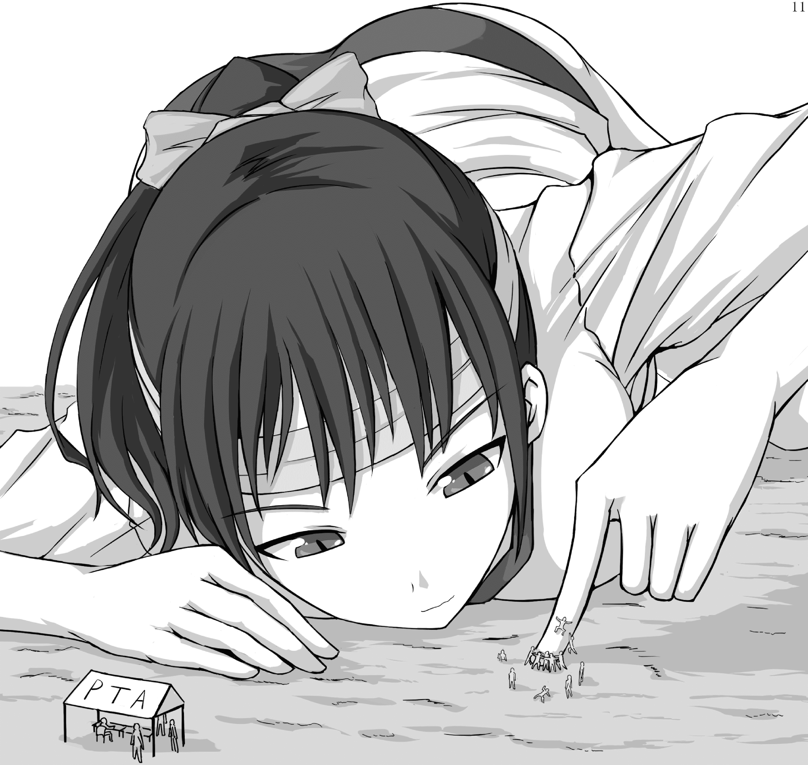

# 【翻译】寺田的图

作者：leo1223

TID：19342

 

# 1

话说我不知道这个翻译过没，而且这是英翻中，有任何问题请多多见谅

给点评论吧哈哈

点击看大图吧

<ignore_js_op>

**Untitled.png** *(2.58 MB, 下載次數: 13)*

[下載附件](forum.php?mod=attachment&aid=NTI5NzB8NDA2Nzg4NjZ8MTYwMDg4ODIxOXwxODIzMHwxOTM0Mg%3D%3D&nothumb=yes)

2015-7-5 12:28 上傳

在隔壁的场地中，举办着“拉杆”比赛。

虽然完全是一个没有悬疑的比赛。

第三班的新生，Yukiko Mizukiri 的对手是所有高三的第一班男生。

“学生们，请试试看移动新生的一个手指吧。”

新生俯卧在地上，将食指轻轻的插在地上。

很简单的规则，他们只要掰开女生的手指就行了。

男生们齐心协力尝试将手指移开，但是女生的手指只是静静地留在原地。

“啊哈哈哈，好痒啊！你们难道连推开人家的手指头都做不到吗？”

注视着男生们的举动，女生的嘴角悄悄翘起。

女生接着对手指吹了一口气。

“噢？风太强了吗？不好意思，我忘了学长们连学妹的一口气都抵档不了呢。”

男生们尝试着抓住她的手指，但是风还是将他们吹到场地上滚起来了。

学妹带着嘲讽的笑容看着那些本来想挑战她的手指，但是现在在地上晕着的男生们。

“啊，你们还可以站起来啊？好吧，就再给你们一次机会吧。”

但是，男生们一个一个因为疲累和绝望而倒下，而女生的手指还是无动于衷。

“像昆虫一样倒下真是可怜啊。不过一想到你们想蚂蚁一样聚集在我的手指真是让人鸡皮疙瘩啊。”

鸣笛了，就算时间还没到胜者也已经很明显了。女生被宣布获胜。

“啊，真是不舒服啊，学长们如果被我踩在脚下会比较好吧。”

学妹的手指晃了晃将剩余的学长们弹开。

“真是可怜呢……呵呵……”</ignore_js_op>