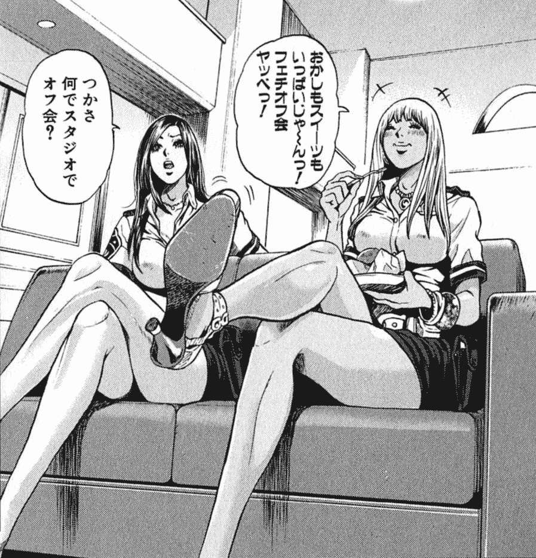

# 【翻译接龙】[大木奈子]1／100縮小光線銃の話[更新第18话]

作者：tread

TID：23200

 

# 1

*本帖最後由 tread 於 2017-12-22 00:42 編輯*

更新进度：

page1：[第9话 露天浴池的规矩](https://giantessnight.com/gnforum2012/forum.php?mod=viewthread&tid=23200)

page2：[第17话 舞厅](https://giantessnight.com/gnforum2012/forum.php?mod=redirect&goto=findpost&ptid=23200&pid=334987)

page3：[第11话 番外篇](https://giantessnight.com/gnforum2012/forum.php?mod=redirect&goto=findpost&ptid=23200&pid=337892)

page4：[第18话 翔子的复仇](https://giantessnight.com/gnforum2012/forum.php?mod=redirect&goto=findpost&ptid=23200&pid=352583)

=====================≠还是分割线======================

PS1：

之前的译者bootsky已经翻到第16话了（中间差第9和11话），不过貌似已经停翻很长时间了（毕竟是个不小的坑嘛）。

这是链接：[https://giantessnight.com/gnforum2012/forum.php?mod=viewthread&tid=3918](https://giantessnight.com/gnforum2012/forum.php?mod=viewthread&tid=3918)（普通会员才有阅读权限）

顺带一提原译者的译文十分流畅，很多用词也恰到好处，通篇读起来很舒服，不得不佩服……

因为本人也很喜欢大木奈子的缩小文，所以打算从9话开始…不敢说填坑吧…只能说翻到哪里是哪里咯

每一话之间的联系其实并不是特别强，所以单独地将每一话当作一篇即兴文来看也是可以的。

PS2：

原文地址：[http://nakoohki.tripod.com/sumika/sumika.htm](http://nakoohki.tripod.com/sumika/sumika.htm)

本文是关于一个持有能将人缩小成1/100大小光线枪的少女——风祭·澄香的故事。

讲述了“正义（？）”的少女们如何利用缩小光线枪，让男人们沦为她们“惩恶扬善”的牺牲品。

里面部分有残酷的描写，不喜者慎入。

小说内容均为虚构，与实际人物与团体没有任何关系。

PS3：

之前的译者说过想看澄香和翔子的想象图

我想说这两人组合马上让我想到了《GALSPOLICE 24時》里的冴花和纱耶

<ignore_js_op>

**GALSPOLICE 24時（冴花と纱耶）.jpg** *(293.17 KB, 下載次數: 2)*

[下載附件](forum.php?mod=attachment&aid=NjgxNDl8ZTQ5OTE0Mzh8MTYwMDg4NjMxMnwxODIzMHwyMzIwMA%3D%3D&nothumb=yes)

GALSPOLICE 24時（冴花と纱耶）

2017-6-3 13:04 上傳

年龄都是二十前后，专治好色之徒，一人比较认真，另一人则比较贪玩

翔子和沙耶应该都是那种gal系的女孩，不过澄香貌似是大家闺秀，跟冴花的感觉还是有点不一样呢

================分割线是这么用的吗？=====================

**第9话 露天浴池的规矩**

澄香和翔子一起，来到位于雪山深处的温泉街游玩。澄香与翔子是同上一间大学的好朋友。这次是澄香应了翔子的邀请一同前去。

“果然呐，说到温泉的话自然是露天浴池啦。”

翔子的眼神中充满了期待。

“在人迹罕至的深山中俊男美女在露天浴池里邂逅。袒露着身体的两人相互交流，不知不觉他们之间便萌生了爱情。啊…真的超期待的耶！”

“既然如此，干脆跟你男友两人一起来不就好了。”

澄香冷冷地回应道。

“要是男朋友还在的话就不会叫澄香来啦。就是因为跟他分手了，不得已才跟你一起来的嘛。所以说来到这里一定要抓住机会把男人钓到手才行。”

“不过前提是对方要长得帅吧。”

“好，既然定下来了那就出发吧。目标是在露天浴池内的美妙邂逅。”

说完，翔子就和澄香一同朝露天浴池走去。

*

“欸，澄香。话说你怎么穿泳衣呀？”

在更衣室里翔子问澄香。

“不穿的话会觉得不好意思啊。”

澄香回答道。

“可是你想啊，澄香。到时如果遇到了帅气的男生那可怎么办？穿着泳衣的话对方肯定会失去兴致的吧。”

“好，那我问你，如果遇到的是个好色的中年大叔那怎么办？你还不知道他会做出什么出格的事呢。所以说，穿一件泳衣作为最起码的保护是必须的吧。”

“你这么说好像也对呢。这样一来，如果我什么都不穿地跟你待在一起岂不像是个暴露狂吗。唉…好吧。不过看到有好男人的话要马上脱掉哦。”（喂喂…这不成了真正的变态暴露狂了吗…）

于是两人都换上泳衣进入了露天浴池。

*

在露天浴池弥漫的雾气中，只能看的只有她们两人的身影。

“根本就没人嘛。”

雾气中澄香一边说着，一边缓缓地泡进池里。

“是啊。明明我还那么期待，结果却扑了个空。”

翔子叹气道。

就在这时，雾气的另一边好像有人向这边靠近。

“会是怎样的人呢？”

翔子满怀期待地观察着。可是，现实还是无情地背叛了她的期待。靠近的是一个微微发福的中年男人。

“什么嘛，真扫兴。我们去那边吧。”

两人站了起来，准备朝男人的反方向走去。

“你们两个，给我站住！”

中年男性突然厉声喝道。

“你们怎么都穿着泳衣呢！”

他责问道。

“有什么所谓嘛，这点小事。混浴的话穿泳衣很正常吧。”

翔子马上反驳。

“不不不，不行就是不行！这里可不是温水泳池。这里是温泉，是浴池。难道你们在自己家里泡澡的时候也会穿泳衣吗？”

“这根本就不是一回事。你还真够啰嗦的耶。还是说，大叔，你就这么想看我们的裸体吗？ ”

“才不是！我呀，是在告诉你们泡温泉时最基本的规矩而已。最近的年轻人啊，根本不晓得什么是规矩。竟然穿着泳衣来泡温泉，你们都把温泉当什么了！”

“这哪有什么关系啊。真是越说越火大。澄香，把光线枪拿出来。我要把这个大叔缩小。”

翔子现在已经完全是“恼羞成怒”的状态了。

“你先别着急啊，翔子。我现在穿着泳衣，根本不可能把枪带在身上啊。”

“好，那我回更衣室拿。”

“等下，翔子！”

翔子根本听不进澄香的劝阻，径直地朝更衣室跑去。

*

“真是的，最近的年轻人没个像话的。你也一样，不想换掉泳衣的话就给我滚出去！”

留下来的澄香成了中年男性的出气筒。

“可是…”

突然变成孤身一人，澄香自然觉得心里没底。就在这时翔子回来了。

“让你久等了～。大叔，你给我看清楚了，这支光线枪可以将人类缩小成1/100的大小。作为惹恼我们的惩罚，我现在要将你缩小。”

翔子拿着光线枪朝中年男子射去。

可是，什么事都没有发生。

“翔子我都叫你等下嘛…这把光线枪除了我之外其他人都是用不了的”

“欸欸！？为什么？”

“这是防御机制。万一将男人缩小之前枪就被夺走了，结果被缩小的反而是自己，那还得了。为了防止出现这种情况，枪在发射之前先会对使用者进行验证，事先没注册过的ID人是无法使用的。”

“那你现在就帮我搞一个嘛，我偶尔也想自己把人缩小试试看呢。”

“现在没办法弄啦。”

看着她们旁若无人地说个起劲，中年男性忍无可忍。

“你们两个，快点给我滚出去！刚开始还以为你回去换掉泳衣，没想到竟然拿了支玩具水枪回来，你真当这里是泳池啊。不想换掉泳衣的话就给我滚去泳池，这里可是浴池！”

“啊啊，你真的好烦耶。真的那么碍你眼的话，你自己滚远点不就得了？再说，这可不是什么玩具枪而是真家伙。至今为止已经有多少男人被我们缩小然后踩死，你以为我说笑啊。”

“什么鬼乱七八糟的。我再说一次，我并不是想看你们的裸体还是怎么的，我是在告诉你们泡温泉时应该遵守的规矩。好，你们怎么都不肯换是吧，那可别怪我动手了。”

为了将不懂温泉规矩的人撵出浴池中年男性甚至不惜威胁对方。当然他压根就没打算真的动手，若真这么做了的话那就变成犯罪了。他不过是想吓唬吓唬对方而已。

可是，悲剧的是澄香把他的话当真了。

“不可饶恕！”

澄香一把夺过翔子手上的光线枪，把枪口对准了中年男性。

“想要动手脱女孩子衣服的人，根本没有活着的资格。”

说着澄香便朝中年男子射去，把他缩小成1/100的大小。

*  

“看吧，这就叫活该！”

翔子把小人抓了起来。

“抱着想看我们的裸体的不纯动机而跑来混浴温泉，你的好运也该到头了。”

澄香也跟翔子一个意思。

“没错没错。如果是个帅哥的话说不定还有救，像你这样的好色大叔嘛，没希望咯。”

翔子把小人提到了澄香的眼前。

“这家伙就交给翔子你来处理了。要踩死或是生吞，任你处置。”

“诶，真的吗？那…我倒想到一个好点子。”

只见翔子把小人塞进了自己的泳衣与胸部的缝隙之间，然后就这样泡进了浴池里。水位渐渐没过肩头，最后小人整个都被浸在了水下。

“哼哼，究竟能坚持几秒呢？”

翔子笑着把目光投向了自己胸前的小人。

*

虽然这对她们来说是件好笑的事，但对于小人来说这无疑是生死攸关的大危机。被浸在水下的他拼死想要挣脱，只可惜都是徒劳。因为泳衣这时正紧紧地贴着翔子的胸部，以他的力量想要逃脱根本不可能。

由于挣扎时没有憋住气，他很快便陷入了呼吸困难的状态。可越是挣扎，灌入口中的温泉水就越多。“我还不想死。”这时他只能拼命不停地敲打翔子的胸部。

“啊哈哈，还在乱动。差不多到极限了吧？”

说着翔子便从浴池中站了起来。好不容易从水中被解放出来，他赶紧拼了老命般地呼吸着新鲜的空气。

“好好玩哦，澄香你也来试下吧。”

翔子把小人递给了澄香。

“诶，那…我也来试试吧。”

澄香把小人夹在了泳衣的肩带下。

“可别让他就这样死掉哦。偶尔要让他呼吸一下。”

“我心里有数啦，翔子。”

于是澄香也泡进了浴池里，只有脖子以上露出水面。

*

新一轮的水刑又开始了。想要脱离呼吸困难状态的小人只能拼死挣扎。但是任凭他再怎么挣扎，对于澄香来说也不过是肩膀的表面有点痒的程度罢了。  

当被灌到差不多时，他又被带出了水面。

*

“这次试下这里吧。”

翔子把小人夹在了泳衣最底端紧贴大腿根部的地方。

“原本不是打算放到这里而是想放在'这里'的，不过万一沾到精液什么的想想还是不要了。”

翔子指着自己最隐私的部位说。

“翔子你…就算没有男人在场这么说话也太粗俗了吧。”

澄香的脸马上红了起来。

“安啦安啦。这有什么好在意的。比起这个，我们来看看他这次又能撑到什么时候吧。”

翔子又浸入了温泉之中。

*

这次他被带着一起沉到了水的深处。对小人来说这里的水压不可小觑，光是要承受这种压力就已经让他相当痛苦。可无论怎么动，他都无法从贴紧皮肤的泳衣下逃脱。一直屏住呼吸也差不多要到极限了，缺氧让他的意识逐渐变得模糊。  

在模糊的意识中他开始思考。为什么自己会遭受这样的罪？自己不过是在告诫对方正确的做法而已。听说最近在的年轻人里头，女性往往会大大方方地进入混浴场裸浴，反而是男的比较扭捏，总要遮遮掩掩的，实际真的是这样吗？虽说是有一部分人毫不在意裸露身体，但大部分女性还是无视掉外面张贴的“禁止穿泳衣入浴”的字条，明目张胆地穿着泳衣进入混浴区入浴。

就这样，他被可恨的翔子夹在泳衣内，失去了意识。

*

好冷……

寒冷的空气迫使他清醒了过来。想必是喝了不少水吧，他感觉身体十分沉重。

难道自己死掉了吗？感到不安的他开始环顾四周。

太好了。虽然视角不太一样，但这里应该还是之前的温泉街没错。看来暂时是得救了。现在，他正躺在给他带来无妄之灾的巨大女性的手心上。仔细一看，她们都已经换好了自己的衣服。应该是准备回去了吧。

“啊，终于醒过来了呢。”

翔子注意到小人醒了。

“翔子你也真是的。再怎么说把人沉到水底2分钟那么久也太过分了吧，搞不好就死掉了呢。”

“哈哈，泡得太舒服就给忘了。其实也无所谓嘛，反正最后都是要踩死的。死掉了又有什么关系呢。”

“那也是。总不能就这样把他带回去吧。”

“就是说嘛。不如就在这里跟他说再见吧。”

翔子把小人放到了雪地上。  

*

“好冷啊！”

他忍不住哀嚎了一声。那是当然的。全裸着身体被放到冰冷的雪地上，不冷才怪。

他不禁扪心自问，为什么此刻穿着温暖大衣的是那两个女孩，而裸露着身体的自己却被放在了冰冷的雪地上，这一定是哪里搞错了吧？做错事的应该是穿着泳衣进入浴池的她们才对啊，自己无疑是正确的一方。

如果据理力争的话，自己绝对能说得过对方。得出此般结论的他便开始大声喊道。

“你们两个！真以为这么做是对……”

只可惜，他连把话说完都办不到。翔子巨大的厚底靴，朝着他一丝不挂的身体上压去。很快小人的整个身体就被翔子的靴子所覆盖，而难以想象的重量更是将他深深地压进了厚厚的积雪之中。

*

不过，他还算走运。因为他身下的雪层十分松软，以至于他没有被当场踩扁而是深深地陷入其中。之后，他从巨大靴子的重压下被解放了出来。可话虽是这么说，他现在全身都被印满了靴底纹路的雪块所覆盖，根本无法动弹。刺骨的冰雪正渐渐侵蚀着他的身体，看来全身冻伤是避免不了的了。

“救救我吧！”

他竭尽自己的全力大声呼喊。按理说自己才是正确的一方，若要乞求她们原谅的话怎么想都不合理。可是现实是，照这么下去自己要么真的会被踩死，要么就会被冻死。眼下为了能获救哪还顾得上什么面子，当然全都豁出去了。

可是，少女们是无情的。

“哈哈哈。快看，澄香。这家伙还活着耶。”

翔子一边笑着一边戳了戳小人的胸口。

“真的耶。真是顽强呢。”

澄香把他拾了起来，重新放到了新的积雪上。

“这次稍微用点力踩吧。”

说着澄香便用力地朝小人踩去。

*

“呜啊啊啊！”

她们听到了鞋底穿来的惨叫声。澄香穿的靴子，乍一看与平时穿的长筒高跟靴无异，实际上靴底却大有不同。今天的这双为了能让穿着的人在雪地上稳稳地行走，鞋底布满了凹凸起伏的防滑纹理。加之澄香又踩得十分用力，猛烈的冲击透过澄香靴底凹凸不平的齿纹直接传递到他的身上。尽管身下柔软的积雪苟且让他保住了性命，难以忍受的剧痛还是让他发出了痛苦的悲鸣。

此时，正徘徊在死亡边缘的他，心中不禁对这双把自己逼向绝望的靴子产生了无尽的怨恨。**如此弱小、毫无抵抗能力的自己此时正被挤压在靴子冰冷而坚固的鞋底之下痛苦挣扎，而与此同时穿着暖和衣服的巨大少女的脚却被靴子那柔软又温暖的内侧小心翼翼地保护着**，这也太奇怪了吧。靴子你保护的对象是不是搞错了啊。

可是，小人的想法终究无法传达到她们那里。把脚挪开后，澄香端详起他的样子。

“好像已经奄奄一息了，不过…还活着呢。”

“我刚踩完的时候还活蹦乱跳的呢，怎么被澄香你踩完之后就半死不活了呢？是澄香你太重了吧。”

“喂翔子！你怎么可以……”

“开玩笑的啦。你要生气也不该对着我啊，要出气就朝这家伙出吧。”

翔子指向了小人。

“真是的，都是这家伙的错！”

澄香把他拾了起来，放在雪融后露出的混凝土上。

“这下该结束了！”

澄香施加上自身全部体重把小人狠狠地踩在脚下。

噗哧！

小人没能够在坚固的混凝土上坚持哪怕半秒，身体就被踩得四分五裂、不成人形了。

*

“啊～踩死了呢。不过现在想起来，其实这家伙有做过那么坏的事以至于要被踩死么？”

翔子朝着澄香的脚下看去。

“嗯…这么说起来…”

澄香也陷入了沉思。

“如果澄香你当时没有穿着泳衣进去泡温泉的话，这家伙也不至于会变成现在这个样子吧。”

“但是，他想要动手脱掉我的泳衣啊。应该是正当防卫吧。而且，一开始说要把他缩小的是翔子你吧。”

“可是，最后把他缩小的是澄香哦。”

“是翔子你先把光线枪带过来的吧。而且，你还暴露了那么多光线枪的秘密，这样一来就没理由让他活着回去了吧。好啦，我们走吧。”

对于已经被自己踩死的小人，澄香显得漠不关心，转身便向前走去。

“等下，澄香！”

翔子把澄香叫住。

**  “刚才那个小人好像还黏在你的鞋底上呢。”**

正如翔子所说，小人的残骸这时还黏在澄香靴子的鞋底上。

“讨厌，脏死了！”

澄香用脚踩着水泥地不断来回摩擦，想把黏在鞋底上的小人残骸给弄掉。

一部分残骸从鞋底脱落下来，被澄香来回摩擦的靴子碾成了渣滓。然而，就算在混凝土表面来回摩擦了几遍，还是有一部分小人的残骸死死地塞在鞋底纹路的凹槽内。

“好烦，弄不掉耶……”

澄香看着自己黑乎乎的鞋底。

“没事，在雪地上走几步自然就会掉下来的啦。”

听翔子这么一说，澄香便没再理会，继续向前走去。

*

黏在鞋底的小人在此之后，被澄香不断一次又一次地踩在脚下，终于在某刻与雪和泥混在一起，从鞋底下被解放了出来。而澄香踩过的地方残留下的那一点点红色的痕迹，也逐渐被落下的雪花覆盖，最后消失的得无影无踪。

--------------------------------------第9话完-----------------------------------------

第一次发主题，所以可能啰嗦了点，望见谅

还有，欢迎讨论撒

 

# 2

*本帖最後由 tread 於 2017-7-3 10:30 編輯*

**第17话 舞厅**

震耳欲聋的音乐充斥着整个舞厅，天花板上的玻璃球反射着耀眼的光。年轻的男女们在跟着音乐的节奏跳着舞。夜店的舞厅每晚都是这幅景象。

“唉。”

感觉无法融入这种氛围的澄香不禁发出了叹息。

“怎么啦？”

翔子询问道。今天澄香是生平第一次踏入夜店的歌舞厅。不过，初次体验的澄香感觉浑身不自在，好像根本无法融入这种环境。

“我稍微休息一下，去一趟洗手间。”

澄香从吵杂的舞厅里走了出来。

“看来，我好像不太适合这种地方呢。”

在走廊里澄香一个人嘀咕着。顺便一提今天澄香穿的是有黑色光泽服装，搭配皮革短裙和长筒高跟靴。这已经是她所有的衣服当中所能挑出的露出度最高、最能吸睛的衣服了。

可是，来到这里后澄香大吃一惊。从翔子那几乎与比基尼无异的服装开始，几乎所有人的服装都比澄香的尺度更大更撩人，像是迫不及待地想要展现自己的身体一样。原本还在担心自己的打扮是否太花俏，没想到反而太朴素了。

初次来到歌舞厅的澄香，对这种夸张的文化差异感到不适应。

“总之，先重新振作起来吧”

澄香一个人向洗手间走去。

*

喀、喀、喀……。

澄香从洗手间出来，脚步声在走廊回响。洗手间是在最里面一处阴暗的地方，看不到有其它客人。出来的走廊十分老旧，感觉像是电影里会发生灵异现象的地方。

“赶紧回去吧。”

感觉到毛骨悚然的澄香加快了脚步，朝舞厅的方向赶去。

“哟、这位小姐姐！”

这时，一个中年的醉汉向她搭话了。他用手撑着墙，挡在了澄香的去路前。

“就你一个人吗？也怪寂寞的。就让叔叔陪你玩玩吧。”

醉汉猥琐地摸向澄香的肩膀。

“请你放手！我有同伴陪我一起来，现在正要回去找她，请你让开！”

澄香推开醉汉，准备继续向前走。可是，醉汉拉着她的手不让她走。

“小姑娘，大人的话要好好听着才行哦。你现在一定很无聊吧，嗯？跟叔叔一起玩嘛。我知道有一家很不错的宾馆哦。”

他从背后抱着澄香。这就是人们常说的，醉汉的纠缠。从旁观者看来，他就是个“借酒发疯”家伙而已，但是这对当事人而言则是极大地困扰。

“你给我适可而止！我现在一点也不无聊！你快放手！”

这时，这个死缠烂打的男人命运已经注定了。他被澄香的光线枪缩小成1/100的大小。

澄香把缩小后的他用手指捏着提了起来。原本的话是想马上当场把他踩死的，但是耐不住想对这个困扰他人的醉汉进行一番说教。

“你这人真是的。难道就没有考虑过自己的行为给别人造成多大的困惑吗？”   

澄香把他提到跟自己眼睛差不多高的位置进行训话。完全不知道发生什么事的他还傻傻地愣在那里，但是看到眼前巨大的澄香不禁被吓得汗毛直竖。

“你把女孩子都当成什么了。虽然现在穿着这样的衣服，但是并不代表我们就想跟男人上床呀。”

男人一心只想着早点脱离，可惜任凭他怎么挣扎都无法撼动澄香巨大的手指。

“别想着逃跑了。只要我有这个心我现在就能轻易地把你捏死哦。听好了，现在你给我发誓，以后再也不会做出这种骚扰女孩子的事了。”

听了澄香的话后男的放弃了挣扎。酒醒之后的他清楚地意识到，为了避免自身遭遇不测只能听从对方的话。

“抱歉是我错了，我再也不敢了。求你原谅我吧。”

“这还差不多，能明白就最好。”

澄香稍微放松了的手指的力度。实际上无论怎样到最后他都会被踩死，认不认错根本一点关系都没有。明明就没有要放过对方的打算却还算一味地逼迫对方认错，这从某种意义上来说真是一种残酷至极的行为。  

“接下来…”

正当澄香准备把他放到地上踩死的时候，她听到了熟悉的叫喊声。

“澄香～！”

是翔子来了。

*

“怎么搞的呀，上个厕所也要这么久，难道是大号？”

“喂翔子，你怎么可以在别人面前说这种话。不是这么回事啦。”

对于翔子一如既往的粗线条，澄香完全没撤。

“这有什么不好意思的嘛。只要是个人，他就肯定有要拉屎和撒尿的时候啦。所以想说的时候就说嘛，何必那么在意场合呢。”

虽然翔子的话听起来像是这么回事，但成长环境的差异还是让她对此有所抵触。

“但我们是女孩子耶，女孩子怎么能说这么粗俗的…”

“哈哈哈。男人也好女人也好，都没差啦。比起这个呀澄香，我们得快点啦，要不舞台就要被人抢去咯。”

说着翔子便拉起了澄香的手。于是，手里还捏着小人的澄香就这样被翔子硬拉回了舞厅。

*

嘭！

在舞厅里澄香不知跟谁撞在了一起，失去了平衡。

“啊，抱歉。”

澄香马上道了歉。幸好对方也是个老实人，相互道了歉也就没什么了。

“翔子也真是的，不顾一切就拽着人家跑。”

澄香小声地抗议道。

“好啦好啦，我知道了啦”

翔子一边说着，一边将身旁桌子上的盘子酒杯全都拨开。

“你这是要干嘛？”

澄香问翔子。

“这个就是即兴舞台哦！在这上面跳舞绝对能吸引目光。”

翔子说着便穿着靴子站到了桌子上。顺带一提，翔子今天穿的是红色的漆皮高跟靴，高高的防水台后面是如钉子一般锐利的高跟鞋跟。

“喂翔子，怎么能穿着鞋站在吃东西的桌子上面。”

澄香想要阻止，但翔子完全没有在意。

“光着脚怎么跳舞啊。快，澄香也一起站上来吧。”

翔子拉起澄香的手。对于犹豫不决的澄香，周围的观众也开始起哄造势。

“站上去！来一个！”、“让我们开开眼界吧！”

台下来自男性们的助威声此起彼伏。他们的目的，无非是想怂恿穿着迷你裙的澄香站到桌上跳舞，好让他们能在特等席上从下往上地看个一清二楚。虽然澄香自己也知道不能被周围带着节奏走，但事到如今这股“势”已经是不可逆的了。澄香放弃了抵抗，穿着皮靴直接站到了桌子上。

跟着音乐的节奏，澄香有样学样的跳了起来。舞倒是跳得一般般，但感受着男性们自下而上的视线，一种莫名的兴奋感油然而生。本来应该用来吃东西的桌子，在澄香和翔子的踩踏下变得越来越脏。可是尽管桌上布满了无数自己的鞋印，对现在的澄香来说，这都不是什么值得在意的事。

*

“呼…真够累的。”

跳了一段时间后，两人从桌子上下来，来到舞厅的角落休息。

“差不多该回去了吧。”

澄香看了下时间，马上要到末班车的时间了。

“嗯，回去吧。…啊！”

澄香想起自己忘了一件重要的事情。

“怎么办，之前那个小人被我给弄不见了。”

“嗯？小人？怎么回事？”

于是澄香便把之前去厕所时遇到醉汉的事情全都告诉了翔子。

“什么嘛，这种事早点跟我说嘛，正好我可以用这双新买的漆皮靴把他踩扁。”

翔子亮出了自己大红色的漆皮靴给澄香看。

“二话不说就拉着人家跑的正是翔子你啊。话说这下可怎么办啊，估计是刚才进场时被人给撞掉了。要是这么放着不管让他得救的话，到时他把我们光线枪的秘密给公开出来的话就糟啦。”

“放心吧澄香。你看这里有这么多人。肯定早已经被谁踩成肉饼了。”

“若真的是这样就好了。”

“肯定是的啦。话说回来澄香，现在怎么说？要在留这跳舞一直跳到早上，还是现在就回家？”

“现在就回去吧。再怎么说跳到早上也太勉强了。”

“也是，毕竟第一次嘛，不用勉强啦。正好，为了保护澄香你不再被奇怪的大叔骚扰，我陪你一起走吧。”

两人就这样把小人的事彻底抛诸脑后，离开了舞厅。

*

虽然翔子声称那个被缩小的醉汉“肯定早已经被谁踩成肉饼了”，但实际上他还活着。正如澄香猜想的那样，他在澄香与某人在舞厅相撞的时候被甩了出来。不过他的运气不错，掉下来的时候正好落在了另一个被撞女孩的系带皮靴上。死死抓住鞋带不放的他避免了直接坠落到地面上。

此时，他还相信着澄香会回来找他让他变回原来的样子。可是，过了许久他依旧等不到澄香的现身，最后只好放弃等待转而尝试主动去寻找对方。他先试着小心翼翼地顺着交织的鞋带往下爬。可靴子的主人正在卖力地跳着舞，只要一不小心，失足的他无疑会被甩飞到很远。早已酒醒的他十分小心地一点一点往下爬。在最底端的鞋带下面是坚硬的皮革，到了这里除了滑下去别无选择。他看准时机，在穿靴子的女性动作停下的那一瞬，果断地滑下了靴子，平安地到达了地面。

落回地面的他正准备启程去寻找澄香的下落，不料危险马上接踵而至。根本猜不出会踩向何处的巨大的鞋子一次又一次地向他袭来。不过幸运的是，在他四周的全都是女性。比起男性，她们不仅体重更轻，而且鞋与地面接触的面积更小，所以被踩到的可能性也更低。不过尽管如此，如果被踩到了那无疑也是一击必死。周围的女性有的穿著高跟鞋，有的穿著凉鞋，但是穿高跟靴的女性还是压倒性的占了多数。他光是要避开这些女性脚下的巨大靴子东逃西窜已经是竭尽全力了，根本就没有多余的精力去寻找澄香的踪迹。  

就这样时间一分一秒地过去了，在巨大的脚的缝隙之间他终于看到了在遥远的地方、把他缩小的女性和带她一起来的另一名女性离开的身影。看到这一幕的他陷入了深深的绝望之中。本来他对澄香会来救他这点一直都深信不疑，而结果等到的却是对他的抛弃，这样的打击让他无法承受。然而实际上如果被澄香找到了，他不仅不会得救，还会马上被她就地踩死。并不知晓这点的他还在为刚才的打击而消沉。

这时，一只体型巨大的怪物正从远处朝他爬来，而还没缓过神来的他这时还傻傻站在原地。在他看来，那是一只身长3米有余、全身黑得发亮的巨型甲虫。  

然而实际上，那不过是一只体长3厘米不到的蟑螂而已，但是对现在的他来说，称之为怪物一点也不为过。只见怪物以远超他想象的速度径直地爬到了过来，估计是把他当成食物了吧。眨眼的功夫，他的生命已岌岌可危。  

但是，他的运气好像不错。在他头顶大约10厘米的位置，女孩的一只巨大的靴子从天而降，朝着怪物的方向落去。

噗呲、喀哧喀哧。  

随着鞋底传出的模糊声响，像是怪物体液的白色液体被挤了出来。其实也没什么，就是一个穿着紧身短裙、完全忘我跳着舞的女孩在无意识间踩死了一只蟑螂而已，但是从小人的角度来看，女孩的这份力量简直与女神无异。

当女孩把脚挪开后，小人看到被踩得惨不忍睹的怪物尸体黏在地上，而女孩鞋底的纹路还清晰的印在上面。看着尸体，小人除了感谢，在心里不由得对女孩巨大的高跟皮靴产生了敬畏之情。

可是接下来，这只靴子便将目标转向了他。虽说从他的角度来看靴子已经离开他将近10米远，但实际上只是停留在不到10厘米远的地方而已。舞动幅度较大的话这个距离根本算不上什么。只见刚刚踩死蟑螂的那只靴子已经盖过了他的头顶。抬头一看，发现鞋底还黏着刚刚踩死的蟑螂的体液和残骸。

“等等！为什么连我也…？”

他大喊道。然而，女孩之前才踩死那只蟑螂并不是为了救他，现在踩向他也绝非有意要杀他。对于女孩来说，这些都不过是她在踏着音乐的节奏跳舞时，无意识之间不小心踩到的东西而已。   

并未意识到这点的小人很快就被女孩踩在脚下，用自己的身体承受了整个女孩的体重。这是连拥有外骨骼的蟑螂都能轻易踩烂的重量，没有任何保护、仅仅是血肉之躯的他根本无法承受。于是，他被女孩不费吹灰之力轻易踩死，人生到此为止。

在这之后，穿着紧身短裙的女孩仍依旧尽情地跳着舞，高跟皮靴一次又一次地在小人的残骸上踩来踩去。明明是把一个活生生的人就这样给踩死了，女孩本人对此却一点感觉都没有。虽然残酷但这就是事实，并不知情的女孩仍不断地踩着他的残骸，踩到最后已经无法辨认出原型了。

清晨来临，终于到了夜店舞厅关门的时候了。不过这时他的残骸经过周围女性的各种踩踏，早已不知所踪。唯有一点黑色的污迹，仍然残留在地板上。

后来，就连这点污迹，也在早上被店内清洁人员清理掉，一点痕迹都没有留下。

*

第二天的晚上，在他死去的这个地方，陆陆续续有别的女孩穿上高跟靴，用力地踏在这块地板上尽情地跳舞。

=====================17话完========================

如果喜欢的话可以给点评论，或是指出不足，当然讨论文章内容更加欢迎，也算是给楼主一点动力吧

 

# 3

*本帖最後由 tread 於 2017-7-4 15:59 編輯*

PS：此篇相当于是前面10话的内容回顾，主要是通过角色相互吐槽互动的形式来进行的，其中会提及一些作者创作的背景及灵感的来源等。除此之外，文中还会穿插一些日本的读者的感想。总的来说也还是蛮有趣的。

==============================分==========================

**第11话 番外篇**

翔子：大家好！我是本作的主人公 前岛翔子。

澄香：喂等下，别误导别人好不好。主人公是我啦，我叫风祭澄香。

翔子：也没差啦。反正我的人气更高，或许该考虑换个主角了？

澄香：不行。翔子人气更高肯定是骗人的。

麻纪：那倒未必。从作者收到的回复邮件来看，貌似是翔子的粉丝比较多哦。

澄香：啊，是麻纪小姐。

麻纪：先自我介绍一下吧。澄香刚刚叫我麻纪。简单来说，我姑且算是开发并制造了那支能把人类缩小的光线枪的主要技术人员吧。

翔子：那么接下来，就由我们三人一起来回顾一下之前几话的作品吧。

*

翔子：首先先从第一篇、《45岁的科长》 开始讲起吧。那是一篇描述了被澄香缩小后放置在了车站站台上的45岁的科长，在经历了各种死里逃生之后，最终还是被人踩死的故事。

麻纪：这是作者系列文章的开篇之作。之所以会采用这种将被害者命名为文章标题的做法，应该是受作者最早在网络上发表的另一篇文章的影响。不过貌似作者本人并未预料到这个系列文章会连载成这么长篇，以至于当时的出场人物连名字都没有。

澄香：确实如此呢。这里的“大家闺秀型的女大学生”指的就是我吧。以男性为第一人称视角来描写的故事，读起来感觉很不一样呢。

翔子：还大家闺秀型呢…（笑）

澄香：有什么好笑的嘛？

翔子：没什么，只是觉得现在的澄香跟最初的角色定位比变化还真大啊。

澄香：才没有变呢。

翔子：确实。经常搞错、常因为自己误会而把无辜的人缩小这点倒是一直都没变呢。

澄香：可当时我真的以为他就是犯人啊！再说了，最后踩死他的人又不是我。

翔子：比起立即杀死对方，让对方在他人脚下受尽折磨而死反而更加残酷吧。而且踩到他的人还浑然不知。明明没做错什么却被别人踩死的那个科长，还真是够可怜的呢。

麻纪：虽说光线枪是可以击退痴汉、防身自卫用的道具，但若使用不慎，必定会酿成大错。此处作者安排被害者被冤枉成痴汉最终惨死他人脚下，就是想表达这一层意思。

澄香：嗯。不过话说回来，这一篇里翔子貌似还没出场呢。莫非……最后踩死他的那个穿厚底靴的辣妹系女孩，就是翔子？

翔子：怎么可能。像这样的人到处都有好吧。果然，没有我出场的故事都很无聊呢。好，下一个。

*

翔子：第二篇是《某大学的体育大会》。讲的是两名体育系的男大学生想要侵犯澄香，结果被澄香缩小后踩死的故事。

麻纪：与前篇的《45岁的科长》不同，这次澄香的行为确实是正当防卫。也正是在这部作品中，首次出现了澄香的名字与大学的校名。

澄香：当时我真被吓坏了，不动手的话肯定会被干掉吧。

翔子：孤零零一个人也敢走在夜间的小道上，真是心大呢（笑）。

澄香：是袭击我的那帮人不好吧！

翔子：谁叫澄香你总是一副毫无防备的样子呢。不过话说回来，我们在读的这间“平成女子大学”，真的是那么不起眼的学校吗？

澄香：也没差啦，毕竟是连翔子这样的人都能考进的大学嘛。

翔子：你还真敢说呢。明明自己也是半斤八两。

麻纪：最近因为学生的数量变少了，所以无论谁都能轻松考进的大学也开始相应增多。作者就是以此为模板构思的吧。不过万一现实中真有同名学校的话那可就不好办了，为此作者还特意去调查过。还有，与第一篇不同，此作澄香是有意识的用踩踏来终结被害者的生命。

*

翔子：好，那么接下来，是第三篇的《在联谊会之后》。

澄香：先等下！仔细想想，为何从刚刚开始就一直都是你在主持啊？

翔子：有什么所谓嘛。要是澄香来主持的话肯定到天黑都说不完啦。再说了，这篇可是我的初次登场，怎么说都该由我来吧。

麻纪：话是这么说没错，但实际上，作者当初是想就这样以三部曲的形式来终结掉这个系列的。

翔子：欸欸！？

麻纪：证据之一就是本作出现的翔子连名字都还没有。而澄香本来是打算将这位被缩小的无名好友一起踩死的，不过后来反悔了。于是以此为契机将光线枪封印发誓决不再使用。原本剧情是如此安排的。只不过后来作者突然改变主意，结果就将故事发展成现在这样。

澄香：真是好险啊，翔子。当初若不是作者改变主意，你连名字都没出现就被踩死了呢。你要感谢我的不杀之恩哦。

翔子：嗯，不过要感谢的对象不是澄香，而是在回复的信件中不断鼓励作者继续写下去的人呢。

澄香：呃…好吧。总之，这话就是将以xxoo为目的来参加联谊的人缩小踩死的故事咯。

翔子：联谊会后难得人家邀请我们去参加二次会耶，结果澄香你却这么死脑筋，只把联谊当作是吃吃喝喝唱唱卡拉OK的活动。

澄香：一般都是这样的吧。

翔子：明明都是金龟婿啊，太可惜了。如果不踩死的话，我早就攀上高枝……

澄香：好，此话到此为止！下一话。

*

翔子：第四话，也就是《尾随者》。在这篇里我的名字总算是出来了呢。

麻纪：这话主要讲的是被跟踪狂盯上的翔子，反过来将跟踪的人缩小后踩死的故事。

澄香：随着翔子被跟踪的原因揭晓，翔子这个角色才真正开始鲜活起来。

翔子：当时我用那个男人买给我的靴子踩死他时，真心觉得自己生为女生实在是太好了。

麻纪：因为是个横冲直撞（ぶっ飛び）的角色，所以叫作“翔子”。由于作者没想到之后翔子会作为澄香的搭档一直活跃至今，所以名字也起的相当随意。作品内容是以当下社会对尾随者日渐严厉的舆论声讨为创作灵感写下的。当时并不满足于踩死对方，之后还像踩灭烟头那样反复碾压被害者尸体的翔子确实给人留下挺深刻的印象。

澄香：就是从那时起，翔子开始大放异彩了呢。

翔子：全靠我的人格魅力哦（笑）。接着下一篇。

*

澄香：第五部作品是《误会》。

麻纪：讲述了闯入澄香他们在读的平成女子大学的两名被害者，被误当作痴汉而被踩死的故事。此篇中首次出现了男性具体的名字，不过并没有什么特别的含义在里面。

澄香：翔子还是一如既往，神经大条啊。

翔子：话说在这一篇里我们完全就是恶人的角色嘛。

麻纪：不用担心。在作者收到的反馈意见里面没有人责怪你们哦。

澄香：太好了~

翔子：谁叫他们随随便便闯入明令禁止男生进入的女子大学。踩死他们纯属无奈之举嘛。

澄香：话说当时你对自己看上的那个男生百般袒护，对另一个却二话不说直接踩死。翔子你还真是无情呢…

翔子：咦，可我记得当初说要“惩罚这些痴汉”的是澄香才对啊，而且还说什么“绝对不能让这些家伙活下来”，连我的那个男生也不放过。

澄香：因为他们都是痴汉啊。最不能饶恕的就是这类人了。

麻纪：但是，被你们踩死的这两个人最后被证实是无辜的。像这样把别的男人误认为是痴汉或变态的情况已经不是第一次了，你们以后还是多注意一下吧。

*

澄香：接下来是第六篇《性骚扰》。

麻纪：讲的是澄香她们接受了某位OL的委托，将喜欢性骚扰的上司缩小后给予惩罚的故事。

翔子：这算是我们当时接手的一份“工作”吧。不知道当时的浦雾小姐现在怎样了呢？

澄香：从那之后就再也没有联系过了呢。

翔子：嗯。估计是不想再和光线枪扯上什么关系了吧。看来浦雾小姐应该是遵守了诺言，没有跟任何人说起光线枪的事。

澄香：话说回来翔子，你怎么能随随便便将光线枪的秘密暴露给别人呢。

翔子：哈哈，抱歉！不过当时我没打算杀死他呀。原本只是打算让浦雾小姐吓唬吓唬缩小后的上司，让他从此打消性骚扰的念头。谁知道浦雾小姐真的把他给踩死了。

麻纪：OL的浦雾小姐当时穿的是上班用的高跟鞋。有人说比起30岁左右OL的高跟鞋，更希望被害者被不到20岁的年轻女孩穿着的靴子踩死。据说作者当时曾收到过这样的意见。

翔子：听了很高兴呀。这是否也说明我们越来越有人气了呢。

*

澄香：第七部作品是《狩猎大叔（オヤジ狩り：当时日本社会出现的年轻人集团抢劫成年人钱财的犯罪事件）》。

麻纪：说的是以上班族大叔为目标抢劫作恶的少年集团被澄香她们缩小，接受了相应的惩罚……若真是这样那还说得过去，然而实际上还是有些出入。

翔子：就是嘛，我也这么觉得。一开始对眼前发生的恶行冷眼相看，等发生到自己身上时才觉得对方无法原谅。

澄香：人都是这样的啦。只要不会波及到自己，对于其他受害者大多都漠不关心。而且，作为结果来说，那些作恶的家伙不也都得到了应有的惩罚嘛。

翔子：姑且算是这样吧。不过，难得当时有机会踩死这么多人，本来应该慢慢来的，结果却搞得那么仓促。

澄香：是啊，毕竟当时踩得都很用力，而且后来有人靠近也不得不草草收尾。

麻纪：从作者收到的意见来看，有人希望既然是要惩罚，如果能一点一点地施加重量，让这些已经在反省的少年在痛苦中慢慢被踩死就更好了。（日本的读者们你们真是够坏的……）

*

澄香：那么，接下来是第八作 《小人们的愿望》。

麻纪：本作之前澄香他们对待被缩小后的男人基本上都是废话少说直接踩死，不过在本话中小人们首次能够以自己希望的形式被杀死。

翔子：终于有次是可以安心一个人一个人慢慢处置了。没想到光线枪还能这么用呢，真是个好主意。

澄香：还好啦。不过就算是小人，如果是好色男人提出的愿望我是拒绝的。

翔子：没错。不过我一直在想啊，缩小成1/100的的话，无论怎样踩不都是一下就结束了么？就算我想要踩着一半身体一点一点给予痛苦也做不到啊。因为实在太小了。

麻纪：作者之所以将大小设定为1/100，是希望能像第一话那样，让踩到小人的人几乎察觉不到自己踩到什么东西。另外被害人的身体在被踩之后，不但会难以被辨认出原型，甚至连存在的痕迹都会被抹消掉了。这么一来便可免去处理尸体残骸的麻烦。其实还有一个原因就是，作者貌似不太擅长描写尸体之类的东西。

翔子：真是意料之外的情报啊。下次再有男人被缩小的话，我就把他踩个稀巴烂，然后再仔细观察一番！你说作者会怎么描写呢？

澄香：喂喂，翔子你别闹。

翔子：开玩笑的啦（笑）

麻纪：随带一提，在《狩猎大叔》中对作恶的少年集团进行的虐杀，以及在《小人们的愿望》中听取男人的愿望的情节设计，都是作者参考了读者们电邮中的各种的想法而构思出来的。

*

澄香：接着是第9话 《露天浴池的规矩》。

麻纪：讲的是穿着泳衣进入混浴池的澄香与翔子在遭人劝诫之后，反而恼羞成怒地将提醒她们的人缩小踩死的故事。

翔子：谁叫那个好色男人泡温泉时还怀着非分之想。现在想起来都觉得超火大的。

澄香：话说回来，为什么浴池这类地方一般都不允许穿着泳衣泡温泉呢？

麻纪：主要是因为卫生方面的问题。首先泳衣的材质，就算被洗干净晒干之后，上面还是有可能会残留有污迹或有传染性的病毒。再者，在温泉水这种温暖的环境里，病毒细菌也相对更容易繁殖从而扩大传染范围。而泳池之所以可以穿泳衣下水主要是因为这里的水一般都是经过消毒的，这点在温泉浴池这种地方一般比较难实施。

澄香：原来如此啊。

麻纪：难懂的话题先放一边，在本话中首次出现了小人黏在靴子鞋底的描写。像这种被踩死了之后，身体仍然黏在鞋底被反复踩踏直至最后踪迹全无的情节，让人觉得欲罢不能。据说作者当时收到过这样的读者回复。

翔子：另外，也是在这话中我们知道了光线枪是只有澄香才能使用的东西。要是我也能用的话，故事一定会更加有趣的说。

*

澄香：没错。于是便就有了第10话 《巨大化的澄香》。

翔子：这次做得有些过头了呢。本来是想把澄香缩小试试看的，谁知反而将澄香巨大化了。

澄香：就是说嘛，翔子你也太过分了。

麻纪：更过分的应该是澄香吧？当时被巨大化的澄香踩死的人少说也应该有几百人吧？不过，在当时那种情况下这也是在所难免的事。

澄香：确实如此呢。不过话说回来，当时引发了这么大的骚动，要怎么做才能将事情平息下去呢？

麻纪：这个就要看作者的安排了。说实话，要是作者早就想好接下来的故事情节，还需要写这个（番外篇）来拖延下一话的创作吗？（噗~ 这不就跟动画新番用总集篇拖延制作一样一样的嘛？作者真是个耿直BOY~）

翔子：不过，既然我们知道了光线枪能够将人巨大化，此后肯定会有更加出彩的表现吧。

麻纪：别太乱来哦，不然下一话变成《罪行败露的两人最终被判死刑》那可就不好办了。

澄香：确实要注意一下呢。

*

翔子：以上就是我们3人对澄香这个系列作品的内幕剧情讲解。非常感谢大家能一直读到最后。

麻纪：到目前为止的这10话作品当作，被澄香缩小后踩死的男人一共有13人，如果算上第8话开头就被踩死的那就有14人。另一边，被翔子踩死的人则有7人。其中一个与其说是被踩死倒不如说是被吃掉吧。另外，通过其他方式被杀死的还有2人。其实除此之外，光是澄香巨大化时踩死的人就有已经有数百人之多。

澄香：咦，我有踩死过这么多人吗？

翔子：被发现的话绝对是死刑啦。（笑）

澄香：大家都是好孩子，记住切勿模仿哦。

麻纪：嘛，虽然作者水平有限，肯定会有很多考虑不周的地方，但还是希望大家能够继续读下去。

澄香：往后我也会继续使用光线枪，请大家拭目以待吧。

翔子：没错。大家记得给我寄粉丝来信哦！像是“希望让翔子当主角”这样的来信绝对欢迎哦！

澄香：啊，你耍赖。收件人不要写翔子要写我哦！

麻纪：虽然这么说有点厚脸皮，作者还是希望能收到大家发来的感想。像是“还想看更多这样的故事。”之类我们不胜欢迎。

翔子：那么番外篇到此结束，下一话再见咯。

全员：拜拜~！

=======================第11话完============================

 

# 4

噗噗~，之前在隔壁M系论坛遇到之前翻译这个系列的大佬了，看来大佬最近在隔壁活跃啊

话说论坛里应该也有人两边（M系资源聚合）都有玩吧？我觉得喜欢M系的和喜欢GTS的应该有部分是重叠的

记得那边论坛也有人喜欢缩小类题材的游戏

 

# 5

> [4388239 發表於 2017-8-12 13:51](https://giantessnight.com/gnforum2012/forum.php?mod=redirect&goto=findpost&pid=344051&ptid=23200)

> 咋没了呢 又变成坑了

感觉……没啥人看啊

 

# 6

*本帖最後由 tread 於 2017-12-21 21:43 編輯*

久久打开，还有人在看啊，都准备要坑掉的说……，

--------------------------------------------+++-------------没什么用的分割线----------------------------------------------------------------- **第18话 翔子的复仇** 

“宅也~ 今晚只有我们两个人耶，来好好亲热一番吧。”

女方主动挑逗着对方。这个女孩的名字叫前岛翔子。一身典型辣妹系的打扮，一看就是那种喜欢跟男人玩在一起的女孩。两人之所以会在一起也是源自翔子的主动出击，所以每次要做的时候也都是由翔子主动发起的。

“抱歉，今天还是算了吧。”

然而宅也这边却拒绝了女友的好意。往常都会欣然接受的男友突然一反常态，翔子不由得皱起了眉。

“怎么了？宅也。该不会是…有了别的女人吧？”

女人的直觉往往都是很敏锐的。宅也被说中了，只好老实交代。

“抱歉，我已经有了喜欢的人了。”

“什么！你也太过分了吧。明明都已经有我了，你还想怎样啊！”

翔子大发雷霆。

“你也不想想我都跟你做了多少次了？女孩子为你做到这一步，就等于将自己的未来托付给你了。没想到你却……你不觉得太过份了吗！”

“真的对不起。其实我从未怀疑过你作为女性的魅力。若单是作为女友的话，我觉得翔子你是我交往过所有女孩子中最有魅力的一个。但是，如果考虑的是未来将要共度一生的对象，我觉得应该会有更加理性的女性才对。当然，我知道这全都是我个人的问题。我对我单方面提出的无理要求向你道歉。请你原谅我吧！”

“好啦我知道了啦。”

面对宅也双手合十的道歉，翔子长叹了一口气。

“那么，今后我们就只是普通朋友关系。相互不可以再干涉对方哦。”

对于男友换了一个又一个的翔子来说，情绪的转换不过一眨眼的功夫。

“不过，最后我想知道。比起我，你更愿意将来与其共度一生的女性到底是谁啊？”

“这个嘛……”

没想到在这个问题反而令宅也欲言又止。

“我不会去妨碍你们的啦。我只是希望能够祝福你们而已。再说现在分手是你单方面提出的，我稍微打听一下也不过分吧。还是说，有什么难言之隐？”

“好吧，我说。对方……其实就是之前你介绍过的那个跟你一起来的女孩。”

宅也面露难色地坦白道。

“什么，是澄香！？她怎么能做出这么过分的事！竟然装作好友的样子在背地里抢我的男人。好，从今日起我就跟她绝交。”

“不是这样啦。你先冷静听我解释好不好。主动追求的人是我，而且对方也没答应。实际上她根本一点错都没有，拜托你别再怪她了好吗？”

“就算宅也你这么说，抢走别人的男人这点我是无论如何都无法原谅的！”

对于正在气头上的翔子，宅也再怎么解释都是徒劳。

*

第二天早上，翔子与好友风祭澄香在大学的教室内相遇。虽说翔子是个喜欢出去浪的辣妹系女孩，但白天好歹也是个大学生。只不过，像她这种每晚都在外面浪的人也能考进的大学，其水平肯定高不到哪里去。

澄香是她一进大学就结识的好友。与翔子不同，澄香一看就是与辣妹系完全不沾边的人，倒不如说有种大家闺秀的气质。看起来性格截然不同的两个人，不知为何待在一起时总是很合得来。

“早啊，翔子。怎么啦？感觉好像很累的样子啊，没事吧？是不是晚上玩过头了啊？”

澄香主动先打招呼。不过，翔子因为昨天的事显然还一肚子气。只要扯上了男人，女孩子翻脸简直比翻书还快。

“哼。澄香才是，每天都跟男人鬼混在一起不会累吗？”

“！？”

面对翔子态度突如其来的转变，澄香瞪圆了眼。此时她根本就不知道翔子与宅也之间到底发生了什么，只能一脸愕然说不出话来。

*

“原来是这么一回事啊。抱歉，翔子。我一直都没注意到。”

午休的时候，澄香终于从翔子的口中了解到事情的缘由，并道了歉。

“澄香你怎么能这样，抢走好友的男人连眼都不眨一下。你造我很不爽吗！”

“不是啦。我从一开始就打算拒绝他的。再怎么说我也不会找翔子的恋人下手吧。”

“感觉信不过呢。因为澄香看起来就像这种人。”

“翔子你怎么能这么说我，好过分耶。”

“哈哈哈，逗你玩的啦。”

一直在闹别扭的翔子，总算是恢复到平常的样子了。

“不过啊，翔子。其实就算宅也他不是你的男友，我也还是会拒绝的。因为他当时他竟然一直在问我觉得几岁结婚比较合适啊、一个月做几次比较好啊、想要生几个小孩啊之类的露骨问题。”

“这样问，完全是以结婚为前提为将来打算嘛。真是火大，明明跟我在一起时就从来不问这种问题。”

已经冷静下来的翔子，又开始把怨气的矛头指向前男友宅也。   

“嘛，反正下次见面时我会好好拒绝掉他的，翔子你就放心好了。”

“下次见面是几时啊？”

翔子追问澄香。实际上，翔子此时已经暗暗在脑中想好了一个可怕的计划。

“下个星期天哦。”

不知道翔子心里打着鬼主意的澄香想都没想就说了出口。

“话说澄香，我到时能不能跟着一起去啊？”

“欸？你跟着去干嘛啊。难道翔子你是在担心我会背着你偷偷跟宅也交往吗？”

“不是啦。其实我跟你说，宅也这个人啊，只要一言不合马上就会暴力相向。我是有点担心澄香你一个人……”

当然这都是骗人的。但翔子觉得自己怎么都咽不下这口气，所以为了报复对方甚至不惜欺骗澄香。

“真的？好可怕，我有点担心耶…”

“没事啦，到时我会在后面跟着。万一他真的有要动粗的迹象我就马上现身，怎样？”

“好，那到时就拜托你咯。”

于是就这样，翔子向着抛弃自己而选择了澄香的前男友复仇的道路，又走近了一步。

*

星期天，翔子与澄香一同到了与宅也碰面的地方。

“好，澄香。我就躲在这里看着。你尽管放心地去吧。”

“嗯好的。”

“还有，如果看到我给你打暗号，就要马上将他缩小哦，知道吗？千万不能犹豫，不然等他动手时就来不及了。他可是那种超容易炸毛的人哦。”

“嗯。翔子，那到时暗号就拜托你了。”

于是，并不清楚宅也真正为人的澄香，就这样被翔子蛊惑，对把对方缩小这件事变得没有任何抵抗了。

“放心吧！只要照我说的做一定没问题的。”

翔子找了处隐蔽的地方躲了起来。

*

过了不久宅也到了。

“让你久等了。澄香！”

宅也的脸上挂着爽朗的笑容。不过，受翔子影响，澄香却对此充满警戒。

“怎么啦？神情这么凝重。现在只有你跟我两个人哦，不用那么紧张啦，放轻松点。”

宅也用温柔的语气说道。

“果然，你还在在意我之前说的‘请跟我交往’那件事吧？”

“因为，你跟翔子…”

“那个女人的事根本不用放在心上啦。她是那种一见到帅哥就马上飞奔入对方怀抱的轻浮女人，想想要是以后跟她待一起肯定心里会没底。相比之下，你明显是那种矜持自守，但对爱情却坚贞不渝的女人。我迷上的就是你这点。

如果还没想好，你可以慢慢考虑，我不会马上要你给出答复的。就算要我等一年也好两年也好我都愿意。所以，请你认真考虑一下好吗？”

对方的花言巧语让澄香感到困惑，她开始怀疑翔子的话究竟是不是真的了。

“但是，要我这样横刀夺爱抢走好友的男友，实在是……”

“不要管她了，这是你和我之间的问题吧。”

面对犹豫不决的澄香，宅也步步紧逼。澄香一时也乱了阵脚。

*

就在这时，翔子给出了暗号。这是宅也即将要发飙的前兆。澄香掏出了光线枪，准备对准了宅也。

“你…你这是要干嘛！”

突然被人用枪指着，宅也本能地感觉到了危险，便大声喝道。没想到这一喝，便决定了他的命运。澄香误以为宅也真的要动手，为了自保便将光线射向对方，把他缩小成1/100的大小。

“干得不错澄香，辛苦你了。”

翔子这时现身了。

“真的跟翔子你说的一样呢。宅也他突然变得这么凶，把我给吓坏了。”

见到翔子，澄香总算是松了口气。

“啊~那个呀，其实是骗你的啦！他才不会这么容易生气呢，更别说动手了。我说的没错吧，宅也？”

翔子把缩小后的他捡了起来。

“突然被别人用枪指着，谁都会变成那样的啦。对吧？”

面对翔子的提问宅也点了点头。这时的宅也已经完全被吓懵了，只能配合着翔子拼命点头。

“喂翔子，你说骗我到底是什么意思？”

“哈哈，澄香先别急着发火嘛。其实这一切，都只是为了报复这个抛弃了我而选择了澄香的负心汉而已。”

翔子说着把目光投向了宅也。看着眼前这个把自己提到半空的巨大女性，宅也终于意识到对方是被自己甩掉的前女友，脸色变得铁青。

“趁我不在的时候好像说了不少我的坏话呢。”

翔子狠狠地盯着宅也。被比自己大100倍的巨大女性提在手上而且还被这样狠狠地盯着，宅也当即被吓得魂不守舍。

“等下，翔子。按你这么说，宅也他不是什么错都没有吗？”

“你说什么呢。抛弃了我而选择了澄香这件事本身就是极大地恶好吗。再说，澄香你本来就打算要拒绝他的吧。这么一来正好，连考虑怎么拒绝他的功夫都省了，简直是一举两得嘛。”

“可是，再怎么说也不用把他缩小吧……”

“你听好了，澄香。这可是我的报复，麻烦你别再插手干预了。”

“好吧。”

看翔子丝毫没有让步的意思，澄香也只好放弃。这么一来，宅也获救的最后一扇希望的大门就此关闭了。  

*

宅也被放回了地面。立在他眼前的是4根巨大高耸的靴子。显然，那是翔子和澄香的靴子。

“我说，宅也。你认得这双靴子吗？”

翔子向宅也面前踏出一步。翔子今天穿的，是一双茶色皮革的长筒高跟靴。厚厚的防水台后是高将近15cm的鞋跟。

“嗯…嗯嗯！”

宅也点头回应道。这双靴子，是以前翔子缠着宅也买给她的东西。那是在他们约会途中逛进的一家鞋店里，因为店员说“以后这种靴子将会越来越流行哦”而买下的。当时这类型的靴子也确实是风靡一时。而正是在买了这双靴子之后，翔子就马上跟他做了第一次爱。因此他不可能没有印象。

“这双靴子只有在我们约会时我才会穿出来哦。作为你生命最后一刻的点缀，没有什么比这更合适的了。”

“？”

就算翔子这么说，宅也根本就理解不了这番话究竟意味着什么。

“我现在就用你买给我的这双具有纪念意义的靴子把你踩死哦。你该感到很高兴吧。”

说着翔子便抬起了右脚。宅也看着眼前巨大的靴子向上升起，直到黑压压的鞋底盖过了他的头顶。因为这双靴子平时穿得比较少，所以鞋底的凹凸纹路还十分清晰，表面只黏有少许砂砾和污迹。

“！”

由于一切来得太突然了，感受到巨大危机的宅也这时即使想逃，腿也根本不听使唤。

“这就是你抛弃我的报应哦。永别了！”

巨大的黑色鞋底向他袭来。

“呜哇啊！”

他发出一声惨叫。可惜事到如今已经没有任何人能救得了他。在承受了比他巨大100倍的前女友几乎全部体重之后，他的身体在靴子与地面的狭缝间被挤压得汁液横飞，瞬间变成了血肉模糊的扁平状。

*

“真解气啊，这下舒畅多啦。”

翔子踩着宅也，脚在原地不断扭动着。他的残体在鞋底与地面巨大的摩擦力下被碾磨得面目全非，不过翔子显然对此毫不在意。

“唉唉~ 靴子的鞋底被弄脏了呢，看来平时得多点穿才行。到时鞋底的污垢自然会慢慢被蹭掉的吧。”

翔子看着黏在自己鞋底纹路上的“前男友”说道。

“澄香，让你久等了呢。我们走吧。”

对她来说，宅也这个人仿佛已经不存在了。不愧是翔子，情绪转换真不是一般的快。

“你不是吧。仅仅因为被甩了就把对方给踩死，这样哪还有人敢做你的男友啊。”

对于眼前刚发生的这幕惨剧，澄香多少会觉得有点抵触。如果是自己主动将别人踩死那倒还可以接受，可要她眼睁睁地看着一个大活人惨死他人脚下，总归是有些于心不忍。（小姐姐你是什么大脑回路啊……）

“你在说什么呢，怎么想都是抛弃我的那个男人自己不好吧。再说跟多少个男人做爱我都不会介意的。”

“我不是说这个啦。”

面对澄香的吐槽，翔子反而使坏地质问起澄香来。

“话说回来呀，澄香你当时真的有打算拒绝宅也吗？”

“是 真 的 啦。你也是够了。”

“晓得啦，晓得啦。啊，不如我们两人来约会吧。对我来说，穿上这双靴子的日子就等于是约会的日子。所以今天的约会对象就是你咯，澄香。”

“不是吧，我今天可没这个打算哦。”

“来嘛来嘛，就当陪我啦。”

于是翔子硬拉着澄香，开始了她们的约会。

而此时，仍然粘在鞋底纹路上的前男友身体的残骸，在少女们开开心心逛了一整天街的行走过程中，被翔子一次又一次地踩在脚下，经过靴底与地面之间的反复消磨，最终连痕迹消失得无影无踪。

这就是翔子对抛弃自己的男人所施加的小小报复。

---------------------------+---------------------------------------第18话完---------------------------------------------------------------

---------------------------------------------------------——最后随便说点什么----------------------------+----------------------------

其实比起充满恶意的踩踏，我个人倒更喜欢无意识的踩踏，不过这里的翔子，在踩死之后就当对方不存在了，就算对方还黏在自己的……呃…… 这在某种程度上也算是无意识踩踏的一种吧，哈哈。

其实在番外篇也提到过这种 “黏在鞋底” 的情节。像这种死后仍然一次又一次地被踩在巨大少女的脚下，用全身感受着（虽然死了已经感受不到了XD）来自巨大少的全部体重，我个人还是觉得挺带感的。

还有就是之前第9话里出现的情节：弱小而无助的小人被压在坚硬的鞋底与冰冷的雪地之间，而鞋底另一侧却是被柔软的鞋垫与温暖的鞋内侧保护起来的巨大少女的脚掌。这段描写里体现的巨大反差也给我留下挺深的印象……

最后，近期应该不会再更新了，或者有兴趣的可以考虑接坑？</ignore_js_op>