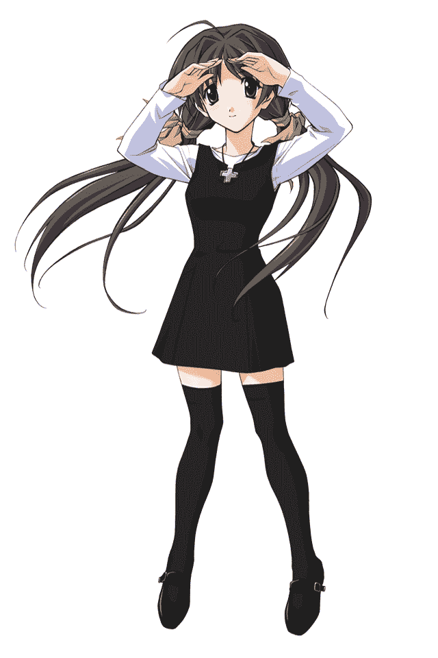
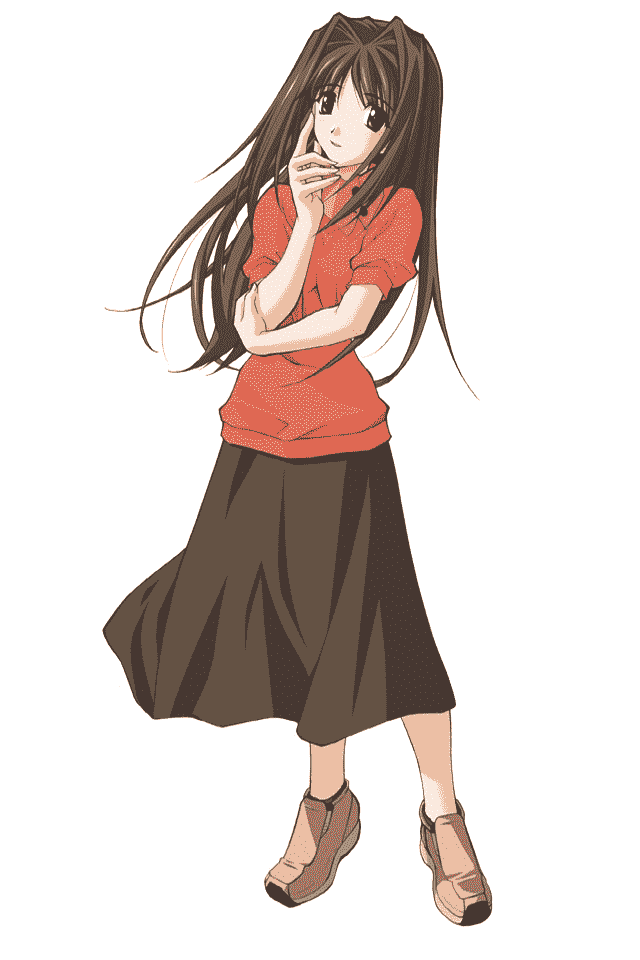
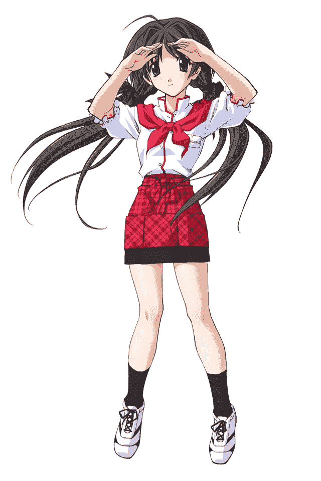
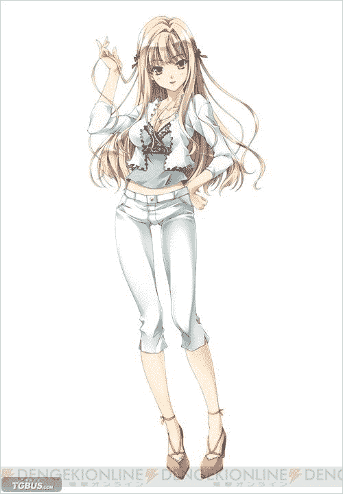

# （踩踏文）秋之回忆4 从今以后

作者：duanxufeng123

TID：18618

 

# 1

‘咚咚咚’’‘‘是谁啊····一大早的····’’‘‘咚咚咚！！！咚咚！！！！！······咚咚咚咚咚！！！！！！’’‘‘唔·····来了来了···{真是的，是谁啊，星期天还不让人睡个安稳觉··一大早}’’一蹴晃晃悠悠的走到门前，打开了屋门。眼前站着一位高约160cm，一头乌黑到长到膝盖的秀发，穿着一件淡粉色短袖衬衫，浅黄色的短裙的少女站在门外‘‘是祈啊··今天可是星期天啊，你这么一大早···’’一蹴还没说完，发现站在门外的表情看起来不是很高兴。‘‘怎么了啊，发生什么事了吗？祈’’一蹴看到祈不太对劲，就没有抱怨祈一大早打扰他睡觉的事，而是关心的问了一下祈；‘‘你忘记了吗··上星期说好的，今天去看我的钢琴比赛··’’祈皱着眉头看着一蹴说道。‘‘啊··啊··怎么会忘了呢，不是上午十点开始吗~现在还不到呢{遭了~要是祈不来得说不定我真把她比赛的事情忘记了~那样的话就惨了}’’一蹴心里想。‘‘是真的吗？’’祈半信半疑的看着一蹴、‘‘当然是真的了，这么重要的事我怎么会忘记呢’’一蹴一脸严肃的说道“嘿嘿”祈害羞的低着头笑了一下，看的出来祈是个比较内向害羞的女孩“小祈的猜谜时～”只见陵祈突然一只手放在身前，害羞的说出了这莫名其妙的一句话“哈哈，祈你到现在还不能把这整句话说出来阿，小祈的猜谜时间，这几个字就这么难说出来嘛~哈哈”只见一旁的祈脸通红的低着头，接着对一蹴说“不要笑了啦·····听好了，今天的谜语是··”“是~是~快点猜吧”一蹴不耐烦的说道。“一蹴平时上学路上有个十字路口。就算早去也好，晚去也好，那个十字路口总是被拦著的，为什麼呢？”“啊···这是什么谜语啊···猜不出来啦”“再想想看”祈笑着对一蹴说“恩···唔······唔···实在想不出来啊~告诉我答案吧”“一蹴真笨···”“好了啦！快说吧！马上就要开始比赛了！”一蹴一句话让祈想到了她的比赛就快开始了！“啊！真的··快点走吧一蹴··要是晚了的话··”说着，祈便拉着一蹴就要跑“喂喂！！谜语的答案还没有说呢。”“啊~对了，答案是{因为他坐电车}嘻嘻”说完祈便拉着一蹴的手朝车站跑去

“呼··呼··9点45分还好没有迟到”一蹴半蹲着拉着祈的手气踹嘘嘘的说道“呼·呼·恩··太好了”旁边的祈也和一蹴一样累得不轻。接着他们便走进了眼前的剧场、

“祈！！”刚进到剧场，祈和一蹴便听到有人叫祈“莹学姐！”祈回过头看到眼前一位大概18、9岁的女孩，这正是平时教祈弹奏钢琴的白河莹。“啊，一蹴也来了啊，来看女朋友的比赛吗~嘻嘻”“莹学姐~”旁边的祈害羞的看着白河莹“是啊··莹姐，祈一大早就跑去找我了”一蹴苦笑着对白河莹说。旁边的反而露出了淡淡的微笑，因为一蹴丝毫没有否认莹说的陪女朋友这句话“比赛快要开始了，我们先进去了准备了”说着白河莹便拉着祈的手往后台走去。“加油啊，祈还有莹姐”一蹴握着拳对着祈和萤加油。紧接着一蹴便坐到了自己的座位上。

过了十分钟“啊··好慢啊，先去买杯可乐吧”说着，一蹴便起身朝场外的商店走去，突然一蹴看到了一个熟悉的身影，不是别人，那人整是一蹴的妹妹鹭泽缘，虽然缘已经16岁了，但一头银色头发的缘看起来还像是十二三岁的初中生“缘！你怎么会在这里”一蹴吃惊看着缘。“哥哥！”缘飞快的一头冲进了一蹴的怀里“喂，缘~闪开啦”一蹴轻轻的推开了扑向自己的缘“呜·····哥哥果然是讨厌缘····算了··缘这么讨人厌的妹妹是谁都不会想要的···”缘可怜的说着，接着转身便要离开。“啊~~缘，你要去哪啊”一蹴着急得问缘“反正连哥哥都这么讨厌我，我还是和垃圾一样流入太平洋好了··”“哈哈！缘，我刚刚是看人很多，你都这么大了~被别人看见多不好意思啊”“那··哥哥不是讨厌缘了”缘撅着嘴巴问一蹴“当然不会讨厌你了，我可就你这么一个妹妹啊。”说着一蹴用手轻轻的擦拭着缘的眼泪“呜···太好了··对了··哥哥，你怎么会在这个地方啊”听了一蹴的话缘的心情立刻好转了“啊，对了，我刚才正要问你呢，你怎么跑到这个地方了”“我是来帮沙代理到这附近买手办的。因为她今天要在家里帮忙··”“哥哥呢，怎么会跑来这里？”缘看着一蹴认真的问道。“啊，今天祈学姐钢琴比赛，所以，我过来帮她加加油”听到一蹴的回答，缘脸上闪现出一丝不悦，过了一会缘抬起头看着一蹴说“哥哥···有件事情··缘不知道该不该告诉哥哥··”“发生什么事情了吗··缘，没关系，你说吧”一蹴看到缘认真的表情感觉缘要说什么重要的事情“恩···其实··那天缘看到祈学姐和···和哥哥很讨厌的那个人飞田扉两个人在公园说说笑笑的··而且而且··”“而且什么！”一蹴突然之间声音大了几十分贝。“而且··两个人还牵着手··”“······缘·····你说的是真的吗···”一蹴的声音突然降了下来，但感觉冷冷的。因为祈是个很内向的女孩，祈和一蹴认识了三年，但连接吻都还没有过。祈不会无缘无故和飞田扉牵手的··除非··除非祈喜欢那家伙“恩··”缘的表情显得有些不自然。“是吗·······走吧，缘我陪你一起去帮沙代理卖东西，之后我送你回家”一蹴拉起缘的手“可是祈学姐·还在··”“已经没关系了···”说完一蹴便拉起缘的手离开了剧场。这是，缘的嘴角确露出了一丝笑容····

那边比赛已经结束了···祈只获得了第三名，此时的她显得非常失落“为什么····我已经照莹学姐交我的完全弹奏出来了阿····怎么会··”这时一个评分老师走到祈的面前“你刚刚弹奏的不错，只是··这个这个音符为什么要停顿呢。虽然这是一个跳音，但是在那里如果停顿的话会对整个演奏带来不小的影响，要是你这个地方处理的好的话演奏就很完美了，第一名的那位女同学这个地方处理的就很好”评分老师只着祈的乐谱说，接着便离开了。但祈此时脸上确出现了无比惊讶的表情，因为第一名正是教她音乐的莹学姐，而告诉她让她在演奏时停顿的也是莹··这时祈在想为什么莹学姐让她在演奏时停顿··为什么她自己没有停顿反而获得了冠军···接着祈便要去找莹学姐，但发现莹已经离开了。而场内的一蹴也不见了···祈没有太在意一蹴，她觉得一蹴可能是有急事离开了，她现在满脑字只有一个问题，就是为什么莹交给自己错误的弹法，使得她这次重要的比赛发挥失常。祈回到了家里，一整个晚上都在想这件事。最后祈想来想去都只有一个答案，那就是········莹故意交给祈错误的弹法，使得祈败给她。祈突然感到了一种被背叛的感觉···使她非常的难过··以及··愤怒。 使得她忘记了给一蹴打电话询问一蹴为何没说一声就离开。第二天下午放学··祈像往常一样来到了学校的钢琴教室，此时，她看见了一个人···是莹，整个钢琴房只有莹一个人在弹奏着钢琴 而且弹得是那比赛时获得优胜的曲子，莹弹得入神并未发现祈来了，祈听着萤弹得完美无缺的曲调后，祈此时终于有点压抑不住心中的怒火了，便轻轻得向莹身边走去“莹学姐····恭喜你”祈走到莹的面前，轻声说道。这时莹才发现祈站在了自己的旁边“是··是祈啊，谢谢，今天这么早就来了啊？···”莹的表情明显感到有些不自然“恩，是啊，因为比赛只获得了第三名··所以要努力练习才行··”祈的声音感觉不到一点情感。这冷冷的声音使莹感到了一丝恐惧“第三名已经不错了，毕竟祈现在只学了三年钢琴啊”莹很不自然的笑着对祈说。“啊··是啊”“对了··今天静流姐要我去她店里帮忙··我要先走了，你今天先自己练吧”说着莹便起身准备离去，就在这时祈伸出了右脚拌在了莹的腿上，莹一下便失去了中心摔倒在了地上“啊！”重重摔在地上的莹痛得叫了一声“啊··莹学姐，真是对不起··你没事吧”虽然话语是在关心，但祈的语气丝毫没有改变“没··没事”莹痛苦的准备从地上爬起来，就在这时莹突然感觉到头上被什么重重的东西压住了，瞬间侧脸便重重的贴在了地上自己的头一动也不动了，这是她斜眼往上一看··才发现陵祈穿着校鞋的脚已经实实在在的把她头踩在了地上。“祈···你···你在干吗！快把脚拿开。”莹看到祈踩着自己的头，感到了前所未有的耻辱。气愤的在祈的脚下质问命令着祈。而她刚说这句话，发现脸上的脚踩更加的更加用力了“啊！！啊·！！！”莹被祈踩得痛苦的叫了起来。祈依然面无表情的踩着脚下的莹，而莹确看不到祈此时的脸，因为莹的视线完全被祈的鞋底挡住了，她所能看见的只有祈的鞋底，萤本来想用手推开祈的脚，但想到自己做了对不起祈的事，也就没直接动手，只是用求饶的口气说了句：“祈···把脚拿开····请不要再踩了··头就快要爆了”听了这话的祈，突然微微一笑，慢慢抬起了脚，正当莹要爬起来时祈突然踢了萤一脚，萤被踢得仰面倒在了地上，祈又对着萤的脸一脚踩了下去，比刚才更加的用力，而且这次，祈的脚不停地再莹的侧脸上碾着，并抬起另一只脚使劲得踩到了莹的胸口上，莹比刚才更加痛苦的叫了起来。因为钢琴房的隔音效果特别号，所以莹的叫声外面没人能听的到，祈抬起踩在脸上的那只脚也放在了萤的胸上，而莹却痛苦的承受着。“你知道我为什么要这样对你吗？”祈终于开口了质问着她脚下被踩得满脸鞋印的莹“祈···能··能先把脚拿开吗”，“你先回答我的问题” 祈说着又使劲的踩了萤一下肚子···“啊··呵”，萤一边发出痛苦的叫声，一边慢慢得说：“祈···我知道你今天为什么这样对我··我知道我做了很对不起你的事··但是我也是···”莹躺在地上还没说完祈便一脚踩在了莹的胸上“你终于肯承认了··莹学姐··为什么··为什么··你知不知道这场比赛对我有多重要··”说着祈用鞋跟还在莹的胸口上不停地碾着。莹强忍着叫不出声来，喘着粗气地对站在她身上的祈说道“祈···我知道这场比赛对你很重要··但对我来说也是很重要的比赛啊···”“所以你就为了你自己用这么卑鄙的手段对我吗！”祈终于爆发了抬起脚往莹的脸上、胸上、肚子上使劲的踩，莹的上身和侧脸全是祈的鞋底印，祈足足踩是几十脚才停下，莹已经被踩得不成样子了，也完全失去了反抗能力。祈也终于从萤的身上走了下来，踩了这么久祈也没了力气，自己的怨气也消了不少“今天开始，我们之间所有的一切都结束了。”说完这句话，祈又再莹的脸上碾了两下，便离开了钢琴房。只有莹一人满身鞋印的躺在地上动也不动的躺着···

回到家的祈已经慢慢的恢复了理智，她在想着是不是今天做的有点过分了。但是想到是莹先那样的背叛了她··祈的心理非常的复杂。这时她突然想到了昨天一蹴莫名其妙的离开了剧场，于是祈便打电话给一蹴。电话响了一会终于接通了“一蹴··”祈刚叫了一蹴的名字，电话那边便挂断了，祈感到事情很不对劲，便打算第二天去找一蹴问个清楚。 <ignore_js_op>

**图片1.jpg** *(11.04 KB, 下載次數: 0)*

[下載附件](forum.php?mod=attachment&aid=NTA4MjJ8OWVmYjllMGN8MTYwMDg5MDAzMHwxODIzMHwxODYxOA%3D%3D&nothumb=yes)

2015-3-6 08:13 上傳

祈

<ignore_js_op>

**图片2.png** *(228.3 KB, 下載次數: 0)*

[下載附件](forum.php?mod=attachment&aid=NTA4MjN8NjdjZTQ5ODd8MTYwMDg5MDAzMHwxODIzMHwxODYxOA%3D%3D&nothumb=yes)

2015-3-6 08:14 上傳

白河萤

第二天早上，祈一大早便来到了一蹴家。一蹴打开了门开到是祈皱了一下眉头“你来干什么”一蹴不高兴的说“一蹴···你这是什么意思··前天无缘无故的离开了剧院，昨天又··到底怎么了？”“怎么了？··呵呵··我还要问你呢，周六不去和飞田扉约会··跑来我家做什么？”“飞天扉···约会··我什么时候”祈一头雾水的不知道一蹴在说什么“呵··不用再装了··缘看见了你们两个上次···在公园··而且··而且还牵着手，呵呵，现在居然装得这么无辜，我以前还没看出来你的戏演得这么好”“啪！！”一蹴脸上突然感觉滚烫，原来是祈一巴掌打在了他得脸上。一蹴低着头，不说话。祈非常后悔自己没控制住打了一蹴的脸突然，一蹴开口了“你走吧···我以后不想再看见你。我们到此为止吧··”说完，一蹴便低着头转身朝房间走去，祈一个人呆呆的站在那里。她无法接受刚刚发生的所有事情。这时她突然想到一蹴说是她妹妹缘看到她和扉在一起，所以，只有找到缘才能把整件事解释清楚。于是她拨通了缘的电话，想把缘约出来问个清楚。电话通了“是缘吗？”祈先开口了“恩~是祈学姐吗，有什么事情吗？”电话那头的缘问道“啊··是这样的，我想约你出来有点事情··想当面问你”“啊··不好意思啊，祈学姐，我现在正和朋友一起在新野游泳馆，要玩到晚上，下次再说吧”说完缘边挂断了电话。祈感觉缘在隐瞒着什么，于是便坐地铁前往新野游泳馆。

这边，白河莹正在家里一个人躺在床上，回忆着昨天发生的令她一生难忘的事情。被祈那样的侮辱让莹感到了前所未有的耻辱，走在回家的路上因为自己满上祈的脚印，被路边的人用异样的眼光看着，终于艰难的回到了家里换好了衣服，洗干净了脸，接着又因为迟到被姐姐静流，骂了一顿。莹受尽了委屈。但她也不能说什么，因为是她先背叛了一直信任自己把自己当老师的祈。想到这，莹的心里又委屈又愧疚，眼泪情不自禁的流了出来、但是这样下去也不是办法，于是莹便起身准备去姐姐白河静流的店里帮忙。不然姐姐又要骂自己了。

到了咖啡店，莹发现了姐姐静流看起来心情不是很好，但莹自己的心情也好不了哪去便也没有上前询问，就去帮客人送点心，可是莹因为心情不好心不在焉，一下把咖啡和蛋糕洒在了客人身上，“啊！我的新衣服”客人大叫了起来“对···对不起！”莹吓得赶紧道歉了“啊··真实的，这是人家昨天才买的”眼前一位如仙女般的少女不停地抱怨着这时白河静流也走了过来“果凛，真是对不起··小莹最近才过来帮忙··还不是很熟悉，真是对不起，把你新买的衣服··”静流真诚的道着歉，而旁边的莹却呆呆的站着吓得一言不发。“啊···算了，既然静流姐都这么说了··”“谢谢你能原谅，真是对不起，果凛”说完静流瞪了一眼粗心的莹，本来就心情不好的她，更加烦躁了。更令静流生气的是，莹一下午连续把甜点洒在了好几个客人身上。

终于下班了，客人和员工们都下班了，“你今天是怎么回事！”一向好脾气的静流大声的责问着莹，莹一言不发“真是的！要不是一蹴最近请假，才不让你过来帮忙呢！”莹这两天来一直受尽了各种委屈，现在她终于受不了了！“我就是故意来你店里捣乱的怎么样，从小到大你有什么比的过我吗？成绩？还是音乐？你这辈子也只能在这里开这间破店了、”莹的话彻底激怒了一向温柔的静流，她一脚踹在莹的肚子上，把莹踹到在地。紧接着走到莹的面前抬起脚朝莹身上一阵猛踢猛踩。莹痛苦的流着眼泪，但硬是不叫出来，并且恶狠狠的看着自己的姐姐。看到莹的眼神，静流更加生气了，抬起穿着棕色平底休闲鞋的右脚踩在了躺着的莹的正脸上，脚挡住了正在流着泪瞪着自己的眼睛，莹的眼泪全流在了静流的鞋底上，而静流竟然不停地在莹的脸上碾踏着，弄得莹整个脸比昨天祈踩得还要脏、就在这时，突然有一个人进入了咖啡店，原来此人不是别人，正是被洒了咖啡的梨果凛，果凛换了一身绿白色的连衣裙“果···果凛”静流紧张的看着睁大眼睛看着自己的果凛，果凛走上前去··“静流你这是···”静流这才意识到她的脚还在莹的脸上，赶紧收起了脚，但莹的脸上确全是静流的脚印，“果··果懔··”静流紧张的看着果懔。这时，意想不到的事情发生了，果凛居然也抬起脚踩在了莹的脸上，来回的碾着，“你们在玩游戏啊”~果凛脸上突然浮现出一个诡异的笑容。“啊···这···”静流不知道该说什么。“看起来很有意思啊，我也想试试~可以吗静流”还没等静流答应果凛的前脚掌已经踩在里莹的嘴上“呜·······呜！！·”被踩着的莹想叫却也叫不出来，之前她即使被祈踩成那样，也没有感觉到现在给她带来的无比屈辱，居然被另一个女孩无缘无故的用高跟鞋踩住了自己的嘴巴，这比被祈踩成那样心里更加的感到难受，“原来把人踩在脚下是这种感觉啊~”说着果懔的脚在莹的嘴巴上碾了几下、“呜呜！！呜！！！！”看的出来莹显得更加的痛苦了···此时的静流呆呆的看着自己的妹妹被一个女孩，如此的侮辱着，心里感到很不舒服，但想想刚才自己也那样对莹，现在也没资格说什么，只得呆呆的看着，自己的妹妹被果凛的鞋底侮辱着、眼睁睁得看着自己妹妹在果凛脚下流尽她的眼泪·····过了10分钟左右，终于果凛玩够了，“我本来是来取我刚才忘记的东西的，没想到~遇到这么有意思的事情，下次有空继续玩哦~”说完果凛转身便离开了咖啡店，只有静流和莹姐妹二人在店里默默的流着泪···· <ignore_js_op>

**图片3.png** *(247.48 KB, 下載次數: 0)*

[下載附件](forum.php?mod=attachment&aid=NTA4MjR8YjU3MWRjZGF8MTYwMDg5MDAzMHwxODIzMHwxODYxOA%3D%3D&nothumb=yes)

2015-3-6 08:15 上傳

<ignore_js_op>

**图片4.png** *(305.78 KB, 下載次數: 0)*

[下載附件](forum.php?mod=attachment&aid=NTA4MjV8N2ZlOTBjZGZ8MTYwMDg5MDAzMHwxODIzMHwxODYxOA%3D%3D&nothumb=yes)

2015-3-6 08:16 上傳

 

# 2

“新野站到了”此时祈到达了缘所在新野游泳馆，祈刚到附近便发现了缘，游泳馆的人现在已经很少了，祈走向了缘，“缘···”祈轻轻的从缘的拍后拍了一下缘的肩膀。“是···是祈学姐··你怎么会在这”缘看到祈出现在自己的面前显得很吃惊的样子。“缘··我有些事想问你···可以陪我一会吗”“好··好吧”缘看到祈已经在自己面前了，看来是推脱不掉了，于是便跟着祈一同离开了游泳馆。她们俩来到了里车站附近不远的一个小树林，附近十分安静，空无一人，祈为什么要把缘带到这地方？这也正是缘想知道的“祈··祈学姐··你有什么事要问··为什么要到这里”缘害怕的看着除了祈空无一人四周。“我什么时候和扉在一起了”祈直截了当的问起了今天来找缘的正题“啊···祈学姐··你在说什么啊”缘装着不知道发生了什么事“我说，你什么时候看见我和飞田扉在公园里牵手散步了！”祈加大了音量。缘被平时一向温和，内向的祈带着怒气大声呵斥之后，心里感到很是害怕，知道已经无法隐瞒了，立刻跪在了祈的面前“祈学姐！对不起，我骗了哥哥，请你原谅我”说着缘底下了头，五体投地的跪在祈的面前，祈听了之后，再一次无法抑制心中的怒火向缘责问道：“原谅你？”祈抬起了脚轻轻的放在了缘的头上，但没有使劲往下压。缘也感觉到自己了头被祈用脚踩着，但她不敢反抗祈，只能默默的承受“你能告诉我为什么要那么做嘛，缘”说着，祈的脚稍微加大了一点力度，并用穿着休闲鞋的脚轻轻的在缘的头上转动着，收到如此侮辱的缘，哭了出来，但她并没像以往大声的哭闹，而是轻轻的哽咽着“对不起，祈学姐···因为···因为自从祈学姐和哥哥在一起后，哥哥就很少陪缘一起玩了··缘从小就和 哥哥在一起··所以缘就···缘就想如何哥哥和祈学姐不在一起了，以后就能陪着缘了”听了缘的解释，祈有点心软了，“缘，抬起头吧”说着祈把踩在缘脑袋上的脚拿开了。缘也慢慢的抬起了头，她的脸上满是泪水。“好了。缘，不要哭了，虽然你这么做是错的，但是我并不是很生气，让我把你的眼泪擦干吧。”说着，祈抬起了刚才踩着缘脑袋的右脚，轻轻的踢了一下缘的肩膀，把她踢倒在地并把脚放在缘的脸上，用鞋底在缘脸上来回擦拭着，把缘的脸弄得像大花猫一样，“真可爱啊，缘，虽然我已经责怪过你了，但你要知道就算不想离开哥哥也不能撒这种谎，这是不对的，可能是姐姐的原因，让你和哥哥在一起的时间变少了。但是一蹴仍然是你的哥哥，而且你多了一个姐姐啊。以后我有空会经常陪着缘的。”缘听了祈的话，“呜··阿···呜呜呜··对不起！！姐姐”突然大哭了起来，然后抱住了祈刚才为她擦拭泪水的脚。“乖别哭了，看看你的脸都花了。”说着，祈，脱掉了左脚上的鞋子，又脱掉了自己穿了一整天的白色棉袜，因为走了很长的路散发着一些汗味，之后对缘说了句：“这是最后的小惩罚，忍着点哦？”说完便脱掉了另外一只鞋子后抬脚踩到了缘的身上蹲下来，用棉袜轻轻的擦拭着缘被她弄得满脸黢黑的脸，虽然祈的体重压着缘，让她感到很难受，而且棉袜味道也全都吸进了鼻腔中，但因为是祈的，所以缘并没有感到厌恶，闭上眼睛享受着姐姐帮她擦脸的过程之后艰难地说道：“姐姐···缘会像哥哥解释清楚了···以后缘再也不说谎了。”“恩，姐姐相信缘！”祈露出了以往的笑脸，站起身来从新穿好鞋袜之后从缘的身上走了下来，接着拉起缘后搀扶着她便走上了回家路。

第二天一蹴知道是事情的真相后，便跑去像祈道歉，祈也很快的原谅了他。两人又像往常一样开开心心说笑着。

然而他们并没发现就在他们背后一个馒头红发的少女正在用异常的眼光看着他们，或者说是看着陵祈，紧接着便低头离去了。

放学了，一蹴给祈打了声招呼后便离开了学校，前往静流的咖啡馆去打工了。祈只能一个人自己回家了，但刚离开学校没多远祈便看见了一个满头红发，气质高贵，又显得有点冷酷的女孩站再了她的面前。“你就是陵祈吗？”“是···”祈轻声回答道。“

哼，你怎么会看上一蹴那种废物”眼前的红发少女打量了一下祈后不屑的说道。听到红发少女侮辱自己喜欢的人，祈有些生气了“你凭什么说一蹴的坏话！”.“凭什么？那小子从以前就经常找我让我教他剑术，但每次都撑不过几下，就被我打败踩在脚下。唉··”红发少女用轻视着说着一蹴，这让祈更加的气愤了。“你闭嘴！一蹴才不会去请教你这种人呢，什么剑道，一蹴根本没有提起过”红发少女听了祈的话表情突然严肃了。“听你的意思是很瞧不起剑道了··那有没有胆量和我比一场，你赢了的话我就收回刚才说的话，输了的话，你就要和那小子一样被我踩在脚下。”红发少女轻蔑的看着祈“这···”祈犹豫不决着“怕了吗~果然和一蹴一样也是个胆小鬼啊哈哈”看着红发少女这样猖狂，祈实在忍不住了“比就比！不过你输了你要好好给我道歉！”“一言为定！对了，我叫藤原 雅。记住我的名字，跟我走吧，到我家的庭院去比。”藤原 雅说完着便拉着祈朝她家的庭院走去、

这边一蹴已经开始工作了“静流姐~今天怎么还是我一个人啊···小野最近到底跑到哪里去了啊··”“是是~~别抱怨了~一蹴，这个月你这么努力一定会给你加薪的~”静流微笑着对一蹴说。“真的吗！！哦！！加油！！”一蹴听到加薪立刻精神了起来。这是突然门外走进了一位客人“欢迎光临！”“一蹴！你好久没来了哦，最近很忙吗”门外站得不是别人“正是当日和莹玩“游戏”的果凛“啊~是果凛小姐啊。欢迎光临，快请专门座位” “谢谢~对了一蹴，等下你过来一下，我有些事要跟你商量”说完果凛便走到了她的专座。“啊··好”{果凛找我回事商量什么事呢}”一蹴心里想着。因为前两天果凛和静流把那天的事情说开了~两人也说好当天的事就当没发生，所以关系又恢复到了以往一样，虽然静流心里多少还有放不下，不过这是最好的解决办法了、

客人渐渐离开了。一蹴这时走到了果凛的身边“果凛，你刚才说找我商量事情··是什么事啊”这时静流也走了过来，“是这样的，我家的管家因为一些事辞职了，我想让一蹴去我那里接管这个职务”果凛笑着对一蹴和静流说“这····”静流当然会有些不愿意，但还没等静流开口，果凛便又说“放心吧，静流姐~一蹴走了之后，我会帮你安排两个店员的，而且不用发薪水哦~”“啊··但是一蹴他···应该问问一蹴的想法”听了果凛的条件，静流也不好否决了，只能遵从一蹴自己的想法了。这是一蹴开口了“果凛你··为什么···为什么要选我去当你的管家呢”一蹴有些不解“是··是因为我经常来这里吃点心啊，跟你已经很熟了，而且你一个人就可以忙过来整家店，我想你应该可以从事管家这个职业，而且管家的收入要比你在这里高上很多~而且服侍我这个大小姐你也应该感到很荣幸吧~嘻嘻”果凛调皮的吐了一下舌头。看到果凛这样说一蹴也不好拒绝了。他转身看了看旁边的静流“没关系~一蹴如果想去的话就去吧，你走了的话我还可以得到两个免费员工呢~”“静流姐···你····”一蹴苦笑着看着静流“但是以后要经常来店里看看哦”说完静流姐脸上浮现了那熟悉的笑容“恩，当然了。”“那继续工作吧~~今天下班前你仍是这个店里的员工哦~”“好！！”“嘻嘻··”旁边的果凛开心的笑着

另一边，祈已经来到了雅的庭院。二人站在庭院的中央手持木剑。“可以开始了吗··”雅自信的看着祈说。“恩。”说完，祈便先发制人，双手握着木剑向雅冲去，雅一动不动，单手将木剑抗在肩上“呀！”祈大叫一声双手木剑朝雅劈去，雅身体一侧便轻松的躲了过去，而祈确差点失去重心摔倒。“你这算什么啊··杂技吗”刚说完，祈便转过身来又向雅发动了攻势。而这次雅并没有躲，也没有用木剑抵挡，而是飞起一脚将祈踹飞了出去。这一脚踹的祈丧失了战斗能力。躺在地上捂着肚子迟迟没站起来。“起不来了吗？那我就要履行比赛前说的话了”说着雅便抬起左脚一脚踩在了捂着肚子痛苦着的祈的脸上，接着雅便半俯着身子，左臂搭在踩着祈的左腿上。“啊！”这下雅的身体大部分的重量全通过她的左脚踩在了祈的脸上，祈痛苦的叫着，“看到你现在这个样子，不禁让我想起来当时的一蹴啊，简直一模一样”话语间，雅的脚有在祈的脸上来回拧了几下，祈张大嘴巴痛苦的叫着··被踩着的祈痛苦无比，这种痛苦不只是肉体上的，更多的是心灵上的。最近以来都是祈将别人踩在脚下侮辱，今天她却尝到了，被她踩过的那些人的感受，雅的鞋底不停地在她眼前晃动，她的脸附和着雅的脚不停地动着，仿佛她的脸就是雅的鞋垫一样，祈痛苦无比！张大了嘴巴撕心裂肺的惨叫着、“吵死了”说着雅居然一脚插进了祈的嘴里，祈瞪大了眼睛，看着眼前的这只脚，她绝望了，她唯一的一点自尊已经被雅摧毁了，“唔··唔··”祈发出了轻而绝望的声音“都告诉你吵死了”说着，插在祈嘴里的脚来回转动的，而祈的头也随这只脚的左右晃动而晃动。祈伸出双手试图把嘴里的脚拔出来，可是无济于事，任凭她怎么用力脚还是在她嘴里，仿佛和她的嘴融为一体似的。这是祈做出了一个无法想象的举动，她居然用牙齿咬插在她嘴里的雅的脚，祈已经完全失去了尊严“你这家伙···”雅用力的把脚往外拔，而祈确死死的咬住雅的脚不放，“你是条狗吗！好吧··既然你这么喜欢我的脚··”雅突然发力将脚从鞋里抽了出来，祈狼狈的咬着雅的鞋子，雅用穿着白色棉袜的脚踩道了祈的胸口上，“我的鞋子就这么香吗？”

祈两眼无神的看着居高临下看着自己的雅。慢慢的松开了嘴巴，雅的鞋子掉落在了她的脸庞。“怎么了，我的脚刚刚抽出来你就松口了··难道你喜欢的是我的脚吗，那就成全你好了”说着，雅把将穿着白袜的脚踩在了祈的脸上，脚趾踩着祈的额头，脚掌踩着祈的眼睛脚弓刚好踩着祈的鼻子，脚跟踩着祈的嘴巴和下巴，雅的脚和祈的脸完美的融合在了一起，“开心吗，你很喜欢这种感觉啊吧，好好的呼吸吧，你应该感到荣幸啊”话语间，雅的脚不停地在祈的脸上蹂躏着，整个脸没有一处能躲得过雅的脚的蹂躏。就这样祈不停地被雅蹂躏着“你走吧，我已经腻了”，说完雅便要转身离去“对了··如果下次还想被我踩得可以过来求我，我可以考虑”说话雅便进入了房内。而祈却一动不动的躺着···仿佛没了知觉一样。祈拖着几乎没了灵魂的身体回到了家中。她回忆着几天发生的一切，突然压抑着的祈嚎啕大哭起来，把这一天所受的委屈都爆发了出来，这时门外居然听到了急促的敲门声，“祈！！！”是一蹴！祈听到是一蹴的声音，赶紧擦干了眼泪！打开了门。“祈，发生了什么事！”一蹴在外边就听到了陵祈的哭声。“祈···告诉我啊···不管什么事情我都会帮你的”一蹴双手扶着祈的肩膀说道。“一蹴···啊··呜！·呜呜呜···”祈一下扑到了一蹴的怀里，嚎啕大哭起来！“没事了，祈，我在这。走··我们先进去··你把事情慢慢的告诉我··”祈把今天发生的事情详细的告诉了一蹴、“可恶！那个家伙居然这么过分！！”“呜···一蹴···她说··她说··她以前也那样对过你··是真的吗··”“恩···是真的，那样对我就算了···她居然把那么残忍的手段用在你的身上··真是不可原谅！”紧接着，一蹴又说“祈，你今天受过的伤害我以前都尝试过···比起我她对你算是很仁慈了”“一蹴····”听到一蹴曾经也和祈一样受过那种伤害，祈心里感到很难过，但同时也得到了一种安慰，自己喜欢的人能了解到自己的痛苦使她稍微好受了点。接着一蹴把他辞掉咖啡店的工作去做管家的事情告诉了祈。其实他今天来找祈原本就是说此事的可是···“那一蹴以后连住也要住在那里了吗？”“恩，是啊。我以后每天下课后就要去果凛小姐的别墅，晚上有很多事要做”“那···那以后见面在一起的时间不就少了很多吗”祈难过的问道“是啊····这也没有办法啊”一蹴无奈的说道“那··那我可以和一蹴一起吗··一起服侍果凛小姐··那样就能在一起了”祈可怜的看着一蹴“祈··你，怎么能让你受那种委屈呢”一蹴心疼的说道“没关系，听你说的，果凛小姐应该是一个好人，只服侍她一个人的话，没什么的，拜托了~，一蹴。”祈苦苦哀求道“那··那好吧，明天我去问问果凛小姐··”

“哦，你的朋友啊？”“恩，是的，我们是一所学校的。”“好吧，那让她从明天开始过来吧”“唉？”一蹴吃惊道“怎么了吗？”果凛好奇的问。“没··没什么{果凛小姐是是爽快啊，这样就答应了··}”“对了，一蹴。明天下午放学后··我有些事情告诉你”说完果凛转身便走了。一蹴回去后把果凛答应让她去服侍果凛的事情告诉了祈，祈非常高兴，第二天一蹴和祈放学后，便一起赶往了果凛的居所。“这位就是我昨天说的，要来这里工作的人，她叫祈”一蹴像果凛介绍着祈“初次见面，请多多指教！”祈对果凛礼貌的打了声招呼“恩，多多指教”果凛也是如此。“对了，祈，你能不能先回避一下，我有些话要对一蹴说”果凛对祈说。“啊··是”祈觉得是果凛要交给一蹴一些任务便匆匆离开了··“有什么事情吗？果凛小姐”一蹴问道“都说了多说次了··叫我果凛就好了··下次再这样我就生气了。”果凛对一蹴说道“啊··恩，果凛，有什么事吗”“嘻嘻··一蹴···其实今天我有件事想要告诉你”“恩，我知道，所以说是什么事啊”一蹴问道“我··我···我想·我想做你的女朋友！！！”“什···什么·果凛小姐··不··果凛··不要开这种玩笑好不好··”“我是认真的！一蹴，让我做你的女朋友吧！”一蹴看着果凛的脸，感觉她并不是在开玩笑“对··对不起··果凛···我已经有女朋友了··祈就是我的女朋友···”说完一蹴便低下了头，因为他知道他已经伤害了果凛。果凛沉默了一会“是这样啊····我还以为她只是你的普通同学呢···原来是这样··对不起，我刚才说了不该说的话，请你忘了吧”说完果凛便转身离开了“对不起，果凛。’’一蹴自言自语道、到了晚上，祈一人在她的房间画着画。突然果凛进来了“祈，到我的房间来一下，还有点事情要你做”祈听了赶紧站了起来跟着果凛来到了她的房间。果凛坐到了床上“祈，过来，把我的鞋子帮我脱掉”“啊···”祈有些愣住了“果凛小姐，管家还有做这些事吗。”果凛没有理会祈的说话，只是抬起了一支脚，等着祈过来脱。祈慢慢的走了过去，蹲在果凛身边，果凛把脚抬到祈的脸的旁边，祈觉得有些反感，于是赶快把果凛的高跟鞋脱了下来“我的脚有点累了，帮我按摩一下”果凛的脚放在祈的脸旁，对祈说“什··什么” 还没等祈说完，突然果凛一脚蹬在了祈的脸上，祈被蹬在了地上“你在做什么，果凛小姐！”祈有些生气了。“干什么？”果凛走到祈的身边，用赤脚一脚踩在了祈的脸上！“当然是让你帮我按摩脚了，难道你没有听见吗？··既然你不愿意··那就用你的脸帮我按摩吧”说着果凛用赤脚在祈的脸上来回的搓揉着，祈在果凛的脚下再次感受到了那天那种感觉···“怎么样？你不帮我按摩，现在我来用脚按摩你的脸，开心吗？？是不是感到很荣幸啊”果凛轻蔑的看着脚下的祈，脚底不停地搓揉着。“住手！”突然门口传来了一蹴的声音，“你在做什么果凛！快把脚从祈的脸上拿开！！”“呜··一蹴···”看到一蹴来了，祈哭了出来。“闭嘴。”突然，果凛抬起了踩在祈脸上的脚，又重重的踩了下去。“我让你说话了吗？你只是我的仆人啊··”说着果凛用脚掌不停地在祈的嘴巴和鼻子上碾着。祈痛苦的呻吟着“住手！！！”一蹴大叫了起来。“求我，只要你好好的求我，我就放她，先给我跪下，一蹴”果凛的脚依然在祈的嘴巴上碾着、看着祈痛苦的被踩着，一蹴赶紧跪倒在了果凛面前。“亲吻我的脚，亲吻我的脚我可以考虑把脚拿下来”“呜呜···”被果凛踩在脚下的祈呜呜的叫着，一蹴想也没想便亲向了果凛踩着祈的脚背“哈哈···真是一对啊··一个亲吻我的脚底，一个亲吻我的脚背，真是般配啊”说着，果凛移开了踩着祈嘴巴的脚，踩在了一蹴的头上，一蹴像狗一样跪着，被果凛把头踩在她的地毯上不停地蹂躏着！一旁的祈，哀求着果凛放过她们，果凛低头看着祈说：“怎么样，要不要帮我按摩脚了？”祈连忙回答：“明白了，果凛小姐。我帮您按。”“呵呵，你们一人按一只脚吧，要按到我说好才行！”果凛抬起脚笑着说道。之后两个人只得乖乖地跪在果凛面前，帮果凛按摩脚、之后还叫他们帮她洗脚、让她当马骑围着房间转，就这样他们被果凛侮辱了一个晚上，不知不觉天也亮了。第二天果凛才让一蹴和祈离开，临走时果凛还说了：“你们可以继续在这工作。我不会赶走的你们的” <ignore_js_op>

**图片8.png** *(195.51 KB, 下載次數: 0)*

[下載附件](forum.php?mod=attachment&aid=NTA4Mjh8YTIyOWMwZWN8MTYwMDg5MDAzMHwxODIzMHwxODYxOA%3D%3D&nothumb=yes)

2015-3-6 08:19 上傳

 

# 3

离开了果凛的住宅，一蹴带着祈到了一个公园无人的地方。一蹴抱住了祈“对不起··祈··对不起··对不起···全都怪我···我不知道怎么去弥补你所受的伤···对不起····”一蹴抱着祈居然流下了泪水“一···一蹴···”祈这是认识一蹴以来第一次见到一蹴流泪，不是为了别人，是为了她、“一蹴，我没事的··昨天要不是你··我不知道会怎么样···”“但是··如果不是我··你也不会受到这种屈辱啊！！”“我没事的··一蹴，只要有你在我身边··”祈还没说完突然身边传来了一个熟悉而又带有威严的声音：“你们两个···干吗大白天的坐在公园里哭哭啼啼的···发生什么事了吗？”他们不约而同得回头往发出声音的方向看去，看见一位穿着学校制服的红发女生，而且还很眼熟。“藤原雅！”一蹴突然大声叫了出来“是··是你··”祈看到了雅，吓得躲到了一蹴的怀里。在祈的眼里比起果凛。雅显得更加可怕“喂··我有这么可怕吗？”雅看着祈说，“你们怎么了··发生什么事了··不会是你们两个被人欺负了吧··”雅一语说中了要害。祈和一蹴沉默着不说话了···“什么人干的··”雅感觉她猜中了。快点告诉我··难道你们两个要被我踩着才肯说吗？”听到这话两人都感到很害怕，而且他们感到藤原雅此次并无恶意。于是便把事情告诉了藤原雅···“什么！可恶！居然敢做这种事”看到藤原雅的反应，一蹴和祈都感到十分吃惊！以前那样对他们的雅今天却因为听说他们被别人侮辱那样生气，“你··为什么···”祈弱弱的问道藤原雅，“因为你们两个是我的专属玩具啊！我的东西除了我！不准任何人伤害！”听了雅的解释一蹴和祈不知道应该感动还是···“你们说她常去那家咖啡屋是吧··”雅露出了坏笑“你要做什么，雅？”一蹴不解的问“你们别管了！我会让她知道碰我的玩具是什么后果！”说完。雅便离开了。一蹴和祈互相对视着··不知道雅到底想干什么。

这天下午果凛一如既往的前往静流的咖啡店，就在她吃完点心准备回家时，藤原雅出现在了果凛面前。“你就是花祭果凛吧？”果凛看着眼前的女生，有种说不出的感觉，紧张？还是压抑？她自己也说不上来“请问你是什么人？”果凛对着眼前的雅礼貌地问道。“看来就是你了···你认识一蹴和陵祈吧··”藤原雅冷冷得看着果凛“啊···看来你是帮他们报仇的吧··”果凛也冷冷一笑“爷，给我把她带走，我要好好的教训她··”{“爷”是果凛的另一个管家}，爷 刚要冲上去抓住雅，雅便飞起一腿踢在了“爷”的脸上，只是一脚便将爷踢晕了··果凛看到雅这么厉害，转身便要逃跑，而雅反应要比果凛快上很多，一把便抓住了她。“害怕了吗？”雅冷冷的说道、说着雅便一把将果凛拽倒在地，接着藤原雅便向果凛走来··果凛知道不妙她知道雅接下来想干什么··于是她拼命的朝前爬。可是她最怕的事还是发生了··她的手上突然被一只脚踩住了··果凛知道接下来在她身上会发生什么··“求求你··放过我···我不知道你和祈跟一蹴有关系！求求你···放了我吧！”从小到大都是别人求果凛，这是果凛第一次这样爬在地上祈求别人···雅把脚放在了爬在地上的果凛面前“我的鞋子好像沾到灰了，不用我说你应该知道怎么做吧？”雅微笑着看着脚边的果凛。果凛听了这话，眼泪刷得流了下来滴在了雅的鞋子上。因为她知道，接下来她要做一件她有生以来最为耻辱的事情，果凛缓缓的伸出了自己粉嫩的舌头，朝着雅的鞋子慢慢靠近，·····碰到了···在这一瞬间，果凛从小到大所有的骄傲，高贵，仿佛都在这一刻消失了。而雅在她眼里成了高贵可怕而又美丽的女神，她无法抗拒雅的命令！果凛的舌头舔遍了雅鞋子的每个角落··雅慢慢的抬起脚踩在了果凛洁白的脸上，这平时在大家看来美丽可爱的脸庞，在更加高贵的雅的面前俨然便成了一堆烂泥，雅像踩泥土一般，把脚在果凛脸上慢慢发力，直到果凛的脸完全变形，和自己的鞋底紧紧的粘贴在了一起，脚在果凛脸上不停地转动着，这美丽的脸被雅的鞋底碾的已经满是鞋印不成样子。这还没完，雅又脱下了自己的鞋子，看着她脚下的果凛说道：“早上练了一上午剑，想必出了不少汗吧。”之后毫无怜悯地用穿着黑丝袜的脚踏在了果凛的脸上，果凛哪受的了这种罪，被雅的脚熏得不停地咳嗽着。可雅丝毫没有放过她的意思，不停地用穿着黑丝的脚在果凛鼻子上嘴巴上肆意蹂躏！！！高贵的果凛已经荡然无存，最后雅玩腻了，终于抬起了脚，重新穿好鞋子，果凛心想：‘啊！终于结束了。’但就好象是嘲笑果凛这天真的想法一般，雅没有这样离去，而是再次抬起脚踩在了果凛的脸上，但这次和之前不同，压力非常大，由于果凛爬在地上，脸又踩着，不知道为什么这一下会那么重。但下一个瞬间，她马上就明白了，因为她感受到了离脖子不远处的后背上传来了另一股压力，原来是雅踩到了果凛的身上。接着雅把踩在果凛脸上的那只脚也踩到了果凛的背上，果凛立刻感到身体被压得死死的，完全动弹不得。但这还没完，雅的双脚像是在房门前的地毯上搓鞋底的那样把自己鞋底的赃物都擦在果凛的衣服上，雅边擦边笑着说道：“哈哈，名牌衣服成擦鞋布了！”这是身心都受到重大打击的果凛难过得再次流下了眼泪。不过一会果凛的名牌服装就已经污浊不堪了，雅看了后，露出满意的笑容，从果凛的后背走到屁股，大腿，小腿后扬长而去。果凛的眼泪已经在被雅用脚侮辱的过程中流干了，她心里既难过又气愤，她想发泄她的愤怒。但她知道自己绝不是雅的对手，估计世界上没有任何人可以让雅屈服，此时她想起一个人、紧接着果凛微微一笑，便朝咖啡店里走去 <ignore_js_op>

**图片7.jpg** *(9.75 KB, 下載次數: 0)*

[下載附件](forum.php?mod=attachment&aid=NTA4Mjl8YzhiNTdjYzB8MTYwMDg5MDAzMHwxODIzMHwxODYxOA%3D%3D&nothumb=yes)

2015-3-6 08:21 上傳

缘 <ignore_js_op>

**图片8.png** *(195.51 KB, 下載次數: 0)*

[下載附件](forum.php?mod=attachment&aid=NTA4MzB8YWVkZGJiYWV8MTYwMDg5MDAzMHwxODIzMHwxODYxOA%3D%3D&nothumb=yes)

2015-3-6 08:21 上傳

果凛   <ignore_js_op>

**图片9.jpg** *(8.67 KB, 下載次數: 0)*

[下載附件](forum.php?mod=attachment&aid=NTA4MzF8MjFmNDg0ZTF8MTYwMDg5MDAzMHwxODIzMHwxODYxOA%3D%3D&nothumb=yes)

2015-3-6 08:21 上傳

藤原 雅</ignore_js_op></ignore_js_op></ignore_js_op></ignore_js_op></ignore_js_op></ignore_js_op></ignore_js_op></ignore_js_op>