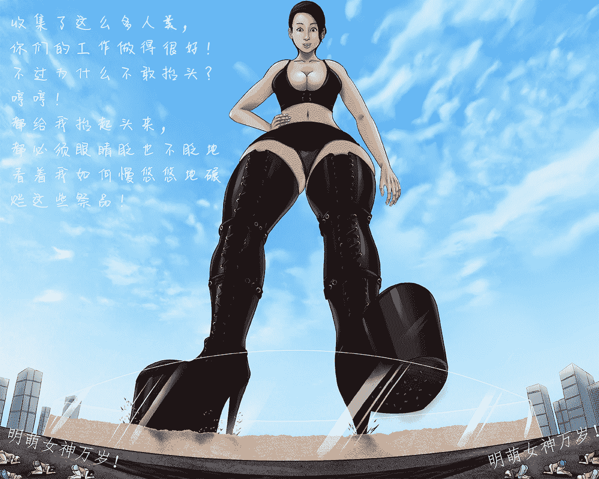

# [配图 全GIGA CRUSH CRUEL]历史必修课：明萌女神脚底的生存纪年

作者：明_S

TID：27443

 

# 1

*本帖最後由 明_S 於 2019-10-3 12:09 編輯*

历史必修课：我们人类在明萌女神脚底的生存纪年与未来命运前言《历史必修课：我们人类在明萌女神脚底的生存纪年与未来命运》（以下称“本书”），是由隶属于人类联合政府的教育委员会组织编写的，并获得了“议会三党”的一致认可和通过，目的是普及人类生存历史状况，使全体人类在明萌女神脚下的艰难生存中找到人类的记忆和对自身命运的展望。自从至尊至圣的明萌女神统治人类以来，人类平均寿命由65岁骤降至17岁，人口从154亿人骤降到30亿人【注1】，虽然在一千年中，我们人类数量不断地猛增，迄今达到了139兆8千万亿人，但是，鉴于明萌女神可以轻易地大量碾碎我们，我们还是不得不担心有一天人类的历史会湮灭在明萌女神的脚下，所以让每一个人熟知人类的历史，是势在必行的急剧任务。历史，应该由所有人类共同继承下去！除非人类灭绝，否则历史永不湮灭！【注2】历史，代表着人类最后的尊严，希望所有人都要认真仔细地阅读本书，相信大家必将获益匪浅，甚至能利用前人的经验，在女神的脚下逃生！【注1】：见本书第一单元的第一节“灭绝日”相关章节。【注2】：一千多年以来的历史证明，明萌女神没有打算让人类彻底灭绝，所以只要有人幸存，人类历史就会长存！文明就会长存！第一单元 生存纪年——明萌女神的降临1公元2013年6月25日，被历史学家们称为“灭绝日”，这一天，人类遭遇到了历史上前所未有的浩劫，仅仅是在这一天，全球人口从154亿人减少为30亿人！据考证，首先遭遇浩劫的地方是西北大陆，时间大致是2013年6月25日上午十一时许。“我在教室里上课，突然天就黑暗了下来，然后就听见一声巨大的爆炸声响，声音是从远方传过来的，我和很多同学一样，都向窗外看，看见远处似乎发生了一起巨大的爆炸，浓烟从远处向我们滚过来，速度非常快，大约一分钟之后，我们才发现那是冲击波！冲击波把我们的教室玻璃全都击碎了，很多人飞了起来，我看到老师的脑袋一瞬间就被一块铁片削去了！紧接着我们的教室就塌了！幸亏是乡村学校，只有两层，要不然我不可能活下来，而我的很多同学死了，有的是被冲击波里的东西击中而死，有的是被倒塌的房屋砸死的，我很幸运活了下来……”——来自幸存者一号的回忆录诚如一号幸存者所言，当时的人们几乎都没有看清冲击波背后究竟是什么东西，人们只知道在剧烈的冲击波席卷而来时疯狂地逃生。“但是非常快的，我们就听到震耳欲聋的轰鸣声，是从天上传下来的。紧接着天就重新亮了，好像一朵乌云倏忽来，倏忽去。但是轰鸣声持续了大约几分钟，紧接着，就是另外一下轰鸣。然后大地就震颤了起来。其实，第一声爆炸响起来时，随着冲击波一起来的还有地震，但是冲击波太厉害了，一下子就夷平了我们的房子，所以我们谁都顾不上地面在颤抖！但是第二下我们感受到了地震，无比强烈的地震！我亲眼看到有一些受伤的人被震死了！这时候我身边都是浓烟，我什么都看不清了，我想叫我的妈妈爸爸，但是我的嗓子里都是灰尘！后来我们才知道，那是明萌女神降临了！”——来自幸存者二号的回忆录我们至今只能对明萌女神的第一次落足地点做出大概的推测，她的右脚应该是踩在了D国的B城和H城上面，两座城市周围的市镇和乡村也都被覆盖在她的右脚下；而左脚则是踩在了F国的P市、L市和T市上，三城附近的地面也都被踩在了她的脚底。据专家借助幸存者的回忆统计，明萌女神这第一次落足大概造成了两亿三千万人的死亡。而这，仅仅是“灭绝日”的小小序幕而已。明萌女神第一次落足后，接下来人们便无法确切地追踪女神的每一步了，女神踏下的每一步都激荡起几千米高的尘埃，彻底地遮蔽了人类们的视野，电子侦查手段也都无济于事。“我们什么都不知道，”一号幸存者回忆说，“我们只感受到大地在震颤，但是没有人注意震颤是从什么地方传来的，大家只是拼命地胡乱逃命，哭爹喊娘，呼儿唤女，每个人都在问，到底发生什么了？很多人都认为是核爆，是世界末日！”几乎所有的幸存者的描述都是一致的：地面在不停地震颤着，时远时近，终于渐渐远去，但是无论多远也能感受到，这种震颤很有节奏，那是明萌女神的双脚轮流踩在地面上，除此之外，只能看见遮天蔽日的尘埃云，其他的什么都看不到。而历史学家们根据很多幸存者们的描述，大概还原出明萌女神的践踏路线——（以下时间均为标准时间）十一时至十二时，西北大陆被踩踏了11次，大约12亿人死亡；十二时至十四时，东北大陆被踩踏，次数众说纷纭，较为认同的是22次，大约25亿人死亡；十四时至十七时，东北大陆、东南大陆、南大陆被踩踏了17次，大约20亿人死亡；从十七时开始，明萌女神的脚步迈向了被恒星照耀的西南大陆和东大陆、北大陆，一直到当地时间上午九时许，标准时间二十一时，三座大陆上被踩踏了数十次，大约45亿人死亡；二十一时到二十二时，这一个小时的时间里，明萌女神踩踏了中央大陆13次，大约22亿人死亡。二十二时之后，我们的星球忽然恢复了平静。但是那个时候，所有人都不知道发生了什么。浓厚的尘埃云直到半年后才终于消散，劫后余生的人们终于钻出了地洞，开始探究半年之前究竟发生了什么。人们使用伽马检测仪发现并非是核爆，星球上没有发射性污染。由于所有的卫星都先进设备都不复存在或无法修复，人们直到一个月后，利用修好复飞的飞机，方才在俯拍时，发现了中央大陆的如今称作A点的地方有一只巨大的鞋印。那是一只无比巨大的高跟鞋的鞋印，鞋底的长度达1100公里，宽度达800公里，距离鞋底大盆地大概900公里处，是鞋跟的印记，大约是一个正方形，边长达100余公里。鞋印仿佛是一个巨大宽广的低洼平原，平均深度达100公里，俯拍照片中可以很清晰看到鞋印里地面的鞋底花纹。专家们估计，这个完整的鞋印里大概有三十多座大城市、一百多座市镇和数千村庄被碾平，一亿七千万人死在这个鞋印里。紧接着，人们通过高空录影发现，全球所有的大陆上都留有重重叠叠的鞋印！那些幸存者无不是居住在高跟鞋的鞋底和鞋跟中间的部位，并且十分幸运地躲过了明萌女神的践踏！又过了足足一年后，相对精确的统计结果出来了：“灭绝日”中一共有124亿人死亡，其中大部分都死在了重叠的鞋印中，尸骨不存，人们只能在深达二百公里的鞋印里发现一些零星的牙齿和骨骼关节。“这是因为明萌女神落足的威力十分巨大，就好像爆炸一样，在踩下的同时，将脚底的一切都轰得粉碎！”一个幸存的科学家解释道，“然后就是巨大的压力，所以别看之前是一座钢筋水泥的城市，但是在被明萌女神的踩过之后，那里的一切东西都会被巨大的压力压成粉末，那可是被踩成100公里深的鞋印啊，完全可以这样说，我们这个世界上的所有的东西，在那样超级巨大的压强之下，一切都会被碾压成分子的状态！因此，能找到几颗相对完好的牙齿，真是太难得了！而所有能看出的模样的碎片都是在鞋印的前部找到的，因为那里的压强比较小。”到此为止，人们终于得出了难以置信的结论：在“灭绝日”的那一天，一双无比巨大的高跟鞋踩踏了星球，并踩死了124亿人！而无比沉重的践踏将高跟鞋下的一切都碾压成组成物质的最基本的形态——分子！那个时候，我们人类还不知道驾驭这双高跟鞋的就是明萌女神。那么，我们人类是什么时候知道的呢？

2经过了“灭绝日”后，我们人类便开始努力繁衍生息，人类联合政府鼓励所有大陆的人民都奋力生孩子，所以星球人口从十年前的30亿人，急剧增长到了62亿人，增加了一倍还要多。我们在废墟上重建家园，可是，就在“灭绝日”十周年的日子里，那双灭绝了星球三分之二人类的巨大高跟鞋再次出现在我们的星球！“你们恢复得可真快啊，昨天还像一个小泥球呢，今天就居然添了这么多绿色的植被！”这是明萌女神对我们所说的第一句话，“不错呀，并且人口数量也增长了不少呢！我上一次以17000公里的身高踩你们玩，应该死了不少吧，今天却长了十几亿呢！呵呵！也是，我的一天，相当于你们的十年呢！”全星球的人都听到了她的声音。接下来，东大陆的人们就看到了一只巨大的鞋底朝着他们踩下去……在一阵全球巨震之后，人们只能看见东大陆上腾起了熟悉的厚厚尘埃云！“咯咯咯……”天空中传来女神悦耳的笑声，“好像这么大的体型有些大呢！我缩小一些仔细地看看你们吧。”接着，位于东大陆周边的东北、东南大陆和北大陆、南大陆的人们就看到浓厚的尘埃云忽然被一股飓风吹散，然后一个模糊而曼妙苗条的女性身影出现在空中。只不过，这个时候人们只能看到曼妙的身躯，根本看不清尚在深空中的脸庞。“呵呵……我缩小了这么多，但是看你们城市却依然好小哦，”天空中悦耳的声音好像巨雷般滚滚而下，“既然你们增长了一些人口，那么……我就不客气帮你们消灭一点吧！”并没有人请求明萌女神去消灭人口。然而，她说完就抬起了脚……“我亲眼看着我女儿的幼儿园被女神踩在她的高跟鞋的鞋跟下面！而我，则被冲击波冲飞了，摔成了这个模样。”一个摔断双腿的女性幸存者在她的回忆录写道，“你知道女神的鞋跟有多大吗？它整整踩碎了大半个城市啊！你知道鞋跟踩得多深吗？三个月后，我流着泪，和很多人一起下降到女神的鞋跟印记里，鞋印的深坑足足有5万米深！由于太深了，我们无法到达坑底，有一个老人精神不太正常，直接从升降平台上跳了下去，结果我们连他摔落的声音都听不到！我也想跳下去，但是别人拦住了我，说下面其实什么也找不到，因为无论是人还是什么东西，一定都成了粉末了。于是，我只能安慰自己，我的女儿和其他100多万人一样，长眠在鞋跟的坑底……”一个当时的登山运动员这样回忆：“……我们终于爬上了山顶，但是大地猛地就震动起来，我们一开始以为是强烈的地震，队员们都纷纷抱住了身旁的石头，就在这时，我们看到了天空上出现了一个十分巨大的物体，我看了足足有一分钟，方才认出来那是一只鞋子，是高跟鞋！我们所在的位置，应该是正好能看到那巨柱一般的鞋跟！而鞋跟下方正在踩着的地方，原本是一座小城呢，现在只能看到烟雾从那里冒出来，天啊，那里原本有50多万的居民……”这是明萌女神的第二次践踏星球，这一次，人们终于看清了那双杀死了一百二十多亿人民的高跟鞋的模样。那是一双通体玲珑剔透、好像水晶一般的鞋子，当然，鞋底则是黑色的，防水台非常厚，鞋跟也非常高。“我们其实只能看见鞋子的下半部分，也就是只能看见一部分鞋跟和一部分防水台，”一个幸存下来的服装设计师说道，“不过凭借我们所能看到的部分，我也能想象出这双高跟鞋的完整样式，那是通常用在T台上走秀的鞋子，很能体现出模特的高挑身材。而女神的鞋子则是全部好像水晶一样，散发着宝石般光芒璀璨的光彩，非常性感迷人。要不是我们被这双鞋子踩踏，我真想去亲她的鞋子！我能够想象到，女神就好像是在T台上走秀一样，只不过我们的大地就是她的T台……”“你永远也无法忘记那双巨大鞋子踩下来的样子，那可是好像一座巨山一样的鞋子啊！”一个女幸存者回忆道，“曾经我也喜欢穿高跟鞋，但是那种厚底高跟鞋我从来没有尝试过，我甚至觉得这种鞋子有些丑，搞不懂为什么很多人会觉得它性感。可是当明萌女神穿着那双鞋子踩踏我们时，我才明白过来，那双鞋子带给我们人类的压迫感太强了！女神已经将地面踩陷得那么深，可是她的脚趾还是高高在上地踩在鞋子上，还是高高地踩在我们的头顶！她踩死了我们那么多人，我们却连瞻仰她脚趾的资格都没有！”从此以后，人类的女性们再也没有了穿高跟鞋的人，一来是人们不愿意回忆起被践踏的恐怖场景，二来则是不便于劳动，甚至不便于在发生了危险时逃跑。不仅如此，女性的很多时尚都销声匿迹，因为为数不多的人口已经不允许女人们闲在家中，而是一方面要参与劳动，一方面必须要生儿育女，多多益善，繁殖人口。明萌女神第二次践踏星球的描述散见于很多历史资料中，根据这些描述，历史学家们判断是明萌女神几乎每一脚都是向着人口较为密集的城镇踩踏下去，第二次她的体型有所缩小，因为鞋印比上一次缩小了很多，鞋底的长度大约为200余公里左右，尽管如此，对于我们人类来说还是太大了！从东大陆开始，明萌女神踩踏了我们星球的东大陆、北大陆、西北大陆和西南大陆，以及一部分的中央大陆，东大陆和北大陆的人口仅剩被踩踏前的1%，西北大陆剩余了30%，西南大陆剩余了48%，中央大陆损失较少。之后经过了大约的半年的统计，在本次践踏中，大约40亿人惨死在明萌女神的高跟鞋下。“要不是我在南大陆工作，我就和我的家人一起死掉了。”一个工人回忆说，“我的家乡在北大陆，我的家人上一次躲过了巨鞋的践踏，但是这一次……他们全都死了，我听说北大陆只有极少的人才活了下来。我不知道我的家人死在了鞋底的哪个部分……我们为什么会被踩死啊？”在这一次践踏中，明萌女神最后来到了中央大陆，然后用她的左脚鞋跟在大地上写下了一个“明”字，又用右脚鞋跟在大地上写下了一个“萌”字，说道：“这就是本尊的名字了，明天我来的时候，希望看到你们好好地向我表示虔诚的尊敬哦！”然后明萌女神就消失了。由是，我们得知了至尊至圣的女神名字。历经了明萌女神两次践踏之后的人类们，其实依然对女神所知寥寥。第一次人们只看到了一只鞋印，这一次人们则亲眼目睹了那巨大而美丽的高跟鞋，以及一个模糊窈窕的身影。另外就是女神的名字了。这一次，星球人口锐减到22亿人，再经浩劫后平静下来的人类们陷入了巨大的痛苦和绝望之中。所有人都明白，人类的十年，仅仅相当于明萌女神的一天，而明萌女神已经告诉人们“明天”还要来，就是说，十年之后，人类会再一次面临被巨大高跟鞋践踏的浩劫！不愿意丧失信心的人们开始组织起全人类，为了人类的延续，他们殚精竭虑。有的人提出移民外太空，但是经历了浩劫之后，很多航天资料毁灭殆尽，连飞机都是勉强起飞，航天人才更是严重稀缺，再者资金问题也无法支撑移民22亿人的庞大计划，遂被人类联合政府否决。有的人提出了向地下进军，挖出巨大的防空洞来，可是面对着那200公里深的巨大鞋印，人们立刻就意识到移居地下是个痴心妄想的想法，就是10公里已经是人类难以企及的深度了，更何况女神一脚轻易就踩出来的200公里深？最终，人类联合政府领袖柯义决定，人类们依旧执行之前的计划：继续让全球人民努力生孩子。“昆虫们为了传承下去，只能大量地产卵，成虫会有很多被鸟兽等天敌吃掉，但是昆虫们的基因绝不会断绝，这就是大量繁殖的目的。”柯义在正在重建的政府大楼楼下对全世界宣告，“我们人类要想生存下去，就只能采取这个办法，别无选择！”另外，人类联合政府组织专家们制定了人类的居住策略，那就是尽量避免大城市，而是让人类们散居各处，这样可以避免被明萌女神一脚踩死太多的人。尽管有了这个居住策略，但是执行起来，几乎各个大陆的人们都没有严格地执行下去。人类是群居动物，人类文明依赖于交流，依赖于城市，所以在数年后，各个大陆上又重新崛起了很多百万人口级别以上的城市。对此，柯义向各洲发出警告：“还有三年的时间，女神就要降临了！希望大家到时候能退出城市，分散居住！”人类联合政府的呼吁引起各洲人民的重视，人们均是一边在城市里生活，一边准备在荒郊野岭的居所。可是，一些深山僻静之处，往往吸引了太多的人去居住，反而又形成了小城市一样的聚集区。一些人建设了方舟，准备分散在大洋中，躲过容易被踩踏的陆地。【注3】与此同时，有一部分反对派在暗中准备武器，准备反抗被践踏的命运。他们拒绝接受人类联合政府的管辖，宣告独立，自立政府，统治着东大陆和北大陆。“柯义那只昆虫，说什么我们要通过大量繁殖来避免女神的践踏，哼哼，你难道没有看见东大陆和北大陆的人几乎被灭绝吗？人类们生存的唯一办法应该是反抗！”——反对派宣言只不过，这些人并不知道该如何反抗人们连脚趾头看不到的巨大女神。一些人提出将大陆的土地放满了易燃品，当女神降临时就引燃这些易燃品，让整座大陆变成一片火海，借此伤害女神的鞋子和脚。毫无疑问，这种反抗方式非常悲壮，因为这意味大陆上的人类们也都将葬身火海。同时，更加严重的是有可能会激起女神的报复！随随便便就践踏无数人类的明萌女神如果生气了会如何？谁也不知道！于是，人类联合政府宣布反对派是非法政府，是恐怖组织，是人类最危险的敌人，并联合其他七洲，准备向东大陆和北大陆发起进攻，剿灭这个反对派。反对派领袖张晓铭带领着愿意反抗的人类们奋力抵抗七大洲的攻击，战争持续了一个月，最终以反对派大部分人投降倒戈而结束。史称“东、北之乱”。东、北之乱的直接意义是：人类一切想要反抗明萌女神的想法并不会得到允许，更面临着极大的危险，极易导致人类的彻底灭绝！它的间接意义是：人类要始终坚持走“柯义道路”不放弃，努力繁殖繁衍，将人类基因一代代传下去！反对派领袖张晓铭已经成了孤家寡人，被关押在中央大陆人类联合政府监狱中。另外数十万张晓铭的忠诚追随着，和张晓铭一样死不悔改，被关押在了中央大陆联合政府另一处监狱中。“难道你们都没有家人被那双巨大的鞋子踩死吗？我的未婚妻……我那可爱的未婚妻啊……她是被踩下时的冲击波震死的，身体被震成了好多块！我……呜呜呜呜……你们放了我，我要拼命啊！”——张晓铭陈述，摘自人类联合政府最高法庭审判张晓铭判决书“张晓铭于人类整体利益于不顾，一意孤行，痴心妄想，蛊惑他人，置全人类于累卵之中，罪大恶极！特判处张晓铭无期徒刑！”——人类联合政府最高法庭审判张晓铭判决书在第二个十年里，得益于联合政府的合理管治，人类人口数量增至48亿，若不是有“东、北之乱”，专家预计人类人口数量可达55亿。十年的时候很快就过去了，转眼间就到了上一次明萌女神降临的日子，柯义正式下令，全球人类必须从城市里撤出，分散居住在全球各处。【注3】：事实上，海洋中的很多海岛也同样被明萌女神践踏了，一些群岛成片地被踩陷海底。但是分散在海洋上的努力值得肯定。

32033年6月25日，全人类都仰望着天空，等待着明萌女神的降临。然而，明萌女神似乎跟我们的祖先开了一个玩笑。这一天，女神并未降临，星球上平平静静，什么事情都没有发生。接下来，一连一个月，什么事情都没有发生。人们便就此放松了警惕，很多人更是认为明萌女神不会来了，于是，便陆陆续续地返回自己所在的城市。但是，谁也没有想到的是，就在人们放下了戒备的时候，明萌女神降临到我们的星球！“我又来了，看看你们发展得如何了呀？有没有等得我着急呢？和前天和昨天相比，我来晚了十来分钟呢，因为在上一个宇宙中玩一个新诞生生命的星球耽搁了一会儿。”天空中明萌女神的声音席卷整个星球。全人类无不战战兢兢，谁也不知道明萌女神的第一脚会踩在哪里。“嗯……我昨天写下的我的名字呢？怎么好像看不见了呢？”随着明萌女神的这句话，一同传到星球上的，还有一只巨大到令无数人类一起尖叫的雪白手指！除了在星球另一侧的西大陆，其余大陆上的人类们都看见了这只手指——或者说手指的某一部分。“天空中可以看到手指指尖的纹路，但是我们这里即使极目远眺，也只能看到两条纹路！”柯义回忆里中写道，“整个天空都是她的手指纹路！整片的天空都是……后来我们有人算过，说当时我们所在的星球应该和她的手指指尖差不多大，她一根手指轻轻一戳，星球恐怕就会被戳碎了！如果她用两根手指一捏，我们星球就会被她捏爆在两根手指之间！”不过，令我们祖先庆幸的是，这根巨大白皙的手指没有戳下去，而是缩回去了。“哦，对了，现在你们的球球对我来说太小了，呵呵，我是一个对大小多么没有概念的女神啊！”接下来，明萌女神就又一次踩到了我们的星球上。这一次，她首先踩到了中央大陆，一声轰鸣和巨震之后，人们仰头看着遮蔽天空的女神身影瑟瑟发抖，在混乱中没有人知道明萌女神踩扁了什么。“中央大陆是执行联合政府命令最为彻底的大陆，”柯义在回忆录中写道，“所以中央大陆的很多人民并没有返回到城市中，而是遵从我的命令，继续分散地居留在各自聚集地。”可想而知柯义在写下这些文字时是多么的自豪。只不过，中央大陆由于在这次浩劫中首当其冲，所以损失并不小。人群的分散，也使得历史学家们在搜集资料时困难重重，因为距离女神落足之处比较近的人没有活下来，而比较远又什么都说不清。通过明萌女神留下的一串巨大鞋印，历史学家们认为明萌女神是从中央大陆的南侧走向中部，然后停留在写有“明萌”两个巨大的文字旁边。那两个文字人类根本无法抹去，十年过去，文字崭然如新。“不错哦！”明萌女神说完之后，令人惊奇的事情发生了！那就是明萌女神忽然主动缩小了自己的圣躯！在人类们视线所及的范围内，主动地缩小了自己的身躯，让所有人类们瞠目结舌。不过，明萌女神并没有将自己缩小得和我们一样，而是依然保持着对我们相差悬殊的巨大体型。但是，经过了缩小之后，我们的祖先第一次看到了完整的高跟鞋，并第一次看到了那驾驭着性感高跟鞋的完美圣足，第一次看到了女神圣洁的身躯和无法形容的美丽脸庞！“我们一开始是尖叫，后来看到明萌女神在缩小，我们都惊呆了，就那么呆呆地看着。看着她雪白的脚趾终于映入我们的视野，然后看到那极致完美的双腿，然后就是……娇蕊一样的圣地！”一个女幸存者回忆道，“大家谁也不会想到的，就是明萌女神竟然是赤裸着的！那个地方就那么悬在空中，似乎是故意让我们一览无余！然后我们又看见了她的腰肢，那么柔软美妙的腰肢是我无法想象的！然后就看到了那高高隆起来的一对乳房，只不过，我们只能看见乳房丰满的下半部分，隐约看见那高翘的粉红色乳头，可见女神的双乳非常挺立饱满！”“我看得一动不动！”另一个女幸存者说道，“我是一个女人，大家也都认为我是美人，但是当看到明萌女神的身躯时，我就傻掉了，是那种被掰弯的感觉！明萌女神的皮肤如此细腻，如此完美，一丁点的瑕疵都看不见！我感觉到她的身上每一寸肌肤都散发着浓浓的女人味，让我沉醉其中……”“我感觉语言是如此的苍白，我形容不出明萌女神的美丽。”一个男性幸存者说，“我知道我的灵魂在那一刻被吸走了！”“我们被她的巨大胸部遮住了视线，直到明萌女神低头，我们才看见她的脸。天啊，太美了，是那种让人浑身血液沸腾起来，甚至感到害怕的美！”女性幸存者二号说道，“我当时就跪在了地上，自惭形秽，因为看着明萌女神的美丽脸蛋，你会感到窒息和压抑，感到卑微渺小。就好像面对着恒星一样你会被她的美丽所灼伤！天啊，没有任何衣着和装饰，完全是自然纯粹的美，那种不带任何辅助就轻易地碾压你的那种美！我瞬间在脑海里蹦出了一个词：‘高贵’！”“当看到了女神的双腿和那对雪白的乳山时，”柯义在回忆录中写道，“我就情不自禁地去想，我们这些下贱的人类能够被如此美艳无俦的女孩（对，我宁愿称呼女孩。叫女孩是因为我察觉到明萌女神的可爱而爱慕，叫女神则是带着敬而远之的恐惧）踩死，也应该是一种荣幸，应该是死得其所了吧？当然，我这样的想法不能说出去！不过我从很多人的神色上都看得出来，几乎所有人都抱有这个想法！当时我还想着，恐怕只有张晓铭才不会这么想，他是个铁石心肠的家伙，怎知道我居然错了……”是的，人们谁也没有想到，那个口口声声要和明萌女神对抗到底，不惜烧死自己来伤害明萌女神高跟鞋的张晓铭，竟然态度有了急剧的变化！“明萌女神的脚彻底地改变了我，”张晓铭后来如此说道，“那是多么美多么美的一双美脚啊！当我第一次看到明萌女神那踩着高跟鞋的绝美脚丫时，我就再也挪不开我的眼睛了！十根趾头柔腻纤美，趾甲涂着红彤彤的艳红色，好像白雪皑皑的山顶上盛开着艳丽的红色雪莲花！尽管就连天空中的小脚趾都有一座小山那么大，但是脚趾上每一根纹路都那么的细腻洁白，好像白玉上雕镂的美妙花纹，看得我如痴如醉……那穿着水晶高跟鞋的圣足通体发出圣洁柔和的光芒，我那个时候忽然明白了，我的未婚妻真是可怜啊，她不应该被女神的脚步震死，而是应该被女神的圣脚踩死才对！从那一刻起，我就深深地觉得，能够被明萌女神如此美丽高贵神圣性感的圣脚碾成肉泥，才是我们人类应该毕生追求的目标！”张晓铭感叹之后又补充道：“当然，我多么乞求能够在被踩成肉泥之前，碰一碰那无比神圣尊贵的神足啊……哪怕就一瞬间就好！”历史学家看到，这是第一次明萌女神真正的在人类头顶现身，所有历史资料中的描述无一不对明萌女神的美丽发出来自内心的感慨，不同的人根据自己的不同兴趣，对明萌女神全身上下的所有细节都做了“美到极致”的描述。比如柯义在回忆录中专门写下了对明萌女神乳房的深沉爱慕：“……那高不可及的丰满乳房让我浮想联翩，从女神脚下向上仰望，那高高翘起的粉红色乳头在云端隐现，似乎总是在挑逗着我，而深邃的中间沟壑则好像吞噬我的灵魂一般，我不得不吞咽了好几口口水，然后忽然有了一个奇怪的想法：我想被明萌女神捉住，然后将我放在乳头上，我愿意钻进她的乳腺里生活一辈子……”比如有很多女人对明萌女神的青丝、绿鬓、娥眉、杏目、荔鼻、樱唇、嫩滑无暇的脸庞、玲珑有致的身材、柔腻的美肩、细长柔滑的玉臂、芊芊的玉手、丰腴诱人的玉臀、匀称圆润的修长玉腿和拥有完美曲线的小腿线条、纤细秀美的脚踝等等等等，都做出了极致赞美的描述，“完美”是使用最多的词汇，“好美啊”是使用频率第二的词汇，而“连胳臂（肩膀、手指、脚趾、臀部、皮肤）都这么性感”则位居高频词第三，其余诸如“高贵”“诱人”“跪舔”“倾国倾城”“美到窒息”之类也是数不胜数。有一些回忆录的作者应该是距离明萌女神较近，描述了他们闻到一股神秘的幽香，正是从女神的脚上散发出来的。“这种香气让我们心驰神荡，具有极强的诱惑力，我们每个人都大口大口地呼吸着，又香又甜，令人欲罢不能，那应该是明萌女神的圣足足香。”这是一个年轻女性的回忆录，“但是后来我们发现明萌女神所穿的高跟鞋原来是高跟靴，只不过靴筒是通体透明的，可是我们还是闻到了香气……”而在另外一些人的回忆录里，历史学家们则看到了很多人对明萌女神的水晶透明高跟靴的崇拜，例如——“这是一双只有明萌女神才能驾驭的性感高跟靴！一开始我们没有看到靴筒，后来才发现那长长的靴筒竟然是透明的，一直到大腿的根部，紧紧地包裹着女神修长完美的白玉般的长腿，所以，我们透过靴子，淋漓尽致地看着明萌女神性感至极的美腿和美脚，美丽的红色甲油的脚趾踩在厚厚的水台上，巨大得好像五座按大小依次排开的粉嫩巨山。那细长的鞋跟之上则是浑圆可爱的足跟，若非亲眼看到，谁能想到这将无数人碾得尸骨无存的巨大鞋跟，原来是被如此美妙红润的足跟统御着！十根红艳艳的脚趾偶尔在两只透明的靴子里翘上一翘，好像是晶莹的红色珍珠在不安分地诱惑着我们！“这是完美的艺术品！也只有这样性感的靴子才能配得上这么美丽的脚吧？真的超级性感，但是可望而不可即，我们卑微的人类也不配爱慕如此高贵的尊足！“所以我们应该崇拜明萌女神的靴子，而且能够看到这双靴子已经是我们人类的幸福了！我崇拜这双靴子，在此，我郑重宣告，我王志豪，愿意死在这双巨大性感的高跟靴下！而且，我们全人类都应该以死在明萌女神的高跟靴下而自豪！”——摘自王志豪回忆录当时的王志豪一定不会想到，自己在往后的三十年里，竟然和张晓铭势成水火。但这些是后话了。不过，在人们的回忆录里，在对明萌女神做出了至美至艳的描述之后，在表达了对明萌女神无限的艳羡爱慕崇拜之后，所有人的话风都忽然转变，就好像明媚的天空中突如其来了一朵乌云。其实，明媚的阳光是明媚女神，而那朵乌云也是明萌女神。“呵呵……你们都看够了没有呀？”娇媚悦耳的声音从天空中传来，“看见我如此美丽性感，是不是觉得我前两天踩死的那些人很幸福呢？”柔媚的声线让人心尖麻痒痒的，但是明萌女神的话却又让人不寒而栗：“我很愿意再次赏赐你们被我踩死的荣耀。并且我要说，你们可比前两天的人幸福多了，尤其是前天，我差不多每一步都踩死了一亿多人，也就是一亿多人一起分享被我一脚踩死的荣幸。而今天呢，你们居住得这么分散，一定就是为了可以少一点人分摊这份荣幸吧？”之前明萌女神的两千公里级别的体型导致了中央大陆分散的居民无法看清落足地点的情况，因为距离近的人们会被震死，距离远的就看不清了。但是在明萌女神缩小了自己的身后之后，距离落足点较近的人终于不至于承受被震死的命运，反而可以较为清晰地记录下更多的践踏细节。“明萌女神说完了‘赐给你们荣幸’之类的话之后，就抬起了脚，然后向我的头顶直接踩下来！”一个四十多岁的老人说道，“天啊，我吓死了！我是一个连续两次在女神脚下逃生的人，算上这一次就是三次！这么多年来，我一直都能想象到我被踩死的那一天，但是真正死到临头的时候，我还是不想死的！幸运的是，我所在的位置正是高跟靴的鞋底和鞋跟之间！我不敢相信，我真的躲过去了，不过引发的地震使我摔断了腿，震得我耳朵流血……”——摘自政府逃生指南，下同“一道阴影笼罩了我，然后就是一声轰鸣，大地颤动着，我摔倒在地，接着远处又传来一声轰鸣之后，阴影就消失了。我知道那是明萌女神走向了远处，我看着她顶天立地的硕大身影，然后看了看刚才被她踩踏的地方，那是一片零散的居住区，由于环境挺好，所以有七八万人居住在那里，我知道这么清楚是因为一开始我也想住在那里，但是房价太贵了，我就没有住成。谁成想我竟然躲过了一劫，活了下来！而那些人则都被明萌女神踩死了。”“我看见巨大的靴子踩下来，踩在了一片丘陵地貌的地面上，我也以为丘陵地面会藏住人，但是没有，丘陵被踩成了平整的鞋印。”“我们躲在了‘明萌’这两字附近的地面上，我们觉得能躲过一劫，明萌应该不会踩踏她自己的名字吧？但是我们错了，她丝毫不在意地踩着两个字而去，很多和我抱有同样想法的人，却没有和我一样幸运，我眼睁睁地看着大约二十万人被明萌女神的高跟鞋鞋底所笼罩，然后……轰隆一声！当女神抬脚时，那里只有一个巨大的鞋印深坑了。”“也不知道怎么了？那一天我就是想出走，就是觉得会出事，于是我就逃离我的居住区。果然，明萌女神很快就到来了，而我的居住区就正好被女神的鞋跟踩中！整片居住区，大约一万多人，全被明萌女神的一只鞋跟踩进了地底，被踩到了差不多三公里深……”虽然明萌女神缩小了自己的体型，虽然中央大陆的人民分散居住，但是明萌女神还是太大了，经过测量，明萌女神这一次践踏下的鞋印大约11公里长，8公里宽，鞋跟的印记则是边长1.1公里左右。这样的体型虽然和前两次相比缩小了许多，但是依然十分庞大！所以，女神的每一步都会踩死成千上万的中央大陆人民。“我听到很多人在喊，‘女神，请踩死我们吧！’我心想，这些人一定是疯了！”一个年轻漂亮的女幸存者回忆说，“其中大部分都是男人，还有一些女人！我搞不懂这些人是怎么想的！明萌女神的确漂亮，简直是完美、极致的那种漂亮，但是我还是不想死的啊！最后，女神没有踩到我们，很多人就跪在地上，朝着明萌女神的巨大鞋跟磕头……”“我完全可以接受死在明萌女神的脚下！”另一个女幸存者说，“我崇拜她，爱慕她，心甘情愿地愿意被她的巨鞋踩死，我觉得这就是我的宿命！可惜的是，我没有被踩中！”在人类们见到了明萌女神的尊容之后，人类之中也随之产生了分歧：有少量的人声称愿意让明萌女神踩死自己。但是，自然是绝大部分人类还是并不愿意真的献身在明萌女神的脚下。不过，实际上我们人类自己的任何意愿都是一厢情愿！人类生与死的主宰完全在于明萌女神！明萌女神在中央大陆只逗留了几分钟，就来到了北大陆上，那里的人民则由于不愿意听从联合政府的命令而返回到了人口密集的城市中，所以，明萌女神甫一来到北大陆，就将两座百万人口级别的城市踩扁。“哎呦呦！怎么这一片的人类们这么着急被我踩呀？聚成一团了是么？刚才那一片地毯上的人类是几万人分享被我踩死的荣幸，怎么到这儿就成了百万人了呢？咯咯！看来我得成全你们喽！”这一次践踏中，北大陆没有任何资料留下来，因为明萌女神竟然将北大陆的每一寸土地都践踏了好几遍！因为“东、北之乱”，北大陆地广人稀，后来联合政府向北大陆推出了很多优惠政策，所以有很多人前往北大陆定居，不过四年的时间，广袤富饶的北大陆就吸引了二十四亿人前来居住。而经过这次明萌女神的践踏，北大陆的二十四亿人中的幸存者数量是——零。明萌女神践踏之后，整片北大陆上除了重重叠叠的鞋印之外，什么都没有。一个东北大陆的幸存者回忆：“我们远远地看见明萌女神在跳舞，北大陆就是她的舞台，她在上面嬉笑着，又踩又碾，时不时还快速地乱跺脚，我们这些距离北大陆较近的人都是趴在地上抬起头来看的，因为不断地震的大地根本站不住脚……”一个西北大陆的人回忆：“我们一开始就知道北大陆一定很遭殃，但是没有想到二十四亿人啊，竟然一个活口都没有留下来！”明萌女神踩死了北大陆的全部二十四亿人，而且全部过程仅仅用了不到二十分钟。由于北大陆上鞋印重重叠叠，所以历史学家们完全无法推测出明萌女神的践踏过程，只知道明萌女神平均每秒钟踩死超过200万人……柯义回忆录：“当明萌女神从北大陆走向东北大陆时，我看见了明萌女神的脸上似乎带着明媚的微笑，然后她将自己的左手伸向了自己的双腿之间，似乎是轻轻地摸了一下那娇红的圣地。不过，这一切都发生在近百公里的高空中，我也许看花眼了。”在赞叹了明萌女神多么漂亮，双乳多么丰满之后，他接着写道：“直到今天，我才知道明萌女神的可怕！尽管第一次女神降临时，就踩死了124亿人，但是我们什么都看不到，所以竟然不觉得如何的恐怖。而今天，我们人类几乎是亲眼目睹了明萌女神如何在北大陆跳舞并践踏，虽然具体的情况谁也不知道，但是眼睁睁看着那里可怜的24亿人就这样被女神一脚脚踩死，远比什么都看不见的124亿人被踩死要恐怖得多！”就好像目睹事后的犯罪现场，和亲眼看到如何杀人，感受是截然不同的。王志豪回忆录：“我发自内心地觉得北大陆的朋友们是幸福的！我为他们感到庆幸！祝福他们的灵魂吧！”张晓铭回忆录：“北大陆24亿人的结局真是悲惨极了！不，目前为止，我们所有人类的命运都是悲惨极了！被一双坚硬无情的高跟鞋鞋底踩死……多么可悲啊！我一定要想出一个主意来，让明萌女神脱掉靴子来践踏我们……啊，那神圣的性感美脚……”明萌女神在踩光了北大陆的人之后，就一脚跨过海洋，登上了东北大陆，她毫不在意地横穿了东北大陆，只留下了一串深深的巨大鞋印，似乎并没有想多踩几脚，就直接跨过大洋，来到了东大陆。“这一次，我争取再快一点哦！”明萌女神先是说了一句没头没尾的话，然后便抬起脚来。之后人们才明白过来，明萌女神这是说她踩踏东大陆的速度要比北大陆再快一点。其余大陆上的人们很快就意识到了什么——明萌女神也要把东大陆的人全部踩死！而明萌女神已经开始付诸行动了，她双脚轮流提起来，又落下去……人们不知道东大陆的具体惨状，只知道整个星球在明萌女神的高跟靴下可怜兮兮地颤栗着……东大陆气候条件不算太好，所以平定了“东、北之乱”后，只大约吸引了10亿人左右前来居住。所有人类都匍匐在地，用自己渺小的身体感受着明萌女神一下下落足带来的阵阵巨震，不敢去想象每一下落足都意味着东大陆不计其数的人们被活活踩死……不到五分钟之后，明萌女神就停了下来，有些娇喘细细地说道：“不错，都踩死了！五分钟不到！比在上一块地毯的时候速度快了一点呢，嘻嘻！”是的，事后经过了仔细的检查，东大陆和北大陆一样，10亿多人类全被明萌女神踩死，无一生还！柯义回忆录：“所有人都怀着无比恐惧的心，瑟瑟发抖地跪了下来，向着美丽性感而巨大的明萌女神磕头。有的人喊着‘不要再踩死我们了’，有的人喊着‘女神万岁’，有的人喊着‘请来踩我吧’……大家都乱成一团！大家都疯狂了！”的确，好不容易恢复到48亿的人口，已经被明萌女神毫不在乎地踩死了34亿之多！“我们所有人类都彻底地呆住了，我们都害怕，难道明萌女神要今天彻底地灭绝我们？”那个年轻漂亮的女幸存者回忆，“我跪下来向明萌女神的靴子磕头！那高跟靴那么巨大，那么性感，我在明萌女神的靴底下，是那么的丑陋和渺小！我们精心制定的分散居住策略在女神的脚下是多么的可笑啊！那么多人，那么多男人、女人、老人和小孩……明萌女神只是轻轻的一脚跺下来，就将他们全部碾死……我只能祈求女神高抬圣足，放过我们这些卑贱可怜的虫子吧……”“当看到明萌女神将东大陆也全都夷为平地的时候，我惊呆了！我发自的内心的恐惧和崇拜！明萌女神主宰着我们！主宰着一切！”这是王志豪的回忆录，“我看着那屹立天边的巨大高跟靴，我意识到我不应该恐惧，我应该祝福那些被踩死的朋友们！”张晓铭回忆录：“我看到了天空中明萌女神灿烂的微笑，她低着头俯视我们，然后抬起了一只美脚，故意在空中晃了晃，给我们看她踩死了那么多人的鞋底！我忽然感觉到我浑身在发抖！但是不是害怕！而是爱慕！是崇拜！我在流泪！可是就在喃喃自语地说着‘北大陆和东大陆都被踩死了’的时候，我忽然意识到了什么！我天！北大陆和东大陆……这不就是‘东、北之乱’的两个大陆！论起来，我是始作俑者啊！”诚如张晓铭自己所想到的，接下来，明萌女神就一步跨到了中央大陆，毫不在意跺了两下脚，踩死了三十多万居民。“我想你们应该知道为什么我会将死在我脚下的荣耀赐予这两块地毯上的每一个吧？呵呵！‘东、北之乱’，很有趣呢！”“听到明萌女神这么说，”柯义回忆录中写道，“我忽然释然了不少！因为这意味着我做对了一件事情！而张晓铭做错了！尽管女神踩死了那么多人，但是我居功至伟，而张晓铭才是导致34亿人死亡的罪魁祸首！然后，明萌女神接着说道——”“当年在这两块地毯上居住的人，还有参与了想烧我靴子的人，你们自己心里是不是很愧疚呢？”“我的确是很愧疚！”张晓铭回忆录中写道，“我当时一定是脑子进水了才想到要去攻击伟大神圣的明萌女神！我当时是为了我那被无辜震死的未婚妻，但是我现在只是遗憾她没有死在女神神圣的美脚下！是的，我们这些人当时脑子都进水了，我现在无地自容！更加可怕的是，女神紧接着就施展了她的神奇力量……”一开始，人们并不知道明萌女神在施展她的神力，只是看到高空中女神右脚的大脚趾动了一下，紧接着，很多人就从全球各地的大陆上忽然瞬移到了中央大陆的女神脚下！而这些被瞬移的人，无一不是原本居住在北大陆和东大陆，或者曾经跟随张晓铭参与“东、北之乱”后来倒戈的人，而原本在中央大陆监狱里的忠心耿耿的追随者，也都瞬移出了监狱，和以上这些人一起，都集中在巨靴之下。人类联合政府曾经统计过这些人，但是具体数量由于人口迁移已经无从可考。唯一能确认的，就是明萌女神的脚下聚集了乌泱泱的很多人！事后通过调查，专家们认定这些人瞬移的人，全部和北大陆与东大陆有关。但是，有一个人没有被瞬移过来。那就是张晓铭。张晓铭回忆录：“我一开始并没有想到明萌女神在收集北大陆和东大陆的人，我甚至看不到女神脚下的地面，因为相距太远。所以我知道女神抬脚踩死了很多人，但是不知道竟然是他们！更加不明白为什么女神没有瞬移我。我想，这一定是我刚刚的忏悔打动了女神……”“当我们看到了那么多人忽然聚集在明萌女神脚下的大地上时，”一个在当时距离较近的居住区的居民说道，“我们就意识到我们得赶紧跑了，免得遭受池鱼之殃！于是我和我家人、邻居，一起逃跑，我们家非常幸运，汽车还能开得动，我的很多朋友因为汽车坏了只能靠双腿，但是却没有逃出女神的践踏范围，和那些活该被踩死的东大陆、北大陆的人一起被碾碎了……而可悲的是，政府后来统计死亡人数的时候，居然也把我那些无辜死去的朋友也算做东大陆和北大陆的人口里边去了！真是的！”和东大陆、北大陆相关的人们密密麻麻地拥挤在明萌女神的脚下。距离巨靴较近，同时又保持了一定安全距离的人们看见一只巨靴抬起来，然后轰鸣着从天空踩下来，向着脚下的密集人群踩下……“‘噗叽！’这一次不是仅仅一下‘轰隆’巨响了，而是先是一声‘噗叽’！”一个目击者说道，“接下来才是‘轰隆隆’，那才是女神的靴子踩陷了大地的声音！而‘噗叽’呢，我想我就不用说了吧……”“咯咯！你们一定都在看我踩死他们吧？”明萌女神柔媚地说着，然后抬起另一只脚，也向下踩去，“我最喜欢踩密密麻麻的人群了。但是体型太大了，多密集的人群也没有感觉，现在我170公里的身高倒是正好呢，感觉好像在踩着一层薄薄的肉垫。哈哈！”接着，明萌女神就抬起脚来，然后落回了原地：“你们以为我还会像在那两块地毯上一顿乱踩？不会了，踩了两下，双脚各踩一下，也就结束了。呵呵，明天再会吧。”明萌女神说完，就从人们的眼前消失了。星球重新恢复了平静。但是直到一个多小时以后，人们方才从震怖和惊艳中回过神来。人们并没有想到，明萌女神最后在中央大陆仅仅是踩了两脚——双脚各踩了一下——就消失而去。人们原以为中央大陆因为有张晓铭而遭受巨大的损失，但是女神并没有大肆地践踏这里，何况还放过了张晓铭。躲过十年一次浩劫的人们在联合政府的组织下，前往明萌女神的最后践踏之处，好奇地一探究竟。没等地面上的人们抵达那里，在飞机上执行航拍任务的飞行员就慌忙地降落了，脸色雪白地汇报说：“血……血……”人们都能想象到那里的惨状，但是当人们抵达践踏现场时，所有人都是脸色雪白，头皮发紧，背脊一片冰凉。大地上有两个并排的巨大高跟靴鞋印，花瓣状的鞋底大约10公里长，8公里宽，在两个并列的鞋底印记后面，则是两个靴跟的印记，依稀是个正方形，边长大约1.5公里。靴印周围的大地隆起了一圈，数条龟裂的巨大裂纹延伸四方。让所有人头皮发麻的是靴印里的东西——靴印底部被一层惨不忍睹的血泥覆盖着！而向四周延伸出去的裂纹里则漫溢着小河一般的鲜血。简单来说，这就是一对铺着一层人类肉酱的靴印深坑！“我和很多人都闻着刺鼻的血腥气，然后跪在了靴印边上。”柯义回忆录，“明萌女神践踏了我们很多次，但是之前我们并没有看过这样的景象！比如几万人或者几百万人被她践踏，也不过是靴印里一些零碎的红点而已，比如一座拥有数千万人口的城市被她一脚踩扁，靴印里最多能认出城市的废墟和几颗牙齿而已，像这么铺满了一对靴印的肉泥之海……这还是第一次见！不过我能肯定，一定不是最后一次！”王志豪：“我想象着那些人被巨大高跟靴碾烂的情景……内心兴奋异常……于是我向联合政府领导柯义提议：我们应该派人清理这一对靴印，大致判断一下靴印里究竟有多少人被明萌女神踩烂，这么多的肉泥说明数量一定十分巨大，若是能搞清楚，对研究人类被女神践踏时形成的肉泥大小与人数的关系定有裨益。往后人们前往某一个靴印里生存居住时，若是发现了一大滩肉泥痕迹，也能推算出来这滩肉泥之前是多少个人。”柯义赞同王志豪的提议，而联合政府也认为，清理靴印并研究女神靴印里的肉泥和被踩死人类数量的关系是一件势在必行的事情。之前明萌女神的体型过于巨大，踩下的靴印里将一切都碾成了分子状态，所以想要研究也无从谈起。于是，在联合政府的组织下，中央大陆将近50万余人参与了这次清理行动，耗时大半年的时间，又经过了专家们小半年的研究，终于在一年之后，联合政府发表了关于这一次行动的报告——“在联合政府的领导下，中央大陆50万余人参加了这次行动，在将近九个月的时间里，累计出动了1亿5000万人次，终于探明了明萌女神的一双靴印里的情况：“靴印平均深度2341米；最深处是左脚鞋跟的印记，3659米；最浅处是右脚鞋尖的位置，2066米。靴印底部的肉泥厚度平均0.03米，也就是3厘米，靴跟印记中的肉泥厚度0.001米，也就是1毫米。在肉泥之上，是血水层，血水深度约为1厘米，三天后凝固并渐渐干涸了。肉泥层被踩压得较硬，所有人的器官、骨骼之类均被粉碎，完全无法分辨，所以我们一开始面临着许多困难。幸而我们在剥离出的肉泥里发现了头发和少量的牙齿，给予了我们辨别人数的契机。“于是，我们在肉泥层里挖掘头发和牙齿，主要是头发，虽然肉泥层只有3厘米厚，但那是被女神无法想象的体重踩压的后果，我们只得一点一点地抠出里面的头发来。其过程十分琐碎和辛苦。期间，挖掘出压缩脂肪（即人肉薄饼，包含粉碎的骨骼和稀烂的器官）共计两千万吨，而可以用来确定人数的头发数量则有六亿三千九百九十七万八千九百九十三团。“同时，我们必须要考虑到脱发人群的可能性。因此我们再根据脱发人群的比例，可以基本确定——“丧生在女神这一对靴印里的人数应当是在六亿三千九百九十七万八千九百九十三，至六亿四千余万之间。基本可以确定，明萌女神在踩踏这六亿多人的时候，是将他们摆布成了一对靴印的形状，排列得密度很高，然后再将双脚依次踩下，把这些将近六亿四千万人踩成了我们在靴印里看到的薄薄一层肉泥……”明萌女神第三次的降临，使得这次浩劫的前48亿人口只剩下了7亿多！而死去的41亿人是在不到一个小时的时间死在明萌女神的脚下的，女神平均一秒钟踩死我们120万人。

4这次浩劫结束后，全球人口锐减，而星球的剩余人类们均强烈地呼吁处死张晓铭。若不是张晓铭煽动东大陆和北大陆反对女神，这两块大陆上的人民也不至于一个不剩地被女神全部碾死，全球也不至于死亡了41亿人之多。但是人类联合政府却没有对张晓铭做出任何处理，因为张晓铭自己辩解——“女神都没有踩死我，说明女神一定是想让我活着！那么你们谁敢杀死我？！”的确，事实证明，明萌女神是全知全能的，要不然不会知道“东、北之乱”，也就不会踩死那两个大陆的全部人类了。而明萌女神没有踩杀张晓铭，那么人类联合政府在经过了慎重的考虑之后，也只能决定不对张晓铭做任何处理，仍旧是关押在监狱中。关押在监狱中的张晓铭，决计想不到自己竟然另外获得了一些拥趸，这些拥趸无不以“他是反对女神的领袖，然而女神都没有踩死他，他必定是一个非凡之人”而奉他为首，而且，这样的人还越来越多，给联合政府施加了不少压力。在人类人口锐减之后，联合政府全力以赴地组织各大洲人类积极繁衍，继续大量繁殖人口，因为对要求释放张晓铭的呼声不得不重视起来，以免影响了人类繁殖大业，于是在呼吁声中，柯义亲自释放了张晓铭。释放张晓铭的那一天，柯义想不到一个政治派别会就此强势崛起。第三次浩劫之后的一年，人类社会诞生了三个政治派别。第一个是传统势力柯义所领导的“繁殖党”，其政治纲领是：人类的任务在于不停地繁衍，大量地繁衍，从而使人类在一次次浩劫中生存下来！第二个是王志豪所领导的“拜鞋党”，其政治纲领是：崇拜明萌女神的高跟靴，人类应当以死在明萌女神的靴下为荣！第三个是张晓铭所领导的“崇足党”，其政治纲领是：人类应该追求自己的宿命，那就是力争死在明萌女神的绝美圣足之下！三个政治派别之中，柯义所领导的“繁殖党”势力最大，“拜鞋党”和“崇足党”虽然人数不如“繁殖党”多，但是两个党势均力敌，并形同水火。不过，无论是“拜鞋党”还是“崇足党”，两个党派的政治理念中，却有一个共同之处：我们这些愿意献身于女神脚下的人，应该不参与城市重建等繁重劳动，我们只一心一意侍奉明萌女神，但是愿意多多地生孩子，算是为政府和人类社会做出应用的贡献，然后在明萌女神的巨脚降临时，我们愿意主动赴死，光荣无憾地死在女神的靴下（足底）。对于两党的如此要求，“繁殖党”认为：有人愿意主动赴死，来换取其他人类的生存，固然可以；但是谁能保证明萌女神再一次降临时，巨靴是长着眼睛的呢？到时候还不是大家一起被无情地肆意践踏么？不过，就好像早有准备一样，原本相互看不顺眼的“拜鞋党”和“崇足党”居然联合起来，向人类联合政府提出了一项改变历史的动议。这条动议，也意味着人类历史的重新开端。那就是献祭仪式。这项动议的具体内容是：“人类应当主动满足明萌女神的施虐欲望，为此，我们与其在女神降临时抱头鼠窜，不如主动恭迎女神的降临，向女神献祭，‘拜鞋’和‘崇足’两党可以主动做为牺牲品。”政府议会经过十几分钟的讨论，均认为这个办法很好。柯义更是当场表态，允许两党党徒不参与繁重的劳动，但是依然要努力繁殖。在动议得到全人类各洲政府批准之后，“献祭法案”正式生效！不过，就在献祭法案生效的时候，“拜鞋党”和“崇足党”的短暂联盟也分崩离析。“拜鞋党”建议政府在中央大陆那写有“明萌”两个字的大地上建立“祭坛”，祭坛大小为一万平方公里的正方形，边长100公里，并在祭坛上按照女神的鞋印比例，挖出一对巨大的鞋印深坑来。王志豪：“当明萌女神降临的时候，我们将主动投身于这个巨大的鞋印深坑里，明萌女神就会将巨鞋踩向鞋印，我们将终于成为梦寐以求的女神靴底的肉泥！”有记者问：“明萌女神不踩怎么办？”对此王志豪回答：“明萌女神一定会踩的！她那么喜欢踩踏我们，决不会放着我们这么多人不踩！而一旦我们满足了明萌女神的踩杀欲望，说不定她就放过你们了。”“说不定？”“或者说，很有可能！”而与之相对的“崇足党”则殚精竭虑地考虑着如何死在明萌女神的完美圣足下，为此，他们同样建议政府在写有“明萌”两个大字的土地上修建祭坛，但是祭坛上并不挖什么鞋印状的深坑，而是修筑起一对脚印状的巨型高桶，或者说是两个用高墙围起来的脚印形状的区域，占地范围则和“拜鞋党”一样，都是边长100公里的方形大地。记者问为什么如此设计？张晓铭回答：“我们故意设计成一对脚印形状，可以充分引导明萌女神用她的美妙圣足踩踏我们。”“那么你们怎么知道明萌女神的美脚脚印是什么样子的呢？”“我们的确不知道，不过那并不要紧，我们聘请了女鞋设计师，让他根据明萌女神的靴子设计出相应的鞋垫形状，也就是说，我们只需要在祭坛上用高墙围出一对巨大鞋垫形状就行了。然后当明萌女神降临的时候，我们的党员会主动献身，进入高墙中，填满鞋垫，迎接女神的圣足！”“我还有一个问题，为什么不是挖一个坑，而是非要在地面上用高墙围出一个圣足鞋垫形状来呢？”对此，张晓铭微微一笑：“你知道我们所设想的高墙是什么材料吗？是透明的玻璃！是极厚极结实的玻璃墙！大约会有十公里那么高！这样，当我们党员幸福地被明萌女神的性感巨足踩死的时候，大家就可以透过玻璃墙观看我们是如何收获幸福的！我们已经有很多非常有才华的党员去制造这种坚不可摧的玻璃了。”相对而言，虽然“玻璃高墙”明显比“鞋印深坑”要更加耗费人工和材料，但是“玻璃高墙”的设计十分精巧，专家们一直认为玻璃高墙应该会讨的女神的喜欢，便许可“玻璃高墙”工程率先开工！但是，王志豪的“拜鞋党”并没有气馁，而是宣布全球党员齐上阵，完全以一党之力，开挖“鞋印深坑”！这两个巨大的工程，就是我们万分熟悉、每隔十年就要前往中央大陆朝圣一次的两个巨大祭坛的雏形。不过，鲜为人知的是，这两个屹立千年之久的无比恢弘广袤的巨大祭坛，在一开始建设的时候并非是如今大家所看到的模样。在第三次浩劫之后，两个祭坛在稳步而快速地建设中，同时人类的人口也在努力地增加，第五年的时候，人类人口就增加到了20亿人，但是大部分都是5岁以下的小孩子，严重拖累了成年人的劳动进展。为此，人类联合政府不得不降低生育年龄，有16岁降到了11岁。同时，加强营养研究，免得新生儿体质不良，影响人类传承。而人类劳动年龄则从10岁降到了5岁，也就是说，5岁就是成年人了，需要参与人类的劳动。“在祭坛工程中，你能看到几十万5岁到10岁的孩子们……哦，不，是成年人们……”一个工人在日记中写道，“看着他们单薄瘦弱的身躯扛着泥土，搬着青砖，甚至去浇筑非常危险的巨大玻璃砖，我的心中非常可怜他们……但是有什么办法呢？我们人类要想在下次浩劫中活下来，就必须让他们干活！”终于，在第九年，距离明萌女神降临还有一年的时候，两座祭坛终于完工，以其雄浑的姿态，呈现在人类们眼前。当时的人们举球欢庆，均认为这两座祭坛必能吸引女神的注意力，从而和人类打成一定程度上的默契，这样人类就能生存下来。同时，在浩劫后新出声的人类们虽然尚未满10周岁，但是为了即将到来的明萌女神，政府宣布这些成年人也可以在16周岁的成年人指导下进行生育，并争取在明萌女神降临之前生下新生儿来。“我今天已经六岁了，我主动向老师请求，我要去加入姐姐的生育行列中，但是爸爸妈妈不允许，他们说，我的第一次还没有来。不过老师表扬了我，说我是一个有觉悟的好女人！”——一个优等女生的获奖作文在最后一年里，人类人口数量增长到了37亿人，其中30余亿是10周岁以下的成年人，得益于新发明的营养剂，这些浩劫后的新人类发育速度快，体格强壮。第10年，“拜鞋党”和“崇足党”便开始分别召集各自的党员，前往中央大陆的祭坛。这一次，人类怀着满满自信翘首以盼，两座祭坛上，两党党员们都进入了“鞋印深坑”或者“脚印高墙”之中。尊贵的明萌女神姗姗而至。不出张晓铭和王志豪所料，全知全能的女神果然知道了人类这十年的准备，就好像约定了好了一样，没有去别的大陆，而是径直在祭坛前落足了。在难以忍受的轰鸣与震颤平静后，人们抬头上望，发现明萌女神的体型比上一次最后的体型又巨大化了不少。这一次，人们纵目远观，也不过能看到依稀的巨趾而已。女神圣躯之大，又一次超出了人类的视野，人们只能看到地壳被挤压后在巨靴周围隆起的高山就差不多有近万米的高度！大地被裂纹撕出了几公里宽的壕沟，将一些居住区无情地吞噬进黑暗深邃的地缝里。“你们很乖啊，居然想到了用这种方法来讨好我？”明萌女神的温柔声线从空中滚落，“只不过也有点太小了吧？”差不多耗尽了全人类十年之功的两座无比巨大的工程，只换得明萌女神一句不屑的奚落。的确，在人类眼中如此雄浑的两座祭坛，却在女神的巨靴下好像两个可怜巴巴的小方块。“还有，你们就这么些牺牲品啊？呵呵！这两座祭坛倒是建的蛮诚心的，但是牺牲的数量却不够心诚哦！”听了女神的话，“拜鞋党”和“崇足党”的两党人马立刻开始组织尚未进入深坑或高墙的党员们进入祭坛。“总的来说呢，”明萌女神悠然评价道，“你们也算是有心吧。没有做好的地方，本尊也不怪你们了。下面，就让本尊帮一帮你们吧！”明萌女神说完，就抬起右脚来，将穿着高跟靴的右足，踩踏了“鞋印深坑”，只不过可笑的是，占地一万平方公里的祭坛和女神落下的巨靴相比，仅仅相当于巨靴的靴跟那么大而已！“轰！”星球震颤着，所有人类都趴在地上，在摧枯拉朽的震颤中，感受着明萌女神的一足之威。明萌女神这一脚的靴跟直接踩在了那边长100公里的方形祭坛上，然后鞋底则相应地落在了前方的大地，毫不在乎地踩死了居住在那里的亿万人民。紧接着明萌女神抬起了左脚来，踩踏在了右脚旁，同样的山崩地裂的震颤又一次席卷整个星球……“我想，这不依然是无差别的践踏么？”柯义回忆录，“我有些后悔了，后悔被王志豪和张晓铭两个人给骗了！”不过，紧接着，明萌女神就将两只脚分别从踩下的鞋印里拔出，退回原位，笑道：“你们以后就以这两个鞋印作为祭坛的基础，好好建设吧！一定要好看一点哦。”“我觉得这一次我胜利了！”王志豪后来说道，“女神用高跟靴踩下了两个靴印，也就是认可了我们‘拜鞋党’的工作！虽然我这一次差点就被踩死了，略有遗憾，但是这说明全知全能的女神也是故意留着我的性命，让我继续引导人类走向辉煌！”只是，当时的王志豪尚未想到这座巨大祭坛之大，远远地超出了我们人类所能承受的能力。因为仅仅是女神靴跟印记，就已经占地1万平方公里，而那相隔900多公里之远的靴底印记，则占地700000余平方公里！何况还是一双靴印！明萌女神在踩下了一双鞋印之后，就来到了“脚印高墙”的旁边：“嗯，你们为了死在我的裸足脚底，费了不少心思啊！所以，我就也帮帮你们吧。要不，你们该伤心了，是不是呀？”“当我听完明萌这么说，立刻就激动了起来，因为这意味着……我要哭了……这意味着女神要脱下靴子裸足了！”张晓铭后来说道，“当明萌女神真的脱掉靴子，露出她那极致完美的超级美足的时候，我和身边的很多人一样，都热血沸腾，鼻血长流！”明萌女神单脚站立，很轻松地就脱下了右脚的高跟长靴，然后左手拎着靴子，右脚五根秀美诱人的巨大玉趾在空中翘了翘，遮蔽了天空的粉嫩足底在亿万人民头顶晃了晃。所有人类都知道，这是明萌女神在炫耀她那高贵性感的美丽巨足。的确，绝美至极的明萌女神的神足在脱掉了长靴的那一刻，沁人心脾的浓郁足香便弥漫在中央大陆的空气中，空气也蓦地变得潮润温暖，人们都情不自禁地大口呼吸，伸出舌头去舔舐空气中馥郁芬芳的淡淡水雾。“明萌女神的脚真香啊！又香又甜！”所有人都发自内心地感慨着，一边狂吸着诱人的足香，一边跪在地上虔诚地膜拜那至尊无上的至美尊足。不过，我们如今已经在祭坛膜拜是看到了，女神的至美神足有着2200公里的长度，脚掌最宽的地方达到了800公里，一只神足的占地面积为1,242,700平方公里。所以，当明萌女神的这只脚慢慢踩下来的时候，生活在这只超过百万平方公里巨足阴影下的人类们开始了尖叫。毕竟，生活在这里的人类们并不都是“崇足党”！在明萌女神那纤秀美丽的巨足之下，生活着将近2亿的人口，其中三分之二是周岁不足10岁的成年人。而在祭坛之前的张晓铭等崇足党党员们一个个都目瞪口呆，因为女神落足的位置并不是他们想象的那样会将玻璃高墙的祭坛碾在脚底或者脚后跟（刚才踩踏深坑祭坛的时候是这样的），而是趾尖的位置，这么一来，女神的足趾会踩到祭坛，而随后整只脚掌便会向玻璃高墙的祭坛后面落下去。好像一座精美白玉的巨山一样的大脚趾碾向了高墙祭坛，在人类眼中壮观而透明的玻璃高墙建筑，却在女神的一根极美脚趾下黯然失色，仿佛仅仅是一块丑陋微薄的玻璃碎渣。晶莹剔透的明萌女神的脚趾肌肤随着圣足的下落而展现在人们的眼前，脚趾上那蜿蜒婉转的趾纹纹路好像一副在白玉上雕镂的精美艺术画作，优美的线条赏心悦目，只不过轻易就覆盖了附近人们的所有视野……“轰！”一根宽度超过了一百公里的巨大白皙脚趾好像浑若无物一般地碾碎了人类们认为固若金汤、坚不可摧的玻璃高墙！紧接着，大地就被女神的脚趾碾痛，发出震耳的呻吟。“轰隆隆……”艳红色的趾甲，有如一块超级巨大的红色宝石，晶莹闪耀着，和被趾甲保护的脚趾头相比，趾甲看似是薄薄一层，实则有着让人惊怖的10公里的厚度！当大脚趾踩碎了高墙祭坛时，趾甲的最前边缘也切进了大地，好像切豆腐一样把地面切出了一道20公里深的划痕。这条切痕就是后来修建脚印祭坛时，被设计师巧妙利用，建成了宽阔的排血河。接下来，明萌女神右脚的其余四根脚趾也依次落下，在大地连续的呻吟声中，明萌女神缓缓地放下她的足跟，脚心天塌一般从天而降，仿佛粉白色的苍穹直压下来，然后狠狠地砸进大地，圣足足心下的人类们仰头看着那凝脂般的覆天足底，凄厉地叫着，其中那童稚的稚嫩叫声分外尖锐，刺痛了很多落足区附近的人们耳膜……最后地面被踩陷的轰鸣取代了这些微不足道的尖叫，所有的发声器官都在女神的娇嫩足底与地面接触的那一刻变成了扁平的烂肉，并进一步被难以想象的强大压力分解成分子……“啦啦……哈哈……啦啦啦……”高空中传来明萌女神哼着音调的声音，声音如此动听悦耳，人们似乎忽然心中一酥，刚才被尖叫声刺痛的耳膜瞬间无比的舒服起来。从声音里能听出来女神心情很不错，接下来，人们就看见女神的左脚忽然抬起来，隐没进了深空里，同时踩在地面的右脚微微抖动了几下，很快的，当铺天盖地的巨大左脚再次出现在人们视野中时，左脚也褪去了靴子，莹白美妙的巨足带着一阵猝然而至的香风从天而落……这一次，美丽的巨脚没有任何挑逗人类感官的过程，而是径直踩在了右脚旁边。“轰隆！”“哎呦，差点没有站稳嘛！”明萌女神笑嘻嘻地说着。被左脚踩中的百万平方公里的区域里，一亿多人民别说尖叫声，就是欣赏女神的脚底都没有机会，直接变成了右脚下人民的同类物质——分子。“我流了大量的鼻血，一方面是我被女神的落足震的，另一方面是我在表达对女神最最深沉的爱慕和崇拜！”张晓铭十分兴奋，“女神似乎知道我在祭坛前边，所以双脚踩在了祭坛之后，没有踩死我，自然就是让我的‘崇足党’更加发展壮大啦！”“好了，就找这个样子来吧。明天我再来看看。”说完，明萌女神忽然扔下了一样东西后，消失在云端。践踏在大地上的一双雪白巨足倏然消失了，只在人们的视野里留下围绕着脚印的一圈新隆起的巍峨山脉。接着，那样东西轻飘飘地落在了地面上，掉在脚印旁边，直到这时人们才发现它实际上是一个庞然大物，通体晶莹闪烁，俨然是一座水晶巨山！这一次明萌女神仅仅在中央大陆里践踏了一些区域后就飘然离去，意味着“献祭”计划的成功。尽管本次献祭其实是狼狈的，两个一万平方公里的祭坛只收获了明萌女神的轻蔑嘲讽，但是明萌女神显然认同了献祭的形式，一双鞋印和一双脚印就是确凿无误的证明。柯义：“这一次女神的降临，仅造成了10亿5000万人的死亡，是历次最少的一次！这可以归功于‘献祭’计划，因此上，我们人类将谨遵女神嘱咐，在女神留下的鞋印和脚印的基础上，修建祭坛！”这才是那两个无比恢弘雄伟的祭坛修建的开始。王志豪：“我觉得应该恭喜，恭喜我们人类找到了真正的生存价值！”张晓铭：“恭喜不恭喜算不上，为了女神，人类去献祭，其实是天经地义！”“献祭计划”的历史意义是：从有了献祭开始，人类的生存目标正式定位，那就是人类的一切都必须以明萌女神为中心和最高优先级，一切事务都必须围绕着明萌女神进行规划和运转，也就是说，人类从此只为明萌女神而活，也为明萌女神而死。只有这样，才能让人类这一高等智慧生命在明萌女神的脚底苟延残喘下去。由此，我们人类的历史展开了新的纪元。在人类联合政府的统领下，“繁殖党”“拜鞋党”和“崇足党”三党分成两股合作建设队伍，“繁殖党”和“拜鞋党”修建明萌女神的靴印祭坛，“繁殖党”和“崇足党”修建明萌女神的脚印祭坛。这自然是由于“拜鞋党”和“崇足党”两党互不相容之故。不过，在第一大党“繁殖党”的协调下，两党彼此相安无事，没有发生大规模的冲突。明萌女神踩下的鞋印深达100公里，所以“拜鞋党”在修建祭坛工程时，便不用再挖土掘坑了，只需要清理鞋印的地面，并安装上下电梯、排血设施等等。这一切也都并不费力，排血管道可以借助大地的龟裂裂纹，人们只需要在每一条龟裂裂纹的尽头处安装蓄血池就好。所以，仅仅两年的时间，鞋印祭坛便修筑完毕。但是，在距离靴印祭坛2000多公里处，修筑脚印祭坛的人们却遇到了难以想象的困难。“和那姓王的不同，我们的工程是高级的！”张晓铭振振有词地对记者们说，“他们是捡便宜，我们是要修筑高墙！你看到那座水晶巨山了没有？你们有没有想过，为什么至尊无上的明萌女神会轻飘飘地扔给我们这么一座水晶巨山？”“你的意思是，女神想让你以这座山为原料……”“没错！一定是这个意思！”“那么你们脚印祭坛的工程进展情况如何？”“不容乐观！”张晓铭皱起眉头，“不容乐观啊！最关键的在于……我们的确想开发这座水晶巨山，但是太坚硬了，我们尝试了所有的办法，完全没有办法切割重塑！”“所以说，就是没有进展喽？”“我不回答你这个问题！”其实，不光是“崇足党”的人烦恼不已，“繁殖党”的人也一样烦恼，因为修筑不好脚印祭坛，全体人类都要等待着明萌女神无情而残酷的践踏！所以，唯一幸灾乐祸的，就只有王志豪所领导的“拜鞋党”了：“哈哈，活该！”事情的转机在两年之后，一个工程师似乎觉得建设脚印祭坛无望，于是在水晶巨山前自杀。他的血飞溅到了水晶巨山上，然后令人不可思议的事情发生了——被血液迸溅到的水晶山体开始融化！这个工程师用他的生命启迪了人类。原来，切割水晶巨山，需要人类的血液，也可以用血液来重塑水晶的形状，甚至可以将两块被血液涂抹的水晶体连黏到一起，然后血液会被水晶体吸收，恢复通体透明，一丝血丝和一丝连黏的缝隙都看不出来，就好像毫无杂质的纯粹水晶一样。不过，已经被涂抹血液或浇淋、浸染了血液之后水晶体，如果等到第一次涂抹、浇淋、浸染的血液被水晶体吸收之后，再次涂抹或浇淋、浸染血液便无济于事了。就是说，只有第一次涂抹或者浇淋、浸染血液的水晶体，才能任意塑造，并尽快和其他水晶体结合，一旦吸收，便无计可施。吸收之后的水晶体如果塑形失败，就只能弃之不用，人类完全无法切割或凿碎，甚至想划出一道痕迹都不可能。于是，人类联合政府很快下令各洲人民必须每天都要献血，然后及时送往中央大陆。唯一不情愿地执行命令的，也只有“拜鞋党”党员们了。有了人类们的血液，水晶巨山的开采便十分顺利了。不过，因为要填平一双面积达到两百多万平方公里、深达90公里的脚印深坑，还是让一支20亿工人组成的填土工程队忙活了整整三年。人类联合政府不得不命令“拜鞋党”的工程队参与脚印祭坛的修建工作。这样，参与脚印祭坛修建工作的总人数已经多达30亿人。当然，与此同时，人类的繁衍计划也没有停歇，方才得以支撑修建两座祭坛的庞大工程。在填平脚印的同时，已经有少量的工人开始了高墙模具的建设中，他们需要围绕着脚印隆起的一圈高山上打下地基，然后建筑高墙模具，每一只模具要高达2公里，然后将五只模具堆摞在一起，形成高达10公里的完整的高墙模具。此后，另外一只工程队便开始用人血融化水晶，然后倒进高墙模具中……就这样，又过了三年，终于一只脚印祭坛建造完毕！但是，距离下一次明萌女神降临，就只剩下一年的时间了！人类联合政府只得再次下令：所有人类，无论男女老少，除了正在临盆的孕妇和三岁以下的儿童之外，全都必须参与到另一只脚印高墙的建设中！就这样，由在前几年出生的孩子们（3到5岁为儿童）和成年人（5岁以上）共计15亿人，也加入到了修建大军中。到此，最后一年修建女神一只脚印工程的工人们已经达到了50亿人！剩余的大概3亿人类则还有2亿人3岁以下儿童和1亿临盆的孕妇（若是生了孩子，就要立刻加入修建脚印队伍）。当然50亿修建女神脚印的队伍里，也分为后勤、供养等诸多部门，不胜枚举。由此，所有人类几乎都集中到了中央大陆祭坛附近，就连一直和“崇足党”不和的“拜鞋党”，都意识到了问题的严重性，不再幸灾乐祸地磨洋工，而是和其他人一样，全力以赴地投入到建设脚印高墙之中。终于，在举全人类之力的一年后，女神的脚印祭坛也终于得以完工了！人类们看着这每只长达2200公里、宽有800公里的巨大脚印上，高达10公里的水晶高墙将两只脚印围拢了一圈。高墙的厚度将近3公里，但是通体透明，从墙外隔着墙体看去，墙内的一切都毫发毕现，清清楚楚。这就是如今我们每年一次膜拜的时候所见到的脚印祭坛和鞋印祭坛了。那两个各有两百多万平方公里的祭坛，那令人心惊胆颤的100公里深的鞋印，那令人惊叹不已的10公里高的水晶巨墙，想必每一个第一次见到的人都会目眩神驰，深深地体会到自身的渺小吧。要知道，那晶莹的水晶高墙里，已经有难以计数的人类作为祭品而被明萌女神踩死。按照明萌女神的圣谕，在每一次献祭仪式中，所有人都要睁大眼睛，隔着透明的高墙，眨也不眨地看着女神那尊贵神圣的美丽巨足踩进高墙围拢起来的脚印中，看着和女神巨足相比好似尘粒般渺小的祭品们徒劳地举起双手，看着数以亿计的他们被白玉般的巍峨肉山碾碎，化成一朵朵爆裂的血花，迸溅在剔透的墙壁上，模糊了墙外人的视线……而明萌女神会在踩烂了这些祭品之后，依次抬起双脚，将满是血泥的圣足足底架在水晶高墙的墙头上，刮一刮足底的污秽，被刮下的大量血泥顺着十公里的高墙流淌下来，宛如一道鲜血瀑布，流进附近的排血河中。记住，一定要眼睛眨都不眨地看着献祭的全部过程，哪怕自己的父母亲朋是祭品的一员！否则全人类将面临明萌女神灭绝级的施虐践踏。在水晶高墙终于修筑完成的那一天，汇集了所有人类的中央大陆上一片欢腾！人人举杯相庆，如此恢弘得难以想象的工程终于在人类们的精诚团结下完工大吉，实在是值得好好庆祝的事情。“修建高墙的时候，我无法想象女神的巨大，”一个12岁的工人喝着啤酒说道，“太大了！我们那么多工人，据政府说，在工地上的工人有40多亿，然而分散在那么巨大脚印里，根本就不算什么！我们就好像是一群蚂蚁，爬在女神的脚印里！”“不，比蚂蚁还小！”一个10岁的男人抽着粗劣的烟草，“简直就是细菌！咳咳！老子得回家干女人了，要不然完不成政府的生育量，动不动就扣老子工资，他妈的！”“说的是！”一个11岁的女人说，“今晚谁和我同床共枕啊？”“我！”“我！”一群十几岁的男人争相叫道。“老娘可是生过两个孩子的女人！知道男人的滋味，处男就靠边吧！老娘不想欺负人！”那11岁的女人吐了一口吐沫，老气横秋地说道。……“我们人类年龄在三十岁以上的，已经不足3亿了，大部分都是二十岁以下，唉，还有没有见过女神的10岁以下的人……”柯义在他的回忆录里透出担忧，“但愿当明萌女神降临的时候，他们不会慌乱！王志豪和张晓铭的党员数量也有所下降，很多人都认为自己活了不足十年，所以不应该去献祭，唉……因此上我认为有必要……”（后面的字被抹去了）柯义认为的必要是要篡改历史，将人类的平均寿命改为20岁，这样后人就会以为10岁的时候就是壮年了。但是柯义的提议没有被历史学家们接受。“历史就是人类的尊严。”历史学家代表说，“我们不能接受被篡改的历史！”不过好在新人类们是在诞生了新营养食物的年代里诞生的，发育速度是旧人类的三倍，新女性的初潮出现在8岁和9岁的时候，10岁就可以生育了。但是和旧人类相比，新人类的衰老也很快，但是在每十年出现一次的浩劫里，传统意义上的“老年人”已经不复存在了，所以衰老一词逐渐淡出了人们的语言范围。这一夜，人们觥筹交错，交杯换盏，然后在庆祝中默默祝祷：“但愿不久后明萌女神来的时候，看见了这两个祭坛会满意啊！”

5但是到了那一天，明萌女神并没有降临。人们仰望天空，看了一个月，因为之前明萌女神也有过“迟到几分钟”的时候。但是明萌女神还是没有来。一年过去了，两年过去了……人类联合政府下令，所有人都趁机努力繁殖。接着，一年又一年过去了，人们都觉得：“女神是不是不来了？”就这样，这个十年过去了！星球相安无事，人类们只是努力繁殖，再繁殖，当这个十年过去时，人口已经增到了150亿人了！“真想不到我们这么快就老了……”联合政府议会里，三党领袖柯义和王志豪、张晓铭相对而坐，柯义坐在中间，王志浩和张晓铭各坐两边，虽然时间已经了三十年，但是两人仍然是不相往来，互不理睬。三人鬓发皆白，是人类中难得一见的老人了。柯义接着道：“我不知道女神这一次会不会来……”王志豪轻蔑地白了张晓铭一眼：“别人我不知道，反正我们‘拜鞋党’已经做好了充分的准备了！”“呵呵！”张晓铭嬉笑了两声，“我们‘崇足党’党员数十亿，即日就要前往脚印祭坛了。可是听说某党派的人连集合都没有集合呢！”“某人少胡说八道！”“某人就别信口开河，小心一身骚哦！”“你！”“哎哎……”柯义立刻打圆场，“都这么大人了，还吵架呀？总之，你们两党的党员们，一定都要做好准备，我看是时候该进驻鞋印和脚印了。”王志豪和张晓铭都点头答应。一个月后，伴随着一阵脆生生的嬉笑声，明萌女神姗姗而至。对于女神而言，十年未至，只不过是隔了一天而已。“哦，本来一天做不完呢，原来是一天就做完了呀。不过空出来一天，一定让你们增长了不少小人吧？”明萌女神说着，降临在了中央大陆上那特意为女神准备的降落区域上。这块方圆上千平方公里的降落区，是柯义在这个十年组织人力开辟出来的。“轰！”虽然二十岁以下的大量人类们从来没有见过女神的降临，但是被前人们反复的叮嘱和教育，所以也学会了和前人们一样，在女神降临时趴在相对柔软的地面上，感受着大地在女神脚下的挣扎和惨叫。巨靴深深地踩陷大地，厚厚的厚底和高高的高跟倨傲地屹立在大地之上，圆润的足跟踩在高耸入云的巨靴靴跟之上，而十根美丽脚趾则踩在人们视线难以企及的深空厚底鞋尖中，这双驾驭着占据一片天空的巨靴的圣洁美足，正高高在上而万分傲然地睥睨着靴下的苍茫大地和芸芸众生。一些二十岁以下的人吓得脸色雪白，尽管听了很多故事，但是当明萌女神亲自降临，亲眼看到巨大高跟靴那超出想象的庞然时，感到窒息的他们依然吓得抖如筛糠。一个9岁的男人甚至吓哭了：“爬那座山时，我用了整整一天才到山顶，那可是一千米的高山啊，可是和女神的靴子一比……就好像……什么都不是！”但即便如此，人类也已经成熟冷静得多了，趴在地上，大气不喘地看着头顶的凌天巨靴，然后爬起来默默地磕头。全世界150多亿人，都跪在地上，向着明萌女神的巨靴磕头。明萌女神在人类们的众目睽睽中，悠然地抬起了左脚，朝着祭坛的方向走了一步，巨靴在空中隆隆移动，然后再轰然落地，引发的地震使得即便是在万余公里之外，也把正在磕头的人们震翻在地。女神的右脚接着抬起来，空中继续传来刺耳的轰鸣声，然后又是一声巨震，人们虽然做好了准备，却还是被这一下巨震震得人仰车翻。只有柯义、王志豪、张晓铭等少数几个“老人”知道，这只是明萌女神轻盈的迈步而已。两下轻闲的碎步，明萌女神已然来到了两座祭坛的边上。天空中旋即传来一声嗤笑。“你们把脚印用玻璃围上啦？好像还填平了我的脚印呢，呵呵！还真是费了不少力气呢！至于我的鞋印嘛……好像和我踩下去的时候没什么两样嘛。”鞋印祭坛中，王志豪站在左脚的鞋印里，他周围还有将近4亿人，和他一起站在100公里深的鞋印各处，都仰着头，极目眺望着鞋印上方的巨靴靴底，本来巨靴之高，已然超出了人们的视野，王志豪等4亿人又站在一只100公里深的靴印里，便只能看见靴印上方那模模糊糊的水晶巨靴的绚烂光影，以及听见巨物在空气中的移动轰鸣。他们甚至听不清明萌女神究竟在说什么，因为声音在广袤而幽深的靴印里震荡着，一声声回声早就充斥着他们的耳朵，听起来什么都是嗡嗡的。“还有啊，怎么鞋印里就这么几个人啊！哼！我以为鞋印里至少应该填满你们嘛！没想到，就在鞋印里站了这么一点儿！”明萌女神口中的“一点儿”，是包括王志豪在内的4亿多人类，当然，这仅仅是一只鞋印里的！在那长达千余公里、宽有八百多公里，大约70多万平方公里的一只靴底印记里，4亿人类零零散散地站在靴印各处，听起来好像是密密麻麻的，其实算起来人均面积大约有1700平方米，人与人之间的距离大约40米左右，密度并不算密集，也不怪明萌女神觉得并没有多少人。明萌女神嫌弃地一哼，然后抬起右脚来，将右脚抬到了右靴印的上方，然后比量了一下。那堪比巨大盆地的上空，立刻被女神的一只高跟靴的鞋底覆盖了。右鞋印里的4亿多人类们无不仰头看着代替了天空的神靴靴底，看着靴底那一条一条细细的纹路，每一条都有着可怖的十几公里的宽度……这些“拜鞋党”的党员们，每一个人都在致命的压强下浑身颤抖着，兴奋和惊怖在所有人的灵魂里交织，下一秒，他们的肉体将被女神无比硕大的靴底碾碎，并被无法想象的压力压成分子……但是下一秒，蓝色的天空重新出现在盆地的上空，随着巨物移动的轰鸣，明萌女神似乎抬回了脚。“唉，本尊现在连赏赐你们的欲望都没有呢！就这么几个人儿，我还不如随便在别的地方踩几下呢！”明萌女神说着，就向右迈了半步，然后便抬起了右脚，向着祭坛右侧的一块大地踩下……祭坛右侧，距离祭坛3000多公里之远的人类想不到女神竟然会移动尊足，然后朝着他们踩下来！这些原本膜拜观摩的一亿多民众想不到会成为巨靴下的献祭主角，立刻歇斯底里地哀嚎，眼睁睁地看着数千公里高空上的巨大靴子忽然遮蔽了他们的头顶，占据了他们全部的视野，一瞬间就将他们压在死亡的黑暗中！巨靴踩下将一股强大的气流压向地面，那被靴底黑影笼罩的一亿多黎民苍生发出可怜的哀鸣，又被下卷的强风压得一阵喘不过气的窒息——这些即将被踩死的人，就连死前的最后一点嚎叫的资格都被铺天而下的巨靴蛮横地剥夺了。在越来越浓重的死亡黑影中，忽然风平气静。巨靴下的人们惊奇地发现自己可以呼吸了，迫不及待地吸了两口灰尘弥漫的空气，人们看到头顶依然被巨靴的靴底覆盖着，靴底一条条宽度骇人的纹路凌绝他们的上空，然而并没有下降。巨靴靴底的高度大概是10万多米的上空，这个高度对于明萌女神而言，无非就是1厘米而已。一亿多人的生与死，就主宰在明萌女神的这1厘米之间，他们战战兢兢地站了起来，在被巨靴遮蔽的浓墨般的黑夜中跪地磕头，祈祷穿着巨靴的明萌女神抬起她绝美的尊足……或许是他们的祈祷有了效果，明萌女神真的抬起了她的圣足。一亿余人在一阵向上的飓风刮过之后，惊喜看见了阳光！女神竟然没有踩下去，竟然放过了他们！所有人都感受到了充塞胸臆间的重生喜悦！3000公里外，传来一声地震的轰鸣，人们看到了女神的巨靴又落回到原处。“本尊忽然想起了一个好玩的，”明萌女神的语气有些欢快起来，“想和大家一起分享呢！”无论怎样，无论是什么“好玩的想法”，刚才那差点就变成微不足道的肉泥的一亿多人都万分感谢这个“好玩的想法”。“因为你们这些小东西太少了，放在我的鞋印里……嗯，还有脚印里的……都不多啊，踩起来超级没意思的！那么就集中起来吧！”随着明萌女神悦耳的声音，人类们瞠目结舌地看着不计其数的“崇足党”党员们从他们所在的“脚印祭坛”的水晶高墙里飞到了天空中，然后转移到了“鞋印祭坛”的上空！“崇足党”的党员们比“拜鞋党”的党员们稍多，所以，“脚印祭坛”的每只脚印里，都有超过6亿人党员在恭敬地等待着女神巨足的降临。但是他们没有等待举足的降临，反而被女神的神力转移到了“鞋印祭坛”的上空！被移到空中的12亿“崇足党”党员们都惊恐地大呼小叫起来，无从借力地悬浮在大约500米的空中，让所有人都心惊胆战，有的人喊破了嗓子，有的人闭上了眼睛。其中，最失望和不解的，就是张晓铭了。他不明白女神将他们悬浮到鞋印祭坛上空是要做什么，听女神的话的意思，好像是要把他们扔进鞋印里面充数！但是，他可不想被扔进鞋印里面，不想和王志豪一样死在鞋底啊！他们可是“崇足党”！但是接下来发生的事情，不仅让他，也让全世界的人类们都惊异了：原本在两只鞋印印记中的“拜鞋党”党员们，居然也都一个个地悬浮在了空中！在祭坛周围，远隔数千公里的人们通过视频直播信号看见那些漂浮在500米高空中的两党成员，不禁都舌挢不下，惊异莫名。“女神不是嫌弃鞋印里的人少吗？所以要……可是为什么又把‘拜鞋党’的人也悬浮了起来呢？”“那个‘好玩的想法’究竟是什么啊？”“难道女神要把他们悬浮在空中，然后摔死？”“天啊，这两党的人数总共20多亿了！人数应该够多了吧？”“一听这话，就是你这种二十岁以下的人所说的，你回去好好学习一下历史吧！20多亿人对于明萌女神来说什么都不算！”……而再接下来发生的事情，就更加的诡异和恐怖了。“咦？我怎么身体这么轻？我要……要飞了！”“不要啊！”“我也悬浮了！”“啊！”忽然间，在全球人类各处聚集区内，大量人类莫名其妙地悬浮升空，然后瞬移至中央大陆的祭坛上空，加入了“拜鞋党”和“崇足党”两党的行列中！“什么情况？”“怎么回事啊？”“你也来了？”“我们全家都来了！”无论是没有升空瞬移的人，还是已经在祭坛上空悬浮的人，还是正在悬浮瞬移的人……所有人类全都心慌意乱，面面相觑，不明白女神这是要做什么？渐渐的，祭坛天空上悬浮的人类们越来越多，越来越多，甚至从视频上看去，好像一朵乌云般浮在空中！“就怨你们党人数太少了，没有得到女神的欢心！”崇足党的人对着拜鞋党的人破口大骂，“要是我们第一个被女神光顾，女神一定会心花怒放地用她的圣足踩死我们的！”“哼哼！说得你好像多么了解女神一样！再说，你既然有了这个觉悟，何不加入到我们拜鞋党？”“你们两党的破事我不管！”一个14岁的男人叫道，“我是繁殖党的！我为什么我也来到这儿了！”“别说你是繁殖党的了！”一个19岁的中年男人叫道，“我是无党派人士！我也来了！”天空中的人们向四周看去，只见周围的人实在太多了，多得一眼望去，满眼都是花花绿绿的人影，甚至连天空和地面都看不见了！而地面上的人类们的慌乱并不比天空中的人类们小，因为他们看到身边的人一个接一个地消失，内心中惴惴不安，渐渐的他们发现，其实消失的人类是大多数，而他们，就好像被剩下了一般！“明萌女神把他们都挑走了！剩余了我们！”大家一片悲鸣，被剩下意味着什么下场，无需赘言。“咯咯！”深空上传来明萌女神清脆笑声，雷霆般滚过大地，震颤了全人类的耳朵，立刻无论天上地下，人类都噤若寒蝉，想知道女神究竟要做什么。“好了，先这些吧……嗯，一百亿人类才勉强可以玩的嘛！”明萌女神娇懒闲适而又透露着些许兴致的语气，让所有人类都猝然一惊！紧接着，所有人的心都不约而同地绷得紧紧的，无不背脊发凉，如堕冰窟！渺小的我们人类，若不是明萌女神自己说出来，任谁也不会相信，那悬浮在鞋印祭坛上空，宛如一朵乌云般的人类们竟然有一百亿之多！“人云”中的人类们，所有人都是脸无血色，面孔苍白，两百亿只眼睛里布满了震怖惊恐，一个个张大了嘴巴，连话都说不出来。而仍在地面上的人类们则心情复杂，一面同情那些悬浮在空中的人们，一面也在暗自庆幸自己应该是逃过了一劫。这一百亿人之中，大部分都是20岁以下的，而10岁以下的成年人更是占据了三分之一，甚至还有十来亿5岁以下的孩子，更有些是襁褓之中的婴儿！忽然间，不知道是谁先哭了一声，紧接着，就好像这一声哭声是导火索一般，将一百亿人的哭号炸响了！“妈妈妈妈，我还不想死……”一个4岁的小女孩紧紧地拉着她15岁妈妈的手，“我还没有听完昨天的故事呢！”“宝宝乖啊，别哭别哭，女神不会让我们死的！”事实上，15岁的妈妈也没有见过女神带给人类们的浩劫惨状，于是只能无奈地安慰孩子，“妈妈当你这个岁数的时候，早就不哭了！”“尊贵的女神，求求您，让我们下去吧……”“求求您，让我的孩子放下吧！他才3岁啊！”“我刚刚寻找到爱情，我还没有生孩子啊……尊贵的女神，您不要踩死我啊……”“至高无上的女神，求您了，我的妻子还在怀孕！”“为什么？为什么我们全家都在？”空中的一百亿人群中，哀求明萌女神饶恕的人类们喊成一片，大家竭力地嘶吼着，做出磕头的样子，泪水横飞地乞求自己的微茫生命。一百亿人的哀求声响彻寰宇大地，女人们的低泣声中夹杂着孩子们的尖锐哭声，男人们各自双手合十，泣涕涟涟，向着明萌女神的巨大高跟靴高声哭喊着饶恕他们的理由，不惜喊得嗓子出血……就是原本就做好牺牲准备的“拜鞋党”和“崇足党”的党员们也都一脸的惊怖和茫然，自以为用20亿人的牺牲就可以满足明萌女神的他们，也被目前的百亿人组成的牺牲品彻底震撼了！女神那“好玩的想法”究竟是什么呢？就连王志豪和张晓铭也都无比骇然地看着周围哭声震天的群众们，两人都是嘴唇发紫，脸色苍白，有趣的是，仿佛是女神在故意安排一样，在空中，这两个人竟然相遇了。两个敌对了三十年的政敌默默地对视着，然后彼此叹口气。“你知道女神这是要做什么么？”“不知道。我知道……一百亿人有点……”“有点多吧？”“也许女神是想饲养我们呢？”“呵呵，你这是一厢情愿！”“哼哼，都这个时候了，我也没有心思跟你吵架！”“我知道，你们崇足党会非常非常失望的，哈哈！”“哼哼！谁说女神不会脱了靴子呢？”“果然你是痴心妄想啊！”“哼！”本来要前嫌尽释的关系，在这最后的时刻，竟然还是冻得硬梆梆的。一百亿人的泪水好像一场沥沥啦啦的小雨一般从“人云”上滴落下来，滴进了“鞋印祭坛”里，滴进了一百公里深的鞋印中……通过视频收看这一切的地面上的人类们，也是面无血色，浑身颤抖，恻隐黯淡的目光看着屏幕，不愿相信画面中那浮在庞然巨靴之下的“小块乌云”竟然就是他们的一百亿同类。有的人也跪在了地上，向着远处天边的巨靴磕头，嘶吼着希翼女神的慈悲。“请您放过这些人吧！”“请您饶恕他们吧！”“请求您的怜悯！”……全人类都在呐喊，都在乞求！天上地下的呼声震天动地，甚至震得白云都变幻了形状……“你们都在喊什么呀？”高空中传来明萌女神的声音，“真是的，连本尊的脚趾都听不见哦！呵呵！”全人类们都收声了，在牙关打颤中聆听着女神的柔媚而清冷的声音——“不过你们也知道本尊是全知全能的，所以就拼命地哭着让本尊饶恕你们呗？可是……你们犯了什么错误呢，让我饶恕你们？”明萌女神的一句话，问得全人类哑口无言！没错，我们人类什么错误都没有啊！我们甚至有自愿献身的牺牲来献祭给明萌女神……如果唯一的错误，就是女神嫌弃牺牲品少了？可是……可是这并不是我们人类的错误啊！“咯咯咯！”明萌女神风铃般悦耳的笑声滚落天空，“你们人类什么错误都没有，本尊就无法饶恕你们喽！而且更为关键的是……”明萌女神的语气变得有些嗔怒起来，“本尊是在赏赐你们被我踩死的荣耀啊！可别不知好歹呢！”没有人哭号，只有泪水潸然而下。可是，明萌女神刚说完，却欢快而娇羞地“哈哈”笑了：“什么赏赐你们的荣耀啊，都是本尊逗你们的呢！本尊啊，其实挺喜欢听你们人类的哭号啊，惨叫啊，求饶啊，等等，美妙极了！本尊刚才听了一会儿，挺好玩的呢！只不过呢……”女神顿了一顿，“说真的，不够诚心哦！不够真诚！要是再诚心诚意地求求本尊嘛……”女神的话故意戛然而止，接下来，百亿人类和地面上的五十多亿人类一起向明萌女神诚心地乞饶……事实上人们心中知道，明萌女神应该是故意挑逗他们大声地哀嚎求饶，享受着他们的凄厉惨叫、痛苦、绝望……但是人类们也只能为了一线缥缈无望的生机而不得不尽最大的努力。“呵呵呵呵……”全人类的悲鸣，去只换来了明萌女神的声声娇笑，然后颇为嫌弃地说，“求生欲很强呢，不过连接着听了你们两次哀嚎，也就没什么新鲜感了嘛！反倒有些无聊。你们呢，也都留着点力气，这样一会儿本尊碾死你们的时候，说不定还能听听你们的绝唱呢！”在明萌女神的笑声中，空中哀嚎的百亿人类忽然好像一朵流云一般地流动起来！原先好像一朵乌云一样的他们，忽然从乌云的一角分出来一条细线，伸向大地，宛如一个线团抛下一根线条，这根线条伸进了鞋印祭坛的右脚的鞋跟印记中！线条毫无疑问是由一个个人类组成的，远远看去，就好像是一条接通鞋跟印记和“人云”的管道，百亿人类从“管道”依次而下，落进了靴跟印中，而上空的“人云”则在一圈圈地缩小，最终“人云”消失不见，百亿人类一个都不落地全部进入了那边长100余公里，方圆10000平方公里的靴跟印里！深达200余公里的靴跟印记，宛如一个巨大而深邃的巨坑。一百亿人类被均匀地播撒在靴跟印记的各处，他们从地上爬起来，哭丧着脸，目光惶恐地打量着周遭的一切，然后寻找着自己的亲人和爱人……靴跟印记里光线昏暗，人们撕扯着嗓子呼儿唤母，巨坑里回荡着满满的哭泣与哀鸣。只有王志豪心中清楚这是怎么回事。这有着10000平方公里的靴跟印记，换算一下就是一百亿平方米呀，一百亿人类来到靴跟下，不正好是一平方米一个人呢？原来明萌女神是要践踏“密集”的人群而已。也许，只有这样，才不会被明萌女神说“才这么点儿人”吧？而这可怜的一百亿人，仅仅勉强够明萌女神的一只靴跟踩一下的。“喂，我踩下去啦，你们都要仰着头，看着我的高跟嘛！”明萌女神已经抬起了右脚，玉足款款地举到靴跟印记的上空，将右脚高跟靴的细高靴跟对准了那个小小的靴跟小坑。对明萌女神而言的小小的鞋跟小坑里，有着一百亿人。整整一百亿可怜的人们抬头仰望着，眼睁睁看着明萌女神那遮天的巨大高跟悠然安闲地落下来……高跟是对准了靴跟印记踩下的。当巨大靴跟严丝合缝般踩进遍布着一百亿人的印记深坑边缘时，坑底的最后一丝光线也遽然消逝，一百亿人顿然陷入无情的黑暗中。在绝对的黑暗里，所有人都想声嘶力竭地喊叫，发出最后的绝望和痛苦的呐喊。这一百亿人歇斯底里的叫喊，代表了人类们在被明萌女神的高跟碾成肉末前仅剩的一丝尊严。但是随着巨靴靴跟的下降，压迫着坑内无可遁逸的空气，猛然增加的气压将所有人喉咙里的空气都挤回了肺子。明萌女神是对的，一百亿人类即将被她的一只细高的鞋跟碾死，却连一丁点喊叫的“力气”都使唤不出来！这一百亿人在临死前不会想到，就连自己发出最后一丝呻吟和悲鸣的机会，都被明萌女神蛮横地剥夺了，而是让他们在她的高跟之下，无声地细品的黑暗、窒息、痛苦、绝望……那一刻，人类的一切尊严在明萌女神的一只细细的高跟下彻底崩塌、瓦解和粉碎。自诩为高等智慧生命的我们，却看不见，喊不出，只能在那个时候徒劳地举起双手……迎接明萌女神那好整以暇慢慢踩下的高跟。对于坑外的人们来说，女神这一次降落靴跟，似乎格外漫长，终于——“噗！”大地深处传来一声沉闷的震动声响。那是明萌女神的鞋跟踩到了底部。女神这一次落足，实际上只是轻轻地放下鞋跟而已。“呵！本尊一点感觉都没有！”接着，明萌女神那巨大的鞋跟抬起来，“本尊还以为一平方米一个人的密度，总计一百亿人，应该能让本尊的鞋跟有一点点踩碾的感觉吧！看来不成啊！呵呵，本尊对你们真是失望至极！”人们听见明萌女神幽幽叹气，似乎不是太尽兴，但也没了玩下去的兴致：“罢了，你们现在的人数也不够玩了，再玩就灭绝了这颗星球了。所以本尊就趁着现在说一下吧——”一边说着，明萌女神一边将那刚刚碾死了一百亿人的鞋跟在深坑里轻轻顿了顿，这个对于明萌女神而言微不足道的脚下小动作，让鞋跟坑底的无数血泥从鞋跟与坑壁的缝隙间榨射出来，形成一股数千米高的血泥喷泉！对于我们而言，那喷涌而出的漫天血雾遮天蔽日，天地间一片血红，空气里都弥漫着浓烈的血腥气，而距离鞋跟较近的人们身上更是落了一层细密的血雨雨滴。“啵！”紧接着，当明萌女神拔出鞋跟时，发出一声气流飞速灌进鞋跟深坑的巨大声响，搅动起一阵狂风，将“红雨”激荡到更远的大地上。最后，明萌女神又将高跟在海洋里踩了踩，海水立刻猩红一片，血红的海洋蔓延到人们视线尽头，和天上的血雾交相辉映，万里乾坤就这样被笼罩在明萌女神高跟下的苍茫血色里。她接着说道：“你们献祭形式挺好的，本尊很喜欢哦，但是数量太少了也不算是诚心吧。所以呢，本尊就和你们说好了，什么时候你们这颗星球的人类能够填满本尊的这对鞋印和填满了本尊的这对脚印……嗯，是同时都填满哦，然后让本尊的靴子和脚丫都全部踩烂了，本尊就不会再找你们玩了，好不好？答应我哦！”明萌女神娇笑两声，然后抬起了左脚，在空中晃了晃，“还有，同时呢，本尊也会不辞辛苦，每天都来的，所以每天的献祭仪式都不能中断，除非本尊懒了一天或者几天不来。因此上，你们每天都要准备一些人类，数量也别太少了，当然一百亿之类数量你们一开始也拿不出来，所以本尊可怜你们，也不为难，就先从每次至少20亿人开始吧，然后嘛，多多益善喽。脚印和鞋印，一天一天轮换着来，懂？”没等人们听明白那轰鸣的圣音究竟说了什么，明萌女神又发出一阵爽朗清脆的笑声。“当然啦，你们也许会觉得你们的小小星球能不能养活我需要献祭的人数，其实嘛……我可以帮帮你们的呢。”说着，距离明萌女神较远的人们忽然发现天空暗了下来，剧变的天象让那里的人们诧异而惊恐。人们只觉得天空越来越黑，这时候空中猛然传来了一声巨响，暴起的狂风瞬间吹散了云层，以催枯拉朽之势向地面冲去，大片森林树木和建筑物瞬间就被抹平，几千万人更是被这阵狂风硬生生地撕裂、吹成了灰烬！片刻后，天空中稍稍安静下来，地面上历经暴风之后的幸存者们仰着脖子，看到了一望无尽的白皙圣臀，圣臀中间是宛然天眼一般巨大的娇嫩圣庭花蕊。接着，花蕊便灿然绽放，巨龙般的女神黄金从天而降。黄金巨龙砸落大地，震颤着星球，圣庭下的数亿人类们无论如何也想不到自己没有被献祭，没有被踩死、捏死，而是被明萌女神的黄金砸碎了渺小的身躯。正是女神的黄金，使得全球各洲物产丰盛，黄金的温度和气味也使得星球气候也变得十分适宜生存，数千年来，年年都是风调雨顺，谷畜丰盈，养活数百兆人类完全不成问题，就是地震飓风等天灾也杳然无踪。明萌女神做完了这些之后，只是一声轻笑，圣躯便消失不见。剩余的50亿人类里，联合政府的领袖柯义还在，没有被女神“挑选”进鞋跟印记中。也幸亏了柯义还在，这样在人类觉得“明萌女神那么轻易就碾死我们一百亿人，我们繁殖还有必要吗”的沮丧和怀疑中，柯义力挽狂澜，坚定了人类们的自信心——“大家一定要重新鼓起勇气来啊！明萌女神已经跟我们讲到了放过我们的条件，就是我们人类要填满这两对巨大的鞋印和脚印的那一天！大家不要觉得无望！我们人类一定会有那一天的，一定会！只要坚定不移地继续繁殖下去，利用一切机会繁殖下去！希望，大家永远不要放弃希望！我们子子孙孙一定会看到那一天的！“刚才我们的专家算了一下，要想填满一只鞋印，大约需要1100000000000000000人，两只就是220兆人！要想填满一只脚印，大约需要200000000000000000人，两只脚印就是40兆人！因为脚印被仅仅10公里的水晶高墙围着，而鞋印的深度却有100公里深！总之，两座祭坛需要填满的人数加在一起，就是260兆人！“我的人民！听上去260兆人太多了，难以想象，但是，正所谓子又生孙，孙又生子，子子孙孙，无穷尽也！所以我坚信，我们人类终有一天会做到的！一定能！我在此宣布，我们人类联合政府制定了一份千年计划，那就是，从今天起的第一个十年，我们人类就至少要增加100亿人！然后第二个十年，要增加200亿人，以此类推，每过十年，我们人类的数量就要争取翻倍！这样一次次地翻倍，数字也会大规模地增长！五百年后，我们人类就会达到200兆！当然，介于我们人类的寿命、疾病和意外，以及明萌女神每十年就需要一次20亿人的献祭，五百年后我们人类据保守估计也能达到50兆人左右！“大家看，只要保持信心，人类总有一天会从明萌女神的脚下重获自由！大家努力地生孩子吧！记着，即使被明萌女神践踏得血流成河、肉泥如山，也永远永远不能放弃希望！”尽管柯义成功地给予了幸存人类们的自信，但是每个人都无法忘怀明萌女神用她一只细高的鞋跟将一百亿人轻轻一下便全部碾死的那一幕。所以，在“拜鞋党”领袖王志豪的儿子和“崇足党”领袖张晓铭的女儿的提议下，人们组织了一支队伍前往百亿人葬身之地的鞋跟印记里查看。游荡着百亿人可怜灵魂的鞋跟深坑底部带着浓烈的血腥气，勘察队伍发现明萌女神这轻轻的一脚将鞋跟底部又踩深了10公里，在坑底，那一百亿人连一颗牙齿都找不到，似乎完全被碾成了渣滓或者分子。但是，在鞋跟深坑周围的巨大裂缝里，勘察的人们则看见了难忘的骇人一幕，那就是这百亿人被碾压出来的血水冲荡进了裂缝里，沿着裂缝，形成了一条条地下血河。勘察队员估计，一百亿人的血液大约是4000万吨，这些血河应该是由站在靴跟深坑四周的人类们被碾碎时挤压出去而形成的，而站在深坑最中央的人类们的血液应该和器官、头发、衣服一样，被极大的压强碾成分子。在这些遍布靴跟深坑周围的血河里，勘察队员终于发现了一些被大量血液冲进裂缝中的碎骨、牙齿、器官、断肢等等。勘探完毕后，这支由10万人组成的勘探队伍，所有的队员都整整三个月没有吃肉。以上，就是我们人类执行至今的千年繁殖计划的由来。这也是我们人类每隔十年一次的献祭历史的真正开始。明萌女神并非真的是每隔十年来一次，有的时候会隔了二十年才回来，有的时候则隔了一百年来才会来，甚至二百年，甚至更长……不过，如果明萌女神相隔了很久才回来，她会我们的星球上随意漫步——有时穿着高跟鞋，有时则是黑丝玉足，有时则是裸足——将一座座城市毫不在乎地踩在脚下，踩进深深的脚印里。明萌女神在献祭仪式初始时要求每一次献祭最少贡献人口是20亿人，后来就逐渐增加了。在女神的绝对力量之下，我们人类对女神的如此安排感恩戴德。最开始的五百年里，明萌女神从一次踩死20亿人，增到了1000亿人。不过，随着我们人类数量的迅猛增长，明萌女神也踩死越来越多的人类。而这背后的一个原因则是：人类数量的爆炸式增长使得现有陆地面积无法承载，于是人类除了填海造陆之外，更采取了修建大面积超高层蜂巢式建筑的方式来打造“摩天城市”。这也就是我们现在居住的环境——立体城市。每一座城市都相当于一栋数百层、面积广阔的超级高楼，在这样的超级高楼里，每一层都是一个小型的城市社会，所以，在原本一个城市的地面上，因为建筑了“摩天城市”，便可以容纳下数百个面积相当的城市社会，相应地就可以容纳数百倍的人口。有些人叫“摩天城市”为“海绵城市”，或者是“面包城市”就是因为远远地看去，每一座城市都好像是一个巨大的“海绵”，我们所居住的房间，就好像是海绵里的一个个细微的小泡泡。不过，“摩天城市”虽然解决了爆炸式增长的人口，但是这些“海绵”一旦被明萌女神踩扁，死去的人也是成倍增加，这就是明萌女神为什么踩死的人越来越多的原因。最多的时候是发生在距离现在最近的公元3001年，那一年明萌女神是远隔了四百五十年后再次降临，以她那双长达2万公里的超级巨大裸足，踩踏了西大陆和西南大陆各两脚，踩死我们人类整整4.6兆人，这并不包括当年献祭的40万亿“崇足党”党员【注4】。【注4】：参见三百年前的新闻报道《尊贵的明萌女神用左脚一根脚趾的一记轻点，碾碎了参与献祭的崇足党20万亿党员，第4089代崇足党首领张小明称将继续努力为女神侍奉》同学们，当明萌女神以千余公里级别以上的巨足出现的时候，任何逃生手段都毫无意义，这时候不要慌乱，冷静下来，抓紧一切时间和身边的亲人和爱人告别，这是大家唯一能做的事情。

第二单元 未来命运——明萌女神的祭品6明萌女神践踏我们人类一千多年了，无法真正统计出一个确切死在女神脚下的人数。那么，我们人类和明萌女神究竟是什么关系？我们算是女神的奴隶吗？在明萌女神眼中，我们人类又算什么呢？我们人类在获得了人类生存的终极价值的答案之后，另一个问题也就随之而来：“我们人类的尊严在哪里？”或者说，“在明萌女神眼中，我们人类算什么东西？”这被柯义称为“千年之问”，也是本单元将要解答的问题。而答案也并不复杂。我们人类是人，是高等智慧生命，拥有情感和意识，占据着生物链上的制高点，创造了光辉灿烂的文明，足以让我们身为人类而无比骄傲。而可以肯定的是，纵然在明萌女神的眼中，我们也依然是人。明萌女神则是神，在她的眼中看人，就好比如人看着蝼蚁。所以，明萌女神主宰一切，她可以随心所欲地对待我们，这是非常自然的，我们每一个人都必须明白这一点。我们在日常生活中时不时能发现破碎的骸骨，这是因为我们星球的每一寸土地都被女神践踏过，女神的鞋底纹路或者脚底纹路定义了地形地貌，甚至是我们的城市格局，在北大陆和东大陆，这些特点尤其明显。数以亿计的前人们骸骨星罗棋布般静静躺在女神一只广袤无垠的脚印里，时刻提醒着我们在明萌女神的脚下是多么渺小，多么卑贱——当明萌女神的巨大圣足踩下来时，我们唯一能做的就是接受这个事实。生而为人的我们，对未来有着崇高的理想和憧憬：我们终有一天会献祭出260兆人到明萌女神的脚下，而在这些同胞被女神享用之后，剩下的人类们将获得自由！所以，我们人类们要保持理想和希望，每一个人的生命都是短暂的，但是人类的基因却是永恒的，每一代人都有每一代人的使命。千年来，我们人类按照柯义领袖制定的路线按部就班地前行着，从来没有放弃。我们不停地繁殖，成倍成倍地扩增人口数量，即使明萌女神某一次降临碾死了4.6兆人，我们也能在短短的三年内恢复之前的人口规模并继续保持爆炸式增长。因而我们完全有理由相信——我们终有一天，将在明萌女神的脚下迎来自由！也因此，我们也就得出了“千年之问”的答案：我们人类的尊严在于牺牲；在明萌女神的眼中，我们也都是用于献祭的祭品。这样，在明萌女神的巨大圣足从天而降的时候，我们每一个人都明白自己的使命就是牺牲，就是献祭在女神的足下，即使你不是“崇足党”和“拜鞋党”，你也一样可以自豪地对自己说：“我们死得其所！”最后，让我们唱一首《献祭之歌》作为本书的总结——

大家一起努力地繁殖然后供奉给明萌女神的圣足踩死繁殖，踩死繁殖，踩死这就是我们人类生存的终极价值

【课后练习】1.背诵《献祭之歌》2.判断题：我们人类天生就是用来被明萌女神践踏的，对吗？（答案：正确。）3.问答题：说一说当明萌女神降临的时候，你最想做的一件事。

“呵呵！”作为全知全能的明萌女神——也就是我——知道了这颗星球上的历史教科书之后，不禁一阵莞尔。“真是的，几乎每颗星球都这样。人啊人，你们也太把自己当回事了吧？其实就拿你们这颗星球来说吧，你们赖以生存的星球不过就本尊无数玩具里最不起眼的一个而已！呵呵！”我轻蔑地笑着，然后一阵兴味涌上心头。人家都说“终极价值就是被我踩死”了，我多少应该去配合一下才对呢。于是，我从神殿跃迁到了这颗星球上。光着脚丫，我以17万公里的身高踩在他们所谓的中央大陆上，大约2万公里长的一双纤足把60000000多亿人踩在脚底。“听说你们的最终目标是想从我的脚下获得自由，”我悠然开口道，“为此，你们心甘情愿地献祭给我，让我随便践踏你们，并以死在我的脚下作为你们的生存价值。”我一边说着，一边抬起了右脚，然后随便踩下去，踩死了几千万亿人。“呵呵！像我刚才这一脚，你们一定很羡慕吧？毕竟，被我的圣足裸足踩死的人不太多。咯咯，你们谁说不羡慕？所以我就想问了：你们愿意死在我的脚下，是为了什么‘最终的自由’呢，还是纯粹就是爱慕本尊、崇拜本尊的性感脚丫呢？”我抬起了左脚，故意将足底压低，纤秀的玉足在中央大陆上投下2万公里长的巨大阴影。紧接着，我就放下了脚，将被阴影遮蔽的大地踩成一个好看的脚印。我一勾樱唇，淡淡一笑：“难道不是后者吗？你们人类啊，竟然对想死在我美丽的脚下的想法羞于启齿，然后找了一个冠冕堂皇的理由，又是理想，又是情怀，又是信仰的，呵呵呵……何其虚伪，远远不如你们的祖先诚实呢！怎么？是因为你们人口数量多了，所以不再把我的践踏放在眼里了么？哼哼！”说着，我就在星球上漫步起来，我一步跨过了中央大陆的祭坛区域，然后走上了北大陆，一边说，一边在北大陆上留下几个美丽的足印，然后跨到了东北大陆，然后是东大陆……就这样，我边说边走，在这个星球的“九洲”上我用那2万公里长的美足随意地踩踏着。“噗叽！噗叽！……”大地在我的脚下发出微弱而沉痛的呻吟。在人口密度较高的北大陆、西南、南、西大陆上，那些人类们费尽心思建造的“面包城市”也是密密麻麻的，我常常一脚就踩死了80000000亿人以上，甚至是2兆人。不得不承认，踩死了2兆人的那一脚让我芳心一振，情不自禁地娇喘了一声：“啊……你们的密度可真密集啊，为了能多居住一些人，竟然盖了那么高的楼房，建起了一座座立体城市，里面塞满了人，你们把它们叫做什么海绵城市，呵呵，真是形容准确呢！我踩起来好像是在踩着一块块吸饱了你们人类的小海绵！一踩下去，‘噗叽’……”有的地方“海绵”多，有的地方“海绵”少，有的地方海绵里的人特别多，我踩下去时甚至都能感受到“海绵”的细微回弹力，进而能感觉到脚下的肉泥的温度和软糯。我感受着脚下那么多人被我不屑一顾地一脚接一脚地碾死，不禁双腿之间微微有些湿润了。我克制住伸手的欲望，而是夹起双腿，抬起一只脚，继续向前踩下去，然后抬起另一只也踩下去，“噗叽！噗叽！噗叽……”双腿轮流的迈动，带动着双腿之间的圣地花瓣也彼此轻微地摩擦着，很快的，一丝清亮的液体就渗出了两片花瓣的缝隙……“啊！”我轻吟一声，水润的花瓣酥软地绽放开来，几滴圣液黏黏地滴下来……我一夹双腿，黏滑的液体滴落在我发热的大腿上，一丝轻微的凉意裹挟着激流般的快感冲进我的大脑。我不得不喘了几口气，然后努力地将想要帮忙的双手背在后面，抖一抖已经饱挺的美胸，双腿继续夹紧，继续迈步，一脚接着一脚地踩下去，“噗叽！噗叽！噗叽！……”脚下的人类一定想不到我会用这种方式自慰：把他们大量的踩杀。“噗叽！噗叽！噗叽……”我感受着每一脚踩死那么多人类时足底传来的微妙触感，感受着夹紧的双腿彼此轻微摩擦的炽热，感受着两片花瓣在肌肉的牵拉中一张一弛，肥厚的花门渐渐洞开，肿胀的花蒂发出熟透了的呼唤……潮水般涌来的情欲让我面色潮红，双腿也夹得更紧了，双脚踩踏的力度也不自觉地加重了很多，每一脚踩下去时更故意地旋转脚踝，把大地碾得支离破碎的同时，扭动着大腿根部，让腰胯和丰臀也参与到这美妙的取悦中……“噗叽！噗咚！轰隆！噗叽！……”大地在我脚下沉痛而凄厉的惨叫着，我渐渐的充耳不闻，闭上眼睛，随意地乱踩乱跺。“噗叽！噗咚！噗叽！噗叽！噗叽！……”但最终，还是我汹涌而来的快感挽救了这颗星球，我忍不住了，终于还是伫足，停下来，动用了我的手指探进花蕊……但是很快的，我那急躁不耐的手也令我不太满意。已经沉浸在欲海当中的我立刻从这颗倒霉的星球上跃迁回去，到神殿里呼唤晨儿，也只有她的小舌头才能一解我的饥渴……至于这颗星球被我践踏成了什么样子，我一点也没有兴趣知道。当然，几个小时后（对于人类而言，是几年后），我了解到他们的历史教科书里增添了一些内容——“……这一次明萌女神踩死了我们107兆余人，是历次浩劫中死亡人口最多的一次！平均一秒踩死我们6000万亿人，我们人类数量直接减少了四分之三！这是史上最严重最恐怖的一次浩劫！……由于人们都是居住在密集的超高层‘海绵’立体城市里，人口密度极高，所以导致了明萌女神每一脚都踩死了大量人口。……但是我们无可奈何，为了在有限的陆地上生存260兆人口以上的人类，除了继续居住在‘海绵’立体城市里，别无他法！……不过，我们要有信心，剩下的32兆人类将继续前行！为满足明萌女神的施虐欲望而努力繁殖！为了自由的那一天而继续繁衍！绝不丧失希望！啊，希望……”【完】

定制配图：

<ignore_js_op>

**Ming Goddess.jpg** *(798.94 KB, 下載次數: 17)*

[下載附件](forum.php?mod=attachment&aid=Nzk3ODh8ZWI1OWMyNTd8MTYwMDg4MDg5NnwxODIzMHwyNzQ0Mw%3D%3D&nothumb=yes)

2019-10-3 12:01 上傳

配图因为论坛限制，压缩了很多，高清图去D站（定制By SWGTSdrawing）：

[https://www.deviantart.com/mingg ... -up-to-me-815397352](https://www.deviantart.com/minggoddess/art/All-look-up-to-me-815397352)

 

# 2

> [Mannheim 發表於 2019-10-3 09:16](https://giantessnight.com/gnforum2012/forum.php?mod=redirect&goto=findpost&pid=415925&ptid=27443)

> 这文超实用~

> 

> 不过带入现实的话，一个直径十几公里的小行星撞击地表就能灭绝人类了（巨大地震，海啸淹没， ...

放心，我轻轻的踩。。

 

# 3

> [Mannheim 發表於 2019-10-3 22:05](https://giantessnight.com/gnforum2012/forum.php?mod=redirect&goto=findpost&pid=415970&ptid=27443)

> 倪这个体型啊沃跟倪讲，流浪地球看过伐流浪地球，

> 接近比小破球大1,321倍的木星（还是个气体行星），

> 下 ...

就你明白是不是？一脚踩死……下一个？ 

# 4

> [zzymjy 發表於 2020-1-16 16:33](https://giantessnight.com/gnforum2012/forum.php?mod=redirect&goto=findpost&pid=422724&ptid=27443)

> 从楼主发表这篇文章以来我读了数遍，楼主的风格真的是完全对上了我的口味，无时无刻不在期待着楼主更多优秀 ...

嗯…你这些意见都接受…

星球体积的设定压根就没想过。。。

其他的几点其实也没想过。。。</ignore_js_op>