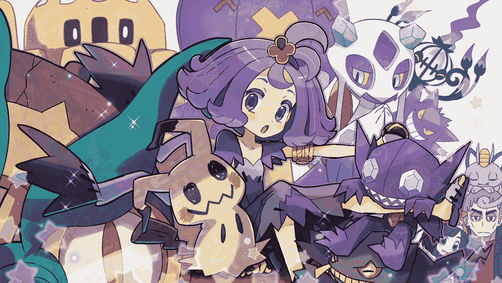

# 【重口人虫GTS】小人巢穴

作者：琉璃

TID：26083

 

# 1

<ignore_js_op>

**68554954_p0_master1200.jpg** *(846.43 KB, 下載次數: 0)*

[下載附件](forum.php?mod=attachment&aid=NzU0MzZ8Y2M3ZDY0NmR8MTYwMDg4NTEwOXwxODIzMHwyNjA4Mw%3D%3D&nothumb=yes)

2018-11-17 13:34 上傳

醒来后是漆黑的天空。周围乞乞缩缩的响声，似乎并不是我一个人在这里。“妈妈？？爸爸？？？”我无助的看着四周，似乎和父母走散了。回想晕厥前最后看到的是天空中猛然出现的黑色漩涡。“黑洞？”即便仅仅懂的皮毛的我也知道大事不好。“醒来了么？各位小家伙们！”嘎嚓一声天空裂开了缝隙。耀眼的光芒照的我阵阵恍惚。待到瞳孔适应阳光后，一副偌大的面孔出现在面前。“啊！醒了醒了呢！”那是一位少女，巨大的少女。紫色的发色是世界上独一无二的。至少我没有见到过紫色发色的女孩子，“是染色？但是为什么？为什么那么大？”我无神的望着一眨一眨的蓝紫色的瞳孔，脑子里一片空白。“我的名字叫做萝拉哟，是个见习魔导士啦！”女孩子昵吖昵吖的笑着，像个狡猾的猫咪一样。“今天的作业是观察生命体啦，所以请大家好好配合啦！“女孩子说着听不懂的话，还向我们展示了下一张奇奇怪怪的书本，上面写的看不懂的文字。“萝拉呢本来想着观察萤蚂蚁什么的，不过去捉蚂蚁好麻烦，我蹲了半个多小时才捉到了几只萤蚂蚁！所以放弃了。这个时候我想到了附近正好检测到外太空生命体。所以！就把你们捉来了！”“啊啦啊啦，开始逃跑了！没用的哟，萝拉魔导课程学的还是很好的，你们是逃不掉的啦！”我惊慌着相继逃跑，却从天空中传来了这样的噩耗。“嘛！具体什么的也不和你们说啦！”女孩子则是依旧昵吖昵吖的猫咪表情，猜不到她在想些什么。随后，逃跑的我脚下一歪。地面消失了。并不是！而是我浮了起来。慌忙地望向其他人不仅是我，周围所有人都浮了起来。如同引力消失一样。“观察箱观察箱！”名为萝拉的女孩子则是见怪不怪。小心的抱来了一个透明的小箱子。“嗯！大概100只一个小箱子就好了吧！”似乎是萝拉用着类似魔法的东西。把我们引导到箱子口。低头望向箱子，只见箱子里里放着一些透明的凝胶物质。“这个。好像是蚂蚁观察箱！”类似的箱子我见到过。用来观察蚂蚁的。啪唧一声。我掉在了凝胶上，因为软呦呦的凝胶，所以并不是很痛，然而随后，一大波和我一样的人都掉在了里面。好重啊！我被几个人压在身下。“阿拉拉！人太多了么？失败失败！”昵吖昵吖的女孩子一脸困扰的看着堆积起来的我们。“可是没有其他箱子了呢！”萝拉蹲了下来，似乎是趴着找桌子下面的样子。“这个！里面有圣甲虫！应该可以吧！嗯！应该可以的！”哐叽一声。和我们所在的箱子差不多大的一个箱子放在了桌子上。里面有几只巨大的甲虫。张牙舞爪的如同怪兽一般。随后身体一轻。我连忙爬了出来，翻过身，看着天空。接近一半的人又浮了起来。更可怕的是，如同什么牵引一般移向了另外一个箱子口！“别跑出来哟！别跑出来！”女孩子默念着什么！”嘿！“待到浮起来的人都到达了箱子上方后，女孩子猛地把箱子打开。随后，浮力骤然消失。那些人都理所当然的落入了箱子里。啪唧啪唧的落到了凝胶上。”嘿!!“看到所有人都落下后。萝拉猛的盖上盖子，长舒一口气。“幸好没跑出来。”而里面的人则是没有那么悠闲了。靠近洞口的人被巨大的嘴钳夹住，拖进洞里。也有些人被拦腰夹断。一切虽然无声却似乎能听见惊叫声传来。“啊唡唡！果然不行么！”女孩子苦笑了下。“嘛算了！”摊了摊手。便抱起了那箱子。蹲着把它放回原位了。之后的事情，我大概也能想到！煞白的脸上充满的惊恐。今天可能会做恶梦！“嗯！你们这些的呢。会怎么样呢。会不会萤蚂蚁一样筑巢呢！”欸嘿嘿，看向我们女孩子依旧昵吖昵吖的笑着，似乎刚刚的事情丝毫没有发生一样。而我们则是已经惊慌失措的不知道干些什么了，有的拍击容器壁。有的尖叫的到处狂奔。“凝胶是营养物质哟！不吃么？”“欸嘿嘿跑来跑去的倒是和萤蚂蚁很像呢。”女孩子撑着脸，注视着我们的一举一动，想必今后也会一直这样的观察着我们吧。おしまい哦西嘛亦</ignore_js_op>  

# 2

> [xxx99 發表於 2018-11-17 17:00](https://giantessnight.com/gnforum2012/forum.php?mod=redirect&goto=findpost&pid=391029&ptid=26083)

> 很新穎的題材呢

> 但是我還是喜歡看巨大女性和男性的互動

> 人被昆蟲虐殺的話確實是太重口了啊

女孩子是原来想观察蚂蚁来着。小箱子也是蚂蚁观察箱。就是那种蓝色凝胶啦。人类的话估计要用嘴和手挖这些凝胶吃，然后筑巢吧w