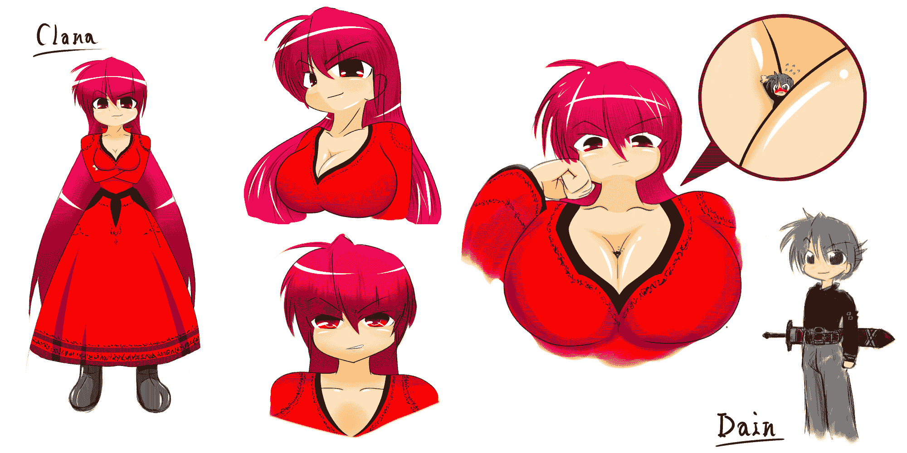
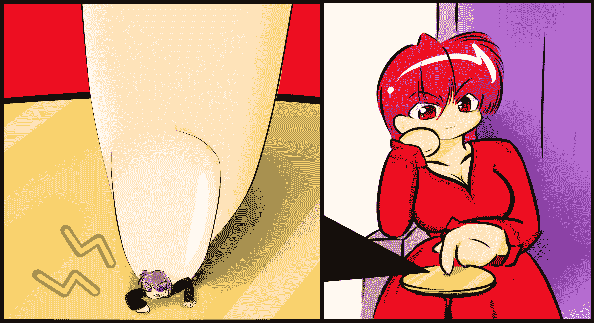

# 2020／07／08 第一话 魔王克拉娜（已完结）

作者：猫头咕咕鹰

TID：29020

 

# 1

*本帖最後由 猫头咕咕鹰 於 2020-9-9 10:16 編輯*

译者前言

大家好，我不咕了。

接下来我准备翻译十六夜大神的《魔王克拉娜》系列，该系列目前共计28话（不算外传），是十六夜比较早期的文章系列，基本是接在今日系列之后更新的。整体上来说，魔王克拉娜系列的口味相对比较轻，目前我抽着看的部分基调都是温柔系，偶尔会插几个残酷系桥段。再加上它的人物设定也相对讨喜，所以我才准备翻译这个系列。这个第一话比较慢热，我翻译到四千字以后女主角才刚登场，不过重头戏后面才开始，之后会有不少的福利内容，温柔残酷都有，敬请期待。（2020/07/06）

#忙活了四天，平均每天翻译一万字，终于把这个系列的第一篇文翻译完了，因为是机翻润色，所以大概会在不知不觉间漏掉了很多细节吧，也有可能会出一些奇奇怪怪的错误，但我想整体上来说应该还是不影响连贯性的。整体上来说，这系列应该算是个以异世界为舞台的老夫老妻秀恩爱文，简单来说就是能暴虐单身狗的文章。我之前也说过了，系列的基调是温柔系，中间偶尔穿插残酷桥段，后续的几篇也是这个调调。希望大家能看的过瘾，同时也希望能引起真正懂日语的人对这个系列的兴趣，毕竟我并不是什么好翻译嘛。（2020/07/08）

由于是整个系列的开端，所以本文从二楼开始更新，这个一楼姑且先留下来备用，以后应该会改成目录一类的东西吧。

在此先附上克拉娜和戴恩的人设。

虽然克拉娜毫无疑问是正妻，但是后续还会出现几个其他的魔王，等我更新到那里的时候再追加新的人设吧。

#已追加艾丽泽的人设

系列目录

正作： 

1.《魔王克拉娜》（就在2楼） 2.《魔王克拉娜 2 魔王的生活》（[https://giantessnight.com/gnforu ... =1&extra=#pid441782](https://giantessnight.com/gnforum2012/forum.php?mod=viewthread&tid=29072&page=1&extra=#pid441782)） 3.《魔王克拉娜 3 魔王的生活 续》（[https://giantessnight.com/gnforu ... =1&extra=#pid443212](https://giantessnight.com/gnforum2012/forum.php?mod=viewthread&tid=29160&page=1&extra=#pid443212)）

4.《魔王克拉娜 4 青之魔王》（[https://giantessnight.com/gnforu ... iewthread&tid=29443](https://giantessnight.com/gnforum2012/forum.php?mod=viewthread&tid=29443)） 5.《魔王克拉娜 5 为了和平拼上性命》

6.《魔王克拉娜 6 大家一起购物吧》

7.《魔王克拉娜 7 魔力的本质》

8.《魔王克拉娜 8 绘本·过去·可怜的戴恩》

9.《魔王克拉娜 9 清晨》

10.《魔王克拉娜 10 眼睛好痒》

11.《魔王克拉娜 11 洗涤》

12.《魔王克拉娜 12 性与死之间》

13.《魔王克拉娜 13 为谁而战》

14.《魔王克拉娜 14 新的一天》

15.《魔王克拉娜 15 激动》

16.《魔王克拉娜 16 愤怒》

17.《魔王克拉娜 17 夜晚·黎明》

18.《魔王克拉娜 18 自那以后》

19.《魔王克拉娜 19 再会之海》

20.《魔王克拉娜 20 总有一天》

21.《魔王克拉娜 21 应邀参加茶会》

22.《魔王克拉娜 22 偶尔两人一起》

23.《魔王克拉娜 23 国际象棋》

24.《魔王克拉娜 24 麻舞她……》

25.《魔王克拉娜 25 艾丽泽她……》

26.《魔王克拉娜 26 克拉娜她……》

27.《魔王克拉娜 27 今天天气很好》

28.《魔王克拉娜 28 为谁而战2》

特别篇：

1.《魔王克拉娜 番外 艾丽泽的一天》

2.《魔王克拉娜 祝·一周年纪念》

3.《魔王克拉娜 15 附赠·按摩》

4.《魔王克拉娜 番外 麻舞的一天》

5.《魔王克拉娜 杂谈》

6.《魔王克拉娜 19.5 休假生活》

 

# 2

<ignore_js_op>[ci01.png](forum.php?mod=attachment&aid=ODM3Njh8NWY1ZTkxMWV8MTYwMDg3NTg0NHwxODIzMHwyOTAyMA%3D%3D&nothumb=yes) *(859.73 KB, 下載次數: 10)*

[下載附件](forum.php?mod=attachment&aid=ODM3Njh8NWY1ZTkxMWV8MTYwMDg3NTg0NHwxODIzMHwyOTAyMA%3D%3D&nothumb=yes)

2020-7-5 02:16 上傳  

克拉娜和戴恩

</ignore_js_op>  <ignore_js_op>[ci02.png](forum.php?mod=attachment&aid=ODM3NzJ8ZDg2NTlhMWJ8MTYwMDg3NTg0NHwxODIzMHwyOTAyMA%3D%3D&nothumb=yes) *(531.02 KB, 下載次數: 0)*

[下載附件](forum.php?mod=attachment&aid=ODM3NzJ8ZDg2NTlhMWJ8MTYwMDg3NTg0NHwxODIzMHwyOTAyMA%3D%3D&nothumb=yes)

2020-7-5 19:44 上傳  

艾丽泽

</ignore_js_op>  <ignore_js_op>[ci03.jpg](forum.php?mod=attachment&aid=ODM3NzN8OTFlY2MzMDh8MTYwMDg3NTg0NHwxODIzMHwyOTAyMA%3D%3D&nothumb=yes) *(939.6 KB, 下載次數: 0)*

[下載附件](forum.php?mod=attachment&aid=ODM3NzN8OTFlY2MzMDh8MTYwMDg3NTg0NHwxODIzMHwyOTAyMA%3D%3D&nothumb=yes)

2020-7-5 19:44 上傳  

克拉娜用手指玩桌子上的戴恩

</ignore_js_op>  

# 3

*本帖最後由 猫头咕咕鹰 於 2020-7-14 21:12 編輯*

原文链接：[https://gs-uploader.jinja-modoki ... 5&c=1586103878&r=1f](https://gs-uploader.jinja-modoki.com/upld-view-document.php?file=/documents/hearthiel/clana01.htm&dl=BW4hgd3/Q3g&t=1594195165&c=1586103878&r=1f)旧系列链接：[https://giantessnight.com/gnforu ... iewthread&tid=21150](https://giantessnight.com/gnforum2012/forum.php?mod=viewthread&tid=21150)续篇链接：[https://giantessnight.com/gnforu ... mp;extra=#pid441782](https://giantessnight.com/gnforum2012/forum.php?mod=viewthread&tid=29072&page=1&extra=#pid441782)

18禁有过激成分，请注意。

------------------------------------------------

魔王克拉娜

------------------------------------------------

这是一个发生在人类和魔王之间的故事。

王国亚历山大。

这是一个被丰富的自然资源包围着的美丽国家。由于背靠一座小山，拜它所赐，人们可以过上近乎与世无争的平静生活。

然而，与之对应的是，王国的国力也因为这座山的存在而逐渐落后于各国，国王眼下最愁的事情就是增强国力。另外，由于被群山环绕，使得可开发的土地十分狭窄，已经很难容纳的下逐渐增长的人口了。

问题可说是堆积如山。

就从几个月前开始，每天都会有数十人同时失踪。失踪的人有身处同一个村子的，也有分居两地的。毫无关联性，也不分男女老幼，失踪的人也没有什么明确的缘由。唯一的共同点就是在同一时刻行踪不明。这只能说是有些意志在背后谋划着些什么。

国民们的不安情绪愈发高涨，国家的国力比起之前的和平时期反而渐渐衰退了。王宫的调查机构虽然有在运作，但是一直也没能查出什么像样的结果。

有个男人在这时站了出来。那个人的名字是戴恩。他是隶属于王宫的一名护卫骑士。这个人因为对调查机关的效率感到不满，所以独自一人开始了调查。

***********

“唔……”

王宫图书馆。戴恩正在这里分析分析收集来的资料。他把从各种渠道收集来的资料汇总到一起，从中发现了各种各样的事情。集体失踪的人都住在原理王宫和王城的村子里，几乎整个村落的人都下落不明。而零星失踪的人则居住在一个很大的城市，失踪时多处在昏暗的后街或者火灾等灾害现场。几乎都是很不惹人注目的时候，直到这里为止都和调查机关的结果一样。

但是，就在他准备更进一步整理关于失踪人员的想法的时候。

“呦，还在调查中阿？”

戴恩回头看向问话的人，那是他的朋友里克斯。里克斯递给戴恩一大杯咖啡，他接过来嘬了一口，然后长舒了一口气。

“……啊，现在我知道王宫的调查机关到底是有多草率了。”“这样啊。那么，解决案件的关键线索是……？”“还没到那种程度呢。但是我只是稍微调查了一下就收集到这么多线索，再多调查一下的话说不定就会有所发现了。”“也对，如果不能尽快解决的话，国民们的不安就会进一步增加了。如果有什么需要我帮忙的事情就尽管说吧。”“嗯，到时候就拜托你了。”

朋友挥挥手走出了房间。戴恩继续边喝咖啡边思考。

（只是稍微调查了一下就发现这么多线索……调查机关到底是干什么吃的？不过，既然不是因为个人因素失踪的，那就应该是被卷进什么事件中了吧。但又能是什么事件呢……。这个国家既没有什么劫匪或者大盗，又没有魔物入侵，还能出什么大事呢？）

他整理了一下失踪地点周边的魔物和罪犯名单。继续这么下去的话，调查就要陷入僵局了啊。戴恩好像不知不觉间睡着了，等他意识到的时候，天已经黑了。

“不好，再不回去的话又该被别人说教了。”

正当他要离开座位，准备把资料放回架子上的时候。图书馆的门开了，一个士兵走了进来。

“你就是戴恩？”“啊，是的。”“这样啊。国王陛下要召见你，不要声张，马上过来。”“陛下他……？”

国王陛下竟然会在黄昏时分召见我这么一个区区的骑士……到底出了什么事？戴恩跟在那个士兵后面向着大殿走去。

****************************

烛火在暮色的映衬下不停的摇曳着。那个平时里英姿勃发的身影现在正坐在王座上，映出的影子竟有了几分恶魔的气息。王座上的人正是这个国家的国王。布满皱纹的壮年的姿容威严庄重，衣着华丽象征着这个国家的繁荣富饶。

在王座边上稍微靠后的地方，站着一位大臣。宽松的衣服和长发，再加上一副高度数的眼镜，简直是知性的具象化。长度堪比头发的胡子证明了他经历了相当的岁月。

不久之后，这两人所处的大殿正门缓缓打开，刚刚的士兵走了进来，在行礼之后向他们回报了任务结果。

“我把隶属于王宫护卫队的戴恩骑士带来了。”“辛苦了，你可以退下了。”“是。”

士兵再次行礼后退出了大殿，戴恩随后进入了殿内。

“戴恩·施雷福德觐见。请问招我进殿是为了何事呢？”“嗯……”

在我向国王和大臣行礼的时候，大臣突然走了过来。

“实际上，关于这几个月内发生的集体失踪事件，我们已经成功的确定了主犯的身份。”“什么？真的吗？”“是的。”

国王慢慢地吐出一口气，然后说道：

“就是这样。根据调查机关的报告，主犯是盘踞在东方最尽头的魔王。”“是魔王……吗？”“对。这应该是他为了攻陷我国而引发的事件，目的是让国民陷入恐慌。”“我们不能就这样放任魔王的行动，所以我们准备集结骑士团全员一起击溃魔王。不过我需要你先行一步进行侦查，可以的话，最好直接讨伐掉他，但是，不要勉强。”“是！但是，如果这是魔王所为……”“你在怀疑我说的话吗？”“不是的！但是，我也独自进行了调查，然而并没有发现与魔王的关联性……。不过我很高兴能确认敌人的真身……”“这是来自国家最高调查机关的情报，不可能出错。其他的士兵除了要编成讨伐梯队以外，还要负责街上的警备，能调动的人只有你，这是确定事项，不许有异议。”“你无权决定是否接受这个任务，不过，这是能左右国家命运的重任，我们根据能力将你选拔出来，你没有拒绝的余地。”“是……我知道了，我会谨言慎行的。我也希望尽快解决这个事件，就让我来负责这个任务吧。”“嗯，我看好你。”“啊，还有，如果魔王的存在被公之于众，可能会造成士兵们的慌乱，所以这个任务要保密，等军队集结完毕，我就回派使者去通知你。时间紧迫，我期待你的表现。”“啊，荣幸之至，我马上准备出发，那么失礼了。”

我站起身，行礼后离开了大殿。（但是……是魔王吗？为什么会存在那种东西……。）戴恩感到十分困惑。（不，现在不是考虑这些的时候，如果不能尽早解决这个事件，又会有更多人牺牲。）我摇了摇头甩开疑问，朝着自己的宿舍走去。

***********************

士兵宿舍。

天色已经完全暗了下来，猫头鹰的叫声在夜色间回荡。戴恩在自己的房间中做着旅行准备。

“东方的最尽头吗……走到那里要花几天呢……”

虽然不知道路程有多远，但是行李太多只会变成累赘。水和食物只准备最低限度的量，然后就地取材。

行李越小件越好。我握住了一把剑。一边盯着自己映在剑身上的镜像一边思考。

“魔王……竟然会有那种存在……但是魔王为什么会盯上这个国家？这也太兜圈子了吧……”

就在这时，门铃响了。

“请进。”

推门进来的人是里克斯。

“里克斯？这么晚了过来干嘛？”“我看你还没熄灯就过来看看情况，你这是……”

里克斯的眼睛盯着整理好的行李。

“怎么，要出远门吗？”“……嗯，从国王陛下和大臣那里接到了直属任务，暂时回不来了。”“长期任务啊。如果是那种任务的话，我就去拜托队长，让他准许我和你一起去吧？”“不，我没关系的。我不在的时候，街上的事情就拜托你了。”“这样啊……。也行吧，就交给我了。不过，你要去哪里呢？”“……东方的最尽头。任务的目的地就在那里。”“东方？之前听说过那里除了陡峭的岩石以外什么都没有……”“原来如此……，作为魔王的根据地真是再合适不过了……”（小声嘟囔）“嗯？你说什么？”“没什么，那我出发了。这任务能帮到很多人，越快动身越好。”“这样啊，那你小心点，街上的人就交给我吧。”“嗯，再见。”

我和里克斯碰了下拳。然后我离开城市，沿着被黑暗笼罩的道路向东走去。

那个时候，有个人正隔着玻璃窗盯着我发出冷笑，我却没能注意到。

**************************

离开城市已经7天了。已经找不到像样的路了，我只能在野山上到处攀爬。

凶暴的魔物和野兽越来越多。如果没有这把剑作伴的话，我根本就到不了这里吧。我看了看挂在腰上的剑。

登上小山之后，我环顾四周，周围尽是陡峭的岩山，看不见魔王的住处。是在更东边的地方吗？

我朝着更加险峻的方向出发了。

*************************************

在那之后又过了一个又一个7天。我穿过沙漠，越过峡谷，惊异于自然界的广博。慢慢地，已经到了生物无法生存的地区，就连魔物都见不到了。

作为我搭档的剑已经变得破烂不堪，但我很感谢它，没有它的话，我早就饿死了。

我继续行走，走出人界，向魔界进发。但是却完全见不到魔王的身影和行踪。然而如果在这里放弃的话，就相当于背离了人民，我是无法原谅那样的自己的。

*********************************

在那之后又过了几天呢？不知从什么时候开始周围的地形已经完全改变了。以前存在感爆棚的雄伟群山，在这里却只剩下了被粉碎挖开的巨大岩石。

大树则是像被龙卷风袭击过一样的被从地面上拔起，也有些树被什么力量从树干中间折成了两半。地面上遍布着大坑，使得行走十分困难。

我几乎耗尽了体力，现在不得不靠吃树皮来维持生存。

“还没到吗……魔王到底住在哪里……”

我拖着脚，用剑替代拐杖，登上了险峻的坡道。巨石咕噜噜的滚来滚去，周围的景象宛如地狱的入口一般。

“哈、哈……”

已经精疲力尽，但不得不继续前进。已经可以看到山坡的顶端了。不过，就算跨过那个山顶，在前方延伸的依旧会是险峻的道路吧。说不定真的会是通向地狱的入口呢。那么这个无尽的地狱到底会持续到什么时候呢……？

然而，在我登上山顶之后，映入眼帘的却不是早已经看腻了的山脉。

那里有着一座城堡，而且巨大的仿佛能容纳下整座王都。这城堡毫无疑问就是魔王的所有物了。但是，那壮观的全景竟然让人感到了一丝神圣。

我凝视着那座城堡，内心充满波动。

“终于……终于找到了……这样就能帮到大家的忙了……”

我摇摇晃晃的向着城堡前进。在精神和肉体已经到达极限的时候，终于到达了艰苦而漫长的旅途的目的地，这种内心的波动让我失去了对脚下的路的注意力。

咔啦

“呃……！？”

山坡的另一侧是陡峭的悬崖。我就这么失足从悬崖上滚下去了。

“哇啊啊啊啊啊啊啊啊啊！”

我跌落了很长时间。身体不停的撞在裸露的岩石上，掉到地面上的时候我几乎已经失去意识了。城堡映入我朦胧的视野里，显得比刚刚在悬崖上看到它时还要巨大很多。

“终于……好不容易才到达的……”

我的身体已经变得破烂不堪，甚至不能协调的活动了。就连手脚是否还连接在躯干上都感觉不到。我尝试向着城堡的方向伸出手。

（不行……意识越来越模糊……竟然在这种地方……）

就在这时，地震发生了，地面开始摇晃起来。

咚……咚……

晃动逐渐变大。有什么接近了吗……？

“是什么呢……不，比起那种事……我现在更应该……”

我尽全力伸出手，尝试向城堡靠近。但是……

啪嗒。

勉强伸出的手掉落在地面上。

那个男人彻底失去了意识，同时他也被巨大的阴影包围了。

**********************************

“唔……”

多亏了全身涂抹的药物引起的剧痛，我才苏醒过来。我慢慢睁开沉重的眼皮，尝试环视四周，发现我正身处于一个昏暗的空间，，而不是之前充满岩石的荒野。

“这里是……”

我现在是不是正躺在白色的被子上？虽然无法移动身体，但是头还是能转一转的。

我尝试着转动头部。就像我想的那样，这就是被子之类的东西。不过这素材我却完全没有见过……。

我将视线移向远方。那里有着什么巨大的东西。是什么呢？那东西比哨楼都高，简直像灯塔一样，但却是由透明的材质构成的，里面似乎还装着什么液体？

“呵！”

我忍痛坐了起来。视野变得更加开阔，我也看到了更多东西。周围辽阔的吓人，甚至能建起一个街区。空间的尽头是一堵直达天空的巨大墙壁，它们环绕着这个空间的四周。

“这里是室内……是吗？”

我的视线被挂在墙上，正在摇曳着火焰的烛台所吸引。

烛台？

从这里到那堵墙到底有多远？非常远，完全不像是伸手就能够到的地方。那为什么那个烛台看起来却很近呢？

我突然转头望向刚刚那座透明的塔。然后屏息凝神，仔细的判断着那到底是什么东西。

那是个巨大的瓶子。虽然看不懂那巨大的标签上写的到底是什么文字，但是堵住瓶口的东西和我睡的被子是同一种材质，那恐怕是纱布。这么说来，这应该是一瓶药。但是，这也太大了吧。

“我到底是……”

就在这时。

“好像醒过来了啊。”

巨大的声音响彻整个房间。与此同时，在我失去意识前曾感受过的规则性地鸣震撼着大地。

我回头一看，那里站着一位巨大的，极大地，甚至大的快要突破天际的女性。为什么只能看到她的上半身呢？尽管如此，那个身体依旧巨大到看起来可以毫不费力的一只手就能拿起那个瓶子。巨人从遥远的高处用那双巨大的眼睛观察着我的样子，然后再次用巨大的声音说话了。

“虽说涂上了药，但是这么快就能坐起身，看来平时就有在锻炼身体吧。”“喂，你到底是什么？你……是你救了我吗？”“说的没错。呵呵呵……真没想到这样的边境会有人类存在啊。”

巨人一边这么说着，一边坐到了与她体型相对应的巨大椅子上。产生的振动再次撼动了地面。

“到底是有多大啊……那个椅子看起来似乎比王城还大？说起来我现在是正躺在桌子上吗？全部……都太大了吧。”

“唔……！”

突如其来的剧痛打断了我的思考。

“不要太勉强了。你的骨头已经破破烂烂的了。”“原来是那么重的伤吗……谢谢。十分感谢。”“别在意那些了，举手之劳而已。”“尽管如此，我才能保全性命。我是戴恩·施雷福德，是亚历山大王国的一名骑士。”“我的名字是克拉娜。魔王克拉娜·修尔德·贝利亚”“什……魔王！？”

突如其来的发言吓得我猛地一抬头。那个号称魔王的巨人正冷笑着看着我。

“怎么了？你的脸色变了哦？”“你……你真是魔王吗？”“我可不记得我撒过谎。不过我是魔王有什么不对的吗？”“唔……”

戴恩低头烦恼了一会，然后像是下定了决心般的抬起了头，他拿起放在身旁的剑，把被子掀开，然后拔出剑指向魔王。

“魔王啊！奉国王陛下之命，我要打到你！”

真是苦涩。但是为了拯救人民……魔王嘴角的微笑渐渐消失了。

“哈哈……真突然啊。我明明救了你一命的。”“这我知道！对此我感激不尽。我也不想做出这种事情，竟然把剑指向恩人什么的……但这是国王陛下的命令！魔王啊！我要取走你的性命！”“真是忠心啊。好吧……”

魔王站起身，靠近了我所在的桌子。地面变得摇摇晃晃。在她的身体靠近桌子的时候，我甚至感觉那就像是一堵墙壁。尽管只能看见她的上半身，但为了能看到她的脸，我仍需尽力抬头向上仰望。然而就算我抬起头，却也还是看不到她的脸。视线被她胸前挺立着的巨大乳房遮挡住了。那对巨乳简直就像山一样巨大。我被那对双子山形成的阴影笼罩住了。

（现在可不是去想那种事情的时候吧！）

戴恩使劲的摇了摇头试图祛除杂念。看到了戴恩的样子后，魔王又一次笑了起来。

“这么想盯着我的胸部看啊？难道王国骑士还会想念母亲的乳汁吗？”“闭嘴，别小看我！”“呵呵呵……不要这么害羞嘛。男人会对女人的胸部产生兴趣也是理所当然的事情。如果你想要的话，摸一下也可以哦。”魔王一边这么说，一边倾斜了上半身，让胸部更加靠近戴恩。从戴恩的视角来看，这相当于两座山从天上砸下来了。这个由桌子构成的大地的边界毫无无疑问的是悬崖，虽然从魔王的视角来看那不是什么了不得的高度，但对戴恩来说则是相当之高。而且这张桌子似乎并不能容纳下魔王巨大的乳房。如果她把胸部压上来，那变形了的乳房应该会漫出到桌子外面。也就是说，根本没处可逃。是被那个胸部碾碎呢？还是从那个悬崖上摔下来呢？

就在戴恩为了选择而犹豫的时候，乳房形成的阴影已经越来越浓了。巨乳已经下降到天花板那样的高度了，伸手就可以触摸到。但是，自己什么也做不了，只能悔恨的咬紧牙关。

……。

但是，乳房没有继续下降。就在戴恩纳闷的时候，那对巨乳又一次升上了天空，戴恩的视野又变得开阔起来。

“什么啊，没有摸啊。看来真的是相当有意志力了。”“开玩笑也要适可而止啊！现在是玩这种游戏的时候吗！”

听到戴恩的话之后，魔王噗的一声笑了出来。

“哈哈哈哈！真是个一本正经的家伙。你应该从来没有抱过女人吧？”“……差不多得了……”“哈哈哈……但是……你现在应该稍微清醒点了吧？”“……什么？”“假如我只是低低头就能打倒你，你觉得你还有赢过我的可能性吗？”“这……”“不要太自以为是了人类。不管你们这些虫子做些什么，作为魔王的我也不会受伤的。”

魔王不知为何将手放到了桌子上，然后一边从正上方俯视着渺小的人类一边继续说：

“停止做这种无用的事，回到自己的国家去吧。这次我就放过你。”“虫子……无用的事？”“唔……”

魔王注意到了那个渺小的人类的语气里蕴含着前所未有的气魄。戴恩握紧剑柄，朝着放在桌子上的那只巨大的手跑去。

“就算人类只是蝼蚁！为了拯救国民而挥剑也不会毫无意义！！”

在他眼前的是和他身高差不多粗的巨大手指。戴恩向着那个手指全力的挥下了剑。

锵！

弹刀了。戴恩因为无法承受反作用力而狠狠的摔了一跤。而手指上则一点伤痕都没有。

“怎么这样……”“……”

戴恩被吓到了。然后，刚刚被砍到的巨大手指动了起来，把戴恩弹飞到了远处。

“哇啊啊啊啊啊啊！”

仿佛是要坠落到遥远的地狱一般。戴恩正以惊人的速度从同样惊人的高度摔向光滑的黑石地板。如果就这么跌落的话，毫无疑问会粉身碎骨的吧。是会变成碎块呢？还是变成绽放在黑石地板上的血花呢？戴恩反而冷静了下来。这是绝对无法抗拒的死亡，它已经近在咫尺了。

但是，戴恩并没有摔到那个黑石地板上，而是撞在了一个突然出现在地板上方的肤色物体上。

“啊啊啊啊！！”

原本就伤痕累累的身体受到了进一步的冲击，戴恩因为吃痛而发出悲鸣。他强忍着疼痛，睁开紧闭着的眼睛，然后环视四周。他正身处巨大的手掌之上。

更上方则是魔王面无表情的脸。

戴恩被放回到了桌子上。由于承受不住剧痛，他现在只能坐着。魔王一边俯视着他一边说道：

“这样你就能明白了吧？你们人类和我之间存在着绝对的力量差距。”

魔王竖起一根手指，把它伸到戴恩面前。

“就算你用力挥剑，我的手指也没有受伤，但我的手指只要轻轻撞你一下就能杀死你，就算只是把这根手指压在你的身上，你也无法承受它的重量，大概会被压碎吧。”“……”“知道了就快回去，人类是不可能打倒我的。”

魔王收回了手指，转身向着巨大的椅子走去。

“……尽管如此……”

魔王停下了脚步。戴恩一边支撑着摇摇晃晃的身体一边站起身。

“即使这样也必须打倒你！为了牺牲在你手里的人！也为了更多人不受你迫害！”“什么？你说什么？”

魔王转过身来。戴恩跑过狭长的桌子，然后跳了起来。

“！？”“啊啊啊啊！！”

戴恩以魔王为目标高高跃起。但是他的剑并没有砍到魔王，他就这么摔了下去。

扑通。

但是，下落结束的却比想象中来的早很多。

“真是的……你不是说要打倒我吗？然而却自己跳出来摔死，真是个笨蛋。”

戴恩正处在手掌之上。如果把手指也算进去的话，这手掌几乎和刚刚的桌子一样大了。

“这……”“好了，还有一件让我很在意的事情。你说我杀了你们国家的人？”“不要装傻了！这几个月里王国中发生的集体失踪事件就是你干的吧？”“这我真不知道。不管人类在哪里出生，又在哪里死去，我全都不感兴趣，更别说让我亲自动手了。”“怎么可能！根据调查机构的判断，事件的幕后黑手就是居住在东方最尽头的魔王干的……”“不知道的事情就是不知道。而且为什么我会想要杀死你们国家的人？你们人类不是会随性自相残杀的愚蠢生物吗？比起花时间去杀你们一百个人，我觉得睡个午觉要来的划算得多。”“人类可不是那么愚蠢的……”“哼，反正我不记得我有染指过你的国家。也许是别的魔王干的好事吧，反正跟我没关系。”“……”

戴恩在魔王的手掌上低头思索着。

如果是这样……那么到底是谁干的呢……

看着戴恩在自己上掌上一动不动，魔王坐回到了椅子上，然后仔细的观察着自己手掌上的小小人类。

噗

魔王又笑了出来。

“不过，你们国家是有多穷酸啊，竟然只排了一个人过来杀我。”“不……不是，就是这么回事……。”“嗯？”

戴恩捂住了自己的嘴。魔王巨大的红色眼睛盯着戴恩。

“喂，你在隐藏些什么？”“……”“呃……怎么突然闭嘴了。刚刚不是一直聊得挺欢吗？”“这个，不是这么回事……”“诶，不管你在隐藏些什么，对我来说都不是什么大问题。而且你可是孤身一人为别的家伙争取到了20天的时间，他们也没办法对你苛求更多了。”“20天！？”“是啊，从我捡到你开始算起来，差不多有这么久了。刚捡到你的时候还以为你已经撑不住了，没想到仅仅花了20天就恢复了意识，而且一醒来就说要杀了我，着实吓了我一跳呢。”“20天……。这么说……军队呢？”“果然是隐藏了什么啊，不过人类就算再怎么绞尽脑汁也不可能杀得掉我的。”“但是……”“话说回来，虽然贯彻忠义这部分确实有骑士的风范，但是对于救命恩人的问题却不作回答，可是有辱骑士之名啊。”“这……”

魔王微笑着这么说道。戴恩感到十分烦恼。

（不能告诉魔王作战计划……但她是我的救命恩人……而且她似乎真的不知道这件事情……）

诶……

戴恩陷入无尽的烦恼中。作为骑士是不能辜负陛下和大臣的期待的。但是就像魔王说的那样，如果连救命恩人的问题都不予回答的话，也太无礼了。但是……

唔……

自己的手掌上有个焦头烂额的小人。魔王一边托着腮帮子一边微笑着守护着他。

就在这时。

魔王突然收起笑容并看向了房间的门口。然后不知为何响起了十分沉重的声音。

咚……咚……

地面开始有节奏的摇晃。声音也越变越大了。

咚！……咚！！……

晃动越来越剧烈。身处手掌上的戴恩也注意到了这异常的晃动。

“什么……怎么回事？地震吗？”

大地不断摇晃。桌子上的药瓶咔嗒作响。

声音和晃动越来越剧烈。就如同什么东西靠近了一样。

这时，手掌上的戴恩由于震动而摔倒了。

“呜……！”

他在倾斜的手掌上咕噜噜的滚啊滚，然后掉到不知什么地方去了。

“呃……伤口又……。到底发生了什么……”

戴恩注意到自己掉进了一个十分昏暗的地方。这里是那里呢？虽然很暗，但是自己周围的东西和刚刚的手掌一样都是肤色。也就是说自己还在魔王的身体上吧。但是，这里到底是哪里呢……周围都是肤色的墙壁，脚下则是肤色的地面。试着用手触摸了一下，柔软度似乎和手掌差不多，但是感觉比手掌要更暖和。

“这里是……”“噗哈哈……”

就在戴恩感到惊讶的时候，她听到了从上方传来的略显沉闷的笑声。抬头一看，魔王的脸出现在了比这两堵墙壁更高的上方。等等？魔王的脸？脸下面是脖子，再下面是我现在站立的地方……不会吧……

“哈哈哈……很适合你哦。待在我乳沟里的感觉怎么样啊？”“什么？这这这这这这这里是！？”

乳沟里？这儿？那我刚刚摸到的两堵墙不就是……戴恩的脸噗的一下变得通红。

“你手法不错嘛，揉的还挺舒服的。原来你有女性经验啊？我还以为没有呢。”“你……你……你这笨蛋！女人竟然把男人放在胸前……快把我拿出来！”“有些什么不太妙的事情要发生了，你就老实点在那待着吧。”

魔王眨了眨眼睛。

“什么……？”

戴恩被吓得目瞪口呆。然后魔王紧紧的夹了下双乳。

戴恩被两个巨大的乳房夹得死死地，身体根本动弹不得。虽然脸是露在外面的，但是脖子以下都被埋在了双乳之间。抬头就能看见强忍笑意的魔王的脸。但是戴恩没有继续抱怨，因为魔王很快就收起了笑容，严肃的注视着房间的正门。

咚……！！！咚……！！！！

在这期间，摇晃和声响也在越来越大。不知为何，戴恩和魔王一样看向了入口处。

然后……

“太好了！克拉娜在吗？”

伴随着巨大的声音，门口处走进来一位和魔王一样巨大的少女。

“啊，找到了~”“当然，这里是我的城堡。还是老样子啊，艾丽泽。”“嗯，好久不见了。大概有300年了吧？”“是啊……。自从我在这里定居以来，差不多是有那么久了吧。”

被称为艾丽泽的巨大少女笑着走了过来。她有着一头飘逸的海蓝色长发，身上只覆盖着面积非常小的舞者般的服装。为了向前走动，以她纤细的腰肢为支点，丰满的臀部左右摇摆，巨大的胸部也在上下弹动着。正可谓是绝世舞女。那是种能将观众的注意力紧紧地吸引住，而且绝对不会再放开的终极魅力。戴恩不由得红了脸。

这么说起来，这个叫克拉娜的魔王也……戴恩抬起头仰视那张脸。

酒红色的长发直达膝盖。身着以红色和黑色为基调，低调却露出度颇高的礼服。然后是不亚于眼前巨人的丰满巨乳。两人都有着人类100倍以上的身高，但除此以外，两人的容貌和人类并没有什么区别。甚至可以说是惊人的美女。

（现在也不是考虑这种事情的时候啊！）

戴恩继续摇头甩开杂念。两位巨大少女的对话还在继续。

“……那么，今天是怎么了？有什么事情吗？”“不，我只是路过了一下而已。啊，对了，听说海对岸的人类巢穴里有很多好吃的葡萄，你要不要一起去尝尝？”“不，我就算了。我对人类做的东西没有兴趣，而且我根本就不想接近人类。”“克拉娜从以前开始就讨厌人类呢，如果讨厌的话，杀掉不就好了？”“就算我不自己动手，那些家伙也会自相残杀吧？所以干脆就放任不管了。”“啊~，这样啊~”

对话的内容十分普通。但是从那个内容中，我明白了她们对杀死人类毫无罪恶感。特别是这个被称为艾丽泽的少女……她应该也是魔王吧，她好像会主动去杀人。根据刚才的对话，她之后好像会去袭击其他大陆的国家……那个国家的人大概会全灭吧。我想让她住手，但是一想到刚才克拉娜只用一根手指就差点杀掉我的时候，我就意识到这样做毫无意义。戴恩默默地抬头看向那即将夺去数千条生命的巨大少女。艾丽泽靠的更近了。

“但是如果你讨厌人类的话，为什么又要住的离人类的巢穴这么近呢？像我这样把岛上的人都杀光，然后在那里……”

然后，艾丽泽注意到了在克拉娜乳沟里有什么东西在动。戴恩僵住了。因为他和那个魔王对视了。

艾丽泽看着僵住的戴恩，满面笑容的说道：

“什么啊，克拉娜不也是在和小人玩嘛！还装作没兴趣的样子来着……也借我玩玩呗？”

巨大的手伸向克拉娜乳沟里的戴恩。就连那手上的指甲都和戴恩整个人差不多大。被那么巨大的东西锁定了的话是不可能逃得掉的，更何况现在身体被巨大的胸部夹住一动也不能动。

戴恩只能眼睁睁的看着巨大的手不断逼近。但是，就在手指触摸到戴恩之前。

啪叽。

从旁边出现的同样巨大的手拍飞了刚刚不断逼近的手。

“啊~啊，你这是干什么啊克拉娜！”“这是我的客人，不要做失礼的事。”

（客人？我吗？）

刚刚还用剑指着自己的人也能算得上客人吗？我可是为了打倒你才来到这里的哦？戴恩像是在寻求着什么答案一般的看向克拉娜。而克拉娜仍旧盯着爱丽丝。

“客人~？人类吗？”“是啊，他翻越了好几座山和峡谷，经历了漫长的旅途以后才来到这个城堡，现在则是我的聊天对象。”

克拉娜微笑着看向我。

“呃~和人类聊天啊~总觉得有点恶心~”“那是我的自由。我得接待客人，你一个人摘葡萄去吧。”

克拉娜举起一只手向外挥了挥。显然是要送客了。

“嗯~嘛，有时候也是会像这样在游戏中别出心裁呢。等你玩腻了就过来一起玩吧，再见啦~”

艾丽泽一边这么说着，一边撼动着大地往门口走去，但是在她还没出门的时候，克拉娜又喊住了她。

“啊，艾丽泽，你先等等。”“怎么了？”“你……有对从这里往西边去的人类国家做过些什么吗？”“诶？”

艾丽泽和戴恩同时发出了疑问的声音。戴恩抬起头看了看克拉娜的脸。

（你是……为了我而问的吗？）

但是艾丽泽马上摇了摇头。

“不，我什么都没做过哦。我已经有300年没来过这边了。”“这样啊……。不好意思耽误你了。”“没事没事，再见哦。”

然后艾丽泽离开了房间，不久之后就听不到她的脚步声了。房间里只剩下了魔王克拉娜和我。

“呼……”

克拉娜长舒了一口气，与此同时，胸前的枷锁也被解开了，突然被释放了的戴恩沿着克拉娜的身体一路下落，朝着肚子滚了过去。

“哇啊啊啊啊啊！”

又是一个漫长的跌落。但是突然出现了一个洞，戴恩因此停了下来。

“嗯……这里是……肚脐？”

是的，戴恩的身体完全陷入了那个大洞，而那只是肚脐而已。遥远的高空中。克拉娜正从唯一一个有光照进来的孔里俯视着这里。

“什么啊，你这不是很主动吗？比起胸部你更喜欢肚脐吗？”“笨蛋！我又不是因为喜欢才掉下来的！”“哈哈哈……但是如果你再往下走的话，就会变成大人了哦。”“呃……”

再往下走？成为大人……

！！

“喂，适可而止吧！！你也是女性吧！？多珍惜点自己啊！”“啊哈哈哈！这可真是……我还是第一次遇到你这么有意思的人。”

突然，身旁的黑暗被打破了，巨大的手伸了进来。那只手抓起戴恩，慢慢地把他带到了衣服外面。

戴恩再次从手掌上仰望克拉娜的脸。

“真是的……作为一名女性，我倒是希望你能更加注意一点自己的言行啊……”“哦？你能把身为魔王的我当做女性看待吗？”“这和是不是魔王没关系吧，女性就是女性啊！”

克拉娜盯着自己手掌上那个小小人类的眼睛。那双眼睛没有摇晃，一直盯着自己的眼睛。不知不觉间，克拉娜的嘴角翘了起来。

“哼……话说回来，我们还是继续刚刚的话题吧，怎么样，现在愿意告诉我你在隐藏些什么了吗？”“啊……！嗯……”

戴恩再次陷入烦恼。

“哈哈……不用头痛到这种程度，说到底，问不问也没什么差别，如果你不想说的话，不用勉强也……”“……不，我说。”“嗯？改变主意了啊。”“你救了我好几命。最初我从悬崖上摔下来的时候，刚刚我从桌子上掉下来的时候，还有刚刚那个叫艾丽泽的人向我伸手的时候，都是你救了我。而且，在你说了不知道我的城市里发生的事情之后，还向艾丽泽询问了那件事，这么多的恩情如果我不去回报的话，就真的有辱骑士之名了。”“真的可以吗？我可能是在撒谎哦？”“如果你是那么过分的家伙的话，也就不会照顾我二十天了吧。”“嘿嘿嘿……这样啊。也好，那就告诉我吧，你来这里的理由，还有你所知道的事。”

克拉娜一边这么说着，一边把戴恩放回到桌子上。

“嗯。”

戴恩回应道。然后他开始讲述他所知道的事。

首先是几个月前开始的集体失踪事件。一个村子的人同时失踪的事和全国范围内少数人同时失踪的事。都是在不引人注目的情况下失踪的事和国家机关调查过于粗糙的事。在调查中被国王和大臣叫出来的事和被告知幕后黑手是住在东方最尽头的魔王的事。被命令自己独自前去侦查那个魔王，如果可能的话最好讨伐掉的事，和自己的后面应该跟着全副武装的骑士团的事。以及那个骑士团还未到达的事。

最后的最后……还有大部分失踪的人都说过反对强行增强国力的话的事。

克拉娜托着腮帮子，一直听着戴恩讲到最后。

****************************

在戴恩说完后不久，克拉娜接过了话题。

“原来如此……。所以我才讨厌人类啊，明明没什么大智慧，却总是做些自作聪明的事……”“……”“……你打算怎么办？不用我多说你也已经得出结论了吧？”“但是……”“不要欺骗自己了，事实就是事实，骗自己也没用。”“但是，怎么会……这种事不应该……”“在你的国家里不存在能把整个村子的人一起带走的秘密组织；虽然人不见了但是财物并没有被带走，所以不是盗贼干的；魔物的智商也没有高到能在同时袭击全国范围内的少数人，或者是集中攻击一个村子的人的程度；以及，失踪的人大部分都对现在国家的政策提出了异议；而且开始调查这件事得你也因为妨碍到他们而被扔到了国外。哼，真是简单易懂。唯一不能确定的事情就是……他们为什么要做到这种程度呢？”“为什么……王宫会做出这种决定……”“谁知道。人类的格局太小，我也猜不到。不过，如果按照你的说法，到现在为止已经出现很多牺牲者了吧，然而却一具尸体都没能找到，这才是真正奇怪的地方。这到底是……”

就在克拉娜还在思索着的时候，戴恩嘟囔道：

“……我……”“嗯？”“我要回国了。”“……你认真的？你已经是被国家抛弃的人了哦。”“……即便如此，我也还是个骑士，我有保家卫国的义务，如果国家要向错误的方向发展，那我就要去纠正这个错误。”“……呵呵呵……真是的。你可真是个诚实到让人觉得可惜的男人啊。但是你就打算拖着那个残破的躯体回去吗？”

戴恩低头看了看自己的身体。到处都缠着绷带。身体还很虚弱，以现在的状态，就连走路都很危险。

但是……

“……嗯，就是这样。就算死在半路上也无所谓，即使做不到也不能不去做。”“呵呵……真不愧是……”“请把我放到地板上吧，还有，如果可以的话，能给我些水和食物吗？”“水和食物准备多少都没问题，但是以你的身体状况无论如何都是回不去的。”

克拉娜慢慢地从椅子上站起身。

“我送你到附近的城市去吧。”“诶！？”“以我的脚力的话，大概半天都用不了吧。比起让你一个人支撑着这个破破烂烂的身体走回去，还是我送你要来的快上许多哦。”

克拉娜把手伸到戴恩身前。

“上来吧，时间很紧迫吧？”“……”

但是，戴恩并没有动。

“怎么了？”“……你为什么要做到这种地步？”“什么？”“刚刚那个叫艾丽泽的家伙说过的吧，你讨厌人类，而且不想接近人类。你自己也说过，从魔王的角度来看，我们人类和虫子没区别。那为什么你要为我这么个人类做到这种地步呢？”“……”

克拉娜看着戴恩的眼睛。戴恩也盯着克拉娜的。不管哪边的视线都毫无动摇。稍许的沉默后，克拉娜开口了。

“嗯……简单来说，就是我很中意你啊。”“你很中意我？”“是啊，因为你的内心十分诚实，正直且真挚。那样的你……啊，我做梦也没想到过我会对人类抱有那种感情。”“喂，别说了，太羞耻了。”“不要害羞不要害羞~反正你也没被女人这么说过吧？啊，对了，我也很想要你的贞操哦？”“吵死了！总之，赶紧走吧。”“嘿嘿嘿……真是好懂的家伙。”

克拉娜捏起戴恩，然后把他放在手掌上。然后小心地走了起来。

***********************************************

穿过长长的走廊，然后迈出大门。突然从昏暗的房间里走到阳光下，戴恩感到一阵目眩。克拉娜行走在旷野之上。戴恩曾经失足跌落的悬崖，克拉娜几步就越过去了，对她来说毫无阻碍。她脚下的树木和岩石在接触到她鞋子的一瞬间，就被踢飞或者踩碎。

“原来如此……所以这一带的地形才会复杂成那样啊……”

每当克拉娜的脚踏在地面上时，不管被踩的是土地还是岩石，都会印上一个巨大的足迹。横穿森林时，树木就像被龙卷风袭击过一样，变得东倒西歪的。

“走得好快啊……”

对于戴恩来说，即使是在这样的高空中环视四周，能看到的景色也在飞一般的向后略过。现在克拉娜经过的地方，是我在抵达城堡之前好几天时经过的地方吗？无论是广阔的沙漠还是荒芜的野地对她来说都没区别。不论是什么地形都显得平淡无奇起来，对她来说只是普通的道路而已。戴恩抬头仰望，克拉娜的脸上十分平静。真的就只是普通的在走路而已。我辛辛苦苦才穿越的沙漠，对这家伙来说跟普通的道路没什么两样。然后戴恩注意到了。克拉娜巨大的胸部就在他的身后，每当克拉娜迈出一步的时候，它都会轻快的弹起。好像还能听到声音。戴恩不由得看的入迷了。这时，克拉娜向戴恩搭话了。

“果然还是会感兴趣吧？”“诶！？不……不是……”“你就老实承认吧。……嘿呦！”

噗悠悠~

戴恩被克拉娜按在了胸部上。

“唔……！”“怎么样啊？隔着衣服的时候会有不一样的感受吧？”“……！……呃……噗……快停下！你……你怎么……能这样……”（脸红）“反正在到达城市之前你都闲着吧？在那之前，我来教你揉胸的手法吧？”

之后，戴恩被克拉娜压在胸部之上好好地肆意摩擦了一番。

***************************

大概过了两个小时左右吧。周围的风景发生了变化，大地由光秃秃的荒野逐渐过渡到绿意盎然的森林。

乘坐在克拉娜手掌上的戴恩已经精疲力竭，即使他自己一步也没走。

“喂喂，怎么不动了啊。难道是因为幸福的时光结束了而陷入了沮丧吗？”“哈……哈……喂，我说你啊……你怎么说……也是女性吧？做出这样的事……你在想什么啊……”“呵呵呵……我只是把一个人类放到胸部上而已，有什么不好的吗？”“笨蛋吗你……！做出这种事的话……将来什么的……没关系吗……？”“将来？啊，是指男性关系吗？那不用担心，因为魔王里没有男性啊。”“！什么！？”“所谓的魔王呢，并不是指魔族之王，而是指在魔族中有着超群力量的一个亚种。虽然叫魔王，但是并不会率领军队或者君临王位。不知道是不是有什么强大的神秘力量在作祟，从某个时代开始魔王里就没有男性了，这也造成了我们繁衍起来很困难，如果不是那样的话……”

克拉娜俯视着戴恩，笑了笑。

“那现在应该到处都是魔王了吧。”“……”

戴恩脸色惨白。到处都是魔王？如果像那个艾丽泽那样的家伙到处都是的话，那人类一定会很快灭亡的。

“如果拥有着过强的力量，那就一定会在某个地方付出代价。我们一族只有女性，无法简单地繁衍，从自然界的角度来看，这大概也是为了维持生态平衡吧。这个世界的平衡性还是不错的。”“那……这么说来，你们总有一天会灭族的啊。明明只有女性，要怎么繁衍下去啊。”

克拉娜凝视着戴恩。戴恩被那双大眼睛里的气势压倒，咽了下口水。但是克拉娜突然笑了出来。

“……诶呀，这童贞来说还太早了点。”“诶？什么？”“你还是再去多积累些女性经验吧，等你变男人以后，我再告诉你。”“喂！你要是这么说的话……！那你有这种经验吗！”“当然。”“……诶？”

由于克拉娜回答的太过迅速，戴恩一时间没反应过来。

“骗你的！”“啊？”

突然的否定更是把戴恩搞得一头雾水。克拉娜继续俯视着戴恩。

“什么……你！你怎么骗人呢！”“哈哈哈……抱歉骗了你一下。不过你倒是看看气氛啊。”

戴恩懊恼的坐了下来。山谷中回荡着魔王的笑声。

***********************

太阳升到了相当高的位置。差不多已经到正午了吧。景色变得更加平和了。现在应该已经走了一半左右的路程了。

“……稍微休息一下吧？”“已经累了吗？明明不是自己在走的？”“不是这样，你离开城堡之后不是连续走了好几个小时了吗？差不多该休息一下了吧？”“别把我和孱弱的人类相提并论啊。只是走几个小时的路的话，我连呼吸都不会乱的。”“但是……”“……嗯，也行吧，差不多也到了该吃饭的时间了。”

克拉娜稍微改变了前进的方向，没过一会，一个很大的胡出现在了两人眼前。这里四面环山，是个被绿草和森林包围的世外桃源。

“在这附近可以吧？”

克拉娜蹲了下来，把戴恩放到了地上。戴恩摇摇晃晃的走了几步。湖畔的景色堪称绝景。

“好厉害……真漂亮……”“因为这里四周都是山，人类没那么容易进到这里。”

戴恩往水面看去，清澈的水里映出了自己的脸。他捧起一些水，试着喝了下去。

“好甜……真是个好地方啊。”“是啊。这里没有被人类染指过，所以水质很好吧。”“诶……虽然很不甘心，但就是这样。那么，要吃点什么呢……”

旁边就有一个小树林。应该会有些果实吧。戴恩走向了那片林子。就在这时，克拉娜突然说道：

“小心啊……”“诶？”

就在戴恩回头看向克拉娜的时候，从树林中窜出一只像老虎一样的动物。

“！？”

发现情况不对的戴恩把手伸向了自己腰上的剑，但是那个动物的锐牙要比他快得多。

噗通……！

但是巨大的手比它更快，一把就把那个动物按到了地面上。戴恩受到冲击而一屁股跌坐在地上。克拉娜哼的一声用鼻子笑了出来，随后说道：

“所以说要小心，这附近的动物因为丰富的自然资源，会长的比平时大很多。”“那、那你倒是早点说啊！如果早知道的话我就不会靠近森林了……”“哈哈哈……但是多亏这个，我们的午饭有着落了。”

克拉娜一边这么说着，一边捏住那个动物的后脖子，然后展示给戴恩看。对戴恩来说，那老虎比双层建筑还大，但是和克拉娜的手一比，它又显得比猫还小。

“那么……你应该不能吃生的吧？”“嗯……稍等一下，我去拿生火用的工具……”“不需要工具。”

噗！

被克拉娜捏住的老虎的身体突然燃起火焰。温度很惊人，比王宫的脚踏式风箱温度更高的火焰包裹住老虎的身体。虽然看不清被鲜红的火焰遮住的身影，但勉强能看到摇曳的火焰中露出的影子。那影子仿佛正被来自地狱的业火焚烧一般挣扎不止，想必是正经受着十分痛苦的折磨吧。抓住那个影子的克拉娜的手指当然也被火焰包裹着，但是克拉娜却依然在微笑着。

“差不多可以了吧？”

克拉娜这么嘟囔着，那可怕的火焰就像被风吹灭的烛火一样，噗的一下就消失了。显现而出的是散发着香味的烤老虎。

“……”

戴恩都不知道该说什么好了。就在刚才，试图袭击自己的巨大野兽被瞬间烹饪完毕。如果那只老虎的爪子碰到自己，那应该很容易就会被撕裂了吧。那是能简单的决定自己生死的利刃。但是那只老虎转眼间就……戴恩再次对克拉娜感到恐惧，而克拉娜则递过来了一个东西。

“给，这是你的。”

被克拉娜捏在手里的是老虎的一条腿。虽然想要接住，但光是那条腿就比戴恩整个人还大。

“这……太大了拿不动啊……”“这样的东西都拿不动吗？诶呀，真是个麻烦的家伙。”

克拉娜把那个虎腿撕的更小，然后又递了过来。戴恩接住了它，尽管被撕的更小了，但看起来仍然像根大棒一样。这可不是一次就能吃的完的量。

“……咕噜噜……”

总之，尽量吃吧。戴恩啃起了手中的大棒。与此同时，克拉娜也吃起了手中的烤老虎。她适当的咬了一口，然后咀嚼了起来。手上只剩下老虎的下半身了。

在短暂的休息之后，她们离开了这片乐园。

顺便说一下，戴恩没吃完的部分被克拉娜一下就吃光了。

*****************

又过了一阵子，两人来到了亚历山大王国国境的边上。

“越过这座山就是你的国家了，我只能送你到这里。”“谢谢，这就够了，请放我下去吧。”

但是手并没有要放下去的迹象。戴恩回头看向克拉娜的脸。她的两只大眼睛静静地俯视着戴恩。

“克拉娜？”“……你真要去吗？”“诶？”“被驱逐出境的人察觉到真相后又返回国内的话，王宫是不会沉默的吧。就算马上被斩首也不奇怪啊，如果会发生那种事的话，你就不能不回国吗？我不想让你死掉啊。”

双眸中寄宿着不安。那是对可能会失去重要之人的恐惧。是凌驾于任何事物的绝对强者的魔王所不应该持有的感情。那种感情真真切切的传递给了戴恩。

“克拉娜……但是，我……”“……等一下，不要说了。呵呵……连我都不知道该说什么好了。作为魔王的我只不过是对和人类的离别感到悲伤而已。”“……哈哈，可能就是那样吧。”“那么，你差不多得走了，以你现在这个破破烂烂的身体的脚力来说，等你走到的时候天都该黑了。”

克拉娜慢慢地蹲下身子。把戴恩放到地面上以后又再度站了起来。戴恩凝视着她的样子。

“……像这样从脚下仰视还是第一次吧，果然很巨大啊……”

踩在地面上的靴子，哪一只都有士兵宿舍那么大。还有那个正宛如极光一般摇曳着的长裙。极光之上则是之前见到过的伟岸而巨大的躯体。在那之上还有着浮现出自信的笑容的美少女魔王的俊俏的脸。还有那双像红宝石一样的眼睛。

“那我回去了。”“嗯，这段时间多谢你照顾了。”“别在意那些了。能见到你我也很高兴。你是唯一受我承认的人类，希望你今后不要背叛我对你的信赖。”“我保证，我对着这把剑起誓。”“还有，下次再见面的时候要成为一个合格的男人哦。”“……你又在说多余的话了。直到最后你……”“哈哈哈！再见了，后会有期，我的骑士大人。”

魔王转身向着东方走去。伴随着这个动作，美丽的酒红色长发像翅膀一样展开，在阳光的照耀下随风飞舞。然后，克拉娜一边规律的撼动着大地，一边消失在了山的另一边。即使已经看不到克拉娜的身影了，戴恩也依旧盯着那个方向看了一阵，但不久之后他便向着王国走去。

**********************

傍晚。

戴恩向驻守边境的士兵讲述了情况，然后他被带到了王宫中。戴恩穿过熟悉的走廊，向着大殿走去。这时，他的朋友从旁边跑过来了。

“喂！”“里克斯。”“嗯！真的是你啊戴恩。”“是啊。不好意思，我离开的有点久了。”“太好了……调查机构告诉我你已经死了……”“……是吗……那之后发生了什么？”“事态愈加严重了。自从你失踪之后，又有三个村子的人消失了。”“这样啊……”

戴恩紧握的拳头在不断颤抖。

“我得去陛下那里，必须得向他报告这次的任务。”“但是在那之前，你的身体已经快撑不住了啊！你的任务到底是什么啊，就连我都不能透露吗？”“很抱歉……但是你马上就能知道了，再稍微等一下吧。”“嗯……”

戴恩离开了。对里克斯来说，戴恩的背影看起来十分虚幻。

*****************************

大殿。

国王惊讶的看着突然闯进来的大臣。

“哈……哈……陛下，不好了！被派到东方尽头的骑士戴恩回来了！”“什么！？竟然从那个险峻的东方尽头生还了吗！”“哈……是的。陛下……这该如何是好啊……？”“唔，这个……”

国王陷入沉思。这时，大门外面传来了哨兵的声音。

“十分抱歉，骑士戴恩希望能拜见陛下，请问如何处理？”“嗯……”“陛、陛下……！”“好吧，好吧，让他进来！”

噶啦啦啦……

石门打开了。戴恩走过铺好的地毯，来到国王的面前，并且跪了下来。

“花了这么长时间才回来复命真是之分抱歉，骑士戴恩，现在归还。”“啊……嗯，不错，回来就好。任务很困难吧，辛苦了。”“陛下，我有一事想要问您。”“你……你想问什么？”

国王和大臣没能掩饰住自己的动摇。毕竟他们根本没想到本该被放逐到人界之外的那个人能活着回来。戴恩凝视着那两个人继续说道：

“陛下……我出发后，本应该有后续的骑士团和军队跟进的，但是为什么一个士兵都没有被派过来？”“啊，准备的时间要比想象中来的更长，几千名士兵并不是马上就能准备好的。嗯，而且，失踪事件还在不断发生，也必须要把兵力向那边倾斜。”“这样啊……”“啊、嗯……就是那样。说起来，戴恩，你为什么回来了？我应该有命令你去侦查并讨伐东边的魔王吧？难道说你逃走了？如果是这样的话，那你可就得马上进监狱了。”

国王开始喋喋不休起来。没错，“住在东方尽头的魔王”本身只是国王和大臣随便编出来的东西。不存在的东西又要怎么才能讨伐的掉呢。本来是打算让他在东方找一辈子不存在的魔王的，但是他却回来了。这家伙如果是放弃任务逃回来，拿给他安上临阵脱逃的罪名就完事了。国王笑了起来。

戴恩平静的向国王回报到：

“……不，陛下。我见到了东方的魔王。”“什……什么！”

国王惊呆了。大臣也瞪大了眼睛。难道……难道说魔王真的存在吗！？怎么会有那么离谱的事情！

“你……你可不要信口雌黄啊！你是因为不想背关到监狱里，才顺口编造出这些的吧？”“不是的。我在经过了三个七日七夜的旅途后，终于发现了魔王城。但是那个魔王似乎并不知道我们国家发生的事，不仅如此，她还救下了濒死的我，并把我送回了这个国家。”“胡说八道……！”“并不是胡说八道！如果不是那样的话我是回不来的。”“没想到……”

国王陷入了沉默。这时，大臣从旁边搭话了。

“骑士，如果你遇到了魔王，为什么你不取下他的性命呢？你的使命里应该也包括讨伐魔王的吧。”“魔王并不是我力所能及的对手……不仅如此，她还救了数次对她刀剑相向的我的性命。”“我可不管你欠没欠他人情，打到他可是你的使命。”“那种事……我做不到。魔王原谅了做出有违骑士精神行为的我，如果再把剑指向她的话……”“那你就是临阵脱逃放弃任务了。这可是要被处以极刑的重罪啊。”

对啊！国王忽的抬起了头。然后发出了豪爽的笑声，用强硬的语调接着大臣的话说：

“啊哈哈！你说的对啊。我们命令你打倒他，那么不管发生什么情况，都必须要完成这个任务，这才是骑士精神不是吗！”“陛下！大臣！现如今，我们需要的不是打倒魔王，而是要解决威胁着国民安全的这个事件啊！在下决定对魔王做出什么行动之前，应该再好好地调查一下！”“闭嘴！不要说了。这是我们王宫的调查机构做出的结论。国民失踪这件事就是东方的魔王所为！”

国王坚持称魔王才是犯人。戴恩的双拳紧握，指甲甚至扣到了肉里。然后他用震耳欲聋的声音吼道：

“……这么说，果然是那样吗……？”“什么？”“这个事件果然是王宫所为吗？所以才会强硬的栽赃给魔王吧！”“蠢货！你知道你在说些什么吗！再胡言乱语就把你拖出去砍了！”“调查机构也是受王宫管辖的吧！据我调查，受害的国民多数都对王宫的现状表示不满，所以……”“住嘴！别说了！大臣！叫卫兵把这家伙的脖子……！”“国王陛下！”

就连国王的怒吼也给压过去了，戴恩的声音响彻四方。国王虽然因为愤怒而表情扭曲，但是被怼的没有再开口说话。

“真没想到……我有一天会……”“这……陛下，该怎么办呢……”

大臣在国王耳边低声私语。国王呻吟了一会，然后突然狂笑起来。戴恩十分惊讶。国王看着戴恩笑的根本停不下来。

“呵呵……哈哈……哈哈哈哈哈！是吗……你变成魔王的仆人了！你是已经和加害于我国的魔王有所勾结了吧！”“！？什么……！？”“哦哦！真不愧是陛下！”“你是想算计我们吧！这可不行，你这些小聪明是不会有用的，等到我国国力进一步增强，平定掉诸国之后，就该轮到你们的魔王了！”“什么！陛下……！你……”

戴恩站了起来，想要走向国王。

士兵们突然打开门冲了进来。

“陛下！出了什么事！从刚刚开始就有人在大吼大叫……！”“哦！来的正好！那个骑士戴恩是和魔王有所勾结的叛徒！马上把他丢到监狱里！”“是！”“国王！你是……！”

戴恩被士兵们按倒在地上，被捉住了。

“国王！你这混蛋……你这混蛋！”“快把那个烦人的小子带出去。”

随着大臣一声令下，戴恩被拖着消失在了门的另一边。

不久之后，士兵们也离开了大殿，国王和大臣终于松了口气。

“呼……诶呀，刚刚可真是危险。”“哪里哪里。他只是个小兵而已，却装出一副多嘴多舌的样子。”“但是没想到东方的尽头真的有魔王存在……”“嗯……但是，不会有什么事的。毕竟我们有“那个”。”“是啊……”“首先，明天得在王城的广场上公开处决掉那个男人。然后，再率领军队和“它”去讨伐掉魔王，别的国家往后推推也没问题。”“就这么办吧……”

两人向着王座后面的通道走去。

“啊，说起来，今晚的“那个”该怎么办呢？”“唔……有点难办。最近接二连三的出这种事，国民也变得更加神经质了，但是也只剩下今晚了。”“知道了。”“呵呵呵……诶呀……必须得早点压制住各国才行，不然的话，国民就要消耗光了……”“真的是……”

国王和大臣一边谈笑风生一边消失在了通道深邃而黑暗的尽头。

************************

哐当！

戴恩被关到了监狱中。门被巨大的锁头锁住，不可能轻易地打开了。不过，即使能打的开，在手脚被束缚住的情况下也没办法逃跑。呼……。戴恩靠在墙上吐出一口气。

浮现在黑暗牢房的天花板上的是今天刚见过的魔王的脸。那是可怕、不祥、巨大，但又勇敢、美丽的君临世界的绝对霸主。并没有被邪恶所侵染，而是堂堂正正的王的化身。她现在应该已经回到那座城堡了吧。

“……不，我和那家伙约好要贯彻自己的信念的，现在还没结束。”

在昏暗的牢房之中，戴恩用锐利的视线注视着前方。他看到的不是牢门，而是誓言之门。

浮现而出的笑容是他觉悟的证明。

*************************

第二天

国立纪念广场之上举行了一个集会，很多人聚集到了这里。戴恩被绑在了广场的中央。国王在士兵的护卫下，走到戴恩面前高声说道：

“现在开始，对身犯重罪的戴恩·施雷福德行刑。这个人，原属我王宫的护卫骑士，但同时也和引发全国骚动的幕后黑手——居住在东方的魔王互相勾结，想要毁灭我们的国家。”

哗哗哗哗哗……

周围的国民们开始动摇起来。

“他甚至污蔑策划这一系列事件的是我们王宫的人，降低了王宫的威信，为了不让你们向王宫求助，事先散播了谣言，所以王宫最近才没能做出合适的应对，导致又有三个村子成了他们的牺牲品。”

群众开始变得愤怒。

“别开玩笑了！！这个杀人犯！”“把我的家人还回来！”

投出的石头砸在戴恩的额头上，鲜血涌了出来。因为手脚被绑了起来，所以也没法去擦。不，本来也不打算擦。没能保护好……。这倒是没说错。作为原本隶属于王宫的人，我没能保护好国民。流出的血也好，被谩骂或者被扔石头也罢，都是自己本该接受的处罚。

然后国王展开手臂，环视四周后大声宣告：

“马上！等到今天正午！我将处以这个人死刑！然后！为了讨伐掉作为灾难根源的东方魔王，我们的骑士团会全体出动！有人有异议吗！”

哦哦哦哦哦哦哦哦哦！！

那是混杂着欢呼声和对罪人的怒吼的声音海啸。大地在数万国民的呼声中颤抖。大地的震动是大地的愤怒，也是国民的愤怒。诅咒伴随着震耳欲聋的轰鸣声，袭击了戴恩的鼓膜。戴恩只能咬紧牙关。

“没必要等到正午！现在就杀了他！”“光砍头还不够！要把他大卸八块！”

怒号激发更多的怒号，言辞也变得愈加激烈。国王笑了。然后大臣站到了戴恩面前，抬头看向被紧紧绑住的戴恩说道：

“那么，罪人戴恩·施雷福德啊，即使是你这样犯下了弥天大罪的人，也得给你相应的怜悯。我给你一点说话的时间，你有什么遗嘱吗？”

“不需要给他什么慈悲！”“大臣还真是和善啊。”

国王举起手压下了众说纷纭的民众。刚刚还被欢呼声包围的广场不久之后就陷入沉寂。然后……戴恩开口说话了。

“我是……”

所有的国民都听到了那细小的声音。

“我是真的以能作为骑士效忠皇家为荣。我从心底觉得，再没有比能为国民和王宫服务更令人高兴的事了。但是在这次的事件中，王宫并没有做出什么像样的行动。明明很多国民都深受其害的……。所以我开始了苏子调查。然后国王就派给了我一个任务，我只好被迫去了东方的尽头。”

大家屏息凝神听着戴恩讲话。到底是为了从罪人口中听到真相呢，还是作为同情至少应该听听他的遗言呢？又或者说，只是为了在他说完后继续嘲笑他呢？

国王和大臣保持微笑注视着他。戴恩还在继续讲话。

“到达那里的路程相当漫长而惊险。我被巨大的动物和魔物袭击过，也在雨天或者过河的时候全身湿透过，有时还要爬过因山体崩塌而被堵塞住的道路。不知道从什么时候开始，水和食物都消耗光了，我不小心从悬崖上摔下，身体变得破破烂烂的……然后我看到了一座高耸入云的城堡。之后……”

魔王的脸浮现在戴恩的脑海中。戴恩笑着继续说道：

“我见到了魔王……”

国民们开始骚动起来。魔王？是刚刚国王提到过的魔王吗？那不是用来比喻事件的幕后黑手的形容词，而是真实存在的人物吗？如果那样的存在是真实的，那这个国家又会变成什么样子呢？国民的声音越来越大。

但是戴恩没有管他们，而是继续说道：

“魔王照顾了濒死的我，她救了我的命。我问她，为什么要对我的国家出手呢？但是魔王说她对人类的国家一点兴趣都没有。那么到底谁才是犯人呢……我在那里找到了事情的真相——失踪了的人，都对现在这个国家强行推进的政策感到不满。”

国民们变得更加喧闹了。国王开始变得慌乱起来。

“即使魔王说了谎话，就算她真的有出手过，但是消失的人都是对王宫不满的人！这要怎么解释！”“闭嘴！不要再继续说了！”

戴恩没有理会国王的喝止。

“大家不要被骗了！这个事件的幕后黑手就是王宫！”“不要再说了！”

两把尖枪指向戴恩的喉咙。

“咕……！”“别开玩笑了，罪人！谁会听一个魔王的仆人的胡言乱语啊！而且，能证明王宫是幕后黑手的证据在哪里！”“……！”“不要再浪费时间了！现在马上把重罪犯戴恩·施雷福德处死！”

早已准备好的长枪瞄准了戴恩的胸口

**********************

国民们一边喧闹着一边倾听这一连串的对话。然后有人在下边开始讨论：

“那家伙说的搞不好是真的啊。”“啊？你在说什么啊。”“因为……就算发生了异常事件，王宫也不怎么在意啊。而且听说全村同时失踪的那个村子里，的确爆发了反王宫运动……”“你傻吗！那都是被那家伙骗到的家伙搞出来的障眼法！那些村们们集体藏到什么地方去了假装失踪，为的是让国家混乱起来！”“但是……”“你很烦啊！不管怎么说，把那家伙宰了就完事了！然后再让骑士团打倒盘踞在东方的那个什么头头，这件事就能完美解决了！哈哈哈哈！”

一个男人大笑着说道。但是随后一个影子从背后靠近他，挥拳狠狠的揍在了他的脸上。那个男人被打飞了。他躺在地上不断抽搐鼻，子大概骨折了吧，大量的血液流了出来。把人揍飞的男人说道：

“别瞎嚷嚷了！下次再这么吵吵我就再揍你一顿！”

里克斯把那个瞎嚷嚷的男人打飞后又啐了口吐沫，然后向着广场中央跑去。

里克斯一边拨开群众一边奔跑。单是不论拨开多少人，人海依旧是一浪接着一浪。已经累得气喘吁吁的了。直到昨晚都在边境警备队工作的里克斯在今天早上听到戴恩要被处死的消息后，就拼命赶到了这个广场。在他将最后几个群众分开后，视野终于变得开阔了起来。虽然距离还很远，但是在广场中央，他看到了即将被长枪贯胸的戴恩。为了不让人群继续靠近，士兵们拦下了冲过去的里克斯。虽然里克斯大闹不止，但却没办法甩开士兵的控制。

“这是……放开！戴恩！戴恩——！”

里克斯大喊大叫。

“里克斯……！？”

那个声音也传达到了站在上方的戴恩。士兵们拿着长枪的手也停了下来。国王很疑惑：

“怎么了？快杀了他！”

但是，士兵的手却没有动。那个士兵嘟嘟囔的的说道：

“不行……”“什么！？”

国王的脸上露出惊愕的表情。戴恩也一样。

“你这人是怎么回事！你对重罪犯也下不了手吗！”“这个人……戴恩不是那种人……这家伙平时一直很会照顾人，有人遇到困难他总是第一个上去帮忙的……”“你……”

戴恩盯着那个士兵的脸。虽然只见过这个人几面，但是戴恩还是被感动的哭了出来。

“哎！没用的东西！喂，你来做！”

国王对另一个士兵命令道。那个士兵一边拖着颤抖的身体，一边紧紧地握住手中的长枪。

“……”

然后，他把长枪丢在了地上。

“唔……你也是吗！”“为什么……为什么要这么急着处刑呢？现在的当务之急不是要采取适当的方案来解决这次的事件……”“闭嘴！区区一个士兵没资格向我提意见！”“但是国王陛下——”

然而，士兵的话被中途打断了。他扑通一声栽在了地上。在他的身后，出现了一个身着黑色铠甲的骑士。他的双手握着一柄沾满鲜血的剑。鲜红的液体在倒下的士兵身体四周蔓延开来。

身着黑色铠甲的骑士平静的说道：

“陛下，叛逆者已被处决，已经没事了。”“哦！你是亲卫队的……”“是我把他们叫来的。”

大臣从身后说道。在他的身后，身着同样款式的黑色铠甲的骑士站成了一排。

“……”

戴恩默默地看着这个景象。士兵在眼前被杀了。是和自己一样在王宫工作的士兵。

……是自己的同伴。

“……你们要干什么！”

戴恩拼死的挣扎。噗……！鲜血从绷带下渗了出来。戴恩的身体本来就伤痕累累，再加上过度劳累，各处的伤口都裂开了。尽管如此，戴恩还是在不断地挣扎。

“那家伙是王宫的士兵！是你的同班！为什么你要杀了他！”“蠢货。那家伙是违背我命令的叛徒！亲卫队啊！把另一个士兵也杀掉！”“是！”

亲卫士兵挥动了沾着鲜血的剑。然后把剑指向了因为恐惧而无法活动的士兵。戴恩高声呼喊到：

“快住手！你快跑啊！快逃！”“唔……我……”

士兵一步步后退。然后他转过身准备拼死逃跑。

噗嗤！

剑从胸口捅入，直接从背部穿了出来。另一个亲卫队的骑士正站在那里。

士兵无力的低下头，吐出了大量的鲜血。亲卫骑士挥动剑身把他的尸体甩了出去。士兵的身体扑通一声倒了下去。

“……你们啊啊啊啊啊啊！”

戴恩愤怒的高喊。

**************************

一直在周围看热闹的民众们动摇了。

“喂！他们杀了自己人！”“到底怎么回事！”

“……”

看着发生在眼前的事情，里克斯咬紧了牙关。

“放开！快放开！”

他被几个士兵按住，动弹不得。但是，那几个士兵突然全都被打晕了。士兵身后站着几个拿着铁锹和铁锤的人们。倒下的士兵们的头上无一例外都肿起了一个大包。

“你们……”“别在意这个了，快去救你的朋友吧。”“我们也觉得这次的事有很多奇怪的地方，被袭击的净是些小村子啊。”“我朋友所在的村子所有人都下落不明，王宫却没有进行调查，这背后肯定有什么猫腻。”

不仅仅是这些人。现在到处都能看见拿着武器的群众奋起反抗的身影。也能看见有士兵加入了那群人之中。大家渐渐明白了真相。

现在，广场成了王宫和群众的战场。

里克斯慢慢站了起来。

“对不起啊老大爷……”“说什么呢，老头子我可是还想再多活几天呢。如果你们这些年轻人不努力的话，我可是要不了多久就得跑到对岸去等着接你们过来喽！”“哈哈哈，交给我吧。我会让你长寿到你自己都觉得烦。”

里克斯向着广场中央跑去。

**************************

广场中央

从这里能够听到周围传来的无数民众和士兵的声音。大臣仿佛发出悲鸣般的询问国王：

“这……国王陛下，这该怎么办啊……”“唔……愚蠢的百姓啊……马上镇压！如果胆敢抵抗的话，就地处决也没问题！”

“““明白！”””

亲卫队的士兵们散开了。

“黑耀！”

被称为黑耀的人是亲卫队骑士之一。也是最初杀死士兵的那个骑士。

“是，黑耀参见。”“把那个男人收拾了。如果继续让他活着，说不定国民们什么时候就又会开始胡闹了。”“明白！”

他利索的拔出长剑。那把闪着黑色光芒的剑宛如死神的镰刀。

“唔……！”

戴恩依旧动弹不得。他无法从那个死神那里逃走。

叮！

但是那个剑刃被弹开了。挡在剑刃之前的是一个手持双剑的战士。

“里克斯！”“可算是赶上了……”

他把戴恩身上的绳索砍断了。放眼四周，到处都是翻滚着的士兵尸体。

“竟然做出这种残忍的事……你这混蛋！”“……”

身着黑色铠甲的男子并没有做出回应，只是重新摆好架势。被解放出来的戴恩摇摇晃晃的站了起来。

“哈……哈……对不起……”“别在意了。而且你不是拜托过我如果出了事情的话要过来帮忙吗。”

里克斯一边这么说，一边把手里的另一把剑递给了戴恩。虽然身体已经变得破破烂烂的，但是戴恩还是在调整好呼吸之后接过了剑。

“啊，还有呢，你离开时候我也去调查过这次的事件，我在有人失踪的村子里发现了细小的徽章碎片，原本还不知道是什么的徽章……”

里克斯看向了近卫骑士黑色胸甲上的徽章。

“……现在我知道了。你的猜测是正确的。”“这样啊……真是遗憾。”

噗嗤！

黑色的骑士挥下的剑在两人原本位置的地面上开了一个孔。两人拉开距离，重新摆好架势。

“你身上到处都是伤吧。先去休息一下吧。”“你才该去休息吧，明明已经跑得气喘吁吁的了。话说回来……这家伙也不是一人就能打倒的对手啊。”

身着黑色铠甲的骑士·黑耀，奔跑着逼近那两人。然后用他那粗壮的手臂连续的使出了有着可怕破坏力的斩击。

咻！

就连大树也能一分为二，那把剑仿佛能斩断人的灵魂。两人的剑砍向黑色骑士的铠甲。

噹！

噹！

但是，甚至没能在那个铠甲上留下伤痕。两人再次拉开距离重整态势。

“啧……太硬了，手都震麻了。”“只能瞄准铠甲的缝隙吗。”“这就难办了啊……我喘成这样根本没办法瞄准那么小的区域。”“我也是，身体使不上力气……好像失血过多了。”

咔锵!

黑耀正不断逼近。由那个身体散发出的威圧感，给并非状态万全的两人带来了莫大的压力。

“逃跑不是更好吗。这场战斗如果继续下去我们就是死路一条啊。”“……不……我是不会逃的。我和别人约好了，要贯彻自己的信念，所以不能在这种时候逃走。”“约好了？和谁？”

戴恩笑着回答到：

“和魔王。”“什么！？”

戴恩奔跑了起来。黑耀也举起剑向着戴恩跑去。汹涌的杀气锐利的让人近乎无法呼吸。

然后，两人的战斗开始了。黑耀用剑向戴恩横扫过去，戴恩为了防御而用剑身抵挡。剑刃与剑刃互相碰撞。然后……

叮！

戴恩的剑碎了。黑耀的剑以惊人的速度挥向眼前敌人的头颅。

呼啦！

“……！”

但是那里没有人。没有砍到目标的黑耀身体失去了平衡。这是，他的身后传来了喊声。

“哈啊啊阿！”

戴恩不知什么时候绕到了黑曜身后，然后一脚踹向了他的背。由于原本身体的平衡就已经崩溃，再加上这一脚的力量，黑耀的身体瞬间向前倒下了。就在这时……

“要恨就去恨自己的身体太过迟缓吧！”

里克斯切入黑耀的身下，将剑指向了他的头盔。他瞄准了头盔间的缝隙，那是个没有防御的部位。

滋！

肌肉和骨骼被撕裂的感觉透过剑传达了过来。随后里克斯向旁边撤了一步。

咚……

黑耀巨大的身躯彻底倒下了。里克斯的那一剑刺穿了他的咽喉，他的头以很扭曲的姿态挂在了背部。黑色的铠甲被血液染得通红。

两人屏住呼吸站了起来。

“嘿嘿……太好了。”“但是现在还不是能安下心的时候，如果不快点想办法的话，这里的所有人都会被杀的……”“是啊，但是我们又能怎么办？”“……总之，如果不能抓到国王的话，不论是这个骚动还是整个事件都无法平息，得先把国王……”“！？国王那家伙跑到哪里去了！？”

他们环视四周，却没能找到国王的位置。大臣也一起消失了。

突然，戴恩突然从视野边缘捕捉到了一个东西。

“！里克斯，快看！”“这……这不是战车吗！”

战车。那是种由马匹牵引的武装马车。其机动性和战斗力可以匹敌上百名士兵。

广场上到处都是横冲直撞的战车。而国王正搭乘在最大的那个战车上。

“哈哈哈！把叛徒清除！血祭他们！”

人们不断地被战车撞倒。即使没被撞到，也会被随车的士兵和亲卫队乘员逼到绝境，群众们陷入了苦战。

“可恶……我们只能上了，戴恩！”

里克斯跑了起来。戴恩稍微慢了一拍，但也跟了上去。

突然，戴恩想起了克拉娜说过的话。

“人类还真的是会自相残杀的愚蠢生物啊……是不是呢？克拉娜……”

戴恩自嘲的笑了，但是由于他这几秒钟的思考，所以没能注意到有东西从旁边接近了。

咚！

世界突然翻转了。天空朝下，大地朝上。就这么莫名其妙的来回转了好几圈。就在那一瞬间，身体感受到剧烈的疼痛。

“咳……哈……哈……”

戴恩吐出了一口涌上来的鲜血。发生了什么……？戴恩摆动头部，向四周观望。然后他看到了从身边跑过去的骑兵。那是个对攻击普通士兵高度特化的兵种。

“你挨了那东西一招吗……”

远处传来了里克斯的叫声。戴恩尝试活动身体，但是全身的骨头就像碎了一样传来剧痛。最糟糕的是，好像真的有骨头碎了。尽管如此，他还是颤抖着支撑起身体，朝着骑兵的方向看去。骑兵正在转向。是想再来攻击我一次吧。里克斯正向这边跑来，但是似乎赶不上了。

马匹已经逼近到眼前。

然后……

咚！

它突然飞起来了。

简直就像树叶一样。

人类和马匹是没办法这么飞起来的吧……

经过长时间的飞行，那个骑兵连带着他的马一起栽倒了旁边的民宅里。

“诶……？飞起来的怎么是……我怎么……诶……？”

戴恩目瞪口呆。他的眼前出现了一双很眼熟的黑色靴子。戴恩抬头仰望，那里有着一张熟悉的微笑着的美丽脸庞，她正用仿佛能映出辉光的眼睛盯着他。

“哼……还真是会耍帅啊，戴恩。”“克拉娜！！”

巨大的魔王克拉娜于此时现身。对于这个突发情况，不论是民众、士兵还是亲卫队都被惊得目瞪口呆。比起城堡，比起钟塔还要巨大的人突然出现在了这个广场上。这个广场其实是很大的，但是和那家伙比起来反而显得很小了。踩在石板上的那只脚要比普通的民宅大很多。脚尖上的血，应该是刚才踢飞战马时沾上的吧。

“什、什、什……那是……”

国王也被吓了一大跳。

“这、这个是……”

里克斯也停下脚步仰望着那个巨大的躯体。

“所以那个时候我才跟你说不要回国的啊。如果那时候你听了我的话，就不会遇到这种情况了吧。”“嘿嘿嘿……别这么说啊……不过，我有好好努力过哦。”“嗯，你依照约定，贯彻了自己的信念。不愧是被我承认的男人。”“但是你……你为什么会在这里……？”“关于这个，我突然想起来，你们国家可是欠着我一笔债呢。”

呼呼呼呼……克拉娜坏坏的笑了起来。

克拉娜环视着由比自己的脚还小的房子所构成的王城，眼前的宫殿，以及脚下的广场，然后严肃的说：

“卑微的人类啊！居然用那浅薄的计谋冤枉我！什么叫有数百个国民消失了？如果我真的想的话，这个国家的人我能在一瞬间就全部杀光的！你们给我到冥府去赎罪吧！”

嘶……

由于这个骚动，广场再度陷入沉寂。不论何人都像凝固了一样动弹不得。

只有国王一个人发出了声音。

“闭嘴吧魔物！你可知道这里是哪里吗！？这可是充满着荣耀的王都！而你正站在这个国家的国王面前！还不快快退下！”

“啊……竟然命令我退下……说起来，最近的人类好像都不怎么懂得控制好分寸啊。”

魔王用嘲讽作为对国王的回应。被愚弄的国王涨红了脸。

“哼……不过，好歹你也算是自报家门了。按照礼节，也告诉你我是谁吧。”

克拉娜哼了一声，再度环视四周后，报上了自己的名字。

“我的名字是克拉娜！是从这里向东方去的尽头之地的魔王，克拉娜·舒尔德·贝利亚！”

呼噢噢噢噢！

克拉娜的声音震耳欲聋，街上的玻璃窗被震得瑟瑟发抖。房间里的架子全都到了，一些脆弱的房屋也被震塌。广场上的人都捂着耳朵倒下了。

“啊……魔王……真的有……！”“快逃！会被杀的！”

啊啊啊啊啊！

人们四散奔逃。就连王宫中的士兵也放下武器逃走了。

留在原地的只有戴恩、里克斯、国王和亲卫队。

“胆小鬼们……你们以为自己能够从魔王身边逃走吗？”“呃……克拉娜……你……”

“你们在等什么！杀了她！讨伐掉那个怪物！”

国王的怒吼盖过了戴恩的声音传达到了四面八方。在接到号令后，亲卫队的战车队再度开始行动。克拉娜俯视着他们的样子，嘟囔道：

“低等的蝼蚁……真是不知死活……”

克拉娜的嘴角微微的翘了起来。这是数千年以来第一次和人类做对手了吧……克拉娜突然看向脚下，和站在那里的人说话了：

“喂，那边的人。”

“啊？”

留在那里的只有里克斯。里克斯因为自己正被巨大的魔王盯着而一动也不敢动。

“你是戴恩的同伴吧。不想死的话，就带着戴恩快跑。”

“诶？”

意外的发言。魔王竟然在关心我们？

虽然对此抱有疑问，但是里克斯还是决定听从魔王的指示。他跑到戴恩身边，把戴恩搀了起来。

“没事吧？”“啊……对不起。”“但是……为什么魔王会在意我们？”“那是——”“怎么了？不快走的话，我可不介意踩死你们啊。”

里克斯吓得一抖。但是，戴恩笑着说道：

“没关系的……克拉娜不会做出那样的事。”“哼。”

魔王用鼻子哼了出来。里克斯一边走一边问戴恩：

“喂，你们俩到底是……”“嘿嘿嘿，行吧。我想我们还是在真的被踩死之前先离开这里吧。”

就在戴恩他们向着广场边缘移动的时候，克拉娜俯视着那些身穿黑色铠甲的人们。一个接一个列队的样子看起来真的很像蚂蚁。

“你们可真是虫子一样啊。好吧，我来告诉你们我和蝼蚁之间的力量差距。来，按你们喜欢的方式进攻吧。”

克拉娜双手抱胸，岔开腿站着。跑过来的骑士们对着她的鞋子挥下了剑。

叮！

噹！

梆！

锵！

数十名骑士轮番挥剑。他们包围着两只巨大的鞋子，不断的攻击着。

但是，不论怎么砍，鞋子上都没有一个伤口。无论是在亲卫队内都首屈一指的利刃，还是连大树都能一分为二的巨剑，都无法在那个光滑的表面上留下印记。

哈……哈……

强壮的男人们也开始喘不上气来了。当最后一个骑士也挥不动剑瘫倒在地上之后。克拉娜对着躺在地上大喘气的骑士们说道：

“你们还没开始吗？一动不动的站着可是很累的！”

什么！？我们明明在拼命的攻击，也正因为那样，剑才会折断。可是那家伙竟然都没能感觉到！？

虽然克拉娜一直俯视着骑士们，但是在那之后不管怎么等，这些骑士也没有再动一下，他们的内心受到了沉重的打击。

“……诶……”

克拉娜把一只脚的脚尖向着旁边挥了一下。脚尖周围的骑士们被巨大的鞋子以猛烈地气势撞飞了。它的威力甚至胜过战马。有几个骑士被撞飞后就再也没能动一下。就在这一瞬间，就连那个忠心不二的亲卫队里都有人开始争先恐后的逃跑了。克拉娜带着冷酷的笑容俯视着骑士们。

“谁说你们可以逃走了？违抗魔王的蠢货都得回归大地，就像字面上说的那样。”

她把一只脚抬到了逃得最快的几个骑士头顶。那几个人被巨大的影子包围，头顶就是漆黑的鞋底。那是比死神之镰更强的魔王之脚。巨脚慢慢踩下。

“哇啊啊啊！”

逃不掉。不可能逃得掉。以人类的水平而言……

咚！！！

巨大的脚把那几个骑士踩到了石板地面上。那个震动掀飞了其他逃跑了的亲卫队员。在场的所有人都被震得瘫在了地板上。

在那只脚慢慢地挪开后，已经露出泥土的脚印里有着几个红色的污点。黑色的铠甲毫无悬念的被粉碎了。身为骑士的那几个人，的确和虫子一样被踩死了。

“呵呵呵……真是一群弱小的家伙。再让我多享受一点啊？”

然后克拉娜踩扁了下一个骑士。一个又一个。一个又一个。逃窜中的亲卫队员们一个接一个的消失在了鞋子和地面之间。

咚！！！

咚！！！

广场上发生了连续的大地震。甚至有些建筑物因此而倒塌。有几辆战车也歪歪斜斜的翻滚到一旁。而克拉娜并不会放过在晃动中站不稳的骑士们。

噗叽！

噗嗤！

噗啪！

在被踩碎的瞬间，鲜红的血液从鞋底飞溅到地面上。她把战车整个踩烂，对着骑兵又踢又踩。虽然也有人把马从战车上卸下来想骑马逃走，但是被克拉娜连人带马一起踩碎了。魔王的笑容变得愈加残酷。

“哈哈哈哈！蝼蚁们！我能感受到你们隔着靴底破碎的感觉！很有弹性嘛！更多！我还想要更多！再让我更高兴一点啊！啊哈哈哈！”

克拉娜兴奋的踩踏着人类。那个笑容带有杀人的快感，是真正属于魔王的东西。在地面上到处都是的无数巨大的足迹中，散布着许多原本是骑士的红色斑点。骑士中有大半已经变成了那种红色的斑点，但是克拉娜却完全没有要停下来的意思。

*********************

戴恩和里克斯一边忍着受着剧烈的震动，一边目瞪口呆的仰望着克拉娜。

“喂……喂！戴恩，你真的是被那样的人救下来的吗……？”“……”“嗯？”“……”

戴恩并没有听进里克斯的问题。

“克拉娜……”

说实话，我原本以为克拉娜是不一样的。于爱丽丝或者其他魔王不同。虽然嘴上贬低或者威胁着人类，但实际上却不会真的杀人。就算杀人也不会显得这么开心。但是现在他正一个接一个的追着逃跑的骑士踩。而且那张脸看起来好开心啊。

“……果然，你也是魔王啊……”

戴恩凝视着正在蹂躏广场，一个接一个清除着骑士的克拉娜。

**********************

有个骑士藏进了民宅里。

“什么？逃跑之后是捉迷藏吗？”

克拉娜跪坐在房子前，把手搭在了房子的屋顶上。

咔嚓。

屋顶被轻松地掀起，巨大的眼睛注视着里面的房间。但是，不论哪里都没有那个骑士的身影。

然后她又把手指扣进一楼的窗户里，把二楼掀了起来。之后，她看到了缩在厨房角落里瑟瑟发抖的骑士。

“这就结束了？无聊。”

咚！！！

只剩下一楼的房子被她连带着骑士一起踩扁了。她站起身，寻找着其他的骑士，但是不论哪里都看不到骑士们的人影了。

“说起来，捉迷藏必须要找到所有人才行啊。也好，好好地藏起来吧。”

克拉娜一边这么说，一边对着脚下的房子举起了脚。然后……

咚！！！

就这么踩坏了。克拉娜抬起脚，确认瓦砾的样子。

“不是吗？接下来是……”

咚！！！

又踩坏了别的房子。再次抬起脚后，在瓦砾堆里发现了一个红点。

“这次很成功啊。那么下一个人藏在哪里呢？”

她的眼睛寻找着猎物。克拉娜一个接一个的踩毁了民房。有时甚至会一次踩扁三个以上。普通人早就逃走了，应该只有骑士还留在那里。稍微注意一下就能发现，广场周围的民房除了戴恩他们附近的意外，几乎已经全毁了。

“全都踩死了吗？虽然还不是很满足……”

克拉娜俯视着已经变成废墟的王都说道。这时，一个骑士从戴恩他们旁边的房子里跑了出来。

“嗯！？”“你看！”

两人摆好了架势。但是，那个骑士已经丧失了斗志。

“拜托！请救救我！”“这……”“……我说你啊，你刚刚不是也屠杀了普通人吗？只有你自己得救，会不会太自私了！？”“那、那是命令！我为我所做的事情道歉！所以无论如何！请……”

骑士跪在两人跟前。戴恩他们面面相觑。

然后周围就响起了克拉娜的声音。

“什么啊，原来还有幸存者啊？”

克拉娜凝视着这边。

咚！咚！

她踏碎瓦砾向这边走来。每走一步都会引起剧烈的震动。骑士几乎像是要发狂般的尖叫着。

咚……！

克拉娜走到几人跟前。

“你们是最后的几个了，让我好好享受一下吧。”

诶……？

你们……？

戴恩仰视着克拉娜的脸。那是沉浸在喜悦之中的表情，已经变得有些恍惚了。魔王的脸上充满着践踏虫子般的人类时才有的快乐。

巨大的脚被抬了起来。不论是那个骑士，还是戴恩和里克斯，都被收纳到了巨脚的影子中。

“喂、喂！戴恩！我们也会被踩死的！”“是啊……”

鞋底从正上方迫近。那个鞋底已经被红黑色的斑点涂满了。无数人叠在一起，最终形成了一整片污渍。而那双鞋现在正要踩死自己。

“克拉娜……”

轰轰轰……（空气发出的轰鸣）

视野已经被鞋底填满了。鞋底触及到我们身后房子的屋顶。瓦砾如同雨点一样落了下来。骑士抱着头尖叫着。里克斯在寻找可以躲藏的地方。而戴恩只是盯着那个鞋底。

克拉娜，你打算把我也变成鞋底的污点吗？

“这种事……”

鞋底已经近的触手可及了。里克斯也放弃般的抱着头蹲了下来。

戴恩高喊那个名字。

“克拉娜————————！！！！！！！”

鞋底停住了。戴恩的头发已经被鞋底的污迹沾湿了。身后的房子也彻底倒塌变成了瓦砾堆。里克斯睁开了原本紧闭着的双眼环视四周。骑士还在瑟瑟发抖。

鞋子慢慢挪开了。光芒从新回到了世界。在鞋底挪开之后看到的是克拉娜那几乎要哭出来的痛苦的脸。戴恩第一次看到克拉娜露出这种表情。

“克拉娜……”

克拉娜慢慢地半跪了下来，含含糊糊的说道：

“不好意思……唔……我对于久违的快乐感到兴奋不已，结果迷失了自我。没想到差点把你踩死了……对不起……真的对不起……”

一滴眼泪从映出红光的眼睛里流出，滴落在戴恩的身上。克拉娜的脸上充满着悔恨。现在在那里的不是直到刚才为止都一直因杀戮而兴奋的魔王的脸，而是对自己几乎造成了无法挽回的后果而自责到快要崩溃了的少女的脸。

“……”

戴恩瑶瑶晃晃的走到了克拉娜的鞋子前。他伸手抚摸着那双鞋，然后用柔和的声音说道：

“没关系的……我还活着。你并没有做出无法挽回的事……”“嗯……。你……”“那么。快点找回自信吧。魔王大人如果需要被人类安慰的话，就太不像话了。”“也对……是啊……。我从没想过会被别人安慰。真是让你见笑了。”“这就是对你戏弄我的惩罚。如果不想我四处传播这件事的话，以后就不要再捉弄我了。”“人类啊，只要抓住了一个弱点就会自我感觉良好。这次要把你关在乳沟里一整天吗？”“那……那就有点……是我不好，我的错。”“哼，知道了就好。”

克拉娜笑嘻嘻的看着不断挠头的戴恩。里克斯用十分微妙的表情注视着这两人。

这时，抬起头的骑士也看到了半跪着的克拉娜，他随即发出哀嚎。

“呃……呃啊啊啊啊！”

克拉娜俯视着他。骑士瘫在地上不断地向后缩。那个潮湿的痕迹是因为他失禁了吗？

克拉娜盯着那个骑士看了一会，但是不久之后就无聊的摇了摇头，说道：

“虫子，我已经看不上你了，随便你跑到哪里都行，快消失吧。”

噫！

虽然骑士人就战战兢兢的，但是他还是向着瓦砾的方向逃跑了。

呜…………咚！！

突然飞来的炮弹命中了逃走的骑士，引发了大爆炸。

“什么？怎么回事！？”

戴恩他们看向炮弹飞来的方向。那里设置着几座移动式炮台。在那后面，乘坐在大型战车上的国王高声叫道：

“蠢货！临阵逃脱是怎么回事！临阵逃脱可是要处以极刑的！”“国王，快看！”“魔王和她的仆人们啊！你们的死期到了！全军出击！”

咚！

咚！

装满火药的炮弹不断地从炮台上射出，朝着戴恩他们倾泻而来。

“唔……”“可恶！！”

但是两人随后被一只巨大的手掌所覆盖。炮弹击中了那只手，但是里面的两人并没有受伤。

“你们没事吧？”“克拉娜！你的手！？”“我可不会因为那种程度的玩具而受伤。不过，还真是给我准备了不错的餐后甜点啊。”

咚！

咚！

炮弹一颗接一颗的命中了克拉娜的身体，但是克拉娜完全不在意被炮弹击中。然而，炮击丝毫没有要停下来的意思。

“真麻烦啊……虽然能很轻松的把那东西毁掉，但是也不能放着你们不管……”“……对不起……”“哈哈哈，不要在意这个了。虽然有点麻烦，但我能做到的事可是有很多的哦。你看！”

克拉娜用空着的手摆出手枪的造型指向了炮台。两人从手指的缝隙间看着那个景象。

啵！

炮台突然着火了。火焰从炮身和其他各处的开口里呼啸着窜了出来。

“啊，那是把老虎烧熟的……”

戴恩想起了昨天克拉娜在湖边展示给他看的东西。

火焰十分旺盛。炮台里传来了悲鸣般的声音。不久之后，炮台和炮身就开始溶化了。当火焰熄灭的时候，那里残存着的只剩下肮脏的污渍和融化的金属。当然，内部的乘员什么痕迹也没有留下。

“嗯……温度有点太高了吗？”“……”

两人因为那个有着厚重装甲的移动碉堡被轻松破坏而感到恐惧。

“那、那可是王宫拥有的最强兵器啊……”“这……这可真是……”

两人的嘟囔声并没有传到别处，等他们回过神来，所有的炮台都被火焰点燃了。

“……”

国王面前的炮台全灭了。从彼方站起身来的魔王俯视着国王。

“一切都结束了。我应该说你们做的很不错吗？”“没想到……”“你有什么遗嘱吗？你……对了，我就用这只手把你大卸八块吧？”

克拉娜的手逼近了国王。国王渐渐被阴影笼罩。他一直盯着那只手。那只手慢慢地合拢了起来。

与此同时。大臣从王宫里走了出来。

“陛下！那个东西已经准备好了！”“！是吗！”“要做吗？”“哈哈哈哈哈哈哈！！魔王！你的死期到了！”

嘎吱嘎吱嘎子嘎吱！

突然，大地开始剧烈的摇晃。大量的瓦砾飞到了空中。

“什么？怎么了？”“地震……怎么可能呢？”

戴恩和里克斯两人从倾泻下来的瓦砾中保护着自己。就在这时……

噗通！

“咕……！”

由于剧烈的震动，戴恩的身体终究还是坚持不住了。已经完全无法自行站立，就连躺着都很勉强。

“喂！振作起来！”“已经动不了了……里克斯，你快跑……”“混蛋！谁会做出那种事啊！”

咔啦！

就在这时，一大片瓦砾滚了过来。但是突然出现的巨大的手将其打碎了。

“你们没事吧？这个摇晃……他们好像还打算做些什么无聊的事啊。”

等几人回过神来的时候，国王和大臣都不见了。

轰轰轰轰轰……！

摇晃还在持续。环绕着国家的群山发生了塌方。房屋开始倒塌。

就在这时，从王宫后面的大山里，喷出了巨大的火柱。

“嗯……？”“那是什么！”

火焰越过整个国家，将避难的人们焚烧殆尽。

“啊啊啊啊啊啊啊！”

附近都被山一样高的火焰所包围，人们在一瞬间就被碳化了。远超集体失踪事件的人在同一时刻遇难了。

而且，那个火焰还在不断地被释放出来。国境内的每个角落都死伤惨重。

“不……这到底是……”

就在里克斯自言自语的时候，那个冒出火焰的山突然炸裂了开来。

然后从里面出现了一条巨龙。

“什么？龙！？”“怎么会有这种蠢事！”

两人露出惊愕的表情。巨大的龙从山中钻了出来。虽然它的后背上没有翅膀，但是那个巨大的躯体全长至少在600米以上。比克拉娜还要巨大。

国王的声音突然响起。

“哈哈哈哈哈！！！看见了吗！我们所拥有的最终兵器的样子！看看那股力量！”

国王从王宫中走了出来。

“国王……这东西……你到底做了什么……”“哈哈哈……那是沉睡在大山底下的龙，花了很长时间去储备养分，如今终于完全复活了！”

就像是在呼应国王的回答一样，巨龙朝着天空大声咆哮。大气，地面和森林都为之颤抖。龙，那可是完全的生物，是无法反抗的最强存在。

从那个巨口中喷出的特大号火焰命中了远方的城市。可以与王城匹敌的大型城市，一瞬间就陷入了火海。克拉娜嘲笑着说：

“你们不是想增强国力吗？烧死百姓，把国家变成寸草不生的焦土，到底是想做什么呢？”

克拉娜用鼻子哼哼哼的笑着，然后慢慢地站了起来。她盯着有着狰狞的牙和爪子，坚固的鳞片，长长的脖子和尾巴，以及可以燃尽世界的火焰的龙，然后笑了出来。

“太好了，这样最后的谜团也解开了。”“诶……？”

戴恩仰望着克拉娜。

“你说过从几个月前开始发生了很多人员失踪事件吧。那些失踪的人去了哪里呢……刚刚那个虫子不是说了，为了让那条龙复苏，需要漫长的时间和很多养分吗。”“……这、难道……”

克拉娜看着逐渐露出惊愕表情的戴恩，露出了无畏的笑容。

“没错，就是被那个人当成食物喂给龙了。”“……那种事……”“什么！？”

两人看向国王。国王微微一笑，说道：

“哈哈哈哈哈哈！注意到了吗！就是那么回事！为了让这条龙复活，需要大量的养分……毕竟现在国内的人口太多了，又没有足够的粮食可以让龙复苏，所以啊……你看！为了让他复苏，我牺牲了几百个人口，过多的人口减少了，能分到的粮食就变多了！而且我们还能得到这样优秀的兵器！简直是一石二鸟啊！”“！！腐烂了……这家伙已经从心底烂透了！”“那么，故事事件结束了。肮脏的魔王和她的仆人啊，我接下来会很忙的。因为几乎把国民都烧光了，所以以后必须要压制各国，来确保这家伙的养分才行啊。”“……连其他国家的人都想拿来给它当食物吗……”

戴恩浑身颤抖，他从里克斯手中抢过剑，朝着国王跑去。

“啊啊啊啊啊啊啊啊啊啊啊啊！”

国王依旧猖狂的笑着。

咚！

克拉娜突然用力的踩了一下地面，由于震动，戴恩摔倒在地面上。

“没用的。你一个人要怎么去和龙对抗呢。”“吵死了！！不打倒那家伙的话，其他国家也会……”“所以我才说你做不到啊。”

咚！

克拉娜站到了戴恩前面。

“换我来吧。”“……诶？”

戴恩不禁仰望着克拉娜。那个景象似曾相识，戴恩的脑中浮现出之前在湖边的场景。突然袭来的老虎和被当成目标的自己。在那个巨大的躯体前，不论是自己的技巧还是自己的剑，都显得那么无力。那个敌人身体上的每一个部位，都隐藏着能轻松杀死自己的力量。

而克拉娜也和那时一样。从巨大的敌人那里保护着弱小的自己。不，现在的对手是龙，不是老虎那样的野兽，而且完全的生命体——龙。现在要比那时危险得多。

“等等，别去！克拉娜！”

戴恩近乎悲鸣着喊道。但是克拉娜笑嘻嘻的俯视着戴恩。

“怎么了？有必要逃跑吗？”“不能和它打！赶快跑吧，会被杀的！”“什么啊……这可不像是刚刚还急着去和那东西拼命的人该说出来的台词。别担心，只不过是个大蜥蜴而已，我怎么可能会输给那家伙。”“不能去！别这样，克拉娜！”“哼，多愁善感的家伙。”

克拉娜蹲了下来，用食指碰向戴恩的身体。戴恩感觉到那个比自己整个人还大的指尖在温柔地抚摸着自己的头。

“你以为我是谁啊？我可是魔王克拉娜。不管是什么人，都不可能打得过我！”“克拉娜……”

戴恩仰视着重新站起身的克拉娜。他感觉克拉娜仿佛去到了无法触及的远方一样，内心中产生了奇妙的丧失感。

“还是觉得不安吗？好吧，那么为了不再让你感到不安，就好好的用你的眼睛见证我的力量吧。”

克拉娜继续向前走。从克拉娜的角度来说，再走几步就会走到那条龙的眼前了，克拉娜在那里停了下来。国王在王宫旁高喊：

“哈哈哈哈哈！弱小的魔王啊！让我好好看看龙的力量有多强吧！之后，就让它慢慢地啃食你的身体！只要吃掉你一个，就能节省掉上千个人力的损失呢！”“我可没有玩的时间。”“什么……？”

克拉娜微笑着说：

“我得让戴恩好好看看我的强大，所以，我觉得还是在一瞬间就把蜥蜴打倒比较好……最好是在他还来不及眨眼的时候就结束掉。”“！！痴心妄想！！”

随着国王的呼喊，龙的嘴里重新燃起火焰。那是一次就能烧光一座城市，同时杀死数千人的灼热吐息。但是戴恩在克拉娜的身上看不到一丝动摇。吐息被发射了出来。

呼哦哦哦哦哦！！

发出凄惨光芒的红焰朝着克拉娜迸发而出。超高温使得周围的氧气瞬间耗光。那火焰仿佛来自地狱中的地狱。

然而克拉娜举起了一只手，很轻松的就挡下了那道烈焰。喷薄而出的地狱之火一旦碰到那只手就会消散开来。国王惊愕的瞪大了眼睛。戴恩和里克斯也震惊的说不出话来。被弹开的火焰倾泻在瓦砾上，使得四周都变成了火焰的旋涡。

没过多久，那个烈焰的气势逐渐减弱，最后陷入枯竭。而最强的存在，单手就挡下了龙之狱炎的魔王依旧完好的伫立在那里。国王看呆了。

“什么……为什么……！？”“你以为它想那样打个哈欠就能杀掉我吗？这种程度的火焰连烫伤都造不成的。”“这……啊……”“呵呵呵……但是也别太泄气。只有一件事，我是没办法承受的。”

什么？还有连火焰都不能伤其分毫的魔王无法承受的东西？

包括国王在内，在场幸存的三个人类都绞尽脑汁在思考。而克拉娜一边挥动着一只手一边说道：

“这个吐息真的很臭啊，鼻子都要熏歪了，它有好好刷过牙吗？”

国王的脸因被嘲弄而变得通红。

“哦……哦、哦、哦，好吧！龙啊！用指甲撕裂她吧！”

巨龙举起了有克拉娜身体那么粗的手臂。手指前端锋利的指甲比房子还大。随后巨大的指甲砍了下去。

啪！

克拉娜用一只手挡下了那个指甲。然后她用另一只手抓住了龙的手臂，狠狠的一扭。

咔嚓！

尖锐的声音响彻全国。巨大的龙的手臂扭向了不可思议的方向。由于激烈的疼痛以及被折断的手臂无法支撑它的体重，龙倒在了地面上。克拉娜走向倒下的龙，然后踩住了它的头。

咔啦！

脖子骨折了。龙口吐白沫的抽搐着。克拉娜收回脚，俯视着国王。

“原来是这种程度啊……原本听闻龙是最强生物的时候我还很吃惊来着，你怎么想？”

那种事……。我的……我的龙……最强的龙……国王呆呆地跪在地上。

“怎么、怎么把龙……一转眼就……”

里克斯慢慢地从僵硬的嘴里挤出了半句话。戴恩也从心底感到震惊。这就是……魔王吗？但是比起那个，胜利让人一下子就安下心来。

“太好了，克拉娜。”

呼……戴恩长舒了一口气。

龙虽然奄奄一息，但终归是还活着。克拉娜瞥了龙一眼之后俯视着魔王说道：

“那么，这么大的垃圾倒在地上的话会很碍事吧？我来帮你处理掉好了。”

处理掉……？国王用空洞的眼神仰视着巨大的魔王。

然后克那拉的身体开始闪光。在场的每个人都闭上了眼睛，还不得不用手去遮挡光线。

“什么？又怎么了？”“克拉娜！！”

即使想确认情况，也没办法在这个光芒下睁开眼睛。戴恩闭着眼高喊那个名字。

不久之后，光线渐渐暗淡了下来，视野也恢复了。戴恩睁开了眼睛。但是，他却没有看到克拉娜的身影。难道是消失了吗？戴恩环顾四周也没能找到克拉娜。

“怎么会……克拉娜……！克拉娜————！”“干嘛？”“诶……？”

克拉娜做出了回答。但是那个声音听上去显得有些朦胧，而且还带有回音。她到底在哪？戴恩继续四处寻找，但还是不见其踪影。嗯？那是……？在视线的前方，包围着王城的山脉对面有着巨大的黑色物体。它比群山更高，一直延续到了天空。在往上看，红与黑的极光在那里轻轻地摇曳着。比那个更靠上的地方，在十分遥远的天空中，克拉娜的脸正从云层之上俯视着这里。

“干什么啊，戴恩。”“诶……？”

戴恩再次看向山脉对面的黑色物体。那是……靴子？那极光是……她的连衣裙？戴恩惊得高喊：

“什么！！！！！！！！！！！！！！！！！！！！！”“别那么吵嘛，只知道一个劲的吃惊的话，作为男人的评级就会下降了哦。”“但是，你的大小……”“嘿嘿嘿，我这不是为了让你更方便看到我的力量，所以就把你的视线填满了嘛。”

克拉娜笑嘻嘻的说道。那双红色的眼眸宛如两轮太阳。里克斯和国王已经完全陷入茫然了。

“那么……”

克拉娜俯视着横躺着的小小巨龙。

“还是得先打扫垃圾啊。”

克拉娜蹲了下来。对在场的三个人类来说那宛如天空陨落。她伸出一只手去捏那条龙。那只手比刚才巨大的多。戴恩的视野都被那只手填满了。克拉娜捏起那只小小的龙，然后站了起来。被巨大的手指捏住的龙全然不顾已经折断的脖子，拼了命的嘶吼着。克拉娜一边用巨大的眼睛看着它的挣扎，一边说道：

“可怜的龙啊。如果你要恨的话，就去恨那个耍小聪明让你复苏的人吧。如果不是他的话，你也不会有这种遭遇，而是会继续在地下慢慢沉睡吧。”

说完，克拉娜抬起头，把龙捏到了嘴边上。然后把那条小龙丢进了嘴里，把它吞了下去。

咕噜。

那声音大的在场的三个人都能听到。戴恩眼看着被称为最强的龙被吃掉的样子。可能是察觉到了戴恩的视线，克拉娜转头俯视着这里。

“怎么了？那个像是挨了枪子一样的表情是怎么回事啊。”“你……刚刚把龙吞下去了……”“别多想了。只不过是一只蜥蜴而已，连下酒菜都算不上呢。呼呼呼……这家伙正在我胃里瞎闹呢。应该相当痛苦吧，我都能想象出它在胃液里挣扎的样子了。嗯？刚刚好像吐出火焰喽。但即使做出那种事，也只能让我的胃变得更加活跃啊。”

呵呵呵……克拉娜一边坏笑着一边抚摸肚子。戴恩咽下一口吐沫。胃液之海。

“在我看来，现在的克拉娜的胃简直就是海啊……”

戴恩想象着自己掉进那个广阔的胃里的景象，自己把自己吓了一大跳。

“那么，就剩下你了。”

咚……！克拉娜俯视着国王。国王吓了一跳，赶忙站了起来。

“现在的你已经是个连蝼蚁都不如的垃圾了。如果我踩到你的话，你应该会变成一个连具体粘在哪都看不出来的小肉块吧。”

原本还在山对面的巨大鞋子现在被移动到了王城上。鞋子的阴影笼罩着城市、王宫和城堡。鞋的后跟压在了戴恩他们的前面。之后，鞋子继续慢慢向前压。王宫的上空已经被鞋底彻底填满了。国王摇摇晃晃的、连滚带爬的逃进了王宫里。一边跑一边高声呼喊自己的左膀右臂。

“大臣！大臣！你在哪里！”

没有回音，也看不到他的身影。天花板开始哗啦啦的落下碎片。这时，王宫的三层以上已经被鞋子压坏了。尽管轰鸣声几乎淹没了他的声音，国王还是继续高喊着。天花板裂开了巨大的缝隙，二楼已经塌了。过往一边避开落下的巨石，一边拼命地奔跑着。他的王冠都已经在不知什么时候丢失了，从全身那破破烂烂的衣服中感受不到任何的威严。

“大臣！大臣！如果是你的话，总会有办法的吧！？复活那头龙也是你的想法——”

巨大的鞋底出现在了国王的头顶上。

咚！！！！！！！！！！！！！！！！！！！！！！！！！！！！！！！！！！！！！！！！！！！！！！！！！！！！！！！！！！！！！！！！！！！！

国王消失在了那巨大的轰鸣之中。

*******************************

戴恩他们看着靴子踩了下去。两人忍受着轰鸣和暴风，见证着王宫的终焉。巨大的靴子在踩实之后又慢慢地抬了起来。在靴子被挪开后，那里就再也没有什么神圣的王宫了。就连那条龙现身的山脉也消失无踪。留下的只有一个长达数千米的宽阔而平坦的盆地。在两人眼前展开的群山被削出了一个直角，视野直通向地平线的彼方。如果潜入那个巨大的足迹的话。就能发现它的深度足有一百米以上。在它的断面上能看到无数的地层。如果再仔细观察的话。还能发现在赤色的土地中，有一片灰色的沙子。想必那就是王宫的结局吧。

“国王……”“哼！不过这样一来……王宫里的人就没办法在对国民下手了吧……”“不，还没结束。”

直达天际般巨大的克拉娜的话让原本已经放松的两人再度紧张了起来。她的身体再度被光芒所环绕。因为光芒不像上次那样强烈，所以两人能目视她的变化。被光芒环绕的克拉娜的身影渐渐变小，不久之后便恢复成原样。尽管如此也已经十分巨大了。戴恩询问变小后的克拉娜：

“克拉娜……还没结束是……”“嗯？”

克拉娜哼了一声之后看向了周围的瓦砾，然后把手伸向了瓦砾的一角。被手抓住而现身的是那个大臣。

“你、是大臣！”“你还活着吗！”

被巨大手指捏住的大臣表情十分痛苦。里克斯站了出来。

“这个混蛋……居然用几百人做祭品喂给那个怪物，还让它又杀了几万人！你这种人……根本不是人类！”“你说的没错。”

克拉娜突然肯定了里克斯的话。

“什么？”

戴恩问道。

“怎么了？为什么突然这么说啊，克拉娜……”“戴恩的同伴……是叫里克斯吧？呵呵呵……真是敏锐啊。没错，就如你说的那样——”

克拉娜又哼了一声，看着被手指捏住的大臣说道：

“这家伙确实不是人类。”“什么！？”

两人瞪大了眼睛。

啪啦！

在一瞬间，克拉娜的手指之间爆发出一阵电光，将大臣的身体包裹了起来。

“啊啊啊啊啊啊啊啊啊！”

由于承受着可以与落雷匹敌的强大电击，大臣发出了哀嚎。那个身影渐渐变成了非人的样子。通体乌黑，从身体各处的凸起中流出的血液是肮脏的绿色。

“什么……”“这是怎么回事！？”

电击停止后，出现在手指间的精疲力尽的家伙明显不是热内。魔族。那是憎恨人类的黑暗居民。

“这就是这家伙的真面目。尽会耍小聪明的下等魔族，最喜欢用无聊的甜言蜜语和虚言假意去蛊惑人心祸国殃民了……我想，大概这次事件也是这家伙一手策划的吧。”“这家伙……黑幕……”

戴恩看着那个被克拉娜捏在手指间，浑身是伤的魔族。那个魔族一边颤抖的维持着自己破破烂烂的身体，一边愤恨的看向抓着自己的魔王的脸。

“我……我这是……住在东方尽头的魔王就是你吗……克拉娜·舒尔德·贝利亚……那里真的有魔王居住确实是我的误算，但更让我没想到的是……如果那个戴恩碰到的是别的魔王，那他根本就没有能回来的可能性……居然会愿意帮助人类吗……魔王……也堕落了啊……”“不是啊。因为是戴恩所以我才会借给他力量。如果当时派来的是别人的话，应该已经被我杀掉了吧。”

魔族一边颤抖着一边盯着魔王。眼神中充满了轻蔑。

“算了。总之，你那无聊的诡计也就到此为止了。虽然就这么捏死你也可以……”

捏住魔族的手指加大了力量。虽然那个魔族很想把手指推回去，但是即使是魔族的身体力量，也无法撼动那个手指分毫。但是手指上的力量突然减小了。

“但是那样的结果那家伙应该不会接受吧。你就交给他来处理了。”

克拉娜一边这么说着，一边把那个魔族丢到了戴恩面前。

“诶……？”“你来吧。你们国家的数万国民全都因他而死，就由你来决定他的结局吧。”

戴恩眼前的是身体已经半毁的魔族。它正用已经失去光泽的眼睛愤恨的看着自己。

为了……为了所有人……

“里克斯……”

戴恩看向了身后的朋友。朋友默默地点了点头。

“……你来做吧，我的份也交给你了。……为大家报仇吧。”

戴恩再次看向躺在地上的魔族。他握紧剑柄，然后举起了剑。

身体在发出悲鸣，到处都在咯吱咯吱的响。已经快要昏过去了，身体使不上力气。

但是这样的机会不会再有第二次。这一次，一定要结束这一切。

“啊啊啊啊啊啊啊啊啊！”

噗呲！

破破烂烂的剑刺入了那个黑色的胸膛。

“噢噢噢噢噢噢噢噢……！”

魔族还在垂死挣扎。绿色的血液不断的从伤口喷出。不久之后，那个尸体就像烟雾一样消失了。

戴恩噗通一声倒了下去。

这样就……全结束了……

******************************

太阳已经快落山了。夕阳在西方的天空火红的燃烧着。

在斜阳照射下延伸着的影子中，戴恩正靠在一堆瓦砾上。

身体动弹不得。

在了解了那个魔族之后，他就像断了线一样一动也不能动了。连一根手指都动不了。

“诶，受了那么重的伤以后还能动本身就是个奇迹啊……”

站在旁边的里克斯脱力的说。呵呵……。戴恩只是微微一笑。

“呼……我并不后悔。我没能帮到那几万人……这是我必须接受的惩罚。”“我也一样啊……”“你接下来还有别的使命吧。如果不把幸存者们带去更好的地方生活的话……这个国家已经……没有未来了……”

无数的瓦砾。燃烧殆尽的大地。这里已经不是人类能居住的地方了。

“那么戴恩，你也一起走吧！”“我就算了。我要和克拉娜一起回去。”

戴恩一边说着，一边看向了正靠在山上、双手抱胸的巨大魔王。魔王正用鼻子哼着小曲。

“嗯……拜托了，能拜托的人也只有你了，你说过我有什么事情都可以拜托给你吧？”

戴恩笑了起来。不知是不是受他影响，原本一脸消沉的里克斯也笑了。

“……我知道了。真男人说一不二，我会遵守约定的。”“不好意思啊，里克斯。”“别在意。那我就走了。能住下那么多人的地方，应该不容易找到吧。大概会是一场长漫长的旅行啊。”“小心点。”“喂，我可不想被一身是伤的你嘱咐这个啊。”“哈哈，说的也是。”“嗯，那下次再见吧。”“啊，在那之前……祝你好运。”

里克斯离开了。戴恩凝视着被夕阳染红的朋友的背影，一直到看不见他为止。

克拉娜再确认已经看不到里克斯了之后向戴恩搭话。

“……真的好吗？你不和那个男人一起走吗？”“嗯。我想和克拉娜一起走。现在已经没有可以让我回去的国家了，所以我想和你在一起。可以把我带走吗？”“这对我来说是求之不得的事情……虽然我从来就没听说过人类会主动待在魔王身边。”“是吧。我也没听说过人类会跑到魔王那里去。”“哼。也好。那就回去吧。”

克拉娜走近慢慢尝试着站起来的戴恩。戴恩的身体被那个巨大的影子所包围。他想要站起身，但却完全无法动弹。

“对不起……”“别那么消沉。你本身就是靠着气势才支撑着那个到处是伤的身体活动了那么久，现在放松下来以后动不了了也很正常。稍微休息一下再试着动吧。”

克拉娜抓起戴恩放到了手上，然后她开始走动了。目标是东方的尽头，魔王的居所。等她们走到的时候，太阳应该已经下山了吧。从克拉娜的手上，可以很轻松的观赏星空。

戴恩抬头看向将自己放在手上的魔王的脸。

“怎么了？”“不，没什么。”

红宝石般美丽的大眼睛正滴溜溜的看着自己。戴恩笑着说：

“奇怪的家伙！”

克拉娜也笑了起来。

然后一个人类和一个巨大的魔王就这么消失在了遥远的尽头。

*****

“对了。戴恩，在我们到家前你都闲着吧？这次就把你放在乳沟里吧！”“诶！还是算了吧……！诶呦！”

噗悠悠~

**************后记**************

几年后。

在听闻魔王住在东方尽头的传言之后，不少自称勇者的人为了扬名立万，想要取下他的头颅。勇者们面前有一个巨大的门，仿佛是通向地狱之城的入口。光是门就有着欠打的压迫感。

但是，没什么好怕的。只要全员一致同心协力，很快就能够讨伐掉魔王了。

勇者们的领袖走到前面，大声的喊道：

“威胁世界的魔王啊！我们为了拯救世人，为了打倒你而来！来吧，把门打开！”

……

没有任何回应。

嗯？就在勇者们歪着头思考的时候。

咚……

大地开始摇晃。来了啊，魔王！

勇者们举起了武器。

咚……咚……咚……！咚……！！咚……！！！咚哐……！！！！咚哐……！！！！！咚哐哐哐……！！！！！！！

地面不断地摇晃。勇者们被抛到了地上。

“地震了！不对这震动太规则了……说起来，节奏好像越来越快了？”

队长趴在地上，抬头看向那扇门。

咯啦啦啦啦！！

突然，门被打开了，巨大的魔王终于现身。虽然看上去样貌和人类的女性没什么两样，但是那个体型和压迫感，毫无疑问是魔王的级别。

“出来了！魔王呦……”

站起身的队长突然不说话了，因为他看到了在那遥远的高空中，魔王的脸上充满着强烈的愤怒。眉毛高高吊起，脸颊染成红色，俯视着这里的眼睛仿佛只要视线就能杀人，目光中饱含着强烈的愤怒。也许是心里作用吧，仿佛能在她的额头上看到浮现的青筋……。

魔王颤抖着吼出仿佛来自地狱般的声音：

“你们……好不容易……我好不容易……明明才刚刚和戴恩一起……！”

魔王浑身发抖。勇者们退缩了。

魔王喊道：

“不许逃！我不会饶过你们的！我要把你们深入骨髓、连带着灵魂一起烧成灰！回地狱去吧！！”

啵！

魔王手中燃起了巨大的火焰。宛如一个小型太阳。

“不，不好了！”

勇者们发出哀嚎。握住太阳的手被高高的举了起来，马上就要向着勇者们掷出……就在这时。

“克拉娜！等一下！”

传来了什么人的声音。手应声而止。魔王回应道：

“别拦着我！这些家伙……在最好的时机打扰我们……！”“别这么说嘛，被那个打到的话就死定了啊。而且，我们不是说好有人类打过来的话，要由我先迎战的吗。”“但是……”“很快就好了，之后再继续吧。”“好吧……好吧……我知道了，就交给你了。但是，赶紧结束！一瞬间！最好在我眨眼之前！”“好了好了我知道了！”

勇者们呆呆的看着魔王和那个不知道在那里的人对话。然后有人从魔王的裙子下面走了出来。

那个身上沾了一身粘液的男人一边挠着头一边走向这边。

“……真是的，希望你下次不要直接把我放到里面去啊。我可是久违的体验了一次濒死的感觉诶……啊……衣服里都变得黏糊糊的了……”

那个沾满黏液的男人一边甩掉站在头发上的粘液，一边嘟囔着什么。队长举起剑和那个男人对话：

“喂！你是和魔王住在一起的吗……”“是啊。我叫戴恩，那是克拉娜。”

戴恩反手用大拇指指了指后面的克拉娜。什么啊，这个男人……队长看着眼前这个浑身沾满粘液的男人。好像还传来了什么奇怪的味道。

“总之，现在已经确认你们就是住在这里的魔王！为了全世界！为了其他人，我要讨伐你们！”“为了世界，为了他人吗。那我就为了我和克拉娜而挥剑吧。”

戴恩从要上拔出了沾满粘液的剑。剑身散发出黏糊糊的光。

“呃……都进到剑鞘里了吗……不会生锈吧……”“我上了！”

队长劈了过来。丹恩横过剑接住了那一招。

锵！

剑刃互相碰撞，火花四溅。一次又一次，一次又一次，无数的火花四处飞散。

叮！

以一次互格为契机，两人拉开了距离。队长先开口说话了。

“你还挺厉害。”“当然，因为我以前是王宫警卫队的护卫骑士来着。”“王宫护卫……那你为什么会在魔王麾下？”“不要问这种让人尴尬的问题啊。因为那个国家已经消亡了，所以我就寄住在魔王这边了。”“真可惜啊……有你这身手的话，应该能为社会做出很大的贡献吧……”“也许吧。不过我现在也有起到作用哦。只要像这样和你们交战的话，你们就不会被克拉娜杀死了吧？”“哦？魔王的手下竟然在担心我们？”“啊……因为我不想再看到有人去世了。”

克拉娜焦躁的敲着手指打断了他们的对话。

“喂！你打算让我等到什么时候！”“呦！不好意思……诶呀……赶紧解决吧。”“呵呵，你好像也有难处啊，魔王的手下……不，戴恩。但是，能陪我再多过几招吗？”“？为什么？”

队长笑着看向戴恩。

“久违的见到了有好身手的男人，我也想久违的先把名誉什么的都忘掉，再和你多较量几个回合啊。”

队长一边说着一边摆好了架势。

“也是，很久没有遇上你这么强的人了。虽然对不起克拉娜，但是我也想再多享受一下啊。”

作为回应，戴恩也举起了剑。然后……

噹！

战斗的声音再次于山谷间回响。

那个声音久久不曾停歇，直到天黑。

——————————————

~魔王克拉娜·完~

——————————————

 

# 4

> [腾龙八号 發表於 2020-7-5 19:57](https://giantessnight.com/gnforum2012/forum.php?mod=redirect&goto=findpost&pid=441092&ptid=29020)

> 赞哦，温柔系超棒的，当然小恶魔才是王道（感谢楼主翻译）

虽然我还没翻到，但我感觉艾丽泽应该会比较接近小恶魔系吧