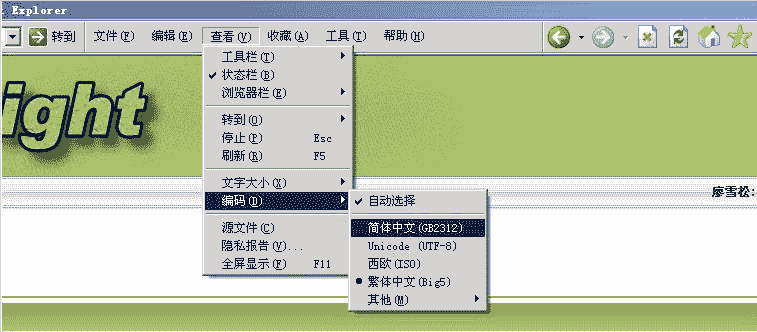
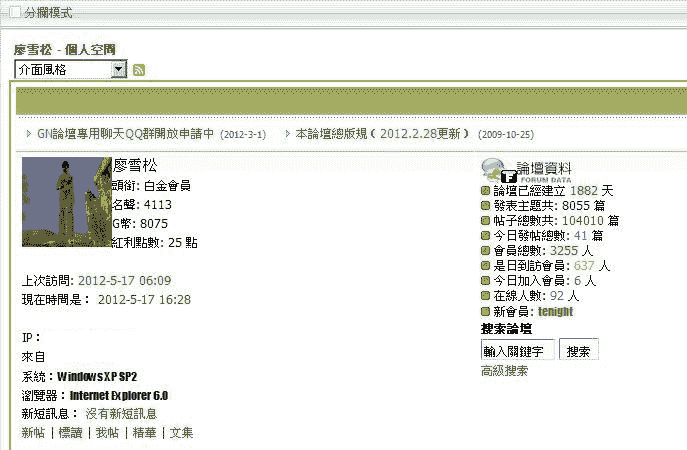
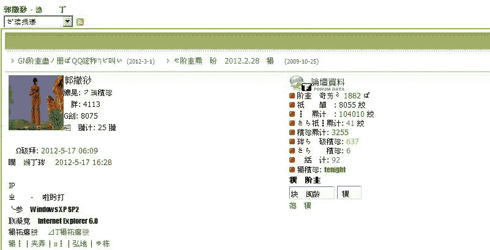

# And One And Two（全文完）

作者：廖雪松

TID：12264

<title>1</title> <link href="../Styles/Style.css" type="text/css" rel="stylesheet">

# 1

**郑重声明：本人只希望本人所有文字只出现在GN论坛上，你可以收藏，可以下载，但是请不要转载于GN以外的任何地方，我会不胜感激的！**
全名：And One And Two
简称：AND

写在文前的话。
1  这是一个选择阅读的文。前面也有人写过类似的文，受了点小启发，所以也想着尝试着写这样的文。
2，本文为短篇，最多是中篇，所以坑会较快时间填好。至于“梦花”大坑，稍后继续填。
3 阅读的途中会遇到多种选择，不同的选择会有不同的剧情。
正文：

And One And Two

P1  电梯艳遇

   这个世界真的是如经典物理那样中规中矩的吗？真的没有神魔鬼怪之类的吗？我一直是个无神论者，我不相信世界有神仙，不相信世界有鬼魂，不相信这个世界有魔法巫术，总之，一切脱离经典自然科学范畴的，我都不相信。但是，今天的遭遇彻底的改变了我的认识，我开始对这个世界产生了怀疑。事情是这样的……
   周六，我和老婆孩子都休息，连续的节假日，单位里都是加班，难得今天没有班可加了，所以，我们一家三口一起出来逛街。市中心有个18层的商业大厦，顶楼是超市，在超市里买完东西，老婆推着购物车走在前面，女儿跟着她，而我则落在了后面，这也怪我，夏天，美女太多了，我都看不过来了，不少漂亮且时髦打扮的。在我仅几步之遥，一个长腿美女，穿着牛仔裤，裤脚盖住了穿着黑色丝袜的双脚，蹬着双黑色的后跟很高的高跟鞋，敲打着大理石地面发出悦耳的声音。我的弟弟就要石更了，我极力控制着。不一会，老婆孩子进入了电梯，为了不掉队，我不得不放弃我贪婪目光，从美女身上移开，我刚进电梯，不料，电梯就发出滴滴超载警报，电梯里挤得满满的，众人都把目光投向我，没办法，我只得对老婆说道：“你们先下去吧，我做下一班。”说着，我退出了电梯，“我们在一楼等你啊！”老婆说着，电梯门关了起来载着他们和其他顾客朝楼下降去。
    我只有等下一班电梯了，想不到，刚才那个黑色高跟美女就站在我身边，她也在等电梯。我不由斜眼瞟了他一眼。这的确是一个很漂亮的美女。
    等了大约五分钟，终于有一架电梯开了门，我生怕又没得位置，赶紧钻了进去，身后传来高跟鞋敲打地面的声音，我转过身来，黑丝美女进来了，可是，电梯里就我们两个人。奇了怪了，这么多顾客，怎么这班就咱两个人呢？
   门关上了，美女按了1，然后冲我笑了笑，那笑容很甜美，却也很神秘。电梯载着我们降下去，我隐隐感觉有点不妙，头脑昏昏的。那个美女再次朝我笑了笑，然后就抬起一只手来，朝我虚空一指。
    紧接着，一道耀眼的光芒闪过，怎么了？光芒消失了，我还站立着，只是，我发现四周变得如此的巨大，美女仍然站在我的面前，只是，她是如此的巨大，错了，是我被她变小了！这怎么可能啊！！
    她一双巨大的高跟鞋威严的屹立在我的面前，我站在电梯，地板上的防滑纹路此时显得如此巨大，我站在巨大高跟鞋前最多只有五厘米高了。
    巨大美女弯下腰，朝着我笑着说：“怎么样，小人，好玩吗？这就是偷看美女脚的下场。给你半分钟时间，赶紧爬到我的脚背上来，否则... 否则一会很多人进来，你会一步小心就被踩死的哦，只有爬到我的脚背上，我带你离开这里，才是安全的。。。

and 1
   不，这太不可思议了，太可怕了！我不能，这个女巨人会杀了我的！我不能相信她!那我到底该怎么办？怎么办，怎么办啊！我迟疑着。。。我抬头看去，女巨人此时在我的面前显得是如此的巨大，她朝我露出神秘的微笑，电梯门打开了，一大群身形巨大的顾客冲了进来，已经被缩小的我慌忙的躲闪着。。。
Continue to P2A

and 2
   我的天哪！这怎么可能啊！我被这个女巨人变小了。虽然我是个GTSer，我也一直梦想着有这样的时刻，但是，我还是非常的害怕。思绪在我的头脑里只维持了零点零三秒，我就已经做出了决定，没错，美女巨人说的是对的，如果，我逃离她，我会无法生存的，毫无办法的情况下，我抱住了女巨人脚上那硕大无比的高跟鞋，卖力的朝上爬去，好不容易，我爬上了美女那巨大黑丝脚背。我刚刚在她的巨脚脚背上坐好，电梯门打开了，一大群身形巨大的顾客冲了进来，吓得我趴在女巨人巨大黑丝脚背上，双手抓住裹在巨脚上那性感的黑色丝袜，以防震动摔落下来。
Continue to P2B

[ *本帖最後由 廖雪松 於 2012-5-15 23:12 編輯* ]<title>2</title> <link href="../Styles/Style.css" type="text/css" rel="stylesheet">

# 2

我原以为会有选2的多些，想不到都是选1的啊，
不过我个人认为，如果这个是真实的，我会选择2，因为，主人公是被女巨人变小的，也只要有她才能让自己恢复原型，所以，只有选择2才可能有更大的生存机会。
不料，还是选1的多，

不过1的结果会让大家失望的咯。。

本来想明天发上1的 不过还是提前发出来吧

正文如下：

P2A  无法忘怀的那一幕
   接P1 and1
   我在人们的脚下躲闪着，好几次都是差点被踩到，终于我躲到了电梯的角落里，电梯里挤满了人，谁也没注意到我的存在。电梯门刚刚关上，就听的哗地一声响，电梯里的灯灭了，所有的照明灯都灭了，虽然是白天，但此时电梯里一片黑暗，什么也看不见，人群嘈杂，咒骂着，我只觉的有人一拳打在我的头上，差点昏过去，不过停电只是片刻，电梯里又恢复了照明，我被众人挤在角落里，不能动弹，我正想也和他们一样骂上两句，可是突然我发现，此时的我居然和正常人一样大小了，这么说我被恢复过来了。可是刚才的事是真的啊，一点也不像做梦。电梯门再次开了，里面的人都跑了出去，由于刚才的停电事故，都不敢坐电梯了，我也赶紧跑了出来，老婆正推着购物车带着女儿站在电梯外等着我呢，我四周望去，想找到刚才那个牛仔裤黑丝高跟鞋美女。一个熟悉的身影在人群中穿梭着，一会功夫就消失在我的视野里了。
    “你怎么了，老公？”老婆不满意的问，“我们都等你半天了，怎么才下来啊。”
   我没回答她，仔细的回忆着刚刚发生在我身上的事，我在想，如果刚才我选择了爬上那个女巨人高跟鞋脚背的话，会是什么样的结局呢，此时我还真的有点后悔了。
    随后的日子里，我经常去那懂18层的商业大厦，每一层楼我都不放过，可是再也没有看到过那个牛仔裤黑丝高跟美女了。我不敢对别人说出我的经历，因为我知道不会有人相信的。我只能写成文字发表在GN上，只有GN的同好们或许会相信。直到现在我都还有点后悔，当时我为啥不选择爬上去呢。
   不过不管怎样，生活还得继续。。。

全文完。谢谢观赏！

PS：在P1里如果选择了and 2 会有另一种剧情的哦，明天奉上。

[ *本帖最後由 廖雪松 於 2012-5-8 17:20 編輯* ]<title>3</title> <link href="../Styles/Style.css" type="text/css" rel="stylesheet">

# 3

P2B 抽屉
   接P1 and 2
    我扭过头惊恐的看着眼前的一切，无数的巨人站在我的面前，我住着女巨人黑丝的双手不敢放松，电梯再次载着乘客下降着。终于到了一楼，女巨人和其他巨人一起迈动脚步走出电梯，随着巨脚的迈动，我被一会甩起来，一会又重重的摔下来，但是我始终都是紧紧的抓着女巨人脚上的黑丝。我趴在女巨人的脚背上，我看到我的老婆和孩子就在不远处正焦急的等着我呢，可此时我已经被变小了，在另一个女人的脚背上，怎么办呢，我也不知道咋办，此时只能听天由命了。
    一楼大厅里，走出电梯的女巨人弯下腰，一只手轻轻的捏着我，将我捏在手心里，那只芊芊玉手是那么的温暖，本来恐惧万分的我，此时却不由有点兴奋，我没能想到更多，女巨人另一只手掀起裤脚，我看到了女巨人脚上穿的是一双透明的很薄的黑丝短袜，女巨人空出的那只手捏着袜口，将我放在了袜口里，然后让黑丝短袜的袜口将我缚在了她的脚腕上，“听着，小人，”女巨人甜美的声音，“老老实实在这里呆着，不要乱动，否则掉下来，会是什么样的结果，我不说，你也该明白吧。”
    看着眼前女巨人巨大的脸庞，我只能点了点头，女巨人这才放下裤脚，站起身。女巨人穿的虽然是牛仔裤，但是裤脚一圈却是透明的蕾丝，我可以透过这蕾丝看到牛仔裤外面的世界。女巨人开始走起路来。虽然很颠簸，但是比刚才趴在她的脚背上要好多了，袜口很紧，但是不勒，呆在这里很舒服。就这样我被安放在女巨人巨大袜口里，随着她的脚步颠簸着。
    “舒服吗，小人？”女巨人的声音传来。裤脚下，光照很充足，我能看到那裤脚透明蕾丝上有一个喇叭一样的东西挂在上面，女巨人的声音就是从那里传下来的。
    “还好。”我回答，此时也不如刚才那么惊恐了，因为我知道害怕也没用。此时，由不得自己做主的了。
    “我叫韩冰，”女巨人边走边说，“你叫我冰儿就可以了。”
    “可是。。。”
    “我知道你有很多疑问，”女巨人韩冰继续说，“你也不用害怕，我在雷士企业总公司上班，雷先生是我的老板。我知道，你姓廖，你放心，要不了几天，我就会放了你。
    “哦，”
    “呵呵，是不是害怕我会一脚踩死你啊。放心好啦。”韩冰说着已经上了商场门口的一辆宝马跑车。一会，蕾丝的前方黑漆漆的一片了，韩冰发动了引擎。
    “哦，”我除了哦，不知道说啥好了。我从口袋里掏出同样被变小的手机，手机屏幕上现实的是“网络搜寻中。。。”晕，怎么手机没有网络啊，我是想给老婆打电话的。
    “不要打手机了，我的裤脚里的信号是被屏蔽的。”韩冰方佛看透了我的心思，“还有，这三天，你会玩的很开心的。怎么样，被变小了，有什么感想啊？”
    “很，很神奇。”
    “不仅仅是神奇吧？是不是觉得很兴奋啊，廖先生？”
    “嗯，嗯，是吧，那，你现在要带我去哪里啊？”
    “不是我要带你去哪里，而是，我现在要去上班。”
    韩冰到了公司，走在光滑的地板上，高跟鞋敲打着地面发出悦耳动听的声音，不时的和公司的人打着招呼，公司里的人对她都很恭敬。韩冰，雷氏企业总公司董事长秘书。想不到公司里的人对她会如此毕恭毕敬的，难道韩冰会随时将这些公司同事变成小人来玩耍，所以大家都害怕她？
    韩冰一会就到了董事长办公室的门前，门哗的一声打开了，她进了办公室，从她的裤脚蕾丝里能看出来，这是一间巨大的办公室。韩冰来到一圈沙发前坐下，双手去脱另一只高跟鞋，那只套着黑丝的脚从黑色的高跟鞋里被抽了出来，那只巨大的高跟鞋立在地上，韩冰一只手在那只高跟鞋的上方舞弄了一下，然后伸手从高跟鞋子里捏出一个小东西来，我仔细一看，居然是一个裸体的小男人，“嗨，醒一醒啦，雷总，”韩冰对着那个小人说道，看来，那个刚从女巨人的高跟鞋里被捉出来的裸体小男人正昏迷未醒呢。韩冰继续抖着手里的裸体小男人，那个小人终于醒过来说道：“我的妈呀，要了我的命了啊。”
    “要你的命，你还这么着迷？”韩冰笑呵呵的说着，将他放在地上。
    “唉，谁让我这么喜欢呢，”小人在韩冰的脚下，伸了伸懒腰。
    韩冰对着脚下的那个小人舞动着双手，不一会，那个裸体的小男人开始变大，一会就变得和正常人一般大小了。“好了，赶紧把衣服穿好吧，雷总。”韩冰说着已经穿好刚才那只脱下来的高跟鞋，站起了身。
    韩冰走出董事长办公室，原来刚才那个小人居然是雷氏企业的董事长兼总裁。董事长办公室外面有一个办公桌就设在门口，看来应该是董秘韩冰的办公桌了。韩冰此时仿佛才想到了我似的，她坐在自己的座椅上，弯腰将我从她的袜口里捉了出来，捏在手心里，然后打开一个抽屉，将我给丢了进去。
    抽屉里一片黑暗，抽屉被砰的一声关上了，然后被锁上。哗地一声，黑暗的抽屉突然大亮起来，一片通亮，想不到，这个抽屉居然别有一番天地，在我的面前居然有十几个被变小了的小人们，这些小人里有男有女。
    “哈哈，又有新人进来了。”一个男的说道，
    “唉，又将有一条生命消失。”另一个男人说道。
    “嗨，你们大家好啊，”我说第二句话的那个人，“为什么说有一条生命啊，韩冰说了不杀死我的啊。”
    “哈哈，你太幼稚了，女神的话，你也信吗？”
   “女神？”
     “对啊，女神。女神的名字不可以随便说的啊，你是不想活了吧。”刚才那个人神秘的对着我说，“女神每天都要踩死几个小人，最多的时候一天能踩死十几个，有的小人还会被她吃下肚子的。”
    “啊？不会吧？怎么会这样啊？”我非常的害怕。
    “听天由命吧。”
    大家都点着头，证实他说的话是真的。“可是，韩冰，哦不，女神，她为什么要杀死我们啊？”
     “因为雷氏的老总，是个GTS迷。他喜欢看女巨人掠杀小人，所以。。。你应该明白了吧。”
    “可是，不能因为他有这样的爱好就要残杀我们这些无辜啊。”
    “这里，没有什么好说理的，听天由命吧。”
     我惊呆了，想不到，不久我就会。。。。我傻傻的坐在抽屉的一个角落，发着呆，外面不时传来走路声，说话声，现在我在一家写字楼的办公室的一个抽屉里，这也太不可思议了吧。也不知道过了多久。一阵开抽屉的声音，抽屉在移动着，抽屉里传出一阵惊恐的叫声，人们都惊恐的朝抽屉深处躲藏而去，怎么回事？
    抽屉被打开，韩冰巨大美丽的脸出现在视野里，“嗨，小人们，老规矩哦。”
    “怎么了，什么老规矩啊？”我大声的问，我不相信眼前这个美丽的女巨人会是一个杀人狂魔。
    韩冰笑着说，“老规矩啊，就是，每天，会从你们中间选出十个小人玩游戏，很好玩的哦，你要不要来啊，廖先生？”韩冰说着，将一只巨大的黑色透明薄丝袜放了进来，“快点啊，进来十个人，我等着下班啊！”
    抽屉里一阵骚动，那个大块头的小人说着：“你们几个，还有，你们几个进去！”
    “我不，我不啊！！”人们惊叫着，可是立刻，抽屉里发动了骚乱，几个身强力壮的强行将几个身单力薄的抓住将他们丢尽丝袜里，我明白了，他们仗着自己力气，可以让别人先去“游戏”，而自己就可以暂时躲避劫难。不过，还好，他们没有对女人们动粗。
    “好了，不错，有九个了，还差一个。”韩冰的声音从头顶传下来，此时我觉得，她应该叫寒冰更贴切。想不到她会是一个杀人女狂魔。
    那几个大汉此时朝我扑来。。。

and 1
   我奋力反抗着，我不想就这么快死去。正在我和这几个大汉扭打的时候，一个男人的声音在抽屉外传来：“好了没有啊，冰儿！”
    “好啦！我就来了，雷总！”韩冰回答着，然后对着我们露出莞尔一笑，“好了，今天就九个吧，廖先生，你在这里委屈一夜吧，”说着，将那个装着九个小人的丝袜拿了出去，然后丢进来一个大大的东西，是一个巨大的面包。抽屉被重重的给关上了。
Continue to P3A

and 2
    我奋力反抗着，可是我一个人怎么能斗过他们几个啊，我被他们几个强行送进巨大丝袜里，韩冰笑呵呵的捏住丝袜，将我们丢尽她的手包里了。
Continue to P3B<title>4</title> <link href="../Styles/Style.css" type="text/css" rel="stylesheet">

# 4

这次选2的比较多，看来都觉得选1不会是好的选择了？不过，这次1的确是个bad end了。虽然选2的比较多，不过还是先把1放上来吧。
正文：

P3A  OFFICE惊魂逃亡夜

    上接 P2B and 1
    高跟鞋敲打地面清脆悦耳的声音逐渐远去，office里一片寂静，此时的抽屉里同样也是一片寂静。
    刚才的那几个彪悍大汉此时也消停了，我怒视着他们，其中一个人笑呵呵的对我说道：“对不起啊，兄弟，我们也没办法。”
    “可是，你们也不能这样，为了自己能活命，而不惜牺牲别人啊？”我怒不可揭，可是，我也没办法，谁让我势单力薄，他们这几个人，随便一个人，我都打不过，更何况他们有好几个人呢。一个戴着眼镜的瘦弱书生模样的人蜷缩在抽屉的角落里，瑟瑟发抖。嘴里嘟噜着：“不要，我不要啊。”我环顾了下四周，数了数，抽屉里还有七个人，那四个大汉，眼镜男，我，还有一个三十岁左右的女人。大家一片沉默。我想了想还是要说点什么：“我说，我们不能就这样等死啊。”
    “你啥意思？”刚才那个人问。
    “逃，我们要逃出去，就算我们变不回去，也要想办法逃出去啊，不能就这样在这里等死啊。好了，你们几个，就算你们能仗着自己身强力壮，可是，你们敢保证你们能一直这样保持下去不被抓去吗？”
    那几个人被我说的都低下了头，因为我说的是对的。另一个人说道：“兄弟，你说的轻巧，可是，可是我们怎么逃出去啊？这个抽屉一点出路都没有。”
    “找找看，或许有呢？”我抱着侥幸的心里问。
    “得了吧，我们都找过N次了。算了，先填饱肚子再说吧。”
    那块大面包，足够我们这七个人充饥的了。抽屉一个角落里有两个巨大的纸盒子，那纸盒子是供我们这些小人们如厕用的，第二天，纸盒子会被韩冰换上新的。
    安静的夜晚，抽离却有照明，和众人谈话中，了解到，大家都是被那个叫韩冰的女巨人用变小放进来的，韩冰每天都要抓十个左右的小人进来，偶尔会有一两个小女人。每天晚上都会有十个左右被抓出去供韩冰和雷总玩耍。被抓出去的小人从来都没有回来过。“可是，这个女魔头，她为什么要抓我们来啊？”我问，谁也不回答我的问题。
    也不知道过了多长时间，大概过了两三个小时，一阵悉悉索索的声音从抽屉外传了进来，我们大家都绷紧了神经，静静的听着那声音，是一个脚步声，那脚步声在办公室里走动着，从走路的声音辨别，可以猜测，这个人是轻轻的走路，生怕被别人听到了似的。
    “什么人？”我警觉的问。
    紧接着就听到了撬门的声音，是撬董事长门的声音。“小偷！”好几个人都异口同声的说道。
    我靠，没猜错的话，应该是有个窃贼闯了进来。我们静静听着，那窃贼撬了半天的门，看来是没有成功，过了片刻，我们的抽屉发出了巨大的声音，同时抽屉开始震动起来，窃贼开始撬我们的抽屉了！怎么办啊？我们几个人都面面相觑，也不知道该怎么办了。“哗”的一声，抽屉被打开了，由于抽屉被抽动着，我们都站立不稳，跌坐在地，那个女人更是惊恐的尖叫着，一个巨大的脸出现在抽屉口，我们的面前，果然是一个面孔猥琐的窃贼，我们都惊恐的看着这个巨人，而那个窃贼此时也惊讶的望着我们。怎么办，怎么办？正在我们僵持的时候，那个窃贼突然发出一声惊叫，就消失在了我们的头顶上方，紧接着就听到一阵巨响，是东西掉落在地上的声音。办公室里恢复了平静，抽屉大开着。我们对望了望，逃跑！这个是我脑海里的第一个念头，我奋力朝抽屉口往上爬去，可是，平时很低矮的抽屉此时居然是这么的高大，我纵身一跃，双手攀住了抽屉口的边缘，全身悬空着，怎么也攀不上去。正在我努力的时候，两个人抱住我的大腿将我朝上举起。我回头一看，是两个壮汉。其中一人对我说道：“你先看看是什么情况。”我点了点头，攀了上去，我坐在抽屉口，朝遥不可及的地面看去，巨大的办公桌的地下堆了一堆的衣服，那个窃贼不见了。
    “怎么样啊，兄弟？”那个壮汉问。
    “我也不清楚，那个小偷没看到了啊，只有一大堆衣服在地下。”我说着再仔细朝下看去，可是办公室里的光线太暗了，毕竟是晚上啊。不过我很快就想到了一点，这个抽屉有机关，正好被那个窃贼触发了，而且被这个机关给变小了。只是我有个疑问，为什么我们几个被变小了，随身衣物都跟着变小，而这个窃贼只是身体变小，随身衣物却不变呢。如果要逃跑，我们这几个小人要一起才行，因为这个窃贼可能携带武器，可能会对我们造成威胁。我小声的对着抽屉里的众人说出我的想法。
    经过了一番努力，我们七个人都坐在了抽屉口上了。可是接下来的难题又摆在了我们的面前，我们怎么下去呢，这么高，怎么才能下到地面去呢？还是刚才那个壮汉说出了他的计划：“我们大家都把外衣脱下来斯成长条然后系下去。”看来，也只能如此了。长绳子准备好了，我第一个朝下系去，可是，此时却发生了意外，那长绳子的中间有一个环节突然断裂开了，后果可想而知，我就这么直接朝地面坠落下去，我惊叫着，完了，这么高跌下去，那还不跌死啊！啪的一声，我重重的跌在地上，浑身疼得要死，可是我居然一点也没受伤，怎么回事啊？我朝上看去，如果我的身高是正常的话，那这个高度至少有二十多米啊！
    “喂，兄弟，你还好吗？”他们在抽屉上朝我使劲喊道。
    “我没事啊！”我大声回答，我思考了片刻，明白了这个道理，身体的个头变小了，身体的强度也变小了，但是个头和强度不是等比变小的，这就是为什么昆虫从几十几百甚至几千倍自己身高的地方摔落而安然无事。对，就是这个道理，我变小了，但是我可以从几十倍身高的地方轻松跳下，我赶紧对大家喊道：“你们都跳下来，没事，跌不死的，你们就往那些衣服上跳，没事的，相信我！”我跌在地板上都没事，那么大家跳在衣服上就更应该没事了。大家犹豫了会，果然都开始跳了下来。
    大家都跳下来以后，我们七个人看了看，大家都安然无恙，那个窃贼此时也晕晕乎乎的从衣服堆里爬了出来，光着身体。我们中的两个人赶紧上去抓住他。
    “你们是什么人，快放开我！”窃贼大声说道。
    “你放老实点，”一个大汉说道，“现在是什么情况，你应该很清楚了吧。”
    “那你们想怎么样？”
    “想怎么样？要么和我们一起逃出去，要么，你就在这里等着女魔头来弄死你。”
    “女魔头？”窃贼有点惊恐了。
    “对，很残忍的弄死你，尸骨无存。”
    “好吧，好吧，我和你们一起逃走，可是，你也得放开我才可以啊。”
    “下面我们怎么办啊？”我问道，“我们要怎么逃走啊？”
    “等下，等下，”一直不说话的眼镜男此时说话道，“我有个办法，门口那台一体机看到了吗？”我们顺着他指的方向看去，隐约能看到很远很远的门口那台复印机。“那台一体机，可以让我么变回正常。”
    “你怎么知道的？”我们异口同声的问。
    “我就是在那里被韩小姐变小的。”
     “嗯？”
    “我是这家公司的职员，”眼镜接着说，“复印机里的激光可以将人变小，我就是被那复印机里的激光变小的，我这几天琢磨了很久，扫描模式可以使人变小，印刷模式是缩小的反程序，就是说，我们去到复印机那里，启动打印，就可以把我们变回去了。”
    “你确定你说的不会错吗？”
    “相信我吧，好吗？”
    “那赶紧的吧，我们快去！”我们八个人开始朝复印机跑去。这个办公室本身就非常大，加之我们又被变小了，花了很长时间都没跑到那里，我这个时候才恨自己平时缺乏锻炼，才跑了一会就已经气喘吁吁的了，我和那个女人落在了最后，看着就要到跟前的时候，这个时候，最担心的事情发生了，办公室外的走廊里传来高跟鞋敲打地面的声音，清脆悦耳，但是此时，这本来很动听的声音却显得异常的恐怖，我们都意识到了什么，女魔头来了！
    先到的那几个人都赶紧的钻到了复印机下面去了，我拉着女人的手拼命的跑去，心脏狂跳着，仿佛就要从口腔里窜出来了，但是，活命要紧啊，快了，快了，只要跑到复印机下面躲好，暂时就会没事的！
    门被打开了，韩冰巨大的身形跃入眼帘，此时的女巨人穿着一身连衣裙，啥样是啥颜色的没看清，本来就是晚上，加之逃命也顾不上看了，只知道她穿的还是一双黑色高跟鞋，可能是肉色丝袜，也可能是裸足。我立刻就傻了，僵在地上，不知道如何是好，吧嗒吧嗒，高跟鞋走了过来，韩冰没有发现地下的两个小人，我身边的女人发出一声惨叫，随后是“吧唧”一声，韩冰高跟鞋已经落在了我们身处的地方。眼前一黑，一切都结束了。
    如果这是部电影的话，此时的电影画面是一片黑暗，没有任何图像，只有一个女人的声音说道：“雷总，我把他们给踩死了。”
    电话里男人的声音：“你说什么啊，冰冰，你踩死谁了？”
    女人哭泣的声音：“我不知道啊，我一步小心就踩死了两个人，好像，廖先生也在里面。”
   男人的声音：“Oh,my god!你怎么这么不小心啊！他是无辜的！”
   女人哭泣的声音：“我知道他是无辜的啊，可是，谁知道，他们怎么会跑出来的啊，我就一不小心给踩到了，那么点大的小人，我怎么会注意到啊。”
    电话里男人的声音：“好了好了，别哭了，赶紧收拾下，看看有没有漏网的。唉，真要命了。”
    电话嘀嘀嘀的忙音。。。
   全文完，谢谢观赏。

注：结尾有一段选择性文字，可以无视跳过，也可以ctrl+A阅读
P2B的另一个剧情，敬请期待，尽在P3B

[ *本帖最後由 廖雪松 於 2012-5-11 06:40 編輯* ]<title>5</title> <link href="../Styles/Style.css" type="text/css" rel="stylesheet">

# 5

本来这一节里，想添个分叉。就是在窃贼打开抽屉以后，选择逃亡，“我”是选择逃亡，还是继续呆在抽屉里。如果呆在抽屉里的话，会等着女巨人来将“我”抓走，从而进入下一个环节，个人觉得可有可无，所以就省略了。
初次常识写这种多剧情的文字，所以南面会有很多瑕疵，不过我会努力把他写好，只是，如果文中要出现累死吞食之类的内容，的确不是我的强项，我本意是要将女主塑造成一个温柔+残酷并存的GTS，温柔占大多数。所以，看情况吧，可能会出现吞食的，也可能会无。
这只是个短篇，所以不要期待它有太长的剧情，最多会有几个分支剧情。
同时谢谢大家的支持和热情。我的能量又加满啦！！明天继续！！

  <title>6</title> <link href="../Styles/Style.css" type="text/css" rel="stylesheet">

# 6

本来计划今天下午把P3B更完的。可是今天单位白天都上班，没的时间坐下来好好写了，晚上，家里有人，更不方便写了。所以要拖更了，预计明天可以更好P3B.<title>7</title> <link href="../Styles/Style.css" type="text/css" rel="stylesheet">

# 7

p3B  一个都不能少

上接P2B and 2

    这个虽然平时看上去很小的手包，此时对于我们这几个小人来说居然显得是如此的巨大。剧烈的颠簸，外面的声音很清晰的传进来，依然能听到高跟鞋敲打地面的那种清脆的声音，不时的能听到有人恭敬的和董事长打着招呼。而韩冰边走路边和她身边的应该是雷总的人说着话。
    “今晚有什么打算啊，雷总？”韩冰问。
     “嗯，先陪你去买衣服和鞋子，然后去填饱肚子，这样既有心情，也有力气玩啊，是不，我的女神？”这个是雷总的声音，只是最后的声音有点低了。
    “听你的，雷总，不过，你要不要和嫂子打个电话啊，要不，她会担心你的。”
    “没必要吧，我又不会做出对不起她的事来。”
    听他们这说话，我在心里嘀咕着，难道说这个韩冰会是这个什么雷总的小三？但是又不像，雷总刚才不是明明说他没有做出对不起自己老婆的事吗？包包里别看空间很大，但是我们这几个小人被困在丝袜里，又被团在一起，所以还是显得非常的拥挤，加之女巨人一直在走路带来的颠簸，所以，在里面一点都不舒服。更别想在这个时候套破里，包包里一片黑暗，什么也看不到。总之我们在她的包里，根据外面的声音和颠簸的状态，可以判断她走了一段路，然后坐车，然后去了商场，雷总给她买了十几套衣服，和五六双鞋子，还有丝袜内衣，包包之类的，全是名牌，都是cd，WOLFORD之类的。这个韩冰只是个普通的白领，却傍上了雷总这个大款，可是韩冰是如何获得GTS能力的呢？是她自己获得的？然后，因为雷总是个GTSer，所以她就傍上了他？更或者是她的这种能力是雷总给予的？不管是哪种情况，既然拥有GTS能力，如果心存不善，那么后果会很可怕的。单元韩冰是个善良的GTS，凭我的直觉我能感觉出来。可是，和我在一起的这些小人们却总是说韩冰是个凶残的杀人女狂魔，她以踩死小人为乐，更有甚者还会拿小人来作为自己的食物。她每次掠杀小人的时候，都会将雷总变小放在何时的位置欣赏，以满足雷总的那种迷恋GTS的欲望。
    就在两个人逛商场买东西的时候，就听到我的边上这些小人一个劲的骂着“狗男女”什么的。其实也只有韩冰在选购东西的时候，包包里才能稍微有点平稳。大概逛了两个多小时，两个人驾着车去了一个饭店，听他们说好像应该是全市最高档的那家饭店。两个人刚在作为上坐好，就听到一阵手机铃声响起来。然后就听到韩冰说道：“雷总，办公室里好像遭窃了。”
   “怎么了？”
    “我的抽屉有报警装置的，如果一旦被撬，就会自动给我的手机发送警报，看来是有窃贼进到我们的办公室里了，我得去看看。”
    “那，那写小人。。。”
   “放心吧，雷总，抽屉里有机关，会将窃贼变小的，不过我还是要去看一看。”
    “要我陪你去吗？”
    “不用了，雷总，你等我下，最多半个小时，我就回来的。”
    “那好吧，路上开车慢点。”
    韩冰开着车回了公司，她进了办公室以后，就听到外面一阵无法辨别的声音，然后就听到韩冰威严的声音说道：“都给我钻进去，否则统统踩死你们！”
    过了一会，包包的拉链拉开了。一阵杂乱的惊叫声，一大团东西被丢进包里来，原来是一个肉色的短丝袜，里面装着好几个小人，看来是晚上下班的时候没有被韩冰抓出来的那几个小人了。我心里不由的有点好笑，当时那么拼命挣扎，结果都被抓出来了，看来，稍后，会有一场非常精彩的大戏等着我们了。韩冰巨大的脸展现在包包外，说道：“你们听着，不要以为你们可以逃走的，哼，企图逃走的几个，一会你们会收到非常优厚的待遇的。”说完，包包被合了起来，接下来，又是高跟鞋敲打地面的声音。
    随后在饭店里，听到韩冰和雷总的说话：“没什么大事，有个小偷撬开了抽屉，不想触发机关被变小了，我去的时候，有四个小人和那个小偷一起逃跑，他们想逃到复印机那里。”
    “为什么要去复印机那里呢？”雷总问。
    “我也不清楚，可能是想躲在下面，他们也不想想，他们逃到哪里都逃不出我的手掌心里的，呵呵，一个都不少，抽屉里还有一男一女两个小人没敢跑，不过，这几个小人，我都给抓来了，回头带上他们一起玩游戏吧。”
    “行，一切听你的。”
    大约吃了一会，两个人也聊了会，都是写无关痛痒的事情。吃完饭了，就听雷总说道：“好了吧，我们走吧，一会要玩游戏咯。”
    “好啦，雷总，要不要把你也变小啊？”
   “必须的。”
     “呵呵，雷总，准备好了吗？”韩冰笑呵呵的声音，过了一会，有说道：“爬到我的高跟鞋里来吧，雷总，加油啊，雷总，你好笨啊，每次你都爬不进去，还要我帮忙才行。好了，站好了啊，我的脚脚要进来咯。”
    高跟鞋敲打地面的声音再度响起，，吧嗒吧嗒。。。

本小节完。这一小节没有分支。我想把女巨人玩弄小人的内容单独放在一个章节里，所有就到这里暂停了下。
Continue to P4<title>8</title> <link href="../Styles/Style.css" type="text/css" rel="stylesheet">

# 8

P4 虐杀

    上接 P3B
    其实一开始，就注定了这只是个短篇，不会有太多的剧情，没有伏笔，只是有几个选择。这正如我们的人生一样，我们遇到过很多次的选择，不同的选择会有不同的人生，如果当初不是这么选择的话，我今天的人生也不会如此了。
    好了，感慨结束，开始我们的剧情吧。颠簸结束了，高跟鞋敲打地面的声音也消失了，包包被打开，丝袜被抖开，伴随而来的是骚动和惊惧，等待着我们的是未知的命运。我们一共十七个小人，其中三个女人，还有一个临时加进来的小偷。这是一个光洁瓷砖铺就的厅室，非常的巨大，当然可，此时我们都被缩小了，所以看上去是非常巨大的了，但是对于此时正常身高的女巨人韩冰来说也是非常巨大的了，我目测了一下，对于正常人来说，它也至少有100平。在我们众人的身边屹立着两只巨大的黑色高跟鞋，而蹬在巨大高跟鞋里的是一双巨大的女人的脚，那双巨大的脚穿着薄如蝉翼的肉色长筒丝袜，巨脚的主人就是韩冰了。她此时正俯视着我们，俯视着我们这些只有几厘米高，此时，站在她的脚下，还不如她的鞋跟高。我们所有的小人站在她的脚下，站在她的两个大脚的中间，谁也不敢动，不敢出声。
    女巨人呵呵笑道：“知道我们今天要玩什么游戏吗，小人们？”
   隐隐约约觉得这个游戏不会是什么好东西，我们哪敢说什么啊。韩冰在一张椅子上坐了下来，一只脚踩在地上，另一只腿架在这只腿上，那只翘着的脚上的高跟鞋，从脚上松脱，勾在了她的脚尖上，晃悠着。我们仰视着女巨人，我能清晰的看到头顶悬着的那只巨大的勾着高跟鞋的巨脚。在那只鞋后跟的鞋子里慢慢露出一个小人的头来。那个小人扒在女巨人悬着的高跟鞋的鞋后帮上，他正看着处在下方的我们。我靠，这个人是那个所谓的雷总，如果我没猜错的话！此时的我不由怒火中烧。
    “姓雷的！”我对着头顶的那个小人大声怒吼道,“你躲在那里干什么？你也下来啊！要玩游戏，我们一起玩！”
    我话音还没落，雷总就缩回了脑袋，躲进女巨人的高跟鞋里去了。这个世界，怎么什么变态的人都有啊！还是胆小如鼠的变态，我心里骂道。不料，韩冰却笑道：“廖先生，别生气了，雷总也和你们一起玩游戏的，只不过他所处的位置不同而已。”
    我勒个去的！我此时也不知道哪来的胆量，其实，我刚才也一直在琢磨这事，如果韩冰真的想拿我们怎么样，以我们现在的处境，害怕也好，无惧也罢，都是无济于事的，所以，该说的还是要说的。“韩冰，你们无权决定别人的生死！”我对着眼前的女巨人挥舞着拳头吼道。
   “哈哈，小人，”韩冰说道，“我们没有说要决定你们的生死啊，只是要玩个游戏而已。”
    “可是，你们不能这样对待我们啊。”
    “你少啰嗦了，婆婆妈妈的，像不像男人啊？”韩冰反而把我给数落了一顿。说着，她站起身，走到一边的一个鞋架旁，边走边说：“你们小人都挺好了啊，不许乱跑，否则，后果你们会懂得吧。”
    她在鞋架那里找了一双透明的水晶高跟凉鞋，换上。同时，将换下的那双高跟鞋里的小人捏了出来，将他关在高跟凉鞋的鞋跟里。那鞋跟是透明的，姓雷的那个小子就关在那个透明的鞋跟里，我明白了，这家伙想在女巨人的鞋跟里欣赏韩冰的虐杀！
    “吧嗒吧嗒”韩冰冷笑着，走了过来，小人队伍里，一个小女人萎缩在另一个小男人的怀里惊恐的说：“我怕！”
     韩冰站在离我们四米的地方——不，对于我们小人来说应该是一百多米——站住了，“听着，小人们，给你们三分钟的时间，这个房间里，你们可以随意的走动和躲藏。这三分钟属于你们，接下来会有三分钟是属于我的，至于接下来的三分钟是什么，你们懂得，我就不解释了，好了，先是你们的三分钟，开始！”说着，韩冰在椅子上坐了下来，翘起了脚。
    小人人群里一阵骚动，有惊叫的，有哭泣的，“什么三分钟，什么三分钟啊！”我大声问他们。
    “快想办法躲起来吧！”一个壮汉说着朝墙角一个柜子下跑去。
   “为了公平起见，”韩冰的声音又说道，“我闭上双眼。”
    小人们有的躲到柜子底下，有的躲到了床底下，有的跑到窗帘后面，钻到窗帘的缝里。妈的，我该怎么办啊？原地迟疑着。。。“廖先生，”韩冰说道，“不要发呆了，你也是游戏玩家哦，还不躲起来吗？”
    我勒个去的，还是跑吧，此时顾不得面子了。我奋力朝那个柜子下跑去，柜子下已经有四个人了，两个壮汉，一个女的，一个眼镜男。“我们会不会死啊？”那个女人哭泣着说道。
    “好了，三分钟结束，开始我的三分钟了！”韩冰的声音传来，随后是高跟鞋敲打地面的声音，“窗帘后藏了三个，你们是自己出来，还是我把你们揪出来呢？”
    “这个柜子底下藏了六个，自己出来吧。”依然是韩冰的声音。
    躲藏的小人们一个个被韩冰找了出来，最后，那双漂亮的水晶高跟凉鞋停在我们躲藏的柜子前，韩冰的声音：“这个柜子底下嘛，当然是最后五个人了，快点出来吧！”我们迟疑着，出去就是丝路一条啊，眼看着三分钟就要结束了，突然一阵风起，一股强风将我们从柜子底下硬是吸了出去，我们这十七个小人重新聚到了一起，女巨人巨大的双脚将我们裹在中间。我们惊恐的看着女巨人。韩冰双手一挥，又是一阵怪风刮起，我只看到众人身上的衣服纷纷剥落着，不用说，我也和他们一样遭遇了，一会功夫，我们十七个小人全都是裸体了。
    “对不起，你们这些小人，给你们三分钟时间躲藏，你们也躲好了，给我三分钟时间寻找，我也找到了。那接下来，就怪不得我了啊！好了，现在开始我们第二个小游戏，这个游戏很好玩，本来是需要十个人玩的，那么就。。。”韩冰说着，伸出一直巨脚在我们中间拨弄着，拨出十个小人来。“就你们十个小人玩吧，你们赶紧分出两个组来，一个组五个人，给你们半分钟时间，分好了就玩游戏，半分钟没好的话，就全部踩死！”韩冰最后那两个字说的特别重，说着她站起身去鞋架那里拿来一双黑色的高跟鞋，放在椅子边上，然后重新坐好，“很好，你们很快就分好了队伍。说下我们的游戏规则，你们两组，去分别将那双高跟鞋搬到我的脚下来，谁先搬到的就算胜利，失败的那方，会有惩罚的，至于是什么惩罚，你们应该早就猜对了，没错，你们猜的很正确，好了，开始吧！赢得一方可以活命的哦。快，快跑啊！”
    那十个小人迅速的朝那双高跟鞋跑去，我静观着“游戏”。如果此时我们的身高是正常的话，那双高跟鞋少说也有三米多高，我们这些被缩小的小人别说将它搬过来，更别提是否能动弹得了它分毫的了。
    那十个小人分成的两个小组，已经分别抱住那两只巨大的高跟鞋了，只听他们使劲的叫唤着，可能是太重了的缘故吧。那两只高跟鞋根本就纹丝不动。韩冰笑着说道：“真没用啊你们，我给你们加点能量吧！”说着，大手朝他们挥了一下。瞬间，两组小人已经将高跟鞋给搬了起来，虽然如此，那高跟鞋还是沉重无比，两组人喘着粗气，缓慢的移动着，大约搬了有十来分钟，两组人几乎是同时到的韩冰脚下，
    女巨人弯下腰故作认真的伸手量了量，说道：“这组获胜，那对不起了，失败的这组，你们五个小人。”
   “啊，不要啊！”那五个小人惊叫着，哀求着。
    “愿赌服输嘛！”韩冰说道，“给你们两条路选择，一呢，乖乖躺在地上别动，二呢，站到我的脚趾缝里来，”韩冰说着，脱掉一只高跟凉鞋，将那只穿着肉色丝袜的脚放在地上，“看好了啊，小人们，你们有五个人，而我的这只脚脚呢，只有四个脚趾缝，所以最后那个没有钻进来的呢，就会很惨的哦，好了，开始啦！”说着，韩冰用手掰开一趾和二趾，“第一个脚趾缝，快钻一个小人来！”小人们犹豫着，终于有一个小人站了进去，韩冰松开手，用脚趾将那个小人夹在了脚趾缝里，又掰开第二个脚趾缝，“第二个小人站进来吧。”小人们一次站到了她的脚趾缝里了，现在只剩下最后一个脚趾缝了，但是还有两个小人，韩冰芊芊玉手轻轻掰开最后那个脚趾缝，那两个小人争抢着要站进去，竟打了起来。
    “好啦，”韩冰笑着说，“是他先进来的嘛，你就别抢了啊。”韩冰将四个小人紧紧的夹在了脚趾缝里，然后对着剩下的那个小人说道：“没办法了，你躺好吧。”
    “不，不要啊，”那个小人扑通一声跪了下来，“女神，你饶了我吧，我不想死啊。”
    韩冰冷冷的哼了一声：“愿赌服输好不好？”说罢，那只仍穿着高跟凉鞋的脚，一脚朝小人踢去，那小人啊的一声惨叫被踢倒在地，韩冰那只高跟凉鞋巨脚朝小人踩去，在小人身上拨弄着，将小人拨弄成个大字型在地上躺好。那个小人在女巨人高跟鞋巨脚下哭泣着哀求道：“女神，我求求你，饶了我吧，不要踩死我啊！”
    我们这些小人都惊恐万分看着眼前的一切，我实在憋不住了，大声说道：“你住手啊！”
    “你说什么？”韩冰望着我，同时，那只碾着小人的巨脚已经使上了力气，“噗唧”一声，高跟鞋鞋底与地板结结实实的接触在了一起，只是轻轻的一下，依然将那个可怜的小人踩扁踩烂踩死了。
    “啊~~”我吃惊的看着眼前的惨象。身边的小人们更是惊恐的大叫着，韩冰将那只踩死小人的高跟鞋巨脚在地上碾着，血，从她的脚底渗出，一股淡淡的血腥味弥漫开来。“你，太残仍了。”我的声音颤抖着，都这个时候，我还有什么好出头的啊，现在都自身难保了。
    韩冰不理我，只是冷笑着，将脚在地上碾着，碾了一会，抬起脚来，只见刚才落脚的地方已经是一对血肉模糊的肉泥了。我们好几个人都不由弯腰干呕起来。更有一个女的竟吓晕过去。
    韩冰，转而对着那只脚上夹着的四个小人们说道：“是不是觉得自己很幸运啊？没有踩死你们，不过，不要以为呆在我的脚趾缝里就安全的咯！”这话说的非常的冷酷，让人听来不寒而栗，果然，脚趾缝里夹着的那四个小人开始惊叫起来，挣扎起来。可是，韩冰，那只脚已经开始用力了。
    “你住手，不要在杀人了好吗？”我几乎是哀求着对着女巨人喊道。
   啪啪的爆裂声，啊~的惨叫声，韩冰那只穿着丝袜的脚尖处，四个小人已经被女巨人的脚趾用力夹断了骨骼夹碎了内脏，连身体都爆裂开，鲜血染红了女巨人的脚尖。韩冰脚那只脚在地上蹭着，地板上一片血迹，一片肉泥，一片狼藉。我们都吓傻了，都忘记了逃跑，其实逃跑也是无用的。韩冰脱下脚上的丝袜，并着那袜子上的血肉揉成一团。丢在地上。
   房间里的血腥味开始浓重起来。韩冰索性脱下另一只丝袜，裸足穿上高跟凉鞋。温文尔雅性感女声的韩冰形象彻底在我的心目中被打破，我之觉得眼前的这个女巨人是个十恶不赦的嗜血成性的杀人女狂魔。我啥也不想说了，将头扭到一边，不想再看接下来的惨剧，也不管女巨人会如何对待我。
   “廖先生，你今天很扫兴，很讨厌啊！”韩冰穿好高跟凉鞋对我说道：“你是不是觉得我很残忍啊？可是你知不知道，我今天踩死的这些小人都是些什么人吗？还有，你们这些剩下的没被踩死的小人们，你们自己都清除，我为什么会抓你们来了吧？”
    “可是，你也没权利操纵别人的生死啊！”我隐隐能感觉到，这些小人估计都是犯过罪的人，“就算他们该死，也应该有法律来制裁吧。”
    “哦，是吗？”韩冰冷笑着，“好了，我不和你讨论什么法律，我现在和你玩一个游戏，就咱俩玩，非常公平的一个游戏。”
    “怎么玩？”我忐忑的问，我知道，此时的我没有和她谈条件的资本。
    “游戏很简单，加上你，还有十二个小人，我现在给你两个选择，要么让我踩死他们十一个人，那么我会放了你，是让你恢复原状放了你的哦。要么，就用你一个人的命换他们十一个人，也就是说，我只踩死你一个人，而放了他们十一个人。你选吧。”
    “我不选！”我说，“为什么非要死人呢？”
    “哈哈，我只是想看看在死亡有所选择的时候，人性到底是不是自私的，我也想知道，到底是我残忍还是你残忍，想好了哦，这可是十一个人的命运哦，都掌控在你一个人的手心里了呢！给你一分钟时间，如果时间到的话，你还没选好，我就会踩死你们十二个人全部！”
    “这，不公平！”我怒吼道，可是韩冰不理我，靠在椅子上，闭上了双眼。
    静静的一分钟在缓慢的流逝着，眼前的众人巴巴的看着我。

and 1
   人都是自私的，我很同情他们，但是，我的生命也是宝贵的，如果非要我选择的话，我当然是选自己能活命了，而且我是无辜的，从来没做过犯罪的事，而他们呢都是犯过罪才被韩冰抓来的。所以，我选我！
   Continue to P5A

and 2
   多么可怕的女魔头啊，居然拿能如此视人命为儿戏。罢了罢了，舍我一人而全众人之命，足矣。来吧，女魔头，我等着。
   Continue to P5B
   <title>9</title> <link href="../Styles/Style.css" type="text/css" rel="stylesheet">

# 9

P5的两个分支不是很长，一起放上来吧，全文的就快到尾声了。该到结束的时候了。

P5A 足之杀戮
    上接P4 and 1
    “真的选好了吗？”韩冰的声音冷冷的，在她的脚下，我看不到她的面部表情，但是能感觉到她语气中的不削。刚才还大义凛然的我，此时也不由的不知说啥好了。毕竟在人死抉择的时候，我选择了苟活。当然，谁遇到了这种事，都会有和我相同的想法，但是我还是觉得很难为情。“哼，”韩冰有点嗤之以鼻，“你的选择无可厚非，不过，你的选择是正确的。别有什么想不开的了。好了，精彩大戏开始了，你准备好了吗廖先生？”此时的韩冰已经脱掉了那沾满血污的肉色丝袜，裸足的套着水晶高跟凉鞋。我能看到她的那只透明的鞋跟里，猥琐的雷总正兴奋的看着眼前所发生的一切。我还想辩驳一下，可是想了想，还是算了吧。在自己力量如此微不足道的时候，说什么都是没用的。
    韩冰将一只脚的脚趾张开，说道：“进来吧。”看着那巨大的趾缝展现在我的面前，我想说不，但是我没有了刚才的勇气，我乖乖的站了进去。小人们惊恐的大声说道：“不要啊，廖先生，求求你，救救我们啊。”小人们嘈杂的声音。
    “别嚷了你们这些卑微的小虫子们，”韩冰依然是冷笑的语气，那语声里透露出森冷的杀气。“接受你们的实施吧，换做是你们谁，都会有此选择的。”说着，韩冰的脚趾稍微用力，将我紧紧的夹在了趾间。超重的感觉袭来，韩冰已经抬起了她那美丽的杀人之足，“逃命吧，小人们！”
    “啊~~”小人们惊惧的嚎叫着，我知道他们开始在奔逃了，虽然无处逃脱，但是，他们也要做出最后的努力。伴随着紧跟着的失重感觉，韩冰高高抬起的玉足已经朝地面落去，就是那只载着我的玉足。“吧嗒”一声，鞋底踩在瓷砖地面上了，我能听到轻微的血肉爆裂的声音，我不敢看，紧紧的闭上了双眼，我能感觉到有液体喷溅起来，并且喷到了我的身上和脸上。惨叫声。。。
    巨大的玉足没再有动静了，但是仍然能听到小人们的惊叫声和逃亡的脚步声。我怀着忐忑的心情，微微睁开双眼，当然了，我能看到就在我处的女巨人的鞋尖处，那里的地面一滩血迹和人体残骸。胃里开始翻涌。“呵呵，受不了了吗？”韩冰依旧是冷冷的声音，刚才这一脚，我不知道女巨人的脚下多了几个亡魂。但是还有好几个小人看似很远的地方奔逃着，但是，这距离对于女巨人来说又是那么的近。小人们分散开来逃亡，他们知道聚在一起只会死的更快，虽然死亡是迟早的事，但是在死神面前，求生是人的本能。
    再一次感受超重，韩冰的巨脚又抬了起来，这次她的速度快了，伴随着超重，失重，“吧嗒”高跟鞋落地的声音，“噗哧”人体爆裂声，紧紧是几秒钟的时间，容不得我思考，来不及辨别，韩冰已经踩死了剩下的小人。
    最后，她的一双巨脚落在了紧紧剩下的最后一个小人面前了，是那个喏若的眼镜男。
    “韩，韩小姐。。。”看到已经无路可逃，绝无生机的眼镜男跪在女巨人的大脚前，浑身筛糠一般，恐惧已经使他无法说好完整的话了，“饶命啊，韩小姐。”
    “哼哼，小李，”韩小姐没有继续杀戮，冷冷的看着脚下卑微的小人，“你想过你会有今天吗？”
    “韩小姐，我，我再也不敢了。我知道我错了！”
    “现在知道错了吗？你不觉已经太迟了吗？”
     我能感觉到巨脚要开始抬起了，我也不知道我刚才的勇气此时怎么又恢复了，“等一下，韩小姐！”我喊道。
    “怎么了，廖先生？”韩冰问，巨脚没有抬起。
    “停止杀戮好吗？知道吗？一开始，你在我心目中是什么形象吗？”
    “是什么？说说看。”
    “神圣高洁，不容侵犯。但是我怎么也想不到你会是嗜血成性，杀人不眨眼的女魔头。”我一口气说出。豁出去了，死就死吧，经历了这短短几分钟的时间，十几条人命就这么轻而易举的在我眼前灰飞烟灭，爱惜生命的我此时也置生死于度外了。
    “你说什么！”韩冰明显发怒了，想不到我的话触怒了她。韩冰将紧紧夹着我的脚趾松开来，脚跟踮起，将我从她的趾缝间抖落在地上。“可恶啊，廖先生！本来我还打算要放了你的，但是，我改变主意了！”
    一丝丝的寒意涌入全身，我怎么也想不到突变会如此之快。这时候，恐惧再次降临，但是不容我多说，韩冰已经抬起巨脚朝地上的我踏来。
    “啪！”“噗哧”，眼前一黑。
    全文~~~~~~~完，等等，哦不，真的等一下，这不是我要的结局。不，这绝对不是，全文还没有完！
     Continue to P6  

  P5B 这不是结局
     上接 P4 and 2
    “廖先生，你的选择让我很感意外，我真的不想踩死你，不过，我尊重你的选择。”韩冰冷冷的说，“说真的，到此时，我有点开始喜欢你了。但是，我要告诉你的是，就算你死了，其他十一个人依然是在劫难逃的，我依旧会踩死他们的！要知道，女魔头是不会说话算话的。”
    “不，你不可以。。。”我的话音未落，韩冰已经抬起了巨脚朝我踩了下来，“啪！”“噗哧！”  ，眼前一黑。
    一切都结束了吗？不，这不是我要的结局！绝对不可以这样的！
     Continue to P6<title>10</title> <link href="../Styles/Style.css" type="text/css" rel="stylesheet">

# 10

的确，现实也能如分支剧情那样该多好啊，或者像游戏一样，game over了，我还可以从这一关从头开始。
但是现实真的是这么残酷，只有一条命，只有一次选择，选择的结果不可以更改，不可以重来。
我感慨，我的曾经有过太多错误的选择了。
PS：kele5456，你的回复怎么是乱码？

分支写法是初次尝试，就当是写着玩儿吧。
本文已经全部写完，最后一章写的有点匆忙，好几个地方需要修改，现在有事，所以晚上再放上来吧。
PS2：这个即兴短文写好了，会专注去写梦花移魂录。
至于水晶帝国可能要拖更一段时间了，因为，脑袋里塞了一团糨糊，思路有点紊乱，不知道如何设计剧情了，不过，会等"梦"写好，再续水晶帝国的了。
而"梦"的思路已经非常清晰了，只要有时间能独自上网，就会持续更进“梦”的。
至于那个生化危机N，毕竟那种类型GTS的写法不是我的强项，所以可能那个坑要搁置很长时间了。<title>11</title> <link href="../Styles/Style.css" type="text/css" rel="stylesheet">

# 11

上接P5A 上接P5B

P6 不是结局的结局

上：这个可以作为结局

    本来，一切都结束了，不管我是选择我，还是选择那十一个人，都是同样的结局，那就是，所有人都成了韩冰的脚下亡魂，不管这样的结局是否完美。但是，那不是结局，对，不是结局。
    黑暗中，我努力的在想着这个问题，可是同时感觉到自己有意识，这是怎么了？我努力的想睁开我的双眼，我要看看此时的我身在何处。
    “嘿，老公，你怎么还不醒来啊？”是老婆的声音，没错，是她在喊我。
    怎么回事？我终于睁开了双眼，我在哪里，熟悉的房间，没错，我正躺在家里自己的床上，老婆侧身坐在床沿，坐在我的身边。她笑眯眯的看着我，那眼神透露出一丝不易察觉的神秘与诡异。
    “这怎么了？现在是什么时候？”我惊异的问。
    “别问了，赶紧起床，我都把早饭坐好了，快吃了，一会上班要迟到了啊。”老婆说着起身离开我要走出卧室，同时对身后的我说，“女儿已经上学去了。”
    我懒懒的做起来，拿起遥控器，打开电视，这是我多年来的习惯，起床前先要坐在床上看会电视。
    “今天早上，在城北派出所，发现十五个被捆绑的人，”电视上漂亮的女主播正在播报着晨间新闻，“不可思议的是，这十五个人不知道是谁绑缚来的，也不知道是什么时候棒来的，他们每个人身上都有一份罪行报告，据警方透露，这些所谓的罪行报告基本属实，他们都是大部分都是警方通缉的在逃罪犯。”
    看着新闻，我简直不敢相信眼前的事实了，而且画面上这些人居然都非常面熟，没错，他们都是被韩冰踩死的小人们，可是他们怎么没死，而且还被绑缚到派出所了。
   “但是有几份罪行报告不尽属实，这十五个人中，有三个女性，她们的罪行居然是勾引别人的老公，看来她们稍后会无罪释放的，至于剩下的十二个人就会受到法律的制裁了。”女主播继续说着，不过她再说什么，我就没注意听了。
    “快点老公，粥要冷了！”老婆在客厅里喊道。我答应着关了电视，除了卧室，洗刷完毕，和老婆一起吃起早饭来。
   吃饭的时候很安静，“老婆，你咋不问我昨天去了哪里？”我打破沉寂问，这不是老婆的一贯作风啊，以前的她，只要我有片刻不在身边，她都要问个究竟的。
    老婆神秘的笑了笑说：“问什么问啊，我都知道的。”
    “你都知道？”我诧异的看着她。
    “是啊，我都知道，好了，老公，今天上班，我开车载你好不。”老婆说话依然是那么神秘。不过她的车技，我不敢恭维，从来都是我开车，她虽然有驾照，可是，她从来不敢开车的，今天是怎么了？
    一会吃完了早饭，我想对她说不要她开车，可是最后的事情确让我彻底惊呆了。
    老婆没有收拾杯盘，二十去了房间，一会她就穿了一身休闲衣服，牛仔裤，黑色丝袜，黑色高跟鞋。“知道，我为什么要开车吗？”老婆神秘的望着我笑着问。
    “为什么啊？”我看着她，等她说话。
    “因为啊，”老婆说着朝我伸出手掌，食指朝着我虚空一指，怎么了？我居然开始变小了！怎么回事，我老婆也会。。。
    只一会功夫，我就已经变得几厘米高了，站在老婆巨大的高跟鞋巨脚下，我狠狠的掐了下自己，很疼，我勒个去的，这是真的！哈哈，想不到，老婆居然成了女巨人了！是我梦寐以求的哎。只是，我被变小了，衣服却没有变化，我裸体的从衣服堆里爬了出来。
    老婆将脚从高跟鞋里抽出来，“老公，快点爬进来啊。”老婆娇滴滴的声音。
    “啊？”我不知道所错，虽然我知道她说的是什么意思。
    “啊什么啊呀？快爬到我的高跟鞋里来啊！快点，要迟到啦！”
    我赶紧朝老婆脱下的高跟鞋里爬去，好半天爬了进去，可是，我在高跟鞋里的鞋尖处，鞋坡很陡，老婆让我爬到鞋跟上去，怎么也爬不上去。
   “你真笨啊！”老婆说着弯下腰，捏起我将我放在鞋后跟处，然后，老婆将脚插进了高跟鞋。
    “娟姐，好了吗？”一个女人的声音在屋外喊道。这个声音好熟悉啊，啊，是韩冰，对，是韩冰的声音！怎么会这样啊？
    “就来啦，小韩！”老婆说着，大脚脚跟已经落下，脚后跟紧紧的抵着我，将我紧紧的抵住在高跟鞋后跟处。随后是高跟鞋敲打地面的清脆悦耳的声音。
   全文到此可以结束了，真的可以结束了。至于后面多余出来的嘛，那就可有可无咯。

下：这个多出来的不可以作为结局
    一周后，喜再来酒店，一个包间里，坐着用餐的四个人，这四个人分别是雷总，韩冰，我老婆和我。
   “今天应该是解开谜底的时候了，”雷总端着酒杯说，“廖先生是不是一直有很多疑问啊。你们知道韩冰是什么人吗？”雷总看着我和我老婆两个人问。
    现在同样有GTS法力的老婆也是和我一样不知道谜底。我们都茫然的摇了摇头。
    “说起来，有点诡异，连我自己都不大相信。”雷总继续说道，“你们有读过履鸟传这个小说吗？”
    我晕，这不是我写的小说吗，发表在GN论坛里。
    “小说里有说过天女战士初次挑战七妖，”雷总继续说道，“七妖里有三个女妖，分别是寒冰，香雪和花雨。”
    “你说，”我立刻明白了，“雷先生，你说韩小姐是七妖里的寒冰？”
    “呵呵，不全是！”雷总准备再说，却被韩冰打断了。
    “我来说吧，”韩冰说道，“其实，魔界是真实存在的，只不过不全像廖先生你写的那样，我当初也只是个凡人，经历了很多挫折，被男朋友骗。。。”韩冰说道这里，脸有点红，看来她的经历不方便细说，“七妖在和天女战士交战的时候，作为七妖之首的寒冰穿越了天门来到了现实世界，并且俯身到了我的身上。。。”
    这，这也太扯了吧！不过不管怎么样，现在的事实都是真实存在的了。“那你现在？”我问。
    “寒冰只是附身了我不太长时间，就离开了我，但是她的功力却留了下来，所以，我具备了GTS的法力，并且我也传授给了娟姐，”她说的娟姐是我老婆。
    “可是，可是，”我接过话茬，“按照小说所写的，七妖被天女战士打败了，而且被缩小了。”
    “啊？”韩冰和雷总都有点失望，韩冰问：“那你说说看，他们后来就没有翻身的机会了吗？”
    我笑了笑说：“看来，你们没有仔细的看小说，七妖里的四个男妖是永远的做了女神们的缩小脚奴，但是那三个女妖却被释放了啊，而且也成为了女神的。”
    “哦，那我就放心了。”韩冰开心的笑了，拍了拍胸口。
    不过，我还是觉得这也太扯了吧。“那次神奇之旅，我们十七个人，”我又说出我的疑问来，怎么只有十五个人被你送到派出所了啊？而且他们也都被你踩死了啊，怎么会没死呢？“
    “要不怎么叫魔女啊？十七个人，有十五个被送到了派出所，其中包括那名冒冒失失的小毛贼，剩下的两个人，一个是你，现在在这里，还有就是那个眼睛男小李，他现在啊，就在我的高跟鞋里哦。你们过来看。”韩冰说着，脱下黑色高跟鞋，果然在她的高跟鞋里的鞋后跟那里有个小人，正是眼镜男小李。“说，小李，你愿意做我的脚奴吗？永远！”韩冰问高跟鞋里的小人。
    “我愿意！”小人抬头对着韩冰大声说，“我愿意永远做你的脚奴，女神啊，快把您的玉足放进来吧！”
    “好的，小脚奴。”韩冰咯咯笑着将脚穿进高跟鞋里。“小李有次调戏我，被我给变小了。”韩冰说道，“想不懂啊，他非常喜欢做我的小脚奴，我当然不能不满足他的要求了啊。嗯，廖先生，你现在还认为我是女魔头了吗？”
   我不好意思的摇了摇头。
    “哦对了，吃完饭，我们玩游戏吗？”雷总兴致高昂的问道。
    “可以啊，没有问题哦，”韩冰说，“我那里又有十个小人了。”
    “那我们要不要变小啊？”我期待的问。
    “你说呢？”韩冰和小娟异口同声的望着我问。
    “必须的啊！”雷总说着已经坐好了准备。两个女人开心的笑了起来，然后朝我们伸出手指。
   世界在变大，我们在变小。我和雷总被分别放进了两个女人的高跟鞋里，一片黑暗。高跟鞋敲打地面发出悦耳动听的声音。
   全文~~~完...了...吗？对，这一次是真的，全文完！

[ *本帖最後由 廖雪松 於 2012-5-16 10:45 編輯* ]<title>12</title> <link href="../Styles/Style.css" type="text/css" rel="stylesheet">

# 12

其实这个与手机党无关，我琢磨了一番功夫才弄明白了，原来是编码不同造成的。因为大陆和台湾地区的中文编码是不同的。
如图所示，如果你看到的是乱码只要切换下简繁体就OK了。不过原来的乱码变正常了，本来正常的文字确又变成乱码了。
蛋疼啊。
第二个图和第三个图同样是GN论坛，前者是繁体中文，后者是简体中文。

[ *本帖最後由 廖雪松 於 2012-5-17 16:43 編輯* ]<title>13</title> <link href="../Styles/Style.css" type="text/css" rel="stylesheet">

# 13

 <ignore_js_op>[未命名.JPG](forum.php?mod=attachment&aid=Mjg1NDZ8NmM3MDJmNzB8MTYwMDg4MjE0MnwxODIzMHwxMjI2NA%3D%3D&nothumb=yes) *(40.87 KB, 下載次數: 0)*

[下載附件](forum.php?mod=attachment&aid=Mjg1NDZ8NmM3MDJmNzB8MTYwMDg4MjE0MnwxODIzMHwxMjI2NA%3D%3D&nothumb=yes)

2012-5-17 16:33 上傳  

</ignore_js_op> <ignore_js_op>[2.JPG](forum.php?mod=attachment&aid=Mjg1NDl8OTgxNGExZGN8MTYwMDg4MjE0MnwxODIzMHwxMjI2NA%3D%3D&nothumb=yes) *(46.31 KB, 下載次數: 0)*

[下載附件](forum.php?mod=attachment&aid=Mjg1NDl8OTgxNGExZGN8MTYwMDg4MjE0MnwxODIzMHwxMjI2NA%3D%3D&nothumb=yes)

2012-5-17 16:43 上傳  

</ignore_js_op> <ignore_js_op>[3.JPG](forum.php?mod=attachment&aid=Mjg1NTB8ZTg1YTg4NGJ8MTYwMDg4MjE0MnwxODIzMHwxMjI2NA%3D%3D&nothumb=yes) *(42.14 KB, 下載次數: 0)*

[下載附件](forum.php?mod=attachment&aid=Mjg1NTB8ZTg1YTg4NGJ8MTYwMDg4MjE0MnwxODIzMHwxMjI2NA%3D%3D&nothumb=yes)

2012-5-17 16:43 上傳  

</ignore_js_op> <title>14</title> <link href="../Styles/Style.css" type="text/css" rel="stylesheet">

# 14

> 原帖由 *xnr* 於 2012-5-18 21:31 發表 
> And 是不是应该改成 End ？ 楼主英文不过关啊。。

其实名字没有实际的意义。
那一天闲的无聊网上听歌，那首歌的名字叫“It is Ok”
歌曲的第一句歌词就是And One And Two
所以我就信手拿来作为文章的标题了，至于是啥意思，我就没管咯。
所以文中出现分支的时候，我就一直and 1 and 2 下来了。

另：感谢各楼的同好们的支持，谢谢~~~