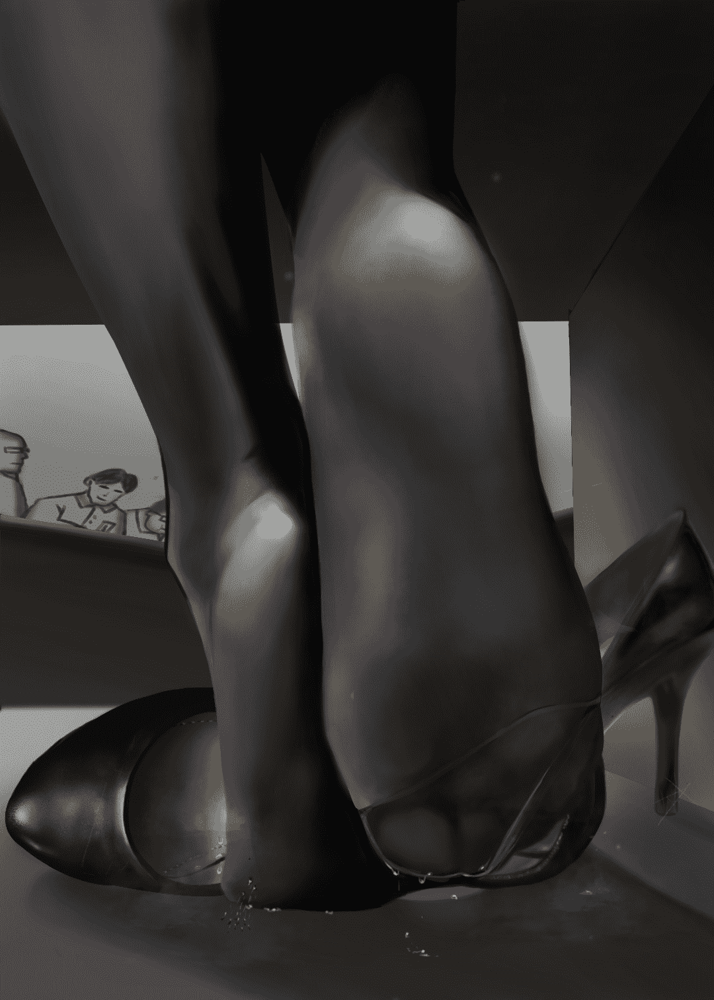

# H星人的诞生？（7月3一万两千字更新）（mirco)

作者：焦冥小虫xxx

TID：28235

<title>1</title> <link href="../Styles/Style.css" type="text/css" rel="stylesheet">

# 1

*本帖最後由 焦冥小虫xxx 於 2020-8-5 00:05 編輯*

为了完善前一作的设定，故写了一篇外传。此外传看情况写长或写短，前期剧情铺垫较长，后期几乎纯福利，今晚先更新一部分
望大家多多支持！
<title>2</title> <link href="../Styles/Style.css" type="text/css" rel="stylesheet">

# 2

*本帖最後由 焦冥小虫xxx 於 2020-3-7 23:58 編輯*

这绝对是科学史上的一大发现！
  想到这里，D姐就不禁加快了脚步.......

  就在一周前，身为微生物研究员的D姐在进行着她的日常实验记录。
  “唉，到底是哪里出错了呢.....”
  D姐伤脑筋地挠了挠头，已经连续3个月了，药敏试验（一种微生物实验）还是一点进展都没有。“已经连续试了35种可能了，难道一点有价值的信息都没有吗......”
  D姐再次将目光放入显微镜下，努力地寻找着哪怕一丝的可能性。
“嗯？”
这时，D姐似乎发现了什么不对，一种从未观察到的红色微生物体态出现在培养皿里，这引起了D姐的兴趣，她赶紧拿来纸笔，开始调整显微镜的倍数，以便更清楚地观察并记录这一发现。
5分钟后，D姐惊喜地发现，这类新型的红色细菌似乎正在与实验菌株展开了激烈的“争斗”，通过显微镜D姐观察到，这种新细菌如同一只只野兽一般快速吞噬着周围的实验菌株。
难道.....有希望？

D姐仿佛看到了希望，而周围的菌株也做出了应激反应，海量的菌体瞬间包围了新型细菌，尽管新型细菌吞噬力极强，但还是很快被这绝望的数量差距慢慢淹没，就像一头落入狼群的幼虎，最终败在了数量和初生的不足。
随后，消失在了汪汪菌株中。
“唉....看来还是不行啊.....”
D姐原本燃起的希望之火又被无情地浇灭了，又和上次一样。“难道是这次实验菌株太强了吗.......但这样根本研究不出来什么有效的抑制菌啊....”D姐看了看手表上的时间，天色已晚，还是明天再说吧。D姐安慰着自己，将培养皿用玻璃板盖住，随后关上了实验室的灯。
回到家中，D姐脱下穿了一天的研究服，鞋也来不及脱，疲惫地瘫倒在沙发上。
“唉，白忙活一天.......”D姐无奈地望着天花板，脑海里回忆着自己在显微镜看到的实验过程，“是错觉吗？”不知道为何，D姐感觉那红色细菌被吞噬前的那一刻，自己好像感受到了一丝情绪.....
不甘？愤怒？绝望......
“唉呀，我在犯什么中二啊。这么大的人了.....”D姐赶紧止住了脑子里这奇怪的念头。“还是洗个澡睡觉吧，明天再苦逼地继续研究吧......唉呀！又来了！”D姐不禁眉头紧皱，脱下右脚高跟，隔着黑丝开始抓挠起来。
其实像D姐这样的脸蛋和身材完全可以去当模特挣钱，但因为对生物科学的热爱，她毅然决然地选择了微生物学，她感觉观察着这种肉眼看不见的生物有一种莫名的愉悦感？她也不确定，但观察这种微生物的感觉就好像自己是造物主审视自己的世界一般，在这种感觉的支撑下，高强度的实验室工作反倒是令D姐乐在其中。
但是这位美女研究员，还是有一个小小的烦恼.....
这不定时从脚趾里传来的瘙痒感已经困扰D姐很久了，D姐一直想研发出一种能够一劳永逸的解决这种尴尬问题的特效药，但是这种寄生在脚趾皮肤上的真菌非常顽强，试了各种方法都无法彻底根治。
“好痒啊....好痒......”D姐被这小小的细菌们带来的瘙痒苦苦地折磨着，只能暂时用抓挠这种原始的方法来解决这脚趾难以忍受的瘙痒感。
.......
培养皿里，一群群肥硕的球菌正在拼命地蚕食着周围一切可用到的营养物质，随后又将摄入进体内的营养物转化为分裂繁殖的能量，每一分每一秒，都有着成千上百的球菌被分裂出来，数量正在呈几何的倍数增长。
摄入....繁殖....再摄入....再繁殖.....
这就是单细胞生物的思维，一切都是为了繁殖繁殖再繁殖，不断地壮大族群，并不断吞噬任何敌对菌落。在这微观世界里，竞争的激烈毫不亚于宏观世界的战争，为了延续下去，它们不择任何手段。
对啊，只要能活下去，不论怎样都无所谓了.....
活下去....活下去.....活下去！！！！
某个球菌的体内，一个未被完全吸收的新生细菌突然有了异样，那种极强的求生欲望仿佛刺激了个体的进化，剧烈的排斥反应越来越明显——
突然，这个球菌整个细胞壁被撕裂开来，从里面缓缓爬出一个血红色的生物，其生物结构的复杂性远超于周围一切微观生物——长着夸张的大嘴和锋利的钩爪，疯狂地蚕食着脚下这颗巨型球菌的尸体。
周围的各类细菌们发现了异样，纷纷前来，将这个红色细菌团团围住，准备瓜分这个势单力薄的家伙身上难得的营养。
一时间，在这个微观世界里，“血肉横飞”，红色细菌就像冲进狼群里的猛虎，厮杀的激烈程度简直难以想象。
一个又一个球菌被撕裂吞噬，一个又一个红色细菌源源不断地从第一个红色菌身体里分裂出来。厮杀仍在继续，越来越多的球菌被吸收吞噬，瞬息间，红色细菌数量便增长到了恐怖的十万数量级！
渐渐地，原本乳白色的滴滴菌点，一点点地染成了品红色，然后是深红.......
第二天。。。
D姐挂着黑眼圈走进了实验室，一看就是昨天晚上被脚气折磨得无法入睡，这种情况持续了很久了。
  “唉，该死。我又忘了把培养皿放回消毒柜了.....”D姐看到昨天忘了处理的培养皿，用手关节敲了敲自己额头，责怪着自己的粗心。“赶紧扔掉吧，免得主任又骂我....”说着，拿起培养皿，准备进行流程销毁。
  “嗯？怎么.....”D姐突然注意到培养皿的菌落颜色变红了？！“怎么回事？”D姐惊讶地看着有些诡异的暗红色菌落，明明是白色的怎么今天就变成红色的了？难道发生变异了？D姐赶紧将培养皿放在显微镜下，准备一探究竟。
     ！！！
  D姐惊讶地发现，原本应该消失的红色细菌重新出现了，不光如此，它们还吞噬了大量的实验球菌，还似乎进化出了从未见过的细胞器官——一张布满细小尖牙的大嘴和一双长着镰刀状的爪子。
  这太神奇了！D姐惊讶地看着一只红色细菌扑到一个大它数十倍的巨型球菌上，就像螳螂一样轻易地撕开猎物的肢体，然后风卷残云地吞食一切可入肚的营养物。
  这太神奇了！
  竟然有着野兽般的捕猎形式，而且还是细菌般的大小！这绝对不可能是单细胞生物所能做到的，仅仅一晚上的时间......就进化出了多细胞生物的牙或爪，难道自己亲眼见证了生物进化的瞬间？

<title>3</title> <link href="../Styles/Style.css" type="text/css" rel="stylesheet">

# 3

找了个文中D姐的人设，方便大家想象（无视后面那个男的hhh）
<title>4</title> <link href="../Styles/Style.css" type="text/css" rel="stylesheet">

# 4

 <ignore_js_op>[SAVE_20200307_230250.jpg](forum.php?mod=attachment&aid=ODE4OTd8YzRhNmViZTB8MTYwMDg3NTQ2OHwxODIzMHwyODIzNQ%3D%3D&nothumb=yes) *(137.94 KB, 下載次數: 15)*

[下載附件](forum.php?mod=attachment&aid=ODE4OTd8YzRhNmViZTB8MTYwMDg3NTQ2OHwxODIzMHwyODIzNQ%3D%3D&nothumb=yes)

2020-3-7 23:04 上傳  

</ignore_js_op> <title>5</title> <link href="../Styles/Style.css" type="text/css" rel="stylesheet">

# 5

这简直太不可思议了，D姐忘我地记录着她所观察到的一切，那种探索未知的精神令人钦佩，她甚至连午饭都没吃，一直盯着显微镜的观察台，手里的记录报告越堆越多。这小小的培养皿里发生的一切太神奇了!简直颠覆了D姐的想象，这种肉眼难以观察到的微小生物表现出来的极端行为震撼着这比他们大到百万亿倍的人类。
  这种细菌的生命力简直惊人，无论遭遇到多么强劲的敌对菌类，只要还有一个活着，这个菌落就可能陷入灭顶之灾。不光如此，每次与其他菌落争夺营养时，红细菌一开始总是处于劣势，但是下一秒就进化出了应对敌人的武器。
“它们在不断适应环境！并且会思考！”
D姐激动地在记录表上写下这一行文字，不敢相信，这些微生物竟然有着思考战术的想法，并且每次都吸取失败的教训，在D姐的体感时间里几乎是瞬间进化出相应的应对机制，而且更令人惊喜的是，它们似乎还会交流！一旦有同类陷入包围中，就立马举族支援。D姐感觉脑子有些兴奋过头了，感觉自己好像在看战争片一样，“这真的是细菌这类生物所能进化到的吗.......？”
“唉呀，天都这么黑了！”
可能是自己看得太入迷了，外面天色已晚，看来今天先到这里吧。D姐看着手里这写了一沓的记录资料，一脸地满足感，“今天真是收获满满呢~嘻嘻”说着，把资料放进包包里，关上实验室的灯，向家的方向走去。
“今天真是好过瘾啊，感觉跟追剧一样，没想到观察微生物是一件这么有趣的事。”D姐坐在公交车上，脑子里还想着今天一天看到的，本来打算要放弃这个项目研究了呢，看来搞科学真的要在第100次才能成功呢~那我还是赚了的，毕竟才失败了46次.....嘻嘻~没准我是天才呢~那时候拿个诺贝耳奖啥的.....
D姐像个小孩一样，在心里胡思乱想着，毕竟搞研究是个枯燥的工作，D姐习惯了拍自己的马屁，就当是少女（划掉）的自我安慰啦~
D姐看着窗外，目光落到一座城市的地标性建筑上，“好高啊.....从上面看下面人应该跟蚂蚁一样小吧.....没准我看那些微生物们也是这种感觉呢....嘻嘻~~”
“嘿，你看前面那个洋妞。这身材这脸蛋也太好了吧.....（小声）”
“就是嘿，太带劲了。就是穿着个白大褂，但那一双黑丝真是太性感了.....”
公交上，两名男子偷偷地在后面议论着D姐的身材，尽管声音很小，但在晚上的公交车上还是能听进去些的。
但是D姐却一点也不在意，她现在沉浸在这一天实验取得巨大进展的喜悦中。身后那两名猥琐男的讨论，比起今天的进展，根本不值一提。
到站了，D姐起身下车，往她那出租屋走去。
“嘿~小洋妞。你住这附近吗~”
D姐身后，竟是那车上两名男子，尾随着D姐走进小巷中，看着他们脸上那难以掩饰的猥琐神情，不难猜出他们要干什么。
“哈？是啊，怎么了？”
D姐被打断自己的思绪，有些不爽地回过头来看着这两名男子。
我靠。
猥琐男看着D姐，170的他们这时才发现D姐正以180的身高“俯视”着他们两个。“龟龟~这洋妞也太高了吧....”
“我在赶时间，你们就别烦我了。”D姐不想跟这些精虫上脑的臭男人浪费时间，转身就要走。
啪！
突然D姐一个后摆踢，直接将其中一个打算偷拍裙底的猥琐男连人带机地踢飞。未等另一名男子反应过来，D姐直接顺势一转，又是一记漂亮的侧踹腿，将另一名男子踹倒在墙上。仅仅几个呼吸的时间，就把两名男子失去了战斗能力，可见这几下力度之大。
“还想偷拍我？”
D姐抬脚将鞋跟踩在躺在地上猥琐男拿手机的手，钻心的痛使得猥琐男哇哇乱叫，扔掉了作案工具。然后D姐直接用力一踩，存了上百G的“珍贵资源”手机直接被踩得七零八碎。
“告诉你，要不是老娘今天心情好，不然直接把你脖子踩断！”D姐一只脚踩在猥琐男的脸上，威胁道。然后便扬长而去。
“咳咳....你没事吧....我靠.....那娘们原来会武术.....喂？”一旁的猥琐男从地上挣扎着爬起，看着躺在地上发愣的另一个猥琐男，“喂？你踢到脑子了？喂？”
“嘿嘿~~”被踩了一脚的猥琐男，摸了摸脸上的鞋印。回想着高大的D姐踩着自己的脸威胁自己的样子，“值了....值了....嘿嘿~~~”
似乎觉醒了些不得了的癖好呢.....
再回到D姐那边，因为自己的身高和混血带来的样貌，这种搭讪她已经习以为常了，要不是自己有练过自由搏击和空手道防身，还不得被这些家伙恶心死。
“终于到家了.....”

<title>6</title> <link href="../Styles/Style.css" type="text/css" rel="stylesheet">

# 6

*本帖最後由 焦冥小虫xxx 於 2020-3-18 02:14 編輯*

D姐打开家门，脱掉穿了一天的高跟鞋，躺在沙发上惬意地伸展着累了一天的身体。
“嗯~~~~还是家里舒服呀~~~”
咕~~~~~~~
哎呀，差点忘了今天没吃饭呢，饿死了，饿死了。我记得厨房还有块蛋糕呢，嘻嘻~今天就解决了它~~~
D姐兴冲冲地跑到厨房，果然~一个上次去逛蛋糕房赠的慕洛米拉斯（瞎编的HHH）巧克力蛋糕还放在这里。
D姐拿了个勺子直接开吃，饿了一天了，能吃上个蛋糕好幸福呀o(*￣▽￣*)o~~~
“嗯？这巧克力上面是撒了芝麻吗？感觉嘴有点麻麻的......”感觉口感不对，D姐仔细一看差点崩溃——原来巧克力蛋糕上爬满了小小的黑蚂蚁，因为颜色有点接近，自己都没注意，刚刚自己哇哇两大口，好像吃进去不少......
“哇哇哇哇！！Fuc.....”D姐都被自己气笑了，差点彪出自己的母语。“恶心死了，别跑！”D姐嘟着嘴，伸出手指一个个去抓这些落荒而逃的蚂蚁，蚂蚁一看情况不妙，赶紧撤退，D姐就抓住几个。
“哼~！敢吃我的蛋糕，看我不好好折磨你们！”
嗯.....怎么整呢.....D姐看着在自己指尖无力地挣扎的蚂蚁，突然脑子里浮现出了一些想法。
“好小啊....”D姐看着手指间蚂蚁们拼尽全力想要挣脱的样子，“在它们眼里，我肯定是一个很可怕的巨人吧....”
放在地板上不仔细看都看不到的小小生物，可能我在旁边走一步对他们来说都是地震般的感觉吧？
那些被我吃进肚子里的小家伙们，也许正在我胃里挣扎着呢......
跟它们一比，我真的好巨大啊！
这种将细微生命掌握在指尖的感觉，真的好不可思议！
只要我轻轻地一用力，这些小蚂蚁就成为了我指间的一点不起眼的灰尘......只要我想，随时就可以终结它们的生命.....
蚂蚁一样小.....就像站在那高塔上向下望.....
我要是一个女巨人就好了.....想象要是整个城市放在自己指腹上，只要自己两个手指轻轻一合——那时候，城市里的人们在想什么呢？绝望？不甘？然后看着我的手指遮天蔽日般压了下来.......
轻轻一捏，就一座灰尘样的城市覆灭了呢.....
只是这样想想，就有点湿了呢......
“呵呵~~姐姐想到一个有趣的玩法了呢~”
D姐捏着手指间的蚂蚁，走到玄关前，拿起其中一只高跟鞋来，将手上那几只蚂蚁放了进去。
这几只蚂蚁落在D姐的鞋里，就好像一只只无头苍蝇一样，在这“旷阔”的鞋内空间里漫无目地的爬来爬去。
D姐看着自己鞋子里的小蚂蚁们，那种仿佛自己就是巨人一样的感觉更强烈了，她注意到自己呼吸有些加快了。
“别害羞嘛~到里面来~❤”
D姐把鞋子倒立过来，鞋尖对着地面敲了两下，那些聚集在鞋内各处的蚂蚁们一下子被“集合”到了鞋尖处。
那可是味道最浓郁的地方哦~~~
毕竟穿了一天，也出了些汗，味道确实有点大呢~
要好好~好好地清洁哦~~~
D姐一脸陶醉地看着在鞋里挣扎的小蚂蚁们，想象着这些小家伙们要是小人的话该是什么表情呢。不过这么小，要是真的小人的话，这种大小也看不清它们的表情吧。
但这种差距的大小真的好让人着迷啊~~~
D姐将自己一只脚从拖鞋里抽出，准备将脚放进鞋里，“要注意哦~女神的脚要进来啦！”
要是鞋子里有一个城市的话，那得是什么景象呀~
D姐有些紧张又有些期待地慢慢穿上鞋子，等脚完全放进鞋子里时，尽管一点一点别的感觉也没有，但还是好像电流通过一般令D姐身体颤了一下。
那些比一般蚂蚁还要小的蚂蚁们，有的被D姐巨大的脚趾死死地压住动弹不得，有得则在脚趾间爬来爬去寻找着出口。
D姐小心翼翼地不让自己的脚趾有太大动作伤到鞋子里的小家伙们，努力集中精力去捕捉那些渺小的蚂蚁们在自己鞋里的活动带来了微弱触感。
啊~啊~~❤我感觉到了，我感觉到了~❤它们在我鞋子里挣扎着！好痒啊~~！好刺激呀~~~！
D姐兴奋地感觉像是有一个小小的人在舔自己的脚一样，屋子里回荡着高跟鞋踩踏地板清脆的声音。
那些细小的生物在自己脚趾上爬来爬去，那六只带着细小刚毛的腿踩在脚趾的肌肤上，真是微弱却有些细腻的感觉呢。
“再用力点呀，快爬~！快爬~！不然的话我就要动动脚趾碾碎你们了哦~~”
这种沙沙的触感，要是那些微型城市发射的炮火打在人家脚上的感觉该多好啊，它们肯定在拼命反抗着人家的脚趾吧，恐怕连动动脚趾都不用，光靠味道就可以获胜了呢~
它们拼命想要挣脱的世界，只是我的一个小小的鞋子,一根小小的脚趾......
不行了，爬来爬去的，好想狠狠地搓搓脚趾，但是又好不忍心，但.....实在是太痒了啦！
所以，对不起啦~
D姐像是期待已久，使劲地搓动着鞋子里的脚趾，然后，鞋子里便一点触感都没了。
回响起，以前自己军训的时候，鞋子里不小心进了个非常细小的沙子，那个小沙粒就像一只恼人的蚊子一样总是让她的脚不痛快。但是D姐晚上把那折磨了她一天的小沙粒从鞋子里取出来时，却想着这么小的一个东西竟然能让大自己这么多倍的人感觉苦闷，而且自己还不能去反抗，只能任由这个细小的沙粒在自己的鞋里肆意非为。
真的好刺激啊，被小自己数十倍的弱小生物支配的感觉，真的好棒啊！明明自己才是强大的一方，却被如此弱小的家伙们欺负。这种错位感令D姐很是享受这种感觉，她也不太清楚自己的心理的这种奇怪想法，有时候想要变成巨人统治小人，有时候又想给自己限制条件被小人们统治......真是个矛盾的自己呢
“唉~玩得有点入迷了呢。”D姐回到现实，把鞋子脱掉，抖出了那几只蚂蚁的残骸。“还是叫个外卖吧，一会把资料打到U盘上去。”这样想着，脚趾那熟悉的瘙痒感又再次传来。
“哎呀，又来了。”D姐脚尖用力搓着地板，想要缓解这种瘙痒感，“这些寄生在皮肤上的真菌好烦啊....痒死了....等等！”一个想法突然从D姐脑海里冒出来，自己何不用新发现的红菌来试一试呢！
到时候取出一点抹在脚上，以那些家伙的能力应该会有效果的吧.....
方正就一小点.....
D姐这样想着，拨通了外卖电话......

<title>7</title> <link href="../Styles/Style.css" type="text/css" rel="stylesheet">

# 7

感谢大家支持！看到大家这么多回复真是high到不行了！hhh为了报答大家，一做完这周作业就马上码字了。本作前期剧情铺垫较长，配合后面福利剧情食用更佳哦⊙∀⊙！爆更6000来字希望大家喜欢，再次感谢各位坛友们支持<title>8</title> <link href="../Styles/Style.css" type="text/css" rel="stylesheet">

# 8

> [xnr 發表於 2020-3-8 18:04](https://giantessnight.com/gnforum2012/forum.php?mod=redirect&goto=findpost&pid=429204&ptid=28235)
> 女主设定是欧美白人？不是亚洲人？

额，中俄混血的。配图也是一看蛮符合的，就拿出供大家参考的
<title>9</title> <link href="../Styles/Style.css" type="text/css" rel="stylesheet">

# 9

第二天，当D姐兴冲冲地来到实验室时，惊奇地发现培养皿里已经没有实验球菌的一点踪影，取而代之的是密密麻麻的深红色菌落。
很显然，这场在培养皿发生的战争最终以红色细菌的胜利而告终。
为了更好地观察这些红色细菌的活动，D姐将培养皿放到了更加高级的电子显微镜下。而通过更高倍数的镜下观察，D姐发现了更加惊奇的事情——
经过一晚上的时间，这些细菌们竟已经开始进化出三种不同的形态，一种是浑身布满刀刺，血口尖牙的狰狞模样；一种是结构简单，只有细胞基本的特征，但吸收营养速度是非常惊人的；而第三种.....当D姐从万亿个细菌中发现这个特殊的个体时，不禁冒出一滴冷汗。
这种形态的个体极其稀少，D姐也是偶然才发现，这些数量极其稀少的个体不同于其他的个体，他们的外观更加接近人类的身体构造，并颜色呈现出深蓝的色调。不光如此，在D姐特意多花了5个小时的观察，震惊地发现这些深蓝色的特殊变种不光拥有近似人类的五官表情，肌肉结构，甚至还有语言和思想！
这简直不可思议！
更令人震惊的是，D姐发现了一部分未被吞噬的球菌，这些留下的球菌竟然像是被饲养起来的牲畜一般，吃着红细菌多余出来的代谢物，并被强制分裂出更多的个体供红色细菌食用！
这不就是人类社会的驯化野兽，饲养牲畜的生产方式吗？！！
这些细菌不仅凭借强大的繁殖变异速度打败了这一片所有的敌对菌落，并且还考虑到培养皿里的资源有限，保留了部分球菌改造成为了生产资源的活体工具。从负责战斗的血红色刀刺细菌到负责后勤吸收营养的工人细菌，再到这种深蓝色的极特殊个体，似乎是群落里智多星或是首领的角色。通过超高倍显微下，D姐甚至能看到他的表情变化！这些未知的细菌生物竟然在短短一晚上进化出了基本的社会分支，社会分工，甚至是社会思维以及不知发展到何种地步的智慧！
D姐已经被震惊地嘴都合不上了，她甚至看到一个深蓝色细菌突然抬起头“看着”自己。
“#￥%#%%@.......（你在看什么？）”一个红色刀刺细菌看着深蓝细菌一直抬着头，好奇地走过来问道。
“........”
深蓝色细菌望着空无一物且无比虚幻模糊的天空，两只墨一般的眼睛仿佛在极力想要看透天空背后的神秘。
“%#^，$^#%#%#........（你说，这世界就只有这么大吗？）”
“*&……￥%#@%#&￥……#%##%#（似乎是的.....四周似乎被什么看不见的物质挡住了）......”
“这天空的变化我总是难以捉摸，有时便发出一阵强光，有时便黑得一丝光线都不曾落下，而且总感觉有一种可能......似乎这世界还有其他生物在‘看’着我们。”
深蓝色的细菌人诺有所思地看着四周的一切，体内一种类似大脑般精密的器官正在高度消化着一切外界信息，它们的进化速度远超身为人类D姐的想象，D姐体感上的1秒钟，对于它们可能就是一年甚至更长的时间感差。
这样一种完全违背常理的生物，究竟能够进化到什么程度？
怀着这样的想法，D姐决定要更进一步去研究这种很有可能进化出智慧的微生物，开始往培养皿里注入越来越多的实验球菌以及营养物。
而其结果，更加应征了D姐的猜测。
那些新加入的细菌都毫不例外地被吞噬殆尽，甚至是那些杀伤力强劲的毒素也在战斗的后期被进化出应对机制的红细菌碾压同化。
看着红细菌无压力地解决掉了一些非常棘手的病毒细菌，D姐脸上的喜悦难以言表，这简直又是一重大发现，如果能够好好利用这一特性，那将能解决非常之多困扰这个星球很多年的顽劣疾病，到时候......
“D姐，你在看什么啊？这么入迷？”D姐身后突然传出一句女声，D姐被吓了一跳，回过头来一看原来是隔壁研究室的小静同事。“什么嘛，原来是你呀。进个门连个招呼都不打........”“嘻嘻，对不起啦~我看D姐你看得太入迷了，所以就在一边看了你一会~”
“那你可真是有够闲的.....”D姐无奈地白了一眼，“还有你们又叫我D姐......那就是我名字里首字母是D所以.....”
“嘻嘻~~还不是姐姐你身材好呀~要我说你该叫‘G’姐，‘D’还是不符合你的尺寸.....”小静说着，便伸出她那两只跃跃欲试的手爪，向D姐丰满的胸部袭去。
“哎呀！去去，别打扰我工作。”D姐像推小孩一样轻推开袭胸的小静，转身要继续工作。
“唉，D姐呀~真是好羡慕你的身材和脸蛋啊......你要是去当个模特或是拍个电影啥的肯定飞黄腾达啊！为什么要来我们这里当个苦逼的研究员啊，薪水又低.......”
“我觉得挺好的.....毕竟我初中就对这个感兴趣。”
“好吧，大美女。那你这研究的是啥呀？”小静想看看是什么能让院花D姐着魔一样看了一整天，“这些小细菌们有啥好看的.....呃！！！好恶心！”小静看到一团团密密麻麻的不知道是啥的乱七八糟地游来游去，立马失去了兴致。
“还好我大学报的是物理系，看着这肉眼看不见又来回蠕动的微生物心里就有些发毛......”
“小静，或许这些拥有一些我们想象不到的潜力存在哦，比如它们可能进化出......”“啊啊，算了D姐。估计你讲了我也听不懂，还是算了吧.....”小静摇了摇头七分羡慕三分嫉妒地看着D姐这姣好的身材，心里默默地叹着些什么，随后目光又落到这盘小小的培养皿，想着“不就一些低下的微生物嘛，有什么神奇的......”。
难不成它们能跟人一样开飞机看电视？
“好啦，不打扰你了D姐，我那边还有事，先走了。”说着小静走出了门。
晚上，到了下班的时间。D姐默默地看着手里一枚黄豆大小的胶囊，里面装着一丝丝细微的红色，仿佛有生命般以肉眼难以观察到的规律来回蠕动着。
“今晚.....要不试一下？”
一抹绯红跑上D姐的脸庞，看着手指间这枚小小的玻璃胶囊，自己竟然开始有些期待将这些细菌们放到身体上的感觉了。

<title>10</title> <link href="../Styles/Style.css" type="text/css" rel="stylesheet">

# 10

回到家中，D姐便迫不及待地脱下高跟鞋，跑到卧室里，脱下身上的黑丝长袜，露出带着些许汗珠的裸足，再从包里拿出来装着红细菌的玻璃胶囊，将胶囊里的红色液体取出一部分抹在趾缝里。
很快，D姐脚趾缝处传来沙沙的感觉，就像酒精烧伤伤口上的细菌的那种沙沙感，滋滋啦啦，非常舒服。
接下来的时间里，D姐开始逐渐感觉到这种沙沙感从趾缝处向外逐渐扩大，从趾缝再到脚趾再到脚面脚背，尽管D姐无法看到自己脚上的情况，但她也能感觉到这些红细菌和脚上滋养的脚气菌展开了极为激烈的战斗。
“嗞~~好清爽的感觉.....”
D姐迷上眼睛，一脸地享受，仿佛脚趾被一种无形的魔力逐渐包裹，一点点地洗去脚趾表皮上的污渍。这种脚趾间传来的微弱的沙沙感十分微妙，令忙碌了一天的D姐感觉放松了许多。D姐躺在床上，把另一只鞋也踢到一边，然后将胶囊剩下的红菌抹在另外一只脚上。
“啊.....~~~~”
这种像是电火花滋滋的沙沙感真是令人心情愉悦，平时无比瘙痒的脚趾此时像是做了一次深度清洁一样，脚趾肌肤的每一处毛孔都舒服地伸展开来。
“好舒服呀~嗯嗯嗯~~”
D姐惬意地伸了伸懒腰，嘴里发出舒舒服服的哼哼声，十根性感玉润的脚趾开心地扭来扭去，好久脚趾没有这么清爽过啦！
D姐看着自己那一双玉足，明明什么也看不出来，但，但就是能轻微地感受到有无数的小细菌在上面动来动去。           “那些红细菌们....真的拥有思想吗？”
如果它们有思想的话，那它们眼里是一幅什么一样的情景呢？
恐怕我的一道脚纹都能容纳上万个它们的城市吧，如果它们能发展成城市的规模的话.....我的脚趾，脚掌，甚至一滴脚汗对它们来说，都是很巨大很巨大的存在吧。
可能只是脚趾无意识地抖动，对他们来说都是地震般的感觉；一滴脚汗落下，就有可能一座城市化为乌有....
那，那我在它们眼里.......会是神一样的存在吗？恐怕都不会是一个次元的存在吧，如果它们要是住在人家的脚趾缝里，祖祖辈辈地靠吃人家的脚汗和渍泥生活，每天还要忍受我的臭脚的味道......
“我...我在想什么呀~！”
D姐内心的gts之魂正在燃烧，如果那些红细菌真的有近似人类的思想，那此时此刻，正有着上百万个肉眼看不到的小小人正在自己的脚趾里与那些脚气菌展开激烈的战争呢！
在人家脚趾里展开战争什么的....天啊！我在想什么呀！！(*/ω＼*)太荒拗了啊！但是.....但是......根本控制不住自己......
D姐轻咬下唇，想要停止脑海里的奇怪想法，但是根本就停不下来，右手不老实地溜到了自己有些湿润的下体....
真的好想变大，变得特别特别巨大，然后一脚下去就是一座城市.....然后和小人们展开羞耻的play.....
自打小时候，一脚踩在蚂蚁窝上，蚂蚁们纷纷爬上自己脚丫啃咬着，但自己却除了痒痒什么感觉也没有。那时候，一种凌驾于万物之上的优越感在小小D姐的心里油然而生。
如果蚂蚁先生眼中的高山，在人家的眼里只是一颗小小的土粒，只用一根手指就可以碾平。一脚下去，蚂蚁先生们还有可能幸运地在我的鞋子纹路下存活呢。
无论蚂蚁先生怎么努力，怎么拼命反抗，我都不会有一点点感觉呢！
因为....
因为你们真的太小啦！
小小的蚂蚁....现在是小到肉眼都看不见的细菌在人家的脚趾上，这么清晰的触感，那是有多少小人们在努力取悦我呀？一万？一百万？一亿？可他们再多人我也看不见他们，因为他们实在太小了！太小了！真的太小了！！！
D姐翘起性感的大脚拇指，感受着脚趾里令人心醉的沙沙感，一想到是一群有思想的细菌在自己的脚趾里清理污渍，她就控制不住自己内心想成为GTS想法的自己，她无法做到！
“啊~❤啊~❤”
D姐开始摩擦起自己已经开始勃起的阴蒂，搓动着十根脚趾，闭上眼睛努力地想象着那些细菌的所看到的景象，一想到它们眼中的巨大动静只是自己的一个小小动作，这种强烈的落差感令D姐摩擦阴蒂的频率变得更快了起来。
而此时，那些在D姐上的细菌们是什么情况呢？
........
........血
...血肉横飞....!!!
在这群山勾勒，裂谷遍地的肉色大陆上，战斗的激烈程度超出了人类任何一次战争。撕裂的细胞壁，肢解的断臂，随意地洒在已经满过脚面的血洼，亦然一幅地狱般的景象。
这到底是怎么回事？！！！
一个深蓝色的菌人劈开了一个黄褐色的脚气菌的头颅，喷涌而出的黄浆伴随着阵阵恶臭洒在了蓝菌人的脸上。甩了甩身上的液体，蓝菌人望着眼前的情景，目眦尽裂。
不知何时起，它们所有人所处的“世界”发生了翻天覆地的变化，经过一段极为漫长的黑暗，然后族人们被一片肉色的“天空”降临分成两半，它们这才明白，迎接红细菌们的不是光明，而是更加严峻残酷的战斗！
被肉色天空送到这片大地上，还未回过意识来，便遭受这里的原居民猛烈的袭击。
无数的血红刀刺菌人和无数个由一团团恶心的黄色菌丝组合而成的畸形体展开了激烈的死斗。
锋利的血红刀刺劈开一个又一个脚气菌的躯体，黄浆飞起。一根又一根菌丝贯穿红细菌的头颅，原本进化而出的坚硬头骨在这些更高强度的冲击面前变得不堪一击。
经历了无数次死斗的红细菌，再次遇到了更为强劲的对手。
“嚯嚯嚯嚯嚯~~~~！！！！！”
拥有更加强悍肉体的脚气菌嚣张地叫嚣着，恶心的黄色菌丝在魁梧的身躯上来回蠕动，身上被斩开的裂口也以极快的速度回复着。为首的巨型脚气菌正咀嚼着一只血红刀刺细菌的断肢，看着面前的蓝菌人，露出一排排森白的利齿，咧嘴笑着。
怒！！！！
一道道青筋从蓝菌人皮肤里暴突而起，杀意的獠牙缓缓露出，那一双黑墨色的瞳孔恨不得喷出火来，烧光眼前的一切！
随着一声毛骨悚然的嘶吼，一道蓝光冲了进去——
（画面一转）——
“啊~❤！！！”
D姐自慰的频率越来越快，即将到达峰值，想象着自己的脚被细菌大小的小人们侵犯，她就已经无法调整自己的呼吸了。
“啊~❤好痒啊！使...劲啊！”
D姐把脚抵在床头，欲求不满地搓动着脚趾，试图寻找着那一丝丝微弱的触感，而深入阴部的手指早已将身体里那份情绪带到了高峰！
“啊~不行了....要...要去了.....啊!!!!”
爱液喷涌而出，肆意地洒在白色的床单上，还有一滴差点滴落在脚面上。
“啊....哈....哈.....”
D姐望着天花板，喘着粗气。
又来了一次呢......
身体好沉.....就这样睡去吧.....
这么想着，便进入了梦乡......
而此时，D姐脚趾上的战争仍在进行中......

<title>11</title> <link href="../Styles/Style.css" type="text/css" rel="stylesheet">

# 11

（过了几天......）
“本次召开会议主要是讲我们本院的未来规划和......”
今天是召开会议的日子，D姐所在的研究所是一个药品研究公司的一个分支部门，在平日的实验工作之余，也要参加相关的会议讨论。
D姐一边做着会议笔记，一幅认真听讲的样子，但是此时她的心思却完全不在这个会议上。
今天的D姐一改平时白大褂的穿搭，换上了职场女性的标准搭配，西装外套+背心+高腰牛仔短裤的绝赞搭配将D姐完美的模特身材展现的淋漓尽致，使得她在几乎全是男人的会议上显得格外耀眼，不少单身至今的大龄男性的目光有意无意地被D姐的魅力夺走。
诱人的黑色丝袜搭配着性感高跟，简直是杀伤力十足的武器。有10厘米长的鞋跟加持使本来就高的D姐更加高大，远远望去，就好像是一位高冷的女神一般，令男人疯狂，令女人憧憬。
     但正是这么一双性感丝足，此时似乎有些躁动，时而来回扭动，时而鞋尖着地碾来碾去，像是有什么东西来里面作祟。
“啊啊.....好痒啊，数量已经这么庞大了吗？”
D姐面色微红，眉头微皱，鞋子里的脚趾使劲地来回搓动，好似有万千只蚂蚁在上面爬一样，脚趾缝隙间传来的阵阵瘙痒，令D姐完全无法把注意力集中在会议上。
实际上，确实有“蚂蚁”在D姐的脚趾上活动，只不过这些“蚂蚁”们比真正的蚂蚁要小上百倍，数量却是多了千亿倍还要多。
那它们，就是几天前D姐无意间发现的一种拥有智慧的微生物型“生物”。
处于某种目的，D姐将这些细菌移植到了自己的脚趾上，没想到这些细菌们短短几日，便适应了鞋内的恶劣环境，数量很快发展到了D姐所不能忽视的地步了。
“明明这么渺小，却能让我都有感觉.....”
D姐怎么也不会想到，此时她脚趾缝里的“细菌”们早已不是她所认知的“细菌”的规范了。
无数座用D姐脚趾表皮分泌的制式建筑拔地而起，规模之大，已经可以用大都市来形容。这些超乎常理的微型种族，利用周围一切可利用的资源，在D姐的鞋内世界顽强地生活下去。
在其中一座较大的建筑顶部，一个蓝色的人形生物正站在上面，环顾着周围一片片广阔且雄伟的“泥之都市”。
“已经过去了23个卡萨斯了，我们终于打赢了这场战争.....”
卡萨斯，是它们计时的一个单位，相当于人类社会的一百年的时间概括值。23个一百年，对于这个种族的概念，是长是短，已经不再重要了。
这名蓝人的右肩上，披挂着一颗狰狞的恶鬼头骨，那是敌方首领的头颅，如今这颗头颅离开了它原本高傲自大的身体，迎来了它的新主人。
没有人能够想象到，在一个女人的高跟鞋里，发生过什么程度的惨烈战斗。每日死去的生命连人类两次的世界大战加起来都比不上其中一个零头，就像人体每天都在代谢的细胞，成百上千，却无法被感知到，也从不会有人记起，毫无意义。
一道凌厉的爪痕深深地留在了蓝人的左眼处，伤口之深，即使有着强大的恢复力的身体，都留下了这种触目惊心的伤疤。
而这种程度的伤疤，像是墨坛挥洒般遍布在它的身体各处，胸口、腹部、腿部等几乎没有一处完好的皮肤。足以想像它经历了无数次超乎想象的战斗，并且奇迹般的活了下来。
如今那些难缠的黄色菌人（脚气菌）已经成功攻破，它们的基因序链也被红菌人吸收，如今只剩下一群不成气候的残党还在试图抵抗。
但这并不能说明，它们就安全了。
轰轰轰轰！！！
“什么情况？！”
剧烈的震鸣毫声无征兆地响起，脚下的大地开始剧烈震动起来，几座“圣山”（D姐的脚趾）开始又一次发生了碰撞和摩擦。
经过长久的适应和进化，这些菌人已经基本适应了这种程度的震动，即使周围的“天空”和“大地”发生亲密接触，其中的缝隙还是能够躲过一些的。
但是堆积的珍贵物资和建筑可没有长腿，为了抢救物资和在建筑里的居民，已经有无数菌人被卷进巨大的天地碰撞，永远地消失在了黑暗中。
并且，随着鞋内温度不断上升，它们还要面对更加恐怖的灾难。
“快躲开！”
在这座城市的上空，一座巨大的水山正从上面快速接近！
仅仅是一滴微不足道的脚汗，便足以将这座“百年历史”的大城抹去痕迹！
众菌人纷纷抄走能带走的所有东西，紧急撤离到安全地带。
如果有显微镜的话，你甚至可以看到两道细微的“黑线”分成两拨躲开即将滴落下来的脚汗。
为首的蓝色菌人看着一片汪洋大海淹没了这座好不容易建立起来的城市，眼中除了不舍更多的是无奈，“所有人听令，转移！”
瞬间，这一处脚趾缝隙中的菌人全员出发，向着新的安全点进发，密密麻麻的触足贴在悬崖似的肉壁上，如履平地般浩荡前行。
“啊~越来越痒了.....”
D姐感到脚趾里的瘙痒感越发明显，连笔记上的字都差点写成了“痒”，但是在这种场合，D姐是不可能脱鞋解决脚痒的问题啊，况且后面还有很多色狼时不时偷窥，万一被看见了.....
但其实，比起这种尴尬，D姐更是希望这种情况能继续下去。这跟以前自己饱受脚气之苦不同，这种脚趾间的瘙痒说明这些菌人正在自己脚趾上活跃着，D姐想要看看，如果放任这些微生物发展下去的话，会发生什么事情。
“而且，细菌大小的生物在自己脚趾上建立文明，这太戳中人家的G点啦！”
D姐强忍住自己心底的躁动，努力地与脚趾处传来的瘙痒感做着抗争。两只高跟在桌下不断变换着位置，看得斜后面的那几个处男是难以抵挡，纷纷找借口去了厕所。
“维拉同志，你在听吗？”
正在讲解ppt上企业策划的中年妇女刘主任看到D姐有点不对劲，十分不爽地当众点了D姐的本名。
“啊啊，我在听在听......”
D姐一听到主任直呼自己的本名，知道自己要闯祸了，赶紧把意识拉回现实，连忙答应道。
“正好接下来到你了，你给大家说一下上个月你负责的项目进展。”主任看了一眼D姐，随即把“C位”让开，示意D姐上去。
“好...好的.....”
D姐拿起桌子上的文件，这是准备了一个月的文件工作，要自己讲的话是没问题，但是......
“啊啊啊啊......你们能等会再动吗，真的好痒啊.....”

<title>12</title> <link href="../Styles/Style.css" type="text/css" rel="stylesheet">

# 12

> [wbsdb 發表於 2020-4-2 14:24](https://giantessnight.com/gnforum2012/forum.php?mod=redirect&goto=findpost&pid=431748&ptid=28235)
> 是dalao！awsl
> 比较好奇h星人怎么做出强力媚药的

嘿嘿，后面会知道的。感谢支持
<title>13</title> <link href="../Styles/Style.css" type="text/css" rel="stylesheet">

# 13

> [gzc安若雨 發表於 2020-4-4 07:08](https://giantessnight.com/gnforum2012/forum.php?mod=redirect&goto=findpost&pid=431893&ptid=28235)
> 他会不会研究一种更厉害的？

你说的是那个呀？兄弟。
<title>14</title> <link href="../Styles/Style.css" type="text/css" rel="stylesheet">

# 14

*本帖最後由 焦冥小虫xxx 於 2020-8-13 16:02 編輯*

D姐强忍着脚趾愈发强烈的瘙痒，挣扎着从座位上站起身来，努力不去注意脚趾间的微小生物的活动。细黑的高跟一步一步踩在大理石地板上，发出轻轻的哒哒声。
（D姐鞋内）
“全体注意！抓紧地面，‘天震’来了！”
正在巨大的脚趾纹路峡谷里垂直攀爬的众菌人们预感到了即将到来的巨大震动，所有人一边迅速地向周围传达着警告信息，一边张开身上所有触手刀刺死死抓住四周粗糙的表皮褶皱，咬着牙，等待着接下来毁天灭地般的震动。
轰轰轰轰轰——~~~~！！！！
周围的一切仿佛有了生命一般，整座山体开始剧烈地有规律地上下左右甩动。其实这只是D姐平常走路的左右脚摆动，但对于那些寄居在她脚趾纹路里的微型菌人们，可是一场天地倒置般的灾难震动！
“稳住！稳住！千万别松手！”
那怕手指用力过度失去知觉，哪怕咬得齿龈碎裂，也绝不能放手！
（D姐视角）
“啊呀.....脚趾那个地方又开始了......”
D姐走到讲台前，准备开始进行自己的讲解。然后感觉自己大脚拇指和中指中间的地方痒感更加的明显了起来，便终于忍不住，或者是身体下意识地用力搓动了下脚趾。
轰轰轰轰——！！！！
毫无预兆般地，周围的巨大肉壁突然合拢，互相剧烈磨擦起来，发出雷鸣般的摩擦声。脚趾纹路间的摩擦产生的巨大震动，强行将一部分菌人抖落下来，掉入了脚下那无尽的恐怖深渊。
“快抓住！！！”
蓝色菌人的嘶喊被轰鸣的脚趾摩擦声淹没，用尽全力将自己的触手射出，试图抓住被抖落的族人们。不光如此，所有还能抓住墙壁的菌人们，竟迅速组织起来，如同携手合作过河的蚂蚁般，互相钳住对方的躯干，层层罗列，竟搭成了一大道人和人之间组成的缓冲平台，接住了绝大部分从上面被抖落下来的菌人们。
而那些被接住的菌人们不敢在同伴们用肉体达成的平台逗留，马上飞奔到更下面一层咬住能抓住的褶皱，用尽全力托起上面的菌人们。
无法计算的超多数量的菌人们，不可思议般一致地为了集体拼尽自己的全部力量，哪怕是付出自己性命的牺牲！最下面的菌人有些开始支撑不住，就在快掉下来的瞬间被上面的菌人接住，扔回上面，自己继续担当着地基的角色。但有些也没有这么幸运，尽管仍在死死地咬住粗糙的褶皱，却早已是熬干了身体最后一丝能量，仅存一具尸体仍做着向上举的动作，然后最终掉入谷底。
举族之力拼命抵抗此等天灾，尽管他们并不知道这只是一个25岁女人走路所引发的震动........
这等团结一致众志成城的壮观景象，不过是一个女人一道细微的脚趾缝里所发生的。
毁天灭地般的山体碰撞只不过是动了动两只脚趾....
更加窒息的是，周围开始涌现出无数种怀有敌意的细菌生物，为了生存而展开的死斗永远不会终止。
不光是这里，随着鞋内的温度开始升高，D姐的脚掌也因为这些菌人们的活动开启了汗脚的体质。在透气并不良好的高跟鞋里，很多细菌借着脚汗开始在脚上滋生，而顽强的菌人们也借此开始疯狂的繁殖，此时D姐这只鞋子里菌人们的数量，已经完全超越了D姐星球人口数量的总和！小小的脚趾纹路间，一座座用脚底分泌物等制成的城市类集群拔地而起。其实被一滴脚汗冲没了一座，还有千千万座焕发新生！
在极端恶劣的环境下，迅速繁殖填补损失的人口数量成为了头等大事，如果以我们的角度来开，这些菌人简直是快进了十几倍在分裂繁殖自己，一分二，二分四.......短短几个呼吸的时间，数量竟多到可以用肉眼可以稍微识别的程度！
天地变色的地表震动，四面袭来的异形敌菌，破坏骇人的脚汗洪流，以及超高温的气温。如果用我们人类的角度来形容的话，这绝对是地狱最深处的黑暗景象。
（脚趾内侧垂直处）
“全员抓紧！后面的快跟上！上面就是安全地点了！”
整顿还活着的菌人们，没有一点喘息的时间，必须在下一滴脚汗出现前，到达上面那一处褶皱！
（脚趾无名指指甲截面）
“快进来！回到主城！”
蜂拥的菌人们从四面八方涌来，躲进了脚趾甲的缝隙里，这里目前算是安全的。
（鞋内地面）
“死啊哈哈哈哈哈哈哈哈！！！全都放马过来吧！！！我要把你们全都撕碎！！！”
碎裂的尸体很快被后来者淹没，茫茫各种杂菌云集的菌海中，一名蓝色的菌人面如罗刹，手臂的刀刺早已染劲无数颜色的血液，宛如一尊杀神，屹立其中。
在吸收了无数个细菌的血肉后，这名蓝色菌人身体开始再次发生异样的变化，或者说，再一次进化........
（小脚拇指内庭处，一道褶皱里）
接连几次的“天震”和“汗洪”，储存的“粮食”（其他甚至同族尸体以及脚趾分泌物等）消耗殆尽。
“该怎么办......”
为首的蓝菌人望着周围荒芜的一切，目光最终落在了脚下生活了百年之久的“土地”（细菌的体感时间对于D姐人类而言很快很快）。
每天都要忍受巨大的震动，还有汗洪的威胁，以及杀不完的敌对菌类.......
为了乞求脚下这片大地能够给予我们安全的住所和食物，菌人们虔诚地跪在地上，伸出舌头舔着地面。他们认为他们生活在一个主宰着一切的神的身上，希望靠着这个方式能让那位“神”停止怒火。
但可惜，什么都没有用。
一百万个菌人同时舔着“大地”，一千万个，一百亿，一万亿，百万亿都不会被D姐所感觉到。
只有【数据删除】级别的数量才能让他们脚下的“大地”有所回应。
无论什么强劲的敌对菌类，红菌人们都从来不会退缩；无论陷入什么绝望的处境，菌人们也绝不放弃。
但是在这等“天灾”面前，他们终于感到了那种无力感，那种一直在强忍却无法回避的无力感。万里长河般的城市，叹为观止的生物奇迹，在这脚掌，甚至一滴分泌出来的汗珠的面前都微不足道。
甚至都不够资格。

<title>15</title> <link href="../Styles/Style.css" type="text/css" rel="stylesheet">

# 15

靠着笔记本最后几个电写了些，本来能再发点写点的，但家里断电了，咱也是很无奈啊。唉～<title>16</title> <link href="../Styles/Style.css" type="text/css" rel="stylesheet">

# 16

*本帖最後由 焦冥小虫xxx 於 2020-5-18 23:48 編輯*

“喂，老张。”“咋了，老李？”
在讲台下面，其中一个瘦瘦的男职员老李碰了碰一旁较胖的男职员老张窃窃私语了起来。
“嘿，你说........D姐今天是不是有些怪怪的？”老李吧嗒吧嗒嘴，一双狭长的眼睛像是一只端详着奶酪的耗子一样斜盯着正在讲台上面讲解的D姐。
“咋了，我看好好的啊。”老张迷迷糊糊地推了推眼镜，看着讲台上自己心目中的女神D姐，擦了擦嘴角的口水，“嘿嘿，D姐还是这么好看嘿......”
“呆子，就知道隔这发情！”老李在桌子下打了老张大腿一下，“你看D姐，是不是感觉有点好动啊？”
只见上面的D姐熟练地讲解着自己近些年来整理的研究资料，但透过讲台桌子下面的缝隙可以看到D姐那两双性感的黑细高跟似乎很不安分地搓动着，像是有什么东西在里面弄得发痒，却又在极力忍受着。
“看看这黑丝高跟，真想被这双脚踩死啊。”老李咽了咽喉咙，小小的眼睛盯着D姐的脚瞪得滴溜圆，恨不得自己就是这位美人脚下的鞋垫，享受着这美妙的踩踏快感。
尤其看到D姐这双性感诱惑的黑高跟在桌子下踩来踩去，不停晃动的样子，老天，太带劲了啊！
“D姐这样子.....难道是脚气发作了吗？”一旁的老张看着上面的D姐双脚不停地变换着位置，甚至翘起鞋尖在下面晃动，好似有百万头蚂蚁在鞋子里面爬来爬去，惹得这双高傲的玉足微微颤动，瘙痒难耐。
“真哒？嘿嘿~没想到连D姐这样的美人都有这样的毛病吗？”老李一听，心里的意淫更加丰富了起来，听老张这么一说，老李也发现平时高冷的D姐那张冰雪美颜的脸上嘴唇轻抿，时不时看向自己脚下，比平时多出了一丝苦闷的表情。
没想到啊......
在老李以及研究所所有单身男性甚至女性心中，D姐一直是他们心中女神一般的存在。
绝佳的美貌，完美的魔鬼身材，以及强大的个人能力，都是惹人无比羡慕的存在。这种强势而又强大的女性，像老李这样的简直是这一辈子都攀登不到的太阳。
但就是这么高大、强大、强势的职场女性，却会被肉眼看不到比她小百万倍的细菌感到一丝苦闷。老李甚至都有些羡慕那些细菌们，能在女神的鞋子里生活，还能让女神忍受着自己在鞋子里引起的微弱瘙痒。能如此近距离接触女神的玉足，成为她脚趾纹路里一个微不足道的细菌，以汗为饮，以泥为食，最后被一滴小的不能再小的脚汗冲走，冲入鞋垫的缝隙深处，随着脚汗一同被袜子纤维吸收，最后被一个无意识的动作碾死.......
简直妙不可言啊！
好想化作一粒沙，落入她的鞋子里，被践踏，被蹂躏，却又能尽情地亵渎这神圣而又巨大的玉足。让她忍受着鞋子里的异样，娇嫩的肌肤被沙粒磨得发痒发疼，最后忍无可忍将自己倒了出来，最终化为诸多尘土，消失在这个世界......
老李看着远处桌子下依旧骚动的高跟鞋，早已陷入了他的幻想世界。
女神的鞋子里，一定是天堂吧.......
“维拉同志，请不要动来动去的，讲就好好地讲。”下面的刘主任看着讲台上面的D姐总是脚动来动去地，皱着眉头提醒道。
“好的，主任.....”D姐歉意地点了点头，继续讲解着ppt里的第二部分。
不能在会上出洋相啊......D姐告诫着自己不能出错，十根脚趾开始用力抓地，想要忘记脚趾深处一阵一阵传来那微弱却又让人很是在意的瘙痒感。
但是，但是真的好痒好痒好痒啊！！！！
这比以前犯脚气还要痒啊啊啊！！！
D姐内心不断地抓狂着，努力不在表面上露出什么不对，内心却恨不得当众把鞋子脱下来狠狠地抓挠止痒。
当然，她是肯定不会这么做的。但是那种感觉，却又和当时又不太一样。
“小小的细菌们在我脚趾的纹路上拼命地活下去什么的......啊，感觉注意力都无法集中了呢。”
一想到是那种疑似有智慧的细菌人类在自己的脚趾纹路上的活动造成的微弱瘙痒，本来都可以忽略的瘙痒感被放大了无数倍，那种脚趾细菌小人带来的微弱触感还是令她情不自禁地展开一些妄想，D姐感到这种小小的兴奋感让自己身体都变得奇怪了起来。
“好想.....好想搓动下脚趾啊.......”
D姐鞋子里大脚拇指和中趾两根最灵活的脚趾长到最大，顶到各自的鞋边，微微颤抖着，两根脚趾内侧不断变换着彼此之间的距离，又想紧紧贴合，又极力抑制住这样的想法。好想彼此紧紧贴着，用力摩擦一番来消解这脚趾深处不断作祟的瘙痒之感。但是，但是又好不忍心，这么一下的话，肯定，肯定要死好多人吧？
唉呀，我到底在想什么啊，只是一群小到不能再小的细菌而已，怎么会是人呢。
D姐打开自己ppt附带的视频讲解，多媒体上开始播放着她的一些研究报告。D姐退到一旁，玉唇轻抿，心思全都在自己那一双已经被汗液捂热的丝足上，鞋内的温度已经到达饱和，甚至脚底和鞋垫的交合处都有些黏黏的触感。
但是，拥有语言、情绪、甚至有着一套完整的社会体系，如此迅猛的进化发展简直令D姐大开眼界。如果这些细菌有意识，有思想，有智慧，那么在自己脚趾那朦朦胧胧的瘙痒感就是这些细菌生命对自己脚趾的反抗吗？
D姐感觉自己脸都有些发烫了。
反抗......它们在反抗我的脚趾吗？
D姐右脚大脚拇指和中趾试探性地开始合拢。
（右脚脚趾缝中）
一道旷阔无比的纹路里，一群红菌人们聚集在一起，恐怖的数量从远处望去简直就是一片红色的海洋在翻滚。
“只要我们能够满足我们的神，她就一定会宽恕我们的罪过的！”其中一位菌人不同于周围的红色菌人的肤色，深蓝色的皮肤上布满了龟裂式的血红纹路，高大魁梧的身躯上穿着用各种分泌物和丝袜纤维制成的衣服，如同人类社会祭祀的样子，在人群中大张着双臂，向身后的菌人们宣扬着“神”的理念。
任何努力都化为乌有，建立的泥城被天震震碎碾磨，尝试种植菌类食物的“农田”一次次被汗洪冲走，兄弟姐妹们被这脚下的大地夺走一次又一次的生命，高温，高压，以及永远杀不尽的敌对菌类。在这完全无法解释的天灾人祸面前，“神”这一理念在这些被天灾折磨到绝望的菌人大脑中开始形成，不管是任何有智慧有思想的生物，心理素质都是有界限的，类似人类社会的宗教，成为了这些菌人们在面对这些天灾时咬牙坚持下来的精神依托。
人群不远处，一座巨大的石头屹立这片动荡不安的大地之上，石身上用菌人们的指甲、牙齿甚至是牺牲的同伴的骨头雕刻成的一段充满了绝望和不甘的歪歪扭扭的文字：
（“永暗之夜，终得光明；滚热顽土，终得平息；以吾辈血肉，换神之愉悦，保我族永世平安。
以自我血肉，卑贱之舌亲吻大地，乞求宽恕；以自我精神，一生之华服务山峰，恳求不落（不跌落汗洪）
..........
——《黑世纪·求恕录》（后译名）”）
  只要我们足够虔诚，足够信仰，神就一定会宽恕我们，一定会停止发怒，一定会给我们一个完美富饶的家园！
  甚至搭起一座座祭坛，成百上千，成千上万，成万上亿的菌人们躲进深深的趾缝纹路中，跪地舔吸着周围的墙壁，为了更好地吸收其中无比珍贵的盐分和养分，它们进化出了可以任意收缩大小长短的舌头，舌头的舌苔面变得粗糙甚至部分长出了猫科动物舌头上倒刺的部位，只为了能更好地收集地上的养分，以及更好地能让它们的“神”感到它们的虔诚......
  但“神”给它们的回应是什么呢？
  轰轰轰轰轰——！！！！！！！
  比前几次任何一次都要剧烈的震动，原本两座相邻的“大陆”开始渐渐合拢，按这个速度，过不了几分钟，这两座超规模的“大陆”将会发生碰撞，到时候所有这上面的菌人们将会被极为庞大的纹路摩擦碾成比分子都要粉碎的污渍！
  “快，快！继续舔！一定是我们怠慢了神，快啊！”祭祀看着远处天空那夺走了一切视野所及之处的肉色巨物，惊恐和绝望一下子涌现在被吓得苍白的脸上，赶紧跪倒在地上，长长的肉舌拼命地舔吸着地面。
  众人也一同加快了速度，一时间，空气里爆发式的充斥着舌头舔弄，唾液纷飞的声音，万亿条舌头同时发出的声音如同三年一遇的动物大迁徙一般，声势浩大，如同雨落惊鸿般，每一声“吸溜”都是这些菌人们为了自己为了能够活下去敲响的........绝唱。
  万亿的舌尖之力，甚至突破了厚重的皮肤表层，被末梢神经不经意间捕捉到，这种微弱却又刺激的触感随着末梢神经的传递逐渐放大，化作一道细微的电流，传向了大脑。
  D姐突然感到脚趾缝中断断续续地传来一丝令人愉悦的微弱触感，D姐赶紧咬了咬牙关，鼻子慢慢哼出了享受的声音。
  “真，真的唉！只要我脚趾一合拢，那种刺刺的电流感......就，就会从哪里传出来.......”
  我脚趾一动就可能是很大的动静，它们一定会很害怕吧。
  D姐想就此打住，将在右脚鞋子里翘起的脚尖慢慢放平，努力控制住自己不对那些细菌生命造成更大的破坏。
  这些细菌为了能搬起重物和撕裂猎物进化出了肌肉和骨骼结构，如果D姐把脚趾已合并搓动的话，光是摩擦产生的热量就能让这些菌人们化为齑粉。
  但是，但是！根本停不下来啊啊啊啊！！❤❤❤！！！！
  我......我的鞋子里有一个微型文明........我的脚趾缝里有一群细菌大小的智慧生物生活着.........
  拼尽全力的反抗只是让人家感到一丝微不足道的瘙痒......
  想到这一点的D姐，像是浑身触电了一样的感觉。想到自己的脚趾上正存在着肉眼看不见的类人生命在自己脚趾上那些细微的纹路上苟活着，D姐就感觉自己的身体好像发烧了一样，脑子都变得有些晕晕乎乎的了。
  想要.....还想要再感受那种感觉......
  D姐的身体开始越发地渴求着刚才的那种电流感，这种欲望促使着D姐的那两根决定着菌人们命运的两根脚趾又不停地开始靠拢。
  为什么，为什么啊！
  微小到只能用显微镜观察的“小人”们正在我的鞋子里，我的脚趾上。
  只要我轻轻搓动脚趾，就是一个不经意的动作，就可以决定上万亿人的生死。
  感觉自己......就像是神一样啊。
  尽管看不到自己鞋内的情况，但是通过自己以前观看一些“大作”得来的“经验”，D姐那资深的gts控早就脑补出了上百场自己鞋内的情景。
  只，只要一想起自己鞋子里，渺小的细菌小人们，徒劳挣扎的样子......
  “呜——”
  D姐差点叫了出来。我真的.....真的像一个变态一样啊，不可救药的痴女一样，竟然，因为仅仅因为脚趾发痒就，产生了这种.....太失态了，这样下去会被同事们发现的。
  但是D姐已经完全沉浸在那种身为女神般的幻想中，玉趾轻轻翘动，逐渐接近彼此。
  好想，好想碾碎这些细菌们啊。样本还有很多，稍微用一下.......应该没事吧？这么顽强的生命力，或许还能活下来也说不定啊！
  肉色的巨大天空，在短暂的停滞后，又一次开始了靠拢。
  为什么，为什么，为什么！为什么！！为什么！！！
  神啊，为什么您还是不愿停下！
  祭祀抬头望着那肉色的天空，轰鸣声越来越近，圆润光滑的脚趾开始浮现一道道互相环饶的趾纹，越来越大，越来越大。
  “求求您了，求求你了！快停下啊！！！”
  “我们为了您，牺牲了无数的兄弟姐妹们，付出了数不尽的代价，为什么，为什么你还是不知足？！！”
  蓝菌人祭祀咬碎了牙，几乎要喷出火焰的双目流出黑色的血泪，滴在了地上。
  一种从未有过的感觉，从他和众菌人脑海里生根发芽。
  如同牙缝中的萌芽，长久以来建立的对“神”的信仰第一次开始出现了松动。
  或者说，在经历了一次又一次失败和灾难的洗礼后，菌人们终于意识到了什么。
  “它们”睁开了眼。
  到底是我们哪里做的不对，还是说.......
  蓝菌人突然从无比的愤怒转为咧开嘴的狞笑，一把把身上用分泌物和丝袜纤维制成的“道服”撕扯下来，团成一团，扔到一边，露出了里面极为发达壮实的肌肉，愤怒的红纹在蓝色皮肤上隐隐闪烁，充满了力量。
  我们只是为了能活下去啊。
  象征着“觉醒”的蓝色纹路像是病毒传播一般在众红色菌人们蔓延，越来越多的红菌人开始出现蓝色菌人的形态变化。
  “如果真的有神的话........”
  蓝菌人走到刻印着《求恕录》的石碑面前，在资源极度匮乏的环境下，他们的祖先甚至挖破了指甲，刻写了这一篇《求恕录》，密密麻麻，布满了几乎全部石身的歪斜文字，每一笔，每一画都充满了虔诚和恐惧。对未知力量的恐惧，统治了菌人上百年的时代（体感时间）。
  “那就是我们自己！菌人的命运有我们自己主宰！！！”
  随着轰的一声巨响，近乎全力的一击，将这巨大的石碑击得粉碎，连同那份恐惧也一同击碎。
  尖锐的牙齿变得越发的锋利，舌头的刀刺密布丛生，蓝色逐渐和红色交合，强大的蓝，危险的红，甚至个别出现了致命的“黑”。
  蓝菌人从右手背弹出一道骨刺，抓起散落在地上的石头，快速雕刻了几道文字，然后对着上方原来越来越近的肉色天空，奋力一丢——
  然后，又捡起另一颗更加巨大的石块，又是快速雕刻了几道文字，举起，向着不同地方向丢去。
  恐怖的臂力配合着肌肉超高的爆发力，扔出去的石块像是一发发导弹一样飞向了各个不同方向的远方。
  众人一下子明白了，纷纷捡起地上的石块，也是简单可怜刻了几个字，随后以极强的臂力扔向一些特定的位置，有的则抱起石块向着一处方向，拼尽全力飞奔过去。
  因为地域的辽阔，很多菌人们组成了大大小小的部落，分散开来，为得就是尽可能避免人员的过度集中导致突发灾难应对不力，毕竟在这等天灾面前，过多的人数反而是整个族群撤退的不利因素。
  为了方便交流，往往都是用跑腿以及“扔”来传达信息的。
  附着在石头上的信息素，能够吸引到想要传达的人。
  《求恕录》，一个用鞋子里一个小到完全可以忽略的沙粒雕刻而成的巨型石碑。
  此时成为了菌人们“火种”。
  求恕，我们要让神求恕，要让神求饶！
  星星之火，将成燎原之势。
  原本记载“圣言”的石书，被击成碎块，周围甚至对岸的众部落首领们都马上顿悟了其中的信息。
  没有人知道这上面写了什么，我们只知道，“蓝”爆发式地增长，“红”也越来越“蓝”，甚至进化出了“黑”。
  将石块扔出之后，锋利的爪，锐利的牙，吃人的舌头扑向了脚下的大地，以及任何能够接触到的“地形”。
  原本侍奉的“贱舌”化作了“剑舌”。一时间每一处菌人存在的褶皱、纹路发生了暴动，开始猛烈攻击着脚下曾经带给无尽恐惧的大地。
  “维拉同志，然后呢？”
  刘主任的话将沉浸在GTS妄想的D姐拉回了现实，D姐这才发现视频已经放完了，连忙说道，“啊，啊。我的汇报完毕，谢谢大家。”
  随后，在众人的掌声中，赶紧小跑下去，回到了自己的座位。
  下班后，D姐坐在公司卫生间的马桶上，靠着掀起的盖子长长呼了一口气。
  呼，好险，差点就搞砸了。还好我资料准备得充分。
  嗯~？❤好像那种感觉更加强烈了唉~？
  D姐抬起自己的右脚，轻轻地把鞋子脱了下来，闷了半天地脚丫终于得到解放，贪婪地呼吸着凉爽的空气，由于穿了一天，所以味道也是有点糟糕。
  D姐翘起二郎腿，把右脚放到自己左大腿上，调皮地晃了晃脚趾，端详着五根被薄薄黑丝包裹着的性感脚趾。
  都怪你们，害我差点出糗~嘻嘻❤
  D姐对着自己的右脚“责备”道，但是脸上迷离的表情却是忍不住想要亲上去一样。
  从来没有感觉过......这样的感觉啊......
  脚趾还是好痒好痒呢~~~~
  这么可爱的样子，人家都有点舍不得洗脚了呢~❤
  看在你们这么努力的份上，本女神就给你们点奖励好了~❤
  D姐很自然地把自己带入了“女神”这一角色中。一丝晕红浮现在脸上，D姐解开自己的上衣，脱下快到G罩的D罩，两朵白花花的圆润乳峰像是挣脱了束缚的奶牛一般轻轻地晃动着，两颗鲜嫩的红色樱桃也是点缀在这两座乳峰正中，散发着成熟的魅力。
  左手伸出一根食指，然后探入自己的丝足趾缝中，轻轻地隔着丝袜在里面挠了两下。
  “嘻嘻~~❤小小的指尖上应该也有不少小人吧？”
  D姐把手指放到脸前，想象着自己指纹里“小人”的数量，两颗娇嫩的乳头都开始有了些许反应。
  “要放在哪里呢~~~❤？”
  食指在两朵乳峰前动来动去，最后将食指轻轻地放在左边的乳首上，一番揉搓，将食指上的“灰尘们”抹到了左乳头上。
  “真是期待啊~”
  D姐穿回了上衣，把脚也穿回了鞋子里，整理了一下，走出卫生间，向家的方向走去。

<title>17</title> <link href="../Styles/Style.css" type="text/css" rel="stylesheet">

# 17

妈呀，写上头了都4点了快。溜了溜了。祝大家阅读愉快，外传和正传交替更新，还望大哥大姐们多多支持。楼主一般周末更新频率是很高的，所以大家要多多回复，这样楼主就有更多动力更新啦！<title>18</title> <link href="../Styles/Style.css" type="text/css" rel="stylesheet">

# 18

> [clot 發表於 2020-5-16 13:11](https://giantessnight.com/gnforum2012/forum.php?mod=redirect&goto=findpost&pid=436590&ptid=28235)
> 女主后面会巨大化吗？？

后面会考虑类似的情节的。
<title>19</title> <link href="../Styles/Style.css" type="text/css" rel="stylesheet">

# 19

*本帖最後由 焦冥小虫xxx 於 2020-5-17 19:35 編輯*

嘿嘿，楼主剧透一下下，接下来的剧情可是很刺激的哦，而且这些菌人们将会再次面临一次巨大的灾难，但是就是这场灾难却给了这个微小的种族带来了希望的曙光，可以说是一次极为重大的转折。
大家多多回复，楼主就有更多动力更新，前面的剧情铺垫已结束，接下来可都是满满的福利哦⊙∀⊙！（PS:一希望大家也多支持下正传和《巨变》）
<title>20</title> <link href="../Styles/Style.css" type="text/css" rel="stylesheet">

# 20

给自己文配的图，但不知道袜子里的微观视角咋画，，，
<title>21</title> <link href="../Styles/Style.css" type="text/css" rel="stylesheet">

# 21

 <ignore_js_op>[D姐2.jpg](forum.php?mod=attachment&aid=ODMxMzd8NjZkZjkyNzF8MTYwMDg3NTQ3M3wxODIzMHwyODIzNQ%3D%3D&nothumb=yes) *(385.1 KB, 下載次數: 3)*

[下載附件](forum.php?mod=attachment&aid=ODMxMzd8NjZkZjkyNzF8MTYwMDg3NTQ3M3wxODIzMHwyODIzNQ%3D%3D&nothumb=yes)

2020-5-24 15:39 上傳  

</ignore_js_op> <title>22</title> <link href="../Styles/Style.css" type="text/css" rel="stylesheet">

# 22

走出了公司的大门，天色已近黄昏，但空气中依然散发着白天一样的热浪。D姐没有和下班的大部队一起走那条大道，而是选择了旁边的被绿草植被簇拥的石板小路。
  就和一起放学一样，忙了一天，和熟悉的同事们一起喝一杯什么的再正常不过了，D姐是不合群吗？
  然而并不是，相反，D姐的人气在公司里是非常高的，毕竟“院花”的名气可不是白得来的。欧美加亚洲的混血样貌，高挑性感的身材，以及那一头女王范十足的红色长发，远远看去，就有一种女明星的范儿。站在人群中，就是给人一种鹤立鸡群的感觉，无论是单纯的身高还是颜值气场，你无法想象这么一位长了明星脸蛋模特身材的女人竟然在这么一个研究技术的公司里上班。
  那些工作了这么多年还没摸过女人手的男性职员们，常常聚集在一起，讨论着男人之间的话题，而D姐就永远是他们这类话题里的黄金命题，甚至一个并无恶意的“嫌弃”的眼神，都能让这些处男们滔滔不绝地讲上一整天。而且D姐的优秀不仅局限于外表，成熟稳重的性格，处事果断的行事风格，以及丝毫不亚于资历最老的研究员的知识储备和专业水平。这种几乎完美的女强人形象甚至成为了一些女性们心目中最为理想的择偶标准。
  如果跟着下班人群的话，一定会和平常一样涌上来一大堆自己认识或者不认识的人吧。
  或者就是公司里那群死处男们躲在自己后面偷偷议论，唉，真是烦死了！
  还有一个原因，除了天气太热，不想和别人靠得太近。D姐还有一个要走这条小道的秘密。
  在这条很少有人走过的石板路的小道上，第12块的板子缝下边，有一处很大的蚁穴。
  今天的蚂蚁们运气非常不错，他们逮住了一个非常肥美的毛毛虫。尽管毛毛虫拼命挣扎，扭动着巨大的身躯，但仍经不住体型微小数量巨大的蚂蚁爬上肉体的撕咬，经过几轮的猛烈攻击，猎物已经奄奄一息，最终放弃了反抗，倒在了比自己小好几倍的蚂蚁手里。
  而正当蚂蚁们欢呼着爬满了毛毛虫的身体，准备合作将这份费力搞来的大型猎物搬回蚁穴时。头顶的天空突然黑了下来。
  一张沾着些许灰尘的高跟鞋鞋底霸占了上面所有的视野，悬在了蚁群的头顶上方。
  D姐抬起自己的右脚，鞋跟支撑着足的重量，前脚掌的位置放到了这一小团蚂蚁的上空。鞋底下的鞋状阴影笼罩在了这群还不知情的蚂蚁身上。
  “嘻嘻，再不跑的话，女神大人的脚就要落下来了哦~”
  就和男生们幻想巨大的少女降临一般，D姐则把自己幻想成了这些蚂蚁“小人”们中的“女神”。虽然说D姐并没有那种虐杀生命的嗜好，但是和这种自己最中意的大小生物进行互动，几乎是缓解自己内心中想成为gts为数不多的方式之一，同时也是缓解压力的一种方式。
  想象着自己此时非常巨大，脚下的那些蚂蚁就是四散而逃的小人，再或者这些石板上的小石块小沙粒都是一座又一座微型的城市。自己一脚落下去，能够踩扁多少城市啊！
  D姐想象着自己脑海里的画面，鞋子里的脚趾不由得兴奋地颤了两下。如果，如果自己真的有一天变得这么巨大，哪怕一次的话.......
  一米八的身高，对于一般女生来说的话，可能是个比较害羞的“缺点”。但在D姐的身上，真的，被大家仰视的感觉真的很令人享受。
  并不是那种傲慢不可一世的心理，只是那种自己很“大”的感觉，单纯的，被当作巨人注视着的感觉，自己很喜欢。
  就像人们小时候无意间觉醒的一些性癖一样，童年发生的事情已经深深地在D姐的脑海里形成了一道特殊的“兴奋链”了，而且随着年龄的增长，这种奇怪的嗜好已经成为了D姐日常生活中闲暇下来就会去幻想的事了。
  自己的右脚慢慢放下，鞋底离地面的距离已经越来越近。
  一米八怎么够，如果是180M，1800M或者再在后面加上好多好多零！一百八十万千米，一亿八千万千米！.......
  把星球放在自己脚趾的趾纹里，轻轻地，只是轻轻地动一下下自己的脚趾.......
  自己现在工作的大楼，居住的G市，上个月爬过的那座山，坐大巴坐了一天才到的海边，整片沙滩，整片海，整座大陆.....整颗星球！全都被超巨大化的自己轻轻地动了动脚趾——就全部在惊天动地般的末日交响中全部化为乌有。
  “呜~❤”
  右脚已经踩了下去，D姐的嘴唇里轻轻地哼了一声。意料之中的那种脚底踩实的感觉，还有一点点踩碎的咔咔声，平淡如石，却像是被扔进了平静的水潭里，激起的那一缕缕波澜撞击着周围的柔软的脑组织，响起一声声兴奋的回音。黑色的鞋尖在布满蚁群的地面上碾来碾去，完全就像是踩在城市一样，鞋底揉搓着细碎碎的沙石，飘起一点点沙尘，发出了沙沙的声音，不就像是摩擦着一片被踩成碎片的大楼发出的声音吗？
  原本聚集在一起的蚁群一下子被这突如其来的庞然大物惊得四散而逃。而刚刚还尚有一丝气息的毛虫，则被D姐那40码的鞋底彻底变成了鞋底纹路的模样，随着一样倒霉的几只蚂蚁一起被狠狠地碾碎成肉末，血肉混进了下面的沙土里。
  对不起了，小蚂蚁们。
  D姐在心里默默地向这些脚下的生物道歉道。
  因为我小小的爱好.....或者说是欲望，让你们被人家的脚踩死.......
  虽是这么说着，但自己的右脚却又擅作主张地踩了下去。
  这种感觉.....真的很令人上瘾啊❤
  那漫天的黑暗，又一次笼罩了蚁群的头顶——
  轰轰轰轰——~~~！！！！
  D姐脑海里想象着自己的巨足落地时发起的巨大声响，楼房崩塌，山河破碎。自己鞋底的一切生命都将平等地迎接他们的命运。
  明明只是把脚放回了地面上，但是那一声轻轻的，高跟鞋底撞击石板发出的清脆声响却像是一道难以捉摸的电流从落地的前脚掌上刺涌上来。
  尽管隔着厚厚的鞋底，但是D姐柔软的脚底肌肤还是能够感受到那种细微的像有什么东西被噗滋噗滋地被碾碎。
  而就是那种细微到难以察觉的碾碎声，被D姐丰富的想象力升华，像是一股股微弱的电流一般从自己的身体力穿过，细微，且无比致命。
  只是踩几只蚂蚁而已.....为什么感觉自己像是在偷偷自慰一样啊......
  D姐都有些对自己这个行为感到无语了，但是自己这双性感的黑丝高跟却是想要狠狠发泄一下刚刚开会时被那些细菌欺负积下来的怨气。另一只脚也按捺不住地高高抬起，向着另一股逃窜的“小人（蚂蚁）”们踩了下去。
  “大家快逃吧，快逃吧。姐姐的大脚丫就要落下来了哦~❤”
  左脚鞋底离地面的距离越来越近——
  那些蚂蚁们完全不知道发生了什么，生物的本能正在发出震耳的警报，六只足快速交替奔跑着，爆发出比自身质量大数十倍的力量，快速穿过一个又一个巨大的沙石，速度简直飞快。快跑，快跑！小小的脑容里只有本能的声音。
  那就是跑，跑，再跑，快点离开这里！
  高大的沙石直接快速绕过，挡路的细小沙砾直接撞开！
  那能举起自身体重100倍的力量，正在迅速燃烧。
  前方就是阳光照到的地方了，马上就可以，马上就可以！！
  就差一点....就差一点！
  “唉呀~，你，们，真，的，好，慢，啊！❤”
  明明自己还停了一下等了等这些小家伙，才移动了这么点距离吗？
  拼劲了全身的力气，还是没能跑过我脚底的面积吗？
  D姐轻轻地舔了舔嘴唇，脑海里熟练地回忆着自己看过的所有的压路机式GTS文，感同身受般地享受着身为“GTS”这个角色带来的巨大优越感！
  真~没~用！
  “女神也是有耐心的啊，看来还是......嗯？”
  正当D姐正要踩下去时，敏锐的目光突然注意到了右脚上的一个“不速之客”——
  竟然，竟然有一个“小人”爬到了自己的右脚上！
  D姐在看到有一个“小人”出现在自己右边的脚上，轻轻地咬了咬下唇。
  “竟然都爬到了人家的鞋子上了❤.......”
  D姐收回了左脚的动作，像是赞赏右脚尖上“登山”的勇士，右鞋尖向上翘了翘，以便更好地观察这位“小人”。
  “小人先生，竟然还爬到我的鞋子上，你难道不害怕吗~❤”
  D姐想象着这只鞋上的蚂蚁小人，自己鞋子也是穿了有些时间，一些极其细微的划痕也都比这个“小人”都要大呢！
  而正当D姐打算弯下腰伸手弹开这个“小人”时，这个“小人”开始像自己的小腿处开始“进发”了！
  “啊呀~唉呀~❤”
  小小的黑点正在爬过自己的鞋身，然后是脚背，再然后是自己裹着黑丝的脚踝！
  这个小家伙，竟然沿着自己的小腿，开始慢慢往上爬了！
  带着些许刺毛的对足牢牢抓住肌肤丝袜的凹陷处，引得经过的肌肤部位一阵麻麻的瘙痒，从脚背，到脚踝，再到即将接近的小腿肚！集中注意力去感受的话——呜~，痒痒的感觉~❤感觉像是有一双特别小的小手在抚摸自己的皮肤一样！
  “小人”先生是在攀爬我的身体吗......
  毫不起眼的存在，从我的鞋子往上，一直爬到人家的小腿上......
  这个桥段，好像《缩小X园》外传那个教师的情节啊！
  D姐猛然想到自己以前玩过的圈内游戏，如果现在在已经爬到自己小腿的小蚂蚁是那个游戏的主角的话，自己岂不是忍受着小人在自己身体探索的那名女教师吗？
  那一小股痒痒的感觉，像是一条小蛇一样，从脚趾一直蔓延到了小腿肚上。奇怪的电流又开始在身体里流淌了起来。
  “呜~❤”
  自己的身体又开始变得奇怪了起来。
  完全无法拒绝的体验啊......❤真是......
  “就，就允许你在我的身体上.....探索一下吧。”
  巨大的D姐像是迎接客人的妓女一样，臀部微微翘起，双腿伸得笔直，尽量保持着不动的姿势。而身上的“小人”还在不断往上爬着，对足上的小小刺毛透过薄薄的丝袜，刺激着敏感的肌肤，所经之处留下丝丝的瘙痒。

<title>23</title> <link href="../Styles/Style.css" type="text/css" rel="stylesheet">

# 23

> [St2019 發表於 2020-6-20 09:07](https://giantessnight.com/gnforum2012/forum.php?mod=redirect&goto=findpost&pid=439831&ptid=28235)
> 感觉d姐生理上已经发生变化了啊，是否是基因还是大脑的某块组织什么的被悄悄改变了。逐渐对这种感觉欲罢不 ...

其实这些都是接下来高潮所埋下的伏笔。对渴望成为巨人的欲望已经随着年龄的增长越来越不可忽视了。文中其实已经有很多暗示了，D姐的欲望越来越大，而身上寄居的细菌小人也越来越向着更高级的方向进化，未来会发生什么样的场景，谁也说不定哦
<title>24</title> <link href="../Styles/Style.css" type="text/css" rel="stylesheet">

# 24

好痒啊....小小的......快爬到人家大腿了啊.......
  “小人”一点点地在自己小腿上爬来爬去，小小的身体开始经过神经较为密布的脚腘，柔软的肌肤再次闪烁起刺刺的微弱电流。真的.....好厉害啊~
  还在爬.....还在往上面爬.....
  D姐那丰满的黑丝美腿支撑着如同城堡一样的上身，如果从“小人”的角度来看的话，丰满的大腿简直一望无际，如同高耸入云的“黑色巨塔”一般，在其巨塔顶端的那藏在阴影中若隐若现现的黑色蕾丝内裤，散发着浓郁的成熟女性的性器味道，甚至几根小小的阴毛偷偷地从内裤边缘探出头来，在心理连同生理的作用下，那个地方的味道更加浓烈了起来，黑色的蕾丝纤维颜色也湿润了几分。
  已经爬过腿腘......要到大腿上了啊❤
  小小的“小人”已经顺着D姐的脚尖，一点点地爬到了大腿肚的位置了，如果D姐再不去阻止身上的“小人”的话，就要到达内裤的位置了哦~！
  可惜了，虫子先生，虽然对你爬到这里的努力表示感激。不过，是时候该结束了呢.....
  D姐顺着那只已经爬到自己大腿处的小蚂蚁传来的触感，伸出手，打算将其打落。
  “......D姐？”身后突然传来一名女性的声音。
  “啊呀！”D姐没看到后面有人，吓了一跳。回过头来一看，原来是公司里的小静。“什么嘛，吓我一跳，原来是你.....”
  “嘻嘻，我刚才加了下班，才把今天要打的数据上传到公司系统里。大门那人太多了，办公室门也刚锁上，所以.....我就来这里逛逛。”
  小静眨了眨眼，笑嘻嘻地抬头看着D姐。
  “没想到D姐也在这里呢，D姐在这里忙啥呀？”
  “呃，没有。”D姐眼神有些飘忽不定，连忙摇了摇头，“我也是等公司大门那人少点再走.....”
  小静这家伙，啥时候来的啊，该不会被看到了吧.....D姐回想起刚才自己像个小孩子一样踩蚂蚁踩得起劲，这要是被同事看到了，不得羞死人啊。
  D姐白皙的脸庞慢慢地上升起丝难以察觉的红晕。
  小静不仅是隔壁部门的同事，还是D姐的大学室友，她们二人都已优异的理科成绩毕业来到这个公司上班，而自己喜欢踩蚂蚁的这个癖好或者喜欢GTS的爱好都没有告诉任何人，连同大学玩得最好的朋友小静也没有说过。
  “哎，D姐你脚底下好多小蚂蚁啊。”正当D姐担心刚才的行为有没有被小静看到时，小静注意到了D姐脚边还没逃走的蚂蚁，“哇，D姐它们还要往你脚上爬啊，好恶心！”说着，示意D姐把脚挪开，自己伸出脚直接踩了上去。
  小静今天穿的是浅黄色包头凉鞋，可怜的蚂蚁们还未来得及反应，便被小静的右脚一脚踩下，消失在了小静的鞋底里。
  嗯❤！
小静这踩踏的动作无意间触动了D姐的xp系统。虽然小静个子比自己矮很多，只有165的身高，但是身材也是毫不含糊，颜值虽然跟D姐有些差距也是很养眼的类型，踩踏脚下的蚂蚁时充满了S的气质。看着自己同事兼大学同学踩踏着脚下小小的蚂蚁，D姐表面没说什么，内心里十分兴奋地盯着小静穿着凉鞋的脚重复着踩踏的动作。
要是小静也变成巨人的话......
“哼，一群臭虫子还想爬上我们D姐的鞋子，跟公司那帮就会发情的臭男人们一个德行.....D姐？”小静嫌弃地用鞋底蹭了蹭石板的台阶，抬头看着D姐一直在盯着自己的脚看，“咋了，D姐？”
  “啊啊，没事，没事！”D姐这才意识到自己的目光太明显了，连忙转移话题，“我看公司人应该走的差不多了，我们一起回去吧？”“哇，真的吗？今天要和D姐一起下班耶！耶！”小静一听和仙女一样的D姐一起下班，很是开心，抱着D姐的胳膊往公司大门走去。
  “刚才的那个小蚂蚁呢......感觉不到了啊......”D姐跟着兴奋的小静往大门外走着。爬到自己大腿处的那只小蚂蚁因为自己刚才跟小静说话没仔细注意，现在好像一点也感觉不到了。
  “难道是被抖掉了吗？有点小可惜呀......”D姐集中了下精力，没有察觉到一点刚才那只小蚂蚁的踪迹，应该是走动的时候没抓住掉下去了吧。
  算了，以后要不抓几只带回家玩一会吧？
  D姐这么想着，便不再关心这类事，跟着小静往大门走去。
  .......而在D姐的蕾丝内裤边缘上，一个黑色的细小生物正一点一点地往黑暗的深处进发......
  “话说回来，在人家乳头上的那群小家伙们怎么样了呢......”D姐看了看自己胸部，可惜期待中的那种感觉却迟迟没有来。
  应该数量还没繁殖起来吧，再等等吧......
  嘻嘻❤，在人家乳头上建立你们自己的文明什么的.....❤可一定要好好回报你们的女神大人哦~~❤
  D姐嘴角微微上扬，充满了期待。
  ........
  ........

<title>25</title> <link href="../Styles/Style.css" type="text/css" rel="stylesheet">

# 25

........这，这是那里？
  一望无际的粉红色大地上，蓝色的菌人颤抖着从柔软的地面上爬起，身体正在以肉眼可见的惊人速度回复着严重的伤势。他望着周围的一切，感觉心中如同压了一座巨石一般。这是那里？
  这里到底是哪里？！
  依稀记得天空突然被一道刺眼的白光照亮，那笼罩在头顶上永远也冲不破的“天空”像是被谁“摘”了下来，一切都变了，然后就是一根非常非常巨大的白色柱子从天空降落了下来，直接袭击了无数个村庄和城镇，被袭击的那一片地区绝大部分人都被那个白色柱子黏住然后被带离地面，而他也是其中之一。
  紧接着就是一声惊天动地的巨响，白色柱子像是又撞上了什么，在上面来回摩擦，把身上沾着的东西抹到那里一样.....而当他再次恢复意识时，自己就已经站在这片完全陌生的大地上了。
  这个地方....似乎和以前的地方大有不同。他突然意识到这里和以前的地方大有不同，首先是温度，明显比以前窒息一般的滚热下降了许多，地面的颜色也发生了不少变化，不仅如此连同空气的味道也柔和了许多。
  身体的伤势正在快速恢复，蓝色菌人的视力部位首先恢复了正常，他这时才发现自己正身处于一片广阔到根本望不到尽头的粉红色巨大平原中，跟自己原先所处的“大陆”完全不同，周围遍布着数不尽的大大小小的沟壑和山脉，有的沟壑甚至深不见底，如果掉下去再爬上来就要花费非常多的时间。而且蓝菌人还感觉到自己脚下厚实的大地深处，似乎有一股难以想象的暗流正在涌动，再细听些，甚至还能隐隐听到巨兽一般咚咚咚的低吼。
  经历过无数次生死搏斗的他，表情又一次严峻了起来——无法穿透的地表下，似乎潜藏着某种极为强大的“敌方势力”。
  铮——！
  背部，肘关节，尤其右手背，分别弹出长短不一的蓝色刀刺。这是他们的战斗姿态，强悍的体魄和锋利的刀刺，足以应对目前任何敌人。不管前方等待着他的是什么，他都做好了必死的准备。
  不知走了多久，一成不变的地形发生了变化，一道巨大的沟壑阻断了他从这一块“平原”到另一块“平原”的道路。
  只能顺着这道悬崖爬下去了。
  将手背的刀刺收起，十指发力，像是一双极为有力的登山镐紧紧抓住周围的肉壁，身上的皮肤也变得充满了粘性——长期的险峻地形的生存奔波，使得他们的身体千变万化，进化出了在这种极端环境下的超级武器。以惊人的臂力和协调性，顺着悬崖的基本纹路走向，谨慎又快速地往下移动。
  这道沟壑并不算很深，在蓝菌人确认下面没有可疑状况后，直接松开，从安全的高度直坠而下，双脚落地，落地产生的剧烈反作用力被特质的肌肉瞬间吸收消散。
  在蓝菌人双脚落地后，他很快在一处巨大的褶皱里发现了一批幸存的红菌人们。
  “@#$@$@？%@@$@$@$？(你们情况还好吧？其他部落的兄弟们呢？)”
  坐在地上的红菌人们看到蓝菌人的到来，纷纷站了起来，但很快低下了头，“#￥@#￥，@#￥@￥￥%%……&*￥%#%#￥@￥@￥@，#%￥#%，@%@%@%@.......。（我们还好些，但很多弟兄们在刚才的撞击下......消失了，我们尚处于撞击边缘的位置，还有几口气，凭借体内的生物能才活了过来。）”
  即使是菌人强大的生命力和再生能力，都难以抵挡刚才的撞击。
  “.....#@￥，#￥@#￥@。（.....走吧，把还活着的兄弟们召集起来，走走看吧。）”
  显微镜的视角下，一小团非常非常小的红点在一道道沟壑里缓慢的前进着。D姐的乳头的褶皱缝隙里，越来越多的“红点”从四面八方开始汇集了起来，如同大规模的人口迁徙一般，遇到悬崖的地形阻隔，就互相钳住对方的肢体，塔成一道狭长的“人桥”，如果是一座绕不过去的山峦，就搭起一座座“人梯”。在这种物资极为匮乏的恶劣环境下，同伴和团结是这群细菌人们最后反抗的武器。
  谁也不知道脚下的土地什么时候会再次震动，谁也不知道从某处突然涌起“汗洪”卷走大片的同胞，谁也不知道下一秒会发生什么。他们合力跨过一座又一座山峰，爬过一道又一道沟壑，食物极度匮乏的状态下，不少的菌人在行军的路途上倒下了，而那些倒下去的菌人尸体则瞬间被周围的菌人席卷干净，一丝肉都不会剩下，那些难以食用的硬骨也就敲碎硬咽下去。任何浪费的行为都是绝不允许的。
  可能在我们的眼里，这种行为简直野蛮——但在这种物资极度匮乏的情况下，死去的同伴尸体是这一片土地最有营养的资源。
  你说他们是无心的恶魔吗？确实，埋葬死者，缅怀逝者这类的观念在这些菌人们的思想里是不会有的。他们的脑海里只有怎么活下去。
  但没有人会注意到，每吞下一块肉，菌人们会发出一丝丝复杂的呜呜声。
  如果他们会流泪的话，就会明白他们在吃同类尸体的心情了吧。

  拥抱死亡，将生的希望留给了后来者。

  如果对这份执念弃之不顾，将是对逝者最大的亵渎。
  必须，要活下去。延续的本能驱使着求生的欲望，又一批人倒下了，又有一批新的站了起来。咬着牙，又爬过一座山峰。
  然后就又是一道巨大的沟壑，爬过之后，又是一座规模不小的山峦地形。
  渺小到了最低微的他们，痛苦地在这片永无之境里挣扎。
  活下去，活下去......
  活下去，活下去，活下去......
  活下去，活下去！活下去！！活下去！！！
  ........
  “拜托了，一定要替我活下去！”“啊，萧战，不！”
  公交车上，车载电视里播放着最近热映的电视剧的镜头。因为是下班时间，所以车里很是拥挤。D姐和小静没有抢到座位，只能躲在角落里站着乘坐这辆公交车了。
  “唉呀，挤死了！”小静被拥挤的人群挤的东倒西歪，小声抱怨道。“每天都要来两次，真是受不了......唉，我什么时候才能有辆车啊。”
  “呵呵，安啦。小静。晚高峰就是这样。”D姐调整了下自己的身体，将娇小的小静放到了角落里，自己借助高大的身体背对着为小静挡住了绝大部分的人流，稍微腾出了一部分喘气的空间。
  “唉，D姐要是我男朋友就好了.....”小静看着一脸可靠的D姐，脸有些红红的。
“不过胸分我点就好了......”小静的目光又落到D姐胸前的那一双骄傲的玉兔，又瞧了一眼自己的，在心里默默地叹了一口气。而手指却不自主地戳了戳D姐那一对玉峰的尖端——
“呜！小静你干什么啊！！！（超小声）”D姐被小静的举动吓得一激灵，脸一下子红到了脖子根，赶紧护住自己的身体，“你这样万一把上面的微型文明.....”
“啊，微....什么明？”小静一脸懵逼地问道。D姐也马上意识到要说露嘴了，连忙改口道，“文....这样不文明啊，真是的，别在这里动手动脚啊.....(小声)”

  “对了，D姐。难得明天周末不上班，咱一会去国际商贸那玩会吧？”“啊，也不是不可以.....”“唉呀，去嘛。下一站正好就到了，等逛完回去，车上人也就不这么挤了，对吧？”
  “（电子音）下一站.....国际商贸城......请下车的乘客从后门......”话音刚落，公交车就正好播报了到站信息。小静赶紧拉着D姐随着下站的人流冲了出来。
  “唉呀，挤的一身汗臭味。还好解脱了。”小静甩了甩身上的味道，然后像是带男友出去逛街一样，揽着D姐的胳膊，“走，D姐。”
  “呃，嗯，好。”方正也下班了，偶尔逛逛也不错。D姐这样想着，跟着小静走进了百货公司的大厦门口。在推开厚重的玻璃门时，D姐小心地看了一眼自己刚被戳了一下的胸部，“刚才那一下，应该没影响到它们吧......?”。
  于此同时，D姐的乳头上的一处细微的褶皱里——
  “......”
  1分钟后，震感似乎已经平息。从各处细微的沟壑中开始不断探出一个又一个头。在确认刚才的剧烈震感过去后，众菌人们开始从周围的褶皱纹路里爬了出来。
  “#￥@￥@.....(似乎安全了....)”尽管对于类似“天震”这样的情况已有所准备，但刚才的那种整个地表塌陷的景象还是让所有人都惊出一身冷汗。
  “@#@￥@，##￥%#￥%@.。（刚才远处的天空好像是被什么庞然大物压下来一样。）”一旁的红色刀刺菌人描述着刚才看见的恐怖景象，“￥%#￥%，@￥@￥@*&……（简直像是一座无法估量的大山被倒了过来撞向地面一样，当时整个地表都被那股力量压了下去，所有的一切都以那个源头为中心塌陷了下去，太可怕了.......）”
  但很快，那股灭世一般的撞击突然消失了。一切马上恢复了平静，天空恢复了正常，大地也回到了刚才的样子。一切就像是什么也没有发生过。
  “￥#，￥%@%@。（至少，我们的城市保住了。）”蓝菌人收回了身上莹蓝色的刀刺，看着周围仿佛一夜之间建立起来的城市，松了一口气。
  通过收集周围的尘土和其他分泌物，菌人们又再一次展现了他们惊人的恢复速度和建筑天赋。
  凭借着之前的教训，这次的城市们都建立在了这些巨大沟壑的里面，借助这些沟壑里面的缝隙可以抵挡大部分的“天震”或“汗洪”带来的灾害。
  短短十几年（菌人体感时间）的时间，从无到有，克服了重重困难，终于在这片不毛之地建立起了一座伟迹。
  “@￥@，#@￥@%@？（不过首领，为何你还是眉头紧皱？）”
  “！@##￥@，#￥@#.......%@#%@。（一刻也不能松懈啊，况且我总有预感......会有不好的事情发生。）”蓝菌人虽然暂时松了口气，但是眉头依然紧皱。不光是内心中对未知的未来的担忧，还有对脚底下深处暗暗涌动的未知能量。这种未知的阴霾一直笼罩在这位“年轻”的首领头上，久久不能散去。
  而与此同时，所有菌人们，包括D姐，都不会料到接下来发生的事情。
  此时已是正值夏天，夏天的夜晚，正是温热潮湿的时候。
  一种隐藏在黑暗中，伺机而动的捕食者，正在这座城市中寻找着它的猎物——一只饥渴的黑蚊，正快速震动着它的翅膀，读取着空气中的信息，寻觅着它今天的美餐。
  市中心密集的人流散发的热量就像一座巨型蛋糕的香气，俯瞰着这一切，只要有任何机会，哪怕一个呼吸的瞬间，自己就能从这些巨大的猎物上汲取非常可观的血液。
  而在这其中，一种绝佳的香气吸引到了它，没错，就是这样！——它锁定了街道上一对身高差非常大的“姐妹”，那其中个子最高的那个黑丝御姐身上散发的血香味简直让它发狂。
  就是你了......

<title>26</title> <link href="../Styles/Style.css" type="text/css" rel="stylesheet">

# 26

它对自己的反应很有信心，直接一个俯冲，便扑向了那位高大的黑丝御姐。
  “......这里蚊子好多啊，D姐。”小静感觉到周围有很多蚊虫在飞来飞去，手掌在脸前来回扇动，想要赶走这些讨厌的蚊虫。
  “那我们走快点吧，这条街靠着一片水沟，蚊子确实多。”D姐也象征性地赶了赶脸前飞舞的几只飞虫，和小静加快了脚步。
  但是D姐怎么也没想到，其中有一只胆肥的大黑蚊，竟然绕过自己的视线，借助着工作时穿的黑色西装的保护色掩护，悄悄地飞到了自己的一座乳峰上！
  不从裸露的皮肤下手，反而进攻注意力并不集中的衣物覆盖处！
  和那种城市里常见的普通蚊子不同，这种山里或者水沟里的蚊子下嘴都非常狠毒，甚至牛皮都成咬出血来，为了散热透气的衣服中有很多小洞，而且D姐的内衣胸罩也是超薄型。要穿过这些阻碍喝到里面的血，简直易如反掌。
  时间非常紧迫，如果晚一秒被发现就是生命的代价。它很快就找到一处防御薄弱的部位，锋利的口器直接穿过了衣物纤维的缝隙，刺入了柔软的皮肤中。
  对D姐来说，甚至连一点瘙痒的感觉也没有。她此时还并不知到在自己的胸部上竟然还有一只微型“吸血鬼”正在上面吸食着她的血液。而且，还是最为敏感的乳头上！
  等等，乳头上，是不是还有人？！
  毫无预兆地，简直无法想象此时的景象——
  原本毫无变化的天空，突然被一股极为暴力的巨物撕扯开来，一道毁天灭地的黑色巨柱刺破了天空，直砸地面，直接在坚硬的肉色地面上扎出一个大洞，长长的“黑柱”如同一座难以描述其规模的钻井钻头，，轰轰轰地往地面的深处刺去。
  “@￥@#￥？！！@%@%@？！！（这是什么东西？！！这他妈是怎么回事？！！！）”
  “（不明物体入侵！不明物体入侵！！所有人，起来迎战！！）”
  这座极为粗大的超级黑柱，不偏不齐地正好击中了菌人们刚搭建的泥城。好在黑柱接触地面的瞬间，菌人们已经做出反应提前撤离，但是很多的建筑都被冲入地下的黑柱碾为了了灰烬。
  果然是新的敌对势力吗？
  百亿的各色菌人亮出了锋利的刀刺，尽管眼前的黑色巨柱大得让人望不到尽头。但是已经没有什么可怕的了。

  哪怕付出全部的代价，也要从敌人的身上撕下一块肉。

  为了守护最后的家园，这次菌人们不再逃避。所有的菌人挥舞着手中的刀刺，发出震耳欲聋的咆哮声，冲向了还在往地底深入的黑色巨柱。
  锋利的刀刺如同雨点般攻击着巨柱的外表，尽管黑柱的坚硬程度超过了菌人们所见过任何一个物质。但是那又怎样！集中一点去攻击，哪怕钻石也要击溃。在近乎发疯的攻势下，黑柱竟然开始出现了裂纹。
  简直荒谬一般的景象，只比细菌大一点点的菌人竟是硬生生啃开了一道裂纹！
  “#￥@#！(都让开！)”人群中，一道黑影跃出，跳到黑柱的裂纹上——一个身体发达到难以想象的暗蓝色菌人一把将刀刺插进了裂纹里将其撬开，血红的龟裂纹路开始发力，铁塔一般的身躯马上像烧红的铁块超负荷运转。随着一声巨响，一块裂纹被这股怪力生生掰开，“欻——！！”的一声，猩红的血液从黑柱里喷涌而出，强劲的冲击力将刚才的暗蓝色菌人冲飞，诡异的红色液体如同喷泉下雨一般洒在了菌人们的身上。

  这....这是？？？

  皮肤不受控制地吸收了这股猩红的液体，身上的刀刺不受控制地在狂舞着，菌人们捂住发痛的额头大叫，身体竟开始发生了异变。

  力量.....在不断地往上涌！！！

  滚滚的血浆还在继续喷涌着，将菌人们浇成了一个个“血人”。吸收了红色液体的菌人们鬼畜一般地颤抖着身体，张牙舞爪，从惨叫渐渐成为了狂笑。

  这是什么力量.....我感觉能击碎一切！！！

  菌人们体型开始暴涨，狭长的舌头舔弄着身上的红色液体。美味....从来没有遇到这么美味的东西！
  想要....获得更多！！！
  吸收了红色液体的菌人们，体型是以前的数十倍，力量也是质的变化。只见他们停下了鬼畜的抽动，双目赤红，暴走一般地冲进了还在喷涌的黑色巨柱里。
  ......差不多了。黑蚊觉得吸食的可以了，这个猎物竟然到现在都浑然不知，自己可是吸了好大一口血，生物的本能告诉它，该溜之大吉了。
  口器有一点轻微的痛感，不过比起美味的鲜血，根本不算什么.....嗯，怎么回事？
  正当吸食满足的蚊子打算溜之大吉时，它突然感觉自己口器里吸食了除血液外其他的东西，当它打算拔出口器时，感到一股力量死死地钳住了自己。
  “%%%......#^#^?(额呵呵.....想跑？)”不可思议！肉眼就能观察到的，一小股细微的红点爬满了蚊子的口器连接着皮肤，将蚊子口器粘在了上面。
  蚊子开始挣扎了起来，口器上的菌人们咬得更加死了。最后使劲一扭，口器前端被折了下来，带着一部分还沾在口器上的菌人仓皇而逃。
  “嗯？”D姐突然无意识地哼了一声。“嗯？咋了D姐？”“没，没事，就感觉怪怪的....”D姐感觉一种模糊地感觉正在....自己身体某处开始升腾了起来。
  （乳头上）“@%@%！#￥#%#%#！（成功了！我们击退了入侵者！）”菌人们欢呼着，不仅如此，吸收了不明红色液体的他们身体获得了更加充裕的力量，给予的营养量完全超过了他们以往任何摄入的物质。溢出的能量撑起了身体，使之菌人们的体型更加巨大魁梧，随着体型的成长，他们的脑容量也开始扩大并且优化了其组织结构，简而言之，他们的大脑能够处理更多的信息了。
  但此时正处于胜利的喜悦的菌人们并不知道，几分钟后，他们脚下的土地将要发生一次巨变——

轰轰轰轰——！！！！

脚下的大地仿佛突然拥有了生命一般，突然飞升了起来，不，是整片都像吹气球一样迅速膨胀了起来！如同被一股由内而外的巨力拉扯开来，那些原本狭窄的沟壑被扩张的地表带着拉伸。周围的一切都像是突然开始变大一样，迅速向周围扩张着！
菌人们顿时慌成了一团，他们无法理解此时突然发生的事情。但是身为上帝视角的“我们”，却清楚地明白发生了什么。
蚊子在吸食血液的同时，嘴里也会分泌出一种唾液注入血液里，而那种唾液里的有一种物质，名叫“甲酸”。
“甲酸”会迅速凝固血液，使之皮肤迅速起包，而伴随着，则是无尽的瘙痒感。
“嗯？怎，怎么?”
D姐正在街上和小静欣赏着街边的夜景，毫无征兆地，一股强烈的瘙痒感从自己的左乳头席卷而来！
“怎，怎么回事啊....乳头突然感觉好痒......!!!”
D姐低头瞥了一眼自己的胸部，“难不成.....是那些在乳头上的细菌们？”不行，乳头好像立起来了！好痒！好痒啊！
乳头内的甲酸还在发酵，刺激着乳头附近的血管和神经，更多的血液开始流向乳头的位置，原本“沉睡”着的乳首开始“挺立”了起来。如果从D姐的侧面仔细观察，隔着西服衬衣左胸部的位置，一个小突起正在一点点地把遮住自己的布料撑起，一座小小的“帐篷”逐渐明显了起来。
不好，这样太丢人了.....
D姐悄悄地把刚脱下来的西装外套放在左手边，然后左手提着衣服往左胸处位置移了移，遮住了凸起衣物的乳头。
但是这样解决了“外观”问题，“内部”的问题该怎么解决呢？
好痒.....好痒啊.....
一种麻麻的瘙痒感笼罩在了D姐那一处小小的乳头上。D姐已经感到自己的左乳头已经开始发涨，好似有一万只细小的蚂蚁在上面来回叮咬一般，空闲的右手被这乳头传来的瘙痒不停变换着姿势，拿起又放下，挣扎着想要去解决这越发浓烈的瘙痒感。
这些可恶的小坏蛋.....一定是它们搞得鬼!
讨厌啊.....明明鞋子里就已经很痒了，现在乳头上....D姐微微皱眉，脚趾缝里的瘙痒感也被乳头引起的动静变得明显了起来。
D姐想着自己今晚下班前把鞋子里的一部分抹到了自己的左乳头上，本来以为要等几天才有自己期待的感觉，没想到这么快.....
细菌一样大小的微型文明正在自己的乳头和脚趾两个地方向自己发起攻击，此时的D姐，感觉自己已经开始有些左右夹击的背刺感了。
嘻嘻~❤难道已经开始反抗我了吗~~❤？
身上异样的发痒，本是令人困扰的事情，但是在D姐眼里，如果这这样的发痒是寄生在身体上的细菌文明引起的，那就....太棒了~❤！
街边围满人群的中心，有一名流浪歌手正在献唱，小静拉着D姐加入了围观的人群里。小静因为个子矮只能使劲踮起脚看个一星半点，而D姐倒是看得畅通无阻。只不过，D姐无暇欣赏歌手帅气的脸庞或动人的歌喉。
你们这些细菌小人，真是太狡猾了~❤！
脚趾也开始痒了起来。D姐向后微微抬起脚用鞋尖敲了敲地面，像是轻轻地责备着鞋子里胡闹的微生物。而与此同时，D姐的脑海里也充斥着自己所看过的圈内文的情节。
明明这么小，搞得人家这么魂不守舍的......
但是乳头上的你们，简直太过分了！
这么弄得人家发痒，我可是会忍不住下手的啊！
除了乳头内部灼烧一般的瘙痒感，D姐也隐隐感觉到其乳头表面也有微微的触感。还在攻击人家的乳头吗....可恶的微生物，我真的....要教训你们了哦~？❤
乳头的瘙痒已经让D姐难以忍受，右手试探地伸出一根食指，趁着周围没人注意，悄悄地探入外套遮着的左乳头上轻轻的用指甲刮了一下——
“呜——！”
D姐赶紧闭紧自己的嘴唇，差点叫了出来，还好周围声音比较嘈杂没人听到.....硬硬的指甲隔着衣物挠着发痒的乳头，非但没有一丝缓解瘙痒的作用，反而因为手指的刺激，变得更加敏感了起来。
可恶.....根本下不去手啊.....
但是.....实在是太痒了啊！！！痒死了！痒死了！！！乳头上的瘙痒可不会对D姐有丝毫的心软，痒，痒！痒！！！好想脱下衣服来好好地挠一挠啊！！！
乳头发痒得已经发胀发肿了，至于乳头内的情景，因为D姐乳头的勃起，地形开始了大变动，肯定又是一次超大规模的地震。
菌人们对这一现象错误的理解为是地底深处有什么未知力量想要冲出地表，所以家园再次被毁的菌人们对着D姐的乳头展开一次又一次的攻击。
无数的刀刺刺入了厚实而又无尽广阔的大地上——
停下啊，快停下啊！
你们怎么比脚趾上的还要讨厌啊！！！
我真的....真的不忍心毁灭你们啊.....
要是我手抓挠发痒的地方的话，你们辛辛苦苦建立起来的文明肯定要被我毁掉啊！求求你们别刺激我的乳头了，我真的，真的要忍不住了啊！
被叮咬的地方越来越痒，简直令人发疯。（如果被叮在手背上都瘙痒难耐，更何况是那种山里的大黑蚊咬在了这么敏感的部位上。可想而知....）
坏孩子，真是一群坏孩子~！D姐内心挣扎着，颤抖的右手不自觉地回到了胸前的位置。
再一下.....就一下.....
右手悄悄地溜进外套的掩护下，无名指隔着衣物快速抓挠着发痒的乳头一侧。
好爽，好爽！困扰着的瘙痒缓解的瞬间简直畅快！
但一停下来，就会变得更痒！
是照顾那些有意识和智慧的微型文明停下来手头的动作？还是先把乳头那股难以忍受的瘙痒感缓解些？
D姐想选择前者，如果那些“微型生物”真的拥有智慧和意识，那自己的行为和种族灭绝无异。
但可惜，她的身体已经擅自做出了决定。
手指.....已经停不下来了啊！
从试探地用指甲刮挠，再到直接两根手指捏住乳头使劲地揉搓。
微型生物的性命什么的，真的让人很难去在意啊。反正细菌的繁殖力很强，不管怎么玩怎么弄都没关系吧~？❤
对不起了，乳头上的微型生命们。原谅我自私地把你们当成了我发泄奇怪癖好的工具.....
要怪就只能怪你们.....实在太小了，渺小的，弱小的，低贱的，不管做什么都不会有什么后果，想对你们做什么都可以。
将一整个文明玩弄在自己的掌心里......这样的感觉，简直美妙到窒息。
快逃吧，大家快逃吧~❤
D姐脸上毫无波澜，只有一丝浅浅的笑意挂在嘴角。而在左胸外套遮挡的里面，右手使劲揉搓着乳头，时而用指甲抓挠，时而两指夹住边侧搓动，甚至捏住拉弹起来，肆意玩弄着自己的乳头。
噗，可你们能逃到哪去呢？按纳米的大小计算，恐怕连我乳头褶皱里的一道细微的沟壑都走不出去吧？
“呐，D姐。你看那边有一个给人画像的嘿！咱去看看吧！”“呃，啊？？”正当D姐沉浸在玩弄微型文明的女神角色体验中，路边歌手的演唱已经结束，小静拉着D姐走向了另外一边给人画像的一个小店面。
“呐，老板。多少钱一次啊？”“50一次。”店里一位中年人说道。“来来，D姐。你看能给她来一张吗？”说着把D姐拉到跟前问道。
“嗯....这位小姐面如桃花，肤诺白玉。真乃一株亭世玉金，还请小姐入座。”这位画像师傅说话倒有些文邹邹的感觉，右手做出请的手势，转身便准备工具开始作画。
“这.....”“唉呀，D姐你这么好看，画出来肯定很好看啦~50我替你掏啦。”D姐有点没弄懂现在的情况就被小静“按”在椅子上。而画像师傅则早准备好了工具开始作画。
“不知老板怎么称呼啊？”“害，小本生意算不上什么老板，老生姓焦，叫我焦师傅就可以了。这位美女，可以摆一下一个姿势吗？你这样的动作有些太僵硬哦。”自称焦师傅的作画师傅提醒了下还在提着外套遮住胸口的D姐。“啊，呃好的...”D姐连忙把外套穿上，紧了紧衣服，然后按着师傅的指示，右手放在后脑勺上，左手放在大腿处，右斜35°，三分之四侧面对。
“好，就这样。还请保持一会，老衲要开始作画了。”说着，一根削好的中碳开始在白纸上刷刷地飞舞着.....
.....一点也不好啊！
D姐内心抓狂地挣扎着，左边乳头还痒得不行啊！但现在自己这个姿势很尴尬，手指根本触摸不到还在发痒的乳头。原本处于“主动”的D姐一下子变得十分地“被动”。
一下子离开手指“抚摸”的左乳头，刺痒感又回到了火热的程度。怎么办，怎么办啊！好痒，好想挠啊！
D姐想要轻轻晃动下身子，通过已经勃起的乳头和撑起的衣物摩擦来抵消剧烈的瘙痒。不过很可惜，非但没有起到哪怕一点解痒的作用，反而，越来越痒了啊啊啊~~~！
“还请不要动，小姐。这姿势很美，还请耐心些。”焦师傅挺直了下腰，审视了下画面，原本白白的纸上开始渐渐浮现起一位美人的肖像。
“D姐不要动啦~一个小时老先生就画完啦~”小静在一旁补充道。
....一个小时！！！
   一个小时，真....真的会死人啊！！
  D姐内心叫苦着，一想到接下来一个小时要忍受乳头那火辣辣的瘙痒，唉.....
  与此同时，在乳头上，菌人们在逃离“天空突然塌下来碾压”的巨灾时，突然发现了一处从未见过的“洞穴”。
  这个“洞穴”深不见底，而且里面散发着一种从未接触过的味道。
  这片充满未知的大地上，还有什么是他们还没见过的？
  也没有时间去思考这些了，菌人们发现这里几乎完全不受外面的地形影响，不论外面多么毁天灭地，这里就如同世外桃源一般，一片祥和。
  “@#￥@，（兄弟们。）”蓝菌人露出了狰狞的笑容，回头看向周遭的菌人们，“#￥@#￥@#（到我们反击的时候了。）”
  “嗯嗯嗯？~❤❤乳....乳头那里？❤”
  一股奇妙的微弱电流，从柔软的乳腺那里发出，顺着敏感的神经，一股脑地传入了D姐兴奋的大脑里。
  住，住手！嗯~！❤
  细小的刀刺如雨点般倾泻在柔软的乳腺壁上，本来被刺激得勃起的乳头就已经很敏感了，这都已经深入到乳腺里了。乳腺口处菌人们的攻击性活动虽然对D姐身体造不成哪怕一丁点伤害，细菌大小存在的啃咬怎么可能会撼动大他们百万倍的人类呢。
  但要是这样的啃咬，被敏感的神经放大到了几百倍，在甲酸和神经末梢刺激多巴胺的双重催化下，这样微弱的刺激，反而变得更加致命和刺激。
  “小姐不要抖啊，我快画完了。”焦师傅看D姐使劲抿着嘴唇，胸部一直在微微晃动。干咳了两声，礼貌地提醒道。
  “（心想）D姐是不是在憋笑啊.....”小静在一旁偷看D姐那略显“苦闷”的表情。
  谁会知道，此时的D姐正如同热锅上的蚂蚁一样，什么也做不了，只能默默忍受着乳头传来一阵阵挠人心窝的刺痒感。
好痒啊，好痒啊.....
好痒，好痒，好痒啊！
可恶，要不是我现在动不了，非要你们好看！
但是，被小小的微生物折磨着乳头，好色情啊....倒也不是很讨厌......又痒又肿的，倒也挺舒服？
D姐脑海里突然脑补起了自己看过的某位画师的本子。明明自己是一个一脚能踩扁一座城市的巨人，却被束缚住了手脚，被小自己一千多倍的小人肆意凌辱着。
被微生物一般的智慧生命玩弄着身体，这样的反差paly也不错啊！
哼，就.....允许你们胡闹吧❤小细菌们❤乳头上的肿胀感似乎开始慢慢消逝，刚才那种难以忍受的刺痒也缓解了不少，至少可以忍受下。
啊，鞋子里，乳头上，正有一整个种族在人家的身体上挣扎着.....真是好期待这些细菌们最后会进化成什么程度呢？
就好像很通人性一样，明明小得不得了却每次都让我很有感觉。老往人家色色的地方爬，真是色情呢！
  对了！好像还没给这些小细菌们起个名字呢。D姐这才想到，从发现这些有趣的智慧微型生命后，还没有给它们起一个名字呢。
起什么名字好呢......感觉完全不像星球上的生物呢，好像是外星生命一样，又很色色的，对着人家做H的事情.....对了！D姐脑海里突然想到一个有点滑稽的名字——

“不如就叫你们这群小色鬼们，‘H星人’吧~”

<title>27</title> <link href="../Styles/Style.css" type="text/css" rel="stylesheet">

# 27

噗，真是的，好好笑的名字啊~我真是不擅长起名字啊。D姐一听自己想出来的名字，连自己都乐了。嘛，反正以后要研究的时间还很长，以后再想一个学术点的名字吧。
........
乳头世界里，不知过了多久。
一处细微的褶皱里，一群蓝色菌人聚集到一起，为首的蓝菌人将一个盛有特殊液体的“胃袋”通过刀刺注入进了脚下的肉色的大地上。
不出几秒，被注射过后的原本坚硬无比的肉色大地变得异常柔软，而且开始膨胀像是起了胞一样。
“##￥（好像可以。）”蓝菌人点了点头，另一名蓝菌人右臂弹出一道锋利的刀刺往，起泡的地方狠狠刺了下去——
“哇，D姐。这画的你好漂亮啊！我要带回家好好裱起来.....嗯，D姐？”小静感叹着画像老板的手艺，转头一看，D姐却好像被什么电了一下，身体颤了一下，正好被小静看到。
“没，没事。这么晚了，我们要不回去吧....”
“那好吧，老板这是地址，你抽空邮到我家吧。我们走吧，D姐。”小静看D姐脸色有些沉闷，应该是刚才当模特太累了吧。把画交给老板后，挽着D姐的手离开了画像店。
“&*￥#￥？（成功了？）”蓝菌人们从地上爬起来，刚才随着刀刺扎入皮肤引起的剧烈震动，似乎这次的实验得到了他们想要的结果。
几天前（体感时间），H星人从黑色巨柱降临的地点，意外发现了一种奇怪的“酶”。通过无数次实验，他们发现了这种特殊的物质是引发地面迅速膨胀直接原因，而这种物质，在我们的世界里，学名为“甲酸”。
因为一大部分菌人吸食了血液的缘故，充裕的营养一下子使其大脑结构复杂进化了起来。这些菌人们开始一步步研究思考这种物质的性能。
直到今天，终于得到了实质性的进展！
“@#￥，@#￥@￥？（这东西，真的能帮我们活下去吗？）”
“@￥，@￥@#￥@。（“神心说*”前些年已经被证实了，如果还坐视不管的话，我们最终谁都要死。）”【注：“神心说”，是一项科学假说。该论点认为结合以前的情况，我们很可能生活在一个大到我们无法估计的巨型生物上面。（就像《日心说》一样）】
蓝菌人看着手里透明的液体，眼神中充满了一种希望。
“@%@@，@%@%@。（这个东西，或许真的能帮助我们打败所谓的“神”）”
“我决定，把这个东西命名为‘征服者’。”

<title>28</title> <link href="../Styles/Style.css" type="text/css" rel="stylesheet">

# 28

> [CyaninE_青 發表於 2020-7-5 13:39](https://giantessnight.com/gnforum2012/forum.php?mod=redirect&goto=findpost&pid=441059&ptid=28235)
> 终于盼到这一章的更新了，果然量大管饱福利满满。
> 感觉D姐如果再继续用自己身体做实验场的话，以这些小人们 ...

哇哇哇，(看到这么长的评论十分兴奋)。没想到蚂蚁的伏笔也被细心的读者捕捉到了呢~坛友的脑洞分析也非常地赞，感谢支持，也很感谢这长长的回复~如果坛友有什么有趣的play也可以加我QQ我们可以好好交♂流下