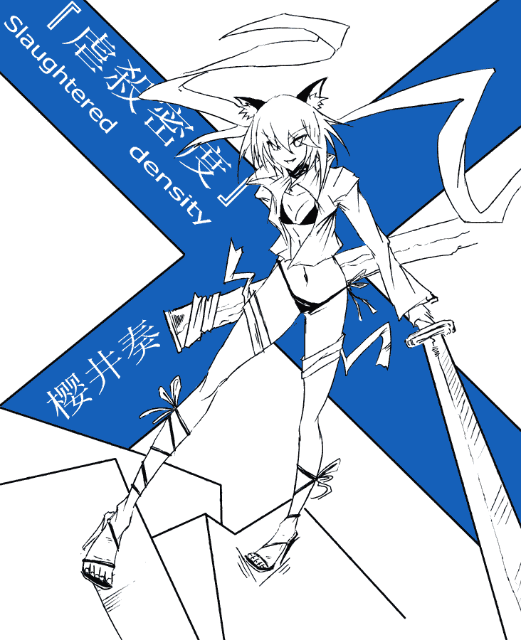
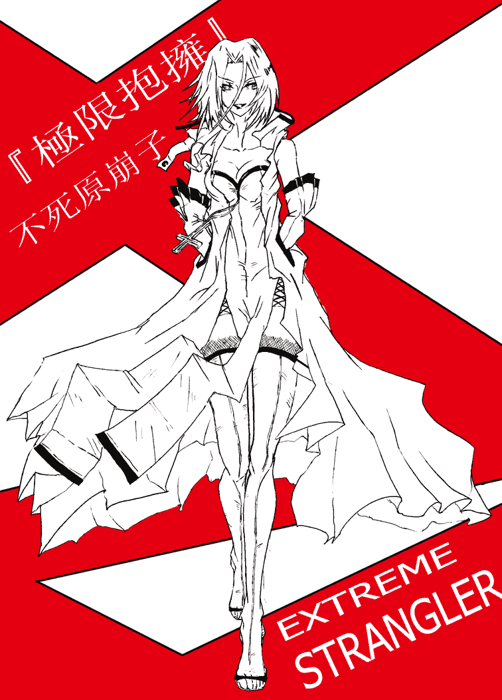

# Kafka【狂言】狂言之一：蒼崎楓子的人間踐踏（4月27日第二次更新）

作者：kunoichi99

TID：7565

 

# 1

嘗試著自己寫點兒東西……順便給自己的人物畫些插圖……

嘗試從其他的角度寫寫GTS元素的故事

按照寫長故事的慣例，先弄了世界和人物的設定，組織機關和團隊的名稱和綽號，這些我都是模仿西尾維新的風格

因為很喜歡他的奇特構詞吧！

既然是之一，而且剛寫了個開頭，找到了一點兒感覺，所以還會……可能……大概有之二之三之四一類吧

因為世界觀的設定應該足夠進行一個長篇的故事

不說那麼多了……希望大家能喜歡，就算不喜歡，也請多多指教！

因為，這些都是，純屬狂言嘛！

狂言之一：蒼崎楓子的人間踐踏

登場人物簡介：

蒼崎楓子———————共鳴暴動

平搖光（我）—————主人公 狂言者（妄想無銘）

樱井奏————————虐殺密度

不死原崩子——————極限抱擁

神崎亞能———————電磁歌劇

苏我志乃———————月光矛盾

============================================================================

武惡是鬼

乙是少女

猿是動物

空吹是精靈

而我，是狂言者

多年以後，當我再次登上公寓的樓頂俯瞰城市時，便會回想起那個初夏的傍晚所見到的一幕幕光怪陸離的場景。從這個高度極目遠眺，被夕陽的光輝染映的街區盡收眼底，我扶著欄杆暗自揣度，那天楓子眼中的城市，是否也是這般模樣？難得的傍晚的清風吹過，就如那日在暮色中輕輕跳躍的晚風一般。此時此刻，腦袋裡的那根弦啪的一聲斷開了，那一日的殘片與倒影宛如湖底的氣泡一點一點浮上來，打破湖面的平靜。那冰冷纖細的手指，爽適輕柔的秀髮，那仿佛包容了一千眼清泉般的雙眸，那可愛胴體上散發的百合芳香……然而此時此刻的樓頂，只有那積蓄多年的清冷在我頭頂上下翻飛，讓我情不自禁地一次次回憶那個初夏的傍晚。

我一邊喝著可樂一邊思索著擺放在門口的那雙可愛涼鞋如果穿在主人的腳上究竟會是怎樣的一番美妙光景。楓子從裡間拿來兩張坐墊、四罐啤酒，又叫我跟她一起上去。爬上走廊盡頭一架又窄又陡的木樓梯，到的一處很寬敞的晾衣臺，晾衣臺比周圍住宅的無極明顯高出一截，臨近一帶盡收眼底。

“隨便坐吧，”楓子朝我笑了笑，自己拿起一罐啤酒，打開，倚在欄杆上望著遠方。從後面看，她的腰格外的窈窕，，陽光為她身段的輪廓鍍上了一層恍惚而隱約的光膜，沿著她牛仔裙下優美的弧線延伸，楓子光著一雙，就算你急於讓我用更多的詞語去描述也全無意義的，美得摧枯拉朽的腳。

“喂，平君”，楓子呷了口啤酒，轉過頭來沖我說，“這裡感覺可好？”

我依著她說的方向望去，晚霞映照下的鋼筋混凝土森林換上了一副溫暖安寧的模樣。

“蠻好的，難得在御茶水這邊能找到這樣一片清淨的地方，”我笑著說。

“心情不好的時候，就喜歡到這裡，喝酒也好，唱歌也好，大吼大叫也好，都沒有人會注意。”楓子一邊說，一邊在我身邊坐下，夕陽在她精緻的鼻翼和嘴唇上泛起微妙的折光。

“最近過得可好？”我喝了一口啤酒，問道。

“還是老樣子，每天晚上躺在床上，總會有種奇怪的感覺，感覺好像什麼東西在一絲一絲的把精力一刻不停的抽走。”楓子低著頭擺弄著手鐲，發出鐺鐺的清脆的響聲。

正要開口，卻被楓子先打住了，她眼中閃著奇異的光。

“噯，平君，可知道我現在想幹什麼？”

“這——想不出來。”

“那，在我說出來之前，能否保證會把我的想法認真來看待？而且，”楓子忽然正色道，輕輕咬了一下嘴唇，仿佛下定了很大決心一般，“就算感覺很荒唐，也肯陪我繼續下去。就是這樣，能做到嗎？”

“唔……不大好說，不過就當做是對這次款待的大寫，我會奉陪到底。”

“當真？”楓子莞爾一笑，眼睛閃爍得仿佛狡黠的貓的眸子。

“當真。”

這樣，楓子長長地舒了口氣，如曬太陽曬得很舒服的貓一樣，懶懶的倚在我的肩旁，眯起眼睛望著一片片高低起伏的樓宇，對我輕聲說：“那個想法，相當厲害的喲。”

“嗯，”我點點頭，“已經準備好洗耳恭聽了。”

“三天前，我遇到『月光矛盾』了。”楓子一邊撥弄著額前的劉海一邊說。

“呃……先等一下，『月光矛盾』……是什麼東西呀？”聽上去好像是一種顯現？抑或是一種代號？

“誒？我以前沒和平君說過的呀……”楓子說，“所謂『月光矛盾』，就是和『禁斷斬鬼』、『極限抱擁』、『電磁歌劇』相近的存在喲。”

“…………”那究竟是一種什麼樣的存在呀……

“是楓子以前的夥伴。”

“喔……是這樣啊。”總算弄明白那是一種綽號。“發生什麽事情了嗎？”

“『月光矛盾』是作為引領者的存在喲。而引領者一旦出現，就一定會有『事件』發生，就好像必定會觸發的FLAG一樣。”

請不要舉這種宅味濃重的奇怪例子呀！你是某藍發ACG少女嗎！

“這一次，『事件』的本體就是楓子了。”楓子盯著我，一字一頓認真的說。

我姑且點點頭，但依舊不免對她忽然變得怪誕的言語感到錯愕。之前悠閒的氣氛正在不斷瓦解嗎……

“嗯……首先，我會變得很大，巨大到東京塔在楓子眼中就好像一段草根那麼小的程度，差不多就是平君在原地把頭仰得快要斷掉了也根本望不到我的一片趾甲的程度吧。”楓子平靜的說。

“誒？”我迷惑的看著楓子，一時無法確定她的話中有幾成是真，幾成是假。

“第一次聽到女孩子說出這種話，感到驚奇也可以理解喲。”綠子歪著脖子望著我的臉，“不過既然做出了承諾，平君就至少要聽我說完吧？”

哪裡哪裡，豈止是女孩子，說出這種話的人類就夠讓人難以理解了吧。

“啊只是十分好奇罷了，這樣的想法別開生面，又有獨創性，我也很想聽下去。那麼，變成那麼大之後，又想要做些什麼呢？”

楓子伸直雙腿，翹起白皙的雙腳，不無輕鬆的說：“然後用這雙腳把整個東京，進而整個國家，統統踩得粉碎。”

噗……剛喝進嘴裡的一口啤酒幾乎全都噴出來了。“何苦如此呢？”我頗為愕然，“女孩子做這種事，是在有些不雅，而且對於全國的居民而言，也未免太過殘忍了吧？”

“沒關繫的，平君不知道罷了”，楓子說，“人道啊和平啊之類的東西，都是以平凡的人類作為其約束對象的，如果是比人更加上位的存在，就不在此範圍之內了，對吧？就好像上帝給摩西十誡，但十誡卻沒有對上帝的約束一樣。而且，這個行為對楓子來說十分重要呀。喂喂，剛才還滿口答應奉陪到底，怎麼這麼快就一個勁兒的反駁起我來了？”

“抱歉”，我喟歎一聲，“在下作為傾聽者，太不專業了。”

雖然楓子的話已經快超出正常人的認知範圍了。

楓子好笑似的笑著，輕輕的在我脊背上錘了一下。

“好了好了，無所謂啦。”

“不過說實話，有你這種想法的女孩子我還是第一次遇到”，我說。

“其實這樣的人相當不少”，楓子一邊撥弄著精緻的腳趾一邊說，“至少我是認真地這樣想的，并如實把它說出來了。坦率的說，自己有時候對這個世界感到相當的厭惡，對什麽都討厭的要死，就想著乾脆把它們統統踩爛了才好。吶，我的另外一個同伴『電磁歌劇』也說過類似的話喲。”

“那麼，接下來我們該做些什麽呢？”我以相當認真的口氣詢問楓子。

楓子站起身，認真的沉思片刻，然後向輕盈的鹿一般歡快的跳到我的面前。“觸發這個『事件』，讓想像與現實混為一談。在整個過程中，要擺脫你作為一個觀察者留在現場，和我保持聯絡，告訴我你的所見所聞。畢竟在這種情況下，地上的人們具體會有什麼樣的遭遇，我是很難看清的。平君，這樣的擺脫，可以接受嗎？”楓子背著手彎下腰，期待的望著我。

“得得，”我聳肩，“悉聽尊便嘍。”

<ignore_js_op>

**蒼崎楓子-共鳴暴動.jpg** *(306.44 KB, 下載次數: 4)*

[下載附件](forum.php?mod=attachment&aid=MTk4Mzd8Mzc4NWYzZjN8MTYwMDg4OTE4OHwxODIzMHw3NTY1&nothumb=yes)

2010-4-19 20:58 上傳

天上的雲似乎彼此約好，一同在這個時間告假出遊去了，於是炫目的日光仿佛從高空傾倒下來一般，讓整片城區酷熱難耐。頂著炎炎烈日，兩個做推銷的女孩以作牙膏廣告般的微笑不斷招呼著過往的行人，汽車的鳴笛聲、吵雜聲、腳步聲、蟬的鳴叫聲，被吸引著不斷捲入這個封閉的時間與空間的容器。這就是我在方才話音剛落后的瞬間看到的景象。

一切都在瞬間變化了，時間，空間。仿佛站在當有帷幕的舞台前，然後刷的一聲，幕布拉開，演員登臺，就是那種感覺，除了手中那涼意尚存的啤酒。我環顧四周，以中央噴泉為圓心的環形公園廣場人流湧動，長椅上坐著形形色色的年輕男女，噴泉前擺著數臺大型手提音響，舞蹈愛好者們隨著震耳欲聾的貝斯聲練舞，不遠處“丸井百貨”的招牌在強烈的日光下反射出刺眼的光。

“喂喂，平君，聽得到嗎？”忽而又傳來楓子的聲音。

“嗯，不過，這又是怎麼回事？”我舉目四望，卻找不到楓子的身影，“不會是‘心靈傳輸’一類的能力吧？”到現在為止，我不得不承認事情已經發展到我那貧瘠的想像力無法應付的地步了。

“算是吧，總之，一會兒就會見到我了！到時候，平君要盡可能把你的所見告訴我喲，越詳盡約好。”楓子不無愉快的說，她的聲音遙遠而略顯飄渺，宛如橡皮球掉進很深的玻璃筒中，“咚……”

“我說，平君，你別認為我這是變態啦 S啦或者什麼的，別那樣認為，我僅僅是對此深感興趣，急於想知道罷啦，而且如果有人能詳細描述我腳掌下面的人的慘狀，也會很解氣。我，就只當做是一種宣洩或者CASE STUDY。”

“CASE STUDY？”我絕望的重複著，“得 得”。

前一秒鐘是萬里無雲，後一秒鐘全部的光線就消失殆盡。

前一秒鐘是四平八穩，後一秒鐘全部的樓宇和土地就開始劇烈的震顫。

前一秒鐘是熙熙攘攘，後一秒鐘萬籟之音就被隆隆的地鳴聲掩蓋。

前一秒鐘是烈日當頭，後一秒鐘全部的天空被巨大的腳掌的肌膚紋理所籠罩。

絕對 壓倒 強大 劇烈

那裡是『她』

那裡是毫無懸念的“上位”的存在。

不得不將頭仰到生理極限的角度，就算如此，依然無法判斷出『她』的腳掌和地面的距離；極目遠眺，即使最遠的天際線附近，也依然是那仿佛無限延伸的肉色紋理。

甚至連“籠罩天際的是『她』的腳掌吧”這種想法也純粹是猜測，因為根本無法判斷那究竟是手掌還是腳掌。這座城市同她相比究竟有多大亦是不得而知。

注意不到身邊人們的反應了

“--咳，哈，哈，哈，哈，啊哈哈哈哈哈哈哈哈哈哈哈哈哈哈哈哈哈哈--”

我瘋狂奔跑著。逃跑，人類面臨無法抗衡的危險時最原始的本能之一。

拼命奔跑 放肆奔跑 使勁奔跑 無限奔跑 狂奔 飛奔 跳躍著奔跑 連滾帶爬的奔跑 撕心裂肺的奔跑 氣喘吁吁的奔跑 上串下跳的奔跑 供氧不足的奔跑

表情上沒有半點從容，臉上只有痙攣似的的笑容。

“--咳咳咳，哈，哈哈，啊哈哈哈---”

真是的……

真是只能大笑了。

簡直就是世界末日，死路一條了啊。

在究極的恐懼中，人是無法進行理性思維的。這個時候身體的動作反應，基本上全由潛意識支配了，所以我能做的也只有機械的，拼勁全力的逃跑。

絆倒了。突破平日生理極限的奔跑速度讓身體飛速向前撲倒，伴隨著極大的衝量。劇烈的地面摩擦力，皮膚破損，伸出前臂進行落地緩衝，源自地面的衝擊所帶來的劇烈疼痛沿著前臂骨快速襲擊腦部，看來是骨折了吧，胃囊收縮，噁心，強烈的嘔吐慾望。然而劇烈疼痛的另一個作用就是讓頭腦暫時清醒了一些，勉強撐起身子，我跪在馬路中央，遙望著遠處的天際線，依然是仿佛無限延伸的肉色肌膚。前一分鐘還無法理解的“上位”的存在，這一刻已經理解得深入骨髓了。對『她』而言，用腳掌踩死百萬人和踩死千萬人根本就沒有任何區別吧，無論哪種都是弱小到極度可悲完全可以無視的概念。

一方是即使奔跑到吐血身亡也無濟於事的渺小存在。

一方是悠閒的踩踏人間的“上位”的『她』。

無法逃走了嗎

無法逃走了呀

已經--無法逃走了

根本--無路可逃

沒有預兆的鳴動，沒有覆滅前的哀鳴，『她』站在那裡，不需要什麼事前動作，也不需要什麼準備動作，只是將懸在空中的白皙腳掌，踩了下去。

下一秒鐘，代替藍色蒼穹的腳底的肌膚與無數的樓頂接觸，然後瞬間將它們壓垮。就仿佛飛馳的火車與空氣相撞，四散開來的毫無疑問是空氣一般。

下一秒鐘，地面的空氣被極度壓縮，狂風四起，肺部仿佛爆炸般的劇痛，頭頂降下鋼筋混凝土的石雨。

下一秒鐘，地面上的人們終於同『她』的腳掌完全接觸。

骨骼肌肉筋腱血液血小板白血球紅血球神經細胞組織細胞脂肪纖維蛋白質所有人類的所有身體組織被瞬間踩爛到再無法壓縮的地步。骨骼斷裂骨髓溢出頭顱壓扁腦漿噴濺腹腔炸裂內臟破碎血管撕裂鮮血噴發 然後 統統壓進泥土鋼筋水泥碎木和其他人的肉醬之中。殘留在視網膜上的最後一幕，只有那白皙的腳掌上巨大到令人頭腦炸開的宛如山脈峽谷般的肌膚紋理。

下一秒鐘，『她』饒有興致的抬起腳跟，加大五隻腳趾的壓力。前腳掌下的尸骸和廢墟被壓入數萬米之下，後脚掌上的尸骸和廢墟從肌膚的紋理中跌落，降下黑色的雨。

==================================================================================

在世界终结之时，将有羔羊解开书卷的七个封印，唤来分别骑着白、红、黑、绿四匹马的骑士，将战争、饥荒、瘟疫和死亡带给接受最终审判的人类，届时天地万象失调，日月为之变色，随后便是世界的毁灭。

我看见羔羊揭开七印中第一印的时候，就听见四活物中的一个活物，声音如雷，说，你来。我就观看，见有一匹白马，骑在马上的拿着弓。并有冠冕赐给他。他便出来，胜了又要胜。

揭开第二印的时候，我听见第二个活物说，你来。就另有一匹马出来，是红的。有权柄给了那骑马的，可以从地上夺去太平，使人彼此相杀。又有一把大刀赐给他。

揭开第三印的时候，我听见第三个活物说，你来。我就观看，见有一匹黑马。骑在马上的手里拿着天平。我听见在四活物中，似乎有声音说，一钱银子买一升麦子，一钱银子买三升大麦。油和酒不可糟蹋。

揭开第四印的时候，我听见第四个活物说，你来。我就观看，见有一匹惨绿色马。骑在马上的，名字叫作死。阴府也随着他。有权柄赐给他们，可以用刀剑，饥荒，瘟疫，野兽，杀害地上四分之一的人 。

——————《聖經-啟示錄》

再次睜開眼睛的時候，不在天堂，亦不在地獄，而是依舊在人間。

躺在公寓的床上，窗外的雲層間依稀可見微弱的晨光，看來剛剛黎明，大約是早晨四點多鐘吧。我從床上坐起身，剛才的人間踐踏依然歷歷在目，如果說是噩夢，也太過真實了些吧……

屋內依舊昏暗，在床上靜坐一會兒后才發覺襯衫已經被冷汗浸濕了。我輕手輕腳的摸索著拉開房門，儘量不發出聲音打擾到臨屋熟睡的兩個室友。石田和渡邊，兩個大學的同學，我們三人在學校附近的公寓里合夥租了一套三室一廳的住房。石田那傢伙一直有些神經衰弱，略大一些的響動就會把他從睡夢中驚醒，所以住在一起久了，起夜時就會自覺的注意不弄出什麽響動來。

打開房門，刺鼻的血腥氣味。

糟糕……

摸索著打開客廳的燈，那種感覺，就好像穿過臥室的門時踏進了完全陌生的空間一樣。

都發生了什麽呀，亂七八糟的，沙發被撕爛，碎木和鐵管從破損變形的殘骸中露出頭來，茶几攔腰斷成兩截。腳底下忽然感到刺痛，原來踩到玻璃碎渣上了……牆壁上坑坑累累的佈滿傷痕，玻璃相框的裝飾畫被震落在地上，廳中的地毯不知被什麽利器切得慘不忍睹，不過這些不是最重要的。

因為整個客廳已經被鮮血、腦漿、內臟和碎肉片粉刷了一遍。

牆上地上沙發上茶几上噴濺著大片的鮮血，這就是刺鼻的血腥氣息的來源嗎？不是。

石田被釘在牆上，四肢被逆轉著折成正常人體不可能做到的角度，嘴角被撕裂開，茶几的一根腿從口腔貫入，經過腦髓，插進墻中；渡邊跌坐在沙發上，胸口大開……胸口大開的意思是，肋骨被粗暴的向兩側撕裂開來，胸腔中的臟器，肺葉食管氣管心臟四散在胸前，一般人被弄成這個樣子，怎麼想也活不成了吧。

簡直就像進獻給邪神的祭品一般被人屠殺掉了。

我強作鎮靜，走向宛如殉道者一般掛在牆上的石田，腳下卻踢中了什麼圓滾滾的東西。請不要刺激我了。

陌生的短鬚男子的頭顱向前滴溜溜的滾動，最後面孔朝上停住了，一臉錯愕的表情。想必頭顱被斬斷時還不清楚襲擊者是誰吧？從背後襲來的致命一擊，準確的將頸椎和周圍的肌肉切斷，被襲擊者的大腦卻依然有短暫的思考能力，從肩膀上滾落，掉到地上，咚！會感到頭痛嗎？

我已經感到頭痛欲裂了。

“吸嚕吸嚕吸嚕……”居然還有人在這個當頭津津有味的吃拉麵。方才面對眼前的衝擊場景，我居然沒有注意到廚房的燈一直是點亮的。

“吸嚕吸嚕吸嚕……”黑色雙馬尾的少女背對著門口，蹲在電冰箱前如饑似渴的吃著熱氣騰騰的拉麵。白色露腰夾克和黑白短褲在日光燈下顯得十分醒目，黑色涼鞋邊堆滿了盤子和食品包裝袋，還有一把長的驚人的黑色太刀。

凌晨時分

密室屠殺

鮮血滿地

尸骸散落一屋

暴飲暴食的雙馬尾太刀少女

在吃拉麵

“…………”

這個時候還是輕手輕腳的離開，輕手輕腳的打開房門，然後趕緊跑出去報警才是最理智的選擇吧

額頭上的汗流進眼睛裡了，卻不敢抬手擦，全身貼在牆邊，一步一步的向門口挪動。太刀少女應該沒有發現我。真是太幸運了，剛才開燈的聲響，開燈的光亮，踢開頭顱的聲音，她都沒有察覺呀！終於摸到大門的把手了！

“嗚咦……大哥哥要出去嗎？如果肯聽人家的勸告的話，現在還是不要出去為妙呀。”太刀少女不知什麼時候站在我的身後，抱著拉麵筒說，吐字不清。請在和別人說話時先把嘴裡的拉麵咽掉呀！你媽媽小時候沒有教過你嗎！

“啊哈，哪裡哪裡，早晨太悶，大哥哥想出去跑跑步，呼吸些新鮮空氣……”

“出去的話，大哥哥的頭很可能就會被立刻切下來喲。”太刀少女歪著頭盯著我，輕輕搖動著一對黑色的貓耳。

“…………”

想用貓耳這種東西賣萌，就現在而言簡直是太天真了。真是丟人呀，我這是正在被小姑娘威脅嗎？正在被十四五歲第二性徵若隱若現，肌膚蒼白身材纖細的藍色瞳孔的小姑娘威脅了嗎？

“我是七級奈落的‘虐殺密度’櫻井奏！大哥哥可以叫我小奏喲，”太刀少女使勁的挺起胸膛自信的說，然後舉起手中頗具古風的黑色太刀，“這個孩子，曾經是‘月光矛盾’蘇我志乃。”

<ignore_js_op>

**櫻井奏-虐殺密度.jpg** *(295.84 KB, 下載次數: 1)*

[下載附件](forum.php?mod=attachment&aid=MTk4NzR8OWViNWQ5ZWR8MTYwMDg4OTE4OHwxODIzMHw3NTY1&nothumb=yes)

2010-4-20 21:50 上傳

“誒？”蘇我志乃這個名字，在剛剛的夢境中似乎聽到過。從太刀少女的眼神中，並沒有看到強烈的殺意，因此我隱約的估計到目前只要不離開這個房間，頭顱和脖子就不會立即分家。

說些什麽吧，一則可以拖延時間等待日出，二則也許可以穩定對方的情緒。

“吶……櫻井，你來這裡的目標是我吧？”我儘量讓自己的聲音聽上去平穩，背後的雙手卻已經緊緊的攪在一起快要失去知覺了，掌心的汗水讓雙手異常潮濕。

“誒，啊，嗯。”櫻井不耐煩的回答著，已經將超大杯的速食拉麵風捲殘雲后的她蹲在冰箱前繼續尋找可以吃的東西。

“額，雖然目標是我，卻把我的兩個室友也宰掉，會讓大哥哥很為難的呀……啊哈，啊哈哈……”話剛說出口我就立即後悔不已，聽上去仿佛在抱怨兇手一般，會不會因此而激怒了面前的少女呢。

櫻井真的呼的轉過頭來，眉宇間流露出顯而易見的慍怒，用仿佛眼前是一堆腐敗的有機垃圾一般的眼神望著我。真的，被激怒了呀。

“雖說是七級奈落的成員，也不會平白無故的砍殺普通人的，又不是殺人狂什麼的……切，真是土包子呢。”櫻井撩動著額前的碎髮，誇張的歎了一口氣。“那兩個人不是我殺的，因為沒有殺的理由。”櫻井一邊說一邊走進客廳，像踩住足球般將左腳踩在短鬚陌生男子的頭顱上，“殺掉你室友的是這個傢伙，剛才很生氣是因為你把我和這種低級的殺人狂混為一談了。這個人是被我斬殺的，因為他的下一個目標就是你啦。”

“聽你這樣說來，是你斬殺了即將入室刺殺我的殺人狂，那麼就意味著……是你保護了我嘍？！”真是受寵若驚呀！

“切……啊櫻井真的很困擾呀！這個人不單是個土包子，而且反應也超遲鈍呢……”櫻井仿佛受到了極大的打擊，一下子崩潰般的蹲在地上。如果是在二次元的漫畫書中，此時的櫻井應該是一頭黑線吧，“完蛋了呀，真的完蛋了呀，明明是剛剛出場不到五分鐘，明明是十分帥氣的戰鬥美少女，卻因為遲鈍的對方而莫名的背負上毒舌的屬性，這樣就和我人物形象的設定完全違和了呀！”

請不要隨隨便便的就把“設定”這種奇怪的詞帶出來！你以為這個世界是動畫片嗎！這樣會讓讀者很困擾的！而且你的美少女形象早就被你的餓死鬼屬性毀滅殆盡了！

不可否認的是，櫻井氣鼓鼓的鼓起小臉撅著嘴的表情還是非常的可愛，雖然作為保護人的身份而出現的說法也僅僅是她的一面之詞，但目前屋內的氣氛相比方才已經緩和了許多。然而疑點依然大量存在，正好借這個機會好好的問問櫻井。在這個前提下，重新理解櫻井方才說的話，就表示這個房間之外存在著對我而言致命的危險了吧？

“嗯，不過具體是什麽給你解釋起來的話就會很麻煩，你的反應能力又是超差，所以乾脆就不去解釋啦。”櫻井說。

被鄙視了呀，“至少大體告訴我要殺我的是什麼樣的人好吧。”至少讓我有一定的心理準備。

“我可不是專門爲了陪你隨便聊天而被派來的閒人，也不是能陪你胡謅的火星人！”看來櫻井確實是一個脾氣很不耐煩的人，火星人是怎麼陪我聊天的呢……找不到什麼話題，我也只好默不作聲。抬頭望了一眼牆上的始終，四點二十七分，室外依然十分寧靜，只能依稀的聽到清晨的和風吹響公寓門前高大的楊樹枝葉的沙聲。櫻井雙臂交叉抱著巨大的黑色太刀倚靠在門口，將頭偏向一側，擺出完全不想交談的架勢。微弱的晨光婆娑的灑在她苗條的身影上，沉默的櫻井的樣子看上去頗令人心馳神往，如果身著私服的話，應該是個相當有人氣的女生吧。

“吵死了”櫻井打破了沉默。

“我什麽都沒說呀，難道你聽到什麽奇怪的聲音了嗎？”

“我是說你的呼吸聲啊心跳聲啊，真是吵死了”櫻井擰起秀氣的眉毛，一臉怨氣的說。

你是在說趕緊去死吧……隨意的發洩著自身的怨氣，或者，櫻井正在緊張嗎？因為正在承受很大的壓力卻又不能告訴對方，只好換一種方式釋放壓力。

“櫻井小姐，是不是出什麼問題了？”我試探性的詢問。

“啊，嗯，也不是什麽嚴重的問題啦……”櫻井微微一驚，然後迅速將目光從我臉上移開，“在樓下負責和我聯絡的兩個人在方才似乎失去聯繫了，他們兩個是負責聯繫本部派來護送你到安全地區的車輛的人員。畢竟是普通人，靠不住也是早就預料到了。”櫻井似乎在掩飾著她的不安。

怎麼聽都是很嚴重的問題……“失去聯繫是指……”“可能被幹掉了吧，被後來的暗殺者。”櫻井聳聳肩。

“咚咚咚”就在這個時候，房門被敲響了。櫻井宛如貓一般從門邊的陰影里一躍而起，將食指壓在唇邊，對我做出噤聲的手勢，然後右手握住刀柄，放低腰身，向著門口做出拔刀的姿勢，這傢伙是拔刀流嗎。櫻井向我朝著門抬了抬下頜，示意我去開門。

透過門徑向外張望，似乎在哪裡看到過的普通中年大叔，可能是同一公寓的鄰居吧？似乎鬆了一口氣，然而疑惑又再次浮現出來。凌晨時候來敲不相識的鄰居的門不是很奇怪嗎，而且大叔空洞木然的眼神和表情在半明半暗的光線下也顯得有些異常。

“咚！咚！咚！”門外的男子似乎因為房門沒有打開而顯得不耐煩了，機械式的抬起雙臂重重的敲打著門板，那麻木的表情在這種行為下顯得更加詭異。而且，樓道遠處傳來雜亂的腳步聲，似乎有大量的人群向這邊走來。

櫻井向我壓低聲音，“跟緊我！”，然後一把推開擋在門前的我，一下拉開房門……

那是銀色的閃電，仿佛劃破天際般揮出的刀鋒，當我的視線能夠再次捕捉到的時候，櫻井已經將刀再次收回刀鞘中了。

從動脈中噴薄而出的鮮血在朝陽中飛濺著，男人沉重的身體宛如慢鏡頭一般向後摔倒下去，灰白色的水泥地面被屍體鎮起一層薄薄的浮灰，鮮紅的血液在屍體邊紅花一樣的綻放開來。櫻井面無表情的望著我，“這個男人已經不再是人類了，從他剛才的舉止中你也隱約察覺到了吧。那邊……”她用手中的刀指向被陰影籠罩的樓梯口，“還有很多這樣的東西向這邊趕來，看上去我們要殺出一條路了。”

真的非常帥氣呀，櫻井，我心裡想著，會意的向她點點頭，默默地跟在她身後快步奔向遠處的電梯出口方向。仿佛失去意識的人偶般的公寓居民成群結隊的向我們蹣跚圍攏，又不停地在距離我們兩米之內的範圍中頹然倒下。櫻井的眸子像黑貓一樣縮成一條藍色的隙縫，“月光矛盾”不斷的從刀鞘中抽出又收回，從腔室中噴出的炙熱的血和因為同刀锷不斷摩擦而炙熱的刀讓整個走廊里彌漫起鐵與血的氣息。我們就在這宛如無間道般的長長走廊中緩慢前行，能聽到的也只有刀鋒切割血肉的摩擦聲，屍體倒下時的沉重悶響，以及櫻井纖細的鞋跟同地面不斷摩擦的尖銳聲線。

抵達電梯口還有大約三米的距離，大廳中還能夠站立的只剩下櫻井和我兩個人，不敢回頭看經過的道路，因為那極可能變成日後我在夢中揮之不去的陰影，櫻井的身上已經濺滿血液，被浸濕的頭髮黏黏的貼在白皙的額頭上。

“蠻強的嘛，櫻井，看來要對你刮目相看啦。”我回頭向櫻井說。櫻井似乎還沒有從濃烈的殺意中緩過神來，只是微微的點點頭。

可就在這時

“叮咚”電梯口的鐵門在這時打開，仿佛有無盡的惡意從中彌漫出來。

“等…這是……”

“啊…這下完了”櫻井反常的用戲謔的聲音說。

如果將她描述為全部惡意的聚集體也並不為過，而且還要將上限和下限都標記成無窮大。電梯的鐵門直接從裏面飛射出來，然後重重的嵌進對面的牆壁中。仿佛身邊呼嘯著暴風驟雨電閃雷鳴的氣流一般的，悠閒地從電梯破爛不堪的出口走來，白色風衣的紅色邊沿上下飛舞。

最強的氣場

最強的身材

最強的眼神

最強的最強，她的出現仿佛在不斷強調著一個事實，“最強”這個詞原本是爲了她而存在在人類的語言中的。

最強的『她』，不死原崩子登場。

櫻井的身體在劇烈的震顫，左手緊緊握住刀鞘，拇指以極為緩慢的速度勾住刀鍔，刀身緊緊靠在腰間，右手緊緊握住刀柄的根部。宛如一張繃緊的弓一般，櫻井向白色的惡意體緩緩的錯動前進。

即使如此，身材嬌小的櫻井在模特般高挑的白色面前依然被嚴重的壓制了。

刀身在刀鞘中劇烈的摩擦，如同在槍膛中高速旋轉的子彈一般，刀鍔被磨到高熱的溫度，櫻井向前揮出她全力的月光。

白色依然在優雅的前進，兩條修長的美腿按著一定的節奏向前邁動。

櫻井的身體如同破碎的雜物一般飛向一邊，強硬的撞破身邊的牆壁飛進屋中。

白色仿佛揮走飛蟲一般擊飛了櫻井，然後在我的正前方停步，我周圍的空氣在一瞬間仿佛全部凝結了。『她』直接垂直的抬起修長的美腿，高跟涼鞋的前端和腳趾直接擊中我的下頜。如同一塊被勁風吹起的破布一般，我整個人被垂直踢飛起來，口腔中的牙齒發出駭人的響聲，如果沒有任何阻攔的話，我的頭應該猛烈的撞向頭頂的天棚，然後爆裂開來。

“額……”劇痛難忍，下頜骨是不是已經碎掉了，在這個方向受力，連哀號的機會都不給呀。

可是我還沒來得及向上飛出五釐米，垂直踢起的美腿又從我的頭頂直壓下來，面對即將飛升的我，『她』又毫不客氣的將我筆直的踩了回去……

因為是細長的鞋跟部份，仿佛要貫穿頭部將我釘在地上一樣，同樣相當的疼痛。

可是我也不想哀號，哀號不能抱住我的性命。狼狽的向旁邊側身滾去，卻倒楣的被抓住頭部提了起來，雙腿懸空。白色的惡意體饒有興致的打量著我沾滿灰塵的臉，這是我才有機會直視她的雙眸。

最強的『她』自然擁有完美的面龐，然而那雙眼睛卻是所有惡意的源頭。

完全反治愈的冰山型的美人呀。

“誒？這次的超弱呀。”她喃喃自語。

我的臉被重重的砸向水泥牆壁，暈過去了。

<ignore_js_op>

**不死原崩子-極限抱擁.jpg** *(430.88 KB, 下載次數: 1)*

[下載附件](forum.php?mod=attachment&aid=MjAwNjR8MDlhZDMzZTR8MTYwMDg4OTE4OHwxODIzMHw3NTY1&nothumb=yes)

2010-4-27 14:20 上傳

[ *本帖最後由 kunoichi99 於 2010-4-27 21:30 編輯* ] 

# 2

首先要感谢诸君对不才的抬爱

第一次发文和插图，手拙笔生，难免有诸多不尽人意之处，还请大家多多指教！

小剑君果然是明眼人一嘴就看出来了 最近太喜欢西尾了，因此好多地方都在模仿他的风格。

樱井奏的形象原型是黑岩少女，想必大家一眼就看出来了，不过我在写这段的时候，依然感觉这个形象似乎还是比较适合她的。

明天吧，不死原崩子将会登场，她的形象，我想塑造得更强势一些。

把世界观和主要机构藏起来最后说，每次只留一鳞半爪似乎是西尾的习惯之一？

我想在自己的故事里继续贯彻这个想法

再次感谢大家的支持！

[ *本帖最後由 kunoichi99 於 2010-4-21 07:15 編輯* ]</ignore_js_op></ignore_js_op></ignore_js_op>