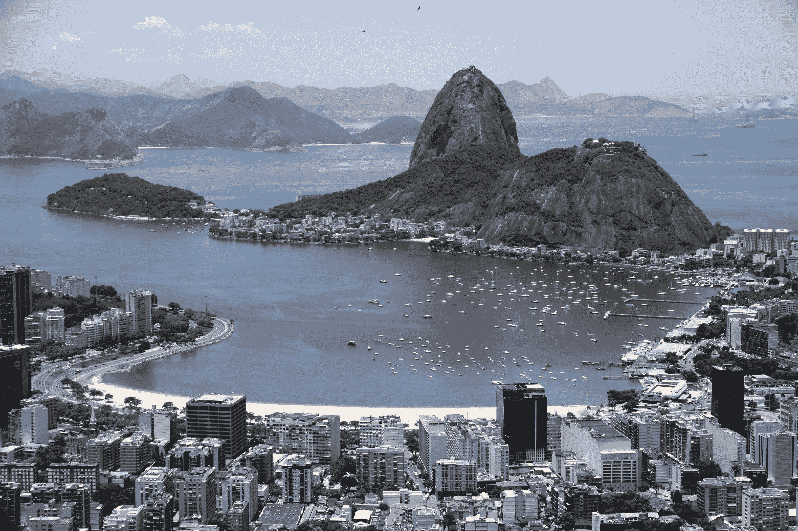

# Our live as giants 身为巨人的日子 2017年9月15日 附sjw版本

作者：676767lql

TID：22175

<title>1</title> <link href="../Styles/Style.css" type="text/css" rel="stylesheet">

# 1

*本帖最後由 676767lql 於 2017-9-15 21:59 編輯*

我发现之前的两位翻译似乎都停更了，那我继续吧，更新时间不定
 原文http://www.giantessworld.net/viewstory.php?sid=3116&chapter=1
第一位[wtman](http://giantessnight.com/gnforum2012/home.php?mod=space&uid=711)
http://giantessnight.com/gnforum2012/forum.php?mod=viewthread&tid=9661@wtman
风格上借鉴，有部分内容修改

第二位[leo1223](http://giantessnight.com/gnforum2012/home.php?mod=space&uid=6342)
http://giantessnight.com/gnforum2012/forum.php?mod=viewthread&tid=17016
@leo1223
翻译的部分翻新 
文中【】部分表示不太确定，毕竟不是专业翻译
PDF文件一份为中文，一份为英语，英语的是作者Hedin的原本，用了手写字体看上去更像一封信 <ignore_js_op> [Our Life as Giants.pdf](forum.php?mod=attachment&aid=NjY3MzN8ZDE5YzEwN2J8MTYwMDg4NDIxN3wxODIzMHwyMjE3NQ%3D%3D) *(190.92 KB, 下載次數: 174)*</ignore_js_op> 2017-2-3 12:49 上傳點擊文件名下載附件
英文

<ignore_js_op> [身为巨人的日子.pdf](forum.php?mod=attachment&aid=NjY3MzJ8MDM2YWU2MmZ8MTYwMDg4NDIxN3wxODIzMHwyMjE3NQ%3D%3D) *(769.08 KB, 下載次數: 845)*</ignore_js_op> 2017-2-3 12:48 上傳點擊文件名下載附件
中文 
这一份为为站内@sjw 的修正版

<title>2</title> <link href="../Styles/Style.css" type="text/css" rel="stylesheet">

# 2

 <ignore_js_op>

[身为巨人的日子 (1).pdf](forum.php?mod=attachment&aid=Njk1NDF8NmFlOTk1MTZ8MTYwMDg4NDIxN3wxODIzMHwyMjE3NQ%3D%3D)

2017-9-15 21:59 上傳

點擊文件名下載附件

887.15 KB, 下載次數: 209

中文</ignore_js_op> <title>3</title> <link href="../Styles/Style.css" type="text/css" rel="stylesheet">

# 3

相信我，身为一个巨人的方式生活下去，是一种非常奇怪的生活。就是这么简单。因为这个原因，我决定写一个关于自己的故事，你们才得以阅读到这张纸。

当然，我敢肯定，你认识我们——我和我的女儿。我们出现在世界上的每一份报纸的头版，尽管最近几年我们没有了多少的新闻价值，关于我们的消息也平静起来。我们习惯了，你们也习惯了。没有什么意义继续讨论——这就是办报纸的人的想法。虽然我预期你已经了解我们，我想我还是介绍一下自己。当然，也介绍一下我的女儿。

我是简．密尔沃基。不错。这是我祖先传下来的姓氏。不是那个城镇。感谢那些小港湾，我们居住的地方属于美国加州。正确一点，是加州的Gravesboro。接近弗雷斯诺。北面与约塞米蒂接壤，南面邻近国王峡谷，这样说吧，只有“手臂之遥”的距离。它们十分美丽。虽然我们很少游览，这很理所当然吧。

说些关于我自己的事。我越来越接近四十岁。我一定要告诉你吗？算了吧，没关系，三十六岁，你已经知道了，我没有办法掩饰。我的女儿说，我看起来像二十八。我希望她是对的，但我无法不相信，因为我找不到其他人问问他们。

美莉是我的女儿。她上个月就已经十九岁。我以她为荣。她比我更容易接受自我年龄的增长。嗯，我想当你年轻时，你不会觉得年长是一件坏事。我们像这样生活了七年了。非要问的话确实这是相当长的时间。还有很多的谣言，关于我们如何变成巨人的。不，别指望我会说一个新版本的故事。或者，这就是从你们的观点上，我即将要做的事。那个时候我非常忙碌，所以我没有读过报纸。反正它们太细小，阅读不了。

那时是2009年，寻常的生活每日都不停重复着。我和美莉挣扎求存。至少，现在都已经不再是了。那天是六月份，我想赚取多一些额外的钱，所以当了在晚上清理商店的工作。我想要钱因为美莉的生日在七月。所以我很晚才回家。我的美莉就是这么一个勇敢的女孩子。她还在厨房里留些晚饭等著我呢。没有什么特别，但对我来说非常足够的。我吃下了几口，就爬上楼梯去看她。她还在床上看书。女孩子的书。马儿，女孩子，历险故事，就是这一类的东西。我很高兴看到她在阅读，而不像同年龄的其他女孩们，只会漫无目的立在电视的前面。

这大约是当晚发生的事情。我上床睡觉，静止得像机器关闭一样。

早上一切都像平常那样，除了…嗯…我们那裡没有了水，连电力也没有了。我咕哝诅咒了一连子，叫醒了美莉上学。然后，我钻进了厨房，为她准备好一些面包。

“妈妈，我已经迟到了。要走了！”

“走出门口前不能没有吃早餐，小姐。在这裡，在路上吃！”

接著，她出去了。“砰！”

我走到门口，得到了报纸。美莉从门廊抓到报纸，将它拋了进来。当我回到了厨房的中途，我听到美莉的敲门声。

“妈妈？”我听到她压低的声音，这一点使我有点警戒。出事了。这一刻，我预见到，一群工人跟在履带，破碎球以及一个精明的律师后面…

我来到门口，打开了一点门缝。毕竟我只是穿著浴袍…而同时呢，你们明白的，里面一丝不挂。向外看我看见美莉担忧的神情。

“发生了什么事？”我问道。

“你最好自己先来看看，妈妈。”

“美莉，我只穿着浴衣，就算包紧了浴袍，我也露出了太多的腿…”

“妈妈，我觉得现在这并不重要了。”

我看着她，她看上去…惊讶。但不害怕。

我收紧了浴袍腰带，调整好自己的乳房，终于打开了房门。美莉站在一旁，而我看见了…

好吧，最初我看不到有什么特别。我看到了平常的景观。山还是那个样子。但是…金斯河呢？去了哪裡？

“河在哪儿呢？”我喃喃地说。

“我认为它【被道路取代了】【取代了道路】。”美莉说。

”瞎说！”，我叫了出来，但我还是赤着脚走近了邮箱。

然后，这就是我的故事的开端了。就在我家门前，曾经是石子路的地方，现在是金斯河。好吧，它看上去好像是精灵国王的溪流或类似的东西。我们的草坪与河堤相连。绿色的草地与绿色的树木融为一体。只是高度的差异消失得无影无踪，美莉一直负责裁剪我们家的草坪，所以它们都保持着短小。

“妈妈，今天上学迟到不是一件重要的事。”

“的确，亲爱的。这到底发生了什么事？”

你可以想像，我们只能够面对现实。【那张报纸】【我写的那张纸】就在这里，而那是最后一样东西确立了我们对自己的尺寸的认定——或者对你们的大小的认识，以事论事来说。

我问美莉借了她的间尺来测量一下那些树木，我就这样子蹲在我的物业的边缘。我选一棵大的。大松树吧，我想。这只有一英寸（2.54厘米）高。我回到屋里，寻找我们的百科全书。 松树（Pine trees），书中说，成长至大约80英尺（25米）。家中门外的那株只有一英寸高。这树应该有几千倍的大小。然而，事实并非如此。

走到院子里，我看到我们的后院环境。它看起来十分正常…直至到栅栏。栏后面坐落了国王峡谷国家公园。 “手臂之遥”，就像我之前告诉你们的。

翻开地图，我们发现，我们小小的物业北达松平湖（pine flat lake），西南至迪努巴（Dinuba）——它还有大约一半的留在外面。在东面，我们发现巴杰·（Badger）和派恩霍斯特（Pinehurst）就仅仅在我们的栅栏后面。

米拉蒙特（Miramonte），奥克兰（Auckland），奥兰治湾（Orange Cove）...这些地方都，嗯，被取代了，消失了。我不知道这是否重要，但假如你有一张旧的地图在你手，你会发现，在那处的中心就曾经有一个小镇。

“你觉得这个重要吗？”美莉问我。

“什么？”

“斯阔谷（Squaw Valley）。”她说，指着铺平在厨房的桌上的地图。

“我不知道，孩子。这实在是令人难以置信。”

从那时起，我们必须面对外面的世界很细小这个现实。或者说，我们变得巨大了。1000:1比例的那种巨大。这使我刚刚好一英里（1610米）高。我差不多5尺3寸。美莉就更高了。她本来5尺11寸。

我认为母亲照顾自己的孩子是天性所为的。而照顾对我的意思是简单的东西。爱，水，面包，和睡一张有屋顶保护的床。屋顶和床上用品似乎还好吧。爱也一样。但龙头出不了水——毫无惊喜。小屋里的面包…少的就像幻觉一样。

“美莉，请回到您的房间里…看一两本书。我想我得查查一些东西…”

“妈妈？我不是想找你麻烦，但我已经长大了，可以看看发生了什么。我们没有任何水和食物，另外我们也不知道怎样可以回复原来的大小。”

“是的，美莉。不管怎样，回到你的房间去吧。”

正如我所说的，那好孩子耸了耸肩膀，就微笑着爬上楼梯…

但是，当我走到了门前我才认知到，我仍然赤着脚。我不想这样外出。所以我从鞋柜拿出了一双黑色拖鞋。

我走过了前门，直奔向北部边缘的草坪。松平湖（pine flat lake）是…嗯…它像一个水坑那么大。嗯…我的意思是它至今仍然是。

至少它是一个大水坑。或者说是一个狭长的水坑。而且它的深度有数英寸（。我估计里面有几加仑水。也许五至十吧。或者更多。不管是不是巨人，我们人类都不太拿手估算容量。

以它为源头的河流，只是一道滴流。它看起来相当的小，但没有看上去那么没用，我相信过了一整天，它能够提供足够的水。迟些会不会在我们的屋顶下雨呢？我决定移除那些排水管道，在屋顶底下放水桶。永远不能浪费宝贵的资源。

所以水看起来...可以接受的。是的，这是可以接受的。但是食物？我低头看着湖面。这湖满了。但是，有些时候它会浅得多了。我忘记了那个大坝【pine flat dam】。该死的大坝。我们真是太幸运了，它依然存在。当我沿着湖边走了几步，我发现它在我们的草坪边不到一英寸的地方，河水流入了我们家的草坪，大坝稍微被淹没在我家湿地之间。当我踩着拖鞋踏进了那个水坑，【大坝】【水坑】在我的鞋底发出了嘎吱作响的噪音。然后，我拖着我的脚掌，挖了一个小沟槽，直到我可以把【大坝】【水坑】连接到河床的另一端。我的拖鞋布满泥泞，有点恶心，所以我走出了那泥泞水坑，水坑的水流正慢慢地排入河道。

这个湖满了，足够的水。不过，我得悄悄说，当水位下降时，我们得确保没有【人会有】任何损失，又或者【你们】有什么东西会因此而流失。我手上一小把泥沙肯定可以解决【你们的】问题。

然后又回到了面包的话题。食物，啊，我们的大小！我低头看着这个细小的世界。我惊讶的发现我已经正站在细小世界之中了。我不小心迈出草坪并走出水坑使得我来到了河床的对面。我的右脚和湖的西岸之间有一座小山。我从地图知道了这个地方。山面向湖的那边叫作森尼斯洛普路（Sunnyslope），并有一整排的房屋。家境富裕的人的假日别墅聚集在那裡。现在看起来好像他们是被清除了——森尼斯洛普路消失在我的拖鞋之下，正在我的小脚趾底下。

我的情感很难形容。我是…惊讶吧。而且我感到要说“噢！对不起。”而我当然，没有这样做。这种情况实在是太不真实，让我无法感到内疚。我反而在脑海中记起了在山另一边的山谷里还有一条道路。我记不起它的名字，但我转动了脚掌，提起我的脚后跟，直到发泡橡胶鞋底从地上离开，我看了一眼我制造出来的足迹。地面...十分平坦。除了我的鞋底花纹深深地刻在地上之外，什么也没有，好像压路机。

我在路段什么也看不见，除了比较大的那条路是相当明显，因为路旁有一点点的【亮点】【灯光】点缀着。走明亮那边吧，【这显而易见，】没有什么值得考虑，我走一步的代价，令到某些人他们的房子变得一文不值。当然他们许多都没有性命去了解这回事。

我承认我意识到我刚刚踩扁了很多人。我立即知道我杀死了他们。但同时我只是感到我刚刚迈出了一步。

没有什么特别，也不是什么必要的行为。这些建筑和人和我的身体比，实在是太过渺小和遥远，我一点也不会意识到他们在我的脚下的危险。我踩到了那里，他们就消失了。就像许多年以前的无数昆虫——不论是无意或故意，或者只是因为方便而踩到了它们。

粮食问题依然存在，但望着对面那个位于微小的平原，距离草坪的边缘只有100英尺的弗雷斯诺，我知道，我们走出外面将不会提供任何解决方案。那里没有食物，一切都太小了。于是我又回到了房子。

踏上了门廊，我注意到地上升起有一点点烟。一个小小的火苗靠近门燃烧着。我不知道这是什么，但我已经猜到可能是什么机器之前在我走出来时踩中了它，它一下子被压扁，溢出了的燃料，现在就在燃烧着。

再次踏上不足以扑灭火焰。但是用力跺脚确实会起作用。我的拖鞋底下的坑纹留给火种足够的空气。然而，当我用力踏下去，脚底形成的气流吹熄了它。望着黑色的小点，我什么也看不出来。但是看着门廊的边缘我推测出来，它肯定是某种飞机。没有哪种车辆可以攀上这个垂直悬崖——就是门廊的台阶。

我耸耸肩离开，留下我肮脏的拖鞋在门垫上。然后我直接走上了楼梯。<title>4</title> <link href="../Styles/Style.css" type="text/css" rel="stylesheet">

# 4

“美莉？”

“妈妈？我看到你在外面走，看到什么了吗？”

“不，亲爱的。只是看来我们变大了或世界已经缩小了。无论如何，我们社区现在已经消失了。部分的河床也消失了，河水溅上家中的草坪。我挖了个壕沟将它连接到残余的河床。嗯，好消息是我们有水，坏消息是没有食物，我无法想像在这样一个细小的世界可以找到任何适合我们吃的食物。”

“反正我不觉得饿，妈妈。”

“噢，不要因为你想故作轻松而对我撒谎。”

“妈咪，我真的不肚饿，但是请告诉我，那些感觉怎样？”

“什么？”

“走出了草坪之后你走进了细微的小世界，你感觉如何？告诉我！”

“呃，”我耸了耸肩，“没有什么特别之处。地面就像走在沙箱上。那些山既软又脆弱。也许我踩到了一些房屋。但是我无法从我的脚印分辨出来。”

她看着我，我们都知道我撒谎了。

“好吧，我知道我踩到了一些房屋。我没有注意到他们，如果这一切都是真的，我应该已经摧毁了许多房屋，我肯定我这样做已经杀了很多人。这不是故意的。只是一如既往的走了一步。如同在后院行走。你不会在放下脚掌之前，去留意地上的一只蚂蚁。”

“啊…酷啊。”

“嗯。我不知道。我对它没有任何感觉。但我不知道你是否年长到足以避免踩到那些小人类。你可能在你以后的生活中感到后悔和遗憾。”

“你是说我呆在家中，不可外出？你不能这样做！我没有做错任何事情，我拥有同样的权利外出，和你一样的权利！”

“嘘，亲爱的。当然，你没有被禁足。我想说的是，除非绝对有必要，你不应该离开我们的地方。”

“根本就是和禁足一样的。”

“如果真的只是相同的话，我希望你想想所有的小人类。如果你去了那里，你会杀了他们。您可能没有留意到，但你总会知道的。你杀死了人，无辜的人，男人，妇女，儿童以及他们的宠物。不！不用立刻回答我。你没有被禁足，但我希望你用这半小时想一想，然后告诉我你的想法。”

她叹了口气，一屁股坐在床上，而我走出她的房间。

在门廊上的经验让我思考。我很肯定出现了一架飞机。它降落在我们的门附近，为什么呢？

答案很明确。所有的一切都不是幻觉。一个奇怪的梦之类的东西。这是真实的。而在现实世界中的政府不会接受几亩土地就这样消失在一个巨大的房子之下。他们会尽力收集资料，而这个任务将会交给军队负责。

我狂奔起来，冲入了厨房，关闭了窗口。然后我走上去，在我的卧室做一样的事。要告诉美莉关闭她房间的窗，她就是那么自由自在。

“这已经关闭了，妈咪。我不希望有一架飞机进入了我的私人空间，还有一堆渺小的人在我的房间监视着我。”

确实是个聪明的女孩子，我想。

经过一番思考，我回到了厨房，我关闭了排气罩的排气口。然后我去了洗手间，关上了那儿的气孔。最后，我不得不关闭烟囱内的气瓣。

房子不是滴水不漏，我知道。但它至少可以保障我们，让那些人们难以进入。

然而，几分钟后，他们给我上了一课，关于“困难”这个词语。

我刚靠在沙发上，试图想通所有事情。当然，如果这一切都是真实，政府一定会做某些事。他们已经在外面见到我们两个，而我还曾经离开了自己物业。如果他们怀疑一切是虚构的，我已经以外出践踏和一系列破碎的房子来纠正他们的误解。我是真实存在的，我可以离开这个地方，而且我是一个粗心大意的威胁，美莉也是。  

在那一刻，我听到她走下楼的声音。我呆在沙发上，她从后面走过来。彼此没有望着对方，她就开始说她的决定。  

“妈妈？我想明白了。刚才我用望远镜看外面的风景，它们看起来非常真实。车辆在移动，而且我相信我看到了人。如果我醒来时，看到一个巨人就在地平线上，我会害怕。他们肯定是害怕，尤其是在刚才你在外面踩到了他们之后。因此，他们会视我们为一大威胁。他们会尽他们所能与我们战斗。如果他们和我们打仗，我看不出我有什么理由在意他们的生死。”  

我叹了口气。  

“唉，女儿，我暂时看不出他们在打仗呢。但是，也许你是对的。这有点像自说自话。但是，如果你是这样觉得，我觉得这是可以的。”

“妈妈，我知道我们现在大概一英里高。但世界仍是远远大于我们，要打败在这个星球上到处都是的人类，可要耗尽我们一生啊。因此，我认为对于我们来说最好是在大部分时间忽略他们。”

“或许你是对的。至少我认为在我们了解更多之前，这是你应该处理这种情况的方式，。”

“嗯，妈妈，我们很快就会了解更多东西了，我想我听到了什么…”美莉说完就走了。  

我站起身，跟着她到门口，我确实听到了。这是一种柔弱的呜咽，随时间越来越疲软。  

我跟着美莉的目光寻找声音的源头。她看著在前面的大门地板上的东西。  

物件是大约苍蝇大小，这是一个对其功能很好的说明。当我在蹲在它前面，我可以很清楚认识到它就是一个微小的直升机。迷彩涂装在白色瓷砖下变成没什么用。军队已经到达，他们就通过门下面的间隙飞进来。  

“你好。我们期望你们的到来。但无论如何，你闯入了私人财产。你有五分钟时间，发出声音或者任何可见的方式解释自己，否则你们将被驱赶。”

美莉说明了后，她走近，随便地在我旁边扑通一屁股坐在地上。  

“他们要出来，妈咪。”她提及。

事实上，我们可以看到细小的人类离开了机器。当然，我们只是估计他们是人类。我们无法真正知道。他们只是太小了。我们所看到的是一些移动的小圆点。只有从坐或蹲的位置我们才可以分辨他们是直立行走。  

“我认为，他们对着我们挥手，妈咪。”

“你的眼睛比我更锐利，孩子。我不知道。”

“是的，他们都挥舞双臂，活像他们想引起人们注意。但是，他们应该已经意识到，我们注意到他们。 噢。哈哈。现在他们掩着自己的耳朵...”

美莉抿嘴笑道，我是嘻嘻笑的。然而，我们不请自来的客人没有作出任何进展，至少我们留意不到。  

“美莉，也许你应该在家裡四处检查一下。这可能只是伪装。这有点太明显了。”

美莉不辞而别。在我的身子下面的这些人——我想这是男性，开始于直升机周围散开。但他们显然不会使用体育场扬声器之类的设备。我等了几秒钟，看看他们会不会自己排成一个字母或者其他的模式。但他们只是错乱而不稳定的移动。所以我决定直截了当。我对他们微笑。然后我俯下身，用食指指着一个离开直升机相当距离的人。然后配上一个笑容，我的手指紧紧地压在他身上，把他碾平并在白色瓷砖上将他整个涂抹，留下了一点红色的污渍。他的战友们在恐慌中开始逃亡。我本期望他们返回直升机，然后逃走，但是我错了。他们以他们最快的速度在各个方向分散逃跑。  

嗯，一个训练有素的人可以跑得每小时20英里一样快。在更长的距离，约莫15每小时英里。但在我们的尺寸看来，这会可怜地减少至每小时100或80英尺。我的意思是英尺/每小时（fph）。而这大约是每秒四分之一英寸。所以对于他们竭力逃跑我也许显得有些漠不关心，我懒洋洋地站了起来，践踏住他们。我的脚很容易就覆盖了他们，当我踩碎了直升机时，它在我的体重下屈服，我只感到有些软的物体。这感觉就像在踩住积尘毛球。一个幸运的幸存者从我的脚弓下窜了出来。就在我抬起脚跟，在瓷砖上拖着我的脚，让他的同志们留下更多的红色污渍时，最后一位倖存者前的被我的脚踝骨辗过。他爆成一阵红雾，并且留下的血点就像其他人一样。  

“美莉？我敢肯定，他们想欺骗我们。提高警惕。”

说完我就进入了客厅。我觉得，烟囱内的通口，是最薄弱的环节。我是对的。当我走近壁炉时，一架直升机就由烟囱嗡嗡作响下降着。  

我只是嘲笑并且我的手指轻弹一下，我把它变成了一个小火球。  

“搞定了，女孩。我收拾了他们，现在一切都结束了。”<title>5</title> <link href="../Styles/Style.css" type="text/css" rel="stylesheet">

# 5

嗯，当然啦，只是那一次结束了。如果你更了解我的真实故事，你知道，我们回敬了一次“探访”。但在提及这些【回敬】之前，我想告诉你一些关于我们现在如何生活的事。毕竟现在这个世界比以前更加和平了。  

美莉还和我一起生活。当她还是个孩子我一直希望她能这样做，直至她能掌握自己的生活。工作，男朋友，婚姻，孩子——老生常谈。这是你们生活的方式。你们，不是我们。  

当然，我们只有这一个房子。里面大部分的东西无法繁殖或再生。美莉和我从来没有谈论过它。我们都知道这是无可奈何必须接受的事。当然，我们也没办法和其他人谈。  

她现在已经长大了。一位年轻的女士。她很幸运，她可以穿着我大部分的鞋。她比我高大。我们没有任何合适的衣服。但也有一些比基尼和内衣 ——要么有足够的弹性或勉强合身，而且天气也让我们一起出去时，要像她那般服装相当的轻薄。我们没有很多事可以做，所以为什么不在院子里晒太阳？谁能够阻挠我们袒胸露乳？

当她到了十六岁时，我允许她这样。之前我只是单纯地因为她日渐成长的身体而放弃尝试为她穿上那些不合身的旧衣服。现在反正她已经长大了。非常成熟，不论身体和礼貌举止。而且她真的不再需要害怕强奸犯或其他不道德行为，我让她自己作决定，而她十分的感激。

我们日常的例行公事十分简单。我们通常在太阳升起时起床。没有电力的日子里，在光线昏暗的卧室，看一个小时的书，便需要燃烧数亩的森林。首先，我们清洁自己，前提是如果我们有足够的水。有时只够我们其中一个。因此，另一个只得到一捧水来弄直她的头发和擦眼睛。有时候，我会有点儿懒，水就留给美莉，即使轮到我了。

然后我们吃早餐。这意味著一罐水和一些谈话。我们总能找到一些东西来谈。你们人类是一种忙碌的小生物，谈论你们的愚蠢可以消遣我们好几个小时。每逢星期天，我们会喝茶。我们在晚上放好了罐。美莉利用了我们的一些铝箔建立了一个巨大的太阳能热水器。我们试图睡多一点，同时太阳展开它工作，烧开我们的水。有时候我想从你们的小世界里压榨出更多的茶叶，但后来我知道，我需要的量将会超越你们的生产能力。就像咖啡，也许你们一年可生产的量只够我喝十杯。但是，如果我消耗了你们所有的生产，我不得不每两个月才能喝到一杯咖啡。因此，我应该努力忘记咖啡，坚持用茶【包】。

之后，我们会决定接着做什么。大多数时候，我们会在我们的后院享受阳光。在庭院晒太阳或围绕在花园溜达。有时候，我们决定一起出去，或者有时只有一个，去探望你们小人类。没有太多的家务要做。

下午美莉会看书打发时间。那是，学校的课本。我的旧书和她的爸爸遗留下的一些书。她说她接受自己是一个巨人，但她不想成為一个糊里糊涂的巨人。我很高兴她得到了一些消遣，我相信许多的人类也喜闻乐见。

对于我而言，我喜欢缅怀老照片。有时候，我想念着微小的世界。我们甚至比山——在我们眼里是小土丘，还要高。好吧，这些实际上都是高山，而且它们看起来不错，但它们仍然无法使我们其中一个留下深刻的印象。身高一英里的我感觉非常无奈。

至少我们巨大的身躯还可以在海洋中游泳。我们通常游览蒙特雷湾（Monterey Bay）。不必涉水太远，便到达足够我们游泳的水深，而且日落国家海滩（Sunset State Beach）是个好地方给我们坐下休息。不过沃森维尔(Watsonville) 在这几年来吸引力已大不如前。或者说这个城市现在几乎被我们踩平了。但是令人惊讶的是，每当我们在那里露面，我们总是在那里找到一些就是无法割舍这座城市，海滩，或兼而有之的人类。

我们倾向不踏进国王峡谷或约塞米蒂。我们不希望身为巨人的我们打扰大自然。

有时，我们会走近看看。我们看守这两处地方，阻止人类来往那裡。一旦美莉发现了新的定居点。踩下一两脚就可以让他们消失。

晚上，我们会准备明天的预防措施。我们取水，放置好茶罐，诸如我已经告诉你的那些东西。

当阳光下山我们准备睡觉了。我们互相亲吻、说晚安，进入了我们的房间。

所以这是我们的日常生活流程的一个粗略大纲。除此之外，还有许多无法估计的事情经常发生。

最常见的东西是微小的游客。我不知道，他们想从我们这裡得到什么。有时我觉得他们只是某些特殊癖好的狂迷，或是怪胎。也许还有狗仔队（paparazzi）或只是偷窥狂（peeping tom）。通常我们不觉得自己在捕杀他们。假如我遇到一个，当然，我可能只会觉得，自己只不过在移动一下脚趾或者横跨一踏时刚好了结了他。对我们来说，无论是男人还是女人，都是微小的生物或是缩小了的人类，大多数都是。有时，何其幸运，我只是无意中动一动，就做成了另一点的红色涂抹。

不过，他们大多数直到被踩扁仍被忽视。每当我们在房子里走动，我们很少放眼留心地上，他们仿佛不知道，在空旷地方跑来跑去乃是相当玩命的表现。每当我走进厨房或其他地方，在我的归途我往往会发现一些红色的斑点。或者，如果我回到天井在我的毛巾上伸展时，美莉会宣布我赤足下的红色污迹的最新统计数字。

有些甚至达到我们的毛巾。这些都是真正的怪胎本性！哪样的偷窥狂，会冒着被我的屁股夷为平地的风险，只是为了靠近并密切的关注我？与脚下的亡魂相比，他们的数目非常稀有，但是我在院子里日光浴时，几乎每一天都会有小人类被我压扁在我的身体某处。

还有更多人在外面——在我们的后院或在房子前面的草坪上。但他们通常会消失无踪，只因为他们的遗体由泥土和草掩没。我知道有很多在那儿，自此美莉经常走带著她的放大镜出外作为消遣。她与他们的互动自成一格。也许迟些我会告诉你。

当然在白天我们也会做一些其他的事情。我跟美莉谈起记述下来，但她认为这只是一个普通的事情，因为我写的东西，假设大家都已经知道，那为什么我就不写下即使你们从来没见过或经历过，但都知道的东西呢？

正如你可能已经注意到我没有谈论到食物。您可能还注意到，你还有食物。如果我们需要你食物，很快微小的世界里食物就会被耗尽。但是，要感谢我们的是，我们并不需要。但是我们喜欢喝水，关于这方面，我们的身体运作依然正常。因此，我们喝了水，因此我们也必须把水“排除”。

现在，我们的房子里没有水，所以我们也失去了排水系统。我不知道附近的城镇对于这个安排是否高兴。但是，在我们成为了巨人的第二天，我们不得不做出决定——利用最自然的方式。

我们地区的天然排水渠就是金斯河（King’s River）。所以我们只需要一个靠近河流的地标以及远离我们房子有一段距离。我们决定了桑格(Sanger)。这个镇离我们的物业边缘大约有30英尺，金斯河在桑格和我们的物业之间流过。当我们选择这个地方，我们仍然思考了一番，选择这个地方而非里德利（Reedley）这个离房子远一点，但是它在河这一边（东侧），所以我们在日常生活流程中会时常经过，也许不经意间会踩到它。

另一方面，当我们其中一个蹲坐在河床上，脚掌降落在桑格的近郊时，它甚少遭受人命损失。

因此，每当我们需要小便时，就是在这个地方解决，日复一日年复一年，这是很自然的事情。假若你不得不居住在没有厕所的地方，你不要告诉我，你不会这样做。

当然，约半分钟内释放约 50万吨小便，是一件十分壮观的事情。美莉首先使用了这个地方，当我迟一些到达那里时，我发现她创造了一个不小的湖泊。那时的我要再用她曾使用过的同一个角落，我顿时感到有点不快。所以，我移前了一点，再蹲下来。当然，对四周景观来说，我造成了同样的变化。我的尿液涌了出来，冲走了一部份软土。当我蹲坐的位置稍稍向北了一点，我看到一些尿液的飞溅击中了桑格，当然我排出的尿液溢出了河床，巨量的尿液泛滥，淹没了部分城市。我想这是现在这地方的人口减少的原因。每天的尿液泛滥，令城市的一些地区变得不适合居住，整个城市必定闻起来活像厕所。另一方面，我们从来没有踏进这个城市，除了在河边的近郊，但这离也时常淹没。多年来我们的尿液已经在那裡建立了一个相当大的湖。但是，正如我们同意使用相同的位置，我们也渐渐一点一点移到桑格的西南方。这个城市依然受到尿液的威胁，我们排出的容量这条河流无法容纳，往往会引发波浪淹入城中，但至少这个城市没有淹没入那个巨大的尿液湖中的威胁，很多桑格周边的乡村已经陷入这个景况。

最初几天，我们心想，我们撒尿对你们没有多大的冲击。正如我所说，那时我们仍是那麼体贴。我们想，我们只会到我们之前饮用过的河流小便。但是，当然还是有差别，试想像我们一天饮用的水量在短短半分钟内排泄到外面。我们的尿液洪水每天至少两次顺流而下，奔流到匹兹堡（Pittsburg），在色逊湾（Suisun Bay）涌出。我听闻，旧金山湾（San Francisco bay）也充斥厕所的尿液气味。

也许你认為我们仍然使用河流如厕，是轻率的举动。但我告诉你，这是理所当然的。骂我们轻率也好，什么也好，我们仍旧必须要如厕，其他的地方。然后小人类抱怨，他们的城市在我们的尿液洪水中浸泡，留下了尿臭味道的污泥。我说，如果我们没有选择一条河，我们早在第一天就选择了桑格（Sanger），第二天是里德利（Reedley），然后可能第三天就是弗雷斯诺（Fresno）！你们会更加满意吗？我觉得你们都非常幸运，我们提出这个协议的时候，我们仍然很体贴你们，而且从不觉得要改变协议。我发誓，打赌谁的小便可以清除弗雷斯诺上最大面积的建筑物群，将会是相当有意思的消遣活动。

好了，足够了。应该很高兴我们从来没有进食的需要，否则我们就会有一个不同的尺度的讨论。

大部分的时光美莉和我都过得很好。但是，我们虽然是巨人，但我们不能忽视我们那些源自人类的情感。这意味着，有些时候我们特别高兴。有几天我们特别淘气，有几天我们会温柔起来。

例如，每当我们兴之所至，我们去出外散步。然后我们出去看一些特别的东西，女人不能每天都望着同样的墙壁过日子。所以我们打扮了，然后走出去。我们甚至想使用汽车，但后来决定我们最好束之高阁。天知道为什么。

通常我们走出去，直到我们找到一个足够大可供漫步的城市。当然，即使大城市也没有太多“漫步”空间了。占地面积四英里乘6英里的弗雷斯诺与我的睡房一样大小。因此，我们主要是享受旅途的景色，以及迈进城市里面。

两个巨大到身高以英里计算的女子访问城市，对居民当然是一件大事。每个人拔足狂奔，有时我想这是他们在遇上我们这些巨人时的自然反应。他们一个踩着一个。我们可以看到他们在街道停滞不前，争取踏在其他人之上。当我们降低脸颊紧贴地面，我们看到他们是怎样互相践踏。我必须说我喜欢向他们示范，他们不会去到最高点的。当然，当我的鞋子压扁了数以千计的小人，我没有什么感觉。好吧，踩到房子时还是会有一些嘎吱嘎吱的感觉。如果我是赤脚，也许我会感觉到汽车在我脚下被压碎，但通常我穿高跟凉鞋散步。就像我说过，我们打扮了。<title>6</title> <link href="../Styles/Style.css" type="text/css" rel="stylesheet">

# 6

美莉对自己的服装没什么要求。她可能会穿比基尼，但是她通常除了鞋子之外一丝不挂。对，她是裸着的，她尤其喜欢穿平底拖鞋，但有时候也喜欢带有带字的高跟凉鞋，在她露了那么多肉之后她也喜欢搞很多play，我们通常会从两个不同的方向迈进，先将两股小人们聚集在一起，我们都很喜欢追逐游戏，我们的脚缓慢的移动，那些老弱病残跑得慢的就像自然选择般被我们淘汰在脚下，途中我们也会将房子们压碎，没办法，我们巨大的体型无法避免地会踩到它们。

我的脚是九号，鞋子宽度就有300英尺（90米），长度大概有700英尺（200米）吧，但这是双带鞋带，两侧绑紧的女式凉鞋——事实上，我的脚还要宽于这个尺寸。当我的脚因为我的体重完全压在地上，脚板完全压在地面上时大概有330英尺宽（100米）。你们的街道非常的窄以至于无法容下我的一只脚，即使是大街（Avenue）有时候也只能勉强能容纳我的大脚趾。当然，通常我沿着路小步走的时候都不可避免的会扫到建筑物，有时我踩着高跟鞋走路时，脚的宽度就能覆盖两条街道和两旁的建筑物，并将它们踩碎。

我的高跟鞋跟则有340英尺（110米）左右，但是绝大多数时间它会刺穿柏油路并深深地陷入地面，所以没有实际上那么高。我喜欢细跟的，鞋跟底部大约15乘15英尺（4.6乘4.6米）这里没有多少建筑物比我的鞋跟高。有时我试着用高跟刺入建筑物，那看上去很美妙。但很快建筑结构就会松散并顺着我著我的施压慢慢踩下去的鞋跟一点点往下崩塌，直到我完全将它踩碎，残骸堆积在它废区一般的的地基上。有的还蛮坚固的，在我的鞋跟往地基下压时，我可以看到微小的爆炸。随着我的鞋跟踩入一座又一座摩天大厦，在它崩塌之前内部的结构暴露的一清二楚。

人们惊慌地希望离我越远越好，殊不知他们跑去的方向还有另一个巨人呢。

美莉就没有像我这么“细心”了，她就只是不断用自己的脚咯吱咯吱的压扁脚下的一切：建筑，人，以及脚底的一切。她从来不尝试着刺穿建筑，而是一直践踏直到地面被压成一条供她行走的道路，路上的一切都已消失。

当两堆慌张的人们聚集在一起时，美莉都会俯躺下来，以自己的巨乳压着建筑。她享受着建筑在自己的乳头之下慢慢被破坏着，在她丰满的身躯下，一片像草地一样高的建筑群迎来了被她过于巨大的胸部压碎的命运。我们感到非常愉悦，直到她的脸就在人们的面前。这算是最后时刻了吧，我就往小人们聚集最多的区域踩下去，当然你们大概只有1/14英寸（0.2cm）高，但是你们抬起胳膊形成的“毯子”我还是感觉得到的。

我们一般能聚集起10万人，大一点的城市会更多。有一次我们把他们赶到一个广场上，美莉在“表演”自己的生活之后，我的脚覆盖了上万人，由于人群互相挤压堆叠，大概有五万人左右。当他们发现完全无法从我的脚下逃开时，我可以听到他们一齐绝望的叫声。我并没有一下子将力量完全施压下去，而是慢慢地施压。我首先将鞋跟压在人群最薄的地方，仅仅压死了很少一部分你们这些小生物。然后我缓慢地放下脚底，踩到了他们。这是一种难以言表的感觉，我感觉得到他们那无力的抵抗。感受着小人的无力，弱小，太过弱小，完全反抗不了我难以想象的体重。然后在半秒内脚下传来滑溜溜的感觉。他们被一齐踩到，压扁，挤碎，死亡。然后我的脚缓缓向前滑，每一刻都在压碎更多的几百人。“噗滋——”当我的脚将地面压的下沉，路面下的下水道和地铁也被压平时，薄薄的一层血从我的脚下喷射而出，一些幸运的人会被同类的血肉冲出去。最后，我的脚周围变成了一圈血画的“红带”和一些幸存者，但我还会用另一只脚招待他们。

通常我会这样踩3步而已，然后我就满足了，剩下的就交给美莉。她很擅长将一切清理干净，12号的巨大的拖鞋足以覆盖一切，即使是一层薄薄的小人我相信她的巨脚也能一次摧毁10万人，也许下次我们会试一试。美莉清理的时候真是粗暴了，女孩子哪里可以这样啊。算了，反正也没有人可以娶她了。

美莉解决剩下的小人后，我们就放着不管这些直接回家了。在我们回家途中我们必然要穿越城市，又会有不少房屋，尤其是郊区。这些房子实在太小，完全不能享受践踏的过程。我们一脚就将一个社区踩扁了。

回家的路上通常是闲逛，虽然我们喜欢这个游戏，但是我们会节制一点，不能太过频繁。毕竟你们这些小生物需要时间去重新繁殖并重建城市。
<title>7</title> <link href="../Styles/Style.css" type="text/css" rel="stylesheet">

# 7

在别的日子里我们又是别的情绪。有时候美莉独自出去，或者是我自己。当美莉感觉无所事事时她就会出去。她会走到离我们的房子足够远的地方直到感觉自己不被打扰。当然她所经过的地方都不免被她的情绪所左右。当然你们会说她是残忍而不是淘气。毕竟所有能够吸引她注意力的东西都在她的玉足下被碾平。是的，在这个时候出去游玩，她是全裸的。我想她这么做是为了切实的感觉到她的“玩伴”。我们已经习惯了你们那些一碰就碎的玩具，所以美莉不会在路上发现的小东西上消耗太多时间。她所注意到的东西，往往被她脚轻轻一点，或者像犁地一样拖过大脚趾所终结。当她终于发现一座有趣的城镇时她会降低身体去靠近它，但是她的动作还是会毁坏它的外部，尤其是她的臀部。为了好玩，她就是这样花费时间玩着城市和里面居住的不走运的人类。

尽管美莉每次玩耍的方式都差不多，但和很快对玩具城市、火车失去兴趣不一样，现实生活中玩弄着微小的一切，尤其是活生生的人类，是很难感到乏味的。每个人的表现都不一样，不像那些数千个塑料的固定模型，每一个小人都有自己的经历和亲朋好友。当他们惊慌失措地跑出自己的小房子时，他们被巨人的指尖压碎在地上。这确实是一件令人激动的事情：快速的压碎这些微生物和他们的房子；或者放他们一马，看看他们对自己的财产和家人受到侵犯时作何反应。他们的反应大相径庭，有的只是呆立在那里，有的自杀；敢于攻击美莉的人并不像你们想象的那么少，他们赤手空拳，打击着美莉手指厚厚的皮肤，有的甚至跑到美莉的身体上以让她了解他们渺小的愤怒。对于这些人，美莉不屑一顾，让他们体会自己是多么微不足道。其他的幸存者，碾压就是最好的解决方式。

破坏商场又是另外一种感觉。我描述一下吧：你把手指从房顶快速地压下去，当然手指会被食品和你们的肉酱弄脏，不过十分之九的建筑不会因为放下手指而倒塌。你只是在房顶刺出了一个洞，吓坏了里面的人，他们从商场一涌而出到停车场，在剩余的人想要徒步逃走前，拼命想要逃跑的车辆已经堵成一团，这时候用大拇指摁下去，整片停车场就变成了地狱。偶尔会有一两个逃得快的会成为故事的亲历者，或者是在我们不经意的移动时依旧被压死。

美莉玩这样的游戏可以玩一整个下午，不过她不会杀太多的人。当她回来时，顽皮的欲望已经发泄完毕了。<title>8</title> <link href="../Styles/Style.css" type="text/css" rel="stylesheet">

# 8

相对于我的女儿而言，我独自外出还是不那么狂野的，但是我会更加残酷。我喜欢穿一些火辣的衣着，情趣内衣，丝袜，或者是靴子，厚底鞋。我的巨大身体在村子或是建筑周围绕着它们走时，我发现我走路的脚步都产生了破坏。地面在我的脚步下震颤，一些脆弱的建筑因此而倒塌，花园，棚屋，老房子。但是随着一步又一步巨大的脚步声，即使是最坚固的建筑也承受不住这种震动。

当小人类放弃这些快要被我的脚步震塌的房子时，我看着他们逃跑。有时候他们跑晚了，建筑倒下，他们通常被活埋在废墟里。只有一小部分人逃了出来并想逃到别的建筑里，但是我会让你们这样做吗？谁才是这场游戏的主导者？谁才是残酷的一方？当他们最终放弃躲藏在镇子里时，一些人开始逃跑。到那时，我就会围着他们走一圈，践踏出一条小径——当然对于你们来说，就像峡谷那么庞大，一座“死亡之谷”。我很享受这个游戏环节，继续转圈走路，从1英里的高空俯视着他们，开阔地上的“小点”很容易追踪，但这不会妨碍我迈开大步走路，我的脚不会偏离自己的路线，所以要想让人们正好跑到我的一只脚下，需要花费一段时间。我常常对自己打个赌，这些小家伙能存活多少轮呢？一般的村子的建筑群，也就差不多和我厨房里的椅子垫差不多大，大一点的，也不过像厨房桌那么大。所以我只需要走几步，就能绕它们一周，在一些“小地方”我也不能迈开太大的步子。每一轮这些人都有30%的几率被踩中，然后有50%的几率在我的脚弓和鞋底消失，偶尔还会有被我的细高跟踩死的非常罕见的情况，嗯…我承认它们当然不像统计学上说的那么罕见。这些人的躯壳在我的高跟下砸进了地面，血从跟下像红色的礼花一样喷射。总而言之，第一轮践踏人们将有85%的几率活下来，第二轮是72%，然后是61%，正如我说过的，他们要想逃走，必须穿过我100码（91.44m）宽的足迹，  

当然你会说一个短跑能手10秒之内就能跑出这个“峡谷”，但这已经足够我迈开脚围绕一个城镇走三圈。而且绝大部分小人类不是短跑高手，而且路上还有障碍物，每当我的脚压下去并抬起时，地面都会留下一个三角形状——那是我高跟鞋的鞋底，和一个小圆坑——我的鞋跟。这些脚印陷入地面6英尺（1.82m）深，这个障碍的确会让你们这些小生物烦恼，即使你们奋力去攀登，也要消耗很长时间。有聪明一点的决定找我制造的“峡谷”不需要攀爬的部分，他们在我重叠的不同脚印之间走“之”字形以避开障碍。另一个问题出现了，我会沿着原来的路线走，并创造更多不可逾越的脚印之间的鸿沟。一般我会走20次，大约只有1/20的人能在20轮的践踏后存活下来。有时候对于那些离我脚印边缘只有手臂之遥却被我压死的人们，我感到非常抱歉。有一次我恰好仅仅踩断了一个人的手臂，他在我的脚印边缘流血挣扎，我感到很愧疚。在下一轮践踏时，我迅速的降下鞋跟，结束了他的痛苦。当最后一座建筑物被我的脚步震塌后，我结束了游戏。让绝大多数幸存者存活因为选择或强行被留在了废墟里。
<title>9</title> <link href="../Styles/Style.css" type="text/css" rel="stylesheet">

# 9

*本帖最後由 676767lql 於 2016-11-18 07:34 編輯*

为了证明是本人，比GTSLOVER先发一段

你们说我们杀死了很多的人类，这是理所当然的，我也同意这一点。美莉和我经常讨论人类的数量，你们知道，在我们周围你们的数量还是很多。但在我们成为巨人的第一年过去后我们发现周边的人口在减少。不是说找到人类变得困难了，而是在我们狩猎之旅的过程中发现，越来越多的房子无人居住，但城市里还是有生命活动的微小迹象，即使是那些我们已经“拜访”过的城市。在我们和你们一样还是正常大小的人类时我们也相信闪电不会两次击中同一个地方。呵，但是我和美莉会这样做，欢迎你们身体力行地尝试！

现在我看不出这件事有什么可隐瞒的，我们决定了，如果周边的城市人口或者重建速度不能满足我们的需求，我们将会去这个国家的其他地方看看，毕竟我们从未踏出过加州一步，当然，还是不小心踏进过内华达州，不过只有几步而已。距离丝毫不是问题，对于我们的尺寸来说一千英里也不过只有一英里那么远，你们也可以踩着高跟鞋走一英里吧？
<title>10</title> <link href="../Styles/Style.css" type="text/css" rel="stylesheet">

# 10

没人看吗？？？.jpg)<title>11</title> <link href="../Styles/Style.css" type="text/css" rel="stylesheet">

# 11

*本帖最後由 676767lql 於 2016-11-18 13:45 編輯*

这文章很长，不过很过瘾，目前我已经上传了22/41，目前已经翻译到28，所以慢慢来，两三天一更，毕竟这算是我一个月的存货

顺便问问，怎么让文章更新后留在文章区顶部？还是更新就会自动置顶？<title>12</title> <link href="../Styles/Style.css" type="text/css" rel="stylesheet">

# 12

我提到了我们的狩猎之旅吗？ 呃，没有吗？你们似乎对此只有一个模糊的想法。好吧，你们是对的，死亡确实是它的一部分，但不是主要的。

狩猎之旅并不是普通的日常之一，我们感觉到了欲望才会去做。美莉和我都知道什么时候该去“做”一趟了，她说能从我的眼睛里看出来，而我则发觉她的行为越来越鲁莽而判断出来。

所以我们就会拿出一两个特百惠（tupperware）的塑料箱子然后出去“狩猎”，目标是一切正在活动的东西。我们喜欢带着镊子，美莉有时会拿牙签，最后还要带些泡沫橡胶。然后我们会去一个仍未废弃的城市，对于我们来说，这决定着狩猎能否成功。随机地选取地点，使得你们不会停止使用这些地方。

我喜欢前往飞机场，那里总会有一些飞机停在地面上，而我轻松的就能将它们拾起。它们对于我来说实在是又小又精致，至多3英寸（7.62cm）长，2英寸（5.08cm）多宽，机身则更加细小，直径只有1/4英寸（0.635cm）到1/3英寸（0.847cm）我用镊子夹住飞机的主机翼和副机翼，轻轻一提，便将它从水泥跑道夹了起来，放在泡沫橡胶上，绝大部分飞机除了一些我稍微用力夹镊子时机体的凹痕外，能够保持完好。我从来不采集那些到港航班，因为在我靠近飞机前，旅客都已经从通道离开飞机了，我可不希望拿到的飞机里空无一人。

而美莉对于火车已经非常熟练了，一列载客列车大概有一英寸（2.54cm）长，但只有1/4英寸（0.635cm）高，1/8英寸（0.3175cm）宽，真的非常微小，比飞机还要小。美莉用镊子一挑，将列车脱轨，并拉着这一小条列车放在她的尺子上，测量后把它放入特百惠箱子里。我真的很喜欢她给我的这些火车，这是一些不同的小东西。<title>13</title> <link href="../Styles/Style.css" type="text/css" rel="stylesheet">

# 13

一般来说我们只是采集交通工具，公交车，汽车之类的，有时是卡车，不过去抓它们只为获得一个男人实在是费时费力，尽管小型面包车之类的玩具很有趣。

我们尝试着采集房屋，但每当我们试图拿起它们时它们就会因失去地基而破碎。

啊，对了，我还非常喜欢坦克，它们给我的感觉很有趣，并且可以搞一些play。

当美莉看到一艘载着游客的船时，她也会夺过来。有的确实很大——好吧，在我们的尺寸看来依旧是渺小的，它们一般有8英寸（20.32cm）长，1英寸（2.54cm）宽。但至少是你们这些小生命造出来的令我们这些巨人有着深刻印象的东西。更小一点的就比较常见，2-3英寸（5.08cm-7.62cm）长，0.5英寸（1.27cm）宽，对我们来说就像拇指那么大，我们得到了很多这样的小东西。

当我们的箱子装满时我们就回家，我喜欢去阳台，而美莉喜欢去她的房间甚至是浴缸——天知道她在没水源的浴缸里能做些什么。但我们要是有足够多的玩具，我们可以一起在阳台上分享。

我知道你们这些渺小的人类在这方面还是比较保守的，至少在我像你们那么小的时候也是如此。但美莉和我与你们不同，我们是巨人。我们的欲望非常热切而你们的感觉根本无关紧要。尽管对我们抗议吧，除此之外你们什么也做不了。来这里抬起我的小脚趾吧，或者我的脚趾甲屑也可以。如果你们抬得起来的话我们就来谈谈吧！<title>14</title> <link href="../Styles/Style.css" type="text/css" rel="stylesheet">

# 14

*本帖最後由 676767lql 於 2016-11-30 10:56 編輯*

好了，结束狩猎之旅之后就是我们的“温柔乡”时间。

当然你们会问为什么我们要使用你们辛苦建造的东西当玩具，同时抓走你们这些小东西，我相信你们对此一定很不满。但是啊，我们是女性，十分巨大的女性。虽然我们的体型大了很多，我们的情感依旧来源于原本人类的本性，所以当我们都是女性并且找不到相同尺寸的男人时，该怎么办呢？

我会告诉你们，详细的讲述给你们听，我完全不在乎道德问题，我已经说过了。而且我十分饥渴，需要玩具去满足。当然我从小到大都有一些玩具。在我想你们一样微小以前我不会承认这些，但我确实有一些“玩具”，或是类似的“替代品”，16岁前的泰迪熊玩具，我一直放在床上“以作他用”，当我年龄增长后，我有了一些“专业”玩具，还蛮贵的。我很喜欢用它们，现在也是如此。但是在以前我很容易找到一个男人并且性交到爽。在我成为巨人之后，我知道适合我这种大小做爱的人类男性是不可能存在的，所以我还是使用我的玩具，但有的时候这东西并不是很爽。<title>15</title> <link href="../Styles/Style.css" type="text/css" rel="stylesheet">

# 15

我需要一个男人来满足我，也许你们并不知情，但我成功的找到了一个男人。他是最早来到我们的房子的小人类之一，并且爬上了楼，来到了我的卧室。我知道他是一个勇敢的偷窥狂，但是我决定，让他见识一下巨人的身姿。怀着无法抑制的欲望的我匆匆结束了前戏——我用余光瞥见他，目光压迫着他，在我小跳一支脱衣舞时，他像是被钉在地板上一样。我记得，我一开始脱下衣服和裙子，然后把胸罩和内裤都脱了，我兴奋的湿了，迈出两三步便到了他的面前，然后坐在他的面前。他现在就在我的双腿之间，面前就是对他来说如悬崖一般的我的阴部。他或许是吓傻了，也可能是对我的敬畏，一动不动的呆立在那里。我的手指从他背后接近，然后把他撞倒在地，他倒在我翻转过来的指甲里。我不耐烦的把他提起，躺在地上，另一只手撑开我的私处，把他倒在我的阴蒂上。

嗯，我感觉到他在那里，不过就只是这样罢了。我是如此的欲火焚身，以至于他在我的身体里就像面包屑。尽管我开始摇摆我的臀部，想要让他感觉到震动以让他开始挣扎。不过他大概已经开始挣扎了。那“感觉”已经是他全力以赴的结果吧？ 失望的我松开了撑着阴唇的手，我不知道我为什么要这样做，也许我只是想让他看到更多的淫肉，或者是我已经厌倦了这个无用的小生物。最后，我感觉到在我的阴唇合并时，他溶解了，准确的说，他被我合拢的阴唇所压碎。

这之后，我开始像一些女人那样，如果一个男人不够用，那就几个，这就是我为什么采集人类。当我发现入侵者时，我用一张白纸砍掉他们的腿，并将他们放在白纸上，然后他们，甚至是她们会掉入塑料盒中。我喂养它们，并给他们保暖。当一个月过去了，我感到盒子里的数量应该也够我再玩一次了。大概有二十四个吧。

真是让人惊讶的结果，这就像是不需要移动的做爱一样。我可以感觉到小人们，但是就像是雾在抚摸我的小穴，有感觉但是还是远远无法满足我，里面没有“肉棒”在动。幸好我早就准备好了。我拿起了我最大的按摩棒解决了我的欲求，但是小玩具们都撑不到那时候了。按摩棒进入时大概已经全都死了吧？当我阴唇第一次紧闭时他们都已经变成了肉酱，我最后没有看到任何生还者。

这个玩法比我自己玩玩具好玩多了，我有男人，可以享受，唯一的问题是当我还想“要”时入侵者的数量已经不足了。<title>16</title> <link href="../Styles/Style.css" type="text/css" rel="stylesheet">

# 16

有一天，我意识到偷窥狂的数量已经不足了，我十分焦虑。我在屋子里走来走去寻找着小人，窗口旁，楼上，楼下，厨房——“嘎吱！”。

那一刻我知道我一定是踩到什么了，当我后退一步，把我的脚抬开后，我看到的是一架已经在我的拖鞋下扁掉的飞机，周围布满了红色污点，从涂装来看是军机。

那一瞬间，我知道我要的是什么了。飞机，充满着你们这种小东西的飞机。想着想着，目标已经确定，我只要出去找几架就可以了。当然我不能直接把它从1英里的高空抓下来，我需要在它降落时抢走它。我穿着家里的着装，踩着拖鞋出了屋子。我不知道自己去了哪里，只是去了一个城市的机场，刚好就有一架“幸运”的客机刚降下来。它永远不会抵达了，我抢走了它，握在手里带了回去。

在睡房里，我体验到变成巨人以来最大的高潮，不只是因为在里面大量的小人们，也是因为我从你们小小的世界中偷走了它们的罪恶快感。我夺走了他们的生命，仅仅是满足一位饥渴的巨人。我将飞机从中间折断，凌辱着微小的人们，把他们像撒胡椒粉一样洒在我巨大的阴唇上。我抢走了你们的东西，可是你们什么都做不到。我这么做只是为了满足我的欲望，同时让你们意识到你们是多么脆弱。<title>17</title> <link href="../Styles/Style.css" type="text/css" rel="stylesheet">

# 17

*本帖最後由 676767lql 於 2016-12-2 15:27 編輯*

**最近没什么时间翻译，更新速度可能会减慢**

就这样暂时的满足了几个月，我又觉得不够了，我感觉只是有点满足，还是缺了什么。是时候玩玩新花样了。然后我又找到满载着人的飞机。

我慢吞吞地让机头摩擦着我的外阴，然后让机头慢慢打开我的小穴。“喀——嚓——”顶棚开始扭曲了，虽然还保持着整体形状，我的小穴现在可是完全放松没在使力的呢。我如痴如醉的继续插。机身往里插非常光滑和柔软，直到机翼卡在我的小穴外，我一使劲，机翼被挤皱，并被反向折叠进了机身。机翼被挤坏的过程是个不错的感觉，我忍不住想用我的阴道肌肉的轻轻挤压加强它。

结果我的阴道里感觉到了十分诱人的碎裂。“卡——”，就这样，机身直接断成了两截。在我阴道里的那截则完全扁掉了。燃料箱，机身，机翼，小人，都被压扁了。后半截完好无损，我把压碎那一半连着拽了出来，红色的血肉和我的爱液混在了一起。未免也太脆弱了，还有半截，性欲使得我浑身颤抖，意犹未尽的我快速地将剩下的那截塞进了小穴里，这次我尽量忍着放松，可是仅仅只坚持了十秒，我便再一次在令人颤抖的高潮中夹扁了里面的所有东西。

从此以后，我就每天开始用各式各样的玩具了。而美莉早就那么做了。不过我们花费了一些时间去了解对方喜欢什么玩具。<title>18</title> <link href="../Styles/Style.css" type="text/css" rel="stylesheet">

# 18

我爱上和小人们这样玩了。我来到了庭院，一边默默忍受住下面的瘙痒感——下面已经是潺潺流水了。把我的“玩具”箱放在身旁的地板后，我一屁股坐在毛巾上。当我想要时，我一般穿着比基尼和凉拖，所以也没有打扮，要不是我的性欲越来越强，我本该慢慢享受的。看了看箱子里面的小小乘客，貌似因为我的步伐摇晃停止而松了一口气。箱子在摇晃时没人会从车上下来，当然会有一些例外。但是只要一放下箱子，每个小人都会争先恐后地出来，虽然他们很不情愿但我就是喜欢这样。不久箱子底部就堆满了小人，但是更多的人还在载具里，我随手就能抓到。我俯视着箱子里的小人们，然后我翻转过身子，用肘部支撑住身体，将身子往前仰了一些，好让小人们都可以看到我那雄伟的巨乳，刹那间小人们都闭上了嘴。

确认小人们都将注意力转移到两座“山”后，我就将身上的比基尼脱掉，让“山”随着地心引力自然地摇晃，在箱子口形成了完美的乳沟。我的胸部基本上就完全覆盖了箱子的箱口。有一次我一时冲动直接将乳房压了下去，但是那样就太快结束了。
<title>19</title> <link href="../Styles/Style.css" type="text/css" rel="stylesheet">

# 19

现在玩耍的时间到了，我会伸出手指拿一辆公共汽车，或者至少是一辆汽车。我现在很兴奋，所以不在乎会在车身上弄出什么破坏，我轻轻地捏住它，车窗玻璃被我的手指压得粉碎。如果是公共汽车，我会将它靠近我的乳头前，然后慢慢挤压车身，让乘客从小窗户间掉出来。如果是小汽车那情况就不一样了，它们实在太过渺小以至于我需要用我的手指甲把它夹起来，不过它已经被指甲破坏的差不多了。当我把它扔在我的乳晕上时，车里的人们总是迫不及待地逃出来。在这同时，我会在另一个乳头上做同样的事。对于这些东西，我尽量克制自己不要太粗鲁地玩，因为这些小东西溢出的燃油机油足以在我的胸上留下一小滩污渍，我不喜欢这样，清理身上的污渍很麻烦，你们明白吧？<title>20</title> <link href="../Styles/Style.css" type="text/css" rel="stylesheet">

# 20

当我扔掉那些车辆时，它们已经满目疮痍。毕竟它们太过渺小和脆弱，根本无法让我感到愉悦，所以我只是在庭院里用手指把它们弹飞，以确保没有人在我的play中被漏掉。

公共汽车相对来说要大一些，对我来说，公共汽车就只有半寸（1.65厘米）大小，但是真的很细。通常当里面的人都逃出来时，他们都已经或死或伤。绝大多数时间我什么也干不了，既然都无法满足我了，我只好把整辆车用手指搓成一个球，然后用指尖弹飞这团小东西。

可是有时还会有足够多的人供我把他们压碎在乳头上，于是我就会让他们在乳头上胡闹一下子。他们一般都是不知所终地疯狂乱跑，我的乳头就开始硬了，随着膨胀而布满了皱纹和缝隙，小人在我的乳头上分散开来。当我感觉他们散开的差不多时，压抑了很久的我迫不及待地开始瞬间挤捏我的乳头。他们就在我的眼睛底下，我能看到他们的身体被我的手指的巨大压力压成了飞溅的血肉。生理上我只能感觉到微小的快感。

因为还有另一个乳头，我当然还会多玩几次，碾碎更多的小人，不过这些只是前戏而已。

要是还有剩下的满员公交车，我也会将他们放进我的肚脐内，这样玩起来也很刺激，就把他们留在那里，完全遗忘他们的存在，看他们能不能活着渡过我给出的难关。<title>21</title> <link href="../Styles/Style.css" type="text/css" rel="stylesheet">

# 21

前戏完了，就是时候搞重头戏——用一些大玩具了。我已经告诉你了，飞机和船都是很好的大玩具，也别忘了火车——美莉经常拿去自己用，但有时候我也玩玩。

火车算是这些“大玩具”之中最小最脆弱的了，通常火车厢都无法保持在一起，所以我只会偶尔试试。如果能行的话我迅速地将火车列在我的下体上，车头在我的阴蒂上，而其他部分倒吊在我的阴道里。我一般不会同时放置超过三个，三个英寸大小的车子正好适合我下唇的长度。这听起来很容易，但实际上不是如此。我需要很小心地分开我的双腿，用另一只手撑开下体，否则我的阴唇就会压扁这些脆弱的小东西。

对于你们这些小生物来说也许难以置信，我不知道有没有幸存者能够告诉你们，我的阴唇就已经比一列火车还宽了，火车只有1/10英寸（0.254厘米）宽，车高稍微多一些。而我的阴户——你们有近距离观察过阴道吗？虽然每个逼都不太一样，我的外唇是相对封闭的，非常厚实且因互相挤压表面非常光滑。内唇稍微突出。我的阴唇布满了皱纹，但是外唇的夹层更加褶皱，相对来说阴唇像是被熨平了一样。它们像列车那么宽，但是相当巨大并且不像玩具那样是中空的。所以有时候要是我实在控制不住兴奋，一松手，我的阴唇就会像挤压器一样将里面的列车压扁成了薄薄的金属片。这也是为什么我不再考虑只用小人来玩了，毕竟小人在我的阴唇上一下子就会抹碎了，其他物品倒是可以维持一阵。<title>22</title> <link href="../Styles/Style.css" type="text/css" rel="stylesheet">

# 22

列车的柴油机感觉非常棒，几乎每次司机都会留在车头，当列车滑向我湿润的下体时，他们会启动引擎，试图开车避免掉入这巨大潮湿的“峡谷”。当然他们做不到，不过引擎在我的阴蒂上运转，发出微弱的轰鸣声，确实令我很享受。同时一辆又一辆车滑入我的阴道，我已经湿了一片并且兴奋地想象我阴道内的景象。

当然这仅仅是我的阴道，但是那些车辆实在是太过渺小，周围是以吨计的我的嫩肉。我相信载有乘客的车子掉入温热的小穴后会溅落到我的爱液中，然后沉了下去。车内一片黑暗，除了应急信号灯还亮着，然而同时车子脆弱的车体根本无法承受周围的水压。在车窗被压碎之前，我的散发着芳香的淫水像雪崩的泥浆一样已经顺着裂缝和车上的孔洞涌入车内。在微弱的光线下，小人类在厚厚的黏液中挣扎，拼命呼吸着所剩无几的空气——在角落或是座椅下方。但是随着车辆沉入巨量的爱液中，水压越来越大，仅剩的一些可呼吸的气泡也被爱液挤了出去，同时钢铁的车身被我的肉壁挤压的吱嘎作响。车内的乘客有的已经淹死了，有的因为太靠近窗口被拖了出来，在我的阴道和车体残骸之间被碾碎。当我的两瓣阴唇开始靠拢时，钢铁的的车身根本无法承受巨大的压力，有的时候我的心跳声都巨大到足以震塌车体。最后，车辆的“感觉”消失了——它在我的阴道内被压力压扁，我能感觉到，车体在我的阴道内被压平，但对我这个巨人来说还没有稍稍使劲抽动一下，它太弱小了！当然有时我试着用阴道的肌肉，但我只能感觉到自己的身体，车辆只是不经意间被压扁——我的阴道收紧，它就被压扁了，太渺小了。

所以火车之类的车辆完全无法满足我，这只是前戏而已。对于车内的人来说确实不是什么好事，我不喜欢空的列车，但至少里面的人死去时要让我知道他们的存在。<title>23</title> <link href="../Styles/Style.css" type="text/css" rel="stylesheet">

# 23

*本帖最後由 676767lql 於 2016-12-23 13:37 編輯*

**求回复！！！****我会在翻译完毕后上传一份全文PDF，这样看起来就更加方便**

飞机之类的就好玩了，如果我足够小心，我甚至可以用机身把我的下体撬开。当然不是完全张开，但当我分开双腿使阴唇稍微张开，它就能捅进去——当然，我已经告诉过你，它已经布满了凹痕。

现在，即使是相当大的飞机对我来说也只是像铅笔那么细，远远不能满足我的欲望，也没达到像正常的JJ能在我的私处搅拌的结实程度，但我还是能感觉到它的存在的。

我“做”一次需要用好几架飞机，以体验不同的玩法。第一架，我简单地“硬搞”：随着它被我的肉壁压得扭曲，我让它滑进我的阴道，我感觉到了它，就在里面，然后我收紧了下体的肌肉。当然这脆弱的玩具无法抵抗我的力量，我感受着它被夹扁。嗯，准确的说，不是完全扁平，而是介于扁平和橄榄型之间吧。然后继续往里插，阴道的肌肉再一次发力。这之后，机翼像我之前描述的那样被挤皱，并被反向折叠进了机身。小一些的飞机，能供我阴道享受三四次这样的过程，大一点的够五次吧。最终，我用手从阴道里拉出残骸--像蠕虫般的小铝块。做完之后，我的阴道放松开来，能够让下一架飞机完全插进去，当然，对我的阴道来说还是不“爽”，即使是相当大的飞机对我来说也只有不到3英寸（7.62厘米）长，你们甚至也不会觉得我能被这样的小东西满足。

但是用手指猛地一下把飞机插进去还是很爽的，飞机的一切都被压扁，挤裂。当我抽出手指后，我能感觉到我的阴道对它产生的破坏。我的私处将飞机“重塑”成了穴内曲折的形状，机体被压得开裂，窗户玻璃破碎，淫水涌进了机舱...想到这些，我情不自禁地颤抖起来。

然后我会搞一些play，你要知道，我是一个久经情场的女人，能够完美地控制肉穴深层的肌肉，所以我可以【用我的爱液浇（milk）在整架飞机上】。这太棒了，已经非常接近真正的做爱了。在飞机里面，我能想象到，淫水破窗而入，一百多，也许二百个微小的乘客在其中挣扎。然后我收缩我的下体，感受着机体后部被我挤扁，客舱内的爱液夹杂着人们与残骸涌出，经济舱被清空成了商务舱。我的前高潮到来了，我尽力延长到几秒，然后我的肌肉加大了力度。当我嘎吱嘎吱地压碎某一部分时，我感到了折皱的机翼粗糙的表面，活着的，或是死了的，都被迫进入身为巨人的我的玩具的前端。我很喜欢幻想着头等舱的乘客被大群的“下等人”冲击，或许是活人，或许是他们身体的碎片。我不习惯于到此为止，我只是第一次高潮了而已，我尝试着用阴道深层的肌肉，自欺欺人地觉得在机头被挤碎，人和残骸还有液体从“玩具”喷入我小穴的深处之前，“玩具”给予了我一些阻力的快感。在巨人的阴道的挤压之下，剩下的飞机残骸乱七八糟，当我把它拉出来时它已经变成了被完全破坏的一小片金属，受害者的血肉形成的小红点点缀着它。
<title>24</title> <link href="../Styles/Style.css" type="text/css" rel="stylesheet">

# 24

*本帖最後由 676767lql 於 2016-12-27 01:18 編輯*

**求回复啊！！荣誉感和成就感是很重要的！！**

有的时候，这就是一天之内最爽的时刻，但有时候我能拿到一艘用来“玩”的船。船舶是非常大的，但是在我们眼里仍然非常小，只是能从你们的世界里得到的最好的玩具了。一艘船是由钢铁打造而成，非常坚固——当然这只是你们的想法，我们这些高耸入云的巨人当然不会这么觉得。你们的船体有着1英寸（2.54厘米）厚的钢铁外壳，你们为此感到骄傲，是吧？在船体受压非常大的地方，外壳可能有2英寸（5.08厘米）。在1英里（1610米）高的巨人眼中，这至多算是纸一样薄，锡箔是最好的比喻，就是这么脆弱。不要忘了，一切在我们的比例下都要缩小一千倍，没有龙骨和舱壁的支撑，船只甚至脆弱到无法完整地拿起来。你们有想象过用几片薄薄的，中空的锡箔来满足你的肉欲吗？试试看吧！

但是我已经告诉了你们，这是我们能从你们的世界里得到的最好的玩具了，所以我需要在十分性奋，下体特别湿润时使用它们。而且我需要放松，正好，刚刚插完飞机，现在很轻松。我平躺着，分开我的双腿，这样下体就能自然的分开，用手掰开我的肉瓣，然后用另一只手小心地把船送进去。一开始，船给我的感觉是很光滑，但没有钢铁的冰冷——船壳太薄了，感觉不到。随着它慢慢滑入我的深处，我的阴唇划过它，船的外面沾满了阴唇上芳香的爱液。再往里进入，在它的周围挤满了我阴道的肉壁，我能感觉到，船体已经出现裂缝，船体的钢铁外壳已经承受不住我私处轻轻地挤压：只有相当粗大结实的横梁才能撑住我还未使劲的力度。然后，“伟大的”小船开到了我的阴道口，接下来就非常令人享受了，我用手把它稍微往外拉了拉，在我的敏感的私处的嫩肉间轻轻地搅动这艘船——身为巨人的我来说仅仅是“轻轻的搅动”，我并不在乎稍稍压瘪船壳。当我实在忍不住时，我放松了阴道，它们恢复会挤压船体的位置，我能感觉到阴道轻微的压力，尽管这是我身体最柔弱的地方，对于渺小世界里的一切事物还是太难以承受了。两瓣阴壁迫不及待地合拢在了一起，船体的前端在我的阴道里被压得皱褶。如果船只足够大的话，我就坐起来，小心翼翼的不使用肌肉，否则脆弱的小玩具就会被弄坏。然后我试着用这渺小的东西去碰触我的阴蒂。船的后部有的时候是烟囱，有的时候是泳池，不管怎样用起来都不错。烟囱比船的其他地方更加坚固，压碎起来更有感觉；泳池里总会有一堆小人类。我不知道为什么，不过总有人聚在那里。也许就像泰坦尼克号那样，享受最后的小酌？——哈哈，当然不！我想只是因为船的前端已经在我的自慰下被压得扁平，在我的阴蒂满足了之后，是时候来跳“最后一曲”了。我将整艘船挤进我的阴部，愉悦的瘙痒感很快就不复存在——我的阴道就像压路机一样压烂了剩下的船体，船壳被压得崩溃，我的爱液再次涌入玩具之中，准确的说，玩具们像是泡在我巨量的爱液之中。船身上原有的，和被压裂的无数孔洞，把整艘船变成了一块海绵。<title>25</title> <link href="../Styles/Style.css" type="text/css" rel="stylesheet">

# 25

*本帖最後由 676767lql 於 2017-1-8 04:28 編輯*

**不好意思，楼主这两天在旅游，更得会减慢**

大多数情况下，整艘船都能进入到我的体内，我的阴唇死死地在船尾后关上。当我用中指拨弄我的阴蒂时我想象着里面的小生物：他们本来感觉自己安全得很，然而现在他们开始感到恐惧了。当然了，船只是我的“玩具”里面最坚固的了，有的人甚至在我“使用”玩具之前就爬到了船上，然而，即使是上千米高的巨人，也能清楚的看见他们的动作。我和美莉看见他们顺着船只倾斜的一面怕上船——在特百惠箱子里船只没有办法竖立着。现在，他们被困在船里，无助地听着船壳被我压裂，令这些微生物震耳欲聋的心跳声，和如洪水一般的血液流淌的声音，不仅仅是声音，滚滚爱液真的已经像洪水一般冲入。外部客舱已经是爱液泛滥了——客舱的圆形孔洞状的窗户玻璃不堪重负，一股股粗大的“水”流冲入客舱，将室内冲的乱七八糟后淹没了整个屋子，直到门被爱液的水压冲开，入侵到船的更深处...在我想象的同时，我开始了中指使劲按揉我的阴蒂的那个动作，任何位于我的阴蒂上的人类要么被我的手指碾碎，要么消失在褶皱之间。当我【撅起我的臀部】（buck my hip）时，整艘船都跟着我的动作震动，里面的人恐怕也是颠得七荤八素。有的人被甩到我的浓稠的令人窒息的爱液里，就像濒临失去活力的精子那样挣扎。

然后最终，我的第一次高潮到来，我十分享受这一瞬间，膨胀的阴蒂摩擦刺激着我的阴道，快感传到了我的阴道内，然后我开始用骨盆底肌肉去玩弄我的玩具，穴内光滑柔软的嫩肉碾碎了破烂不堪的船壳，并一次性地轻易地将龙骨和防水壁压到变形。伴随着我对你们造出来的可怜的东西感到厌弃，我的阴道在第一次高潮时压扁了整艘船。接下来的几波将它压得越来越扁。我将它“做”成了一个渺小的、扭曲的钢箔，然后我的手指插进阴道，完全忘记了深处的这堆残骸，把手伸进去只是为了尽量延长我的高潮罢了。最后，我将指甲缝里的残骸伴随着手指拉出来，在我巨大的手指间，它被搓成球状。一个钢铁的小球，一般没有我大拇指的指尖大，只剩下这些东西了。它被我放在一边，当做我的收藏品，只有非常大的游轮才能多出一些残骸。只有拳头大小的钢球，而且能带给我两次，甚至罕见的三次高潮，因为它们着实不小，我需要把它们掰成几段来用。

当我的玩具都用尽后，我简单地把箱子里剩下的东西（绝大多数是逃离玩具的小人）一股脑地倒进我再一次张开的阴唇里，我淫荡地让我的下体将它们与之前剩下的残骸搅在一起。这是一个能让人冷静下来的的“餐后甜点”。有的时候，它们的数量实在太多，以至于它们的挣扎使得我又有了一次小高潮。<title>26</title> <link href="../Styles/Style.css" type="text/css" rel="stylesheet">

# 26

*本帖最後由 676767lql 於 2017-1-24 14:13 編輯*

**失踪多日回归**
“做”完了之后，我会在露台上打个盹，有的时候我会看见一些幸存者尝试从我身边通过并逃出我们的领地。我一般都懒得去碾碎他们，仅仅盯着他们，感受他们在我眼神之下恐惧地仓皇逃窜。这让我想起来有一次十分好笑的小插曲。我看到五个小生物试图从我的头旁边通过前往我们的草坪。我盯着他们差不多有了一分钟，他们才发现一双巨大的眼睛盯着他们，当然他们还会注意到我露齿而笑。我慵懒的看着他们拔腿就跑，但这反而更减慢了他们的速度，毕竟他们已经精疲力竭了。他们似乎产生了分歧，两个人继续向前，三个人掉头回去，或者是三个人向前两个人回去？我看不清楚，不过无所谓，他们深深地吸引了我的注意力，以至于我被从天而降的红色物体吓了一跳，红色表面的巨大物体很容易地覆盖住了五个小人，分成的两组间隔还不到一英寸（2.54厘米）。我反应过来了，这是我女儿的红色拖鞋，她晒成炭黑的娇嫩的脚正踩着它，鞋底从脚后跟抬起，贴在我女儿的脚后跟，然后整只脚离开。我的眼睛仍然盯着刚才五个小人所在的地方，现在只剩下了五个稍稍溅开的小红点，然后太阳将它们晒干了。我情不自禁的笑了好几秒，之后才告诉美莉当她在我身边走过时发生了多么有趣的事。

说到乐趣，我们享受了很多乐趣，也许当我的故事被出版之后你们会觉得身为上千米高的巨人的生活很无聊。看上去确实如此。在这些年来，我发现我们没有衰老，我们不用进食，只是喝水，然而美莉还是在自然生长，而我还像是美莉所说的“二十八岁”。好吧，事实上我已经三十六岁了，我知道上面我写了一遍，但那是几天前写的内容，我不可能在一小时内写这么多。

我想我没有剥夺你们想象总有一天我们会老死的希望，但现在看来似乎这不会发生了。美莉19岁了，看上去也像19岁的样子。而我也有一张我们变大几周前拍摄的照片，我看上去还是一样——没有鱼尾纹，胸部也没有下垂，大腿上没有脂肪团，脚上也没有角质层，七年过去了，却没有留下一点岁月的痕迹，简直就像长到一英里（1610米）高一般难以置信。

有的时候，我很害怕某一天我们会消失之类的可怕结果，不是缩小而是质量上的减小，像是“灵魂化”般的变透明然后消失在空气之中。但话说回来，每当我踩进你们微小的世界里，我的巨脚依然像过去那样毁灭一切，我们的屋子同时依然能够遮风挡雨。因此我打赌，我们依然会是你们子子孙孙辈的噩梦。起初我觉得，这可能是某些恶魔复仇之类的惩罚，但是为什么不只是我？我的女儿过去没有，直到现在也没有任何罪过。我并没有把她碾碎的你们这些小生物算入罪行，你们就是无足轻重。对我来说，我所拥有的一切仅剩下我的房子和屋内的一些东西时，已经足够糟糕了。屋外我所渴望的的一切都太小了，没法使用。没有电视，没有电影，当最后的电池没电时，连收音机也听不了了。但现在我觉得这是上天给我们母女最好的奖励，我们不需要去工作，可以随心所欲去任何地方，我们互相愿意在一起。美莉已经不仅仅是我的女儿，也是我的挚友，我们分享了很多。我们不会黏在电视前，而是更多地有时间去关注我们自身，关注这个小世界和我们所喜爱的一切，这难道不好吗？

当然，就是想我之前提过的，我们有时感觉周围的一切太无聊了，我们就会去我们常去的蒙特雷湾Monterey Bay）的海滩。坐在日落国家海滩（Sunset State Beach）上时，500英尺（152.4米）宽的沙滩对我们来说就像一条小径一般，所以你不能说我的屁股多多么臃肿肥大，这只是因为沙滩太小了，容不下我的身体而已。当我们第一次到那里时，我的脚趾头还还被海浪拍打着，脚后跟却已经踩到了假日公寓的街区，而我的头已经压在了沃森维尔(Watsonville)，这就是我们对于海滩的感觉。沃森维尔(Watsonville)已经被践踏的破碎不堪了，城市里布满了我们的脚印。我们并不是故意如此，只是漠不关心，我们不想在“度假”时依然小小翼翼，和蔼地绕开脚边的城市。<title>27</title> <link href="../Styles/Style.css" type="text/css" rel="stylesheet">

# 27

我现在大概明白为什么会有那么多人弃坑了，时隔太久的文章很容易沉下去<title>28</title> <link href="../Styles/Style.css" type="text/css" rel="stylesheet">

# 28

*本帖最後由 676767lql 於 2017-1-30 14:50 編輯*

**下一次更新有反击成分**

有的时候我们喜欢去看看不一样的景色，于是我们就四处走走。我们有一次甚至走到了里约热内卢。我相信你们都看到了新闻——6000英里（9656.064公里）的路程，我们可以在一小时之内走到，不过我们在路上只是随意漫步，所以我们花了两个半小时。海滩真的很小，但是还是生机勃勃的。还有那座396米高的糖面包山（Sugar Loaf Mountain）——非常令人愉快。至少是一座【能供我这样的巨人坐下，并承受住我的体重以供我“享受”的山】At last something that was more than I can take，但是有些太光滑了，当我离开之后，就更是如此。
<ignore_js_op>

**Enseada_de_Botafogo_e_Pão_de_Açúcar.jpg** *(2.58 MB, 下載次數: 0)*

[下載附件](forum.php?mod=attachment&aid=NjY2NjF8ZmVhODI1NTd8MTYwMDg4NDIyMHwxODIzMHwyMjE3NQ%3D%3D&nothumb=yes)

糖面包山

2017-1-30 14:49 上傳

美莉会和城市搞一些play，她说漂亮的女孩子会在科帕卡巴纳海滩（Copacabana Beach ）坦胸露乳，她也想这么做。当然随她的便，我也脱下了近乎没穿的比基尼。“我觉得我的胸已经晒得足够黑了，应该晒晒后背了。”我并没在意她的话，直到我看见她用手肘支撑着身体，渺小的城市在她下垂的胸部的正下方时，我不得不说她还真是够妖娆。胸比我大一些，嗯，不要在意这些细节，她从A开始一直在成长。“哈，妈咪，你应该用另一座城市试试这样玩，痒得我欲火焚身呢！”她一边这么评价道，一边用胸部在城市中间来回摩擦，就像大到难以置信的尺寸的破碎球，压倒了小城市里的每一座摩天大楼。她坚挺的乳头覆盖上了一层薄薄的白色粉末，身下的城市布满了烟尘和废墟。然后她将乳房稍微往下放一些，让乳房在城市中翻滚和摇摆。不过一会，整座城市就只剩下郊区和山上的一些房子。她对那些小东西不屑一顾。

在下午，我们和城市里的幸存者以及附近城镇的居民玩耍了一阵，总而言之是很美妙的一个下午，我们决定之后还会再来。在回去的路上，美莉依然一丝不挂，她的胸部真是“上天保佑”。我的胸部在她这个年龄时的大小还算凑合，但直到我怀上了她我才能说我的胸部是大的。现在我对我的尺寸很满意，她的胸部很坚挺，但说是苹果形的也不够，更像是突出的梨形。而我的更柔软一些，不是下垂，只是看上去宽一些，没有那么挺。美莉这些年来成长了很多，日积月累的变化。当然，她也成长的更聪明了，相比于我来说能够更直观的考虑事情。像我们成为巨人的第二天，回头想想我不知道为什么他们拖延了超过一天的时间，也许你们这些小生物应该写一份故事，作为我这篇文章的回应。
<title>29</title> <link href="../Styles/Style.css" type="text/css" rel="stylesheet">

# 29

**全文已经翻译完毕，谢谢大家的支持，有不同的翻译意见也请提出来，明天会上传PDF**

那天，我正坐在我的卧室里想一些事情，美莉突然出现在我的面前。

“妈咪！在走廊里有一辆坦克！”

“一辆坦克？终于有人试图和我们取得联络了，它在哪里？”

“嗯...妈咪，也许它的一点残骸还卡在我的拖鞋底。”

“美莉！你不该那样做！”

“为什么不？”美莉的回答震惊到了我，她很认真的说出了这句话。

“因为我在等着某些人说他们投降了。”

“放弃这种想法吧，妈咪，那些人乘坐着坦克来的，他们没有摁响门铃，只是从门下面的缝隙溜进来。他们没有做任何吸引人注意的事情。我可不认为街道委员会之类的人会坐坦克来。坦克能起到什么保护作用呢？我发誓他们肯定清楚坦克要是被我踩到，它会像虫子那样被压碎。如果你想避免被踩到，你应该给他披上亮橙色外套而不是躲在迷彩载具里。迷彩坦克是石灰色的，明白了吧？他们坐这个过来的原因是，它配着武器。”美莉阐述了她压碎了坦克的原因，如果他们真的是为和平而来，他们应该在门廊前弄一些明显的标识来引起我们这些巨人的注意。你们这些小生物还没有小到完全看不到的程度，是吧？你们可以画一道亮红色的十字在地上，即使只有一英寸（2.54厘米）（25.4米）宽，100英尺（30.48米）长，对你们来说也不是很难的事情。

“所以他们仍然想要抵抗吗？”

“就是这样，妈咪，他们考虑了这一问题，他们不得不接受我们存在的事实。他们显然了解到了我们是多么巨大，我们需要多么巨量的食物。我们一个人也许就能够超过10亿人的食量，你觉得他们能够承受我们的消耗吗？就算能，他们凭什么心甘情愿这么做呢？我相信他们肯定说‘试试看！干掉她们！’”

“他们开火了吗？”

“没有，我猜他们可能吓了一跳，我刚从厨房里刚往外走，就看见坦克正在横穿地板，渺小得就像虫子一样，大概1/4英寸（6.35毫米）到1/2英寸（1.27厘米）长，如果把它放在瓢虫边，就和瓢虫差不多长，不过比它‘瘦’很多，微小的炮塔朝我这边旋转，没什么多想的，我走了两步，踩扁了它。”

“那么做是对的，但是我不想让你参与到某种我们和...嗯...其他人类之间的战争中，现在我们趴下看看他们是从哪里的缝隙钻进来的！”

我们很容易就找到了，他们炸开了一部分我塞在门底缝隙下的毛巾。

“美莉，我想就是这里，现在我要出去收拾他们，你待在里面，搞定任何进来的东西！”

她点点头，我打开门走了出去，她在后面把门关上，我听到她在摆弄毛巾。

在门廊上什么也没有，很干净，但是在门廊对面的草地上有些不对劲，我说不上来，也许我只是看见了草地的颜色有些异样，所以我走过去，发现了可以被任何军事专家成为“武装集群”的东西，嗯，对我来说不过是一群弱小的生物集群。我穿的黑色拖鞋迅速解决了他们。只用了几步，我并没有用力的去践踏它们，完全没有必要，我只是来回的走几步直到脚下的所有东西都覆盖在我的鞋底，就是这么简单。我不知道到底有多少被我踩到，但我想应该超过100辆车，大部分是坦克，还有小人类，步兵，他们就像鞋底的饲料一般。有的坦克对我开火了并且命中了我。没有伤害，一丝一毫都没有，就像沙子一般。可能对我最脆弱的眼球都造不成伤害，何况他们打不到我1600米的身高这么高的距离。

在那时，我完全不惊讶会是这样简单地结束，而他们似乎也毫不意外，接下来，他们就告诉了我原因——在我的面前突然闪耀着一阵炫目的光芒。

出于本能的反应，我用手护住了脸。“他们用了核武器！”我这样想。而且，我也几乎说对了。我相信他们用了氢弹，最大的那种炸弹，它的确温暖了我，很遗憾，对于我这种尺寸来说这就是它的效果。强光一时间刺得人睁不开眼，但一瞬间之后就只剩下一些热量，就像你看到那些表演喷火的人。在他喷火的一瞬间你会感觉到一些热量辐射到你的脸上，但根本不算炙热，只是短暂的暖和，然后就消失了。

之后像刚才那一次，他们牺牲一些士兵，来将我引诱到陷阱里。我也再一次，真正字面意义上的“踏”进了陷阱，当然他们又失败了。我朝着面前膨胀的蘑菇云来了一个飞吻，就将它吹散了。然后我转身走了进去。

“美莉？我想‘战争’暂时告一段落了，至少对于我们来说。”

“那道白光是什么？妈咪？他们试着用核武了？”

“我想是吧。”

“哈，愚蠢的小生物，我就知道那东西对我们没用！”

“年轻的小姑娘，别再扯童话故事了。”

“不，好吧抱歉妈咪，不过我们能够在核武器面前毫发无伤（we’re right inside of one）如果你不承认这是魔法，这一切怎么可能呢？”

“对于观察者【这里的观察者是什么意思我一直没懂，是指量子力学里的观察者效应？】的视角来说任何先进到一定程度的科技，与魔法根本无异。”我反驳道。

“管它是魔法还是科技，把我们变成巨人的家伙一定有着‘攻击防御’的设定。我们的皮肤是如此之厚以至于连核武器都无法破坏，也无法被类似穿甲弹之类的东西穿透，我打赌他们还会试试穿甲弹，不过对我们来说肯定不能造成什么伤害。”她赌赢了，就在不久后我被穿甲弹袭击，不过现在攻击都销声匿迹了。我知道你们放弃了，这也是我决定写上述一段的原因。

我只想让你们知道，你们应该觉得非常幸运，因为我们像女神一般生活。在你们眼中，我们不可能是别的东西，我们的力量超越了你们的想象。有的时候我们会玩弄你们，但绝大多数时间我们只是不关心你们，你们渺小地无关紧要。我们随心所欲，并且接受和你们住在同一个星球。如果我们不愿意的话我们可以花费一些时间抹去你们。你们怎么考虑？在大约一年之后，当我们彻底踩烂最后一座城市时，还会有多少人幸存？感到愉快地想一想吧，同时也向我祈祷我不会觉得这个主意很有趣！

顺便说一下，我会将这些纸放在你们的一座较大城市的旁边。我会将他们一张一张的铺开，因为我知道要是我将纸叠在一起，你们无法翻动这么巨大的纸张去阅读。这之后我会在找找一些玩具。美莉的眼神里又“饥渴”了。所以我决定用一些吱嘎脆响的小性玩具去给她的小穴一个惊喜。这是她应得的。我很高兴她用不着去应付一个愚蠢的男友，不过我也为她感到遗憾，她永远体会不到真正男人的抽插了。毕竟万事总会有缺憾，但是我想我为我自己找到了今晚可以用来“做”的游轮了...

总之，我要出发了，你们最好继续供我们践踏，繁衍下去，造出更多供我使用的船！

再见！

你们的巨人女神 ：简

2009年</ignore_js_op>