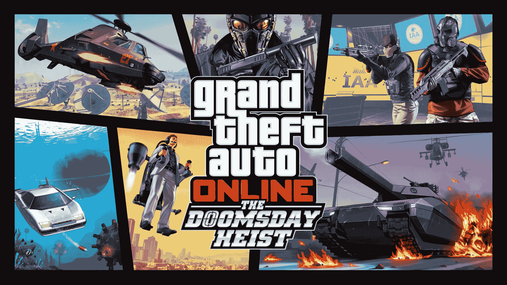
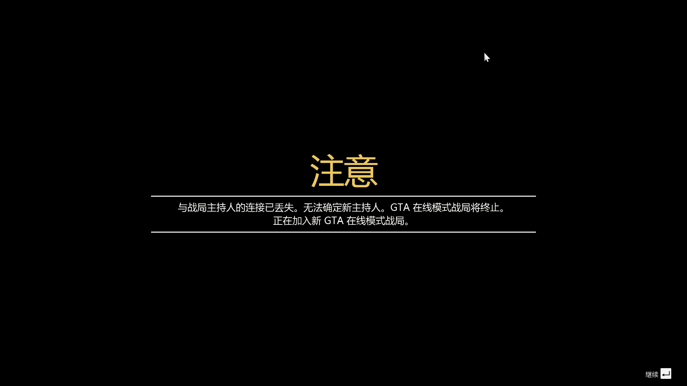

# [3／18更新至数据泄露]GTSOL：末日豪劫(侠盗猎车手5同人文)

作者：箭头君7号

TID：28285

<title>1</title> <link href="../Styles/Style.css" type="text/css" rel="stylesheet">

# 1

*本帖最後由 箭头君7号 於 2020-3-18 09:36 編輯*

为什么这游戏里那么多的武装载具就是没人搞娘化图呢？求人不如求己，干脆写篇圈内同人文好了。*本文中的巨大娘一般是常人10倍大小，除了个别体积差距过大的（比如复仇者）<ignore_js_op></ignore_js_op> **WH@QWTXT5VP0%@JW]BVH6HS.png** *(2.06 MB, 下載次數: 0)*

[下載附件](forum.php?mod=attachment&aid=ODE5NzR8MWVkNTVjMTN8MTYwMDg3OTcyM3wxODIzMHwyODI4NQ%3D%3D&nothumb=yes)

2020-3-14 20:17 上傳 第一章：数据泄露“进来，随便找个地方坐坐。全国上下只有这个房间能免除监控。”
　　见到我的到来，莱斯特立刻起身。上一次见到这个发福的中年大叔还是好几个月之前的事，本来以为在太平洋大劫案之后我们就此分道扬镳了。可是最近他又疯狂发短信催我到花园银行拍卖网买一座设施。无奈之下，我花了重金买下了塞诺拉大沙漠设施。
　　“我现在能摘下这个面具了吗？”
　　在莱斯特旁边还有一个穿着体面但是戴着很滑稽的头套的男人，莱斯特便摘下了他的头套，随后问我：“你知道埃万赫兹吗？”
　　“埃万赫兹，对，就是那个埃万赫兹。别大惊小怪，我就是一个普通的天才。我做的事情都很正常，比如和重要人物一起玩风筝冲浪，与二线女演员约会。我有血有泪，这也是真正的头发，我擅长编程，我有真实的情感，我就是那种面面俱到的天才……这人为什么不说话？”
　　（注：为了增强代入感，GTA在线模式的角色永远不会说话，因此他们也被戏称为“小哑巴”。）
　　埃万不顾莱斯特尴尬的眼神开始他独特的自我介绍，尽管我对“埃万”这个名字完全没印象。不过作为一个程序员却没有秃顶，那可真是令人刮目相看。
　　“呃……别在意了。”莱斯特早在全福银行的时候就习惯了我的不善言辞，“埃万曾经为IAA工作，但是后来被开除。现在他担心有人正试图发动一场战争……”
　　（注：全福银行差事是GTA在线模式的第一个抢劫任务，也是无数小哑巴们打造犯罪帝国的起点。）
　　“我不是在担心，我已经完全确信。唯一的问题是，我不知道到底是谁。更糟糕的是，克利福德也不知道是谁。”
　　埃万晃了晃他手中的平板。
　　“克利福德，就是他的超级电脑。”
　　“啊，它是由超级电脑组成的神经网络。克利福德是一个解决问题的设备。”埃万按了下遥控器，身后的策划大屏随之开启，“问声好，克利福德。”
　　“你让我不好意思了，埃万，我脸红了。”
　　大屏上显示出蓝紫色的圆圈，富有机械磁性的声音从扬声器中传出。
　　“只要给克利福德数据，问题就能解决。克利福德曾经有所发现，但现在数据却消失了。一定是俄国人干的，或者是朝鲜人，或者是伊朗人，或者是使用委托代理的中国人。事实上，如果我们不能查明到底是谁泄露了这些数据，克利福德就派不上用场。”
　　“只要我们能拿到报酬，就可以提供帮助。”
　　很明显莱斯特依然只关心钱的问题——在这方面我也一样。
　　“发生了三起数据盗窃，我需要你们反泄露，再泄露……爆料……我是一个天生的沟通高手，我是一个……”
　　“你跑题了。”莱斯特不耐烦地挥了下手杖。
　　“不，这就是主题。我是如何被接待的，我是如何被虐待的？这是一场美国悲剧，杀死聪明的天才，好让笨蛋们收受低价贿赂……好吧好吧，我会付钱的，不管代价有多大。”
　　“我们需要一大笔钱，至少六位数。”莱斯特再次强调了下报酬问题。
　　“没问题，我的股票价格居高不下。瞧，三个问题，三个足够简单的解决方案……”
　　“请你别再像主题演讲一样说话了，好吗？”
　　莱斯特忍无可忍——这屋子里总共就三个人，其中一个还是哑巴。
　　“我那样做了？”
　　“是的！”
　　“……三起数据盗窃，二百五十兆的数据点落入了敌手，三个解决方案。一、数据快递员，在洛圣都街道上遭到谋杀，尸体就在停尸房里。”
　　尽管莱斯特一再提醒，埃万的语气还是没有一点变化。
　　“呃，停尸房，你需要一位救护姬才能进去。”
　　这意思很明显了，让我假扮成医护人员混进停尸房。
　　“老式的，模拟的，我喜欢……真是怀旧。问题二、有四辆厢型车正在发送绝密的军事数据，你们需要车来追踪它们。我有一个算是朋友的家伙，可以把车借给你们，看这儿。”
　　屏幕上出现了一位银发少女。埃万嘴上说是借，但直觉告诉我是抢。
　　“好，听起来很简单，第三个是什么？”
　　“位于巴洛米诺的国安局服务器群遭到了入侵，我已经完全确信。但是没人相信我，我也不知道要如何证明。但如果有人能进到里面去……”
　　“啊，稍微等一下，我知道这些隐形直升机……这些东西。”
　　莱斯特调出了一张阿库拉的图片，她正在一处工厂里休息，四周还有不少警卫。
　　“听着，埃万，这些看起来似乎没有关联……”莱斯特搞不明白埃万的葫芦里到底是在卖什么药。
　　“你当然会那样想，因为你不是一台超级电脑。克利福德会帮我们找到关联。只要给我们更多关于数据的数据，我们就能把它数据化。”
　　埃万合上电脑准备离开。
　　“行吧，那么开始干活吧，祝我们好运。”
　　“很高兴见到你们。埃万，你穿这身衣服很好看。我喜欢你的头发。”
　　克利福德在也和我们道别——我差点都忘了它还在运行。
　　“谢谢你。关闭Clffford.exe程序。”
　　　虽然埃万演讲的样子十分神气，但走之前他还是不得不把头套戴上。 <title>2</title> <link href="../Styles/Style.css" type="text/css" rel="stylesheet">

# 2

【前置任务：医疗装备】 “我这就把位置传给你，”莱斯特用无线电与离开设施的我联络，“如果对任务还不清楚的话，你需要一位救护姬来混入验尸官的办公室，然后找到探员的尸体，获得资料，懂了吗？好吧，去干活吧。”
　　莱斯特发送给我的地点是在卡西迪河，要到那地方去抢夺一位救护姬的话，还是需要耗费不少时间的。
　　不过，再思考一下的话……为了混入洛圣都验尸所，我不是只需要随便找一辆救护姬就行了吗？既然如此，不如……
　　我拨通了911电话。
　　“您好，这里是911，您需要什么紧急服务？谢谢。医护人员正赶往您当前所在地。”
　　（注：这是末日豪劫中唯一的速通技巧）
　　没过几分钟，我就觉得脚下的地面在略微颤动。一位橘色头发，身着白色护士服的巨大少女朝我这里火速跑过来，她就是救护姬了。
　　“终于赶到了……请、请问这里发生了什么事？”
　　因为长时间的奔跑，她脸上的汗液清晰可见，衣服也湿了一大片。
　　“这位救护姬，能占用你一点时间吗？现在我有个拯救世界的计划需要你的协助。”
　　我说着就往回走，设施入口处的扇式铁门随之开启。
　　“拯……拯救世界？您在说什么呢……今天可是我第一次上班……”
　　“巧了，我也是第一次接手拯救世界的工作，你愿意帮忙吗？这事关数不清的人命呢。”
　　“呃……好吧。”
　　救护姬于是跟着我走到了升降台上。我在控制器上输入密码后，升降台就将我们两送进了设施内部。虽然说“拯救世界”这种说辞看起来像是骗三岁小孩的玩意，不过可不是每一个骗子都能拿出一套藏在地底之下的秘密设施的。
　　“呃……当然，你可以直接叫来一位救护姬。”无线电里的莱斯特终于发现了盲点，“偷取数据没有打家劫舍的那种……诱惑力，我说得对吗？我的意思是，它不够性感。但不久之后所有的钱都会变成数字，而且只是数字……这是趋势。我们应该趁现在尽情享受。”
　　作为天才黑客的莱斯特始终忘不了现金的滋味，虽然现金已经不够值钱了。
　　（注：名钻赌场豪劫一共有现金、艺术作品、黄金、钻石四种财物。现金是收益最低的财物，但是不得不说抢现金的手感是最好的。）
　　“哇……好厉害！这里，到底是什么地方！”
　　设施气派的架势让救护姬看呆了。说实话，我第一次来的时候也是看呆了——虽然那只是在半个小时之前。
　　“貌似是把被政府部门废弃的东西进行修缮了一下。总之，你现在一定很累吧，可以先坐在这里休息一会儿，我帮你倒杯饮料。”我指了指旁边的特殊定制沙发。
　　“嗯，谢谢。”
　　我走到设施内部，看了看显示屏上的洛圣都验尸所。实时录像显示那里仍然有一些巡逻的FIB人员，大概是因为数据泄露的原因已经惊动了上层人员吧。说实话我觉得直接硬闯进去也是可行打的，不过就照着莱斯特和埃万的方案来吧，要是到时候出了差错拿不到钱可就全是我的责任了。
　　灌满了一个超大杯的易可乐之后，我回到设施的停车处，将易可乐转交给了她。不过虽然已经休息了几分钟，但可以看出她还没有从之前的长跑中缓过来。
　　“如果实在是累的话，就把鞋子脱了吧，我来帮你按摩按摩。”
　　我坐在了她的身旁，盯着她的脚。
　　“诶？这样……合适吗……”
　　“是我把你扯进这件本与你毫不相关的事情的，按个摩也算是给你的补偿吧。”
　　“好吧……那么我失礼了……”
　　救护姬脱下她的鞋子，侧着身子把双足放到了沙发上。在烈日下闷了半天的，穿着短袜的脚丫终于得到了释放，散发出迷人的足臭味。她光是一只脚就要比我整个人还要高了，而且我现在还是坐着的姿势，所以我得站到沙发上才能够到她的脚趾。
　　“呜哇，味道是不是很大？”她害羞地不敢直视我。
　　“没呢，你脚上的味道还蛮好闻的。”
　　为了让她放心，我把头埋进了她的脚心里还蹭了蹭。由于出了汗，她的袜子表面有种粘稠的感觉，酸臭味也比较浓厚。见我没有任何反感的样子，她虽然还是比较害羞，但也就放心了。
　　我就开始把玩她的两只脚丫子，先用双手揉她的脚掌，就像揉面一样，然后用掌心逐一按了按十个脚趾头，救护姬就发出了舒服的声音。觉得力度还不够的我，就开始揉搓她的脚心。这地方的触感是真的好，皮肤太柔嫩了，而且也是比较敏感的部位，她不禁笑出了声。随后，我再用手盘她的脚跟，同时脸贴到她的脚趾缝处为她按摩。救护姬十分惬意，也开始用脚趾蹭蹭我的正脸。按摩了一会后，救护姬也恢复了精力。
　　“那么，请问我要做什么呢？”
　　“你的工作很简单，帮助我混进洛圣都验尸所就行，之后就没有你的事情了。”
　　“去验尸所……请问是要做什么呢？”
　　“总之是与数据有关的事情，十分钟后就动身，准备好了吗？”
　　“嗯！”
<title>3</title> <link href="../Styles/Style.css" type="text/css" rel="stylesheet">

# 3

**【准备任务：亡命速递】**
　　[十分钟后]
　　救护姬给我提供了医护人员的服装。她把我装进胸前的口袋后，往洛圣都验尸所的方向跑去。
　　“现在，你有两个任务要完成。除了在验尸官的办公室夺回数据之外，还要去拿回被杀探员的运输直升机。”莱斯特在设施里远程指挥，“埃万，那个探员把数据藏在哪？”
　　“根据标准程序，他当时应该通过直肠携带。”
　　听上去很不妙——对已死的探员不妙，对我也不妙。
　　“你们会把储存卡咽到肚子里？”
　　“有时会这么做，但有时会从身体另一端进入。条条大路……你知道的……通直肠。很遗憾，这是我们目前最安全稳妥的办法。”
　　“除非你被杀。好吧，我们把事情搞定，然后回归抢劫银行的生活，好吧？”
　　救护姬也来到了验尸所附近，现在距离入口只有不到三百米的距离了。
　　“现在到处都是FIB探员，相信那些公共部门的喽啰们各自心怀鬼胎。表现自然点，只要你们不被发现，他们就不会封锁这个地方。”
　　正如埃万所说，这里几乎的所有普通车辆都已经被撤离，只留下一些FIB车辆。不过“表现自然”一直是我的强项。在门口的探员眼前，救护姬把我从口袋中取出，一切看上去都很合理。
　　“真的没有问题吗？这里有这么多警察……”
　　救护姬可能从来没有见过一个地方被封锁得这么严实。
　　“没大问题，你的工作就是这些了，感谢你的协助。在引起怀疑之前你赶紧离开吧。”
　　我也不动声色地走进验尸所，没有引起任何怀疑。
　　“到了吗？赶紧搜索那些尸体，直到找到数据为止。仔细找，伙计。它就在那儿的某个地方。”
　　“他的屁股是干净的，再继续找。”
　　“那不是我们要找的东西，下一个。”
　　“我操！他们已经取走了！难道已死探员的菊花就不再神圣了？”
　　这超出了埃万的意料，但我觉得我刚才的一系列行为也是对这些探员的大不敬。
　　“好……呃，这些之后再考虑，到楼上去。运气好的话，文件会在那里的一台笔记本电脑里。你上面的楼层是禁区，他们只要看见人影就会开枪，天知道那里还会有什么。”
　　这种时候还是莱斯特靠谱，不过这也说明我要准备好战斗了。冲上三楼突突突，在电脑上下载了数据之后又是一番突突突杀回大门，而门口已经被三星级别的警察包围了。
　　“主人！我在这！”
　　熟悉的少女音在一旁响起。她不是别人，正是从全福银行开始就一直陪伴着我的骷髅马。她的身体是由特殊材料做成的，完全不怕警察的子弹，除非是有火神机枪那样的破坏力或者是爆炸物，而这些都是洛圣都警方不会配备的武器。
　　（注：不考虑坦克和APC的话，骷髅马就是GTA在线模式中防弹性能最好的载具，没有之一，而且能够带进抢劫任务与末日豪劫任务，更别提越狱的卡骷髅马和已经失效的太平洋卡骷髅马了。它绝对是PVE神器——除非敌人会用爆炸类武器或是火神机枪，而且五十万的价格对于萌新来说也不算是天文数字。在作者看来骷髅马是全洛圣都性价比最高的载具——如果不考虑免费的挽歌。）
　　她踢开拦路的警察和警车，把我抓进口袋，朝着布罗高地的方向跑去。
　　“干得好，骷髅马，连我出来的时机都很清楚，不愧是我的拍档呢。”
　　“嘿嘿，都和主人相处了这么长时间，有一点默契是应该的啦。”
　　她还用手指抚摸我的脑袋，身后警察的枪林弹雨对于她来说根本无关痛痒。她的防弹性真的是无可挑剔，不过……她的胸部可还真是有够硬的，是货真价实的钢板，就算使劲按下去也不会有一点起伏——别问我怎么知道的。回想之前被救护姬装在胸前口袋里的情况，我只要稍微往后面靠一靠就能隔着护士服感受到她柔软的肌肤，再搭配上护士小姐姐的那种香味，可真是回味无穷。
　　“主人的样子有点不对劲哟，是不是又在嫌弃人家的胸部了？”
　　骷髅马的嘴角稍微上翘……不好……她发觉了事情的异样……
　　“不……呃，都跟你说多少遍了我也很喜欢贫乳的！”
　　我赶紧疯狂蹭她的胸部并做出一脸享受的表情。虽然说搓衣板也挺不赖的，但是这是真的疼啊！
　　“嗯哼，这才对嘛~”
　　此时骷髅马已经到达了目标点，这里的敌人也开始朝我这里集火，不过在骷髅马的保护下我根本不会受伤，除非伤害来自骷髅马本人。骷髅马抬起脚，将附近的敌人全都踩进了泥地里，我也将高处的敌人逐个爆头。清理干净后，我从口袋里跳出来，捡起地上的公文包后跳进野蛮人直升机离开现场。骷髅马也跑开，到偏僻地区躲避通缉。
　　“拿到直升机了吧？好，开到会合点来，轰掉挡在路上的一切障碍。”
　　“真令人惊讶，你这么快就已经从负责工程团队变成对敢死队发号施令了，埃万。”
　　“嘿，我一直都是个杀手，至少是被称作杀手。结果比手段更重要，产品就是上帝。”
　　“没错，没错。”
　　甩开通缉后，我来到了指定地点准备降落，所有人都松了一口气。
　　“他们来了，埃万，还有你探员屁股里的数据，快给你的机器使用吧。”
　　“是机器的网络。不管怎样，干得好，伙计们，算是刚好可以接受。”
　　（注：亡命速递虽然是末日豪劫系列的第一个准备任务，却不是最简单的任务，尤其考验1号团队的技术。这里就是一种绝对稳妥的攻略方式：2号团队清光敌人后不急着开野人，而是开骷髅马到验尸所等1号团队出来，再去开野人。）
<title>4</title> <link href="../Styles/Style.css" type="text/css" rel="stylesheet">

# 4

> [wxy112300 發表於 2020-3-14 23:46](https://giantessnight.com/gnforum2012/forum.php?mod=redirect&goto=findpost&pid=429985&ptid=28285)
> 问题来了，GTSOL里的巨大娘也会卡在云上看风景吗（逃

当然会了，R星服务器面前巨大娘和小人一视同仁
<title>5</title> <link href="../Styles/Style.css" type="text/css" rel="stylesheet">

# 5

> [光海 發表於 2020-3-15 14:37](https://giantessnight.com/gnforum2012/forum.php?mod=redirect&goto=findpost&pid=430049&ptid=28285)
> 怀念一年前和朋友叫埃万钢铁侠的日子，可惜现在没时间坐在一起玩了

财神爷埃万哈哈哈哈，发家致富就靠和好友互刷末日3了（不过现在赌场黄金bug更香就是了）
<title>6</title> <link href="../Styles/Style.css" type="text/css" rel="stylesheet">

# 6

> [苍蓝星 發表於 2020-3-15 16:25](https://giantessnight.com/gnforum2012/forum.php?mod=redirect&goto=findpost&pid=430062&ptid=28285)
> 提醒一下，楼主大大你的标题写错了，应该是gtaol

就是这个标题=.=我不至于犯这么低级的错误
<title>7</title> <link href="../Styles/Style.css" type="text/css" rel="stylesheet">

# 7

**【前置任务：德罗索】**
　　“到我发给你的那个地址去，这个埃万的‘朋友’有我们所需要的载具。”
　　“而且他不介意我们借用一下……现在，干掉他的保安团队怎么样？他的牺牲是为了实现更远大的目标。”
　　“准确来说牺牲的是他的保安们，不过，反正他们也不是什么好家伙，所以……”
　　“那里有一辆德罗索，她有上掀式车门、实心钢车体面板，美国80年代经典设计，再加上一些改装后，就更完美符合我们的需求了。”
　　“这辆车就在他上锁的车库里，先解决掉保安，再把她弄到手。”
　　抵达莱斯特所标记的斯蒂尔小道的一处宅邸。这里的后院也就那么点大，却遍地都是保安。
　　消灭所有保安拿到钥匙后打开车库门，阳光便洒满了整个车库。车库正中间的德罗索揉了揉惺忪的双眼，似乎是在这里睡了很久。和之前大屏里显示的一样，她只穿了件破破烂烂的素衣，而且更令我感到一丝不快的是，她的手脚是被铁链捆住的。而且因为车库体积太小，她只能以极其憋屈的姿势趴在这里。被埃万的“朋友”拿到手后，她就一直被迫待在这种地方吗？
　　“嗯……不是……保安？你是谁？哎呀！”
　　她下意识地想后退，头却撞到了天花板。
　　“冷静点，我是你现在的主人的朋友的朋友，因为一些事情，希望你现在能跟我回去。”
　　“回……回去？你要把我从这里带走吗？”
　　德罗索呆住了，这让我也呆住了。
　　“呃……难道说你不想离开这里？”
　　“当然不是那一回事！”德罗索拼命摇着头，“只是……太激动了，没想到终于有人能把我从这里救出去了……”
　　“那就赶紧走吧。”我炸掉铁链，带她走出了车库。然后盯着她看了很久。
　　“怎……怎么了？有什么事吗？”一直被我盯着的她很不好意思。
　　“我要怎么上你啊？”
　　“诶诶诶？”
　　“别误会，我是说我要待在你身上的哪里？”
　　我观察了半天，她的衣服上并没有口袋之类能放置我的地方，这种情况我还从来没遇到过。
　　“呃……抱歉，这个我也不清楚……”
　　“真是伤脑筋。呃，等下，我记得埃万说你有上掀式车门……”
　　想到这一点后我再次扫视了一下她的身体，目光停留在了她的鞋子上。仔细一看的话，她的鞋子好像还真挺不一般的，鞋帮的侧面有几道特别明显的金属加工线，中间还有一个把手。
　　我拉动了那个把手，鞋帮就侧向打开，露出一只洁净的小脚。可以看出德罗索的脚底和鞋底之间是有一层透明隔膜的，再加上她的脚长也与我的身高差不多，这个空间应该刚好容得下一个躺着的人。
　　“这驾驶方式挺有创意的，怪不得埃万会让我专门来把你借走。”
　　说着我就钻了进去，车门也自动关闭。我的脸恰好处于她的二趾和三趾之间，整个身体都与她的足底是紧挨着的。这层透明隔膜的材质还真是奇特，似乎是采用了压力缓冲技术？德罗索的左脚是实实在在地踩着我的，但是施加在我身上的压力却远远小于三十吨——不然我就瞬间WASTED了。
　　“诶？等下，你直接钻进我的鞋子里面了？没有事吗？”
　　德罗索立刻抬起她的左脚，生怕把我踩伤。
　　“没有啦，你的鞋子里有一种特殊材料能减轻这里的压力，完全不用担心我。而且，你脚上的气味也很不错呢~”
　　可能是因为长时间没有运动，再加上一直待在阴暗的车库里，德罗索的脚上没有汗臭味等异味，取而代之的是女孩子特有的体香。再加上我的鼻子刚好位于她的脚趾缝部位，而脚趾缝想必是女孩子的脚上味道最浓厚的地方吧。
　　“不要刚刚见面就说这种奇怪的话啊！”德罗索的脚趾头害羞地收拢了一下，却把我的头夹得更紧了，“呃……那个，你确定你不会有事吗？”
　　“你倒是走两步呗，一直在这愣着也不是办法哇。”
　　“好的吧……”
　　德罗索小心翼翼地把左脚踩在地面上，同时温柔地舒展脚底以试探我的状况。我则用双手轻轻抚过她的脚掌以让她不要担心。稍微迈出了几步后，德罗索终于放下心来，在我的指示下往设施跑去。她每走一步，都像是在为我做全身按摩一样。随着时间的推移，德罗索的脚上也出了些许的汗液，于是比刚才更为浓烈的足香味飘入我的呼吸系统中。不过这层隔膜倒是把汗液本身给阻拦了，不能体验到德罗索的足汗把我全身弄粘稠的那种感觉还真是遗憾呐。
　　“好，接下来呢，把车弄到设施来，埃万就会她进行一番改装。”
　　“你将会用她来确保数据的安全，这些数据可以用来避免民主危机或更糟糕的情况的发生。相比于当前要紧的事，车本身被改造成什么样子并不重要。”
　　“这真是一种‘工程师’的说法，你关心用户的需求对吧？”
　　“产品第一，用户其次，你个混蛋。”
　　天呐埃万这目中无人的口气，让人不想揍他都不行，难怪他会被IAA开除。
　　德罗索的速度也蛮快的，不消一会工夫就来到了设施入口。我也从她的鞋子里爬了出来。
　　“请问……你为什么要救我呢？”
　　“准确来说是把你从那抢过来。原因嘛，某个高傲的天才发觉了一场潜在的战争。为了阻止这场战争的发生，我们急需你的帮忙。”
　　“我的帮忙？可是我并没有什么特别之处啊。”
　　“光是你的车门开启方式就足够独特了。顺便说一下，制定计划的人叫埃万，马上他会对你进行一番改造。具体会搞成什么样子我也不清楚，不过也快了。”
　　“是这样吗……那么请多多指教了！”
<title>8</title> <link href="../Styles/Style.css" type="text/css" rel="stylesheet">

# 8

**【准备任务：拦截信号】** “好了，没时间浪费了，你需要驾驶那辆德罗索，然后追踪数据。”
　　经过改造之后的德罗索已经被停放在了梅萨地区待命了。不过莱斯特要是觉得时间宝贵的话，为啥不直接放在设施旁边让我开走呢？
　　“数据正在绕着城市移动。一共有四个分开的缓存，分别与一个中央总线系统远程连接。你要做的就是利用这些连接的漏洞，但是为了做到这一点，你必须靠近它们，那就是使用德罗索的目的。”
　　“现在对我们来说，机会转瞬即逝。因此，时间是至关重要的。这就是埃万付钱要我们收集的随机数据，等我们把它输入到那个超级大脑机器后……那东西是叫克利福德是吧？数据也许就不再随机了。也许会告诉我们这世界实际上正被蜥蜴秘密统治着，也许会告诉我们所有人都死定了，也许只会告诉我们谁在买樱桃口味的霜碧。那些对我们来说并不重要，只是一大堆无法解读的零和一。我们应该在意的，是埃万所开的支票末尾有多少个零。对吧埃万？埃万？……呃好吧，把这事搞定。”
　　“在你提问之前，记住你坐在德罗索中不是为了享受舒适的怀旧驾驶快感，完全不是。它是我们所面对的问题的完美解决方案，等下你就会明白我为什么会这么说了。”
　　（注：德罗索的名字就来源于英文单词deluxe——奢华的，高级的。）
　　嗯……德罗索到底会被改造成什么样子呢？我已经期待了一天了，相信埃万不会让我失望。
　　“你终于来了！嘿！我在这！”
　　赶到梅萨时，德罗索隔了老远就看到了我，并朝我招手——凭她的身高也是合情合理。我扫视了一下，她的素衣已经换成了一件拉丝钢色的雪纺大衣，脸上的表情也变得更加自信。之前普普通通的鞋子也换成了 一双黑色靴子。
　　“嗯，就和约定的一样，我来了。埃万对你的改装具体是什么样的呢？”
　　“这个嘛，他主要是对我的鞋子部分进行了改造。”
　　果然重点是鞋子嘛。我再仔细看了下她的靴子前端，发现这里新增了两个不怎么起眼的小孔。
　　“嘛，不管怎样，马上就能看到成果了。我就先坐上驾驶位咯。”
　　说是坐，其实是躺。德罗索乖巧地站着，稍微把左脚抬起来以方便我把身体挤进去。呼哈，德罗索的脚底似乎比之前还要柔嫩了些？稍微触碰一下就会凹进去。味道也从清香升级成了幽香了。
　　“已经上车了？我们正在用三角定位那个信号……稍等……哦，真狡猾……好了！发现他们了！现在就把位置传给你！”
　　“你需要靠近这些目标才能利用这些连接的弱点，在获取那些诱人的数据之前要跟紧一点。”
　　“小心一点， 在获取到所有的数据之前不要将那些目标干掉！烧焦的数据对我们一点用也没有。越快拿到数据，越快拿到报酬！”
　　雷达上出现了ABCD四个红色标记点，并且都处于移动状态，那就得挨个解决了。
　　“请问，我要怎么做呢？”
　　“听我指挥就行了，先去最近的C点。”
　　“Roger that！”
　　德罗索扭了扭脚趾后，就往目的地奔去，一路上都在小心避免踩到路人和车辆。
　　“就是她！德罗索，请控制好和她的距离，不要超过五米！”
　　“那边的黑色厢型车小姐，赶紧停下！”
　　德罗索猛冲到厢型车侧面，我也打开保镖事务所骇入程序。
　　“该死！喂，你，起来有事做了！”
　　对方一看大事不妙，立刻提速跑开。她臀部口袋里的雇佣兵也探出头来怒吼着朝德罗索开火。
　　“唔！好疼……”
　　德罗索并没有骷髅马那样的装甲，在敌人的子弹面前她也只能忍着痛苦追击厢型车。不行……这样下去德罗索会撑不住的！得想个办法！
　　（注：在游戏中是小哑巴会撑不住就是了。）
　　“有了！德罗索，跑到她的旁边和她并列行驶！”
　　我突然想到这个主意，这样的话雇佣兵就打不到德罗索了吧！
　　“原来如此，我知道了！”
　　德罗索立刻加速。作为经典跑车的她，当然能轻松跑过一辆厢型车。雇佣兵的火力虽然很猛，但是范围就只有厢型车的正后方而已，他只能无能狂怒了。保镖事务所的效率也很高，不到半分钟就完成了骇入工作。
　　“快，速度点。这种飞车盗窃……你很喜欢的，对吧？倒不是我最擅长的。”
　　“德罗索上装有导弹，你现在可以用它们来摧毁目标。”
　　导弹？原来如此，她靴子上的小口就是导弹发射口吧！
　　“好的，德罗索，接下来发射导弹把她干掉吧！”
　　“发……发射导弹？要怎么做？”
　　“……”
　　她自己并不知道要如何操作吗……那可能就得依靠作为驾驶员的我了？可我现在只是躺在她的鞋子里，甚至都不能稍微移动一下身子。
　　总之是要让她受到点刺激就行了吧？那就试试这样……
　　我伸出舌头，隔着那层薄膜舔起了她的趾缝。虽然没能直接舔到德罗索的脚趾，但这层隔膜舔起来居然是甜味的，也算是平衡了一下我的心理吧。
　　“噫呀！好痒！你……你在做什么？！”
　　德罗索的脚缩了一下，然后一枚导弹就从她的鞋子前端发射出来，正中厢型车。她就连同雇佣兵一起报废了。
　　“好……好厉害……”
　　“看来就是这么用了——我只要舔舐你的脚趾，刺激你的神经，就会给你鞋子里的导弹点火。虽然实在搞不明白原理，不过操作起来倒是蛮简单的。”
　　“唔欸……居然是用这种奇怪的方式……你不会嫌脏吗……”
　　“比起这个，任务要紧啦。赶快去追下一个目标吧。”
　　掌握了任务诀窍后，剩下的三个厢型车就好办了，只是赶路有点费时间。
　　“克利福德，你收到了吗？好了，第一步完成。”
　　“好吧，那么，如果我没读错的话，下一个数据存储点在水上。”
　　然后，下一组目标就被标记在了地图上。两个在佩罗海滩地区，另外两个位于天堂岛附近的海域。
　　“目标在海上？可是我并不会游泳啊……”
　　作为陆地载具的德罗索怕不是一掉进水里就会报废了，我也很奇怪。就在这时，埃万说话了。
　　“你的车上还装有悬浮模块，为什么不试试她在水上的表现呢？”
　　悬浮模块？
　　我的左手好像摸到了一个按钮，瞬间觉得身体轻盈了许多。
　　“诶诶诶？这是怎么回事……唔啊啊要掉下去了！！”
　　德罗索的许多身体部位都冒出蓝白色的光芒，然后整个车就突然浮了起来。一下子没掌握好平衡的她就像第一次穿上旱冰鞋的小孩子一样向后倒去，却并没有摔到地面上，而是在大约二十厘米左右的地方悬浮。因此，待在她鞋子里的我也稍微能活动自如了，起码不会像之前那样几乎动都动不了。不过也无法享受到被德罗索用全力踩住的那种快感就是了。
　　“德罗索，这就是埃万给你装上的悬浮模块。不着急慢慢来，先站起来再说。”
　　“嗯，我试试……”
　　德罗索慢慢起身，就像是踩着无形的绳索一样。在空中晃了几下手臂后，她很快就适应了悬浮状态。
　　（注：第一次开启德罗索悬停模式的小哑巴肯定也会把车开得东倒西歪。实际上德罗索的悬停模式本来就不适合在陆地上使用，不过原地转圈蛮有意思。）
　　“我已经没问题了，请下命令吧！”
　　“那还用说，去佩罗海滩！”
　　悬停模式的德罗索因为完全摆脱了与地面的摩擦力，跑起来比之前要稳得很多。
　　“和之前一样，靠近目标，利用这些连接的弱点。我们的对手是一群穷凶极恶的数据窃贼……诈骗犯和勒索犯……人渣中的人渣。如果不斩草除根，他们会猛烈地报复我们。所以，快去搞定他们。记得在拿到数据包后摧毁载具。我可不想让这些闲汉来我家搞事情！”
　　莱斯特这几天估计是被埃万搞得心神不安，以前抢雷克卓的时候也没见他要我把失落摩托帮灭了。消灭一个苟延残喘的摩托帮可比搞定未知国际雇佣兵集团要简单多了。
　　（注：雷克卓是太平洋标准银行的脱身载具——小哑巴们直接从失落摩托帮手上硬抢过来的。）
　　而我这边也完全不用担心。魔高一尺道高一丈，虽然这些坐在快艇上的雇佣兵能三百六十度无死角开火，但是悬停状态下的德罗索也变得更加灵活了。只要绕着他们转圈，火力就无法集中在德罗索身上。骇入完成后舔舔她的脚趾，这些敌人就只有被炸飞的份了。
　　“第二部分已在系统中，这组数据即将完成。”
　　“好了，那么只剩这个了，最后的来源显示是在洛圣都国际机场。快去那里，然后等我的指令。”
　　抵达了机场入口处，这里好像没有任何敌人，空旷的跑道上只有一架中型客机。
　　“到了吗？信号来源于一架正准备起飞的飞机，快到跑道上去！”
　　“快点，靠近它，拦截它的数据传输！”
　　于是德罗索加速靠近那架飞机。虽然德罗索已经使出全力奔跑，但是它已经开始脱离地面了，而骇入进度甚至还不到两位数。
　　“目标就要跑了！”
　　“我需要一个完整的数据集，伙计们！残缺的数据对我来说毫无用处。德罗索表演的第二幕时间到！拉下操纵杆，她应该不只是能悬浮。”
　　操纵杆？
　　我的右手又摸到了一个类似换挡器的东西。将它往后一扳……
　　“呜哇……我飞起来了？！”
　　德罗索的后背上长出了一对小型机械翅膀。虽然看上去不怎么样，但是它们的确给了德罗索足够的升力。有了先前的经验，德罗索没过几秒就学会了飞行。这架客机速度也不算是很快，要与它保持距离是完全没有问题的。虽然途中又来了几只秃鹰直升机捣乱，不过只要我动动舌头，它们就无力回天了。
　　（注：德罗索的导弹是游戏内第二强的导弹，只要锁定，99%以上会命中目标。就算与目标擦肩而过也会杀个回马枪。）
　　“你们知道埃万为了拿到这些数据付了我们多少钱……而大多数人竟会免费提供这些数据。我的天，Lifeinvader真是一个逆天的诈骗集团……我是说，企业，逆天的企业。”
　　莱斯特说的没错，个人信息兑换便利性的这种交易关系在现在屡见不鲜了。不过对我来说，还是光明正大地抢劫数据更刺激。数据下载完后击落客机，任务也算顺利完成了。
　　“击落它了，真棒！现在快把车开回来，你已经完成任务了。有种就来爆我菊花啊，山姆大叔！”
　　“拜托，表现得礼貌一些，好吗？我们都是专业人士。”
　　“没错，没错。那在你能雇机器人完成所有工作之前，你先习惯这些粗俗且无礼的鬼吼，怎样？”
　　“别担心，埃万。他们会被取代……很快。”
　　隔了这么久又听到克利福德的声音了，还是一样的莫得感情。
　　“是，是。我可不会对此抱有太大希望……”
　　无线电那头准备做接应工作了，现在只剩下了我的德罗索。
　　“那个……请问现在，你是我的主人吗？”
　　往回飞的路上，德罗索突然问我。
　　“不算是吧，因为马上我们就得分开了。你的所有权在埃万手上，我只是在这次的任务中临时得到了你的使用权而已。”
　　“什么？唔，好吧……但是，起码在这段路上，能让我称呼你为主人吗？”
　　“嘛，这倒是没问题。”
　　“主人，今天真的很感谢你啦。如果不是因为这次任务的话，我都不知道自己会有这么大的潜能呢。”
　　“这点，你不应该归功于埃万么？”
　　“虽然改造确实是他的功劳……但是，如果不是主人你的话，我就算被改造得再厉害也会不知所措吧。而且，当初把我从那个车库里救出来的人，不也是主人你吗？所以，不论如何，我只认同你作为我的主人。我们一定会再见面的。”
　　德罗索露出了纯真的笑容，再次用浮在空中的脚掌蹂搓了一下我。
　　“嗯，我也觉得那一天肯定会到来的。”
　　我很想再舔舔她的脚趾作为最后的告别，可惜这妹子的脚不能乱舔。
<title>9</title> <link href="../Styles/Style.css" type="text/css" rel="stylesheet">

# 9

**【前置任务：阿库拉】** “好，来和这些炮灰小兵玩玩。你获得了桑库多堡垒的限定通行证。赶快去，快点。”莱斯特为我提供了一套军服，穿上去之后我还蛮像个兵哥哥，“我们是在泄露数据……还是阻止数据泄露？不管是哪样，反正我们都能拿到钱，开始干活吧。”
　　（注：桑库多堡垒是GTA5中的军事基地）
　　“如果我们想要得到阿库拉隐形直升姬来‘调查’国安局服务器群组，就需要知道她的飞行路线。数据储存在控制塔顶楼的空中交通管制服务器中。第一步，到达目的地。前往控制塔，然后把飞行路线下载到手机上。记得我说过的吧，你在基地内的通行证是有限制的。如果做出傻事，他们就会找你的麻烦。而且它不久就会失效，所以得赶快行动。”
　　这通行证居然还是有时间限制的，不过我也不想在这地方待上多久。还要我爬上顶楼，那可就得加快脚步了。
　　我一口气爬了四五层楼，可是离塔顶还是有一段距离。从来没有哪个任务让我爬这么多层楼梯的，有够刺激！
　　“……我觉得，你可以坐电梯。”
　　在我爬得正爽的时候莱斯特突然就来了这么一句，我直接愣住了。
　　妈的有电梯不早说……我哪知道旁边的电梯能用？现在也只能一口气爬上去了。
　　（注：这任务的黄点就是在楼梯间里，而且旁边的电梯门本身就不显眼，也没有特殊标识。第一次做这任务的小哑巴基本都会走楼梯。）
　　“好了，我看到你到控制塔了，使用控制台，将飞行数据传送到你的手机。你需要确保手机一直在控制台旁边，否则下载会被中断。”
　　这似乎是很简单的事……但实际情况肯定不会那么简单。
　　果然，在我刚刚把手机连接上后不久，基地里就警报声大作。
　　“他们已经检测到下载！这下有点麻烦了……你需要等到下载完成，然后杀出重围。”
　　陆陆续续有士兵上到顶层，不过一露面就被我爆头了，这次的下载速度也很快。
　　“好，干得好。隐形直升姬的位置已经出现你的GPS上。等待她着陆，然后劫持那玩意。还有，姬上应该有军方人员，所以小心点。”
　　坐电梯回到一层，小地图告诉我外面已经是密密麻麻的敌人，我已经拿好Mk2战斗机枪准备大战一场。可是我刚推开大门，就因为剧烈的地震而摔倒了。
　　“站住，入侵者，不许动！”
　　虎视眈眈盯着我的，不是别人，正是在基地里巡逻的犀牛坦克！接近30米的身高，让一般人根本不敢有任何冒犯她的想法。她左手臂上的炮管口已经对准我，就算我出来之前装备好火箭筒也来不及用连发RPG了。如果卡了连发左轮倒是还有那么一点希望，但是现在只能束手就擒了吗……？
　　可恶，竟然会忘了她的存在。我只能放下武器，举起双手了。
　　（注：连发RPG和连发左轮都是GTA在线模式一直没修复的bug。连发左轮可以在一瞬间打出上百发左轮子弹，秒杀犀牛坦克完全没问题，但是连发RPG肯定是来不及的。）
　　“呵呵，以为投降就会饶了你吗？去死吧！”
　　犀牛坦克抬起一只脚，鞋底上还留有一些被她误踩死的士兵的尸体——她的过于强大导致她根本不关心自己人的死活，有些时候因她产生的伤亡甚至还比入侵者所造成的要多。
　　就在我即将被她踩成肉酱时，一个人影从旁边一闪而出。虽然人影只有犀牛坦克的一半高，但愣是将她撞到了一旁！
　　“好疼！这家伙居然还有援兵？”
　　被撞飞的犀牛坦克压死了几个看戏的士兵，而我也看清了这个人影的身份——叛乱分子皮卡！在这种体型差距之下还能把犀牛坦克撞飞的，也就只有她了。
　　（注：运兵直升机能轻松吊起犀牛坦克，却吊不动叛乱分子皮卡。）
　　“呀吼，主人，果然关键时刻还是要靠我呢！”
　　她回头微微一笑，朝我竖了个大拇指。
　　“嗯，但是对方并没有被你撞晕过去，小心一点。”我开始清理溃不成军的军方。
　　“切，竟敢偷袭我……不过无妨，反正你的死期也快到了！”
　　从疼痛中缓过来的犀牛坦克将主炮对准叛乱分子皮卡。令她没有想到的是，叛乱分子皮卡就像是不怕死一样，直接侧着身子往她的炮口上撞。“轰隆”一声，叛乱分子皮卡只是踉跄了几步，犀牛坦克却因为自己的坦克炮而受了重伤。
　　（注：GTA5中载具不同的部位防御力是不同的。如果犀牛坦克近距离攻击满改叛乱分子皮卡的侧面两次，叛乱分子皮卡尚能再战，犀牛坦克会爆掉。但如果犀牛坦克远程攻击叛乱分子皮卡的正面，两炮就能把满改叛乱分子皮卡炸残。）
　　“个儿倒是挺高的，但就只有这点本事么？真是无聊呢。主人，在更多敌人抵达这里之前赶紧撤退吧。”
　　 叛乱分子皮卡顺手把我抓到她的兜帽里，好让我操控安装在她后颈处的火神机枪以逃出包围圈。
　　“不想死的都给我躲开吧！嘎嘎嘎嘎！”
　　叛乱分子皮卡以势不可挡的架势轻松突破了敌人的包围。无论是军车，警车，还是慌不择路的路人车，在她面前都只有被一脚踢开的份。那些试图螳臂当车的警察无一不被她一脚踏死。
　　（注：因为叛乱分子皮卡的重量，在游戏中它轻轻松松就能撞开挡道的车辆，而它本身几乎不会减速。）
　　警方的通缉也很容易就甩掉了，叛乱分子皮卡就这样载着我一路跑到了港区。
　　“真是多谢了，叛乱分子皮卡。没有你的话我就会被那个怪物踩死了，虽然只是花500块钱的事。”
　　（注：GTA5在线模式每次死亡会损失500块，同时可以捡回来。）
　　“这是我应该做的啦。听其他人说主人去了一趟军事基地，我就担心主人会不会被犀牛坦克盯上，还好赶上了！话说，主人这是要去港口干什么呢？”
　　“抢夺一架叫做阿库拉的隐形直升姬，再用她来拯救世界。”
　　“为了拯救世界而直接打劫军方……真不愧是主人呢。啊，前面似乎有很多人的样子，就是那里吗？”
　　“肯定是了，就在这里放我下来吧。接下来的事情让我自己来处理就行了。”
　　“OK，祝你好运啦，主人！”
　　目送她离开后，我躲到掩体处观察这里的情况。只见阿库拉正坐在这块空旷地区的中央，周围只是零星散布了一些军方人员。
　　这打起来不比刚才在军事基地里要轻松多了，敲晕离我最近的那个士兵，然后拿出Mk2无托式步枪就是一顿突突突呗。
　　“呃……嗯？？？你是什么人？是来取我的性命的吗？！”
　　阿库拉皱起眉头，立刻将双臂上的导弹发射器对准了我。
　　“冷静点，阿库拉，事情比较突然，总之世界的和平和我的银行账户需要你的帮忙，”我已经听到了不远处传来的警笛声，“详细的事情之后会跟你说的，现在能先带我离开这里吗？”
　　“世界和平？你到底在说什么……没有上级的命令，我才不会跟你走的……嗯？你？！”
　　阿库拉的眼神突然变得非常惊恐，但是我什么都没做啊？
　　“不许动！否则她就没命了！”
　　这时，传来第三人的声音，他正是一开始就被我“敲晕”的士兵！原来我刚才的手劲不够大，而他来了个将计就计，顺势装作晕过去，现在趁我不注意就拿起一旁的火箭筒对准了阿库拉。
　　（注：游戏里的NPC当然没这么智能）
　　“呵呵，小子，我承认你的枪法很不错，但是你的任务目标想必就是阿库拉了吧。现在，把你的枪放下，只要你……等下你要干什呜啊！”
　　我才懒得玩人质劫持这一套，直接送了他一发RPG。
　　“如何，这就是你的上级——随便拿下属的生命开玩笑呢。你确定要听他的命令吗？”
　　“呃，但是，他并不是我的上级啊……”
　　“……”
　　这tm就很尴尬。
　　“不过，凭你刚才的表现，我还是决定暂且相信你吧。”阿库拉走到我的前面，趴了下来，“临危不惧的人，是绝对不会撒谎的。”
　　“这是什么逻辑……？嘛，你肯相信我就行。话说你趴下来干啥？你的驾驶位在哪？”
　　“请进入这里吧，趴下是为了方便你进去。”
　　阿库拉张开了她的嘴。随着两排白色大门的开启，一股特有的香味就从那似乎深不见底的红黑色交织的洞口中传出来。正中央的，巨大的肉红色巨兽盯着眼前的我蠢蠢欲动，不断有透明而又粘稠的液体从它的体表上分泌出来。洞口里香香甜甜的气味也令我难以忘怀。
　　“喂喂……这不是真的吧……算了。”
　　一开始见到这比较猎奇的地方，我还是有点犹豫的，不过我居然莫名其妙地就对它产生了点兴趣——我自己都觉得很奇怪。
　　趴到阿库拉的舌头上，她就合上嘴唇，开启脚踝处和背部的螺旋桨飞上了天空。这阴暗而又潮湿的口腔空间带给我的感觉还真是奇妙，而且两只手和脸部能清楚感受到她舌头的柔软……以及沾附在上面的口水。而且，与放在口袋里、躺在鞋子里不同的是，趴在口腔里也可以说是负距离接触吧。还好我没有幽闭空间恐惧症。
　　阿库拉稍微飞高一点之后，就开启了隐形模式。她手臂上的导弹发射器被收回，信号屏蔽器启动，阿库拉就从雷达上消失了，在这种情况下要摆脱警方的通缉真是轻轻松松。
　　“你拿到直升姬了，好的，把她带回设施。如果你觉得闯进军事基地，然后从政府合同商手里抢走价值百万的直升飞机这件事很有趣……试试从国安局手里偷出数据吧！那绝对要有趣得多。我通常不会接为埃万窃取数据这样的工作，但是说到底，谁会跟钱过不去呢？埃万可是有钱人！”
　　(注：从国安局手里偷出数据绝对一点都不有趣，尤其是对于第一次接触末日系列的小哑巴们而言。如果不会玩的话，国安局里的火力密集到能让人退游)
　　莱斯特听上去特别兴奋，或许骇入国安局这种事情对他来说是前所未有的，又或许是因为距离埃万开出支票的日子越来越近了，或者是两者都有。而且我并不觉得从军事基地下载飞行数据是件很有趣的事——尤其是在差点被犀牛坦克踩死的时候。不过，趴在阿库拉嘴里的这种体验倒是能补偿先前的损失。
<title>10</title> <link href="../Styles/Style.css" type="text/css" rel="stylesheet">

# 10

**【准备任务：服务器群组】** “好了，现在是时候了。你们得想方法去服务器群组那里，取回我的数据。”
　　“我们有阿库拉隐形直升姬可以让我们安静地到达那里，噪音剖面有限，雷达印记也较弱。在我们进入那幢大楼之前，不能让他们知道我们来了，否则他们将封锁那个地方。我们要破坏掉那些监控探头并干掉安保，以免被发现。你们的武器装有消音器，所以拜托安静点。我们的第一个目标就是保安主管。我们要在他身上找到大楼的通行密码，然后进入。我们需要的数据，很大一部分就在这里——国安局服务器群的泄露缺口。那个神经网络电脑克利福德拿到这份数据后……就能理解宇宙万物。埃万将结束战争，或阻止它爆发，我们要发财了，哼哈！大家都会很满意。”
　　莱斯特的眼中已经出现了大把的钞票了，他从来都不会嫌自己的钱多——或者说，谁会这么想呢？毕竟在洛圣都，金钱主宰着一切。而且我比较疑惑的是，莱斯特和埃万谁更有钱？
　　不过，他们的钱再多也是他们的，而不是我的。我只要出苦力，按照他们说的做，然后拿到报酬就行。比起思考那些无谓的问题，似乎好好享受待在阿库拉嘴里的时光才是明智的选择。
　　“别在大楼附近乱来，你们最好保持高度，像个普通国安局飞机一样降落在直升机停机坪。这是架隐形直升姬，但她有旋翼，因为她始终是架直升姬。所以，你并不是完全隐形的。”
　　那是当然，所谓隐形只是无法被探测到信号而已，谁都知道你依然能凭肉眼看到一架隐形直升机——如果是真的“隐形”的话，怕不是大家会看到一个飞行员以坐着的姿势在空中变速直线运动。
　　“好，就在这里降落……小心一点，你需要她才能够离开那里。”
　　阿库拉降落在了政府设施北面的楼顶，这里是个不引起注目的好地方。
　　“虽然不清楚具体情况，但你接下来是要突入这个建筑，是吗？”
　　“如果可以的话，我更希望是全程潜入。在这种地方暴露身份的话肯定免不了一场大型枪战。你就在这里待命就行了，我把事情做完就会回来。”
　　“知道了。顺带一提，你的味道还蛮不错的，比那些浑身汗臭味的士兵要好太多了。”
　　阿库拉还舔了下嘴唇，笑眯眯地看着我。这个三无少女笑起来是很好看啦，但是搭配上前面说的那句话总是让我觉得不寒而栗。
　　“多谢夸奖。”
　　沿着梯子来到地面，悄无声息地干掉这里的警卫后我就拿到了进入设施的钥匙卡。从电梯上下来之后，我瞬间就哆了个嗦。毕竟这里是服务器房，为了保证服务器的安全，制冷系统肯定到处都是。而这里巡逻的警卫都是穿着短袖的，他们不冷吗？
　　“好了，好了。我们需要入侵那些服务器，一共有四台。去那堆服务器那里，运行埃万的入侵程序，尽量保持安静，同时不要丢了性命！这里是国安局的西岸服务器群组，它是这个国家肮脏的小秘密……用来储存我们每个人的肮脏的小秘密。每一次EyeFind搜索……每一次Lifeinvader偷窥……每一条不当内容……不合时宜的事情，或者是iFruit电话上的消息……又或者是你在全景式电视前的所作所为，所有东西，都在那里……毫无遮掩地放在玻璃基板上，仅供政府查看，直到他们改变主意。”
　　看到这些黑压压的服务器群，莱斯特的语气突然变得愤慨起来。嘛……政府部门对于私人信息的垄断？这也没有办法被阻止吧。尽管如此，他们仍然无法追查到五桩拥有完整犯罪链的大案的真凶。
　　“我们的数据比你们浏览色情网站时的Cookie稍稍要更重要那么一点，但我接受你的观点。所有那些数据，你们知道这有多珍贵吗？如果克利福德能够处理那些信息的十分之一……想象一下它将了解到什么，想象一下它将变成什么。”
　　“你只付了这四台服务器的钱，所以你只能得到这四台服务器的数据。”
　　“当然了，反正有一天它会转为开源。”
　　如果埃万肯出重金要把这里所有服务器的数据都下载下来，我倒是很乐意，反正我只对钱感兴趣。
　　骇入前两个服务器倒是没什么问题，但是当我骇完第三个服务器的时候，国安局的警报声——预料之中地——响起来了。
　　“这下好了，国安局探员知道你在那里了，他们正在赶到服务器群组这里，所以……尽快入侵那些服务器！”
　　“现在正在紧要关头，伙计们，不要打盹！”
　　小地图上全是代表警察的红蓝闪烁点，我想打盹也不行啊。入口就那一个最多容纳四人的小电梯，他们是怎么做到在一瞬间就布满整个服务器房的？
　　不过就只剩最后一个服务器了，这些警察的火力也不算有多强。干就完了，奥利给。
　　“你出来了吗？现在，沿着梯子到楼顶上去，你的直升姬还在那里。”
　　杀出一条血路之后，外面自然已经聚集了一大堆警察了。不用莱斯特说我也知道得赶紧离开这个地方，但是警方的火力太强大了，根本过不去啊。
　　轰隆！
　　上方突然落下来数颗炸弹，国安局前广场上的警察无一不被炸飞。这……也只能是她了吧。
　　抬头一看，果然是阿库拉。飞在空中的她将腰间挂着的炸弹都投完后，再用手臂上的导弹发射器击落了几个在国安局上方盘旋的警用小蛮牛。
　　“帮大忙了！谢谢你，阿库拉！”
　　“一直让我在楼顶上待命的话可是很无聊的。”阿库拉降落到我前面，伸出手把我抓住，“再说，我也想早点回味一下你的味道呢。”
　　阿库拉张开嘴唇，但似乎她并不打算就这样把我丢进去。
　　“呃……阿库拉……小姐？”
　　阿库拉吐出舌头，把我按在了她的舌面上。由于我才从被冷气覆盖的服务器房里出来，所以阿库拉口中的吐息比之前显得要温暖得多。阿库拉先是用手指推着我在她的舌头上滑动，觉得不过瘾就合上嘴唇，像吮吸棒棒糖那样舔舐我的上半身。最后她干脆把我扔进口腔，舌头再快速搅拌。我就像是她嘴里的一颗润喉糖一样，根本无力反抗，只能任由她摆布了。
　　不过阿库拉舔归舔，并没有忘记正事。她已经进入隐形模式，甩掉通缉，并往会合点飞去了。虽然她的性格有点酷骄，但是可靠度还是有的——还是说这种性格使得她很可靠呢？
　　“为什么可以收集到所有数据的机构，却不知道该怎么使用数据？他们不会拿来牟利，他们不会将它放到区块链上……那是绝对安全可靠的。如果数据已经在区块链上共享了，你认为我们还需要做这一切吗？”
　　埃万以嘲讽的语气吐槽着掌管这方面的官员。
　　“我觉得我们无论如何都会这么做的，所以，是的。”
　　“在克利福德处理完这些数字后……我会展示给他们看的。到时他们就知道我是正确的了。我不清楚那是什么，不过我感觉好像知道它有什么用。区块……链。真是刺激，没什么比将自己的员工置于险境更让人兴奋了，不是吗？”
　　“是的，我参与此事就是为了这种感觉……”
　　我背后一凉。
<title>11</title> <link href="../Styles/Style.css" type="text/css" rel="stylesheet">

# 11

**【数据泄露：最终章】** 补充好零食和防弹衣后，我重回设施策划室。莱斯特和埃万已经在这里等我了。
　　“瞧，我就说吧，他会回来的。”
　　“你为什么要那样做？”
　　“因为那会让我感到兴奋和痛快，哼哈哈。”
　　“是……所以，克利福德和我分析了数据。我的意思是克利福德分析了数据，而我分析了克利福德。让我来给你举例一下……”
　　埃万情不自禁地又开始在大厅里走来走去，同时双手也在不停比划。啊这熟悉的场面。
　　“请你别再发表主题演讲了。”
　　“抱歉，我能在这里打一个电话吗？”
　　埃万开启大屏，iFruit桌面背景居然是他冲浪时的自拍照。然后他就拨通了……14号探员的号码？
　　“喂？哪位？”
　　埃万用的是视频聊天。啊，棕色头发，绿色瞳孔，再加上这美国口音，真的是那个憨憨二五仔14号探员。不过我能买下农舍地堡从而发家致富，也是托他的福。屏幕那边的他上身裸体，估计是刚洗完澡，与背景的埃万浑然天成。
　　（注：14号探员是GTA在线模式IAA的人员之一。这人最喜欢做的事情就是在你地堡出货时对你千叮万嘱要小心，回头就给全战局的小哑巴通风报信让他们炸你的货。）
　　“我正从一个绝密的前政府设施给你打电话。”
　　见到电话那边是埃万，14号探员察觉到了事情的异样。
　　“哦天啊，我告诉过你……我们告诉过你，让你重返平民生活，埃万。”
　　“那是一个陷阱，游击手。”
　　“游击手？”
　　“我一直想这样称呼某人。听着，你会害我们大家丧命的……显而易见，就像我头上这自然的秀发一样。”
　　“你在说什么？”
　　“这不是植发。你看不出来吗？他们让你解雇我这事，就已经完全彻底地证明了你是错的，而这是一场阴谋。让我给你打个比方……”
　　“为什么你要这样说话？你还在这里工作的时候，就是因为这种口气而惹人厌。”
　　“我是一个有远见的人，我目光敏锐……”
　　为什么这家伙在讲重要的事情之前都要强调自己是如何的高尚？
　　“听着，我参加部门聚餐要迟到了，所以……”
　　“去你妈的聚餐，我们正在试图阻止一场该死的战争！”
　　“开始了开始了。再见，埃万。我期待着在地球上与你再会。”
　　14号探员毫不犹豫地挂了电话——我寻思当他发现对方是埃万的时候就想这么做了。
　　“聚餐？当然了……当然了，就……就是现在，就是他妈的现在！克利福德是对的，数据清楚明了……就是现在！整个部门外出享用肉饼和土豆沙拉，所以他们的基地可以被永久地关闭掉！我们现在必须做点什么！”
　　“是的……我们是一群武装重罪犯，而你破坏了各种安全许可，高谈一台有着愚蠢名字的电脑的妄想，这世界上没有哪个警察会相信我们的。”
　　“你们得赶到那里去阻止此事，就是现在。我会付钱的……不管代价有多高。”
　　“会很高。好，我们出发吧。我会随时通知进展，来吧，行动吧。”
　　不知道现在莱斯特的动力是不是只剩下钱了。反正只要有钱赚，我就肯开干。事出紧急，那就选她吧！
　　“不管是什么攻击，它都已经发生了。前往位于卫星通信基站下的秘密IAA基地。我的意思是，我不知道我对拯救这些探员作何感想，但，呃，埃万付了钱的，开始干活吧。”
　　“没错，我他妈的会付钱。把这办妥了，你想要一皮箱的现钞？没问题。汇款到百慕大？好的。加密货币？交给我来办，亲爱的。”
　　“你自己留着吧，加密货币就是个泡沫。”
　　“泡沫？哈，看样子有人套现过早啊。”
　　“是，算了，我们再也不会碰这玩意了。”
　　“很好。就像我说的，数据没问题。外国特工在扫荡设施、抢夺数据，而这个国家最聪明最杰出的人还在夸夸其谈。美国需要英雄，而这个英雄很可能是我，当然，还有克利福德。”
　　“我一直在仔细思考这些计划，要是我来干，我可能会将攻击重点放在位于最底层的服务器上。到那里去，想办法阻止他们。”
　　“世界和平就取决于此了。”
　　“为IAA工作……我竟然成为了自己评论的网络阴谋论影片中的那种人……算了，至少我能从中牟利。”
　　狂妄自大的天才程序员与财迷心窍的肥宅黑客之间的对话就是这么有趣。
　　“主人，这次的任务似乎非常紧急？”
　　穿着黑色紧身衣的义警也是一如既往的性感。不过比起她的曲线，更诱人的是她的速度。被塞在腰间工具包里的我只要稍微把头探出来，就能享受到脸皮被强风吹到露出皮下组织的快感。她本身的极速就已经很快了，更令人兴奋的是她的高跟鞋跟还安装有只要接触地面就能持续充能的动力系统。如果角度合适，她甚至能进行短暂的飞行。
　　（注：不考虑“把前轮打掉的炼狱魔”，义警就是GTA在线模式的直线王，而且拥有游戏中性能第二强的导弹，在此基础上还能够带进抢劫任务，真的是好用。有些人说义警不好开，那纯粹是因为他们菜。作者如果开义警的话，基本每次都能把队友甩出一大截。）
　　“不然我也就不会指名要你了。而且，这次的敌人也不是以往的那种半吊子所能比的，马上就是你大展身手的时候了。”
　　“没问题，一切包在我身上。”
　　稍微说了两句话后义警就沉默不语了。这位高冷御姐还是老样子，没什么变化——一门心思全放在提高效率上，不会在没用的地方空耗口舌。嘛，她的价格本来就是“血本无归”级别的，当初把她抱回家时就该做好这样的心理准备了。
　　（注：义警的价格是三百七十五万的天文数字，还不算上后续改装费用，而且从不打折，是除竞技场DLC之外游戏中第二贵的地面载具，自然也是淘宝战士拿来炫耀的常见玩具。作者已经见识过无数淘宝战士不是把自己炸死就是加速的时候一头栽到加油站里了，而且很多时候他们连作者的骷髅马都跑不过。）
　　也正是因为义警的专注，很快我们就赶到了目的地。和埃万所担心的一样，这里已经停放了许多雇佣兵的车辆。几个放哨的人看到了义警，就立刻抄起大枪向她开火。义警甚至连反击时的台词都不高兴说，抬起两只胳膊就倾泻出无数导弹将这里炸得一片狼藉。还有几个敌人命比较大，从被炸毁的车辆底下爬了出来，却被如同不起眼的蚂蚁一样被义警无情地踩死。
　　把最后一个敌人一脚踹翻后，小地图上暂时没有红点了。于是我从义警的包里跳出来，让她在此处待命，自己则进入设施内部。
　　“警告，警告，设施已进入封锁状态。我们很遗憾地通知您，聚餐已取消，请返回到您的房间。”
　　才从电梯上下来就听到这个提示音，尤其是“聚餐已取消”那句，我听了差点笑出声。不过笑归笑，这里的敌人真的是特别多，而且都是训练有素的雇佣兵，IAA的人恐怕根本没有还手之力吧。
　　“你需要到服务器机房那里去，不要停火！”
　　“请待在安全区域里，设施遭到了攻击，灾难控制程序已经激活，探员们，在营救小队到达之前请待在安全区域里……”
　　在莱斯特的催促声和设施小姐姐的机械系统音中，我一路杀到了地下三层，可算是将这里的敌人一个不落地全清理干净了——顺便还保护了几个相对无害的IAA探员。
　　“注意，这些人越来越多了，你们需要使用基地的防御系统来保护它，快去上层的作战室！”
　　这些家伙还是不死心吗？要是再不快点的话，义警可能就有危险了。
　　返回到之前被我忽略过的那个控制室，这里装有地面的监控摄像。只见这个卫星通讯基站已经被大大小小的红点包围了，从步兵到秃鹰直升机应有尽有。义警已经身中数枪，不过她的防弹性能虽然并没有达到骷髅马的那种级别，却也强于绝大部分的载具了。尽管如此，那些秃鹰直升机仍然是不小的威胁，我得赶紧支援了。
　　（注：义警的窗户很小，因此防弹性能也比较好，尤其是在PVP的时候——虽然也不会有人拿这玩意去PVP就是了。它的后部更是完全防弹，但是和骷髅马一样，它并不防炸，任何爆炸类武器对它而言都是致命的。）
　　坐到一个控制台前，我按下了一个标志了“绝对不要按”的红色按钮。设施上方的门就侧向打开，一个白发灰瞳，身着机甲的巨大少女面无表情地站了出来。她从塔顶跳下来的时候，就顺脚踩爆了一辆炎魔。她的双臂和大腿上的炮口持续向周围发射出直线型炮弹，命中的敌人无不被炸成灰烬。眼看大势已去，这些雇佣兵也就只好撤退了。
　　“来自过去十年给你们提供最好的无人机进行暗杀的公司，这个宝贝能把任何来袭的敌人都炸回老家！”
　　“你们应该看看克利福德能够用无人机干出些什么。要是国防局当初签字批准……完美的反应，毫不犹豫，没人会有创伤性后遗症，杀人不眨眼……”
　　“你能不要再说什么克利福德了吗？拜托！嘿，看上去我们的员工已经搞定他们了。埃万呢？该死的埃万去哪里了？埃万！”
　　通讯结束了，这时我身后的大门被踹开，14号探员和一个女性探员拿着武器警惕地扫视了一下这间屋子。
　　“一切都很好，我知道这个人，我本来要参加聚餐的。”
　　见到里面的人只有我，14号探员放下心来。话说你丫到现在还只想着吃？
　　“他是什么人？到底发生什么事了？”
　　“这位好心人救了我们，顺带一提，我们互不相识……我和他。如果你以为自己认识我……那就错了。你为谁工作？”
　　我知道干这行的必须“互不相识”，但是这又没别人，你不需要装得这么明显。
　　“我可以封锁这个地方了吗，就现在？好吧，你们这些笨蛋。不，这里没有聚餐，我才不在乎你们的香蕉奶油布丁呢。”
　　女性探员坐下联络并指责外部人员，看样子她的官职应该比14号探员大。所以你们IAA在基地被突袭的情况下还是对聚餐有着深深的执念啊。
　　“也许下一次，你们会听我的话。”埃万不知什么时候已经来到了这里，并用比平常高出很多的音调说着。
　　“这个白痴在这里做什么？”
　　女性探员不耐烦地看了他一眼。
　　“我再次救了你的命。若不是我出资执行秘密行动，你们都会死掉……而国家将落入谁的手中呢？那就是问题所在。这地方的漏洞比你弄干沙拉那东西还要多……但究竟是谁？原因何在？我可以从这里登进克利福德吗？”
　　“当然可以。”14号探员无奈地摊了下手。
　　“是俄国人……我们知道是俄国人干的，这种攻击是他们惯用的伎俩之一。”
　　女性探员愤慨地说道。美国和俄国……真是传统艺能。
　　“那正是对方的意图，拉克曼夫人，给人一种俄国人所为的印象。我们认为不是俄国人干的，因为那样的话就太简单了。克利福德说，有99%的几率……是某些俄国人干的。”
　　这打脸速度也忒快了。我也知道了女性探员叫拉克曼。
　　“不是伊朗人？”
　　“伊朗？克利福德说不是。克利福德说，就是这个人。”埃万调出了一个老毛子的照片，他没有头发，胡茬很多，身穿海蓝色迷彩作战服，“代号波格丹，姓氏不明。俄国鼓动者、杀手和战争贩子。”
　　“我可不相信这些……”
　　14号探员显得十分敷衍，他一定是还在想象着那场被取消的聚餐。
　　“但刚才确实有人想要杀死你，而数据痕迹则指向了他。瞧吧，看看这些图表。”
　　“好。”
　　“我们可以马上找些人来处理此事吗？那个小丑在哪里？”
　　“哪个小丑？”
　　“袭击博物馆的那个。我可以在这里得到一些支援吗？”
　　“呃，让我们离开这里吧。”宣告完他的发现后，埃万起身说道，“谢谢你……再见，二位。国会奖章……国会的大派对……很荣幸能为国服务。”
　　“哦你去死吧。”
　　拉克曼可不吃埃万的这一套。我也就跟着埃万离开了。
　　“小丑，公共部门小丑。云端……运断……该死的，清洁工都能解决这个问题。只要有克利福德，就没有问题。非常感谢，我们晚些再联络。这真是吃力不讨好的工作。我的助手在哪里？我应该在某个地方发表演讲……”
　　一直到坐上他的座驾“飓风”，埃万都在发牢骚。全洛圣都也就只有我不会对他有任何“不敬”的回复了。

**一号行动：数据泄露
　　成功

　　7theArrow 铂金

　　预计收益
　　$812500

　　实际收益
　　$812500

　　100%收益分红
　　$812500

　　精英挑战
　　05:30分钟内完成 04:58 √
　　击杀78名敌人 85 √
　　无人死亡 √

　　精英挑战完成
　　$862500

　　现金总收入
　　$862500

　　JP+15** **　　RP+2700**

正在等待玩家
<ignore_js_op>

**20200224155608_1.jpg** *(70.57 KB, 下載次數: 0)*

[下載附件](forum.php?mod=attachment&aid=ODIwMDB8MWMyNmFjMmV8MTYwMDg3OTczMHwxODIzMHwyODI4NQ%3D%3D&nothumb=yes)

2020-3-18 09:34 上傳</ignore_js_op>