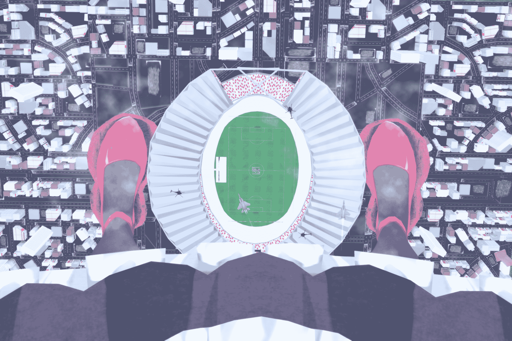

# [NEKOPARA]和小人一起看世界盃(翻譯)

作者：kidkevin036

TID：25564

<title>1</title> <link href="../Styles/Style.css" type="text/css" rel="stylesheet">

# 1

原作連結:[https://www.deviantart.com/nya-gato/art/Watch-the-World-Cup-with-the-little-ones-P1-750182175](https://www.deviantart.com/nya-gato/art/Watch-the-World-Cup-with-the-little-ones-P1-750182175)
作者:[Nya-Gato](https://www.deviantart.com/nya-gato/gallery/)

之前說要把神風Level UP的坑填完,但是我卻食言了,抱歉QAQ
[ケン](https://www.pixiv.net/member.php?id=4931495)的文章也有 [qianqian](https://giantessnight.com/gnforum2012/home.php?mod=space&uid=5840&do=thread&view=me&type=thread&from=space)大佬繼續翻譯了,她翻譯的真的很棒,覺得自己翻得跟低能兒一樣
我現在在日本奄美大島的語言學校,當留學生,暫時不想再看到日文了...
所以現在翻譯一篇英文的文章給大家作為補償吧
請大家多多指教啦~~

<ignore_js_op>

**1.png** *(3 MB, 下載次數: 17)*

[下載附件](forum.php?mod=attachment&aid=NzMzMzd8MDJmMzQ4OWR8MTYwMDg4NTgzNHwxODIzMHwyNTU2NA%3D%3D&nothumb=yes)

2018-7-20 15:10 上傳

巧克力：香草，你看！這裡有一個巨大的體育場裡面正在舉辦著世界級的大賽呢！或許裡面正在舉行一場足球賽。

香草：我知道，我在網路上查到過，這個體育場可以容納44918人，但是他甚至沒有我們的浴缸大，甚至不足以讓我們坐進去。

巧克力：但是這足夠讓數千名觀眾進去了，而且足球比賽也順利地舉行，我很喜歡。

*香草正在觀察在綠色草皮上的那些小點，他們正在追逐一顆小小的球

香草：這就是人們說的足球？我實在不能理解為什麼他們喜歡如此的爭球
香草：此外，這些直升機是負責保全的？為什麼他們飛的離我和巧克力那麼近？我們做了什麼嗎？
香草：嘿！別飛這麼近，如果你碰到我們的腿會出意外的！

<ignore_js_op>

**2.png** *(3.45 MB, 下載次數: 14)*

[下載附件](forum.php?mod=attachment&aid=NzMzMzh8NDNlZGU5NmN8MTYwMDg4NTgzNHwxODIzMHwyNTU2NA%3D%3D&nothumb=yes)

2018-7-20 15:11 上傳

巧克力：看來球賽已經結束了呢～冠軍隊伍也產生了，他們超棒的。

*香草看著只能容納他一隻腳的體育場，那些小點正在聚集在一處，像個螞蟻窩，他們正在頒發冠軍獎盃給勝利的那方

香草：嗯哼，比賽結束了。

巧克力：啊！我差點忘記了，我要自拍來紀念這個有意義的時刻。

巧克力把腳跨在體育場的兩側，整個城市就像地震般地晃動，就只是因為她的移動，現在整個體育場都在她的雙腿之間

香草：喔！我看見更多飛機來了，我想他們是想跟妳拍照呢～

巧克力：好極了！這樣可以讓我的自拍變得更棒！

<ignore_js_op>

**3.png** *(3.95 MB, 下載次數: 17)*

[下載附件](forum.php?mod=attachment&aid=NzMzMzl8MDliM2FlYjN8MTYwMDg4NTgzNHwxODIzMHwyNTU2NA%3D%3D&nothumb=yes)

2018-7-20 15:15 上傳

巧克力：所以香草，妳對於人類的足球怎麼看？

香草：嗯...我覺得非常的有趣呢！

巧克力：我想如果妳可以親自實戰的話，應該會感到更加有趣吧！

香草：實戰？我是很想啦...但是怎麼做？

巧克力：這很簡單啊，這裡有世界冠軍的隊伍，妳可以和他們來一場比賽。

香草：但是我不知道怎麼樣踢足球呢...

巧克力：足球就是只要用右腳將球踢進對手的球門就可以了，所以先將妳的右腳放進體育場吧～

香草：好...好的！

*香草緩緩地將她的巨腳踏進體育場，建築物因為她的步伐而搖晃，當她的右腳踏進體育場時，發生了大約8級的地震，導致一連串的建築物倒塌了

香草：這體育場有點小呢，但總算還能容納我的右腳。

巧克力：喔！世界冠軍的隊伍正在使用防手陣型呢！看來要得分不容易呢～
巧克力：足球通常都是11個人一隊，但是現在妳必須1打11，所以這是一場不公平的比賽呢！

香草：他們都是職業球員很擅長於足球的，我真的有辦法贏嗎？

巧克力：別擔心，香草，我會替你加油的，我相信妳可以的！

香草：謝了，巧克力，我會盡力的！</ignore_js_op></ignore_js_op></ignore_js_op>