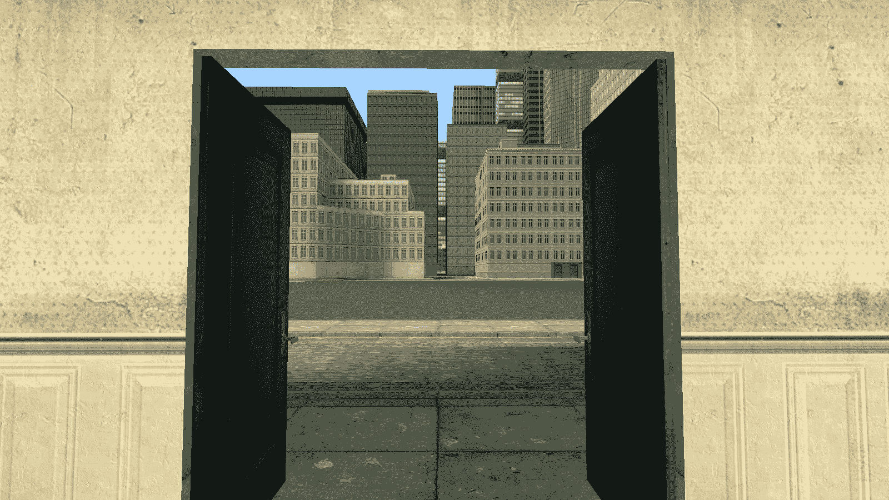

# [完结]阿玛利亚战记（足、踩踏、Mega）

作者：箭头君7号

TID：27753

<title>1</title> <link href="../Styles/Style.css" type="text/css" rel="stylesheet">

# 1

*本帖最後由 箭头君7号 於 2020-1-2 14:10 編輯*

> 短中篇小说，足控为主，其他的属性或多或少也有一些。主要是巨大娘，不过中间会有一小部分男主缩小，面对正常人大小的女孩子的情节。略微融入了一点基金会的设定。

我收到了一条电子邮件。
　**忌凡先生：
　　祝贺您取得“巨萌娘游戏秀”的参赛资格！这表明您有非常纯正的欧洲血统！请您依照附件里的地图，于三日后的上午八点准时参加！当然，如果您实在没有什么兴趣的话，也可以忽略此邮件！
　　祝您拥有愉快的三天！**
**　　巨萌娘游戏秀委员会 上**
　　我被这条古怪的电子邮件惊呆了，不是因为内容，而是因为我是在手机关闭信号的时候收到这个邮件的。
　　我整天一直想着这条邮件的事，最终我觉得还是有必要去参加这场游戏秀。

　　[三天之后]
　　我是第一个到指定地点的人，只见这里有一座看上去废弃了很久的摄影棚，从外观看上去也不是很大。门紧闭着，沾满了灰尘。这里是人烟稀少的地区，四周静悄悄的，环境是一片死寂。但没过多久，参赛者陆续赶到，这里也就变得热闹起来。
　　人貌似到齐了，随后这摄影棚的大门自动打开。从外面看，摄影棚内部光线很暗，不过隐隐约约地好像有一些高大物体的轮廓。进入后，大门自动关上，同时场景也变得明亮了起来。
<ignore_js_op>

**20190205173636_1.jpg** *(363.36 KB, 下載次數: 0)*

[下載附件](forum.php?mod=attachment&aid=ODA2NDB8ZjJiMjBmNDJ8MTYwMDg4MDU3MXwxODIzMHwyNzc1Mw%3D%3D&nothumb=yes)

2019-12-23 15:47 上傳

　　这小小的摄影棚里面居然是一座城市，与它在外面所展现出来的体积完全不相符合。参赛者们全都露出了疑惑的表情，不过也有人变得异常兴奋。
　　“太诡异了吧……”
　　“这是最新的裸眼VR技术吗？”
　　“我估计我们接下来就要在这座城市里探索吧。”
　　正当大家叽叽喳喳讨论不休的时候，所有人的手中都凭空出现了对讲器，从里面传出来一个没有任何特征的声音：
　　“欢迎来到巨萌娘游戏秀的现场！各位参赛者们，上午好，我是这场游戏秀的主持人。如你们所见，接下来你们就会在这座城市里进行一场生存游戏。虽然获胜者会得到丰厚的奖品，但这场游戏会有难以置信的危险，失败者将永远不能离开这场游戏秀。现在，各位仍有机会离开这里，但一旦做出选择，就无法再更改了！给你们5分钟的时间考虑一下！”
　　旁边一栋建筑物的门打开，看来那就是出口。本来就已经觉得这场游戏秀太不正常了，在听到“难以置信的危险”“永远不能离开”后，有些人迫不及待地就想离开，但也有人只把注意力放到了“丰厚的奖品”上，认为没有什么游戏能难倒他们。
　　我留下来不是因为奖品，而是莫名觉得我应该参加这场游戏秀。
　　5分钟过后，部分人纷纷从出口离开。连上我，共有21个人留在这里。我们听从主持人的指示，来到了一个广场。这里还摆放了许多车辆，甚至还有一些……飞机?从普通民用飞机到武装直升机都有。
　　“这些载具都是选手们马上会用到的道具。当然，现场的各位基本都不会开飞机，有的甚至不会开车吧?这点无需担心，因为这些载具都有键鼠操控模式，手柄操控模式甚至是触屏操控模式。只要稍微玩过一点游戏的人肯定都会立刻上手。”
　　听到这话，周围的人都兴奋地摩拳擦掌，听上去这比最先进的AR游戏还要刺激得多。但是……我数了又数，确定这里只有20个载具。事情远非一个AR游戏那么简单，毕竟这种游戏肯定不会以“抢到载具”作为获胜条件吧。那样只是比谁的力气大、速度快而已，是娱乐节目中很常见的环节。但这么不正常的游戏秀，会做成很俗套的样子吗？
　　“最后再提醒各位一句:**方向的选择是至关重要的。**游戏，即将开始!”
　　说罢，城市远方的天空突然出现了一道特别长的裂缝。紧接着，裂缝迅速扩大，变成巨型的蓝色空洞。之后，一双腿……不对，一位少女……从空洞中跳了下来?
　　我们能看清这位少女，并不是因为我们个个视力2.0。而是因为——
　　她的体型……居然远远超出了常人!
　　她的帆布鞋马上就挨到了几座矗立着的摩天楼。在这位少女可怕的体重之下，摩天楼的质量竟然堪比纸模，轻易地被踩扁了！在场的每一个人，都能清楚地看到钢筋混泥土一瞬间变成一堆砖瓦石头的过程……但在这位少女看来，摩天楼就和玩具没什么区别吧?
　　在少女巨大的，穿着帆布鞋的双脚落地之后，整个城市都晃动了一下，并发出震耳欲聋的楼房坍塌声——现在遭殃的，可不仅仅是那几座摩天楼而已。在遭遇巨大的冲击之后，又有一圈建筑物迅速向外倾斜，甚至被吹飞，然后变成一堆建筑垃圾。
　　这……
　　从未见过如此场面的我心跳加速，两腿发软，差点瘫倒在地上。少女长相非常可爱，但这样的体型，换做是谁，都会被一股莫名的恐惧吞没——在她的体型面前，任何人类都只是一脚就能踏扁的蝼蚁而已。
　　如此巨大的少女，光是落地，就足以给人这样的震撼感。而这一切对她来说，只是登场动作……
　　主持人已经说了，这是个生存游戏吧?失败者，将永远不能离开这场游戏秀？
　　我咽了一下，呼吸差点停止。
　　其他人都被这一幕惊讶到说不出话，主持人的声音再一次响起:“各位参赛者，这场生存游戏的获胜条件很简单：存活时间达半小时即可。现在，游戏开始！”
　　包括我在内，所有人的目光变得呆滞，嘴巴全成了O形。有人甚至无法控制住手上的肌肉，对讲机也因此掉在地上。
　　“……”
　　“啊……”
　　短暂的沉默后，终于有人撑不住了，撕心裂肺地大叫起来。
　　“怪物啊啊啊啊啊!”
　　“这是什么[脏话]生存游戏!快放老子出去!”
　　在古代战场上，有一种叫做“夜惊”的现象——当战局不利，士气溃散时，就算是久经沙场的老兵也会有不小的心理负重。长久下去，在某个夜晚，终会有一位士兵无法压抑情绪，疯叫起来。他的叫声，必然是非常凄惨和绝望的，会把同伴的恐惧感也激发出来！于是这一叫，可能会让整个军营都发生大乱子！士兵们全都陷入了极度歇斯底里的状态，唯一能做的就是等待敌军的大刀……
　　现在，我就亲眼见识到了这种现象。身旁的二十个人眼泪鼻涕一齐洒出来，嘴里胡言乱语听不清在说什么，并做出各种夸张的肢体动作。
　　我一直站在原地不动。因为我很有胆量？不……我并不知道是什么原理，但我全身的肌肉……已经僵硬了。
　　我的身体，什么也感觉不到。
　　有那么一刻，我放弃了生还的希望。<title>2</title> <link href="../Styles/Style.css" type="text/css" rel="stylesheet">

# 2

　　少女的目光投向我们这些小人，微笑着朝我们招手，然后朝我们走来。她刚抬起左腿，左脚上的帆布鞋就踢飞了几栋楼。在她的巨足面前，一二百米的高楼是那么不堪一击，在空中划过一条弧线后就栽进了其他街区，引发了更多的微型地震。
　　在听到连续不断的地震声，和看到眼前逐渐扩大的巨型阴影之后，我完全僵硬的身体不由自主地跪下了。也许是重力作用，但我更倾向于认为这是我的下意识动作。
　　是的，在她面前，我算什么？我只能跪在这里，仰望她堪比神明的身躯……
　　她就是神明吧……她只是随便走走而已，她只是把这一切景象当做是嬉戏而已，她的脸上还挂着没有半点虚假成分的笑容……
　　我们呢？几分钟前潇洒自如的我们，现在却连遗言都来不及说了。她的鞋底，对她来说再也普通不过的鞋底，在我们看来却是沾满了鲜血的处刑架，是摧毁一切的死神，是我们永远的梦魇……
　　“救命啊啊啊!”
　　奋力发泄完情绪的众人，在某一刻突然又恢复了一部分理智，略微正常下来。大概，是因为他们内心还存在着一丝活下去的希望吧。然后，现场的飞机就全被抢走了，跑车也全呼啸着离去。
　　很明显，没有人打算与他人共乘载具，还留在广场上的就只有我这个跪倒在地，安静等死的少年。
　　冷静，冷静……
　　……
　　不行……腿不听使唤……
　　可恶!快动起来……
　　……
　　已经无处可逃了吗……
　　……等等……
　　就在这时，不知什么原因，我的思路突然变得流畅起来。后来回想起来时，觉得可能是因为当时觉得必死无疑就放空思想了吧。
　　这场游戏秀虽然古怪，但绝非是一个无解的游戏。那些载具的性能都非常好，但是要直接面对这位巨大少女，还有逃出去的可能吗?况且还要坚持半个小时!
　　要是真的能逃出去，那也是比谁的驾驶技术好而已。从主持人的话语中也察觉不到这游戏和车技有什么关系。所以载具的选择是无意义的吗，既然如此，少一辆载具也不奇怪了。
　　巨大少女又向我这踏了一步，鞋底上的建筑物碎片清晰可见，产生的强烈气流也把我的衣服和头发刮起来了。再不行动的话就会被吹飞，得赶紧想想办法!
　　**“方向的选择是至关重要的。”**
　　这是主持人的提示。虽然这个游戏秀意义不明，但这句话一定不是随便瞎说的。
　　方向……
　　选择方向?
　　选择逃跑的方向?
　　眼下也只能选择左，右，后这三个方向了……总不能往前走吧?
　　虽然在一些反套路题材作品里，这时候就应该选择往前走，但太不现实了。好好想想，这时候应该选哪里?左?右?后?
　　咚!
　　地面晃得比之前要强多了，必须做个选择……
　　不能慌……一定要专注……
　　慢着，我的方向，只有这三个吗?
　　我可以向下逃跑啊!
　　对，找个下水道井口，跳下去!虽然觉得少女能一脚把水泥地面连同整个井道都踩碎，但就这么做吧!
　　眼睛一瞥就看到了一个下水道井盖，但是看样子，少女再踏上两步，我就会变成一摊肉酱了！现在一毫秒都不能耽搁！
　　身体给我他喵的动起来啊！！！！
　　在这种念头的驱动下，我的上半身奇迹般地恢复了知觉，两只手向前方猛伸过去。没有及时反应过来的我也就头朝下地扑到地面上。
　　虽然下半身还是僵硬的，但好歹能动了。我抓住地面，拼尽全力往井口爬去。
　　咚!
　　这套动作所用的时间已经足够少女向前走一步了。由此产生的超大风压也几乎使我整个人都被吹飞，好在我的手死死抓住了旁边的一根横栏，才得以留在原地。这还不算完，风压之后就是如同暴风雨一样的建筑物残骸。无数的碎石块和各种破损的家具接连不断地掉到了我这里，一时间满地都是物品碎裂的声音。对这种近乎于末日的景象完全无力应对的我，只得勉强把整个身体贴住地面，祈祷不会有东西砸到我的身上……
　　咔嚓!
　　身边接连传来玻璃被打碎的声音，这是整整一排的玻璃窗?
　　那就糟了……
　　就在我才意识到发生了什么时，我的手臂和背部都传来了钻心的疼痛。我疼得不禁失声叫了一下。
　　该不会……
　　我缓缓抬起头，只见我的整条手臂上，都扎满了玻璃渣子。血液，已经流到了地面……
　　前所未有的疼痛感，迅速席卷了全身。不用看我也知道，我背上的伤势一定更重。渐渐的，我的视野也变得模糊起来。我下意识地想揉揉眼睛，却差点让刚才一直贴地的脸部也受到创伤。
　　而我的双手也快撑不住了……手的正面全是刚刚因为抓紧地面而造成的伤痕，手背则被大大小小的玻璃碎片割成血肉模糊的样子。
　　这样下去不行……必须……
　　我吃力地再次向井口爬过去，也开始用下巴一点一点地挪动自己的身体。虽然满地都是玻璃渣子，但我的行动已经被复燃了的求生欲所控制住了。我现在根本不管自己已经失血过多的现实，只求能跳到井里!
　　之后，地面完全被硕大的黑色阴影吞噬了。当我看向上方时，只见天空，已经完全被少女的鞋底覆盖了!
　　在这个距离之下，已经沾满灰尘的鞋底上的任何细节都能被我看得一清二楚。而鞋底上那些大小堪比隧道的花纹，已经被各种石块塞满了。
　　随着少女鞋底以惊人的速度向地面靠近，一股自上而下的强烈风压使得地面上的所有物件都被固定在地面上。纵使我抓住了井盖边缘，但我的眼睛已经无法睁开，而身体也到极限了……
<title>3</title> <link href="../Styles/Style.css" type="text/css" rel="stylesheet">

# 3

　　再过三秒，我就会成为鞋底上的一块碎肉吧?或者……我甚至都没有资格弄脏她的鞋底，只会在她踏出下一步时被吹成空气中的碎屑……
　　……
　　不!
　　我的人生，不可能到这里就结束了!
　　就在这千钧一发之际，我的双腿终于肯听使唤了!用脚尖抵住地面，两腿用力一蹬，我总算是——进入下水井里了!
　　但是出于人的本能，我在井里下坠时，还是忍不住大叫起来。而且跳进下水道也只是死马当活马医式的做法，我究竟能不能活下来还是个未知数。
　　我本以为马上就会碰到地面，结果这下水道意外地很深，甚至能让我换气，我都叫不动了……
　　自由落体了半分钟后，我发觉自己正以坐着的姿势，处于一个暗室里。刚刚周围全是嘈杂声，一瞬间环境突然安静，我还有点不适应。
　　仔细一看，暗室里布满了一排一排的椅子，面前还有一个巨型的白色荧幕——
　　电影院?
　　所以这里就是通关者休息室一类的地方?
　　愣了好一会，我才意识过来，我貌似……不疼了?
　　低头看去，我身上的伤口全都消失了，衣服上没有一丝血迹。我还站起来活动了几下，确定自己已经能行动自如，没有任何后遗症了。
　　这时，前方的IMAX超大荧屏变成黑屏，并显示出“恭喜通关”的字样。随后画面切换，开始直播那架武装直升机的情况。驾驶员狂搓左摇杆，躲避因巨大少女的走动而被吹飞的石头。遇到一些实在不能避开的，他就发射导弹将其击碎。
　　他的驾驶技术真是让我吃惊，虽然他是用手柄操控的，但大多数飞行射击玩家肯定是比不上他的。但……他能一直撑下去吗……
　　我替他捏了一把汗。而巨大少女被直升机挑起了兴趣，不再慢慢走动，而是朝直升机的方向跑过去了。这就糟糕了……
　　城市的晃动变得特别明显，但我这里毫无感觉。漫天都是这双帆布鞋带来的尘土和碎石，而荧屏上又给出了现在城市的鸟瞰图:虽然大部分地方还是完好的，但被巨大少女踩过的地方都成了废墟，那一个个巨大的鞋印则象征少女绝对的力量。
　　这一脚下去，不论是多么强悍的军队，都会溃不成军吧……
　　我的脑海中已经浮现出坦克被踩成废铁的画面了。看着那些鞋印，我真是庆幸自己猜对了答案。
　　此时荧屏的右下角给出了一个小窗口，显示一辆跑车正在断垣残壁中穿行，但马上就被巨大的风压吹飞，车顶翻到了地上。驾驶员惊恐地从车窗里爬出来，然后绝望地朝天上看了一眼。地面一瞬间被阴影覆盖，随后传来楼房被压破的声音，小窗口就变成了雪花。
　　轰！
　　在少女的脚踩到地面上后，这座影院居然也震动了一下？明明刚才还没有感觉？
　　这莫非是为了增强观感而特意设计的4D效果？可把我吓得够呛……在那么一瞬间，我还以为这座影院也被踩塌了。
　　雪花窗口变回原样，画面中没有驾驶员，只有一堆非常恶心的血红色肉泥。在生命的最后关头，他连叫声都没发出来？
　　我突然开始大口喘气，身子止不住地发抖。毕竟，这是我在现实生活中第一次看见人被杀掉……还是以如此奇异的方式……
　　我在电影和游戏里看过无数人被杀掉的镜头，原来亲眼看见杀人现场，是这种感觉吗……
　　我对巨大少女的那双脚陡升了无数恐惧。
　　此时，巨大少女伸出手就够到了直升机，但虽然她已经尽量做的非常温柔，直升机还是被这一下弄得直接失控，脱离巨大少女的手指向地面坠落。
　　虽然如此小心，却还是把武装直升机撞到失控……而且，巨大少女之前只是连散步都算不上的程度。只要稍微跑起来，追上直升机只是一眨眼的事。
　　见到直升机失控，巨大少女连忙用手去捧住直升机，然而却因为动作太快，等她回过神来时，直升机已经扁了。透过窗户，我只能看见一些血迹。少女有点泄气，无趣地把它扔掉，然后又露出愉悦的表情追逐剩余的选手。
　　她的脸上写满了高兴，而且还时不时地碾扁那些惨遭摧毁的建筑……难道她非常享受这个过程吗?
　　在少女无情的巨足之下，城市的地震变得越来越剧烈。荧屏上再次出现的小窗口显示，有好几辆车都被飞来的巨石当场砸扁，更多的车则是被巨大少女的鞋底碾……没了。
　　又踩死了一个吗。
　　我攥紧拳头，身体前倾，目光紧紧盯着屏幕上那些变成废铁，隐隐约约带有一点血迹的车辆。
　　看到城市被少女蹂躏的场面，我的心情波动越来越大了。而且这种感觉，绝非恐惧……
　　我现在……正在期待下一个选手被杀死的方式。
　　然后，飞机也被少女碰坏了好几架，现在还剩下最后一架民用飞机。但，它绝对飞不了多远了。
　　有了前几次的经验，这次巨大少女不再冒失了。她小心地摊开手，缓慢从下方接近飞机。然而这“缓慢”只是相对她而言的，她的手所产生的气流都足以把我吹飞了吧。接住后，飞机稍微有些变形，但总算没有像之前那样完全报废。巨大少女把飞机捧到面前，用那双大眼睛好奇地观察。
　　希望你能走的安详一点，哥们……
　　荧屏给了驾驶员的特写。他的脸上写满了绝望，眼睛几乎变的无神了。因为过度惊恐，他已经无法正常发出叫声，只会“咿呀咿呀”地胡言乱语。腿一直在发抖，而且裤裆处也湿了。这不由得使我联想到在跳下井口之前的样子。说实话，我当时差点就失禁了。
　　少女观察了一会后，笑眯眯地舔了下嘴唇，张开樱桃“小”嘴，把飞机放在舌头上。这种大小的舌头，对于飞机来说简直就是个停机坪。这也是这架飞机最后一次着陆了……
　　少女舌头一卷，把飞机咽下肚，并咂嘴，露出“味道很不错”的表情。我几乎能想象出来飞机被食道挤压变形的场面，而少女的胃液就是驾驶员的葬身之地吧。
　　不过……我猜少女的胃液肯定比正常人要强得多，驾驶员老哥很可能刚掉到胃液里就没了。那样还好，起码没有痛苦。<title>4</title> <link href="../Styles/Style.css" type="text/css" rel="stylesheet">

# 4

*本帖最後由 箭头君7号 於 2019-12-23 19:40 編輯*

　　吃完飞机，少女还没有玩够。她俯下身子，轻轻脱下她的帆布鞋，一双洁白无瑕的玉足就映入了我的眼帘。少女随意地把两只帆布鞋丢掉。然而这个“简单”的行为，却导致了两条街区的毁灭。帆布鞋掉到地上，砸碎房屋后并没有立即停止，而是反弹了几下。沿途的所有房屋，无一幸免。
        此时摄像头移到了少女足裏的正下方，可以看到她的脚型非常不错，按正常人比例来说的话大概是35码的脚丫。虽然这双玉足毫不留情地夺去了那么多人的性命，但看到那光滑的肌肤，我的心还是被舔足的欲望充斥了……
        少女抬起左脚，脚趾调皮地动了几下，朝地面重重地踩下去。
        轰隆!
        少女的脚跟最先接触到大楼。完全不能承受这种力量的大楼瞬间崩塌下来，紧接着前面的楼房也依次被夷为平地。
        少女抬起脚后，我从鸟瞰图可以看到这又是一个巨坑，不过这次是清晰的脚形坑而不是鞋印坑，五根脚趾头都看得一清二楚。少女又走了几步，然后回头欣赏自己刚刚留下来的痕迹。看着一片狼藉的城市，少女非常满足，然后左脚保持抬起，单独用右脚在整个城市里跳跃。
        在面积减小半倍，而且力量更大的情况下，少女踩出了更深，形状更明显的坑。一时间，到处都是断砖和碎瓦，还有数不清的石头。不论多么宏伟的建筑，在少女巨大的玉足面前都被一视同仁地踩扁。
        见到这完全无敌的粉白色巨兽肆意摧毁城市的场景，我并不觉得厌恶。我甚至有股想趴在她的脚趾缝之间，尽情深呼吸的渴望……我……想尽情用我的口水滋润她的足底……
        当我欣赏巨大少女俏皮的脚丫时，她停止了动作?
        她是玩够了吗?但看她眯起来的眼睛，不像是……嗯?
        什么情况!她的体积突然又增大了好几倍?
        少女一边飞速变大，一边用双脚在城市里狂踩。任何一个建筑物都只是她动动脚趾的事。最后，少女的体积，让我的下巴都快脱臼了——她的一只脚掌，就能覆盖住整座城市!
        她抬起一只脚，同时镜头也移到了城市里，镜头方向正对着她的脚底。原本水嫩的玉足此时已经完全变黑，上面还粘了许多建筑物碎块。像之前那样，少女又扭了几下脚趾，然后缓慢地向镜头处踩过来。
        我……依然是非常期待巨足落下的那一刻，整座城市都被压成碎片的场景……
        屏幕亮度越来越暗，在巨大的声音之后，屏幕变成了雪花。这下子，只要还待在城里的话，就没有生还的可能了吧。
        之后镜头正对着巨大少女，她闭上双眼，体积慢慢变小，直至恢复为一开始的体积。现在的城市，甚至可以看成是一个平面了。她理了下裙子，就地坐下。无比巨大的臀部就像陨石一样狠狠砸在地面上，又造成了一次地震。然而这对于她来说，只是坐下来的动作而已。她舒展开双腿，惬意地用双手支撑住地面。她的脚趾还在微微晃动。
        这算是结束了吗?
        我突然恍惚一下，回过神来，发现自己正站在一开始的广场上。等等，我居然还能辨认出来这是那个广场?
        我的前面不到几米是一道看不到顶的黑色墙壁，而且还带有好闻的气息?
        唔……这，就是巨大少女的脚吧……
        仔细一看，虽然基本成了黑色，但有些地方还是能看出脚底的纹络。最顶上的突出物，就是少女的趾肚……
        我本能性地想往前跨一步，但理智阻止了我。就在这时，对讲机里的主持人鼓起了掌：“忌凡先生，恭喜您成功通过这场游戏秀！”
        “眼前这景象是怎么回事?那些人真的死了吗?为什么这个摄影棚里能塞得下一座城市？你们又是什么组织？”
        虽然我知道他们肯定不会把这些问题的答案悉数招来的。
        “很抱歉，您的这些问题，我们一个也不能回答。但您刚才的所见之景，即将成为现实。”
        “WTF?”
        “这是您的奖品。”
        我的手中凭空出现了一个红色光碟，上面刻了一大堆我看不懂的符号。然后这光碟又迅速转变成紫色了?
        我还没有反应过来，就在一片模糊中到了摄影棚的外面。我本想再次靠近这座摄影棚，却被一道空气墙挡住了。
        摄影棚的门口有一盒录像带，上面赫然写着：
        **请把这盒录像带，发送给全世界。**
        ……那么我应该是要把这个录像带拿走吧。

        我回头的时候，惊奇地看见那些死去的选手都躺在地上呼呼大睡。响亮的鼾声让我确信他们还是活的，不过现在也不用管他们了。<title>5</title> <link href="../Styles/Style.css" type="text/css" rel="stylesheet">

# 5

　　[家中]
　　录像带里几乎就是游戏秀的原版镜头，不过把与我有关的镜头都删了。画面比那IMAX荧屏上的还要清晰的多，要不是亲身经历，真的会认为这是世界上最好的特效。
　　一直对游戏秀无法释怀的我，以“巨萌娘”“巨大少女”等为关键词进行检索，之后便知道了GTS这个圈子。在众多相关平台之中挑选，最后我选择了“大超萌”论坛，作为我对这个圈子的初步了解。之所以选中这里，是因为论坛里的人看来都很和蔼，还有不少大触和各种指导贴，我就直接发帖问吧。
　　“新人报道。我是足控一枚啦，因为一些事情加入这个圈子。请问各位大佬为什么会喜欢踩踏城市呢?”
　　不到一分钟我就收到了回复:“说不清，但就是有感觉。”
　　“踩踏城市只是gts题材的一种，也有人喜欢缩小化。”
　　“我 全 都 要.jpg”
　　“同楼主，我也是足控转到GTS圈的。说实话，光是看着那些超大的萌妹子，就莫名地让我有一种兴奋感。。。”
　　我把录像带里的许多画面都截下来，并把一处裸足踩踏城市的画面做成gif发到帖子里，立马收到了大量点赞和回复。
　　“卧槽这跟真的一样/喷水”
　　“gkd/滑稽”
　　“哪找的，这么真实/喷水”
　　但就在此时，有一个头像为“来了来了”的用户与众不同，他的回帖内容为“哼，又一个法外之徒/滑稽”
　　吧友们又把重点放在了这位用户身上，并向他表示最高的敬意。
　　五分钟后，系统显示我的帖子因违反论坛协议而被删除。
　　?
　　??
　　???
　　不管他们了。这录像带上说要我发送给全世界……真的要吗?犹豫了很久后，我翻墙在YoursTube上新注册一个账号，上传这段视频。此时已经是凌晨了，先睡一觉吧。今天经历的事情实在是太多了。
　　醒后，我的第一反应就是查看视频的播放量和评论。这可把我吓到了，仅仅是一个晚上的工夫，这个视频的播放量就超过了二百万。评论区大部分都是GTS爱好者，除了要资源的就是换资源的。也有一些是视频特效爱好者，看到视频后都问这种特效是怎么做出来的。当然还少不了麦片的。
　　再看看私信，有一堆人私信我“是不是下周发第二部？”
　　下周？
　　我瞥了一眼视频信息，然后在简介里看到一行小字:一周后，这将成为现实!这颗星球上的人们，快去避难!
　　成为现实?这是说，真的会有巨大少女入侵地球吗?而且时间仅剩下短短的一周了……
　　巨大少女那一脚踩扁一个城市的体积……而且，那可能还不是她的最大体积。侵略这个世界的巨大少女也可能不仅仅只有一位!
　　这该如何是好……就她的表现来看，军队都没法把她镇压住吧?
　　我拿起昨天获得的神秘光碟，仔细端详上面的符号。这个世界的生命只剩下一周了吗……
　　哎哟哇!
　　因为走神，我被桌脚绊倒了。手中握着的光碟撞到了落地镜上。然后……镜面开始像水一样波动，之后展现出了城市的面貌?
　　我向镜面伸出手。在短暂的酥麻感之后，我的手臂伸到了镜子里面。
　　于是，我整个人都走到镜子里面。
　　唔!这是!
　　呕……
　　天空被让人窒息的灰色覆盖，刺鼻的尸臭味熏得我差点窒息，而且我眼前的这条大街上，全是腐烂的肉块……车辆几乎全被压成废铁，只有少数还能让人看得出来它们是车。街上的巨大脚形坑历历在目，大楼也遭到了严重破坏。
　　即使这样，但眼前那典型的人字形街道和巨型电视让我确信这就是纽约——平行世界的纽约。
　　这么说来，这是一个已经惨遭巨大少女蹂躏的地球?这里还有活人吗……
　　要是一星期内不做点什么，我的世界也会变成这样子的……但我能做什么?到处发广告说“巨大少女来了，快跑”?那只会被抓进精神病院吧。
　　把光碟的信息公开给世人会怎么样?虽然听上去可行，但实际上不可能实现。真这么做的话，消息马上就会被有关部门封锁。他们会对外宣称这纯属谣言，把这个光碟上交国库，我可能会被软禁起来，甚至可能被当成蓄意扰乱地球秩序的外星人!
　　所以，这种事情还是知道的人越少越好，昨天的那些选手就是教训。他们醒过来后都慌慌张张地去报警，全被当成精神病患者了。不过他们之中也可能有人是真的被吓出精神病了。
　　这可真是太伤脑筋了，退一步讲，就算世人都知道了这件事，那又能起什么作用?谈判?明显不会成功。乱发核武器?那这个世界一样会完蛋!
　　我跪倒在地上，目光无神地看着眼前这片地狱之景，觉得人类已经完了。真是讽刺，明明昨天在游戏秀的电影院里时，我还看得挺激动，现在轮到自己头上时却……
　　然而，就算是在此时此刻，一想到少女的巨大裸足，我的身体还是会有反应……
　　我……就是这样可悲吗……
　　已经习惯这种尸臭味的我愣了很久，而天色也逐渐昏暗下去，从淅淅沥沥的小雨点，变成了磅礴大雨。
　　我没有躲雨的意思，由于脸上全是冰冷的雨水，我也不知道自己有没有流下眼泪。
　　就这么愣了许久后，我才反应过来雨已经停了。天色虽然仍旧是灰暗的，但相比之前，多了一点蓝色。
　　不……
　　也许还有机会的……
　　既然主持人把这个光碟给了我，那么这个已经被毁掉的世界里一定有什么值得我探索的。
　　回头，空气中有一个圆形区域，光碟也悬停在区域中心，那就是回去的路吧。这个光碟的作用就是穿越，媒介是镜子?
　　先在家里换好一身便于行动的服装，再带上充足的食物和水，以及必要的武器。再次穿过镜面后，我把光碟取下来，这个圆形区域也消失了。想要回去的话，找个镜子就行了。
　　无论走多远，眼前的景象似乎都没有变化。地上的坑也不仅仅是脚形，还有能明显看出鞋底花纹的。我一路统计下来，发现不同类型的坑起码得超过五十个了。当时这里该有多少巨大少女啊……
　　我爬上一处被摧毁的建筑物，打算将整个城市纵览一下时，听见了一声很虚弱的猫叫。
　　“喵呜——”
<title>6</title> <link href="../Styles/Style.css" type="text/css" rel="stylesheet">

# 6

　　这里还有活物?
　　然后，一只只有半截身子，身上脏兮兮的灰猫就朝我走来……
　　半半半半半截身子的灰猫?
　　我吓得坐到了地上，不过这只灰猫看上去比较友好，而且一脸很饿的样子，于是我的心情也就平复下来了。
　　灰猫只有胸腔以前的部分，包括两条前腿。胸腔之后的部分消失了，但却不影响它的行动，它表现得就像一只普通的猫一样。从它的后面看，它的截断面是全黑的，看不到内部。
　　现在遇到任何超乎寻常的事都不应该惊慌，区区一只半猫怕什么?
　　见它很饿，我就掏出一根火腿肠伸到它嘴边。但它却摇摇头，向左边走去，还朝我这边回头。这是要我跟着它走吗?
　　在废墟里跟着它走了很长一段路后，我来到了一处坍塌的高架桥下面，这里的地上有些许小小的鞋印。转个角，我就看到了一只——
　　瘫倒在地上的萝莉!
　　这只萝莉紧闭双眼，右眼下面有一块小小的黑色眼影。她的栗色头发长及腰部，看上去很长时间没有梳理了，显得非常邋遢。萝莉的旁边掉了一个有白边的浅灰色圆顶帽，还打了个白色的蝴蝶结。身上穿着普通的灰色风衣和白色衬衫，打了一条灰色领带。裙子是那种常见的棕色百褶裙，长度大概是到膝盖上面。除此之外，还别了一条红黄相间的腰带。脚上则是普通的黑色童鞋和白棉袜。
　　她还活着吧!我蹲下来察看情况。
　　她的呼吸非常微弱，身体严重虚脱，已经有相当长的一段时间没有进食了。而且这附近也没有干净的水源……
　　我刚才给半猫喂食，它却摇头。所以它是想让它的主人先吃吗?真是一只好猫。现在应该先给这只萝莉喝水才行。
　　我轻轻撑开她的嘴，将饮用水缓缓倒入她的口中。几口下去后，她呛了几下，眼睛慢慢睁开，露出好看的异色瞳孔——右眼为赤红色，左眼为橘黄色。
　　“你是……?”
　　萝莉的声音清脆得很，像铃铛一样。不过由于过于虚弱的原因，听上去让人感觉非常可怜，充满了保护欲。
　　“先不用管我是谁了，你现在需要这个吧。”我把火腿肠送到她嘴边。
　　“唔!这是!”
　　萝莉闻了闻火腿肠，然后一口咬下去。
　　“好次!”萝莉的眼睛变成了星星眼。
　　我把我包里的火腿肠、肉干和饼干全掏出来。只要我把吃的东西一拿到手上，她就会抢过去吞掉。就这样几乎吃掉了我的所有东西。
　　“呼……得救了……”萝莉舒坦地躺到地上。
　　“地上多脏啊，既然已经恢复意识，就不要躺在这种地方了。而且你能得救，是这只猫的功劳。”我说着转身给半猫喂食物和水。见到主人已脱离危险，它才愿意吃下我的东西。
　　“这样啊……”萝莉爬过来抚摸半猫的头，“谢谢你了，Josie。那么，你是哪位?为什么会过来救我?”
　　萝莉突然想到了什么，瞪大眼睛:“不对，这种地方……怎么还会有活人?你居然逃过了她们的屠杀?”
　　我摇摇头:“我并没有遭到她们的屠杀，因为我是刚刚从另一个平行宇宙过来的，虽然也是个普通地球人。至于来的方法……这个东西，我想你应该有所了解?”
　　我把光碟亮给她看，她大吃一惊:“这是，最早的一批镜面传送器?为什么你会有?”
　　“详细的事情我之后会说的，这上面的符号你能看懂吗?”
　　“嗯……这些符号是古阿玛利亚语，正反两面的符号分别是两个宇宙的坐标。”
　　所以就是用来穿越的喽。
　　“原来如此。那么，我先把我的情报说给你听吧。”我便把这两天的经历叙述了一遍。不过，只是简单的描述一下事情经过而已，像我刚来到这个世界时绝望到哭出来的那部分就不好意思说出来了。
　　“情况我已经了解了。现在，轮到我说了吧?”
　　不论我所叙述的事情有多么不合常理，萝莉都没有露出过度的惊讶的表情。现在萝莉已经打算将事实全盘托出了，但也许我们应该先找一个舒适的地方再聊。
　　“在此之前，能找个镜子先回到我所在的宇宙吗?”我站起身，“这种末日之地让我瘆得慌。除了我们两个之外，这个地球上已经没有其他人了吧?”
　　“全部都杀掉的话，也不至于吧，总会漏掉一些的，比如太过偏远的地区。但可以说九成以上的人口都被消灭了。像这种闹市区域，肯定无一幸免了。你需要镜子的话……”
　　萝莉抱起半猫，直视前方，瞳孔变为紫色。之后，一个镜子“唰”的一下，就出现在我们面前——就像游戏中用作弊代码调出物品一样！
　　“这是什么抛瓦?”
　　“这叫‘具现化’，是我的特有能力。对了，忘记把我的名字告诉你了。我是妡露，是‘神使派’的公主哟。”
<title>7</title> <link href="../Styles/Style.css" type="text/css" rel="stylesheet">

# 7

> [A27452682 發表於 2019-12-24 15:09](https://giantessnight.com/gnforum2012/forum.php?mod=redirect&goto=findpost&pid=421166&ptid=27753)
> 在一堆更新中插入回覆 應該不會有人注意到 先提幾個好了文章內容是很流暢的線條但排版讀起來比較吃力麻煩， ...

谢谢建州前辈的建议！这是我的第一篇圈内作品，确实有些地方自己读起来也觉得有些不够通畅，不过能力有限不知道要怎么修改（其实这已经是第n次复查和修改后的文稿了）。我想请教一下排版这方面应该怎么做才好？
<title>8</title> <link href="../Styles/Style.css" type="text/css" rel="stylesheet">

# 8

　　“这就是普通地球人的家嘛。感觉很不错呢。”
　　和Josie，也就是那只半猫洗完澡后，妡露好奇地打量我的家居。我虽然比较宅，但还是比较注重个人卫生的，家里的物件也摆放得很整齐。不然，这位外星公主对地球的印象可要大打折扣了。此时她正穿着不知道从哪来的粉色儿童睡衣。
　　“只是一个很普通的公寓啦。难道说你喜欢这种平民化的吗?”
　　“没错，虽然我是个公主，但对那些奢侈品可是提不起一点兴趣呢!呃，现在好像有更重要的话题吧……”
　　妡露端坐在沙发上，瞳孔像之前那样变为紫色，神情也变得认真起来。客厅中央出现了一个主色调为浅蓝色的图案。图案主体是一只老虎的正脸，老虎两侧分别有两杆路灯。背景由天空和山脉构成。图案下方写着一个英文单词，AMARIA。
　　“阿玛利亚？”
　　“这个图案，就是阿玛利亚的国徽。阿玛利亚是一个科技与魔法并存的国度。千百年来，阿玛利亚人靠着自己的双手与头脑，还有祖先传下来的各种魔法，将阿玛利亚打造成K5宇宙中最耀眼的地方。”
　　妡露说着，空气中又浮现出几副阿玛利亚的照片。可以看到，从远处看，阿玛利亚泛着璀璨的蓝光，在夜空下显得光彩照人。在阿玛利亚内部，高耸入云，极具科技感的大厦与类似教堂、王宫的建筑完美融合在一起，使得阿玛利亚的城市景观既富有赛博朋克之感，又充满欧洲中世纪的那种古典美。
　　“真是美丽的国家啊。那么，发生什么事了?”
　　经常在魔幻作品中看到这种城市的我，特别想进去参观参观。
　　“小凡，你们这个世界有过‘人造神’的想法吗?”
　　“并没有……emmmm也许有，但公众不知道。是说机械生化人一类的东西吗?”
　　我想到了终结者那样的壮汉。
　　“在阿玛利亚，‘人造神’是众所周知的事情。从很久之前开始，一代又一代的阿玛利亚科学家为了阿玛利亚的福祉，进行了无数次以失败告终的实验。在巨大的工作量之后，他们成功创造出了以巨大娘为外观的人造神。喜极而泣的他们，把这些人造神命名为‘天灵’。阿玛利亚人和天灵签订了很多用来限制和约束天灵的魔法契约。虽然很不人道，但阿玛利亚人毕竟是天灵的创造者，而且阿玛利亚人本来就把天灵设定为非常善良的存在，所以我们无条件接受了阿玛利亚人的所有契约。”
　　“……这样下去不会出问题吗?”
　　心地善良可不意味着无条件接受所有契约啊!
　　“接下来，才是重点。一开始的确如大家所想的那样，阿玛利亚人和天灵和谐共处。但是好景不长，随着时间推移，阿玛利亚人对天灵越来越过分，偷窥我们洗澡和更衣都算家常便饭。而且……”
　　妡露攥紧拳头，语调听上去有些愤怒:“还逼迫我们，参加战争……因为之前的魔法契约，我们一旦违反命令，就会痛不欲生……”
　　“阿玛利亚本来就是K5里最强大的国家吧，为什么还要用上你们?”
　　凭阿玛利亚的科学技术，随便搞几个黑科技武器就能胁迫其他国家签订条约吧?
　　“凭他们的实力，打下整个宇宙都不在话下。”妡露擦了擦眼角的泪水，“但是许多阿玛利亚人都有奇怪的爱好，那就是观看弱小的生物被天灵蹂躏的场面。或许，这就是我们以巨大娘为外观而诞生的原因吧。”
　　“这……”
　　回想到在观看那些选手被少女屠杀时，我自己乐于其中的情景，我背上冒出了一点冷汗。
　　“首先，他们强迫我们用脚或手将敌军碾成肉酱，然后是用臀部……越往后就越过分，要求我们把敌军吃掉，还问我们味道如何。在最放肆的时候，甚至命令我们当着阿玛利亚军官的面，把敌军俘虏……”
　　说到这的妡露满面通红，欲言又止。而我也知道她说的处理方法有哪些。
　　“不必再说下去了!”我急忙摆手，“那个，我大概知道……你要说什么吧。太过羞耻的事情也就不需要说出来了……”
　　“啊嘞？你确定……？你是怎么知道的？”
　　“那不重要！呃……那么，你也被迫参加战争了吗?”
　　“不哦，我很幸运……但，也许是不幸吧。阿玛利亚人特别宠爱我，所以从来没有让我出征。作为代价，当我的姐妹们冲上前线时，阿玛利亚的指挥官们只要闲下来，就会拿我做消遣工具。”
　　我的脸沉下去了。
　　“那么，你……”
　　“不、不用担心了!那些指挥官对我做的事情也就是摸遍全身，听我的娇喘而已。他们刚刚要越过界时，就又有新的工作了。所以，每次我都是刚好逃过一劫……还有其他几位天灵也被当做消遣工具，但她们的运气就没有我这么好了……”
　　妡露越说，脸就越红。
　　“emmmm那么，接着讲重点吧。”
　　阿玛利亚能发展成那样高科技的国家，说明阿玛利亚人应该是特别具有理性的种族，但为什么终归还是被兽性占了上风?
　　“天灵很快觉醒了反抗意识。最终，我的妹妹樊舒成为第一个解除魔法契约的天灵。在她的努力下，所有天灵都成功解除了契约，向阿玛利亚人倒戈，并取得完全胜利。”
　　“这可真棒，阿玛利亚人算是自讨苦吃。”
　　我在心中为樊舒叫好。
　　“不，”妡露的眼神中传出一丝忧郁，“在这之后，妹妹她们就变得很奇怪了。她们把阿玛利亚人变为奴隶，还开始享受虐待他们所带来的快感，玩法比之前还要残暴。并且，她们把力度掌握得很好，每次都是在奴隶们几乎一命呜呼时停下，对其施放治疗魔法后就又是新的一轮玩弄……我们天灵是绝对不会这么干的，到底发生什么了呢?”
　　“是恶堕了吗?”
　　我想到了日式游戏里常见的设定。
　　“很有可能是这样子。如果已经到了无可挽回的地步的话，作为姐姐的我，会亲手送她们一程的。”
　　妡露充满决心的眼神中带着明显的悲伤。
　　“……不过，大多数阿玛利亚人不是喜欢被虐待吗?”
　　我立刻转移话题。
　　“‘观看别人被虐待的场面’和‘自己被虐待’是两码事。虽然有很多充作奴隶的阿玛利亚人仍乐于其中。”
　　妡露的这个解释让我再次想起了游戏秀。
　　“我实在是不希望看到妹妹她们继续这么做下去，也总是与妹妹发生争吵。最后，天灵分裂为了以妹妹为女王的‘主神派’，和以我为公主的‘神使派’。在这个过程中，也有越来越多的阿玛利亚人痛改前非，主动帮助神使。于是，‘反抗军’就组建起来了。”
　　“然而……”妡露眼角又泛起泪花，“即使这样，敌我差距还是太大了，光是在人数方面就被主神派完败。”
　　妡露的泪腺终于崩溃，流出了几滴泪水。从未谈过恋爱的我不知所措，只能递给她一张纸巾。一直在打哈欠的Josie也走过来，用脑袋蹭妡露的小腿。
　　“不过，”在纸巾里埋了一会后，妡露又精神抖擞地抬起头来，斜向上看着天花板，眼神里的不快已经完全消去了，“作为公主……我是不会放弃希望的!大家，全都……都在等着我呢!”
　　她又不好意思地看向我:“抱歉，让你看到了我难堪的一面，毕竟这是第一次和一个外人吐露这么多……”
　　“没事啦，任何人都有情绪崩溃的时候。那么，你为什么要跟我这个外人说这么多呢?”
　　“除了你之外，我也没法找其他人了吧。”妡露说着，无力地往我这边倒下来，把我的腿当做膝枕。“而且，没有你的话，我就会和Josie在那个城市废墟里饿死吧。”
　<title>9</title> <link href="../Styles/Style.css" type="text/css" rel="stylesheet">

# 9

　　喂喂喂，这是真的吗……现在的我，的确能感受到她脸颊上的温暖啊……而且，她身上那股才出浴时的沐浴露香味也让我差点失去理智。现在的她，穿着粉色睡衣依偎在我身旁。要是让外人看见了，说不定真的会以为这是个粘人的妹妹吧?
　　妡露的这个举动令我心跳加速，也让我的呼吸变得非常急促。好在她没有意识到我的失态，不然就尴尬了。
　　我咽了下口水，试探性地把手放在她的栗色头发上，轻轻抚摸。她的头发非常丝滑，而且没有一点头油，一摸起来简直让我爱不释手。她没有反感的意思，脸颊上也出现了一些红晕。
　　这时，Josie也跳到了沙发上蹭我的腰。于是，我便用另一只手顺着撸它的毛发。Josie对此感到非常满足，发出“咕噜咕噜”的声音。
　　左牵黄，右擎苍！
　　啊不不不我在想啥呢……
　　“说起来，Josie是怎么回事?”
　　我才想起来，这个重要的问题还没问呢。
　　“哦，我忘了解释，抱歉。”她坐起身来，不过这次离我更近了，“妹妹她们非常享受把小人折磨至死的快感，但是又觉得直接把阿玛利亚人折磨死的话太便宜他们了。于是，在所有阿玛利亚人都没有被玩死的同时，K5的其他星球上每天都有人会被抓走，甚至直接在自己的星球上惨遭蹂躏。K5的星球基本被主神派耗光了，于是她们又把目光投向了其他宇宙。你手中的镜面传送器就是第一代穿越机器。更高级的穿越机器也早就研发出来了，现在一般都用非常简便的传送腰带，你在游戏秀里也看到了吧?”
　　“我还真没注意，仔细回想一下，她好像确实戴了腰带……”
　　“传送腰带可以根据使用者的体积而改变大小，想要穿越的话也只需要在腰带上输入目标宇宙的坐标就行了。然而……到目前为止，除了镜面传送器之外，所有穿越装置在使用时都会对多元宇宙的秩序产生不小的影响，以至于制造出一些异常现象。”
　　妡露伸出手指头指引Josie，它就从我的腿上踱过，钻到妡露的怀里。“Josie就是异常现象之一，在反抗军惨败，我被迫逃亡的那段日子里，它就是我唯一的精神依靠了。最后，我选择在那个已经惨遭破坏的城市里躲起来，那里是躲避主神派追杀的好地方。”
　　“现在看来，”她对我露出天使一样的笑容，“我的精神依靠又多了一个呢。”
　　“哈哈……”我不好意思地摸自己的头，“那么，这场游戏秀也是异常现象吗?”
　　“不清楚呢。根据你的描述来看，应该是吧。似乎这个异常现象非常清楚我们的处境，还愿意帮我们?”
　　“嗯呐。根据主持人的情报，距离主神们侵略这个世界只剩下一个星期的时间了，你能打赢她们吗?”
　　目前看来能作为战斗力的也就只有妡露了。
　　“这个，也说不准……因为不知道她们到底会派多少天灵过来。这个星球的战斗力如何?”
　　“相对而言比较弱。不过，我还不清楚你们的战斗方式呢。”
　　“哦对了，还没有跟你说明这个。”接下来妡露就跟我详细介绍了阿玛利亚人和天灵的能力。
　　阿玛利亚人的身体素质比普通地球人高出许多，而且拥有十分强悍的科技和魔法力量，然而对上主神时也只能沦为奴隶。
　　关于天灵嘛，她们的标准身高是常人的十倍，并且可以从“常人大小”到“常人二十倍身高”之间随意改变体型。经过巨大化锻炼后，天灵就能变得更大，所以她们一般都保持着巨大化状态。受到一定程度的伤害后，天灵就会被强制变为常人大小。而且，有一小部分天灵还有特殊能力，像妡露就拥有名为“具现化”的能力。她在完全理解一个实体后，就可以通过在头脑中想象该实体的构造，让其凭空出现。当然，这个能力要消耗不少体力和脑力，不然妡露被困在那里时就能自己具现化出食物了。因此，妡露负责的其实是后勤工作，虽然她的战斗力也不容小觑，并且最大能变为142米高（也就是现在身高的一百倍），但是对面的战斗力完全是未知数啊。
　　只凭妡露一个人来对付一周之后的主神，胜算太低了，虽然她是神使的公主。
　　“那么，把我也算作战斗力吧。”我思考后，说出了这句话。
　　“诶?但是小凡你只是一个普通地球人吧?”
　　妡露都没注意到她快把怀里的Josie抱到窒息了。
　　“所以要做些改变啊。阿玛利亚人应该做过改造人体的实验吧。”
　　“诶诶诶?”
　　[半小时后]
　　“小凡，直接将天灵的血液注射到普通人体内的话，阿玛利亚人的确做过这样的实验。理论上说可以让普通人额外获得一些能力，但成功率微乎其微。之前的实验体……无一例外全都死了。”
　　在我劝说了很长一段时间后，妡露终于同意了这个大胆的想法，但她仍然很犹豫。
　　“这是目前唯一的可行办法了，不论风险有多大也得尝试。我可不愿意看到你被主神们折磨，而我却无能为力的场面。”
　　现在有三种选择。一，让我冒险注射妡露的血液。二，让妡露独自面对来袭的主神。就算妡露能抗住她们的第一波攻击，只要主神发动第二波攻击，妡露就会沦为玩具了，我也只能化作某个主神脚下的尘埃吧。三，我和妡露逃到那个已被摧毁的平行宇宙。这是最安全的选择，也是我最不愿意做的选择。
　　所以，现在也只能选择第一个路子了。
　　“会有点痛，小凡你……要忍住。”
　　妡露握住我的左臂，将针管对准静脉。我可以看到她的眼神非常不安，毕竟这种时候也只能把希望寄托在奇迹身上了。
　　“我都多大的人了，戳吧。”
　　妡露推动针管，针头刺进我的皮肤，将妡露的血液缓缓送入我的身体里。然后，一股暖流就从我的左臂延展到了全身……
　　但是除了温暖之外，我就没有其他感觉了，并没有想象中的麻醉感，痛感。我安静地坐着，等候整个身体都开始适应这种温暖的时刻。
　　“小凡……你还好吗?有没有哪里不舒服?”
　　“我反倒是觉得很舒服。”
　　之后，我整个人被彩色的光芒罩住，浮到空中。我的脑海中突然浮现出几副快速闪动的画面……
　　以单膝跪地的姿势落地之后，我站起身，看着被彩色光圈包围的双臂。这样的场面也完全出乎妡露的意料。
　　“小凡！没事吧！”
　　“我在刚刚浮起来的时候，好像理解了这是什么样的能力。”
　　“居然……真的成功了?”
　　妡露吃惊地抚摸我的手臂。
　　“那是当然，我现在可是觉得浑身充满了抛瓦。”
　　“真是难以置信啊，小凡!”妡露一把抱住我，露出会心的笑容，“那么你的能力是什么呢?”
　　“在家里的话不方便展示吧，到那个世界再试试。”
　　被她抱住的我看似莫得感情，其实小鹿乱撞。
<title>10</title> <link href="../Styles/Style.css" type="text/css" rel="stylesheet">

# 10

*本帖最後由 箭头君7号 於 2019-12-26 21:57 編輯*

　　[镜中世界]
　　我们找了个合适的地方，妡露已经换上了之前的那套服装。
　　“我开始咯。”
　　说出这话之后，我的前方就出现了一团彩色的不明物体，看上去就像是模糊的马赛克。
　　“这个是?”
　　妡露好奇地打量这团马赛克。Josie对此不感兴趣，自顾自地舔爪子。
　　“我也说不清这是什么东西。非要说的话，是我的思维。”
　　“思维?”
　　“是的，这就是我的思维具现化后的产物。因为我现在并没有刻意去想什么，所以就造出了这堆不明物体。”
　　“这东西就是思维……?”妡露摸了摸我的思维，“唔，摸起来就像棉花糖一样软呢。”
　　“那么我就把它想象得稍微硬一些。”
　　不明物体的光泽变得更炫目，妡露再次摸了一下之后，发现她已经捏不动思维了。
　　“如果把它想象成具体的东西，比如一把剑的话。”
　　我的手中就出现了一把彩色马赛克光剑。将它砍向旁边的巨石，巨石随即被砍出一道裂缝。
　　“看上去，和我的能力差不多?”
　　“那是当然，毕竟这个能力就是从你身上获得的。区别在于……公主殿下，现在要你制造出一个手表，你需要怎么做?”
　　“现在不叫我公主也没关系的。”妡露微微笑着，“我需要想象出手表的各种零件，这些零件的拼接方式，手表的工作原理，还有其他的一些小细节。”
　　“换做我，我只要这么想即可:一个圆形的能戴在手腕上的东西，能以12小时制的方式来表示时间。”
　　然后我的手腕上就出现了一个看上去像是嚼了的彩色手表。
　　“这么方便!”
　　“但是公主殿下，我猜你具现化出来的都是永久性物品，对吧?”
　　“的确如此。所以制造出来后它们也无法被消除。”
　　“我不需要理解原理，单纯凭借印象就能造物，也能随意把造出来的东西删除掉。但是为了维持它们的存在，我自己也得持续消耗脑力，所以使用这能力一定会产生不小的副作用。它的名字，不如就叫‘印象’吧。”
　　妡露具现化出来的是真正的实物，但我造出来的东西则介于实体和非实体之间。
　　“搜嘎。觉得小凡比我厉害多了，嘿嘿～”
　　“那么，根据阿玛利亚人的理论，我的身体还会发生什么变化吗?”
　　注射了天灵的血液之后，我应该还会得到其他能力吧。
　　“大概就是身体素质的强化啦，但并不是注射之后就会强化的。准确来说是让你的身体拥有突破常人极限的潜质，而且锻炼身体的效率也会增加许多。”
　　妡露用一只手指抵住下巴跟我解释。用RPG游戏的方式来讲，就是增加了各种属性值的上限，并且加快了升级速度吧。
　　“我明白了。那么妡露，现在能请巨大化的你帮我锻炼吗？”
　　“让我……巨大化?小凡你确定要用这种方式吗?”
　　“时间只剩下六天半了，而且这是目前最有效率的方式吧。”
　　“嗯……说的也是。”
　　妡露往后退了几步，在我的注视下红着脸连同衣服一起变大。虽然已经提前做好了准备，但当她巨大化至五米的高度时，我还是忍不住往后坐了下去。
　　“不要紧吧，小凡！”
　　妡露着急地将身子向我这边倾，这个动作却使我本能性地战术后仰。
　　“放心放心我没事，只是一时间还没法适应和这么大只的萝莉待在一起……哈啊……”我喘了几口气后，用胳膊支撑住地面站起来，“我并不是在害怕你，但是我们人类对于过于巨大的物体都会有本能上的反应的。我现在还没有习惯而已。”
　　“是这样吗？”
　　按照妡露的表现来看，阿玛利亚人并不害怕巨型生物？也许阿玛利亚人全都有巨物崇拜症吧。
　　“话说公主殿下，为什么你的衣物也会变大？还有之前的那套睡衣是哪里来的？”
　　“唔，我的衣服吗？”妡露拉了下她的衣袖，“天灵的衣服都是由自己的魔力形成的，所以会自动改变种类和大小。”
　　“不过，现在的小凡……好可爱啊！我能摸摸吗？”妡露的瞳孔变成了星状，右手食指悬停在我的正上方。
　　“呃，请、请便。”
　　妡露的食指压住了我的脑阔儿，轻轻按压。一开始还有些紧张的我，在接触到她指肚的那一刻却放松了许多。想象中的压迫感并未出现，取而代之的是舒适感和安心感，或许是因为这样子的我看上去很像妡露的宠物吧，而且我莫名觉得被当成宠物的感觉蛮好的。妡露越摸越起劲，直至用双手把我包起来使劲蹭。或许是出于对她的放心，我不觉得害怕，反倒很享受被她“欺负”的过程。<title>11</title> <link href="../Styles/Style.css" type="text/css" rel="stylesheet">

# 11

> [贽殿遮那 發表於 2019-12-25 20:51](https://giantessnight.com/gnforum2012/forum.php?mod=redirect&goto=findpost&pid=421220&ptid=27753)
> 写的很棒啊
> 开头以为是短篇，没想到是长篇..
> 话说夜惊什么的...好像是营啸吧 ...

本来是计划写长篇的但是发现文笔和思路跟不上脑洞，姑且就算是个短中篇吧（）
这是我的第一份圈内作品，欢迎指出不足之处。《猫》和《调查》是写在这篇《阿玛利亚战记》之后的，已经找人代发，欢迎点评^^

<title>12</title> <link href="../Styles/Style.css" type="text/css" rel="stylesheet">

# 12

> [Yagami_ray 發表於 2019-12-26 00:17](https://giantessnight.com/gnforum2012/forum.php?mod=redirect&goto=findpost&pid=421229&ptid=27753)
> 还以为下水道里会有猛男，说：这里已经满员了，期待了一下。

哲学是好文明，但我的文里估计不会出现（）
<title>13</title> <link href="../Styles/Style.css" type="text/css" rel="stylesheet">

# 13

　　Part1
　　“五、六、七……嗷呜……做不动了。”
　　我无力地趴倒在地，妡露也抬起了她的棉袜脚。
　　“真是的，之前还一直让我用力，现在却连两位数都做不到。”
　　我想出来的第一个锻炼方法就是在妡露的脚踩住我的背的情况下做俯卧撑。妡露总觉得她会一不小心把我的脊椎踩坏，而我一脸自信地说我做五十个都没有问题。
　　妡露四处转了一下，坐在一处废墟之上。在她脱下童鞋的那刻，我就闻到了同时从她的鞋子里和棉袜上散发出来的幽香。我不禁向前走了几步，贴住她的棉袜深呼吸，并伸手抚摸这只比我的脸还要大的棉袜脚。魔力制造出来的袜子质量就是好，透气性很不赖，而且没有任何线头，摸起来手感超棒。妡露的足香的确是足香，没有任何臭味，与棉袜的气味混在一起就更让人有想舔的欲望。
　　“那个……小凡，你在……做什么？”
　　沉浸在足香之中的我都把时间忘掉了，一直到妡露轻柔的声音响起，我才意识到自己已经闻了很长时间了。妡露的腿估计也抬酸了吧……
　　“咳，嗯，是的，如你所见，我是个足控。”
　　在妡露面前，我并不介意暴露出这件事。
　　“有这种爱好的话就早说啦。”
　　妡露把脚抬到我的上方，用脚前掌按摩我的头顶。我自然也是把头抬起来，让妡露的棉袜与我的脸快速摩擦。妡露脚上的味道也变得更浓了。然后，妡露把我的脸埋在她的脚趾缝里，并轻轻用脚趾夹住我的脑袋。虽然隔着棉袜，但我能清楚感受到那种肉肉的质感。而且，脚趾缝也是脚上味道最好的地方，这里的香味可是非常浓烈的。
　　“小凡真是贪婪呢～都不需要锻炼了吗?”
　　妡露两只手托着下巴。
　　“呃……现在就开始吧。”
　　于是妡露把脚抬起来，我趴到地上。在她的脚落到我的背上后，我做了不到八个俯卧撑就丢人地累倒了。
　　“没办法……我之前就说了我这人平时不怎么锻炼……”
　　我转过身，妡露也明白我的心思，就温柔地踩住我的身体。我贪婪地吸着她脚趾上的气味，休息一会后，就又翻了个身接着做俯卧撑。

　　Part2
　　运用“印象”能力，我在背上生成了一对比较炫酷的翅膀，并在大楼之间飞翔以躲避妡露的抓捕。这种方式既能增强我的机动力，也能锻炼妡露的反应力，可谓一举两得。
　　现在妡露的身高大概是在五十米左右。也许是感受到了我的决心，妡露这回没有放水的意思，而是使出全力，试图抓住在空中乱飞的我。“轰隆隆”的脚步声后，已经遭到摧残的大地上又多出来一串鞋印。本来就被踩成碎片的汽车被这么一踩，就成了更小的废铁，有一部分还粘到了妡露的鞋底。同时，妡露一直都在避开地上的肉块。这其实就是在练习避开行人。
　　我在一个拐弯处没有及时调整方向，在大楼上撞出了一个人形坑。妡露抓住这个机会，伸出手把我包住。
　　“怎么样?是我赢啦。”
　　“要不是我没反应过来的话……”我掸去身上的碎石块，“但的确是你的胜利。”
　　“哼哼，我认真起来还是挺厉害的嘛。话说现在的小凡真的是小小只呢，好可爱的说!”
　　妡露用另一只手抚摸我的小身板，我也就安心躺下来享受她柔嫩的手指。

　　Part3
　　“小……小凡……你真的能撑住吗?”
　　这大概是妡露的脸最红的一次，虽然我现在看不见她的脸。
　　“我没事!嗷呜……”
　　我在头顶上创造出了一块浮空平台，以此来支撑妡露的重量。是的，五十米的她就坐在这块平台上，白色胖次和我的脑袋也就隔了那么十厘米。
　　然而我终归是在逞强，最终体力不支，被迫解除平台。失去了支撑，妡露的臀部便狠狠地把我压住……
　　“嗷呜!”
　　虽然觉得非常幸福，但我还是痛苦地叫出了声。妡露的臀部非常有弹性，并且我在那一瞬间用能力在身上覆盖了一层防护盾，然而这作用不大。同时，防护盾并不妨碍我嗅到妡露臀部的芳香。
　　“没没没事吧小凡!”妡露焦急地看着我。为了不让她担心，我一个鲤鱼打挺就满血复活了。现在我的成长速度可真是惊人，正常人要是经历刚刚那一下的话，就会变成胖次上的血斑了吧。
　　“你看我像有事的样子吗?看来我身体的韧度已经得到了不小的提升，马上再来一遍吧。”
　　“诶诶诶?”

　　Part4
　　与常人大小的妡露练习两个小时的战斗技巧之后，我已经达到极限，而这对于妡露来说只是热身而已。
　　“公主殿下不是搞后勤的吗?这比先锋队员还强的近身格斗术是怎么回事?”
　　“只是因为小凡太弱啦，嘻嘻嘻。”
　　妡露脱下鞋子，用脚趾抵住我的鼻孔。
　　“不过小凡真的是非常努力呢，才两个小时的工夫就进步得这么快，这是奖励哦。”
　　“谢谢公主殿下啦～”我抱住妡露的棉袜脚往脸上贴，“公主殿下要是能稍微变大一些就更好了。”
　　“小凡真是喜欢得寸进尺呢，好吧，满足你。”
　　妡露坐下来，巨大化到用脚刚好能盖住我全身的程度，两只脚还在轻轻拍打我的身子。虽然妡露刚刚只是热身，但她也出了不少的汗液，尤其是脚汗。沾满了脚汗之后的棉袜摸起来有点湿滑，脚趾部分已经被汗液浸得有些变灰了。然而妡露可是一只萝莉，不管出汗量再怎么大，她的足香只有浓度上的变大，绝对没有半点臭味掺杂在里面，虽说我也很喜欢臭的啦。
　　我伸出舌头稍微舔了下她的袜尖。呃呸，一股纤维的味道，果然棉袜还是不适合用来舔吗。<title>14</title> <link href="../Styles/Style.css" type="text/css" rel="stylesheet">

# 14

　　Part5
        “太慢了！”
        妡露打飞一个向她飞扑过来的恶魔，之后抬起脚，将恶魔踩扁。哀嚎声中，恶魔变成了一堆彩色碎片，从妡露的鞋底与地面的空隙之中流出来，消失在空气中。
        之前已经介绍过我的能力，“印象”，但我的印象可不仅仅局限于生活中能见到的东西。只要有印象，我就能把实体化后的思维转换为虚构作品中的东西，就像我现在“召唤”出来的恶魔。我发现这一点时也吃惊不小，原来这能力还能以RTS的形式使用。不过如果是过于强大的东西的话，那么我也没法制作出来，或者达不到应有的效果。
        “比起之前，小凡已经有很大进步啦，值得祝贺呢！”
        妡露踏着巨大的脚步朝我这里走来，弯下腰微笑着看我。但她马上就发现了我的不对劲。此时我的身体不断抽搐着，眼神非常迷离，嘴角还在流口水。
        “小凡，你这是？”
        没等妡露采取行动，我突然变出比之前还要大上许多倍的翅膀，以惊人的爆发力踩裂脚下的土地，蹦到了妡露的山峰之间！
        “啊！”
        妡露被我顶到了地上，引出不小的震动。此刻，因为过度使用印象能力而完全失去理智的我正虎视眈眈地盯着她的脸，而我的双眼发出了渗人的红光！
        “这是……能力暴走了？难道说，接下来，小凡会对我……”妡露第一次对我产生了一点点恐惧，但她没有反抗，反而满脸潮红地看着我，似乎在期待着什么。
        “是小凡的话……可以哟……”
        妡露突然露出诡异的微笑，并开始喘气，用某种非常奇怪的表情看着我。她的衣物也有消失的趋向。然而接下来的事情是她完全没有预料到的——
        “喂！人家都做好心理准备了！你居然只是在舔脚？”
        羞耻度爆满的妡露冲我大叫，叫完之后却又只能以无奈的表情看着我。
        在以禽兽发现猎物一样的眼神盯着妡露的脸看了几秒后，我没有对妡露的脚踝以上的部分做任何事情，只是撕开她的鞋子和袜子，将身体粘在她的足裏上伸出舌头疯狂舔舐而已。从脚后跟到脚心，从脚趾缝到脚趾头，我以前所未有的速度将妡露的左脚完全用我的口水包裹住。妡露的脚汗全被我吸干，本来非常粘稠的脚底被舌头扫过一遍后也变得非常光滑。
        “呀哈！小凡好贪婪的说！”
        妡露的脸越来越红，开始专心欣赏她脚上的小家伙尽情释放兽欲的场面。
        “唔……被小凡舔足的感觉……很不赖呢……”
        妡露逐渐喜欢上了这种感觉。在我服侍她的右脚时，她也开始积极配合我。我钻进她的脚趾缝之间时，她会用脚趾夹紧小小的我，并轻轻前后揉搓。在我清理她的右脚足裏时，她会用左脚脚背将我紧紧压在她的右脚脚底上。
        在我即将舔到右脚脚后跟时，我的欲望已经差不多发泄完毕了——或者说，饥渴感被补充完毕了。在妡露像银铃一样的笑声之中，我的理智恢复过来，随即意识到了刚才所发生的事……
        “抱歉！公主殿下！我刚才真是太失礼了！”
        我不知所措地看着妡露，不知道她会对我做什么。
        “没事啦小凡，能力暴走这件事，我们谁也没料到，不是吗？而且……”妡露笑眯眯地看着我，“刚才那样的小凡，我也不会讨厌啦。倒不如说，我更希望小凡能主动一些呢。要不是小凡能力暴走的话，我根本不会知道被小凡舔脚会是这么舒服呢~”
        “啊哈……”
        我尴尬地摸了摸自己的头。
        “不过小凡真是让我大开眼界。本来还以为小凡暴走后会做些什么H的事，然而你的注意力却只放在我的脚上。”妡露用脚趾抵住我的脑袋，“你就是这么喜欢脚吗？”
        “emmmm，的确如此。如果要选择服侍女人身上一个部位的话，那我无论什么时候都会选择脚的。当然，其他部位的话，也可以。”
        “嗯哼~”妡露把我整个人都踩住，“那么就请小凡当我的足部护理工具啦，行吗？”
        “乐意之至。”

        Part6
        “怎样!公主殿下!”
        “诶?不是吧!”
        经过这么长时间的锻炼后，我已经可以在不用“印象”的情况下，单纯用双手支撑住妡露的臀部了——大约80米高的妡露。
        “那么……”妡露的语气突然有所变化，“我稍微用点力会如何呢?”
        “WTF?桥豆麻袋!嗷!”
        顶上的压力迅速扩大了好几倍，我很快就支撑不住了，又和之前一样被死死压在下面。好在由于身体素质变强了许多，这次并不像之前那么疼。
        “啊啦啊啦，小凡还差的很远呢，嘿嘿嘿～。”
        妡露坏笑着，开始扭动她的臀部。我根本动弹不得，只能在她的胖次底下与地面摩擦。
        “嗷呜呜!公主殿下饶命!”
        “诶?小凡刚才有说什么吗?”
        妡露绝对是故意装作听不到的。她稍微站起身，又一屁股用力坐了下去。我只觉得一阵天旋地转，整个身子都有些麻木，只有脑袋还能稍微转动一下。于是我只得不断用面部蹭妡露的胖次，嘴里一直在说求饶的话。妡露一直在加大臀部的力气，快把我压成饼时才转过来，用手指碾住我的身体。
        “这种程度完全没法面对主神呢。”
        妡露满脸都是纯真的笑容。
        我一边无力地捶打她的手指，一边感慨她的变化之大。刚见面时她是那么软的一个萝莉，现在也开始享受把我当做玩具的感觉了。不过这蛮好的。<title>15</title> <link href="../Styles/Style.css" type="text/css" rel="stylesheet">

# 15

　　Part7
        “你嘴里的味道好香!”
        我飞到了妡露的舌头上。现在她的身高为142米，也就是她目前的极限身高。
        妡露没有回答。她现在要是说话的话，会把我颠得在她的嘴里到处乱蹦吧。她的口腔里充满了令人愉悦的气息，口水丝也到处都是。趁着这个机会，我俯下身摸摸她的舌头。手感好得很，而且沾了我一手的口水。不过妡露的嘴里到底为什么是香的？
        “我下去咯。”
        我跳进她的咽喉里，任凭柔软的食道挤压我的身体。如果是一个素不相识的主神把没有能力的我吃掉的话，我现在一定会觉得非常恐惧，认为人生到这里就结束了吧。但现在，吞下我的天灵可是妡露，所以我反倒觉得她的食道是在给我做全身按摩。
        被食道挤到胃里后，我张开翅膀在空中停滞下来，先是把手指伸进胃液里试探一下。妡露的胃液的确能对我造成伤害，但并非是致命的。确认这点之后，我整个人便都钻进胃液里，泡一场并不舒服的温泉。这就是锻炼皮肤耐性的方式。我并不控vore，妡露也不乐意把我吃掉，但为了以后的突发状况，也不得不这么做了。
        对于我来说，这里宽敞的很，并能清楚地听到妡露的心跳声和内脏蠕动的声音。四周一片漆黑，不过印象能力能让我的全身发出五彩光芒，因此妡露胃上的褶皱我全都看得一清二楚。
        要问我的感受？
        我能说我觉得很恶心吗……虽然这里是妡露的胃，但作为一个非vore控，这里的场景还是让我反胃。
        泡了一个小时后，我实在是受不了了，于是飞到贲门上，扒开食道向上爬。来到舌头上时，我刚想飞出去和妡露谈谈感受，她却把嘴巴闭上了!
        不是吧，这个腹黑萝莉又想干什么?
        妡露将舌头贴住口腔的上方，因为这个动作，我被舌头狠狠压住，差点把肺里的空气都吐出来。之后妡露像搅拌机那样迅速转动她的舌头，我也因此被搞得头昏眼花，全身都是她的口水。她又把我的身子压在舌底，并用舌头把我碾了几下。当然，这样子只会让我觉得不舒服，并不会伤到我。但我本人可不想继续下去了，一秒钟都不行!
        过了许久，她才把我吐到手心上，用和善的笑容看着我:“我改变想法啦。小凡的味道，挺～不～错～呢。”
        “谢谢夸奖。”我幽怨地说道。

        Part8
        142米高的妡露脱下她的棉袜，把袜口张开对着我，她的足香也被我吸了进去。我却不急着钻进去，而是先跑到她足足有四分之一个广场那么大的裸足旁边，埋进她的足裏大口呼吸。由于刚刚和我练了三个小时的格斗技巧，她的脚上已经充满汗液，味道也大的多，摸起来黏糊糊的。妡露只是微笑着看我这滑稽的模样，不忍心搅乱我的心情。
我也很快意识到了自己的失态，灰溜溜地朝袜口跑去。棉袜内部的空气非常潮湿，虽然味道比不上妡露的裸足，但也足以让我兴奋了。踩着清晰可见的线条，我一路抵达了袜尖，这里的味道也是最浓的，而且可以明显看到袜尖有很多地方被磨过了，那些就是妡露的脚趾活动过的痕迹。
        “那么，小凡，要当心一点哦。”
        确认我已经到了袜尖，妡露就把那只巨大却又可爱的脚丫伸了进来。我老远就看到了她不断扭动着的脚趾，兴奋得都说不出话来。整个袜子都受到了脚丫的影响，开始抖动起来。我只得紧紧趴下抓住棉线，好让自己不被震飞。
        五个玲珑的脚趾，带着沁人心脾的足香与粘稠的汗水向我靠近，最终我刚好被踩到了她的拇趾趾肚底下。她也感受到了我的存在，轻轻点了几下拇趾。被压在脚趾下的我感到自己在高速运动，然后周围的环境也逐渐暗下来，温度极速上升。妡露是在穿鞋吧。
        终于，我的脸部隔着棉袜，贴到了一个比较软的东西上——童鞋的鞋垫。然后，背部就传来极大的压力。如果是几天前的我被这么踩的话，绝对会粉身碎骨的。虽然现在我不至于被踩扁，但也被压的有些难受。只是……这感觉挺不赖的。
        我费了很大劲儿才勉勉强强把身子翻过来，好让自己的面部贴住这巨大的拇趾。此时妡露开始走动了，但我也被脚汗粘在了脚趾上。每次她一抬脚，我就会随着她的脚趾急速上升，之后就被毫不留情地踩到鞋垫上。
        趁着她抬脚的空隙，我爬到了她的脚趾缝里，开始享受这里的空气。由于妡露的运动，鞋子里的味道也越来越浓。受到这样刺激的我，伸出舌头，在她的脚趾缝里舔了一下。与棉袜的那股纤维味儿可不同，这可是货真价实的脚丫子，而且还是萝莉的可爱脚丫。我逐渐控制不住自己的身体，发了疯似的舔舐这只巨大的尤物。就算身上全被脚汗弄得黏糊糊的，我也不在乎，倒不如说非常喜欢这种感觉。将四个脚趾缝逐一舔完之后，我就一路向后面爬过去，在一次又一次被她的巨足碾压的同时，试图将她的足裏完完全全舔个遍——当然，这是不可能的，即使进入暴走状态。<title>16</title> <link href="../Styles/Style.css" type="text/css" rel="stylesheet">

# 16

　　明天，就是主神们入侵的日子了。
        六天半的时间，虽然短暂，但我的实力已经得到了妡露的认可。也许这一切都是缘分吧……从游戏秀，到发布视频，再到今天的战前最后一夜，这八天的事情简直就像梦境一样，却又是如此的真实。
        洗完澡后，我和妡露躺到床上准备入眠。和往常一样，妡露把双脚盖在了我的脸上，沐浴露的香气与萝莉的足香也被我吸入肺中。Josie老老实实地待在妡露给它造的猫窝里。
        但……我今晚可能睡不着。
        不是因为明天的大战，而是因为一个我一直憋在心里的问题……
        “公主殿下，还醒着吗?”
        “我像是那种沾到枕头后在十秒钟内就睡着的人吗?”妡露有些调皮地用脚趾夹住我的鼻子。
        “阿玛利亚人……绝大部分阿玛利亚人，都喜欢看到巨大娘蹂躏小人的场面，对吧?”
        “不是跟你说过许多遍了吗?现在问这个干什么?”她用脚跟在我脸上碾了几下。
        “其实，我也有类似的感受。在游戏秀里初见巨大娘时，我的感情只有恐惧。但掉到电影院里时，我却不知不觉地觉得巨大娘肆意践踏生命的画面很……给我带来视觉冲击力。而且，那个巨大娘的足裏也让我心动。”
        “嗯哼?你刚才说了什么?”
        妡露站起来，稍微变大了一点，用一只脚狠狠把我的脸完全踩住，头上冒着青筋。
        “不不不呃我是说啊这个啊啊呃……”
        才反应过来说错话的我完全不知道要怎么解释，不过妡露很快就松了脚，恢复原来的体积和体位。
        “不过这本来就是男人的天性，安心啦，不会因为这种事情讨厌你的，继续说下去吧。”
        我倒吸一口凉气，接着说:“在知道巨大娘一星期后就会毁灭这个星球时，我是无比绝望的。然而就算是这样，我仍然无法拒绝巨大娘的足裏……这种心理状态困扰了我很久。”
        “所以你在清楚巨大娘的残酷无情的情况下，既害怕又渴望被她们碾碎，对吧?”
        妡露一语说出了我的烦恼。
        “是的。所以……我一直不知道要怎么处理这个矛盾的心态。也不知道明天真正与主神对峙时，局势会发展成什么样子。”
        我一口气把心中的苦水都倒了出来，感觉好受了很多。
        妡露沉默了几秒，然后往我这边靠近，把我的脸埋进她的胸部里。有了上一次膝枕的经验，我这回并没有惊慌失措。
        “没事的哟，小凡。”妡露的玉手轻轻捋过我的头发，“许多投靠神使派的阿玛利亚人，也有差不多的心态呢。他们痛恨自身过去的行为，却还是对主神们的足部有反应。”
        “呃?”
        “其实说到底，不还是因为你们好色嘛。就因为这样的事情而被自己困扰，真是没用呢。”
        虽然看不见，但我总觉得妡露此时是撅着嘴的。
        “就算好色又怎么样啦?你们男人有多少是不好色的呢?难道喜欢H就有错吗?在我看来——”
        妡露的语气又变得平缓下来:“无论一个人的内心有多么的H，只要他能控制住自己，不在现实中把他那些大胆的想法付诸实践……那么，他就是个正人君子哟。”
        我将妡露的话语咀嚼了几遍，有点疑惑地问:“所以公主殿下，你是说……不论我现在对巨大娘有什么样的想法，那都是很正常的好色心理。一切，只取决于我的实际行动?”
        “是的哟，小凡。理解的真快。”
        妡露紧紧抱住我，呼吸声逐渐变小——她很快就入眠了。
        万恶淫为首，论迹不论心吗。
        谢谢你啦，妡露。
        在妡露软绵绵的B cup中，我也睡着了。

        完成洗漱工作之后，我把电视手机电脑全调到新闻区域，确保任何新闻动态都不会逃过我和妡露的眼睛——虽然说主神是一个星期后入侵，但具体是在什么地方入侵，我们一无所知。如果出现在地球另一边的米国，那可就没法及时赶到了……
        “喵!喵喵!”
        我俩正全神贯注地盯着屏幕时，Josie突然大叫起来。
        “怎么了Josie，肚子不舒服吗?”
        妡露回过头，然后就愣住了:“小凡，我们的运气……很好呢。”
        “难道说?!”
        我的视线也从屏幕上离开，看向窗户外边——空中的巨型裂缝，完全是历历在目。
        “居然就在这座城市里?”
        “这就是传送腰带在使用时，强行撕裂次元壁而导致的现象。在十分钟之内，裂缝就会完全转化为传送门。如果她们的体积不是特别大的话，我还是能应付得了的。”
        “嗯，就拜托公主殿下了。我这边，也有临时工作要做。”
        “诶?临时工作?你可没跟我说过这个啊?”
        “公主殿下只管赶到现场就行了，我这工作也是刚才的突发奇想。现在赶紧去吧!”
        “好的，回头见!”

        [五分钟后]
        市区充满了人们的惊叫声，但罪魁祸首并不是主神——传送门还没有完全开启。让整个城市的市民都陷入恐慌的人其实是我。
        与妡露分头行动后，我把自己变成恶魔君主的模样——牛角、骷髅头、亡灵法师披风。飞到最高的那座楼上，然后用法杖哇里哇啦地乱指，制造出一大堆恶魔，装作要袭击市民的样子。见到市民全被吓跑后，我才回到妡露旁边。
        “小……小凡，你到底在做什么？为什么要制造出这么多怪物！”
        妡露抓住我的衣领质问我。
        “当然是为了帮助市民们撤离啊。”
        “诶？为……为什么？”
        “如果不做得这么极端，他们肯定不乐意逃跑啊。虽然我们头上的那玩意看起来就是很邪乎的玩意，但这颗星球上的人类就是喜欢围观，就是要赖在这里，就是要拍照发微博发朋友圈，有的还要拍vlog，无非就是为了那些红心，根本不知道自己只剩下不到五分钟的生命了。我再赌五毛，起码有一百对睿智情侣会把裂缝当做他们秀恩爱的背景。等到主神出来，就是检验真爱的环节了。”
        “……”
        妡露的眼神逐渐黯淡下去，也松开了手。<title>17</title> <link href="../Styles/Style.css" type="text/css" rel="stylesheet">

# 17

　　我继续解释：“不要担心，我制造出来的那些恶魔都只是破坏公共设施装个样子而已。为了让演技更迫真，我还会制造一些市民的尸体。不用担心无辜者的伤亡。也只有做到这种程度，他们才会懂什么叫生命诚可贵。”
　　“但是，这会把大家吓坏吧……”妡露转过身，看向远方那些狼狈不堪的行人们，“真的只有这种办法了吗？而且，小凡绝对会被误解吧……”
　　“误解就误解呗，起码我是只能想到这种馊主意了。”我摊摊手，“毕竟正义永远属于号角日报。好啦，快打起精神来。身为公主，连这种事情都无法理解吗？”
　　妡露擦了擦脸，应该是在擦眼泪。
　　这时，空中传来一声巨响——
　　“这是，传送门准备完毕的声音！”
　　我们同时向空中看去，只见一个硕大无比的圆形白色装置已经浮现在空中。装置上布满了大大小小的齿轮等组件，中心的圆圈区域不断变换颜色，直至变得完全透明。
　　主神们不到五秒就会从那里跳出来了，我没有和妡露说话，只是和她对视了一下。妡露清楚我的心思，微笑了一下并微微点头。
　　装置中央的空气出现了些波动。然后，三双雪白的，血管能清晰地被我看到的玉足，就宛如踩碎了空气一般，从装置之中自然落下。见到这三双天足，我的第一反应除了“舔爆”之外，的确没有其他的了。
　　正处于传送门下方的建筑，一瞬之间就成为了一堆碎石，为数不少粘到了主神们的足底上。主神们的脚趾看上去非常圆润可口，但在碾扁一条街道上的机动车时可是显得毫不留情。在足底接触到大楼顶部，进而将钢筋混凝土毫不费力地压为废墟时，我得承认我的眼睛都看直了。但是正如妡露所说，这些想法并不阻碍我接下来的行动。
　　三位身材远远超出妡露的主神落地后第一眼看到的，自然是乱成一团的街区。
　　“诶，报告上不是说这个宇宙不存在魔法，而且科技水平非常低吗？那么这些恶魔是？”
　　“情报出错了？不可能啊！”
　　“这到底……等等，有危险！”
　　轰——隆——！
　　三个主神接连被巨量的子弹，激光和炮弹击中，发出痛苦的叫声。虽然没有被打趴下，但也被爆炸产生的冲击力击退了几步。就是这“短短的”几步，让一个街区的房屋都成为了主神足底的瓦砾——是的，整整一个街区。无论是平房，还是公寓房，在她们无情的足裏下与小石子没有什么区别。
　　这当然是我的，而不是军方的功劳。早在刚才，我就在附近的楼顶上部署了一大堆防御设施，包括但不限于RA2里的法国巨炮、盖特机炮和光棱塔，SC2里的导弹炮台，RA3里的波能塔。我小时候就特别希望看到这些玩意摆在一起的场面，没想到居然成真了。
　　“可恶，这颗星球还不能小瞧呢……”
　　三个主神开启魔力护盾，吸收了绝大部分伤害。随后分别使用各种攻击魔法，将我的防御设施连同建筑全都摧毁。然而遭受了那么多防御塔的攻击，虽然她们没有明显的皮外伤，但身体已经缩到了三十米的大小。
　　“公主殿下，接下来，就靠你啦……”
　　消耗脑力过多的我晃了几下，差点倒地。为了避免出现上次那样的状况，我趁着理智还没完全掉光之前，把自己锤晕了。
　　“嗯，包在我身上!”
　　妡露把我扶到墙角处，旋即从楼顶跳下。半空中，原本只有142cm的娇小萝莉以惊人的速度巨大化，大楼对于她来说也变成了玩具。于是，身高一百四十二米的妡露在落地的同时，在地面上留下了两个永远的痕迹。她引发的巨大震荡波也让周围的车辆飞了很远。
　　看到这一幕，刚才不可一世的三位主神彻底傻眼了。身高大约三十米的她们，虽然在普通地球人眼中仍是不可侵犯的存在。然而在妡露面前，她们却仅仅高过对方的膝盖!
　　“神使派的公……公主，妡露?她怎么会在这?”
　　其中一个主神惊愕地坐垮了一座房屋，然后她的视野就被妡露的鞋底覆盖住了。
　　“抱歉，但是先请你睡一会吧。”
　　妡露的左脚踩住主神的上半身，主神的身上自然也粘满了妡露鞋底上的石块和灰尘。她“呜呜”地叫着，捶打妡露的鞋子，可惜没有用。妡露再碾了几下，主神的整个上半身连同建筑物碎片都陷进了水泥地里，没有动静了。妡露这才抬起脚，笑眯眯地向另外两个被吓坏了的主神走去。
　　妡露当然没有把主神踩死，只是单纯的碾晕了而已。她抬起脚时，就可以看到主神身上黑漆漆的鞋印，她的眼睛也变成了两团旋转的漩涡。之后，主神缩小到了常人大小。
　　“呜哇!救命呀!”
　　另外两个主神拔腿就跑，下一秒就给妡露分别用两只手抓住了后衣领，就像提起两个惊慌的小猫咪一样。
　　“喂喂，刚才的气势到哪里去了呢?”
　　妡露将两只主神用力撞在一起。在清脆的碰撞声和痛苦的哀嚎之后，她们被妡露丢到了地上，再起不能。随后也缩成常人大小。
　　待我再次恢复意识时，我觉得我好像靠在一个非常舒服的东西上？睁眼后，我就看到了妡露微微露出红晕的脸颊。
　　哦哦，膝枕play！
　　“小凡，你终于醒啦？”
　　“嗯呐。公主殿下的大腿好舒服~”
　　我转了下身体，用侧脸使劲蹭她的腿。
　　“诶诶诶！别这么突然！”
　　妡露嘴上这么说，却没有阻拦我的意思。充分享受完她柔软的大腿后，我坐起身，问道：“现在情况如何？”
　　“我把昏迷中的小凡和那三个主神都带回来了。现在这座城市已经处于封锁状态，留在这里的居民也就只有小凡了吧。”
　　我这才注意到房子外边由警方和军队发出来的嘈杂的声音，和三个被绑在我面前的还在呼呼大睡的主神。目前还没有人知道我们在这里，但我房间的大门随时有可能会被一队全副武装的特种兵踹开。警犬、热成像、无人机，还有一大堆高科技设备，随便用哪个都能迅速锁定这个房子了。
　　必须得赶紧行动才行……
　　轰隆!
　　一个巨大的身影，跳到了楼房旁边的地上!<title>18</title> <link href="../Styles/Style.css" type="text/css" rel="stylesheet">

# 18

　　“不是吧，主神的援军这么快就到了!”妡露跑向窗户旁查看情况。然后，屋顶就被这个巨大的身影扒开了——这是一个魔法师打扮的银发少女。她的黑色瞳孔显得特别亲人，比较散乱的长发也散发出一股青春气质。总体感觉上就和萝莉模样的妡露有很大区别。
        “艾……艾格罗酱?”
        “姐姐大人!太好了，真的是你!”
        艾格罗？之前妡露是有跟我说过这么一个神使，与妡露是非常好的朋友。
        名叫艾格罗的天灵迅速抓住妡露，把小小的她使劲往脸上蹭，空气中弥漫着浓厚的百合香气。在天空中盘旋的直升机全都将炮口对准了艾格罗，不过现在他们并不会轻易开火。
        “真的是姐姐大人!啊呀，上一次见到你都是什么时候的事了?艾格罗我真是太寂寞啦!而且现在的姐姐大人很可……喵!”
        妡露迅速增高到比艾格罗高一头的大小，两只拳头抵住她的脑袋——单靠拳头和脑袋之间的摩擦力把艾格罗举起来。
        “啊疼疼疼疼疼!姐姐大人轻点！不过被姐姐大人欺负的感觉也很不错……嗷嗷嗷!”
        “我——说——你——这——家——伙，”妡露满头暴筋，“就不能好好地敲门进来吗?啊???害得我以为是主神的援军!而且还把小凡的屋顶弄破了!!!”她一边说，一边更用力地按住艾格罗的脑门。
        “抱抱抱抱抱歉，我只是……想更快地看到姐姐大人嘛!等等，小凡是……?”
        妡露这才放下艾格罗，然后把手掌放到屋子里，让一直保持看戏状态的我和Josie跳上去。
        “镪镪，这就是小凡啦。他的全名是忌凡哦。”
        “这个人有点不对劲……”艾格罗把鼻子靠近我，嗅了嗅，脸上露出惊恐的神色，“他身上，为什么会有姐姐大人的味道？！而且，姐姐大人还对他用这么亲昵的称呼……咦！莫非，姐姐大人背着我，和这个男人……做了那种事!”
        “你——想——多——了——!”
        妡露把我和Josie放在肩上，然后使出吃奶的劲儿捏艾格罗的脸蛋，捏到变形才停手。看到艾格罗这幅萌萌的样子，我也想试试看她的脸蛋会是什么触感。
        “呜，姐姐大人还是一如既往地暴力呢……但是艾格罗很喜欢!”
        艾格罗轻揉自己被捏得通红的脸蛋，脸上写满了高兴。
        “真是受不了你这个家伙。”妡露扶着额头，“好了，快点解释一下你是怎么找到我的吧，也不知道我们什么时候会被判断为敌人。”
        越来越多的装甲车和坦克将我所在的公寓包围住，警官也一直用喇叭命令妡露和艾格罗双手抱头跪下。
        “好的!其实，独狼他们在执行亚空间粒子扫描时，刚好发现了一个与姐姐大人特别吻合的特征值，所以就先派我过来确认一下啦。然后，我就真的见到姐姐大人了!”
        艾格罗趁机又想抱住妡露，却被她用手挡住了脸。
        她刚刚提到了“独狼”?应该是反抗军的部队之一吧。
        “所以，独狼马上也会来到这里?”
        “嗯，我刚刚已经发出信号了，他们现在……”
        艾格罗还未说完，空中就出现了一个黄色小点。它迅速扩大，最终变成一个巨大的黄边方框。一艘印有白狼标志和其他奇怪符号的宇宙战舰从里面开出来。
        “啊，说曹操曹操到。”
        “沃夫号!它居然没事吗?”
        妡露惊喜地看着这艘战舰，似乎对它非常熟悉。
        而战舰里也传出一位中年男性的声音:“让您久等了，妡露公主!”
        “这个声音……是亚历克斯舰长!”
        “正是本人。详细情况请到沃夫号内部说吧。”

        [沃夫号 舰长室]
        缩小到常人尺寸的妡露和艾格罗带着我和Josie上了沃夫号，那三个还在呼呼大睡的主神也交给沃夫号船员处理。沃夫号的内部就和科幻电影里长得一样，到处都是金属墙壁与自动舱门，还有浮在空中的触摸屏，散发着浓烈的科技感。此时这艘战舰正在飞往反抗军的临时据点，黑兹克利特。
        舰长室的门一开，站在一大堆电子显示屏前，穿着白色制服的男人就回了头。他就是亚历克斯吧。
        “实在不敢相信……真的是妡露公主!这些天您过的还好吗?”
        “那是当然!因为遇到了小凡啦!”
        妡露抱住了我的胳膊，同时我感受到了艾格罗充满醋意的眼神。
        “舰长大人你好哇，我叫忌凡，是刚刚那个世界的居民。”
        我伸出另一只手，他见状微微一笑，便与我握手:“看上去是个很有活力的少年呢，幸会幸会。之前在一次战略转移行动中，由于遭到了主神的突袭，我们来不及应对，导致妡露公主流落宇宙。现在妡露公主毫发无损地回到了沃夫号里，而且她像是非常信任你的样子。所以依我推测，是你救下了妡露公主吧?”
        “可以这么说吧，但也依靠了异常现象的帮助。”
        我将这些天发生的事情概述了一遍，有些不方便说出来的部分我也就一句话带过了。
        “你……注射了妡露公主的血液?”
        “是啊，我没死，还获得了新能力。”我简略介绍并演示了“印象”。
        “这还是首例啊……那么我们就犯了个错了。”亚历克斯挠了挠头。
        “嗯?什么错?”
        “我们先前捕捉到与妡露公主非常吻合的特征值，但其实还是有一点小偏差的。再加上这几天主要是你在使用能力，所以……我们捕捉到的，应该是你的信号。”
        “反正你们成功找到了妡露公主，不是吗?而且我也决定加入你们的阵营了。”
        我边说边伸了个懒腰。
        “等下，小凡你确定真的要……?”
        妡露没有料到我会这么主动。
        “首先，我的愿望是尽我所能减少无辜生命的伤亡。其次，注射妡露的血液后……不对，是从收到那份电子邮件开始，我就不是局外人了。”
        这看上去像是一般热血漫的展开，但我从周围人惊诧的眼神中就知道了事情的不对劲了。毕竟，主神派再怎么残忍，我都只是口头上听过妡露的描述而已，并没有亲身经历过她们的恐怖，才能一脸平淡地宣布我加入反抗军。刚才能轻松击败三个主神，也只是因为她们实力太弱，而且有妡露助阵。虽然我主观上明白这只是一场微不足道的胜利，但是我在潜意识里还是觉得自己能独当一面，这必然会导致我轻敌。
        “哈哈，真是个有干劲的年轻人呢。既然你主动决定加入，那我们也不会拒绝的。你们三位，先到A1船员室休息吧。”
        Josie跳到了一个电脑桌上就开始睡觉了，估计这里就是它的领土。<title>19</title> <link href="../Styles/Style.css" type="text/css" rel="stylesheet">

# 19

　　[A1船员室]
　　“这里和我想象中的差别还蛮大，难不成是你的专用房间?”
　　“那当然咯，除了本公主和艾格罗酱之外，还没有其他人进过这里呢。现在得把小凡加上去啦。”
　　我本以为这里也会像科幻电影那样——宽敞的房间和极简主义的装饰。然而这里却和普通的少女房间没什么两样:粉色系主题，各种可爱的家具和手办，还有贴满墙壁的动漫海报。当然，最重要的是女孩子的体香。整个房间都铺上了地毯，进去的时候也得换拖鞋。
　　“呼啊～没想到居然这么快就回到这里了，要是没有小凡的话，我早就完蛋啦。”
　　妡露蹬掉棉拖鞋，像小兔子一样蹦到了床上，然后又被床弹了老高。
　　“小凡你也坐下吧，怎么一直站着?”
　　“我第一次进女孩子的房间，所以很拘谨。”
　　其实，我现在都紧张到不敢走路……
　　“没事啦，现在这里姑且也算是你的家了。”妡露在床上蹦哒了一会，“这里还有什么吃的吗……啊对了，第三排抽屉里有我一直放着的小饼干，艾格罗酱帮我拿一下吧。”
　　“好的，姐姐大人。”
　　此时艾格罗的语气没有之前那么痴女了，走得也比较慢，看上去就像是受到了什么刺激一样……
　　等下，刺激到她的，好像就是我吧?
　　根据艾格罗之前的举止，不难推想出她平日里和妡露玩闹的场面。而且这一路上，艾格罗对船员们也是一脸畏畏缩缩的样子。所以，这里只有妡露是她能信赖的吧。
　　在重逢之后，艾格罗肯定察觉到妡露已经把注意力转移到了我身上，甚至都没有和她说过几句话。雪上加霜的是，我和妡露才认识了七天，而且我还是异性。
　　这可不妙啊……妡露，快点注意到艾格罗心情的变化啊。然而她只是趴在床上晃动两只小脚丫而已。我悄悄盯着艾格罗。果然，她在取饼干的时候，嘴唇微微动了几下，似乎是在念咒语。
　　“姐姐大人，请吃吧～”
　　艾格罗主动把其中一块饼干给了妡露，而且还喂到了嘴边。
　　“嗯嗯!”妡露想都不想就把饼干吃下去，“小凡不要客气啦，你也吃一些吧。”
　　“好的，谢谢。”
　　我忐忑不安地吃下艾格罗递给我的饼干。
　　不久之后，妡露开始揉眼睛了:“诶，现在已经到午睡时间了么?总觉得好困……”
　　“姐姐大人觉得困的话就去睡吧，我会好好替姐姐大人服侍忌凡桑的哟～”
　　艾格罗一脸坏笑，偷偷瞄了我几眼。我也觉得身体有一些不适。
　　“嗯，小凡就拜托你照顾啦，让他玩得开心一点～”
　　意识已经不清醒的妡露就这么睡着了，完全没注意到事情的不对劲。
　　“那么，这边的魔法，也要开始生效了吧。”
　　我视野中的艾格罗一边变大，一边向我走来——并不是她变大了，而是我变小了。现在大概是三厘米左右吧。
　　“呃……艾格罗小姐，请问您有何贵干?”
　　我装作一脸无辜的样子问道。只是缩小的话还行，我就担心她往饼干里加点“电脑配件”之类的东西。现在既然她非常生我的气，那么我就先配合一下，等她冷静之后再慢慢沟通。
　　“当然是要好好服侍你啦，小东西。”
　　艾格罗做出OK的手势。她当然不是在说“没问题”，而是用食指把我弹飞。
　　“嗷啊！”
　　其实我并不觉得疼，只是为了配合而故意叫了一声。掉到地上后我又滚了几圈，在书桌前才停下。
　　咚——咚——
　　虽然地毯吸收了艾格罗走路的声音，但缩小后的我还是听得一清二楚。地面上艾格罗巨大的影子，也逐渐把我吞噬掉。
　　“小东西啊，为什么姐姐大人会这么喜欢你呢？”
　　她笑着蹲下身子，我也得以一览她的春光——有星星图案的蓝色胖次。我咽了下口水，一边把她的胖次脑内保存，一边装作颤抖地说道：“大概……也许……呃，我不知道……”
　　“不知道？看来要接受惩罚啦~”
　　“……你想做甚？”
　　艾格罗不说话，站起来抬起左脚，拖鞋底上的花纹清晰可见。她晃了几下拖鞋，就直愣愣地把我踩住。之前妡露从来没有穿着鞋子踩过我，哪怕是比较软的拖鞋。现在的我，还是第一次体会到被鞋子踩是什么感觉。而且由于体型不算太小，我完全能感受到鞋底处凹凸不平的花纹。磨在我的脸上还是有些不舒服的。铺了毯子的地板固然干净，但灰尘还是有的，而且我现在还是缩小状态，所以她鞋底上的不少灰尘都贴在了我身上。不过，她明显没有用力，这只是吓唬我的程度而已。
　　“小东西，被我用鞋底按摩的感觉，舒服吗？”
　　“一——点——都——不——舒——服——！咳……快把我变回去！”
　　我用最大的嗓门喊道，同时稍微用点力捶打她的鞋底，好让她认为我在挣扎。艾格罗随即抬起脚尖，专门用鞋跟碾我的脑袋。
　　“那么，这样如何呢?”
　　“呜呜呜!”
　　我的脑袋被碾住了所以没法正常说话，于是两腿胡乱蹦迪，装出一副痛不欲生的模样。
　　“好好体会一下你的地位吧~”
　　艾格罗一边说着一边加大脚上的力量，但始终不会达到踩死普通人的程度。其实对于常人来讲，这样被踩在脚下所带来的屈辱感，被压迫感和绝望感远远比物理伤害要严重得多。死亡只是一瞬间的事，但是被踩在脚下，承受巨大的痛楚，不知道自己下一秒是否会变成肉饼，这种心理上的恐惧才是巨大娘的可怕之处。
　　之后，艾格罗抬起脚跟，留出脚跟与拖鞋之间的空间，轻蔑地说道：“上来，小东西。”<title>20</title> <link href="../Styles/Style.css" type="text/css" rel="stylesheet">

# 20

　　不上去的话肯定会被“踩死”了。因为刚才嘴被堵住，几乎喘不上气，我咳了一小会，才爬上拖鞋的边缘，艾格罗脚底的气味也传过来。艾格罗毕竟是少女，她脚上的味道嘛，说实话并不是香味，而是……略带一点酸臭味的，混合着泡泡袜质感的特别味道，这就是青春的味道吗?也许因为妡露是萝莉的缘故，不论她再怎么运动，脚上再怎么出汗，她的脚永远是货真价实的香味。现在我发现，比起妡露的纯足香，艾格罗脚上的臭味更能让我兴奋。是因为妡露的味道我闻久了，想换换口味？向上抬头，艾格罗的白色泡泡袜看上去非常干净，但是实在太闷气了。泡泡袜加上皮革长靴，看上去就是非常不透气的组合。
　　“请问，艾格罗小姐，接下来是……？”
　　“抱歉呀，我的脚突然有点不舒服，能把你当成按摩器吗？”
　　然后，艾格罗的脚跟就又压在了我身上。沉重的压力使我的身体死死地陷进拖鞋里面。这种拖鞋并不是平常所见的硬底拖鞋，而是那种非常软，穿起来也很舒服的款式，所以我才能整个人都被踩进去。之后艾格罗抬起脚前掌，以脚跟为支点旋转她的脚丫。但她并没有把重心都放在脚跟上，从来都只是吓唬吓唬我的程度而已。
　　“唔！艾格罗小姐！请停下！”
　　我用双手推动她的脚跟，她随即也停下脚上的动作。用两根手指夹住我的脑袋，把我提到书桌上。她坐下，一脸得意地看着我。
　　“现在清楚你的处境了吧？”
　　“我是任你处置的虫子，对吧？而且你最好不要用手指夹住小东西们的脑袋，虽然我没什么问题，但大多数小东西都会疼的。”
　　我的身体素质早就上去了所以没有感觉，但是想象一下常人只有脑袋被抓住，身体没有支撑地被吊在空中那种感觉，就知道这不是正确抓握小人的方式了。
　　“哦?那么这样会疼吗?”
　　艾格罗用手指压住了我的身子，上下挤压。又用指肚按住我的脑袋，不断转动。她手指上少女特有的香气也全按到了我的肺里。毕竟萝莉和少女还是有区别的，艾格罗的手更具有……可以说是青春的味道吧?
　　“并不会疼。”
　　毕竟我被一百四十二米高的妡露踩在脚底下都没事，区区手指能奈我何?我用手撑住她的手指，装出一副“想推又推不动”的样子。
　　“这还真是有趣，头一次见到这么厉害的小人，那么再小一点也可以吧～”
　　在她的让人倍感不安的声音中，我又觉得身体在慢慢变小，直至支撑不住她的手指。而现在，凭借那点微弱的光芒，我也可以清晰看见她的指纹了。
　　我现在大概都不到一毫米了，而且似乎已经被粘在了她的手指上。
　　艾格罗把手掌翻过来，在手指上扫视了好一会儿才找到我。对这时候的我来说，她的两只眼睛简直就像月亮一样迷人，黑色瞳孔就像超大号的珍珠一样。不过，她的神色看上去有些紧张。
　　“等等，我可没让你变得这么小啊?什么情况?”
　　就在她说出这话的时候，之前的不适感又出现了。于是，我就这么一直小下去了。
　　“诶诶诶?快停下啊!别……别再变小了!”
　　艾格罗早就看不到我了，就算是拿放大镜也看不到吧。她慌慌张张地念了一大堆咒语，让我忽大忽小的。然而等到我真正停止缩小的时候，我已经掉进了她的指纹里。
　　是的，现在艾格罗的指纹对我来说就是峡谷——散发着汗香味的，软软的，同时非常油腻的峡谷。这些峡谷上的褶皱看得我怪不舒服的……不论是多么漂亮的美少女，若是把她的任何一个部位放大千万倍观察，得到的都是会让常人心里发毛的场景。
　　就在艾格罗因此急得满头大汗时，一个平日里她最想念，但现在完全不想听见的声音响起来了。
　　“啊嘞?奇怪，我怎么就睡着了?”
　　我看不到妡露，但我能想象出来她睡眼惺忪的可爱样子。
　　“啊姐姐大人你怎么醒了!哦不对，我是说，姐姐大人……欢迎醒过来……啊，我在说什么呢……”
　　艾格罗急忙站起身把手捂在背后，这个多余的动作反倒让妡露觉得很奇怪。
　　“艾格罗酱，出什么事了?这么慌张。话说，小凡呢?”
　　“啊这个嘛……忌凡桑说他……有急事啊不对，他去厕所了!”
　　“这样啊。但你干吗要结结巴巴的?头一次和男生相处不适应吗?”
　　根据声音推断，妡露下了床，然后走向门口:“休息时间也结束了，沃夫号还有一大堆事情需要我处理。等小凡回来记得跟他说一声我出去了。”
　　“是……姐姐大人……”
　　“你这样子真是让我不放心呢，要多学会和别人相处哦。”
　　妡露走了，留下在原地满脸通红的艾格罗。
　　我也满脸通红，不过我是被憋红的。在艾格罗解释的时候，她不光脑门上在出汗，手上也出了一些。我能清楚地看到汗液从汗腺中排出来的完整过程，在几乎一瞬间我就被汗海淹没。我费了好大劲才从海底浮上来，这对于艾格罗来说只是一小滴汗而已。当然我也呛了好几口汗水，十分的咸，不过这就是青春的味道。
　　实际上我可以直接飞出去。但是，“在美少女的手汗里游泳”，想想就是百年难得一见的经历。
　　       <title>21</title> <link href="../Styles/Style.css" type="text/css" rel="stylesheet">

# 21

　　房门关上后，艾格罗的双腿支撑不住，跪倒在地上，害怕地盯着她的手。现在她的眼睛对于我来说，简直宛如明月一样。但现在不是想这个的时候。
　　如果我是普通人类的话，艾格罗刚才的所有行为都没有危害到我的性命，甚至都没让我受伤。她只是想吓唬吓唬我，单纯宣布她对妡露的主权而已。她在出了意外之后的表现也说明她本心是善良的，对我没有恶意。
　　虽然之前妡露也跟我稍微提到过艾格罗这位天灵，但一直都没有详细交代她是个什么样的天灵……所以，我不觉得“艾格罗之于妡露”只是“黑子之于炮姐”那样单纯的百合关系。具体的情况还得变大之后再问妡露了。
　　要变回原来的大小的话……按游戏术语来说，我现在就是被套了名为“缩小化”的debuff魔法吧。既然如此，就把游戏里那些用来解除异常状态的药水全造出来，混在一起试试。
　　于是我把老滚5，昆特牌3等魔幻作品里的恢复药水都整了一点，放到一个药水瓶里，就连鬼泣里的活力之星都用上了。喝下去后，我就一点一点地往上增长，直到变成手办的大小站在艾格罗的手心上。
　　“这……忌凡桑……你你你突然就变回来了???”
　　艾格罗吓得差点倒下去。
　　“是的哦。貌似这是你第一次使用缩小魔法，所以控制不好大小？”
　　“嗯……”
　　艾格罗一直不敢直视我。她擦了下眼角的一点眼泪，把我放到桌上，重新坐下。这次她懂得如何正确移动小人了。
　　“我还是第一次以那么微小的视角来观看世界呢！能使用那种程度的魔法，你一定是非常出色的魔法使吧？”
　　其实我之前在大超萌论坛上就看到过类似情节的本子，不过没想到这么快就亲身经历到了。
　　“没有没有……缩小很简单，但是自由控制大小才是难点……总、总之，刚才未经允许就把忌凡桑缩小了，抱歉!”
　　“重点不是缩小，而是缩小后你对我做的事情。”我装成认真的语调。
　　“唔……实在对不起……”
　　艾格罗的头低下来，她的头刚好在我的可触摸范围之内。于是我就站起来，把一只手搭在她的脑袋上，摸摸她的银发。
　　“好啦好啦，你看我像生气的样子吗?不要再担心啦，就算被缩到细菌尺寸，我都能恢复的。”
　　“这、这是什么意思?”
　　艾格罗不敢抬头，只好转动眼珠来观察我。
　　“你还是没听懂我的能力呢，现在再和你说一遍。”
　　我重新盘坐下去，跟她详细解释了一下“印象”。
　　“原来如此……还好忌凡桑有这个能力呢。但，忌凡桑，被我缩小的时候，你为什么没有表现出非常害怕的样子呢？”
　　“一是因为我有抛瓦，不会被你弄伤。二嘛，”我直视她的眼睛，“我认为，你本身也不愿意伤害我。”
　　“因为你对姐姐大人是非常重要的存在，所以你觉得我不会真的伤害你，是吗?”
　　“那倒是次要原因了，”我顿了顿，“在你的手指压过来时，我是能看到你的犹豫的。”
　　“诶?但是我……并不觉得有什么犹豫的啊?”
　　我接着说:“那只是你的心理作用而已。我见过真正以虐待小人为乐趣的天灵，所以在这点上还是能区分出来的。你的动作幅度，就和公主殿下把我当做玩具时的幅度差不多，都是恰到好处的程度。”       
　　“……是这样吗?”
　　艾格罗托住脑袋想了一会，而这时门口也响起了脚步声。
　　“这是?糟了，姐姐大人回来了!”
　　艾格罗手忙脚乱地想把我藏进抽屉里，我从她的手里挣脱出来，又喝下了“忌凡牌大杂烩恢复药水”，秒变原来的尺寸，然后装作和艾格罗聊天的样子。就在这一刻，妡露刚好推门进来。
　　“哎呀，有个东西忘拿了。哦小凡你回来啦。”
　　“是的啊，我对这艘战舰很感兴趣，公主殿下能带我转转吗?”
　　“没问题，跟我来吧。”
　　妡露拿到一个笔记本后就拽着我的胳膊出门了。留下在椅子上发呆的艾格罗。
　　[沃夫号 甲板某处]
　　“所以，刚才发生了什么?艾格罗那么慌张地说你去上厕所了，但你的鞋子还在门口。虽然你脑子有点迟钝，但不至于会穿着拖鞋到处乱跑吧?”
　　妡露以双手插兜的姿势斜靠墙壁说道。
　　“原来你注意到了啊？”
　　“要是连这个细节都看不到的话，也太对不起我的身份了吧。”
　　妡露皱起眉头。不过就算是生气，她的表情也很可爱。
　　“是呢。”我苦笑了一下，然后稍微变得正经起来，“但……你没有注意到更重要的事情。”
　　“哦?那是什么?”
　　听到这话，妡露向我投来了疑惑的眼神。
　　“就是艾格罗啊。依我现在的理解，艾格罗的过去并不简单。而且现在看来，她唯一真正信任的也就只有你了。”
　　“你这么一说的话……的确！重返沃夫号后我光顾着和你说话了，完全把她晾在一边了!”妡露敲了下自己的脑袋，“怎么能把她给忘了，我真是……话说这还不得怪你嘛。”
　　“这锅我可不背。关于刚才的事，也不是什么大事，只是她对我用了缩小魔法，想让我离你远一点而已。”
　　“什……！她竟然！”
　　妡露懵住了。她可没想到艾格罗会做出这样的事。
　　“安心啦，她也没有伤害我的意思。那么，跟我讲一下那女孩的过去吧。”
　　妡露长叹了一口气，眼睛看向一旁，将艾格罗的过去缓缓道来。
　　“极少部分天灵拥有特殊能力，而那孩子也是其中之一。她的能力，是‘魔法设计师’。虽然阿玛利亚人和天灵都多多少少会一些魔法，但是艾格罗酱的魔法天赋简直令人瞠目结舌，说这是特殊能力也不为过了。她不仅精通各种魔法，甚至能自己创造魔法。正因如此，她也被那些军官看中，和我一样成了消遣工具。我仅仅是被指挥官们摸遍全身而已，但她就不一样了……除了被那帮人以各种方式猥亵外，她还被逼创造了许多H方面的魔法，而且越往后就越过分。她实在无法忍受，试图违抗命令。结果，除了魔法契约带来的疼痛之外，恼羞成怒的指挥官们还用鞭子把她的皮肤抽出了血，嘴里骂着各种侮辱性的词语。在这段时间内，能安慰她的，也只有我了。
　　在逃跑的那一天，她比我抢先一步解除契约，也因此耗光了魔力。军官们已经把那个地方包围了，无法使用魔法的她为了保护我，只好巨大化，闭上眼睛，抬起赤裸着的脚朝那些军官踩去。她当时，是真的用了全力了，就连大多数主神都做不到那种程度……等她冷静下来，看到满地模糊的血肉时，她完全崩溃了。在我不断安慰她之后，她才恢复过来，抱住我大哭了很久。”
　　妡露用袖子擦了下眼睛，发出了一点抽泣声。那天的回忆，就算是她，也不能轻易接受。
　　“之后，她的性格就变得有些孤僻了。她看起来很有活力，但实际上只是在掩饰而已。现在，她真正能相处的，也就只有我而已。”
　　“你有试过说服她主动和别人交流吗?”
　　“……并没有。我一直非常同情她的遭遇，所以，也就一直在纵容她的任性了。”
　　妡露把帽檐拉低了一点。
　　“这并不是明智的做法，公主殿下。”我向她靠近了一步。
　　“我也没办法啊，你也知道……她的过去是那么的……”
　　“正因如此，她才更不应该只依靠你一个人!”我把两只手“啪”地放在她的肩膀上，这个动作也让她吃惊不小。
　　“你有没有想过，你是不可能一直做她的依靠的?就在五个小时之前，她还在为你的性命担忧呢!你本身也无法一直做她的依靠啊。”
　　“这……”
　　才意识到问题有多严重的妡露说不出话来。
　　“而且，这可是战争啊。你一直把她惯下去的话，她强大的实力就无法发挥，也无法迎来自己独当一面的时候!所以……”
　　我放开妡露:“所以，比起任她在你的怀抱里撒娇，你更应该教她如何摆脱过去的阴影，如何与别人打交道，如何自立。这才是‘姐姐大人’应该做的事。否则，她会对你有强烈的占有欲，并认为这世上只有你一个人能做她的依靠！”
　　妡露靠着墙愣了许久，而我在耐心等待她的回答。
　　终于，她缓缓抬起头。脸上少了之前的哀伤，多了份自信。
　　“我，明白了。”
　　“公主殿下能够理解，吾辈深感荣幸！吾愿为公主殿下效尽绵薄之力!”
　　我用自己觉得非常帅气的语气说出这句话，然后学电影里骑士的样子，半跪着行礼。
　　“好啦好啦，快起来，这个样子真不像你呢。而且，两只手的动作反啦，我的骑士。”
　　“啊是吗，哈哈哈……”我尴尬地站起来。<title>22</title> <link href="../Styles/Style.css" type="text/css" rel="stylesheet">

# 22

　　[黑兹克利特 反抗军战略级空中堡垒 会议室]
　　哇，这里的大佬可真多……
　　我、妡露和亚历克斯坐在同一张桌子旁边，其他的尽是不认识的面孔。亚历克斯还是穿着舰长装，妡露换成了比较庄重的礼服，其他人要么一身西装，要么就是全身盔甲之类的战斗服，就只有我一个人穿着“刚刚从便利店回来”的服装。其实这衣服是妡露给我做的，毕竟她以前就说过，喜欢“日常一点”的感觉。她自己因为是公主，所以不得不穿那身礼服。
　　“这次紧急把各位战区指挥官叫来的目的，大家都收到了吧?”
　　亚历克斯一脸严肃地说着。他身兼数职，不仅是沃夫号的舰长，也负责黑兹克利特这一带的战略指挥。
　　“我们早就获悉妡露公主已平安归来的消息，真是值得庆贺。此外，还有一位L4973的原居民愿意协助我们?”
　　一个穿着全身盔甲的人说道。
　　“是的，就是我身旁这位。他的名字是忌凡。”
　　听到亚历克斯这句话，我就知道我应该致意一下。
　　但是……现在要怎么致意啊?这么正式的场合我还是第一次进去啊!是站起来?还是举手?还是鞠躬?
　　没时间思考啦!干脆把能做的都做一下得了!
　　于是我先是在保持右手举着的情况下，站起身深深鞠了躬，又作了个揖，才惶恐不安地坐下。
　　妡露差点被我的滑稽表现逗笑，其他的各路大佬们则用关爱傻子的眼神看我。
　　气氛尴尬了一段时间，亚历克斯接着发言:“除此之外，我们还要拟定保卫L4973的计划。此前，主神对该宇宙派了三个新手级别的干员。多亏妡露公主和忌凡先生的努力，L4973仅有少量建筑物被毁，无人员伤亡。三个干员被及时打败，现在也被我们控制住。但根据‘探星’的情报，主神已经注意到了我们的行动，即将从黑兹克利特开始，对反抗军的据点进行逐一攻破。经历过如此之久的准备，我们反抗军早就不是之前的窝囊废了！我们的部队已经集结，我们的士气已经大振！这次，绝对不能让她们为所欲为!”
　　“哦！！！！！”大家的欢呼声和掌声掀翻了天花板。
　　这下终于要与主神那边的正规军开战了？在热烈气氛的渲染下，我莫名地也变得激动起来。
　　待全场安静下来后，亚历克斯准备安排反击工作。但谁会料到，会议室的警报灯却在这时候发出刺眼的红光！
　　“探星，发生什么事了？”亚历克斯焦急地朝通讯器里喊话，随后他的脸上冒出了许多汗珠。
　　“所有人迅速做好防卫准备！妡露公主和忌凡，请跟我来！”
　　“亚历克斯舰长，到底发生什么事了？”
　　妡露大致明白了事情的紧急性。
　　“稍后再说！现在得先回到沃夫号上！”
　　[沃夫号 舰桥]
　　天空逐渐被一块黑色的，不断扩张着的黑色区域布满，没有人知道这究竟是什么现象。目前，亚历克斯只能确定这绝非是次元传送所造成的，因为目前黑兹克利特地区被特殊的力场护盾笼罩着，一切外来的空间传送技术在这里都会被拦截。
　　而且，这也不一定就是主神搞的鬼，有可能是个来路不明的异常现象。到底有什么东西会从那块黑色区域出来，谁也无从得知。已经有战地指挥官认为这是不祥之兆，请求离开此地了。对于亚历克斯来说，这是个艰难的选择。毕竟好不容易才让反抗军的精兵全都集结到了这里，激发大家的反抗意识，结果没过几分钟就有人打起了退堂鼓，这让刚刚发表了演说的亚历克斯颜面何在？然而……亚历克斯绝对不是爱面子的人，他不在乎自己是否丢脸，他只在乎反抗军的存活。保险起见，他也只得同意了这些人的请求。并命令仍然愿意坚守阵地的部队尽量往四周部署，离黑色区域的中央部分远一些。
　　所有战斗人员都已准备就绪。硕大的虚空深域里布满了各种我说不出名来的高达，炮台和战舰，还有不计其数的拦截舰等宇宙战舰。除了妡露之外的神使们也穿着战斗用的服装，完全巨大化，应对可能即将来袭的敌人。妡露虽然有一百四十二米的身高，但现场神使们的平均身高可是有七八百米，最高的那位神使甚至足足有一千五百三十二米——常人的一千倍身高!单单就脸来看，她只是个少女，但如此傲人的身高令大多数御姐脸的神使都自叹不如。由于妡露很有可能会成为不速之客的目标，所以她正以常人大小和我待在沃夫号的舰桥里。
　　“我……总觉得那玩意非常眼熟，却又回想不出来那到底是什么。”
　　盯了很久的天空之后，妡露悄悄地跟我说。
　　“你确定？”
　　“嗯，有股非常亲近的味道……”
　　不解、怀疑、疑惑、焦虑……五味杂陈的感情在妡露皱着的眉头和紧闭的嘴唇上表现出来。
　　随后，一股莫名的压迫感，席卷了整个黑兹克利特。我不知道是怎么回事，但就是感觉心头像是被一块巨石压住了一样。零点几秒后，突然爆发出来的惊叫声，打断了所有人的思考。就连那位1532米高的神使，都被吓得面色惨白！
　　让大家如此惊慌失措的东西，毫无疑问就出自那块区域。黑漆漆的洞口中，一块肉色小点以超乎想象的速度，急速扩大!它的体积呈指数函数式的增长……甚至——完全覆盖了在座各位的视野！它实在是太巨大了，每扩大一圈，所产生的风压就又上升了好几倍。一些没有造稳的设施，在如此强烈的飓风下居然已经有了不小的损伤。各种大大小小的战舰也不得不马力全开才能稳住，不至于一头栽在地上。
　　那……究竟是什么？
　　虽然想也知道肯定是一个巨大娘身体上的某个部位，但完全看不出来是哪里啊！
　　最上方的舰队，也是最先遭殃的舰队。他们完全没意识到发生了什么情况，就被这团巨物撞成了太空垃圾，在爆炸产生的火光中不复存在了！同行的神使们，就算展开了全部的魔力护盾也无济于事。在巨物可怕的冲量之下，她们连惨叫声都没有发出来……
　　是的，八九百米的神使——在普通人眼中就像是神明一样的存在，一被巨物碰到，就被彻底了结了……巨物扫荡之后，空中连一点残肢都没有剩下，只有弥漫着的血雾而已。
　　前线部队被这恐怖的巨物吓坏了，发了疯地大叫，把所有的武器弹药都一股脑地向它倾泻过去！一时间，到处都是人们的哭喊声和武器开火声。弹幕简直达到了密不透风的程度，像失去理智的兽群一样冲向巨物。然而——有用吗？巨物的大小和速度，都是我们完全没有见识过的！在它冷酷无情的，近乎无限的动量面前，反抗军的前线部队，全军覆没了……
　　“冷静！大家都冷静下来！不要盲目开火！先往周围撤退，寻找敌人的弱点！”
　　亚历克斯用了最大的声音，但在那样的梦魇之下，会有人听得进他说的话吗？大多数舰队，都被这样恐怖的情景吓到胡乱开火了！甚至有很多部队还没有遭到巨物的摧残之前，就枉死在友军的毁灭射线之下……
　　从巨物出现，到现在中坚部队溃不成军，一共只有十秒不到的时间。反抗军近乎失去战斗力了，而我们……连敌人是谁，都不知道！随着巨物的逼近，巨物上的红色裂痕也显现出来，而且红色裂痕内部，还有非常多的褶皱。
　　等等，这不就是——指头上的指纹吗？与我之前在艾格罗手上看到的场景一模一样啊！虽然现在还不能确定这是手指还是脚趾，但……这团足以抹去一切存在的巨物，只是巨大娘的一根手指或脚趾——的一小部分？<title>23</title> <link href="../Styles/Style.css" type="text/css" rel="stylesheet">

# 23

　　巨物以完全不可侵犯的气势，将前方的部队清扫一空。距离沃夫号的距离也是越来越短……
　　我会死在这里吗？
　　我的印象能力虽然很强，但用来对付这根手指，就连零头都够不上吧……
　　主神派，到底是什么样的存在……
　　我的大脑已经由恐惧变为了空无一物的状态。但是我的身体又反应过来：那种毁灭般的冲力，好像突然消失了？
　　抬头看去，只见黑兹克利特的上空，赫然出现了一道巨大无比的魔法屏障！虽然出现了不小的破损，但这道屏障真的成功把巨物挡住了！
　　“这到底是……”
　　“是艾格罗酱！”
　　妡露惊喜地叫道。我定睛一看，屏障的中央有一个小黑点。在脸上生成望远镜后，我就看清了正伸出双臂努力维持屏障的艾格罗。
　　她的实力居然有这么强吗？凭一己之力就拦截了如此庞大的，数秒之内就令前线部队全灭的手指头？
　　幸存的后方部队也迅速冷静了下来，重新排列好被打乱的队伍。虽然刚才的变故使久经战场的亚历克斯的双腿也有些发抖，但他始终保持沉着的态度，冷静确认部队的损失情况。
　　“战场状况已确认完毕。未收到波及的神使们，请立刻脱离战场！四阵和七阵，立刻为艾格罗输送魔法能量！其余部队做好防护准备，一边撤退一边保持警惕，准备好应对任何时刻都可能出现的主神！艾格罗为我们撤退争取了时间，千万不能白白浪费掉!”
　　在亚历克斯下达命令后的十秒之内，一些舰艇就急速飞行到了艾格罗的旁边，朝她发出了彩色的光线，那就是用来补充魔法的吧。沃夫号也随着众舰队开始撤退。
　　但是……局势并没有露出半点令人乐观的迹象。望远镜里的艾格罗明显已经体力不支了。虽然有源源不断的后备魔力，但她的表情只是显得越来越吃力。魔法屏障的裂痕也越来越多了，随时有破裂的危险!
　　一旦这道屏障破裂，那么艾格罗连同那些部队一起，全都会在一瞬间变成肉末和废铁吧?
　　又是一轮完全没有意义的牺牲吗？
　　妡露才露出的一点笑容，也在不知不觉之间变为了绝望的表情。昔日里陪她嬉戏的最亲密的朋友，如今正为了保护她的性命而冒着危险承受着如此的重量……而她也知道，现在她要做的事情就是撤退了，盲目上前帮忙只会给反抗军带来更多的麻烦……
　　“对不起，艾格罗酱……这全是我的错……”
　　妡露哭出了声。她对眼前的情况无能为力，只能看着那快要撑不住的屏障流泪。在艾格罗的最后关头，妡露就连她的正脸都没能见到……艾格罗现在，会是什么表情呢……
　　到这里就结束了吗?
　　不……从一开始，我就一直只是在看着啊!
　　一定有什么是我能做的!快想!
　　拼尽自己所能制造出最多的武器吗?行不通的，我应该没有办法对那根手指造成一丁点伤害。
　　等下，我好像还没有尝试过对天灵用印象能力?
　　我一直都是在自己身上动用印象的，比如长出翅膀。要是在妡露和艾格罗身上用会是什么效果?
　　虽然一切都是未知的……但也只能这么试了!
　　我把艾格罗作为印象能力的目标，再在脑海里回想发动能力时的那种感觉……
　　“嗯？艾格罗酱她？！”
　　艾格罗的全身都发出了耀眼的彩色光芒，体积也开始急速扩大。停止增长时，虽然相比之下还是很小，但她的身体已经能够抵得上指肚的大小了！
　　虽然难以观测，但艾格罗现在的身高，起码要在一万米以上了吧？刚才还和她一样巨大的舰船，现在比较起来简直是微不足道的存在。艾格罗虽然还没有搞清楚是什么状况，但对现在的她来说，挡住这根指头已经不再是有多艰难的任务了。快要碎掉的魔力屏障立刻恢复成原来的样子，甚至大有将指头推回去的趋势。
　　所有未撤退的部队见到这样的景象都不免大吃一惊。事后我从亚历克斯舰长口中得知，那位一千五百三十二米的神使其实就是他们所见过的最高的天灵了。先是大到足以覆盖整个黑兹克利特地区的手指头，又是急速变大到一万米身高的艾格罗，幸存下来的阿玛利亚人可以说是度过了他们生命中最像是活在梦里的那部分。在惊讶过后，就是铺满此处的欢呼声了。
　　“干的好啊，艾格罗！”
　　“就这样继续保持下去！”
　　“她居然隐藏了这么强的实力吗！”
　　亚历克斯听着通讯频道里不断高涨的士气，转过头欣喜地看向我：“忌凡先生，艾格罗能变得如此巨大，是你的功劳吗？”
　　“居然是小凡你做的吗？”
　　“我的能力还有这种效果吗？”
　　我自刚才开始就是一脸懵逼的状态。我可从未想过自己只是在艾格罗身上稍微用了下印象，就让她变得如此巨大了。
　　“的确是我的能力……不过为什么会这样，我也不明白。”
　　这时，天上又传来屏障破裂的声音——那根手指，加大了力度！艾格罗的双臂不稳了，这说明凭她自己已经无法顶住这根手指。
　　“小凡，让我也去吧！”
　　妡露用坚定的语气对我说道。
　　“我尽量试试。”
　　我再次对妡露使用印象能力。和艾格罗一样，她全身散发出彩色的光芒，整个人朝着艾格罗那里飞过去。待到彩色光芒消失时，她的体型又让在场的人们怀疑自己活在梦里了。
　　现在的妡露，居然和那根手指头一般大了。她应该能把已经有一万多米身高的艾格罗放在手心上了吧？见到如此巨大的她，除了亚历克斯之外的人员下巴都快脱臼了。
　　“艾格罗酱，这里就交给我吧！”
　　妡露抬起手掌按住屏障，屏障不仅在一瞬间复原，而且还变得比之前更为牢固了。在妡露和艾格罗的合力之下，手指再也无法突破这道屏障了，反而被一路往上推去，直至消失在了之前的黑色洞口里。<title>24</title> <link href="../Styles/Style.css" type="text/css" rel="stylesheet">

# 24

　　[一天之后]
　　关于我的研究报告总算出来了。我一直对自己的能力存在疑惑，为什么我注射了妡露的血液之后就能获得这种能力？虽然理论上说，这是个小概率事件，但我不相信自己作为一个连HK416都造不出来的指挥官能有这么欧。以及，为什么这个能力对天灵使用了之后就能让她们变得无比巨大？现在，研究报告大概能说明一切吧。
　　“忌凡先生，据我们的分析，你有可能并不是纯粹的L4973居民。”
　　亚历克斯翻着桌上的一堆文件对我说。
　　“我也隐隐约约这么觉得，毕竟事情不可能那么巧。”
　　“你的‘印象’能力，大概并不是因为注射了妡露公主的血液才获得的，而是你本来就有这种能力。妡露公主的血液只是起到了催化剂的作用。”
　　“你是说我本来就有超能力？”
　　“准确来说，”亚历克斯喝了一口茶，“你自身就是超能力。再换句话说，你也是异象之一，就和Josie一样。”
　　“What？”
　　“忌凡先生，你有父母吗？”
　　“有，但是他们在一场车祸中意外身亡了。”
　　“那只是你给自己伪造的记忆而已。首先，通过各种探测手段，我们的研究人员一直坚定认为你的年龄是不到一个月的。其次，为什么你能如此平静地说出你双亲已过世的事实？因为他们是你自己伪造出来的，你对他们是根本无感情可言的。再三，‘忌’这个姓在你的国家是非常少见的姓氏吧？以防万一，我们也就把L4973的所有忌姓男性都查了一遍，确认其中没有你的父亲。”
　　“你是说……我是被自己造出来的？”
　　“没错。你本人，就是名为‘印象’的异象。”
　　“还蛮绕口的。不过这样一说的话，很多事情也解释得通了。”
　　但是，为什么我对天灵使用能力就能让她们超巨大化呢？
　　亚历克斯看穿了我的心思：“也许，你就是为了拯救我们而诞生的异象吧。”
　　“嗯？”
　　“把你遇到的一系列事件都连起来看的话，似乎这几天发生的所有事情，都是在为了让你帮助K5宇宙。你们‘异象’的出现，或许并不是随机的。”
　　“是这样么……”
　　所以这能力对于天灵来说，就是增幅剂一样的东西？不，准确来说……是能控制天灵的东西？
　　我存在的意义，就是为了拯救失控的主神们吧。
　　像是有一道灵光在我头脑中闪过一样，我在一瞬间理解了自己的使命。
　　“我知道我要做什么了。”我站起身，“把我送到阿玛利亚吧——也就是现在主神的本营？”
　　“你现在就要去？”
　　“这件事结束得越早越好。”
　　[几小时后 阿玛利亚远方的山脉上]
　　终于……到了这里了，阿玛利亚。
　　其实也不用说“终于”吧，从故事的开始到现在不过也才过去了十天左右。不过，没想到这么快就会见到妡露的妹妹，樊舒了。
　　从先前的经验中，我已经知道我的能力其实是专门用于天灵的，用在自己身上就可能会导致进入不受控制的状态。因此，主神对我其实无法构成威胁。我只要想办法对付那些沦为奴隶的阿玛利亚人就行了。
　　连同妡露和艾格罗，一共有三十位神使跟着我一起行动。在之前，区区三十个神使对于主神来说是弹指间就能随意消灭的程度，但是现在有了我，就不一样了。
　　“我希望这场战斗能尽快结束。说起来也算是讽刺吧，结束战斗的方式就是战斗。”
　　我眺望远方那座表面璀璨，实则充满了暴戾的国家。
　　“这也是没办法的事……谁也不知道妹妹她为什么会变成那样。”
　　“姐姐大人……”
　　“马上就会知道了。现在已经没有什么好怕的了，因为我在这呢，好吗？”
　　我摸摸她们的头，她们也以微笑回答我。
　　我调整好自己的状态，对后面的28位神使说道：“你们，准备好了吗？”
　　“准备好了！”
　　包括艾格罗，我同时对29位神使使用了能力。大概是因为适性的原因？她们的大小不一，但身高全在四千米之上。毕竟这座一千米的山峰也只能够到她们中最矮的那位的膝盖。再以山峰为参照物来看，艾格罗似乎比昨天的一万米还要高了许多。
　　“我们上！”
　　指令是由艾格罗发出来的。现在的她，居然已经能够克服类似于社交恐惧症的心理状况了。在她的带领下，28位神使抬起巨大而又娇艳的玉足，每走一步都在几乎将地面踩成了盆地。但她们的任务并不是直接踏平阿玛利亚，而是吸引阿玛利亚人和主神的火力，让我和妡露有与樊舒见面的机会。

　　<title>25</title> <link href="../Styles/Style.css" type="text/css" rel="stylesheet">

# 25

　　一路闯到阿玛利亚的中央宫殿后，妡露皱了下眉头。
　　“有点不对劲，我察觉到了和昨天一样的气息。”
　　“我猜，这大概与樊舒有关吧？”
　　“我也这么认为。”
　　然后，透过窗户，我们就看到了惊人的一幕：
　　和昨天一样，天空中又出现了一道黑色的漩涡，不过这次相对来说小了很多。这次也不是手指了，而是五根圆润的脚趾头。预测它们着陆的地方……正是艾格罗的所在之处。
　　“又是昨天那招？我们得赶紧行动了！”
　　妡露拉着我就跑，但我稍微停下了脚步。
　　“稍等一下，我觉得我可以追踪那股气息的来源。”
　　我把注意力放在从天而降的巨足上，脑袋中就闪过一阵激灵。
　　“有了！”
　　我未等妡露反应过来就用公主抱的姿势将她抱起，然后生成翅膀，凭感觉朝着某个房间飞过去。
　　“小凡？你这是？”
　　虽说妡露和我的关系已经很亲密了，但这猝不及防的公主抱还是让她感到害羞。
　　“马上就能把你的妹妹救出来了！”
　　我连飞带跑地撞开房间大门。只见这是一个典型的哥特式房间，一位脱下鞋袜的白发萝莉正在用脚戳地板上的一张地图。见到有人闯进了这个房间，她略显冷淡的面孔上也多出了一份惊讶。当看清来者的身份——妡露时，她的眼睛瞪得更大了。
　　“姐姐？你是怎么到这里的？这个男人又是谁？”
　　“到此为止了。”
　　我用眼睛瞪了一下那张地图，地图就消失了，而萝莉也向后倒在了地上。
　　“可恶……这到底是怎么回事！”
　　萝莉挣扎着想要起身反击，被我用维吉尔的招式“五月雨”固定在了地上。
　　“你就是樊舒吧。看上去你的特殊能力就是制造出一个地图，并能将自己的身体部位在地图对应的位置实体化？昨天那样的破坏力可真是强啊。”
　　“什……？樊舒竟然有这样的能力？作为姐姐的我都不知道啊！”
　　“啧，我只是一直瞒着你们而已。喂，你到底是什么人！”
　　“一位碰巧路过的L4973居民。公主殿下，到你叙旧的时候了。”我说着把妡露放下。
　　“樊舒，我们能不能先停止战斗？请你们主神停止对外的侵略吧！”
　　“想让我们停止攻击？想得美！而且不是你们先发动的攻击吗？”
　　妡露和樊舒又开始了一轮嘴炮对轰，而我则在分析樊舒的身体状况。刚见面时，我就觉得她身上总有哪里不对劲。最终，我确定她的体内有一种莫名的混沌力量。就是这种力量让樊舒变得残忍了吧？
　　于是，我试着准确定位这股力量的位置。
　　emmmm……找到了，在她的子宫里面……
　　为什么会在那种地方？
　　不管了，摧毁这个混沌之力就是我的职责。
　　我转向妡露说道：“抱歉了，公主殿下，我接下来的行为会严重冒犯你和你的妹妹。”
　　“你在说什么？”
　　“你马上就知道了。我可是提前道歉了的，这是我的唯一选择。”
　　模仿艾格罗之前的魔法，我缩成橡皮那样的尺寸，笔直飞进樊舒的胖次里面。两位天灵都呆住了，而其中一位不但在心理上受到了惊吓，生理上也有不小的刺激。
　　这可是我第一次在现实中看到女孩子的隐私部位……尽管我和妡露的臀部有过相当愉快的时光，但我可从没看到过公主殿下的裸体。没有什么比当面钻进别人妹妹的阴道更为尴尬和羞耻的事情了——而且我几乎已经是她的姐夫了！然而在事情变得更糟之前我不得不这么做。
　　这里的味道让我很有食欲，温度也很适中。扒开前面的这扇门后，我拼命在肉壁之中前行，这恐怕是有史以来最刺激的洞穴探险。
　　在我挣扎的时候，樊舒一直在娇喘。啊，等我出去之后妡露一定会把我宰了的。
　　空气变得异常灼热，肉壁也快把我挤扁了，这种体验真是太奇妙了，我之前为什么没有向妡露要求这种play？呃，现在不是思考这种事情的时候。身上沾满了我叫不上名来的液体后，我抵达了终点——子宫口。这个洞还真是小，我得再次缩小才能勉强钻进去。一跳进这个相对宽敞一点的空间，我就看到了一团紫色的烟雾，这就是我要找的东西吧。
　　当然，这团烟雾也立刻对我展开攻击。我很轻松地就弱化了它，再将之前的“大杂烩药水”泼满了整个子宫。紫色烟雾就消失了，我也听不到樊舒的声音了，估计是失去意识了吧。
　　任务完成。原路返回，这次肉壁也没什么反应了。不过我很清楚出去之后会是什么下场……
　　“小凡啊，你在里面玩得开·心·吗？”
　　我刚刚飞出来，就被妡露踩在了脚下，并被碾了好几下。
　　“等等公主殿下！我说了这是唯一的方法！嗷！”
　　即使是妡露，也有残忍的时候哇……
　　[几天后]
　　真相已经完全浮出水面了。樊舒在动用了自己的全部魔力接触契约的同时，她的力量也走火入魔了，也就是她体内的那阵紫色烟雾。在混乱力量的影响下，她变得好施虐，并且也影响了其他的心智不够坚定的天灵，从而让她们归为主神派。
　　现在，那股混乱的力量已被我消除了，所有主神也都回归了正常，并对自己的行为后悔不已。但是……她们在此之前已经侵略过不少星球了。那些死去的人们可不会因为她们的悔改而复活，而各大宇宙的领袖也可能在商量复仇的计划……
　　为了赎罪，阿玛利亚人和天灵不得不与各方协商，探讨赔偿事项和日后的和平共处原则。我自然也是跟着妡露她们到处奔波，每天都忙的要死。但我只要在休息时趴到妡露的裸足上再舔上几口，就又活了。
　　“小凡，一直以来，真的是很感谢你了。”
　　“这就是我的任务呢，公主殿下不要客气。”
　　“嘻嘻~”
　　妡露捧起我，在我脸上亲了一下，“作为阿玛利亚的准驸马，你每次都只会说这么一句吗？”
　　“我又不是文科生。况且你不也每次都是那一句吗？”
　　“说起来，真的是很担心樊舒呢……”妡露把我重新放回她的双脚之间，用脚盖住我的身体，“虽然有艾格罗陪着，但她没问题吗？”
　　“我相信她会没事的，这也是锻炼艾格罗的一个好机会嘛。我们只要管好自己的工作就行啦。”
　　“嗯嗯！也到晚安时间了。明天也请努力工作哦，小凡！”
　　“晚安咯。”
　　在妡露的足香中，我缓缓睡去。
　**　-The End-**

　　</ignore_js_op>