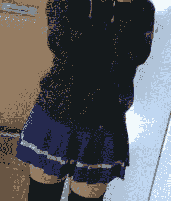

# [暂停更新]不被允许的恋爱

作者：朝雾绘梨花

TID：28450

<title>1</title> <link href="../Styles/Style.css" type="text/css" rel="stylesheet">

# 1

*本帖最後由 朝雾绘梨花 於 2020-6-1 14:47 編輯*

**不被允许的恋爱**黛 恋季（まゆずみ　こずえ）这里是黛 恋季哦，中文读或者mayuzumi kozue或者kozue都可以啦——其实是原朝雾绘梨花（只创作过一部短篇） 最近疫情放假闲在家，实在不想每天都写一整天论文，也不想浪费时间在没有建设性的社交媒体中。“还不如写点小说呢！”这么想着，突然想写点东西，于是就诞生了下面这部粗制滥造的作品啦……虽然想写成连载，但是我的上一篇作品应该是一年前的啦，要懂得我的更新频率！话说回来，这个可能看起来GTS浓度较淡……确实比较淡，但是是会有的！只要我写到了那里……并且每天写作时间，如果有的话也是夜晚……很可能会赶工，感觉自己明明能写的更好但是还是勉强放上来了w 研究生生活很痛苦呢**前言**“小飒，帮我看一下这里好吗？”“哪里？”飒转过头，看向她同桌的女孩子。女孩子看着飒，张开嘴巴，两只细嫩的小手扶着下巴轻轻抬头，让红彤彤的口腔内部正对着飒。“道明寺！在做什么啊！”飒急忙转过头去，紧紧地盯着桌上的试题册，神情扭捏起来。“小飒！”女孩闭上嘴巴，显得有些生气，“不是说了叫我海砂嘛——我的舌头上好像有个小疙瘩，想让小飒看看嘛。”“我们才刚刚认识啊，不用，不用叫的这么熟吧……”飒咬了一下舌头。“欸~但是叫小飒小飒就没问题呀。”“呜……”飒一时语塞，稍稍偏头看了看她新学期的同桌——道明寺海砂（どうみょうじ　みさ）。上羽飒（うえば　はやて）刚刚升至高二，就读于京都的一所升学高中——洛南高等学校，为了考上梦想中的京都大学从高一以来就拼尽全力学习，飒几乎每天放学都要去私塾，周末就在待在宿舍内自习……在参加的排球社团自然而然的成为了影子社员，这样努力的学生在洛南都算少见，她不止一次被老师表扬过。如果说到学习认真很容易就联想到难以接近的书呆子或者是高冷学霸，但是飒平常就面带笑容，也乐于帮助别人，清爽的短发散发着青春少女的朝气。中性的名字恰恰印证了她中性的魅力，这个世界就是有这样的人，明明长了一张好看的脸，浑身洋溢着帅气的感觉，却有着微微隆起的胸部，一边受着女生欢迎一边和男生们打在一起。洛南的校服是英式校服，飒黑色的衣服领口有个红色的蝴蝶结，金色的扣子衬托出优美的身体曲线，棕色的格子长裙搭配上黑色的短筒袜，恰好露出一小截白皙的小腿。飒姣好的面容，整洁的着装，清楚的性格让她虽然不怎么在班级里表现，但不会被他人疏远。经常解答别人的疑惑，辅导朋友的学业，对自己也是一种提升——飒很无私，但是坊间传言追求飒的人都是女孩子。然而这样认真学习又优秀的飒在高一的三次期末考试，虽然每次都能在学年前50名的大榜看到自己的名字，但是每次又都是在榜单的末尾——她只能安慰自己这世界上还是有比自己更努力更聪明的天才。新学期，她就与其中的一位“天才”，还是期中期末六连冠做了同桌。这位“天才”就是道明寺海砂。在刚刚看到新班级新座位表的时候，飒还在想着一定要向道明寺学习，这可是很难得的提升自己的机会。“啊，你就是小飒吧，请多关照啦！”还坐在窗边的新座位上遐想着未来的飒有些被惊到了，她看向这个制服上面敞着环，隐约露出浅浅的乳沟，代表年级的标志性蝴蝶结仅是在脖子上绕了一圈，留着蓬松内卷的金发的少女，要遮到眼睛的刘海还有一小束发梢被染成了粉色。她就是道明寺海砂吗……总感觉有些邋遢。“很奇怪吗？”道明寺拨弄了一下自己的刘海，捏着染成粉色的那缕，“染的不好看？”“啊不……”飒因为突然抛过来的问题怔了一下，“挺好看的。”“什么嘛。”道明寺把包丢在桌子上，一屁股坐在飒旁边的座位上，飒虽然低着头，但是侧目看着这一年的同桌有些野蛮的行动，暗暗的觉着她轻飘飘的有些可爱。道明寺的裙子很明显的向上折了一折，裙摆平平地伏在膝盖上方，白色短袜搭配室内鞋，感觉有些许粗壮的小腿露在外面。虽然可能是个蛮奇怪的人……就是这样的人一直在拿top吗，总觉得难以理解……“小飒，有在记笔记吧。”趁着飒还发呆，道明寺的又一句话砸向了她。“啊……有的，怎么了道明寺同……”“不要！”飒的话刚说到一半，一根手指就轻轻贴在了她的嘴唇上，让她的心不免颤动了一下，“叫我海砂吧，我这个姓氏真的很土，不喜欢的。”飒摆了一下头，装作有点不情愿的避开了海砂的手指：“啊，海砂同学……”“海砂就行啦！”海砂爽快的笑着，又用手指戳了戳飒的脸，“小飒，脸很红喔。”“啥！”飒匆忙地摸了摸脸，看向海砂的笑容，略微婴儿肥的脸上水灵灵的大眼睛正看向自己，但眼神里总有一种莫名的深邃，“真的？”“没有啦，逗你玩的。”“喂……”飒有些无奈，又有些害羞的避开了海砂的眼神——她其实明白自己确确实实喜欢这种可爱的女生，家庭里一直贯彻的精英教育，让她和已经步入社会的哥哥成长路线极为相似，也发展出了一些矛盾的情感。发现自己对男生不怎么感兴趣，反倒会偷偷注意一些女孩子，但是自己的打扮又不过于男性化，还是在注重作为女生的“感觉”，也许这就是同性爱？但是飒自己也不算太明白。“小飒，帮我看一下这里好吗？”当飒看到海砂张开小小的嘴巴，在日光下湿润发光的双唇间樱桃色的舌头就在两排洁白的牙齿间微微跃动，一缕有着粘性的唾液连结着舌尖和上颚……飒的脸这次真的红了起来，她真切地感觉自己对海砂的口腔产生了性欲，但不是和她接吻缠绵的欲望。这是飒自己没有跟任何人说过，一直隐藏在内心深处的，奇怪又不真实的幻想。她想被海砂，用这绯红色的小口慢慢品尝，让整个身体都与那炽热的舌头萦绕在一起，最后被一下子吞掉化成营养成分，或者被坚硬而健康的少女牙齿咬个粉碎……
<title>2</title> <link href="../Styles/Style.css" type="text/css" rel="stylesheet">

# 2

*本帖最後由 朝雾绘梨花 於 2020-4-10 00:41 編輯*

戛然而止！本身不想这么结束的，但是被催睡觉了。说起来，这个“道明寺海砂”原型就是我的女友，她也一直不知道我有这个爱好，不知道海砂能不能发觉呢……
洛南高等学校，是真实存在的学校，但是我对这所学校并不了解，只是我突然想到的学校名字和这所学校撞车了，顺势就用了一下他们的校服~本身是期待水手服的，英式也没有办法
<title>3</title> <link href="../Styles/Style.css" type="text/css" rel="stylesheet">

# 3

> [宇宙巨娘大和号 發表於 2020-4-10 16:02](https://giantessnight.com/gnforum2012/forum.php?mod=redirect&goto=findpost&pid=432623&ptid=28450)
> 等等，如果是是原型的话，难道楼主也是女孩子？现实里你们也是对百合？

是这样的喔……我除了不好看，剩下的部分应该和主角有点像！<title>4</title> <link href="../Styles/Style.css" type="text/css" rel="stylesheet">

# 4

*本帖最後由 朝雾绘梨花 於 2020-4-11 16:04 編輯*

**第一章 幸福的法则**新学期开学以来已经过去了一周，上羽飒仍然按照去年的步伐……一心只沉浸在书本中。好像有点困难。她的同桌——道明寺海砂，除了上课时间都很吵，因为上课的时候海砂基本都在睡觉。下课铃声就是海砂的闹钟，只要一下课，海砂的话匣子立马被打开了，但是她其实并不常找飒聊天……经常性的，课间总是会有两个男生围在海砂旁边，聊一些有的没的的话题，飒即使不是刻意去听，也会有一些下流的只言片语传入她的耳中。这时飒也只能把本身就低下的头再低一些，像是要夹进书页的缝隙中。飒并不羞于听一些污言秽语，只是十分厌恶，尤其是厌恶男生这么下流。不能很好地掩饰自己的表情的她也只能侧过头去认真读书了，就算现在其实也读不下去什么。她不止一次地想站起身来，恼怒地指责他们，让那一伙人要么闭嘴要么离开，但是飒觉得，这样做反倒会让别人觉得自己是怪胎……平常也常常有人来问自己题目，也许是新学期刚开始，大家不怎么熟悉，没人来问题反而觉得有点焦躁了吧。对男生来说估计海砂这种女生有很强的吸引力吧。飒看了看正趴在桌子上于上课期间酣睡的海砂，垂下的刘海，露出了一块额头，飒只是盯着海砂的脸发呆，愔愔地叹了口气。“嗯……小飒？”“哇！”“怎么了，上羽，现在是上课期间。”老师的责令随之而来。“对，对不起！”飒在周围同学轻轻的笑声中慌忙道歉，把桌上的书摆正，又侧目看了看同桌——怎么还睡着，刚才那句话是错觉？梦话？奇怪的家伙。舌头好可爱……！想立即消灭掉大脑里的这条讯息，然而根本就做不到，因为人的大脑只有一颗，是没法让两块大脑互相之间发号施令的。一周前看似认认真真地帮海砂看舌头上的小疙瘩的那次，其实完完全全不知道自己在做什么，只是怔怔的盯着她的口腔内部，因为只是半张着口所以看不到深处……“那个……海砂……长大点嘴……”“嗯？”从海砂的喉咙传来挤在一起的声音，“疙瘩应该在舌头前面的说。”“啊……啊！这里，确实有呢，小疙瘩。”自己当时在说什么呢，竟然让她张大嘴巴什么的，不过也不会被她觉得怎么样才对……她应该是觉得我当时没有看到所以才让她张大点的吧……啊啊……总在想这种事情根本不对，我要好好学习才是啊。飒机械地抄下了黑板上的板书，尽力地只去把海砂想做一个怪人。半个小时过去，下课铃打响，海砂醒来，都没看飒一眼就起身去了教室外面。“那个……大家等一下。”是班长的声音，飒的眼神先游离到海砂的背影上才聚焦到站在讲台上的班长身上。海砂哐当一声作了回来，飒好像听到了一声切。“我们学校每年的春日文选快开始了，主题我已经贴在了那边的告示板上，具体要求也在那里……”是和自己没什么关系的通知……毕竟自己的文学力就摆在这儿。不过班长佐藤红叶（さとう　くれは）……略显慵懒却很有气质感的身板，隔着制服都能看出来的丰满身材，加上可以打高分的长相，以及嘹亮又不失温柔的声音。再加上竞选班长的开朗和勇气，也不难想象她已经在和某某交往了。也许飒内心的另一侧也想成为这种人。“截稿日是半个月后，也就是4月25号，请大家注意一下。”班长向大家微微鞠了一躬，班级内又恢复了吵闹的常态，海砂很不耐烦地阔步走出了教室。“上羽。”前桌的长发女生回过头来，嘴里还含着根棒棒糖，“你要参加吗？”“什么？”她是去年同班的尾崎幸子（おざき　さちこ），颇有辣妹风格的一个人，貌似是走关系才入的学。“春日文选。”“啊~”飒故意在她面前装了一下犹豫，虽然内心中早就决定好了，“还是不参加吧。”“想想也是呢。”尾崎笑了笑，“毕竟上羽一天24小时都在为了考试做准备。”“哈哈……”“不过咱觉得你应该挺适合参加的。”飒因为她说的这句话觉得有些意外。“是吗？”“是呗，怎么说呢，上羽其实一直很帅气又很文静，我觉得这种又矛盾又神秘还温柔的人应该很擅长写文章。”“是吗……我感觉我很普通啦……”自己其实不太喜欢被评价帅气。“一点都不普通啦，高一的时候我还喜欢过你！”飒吓了一跳，看着这个晒得有些黑的女生摆着一副俏皮的笑脸。“开玩笑啦哈哈哈，不过好像真的有女生喜欢你哦。”“话题转的太快了，明明刚刚还在说文选的事情。”飒戳了一下尾崎的额头，内心还是有些难以摆脱那句话。“嗯嗯，文选呢……上届文选咱们学年的金奖，上羽知道是谁吗。”每个学年都只有一个金奖来着……飒在空闲的时候有读过那篇获得金奖的文章，记得作者名字是一。“那个读作二之下写作一的人，好像就是道明…啊，海砂。”“嗯？那个字要读二之下（にのした）吗，是她吗？”其实飒有些在意尾崎为什么突然避开叫海砂的姓氏，明明海砂她人不在这儿。“好像是，”尾崎有点在意从窗外打在飒桌子上的上午的阳光，光束之间有一些灰尘和纤维在飞舞，“要真说神秘的人，还是海砂更神秘一些啦！”“确实，我就是个普通人啦，感觉那孩子有些怪怪的。”二人的目光聚焦在一处。“咱倒是有些害怕就是了~”尾崎故意拖着长音转过身去，伸了个懒腰。飒也蛮慵懒地用左臂撑着自己的脸，看向教室的门外……门外正对着走廊的阳台，海砂正靠在阳台上直勾勾地盯着自己，面无表情，旁边是在跟她说笑的一个脸熟的男生。立即回避了海砂的眼神的飒背后沁出了些许冷汗，似乎都能听到自己的心跳声——应该只是听了尾崎的话又碰巧看到她发呆吧。第二天上午第一节课前，和蔼又年轻的男班主任少有的面色凝重地走到讲台上。他用手里的教案敲了敲讲台桌示意同学们安静，像是要宣告什么重要的事情一般——“本间同学和田中同学，昨夜遇到车祸，不幸逝世了。”本间……田中……记得是……飒看向同桌的海砂，却发现海砂正微笑着看向自己，眼瞳中仿佛有星星在闪烁。真是纯真可爱的笑容啊……飒下意识地也对海砂微笑了一下。该说，幸好没被老师看到吧。
<title>5</title> <link href="../Styles/Style.css" type="text/css" rel="stylesheet">

# 5

每天果真还是太忙了，晚上写时间太有限，但现在是既想赶进度又想慢慢写……世界观太庞大，或者情节太复杂出现逻辑错误或者设定冲突的话，我这个人只能靠胡编乱造和卖萌逃走了！<title>6</title> <link href="../Styles/Style.css" type="text/css" rel="stylesheet">

# 6

> [xxx99 發表於 2020-4-11 12:05](https://giantessnight.com/gnforum2012/forum.php?mod=redirect&goto=findpost&pid=432756&ptid=28450)
> 希望字體調整大一點
> 選擇一種方便觀看的字體
> 感謝！

我把字体大小调整为了四号
但是不知道为什么，调整字体是无效的……只有英文字在变
所以我干脆用了一下印象中比较清晰的“微软雅黑”，不知道看起来怎么样……因为我这里还是显示普通的宋体
<title>7</title> <link href="../Styles/Style.css" type="text/css" rel="stylesheet">

# 7

*本帖最後由 朝雾绘梨花 於 2020-4-13 22:12 編輯*

**第二章** **脑内啡**本间、田中二人死于车祸的那一天。“海砂酱~”“啊……田中啊。”海砂正靠在走廊的阳台，向教室内看着。“在看什么呢。”“没什么。”男生真是无趣的生物啊。田中的本意是上前搭讪，但是这样下去话题根本就进行不了。他和本间都喜欢这个女生，海砂真的超级可爱的啊，就像是漫画里的角色一样。还是个天才般的人物，性格也超有趣啊！在一开始的时候田中就没想过能和她搭上话。现在应该已经能算作朋友了，所以就要进一步——“田中。”田中突然被海砂抢了话，有些不知所措，只能慌忙应声。“晚上八点，Seiren Bar，有空吗。”“欸？”自己其实也想邀请她去来着。“没时间就算了。”“有时间的！”这句话一下子让田中不再犹豫了。“嗯，本间也会去的。”“本间……啊……好的。”什么嘛……“不要毁约喔。”田中含糊地答应了一下，算了，能一起去泡吧也不错。上课铃声打响，海砂双手插兜走进教室中，田中怔怔地看着她带卷的金发。
Seiren Bar，是一座离学校比较远的酒吧，因为它只有第一层是正常营业酒吧，剩余三层均是旅馆，Seiren的招牌颇有霓虹风格，i的点是一颗大大的粉色心形，所以这个酒吧所以本体应该算是情人旅店。距离学校比较远也不怎么会遇到熟人……田中吸了口手中的烟，刚刚看了一眼吧内，本间已经到了，但是海砂还没。于是他就把本间劝在座位上，自已一个人出来等。
“为什么要和本间……啊。”田中四处瞟着，在街道的尽头，繁杂的人群中看到了海砂，其实并不是他的眼神有多好，只是这个街道上全是穿着光鲜亮丽的女人，只有她还穿着校服——把那种禁欲系的校服解开俩扣子就能穿得这么色情也就海砂了吧。啊，不过那家伙……“喂~”田中挥手喊着，海砂也看到了他，抬起手示意了一下。“怎么了海砂，为了这个特殊的夜晚特意把头发染了吗。”现在的海砂一头亮粉色的头发，其实就是平常挑染的颜色，在灯光下这个粉色也特别扎眼。并且她换了条茜色为主，藕色为辅的格子短裙，像是从别的学校的校服扒下来换上去的，不过这短裙短的几乎露出了整条大腿，仿佛从后边看都能看到屁股。“进去吧。”海砂好像对和田中对话很没兴趣，身体擦着他推开门走进了酒吧。虽然只吸到了一口，但是海砂经过自己的面前时头发的味道是特别好闻的蜜桃果香，有点后悔没有深吸一口气——田中跟在海砂背后，贪婪却不张扬地蚕食着她的气味。“本间也到了啊。”坐在吧台前的本间有些脸红，低了下头挥手示意。“两杯奈非给男生，我喝碳酸。”酒保转身开始做准备，海砂大概来了很多次了，他明白海砂说的“碳酸”是什么饮料。田中虽有些困惑奈非是什么，但看到海砂坐在了胆小鬼本间的左边，自己紧忙也凑了上去坐在了海砂的左边，坐下的时候他还偷偷瞄了瞄海砂深深的乳沟，乳房的皮肤也十分洁白，酒吧的灯光比较昏暗，并且不知道为什么室内要比外面热上许多，无歌词的舒缓爵士乐从头顶飘过，让田中的情欲大增。再加上海砂身上喷的略带薄荷气味的香水味混合着洗发水的味道……感觉自己微微勃起了。“呐……海砂。”田中想把右手放在海砂的右肩上，这样就有抱住的感觉了。海砂瞟了他一眼，眼神里好像没有拒绝的意思，“什么？”田中把胳膊放在了海砂的肩上，脸靠近了海砂的脸：“为什么叫那家伙。”接着向本间的方向摆了摆头。田中没有压低声音，是故意让本间听到了。“这算什么问题。”海砂扭了一下肩膀，拒绝田中继续搂着她，“因为我喜欢本间。”“哈？”“啊？”两个人都愣住了。海砂既没有看向田中也没有看向本间，只是接过了最快弄好的碳酸——可乐，用吸管玩弄着里面的气泡。“你们的奈非……”酒保说着，两个人才把视线归到自己的饮料上。奈非完全就像是白开水一样，这是田中的第一感觉，不过也有很多无色的饮料，比如白酒——但是他们还是高中生，海砂应该不会给他们酒。比起这个……为什么这家伙喜欢本间啊？是在开玩笑吗？还是两个人偷偷搞在一起了啊，今天叫他过来是让他吃醋吗？“快点喝。”海砂突然戳了一下本间的肚子，让本间好痛。“干嘛啦。”“快点喝。”本间看着海砂，她的眼神中颇有挑逗的气味。
也就是说刚才是开玩笑咯？本间没有多想，只是举起杯子将那个无色的液体倾泻到自己的口中。一股柠檬味，就像是柠檬酸兑水一样，虽然不好喝倒是蛮解渴的。杯子中装的不多，二人都一口气喝完了，没什么特别的感觉。“上楼吧。”海砂突然站起身来，走向一侧的楼梯间。“喂喂……你今天怎么了啊。”田中总觉得今天的海砂有些不对劲，平常她可是说起话来没完的样子。“和要上天堂的两个人没什么好说的啦~”海砂回头看了看田中，有些邪魅地笑着，又拍了拍本间的头，他们二人只好先跟着海砂上楼。楼梯间的灯都设置在台阶两侧，仅仅能照亮台阶的程度，还套了粉色的灯罩，粉红色的光打在台阶上，给人满满当当的情人旅店气息。海砂靠着右侧慢慢走上台阶，本间在左边跟着，田中估计等了两步的时间，一边迈上台阶一边瞄着海砂裙下的内裤。好像是粉色……不过也许是灯照的，是白色也说不定。“喂，干嘛呢。”海砂捂了一下自己的裙子，回头恶狠狠地盯了田中一眼，但凶煞的眼神一瞬间又化为了平静，“一会儿给你看个够。”啊……3P，是要3P吗这种情况。海砂是喜欢3P的类型吗，虽然看起来确实有些bitch啦，真意外呢~本间就像个透明人一样，就算3p也能当作是solo。田中暗暗想着。他们三人到了四楼，也就是这栋建筑的顶楼，海砂转身向着走廊深处走去，在最里面的门停下了，拿出了钥匙卡。“叮。”海砂推开门，室内的灯自动亮起，示意两个男生：“一会儿吃顿烧烤吧。”田中走入室内看到的第一件东西就是一个小的电烧烤架——要在屋里烧烤吗，他又环顾了下四周，屋子其实并不大，该说其实就一个卧室的大小，一旁是洗手间，在角落处摆着单人床……单人床？“这个屋子……没有窗户。”本间怯懦地说着。“啊……因为个人隐私啦。”海砂轻轻推着本间的背把他赶进屋子，接着带上了门，门锁“咔”的一声锁上了。“呐，”海砂叫着二人，“肉在床头柜那边的冰箱里面放着呢，烤了一起吃吧。”“好嘞！”田中准备去拿床头柜上的袋子……真正的派对前还有BBQ~不错喔~就在他刚刚打开冰箱门，拿起袋子的时候，突然间感觉身体用不上力，手中的烤肉落在了地上，接着是双腿也失去了力气，他跪在地面上，一只手扶住了床头柜，不解地看向海砂的方向——本间已经躺在了地上，但是还睁着眼睛。自己的意识也很清醒，只是无论身体的哪里都用不上劲，最后连床头柜都扶不住了，只是维持在跪坐的姿势上，无力的双腿和床维持着自己的姿势。海砂这时正十分冷漠地盯着他，这种冷漠的眼神田中从来没有遇到过……虽然平时海砂会做出一些冷淡的反应，但是和现在完全不同。现在的海砂让人感觉到的是纯粹的恐惧。想到这点，田中浑身的肌肉都失去了力气，瘫倒在地上。
<title>8</title> <link href="../Styles/Style.css" type="text/css" rel="stylesheet">

# 8

*本帖最後由 朝雾绘梨花 於 2020-4-14 01:53 編輯*

**在这章之前，我先声明，人物具有的信仰不代表作者具有的信仰，如果觉得不舒服的话可以想成是另外的世界发生的事情。**

本故事純屬虛構

**第三章 天之罚**

海砂冷冷地看着无力的二人，一脚踩在了本间的头上，但他什么反应都做不出来，只是能清晰地感觉到一个重物在压着自己的后脑，鼻梁挤在地面上，血液都流了出来，但奇怪的是没有疼痛感，虽然没有痛感，但是却能感觉到血液在鼻腔中流淌的过程，也能感觉到头顶海砂的鞋子——仿佛能感受到那只鞋子鞋底的纹路。感觉似乎被强化了但是唯独痛觉消失了这种感觉十分怪异又极不舒服。

“痛吗？”海砂扭动了一下脚，本间感觉自己的鼻梁碎掉了，骨头碎裂的声音直接传达到大脑。

“忘了你说不了话了。”

现在本间唯一能移动的就是自己的眼球，他感觉到海砂的脚从头上移开，向田中的方向走去，却停在了房间中央。

“秋姬（あきひめ），我们的天主，我们感谢你……”

？

“……在这一天里，你以你的慈爱照顾了我们，以你的大能保护了我们……”

她在……祈祷？

向上看去，本间看到了海砂裙下的内裤——那是纯白色的内裤，凸出的臀部把一部分内裤都夹进了屁股的缝隙中。

“……求你宽恕我们缺乏信德，宽恕我们今天所犯的一切罪过……”

怎么了？这种奇怪的感觉……

本间感觉海砂似乎在变高，并且是不断在变高变大……不只是海砂在变，周围的景色也……

“……使我们远离黑暗的诱惑……”

这……这是！我在变小？！

本间想着，现在的日本，因为总的来说是教会统治的国家，所以会有很多教徒没差——但是关西圈应该是反教会派活动最为活跃的地区才对，反教活动最猛烈的就是京都啊。本间想到了一些不好的东西，虽然只是听闻，在一些教会彻底统治的区域，罪犯或者共产党员会被处以一种极刑——被缩小之后，提供给信徒们随意玩乐，听说还有被当成药引的……

难道都是真的？就算是真的，自己既没有犯罪也没有冒犯神明，为什么会……

“……秋姫，愿你的圣名永远受赞美。”海砂结束了双手合十的祈祷，双手自然地放在身体两侧。

记得有句阿门才对……

本间察觉自己应该变小了一半……以地板纹路之间的距离在眼前发生的变化判断，现在应该缩小了一半。但是缩小的过程并没有因为祷告的停止而结束，他仍然在慢慢缩小。

“啊啊啊——”是田中的喊声？本间抬头看到田中站起身……

原来力气恢复了，但是痛觉没有回复，不知道是好是坏。

田中（原178cm，现90cm上下）愤恨地站起身来，两个箭步冲向海砂，伸出了自己的拳头……

但是他忽略了自己缩小的体型，两步的距离还不够抵达海砂的身边，他只是突然间看到了海砂的学院鞋鞋底……

“咕啊。”还没他等反应过来，也没看清鞋底的纹路，田中就被狠狠地踢了一脚，但是他并不能感觉到疼痛，只是整个头部有着强烈的震荡感，以及能感受到血管中的血液在伤处的紊乱。

“可悲的Commi。”海砂的眼神中没有一丝怜悯。

Commi……？（共产主义信仰者的蔑称）田中是共产党吗。

“可恶……”田中（80cm）擦了一下从鼻孔中流出的血，准备发起第二次进攻，这次他又扑了上去，准备用双手抓住海砂扑倒她。他成功抓到了海砂，双手按住她的腰部，准备将她推倒——但是他发现无论自己怎么用力海砂都纹丝不动。

“没有神的话，你还能是人类吗。”海砂看了看这个正推着她的田中，自己并没有感觉到多少推力——因为力量并不是随身体缩小而等比缩小的，现在的田中十分虚弱。

“你懂个屁！”田中虽然嘴上反驳着，但是他发觉了自己可能根本对抗不过这个人的事实……

可恶可恶可恶，自己竟然一直喜欢这个女人，结果也是被神洗脑的脑残。

“说到底，你自己的信仰其实是更加可悲的宗教吧。”她抓住了田中的双臂，用力握拳轻松让他的双手离开了自己的身体。

田中拼命地对抗着：“教会也只是敛财的工具……罢了，你也只是……狗屁神的工具而已。”

海砂因为他说的话稍稍愣了一下。

不过她的双手还是更加用力，意图将田中的小臂从中间掰断——她确实做到了，田中骨头碎裂的声音是一道沉闷的响声，两条胳膊同时变形了……虽然田中现在并没有痛觉，但是双手因此彻底失去力气，骨头碎裂传给大脑的信号诡异又令人不适。

“差点忘了。”

田中抬头看了看正在说话的海砂，她冷冷的眼神与几分钟前判若两人，香水的气味依然能飘入鼻腔，只不过混合着自己鲜血的腥味，令人作呕。

“秋姫大人……”海砂狠狠地推开了田中，看着躺倒在墙角的田中，又开始念起了祷告文，“……愿主英名受赞美自现世，直到永远。”

“啊……啊啊啊啊……”痛觉仅仅一瞬间就全部恢复了……但是并不仅仅是现存的痛觉，而是刚刚，摔倒在地，被踢到鼻梁，捏断双臂的瞬间……所有的疼痛都在那一瞬间袭来，剧烈的疼痛刺激着中枢神经，好似要给大脑留下一道深深的伤疤。此时卧在地面不敢多动的本间也感觉到了鼻子的疼痛，和踩踏时的痛觉融为一体。

“可恶……本间，你不也是吗……为什么……什么都不做啊！”田中（60cm）为自己的无能感到愤怒，也为本间的软弱感到愤慨……

海砂的一只脚重重地踩在田中的腹部，她38号的鞋子对于现在的田中来说占了上半身的一大半，感觉肝脏和胰脏等都因为巨大的挤压力尽数破裂，一口鲜血吐在了海砂的泡泡袜上。

袜子上鲜红的血液突然间就变少变得稀疏起来，好像是被海砂的身体吸收了一般，

“本来压根就不想吸你这种人的血。”海砂松开脚，就在田中稍微放松的一瞬间，自己的左脸被狠狠地踢了一脚——因为小小的身躯所以肩膀和脑袋都受到了巨大的踢力，整个人像飞出去一般摔倒在地。这一脚感觉自己的脖子都要断裂了，而这时田中感觉到自己的缩小进度貌似变快了，海砂显得越来越巨大……

“要逃跑……先跑出去……”

田中（30cm）忍耐住了疼痛，看准了海砂胯下双脚之间宽广的空隙，现在不是考虑那么多的时候了……

他拼命奔跑起来……一步，两步，三步……自己的左右就是海砂的两双鞋，这时只要再跑上两步的话……

海砂的右腿向左腿靠拢，直接把田中加在了两腿中间。现在的田中（15cm）勉强只有海砂的鞋子那么高，并且以肉眼可见的速度快速变小着，以至于海砂都快感觉不到他在自己双腿中间了——这样看的话其实海砂不管他他也不可能跑出去了。

“喂！本间！你快跑！”田中（5cm）挣脱了出来，注意到自己的缩小过程停止了，同时也发觉距离门已经变成了不可到达的距离。没办法，只好让本间跑出去……

而本间只是愣在那里，自己大概有60cm高，他完全不明白田中为什么缩小的那么快……而这么小的田中在说些什么，本间也根本听不见。

海砂看向地面，用力跺了一脚，自己因为反作用力都感觉到了一丝疼痛，这次踩踏没有落在田中身上，而是田中的一旁。

巨大的响声和风压伴随着强烈的震感震翻了田中，他无力地躺在地面上，这时海砂又看向本间，本间怯懦地看着她……缩小进程同样加快了。

“不要想逃了，”海砂的声音像是法官的审判，“门是锁上的，下面也没有缝隙。”

本间急忙回头看了看……没错，门的下面，空隙也就只有毫米级别，这个房间一开始就是设计成这个样子的吗，自己，只能等死了吗。可是，我压根就不是什么共产党，也没有犯罪啊……为什么……为什么会这样……

海砂以蔑视的眼神冷冷地看着田中。

“现在，你相信神明了吗？”

“谁会信啊。”

“你在说什么呢，虫子。”

“我说，谁会信啊！”田中虽然在大声喊叫，但是内心中充斥着恐惧……自己的尊严还不允许自己认输。

海砂抬起了脚，田中试图用变形的双臂遮挡住自己的身体——

鞋尖触碰自己身体的一瞬间，他就飞了出去，整个身体撞在烧烤架上，肋骨断掉了好几根，心脏应该都破碎了才对……

“你知道吗，”海砂面无表情地缓缓走向田中，他终于清清楚楚地看清了海砂的内裤，私处好像都有所浸湿，“你没有死是神明赐予你的奇迹。”

海砂这时候因为嗜虐心变得兴奋起来，她感谢着神赐予她这样光荣的机会，感恩着名为秋夕的神明……

“我说了……神都是……咳咳……都是狗屁。”田中的声音虽然微弱，但是海砂听得一清二楚，海砂的灵魂因为施虐变成了接近天使的状态……她现在也丝毫不会因为田中的话而感到愤怒，因为田中现在只是一只虫子而已。

如果对方的力量比起自己的一指都相差甚远，那么谁还会感到愤怒呢……一切愤怒地根源都是因为自己的弱小，只要足够强大，人就永远不会愤怒。

海砂默不作声地打开了烤架，田中可以听到转动按钮的声音，突然觉得害怕了起来……虽然想着一百万个不可能，但是最终的事实大抵还是自己想的那样子。

海砂戴上了手套，从袋子里取出了一块黄油，铺了一层在烤盘上。黄油接触着滚烫的金属发出“呲呲”的声音，这个声音就从田中的头顶传出，但是田中自己什么都做不到，只能绝望地等待着。

自己受伤的胳膊被抓着，整个人被拎了起来——变形的右臂因为自己的重力好似要被拉直了一般，剧痛传遍全身。但是田中只是一昧忍耐着，强忍着喉咙翻滚着的呜咽声。

海砂把他放在烤盘上方10cm处，田中可以看到自己脚下不远处黄油正翻滚着气泡，自己的脚都能感受到热气，只要田中还是人类，就会十分害怕被丢下去吧……田中自然是人，他内心中的恐惧都快要吞噬掉他胳膊的疼痛感了。

“田中，现在你相信神明了吗，只有神能拯救你。”

“我啊……我啊……”田中的眼眶挤出了泪水，“……”

“什么？”

“那种东西怎么可能存……”

海砂脸一黑，还没等他说完就用力捏断了他的手臂……并不是骨折的程度，而是手臂中间都被捏了个粉碎，他就这样坠落到了滚烫的烤盘上。

连本间都能听到他痛苦的嘶号。

真无趣，看的也有点恶心了……海砂看着在油中不断翻滚却根本死不掉的田中，他只是单纯地嘶号，却连“救救我”或者“原谅我”都不说，commi怎么都是这种怪物……海砂倒是闻到了一股肉香味，她解除了田中身上神明加护的一瞬间，田中就因为浑身的剧痛，严重的烧伤，完全损伤的内脏直接死亡了。

去头再吃吧……

海砂掰开筷子，既没有念本身应该在饭前念的祷告词，也没有说我开动了，而是直接用一根筷子弄断了田中的脖颈，把他的头拨到一边，又用筷子尖挑去了田中的私处，夹起那具已经烤熟的尸体……

本间在地面上看着这一切，裆部洇湿了一片。

“呼……呼……”

“啊~~姆！啊啊烫烫烫，呼呼~”就像是吃了一块普通的烤牛肉一样，海砂的反应无异于同年龄的少女，本间看着这一切，浑身都因为恐惧而发抖起来，眼神甚至都不能聚焦在海砂的脸上了。

海砂咀嚼着嘴里的肉，用舌头仔细品尝着每一个细节——人类的肉比普通的肉酸一些，也许今后要改善一下烹饪方法。

她突然注意到地面吓得动都动不了的本间，才想起来这个人的存在。

“ふーんふーん”海砂抿着嘴笑了起来，走向本间的面前蹲了下来。正对着本间的是同样能看到洇湿的海砂的内裤——虽然跟自己湿掉完全不是一个理由，他只有抬头才能看到海砂的脸。

那是准备玩弄猎物的表情……

"呸。”海砂咽下去了田中的残骸，之后吐出了什么东西到本间面前——那是田中的上衣和裤子。

“啊……我把胖次咽下去了吗，”海砂想了想刚才挑去那里的时候好像没看到小内裤，“田中是不穿内裤type嘛？”

“欸……欸？”本间怔怔地看着海砂的笑颜，完全察觉不到自己因为害怕甚至流下了眼泪。

“不用这么害怕啦，我不会把你丢到烤架上去的~就算丢也要先杀掉呢。人道主义！”海砂伸出手指触摸了一下本间的头，本间害怕地立马抱头紧闭双眼——让海砂都觉得有些许可爱。

“拜托了，拜托了……”本间声音颤抖的说，“我信神，我信，神明大人，神……”

“那你应该能去天堂呢，还记得我一开始说的嘛，虽然……嗯……叫啥来着，那个人会去地狱啦。”

“呜呜……呜呜呜……妈妈……呜呜……”

没救了……海砂暗暗想着。虽然自己想体验一下吃生人的感觉，但是其实想吃女孩子而不是男人呢。

“不用害怕的说，很快就结束了~啊，你有没有什么想要的死法？”

“呜……呜呜呜……不要……我不想死……”

看来是没法对话了……虽然可以直接踩死他，但是总感觉没什么意思。男生喜欢什么呢？欧派和屁股吗……

“胸部，和屁股，喜欢哪一个？”

“呜……呜……”

“拜托~你人生中就这一次机会做选择啦，不选的话就把你丢在烤盘上好了。”

“不……不要！”本间比起死亡更怕被活生生烤死……“欧派，呜……我选欧派。”

“ok”海砂快活地答应了他，轻轻把他抓起，上升的过程莫名让本间冷静下来。

自己从小就是那种被喊娘娘腔的人，和男生玩不到一起，女生也不喜欢我。上了高中……大概一眼就喜欢上元气又聪明的海砂了吧，虽然一直感觉，海砂和自己，完完全全就是两个世界的人，但还是鼓起了勇气搭了话……完全没有想到会成为“朋友”，也完全没有想到会变成现在这样啊……自己的人生，也未免太平庸，又太戏剧化了吧。

他擦了擦泪水，看了看下面就是海砂的胸部，他会被双乳之间的缝隙吞噬殆尽——莫种意义上确实是天国啊。

“要去了哦~”

抓着自己的力量瞬间消失，他直直地向海砂双峰间坠落……最后落在了靠近缝隙的右胸上，生命马上就要消失的恐惧，在海砂的混有薄荷味的花香味中，在柔软的乳房上方，化为了纯粹的性欲……

被抖落入缝隙中，感受着两边的柔软的同时，全身的骨头被一点一点夹碎，内脏也变得破烂，血管迸裂……但是本间却感觉不到疼痛了，他感觉自己的血肉正在被这滋养生命的地方吸收——滋养生命的地方，在被他微不足道的肉体滋润。

这是本间人生中最满足的一刻了吧，也是生命中的最后一刻，被吸干的本间的尸体从缝隙中滑落，掉出了上衣。

“呼……这个人的生命能量其实还满强的嘛。”海砂看了看自己乳沟中的血液正缓缓地被吸收，“但是很遗憾，被我杀掉的人好像只能去地狱。”

“喂喂……玩的很开心嘛。”背后突然传来一位女性的俏皮声音。

“谁？！”海砂猛地回头，发现那是无比熟悉的脸庞，深粉色的长发……“朝雾秋姫……秋姫大人……”

“你干嘛要染成这个颜色呀，都是粉色就重复了的说。”

“这……不是染的……并且秋姫大人的更深一些……”海砂的脸红彤彤的，声音都变低了。

“嗯，我知道哦。”秋姫看着这个脸红的女孩子，“没有忘记自己的目的吧。”

“没有！”海砂的眼神恢复了坚定，“绝对要推翻……教会！”

“对，为了推翻它，我们需要……”

“上羽飒……”两个人同时说着一个人的名字……

——TO BE CONTINUED——

补充一个教会设定吧！虽然是自己拍脑子想出来的教会成员全部是6至45岁的女性，有一些特例可以逾越年龄范围。6岁之前，45岁之后的具有信仰心的一般女性和同意教会章法的有信仰心的男性均是教会从属人员。判断界限十分模糊。设定中的日本大多数人都是“教会从属人员”，有很多在年龄范围内的女性也仅仅是“教会从属”而已。教徒的女儿可以很方便入教。信徒最小6岁就可入教，之后在教会学校学习。但教会学校中不一定全都是信徒，至少都是“教会从属人员”。短篇《最圣洁的药引》中的朝雾和秋姫、起初就一直是教会学校的学生，朝雾因为母亲的缘故是教会信徒，秋姬是信仰较深的教会从属。但是自从二人结合之后，好像有一些变化出现了。
没错，我写的小说都是一个世界观！包括最近的那篇同人！不过朝雾不是同一个人
另外，我再说一下我自己的信仰吧，我是社会主义的信徒，是中華人民共和國共產黨黨員！这么虐待一个同志是不是觉得有点不可相信~说自己相信社会主义而不是马克思主义或是其他共产主义是因为，我是相信神明存在的，并不是唯物主义者……生在天主教家庭，高中以来对一神论十分厌恶，开始进行自我思考，摆脱了天主教，信仰多神、泛神，可能有点类似于日本的神道教，但是我不信具体的任何一个宗教，我就是我，我的神明就是我的神明！
<title>9</title> <link href="../Styles/Style.css" type="text/css" rel="stylesheet">

# 9

> [LTHPKBTE 發表於 2020-4-14 00:06](https://giantessnight.com/gnforum2012/forum.php?mod=redirect&goto=findpost&pid=433117&ptid=28450)
> 啊，文章是喜欢的类型呢
> 很期待后面的情节

谢谢你的喜欢！我会继续努力哒

可能写的过程有点飘！悠着点看！
<title>10</title> <link href="../Styles/Style.css" type="text/css" rel="stylesheet">

# 10

*本帖最後由 朝雾绘梨花 於 2020-4-15 00:19 編輯*

**（本章有图片，看不到请切换pc版）**

**第四章 印象** 

 “没想到田中竟然死了啊。”

“对……还和那个本间一起。”……可是“那个”本间欸！旁边有人强调。

“他们为什么能在一辆车上，记得家的方向完全不同欸……”

“该不会是gay吧！”

班级的一隅传来嬉笑声。

同学死掉了有什么好笑的呢，飒有些愤怒地想着，但她刚刚和海砂对视的时候——她在笑，自己也笑了。

虽然说是下课时间，但现在的海砂依旧趴在桌子上，一脸迷茫地看着前方——大概是没有人找她说话了，田中和本间算是她的好朋友吧，说不定刚刚只是强撑着挤出的笑容……自己干嘛要回应那个笑容呢。

海砂的金发传来淡淡的蜜桃香气，飒觉得应该安慰一下她。

“喂，海砂……”飒拍了拍海砂的肩膀，“还好吗？”

海砂并没有看向飒，而是自言自语般地说着：“我其实蛮喜欢本间的啊……”

她……喜欢本间吗，飒的内心闪烁了一瞬失落，但立即就化为了对海砂后背温柔的抚摸。

前座的尾崎突然转过头来：“真的？海砂，你喜欢那个本间？”

“喂！尾崎同学！”飒苛责着她。

海砂看了看尾崎，其实她内心中对那两个人没什么怀念，但是装还是要装的。

“你想死吗？”

“开个玩笑啦……”

“想，还是不想。”

“饶了我吧……”尾崎还是有些玩笑意味的应和着。

“幸，你要是想死，今晚我就能让你去死。”海砂冷冷地把句子抛了出来。虽然叫的是尾崎的小名，但是这语气听起来十分认真，让其他二人都愣住了。

“……对不起……”尾崎一下子蔫了。

“没事啦，”海砂伸手揪了揪尾崎的刘海，“我不是那么喜欢本间，就是觉得他有点可爱而已。”

“喔……”

“所以幸今晚想不想去死一下~”

“欸——”

“开玩笑啦。”

尾崎发现对话进行不下去，只好悻悻地回头——但是海砂说的话一直都是真心，如果她想死，今晚就能让她去死。正好自己想要尝尝少女刺身的味道。

她看着手正搭在自己背上，一脸关心地看着她的飒。

“怎么了？”飒问道。

“小飒，抱我一下。”

“嗯？”

海砂看了看无动于衷的飒，坐起身来抱了过去，“好啦，抱我就是了。”

飒因为海砂突然的举动脸变得通红，体香和香水的味道一股脑的灌入鼻腔，软软的身躯仿佛正在溶解自己一般——她小心地张开双臂，搂住了海砂，两人的头靠在了对方的肩上，飒可以听到海砂浅浅的呼吸。

而海砂的心中，只是想着怎么才能让小飒觉醒，如何确定她站在秋姬大人的阵营，同时心中也藏着一丝丝的歉意。

“朝雾！你这个叛徒！”

地点是大阪的一处教堂——教会为了逐渐控制关西地区，开始在经济政治等多方面扩大影响力，这个教堂就是这样建成存在的。

一排排红檀木的长椅从教堂的门口延伸到内殿，这座教堂的房顶高的出奇，天穹的灯光却十分明亮，散落在中殿上。朝雾静静地站在中殿尾端，教堂的门口处，看着正歇斯底里的主教。

教会里的“主教”而是有点类似于神父和教堂主教的统一体，不过她们都是女性，是各个教堂的管理者，她们也会被分到教会的一部分魔法能力，教会本身就是一个以教宗为中心的大魔法缸，教徒分配的名为“祝福”，其实就是一点让人自我感觉良好的内啡肽，传教士，执事，主教等分到一些实质性的魔力，她们是真正掌握魔法的一批人。

朝雾的目的就是摧毁教宗——这里没用杀死是因为她一直不确定教宗是不是人类，说不定单纯的就是“容器”而已。

“你觉得我是叛徒吗。”

朝雾向讲台缓缓走着，讲台侧的主教一时语塞，她看着朝雾一头深粉色的长发，在灯光下显得无比顺滑，虽然满身都散发着危险的气息，但朝雾只是穿着一身很学生风的衣服，黑色的带帽卫衣，海蓝色的短裙，还有有些厚度的黑色过膝袜（没错就是下面这身）。

<ignore_js_op></ignore_js_op> **QQ图片111111111111.jpg** *(42.8 KB, 下載次數: 1)*

[下載附件](forum.php?mod=attachment&aid=ODI0MDF8MTZiOGZkOWZ8MTYwMDg3NjkwNnwxODIzMHwyODQ1MA%3D%3D&nothumb=yes)

2020-4-14 22:17 上傳

主教看着面无表情的朝雾，身体发出了愈来愈强烈的信号——自己是没法和她作对的。刚刚自己正在台上演讲，她一瞬间就让所有信徒昏睡在长椅上，两个执事也尽接倒地，只有她在感受到这一昏睡感的同时，强行动用了身体中能动用的一切魔法抵御了这一次攻击。

然后她就推开了教堂大门……就这样慢慢地走了过来。

“可恶，谁会怕你啊！”主教握紧拳头，准备集中一波魔力形成一股气旋——她不知道经历了多少艰难险阻，疏通了多少人脉，完成了多少业绩，才从一个教会从属爬到了这个位置，并且现在自己也才24岁，被很多人都叫为年轻的“天才”！

既然是个天才，这点困难什么都不是。

就算她被全教通缉又如何，失去了教会魔法，不过就是个三流人类而已！

什么都不是！

聚集魔力，聚集魔力……

她紧盯着越来越近的朝雾，却察觉到一丝异样……

自己并不能聚集到任何一点魔力，前所未有的空虚感萦绕在她的内心。

“你……你做了什么……”朝雾距离她只有三米远，马上就要登上内殿的台阶了……也就是说，就算魔力不能使用了……

她扑上去想要扑倒朝雾，用物理攻击，但是刚刚迈出一步，就感觉整个身体都失去了力气，直接瘫倒在地，从台阶滚落而下。在疼痛袭来与困惑恐惧的同时，她看到朝雾就在她的面前，满怀怜悯地向下看着。

为什么……为什么是怜悯的表情。

“你……究竟做了什么。”

“我吸收掉了你所有的魔力。”

“什……什么？！”这句话对于信徒来说是极具冲击力的，失去了魔力，意味着连“加护”的程度都没有了吗，那她也就什么都不是了，“不可能！你不可能做到的！魔力是教宗直接传输到我的大脑的，怎么可能……”

她挣扎着用一只手抓住朝雾的腿，想要扳倒她，也想要质问她。

但是当她的手接触到朝雾的一瞬间，仿佛一切都明朗起来——朝雾就像是一个黑洞，正吸收着周围的一切……

“真可怜，”朝雾看着地面上额头跌出血的主教，“魔力已经和你的生命同化了吗。”

“你说什么？”主教抬头看向朝雾，那怜悯的眼神依旧没有消去。

“看来你不知道呢。”朝雾跨过她的身体走上台阶，主教怎么也拦不住她，只能看着她走上去，坐在了最上面的台阶上。

“对那个教会信仰越深，执念越深，对魔力渴求越旺盛的人，会被‘教宗’同化，后果就是魔力和生命力逐渐会变成同一种东西。”

怎……怎么可能……

“不过像你这种被荼毒洗脑到这种程度的人，既救不了，也没有什么救的必要了，唯一遗憾的是你还蛮年轻。”

朝雾比她年幼才对，柔软的声音像是在故作成熟一般。

主教察觉到自己面对的长椅开始变高了——她明白这意味着什么，自己在变小就意味着信仰的资格本身在被剥夺，会变成虫子一般的存在……

“不！不要！”她用尽全力转过身体，双手扒着台阶下的地面，痛苦地看着朝雾，“救救我，救救我！”

“这么痛苦吗。”朝雾眼神中的怜悯掺杂了一丝悲伤。

“求求您，求求您，我不想，我不想死！”刚刚还高高在上凛然领读圣书的主教，如今匍匐在地面上一味乞求着，正常来说教徒变小只会因为判教一个理由，所以这个惩罚的过程是十分痛苦的，她已经感觉到自己的头开始疼痛起来。

“至少我可以让你变得轻松点。”朝雾用右脚褪去了左脚的鞋子，缓缓脱下袜子——

“舔舐我的脚趾吧，上面是我没有及时吸收而残余的魔力。我已经不再吸收周围的以太了，你可以借此减轻你的痛苦。”

短短的几秒钟对于主教来说十分漫长，她死死盯着朝雾逐渐裸露出的白皙的小腿——不能以修长来形容，而是十分可爱的脚丫跃出了袜子，脚趾刚刚脱离了闷热的牢笼，像品尝这份空气的清爽般摆动了两下。

对于现在的主教来说，这应该就是世界上最美的果实，疼痛已经从头部蔓延到胸口，她已经迫不及待了。

朝雾把脚抬到主教面前，她盯着近在眼前的脚趾，可以闻到淡淡的臭味，但可以深切地感受到那边存在着魔力——她现在人生的最大欲望就是舔上一口朝雾的脚，但是没有听到“主人”的指令，自己忍着疼痛也不敢轻举妄动。

“因为走了很久所以会有点味道吧，忍耐着去舔吧，不许舔脚心。”

主教像小狗一样扑在朝雾的脚上，含住了大拇脚趾贪婪地吸食着魔力，朝雾的脚趾好似有奶盐的味道，汗水的咸味不能遮盖住她皮肤的香甜。

疼痛十分有效地缓解了，但是缩小的进程还在继续——很快她就发觉自己没法含着朝雾的脚趾，只能吐出脚趾，唾液在趾尖和自己的唇间留有一道丝线……她用鼻子嗅着拇趾和二趾的趾缝，紧接着把舌头伸向了二者中间，抽动着的舌头感受到了无比的快感。

而朝雾脸上有些潮红，不过也只是默默地忍耐。

再变小一些，主教必须抬头才能舔到朝雾的肌肤——她躺在地上，朝雾也配合她放低了脚掌，感受到现在只有不到自己脚长的主教正舔舐着自己的前掌，瘙痒感让她捏紧了脚趾。

舌头拂过因为收紧而出现的纹路，主教已经逐渐忘记了自己是人类的这个事实……

再变小的时候，因为教主能接触到朝雾脚掌的面积已经十分微小，朝雾已经没有什么感觉了，但主教这时却可以闻到更加浓郁的气味，就像是魅惑的催情药一般，她用手指一边激烈爱抚着自己的阴蒂，一边用力站起，把脸埋进朝雾的脚底，拼命吸吮着一切，哪怕因此缺氧感都在向大脑抗议……

朝雾看了看下方，自己的脚掌已经遮住了主教整个人，她现在大概就跟虫子一样……

在脚底的感觉消失的时候，也就是主教已经触碰不到离地面也只有几厘米高的脚掌的时候，朝雾向下一跺，把主教一瞬间变为了尸体。

她看了看脚掌上的尸体碎片，从卫衣兜中抽出手纸擦掉脚掌上的脏东西，又擦干了脚趾，折了下手纸漫不经心地擦了一下地面上的血迹，丢进了一旁的垃圾筐内。

穿好袜子和鞋子准备走出教堂的时候，朝雾伫立在门口，回头看了看沐浴在光辉下的主教讲台，以及横七竖八躺在长椅上的人们。

“和我的身体接触只是让你死的更快而已，我只是在和那个‘教宗’抢夺你余下的生命……不过既然不痛，那就没有事了吧。”朝雾喃喃，推开教堂的门，消失在了迷幻的夜色之中。

“愿你安息。” 
<title>11</title> <link href="../Styles/Style.css" type="text/css" rel="stylesheet">

# 11

补充设定：朝雾秋姬，为什么会融合在一起呢，可见《最圣洁的药引》一文——所以现在的朝雾秋姬的性格是一个融合体，身高的话……只有155cm。年龄16岁。<title>12</title> <link href="../Styles/Style.css" type="text/css" rel="stylesheet">

# 12

> [anhonghai 發表於 2020-4-15 02:37](https://giantessnight.com/gnforum2012/forum.php?mod=redirect&goto=findpost&pid=433268&ptid=28450)
> 那篇药引的短篇当时给我留了挺深的印象，因为难得有百合文，这篇也是这样，读完之后在入睡前昏迷之际，就想 ...

首先感谢你这么长的评价！！真心很感动！

正好对于你说到的矛盾，我也有所思考

第一个矛盾的话，我觉得这世间所有的感情都是欲望驱使的——当然包括百合，所以看似浪漫又纯洁的感情其实也是很大一部分都是有下半身参与的~
关于gts这个性癖的话，我的确不会觉得自卑~因为gts总体来讲是一个比较纯粹的幻想型性癖，虽然融合一部分其他性癖，但我觉得控巨大娘完全不是需要自卑的事情。虽然可能有些失礼……很多gtslover在自慰的时候是幻想巨大娘场景的吧，也可以幻想被踩踏，被施虐，被玩弄，我的话每次都会进行幻想，比如被机器凌辱，被巨大娘残忍对待，也有比较温柔的调教啦……和女朋友滚床单也会玩一些普通的角色扮演（她只知道我是M，虽然她不是S……）。这种幻想完完全全人畜无害！可能很下流，但是只要不要被性幻想充斥大脑，连正常的事情都做不好了，就没有必要自卑，更没有必要去纠正自己，坦然接受就好了。
第二个矛盾的话，我个人无论残忍系和调教系都很喜欢……其实更喜欢温柔一点啦，就像《最圣洁的药引》一样，我比较在意“精神的融合”，但是这篇我想尽力地把人物写的真实一些……
于是就到第三个矛盾了，我高中时（也许都是初中了？）有参加过文学竞赛之类的东西，还写的很不错，但是大学学的是工科，4年的理工直接抹杀了我的文学功底，相对于去年的文我都觉得自己的文笔在火速退化……一是因为这个问题，给我的写作带来一定的困难，所以需要用自己的照片辅助（如果会画漫画的话我就画了），但是本质上这是一个幻想作品，所以我仅仅是把着装拿来参考，本身我的脚也不好看，拍摄的话也会羞耻（笑），二是我读的书真的很少，导致我写小说凭借的大部分都是感性的思维，如果有读了很多书的人写作的话，你能看出他们的文章充满逻辑性，一个构思好的作品不会出现很多bug。我很难免的缺乏逻辑性，对设定的拿捏也不强，这也算我的尝试之作（一开始我只想写飒和海砂恩恩爱爱，现在怎么会变成这个样子），所以故事性可能会很差，也不断地会有bug冒出来。
我热情洋溢，并且明白并理解自己写的文可能很少有圈内人喜欢~毕竟是我这种拉拉的YY，评论少没什么，只要有人喜欢我就很开心
现在唯一阻拦我的热情的就是马上就要提交论文初稿了……

**所以这几天要拖更！**

为什么好好的回复变成了咕咕咕宣言呢……为什么呢……

<title>13</title> <link href="../Styles/Style.css" type="text/css" rel="stylesheet">

# 13

明天更新新的一章
这里写一下简单的人设，附用软件做的图，不会太具体的写明白某一个人，还是会放到文章中慢慢体现

**上羽　颯**（Ueba Hayate；上羽飒）：16岁，160cm，出生于东京，洛南高等学校高二。贫乳，认真，学习成绩优秀但不顶尖，看起来十分普通却有些帅气的文静少女。有一个姐姐叫上羽秋姬（新章节内容）。
服装：制服，私服是浅绿色系等浅色系
<ignore_js_op>

**ueba.png** *(57.26 KB, 下載次數: 0)*

[下載附件](forum.php?mod=attachment&aid=ODI4NTZ8MjNiMjNiYWF8MTYwMDg3NjkxMHwxODIzMHwyODQ1MA%3D%3D&nothumb=yes)

2020-5-4 20:38 上傳

**道明寺　海砂**（Doumyouji Misa；道明寺海砂）：16岁，158cm，出生于京都，洛南高等学校高二。穿衣常常很不规矩，巨乳，天才，文学方面也很拿手，笔名是一（读作二之下）。
服装：平时的头发其实是金发挑染一丝粉色。几乎一直穿着制服，不过经常更换裙子。在使用魔法之前会全部变成粉色。（没有敞环的制服，下面就算做是私服吧）
<ignore_js_op>

**doumyouji.png** *(54.69 KB, 下載次數: 0)*

[下載附件](forum.php?mod=attachment&aid=ODI4NTh8NmFiYzAyZWZ8MTYwMDg3NjkxMHwxODIzMHwyODQ1MA%3D%3D&nothumb=yes)

2020-5-4 20:38 上傳

**佐藤　紅葉**（Satou Kureha；佐藤红叶）：17岁，161cm，出生于京都，洛南高等学校高二。2年B班班长。（好像是近视眼却不怎么戴眼镜）

**尾崎　幸子**（Ozaki Sachiko；尾崎幸子）：16岁，166cm，出生于京都，洛南高等学校高二。辣妹。（貌似是有钱人）

**本間**（本间）：普通人。

**田中**（田中）：关西共产党党员。

**朝霧　秋姫**（Asagiri Akihime；朝雾秋姬）：19岁，149cm，出生于东京，立命馆大学大二。不太贫的贫乳。
服装：虽然各种日常性的服装都会去尝试，但更加喜欢宅T＋短裙，卫衣＋短裙这种形式，毕竟穿起来很方便。
<ignore_js_op>

**asagiri.png** *(49.38 KB, 下載次數: 0)*

[下載附件](forum.php?mod=attachment&aid=ODI4NTd8OGUwZjkwYjh8MTYwMDg3NjkxMHwxODIzMHwyODQ1MA%3D%3D&nothumb=yes)

2020-5-4 20:38 上傳

*以下是下一章会出现的人物以及她的妹妹*

一ノ瀬　玲華（Ichinose Reika；一之濑玲华）：22岁，160cm，出生于大阪，立命馆大学大四。心地善良，同时有着自己的原则。内向。

<ignore_js_op>

**reika.png** *(76.35 KB, 下載次數: 0)*

[下載附件](forum.php?mod=attachment&aid=ODI4NTl8NGVlMTg4YWN8MTYwMDg3NjkxMHwxODIzMHwyODQ1MA%3D%3D&nothumb=yes)

2020-5-4 20:38 上傳

一ノ瀬　甜歌（Ichinose Tenka；一之濑甜歌）：18岁，159cm，出生于大阪，自由职业。同理心差、嗜虐心重的女孩子。

<ignore_js_op>

**tenka.png** *(52.93 KB, 下載次數: 0)*

[下載附件](forum.php?mod=attachment&aid=ODI4NjB8OWQ3NGRlMTZ8MTYwMDg3NjkxMHwxODIzMHwyODQ1MA%3D%3D&nothumb=yes)

2020-5-4 20:38 上傳

虽然不能完美还原心目中的人设，不过也还蛮不错！明天开始好好完善下一章咯——这篇长篇也是写给自己的，因为以前开始就特别想写一些完整的故事。虽然我读的书太少，导致剧情有些幼稚，描写略显生硬，但是我会一边读书，一边写作，好好提升自己的！

同时谢谢大家的支持，久等了！
<title>14</title> <link href="../Styles/Style.css" type="text/css" rel="stylesheet">

# 14

*本帖最後由 朝雾绘梨花 於 2020-5-13 22:21 編輯*

**第五章 突然消失的日常**

立命馆大学，宿舍。

朝雾秋姬——原名朝雾玲央奈（Asagiri Reona），去年踏入立命馆大学的校门，距离和秋姬融合那日已经悄然过去了三年有余。

朝雾不太想回想自己在融合之后发生的事情，虽然自己是被秋姬吞掉，但是她却能深切地感觉到，自己是朝雾，而不是秋姬。

自己和秋姬也有着身形上的差距，但是被秋姬吃掉之后，自己就像是占据秋姬的整个身体一般，就宛如秋姬的这副身体就是自己一直拥有的身体，毫无陌生的感觉。

但至少还是有特别之处的，朝雾自那时起就没有再成长过，一直是个贫乳小个子——虽然也不是那么贫啦。

公寓的旁边不远处就是寺庙，算是京都的特色了，教会无法深入京都的主要原因可能就是这数量极多的异教徒的寺庙吧。朝雾每每看到窗外就会这么想。

朝雾一开始是学的化学，大二就开始研读近几年刚刚新兴的魔法学，虽然京都并没有容纳新教的存在，但是魔法作为一个领先于科学世界的重要概念，作为学术巨头之一的立命馆大学自然不能落下。当学校了解到朝雾生于教会家庭时，自然对她也很感兴趣，宿舍、研究室也是免费提供。不得不说这给朝雾带来了许多便利，因为断绝和教会的关系后，身为叛教者的她没有再收到家里的任何援助，若是租房住的话就显得生活十分艰难。

“秋姬大人！”

推门而进的人是道明寺海砂，吓了朝雾一跳。

“喂！不要这样就进来啊！”

“哦吼？秋姬大人在做什么呐。”

“写论文。”

“欸——”海砂觉得蛮无趣，“神明大人为什么要写论文。”

这孩子，一直把我当作神，有时不知道是玩笑话还是真心。

“就算是神也要好好赚钱生活的呀。”

“研究生活不怎么赚钱吧。”

“和人交际的工作我不太敢做啦……”

海砂“哦”了一声，拉长的声音透露着她的不满，海砂把朝雾看作神明，也不太喜欢自己认定的这位神明透露出软弱之情。

朝雾轻轻地叹了口气，她把自己看作神明的原因，大概很简单。教会的人所使用的魔法源自“教宗”，也就是说没有教宗就没有办法动用魔力，而自己却可以自由使用魔力，也可以影响他人的魔力——就像是可以对抗教宗的存在一样。

但是自己的魔力也不是凭空生成的，可以自由操控魔力的人同样不止自己一人。大概关西的三大反教会组织中的核心成员都可以做到吧，否则连对抗的资本都没有了。同时教宗所蕴含的超级巨大的魔力源，自己也基本是没法抗衡的。

“秋姬大人……日常生活还真是普通呢。”

“普通吗……神明什么的也许就过着这种普通的生活哦。”

海砂小步扑了过来，饶有兴味地看着论文的内容。

“都是些理论的东西啦，海砂不会喜欢的。”

“我看看……原来如此，魔力虽然聚集在人的心脏中，但是却以神经为通路散发出去呀。”

“欸，但是我的论文里没有写啊。”我也没有告诉她……

“秋姬大人就在证明这件事吧，写了好多字呢。”

“……啊啊，确实是这样呢。”我还在写前言部分啊，页面上也没显示摘要，她怎么看出来的。

朝雾瞄了一眼正一脸满足地炫耀着自己的智慧的海砂，啊，这就是天才？天才的领域自己倒是一辈子无法触及了。

但是被这种天才叫成神明好像还是挺爽的……海砂叫我神明不会动机不纯有其他的目的吧！

“秋姬大人。”

“嗯？”

“一起去吃饭吧，已经很晚了哦。”海砂眯着眼睛笑着。

“你怎么知道我没吃饭。”

“味道。”

“怪人！”朝雾手刀了一下海砂的头，“那就走吧。”

海砂看着起身准备穿衣的朝雾：“又是黑色的卫衣。”

“嗯，这样穿起来最方便嘛。”

“秋姬大人好像小学生。”

“闭嘴啦！”

就在二人准备一齐出门的时候，朝雾叫住了先走出门口的海砂。

“下次不许再杀无关的人了。”

“本间吗……但是那个不是都嫁祸到教会去……”还没等海砂说完，朝雾突然间一个箭步冲了上来，揪住了海砂的衣领，虽然比自己矮了一些，但是现在朝雾的眼神中充满魄力。

“不许再伤害无关的人了。”

是真正的秋姬大人，真正的神明大人回来了……那个十分博爱，博爱到了愚蠢之程度的秋姬大人……

“是……秋姬大人。”

“那一起去吃饭呢，去哪里吃呢？”

朝雾秋姬，现在的笑容仿佛散发着冰冷而柔和的月光般令海砂神往。

“京阪宇治站到了……京阪宇治站到了……”

上羽飒走出车站，夜晚的风有些凉，把私塾带来的疲惫吹散了些许。她沿着河岸笔直的往前走，一侧便是宇治神社的鸟居。鸟居的右手边有一座涂成朱红色的桥，记得名字是朝雾桥，桥前有一尊穿着和服的男女紧紧相依的纪念碑，记得是浮舟和匂兵部卿宫——在课本上学到过，这是《源氏物语》的故事吧。

朝雾桥啊……依稀记得姐姐高中时的好友就是姓朝雾来着。

说起姐姐……上羽秋姬……现在究竟去哪里了呢。以前，自己一直都是跟哥哥和父亲一起生活，母亲带走了自己幼时最喜欢的，却罹患绝症的姐姐。她每周也只能来家中一次，而每次在自己的面前时，总是那么温柔地隐匿着身体中的痛苦，摆出一副特别勉强地笑脸。在悲剧中寻觅希望的姐姐，在她上高中的时候，突然有一天满面笑意地跟自己说病有救了。

起初知道姐姐用的是教会提供的方法时还有些不放心，但是看到姐姐那久违的不经伪装的笑容时，她只能自然而然的顺着姐姐的心意了。

毕竟那是她的笑容和同自己说起那个朝雾时的笑容一模一样。

可是就在姐姐使用处方的那一天，同时也是姐姐每周都会来看自己的那天——上羽秋姬消失了。

自己曾经想试着去问教会的人，但是没有任何人知道。

看着一些主教逃避的眼神，飒的心中第一次萌生了怨恨。

怎么可能不会知道啊。

就是你们给的处方吧。

飒从那天起就仿佛变了一个人，她没有变得阴沉，而是变得沉默了许多。娱乐什么的已经没法再吸引自己，她心中抓住的唯一一根稻草大概就是到不在教会控制下的关西地区，逐渐挖掘出教会的真相，找到自己最喜欢的姐姐吧。

之后的某一天，在飒初中毕业的时候，她在参加毕业典礼时仿佛看到了秋姬——但是定睛去看时，那个女生要比姐姐矮很多，虽然气质上感觉真的很相似。

当时的飒认为自己大概是出现了一些幻觉。

不过就是这幻觉促使着她一直告诉自己，姐姐还活着，上羽秋姬现在还活着，只是不知道身在何处罢了。一定是教会，一定是教会做的坏事，哥哥一直都摆出一副不理解自己的样子，他一直在说秋姬已经死了，教会是不能触动的存在，但是他都懂些什么啊！自私无比的家伙，可恶！

“可恶！”

周围投来了不解的目光。

“啊，对不起。”自己竟然喊出了声……

“你是……上羽小姐吧。”有人叫住了自己，声音轻到差点没听清。

繁华的街市，陌生的人，面前是一个穿着普通，有着棕色头发，刘海遮住了左眼的女性。感觉应该比自己年长。

“是的……”

在飒应声之时，女性突然开始靠近自己，飒逐渐看清了她有着像蓝宝石一样的瞳孔的右眼。

义眼？外国人？但是面容像亚洲人……飒正这样想着的时候，对方突然握住了自己的手腕。

“你……你做什么？”

“请跟我来。”

“等一下。”力气好大……飒差点被她拽倒，但她还是用力甩开了女性的手，这么一看二人的身高都相仿。周边的人围观着她们开始窃窃私语起来。

只见对方显示摆出了有点惊讶的表情，然后从胸前的兜中拾出了一个徽章——那是一个方罐香水瓶形状的金属章，在灯光下映照出彩虹般的色彩，但依旧无法遮蔽金属散发出的冷光，中间刻着有些奇怪的图案。

像是字母K的变体。

飒察觉到周围的人突然不再看向这边了……

“这是……”

“请跟我来。”女性仿佛不会说别的话一般，不过这次的语气更加强烈。

“我不认识你。”

“上羽飒，”女性突然叫出自己的名字令飒一愣，“我们需要你。”

这次还没等飒回话，自己的后脑就被重重地击打了一下，疼痛一下子转变为麻木，意识与黑夜融为了一体。

路上走着的行人也只是稍微驻足便匆忙离开了。

“怎么了？不要报警吗？”一个想要看热闹的女生正被自己的男朋友拉走。

“那是秘密香水结社啊。”男生压低声音，“她们应该是一之濑姐妹。”

“一之濑……”女生看向打倒上羽飒的那个留着长双马尾，发色却也是棕色的人，发现对方正歪着头地看向自己，笑容戏谑而恐怖。马上扭过头去不再去看的她，脑海却无法摆脱那个表情——好像自己就要被杀死一样的恐惧心理侵袭全身。

<title>15</title> <link href="../Styles/Style.css" type="text/css" rel="stylesheet">

# 15

*本帖最後由 朝雾绘梨花 於 2020-5-6 22:42 編輯*

 **目录**
前言  #1
第一章 幸福的法则  #6
第二章 脑内啡  #11
第三章 天之罚  #13
第四章 印象  #15
*人设  #22*
第五章 突然消失的日常  #23

<title>16</title> <link href="../Styles/Style.css" type="text/css" rel="stylesheet">

# 16

**临时性停更通知** 

虽然说停更，但是只是更换了一种更新方式，我会给与我相识的，以及我所在的QQ群内进行更新，而在GN上暂停更新文章。

纯属个人原因</ignore_js_op></ignore_js_op></ignore_js_op></ignore_js_op></ignore_js_op>