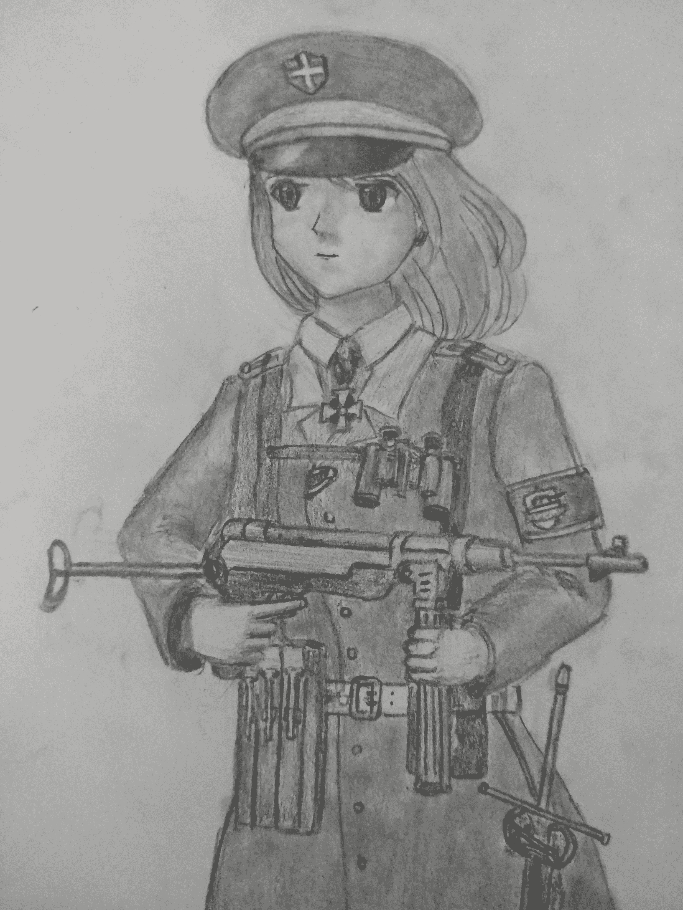
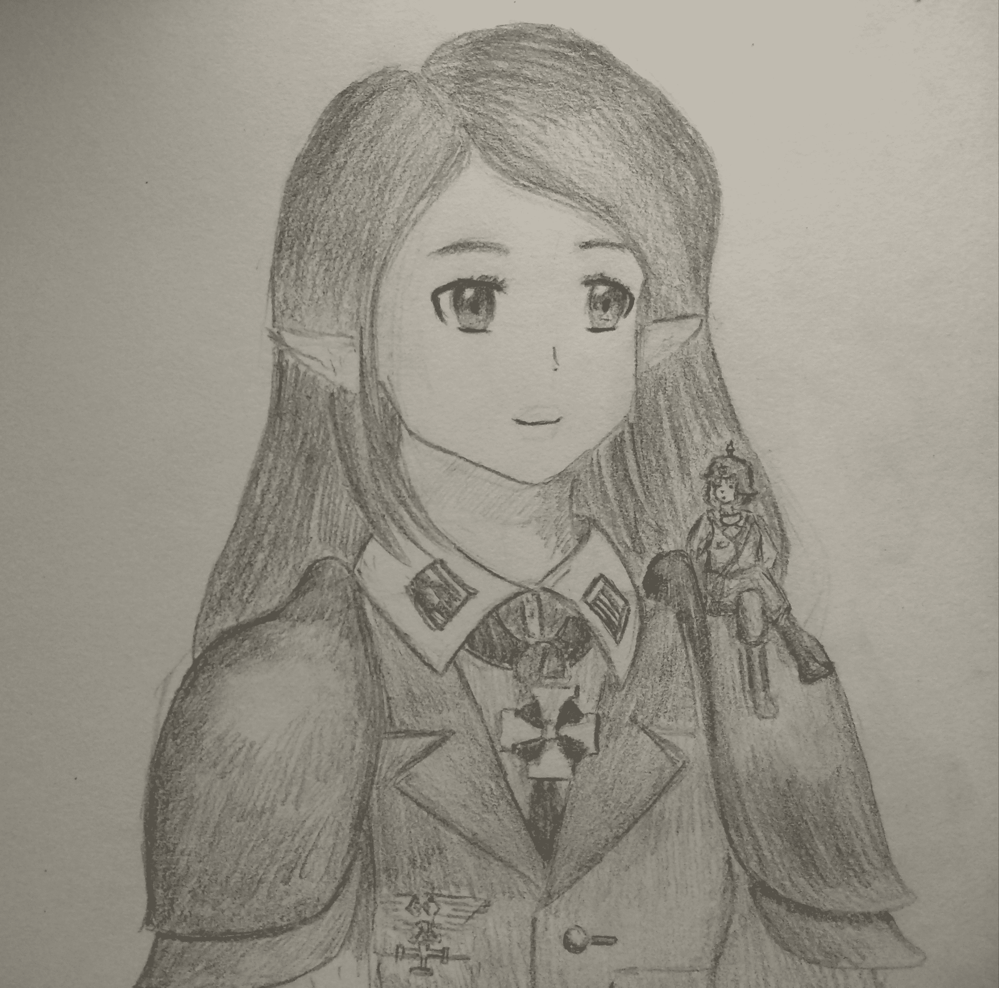
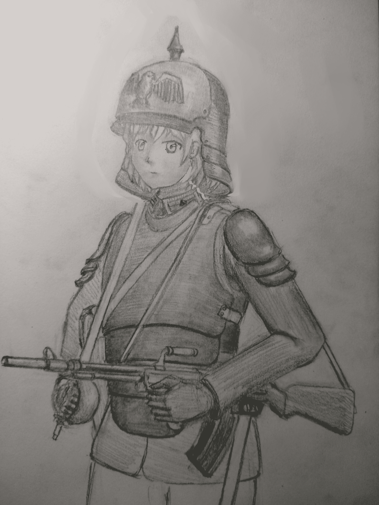
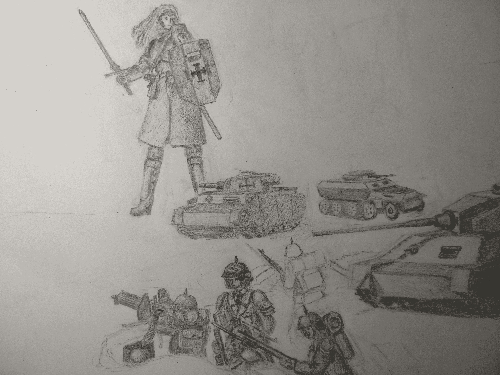
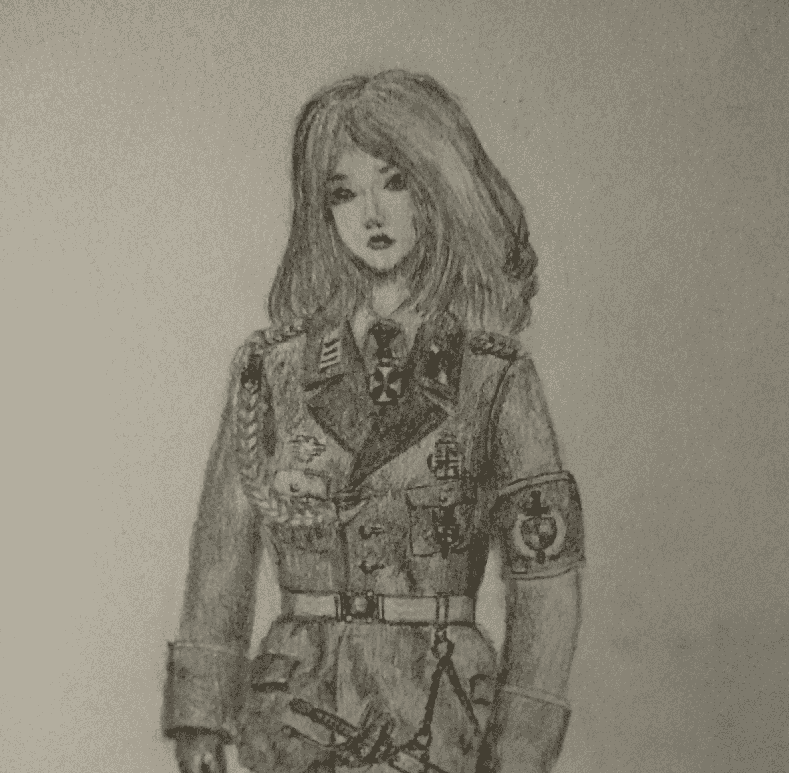

# [百合][战争][极其慢热]加沃利亚攻城战 11.19 更新 2k字

作者：桑妮雅

TID：24774

<title>1</title> <link href="../Styles/Style.css" type="text/css" rel="stylesheet">

# 1

*本帖最後由 桑妮雅 於 2018-11-19 17:05 編輯*

加沃利亚攻城战       我决定了，第一楼就留给图片和目录了，文字内容统统往下挪了几楼。以后插图在底下每层楼更新的同时也会在这里更新。因为太慢热了，所以我在目录中先标好了各章GTS剧情含量，不想看战争过程的话可以直接找剧情含量高的章节看。       第一章 登陆 ——————13楼 15404字，3%GTS剧情       第二章 突进 ——————24楼 10601字，35%GTS剧情       第三章 后方 ——————50楼 8534字， 0%GTS剧情       第四章 305高地 ————113楼 10014字， 46%GTS剧情       第五章 重返 ——————166楼 12371字， 0%GTS剧情       第六章 攻坚 ——————191楼 2036字， 0%GTS剧情（施工中）友情提示：       126楼大量血腥残酷剧情描写，非残酷爱好者可略过。<title>2</title> <link href="../Styles/Style.css" type="text/css" rel="stylesheet">

# 2

 <ignore_js_op>[IMG_20181023_200837.jpg](forum.php?mod=attachment&aid=NzUyODJ8ODRmNTg2OTh8MTYwMDg4NDM3NHwxODIzMHwyNDc3NA%3D%3D&nothumb=yes) *(1.01 MB, 下載次數: 0)*

[下載附件](forum.php?mod=attachment&aid=NzUyODJ8ODRmNTg2OTh8MTYwMDg4NDM3NHwxODIzMHwyNDc3NA%3D%3D&nothumb=yes)

2018-10-23 21:17 上傳  

汉娜·沃尔芙

</ignore_js_op>  <ignore_js_op>[IMG_20180529_004407.jpg](forum.php?mod=attachment&aid=NzUyODF8ZTQyMTc5YjV8MTYwMDg4NDM3NHwxODIzMHwyNDc3NA%3D%3D&nothumb=yes) *(2.29 MB, 下載次數: 0)*

[下載附件](forum.php?mod=attachment&aid=NzUyODF8ZTQyMTc5YjV8MTYwMDg4NDM3NHwxODIzMHwyNDc3NA%3D%3D&nothumb=yes)

2018-10-23 21:16 上傳  

艾米利亚与露易丝

</ignore_js_op>  <ignore_js_op>[卡尔.jpg](forum.php?mod=attachment&aid=NzUyNTF8MzFmMGI2ZGN8MTYwMDg4NDM3NHwxODIzMHwyNDc3NA%3D%3D&nothumb=yes) *(865.48 KB, 下載次數: 0)*

[下載附件](forum.php?mod=attachment&aid=NzUyNTF8MzFmMGI2ZGN8MTYwMDg4NDM3NHwxODIzMHwyNDc3NA%3D%3D&nothumb=yes)

2018-10-20 01:42 上傳  

卡尔

</ignore_js_op> <title>3</title> <link href="../Styles/Style.css" type="text/css" rel="stylesheet">

# 3

> 罗绘尼發 發表於 2018-3-28 05:54
> 这是战斗系的文章吗？

是的，战争主线。gts剧情比起其他文章的话相对会少一点。<title>4</title> <link href="../Styles/Style.css" type="text/css" rel="stylesheet">

# 4

> q123w456 發表於 2018-3-28 11:39
> 写得很好，大作的感觉。繁体字有些费眼睛，要是排版能够稍微宽松一些就更好了。 ...

本来是简体字的，术语使用的都是大陆这边的翻译，不过看到板块置顶那里推荐繁体字，就给转换成了。。。<title>5</title> <link href="../Styles/Style.css" type="text/css" rel="stylesheet">

# 5

*本帖最後由 桑妮雅 於 2018-3-31 02:13 編輯*

> xnr 發表於 2018-3-28 12:10
> 军用术语太多，楼主是军武宅吧，感觉和GTS融合在一起太违和

也是，我会尽量减低术语使用，以便大家看着更轻松。<title>6</title> <link href="../Styles/Style.css" type="text/css" rel="stylesheet">

# 6

> scale君 發表於 2018-3-28 01:41
> 前排提示留存稿慢慢发，调整发文的节奏，一次发一堆的确很好啦，但到后面更文更不上就很尴尬了。
> 战争的描 ...

多谢指教，你说的问题我一定会多多注意的。
存稿的事情你说得很对，我不该一时冲动全发上来，毕竟细水长流更好。
写空战的话，的确是有些意义不明，只是出于我的个人喜好。以后我会多考量和润色剧情如何安排，尽力不出现这种突兀的剧情。<title>7</title> <link href="../Styles/Style.css" type="text/css" rel="stylesheet">

# 7

*本帖最後由 桑妮雅 於 2018-5-26 01:35 編輯*

第一章登陆    加沃利亚作为一座近乎坚不可摧的要塞都市，也是这整个世界——也就是精灵们的加沃利亚行省的首府。这里曾经是一个繁华的商业城市和交通枢纽，一条条铁路从这里蜿蜒而出，行商贸易的精灵们从这里进进出出。自古以来这里就被精灵们用来控制整块大陆的关键，自一万年前以来精灵们不厌其烦地修整其防御工事。自从人类帝国的军队踏上这块大陆以来，这里理所当然地充当了精灵军队的兵力中转站，不计其数的步兵、火炮和坦克在这里搭乘军列开往前线；足以遮天蔽日的战斗机和攻击机机群自这里的机场起飞飞向各个战区；甚至是庞大而珍贵的浮空战列舰和高贵的女武神也时常能在这里见到，恐怖的战争机器从精灵们控制的其他世界赶来，穿越连接不同世界的传送门，来到了这个世界的上空参与战斗。    不同于人类，精灵只有一种性别，从外观来看她们与人类的女性并没有多大差距，只是身高更为高挑并且有着一对尖耳朵。但是她们有着远远长于人类的寿命，和无可比拟的魔法天赋。她们可以同种族之间或者与人类中的女性婚配，诞下后代。    精灵和人类原本处于完全不相连的两个世界，但是大约在两千年前，随着精灵们的探险家四处开启传送门殖民一个又一个新世界，人类的世界最终也被入侵的精灵们发现了。尽管精灵们自视为高贵的物种，但是她们显然没有与她们自视的那份高贵相配的道德水平。自从她们降临在人类的世界上，就展开了无休无止的征服战争，一个又一个人类的国家经历了血与火的洗礼。她们用强大的法术轻而易举地将军队粉碎、将堡垒击垮，时至今日在人类的故乡依然可以见到当年留下的成片废墟。    在第一次精灵战争中，仅仅是精灵探险家们私人的军队，仅仅用了十年就征服了人类世界的大半领土。若不是后来因为利益纠纷发生的精灵内战给了人类喘息的机会，精灵们几乎可以将所有的人类消灭殆尽。在精灵们打得两败俱伤之时，出于更加劣势地位的一派最终选择了利用人类的力量。她们集合了剩余一些人类王国于自己的麾下，利用这些王国中大量的人类士兵，成功地逆转了局势。而她们的首领最终成为了帝国的第一位女皇。所以说尽管帝国往往被认为是人类的帝国，但是其高层的领主们往往都是精灵。    谁也想不到两千年后的第二次精灵战争中，原本处于绝对劣势的人类竟然凭借着庞大的人口数量和不断发展的武器夺取了对精灵们战争的主动，一块又一块原本属于精灵的殖民地反倒是落入了帝国的手中。    在成功夺取了无数精灵们的殖民世界后，帝国终于开始将她的军队投送到了精灵们经营甚久的那些世界上面——加沃利亚行省就是被侵略的诸多世界其中之一。    玛格丽特·特蕾莎公爵正是这支帝国军队的统帅。在她的统领下，将会有至少两千万帝国士兵踏上被精灵们称作的加沃利亚行省的这片土地。    参阅了参谋部的众多意见之后，特蕾莎公爵选择了在靠近加沃利亚要塞的海滩进行登陆作战。尽管登陆时很快就会遭到驻守要塞的精灵军队的强硬反扑，但是如果站稳脚跟，可以快速把部队投入到对加沃利亚要塞的攻城战之中。对于装备了众多威力强大但是机动困难重型火炮，拥有近乎无穷无尽人力的帝国军队而言，攻城行动中惨烈的消耗战永远是最好的选择，在这样的战斗中可以利用自己的优势人力火力，耗干精灵们的实力。    灰茫茫的天空上飘着倾盆的大雨，工厂林立的烟囱排放在空气中的废气溶进了雨中，坐在开顶的登陆艇中的士兵们毫无保留地暴露在这些酸性的雨水之下。雨水顺着头盔的盔沿落在军大衣的肩部，把深灰的大衣上半身都浸得发白，好在防水的大衣保护了士兵不会受到进一步的伤害。在班排长们的呵斥声里，士兵们不得不连续数个小时和登陆艇内蓄积的雨水斗争，就算筋疲力尽也不许停下。    卡尔正是负责开拓登陆场的士兵之一，他所在的一个排的士兵坐着一艘摇摇晃晃的登陆艇第一个穿过了连接两个世界的传送门，第一批冲向了那个名为加沃利亚的新世界。用魔法打开的足以让军舰通过的传送门发着浅紫色的光芒，横陈在海面上。卡尔不是第一回见到这个东西了，但是作为一个生活在最底层的人类，如此庞大的魔法阵列还是让他忍不住感到惊叹。发动机轰鸣着推动登陆艇冲到了传送门的紫光之中，淡紫色的光芒笼罩住周身，晃得他闭上了眼睛。待他的眼睛再次睁开之时，身边已然换了一番景致。    这精灵生活的世界不像卡尔见过的任何一个人类待过的地方，明媚的阳光和蔚蓝的天空大海就足以让这些终日活在工厂浓烟之下的士兵感到惊讶的了，近岸的海水也不像人类世界的海洋那般有着毒性和酸性。卡尔探出头来远远望去，洁白的沙滩和湛蓝的海面上竟然还有游玩的精灵，尽管她们看上去正在落荒而逃，毯子和阳伞落了一地。    一阵隆隆的巨响从身后传来，卡尔转头望去，只见身后的天空中也展开了几个巨大的传送门。隐隐约约见到两艘伟岸的巨舰舰首正在从传送门中缓缓伸出，那是由浮空法术托起的超级战舰。就算离得很远，卡尔依然可以清晰地看到战舰上大大小小密密麻麻的炮塔，和分别在两舰舰首涂装的红色铁拳和身着闪亮铠甲的贵族女性。通过涂装来判断，那分别是南境公爵、特蕾莎家族的玛格丽特私人拥有的“天上君权”级战列舰舰“帝国之怒”号以及“制裁者”级战列巡洋舰“特雷莎公爵”号，两艘巨舰上总共十八根喷吐着浓烟的炮管就是刚刚巨响的来源。这两艘巨舰正在用她们向前的三座三联装420mm口径主炮塔进行对岸打击，摧垮精灵守军的岸防炮台，而向后的一座三联装炮塔则暂时无所事事。    因为这里距离精灵们的老巢太近，所以精灵们完全没有料到帝国军队会在此地登陆。防御工事上的守备部队少得可怜，大部分防御设施都没能发挥出它们应有的作用就遭到了毁灭性的打击。海防要塞上的巨炮缺少装填手，而防御法阵则缺少驱动它们的法师，魔法护盾也没有来得及启动。从天空中落下的重炮炮弹在重力作用下加速，战列舰发射的穿甲高爆弹轻易击穿了岸防工事的顶盖，在工事内部起爆，一个又一个被引爆弹药的火力点在一阵阵爆发而出的火光中被抹去了。    紧随在浮空战列舰身后的是大群的战斗机和战斗轰炸机，蝗虫一般的机群扑向了距离海岸线更远的敌方，给海岸防线后方的精灵军预备队带去毁灭。海面上的战舰群也开始了怒吼，尽管这些战舰的火炮不如俯瞰战场的浮空战列舰更有威力，但是胜在数量够多。海面上的四艘战列舰和不计其数的巡洋舰驱逐舰上的上千门火炮织出了一张火网，炮弹爆炸扬起的烟尘几乎覆盖了整个海面。    登陆艇在冲击的末段开启了全速，像是一支箭一样射向了海滩。岸防炮群发射的炮弹和法阵的攻击法术落在了海面上，溅起了冲天的水柱，被搅动得上下翻涌的海面上，登陆艇就如同一片叶子一样随时有被掀翻的风险。在如此颠簸的登陆艇中，卡尔一面死命抓住船体中的握把以防被甩出艇外，另一面还不得不奋力将被溅入艇中的海水舀出，弥补抽水机不足的功率。    在一次几乎让登陆艇翻得底朝天的侧倾之中，卡尔有幸目睹到了他们右侧的一艘登陆艇被一发炮弹直接命中，转瞬即逝的火光过后便是扬起的血雾和海水。混合着不明物体的淡黄色海水被爆发的冲击波推出了很远，甚至都溅到了卡尔所在的登陆艇里面。卡尔尽力不去想这些到底是那些中炮的可怜士兵身上的什么部件，以免影响到自己手上的工作效率。如果卡尔因为这个就敢停下手头的工作，他丝毫不会怀疑一旁的排长露易丝会给他一枪，以此警告其他士兵不许懈怠。    此时的露易丝·芙兰卡少尉排长正一脸阴沉地坐在登陆艇的后部，头盔盔沿遮住了照在脸上的阳光。比起一般士兵的黑色帝国标准军盔，她头上的军盔除了一个标配的尖顶之外还在前部还焊上了有华丽漂亮花纹的黄铜装饰，还有军大衣上面银色的肩章和领章显示了她少尉的军衔。头盔的阴影下她的脸让人捉摸不定，但是从双眼中散发出的阴狠目光紧紧盯着和艇内积水做斗争的士兵们，让他们不敢有丝毫懈怠。    她出身于一个没落的贵族家庭，有一点点精灵的血统，比普通的人类要高贵出一些，这让她比一般的军官更加轻视手下士兵。就算是平日里士兵只要稍稍违逆她，就会遭到狠毒的鞭打，殴打致死的情况也不罕见，何况战时。    她把自己用绳索牢牢固定在了座位上，所以可以腾出两只手来握住冲锋枪。她的样子仿佛任何人敢停下手中的工作，她就要端起冲锋枪送给那人一个点射一般，当然她实际上也的确是这么想这么做的。    卡尔一点也不喜欢他的这位排长，但是在鞭子和枪口下他也不好也不敢有什么异议，只能去忍受。随着登陆踏板被放下，全艇一共四十多名士兵一拥而下，迅速散开组成战斗队形。海滩上并没有遭到什么的抵抗，敌人负责海岸守备的部队多半在进入阵地之前就被炮火消灭或击溃了。所以第一批冲上海岸的士兵大部分选择先在原地帮一同登岸的水陆坦克卸下浮箱，随后跟随着这些坦克前进。卡尔他们是个例外，在求战心切的露易丝的强迫下，士兵们直接向纵深发起了攻击。    随着攻击行动的延伸，士兵们也开始遭遇到了抵抗。    当卡尔等人刚刚占据了海岸边的一座三层房屋，就发现两百米外有大约十名精灵士兵正在向这里摸索过来，差不多是一个班的兵力。她们大概还没有发现自己已经暴露在了卡尔等人的火力下。    在露易丝的催促下，士兵们在房屋的二层悄悄架起了重机枪。卡尔作为机枪的副射手之一，很自然地卸下了身上挂着的两百发弹链，但是已经有手快的士兵给机枪装上了弹链，所以卡尔只能再把弹链背回背上，使用手中的栓动步枪瞄准了敌人。    露易丝一声令下，重机枪裹挟着一个步兵排的四十多杆步枪一起开了火，瞬间就撂倒了三个敌兵。敌人的反应也很快，为首的士官一样的人物立即甩了一个闪光法术过来。士兵们没有想到法术在精灵军队之中是如此普遍的存在，被打了一个措手不及，耀眼的光芒晃得他们几近失明，刚刚还如同暴雨般密集的枪声瞬间就停了下来。趁着空隙被袭击的精灵们迅速占据了一段矮墙作为阵地，并且快速开枪反击。    在卡尔的眼睛缓过来之后，他看到了身边的机枪位上一片狼藉，重机枪手和第一第二副射手都在刚刚被步枪点了名。精灵们的8mm高速步枪弹比帝国制式7.92mm步枪弹的弹头更短更轻，但是装药更多，所以初速更高。高速状态下的软金属弹头命中后会产生严重的破碎，在出口处带出大量中弹者的身体组织。并且高速弹头对身体快速传递动能时会产生强烈的冲击波，对未直接触及的部分造成破坏，产生远远大于其口径的杀伤。尽管这同样意味着远距离的杀伤力会因为速降过大而不足。    重机枪手被直接击中了头部，半个脑袋已经不见了踪影。还有两个副射手和其他几个步枪手也中了弹，被命中躯干的士兵全都已经躺在自己身体中流出的一大滩不明混合物之中，被打中四肢的士兵也多半因为失血过多而不省人事，只剩下一个奄奄一息断了右臂的倒霉鬼还在轻声呻吟。房间的四壁上溅满了血迹，见伤者多半已经救不过来了，医护兵也不想去浪费他的医疗器材。    这都是那几个精灵趁着刚刚的闪光干的好事，卡尔一面惊叹精灵们高超的射击技巧，一面暗自庆幸自己刚刚很识相地迅速卧倒，否则现在他就是躺在地上的死尸之一了。    卡尔在心里埋怨起来露易丝的莽撞，不过他和其他人一样并不敢把牢骚真正从嘴里发出来。毕竟士兵们都看到了他们身后同样心中不爽的露易丝，那个平日里脸色就不怎么好看的露易丝把她的心情直接写在了脸上，看上去更加吓人，要是让她找个临阵畏缩的借口给自己扫上一梭子发泄一下那就是自讨没趣了。    “去个机枪手，谁上去顶替一下。”露易丝的命令很简洁明了，但是士兵们却都像是听不懂一般面面相觑。他们都不想顶着精灵们精准的步枪火力到机枪位上面去，只好假装没听清。    “第三副射手上去。”见命令没有被执行，露易丝直接开始点人，第一个就点到了卡尔。卡尔很怨恨自己为什么是这个倒霉的第三副射手，他真的很害怕露易丝，但是更害怕精灵们射来的步枪子弹，所以只好赖在他开火的窗口旁边不动。    露易丝知道不能这么让己方被火力压制下去，必须得赶快行动了，要不然功劳没有急功冒进的过错少不了她的。所以她看到卡尔在那里磨磨蹭蹭，顿时火气就窜了上来，直接用冲锋枪对准了卡尔，“上不上，不上我开枪了。”卡尔无奈，只好不情愿地向机枪位挪了过去。    卡尔心想要不要直接假装走火“误击”一下露易丝算了，省得自己白白丢了性命，不过看到露易丝也握着冲锋枪严阵以待对着自己，他不敢轻举妄动。他知道拼开枪速度自己肯定比不过早就瞄准自己的露易丝，而且他也绝对相信露易丝下得了狠手。与其这样必死无疑，上机枪位没准还有点机会逃过一劫，卡尔只好坚定了内心，冲向了重机枪。    子弹噼里啪啦地打在了卡尔面前，大部分落在了机枪前的矮墙上，扬起了阵阵灰尘，也有几发打中了机枪防盾，给厚厚的钢板上留下了一个个凹坑。卡尔将全身尽力缩在了小小的机枪防盾后方，连观察窗都不敢抬头看一眼，只能对着一个大概的方位死死扣住扳机。歪七扭八的射弹丝毫没有压制住精灵们的火力，倒是重机枪的弹链很快走空了，枪管中最后喷出一阵烟气，炽烈的火力喷射停了下来。    在露易丝眼见慌乱之下的卡尔根本不能让机枪发挥威力，毫不犹豫地对着卡尔身边打了一个点射。身边子弹的落点提醒着卡尔，他的情况可不妙，要是再敷衍下去，子弹的落点最终会落在自己身上，现在可真是前有狼后有虎。    在子弹的逼迫下，卡尔不得不重新考虑一下自己该如何战斗，他壮了壮胆，从身上卸下弹链接在重机枪上，随后向后扳动枪机，让重机枪出于待发状态。他这一次终于敢稍稍抬起头来，把重机枪对准了精灵们。    他先打了一个长点射，随后根据弹着点简单修正了一下，终于准确地把子弹倾泻到了精灵们躲藏的矮墙上。此时的精灵们还没有注意到这挺机枪发生的变化，还大胆地露出头来稳稳地瞄准射击，结果就是有一个精灵被毫不留情地爆了头，其他精灵士兵的气焰也被打压下去不少。帝国士兵们之间爆发出了一阵欢呼，庆祝这一个小小的胜利。    尽管精灵们超长的寿命带给她们的是非同凡响的战斗技巧，但是现在士兵们遭遇的只不过是一些精灵们的民兵罢了。她们尽管同样战技不俗，但是装备上和帝国的正规军士兵没有什么太大的区别，也是使用旋转后拉枪机的弹仓式步枪，甚至她们装备的管状弹仓还更为落后一些。这些栓动步枪遇到重机枪并没有什么还手之力，很快她们的火力被压制了下来，只有零零星星几声枪响宣示着她们的存在。    见情形大好，露易丝果断派遣士兵出战，留下一个班在房屋中护卫机枪，剩下两个班分别从左右翼包抄敌人。而她自己则是抄起一杆死人的步枪，躲在机枪旁边“督战”。    有了重机枪的掩护，剩下几个精灵民兵也翻不出什么浪花，包抄的两个班迅速贴近了敌人。在进到50m的距离之内时，两个班的步兵纷纷投掷出了他们的手榴弹，一阵爆炸的烟尘中精灵们赖以掩护的矮墙被削去了一大半的高度。但是矮墙后面的精灵们早趁着刚刚的战斗间隙在矮墙后面挖掘了掩体，所以也没受到什么太大的杀伤。倒是精灵们反手扔过来的几个手榴弹把蓄势待发准备冲击的帝国士兵炸死炸伤了两人。    遭遇挫折的帝国士兵没有放弃进一步的行动，毕竟他们人多势众。他们已经领教过精灵们的射击本领，所以两个班一共将近三十人一拥而上，准备用肉搏快速解决战斗。    但是突然一阵瓢泼的弹雨泼向了右翼的二班，瞬间打死了他们六人，攻势也被瓦解了。士兵们没有想到那些只装备有栓动步枪的精灵竟能爆发出如此火力，短短十秒内至少发射出了一百发以上的子弹，好几个士兵身中数弹，当场毙命。    而另一路的三班则是被一发火球法术击中了，士兵们被火球爆炸的烟气熏得灰头土脸。好在只造成了两个轻伤，但是他们的冲锋也被压制住了。    又一阵弹雨泼向了帝国的士兵们，但是此时他们已经卧倒寻求掩护，没有受到什么杀伤，反而是卡尔的机枪回敬精灵们的长点射再次取得了一个战果。    趁着精灵们再度被卡尔的机枪压制，前面的帝国士兵果断趁热打铁再发动了一次冲击，二班转瞬间就冲到了精灵们的面前，而三班也紧随其后。被逼无奈的精灵只得跳出阵地和冲上来的二班近战，但是她们还是抓紧了机会泼洒了最后一轮弹雨。二班剩下的八名士兵再次中招，最终挺过弹雨的不过两人。但是在被成片扫倒之前，二班的士兵们也扫出了一阵乱枪，打死了一名敌人。    不过剩下两人的命运也没有多好，他们面对的精灵军队装备了仿制自骑兵直剑的超长刺刀，长度将近一米。再加上剩下的这两人有没有人数的优势，刺刀武艺也完全不是精灵们的对手，所以理所当然的一轮刺刀对拼就成了精灵们刺刀上的染料，把精灵们的刺刀染成了鲜红色。    不过好在露易丝很机灵，趁着二班被全歼而三班受到惊吓停下脚步时，让卡尔对着冲出阵地的精灵士兵一顿扫射，成功打死了几乎所有剩下的敌人。唯一例外的是那个精灵的士官出人意料的多才多艺，竟然又放出了一个护盾法术拦住了射向她的子弹。    那个精灵士官左手前伸撑着魔法护盾，右手拿着一把长剑，径直冲向了因为友军被全歼而几乎吓呆的第三班的士兵。人类士兵们一阵枪弹打在护盾上，可以看到那个撑盾的精灵士官想维持住护盾以及很勉强了，不过短时间内似乎还没有击破护盾的希望。    那个精灵士官迅速冲到了人类士兵们面前，她面前的两名士兵还在拉枪栓装弹，所以她毫不费力地一人一剑刺中了他们的面门。又有一个士兵壮着胆子冲了上去，可是他的枪刺被侧身闪开，然后被一剑割破了喉咙。    其他的士兵真的是被吓傻了，顿时四散而逃，只为了避开这个近乎不可战胜的敌人，但是结果只是被她掏出手枪从背后再打死了两人。    这不能怨前线的士兵太懦弱，那个精灵瞬间爆发的战斗力连远处的卡尔都被吓呆了，机枪扳机都忘了去扣。整个步枪排唯一一个冷静点的人就是露易丝了，“开枪！”她大喊道。卡尔有些迷茫地看着前面，似乎没有听见露易丝的呼喊。    发呆的卡尔让露易丝急得不行，她只好一脚踢开卡尔，自己操起机枪开火。她的枪法真的很不错，两百米的距离上一串长点射全部打在了魔法护盾上，溅起了阵阵火花，尽管还没能击穿护盾，但是击穿的时候也不远了。    露易丝再次扣住了扳机，又一长串子弹终于击破了护盾，一颗又一颗子弹贯穿了那位精灵的身体，就算她再怎么骁勇善战这战斗也该结束了。<title>8</title> <link href="../Styles/Style.css" type="text/css" rel="stylesheet">

# 8

> [juliazhu1978 發表於 2018-3-28 20:02](https://giantessnight.com/gnforum2012/forum.php?mod=redirect&goto=findpost&pid=365494&ptid=24774)
> 哇！德意志7.92mm军规弹！不过讲道理，8mm怎么说初速也没有7.92高啊，并且软头弹的破碎效应不强的，主要还 ...

是的，7.92mm可以说是相当德意志了。
8mm弹头那里可以理解为是一个轻弹头强装药弹，初速高存速差，500m内弹道漂亮，500m外弹道瞎飘。我本来是想用7mm弹或是6.5mm弹的，这两个口径比较符合要求，不过为了体现敌军特色还是用了8mm。另外软弹头指的是铅弹，也就是俗称的开花弹，牺牲侵彻力换来了杀伤力，破碎效果肯定会比钢弹更好。
<title>9</title> <link href="../Styles/Style.css" type="text/css" rel="stylesheet">

# 9

*本帖最後由 桑妮雅 於 2018-5-26 01:37 編輯*

    一场战斗下来，自己的排居然只剩下了二十个人不到，遭到了毁灭性的打击，露易丝还是有点心有余悸，毕竟要是来的精灵们再多一点或许清理战场的就是敌人了。不过好再也全歼了十个精灵，这战果也过得去了，能在和精灵的战斗中把战损比压进五比一就算是不亏了，谁让人类数量就是更多呢。    士兵们打扫战场时终于发现了敌方突然能爆发出那样猛烈火力的原因——佩德森转换装置，这个代替步枪枪栓的小小装置装上枪膛后，可以让老式的陆伯管状弹仓式栓动步枪以自动方式发射装在20发弹匣里面的8mm卡宾枪弹。正是这个小家伙导致了二班的覆没。    士兵们对缴获的枪械爱不释手，再加上刚刚的战斗中弹药消耗太大，所以露易丝只好对不许使用缴获枪械的规定做出一点让步，允许士兵们把这些枪支带在身上。    露易丝简单清点了一下剩余人数，原本四十三人的一个步兵第三连第二排只剩下了十九人，露易丝知道这是自己急功近利的结果。不过战绩也还是可以接受的，除开毙敌数量，第二排的攻击进度也是喜人的。露易丝觉得他们似乎已经把友邻部队远远落在了身后，因为周遭已经见不到有飞机轰炸与战舰炮击的迹象，隐隐传来的枪声也被远方的炮响盖住。现在的第二排就是楔入敌方阵线的一颗楔子，如果随后的行动得当他们将有可能揽下撬开敌方防线的最大功劳，但是稍不留神就会被四周的精灵部队轻易粉碎。    权衡利弊之后露易丝还是决定先在附近寻求隐蔽，并且派出联络兵搜寻友方部队，毕竟他们现在的力量太弱，随意行动有遭遇强敌的可能性。等待的过程是漫长而难熬的，卡尔趴在倒塌墙壁旁边的瓦砾堆里面，等待着进一步命令的下达。隐蔽期间一些多余的动作都是不被允许的，否则会招致严重的后果。若是动作没有产生什么影响，那在战后必然会遭到露易丝的一顿美其名曰为“教训”的毒打。若是这多余的动作被路过的精灵发现，那倒是可以免去一顿打，但是会丢掉自己和战友们的性命。所以卡尔只能坐视一层层伪装网和厚厚的军大衣下面的军装被汗水浸。    露易丝正在焦急地等着通信兵的消息，后续部队登陆了吗？左右翼的部队推进到哪里了？周围哪里发现了敌人？一切的消息都得等通信兵回来传达。短短的几个小时在露易丝看来像是几天一样漫长，她在简易指挥部里面来回踱步，心情复杂地看向这座小房子的大门，一方面她期待通讯兵们打开这扇门为她带来友军的消息，一方面她又害怕士兵们进来告诉她有敌军接近。紧张与期待在她的内心中交融，令她感到分外的煎熬。    傍晚时刻，煎熬最终随着派往后方的通信兵的返回而被打破，只可惜传来的并不是什么好消息。第一批登陆的士兵多半是帝国军队中的轻装快速部队，缺乏重火器的士兵遭到了精灵们的有力反击。一线平推的战线被精灵们的突击撕碎，先期登陆的帝国士兵被割裂开来，刚刚建立起来的几个登陆场也大部分被包抄后路的精灵们摧毁了。还好有海军舰炮的支援，限制了精灵军队的机动，否则现在先期登陆的士兵们可能都已经被歼灭了。    他们现在的处境危机四伏，精灵们的军队游荡在他们周边，猎杀被打散的帝国军队，露易丝的这一支小部队无论遭遇到其中的任何一支都会遭到终结。不过不幸中的万幸是，硕果仅存的几个小登陆场之一就在他们附近，只要能及时赶过去，在舰炮的支援下，暂时还是比较安全的。露易丝决定再等一等，待天色更暗之后在再行动。    终于轮到了卡尔休息，积累的疲惫如决堤的洪水，冲垮了卡尔的意识，令他陷入了睡眠之中。当卡尔迷迷糊糊地睁开眼睛时，黑夜已经笼罩了四周，部队正在开拔，士兵们都在整理装具，静候着出发的时刻。    借着夜色的掩护，二排的士兵们悄悄向着友军的阵地进发。他们本来的距离并不远，走了半个小时大概就能清晰地听到友军与敌人彻夜交火的枪声。过了一会，连战场上空划过的照明弹甚至已经可以照亮士兵们的面庞。    派出的侦察兵回报了友军的情况，大约有一个连的友军正在发动一次夜间突击，但是情况似乎并不妙。敌军的具体状况因为黑夜而无法确认，可以确定处于敌方阵线右翼有一个重机枪阵地持续正在开火封锁了战场，主阵地的自动火力也很猛烈，给进攻者带来了惨重的损失，但是敌方人数倒是似乎并不很多。除了敌人数量不多以外，另一个好消息就是他们现在刚好绕到了精灵们的背后，不过换用悲观的说法就是他们现在落在敌军的阵线之中了。    从侦察兵的说法来看，敌人的重机枪阵地是她们防守的关键，正是这挺机枪持续不断地喷吐火焰把帝国士兵们压制在没有遮拦的空地中，随后才让精灵们发扬她们精准的射击术，打靶一样地屠杀帝国士兵。    第二排将分成两个小组，分别以原本的一班和三班为基础，并进行了一些简单的人员和装备调整。突击组换上缴获自精灵部队的带有佩德森转换装置的步枪和冲锋枪，并且集中了全排剩下的胸甲和手榴弹武装了他们，准备直接冲击精灵的机枪阵地。掩护组则是加强了排里面配属的重机枪，他们负责选择一处足以掩护到第一组士兵的阵地，在敌军发起反冲击时用火力打退他们。    可以说精灵们的确没想到自己也会被包抄后路，毕竟在她们眼里帝国军永远是死板而僵硬的，而轻敌恰恰是毁灭的开端。    精灵们的机枪阵地是依托一座民房改造的，原本两层的房屋的上层已经被帝国炮火摧垮，只剩下加固的底层里面部署了一个机枪小组和几名护卫的步枪兵。    卡尔因为要操作机枪，所以非常幸运地可以呆在掩护组，不用冒险冲进室内和那些可怕的精灵近战。他看到那些突击组的战友从他身边悄悄通过，身上挂满了手榴弹，步枪已经卸下了枪栓，装上了转换装置，一条20发弹匣插在枪身右侧。    突击组的士兵们摸到房屋的窗下，把大量的手榴弹一股脑丢进了房子里，随着一阵剧烈的爆炸声和闪光，士兵们从门窗鱼贯而入，紧跟着又是一阵猛烈而短促的枪击。那些还开开心心射杀帝国士兵的精灵们想都想不到背后来了人，基本上都在第一轮爆炸中阵亡了，突击组的士兵涌入之后，对着尸体又是一顿补枪。失去操作者的重机枪很自然地被突击组的士兵们接管了，他们用机枪对着精灵们的战壕倾泻火力。    侧后的机枪突然被打哑了让主阵地中的精灵们感到有些不安，但是随后她们的机枪竟然扫向了她们自己，措不及防的精灵们瞬间被射杀了两个人。反应过来的精灵们很快组织起了一次冲击试图夺回机枪，但是掩护组里面卡尔操作的重机枪可不会那么轻易地放任她们冲锋。待精灵们的攻击队形行进至事先标定的最终阻拦线时，露易丝猛扣扳机，打响了第一枪。掩护组的步枪机枪一齐打响了起来，对着精灵们就是一阵侧翼打击。猛烈的火力下精灵们再次丢下了两具尸体，就这样，精灵们瞬间蒙受了超过白天遭到一个帝国连队持续猛攻所造成的伤亡。    火焰魔法被到了重机枪前面，烈焰把射孔灼烧得滚烫，重机枪不得不进行转移，炽烈的火力也被迫停下了。趁着火力的空档，精灵们又发起了一次冲击，她们似乎也猜到了这次背后袭击的帝国士兵数量并不太多，否则早就进一步冲锋发展战果了。她们很有自信一轮冲锋穿过帝国士兵步枪的火力封锁，以刺刀和速射火力决胜。    还是突击组的步枪转换装置立了大功，当头对着冲击中的精灵一轮扫射，把冲击直接压制在了发起线上。    见反攻无望，精灵们也知道再多耗也无益。她们不得不放弃了阵地，避免继续被前后夹击遭受更惨重的损失。精灵们沿着她们的交通壕交替掩护着向后退却，撤退的同时也不忘布置点东西来给帝国军造成一些麻烦。    露易丝见识过了精灵们的手段，也知道自己手下的斤两，让这些士兵去追击精灵与送死无异。再加上本来已经立下了大功一件，功劳多这一件不多，少这一件不少，她干脆放弃了追击。    但是友军的那位连长却不是这么想的，一天苦战的战果只有伤亡数字，攻破敌阵的功劳还被夺去了，怎么想怎么不甘心。于是在她的指挥下，友军剩下的大半个连队又发起了一次冲击。然而他们却直接冲进了精灵们临走前布置的雷区中，又遭到了一轮近距离的密集射击，躺下了十多具尸体灰溜溜地撤了回来。    当那位连长灰头土脸地回来时，露易丝排的士兵们正在打扫战场。这些士兵见识到了精灵们步枪转换装置的威力，因此特意进行了搜寻。不过精灵们显然也知道这一点，所以特意拿走了这些小装置，留下的只有普通的陆伯步枪。    那位连长走到了露易丝的面前，她尽管脸上覆上了一层硝烟，但是却盖不住她精致的五官。尽管露易丝今天抢了她的风头，可是她却没有计较什么，只是对着露易丝咧嘴一笑。从耳朵来看她并没有精灵的高贵血统，但是丝毫不妨碍她的笑容拥有摄人心魄的魔力。不同于同样容貌出众的露易丝，那位连长并不会总阴沉着脸，所以让士兵们更容易产生亲近感。虽然这一切在露易丝眼里只是觉得她出身不够高贵罢了。    “汉娜·沃尔芙，来自南部行省，中尉。”那位连长做了一个简单的自我介绍。却没有想到刚刚开口就被露易丝在心里悄悄鄙视了一下。    汉娜中尉的乡下口音和家乡暴露出了她的身份，无疑她的家庭就是所谓的容克了，就是所谓的军事地主。这些容克军官没有贵族爵位和血统，所以依靠战功和服役记录接受当地领主的分封土地。尽管她们地位远远高于平民，但是在露易丝这样的真正拥有贵族血统的人眼中却是完全看不起她们。    “露易丝·芙兰卡，来自王都。”露易丝的介绍同样简短，脸上也保持着冰冷，到不是她说话风格本来如此，只是她懒得多搭理汉娜这个非贵族出身的军官。    汉娜见露易丝不肯多与她说话，再加上自己今天轻敌冒进，犯了过错，所以心情变得有些低落，只好回到士兵们之间去指挥打扫战场去了。    扫荡战场的士兵们除了缴获了步枪和重机枪之外，还有一门120mm高平两用炮，这门炮因为太过高大沉重所以被精灵们抛弃在了掩体中。这门炮正是汉娜的部队发动攻击的目标，这门炮拥有着面向海滩的宽阔射界，足以威胁到任何试图登陆的重型武器。在此之前它已经摧毁了三辆水陆坦克和好几艘登陆艇，给帝国军带来了惨重的损失。扫清了这个重炮阵地，期待已久的重型支援终于可以登场了。    看到这门炮时露易丝心中一凉，心想还好它射界是只朝向海滩的，要是刚刚的战斗中这门炮转回身来对着她的部队开两炮的话，后果不堪设想。    在露易丝和汉娜的统一安排下，士兵们合兵一处，以精灵们原先的工事为基础修建自己的阵地，静静准备着迎击精灵们可能的反击。    天亮时分，一架精灵军队的战斗轰炸机飞过来进行骚扰，它在阵地上空盘旋着似乎是在监视着帝国士兵们，又时不时俯冲下来投一枚炸弹扫射一番打断士兵们的掘壕作业。受到骚扰的士兵们时不时就得躲进掩体躲避一阵，工作效率大减。好在不一会那战机的油料似乎就要见底了，所以它干脆一轮俯冲下来扔光了挂载，随后转身返航。    差不多就在同时，士兵们注意到了一组正在执行游猎任务的帝国战斗机双机编队恰好游猎至此，原来敌机返航的原因其实不是油料耗尽，而是为了躲避这两架帝国战机。从高空俯冲而下的帝国战机拥有速度的优势，它们可不会那么轻易放弃掉游猎的目标，长机僚机一前一后，直扑目标。“干得漂亮，把她打下来！”“好样的，空军的家伙们。”如此爽快的场面看得地上的帝国士兵大出一口恶气，纷纷冲出阵地为空军战友们叫好。两架帝国战机向下俯冲加速，占据绝对能量优势的帝国军机很快就撵上了敌人，长机迅速占据攻击位置，战机上四门20mm翼炮和机身的两挺15mm机枪一同开火，拉起一张火网。    可是那架精灵战机似乎完全不害怕来袭的弹幕，稳健地向侧上拉升，刚刚好躲开了弹幕。随后那架敌机在空中划过了一道美丽的螺旋渐进线，绕了一个圆圈后又回到了原本的飞行路径上，原本处于咬尾状态的两架帝国战机则因为过快的速度冲到了前面。    精灵们的射击术的确是无可媲美的，无论是在地面还是空中，仅仅一个窗口，一串点射，帝国双机编队的长机就直接凌空解体。看到长机被歼灭，僚机也不敢多逗留，赶紧利用能量优势，浅爬升向高空逃去。    空中的威胁暂时解除，那架精灵的战斗轰炸机竟然又折回来对着地面的帝国军队一阵扫射，四挺13.2mm机枪在地面上扬起阵阵尘土。跑出掩体来看空战的士兵们纷纷奔向掩体，但是事发突然，他们还是被打死了好几个。    除此之外，那架敌机还用她的30mm轴炮送了帝国军的重机枪阵地一个点射。还没有修建顶盖的机枪阵地被打得一塌糊涂，机枪手和副射手四散而逃，机枪也被彻底摧毁了。躲在建筑中的卡尔不禁暗自庆幸，还好自己的重机枪没有被布设在外面，要不然自己现在已经被30mm高爆弹炸成一滩碎肉了。    重回高空的帝国僚机为了给长机报仇，再度抓准机会从高空俯冲下来，试图把那架精灵的战机打下来。它占据了了敌机的六点，一长串炮弹和枪弹泼洒而出，但是敌机显然并不害怕，一连串翻滚闪避，最终命中的炮弹寥寥无几。几发20mm炮弹命中了机翼，打坏了几块蒙皮，但是精灵战机上由附魔合金制作的骨架相当结实，几乎没有受到损坏。    眼见速度过快，又要超过敌机，帝国战机的飞行员只好铤而走险，直接拉起机头，大角度爬升避免超越。没想到那架精灵战机竟然也直接拉起机头，与他一同进入了垂直爬升，同时咬住了他的六点方向。    垂直爬升中的两架战机的空速表快速转动，动能转化为势能，速度转化为高度，两架飞机很快就进入了失速状态。那架精灵战机由于本身能量状态更低，所以失速得更快。    曳光弹拖着明亮的弹道划过机身，焰火一样的光芒映在了帝国飞行员的眼中。他紧紧地蜷缩身子藏在座位后的防弹装甲板的遮蔽下，可是他自己也知道这不过是心里安慰罢了。在精灵们的13.2mm重机枪的金属陶瓷核心穿甲弹和30mm机炮的半穿甲弹面前，帝国军机的9mm钢板和座舱防弹玻璃和纸没有区别，这些防护连防护机炮的高爆弹都相当困难。同时他不断地不规则滚转，消耗一部分能量来做防御机动闪避攻击。    一颗30mm穿甲弹穿透了座位后的防弹钢板，给上面开了一个大洞，弹头蹭着他的肩头飞过，留下了深可见骨的伤口。随后这枚穿甲弹又打中了座舱玻璃，防弹玻璃本来在被击穿后只会出现穿孔和裂纹，但是30mm机炮的动能太大，直接把防弹玻璃制的座舱盖打飞了，玻璃碎片四处飞散，给帝国飞行员的身上再添了几道伤口。随后几发重机枪子弹又扫过了战机右翼，蒙皮被打得出了好几个窟窿，右翼的升力系数瞬间下降了不少，连飞行员都可以感觉到左翼猛地传来一股要抬起的势头。不过机身的颤抖帮他闪开了接下来的两发30mm炮弹，倒是个不幸中的万幸。    看着己方战机落入颓势，地面上的士兵们心急如焚，他们默默在心中为自己人祈祷，但是除此之外也做不了什么了。    不过随着时间一点点过去，帝国飞行员亲眼见到从身后射来的曳光弹那明晃晃的弹道越来越往右侧偏移，最终完全远离了机身。    他成功了，他成功挺了下来，敌机现在已经彻底陷入了失速状态。就算精灵的飞行员射术再怎么精湛，也无法用一架已经失去控制，失去指向性的战机瞄准目标。    两架飞机先后陷入了失速，随后在重力的作用下调转了机头，转向了地面。一个多么漂亮的大锤机动，形势瞬间反转，原本在前的帝国战机反咬住了敌方，原本是猎手的精灵战机变成了待宰羔羊。    地面上的士兵们见证了这奇迹一般的反转，纷纷欢呼起来，为他们优秀的飞行员喝彩。    瞄准了目标，再接上四炮两枪一个齐发战果就能收入囊中了。他自知没有精灵们优秀的射术，所以他恪守拉近距离再射击的准则。他忍着肩部传来的剧痛，用力扳动操纵杆维持飞机的稳定飞行。敌机被牢牢锁进了瞄具，轮廓随着距离拉近而不断放大，最终充满了已经布满裂纹的风挡。    帝国军飞行员先扣下了机枪的扳机，打了一个短点射修正了一下弹道。穿甲燃烧弹和指示瞬间燃烧弹击中敌机闪出了耀眼的火花，对他精确的瞄准予以肯定。随后他将机枪和机炮的扳机同时按下，脑中浮现了雨点一般的弹幕洗过敌机的每一寸机身那美妙的画面。    但是现实出了一点意外，本应喷吐火焰的两门右翼机炮却没有任何做出反应，估计是控制钢索刚刚被敌机打断了。战机在左翼两门机炮的后坐力作用下，偏离了原本的航向，炮弹自然都扑了空。他重新瞄准了敌机，再次扣下机炮扳机，可是右翼的机炮依然没有打响，飞机又一次在左翼机炮的后坐力作用下偏离了目标。    他只好放弃了机炮，但是15mm机枪威力相当不理想，敌机机翼上布满了弹孔，油箱甚至也被打漏了几个窟窿，泄露的燃油燃烧冒出了滚滚黑烟，连水平尾翼都被打掉了一半。但是拖着黑烟的敌机却丝毫没有坠落的趋势，因为其座舱被附魔合金装甲包裹了起来，15mm机枪无法击穿它座舱的装甲，又不能通过爆炸摧毁其机翼骨架和蒙皮，自然无法将其彻底摧毁，但是对它造成的伤害也完全足以让那架敌机无法再度起飞。    最终打空了枪弹的帝国战机只得放弃了目标，折返回己方机场。尽管他最终没能击落敌机，在再次飞掠过步兵们的阵地上方时，他还是赢得了英雄般的待遇，步兵们纷纷冲出掩体，挥动军盔向这位勇敢的飞行员致意。    露易丝和汉娜所部的进展被报告了上去，上层的将军和参谋们对这喜人的进展表现出了极大的兴趣，她们立即派遣了后续的重型战斗单位登陆，支持登陆场的进一步扩大。    最先赶来的是公爵近卫骑士团的三名帝国骑士。尽管她们被称为骑士，不过并不同于以往骑马持枪冲锋的中世纪骑士，而是使用更加现代化的骑士装甲。帝国每年都会选拔最有魔法天赋的精灵贵族少女进入各大骑士团，学习巨大化法术，以便穿上近二十米高的重型骑士装甲。这些骑士手持法术护盾和附魔的阔剑长戟，对敌军发起冲击或是结成盾墙掩护己方单位。    为首的骑士手持一柄长戟和一面盾牌，长戟的长杆还充当了枪管的作用，不进行近战的时候还可以当做一门长管88mm口径的速射加农炮来使用。其他两名骑士则是使用短管105mm速射加农炮，使用左轮式自动装弹机供弹，一次可以连续发射出六发炮弹，两人的一个齐射的火力堪比一个支援炮兵连。不过实际上这两名骑士主要是用她们腰间的骑士剑配合盾牌作战，发起冲击在近距离摧毁敌人。    在步兵们看来她们可是远比坦克大炮厉害的盟友，也远比坦克大炮难配合。因为这些骑士一旦战斗起来根本不会在意脚边有些什么，或者说她们根本不在乎踩死几个步兵，步兵们的工事和身躯经常被她们或有意或无意地踩得粉碎。    不过能得到支援是已经是对他们的施舍了，步兵们也没有资格去抱怨什么，只能默默接受。为首的骑士叫做艾米莉亚·瓦格娜，她除了骑士团成员以外还有一个世袭爵士的头衔。所以她尽管非常瞧不起还没有她们靴子更高的步兵，不过对于同样有着贵族身份的露易丝还是给予了足够的尊敬，让露易丝相当受用。只是容克出身的汉娜就很不巧了，得来的只有颐指气使。她倒是很看得开，自知出身低人一等就老老实实地服从命令，不做多余之事。    艾米莉亚为士兵们传来了后方的命令，叫他们向前进一步推进，将敌军赶出她们火炮的最大射程。不让敌军部署的火炮射击到海岸，以便投入更大规模的后续部队。就这样，刚刚修建完阵地还来不及休息的士兵们又被迫撤出阵地，投入下一步进攻行动。    对于这三位二十米高的骑士加入队列，让卡尔心中不免踏实了不少，至少不用担心随时会被一小队精灵轻易屠杀了。不过他也有些害怕，生怕这些巨人一个不小心把自己踩成一滩碎肉，她们由装甲钢冲压而成的战靴强而有力，只要被踩到，啊不对，只要是轻轻蹭一下就会让人轻易丧命。所以卡尔假装机枪太重，落到了队伍后面，只为了离她们远一点，以免自己被她们不小心踩成碎肉。    露易丝因为出身贵族，引来了艾米莉亚的好感，所以享受了一个特殊待遇——获准坐在艾米莉亚的肩头。此刻的她正在和艾米莉亚有一搭没一搭地闲聊，因为出身相仿，尽管露易丝的家族有些家道中落，但是举手投足的贵族气质不会因此磨灭，很得艾米莉亚的心意。而许久混迹于那些出身低贱的平民和容克地主之间的露易丝，好不容易才遇到了一个真正的贵族。也让露易丝不免有些惺惺相惜，平日里似乎被固定住了的阴冷面容也收了起来。士兵们想都不会想到，他们那个平日里堪比死神的长官能有这么一副温柔的模样。    露易丝和艾米莉亚谈得甚是投机，很快就互生好感，而在地面上步行的汉娜则是被冷落了下来。    汉娜只是自己静静走着，她的副连长莫里茨跟在她身旁，不过莫里茨是一位不太擅长言辞的中年人，两人站在一排气氛变得更加寂静了。    卡尔落在了他们排队伍的后面，要不是因为后面是汉娜的队伍，他实在不好意思混进去，否则他断然是要继续往后溜的。他再一次回头瞧了瞧，再次确认一下自己是否已经躲在了自己队伍的最后，可是目光却刚巧与汉娜对上了。    卡尔估计自己刚刚偷偷往后溜的行动都被汉娜看在眼里，心里顿时在打鼓：这人不会把自己偷偷往后溜的事情给露易丝面前说两句吧。卡尔觉得战斗结束之后一顿鞭子怕是逃不了了，在他心里这些军官没一个是好东西，都喜欢折腾他这样的普通士兵。    没想到汉娜恰恰是军官和地主之中屈指可数的“好东西”，她非但没有表现出什么恶意，反而还对着卡尔送了一个的浅浅的微笑。很巧，她的副手——副连长莫里茨是一位从士兵到士官到军官，一步步靠战功和资历升上来的平民军官，也算是个“好东西”，同样对于平民士兵没什么恶意。只是他不会像汉娜那样友好了，只是面无表情地冲卡尔点了个头，示意了一下。    因为露易丝排的士官死伤殆尽，卡尔被临时提拔成了副排长和露易丝的副官。不过露易丝冷落了汉娜，汉娜心里也不怎么开心。所以尽管汉娜对于卡尔没什么恶意，但是也懒得过多搭理卡尔他这么一个平民出身的下级士官。一个微笑之后就没了下文。    一行人，就只好在这沉默的氛围下继续前进，向着死亡行军。<title>10</title> <link href="../Styles/Style.css" type="text/css" rel="stylesheet">

# 10

> xxx99 發表於 2018-3-29 14:15
> 默默問一下
> 再慢熱還需要等多久才有H
> 有H就加分

不一定吧，如果我心情好可能会画两张h的插图。如果是描写的话，那你怕是等不到了，我是不太习惯写h的东西呢，也不怎么会写。<title>11</title> <link href="../Styles/Style.css" type="text/css" rel="stylesheet">

# 11

*本帖最後由 桑妮雅 於 2018-5-26 01:39 編輯*

第二章突进  因为暂时还在舰炮的射程之内，所以露易丝和汉娜的部队暂时还不会缺少火力支援，巡洋舰和战列舰上的128mm高平两用副炮群喷吐了炽烈的火力覆盖了士兵们面前的敌军工事。尽管士兵们都知道这种级别的炮击对于永备工事不会有什么杀伤效果，但是用弹幕洗过敌军阵地还是一个鼓舞士气的好办法。敌军的主阵地由一座105mm加农炮塔和两座四联20mm机炮塔组成，三座炮塔成品字形布置，机炮在前，加农炮在后，相互依托。钢铁浇筑的炮塔顶部装甲可防御128mm火炮的穿甲弹直射，三座炮塔之间还不知道隐蔽着多少射击掩体。可以想象仅凭步兵和坦克冲击将会发生怎样的一场屠杀。不过这些在帝国骑士们看来都不是问题，加农炮在她们眼中不过是糖豆发射器，机枪泼水一般的弹幕扫在她们身上就真的像是泼水一般绵软无力。卡尔名义上已经被提拔为了露易丝的副手，但是操作机枪的任务却一直没有人来接替，所以他不得不继续以一名机枪手而非副排长的身份战斗。在露易丝手底下做机枪手怕是最为恐怖的工作，一面得像个靶子一样持续发射机枪，另一面还得跟着步兵前前后后地在战场上穿行，以便提供“最及时”的直射火力支援。这工作费力不说，还总是会因为达不到露易丝的要求而被惩罚，从挨饿到鞭笞样样俱全，露易丝可从来不担心没有办法折磨她手下的士兵。这样的苦差事落在卡尔的头上，让他头痛不已。 炮击的硝烟还没有散去，步兵们就发起了第一轮的试探攻击。不过这只是一次火力侦察，仅仅出动了最没有价值的步兵，待这些步兵以血肉之躯标明了敌军火力，帝国骑士们才会发动致命一击。    好在主攻的任务落在了新来的两个连队头上，而露易丝和汉娜手下的残部只用承担侧卫的任务。更值得庆幸的是，两支部队暂时合并之后组成了一个步兵战斗群，由汉娜担任指挥官。要是继续给露易丝指挥，她急功近利的性格让她能带着侧卫部队冲到第一线。
       两个连的帝国军队正面摊开，交替掩护向着炮台推进，但是这些可怜的士兵付出了惨重的代价却根本没能侦查出来什么情报。一千米的距离上20mm机炮就开始像割麦子一样扫倒向前推进的帝国士兵们。可是这些士兵一旦停下来寻求掩蔽，就会遭到105mm加农炮的高爆弹直射，开阔的平原地带无处掩藏，每一发炮弹落下都会有好几名帝国士兵被炸上天。无论是进是停他们都难以逃过死亡的结局。

       他们推进到500m的距离时，接近四百人的两个满编连已经付出了两百人的损失，接近50%的损失率让这两支部队直接崩溃，纷纷开始向后逃窜。

       但是后排的督战队哪里会让他们这么容易逃跑，两挺重机枪配合着精灵们的20mm机炮，前后夹击，把士兵们死死压制在了原地，丝毫不给他们退路。

       最后还是精灵们挽救了这些帝国士兵，精灵军队的75mm中口径支援炮群对着被陷在阵前的帝国军队打了五轮齐射。尽管让帝国军队又留下了四五十的尸体和伤员，但是也成功端掉了帝国督战队的机枪阵地，让这些步兵逮了个机会逃回了自己的阵地。

       侧卫的沃尔芙战斗群（就是之前提到由汉娜和露易丝残部组成的战斗群，汉娜·沃尔芙任指挥官）见主攻失利，直接向后撤退，倒是保存了自己的实力。

       艾米莉亚通过打击这些步兵的炮火密度推算，敌军的支援炮兵不会超过两个炮兵连，这些步兵也算实现了一点价值。这样的炮火密度对于帝国骑士们来说是完全可以承受的，所以艾米莉亚决定立即发起第二轮突击。

       艾米莉亚懒得去和步兵指挥官们再进行什么交流了，这些软弱无力的步兵除了火力侦察和用尸体去填壕沟以外，大概是完成不了什么其他战斗任务了。最关键的时候还得是骑士们出马。

       三位帝国骑士竖立起了她们的鸢形骑士盾，左右相连组成了一道盾墙，稳步向前推进。

       当她们走过步兵们的阵地时，丝毫没有留意脚下踩到了什么，甚至艾米莉亚有些时候还会故意去踩点东西作乐。步兵的掩体被踩垮了好几个，里面的士兵都被垮塌的土石掩埋，不是被挤压成碎肉，就是被活活闷死。这些步兵的死活在艾米莉亚的眼中就是如此低贱，这些平民能以一死换她一笑都算是实现了自己的价值。

       沃尔芙战斗群由于是侧卫，阵地也部署在了主阵地左侧，所以免遭艾米莉亚三人践踏。尽管如此，也让汉娜对骑士们的行径相当愤慨，她出身不高，自然无法像是真正贵族们那样自私自利、自我中心。
       沃尔芙战斗群的步兵们藏在战壕里，准备默默地看骑士们表演。他们既希望骑士们能消灭敌人，省得自己再出动。又希望敌人们可以给这些嚣张的骑士一个教训，为被她们踩死的战友报仇。要是可以两败俱伤，那就最好不过了，坐收以上好处的同时，还能在从骑士们那里抢来一点功劳。

       只是一声尖厉的哨声划破了平静，这是进攻的标志。士兵们面面相觑，连汉娜也吃了一惊，她根本没有下达任何攻击命令。

       只有露易丝手下的士兵知道发生了什么，露易丝再一次自作主张地发动进攻。战壕里面的士兵有些犹豫，好不容易得了一个苟且偷生的机会，居然又给露易丝搅合了。

       露易丝见士兵们不为所动，心中又急又气，再不出动，就跟不上骑士们推进的步伐了。

       “你，上去，给我出去！”露易丝对着面前的一位士兵咆哮到。

       “少尉，我，我，我们不是没有攻击命令……”那位士兵支支吾吾地回答，想继续拖延时间。等骑士们远离了阵地，露易丝的攻击计划也自然就泡汤了。

       “砰砰砰砰”露易丝手中的MP97冲锋枪毫不留情地响了起来，在那个士兵的胸口开了几个洞，喷溅的鲜血染红了露易丝的军大衣和战壕的地面。

       见到那士兵的尸体还在抽搐，露易丝又狠狠用军靴踩在尸体的胸口上，用冲锋枪对准尸体头部再来了一个点射。中弹的头部瞬间被打成了一滩碎肉碎骨头，被包裹在了中弹变形的帝国军盔之中，很难想想在两秒之前这具惨不忍睹的尸体还是一个活生生的人。

       其他的士兵还没有从惊骇之中缓过来，露易丝继续吹响了冲锋的哨子。在尖厉的哨声催促下，在露易丝的恐怖的压迫下，士兵们不得不跃出战壕。露易丝让他们见识到了，什么叫做停滞比前进更需要勇气。

       跃出战壕的士兵一阵飞奔，试图赶上骑士们的步伐。但是十倍的身高差之下，尽管骑士们只是缓步推进，步兵们想追上也相当困难。

       骑士们也注意到了这些赶来的步兵，对于这些冲出阵地前来支援的步兵，她们非但没有感谢，只是充满了轻蔑。这些赶来的步兵除了给她们做踩在脚下做润滑剂以外，还能有什么用处。

       但是艾米莉亚在见到露易丝的一瞬间，改变了她的主意，轻蔑又变回了本该有的感激。

       “步伐放缓，压低身形，用盾牌掩护身后的步兵。”艾米莉亚向她的战友命令到。

       站在她身侧的安娜和劳拉先是小小惊讶了一下，不过她们很快也发现了步兵们之间的露易丝，领会了艾米莉亚的意思。她们弯下巨大的身躯，让盾牌下缘更加贴近地面，为步兵挡住前方的火力。同时放缓步伐，以便步兵可以跟得上，持续为露易丝等人提供掩护。

       受露易丝的冲击裹挟，汉娜的部队也倾巢出动，跟在了露易丝的身后。整个沃尔芙战斗群分成了两道散兵线，像是波浪一般涌向了敌阵。

       精灵们的炮兵很有自觉，知道自己的75mm速射炮打不动帝国骑士们坚硬的装甲，所以换上了空爆榴霰弹打击骑士身后的帝国步兵。

       榴霰弹在空中绽开，撒下了致命的钢雨。瓢泼的钢针击中了骑士们的钢盾，擦出阵阵火花和响亮的叮当声，躲在盾牌掩护下的步兵们得以幸免于难。

       但是总有一些好运的钢针能穿过骑士们盾牌之间的缝隙，落入帝国步兵的散兵线中。落地的钢针或是高速冲击地面扬起一阵尘雾，或是把一名倒霉的帝国士兵打成两节扬起一阵血雾。

       由于高效的无线电沟通，精灵军队的炮火仿佛黏在了帝国士兵们身上一样，时刻跟随，阴魂不散。直到推进到了200米的距离之内，出于对避免误伤的考量，精灵的炮火才停了下来。

       受到了骑士的盾牌掩护，步兵们最终付出的代价并不大，就算被精灵的炮击持续打击，也仅仅损失了不到十个人。倒是平射的20mm机关炮和步机枪取得了不少战果，但是也没能以火力拦阻住帝国步兵们。 
<title>12</title> <link href="../Styles/Style.css" type="text/css" rel="stylesheet">

# 12

> [rainodog 發表於 2018-3-30 03:54](https://giantessnight.com/gnforum2012/forum.php?mod=redirect&goto=findpost&pid=365665&ptid=24774)
> 沒H有沒H好看的地方
> 怎麼搞得好像「GTS內容」=「H內容」呢？

多谢支持，能有你们这样的读者愿意读我这种清水慢热文，真的很感谢呢。
<title>13</title> <link href="../Styles/Style.css" type="text/css" rel="stylesheet">

# 13

*本帖最後由 桑妮雅 於 2018-5-26 01:44 編輯*

       最后两百米的距离，骑士们用105mm速射加农炮一轮火力覆盖，随后直接甩开了步兵，冲向了敌军的阵地。对于安娜和劳拉来说，要不是艾米莉亚的请求，让她们屈尊去掩护步兵几乎是不可能的，现在得了个机会甩开这些低贱的步兵，她们求之不得。而对于艾米莉亚而言，自己先冲上去，能减少一点露易丝的作战负担自然是不错，也没有什么反对意见。       冲入近距的骑士大显神威，附魔的骑士剑和长戟威力堪比巡洋舰的210mm主炮直击，守军的炮台顶部装甲脆如薄纸。劳拉冲到了一座20mm机关炮塔前方，那座炮塔还试着垂死挣扎，机关炮对着劳拉疯狂扫射，可是穿甲弹打在劳拉的铠甲上连划痕都留不下来。       倒不是精灵们的机炮无力，精灵们用的20mm机炮发射次口径穿甲弹的穿深可以达到50mm，击穿帝国军坦克的侧面都不在话下，只是附魔之后的装甲性能加强太多，普通枪炮很难有作为。       垂死的挣扎只换来了劳拉轻蔑的一击，垂直向下刺入的长剑，在自锐法术和结构补强法术的加持下，像是切豆腐一般插入了铸造装甲钢。劳拉把手中的骑士剑向后一拉，她面前的炮塔就被轻而易举地从中间剖开，内部的结构暴露无遗。       劳拉可以看到机炮炮组成员正在四散奔逃，逃离这个炮位。她又一脚跺在了炮塔旁边的交通壕之上，把交通壕直接踩垮，堵住精灵们的退路。无路可逃的精灵炮手，最终被劳拉一脚终结了。       另一座20mm机炮塔由艾米莉亚对付，长戟的威力远比骑士剑可怕，一记重击直接把炮塔顶盖砸变形，坍塌的炮塔直接掩埋了所有炮组成员。      正当骑士们重新组成队列，准备向着最后一座炮塔进发时，安娜突然感到左腿上一阵剧痛传来，猛烈的刺激让她立即失去了对身体的控制，轰然倒地。艾米莉亚和劳拉对于战友的突然倒地十分惊讶，因为除了那门105mm加农炮，周围几乎不存在可以威胁可以威胁到她们的事物。可是那门炮刚才根本没有开火。<title>14</title> <link href="../Styles/Style.css" type="text/css" rel="stylesheet">

# 14

*本帖最後由 桑妮雅 於 2018-5-26 01:44 編輯*

     她们竖立起盾牌，遮蔽起自己和受伤的安娜，警惕着敌人的105mm加农炮。     “艾米莉亚，小心！”身后的安娜突然喊道。     艾米莉亚不知所措，将头探出盾牌左右张望，丝毫没有意识到脚下的危险。     此时一名精灵正手持着破甲手雷，瞄准了艾米莉亚腿部盔甲的连接处，做出了投掷的姿势。尽管安娜看到了危险，但是因为腿上有伤，来不及赶过去，形势万分危急。     一阵突兀的枪声传来，那个准备投弹的精灵被数发子弹贯穿，软绵绵地倒了下去，艾米莉亚也逃过一劫。听到枪声的艾米莉亚顺着枪声传来的方向望去，看到了正在操作重机枪的露易丝，又沿着机枪的指向，发现了刚刚的危险。一股暖意涌上心头，对露易丝的感谢在心中油然升起。     就在刚才，在露易丝的冲锋枪逼迫下，步兵们终于在一个二百米冲刺之后又赶上了骑士们的步伐。这些步兵还没有来得及停下来喘一口气，又投入了清扫堑壕的战斗之中。     其中最累的便是扛着重机枪枪身的卡尔了，重机枪就算把防盾和枪架卸掉，也得有将近30kg，再带上弹药，重得足以压断卡尔的腰。更要命的是他还得跟上露易丝冲锋的步伐，否则就是一顿没有商量余地的冲锋枪弹伺候。     终于跑到目的地的卡尔两条胳膊两条腿都在发抖，但是为了不挨子弹，他还是逼迫自己的身体突破极限，坚持把重机枪架设到三脚架上，再给机枪接上弹链。     卡尔抖动的双臂让他几乎无法瞄准敌人，准星与照门在他的视野中左摇右晃，始终无法锁定目标。疲乏的身体摇摇欲坠，几乎要倒在机枪枪身上。一次失败的努力之后，露易丝终于无法忍受卡尔的无能，接管了机枪。随后就有了露易丝挽救艾米莉亚的那一幕。     这些赶来的步兵在拿着泵动霰弹枪的堑壕突击兵的带领下，一条一条地清理地面上精灵军队的防御工事。只是清理的过程并不顺利，就算是专门为突击堑壕而准备的堑壕突击兵也不是精灵们的对手。精灵们手中的步枪装上转换装置之后，只要轻轻扣一下扳机，就能喷射出足以消灭一小队帝国士兵的致命火力。     火力上的差距让战斗变得十分艰难。只有刺刀和栓动步枪的帝国士兵只要一发子弹射失，就只能端平刺刀对着有自动火力的精灵发起死亡冲锋，然后任由尸体铺满堑壕的地面。很多时候无奈的帝国士兵只能选择拉响身上的手雷，冲进敌人的掩蔽部和敌人同归于尽，避免更多的伤亡。     但是随着骑士们也加入清扫战斗，步兵们的境况好转了许多。有了骑士的配合，他们终于不用以肉身冲击精灵的自动火力了，他们只要给骑士标明敌人的位置就好。在艾米莉亚和劳拉面前，那些对于步兵而言坚不可摧的火力点不堪一击，骑士剑和长戟像是戳纸一样划破原木和泥土构成的顶盖，摧枯拉朽地解决战斗。在更多的情况下，她们只需要用力跺一脚，就能把那些地下掩体直接踩塌，把里面的敌人掩埋。     等步兵们简单清扫完了骑士们脚下的区域，受伤的安娜也用了一个简单的治愈法术解决了腿上的伤，又能重新投入战斗了。     经过刚刚的战斗，骑士们也意识到了脚下的危险，不再贸然突进，而是跟随着脚下步兵的清扫进度推进。并且会帮助步兵们消灭那些躲藏在地下的精灵，推进的进度逐渐加快了起来。
<title>15</title> <link href="../Styles/Style.css" type="text/css" rel="stylesheet">

# 15

> juliazhu1978 發表於 2018-4-8 19:51
> 我觉得帝国的同志们需要每个班配备一挺M1918BAR来补足班排火力不足问题。当然把60迫配备到连自然是更好的。 ...

上面不是有几位朋友提醒我要注意重点吗，所以好多本来想写的军事问题我现在就没有直接点明，改为藏在一些描写细节里面了。
比如重机枪的问题，你说得很对，男主一个人肯定是扛不动的。不过我文中有一个细节提到了卸掉了枪架和防盾的机枪，还提到了把枪身架在枪架上。也就是说枪架和防盾是其他士兵扛着的，男主扛着的只有枪身，机枪是到地方后面组装起来的。
比如机枪手人数的问题，我也提到过男主是第二副射手，也就是说前面至少还得有一个机枪手和第一副射手。只不过那两个人开场就挂掉了，你还记得吗。实际上女主她一个排就这么一挺重机枪，有整整一个机枪班来伺候这挺机枪。但是我没有花篇幅去专门描写这个问题。
至于轻机枪，那个是有关后续剧情的，我想你可以期待一下我会在下文中给出什么解释。

<title>16</title> <link href="../Styles/Style.css" type="text/css" rel="stylesheet">

# 16

*本帖最後由 桑妮雅 於 2018-5-26 01:44 編輯*

敌人最后一座105mm加农炮塔还试图顽抗，但是它发射的穿甲弹打在骑士们的盾牌上连个凹坑都留不下，往往伴随着一声清脆的撞击声就被轻易弹开了，只能做到让艾米莉亚她们的盾牌轻轻晃动一下。劳拉和安娜也用手中的速射加农炮回击，一连串精确的炮击从盾墙的缝隙中喷吐而出，直直落在炮塔的铸钢顶盖上，留下了可怕的弹痕。
      但是这威力十足的打击还是没能彻底摧毁敌人的炮塔，炮塔里面的精灵们仍然在转动炮塔那残破的躯体，瞄准骑士们发射炮弹。这一次她们试着瞄准骑士盾无法遮蔽的小腿，只是这一发穿甲弹再一次被弹开了，是被艾米莉亚小腿上厚重的护胫甲弹开的。

      眼见平射的加农炮无效，精灵们试着让支援炮兵发射了一轮75mm高爆弹，暂时阻挡一下骑士们的攻势。这一轮炮击的确逼迫骑士们停下脚步，半跪在地面举起盾牌同时掩护来自天空和眼前的炮弹，可惜炮击过后骑士们的前进步伐依然不可阻挡。

      精灵们只能眼睁睁看着骑士们推进到面前。无奈之下，为了避免更多伤亡，她们只好撤出了阵地，逃窜进了阵地后方的树林里。

      帝国步兵们小心翼翼地占领了阵地，留下了一个班的工兵清除阵地里布设的诡雷，其余人跟着骑士们冲进树林继续追击。

      林间的空隙太小，容不下身高二十米的骑士活动，艾米莉亚她们每走一步就得挥舞武器去砍伐前方的树木。林间的数目稀里哗啦地倒在艾米莉亚她们的脚下，倒下的树木横亘在步兵们的前路上，给随行的步兵带来了不小的麻烦。

      这些步兵们一面心中暗骂那些高高在上、不管不顾的骑士，一面在紧随其后的宪兵队的枪口的强迫下又不得不加快脚步跟上骑士们的步伐。在追随的时候还得注意保持一定距离，要不然就得小心被倒下的树木砸死砸伤，更要命的是与此同时还得用目力搜索溃逃的精灵军队。这着实是一个体力与精力的双重考验。

      在林地这样便于隐藏，视野不佳的区域，脚下的任何一棵树木后面都没准会藏着一个手持破甲武器的敌兵。刚刚的攻坚战中吃了教训，艾米莉亚她们不敢再抛下步兵轻敌冒进，只好耐下心来等步兵们跟上她们的步伐，让步兵的机枪步枪封锁住自己的脚下。

      骑士们受步兵拖累，只能以这样拖拖踏踏的速度追击，而这样追击的唯一结果只能是看着精灵们越逃越远。 露易丝照例冲在了第一线，带着全排的重火力，紧紧跟着艾米莉亚。艾米莉亚也注意到了自己脚下小小的露易丝，一面时刻小心着自己的步伐以防踩到了她，另一面特别留意给露易丝等人开辟出一条尽可能没有障碍的通路，让这些最勇敢的士兵的行军稍稍轻松一点。       卡尔依然扛着重机枪的枪身，和他机枪班的战友们紧紧追随着露易丝的步伐，跟在艾米莉亚的脚后跟后面。卡尔的身体已经到了极限，现在还在驱动他的已经不是露易丝的冲锋枪了，更不是什么获胜的信念与帝国军人的荣耀。保持前进只是出于本能，大脑近乎机械地命令肢体行动。      尽管疲劳的冲击下身体已经接近失控了，思维近乎停滞，但是头脑里面控制的感官的部分却出乎意料地清醒。双腿双肩的酸痛感令他痛不欲生，每一次呼吸吸入的空气都仿佛白磷燃烧弹的火焰一样灼烧着卡尔的胸膛。他试图想点什么来转移注意力，但是缺氧状态下的大脑已经几乎不能做出任何完整的思考，只剩下一片一片的思维碎片。      卡尔看到右手边扛着重机枪三脚架的汉斯也陷入了差不多的境况，汉斯同样大口喘着气，仿佛能暂时缓解疲劳一般。更远处似乎还有一个扛着弹链的士兵，是谁啊，看不清面孔了，卡尔的视野模糊地厉害，已经看不清楚近在咫尺的战友们了。其他人，大概也是差不多的情况吧，思维开始断片了，极度的缺氧短时间剥夺了卡尔的思考能力。      短暂的一段时间后，意识重回到了卡尔的肉体中。刚刚大脑里所想的事情随着这一秒的断片一起烟消云散，他只好试着找点新的东西来转移注意力。“是谁想出来带着重机枪冲锋的？对了，是露易丝。那可真是个十恶不赦的女人，愿下一发炮弹给她炸一个四分五裂。”诅咒露易丝并不能抚慰卡尔劳累的肉体，就连让他心里稍稍舒服点都做不到，只能让他积攒的怒气越积越旺。
<title>17</title> <link href="../Styles/Style.css" type="text/css" rel="stylesheet">

# 17

*本帖最後由 桑妮雅 於 2018-5-26 01:45 編輯*

      真是心想事成，真的马上有一发炮弹直接砸在了帝国军队的脑袋顶上，唯一可惜的是没有准确地打中那可恶的露易丝，只是命中了汉娜率领的第二道散兵线。绽开的炮弹发出了轰隆的巨响和耀眼的火光，吓了卡尔一跳，他也没有想到自己的许愿竟然真的可以变成现实，脚下一个踉跄差点摔在地上。 炮弹击中了士兵们脑袋顶上的树木，凌空爆炸的炮弹弹片无死角地覆盖了地面，被炸飞的树枝也成了帮凶，四散飞舞击打着帝国士兵们。弹片和树枝一共造成了一死一伤。这大概是精灵炮兵的校射，能把校射打得这么准，除了精灵们大概也没谁能做到了。
 依照士兵们的常识，校射之后就会紧跟着效力射，也就是说很快就会有一大片炮弹蜂拥而至。汉娜麾下的第二道散兵线里面的士兵纷纷卧倒寻求掩蔽，就连后面跟着的宪兵督战队也不例外。

      露易丝手下的士兵也想就地卧倒，但是被露易丝制止了。在露易丝的强制下，士兵们只得收拢了队形，继续壮着胆跟着骑士们一同推进。不过露易丝也不是让士兵们白白送死，艾米莉亚那边的三位骑士已经用盾牌遮蔽出了一片的区域，步兵们采用密集队列躲在骑士脚边也算得上安全。不过也有八九名士兵死活趴在地上一动不动，就算露易丝用冲锋枪对着他们猛扫了一梭子，他们也不肯站起来跟上去。

      十几秒后果然精灵们的炮弹蜂拥而至，这一阵炮击打得快准狠，大部分的炮弹都落在了帝国军队的头顶。唯一逃过一劫的便是露易丝等人，他们快速的移动让他们离开了精灵们的火力覆盖范围。落点过于密集的炮击反倒是成了一件好事，要不是炮打得这么准露易丝他们也没那么容易跑出炮击范围。

      露易丝他们是跑开了，后面的汉娜等人就没那么好的运气了。炮弹落在树林里，不会等到落地才爆炸，往往会被林木的枝干提前引爆，形成空爆。这样会产生大量向下方散落的弹片，此时匍匐在地面上不仅不能令自己幸免，反而更容易被头顶上落下的树枝和弹片杀伤。可是汉娜手下的新兵们不懂这个道理，所以损失惨重，八十多个趴下的人最后只站起来了四十几个。

      倒是汉娜和莫里茨还有几个老兵士官知道该怎么处理这种情况，当机立断躲到了粗壮的树干底下，紧紧贴着树干站立，避开了从天而降的弹片雨躲过一劫。

      紧接着炮击，刚刚撤退的精灵部队又折返了回来，对着帝国军发动了迎头一击，首当其冲的便是露易丝麾下的部队。

      敌军的精英轻步兵们如同如鬼影般穿梭于林木之间，放冷枪杀伤露易丝身边的士兵。这些精灵一面射击消耗帝国军队的步兵，一面拉近和帝国骑士的距离，试图投出破甲手雷，击倒这些巨人。

      就在刚才，一枚破甲手雷直奔着艾米莉亚的膝盖飞去。要不是艾米莉亚反应快，拿盾牌挡住了这可手雷，现在可能已经受伤倒地了。

      骑士们的将近20m身高本来是优势，能给她们更广阔的视野，现在却成了妨碍她们的罪魁祸首。以她们的身高，刚好与树木的树冠差不多高度。被树冠遮挡住，骑士们很难看清楚脚下的战况，也难以发现躲藏在树林中的精灵步兵。这让她们空有一身重火力却无法施展，倒是那些灵活的轻步兵让她们时刻担惊受怕，小心着不知何时何地会飞出来的破甲手雷。

      林间的空间不够开阔，步兵们手中的长步枪也发挥不出应有的射程。跟在后面的汉娜所部只能眼睁睁露易丝的人遭遇猎杀，看着骑士们被袭击，而无法进行有效的火力支援。

      最后还是露易丝率领的机枪小队扭转了战局，他们在一棵倒塌的大树后组装架设起来了重机枪。在露易丝的操作下，水冷式重机枪喷吐出了连
绵不断的火力，短时间遏制了精灵们的突进。

      卡尔和汉斯，这两个被迫扛重机枪部件追赶轻步兵的难兄难弟，终于找到了一个可以休息的机会了。他们二人背靠树干大口喘着气，也不管身边横飞的子弹打在地上溅起阵阵尘土。露易丝也懒得去管他俩，因为她知道这两人的利用价值已经用光了，现在无论给他们下达什么样的命令他们也不会再多动一下了。

      精灵们知道帝国军队只装备了沉重的水冷式重机枪，这种笨重的机枪必须架设在不可移动的重型三脚架上才能射击。因此也想当然地推断追赶的帝国步兵没有自动火力，却不料露易丝竟然可以逼着手下人扛着重机枪冲锋。一个失算，直接导致了她们反冲击的失败。

      被重机枪压制，精灵的轻步兵们没办法如方才一般灵活地机动，结果正中了骑士们的下怀。露易丝的重机枪把精灵的轻步兵们压制在原地，同时用曳光弹链为骑士们标明目标，劳拉和安娜则是轮流用手中的105mm速射加农炮覆盖那些被压制的精灵。

      双方的配合可谓是天衣无缝，不一会那些精灵就被消灭殆尽，还活着的精灵们也纷纷放下武器举手投降。 

<title>18</title> <link href="../Styles/Style.css" type="text/css" rel="stylesheet">

# 18

> [colouur 發表於 2018-4-8 21:27](https://giantessnight.com/gnforum2012/forum.php?mod=redirect&goto=findpost&pid=367648&ptid=24774)
> 真是慢热...对于武器的种类我真是不感冒很多都不懂

      对这方面不太喜欢的话看我的文章可能会有些吃力，好多描写战斗的场景只能略过了。不过后面我尽量多上一点其他剧情，照顾一下你们。
<title>19</title> <link href="../Styles/Style.css" type="text/css" rel="stylesheet">

# 19

> wbsdb 發表於 2018-4-19 01:03
> 楼主写得十分好看！
> 战斗过程写得很细腻，感觉超真实的，很有代入感
> 这种巨大娘参与战争的文章看起来特别爽 ...

以后的话大概最多出现1:100级别的巨人，因为太大的话战争主线就毫无意义了，只要女主或是女二女三直接碾过去就赢了。我个人也比较喜欢30到一百之间的比例。<title>20</title> <link href="../Styles/Style.css" type="text/css" rel="stylesheet">

# 20

> lja 發表於 2018-4-19 06:24
> 写的不错，就是内容有点单一

马上就会有其他内容了，请再耐心看一小会吧。<title>21</title> <link href="../Styles/Style.css" type="text/css" rel="stylesheet">

# 21

*本帖最後由 桑妮雅 於 2018-5-26 01:45 編輯*

战斗大概是支持卡尔保持清醒的唯一理由了，现在这唯一的支柱也崩塌了，卡尔便如同一片断线的风筝一般，头重脚轻昏倒在了地上。 再次清醒过来时，天色已经暗了下来，卡尔不确定自己到底昏迷了多久，到底是昏迷了一会还是一天。头脑里面乱糟糟的一团，各种记忆混杂充斥着大脑，刚刚的梦境与翻涌上来的现实交织在一起，让卡尔一时搞不清楚现在的状况。

      在刚刚的梦境中，卡尔这两年的夙愿终于得偿所愿了，露易丝被一发20mm机炮弹打成了两截，临死前还让卡尔逮了个机会补她最后一枪。不过清醒过来之后，卡尔只得面对冷酷的现实，露易丝依然活的好好的，还是他自己的顶头上司，还会逼他去做那些几乎是送死的任务。

      天空此时正飘着蒙蒙细雨，细密的雨滴积少成多，顺着理论上可以防水的大衣缝隙，已经浸透了卡尔的内层的军装。看样子他已经被晾在这里淋了好长时间的雨，大概是自己昏迷了得有一天以上了吧。一阵微风吹来，透过浸湿的军装传来一阵凉意，冻得卡尔一阵哆嗦。

      卡尔注意到自己被放置在一个露天的停放地，要不是身边躺着的几个轻伤员正在不住地呻吟，他还真不敢确定自己是在野战医院还是在尸体堆里面。

      卡尔对于自己就这么和一群将死之人被晾在雨里面也没什么抱怨，他知道这不是他的战友们的错，他的战友们不敢违抗露易丝的命令来照看他。他也同样知道露易丝肯分出个人把他扛回来已经算对得起他了。没有被丢在丛林里给各种动物当饲料，卡尔就得感恩戴德了。 远处有几个帐篷内透出了温暖的灯光，不时有医护人员进进出出——那是军官和贵族们才能享受的待遇，平民士兵能像卡尔一样得到一块露天的地铺都得暗自庆幸。至于医护人员，轻伤的没有，自己给自己解决；重伤的也没有，自己躺进停尸堆里面等死；只有那些不轻不重，还有一点救治价值的才会得到一点基础的医疗帮助，最后能不能康复全凭运气。

      卡尔身边的那位伤兵似乎是大腿中了一枪，但是中弹的地方比较偏，血流了不少却没什么大碍。理论上这样的伤不是大事，但是因为缺乏药物、缺乏医护人员、缺乏合理救治，那人现在奄奄一息。

      他腿上草草打上的绷带似乎是出自他自己之手，歪歪扭扭地缠在伤口上，还因为长度不够不能完全覆盖住伤口。再加上被雨水浸湿，绷带更加松松垮垮，露出了一大片被水泡得惨白的皮肤。伤口伴随着严重的炎症，那位伤员正发着高烧，嘴里不住地低声胡言乱语，听得卡尔心里瘆得慌。

      帝国军的伤员躺了一大片，其中有不少已经休克过去，昏迷在床铺上，就等着被扔进停尸堆。还有些像是刚刚的那位伤员一样，暂时没有失去意识，发出阵阵痛苦的呻吟，听天由命，像是卡尔这样暂时还有机会再站起来的少之又少。 
<title>22</title> <link href="../Styles/Style.css" type="text/css" rel="stylesheet">

# 22

*本帖最後由 桑妮雅 於 2018-5-26 01:46 編輯*

与之可以对比的是，死去的士兵的尸体摞的更高、铺得更广。远处，一位女性军官踩在死尸堆成的高台上，正在监督着其他还活着的士兵将尸体搬走火化。几个火化坑里面火光通明，如同恶魔的巨口吞噬者死去的士兵，但是这几张巨口和那小山一般的尸体比起来显得有些单薄，有些微不足道。      
      这些士兵都是死于精灵们的反击，帝国军的战线缺少纵深，被轻易地撕裂开，被轻易地渗透过。登陆的帝国军被整连整营地包围歼灭，像是露易丝还有汉娜手下那样幸运的部队少之又少。最后的成果，不过是靠着无数次近乎必败的行动之中那一点点成功概率堆出来的。

      一些伤兵正在火化坑旁边烤火，利用着战友带来的最后一丝价值。尽管尸体烧起来味道难闻得很，但是这是他们取暖的唯一方式了，烧燃料的炉子专供军官，他们是无福消受的。被冰凉的雨水疯狂夺去伤兵们身上的热量，在这雨中少了这一丝温暖可能就是生与死的区别。

      卡尔其实没有受什么伤，只是过度疲劳导致的暂时昏迷罢了。但是在雨中晾了一天一夜，被泡得浑身冰凉，腰酸腿痛，他走起路来头重脚轻，差点栽倒在地上。他感到额头传来了火热的感觉，大脑晕乎乎的，很显然是发烧了，而且情况并不很乐观。他知道这都是被雨淋的，自己本身没病的身体愣是被野战医院恶劣的环境搞出了毛病，何况那些已经负伤的战友。

      当卡尔走过那些濒临死亡的战友身前时，看着他们的惨状，听着他们的呻吟，心中一阵触动，但是也仅仅是触动罢了。有那闲工夫管别人还不如管管自己发着高烧的身子，再放任雨水冲刷自己，也许自己就要成为躺进火化坑里的一员了。

      可是每走一步，每越过一个还在梦魇中垂死挣扎的战友，心中的郁闷就越加一分。最后，就算是如同卡尔一般自认心如铁石的人也扛不住良心的拷问——把战友们就这样抛在这里真的是一个人类该做出的行为吗？

      他知道这都是那些军官和贵族的责任，他更清楚这责任一丝一毫也不该落在他的肩头，他也是受害者之一啊，他有什么必要内疚。但是他的心室就是不由自主地发痛，心脏的每一次跳动都仿佛一记重拳砸在胸口，痛得他无法呼吸。

      为什么是这样呢？为什么会是这样呢？不该如此啊，这么多士兵没有死在敌人手里，却死在了自己人的粗暴对待之中，那些军官和贵族真的可以说是“自己人”吗？

      卡尔收回了迈向火坑的步伐，退回了这一小段路程的起点，他沿途为每一位战友做着他力所能及的一点事情，一个一个，谁都没有落下。卡尔为那些大衣敞开的战友把大衣扣得更紧一些，不让雨水那么容易透过大衣的缝隙。卡尔为绷带松掉的战友重新绑好绷带，再拉扯他们的大衣盖住伤口，避免被雨水淋湿。至于那些已经无可救药的战友，卡尔只能为他们合上充满不甘的眼睛，让他们安静地死去。

      高烧的身体是卡尔最大的阻碍，头脑中仿佛着了火一般，时时刻刻都有强烈的灼烧感传来，让卡尔感觉头晕目眩，一举一动都是煎熬。停放场地上躺着的伤兵太多了，多到卡尔一辈子可能也处理不完，卡尔最终只能拖着疲惫的身子，体力不支跪倒在地上。

      不知名的液体顺着他的脸庞滑落，可能是泪水，也可能是雨水，滴落进了泥泞的地面中。 
<title>23</title> <link href="../Styles/Style.css" type="text/css" rel="stylesheet">

# 23

> [7991cde 發表於 2018-4-19 20:41](https://giantessnight.com/gnforum2012/forum.php?mod=redirect&goto=findpost&pid=369724&ptid=24774)
> 挺喜欢的。严肃向很好

多谢，我觉得我幽默感不太好，只好试着写一点严肃的东西了，如果你喜欢的话那真是再好不过了。
<title>24</title> <link href="../Styles/Style.css" type="text/css" rel="stylesheet">

# 24

> [郭静 發表於 2018-4-20 16:49](https://giantessnight.com/gnforum2012/forum.php?mod=redirect&goto=findpost&pid=369845&ptid=24774)
> 很不错，不过福利确实少了些

虽然是想多加入一点gts内容，不过我个人文字驾驭能力不好，福利写多了主线就容易写不清楚，所以我最后取了主线舍了福利。我以后一定尽力锻炼锻炼自己的文字水平。
<title>25</title> <link href="../Styles/Style.css" type="text/css" rel="stylesheet">

# 25

*本帖最後由 桑妮雅 於 2018-4-21 00:23 編輯*

第三章后方
      卡尔也不知道那一天之后发生了什么，大概是伤得真的太深、真的太想忘记，留在记忆中的仅仅是一点一点的碎片。他能回忆起来的只有一闪而过的一声又一声呻吟，一张张面对着冲天烈焰的麻木的面孔。
      据卡尔的战友们说，他是在昏迷后第三天的上午归的队，那时卡尔身上散发着一股焚烧尸体的恶臭，神志不清地赶回了部队。卡尔那时烧还没有退，但是病情已经不那么严重，至少不致命。被露易丝打发去洗了个澡，就被安排去参加了训练，那一天卡尔似乎都不在状态，挨了露易丝好多鞭子，后来差点气得露易丝一枪毙了他。要不是考虑到卡尔还有病在身，露易丝懒得和他计较，或许他现在已经躺在焚尸坑里面了。

      但是下一天早上，卡尔似乎又恢复了正常。战友们都以为他只是一时被伤病影响，所以也没多问什么。

      从其他人口中得知，他们原本那个连只剩下他们这几个人了。连队里面其他三个排有两个在一次包围战中被全歼了，还有一个排在登陆时直接中了一发岸防炮，尸体都找不着了。卡尔对那一发报销整个排的炮弹还有点印象，那些中炮的士兵尸体碎块溅了不少到他们身上，恶心了卡尔一段时间。

      所以现在他们和汉娜手下的残军，还有两个被打散的连队，原先的四个连队重新组成了一个新的连队，由汉娜率领，莫里茨任副手。还有一个好消息就是卡尔被晋升为了排长，虽然说原本部队士官军官死绝之后无可奈何的举动，但是可以升任排长对于一个平民士兵而言的确是一件天大的难事。现在的副连长莫里茨在战场中穿梭了七八年，阵亡率超过70%的战役死里逃生十一次才当上的排长，和他一起战斗的战友换了好几拨。仅仅服役六年其中还有一年是训练的卡尔能混上排长，真是天上的馅饼砸在了脑袋上。

      对于这个安排卡尔还是欢迎的，终于逃过了在枪林弹雨中被呼来唤去的命运，又转到了相对而言比较温柔的汉娜麾下，真可谓是一箭双雕的好事了。

      高兴之余，他忽然想起了露易丝，现在的连长不是汉娜了吗？露易丝那个恶棍怎么还呆在这里，怎么还能在这里横行霸道。

      好消息完了，就该是坏消息了，露易丝连跳两级，军衔升至上尉，暂时担任了他们的副营长。士兵们一提起这件事就怨气连连，倒不是嫉妒露易丝的晋升，只是感慨为什么还不能逃开这个恶魔的手心，谁知道她那急功近利的性格又会让部队遭到怎样惨重的伤亡。

      帝国军队有着严苛的等级制度，军衔的每一步晋升都难如登天，所以卡尔能当上排长令他和他的战友们为之兴奋了许久。但是以上的那种种刁难只针对卡尔和莫里茨这样的平民，汉娜这样的容克地主的晋升就相对简单了许多。

      而对于有着贵族身份还是军校毕业的上层阶级来说，就算是露易丝一样的没落贵族，升迁其实也只是一个程序和仪式罢了。就算没有什么突出表现，战功也会自己找上门来，各种嘉奖纷至沓来，官位年年水涨船高。

      更何况露易丝这一次不仅首先开辟了登陆场，之后又救了艾米莉亚•瓦格娜骑士，本来就是天大的战功，还有艾米莉亚在公爵面前美言，晋升三级都不能说是奇怪。

      士兵们不知道的是，露易丝除了晋升了官位，还得到了艾米莉亚的芳心，得以把整个连队都调动到了骑士团下属的辅助装甲旅。不仅从步兵摇身一变变成了装甲掷弹兵，还借着部队换装得来了一次难得的休整机会。可以说尽管露易丝眼中，普通士兵顶多算是力量与伤亡报告上面的数字，但是她也懂得偶尔善待一下她的手下，毕竟还是自己带出来的手下用得舒心。<title>26</title> <link href="../Styles/Style.css" type="text/css" rel="stylesheet">

# 26

*本帖最後由 桑妮雅 於 2018-5-26 02:05 編輯*

      士兵们被调动到了公爵近卫骑士团的第三附属装甲师，这支部队在之前的登陆战之中遭到了重创，正好需要补充兵力。艾米莉亚原来麾下的那一个辅助装甲营连登陆场都没踏上，直接被岸防炮送到了海里喂鱼。她刚好借着这个机会把露易丝和汉娜手下的部队当做补充兵，组建了一个装甲掷弹兵连，再加上两个后方直接组建的装甲掷弹兵连，一个中型坦克连，整个装甲营作为辅助部队协助艾米莉亚的那个骑士小队一同作战，装甲营的军事主官自然是艾米莉亚了。
      由步兵改编为装甲掷弹兵的训练比较麻烦，需要的场地和设备前线都不具备，所以只能暂时拉回到帝国控制的世界之中。

      士兵们再次乘船穿过了那泛着紫光的传送门，回到了他们原本的世界之中。尽管蔚蓝的天空令人向往，但是还是终日笼罩在阴沉的灰色下的帝国治下的世界，更让士兵们感到熟悉与安稳。

      下了船，又在好几班潮湿闷热的铁皮火车之中摇晃了两天之后，他们终于赶到了目的地。下车的时候，卡尔疯狂地呼吸着车外泛着一股工业废气味道的污浊的冰凉空气。火车内平均五个人挤在一平方米大小的地方，互相喷吐出的潮湿温热的气息令人窒息，让士兵们格外珍惜车外的冰凉空气。

      大口吸气的卡尔一不小心呛到了自己，连着一阵咳嗽，惹来其他士兵毫不犹豫地嘲笑。可是那些士兵一边张开嘴笑，一边大口吸气，一时间又有好几个士兵呛到了自己，咳嗽声响了一片。最终还是莫里茨走出来喊了两嗓子，催促士兵们赶紧列队，结了这混乱。

      远处汉娜、露易丝几个军官还有两个侍女的簇拥下，艾米莉亚走下了火车。此时的艾米莉亚已经解除了放大法术和强化法术，恢复了正常人的身高。透过那一丝窄窄的车厢门缝，可以见到车厢内奢华的装饰，可是士兵们对这种不平等已经习以为常，没有人提出异议。

      接下来的内容没有什么新意，艾米莉亚给士兵简单讲了两句鼓励的话。讲到她自己都嫌烦了，就草草结束放士兵们去相互熟悉一下，自己带着露易丝和汉娜等等一众军官走了。
<title>27</title> <link href="../Styles/Style.css" type="text/css" rel="stylesheet">

# 27

话说我最近更新得那么勤快，为什么就没有什么回复呢？<title>28</title> <link href="../Styles/Style.css" type="text/css" rel="stylesheet">

# 28

> 7991cde 發表於 2018-4-21 23:12
> 可能因为太短了不够看？不过这是我个人，估计大家更希望有福利吧。

我其实也想多写点的，可惜文字水平限制了我的想象力。<title>29</title> <link href="../Styles/Style.css" type="text/css" rel="stylesheet">

# 29

> liyun1988 發表於 2018-4-21 23:41
> 喜欢这种风格，这种阶级带来的绝望感，感觉墙内写这种阶级的东西都很有代入感呢 ...

其实我生活里倒是没怎么遇到过什么严峻的问题，只是我喜欢无病呻吟罢了。
我就是觉得贵族老爷和大头兵其乐融融很违和。<title>30</title> <link href="../Styles/Style.css" type="text/css" rel="stylesheet">

# 30

> CEW 發表於 2018-4-22 06:41
> 幾乎沒有什麼互動的描寫，整篇看不出有沒有巨大化帶來的影響，覺得可惜

还是我文字功底不够吧，写不出人物的交流互动，只能生硬地叙述。我以后多练多改，争取改掉喜欢平铺直叙的毛病。希望可以继续支持我，为我提些建议。<title>31</title> <link href="../Styles/Style.css" type="text/css" rel="stylesheet">

# 31

> sqwzeyy 發表於 2018-4-22 13:12
> 写的挺好的，不过讲句实话愿意看慢文的少了，大多喜欢爽文

慢文写得好也还是有人看的，大概是我还需要改进一下自身的毛病吧。<title>32</title> <link href="../Styles/Style.css" type="text/css" rel="stylesheet">

# 32

> s117 發表於 2018-4-22 20:56
> lz写的还可以啊跟着自己的风格写就行了（更新快点就更好了）

谢谢支持。有什么好的建议也请务必不吝赐教，提出来的话我一定会采纳的。<title>33</title> <link href="../Styles/Style.css" type="text/css" rel="stylesheet">

# 33

> 7991cde 發表於 2018-4-21 23:12
> 可能因为太短了不够看？不过这是我个人，估计大家更希望有福利吧。

话说也有好几个人说到福利的问题了，不过大概什么水平的能算得上福利呢？<title>34</title> <link href="../Styles/Style.css" type="text/css" rel="stylesheet">

# 34

话说关于更新的问题，我一般周三到周日比较闲，周一周二有万恶的高等数学。而且我也比不了那些一天能写出四五千字的大佬，大概一千顶头。不过如果谁给我提了好的建议，我一开心就疯狂更新了呢，也说不定。<title>35</title> <link href="../Styles/Style.css" type="text/css" rel="stylesheet">

# 35

最后就是我打算给作品画一张插图，征集一下题材，谁有什么主意给我讲一讲哈。<title>36</title> <link href="../Styles/Style.css" type="text/css" rel="stylesheet">

# 36

*本帖最後由 桑妮雅 於 2018-4-28 22:47 編輯*

这一次更新太短了，似乎不合规定，于是我把这一段挪到下面去了。<title>37</title> <link href="../Styles/Style.css" type="text/css" rel="stylesheet">

# 37

> [dfsajkkhj 發表於 2018-4-26 12:55](https://giantessnight.com/gnforum2012/forum.php?mod=redirect&goto=findpost&pid=370834&ptid=24774)
> 百合系列的题材也不错啊，希望不要是残忍系

很抱歉被你猜中了，真的是残忍系。不过不会虐几位女主，挂掉的一般都是像是男主那样的底层士兵。
<title>38</title> <link href="../Styles/Style.css" type="text/css" rel="stylesheet">

# 38

*本帖最後由 桑妮雅 於 2018-5-26 02:05 編輯*

卡尔等人因为资格老，加上和露易丝相熟，被编排到了装甲掷弹兵第一连。新上来两个补充兵连只能屈居二三位。
      第一阶段的训练相对来说比较简单，也没有什么危险，主要练的是与友军的一个坦克连和两个掷弹兵连的协同。每天的训练就是坐上半履带车，跟着坦克四处跑。也就是偶尔要下车掩护一下坦克，冲击一下阵地。

      其他两个连的新兵们的训练更加辛苦一些， 他们还要接受挖掘阵地、步兵班组战术的训练，此时卡尔等一众老兵就可以借着指导的名义，坐在旁边休息一下。

      但是总的来说都很轻松，这主要得归功于露易丝被艾米莉亚带走，连续十多天不知所踪。据说是参加了一个庆功宴会，但是具体情况卡尔等一票大头兵自然是无缘了解的，就连汉娜也是不甚清楚。于是只好当做一个未解之谜来看待了，不过至少结果不坏，让他们偷了两天的闲。

      隔壁坦克连的连长维罗妮卡•沃尔芙上尉是汉娜的远房姐姐，她们二人小时候曾经有过一段友谊。不过因为维罗妮卡出身在更加高贵的家族主支，在军校的专业是装甲兵，而容克出身的汉娜只能学步兵，所以后来有一段时间没有见过面。这次近卫骑士团的辅助部队重组，她刚好被调了过来，让这对姐妹有机会重逢。
      就在此时，在这个世界上最富丽堂皇的城堡里。城堡大厅在电灯照耀下一扫往日的阴森，蓬荜生辉，穿着华丽长裙和笔挺军装的贵族小姐和军官小姐们齐聚一堂，聆听着玛格丽特•特蕾莎公爵一位一位地表彰登陆战中立下战功的英雄。

      公爵小姐亲自为每个人授勋，将奖章挂在她们的胸前。然后受嘉奖者在一阵不算全是虚伪，但是更谈不上真诚的掌声中走回人群中。

      为了赶来这次授勋，露易丝和艾米莉亚乘着飞空艇飘了两天两夜，才来到了公爵城堡的所在地。这片近乎与世隔绝的土地处于大洋中央，巡回的海军战舰和空军的浮空战舰将一切身份低下的平民隔绝在外面，只有定期的飞空艇和海船把其他大陆上工人和农民的劳动成果输送到这里。

      艾米莉亚和露易丝是最后登场的，露易丝换上了一身新定制的装甲掷弹兵军装，因为是初上战场，所以胸前的勋章寥寥无几，只有几枚军校优秀学员的嘉奖。艾米莉亚没有穿军装或是盔甲，而是拖着一袭纯白的长裙挽着露易丝的手臂登场，这次接受嘉奖的不是她，她不过是来陪伴露易丝罢了。

      人群又一次叽叽喳喳起来，一是对于露易丝这张并不熟悉的脸的感到惊讶，二也是赞叹一下露易丝绝美的容颜。尽管这些贵族小姐们自己本身就容貌出众，天天也会面对同样血统高贵、相貌不俗的同僚们，但是也不得不感叹露易丝的样貌的确是惊为天人，不失为受上天眷顾之人。

      当露易丝和艾米莉亚走到玛格丽特•特蕾莎公爵近前时，玛格丽特公爵殿下也被露易丝的容颜和高贵气质所牢牢吸引，她的目光不自觉地上下打量。直到旁边的艾米莉亚瞥来了不满的目光，似乎是宣誓主权一般，玛格丽特殿下才收回了自己的目光，专心致志为露易丝授勋。

      不过授勋的时候公爵殿下也没有老实，趁着给露易丝挂勋章的机会用手背悄悄地蹭了蹭露易丝胸前的柔软处。她的动作极其轻微，除了露易丝以外的人几乎不可察觉，可见她做这种事已经是相当熟练了。

      玛格丽特殿下在手上占便宜的同时，眼睛也没闲着，仔细观察着露易丝的反应。除了正常范围内的一丝害羞以外，似乎还有一闪而过的愉悦与兴奋，不过这一丝丝感情来得太快去得也太快，玛格丽特来不及确定自己的想法。她感觉自己不太能摸得清露易丝，不过目前的情况似乎不是太坏。 
<title>39</title> <link href="../Styles/Style.css" type="text/css" rel="stylesheet">

# 39

*本帖最後由 桑妮雅 於 2018-4-30 17:30 編輯*

> EIec 發表於 2018-4-29 19:32
> 气氛突然德三了起来
> 所以说这是怎么样蛋疼的科技树……点出了传送门和浮空战列舰却还需要大部队坐 ...

这个不光是科技的问题，毕竟这个世界的设定里面魔法也是相当厉害的，科技到只是一战到二战之间的水平。开传送门和把战列舰送上天的都是法术啦，法术。而魔法在设定上就基本不是主角那种底层士兵用得上的，所以卡尔等人的战斗还算比较物理。至于为什么传送门一定要开在海上而不是陆地上，我只能强行解释是为了让战列舰队和巡洋舰队发扬一下火力掩护陆军兄弟。（我之前也没想啊，我就是觉得必须从海上打上去才算完整的战争，2333）不过帝国陆军有海军舰炮掩护都能给精灵部队割一波草，可见双方战斗力差距之大。要是连舰炮支援都没有，估计是分分钟被打散包围歼灭素质三连。

gts在设定上大概就像是坦克一样吧，身高不算太大，装甲有各种魔法加持，浑身上下比二战早期的各种脆皮坦克耐打得多不成问题。正面一块盾牌再相当个200-300mm的装甲，基本上没有驱逐舰级别的火力正面开不动她们。当然被步兵摸一波弱点也可能直接跪。武器什么的看上去是冷兵器，但是实际上也有各种魔法加持，配上巨大化之后力量的增强，切各种坦克地堡轻轻松松。

至于说更大的gts，比如说100倍的，考虑一下能维持那种级别的体型，身体强度几乎是堪比装甲钢的。再加上魔法加持，还有各种杀伤性法术可以放，大概一个人可以碾压几个集团军都没问题，谈不上靶子吧？

至于说海军为什么不写航母，我只能说航母有肯定是有的，只是没有出场机会。之前海军的唯一一次露脸是掩护登陆，这种对地支援任务还是BB和CA执行的顺手，更何况岸基航空兵可以直接穿过传送门来支援，没有必要再动用航母的说。至于说略轰，这种东西数量不爆到碾压性的级别也用处不大，更何况在这个魔法的世界里除了高炮以外还有法术能对空，高度并不能像现实世界里那样给飞机带来安全。所以帝国空间还是流行斯图卡这种战术攻击机。

最后就是我很欢迎大家问我这方面的问题，给我提提意见。好多不能写在文章里的军事问题（写太多怕被打），我就有机会在在回复里讲清楚了。这样想看剧情的朋友不会被军事小讲堂耽误。对军事有兴趣深究的朋友也可以有个更全面的了解，两全其美。

<title>40</title> <link href="../Styles/Style.css" type="text/css" rel="stylesheet">

# 40

> EIec 發表於 2018-4-29 19:32
> 气氛突然德三了起来
> 所以说这是怎么样蛋疼的科技树……点出了传送门和浮空战列舰却还需要大部队坐 ...

另外设定里帝国原型是德二加神罗，外加少量德三装备穿越。<title>41</title> <link href="../Styles/Style.css" type="text/css" rel="stylesheet">

# 41

*本帖最後由 桑妮雅 於 2018-4-30 19:07 編輯*

> juliazhu1978 發表於 2018-4-30 18:12
> 不是我抬杠，不知道您对200-300mm均质钢装甲有没有个数。如果真的皮那么薄，那么20磅炮的84mm小管子都能 ...

额，这么认真的吗。现在懂行又愿意较真去探究的朋友太少了，能遇到一位愿意和我探讨的真是很荣幸。

对于200-300mm的均质钢有没有概念，我可以肯定的回答我还是靠谱的，毕竟二战坦克的穿甲和装甲是我主要研究的方向。

20pdr的apds零距离穿深上300大概是没有问题的，同期的m36的m304和kwk43的pzgr40都能打出零距离300mm以上的穿深。不过距离远一点穿深会下降，也很难保证垂直命中盾牌，再加上盾牌后面还有一层厚度相当于50mm均质钢还有良好抗弹外形的身体铠甲，所以说5寸炮以下的基本上不用想了。再加上这个一战末期的科技水准，双方都没有20pdr或是kwk43这种长管磕药炮，最多也就是pak40或是6pdr的水准。至于ml20，ap穿深零距离167，apbc零距离137。以上数据出自wwii balistic a&g。203没听说过有穿甲弹。精灵的支援炮兵上面提到过，是75野炮。帝国方面也就是105-150级别的野炮。只要双方不出动攻城炮兵，打不动骑士的。至于你提到的150l60，我只想说陆军的世界和你们海军不一样，陆军的150能有个l24就算是重野战炮了。
至于攻城炮兵，骑士们本身就是类似坦克的高机动单位，移动笨拙的攻城炮没部署好骑士们可能已经骑到脸上或者转移了。就像二战早期的德军坦克装甲只有10-30mm，但是依然各处飙车。

最后是舰炮，我只能说陆军最好不要去找战舰的麻烦，敦刻尔克和诺曼底被拆成零件状态的德国坦克是个反面教材。骑士和坦克也就是陆军里面的大个，碰到战舰只能乖乖跑路。

<title>42</title> <link href="../Styles/Style.css" type="text/css" rel="stylesheet">

# 42

> [juliazhu1978 發表於 2018-4-30 18:12](https://giantessnight.com/gnforum2012/forum.php?mod=redirect&goto=findpost&pid=371601&ptid=24774)
> 不是我抬杠，不知道您对200-300mm均质钢装甲有没有个数。如果真的皮那么薄，那么20磅炮的84mm小管子都能 ...

另外就是骑士们到底有多大多高的问题，我的设定是10倍，大约在17-20m之间，全套装备带上人加起来100t不到，这种级别只是一辆重型/超重型坦克。所以不要试着让骑士小姐们挑战DD/CL/CA甚至是BB这种完全不是一个重量级的对手。
<title>43</title> <link href="../Styles/Style.css" type="text/css" rel="stylesheet">

# 43

> juliazhu1978 發表於 2018-4-30 19:39
> 强烈推荐HESH.jpg
> 强烈推荐GreenBoy.jpg

话说你们一个个都心术不正，老想着怎么对付我们的骑士小姐姐。骑士小姐姐多可爱啊，你们到底在想什么。<title>44</title> <link href="../Styles/Style.css" type="text/css" rel="stylesheet">

# 44

> 我记不起来了啊 發表於 2018-4-30 19:22
> 我觉得吧，你最好把标题改一下，不然每次看还是三万字就以为还没更新呢

好主意。我当初怎么就没想到会有这样的问题，我下次更新就按你说的做。多谢了。<title>45</title> <link href="../Styles/Style.css" type="text/css" rel="stylesheet">

# 45

*本帖最後由 桑妮雅 於 2018-5-2 03:28 編輯*

> juliazhu1978 發表於 2018-4-30 19:39
> 强烈推荐HESH.jpg
> 强烈推荐GreenBoy.jpg

那个我真的不是喜欢辩解，不过有些事情还是想讲出来。毕竟本来做过很仔细的设定，遇到机会还不讲出来的话，心里会憋得慌。另外很感谢你能给我一个把话讲出来的机会。

强调一下啊，一战到二战前期的技术水准，这一点很重要。l7可是60年代西方科技最高水平代表的腐国火炮工程师呕心沥血搞出来的划时代坦克炮，毫无疑问的就是当时世界上最顶尖水准。科技设定在一站到二战期间水平的帝国的冶金科技能撑得起l7？我觉得不行.jpg

hesh这种东西主要是依靠应力波叠加产生崩落，穿深与装甲倾角无关。适合对付苏联坦克的大倾角首上，但是怕间隔装甲和物理厚度大的装甲。但是在这里的话骑士们的盾牌都是高硬度高韧性大厚度的装甲钢，打上去应力波未必能打出崩落，二个是就算崩落了后面还一层身体上的相当均质钢50-80mm左右的铠甲，还是没啥杀伤。至于直接打身体，我觉得那仅仅50-80mm左右的均质钢等效，倾角也不大，直接上ap也能给穿了。上hesh没有必要啊，更何况就算hesh炸穿了，那点只能杀伤人体的崩落碎片也很难对20m高的骑士小姐造成多少伤害。

至于骑士小姐们的装甲和盾牌，那个不是普通均质钢啦，是附魔的高硬度高韧性的超级装甲，类似苏联t-64a坦克的多层钢复合装甲里面的高硬度轧钢插板。那个高硬度轧钢装甲的扛穿能力是普通均质钢的1.3倍以上。这里的附魔钢装甲恐怕得更狠一点，防护系数少说也得2往上走了。（这样的话厚度刚好对的上，普通骑士板甲2-5mm的厚度，放大十倍再乘上系数，40-100mm的防穿。）
再补一句，除了这些物理防具，她们还可能会放一两个护盾法术，就像之前提到的那个精灵士官一样。总得来说还是相当不好对付的 
至于你说的greenboy，那个似乎是战舰的穿甲弹啊，陆军用的apc和apcbc一直是软被帽。唯一似乎能和硬被帽搭上关系的似乎就是美国的t33了，t33有一个相当于是硬被帽的硬化弹尖，不过t33似乎也不是靠着硬被帽而是靠着弹尖碎裂给弹体来个变形解决的问题。至于原因，大概是因为陆军炮着速都比较高（普遍超过700mps甚至更高），软被帽缓解冲击防止弹尖碎裂的效果更明显。（这方面你可以看看wwii ballistic a&g，他里面有个针对这个的shatter gap理论。）

至于说为啥没有坦克，其实是有的啊，我之前提到过了。随汉娜登陆的时候有坦克，不过后来被岸边阵地里的120mm高平两用炮疯狂输出，坦克全在沙滩上爆了。坦克和自行火炮在骑士小姐们面前不值一提，作用相同，都是冲击敌方阵地，但是火力和装甲被完爆。前面提到过，艾米利亚小队有两支速射105mm加农炮，一门88mm速射长管炮。这火力相当于两个连的大麦克斯和一个连的犀牛，只有75mm炮的黄鼠狼就算是来了也可能被骑士小姐鄙视吧，2333。更何况我还提过，骑士们的近战打击更加凶狠，附魔的刀刃切铸造钢如同切黄油。128mm舰炮打不动的地堡，骑士剑切得动。）

说到步骑炮协同的问题，其实是有协同的啊，冲精灵的碉堡群的时候128舰炮刷了一波存在感，只不过打不动碉堡顶装甲没啥用处罢了。话说咱们还是要仔细看的说。

精灵的碉堡类似马奇诺防线，火力不强但是抗揍，只有一门105mm的老式加农炮，但是顶装甲很厚。如果骑士小姐不上的话帝国军几乎拿它们没辙，除非上BB主炮。16寸级别的岸防炮在登陆的时候就被浮空BB和俯冲轰炸机给端了，陆军能碰到的最多也就是105/120一级别的小炮塔了。

<title>46</title> <link href="../Styles/Style.css" type="text/css" rel="stylesheet">

# 46

*本帖最後由 桑妮雅 於 2018-5-1 04:04 編輯*

> juliazhu1978 發表於 2018-4-30 19:39
> 强烈推荐HESH.jpg
> 强烈推荐GreenBoy.jpg

听你说话的软弱口气，你是海军吧你要知耻.jpg（开个玩笑不要当真。）

本陆军马鹿表示陆海军差异真的很大，海军的15X炮的火力差不多相当于陆军的3门203炮。（身管长度和射速差得太多。）典型的例子就是你举得那门150l60，据我所知陆军有一个同一级别的火炮，叫做bl10（这是一门二战中的最强反坦克炮，打虎王都能直接给对穿的超级磕药炮，只在isu-152上实验装过一门。），这门炮和203mm的b4是共架炮，带上射速的差异，一门150舰炮大概就是3门203野战炮。所以你用战舰的武器来考量陆军真是太看得起我们陆军马鹿了，23333。

另外不要高估坦克的装甲，早期三号四号全身最厚的地方才30mm甚至极早期还有15mm正面的。就算是以装甲厚重见长的喵王全身上下最硬的无敌首上等效也就250mm。但是这些你们海军党眼里的脆皮鸡在陆地上就已经是霸王级别的单位了。
本文里帝国的中型坦克装甲还在30-80mm之间挣扎，火炮口径在50-75mm之间摇摆。对比一下浑身上下至少50mm装甲，最厚处100mm，再加上抗弹外形优良，还有一块200-300mm的盾牌的骑士小姐们，这些坦克也就是被割草的命。双方打起来你可以想象一下一辆AMX50100闯到了二战早期，那割草的画面太美。

科技最终还是没有战胜魔法.jpg
<title>47</title> <link href="../Styles/Style.css" type="text/css" rel="stylesheet">

# 47

> EIec 發表於 2018-5-1 11:23
> 魔法还真是写小说时最好用的东西
> GTS还是要开一堆挂才能保证战斗力啊：
> 手撕堡垒——魔法强化

魔法的话，在我这里设定魔力有多少有没有都是天生的。后天没有方法提升自己的魔力容量。所以你看到无论到多么后期，男主也只能拿着一根烧火棍打仗。

天分好的人简单学学怎么放法术就好，天分渣的人怎么学都没用。一般精灵血统越多就越可能有魔法天赋。所以精灵军队里面会魔法的烂大街，一个士官都可以放两个法术。帝国这边就是血统越高贵（精灵的血统被认为是高贵，人类被视为低贱的）就越可能有魔法天赋。所以艾米莉亚这种高阶贵族可以有足够的魔力支持自己巨大化加上其他的法术。而家道中落，血统掺进了太多平民成分的露易丝和根本就没多少贵族血统的汉娜就几乎没有展现出什么魔法天赋。卡尔和莫里茨这样的纯种平民（人类）这辈子都没有使用法术的可能性。但是血统高贵却不一定擅长放魔法，比如那些纯种精灵也有不能使法术的。

至于传送门，那个东西你可以理解为是开一个很费劲，开完了就得长期利用，不能到处乱开。开在工业区的话是可以短时间内摧毁一片工业区，但是一个世界上精灵的工业区多如牛毛，为了摧毁一片工业区开一个传送门不划算。

传送门开在海上也有考虑到运输的意思，直接开在路上的话想大宗运输物资只能修跨越传送门的铁路修过去，不然就得跑汽车，成本太高。开在海上的话可以利用船只走这段穿越的路程，上岸再利用精灵的交通网。虽然登陆辛苦一点，但是随后支援和物资来的快。<title>48</title> <link href="../Styles/Style.css" type="text/css" rel="stylesheet">

# 48

*本帖最後由 桑妮雅 於 2018-5-1 20:47 編輯*

> EIec 發表於 2018-5-1 18:50
> 魔力容量或者天赋之类的倒是次要的，我主要是好奇这个“简单学学”能有多简单……
> 按照传统的魔幻观念怎 ...

一两个月或是一两个星期，反正很快就是了。在本文里面用魔法丢一个闪光法术或是火球术，就普通步兵和丢一发闪光弹或是手榴弹一样简单。学习这些法术就和步兵们学着使用各种武器几乎一样，一两个月就能学好。只要有魔法天赋可以很轻易学会各种法术，法术释放也不需要什么特别的手段。真的是只要心想就能事成，想着要有一个火球飞过去就会有一发火球飞过去。

开发那些法术可能要费点时日，比如要考虑考虑怎么释放效果最大化之类的，但是使用的话简单得很。
骑士小姐们的训练是终身的，平日里的训练更多是战术战略。武艺和魔法也会练，但是不会是最重要的项目。至于她们是如何学到这些魔法和武艺的呢？有两种情况，一种是自己有封地的封建骑士，她们会在她们还是侍从的时候从她们的主人那里学到这些。另一种就是艾米利亚这样服役于骑士团的骑士，她们会向骑士团的导师学习法术。
军队中的普通法师是不够格成为骑士的人组成的。她们和普通士兵接受完全一样的军事训练，并且被当做普通士兵对待，没有任何特权。不过会组织一些简单基本的魔法培训，教她们一些简单但是实用的法术。她们之中天赋稍稍好一点的也可以选择去法术学校进行进一步的培训，但是也是速成性质的快速教学，旨在教会她们一些威力更强的法术。除此之外就是她们在战场上摸爬滚打总结出来的各种野路子了。

上面提到的法术学校和中世纪欧洲的剑术学校类似，主业是培训军队法师，副业进行一点法术开发研究。

本文还真的与那些传统魔幻区别很大，没有什么修炼体系，魔法与生俱来且不可改变。毕竟本文的核心是军事、战争，魔法的存在只是为了让gts可以合理地出现在战场上。所以你瞧我在题目里面打的标签是战争而不是魔幻。

<title>49</title> <link href="../Styles/Style.css" type="text/css" rel="stylesheet">

# 49

*本帖最後由 桑妮雅 於 2018-5-2 03:14 編輯*

帝国军阵地一角，未完成版。<title>50</title> <link href="../Styles/Style.css" type="text/css" rel="stylesheet">

# 50

 <ignore_js_op>[IMG_20180502_031325.jpg](forum.php?mod=attachment&aid=NzIyNDh8YzUxMTNlMTN8MTYwMDg4NDQwNXwxODIzMHwyNDc3NA%3D%3D&nothumb=yes) *(3.56 MB, 下載次數: 2)*

[下載附件](forum.php?mod=attachment&aid=NzIyNDh8YzUxMTNlMTN8MTYwMDg4NDQwNXwxODIzMHwyNDc3NA%3D%3D&nothumb=yes)

2018-5-2 03:14 上傳  

</ignore_js_op> <title>51</title> <link href="../Styles/Style.css" type="text/css" rel="stylesheet">

# 51

*本帖最後由 桑妮雅 於 2018-5-31 14:51 編輯*

      见露易丝没有反抗，玛格丽特殿下便放肆了起来，趁着旁边的艾米莉亚不注意，占了露易丝不少便宜。露易丝只是对她一笑了之，神色里还带着些许的勾引和妩媚。玛格丽特殿下心中暗爽，能占有露易丝这样一位美人着实令她兴奋不已，还没有完成授勋，心思就已经飘到如何把这位美人骗上床那里去了。至于这这么做对得起对不起艾米莉亚，玛格丽特殿下怕是从来没有考虑过的。

      繁复冗长的授勋环节终于过去了，艾米莉亚挽着露易丝快步走开，想赶紧离开玛格丽特殿下的目光范围，免得露易丝再与殿下有什么交集。艾米莉亚与玛格丽特殿下私交不错，但是丝毫不妨碍她很反感方才公爵殿下的眼睛像是钉子一样插在了露易丝身上。

      整个宴会持续到了午夜，其间正是结交各路人马的好机会，露易丝当然不肯放过这个重振自己家族威望的好机会，但是也不好把身旁殷勤的艾米莉亚晾在一旁。整场晚宴之中露易丝一直处于两难的境地，不过最终露易丝还是选择多陪陪艾米莉亚，毕竟目前还要靠着艾米莉亚，得罪不得。

      自从一睹过露易丝的芳容后，玛格丽特殿下便心驰神往，茶饭不思。终日想着怎么创造机会再见露易丝一面，但是始终寻不得机会。尽管露易丝就和艾米莉亚等人一起住在她的城堡里，可是艾米莉亚把露易丝牢牢看在身边，生怕被别人多看一眼，玛格丽塔殿下找不到借口去看露易丝。

      倒不是艾米莉亚专门防着玛格丽特殿下，只是对于住在这边的贵族们普遍缺乏信任。艾米莉亚对于这些下半身思考能力超过上半身的女人们没有丝毫信任，毫不怀疑她们在见了露易丝的容颜之后会见色起意。

      这真是难倒了玛格丽特。好在再次见面也没让她等太久，要不然得把玛格丽特殿下急出毛病来。

      两日之后，处理完今日战报的玛格丽特公爵等来了艾米莉亚的觐见，同行的有劳拉、安娜两位骑士，还有露易丝。她们几人主要是给公爵殿下汇报一下前些日子登陆战的战场上的状况，以及艾米莉亚要向公爵殿下正式介绍一下露易丝。

      战场上的状况没什么可多说的，玛格丽特殿下已经从之前上交的战报中获知了九成。主要内容就变成了玛格丽特殿下责备艾米莉亚三人太过冒失，居然在没有辅助部队掩护的情况下独自作战。

      公爵近卫骑士团总共不过寥寥数十人，每个人都是公爵殿下自出生时收养过来，亲手带大的，玛格丽特殿下对她们这些人看得很重，就像是自己的女儿和妹妹一般。反过来对于骑士团的成员们而言，家族对于她们的意义也就是一个姓氏罢了，她们只把玛格丽特殿下和其他战友视作真正的家人。

      这次艾米莉亚几个人遭到了这么危险的情况，让玛格丽特殿下着实担心了一把，也自然不能就这么轻易放过了这三个冒失鬼，得狠狠教训一顿。

      教训完了艾米莉亚几人，自然是来感谢露易丝。没了露易丝，那三个人怕是不能完整地回来了。

      玛格丽特殿下尽管已经一睹过露易丝的芳容，也知晓露易丝的姓名，但是为了把礼节做周全，艾米莉亚还是在中间引荐了一下。玛格丽特殿下倒不用介绍，毕竟谁也不会不认识自己故乡世界的领主大人。

      “这是露易丝•芙兰卡上尉，您认识的。是她们家中的独女，继承了她们家的庄园和爵士头衔。”艾米莉亚不知道殿下在见过露易丝第一面之后就立即查遍了露易丝的信息，还给玛格丽特殿下描述露易丝的地位身份。一面说着话，一面任由喜悦之色在脸上蔓延，越讲越开心，那表情活像是带女朋友见家长一样。“她简直是天生的好战士，既勇敢忠诚，又懂战术战略。出身不错，教养也很好，人也体贴，这几日待我很周全。”
<title>52</title> <link href="../Styles/Style.css" type="text/css" rel="stylesheet">

# 52

> wangzhiwei 發表於 2018-5-11 12:55
> 感觉女主和男主之间不会有任何交集啊，女主是要变成骑士了？

肯定还是有交集的，不然为什么叫男主啊，不过怎么交集我就不多说了，以免剧透。另外整本书里面女主都不会是骑士的，上面不是讲过吗，没天赋是学不会魔法的，女主就是典型的没魔法天赋。<title>53</title> <link href="../Styles/Style.css" type="text/css" rel="stylesheet">

# 53

*本帖最後由 桑妮雅 於 2018-5-12 02:29 編輯*

> juliazhu1978 發表於 2018-5-11 21:12
> 为什么在第三人称叙述时还是要加上敬辞……玛格丽特后面一直加个殿下就比较奇怪，为什么不在前面加个“冯· ...

用敬语是为了防止大家想不起来玛格丽特是个谁，2333。毕竟这种外文名字缺乏辨识度。另外说到冯的问题，本文里面似乎除了汉娜以外所以女性角色都会有冯这个称号，没有辨识度吧。
<title>54</title> <link href="../Styles/Style.css" type="text/css" rel="stylesheet">

# 54

> wangzhiwei 發表於 2018-5-11 18:30
> 那也就是说女主不会巨大化？

具体说的话还得看心情，不过八成来说gts剧情都是其他女性角色的。<title>55</title> <link href="../Styles/Style.css" type="text/css" rel="stylesheet">

# 55

> azjxhp 發表於 2018-5-14 14:54
> 史诗巨制啊!!!期待福利内容!!

多谢支持，以后也请继续支持我。<title>56</title> <link href="../Styles/Style.css" type="text/css" rel="stylesheet">

# 56

*本帖最後由 桑妮雅 於 2018-5-26 02:07 編輯*

      简单的几句寒暄之后，玛格丽特殿下询问了一下露易丝还想要什么奖赏。尽管已经给露易丝提升了军衔，但是那是对于她的战功的奖励。至于她拯救了自己的三位“妹妹”，自己私下理应给一些单独的奖赏作为自己的谢礼。
      一阵简短的沉思过后，露易丝开口道，“殿下，您听说过这次缴获了一批用于改装步枪的转换器吗？”

      “嗯，前几天就给我这里上交了几个，就存在楼下的靶场库房里。芙兰卡小姐（露易丝），您对这个感兴趣吗？”

      “是的，我在想能不能给我的手下装备上这个。或者我们帝国有没有类似的武器，任何一个人拿得动的自动武器都可以。”露易丝回答道。

      “只有这些吗？芙兰卡小姐（露易丝）真是大公无私呢，一点都不为自己着想。”玛格丽特殿下微笑着说道，轻轻拍了拍露易丝的肩膀，帮她抚平了军装的褶皱，“只要这些的话我会愧疚的，我再给你三千帝国马克吧。尽管这点奖励比起你救下我妹妹们的功绩来说太微薄了，不过也是我的心意，请你笑纳。”

      “多谢殿下。”露易丝知道玛格丽特殿下并不喜欢正经清高的人，推脱一下两下做做样子也就没有了意义，不如直接收下更讨她喜欢。“殿下可以带我去靶场试试枪吗？我想挑一挑，亲手试一试什么枪用起来顺手。”

      “好的。您请，芙兰卡小姐。”尽管玛格丽特殿下搞不清楚为什么露易丝对枪械这么执着，但是美人说的话就得执行，她摆出一副绅士的架势，走在前面给露易丝带路。艾米莉亚和劳拉等人跟在后面。

      一路上借着给露易丝指路的机会，玛格丽特殿下忍不住一次又一次地偷瞄露易丝那精致的容颜。露易丝金黄的短发在笔挺的军装衬托下，洋溢着一股英气。目光里那股坚毅与倔强，尽管已经被刻意压制了下去，换上了温和有礼的外表。但是依然隐隐约约散发着压迫感，却不是那么容易收起的，让人忍不住对她言听计从，不敢违抗她那听似轻柔的言语。

      玛格丽特深深被露易丝那不入尘世的高贵气质所征服，迷了心窍的玛格丽特甚至连从没放下的公爵架子都端不住了。“要是能接近她，以任何方式，哪怕是被她踩在脚下做玩物也算是不枉此生了。”玛格丽特在心中默默想到。这想法着实惊吓到了她自己，什么时候她自己的变得这么低三下四，这么卑贱了。

      想法一时还转变不过来，但是身体却相当诚实地悄悄瞟了露易丝的军靴。今时不同往日，露易丝脱下了陪着她度过了不知几个月的野战军装，换上了军官礼服，脚上也换上了与之对应的中跟长靴，更是让公爵小姐看的脸红心跳。她心中恨不得现在就趴下身去，轻轻吻一吻露易丝那精致的鞋跟。

      玛格丽特感觉自己如果再不制止自己的胡思乱想，她怕是要做出有辱家族名誉的事情来了，赶紧收了收思绪。但是脸颊上微微的潮红却不能如同思绪一般收放自如，倔强地挂在了她精致的妆容之下。

      露易丝当然也注意到了公爵小姐的异样，她看穿了了玛格丽特殿下那些被精巧的演技掩盖着的紧张与尴尬，看到了玛格丽特殿下脸上时有时无的浅浅红晕。但是并不揭穿，也不回应，就这么吊着玛格丽特殿下的胃口，安静地走向靶场的军械室。
<title>57</title> <link href="../Styles/Style.css" type="text/css" rel="stylesheet">

# 57

> libido 發表於 2018-5-15 00:46
> 一口气看完表示：
> 福利什么的完全不需要
> 主线太赞了

多谢支持。大家的支持是我写作的动力。<title>58</title> <link href="../Styles/Style.css" type="text/css" rel="stylesheet">

# 58

*本帖最後由 桑妮雅 於 2018-5-26 02:07 編輯*

在军械室里，艾米莉亚和劳拉、安娜等人平日里用的都是骑士们的武装，对步兵枪械没有多少了解。军械员想上来讲解，却被玛格丽特用眼神制止了。最后给露易丝讲解的任务自然被玛格丽特包揽下来了，她认真地给露易丝讲解她这一千多年人生中收集来的种种枪械，想以此博得露易丝的一丝注意。
       先是从精灵们那里缴获来的最新入役的mle1718式陆伯自动步枪、mle1717式陆伯半自动步枪、还有mle1713式绍沙轻机枪。随后是帝国没有大规模入役的Gew95式半自动步枪、Kar97式半自动卡宾枪、MP10/MP13式冲锋枪、MG13式风冷轻量化机枪。还有一些下级军官的无名设计，是玛格丽特殿下私下叫自己手下的工厂打造的，然后收集在了这里。

       玛格丽特耐心地为露易丝一一介绍枪械的性能，还有操作方式。看得出来玛格丽特殿下对这些还是有些兴趣的，讲起来头头是道。但是终究是耐不住讲的知识枯燥无味，搞得不懂行的艾米莉亚等人头晕脑胀，就连玛格丽特殿下自己也讲得口干舌燥，乏味异常。只有露易丝听得津津有味，两眼放光，求知欲望的无底洞似乎永远填不满。

       听得头大的艾米莉亚和劳拉、安娜三人见状，只好先行告退。结果就是艾米莉亚这几天整日把露易丝看在身边的努力功亏一篑，她终归是疏忽了，放了玛格丽特一次与露易丝独处的机会。

       好不容易支开了艾米莉亚，露易丝悄悄给玛格丽特递了一个眼神，于是军械员和勤务兵被无情地驱逐了出去，只留下露易丝和玛格丽特两人被围绕在一排排枪械之间。

       “殿下，您方才讲了那么久，口渴吗？”露易丝极尽自己所能地摆出了一幅妩媚的模样，眼睛直勾勾地盯着正在给她摆弄枪械的公爵小姐。

       玛格丽特一时没有搞清楚露易丝想要什么，刚刚赶走了勤务兵，现在又想喝水了。她准备招呼勤务兵进来，却被露易丝制止了。

       露易丝有些嘲弄但更多是妩媚地瞧着面前人，张开了双唇，伸出了自己小巧的舌头，轻轻舔了舔下嘴唇，用津液润湿了嘴角。

       玛格丽特殿下楞了一下之后明白了露易丝的暗示，放下了手中的绍沙轻机枪，走到了露易丝面前，俯下身来让脸与坐在沙发上的露易丝平齐。如此的亲近，露易丝完全没有一丝丝抗拒，反而是更加兴奋，红晕悄悄攀上脸颊，有着说不出的诱惑。之前的高贵冷艳、拒人千里之外的样子被抛到了九霄云外。

       露易丝的模样让玛格丽特内心对艾米莉亚的愧疚烟消云散，专注地投入到了回应露易丝之中。玛格丽特也伸出了舌头，轻轻掠过露易丝的嘴角，把她的津液收入嘴中。

       露易丝的津液并不甘甜，至少没有她的外貌那般勾人，但是也绝对不苦涩。玛格丽特主动地更进一步，用双手禁锢住露易丝的脑袋，四瓣嘴唇紧紧相依，用舌头撬开了露易丝的防线，深入到她的口腔之中进一步搅动。与此同时玛格丽特侵略性地吮吸着露易丝的津液，嚣张地宣示着主权，发泄着她忍耐多日的占有欲。

       露易丝予取予求，丝毫不做抵抗，任由玛格丽特蹂躏自己，甚至还不断用自己的舌头撩拨玛格丽特的情欲。两人激烈地亲吻直至她们耗尽了最后一丝氧气，迫不得已才分开，拉出了一条晶莹剔透的银线，依依不舍地连接着两人。 
<title>59</title> <link href="../Styles/Style.css" type="text/css" rel="stylesheet">

# 59

大家做一个前情回顾小游戏吧，谁能告诉我玛格丽特第一次登场是在哪里？第一个答对的朋友可以叫我按他要求给任意一个他选定的人物画一个肖像。（女性的话可以画任意两人的cp）<title>60</title> <link href="../Styles/Style.css" type="text/css" rel="stylesheet">

# 60

> q920036986 發表於 2018-5-16 00:56
> 写的不错哦非常好啊哈哈哈哈

谢谢支持。如果喜欢的话也请继续支持。最好能给我讲讲你的看法和观感，便于我写出更合大家口味的文章。<title>61</title> <link href="../Styles/Style.css" type="text/css" rel="stylesheet">

# 61

> libido 發表於 2018-5-16 18:21
> 名字出现于第1楼
> 人物登场于第37楼
> 话说为什么帝国的军备里会有绍沙废铁?

没错，是缴获的，文章里面提到过。
绍沙主要是有几个厂制造质量实在堪忧，抽壳钩略智障，质量不好的产品三发不卡壳就算是赏脸了。不过如果工艺保证一下之后做轻机枪还不错。
另外恭喜回答正确，请问想要谁的肖像？<title>62</title> <link href="../Styles/Style.css" type="text/css" rel="stylesheet">

# 62

*本帖最後由 桑妮雅 於 2018-5-26 02:07 編輯*

       长久的亲吻令两人气喘吁吁，大口喘气的同时，露易丝静静地看着玛格丽特，等着她下一步行动。
       “咱们做点正事吧，比如去试试枪。”玛格丽塔提议。露易丝知道玛格丽塔绝对不仅仅是想带她试枪，但是也没反对，一切任由玛格丽特决定。

       露易丝提着一把mle1918自动步枪进了靶场。偌大的靶场专供玛格丽特一人使用，此刻只有两人的靶场显得略有些空旷。

       露易丝熟练地给步枪插上弹匣、打开保险、拉动枪机推弹上膛，然后抵肩瞄准，锁定了三十米外的人形靶板。

       “芙兰卡小姐，用我亲手教教您如何使用这把枪吗？”露易丝听到了身后玛格丽特带着调戏意味的话语，紧接着是一阵坏笑。

       “当然。为什么不要呢？”露易丝回头笑着回答。她们两人都清楚，露易丝这样前线上摸爬滚打出来的军官，怎么会不熟悉枪械操作，但是一同心知肚明地没有点破。

       玛格丽特的双臂从身后环住了露易丝，把露易丝整个人拥入怀中，脸趴在露易丝耳边断断续续地哈着气，时不时伸出舌头轻轻舔一舔露易丝已经红得通透的耳根。如此的挑逗弄得露易丝脸红心跳，一面大口喘着气，一面身体开始变得无力，为了维持射击姿势，露易丝不得不更多地依靠在玛格丽特怀中。

       “瞄准啊，我亲爱的芙兰卡小姐。”玛格丽特对着露易丝轻轻耳语道，“瞄准靶心，让我看看你有多少本事。”

       “砰砰砰砰”地一阵枪响，露易丝一连打出去七八发子弹，有大约一半的射弹上了靶。

       “还不错，小家伙。看来得给你增加一点难度了。”玛格丽特一面说着话，一面把右手挪动到了露易丝胸口，开始解开她军礼服的领带和衬衫扣子，同时左手还不老实地隔着衣服揉捏露易丝的左胸。

       玛格丽特轻车熟路地放开了露易丝胸口的防线，看样子做这事不是一回两回了，两只手使劲地摧残露易丝胸前的软肉。露易丝被她揉得浑身瘫软，大口喘着气，彻底倒在了玛格丽特怀中。下一轮的点射也很自然地全都不知道飞到哪里去了，甚至露易丝差点不小心让半自动步枪脱了手。

       玛格丽特夺下了露易丝手中的步枪，把她放倒在靶场的地上。靶场的大理石地面很凉很硬，躺在上面并不舒服。但是为了顺玛格丽特的意，露易丝没有一丝怨言地给玛格丽特当人肉垫子，让她趴在自己身上，尽可能舒服地玩弄自己。

       玛格丽特对于这样顺从主动的美人相当满意，不像以前那些小女仆或者小军官那样扭扭捏捏。虽然没有了征服对方的快感，不过也省去了哄骗对方的麻烦步骤，只用全心全意放飞自我就可以了。

       长时间的激战过后，两人终于体力不支，结束了这次私会。露易丝拖着疲惫的身躯，帮玛格丽特在靶场的浴室里面清洗了身子。随后自己也简单淋了个浴，换上了一套干净衣服，立起领子挡住了脖子与锁骨上的红印，跟着玛格丽特一起走出了靶场。
<title>63</title> <link href="../Styles/Style.css" type="text/css" rel="stylesheet">

# 63

*本帖最後由 桑妮雅 於 2018-5-18 03:15 編輯*

       我真是闲的，写这些内容干什么。我一不是妹子，二没有女朋友，鬼知道人家做这些情情爱爱的事情的时候是什么样子。唯一的一点了解仅限于晋江文学城的某些小说的描写，写这些自己不擅长的内容简直是找自己不自在。
       想起之前某小说的写法我觉得不错，写到这里直接叫读者脑补百合场景十分钟就好啦。

       下面终于可以回归战争主线了，开心。不过卡尔和汉娜还会保持掉线状态一段时间。

<title>64</title> <link href="../Styles/Style.css" type="text/css" rel="stylesheet">

# 64

*本帖最後由 桑妮雅 於 2018-5-26 02:08 編輯*

接着几日，借着试枪的名义，露易丝几乎日日与玛格丽特私会。在试遍帝国与精灵的种种自动枪械的同时，露易丝也躺遍了靶场的每一寸土地，和玛格丽特用尽了各种姿势。正式从艾米莉亚潜在的女朋友变成了玛格丽特的情人。  
       但是在晚上侍奉玛格丽特的同时，露易丝同样没有忘了白天陪伴艾米莉亚。很显然就算是和玛格丽特公爵殿下搭上了关系，露易丝同样不打算放弃艾米莉亚这个靠山。几日的私下接触，同时拉近了与玛格丽特与艾米莉亚的关系，真可谓是一箭双雕、一举两得。

       就在露易丝变着法讨好艾米莉亚和玛格丽特的这几日里，刚刚登陆站稳脚跟的帝国军正在准备新一轮的攻势，旨在扩大控制区域，以便更大规模的部队进行展开。

       依据情报和前线侦查的结果，以102高地为核心的精灵军队中央防线一部进行了换防。为了减小精灵的伤亡，从其他世界匆忙赶来的人类辅助军顶替了原本的精灵应征民兵，而被撤下去的精灵军队去向不明。这些辅助军尽管属于职业军队，但是战斗力远远赶不上精灵，哪怕只是民兵而已。

       可以肯定这里将会是敌方防线上的一大弱点，玛格丽特的参谋部立即制定了对此处的进攻计划。计划的内容很简单，集结起绝对优势的装甲与炮兵，还有大量乘车步兵和坦克作为预备队。让装甲兵一举冲垮敌军防线，随后乘车步兵快速突击，搅乱敌军防线，威胁敌军后方，逼迫敌军后撤。其他方向上趁着敌军撤退时的慌乱，全力追击求战，扩大控制区域的同时消耗敌军兵力。

       主攻方向上集结起了三个独立重坦营，还有两个装甲师，四个步兵师随后跟进。同时集中了大量的夜战和攻城炮兵，还有两个不满编战斗轰炸机联队进行跟进火力支援。

       其他方向上也有三个装甲师引导从三个方向发起攻击，总共十五个步兵师准备跟进占据敌方阵地。总共约四十个师的登陆兵力之中至少有70%直接或间接参与了这次攻击。

       这次进攻的准备相当充分，但是代价是把后勤人员忙得团团转，就连玛格丽特殿下自己都为这次进攻的部队调度忙得焦头烂额。因此最后进攻发起时，玛格丽特也乘上了她自己的“特蕾莎公爵”号浮空战列舰，亲临前线观战，看看自己半个月来的工作成果。

       同时一想到自己的妹妹们和情人就要回前线了，玛格丽特有些不舍，所以她干脆顺道把艾米莉亚和露易丝等人也捎带上了去前线的战舰，和她一同观赏这次进攻。

       露易丝不敢想象面前的居然是一艘货真价实的战舰，供贵族们居住的生活区奢华的装潢丝毫不逊于玛格丽特的宫殿。木质的地板与水晶吊灯，柔软的大床和宽敞的书桌，四周陈列满了各处收集来的艺术品，无一不震撼着露易丝的认知。最令她感到惊讶的是，这块居住区竟然专门配备了一个用于稳定主炮塔的稳定器，保证居住区的绝对稳定舒适。就算战舰遭遇气流左右摇摆时，这里仍然可以纹丝不动，桌面上摆一满杯咖啡也没有丝毫溢出的迹象。坐上来完全不用考虑晕船。

       显然艾米莉亚和劳拉她们对于这艘战舰是相当熟悉了，自行找客房安顿了自己，顺道还替玛格丽特给露易丝安排了住宿。

       这艘战舰将会在海岸附近游弋直到炮击开始时，届时会全速到达战区，预计可以赶上炮击结束后装甲兵发动攻势。 
<title>65</title> <link href="../Styles/Style.css" type="text/css" rel="stylesheet">

# 65

> wangzhiwei 發表於 2018-5-18 12:00
> 所以说主要的GTS戏份是百合？

这个我也不知道该怎么回答，毕竟gts情节基本上没有h，所以很难说是不是百合。( ˘•ω•˘ )<title>66</title> <link href="../Styles/Style.css" type="text/css" rel="stylesheet">

# 66

*本帖最後由 桑妮雅 於 2018-5-26 02:09 編輯*

**第四章 305高地** 4月17日上午5时，随着第32和第34攻城炮兵团和不计其数的野战炮兵的怒吼中，这场期待已久的攻势终于打响。林立的炮管发疯一般地喷吐火力，直到自己的身管变为红热。从105mm口径的leFH68轻野战炮，到420mm口径的BH67“汉娜”攻城榴弹炮，无一例外地加入了这场合唱。
       “特蕾莎公爵”号浮空战列舰和一片护航舰队赶到了观察位置，但是她们能看到的只有一片浓烟滚滚，根本无法确认炮兵的战果，只能帮助炮兵们做一些简单的校射。

       上午6时，攻城炮兵和重野战炮的火力转向纵深，只剩下leFH68轻野战炮仍然保持着对敌阵地的压制火力。装甲掷弹兵们也纷纷搭乘半履带车紧跟着坦克冲向了敌人。

       先导的是三个独立重坦克营，总共装备了大约一百辆sPz VII型重型坦克。这种坦克首上有着一共30+80mm叠在一起的两层表面硬化装甲，炮塔正面有着120-140mm的表面硬化装甲，还有88mm坦克炮。跟进的装甲师则是混编了KPz V和KPz VI两种中型战斗坦克，分别装备了88mm突击榴弹炮和75/50mm锥膛坦克炮。

       战斗工兵的装甲工兵战车先上前开道，用250kg装药火箭弹在雷区中开辟出数条通路，接着又去炸毁了敌人的反坦克障碍物。此时最后的leFH68轻野战炮火力也转向了纵深，剩下的就交给坦克和步兵来解决了。

       随后战车部队对敌阵的冲击并没有受到太大阻力，敌方那些人类辅助军手中只有屈指可数的几门47mm反坦克炮，他们调动这些火炮集火拦截排成单列纵队通过雷区的帝国军重坦克营，但是却并不能击穿这些坦克的正面装甲。很快这几个反坦克火力点就被有针对性地集火摧毁了，除了有两三个跑得快的炮组拖着他们的火炮转移了阵地，其他反坦克炮都被掩埋在了坍塌的泥土和原木之中。

       唯一比较大的麻烦就是有一辆重坦克被打断了履带，横亘在了雷区通道之中。堵住了后面车辆的去路，以致于不得不绕路其他通道，影响了攻击进度。

       突破了雷区的坦克重新展开战斗队形，压制敌军火力，掩护身后的半履带车。

       等到半履带车也成功通过了雷区，并且放下了搭载的装甲掷弹兵后，前方的坦克才继续在掷弹兵的掩护下继续前进。先一批的装甲兵们大致清扫了地表的机枪和火炮火力点，就继续向纵深突破，留下敌军的堑壕阵地和地下工事给后续的风暴突击队解决。

       战斗大约持续了两个小时，102高地就彻底落入了帝国军手中。高地地表的战斗基本结束，风暴突击队正在逐条战壕清扫躲在地下掩蔽部的漏网之鱼。这些使用泵动霰弹枪、装备单兵护甲的精锐士兵是堑壕突击的好手，尽管他们可能不是精灵的对手，但是清扫同为人类的辅助军对于他们而言轻而易举。

       将近日落时，先头的重坦克营和装甲师已经连续突破了敌军的两道防线，直接冲到了维仑维尔村至305高地一线，短暂的休整之后他们即将对着敌军最后一道防线进行突破。这些部队向前突进了大约13km，已经冲出了炮兵阵地的火力支援范围，只剩下天上的两个战斗轰炸机联队为他们提供伴随火力支援。

       战斗轰炸机对着维仑库尔村内的建筑一阵狂轰滥炸，几乎要把那个可怜的小村子给夷为平地了。只可惜最终也没有炸到什么有价值的目标，炸来炸去能确认的战果只有民用房屋、还有那些毫无价值的人类辅助军的尸体。可以见得那个村子里是没可能布置什么有威胁的兵力了，就算有，也已经被炸得灰飞烟灭了。
<title>67</title> <link href="../Styles/Style.css" type="text/css" rel="stylesheet">

# 67

> 784689249 發表於 2018-5-20 15:08
> 写的非常好，加油~~~~~~~~~~~~

谢谢支持。我会努力的。<title>68</title> <link href="../Styles/Style.css" type="text/css" rel="stylesheet">

# 68

*本帖最後由 桑妮雅 於 2018-5-26 02:09 編輯*

       维仑维尔村和305高地分别在发起攻击的帝国军北方和东北方向。之前装甲侦察营的火力侦察显示，敌方只有一些人类辅助军，反坦克火力主要部署在维伦维尔村，以此作为反坦克支撑点，侧射准备突击305高地的帝国军装甲部队。而305高地棱线以南的正斜面阵地上只有机枪阵地和少数的反坦克阵地。
       装甲侦察营无法观察到棱线背后的反斜面阵地。但是根据先前的航空侦查，似乎有大量的防炮工事，敌军很可能准备在这一块远程火力难以发挥的地域上拖住帝国军的突击矛头。

       最终的计划很简单，那就是先夺下维伦维尔村这个反坦克支撑点，从侧面绕过305高地的棱线，包抄305高地反斜面阵地上的敌军。

       随即，战斗工兵的装甲推土机一马当先冲向维伦维尔村的那一片断壁残垣，为后续部队清理道路。重坦克营紧紧跟随着战斗工兵，用火力掩护他们。

       进入村口的通路上藏了一个47mm反坦克炮阵地，他们伪装的真是不错，先前两个联队上百架次战斗轰炸机都没能搞掉它。在装甲推土机进入村口时，这门炮突然从侧面开火，击中了发动机，一发炮弹就把为首的装甲推土机打趴了窝。紧接着又连续对着装甲推土机的战斗室开火，敲掉了上面的大口径攻坚无后坐力炮，还有试着操作它反击的车组成员。

       幸存的驾驶员和通讯兵赶紧打开逃生窗口，拼命向外逃窜，离开这辆燃烧的战车，可是还不等他们探出整个身子，一阵乱枪就把他们当场击毙。
后续的帝国装甲兵纷纷对着敌阵地开火，但是敌人的阵地太坚固了，他们没能立即摧毁它。只能眼瞧着那门反坦克炮转移火力，射击第二辆装甲推土机。

       第一发炮弹打在了推土机的推土铲上面，留下了一个洞，但是被后面的主装甲拦住，没能进一步侵彻。这时第二辆推土机的驾驶员急中生智，直接铲起一铲瓦砾，冲向了那个反坦克阵地。随后倒下瓦砾，把那门反坦克炮和操作它的人类辅助军埋到了地下。

       这场小小的插曲给帝国军带来了不小的麻烦，战斗工兵们废了好大的劲才给那辆被击毁的推土机挂上牵引索，之后用了两辆其他战车才把它拖走，疏浚了道路。

       待战斗工兵基本清除了村子外围和村口的障碍，独立重坦克营和装甲师便一齐发起冲击，对残敌进行剿灭。然而他们还没来得及进村子，右前方503高地上突然爆发了一阵炮击，瞬间打乱了他们的阵型。

       那一阵炮火猛烈与精准得难以置信，让每一个帝国的坦克兵们有了自己同时被几十辆坦克集火的错觉。先头的独立重坦克营还好，厚重的前装甲为他们挡下了不少炮弹。后续的中型坦克们就遭了秧，瞬间十几辆中坦冒起了浓浓黑烟。
<title>69</title> <link href="../Styles/Style.css" type="text/css" rel="stylesheet">

# 69

*本帖最後由 桑妮雅 於 2018-5-21 01:47 編輯*

> juliazhu1978 發表於 2018-5-20 19:42
> 指挥水平费拉不堪的帝国炮兵指挥官.jpg 在我军开始迅速推进时居然不及时把火炮往前推进…… 13KM是个微妙的 ...

显然你不会把炮兵部署在攻击发起线上，所以此时炮兵和装甲兵的距离并不只13km。另外刚刚离开炮兵射程并不是巧合，是敌方有意为之的。
突破前面几道辅助军防线也并不轻松，只不过是我没多写。所以也不能说炮兵有多没用，他们在突破前几道防线时没少出力。( ˘•ω•˘ )
这大概是所谓的“幸存者偏见”吧，炮兵出力大的时候没啥好写的，一旦炮兵出不了力了就要进入剧情了，偏偏是笔墨最多的地方，所以我们总会觉得炮兵没卵用。 准确地来说帝国军此时误以为自己已经打破敌军主防线了，但是被摆了一道。强弩之末的帝国装甲兵被精灵装甲兵一波强势骑脸直接打懵。

<title>70</title> <link href="../Styles/Style.css" type="text/css" rel="stylesheet">

# 70

*本帖最後由 桑妮雅 於 2018-5-20 22:49 編輯*

> juliazhu1978 發表於 2018-5-20 19:42
> 指挥水平费拉不堪的帝国炮兵指挥官.jpg 在我军开始迅速推进时居然不及时把火炮往前推进…… 13KM是个微妙的 ...

不要太埋怨炮兵指挥官啦，人拖马拉的牵引炮想过战场中央坑坑洼洼的无人区并不容易。加上火力支援方面还是有两个“斯图卡”（啊不对，这里不叫斯图卡，不过理解一下就是那个意思好了。）联队可以用，帝国军并非完全没有考虑到这些问题。我猜你也许会问我为什么没有自行炮，我的回答还是这个，和剧情有关。就像前面你问我为什么没有轻机枪一样，你瞧女主一有时间立即就去搞轻机枪去了。这里也是同理。
你看到帝国军会有不少很蠢的表现，那是因为你是基于现代的眼光看一战二战，所以会觉得蠢，但是当时的人却是习以为常。比如稍稍走两步就没有炮兵支援，一战中家常便饭而已。
至于可不可以让他们不那么蠢，这就是女主的任务啦。

另外很感谢你对我文章的这些细节这么关心，要是没有你的话我可能就不会去注重这些细节啦。没有你们的支持我也没有写作的动力。希望你可以继续支持我下去。

<title>71</title> <link href="../Styles/Style.css" type="text/css" rel="stylesheet">

# 71

*本帖最後由 桑妮雅 於 2018-5-26 23:56 編輯*

艾米利亚•瓦格娜骑士小姐。完成版在一楼，先这样吧，我打算把这个作为艾米利亚的人设图，和露易丝的合影再来一张新的。<title>72</title> <link href="../Styles/Style.css" type="text/css" rel="stylesheet">

# 72

 <ignore_js_op>[IMG_20180526_021226.jpg](forum.php?mod=attachment&aid=NzI0NjZ8MDU1NWI1OTJ8MTYwMDg4NDQxNnwxODIzMHwyNDc3NA%3D%3D&nothumb=yes) *(1.39 MB, 下載次數: 2)*

[下載附件](forum.php?mod=attachment&aid=NzI0NjZ8MDU1NWI1OTJ8MTYwMDg4NDQxNnwxODIzMHwyNDc3NA%3D%3D&nothumb=yes)

2018-5-26 02:16 上傳  

</ignore_js_op> <title>73</title> <link href="../Styles/Style.css" type="text/css" rel="stylesheet">

# 73

哇，居然精了，开心，今天争取多更一点。<title>74</title> <link href="../Styles/Style.css" type="text/css" rel="stylesheet">

# 74

*本帖最後由 桑妮雅 於 2018-5-26 02:10 編輯*

受到打击的帝国装甲部队呈现出了不同的反应。重型坦克自恃前装甲厚重，不怕炮击，车组大部分选择冷静地停车反击，对着棱线进行观察并开火射击。
       而后续的几个装甲师的中型坦克的表现就糟糕多了，出于对死亡的恐惧，这些中型坦克的车组们有的选择冲进维伦维尔村寻求掩护，有的直接倒车逃命。更糟糕的是，这些中型坦克的无线电装置大部分只有接收装置，只有连排指挥车才装备了双向收发无线电。有几辆被精灵们敲掉指挥车的中型坦克成了无头苍蝇，根本无法被指挥调动，在战车群中乱冲乱撞。

       先头的重坦克营一阵回击之后，发现敌人其实并不可怕，数量不大，总共可能也不到50辆。只是她们藏在棱线背后的阵地里，从正面难以击中。

       帝国的坦克兵们都知道，精灵的驱逐战车有一种精巧的自动装填装置，可以在半分钟的时间内连续发射两个弹鼓内的12发炮弹。一旦被精灵的驱逐战车盯住，一分钟内一整个坦克连就会化作废铁。

       精灵部队在305高地的棱线上挖掘了几十个坦克射击掩体，她们的驱逐战车轮流进入掩体射击，其他战车则躲在棱线背后的反斜面阵地装填弹药。待弹鼓射空之后，返回棱线背后重新填充弹鼓，由装填好弹药的下一批驱逐战车接替她们。

       精灵们的战车掩体挖的很巧妙，在露出最少面积的同时获得了最大的射界，整个帝国军都暴露在她们的火力范围之内，自身却仅仅露出一小块炮塔。更重要的是她们的掩体数量够多，每一批轮换的驱逐战车都可以从不同的掩体开火。每当帝国军坦克手们千辛万苦完成了校射，瞄准了目标时，精灵们的坦克就会撤回反斜面，让帝国坦克兵们白忙活一场。这种憋屈的战斗方式在折磨帝国坦克兵们身体的同时，也在折磨他们的精神。

       远在数十公里外的帝国浮空舰队指挥室里，玛格丽特等人正在远远地观望305高地的战场。战场上的一举一动，甚至连每一个士兵惊慌的表情都精确地通过成像法术呈现在了她们面前。

       这样的窝囊仗不是玛格丽特想看到的，本来是想给露易丝展示展示自己的文治武功，结果手底下那些无能的将校竟然搞成了这个样子。玛格丽特尽管嘴上没说话，但是心里恼火得厉害。她悄悄叫来了副官，下达了不许后退的命令。
       尽管玛格丽特知道“特蕾莎公爵”号战列舰上的12门420mm重炮会给战场带来多么大的助力，但是她依然没有把浮空舰队纳入作战行动之中。她就是不想冒一丝一毫的风险，攻击失败不过是损失几个重坦克营和装甲师，但是万一座舰被精灵们的杀伤法术命中，自己就有可能受伤，这么看是完全划不来的。

       所以还是叫前线的大头兵们多出点力比较合适。这些人死就死吧，多死一点也是好事，谁让他们今天没有在露易丝面前打出个漂亮仗，多死一点就当给自己出气了。

       对帝国而言，装甲部队比步兵金贵得多，毕竟坦克和半履带车造价都不便宜，比训练新兵的费用高出一个数量级。所以尽管帝国军的装甲兵阵亡率不低，一般也不会接到不许后退这样的命令。这次玛格丽特是真的上头了，什么坦克和半履带车以及数以千计的士兵的损失她都不在乎了，只为了在露易丝面前展示一场成功的作战。 
<title>75</title> <link href="../Styles/Style.css" type="text/css" rel="stylesheet">

# 75

*本帖最後由 桑妮雅 於 2018-5-26 02:10 編輯*

       当玛格丽特的命令通过无线电传达到前线时，立即产生了立竿见影的效果。
       考虑到坦克的造价，帝国军不会像是用机枪督战步兵一样，架反坦克炮来督战坦克车组，但是这不意味着坦克车组就有多么好的命运。任何被认为是有怯战倾向的士兵都会在战后进行处决，处决的方式有两种，军官小姐们开心的话也许能直接来一枪给个痛快，万一她们不开心，这些坦克兵会被鞭子活活抽死。这次玛格丽特殿下亲自下了命令，胆敢违抗的话那估计结局只会是后者，所以还不如让精灵们的穿甲弹给自己来个痛快，一了百了。

       接到命令的帝国军装甲兵逃跑的也不跑了，躲藏的也不藏了，重新集结队形跟在了三个重坦营后面。跑是跑不掉了，掉头往回就算不被精灵们的背后黑枪一辆辆打爆，也会被宪兵小姐们活活抽死，只剩下往前冲的路还为这些倒霉的坦克兵开放着。

       就连指挥车被打爆，没法接到命令的几辆中型坦克也意识到了问题的严重，不再继续乱冲乱撞，老老实实跟在了突击队列后方。

       几个坦克营的指挥官简短地用无线电交换了一下意见，最终的结论也简单极了。既然后撤的路被堵死了，留在原地会被一辆辆点名，迂回侧翼又会暴露重型坦克的侧装甲死得更快。那剩下的道路就很简单了——直接对着敌军阵地冲吧，冲过了棱线和精灵们的坦克混战起来，才有获胜的希望。

       维伦维尔村与503高地间的距离并不远，只用了几分钟，帝国军的坦克就冲到了棱线附近。其间免不了损失了几十辆坦克和半履带车，这时候的精灵们已经学聪明了，不在帝国军重型坦克的装甲上面浪费弹药，专心摧毁中型坦克和半履带车。

       露易丝清楚地看到了一发精灵的57mm穿甲弹从一辆半履带车中前进后出，整台车子被打得破碎变形。整个后舱门被穿甲弹带飞出去，还连带着一车掷弹兵的血肉，殷红的血迹撒了十多米。还有一节看上去死得还不是很透的断肢仍然在不断抽搐，诉说着对这个世界的最后一丝向往。

       一辆中型坦克被击中，冒出了浓浓的黑烟，车组成员争相逃命。可惜精灵小姐们像是取乐一般地又给他们来了一炮，直接引爆了炮塔尾舱的弹药，整辆坦克瞬间被包裹在火焰之中。在火光的映衬下，露易丝似乎见到了一具烧得焦黑的半截尸体飞向了天空，飞了好几米高才落下来，在地上砸个稀烂，随后卷进了下一辆车的履带之中。

       损失是惨重的，但是任务依然是不得不执行的。同伴的惨死不是自己停滞不前的理由，毕竟自己还要活下去，而活下去的唯一方法就是消灭眼前的敌人。在战斗工兵的辅助下，帝国坦克兵们克服了路上的重重障碍，包括宽广的雷区和好几道反坦克壕，终于冲到了他们自以为胜利的门前。

       但是当先头的重坦克营越过棱线的那一刻，那些重型坦克车组真正感受到了绝望，他们不约而同地在心中默念：“完了！”
<title>76</title> <link href="../Styles/Style.css" type="text/css" rel="stylesheet">

# 76

> CEW 發表於 2018-5-25 05:38
> ………………非關內容的討論………………
> 如果是不同篇章換樓寫還能理解
> 這樣隨性的跳樓方式

多谢指出问题。
一般来说我是一万字一章，一千字一节，每到我自以为可以告一段落了就划分一节。每次更新一般都是一节，更新的内容一次占一个楼层。（除了最开始整整一章一起发了出来。）按版规要求一次更新不得少于750字，所以我选择了一次更新1k字，不违反版规的同时增大一点更新频率。
另外好多时候两楼叠在一起也真不是我刻意的，真的是写得太烂，太冷没人看导致的。比如前面那两楼不是我专门分成两节发的，第一节是我前三天写的存稿。昨天发的时候发现被加精了，于是又补了一节加更。两节发的时候之间其实是隔了十多个小时，真的不是我不想合在一起发。
不过我前几年一直在潜水，对版规不是很熟悉，必须把一章的内容全放在一起吗？那也就是说我每次更新应该用编辑那个功能接在前文后面？不过那样看起来会不会很麻烦啊，每次还得找上次看到哪里了。如果真的有这个要求的话我以后更新通通按规则来。
最后萌新表示真的不太懂版规，麻烦老人们多担待担待。再次多谢了。<title>77</title> <link href="../Styles/Style.css" type="text/css" rel="stylesheet">

# 77

*本帖最後由 桑妮雅 於 2018-6-1 04:17 編輯*

       “撤退！”“停止前进！”“帝国万岁！”嘈杂的声音响彻了无线电通讯频道，这些车组纷纷趁着自己生命的最后一瞬间，给这个世界尽可能再多留下一丝丝印记。但是这是不可能的，无线电注定会随风而逝，这些车组能留下来的只能是一片燃烧的废铁，还有一地的血肉。这些帝国装甲兵的命运在他们看见面前的女武神的时候就已经被注定了。
精灵军队中也有类似于帝国骑士们那样的使用巨大化法术作战的单位，帝国官方为了将高贵的骑士小姐们与敌人区别开来，所以一律要求士兵们以女武神称呼敌方的这一类巨型单位。 
十二名20m左右的女武神正躲在棱线后方的阵地里，就等着这些倒霉的帝国坦克兵上钩。她们之前隐蔽在做好了伪装的阵地中，躲过了帝国空军的航空侦查，就为了埋伏那些冒冒失失地冲过来的帝国装甲兵。 
现在，她们屠杀的机会终于到了。 
冲出掩体的女武神们转瞬之间就到了帝国的重坦营附近，帝国的重型坦克一弹未发就被近了身。帝国坦克的油压炮塔转动系统转一圈最快也得要半分钟，根本跟不上灵活的女武神们，只能任由其屠杀。 
一辆sPZ VII重型坦克被长剑直接削掉了上半个炮塔，车长、炮手和装填手三人被锋利的长剑劈成两半，上半身随着炮塔上部一起飞了出去，下半身却还留在车体内部。残留的肢体喷溅出大量的血浆，给坦克内部抹了一层猩红的涂装。被吓得魂不附体的驾驶员赶紧打开逃生窗口，可是他的身子刚刚探出一半，女武神的巨脚就从天而降，把他探出车子的上半身碾成了碎肉。失去控制的下半身跌落回车内，又给坦克内部补了一层红漆。 
满脸血肉的通信兵已经陷入了呆滞状态，战也不是逃也不是，他只好呆呆地坐在座椅上不知所措。但是一秒钟之后这最后一名幸存的车组也死在了女武神的剑下，长剑自上而下贯穿了坦克，刺中了通信兵的座位，把他整个人切成了左右两截。 
更多时候女武神们连剑都用不上，她们脚上的军靴就是最好的武器。一名女武神直接用脚踢在了迎面驶来的sPZ VII重型坦克上面，巨大的力道把车体前装甲与两侧相连的焊缝强行拉开，扭曲变形的前装甲深深地陷入车体内部，一直移动到了发动机舱才停下来。原本的驾驶室与战斗室的空间被向后移动的前装甲挤占，五名成员在转瞬之间被挤成了肉泥，顺着车顶的舱门喷射出去，飞向天空的血浆和碎肉活像一座小型喷泉。 
女武神们的军靴和一般精灵的军靴略有些不同，一般精灵士兵为了在战场上便于行动，都是穿的平底军靴。但是为了增强女武神们践踏的威力，她们统一换上了7cm的细中跟军靴，鞋跟底部为边长1厘米的小正方形。

       由于过大的对地面压强，女武神们走在战壕之间无人区的烂泥地上时，不得不每走一步就在自己脚下放一个支撑法术，要不然鞋跟就会像是踩在黄油上一样陷进去。但是这样设计的好处是显而易见的，女武神的鞋跟可以轻易踩垮帝国步兵们的防炮掩体，甚至可以压断地面下几米深的掩体的原木顶盖。

       这样做的另一个捎带的好处就是可以踩碎帝国军坦克的顶部装甲，这样就不用每一次都弯下腰用剑去捅那些又小又矮的帝国坦克了。
       女武神的鞋跟轻易穿透了重型坦克顶部的30mm装甲板，插进了战斗室之中，轻轻搅动之后三名可怜的成员就成了一团肉泥。女武神加大了踏在脚上的力道，车体顶盖最终也支撑不住塌了下来，整个炮塔陷进了车体之中。钢铁与鞋跟的挤压之下，根本就不可能有人生还。       发觉到主炮无法锁定女武神，重坦营还幸存的车长们纷纷探出头来用车顶机枪开火。高射速的mg07防空机枪弹幕虽密，但是7.92mm枪弹杀伤力太低，根本无法对女武神们造成实质性的杀伤。然而子弹打在女武神们身上的作用大概也就仅限于乒乒乓乓听个响，他们探头射击无非是找个心里安慰罢了，他们自己也知道这一挺破机枪没什么作用。       这些操作机枪开火的车长没有给女武神造成什么杀伤，相反他们倒是给女武神提供了不少乐趣，比如把这些倒霉的坦克兵的上半身当成足球踢。精灵的女武神专门瞄准了与自己错身而过的帝国坦克，使劲踢坦克车长露出车外的上半身，把这些可怜的车长踢成一滩碎肉，然后看着飞溅的肉块可以飞到多少米开外。有些技巧精湛的女武神，甚至可以在让这些可怜的人类身体大致完好的前提下，飞出数百米，看样子为了练就这一项本领她们脚下应该少不了帝国军士兵的冤魂。       飞天的肉块有不少落入了帝国军后续的两个装甲师队列之中，眼前尸体的惨像令帝国军士兵们毛骨悚然。有不少初上战场的补充兵直接被激起了严重的生理反应，头晕恶心的症状严重地困扰着他们。不过为了活命，还得继续往前冲，要不然就得变成一具尸体躺在宪兵的枪口之下。       刚刚屠杀完了先导的三个重坦克营，眼见着又有两个装甲师投怀送抱，女武神们怎么能不欣然接受，当然是要杀个痛快。很快中型坦克也一辆接着一辆被切断、被碾碎，最终变成一团冒着黑烟的废铁。       后续的半履带车向来是女武神们最钟爱的玩具，单薄的装甲下面包裹了大量人类士兵的血肉，这类皮薄馅大的东西无论怎样都是优良的玩具。       冲在最前面的那位女武神有着一头漂亮的红色长发，动作也轻快敏捷、干净利落，仅以杀戮为目标。遇到她的帝国军士兵还算幸运，大部分人直接一个照面就被女武神长剑砍得稀碎，看似死得悲惨，实则痛快得很，死前没受多少折磨。因为没有多余的玩弄，对上任何帝国军装甲单位直接一剑两半，她的杀戮效率也是最高的，几分钟内就拿下了数十辆坦克和半履带车的战绩。       而遇到后面那几位女武神的帝国士兵就不是很幸运了，他们在死前往往还要受到精神与身体的双重折磨。比如那位留着银色短发的女武神，喜欢一只手抓住半履带车，慢慢施力挤压。半履带车脆弱的装甲在她的手中吱吱作响，并且不断变形向内收拢，挤压车内装甲掷弹兵的生存空间。无助的掷弹兵们只好尽可能向车体中部靠拢，但是随着挤压的发生，空间总有耗尽的时候，这时就会有倒霉蛋的胳膊或是腿被变形的装甲板夹住。伤者尖厉的哀嚎挠着每个士兵的内心，进一步激起他们的恐惧，同时也能博得那位银发的女武神一笑。最后总是会有帝国士兵抑制不住内心的恐惧，向车外四散奔逃，但是逃不出两步就会被女武神早早等待着他们的手指弹飞。       前线的惨状被成像法术一点不差地显示在了玛格丽特和露易丝等人面前，尽管说实话，对于帝国的贵族小姐们而言，看精灵们貌美如花的女武神屠杀平民士兵也算是一种变相的享受与赏心悦目。但是玛格丽特今天想给露易丝展示的，绝对不是帝国军的半履带车被女武神的长剑一削两半，也绝对不是装甲掷弹兵们血肉洒满一地的惨状，更不是零比数百的惨烈战损比。       尽管失败的责任不在那些在前线挣扎的可怜人，但是玛格丽特殿下需要找些发泄的对象，那些为数不多从女武神脚下逃生的坦克兵就成了她的出气筒。这些人统统被集中起来，就地枪决，装备用于补充其他部队。       很显然这还不足以平息玛格丽特的怒气，于是后续赶到的几个步兵师也遭了秧。

<title>78</title> <link href="../Styles/Style.css" type="text/css" rel="stylesheet">

# 78

*本帖最後由 桑妮雅 於 2018-5-28 00:42 編輯*

> stgpoco 發表於 2018-5-27 15:54
> 第一眼看到标题竟然想到保加利亚巫妖王

你思想有点可怕。(ノ๑`ȏ´๑)ノ︵⌨
另外暂停更新一段时间，我打算入图片区的坑。

<title>79</title> <link href="../Styles/Style.css" type="text/css" rel="stylesheet">

# 79

*本帖最後由 桑妮雅 於 2018-5-29 00:46 編輯*

> [libido 發表於 2018-5-16 20:57](https://giantessnight.com/gnforum2012/forum.php?mod=redirect&goto=findpost&pid=373841&ptid=24774)
> 平生第一次中大奖，受宠若惊
> 坐在艾米莉亚肩头的露易丝如何？

已完成，你看看这张可以吗？
这次换了个二次元画风，不知道你喜欢不喜欢。
<title>80</title> <link href="../Styles/Style.css" type="text/css" rel="stylesheet">

# 80

 <ignore_js_op>[IMG_20180529_004407.jpg](forum.php?mod=attachment&aid=NzI2MDl8NmY2YTkyMzV8MTYwMDg4NDQyNHwxODIzMHwyNDc3NA%3D%3D&nothumb=yes) *(2.29 MB, 下載次數: 0)*

[下載附件](forum.php?mod=attachment&aid=NzI2MDl8NmY2YTkyMzV8MTYwMDg4NDQyNHwxODIzMHwyNDc3NA%3D%3D&nothumb=yes)

2018-5-29 00:46 上傳  

</ignore_js_op> <title>81</title> <link href="../Styles/Style.css" type="text/css" rel="stylesheet">

# 81

> [ABCDWEWE 發表於 2018-5-30 10:21](https://giantessnight.com/gnforum2012/forum.php?mod=redirect&goto=findpost&pid=376220&ptid=24774)
> 非常赞，超级喜欢这种把战争和巨大娘结合起来的创意

多谢支持，我会集训努力的。
<title>82</title> <link href="../Styles/Style.css" type="text/css" rel="stylesheet">

# 82

*本帖最後由 桑妮雅 於 2018-5-31 01:18 編輯*

> [libido 發表於 2018-5-30 22:55](https://giantessnight.com/gnforum2012/forum.php?mod=redirect&goto=findpost&pid=376349&ptid=24774)
> 果然还是二次元赛高
> 不过倒是没有我想像中的那么凶
> 感谢楼主的佳作

艾米莉亚应该是一个还算比较和善的角色，大概女性角色里面除了汉娜就她最和善了。当然了，论和善程度的话和男性角色比不了，像是卡尔或是莫里茨这两个家伙和露易丝比一比简直是圣母。
<title>83</title> <link href="../Styles/Style.css" type="text/css" rel="stylesheet">

# 83

> [罗耶罗 發表於 2018-5-31 07:23](https://giantessnight.com/gnforum2012/forum.php?mod=redirect&goto=findpost&pid=376415&ptid=24774)
> 福利稍微少了点，这样在gn很难火啊

怎么说呢，说不在乎火不火肯定是假的，不过我大概是真的不会写福利吧。不知道怎么把福利插进剧情，有福利的地方也不知道该怎么写。希望还可以多多包涵。
<title>84</title> <link href="../Styles/Style.css" type="text/css" rel="stylesheet">

# 84

*本帖最後由 桑妮雅 於 2018-6-1 04:38 編輯*

再发一轮福利，谁能告诉我露易丝登场时军衔是什么？答对了可以叫我再画一张任意角色的配图。或者说猜猜女主露易丝最后和谁在一起也可以，这个问题没有对错，讲出道理就算数。
<title>85</title> <link href="../Styles/Style.css" type="text/css" rel="stylesheet">

# 85

       明知敌人早已预料到了帝国军的行动，早已部署了防御，但是为了出气，玛格丽特不想对原本的计划做出任何改变。 下达的命令很简单，进攻，进攻，再进攻。但是这简单的单词却将要由上万升鲜血书写，数以万计的步兵将在此为玛格丽特殿下的这个赌气一般的命令而丢掉他们包括但不仅限于生命的一切。
 艾米莉亚不断给玛格丽特递眼色，示意她取消这个荒唐的命令。但是正在气头上的玛格丽特权当没看见，反而还示威一般地高声给传令兵下令，专门让艾米莉亚清楚地听出她命令里面的每一个字。看着玛格丽特这般幼稚的表演，艾米莉亚脸色难看的厉害，劳拉和安娜也在一边叹气，只有露易丝还面不改色地保持这一副微笑的面容。
 艾米莉亚心里默默咒骂着玛格丽特的任性，她居然就这么当着露易丝这么一个前步兵军官的面，如此轻描淡写地把四个步兵师，四万士兵和上千军官，投入到这毫无意义的绞肉中。可以肯定现在露易丝对她们这些贵族的印象糟透了，自己好不容易在露易丝那里争取的好感估计被玛格丽特这一套愚蠢的动作毁得一干二净。
 看着艾米莉亚还有劳拉等人反常的表现，玛格丽特终于迟钝地注意到情形不对。当她看到身旁对着自己微笑的露易丝时，玛格丽特脸色也刷地白了。很显然此刻就算是玛格丽特这样迟钝的人也意识到了问题所在。
 “我建议您直接用步兵冲击敌军阵地，不用像是计划中那般迂回两翼。自开战以来我们就在寻找消耗敌军的机会，但是敌军不断运动，避免与我军拉锯。”谁都没有想到最后居然是露易丝先开口打破了尴尬的场面，“现在终于发现了一个敌军重兵集团集结的地带，我们不能轻易放弃这样的战机。所以请立即出动战斗轰炸机黏住敌军，随后将四个步兵师逐个投入战场，让精灵们在此为她们的自大付出代价。”
 “没有谁生来就具有活下去的权利，您的仁慈同样不能赠予他们，生存的权利要靠自己用子弹和刺刀去争取。”胡乱分析了两句战局，露易丝站起来对玛格丽特行了个礼，随后表达了她的态度，“为了帝国与女皇陛下，您应该收起您的仁慈，让那些士兵用自己的行动来争取他们生存的权利。”
<title>86</title> <link href="../Styles/Style.css" type="text/css" rel="stylesheet">

# 86

> [ghy5256 發表於 2018-6-7 20:39](https://giantessnight.com/gnforum2012/forum.php?mod=redirect&goto=findpost&pid=377699&ptid=24774)
> 楼主的点子挺多的，期待更多新的创意

多谢支持，我一定会尽全力不辜负你的期待。
<title>87</title> <link href="../Styles/Style.css" type="text/css" rel="stylesheet">

# 87

> [phone2345 發表於 2018-6-7 18:47](https://giantessnight.com/gnforum2012/forum.php?mod=redirect&goto=findpost&pid=377668&ptid=24774)
> 比起明顯的GTS情節文章，我更喜歡樓主這種奇它類型主題為主，然後帶入一點GTS橋段的故事！
> 
> 樓主軍事術語與 ...

能遇到同样是创作者的读者真的好激动，有些事情的确是只有去试过才知道真的不好做。可以留下你作品的名字和地址吗？我也去拜读一下。ｸﾞｯ!(๑•̀ㅂ•́)و✧

<title>88</title> <link href="../Styles/Style.css" type="text/css" rel="stylesheet">

# 88

> [q30938864 發表於 2018-6-22 19:43](https://giantessnight.com/gnforum2012/forum.php?mod=redirect&goto=findpost&pid=379946&ptid=24774)
> 楼主单章好短百合会不会带futa

主线肯定不会有，不过你要是喜欢跟我讲我可以加番外。<title>89</title> <link href="../Styles/Style.css" type="text/css" rel="stylesheet">

# 89

先在前面扯一句题外话，前面一段时间电脑突然上不来GN了，心态爆炸就断更了好久。今天突然想着开个蓝灯试一下，结果居然还就成了，还行还行。话说有什么比较稳定的翻墙软件可以推荐一下吗？免费付费的都可以。

        仅仅是为了露易丝的那一句话，四万帝国步兵就不得不用血肉之躯冲击精灵们的炮火和弹雨。在战斗轰炸机聊胜于无的支援轰击下，风暴突击队的帝国士兵们率先冲向了敌人。这些帝国的精锐步兵们在整整两千米的冲击路上遇到了层层阻拦，精灵们的炮击和区域杀伤法术肆意地虐杀着他们。大地在精灵法师的操纵下，时不时张开一道裂缝把整个班整个排的帝国士兵全部吞下。而更为神奇的金属操作法术甚至可以扭曲风暴突击队员们身上的胸甲，利用变形的胸甲将风暴突击队员的身体挤成一滩碎肉。

        比起绚丽多姿的法术，朴实但是精确的炮击更为可怕，连绵的炮弹仿佛形成了一道弹幕之墙，爆炸的冲击波将成百上千的帝国士兵抛上天空，再狠狠摔落。精灵们阵地上的坦克炮击也同样恐怖，精确的穿甲弹射击将帝国步兵师里面为数不多的装甲支援车辆一一压制，这些自行步兵炮与突击炮不是被摧毁就是被逼出射程之外，使得前线的步兵们更加孤立无援。唯一值得欣慰的就是风暴突击队员们装备的重型胸甲可以使他们免受弹片的杀伤，要不然一个能够穿越火网的士兵也不会有。

        只有最为幸运的士兵有机会冲到了精灵们的面前，有机会享用女武神们用战靴亲自赐下的死亡。风暴突击队员们躲藏在先前装甲师的车辆残骸下面，逃避着女武神的搜索，并且伺机投掷出手中的高温燃烧弹或是破甲手雷，期待着能对那些可怕的巨大身影造成哪怕是一点点伤害。
尽管被炮火杀伤殆尽的风暴突击队员们最终还是统统变成了女武神长靴下的肉泥，可是他们成功地消耗了精灵们的炮弹和女武神的体力，无穷无尽的散兵线推进之下，战斗至筋疲力竭的女武神连抬起长靴的体力都剩不下了，只好撤出前线。精灵们失去了这些可以将帝国士兵肆意转化为肉泥的碾压机器，单单依靠火力也无法阻止这些士兵前进。一浪又一浪的帝国步兵终于压到了精灵步兵们的头上，这些精灵的步兵不得不用长剑与刺刀来迎接一波接着一波的堑壕突击。原本的一场精灵占据绝对主动的遭遇战就这样转为了帝国最擅长的消耗战，帝国军队利用着自己无穷无尽的人力资源来消耗数量稀少的精灵。
 激烈的战斗持续到了午夜，无力继续战斗的精灵们撤出了阵地，但是零零散散的掩护炮击打到了第二天天亮。精灵们在这里留下了几百具尸体和二十多辆燃烧的战车残骸，但是给帝国造成了多得多的损失。帝国军队光是可以收集起来的完整尸首就有一万多具，残缺不全的人体碎块和铺满战场的肉泥不计其数，战斗车辆损失千余。其中至少三万人的损失仅仅是因为露易丝的那一句话，不过反过来说，要不是露易丝坚持进行突击，帝国能给精灵带来的杀伤恐怕上不了两位数。露易丝没能改观甚至加剧了帝国士兵被屠杀的局面，但是至少让精灵们没能进行一次漂亮的收尾。

<title>90</title> <link href="../Styles/Style.css" type="text/css" rel="stylesheet">

# 90

> [libido 發表於 2018-8-6 02:55](https://giantessnight.com/gnforum2012/forum.php?mod=redirect&goto=findpost&pid=383754&ptid=24774)
> 祝贺失踪人口回归
> 
> 之前还以为楼主是没有素材弃坑了，自己脑补了把1917年的大兵变代入世界观，感觉 ...

好的，我回去下一个试试。
<title>91</title> <link href="../Styles/Style.css" type="text/css" rel="stylesheet">

# 91

> juliazhu1978 發表於 2018-8-6 17:44
> 电脑上可以改host，详细办法在这里https://giantessnight.com/gnforum2012/forum.php?mod=viewthread&tid=2 ...

好的，多谢了，我去试试。<title>92</title> <link href="../Styles/Style.css" type="text/css" rel="stylesheet">

# 92

*本帖最後由 桑妮雅 於 2018-11-18 03:41 編輯*

**第五章 重返地狱** 帝国军队在4月17日以及后续十五天内进行的那一场攻势被军中报纸报道给了每一位玛格丽特麾下的帝国士兵，报道中大肆宣扬帝国军队的又一场胜利，战线再度推进数十公里，交战前线即将抵达加沃利亚城下。推进过程中付出的十余倍于精灵们的伤亡也如实汇报了出来，不过士兵们也毫不在意，毕竟他们早已习惯了牺牲。他们唯一不知道的是，其中有两万人的死伤仅仅是为了露易丝讨好玛格丽特的那一句话。但是就算士兵们知道了也不能怎样，他们连反抗自己的连排长的能力都没有，何谈去报复公爵殿下的情人。
当露易丝回到麾下部队的时候，正是这一次突击战役结束后的第一天。刚刚回到营指挥部的露易丝就撞到了卡尔、汉娜还有莫里茨等人正在碰杯庆祝，其他士兵的训练也相当松懈。还没等露易丝进门，“为了躲过这一次倒霉的战斗！”“和平万岁！”等等不堪的言语就已经透过了司令部的木门传到了的露易丝耳中。很显然这种宣扬怯战情绪的行为很不招露易丝待见。
“起立！女士们先生们，都给我站到门外去！”露易丝一脚踢倒了大门，冲着里面可怜的几个连排长怒吼道。由于露易丝和艾米莉亚的离去，屋内的众军官许久没有受到任何的管制，此时此刻竟然一时间没有反应过来是谁这么大胆敢踹司令部的大门。还是惨遭露易丝折磨最久的卡尔反应快，辨认出了她的声音，然后立即跪倒在地向露易丝祈求饶恕。其他军官也纷纷跪倒在地，只有坦克连的连长维罗妮卡是个例外，因为她贵族的身份没有必要对露易丝那么卑躬屈膝，仅仅是起立之后向露易丝敬了一个礼。
“我是叫你们起立，然后滚到门外去，不是跪下，你们到底能不能听懂命令。”露易丝对着屋内跪倒的几人吼道，尽管她话语依旧带着愤怒，不过很显然因为卡尔等人主动跪倒的讨好举动而缓和了不少。
“两位沃尔芙小姐，很抱歉在你们面前失态了，不过还请你们两位下回不要参加这种不利于帝国军队与女皇陛下的活动。身为贵族更应该以身作则尊重帝国军法，热心为帝国奉献。”露易丝先是给维罗妮卡回礼，接着赶紧扶起了还跪在地上的汉娜，温和地说道。
承蒙表姐荫蔽的汉娜不是第一次体会到贵族身份的好处了，毫无愧疚地跟在维罗妮卡身后逃离了这个修罗场。随后有几个容克地主出身的女性军官也仅仅是简单听了两句训斥，就被放出了这里。
卡尔知道，露易丝这个欺软怕硬的恶棍自然是不会拿贵族们怎样的，最后一定是用倒霉的平民们出气。事实也与卡尔的推测区别不大，他们几个平民军官被拉到操场上一人打了五十军棍，还有不供给饭食的禁闭三天，出来以后训练照常。
当面色惨白接近虚脱的卡尔和莫里茨等人拖着疲惫的身躯参与训练时，露易丝的目的也算是达到了。士兵们通过他们带队军官脸上那痛苦的表情，切实体会到了帝国军法的可怕。此后的训练便统统表现得相当的刻苦认真。
第一阶段的训练在露易丝回来的几天内迅速结束，趁着艾米莉亚等人回来，第二阶段的 训练也开始进行了。第二阶段的训练是普通部队与骑士们的配合，这时便需要步兵们冲到骑士小姐们的脚下配合她们行动，危险性大大增加。再加上艾米莉亚等人的草菅人命，大开大合的动作丝毫不去照顾脚下的血肉之躯，不到一周的时间里就有至少十名不幸的步兵被踩成了碎肉。
死伤和训练事故在老兵的眼里已经是司空见惯，但是对于新兵们而言却是难以克服的恐怖事件。此后两日的训练中，明显可以注意到步兵们，尤其是新兵们有意识地躲避着艾米莉亚、劳拉和安娜的步伐，动作迟缓又畏畏缩缩，尽管鞭子抽了一下又一下，但是情况就是没有好转的迹象。
对于这件事情，向来温和对待下属的卡尔却是一反常态的严厉。所有表现出了畏惧的士兵统统被送去打了二十军棍，不过至少卡尔给了他们每人五天普通的禁闭，让他们有时间在禁闭室里面把伤养好。在禁闭的同时，卡尔也苦口婆心地劝说这些士兵好好训练，千万不要再露出任何懈怠的情绪，直到这一位士兵答应看在卡尔这样一位好长官的面子上好好训练之后，才肯离开去劝说下一位士兵。
除了卡尔，莫里茨和汉娜还有其他几个熟悉露易丝的指挥官也纷纷用自己的办法压住了麾下部队的不满情绪。而那些新调来的掷弹兵指挥官却不干了，他们可不能容忍如此随意地在训练中踩死士兵，有人默许甚至鼓励士兵们在训练场上消极训练，以此躲避艾米莉亚等人不长眼的长靴。
当然，这些小把戏根本逃不过露易丝那双阴狠深邃的眼睛，但是她却仿佛真的没有发现一般若无其事地默许这些人继续下去。脆弱的平衡还在勉力维持，但是表面的风平浪静终究不会长久，露易丝的观察与等待不会永无止境，爆发指日可待。
又到了一周的最后一天，按照惯例所有排长以上的军官都被集合到一起，来对一周的事物进行冗长而无趣的总结。不过好在之后可以得到一个晚上的假期，所以在座的每一位都显得精神抖擞，迫不及待地准备拥抱假期。
在总结会上，露易丝照例沉默寡言，听取手下军官们一一汇报。训练情况和前几周没什么差异，所以汇报的内容也差不多，大量重复的内容听的人昏昏欲睡，只有露易丝还能保持着高昂的性质耐心听取。唯一的新意便是一位新来的掷弹兵排长向露易丝抱怨训练中大量的伤亡事件，希望露易丝可以请求骑士小姐们稍稍注意一点自己的动作。
露易丝静静地听完了这位排长的请愿，依旧是沉默不语，仅仅是微微动了动嘴角，露出了一个似乎可以称得上是微笑的表情。看到露易丝没有反对，还有两位排长也蠢蠢欲动。
 情况并没有如这些目光短浅之人所预料的那样进行下去，就当这两位排长也站起来加入到抱怨的行列中时。尽管露易丝从来没有向别人许诺过“顺之者昌”，但是她现在要用自己的实际行动给其他人展示一下“逆之则亡”的铁律。
一声令下之后，门外的一个班卫兵立即冲进会场控制住了这三位昏了头的军官。除了他们以外，还有一位有着严重消极训练现象的排长也被露易丝点名抓捕。随后，凄厉的集合号令响起，装甲营的全体成员集合到了操场上。被调动至此的一个连宪兵提前控制住了全场，操场旁的楼房里架起了重机枪，容克出身的宪兵小姐们用雪亮的刺刀顶住了装甲营的士兵，以防他们待会会做出什么不理智的行为。
对这四名“消极训练”的排长的鞭刑当着全体士兵的面执行，五十鞭子下去，他们身上的军服和皮肉都烂成了一缕一缕，被血液染得发黑的布条嵌入了血肉，也挂在了宪兵的鞭子上。站在台下的士兵们愤怒地看着自己的兄弟在台上遭受极刑，但是面前明晃晃的刺刀让他们无法为近在咫尺的兄弟做出任何力所能及的事。
 但是这还远远没有结束，早已经在帝国军队中被废弃的“十一抽杀令”重新被露易丝用来树立权威，所有属于那四个排的士兵都要去参加抽签，每十个人枪毙一个。四个步兵排一共抽出了二十不幸的家伙，四个排长中间也有一位不幸被抽中。这位可怜的人已经连从鞭刑台上站起来都做不到，最终只能由两位宪兵用铁链拴住拖到了行刑场，绑在行刑架上。
刚刚负责控制局面的宪兵小姐们现在又充当起了行刑队，不同于一般的行刑，这次还带有一部分练枪的性质。行刑队员从百米之外轮流进行瞄准射击，尽管她们的每一发子弹都能击中目标，只是基本没有人做到了一枪致命。很多受刑人员的生命结束之前遭到了反反复复的射击，充分体验到了痛苦与恐惧。尸体上狰狞的面目和临死前绝望的呐喊深深渗入了其他士兵心中，可以确定的是数年之内他们不再敢对露易丝口中的任何一个单词有异议。 
露易丝的行径，让畏惧深入人心，让在这些士兵上战场之前就有机会了解督战队比敌人可怕的道理。这无疑对于接下来的训练有着巨大的好处，只是其暴虐与残忍的程度甚至让视生命如草芥的艾米莉亚都难以接受。毕竟她只是漠视生命而已，还没有到嗜好杀戮的地步。那些士兵临死前的凄惨哭嚎回荡在除了露易丝以外所有人的耳畔久久无法散去，艾米莉亚也不例外。
        当夜，艾米莉亚躺在她装饰豪华柔软床铺上，努力放空心思，但是血腥杀戮的场面挥之不去。无奈之下她只好爬起身来，去找个人陪一陪。首先，一切的始作俑者露易丝可以排除了，剩下的选择就显而易见了。想法很快转化为了现实，艾米莉亚简单打扮了一下自己，换下了睡衣，穿上了军官的直筒裙和衬衫，走出了自己的临时居住的别墅。        艾米莉亚站在劳拉的居所门前，轻轻按动了门铃。随着铃声响起，很快就有一位女仆赶来。        “你家小姐现在睡了吗，方便让我进去吗？”        “还没有，但是……我很抱歉，瓦格娜小姐，小姐她正在面见客人，可能不太方便现在接待您。”女仆支支吾吾地回答道。        “安娜也在里面吗？”看到女仆的脸色，事情是怎样的，艾米莉亚已经猜了个八九不离十。劳拉与安娜平日里关系就不一般，如今大晚上的在寓所里面私会，就算是个傻子也看得出来发生了什么。再加上她们二人青梅竹马两小无猜，家里面也是门当户对，就更不用去多想了。        那位女仆勉强地点了点头，艾米莉亚不是不近人情的人，她自然知道不该去打搅好友们的独处时光，便也不再强求，默默转身离开了。      独自漫步在漆黑的夜晚中，艾米莉亚赶到了前所未有的孤独寂寞，身边的好友可以成双入对，共度良宵，自己却是孤身一人。心上人自己也不是没有，只是艾米莉亚完全不相信那个冷血的混蛋可以给她任何安慰。艾米莉亚现在不得不开始质疑起了自己，她对露易丝到底是真的情爱，还是仅仅是对于优秀指挥官的敬仰。        尽管军营重地往往都会实行宵禁，但是一切的军法在贵族们身上都是无效的，执勤的哨兵与巡逻兵除了对艾米莉亚行礼以外做不了任何其他事情。        无目的地在军营之中漫步，看着身边掠过的一队队巡逻兵，独自一人品尝着低落的心情，让这位向来高傲的骑士小姐也忍不住润湿了眼角。       待到模糊眼睛的泪水聚成一股划过脸颊，眼前的景象略微清晰了一些，艾米莉亚发现自己依然鬼使神差般的走到了军官宿舍楼下。贵族军官们单独有一座公寓楼居住，平民军官们尽管理论上也可以住进来。但是为了节省住宿费用，他们实际上都是与士兵们挤在一起的。艾米莉亚此时只是想找个人陪伴，倒也不太在意具体的那个人是谁了。这一栋整整三层的军官公寓里面只住了露易丝、维罗妮卡和汉娜三个人。出于对于露易丝的厌恶之情，以及与维罗妮卡并不相熟，剩下的可造访目标似乎只剩下了汉娜。但是如此深夜造访，也不知道汉娜是否已经入睡。抱着一丝侥幸，放轻脚步走到了汉娜的公寓门外，艾米莉亚又惊又喜地发现汉娜公寓中灯火通明。打定主意的艾米莉亚轻轻敲了敲门，等待着汉娜的回应。
“这大晚上的是谁这么有闲心啊？”只听门内传来了汉娜抱怨的声音，不一会，门开了，露出了汉娜穿着睡衣的半个身子，“瓦格娜小姐，您来找我有何贵干？”汉娜的语气里面带了一丝惊讶，也有一丝不悦，但是在见到艾米莉亚之后，她的谦恭态度还是做到位了。“我…我…，你能让我进去坐坐吗？我……”艾米莉亚表现得有些慌张与无措，她实在不知道该如何讲明白自己的心情，也不知道该如何解释清楚自己来造访的理由，只能请求汉娜能短暂地收留她一小会。以汉娜的身份地位，似乎并没有对艾米莉亚说不的立场。拜帝国严苛的等级制度所赐，就连身份更为比汉娜高贵的维罗妮卡往往都难以拒绝艾米莉亚的请求。事实上，汉娜也的确不敢就这样把艾米莉亚拒之门外。“好吧，请进。”汉娜只得答应艾米莉亚夜闯私宅的无理要求。艾米莉亚环视了一下四周，汉娜的公寓的装饰并不奢华，但是生活中该有的物件倒是一件都不缺。沙发和床足够柔软舒适，宽大的书桌配上皮革面料的座椅也算是个办公的好地方。一旁的书架上面随意摆了几本书，但都不是什么正经的读物，看上去汉娜平日里似乎还有时间去翻那些杂书。最值得关注的是，汉娜的书桌上面现在被信纸给摊满了，书桌边角处用手枪压住了整整一沓帝国马克的钞票，也不知道汉娜在搞些什么。汉娜对于艾米莉亚的突然造访毫无准备，但是为了讨自己的长官艾米莉亚开心，又必须好好接待。所以自从艾米莉亚进来以后，汉娜就开始在整个屋子里面忙前忙后，为艾米莉亚准备些茶水和甜点。本来是来找个人陪伴的艾米莉亚不得不继续独自一人坐在客厅中，看着汉娜在厨房忙活。百无聊赖的艾米莉亚只好去偷偷瞥一瞥汉娜的书桌上到底都是些什么东西。艾米莉亚看到汉娜似乎是在写信，桌子的左上角写完的信件已经堆了一小堆，每一封都鼓鼓的，似乎装了不少东西进去。而右上角是空的信封和信纸，以及厚厚的一沓帝国马克钞票。一长条名单横亘在桌子中央，名单上一大半的名字已经打上了一个勾，看上去汉娜是在按照名单一个一个地写信。“汉娜，你桌上这些都是什么呀？”艾米莉亚有些好奇，便对着厨房喊打问道。“那些都是今天被枪毙的倒霉蛋，被军法处决的士兵不会得到任何补偿金。所以我们几个露易丝还没来得及毙掉的家伙凑了凑钱，按名单给他们家里都寄过去一点点，补贴一下家用。喏，你看卡尔那个家伙真是个滥好人，也不知道他怎么想的，辛辛苦苦攒下来的一年的薪水全拿出来啦。”厨房中的汉娜以一种无所谓的语气说道。可是实际上汉娜的付出并不像她说的那样轻描淡写，她也拿出了自己六个月的薪水，要不是维罗妮卡接济，汉娜此时恐怕也得和卡尔一样挤在士兵宿舍里面了。“抱歉，瓦格娜小姐，我不是对芙兰卡上尉有什么意见啊，只是我说话没过脑子。您千万别计较啊，也请千万不要和芙兰卡上尉提到我这么说过。”汉娜突然想到艾米莉亚和露易丝私交甚好，自己在艾米莉亚面前讲露易丝的坏话，简直是自讨没趣，于是赶紧试图打个圆场。“没事，露易丝她今天是做得太过分了，你没说错什么。”艾米莉亚也对露易丝的粗暴行径不满，并不反感汉娜对此出言嘲讽。接着，艾米莉亚把她钱包里所有的钞票都掏了出来，插到了汉娜桌上的那一沓钞票之中，“我也觉得那些士兵死得太冤枉，这也是我的一片心意。”       从厨房端着茶水点心出来的汉娜刚好撞见了艾米莉亚掏钱，她没有拒绝，毕竟无论怎样，钱总是越多越好的。她在餐桌上为艾米莉亚倒上茶水，摆开了点心盘，拉开椅子请艾米莉亚入座。
忙活完了这一切，汉娜径自走到了书桌前面，一张一张数着艾米莉亚撂下的钞票。
“瓦格娜小姐，您给的钱可真是太多了，您没必要对我们这些低贱的人如此慷慨。” 一张接着一张的最大面额的钞票让汉娜着实吃了一惊，艾米莉亚一个人给的钱比她和卡尔两个人出的钱加起来都多不少。“没关系的，汉娜，这些只是一点点心意而已，对我来说只是一点点零花钱而已。”艾米莉亚站起身来走到了汉娜身后，突然悄悄地用手臂环住了汉娜的身体，“你们更不是什么低贱的人，你们都是我的部下。尤其是你，总是那么体贴，那么令人感到温暖。”“长官……”汉娜的身体被突然抱上来的一双手吓得一个机灵，绷得僵直，“您要……”“没什么事，你对那些士兵那么好，可否也好好待我一会，哪怕一小会也行，让我抱一抱你好吗？”艾米莉亚突然换了一种乞求的语气，带着一丝哽咽，趴在汉娜的耳边讲出了这句话。“以后也不要叫我长官或者是小姐好吗？就叫我艾米莉亚。”“嗯，好吧。艾米莉亚。”汉娜扭扭捏捏地答应了艾米莉亚的要求。艾米莉亚更加收紧了手臂，把汉娜紧紧环在了自己前胸，胸部抵住了汉娜的后背。脸贴近了汉娜的短发，轻轻蹭了蹭，感受着汉娜淡淡的发香，接着把一口温热的气息洒在了汉娜的后颈上。“长官，您…”汉娜被后颈上突如其来的一阵热度吓得一个机灵，瞬间面红耳赤，刚刚给艾米莉亚的承诺也被抛在了脑后。“你答应我了，要叫我艾米莉亚的。”艾米莉亚带着一种近乎撒娇的口气说道，“以后也不要用敬语叫我。答应我，好吗？”“好…好吧。”汉娜被艾米莉亚突如其来的亲热搞得手足无措，一面压制自己砰砰直跳的心脏，一面强作镇定地回答。“好了，不早了，赶紧睡吧。”汉娜不得不承认自己消受不起这太过突然的热情，只得认了怂，扒开艾米莉亚的怀抱，灰溜溜地跑了。艾米莉亚也自知今日的行为有些唐突，就没有阻碍汉娜的落荒而逃，只是远远对着汉娜喊了一句：“今晚可以收留我借宿一晚吗？”不出所料地，她得到了肯定的答复。考虑到贵族和平民的身份有别，艾米莉亚不好提出与汉娜同床共寝，但是至少这一晚有汉娜近在咫尺陪在身边，已经足以支持着艾米莉亚度过这个黑暗的漫漫长夜。       有了露易丝的威严坐镇，接下来的训练自然是没有什么阻碍，可以如以往一般进行下去了。唯一有所改变的便是艾米莉亚不仅自己身体力行去小心避开脚下的士兵，同时还劝服了劳拉还有安娜同样如此，这样一来士兵们尽管依然紧紧相随，但是意外伤亡的数量大幅下降，训练热情也有所恢复。此中汉娜功不可没。       部队的换装整训大约又持续了三个月，在此期间露易丝找玛格丽特定制的武器也陆续到货了。露易丝提议的给装甲掷弹兵的换装计划就以露易丝所部作为试验，检验自动枪械是否真的如露易丝所言一样无往不利。       最终敲定的枪械有两种，单兵火器改进自帝国新设计制造的Kar97半自动卡宾枪，进一步截短枪管适应乘车作战，同时换用了二十发弹匣来代替原本的十发弹仓。尽管这样就不能像原本一样直接使用标配的五发桥夹装填，必须先手动拆散子弹装进弹匣再供给枪械使用，但是战场上的火力持续性大幅增加。班组支援火力是帝国的Gew95半自动步枪添加快慢机与全自动模式的。最重要的在于供弹的弹匣，为了适应全自动的高火力投送，原本的20发直弹匣增加了长度，容弹量最终上升到了35发，维持了足够的火力持续性。为了适应加长弹匣带来的高度增加，原本的直弹匣被弯曲起来降低长度。枪口添加两脚架，护木上增加一个小握把，提升枪械的稳定性。
部队整训完成的时机相当讨巧，正好赶在了又一场大规模进攻战役的前夕，于是理所当然地被玛格丽特拉去检验一下战斗力。玛格丽特对于自己小情人的表现相当期待，另一方面也很在意自己的三个“女儿”——艾米莉亚、劳拉和安娜，于是干脆亲自赶赴部队营区，和她们商讨一下计划。玛格丽特把自己的进攻部署全盘托出，让露易丝可以自己选择一个想去执行的任务，如此的优待恐怕是在帝国军中绝无仅有的。帝国军这次面对的对手和以往有了较大区别，精灵们通过了几个月的部队调动，终于调来了足够的人类辅助部队填满了一二线的堑壕，把自己的精锐部队集中作为预备队以节省人力。对帝国军来说既是好事又是坏事，好的是突破前线战壕的难度大大降低，坏处是作战的收益也大大降低，无法直接削减精灵们宝贵的人口。辅助军不如精灵军队一样意志顽强、战技高超，在战役中往往只能做到维持战线，真正给帝国军造成主要杀伤的还是敌方的炮群。针对这种情况，玛格丽特制定了自己的计划。在战役开始前的一个月内，帝国军队的精锐风暴突击队会不断对敌军前线阵地发动堑壕突击，消灭敌军有生力量，并且试图在敌军阵线上建立起一个个“楔子”，破坏敌方战线完整度。总攻开始后，大量的步兵部队将会发起全面进攻，力图一举通过风暴突击队的“楔子”，打碎敌军防线。而没有楔子的地方同样会以炮击和小规模步兵突击施加压力，阻碍敌军兵员调防与撤离。战役的第二阶段，装甲掷弹兵会从缺口切入纵深，完成对敌军前线部队的合围，建立起数个小包围圈，一口一口吃掉敌军一二道防线上的大量人类辅助军。而战役的难点在于如何防止精灵军队的预备队进行解围。毕竟精灵正规步兵的战斗力远远胜于数倍的人类，普通部队不依赖海量的鲜血与枪炮根本挡不住她们的冲击。而一旦阵线被攻破，合围聚歼将无从谈起。“我申请这次担任突击矛头，完成对敌蒙特维尔镇及其附近的303高地要塞进行攻击，并且愿意在此坚守以卡住敌军的反击部队。”露易丝抢着斩钉截铁地抢下了这个艰巨的任务。一个是这个任务足够艰难，作为功劳献给玛格丽特分量够重。再一个是不敢确定麾下部队装备的短管武器是否能如理论上适应远交战距离的野战，所以露易丝尽可能选了一个巷战更多的任务，避免武器装备到时候掉链子。“可以，一切依你。只要艾米莉亚她们不反对，我就叫参谋部给你们拟定命令。配合部队和支援可以有需求就提。”看露易丝如此积极地承担重任，玛格丽特相当赞许，既能打仗又能暖床的情人可遇而不可求。“我也没什么意见，什么敌人上来一样打就是了，就听露易丝的吧。”露易丝早就根艾米莉亚陈明了利害，艾米莉亚自然也没什么好反对的。“既然都没什么意见，那就这样定了。我们先暂定一个粗略的计划，到时候我叫我的参谋部调整这个战区的策略来配合你们。”玛格丽特对她的小情人和“女儿们”的重视程度显而易见，整个战区的计划都可以为她们的请求而让步。玛格丽特在桌子上摊开了一张新的地图，覆盖住了原本的当前态势图。“这是我们预计在攻击开始七天后的进攻进度，如你们所见，至此时敌军的第一道防线将会被切割为这几段。”玛格丽特指向了地图上用红色标注的几段曲线，这几段曲线之间已经被黑色的线段切割，这是代表帝国军的突击部队。“但是时间还是太紧，就算按照最乐观的估计，第一波次的步兵部队也无法动摇敌军的第二道防线，更遑论切割敌军战线。”说着，玛格丽特用铅笔在地图上的一个小镇之上画了一个圈，这里正是露易丝的攻击目标——蒙特维尔镇，“这里是一个因铁路交通而兴建的小镇，有三条铁路需要在蒙特维尔中转。如果夺取此地，敌军前线至少两个步兵师的铁路机动会被断绝，形成聚歼敌军的良好条件。所以如此的交通中枢敌方必然部署重兵，我们基本不能指望第一波次的步兵能为你们提供什么帮助。”“目前我们的航空侦查显示，此地驻军至少有500人。而且如你们所见，蒙特维尔村旁的303高地上敌军建立了一座棱堡工事，可以俯瞰并且用火力控制蒙特维尔镇，工事坚固但是驻军较少，不超过150人。”玛格丽特补充道。“如果无法夺取蒙特威尔镇，退而求其次，占据303高地棱堡，部署重炮火力一样可以大幅迟滞敌军的机动。”玛格丽特实在是担心麾下只有600人的露易丝能否攻克数量不逊于她部队的敌人，所以提供了了一个备选的简单任务，避免给她太大压力。露易丝知道玛格丽特是在为自己担心，所以没有反对什么，默默接受了玛格丽特的好意。但是玛格丽特显然还是没有因此放心，她暗自打定主意，在露易丝的背后再多放两个装甲掷弹兵营。这两个营不执行任何其他任务，专门在露易丝出现意外的时候去施以援手。“303高地可以俯瞰蒙特维尔镇，其棱堡中的要塞重炮对我军在蒙特维尔镇的攻击阵地威胁极大。所以我们决定先对303高地发起攻击。”露易丝简单讲了一下自己的见解，不动声色地表示出自己接受了玛格丽特的好意，不过事实上她做的判断的确也没有什么问题。定下了攻击目标和大体过程，下面就需要更详细的情报支撑进一步的规划，为此玛格丽特让身后的女勤务兵端上来对应的小比例尺地图和航空侦查照片。地图没有什么好说的，自然是让露易丝和艾米莉亚一人一份收起来，做日后的指挥之用，值得注意的是航拍照片。帝国军机主要对蒙特威尔镇的火车中转站以及303高地要塞进行了多角度航拍，现在十多张航拍照片摆在了玛格丽特面前的桌子上。首先引起露易丝注意的是蒙特维尔火车站旁边的教堂，尽管它只有一部分出现在了火车站的航拍照片之中，但是这一座哥特式建筑和其上高耸的塔楼瞬间吸引住了露易丝。从照片中显示的一半来看，这座教堂至少有一座高度超过三十米的高耸塔楼，可以预计这里将会是十分良好的地标建筑，可以为炮兵校准目标。毋庸置疑，如果能保住这座建筑，会为后续的行动带来极大的便利。露易丝打算在攻击蒙特维尔镇的时候，直接派遣突击队称火车强攻车站，夺取车站与教堂的控制权，防止敌军破坏这个良好的校射参考。玛格丽特也相当赞同她的简介，并且主动提出提供两辆进行过改装的八轮重型装甲车。这两辆装甲车改装了车轮，可以直接在铁路上行驶。最可贵的是保留了短距离的脱离铁轨行驶的能力，以防部分铁轨遭敌军破坏，使装甲车无法到场支援。对于执行突击任务的步兵而言，这将是难能可贵的火力支援。随后则是303高地棱堡的航拍照片，这一座棱堡没什么可注意的，就是标准的棱堡要塞的建筑式样。六个突出的尖角围成了一个像是六芒星一般的形状，每个尖角的外部都是有一定斜度的混凝土斜坡，不易攀爬，且平射火力难以直接造成破坏。尖角的顶端都部署了速射火力，可以覆盖到相邻的尖角前的混凝土斜坡，杀伤试图冲上城墙的步兵。而棱堡的外围有着相当宽的路障和反坦克壕，很自然也可以想到必。然会有广阔的雷区与其配合，装甲单位亦难以突破。不过考虑到驻军人数稀少，就算是如此严密的工事也未必真的无法突破。只要小心棱堡中心高台上的那座炮塔就是了。“这个大概是你们进攻过程中最大的威胁了。”玛格丽特拿起了一张炮塔的近距航拍照片放在了桌上，“我的参谋人员分析了一下这张照片，对比火炮与敌军人员的身高，这座炮塔的双联装火炮长度约为8米，口径在8寸左右。”“那就是说这应该是作为精灵轻巡洋舰主炮的7.63寸口径45倍径火炮了？”露易丝理所当然地联想到。“没错。”玛格丽特予以肯定，毕竟联系一下口径与长径比，与航拍照片尺寸相近的武器也仅此一款了。“7.63寸双联炮塔，再加上这个形状，是‘前进’级的主炮塔么？”露易丝低声自言自语了两句，“不对啊，总觉得有些不对啊。‘前进’级的主炮塔是这个样子的吗？”精灵的“前进”级远程轻巡洋舰在第二次精灵战争早期，曾经是笼罩在无数帝国殖民世界上的阴云。游弋在帝国近海海面上的精灵远洋编队就是由“前进”级为主力，她们执行过多次对于帝国沿海城市的袭击战，杀伤的帝国军民数以万计，无数工厂与港区在她们的7.63寸主炮打击下化为一片废墟。就算第二次精灵战争已经持续了数百年，但是曾经的阴影还远远没有消退，大部分的人类面对这一型恶名昭著的战舰都不会感到陌生。“难道不是吗？”玛格丽特不解，“无论是武备还是外貌，与‘前进’级有区别吗？都不用参谋部，连我都猜得出来，这不就是直接从废弃的‘前进’级上面卸下来的吗？”露易丝一时也想不出来什么，但是依然觉得非常不对劲，只得继续保持沉思。两分钟过后，以免浪费时间，玛格丽特不得不打断露易丝的思考。毕竟不要说玛格丽特，可能连露易丝自己都不知道自己在想些什么。玛格丽特适当地打断无可厚非，露易丝也不反对，让玛格丽特把话题拉回正轨。“这炮塔有什么不对劲都不要紧了，在你们进攻之前我的空军会帮你们抹平它。我会派四个波次的垂直俯冲轰炸机，携带500kg航弹轮流轰炸。‘前进’级的炮塔顶装甲不厚，只要有一枚命中，这个炮塔准保会被炸上天。”玛格丽特给她的情人考虑得相当细致，想尽办法为她排除一切困难。“多谢殿下。”露易丝的疑惑尽管没能彻底打消，但是因为实在找不出来毛病，干脆也默认了玛格丽特的意见。       会后，艾米莉亚和露易丝一同退出了房间。很显然艾米莉亚对于露易丝上次大量屠杀己方士兵的事情依然很介意，故意摆出了疏远的态度。她等着露易丝上来跟自己放低姿态请求和好，借此机会劝说露易丝不要再做出那样的极端行为。       但是艾米莉亚注定是要失望了。“怎么了，我的艾米莉亚？为什么这几天一直对我视而不见。”露易丝一只手拉住了艾米莉亚的手，另一只手搂住了艾米莉亚的腰，把嘴唇凑到艾米莉亚的耳畔轻轻问道。“生你的气。那些士兵和军官只是想活命而已，没必要下那样的狠手吧。”艾米莉亚带着撒娇的语气向露易丝抱怨道。她的内心有些忐忑，因为她不知道自己在露易丝心中的地位够不够劝她做出改变。“亲爱的，你没有见过那些平民都是多么的顽劣。他们生出来就该在颤抖着跪倒在我们面前，亲吻我们脚下的泥土，乞求我们赐予一条性命。他们就该在永不停息的流水线上，在刺刀和皮鞭前，每天工作16个小时挣扎着求生。”露易丝解释道，“我知道随意枪毙他们是一种对于财产的浪费，但是至少能让我们寻个开心，他们性命的价值就完成了，不是吗？”“不！不该是这样的。”艾米莉亚被露易丝轻蔑的语句气得面红耳赤，尽管贵族教养使她没有歇斯底里破口大骂，但是言语中的不悦情绪如此强烈，仿佛立即就可以具象成型，“尽管我们的确在某些方面生来就有优势，但是这不该是我们肆意践踏他们的理由！”       “既然我们生来就更加优秀，那为何不该踩在他们头顶？这些贱民除了用尸体给我们铺路以外还有什么价值？”露易丝依然对此不以为然。以艾米莉亚的小姐脾气，那里受得了露易丝这样忤逆她，干脆一气之下一走了之，撂下露易丝一个人好好反省反省，可不料这正是露易丝想要的。刚才的作战会议上玛格丽特不断地示意她想个办法支走艾米莉亚，为她们二人创造独处空间。不用做过多思考，露易丝果断选择了支走艾米莉亚。       玛格丽特正端坐在作战室内，饶有兴趣地打量着刚刚悄悄折返回来的露易丝。玛格丽特承认露易丝的确很有心计，那么快就能安安稳稳地打发走艾米莉亚，她的智力果然没有愧对那举世无双的外貌。尽管玛格丽特根本就没有听见露易丝和艾米莉亚的对话，不过以她对露易丝的了解，她深知露易丝无论如何都是不回去得罪任何上级，打发艾米莉亚的方法肯定足够柔和，以至于不会破坏她们二人的关系，所以没有必要为此担心。       “真是个听话的小可爱。”玛格丽特的语气轻浮，勾引的意味明显。       “是您调教有方。”露易丝走到玛格丽特身侧，把嘴贴到了玛格丽特耳畔，“您叫我回来只是为了给我两句赞美？”       “当然不是，有件好东西给你。”玛格丽特示意女仆打开了一个箱子，露出了一副四分之三板甲。       “这是我专门找人定制附魔的，厚度很薄，穿上不影响你行动。但是附上了防御法术，防御力可观。”玛格丽特解释道。       “您真的打算让我就穿上这个上战场？”露易丝一脸不可置信的表情看着玛格丽特，对于这种金属护甲的效用，露易丝有着直观的认识。配发给步兵的金属护胸，别看重得吓人，但是步枪一打一个穿，帝国军盔能一枪打个对穿。一般的堑壕突击兵都会选择在军盔前再装上一块附加防护钢板，但是每天死于步枪爆头的堑壕突击兵依然足以铺满一两条大街。       “不要用你对金属护具的认识来揣摩防御法术的力量，7.92mm步枪K弹打上去只能听个响，普通弹打上去连个划痕都看不到。”玛格丽特耐心地向露易丝解释，她在就料到了露易丝会有这种反应。       一边说着，玛格丽特一边掏出来一块金属板，“我早就料到了你不肯信，给你试试就知道了。”玛格丽特把金属板固定在了墙面上，拿起了早就准备在一旁的步枪，从口袋里掏出5发钨芯步枪K弹，一发一发压进步枪，之后瞄着墙上的钢板射击。       接下来的一幕着实惊到了露易丝，子弹在接触到钢板之前，钢板上附着的法力具象化成了一层银白色的护盾。在子弹和护盾撞击的瞬间，随着炫目的白色闪光，子弹被装成了皱皱巴巴的一团，但是金属板却毫发无损。接连的五发子弹都是如此。       “这个可是给艾米莉亚她们的骑士装甲用的附魔工艺，整个帝国也没有多少能做这样附魔的法师。”玛格丽特带着炫耀得到意味说道。玛格丽特对她的情人可谓是下足了功夫，这一套铠甲的价格，顶得上一个坦克营。不过玛格丽特也不觉得亏了什么，毕竟装甲营她有的是，但是这么花容月貌的情人却不是想要就能有的。为了保护好自己的情人，这点代价算不了什么。       “也就是说实际起效的是防御法术，而不是钢板喽？”       “说得不错，不愧是我的小可爱。”       “那为什么不直接给军服附魔呢？不比军服外面套这么一层铠甲方便多了。”       玛格丽特一时语塞，也不知道该说什么好，露易丝的提议真的不错，比自己想的方法要好得多。她觉得自己当时的脑袋就像被坦克碾过去了一样，早知道这样，当时为什么不去找露易丝谈一谈呢。       最终，玛格丽特选择直接把露易丝按倒到了沙发上，让她知道知道多嘴的后果。不过玛格丽特也打定了主意，这次就先让露易丝凑合穿一下铠甲，等自己回去以后加紧给她定制一套带有防御附魔的军服。<title>93</title> <link href="../Styles/Style.css" type="text/css" rel="stylesheet">

# 93

失踪人口回归。
在蓝灯爆炸而墙屹立不倒的这一个月里面，大家有没有想我呢？
<title>94</title> <link href="../Styles/Style.css" type="text/css" rel="stylesheet">

# 94

谢谢各位帮我想办法的兄弟，现在我的vpn问题已经解决了。
所以不更新仅仅因为我懒。<title>95</title> <link href="../Styles/Style.css" type="text/css" rel="stylesheet">

# 95

> [epic 發表於 2018-8-31 16:47](https://giantessnight.com/gnforum2012/forum.php?mod=redirect&goto=findpost&pid=386144&ptid=24774)
> **** 作者被禁止或刪除 內容自動屏蔽 ****

多谢支持，希望也不要嫌弃我那可怜的更新频率，继续支持我。
<title>96</title> <link href="../Styles/Style.css" type="text/css" rel="stylesheet">

# 96

最近在练画，更新频率可能得不到保障，请各位朋友们多担待担待啊。<title>97</title> <link href="../Styles/Style.css" type="text/css" rel="stylesheet">

# 97

*本帖最後由 桑妮雅 於 2018-9-24 02:47 編輯*

> [蝎子 發表於 2018-9-23 21:22](https://giantessnight.com/gnforum2012/forum.php?mod=redirect&goto=findpost&pid=387909&ptid=24774)
> 对战争细节的描写真的很棒！
> 期待后续剧情！
> 女武神的作用不单只是正面坦克型推进吧，更希望能有渗透强袭剧 ...

谢谢支持。战争场面肯定是各种操作都有的，除了打正面，什么侧翼迂回，渗透战术都会有。只不过我还没有写到，毕竟我码字能力堪忧。并且你瞧，上一次女武神上场的时候，其实是打一次埋伏。趁着帝国军步坦炮脱节，一波反冲击彻底打垮帝国军的先导力量，瓦解帝国军的攻势。可以说是很漂亮的一次防御作战，也不仅仅是打正面推进这么简单。
<title>98</title> <link href="../Styles/Style.css" type="text/css" rel="stylesheet">

# 98

> [hetingyu0624 發表於 2018-10-9 23:32](https://giantessnight.com/gnforum2012/forum.php?mod=redirect&goto=findpost&pid=389050&ptid=24774)
> 文章很不错 但是繁体看着有点费力啊

你看的是繁体吗，可是我发的时候全都是简体的啊。
要么检查一下自己的设置。
<title>99</title> <link href="../Styles/Style.css" type="text/css" rel="stylesheet">

# 99

以前习惯了百度贴吧式的更文习惯，每次更新都另起一楼。不过上次有朋友提醒我善用论坛的编辑功能，我觉得他说得特别有道理，所以以后一章一楼，全部放在一起。我在这里提醒一下，以免有朋友漏看更新。<title>100</title> <link href="../Styles/Style.css" type="text/css" rel="stylesheet">

# 100

*本帖最後由 桑妮雅 於 2018-10-16 17:25 編輯*

> [juliazhu1978 發表於 2018-10-15 20:38](https://giantessnight.com/gnforum2012/forum.php?mod=redirect&goto=findpost&pid=389466&ptid=24774)
> 模仿绍沙，真勇士也。帝国军械局负责这块的都枪毙吧

经过了一天的思考，最后我决定听从你的意见，7.92适配版绍沙全部改成7.92适配版费德洛夫。
其实我觉得绍沙还不错，轻机枪先驱，机枪手跟进步兵腰射泼水也很多次打得德国人生活不能自理。行进间腰射火力支援的理念也广为美国人接受，后来的bar的腰射marching fire战术也有些法国人用绍沙的影子。运气好，不碰上那几个无良厂家的货，绍沙的质量也没那么黑。不过既然你们提议了，我就依你们的意思，绍沙统统改掉。我原本想用你们推荐的bar，不过二十发弹匣太少，遂换35发弯弹匣。护木光秃秃地难看，遂加一个握把。再定睛一看，怎么这么像费德洛夫，那算了，干脆直接就费德洛夫加两脚架得了，也不错。

以上是废话，下面是关键的问题。之前有朋友问我有没有扶她。那么现在机会来了，露易丝和玛格丽特之间可以加一段扶她的戏份作为番外。一，想看or不想看？二，想谁攻谁受？三，想看谁扶她，谁正常妹子或者全扶她？想投票直接点评我这个帖子就好，到我写出来之前都有效。

<title>101</title> <link href="../Styles/Style.css" type="text/css" rel="stylesheet">

# 101

*本帖最後由 桑妮雅 於 2018-11-19 17:08 編輯*

第六章 攻坚       8月10日凌晨的加沃利亚，正是夏天最炎热的时节，海面上吹来的咸腥海风带来了连绵不断的降雨，泥泞了战场，最后汇集在战壕中，泡烂了士兵的军靴和双脚。雾气浓重的夜里，时不时有一道照明弹的光辉试图划破这一片漆黑，但是无论如何只是徒劳。机枪步枪迫击炮的例行开火搅动着夜晚的静谧，在这种浓雾之中根本谈不上歼敌，无非是给自己壮壮胆罢了。登陆场周遭的前沿阵地上，帝国军与精灵的人类辅助军构筑了犬牙交错的阵地，而三十天内帝国风暴突击队的行动把本就相当混乱的战局再次搅动了一番。双方的防线准确来说都已经不能被成为“线”了，而应该叫做连绵的支撑点群。一个月前，帝国的风暴突击队员们带着手榴弹和电话线渗入了敌军防线，现在他们已经找到并且报告了敌军的主要支撑点，只待炮兵收割敌人。尽管这些情报是用士兵们40%以上的伤亡换来的，不过这笔交易玛格丽特做的绝对不亏。而帝国军的阵地中，密密麻麻挤满了准备参与攻势的步兵，人群挤满了掩蔽部，剩下的人只好站在堑壕中，可以想象万一遭到炮击那会是怎样的惨状。没有凄厉的哨声催促，有的只是水壶和步枪的叮当碰撞声和皮鞭入肉噼啪响声，士兵们静悄悄地分批爬出了战壕，组成了三波散兵线向着敌阵地进发。没过多久就有士兵被敌人发现了，机枪的曳光弹破空而来，人群应着枪声倒下——倒不是中弹身亡，仅仅是卧倒寻求掩护而已。但是这些卧倒的士兵很快就又被军官们用手枪和佩剑逼着站起来，回到散兵线之中去。士兵们按照军官的命令，隐藏自己的火力，没有开火还击，默默地承受敌军的火力。在雾气与夜色的掩护下，敌军除了若隐若现的几个人影什么都看不到，只当是惯例的摸哨与偷袭，也干脆只按照惯例机枪扫一扫示个威，反正如此浓雾中也不可能打得到什么。就这样，有不少地方被第一线的帝国军摸到了阵地前一百米不到都没发现异常。尽管成功看上去近在咫尺，但是还有一道程序是必不可缺的，所以步兵指挥官们也不急，只是静静等待着那个时刻的到来。清晨的第一缕阳光划破了黑夜，也带来了帝国军的总攻。包括420mm攻城重炮在内的帝国炮兵拉开了战役的序幕，猛烈的弹幕射击瞬间压住了敌军的防线，把战壕和散兵坑里面的敌兵按回地下深处的掩体中。按照风暴突击队的报告，所有的敌军火力点都受到了专门的重炮射击，尽管不能杀伤多少敌军有生力量，但是炮击打垮了敌军的阵地，让他们无法短时间内恢复火力。随后隐蔽在无人区之中的士兵们蜂拥而上，顺着风暴突击队打下的楔子直接涌入了敌军的阵地。绝对的数量优势之下，抵抗很快就遭到了镇压。追赶着溃退的敌军，帝国军一天之内连续攻克了三道防线，平均下来向前推进了将近10km的距离，直到离开了攻城炮的射程，本日的攻击才停下。为了不重蹈上次失败的覆辙，这一次帝国军的推进坚决不再离开炮火的掩护，并且对于投入机动兵力相当谨慎，预备作为突破力量的装甲掷弹兵和装甲射击兵还完全没有动作。几个主攻地带敌军的防御纵深已经被挤压殆尽，剩下要做的就是趁着黑夜前移炮兵，不处三日敌军的第一道防线就会土崩瓦解。前线的步兵们正在拼死拼活的此刻，卡尔等人却难得地享受了两天清闲时光，隐蔽待机任务中既没有实际的作战，也没有往日的高强度训练。卡尔只用每天猫在掩蔽部里面睡觉打发时光即可，偏偏露易丝还无法对此有什么异议，这让卡尔与汉娜等人相当愉快。唯有连绵炮声能打搅到这段快乐时光了。只可惜好景不长，不出两日，包括卡尔在内的士兵们就又得为了露易丝的好胜心而付出代价了，艾米莉亚小队和她们的附属装甲营要投入战斗了。装甲营穿过了先前几日步兵们的战场，尽管已经没有敌兵的抵抗，但是恶劣的战场环境仍然给装甲营造成了不小的困扰。泥泞的无人区遍布弹坑与壕沟成了巨大的阻碍，坦克的履带接地长度足够还好，半履带车就吃了大亏，短小的履带让它们面对崎岖地形相当无力，时不时就会有车辆不能动弹。搞得艾米莉亚不得不亲自出马去把车辆拉出来。8月16日中午，艾米莉亚小队与附属装甲营终于抵达了他们行动的出发阵地。不过连续两天的强行军之后并没能迎来休息，而是马上就投入了战斗。这次的作战总的来说还算顺利，不过偏偏还是在最关键的地方出了纰漏。帝国空军的俯冲式轰炸机连续数日的攻击，付出了十余架战机的代价，打出了两枚500kg炸弹直接命中，6-7发炸弹近失的战绩。但是当爆炸的烟雾散去，303高地棱堡中的炮台依然矗立在要塞中央，用它那恐怖的双联194mm火炮封锁着帝国军前进的路线。从炸弹留下的凹陷处来看，这一座炮塔外侧加装了额外的附加装甲板，这就是轰炸毫无作用的罪魁祸首，也正是它看上去与标准的“前进”级主炮塔比例不协调的原因。无论原因如何，最终只有靠着步兵用血肉硬顶着炮塔冲击了。坐在半履带车中作战给了卡尔从未有过的安全感，前后左右厚实的钢板可以为自己挡住袭来的枪弹，而车顶的20mm机关炮则是他从未用过的强大火力。双重的保障抚慰着卡尔的内心，让他终于克服了以往每次作战都不得不面对的恐惧与不安。当然这是建立在无知的基础之上的，如果他知道了自己所面对的敌人的真正模样，他立即就能意识到自己那虚假的安全感是多么的滑稽可笑。