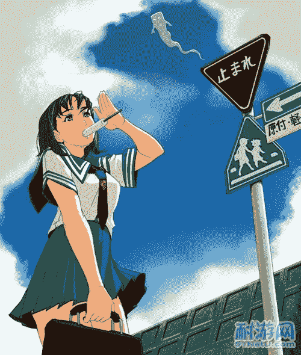
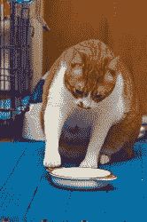
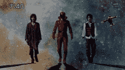
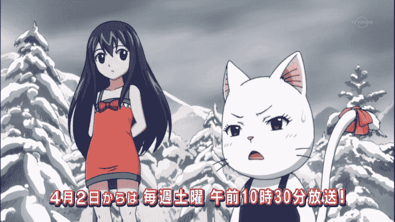
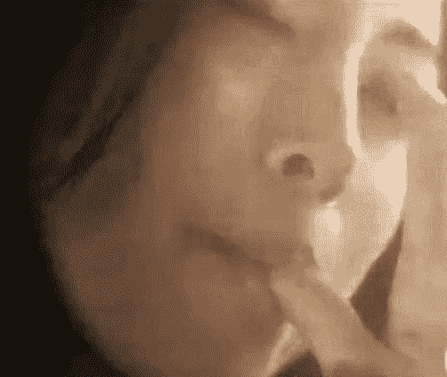

# [雙子盃] 完結，失蹤。縮小學園(惡趣味、虛構)

作者：wtman

TID：10319

<title>1</title> <link href="../Styles/Style.css" type="text/css" rel="stylesheet">

# 1

這個L名為Lind . L. Taylor。
你知道半吊子偵探 左 翔太郎，以及 菲利普(真名来人<raito>)
Left & Right啊。
明知得不了獎也要來。
我只是一個西班牙人，去追尋某個噴泉。
不過，這個故事真的消耗了我大量文字之力。

這次更新，想起了積克船長被海怪吞了的情節。
其實大家喜歡的話，可以給參加者紅利點啊。

正文在二樓、十四樓、二十九樓、三十樓、五十三樓
已更正狂草名號與顏色<title>2</title> <link href="../Styles/Style.css" type="text/css" rel="stylesheet">

# 2

 <ignore_js_op>[thumb_敲碗.gif](forum.php?mod=attachment&aid=MjQ5OTR8MzIyMzM4Yzh8MTYwMDg5MTY2N3wxODIzMHwxMDMxOQ%3D%3D&nothumb=yes) *(6 KB, 下載次數: 4)*

[下載附件](forum.php?mod=attachment&aid=MjQ5OTR8MzIyMzM4Yzh8MTYwMDg5MTY2N3wxODIzMHwxMDMxOQ%3D%3D&nothumb=yes)

2011-6-25 10:44 上傳  

</ignore_js_op> <title>3</title> <link href="../Styles/Style.css" type="text/css" rel="stylesheet">

# 3

*縮小學園*

一張鋪設了華麗桌布的典雅餐桌上，放了茶杯、茶壺、以及一些西式下午茶的點心。
還有縮小人類。他就在那些餅乾和三文治的前面。而放置食物的碟子後方，坐著一個穿著校服的美少女。最能區分她的特徵，就是那頭很長的藍色頭髮，結成了雙馬尾。
少女拿過茶壺，倒了一些茶，將茶杯帶到嘴唇，喝了一口，放下，盯著碟子前方的那個小人。
「初次見面，多多指教啊!」少女露出親切的微笑，儘管看起來一點也不親切。
「你就是那個好管閒事的偵探麼?千辛萬苦來到這裡，不是為了見我一面嗎?」
「咯咯，你害羞啊!繪裡香一定很喜歡啊，怎樣?留下來當我們的寵物。你沒有退路了，不要迫我將你握死，你這麼可愛。當然世上還有很多男生，等著做我們的寵物。你要快些回答啊!」
少女已經「咯咯」的笑逐顏開，眼下的小男生，與其說是動彈不能，不如說無力反抗。死是很容易的，只是死在這裡、在這個魔女面前死去，是毫無意義的。
我要告訴外面的人縮小學園的秘密。我不能死在這裡!
「喂，繪裡香!這裡啊。送妳禮物啊!」
**
*風都社區中心*

我叫做L，全名就是風都的L。我就是那個全球知名的名(私家)偵探L，只是最近太無聊，所以偷偷來了這裡，看看有沒有人認得我。結果。。。我的目的算是成功的，因為這兒的人彷彿都不認識我，所以連帶我開的偵探社也在不久之前開了閉幕典禮，現在要在社區中心寄人籬下。名偵探L、社區中心，毫無關連，現實卻將這兩樣東西放在一起。
命運跟我開了個玩笑，也給了我機會。在這裡我遇上了Ra，全名就是Rasonic，外貌就是一個像少女的年青人(就是偽娘啊!)。Ra沒有甚麼專長，除了可以打扮成少女，以及可比古狗的搜尋能力。使用時他就像入定那樣一動不動，只要我跟他說出關鍵詞，Ra就可以根據詞彙找出相關物件。好用的技能，儘管看起來十分白痴。正正因為這個原因，Ra被別人扣上了神經病的帽子。
話說有一日，時逢冬季，我和R在辦公室吃著火鍋，客人風塵僕僕的來到門口。這個人客來得真的不是時候。
我一腳踢開了Ra，然後走到門口開門。這個客人是一個媽媽。
「你好，歡迎光臨。要尋找私奔了的女兒嗎?還是失蹤了的丈夫?找我就對啦。。。」
「你聽說過縮小學園麼?」
我感到一點興趣。「妳的兒子下載了盜版縮小學園?被人要脅?女友一腳踏兩船?找我就對啦。」
「不如你讓我進入才說吧。」
我讓開，她走進來。Ra剛剛從側臥在地上的姿勢轉為站立，我們倆活像左右門神。
**
「我就是地仁田 遙的母親，我叫地仁田 近。地仁田 遙他最近好像在調查一所叫「縮小學園」的學校，然後他失蹤了。。。。」
「妳懷疑他查到了縮小學園的秘密，被人捉走了，甚至被人殺了?」
「地仁田 遙他留下了一本筆記本，內裡應該記錄了他一直以來的調查心得。遙他在失蹤前，跟我談及到你；『如果我有甚麼不測，請將這本筆記本交給風都的L。』所以我才來找你。」
這個世上真的有人找到了真實的縮小學園?那麼裡面真的有繪裡香、先端科學研究會、先科研正副部長嗎?慢著!地仁田他不是有個探偵助手大紀久 成惠麼?
「其實我一早已經找了警方，只是他們認為。。。。」
我老早沒有留心地仁田媽媽孜孜不怠的發言，地仁田啊，地仁田啊，為什麼你有成惠當你的助手，而我神馬也沒有呢?地仁田，我恨你!!
「地仁田媽媽，放心吧，我會幫妳找回兒子的。」然後她向我鞠了個躬，給了我一些錢，我和Ra目送她走出辦公室門口，離開了。
「Ra，開始搜尋啦!」然後Ra就站著不動，雙目緊閉，彷如入定。
「Ra，第一個關鍵詞是縮小學園。」
「第二個是先端科學研究會。然後是繪裡香。。。」
「找到了甚麼?Ra?」
「縮小學園1.42版。下載中..........0%」
「是漢化版麼?」
「嗯。」
「下載完成之後，就可以知道縮小學園的一切。」
「L，我想問一問，其實你看了地仁田那本筆記本麼?我認為筆記本內會有非常有用的線索。說不定在<縮小學園>下載完成之前，就可以知道縮小學園的秘密了。」
地仁田筆記?不就像某本要在男主角的後宮找到的筆記本那樣麼!記載了男豬地仁田與成惠的兩小無猜!可惡!
「地仁田的筆記本，不就是記錄了他的推測:先端科學研究會發明了可以改變物體體型的光線槍?我就算知道了，也幫助不了案件的調查。畢竟，縮小學園的確存在，可是嚇了我一跳啊!」「現在下載了多少?」
「五十%。」
「我還是先睡一陣。」於是我，L，就一邊睡覺，一邊反覆思考案情。

*縮小學園*

該死，我居然睡著了。我居然在這裡睡著了，難道我不感到自己背脊陣陣寒涼?真的很寒冷啊，我好像睡在《神鷗俠侶》內之寒玉床上，正受著凜冽寒氣侵襲。
不行，我要盡快離開!我會凍死的。我忍受著無盡寒氣，嘗試動起身子。只是。。。
我動不了!難道我血氣運行不足?我只好大加調息，氣血在身體內急速運作著，我再試一次。一定要成功!
。。。
還是動不了。
不是氣血不足，而是我的身子連同衣服都牢牢粘在這「寒玉床」上，根本就走不了。寒玉床不時滲出冰水，溼透了我的身驅，也與我的汗水混和在一起。仔細嗅的話，會聞到一陣陣果汁香味。。。果汁風味的寒玉床，真是神奇。
「小人，你醒了?咯咯~」
我猛然回到了現狀。當時我正在下載縮小學園1.42版，好不容易下載完成並安裝完畢，我急不及待就去玩。正當我快要闖關完成的時候，屏幕出現了強烈閃光。
「啊，我的眼啊，很痛啊!」我用盡九牛二虎之力去喊叫，希望我的同伴會清醒過來，解救我出水深火熱之中。
不過他始終沒有醒過來，或許他太熟睡吧，也或者他醒了就沒戲可唱吧。接著我感到天旋地轉，身體好像從周圍環境中抽離；旋轉的速度愈來愈快，我留意到周圍的環境變化起來:看起來綠意盎然，彷彿可以是過往校園生活之回憶。我漸漸融入到這個綠草如茵的校園環境中，我心想，我不是穿越了嗎?
我的確是穿越了。沒有弄錯的話，這裡就是大名鼎鼎的縮小學園啊!我知道，除了是因為此時的我，居然矮小得連一群正向我走近的美少女學生的腳踝也不及之外，門口寫著的「縮。小。學。園」四個大字也印證了這個事實。巨大而有規律的劇烈地面震動，是少女們的學生皮鞋踏在地上引發的。
震盪愈加劇烈，顯示她們正接近著我。常理她們應該看不見我，那麼我會在她們的鞋底下慘死，而沒有人知道發生了甚麼事。所以，我要盡快逃生，躲開巨大學生的皮鞋。事實上這個躲皮鞋遊戲真的很像縮小學園的遊戲，只是我沒有不死身，好幾次我差點命喪皮鞋之下。
毫不容易躲過皮鞋攻擊，我繼續旅程，深入縮小學園。
然後走進了先端科學研究會，見識了先科研那張王座，以及王座上那名美少女。
先端科學研究會部長，在吃著下午茶。她將我送給了一個女學生。
「小人，你醒了?咯咯~」
大家請寬恕我說得這樣簡短，因為現在我面對的，乃是世上最巨大、粉嫩、稱作頑皮也不為過的少女舌頭。我就困在巨大的果汁冰條上，面臨著少女舔食的命運。
看著綠毛、綁著側馬尾少女的表面滿佈唾液光澤的舌頭步步進迫，我想這是人生稀有的場面。
也許對一部份人，此乃人生最大的樂趣。
我對這說法有點保留。
更新 13/6
**
眼前這份「薄禮」不錯吧，綠毛少女這樣子認為。自從上一次某個俊美的男子闖入了校園，之後成為了她的寵物，她很小這樣子興奮著-她乃是第二次收到禮物。
當然除了那班被洗了腦、負責守門口的縮小男，正如字面意思，一班異常盡責看守門口的傀儡。不懂對主人反坑，對主人一切要求服從。就是一班好用的工具，不是一堆好玩的縮小人。
因為太稀有，所以很渴求。
看著比自己弱小的生物掙扎，是好玩非常的事。彷彿是回到幼童時候的玩弄小昆蟲那樣，征服、為所欲為、愛。
尤其看著他在震顫，只不過是普通的冰棒，一個男子困在冰棒，求救無門，進退維谷。自己的舌頭只是一舐，對他來說應該是巨鯨來襲吧；比他整體還要雄偉的舌頭，在冰棒表面滑動、摩擦、扭轉，好幾次舌頭邊緣快要碰到固定不動的小人，相信害羞的他會很害怕吧。還未撫摸他的皮膚，就嚇得他膽戰心驚，好像不好意思啊!舌頭扭動起來，離開了冰棒，縮回到嘴巴中。體溫融化了冰棒，舌頭上盡是混和了果汁的唾液，其中也許有些小人惶恐不安時散發的汗水，與氣味。嚥下混合特別成份的口水的滋味真的比單純吃冰棒還要好，少女猶如陰險之蛇，在向著獵物吞吐舌頭，一邊品嘗著獵物恐懼的滋味，一邊為舌頭塗上透明而火熱的口水分泌，等待下一步行動。
於是舌頭於神秘而危險的黑暗洞穴中出擊，直往目標冰棒出發。這次舌尖剛剛往小人頭頂幾分略過，著陸後舌頭在冰棒上打圓圈；礙於冰棒的體積，加上舐食了一段時間，少女只能打一個細小的圓圈，正因為這樣，舌頭接觸到小人的機會大大提升。此刻的少女發現身體不屬於自己:舌頭凍得發麻，感覺越來越遲鈍，連分辨小人有否被捲入舌頭也無法得知；另一方面，除了舌頭以外的身體部位卻熱烘烘起來。頭部、胸口、甚至兩腿之間的部位，都感到火燒起來，心跳加速、頭昏腦熱。
少女巴不得馬上尖叫，對所有的人呼喊著她感受的喜悅。當然，對於少女來說，舐小人遊戲不過是前奏，要到達更快樂的層次可是要更多更有力的刺激。例如:
在自己身體上下兩個口子內投入一整個城市的小人吧!一整個城市的所有人被我收集在盒子內，然後。。。
直接將盒子內的一切倒入身上那兩個飢渴的洞穴吧，就是倒灌沙子入岩洞中一樣，讓我和小人一起享受吧。城市，城市。。。就去真正的城市。
就用那機器吧。先科研的那機器一定做得了!
也許少女想得太入神，舌頭停止下來，定在小人附近的地方。舌頭的熱力將冰棒那部份融化成果汁，可是看在小人眼中，這乃是溫室效應；地球暖化、南北極的冰川融化、地球水位上升、世界各地嚴重水浸，大量國家頓成澤國。。。一切一切，都是熱力融化冰塊的關係。自己有生之年就可以目睹這等天災，可真目瞪口呆啊!
果汁洪水輕易的淹沒了小人，少女舌頭觸碰的冰棒地方成了一個坑，果汁聚集在坑道之上，小人落力的向上游，儘管果汁很凍而且有些粘稠。
少女雙目出神的想，不經不覺雙頰變得紅起來，彷彿對眼下的巨大洪水淹沒小人毫不在意。等到她回復心神，也是等到融出來的果汁流到少女的手腕上，驚醒了白日夢中的麗人。見到自己失態，綠毛的側馬尾少女也只好將口貼近手腕、伸出舌頭，輕輕的舔，也不仔細的回味任何特殊的質感與味道，就骨碌碌的嚥下了，然後就快步的走了出去。
第一個目的地?不是先科研呀。先去取得冰棒，不，雪糕也是不錯的選擇。一邊在城市走一邊吃，甚至隨便在地上輕輕一點，應該會增添雪糕/冰棒特別風味吧!
然後到先科研使用那機器，到訪異世界的細小人類，咯咯。

*風都社區中心*

「Ra!你死了去哪裡?」 更新15/6/2011 L睡醒過來，發現Ra居然失了蹤。怎麼自己睡了這麼久，Ra都不來叫醒我?難道Ra出走了?
不可能啊，Ra不會這樣子走了，這裡明明就是密室，門還是從屋子內裡上鎖著的。一個人怎樣從一個密封的地方出走，而又能保持那地方密封呢?這只有在神秘的推理小說才會出現的情節，現實怎麼會發生啊?
更何況，Ra應該不會這麼小器吧。就是間中捉他去穿女孩子的衣服扮偽娘，調查調查一下案件，Ra又沒有甚麼損失，他又扮得很維妙維肖，他不會介意吧?哎呀，一波未平，一波又起，Ra神秘失蹤，再加地仁田 遙不知所蹤，教我怎樣辦!
我應該先尋回Ra，還是當務之急調查地仁田失蹤事件?
Ra是我的朋友，地仁田不是；地仁田媽媽給了我金錢，Ra的媽媽(誰?)沒有；我不喜歡地仁田，但是我乃是偵探!
很難決定，要不我就交由金錢決定吧。
於是，L掏出一個硬幣，擲公字。

*一、尋找Ra的故事*

『妳在何處，馬小玲；望你脫險馬小玲。我王小虎空有威名。。。』〈馬小玲〉
大門沒有被Ra打開，Ra不是被人從大門帶走離開的。帶走他的人也不會從窗子爬入來吧?窗子都在貼近L睡眠那張床的牆壁上，有人跨越他身體他應該不會毫不知道的。這房間在二樓，正常來說，既不是走投無路又遇上火災，更非被洪水猛獸步步進迫，人是不會這樣犯險啊。
L正煩惱於當前難題，他猛然想起:
「在我睡覺之前，Ra不是在下載<縮小學園>嗎?」雖然看起來兩件事的關係乃是很薄弱，但是將多麼風馬牛不相及的事查得完全相關，正是我的工作，我的專長!問題關鍵說不定就在<縮小學園1.42版>之中，L一支箭衝向電腦前，發覺電腦在休息狀態。
「Ra!原來你在玩<縮小學園>，還通了所有的關啊!」L看到<縮小>那個開始畫面，不禁想到自己夢寐以求想看到成惠的裙子春光，可是每次不是被成惠無意中踏死了，就是成惠留意到自己，使用道具放大鏡時，被放大鏡聚焦的太陽光線將自己燒死了。
16/6更新
有次L借調查的機會，問Ra，如何可以成功被成惠發現而不會被殺死。
「Ra，第一個關鍵詞是成惠。然後第二個是放大鏡，最後是生還。」
「L，你不是現在還會被成惠踏死或者燒死吧?你依照遊戲的指示，不就可以順利讓成惠看到你嗎?」
「Ra!!」Ra應聲倒地，原來L使出了「L Kick」。這種兩小無猜的生活片段歷歷在目，L也不禁抱頭嘆氣。要找到Ra，就要過得了成惠那關。L再次抱頭嘆氣。
**
古代有關羽過五關斬六將，今有L孤身勇闖<縮小學園>。前面的關卡不難闖，畢竟L是玩了好幾百次的老手，只是當越來越接近見到成惠的那一關時，L也越來越緊張，彷如親歷其境一樣。
啵啵，啵啵。
啵啵，啵啵。
「哎呀，有人搶走我的皮包呀!快幫我追這個竊賊。」「救命呀，搶劫呀!」
儘管L盡量保持著明鏡止水，還是會被這些噪音干擾心神，令到L不其然轉個身，對著窗子破口大罵:
「你吵吵鬧鬧完沒有?我還要作正經事!」
等到L怒火漸消，心思再一次回到遊戲時，終於到了和成惠見面的章節了。
成~惠~。或許是剛才L的怒罵，令到他面部的血液運動加速，他脹紅了臉，好像和心儀對象初次見面一樣。
成惠好像見到了他。
成~惠~。
成惠拿出了放大鏡，跪到地上。
快要成功了。
然後~~
「呵呵，這裡有害蟲啊。」
「神馬!成惠怎麼會這樣子說話呢?難道是我玩遊戲的姿勢不正確?還是我打開遊戲的手法不對?」L不禁心中懷疑起來。
「大紀久 成惠的cosplay~喜歡嗎?」畫面不再是粗糙圖像，而變成了異常真實的美少女，擴音器還傳出了這句說話。
那個「成惠」就這樣脫下了假髮，露出了真正的面目-紅色長髮。
「乃...乃是先科研副部長?惡趣味啊?妳為什麼要扮成成惠啊?」儘管對著電腦螢幕談話看起來很白痴，但是對方明顯對他說話，L也只好照做吧。
「就是很有趣啊!成惠真的那麼好嗎?難道我不可愛嗎?內褲不漂亮嗎?」
「你去死吧。欺騙了我的感情!」
副部長扁了扁嘴，對L說:「拜拜啦~!」拿著放大鏡的手抬高，對準了螢幕，發放出強烈光芒。L感到眼睛刺痛。
「啊，我的眼啊，很痛啊!」
。。
**
『地上的陷阱之門打開了，英勇的男主角墮入無底深潭之中，四周響起了邪惡的笑聲。』
L至今仍然不相信，自己會認錯了成惠!難道是螢光幕的解像度不足?唉，現在不是自怨自艾的時候，相信自己也是遇到和Ra一樣的情況。此刻身在一個既陌生又很熟悉的地方；陌生，因為這裡不是風都社區中心；熟悉，原來就是玩了很多次的縮小學園。原來縮小學園的通道就是<縮小學園>遊戲!那麼，連同Ra和自己在內，不是有很多同志都被捉走到這裡?那麼，他們又被監禁在哪裡?身為全球知名的偵探L，也對當前的處境感到驚訝。
幸而，他是知名偵探，有甚麼奇怪事未見過呢?他冷靜起來，想到既然最後見到的是先科研副部長，那麼所有的事都是先科研搞的鬼；殺上先科研，弄清楚她們的意圖，然後借機救走Ra.....和地仁田吧(可惡)，話說那個成惠是假的，也許問問地仁田會知道真正的成惠在哪裡，或者...連真正的成惠也被捉走了，同樣被困在這裡。算了，還是先去先科研為上了。
於是，誤墮陷阱的男主角踏上了他的征途。而在男主角未能留意的遠方，有個監督鏡頭在寸步不離的記錄著主角L的一舉一動，影像傳送回一切事件的起源:
先端科學研究會。
「男主角都到齊了。期待著後續啊。」
一位喝著茶的藍髮少女，像看戲的觀眾般觀摩著L的行動。
17/6 更新
**
*縮小學園*

暈倒前一段時間，Ra見到了洪水溢出了冰雪坑洞，順住地心引力，流向了綠毛少女的手腕。
快!要阻止自己順勢繼續向下流，不然會衝到地上，頭破血流啊。Ra發狂地想抓住堅實的物件，可是，他能「抓到」的就是少女平滑而富彈性的肌膚；皮膚上竟然就像毛孔也不曾存在過，要尋找一根細微的毛髮，可真是沒有可能啊。因此Ra希望抓住少女皮膚上的任何一根毛髮，阻礙住果汁洪水的流勢的想法，被徹底打破幻滅了。Ra此時就像於寒冰雪水中逆流而上的魚群，正在揮動手腳努力划向目的地上游地區；然而Ra不是魚類，他不可能長時間向上划而毫不疲勞，而且少女的手腕是會活動的。手腕的些許活動，已經可以令Ra更貼近死亡的深淵，Ra拖著酸軟的四肢，像向天上的神明祈求一樣，盡全力伸出，壓向富彈力的少女皮膚上，試圖減慢跌勢。
「不不!!」
Ra肌肉內的乳酸令到他不為意地鬆開了手腳，上方源源不絕的果汁，猶如瀑布將Ra湧出，Ra感到時間緩慢起來，眼前一切，就如古人的詩歌一樣:
「飛流直下三千尺，疑是銀河落九天。」
上方的樂園離自己愈來愈遠，光明變得愈來愈渺小。Ra的恐懼使得他不禁如聖經內的約伯咒罵了天神起來:
「天上的神明啊，怎麼這樣子對待我!將我逐出了美好舒適的風都社區中心，交我予如此惡劣之魔女!
天上的神明，告訴我做錯了甚麼!難道我的伙伴L所做的惡事之惡果，也要我一一承受啊!
天上的神明，你瞎了眼...........」
躂。
Ra跌落在一塊很巨大的濕漉漉平面。
這平面順著手臂往上爬行，一路上收集了溢出的果汁。Ra一方面感到得救，一方面他很清楚這個濕淋淋的平面，正正就是剛才嚇得他膽戰心驚的巨物、引起溫室效應的罪魁禍首，綠毛少女的舌頭。Ra強忍著身上劇痛，張望上面，他見到了面頰微紅的少女回過神來，此時清理著漏到手部的冰棒果汁。
「她會將我一併吞嚥嗎?」Ra他腦中閃現這個念頭。自己不用粉身碎骨地慘死，卻要承受被少女生吞而被她胃中的強酸腐蝕而死。前面一種痛苦但快速，後面一種可怕而且持久的痛苦；看著自己的身體漸漸地融化，承受著身體被腐蝕的痛楚，Ra的心寒了起來。
「求神拜佛，她不要吞下我。」
綠毛少女的神情起了變化，她露出了Ra看來覺得是她不忍心的表情。
「只要她不忍心，就算要我被她繼續玩耍，也不介意!」
少女人家的心事，真的是除了她自己以外，無人知曉。
看來不忍心，卻依然是「骨碌」一聲吞嚥下去，下去胃液的所在。
舌頭收回到口中，Ra與嘴唇的距離愈來愈短。
我們彷彿可以聽到，Ra咒罵天神瞎了眼的哀號。
然後他暈倒了。

(待續)

[ *本帖最後由 wtman 於 2011-7-2 17:11 編輯* ]<title>4</title> <link href="../Styles/Style.css" type="text/css" rel="stylesheet">

# 4

 <ignore_js_op>[8955_150336_5.jpg](forum.php?mod=attachment&aid=MjQ5OTh8NDQ4MDdkMDh8MTYwMDg5MTY2N3wxODIzMHwxMDMxOQ%3D%3D&nothumb=yes) *(183.95 KB, 下載次數: 0)*

[下載附件](forum.php?mod=attachment&aid=MjQ5OTh8NDQ4MDdkMDh8MTYwMDg5MTY2N3wxODIzMHwxMDMxOQ%3D%3D&nothumb=yes)

2011-6-25 12:16 上傳  

</ignore_js_op> <title>5</title> <link href="../Styles/Style.css" type="text/css" rel="stylesheet">

# 5

你參加，我可會給你紅利點啊!

然後這個故事，本想加插縮小貓，也想加一班敲碗眾出來敲碗。。。
現在又想將綠毛馬尾送來這個世界做破壞，然後再將綠毛超巨大化，對地球做出引發溫室效應的行為來。。。

[ *本帖最後由 wtman 於 2011-6-13 18:52 編輯* ]<title>6</title> <link href="../Styles/Style.css" type="text/css" rel="stylesheet">

# 6

魂淡，怎麼不參加啊?
『............................................
原來我們看起來像門神啊！(恍然大悟)』
這個門神可能會說:THIS IS SPARTA!然後一腳將我踢落深坑。

[ *本帖最後由 wtman 於 2011-6-17 11:08 編輯* ]<title>7</title> <link href="../Styles/Style.css" type="text/css" rel="stylesheet">

# 7

 <ignore_js_op>[T&#228;&#228;onsparta.gif](forum.php?mod=attachment&aid=MjQ5Mjl8ZjI3NmFiYzd8MTYwMDg5MTY2N3wxODIzMHwxMDMxOQ%3D%3D&nothumb=yes) *(279.86 KB, 下載次數: 0)*

[下載附件](forum.php?mod=attachment&aid=MjQ5Mjl8ZjI3NmFiYzd8MTYwMDg5MTY2N3wxODIzMHwxMDMxOQ%3D%3D&nothumb=yes)

2011-6-17 11:08 上傳  

</ignore_js_op> <title>8</title> <link href="../Styles/Style.css" type="text/css" rel="stylesheet">

# 8

*本文章最後由 wtman 於 2013-2-23 19:24 編輯*

**
*縮小學園*

「拜拜啦~!現在是先科研副部長露面的時間啦~!」
縮小學園的先科研會員都有「寵物」，副部長當然也不例外。關於「寵物」的定義，人人有不同的理解；對副部長來說，就是可愛的生物，值得她付出愛心的生物。她足下有為數不少的洗腦縮小男，他們理論上是縮小學園的「寵物」，至於實際他們被看待的方式，就未必是寵物應有的了。她認為，他們只是一堆便宜、容易利用的工具，用途包括看門、特殊性消耗等。對一堆消耗品動情，是頭腦有毛病的大叔才會做的事啊!所以，她可不會跟一班縮小男作親暱的舉動，除了『他』。
『他』就是副部長的寵物。『他』伏在副部長的腳邊，懶洋洋地合上眼睛，享受著陽光的沐浴。『他』的體型也許比其他同類還要小，然而『他』的細小反而增添了可愛，而且從『他』的工作(遊戲)表現來說，『他』比一班自稱是「運動健將」的縮小男還要稱職。通常，假如有一個小人躺臥在副部長腳邊睡覺，他只會落得踐踏的下場；『他』呢，就只會繼續的睡，不會有東西打擾清夢。
此刻的『他』醒目過來，翻個身，伸手舌頭舔了舔副部長的皮鞋。透過皮革感到了絲絲痕癢，副部長垂下頭，看著自己的寵物。
「醒來了，鬆鬆筋骨吧。」抱起『他』到自己胸前，副部長繼續談話。
「玩具一件，抓他回來，好不好~?」『他』面對的影像是一個露著驚愕神色的男生照片，「這玩具很好玩的，呵呵~。」掃了一掃『他』的背項，她讓自己的寵物從自己手上跳落到地上，展開『他』的任務(遊戲?)。
『他』的名字，就叫做「蛋白」。
**
『現在雖然是冬季，總會有冰棒和雪糕發售吧。沒有了冰棒和雪糕，我會被快感冲昏頭腦，控制不了自己呀!要走快些，我等不了。
我走過了校園的花園地帶，目的地是一個售買雪糕的地方。為什麼?就是遊戲啊。剛剛的遊戲令人回味無窮，我要…我要在城市玩多好多好多次!那就要好多好多的冰棒雪糕……唔，拿著它們過去的話，會不會融化掉呢?不行啊，未玩耍道具就不能用，那我要玩甚麼呀?
唉，我需要一個手提冰箱，在裡面放些冰，再放下我要的東西，那就不怕會壞掉啊。就這樣吧。
冰箱，冰塊，冰塊。要找冰塊，保持雪糕冰凍，冷得舌頭麻痺起來…….用冰愛撫舌頭會不錯吧，更敏感的地方呢?到達那裡要試一試啊。不行啦，自己的思想都變得…..變得不可思議啊，要再跑快些才行。剛才吞嚥冰棒時連帶那小人也吃了吧?可惜啊他也很可愛，比那個縮小偵探可愛多了，算了，他在我肚子裡會很幸福吧，變成我身體的一部分…..啊，快忍不住了，何時才到商店啊？』*一位秘書的自述*
**
「死啦!」我像遊戲中的蛇叔叔那樣子，偷偷潛伏在別人背後，再施以痛擊。偷襲最困難之處，是不讓敵人知道自己位置，蛇叔叔有潛入道具，當然很易辦；我可要運用智慧和實力與敵人周旋啊!蛇叔叔，我恨你!
我就是L。無意墮入了縮小學園，現在正朝著先科研進發。嗯，一路上的事，也不能不算驚險啊。一個洗了腦的縮小男很易對抗，只是他們出現時，總是三五成群；單則易折，眾則難摧，對付他們，要逐點擊破。就好像剛才，乘著洗腦小人站立不動之時，從後施以拳打腳踢。雖然過程中受了幾個悶棍，最後還是克敵制勝。
假如我懂無雙技，三百人又能奈我何?戰國無雙，我恨你!
當然，我不是來這裡打小人，我是來尋仇的。既然尋仇，就要將先科研的所在地找出來。小人們被洗腦，失去了語言能力，問不得；唯有問一問這裡的女學生了。
「女學生們，停下來啊~是哥哥啊~請問~」
啪!
一個非常失敗的示範。貿然走去與比自己巨大的女學生搭訕，只會落得被輾斃的下場，更何況，她們聽不到我的說話，也不會聽。要跟蹤她們，找出秘密位置，然後去找副部長……然後做甚麼?跟她決鬥?自己這個細小身體可以做甚麼?剛剛正面遇上那些先科研幹部時，自己不是要避不見面......
但是我是偵探啊!即使我傷不了她，也要救出Ra啊!也要找出她們的秘密啊!L，你是他們的救星啊!
**
兩個美少女學生在窺窺私語，她們隨後急步走開。這次我要不惜一切，跟蹤她們。
她們兩個，樣子太像先科研的幹部了(因為之前L未見到幹部們的正面就遛了)
跟蹤少女，最重要是不要被發覺，不然，「變態啊，跟縱少女回家啊!」我不禁想起了自己過去的經歷。不論你是老或幼，只要你被少女發現，你在跟蹤她，你就會遭殃。
「包包流星鎚!」「毀容爪!」幸好我身手不錯，不然我早就會毀容和絕子絕孫啊。我忍不住又歎息起來。
「喂喂，我覺得小腿有點兒癢。」
「是不是蟲子呀?昨天在我面上咬了一口。」
「蟲子好可惡啊!天氣這麼冷都出來作惡!」
天氣冷，不及我的心冷。
啵啵，啵啵。
啵啵，啵啵。
不要搔癢，不要搔癢，搔癢我就完蛋了。剛剛歎的那口氣，加上我抓住襪子的力度，刺激到少女小腿皮膚，令她感到痕癢。沒錯，我在少女的襪子上。我趁著那少女停下不為意時，偷偷跳上；本來我想以尾隨方式跟蹤，然而她們太巨大了，我太細小了，很容易就跟丟了。丟失了好幾次，我唯有出此下策，難道我在身上掛一塊牌，寫著:
「請帶我去先科研。」嗎?
啪。
我勉強抓緊了襪子纖維，又要忍受少女步行的震蕩。這所學校的制服裙不過膝，最長的在大腿中間，所以我不必擔心裙擺的問題。話說這間學校的校服裙都太短吧，難道沒有老師捉拿嗎?縮小學園的尺度真的很寬鬆啊!
該死，又跟Ra一樣犯了入定的毛病。
啵啵，啵啵。
啵啵，啵啵。
「搔搔會好些吧。」少女彎腰，伸手迫近小腿。
「L，你大限到了!放手吧。」我彷彿見到天上來了個大鬍子，手執生死冊。
「放棄吧。」彷彿有個虛化了的我站在我面前。
我剛剛才爬上襪子，位子未坐暖，就要下車?算了，性命才是最重要，放手就放手啦。
「哼哼，蟲子快走開!喂，我們去更衣室啊。」少女不再感到小腿癢，就快步趕上她的朋友。
少女更衣室?根據經驗，少女用的更衣室是殺傷力很大的地方。三萬男士進去，只有十個出得來；假如我進了，逃得過成群少女的腳踏大陣勢嗎?能夠不流血不止嗎?算了，先看看這裡是甚麼地方。
綠草、紅花，獨欠鳥語蝶舞。這是後花園吧。一個大大的噴水池就在花園正中，曲折的羊腸小道，貫通花園的四周；道旁種滿了鮮花，香氣撲鼻，真是一個美麗的地方，假如不是有一班會踐踏殺人的可惡少女的話。
「那樣，我是否迷路了?應該往何處走?有誰可以帶我去先科研?」我站立在道路旁邊，面向花圃。
突然之間，花團中出現某種騷動，一個不小的黑影，正猛然撲向一個沈思的俊男。
「甚麼?突襲!」黑影一招「黑虎偷心」正向我襲來，我急速退後，想拉開距離。但是攻勢太烈，避不開，只好硬接了。
我站穩，正想以雙臂擋住「黑虎偷心」時，黑影愈來愈接近，也愈來愈大；甚…甚麼，那黑影的手掌竟然比我身體還要大!這不是偷心，是我整個身體會被撃碎啊!不行啊，我的腳軟起來，跪在地上，翻了兩個筋斗；黑影的巨掌擦身而過，在我衣服上留下四分之一個抓印。
這東西，很可怕。我站起來，面對這隻怪物。黑影顯現真身，懶洋洋的合上眼，伏在地上。我看清楚些，不禁叫喊起來:
「甚麼!」
**
在遠處的先科研內，紅髮副部長對其他成員說:「蛋白，吾貓。」
25/6 更新
**
「蛋白兄，停手啊!是我啊，L啊。」
原來這隻「蛋白」，乃是L很久之前幫助社區中心找到的一隻貓，當時，L曾被「蛋白」抓傷了，因而建立起深厚的感情。故友重逢，彼此卻是面目全非：「蛋白」那時還是很細小的貓兒，約略L一隻手掌的大小；現在的L卻是「蛋白」的一隻前掌的大小。
不是「蛋白」變大了，是L縮細了。
可想而知，L正在打著友情牌 — 運用救助之恩以保平安。
「蛋白兄，」
「……喵……」
「不要頑皮，要乖乖啊。」
「蛋白」瞇著眼，半合上眼，好像伏在地上睡覺。
看來報恩政策有效，「蛋白」要放生他了。
L退後一大步。
「……喵……」「蛋白」仍然分毫未動。
L再退後一步，逐漸拉開與巨獸「蛋白」的距離。L鬆了一口氣，再往後撤退。
終於撤退了五大步。再撤退多幾步，就得救了。
咚咚隆隆咚咚隆隆。
不消說，就是有很巨大的物體在接近花園，以致花園地面劇震，附近的細小金屬發出噪音。
是巨大少女。L抬頭，極力挑望遠景，穹蒼之巔是一大片綠色，側邊則垂下一道靜止在空中的綠色瀑布；超短的校服裙徘迴在大腿上方，從L的位置，甚至可以看見裙子底下的小內褲。
一波未平，一波又起。難得馴服了「蛋白」，又跑了個先科研秘書出來，這個繪裡香可是比「蛋白」更難搞呀!
L心中祈求，繪裡香不要來找碴。
或者我們離開這兒一陣子，回到較早時，看看綠毛秘書去了甚麼地方。
**
*2.繪裡香與流浪人*
先科研秘書，繪裡香，手上提著一個冰桶，剛好路經此地。
「商店這麼遠，走死人家啦!」她邊行邊咕嚕著。話說繪裡香走到了很遠很遠的地方，才找到所謂的冰桶與雪糕。
「咔，吐!天寒地凍，吃神馬雪糕啊!木有，木有!」那間店舖的老板，據說是一個很像流浪人的大叔，平時講話時會發出老人家吐痰的獨有聲音。
光鮮的店舖，老板卻是這樣子，頗為諷刺。更諷刺的是，繪裡香現在有求於人。
「老板，求求你啊~!」
「木有!木有!小妹妹，妳多大年紀啊?裙子低得快要見到內褲了，妳做神馬?想色誘我呀?咔吐!讀書不成當娼妓啊!這裡很危險，快回家溫習吧!」
讀者看到這裡，先停一停，容我解釋幾句。這間光鮮的商店，其實不是流浪人老板開設的。流浪人老板只是接了上一手的店舖而已；因此這正好解釋了店舖與老板風馬牛不相及的原因了。
據說店舖轉手的因由，是上一手看到一些很可怕的東西，嚇得神智有點毛病。
因為之後每逢外出街上，遇到女學生，他都會大聲地叫︰
「女巨人呀!入陰呀!咳咳，救命，救命，我遇溺了......咳咳」
他的家人無可奈何，將他送入了顛狂院；而店舖讓給了流浪人老板，大既是流浪人是唯一一個不信邪的人吧。
至於第二件事，乃是繪裡香的態度。為什麼一個以吃小人、支解小人為樂的邪惡女學生，會求一個惡老板呢?
其實每個人於幹正經事時與玩樂時的態度都可以截然不同；老師眼中的乖學生，也可以是冷血的殺貓兇手。更何況，非到必要時，盡量就不要橫生枝節啊!這是當了好一段時間先科研秘書的繪裡香所學到的。
當然，這個必要之時，不同人有不同見解吧。例如，對繪裡香來說，是滿足欲望。於是，繪裡香也除去那個「可愛而誠懇的繪裡香」的面具，解開恤衫的衫鈕，竟然露出了「事業線」。
老板有見及此，大罵一聲︰「神馬呀!殺必死呀!我不受這套啊!」
伸手入衫中，繪裡香掏出一支黑色、筆型的物體。很像電筒，但比電筒更幼長。
「是啊~!這是FAN SERVICE(唸作**殺必死**)啊!好好享受!」
老板只看到一陣閃光，然後等到他回復知覺時，才發現難以相信的事。
自己縮水了，比眼前這位少女的鞋細小。想來上一手說的所謂遇溺其實是……縮水了的人被「強行」放入少女的陰道中，形同自慰器那樣服務。
老板的腳軟起來，跪在無比巨大的繪裡香的皮鞋前。綠毛少女的嘴唇往上曲起，她脫去右腳的鞋；套上白色長襪的右腳，停留在老板頭上，將他夾起、帶到皮鞋內部。目的很明顯︰「就留在皮鞋裡面舐我的腳，我滿足的話就放過你。呵~呵」
然後，她到了冰箱那裡，取走大批冰棒、雪糕，順便拿走了老板的私人冰桶。
「既然老板出外了，就沒有必要付款吧，呵呵!」
綠毛秘書的行程暫告一段落。
**
只是因為這條路是先科研必經之路，繪裡香才會出現在這裡，她可是不知道這裡正在展開著一場人與貓的對峙，更不知道這位與貓對峙的人，與快成為胃中亡魂的那個人，關係十分密切。
我想，即使知道了，又有何用?綠毛少女繪裡香的腦海中，大既只有期待後面城市遊覽的事吧。一個小人與千千萬萬小人居住的城市相比，實在是芝麻小事。於是她加快了腳步，絲毫不留意道上發生的事。
**
繪裡香走了，「蛋白」馴服了，偉大的主角L是否因而脫險了?
27/6 更新
**
*巨娘之夜論壇*
「喂，L，今天你走運了……」讀者甲如是說。
『之前說到「蛋白」多麼的厲害，原來不出L兩下子的三腳貓功夫去動之以情，就騙得「他」華嚴道上釋曹操啊!』讀者這樣的評價。
於是，寫手有這樣的答覆:
「獵人的樂趣，不是在一見到獵物就瞬即捕殺。這是獵食，不是打獵啊!看著獵物驚慌地向自己求饒，慌張地往後退縮；獵物的一舉一動盡在掌握之中，只消等待獵物的一分鬆懈，那怕是停下喘息一會兒；都是獵物死亡的先兆啊!」
寫手再說:「是福不是禍，是禍躲不過。」
**
*縮小學園*
L千想萬想也想不到，事情會這樣子發展。
首先，自己這麼快就到了先科研總部。
然後，「蛋白」沒有像捕鼠那樣殺了自己
最後，面前境況如此險峻，自己竟然要哈哈大笑起來。
「忍…忍不住了!
哈哈哈哈哈哈哈哈哈哈哈哈哈…………(下刪七萬字)!」
L笑得太兇猛，眼睛也露出淚水來。笑聲震天，即使是對L來說龐大得如城市的先科研總部，也充斥著L的笑聲。
「哈哈哈……這…是…原…哈哈…創嗎?<縮小學園>可沒有……不行，哈哈哈哈哈…這情節啊!哈哈哈哈…………好癢好癢好癢癢死我了!」
L這下子真是全身痕癢得無法忍受，頭頸、身體、手腳，甚至他的「小L弟弟」都遭受到有史以來最強、最劇烈的痕癢。
「停手……哈哈哈……停手……哈哈…呀!」彷彿有千萬蛆蟲在他皮膚底下蠕動，L的皮膚癢得他巴不得當下抓得皮膚血跡斑斑，才得以止癢。
可是，L的心願卻無法達成；手腳都綁上鐵鍊，L有如肉隨砧板上，聽候任人魚肉。聽候任人魚肉?不說不知，L的身上的確有陣陣濃郁的魚腥味，真的像砧板上一塊魚肉啊!
綁上鐵鍊的，不消說，正是先科研的一眾社員與正副部長，除了綠毛秘書繪裡香。沒錯，L是來到了先科研，只是他乃是被「蛋白」含在口中帶回來的。「蛋白」沒有殺他，因為「他」的主人這樣說:「玩具一件，抓他回來，好不好~?」(大家忘記了?)而L既然是玩具，當然是用對待玩具的手法。
綁上鐵鍊，接受羽毛的撫弄；不是一片，而是無數片羽毛在L身上游走輕撫啊!
本來有社員提議用舌頭的，只是舌頭太大，L太小，不夠玩，才改用羽毛。人間最大的樂趣啊，夫復何求呢?
欣賞著L那種既痛苦，又有點享受；既在暗自神傷，又開懷大笑的表情，逗得一眾先科研成員十分開心。
「呵呵，這件玩具太有趣了!」
「那就加大羽毛撫摸的密集程度啦!」
**
**『盡我百慾，死何足懼。』**
L的身體起了劇烈變化，一雙眼睛滿佈血絲，快要跳出眼眶，手臂基於自然反應，想聚攏到身驅保護身體，被約束活動的鐵鍊劃出一道道血痕；儘管是傷痕累累，L卻感覺不到絲毫傷楚，源源不絕的痕癢觸覺使得頭腦接收不到痛楚訊息，L仍然是痕癢難當。
然而，下一刻，當大腦漸漸對痕癢刺激變得麻木時，L不再感到絲絲痕癢，而是像壯士斷臂一樣的痛楚!手臂上的血痕傷口，釋放出大量化學物質，刺激痛楚神經，直達大腦。本來接收不了的痛楚訊息一下子湧入大腦，這下子輪到傷口劇病的煎熬了。
「哇!好痛呀!哇!」從未有人會痕癢得暈倒，而因為劇痛而痛得暈倒，卻大有人在。L是其中一個，Ra是另外一個。
話說Ra，他在某個很特別的地方甦醒起來。
**
*某地*
這裡很白，也很光猛，完全不像人類的胃部。我明明被綠毛少女繪裡香吞入肚子裡，我應該看到的是粉紅的食道內壁，或者是胃部起縐的牆壁，翻騰著、含有不同的消化酵素與強鹽酸的胃液，應該正在底下侍奉我。
但是我一點兒都看不到這些場面，而且…這兒有點涼快。難道我被她排泄出來?但是我看看周圍，都非常的乾淨；再看一看身體，沒有任何的破損，也沒有一絲臭味，活像以前在風都社區中心一樣。究竟發生了甚麼事?我沒有一絲頭緒，於是四處走走。
話說這兒也很空曠啊，一直向前走都走不到終點。四處好像漂浮著一陣陣煙霧，看上去，好似有人在那裡放置了乾冰一樣。
「搞甚麼啊?有沒有誰可以答覆我?」我叫喊，抱住有人會回應我的希望。結果當然是無回音，也進一步引證這兒很空曠，我聽不到一點回音。
然後。
「大膽凡人，何以在此喧嘩!」我的上空傳來一把聲音。
有兩個人，從天而降。這兩個人都載著假鬍子，留心看，他們都穿著白袍，心口別了個扣針。
一個的扣針寫著「eventually」。
另一個寫著「18X」。
合起來就是「eventually 18X(最終仍是十八禁)。」
「大膽凡人，你乃是已死之身，為何留在這兒不走?」那個「18X」如此說。原來我死了?想起來也對啊，被巨大少女吞進肚子，怎會不死啊?於是我問:
「兩位想必是牛頭、馬面大人了，我想問死了的人要往哪兒?」
這次輪到「eventually」回答。
「一般人就是去奈何橋，喝孟婆湯。乃的情況比較特殊，被巨大少女吃進肚子而死，原則上是要去巨娘之夜這個收容被巨大少女殺害的亡魂收容所，」這位「eventually」拿出一本筆記本，打開看著，「不過那個地方正在封館，要等到七月一日才重新開張。所以呢…乃有甚麼意見，18叉大?」
「就依照之前那個一樣吧。」
「即是甚麼?」我不禁發問。
「就是發還原地啊，凡人。」
「是風都社區中心嗎?」我不禁期待起來。
「非也，非也。發還原地，即你在何處死，就魂歸何方。乃被繪裡香吃了，就回到繪裡香的懷抱中吧!」
「甚麼!我不要!我要回到風都社區中心!」
「拜拜，凡人。」「eventually 18X」的身影漸漸淡化，只餘下我一個。然後一陣強光，
「啊，我的眼啊，很痛啊!」歡迎，我又回到縮小學園的繪裡香懷中。
27/6 第二次更新
**
L陷入了沈睡。
他好像回歸到之前的時空。與「蛋白」對峙之時。
「蛋白」並沒有被L馴服，「蛋白」從來只有唯一的一個主人，就是紅毛副部長；主人的命令是捉住他，「蛋白」不會擅離職守的。只是剛才試探一下L的實力，卻強差「貓」意。
這種程度的獵物，對「他」是何等的侮辱!即使捉了L，仍然是毫無意義。
貓兒發放奇異的呼嘯，說是奇異，乃因音調異想刺耳，絲毫不像正常貓兒的叫聲。
儘管「蛋白」不識人類語言，但是「他」的叫聲，非常有意思︰
**『蛋白戰隊 小貓者，參上。』**

三個黑影「搜」一聲出現在「蛋白」面前。
「小貓洋紅!」
「小貓藍!」
「小貓綠!」
身穿勁裝，胸口各貼有不同顏色的蛋白抓印。
L嚇呆了，他們明明是豪放不羈的狂草怒殺生，戰魂無限的小秦秦大爺，以及一擊必殺、例不虛發的鐵奧鐵大神!
「拿尼!你們這麼出賣自己的肉體?」其實L只在心想，沒有說出下一句，「你們被洗腦了，還被改上這麼搞鬼的名稱，很可憐啊!」
「你甚麼時候產生了我們被洗腦了的錯覺?」「小貓紅」狂草怒殺生看穿了L的想法。
「我們忍辱負重，捨棄姓名，就是為了要打敗你!」「小貓藍」小秦說。
「過橋抽板啊，混蛋。現在我們要報一箭之仇!」
三人同時奔向L。
這三個打手，還是那麼的死纏爛打!
一人雙手成爪。
另一個轟出雙拳。
最後一個刺出一劍。
「Lider Kick!」
四人同時出招。勝負的關鍵就是誰的攻擊最先打到對手。L以一對三，乍看L處於劣勢。
只能以奇招取勝了。L中途變招，不再是以高空墮落時產生衝力的L Kick，而是壓低身體，化踢為掃，使出L掃堂腿，直取三人之下盤。縱觀三人皆以手上兵器作攻擊，而不使用腿法，想是腿法不濟吧。敵人中途變招，由上方襲擊變為下方奇襲，本來去勢甚猛的拳爪刀劍，去到L腳部的位置時已威力大減，不成威脅。一記掃堂腿，已令三人人仰馬翻。
小貓三隻，輕易敗陣!
L也懶得理會在地上哇哇大叫的三人眾，轉而面對「蛋白」。看來動之以情行不通，要硬碰硬一番。
「蛋白」不動如山，彷如超然物外。L心中打量，如果使用最強絕招 Super Lider Kick，應該可以擊倒「蛋白」，但是究竟「蛋白」的葫蘆在賣甚麼的藥呢?L也不得而知。
要賭一賭博，就用Super Lider Kick。
「Super Lider Kick!!」L凌空躍起，使出最強秘技，去勢十分凌厲，直取「蛋白」的天靈蓋。
看來「蛋白」是無法逃避了。
然而「他」仍然是分毫未動。
**『強大的力量，是要經過無數的鍛鍊。』**
「蛋白」的鍛鍊，很簡單，卻很重要。
就是接波波。天底下的一切攻擊，皆是力度與角度的結合；只要能預先看清力量與角度，那就沒有甚麼招數是不能破的。「蛋白」經由副部長日夜訓練，已成為接招高手了。
當然，這和「蛋白」的成長環境有關。還是小貓「蛋白」時，「蛋白」的主人經常都有家庭暴力 — 拋擲家中所有可以拋擲的死物，小小的「蛋白」成了受害者，也是這個原因，令「蛋白」雙目受傷，使眼睛總是半合起來。這經歷的意想不到之處，就是日子有功，「蛋白」練成了避重就輕，大部分的「衝力射球」都可以化解得無影無蹤。
勝負一早已經定下。在L使出Super Lider Kick那一剎那，他已經輸了。他的高空攻擊，就像副部長拋出波波一樣，正中「蛋白」下懷。
「甚麼!沒可能的!」L顯得難以置信。
28/6 更新
「蛋白」居然轉身橫躺在地上，然後身體捲曲，縮回一個毛毛圓球。
「蛋白」毛球，目標從天靈蓋變為變成「蛋白」的屁股。
L的腿陷入了屁股的脂肪中，一時間無法拔起。衝擊愈強烈，就陷入得愈深，L變成了一個卡在脂肪之中的一塊石子。所謂前無去路，後有追兵，L突然感到背脊一股寒意，從小腿直達頭頂。
「啊，我躺著也中彈!」背部一下痛楚，尾隨著媲美煙花匯演的爆炸火花。
「你甚麼時候產生了我們被你打倒的錯覺?」絲毫無損的狂草，與其餘兩位，在地上向他施放爆炸暗器。
「啊啊啊……」接連中了數十次暗器，L身上的衣物早已炸成碎片，露出血肉之驅。
爆炸的衝力，以及地心引力的作用下，L從「蛋白」的屁股，如自由落體般、拖曳著一縷幼長得如尾巴的黑煙、墜落至地上。勉強撐開眼睛，除了看到三個並排卧在地上的木頭人形，還看到三位打手與「蛋白」，帶著嘲笑的目光，好像歡送著L的最後一程，聚集到他的身旁。「蛋白」伸出舌頭、捲走L、放入口中。L隱約聽到，三位打手的說話。
「這是要報<F島事件>之恩怨啊!」
「可惜不能殺了他。」
『我們是僱傭兵，完成任務就可收取「出場費」!』
「是啊，出場費。」
「所以L在送達目的地之前，不能死啊!」
可惜，L趕不及聽最後一句，就被吞入「蛋白」口中。
「送達之後，他的生死由先科研操縱，與人無尤啦!」

(待續)

[ *本帖最後由 wtman 於 2011-7-2 18:12 編輯* ]<title>9</title> <link href="../Styles/Style.css" type="text/css" rel="stylesheet">

# 9

 <ignore_js_op>[my747510040218.jpg](forum.php?mod=attachment&aid=MjQ5ODJ8NDcyZDBjMmZ8MTYwMDg5MTY2N3wxODIzMHwxMDMxOQ%3D%3D&nothumb=yes) *(15.57 KB, 下載次數: 0)*

[下載附件](forum.php?mod=attachment&aid=MjQ5ODJ8NDcyZDBjMmZ8MTYwMDg5MTY2N3wxODIzMHwxMDMxOQ%3D%3D&nothumb=yes)

2011-6-22 17:34 上傳  

此乃「包包流星鎚」

</ignore_js_op>  <ignore_js_op>[php0HTaMgPM.jpg](forum.php?mod=attachment&aid=MjQ5OTZ8OWMwZjZhOGV8MTYwMDg5MTY2N3wxODIzMHwxMDMxOQ%3D%3D&nothumb=yes) *(14.11 KB, 下載次數: 0)*

[下載附件](forum.php?mod=attachment&aid=MjQ5OTZ8OWMwZjZhOGV8MTYwMDg5MTY2N3wxODIzMHwxMDMxOQ%3D%3D&nothumb=yes)

2011-6-25 10:47 上傳  

蛋白

</ignore_js_op>  <ignore_js_op>[250px-The_Red_Pirate_Gang.jpg](forum.php?mod=attachment&aid=MjUwMzZ8ZGU2OGE1NWV8MTYwMDg5MTY2N3wxODIzMHwxMDMxOQ%3D%3D&nothumb=yes) *(12.85 KB, 下載次數: 0)*

[下載附件](forum.php?mod=attachment&aid=MjUwMzZ8ZGU2OGE1NWV8MTYwMDg5MTY2N3wxODIzMHwxMDMxOQ%3D%3D&nothumb=yes)

2011-6-27 19:00 上傳  

世界撲滅之三人

</ignore_js_op> <title>10</title> <link href="../Styles/Style.css" type="text/css" rel="stylesheet">

# 10

樓主(寫手)要採集題材，明停刊一天。

[http://www.youtube.com/watch?v=JqPS12fE-90](http://www.youtube.com/watch?v=JqPS12fE-90)
就是跳舞。

[ *本帖最後由 wtman 於 2011-6-21 19:19 編輯* ]<title>11</title> <link href="../Styles/Style.css" type="text/css" rel="stylesheet">

# 11

我說了個謊
<title>12</title> <link href="../Styles/Style.css" type="text/css" rel="stylesheet">

# 12

「话说这样改《W》大丈夫？
嘛，的确看上去又轻松易懂啦，可是呢。。。。。。
【无】」
17樓正解。
我又不是三條六，ls你就當他們是A貨w吧。

[ *本帖最後由 wtman 於 2011-6-23 11:15 編輯* ]<title>13</title> <link href="../Styles/Style.css" type="text/css" rel="stylesheet">

# 13

没玩過缩小學園的+1，只是先前想過寫魔法少女血戰akb48，不滿意；再想戰國無雙，又未玩過。
純粹是支持活動。<title>14</title> <link href="../Styles/Style.css" type="text/css" rel="stylesheet">

# 14

就是未中毒的蛋白啊。<title>15</title> <link href="../Styles/Style.css" type="text/css" rel="stylesheet">

# 15

 <ignore_js_op>[white.JPG](forum.php?mod=attachment&aid=MjQ5OTd8YjZiNDg1NmZ8MTYwMDg5MTY2N3wxODIzMHwxMDMxOQ%3D%3D&nothumb=yes) *(90.78 KB, 下載次數: 0)*

[下載附件](forum.php?mod=attachment&aid=MjQ5OTd8YjZiNDg1NmZ8MTYwMDg5MTY2N3wxODIzMHwxMDMxOQ%3D%3D&nothumb=yes)

2011-6-25 10:49 上傳  

</ignore_js_op> <title>16</title> <link href="../Styles/Style.css" type="text/css" rel="stylesheet">

# 16

流浪人的原型

大家支持啊，雖然我寫的不是少林正宗
但是少林正宗這麼重要嗎?
難道我得罪了太多人?

[ *本帖最後由 wtman 於 2011-6-25 19:08 編輯* ]<title>17</title> <link href="../Styles/Style.css" type="text/css" rel="stylesheet">

# 17

昨天發夢，夢見貨幣貶值，
要400萬法幣來買1隻雞蛋。
要10萬紅利點才能勝出比賽。
好的作家(gts-c，v高達)卻身無分文。<title>18</title> <link href="../Styles/Style.css" type="text/css" rel="stylesheet">

# 18

8/7 更新
**
*風都*
『「天空上王座的空窗期要完結了，」
「搶好板凳，」
「坐等校服少女，撲蝶!」
「置身於花叢之中，於花間尋覓美妙的蝴蝶。蝴蝶飛舞，剎是好看。」
「乃不是蝴蝶，怎麼知道有人擅自闖入自己地頭，是何滋味?」
「你又不是我，怎知道我不知道蝴蝶的感受?」
「哈哈哈。好，這不是惠施與莊子的強辯嗎?我就給乃一個機會，做做蝴蝶!」

「你T(音:踢)我下去? 來人，救命啊!最終仍是要行刺我!」』語出《最終仍是．十八禁．兩個隔岸觀火的少年》
**
我，一個已死的人，回到了自己的故鄉 — 雖然是在一個非常尷尬的情形下，以吊靴鬼的形式，目擊著故鄉被惡意毀壞的過程。眼前所見，即使是神曲詩人亦會感到驚愕吧 — 神曲詩人看到的是地獄的景況，我看到的是好好的一個人間城市變為一片爛石碎沙的廢墟。
我的肉身已經葬身於強酸之海、我的靈魂曾經接受上天的審判、寄身於惡毒魔女繪裡香的身上、只能寸步難移地跟隨著她走過販賣雪糕的商店、行經巨貓潛伏的後花園、到達先科研超越常理之神秘科技儀器、穿梭時空、命運作弄般返回風都。Ra啊，Ra。你會是幸存的記錄者，記述亡國之史啊!
**
風都市民正常的生活一下子打破了。遠處形成著一個疑幻似真的人形幻影，巨大得即使沒有三百米，也超過了一百米的高度，像舊式菲林般閃爍不停，令人懷疑幻影是不是某一種宣傳廣告 —
「風都的市民有福了!全新小虎牌™驅風油，有病治病，無病強身……」彷彿有一個發福大叔要手持一瓶深色藥油走出來。
只是隨著幻影變得穩定，人們漸漸看出一個身影。
是少女，一個將長髮紮成馬尾的短裙少女，手提著一件不小的方形物件。
黑白幻影，轉眼化成彩色影像，再變成實體。
「大家好~!初次親身見面，多多指教!」
市民們手無寸鐵，奮力向後退，發瘋的奔跑；手執火器的城市執法者，早已嚇得汗流浹背，有些甚至怕得尿褲；儘管如此，他們仍算是一班盡忠職守的人民公僕；一部份的執法者，鑽入了狹小的警車空間中，然後用力腳踏油門，風馳電掣起來。只是前面的路一點兒也不平坦，路上滿是落荒而逃的市民。有的汽車為了躲開人們，急急地拐彎，撞上了路旁石墩，車子再也開不動。至於警車，它的司機拿出手槍，對天發射，雖然手槍對付不了巨大女學生，但是於部份人來說仍舊是重大的威嚇。當中有人停下來，看看背後；更多的人繼續發狂逃亡。
不知道是真心維持秩序，還是私心想搶先逃生，警員打算開第二槍。
「轟隆~」震耳欲聾的巨響，令很多人回首張望。
也包括打算開槍示警的警察，還未扣下板機，已發出巨響。
巨響從地面傳來。
「轟隆隆~!」第二次的巨響，更震撼人心。
回頭張望的人群，看到了巨大校服少女，正走向他們逃跑的地方。嘴巴張成O形的警察，射不出第二炮，自己不短的警察生涯，遇上過無數兇悍匪徒，都面不改色；但是今次遇上了最荒謬卻是真實的情況 — 巨大女學生，警察學堂的手冊也沒有記錄應付方法，自己要怎樣做呢?
一、保持冷靜，向疑犯(?)發出警告。如警告無效，則使用適當武力。
二、向上司報告情況，要求增援。並與疑犯保持安全距離。
「隆隆隆~!」響聲離自己越        來越近了，警察的雙腳顫抖得走不動，他決定，略過步驟一，直接到步驟二，戰戰兢兢地對著對講機，向上司報告。
「報告長官!這…裡有巨大女學生出沒!」
沒有回音，只有「沙沙沙沙」的雜訊噪音。
「該死!報告……」
「隆!~  隆隆!」同樣是震耳欲聾的巨響，這次卻不是巨大女學生的皮鞋所做成。
綠髮女學生看到了不太劇烈的爆炸，她不知甚麼時候拾起了地上一輛汽車，於掌上拋了拋到半空。輕巧得像玩具車，她心想，不知裡面有沒有汽油呢?於是她丟到不遠處的一堆黑點中，汽車在空中走了拋物線路徑，掉到人群中，成了汽油彈，爆炸、燃燒起來，走避不及的市民和急於向上司報告的警察。
「大家不要走啊~哈哈!花叢沒有了蝴蝶不好玩啊!我要在這裡撲蝶啊，」少女放下巨大的方形物品 — 冰桶將下方的一切壓毀，鑲嵌入土地中，「以及吃冰棒啊!撲蝶是臨時起意啊!哈哈。」
**
*Ra的記述*
9/7 更新
我站在巨大綠毛少女的左肩上，俯瞰眼底下渺小得如沙一樣的人。我只有看的份兒，甚麼也當不了，包括眼巴巴看著繪裡香拾過汽車再拋擲到無辜人群中，眼下一片火海，我卻連踢她一下也不可 — 鬼魂踢空氣，沒意思。我神奇的搜尋能力不識趣，在這個時候發動起來。
「女哥斯拉。中文翻譯：sjw。文件地址：……」
我感到更無力。平時能夠幫助L解決一切問題的法寶，現在卻不能教我任何解決方法，只是給我一篇異常離奇的文章。
**女巨人必勝，人類必死無疑。**
繪裡香終於開口說話了。
「……撲蝶是臨時起意啊!哈哈。」她看來很滿意自己的開場白，她將那裝著冰棒的箱子，隨手丟到地上，更嚴重的震動。「這裡的植物很特別吧，還有些有趣的蟲子居住在花朵中啊!」欣賞著逃亡小人與四射火花，她突然鞠躬。
「忘了自我介紹。先科研秘書•繪裡香!」貌似對老師敬禮的舉動，包裹臀部的迷你校服裙隨著鞠躬動作提起來，美好小內褲盡現人前 — 她背向的地方是一片廢墟，毫無生機，沒有在生的人可以一窺春光。
「聽說啊，蝴蝶和蜜蜂，會採花蜜啊!那牠們身上也會甜甜吧!我想嚐嚐……」她沒有挺胸、雙腿彎下、跪到箱子旁邊。一陣陣寒氣自打開了的箱子逸出，大眾逃跑的街道上的空氣，溫度彷彿下降起來。
「哈~，浪費太多時間，蟲子都走了。不過~不難尋回牠們吧，這麼小，走不了多遠哦!嘒~嘒」已經撕開包裝、正在舌舐雪條、品嚐甜味的她，也站起來，漫步進逼迫的人的工花叢、高樓大廈之間了。
一切一切，都太像那篇女哥斯拉了，只是我不是她哥哥，我是鬼魂，而她也看不見我。
假如真的在花叢中漫步，難道就不怕會踐踏花卉，破壞美觀嗎?此刻的繪裡香，毫無愛措之心，不看一眼地上就踏進去，儘管不少人逃之夭夭，踏地的震動令周邊的大廈玻璃窗碎裂，碎片散落到街上，立即又被皮鞋的影子遮蔽；重見天日時，早已與揚起的塵土混為一體。居高臨下的繪裡香，在明顯矮小得多的大廈叢中，像頑童一樣，踏毀著花叢的一切 — 只是繪裡香踏的，還包括她自己的同類，人類。眼前景像，令我腦海中浮現一部動畫……
「Colorful，第十二話!」
我背後一個人影如是說。
我不是單獨一個，儘管大家都是鬼魂。
扑!
「甚麼!」我失去知覺，應該又暈倒吧。
一個手拿著磚塊的男人，穿得像流浪的露宿者一樣。
「好好滴巨娘襲擊，被你說得滿篇皆是無呻吟，看到我硬著的弟弟也軟起來!起不了有木有性趣!有木有啊!鵝燥!」流浪者敲起碗吟唱起來。
**
頭很痛，這裡是甚麼地方?我本應在上面的，發生了甚麼事?
11/7 更新
這麼多的人在逃走，發生了甚麼事?是戰爭嗎?檢查手掌和身體衣著的衣物，黃色的皮膚與白色的衣服，完好無缺，非常光鮮，我一點也不像個飽受戰火摧殘的亞洲人；再看一眼四處的逃亡潮，有女學生、上班族，就是沒有軍人，也沒有炮火槍聲。
「既然不是戰爭，大家怎麼走得這麼急?」我抱頭思索，不經意留意到一位貓耳娘、十七歲、穿校服、粉紅色齊蔭直長髮、黃色的貓耳露出粉紅色之中。
「貓耳娘，這裡不是戰爭，怎樣大家都在逃?」我抓住貓耳娘的左腕，停止她繼續走。
「嘩~!好痛!」貓耳娘白滑的肌膚留下了淺色的紅印 — 少年扣少女手腕，不小心用力過度。
「對……對不起。我只是好奇，大家這麼倉皇逃走，是為了甚麼?」
「我也不知道詳細情況啊，只是聽人說可怕的事情發生了，超乎想像的東西襲擊這裡。大家要逃走，不然來不及。」貓耳少女脫下貓耳，跟我說。「我是QQ學院的Cosplay部會長芽 毛知，大家一起走吧。」她拖著我的手，拉我向前走。
走。拖著我走?我應該感到尷尬吧，我應該要面紅吧，素未謀面的女生的肌膚之親，是任何男生的禁果吧；可是我真的面不紅、氣不喘地跟著她走了好會兒。大概走了半個多小時，Cosplay少女鬆手、停下來。
「抱歉。剛才見你有點毫無頭緒，所以私自帶你走開了。剛剛忘記問你的名字……」
「…芽小姐，我不知道。」我真的想不到自己名字。
「叫我毛知吧。就是「毛」「知」啊!」這個叫「毛知」的少女也很熱情，看起來是心地善良的人。「啊!我留意到你的白衣上有個別針，十八……這個是英文字母X，那難道你的名字是十八•X?」
十八•X?我的名字這麼古怪嗎?我看看扣針，覺得這個名字雖然奇怪，但是有種似曾相識的感覺。難道我姓氏真的是十八，名字簡寫為X?
「那我叫你十八兄，還是X先生呢?」毛知有些迷惑望著我，雖然我認為她是在裝萌，多於不知道怎樣稱呼。
「叫我18X吧。我還是叫妳芽小姐吧，毛知不好喊。我想我們還是繼續逃走吧!」這次我拖著她的手，快步趕往一個轉角處拐彎。
後來我問她，為什麼她會拖著一個萍水相逢的天然呆男生逃走呢?她這樣子答我:「大家都是cosplay迷吧!你那樣貌，不是在cosplay黑崎一護嗎?」於是我就和這個cosplay部會長過著逃亡的生活了。
**
12/7 更新
「流浪人丟進了繪裡香的皮鞋內，忍受惡臭、空間狹窄，然後……」
「鵝燥!領便當!我真滴認認真真舐她的腳啊，她的皮很滑，但是腳汗臭、污垢多，舐到我舌頭都嚐不了甜酸苦辣，女學生，鵝燥!」流浪人一邊套弄一邊見證巨大少女的踐踏。
「Mega女學生，布錯，比mini gts給力。高高在上，踐踏破壞地上人類軟弱的建築物，我站在巨人的肩上，血腥與汽油撲鼻。我用力一吸，頓時精神充沛。神馬!冰棒啊。哪來的冰棒? 少女舐、舐、舐，很享受，才對地上說：『一起嚐嚐冰棒~!』俯身、冰棒掃蕩高樓大廈群，冰與鋼鐵互相碰撞，居然，千錘百鍊的鋼鐵竟敵不過普通士多的冰棒。哈，這些冰棒就是我商店發售啊!其他商店有木有啊!有木有啊!哈哈，堅強如鋼的冰棒，看妳能不能咬開!」他一面看，一面激動得舉起先前扑Ra的磚塊，敲自己的天靈蓋，碰得一面都是黑色的血。妖媚舌頭，在流浪人不遠處蠕動，貪婪地吸食冰凍巨棒。此時巨棒上附著細小、像黑色的細點，應該是粘住了走不及的途人，好些人伸手向空氣求救，更多的人立時僵硬起來。冰冷不單來自外在環境的冰棒，也發自內心。面對少女可怕的巨大面頰，誰也嚇得一動不動，除了流浪人。
「鵝四了，妳動不了我!哈，佔用好位，欣賞壯觀場合!」滿面黑血，阻不了流浪人的興奮，這方面與巨大少女繪裡香一樣。異世界小人居住的城市，正在被自己任性破壞，小人卻阻止不了自己，只能夠無止境逃跑。沒有她到不了的地方，一切只是時間問題。逃走只能暫時保存性命，等她破壞一切後，這個異世界也許會一片死寂，呵呵，自己做了滅絕人類的兇手，原因只是她一時的心血來潮。
繪裡香心裡想，一個人獨享破壞，是否有點寂寞?一個人的自由遊戲，不必跟從別人節奏，但是玩到高潮時，又怎樣跟人分享?在她的一片嘲笑聲中，透露了少許無奈。
「舌功啊!親歷其境啊!即使生動描述都形容不了我的興奮!其他人有木有啊!木有!」舌頭一舔，粘在冰棒上的人就像翻騰巨浪下的沈船生還者，一個浪花的牽起，已淹沒所有生命；舌頭繞圈，冰棒表面融化的液體，形成旋渦。一些人被拉扯入水中旋渦，不是舌尖直接爆開了他們，留下了無數紅點，在冰水中稀釋著、只有淡淡的粉紅色。很多人不發一言，就死了；有些人只呼出一口氣，就被繪裡香吞進唇部的小洞，骨碌一聲，人間蒸發。
「爽快!木了那個無病呻吟的偽娘君，真示耳根清靜!」繪裡香整個吃冰棒的過程，除了她自己，最高興的要數流浪人。死了的人不能再死，而且能夠半空懸垂、無死角地欣賞繪裡香的舌功，夫復何求。有幾次，冰水滴落到繪裡香的恤衫上，部份人沒有運，與衣服擦身而過，掉到地上，粉身碎骨。有的人抓住纖維、停留空中、吊掛在恤衫上。流浪人垂在空中，期待著繪裡香下一步行動。
***一、        用手指挑起，再將手指送入口中?
二、        呵氣如蘭，吹向衣衫，順便吹走小人?還是
三、        毫不知情，繼續活動?***
流浪人看著她不再坐，站起來，剛剛地上坐下的地方留下了一個巨坑。
究竟會怎樣呢?
13/7 更新
***流浪的YY 一、***
「好孩子不能浪費食物~!哎呀~★衣服骯髒了~★，怎麼辦?」

留意到溶化的冰棒果汁沾染到衫上的繪裡香。
「不怕吧~自己的衣服~★~ (^∼^)」
「o(^▽^)o~★好味啊!」
「有點脆脆的顆粒，口感好!」
14/7 更新
繪裡香認為，有意思，但是眼前的冰棒已吃了大半，前面的人何其多，等待她慢慢享用。於是，
「走回頭、拿雪糕~(^o^)」
**
***流浪的YY嗎?二、***
「（�∼�;） 真古怪，感覺心口有點癢……」
居然注意到胸口位置有些異樣的繪裡香。
「(*^^*) 太不小心啦!骯髒了的地方，怎算? (･_･ ) ( ･_･)ｷｮﾛｷｮﾛ，哪兒啊?」
一個自言自語的綠髮少女，張望、尋覓某種可以乾燥衣物的東西。
「沒法子啊，乾脆口吹吧!」
吹乾了果汁漬，也吹走了粘著的人類小小生命。面對冬日罕見的颱風，而且非常強烈而近距離的吹襲，人們無處可逃；白白送死的人，九牛二虎之力地掙扎，希望脫離繪裡香的衣物，只是不是不夠快、被繪裡香吹起了，就是被引力拉扯到地上死了。衣服的處境這樣，裙子則是另一回事。因為她一直蹲坐著，果汁只沾溼裙子邊緣。口吹?距離遠，作用不大。那就用手擦乾。困在那裡的人，被巨大手掌壓破，再經由摩擦產生的高熱蒸乾成一點點綴白衣的紅。
「既然弄污了 （�∼�;） 再吃雪糕也無妨吧!」轟隆轟隆，拖著壓路機般存在的兩足，繪裡香走回頭路。
**
***既短促又冗長的流浪YY 三、***
咯咯咯……(下刪九萬字)魂淡的弟弟空氣炮!私的弟弟只懂發射空氣，短而促的發射，伴隨一陣真實的蛋疼。**魂淡，這兒已經太監了嗎?**(指著下方)貨不對辦啊!我要退貨啊!怎可能沒貨出呀!
該死該死，我學了萌Ra那樣無病呻吟!
喂(高呼)，綠髮少女，**乃滴醫復烏粗聊，塊寫請劫一請劫!
鵝左雀等乃來請劫!**
(妳的衣服污糟了，快些清潔一清潔!我坐著等你來清潔!)
咳咳，咯!
(手掩蓋口，流浪人看了手心，居然是血「黑」液體)
難道我才高八斗，腹中墨水太多，要吐些出來?
喂，綠髮少女，塊請劫請劫啊!
**
其實繪裡香會不會發覺呢?因為她站起來，往前走，沒有檢查身上衣物，也沒有回頭拿雪糕。流浪人滿心期待的繪裡香表演取消了，他好夢成空。
「魂淡!魂淡!乃不這樣子做，沒人來看妳啊!乃沒有人氣啦!我自己找，喂萌Ra，萌Ra，**你醒醒，木有人沒有敲暈了你呀！清醒一點！！**」流浪人發狂地叫罵，在半空懸浮的魂魄Ra繼續沈默。「醒醒啊，我有事要委託乃。我要伸手求雙子盃特獎作品啊，Ra大!醒醒啊，魂淡，不，大大!咯!」流浪人噴出一口黑血。「不是墨水，是血啊。發生了甚麼事?難道……是自慰的姿勢不正確?咯」流浪人又咯出鮮血。
**
「乃啊，年齡也不輕啊，還看這麼重口味的東西?」對方是一個身穿白袍的少女。
「醫生，冤枉呀，我只是看了《管理者》啊，它不是高口味啊!」說話的中年男士，有點流亡海外的風霜味。對面那位有點像宋慧喬的女醫生抬起頭，望向中年人。
「我是辰寶啊!你的稱號是甚麼?」好似遇上知音那樣，少女醫生熱情地招呼他。
「……我叫**流浪刃**。我喜歡那論壇。」中年人不明白自己為什麼會如此輕易告訴別人，只是他實在忍不住了。
「同好，有一個壞消息。你有了末期肺癌，只有最多一個月的命……」
中年人心中暗罵:「魂淡。」
「……所以忠告是，抽時間陪伴家人、做想做的事，以及，多上一下論壇吧。」
流浪刃，那個中年人，其中一段被壓抑的記憶。
單身、中年、快死的人，還需要注意清潔衛生嗎?蕭瑟味，漸漸變成了流浪漢的體臭氣味。肺部問題，使他喉頭總是有痰，要時常吐出。
『學園區小食商店招租，無須裝修，可立即開張。』看起來簡直是騙局一個，人快死亡，怕甚麼被騙錢?老子就是不怕!
—        見面才知道是一個婦人與一對年輕子女。
—        之前的老板發瘋進了精神病院，留下了商店。很多人怕是騙局，只有流浪刃來看。一所女子學園附近的商店，流浪刃想，擁抱美好前途的青春少女與絕路一條的中年大叔，有趣而無奈的對比。就在這兒度餘年吧!
**
久違了的自己，在流浪人自然壽命將盡一刻，重新回歸身邊。他感覺到四周變得雪白而光明，有個大鬍子在等待他。
「我不是已經死了嗎?在巨大少女的足下。」
「乃生死冊上的自然死因是肺癌，不是被踏死。現在乃的自然壽命真正完結，要過孟婆湯，過奈何橋，投胎重新為人。」
「那我不能再看巨大少女襲城市啊?」
「來生做個GTS愛好者吧。」
**
*縮小學園*
「甚麼!我全身劇痛。」
「我們身體被注射太多的蛋白力量，快要變成半貓半人的生物了!」胸口上的蛋白抓印發放強光，小貓三人被光芒包圍。
「哈哈哈……這就是我們的出場費報酬啊!喵~」狂草伸出變成早已貓爪的手，在空中發狂揮舞。
「這就是吾人的戰魂進化吧。喵!」「小貓藍」長出了貓耳與貓尾。
「可惡!我鐵奧怎會被耍聰明的小鬼……喵喵喵喵喵。」鐵奧的上身完全變成了貓。
「惡…惡趣味啊，乃們…是甚麼鬼啊?」一旁掩著眼睛的名偵探L，嚇得汗流滿面。

(待續)

[ *本帖最後由 wtman 於 2011-7-16 16:34 編輯* ]<title>19</title> <link href="../Styles/Style.css" type="text/css" rel="stylesheet">

# 19

 <ignore_js_op>[c44454.jpg](forum.php?mod=attachment&aid=MjU0MDl8ODllNmYwY2R8MTYwMDg5MTY3NnwxODIzMHwxMDMxOQ%3D%3D&nothumb=yes) *(30.26 KB, 下載次數: 0)*

[下載附件](forum.php?mod=attachment&aid=MjU0MDl8ODllNmYwY2R8MTYwMDg5MTY3NnwxODIzMHwxMDMxOQ%3D%3D&nothumb=yes)

2011-7-13 19:55 上傳  

</ignore_js_op> <title>20</title> <link href="../Styles/Style.css" type="text/css" rel="stylesheet">

# 20

**
*蛋白戰隊 小貓者*
16/7 更新
『……本來接收不了的痛楚訊息一下子湧入大腦，這下子輪到傷口劇病的煎熬了。
「哇!好痛呀!哇!」』
L…醒醒啊，沒有人在看你啊。醒過來的L，發覺自己身在不同的地方。這裡不像先科研的地方，圓形的高圍牆環繞大片面積、圍牆頂點是一個圓拱，有一點鬥獸場的感覺。一定有甚麼事發生在他昏倒的時間了，先科研的會員們要搞甚麼樣子的淘氣鬼呢?話說L檢查全身，之前被小貓者的爆炸弄傷的地方，好像不藥而癒起來，活動得很順暢，沒有痛楚。真奇怪，明明是遍體鱗傷，一覺醒來就完好無缺，是超高速再生?還是塗上小虎™牌救命靈?
「小虎™牌救命靈，居家旅行，必備良品。但是我沒有帶在身上呀，教練」!L心中想。「不會是先科研的人救了我吧?難道，她們有陰謀?」
在L滿腹疑惑，四處探索之際，三個胸口有抓印的人兄來到了先科研部長的跟前。
領頭一個洋紅色抓印的少年，單膝跪地。後面兩個跟隨。
「部長大人，我們抓住了，成功抓住了名偵探L了。請給我們打賞。」
「對啊，吾人千辛萬苦，不辱使命完成委託。吾人只要一點出場費。」
依然喝著茶的部長，享受著茶落入喉嚨時的餘味，一眼也沒有看過他們。
「吾人不需要金錢，只要回家罷了……」小秦的腳上彷彿繫上鐵鍊，自由被限制。
「喔喔，你們真的很有趣。不求金錢求回家!那很難做啊!」放下茶杯的部長，居然破例的大笑得停不下來。
哈哈喔喔……「miku大人，miku部長大人……」站在身旁的副部長很希望提醒部長大人注意舉止，但是，對自己仰賴的偶像部長大人進行訓導，是大不敬的事啊!因此，副部長也只能做到這個程度了。
「哈哈哈……」部長還是笑個不停，副部長的臉越來越紅。
不行了，不可以再這樣發展下去了。我不要這樣!我不要這樣!

只能這樣子做啦!
狂草、小秦、鐵奧三人頓時蒙上陰影。副部長看準地上目標，瞄準右足皮鞋。
「怎…怎麼辦?吾人的戰魂還要超進化，吾…人暫時不能死在這裡!咯咯，你教我怎辦?」小秦站起來，拉扯住狂草的領口，對他發問。
「還不是你…你?你說神馬‘不求金錢，只求回家’害了我們啊!」其實他們很清楚，回家不是甚麼過份的事，起碼不應該令到部長大人笑個不停、副部長羞得要踏死他們。
『這班蟲子令到自己的偶像出醜，它們犯了死罪。』
副部長的皮鞋近在眼前數米(對狂草等人來說)，眼巴巴望著鐵奧拔腿狂奔，捨棄二人不願，小秦原本扯住狂草衣領的手掌，變得軟起來、垂下，小秦很害怕，便抱著狂草的腰際，與他緊緊靠在一起。
「狂草兄，吾人好冷啊……」狂草望著小秦的淚眼，默不作聲。
副部長踏下的一腳很給力，因為一下子狂草與小秦只感到眼前一黑，就魂歸天國了。
「可惡!可惡!」副部長碎碎念著，踏下後，好像不放心一樣，拖著腳在地板摩擦；狂草與小秦的血肉，如水乳交融般混為一體。「可惡的蟲子!你別動!」乃也要佩服副部長的眼力，她鬆開了皮鞋，向空氣踢了一下。
皮鞋應聲在空中劃出一道拋物線，終點就是鐵奧。
「呼呼呼，跑得這麼遠，應該很安全吧!」於是鐵奧停止下來，回頭看。
慍怒的副部長盯著自己。鐵奧背項一陣寒意。這個時候，他聽到龍嘯聲。
「不可能。嘩!」一聲巨響，鐵奧頓成肉碎。一擊必殺、例不虛發的鐵奧，死於精準無比的拋擲皮鞋之下，很是諷刺。
副部長一足穿鞋、一足穿襪，一步一步走到皮鞋墜落處。蹲下來檢查一下鞋底，漆黑的鞋底之下一絲血紅斑點。沒有錯，那隻逃走的蟲子已經死了，至於那弄污了的皮鞋和地毯……還是遲一些才處理吧。
「看來我剛才失態了……呵呵。」副部長猛然站起來、轉身面對著那張王座。部長恢復正常，放下了手上的那杯茶，對副部長說:
「妳過來幫一幫忙換走那些茶，好嗎?看來我們社員NEYO研究的渺小男生的药水混和在茶中啊。NEYO也太不小心啦，一心二用，既拿著那些药水又去泡茶，結果……呵呵!看來這些药水對少女沒有縮小作用，只是會令她笑個不停。怎樣，要不要試試?放心啊，沒有甚麼怪味啊!」等到副部長穿好鞋子，走到部長桌子換走那些茶時，部長捉住她的手，她嚇了一跳。
「踏壞了妳寵物蛋白的玩具，怕不怕蛋白不開心啊?需不需要我給妳……一些補償?」這麼近的距離、只要吐出舌頭就要接觸到部長臉龐，副部長有點兒難為情。
「不用害羞啊，那我送妳假期啊!怎樣?妳和我一起遊玩，好嗎?」副部長變得更害羞，只是她沒有拒絕部長的要求。
**
17/7 更新
*風都*
「這個城市所有的小人，來舔我的襪啊~(~_^)」繪裡香還是吃著巧克力雪糕冰條、坐在一片空曠的荒野中，兩條腿筆直的伸展，順應大腿往下追溯，腳上的皮鞋早已脫下了，放置在某棟摩天大樓的頂樓，儘管大樓抵受不了一雙皮鞋的重量，高層已經倒塌下來；但是皮鞋還是安然無恙地壓在大廈上層的殘骸上、以及搖搖欲墜的低層以及地基。
繪裡香所到的地方，建築物頓成蛋殼做的模型一樣，輕易碎裂。市民看到的，是一個吃著雪糕的制服美少女，就像平時街道見到的一樣，只是沒有繪裡香那麼巨大。
「喂呀，你們快些出來，讓我看一眼好嗎?你們的窗口太細小了，幾乎看不見你們，令我以為是空洞的樓宇，好好踐踏啊!（・∀・）」巨大少女繪裡香靠著一棟與她高度差不多的大廈，瞇著眼想看清楚裡面的人。
「你們不出來啊?那我只能努力啦!」繪裡靠得更近，身體壓迫住大廈，制服包裹的胸口有些變了形，而抵住乳房的大廈樓層，發出金屬折曲的「吱吱」聲音。好一些住戶害怕得想奪門而出，只是繪裡香壓迫大廈的震盪、她心臟跳動的震盪，以及大廈地基不堪壓力的震盪，使裡面的人連站也站不穩，遑論逃走。
「你們的大廈真的脆弱，只是看一看，就已經受不了啊!咯咯。」部份的樓層受不了壓迫，粉碎出來的石子以及驚慌的住戶都掉落到繪裡香的制服上。再一次有小人掉到制服上，相信流浪刃在天之靈會十分高興吧。只是她這次單純的撣了身上的灰塵，碎石與小人就這樣成了自由落體，落地、碎裂得滿地皆是。
「算啦，怎樣也看不見你們，我放棄了。那麼，臨別之前，來個抱抱吧!」上層位置明顯凹進去的大廈，又要承受繪裡香的熊抱。這一次繪裡香更用力地抱緊，金屬的「吱吱喳喳」就更激烈了。大廈的直徑在收縮，空間也愈來愈窄，有些住戶瘋狂起來，打碎了玻璃窗，一躍而下，卻正正跳進了繪裡香張開、等待著的口中。輕易的「骨碌」一聲，繪裡香就嚥下了小人，而她抱住的力度終於大得壓倒了大廈。大廈應聲而倒，揚起萬里塵土。
繪裡香所做的破壞活動，卻沒有任何軍隊行動阻止，絲毫沒有像影片的情節那樣，軍隊出動戰鬥機，奮力對抗巨大的入侵者、軍隊盡力迎救及疏散市民 — 一切發生得太突然，軍隊還未來得及反應和出動，巨大少女已經展開破壞。在權衡輕重後，軍方覺得不值得派士兵到巨大少女蹂躪的地方進行救濟行動。
「畢竟，擁有戰鬥能力的士兵比手無縛雞之力的市民更珍貴。」一個政府官員這樣說。保留實力，借巨大少女破壞風都這個小城市，暗中記錄巨大少女的習性，再觀察和研究巨大少女的弱點，一擊必殺。
「我們的國家還有秘密武器啊!巨大少女等著看。就讓妳玩多一會。」幻想到風都上空出現的一個巨大的蘑菇雲，政府官員們哈哈大笑起來。
18/7 更新
**
沒有辦法了，即使怎麼努力跑，還是逃不了魔掌。
我和貓耳少女的相遇，始於這一場災難。難道也要止於此災難?我看見了，巨大的綠髮少女學生，在破壞著這個城市。不是特效片，也不是甚麼英雄片。我和她只是兩個苟且偷生的年輕人，而我親眼看著她，從最初不失活潑可愛的精靈眼神，變成現在的兩個黑色的空洞。大家都不想死，所以奮力地逃走；只是究竟我們要逃往哪兒呢?那裡又是否真的很安全呢?不單止是巨大少女，有些迷失心智的人，在街上跟少女作出各式各樣的床事來；橫豎一死，在死前享受一下肉帛之親，是那些人死前最大的慾望。但是我想，大家都快要死了，還能做出樂趣嗎?
*
我的故事一點也不像愛情故事。我懷疑我和她其實只是兩個剛好遇到的陌生人，兩道沒有交集的直線遇上了，然後繼續各自的路。我相信如果不是這次災難，我可能不記得與一個cosplay少女擦身而過。
*
一切都很亂。大家只是不斷地在街道上奔啊跑啊，就好像賽跑比賽鬥第一一樣。只不過跑第一的人沒有獎牌，也沒有勝利，而且大家都不是抱著競技的心態來跑。我們跑累了，就停下來休息；我們餓了，就找食物。我們沒有目的地，也沒有人告訴我甚麼“流奶流蜜的應許之地”，我們只是本能地跑，或者確切的形容是我們在逃避，逃避死亡，逃避恐懼。
*
這個社會崩潰了，警察都走清光了，店舖都洗劫一空了，甚麼也沒留下。
「這裡從此都不存在cosplayer了。」我這樣子說，貓耳少女的心神更恍惚。我懷疑很多人都是這樣，他們已經沒有了溝通能力，活著對他們來說只是張開眼睛如行屍走肉一樣。我希望成為一份子，清醒地在眼前景況活著是一種心靈的痛苦。理智與愛心在現在只是負擔，救不了任何人。為什麼我還是這樣清醒呢?
*
我的名字，好像叫18X。
『那我叫你十八兄，還是X先生呢?』
我很想問妳:「究竟我應該殘忍一些，殺死妳，除去妳的痛苦；還是仁慈地望著妳無神地四處遊蕩，餓著肚子跟我走?」
看來今天我要下決定。
*
今天的情況好了很多，因為我們終於見到了巨大少女的真面目 — 就是綠髮馬尾的少女學生，除了她比我們巨大得多以外，我實在看不出她有那麼的可怕。之前我們是被無聲無色的恐懼所煎熬，大部份的人因而失去常性；而現在我們不過是被一個巨大女子學生玩弄罷了，既然大局已定，逃與留都不重要起來。
我們就這樣站定，眺望染成一片火紅的上空中的少女臉孔。其實她與我們還有一段不短的距離，不過是她巨大，所以我們在遠距離都看得見。
「妹子不過是在戲弄大廈而已……」身旁某個還懂說話的人一箭中的，不就是戲弄，為什麼我們人類會怕得要死?
少女小聲的嘟嚷說著話，叫大廈裡面的住客出來。聽起來好像她也懂人類的語言。
*
現在想想，我們怎麼站在這兒看著巨大少女抱住一棟大廈，然後壓壞了呢?
「真的那麼好看嗎?」我問旁邊的貓耳少女，但是她沒有任何回覆，連看我一眼也沒有。我看她，覺得當天下錯了決定。我只不過想繼續看她賣萌的表情而已，就要她苟且偷生，我是否有點自私呢?
頃刻轟隆巨響，然後另一陣轟隆 — 只是後者是少女的說話。
「這個城市所有的小人，來舔我的襪啊~(~_^)」坐等小人侍候的巨大少女，露出了過膝長襪包裹的足踝，腳趾靈活的擺動、空氣散散發濃郁的汗水腳臭氣味。
我看見如此迫人的腳趾，想起了一件事。貓耳少女的腳飾不就是一樣嗎?
「毛知妹妹，讓我服務一下妳吧。」我走向巨大少女的腳掌，我不知道除我以外，還有沒有人響應。我只是想以自己的方式贖罪，自私的我想向毛知妹妹贖罪。我彷彿可以預見她被足下的細微痕癢搞得吱吱偷笑。
**
「十八叉兄，當蝴蝶的感覺怎樣?快樂嗎?告訴我下面的趣事吧!」
**
18/7 二次更新
*假髮貴公子*
L發現這個鬥獸場的出口，是往外面鎖住的。那就是除非有人在外面打開鎖鏈，否則鬥獸場裡的人走不出來。
「假如有Ra的話，就可以叫他用能力找出辦法!」這一刻空無一人的鬥獸場迴盪著L的豪言壯語。L心想，這個鬥獸場肯定是先科研的會員跟縮小人玩虐待遊戲的地方，她們會放甚麼野獸出來呢?L摩拳擦掌起來。
*
「乃們一定是從F島逃走出來的實驗體!!!」L打量這班半人半貓的生物，有了這個結論。「先科研也真是神通廣大啊!連我以前面對過的生物也找回來，看來我又要和這般班實驗體決一高下。
L想起了以前。
<F島事件>。某個實驗團體在一個名叫Feuillage的孤島上建立研究所，專門研究生物基因合成。話說L接到委託，有個叫亞薇的少女的父親是科學家，由於發現了這個團體利用人獸混合製作戰爭用合成獸的秘密，被軟禁在Feuillage島上。於是L和Ra展開了救援行動。
L還記得，就是那時開始，Ra被稱作「萌Ra」。而L還記得島上有很多半人獸的實驗體，大多是在這個島上出生，當中有些兇猛的，被訓練成看守所守衛。而這些實驗體的人類DNA，是源自三個人:狂草、小秦與鐵奧!三人是這個團體的打手，因為表現出色，得以貢獻基因作改造之用。L曾經和那些實驗體激戰過，他認得那些實驗體守衛的樣貌，與眼前三個一模一樣。
而到了F島事件完結之後，L好像還被推薦為F島島主，給這些溫柔實驗體一個家。而狂草三個人，則隨著研究所爆炸不知所蹤，直到最近在縮小學園重遇。
想到這裡，L笑逐顏開。「他們三人，之前奴僕動物，現在成了動物奴隸，真是風水輪流轉啊!有機會要找一找他們。不過，現在，」他擺好姿勢，對三頭實驗體說:
「來，戰個痛快!」
*
「吾人好冷啊，狂草兄抱緊啊!」
「嘩!!!!啊!!!」
「剛才還聽到龍嘯聲，怎麼現在我在空中下墜?」
蛋白戰隊 小貓者，先後被先科研副部長踏死，現在卻在萬尺高空急遽下降，究竟發生了甚麼事呢?
「剛才被副部長踏死一定是幻覺吧?我們得到的出場費報酬一定是回到風都吧?」急降著的狂草開口大叫。
「對啊，吾人有預感會重遇熟悉的人。」
「那麼，兄弟們，保持隊形，全速下降!」
他們在一個鬥獸場降落。
「難道我們去了羅馬鬥獸場?我們人生路不熟啊!怎麼辦?喂，有沒有人聽懂啊!喂…。」
前方濛瀧處有一個人影，看上去很像是貴公子。
「喂，貴公子先生，你聽到嗎?我們在這裡。」狂草向迎面的人揮手。
人影愈來愈清晰，也愈來愈接近。
這個時候……
「甚麼!我們身體被注射太多的蛋白力量，快要變成半貓半人的生物了!」迎頭而來的不是陌生人，而是他們熟悉的名偵探L，看見這班半人半貓的生物，L不禁掩起眼來。
「見鬼啦!」
18/3 第三更新
**
風都 — 秘密司令部
「報告，目標V消失了……」
「甚麼!沒可能。」氣氛一下子轉變過來，本來哈哈大笑的政府官員們，緊張起來了。不久前，還在城市中破壞的巨大少女(代號V)突破失去蹤影。人員你眼望我眼，感到有點離奇，亦有點尷尬。
「消失了的目標!她離開了嗎?」
「無從得知。有可能離開了這裡，永遠不回來；也可能遲一些回來；亦可能她空間轉移到其他地區；有機會變得更巨大……」報告的內容愈來愈可怕，政府官員不禁冒出冷汗。
一個像話事人的官員站出來。
「通知正在國外的佑守總統，我們需要使用核武器，有必要總統的密碼。你們探勘風都以外地方，一發現目標V的蹤影，立即通報，我們要準備發射核彈，一舉消滅目標。」
**
「呼哈哈，感到腳底有點痕癢的感覺……」繪裡香，那個要求小人舔她的襪的少女，已經停留在這個地方一段時間了。
「當初還想一邊吃冰棒，一邊四處遊覽小人的城市。看來要放棄吃冰棒啊~!」想到冰棒遠在某地，繪裡香忍不住笑了起來。
「那麼，冰棒雪糕就送給你們了~呼!現在我也休息完畢，各位舔襪的小人辛苦了!在我站起來、穿好鞋之前，請各位盡早離開我的腳，要不然，我也不知道你在我腳下會變成甚麼形狀啊!
那麼，現在開始數十下，十聲後我就站起來，穿鞋子。大家要爭取時間啊!
十~~九~~八~~七~……」
**
19/7 更新
「報告!周邊地區未有發現異常。」
「難道目標V離開了我們的地方?」政府官員七嘴八舌談論起來，有人認為，巨大少女來襲只是偶然現象；既然現在沒有了巨大少女蹤跡，說不定她從此不再出現。所以現在的當務之急，是平穩大眾對政府的信心。
「那你又搞甚麼不派軍隊的怪招數!市民見我們政府退縮，怎會有信心啊?」
「現在不是冷嘲熱諷的時候。我們既不能證明巨大少女不會再出現，亦不能證明她會。我們只能作最壞的打算。聯絡了總統沒有?」
**
「~六~~五~~四~~三~~二~~一!」繪裡香屈膝、一雙足踝就並排踏在地上、最後轉為跪坐。還是需要一些扶助吧，可惜可以充當扶手的高樓大廈已被毀滅，繪裡香輕輕嘆息，就雙手按在地上，讓自己蹲下，再站立起來。
「手掌有點髒……還是穿好皮鞋才處理吧。」矗立在摩天大廈殘骸中的皮鞋，在滿地碎石、漫天灰塵的情況下，也染上了不少，富光澤的鞋表面變得暗啞無光，鞋舌位置還粘著一輛輛燒焦了的汽車。
「貌似很骯髒……看來也需要清潔一番啊，」繪裡香看了皮鞋，再垂頭望見衣衫上不少的污漬，來自冰棒的，還是來自這裡的小人，都成了少女衣物上的印記；腳底下的情況，繪裡香不看也心知肚明吧:小人的口水，加上無意間踏死的小人屍體，以及剛才步行到這裡取回皮鞋的時候，貪玩地踢地上的碎片、走不動的汽車，現在的襪子應該是一片黑，有一點點的雜色點綴其中。
想到這裡，繪裡香有點提不起興致，額頭露出一堆黑線。「本來還想跟大家玩捉迷藏，不過時間不早了……那麼我也要暫時離開啊~!」向這塊荒野揮手，繪裡香消失於一陣白光之中。
**
「看樣子是天神開恩啊!我們實在太杞人憂天了，還是盡快召開發報會，解釋情況，釋除大眾疑慮。」佑守總統的視象這樣說。
經過膽戰心驚的一小時，依然沒有巨大少女的行蹤，大多數官員都變得傾向相信“巨大少女真的走了”這看法。有些堅持巨大少女還未離開的人，則被標籤為瘋子、妄想狂，遭受被忽視的命運。
大多數官員都後悔，為什麼在逃走到地下司令部之前，不順手帶同私人珍藏的香檳一起走呢?現在不就是開香檳慶祝的時候嗎?
**
*假髮貴公子2*
L感到很疲累。為什麼他比地仁田辛苦十萬倍，卻沒有成惠這個探偵助手?地仁田，我恨你!為什麼縮小學園的男主角不是我，名偵探L?
「我是狂草怒殺生!不是甚麼實驗體!」頭頂腫脹一大塊的狂草不服輸，仍是衝向L。
「難道是我的樣貌太難繪畫?」L不想理會半人貓實驗體，他只是感到十分納悶，怎麼他感到時間流通得這麼慢?「度日如年啊!現在不是會有巨大先科研學生出沒嗎?喂!巨大少女，出來啊!我好悶啊!出來玩弄我啊!」
寧可在少女戲弄中死去，也不要在沈悶中生活。
L打著呵欠。「你終於來到了?架猜!」一腳，將像在慢動作影片演出的狂草，踢開。狂草以極慢動作飛開。
「夠了，先科研。不要再這樣折磨我!放我出外!嘩啦!」L在抱怨，冷不防被另一隻實驗體抓傷了面孔，臉頰留下三條爪印。
「走開!走開!玩夠了!」L努力撥開了小秦獸的身體，躲開他的貓爪。「我的樣子還很有用啊!怎麼乃這樣頑皮呀!」L巴不得一腳踢開這隻抓傷他的實驗體。
這個時候，暫時離開L與群貓亂舞的地方。在另一個地點，遭流浪刃扑傷的Ra醒過來了。
**
*縮小學園*
「嗯…我應該換好新衣服，還是先去拜會部長大人呢?」

(待續)

[ *本帖最後由 wtman 於 2011-8-18 12:16 編輯* ]<title>21</title> <link href="../Styles/Style.css" type="text/css" rel="stylesheet">

# 21

 <ignore_js_op>[49a6964192f86.gif](forum.php?mod=attachment&aid=MjU1NjJ8ZjQ1NWJmMmN8MTYwMDg5MTY3NnwxODIzMHwxMDMxOQ%3D%3D&nothumb=yes) *(7.41 KB, 下載次數: 1)*

[下載附件](forum.php?mod=attachment&aid=MjU1NjJ8ZjQ1NWJmMmN8MTYwMDg5MTY3NnwxODIzMHwxMDMxOQ%3D%3D&nothumb=yes)

2011-7-16 13:05 上傳  

</ignore_js_op> <title>22</title> <link href="../Styles/Style.css" type="text/css" rel="stylesheet">

# 22

咯咯:我懷疑你往後沒戲份了
eventually: 「当然在下对口语化严重的文章中的角色一般萌不起来大概是在下的偏见」，繪裡香萌?我不是這樣想啊(看了kafka的圖後 )
蛋白:「所有人眼中的蛋白都只会卖萌么……」，同上，萌麼?我不覺得。
18X:你可以轉名為黑崎一護，或者黑崎草莓<title>23</title> <link href="../Styles/Style.css" type="text/css" rel="stylesheet">

# 23

「雙蛋白RAISER要飛去雙子星系，與Mr.武士道，不，與Mr.我不知道決鬥!」
[http://v.youku.com/v_show/id_XMjE5OTQ2OTAw.html](http://v.youku.com/v_show/id_XMjE5OTQ2OTAw.html)
比較清版
[http://v.youku.com/v_show/id_XNTEzMzI5ODQ=.html](http://v.youku.com/v_show/id_XNTEzMzI5ODQ=.html)
。
「"绿发少女"的吧……」
我指的是變革者Healing Care啊!

[ *本帖最後由 wtman 於 2011-7-9 17:50 編輯* ]<title>24</title> <link href="../Styles/Style.css" type="text/css" rel="stylesheet">

# 24

[http://6.cn/watch/559459.html](http://6.cn/watch/559459.html)
李奧尼達屠殺GN會員啊!
「來，戰個痛快!」
-------------------------------------------------------
正文 三十樓 16/7 更新。<title>25</title> <link href="../Styles/Style.css" type="text/css" rel="stylesheet">

# 25

狂草之死
流浪之死

沒有問題吧。<title>26</title> <link href="../Styles/Style.css" type="text/css" rel="stylesheet">

# 26

你問一問無知吧。<title>27</title> <link href="../Styles/Style.css" type="text/css" rel="stylesheet">

# 27

**
19/7 第二更新
*縮小學園*
我貌似做了個惡夢，夢見自己被巨大少女當成洋娃娃。
「Barbie公仔穿衣遊戲~!」我變成可以任意更換衣服的barbie，被穿上哥特風的女僕裝，在一間玩具屋內打掃。我的主人好像有一頭綠色長髮，樣子呢……有點像亞洲人，很像繪裡香。
後果，好像又來了一班小人類，也是充當穿衣洋娃娃，不過他們沒有我那麼漂亮。他們妒忌我，於是他們在我打掃乾淨之後，丟棄很多的垃圾到玩具屋內；等到主人來到的時候，他們指控我沒有打掃好玩具屋。我盡力否認，只是百辭莫辯，主人不是不喜歡我，只是她不想要一件完成不了工作的女僕洋娃娃。
於是乎，我被她丟棄到垃圾箱。
垃圾箱的底部，好像有一個旋渦，我被它吸了入去。
「嘩~救命啊!」我拚命尖叫，因為我在吸入一刻，就立時感到失重 — 我從高空急墮，地上密密麻麻的灰黑色線條，漸漸擴充成大廈林立的鬧市。我不停地下墜，終於掉落到一處軟綿綿的地方 — 原來是街道旁的垃圾堆。
圍觀的人很多，他們拿出手機拍照。只是，有一個人，令我有種似曾相識的感覺。
這個人走上前，說:「乃一定是流浪人吧，不然乃怎麼睡在垃圾堆中?」
他走得更近，而我也看得更清楚。沒錯他就是L，假髮貴公子L。
我對他說:「L，帶我離開這裡。天空上方居住了一個巨大少女，我不知甚麼原因成了她的洋娃娃……」
「咯咯咯……」這個L居然大笑起來，笑得多麼像一位少女。周圍的人也在笑，我有點不了解情況。我站起來，碰一碰L的肩膀。
「他」溶化了，就像雪糕遇熱溶化一樣，只留下裡面的雪糕棒。
那雪糕棒居然是繪裡香。
「咯咯咯……」周圍的人都一樣溶化，露出了繪裡香的真面目，整個街道都充滿了繪裡香的形象，空氣充斥著繪裡香的笑聲。
「不要!我不要!」我掩上耳朵，合上眼睛，極力想逃避這一切。她們愈走愈近，團團包圍我。
「小人，你醒了嗎?咯咯。」
我尖叫過來，在街上暈倒，然後回到現實。
我再次回到了縮小學園，不過今次我毫不寂寞；成群結隊的人們跟隨在繪裡香的背後，他們有老有小，有一種熟悉的感覺。我應該一早就知道，他們就是風都的市民!那麼，風都已經被完全毀滅了吧。我和這裡所有的人都無家可歸，只能寄居在毀滅我們家鄉的元凶 — 繪裡香的身體，寸步不離地與她一起生活。我看見大家的木無表情，不禁仰天長嘯。天啊，你這個玩笑開得太大了!為甚麼是我們的城市遭受如此厄運?
**
19/7 第三更新
最終，繪裡香仍是決定保持原狀面見先科研部長大人。
「相信部長大人不介意吧~~」就這樣子踏進先科研的門口。
所有的會員都離開了，這個地方顯得有點空洞啊，大概……有剛才那個小人城市的大小吧。也許在這裡建設一個小人城市來玩一玩也不錯吧。繪裡香一邊朝著部長王座、步行曲折的通道，一邊心中細想。
「終於到了，咦，怎麼會有這種事?」
繪裡香看到了甚麼?地毯上一塊不大的血跡，應該很常見，不值得她驚訝；副部長在王座旁邊、部長在喝茶?也是十分普通的事。
她看見了部長大人坐在王座上，與跪在旁邊的副部長互相愛撫，以及不時接吻。
「嗯，部長大人，不妨礙妳嗎?」繪裡香覺得，呆立在原地，一言不發，其實更無私顯見私。
「啊，親愛的秘書，“那一邊”好玩嗎?看起來，妳很享受啊!」隨性而為的部長，鬆開了與副部長的接吻後，用手指梳理著副部長的紅髮，對繪裡香說。一旁的副部長頭上出現了一個大驚嘆號。
「我和她都想去放假旅遊，我在想，不如就去“那一邊”遊覽吧。妳覺得如何?」
「小人的城市很好玩，他們的建築物又幼又長，但是高不及胸口。他們小人像餅干碎，碎碎的，很好味……」繪裡香感到自己成了某個旅行社職員，向顧客推介旅行地點。「只是他們的地方不堪一擊，我只不過是走了一趟，他們的城市就破爛不堪。如果部長大人和副部長大人要去的話……」
「那個城市就留給妳了。」
「吓?」這次輪到繪裡香頭上出現驚嘆號。
「那麼好玩的地方，妳有點意猶未盡吧?妳就再去玩耍一會，一個城市沒有了，就去另一個」部長的手指從副部長的紅髮掃上臉龐，在她的嘴唇上遊走。「我們就去另一個異世界遊玩。這兒的事就隨社員們喜歡吧!」
「多謝部長大人。」
『不過有一個條件。帶同「蛋白」一起，可以嗎?「蛋白」沒有了玩具，帶牠去遊玩一下吧。』
「那，部長大人，讓我先換過衣服，再帶同副部長的寵物去小人城市……」
**
*風都 — 秘密司令部*
20/7 更新
數小時後。
「報告隊長，全軍覆沒，無人生還。」
實話實說，這畫面有點像欣賞怪獸特效片。只不過我現在看的特效更厲害、場面更宏大、死的人更多。
「快跟總統報告!」
「她」又回來了，比之前更巨大，還帶來了伙伴。
我聽說哥斯拉是受核輻射而異變的蜥蜴，那現在四足行走的，難道是變種貓?
她拋出了一個直徑遠大於一整個摩天大樓群的軟球，軟球在上空擊破了戰鬥機，劃出一道火海，然後重重鎚落殘破的城市中。
毛茸茸的伙伴，四足並用地奔向軟球所在的地方。即使前方有無數的軍隊和障礙物，都一一被牠輕易踏過。途經的高樓大廈被兩雙爪子抓碎，軍隊的導彈連續不斷如暴雨一般命中目標。爆炸產生的火光，對牠來說，好像暗瘡一樣的大小，沒有甚麼感覺，所以牠還是繼續奔走，更多的人和坦克車捲入牠的爪下。
獎品就在不遠處，只要牠不停下來，軟球就唾手可得啊。
牠抓住軟球，就這樣躺下在城市之中，把玩著手中的球。
巨大的綠髮少女登場的時間到了，她仍舊是身穿校服，只是這套校服是嶄新的，比之前那套更乾淨、裙子更短。
我想會更容易窺探到裙下春光吧。
**
「喔，貓兒還是貓兒，自個兒玩著球，就懶理人家啊!喂，蛋白!」繪裡香走到蛋白躺臥的位置，觀賞了一會兒，也受著炮火搔癢了一會兒，然後蹲下來，俯身搔了搔蛋白的肚皮。蛋白被搔得痕癢難當，於是輾轉反側，造成了地面震盪，有些地基不穩的建築物，就這樣倒塌了。
「哼，看你還敢不敢忽視我~哈哈。」她抱起了抓住毛球的蛋白，蛋白在她的懷抱中靜下來，她站起來，向下一處地點進發。
**
那隻巨大貓有目標V之前的大小，那現在的目標V不就是比之前巨大了十數倍?究竟發生了甚麼事?
看著我們的國家的城市一個一個淪陷，我感到絕望。還記得數小時前，我們還在這房間裡喝著香檳，談笑風生，我們大家當時都沒有預料到，數小時後的發展會是這樣。
城市破壞的情況，即時的透過視象通訊傳送到佑手總統面前，我看著總統木無表情的看著少女與她的寵物有意無意的大肆破壞，一直都不發一言；直至傳送的影象完畢，總統才作出一個動作。
「發動核子武器程序。」
**
我是Ra，我真的不是在賣萌。
好啦。我又再次被迫看著巨大少女破壞城市。今次有些微新意，多出了一隻貓。我部分的同伴觸境傷情，哭哭啼啼，哭個不停，有兩三個哭得昏倒了。我想，即使是巨大少女愛好者，也要感到生厭吧!第一次看，或者你會很興奮，想YY；連續無間斷的巨大少女破壞，看得你的小鳥也起不了啊!
我現在的心情，怎麼說呢?淚水也哭乾了，看巨大少女也看得生厭了，我只是在想，巨大少女一路上的破壞下去，那麼是不是有更多的鬼魂跟隨繪裡香背後呢?話說我留意這一群死者，卻沒有發現L的蹤影。那麼是代表L未死嗎?那又不可能啊。L不就在風都內嗎?眼下風都已成廢墟，無論L多麼的神通廣大，都沒可能逃過巨大少女的破壞。
L，你在何處啊?
**
縮小學園
「夠了，先科研，放我出去!」
受傷，再不藥而癒。再受傷，再自動復原……
究竟先科研要困住我多久啊?無止境地與這群實驗體搏鬥，雙方都佔不了對方的便宜，大家都已經十分的疲憊啊!
「開門啊!我是F島島主，放我出來!」
**
*風都*
當我輸入了核武器的密碼後，我向天祈禱，求上天寬恕我們。數不清的核子武器飛向天際 — 向著巨大少女V與巨大貓飛去。
即使要將自己國家燒成焦土，也要將巨大少女一同拉入地獄。
一定要成功。
**
這個繪裡香，是在賣萌嗎?活像一個與寵物嬉戲的無知少女，只是我不知道她是真心的與貓兒玩耍，還是有意的破壞城市。算吧，一切都不重要了。我只是想知道，天上的「最終仍是十八禁」說過，等到特別日子，那個甚麼「巨娘之夜」就會開門。那兒會比這裡有趣吧。
「喂，大家望向天空!」我身旁一個青年大聲呼叫，我們立即望向上。
一道道火龍劃破了灰暗的天空。
「是導彈嗎?」我漠不關心地問。
「不知道。」
導彈向著巨大少女衝刺。
命中、接二連三的爆炸聲、更巨大的蘑菇雲。
「原來軍隊出動了核子武器……嘩，我的眼，好痛啊!」未來得及反應，強光包含了整個空間。
**
轟隆隆。
繪裡香中了彈。她沒有迴避，因為沒有必要，她可是巨大少女啊!哪有巨大少女會被人類的廢物武器打倒啊!
巨大的蘑菇雲掩蓋了繪裡香與蛋白，除此之外，沒有甚麼特別。就是有點兒熱，好像夏天被陽光照射一樣。
陸續有來的核子武器，爆出更多的蘑菇雲。繪裡香和蛋白只是站著，沒有任何動作。
煙霧散開。
繪裡香還是那個抱著蛋白的校服少女，身體絲毫無損，衣服也完好無缺。
「啊~好悶啊!」繪裡香張開口呵欠。
「蛋白，你也很悶吧。到地上走走吧。」
20/7 最後更新
**
我們的攻擊完全失敗了。我們沒有消除巨大少女，反而惹怒了她，她要報仇。
她和貓玩起“貓捉老鼠”的遊戲，地底的建設，不論是地下鐵路、地底隧道，都被她們掘起、握壞。我們的司令部亦是她們的目標。
假如將來還有人類存在的話，也許有人會問，為什麼那時的人類如此愚蠢，攻擊無堅不摧的巨大少女，而弄得如斯田地?
我們也許很愚蠢，很不自量力，但是難道我們都不做，任由巨大少女為所欲為嗎?
算了，現在為時已晚了。巨大少女找到了我們的司令部，她握破了建築，我們暴露於她的眼下。
「蛋白你看!那麼多老鼠，捕捉牠們吧!」我看到了巨大的貓面，牠瞇眼看著我，彷彿我就是牠的戰利品。
「喵~~」牠伸出舌頭舔我，我比一粒花生還要渺小。
完了。不單是我的性命要完結，人類的將來也完結了。
「喵~~」牠的舌頭將我捲入了口中。
**
*天上*
「為什麼我們不能送他們上來?」最終仍是這樣問。
「這裡的空間不夠大，他們人數太多了。要等到巨娘之夜開放啊!」十八叉拿著一本名叫<毛知的愛情故事>，回答他。
「那麼下面的人真的要滅亡吧。我可以想像到，“巨大少女的世界巡迴破壞”，全世界的人都當了群眾演員，同時又是觀眾……」最終仍是頓了一頓。「其實那個叫Ra的人也很性福。可以近距離欣賞巨大少女巡迴破壞，這可不是金錢可以換取的啊!」
「那個L就可憐了，連自己死了也不知道，和那班……叫甚麼小貓者一起打打殺殺，那班小貓者還以為被踏死是場夢……」
「他們太暴力了，讓他們直接上巨娘之夜，不好啊!」十八叉合上書本，想起了一些事。
其中一件是巨娘之夜。
話說那裡的支配者是一個傲嬌的巨大少女，那些上了那裡的靈魂會成為她的玩具人偶。對於那些不聽話的人偶，少女的行動就是將他們丟進GN(giantess night)爐之中，他們會變成GN粒子，永不超生；另外，當那個少女憤怒到極點，就會一手將這個宇宙擠碎，然後讓一切推倒重來……
想到這裡，十八叉滿頭冷汗。
「所以要讓他們作困獸之鬥，消弭他們的戰魂。」最終仍是看著自己的筆記本，其中一頁寫著:
「Ra，於2038年因網路言語暴力，在家上吊自殺。」
最終仍是說:「這個故事就這樣子完結，太倉卒了。」
「誰告訴你完結了?」
「難道還要看巨大少女繪裡香的破壞嗎?」最終仍是打了個呵欠。
「不是啊。你不是很羨慕Ra可以近距離看嗎?」
「……」
「我送你去看啦!」
「那裡不是爛得無法觀看嗎?」
「不是這裡，是另一個世界。」十八叉做了一個手勢，最終仍是的腳下出現了一個黑洞。
「乃不要這樣做!乃不要啊!我們是朋友!」
「是朋友，你又踢我下去!是朋友，你又不救救先知!拜拜!」
最終仍是消失在黑洞之中。
**
*真實世界 — 巨娘之夜論壇*
(完)
寫手按下了“發表帖子”這個鍵後，他的作品<失蹤。縮小學園>大功告成。寫手登出了論壇，開始想，他還有幾個坑未填好，其中一個就是十六夜的<kurineva>。
故事有關兩個巨大少女學生，一個紅髮，一個藍髮，來到地球遊玩 — 當然她們的遊玩對人類來說是破壞，是大災難。這個坑也開了很久啊，應該要埋一埋土吧!那就先喝杯水，再回來填坑吧。
這位寫手走出了房間，去休息一會兒。
然後有件怪事發生了。
轟隆!
發生了甚麼事?
**
轟隆!
天上降下了一個火球，就在城市的中心。
火熄滅了，裡面有一個裸體的男人。
「十八叉!不要殺我!」原來是最終仍是，他通過黑洞來到了異世界，赤裸裸的像“terminator”一樣。
「He’s a terminator! Amazing!」圍觀的人感到驚嚇。
「......只是裸體罷了，我不怕!」最終仍是很有自信。「這兒與我們那兒是一模一樣啊!」他有點欣賞這裡的景觀。
「不對啊……」
但是，他想起了十八叉的說話
『你不是很羨慕Ra可以近距離看嗎?』
轟隆隆!比剛才更要大的聲響，傳遍了整個城市。
「發生了甚麼事啊?一定是大家太驚訝了。」他看到了大家拔足狂奔，有點不知所措。
在最終仍是身處的城市上空，有一個非常巨大的黑影迫近。
「嘩~!十八叉大，救救我啊!」一隻如城市那麼大的皮鞋，踏破了城市，最終仍是被壓成廢鐵。
「miku部長大人，很…很神奇啊!」紅色頭髮的副部長感到非常興奮。
**
寫手感到難以置信。
超巨大的紅髮和藍髮校服少女出現在現實世界，現在正在遠方破壞自己的城市。電力中斷，電腦和房間都一片漆黑。
「是kurineva嗎?」不，藍色那個不是短頭髮，是雙馬尾。
她是先科研的部長。那她身旁那個就是副部長。
沒可能!寫手想起了，『我們就去另一個異世界遊玩。』這……不是真的。
寫手彷彿看見了紅髮少女快要跌倒在他身在的城市上。
**
「怎樣?」部長問倒卧在地上的副部長。
「不小心…倒在這裡，壞了妳的雅致。」
「正合我意。」部長就這樣騎在副部長身上，用手指掃過周圍的城市群。城市群在巨大的手指下不堪一擊，像骨牌一樣層層倒塌；人們走避不及，被粘在手指上，承受巨大的氣壓。
「我看見妳的衣服有點髒……」
「部長大人，哪裡啊?」
「這裡。」部長將手指從一排整齊的衫鈕之間伸入副部長的衣服中，撫摸著她的胸部。
部長解開了副部長的衫鈕，露出了她的乳房。
「要清潔一清潔啊!忍受一下啊!」
「是。」副部長含羞地說，她乳房上的污潰，含有了那位寫手的房屋，以及他的碎片。
這個世界自此充滿了十八禁的畫面與聲效。
**
『剃人頭者，人亦剃其頭。』
這個世界又遭受了如寫手故事中風都一樣的命運，只要往上看一看寫手的作品，就會了解到世界的下場了。
Ra曾經咒罵上天，為什麼要他的故鄉遭受如此災難?看來，上天憐憫可愛的Ra了。
最後，十八叉欣賞著最終仍是被踐成廢鐵時，他興奮得想抱抱毛知人形公仔。

**完**

[ *本帖最後由 wtman 於 2011-8-18 12:17 編輯* ]<title>28</title> <link href="../Styles/Style.css" type="text/css" rel="stylesheet">

# 28

其實這算不算GL呢?
那小秦感到冷，狂草抱著小秦，又算不算BL?<title>29</title> <link href="../Styles/Style.css" type="text/css" rel="stylesheet">

# 29

咯咯是笑聲。
乃不是吃著便當嗎?<title>30</title> <link href="../Styles/Style.css" type="text/css" rel="stylesheet">

# 30

完結了。
多謝參與。