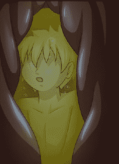

# [雙子盃] 縮小學園Ver 0 （0.1~0.5章）

作者：毒蛋白

TID：10461

<title>1</title> <link href="../Styles/Style.css" type="text/css" rel="stylesheet">

# 1

不管怎么艰难……初期文总算写完了，据说1L要用来做奇怪的事，那就拿去吧-w-
关于新文:
tips:
*第一章修复了一些bug，另外文风上也略作改动，看起来应该更正式一点，希望各位能再给蛋白一些建议，蛋白会努力提高自己带来更好的作品……
1:同人二次创作注意。
2：虽然很不想承认，本文是确实是坑……完成读50%左右，
3:蛋白的真正意义上的处女文，如果真的很渣，欢迎拍砖，不用客气（请无视这句话。）
4.第一章的GTS成分会相对比较少，只有20%左右，第二章有增多至50%。
5.感谢CG17大对图片的授权使用。祝愿新作品能一切顺利~
6.0.2章已经在19L正式完结~，感谢关注o(≧v≦)o~~
7.这次更新有点迂回的味道……而且黑化程度有点深（就是略重口）……先打个预防针，因为咱是以征服世界为目的的嘛，所以球治愈的同学去应援不知道君吧~
8.待续（）<title>2</title> <link href="../Styles/Style.css" type="text/css" rel="stylesheet">

# 2

【咕噜】……
对她来说只是一个简单的吞咽动作，而加藤却是一段相当于四倍身高的坠落过程，惊魂未定的他掉入了一个柔软密闭的空间，

热量从四周辐射过来，像是一个温柔乡，但要命的是他几乎不能呼吸，两个心跳声有规律地萦绕在耳边，像是在敲响临终前

的丧钟。若不是在这种非常时刻，这里会是他一生所愿的墓地……

【嗝……】

本能反应排出了胃里面本来就稀缺的空气，空间也被最大限度地压缩，此时的后藤已经完全被溺泡在胃酸中，他拼劲全力紧闭

着双眼，同时还用一只手捂住口鼻，任何一个轻率的呼吸动作都会吸入大量双叶彻底摧毁自己脆弱的呼吸道，四周柔软的胃壁

不停摩擦着他的身体，像是一种拥抱，一种世界上独一无二的欢迎方式，一种只属于食物的特权……他曾经无数次得想过将这里

作为人生的终点，他多想抛弃一切，在这个温柔乡最幸福地结束。可是不行，思维从来没有像现在这样清晰过，现在还不行，

还有更重要的事情……至少现在还活着，还有意思希望，一定还会有什么办法的……无数的想法不停充斥脑中却只有一个出路：活下去！

<ignore_js_op>

**1234567.jpg** *(13.74 KB, 下載次數: 0)*

[下載附件](forum.php?mod=attachment&aid=MjQ5OTF8NjU5MzQ3ZjZ8MTYwMDg5MTY4OHwxODIzMHwxMDQ2MQ%3D%3D&nothumb=yes)

2011-6-24 22:43 上傳

品味这胃中绝望的挣扎和执着，她慌乱地呼吸着……

她知道胃中的刺激将带来的剧痛。

“你已经是我的了，永远成为了我的东西~”

“来吧，燃尽你最后的生命，将你的肉体，你的灵魂，你的最后一滴血也全部奉献给我，尽情地弄疼我吧~”

————————————————————————————————————————————————————————————————————————————————————————————————————————————————————————————————————————————————————————————————————————————————————————————————————————————

ver 0.0

“毕业于东中，我的名字叫凉宫春日，对一般的人类没有任何兴趣，如果你们之中有外星人，未来人，异世界人，

超能力者在的话就请来找我！以上！”

一阵短暂的沸腾和惊叹声中，所有的焦点和目光都聚集在了教室的中心，一个真正意义上的美少女，

果然在美貌的支撑下什么都是萌点么……真是个全身都被光环笼罩的家伙……

“反正现在的人早就已经抛弃了‘会遇到外星人或者被邪恶组织绑架的幻想了吧“

如果是在初中二年级，这种‘我跟你们这群家伙不一样’的介绍能带来超高的人气呢，可是用在高中的学前介绍

真的没关系么……”

在一个靠窗的角落，后藤轻轻托着脸，右手旋转着手中的铅笔，一副漫不经心的样子，

“果然可爱就是正义么……真是个现实的世界啊……”

“下一位！”

“毕业于东中的后藤，请多关照。”这种简短的介绍，设定中就是打了3年酱油然后在毕业照中连名字都叫不出来的家伙。

“算了……没必要每个人都要成为焦点的，我的战场不在这里……”后藤自言自语着，铅笔逆时针地转回手心。

【叮……】

伴随下课铃声带来的喧闹，后藤默默地离开了教室。

“连打个招呼增进感情的人都没有呢……真是失败的开学啊。”

后藤摇了摇头，想抛弃脑中的想法，刚一跨出教学楼的大门，一团似乎埋伏了很久的绿色东西迅速扑从身后扑向后藤……

“后藤前辈~~~~~~~~~~~！”

后藤还没来得及转身，就感觉莫名的重量积累在自己的肩上，然后就是……颈部被咬住了！？

“抓住咯~~ 捕猎成功！酱紫今天的晚餐就到手啦~！”

因为咬住了后藤脖子，肩上的东西边说话边发出唔唔的声音，

“你在干什么啊！？绘里香！好痛！快住手哇！！”

后藤的手臂被少女的双腿缠住，上半身也被手紧紧地搂住，现在还真有被捕猎的感觉。

“不要~不然绘里香今晚会饿肚子的~除非前辈请我吃顿大餐~”

绘里香像一只紧紧叼住猎物的小猫，从嘴唇的缝隙发出那种支支吾吾的声音，就像喊着一个饭团。说话的时候，

虎牙在皮肤上的摩擦也刺激了更明显的痛觉。

“我知道啦我知道啦……快住手啊！馋死了！都滴到我的背后了啦！”

少女似乎感觉到自己的失态，下意识地吸了一下，又用手臂轻轻埋住自己泛红的脸，极力想掩饰自

己的窘境，索性……重重地咬了下去！

“啊！！！！~~~~~~~~~~~~~~•”

后藤惨叫声吓跑了几乎所有在地上觅食的小鸟……

“痛痛痛痛痛……绘里香你上辈子是母老虎么……”

后藤看着与自己并行的绘里香轻轻摸着自己的后颈，两排整齐的牙印边缘被虎牙深深地刻进两个坑，

而且，后藤肯定中间一定有一块紫色的吻痕！

“嗯……真是便宜你了呢~怎么算都是前辈你比较好吃一点吧~算了~前辈今晚要请我吃牛排大餐！”

“真是食肉动物啊……话说你这种怎么吃都不会发胖的体质好厉害啊~”

“前辈也好厉害呢，居然考上失倍学园了呢~绘里香也会努力赶上前辈你的，到时候前辈你会成为绘里香的猎物喔~各种意义上~”

绘里香的握成一个小拳头轻轻撑着自己的下巴得意的舔着自己可爱的小虎牙。

“啊啊……那你可得自己多努力才行啊……，可别抱着吃了别人夺取智商的幼稚想法啊！”

“前辈您真是聪敏呢！这么方便的方法也想得到！快！把你的知识叫出来吧~”

“救命啊~吃人啦！！~~”

“快住口！！乖乖变成我的一部分吧！！”

后藤和绘里香打打闹闹地进了一家西餐厅，地祭足了她的五脏庙……

____________

夜晚的校园格外宁静，开学已是初秋时分，早就没了让人心烦的蝉鸣蛙叫，满月的月光下的校园显得朦胧。

“这样才是迎接我真正生活的正确场景嘛~”

后藤独自漫步在学园广场前，享受着秋夜的舒适，有种莫民奇妙的幸福感。

学园先进科学研究社，简称先科社，是一个以研究尖端科技为组织的校园社团，对外称是校园社团，

其实本身的意义与组织的严密性远远超过了“学生社团”本身的定义。这里就是后藤真正的【战场】，

虽然不是灵魂人物，但也是先科社核心的研究员，能够自由地研究自己感兴趣的科研项目是任何一个钻研着的梦想。

“我回来啦！”

后藤推开了教学楼的大门，像进自己的家一样大喊了一声，然后轻快地走向图书馆。走廊上，

社团部的一个房间引起了他的注意，这么晚了学校里应该没人才是啊。

【zoz】社团！？

好奇心让后藤回去前决定去小探一下。他偷偷摸摸地躲在门的一边，探出一只眼睛，俨然一副偷窥者得模样。

貌似有两个少女在争论什么？而且，其中一个不是只关心外星人的凉宫同学吗~？好想很有趣的样子~

“拜托了……能让我加入贵社吗~我对团长您很倾慕呢~”

一个蓝色双马尾的少女先说话了。

“你是外星人吗?”

“不……不是……”

“那是未来人？”

“也不是……”

“那就是魔少女咯？”

“……”

少女已经无法再往下低的头轻轻摇了一下……

“那你来找我干嘛~？”

“看来这位团长大人在说的外星人，未来人什么的完全是认真的呢~现在居然还有这么天然的家伙存在”后藤心里暗暗的发笑……

“我……我的歌唱的很好听！在同学中也小有人气！我觉得我能给社团应援！”

蓝发少女的右手按在胸前，似乎对自己的才能很有自信的样子。

“哦？那你叫什么名字？”

团长的坐在电脑桌前，下巴轻轻地放在交叉的双手上饶有兴致的看着面前的应聘者。

“我叫米库，一年A班！”

少女的希望被点燃了一般自信地答道。仔细一看，眼前这只米库还真是美呢，在雪白光晕笼罩下的脸蛋闪现这分红的害羞色彩。

“太美了……”就连躲在门后的后藤也开始想入非非。

“那么……米库，引荐你去音乐部吧~”

“欸？？可……可是……”团长出乎意料的回答让米库慌乱起来。

“虽然你可能有过人的天赋，可惜除此之外再无特别，就不用继续浪费时间了，寻找外来生物课时繁忙的工作呢。”

“既然如此……知……知道了……打扰了……”，

米库抿着住嘴唇，似乎在强忍着眼眶中的泪水，轻轻地向团长鞠了一个躬后转身离开了，

后藤也赶紧贴着墙壁，尾行就是尾行……被发现了以后无论怎么解释都身败名裂了……

但是就像被强烈的引力吸引住一般，后藤还是依依不舍的跟了上去。

  到了楼梯的转角处，突然出现的人脸还是吓了后藤一大跳，米库藏在转角处似乎早就知道自己被跟踪。

“哈……哈哈……哈……你好啊……”后藤极力掩饰着内心的尴尬。

“请问跟着我有什么事吗？”

…………这么近距离的看更美了啊！！而且声音也……

后藤感到心跳速度已经接近了极限，血液以极快的速度在自己的身体里面流动着。

“少女哟！让我来改变你的命运吧！”紧急状态下，后藤也不知道为何挤出了这么一【酷毙】的话。

“……”

一阵令人心痛的寂静，空气中到处凝聚这名为“尴尬的有毒物质……连呼吸都变得痛苦起来。

“啊……不是的……我是说……额……我能让你看些有趣的东西，要到我们社团来参观一下吗？”后藤极力打着圆场，

似乎很想得到这样一位可爱的社员。

“有趣的社团么……到何种程度呢？”

听到米库的回话，他安心的呼出了肺部那口憋了半分钟的有毒气体，至少，现在不会被认为是尾行，而且有商量的余地。

“那种绝对会让你吓一跳的喔！”后藤自信地拉了一下衣领。

“请务必带我去看一下……额……还不知道怎么称呼？”

“一年z班的后藤！请跟我来吧~”带着狂喜的心情，后藤简单的自我介绍了一下。

————————————————————————————

轰……后藤推开了图书馆的一个书架，一个入口出现在两人面前，接着就是一条蜿蜒曲折的通道。

密道，机关，暗室，这种神秘的设定足以抓住一个好奇者的心，后藤自信的在前面带着路，

米库的脚步很轻，紧握的双手放在胸前，紧张地四处观望着，像一只刚刚到新环境里的小猫。

“到了”后藤在一个很大的十字架面前停下了脚步，然后在少女疑惑的目光前掏出一个小的金色十字架嵌入面前的小孔内。

接着就是一阵机关打开的声……！

“欢迎来到先进科学研究部！在这里你可以相信自己的亲眼所见，而且不论你看到什么，都不用惊讶。”

伴随着大门的渐渐开启，后藤骄傲的说道。

_________

“嘿！这泥马又怎么啦！?”

“不知道，机器温度异常，它可能太热了！！”

“后藤那个混蛋，丢下一堆问题现在还没回来”

失去了大门的隔音，一阵激烈的吵闹声就从门缝里面急切地冲出来。

“别害怕~他们都这样，没有恶意的！”后藤微笑着转身安抚了一下身后不知所措的少女。

“喂喂喂，怎么啦？我才不在这么一会儿就出问题啦？啊啦？这不是我正在开发的缩小机么？”

“你终于回来啦！看看你的破烂玩意！我们用它做实验的时候一名研究员被缩小了！现在它却给我出故障！？”

一个光头从机器底下露出头来对着后藤大声嚷嚷起来。

“别急啊！精密仪器都是禁不起折腾的啊……慢慢调试就没问题了，别把我骄傲的发明当成60年代的黑白电视啊！。”

“那就赶紧 过来把你的宝贝给我弄好！”

看着这片和谐基情的场面，米库站在门口捂着嘴调皮地笑了起来。

一直大喊大叫的人名叫普里昂，因为身材高大又打的一手好球，又被人称作奥胖。

他是社团里面的第一网络宅，他编写的网络蛊毒带来的非法收益帮助社团解决了几乎所有的财政问题，

似乎只要他想要，没有任何入侵不了的系统。

“啊……对了，打扰一下。”后藤迅速走向门口的米库。

“嗯？”

“我们有个成员被缩小了……具体原因等一下再跟你讲吧，你能帮我照看下他吗？

还有，被缩小了很容易受伤的，要好好照顾他喔~”

“嗯~交给我吧！”惊异的表情在脸上一扫而过，但还是快微笑地接过小人，【在这里任何事情都不用惊讶……的么……】

“后藤！！别泡妞了！！快给我滚过来！！现在！！”不远处又传来普里昂的咆哮。

“你就和他先去那边的休息室休息一下吧。我马上就好……”

说完后藤立刻跑向了自己心爱的科研成果……

——————————————————————————

米库找了一张椅子坐了下来，双手托着小人仔细的观详着……在小人眼中，这是怎样的美景啊……

精致的五官就算单独看上去也无比的完美，大大的碧绿色眼睛似乎也在盯着自己看，

盯着瞳孔中的自己，小人不尽感叹世上还有如此清澈眼神。若不是被缩小，恐怕一生都没机会如此仔细地观察这张可爱的脸。

柔软湿润的嘴唇的嘴唇不时地抿合，

实在让产生人无尽联想……如果可以，真希望能被这样的双唇吻一次，哪怕以现在的身形，

哪怕结局是落入后面的深渊，他也愿意吧自己的一切献给她。此时的小人感觉到自己被均匀呼吸带来的暖流包围

……无比幸福，真想永远这样下去……小人正经地坐在米库手中，整个人都已经热血沸腾到巅峰，

感觉自己就像一块被捧在手中的巧克力，慢慢被体温融化，随时准备被吃掉……

   不知道是自己的手在发热还是小人的体温，米库觉得自己的手掌慢慢开始发热，她越来越觉得眼前的小人很可爱，

不用辨别五官，不用辨别身形，就像一只小小的宠物，好可爱~好想拿到脸上蹭一蹭，可是不行，

他毕竟是一个正常的人类，只是被不小心缩小了，不可以对他做过分的事……小人正正的坐在自己掌心上，

是害怕巨大的自己吗？他会盯着自己看吗？少女对掌中的小人也是充满了好奇。慢慢地，就想得出了神……

  “咦~喜欢可爱的小人么~”

  虽然是温柔的声音，可是突然出现在自己身后还是将米库吓了一大跳……而掌中的小人也不知道掉到哪去了……

“啊……这下糟糕啦！必须要赶快找到才行！！”米库慌乱地从椅子上起来，四处找着小人的下落。

  “要找小人的话……在你的脚下喔~”虽然背后的声音很温和，但是米库还是感觉自己的后背一阵阴冷。

她慢慢地挪开自己的脚，同时在祈祷着，为小人，也为自己，

“求你了……求你了，不要……千万不要……”

可是脚下的红色斑点还是无情的打破她的最后一丝希望。她倒吸一口凉气，感觉胃里面一阵翻腾，

然后用手重重地捂住自己的口鼻，她的思维陷入一片混乱然后开始抽泣起来……

“杀人了……自己杀人了……刚才还是活生生的一条生命，现在已经…”

背后的人看着狼狈不堪的米库露出了浅浅的微笑，然后走到米库面前，用手轻轻托起米库的头。

“明明很可爱的脸蛋嘛，一哭起来变丑了很多喔~”

这时米库才看清眼前的人，一位比自己成熟的女性，眼镜下的双瞳似乎深不可测，棕色的秀发披在肩上。

意见研究员的白色大褂披在身上给人的感觉很随意，浅浅的微笑给了米库很大的慰藉。

“可是……可是……他……我……”米库的思维依旧一片混乱，都没心情去管红肿的眼睛和满脸泪痕。

“你没有杀人喔，好孩子~他只是因为自己的疏忽把自己缩小了，如此弱小的生命，谁也保证不了他的安全~”

她的声音平静，充满温柔，这让米库的思想清晰了不少。

“可是……确实是因为我他才……”米库在哽咽中拼命理清自己的思路。

“都说了，是他自己太弱小了~不是你的错~难道他自己的身体受不了皮肤上的防御组织……

或是他自己原本就是想寻死也是你的错么？不要把所有责任都揽在自己身上，如果弱小是你的错，

那么这世上强者的存在还有什么意义”

“是……这样么……”米库的抽噎已经慢慢减轻。

“是的，缩小变弱了，就是他自己的责任，我们没必要为他们的愚蠢行为负责，你平静的表情很美嘛。来吧~站起来，

告诉我你叫什么名字。”她边说边用长长的衣袖帮米库擦去脸上的泪痕。

“米库……”

“唔……好名字，我叫瑟琳娜，是这里的……”

“啊~终于修好啦~天天，你小子跟美女呆了这么久很爽吧？不会是不想变回来了吧？”这时后藤满脸微笑地冲了进来。

听到后藤的声音，木哭下意识地往后退了一步，下垂的双手不停地互相搓着，就像一个做错事情的小孩。

“唔！？社长大人！您怎么有空……”后藤似乎没有注意到旁边的米库，倒是后藤的话也让米库吃了一惊。

“哟后藤，你帮我们带回来一只美女会员，我怎么能不来看看呢~”瑟琳娜坐到椅子上用手撑着头，这让后藤有一种被俯视的感觉。

“啊……还没有……她不是……”、

“现在已经是了~嗯？米库？”她转身看了一眼呆在自己身后的米库。

“啊……嗯……”

虽然后藤一直觉得有种淡淡的不协调感，但他还是没有深究。

“有萌系会员当然是件好事，不过比起这个……缩小机已经修好了，我想我们还是先把天天复原比较好？

毕竟这么小的身体，还是很危险的。”

“哦……你说他啊，已经死掉了。”社长语气平静得让人觉得死的只是一只小白鼠。

“啊！？”后藤感觉有些眩晕，现在他终于发现那个不协调感是什么了。

“那个家伙色色的，在米库手上爬来爬去，调皮到不行，结果自己掉在地上摔死了呢。”

社长这种满不在乎的语气使得后藤满身不自在。

“开什么玩笑！？就这种原因？一条人命？”后藤严厉的质问着。

“这种原因？他自己没有意识到自己的弱小，干了些让人头疼的事，你打算让我负责吗？他自己冒犯了别人，

还要我全力拯救他的性命？”

“……”后藤无言以对了，其实他刚开始就处于理亏的地位，只是在用人命来支撑自己。

“比起这个，后藤，我有更重要的事情要你去做。”

“什么事……说吧。”后藤还是无法摆脱苦闷情绪。

“北方有个城市，不久就会发生大地震，我觉得，你应该不会放弃能拯救别人的机会，对嘛？”

后藤很讨厌这种似乎能看透自己一切语气。但却又无可奈何。

“那你到底想要我怎么样？”

“我想把城市缩小，然后带回来，帮他们免除一场灾难。”社长微笑着坐直了身子。

“！？怎么能？我的缩小机还在调试中……”

“你还有1天时间可以进行最后的调试，想想吧，你能拯救一座小城全部的生命！普里昂已经帮我们搞到一台卫星，

所有的放大装置已经准备完成，计算也精准无误，可别忘了，这里可不止你一个天才~”

自己的发明能得到肯定是任何一个发明家梦寐以求的，可是……第一次就关系到这么多的人命吗……？

“只有一天吗？能不能让我考虑一下？”后藤不想放弃自己的作品，但也不想让这么多人为他可能的失败陪葬……

“没时间可以浪费了，难道说你对自己的发明没信心么？嗯？”社长单手撑着自己的下颚，这种傲慢的态度让后藤无比厌恶，但是……

“好，我答应你！我现在立刻就去准备。”

“这样才对嘛~天才就要对自己有点自信，啊~对了~米库就暂时跟在我身边吧~我需要教她一些东西。”

“希望1天后你能教完你想教的……”后藤迅速走出了房间，连门都没有关上。

“真是急躁的少年呢~来吧米库，我给你看点更有趣的事情~”社长微笑着牵起米库的手……

（下接19L）

[ *本帖最後由 毒蛋白 於 2011-6-27 22:50 編輯* ]<title>3</title> <link href="../Styles/Style.css" type="text/css" rel="stylesheet">

# 3

喂喂……排版可是辛苦的工作啊……
……楼上诸位太心急啦~~
感谢支持~<title>4</title> <link href="../Styles/Style.css" type="text/css" rel="stylesheet">

# 4

前传无误l啦……
啊……貌似出了点bug……
修正中<title>5</title> <link href="../Styles/Style.css" type="text/css" rel="stylesheet">

# 5

额……这段乱码忘记发的是什么了。。。。
wt桑……
这可不是咱的前传啊。。。

[ *本帖最後由 毒蛋白 於 2011-6-25 11:46 編輯* ]<title>6</title> <link href="../Styles/Style.css" type="text/css" rel="stylesheet">

# 6

看来副部的人气很高呢~
其实不只副部，
还会有很多熟悉的角色登场喔~
另外如果有什么建议的话还请多多指教

[ *本帖最後由 毒蛋白 於 2011-6-25 11:45 編輯* ]<title>7</title> <link href="../Styles/Style.css" type="text/css" rel="stylesheet">

# 7

缩小装置不就是用来征服世界的么wwww<title>8</title> <link href="../Styles/Style.css" type="text/css" rel="stylesheet">

# 8

北方宁静的小城h市是一个慢节奏的中型城市，从农场到重工厂，从制造业到医疗机构再加上丰富的娱乐产业，

这里的产业链完整到难以置信的程度，城市中心的湖泊无私地为这里调节这四季的气候，

其稳定性和舒适性使得h市的市民很容易得到满足，从市民心底产生的【家乡宝】思想让他们不太愿意与周边进行交流，

所有的一切都能自给自足，

人人都能安居乐业，这不就是所谓的社会主义的最高目标？于是，h市变成了一座世外桃源般得城市，

而这里的居民，也是这样自居的。

——————
秋天爽朗的夜空下，h市显得格外惬意，稍稍加上一件外衣就能在夜间的街道上吹着爽朗的夜风享受丰富的夜生活。

街边的出租车在行人面前故意放慢速度，知道确定没有乘坐的意图后才加速扬长而去……

出租车经过的地方，是一个清闲的警局大门。

“出去！我们没空听你的梦话！”

伴随着一阵喝骂声，一个少年被推出了警局，被打乱的步子让他不相信省略了门口的三级楼梯，

重重地摔在了地上……他咬住嘴唇，忍住刚才疼痛。然后努力调整着自己的呼吸！

“是真的！请相信我！这本笔记，它不是我们世界的东西，它可能是从数码世界来的！”少年不服气地对着警局大喊着。

“洗洗睡吧！少年，有这种想象力乖乖回家写本小说或许能大赚一笔呢！”

伴随这一阵嘲笑，少年慢慢的爬了起来，他已经不想再跟这些迂腐的混蛋争论，拍去身上的灰尘，

小心地把一本黑色封面的小册子塞进随身携带的单肩挎包里后默默地离开了警局……

“我回来啦……”

少年的语气似乎非常沮丧，把鞋子随便踢掉就进屋了……

“啊啦~小秦~你回来啦~今天怎么了？遇到不开心的事了吗？”

“不，没有，在路上摔了一跤而已。”

这个名叫小秦的少年随意搪塞过母亲的话就进了自己的房间并顺手反锁了起来，然后无力地倒在床上。

他拿出包里的小册子，仔细回想着哪里出了问题。首先是今天放学时候捡到这本奇怪的笔记本。

【名字被写在笔记上的人就会死……】

小秦用手摸着封面内侧的这行字，说实话，这字写的蛮丑的……换做是谁捡到都会觉得这是某个脑残少年的恶作剧。

说不定捡到的时候，在某个看不到的地方被别人用手机拍下自己的丑态呢……

可问题如果真的这么简单就好了……今天上课的时候，虽然是半开玩笑的……小秦写上了自己老师的名字，

没过多久，老师就死了……死因和自己写在笔记上的一摸一样——在讲自己的英勇事迹时被自己的口水呛死。

虽然有够滑稽的，可是自己的老师确确实实是这么死了。小秦惊慌失措的跑到警察局去报了案。可是不知道为什么，

写上电视上正在报道的犯人确没有一点反应，然后就是自己被当成疯子一样被赶了出来……

“到底是怎么回事……”

小秦不停嘟囔着，其实这已经是今天第无数次问自己了。难道老师的事情，只是巧合而已么？

或许自己今天所有的丑态已经被人拍下来，没多久就会在弹幕视频网站上传开成为各种吐槽的对象。

不……不是的，愚蠢的明明是其他人，那些不相信小秦的人，狂妄自大，蒙蔽自己的愚昧中还洋洋得意。

“或许……你们会因此付出点代价~”小秦缓缓地从床上坐起来，脸上露出了修罗般得微笑。

——————

   清晨的小秦起的很早，准确的说他完全就没睡着过。他一整晚都在极度兴奋中度过。

小秦翘掉了今天的课，对他来说，今天上不上课已经玩全无所谓了，他爬上了城市边缘的一座高塔，

还有15分钟……还有15分钟就能见证昨天奋斗一夜的成果，或许这一切都只是他一厢情愿而已，

或许今天什么都不会发生而自己会被当成天底下最脑残的傻瓜，但是，这绝对有期待的理由……就快了，

还有不到10分钟……就能知道到底谁才是⑨。小秦的心跳一直在加速中，想到接下来可能发生的事他就兴奋的不能自己。

快了……就快了……小秦就这样在极度的兴奋和焦虑中度过了人生中最难熬的10分钟。

   “哈~~~来了！！！”极度的兴奋让小秦发出了奇怪的声音。

因为这时候在城市的另一边，出现了一名身穿哥特装巨大的少女！不，准确说是一个巨大女仆！那本笔记！是真的！！

少女开始移动了，她蹑手蹑脚，像小猫一样轻轻踮着脚尖在城市中走着，似乎不舍得破坏周围的城市，

但是巨大的哥特蕾丝裙还是不时地挂到几个电杆，她好奇地观察着周围的环境，手指轻轻按着自己的下唇，

像是一个正在橱窗前挑选糖果的小女孩，不停眨着可爱的大眼睛，她也觉得置身在这种环境下也是个很奇妙的事吧~。

   而地面上的小人可就遭殃了……看到这种巨大的少女，就算外表很可爱，但也是及其致命的，

只要靠近，随时都会有生命危险，被她那双巨大的皮鞋踩到的话……绝对是连尸体都找不到的惨烈死法。

  街上的小人疯狂的逃离着，每个人都想离这个庞然大物远远的，而少女似乎并不太在乎小人的感受。

她选择一个略微空旷的地方蹲了下来，毫不介意裙底会露出的风光~或许，她觉得小人不应该当做人来看待吧，

她出神地看着一排瓦做屋顶的房子，【太精致了】，她不禁发出一声感叹，巨大的声音传递的很远，

清晰干净的少女嗓音，那种光听到声音就能弹动心弦的声音。

     她缓缓地伸出手指，想尝试一下小屋的触感，确在碰到前缩了回来，

附近的小人在看到巨大整齐的指纹向自己靠近的时候都吓得四处逃窜，她的左手紧紧的握住刚才伸出去的右手手指，

尽力克制着自己内心的冲动，可是顽皮的好奇心还是明显占了上风，

【反正一幢的话……应该无所谓吧~只摸一幢喔~】，她似乎在进行无耻的自我催眠。清脆的声音自然传到小人耳中，

可是他们对此确毫无办法。女仆微微颤抖的食指慢慢伸向一幢粉色装饰的小房，左手紧紧按在胸前，

想安抚那只心中早已乱跳的小鹿。【轰】碰到屋顶的瞬间，屋顶塌了下去，女仆的手像是被针刺到一样缩了回去，

和左手一起捂在胸前，实在太不可思议了！！居然能精致到这种程度，这是的少女已经完全被好奇和惊讶占据，

两只手同时伸向旁边的小房子，被碰到的小房子在巨大的压力下纷纷坍塌，而少女则开心的笑了起来~

【这一切，实在太有趣了~】。

  等她反应过来的时候，面前本来整齐的建筑群已经几乎变成了一片废墟。

“对不起了~”巨大悦耳的声音再次传来，少女轻轻咬住自己的舌尖，一副做错事的样子轻轻敲了一下头，

这是对严父必杀的招数啊，看着这么可爱的女儿做错事，会有人舍得责备她么？

  巨大的女仆站了起来，轻轻拍去了裙子上的灰尘，来到了一座学校旁。

  “大怪兽来啦！！快跑哇！！嗷~~~!!”少女调皮地惊吓着周围的小人，看着地上密密麻麻的小人四处乱窜，

少女的心理燃起阵阵快感，这种场面何等熟悉，年幼时，用水去灌蚂蚁窝的场景，跳到四处乱窜的蚂蚁群中一阵乱踩，

让这些可怜的小生命丧生在自己脚下的场景，这一切都是多么熟悉。只不过，小人似乎比蚂蚁聪明那么点，

而且长得也更可爱一些，少女的皮鞋落在小人面前的时候，他们就会机体往反方向跑，她又提起另一只脚，

挡住小人的另一跳逃跑道路，小人又往另外一个方向逃走，实在是很有趣！玩了几个来回。女仆也没再刁难这些小人，

随意地让他们四散逃去，她的破坏欲，一切都要发泄在这个该死的建筑上！

   “去死吧！”

   少女将手掌竖起狠狠地劈向教学楼，整个楼层就像木板一样在扬起的灰尘中陷了进去，接着重重地向教学楼踢了一脚，

又是一阵灰尘扬起，失去了底部支撑的教学楼轰然倒塌，灰尘和瓦砾从边缘落到她的鞋内，

还有几个没来得及从教学楼逃脱的倒霉蛋……他们有的跟着碎片掉到了少女鞋子里面，有几个被踩死后黏在皮鞋的纹路上，

经过无数次的踩踏永远的成为了少女脚下的一块污渍……

“去死吧！去死吧！去死吧！~~”一边欢快的笑着一边全力踢打着教学楼……

“精彩！！太精彩啦！！”

小秦由于过于兴奋，大声地怪叫，手舞足蹈起来。每个人都目瞪口呆地盯着活跃在城市里面的巨大少女，

这种场面如果出现在电影中的话，除了一些有着奇怪癖好的人，大多数都会对之嗤之以鼻，可是现在，

这里出现的，是谁都没有见过的奇观。人人们只能眼睁睁地看着自己盲信半生，

后世也将其奉为至理的“常识”在眼前这个巨大的少女脚下被踩踏得粉碎。

“蠢货们！看见了吗？直到昨天，你们都还生活在愚昧中呢！不甘心吧？后悔了吧？

你们这群家伙就从没试着想过，在常识范围外还存在这么有趣，这么光怪陆离的世界在等待着你们，从来没有！

我？我当然知道，我不止想过，我不还认真的在期待着，我还在努力寻找着，所以我才每天生活在你们不屑的数码世界里面！

现在我已经得到了！我得到了能主宰一切的东西。你们！就继续怀抱着这些没用的常识活下去吧。”

小秦满意地爬下高塔，几乎是跳着回家的。

“讨厌……鞋子里面进了很多沙子呢……”居然的女仆满脸通红地坐在校园的广场上，

气喘吁吁地脱下了自己的皮鞋抖出里面的瓦砾，空气中弥漫这汗水和皮革混合后的特殊味道。

她没有注意到自己短裙和胖次上黏上了红红的污渍。

“真是有趣的玩具呢，先科社的人好厉害！居然能制造出这种东西。

”少女边将鞋子套回到自己的脚上边窃喜着……

“行了~”少女站起来轻快地跳了几下，排出了鞋内的不适感，她满意地离开了……只留下一堆废墟和一阵浓郁的气味。

——————
ver0.25(6.27更新)
回家后小秦一直把自己关在房间里，激动的心情久久不能平静，今天发生的事让他狠狠的出了一口恶气，

他捂着自己因为狂笑过度而蹦坏的腹肌摇摇晃晃地走到书桌前，点击起网上的各种报道，城市的网站已经被挤爆了，

而且居然还有专家出来做出各种解释和辟谣。

“哈哈哈哈……一脸专业的解释着连自己都一头雾水的事情，这种样子还真是可笑呢……”

“呜……！？”

腹肌蹦坏带来的疼痛让小秦不得不收敛一点，他耐心地点开受害者的名单和自己写在笔记上密密麻麻的名字对应起来，

“a菌，被巨大少女踩死。佑守，被卡在鞋底的纹路中痛苦的死去。雾枝君，被坐下的巨大少女压死…………”

所有的一切都一一兑现，小秦的脸上浮现出微笑，这种能将一切掌控在自己手中的感觉，实在是太美妙了。

“没有其他的牺牲者!?  呜……”

反复对校几遍后，小秦惊讶的站起来，可是蹦坏的腹肌又逼迫他慢慢地坐回椅子上。似乎这个笔记不会卷入其他的死者，

也就是说……在笔记生效的期间，不会再有人会因为笔记带来的破坏而死去！这让小秦乐到了极点，能给人们一些教训。

又不会伤害到其他人，这几乎消除了小秦原来所有的负罪感。

“等等，还是不对！？少了一个”自言自语过后，小秦开始不停翻翻着手边的笔记，或许是哪里漏掉了也说不定。

反复查阅后，小秦确定蛋蛋还没死。可是为什么偏偏是他？那个整天欺负自己的家伙，为什么偏偏是你活了下来?

难道笔记不是对所有人都有效的吗？小秦的拳头重重地锤在桌上，因为愤怒几乎忘记了腹部带来的疼痛。

“不对……是我搞错了。”

小秦自言自用手慢慢揉着自己酸痛的腹肌开始整理自己的思路。其实蛋蛋只是自己叫的外号而已，而他的真名……

“这样一切就说得通了。”小秦再次露出修罗般得奸邪微笑。

其实笔记是真的，也没有人能对笔记免疫。之所以有人能摆脱是因为笔记只能对写上去的真名生效。

那天在警局的失误应该也是因为电视台报错了名字导致的，那么这样一来，一切都合理了，小秦打算尝试一下，

希望能验证今天推理的正确性。【毒蛋白，6月 26日 被巨大的少女吞掉，活活地被消化。】

“这样就没问题了~”小秦微笑着合上了笔记本。

————

次日晚上，小秦满足地将笔记抱在胸前，就像抱着一件至宝。没错，一切都如他所料，

他看着蛋白惨叫着被扔进少女口中的时候，全身的血脉都喷张了，如此精彩的场面，真想用dv拍摄下来一辈子珍藏。

没有人能抵抗笔记的力量，而且虽然倒了几座房子，但没有除蛋白外的任何人丧命。这真是好用的东西啊……就算过了两天，

小秦的心脏还在超过正常的速率运作着，怀中还紧紧抱着那本黑色的笔记，或许是因为两天失眠和极度兴奋带来的疲劳，

小秦感到意识开始模糊，很快就进入了熟睡状态……

梦中的小秦也兴奋异常，他利用笔记再次召唤出了巨大的女仆，他们一见钟情，小秦坐在少女的肩上和她一起俯视小镇，

她们一起看海，一起看日出，浪漫地度过着剩下的生活。少女怜惜地捧着小秦，柔软的嘴唇亲吻着他的全身，

小秦整个身体都包围在湿热的温柔乡中，这份轻柔，这份爱意，几乎让小秦融化。于是，

这个年纪的小秦在梦中人生第一次喷发了……从此，小秦坐在女巨人的肩膀上环游世界，再也不被凡尘所困……

“轰……轰……”女巨人的行走让地面发出一阵阵晃动，

“轰……”梦中的景象慢慢崩溃，小秦模糊的视线中，自己熟悉的房间渐渐清晰起来。原来自己没有被巨大的嘴唇包裹……

只是紧紧地裹在已经浸湿的被子里面，怀中还抱着有点微湿的笔记。下体湿湿的感觉让他回想起昨晚从未有过的快感。

此时的小秦嘴角不停起伏，脸上挂满了幸福的表情。

“轰！？”又是一阵晃动，小秦的思维清醒了很多，这不是幻觉，而且也不是梦！难道是地震了吗？

小秦迅速从床上爬起来，这才发现昨晚连衣服都没脱就睡着了。

“轰！”伴随 着巨响，房间又开始晃动起来。这不对经！小秦慌乱地拉开窗帘，

如果是地震的话也可以顺便从二楼跳下去跑到空旷的地方。

“唰！”拉开窗帘的时候，窗外的景象让小秦的下巴都快贴到地面上了……两个巨大的少女。在城市中走来走去，

而且今天毫不顾忌，肆意地踩踏这城市里面的房子，甚至还不时推倒一两幢高楼。

“这到底是怎么回事？”小秦惊慌失措摊开怀里的笔记看了起来，自己昨晚没有在上面写过任何东西啊！？

为什么？为什么会有巨大的少女出现？小秦的思维乱作一团，不管翻了几次，上面都内容都显示自己什么都没做，

哪怕是昨晚梦游了这种微弱的可能性也被考虑在内。小秦摇了摇头，努力整理自己的思路，到底是哪里出现了问题？

难道是因为浸了水笔记坏掉了吗？小秦努力思考着可能的一万种原因。

“轰……”又一阵剧烈的震动打断了小秦的思维，小秦再次往窗外看去，在市中心被高楼包围的女仆只能看见半个身体，

但是小秦可以肯定今天与前两次都不相同，虽然其中一个就是前两次出现的少女，但是这次，明显多了几分暴力并且充满破坏欲。

小秦还在努力思考着，到底……到底问题出在哪里了？如果笔记是真的，那么少女应该不会出现才是？

难道除了自己还有其他人拥有吗？小秦感觉自己的思维正在以以前从来没有过的速度运转着。

“不行，我得搞清楚。”小秦自言自语着……他匆匆忙忙地出了家门，这里视野不够宽广，他决定去昨天的高塔上一看究竟。

“天呐……这是怎样一种场景啊……”刚刚爬上高塔的小秦已经完全被眼前的景象镇住了。城市的片角落已经完全沦为废墟，

从那里到现在少女站的市中心有一条明显被破坏的痕迹……一条长长的，像是躺下翻滚造成的痕迹。而少女站在市中心，

肆意地拍打着政府建筑，丝毫不顾及脚下人的死活，其实说是故意的踩踏会更贴切一点……

“怎么样~福利酱。

咱就说过有好东西吧~”先前出现过的少女说话了，脸上带着与现在场面极不相称的可爱微笑。

“真的呢~在城中行走的时候都能听到小人的喊叫声，实在是太真实了~你到底是从哪里弄到这种好东西的啊？

”那个名叫福利酱的少女一身绿色装束，光着的双脚互相蹭了蹭，小秦甚至都能想到今天有多少人葬送在那双可爱的小脚丫上。

“是先科社的社长送给我的啦~说是他们的最新研究成果，还说为了研究小人和城市他们付出了很多努力，

不想让别人在发布前知道他们的存在，最后还交代我不管在哪里如果看到有逃跑的小人就当做虫子消灭掉~”

少女双手插在胸前，喋喋不休地介绍着。

“嘛~这也是能够理解的口牙~毕竟做的这么真实，如果被外面知道会引起轰动的吧~而本小姐我~~现在就是这里的神喔！”

福利酱轻快地回应着，随手用中指弹飞了一小座高楼顶上的铁塔。

“呵~没想到你还这么会玩呐~”女仆调侃着。

“其实呢，神是可以对自己的子民做任何事得喔~而且，他们也必须学会尊敬自己的神明才行~或许~

我们可以要求这些给我们盖一座神社？嗯~？他们会听懂么？”说着，福利酱用脚踢飞了一座体育馆的屋顶。

“哈~原来都躲在这里呢~”此时挂在少女脸上的笑容，是绝对会让人背脊发凉的笑。

“那么~诸君~今天就是天启日了喔！请诸位铭记冒犯你们的神明会遭到什么样的下场！”

说完，福利酱打着赤脚跳进体育馆无情地踩踏起来，脸上挂着欢快的笑容，就像童年时撬开一个蚂蚁窝时的表情。

拥挤的体育馆里面根本无法散开，几乎没有逃跑的路，小人们只得在巨大的脚丫之间毫无目的的乱串，

混乱无疑增加了死亡的概率，许多人还没等巨大的脚掌落下就惨死在自己的同类脚下，伴随着巨大的哀号声，

小人被踩成肉泥，血液迅速被碎瓦砾和泥土的粉末吸收，泥土和鲜血黏在脚部细嫩的皮肤上，呈现出一种紫黑色。

太惨了……小秦跪在高塔的空地上，这一切难道不应该是一场噩梦吗……双手捂住嘴拼命地吞下不停回流的胃酸，

如果今天早上吃过早饭，现在应该全部倒出来了吧……小秦以前看过葡萄酒厂把葡萄踩成葡萄酱的少女，

他曾经想过自己如果可以变成葡萄的其中一员将会是件非常幸福的事。可是今天，那幅美好的画面变成了惨无人道的大屠杀，

惨叫和哀号从很远的地方穿过来，小秦的精神几乎被击垮了。

“啊……脚上好粘……”福利酱可爱的脸上眉头微微皱起，低声抱怨着。

“那是因为你玩的太过火啦！真是的……一点都不会爱惜东西，你以后还想不想再来啊？这样下去，

不出几次整个城市都会被你玩坏的！”女仆似乎也很不满地抱怨着。

“对不起嘛~人家只是太兴奋了一时没抑制住而已啦，呐~就原谅我这一次吧？好嘛？求你啦~”

福利酱双手和在一起放在额头前，一副诚心道歉的样子，却还是偷偷睁开一只眼睛偷瞄着对方的表情。

“真拿你没办法……这次就算了……不过下次再来玩要过一阵了……（毕竟得等着小城重新建设起来啊~”

女仆突然用手背遮住嘴，轻声对旁边的少女说，像是怕被别人听到一样。

“喔喔~我就知道你最好啦~“福利酱开心地抱住女仆”话说回来，被破坏的城市居然还能被小人重建，真是太逼真了，

简直可以用完美来形容~”

“接下来~”福利酱一脸坏笑地跑到城市中心，双脚一起跳进只能够淹到脚裸的湖里，清澈的湖水瞬间变成暗红色……

“不行……必须做点什么”远处的小秦摇摇晃晃地站了起来，现在，至少还有笔记，或许能够用笔记杀死那个叫福利酱的少女，

已经知道真名了，就算是巨人应该也有效。或许，自己将是这座城市唯一的救星，而他确实有这实力，只要杀死其中一个，

另一个总会有办法的，或许会应为同伴死掉而逃跑也说不定，到时候还可以用诅咒什么的来糊弄她，让她再也不能来侵犯这里，

真是完美的计划……小秦得意地微笑着，自己将会变成救世主一样的存在，而这以后，借助笔记的力量，就算是想成为神也没问题。

“……！？”这小秦才发现如至宝般一直抱在胸前的笔记在刚才的慌乱中忘在家里了！他迅速爬下高塔，这时候应该当机立断，

只有自己才能拯救这里……

“哇！你在干什么！”女仆不满地喊道，至少她也觉得这里变成血水以前是很美丽的……

“没事啦~这么一小池水而已啦~你可以轻易地把它换掉嘛~到时候买一瓶矿泉水倒进去不就能造一片更清澈的湖泊么？

大不了我来付钱嘛~一箱够了么~？越来越觉得自己像个神了呢。”福利酱满不在乎地调侃着。

“话是这样没错……可是……”

“不要在意细节啦~啊！对了。我记得你有说过这里的小人是可以吃的？”

“嗯……而且我昨天有试过……”女仆的脸微微有些泛红，似乎有点不太好意思。

“那我也抓个来尝尝吧~运动了这么久有点饿了呢。”福利酱走出小湖，脚上已经干净了很多，但丝毫不介意湿湿的样子。

“今天可能不行了吧……被你这么一乱，小人都躲起来了呢……”

“嘘！”福利蛋把手指轻轻压在嘴唇上，做了个【别出声】的手势。指了指不远处一个努力奔跑中的小人。

然后描起猫步轻轻走向小人，像一只慢慢向猎物靠近的小猫。

“haaa……haa……”
喘着粗气小秦感觉周围的动静突然没了，惊慌地停下来看着周围到底发生了什么，

“!?”

一张可爱的大脸出现在了小秦上方，被发现了吗！？小秦绝望地开始加快速度奔跑，

其实能加快速度已经只是自己的一厢情愿，经过刚才的奔跑，小秦已经几乎筋疲力尽，

本身就没什么运动天赋的小秦现在感觉疲劳和酸痛席卷全身。只要一会儿……再坚持一会儿就能到家了，

我是小城的救星……不能在这里倒下……只要……只要再……

“嘿！抓到啦！”少女手背拱起，将小秦罩在了自己的手掌中，然后轻轻抓起来放在眼前观察着。

巨大少女的身手并不像她的身材一样迟缓，而是几乎和小秦一样敏捷，巨大的身材差距则无限缩小了小秦逃走的可能性。

因为巨大手指突然停止剧烈运动的小秦因为大脑无法承受强大血压的冲击突然眼前一黑，

耳鸣，头晕，呼吸困难，一系列痛苦的症状伴随而来……这时的他几乎丧失了五感。

看着小人不停起伏的胸口，少女感到一股小小的热气在自己的掌心中散开，“实在太逼真了，

简直就是本世纪最伟大的发明。”少女由衷地感叹着。

“那么~我开动啦~”福利酱轻轻将小秦送入口中。刚刚恢复一点知觉的小秦感觉自己已经被送进巨大少女的嘴里面，

但是思维还没有完全恢复清醒，只有全身的本能和预警系统反复提醒着自己现在危险的处境。

【卡擦!】连最后一声惨叫都还没来得及发出，小秦已经被嚼碎，在牙和舌的搅拌间度过了生命的最后一秒……

“唔……尝起来像鸡肉的样子，口感脆脆的，有点鸡脆骨的感觉~。”少女慢慢品尝着，似乎有些不太满足。

“今天已经玩得很尽兴了~以后再来吧~♥”两位少女轻快地向已经残破不堪的小镇招招手，满意地离开了……

————————
“嘿嘿嘿嘿”不远处的高塔上蹲着一个鬼魅的身影，

“人类，还真是有趣的生物呢~谢谢你让我看了这么场有趣的戏啊~”硫克两口吃完了手中的苹果，

象征性地擦去了嘴边的果汁。

“得回去了呢……下次再把笔记丢到人间玩吧~~再多写上一点相关的说明，希望能发生更有趣的事啊，

这个叫小秦的人类还真是厉害呢，仅用这么短时间就挖掘了笔记的用法，真是有想象力的人类啊！

下一个捡到笔记的人，或许我会出现在你的身边也说不定，

只要你能活得再久一点……”说完，硫克展开了巨大的翅膀飞回死神界去了，疯狂的笑声回荡在宁静的夜空中，

当然，这是普通人听不到的声音。

———
“看见了吧？力量的差距能带来什么？”社长右手撑着头，微微偏朝一边，轻声对旁边米库说着……

米库碧绿色的眼睛有些红肿，泪水已经浸湿了睫毛，她轻轻揉了揉，让袖口吸干了眼泪，默默地点了点头……

待续（）

[ *本帖最後由 毒蛋白 於 2011-6-27 22:53 編輯* ]<title>9</title> <link href="../Styles/Style.css" type="text/css" rel="stylesheet">

# 9

不奇怪啊~
【缩小学园】正篇里面确实是有死亡笔记这个强力的东西的，
而且~
中间还有个女仆冲进小镇【打扫】的章节，
所有的剧情都不是咱乱编的喔，
咱可是非常忠实原著的<title>10</title> <link href="../Styles/Style.css" type="text/css" rel="stylesheet">

# 10

- -
完全没看懂你在讲什么啊……
原著就是游戏剧情啊……
不是咱编的【原著】什么的啊！！！<title>11</title> <link href="../Styles/Style.css" type="text/css" rel="stylesheet">

# 11

嗯……1.0以后无知菌在写了……所以不能算蛋白的坑。<title>12</title> <link href="../Styles/Style.css" type="text/css" rel="stylesheet">

# 12

啊……看了以后羞愧万分……
关于一些错字等诸多bug已经修复……
其实男主就【后藤一人】至于【加藤】………好吧……咱不得不承认最近在看加藤嘉一的文章于是对他的名字有点上脑……
对此真是万分抱歉……（真心
另外关于吐槽部分……关系到写作时候的恶搞心情……
等心情稍稍平复后会修稿的……
而且……不能算神展开……第一章不是讲过了：有城市被缩小。
就算是dn也不能做到不可能的事，要是写上奇怪的死因就会心脏麻痹。
于是，能发生这些完全就是因为秦受人品太好，（恰好在被缩小的城市里面，又恰好捡到笔记，又恰好想到这么猎奇的死亡方式。好吧……我承认这样扯了点……不过个人觉得变换视角可能会增加一点可看性。
（其实我是不是吧下午要发上来的内容已经剧透掉了？）
最后汇报成果：
所有提议均已接受，感谢E爷的金玉良言~~

[ *本帖最後由 毒蛋白 於 2011-6-26 11:40 編輯* ]<title>13</title> <link href="../Styles/Style.css" type="text/css" rel="stylesheet">

# 13

新文已经更新完毕-w-
19L为秦受准备了便当大餐……（已完结
其实人名什么的都是浮云……后期一点会改掉的。
现在就当做是给追文的朋友们一点轻松的吐槽气氛。
另外近两天更新速度可能会有所延缓
因为蛋白已经被秦受用小册子做掉了啊！（雾）
其实是因为考试临近，
所以准备备战一周（其实已经很少了……
另祝诸位暑期愉快~<title>14</title> <link href="../Styles/Style.css" type="text/css" rel="stylesheet">

# 14

放假的人参比在学校还不够时神马情况！！
每天喝到意识模糊有木有！
每天还要上奇怪的课啊！！
打个球连输3场啊！！！！
每天晚上一点半睡早上6点半起啊！！
我到底在干神马啊！！
银他妈更新了还没看啊！！
就是为了更新啊！！！
明天就是截止了啊！！！
ctm开服了都没空玩啊！！
我都还没到85啊……混蛋……
抱怨完了……更新开始，文章在2L，看到奇怪的内容那是up主在排版。
至于为啥新开一坑……
我跟【还记得我是谁吗?】←学的

0.5章更新完毕，欢迎吐槽拍砖<title>15</title> <link href="../Styles/Style.css" type="text/css" rel="stylesheet">

# 15

“有人掉下去了！！！谁都好，快救救他！！求你们了！谁都好……”

陡峭的悬崖底部因为距离连成一条细缝，一个少年爬在悬崖边上大声哭喊着，绝望，悲痛，

恐惧复杂地交织在脸上。

————

后藤缓缓睁开眼睛，视线中熟悉的天花板渐渐清晰起来。他无力地撑起身体连懒腰都省去了。

自从几天前超负荷地调试缩小机以后他一直精神不振，他几乎切断了一切与外界的联系，

尽管每天睡的时间非常久可还是无法打起精神来。米库也加入了先科社

而且和社长的感情非同一般的亲密，

这和后藤刚开始想的有些不太一样，米库似乎不像第一次见到那样青涩拘束，

虽然只是一点点直觉，她的身上渐渐显露出一种难以言喻的气质，

被社长调教得如此快吗……如果因此变成先科社团的牺牲品的话自己的过失就……

而且前些天……

   后藤不停揉着凌乱的头发烦躁不堪。这时突然响起的一阵轻快的节奏让他精神一阵，

特殊的铃声，绿发少女可爱的脸遮住了手机原有的屏保。

“啊啊，绘里香~怎么想起我来啦？肚子饿了吗？”

“嗯！因为马上就要春季考了，绘里香打算闭关学习喔~所以希望前辈您给我一点鼓励，

怎么样？准备好让我大吃一顿了吗~”

少女清晰的声音从话筒的对面传来，不知是否是因为绘里香清纯直爽的性格，

绘里香总是会让后藤总是感到无比的轻松愉悦。和她在一起的感觉简直就像是灵魂的直接触，

没有城府，没有杂念，只有纯粹的感情。

“这么能吃，小心发胖喔~我可不想认识一个肥胖版的绘里香。”后藤调侃着。

“真是讨厌……如果我变成肥胖版的话，身上的脂肪都是因为你！谁让你脂肪含量这么高？”

她挑逗性的玩笑总是能触及到后藤内心的最深处，后藤喜欢这种感觉，

这也是绘里香内心想法的折射，如果能自己选择死亡的方式的话，

被绘里香吃掉或许也不错。后藤曾今不止一次这样想过。

“那么我们就去老地方咯？”

“太好了！我要吃到饱死~嗷”欢快的声音从透过电话传来。

后藤望着电话挂断后的屏保发了好一阵呆，他的心感到一阵清凉。

“或许我和绘里香真的……”

后藤猛烈地摇着头，现在怎么能想这些奇怪的事情。他顿时觉得自己内心的想法有点猥琐。

他看着自己凌乱的房间，典型的男生房间，衣服，袜子，吃过的便当盒扔得到处都是。

后藤跳下床庆幸自己还能找到一套干净的衣服，

精心地打理起自己乱糟糟的头发准备着即将到来的约会。

————

后藤独自站在餐馆门口无奈地看着表，绘里香离约定的时间已经迟到了半个小时，

他发现绘里香没有守时的习惯，

不管是上课还是约会，总是会迟到一会儿……

“对不起……我迟到了……本来想好好打扮一下的……结果没注意时间。”

绘里香羞愧得低着头。

急促的声音从后藤背后传来，随后一阵淡淡的洗发水香味传入了后藤的肺中。

他转过来对绘里香微笑着摸了摸她特殊的绿发

“吃饭也要积极一点嘛~走吧~。”

其实他本来就觉得这一切无所谓，欣赏绘里香迟到后可爱的表情也是和她约会的亮点之一。

他们在参观内找了一个靠窗的位置坐下来，服务员微笑着站在他们面前等待着点餐。

“先给我来份咖啡吧！多加点糖和牛奶~”绘里香举起右手像一个活跃在课堂上的小学生。

“我也来份咖啡，不要糖和牛奶。”后藤一直觉得咖啡这种人间苦味不应该用奶和糖包裹来。

“那我要一份牛奶，不要糖和咖啡！”绘里香立刻抢过话去，双脚调皮地前后晃动着，

露出一副胜利的笑容。

这种天然的个性让后藤无比轻松，他享受着这段安逸的时光，

几天来的烦恼似乎都被净化一般。

“呐~后藤前辈，这几天认识了个红发的学姐对我非常好~”绘里香舔着沾有牛奶的嘴唇。

“嗯？”后藤隐约有些不安。

“她是个很了不起的人喔，跟你一样在失倍学园呢！她教了我很多有趣的事情~”

【失倍】两个字重重地冲击了后藤的神经，他的第一反应就是他们的社长。

“嗯？比如说？”后藤故作镇定，早就没有了刚刚那种轻松地感觉。

“比如说酱紫~”绘里香抓起手边鱼缸里的一条小金鱼，后藤原本还以为这是送给自己的物。

“如果这是后藤前辈~~啊~~”小金鱼挣扎着被绘里香吞下胃中，喉咙微微鼓起向下运送的时候

后藤简直感觉被吞下的是自己的心。

“绘里香！？”后藤似乎猜到发生了什么，完全没注意自己声音的分贝。

社长……那个巫婆……后藤心中不停咒骂着。

“你怎么能做出这种肆意蹂躏生命的事？”后藤失声叫道。

   绘里香被后藤的反应吓坏了，她没想到后藤会如此激烈。

“对……对不起……我本来以为前辈你会喜欢的……我本想……”绘里香的声音越来越小，

最后几乎如耳语一般。

“你说的那个红发学姐可能是坏人!以后不要再听她的话，知道吗？”

后藤的双手搭在绘里香的肩上。

老天……社长这个混蛋，先是米库，后来又是绘里香，贪婪到连别人的一切都想占有吗？

后藤现在的情绪几乎失控了。

“呜……”在绘里香的轻声呻吟中，后藤恢复了一点理智，

似乎是自己加到她身上的力气太重了。

他迅速收回双手尽量用温和的语气对绘里香说:”以后别在干这样的事了……知道吗？”

“嗯……”绘里香的右手轻轻揉着自己的肩膀，不安地低着头。

这顿本该轻松愉快的晚餐在一种令人窒息的气氛中度过，绘里香一直低着头，

后藤也不知道该怎么安慰她，

他们从认识至今从来没有过如此厚重的隔阂。

——
后藤刚刚把绘里香送回家就一脸恼火地回到学校，他们除了最后的道别没说过一句话，

这一切都是会长的错，

他们在一起的时光本该是轻松愉快的，可是现在……后藤一脚踹开图书馆的门，

想冲到会长室给问个清楚。

“等等……”后藤觉得今天的图书馆有些不太对劲。原本放废旧书籍的仓库门虚掩着，

似乎有什么东西在里面。

他蹑手蹑脚地推开房门，这让他觉得像是恐怖电影里面的场景，

似乎一不经意就会有怪物突然扑向自己，

然后被丑陋的嘴咀嚼磨碎然后痛苦的死去……

门的对面没有怪物，有一些箱子被移动过，而箱子后面传出一些亮光，

在黑暗的仓库里面显得格外耀眼。那是个通向地下的梯子，光就是从下面的通道传出来的，

后藤一直不知道这个仓库会有地下室，或许以前是被这些箱子挡住了？

难道又是先科社的某个秘密实验室吗……

后藤觉得他最近对先科社都有些神经过敏了，他发现他除了自己的研究项目以外对这个社团几

乎一无所知。

他小心翼翼地爬下梯子，如果这真的是先科社的某个研究组织的话，

自己可能被奇怪的机关干掉。或者被自己的发明缩小，沦为老鼠或者昆虫的晚餐……

地下并没有后藤想象的这么凶险，不过也很不协调，地下室里面一层不染，

一副有人常住的样子。

光线从前面虚掩的门里面泄出来，后藤站在门前，紧张到全身发抖，

门的后面会是什么呢……自己的命运会怎么样呢……后藤深深地呼出了一口气……

推开了面前的小门，

本已习惯暗光的眼睛被房内强烈的光刺得暂时失去了视觉，后藤只发现里面装饰得金碧辉煌，

一个少女坐在一个很大的方桌前。

看到有人推开了自己的房门，少女的脸上闪过一丝惊讶，正在咀嚼的嘴停住了，

但是很快就恢复正常。

抬起面前的杯子用橙汁把嘴里的食物送入胃里。

“真亏你能发现这里呢~欢迎光临。”少女微笑着看着后藤。

后藤被眼前的景象惊呆了。豪华的吊灯发出强烈的光线照亮整间屋子，

眼前摆着一架高档烤漆的钢琴，

柜子里放着各种的奢侈香水和化妆品简直可以在商场里面摆一个小柜台。

一张能够八个人坐的方桌上摆着各种各样的高级料理，

桌前的少女还向自己打着招呼，这是……天堂么。

“啊啊……抱歉打扰你，以前一直没发现图书馆里面还设有公寓……因为好奇……所以……”

后藤有些不知所措，

这里不太像先科社的样子，而且……面前的少女到底……太多的疑问在他的脑子里面打转。

“没关系的，我只是不习惯宿舍的生活所以找学校要了一间房子自己一个人住。

坐吧，难得来到这里~正好我也在吃晚餐。”

少女边说边用刀子切割着盘子里的牛排，这让后藤有种被轻视的感觉。

“那我就不客气了……我是后藤，请多指教。”后藤坐在了少女的对面。

“我是一年c班的窓香，很高兴认识你。”说完少女把一块切小的牛肉放到嘴里。

这是后藤才有机会仔细看清面前的少女。她金色的头发被一条蓝色的发带固定着，

没有一丝乱发，柔顺地披在肩上。

嘴里面不停嚼着食物。一身普通的校服掩盖不住她高贵典雅气质。   

“桌上的东西请随便享用，不用客气。”少女吞下口中的食物，看了一眼面前的后藤。

“谢……谢谢……”面前的大桌子上摆满了各种食物，以肉类和甜品居多，

甚至连冰激凌火锅都有……

后藤不好意思地从桌子中间一个高档的盅型容器里面打了一碗汤。

“好鲜。”后藤心理暗自感叹道，不知道要用多少食材才能炖出这碗汤。

“真是不错的食客呢。” 窓香用桌上的丝巾擦了擦嘴角。

“汤能将各种不同的食材的味道，养分完美地融合在一起。这种料理，简直就是一种艺术。”

少女说着也往嘴里送了一勺汤。

“看起来你对料理相当有研究咯？”后藤故作专业地问着。

”还好吧~”少女短短的回答让后藤一时不知所措。

“……那你一定尝过许多种料理咯？”为了避免尴尬，后藤继续问道

“嗯……准确的说，这世上几乎没有我没有尝过的料理了。

我从六岁就开始周游世界寻找各种美食喔。”

少女放下手中的汤匙，又喝了一口橙汁。

“哈……哈哈。那总有漏掉的吧……”后藤尴尬的笑着，

自己和这种千金完全不是同一个次元的人，

房内奢华的气势再加上悉香对事的态度几乎压得自己喘不过气来。

后藤不禁感叹到底要多少珍贵的食材被分解才能组成眼前这位美丽优雅的少女。

“唔…非要说的话……应该只有人没吃过了哟~” 窓香边说边含进一颗樱桃。

“你还真幽默……”后藤再次感觉窘迫。

“要是有机会的话，还真想尝尝看呢~味道应该不错吧~”

窓香把一颗核吐在桌上放垃圾的盘子里。

后藤盯着那颗樱桃核，刚刚那还是一颗饱满红润的樱桃的……而这让他想起了绘里香。

“哎……”后藤轻轻叹了一口气。

“怎么了？菜不合胃口吗？” 窓香又挑了一只天妇罗放在嘴边。

“啊……不，没有，只是想起一些烦恼的事……”后藤感觉到刚才的失礼。

“那有什么烦恼的事吗？”窓香把剩下的尾巴扔放在一边。擦了擦手

可能对窓香来说只是一句随便关怀的话，可是后藤却感觉到心里一阵暖意。

怨气基本上已经充满他的内心。现在他急需一个发泄的地方。

“你说……一个人，如果是为了能造福更多的人，去牺牲比较少的人。他的做法能够被原谅

吗……”

“嗯？”窓香拆开一颗酒心巧克力的包装纸，发现后藤停了下来就应了一声，

然后轻轻用舌头接住巧克力享受着它慢慢在口中融化的感觉。

“我为了能测试自己的极限……我的发明的极限……牺牲了很多人……一个城市这么多，

这一切本不该发生的。”

后藤断断续续地说着。他感觉到眼泪都快掉下来了。

“放松一点……”窓香靠近后藤，他几乎能闻到她口中散发出淡淡红酒的香味。

“我不知道你在干什么，那不重要。” 窓香继续说着。“人类太渺小了，在世界上还不如一粒

尘埃，

我觉得这么渺小的我们不该再被什么束缚，应该贯彻自己的信念，好好享受自己短暂的人生！

就像我，只要活着一天就一定要享受世间的美食，任何人都不能阻止。”

后藤呆住了，不止是因为靠近的窓香显得更美，她对人生哲理的理解比自己高出太多。

她有着优越的条件，能完全享受着自己人生的乐趣，何等令人羡慕的人。

“人的决定无所谓对于错，任何时候你做出的选择都是在无法预见的情况下。

而你要做的，就是要贯彻自己的信念，然后就是……承担一切后果。”

窓香说着，又含起了一块巧克力。

窓香话让后藤豁然开朗，“牺牲了这些人，我能造福更多的人！

我所做的一切……都是为了让世界变得更好！曾今也有无数的人走过这条路，而我，能做得更

出色！”

后藤心理面开始为自己辩护，而且占据了绝对的优势，他早就知道社长缩小了城市后里面的市

民会凶多吉少。

可是现在，负罪感一扫而空，为了能测试自己作品的极限，牺牲这点实在太划算了，

能缩小一个城市的话，

只要按照相同的理论将其功率放大，缩小全人类也是没问题的！

“谢谢你的款待窓香，现在我轻松多了！”后藤站起来，现在他已经脱掉了心理的负担，

感觉都能跳得比平时高很多。

“没什么~而且作为第一个发现这里的人……！”窓香说着解下自己的发带，

头发顺着揭开的地方柔顺地滑下来。然后再发带上轻轻吻了一下将它围在了后藤的脖子上，

后藤的血脉开始喷张起来，就像那个吻是吻在自己的脸颊上。

“这是窓香的奖励喔~” 窓香说完回到了刚才的位置上。

“非常感谢！如果有机会的话我会给你推荐我知道的好料理。”

后藤最后说了一句他自己都觉得后悔的话就走出了房门。他在这高贵奢华的环境中痛苦不堪，

”而且……怎么会轮得到我推荐……“

“真是个有趣的人呢。” 窓香望着关上的门，自言自语地说着。

“以后的新生能找到这里来的，都给他们准备一些奖励吧~”说着她把一大勺冰激凌放到里。

[ *本帖最後由 毒蛋白 於 2011-7-19 01:13 編輯* ]<title>16</title> <link href="../Styles/Style.css" type="text/css" rel="stylesheet">

# 16

- -我就知道啊……
楼上的占座党自重啊<title>17</title> <link href="../Styles/Style.css" type="text/css" rel="stylesheet">

# 17

准确说……是0.3~0.5……
后面的会尽快填完……
考完试以后
的吧……
——
另，米库不是出现过了么……回忆杀神马的，火影最爱用了</ignore_js_op>