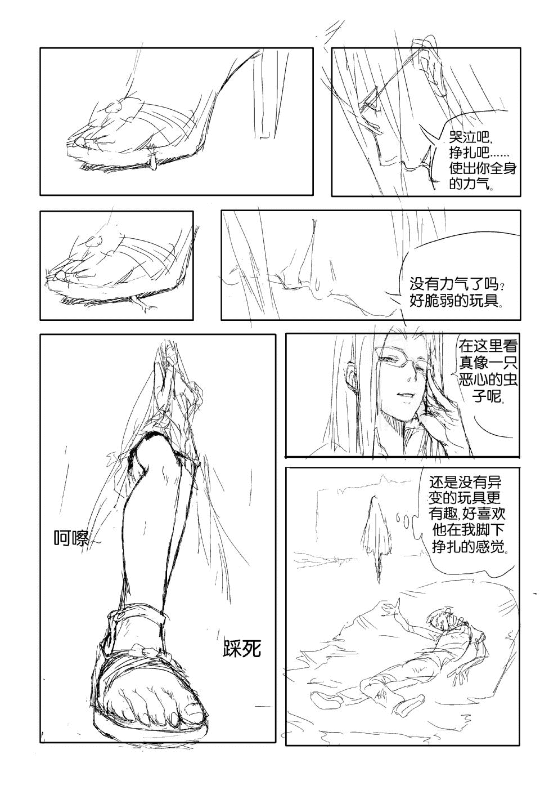
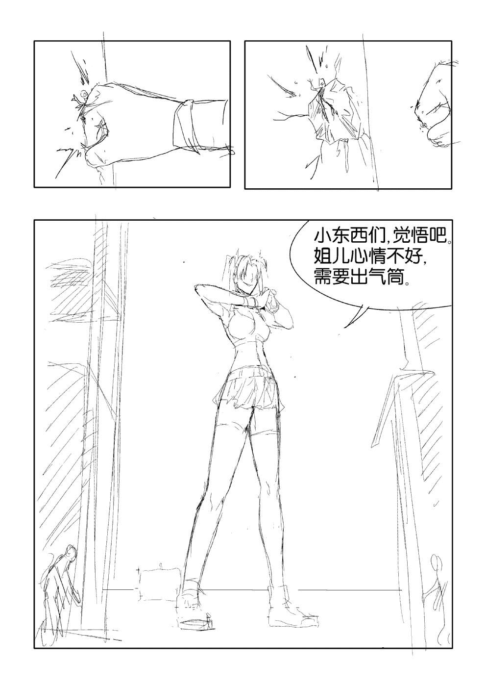
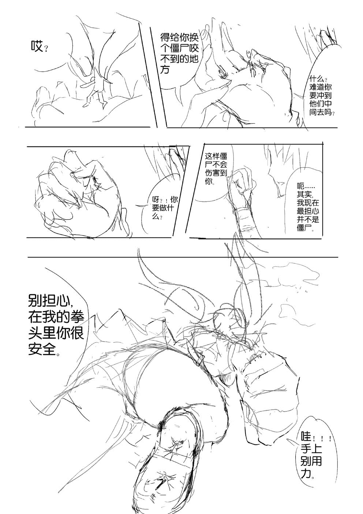
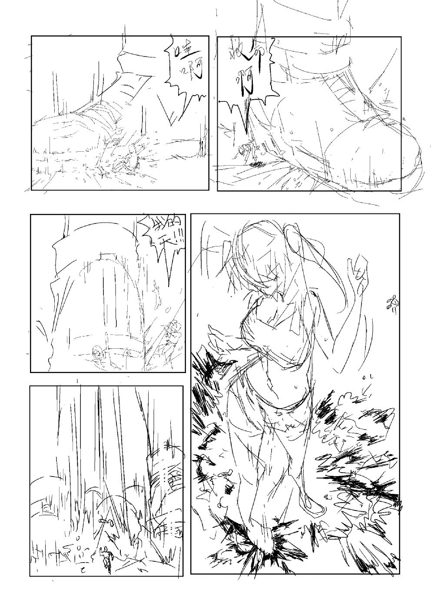
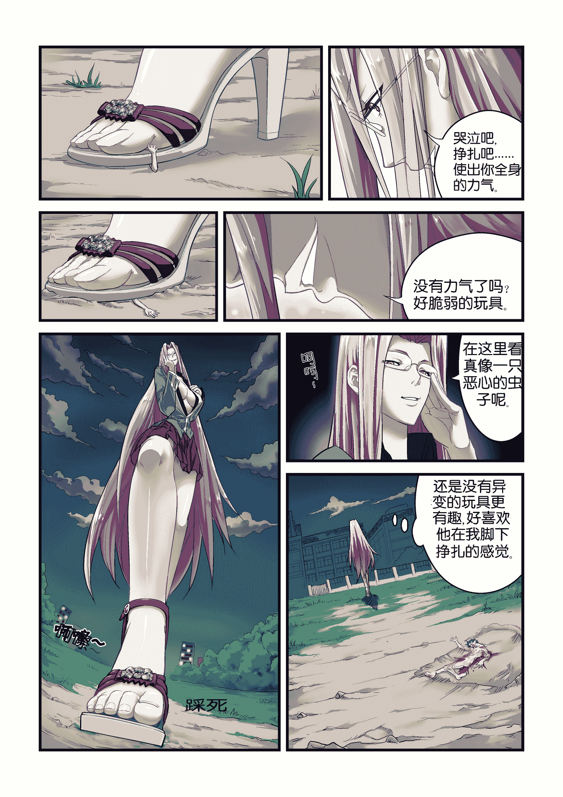
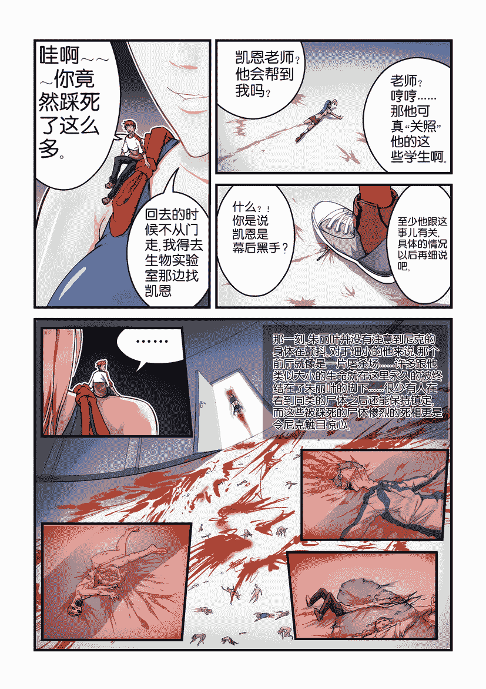
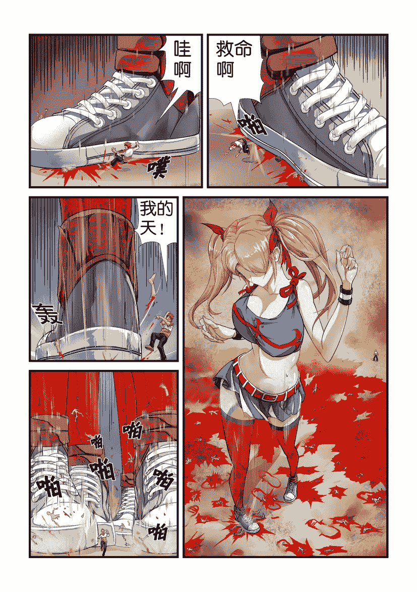

# 《僵尸学校》剧本

作者：gts-c

TID：14335

<title>1</title> <link href="../Styles/Style.css" type="text/css" rel="stylesheet">

# 1

*本文章最後由 gts-c 於 2013-5-2 22:29 編輯*

去年的时候，跟HTE222有了一次合作。
当时听说这个打工仔准备自己掏积蓄了一年多的工资准备做GTS出版物的时候，第一反应就这家伙精神不正常。

没想到他是玩真的……于是就有了这次合作。
关于购买的内容，请在[http://giantessnight.com/gnforum2012/forum.php?mod=viewthread&tid=14247](http://giantessnight.com/gnforum2012/forum.php?mod=viewthread&tid=14247)查阅。
大陆地区购买请选：[http://item.taobao.com/item.htm?id=20293891456](http://item.taobao.com/item.htm?id=20293891456)

本贴只是要与各位分享一些“个人”的内容。也就是本人创作的《僵尸学校》这个剧本。
在这个《僵尸学校》，涉及到了一些GTS文件的探索。个人认为，故事性和“福利”这两者都需要兼顾，但一个比较有说服力的故事能带给“福利”更强的真实感。

出于“保密”考虑，这里贴出的一些图都是“草图”和已经放出的图片的中文版。
毕竟本文主要是要展示本人所创作的这个故事。
（所以放在这个地方发表）
<title>2</title> <link href="../Styles/Style.css" type="text/css" rel="stylesheet">

# 2

 <ignore_js_op>[5.JPG](forum.php?mod=attachment&aid=MzQxNzl8NmRkYTdjOWV8MTYwMDg5MDk3NnwxODIzMHwxNDMzNQ%3D%3D&nothumb=yes) *(178.41 KB, 下載次數: 54)*

[下載附件](forum.php?mod=attachment&aid=MzQxNzl8NmRkYTdjOWV8MTYwMDg5MDk3NnwxODIzMHwxNDMzNQ%3D%3D&nothumb=yes)

2013-5-2 21:21 上傳  

</ignore_js_op> <ignore_js_op>[4.JPG](forum.php?mod=attachment&aid=MzQxODB8MDRkNGI5YmZ8MTYwMDg5MDk3NnwxODIzMHwxNDMzNQ%3D%3D&nothumb=yes) *(129.44 KB, 下載次數: 14)*

[下載附件](forum.php?mod=attachment&aid=MzQxODB8MDRkNGI5YmZ8MTYwMDg5MDk3NnwxODIzMHwxNDMzNQ%3D%3D&nothumb=yes)

2013-5-2 21:21 上傳  

</ignore_js_op> <ignore_js_op>[3.JPG](forum.php?mod=attachment&aid=MzQxODF8ZTkwMWE4YTl8MTYwMDg5MDk3NnwxODIzMHwxNDMzNQ%3D%3D&nothumb=yes) *(170.89 KB, 下載次數: 5)*

[下載附件](forum.php?mod=attachment&aid=MzQxODF8ZTkwMWE4YTl8MTYwMDg5MDk3NnwxODIzMHwxNDMzNQ%3D%3D&nothumb=yes)

2013-5-2 21:21 上傳  

</ignore_js_op> <ignore_js_op>[2.JPG](forum.php?mod=attachment&aid=MzQxODJ8MjViOTg1ZWV8MTYwMDg5MDk3NnwxODIzMHwxNDMzNQ%3D%3D&nothumb=yes) *(241.53 KB, 下載次數: 13)*

[下載附件](forum.php?mod=attachment&aid=MzQxODJ8MjViOTg1ZWV8MTYwMDg5MDk3NnwxODIzMHwxNDMzNQ%3D%3D&nothumb=yes)

2013-5-2 21:21 上傳  

</ignore_js_op> <ignore_js_op>[1.JPG](forum.php?mod=attachment&aid=MzQxODN8MDZhY2Y5OGZ8MTYwMDg5MDk3NnwxODIzMHwxNDMzNQ%3D%3D&nothumb=yes) *(161.76 KB, 下載次數: 8)*

[下載附件](forum.php?mod=attachment&aid=MzQxODN8MDZhY2Y5OGZ8MTYwMDg5MDk3NnwxODIzMHwxNDMzNQ%3D%3D&nothumb=yes)

2013-5-2 21:21 上傳  

</ignore_js_op> <ignore_js_op>[fate同人僵尸高校30.jpg](forum.php?mod=attachment&aid=MzQxODR8MTIzN2I4ZTJ8MTYwMDg5MDk3NnwxODIzMHwxNDMzNQ%3D%3D&nothumb=yes) *(926.38 KB, 下載次數: 145)*

[下載附件](forum.php?mod=attachment&aid=MzQxODR8MTIzN2I4ZTJ8MTYwMDg5MDk3NnwxODIzMHwxNDMzNQ%3D%3D&nothumb=yes)

2013-5-2 21:22 上傳  

</ignore_js_op> <ignore_js_op>[fate同人僵尸高校12.jpg](forum.php?mod=attachment&aid=MzQxODV8Njk3ZDMzNDF8MTYwMDg5MDk3NnwxODIzMHwxNDMzNQ%3D%3D&nothumb=yes) *(337.01 KB, 下載次數: 27)*

[下載附件](forum.php?mod=attachment&aid=MzQxODV8Njk3ZDMzNDF8MTYwMDg5MDk3NnwxODIzMHwxNDMzNQ%3D%3D&nothumb=yes)

2013-5-2 21:22 上傳  

</ignore_js_op> <ignore_js_op>[fate同人僵尸高校08.jpg](forum.php?mod=attachment&aid=MzQxODZ8OTg1MTAwM2J8MTYwMDg5MDk3NnwxODIzMHwxNDMzNQ%3D%3D&nothumb=yes) *(370.86 KB, 下載次數: 52)*

[下載附件](forum.php?mod=attachment&aid=MzQxODZ8OTg1MTAwM2J8MTYwMDg5MDk3NnwxODIzMHwxNDMzNQ%3D%3D&nothumb=yes)

2013-5-2 21:22 上傳  

</ignore_js_op> <ignore_js_op>

[僵尸高校1.doc](forum.php?mod=attachment&aid=MzQxNzh8NDkxYmZkYmZ8MTYwMDg5MDk3NnwxODIzMHwxNDMzNQ%3D%3D)

2013-5-2 20:58 上傳

點擊文件名下載附件

472 KB, 下載次數: 362</ignore_js_op> <title>3</title> <link href="../Styles/Style.css" type="text/css" rel="stylesheet">

# 3

**第一部**
**封面设计**文：僵尸高校图：女主角侧过头面对着一群会飞的僵尸，右手握着男主角，左手护在右手前面（保护男主角不被攻击）右脚踏出，脚下一个小小的僵尸头和一只手脚附近有几个被踩扁的僵尸，画面边缘还有一群僵尸在逃命。场景为一个T型的走廊的交汇处，画面意思为女主角追踩地上的僵尸，在直线前进经过交汇处时，遇到了左方飞来的僵尸的袭击。这时她下意识的护住捏在手心里的男主角。

**第一页**1学校远景，凛走近。2凛到了学校边，看到铁丝网，说：“咦？什么时候这里被围上了个铁丝网。”3“嗨哟～”凛以一个漂亮的动作按住铁丝网中间的铁柱上方，翻了进去。画面的一角显示一个倾斜的牌子，看不清字。4隔着铁丝网，看到凛继续往学校深处走。牌子近影，上面有文字：生化污染区，严禁靠近。（以上内容按格子描述，一段文章之间以空行间隔，以下皆同。）

**第二页**1地上有几件警察的衣服在地上，像是人突然从身体里消失一样。凛走近，说：“奇怪，这里有几套警察的衣服。”2脚部特写，从脚底下发出一个声音：“叭哧”3镜头从上往下，凛抬起脚，看着脚下。说：“我好像踩到了什么东西？”。脚下面是脚印，里面有一个隐约的人型，周围有血迹。（这一幅要比较大而且高）4（镜头从下往上）凛蹲下，注视着脚印里的人型。说：“这是什么？”5脚印特写，里面一个小小的人型。凛的手伸向这个被踩死的小人。画面外传出一个声音。“歌曲～（电话铃声）”（僵尸说明：没穿衣服，形象随意。）

|  |

| 1  |

| 2  |

| 3  |

| 4  |

| 5  |

**第三页**1（镜头从下往斜上）一个小僵尸躲在草从中，侧身看着凛打电话。凛打电话：“喂？是大姐啊？”僵尸：（想）（肉的形状）（这一幅比较高，显出凛的高大。）（僵尸说明：形象阴险衣服为学生服，较为腐烂。）2僵尸走到凛脚边，脚边的脚印里还有刚才踩死的小人儿。（5CM的身高与凛脚的对比。）3僵尸爬上凛袜子的上端。画外传来凛打电话的声音：“……我知道很危险，但我要找到尼克，他没回家。”4僵尸爬到裙子的位置。画外传来凛打电话的声音：“学校里有僵尸？S型？哦，知道了。”

|  |

| 1  |

| 2  |

| 3  |

| 4  |

**第四页**１僵尸爬到凛的腰部，张口准备要咬。凛打电话：“是的，我见到了。”２突然，他被一只手拎了起来。凛打电话：“……知道了，他们很危险，一般人如果被咬到了也会变成小僵尸。”僵尸：“！”３僵尸呆在凛手掌上，凛看着手心里的小僵尸。凛打电话：“……对，很小，还没有我的拇指大。”（镜头从主角头部右上方往下，看到凛的耳朵和一部分侧脸。女主角的目光注视着手心里的小僵尸）４凛打电话，左手拿电话到耳边。右手翻掌向下，让手心里的僵尸掉了下去。（整个构图为凛的上半身＋大腿至膝盖处）凛打电话：“……不用担心，已经被我踩死了……”５凛打电话，上半身姿态变化不大，下半身右腿伸出，踩死了刚才的那个僵尸。凛打电话：“……两个。”画面从下向上传出声音：“叭嚓”（４、５两幅图构图基本类似。注意不要直接显示出僵尸被踩死，用画面外传出的“声音”表现这一幕。另外，凛在踩死小僵尸的时候注意力仍然在电话上，只是漫不经心的踩死了他。所以视线并不在脚下的僵尸上。）

|  |

| 1  |

| 2  |

| 3  |

| 4  |

| 5  |

**第五页**１凛远去的身影，身后是两个交错在一起的脚印中踩扁的两个僵尸。凛打电话：“……有数名失踪人员……是的，有尼克……”２凛走到教学楼入口。“是这里了。”３打开门（镜头从门里往外拍，凛前面基本全为黑色。）４镜头从凛右侧指向门厅的地版，里面全是小型的僵尸。（僵尸说明：大部穿衣服，少部分没有衣服。有男有女。）５凛歪嘴微笑“可口的鲜肉来了，快来吃我啊。”

|  |

| 1  |

| 3  |

| 4  |

| 2  |

| 5  |

**第六页**1尼克在黑暗中奔跑文字：我是尼克，我正陷入人生中的一场大危机，我被困在这里了，我需要一个电话跟外界联系。（注意处理一下，不要显示出尼克的“小”）２找到了３电话（有闪光）４尼克在电话前，感觉很无奈“……………………”（尼克跟电话的对比，只有５CM的他和一个的手机，这时才交代尼克已经变小了）5尼克用力推手机盖（一脚踩在下面的号码盘上，双手用力推）“咿～～～～～～”6这时，从背后传出一些声音声音词：叭啦，啪塔7尼克回头“谁？”（这页因为没有内容，所以快笔带过）

|  |

| 1  |

| 4  |

| 2  |

| 5  |

| 3  |

| 6  |

| 7  |

**第七页**1满地的僵尸出现在尼克面前“我的妈啊！”（僵尸说明：全部没穿衣服，均为男性高中生）2尼克退到墙边上，无路可走。尼克：“救，救命啊”。3僵尸冲过来。僵尸：“吼～～～～～”4突然，从拐角的另一边的走廊上，高大的凛出现了。凛：“找到了。”（镜头从尼克的背后从下往斜上拍，包括了尼克面前的佤，凛显得非常高大，因为是背光。所以看不到凛的脸。只看到两只发光的眼睛。）

|  |

| 1  |

| 2  |

| 4  |

| 3  |

**第八页**1在尼克面前踩死僵尸，脚部特写，侧面平视。脚下露出一只僵尸的手以及喷溅的液体。脚边的尼克惊慌失措，差点被踩死。尼克：“哇啊～”2在尼克面前踩死僵尸，从斜上往下看，脚部特写以及差点被踩到的尼克。尼克：“救命啊”3在尼克面前踩死僵尸，从脚后往前看，脚部特写以及差点被踩到的尼克。尼克：“我的天！！！”（这一脚踩死了三只僵尸，一只露出一只手，一只露出两只翘起的脚，一只露出头和一只手臂。）4尼克拼命逃走，在他的背后，无数的脚落下。天空到处飞着断肢。尼克：“呜哇哇哇哇哇”5从斜上方往下看，凛低头踩死僵尸，小小的尼克远远的在一边。地上，到处都是僵尸被踩死的后留下的尸体及血迹。（尸体要比较乱，有几个要死在一起，有些深浅不一的脚印，有些脚印中有僵尸的尸体。）

|  |

| 1  |

| 2  |

| 5  |

| 4  |

| 3  |

**第九页**1凛回过头。（逆光，仍然看不到面部。）2尼克大惊3凛（左）注视着尼克，双眼发光，尼克手脚并用往后退。他左侧在板上几个压扁的僵尸，头颅扁平，七窍流血。尼克：“妈妈咪呀～～～”4一只脚踩下来。尼克：“哇！！！”5尼克闭眼等死，将手护到前面。

|  |

| 1  |

| 4  |

| 3  |

| 2  |

| 5  |

**第十页**1尼克睁开眼睛。尼克：“咦？”2侧过身，看到脚落在身边左前侧。3凛跨蹲在尼克面前，伸出手，微笑凛：“亲爱的，是我。”

|  |

| 1  |

| 2  |

| 3  |

**第十一页**1尼克坐在凛肩上，两人沿着走廊走。尼克：这里发生了什么事儿？凛：是S型僵尸，如果被他们咬到也会变成微型僵尸。那些学生……恐怕是受害者。2两人继续前进尼克：那为什么我没有变异？凛：有些人是对病毒有免疫的。像我被僵尸咬了也不会有事。但有的免疫力并不完全，就像你。3两人继续前进尼克：所以你变成了僵尸猎人，呵呵。凛：因为并不是所有的僵尸都是微型的，所以还需要平日经常的锻炼和修行。４两人继续前进尼克：出现在这里的大多数僵尸，我是说穿衣服的那些，并不是这个学校的。凛：这个地方也许隐藏什么东西吧。５两人到达门厅，看到满地的僵尸尸体凛：我刚才是从这里进来的。尼克：哇啊

|  |

| 1  |

| 2  |

| 5  |

| 3  |

| 4  |

**第十二页**1二人对话尼克：哇啊～～～你竟然踩死了这么多。凛：回去的时候不从门走，我得去生物实验室那边找凯恩。2地上，一个半条腿的僵尸还在爬，身后是一条血路。（画外音）尼克：凯恩老师？他会帮到我吗？（画外音）凛：老师？哼哼……那他可真“关照”他的这些学生啊。（僵尸说明：    这只僵尸为女性，穿着学生裙。腿以下已经被踩没了）3僵尸被踩在凛脚下（画外音）尼克：什么？！你是说凯恩是幕后黑手。（画外音）凛：至少他跟这事儿有关，具体的情况以后再细说吧。4从在凛肩上的尼克，默默的回头看了一眼，不再说话。尼克：……5凛远去的背景，地上到处都是踩扁的僵尸。解说：那一刻，凛并没有注意到尼克的身体在颤抖。对于细小的他来说，那个前厅就像是一片屠杀场……许多跟他类似大小的生命就在这里永久的被终结在了凛的脚下……很少有人在看到同类的尸体之后还能保持镇定，而这些被踩死的尸体惨烈的死相更是令尼克触目惊心。6、7、8被踩死的尸体（有些身边要有淡淡的脚印，）6：尸体呈扁平状，头部裂开，脑浆流出（白色，像血液一样。）（僵尸说明：比较高大的僵尸，穿西装）7：尸体呈扁平状，肚破肠流。（僵尸说明：    赤裸僵尸，中年，腿上有毛）8：两具尸体，一个身体上半身被压扁，留在脚印中，下半身在脚印外。另一个除一只手断裂，留在脚印外，其余身体被压扁，留在脚印中。（僵尸说明：上半身被压扁的，男性，穿着学生装。全身被压扁的，男性，穿着学生装。）

|  |

| 1  |

| 2  |

|                      5  |

| 3  |

| 4  |

| 解说  |

| 6  |

| 8  |

| 7  |

**第十三页**1二人经过一个走廊的拐角凛：前面有东西尼克：咦？你怎么知道。2二人面对漆黑的走廊，凛手边有一个灯擎尼克：好黑啊，打开灯吧。凛：……3凛突然对墙上一个斜踹，其中一只手护着肩上的尼克。凛：喝！（1、2、3是斜的，是梯型或是三角型）4凛的脚踩在墙上（暗）5凛的脚踩在墙上，灯打开了。（4、5两张图基本上完全一样，只是4比较暗，5打开灯，凛的脚和腿要有影子，但不要太黑。）

|  |

| 1  |

| 2  |

| 3  |

| 4  |

| 5  |

**第十四页**1凛的脚移开，墙上留下了一个脚印，脚印中有一个有翅膀的僵尸（画外音）凛：“这个僵尸已经进化了出了翅膀。”（僵尸说明：中年，穿医生装，背后有半透明的翅膀，形状如蝉翼。）2僵尸从脚印中掉了下来，留下一滩血迹。尼克：“哇，那岂不是很危险。”凛：“如果你被他咬到，我也帮不了你了。”（和1的构图基本相同，但2中没有凛的脚。僵尸不要掉出画面之外。）3凛看着地上的僵尸，镜头从斜上对着地面的僵尸。尼克：“你知道这个地方有僵尸？”凛：“僵尸猎人有心灵感应，对僵尸会很敏感。”4凛抬头（警觉）5一大群飞行僵尸在远处飞舞。（僵尸说明：飞舞时，翅膀像苍蝇。这些僵尸全部都穿衣服。）

|  |

| 1  |

| 2  |

|                      5  |

| 3  |

| 4  |

**第十五页**1凛伸手拎住尼克尼克（惊讶）：哎？2凛望着手心里的尼克凛：他们会重点攻击未变异的僵尸，你在我肩上不安全。尼克：什么？难道你要冲到他们中间去吗？3凛把尼克捏在手心里。尼克：呀？！你要做什么？（2、3的构图基本相同，唯一的区别在于3把尼克捏在了手心里）4凛对着自己的拳头说话凛：这样僵尸不会伤害到你。尼克（在拳头里）：呃……其实，我现在最担心并不是僵尸。（1、2、3、4可以均为梯型。）5凛冲向飞僵尸群，镜头从凛的身体右侧拍往前方，凛身体前倾，双臂自然向后挥，捏着尼克的那个拳头直指着镜头。凛：别担心，在我的拳头里你很安全。尼克：哇！！！手上别用力。

|  |

| 1  |

| 2  |

| 5  |

| 3  |

| 4  |

**第十六页**1凛冲向僵尸，一些僵尸被撞掉在地上。凛：僵尸们，你们要找的新鲜人类就捏在我手心里。尼克：你还招惹他们？！（生气）2凛奔跑，一些僵尸被撞掉在地上。画面为正面，凛微笑的表情。凛：放心，我宁可把你捏成肉泥也不会交给他们的。尼克：不要说这种话！（紧张）3凛奔跑，一些僵尸被撞掉在地上。镜头为后方。4手心里的尼克尼克：呜～～～不能呼吸了。5凛奔跑，一些僵尸被撞掉在地上。镜头为斜后方。前方，是一个门打开的实验室。凛：快到了6口吐白沫的尼克尼克：好，好难受（注意尼克因为被捏在手心里，所以四肢以及身体的姿式要保持一致。）

|  |

| 1  |

| 2  |

| 5  |

| 3  |

| 4  |

| 6  |

**第十七页**1凛打开门，冲进实验。凛：到了2凛对自己手心里的尼克说话凛：好了，我们安全了。3手掌摊开，手心里的尼克。凛：尼克4手掌摊开，手心里的尼克。（3、4两张图完全一样）5手掌摊开，手心里的尼克，四肢边上出现“擅动纹”。6尼克爬起，四脚着地（凛手心），哇在凛手上。背后是凛吃惊的样子。尼克：哇！（呕吐）

|  |

| 1  |

| 2  |

|                       6  |

| 3  |

| 4  |

| 5  |

**第十八页**1凛蹲下，尼克被放在地上一个盒子上面，趴在上面，背后是凛。凛：没想到你会“晕手心”？尼克：……你的手比过山车激烈1000000倍。2对话凛：你刚才差点把我吓死。尼克：……（（想）我怎么觉得我才是差一点死掉的那位？）3凛详装生气，对话。凛：你吓坏女生了，道歉！！！尼克：行，如果有下次你就直接捏死我吧。4凛开心的笑了，尼克看着他，沉默不语。尼克：……解说：凛并未注意到尼克情绪上的异样。

|  |

| 2  |

| 3  |

| 1  |

| 4  |

**第十九页**1尼克站在盒子上，四处张望。背后，是半蹲着准备站起来的凛，看着尼克。尼克：“这里应该是实验室吧，凯恩老师在哪里？”凛：“……”2镜头在尼克背后的斜上方，尼克听到声音，回头回了一小半。他身后及身体的一部分被一个阴影罩住（凛的鞋底）（画外音）凛：“他在这里”3尼克回头，看到头顶上凛巨大的鞋底。“哇！！！”4对话，镜头从凛的右后上方往下拍，凛的脚悬停在尼克的头上。尼克坐在地上。凛：“你怕什么？”尼克：“当然会怕啦，我还以为你要踩下来。”5对话，镜头从凛的右前上方往下拍，凛的脚悬停在尼克的头上，相当于上一幅空间横转约120度。尼克坐在地上。凛：“我只是要你看看凯恩老师，他就粘在我的鞋底上。”尼克：“……”

|  |

| 2  |

| 3  |

| 1  |

| 4  |

| 5  |

**第二十页**1尼克注意到了凛脚底上沾着的人体，鞋子后面是凛抬脚站立的姿态。镜头为从下往斜上。尼克：……（僵尸说明（凯恩老师）：中年，赤裸男子。手、脚有明显体毛。被踩死时面朝上，即凛鞋底方向。）2特写，被踩扁粘在凛鞋底的凯恩老师。（2是一个指引框，引用箭头指向凛鞋底凯恩老师尸体的位置。）3凛指着地上的一滩血迹说话，血迹边上要有“发光”的线条显示。这时，凛的脚根已经落到了纸盒面上，但前端翘起，下面是尼克。凛：就是那里，我一进来就见到他了，他被攻击……已经异化了……也算是罪有应得吧。4凛脚底下，鞋子阴影中的尼克，他故意把视线偏向一边，表情有些不自在。镜头从斜上往下。尼克：“……”5凛天真的笑容。凛：即便如此，他还是会有机会去害人……所以，我还是要把他踩死。

|  |

| 1  |

| 3  |

| 2  |

| 4  |

| 5  |

**第二十一页**1突然，凛注意到了尼克胯间的一些水渍。镜头从斜上往下。凛：“！”2指引框，尼克的胯间。3凛抿嘴笑，手放在嘴边食指弯曲顶着嘴唇。凛：（想）嘻嘻，竟然让我给吓得尿裤子了。4凛不笑了凛：……5两人僵持，凛仍然把脚翘到尼克面前，尼克却已经把头扭到了一边。镜头从斜上往下。6头扭到一边，故意避开凛的脚底，表情不自然的尼克

|  |

| 1  |

| 5  |

| 2  |

| 3  |

| 4  |

| 6  |

**第二十二页**1凛把脚放了回来，默默的站在盒子边上。视角从斜上往下。旁边：有时凛也会通过心灵感应知道一些其它的事情，现在，她分明感觉到自己的脚底下的男孩那份无法守护的自尊以及一颗正在哭泣流泪的心。2沉默，视角从下往斜上，从尼克的下方拍向凛。整体上感觉很暗，突出一种沉默尴尬的气氛。3回放：被一群僵尸包围（第七页，1，无对话）文字：僵尸好可怕4回放：凛踩僵尸，（第八页，1，无对话）文字：凛好可怕5回放：被凛捏在手心里（第十五页，5，无对话）文字：想对过样的保护说“不”6回放：凛踩向尼克（第十九页，3，无对话）文字：以后就这样跟这个女人生活下去吗?

|  |

| 1  |

| 2  |

| 旁白  |

| ３  |

| 4  |

| 5  |

| 6  |

**第二十三页**1凛表情很复杂，头上有青筋凛：（想）这个状况，感觉很火大。2凛猛的回头（警觉）凛：“！”3整个房间的从明过渡到暗，凛注视着暗处，那里似乎有什么东西。凛：“看来，我们有邻居了”声音词：叭叭，窸窸窣窣，嗷～，咚咚咚4凛随手出拳（右拳），往墙上猛的一击。出拳时，头低下，面无表情（用阴影处理，只画鼻子以下，不画眼睛）。面向前方，不看着出拳的地方。声音词：咚！

|  |

| 4    3 3  |

| 1  |

| 2  |

| 4  |

**第二十四页**1拳头击在墙上的特写，尽头处有一个被拳击死的僵尸，头部露在面外，嘴大张着。受击处墙体龟裂2收拳，墙体处龟裂出一个洞，一个僵尸的尸体出现在拳击的的位置，头部、脚还算完整，中间被击中的地方完全扁平了，有血液喷溅的形状。3凛左手握拳击在右手掌中，右手手指处还留着刚才那僵尸的血迹。冷酷的笑。镜头拉开，房间的暗处，无数的僵尸隐约在晃动。凛：“小东西们，觉悟吧。姐儿心情不好，需要出气筒。”

|  |

| 1  |

| 2  |

| 3  |

**第二十五页**1一个黑影在奔跑。黑影：呼，呼，呼（喘息声）旁白：与此同时，在学校的另一边。2学生回头，一个僵尸在靠近。学生：哎呀（僵尸说明：青年，崩克头，身体、衣服明显腐烂。身材比学生明显高大。）3特写，学生被石头绊了一下。4学生倒在地上，看到慢慢逼近的僵尸。僵尸：吼～～～，我很饿，让我吃一口。学生：救，救命啊。5突然，学生看到一个高大的身影，站在前方不远处。6学生呼救学生：喂，那边那个。7高大的黑暗听到后回头，现出美杜莎的脸。

|  |

| 1  |

| 4  |

| 2  |

| 6  |

| 3  |

| 5  |

| 7  |

**第二十六页**1美在向他走近，逆光，看不清脸。他前面，那个僵尸也在靠近。学生：救，救救我。2女人举脚，准备踩下学生：哎呀？3女人将僵尸一脚踩死。镜头从上往下，显示女人的鞋面，从鞋子边缘显示出僵尸一只。血肉飞贱，学生用胳膊挡在面前，身上浅了一些血液。学生：哇啊～4一只手伸到学生面前。学生：哇，得救了。5学会坐在手心里，抬头望向美。镜头从手心向前，现出美漂亮的脸，微笑。学生（想）：好阳光的大姐姐。

|  |

| 1  |

| 3  |

| 2  |

| 4  |

| 5  |

**第二十七页**１远处，一个黑影（索菲娅）在问，美回头。索：你在干什么？美：我收拾了一只蟑螂。学生（想）：竟然被这么美丽的大姐姐救了。２索与美对话，索回头看，美面对索，两人的目光都集中在美手掌中的学生。索：这是什么？美：一个被僵尸袭击过的小家伙，现在还没有发生变异。３索从美的手心里拎起学生，从脚拎。学生：哇啊４索倒提着学生到自己面前，脸部不用画清楚。重点突出学生被倒提着时的狼狈相。索：看上去似乎是个学生呢？学生：啊～５索将他带个人捏在手心里。学生：！６索将他捏在右手的拳头里，捏的很紧，学生的一只手臂从她的食指、中指的指缝中伸出，索用左手的拇指和食指捏住他的手掌，观察他手臂上的咬痕（实际上是一块青色）。索：被咬的地方是右臂，到目前为止应该不超过三小时。学生（想）：唔，不能呼吸了。

|  |

| 1  |

| 3  |

| 2  |

| 4  |

| 5  |

| ６  |

**第二十八页**１索将学会放回到美的手上。２索拂发３现出索美丽的脸，小人儿在美的手心里看到，镜头远处有一个女孩跑过来的影子。学生：哇，大美女！４突然，一个女孩跑过来，索回头，手心上学生在镜头中。女孩：少主。学生（想）：漂亮到如此惊人的美女，竟然这么粗暴。５对话女孩：寒子不见了，有人说看见她今天下午来到这个学校。索：这个惹祸精。学生（想）：我还是更喜欢旁边的这个大姐姐。６索背对着美，对她说话。索：大家都到了，过去吧。美：是！7索没有回身，扭头斜扫了美手心上的学生一眼，目光冷漠。

|  |

| 1  |

| 2  |

| 3  |

| 4  |

| 5  |

| ６  |

| 7  |

**第二十九页**１索正在离去的背影，手心里的学生在镜头的一角。索：把他踩死！美：是！２手心里的学生，神态紧张。学生：她说，她说了什么？３学生，抬头望向美，美微笑。美：啊啦啦，我会很温柔的哦。学生：请，请不要开这种玩笑。４学生被扔在地上。学生：哇啊！５学生面对高大的美。镜头从下往上。学生：不要，不要啊。６美的一只脚踏在学生的面前，阻断他的去路。（跺脚声）：咚！７美踩下来，学生头上巨大的脚底。学生：妈，妈妈～

|  |

| 1  |

| 2  |

| 3  |

| 4  |

| 5  |

| ６  |

| 7  |

**第三十页**1美踏住学生，学生的半个手臂在外边，肘以下踩在美脚底下。2美低头看。美：哭泣吧，挣扎吧……使出你全身的力气。3美的脚，学生的手臂垂下。4美微笑的嘴唇：美：没有力气了吗？好脆弱的玩具。5美踩死学生（没有血肉飞溅，但有力度表现）（响声词）：呵嚓～（描述词）：踩死6美离去，脚印中身体扭曲的学生，体表有血迹。美（想）：还是没有异变的玩具更有趣，好喜欢他在我脚下挣扎的感觉。

|  |

| 1  |

| 2  |

| 4  |

| 3  |

| 5  |

| 6  |

**第三十一页**1美走到索身边，索说话，美伸出舌头可爱的一笑。索：这么长时间，你挺嗨的嘛。美：嘻嘻2一群少女走了过来，索抬头看着他们。（少女们建议用背部，避免正面描述。为将来设计角色留下时间。少女们：少主索：你们都来了，好。3索指着学校，说话。索：你们进去做个彻底的清理，踩死所有活着的东西。一只蚂蚁都不要放过。少女们：是4对话。某少女：如果有目击者没有被咬到呢？索：那就让他被咬到。5众人一起。索：好，开始行动。少女们：是6索一边走一边说话索：奴隶们，你们的主人回来了。7夜幕下的学校。（待续）

|  |

| 1  |

| 2  |

| 3  |

| 4  |

| 5  |

| 7  |

| 6  |

**小漫画一：**1对话凛：提问：小小的尼克，凛大大的脚最多能踩死几个？尼：这是什么鬼问题？2对话凛：你要是算不出来的话，就实际检测一下吧？尼克：（大惊失色）咿～～～（T1一脚踩扁）3尼克想，思想气泡中是凛的脚和自己的大小对比。尼：（想）（T2）嗯，凛的脚长２０CM，我高5CM。宽１CM。尼：（想）（T3）如果是直着一排，能踩死四个。尼：（想）（T4）如果是横着一排，能踩死２０个。尼：（想）（T5）如果是侧躺着排，能踩死４０个……4尼克想，思想气泡中是凛的脚和一些人形的排列尼：（想）（T6）不对，鞋子的其它地方也有空间，还能再塞下２０个。（这一张是脚底的平面图）尼：（想）（T7）其实只要踩到上半身就会死，那就能多塞４０个，就是１００个。尼：（想）（T8）如果是站着，能那每个尼克约有０．５平方厘米，凛脚下的面积大约３００平方CM。那能踩死……６００个？5尼克想，思想气泡中是凛的脚和一些人形的排列，抓狂尼：（想）（T9）如果叠罗汉，两层，１２００个尼：（想）（T10）三层……１８００个……尼：（想）（T11）四层……哇，算不出来了。6对话凛：答案是：０（T12）因为尼克只有一个，踩死了就再也没有了，所以凛永远不会踩尼克的。尼：（囧）……我还需要多少次面对多少这种活见鬼的问题和这种无厘头的答案呢？T（数字）为想像图计数）**小漫画二：**1尼克：我一直有个疑问？凛：？2尼克：衣服……凛：哦，因为作者说SEX放在后面，所以才穿衣服的。尼克：我是说，我为什么会有衣服？3凛：你现在就想脱吗？我说过SEX是后面的情节。尼克：你不觉得奇怪吗？为什么我会穿着衣服？而且，从进入到室内之后遇到的僵尸大部分都穿着衣服。4凛：反省吧，色狼！（完全没有听明白）（一脚踩下去）尼克：哇～～～（被踩在脚下）作者：关于大部分的僵尸会穿衣服，后面会有交代，敬请期待啦。**小漫画三：**1艾莉：下一回合，我该出场了，演出的大幕终于拉开了。凛：咦，难道我不是主角吗？尼克(小小的)：我关心的是我还是不是男主角。2艾莉：强势凌辱、种族屠杀、血腥复仇、灭绝人类……好戏连台，敬请期待凛：（汗！）这家伙是……什么东西？尼克：……呃，我不太关心我是不是男主角了。作者（和尼克一样大）：艾莉大人，我有一个请求。3艾莉：？作者：这个这个，就是，在……您灭绝人类的时候，能不能，在您的脚下，给我……留个位置？4（凛踩作者）艾莉：……凛：真是贱得惊天地、泣鬼神、山崩地裂、死去活来……不用等，现在我的脚底下就有空间！！！需要彻底修正你那颗下流、淫荡、腐烂、污秽的心。作者：哇！好幸福（心）尼克：……生活在这样的作品之中真是男人的不幸。**剧情介绍**某大型药企发生了泄露，令中毒者变成微型僵尸。为了销毁证据，药企将受害者关到某学校的地下仓库内。不料意外原因，导致地下室大批僵尸出逃，并直接袭击了当时在校的一些师生。男主角尼克也在其中。被僵尸咬伤后的人，大部分会也会变成微型僵尸，但也有一部分只会变小却不会变异。男主角侥幸没有发生变异，但仍然变成了只有5CM大小的人类。警方封锁了学校，但不明就里的警察也成了僵尸。女主角凛是一名僵尸猎人，专门负责消灭僵尸。同时也是尼克的女友，得知情况后赶到学校去救尼克。在与尼克会合后，二人赶到生物实验室去寻找事件的元凶，其间遇到了一些会飞的僵尸。在这一过程中，尼克的心理发生了一些奇怪的变化。同一时间，药企的千金，同时也是少当家索菲娅赶到学校，准备抢在事情败露之前杀死全部僵尸，包括没有完全变异也一并处死，以销毁证据。**人物介绍：**凛：索菲娅：富家千金，UB公司的少当家。负责清理校园被污染的僵尸，无论是否发生异变全部杀死。同时，也是整件事幕后黑手。尼克：凛的男友，中了僵尸毒身体开始不断缩小。衣服为典型的学生装，但有些地方撕破了，扣子系不上。（这衣服是捡来的。）<title>4</title> <link href="../Styles/Style.css" type="text/css" rel="stylesheet">

# 4

……呃……

好像分镜规划出了问题，凑合看吧。