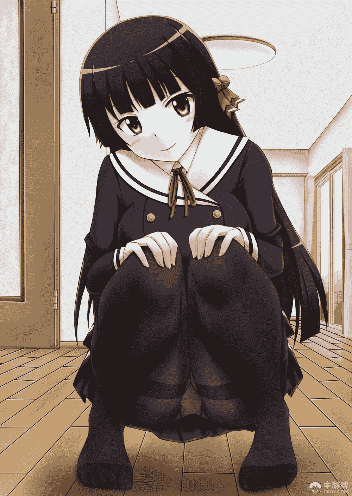
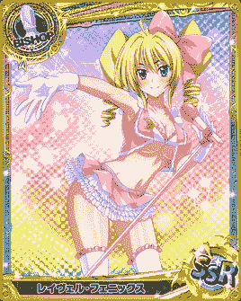

# 【2月21日更新（就多了个一）】我被女神大人抓到异世界..

作者：四白

TID：23676

<title>1</title> <link href="../Styles/Style.css" type="text/css" rel="stylesheet">

# 1

*本帖最後由 四白 於 2018-2-21 15:02 編輯*

 额，没错，这又是一个新坑。

但这次是正式的gts,所以就不需要指望在那个坑里看gts了。

这个坑仍然是日常战斗向,毕竟这是我最擅长的类型。

属性很多，minigts，giga,ub vore，足，应有尽有。

异世界观：整片大陆欧兰特大部分被人类统治着，剩下的种族例如兽人的国家龟缩在大陆的边缘，版图很小。大陆的最边缘是无尽树海，里面生活着魔兽和龙族，而树海的最边缘是虚空，有人掉下去过却没有音讯。因此大陆下面是什么无人知晓。

人类的两个最大的国家是贝玛尔公国和帝国，两国分别占领大陆五分之二和五分之三的国土。两国最近十年因为帝国的侵略而敌对。帝国随后扶持暗精灵建立一个国家名叫狄耶斯，以便共同消灭贝玛尔公国。不料狄耶斯中发生内乱，瞬间摆脱帝国的控制，成立了暗精灵、精灵、妖精联合公国。

贝玛尔公国贵贱之分非常明显，贵族有许多权利，而平民一无所有，只能终生为同姓的贵族提供各方面服务。自从平民暴动之后，国家政局混乱。大臣分为镇压派和开明派，斗争频繁。宫中又混进了帝国的间谍，还要镇压一波波的起义。无可奈何的女王斯卡迪派大法师向女神蕾贝尔祷告，希望能解决这个问题并打败帝国。原本女王没有多大指望，但蕾贝尔听到之后决定做点什么。于是她选择在别的世界寻找一个人来。傅清宇，一个拥有潜质的少年，被蕾贝尔看中，将他送了过来。

男主设定：

本名：傅清宇，穿越之后名字：劳尔·卡乌利

5岁失去父母，从此孤身一人，靠着政府补贴和孤儿院的帮助长大。因为拥有本应不存在的极高的魔法天赋，成为女神蕾贝尔的目标，将他送到异世界。

异世界的劳尔拥有很强的魔法天赋，有一个妹妹叫鸠，原本要去王宫找女王商量但是被宫廷中的奸臣和帝国派来的间谍联合毒杀。而女神蕾贝尔将他作为躯壳将清宇传送到他身上。

（之前的设定我看了一下，发现好像与某部番有冲突，那就换掉吧）

至此说完，过一段时间在码字，好累 
<title>2</title> <link href="../Styles/Style.css" type="text/css" rel="stylesheet">

# 2

 第一章：异世界的初体验

随着下课铃声的响起，同学们陆陆续续从门口走出。我将埋在双臂中的脑袋拔出来，回头看向钟。

“5:50，正好。离他们回宿舍还有一会，我得先回去。”我拎起原本就没带几本课本的书包，离开了教室。

又是熟悉的宿舍门，一成不变的钥匙转动声，宿舍里照样没有人。我将书包丢在床上，它撞上墙壁还是落在同样的位置。

我伸出手来，“火球术！”火焰在我手中聚集成球形，在像足球差不多大小时火球飞了出去，将墙壁炸开一个大洞。

……那是不可能的。

事不宜迟，我打开了舍友的电脑，用qq登上了我的号码。这群吝啬鬼，永远都不肯借我电脑。只能等他们去吃饭的时候我才能来捡漏。

打开一个月前我要的女神的号码，头像一直是亮的，但是一直不搭理我发的消息。可能她讨厌我？怎么可能，不然她怎么可能给我号码。我这样安慰着自己，再次发出了消息。

“女神你在吗？”

“……”没有回应。

“还是没有回应吗。”我背靠在床沿，仰望着天花板上摇摇欲坠的灯，“这样平凡的生活，什么时候才能玩啊……”

“叮叮叮叮。”qq回复的提示音。我兴奋地坐起来查看，却是自动回复。

“找我的加我新号14438*****。”

“好样的！”我立马输入新号码，搜索结果出来了，在我面前映出的昵称是：kami

“神？”我满腹疑惑，“难道是号码输错了？”我倒回去看了一下，发现号码没有差别。“算了，快没时间了，早干完早吃饭去。”

点击+好友按钮，弹出的窗口中出现了验证消息。

试问，你的生活是一成不变，枯燥无味的吗？

“这是什么玩意？管他呢，填是吧。”

“您的请求已发送完毕，请等待结果。”窗口中出现这些字样。

“好了，吃饭去了。”我伸了个懒腰，坐了起来。刚想合上电脑，提示音再次响起，加好友成功了。

我再次坐下来，打字和女神打个招呼，还没打几个字，女神反而发来了消息。

“你对这平凡无奇的世界感到无聊吗？”

“什么？”

“如果你现在有一个到新奇的世界，你来当这个世界的救世主，开始一段新的人生。你会愿意吗？”

没想到我这女神还挺有意思的。我迟疑了一小会，下定了决心。

“如果真的那样的话，我乐意。”

话音刚落，嗤的一声，我的身旁突然裂开一个蓝色的漩涡。漩涡中传出一个女性的声音。

“既然你已经决定了。那么，开始你的新生活吧。”

“这tm还是真的！你确定这不是开玩笑？”

“当然！我女神绝不食言！”

“女神？”我更加疑惑了，“算了，进去再说！”说着我进入漩涡。

随着漩涡的消失，qq再次弹出一个窗口：

对不起，您的联系人的号码不存在，请联系客服。

进入漩涡后，我突然处在了一个奇怪的地方：头上是墙，脚下悬空，而且感觉要往下掉。

“女神大人你确定你没有传送反？”

“当然了！”女神的声音洋洋得意的响起，“请往下面看。”

我向下一看，顿时就慌了，我离地面有30多米高。

“我靠，你tm在逗我吧！”

“不是的哦。你现在是一具灵体，没有肉体支持。而下方的病床上有一个已经死去了的男生，你就是要掉到那个男生的身体里。但不用紧张，你不会死。”

“男生？”我向下看，“但是我只看见一个女孩的身体。”

“你现在还看不见。”声音再度响起，“那么，开始灵魂传输！”

“啊啊啊啊啊啊！”顿时，支持我不掉下去的力消失了，我垂直向下落下。顶着气流，我终于看见一个男生的身体。

男生的身体看起来和我差不多大，而相比较下，女生的身体，好大。

在我脚尖接触那具男生的身体时，我的眼前被一片白光包围，我也失去了知觉。 
<title>3</title> <link href="../Styles/Style.css" type="text/css" rel="stylesheet">

# 3

> [ccccccccccc 發表於 2017-8-14 01:32](https://giantessnight.com/gnforum2012/forum.php?mod=redirect&goto=findpost&pid=344360&ptid=23676)
> 說起鳩我第一個想起的是妓術工作者 然後是粗口
> 設定還好 就是第一章結尾斷得剛好 完全什麼都不知道 ...

第一章没有这么短。。。
<title>4</title> <link href="../Styles/Style.css" type="text/css" rel="stylesheet">

# 4

*本帖最後由 四白 於 2017-8-23 12:56 編輯*

 白光渐渐散去，剩下的只有一大片黑暗。我也慢慢恢复了意识。

现在的我应该处于传输成功了的状态，而现在的我的身体就是之前看到的那个男生的身体。

不管怎样先睁开眼睛再说吧，我试探着将眼睛稍微睁开一条缝。而在那一瞬间，强烈的痛感又迫使我闭上了眼睛。从阳光上来感觉应该是清晨，但是由于这具身体好久没睁开眼睛了，所以对光很敏感。

又双叒叕经过不少次的试探，我总算勉强睁开了眼睛，但也非常勉强，就像刚习惯睁眼的婴儿一样。

“不管怎样先观察一下周围的情况吧。”我随意地四处扫视了一下，现在所在的地方从表面上看是医院的病房，但是非常大，就像完全被放大了十倍一样。而让我最感到奇怪的事是，我的病床是被固定在半空中的，所以说我现在还不在地面上。

病床的下面是一张更大的病床，离自己的床也有很高一段距离，这样掉下去的话必死无疑。

“总之先理清一下思路吧……”我盘腿坐了下来。“要是这个人活过一段时间的话，肯定会有记忆的，先来搜查一下。”说着我便搜索着脑海中的记忆。“嗯……找到了。但这都是些什么啊，断断续续的。”记忆大部分都破损了，只剩下残片。不过这些残片中都是有用的记忆，包括这个人家中的情况，整个世界的情况之类的。

“劳尔·卡乌利吗…”我拍拍自己的脑壳，“你真是帮了大忙呢。”

“尼桑？”震耳欲聋的少女的声音在我身边响起，吓了一跳的我朝床沿倒去，掉下了床。

“啊！！！！”我再次承受着只有乘坐跳楼机时才有的感觉，掉了下去。

“你这个床为什么不安护栏啊！！！”我大叫着胡乱挥舞着手臂，但是仍然无法阻止下落。“难道我刚重生又要死了吗？”我放弃抵抗，闭上了双眼。“算了，让那个女神再帮我重生一次吧。”

着地的感觉，但是并不感觉疼痛，好像有什么柔软的东西托住了我似的。耳边再次响起那个声音，但是因为听了一次竟然习惯了，已经不那么震耳欲聋。

“已经不用在害怕了哦，尼桑。尼桑被人家接住了哦~”

听到这个声音，我慢慢地睁开了眼睛。眼前是一个黑发少女的脸，紫红色的眼睛，黑色的长发，剪得不算整齐的刘海。小巧的脸庞给人乖巧的感觉。我的脸顿时就红了，太可爱了，分明就是我萌的类型。但是我立刻平复了心情，这是我重建人生的机会，不能让别人看到我像一个变态的样子。

当我再次注意起她的时候，她的眼睛盛满了泪水，巨大的脸朝我凑了过来。

话说为什么这么大啊喂！

“太好了！呜呜呜~尼桑没事！”巨大的脸在我身上蹭来蹭去，把眼泪蹭到了我的病号服上。

不过话说回来，这个女孩好像记得？

找找看……找到了，这个女孩叫鸠，是劳尔的妹妹。真羡慕这个家伙，有个这么好的妹妹。

刚想着，小鸠的樱桃小嘴贴上了我的头，令我措手不及。

“mu~chu~迟来的早安吻哦，尼桑。”

“先等一下，小鸠。”

“怎么了，尼桑？”小鸠的脸从我身上移开，疑惑地看着我。

“我好像……失忆了。”  “什么？”

“而且好像是选择性失忆。我没有遗忘一些重要的东西，比如说这个世界，还有我的家。”

“那么这样就没事啊~”小鸠看起来没有担心的样子，“只要重要的事情没有忘记，那么还可以继续生活下去啊~”

“那剩下的事情就要你教我咯。”

“没问题！”小鸠斗志满满，“我会把所有的东西再教给尼桑一遍的！”

“话说你都还记得吗……”

“那么！”她没有理会我，“先回家吧！我这就去办理出院手续！”

“先等一下！”我伸出手来制止她，“我这个样子……怎么回去呢？”

“当然是……我带着你回去了……”小鸠脸上泛起一抹红晕。

“你脸红什么？”

“做这种事的话，当然……害羞了……”

“怎么了？你不是穿着便……”说着我朝她身上的衣服看去，然后我顿时明白了她脸红的原因。

她的衣服，没有口袋！

那就是说……

“不过要是尼桑愿意的话……我可以的哦。”小鸠的脸变得更红了，说着就将我捏起，放在了自己的双峰之间。

“等等你还真来……&￥&#@&*！”小鸠按着我的头，继续将我往里面深入，除了我的双臂和头，剩下的部分都被夹在了小鸠的双峰之间。

小鸠的发育很好，虽然也不是很大，但很柔软，散发着一种香味。而且夹着的力度刚好，没有丝毫不适。

“尼桑觉得……怎么样？”

“怎么说呢……很舒服，被夹着也不会疼。”

“尼桑真是的！讨厌！”小鸠的脸又红了，用指尖在我的头上敲了一下。

疼疼疼……

“那么，先去办理手续吧！”小鸠走出了病房门，连同被夹着的我一起。

小鸠

16岁

男主的名义上的妹妹，超重度兄控，被哥哥称赞一句会好些天睡不着觉。这也是因为劳尔对她又严厉又温柔。

有着比哥哥劳尔还要强的魔法天分（没有男主强），因此能力达到初级后巨化的身高远远高于其他初级的女性，甚至超过一些二级。

女子力很高，希望有朝一日和哥哥永远在一起。

样貌： <ignore_js_op></ignore_js_op>  **e1c8809c39436366e52689674787d2fe.jpg** *(501.9 KB, 下載次數: 1)*

[下載附件](forum.php?mod=attachment&aid=NjkxNzd8NmMxMmUxODh8MTYwMDg4NjgyM3wxODIzMHwyMzY3Ng%3D%3D&nothumb=yes)

2017-8-14 16:51 上傳 

巨化：人类的魔法在成长到一定程度后会有一个瓶颈，当突破这个瓶颈时能力会得到质的飞跃，女性的身高也会成长，但还可以变回来。

身高表：

初级：5-15 10-20（红字表示只有少数人才能达到）

二级：15-20 20-35

三级：20-30 35-50

四级：30-45 50-70

五级：45-65 70-95

六级：65-90 95-125

七级（身高差开始出现较大差异）90-105 130-160

八级105-130 180-250

九级（爆发性增长）200-500 1000-8000

十级（封顶）700-1200 5000-20000

神级（除了少数人以外无人可及，目前已知的就只有蕾贝尔和莉雅丝）100000-无限 <title>5</title> <link href="../Styles/Style.css" type="text/css" rel="stylesheet">

# 5

> [CEW 發表於 2017-8-14 19:36](https://giantessnight.com/gnforum2012/forum.php?mod=redirect&goto=findpost&pid=344428&ptid=23676)
> 有沒有轉生時滑了一下，跌進妹妹身體的支線故事

没有那种东西啦~~而且转生的时候不会手滑，
1：有生命的人体无法转生
2：转生时根本不需要往下掉，这纯粹是她的恶作剧罢了。
<title>6</title> <link href="../Styles/Style.css" type="text/css" rel="stylesheet">

# 6

> [dragon1230 發表於 2017-8-14 21:14](https://giantessnight.com/gnforum2012/forum.php?mod=redirect&goto=findpost&pid=344441&ptid=23676)
> 虽然设定不错，不过我还是对兄妹没什么感觉。

根据我平常的套路，男主后宫会少吗
<title>7</title> <link href="../Styles/Style.css" type="text/css" rel="stylesheet">

# 7

> [1414213562373 發表於 2017-8-15 09:24](https://giantessnight.com/gnforum2012/forum.php?mod=redirect&goto=findpost&pid=344520&ptid=23676)
> 庞大的设定，散发着要坑的气息。

你看我这日更狂魔的样还会坑？
<title>8</title> <link href="../Styles/Style.css" type="text/css" rel="stylesheet">

# 8

> [549766457 發表於 2017-8-15 11:47](https://giantessnight.com/gnforum2012/forum.php?mod=redirect&goto=findpost&pid=344531&ptid=23676)
> 不错，开头写的很好，但是这设定没十几章下不来了。。

我比较习惯写超长篇。。。
<title>9</title> <link href="../Styles/Style.css" type="text/css" rel="stylesheet">

# 9

*本帖最後由 四白 於 2017-8-18 16:12 編輯*

 总算是办理完了手续，小鸠从医院正门走了出去。

我偷偷地探出头来东张西望——要是我这个样子被发现的话，那就尴尬了——这边的文明其实与地球差不多，科技发展水平也与地球不相上下，但我也能在每个角落看到魔法的痕迹，简直可以说这里是有魔法的地球。

对了，我还有一点事没有问小鸠。

“小鸠。”我抬起头来，“为什么听到我失忆时你的反应不大正常呢？总感觉太乐观了。”

“其实失忆已经很好了，况且也不是完全失忆。”小鸠道，“其实，一个周前尼桑因为中毒进了医院。”

“中毒？”

“是的，那时尼桑本来要去皇宫和女王殿下商量关于参战的事情，但是有人在尼桑的茶中下了毒。”小鸠的声音中略微带着点伤心，“那是一种剧毒，据说中毒的人无力回天。大家都以为尼桑……所以说尼桑还活着就已经是万幸了。”

“不过，”小鸠的声音又变得乐观起来，“尼桑没事的话就没问题了唷~”

“真乐观啊你。”我不再谈论这个话题。“对了，为什么大街上只有女性呢？”

“这个尼桑也忘了吗？是因为现在的都市都是照着‘初级’的标准来建造的哦。”

“初级？”

“也就是魔法的级别，级别越高魔法越强。而女性的身高也会随着级别的变化而变化。初级的身高是最矮的，而高级的身高也可以变回初级，所以为了方便生活才建成这个样子。”小鸠说得头头是道，“但是初级的身高会因为魔法天分的不同而不同，所以你会看见每个人的身高都不一样，甚至有些矮的才到高的腰部。”

“那我们两人的等级是怎样的呢？”

“我的话是初级，尼桑现在应该快三级了吧。”

“那小鸠的天分应该不错吧，你的身高有17米的样子，而大部分人都没你高。”

“是的！”小鸠听起来很高兴。

“完全把这句话当成夸奖了啊……”我没有理会小鸠，再次发问。

“那男性出门应该怎么办呢？”

“我们贵族都是由同姓的平民来服务的，家里有不少仆人。这也算幸运了，因为最近的平民大暴动让贵族大量失去平民，而我们家的平民因为优待而比较忠心。而男性出门的话就是靠随身女仆或者自己的伴侣。”

说着话，我们已经回到了自己家族的别墅前。小鸠找了个没人的地方将我拿了出来放在手心里，这也难免，要是被家里的仆人看到就更尴尬了。

刚进门，看到我们的女仆就纷纷围了过来，询问着我的身体状况，我笑着跟她们说没事。不过这些负责在室内工作的女仆都只有十几岁，我还是第一次被这么多女生围着，有点不好意思。

这时，一位黑色短发的女仆走了过来，女仆们看到她纷纷让开。她开门见山地说：“少爷小姐，家主两人出去时吩咐我要管好你们。两人先去更衣，早饭马上开始。”没记错的话她是女仆长，很严厉。而且父母很忙，不在的时候就是她管理整栋别墅，还是乖乖听话为好。

“那么菲儿，尼桑就交给你了。”小鸠道，女仆中最小的一位走了出来，小鸠将我交给她后回房间了，我也被菲儿带回了我自己的房间。

菲儿将我放在更衣室中，拉上帘子后走开了。而我打开衣柜，里面全是笔挺的西装，款式多的我眼花缭乱。没办法，我只好一件件的挑，最后我相中了一套比较便于行动的淡蓝色西装。换上后，更衣室外面传来了菲儿的声音：“少爷，您换好了吗？”

我拉开帘子，映入眼帘的就是菲儿的脸。刚才没有好好的关注她，现在一看，菲儿虽然只有14岁，但也是个美人胚子。她见我换好了衣服，就对我说：“既然少爷换好了衣服，就出发去餐厅吧。”“好。”我答应道。

随身女仆的衣服左肩下面都有一个小盒子，像一个笔筒加上了盖子，和我差不多大。但进去之后别有洞天，里面是一个房间，全部透明可以让里面的人看到外面的情况，看起来像玻璃但比玻璃硬的多，而且也不会打滑。里面配备着家具，就像一个随身携带的家。

走了不一小会，就到了餐厅。就像医院配备的病床一样，餐桌也是男女分开的。而男士餐桌照样被固定在半空中却很稳当不会使人掉落。菲儿将我放在椅子上，垂手侍立一旁。

这时小鸠也走了过来。她换上了长裙，经过精心的打扮之后她比早上更加明艳动人。此时厨师也上菜，虽然不多但仍然很丰盛。对之前只吃过食堂饭的我，这未免是一种诱惑，但我考虑到现在的贵族身份，克制住了。

三道菜很快上完了，虽然不多但每道菜都很美味。我尽量用最礼貌的姿势来用餐，虽然看起来很可笑但是幸好没人看我。我和小鸠同时用完早餐，菲儿走到我身后等待着我的吩咐。

小鸠说：“今天的竹笋比以往的要鲜嫩好多呢。”

厨师连忙回答：“这是在最近新开的一家店里买到的，据说都是纯天然的野竹笋。”

我顺便道：“既然小鸠喜欢，以后就在那里买吧。”

“遵命。”

“少爷小姐，到学习魔法的时间了，请去书房。”女仆长道。

“好的。”小鸠起身，菲儿过来将我放在盒子中。而我期待着学习魔法。 <title>10</title> <link href="../Styles/Style.css" type="text/css" rel="stylesheet">

# 10

> [zhouq98 發表於 2017-8-15 17:43](https://giantessnight.com/gnforum2012/forum.php?mod=redirect&goto=findpost&pid=344579&ptid=23676)
> 不知道楼主对入阴这种emmmmmm会加么？？？？
> 顺便赞一下楼主

你觉得不会加么
顺便一提，飞絮的艾琳就是我首先开的坑，他续的写，当时我可是可劲让他写入银的
<title>11</title> <link href="../Styles/Style.css" type="text/css" rel="stylesheet">

# 11

> [das 發表於 2017-8-15 19:56](https://giantessnight.com/gnforum2012/forum.php?mod=redirect&goto=findpost&pid=344603&ptid=23676)
> lz更新了，真是高产啊，谢谢lz了，写的很好

有灵感当然写得好~~~~~
<title>12</title> <link href="../Styles/Style.css" type="text/css" rel="stylesheet">

# 12

看来有很多人喜欢这个坑呢
那那个坑就坑着吧<title>13</title> <link href="../Styles/Style.css" type="text/css" rel="stylesheet">

# 13

> [1414213562373 發表於 2017-8-16 09:07](https://giantessnight.com/gnforum2012/forum.php?mod=redirect&goto=findpost&pid=344675&ptid=23676)
> 哦你是四宝小白！那个开坑狂魔！

我的名字有这么不明显吗？
<title>14</title> <link href="../Styles/Style.css" type="text/css" rel="stylesheet">

# 14

让文坑掉出第一页？不会存在的
不过今天有点累，就先不更了
<title>15</title> <link href="../Styles/Style.css" type="text/css" rel="stylesheet">

# 15

> [feiyangfy 發表於 2017-8-16 19:50](https://giantessnight.com/gnforum2012/forum.php?mod=redirect&goto=findpost&pid=344759&ptid=23676)
> 当年铁吧的四宝小白吗？我记得当时有一整窝的小白来着

最后就剩我一只了
<title>16</title> <link href="../Styles/Style.css" type="text/css" rel="stylesheet">

# 16

> [1414213562373 發表於 2017-8-17 08:20](https://giantessnight.com/gnforum2012/forum.php?mod=redirect&goto=findpost&pid=344846&ptid=23676)
> 关键是不敢相信啊，要真是你的话这个贴堪忧啊！

我有那么不值得信任吗？<title>17</title> <link href="../Styles/Style.css" type="text/css" rel="stylesheet">

# 17

*本帖最後由 四白 於 2017-8-18 16:12 編輯*

 吃过了早饭，小鸠和我在去书房的路上。

因为书房是与别墅孤立开来的，整个家又很大，所以要走上一段路程。而我正好可以借此机会看一看房间书架里的书。

这个书架不是一般的大，而且装满了书，大部分都是关于魔法运用的，不过我也在书堆中找得到了一本比较有趣的书《那些你不知道的魔法道具》。其中说的是一些关于用魔法搭配魔法复合材料制作的道具，开头就写了一些魔法水晶，包括各种元素的水晶还有一些特殊的魔法水晶。比如说有一种叫“积蓄瓶”的东西，就是用蓄能水晶制作的。可以将魔力或者魔法储存进去，之后它会花两秒的时间将其混合，之后就可以发动强化魔法或混合魔法。也可以当做随身携带的应急魔法药水。最近被装载到了武器上，但是因为是试做版还不稳定，以及只有极少数人能够操纵自如，非常的不受欢迎。不过我倒是想试一试。

在这时，房间的墙壁被打开了，菲儿的声音从外面传来：“少爷，书房到了。”

“好。”我跳到了菲儿的手掌上。这时我看到了这个地方的巨大，因为卡乌利家族世世代代都是大魔法师，拥有不少的藏书，所以说是书房，其实和正规的大图书馆差不多大。当然，为了方便女性，所有的书都被复制放大了一份。

书房中就和一个古老的图书馆的风格差不多，但因为女仆每天都在打扫的原因。大部分书的封面都是新的，只要一有破损女仆们就会拿去修补。而书也没有折角，没有污渍，只有一些资历比较老的书纸张发黄，但上面印的字迹依然清晰可见。

菲儿将我放在了那一堆小的书架中。当然，为了方便女仆的工作，这些地方也是悬空的。而书架上的书一般都是关于高级魔法的。而我现在虽然是二级魔法，但依然是个初学者，对这些高深的书一头雾水。不过幸好父亲和爷爷是强迫症，会根据书的类别和等级分书柜放。这样就方便了许多，我轻松找到了一书柜的初学者用书。

内容倒是很易懂，和游戏中的魔法相差不太多。属性分水，火，土，木，光，暗，雷，冰八种，还有一些比较实用的无属性魔法，还有一些只有一小部分人能够释放的限定魔法。书上的语意很玄乎，不过我不知为何一看就能懂。

看了一本书之后，我就对魔法了解的差不多了。理论我都了解，剩下的就只有如何发动。

这个书架旁边的正好装的是一些关于魔法运用类的书籍。属性类魔法我倒不大感兴趣，不过我觉得无属性魔法和限定魔法比较新奇，便取下了一本。

无属性魔法倒是比较新奇，包括空间魔法，速度魔法，物质魔法之类的，总之比较普通，家务活中都能用到。

限定魔法其实每个人都可以自创，但是难度极高，而且大部分限定魔法一般都很没用，还是先放放的好。

而发动魔法的方式，只需要在有魔力的同时喊出魔法名，念出咒语，并且在脑中想象魔法放出的样子即可。如果全部具备，那么魔法就会发动。

看着看着，我又想到了之前看到的魔法道具，便着手找起存放记载魔法类武器的书籍的书架。好像父亲和爷爷都没用过或不推崇这种武器，这样的藏书很少，不过每本书的记载都很全面。其实魔法类武器很多，但是因为法杖和魔法书的普及大家都不大喜欢用这类武器，导致很多实用的武器都因为没有人用而没落。比如说有一种早已绝版的魔法长矛，可以适应任何魔法，枪头可以搭载任何属性，还可以使魔法聚集在一点上精确发射，堪称是轰炸类法师的福音。但是就是因为老法师的思想顽固和制造出来的铁匠根本没有名气而没落了。

看到这里，我突然挺想用一下魔法武器，便对小鸠说：“小鸠，你知道哪里有卖魔法武器吗？”

小鸠其实很好学，一到学习时间就埋在书本里。不过听到我对她说话，她还是把头抬了起来，看着我说：“魔法公会附近好像有一家快倒闭了的，不过我记得尼桑有一把魔法枪械。”

“在哪？”我兴奋地站了起来。

“应该就在尼桑的房间里。”

“菲儿，带我回房间里吧。”我转头看向菲儿，她刚才都在静静地看着我读书。

“遵命。”

自己的房间也有书柜，不过我现在没心情看那些。但是直觉告诉我，这把枪就放在这附近。

果不其然，墙上安着一个柜子，柜子中有一把崭新的左轮枪。没记错的话，这把枪是在我10岁生日的时候父亲送我的，我十分珍惜，6年来除了练习从没使用过，佣人也保养得很好。枪的一边是一些改装的零件，不多但也是和新的没什么两样。考虑到我要用的魔法武器不止一把，我将长枪管和长距离瞄准镜卸了下来，换上了较短一点的枪管和魔法标记瞄准镜（外形类似于光学瞄准镜，但是可以标记敌人），而考虑到以后的战斗，我还是将长枪管和长距离瞄准镜放进了空间包中。

不过，一种魔法武器满足不了我，所以武器店是必须要去的。正好学习的时间也结束了，我就和女仆长说了一声，之后就去了武器店。

这家店是专门为男性服务的，所以搭建在半空中，同样是固定在墙上。可能是因为几乎没有客人，老板人很热情，所有武器都耐心的和我讲解，但是我已经看中了一把武器。之前我在书上看到一把武器叫做剑斧，有剑和斧两种形态，斧形态可以积蓄魔力，而剑形态可以将魔力转化为魔法释放出去，而蓄能用的东西正好就是积蓄瓶。因为武器新奇，我对它有一种莫名的好感。便叫老板拿出一把能力中庸的试下手。

这个店铺有专门的训练场，可以进行投影模拟练习，让顾客体验到实战时武器的手感。而我当然毫不犹豫的选择启用。

老板也是个会魔法的人，只听他一声“投影开始”，场内便出现一种叫地狱犬的魔兽。头是羊头，身体却是瘦的皮包骨头的狮子身体，成年藏獒那么大，浑身红黑色，还会喷火。我倒是不怕它们，这种东西在游戏里见多了。便拔出剑斧变成斧形态，摆好架势盯着面前的地狱犬。

地狱犬也不大敢攻击，只有一只敢上来试探。它往前慢慢走了两步观察着我的反应，觉得没事便扑了过来，而后面的地狱犬也冲了出来。我见势反手一记上挑，它惨叫一声飞到空中。我按下变形钮，它上下的斧刃便组合在一起（斧形态的斧为双刃服）变成一把剑，我反手将其刺入地狱犬的身体里。

我之前积蓄的是电属性的魔力，所以剑刺到地狱犬体内便炸出雷光，地狱犬惨叫着浑身冒出黑烟。我也不停下，电流在地狱犬身上蔓延。而因为我的疏忽，剩下几只地狱犬也扑了过来，我刚想收势，剑却发出巨大的声响，电流顿时从地狱犬身上扩大成了一片电流网。之后剑爆炸了，强制变为了斧形态，而所有的地狱犬都在爆炸中灰飞烟灭。

我吓了一跳，然后又想了起来，剑斧有一种招式叫做能量解放。剑的魔力输出能力是有负荷的，当负荷超过时它就会爆炸。除了强制变回斧形态没有其他弊端，而且超负荷造成的爆炸伤害极大。

还在想着，店长大喊：“别犹豫，第二波来了！”，随后又出现了几只地狱犬，而它们直接就冲了过来。我收起剑斧，拔出左轮，朝着一只地狱犬的下巴就是一枪。

左轮里的子弹是普通子弹，甚至和地球里的子弹没什么两样。但是火药却是魔法火药，每一次发射都可以切换不同的属性，来发动不同的魔法。

而这一枪我输入的是冰属性魔力，击中之后我立刻念动咒语:“冰魔法·冻结！freeze！”。子弹爆发出强烈的寒气，冻住了被击中的地狱犬，而它身边的地狱犬也跟着减了速。我趁机一滚，它们扑了个空。我立即输入火属性魔力，扣下扳机，击中在一头地狱犬上。因为除了被冻住的地狱犬外，其他的都离的很近，所以我这次发动的是群攻魔法：“火魔法·连珠火球！fireball!”密集的火球砸下，中招的地狱犬不是被砸死，就是被烧成了灰。

被冻住的地狱犬这时解冻了，不过我不会给他机会反击。立刻输入暗属性魔力并开枪：“暗魔法·黑暗之握！darkness！”从子弹中冒出一团黑雾，变成一只手的形状，将地狱犬捏碎了。

“打的漂亮！”老板一遍鼓掌一遍走了过来。“模拟练习结束了。你是我第一个见过初学还把魔法武器用的这么好的年轻人。而且你身手不凡。”

“谢谢夸奖。”我走出训练场，“现在我们可以谈谈这把剑斧的价格了。”而当我一回头，我看到菲儿在和另外一位女仆手上的人说着什么，而那个人看着有点眼熟。我仔细一看，惊叫出声。

“库克？！” <title>18</title> <link href="../Styles/Style.css" type="text/css" rel="stylesheet">

# 18

> [1414213562373 發表於 2017-8-17 13:19](https://giantessnight.com/gnforum2012/forum.php?mod=redirect&goto=findpost&pid=344886&ptid=23676)
> 我也是从贴吧过来的啊，印象中似乎没有一部不坑的啊

在贴吧是因为太忙，而现在就没问题。
<title>19</title> <link href="../Styles/Style.css" type="text/css" rel="stylesheet">

# 19

剧透提示：明天有打戏哦<title>20</title> <link href="../Styles/Style.css" type="text/css" rel="stylesheet">

# 20

 打戏开始~~~

库克是我曾经的同学，成绩比我好一点，但经常以天才自居。因为他的贵族地位很高没人敢惹他，而和他地位同样为女王表亲的我却又打不赢他，更加助长了他的嚣张气焰，让人看着又不爽又无奈。

库克听到了我的声音也稍微停顿了一下，然后转过头来。嘲讽似的对我说道：“哦？劳尔你竟然会出现在这里，我还以为你只会蹲在家里看书呢。”

我没有理会他，接着对他说：“你想对我的随身女仆干什么？”

“哦？这是你的随身女仆啊，没什么……”库克的下一句话差点没让我气炸了，“只是想让她考虑一下到我的地盘来。”

“开什么玩笑！”我大吼，“我的女仆岂是你想要就要的！”

“哦，你很愤怒啊……”库克微笑着，拔出腰间太刀只想我，他的眼神也在一瞬间变得冷酷。“不过很可惜，这个女仆我要定了，而且我也不介意用抢的。”

“那就来试试啊！”我拔出剑斧变成剑形状，“我觉得是时候挫一挫你的锐气了。”

“哦？真是鲁莽啊，你真的以为一个连三级魔法都不到的人能赢得了四级的魔法师吗？”

“你以为我看不出来吗？我可有足够的信心来打败你。”

“是吗？那么就让我把你那可悲的信心击碎吧！”

“劳尔少爷，库克少……”老板想上来劝阻，被我拦住了。“老板，你不用掺和这件事，你只需要准备好模拟战就行了。”

“好……好。”老板忙不迭的点头，回头走进了训练场地。

“没想到你还真敢啊，劳尔。那我就成全你被打败的愿望吧。朱碧，把我送上去。”库克始终保持自大的微笑，名为朱碧的库克的随身女仆把他送了上去。

“等等，好像只有我下了赌注吧，你的赌注还没说呢。”

“那就成全你一件事吧，反正一定是我赢的。”

“那就给我等着吧。”这时老板已经准备好了模拟战，我们也就走了进去。

我和库克分别站在场地的两头拔出武器盯着对方，而我盯着他手里那把明晃晃的太刀，把剑变成了斧头。

“哦哦！我还以为你是想用你那把短的可怜的剑来抵挡我的剑的笨蛋呢，没想到你还挺聪明的嘛。”

我还是懒得理会他，转头对老板说：“老板，可以开始了吗？”

“哦！开始，模拟战现在开始！获胜条件是使对方无法战斗或认输！”老板高举右手，一个深绿色的透明正方体覆盖了整个场地。当它消失时，我察觉到全身覆盖着魔法能量，应该是当我们受伤时，虽然会留下伤口，但不会损伤肉体，而会用这种能量来模拟。

“看在你这么弱的面子上，我可以先让让你，在你攻击我之前，我是不会动的哦~”又是库克那令人厌恶的声音。

“求之不得。”其实刚才我的表现完全是在表现气势，要是真打起来的话我不能保证一定能赢，毕竟他的实力摆在那里。这么说着，我提斧冲了上去。

“这么直接就攻击吗？”面对冲来的我，他并没有动，而是拔刀格挡。而我跳起高高下劈，他的刀竟精确锁定到了我的斧头，火星四溅，而我并不惊讶，他力气渐长，我被弹开一段距离。他刚才使用了无属性魔法的预知术来挡下这一击，但他的法力值只够发动一次，所以他那下只是吓唬我。而且他的眉头稍微皱了一下，看来是因为我没有被迷惑到而感到麻烦。

“那么，”他摆好架势，“速度，speed！”无属性魔法的法阵在他脚下出现，他的身上慢慢出现残影，一瞬间，他右脚踏出，飞快向我冲来。我盯着他的动作，找准时机变形为剑，挡下了他的这次攻击。

“speed！speed！speed！”库克不停地释放着速度魔法，趁机改变位置攻击我，我则一边格挡一边后退一边往剑中储存暗属性魔力。无属性的速度魔法虽然魔法消耗很少，但持续时间很短。只要我能够挡住，他的法力值就会消耗完。但我也不可能全部挡住，身上开始出现伤口，而他的魔力也只剩下一半。终于，他的身体稍微停顿了一下，好像在考虑是否继续下去，而我不能浪费这个机会。“有破绽！”我踏前一步上劈，他迅速反应过来并挥刀挡住了这一击。我将大部分力量用于这一击，他招架之后也力气渐长，我们都想破除对方的招式。终于，他的力量突然变小，我趁机将他连人带刀挑上半空。我将剑对准他，放出魔法：“暗魔法·黑暗之握！darkness！”黑雾形成的手握住了库克，但黑雾中突然透出光芒，黑雾被一分为二，他安稳落地。“真可惜啊。”他收起了架势，“我的剑附带光属性，砍爆你那小黑手不在话下。”

我在书上看过，属性不会互相克制，但会互相冲突。只要冲突的一方比另一方的魔力要大，就可以获胜。他刚才注入在刀上的魔力比黑暗之握消耗的暗属性魔力大，因此破掉了我的魔法。

“我要继续攻击咯。”他再次摆好架势，“speedII！”这次他的速度更快，不过我也看清了他的来路，勉强格挡下这一击。他并不想跟我纠缠，顺势跳开，在半空中释放出了魔法“火魔法·连珠火球！fireball！”我也放出了格挡魔法，“水魔法·激流之盾！wave！”二级和四级的差距在这时就出现了。虽然我消耗的魔力更多，但他的火球还是几乎将我的水盾击溃。“speedII！”他再次发动攻击，但我这次被火球逼得措手不及，连忙格挡。“太慢了！”他的太刀比较轻，速度自然更快，在我格挡之前他已经在我胸口划出一道伤口。

我退后两步，他也跟上攻击。我没时间格挡，而且还是零距离战斗，干脆用剑硬上，一时间刀光剑影交织在一起，我们两人身上都留下了不少伤口。但他的速度终究比我快，在我一记横斩之前他找准了机会，朝我的胸口刺去，我只好躲开，后退几步，变形成斧。“speedIII！”他抓住机会刺来，刀尖直指我的喉头。

没时间了……他的速度太快了。我只能看着他的刀一点一点缓缓逼近，却连抬起斧的时间都没有。

等等……缓缓？

不知为何，他的刀变得十分缓慢，不对，是所有东西都变得十分缓慢，我甚至可以清楚地看见刀锋。

不能浪费时间，现在绝对是个反败为胜的好机会。我后跳一步，横斩向他的刀。

速度恢复了，我的斧刃正好砍到他的刀，火星四射，硬是使他的刀“偏离轨道”，将他的刀挡开，他也后退一步。

“好机会！”我收势再出一记横斩，他也提刀向我斩来，我们两人通通瞄准了对方的脖颈。

“我赢了！”库克大喊，“speedIII！”

“那可不一定！暗魔法·黑暗之握！darkness！全开！”一声枪响，库克的眼神变了。子弹正好击中他的刀背，而子弹中爆出巨大的黑雾，笼罩了他的刀。刀中颤抖着放出了光芒，但终究抵挡不过我耗费了所有魔力释放的黑暗之握。“铮！”我的斧头停下了。胜负已分，他的刀离我有两寸，而我的斧刃抵在了他的喉头。

“胜负已分。”店长喊道。库克睁大了眼一脸惊骇的表情，他缓缓松开手，剑掉在了地上，他的腿也颤抖着，仿佛要倒在地上。他缓缓开口，声音是那么低落：

“为什么，为什么我作为天才打不过你这种人？明明我的等级比你高两个层次，为什么我输了？”

“光是有魔法上的优势可不行，决定胜利的因素并不只有魔法的等级，还包括意志力，策略，观察力等等。而这三者，并不是考天生的资质，而是靠后天的锻炼获得的。”

“但是一个月以前，你还不是这样的。”

“士别三日当刮目相待，不要以为一个人赢不了你，他就永远赢不了你。而你也只可能是一时强大，之后你就赢不了别人。”

听了这番话，库克好像振作了。他拿起了刀收回鞘中，用稍微乐观一点的声音说道：“没想到有朝一日还能从你身上学到什么东西，谢谢。”

“你没事吧？”

“没事，我只是想通了很多。”库克已经完全恢复了状态。“说吧，要我做什么？”

“那我就不客气了。你要为这个商店提供稳定的进货源，而且男性专用和女性专用的都要提供。”

“等等，只是一个女仆要交换的东西太多了！”他被吓了一跳，退后了一步。

“这不能怪我，是你提出的挑战，我有权决定。而且等量赌注，菲儿对我来说是家人一般的角色，我不能容忍别人抢走她。”

“原来如此，那我就只好答应了。”库克无奈的笑着。

“老板，你也听见了。以后进货就找他吧。”我转头看向老板。

老板也是个淳朴人，一听见这喜事就冲过来握着我的手说：“谢少爷！以后来我的店，我都把好的留给你们！”

“那这把剑斧结一下账吧，我觉得挺顺手。”

“少爷今天这么大恩大德，不要钱。”

“不行，你们这些生意人不容易，我必须得付钱。”

“那好吧，至少我也打个折。”

……

过了一段时间，价钱谈拢了，进货协定也签了，我总算是回到了家里。

“尼桑真是的！出去这么长时间也不和人家说一声！”小鸠看完书就一直在找我，因为找不着还担心了好一阵子。

“好了好了，对不起。”如果是正常的大小我一定会将小鸠搂在怀里，但是就现在这个大小差……连摸头都很不方便。

“再也不许这样了！”小鸠还是气呼呼的，经过我一顿安慰之下总算是走了。

我回到了自己的房间，刚想休息一下，房门开了，却是菲儿走了进来。

“有什么事吗？”我问道。

“少爷……那个，我有一件事情想问你下您。”

“说吧。”

“那个……您之前说我对你来说是家人一般的角色，是真的吗？”

“不仅是你，这里所有的人都是我的家人。因为你们所有人都管理着家里的事务，如果没有你们，可能这个地方不会存在。而且菲儿你从我10岁开始就当我的随身女仆，6年来无微不至，只对你说声谢谢实在是太不够了。”

听了这句话后，菲儿先是顿了一下，然后从那6年来从未换过表情的脸上绽放出了笑容。两眼泛出了眼泪，她似乎想说些什么，最后只说出了一句话。

“谢谢你，少爷。最喜欢你了。”

最后一句话声音非常的细小，我始终没听出来说的是什么。

（第一章，完） 
<title>21</title> <link href="../Styles/Style.css" type="text/css" rel="stylesheet">

# 21

第一章卍解~~~
一共11726字~~~
不过对我来说这也算少的了
那个坑第一章才一半就比这多了去了<title>22</title> <link href="../Styles/Style.css" type="text/css" rel="stylesheet">

# 22

今天可能写不了了，我尽力吧
<title>23</title> <link href="../Styles/Style.css" type="text/css" rel="stylesheet">

# 23

> [19008200 發表於 2017-8-22 18:50](https://giantessnight.com/gnforum2012/forum.php?mod=redirect&goto=findpost&pid=345683&ptid=23676)
> 所以说 大坑现在就来了吗…… 楼主说好的不忙了

别急，正在码字中……
<title>24</title> <link href="../Styles/Style.css" type="text/css" rel="stylesheet">

# 24

*本帖最後由 四白 於 2017-8-27 12:36 編輯*

 第二章：金色之女神（全程福利）

公历1464年9月18日，帝国悄悄炸毁贝玛尔公国边境分割弗雷尔城的特洛伊河上的铁路，攻占一半边之后，帝国向另一半边发起轰炸，弗雷尔城沦陷。

同时，这也是我来这个世界的第七天。在库克的帮助下，武器店的生意欣欣向荣。我在几天的修炼后升到了三级，小鸠也慢慢向二级逼近。菲儿自从第二天开始时就黏着我，我也不知道为什么。

“少爷小姐，老爷的信送来了。”女仆长从大门进来，刚才信使送信，她出去迎接了。“请过目。”

拆开信封，信纸上的文字我都看不大懂。不过凭借记忆，我还是勉强弄清楚了意思。

“儿子和女儿

弗雷尔城的事情你们应该知道了。作为女王表亲的子嗣，我希望你们参军保护这个国家。因为现在等级最低只招收四级，所以你们要尽快升级。

我希望在战场上看到你们的身影。

你们的父亲，迪奥·卡乌利”

“父亲去参军了呢。”小鸠收起信纸。

“这也是没办法的吧，毕竟父亲是七级的魔法师。”

“那么，魔鬼训练开始。”女仆长走了过来。“为了让你们尽快升级，除了必须要做的事情所占用的时间和一小段的自由时间之外，剩下的时间都要用来练习。”

“怎么这样？！”我和小鸠同时惨叫道。

“这也是老爷的命令。”女仆长向我们展示信封背面，上面写着一行字。

“阿雅娜！别让这两个家伙闲着！你可是女仆长！”

“给咱们写的口气完全是装出来的啊……”我叹道，“只能乖乖去训练了。”

“要是你有第二种选项呢？”熟悉的声音突然从上方传来。

所有人抬头，天花板上不知为何洒下一道金光，从金光中缓缓降下一个身影：穿着白色的连衣长裙，一头金发宛如被阳光染成金色的波浪，紫色的眼睛中散发着温柔的目光。只要看到就会直接联想到：女神。

所有人看到她都连忙行礼，但是我没有。因为这是把我带到这个世界来并且玩弄我的女神：蕾贝尔。

“阿拉阿拉，大家不用行礼的，这里是卡乌利家的领地，我这样贸然闯进来其实是我没有礼貌。”蕾贝尔笑道。

“那这样的话，谢蕾贝尔大人。”大家都站起身来。

“蕾贝尔？”我虽然认识她，但也十分困惑，她来这里干什么？又要来捉弄我？

“阿拉啦，劳尔桑变精神了呢。”

“尼桑和蕾贝尔大人见过？”小鸠问道。

“啊啊，之前不经意看见她飞去了不知什么地方。”我随口敷衍

“阿拉阿拉，劳尔桑难道不想说出……”蕾贝尔一句话让我感到不妙，要是放任她继续说下去的话……不堪设想，所有人都会误会我的。我必须得做点什么。

“那么蕾贝尔大人来有何贵干呢？”我强行打断她，同时左手伸向随身携带的剑斧，敲出很小的声音，但是她应该听得见。

“·--· · ··

···· ·

·-- ---”（配合我）

“阿拉阿拉~”蕾贝尔一副没听见的样子，但我断定她一定听见了，作为女神不能连这种能力都没有。

“-· ··

- ·· -· --·

·--- ·· ·- -·

·-·· ·”（你听见了）

“说起来还真有一件事。”蕾贝尔好像突然变得严肃了，“之前在我见到他的时候，我看到了他强大的魔法潜质，比任何人都强，甚至比我和暗之女神——奥娜要强，所以我希望能好好培养他。正好现在劳尔桑需要训练，要不这个职务就交给我好了。”

“但是……”女仆长想说些什么，但又没说。

“好了，我会把这孩子带回去五天，等到他回来就是一个强悍的魔法师啦~”蕾贝尔说完，将我吸入手中，向天空飞去。

“对了，关于我刚来的时候你把我悬在空中……”我看过一些暗属性魔法的书，灵魂附体术是不需要将人升高到一定距离的。

“嘿嘿，果然看出来了呢。”蕾贝尔苦笑道。

“果然你这个人既不值得信任又恶劣呢……”我在蕾贝尔的手心中盘腿坐下，一道金光突然在我眼前闪烁。我抬起头，云层中隐藏着一个金碧辉煌的宫殿。

“下车吧，我们到站了。”蕾贝尔对我说。

补上之前的人物信息

菲儿

14岁

卡乌利家的女仆，从小失去家庭，因为男主把自己当做家人而喜欢男主。魔法天赋与劳尔不相上下（劳尔指的是劳尔本人，而男主指的是傅清宇）。其实是神族与人类的混血（女神是神级魔法等级，而神族是一个族，魔法天生很强）

样貌 <ignore_js_op></ignore_js_op>  **4936c6df0c9cd3907b132204ad79a023.jpg** *(156.64 KB, 下載次數: 0)*

[下載附件](forum.php?mod=attachment&aid=NjkyMzZ8NzgxYWY1OGN8MTYwMDg4NjgyOHwxODIzMHwyMzY3Ng%3D%3D&nothumb=yes)

2017-8-23 13:07 上傳 

库克·塞伦

16岁

塞伦家的独生子，魔法天赋比劳尔强但没有小鸠强。擅长使用搭载了属性的太刀（大约1.8米长），因为家里的娇惯和自己的天赋而很自大，但是在和男主一战中被打醒，变得非常谦虚，实力快速增强。同时，他也提供了魔法公会那家魔法武器店的进货渠道。（打完回家之后一直在闭关，据说连厕所都没上）

样貌： <ignore_js_op></ignore_js_op>  **25727c84497bfe9211a0f3608d4b2650.jpg** *(13.95 KB, 下載次數: 0)*

[下載附件](forum.php?mod=attachment&aid=NjkyMzh8MGEyZTA3ODV8MTYwMDg4NjgyOHwxODIzMHwyMzY3Ng%3D%3D&nothumb=yes)

2017-8-23 13:09 上傳 

蕾贝尔·恩菲尔德

暗金双女神中的金之女神，古代光之魔法开创者，她的光之魔法甚至可以克制任何暗魔法，即使消耗的魔力没有暗魔法多。其实是被暗之女神奥娜选中的人，真正力量被奥娜封印着

样貌： <ignore_js_op></ignore_js_op>  **4b57159dc3680a7a0129bf943487b00e.jpg** *(45.98 KB, 下載次數: 0)*

[下載附件](forum.php?mod=attachment&aid=NjkyMzl8MDI5ZTdlYzB8MTYwMDg4NjgyOHwxODIzMHwyMzY3Ng%3D%3D&nothumb=yes)

2017-8-23 13:13 上傳 <title>25</title> <link href="../Styles/Style.css" type="text/css" rel="stylesheet">

# 25

> [feiyangfy 發表於 2017-8-27 19:07](https://giantessnight.com/gnforum2012/forum.php?mod=redirect&goto=findpost&pid=346244&ptid=23676)
> 恶魔妈妈摸妹妹（emmmmmm），更新了居然没有人抢沙发

这群人都去上学了吧……
<title>26</title> <link href="../Styles/Style.css" type="text/css" rel="stylesheet">

# 26

 到了宫殿的跟前，我才得以看清它的全貌。看起来有几千年的历史了，但是除了构造精美以外，意外的没有任何的装饰，内部装潢勉强比得上一个爵士家中的内部装潢。

“我已经过了那个年纪了，现在的我只想要平静朴素一点的生活。”进入宫殿之后，蕾贝尔这么向我解释道。随后她 从手心释放能量，对我释放了飞行魔法。“要是感兴趣的话你可以自己参观一下哦。”说完她向主厅的一侧走去。

“那么我要做什么呢？”我跟了上去。

“就像我说的那样，你要在这里训练。”蕾贝尔打开了中间的大门，“要让你快速变强，这也是我的责任呢。”

“责任？”我一直以为她把我抓来这里是因为我那么回答她了呢。

“是的，其实我把你带过来，是受了斯卡迪女王的委托。这个国家的动乱你也知道，我不忍心看下去自己曾经的故乡就这么毁灭。而我在其他世界搜索到的最有天赋的人就是你，所以只好把你带来咯~”刚觉得变得正经一点的蕾贝尔又变了回来。

“那你自己帮助不就行了吗？”

“那可不行，我和奥娜有约定，我不伤害帝国，她就不伤害贝玛尔公国。要是我违约的话，贝玛尔公国也会毁灭的，然后我们两个人也得大打一架。毕竟帝国是奥娜的故乡。”

“然后你就使用了这么卑鄙的方法。”我一脸鄙夷地看着她。

“我可不想让我的家乡毁灭嘛~而且我们的约定里也没说不能请外援啊~”蕾贝尔小吐了一下舌头，这个很卡哇伊的动作现在在我眼里十分阴险。

“然后呢？你就不怕之后奥娜那里也出来一个？然后就变成勇者大乱斗了？”

“说得也对，那就将训练强度提高吧~”蕾贝尔笑着说。

mmp，又被阴了，我还是不要挖坑自己跳为好。

“好了，我们到了。”走到走廊的最尽头，蕾贝尔推开了大门。房间看起来是非常少女风的卧室，墙壁是粉色的，梳妆台上放满了化妆品，衣柜里除了几件比较正式的衣服全都是cosplay的服装。“你说你拿到了一个神的职位就不能有一点神的威严吗？”我叹到。

“人家虽然是神，但是还是有少女心的嘛~~”这样的恶意卖萌又让我对她的评分降低了。

“好好，你随意。老奶奶。”在我说出这句话之后，我认识到我闯祸了：蕾贝尔周围漂浮着巨大的光属性魔力，而且这一招仿佛就在与奥娜对打。0.01秒之后，我打算做点什么。

“不过尊贵的女神大人的事情我管不着，女神大人只要自己觉得没事我也不能评论啥。”为了活命，我在2秒之内想到并说出了这番话。

“诶？”蕾贝尔听到之后或许是因为惊讶停顿了一下，证明我的招数有效。我继续发起攻击：“我们的女神大人为了国家和人民这么日理万机，这么伟大的人我怎么敢说不好呢？”

“阿拉阿拉，劳尔桑的嘴真甜。”魔力全部消失了，蕾贝尔也打消了攻击我的念头。

“对了，为什么要把自己的卧室设计的这么远呢？离门口近一点不是更好吗？”我问道。

“那些剩下的地方都是娱乐室，温泉，酒吧之类的地方哦。”

“你一个人？用得着这么多吗？”

“其实还有其他人。”蕾贝尔道。“一些神族也住在我家里。”

“神族？为什么？”

“这些都是人家的信徒啦~既然不远万里来参拜我，我也应该给人家提供住宿啊~”

“这到底是你家还是旅馆……”我叹了一口气，不再追究。“那么我具体应该怎么训练呢？”

“是这样的，每天我都会向劳尔桑发布训练的目标，这里所有的东西都可以供劳尔桑使用，书本劳尔桑也可以尽情阅读。晚上我回来的时候会验收结果，要是没有成功的话就要接受惩罚哦~”蕾贝尔露出了不怀好意的笑容，我的直觉顿时告诉我：失败的话就完了。

“我已经准备好了，今天要做什么？”

“劳尔桑真是心急呢，不过这种积极的态度很好。”蕾贝尔笑了一下，“那么今天你的任务就是一些比较基础的东西：熟练地掌握隐藏吟唱以及无属性魔法的利用。同时，”她看向我身后的剑斧和手枪，“摸索自己的武器所可能做到的连招。”

“明白。”这些对我来说倒是没有什么难的，隐藏吟唱就是在吟唱一个咒语时在发动这个魔法的前提下，发动隐藏的第二个魔法，因为有一些魔法的咒语都是一样的，比如说大部分暗属性魔法的咒语都是“darkness”，而其他的咒语都比较独立，比如魔爆“darkness explosion”，不过这些都不重要。倒是无属性魔法是需要的重点，在和库克的对决中，我发现有些无属性魔法其实比属性魔法要实用，比如说无属性的魔法盾，与有属性的魔法盾相比，无属性魔法盾可以抵挡任何攻击，包括物理攻击，但是缺点是同时承受的攻击太多容易被破坏。

而关于连招，我觉得并不困难。毕竟电玩游戏中的连招也不少，到时候可以用来借鉴。

“所有与你训练有关的书都在书架这边，有需要的话就随意看看吧。我最近有不少事要做，就先走了，回来的时候希望看到你出色完成了呦❤~”

说完，蕾贝尔推开大门走出了房间，我也开始了训练。

同时，宫殿外漂浮着一个巨大的少女，仅仅脸就比宫殿要大，虽然是金发却不是蕾贝尔。她从窗中注视着劳尔，笑了一下，自言自语道：“蕾贝尔，你真是找了一个有趣的人呢。”

新人物

未知

？？？？？？？？？

？？？？？？？？？？？？？？？？？？？？？？？？？？？？？？？？？？？？？？？？？？？？？？？？？？？？？？？？？？

相貌： <ignore_js_op></ignore_js_op>  **cefc1e178a82b901ec56a1c9758da9773812ef55.jpg** *(48.24 KB, 下載次數: 0)*

[下載附件](forum.php?mod=attachment&aid=NjkzMzB8NjY2ZjgzZGR8MTYwMDg4NjgyOHwxODIzMHwyMzY3Ng%3D%3D&nothumb=yes)

2017-8-29 13:58 上傳 <title>27</title> <link href="../Styles/Style.css" type="text/css" rel="stylesheet">

# 27

> [hyperbeats 發表於 2017-8-29 15:03](https://giantessnight.com/gnforum2012/forum.php?mod=redirect&goto=findpost&pid=346495&ptid=23676)
> 開始有坑了 新人物有相片反而沒有資料 O.O

对，这是一个还没出场的人物，图片留给你们脑补，要是直接出信息的话后面就没有悬念了，不过可以告诉你们的就是这个人物是那个影子，而且认识蕾贝尔，但我相信你们都知道不是奥娜<title>28</title> <link href="../Styles/Style.css" type="text/css" rel="stylesheet">

# 28

> [秋兴八首 發表於 2017-8-30 05:38](https://giantessnight.com/gnforum2012/forum.php?mod=redirect&goto=findpost&pid=346550&ptid=23676)
> 讲道理，没口袋就要放乳沟里？用手拿着或者站肩上不行？没有必然因果关系吧…… ...

小鸠是兄控啊，怎么会不抓住这大好时机呢？
<title>29</title> <link href="../Styles/Style.css" type="text/css" rel="stylesheet">

# 29

明天就开学了，初四说好的住校也还要住。
周一到五就更不了了，不过周天还是可以的
<title>30</title> <link href="../Styles/Style.css" type="text/css" rel="stylesheet">

# 30

*本帖最後由 四白 於 2018-2-3 16:29 編輯*

回来了XD

总算是放假了，时间能腾出很多来，还像之前一天一更吧。

不过真的很抱歉，上学的时候一次都没有更新

作为补偿，我这次会尽力的

在训练之前，我简单的浏览了一下书架上的书。不得不说，蕾贝尔虽然性格有点奇怪，她的习惯却是很好的。黑橡木的书架上摆满了各种颜色的魔法书，而且大部分都是线装书。书皮的颜色代表着该类魔法的专用书，其中淡金色的光属性居多。书皮上的署名大多是古代大魔法师的名字，其中有一本是还是卡乌利家族的先祖，蒙特罗利·卡乌利所作。这些书年代久远，但是非常干净，书皮也是最新的牛皮纸，上面的线也是蕾贝尔自己手工缝上去的。我随意拿出一本魔法书，上面圈圈点点画了许多批注，有些看起来老旧，有些看起来像刚写上去的。“都成为女神了还这么努力吗……”我如此感叹道。

现在也没时间做太多感叹了，学习才是最重要的事情，不然就要挨罚了。我翻到第一页，上面的教程让我吃惊。因为在蕾贝尔的时代没有太多的理论基础，所以书上大多都是一些咒语教程。比如说这个光属性魔法“连击的光枪”，属于基础魔法“光线枪”的连发版本，总破坏力比之前的强。如果是现在的魔法书的话，会标注上发动的方法，因为没有想象的话魔力无法聚集。但是古代的魔法师不知道这一点，所以只能硬着头皮放魔法。

不过，眼尖的我看到旁边有一行批注：“将心中的光分散成数把长枪，用它们撕碎内心的黑暗。”这么中二的话会是蕾贝尔写的？我差点就笑喷了。没想到堂堂女神也会有这样的一面，也许是变成女神的同时也变成了中二病吧。

但那毕竟是满级魔法的人物所写出来的，应该会有用吧。我这么想着，伸出右手：“光魔法，连击的光枪，continuous lighting!”不出所料，零星的光点在右手聚集，数把光枪在迅速成型，然后以惊人的速度射出。随着第一批的射出，第二批也开始成型，一共发射出了十数把光枪。将墙壁打出来一个三四米深的大洞。

“这也太强了吧！”我用惊异的眼光看着上面无比中二病的批注，“就这么一个中二病的想象，能获得这么大的威力？”连击的光枪再怎么强，那也只是个偏高等的普通魔法，最多发出三四把光枪，但是这次一下就发出了十几把，相当于一个中级魔法“缭乱的光芒”的威力。我现在也只能感叹，蕾贝尔她到底是怎么想出来这个点子的。

这时，我的面前蓝光一闪，显然是蕾贝尔释放的魔法在修复我的魔法对房间所造成的损伤。外面响起一阵说话的声音，好像我的魔法惊动了他们。

“对了，蕾贝尔告诉我她收养了一些神族的客人，去拜访一下说不定能得到一些魔法上的经验。”

<title>31</title> <link href="../Styles/Style.css" type="text/css" rel="stylesheet">

# 31

我走到门口，刚想推开门，便听见了急促的敲门声。门外还传出一位男人焦急的叫喊：“女神大人！女神大人！”

我将门推开一条缝，从门后进来一位中年人。虽然容貌不算奇怪，但头上两只幼鹿的角让人一眼能看出他是一位神族人。可能因为在这里呆久了，他看都没看我一眼，直接边仰着头走了进来边说：“女神大人！出什么事了吗？难不成塞西莉……”话说到一半，他就撞到了来不及闪躲的我的身上。他向后退了一步，满脸疑惑地抬起头，以为自己撞到了掉在地板上的东西。看到我之后，他楞了一下，应该是在疑惑为什么蕾贝尔的房间里会有一个凡人。为了消除他的疑惑，我向他打了招呼：“你好，这位神族的先生，我叫劳尔，是女神蕾贝尔大人带我来这里的。”

听见我的话，他恍然大悟似的点了点头，说道：“劳尔大人……难不成，您就是女神大人选中的……贝玛尔的保卫者？非常抱歉，刚才是我多虑了。初次见面，劳尔大人，我叫梅祖，是神族的一位小小首领。”

我礼貌性的微笑一下，虽然这位叫梅祖的神族人对我这么尊敬，但是刚才我明显感觉到了他身上的疑惑以及隐藏的杀气。也许神族的种族歧视很大，不允许普通人的接近。

“那么劳尔大人，刚才的声音是……”

“不用担心，其实是我在练习魔法时不小心放出来的魔法，抱歉惊吓到你们了。”

“那倒不至于，只是……”梅祖刚想说什么，但又没说出来。眼神变得迷离，仿佛陷入了沉思。

“梅祖先生？”

“……啊！没什么！”可能是因为沉思被我刚才打断了，他吓了一跳，急忙退后一步。像是在极力掩饰什么的摆着手，面带敷衍的笑，解释道：“刚才突然想到了什么事情，抱歉，让您担心了。”

“没关系，如果是什么不能让别人知道的事情的话我不会多问的。”从梅祖刚才的表现来看，他可能非常的忌惮这件事，那么如果我去询问了这些事情的话，可能就会惹上什么麻烦，还是先不要知道为好。

“那就多谢了，劳尔大人。”梅祖好像因为我没有过问，松了一口气。随后又问我：“要是劳尔大人不嫌弃的话，关于魔法练习上的事情，希望我们能够指点一二。”

“感谢您的邀请，梅祖先生。说起来这件事，我刚才就想去找你们的，关于使用魔法的技巧和蕾贝尔大人的一些事。”

“不上荣幸。”说完，梅祖侧身为我让开道路，“那么，劳尔大人这边请。”

走出蕾贝尔的房间，梅祖轻轻一踮脚就发动了飞行魔法，神族的魔法天赋果然名不虚传。我紧接着跟了上去。飞过一条走廊之后，他带我飞到了墙上一个小小的茶杯状平台上。但说是小小的，其实也有一个阳台那么大，看来这就是蕾贝尔所说的为神族建造的生活区。他推开门，呈现在我眼前的是一个与外面的女神宅邸不一样的景像，看上去像是一个魔法学院，和自己穿越来之前高级学校的样子非常相似，但又不一样：也是白色的墙壁，但是墙壁却有一种平滑的美感，不像白漆那样生硬，也是一样的教室，但那里有的这里也无所不有，甚至还多了一些从没见过的器材。整个学院充满了魔法的气息，但是却看不出来有一丝魔法的痕迹。“神族的魔法能力究竟强大到了什么地步啊……”我也只能这么形容了。

走进学院，担任门卫的神族也像梅祖一样，脸上充满了惊讶，对梅祖说：“梅祖大人，这位是……”

“这位是劳尔，就是前不久没女神大人召唤而来的勇者大人，或者说是，救国英雄。”

“如果那样的话，那就没有什么好担心的了。请进吧。”门卫还动都没动，大门的禁制已经被解开了，梅祖带我走进了学院。

“劳尔大人接下来想去哪里呢？要是理论的话，我们这里有一些优秀的讲师。要是实战演练的话，我可以带你去演练场地。”

“直接去实战演练吧，比起理论的话，我还是喜欢比较明了一点的。”

“那么请走这边。”梅祖带着我进了电梯，不过在训练之前，我还有一些事情要问他。

“梅祖先生，我想问你一些事情，是关于蕾贝尔大人的。”听到我说话，梅祖转过头来，我接着说了下去，“关于蕾贝尔大人的言行，我有一点事情想要弄明白。感觉有点……”

“啊，我明白了。蕾贝尔大人的样子肯定会让你感到奇怪的。毕竟我们一开始的时候也一样，但是千万不要用平常的眼光去判断蕾贝尔大人，其实她……”

关于又坑了的赎罪（强行解释）

首先，虽然大年三十已经过去了但允许我给大家拜个晚年，我就直接切入正题好了。

主要是因为学习，对，学习。

老师每个周都要求检查作业，最近竟然闯到我家里来，就是因为我作业写得不好……然后就怀着耻辱写了半个月作业之后，总算是有时间了。

其次就是游戏，对，大家都一样。

但是骑砍的魅力你们懂吗！！！虽然是一代，但是一挑十七马贼的爽快，九十七人的军队打败三百大军的霍去病的成就感你们懂吗！！！我最近就是迷上了这款老游戏，然后就经常通宵，导致作业也没法好好写。（所以说这才是罪魁祸首？不是的，肯定不是的。）

最后就是取材（说白了也就是补番），取材的重要性你们懂……算了不找借口了。就这样，祝大家新年快乐（所以说这太晚了吧喂！）