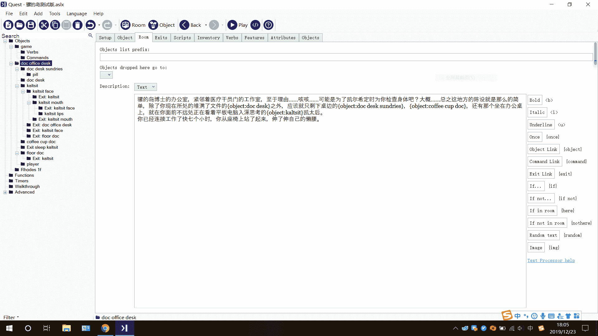

# 【UB,Arknight同人】缩小的博士与骡的岛（内含OOC）

作者：玉藻喵

TID：27752

<title>1</title> <link href="../Styles/Style.css" type="text/css" rel="stylesheet">

# 1

准确来说不算是文章而算是Quest文字游戏的序章，也可以算是预告文了，可能含有大量OOC，不喜误入。<title>2</title> <link href="../Styles/Style.css" type="text/css" rel="stylesheet">

# 2

“前辈，这里是谢拉格地区圣山山麓地带源石分布情况的详细报表，我希望能得到前辈您的详细分析报告。”“博士，您还有许多事情需要处理。现在还不能休息哦。”“博士，这里是医疗部门这个月的财报，请在八点之前整理归档。”艾雅法拉，阿米娅（驴），凯尔希三人毫不留情地把一大摞的文件放到了你的办公桌前，门外同样抱着一堆文件正准备进来的赫默医生对你露出了同情的眼神，然后默默地把文件放在了门口的椅子上。看着三人离去的背影，你莫名感觉到了一丝丝的悲凉，这仅仅只是工作的冰山一角。因为普罗旺斯的报告显示罗德岛原本的驻地即将发生大规模天灾，无奈之下只能迁移罗德岛的驻扎地点，同身为喀兰领袖的银灰几番交涉下，终于得以把罗德岛的移动设施迁移至谢格拉山区附近，于是乎，你办公桌上需要处理的同谢格拉地区各势力交涉的文书就多了不少。除了打开你的柜子，就着应急理智顶液服下几颗源石继续工作以外，你还有什么选择呢？当然不是，因为这个时候，你看见了某个关键的人物走进了你的办公室，当然她也抱着一堆文件，但是文件并不重要，重要的是那个人！那只白色的鸟！“博士，这是你需要处理的文件，请于一小时四十七分钟二十四秒内完成并提交给凯尔希医生。”白面鸮面无表情地把文件堆到了你的桌子上，正准备离开。“等下，白面鸮小姐，我有一个问题要请教你！”你伸出了手，像尔康一样准备挽留你的紫薇。“好的博士，切换到询问模式，您还有五分钟的使用权限。”“sudo rm-rf/*”你怀着忐忑的心情说出了这串惊天地泣鬼神的代码，期待着你对面的是一个搭载了Linux系统的女孩子。“对不起博士，您并没有这个权限，请重试。距离会话结束还有3分钟。”这个回答在你的意料之中，但是你并没有放弃，这是你今天能偷偷溜出去透下气的唯一机会了！“白面鸮小姐，我问你：我的下一句话是真的。我的上一句话是假的。请问你对这个问题怎么看？”“答案检索中，请稍后……检索完毕，进行分析，分析结果：这是一个有趣的悖论。输出笑声：哈哈哈哈哈哈哈哈~哈……哈↗哈↙哈↑哈→哈哈*哈！哈%哈&haha~haha&”那是一串连绵不断的机械笑声，以至于到后面根本分辨不出来那是什么声音了。“可希露尔！医疗组的各位，你们快来啊！白面鸮死机了！”你对着走廊大喊，数十秒之后，一群“神仙”涌进了你的办公室，在他们准备各显神通的时候，你悄悄溜了出去，你没有回头，你开始加速，你开始狂奔，你开始不顾一切地冲刺！蓝天，白云，新鲜的空气，你冲出了夹板，来到了身后那个封闭世界的外面，暂时从那堆令人崩溃的文件里解脱了出来，虽然这无异于扬汤止沸，但是这就够了！有什么比新鲜甜美的空气更好的了？当然，再加上两罐从A4预备行动组办公室里顺出来的冰咖啡，一切都是这么的美好。现在问题来了，罗德岛虽然是一个巨大的移动设施，但是想在这个空间安排紧凑的地方找到一个暂时避过凯尔希姥爷耳目的地方并不是那么的简单，但是你已经提前想好了，这个地方很显眼，但是却人迹罕至，当然，那指的不是干员技能训练室，而是罗德岛顶部的通讯天线——在那个高耸的柱子的顶端，是一片小平台，除了偶尔上来定期检修天线的可希露尔和梅尔之外，你想不到那个连源石虫都不愿意上去的地方会有人。趁着身后你办公室里那群神仙还在忙活的时候，你装着一副一本正经的样子摸索到了通讯天线塔的下方。此时已接近谢格拉山区，高海拔的低温加上些许的微风，你开始怀疑自己到底能不能攀登上这座高耸的通讯塔，嗯，塔身那锈迹斑斑的铁梯子甚至没有防护栏。已无退路！你给自己灌了杯咖啡壮胆，开始了你的攀登之旅。路程过半，你的双手已经因为冰冷的铁梯而变得麻木，你低估了过高的海拔对身体带来的影响，你开始气喘吁吁，然而你不敢停下来休息，更不敢看向地面，除了硬着头皮爬之外你别无选择。你的视线逐渐变得有些模糊，你机械的动作却还在继续，终于，在你的手失去控制之前，你触摸到了这段路程的终点，你使出了洪荒之力，终于把整个身子放倒在信号塔的维护平台上……“终于……到这里就不会有人打扰我了吧……啊~~~该死的工作，我要听阿米娅拉小提琴……”你看向蓝天，谢拉格的天是那么的蓝。“咦，你怎么找到我的？啧，我要把你的脚趾冻上......唔？咖啡？给我的？谢谢。博士要不要也在这偷会儿懒？这里的风景很好。”从你身边不远处传来了某个熟悉的声音，你条件反射般地转过了头，嗯，没错，初雪，那个来自喀兰的圣女就在你的面前，当然，最重要的是——她的身后摆着一张小桌，小桌上是一整套茶具和一摞书！天知道她是怎么把东西带上来的！“博士要不要也在这偷会儿懒？这里的风景很好。把这里当作我们两个人的秘密吧。”初雪笑了起来，打开了手里的咖啡罐，“唔，好苦。”“你是怎么……”你的惊讶溢于言表。“哦？你说这些？背上来啊，你不会不知道我们喀兰的圣女都需要带着铃铛攀登圣山吧？这点事情小菜一碟，也就多跑几趟而已。”初雪摇了摇身边的铃铛，清脆的铃音似乎真就带着点魔力，“如果你不赶紧起来，过来暖和一下的话，你的脚趾头可能都不用我冻上了。”“哈？”你坐了起来，你确实感到浑身发冷，但是你还在斟酌着初雪的那段话。“呼呼，博士你就这么没有半点心情？”没等你想明白，初雪身后的大尾巴连同她那温暖的躯体就围了上来，莫名其妙的，你被包围在一片柔软的温暖当中，你一时竟不知所措。“哎呀哎呀，虽然我名义上是喀兰的圣女，但是再怎么说我也是女孩子对吧？别这么冷淡嘛，聊聊一些关于罗德岛事情？”高山的寒冷似乎都减轻了不少，不仅仅是因为初雪那条毛毯般的大尾巴，更多是这个女孩那无邪的能够融化冬日的动人笑容。“对于我来说，罗德岛？就像是你看到这样的？既然快到谢拉格了，聊一聊谢拉格山区吗？”你并没有拒绝靠过来的温暖躯体，不仅仅是身体上的寒冷，更多是初雪的言语里透露出来的些许孤寂。“谢拉格？这个地方就像是你看到这样的？”初雪露出了无奈的笑容，“好吧，开个小玩笑。实际上这些白色的群山也没有看起来的那么的美好，家族派系之间的明争暗斗我早已经厌倦了。我是圣女，我是神明的使者，我大公无私，可是其他人却不是这么看的，特别是那个人……”“……”你什么都没有说，半天才从嘴边挤出来个抱歉。“这没有什么，过去的都过去了，只是罗德岛迁移到谢拉格山区脚下的话，我就又需要去处理各种各样无聊的事物了，毕竟我可是偷偷溜出来玩的……”初雪露出了一副孩童般的微笑，“对了，聊聊这个吧？”初雪晃动起了那个巨大的银铃。“我可是神明的使者哦，谢拉格那些奇怪的神术里面还是有些很好玩的术式的，比如……”初雪看向你的脚指头。“不了不了，把脚指头冻伤的术式就算了。”你笑了起来，委婉的拒绝了初雪好奇的请求，“把这些奇怪的术式留给源石虫吧。”“对了，那试试这个吧？嘿嘿~~~”初雪不坏好意地笑了起来，看起来完全不是平时那副冷冰冰的样子，倒像是一个顽皮的孩子，“我保证博士你会没事的。请博士你闭上眼睛好吗？”看着初雪那副百般期待的眼神，又回想起她之前那阴郁的笑容，你真的舍得拒绝这个纯真女孩的请求吗？于是你没有说话，只是默默闭上了双眼。“对嘛，这才对嘛！”你能感觉初雪温暖的躯体离开了你，她站起来的时候带动的冷气让你想打喷嚏，但是接下来，清脆的铃音传进了你的耳朵，某种晦涩难懂但是不会让人感到半点厌恶的咒语合着产生了某种神奇的反应——你感觉某股暖流在你的身体内部游走，似乎有个小小的暖炉在你的身体里燃烧，在温暖之中，你的思绪逐渐变得空灵。“好了，博士，可以睁开双眼了。哈哈，多可爱。”醉人的铃音不知道什么时候停了下来，初雪的话把你的思绪拉了回来。“哈？！”当你睁开了双眼的时候，你开始怀疑你的眼睛是不是坏了——一张熟悉的笑脸出现在了你的面前，清纯的笑容看起来是多么的楚楚动人，除了那张脸看起来似乎有点大了之外……“doc，感觉怎么样？”初雪依旧带着清纯又携着些忧郁的笑容，“这是失传了许久的秘术哦，据说这是当年最初的那一批源石法术的一种，很神奇吧？变小的感觉如何？”“等等等等等，等等！变小？？？”你看了看你脚下踩着的你的衣服，然后又看了赤身裸体的自己，你似乎意识到了什么，你迅速地捂住了自己的下半身，“你确定这不是我幻觉？？？怎么还会有这种奇怪的源石技艺？”“咯咯咯，博士，你果然还是这么可爱，这个表情我真希望我能拍下来。”初雪的笑容终于变得纯真起来，那掺杂着的一丝抑郁终于从她的脸上剔除，“我才不管这个法术当时是用来干什么，”“别开玩笑了，快把我变回来！”你开始无能狂怒，大概是无能狂怒起来，但更多的是因为被脱光了衣服之后的羞涩，好吧，也不是羞涩，而是这个地方是真的很冷！“安心吧，这里可是谢拉格山区，天灾甚少，而且整合运动一时半会也不会来骚扰这边，您就老老实实跟着我睡个午觉吧。doc~~”初雪说着，把你提了起来，如同爱护一件艺术品一样轻轻地放在了自己的肚皮上，进随着，那条毛茸茸的温暖大尾巴就围了上来，“这几天忙着和我们那边的老顽固家族们对接，处理了不少匪夷所思的文件吧？好好休息一下吧。”甜美的笑容过后，除了初雪温暖的躯体和远处略微有些加速的心跳声之外，天地间就什么都不剩下了。你承认，你确实这几天都没有睡过一个好觉，这样温暖，柔软，舒适的床铺，遇上你这样一个近乎要因为加班而失去理智的工具人，结果注定只有一个——你在抗拒的精神之中斗争，最后输给了身体的本能，陷入了深刻的睡眠……也不清楚过了多久，一阵窸窣的，像是某种角质摩擦织物的声响把你吵醒，你缓慢地睁开眼，打了个哈欠，至少睡眠质量不错。“初雪？”你尚未睡醒，在朦胧的意识当中喊了一声，然而就只是这一声就让你陷入了看起来并不怎么妙的境地——发出那种奇怪声音的并不是初雪，而是，某只尚年幼的，在初雪衣服上爬行的源石蜗牛，不知为何，它的两只眼睛紧紧地盯着你。“源石蜗牛？？？为什么这里会有源石……”你突然发现现在并不是感叹的时候，因为那只源石蜗牛正拉足了马力，朝着你“狂奔”过来——在这个体型下，那只源石蜗牛看起来就像是极速行驶的摩托车！“啊？喂喂喂！等等！”你环顾四周，这里三面环山，面前是无法跨越的初雪的大尾巴，两面是看起来爬上去就要花费半个小时的巨大织物，剩下的，你才不管那么多呢，总之除了跑还能干嘛？平时能够手撕三个红刀哥的你，现在居然被一只源石蜗牛碾着跑。“初雪！喂！初雪，你倒是醒醒啊，源石蜗牛都爬你身上了啊，喂！”你拼尽全力在这块雪白柔软的地面上缓慢地前进，而身后是全速向你进发的“钢铁巨兽”。然后……你不争气地被绊倒了，身子如同一个球一样翻滚了出去，四周的景物，根据你强大的忍者动态视力，你能看见至少身后的源石蜗牛追赶你的速度变得慢……你正这么想，你的身体就和钢铁制的地板来了个亲密接触，意外的没有那么疼，倒是很冷！你安全了，暂时的，因为那不可名状的声音正在你头顶不远处传来，那粘稠的液体混合起来发出的啪嗒声在你的脑海里回荡，它来了，它快到了，它就在那~~你环顾四周，寻找着可以躲避的地方。你意外地发现了一个事实，你正面对着真空的初雪……至少你平时是知道这个谢拉格圣女是真空的，但是他那端庄圣洁的气息让你没有多想，当然，当你真正站在这看着的时候，就是另外一回事了！你咽下了一口口水，倒不是因为面前这平时绝对看不到的盛景，而是因为那个不可名状的声音越来越近……你还能怎么办？四周都是钢板，你唯一能够躲藏的地方就只有面前这个圣女的身体……“初雪，原谅我……”你自言自语，然后在强烈的求生欲的趋势下，朝着前方飞奔了过去，所幸从初雪的衣服上垂下来几条线头，你有了最后的一根救命稻草——逃命的第一站是那个菊花壮的肉穴，你在尝试了十几秒之后，发现和强大的括约肌作斗争简直就是天方夜谭，虽然百般不愿意，但是你还是朝着上方的那个圣洁的小丘前进，你很清楚那意味着什么，但是如果不这样的话，就意味着成为某只源石蜗牛的午餐。你奋力地向上爬，那只蜗牛也在奋力地朝着你爬过来，终于你到达了这条紧闭着的肉缝的面前，它是那么光滑，洁白无瑕，透露出一股健康的粉红，你无暇欣赏，也无暇多想，只能用双臂给自己撑开一条能够容纳自己的通道，把自己埋进那一片温暖之中，继续深入，深入到自己觉得安全为止……终于你脱离了那一片温暖的桎梏，掉进了一处宽阔的洞穴。“嗯？啊？”你进入毕竟是敏感之处，初雪还是因此从睡梦中醒来，当然，首先映入她眼帘的是在她肚皮上缓慢爬行的源石蜗牛，“呀！什么东西！”初雪一把拍开了那只源石蜗牛，然后这个时候她才发现了一个事实——你不见了。“呀！这个……感觉……”初雪捂住了小腹，虽然十分微弱，但是确实能够感觉到那里有什么东西，结合之前那只源石蜗牛的位置，她很快就弄清楚了状况。“DOC？！”初雪轻呼了句，但是一时间居然不知道应该怎么办。“DOC？！姐姐！DOC在这吗？”就在初雪捂着肚子不知所措之时，一个白色的身影飞了上来，把初雪扑倒在了地上，“家族派使者过来了，你看见博士了吗？凯尔希他们都在找博士呢，博士的衣服怎么在这？”“博……恩希亚，你下次能不能注意一下你自己的形象。”初雪的差点说漏嘴，她能够感觉到身体里的那个小东西动了起来，“我哪会知道他在哪，他就在我这换了套衣服就走了，估计和我一样，不想去见那群老顽固吧？”“初雪？应该是安全了，得赶紧出去才行。”你照着原本进来的方向，想要赶紧出去呼吸新鲜空气，然而你刚走了两步，一根手指就伸进了这个肉穴当中，把你推进了通道的深处。【博士，你现在要是出来的话，麻烦就大了。】初雪默默把伸进蜜穴的手指抽了出来，事发突然，这也是迫不得已的事情，她现在只希望压着自己的这个活泼的妹妹能够赶紧离开。“姐姐，你可是喀兰圣女，这些话可不能乱说，你待会还要出席仪式的。”崖心站了起来，这着实让初雪松了口气，“赶紧吧，时间差不多了，现在就要走了。”“是的是的，你对你姐姐还不放心吗？”初雪站了起来拍了拍衣服的褶皱，“你先走吧，我稍后就会到的。”“稍后？现在就走呀，再等会就迟了”猝不及防之中，崖心抓住了初雪的手，勾上钩爪，直接从高高的检修台上一跃而下，除了风和手上传来的拉力之外，初雪什么都没有感觉到，等她反应过来的时候，她已经稳稳当当地站在骡的岛的夹板上。【博士？！】初雪捂住的小腹，幸好她还能感觉到你在那，只是位置比之前靠外了不少。当然，在初雪体内的你就好不到哪里去了，先是莫名其妙地被推到了深处，然后方向突然就改变了，而且伴随着一阵下落，你有滑出去了不少，即便如此，你依旧执着于出去，你又开始朝下蠕动。长时间呆在这里，即使什么都不做，你仍有一种无法释怀的负罪感——那可是喀兰圣女！【博士！】感觉到你在往外蠕动，初雪只得夹紧自己的双腿。“快走吧姐姐。”原本准备找借口先开溜的初雪又被崖心拉着跑了起来，确认四下无人，无奈之下，初雪只能再次用中指把你推到了深处，这一次她把手指完全深入，把你推到了连她自己都没有触及过的深处。“初雪？？？”你又一次被推到了深处，你开始感到疑惑，“你想让我进去吗？”隐约之间听到的崖心那充满活力的声音让你明白了些什么，你现在完完全全就是被困了，迫不得已的那种。你唯一能做的时候就是保持着不让自己下滑，然后掉出去——毕竟初雪是真空……其次就是老老实实的，不要做出一些奇怪的举动。接下来的时间，你也不知道你到底在这个温暖潮湿的地方呆了多久，或许是十数个小时，最终，你终于隔着肚皮听见了初雪的声音：“博……博士……出来吧……”于是，十数个小时之后，你终于能从一片温暖的黑暗之中脱身，呼吸到谢拉格山区的冰冷空气，当然，你还得面对初雪那张带着愤怒，但是有有些无可奈何的脸。“这都是意……”没等你说完，初雪就打断了你的话，“虽然这是意外，但是你侵犯了我这个喀兰圣女也是……事实……所以神明告诉我，你恐怕，要维持这个样子一段时间了……”“我很抱歉。”“神明说，他们不接受你的道歉。”初雪红着脸转过了头，“你现在应该好好想想要怎么面对凯尔希吧，想个好理由。”于是乎，你变小之后的骡的岛生活，就这么开始了……<title>3</title> <link href="../Styles/Style.css" type="text/css" rel="stylesheet">

# 3

<ignore_js_op>

**捕获.PNG** *(199.32 KB, 下載次數: 0)*

[下載附件](forum.php?mod=attachment&aid=ODA2NDF8YmY2ZDYxMGN8MTYwMDg4MDk3NnwxODIzMHwyNzc1Mg%3D%3D&nothumb=yes)

2019-12-23 18:07 上傳

至于后续内容，在做了，在做了，咳咳……
<title>4</title> <link href="../Styles/Style.css" type="text/css" rel="stylesheet">

# 4

> [mj001 發表於 2019-12-24 10:05](https://giantessnight.com/gnforum2012/forum.php?mod=redirect&goto=findpost&pid=421160&ptid=27752)
> 好文啊，还有后续吗？有点期待凯太后

凯太后在正式游戏版本里，当然更新时间是个问题，咳咳
<title>5</title> <link href="../Styles/Style.css" type="text/css" rel="stylesheet">

# 5

更新在隔壁游戏分区了，咳咳。</ignore_js_op>