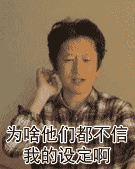

# 【growth系】玲可的奇妙之夜（4月11号临晨更新）

作者：飞续s

TID：22365

<title>1</title> <link href="../Styles/Style.css" type="text/css" rel="stylesheet">

# 1

*本帖最後由 飞续s 於 2017-4-11 03:19 編輯*

大家好，我是飞续s。
希望大家以前看过并喜欢我的第一篇完结的文章《艾琳的成长》。
这次带来了一个新坑《玲可的奇妙之夜》
不同的是，这次是直接在论坛而不是在贴吧连载。
故事的脉络基本理清，所以基本不必担心坑文。

简介：
不到手指大小的精灵玲可喜欢上了人类王子查德，为了能够参加王国中选取未来王妃的舞会，玲可偷到了巨大化的魔法。只是令她没想到的是，这股魔法似乎会一直持续下去。。。<title>2</title> <link href="../Styles/Style.css" type="text/css" rel="stylesheet">

# 2

*本帖最後由 飞续s 於 2017-1-4 09:52 編輯*

你相信， 世界上有精灵吗？
真的有噢，
这是一个关于有着纯净心灵的精灵和人类王子之间的奇妙故事。
  第一章   
精灵是一种神奇而机灵的生命，她们小巧玲珑，蝴蝶般大小，有着洁净透亮的翅膀。平时隐藏穿行在花丛之间，与大千世界中的小生命为伴。可惜的是，她们总是刻意躲避着人类，到现在很多人也以为精灵只是活跃于小孩子的书本中虚幻存在。 在精灵的圈子里，愿意和人类有任何交集的家伙肯定是个笨蛋中的笨蛋吧。 不过，这样的笨蛋总是跟房梁里冒出的蘑菇一样，搞不好真的会出现呢。 在王宫的花园里，王子像往常一样路过那里的小径，他没有注意到，花丛中正有人一直偷窥着他。
【哇。。。王子今天果然又从这条经过了，真准时呢，不愧是王子殿下~】玲可从草从中探出头来，她那橙色的头发的颜色像金盏花一样讨人喜欢，眼睛有着绿松石一般亮翠的质感，小巧的身段配上她用花瓣做成的衣服是一种别样的靓丽。 突然，玲可的肩膀被从后面猛得一拍，吓了她一大跳。
【玲可玲可，你该不会~是喜欢上那个王子了吧。】玲可过扭头去，看到是她的好朋友诺依站在后面，粉扑扑的头发像花粉一样甜。
【啊。。。】玲可的脸立马红的像个苹果，两眼装模做样害羞的乱瞄，
【哪。。哪里有啊，人家才没有喜欢什么王子咧，虽然他长得真的好帅性格又好就连星座也是水平座。。。】
【哼~哼~】诺依眼睛一眯，不怀好意的盯着玲可，脸凑的更近了，这叫玲可意识到自己说的太多了，害羞的脸都快烧着了。
【都说没有啦。。。】
【哟哟，那刚刚是谁一副痴女脸盯着帅气的王子啊。】一个墨绿色长头发的精灵从一个花苞里面飞了出来。
【咦？香草莹，你怎么也在这里啊。】诺依两手插着腰，抬头问到。
【喂！你说谁是痴女啊！】玲可红着脸说到，看上去听生气的嘟着嘴，精灵生气的模样也蛮可爱的。
【当然是谁答应我谁就是痴女啦，痴女~】香草莹从花上跳下来，弹了一下玲可的鼻子。 【都看你偷跑到王宫的花园里好几次了，我就猜到你今天还要过来，还说自己不是痴女呢。】
【我。。我】玲可着急的一跳一跳的了【我才不是什么痴女的啦。】
【那就是王子的迷妹喽，propro~】诺依说到。
【哈哈哈。】香草莹笑了起来。
【什么嘛!我。。我才不喜欢什么王子嘞!我怎么可能会喜欢一个人类嘛!】玲可使劲的以高频率晃着诺依【才不喜欢才不喜欢才不喜欢!】 【玲可。。。你再晃下去我就要晕死了。。】诺依的两只眼睛都快变成圈圈了。
【哦~那刚刚好哦~】香草莹微微一笑。【反正王子马上就要结婚了~】
【什么!!?!!】玲可吃惊的大叫一声，手一松，诺依瘫倒在地上。
————————————————
【朱里安大臣啊，明天的舞会安排的怎么样了?】
【国王陛下，请您放心，我已经把准备工作都安排妥当了，到时国外的公主和国内的舞女们都会汇聚一堂，王子一定可以从中挑出他满意的未来的王妃的。】
【那很好，朱里安，这些事果然交给你般我就放心了。】
——————————————————
【你说的。。。都是。。。真。。的。。嘛。】玲可听的全身发抖，连她橙色头发上那根挺长的呆毛都跳舞似的抖了起来。
【啊，当然是真的咯，今天早上一不小心听到的，国王和大臣亲口的对话哦~反正跟我们没什么关系对不对，王子嫁给谁关我们什么事啊~】香草莹嗤嗤的笑着。
【哇！啊啊啊!我不管我不管啦!】玲可拼命的摇着香草莹，比刚才摇诺依摇的还要快。
【我要参加那个舞会!我要参加那个舞会嘛啊——！】
【喂喂喂!住手啊。。痴女!你可是个精灵唉！还没一个人类手指头大，你怎么可能参加这种舞会嘛！】
【我都说我不管了嘛——！】玲可急的眼泪都出来了
【就没什么办法让我变的大一点嘛?】
（待续。。。）
<title>3</title> <link href="../Styles/Style.css" type="text/css" rel="stylesheet">

# 3

啊咧。。。直接复制粘贴已经写好的东西不能自动排版啊。。
大家只能凑合着看了吗。。<title>4</title> <link href="../Styles/Style.css" type="text/css" rel="stylesheet">

# 4

第二章：
【你都在说些什么奇怪的话啊哦喂!】香草莹把手抵在玲可的脸上，修长的胳膊立马显示出了优势，玲可怎么也摸不到她，可手还在不住的晃来晃去。
【还说自己不喜欢你的“王子殿下”呢，真是的，明明连翅膀都没有，还一个人跑到王宫这么危险的地方，你知不知道世界上有一堆嗷嗷待哺等着抓你做标本的人类啊。】<title>5</title> <link href="../Styles/Style.css" type="text/css" rel="stylesheet">

# 5

一提到翅膀，玲可脸色变得十分阴沉，头发都耸了下来。
明明是一个精灵，但却没有翅膀，让玲可从小一直很自卑，性格十分怯懦。幸好有着诺依和香草莹，虽然嘴巴上时不时喜欢开玲可的玩笑，但玲可每次被同类欺负或者遇到危险的时候，她们总能挺身而出。玲可非常感激这两位好朋友。
【所以。。。你们跟着我其实是担心我又遇到什么危险吧。】玲可低着头嘟哝着说。
【那还用说，你这家伙总是叫人不省心。你都16岁了，生命已经过去五分之一了，居然还会有喜欢人类王子的奇怪想法，真是的，真的一点都不叫人省心。】香草莹把手指放在额头上，以一种对小女孩一样无可奈何的态度摇着头。
【那很奇怪吗?呜。。。查德王子，明明很帅的说，对花花草草也很温柔，还很喜欢小动物。最重要的是。。。】玲可的脸开始发烫，一种幸福的笑容浮现在她脸上，居然沉浸在她的回忆了，呆呆的立在了诺依和香草莹前面。
痴女。。。
【快醒醒!你家温柔帅气的查德王子明天就要嫁人啦~】诺依把脸凑到玲可的耳边，悄悄的说到。
【唉啊！】幻想的泡沫被炸破，玲可回忆起了那她一直努力忘掉的话，豪淘大哭起来。
【我也好想加入那场舞会啊！真的就没什么办法吗？我。。。我真的好想和王子一起跳舞嘛。】
【就跟你之前说的一样，先找到一个让你变得和人类一样大的魔法啊~如果你找的到话。不然就凭你着豆芽菜一样的身材，估计还没走进去就先被当成掉在地上的小金橘踩扁了吧~】香草莹说到。
【不要，人家才不想被踩扁嘞。不过，那种能变大的魔法真的有吧。】玲可焦急的问到。
【没有啊~】
【。。。】
【没关系啦。】诺依从后面抱住玲可，玲可纤细的小腰很容易就被抱住了。【想开一点，就算你能找到能叫你变大的魔法，你也根本不会跳舞呀，对不对？】
【哇哈哈哈。】香草莹又忍不住笑了。
【你不要讲出来嘛，呜。。】
突然，香草莹注意到脚下的土地暗了下来，阴影笼罩了她们。
【玲可!小心!】
————————————————————————————
【国王陛下，午休时间快到了，您先就寝吧。】
【好的，朱里安，明天舞会的主持就拜托你了。】
【这是我的荣幸，陛下。】
在将国王卧房的大门关上后，朱里安不紧不慢的移动了旁边的花盆，他把旁边的墙壁一推，一道暗门出现了。
【真是愚蠢的国王啊，好好享受为数不多的舒服日子吧，哈哈哈。】朱里安走进了暗门，门一转，恢复了原状，好像什么都没有发生过一样。他沿着一条相当长的楼梯走进了下去，拐了个弯，一栋弥漫着药水和草药味的实验室出现了。
【只要我的药水一完成，传说中无穷无尽的力量就要到手了!哈哈哈哈!】
（待续。。。。）<title>6</title> <link href="../Styles/Style.css" type="text/css" rel="stylesheet">

# 6

> [hunj 發表於 2017-1-2 20:45](https://giantessnight.com/gnforum2012/forum.php?mod=redirect&goto=findpost&pid=318963&ptid=22365)
> 飞续大大再多更点呗，一会儿我搬到贴吧里去

想搬就搬吧，主要是自己太懒了~

<title>7</title> <link href="../Styles/Style.css" type="text/css" rel="stylesheet">

# 7

第三章：
玲可抬头一看，巨大的铲子正从天上落下。
【玲可!】诺依很想冲上去把她的好朋友拉开，可来不及了，诺大的如同铁壁般的三角铲把玲可和诺依香草莹分隔来。
“又要给王宫里的花盆换土了。”一个的慵懒女性的声音从上空传来，“当个园丁还真是累呢，唉~”
玲可抬头看到了她是一个缠着蓝色、留着浅黄色头发的女人，年龄大概才20多岁，很年轻，但那种懒散的态度又显得心不在焉，甚至都没有注意到她手上拿着的铲子旁边正有几个小生命。
[她脸朝着方向的话，铲子会朝哪里挖呀。。。]玲可盯着灰色冷冰冰的铲子，可能不到一秒钟，却又过去了很多个世纪，玲可脑子里冒出了一堆又一堆的奇怪想法，包括很多和此时此景没有关系的事情——自己今天早上出门有没有被小树枝绊倒，诺依刚刚抱着自己的腰让她莫名的兴奋，王子喜欢吃什么东西。。。一切的一切，都是为了让自己忽略那个即将发生的可怕事实——
铲子朝她这边铲过来了!
脚底下的泥土开始松动，抖翘。三角铲像一只钢铁巨兽，附近低矮的
三叶草和小型兰花被连根挖起，溅出的小土块喷射出去，对于精灵来说，跟因炸山迸发出的巨石没有区别。诺依和香草莹只好躲到一旁的草丛里，1.6米高的女园丁对于她们来说是80余米高的巨人，那块被挖去的地方如同遭受破坏森林，比她们高4、5倍的花草轻易的就被那双带有绒毛的布鞋给压弯了，无力的倒了下去，她们恐还不够鞋跟高吧。
所以说，怎么会有精灵想跟人类打交道啊！
玲可有了一种失重的感觉，自己可以看到高草和海棠花的顶部了，自己终于变大了吗？才怪嘞!自己已经在铲子上被抬到40厘米的“高空”了。
心不在焉的女园丁依旧没注意到铲子上正趴着个奇怪的东西。
【救命啊。。。】玲可有了一种类似于漂浮在宇宙种的感觉，但很快，又被引力拉了回来，朝下落了。【哇啊。。。】掉进了女园丁用来装土的袋子里，阳光逐渐消失了，雪崩似壮观的泥土混杂着三叶草和其它不认识的小型植物砸了过来。
这样下去就要被活埋了！不要啊，自己还没跟查德王子近距离的接触过，好想让自己被他温柔的手像摸金丝雀一样抚摸啊。
咦!袋子好像有个破洞!【呜哇!感谢神明大人还没有抛弃我这个苦命的小精灵啊!】玲可激动的眼泪都出来了，刚一爬出去，洞后面就被泥土给封死了。
【好讨厌哦，呜啊，被弄的灰头土脸的，衣服都破了，呜hei。。】
在玲可心情稍微平静一点以后，抬头看了一下这个园丁，她还在不停的铲土呢，完全注意不到脚边的她。
【她好高哦，人类真的好大，要是也能像人类一样高大就好了，唉，还能被查德王子公主抱的说~哇~】玲可立马又陷入了她莫名其妙的幻想之中。
【不过这个园丁的头发还真是长啊，都快拖到地下来了，她洗起头来就不怕麻烦吗。。。哦！对了！她不是要给王宫里的花盆换土吗？说不定。。。说不定有机会可以见到王子殿下了~哇~~好浪漫~】
玲可抓起女园丁的头发，爬呀爬，一直爬到了头巾里，藏在了里面。
【呼~终于把土铲的差不多了，累死我了，赶紧去王宫吧。】女园丁用擦了擦头上的汗，巨大的手从玲可身下掠过，差点就碰到她了，如此近距离的面对人类的手也是第一次，那上面站着20来个她绝对没有问题。
[自己真的好渺小哦。。。]
（待续。。。）<title>8</title> <link href="../Styles/Style.css" type="text/css" rel="stylesheet">

# 8

有谁能告诉我怎么改文章标题啊。。。。<title>9</title> <link href="../Styles/Style.css" type="text/css" rel="stylesheet">

# 9

> [ls19930624 發表於 2017-1-3 01:19](https://giantessnight.com/gnforum2012/forum.php?mod=redirect&goto=findpost&pid=318993&ptid=22365)
> 飞絮，猜猜我是谁？嘿嘿嘿

你难到不是木龙传吗？
<title>10</title> <link href="../Styles/Style.css" type="text/css" rel="stylesheet">

# 10

第四章：
呆在头巾里的感觉真的一点也不舒服。
你坐过船吗？对，就和那种滋味差不多，摇摇晃晃一上一下的，玲可浑身难受。
但是，自己终于到皇宫到里面来了，即使和王子殿下一起跳舞只是妄想而已，可是只要哪怕近一点，近一点也好，静静的看看他啊。
在他有自己的心上人之前。
[如果查德王子有了心上人的话，我这样一定很讨厌吧，王子，王子，我就真的没有办法传递自己的心意吗。]
玲可透过女园丁的头巾，默默的看着王宫内的装潢，那些来自异国他乡的奇珍异宝她却无心欣赏，脑子里充盈着这个年纪的少女特有的粉色的烦恼。
这位还不知道自己被当成“坐骑”的女园丁可不会感慨这些，她虽然也很年轻，但已经过了那最青涩懵懂的年纪了，她现在想的，只是赶紧把王宫里的花盆换上新土，她好早点休息。
【呼~才到国王寝宫前的花盆吗？天啊，我到底还要换几盆啊？累死人啦。】女园丁不满的说，弯下腰，正准备将土换上，口袋里的一枚银币不知怎么掉了下来，滚进了花盆底下。
【唉！？我的钱!】女园丁用手抱住花盆，想把它移开，整个花盆取朝着一个方向转了起来，接着，一道暗门从墙上出现了。
【。。。!？】女园丁莫名其妙的看着眼前的景象。
【。。。!？】玲可被响声惊到，从头巾中探出脑袋看看到底发生了什么 。
【这里怎么还有间屋子啊？该不会里面还有要换土的花盆吧？真是麻烦死了，还是下去一趟吧。】她刚一走进去，门就自己关上了。
【咦!？门怎么自己关了，没办法，那只好下去了。】沿着长长的楼梯，一个古怪的房间出现在她面前，这其中，还有一个挺熟悉的的身影。
【咦？朱里安大臣，你怎么也在这里啊？】女园丁问道。
【什么？!!】朱里安一扭头，看到国王的园丁就站在他的后面，吓出了一身冷汗。
[完蛋了，我的秘密研究所居然被发现了，果然最危险的地方就是最安全的地方根本就不值得相信!早知道就不搞那么容易被发现的机关啦。。。]看着女园丁正四处打量着周围，朱里安吞了一口口水[不行，她肯定已经注意到我发明的超级药水了，现在只能一不做二不休。。]
【喂，朱里安大臣啊，你这里有没有放花盆啊？】女园丁冷不丁的问道。
【啊，花盆？没有。】
【搞什么嘛，原来没有花盆嘛，害我白费心机跑下来。】说完，扭头就往回走。
【等。。。等一下，你难道刚才左顾右盼的只是在找这里有没有花盆吗？那根本不是重点好不好啊！】朱里安指着他桌子上一堆化学和炼金器材焦急的说到【你怎么可以忽视掉这些东西呢？】
【这些瓶瓶罐罐跟我有什么关系啊，无聊死了。】
【无!聊!？。。。你说无聊!？】朱里安下巴都合不拢了，他跺着脚说到【园丁小姐，别急着走啊！你可知道这个瓶子里装的是什么？】
【我才不想知道。。。】
【不!你想!】朱里安把园丁小姐拉了过来，把桌上这个装着奇异颜色液体的瓶子拿到了她的面前。
【我告诉你啊，这个瓶子里装的东西，我管它叫超级药水，是由失落的魔法章籍中发掘出的配方制作的，很多材料已经搞不到了！假如你要是喝下去的话，就会——】朱里安故意把声音拖的很长。
【就会怎么样啊，你就不能快点说啊。。】
【那你就会变成比高塔还要巨大，不对，或许会变成比山脉还要巨大巨人!获得无穷无尽的力量!只需要一脚，整座城池都将灰飞烟灭，到那个时候，嘿嘿嘿哈哈哈。。。】朱里安狂笑起来。
玲可听的一清二楚。
【所以你到底想表达什么啊。。。】园丁很不耐烦的说 。
[哎呀。。。自己刚刚好像一不小心说的太多了。天啊!我到底在干什么!为什么会对一个园丁说这么多!]
【真是的，耽误我那么多时间。】园丁小姐捋了捋自己几乎垂到地上的长发。【我还要赶紧换完王宫里剩下的花盆的土呢，上面的门打不开，麻烦帮我开一下。】
【哦，好的。。】朱里安跟着她一直走了上去，用钥匙把密室的门开开。
【记住，这里的事不可以跟任何人说啊。】
【拜托这么无聊的事谁会跟别人说啊。】
送走了园丁小姐之后，朱里安意识到了更多严重的问题。
自己为什么会对一个园丁低三下气啊！
自己可是一个要利用超级药水称霸世界的人啊!
【对啊，我不是一个坏人吗？干嘛净做多余的事啊？】朱里安慢慢的往下走着，越想越尴尬。【算了，反正距离我的超级药水彻底完成，就只差一样很普通的东西了。。。什么!!!】
不见了，
刚刚明明还放在桌子上的药水不见了！
【啊——!我的药水啊!】
（待续。。。）<title>11</title> <link href="../Styles/Style.css" type="text/css" rel="stylesheet">

# 11

第五章：
【呼。。嗨。。嗨。。】玲可推着装有药水的瓶子，钻进了墙边低矮的洞口中。不一会儿，她就听到了洞外咒骂声。玲可的心扑嗵扑嗵直跳，大口大口的喘着气，把手抓在自己平平的胸上。。。额，不对，是胸口上。在呼吸均匀之后，她碧绿色的眼睛直愣愣的看着这瓶散发色紫色气息的液体。自己的倒影荡漾其中，奇异的浮动着。
[比高塔还要高大的巨人啊。。]玲可想象着那副景象，尽管她处在一个充满“巨兽”的世界，但一想到比“高塔”还要高大的巨人，如此绝望的大小对比（和精灵比起来），着实叫她心理不安，原因有二，其中一个是出于对巨大生物天生的恐惧。
而另一个叫她不安的因素更直观——真的要喝吗？
【看起来，好像蛮好喝的样子呢。】玲可跳到瓶子的顶端，两脚踩住瓶口的边缘，两手抱住软木塞，使劲往上拔。可无论她怎么用力，塞子就是纹丝不动。
【yiiiii——一——二————】
忽然，玲可注意到有什么东西正在靠近她。
只见一只胖老鼠，一只大老鼠，一只瘦老鼠站在瓶子边上把她围住了。
【你。。你们要干什么。。。】玲可抱住自己，橘色头发上的那根呆毛又跟着她本人一起颤抖起来了。
【你看，家里跑来了只什么啊~】胖老鼠舔着嘴说到。
【一只没有翅膀的精灵哦~】大老鼠得意洋洋的说到。
【不知道吃起来味道会不会有什么不一样啊！】小老鼠一蹦一跳的说到。
【哇——啊!不要吃我啊!我一点都不好吃!香草莹救命啊!】玲可失声大叫了起来。
[怎么办怎办怎么办!啊。。啊。。啊!没办法啦!]
玲可用了平生最大的力气跳了起来，把塞子整个踩了下去，自己也掉进了装超级药水的瓶子里。
[等等。。。我好像也不会游泳啊。。。]
【咕嘟咕嘟。。。】玲可大口的喝着瓶中的药水，水位越来越浅，没一会儿，竟然都喝完了。不可思议，玲可一点都没觉得肚子发涨，要知道，瓶子中的水量比玲可还要重的多。
现在，玲可就像被关在了一个玻璃做的牢房里，胖老鼠和大老鼠比整个瓶子还要大，那么小一个瓶口根本挤不近去。
【可恶啊!食物就在嘴边却吃不到的啦!】胖老鼠生气的说。
【人家才不是食物啦！】玲可生气的说。
【小老鼠你过来，我用一点力，你看看你能不能挤进去。】大老鼠说到。
【呵呵呵好啊好啊！小精灵，你看起来简直秀色可餐啊~】小老鼠像苍蝇一样来回搓着爪子说到。
【哇啊啊啊。。。我不是说过我不好吃吗!】玲可吓的脚都软了，鸭子坐式的瘫倒在地上。
大老鼠把小老鼠放在瓶口，使劲用力一推，“啵咚”一声，就挤了进去。
【哇。。。谁来救救我啊！】玲可苦出生来了。
【你尽管哭吧~小橘子~你就算哭破了。。。等一下。】小老鼠用爪子比了比自己的身高，又比了比跪坐在地上的玲可的身高，发现好像差不多，甚至是玲可更高一点。
【那个。。。虽然我在老鼠中算是比较矮小的一个，但我本来应该是比你高一点的。。。对吧?】
【哦?你在说什么啊。。。什么意思？】玲可缓缓的睁开一只眼睛，稍稍站起来一点。
【哎呦，好痛。。。】头撞到瓶子顶了。
【!?】玲可看着眼前着只站起来还不到自己腰的小老鼠，有了一种别样的违和感，一起看起来没什么不对，又好像哪里都不对。
【也就是说。。。】玲可明白了什么，只是，她不得不又重新采取跪姿了。
因为她的脑袋已经顶到瓶颈，可还在长，长，长。
小老鼠不停的退后，它已经站到玲可的双膝上了，玲可现在双手抱着它，像小女孩抱着泰迪熊玩具那样。
【救   命    啊    !   !】玲可和小老鼠一起喊到，小老鼠紧贴在了玻璃壁上，玲可并不怎么柔软的胸部一直对它施加着压力。
“碰嗤!”
一声清脆的炸烈声，整个瓶子从内部四分五裂。
看着倒在地上掩掩一息的小老鼠，玲可一只手拎起它来，心疼的说到【那个。。对不起啊。】
胖老鼠和大老鼠呆呆的仰望着她，茫茫然不知所措。
【刚才是什么声音?好像是玻璃炸掉的声音!难道是我的超级药水!】朱里安朝着老鼠洞走了过来。
【啊！不好!那个人类要过来了！快跑!】胖老鼠和大老鼠回过神来，急忙跳进了一个管道里。
【喂，等等我啊！】玲可放下手中的小老鼠，也匆匆忙忙的跑进了那个管道。
（待续。。。）<title>12</title> <link href="../Styles/Style.css" type="text/css" rel="stylesheet">

# 12

今日休刊补觉，明天更新,唞锵~ヾ(o◕∀◕)ﾉ<title>13</title> <link href="../Styles/Style.css" type="text/css" rel="stylesheet">

# 13

第六章：
无论如何，继续呆在这个洞里肯定会被发现的。
但问题是，这条管道到底通到哪里去啊！
【不是吧，怎么还有岔道!】玲可根本没时间思考这些四通八达的管子到底通到哪里去，因为。。。
【哎呦!】头还是碰到管子顶上了。
【额啊好疼好疼，糟糕啦，这里的管子好像是用铁做的，再不跑快一点的话就跑不出去的啦!】玲可现在只能低着头在迷宫般的钢铁管道中奔跑，不一会儿她又不得不弯着腰跑，【不好，我越来越大了，管子里的空间好窄，两只手都快摆不开了。】细嫩的皮肤和冰凉的钢铁，接触在一起的感觉还真不好呢。
【诺依，香草莹，你们在哪里啊！我要出去!呜哇——早知道就不喝什么变大药水了，呀——】
是亮光!
好耀眼!
是出口耶!
只是。。。
如果你玩过幼儿园里的那种毛毛虫管道的话，差不多技能体会玲可现在的状态了，整个身子趴在地上，只能“爬步前进”。由于跟底部如此“亲密”的接触，水绣的气息更加浓烈，滑滑的管壁让玲可淌的非常困难。
【额，就差一点了，还不能放弃，就快。。。】玲可觉得自己像在穿过一条越来越窄的洞穴一样，自己的腰快要被卡住了，哪怕是趴着头发也碰到管子顶了，用花瓣做的衣服质量本来就不好，现在大概彻底弄脏了，估计已经破破烂烂的，那浅浅的液体让玲可全身冷冷的。
【哇啊啊。。神啊，佛祖啊，我发誓以后肯定好好减肥，千万别在这种时候真的卡在里面了啊!一定要撑住。。】玲可用胳膊肘抵着一点一点向前挪。
【如果我像诺依那样有两团大棉花糖的话，大概已经出不来了吧。。。呜~好过分。】玲可惭愧的抽涕了起来，然后。。。啊咧，怎么动不了了?玲可越是使劲，越是动弹不得。
完了，屁股那里先被卡住了。
【不要啊！我不要挤死在这里啊，明明就差一步了！好难受。。】挤压感更强烈了，不停增长的身体像在越吹越大的气球一样。
好闷，脸已经贴到管壁上了，呼不出气，也吸不进气。
【已经走马灯了吗。。。查德王子。。。起码。。。就想见你一面啊。。。】
————————————————————
【mum——】
玲可揉了揉眼睛，缓缓的睁开眼睛。
一个人似乎正坐在自己面前。
金色秀美的头发，
蓝色深邃的眼睛，
清秀英俊的面容，
【喂，这位姑娘，你没事吧。】
【是查德王子吗。。。能在临死前如此清晰的看清你的容貌，啊，我满足了。】
玲可闭上了眼睛。
等等，有什么不对。。
【啊————!!】
玲可跳了起来，浑身兴奋的哆嗦的说到【查。。。查德王子!】
（待续。。。）<title>14</title> <link href="../Styles/Style.css" type="text/css" rel="stylesheet">

# 14

第七章：
人类是一种奇怪的动物，精灵其实也是如此，见到一个一直想见人之前，肚子里有千千万万句话憋着想说个痛快，可见到真人后就全都忘的一干二净了。
【王，王，王子殿下。。】玲可低着头，脸蛋红的冒起烟来，两手背着靠在墙角，像一朵害羞的小金菊。
[怎么办怎么办，查德王子就在眼前啊，想想想想快想想，诺依以前教我的跟帅哥搭讪的诀窍是什么来着!不行不行，这个时候要矜持，我一定要给在王子殿下面前留下好的印象才可以!]
豁出去了！鼓起勇气!一往无前!(＃°Д°)ง
玲可睁开两闪闪的眼睛，挺直身板，两脚一岔，左手挎在腰间，右手向前张开，摆出了一个非常富有活力元气的姿势。
【嗨！这位——】
玲可突然低头看了一下自己的脚，
离得好远。
好。。好高。。
天啊，地上的三叶草还没到自己的鞋底高，不经意间左脚只是一迈，一大丛三叶草就纷纷倾到在地，发出了清脆的咯吱声，原本被当成精灵树屋的海棠花才刚到自己的脚后跟，就连“高耸林立”的草丛中最高的草也没没过自己的膝盖。右脚边还有一根看起来像是从内部炸烈开来铁管，水滴答滴答的从里面流出来。
一只蝴蝶从眼前飘飘飞过，玲可觉得自己用一只手都能握住它，这里到底是多高的“高空”啊。
好。。好晕，已经开始头晕目旋了，突然呆在这么“高”的地方，腿都开始软了。
玲可又倒了下去。
【这位姑娘!】查德慌忙的扶起眼前这位神秘的少女。【你到底怎么了？】
【我。。。我恐高啦。。。】
【咦?】
——————————————————
【所以，你不记得你到底是谁，怎么晕倒，为什么会到皇宫来了吗？】查德迁着玲可的手，在王宫内部的水池旁漫步着。
【是。。是啊，完全想不起来了呢，哈。。哈。。】玲可别扭的笑着，似乎还没有完全适应自己的身高，牵着王子的那只手也在不停的在抖。
失忆，想不起来过去的事，当然是都是玲可现编出来的啦，她可不想变成香草莹总是在说的“标本”。
【怎么了?很紧张吗？都出了一手汗了。】查德王子回过头，看着玲可，会心的说到。
【当。。当然，王子殿下，你这么拉着我。。。真的。。好嘛。】玲可的小鹿砰砰乱跳。
【没有关系，明天王宫将会有一场舞会，全国的少女都可以参加，你只要当做提前当了我的舞伴就好了。】王子突然回过头来，牵住她的另一只手。
【愿意和我跳支舞吗?】
玲可快要化掉了。
一切，真的这么顺利吗?
（待续。。。）<title>15</title> <link href="../Styles/Style.css" type="text/css" rel="stylesheet">

# 15

> geniusachu 發表於 2017-1-9 06:53
> 终于又更新啦QAQ 更新频率简直快速 但是每次更新一小节又好吊人胃口， 这段反差描写的好好啊！ 那段植物 ...

不可以暴力膜啊。。。<title>16</title> <link href="../Styles/Style.css" type="text/css" rel="stylesheet">

# 16

第八章：
玲可突然把手抽了回来。
王子露出了些许诧异的表情。
【不愿意和我跳舞吗？】
【不。。不是的。。】玲可把手合合在一起，背过身去，那句“愿意跟我跳一支舞吗？”的确让她飘飘然到了顶点，但很快也让她的心彻底平静下来，像一旁的湖水般至远，玲可甚至从来都没有觉得自己这么冷静过。
幸福的事情，真的可以来的这么突然吗？
【我真的很愿意和王子殿下跳舞啦，而且想的不得了。只是这样真的合适吗。。。我只是个普通的女孩子而已，长得也不算漂亮，脑筋又不太好，朋友们也总爱开我的玩笑，嘿嘿。。。】玲可扭捏的说，【真的，真的能配的上高贵的王子您吗？】
【怎么连你也这样，唉。】王子似乎很失望的样子，要来摇头，叹了一口气。
【嗯？王子殿下。。。】
【你叫我查德就行，这里是我的花园，现在没有别人，不用跟我讲究那些繁文缛节。】查德摘下一朵水仙花，在手中玩味，他盯着那朵水仙，缓缓的说到【王子，王子，就因为这一个头衔 ，还有多少人能清澈的待我呢?】
【。。。】玲可走到查德后面【查德王子，不，查德，嗯。。。好奇怪哦，好吧还是叫查德王子比较顺口啦。】玲可尴尬的拨弄自己的脸，这模样让查德觉得可爱又可笑，【你为什么看起来很烦恼呢？】
【没什么，这不过是我这个纨绔子弟空洞的多愁善感而已，很难理解，对吧？你说过你有一群喜欢拿你开玩笑的朋友，其实我挺羡慕你的，从小在我身边的人，都只是一味的讨好我，称赞我，不论我做的好不好，就因为我是王子。】
【。。。原来王子你也有这种苦恼呢，嘿嘿，我果然还是脑筋不够好，还是很难理解呢。】玲可摸着自己的脑袋说【被夸奖有什么不好的啊，那不是跟蜂蜜华芙饼一样越多开心的东西吗？话说回来，华芙饼可真是一种好吃的东西呢，香喷喷的~一口咬下去那种甜蜜香浓的味道根本忘不了~啊~光想想就好幸福~】
【哈哈哈。】查德爽朗的笑了起来。
【唉——怎么了王子，我果然很可笑嘛，呜~】
【不不不。】查德靠到玲可面前，【我好久没有这么爽快的笑过了，上一次让我如此发自内心开心的是谁呢?你真是，一位特别的女孩儿啊。】他把那株水仙插在了玲可的头发上【你觉得自己不够漂亮，但你真的很可爱，自信一点。】
[好厉害，一朵水仙花居然就这么放在我的头上，我一点都不觉得重。]
对于以前的玲可来说，那多水仙绝对相当于一棵参天大树。
[以及。。]玲可脸微微一红[我刚刚是被夸。。可爱了吗？]
这时，王子拉住了玲可的两只手。
【唉！?】
【所以啊，这位可爱的小姐，请务必与我共舞一曲。】
【等。。等一下，我舞跳的很烂的啦。】
【没事，我来教你。】
——————————————————
【结果搞了半天，只找到一些玻璃碎片和一只臭老鼠而已嘛，真是可恶啊。】
朱里安拿着一本《如何说一口流利的老鼠语》，对着那只老鼠问到【所以说，你真的看到那个精灵喝光了瓶子里所有的药水。】
【是啊是啊，我还差点死掉了呢。】一想到那种可怕的记忆，小老鼠又觉得喘不过气来了。
【她有没有说过什么奇怪的话啊？】
【奇怪的话嘛。。。对了！她好像说过查德王子查德王子什么的，查德王子到底是什么东西啊？】
【混帐!你居然说伟大的查德殿下。。。咳咳咳，我在说什么啊，我已经不需要在那个国王和王子面前低声下气了，这毛病真该改改了！不过一只精灵和王子能有什么关系呢?还要偷我的超级药水，除非。。。】朱里安突然站了起来。
【除非她想参加王子明天的舞会啊！】
（待续。。。）<title>17</title> <link href="../Styles/Style.css" type="text/css" rel="stylesheet">

# 17

今日休刊补觉，明天更新,唞锵~ヾ(o◕∀◕)ﾉ<title>18</title> <link href="../Styles/Style.css" type="text/css" rel="stylesheet">

# 18

下一段自己一读糟糕透了，我要处理修改一下，再停一天ヽ(*´Д｀*)ﾉ<title>19</title> <link href="../Styles/Style.css" type="text/css" rel="stylesheet">

# 19

*本帖最後由 飞续s 於 2017-1-13 02:50 編輯*

第九章：
黄昏已经吞没了云彩，殷红的夕阳染红了湖面。
【不知不觉，都练了一个下午了呢，小姐，累了吗？】
【不累不累，毕竟是和王子你在一起，啊。。。我是说哪里有啦，都怪我舞跳的太差劲了，踩了你好几下。】
【不，你学的很快，相信明天的舞会上你能跳的更优雅。】
【是。。是吗？】玲可斜着眼睛，两跟食指抵在一起跟着身子一起扭捏的扭动着。【王子殿下，其实，我，我。。。】
王子现在在盯着我看，怎么办好紧张，啊——视线，被这湖水一样清澈的视线直视到的我要死掉了~
【我。。我该回去了！】玲可终于出来鼓了很长时间的勇气时候最后还是没说出来重点，【时间已经不早了，我。。我该回家了。】
【可你不是说你的记忆。。】
【啊，那是。。因为。。因为。。。呜，啊，我装不下去的啦！我只是想见到王子殿下不想被很快赶出去所以才说自己失忆啦，呜，对。。对不起，王子殿下，我说谎了。。呜——哇——】玲可捂着自己的脸大声哭了起来。
【不要哭了，没关系的，我原谅你。】查德拿出手帕，轻拂在玲可的脸上，玲可慢慢抬起头，样子就像一朵雨后的金盏花，很是可怜。
【王子殿下，你会讨厌我吗。。】玲可接过手帕，不安的擦拭着泪水。
【恰恰相反，古代的贤者们说过，勇气不是打死猛虎，而是承认自己的错误。你真的很勇敢。呐，开心一点，笑起来才可爱。】查德拍了一下她的肩膀
【多。。多谢原谅!】玲可把手帕塞到王子手里，突然扭头就跑，一滴飞出的眼泪甩进了王子的嘴里，味道是甜的。
【太晚了太晚了，真的玩的太晚了，抱歉，我真的要回去喽，明天舞会见!拜拜!】
【等等!】王子上前走了一步，朝着玲可挥手问到。【我还不知道你的名字呢！】
【啊，对了！我居然给忘记告诉王子殿下自己的名字了!真是失败耶。。】她敲了一下自己的头，回过身来，像站在山顶上朝山下大喊一样，挥手说到【我叫玲——可——，玲——可——我说清楚了吗?王子殿下。】
【玲可是吗，真是好听的名字啊。】
【哇啊♥~谢谢，王子殿下居然说我的名字好听~】玲可再次挥了一下手，扭头再看了一下王子，就消失在花园的花丛之中了。

不知道跑了多久，玲可跑过了花园，来到了森林的边界，自己的族人就隐藏其中。
跑的有些累了呢，这个下午经历的事，就美丽程度而言像做梦一样甜蜜的，很难相信是真的发生过的。玲可站在那里，开始好好审视刚刚适应的身体。
【真是不可思议，居然跑了这么远，一会儿就跑过来了，以前想从家里跑到王子的花园可是要花上一上午呢。这就是跟人类一样巨大的感觉吗？真的好厉害。】玲可看着森林中一排排的大树，全族的精灵大概才能围住一颗吧？玲可尝试抱了一下，发现勉强可以碰到手指。
【真是太厉害了。。。】玲可又捡起一片叶子放在手上，以前，都是把那当成被子盖在身上睡觉的，现在还不够放手心上呢。
【要是能躺在自己的手心上一定很舒服。。。】
玲可看了看脚下的草地，现在可算是不“恐高了”，看着原本茂密的“森林”一览无余，玲可心中突然拥起了一种莫名的兴奋。
【哇哦~我现在就跟怪兽一样~哈哈~】玲可慢慢的抬起脚，对着脚边的一颗蘑，一脚踩了下去，蘑菇很周围的草瞬间就被踩扁了。听着那种草折断压踏的声音，一股满足和成就感油然而生。
【哈哈哈，我是大怪兽玲可~啦啦啦~】玲可伸出俩只手，摆出一副怪兽一样的爪子，开心的说到。
【嗯嗯，大怪兽玲可，我们都听到了哦，哼哈哈~】诺依和香草莹突然从后面飞出来，在玲可眼前打转。
【啊——】说出这么羞耻的话居然被听到了【诺依!香草莹，你们怎么在这里!】
（待续。。。）<title>20</title> <link href="../Styles/Style.css" type="text/css" rel="stylesheet">

# 20

第十章：
【可算追上你喽，我俩飞的可是超级辛苦的哦。】诺依飞到玲可左边的耳朵上坐了下来。
【到底是怎么回事啊！喂喂！玲可!你怎么变的那么大?】香草莹飞到玲可鼻子前，不可思议又很生气的上下打量。【你和我们分开后到底发生了什么?】
【哦，这个，说来话长。。】玲可就把她藏在那个园丁身上发现皇宫中秘密药水的事情全给说了出来。
【你真是太乱来了！】香草莹乱抓着自己的头发飞来飞去【那种效果不明的药你到底哪来的勇气去喝的啊？】
【咦，为什么不能喝呢?】玲可嘟着嘴，歪了一下脖子。
【为什么？你呀你呀你这就叫缺——心——眼!谁能保证那药有没有毒啊？就算没有毒，喝多少量，是不是需要分一日几次，以及会长多高这些问题你有没有想过啊？】香草莹直接飞到玲可两眼之间，狠狠的数落了她一顿。
【啊，抱歉，我真的没想那么多。。】玲可不好意思的挠起头发来 。
【没关系啦香草莹，你看玲可现在不是挺好的吗。】诺依扎进了玲可的头发里，【好棒~我就像被困在了藤蔓森林里了一样，这样子超酷的!】
自己的好朋友在自己的头发里穿来穿去的感觉还真是奇妙呢。
【是啊，你看嘛，我现在这个大小真的好合适~肯定没问题的啦。】玲可把手和在一起，放在胸口。
【特别是，今天下午还偶遇查德王子，他真的太浪漫太温柔了，还教会了我跳舞，你知道吗，我以前一直幻想着能被那双手捧到手心里，现在居然是自己在握着，哇~】
【我说，你还真想和那个人类在一起啊，真是有够疯狂的。】香草莹落在了玲可手上，玲可赶紧把手放平，香草莹就这么站在了她的手心上。
【嗯。。。】一想到自己就在自己好朋友，还是那个自己一直当小孩子看的好朋友的手掌心里，自己还没她一根小拇指高，现在拍死自己跟拍死一只蚊子没什么区别吧，好自卑，好不安。但不行，香草莹已经，或者说玲可已经习惯那个强势的香草莹了，自己不可以表现出那种懦弱的样子。
香草莹深吸了一口气，【总之，这件事非同小可，我们必须回到村子里跟长老和其他精灵跟商量啊。】
【啊。。。我难道要这样见大家吗？】
【别给我搞错乱子啊。】
————————————————
查德走在回宫殿的路上，一路上思考着，那个女孩的事。
真的会是她吗？
10岁那年，一位预言家说过，
他将遇到一名改变他和整个国家自己命运的少女，
就一个他20岁生日舞会的前一天，
来到花园转一转，
那里，就将遇见她。
【她真的能改变整个国家的命运吗？这就是我等了10年的那名少女吗?真是超乎意料之外呢。】王子突然会心的一笑【不过，她还真是讨人喜欢呢。】
（待续。。）<title>21</title> <link href="../Styles/Style.css" type="text/css" rel="stylesheet">

# 21

今天不知怎么回事困得要命，休刊。
一定是fgo肝多了。。。<title>22</title> <link href="../Styles/Style.css" type="text/css" rel="stylesheet">

# 22

第十一章：
午夜降临时分，对大多数动植物来说都是休息的时光，结束了一天的纷争和辛劳，大家都要睡觉了。
但此刻却是精灵的天堂，在森林的深处，上百的精灵飘舞在奇幻的林间，萤火虫为她们带来彻夜的灯光，她们相互舞蹈，坐在树枝上谈心，在黎明到来之前都不会停下来。
精灵的长老是一位有着银色长发的女性精灵，拉莉。虽然应该是叫“长老”，但你要是这么称呼她那她可就不开心了，她看起来时分年轻，有着迷人的s形身段，以及蝴蝶般的明净翅膀，相当富有气质，甚至可以说是神性。虽然拉莉的一直让她的精灵姐妹们羡慕，但可没人说的清她到底多少岁，精灵们表示打记事开始长老就一直是她，有的甚至说她从精灵一族出现开始就存在着。
此时，她正坐在一株月光花上纳凉，看着的花间草间的精灵们相互嘻闹。
忽然，诺依和香草莹慢慢朝她飞了过来，拉莉目视二人来到她面前，前者脸上是一种很奇怪的表情，似乎一直在忍着笑，后者则是一副忐忑不安的样子，有话要说。
【嗨，长老!嘻嘻，晚上好哦~】诺依玩了一下手指，朝拉莉打了声招呼。
【喂，你怎么又调皮啦。我都跟你说了多少次了。要，叫，姐，姐。】拉莉飞到诺依旁边，用手指轻轻的敲起了她的额头。
【哈哈，知道啦知道啦。】诺依飞到一边，【拉莉~姐姐~】
【你们两个，今天怎么回来的这么晚啊。玲可呢?嗯。。也没看见她啊，你们是去找她了吗？】拉莉又坐回花上，悠闲的躺了下去。
【嗯，是的。。】香草莹凝重的回答道。
【该不会没找到吧，这孩子，一天到晚总是乱跑，明明没有翅膀，被抓住可就危险了。】
【她没被抓住，但长老您。。啊，姐姐你待会见到她时，我希望你能有点心理准备。】
拉莉猛的挺了起来，【她该不会是受伤了吧？伤到了哪里？】
【不不不，她也没受伤，生龙活虎活蹦乱跳的。】
【呼。】拉莉又重新躺了下来，一条腿惬意的放在了另一条腿上，【那是怎么回事啊，该不会是中了什么变身术变成青蛙了吧~】
【说对了一半吧。。】香草莹拍了拍手 【玲可!你可以出来啦！】
【哦！来了。】
好洪亮的声音。
拉莉睁开眼睛，一只巨脚从头顶朝压了过来。
【哇啊！】拉莉赶紧飞了起来，转顺之间，那株月光花就消失在了巨足之下。
【喂!笨蛋！你在往哪里踩啊！长老可是在那个地方啊!】
【啊!】玲可慌忙的抬起脚，四处搜索着【唉?在这种地方吗?我看不到啊，长老，长老呢？啊，啊!该不会黏在脚上了吧。。】
【要，叫，姐，姐!】拉莉飞到了玲可耳朵旁边，生气的叫了起来。
【啊！太好了，长老你没事啊！】玲可热情的握住了她。
【咦嗯!？】没来的及反应的拉莉两只巨大的手握了起来，实际上最小的小拇指指都比她粗。她感觉自己的全身的骨头都快碎掉了，但比起挤压的痛苦，这种被一个冒冒失失后辈玩弄在鼓掌中的感觉更让她不舒服。
接着，玲可把她贴在脸上蹭了起来。
【喂。。。】拉莉想发出声音，但在这粉嫩的肉壁的挤压下完全一点气都发不出来。
【刚才真是吓了一条呢，还以为把长老踩下去了~话说这么小小的长老好真可爱呢~啊咧，长老，长老。。。怎么昏过去了。】
【你呀你呀。。。】此时其她的精灵都目瞪口呆的朝向这里，仰望着这个在她们看来有90余额米高的玲可，香草莹用手捂着脸，尴尬的说到
【我们还是想想怎么把你恢复原则吧。】
（待续。。。）<title>23</title> <link href="../Styles/Style.css" type="text/css" rel="stylesheet">

# 23

第十二章：
【事情是这样吗？】拉莉一边听着香草莹详细的解释，一边揉着自己的腰，用一种充满怨念的眼神望着玲可，【你这孩子，真是把自己当成童话故事里的公主了吗？啊，也就趁着你这样的年纪还能相信那些美丽的童话，姐姐我还真是羡慕啊。】
【可我觉得我和王子殿下进展的蛮顺利啊。嘿嘿~嘿嘿~】玲可坐在地上，不少好奇心的精灵开始靠近她，在她旁边飞来飞去，有的还钻进了她的头发里，坐在肩膀上。
【玲可!你难道没听出来拉莉姐想说什么吗？你是精灵，你的查德王子是人类，都不是同一类物种，怎么可能在一起呢。】香草莹说到。
【嗯，嗯，香草莹说的很对。】拉莉慢慢的垂直飞了起来，【玲可，我问你，假如那个人类王子真的同意娶你了，你知道作为一个王后要干什么吗？】
【这个吗。。】玲可想问题的时候总喜欢把一根手指放进嘴里，结果把一个刚好正坐在她手上的精灵送进了嘴里。
【喂！救。。】那个倒霉的精灵来不及飞走，玲可的嘴虽然张飞不大，但还是把足够她塞进去了，她趴在滑滑的向床一样大的舌头上，慌张的朝前伸着手，她感觉自己马上就要顺着喉咙滑下去了。
玲可感觉嘴里有什么异物，赶紧吐出舌头，【啊，还好得救了。】大难不死的精灵扑腾扑腾翅膀飞走了。
【哈哈哈。】欢快的笑声从周围穿来。
【不好意思啦。。不过，舔一下味道好像不错呢。】玲可又舔了舔嘴唇说到。
笑声马上停止了。
【如果我当了皇后的话~】玲可陷入了甜蜜的幻想之中，两只手捂在脸颊上，【那当然就是要开始幸福的生活啦~】
【幸福的生活?喂，你可别把事情想简单啦。你真是什么都不懂啊，你可知道人类是怎么有小孩儿的吗？】拉莉问到。
【难道不是和我们一样从是花里面飞出来吗？】玲可歪了一下脖子。
【当然不是啦，小孩子就是小孩子嘛。人类跟我们是不同的，他们的小孩是，是。。。】拉莉想起了一种尴尬的场面，【咳咳，这个就让香草莹给你讲讲吧。】
【咦？人类不是从花里长出来的吗？这个我也是第一次听到唉。】香草莹一脸求知的看着拉莉【你就告诉我们嘛。】
【是啊，告诉我们嘛。】精灵们一齐望着拉莉异口同声的说到。
【这。。这，总之不仅仅是这方面啦，还有很多很多东西。做王后是要懂礼仪的，还要学会很多很多政治上的东西你懂不懂不要以为光跳跳舞就可以了，还有超多善后工作要做的啦。】
【啊，真的这么麻烦吗?】
【所以，我劝你还是趁早打消你那不靠谱的想法。把你变回原来身高的魔法我还是有的。】
【不要嘛！】玲可晃着头，跳了起来，好多趴在玲可身上，头发上玩的精灵被猛的甩在了草地上。
【我觉得这样子很合适啊，你看看嘛。】玲可低头俯视着飞在半空的拉莉，接着走到一颗苹果树旁【变大之后我可以干好多好多厉害的事呢，以前我没有翅膀，自己连苹果都摘不了，现在我多好啊。】说着就往上蹦了起来，然而手距离那个苹果仍有一头的距离。
【唉——等等，我一定可以的啦。。】又蹦了好几次，还没站稳差点摔在了地上。看的香草莹很是想笑。
突然，那个苹果掉了下来，砸在了玲可头上。
【哎呦。】
【看来变这么大个还是不行呢，再长高个30公分吧，诺依得分!】诺依坐在那个苹果上，得意的看着玲可。
【讨厌啦，我明明下次就能碰到的，哼~】玲可捏住诺依的
翅膀，用小拇指挑弄起了她的胳肢窝。
【哈哈哈，好痒，别这样，哈哈哈。】
【这是惩罚，惩罚~】
拉莉这个时候飞到玲可的另一根指头上，望着这个“大麻烦”，说【不行就是不行，你一直这样我会很麻烦的。精灵和人类在一起的后果我简直不敢想象，我马上就把你变回去。】
【求求你了，千万不要现在把我变回去啊!我跟王子殿下约好了，明天一定要参加舞会。至少，至少让我跳完了，再把我变回来也不迟嘛。拉莉姐姐~】玲可苦苦哀求到，睁的亮晶晶的绿眼睛看着拉莉。
【嗯。。。】看着玲可哀求的样子，拉莉也有些可怜她了，最关键的是，玲可终于字正腔圆的叫了她姐姐。
【好吧好吧，那就允许你明天参加那场舞会。】
【太棒了!谢谢拉莉姐姐!】玲可开心的扑向了拉莉。
【呀啊!!】拉莉赶紧闪到了一边，【用不着那么激动，我告诉你，舞会结束以后要赶紧回来。】
【嗯嗯，这些我都知道。】
【等等!】拉莉突然做了一个非常严肃的表情【接下来我要说的东西非常重要，你给我听好，如果你想让明天安安稳稳开开心心，留下一个美好的回忆的过去的话。就绝对绝对不要吃任何甜的东西。】
(待续。。。)<title>24</title> <link href="../Styles/Style.css" type="text/css" rel="stylesheet">

# 24

你知道吗，昨天晚上躺在床上写了一半居然睡着了，早上醒来误以为自己已经发过了。。。<title>25</title> <link href="../Styles/Style.css" type="text/css" rel="stylesheet">

# 25

第十三章：
【甜的东西？为什么不能吃啊。】玲可不解的的问。
【哦?你可以试试啊。】拉莉笑着撇了她一眼，那种眼神仿佛是在说，你，不，敢。
【玲可玲可，这个苹果不就是甜的吗？你可以尝一口啊。】诺依把苹果滚到了玲可的手边。
【嗯，好吧，这个苹果看上去也挺好吃的呢，哇~我以前还从来没想过自己可以吃掉一整个苹果~啊——】说着，就把嘴巴张的大大的，狠狠的咬了一口。
【喂！停停停!】拉莉慌张的飞到玲可手边，一脚下去，竟然把那比她大不知多少倍的苹果踢的老远。
【唉！?干什么。。。啊——】玲可突然以一种所有人都能察觉到的速度窜了一头。
【玲可，你好像又变大了一点呢。】诺依注意过自己只有两个玲可指关节的高度，可现在已经低过那道“分水线”了。
【哇，真的耶。】在喝过超级药水变成“巨人”的玲可由155cm又长了一次个子，变成了165cm。
【视野又开阔了呢，这样的话。。】
玲可使劲一跳，手刚好摸到树上的苹果。
【嘿咻!】手轻又准的一握，像是用夹娃娃机加起娃娃时那种惊喜的心情充斥着玲可的内心。
【哈哈~我够到啦!我够到啦!】玲可举着那个苹果，蹦蹦跳跳的，脸上有着比赛得胜时般的得意表情。
【有什么可高兴的!笨蛋！居然还真吃了，头脑比蜗牛还要简单啊你。】拉莉气呼呼的飞到玲可两眼之间，用细小的食指来回褚着她的眉间，虽然对本人来说完全没有感觉。【你压根不了解那种超级药水有多可怕。那根本就不是应该存在在这个世界上的禁忌魔法。】
【很可怕吗？我觉得蛮有趣啊。】玲可挠着下巴说。
【一点都不有趣!一旦这种魔法失控，别说是一个城邦或是一个国家，整个世界都会受到灭顶之灾的。】拉莉稍微飞的远了一点，以方便更好的比划【你也看到了，现在你只要摄入一点含糖分的东西，你就会增高一点，最后到底能长多高根本没法想象。】
【能有这棵苹果树高吗？】玲可指着旁边的苹果树，不安的问到。
【矮了。】
【那。。。会有王宫的城堡高吗。。】玲可咽了一口口水。
【矮了矮了，再猜再猜。】拉莉头摇的像个波浪鼓一样。
【那。。那。。那。。】玲可开始脑补一些宏观的画面，她仿佛看到了自己突破天际，俯视整个王国城镇的场面，浑身都哆嗦起来了【总不会比天上的云还要高吧。】
【哼~真是没志气和想象力啊，这可是最禁忌的魔法，如果不是我亲眼所见根本不会相信居然有人疯狂到又制作这种东西。】
【等等，长老，你刚刚说“又”。】注意到细节的香草莹飞到拉莉旁边【难道以前也有人发明过这种药水吗？】
【没错，以前的确有人制作过这种药水。】拉莉眼神变的深沉起来【很久很久很久以前的事了呢。。。】
【到底发生了什么啊？】喜欢听故事的玲可立马提起了兴趣，并且，这个故事还将关系到她。【那瓶药水被人喝过了吗？】
【是的，被喝过了。。】拉莉沉默起来，似乎回忆到了什么可怕的事情，变的一言不发。过了半饷，才继续说到【你们知道东理国和费尼国之间的那条数百米宽的峡谷吧。】
【这个我知道!】诺依举手说到【那是超级有名的大峡谷呢，是两国间的国界，也是著名的观光地呢。】
【那道峡谷，正是那个喝了药水的人用指甲壳在地上划出来的。】
【什么!】香草莹大惊失色【那可是接近300米宽的峡谷啊！那真的只是指甲的厚度吗？怎么可能?如果连指甲都那么厚的话，那个人到底变得有多高啊！】
【那个人当时趴在整片大陆上，膝盖和手掌所压过的地方如今都成了盆地，手指所摁到的地方都成了湖泊，被脚趾所踢到堆积起来的泥土，则成了连绵不绝的山脉。。。】拉莉的眼睛空灵起来，【太可怕了，那不是属于这个世界的力量，就在那一天，精灵，人类，所有的物种，都经历了生死劫，险些全部灭亡。】
【那那个人最后怎么样了呢？】玲可追问到。
【我。。我不想说下去了!】拉莉突然一扭身飞走了。
【总之，不要给我吃任何甜的东西 明天和你那宝贝王子跳完舞之后给我赶快回来!】
【。。。】
三个精灵，一大两小望着消失在草丛中的长老，面面相觑。
【长老她，好像不想回忆那些事情呢。。】
（待续。。。）<title>26</title> <link href="../Styles/Style.css" type="text/css" rel="stylesheet">

# 26

我觉得我应该改一改晚上躺床上更文的习惯，
总感觉这样下去文还没更完大家就会再也见不到我了orz
顺便一提，
作为一位深陷沼泽只剩个头留在外面的人告诫大家——
“千万别玩FGO啊！”
以及——
小莫酱~真可爱~<title>27</title> <link href="../Styles/Style.css" type="text/css" rel="stylesheet">

# 27

第十四章：
新一天的太阳从东方升起，黎明的阳光照耀着王国的每一寸土地。
查德起的很早，今天是自己20岁的生日，也是举办舞会的日子，但他一点都不高兴。
尽管对外宣布的是在舞会中寻找王子心仪的人，但实际上，那个所谓的“心仪”的人早就已经被内定好了。
她是临国的公主，莎林娜。
这不过是两国的一场政治婚姻罢了，但出于王国的传统，却仍打着这种“人人都有机会”的幌子，真是有够无聊的。
小时候自己见过莎林娜几面，她很漂亮，从小便有着凹凸有质的身材，穿着公主装的莎林娜更是有着迷人的气质。但查德并不怎么喜欢她，一直对她敬而远之。究其原因，还是因为二人的性格相差太大——查德从小就不因自己王子的身份有任何优越，他喜欢和宫外的小孩接触，经常穿着破烂的衣服逃出王宫和外面的小孩儿野在一起，甚至一度成为的那群孩子的主心骨，直到国王排出士兵上街挨家挨户的搜查把他抓回去，那些孩子都不知道和自己拿大顶仍泥巴的家伙竟然是他们的王子。可莎林娜不同，她有着一种天然的傲慢，她对血统无比重视，从来不与王宫外的人有任何接触，她冷艳，有着那种仿佛要将一切都踩在脚底下的那种强势感。她对查德说的那些关于套鸟窝和游戏的话题毫无兴趣，总指责查德的行为幼稚无比并拿自己做比较命令查德多看一些有关治国和权术的书，叫他十分反感。
查德独自漫步在王宫的长廊上，心中惦记着昨天遇见的那位神秘姑娘。是出于在乎那个赢绕自己10年的预言呢？还是出于在乎那个女孩儿呢？
想着想着，查德突然看到首席大臣朱里安垂头丧气的走了过来，嘴里还念叨着一些东西。
【可恶啊，明明就差一点了，我伟大的发明竟然被用来做了这么无聊的事。我一定要把那个肮脏的小东西揪出来!】
【朱里安，你遇到什么问题了？】查德问道。
【啊！】朱里安浑身一颤，似乎确定自己没说什么关键的东西后舒了口气【没什么没什么，我只是最近自己在琢磨一些心口味的点心，没想到被老鼠偷吃了。】
【是这样吗？王宫居然有老鼠，那是仆人的问题了，回头我要好好训训他们啊。】
【不用王子殿下亲自辛劳，我自己回头会解决的。。。那个，臣要准备出城迎接莎林娜公主了，她和殿下您可都是今晚舞会的主角啊。】
【是啊。。。】王子望向窗外，心思不在这里。
——————————————
【哇啊，站在这么多人类中间，心里扑腾扑腾的好紧张的说。】玲可站在集市上，看着西来嚷往的路人，不住的颤抖，惹来了很多人的注意。
【他们不会看出来了吧。。。】
【你放心吧。】诺依呆在玲可的头发里说【你现在这么大，他们肯定觉得你们都是同类呢。】
【你们一定要跟过来吗？】
【那当然，让你这痴女一个人来这种地方我们怎么可能放心的了嘛。】香草莹也藏在了玲可的头发里面。
【我们就不能晚上直接进舞会吗？】
【喂，这可是宫廷的舞会，你不穿好点想叫守卫把你赶出去啊？既然要去，就要靠谱一点，趁现在天刚亮人少，赶紧找个裁缝店换身打扮。人类有句话，叫人靠衣装嘛。】
（待续。。。）<title>28</title> <link href="../Styles/Style.css" type="text/css" rel="stylesheet">

# 28

> [52gtss 發表於 2017-1-23 16:55](https://giantessnight.com/gnforum2012/forum.php?mod=redirect&goto=findpost&pid=321249&ptid=22365)
> 催更一下，话说时代特别不对，封建时代哪来的世界观念？

这不重要啦。。。世界观什么的不要这些细枝末节

<title>29</title> <link href="../Styles/Style.css" type="text/css" rel="stylesheet">

# 29

 <ignore_js_op>[设定.jpg](forum.php?mod=attachment&aid=NjY1NzN8YjNlNmFkNjV8MTYwMDg4MjMyM3wxODIzMHwyMjM2NQ%3D%3D&nothumb=yes) *(15.83 KB, 下載次數: 4)*

[下載附件](forum.php?mod=attachment&aid=NjY1NzN8YjNlNmFkNjV8MTYwMDg4MjMyM3wxODIzMHwyMjM2NQ%3D%3D&nothumb=yes)

2017-1-25 02:39 上傳  

123

</ignore_js_op> <title>30</title> <link href="../Styles/Style.css" type="text/css" rel="stylesheet">

# 30

第十五章：
街市对玲可来说真是个充满新奇而奇妙的地方呢。年幼的玲可曾迷失在喧闹的集市上，为了不被发现，她躲在水果摊的柜台底下，整个世界对她来说就是柜台底下川流不息的各种人脚，叫卖声和的扬起的尘土的味道。玲可只能凭想象猜测外面热闹的场面。
但现在不同了，玲可扫试着周围的一切，看见的整整齐齐端放在柜台上的蔬果，物件以及讨价还价的商人。或许对一般人来说都是习以为常的事情，但对玲可来说却是一种站在高山俯视城镇的感觉。
【喂，别光到处看啊，我们又不是来观光的。】香草莹拽了拽玲可的头发。
【好痛，我知道的啦。】
【有什么关系嘛。】诺依卧头发颇里有兴致的看着外面，【机会这么难得，权当观光不也是挺好的吗？】
【是啊~香草莹姐~】玲可把手指伸进头发里，在香草莹的背上揉来揉去。
【喂啊啊！你。。。你在做什么啊。。】那种接触的感觉莫名让她兴奋，香草莹红着脸说到【把手拿开啦。】
【不行~你必须答应不揪我头发~】玲可调皮的说，完全没注意到街上一些人正用异样的眼神看着她。
【别这样。。】被玲可的手指揉到香草莹的小肚子上，叫她浑身苏麻【你要是再不去的话，说不定王宫就要人山人海咯。。】
【对啊！哇——不能再浪费时间啦。】玲可立马把手抽出来，拼命的在街上寻视，终于找到了一家裁缝店。
【欢迎光临，这位小姐，你也是在位今晚的舞会挑选衣服的吗？】店的老板娘兼服务生是一位年轻的少妇，看起来甚至大不了玲可多少岁。
【嗯，是的。你是怎么知道的呀？】玲可望着品种繁多的漂亮衣服，好奇的问道。
【哈哈，这位小姐这么可爱，一看肯定是能讨今晚王子欢心的那种类型啦。】
【咦？是吗。。。】玲可心里一阵像欢喜 开了花吃了蜜那样美滋滋的。
【玲可笨啦，她们不管见谁都会这么说的，这你都不懂啊】诺依在玲可耳旁说到【莹姐，你还没好啊？】
香草莹像是进入贤者模式一般呆坐在旁边，似乎是在回味那种舒服的触碰感。半恦才回过身来。
【没。。没有啊。。。我很好啊，真的。】
【哇哦~这件衣服我好喜欢。】玲可突然被一件粉红色的公主裙吸引住了，【感觉穿起来好美啊。】
【客人你的眼光真好，这句衣服正是时下最流行的巴洛克式风格哦~相当有水准呢。】
【哇，也就是说我很有眼光吗？】玲可还真是不经夸。
【那当然，您不妨试穿一下。】
玲可在换上这套衣服后，站在全身镜前一照，公主裙一下子把玲可身上的那种可爱和自然的气质给衬托出来了。。
【哇~真是太合身了，客人您高挑的身材配上这套礼服，一定可以成为今晚舞会的焦点呢。】
【真。。真的。。】玲可听到心花怒放，都快飞到天上了。
【喂，玲可!】香草莹突然想到了一个挺严重的问题，爬到她耳边说到【你身上有没有带钱啊？】
【钱？那是什么东西?】
【唉呦，你笨死啦！】香草莹哭笑不得，【就是人类买东西必须要用的东西啦!没带钱你怎么买啊？真是伤脑筋。】
【为什么又怪我啊。】玲可嘟着嘴【这样的事不该早点提醒我一下嘛。】
【这位客人，请问你在跟谁说话啊。】店老板娘兼服务员看着玲可对着空气自言自语的样子不解的问道。
【不，我没在说话啦，我只是。。。哦，今天起的太早了没吃东西，肚子有点饿而已啦。】玲可揉着陪笑着到。
【是吗？客人还没吃过早饭吗？那不如来尝尝这个吧。】老板娘跑到柜台浅，端出来了一些黑黑方方的东西。
【这是什么啊？好奇怪哦?】玲可拿起了一块，用鼻子闻了闻。
【这个东西啊，叫做巧克力，是用从大洋彼岸的可可豆做成啊，可是新鲜玩意呢。】
【颜色好黑哦，不会很苦吧?】面对新鲜事物，玲可本能的表现出了一丝不安 。
【不，一点都不苦，巧克力什么味道，你尝尝不就知道啦？】
【啊mu~（嚼嚼）~】玲可把巧克力放进嘴里，细细的品味起来，巧克力香浓甜美的口感在她嘴里流淌【哇~真好吃~我还没吃过这么好吃的东西呢~】玲可的觉得世界上到处都是亮晶晶的，充满着光明，充满着甜蜜，就跟第一次见到查德王子时的感觉一模一样。
【你看吧，我就知道你肯定会喜欢呢。】大方的老板娘笑着说到。
【玲可玲可。】诺依直勾勾的看着剩下的巧克力，直流口水【你看起来吃的好香哦，巧克力是什么味道啊？】
【啊，巧克力啊，吃起来的话呢，是甜丝丝的。。甜。。丝。。。丝。。的。】
玲可突然意识到了一些问题。
【你说什么!!甜——】香草莹和诺依吓的差点窜出玲可的头发。
【客人，我看你脸色有些不太好，难道是对巧克力过敏吗。】
【我，我很好。。就是，这套衣服，有点紧。我还是换回来吧。】走起来明显吃力了一些，玲可赶紧打开更衣室的门，踱步走了进去。
【天呐天呐天呐怎么会出这样的事，这下麻烦大啦！】香草莹抓着自己的头说【那个巧克力到底有多甜啊？】
【超级甜!】玲可慌忙的解着礼装胸前的口子，但不停增长的身子让整件裙子开始绷紧她的身子了。
【啊，我脱不下来的啦。诺依，香草莹，这下该怎么办啊。】玲可还在增长着，衣服开始出现撕裂的声音了。
【我怎么可能知道 。】香草莹揪了揪玲可的头发，【哎呦，发生这种事能怎么解决啊！】
【没关系啦，搞不好还会挺有趣呢。】诺依倒是对此充满着期待。
【一点都不有趣。。。】玲可头快顶到更衣室的顶部了，手臂，腿上那些白色的丝布撕裂开来，露出了精灵特有的柔嫩肌肤，这个样子相当色气呢，【这么高就够了，我不想再变大了啊!】
【这位客人，还没有好吗？】听到更衣室里传来了奇怪的声音，老板娘不安的悄悄靠近。突然，一只修长的手臂从更衣室的小窗里猛的窜出来，一下子把她推到几米开外。
【天啊。。。这。。。这是。。】老板娘从来没见过这么长这么大的手。
接着更衣室的门突然被“踢”（更像是被挤烂的）的粉碎，一双巨腿从里面伸了出来，那双腿的长度差不多赶上老板娘的身高了。
最后，更衣室的顶部终于被顶开，满头木削的玲可的脑袋探了出来。现在的她，好像是把整个更衣室像木箱子一样套在自己身上。
【啊！有怪。。。怪物啊！】惊慌失措的老板娘连鞋子都甩掉的跑了出去。
（待续。。。）<title>31</title> <link href="../Styles/Style.css" type="text/css" rel="stylesheet">

# 31

第十六章：
【我才不是怪物呢!】玲可看睁睁的看着整个更衣室被自己的身子从内部挤烂，稚嫩却又富有青春气息的胴体乍泄开来，脚踢倒了对面的衣架，店里其他挑选衣服的客人看到这番情景也是大惊失色，在尖叫中，跑到跑，跳的跳，整栋裁缝铺乱做一团。
玲可虽然是精灵，但跟人类这个年纪的女孩子一样，心比一张纸还要薄。在意识到自己在这么多人面前光着身子的她羞的恨不得找个地缝钻进去（显然，这太困难了），慌张的抓起散落在地上的衣服就往身上盖，也不管是男装女装，什么型号颜色，只要能遮住自己的身体就好。在人们眼里看来，那足够抓起他们脑袋的巨手就像是朝他们伸过来，让本就乱做一锅粥的裁缝铺更加混乱了。
【呜哇哇，好丢人，丢死人啦，我嫁不出去了的啦。。。】玲可急的
哭了起来，可持续变大的身体却没有半点停下来的意思，那些随手抓来的衣服也根本就是杯水车薪无济于事。
【玲可!不要紧吧。】诺依刚想从她的头发里飞出去，却被香草莹拉住了【不可以现在出去啊，外面还有很多人类呢。】
【哎呦，好疼，又撞到头了。。】玲可的头还是撞到了天花板的顶端，自从变大以来这已经不知道这是第几次了。玲可不得不弯下腰，小心的跪坐下来，一只手捂着胸前，两腿紧紧夹在一起，另一只手朝着门那里伸，人高的手一下子挡住了那些想跑出去的人的路。
【大家不要乱跑啊!我不是怪物啦。我只是高了一点点女孩而已啊，很正常的对吧。。咦额——】玲可宽阔的背开始顶着房梁了，大块的木渣灰尘掉落下来，房子开始摇晃，身体快要压到那些人类了。人们看着那逐渐朝自己逼急的肉体，不少都吓的瘫倒在原地。
店里完全没有空间了，没办法，玲可只好站了起来。
轰————!
房顶被掀开。玲可像是浮出海面的海怪一样，整片市场的东南西北各路四方的人齐刷刷的看着变成废墟的裁缝铺和那双手来回在身上遮来遮去却好无办法的一脸羞涩慌张的巨大的橙色头发的少女。
变成比房子还大的巨人引起破坏的绝望，
自己的果体被一个城的人看到的绝望，
后悔做事前不动脑筋和对以后要怎么办的绝望。
被三种绝望压的几乎崩溃的掉的玲可双脚揉搓着，两手在胸前来回摆动。
【怎么这样，我才不要变得这么大啊！】
（待续。。。）<title>32</title> <link href="../Styles/Style.css" type="text/css" rel="stylesheet">

# 32

第十七章：
玲可俯视着街市上的人们，有一种被一群小动物起刷刷的盯着看的感觉。8米多高的身材，周围那些低矮的民房和商铺还不到腰间，街上的树才到自己的胸口。脚边裁缝铺的废墟中那些好不容易脱困的人连身上的土都没拍，只是一个劲的跑。毕竟，看到身旁那双接近自己身高的长脚谁都不好受。
【快跑啊！怪物出现了！】不知是谁先喊出了这句话，立刻像往湖水中投下了一枚石头，人群瞬间炸开了锅，很多人扔下刚买好的水果和打好的水直往家跑，很快街上便乱成一团，叫喊声四处回荡。
【大家别这样，人家不是怪物啦。】玲可朝前迈了一步，不小心踩烂了脚边的一辆手推车，并吓晕了那个车主【啊，不好意思，我不是故意的，以后一定会补偿你的。】玲可慌忙点头哈腰的道歉，更加急切的想解释自己是善意的，【不就是比你们大了一点点嘛，真的没什么的，以前大家比我高多了我感觉也很好啊，喂——大家听我说嘛】玲可漫漠的走在街上，逢人便说，宽敞的街道对她来说却像是林中的灌木小道，时不时的就会踩坏地摊上的货物，或者踢倒屋子的一面墙。完美的加深了所有人对她的恐惧。
突然，几个小男孩跑到玲可旁边，似乎很有兴致的看着她，玲可觉得终于找到了信任自己的人，心中充满了阳光，感激朝着他们蹲了下来，屁股却又撞到了一根旗杆，不过玲可撞坏了太多东西现在已经破罐子破摔了，不在意再弄坏点什么。【太好了，你们相信人家不是坏人吧，谢谢你们~】
可那几个小男孩却突然朝她做了个鬼脸，扭头一跑，唱到【羞羞脸，羞羞脸~大怪兽不穿衣服在街上跑啦!】
玲可又有刚刚太过着急以至忘记身上啥都没穿这茬，现在一提马上就羞红亮脸，觉得全世界的人都在看着她，【啊——丢——死——人——啦——!】说着抓起树上的树叶就往身上贴，很快就全掉了。【这个不行啦！】说着又掀起店铺用来挡雨的顶蓬，可是也绑不在身上，【呜呜，这个也不行。】急的几乎丧失理智的她直接双手抓在一栋小民房上，使劲一拉，整个房顶都被掀了个底朝天，露出了内部的家具和躲在角落的房主。
【这下总可以了吧。。。】玲可刚想把整个房顶盖在身上，无奈刚一碰到身子就全都散架了，瓦片和木头稀里哗啦的掉了一地。
【不要嘛——】就这样，玲可像拆迁机器一样，走一路，拆一路，所过之处，一片狼藉。【到底哪里有能穿的衣服啊！】
【天啊。】躲在头发里的香草莹无奈的说到【早就猜到会变成这样，舞会我看算是别想了，估计整个王宫都要被她给拆了吧。】
（待续。。。）<title>33</title> <link href="../Styles/Style.css" type="text/css" rel="stylesheet">

# 33

第十八章：
朱里安坠坠不安的徘徊在在皇室专用的马道上，倒不是因为自己辛辛苦苦研制多年的药水被偷走了，而是因为莎林娜。
王国大臣的身份只不过是表象，是伪装。朱里安真正的身份是临国派来的间谍，是莎林娜的叔叔的手下。年轻时的朱里安凭借着干练的动作和丰富的管理经验，成功赢得了查德和他父亲的信任。同时又巧妙的将有用的情报传到莎林娜的叔叔那里。王国到现在都不知道那个间谍是谁。
然而，在漫长的间谍工作中，朱里安也慢慢觉得无聊起来。
[我为什么一定要甘于当别人的臣子，世界应该属于真正有才能的人!]于是朱里安脑子里就有了“制造能统治世界的力量”的想法。他曾趁在山林里得到过一种神秘的配方，里面不少原料如今几乎灭绝，朱里安花了数十年来收集，直到最近，他才明白这种药水的真正用途——比他想象的还要惊人。
“锝楞，锝楞”，马车的声音靠近了，朱里安抬头一看，果然，是临国的章纹，是莎林娜的马车。
【莎林娜公主马上就要入境了，你们给我赶快!】朱里安指挥周围的仆从做好接风洗尘的准备，仆人们在城门口洒上鲜花和水，排成两排，做好迎接工作。
莎林娜的马车在这浩荡的声势中挺了下来，朱里安毕恭毕敬的走上前去迎接。车门打开了，莎林娜的容貌出现在他面前。
尽管有十多年没见过面了，但朱里安一眼就认出了她，倒不完全是因为相貌，而是莎林娜是气质，和十几年一样没变。刚过完成人礼的她多了一种成熟，却又不失年幼时的那份可爱，紫色的长发梳到腰间，两根长长的马尾留到坐椅上，银色小巧的王冠藏在发间，银色的舞裙是用最高等的丝绸制成，宛若天堂上的手艺。她的脸很表面很稚气，足以蒙骗很多不设防的人，但朱里安知道，那双紫色的眼睛隐藏的傲慢，根本没有把所有人放在眼里。
【朱里安】莎林娜开口了，低沉却不失底力的声音【好久不见。】
【您也是，公主殿下。长途拔涉，您一定很累了。王国准备了驿站，请在这里休息。】朱里安低着头，同时把手朝向一旁的一栋别墅般豪华的房子说到。
【哼哼。】莎林娜把手指抵在嘴边，以一个非常短的时间轻蔑的笑了一下，【喂，你该不会想让我直接踩在这么脏的地上就过去吧。】
【不不不，当然不会，我们王国特地为公主殿下准备了豪华的红地毯。】朱里安一声招呼，8个强壮的仆人抬着一卷光宽度就有3m，长20m的红地毯过来了。
【哼哼~这还差不多。】莎林娜一脚轻轻的踩在上面，突然，整片地震动了起来，连地毯都震歪了。一个洪亮的声音从远处传来
【是衣服!终于找到了！】
（待续。。。）<title>34</title> <link href="../Styles/Style.css" type="text/css" rel="stylesheet">

# 34

第十九章：
玲可轻松跨过了的马车车道附近的米把高的墙体，一路跑来她又变大了不少，17米高的她像是小说中才存在的巨人那样，现在她的眼睛里只有那条长长的红地摊，管不了，或者说根本没注意附近其他的人。她抓起那条毯子便往伸上缠，那些站在毯子两侧的随从全被掀倒在两侧， 踩在地毯上的莎林娜先是一愣，当她想走开的时候却发现自己裙子边缠在了上面，整个人都被卷了过去。
【啊——】莎林娜很难得都露出了害怕的表情，朱里安挠着头发，根本不知所搓，只能看着她跟着地摊一起被那个巨人抓去。
玲可把整条地摊先在自己的胸口绑了几圈，再缠住了自己的要害部位，数十米的地摊缠在她身上形成了简易的女式内衣。
【终于。。得救了。】玲可松了一口气，瘫坐了下来。虽然依旧是衣不遮体的状态，但比起先前肯定是好多了。
【莎林娜公主!莎林娜公主!】朱里安和那群爬起来的仆人虽然很害怕，但这个巨人的样子起真的怎么看怎么也觉不出恶意，就又壮着胆子围了过去。
【咦？】玲可脸一红，感觉两腿之间似乎夹着什么东西，她把手伸进去，竟然把一个公主模样的昏迷过去的人掏了出来。
【真的很抱歉。】玲可赶紧把她捧在手里，不住的点头陪不是。
（待续。。。）<title>35</title> <link href="../Styles/Style.css" type="text/css" rel="stylesheet">

# 35

好困。。。更一半然后睡吧。

为什么就不能上床之前就把该写的写完啊。<title>36</title> <link href="../Styles/Style.css" type="text/css" rel="stylesheet">

# 36

第二十章：
[这家伙。。。该不会就是。没错，错不了的，除了那种超级药水以外绝对不可能有任何魔法能有这种效果。]朱里安牙齿直哆嗦，先是气的哆嗦，然后是害怕的哆嗦。
[不好!要是叫她看到我的话，那秘密我制作超级药水的事情岂不是就暴露出去了！就算能把国王糊弄过去，以莎林娜公主的性格，她可定会拿此事找我开刷的那，我的梦想也就到此为止了。这样的事情，绝对不能发生!]
于是朱里安悄悄的背过身子，打算绕到这个巨大的女孩的后面。
【大叔，我好像在哪里见过你呢。】事与愿违，玲可低头，一眼就看到他，俩跟手指拎起朱里安的衣领，把他提了起来。
【等等等等！你认错人啦!你认错人啦!快放我下来!】朱里安挣扎着，但在十多米高的玲可面前，也只是跟个玩具一样毫无威摄力啊。
【我明明记得啊，你好像是。。】玲可歪了一下脑袋，一阵灵光【噢！对了！你就是。。】
【笨啦！不可以说啊，你现在说不等于告诉那个人类你就是偷他药水的精灵吗。】一个声音从玲可耳朵里传来。
【我是香草莹啦，现在和诺依在你耳朵里跟你说话。】
【天哪，我已经巨大到你们能站进耳朵里了吗？我现在到底是有多高啊。】
【玲可，你的耳朵里面好壮观噢，简直跟呆在里山洞一样，假如我和香草莹跟人类一样大的话，那你大概就有以公里那么高呢，不敢相信!真是太酷了！嗨，索性再变大一点嘛。】是诺依的声音。
【开。。。开什么玩笑啦，人家已经大过头了。】玲可红着脸说。
【呐。】玲可把朱里安放下来，挠了挠头【不好意思，想不起来，看来是记错了。】
【呼。。。我就说嘛。】朱里安松了一口气。
突然，一阵急促的脚步声传了过来，一群手持长矛弓箭的士兵赶了过来。
【朱里安大人，您没事吧!哇啊！】听到集市上的骚动后，王国中的士兵紧急集合在一起，虽然已经做好了面对那把市场搞的一团乱的巨人的准备，但真正见到时，还是吓了一跳。
虽然，比想像中的可爱太多了。
【你们怎么来的这么慢啊！快把这个怪物抓起来啊！还愣着干什么!莎林娜公主还在她手上呢!她出了事你们把全活埋了都不够!】
朱里安强作气愤，对那群士兵吼到。
【不要啊，你们误会了，，我。。我不是怪物的啦。】
玲可一只手握着一个莎林娜，另一只手摇来摇去，慢慢的站了起来，极力想解释清楚。本来坐在地上就很巨大的的身体站起来更加巨大，那种压迫感让士兵们后退了好几步。
【别过来。。。快。。快放箭。不！不能放箭！会伤到莎林娜公主的。】为首的队长说到。
【都说了我不会。。。】玲可身上缠的地摊本来就不紧，一站起来，马上就松了，哗啦啦的掉了下去，虽说是萝莉身材，但还是让在场的所有人“眼前一亮”。
【呀！不要】玲可赶紧一只手提起胸前的地摊，两腿夹的紧紧的，动都不敢动。
【快！好机会！趁现在！】队长发现机不可失，一声令下，士兵们一拥而上。
【啊，别别别别！超痛的啊！】看着脚旁边一堆拿着长矛的士兵跑过来，玲可开始想起了在被一群黑蚂蚁咬的经历。
【我只是想参加舞会而已，为什么会发生这样的事嘛。】
【都给我住手!】玲可手上传来一个声音。是莎林娜!
【莎林娜公主！你没事吧。】朱里安在下面叫到。
【一点都不好。你握的太紧了噢。】莎林娜朝玲可看了一眼，明明面对比自己巨大10倍的家伙，她的眼神却仍透着相当强的气场。
【啊啦——对不起。】玲可赶紧把手松开，并且不知为何下意识的的做了个把她捧在手上的动作。
莎林娜站在玲可的手上，像站在高台上一样，对士兵和随从们说到。
【你们全都退下，我要和她单独谈谈 】
（待续。。。）<title>37</title> <link href="../Styles/Style.css" type="text/css" rel="stylesheet">

# 37

fgo动画怎么还不出第二集。难道真的是年番嘛。
<title>38</title> <link href="../Styles/Style.css" type="text/css" rel="stylesheet">

# 38

第二十一章：
【可是。。。莎林娜公主。。】士兵们充满了疑惑，甚至开始担心是不是公主由于受到了过度的惊吓而导致胡言乱语。
【我已经说过一遍了，我很讨厌对下属讲两遍相同的话，这样我会觉得他们年纪大了，不中用了，明白了吗？】莎林娜俯视着底下的那群士兵，脸上是一种不容置变的眼神。
【是，明白。】领队的队长带着那群士兵有续的离开了，那些倒在地上的随从，一个个也都识趣的退了下去，朱里安也顿觉心里一块大石头落地，准备跟着一起离开。
【朱里安，你留下来。】莎林娜把声音控制到只有朱里安才听的见的程度。
【啊。。。什么，我。。是的，公主殿下。】朱里安赶紧扭过身子立正起来。
[可恶啊，到底是怎么回事，没理由啊，不可能有什么破绽的。可为什么会叫我留下来哪?]一堆问题赢绕在朱里安的脑海之中。他看向这个巨大的精灵，刚刚由于太慌乱，还没有仔细观察过她。从外貌上来看，这只精灵跟同龄的人类少女没什么两样，橘子一样颜色的头发和绿色的眼睛，全身只缠着那件长长的红色地毯，缠的很乱，估计是个相当冒失的家伙。
可传说中精灵都有一对翅膀，显然她没有，这是怎么回事?以及，从她刚刚的话来看，她真的仅仅是要参加查德的舞会才偷了药水吗？
【哇噢~谢谢你!还以为自己会被扎的特别痛呢。他们居然都听你的话诶，好厉害哦~】玲可向手里的美丽的小人伸出小拇指，在意识到这是“握手”后，莎林娜微微一笑，但并没有去握。
【你刚刚说，你要去参加王子的舞会，是吗？】莎林娜看上去十分友善的问道。
【是呀，一想到今晚可以跟王子殿下一起共舞，就觉得好幸福噢。心里都是暖暖的~哇~】玲可把一只手放在胸口，陷入了“贤者模式”。
【你的名字怎么称呼呢？】
【我叫玲可~叫我玲可就可以了。你又叫什么名字呢？】
【莎林娜。】
【哇哦~好美的名字哦。莎~林~娜，听起来就像一个女巫的名字呢。】
莎林娜的眼神突然怔住了一下，但又很快恢复了原本镇静的女神范。
【哈哈，玲可，你可真会说笑，我是临国的公主，怎么可能会啊女巫呢。】
【公主嘛。。。真羡慕你呢，能穿这么棒的洋装。我现在根本什么都穿不了啦。】玲可灰心的说。
【你是怎么变得这么大的呢？】莎林娜问到。
【这个。。我一开始并没有这么大啦，一开始也就跟你差不多大，只是没想到现在会变得比你还大。真是伤脑筋。】玲可的头上的毛一下子就炸开了，像早晨绽放的花朵一般。【我之所以变得这么大，全是因为。。。】说着，便看向了朱里安。
朱里安冷汗直流。
【痴女!你怎么又忘了!不能说啊!】香草莹在玲可的耳朵里急忙叫到。
【啊，对哦。。。我今天早上不小心吃了一块巧克力，结果就变成现在这样了】
【哼哼~不要说谎哦。】莎林娜依旧保持着微笑望着玲可，明明相比起来这么小，但完全看不到她有一丝害怕。【我还是很讨厌别人对我说谎的。】
【我真的没有说谎，真的就是因为那块巧克力。】玲可赶紧举起另一只手，算是一个发誓的动作。
【什么巧克力?】
【我。。。我哪里知道，巧克力就是巧克力嘛。】
【是嘛。。。】莎林娜陷入了思考。
【我是说真的，不过，就像你说的，我现在实在太大了，王子殿下，会不会讨厌我啊。】玲可害怕的说到。
【不哦，你这样很好看。】莎林娜眨了眨眼睛，笑着说到。
【有你这样傲人的身姿可是叫很很多人羡慕的哦 ，查德我很了解他，他最喜欢的就是高一点的女性。放心，你肯定会成为这场舞会的亮点的。】
【是。。是吗?】玲可心又飘飘然起来，她超不经夸。【可我现在礼服怎么办呢？】
【没事，这边就是驿站，里面有很多上好的布料，我会让随从们都是能工巧匠，我会让他们在舞会来临之前给你做出衣裳的。】莎林娜转头看着驿站说。
【是吗!谢谢!你人真好!】玲可把手合起来，想“抱住”她。结果却扑了个空。不知什么时候莎林娜就从她手里跳出来了。
【去院子里吧，我会安排他们为你量身子的。】
【嗯!我去啦。】玲可开心的站了起来，没有进门，直接跨过了围墙，就进到了院子里。
【公主殿下，你当真是要带她去舞会嘛！?】看到玲可走后，朱里安立刻凑到莎林娜附近说。
【当然，我做什么事可都是很认真的。】
【可是，公主殿下，她肯定会让误会一团乱的。。。】
【不，朱里安，你还是不明白啊，就这样。】朱里安注意到莎林娜那清纯的脸上那不详的笑颜【就是要让这场舞会一团糟啊。】
（待续。。。）<title>39</title> <link href="../Styles/Style.css" type="text/css" rel="stylesheet">

# 39

第二十二章：
夜幕降临，王宫却穿出真真美妙的音乐，灯火通明，热闹非凡，无论是来自各个国家盛装打扮的贵妇小姐公主，还是城外穿着好不容易找到的一件没补丁的衣服的农家的小妹，都其聚一堂。宫殿的王家舞厅和庭园挤满了喧嚣是人，仆人和士兵们维持着秩序。女孩们相互焦急的聊着，或是准备着舞蹈，她们都希望自己有幸能与查德王子共舞。
这就是自己20岁的生日，祝自己生日快乐，查德心想。他站在了看台上了，朝着大厅探去，下方的人群力立刻沸腾起来。
【王子殿下!王子殿下!】
查德很想伸手朝她们打声招呼，这是应该是出于礼貌。但父王一直说自己贵为王子不该做出如此有伤皇室尊严的动作。
因此，查德什么都没做，只是把头又收了回去。
好像没有那个女孩儿呢。
自己是在在意她吗?

是的，的确在意。
查德觉得，自己当时就该把她留下来。

明明是个来历不明的女孩，却让他如此难以平静，这种事查德自己都很难相信。是因为她很漂亮吗?是因为那个预言吗？还是因为自己不得不选择莎林娜而产生了叛逆的情绪?
好像都有一点道理。
话说回来，莎林娜好像也没来，明明舞会马上就要开始了。
【查德，我的儿子，原来你在这儿呢，舞会快要开始了，是时候下去了。】查德扭头一看，发现国王和朱里安正朝自己走来。
【父王，我知道了。还有，朱里安，你不是去接莎林娜公主了吗？她人呢？】
【王子殿下，莎林娜公主已经在小臣的接待下抵达王国了，但她让小臣告诉殿下，她要在舞会上给你一份惊喜，用一种不一样的方式出现在殿下面前。】
【惊喜?】查德有点疑惑，莎林娜什么时候会喜欢玩这种把戏了？
【哈哈，看来你还是很关心莎林娜的事情呢。这很好，因为先贤们说，爱情始于关心，关心孕育亲情。看到你这么关心她，父王我就放心了。】国王开心的说。
【。。。】查德什么都没说。
突然，查德感觉到地面有一丝丝晃动，起初以为是错觉，但看到地上的花盆也在动时，查德确信了这件事。同时，外面传来了一阵阵尖叫生。
【怎么回事？地震了吗？】国王惊慌的扶在栅栏上说。
【报!国王陛下!王子殿下!】一个士兵突然冲了进来，火急火撩的跑到他们面前，仿佛受到了严重的惊吓，他颤颤微微的说，
【巨人，是巨人。。。比城墙还高的巨人出现了!】
————————————————————
数小时前——
【为什么说谎呢？】莎林娜把手别在后面，冷冷的望着朱里安。
【说谎，没有啊。公主殿下，我真的没说谎啊。】朱里安辩解的说。
【不，说谎的人都是有那种特殊的气味的，我闻的出来。】莎林娜突然抱住朱里安的脸，眼睛直勾勾的看着他，仿佛要把他的骨头看穿一样。
【你认识那个女人，对吧？而且，你还知道关于她变大的真正原因的事呢。】莎林娜笑着脸，用那种低沉又略带一丝慵懒的声音问到。
朱里安已经大汗直冒了，莎林娜的确很好看 ，公主式的美，被这么一个可爱的女孩这样抱着脸任哪个男人都会紧张的流汗，但莎林娜又有所不同，她还带着另一种感觉——一种叫人浑身发冷气场。
在这种奇妙的情景下，朱里安只好把自己做超级药水的经过和药水被偷的情况说了出来。
【等等，你要那种药水做什么呢？难道。。。】莎林娜突然停止了笑，两只眼睛眯着盯着朱里安。
【不不不!你误会了。】朱里安急了，只好硬着头皮说说【那种药水其实是打一开始就打算利用这次机会献给公主殿下您的，我怎么敢独自用呢?只是没想到被那精灵偷走了。一切都是意外，都是意外啊！那种】
【哼哼~又说谎。】莎林娜把手放了下来。
【不过算了。主要是，你刚刚说，要把那药水给我。】莎林娜看着朱里安，露出了一种难以言喻的笑容，就像是蒙娜丽莎的神秘微笑一般耐人寻味。
【难道，你觉得我很合适做那种巨大的怪物吗~】
【不不不，怎么会呢。。。我是指。。。是指让公主殿下把那种药水带回国。。。】
【可以了!】莎林娜不耐烦的叫了一声，朱里安马上停了下来，【你的忠诚已经无所谓了，我现在更在意那个叫玲可的——精灵，真可怜，如果那个叫玲可的家伙她不能为我所用的话，那么，就不得不让更合适的人来利用那种力量呢~】
他们没注意到，在他们秘密谈话时，一双藏在暗处的眼睛，死死的盯着他们。
（待续。。。）<title>40</title> <link href="../Styles/Style.css" type="text/css" rel="stylesheet">

# 40

为什么老不想更文呢，懒癌是病，得电~
天国是什么?当然就是写下（待续。。。）的瞬间啦!<title>41</title> <link href="../Styles/Style.css" type="text/css" rel="stylesheet">

# 41

第二十三章：
【真件真是太美了，比外面那家店里的漂亮多了呢。是吧?诺依。】玲可在驿站的池水前欣赏着自己现在的打扮——头上有着蝴蝶，身上粉白交错的蕾丝花边，富有甜系洛丽塔的风格，手上带着白色丝绒手套，脚上穿着油亮亮的红色舞鞋。这些大了几百号的衣服穿在玲可身上格外合身，真是得佩服那些赶工的匠人呢。
【是啊是啊，壮观，简直壮观!玲可，真是太可爱了，我要是王子啊，心肯定要被你俘虏了呢~】诺依一直退到了数十米开外的墙头，这样她才能比较全面的看到玲可的全貌。打个比方，如果说那道3m高的墙是一座100m高山丘，诺依是一个登上山顶的旅客，那么17m的玲可就接近600m。往近的说，比旁边这栋三层的城堡状的驿站还要高一头呢。
世界上有美女配汽车的车模，那么站在洋房旁穿着漂亮衣服的玲可算得是别有风味的“房模”了。这不，不少胆子大的人偷偷躲在附近，朝里驿站里望去，不需要太近，因为围墙根本连玲可的膝盖都挡不住。她那萝莉身材本身就讨喜，换上合身的衣服后更是让心都要化了。最最重要的是，一旁不到她脖子的房子似乎在刻意提示她难以企及的身高，叫人充满着一种复杂的兴奋感。
话说回来，要是让玲可知道自己被这么多人看的话，大概会很不好意思吧。
【香草莹去哪里了？奇怪了。诺依，你看到了吗？】沉浸在新衣的喜悦之下的玲可，突然意识到自己遗忘了什么。
【对哦?刚刚进来给你量身高之前她就悄悄飞出去了呢，我差点都没发现。】诺依说，突然她飞了起来，兴奋的招了招手。
【玲可，我在这儿。】香草莹猛的飞在玲可的眼睛前面。
【香草莹，你跑到哪里去了?真叫我担心呢，对了，你评价一下，我这身衣服好看吗?】
【这个叫莎林娜的家伙有问题。】香草莹没有回答玲可的问题，表情十分严肃，但很可惜，玲可现在可看不清楚，毕竟原本就很迷你的精灵对现在的她来说根本还不如芝麻粒大 。
【莎林娜。。。到底怎么了?】
【一早就觉得她不对劲，你进去后我就一直跟在着她。你知道我听到什么了吗？那个女人说她要把你利用一番!】香草莹说到。
【利用!?】玲可嘟着嘴，挺吃惊的样子【可是，莎林娜对我那么好，你看嘛，街上的那群士兵都听她的话，她还派人给我做了这么好看的衣服呢。她想让我做什么啊！？】
【具体我也不知道，为了不被发现，我离的还是太远了一点。不过现在，我们必须回去了，你绝对不能再参加这个舞会了，太危险了。】香草莹说到。
【不要嘛!】玲可猛的摇起头来，卷起的气流让香草莹退了好远。【好不容易能再和王子碰面，绝对不可以现在回去!而且，就算莎林娜真的想利用我，我也的确应该报答人家啊!】
【玲可!不要耍小孩子脾气了！不要以为你个子张高了一点就能指望我不批评你了，我年纪比你大，永远是你姐姐!】香草莹用手指不停的点着玲可的鼻子【你真的了解人类吗?我们精灵为什么不喜欢人类?因为他们不管做什么事肯定都是有目的的，而且这些目的归根结底，就是为了自己的利益。那个女人也是这次参加这场舞会的公主，她凭什么要帮你啊，你难道就一点也不奇怪吗？】
【你为什么就不能相信别人一次呢！】两个人“大眼瞪小眼”起来，香草莹就在玲可眼睛前面，几乎扎一下眼皮就能把她夹住，沉重的气氛让诺依不安了起来，两个都是她的好朋友，完全不知道该做些什么。
【诺依，我们走吧。】香菜莹突然牵住了诺依的手拉了起来。
【等一下，香草莹。。。】诺依和玲可一齐喊到。
【反正我已经劝过你了，既然你不肯现在回去，那你就心甘情愿的落入那个叫莎林娜的女人的全套之中吧。再发生什么事，我不管了！】
很快，她们俩就消失在玲可的视野之中。
（待续。。。）<title>42</title> <link href="../Styles/Style.css" type="text/css" rel="stylesheet">

# 42

(＃°Д°) 飞续!你怎么这么长时间都不更文啊！这篇文章难道就这么坑了吗!
\("▔□▔)/我。。。我怎么会坑文啊！只是saber war池子深不见底，完全没心情写啊。今天好不容易肝空了，加上又开学了，终于又有写文的心情了。
(＃°Д°)别再玩futa狗了！飞续s你这辣鸡，破文章更的又慢，节奏完全不对啊，gts还咋那么少?
\("▔□▔)/我保证动笔之前情节已经想好了，但那是大体情节。。大体情节，我也没想到真正写下来会那么慢啊。
好吧好吧，我保证加快频率，争取日更，并且肯定会有喜闻乐见的giga情节。
(☆ﾟ∀ﾟ)说话算数噢，观众老爷们看着你呢。。。<title>43</title> <link href="../Styles/Style.css" type="text/css" rel="stylesheet">

# 43

第二十四章：
莎林娜一天要三次澡，
第一次是在太阳升起的清晨，第二次是在落日前最后的黄昏，第三次则是在午夜， 昨天和今天的分界时刻。
莎林娜相信，那3个时刻是世界重生的时刻，也应该是自己的“重生”之时。
没有什么比在这个时候洗澡更有韵味了。
刚刚完成第二次沐浴，刚刚出浴的她身上还散发着阵阵芳香的热气，光洁的身子在红地摊上一路走过，前后簇拥的随从们便纷纷熟练的开始为她梳头，炸辫，更衣，等到这段走完后，盛装打扮的莎林娜在镜子前欣赏起了自己。
完美。
两条紫色的长辫在不失尊贵的情况下加了一份活泼，白色的贵族的舞服加上各式各样的银饰品，不仅突出了自己标致的身段，更有着一种典雅的美，真的很像仙女呢。
对今晚的自己真的很满意呢。
就看，她能不能让自己满意了。
看向窗外的玲可，她正靠坐在这栋城堡一样的驿站旁，好像一点也不担心这样会弄脏自己的衣服。她看上去很失落，无精打采的用手指头挑弄着看门狗，像挑逗一只蟋蟀一样。平时凶狠的大狗面对着一根比自己还长的手指也多哆嗦嗦的发抖。
【你们都退下去吧，我要和她谈一谈。】在所有随从都出去后，莎林娜走到了阳台，对着玲可说到
【怎么了？为何这么不高兴呢？今晚不就能见到王子了吗？】
【哎。。。哦】玲可转过身来，低下头，2层阳台的位子刚到自己的脖子下面，【是啊，的确应该高兴呢，嘿嘿。。】苦笑了一下。
【舞会马上就要开始了，我们也要出发了。】
【现在就走吗？好的，只是，我这个样子要怎么走在街上啊?】玲可看了一下自己。
【你就直接走就可以啦~】莎林娜微笑着说【只要你好好听我的话，我就有办法让你给查德王子一个惊喜哦~】
（待续。。。）<title>44</title> <link href="../Styles/Style.css" type="text/css" rel="stylesheet">

# 44

第二十五章：
【呐，没记错的话，你叫玲可，对吧莎林娜问到。
【嗯，是呀。。咦，那个，你是觉得我的名字很可笑吧。。。】玲可脸胀胀的，两根手指嘟来嘟去。
【哼哼哼~没有啦，很好听的名字啊。】莎林娜把双手合在一起，露出了一种微妙的笑容。【一下午没吃东西，肯定饿坏了吧。呐，去舞会之前，先吃一点晚餐吧~】
【你觉得很好听吗!?真的吗?哇哦，好开心~】，小小的莎林娜笑的是那么甜，打扮也很有品味，像个小天使一样。她现在肯定，莎林娜根本不是香草莹所说的那样的坏人，
甚至，她对自己比香草莹和诺依还好，
毕竟，莎林娜不会说那些自己不喜欢听的话。
【晚饭的话，哈哈。。说起来真不好意思呢。啊——我真的好饿。】玲可摸着头，一脸十分抱歉的样子。
【只是，现在的我这样怕是不够吃啊。】
【分量肯定够的~】
莎林娜拍了拍手，只见十几个强壮的仆人推这一个比这栋驿站2楼还要高的白色奶油蛋糕过来了。
【哇啊啊!!!!】面对这么大的蛋糕，玲可都被吓了一跳。
[要是自己现在不是变得这么大的话，这蛋糕自己恐怕真的一辈子都吃不完吧。]
玲可开始想象自己在蛋糕的奶油里游泳（其实并不会），爬上巨岩一样的草莓上一口吃个够的情景。
然而，
【谢谢，可是。。。我现在真的一点甜的东西都不能吃啊，不然的话，会。。】玲可吞了一口口水，知道自己不管再怎么是个甜食控，这个时候也必须克制住。
【没关系，我早就知道啦。】莎林娜站在2楼的阳台上，直接用手指一抹，就抹到了一口奶油，呡了一口。
【这种蛋糕是用醇类特制的，虽然有甜味但其实一点糖份都没有哦。我平时都只吃这种蛋糕保持身材呢。】
【好神奇哦！还有这种神奇的食材吗？】有甜味又不是糖，玲可从来没想过世界上还有这样的东西。感觉好危险，但这样的诱惑力实在太大了，她小心的划了一点奶油，微微不安又充满期待的放进嘴里。
好甜哦~简直比糖还要甜，配上精致奶油润滑的口感，简直酥到了心坎里。
那么，自己真的不会。。。
玲可赶紧看了自己的身子。
没有变化。
【哇!】玲可的眼睛都快闪成星星的形状了。【你平时真的都是吃这样的蛋糕吗？真是太幸福了~那么，我不客气啦~】
玲可也很豪放，开心的一把抓起来就吃，右手刚放进嘴里一块，左手又拿起来了，精灵的食量其实是比较大的，这个分量对于玲可来说不算什么。但这么快的速度还是震惊了下面的仆人，因为哪怕那个蛋糕有正常的尺寸，也是10个人的分着吃的啊，只有莎林娜在一旁偷偷的笑。不一会，这栋比两层楼还高的蛋糕就被消灭的干干净净了。
【mia，mia~】舔着手指上剩下的一点奶油，玲可觉得胃里充满了满足感【吃的好饱哦~多谢招待。】
有时，吃的很饱的时候就想睡觉呢。
只是。。。好奇怪的感觉。。。
自己是困了吗。。。好像也不是，就是轻飘飘的感觉。
世界微微的在旋转呢，好快乐的样子。
【嘿。。。嘿。。。怎么回事呢。。。头有点晕乎乎的，但是，好开心。】
可怜的玲可呀，完全没尝过酒的味道，只要一点点都能让她飘飘然呢。
【怎么样？蛋糕很棒吧~哦呀哦呀，舞会马上就要开始了呢，玲可，不如带我一起过去吧，我给你指路。】
【哈哈。。。当然可以啦。。。没问题的。】说着，玲可就把莎林娜握了起来，放进了衣服上的锻袋里。
【哇，真高呢。】突然，莎林娜抬头看了一眼玲可，看着，诡异的笑了一下。【那个，光吃蛋糕还不行哦~路上不想吃点别的甜点吗?】
【还有别的甜点吗。。。】
自己是有什么不能吃的东西来着吗。。。是什么来着。。。想不起来。。。以及，真的还想再来一点别的甜食呢。
【那。。。那当然想喽。】
（待续。。。）<title>45</title> <link href="../Styles/Style.css" type="text/css" rel="stylesheet">

# 45

第二十六章
早些时候。。。
【莎林娜公主，真的有必要这么做吗？用这种附魔法的绸缎做这么大的衣服也太浪费了吧 】望着在驿站内部赶工的纺织工，朱里安有些心疼的说。
【朱里安，你说的没错，这样的力量，必须是属于我们王国。但是呢，获得的方法也很重要。】莎林娜欣赏着那间纺织中的巨大礼服【我是个讨厌暴力的人，不喜欢强迫别人。我的意思是，我更喜欢让她心甘情愿的不得不听我的话~】
朱里安觉得这句话听起来好冷。
【赶快回到王宫哪里吧，告诉查德，今晚，我要给他一份惊喜。】
临走之前，朱里安隐隐注意到，那群纺织工里面，好像还在做一份小号的。
————————————————————
【早就听过这样的传说，精灵不能喝一丁点酒，因为哪怕一滴都能让她们醉呼呼的~看来这话不假。】莎林娜对蛋糕的原料里掺了点白兰地的结果十分满意。
[不满足~]越来越不能抑制这种情绪了，
小时候的玲可为了尝到蜂蜜的滋味，经常冒着生命危险接近蜜蜂的剿穴，趁着黑夜潜入糖果店的事情也做过。一天不能吃任何甜的东西，对玲可来说真的事件无法忍受的事情，她的毅力其实早就用的差不多了。
[蜂蜜饼干，酸梅子，苹果蜜饯，山楂糖，还有。。。今天早上的巧克力，好想吃哦。]
【好怀念的味道啊~mum。。。】
灵敏的嗅了嗅，空气中，的确有一淡淡的巧克力的香味呢。
【巧克力~巧克力~】玲可把手透过2层的阳台伸了进去。
尽管已经和这个巨人相处了一个下午，但她这么突然的行为还是让人吓了一跳，尤其是屋内的人 ，撺入房间的手臂这种情景简直是小时候噩梦里的场景。那足以轻松握起一个人的大手和手臂在驿站内抓来抓去，打坏的花盆，吊灯的碎片满地都是，人们到处乱跑，生怕被逮个正着 。
【哦~摸到了！】似乎抓到了什么东西，玲可开心的把手抽了出来，结果让她很失望——只见手里抓到的是一个瑟瑟发抖的女仆。
【不要吃我!不要吃我!】那个女仆两腿剧烈的摆动着，想要挣脱出去下来。她好害怕，自己就这样像个玩具一样被拿在半空中。
【。。。嗯，拿错了呢。。。不会吃你的啦。】说着，就把那个女仆放到了地上。
【嗯。。。这次对了吧。。。哦~】这次，玲可摸到了仓库中一大箱子储备的巧克力。
【啊mum~】玲可扣开盖子，把巧克力倒进了嘴里。那纯厚丝滑的方香，抚摸着玲可的味蕾。
以及，身体很快产生了反应。
【啊咧。。箱子是。。变小了吗?】看着手中原本比一个手掌大的多的箱子越来越小，逐渐变得跟一块方糖一样大。
还有，脚底也越来越凉嗖嗖的。。。
玲可稍微清醒了一点。
【呀!!?】原本跟自己差不多高的房子，怎么还没自己的膝盖高了，而且，自己好像还在长。
嘴巴里甜甜的，是怎么回事来着。。难道!
【不，我又做了些什么!】
（待续。。。）<title>46</title> <link href="../Styles/Style.css" type="text/css" rel="stylesheet">

# 46

第二十七章
怎么会这样?原本以为自己跟人类一样已经够高了，现在人类对自己来说就跟精灵一样大了，那和其她精灵比起来呢？
哇——好可怕的感觉。
【想点积极的，我这样不就容易找到王宫在哪里了吗。。。还有，莎林娜好像说过查德王子喜欢高一点的女孩，我这个样子嘛，肯定足够高了吧。。】
低头看了一下，整栋驿站都快不如自己的舞鞋了。
【呜哇哇——果然高过头了！怎么办怎么办!】玲可抓起了自己的头发【等等，不可以抓啊，要是头发乱掉的话，查德王子不会喜欢吧。。。啊！不是想这些的时候啊！这样下去能不能一起跳舞都是个问题。呀——怎么还在长啊。】
持续膨胀的两双脚占据了整片院落，池水，假山，还有亭子全部都被亮晶晶的小红鞋踩烂了，好些来不及跑掉的仆人都趴在玲可的鞋上，任凭自己离地越来越高。
【啊，再呆在这里这栋房子一定会被踩烂的，莎林娜会生气吧。咦。。。莎林娜去哪里了。。。还是先出去吧。】
当玲可迈出去的时候，身高已经达到了159米，放眼一看，绝大多数房屋和树木还不到自己的脚踝。那些原本躲在一边偷看的人，先是被突然再次巨大化的玲可吓的六神无主。当接近20米长，7米宽的鞋子朝他们踏过来时，才撒丫子的四散逃生。那一脚踩下去时，扬起了数十米的灰尘，好几棵数也应声折断。
【呀!】玲可赶紧抬起了脚，看着脚下的一片狼藉，非常不好意思【啊！天太黑的啦，落脚时要小心一点，不然肯定会踩到别人的。】
玲可双手小心翼翼的拎起裙子，生怕裙摆打到两边的建筑，毕竟现在这么大，即使是裙子也是相当有破坏力的。
同时掂起了脚尖，经历不踩到更多的东西，现在一切都太小了，从来没感觉自己离天空那么近。原本那个充满巨兽的世界，现在大概最巨大的生物就是自己吧。
很好，已经接近城镇了。玲可听到了从城里传来的一阵阵尖叫声。
【小心点。。。再小心一点。可恶，街道怎么这么窄啊，而且原来越窄的啦。】即使掂起脚尖也没什么用了，长到240米之高的玲可光脚宽就有10米，人们只见巨人的脚塞满了街道，红色的舞鞋碾压着街上的商铺，留下了一个个深十公分的鞋印，鞋跟轻轻一擦，就轻易的在两边的房子上砸出了巨大的缺口。对眼前这个无比巨大的巨人来说，自己的房子都无异于路边的石头，那自己又算什么呢。
这个身穿可爱衣服的巨人轻轻一跨，就是好几条街，人们只见那修长的穿着白丝的美腿在空中跨过，还能顺便瞥到那令人激动的部位呢，只是，待在这里实在太危险了！
可玲可真的一点都不觉得不辛苦呢。她已经尽了很大努力了，但有时还是控制不好力道，一脚从顶上直接踩烂一栋小房子。
这时，她看见地上一群密密麻麻的人似乎再朝自己这边聚集。不用说，肯定是王宫的士兵。
【啊，我怎么这么倒霉啊。】玲可急的都要哭出来了。
虽然，应该是他们心里更害怕吧。
（待续。。。）<title>47</title> <link href="../Styles/Style.css" type="text/css" rel="stylesheet">

# 47

修仙入我心，赛过海螺因。。。<title>48</title> <link href="../Styles/Style.css" type="text/css" rel="stylesheet">

# 48

第二十八章
【国王陛下，我们已经出动皇城中所有能调动的军队了，一定可以阻止那个怪物的。】
【怎么会发生这种情况，还是在这种大喜的日子，难道说，这就是当年那位预言家说的大事!】国王不安的说。
【父王，为了安全起见，舞会还是取消了吧，带领王城里的居民避难才是当务之急。】查德看向朱里安【朱里安，这件事就拜托给你了。】
【好的，我一定会马上召集元老议讨论民众梳散的方法的，肯定立刻处理!肯定立刻处理!】朱里安似乎很慌张的样子，急急忙忙的就跑走了。
[比城里还高的怪物吗。。。按那个预言的说法的话，昨天下午那个少女会成为改变王国命运的关键。。。没有实感啊，果然与其依赖什么预言，还是自己比较靠得住。]查德突然回过身对国王说道
【父王，我要亲自去会会那个怪物。】
————————————————————
【不要这样。。。不要靠过来啊。。。】
周围的街道已经被王国的士兵围的水泄不通了。地上一片浅浅的火光，从玲可260多米的身高看过去，每个人都不过1cm的大小，才刚过自己的脚指，这已经比以人类的大小看精灵还小了。
尽管有着这样悬殊的体格差距，但玲可其实是很害怕小爬虫的，这点和很多女孩一样。尤其是密密麻麻排在一起的那种。所以明明变得这么大，还是显得相当弱气，一种很容易就能推倒的感觉。
似乎是这个原因，原本保持着100多米安全距离的士兵们相互点点头，又靠近了好几米。周围的数十驾投石车也蓄势待发。
玲可的眼泪又要挤出来了，她现在好想像以前一样瘫坐下来抱着香草莹痛痛快快的哭一场，可是现在大概自己一坐下来周围一大片房子都要遭殃吧，搞不好里面还有很多没有跑出去的人呢。玲可想象着自己坐下来后那些精致的小房子被自己腿从外部挤压推倒，屋内的各种家具，街道上的树和雕像，喷泉被压碎的场面。
恐高症又快犯了。
[喂，听到见我说过话吗？]一个声音突然传进玲可的耳朵里，不对，准确的来说，那声音似乎是直接喊进大脑里的。
[你。。。是谁啊?]
[不用在意我是谁啦，其实呢，我是来帮你的噢。]
很温柔的声音，是个女声。
[帮我?要怎么帮呢？我想快点到王宫里啊，我为那场舞会经历了那么多倒霉事，已经受够的啦。]
[哼~哼~不用那么着急，其实呢，你这个样子很好哦~]声音突然变得有一种诱惑性。
[什。。什么]
[呐，呐，你喜欢查德王子，对吧？]
【啊！。。啊。。。那种事。。嘿嘿。。。你在说什么啊！我才没有的啦。。不!还是有那么一点的。。】
周围的士兵看到眼前这个可爱的巨人突然之间开始莫名其妙的自说自话，两腿也不在不自觉的扭到着，把周围一栋古董店都的陷进土里了。都吓的后退了好几步。
[哼~哼。。。我说，你知道你现在要怎么做，才能让他关注你吗？]
[关注我。。]
[是的，关注你。]
[我。。。想。]玲可害羞的点了点头[当然，还是想啦。]
[那么，哼哼~接下来，你就要听我的。。 ]
【到底什么啊？不要拐弯抹脚的啦！你快告诉我嘛!】玲可激动的跳了起来，一下子把周围的士兵震的摔倒在地上。
[那么，接下来，先踩扁那群烦人的小兵吧~]
（待续。。。）<title>49</title> <link href="../Styles/Style.css" type="text/css" rel="stylesheet">

# 49

*本帖最後由 飞续s 於 2017-3-9 02:53 編輯*

第二十九章
【呀哎!为什么啊。。。为什么，为什么要我做这种事啊？】玲可好紧张，尽管自己的确很讨厌小爬虫，但自己从来没想过去踩它们啊。况且，他们是和自己很像的人类。
[你不觉得，他们对你不是很无礼吗？记住，你可是想要成为被查德王子中意的人哦，要是连这群小小的士兵都能叫你退缩的话，那岂不是叫他很失面子吗？]
这个声音越来越往大脑里钻了，怎么回事，好像。。。觉得她说得蛮有道理的。。。
为什么自己要害怕那些人类呢，明明，才那么小一点点。
[来~把这里的东西都毁掉吧~让他们学会怎么尊敬你。]
对哦~他们，比身为精灵的自己还小呢。真是。。。不应该，太不应该了。。。
玲可恍惚的看着地上的人，一种莫名的冲动鼓动着她，一种从出生开始就一直压抑在心底的感情。
僵持在地上的士兵抬头望着，这位比任何塔还有高大的巨人，对着他们露出了一张看上去很甜的笑容，就像自己邻居家的小妹那样。
该不会，这个家伙真的没有恶意把。
刚这样想着，玲可就朝他们踏了过来。
原本井然有序的军队开始慌乱起来，一个个丢盔卸甲，那些掉落在地上的武器被狠狠的踩进了半米深的地底，红色的小舞鞋还在一旁扭了几圈 。
【心扑通扑通的跳呢~】即使在精灵里玲可也算是个子比较矮小的那种，现在她似乎意识到内心深处一直“渴望”的东西。
远处的投石车开始铺天盖地的拋射出巨石，雨点般的打落在玲可的衣服上，还有几粒打在了脸蛋上。
【有点疼喏。。】玲可蹲下来，用胳膊挡住，洁白的胳膊把显得比小石子还小的巨石弹开，打落在地，溅开的虽石像陨石一样击毁了周围的房屋。
【嗯。。。?咦，这里还有人呢！】蹲下来的玲可注意到自己的两脚之间的街道上还站着几个落单的士兵，他们由于位置被倒塌的房屋堵住无法离开。尽管是像玲可这样这么甜的打扮，这群人在如此进的距离面对她，还是感到了巨大的压迫感——别的不说，看着那比居民的房屋还高的鞋底，和那直冲天际又带着少女曲线美的两条腿，以及顶部可以看到底裤的裙底，这份视觉和精神上的冲击是难以想象的。
更要命的是，她开始注意他们了。
玲可像观察蚂蚁的小孩那样好奇的看着他们，接着，把手扣在一起，像逮蚂蚱一样扣住了他们，世界顿时漆黑一片，那群士兵拼命的砸起那厚厚的肉壁，但无即于事。
还有什么比困在一个女孩儿手底下更糟的事情?
有啊，扣在手合起来了。
人们惊声尖叫起来，原本有会场那么大的场地开始越缩越小。他们不得不后退，不可阻挡的肉壁将各种碎石和废墟的残骸都集中了起来。不一会儿，这里的空间已经小到人们背靠背了。
难道，她想这样把他们挤死吗？
就在这群士兵已经做好自己像小番茄那样被挤烂的觉悟后，玲可把手松开了。然后，将集中好的士兵用左手全部抓起来。轻轻握住的左手中的空间像一个巨大的管道，玲可的指关节都比他们还要高，人们如同坐起来一场高速电梯一样升高。接着落在了一个柔软的地方。当他们回过神来时，自己正倒在这个巨人展开的左手上，而她那碧绿明亮的大眼正闪闪发光的看着他们。
怎么看都是小孩看的糖豆感觉。。。
有种不好的预感!
士兵们想逃跑，但是，这里可是100多米的高空，还是玲可蹲下的高度，能跑到哪里去呢？
以及，这柔软的手掌，正越来越宽阔呢。
一个可怕的事实浮现在他们的脑海里——
她还在长。
（待续。。。）<title>50</title> <link href="../Styles/Style.css" type="text/css" rel="stylesheet">

# 50

第三十章
【呤~好可爱~小小的~】看着手中越来越小的人们无助的样子，触动了玲可的某些隐藏的属性。她伸出一根手指，挑弄着他们，几个人围在一起都抱不起来的手指将一个士兵挑起，那个士兵趴在玲可的指甲壳上，害怕到了极点，周围可是万仗深渊啊，只能紧紧的扒在上面，动弹不得。
玲可慢慢的把他端到了自己嘴边，用舌尖轻轻的舔了他一下。或许是精灵的关系，倒是没什么异味，但粘糊糊的是免不了的啦，更何况，那个舌头上可是站100个人也没问题啊。
面对这样的场景，下方的士兵恐惧起来，仿佛看到了他们的命运，那个士兵更是接近休克。
看着手上的士兵们害怕的样子，玲可心里暗暗发笑，捉弄他们真是太有趣了~虽然原因很奇怪，但真的莫名的叫自己开心呢，根本欲罢不能~
【呼呼~味道真不错呢~呐，一口吃掉好啦~mum】玲可故意做了一个卖萌的表情，然后把那根手指放进了嘴里。
果然，手掌上和地上的那群小兵中立刻传出了各种各样惊恐的尖叫，瞄着他们那无助的眼神，愉悦，真的还愉悦~
【哈哈哈，吓唬你们的啦~】玲可笑着把手指取了出来，【怎么可能吃掉你们的嘛，呐，他还在这里呢。】玲可看向自己的那根手指头，却发现上面什么都没有。
【咦。。。骗人的吧。。。啊——】
玲可脸刷的紫了，一定是自己刚才笑的时候手抖了一下，那个人掉进自己的嘴巴里了。玲可慌张的伸出舌头，把托着那群士兵的手凑过来【里们快扒塔隆哈来啊（你们快把他弄下来啊！）】
那群士兵面面相觑，谁也没想到会出现这种情况，但不管怎么说，他们还是很快在那比城墙还厚的舌头上找到了他们湿漉漉的同伴。
【呼——吓死我了，还以为自己真的咽下去了。那个，真对不。。】玲可刚想道歉，突然，那个脑海中的声音又出现了。
[为什么要说对不起呢?不过是一群无名小辈罢了，在你面前，他们算的了什么？不要让他们看不起你，要他们敬畏你。]
对啊。。。自己。。。为什么要道歉啊。
明明，自己这么大。
应该多做些像刚才那样，让自己开心的事情吧！
玲可擼起裙子，把手上的人倒在了上面，像是那些用裙子装糖果的女孩一样。
多装一些，再多装一些，就把他们当送给查德王子的礼物好啦~
（待续。。。）<title>51</title> <link href="../Styles/Style.css" type="text/css" rel="stylesheet">

# 51

第三十一章
在王都附近的山林中，平日里隐藏在草丛中的精灵们都悄悄的爬上了树梢，不安的看着远方的一切。
尽管昨天已经做好了最坏的打算，但玲可能巨大化到这个地步超乎了她们的想象。远远的看去，她玲珑的身段是那么熟悉，只是，比神话中的巨人还要高大。哪怕隔了数公里的距离，也能轻松的听到她在说什么。人类数代人的几世几年的辉煌成果，在她不经意的脚步之间就灰飞烟灭。那些可怕的尖兵利器，连她身上的衣服都无法刺穿。对人类来说尚且如此，对精灵们来说，玲可就更加大的不可想象了。
【所以说这种事就是命运吗？躲不掉的吗？唉。。。命运果然是很麻烦的东西啊。】被自己看着长大的孩子现在正像小孩子一样正大肆的破坏这玩具般的城市，嗯。。。的确还是小孩子嘛，拉莉叹了一口气，坐在最高的树端摆着两只脚，【香草莹，你不是说好要看着她的吗？】
【对不起，是我不对。】香草莹侧着脸，内疚写在脸上，但又有一丝倔强【我知道，当时自己真的太冲动，虽然玲可很叫人生气，但我也不应该不管她。】
【行了行了，放轻松一点，长老肯定不会怪你的啦。】诺依安慰着说，然后飞到拉莉背后轻轻锤起了她的背。【对吧~】
【叫我姐姐就可以的啦!算了算啦，那些友谊啦责任啦之类的麻烦事以后有的是时间说，我们现在是要尽快把玲可恢复原状。】
【对啊长老，你不是说过有把她恢复原状的方法嘛？到底是什么啊，告诉我们嘛。】诺依一脸期待的问。
【说简单也简单，但不代表容易，喏。。。】拉莉飞下到树下，从一株蓝色的花中取了一些花粉，念过一遍神秘咒语，拿花粉变成了荧光般的蓝色。她将着花粉拿到了精灵们面前，【只要被这种花粉撒到身上，就可以解除任何魔法药水的效益。只是，被施法者必须心甘情愿的解除，否则的话。。。】
【否则什么啊！别卖关子啦长老!】诺依急切的问。
【她身上的魔法效果就会翻倍。还有，叫姐姐。。。】
————————————————————————
这感觉真是太棒了。
玲可觉得自己从来没有像现在这样自信过，也从来没有这样有活力过，以前的自己，只能从一个非常微观的角度看这个世界，自然界的花草都是森林一样的存在。可现在，即使是原本高大的人类所建造的房屋，都不过是脚下的一粒沙石。700多米的身高下，王都像棋盘一样富有格局感，远远还能看到别国夜晚的灯火。
【哇~已经有好多好多有趣的礼物了呢~】玲可看着被自己的裙子包起来的人，好几百个小人像糖豆一样摞在一起，除此之外，还有很多漂亮是雕像也装在里面，跟玩具棋子一样精致呢。
【王子殿下一定会会喜欢这些吧~啊。。。】玲可开始幻想起自己和查德王子舞蹈的样子，【额。。。好像是个问题呢。只不过，我已经不介意自己再高一点了。】
是啊，一开始想要变大，只是自己的一时冲动，可现在，变成巨人的奇妙滋味让自己欲罢不能。
甚至，还想再长高一点，会不会更有趣呢？
脚踝有点痒痒的。
十几架抛石车正在绝望的对着不远出的巨大红色靴子抛出成吨的巨石，无奈那光鞋底几比城墙还要高，只能粉碎在依旧光洁的鞋上，只有少数能轰到那纯白色的丝袜。可这样还是引起了玲可的触觉。
【嗨嗨~】玲可慢慢的抬起脚，慢慢悬浮在那群操作抛石车的士兵头上86米长，30米宽的巨足渐渐压迫下来，士兵们惊呼起来，纷纷想要撤离，可是，再怎么快也是不可能赶的上一个女孩的放脚的速度的。很快，城墙最上方的尖塔碰触到坚固的鞋底，开始从顶部瓦解，在求生欲望的趋驶下，士兵们跳落下来，想要逃离这片阴影，可是，玲可的红鞋还是无情的落下，举手就能摸到。
就在他们彻底绝望，甚至有人真的举起双手，妄图撑起头顶这万吨的巨足的时候，玲可真的把脚停了下来，控制的刚刚好。
【哈哈哈，吓到你们了吧。】玲可慢慢移开那只脚，再次蹲了下来，转而将左手伸向他们，50余米长的巨手开始合拢，把城墙和周围的几座房屋压缩起来，玲可故意做的很慢，人们面对着越来越紧密的废墟残骸，只得拼命往玲可的手指上爬，不一会儿，数十个小人就站在了她的手指上。
刚刚还是一根手指最多只能趴一个人，现在就算是站在指甲上面，也十分宽敞呢。
【嘻嘻，很有趣吧，呐~你们也到这里来吧~】轻轻一抖 他们就掉进了玲可的装小人的衣袋里。
【啊~一蹲下来，就闻到了一股可口的香味。。。】
玲可仔细的搜训，果然，不远的地方，就是一座糖果的工坊。
真的不介意自己再大一点了。
（待续。。。）<title>52</title> <link href="../Styles/Style.css" type="text/css" rel="stylesheet">

# 52

原本想肝式姐的，
然而，貌似好久不更也不太好啊。。。
嗯，感觉照这个速度距离更完还要过好久啊。。<title>53</title> <link href="../Styles/Style.css" type="text/css" rel="stylesheet">

# 53

第三十二章
王都的边缘，在朱里安的指挥下，士兵长官正在疏散附近的居民，站在塔楼的顶端看下去，如同行进的蚁团一般，颇有秩序。但是，朱里安仍然放心不起来。
【也不知道莎林娜小姐现在怎么样了，万一要是真出了事情我可担待不起啊。不，莎林娜小姐怎么可能出事呢!我都在想些什么啊。哎呦，能不能已经无所谓了，现在想想怎么在国王殿下和王子陛下瞒住造成这次骚乱的起因其实是我才是正经 。】
【朱里安大人!从前线传来了消息，我们的军队完全不起作用，快要被全灭了啊。】一个送信的士兵满头是汗的跑了进来【那个巨人。。。变得更大了。。】
————————————————————————
【一块~两块~三块。。mum，好像还不够的样子呢。】玲可挖出了座自己发现的糖果工坊，摆在手上，骰子一样的大小。放在内部容器中的蜂蜜胶糖是玲可最喜欢的甜品呢，当然咯，今天刚尝过的巧克力的味道也是很难忘记啊。这些甜品的总量，大概够几百个人吃上一个星期吧。
【唉，要是以前那个大小的话，这么多糖够我吃一辈子啦，现在一口都吃不了呢。嗯，有没有什么有趣的吃法啊？】看着衣服中那些被自己抓起来的人，一个刺激好点子浮现在了玲可的脑海中。
【嘻嘻，再来跟他们玩玩吧~只是，这次会再过分一点吧。】
那些被盛在裙子里的近百个士兵们和倒霉的百姓见到她正对着他们笑的很不怀好意，纷纷紧张了起来，不知道她又有什么主意。突然，玲可把裙子一斜，众人纷纷从山坡一样的裙子上滚了下来，又被玲可一一接住。接着，玲可将另一只放满各种糖品的手和他们扣在了一起。
【啦啦啦~希望你们喜欢哦。】
瞬间，各式各样的糖和众人交融在一起。人们的手，身子被黏住，包裹在黏稠的糖质几乎无法呼吸。
然后，玲可像揉丸子一样，揉了起来。
身体在扭曲，像想动也动不了，近百个人就这样和数吨的糖一起被搓成了一颗巨大的糖豆集合体。人挤人的集中在了一起。
【太好啦~这下感觉可以含一会儿了。啊~mum~】玲可张开嘴巴，把这颗特别的糖果放了进去。数百人在温暖湿润的口腔中翻滚着，少女口腔内特有气味和这惊悚的体验摧残着他们的内心。
【嗯~好甜哦~】玲可调皮的让整颗糖在嘴里打转，就是不吞下去，一丝丝甘甜的蜜汁让她满足，但这还比不上想象口中小人们恐惧的样子让她兴奋。一定很害怕被自己咽下去吧~
糖块分散开来，让很多人得以脱身，但又被束缚在玲可分泌的唾液之中，黑暗中一条巨舌如同神话中的怪物，将他们来回翻滚，在口中“旅行”。这种别样的体验，大概永远也不会忘记吧。而且，这里的空间似乎更大了。
【啊~好幸福的感觉，嘴里越来越甜了，好想你一口咽下去，快坚持不住了。】是啊，那群被自己放进嘴里的人大概早就分散在嘴巴的各处了吧。估计，很难离开了。玲可躺了下来，也不管会不会弄脏衣服。
明显感觉到自己又开始生长起来了。玲可侧过身子，如此进的观察街道，跟手指一样粗，就在不久前，自己还能在上面放下一只脚呢。
自己这样，到底还会变的多大呢？
继续爵着口中的糖，已经无所谓了吧。越来越多的房子被压在自己的身下，哪怕自己什么都不做，整片王城大概都会成为睡觉的床吧。
话说回来，查德王子。。。到底在哪里啊？
（待续。。。）<title>54</title> <link href="../Styles/Style.css" type="text/css" rel="stylesheet">

# 54

第三十三章
躺在地上的玲可尽情的舒展着自己，跟着一起变得巨大的裙子也像洪水一样吞末着附近的一切，现在的她完全就是山脉级别的。
【现在自己的脚离自己一定超远的吧。呼~】
玲可翻了个身子，在她看来或者并不是什么了不起的，动作，但在其他人看来却是天灾级的宏大场面——粘着在衣服上和头发上的建筑被转换到了数百米的空中，那对玲可来说是灰尘一样的动作，都是一个个数吨重的巨石。之前玲可躺过的位置，则留下了一个巨大十几米深的人形坑。
她趴了下来，用两只胳膊撑住脖子，两脚惬意的摆来摆去，像卧在沙滩上休息的度假少女那样，欣赏着越来越微小的一切，高塔，城堡，在和自己身体亲密接触（更多的时候是衣服）的一瞬间粉碎。
凝洁了多少代人辛劳的成果在玲可的身下毁灭了呢？不能想象啊。
【哇哦~这里就是王都的另一边吗？原来是这个样子啊，以前从来没有来过这边呢 。咦。。。】玲可隐约看到城下有些密密麻麻的灯火。在自己注意到那里没一会儿，就混乱了起来，尖叫的声音让她都能勉强听见了。
【嗯。。。是要出城的人吗？今天不是王子殿下的舞会吗？大家应该留下来嘛。。。】
玲可伸出两条手臂，将自己前方“一小块地”围了起来，人们看到比巨塔还高的手像蜿延的山脉一样。穿着粉色白丝的胳膊切断了所有通向外界的路，上面每一朵花的褶皱都足以安置最庞大的军队。
【朱里安大人!她。。。她发现我们了!所有出去的路都被她围住了。现在怎么办？】
【我。。。我也没办法啊！】朱里安急的都跳起来了。现在好了，别说应付国王和莎林娜了，根本已经自身难保了。
毕竟，这里的人已经吸引到了一个1300多米的少女的注意。
玲可用一种毫无恶意的眼神看着他们，但是，被一个小姑娘当成蚂蚁看的，没人会感觉舒服。
【如果大家都离开的话，查德王子会不开心吧。。。】
好像舔他们喏。。。
为什么会有这种想法？是想惩罚他们，还是单纯的好玩呢？
然而在想好这些问题之前，已经情不自禁的吐出浅浅的一节小舌头了。
但现在想尖叫还太早了，玲可开始慢慢把胳膊围住的圈缩小，百米高的手臂像巨大的推土机一样，不，完全就像神才能制造的宏伟障壁。十几米高的山丘，一路上的森林，全部被推到了一起，挤成了一堆，很快，人们脚下的大地在四周巨大的压力下升高了数十米，出现了大量的裂痕，人们摔倒在地，无奈完全无法离开。
现在可以尖叫喽，她把脸凑过来了。
朱里安所在的城楼先遭受了冲击，坚固的岩石房，在接触到40余米宽的粉色柔软的舌头，立马土崩瓦解。很多人连着建筑的碎片沾着在上面。可着舌头还在不可阻挡的前行，耀武扬威的朝着逃难的人扑过来。
逃跑吗？
一个人跑的再快，也比不上玲可舔动舌头这么短促的动作呢。
人群比森林中的树还要厚重的舌头压下来，承受如此不可计量计量的重恐怕真是一生一次的经历，那一瞬间能想到什么？或许是体会到蚂蚁面对食蚁兽时的绝望处境吗？
【啊咧咧！好难吃。。。】玲可赶紧收回了舌头，被自己的行为蠢到了，【我都在做什么啊，再怎么想也不应该去舔土啊。。】
【啊。。。啊。。。我没事，我没事啊。。。哈哈哈。。。】现在一身是灰尘和黏稠液体朱里安倒在地上，连之前在玲可嘴中的士兵也因此逃出升天，所有人极度疲惫又感到庆兴。不过，被玲可舔过的整片大地都附着了一层厚厚的黏液，在未来很长时间内都不会消失吧。
【啊。。。衣服弄脏的太多了，不行不行。】玲可站起身子，拍了拍身上的“灰”，如果不知道的话，搞不好还会以为是一座被龙卷风甩到天上的小镇在往下降吧。
【还是一点都不干净啊，唉，没办法了，就这样到王宫吧。】
（待续。。。）<title>55</title> <link href="../Styles/Style.css" type="text/css" rel="stylesheet">

# 55

不行，一定要和懒癌做斗争，
心中要想着，早一天更完就能早一天结束漫长的修仙之旅。
(*・ω・)✄╰ひ╯ 明天要是不更就直播剪jj。<title>56</title> <link href="../Styles/Style.css" type="text/css" rel="stylesheet">

# 56

第三十四章
【那么，王宫应该就在附近吧。】玲可眺望着远方，可是，看到的只有脸旁的薄云和地平线旁浅浅的青山，青山旁依稀的灯火似乎暗示着那是另一座小镇。
实际上，她看到的已经是别国的领土了。
【啊咧?好奇怪啊，王宫在哪里去了呢？啊，我明白了，一定是因为我现在太高了，向远看肯定看不到的。那么。。。】玲可把头一低，发现王宫就在离的自己脚不远的地方，宏伟的王宫现在还不及自己的靴子高。
【过了这么久，过了这么久，终于等到这一天了吗？】玲可慢慢蹲了下来，仍躲在王宫内的贵族抬头仰望着这犹如神明降临的景象——直通天际的两条修长的白色丝袜显露着少女诱人的曲线，如同穹顶般展开的裙子连夜空都遮住了，现在王宫完全被笼罩在这个巨大女孩的裙子之下。
【国王陛下，这个怪物。。。已经接近王宫了。】
【来。。。来不及了。】
【为什么？为什么!难道我的国家今日注定要遭受这场灾祸吗？】国王无奈的说，突然，他慌张的四处张望起来【查德，我的孩子呢？他现在到底去哪里了？】
【陛下。。。王子他已经亲自帅领飞龙队，骑乘飞龙去讨伐邪恶的巨人了。】
【什么!他怎么能去那么危险的地方!啊——】整个王宫剧烈的晃动起来。玲可将手伸进了地面，像冬天时用手挖雪地中的雪一样，整个王宫连着底下百米的泥土，竟被捧在手上，强烈的晃动让整座城堡摇摇欲坠，再怎么坚固的城堡经这么一折腾肯定到了崩溃的边缘。【王子殿下，他一定就在里面吧。。。】数百人随着脚下的大地升到高空，他们悲哀的意识到，城堡只是这位面貌可爱的女孩手中的一个盆栽，而自己只不过是一只喽蚁（或者更小），生命脆弱到完全会被她的一滴眼泪给淹没。玲可正用她那碧绿色的婉若宝石一样明亮的双眸端详着他们，那带着一丝稚气的样貌真讨人喜欢，如果不是一想到她哪怕是眨眼睛这种小小的动作都足以夹扁他们的话，真想摸摸她的头呢。
然而，不是去摸她，玲可自己先把手伸向他们了，仿佛是想好好摸摸他们 。
【王子殿下肯定是在城堡里吧~玲可来找你咯~】数十米厚的手指拨弄脆弱的城堡，只轻轻一碰，王宫内部的装饰，墙壁，精美的艺术品和惊魂未定的人都暴露在外【哇~好精致哦~王子殿下一直就住在这么豪华的地方吗？真令人羡慕呢。】手指又是一挑，在从城堡里面的人直觉得一切都被这的手填满了，柔软的肉壁挤压过来，一切都支离破碎，每个人倒在这废墟之间。
【哼~哼~哼~在哪里呢？】玲可似乎找的很开心的样子。
在这样下去，城堡就完全变成一滩碎石了吧。
已经，没人会救他们了吗？
突然，一丝火焰在玲可的手指上燃烧了起来。
【哇！好烫!】玲可赶紧放下手中的城堡，把那根被烫到的手指含进嘴里。
【呜呜。。。这是什么东西啊。】
只见手指旁正在半空中飞行着一只跟自己大拇指差不多大的，向蜥蜴一样，不过有翅膀，抬头一看，自己的周围身边，正围着数10只这样的生物呢。
【等等，这好像是。。。是龙吗!哇哦~好可爱呢~】
（待续。。。）<title>57</title> <link href="../Styles/Style.css" type="text/css" rel="stylesheet">

# 57

看来。。。今天。。。丁丁保住了。。。
以及。。。
我是到。。。仙界了。。。吗？<title>58</title> <link href="../Styles/Style.css" type="text/css" rel="stylesheet">

# 58

第三十五章
龙是一种庞大的生物，一头成年的巨龙拥有比鲸类更巨大的体型，从脖子到尾巴有接近40米的长度，身上的坚固的磷片火枪也无法击穿，王国通过训养的一支飞龙军团，从未输过一场战争。
只是，到了玲可面前，情况可有些不一样了呢。
可怕的体型差距。
【可恶，哪怕是龙的火焰也那她没办法啊。】骑乘在飞龙上的士兵望着那，自己的龙是整个兵团中最飞的最快的一只，体格也很大，但即便如此也大概只有她手指的大小。飞龙发出了尖锐的嘶吼，但听起来更像是在恐惧面前为自己壮胆的叫。
【原来龙这么可爱吗?摸摸~】
像捉蝴蝶一样，玲可轻莹的一扑，将整条龙就扣在了手里，巨龙在手中挣扎着像逃出去，让玲可手心里有一种扑腾扑腾的舒服感觉。
【好好玩哦~】玲可慢慢的张开手，龙在玲可手掌心中咆哮并哆嗦着，一点一点的向退。那个士兵则是被甩了下来，被柔软的手掌接触后，他意识到自己只有她掌纹的级别。
【不要害怕啦，嘿嘿。】玲可像挑逗一只壁虎一样，食指抚摸它的背脊，却被这只龙扭头一口咬去，【呀——】玲可嗖的把手指缩回来，【呜。。。有必要这么害怕我吗?哼嗯——】玲可仔细一瞅，发现在有士兵就倒在自己的指肚上。
【对了！以前经常听长老讲那些人类的故事，打败巨龙的好像都是最厉害的勇士呢！那么~】玲可小心的用手指甲夹住这个士兵的盔甲，另外一只手两根手指则捏住龙的身体。
【来吧！为了帝国的和平，拿起你的武器吧~】然后，就像小朋友用玩偶打架一样，让两只手对碰起来。
只是，这里可是1000多米的高空啊。
【救。。。救救我啊。】那个士兵的产惨叫让下方的骑兵听的心惊胆颤，
【王子殿下!我们是赢不了她的。您还是快撤吧!我们会尽可能拖住她的。王子。。。王子殿下!您怎么了？】

想不通。。。
原来是她，
真是命运开的一个大玩笑啊，原来所谓的改变王国命运的少女，就是指毁灭的命运吗？
都怪自己当时被预言冲昏了头脑，放过了这个可疑的少女，否则，肯定不会发展成现在的地步吧。
必须为自己的错误付出应有的责任。
【不!我身为王子，如果自己都撤了，谁又来守护百姓呢。】查德握紧了手指绳子的僵绳。
【但是。。。王子。。。】
【士兵们!不能说丧气话，我们一定可以胜利的!】查德拔出了自己的佩剑，发出了壮烈的呼喊。
万万没想到王子居然能有如此觉悟，整个兵团的士兵士气大振。漫天的巨龙，在查德的指挥下，开始了攻击准备。
整个龙群大多只能飞到玲可的腰间，如同围绕在路灯旁的蛾子，玲可抬着胳膊，以免碰到它们，似乎很享受这种被围绕的感觉。
【比还要】查德看到，黑压压的一支兵团，盘悬着如同环绕在魔王塔一样的少女的腰间，要在以往的战斗中，肯定是令敌人绝望的场面，但现在，只是显得自己更加渺小而已。
【到底，要怎么打败她呢？】查德也很困惑，敌我实力差距真的太大了。
【喂！查德!查德!】
是谁在叫我?他定睛一看，有一个自己熟悉的面孔就在这个巨大的少女的裙子口袋的位置，她那长长的紫色长发真让人印象深刻，那不是。。。
【是我!我是莎林娜啊，快来救救我啊！】
（待续。。。）<title>59</title> <link href="../Styles/Style.css" type="text/css" rel="stylesheet">

# 59

我从仙界回来了！(°∀°)ﾉ
这周一定会好好更新的。<title>60</title> <link href="../Styles/Style.css" type="text/css" rel="stylesheet">

# 60

第三十六章
莎林娜为什么会在那里?原来是被抓去了吗？
尽管从小对她有很大芥蒂，但毕竟她是邻国的公主，同时也是自己童年的玩伴，没有道理见死不救。
【士兵们掩护!莎林娜公主还在这个巨人身上!】查德拉起龙脖子上的缰绳，朝着莎林娜的方向飞去。
【查德!小心啊！】莎林娜远远的喊到。
玲可突然把手放下来，搭在自己的裙子上。十几米宽的手臂不算太难躲，凭借着多年来训练的技艺，士兵们纷纷闪避开。查德也顺利的来到莎林娜的身边，看她挂饰像一样吊在裙摆上，样子也是挺可怜的，素丽的衣服由于颠簸变得衣冠不整，雪白的肩膀和略显疲惫的身资格外惹人注目。
很。。。漂亮的说。
【。。。喂，把手给我啦。】毕竟是男人嘛，查德为掩饰自己的情绪，把红着的脸侧到一边，似乎不太情愿的伸出手。
【哼哼~】莎林娜却先笑了，【你还是和以前一样可爱呢 】
【哪里。。。有啦，总之快点过来，难不成还要我抱你啊。】
【那当然咯~】莎林娜“嗖”的蹦到了查德的怀里，紧紧的贴住了他。
感受到柔软的胸部了。
【喂唉。。。你干什么啊。】查德虽然知道应该不会被看见，但这么突然的事也太刺激了吧，而且完全搞不懂，莎林娜怎么会突然对自己做这样的动作。
【因为，有些人想被你这样抱却没办法啊~哈哈哈!】莎林娜笑的很开心，【喂，我说，别楞着咯，你的兵团马上就要完蛋了呢。】
【什么!】
没有什么预兆，玲可将裙子猛的掀开，卷起的气流形成了堪比自然现象的风暴，一瞬间，像天罗地网一样，整个兵团就被罩在裙底了。在光线完全消失之前，还是可以好好欣赏玲可裙内的无限风光的。
【这么多人的话 ，刚刚想到了超有趣的东西呢。】
玲可抓紧裙子，一点空隙都没漏出来，于是乎，这近百的飞龙和士兵，全部都困在自己的裙子里了。
能感受到激烈的撞击呢，弄得腿痒痒的。
【嘻嘻，接下来。。】玲可一点一点的缩紧裙子，留给群内的空间越来越小，撞击感越来越明显了。最后，所有龙和士兵完全贴在了自己腿部和裙子上，【啦啦啦~祝大家玩的开心哦！】说着，整个乘龙的兵团就在双重挤压下失去了意识。玲可松开裙子，它们就哗啦啦的掉了出来了。
【这里还有一个吗？】玲可看到还有一只龙在腰间飞着。
【不好，还是被看见了吗？】查德绝望了，做了这么多，别说阻止这个巨人了，就连保护莎林娜都做不到吗？
【那么，要怎么玩呢？】就在玲可在思考这个问题时，却闻到了一丝熟悉的味道。
头好痛。。。
【咦。。。你是?】
（待续。。。）<title>61</title> <link href="../Styles/Style.css" type="text/css" rel="stylesheet">

# 61

并没有更文，愚人节快乐~ヽ(○´∀`)ﾉ♪
好吧，其实是这一段稍微有点长，每天写一点，
准喂备肥之后再发，明天肯定可以更新。
(/ﾟДﾟ)/喂，相信我啊，我是说真的。<title>62</title> <link href="../Styles/Style.css" type="text/css" rel="stylesheet">

# 62

*本帖最後由 飞续s 於 2017-4-2 07:34 編輯*

非常不好意思，昨天晚上由于某些原因没有摸到手机。于是乎只好鸽到今天晚上了。。。
实非我愿。
<title>63</title> <link href="../Styles/Style.css" type="text/css" rel="stylesheet">

# 63

第三十七章
玲可用手指托起查德和莎林娜，尽管现在指甲也十分宽敞，但那也是千米的高空啊，而且一想到自己随时会被捻死的处境，查德心理承受着巨大的压力，感觉莎林娜把自己抱的更紧了。
【王子殿下，那个。。。】玲可很想解释一番，但又不敢面对他的脸，逐渐回忆起这段时间自己好像做了很多过分的事情，脸已经羞红了。
【你到底是谁什么人？昨天见到的你，难道才只是伪装，今天才到真正的你吗？】查德咆哮出来，虽然自己显得是这样微小，但心中的积攒的痛苦实在压制不住了。
【王子殿下，王子殿下，我只是。。。】玲可不知道怎么解释，毕竟自己真的做错了。
【对不起!对不起!我不知道为什么控制不住自己。】
[喂，你为什么又说对不起了？]
【啊!又是这个声音!】玲可想捂住自己的耳朵。
[你看到了吧？他现在可是在抱着别的女人哦，不应该给他一点惩罚吗？]
【不可以，不能那么做。。】
玲可捂着了自己一只的耳朵。
【整个王国由于你的关系已经支离破碎了，你很开心吗？】查德质问到。
【不不不，王子殿下，我可以补救的。。。你看，我现在这么大，肯定可以很快把恢复原状的。】玲可跪坐下来，膝盖又压坏了不少东西，泪水明明在打转了，但还是强作一副笑脸。【很快，就能恢复原状的。。。】
与此同时，朱里也刚刚从地上那摊粘糊糊的口水中爬出来。
【朱里安大人，你还好吧?】身边同样悲惨的守卫问到。
【肯定好不了啊。。。】
【啊！天啊!她又来了！】
【不是吧！?】
足以将数只巨龙握起的大的手拨玲可像在沙滩堆沙城堡一样，将之前被自己的踩坏和压坏的残骸通通聚拢成了一个可怕的土堆山，【很快会好的，很快都会好的 。。。】折断的木横，破碎的雕像，各式各样的马车，还有倒在地上的朱里安之类的人，现在像困在一坨嚼完的口香糖中的蚂蚁那样被生埋在内部了。玲可竭力想让一切看起来和以前一样。但不管怎么看，这也只是更加糟糕的失败作。
就是因为自己所希望的“变的大一点”的愿望，导致了现在的结果吗？
没有任何脸面再看见王子了。
【都是因为我才会这样吧。。】玲可踮起脚尖，艰难的后退了几步，【啊!】。完全没有办法，过于巨大的脚哪怕只是脚尖也足以将自己到底在做什么啊?整个王城被自己毁成这样，王子殿下怎么会高兴起来呢？
【对不起，我，我，我只是想和你一起跳舞啊!】玲可跑开了，反正就算是走也是大灾难，这样还能减少所有人痛苦的时间吧。
虽然这场奔跑让全国都产生了巨大的地震，据说在玲可脚边的人都被震飞了数10米。
【到底是怎么回事啊？】在玲可完全跑出自己的视野后，查德看着旁边摇摇欲坠的城堡和地上相互搀扶着的受伤士兵，以及满目疮遗的王都，长叹了一口气。
或许，她真的没有什么恶意，真的只是太单纯，才带来了如此严重的破坏。
查德心情很复杂。
[多单纯的女孩啊。]
对了，莎林娜再怎么说也是一个女士，经历了这样惊心动魄的事，还是安慰一下比较好。
【喂，莎林娜，你没什么事吧？】查德从后面向莎林娜问到。
【。。。】莎林娜一言不发的看着玲可跑去的方向，完全没有注意到自己后面的查德。
【真是的，没办法啊。没用的家伙果然一点都不听话。果然，还得由我吗。。。】
————————————————————————————
【但还是要小心，不能被人类发现哦，知道了吗?】拉莉站在精灵前边，庄严的宣讲到。
【喂，喂，长老!她。。。她朝我们跑过来了！】精灵们四散开来，要是被撞到可比火车还可怕啊。
【!?】拉莉扭会头来的一瞬间就意识到，自己大概躲不掉了。
【呜。。。哇哇!】玲可完全没有注意到自己撞到什么了，不过，如果有1000米以上的身高，3cm也就更加微不足道了吧。
有什么比一个1300多米的少女更糟糕的事吗？
还是撞在即使变那么大依旧不怎么柔软的胸部上。
。。。
【早就说过是不可能的了。】拉莉扭了扭腰，被撞的都要散架了。
【好厉害~长老你居然没死啊。】诺依和香草莹以一种半崇拜半想笑的眼神看着拉莉。
【喂，你们是故意的吧。】拉莉拨了拨撞乱的银色长发【我怎么可能那么容易死哦。】
【对不起，香草莹，是我不好。】玲可先说话了，她抱着自己的双腿坐了下来，不敢坐在山上，那会让山变成盆地的，其她精灵也都围在玲可身边，都对这庞大的身体感叹，不说别的，光绕玲可一圈就要飞十几分钟呢。【我早就该知道，经常批评我的人，才是真正的朋友。】
【不要对我说这么难为情的话啦，痴女。。。】香草莹红着脸，怂着肩膀。
【哈哈哈，你脸红了呢~别再逞强了。】诺依从后面拍了拍香草莹的肩膀
【好了，好了，总之，你能明白这个道理真是太好了。这件事已经过去了，重建就是人类自己的事了。】拉莉伸了个懒腰，身子终于活动开来了。【玲可，以后再也不会有这种古怪的想法了吧。】
【。。。】玲可两只手来回的揉搓着裙子，还是非常失落 。
【嗯。。。果然，我真的太幼稚了，一定是由于我不守一个精灵的本分老天才这么惩罚我吧。】
【倒也不用这么悲伤了，我相信那不是你的本意，肯定是被人类那个魔女公主使了什么手段。嗯。。。魔女?公主?】拉莉似乎想起了什么。
【算了，过去了，已经过去了。。。妹妹们，该干正事了，快把花粉撒在玲可身上吧。】
【ok~】精灵们开始将花粉撒在玲可身上。虽然对玲可来说只是微不足道的一点点，但奇妙的事情还是出现了，玲可觉得全身痒痒的，膝盖下的树林稍微长了一点。
自己真的在缩小了哎，看着自己的手，正看看，反看看，反而不太习惯了呢。
【太好了！真的起作用了！哎哎，长老你真的太厉害了!这个魔法的原理到底是什么啊？】诺依崇拜的看着拉莉。
【奇怪。。。】拉莉疑惑的看着越来越小的玲可，托着下巴的手嘟来嘟去。
【药效有那么快吗？】
（待续。。。）<title>64</title> <link href="../Styles/Style.css" type="text/css" rel="stylesheet">

# 64

第38章
【玲可！我问你，你刚才真的是想变回来的吗？】拉莉脸色少有的紧张。
【啊咧，是什么意思啊？】玲可现在变得更小了，树林快能遮住双腿了（虽然还是蹲着的。）
【不对不对，应该不是这个问题。。。玲可！你身上的衣服是哪来的？】拉莉似乎已经猜到了问题的本质，但那种不安的情绪更加严重了。
【衣服是那个叫莎琳娜的女人给的啦，呐，呐，我是躲在玲可身体里看到的哟~】诺依抢先说到。
【不要用那么奇怪的用词好不好，什么“我的身体”啊。。。】玲可红着脸辩解到。
【对哦！这件衣服的确很奇怪哎！】香草莹也终于意识到了不对劲的地方，【玲可，为什么你在裁缝店换到衣服在你变大的时候就撑破了，可这件衣服却跟能你一起变大呢？】
【哎！是诺。。。这么说来，我被药水浸泡的那件好像也会跟着我一起变大呢。】玲可努努嘴，回忆起刚刚喝下这奇怪药水的事情，就在思考问题这一会儿，她已经缩到只有树梢那么高了，当然，对于精灵们来说，那依然是个可怕的高度呢。
【没错，如果这就是件普通的衣服的话，那你肯定就要光着身子回来了（玲可下意识的捂住胸口“喂。。。”），唯一的解释就是，那个公主给你的这件衣服也是附着着魔力的。】拉莉
咽了一口口水【玲可！你现在缩小绝对不是因为撒了花粉！赶快把衣服脱掉！】
【什么。。。】拉莉说完那句话，所有的精灵在震惊之余，都很快用一种期待的眼神看向玲可。虽然大家都是女孩子，但能同时和这么多同伴一起，看自己小时的玩伴这么庞大的姿态的果体，还是很有趣的体验啊~
【呀呀呀。。。不要！不要！长老你不能这么欺负人家啊！】玲可羞的像见到了查德一样，反而把衣服裹的更紧了。
【不是跟你开玩笑啊！没时间了，我自己来吧！】拉莉嗖的飞到玲可衣服上，这个时候玲可已经跟一般的人类女孩一样高了，相比起来拉莉依然很小，但她管不了那么多了。只见她抓起玲可的衣角，刚想往上拉，这时，一双雪白的巨手出现在了拉莉的面前。
【？】还没反应过来，那双手轻轻一弹，一下之把拉莉弹开了。
【长老！】精灵们急忙飞去接住了拉莉。
【玲可。。。你后面！】拉莉顾不上身上的疼痛，抬手指向玲可的后方。
【后面。。。】玲可一扭头，看见莎琳娜正用以往那样和善的眼神看着她，只是，这回连玲可都察觉到了危险的气息。
【哼哼哼~】莎琳娜用手指缓缓抬起了玲可的下巴，【啊啦，已经变得这么小了吗？还是跟蚂蚁一样小的你比较可爱呢~呐，正好你也不喜欢长的太高，对吧？那我就替你收下好了，我们也是好朋友嘛~】
（待续。。。）<title>65</title> <link href="../Styles/Style.css" type="text/css" rel="stylesheet">

# 65

啊，兽娘还会出12.2吗？
我现在除了加帕里公园哪里也不想去.jpg<title>66</title> <link href="../Styles/Style.css" type="text/css" rel="stylesheet">

# 66

第三十九话
腿好软，
好不容易才习惯了那么巨大体型，如此快速的缩小简直不能适应，世界越来越大，天空离自己越来越远，而现在与莎琳娜的眼神相视，被她凉飕飕的手指挑起下巴，有种被洋娃娃欺负的感觉。
毕竟，第一次遇见她时，还能站在自己手里。
不过，这样下去的话很快就是自己站在她的手心里了吧。
【玲可！快跑啊，别愣在那里了！】香草莹扶着混晕过去的拉莉，冲着玲可喊到。
被这句话惊醒过来，玲可扭身子，撒开腿就跑。可是还没跑开几步，自己的腰就被牢牢的报了起来。
莎琳娜两只手十分轻松的就搂住了玲可的腰，现在玲可已经不如她的膝盖高了。
【啊，放开我！放开我！】玲可被升到半空中，两手的拼命的挥舞着，可是在莎琳娜面前也只是小孩撒娇得。
【真是不听话呢，将一座城池踩在脚底下的感觉怎么样？很过瘾把？哼哈哈，你居然还想变得跟以前一样那么小，真是无法理解呢。真可怜啊，遵从我的声音，把那个王子捏碎也好，吃掉也好，不就不会像现在这样了吗？】
【才不要呢。。。等等，那些声音，是你的吗！？】玲可的眼神透着难以置信的绝望。
【嗯，对哦。这还要感谢送你的这身衣服，，呐穿的还合适吧~】现在玲可就像一个手办一样被莎琳娜握在手里了。
【这块魔布可是我们王国的传世之宝呢，不仅所有的魔力都能承受，穿着用它做出来的衣服，如果两个如果离的足够近，连意识都能控制呢。】莎琳娜用手指揉起了玲可的小肚子，明明那么痒，可玲可一点都笑不出来。
【只是，我没想到，你为了一个王子，连我的命令都可以不服从啊！】
【喂！你叫做莎琳娜对吧。】拉莉勉勉强强的飞了起来，但还是尽了自己最大的能力挺起身子，然自己尽可能更有威严，【我是花之精灵的长老，我不能让自己的族人受任何伤害。】有着拉莉出面，其她的精灵都躲在了她身后，算是尽了自己的一份力量帮忙祝威。
【哦啦哦啦，这就是真是精灵族的长老吗？看起来还真是年轻呢，真是幸会，找小女子有何贵干呢？】莎琳娜刻意提起舞裙，做了一个行礼的动作。
【喂！坏女人！管快把玲可放开！事情变成这样都是你害的。】诺依在一旁生气的喊到，想要飞过去。但被拉莉给拉住了。
【冷静点，玲可还在她手上呢，万一受伤了怎么办。】拉莉只是说了“受伤”，诺一很快就明白过来，委屈的退了回去。
【哼哼，你真的很会说话呢，我最喜欢和懂道理的人讲话了。】莎琳娜故意把声音放的很，抚摸着手中的玲可【她也是我的好朋友嘛，要是让她跟我分开我也会很难过的哦，所以啊，你们愿不愿意和我做一笔交换呢？】
（待续。。。）<title>67</title> <link href="../Styles/Style.css" type="text/css" rel="stylesheet">

# 67

(怒°Д°)ﾉ一月番都完结了（小魔女学院不算），
我需要争取在四月番结束之前填完这个大坑。