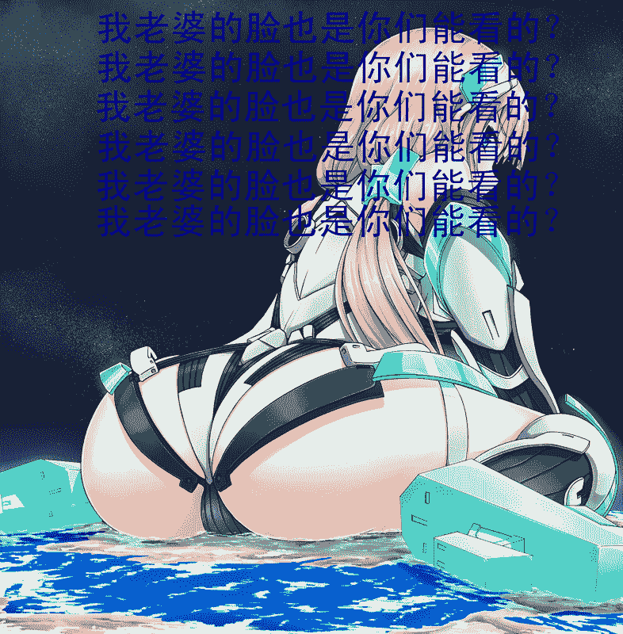

# 【十六夜】【翻译】女神族 （Giga、天然、然而只翻译了49%）

作者：zsd

TID：19740

<title>1</title> <link href="../Styles/Style.css" type="text/css" rel="stylesheet">

# 1

*本帖最後由 zsd 於 2015-8-31 07:49 編輯*

本汉化版由【狂气的Imagine Breaker，邪王真眼的适格者，终幕的Joker，世纪末的Kamen Rider，世界的破坏者，狂气的狂气的凤凰院当麻汉化组】制作
仅供日语学习使用。但是事实上译者本人也不懂日语，而且这个也没有像KRL字幕组一样提供中日对照，但是免责声明都这样说，我这边也只有这样说了
下载本作品之后，请在24小时之内删除。但是我从来都没有在24小时之内删除过下载的FLV，有时候还会刻盘收藏，还时不时的拷贝到别人的内存卡里传教，所以说说这个有什么卵用？但是免责声明好像都是这样说的
如果您喜欢该作品，请支持正版。不过说起来，这类网路小说的正版是什么样子的……这种东西真的有分正版盗版吗？说起来最近好久没有在新番看到字幕组的滚动式免责声明了，如果这个梗有人看不懂怎么办呢？但是不管有没有人看得懂，想玩梗的时候就是忍不住想要玩梗呢。所以说我就讨厌这种事情嘛，玩了梗结果没有人看得懂很尴尬不是嘛
最后…………

请于离开屏幕一定距离观看，并保持屋内明亮。

但是最近已经没有动画出现这个标语了，就算有通常也没有翻译……

总之……

祝阅读愉快。

================================================================

难以数清的「世界」轻飘飘的在空间里浮游着。
世界。
虽名为世界，却又并非常识之中的不规则球体。在这无边无际而又无限宽广的空间之际，浩如星海的大陆板块犹如群星一般缓缓的漂浮着。
在那之上有蔚蓝的大海，有巍峨的高山，有茂盛的森林，有广阔的沙漠。在那之上有哺乳动物脊椎动物无脊椎动物，有被子植物[蕨类植物](http://baike.baidu.com/view/68213.htm)[裸子植物](http://baike.baidu.com/view/13889.htm)，人类也理所当然的存在于其上。
各不相同的世界之中栖息着各不相同的种族。各不相同的世界之中养育着各不相同的文明。各不相同的世界乃是各不相同的「世界」。
在那仿佛并不存在所谓上下左右的边界一般辽阔无际的空间之中。无穷无尽的大陆如同点缀天空的云朵一样浮动着。
数不清的世界之中，有些世界已经发展出了先进成熟的科学技术。数不清的世界之中，有些世界栖息的种族有如家常便饭一般使用着魔法。数不清的世界之中，有些世界甚至被非人之物统治君临着。
在这无穷无尽繁星般的文明之中，掌握了在浮动着的各块大陆…或者说世界之间任意往返穿梭的技术的世界自然也是存在的，世界与世界之间并非相互隔绝，无时无刻不在进行着良性——交易，或是恶性——战争——的文化交流。只不过，对于这个无限宽广的空间而言，它们实在是太过微小了。即使是牵连着几个世界的大规模板块战争，若是宏观的以这个空间整体作为着眼点的话，那也只是不值得关注，也难以关注到的细枝末节而已。全部的全部，星辰一般灿烂的世界。一切的一切都作为这个雄伟壮丽的大自然组成的一部分，在这个无边无际的空间之中蔓延密布。
还有为这无尽的世界增添了生机与活力的无尽的人类们。以金属为羽翼，翱翔于云端之人。乘上大怪鸟的脊背，搏击于长空之人。借助奇异的王者基多拉的力量，游旅于天际之人。*
无穷无尽的人，充满活力的人，不可思议的人，遍布于这个没有边际的寂静空间自由的生活着。
然而，这并不代表着这个空间一定是安宁而祥和的。女神族。拥有着超越人类的想象的巨大的身体，神出鬼没于这个空间。毫无理由的毁灭了几个世界之后就会再一次消失在人们的视野中。任何一个拥有文明的世界都竭尽全力的寻求着应对她们的对策，不过，任何一个世界的文明都不具备抵抗她们哪怕一根手指的力量的能力。在这个寻不到边界的空间之中，她们确确实实的扮演着「神」的角色。
在某个于万千世界之中也毫不起眼的普通的世界之上，某个青年正在自己的田地里奋力的耕作着。挥下锄头，砸碎土块，肥沃的田地宛如名匠手中的艺术品一般，一点一点的在青年的锄下呈现出了完整的姿态。青年抹去流到了脸颊的汗水，暂且停下了手头的作业。与万千世界别无二致，乌云密布的时候就会下雨，天寒地冻的时候就会下雪。无论是这个大陆还是那个大陆，在这一点上并不存在什么差异。
「今年一定会有好收成……」
环视耕作了一多半了的自己的土地，青年露出了欣慰的笑容。
在那之后。
遥遥的苍穹之外，有什么东西逐渐出现在了人们的视野之中。看起来并不像是其它的大陆。那个东西在人们的视野之中逐渐变化的愈来愈大，或者说，应该是距离这座大陆愈来愈近了。青年终于认识到了事态的可怕。那个逐渐接近大陆的巨大的影子，毫无疑问的呈现出了曼妙的人形的姿态。
「不会吧……难道说……」
那是即使所有的世界一齐联合起来都不可能战胜的绝对力量的存在。女神族的身姿，烙印在了这个世界抬头仰望的每一个人的视网膜之上。

＊   ＊  ＊
很多很多的世界集聚在了一起，形成了一幅壮观又美丽的景象。那个地方是被各个世界上的人们称之为「银河」的大型世界交汇点。现在，女神族的成员之一艾露露游玩到了这里。
「呜哇哇，好多好多漂浮着的小东西欸~」
露出毫无防备的天真笑颜的巨大女孩，自银河的尽头轻飘飘的飞了过来。一个又一个，艾露露仔细的鉴赏着从自己身旁掠过的每一块大陆。
「呼呼呼……从哪里开始呢~」
艾露露注意到了一块刚好处于她脸颊上方漂浮着的大陆，于是她缓慢的向着那块大陆飘了过去，可爱的面庞渐渐的逼近了眼前的世界。栖息在这片大陆上的人们爆发出了凄厉的哀鸣声。在他们的眼中，比这块养育着几十亿人生存的大陆还要遥遥的巨大的美丽面庞，正在逐渐的取代着他们的天空。
从来不曾有人正确的计量出女神族人确切的身体大小来，毕竟她们任意一个都拥有着可以将人类赖以生存的巨大浮空大陆整个握在手中的无可比拟的巨大。她们也并没有以衣物来隐藏身体的习惯。大概是因为根本不存在那么巨大的衣服。现在正逼近着人类的大陆的那个名唤艾露露的女神族人，还是个尚处于豆蔻年华的青春少女。有着稚气未脱的可爱容颜与似乎与之并不相称的高高隆起的柔软胸部。手脚修长而又匀称，栗色的秀发被长长的束成了两束，宛如天使成对的羽翼一般。
艾露露向着那片大陆压低了脸庞。从她的角度来看，若是使用那个小小世界的人们约定俗成的测量单位来说的话，这片大陆对她来说只是7cm左右的小东西而已。大陆在比她秀气的鼻子要稍稍往下一些的地方浮动着。在生活在那片大陆上的人们的眼中，平时看起来无边无际的天空现在已经被艾露露面庞的上半部分所完全装满了。相比于那片大陆引以为傲的直径100km以上的最大的湖泊还要大上一百多倍的清澈瞳孔缓缓的眨动着。仅仅一只瞳孔就已经遮盖了这片大陆一多半的天空。艾露露的一次眨眼，对于这片大陆来说是整个天空颜色的改变。而作为这座大陆中枢的那座巨大都市，则刚刚好位于艾露露瞳孔的正中央处。
「那么首先从这里开始~」
从艾露露的视角来观察这片大陆的话，完全分辨不出这里的文明程度究竟是先进还是落后。人类建造的建筑实在太小了完全看不见。这里这里还有那里那里，在不晓得是森林还是草地的绿色面积之中零零星星突兀的矗立着的白色小点就是人类建造的城市吗？艾露露进一步贴近了脸庞。
「好小好小，这个就是城市吗？几万几万的人类就在这种渺小的不可思议的地方生活？真是令人难以想象呢。呐，从我这儿来看的话你们的城市只是一个个小小的白点喔，这么小的地方怎么可能住人呢？我的手指可是比它们要大得多呦~」
这样抱怨着的艾露露，一边讲着话一边将自己的小拇指笼罩在了那个城市的上空。
「锵锵，你们的小小点一样的城市已经被隐藏在我小拇指的影子里看不见了喔。」
艾露露咯咯咯的展露了笑颜。不过在她指尖之下现在正满满的的爆发着人们恐惧的悲鸣声。比这座城市的面积还要遥遥的宽广，难以比喻的超巨大的指尖笼罩了天空。黑夜过早的降临了。深邃的黑暗掩埋了这座城镇的每一个角落，目之可视的唯一之物只有天空之中向着四周无限延伸的巨大的指尖。那仅仅是一个纤细的少女最小的手指的指尖而已。
女神族人的身体大小是普通人类的100000000倍左右。即使是小拇指的指尖，粗细也有1000km以上。
「现在大家一定都在仰视我的指尖吧。怎么样？好漂亮好可爱对吧。」
艾露露稍稍晃动了一下手指。在人们的眼中，无边无际的整个天空都在摇晃着。
「呼呼呼，那么给你们特别的杀必死喔~允许你们整城的人都来触摸我的手指呦，真好呢真好呢。」
艾露露轻轻的放下了小拇指。她并没有打算压碎这座城市，只是想要稍稍垂下一点点小拇指的指腹而已。然而艾露露的大脑接收到了指腹触碰到了地面的触觉信号。当她抬起自己的小指的时候，原本就难以看到的人类的城市现在已经完全看不到了，只有指尖形状的塌陷痕迹被遗留在了那个地方。
「已经被压碎了吗？我只是轻轻的放下了手指而已欸。」
艾露露呆呆的将小拇指举到眼前观察，白皙的指腹上似乎沾上了薄薄的一层尘土。
「呒呼呼——」
艾露露简单的吹走了那层尘土。但是与此同时，这片大陆上的一切东西——山脉，海洋，森林，乃至于人类建造的都市，全部被这股带有少女香气的狂风自陆面上剥离，被吹飞到了遥远的地方。最后的最后有幸留下来的，只有成为了上面不存在任何生命的巨大孤岛的光秃秃的那片大陆。
「真是弱小呢……本来还想稍稍多玩一会儿来着……」
艾露露将整块大陆用一只手捏碎，然后朝向下一块大陆飘了过去。

＊＊
游啊游。女神族人并不仅仅拥有着举手投足就可以毁灭世界的巨大的身躯，除此之外，她们还拥有着各种各样的如同魔法一般神奇的强大能力。例如在这个广阔的空间之中自由的飞来飞去。艾露露现在正一边悠闲地在这个大海一般没有上下的空间之中慢腾腾的游动着，一边东张西望的环视着四周宛如海底的浮游生物似的数也数不尽的无数的大陆。
「接下来是哪一个呢？」
东张西望东张西望。艾露露那精致的小巧脸庞的每一次转动，她那对于渺小的人类来说几乎有自己的世界公转几十圈走过的距离的长度的双马尾都会在艾露露的脑后不安分的晃动着。如果不幸刚好处于艾露露的长发的「运行轨道」的正前方的话，那个世界一定会刹那间被艾露露柔顺的发丝撞得粉碎。即使有幸没有被艾露露的秀发所拂过，无数的大陆还是被艾露露以游泳的姿势前后划动着的手脚所卷入，过于轻描淡写的被简单的撞毁了。事实上，可以自由自在的在空间之中飞行的女神族人即使不必做这样麻烦的动作也可以前进。但是艾露露为了让更多更多的大陆无助的被撞碎在自己的身体上故意这样肆意的摆动着。一块命运多舛的大陆直接撞在了艾露露与她那稚气未脱的面容相较似乎有些过分发育了的硕大挺拔的乳房之上，过于强大的弹力使它在一瞬间就化作了浮游的碎石瓦砾。应该有几十亿人绝望的注视着自己本来就大的不得了的巨乳在他们的眼中变得越来越大，直到完全掩盖了他们的世界的整片天空，然后被自己单是一个就要比他们的整个世界要遥遥的巨大的双乳简单的撞毁吧。脑洞着仅仅发生在一刹那的惨剧案发现场的全过程，艾露露咯咯咯开心的笑了。
这个时候的艾露露眼睛捕获到了一座大陆。并不是因为那座大陆有着什么会吸引到艾露露的视线的特质。只是因为它刚好位于少女视野的焦点之处，仅此而已。
艾露露的瞳孔又一次取代了一块大陆的大半天空。眼睛眨啊眨，俯视着这个小小的世界。这块大陆相较于之前的那块大陆而言似乎并没有多大的差异，发达而又繁荣的文明在这里扎根生长，生机满溢的自然景观也最大限度的保留了下来。在那片美丽的绿色之间，白色小点一般的人类的城市也零零星星的四处散布着。
「为什么你们都这么渺小呢？即使你们出动军队，打算和我打一场战争的话，我只用一根手指就可以全灭你们喔。」
艾露露用指甲轻轻搔了搔其中一座城市以及城市周边的大地。于是，那座城市就这么消失了。只有对于这块大陆来说深度达到500km的超巨大深沟遗留在了那座城市的旧址之处。
「喏，这么简单就会被我毁灭的话，完全没有反抗我的资格喔。」
艾露露「呼」的吹走了夹在指甲缝之中的城市与大地，这一次吸取了上一次的教训，小心翼翼的吹走了指甲缝里的脏东西，不至于像上次一样一次将大陆表面的全部东西一齐吹跑。这次她更加更加挨近了小脸，闪闪发光的大眼睛更加用心的观察着这块大陆的表层。
「呜嗯嗯，这个1mm左右的小白点是你们最大的城市吗？比周围的其他小小点要容易看清的多欸。」
艾露露将自己的手指压在了那座大城市的一旁。整块大陆爆发了令大陆本身剧烈摇晃的超级大地震，这仅仅是因为艾露露放下手指造成的震动而已。
「连我的指尖的大小都没有，你们竟然可以在这么微小的地方生活吗？」
只是那座城市里已经不存在可以出来解答艾露露的疑问的人类了。当艾露露的手指放下来的时候，手指接触地面造成的冲击吹走了那座城市。
「啊，对了。大家都到我的手指上来吧。」
突发奇想并且坦率的说出了自己毁灭性的计划的艾露露，在另一座城市一旁的地面粗暴的插入了自己的手指。坚实的地面对于艾露露的手指来说有些过于脆弱，几乎没有受到什么阻力的，手指深深地陷入了地底。艾露露认真的调整了深入地底的手指的位置，让这座城市刚刚好位于自己指甲的上方，然后小心的抬起了手指。1000平方千米面积的地面被拘束在了指甲的孤岛上，脱离了大地母亲，被带向了高空。艾露露尽情的伸展四肢，高高的举起了那只手指，努力的试图将他们送到可以看到自己的身体的尽量远一些的地方。
「怎么样？漂亮吗？可以看得到我吗？」
在那不断的有「微小」的砂石滚落下去的，面积达到1000平方千米以上的少女的食指指甲之上，直径100km左右的那座大都市犹如一粒不起眼的沙粒一般孤零零的矗立在那里。绝大多数的居民因为强烈的地震等恐怖的灾害已经永远的停止了呼吸，至于有幸存活下来的居民，只能强迫自己接受自己居住的都市现在被放置在了一片粉红色的空旷平原上的这个事实。除了粉红色的地面与湛蓝的天空以外什么都看不见了。逃跑？怎么可能！这可是在女神族人的指甲上面啊。对于普通的人类来说，即便只是想要逃到女神族人指甲的另一头，也是要花费好几天的长途旅行。何况在这个无限广阔的平面之上，水与植物还有动物，这些东西哪怕一样都完全不存在。更不要说在遥远的地平线的彼端，作为放置着这些渺小的人类的手指的主人的女神族少女，正带着天真的笑容仔细的凝视着这一边呢。
「就算把你们带到这里了还是看不到你们呢，指甲也完全感觉不到重量。」
少女小心的收回了上面放置着一座城市的手指。然后将手指抬到眼前，俯视矗立在指甲上面的那座微小城市。
「呜哇哇，终于看到你们了呢。呒呒，一座大城市孤零零的在我的指甲上面呢，好可爱~」
城市中的居民目所能及的天空被少女的笑颜（的一小部分）彻底掩埋。
「好可爱好可爱~我只是稍微动一动这个手指对于你们来说都是大灾难呦。还有活着的人吗？有的话……抱歉呢，我没办法让这么微小的城市完好无损的回到大陆上去呢，不过如果这样的话……」
艾露露将指甲上放置着一座城市的那根纤指送到了樱桃小口之前。城市之中尚且存活着的居民们，仰视着替代了天空的少女粉嫩的双唇，久久不能言语。柔软粉嫩的樱色双唇缓慢的打开，然后稍稍缩拢。在整座城市的居民们都不解的呆望着少女的樱唇的时候，突然掀起的毁灭性的暴风直击了那座城市。整座城市，以及城市之中的所有居民，在接触到巨大暴风的那一刹那，就被带着浓烈的少女香气的暴风彻底碾碎了。
「呼——」
艾露露用力的呼出一口气。那个瞬间，指甲上的城市消失了。

＊＊此时尚在艾露露的胸前漂浮着的大陆……
「一起去吧~」
艾露露一把将整个大陆攥在手里，轻松的将整个大陆倒转了过来。栖息在这座大陆上的一切生灵，全部的全部都朝向没有尽头的虚空掉落了下去。
＊＊
此时尚在艾露露的胸部下方漂浮着的大陆……

「咕噜噜噜噜噜噜噜噜————」
艾露露的肚子发出了空腹的抗议。那个时候，在艾露露没有一丝赘肉的平坦小腹前方漂浮着的大陆之上，使得整块大陆摇晃的巨响震破了栖息在这块大陆上的所有人的耳膜，超越了自然所可以造成的任何一级地震的巨大震荡将人类所建造的坚固城市化作了一片瓦砾。
「肚子饿了呢……」
说出了这样不祥的话语的艾露露，大大地眼眸盯上了飘到自己眼前的那块大陆。
轰隆隆隆隆隆隆隆————
可以将万人敬仰的最高山峰像饼干屑一样碾平的纤纤五指，现在紧紧地扣住了那个大陆的两端。
「要吃的饱饱的~啊—————」
艾露露毫不矜持的张开了樱桃小口。大陆上的人们抬头仰望着遮盖天空的双唇。那个大洞差不多有几千千米吧？有着樱花一般美丽颜色的双唇，单是一瓣的厚度也不少于1000km吧。在那里面整齐排列着的皓齿，每一个也是与之差不多同等水平的巨大。一座城市简单的就可以咬碎。对于人类渺小的城市而言，一颗牙齿的面积对于它们来说也似乎过于广阔了。比整个大陆还要巨大的大洞窟的窟顶，凌驾覆盖整个大陆的海水总和的少女唾液毫不留情的向下流淌。然而几十亿人世代生存的大陆现在正在逐渐被推入那瓣恐怖的小口之中。光线开始变得暗淡。带有女孩子的味道的热气与湿气取代了清爽的空气在陆面上弥漫。直到一小半大陆埋入了少女的口中的时候。无比巨大的洁白皓齿有如断头台一般上下闭合了。
咯吱。
大陆被少女咬碎了一小半。尚未进入艾露露口中的一部分大陆被嘴角隔开了。半块大陆的缺口之处留下了鲜明的断痕。那是一个巨大的齿形。至于已经被关在艾露露口中的人类，已经没有再提到他们的必要了。被留在外面的那大半大陆上的人们仰望着精神的做着上下运动的双唇。口中的那半大陆与少女的唾液一起被搅成了一团，连同那些可怜的人们一起沉没在唾液的海洋之中，在被咽下喉咙的那一瞬间溶化了。然而多半的人类早在此之前，就已经被碾碎在了少女巨大的牙齿与巨大的舌头之间，连同养育自己的大地母亲一同化作了少女腹中的养料。
咕咚。
吃掉了大陆的一部分的艾露露向自己手中的大陆上的人们搭起了话。
「还是一点都不好吃。但是不用担心，女神族的肚子都很结实，不会吃坏肚子的，所以剩下的部分也得好好地吃掉才行呢。」
大陆上的人们已经无言以对。
咯吱咯吱。
咯吱咯吱。
啪嗒啪嗒啪嗒。
艾露露大口大口的咬碎大陆。手中的大陆在少女的大快朵颐之下变得越来越小，不一会儿就完全消失在了少女的口中。艾露露一边抚摸着肚子一边不满的嘟哝。
「讨厌……一点都不够嘛……」
少女的细手又一次握住了一块大陆，粉嫩的嘴角笼罩在了世界的上空。这一次用舌头舔舐整个大陆。有着这块大陆一半大小左右的香舌滑过大陆的表面。城市、海洋、森林、山脉，无论是什么都被压倒性巨大的舌头在一瞬间抹平。舌头通过的陆面无一不化作了赤裸的荒地。
有时候艾露露会小心的调整舌尖的位置，仔细的将人类的城市黏在舌头上送入口中。
「碰到这个的时候就会变得非常好吃呢，这个是城市的味道吗？」
品尝到了美味的艾露露开始以人类的城市作为目标，向着它们碾压下了凌驾城市数百倍大的自己的舌头。品尝到城市的那个瞬间，艾露露感受到了自己寻求已久的美味与快感。
「好好吃！人类实在太过于微小了，几十几百亿的聚集起来也感觉不到味道。但是用舌尖的话就可以好好地尝出美妙的味道来。」
大陆上可以被艾露露看到的城市没一会儿就已经被艾露露舔舐一净了。只剩下被艾露露拿在手中的，表层遍布着少女的香舌滑过形成的巨大鸿沟的坑坑洼洼的大陆。即使是高耸的巍峨山脉，在艾露露的舌头形成的鸿沟之前，看起来也只不过是浮在地面上的一小堆尘土而已。
「已经没有可以吃的东西了呢。」
吃剩下的大陆被少女稍稍合拢的小手捏碎了。
艾露露张开了那只柔软的小手，数万数亿万吨的泥土沙石从少女的指缝间散落了下去。
肚子已经吃得饱饱的了。但是还是想要再品尝一次那个美妙的味道。艾露露伸手拿起一块大陆，张开樱口将大陆在唇边倾倒。大陆上的所有的人类以及人类所建造的文明之物都咕噜咕噜的滚落到了艾露露的口中。一块大陆上的几十亿人对于艾露露的樱口来说过于微不足道，于是一块又一块宽阔无际的大陆被艾露露柔软的小手握在手心里，其上面数以亿计的人类被咕噜咕噜的倒入少女可爱的口中。
艾露露的口中。不知道是不是又回想起了那个美妙的味道，少女的口中早早地溢出了香甜的唾液。至于不断地以亿为单位被丢入少女口中的渺小的人类，落入口中的刹那就会被淹没在远远凌驾了自然界任何一处大海的唾液的海洋之中，不到一会儿就会溶化的连骨头都不剩下。
混合着几百亿人的少女唾液。艾露露满足的品尝了舌尖上向着味蕾扩散的美妙的滋味，然后将那搅拌着数百亿的微尘一般渺小卑贱的人类的唾液咕咚一声咽下了。
「真好吃~」
最后一下捏碎了手中吃剩下了的大陆。将粘在洁白的手心上的数千万吨的微尘毫不费力的吹走。
「接下来要尽情的去玩————」
肚子装的满满的。开心笑着的艾露露向着下一个地方游去。
　＊＊＊
又一块大陆被狙击了。艾露露捻起了自己的一束马尾，将拢起的发梢当作刷子，刷洗起了一块大陆。大陆被少女柔顺的秀发温柔地抚摸，表层之上的森林与城市刹那之间就被碾碎了。
「呼呼呼，连我的头发都敌不过呢，真是弱小的存在~」
唯一幸存下来的已经变得光秃秃的了的大陆本身，现在也陷入到了艾露露的马尾之中，被发丝紧紧地缠住了。啪沙。大陆在少女的发丝之间轰然解体。梳去沾附在自己漂亮的长发之间的原本是一座伟大的大陆的尘土，艾露露朝向下一个地方游了过去。　＊＊＊
「啊……」
艾露露突然开始东张西望了起来。想要做一些羞羞的事情，不过在这个虚无的空间之中是没有树荫之类的地方的。
「呜……怎么办嘛……」
这个时候艾露露注意到与自己及腰高的地方有一块大陆漂浮着。
「……呜嗯……附近好像没有人……」
艾露露匆匆忙忙的回转自己的身体，让自己的臀部压迫在了那座大陆的上空。若是以那座大陆上的居民的视角来看的话，比这座大陆还要巨大好几倍的女孩子的臀部突然遮掩住了天空。人们仰望着不断逼近的臀部张开的裂口，不禁产生了自己的城市马上就会掉进那个巨大的肛门里的错觉。迫近。少女的臀部继续迫近。城市中的居民现在已经眺望不到遮蔽天日的肛门以外的景象了。
难道她想要用臀部压碎整块大陆吗？
似乎并不是这样呢。迫近的臀部停下了动作。人们眼中的整个天空都被无边无际的肛门所支配了。她究竟打算做什么？然后，取代了天空的肛门发生了强烈的摇晃。尚且还在疑惑之中的人们，与城市一起被吹跑了。
噗~
这样的声音传到了艾露露有些泛红的耳朵里。
「嘛~真是的，好害羞……」
这样抱怨着的艾露露，脸上却浮现出了开心的笑颜。少女转过身子来饶有兴致的观察被自己的屁直击的大陆。表层的一切都被完全吹跑的大陆现在已经失去原型了。大半部分都被爆炸气浪一般的屁所粉碎，但是即使如此还是顽强的没有坠落。以这种凄惨的模样依然漂浮在空中的大陆，看起来反而更加的悲惨了。艾露露为了观察地表的形状而稍稍贴近了小脸。一股异臭钻进了她的鼻子。
「呜哇！好难闻！」
艾露露慌忙捂住了鼻子，另一只手将那座大陆拍到了一边。被艾露露与光速无异的速度挥出的小手撞击到的那块大陆，毫无阻力的被撞碎了。
解决了令人害羞的生理需求之后，艾露露又开始东张西望的寻找其它可以作为玩具的大陆。不过，受到刚才的「生理需求」的直接冲击，这附近的大陆已经一个不剩的全部被吹走了。
　＊＊＊
这一个大（wan）陆（ju）与在此之前所玩弄过的大陆稍稍有所不同。到处都是正处于活跃期的火山，浓烈的烟雾不知疲倦似的被喷射到天空之中。大地给人一种荒芜的感觉。那是连艾露露堪比大陆直径尺寸的巨大瞳孔都能够注意得到的极大的文明差异。
「什么样的生物能够住在这种地方嘛？」
少女压低脸观察这座大陆的表面。

「趁现在！」
说时迟那时快，静候这个时刻已久的数不尽的巨龙展翅飞离了蛰伏已久的地面。它们的脊背上登载着全副武装的战士。想要亲手斩杀女神族人的这块大陆的勇者们，在这绝好的机会来临之际集合了起来。此时此刻，以飞龙为坐骑的龙骑士们瞄准了使整块大陆蒙上阴影的巨大脸庞，勇猛的成群结队冲了上去。然后。
超乎想象的巨大气流粉碎了他们的勇气与野心。那是艾露露的鼻息。同时，那又是即使是万物的王者，睥睨苍生的巨龙都完全无法与之抵抗的灭世级别的暴风。
「哇啊啊啊啊啊啊啊啊啊啊啊啊啊啊啊啊啊！！！！」
惨叫着的庞大数目的勇者，被天空中的那两个黑暗的入口全部吸了进去。艾露露甚至没有察觉到自己的一次普通的呼吸将无数的龙和龙背上的勇者吸进了鼻孔。不要说打喷嚏了，连让艾露露的鼻子感到痒痒的程度都没达到。作为万物之王的巨龙那庞然的身躯，在艾露露的一根鼻毛之前就像是灰尘一样。连被鼻毛阻挡的资格都没有就直直的飞进了艾露露的气管。一些不幸的巨龙与它们脊背上的勇者，在艾露露宽数公里长数百公里的鼻毛之上撞得粉身碎骨。而更多地空战霸主被撞碎在了更加广阔的少女的鼻腔内壁上。这一次壮世的倾巢出击，结果只是为艾露露的几根鼻毛和鼻腔的内壁增添了几个难以察觉到的小小红点而已。没有一个人或者一条龙活着逃回来。而且，由始至终艾露露都没有发觉到他们的存在。
　＊＊＊
艾露露把脸贴近大陆，认真的凝视着大陆的表面。连眼睛都忘记了眨动的认真程度。发干的瞳孔溢出了泪水，感到眼睛涩涩的地艾露露啪嗒哒的眨了一下眼睛。于是一滴眼泪朝着大陆的表面向下落去。
咚隆隆隆隆隆隆隆隆隆隆隆隆隆隆隆隆隆隆隆隆！！！
那是直径超过了300km的一滴眼泪。眼泪落地的瞬间就把一片山脉压碎，城市也在转眼间就被泪水的海洋所淹没。被泪珠直击大陆造成的巨大地壳运动摇晃的东倒西歪的这块大陆的居民们，连逃走的机会都没有就溺死在了这从天而降的咸味的洪水之中。
　＊＊＊
咚咚！！！！！！！！！！！
比整块大陆还要更大的少女的足底踩碎了那块大陆。艾露露以那块大陆作为重心迅速的回转自己娇小的身体，然后用柔嫩的脚后跟踩碎了另外一座大陆。接下来，连续三块大陆被艾露露稍稍抬起的一只脚接连撞毁了。艾露露轻轻踮起一只脚的脚尖，优雅的跳到了一块大陆的上面。正常来讲与一个超巨大少女的脚尖直接冲撞的大陆不可能还可以以碎屑之外的形态继续幸存着才对。不过对于可以在空间之中自由浮游的女神族来说，完成这种小事完全不足挂齿。以不至于将其直接踩碎的力度跳到一座大陆上，然后再稍加用力轻轻地跳到另一座大陆上。就像是小孩子玩跳房子一样，在大陆与大陆之上一蹦一蹦开心的跳跃玩耍。只是被艾露露踩到的大陆会留下艾露露的脚尖踩出的巨大足印，半个世界会被少女独有的五只可爱的脚趾碾平。艾露露的一根脚趾就可以碾碎两座城市呢。一只脚的宽度是8000km。从另外的大陆眺望的话，可以清楚的看得到碾平了半块陆面的脚尖的印痕。如果一个普通的人类想要穿过艾露露的大拇趾留下的痕迹的话，需要多长的时间呢？艾露露大拇趾的宽度是2000km。人类步行的平均时速是4km，以这个速度穿过这个距离所需要的必要时间是500个小时。不眠不休的走上大约20天才可以穿越艾露露的大拇趾留下的痕迹。如果接下来食趾的痕迹也要穿越呢？如果接下来中趾的痕迹也要穿越呢？用刚才的计算方式进行计算的话，横穿艾露露的足印需要用80天的时间。餐风饮露的行走两个半月才能够走出少女的足印。如果要纵向穿过这个形状优美的足印又会怎么样？艾露露一只脚的长度是24000km。这样一来使用刚才的计算方式就要额外再乘以三倍。横向穿越少女足印所需要的天数乘以三倍，那就是240多天。也就是差不多八个月的时间。不眠不休餐风饮露持续步行八个多月的时间，才终于能够纵向穿过艾露露一只脚的脚印。那可是足以让季节更迭三次的长久岁月。八个多月的长久岁月，只能走过巨大少女一只脚踩踏出的平整荒野而已。站在那片荒野之中，遥遥的可以眺望的到远方的地平线。不对，地平线的位置是不是有些太高了？那只是艾露露的脚弓部分踩出的足印而已。若是普通的人类站在艾露露脚跟踩出的足印之中极目远望，艾露露的脚弓部分留下的足印简直有如无限宽广的地平线一般。女神族只需要放下一只脚就可以追过我们花费八个月所走过的距离。女神族只需要迈出一小步就可以到达我们花费两年所能走过的距离。普通人类的平均寿命是80年。假设一个人从出生到80岁，始终都以平均时速持续匀速行走。他所走过的距离对于女神族来说也只是不过40步就可以到达的距离而已。人类从出生到死亡为止所可以走过的全部路途，对于巨大的她们来说，只不过是步行不到一分钟就可以远远甩过的距离而已。极端悬殊的大小差异，使得所有的人类都只得永远的生活在女神族的脚下。
在女神族的手指之前，群山峻岭并没有什么差异。1000m的山脉对于艾露露来说只是0.1mm的细砂。即使被艾露露的指尖碾平了，恐怕艾露露都不会察觉到自己的指尖刚刚碾平的一座在人类眼中高不可攀的细砂吧。艾露露的指尖只是轻轻抚过这座大陆，指尖向左右两侧堆起的泥土都能在转瞬间远远超过那座山脉的标高。在艾露露的指尖之前，1000m的高山只有0.1mm，100m的摩天大厦也只有0.001mm。人类的话，即使是两米多高的彪形大汉，在艾露露的指尖之前也仅仅是极端微小的0.00002mm。若是要将世界整个把握在手中玩弄的艾露露直接站在人类面前的话，微生物一般极端渺小的人类连她的一只脚趾都难以仰视吧。若是那只脚趾稍稍挪动一下，上千万的人类会在一瞬间被碾死。
艾露露现在还在开心的在一座一座大陆之上跳来跳去。然而在脚尖踏在下一座大陆上面的时候，那块大陆大幅度的朝向前方滑去。大概是搞错了应用的力度吧。一只脚失去了平衡的艾露露像是踩到了香蕉皮的卡通人物一样以屁股着地的方式向后倒下。
轰隆隆隆隆隆隆隆隆隆隆隆隆隆隆隆！！！
许多大陆被撞飞，然后联锁相撞，撞飞了更多的大陆。在那巨大的臀部之下，好多的大陆被毁灭了。
「……真是的！」
艾露露伸展四肢挺起了身子，轻飘飘的浮力再一次回到了她的身上。
「真是真是真讨厌！差一点就可以打破上一次的记录啦！」
艾露露啪嗒啪嗒的掸掉臀部沾上的尘土。许多贴附在少女臀部上的大陆碎块被巨大的手赶开了。
「……」
鼓起脸颊的艾露露握紧拳头，打坏了附近所有可以看得到的大陆。无法计量的世界被这孩子气的迁怒所毁灭了。　＊＊＊
「啊~啊，好无聊喔……接下来做什么好……」
无重力的空间之中，艾露露以仰泳一样的姿势悠闲地漂浮着。一块大陆从艾露露的身旁飘过，撞在了艾露露高高隆起的胸部上。
噗呒。
撞在了艾露露柔软的胸部上的大陆，被优秀的弹力弹离了它原本的运转轨道。然而艾露露支起身子来一把握住了那座大陆。
「什么嘛，撞到了女孩子的胸部就想逃？太没有礼貌了。」
这样说着的少女将那座大陆抓到了胸前，并且炫耀一般的晃动着自己傲人的巨乳。
「无论如何都想要触摸我的胸部吗？没问题的喔，不过只给这座小岛上的人们摸。」
艾露露将那座大陆进一步招呼到了她那对自傲的巨乳前方。乳首稍稍压住了那个小岛。当艾露露挪开小手的时候，那座岛已经被艾露露乳首的一小部分压碎了。
「真是一群色鬼呢，整座岛都是。」
用手指拂去沾附在乳首上的尘土（人类的一整座岛），艾露露再次横躺了下来。她感到身体有一点不可思议的热度。
「呜嗯……不知道为什么，这样做的话心情会很舒畅……」
蓦地直起了身子的艾露露重新握住了那座大陆，这一次把它放在自己胸前与自己胸部的大小比较。单是一边的乳房都要比这整座岛要压倒性的巨大。
「这一次所有人都来摸摸看吧……」
艾露露的乳首逼近了这座大陆。只是乳首就要比这座大陆上的一切都要巨大。薄薄的云层高悬在这座大陆的上空，但是艾露露乳首的高度远远的超过了云层所能达到的最大高度。终于，乳首触碰到了大陆。
「呀………」
心情变得不可思议的舒畅。这座大陆已经被自己过于巨大的乳首撞坏了吧。当然这种事情无论怎么样都无关紧要。握住大陆的小手更加用力的用大陆来压迫自己的乳首。
「呀……呀啊……」
轰隆隆隆隆隆隆隆隆隆隆隆隆隆隆隆隆隆隆隆隆！！！！！
勃起变硬的乳首不断地在陆面之上划出不可逾越的海沟。加上用力向上按着的手的力量，乳首对于陆面的破坏力变得越来越大。没过多久，整座大陆毁灭在了少女的小手与胸部的夹缝。少女就这样用压碎了整座大陆的小手继续爱抚自己的乳首。按着自己一只手根本抓不过来的乳房用力的揉动。在少女的纤纤细手与雪白酥胸之间，大陆已经完全化作了碎末。
艾露露一把抓来了另一座大陆。马上把它压在了自己的胸部前端。对于人类来说赖以生存的大陆，对于少女来说只是弄坏了还有好多好多的一次性的玩具而已。艾露露晃动自己的胸部，用乳首的前端来划弄陆面。
咚隆隆隆隆隆隆隆隆隆隆隆隆隆隆隆！！！！！！
乳首毁灭大陆的那一瞬间，极大的快感从头到脚充斥了艾露露的身体。艾露露上下晃动的巨大胸部掩埋了漂浮在胸部下方的大陆的天空。少女注意到了一座人类的城市。于是，还没玩够的艾露露在那座城市附近的地面埋入了自己巨大的乳首。抬起胸部。陆面上只剩下了一个乳头形状的峡谷。城市什么的已经找不到了。那座城市大概现在正粘附在我的乳首上面吧。想到这里的艾露露爆笑了起来。
「咯咯咯……咯哈哈哈哈哈哈哈哈哈哈！！！！！！！！」
笑的上气不接下气的艾露露，丰满的胸部也跟着一起上下剧烈起伏。于是那座大陆被巨大的胸部直击，理所当然的毁灭了。
还不够……身体还想再要更多。艾露露再一次横躺了下来。伸手拈起身边漂浮的大陆，在自己的胸部上方倾倒。少女打算让人类来帮忙爱抚自己的胸部。艾露露胸部的高度有10000km，即使是乳首的高度也有1000km。姑且不论平均不到2m左右的人类。就连3000m高的山峰，都只有少女乳首的1/300以下的大小。连那座山峰都难以登上去的人类，无论怎么想都不可能登得上比那山峰还要高耸三百多倍的艾露露的乳首。更不要说爱抚它了。艾露露在胸部上方倾倒了好多个大陆。人类以一次几十亿的数量被补充到艾露露的乳沟中。从恐怖的高度被直接丢下的他们，在理论上应该不可能还有存活下来的机会。但是少女柔软又富有弹性的乳房很好的保护了他们的身体。从艾露露的手中向着乳房坠落的时候，很多数量的人被艾露露柔软的乳房弹飞。运气好的人从艾露露10000km的乳房滚下，落入了艾露露的乳沟之中。运气差的人就这样化作星星消失在了天空的彼端。现在，只是艾露露乳首上的一丝纹路之中都有无数微生物一般渺小卑贱的人类在里面呆呆的趴趴走。俯视着那样微小的他们，艾露露对他们发出了绝对的命令。
「要做什么你们心里都已经很明白了吧？要把我服侍开开心心的喔。」
如果拒绝她的话不知道会被她做些什么……
被困在名为少女的胸部巨大孤岛上的人们只得开始想办法着手应付自己脚下的这座雪白的山脉。数十亿的人类，数百亿的人类，开始着手爱抚艾露露一边的胸部。
「……」
虽然说数量达到了数百亿这个看起来不得了的数目，但是毕竟他们还是艾露露眼中微生物一般渺小的人类。即使拼上性命做了什么也不能让艾露露有丝毫的触感。原本稍稍有点期待才这样做的。相对之下，明明已经将几百亿数量的人类集聚在了自己的胸部之上，自己却还是完全无法观察到那些即使再用心也看不到的渺小生命。人类这种程度的东西。对于过于巨大的自己来说就只是这种程度的弱小存在吗。
「心情一点都不舒畅……而且还有些难为情……」
艾露露黯然的直起了身子，丰满的胸部也随之一起上下晃动。于是集聚在艾露露胸部上的上百亿数量的人类就这样全部从艾露露的胸部掉落到了无尽的虚空之中。

　＊＊＊
「唉……」
刚才似乎想得太多了，心情暗淡的艾露露一边叹着气一边游走着。一点游玩的心情都没有了。一块大陆掠过了消沉的艾露露的视野。在那块7cm左右的大陆之上，小小白点一样的人类的城市一如既往的散布在那里。
「就算知道那个是人类的城市…里面居住的人类也完全没办法看见，他们实在是太渺小了…唉……一点价值都没有……」
唉……
艾露露消沉的叹息。于是那座大陆上的城市都被吹跑了。
等一等喔……一个之前从未想过的念头突然划过了艾露露的脑海。对了！正是因为看不见他们才会感到无聊。只有能够看得见他们不就可以了吗。艾露露急忙去寻找人类的城市。人类的城市实在是太多了，几乎在下一个刹那间就已经找到了。
「啊啊，嗯，呦西~」
艾露露开始了祈祷，使用某种魔法的祈祷…………

【未完 翻译进度49%】【由于译者后天开学，该帖子停止翻译】【大召唤术 @that123 】

<ignore_js_op>

**angelabakzac_副本.jpg** *(912.91 KB, 下載次數: 1)*

[下載附件](forum.php?mod=attachment&aid=NTQxMzl8MDY0NThmNmR8MTYwMDg4NjkwNnwxODIzMHwxOTc0MA%3D%3D&nothumb=yes)

2015-8-29 22:24 上傳

稚嫩的面孔，不科学的巨乳，栗色的双马尾，无论如何都只能想到我家的安洁拉嘛。诶？你问奇怪的弹幕是怎么回事？我完全不知道的说。</ignore_js_op>